# Ms-117

164 published remarks, RFM II, VB, RFM III

### [IIr\[1\]](https://cdn.wittgensteinnachlass.com/2000px/webp/Ms-117/IIr.webp)

## Philosophical Remarks XIII

### [1\[1\]](https://cdn.wittgensteinnachlass.com/2000px/webp/Ms-117/1.webp),[2\[1\]](https://cdn.wittgensteinnachlass.com/2000px/webp/Ms-117/2.webp),[3\[1\]](https://cdn.wittgensteinnachlass.com/2000px/webp/Ms-117/3.webp),[4\[1\]](https://cdn.wittgensteinnachlass.com/2000px/webp/Ms-117/4.webp),[5\[1\]](https://cdn.wittgensteinnachlass.com/2000px/webp/Ms-117/5.webp),[6\[1\]](https://cdn.wittgensteinnachlass.com/2000px/webp/Ms-117/6.webp),[7\[1\]](https://cdn.wittgensteinnachlass.com/2000px/webp/Ms-117/7.webp),[8\[1\]](https://cdn.wittgensteinnachlass.com/2000px/webp/Ms-117/8.webp),[9\[1\]](https://cdn.wittgensteinnachlass.com/2000px/webp/Ms-117/9.webp),[10\[1\]](https://cdn.wittgensteinnachlass.com/2000px/webp/Ms-117/10.webp),[11\[1\]](https://cdn.wittgensteinnachlass.com/2000px/webp/Ms-117/11.webp),[12\[1\]](https://cdn.wittgensteinnachlass.com/2000px/webp/Ms-117/12.webp),[13\[1\]](https://cdn.wittgensteinnachlass.com/2000px/webp/Ms-117/13.webp),[14\[1\]](https://cdn.wittgensteinnachlass.com/2000px/webp/Ms-117/14.webp),[15\[1\]](https://cdn.wittgensteinnachlass.com/2000px/webp/Ms-117/15.webp),[16\[1\]](https://cdn.wittgensteinnachlass.com/2000px/webp/Ms-117/16.webp),[17\[1\]](https://cdn.wittgensteinnachlass.com/2000px/webp/Ms-117/17.webp),[18\[1\]](https://cdn.wittgensteinnachlass.com/2000px/webp/Ms-117/18.webp),[19\[1\]](https://cdn.wittgensteinnachlass.com/2000px/webp/Ms-117/19.webp),[20\[1\]](https://cdn.wittgensteinnachlass.com/2000px/webp/Ms-117/20.webp)

September 11, 1937

“But are the transitions _not_ determined by the algebraic formula?” – There is a mistake in the question. We use the expression: “the transitions are determined by the formula …”. How do we use it? We can, for example, speak of people being brought, through education (training), to use these formulas in such a way that everyone, when substituting the same number for _x_, always calculates the same number for _y_. Or we can say: “These people are educated in such a way that they all make the same transition at the same stage upon the command ‘+3’.” We could express this as follows: “The command ‘+3’ completely determines every transition from one number to the next for these people.” (In contrast to other people who, upon hearing this command, do not know what to do, or whose reactions to it are certain but differ in nature.) On the other hand, we can contrast different types of formulas & their corresponding different modes of use (different types of training). We then _call_ formulas of a certain type (& their corresponding mode of use) “formulas that determine a number y for a given x” & formulas of another type those “that do not determine the number y for a given x.” (y = x² + 1 would be of the first kind, y &gt; x² + 1, y = x² ± 1, y = x² + z of the other.) The statement “The formula … determines a number y” is then a statement about the form of the formula. And we must now distinguish a statement such as “The formula I have written down determines y” or “Here is a formula that determines y” from a statement such as: “The formula y = x² determines the number y for a given x”. The question: “Is there a formula there that determines y?” then means the same as: “Is there a formula of this type, or of that type?”, but what are we to make of the question: “Is y = x² a formula that determines y for a given x?” is not immediately clear. One might ask this question of a student, for example, to check their understanding of the use of the expression “determine”; or it could be a mathematical problem to determine whether there is only one variable on the right-hand side of the formula, as in the case of y = (x² + z)² ‒ z(2x² + z). One can now say: “How the formula is intended determines which transitions must be made.” What is the criterion for how the formula is intended? Surely the way we constantly use it, the way we were taught to use it. We say, for example, to someone who uses a symbol unknown to us: “If by ‘<math class="stacked" display="inline"><mtable rowspacing="0.1em"><mtr><mtd><mi>x</mi></mtd></mtr><mtr><mtd><mo>∼</mo></mtd></mtr><mtr><mtd><mn>2</mn></mtd></mtr></mtable></math>’ you mean x², then you get _this_ value for y; if you mean √x, then _that one_.” – Now ask yourself: How does one use “<math class="stacked" display="inline"><mtable rowspacing="0.1em"><mtr><mtd><mi>x</mi></mtd></mtr><mtr><mtd><mo>∼</mo></mtd></mtr><mtr><mtd><mn>2</mn></mtd></mtr></mtable></math>” _to mean_ one thing or the other? _Thus_, the intended meaning can determine the transitions in advance. “But where, then, lies the peculiar relentlessness of mathematics?” – Is not a good example of this the relentlessness with which 1 is followed by 2, 2 by 3, 3 by 4, and so on? – Surely this means: in the _series_ _of cardinal numbers_, – for in another series, something else follows, does it not? And is _this_ series not _defined_ precisely by this sequence? – “So are you saying that _any_ _way_ _of_ counting is equally correct & that everyone can count however they want?” – We would probably not call it “counting” if everyone _simply_ recited numbers one after another; but of course it is not simply a matter of terminology. For what we call “counting” is, after all, an important part of the practice of our lives. Counting and arithmetic are, for example, not simply a pastime. Counting (and that means: counting _in this way_) is a technique used daily in the most diverse tasks of our lives. And that is why we learn to count the way we do: through endless practice, with relentless precision; that is why we are inexorably urged to say “one,” “two,” “two,” “three,” and so on. – “But is this counting merely an _use_? Does this sequence not also correspond to a truth?” The _truth_ is that counting has proven itself very well. – “So are you saying that ‘to be true’ means to be useful (or practical)?” – No; rather, that one cannot say of the natural number sequence—just as one cannot say of our language—that it is true, but rather: that it is useful &, above all, _that it is used._ “But does it not follow with logical necessity that you get 2 when you add 1 to 1 & 3 when you add 1 to 2, and so on; & is this inevitability not the same as that of logical inference?” – Yes! It is the same. – “But does not logical inference correspond to a truth? Is it not _true_ that this follows from that?” – The sentence: ‘it is true that this follows from that,’ simply means: this follows from that. And how do we use this sentence? – What would happen if we inferred differently—how would we come into conflict with the truth? Here one must make clear what inference actually consists of. One might say, for example, that it consists in the transition from one assertion to another. But what does that mean? Does it mean that inference is something that takes place during the transition from one assertion to another, that is, _before_ the other is uttered—or does it mean that inference consists in letting one assertion follow the other, that is, in uttering it after the other? Misled by the particular usage of the verb “to infer,” we are prone to imagine that inference is a peculiar activity, a process within the mind, as it were a brewing of mists from which the conclusion then emerges. But let us see what actually happens here! On the one hand, there is a transition from one proposition to another via other propositions—that is, through a chain of inference—but we need not speak of this transition, since it presupposes another kind of transition, namely, from one link in the chain to the next. And here, too, there is a process that can be called a transition _between_ links. There is nothing mysterious about this process; it is a derivation of one proposition from another according to a rule, a comparison of the two with some paradigm that represents the schema of the transition, or the like. It can take place on paper, orally, or “in the mind,” that is, in the imagination. However, the conclusion can also be drawn in such a way that one statement is uttered after the other without a process of transition; or the transition consists merely in our saying: “So,” or “It follows that,” or the like. We then call it “concluding” when the concluded sentence _can_ actually be derived from the premise. What does it mean, then, that one proposition _can_ be derived from another by means of a rule? Can’t everything be derived from everything else by means of _some_ rule? – What does it mean when I say, for example: this number can be obtained by multiplying those two? This is obviously a rule that states that you must obtain this number if you multiply _correctly_; & we can obtain this rule by multiplying the two numbers, or in some other way (although any operation that leads to this result can also be called a ‘multiplication’). We say I have multiplied when I have performed the multiplication 165 × 363, but also when I say: “4 times 2 is 8,” even though no calculation led to the product here (though I could have _calculated_ it). And so we also say that a conclusion is drawn where it is not calculated. But the rule of inference must be such that the conclusion _must_ be true if the premise is true. So if I have recognized the premise as true, the conclusion must be such that a discrepancy between the conclusion and reality is ruled out. – And this is only possible because I accept nothing but such a discrepancy if reality corresponds to the premises. “But I may only conclude what truly _follows_!” – Does that mean: only what follows according to the rules of inference, – or does it mean: only what follows according to such rules of inference that correspond to some reality? Here we vaguely envision that this reality is something very abstract, very general, and very rigid. Logic is a kind of ultraphysics, the description of the ‘logical structure’ of the world, which we perceive through a kind of ultra-experience (with the intellect, for example). We might have conclusions in mind here such as this: “The stove is smoking, so the stovepipe is misaligned again.” (And _this_ is _how_ this conclusion is drawn! Not like this: “The stove is smoking, and whenever the stove smokes, the pipe is misaligned; therefore …”.) What we call a ‘logical conclusion’ is nothing but a transformation of expression. The conversion from one unit of measurement to another. On one edge of a ruler, inches are marked; on the other_, centimeters_. I measure the table in inches and then switch to centimeters _on the ruler_. – Or like this: I fill a vessel with water, then I pour the water into a measuring cup (over) and finally I weigh this water to obtain another expression for the vessel’s contents. And of course, there is also right and wrong in the transition from one measure to another; but with what reality does the “right” correspond here? Probably with a _convention_, or the _use_, and perhaps with practical needs. How would we come into conflict with the truth if our measuring rods were made of soft rubber instead of wood and steel? “Well, we wouldn’t know the correct measurement of the table.” – You mean we wouldn’t obtain, or wouldn’t reliably obtain, _the_ measurement we get with our hard rulers. So whoever measures the table with this soft ruler and makes the assertion that it now measures 1.80 m according to our usual method of measurement would be wrong; but if he merely says the table measures 1.80 m according to his method of measurement, then that is correct. – “But that isn’t measuring at all!” – Certainly, it isn’t what we call ‘measuring’; but under certain circumstances it can also fulfil ‘practical purposes.’ A ruler that expands extraordinarily strongly when heated, we would—under ordinary circumstances—therefore call _unusable_. But we could imagine situations in which precisely this would be desirable. I imagine that we perceive the expansion with the naked eye; & assign the same numerical value of length to bodies in spaces of different temperatures when they extend the same distance on the scale—which appears to the eye sometimes longer, sometimes shorter. One can then say: What is meant here by “measure” & “length” & “equal in length” is something different from what we call that. The use of these words here is different from ours; but it is _related_ to ours, and we, too, use these words in _many_ ways. Pliny said that it is a property of numbers that a higher kind begins after every ten. (The Logical Structure of the World. –) “But must not ‘(x)·fx’ follow from ‘fa’ _if_ (ξ)·Φξ is meant as we mean it?” – And how does it manifest itself: _as_ we mean it? Not through the constant practice of its use? & perhaps also through certain _gestures_ – & the like. — But it is as if the word “all,” when _we_ say it, still carries something with it that would be incompatible with any other use; namely, the _meaning_. “‘All’ means, after all: _all_!” we might say, if we were to provide an explanation for it; & in doing so we make a certain gesture & facial expression. Cut down all these trees! ‒ ‒ Yes, don’t you have an understanding of what ‘all’ means? (He had left _one_ standing.) How did he learn what “all” means? Surely through practice. – And of course this practice has not caused him to _do that_ upon command, but it has surrounded the word with a multitude of images (visual and others), one or the other of which appears when we hear and pronounce the word. (And when we are asked to account for what the ‘meaning’ of the word is, we first pick out _an_ image from this mass—and then discard it again as irrelevant when we see that sometimes this, sometimes that appears, and sometimes none.) One could say: One learns the meaning of “all” by learning that (x)․fx implies fa. – That is, the exercises that practice and teach the use of this word always boil down to the fact that no exceptions may be made. “From ‘all,’ if that is _what_ is meant, _this_ must follow.” – If it is meant _that way_? Think about it—how do you mean it? Perhaps an image still floats before your mind—and that is all you have. – No, it doesn’t _have_ _to_—but it _follows_: We _make_ this transition. And we say: If it doesn’t follow, then it simply wasn’t _all_! – – and that only shows how we react with words in such a situation. – We could also put it this way: It seems to us that if, from (x), fx is no longer to follow, then besides the _use_ of the word “all,” something else has changed—something that is directly attached to the word. Isn’t that similar to saying: “If this person acted differently, then his character would also have to be different.” Now, that may mean something in some cases & in others it may not. We say: “the way of acting flows from character” & so use flows from meaning. This shows you—one might say—how firmly certain gestures, images, and reactions are linked to a constantly practiced use. ‘The image imposes itself on us …’ It is very interesting that images can _impose_ themselves on us. What is important is that in our language—in our natural language—“all” is a fundamental concept, and “all but one” is less fundamental; that is, there is no _single_ word for it, nor a characteristic gesture. The whole _point_ of the word “all” is, after all, that it allows for no exception. —Yes, that is the point of its use in our language; but which uses we perceive as ‘the point’ depends on the role this use plays in our entire lives. (This remark is related to that: We sometimes want to say: “There must be a reason why, in a symphony for example, this theme is followed by _that_ one.” As a reason, we would notice a certain relationship between the two themes, a kinship, a contrast, or the like. – But we can, of course, construct such a relationship: so to speak, an operation that generates one from the other; but this serves us only if this relationship is one we are well acquainted with. It is, therefore, as if the sequence of these themes must correspond to a paradigm already present within us. Of a painting depicting two human figures, one might similarly say: “There must be a reason why _these_ two faces in particular make such an impression on us.” We would like—that is to say—to find this impression of the two faces again elsewhere—in another domain. – But can it be found again? One could also ask: Which combination of themes has a _punchline_, and which _does not_? Or: _Why_ does this combination have a punchline and _that one_ does not? That may not be easy to say! Often we can say: “This corresponds to a gesture, this does not.”) This ambiguity is very clearly evident in Russell’s exposition (‘Principia Mathematica’ …) That a proposition ⊢ q follows from a proposition ⊢ p ⊃ q ∙ p is a fundamental logical law here:

⊢ p ⊃ q ∙ p ․⊃․ ⊢ q.

This, it is said, now entitles us to infer ⊢ q from ⊢ p ⊃ q ∙ p. But what does ‘infer’ consist of, this activity to which we are entitled? Surely in uttering one proposition—in some language-game—after the other as an assertion, writing it down, and the like; and how can that fundamental law entitle me _to do so_? Russell surely wants to say: “This _is how_ I will infer, and this is _correct_.” He thus wants to communicate how he intends to infer: this is done through a _rule_ of inference. What is it? That this proposition implies that one? Well, that in the proofs of this book such a sentence is written after such a one. – : it is supposed to be a fundamental logical law that it is _correct_ to infer in this way! – Then the fundamental logical law would have to read: “It is correct to infer from … to …”; and this fundamental logical law should now seem obvious; but then the rule itself will seem correct, or justified, to us. “But this rule concerns propositions in a book, & that does not belong to logic!” – Quite right; the rule is really only a communication that in this book only _this_ transition from one proposition to the next is used, for the correctness of the transition must (precisely) be evident on the spot; & the expression of the ‘logical law’ is then the _consequence of the propositions_ themselves. Russell seems to be saying, with regard to that fundamental law, of a sentence ⊢ q: “It already follows—I only need to deduce it.” Quite analogously, Frege once states that the straight line connecting any two points is actually already there before we draw it. And so it is also when we say that the transitions of the sequence +2, for example, are actually already made before we make them orally or in writing—as it were, tracing them. To someone who says this, one might reply: You are using an image here: One _can determine_ the transitions that someone is to make in a sequence by demonstrating them to him. For example, by writing out the sequence he is to write in a different notation so that he only has to copy it over, or by writing it out very lightly so that he has to trace it. In the first case, we can also say that we do not write out _the_ sequence he is to write, and thus do not make the transitions of this sequence ourselves; but in the second case we will certainly say that the sequence he is to write is already present. We would say this even if we _dictated_ to him what he is to write down, although we would then produce a sequence of sounds and he a sequence of written characters. In any case, it is a sure way to _determine_ the transitions one must make to, in a sense, demonstrate them to him beforehand. – If, therefore, we determine these transitions in a completely different way, namely by subjecting our student to training, such as our children receive in addition and multiplication, so that all who are trained in this way can now perform any multiplications they did not do during their instruction in the same manner and with consistent results—if, therefore, the transitions which one must make upon the command +2 are determined by training in such a way that we can predict with certainty how it will proceed, even if he has never made _this_ transition before—then it is natural for us to use, as an illustration of this state of affairs, the idea that the transitions have already all been made; we are merely writing them down. “_How do I know_ that, following the sequence +2, I must write

_200004, 200006_

and not 200004, 200008?” – The question is similar to: how do I know that this color is ‘red’? “But you know that you always have to write the _same_ sequence of numbers in the ones place: 2, 4, 6, 8, 0, 2, 4, etc.” – Quite right! The problem must already arise in this sequence of numbers, indeed even in

2, 2, 2, 2, etc., ad infinitum.

. – For how do I know that I should write <math class="stacked" display="inline"><mn>50</mn><msup><mn>0</mn><mtext>sten</mtext></msup><mspace width="0.3em"/><mn>2</mn><mspace width="0.3em"/><mtext>“</mtext><mtext>2”</mtext></math>? That “2” is ‘the same number’!? Yes, do I know that? And if I know it _beforehand_, how does this knowledge help me later? I mean: how do I know, when the step really needs to be taken, what to do with this knowledge? If intuition is necessary to continue the sequence with +1, then it is also necessary to continue the sequence with +0.

### [20\[2\]](https://cdn.wittgensteinnachlass.com/2000px/webp/Ms-117/20.webp),[21\[1\]](https://cdn.wittgensteinnachlass.com/2000px/webp/Ms-117/21.webp)

To the question of what inference consists of, we might hear the answer: “If I have recognized the truth of the sentences…, then I am now entitled to add more.” – In what sense entitled? Did I not have the right to add more before? – – “These sentences convince me of the truth of this sentence.” – But that is not what it is about, of course. – – “According to these laws, the mind performs the transitions that are called ‘logical inference.’” – That is certainly interesting and important; but is it also true? Does it always infer according to _these_ laws? And what is the specific activity (of inference)? – Therefore, it is necessary to examine how we perform inferences in the practice of language – what inference is as an activity in the language-game. What do we call, for example, ‘inferences’ in Russell, or in Euclid? Should I say: the transitions from one sentence to the next in the proof? But where is the _transition_? – I say, in Russell, this sentence (p) follows from that one (q), if p can be derived from q according to the position of the two in a ‘proof,’ and the signs appended to them, when we read the book. Because reading this book is a game that must be learned.

### [21\[2\]](https://cdn.wittgensteinnachlass.com/2000px/webp/Ms-117/21.webp)

For example: In a regulation, it says: “All those who are over 1 m 80 tall are to be assigned to the… department.” A clerk reads out the names of the people, along with their height. Another assigns them to the various departments. – “N.N., 1.90 m.” – “So N.N. goes to the… department.” That is inference.

### [21\[3\]](https://cdn.wittgensteinnachlass.com/2000px/webp/Ms-117/21.webp),[22\[1\]](https://cdn.wittgensteinnachlass.com/2000px/webp/Ms-117/22.webp),[23\[1\]](https://cdn.wittgensteinnachlass.com/2000px/webp/Ms-117/23.webp),[24\[1\]](https://cdn.wittgensteinnachlass.com/2000px/webp/Ms-117/24.webp)

One is often uncertain about what following and inferring actually consist of; what kind of state of affairs or process it is. And this comes from the peculiar use of these verbs. It is suggested to us that following is the existence of a connection between sentences, which we follow when inferring. (As one might follow an electrical circuit.) Is it now experimentally determined whether one sentence can be derived from the other? – It seems so! Because I write down certain sequences of signs, and follow certain patterns in doing so – it is certainly essential that I do not overlook any sign, or that it somehow disappears – and I say that what emerges from this process follows. – In contrast, this is an argument: If 2 and 2 apples only give 3 apples, i.e., if 3 apples are lying there after I have put down 2 and then another 2, I do not say: “2 + 2 is therefore not always 4”; but: “One must somehow have disappeared.” But in what sense am I conducting an experiment if I am only _following_ the already written proof? One could say: “If you look at this chain of transformations, – _does it not seem to you that they agree_ with the patterns?” If this is to be called an experiment, then it is probably a psychological one. – The appearance of agreement can be based on an illusion of the senses. And this is sometimes the case when we make mistakes in our calculations. One also says: “That is what comes out.” And it is indeed an experiment that shows that this _is_ what comes out. One could say: The result of the experiment is this: that in the end, when I reach the result of the proof, I say with conviction: “Yes, it is correct.” What is the characteristic use of the process of derivation as _calculation_ – in contrast to the use of the process as an experiment? We consider the calculation as a demonstration of an _internal property_ (a property of the _essence_) of the structures. But what does that mean? This could serve as a prototype of the ‘internal property’:

10 = 3 × 3 + 1

### [24\[2\]](https://cdn.wittgensteinnachlass.com/2000px/webp/Ms-117/24.webp),[25\[1\]](https://cdn.wittgensteinnachlass.com/2000px/webp/Ms-117/25.webp)

Now, if I say: 10 lines necessarily consist of 3 times 3 lines & one line—that does not mean: if ten lines are there, then the digits & arcs are always around them!—But if I add them to the lines, I say that I was merely demonstrating the essence of that group of lines. – But are you sure that the group didn’t change when you added those symbols? – “I don’t know; but _a_ certain number of lines was there; & if not 10, then some other number, & then that other number had different properties.” People say: the calculation ‘reveals’ the property of one hundred. What does it actually mean: 100 consists of 50 + 50? One says: the contents of the box consist of 50 apples & 50 pears. But if someone said: “the contents of the box consist of 50 apples & 50 apples” – we wouldn’t know at first what they mean. – If one says: “The contents of the box consist of 2 times 50 apples,” this means either that there are two compartments of 50 apples each; or it refers to a distribution in which everyone is to receive 50 apples, and I now understand that two people can be served from this box. “The 100 apples in the box consist of 50 and 50”—here, the timeless nature of ‘consist’ is important. For it does not mean that they consist of 50 and 50 _now_, or for some time.

### [25\[2\]](https://cdn.wittgensteinnachlass.com/2000px/webp/Ms-117/25.webp)

What is the characteristic of ‘internal properties’? That they always, immutably exist in the whole that they constitute; as if independent of all external events. Just as the construction of a machine on paper does not break down if the machine itself is subject to external forces. – Or I would like to say: That they are not subject to wind & weather, like the physical aspect of things; but are invulnerable like schemata.

### [25\[3\]](https://cdn.wittgensteinnachlass.com/2000px/webp/Ms-117/25.webp),[26\[1\]](https://cdn.wittgensteinnachlass.com/2000px/webp/Ms-117/26.webp)

Instead of “100 consists of 50 and 50”, one could say: “I let 100 consist of 50 and 50”.

### [26\[2\]](https://cdn.wittgensteinnachlass.com/2000px/webp/Ms-117/26.webp)

“But am I not then forced, in a chain of conclusions, to proceed as I do?” – Forced? Surely I can proceed as I will! – “But if you want to remain in harmony with the rules, you _must_ proceed that way.” – Not at all; I call something else ‘harmony’. – “Yes, but then you’re simply changing the sense of the word ‘harmony,’ or the sense of the rule.” – No, – who says what ‘changing’ and what ‘remaining the same’ mean here? No matter how many rules you give me, I’ll give you a rule that justifies _my_ use of your rules.

### [26\[3\]](https://cdn.wittgensteinnachlass.com/2000px/webp/Ms-117/26.webp)

“You can’t just suddenly make a different application of the law now!” – If I reply: “Oh yes, I had made that _application_!” or: “Oh, _that’s_ _how_ I should make the application –!”, then I’m playing along. But if I simply reply: “Differently? – That_’s_ not different at all!” – what do you want to do?

### [27\[1\]](https://cdn.wittgensteinnachlass.com/2000px/webp/Ms-117/27.webp)

In what sense is an argument a form of coercion? – “You admit _this_, – and _that_; then you must also admit _this_!” That is the way to coerce someone. That is to say, one can, in fact, coerce people into admitting something. – No differently than one can, for example, coerce someone into going there by pointing there imperatively with one’s finger. Suppose, in this case, I point with two fingers at the same time in two different directions & thereby leave it up to the other person to choose which of the two he will go—another time (however) I point in only _one_ direction; so one can also express it this way: my first command did not force him to go in _one_ direction, but the second did. However, this is a statement intended to indicate the nature of my commands; it does not indicate how they work, whether they actually compel him to do this or that, i.e., whether he obeys them.

### [27\[2\]](https://cdn.wittgensteinnachlass.com/2000px/webp/Ms-117/27.webp),[28\[1\]](https://cdn.wittgensteinnachlass.com/2000px/webp/Ms-117/28.webp)

Is a calculation an experiment? – Is it an experiment when I get out of bed in the morning? But could this not be an experiment—intended to show whether, after so many hours of sleep, I have the strength to rise? And what is missing from this action for it to be this experiment? – Merely that it is not carried out for this purpose, i.e., in connection with such an investigation. _An experiment_ is something defined by the use that is made of it.

### [28\[2\]](https://cdn.wittgensteinnachlass.com/2000px/webp/Ms-117/28.webp)

Would it be possible that people today might go through one of our calculations and be satisfied with the conclusions, but tomorrow want to draw entirely different conclusions, and yet others the day after? Yes, can one not imagine that this might happen with a certain _regularity_; that, once he makes _this_ transition, he makes a different one the next time ‘_precisely for that reason_,’ and therefore (e.g.) the first one again the time after that? (Similar to how, in a language, a color that is once called “red” might be called something else the next time, and “red” again the time after that, and so on—this could be just as natural for people. One might call it a need for variety.)

### [29\[1\]](https://cdn.wittgensteinnachlass.com/2000px/webp/Ms-117/29.webp)

Is it not the case that: as long as one thinks it cannot be otherwise, one draws logical conclusions. That presumably means: as long as _the & the – is not called into question at all_. The steps that one does not call into question are logical conclusions. But one does not call them into question precisely because they ‘certainly correspond to the truth’ – or the like – but rather, this is precisely what one calls ‘thinking,’ ‘speaking,’ ‘reasoning,’ ‘arguing.’ This has nothing to do with any correspondence between what is said and reality; rather, logic precedes such a correspondence; namely, in the same sense that the determination of the method of measurement _precedes_ the correctness or incorrectness of a statement of length.

### [29\[2\]](https://cdn.wittgensteinnachlass.com/2000px/webp/Ms-117/29.webp)

“If we do not agree on certain things, we cannot argue.” – Rather: without this certainty, we _would_ probably not _call_ it ‘arguing.’

### [29\[3\]](https://cdn.wittgensteinnachlass.com/2000px/webp/Ms-117/29.webp),[30\[1\]](https://cdn.wittgensteinnachlass.com/2000px/webp/Ms-117/30.webp),[31\[1\]](https://cdn.wittgensteinnachlass.com/2000px/webp/Ms-117/31.webp),[32\[1\]](https://cdn.wittgensteinnachlass.com/2000px/webp/Ms-117/32.webp)

“According to you, then, everyone could continue the sequence as he wants; & thus also arrive at _some_ conclusion!” We will then not call it “continuing the sequence” & probably not “inferring” either. For, that the laws of inference do not force him to say or write this or that, we are all agreed on that. And if you say that he can indeed _say_ it, but he cannot _think_ it, then I only say that this does not mean: he cannot think it, even with all his efforts, but rather it means: ‘thinking’ essentially includes, for us, that he – when speaking, writing, etc. – makes _such_ transitions. And furthermore, I say that the boundary between what we still ‘think’ & what we no longer call that is not as sharply drawn as the boundary between what is still called “lawfulness” & what we no longer call that. Now, I must qualify this: For one can indeed say that the laws of inference force us; in the sense, namely, in which other laws in human society do. The clerk who infers as in ( ), _must_ do so, he would have been punished if he had inferred differently. Whoever infers differently does, of course, come into conflict: e.g. with society; but also (still) with other practical consequences.

And there is also _more_ to it than I said above, when one says: “He cannot _think_ it.” One wants to say, for example: He cannot fill it with personal content: he cannot really _participate_, with his understanding, with his person. It is similar to when one says: These sequences of notes do not make sense, I cannot sing them with expression. I cannot _resonate_ with them. Or, what amounts to the same thing here: I do not resonate with them. “When he says it,” one could say, “he can only say it thoughtlessly.” And it must only be noted that ‘thoughtless’ speaking is distinguished from something else, perhaps also sometimes by what is going on in the speaker’s mind during the speaking, in terms of images, sensations and other things, but that these accompanying processes do not constitute ‘thinking’ & their absence in itself is not yet what we call ‘thoughtlessness.’

### [32\[2\]](https://cdn.wittgensteinnachlass.com/2000px/webp/Ms-117/32.webp)

If one regards a calculation as an experiment, then the result of the experiment is in any case not what one calls the result of the proof. The result of the calculation is the sentence with which it concludes; the result of the experiment is: that I was led from these sentences by these rules to this sentence.

### [32\[3\]](https://cdn.wittgensteinnachlass.com/2000px/webp/Ms-117/32.webp)

But our interest does not lie in the fact that some (or all) people have been guided by these rules in this way (or have proceeded in this way); we take it for granted that people—‘if they are capable of thinking correctly’—proceed _in this way_. But we have now been given a _path_, so to speak, through the footsteps of those who have proceeded in this way. And it is along this path that traffic now flows—for various purposes.

### [32\[4\]](https://cdn.wittgensteinnachlass.com/2000px/webp/Ms-117/32.webp),[33\[1\]](https://cdn.wittgensteinnachlass.com/2000px/webp/Ms-117/33.webp)

When we say, “this sentence follows from that one,” the word “follow” is again used _out of context_ here. (And this shows that this sentence does not express the result of an experiment.)

### [33\[2\]](https://cdn.wittgensteinnachlass.com/2000px/webp/Ms-117/33.webp)

Use this as a comparison: “White is lighter than black.” This expression, too, is timeless, and it, too, expresses the existence of an _internal_ relation.

### [33\[3\]](https://cdn.wittgensteinnachlass.com/2000px/webp/Ms-117/33.webp),[34\[1\]](https://cdn.wittgensteinnachlass.com/2000px/webp/Ms-117/34.webp),[35\[1\]](https://cdn.wittgensteinnachlass.com/2000px/webp/Ms-117/35.webp)

“But this relation _does_ indeed _exist_”—one might say. But the question is: Does this sentence have a use—and what is it? For at present I know only that an image comes to mind—but this does not guarantee its use—and that the words form a German sentence. But you will notice that the words are used here differently than in the normal case of a useful statement. – Just as a wheelwright might notice that the statements he usually makes about circles and straight lines are of a different kind than those found in Euclid. – For we say: this _object_ is brighter than that one, or, the color of this thing is brighter than the color of that one, & then something is brighter now & may be darker later. Where does the notion that “white is brighter than black” say anything about the _essence_ of the two colors? – But is the question even posed correctly? What do we mean by the ‘essence’ of white or black? We might think of ‘the inner nature,’ ‘the constitution,’ but that makes no sense here. We might also say: “It is inherent in white that it is brighter …”. Is it not the case that the image

of a black & a white spot

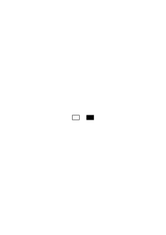

serves us _both_ as a paradigm of what we know as “brighter” and “darker” and as a paradigm for “white” and for “black.” In_so_far as _both_ are represented by this spot, darkness “lies” “in” black. It is dark _because_ it is black—but more correctly: it _is called_ “black” and thus, in our language, also “dark.” That connection, a connection of paradigms and names, is established in our language. And our sentence is untimely because it merely expresses the connection of the words “white,” “black,” and “lighter” with a paradigm. One can avoid misunderstandings by providing an explanation that states that it is nonsensical to say, “the color of this body is brighter than the color of that one”; one must say, “this body is brighter than that one.” That is, one excludes that form of expression from our language.

### [35\[2\]](https://cdn.wittgensteinnachlass.com/2000px/webp/Ms-117/35.webp)

We could also say: When we _follow_ the laws of inference (rules of inference), this always involves an _interpretation_ of these rules.

### [35\[3\]](https://cdn.wittgensteinnachlass.com/2000px/webp/Ms-117/35.webp)

“But we do infer this sentence from that one, because it actually follows! We do convince ourselves that it follows.” We convince ourselves that what is written here follows from what is written there. And this sentence is used _in a temporal sense_.

### [35\[4\]](https://cdn.wittgensteinnachlass.com/2000px/webp/Ms-117/35.webp),[36\[1\]](https://cdn.wittgensteinnachlass.com/2000px/webp/Ms-117/36.webp)

But what if I convince myself that the schema of these lines

<math display="block">
  <mo>|</mo>
  <mo>|</mo>
  <mspace width="0.3em"/>
  <mo>|</mo>
  <mo>|</mo>
  <mo>|</mo>
</math>

is in one-to-one correspondence with the schema of these points

(I have made them intentionally memorable) by making the correspondence

### [36\[2\]](https://cdn.wittgensteinnachlass.com/2000px/webp/Ms-117/36.webp)

Well, what am I convincing myself of when I look at this figure? I see a star with thread-like appendages. –

### [36\[3\]](https://cdn.wittgensteinnachlass.com/2000px/webp/Ms-117/36.webp)

But I can use the figure in this way: Five people are standing in a pentagon; on the wall are rods like the lines in ( ); I see the figure ( ) & say: “I can give each of the people a rod.” I could interpret the figure ( ) as _a_ schematic _representation_ of me giving each of the five people a rod.

### [36\[4\]](https://cdn.wittgensteinnachlass.com/2000px/webp/Ms-117/36.webp),[37\[1\]](https://cdn.wittgensteinnachlass.com/2000px/webp/Ms-117/37.webp),[38\[1\]](https://cdn.wittgensteinnachlass.com/2000px/webp/Ms-117/38.webp)

For if I first draw any polygon –

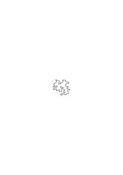

& then any series of lines

∣∣∣∣∣∣∣∣∣∣∣∣∣∣∣∣∣∣∣∣∣∣∣∣∣∣∣∣∣∣∣

then I can now find out by assigning whether I have as many corners above as lines below. (I don't know what would result.) And so I can also say that I have convinced myself by drawing the projection lines that at the upper end of the figure ( ) there are as many lines as there are corners on the star below. (Temporally!) In this view, the figure is not like a mathematical proof (as little as it is a mathematical proof if I distribute a sack of apples to a group of people & find that each gets exactly _one_ apple). But I can regard the figure ( ) as a mathematical proof. Let us give the schemas ( ) & ( ) names! Let ( ) be called “hand” (H.), ( ) “devil's foot” (D.). I have proven that the hand has as many lines as the devil's foot has corners. And this sentence is again atemporal.

### [38\[2\]](https://cdn.wittgensteinnachlass.com/2000px/webp/Ms-117/38.webp)

The proof – I can say – is _one_ figure, at one end of which certain sentences are located & at the other end of which is a sentence (which we call the ‘proven’ one). One can say as a description of such a figure: in it, the sentence … follows from … & …. This is a form of describing a _pattern_, which could also be an ornament, for example. So I can say: “In the proof, which is on that board, the sentence p follows from q & r” & this is simply a description of what is written there. But it is not the mathematical sentence that p follows from q & r. This has a different application. It says – one could express it – that it makes sense to talk about a proof (pattern) in which p follows from q & r. Just as one can say that the sentence “White is lighter than black” says that it makes sense to talk about two objects, one of which is lighter and the other black, but not about two objects, one of which is lighter and the other white.

### [39\[1\]](https://cdn.wittgensteinnachlass.com/2000px/webp/Ms-117/39.webp)

Let us imagine that we have given the paradigm for “lighter” & “darker” in the form of a white & black spot, & now, with its help – as it were – we derive that red is darker than white.

### [39\[2\]](https://cdn.wittgensteinnachlass.com/2000px/webp/Ms-117/39.webp)

The sentence proven by ( ) now serves as a new rule for ascertaining equality: If one has a set of objects arranged in the form of a hand & another as the corners of a devil's foot, then we say that the two sets are equally numerous.

### [39\[3\]](https://cdn.wittgensteinnachlass.com/2000px/webp/Ms-117/39.webp),[40\[1\]](https://cdn.wittgensteinnachlass.com/2000px/webp/Ms-117/40.webp)

“But isn’t that merely because we have already assigned H. and D. and seen that they are equal in number?” – Yes, but if they were equal in _one_ instance, how do I know that they will be so again now? – “Because it is precisely in _the nature_ of H. and D. that they are equal in number.” – But how could you deduce _that_ from the assignment? (I thought the counting, or assignment, only shows that these two groups I now have before me are of equal size—or unequal.) – “But if he now has H. things & D. things & he actually assigns them to one another, then it is not _possible_ for him to obtain anything other than that they are equal in number. – And that it is not possible, I see from the proof.” – But _is_ it not possible? If, for example—as someone else might say—he _overlooks_ drawing one of the lines of correspondence. But I admit that in the vast majority of cases he will always obtain the same result, and if he did not, he would consider himself somehow mistaken. And if this were not the case, the entire proof would be undermined. For we have decided to use the proof’s structure _instead_ _of_ assigning the groups; we do _not_ assign them, but instead perform a comparison of the groups with those of the proof (in which, however, two groups are assigned to each other).

### [40\[2\]](https://cdn.wittgensteinnachlass.com/2000px/webp/Ms-117/40.webp),[41\[1\]](https://cdn.wittgensteinnachlass.com/2000px/webp/Ms-117/41.webp)

As a result of the proof, I could also say: “An H. and a D. are called ‘equivalent’.” [unreadable] Or: The proof does not _explore_ the essence of the two figures, but it articulates what I will henceforth count as the essence of the figures. — What belongs to the essence, I lay down under the paradigms of language.

### [41\[2\]](https://cdn.wittgensteinnachlass.com/2000px/webp/Ms-117/41.webp)

When I say “This proposition follows from that one,” this is the acceptance of a rule. It occurs _on the basis_ of the proof. That is to say: I accept this chain (this figure) as _proof_. — “But could I do otherwise? _Must_ I not accept it?” – Why do you say you must? But because, at the end of the proof, you say something like: “Yes—I must acknowledge this conclusion.” But that is merely the expression of your unconditional acknowledgment. — That is to say, I believe: the words “I must admit that” are used in _two_ cases: when we have received a proof—but also in relation to the individual step of the proof itself.

### [41\[3\]](https://cdn.wittgensteinnachlass.com/2000px/webp/Ms-117/41.webp),[42\[1\]](https://cdn.wittgensteinnachlass.com/2000px/webp/Ms-117/42.webp)

And how does it manifest itself that the proof _compels_ me? Precisely in the fact that I proceed in such and such a way, that I refuse to take another path. As a final argument against someone who did not want to proceed that way, I would only say: “Yes, don’t you see …!” – and that is no _argument_ at all.

### [42\[2\]](https://cdn.wittgensteinnachlass.com/2000px/webp/Ms-117/42.webp)

“But if you are right, how does it come about that all people (or at least all normal people) accept these figures as proofs of these sentences?” — Yes, there is a large – and interesting – agreement.

### [42\[3\]](https://cdn.wittgensteinnachlass.com/2000px/webp/Ms-117/42.webp),[43\[1\]](https://cdn.wittgensteinnachlass.com/2000px/webp/Ms-117/43.webp)

Imagine you have a row of balls in front of you; you now number them with Arabic numerals from 1 to 100; then, after every ten (which now stand out clearly in the numbering), you leave a larger gap; in each group of ten, you leave a slightly smaller gap in the middle, that is, between 5 and 5—this makes the tens surveyable; now take the groups of ten and place them one _below_ the other; and make a slightly larger gap in the middle of the column, that is, between 5 rows and 5 rows; now number the rows from 1 to 10. I can say that I have revealed the properties of the hundred balls. – But now imagine that this entire process, this experiment with the hundred balls, was filmed. I do not, however, see an experiment on the projection screen, for the image of an experiment is not itself an experiment. – But I now see the ‘mathematical essence’ in the projection as well! For first 100 spots appear there, then they are divided into groups of ten, etc., etc.

### [43\[2\]](https://cdn.wittgensteinnachlass.com/2000px/webp/Ms-117/43.webp)

So I could say: the proof does not serve me as an experiment, but rather as a picture of an experiment.

### [43\[3\]](https://cdn.wittgensteinnachlass.com/2000px/webp/Ms-117/43.webp),[44\[1\]](https://cdn.wittgensteinnachlass.com/2000px/webp/Ms-117/44.webp)

Place 2 apples on the empty tabletop, make sure no one comes near them & the table isn’t shaken; now place 2 more apples on the tabletop; now count the apples lying there. You have conducted an experiment; the result of the count is probably 4. (We would describe the result of the experiment as follows: if, under these circumstances, you first place 2 apples and then another 2 on a table, usually none disappear, nor do any appear.) And very similar experiments can be carried out, with the same result, using all sorts of solid objects—beans, books, sticks, etc. – That is how children learn arithmetic here, for we have them lay down three beans & then three more beans & then count “what is lying there.” If the result were sometimes 5 and sometimes 7 (because, _as we would say now_, sometimes one would be added of its own accord, and sometimes one would be taken away), we would first give an explanation of why beans are unsuitable for arithmetic instruction. But if the same thing happened with sticks, fingers, lines, and most other things, arithmetic with them would come to an end.

“But wouldn’t 2 + 2 still equal 4?” – That little equation would have become useless. –

### [44\[2\]](https://cdn.wittgensteinnachlass.com/2000px/webp/Ms-117/44.webp)

If we put _money_ in a drawer and later can’t find it there anymore, we say: “It didn’t disappear on its own.” This is an important principle of physics.

### [44\[3\]](https://cdn.wittgensteinnachlass.com/2000px/webp/Ms-117/44.webp),[45\[1\]](https://cdn.wittgensteinnachlass.com/2000px/webp/Ms-117/45.webp)

“You just need to look at the figure

to see that 2 + 2 = 4.” – Then I just need to look at the figure

to see that 2 + 2 + 2 = 4.

### [45\[2\]](https://cdn.wittgensteinnachlass.com/2000px/webp/Ms-117/45.webp)

Counting by means of musical themes. Compare the numbers of these two rows of strokes

∣∣∣∣∣∣∣∣∣∣∣∣∣ ∣∣∣∣∣∣∣∣∣∣∣∣∣∣∣∣

by whistling a tone of the theme for each stroke in the first row; then for each stroke in the second row. (Adding, etc., with the help of such a series of tones.)

### [45\[3\]](https://cdn.wittgensteinnachlass.com/2000px/webp/Ms-117/45.webp),[46\[1\]](https://cdn.wittgensteinnachlass.com/2000px/webp/Ms-117/46.webp)

We teach someone a method of distributing nuts among people; part of this method is multiplying two numbers in the decimal system. We teach someone to build a house; this also includes how to procure sufficient quantities of material, such as planks, for which there is a technique of calculation. The technique of calculation is part of the technique of building a house. People sell and buy firewood; the logs are measured with a standard, the dimensions of length, width, and height are multiplied; and the result is the number of pennies they have to demand and give. They do not know ‘why’ this happens, but they simply do it that way; that is how it is done. – Are these people not calculating?

### [46\[2\]](https://cdn.wittgensteinnachlass.com/2000px/webp/Ms-117/46.webp)

If someone calculates like this, must they utter an ‘arithmetical _sentence_’? Of course, we teach children the multiplication tables in the form of _sentences_, but is that essential? Why shouldn’t they simply _learn to calculate_? And if they can do that, have they not learned arithmetic?

### [46\[3\]](https://cdn.wittgensteinnachlass.com/2000px/webp/Ms-117/46.webp)

But what is the relationship between the _justification_ of a calculation and the calculation (itself)?

### [47\[1\]](https://cdn.wittgensteinnachlass.com/2000px/webp/Ms-117/47.webp)

“Yes, I understand that this sentence follows from that one.” – Do I understand _why_ it follows, or do I only understand _that_ it follows?

### [47\[2\]](https://cdn.wittgensteinnachlass.com/2000px/webp/Ms-117/47.webp)

What if I had said: Those people pay for the wood _on the basis of the calculation_; they accept the calculation as proof that they have so much to pay. – Well, it is simply a description of their procedure (behaviour).

### [47\[3\]](https://cdn.wittgensteinnachlass.com/2000px/webp/Ms-117/47.webp)

Whoever reminds us: “the chain of reasons has an end” brings the origin of the chain together with its middle, so that we perceive the difference. ‘Look _at this_ – & look _at that_! _Memorize these two forms_!’

### [47\[4\]](https://cdn.wittgensteinnachlass.com/2000px/webp/Ms-117/47.webp)

Logic – one can say – shows what we understand by “sentence” and by “language.” –

### [47\[5\]](https://cdn.wittgensteinnachlass.com/2000px/webp/Ms-117/47.webp)

Separate the feelings (gestures) of agreement from what you _do_ with the proof!

### [47\[6\]](https://cdn.wittgensteinnachlass.com/2000px/webp/Ms-117/47.webp),[48\[1\]](https://cdn.wittgensteinnachlass.com/2000px/webp/Ms-117/48.webp)

Those people – we would say – sell the wood by the cubic measure – – but are they right in that? Wouldn’t it be better to sell it by weight – or by the time it takes to fell it – or by the effort of felling it, measured by the age and strength of the woodcutter? And why shouldn’t they sell it for a price that is independent of all of that: every buyer pays the same amount, no matter how much they take (it has been found that one can live like that). And is there anything wrong with simply giving the wood away?

### [48\[2\]](https://cdn.wittgensteinnachlass.com/2000px/webp/Ms-117/48.webp)

Fine; but what if they stacked the wood into piles of any, different heights, and then sold it at a price proportional to the area of the base of the piles? And what if they even justified this with the words: “Yes, whoever buys more wood must also pay more.”

### [48\[3\]](https://cdn.wittgensteinnachlass.com/2000px/webp/Ms-117/48.webp),[49\[1\]](https://cdn.wittgensteinnachlass.com/2000px/webp/Ms-117/49.webp)

How could I now show them that – as I would say – the one who buys a pile with a larger base does not really buy more wood? – I would, for example, take a pile that, in their terms, is small and transform it into a ‘large’ one by rearranging the logs. That _might_ convince them – but perhaps they would say: “Yes, now it is _much_ wood and costs more” – and that would be the end of it. – In this case, we would (presumably) say: they simply do not mean the same thing by “much wood” and “little wood” as we do; and they have a completely different system of payment than we do.

### [49\[2\]](https://cdn.wittgensteinnachlass.com/2000px/webp/Ms-117/49.webp)

Frege says in the preface to the Grundgesetze der Arithmetik: “… here we have a hitherto unknown kind of madness” – but he never indicated what this ‘madness’ would really look like.

### [49\[3\]](https://cdn.wittgensteinnachlass.com/2000px/webp/Ms-117/49.webp)

(A society that acts in this way might remind us of the “clever people” in fairy tales.)

### [49\[4\]](https://cdn.wittgensteinnachlass.com/2000px/webp/Ms-117/49.webp),[50\[1\]](https://cdn.wittgensteinnachlass.com/2000px/webp/Ms-117/50.webp)

Influence of the form of representation: Someone who walks down a street and (now) turns back to go home turns at a tree, at a house, at a bridge, not at any point in open terrain (as if without reason). Does he do this for a purpose? (Words that we insert into the sentence for the sake of rhythm.)

### [50\[2\]](https://cdn.wittgensteinnachlass.com/2000px/webp/Ms-117/50.webp)

In what does the agreement of people consist in recognizing a structure as a proof? In the fact that they use words as _language_? As what we call “language.” Imagine people who use money in commerce, namely coins that look exactly like our coins, made of gold or silver and minted; and they also give them for goods – but everyone gives for the goods whatever he feels like, and the merchant does not give the customer more or less, depending on how much he pays; in short, this money, or what looks like it, plays a completely different role for them than it does for us. We would feel much less related to these people than to those who do not know any money at all and practice a primitive form of barter. – “But the coins of these people must also have some purpose!” – Does everything one does have a purpose? For example, religious acts –.

### [51\[1\]](https://cdn.wittgensteinnachlass.com/2000px/webp/Ms-117/51.webp)

It is quite possible that we would be inclined to call people who behave in this way mad. But we do not call everyone who acts similarly in the forms of our culture, who use words ‘pointlessly,’ mad. (Think of the coronation of a king!)

### [51\[2\]](https://cdn.wittgensteinnachlass.com/2000px/webp/Ms-117/51.webp),[52\[1\]](https://cdn.wittgensteinnachlass.com/2000px/webp/Ms-117/52.webp)

We can call it ‘proving the equation 74202 + 25798 = 100000’ if we write the numbers on the left-hand side one below the other and add them; but does that also constitute a proof: count out 74202 grains of sand, then 25798, pour them together, and count them. What I want to say is: surveyability is part of proof. If the process by which I arrive at the result were not surveyable, I could indeed note the fact that this number comes out, but how am I to use this as a measure of a fact? I do not know: ‘what _is_ _supposed_ to come out’

### [52\[2\]](https://cdn.wittgensteinnachlass.com/2000px/webp/Ms-117/52.webp)

If I have added the numbers and obtained 100000, then I say: If you put together so many and so many grains of sand and none of them are lost, then you must have so many grains in total.

### [52\[3\]](https://cdn.wittgensteinnachlass.com/2000px/webp/Ms-117/52.webp)

But is it impossible that I made a mistake in the calculation? And what if a little devil makes me err, so that I keep overlooking something, no matter how many times I recalculate, step by step. So that, when I wake up from the spell, I would have to say: “Yes, was I blind!” – But what difference does it make if I ‘assume’ this? Then I could say: “Yes, yes, the calculation is certainly wrong – but this is how I calculate. And that is what I call addition, and this number the sum of these two.”

### [52\[4\]](https://cdn.wittgensteinnachlass.com/2000px/webp/Ms-117/52.webp),[53\[1\]](https://cdn.wittgensteinnachlass.com/2000px/webp/Ms-117/53.webp)

Imagine someone who is so bewitched that he calculates:

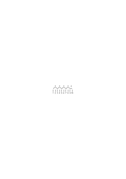

“so: 4 × 3 + 2 = 10”

### [53\[2\]](https://cdn.wittgensteinnachlass.com/2000px/webp/Ms-117/53.webp)

Now he should apply his calculation. He takes four times 3 nuts and 2 more, and distributes them among 10 people; and each receives _one_ nut. Because he distributes them according to the arcs of the calculation, and whenever he gives one a second nut, it disappears.

### [53\[3\]](https://cdn.wittgensteinnachlass.com/2000px/webp/Ms-117/53.webp)

One could also say: You proceed from sentence to sentence in the proof: but do you also allow yourself to have a check that you have proceeded correctly? – Or do you just say, “It _must_ be correct” and measure (only) everything else with the sentence you obtain?

### [53\[4\]](https://cdn.wittgensteinnachlass.com/2000px/webp/Ms-117/53.webp)

Because, if it is _so_, then you are only proceeding from picture to picture.

### [53\[5\]](https://cdn.wittgensteinnachlass.com/2000px/webp/Ms-117/53.webp),[54\[1\]](https://cdn.wittgensteinnachlass.com/2000px/webp/Ms-117/54.webp)

It might be practical to measure with a yardstick that has the property of shrinking by about half its length when it is brought from this room into that one. A property that would make it unusable as a yardstick under other conditions. It might be practical, when counting a quantity, under certain circumstances, to omit numbers, to count them: “1, 2, 4, 5, 7, 8, 10”.

### [54\[2\]](https://cdn.wittgensteinnachlass.com/2000px/webp/Ms-117/54.webp)

What am I convincing someone of who is watching that scene in the film of the experiment with the 100 balls? One could say: that this is how it happened. – But that would not be a mathematical conviction. ‒ ‒ But can I not say: _I am impressing a process upon him_? This process is the regrouping of a series of 100 things into 10 rows of 10. And this process is _indeed_ always easy to carry out. And he can rightly be convinced of this. And so the proof (also) imprints, by drawing the projection lines

imprints a process, namely the 1 → 1 correspondence of H. and D.. – “But doesn’t it also _convince_ me that this correspondence is _possible_?” – If that is meant to imply that you can always carry it out, then that need not be true at all. But drawing the projection lines convinces us that there are as many lines at the top as there are corners at the bottom; & it provides a template for (only) thereby assigning such figures to one another. – “But doesn’t it thereby show that it works? In the sense that it wouldn’t work if, instead of ∣∣∣∣∣, the figure ∣∣∣∣∣∣ were there at the top?” – Why? Doesn’t it work there? _For_ example:

“That’s not what I meant!” – Then show me what you mean, and I’ll do it. But can’t I say that the figure shows _how_ such a mapping is possible—and so doesn’t it also have to show _that_ it is possible? –

### [55\[2\]](https://cdn.wittgensteinnachlass.com/2000px/webp/Ms-117/55.webp),[56\[1\]](https://cdn.wittgensteinnachlass.com/2000px/webp/Ms-117/56.webp),[57\[1\]](https://cdn.wittgensteinnachlass.com/2000px/webp/Ms-117/57.webp)

What was the sense, then, of our suggestion to assign names to the shapes of the five parallel lines and the pentagram? What happened as a result of them being given names? This (presumably) suggests something about the nature of the use of these figures. Namely—that one recognizes them at a glance as the & the; one does not think to count their lines or corners, but recognizes them as types of figures, just as one recognizes a knife and a fork, letters, and numbers. So, upon the command: “Draw an H!” (e.g.), I can immediately reproduce this form. – Now the proof teaches me a correspondence between those two forms. (I would like to say that it is not merely these individual figures that are assigned in the proof, but the _forms themselves_. But that only means that I commit those forms to memory; commit them to memory as paradigms.) Can I now, if I want to assign (the forms) H. & D. to one another in this way, not run into difficulties—for example, by having one corner too many at the bottom, or one line too many at the top? – “But not if you’ve really drawn H. & D. again! – And that can be proven; look at this figure!”

### [57\[2\]](https://cdn.wittgensteinnachlass.com/2000px/webp/Ms-117/57.webp)

– This figure teaches me a new kind of control to make sure that I have really drawn the same figures; but if I now want to follow this template, can I not still get into difficulties? But I say, I am sure that I will normally not get into difficulties.

### [57\[3\]](https://cdn.wittgensteinnachlass.com/2000px/webp/Ms-117/57.webp)

What does this consideration do? –

### [57\[5\]](https://cdn.wittgensteinnachlass.com/2000px/webp/Ms-117/57.webp),[58\[1\]](https://cdn.wittgensteinnachlass.com/2000px/webp/Ms-117/58.webp)

There is a patience game that consists of putting together a certain figure, e.g.:

from given parts (tiles). The figure is divided in such a way that it is difficult for us to find the correct combination of the parts. Let it be, for example, this:

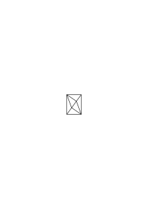

### [58\[2\]](https://cdn.wittgensteinnachlass.com/2000px/webp/Ms-117/58.webp),[59\[1\]](https://cdn.wittgensteinnachlass.com/2000px/webp/Ms-117/59.webp)

What does the one who succeeds in the composition find? – He finds: a configuration – which he had not thought of before. – Good; but can one not also say: he convinces himself that a triangle and a hexagon can be put together in this way? – But tell me: this triangle and the hexagon, which can be put together in this way: should they already be in this position, or not yet, and only be put together in this way?

“I didn’t know that you could put

and

together like this.” Can one also say: “I thought that you could not put them together like this

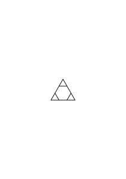
”?

### [59\[2\]](https://cdn.wittgensteinnachlass.com/2000px/webp/Ms-117/59.webp),[60\[1\]](https://cdn.wittgensteinnachlass.com/2000px/webp/Ms-117/60.webp)

If someone says, “I wouldn’t have thought that one could put these figures together like this,” can one really, pointing to the completed patience game, say, “So, you didn’t think that one could put the pieces together like this?” – He would answer: “I mean: I didn’t even think about this kind of combination.”

### [60\[2\]](https://cdn.wittgensteinnachlass.com/2000px/webp/Ms-117/60.webp),[61\[1\]](https://cdn.wittgensteinnachlass.com/2000px/webp/Ms-117/61.webp)

Let us imagine the physical properties of the pieces of the puzzle such that they cannot assume the desired position. I do not mean, however, that one feels resistance when trying to place them in this position, but rather that one simply tries every other arrangement except _this_ _one_—and the pieces do not end up in this position even by chance. It is, as it were, excluded from the space. As if there were a ‘blind spot’ here, perhaps in our brain. – And isn’t that the case when I believe I have tried every _possible_ position & have always missed this one, as if by magic? Can’t one say: the figure that shows you the solution removes a blindness; or also, it changes your geometry? It shows you, as it were, a new dimension of space. (Like showing a fly the way out of a fly trap.)

### [61\[2\]](https://cdn.wittgensteinnachlass.com/2000px/webp/Ms-117/61.webp)

An essence has surrounded this position with a curse and excluded it from our space.

### [61\[3\]](https://cdn.wittgensteinnachlass.com/2000px/webp/Ms-117/61.webp)

The new position has arisen as if from nothing. Where there was nothing before, there is suddenly something.

### [61\[4\]](https://cdn.wittgensteinnachlass.com/2000px/webp/Ms-117/61.webp)

In what way did _the solution_ convince you that one can do _this and that_? – You couldn’t do it before – and now you can, sort of. –

### [61\[5\]](https://cdn.wittgensteinnachlass.com/2000px/webp/Ms-117/61.webp),[62\[1\]](https://cdn.wittgensteinnachlass.com/2000px/webp/Ms-117/62.webp)

You have shown me a path I hadn’t seen before. – But wasn’t that path always there? – That means nothing. The path I’m talking about is a real path – one that now serves as a model for me. – But you used to believe that this path didn’t exist! – That means: I wasn’t able to imagine this path. – But so you tried to imagine it – how did you do that? – I did various things that in this case are called “trying …”. What do I do when I try to assemble the puzzle correctly & don’t get it right? Well, I make various arrangements of these figures. Is there something _wrong_ with these arrangements? – I’m dissatisfied, I destroy them again; I also say, “_This_ is how it has to turn out,” and point to the outline of the finished figure. – If I succeed in matching that outline, then I’m satisfied and say I’ve succeeded. – No, that’s not enough: I’m satisfied when I succeed in arranging _this_—this arrangement of these figures. That means: – _when I arrange them_.

### [62\[2\]](https://cdn.wittgensteinnachlass.com/2000px/webp/Ms-117/62.webp)

What am I drawing attention to? – To the fact that the wish to lay the figure looks different in this case than in the case in which I wish to lay this combination, which I can show in the picture. The wish looks different, the trying looks different, but the solution looks the same in both cases.

### [63\[1\]](https://cdn.wittgensteinnachlass.com/2000px/webp/Ms-117/63.webp)

And the one who ‘convinced me that one can do it’ gave me a template in one case – and that means here: ‘put me in a position to do it’. In the other case, he might have shown me that he has the power to do something that I do not have the power to do.

### [63\[2\]](https://cdn.wittgensteinnachlass.com/2000px/webp/Ms-117/63.webp),[64\[1\]](https://cdn.wittgensteinnachlass.com/2000px/webp/Ms-117/64.webp)

“Yes, you convinced me that H. and D. are of the same number.” – _How_ did he convince me? He showed me an image that I hadn’t seen before. – Yes, but in doing so, he convinced you of the possibility of this image, which you hadn’t believed in before. – But here one must ask: what did it mean to ‘not believe in this possibility’? I had, so to speak, ‘tried’ to see it, but had not seen it. And that means, after all: I _had not seen the image_. It would be better to say: he had shown me a possibility that I had not known. – But why am I inclined here to say that he showed me a _possibility_, & not simply ‘an image’? For I could always, whenever someone shows me any image I hadn’t seen before, say: “Yes, you’ve shown me that this is possible.” And yet that wouldn’t occur to anyone. – Although that could simply be the expression used to express that one hasn’t seen it yet. Well, the possibility is surely one that was described earlier, e.g., “to arrange the figures in this way.” And this _task_ is of the same nature as a puzzle. Ask yourself: what is the relationship between the task and the solution? Yes, one could say: the task ‘_describes_’ the solution. Different applications of the word “describe.”

### [64\[2\]](https://cdn.wittgensteinnachlass.com/2000px/webp/Ms-117/64.webp),[65\[1\]](https://cdn.wittgensteinnachlass.com/2000px/webp/Ms-117/65.webp),[66\[1\]](https://cdn.wittgensteinnachlass.com/2000px/webp/Ms-117/66.webp)

At first, it seemed as though these considerations were meant to show that ‘what appears to be a logical necessity is in reality only a psychological one’—and then the question arose: do I therefore know both kinds of necessity?!—Imagine the expression were used: “The law § … punishes the murderer with death.” That could only mean that this law states: etc. This form of expression, however, might impose itself on us because the law is the means by which the guilty party is brought to punishment. – Now we are speaking of ‘relentlessness’ on the part of those who punish someone. It might occur to us to say: the law is more relentless than all people, for they may let the guilty party go free, but the law executes him. (Or even: “the law _always_ executes him.”) – What is the purpose of using such a form of expression? – At first, this sentence merely states that the law says this and that, and that people sometimes do not abide by it. But then it does paint a picture of _one_ unyielding judge—and many lax ones. It thus serves as an expression of respect for the law. Finally, however, one can also use this form of expression to call a law “unyielding” if it does not provide for the possibility of a pardon—and, in the opposite case, perhaps “lenient.” We are now speaking of the “relentlessness” of logic; and we conceive of the logical laws as relentless, even more relentless than the laws of nature. We now draw attention to how the word “relentless” is applied in various ways. Our logical laws correspond to very general facts of everyday experience. These are the facts that make it possible for us to demonstrate those laws again and again in a simple way (with ink on paper, for example). They are a comparison with those facts that make measuring with a yardstick easy to perform and useful. This suggests the use of precisely these laws of inference, and now _we_ are relentless in the application of these laws. Because we “measure”; and it is part of measuring that everything has the same measure. Furthermore, however, one can distinguish between relentless—that is, _unambiguous_—rules of inference and ambiguous ones, by which I mean those that leave us with an alternative.

### [67\[1\]](https://cdn.wittgensteinnachlass.com/2000px/webp/Ms-117/67.webp)

I said, ‘I accept this and that as proof of a proposition’—but can I _not_ accept the figure showing the pieces of the jigsaw puzzle put together as proof that those pieces can be assembled into this outline?

### [67\[2\]](https://cdn.wittgensteinnachlass.com/2000px/webp/Ms-117/67.webp)

But now imagine one of the pieces lies in such a way that it is the _mirror image_ of the corresponding part of the template. He now wants to assemble the figure according to the template, sees that it should be possible, but does not have the idea to turn the piece around & finds that he cannot succeed in assembling it.

### [67\[3\]](https://cdn.wittgensteinnachlass.com/2000px/webp/Ms-117/67.webp),[68\[1\]](https://cdn.wittgensteinnachlass.com/2000px/webp/Ms-117/68.webp),[69\[1\]](https://cdn.wittgensteinnachlass.com/2000px/webp/Ms-117/69.webp),[70\[1\]](https://cdn.wittgensteinnachlass.com/2000px/webp/Ms-117/70.webp)

How does one estimate: what time it is; but I do not mean, according to external clues, the position of the sun, the brightness in the room, etc.? – One asks oneself, for example: “What time could it be?”, thinks about it for a moment; i.e., here: one remains calm, perhaps imagines the clock face; & then one says this & that time. – Or one considers several possibilities: one thinks of _one_ time, then another, & finally settles on one. That’s how it happens, or something similar. – But is not the idea accompanied by a feeling of conviction; & does that not mean that it now corresponds to an inner clock? – No, I do not read the time from any clock; a feeling of conviction is there in so far as I calmly & confidently state a time without any feelings of doubt. – But does something not snap into place during this statement of time? – Nothing that I know of; unless you call the calming down of the consideration, the settling on a number, that. I would never have spoken of a ‘feeling of conviction’ here either, but would have said: I thought about it for a while & then decided that it is … o’clock. But what did I decide based on? I might have said: “just based on feeling”; that only means: I left it to the idea. – But you must have at least put yourself in a certain state in order to make the estimate; & you do not accept every image of a time as an indication of the correct time! – As I said: _I had asked myself_, “What time could it be?”, i.e., I did not, for example, read this question in a story, nor cite it as the statement of another, nor practice saying these words, etc. – I did not speak the words under _these_ circumstances. – But under _which_ ones then? – Well, I was thinking about my breakfast & whether I would be late with it today. That was the situation. – But do you not really see that you were in a state, albeit (quasi) elusive, that is characteristic of estimating time, as it were, in a characteristic atmosphere? – Yes, the characteristic thing was that I asked myself: “What time could it be?” – & does this sentence have a particular atmosphere, & how should I be able to separate it from the sentence itself? It would never have occurred to me that the sentence had such an aura, if I had not thought about how one could also say it differently – as a quotation, in jest, as a speaking exercise, etc. & _there_ I suddenly wanted to say, there it suddenly occurred to me: I must somehow have _meant_ the words in a special way; differently, namely, than in those other cases. The image of the special atmosphere had forced itself upon me; I can actually see it before me – as long as I do not look at what actually happened according to my memory. And as for the feeling of certainty: I sometimes say to myself: “I am certain that it is this & that time”, & in a more or less certain tone of voice, etc. If you ask about the _reason_ for this certainty, I have no reason. If I say: I read it from my inner clock, that is an image that only corresponds to the fact that I made this statement of time. And the purpose of the image is to resemble this case, to resemble the other. I resist acknowledging the two different cases.

### [71\[1\]](https://cdn.wittgensteinnachlass.com/2000px/webp/Ms-117/71.webp)

Of the greatest importance is the idea of the elusiveness of that state in estimating time. Why is it _elusive_? Is it not because we, with regard to what is tangible in the state in which we find ourselves, refuse to count the specific state that we postulate as belonging to it?

### [71\[2\]](https://cdn.wittgensteinnachlass.com/2000px/webp/Ms-117/71.webp),[71\[3\]](https://cdn.wittgensteinnachlass.com/2000px/webp/Ms-117/71.webp),[72\[1\]](https://cdn.wittgensteinnachlass.com/2000px/webp/Ms-117/72.webp)

One can construct a rectangle from two parallelograms and two triangles. Proof:

A child would have difficulty constructing a rectangle from these components and would be surprised that two sides of the parallelograms fall on a straight line, even though the parallelograms are skewed. – It might seem to the child as if the rectangle were formed from these figures by magic, as it were. Yes, the child must admit that they now form a rectangle, but through a twist, through a convoluted arrangement, in an unnatural way. I can imagine that the child, having placed the two parallelograms together in _this_ manner, would not trust its own eyes when it sees that they fit together _like this_. ‘_They don’t look_ as if they fit together like that.’ And I can imagine someone saying: It only appears to us, through an optical illusion, as if _they_ form the rectangle—in reality, they have changed their nature; they are no longer the parallelograms.

### [72\[2\]](https://cdn.wittgensteinnachlass.com/2000px/webp/Ms-117/72.webp),[73\[1\]](https://cdn.wittgensteinnachlass.com/2000px/webp/Ms-117/73.webp),[74\[1\]](https://cdn.wittgensteinnachlass.com/2000px/webp/Ms-117/74.webp)

But can I not believe the sentence of geometry even without proof, e.g., based on the assurance of another? – And what does the sentence lose if it loses its proof? – Here, I suppose, I should ask: “What can I do with it?”, because that is what matters. To _accept_ the sentence on the assurance of another – how does that manifest itself? I can, for example, use it in further operations, or I can use it in assessing a physical state of affairs. If someone assures me, for example, that 13 times 13 is 396, & I believe him, then I will now be surprised that I cannot put 396 nuts into 13 rows of 13 nuts each & perhaps assume that the nuts have multiplied on their own. But I feel tempted to say: one cannot _believe_ that 13 × 13 = 396, one can only mechanically _accept_ this number from the other. But why should I not say that I believe it? Is believing a mysterious act that is, as it were, subterrain connected with the correct calculation? I can in any case say: “I believe it”, & then act accordingly. One would (here) ask: “What does the one who believes that 13 × 13 = 396 do?” And one can answer: Well, that will depend on whether he, for example, did the calculation himself & made a mistake (in doing so), – or whether someone else did it, but he still knows how to do such a calculation, – or whether he cannot multiply, but knows that the product is the number of people standing in 13 rows of 13, – in short, what he can do with the equation 13 × 13 = 396. For, to test it, is to do something with it.

### [74\[2\]](https://cdn.wittgensteinnachlass.com/2000px/webp/Ms-117/74.webp)

For if one thinks of the arithmetic equation as the expression of an internal relation, one might say: “He cannot possibly believe that 13 × 13 yields _this_, because that is not a multiplication of 13 by 13, or a _result_, if 396 is at the end.” But that means (only) that one does not want to make an application of the word “believe” to the result of a calculation—or only if one has the correct calculation in front of one.

### [74\[3\]](https://cdn.wittgensteinnachlass.com/2000px/webp/Ms-117/74.webp),[75\[1\]](https://cdn.wittgensteinnachlass.com/2000px/webp/Ms-117/75.webp)

“What does the one who believes that 13 × 13 is 396 believe?” – How deeply does he – one might say – penetrate with his belief into the relationship of these numbers? Because until the end – we want to say – he cannot penetrate, otherwise he could not believe it. But when does he penetrate into the relationships of the numbers? Precisely while he says that he believes…? You will not insist on that – because it is easy to see that this appearance is only created by the surface form of our grammar – as one might call it.

### [75\[2\]](https://cdn.wittgensteinnachlass.com/2000px/webp/Ms-117/75.webp)

For I want to say: “One can only _see_ that 13 × 13 = 369, & one cannot even _believe_ that. One can only, more or less blindly, accept a rule.” And what do I do when I say this? I make a distinction; between a _calculation_ with its result (i.e. a certain picture, a certain template) – & an attempt with its result.

### [75\[3\]](https://cdn.wittgensteinnachlass.com/2000px/webp/Ms-117/75.webp),[76\[1\]](https://cdn.wittgensteinnachlass.com/2000px/webp/Ms-117/76.webp)

I would like to say: “If I believe that x × y = z—and it does happen that I believe such a thing, say that I believe it—then I do not believe the mathematical proposition, for that stands at the end of a proof, is the end of a proof; rather, I believe that this is the formula that stands here and there, which I will obtain in such and such a way, and the like.” – And this does indeed sound as if I were intruding into the process of believing such a proposition. Whereas I am merely—in a clumsy way—pointing to the _fundamental_ difference in the roles of an arithmetic proposition and an empirical proposition (in contrast to their apparent similarity). For I _do_ indeed _say_, under certain circumstances: “I believe that x × y = z.” What _do_ I _mean_ by that? – What I _say_! – But the question is certainly interesting: under what circumstances do I say this; and how are they characterized in contrast to those of: “I believe it will rain”? For what concerns us is precisely this contrast. We seek to obtain a picture of the use of mathematical propositions and of the propositions “I believe that …”, where the “that” is followed by a mathematical proposition.

### [76\[2\]](https://cdn.wittgensteinnachlass.com/2000px/webp/Ms-117/76.webp)

“You don’t believe the mathematical proposition.” – That is to say: “mathematical proposition” designates a role, a language-game, in which belief does not occur.

### [76\[3\]](https://cdn.wittgensteinnachlass.com/2000px/webp/Ms-117/76.webp),[77\[1\]](https://cdn.wittgensteinnachlass.com/2000px/webp/Ms-117/77.webp)

Compare: “If you say, ‘I believe that castling happens so and so,’ then you are not believing the chess rule, but you believe, for example, that such is a rule of chess.”

### [77\[2\]](https://cdn.wittgensteinnachlass.com/2000px/webp/Ms-117/77.webp),[78\[1\]](https://cdn.wittgensteinnachlass.com/2000px/webp/Ms-117/78.webp)

“One cannot _believe_ that the multiplication 13 × 13 yields 369, because the result belongs to the calculation.” – What do I call “the multiplication 13 × 13”? Only the correct multiplication image, at the bottom of which 369 stands? Or also a ‘false multiplication’? How is it determined which image is the multiplication 13 × 13? – Is it not _determined_ by the rules of multiplication? – But how, if with the help of these rules, something different comes out today than what is in all the calculation books? Is that not possible? – “Not, if you apply the rules as _they_ are!” – Of course not! But that is just a pleonasm. And where is it written how they are to be applied – and if it is written somewhere, where is it written how _this_ is to be applied? And that does not only mean: in which book is it written, but also, in which _mind_? – What, then, is the multiplication 13 × 13 – or, according to what should I orient myself when multiplying: according to the rules, or according to the multiplication that is in the calculation books? if these two, namely, do not agree. – Well, it actually never happens that someone who has learned to calculate stubbornly produces something different than what is in the calculation books in this multiplication. But if it did happen, we would declare him abnormal, and take no further notice of his calculation.

### [78\[2\]](https://cdn.wittgensteinnachlass.com/2000px/webp/Ms-117/78.webp)

“You admit _that_ – then you must admit _that_.” – He _must_ admit it – and it is possible that he does not admit it. – “I will show you why you must admit it.” – I will present you with a case which, if you consider it, will determine you to judge in that way.

### [78\[3\]](https://cdn.wittgensteinnachlass.com/2000px/webp/Ms-117/78.webp)

How can the manipulations of the proof bring him to admit something?

### [78\[4\]](https://cdn.wittgensteinnachlass.com/2000px/webp/Ms-117/78.webp),[79\[1\]](https://cdn.wittgensteinnachlass.com/2000px/webp/Ms-117/79.webp)

“You will admit that 5 consists of 3 and 2!”

I only want to admit it if I do not admit anything else by doing so. Except – that I want to use _this image_.

### [79\[2\]](https://cdn.wittgensteinnachlass.com/2000px/webp/Ms-117/79.webp)

One could, for example, take the figure

as proof that 100 parallelograms, when put together, must give a straight strip. If one then really puts 100 together, one obtains, for example, a slightly curved strip. – But that proof determined us to use the image and the expression: If they do not give a straight strip, they were not manufactured accurately.

### [79\[3\]](https://cdn.wittgensteinnachlass.com/2000px/webp/Ms-117/79.webp)

Just think, how can the image that you show me (or the process) obligate me to judge in such and such a way from now on! Yes, if there is an experiment, then _one_ is still not enough to connect me to any judgment.

### [79\[4\]](https://cdn.wittgensteinnachlass.com/2000px/webp/Ms-117/79.webp),[80\[1\]](https://cdn.wittgensteinnachlass.com/2000px/webp/Ms-117/80.webp)

The person presenting the proof says: “Look at this figure! What can we say about it? Not that a rectangle consists of …? –” Or also: “You call these ‘parallelograms’ and those ‘triangles,’ and _that’s_ _what_ you see when a figure consists of others. –”

### [80\[2\]](https://cdn.wittgensteinnachlass.com/2000px/webp/Ms-117/80.webp),[81\[1\]](https://cdn.wittgensteinnachlass.com/2000px/webp/Ms-117/81.webp)

“Yes, you’ve convinced me: a rectangle always consists of …” – Would I also say: “Yes, you’ve convinced me: _this_ rectangle (the one in the proof) consists of …”? And this would, after all, be the more modest statement; one that even those who do not (yet) accept the general statement should admit. Strangely enough, however, the one who admits _this_ does not seem to admit the more modest geometric proposition, but rather no geometric proposition at all. Of course—for as regards the rectangle of the proof, he has not convinced me of anything. (If I had seen this figure earlier, I would have had no doubt about it.) I conceded everything of my own accord regarding this figure. And he convinced me only _by_ _means of_ it. – But on the other hand, if he has not even convinced me of anything regarding _this_ rectangle, how then could he convince me of a property of other rectangles?

### [81\[2\]](https://cdn.wittgensteinnachlass.com/2000px/webp/Ms-117/81.webp)

We are deliberately clinging to this _childish_ difficulty.

### [81\[3\]](https://cdn.wittgensteinnachlass.com/2000px/webp/Ms-117/81.webp)

Whoever philosophizes suffers from a cramp of language. One must seek the linguistic transition to a cramp-free state.

### [81\[4\]](https://cdn.wittgensteinnachlass.com/2000px/webp/Ms-117/81.webp)

If I see a rectangle as being put together in this way, I compare this to the process: my gaze penetrates the interior of the figure and sees this composition there. One could also say: “I could not see it as being put together if it were not put together.”

### [81\[5\]](https://cdn.wittgensteinnachlass.com/2000px/webp/Ms-117/81.webp)

“I did not know that this form consists of these forms.” – That is what the picture taught you. You saw something _new_ – & want to say that you saw that the old is composed in such and such a way.

### [81\[6\]](https://cdn.wittgensteinnachlass.com/2000px/webp/Ms-117/81.webp),[82\[1\]](https://cdn.wittgensteinnachlass.com/2000px/webp/Ms-117/82.webp)

“I did not know that the rectangular form consists of these forms.” It is as if the _form_ were made of these _forms_, welded together.

### [82\[2\]](https://cdn.wittgensteinnachlass.com/2000px/webp/Ms-117/82.webp)

‘Yes, the form doesn’t look as if it could consist of two crooked parts.’ What surprises you? Surely not that you now see this figure before you! Something _in_ this figure surprises me. – But nothing is happening in this figure! What surprises me is the combination of the crooked with the straight. I feel—as it were—dizzy. It’s comparable to the dizziness one feels when looking at a spiral.

### [82\[3\]](https://cdn.wittgensteinnachlass.com/2000px/webp/Ms-117/82.webp),[83\[1\]](https://cdn.wittgensteinnachlass.com/2000px/webp/Ms-117/83.webp)

‘I am surprised that the askew lines give a straight line. (I wouldn’t have thought it.)’ – Yes, that’s as if I had put them together. They didn’t look as if they would fit together to form something straight; I had expected something angular. – But can I expect something angular when looking at the divided rectangle figure?! –

Rather, I could say: “I can’t quite accept that these pieces will result in this.” That is (however) as it were an expression of the dizziness.

### [83\[2\]](https://cdn.wittgensteinnachlass.com/2000px/webp/Ms-117/83.webp)

But I really do say: “I have convinced myself that the figure can be assembled from these pieces,” namely when I have seen, for example, the illustration of the solution to the puzzle. When I say this to someone, I really mean to say: “Just try it! These pieces, when put together correctly, really do form the figure.” I want to encourage him to do something and predict his success. And the prediction is based on the ease with which one can assemble the figure from the pieces, as soon as one has _the_ knowledge _to do so_.

### [83\[3\]](https://cdn.wittgensteinnachlass.com/2000px/webp/Ms-117/83.webp)

[→ ] You are amazed by what the proof shows you. But are you amazed that these lines can be drawn? No. You are amazed only when you tell yourself that two such pieces _form_ this shape. So when you put yourself in the situation: You had an expectation of something else & now you see the result.

### [84\[1\]](https://cdn.wittgensteinnachlass.com/2000px/webp/Ms-117/84.webp)

“From _this_ follows _that_ inexorably.” Yes, in this demonstration it emerges from it. And this is a demonstration for those who recognize it as such. Those who _do not_ recognize it, who do not follow it as a demonstration, separate themselves from us even before language is used.

### [84\[2\]](https://cdn.wittgensteinnachlass.com/2000px/webp/Ms-117/84.webp)

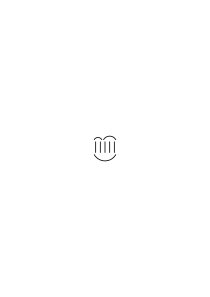

Here we have something that looks inexorable. And yet: ‘inexorable’ can only be true in its consequences! For otherwise it is just a picture. What is the remote effect – as one might call it – of this diagram?

### [84\[3\]](https://cdn.wittgensteinnachlass.com/2000px/webp/Ms-117/84.webp),[85\[1\]](https://cdn.wittgensteinnachlass.com/2000px/webp/Ms-117/85.webp)

I have read a proof—now I am convinced. – What if I were to forget this conviction immediately! For it is a peculiar process that I _go through_ the proof & then accept its result. – I mean: that is simply how we _do_ it. That is our custom, or a fact of our natural history.

### [85\[2\]](https://cdn.wittgensteinnachlass.com/2000px/webp/Ms-117/85.webp)

‘If I have _five_, then I have _three_ and _two_.’ – But how do I know that I have five? – Well, if it looks like that

∣∣∣∣∣. –

And is it also certain that, if it looks _like that_, I can always break it down into _such_ groups? It is a fact that we can play this game: I teach someone what a group of two, three, four, or five looks like, & I teach him to match lines to one another (perhaps using lines) one-to-one; then I have him carry out the command twice each time: “Draw a group of five” – & then the command: “Match the two groups”; & it turns out that, almost _always_, he matches the lines perfectly. Or also: it is a fact that, when matching one-to-one what I draw as groups of five, I almost never run into difficulties.

### [85\[3\]](https://cdn.wittgensteinnachlass.com/2000px/webp/Ms-117/85.webp),[86\[1\]](https://cdn.wittgensteinnachlass.com/2000px/webp/Ms-117/86.webp)

I’m supposed to put the puzzle together; I try back and forth, unsure whether I’ll be able to do it. Now someone shows me the picture of the solution: – now I say – without a shred of doubt – “now I can do it!” – Is it _certain_ that I will now be able to put it together? – But the fact is: I do not doubt it. If someone were to ask: “What is the remote effect of that picture?” – It lies in its _application_, wherever it may be.

### [86\[2\]](https://cdn.wittgensteinnachlass.com/2000px/webp/Ms-117/86.webp),[86\[3\]](https://cdn.wittgensteinnachlass.com/2000px/webp/Ms-117/86.webp),[87\[1\]](https://cdn.wittgensteinnachlass.com/2000px/webp/Ms-117/87.webp),[87\[2\]](https://cdn.wittgensteinnachlass.com/2000px/webp/Ms-117/87.webp)

I once said it was not _an empirical fact_: that the tangent of a visual curve runs along a section of it; & if a figure shows this, then not as the result of an experiment.

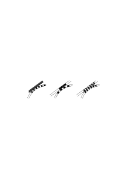

One could also say: You see here that segments of a continuous visual curve are straight. – But shouldn’t I say: – “You call that a ‘curve,’ don’t you? – And do you now call this little segment ‘curved’ or ‘straight’? – You call that a ‘straight line,’ & it contains this segment.” But why shouldn’t one use a _new_ word for visual segments of a curve that can also lie on a straight line? “The experiment of drawing these lines has shown that they do not touch at a single _point_.” – That _they_ do not touch at a point? How are ‘they’ defined? Or: can you show me what it is like when they ‘touch at a point’? For why shouldn’t I simply say: the experiment has shown that they—namely a crooked and a straight line—_touch_ one another? For is this _not_ what I call the “contact” of such lines?

### [87\[3\]](https://cdn.wittgensteinnachlass.com/2000px/webp/Ms-117/87.webp),[88\[1\]](https://cdn.wittgensteinnachlass.com/2000px/webp/Ms-117/88.webp)

What if someone said: “Experience teaches you that this line

is curved”? – Then one would have to say that here the words “this line” mean the physical line drawn on the paper. One can actually carry out the experiment & show this line to different people & ask: “What do you see; a straight line, or a curved line?” – But if someone said: “I am now imagining a curved line”, & we say to him: “Then you see that this line is a curved line” – what sense would that make?

### [88\[2\]](https://cdn.wittgensteinnachlass.com/2000px/webp/Ms-117/88.webp)

Let's draw a circle from black & white pieces, which get smaller & smaller.

“Which of these pieces – from left to right – already appears to you as straight?” This is an experiment. But one can also say: “I imagine a circle from black & white pieces, one is large, curved, the following ones become smaller, the sixth one is already straight.” Where is the experiment here?

### [88\[3\]](https://cdn.wittgensteinnachlass.com/2000px/webp/Ms-117/88.webp)

In the imagination, I can calculate, but not experiment.

### [88\[4\]](https://cdn.wittgensteinnachlass.com/2000px/webp/Ms-117/88.webp),[89\[1\]](https://cdn.wittgensteinnachlass.com/2000px/webp/Ms-117/89.webp)

_In_ a demonstration, we _come_ to an agreement with someone. If we do not agree on it, our paths diverge before communication through this language takes place. It is not essential that one person convince the other through the demonstration. Both can see (read) it and acknowledge it.

### [89\[2\]](https://cdn.wittgensteinnachlass.com/2000px/webp/Ms-117/89.webp),[90\[1\]](https://cdn.wittgensteinnachlass.com/2000px/webp/Ms-117/90.webp)

“You see—there can be no doubt that a group like A essentially

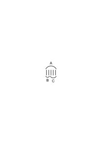

of one like B and one like C!” – I also say—that is, I also express myself this way—that the group you have drawn consists of the two smaller ones; but I do not know whether every group that I would call one of the form of the first will necessarily be composed of two groups of the kind of those smaller ones. ‒ ‒ But I believe it will probably always be so (my experience may have taught me this) & therefore I want to adopt the following rule: I will call a group one of the type A if and only if it can be decomposed into two groups like B & C.

### [90\[2\]](https://cdn.wittgensteinnachlass.com/2000px/webp/Ms-117/90.webp)

And so the drawing also works as a proof.

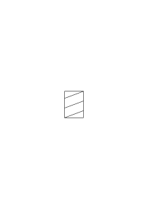

“Yes, indeed! Two parallelograms combine to form this shape!” (This is very similar to when I say: “Yes, really! A curve can consist of straight pieces.”) – I wouldn’t have thought that. – Yes – not that the parts of this figure above produce this figure! That means nothing. – But I am only surprised when I think that I have placed the upper parallelogram (unconsciously) on the lower one and now see this result.

### [90\[3\]](https://cdn.wittgensteinnachlass.com/2000px/webp/Ms-117/90.webp)

And one could say: the proof proves exactly what surprises you.

### [90\[4\]](https://cdn.wittgensteinnachlass.com/2000px/webp/Ms-117/90.webp),[91\[1\]](https://cdn.wittgensteinnachlass.com/2000px/webp/Ms-117/91.webp)

For why do I say that this figure convinces me of something, and not just this one as well:

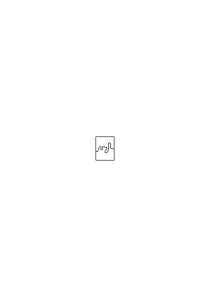

It also shows that two such pieces give a rectangle. “But that is uninteresting,” one wants to say. And why is it uninteresting?

### [91\[2\]](https://cdn.wittgensteinnachlass.com/2000px/webp/Ms-117/91.webp)

If one says: “This shape consists of these shapes” – one imagines the shape as a fine drawing, a fine framework of this shape, onto which the things that have this shape are, as it were, stretched. (Compare: Plato’s conception of property.)

### [91\[3\]](https://cdn.wittgensteinnachlass.com/2000px/webp/Ms-117/91.webp)

This is related to what I wrote above: “… that a group _essentially_ consists of …”. When, then, does a group ‘_essentially_’ consist of …? That depends, of course, on the way we use the _designation_ we give to the group. A hand does indeed have 5 fingers, but I would not have said: the fingers of my hand essentially consist of 3 + 2 (fingers). Well, it is essential ‘when it cannot be otherwise’; & it cannot be otherwise if the group, with its division, is to serve as a paradigm. The _essential_ move is a move of the mode of representation.

### [92\[1\]](https://cdn.wittgensteinnachlass.com/2000px/webp/Ms-117/92.webp)

See the sentence: “When does a group ‘essentially’ consist of …?” & many others that I use time and again. It is meant to say: “When do we _say_: ‘a group essentially consists of …’?” _Thus_, the grammatical sentence is clothed in a non-grammatical form.

### [92\[2\]](https://cdn.wittgensteinnachlass.com/2000px/webp/Ms-117/92.webp)

What is your goal in philosophy? – I show the fly the way out of the fly bottle. This path is, in one sense, _impossible_ to find, & in another sense, quite easy.

### [92\[3\]](https://cdn.wittgensteinnachlass.com/2000px/webp/Ms-117/92.webp),[93\[1\]](https://cdn.wittgensteinnachlass.com/2000px/webp/Ms-117/93.webp),[94\[1\]](https://cdn.wittgensteinnachlass.com/2000px/webp/Ms-117/94.webp)

“This form consists of these forms. You have shown me an essential property of this form.” – You have shown me a new _image_. It is as if _God_ had composed it this way. – _We are thus using a simile_. The _form_ becomes the ethereal being that possesses this form; it is as if it had been composed this way once and for all (by the one who placed the essential properties into things). For if we make the form into the thing that consists of parts, then the master craftsman of the form is the one who also created light and darkness, color and hardness, etc. (Suppose someone asked: “The form … is composed of these parts; who composed it? You?”) The word “being” has been used for a sublimated, ethereal kind of existence. Now consider the sentence: “Red is” (e.g.). Of course, no one ever uses it. But if I were to invent a use for it, it would be as an introductory formula for statements that are then to make use of the word “red,” e.g.; when uttering the formula, I look at a pattern of the color red. One is tempted to say a sentence like “Red is” when one looks at the color with attention: that is, in the same _situation_ in which one ascertains the existence of a thing (a leaf-like beetle, for example). And I want to say: when one uses the expression, “the proof has taught me—has convinced me—that this is the case,” one is still within that simile.

### [94\[2\]](https://cdn.wittgensteinnachlass.com/2000px/webp/Ms-117/94.webp)

I could also have said: What is essential is never the property of the object, but the characteristic of the concept.

### [94\[3\]](https://cdn.wittgensteinnachlass.com/2000px/webp/Ms-117/94.webp)

‘If the _shape_ of the group is the same, then it _must_ be possible to divide it _in this way_. For this belongs to the shape.’

### [94\[4\]](https://cdn.wittgensteinnachlass.com/2000px/webp/Ms-117/94.webp)

We are always too inclined to talk about the strangest, most unprecedented events, instead of just talking about everyday, well-known things. A certain behaviorism is therefore invaluable because it teaches us to think about what we know, what we are familiar with, instead of about fictions that our language suggests. (Similar: _time_ & _clock_.) But we are led by our speculations, against our will, to the unusual, the strange, and it always requires a decision and an effort to return to the well-known.

### [95\[1\]](https://cdn.wittgensteinnachlass.com/2000px/webp/Ms-117/95.webp)

“I never noticed that,” – although I have seen it a hundred times. – The purpose of an experiment is not to _make you attentive_ to what you have long known.

### [95\[2\]](https://cdn.wittgensteinnachlass.com/2000px/webp/Ms-117/95.webp)

Why do philosophical questions seem so _disturbing_? Or should I say: philosophical questions arise from a (certain) irritation, because the mental strain is accompanied by irritation. (Similarity with nail-biting.) One can say: the philosopher must always strive to find peace.

### [95\[3\]](https://cdn.wittgensteinnachlass.com/2000px/webp/Ms-117/95.webp),[96\[1\]](https://cdn.wittgensteinnachlass.com/2000px/webp/Ms-117/96.webp)

“If the form of the group was the same, then it must have the same aspects, the same possibilities of division. If it has other (aspects), then it is not the same form; it may have made the same impression on you in some way; but it is only _the same form_ if you can divide it in the same way.”

It is as if this were expressing the essence of the form. – But I say: whoever speaks of the _essence_ merely states a convention. And one might well object: there is nothing more different than a statement about the depth of essence and one about a mere convention. But what if I reply: the _depth_ of essence corresponds to the _deep_ need for this convention. So when I say, “it is as if this sentence expressed the _essence_ of form,” I mean: it is as if this sentence expressed a property of the—essence _of form_!—And one can say: The essence of which it makes a statement, and which I here call the essence ‘form,’ is the image that appears to me inseparably connected with the word “form.”

### [96\[2\]](https://cdn.wittgensteinnachlass.com/2000px/webp/Ms-117/96.webp),[97\[1\]](https://cdn.wittgensteinnachlass.com/2000px/webp/Ms-117/97.webp)

How do we _learn_ to reason? Or do we not learn it? Does a child know that a double negation implies affirmation? – And how does one _convince_ it of this? Presumably, by showing it a process (a double reversal, a rotation of 180 degrees twice, etc.) that it then accepts as a picture of negation. And one makes the sense of “(x)․fx” clear by insisting that “fa” follows from it.

### [97\[2\]](https://cdn.wittgensteinnachlass.com/2000px/webp/Ms-117/97.webp)

Is an experiment in which we observe acceleration during free fall a physical experiment, or is it a psychological one, showing what people see under such circumstances? – Can it not be both? Does it not depend on its _context_: on what we do with it, what we say about it? Could one not say that a particular experiment is only something within the framework of a theory?

### [RFM II](/w-rfm-2/#ms-117-97.3+98.1) [97\[3\]](https://cdn.wittgensteinnachlass.com/2000px/webp/Ms-117/97.webp),[98\[1\]](https://cdn.wittgensteinnachlass.com/2000px/webp/Ms-117/98.webp) {#97-3--98-1}

_--- Approaches_

To what extent does the diagonal method provide a proof that there is a number that—let’s say—is not a square root? –

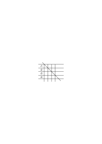

It is, of course, extremely easy to show ‘that there are numbers that are not square roots’—but how does _this_ method demonstrate it?

_[Approaches]_

Do we have a general concept of what it means to show that there is a number that is not part of this infinite set? Suppose someone were given the task of naming a number that is different from all of ²√n; but they knew nothing of the diagonal method & named the number ∛2 as the solution; & showed that it is not ²√n. – Or he might have said: take √2 = 1.4142 … and subtract 1 from the first decimal place; otherwise, however, the digits must match those of √2. 1.3142 … cannot be √n.

### [RFM II](/w-rfm-2/#ms-117-98.2) [98\[2\]](https://cdn.wittgensteinnachlass.com/2000px/webp/Ms-117/98.webp) {#98-2}

“Name a number that matches √2 at every second decimal place!” What does this task require? – The question is: is it satisfied by the answer: It is the number that is obtained according to the rule: develop √2 & add 1 or ‒ 1 to each second decimal place? It is just like the task: divide an angle into 3 parts, which can be considered solved by placing 3 equal angles next to each other.

### [RFM II](/w-rfm-2/#ms-117-99.1) [99\[1\]](https://cdn.wittgensteinnachlass.com/2000px/webp/Ms-117/99.webp) {#99-1}

_[Approaches]_

If, when asked to “Show me a number that is different from all of these,” the diagonal rule is given as the answer, why should he not say: “But that is not what I meant!”? What you have given me is a rule for successively producing numbers that are different from each of these in turn. “But why don’t you also call this a method for calculating a number?” – But what is the method of calculation here & what is the calculated result? You will say they are _one_, because one can now, for example, say: the number D is greater than … & less than …; one can square it, etc. etc. Is the question not actually: What can this number be _used_ for? Yes, that sounds strange. – But it simply means in what mathematical environment it stands.

### [RFM II](/w-rfm-2/#ms-117-99.3+100.1) [99\[3\]](https://cdn.wittgensteinnachlass.com/2000px/webp/Ms-117/99.webp),[100\[1\]](https://cdn.wittgensteinnachlass.com/2000px/webp/Ms-117/100.webp) {#99-3--100-1}

_[Approaches]_

So I am comparing methods of calculation. – But there are, of course, very different methods of comparison. I am supposed, however, in some sense compare the _results_ of the methods with one another. But that’s where everything becomes unclear, because in _a certain_ sense not every method yields _a_ result, or it is not clear from the outset what is to be regarded as _the_ result in each case. I mean to say that here there is every opportunity to twist and turn the meanings. –

### [RFM II](/w-rfm-2/#ms-117-100.2) [100\[2\]](https://cdn.wittgensteinnachlass.com/2000px/webp/Ms-117/100.webp) {#100-2}

Let's say – not: “The method gives a result,” but: “it gives an infinite series of results.” How do I compare infinite series of results? Yes, there are very different things that I can call that.

### [RFM II](/w-rfm-2/#ms-117-100.3) [100\[3\]](https://cdn.wittgensteinnachlass.com/2000px/webp/Ms-117/100.webp) {#100-3}

It always says here: Look _further_ around you!

### [RFM II](/w-rfm-2/#ms-117-100.4+101.1) [100\[4\]](https://cdn.wittgensteinnachlass.com/2000px/webp/Ms-117/100.webp),[101\[1\]](https://cdn.wittgensteinnachlass.com/2000px/webp/Ms-117/101.webp) {#100-4--101-1}

_[Approaches]_

The result of a calculation expressed in word-language must be viewed with suspicion. The _calculation_ sheds light on the meaning of the verbal expression. It is the _finer_ instrument for determining meaning. If you want to know what the verbal expression means, look at the calculation; not the other way around. The verbal expression casts only a dim, general glow on the calculation; the calculation, however, casts a glaring light on the verbal expression. (As if you wanted to make a comparison of the heights of two mountains not by measuring their heights but by their apparent ratio when viewed from below.)

### [RFM II](/w-rfm-2/#ms-117-101.2) [101\[2\]](https://cdn.wittgensteinnachlass.com/2000px/webp/Ms-117/101.webp) {#101-2}

‘I want to teach you a method of how, in a sequence, you can _avoid_ all these sequences.’ Such a method is the diagonal method. – “So it generates a sequence that is different from all of these.” Is that correct? – Yes; if you want to apply these words to the case described above.

### [RFM II](/w-rfm-2/#ms-117-101.3+102.1) [101\[3\]](https://cdn.wittgensteinnachlass.com/2000px/webp/Ms-117/101.webp),[102\[1\]](https://cdn.wittgensteinnachlass.com/2000px/webp/Ms-117/102.webp) {#101-3--102-1}

_[Approaches]_

How about this construction method: The diagonal number is generated by adding or subtracting 1, but whether to add or subtract is only known once the original series has been continued for several terms. As if one were to say: the development of the diagonal series never catches up with the development of the other series; – certainly the diagonal series evades each of the series when it encounters them, but that does it no good since the development of the other series is ahead of it again. I can say here, however: there is _always_ one of the series for which it is not determined whether it differs from the diagonal series or not. One can say: they pursue one another to infinity, but the original series is always ahead. “But your rule already extends to infinity, so you already know for certain that the diagonal series will differ from every other one!”– – –

### [RFM II](/w-rfm-2/#ms-117-102.2+103.1) [102\[2\]](https://cdn.wittgensteinnachlass.com/2000px/webp/Ms-117/102.webp),[103\[1\]](https://cdn.wittgensteinnachlass.com/2000px/webp/Ms-117/103.webp) {#102-2--103-1}

_[Approaches]_

It means nothing to say: “_Therefore_, the X-numbers are uncountable.” One could say, for example: I call the set of numbers X uncountable if it is established that, whichever numbers falling under it you arrange in a sequence, the diagonal number of that sequence also falls under it.

### [RFM II](/w-rfm-2/#ms-117-103.2+103.3+104.1) [103\[2\]](https://cdn.wittgensteinnachlass.com/2000px/webp/Ms-117/103.webp),[103\[3\]](https://cdn.wittgensteinnachlass.com/2000px/webp/Ms-117/103.webp),[104\[1\]](https://cdn.wittgensteinnachlass.com/2000px/webp/Ms-117/104.webp) {#103-2--103-3--104-1}

_[Approaches]_

Since my drawing is, after all, only a _suggestion_ of infinity, why must I draw it this way:

& not this way:

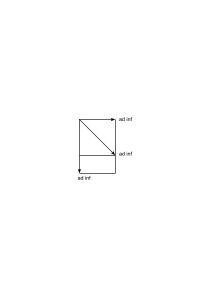

Here we simply have different images; & they correspond to different ways of speaking. But does anything useful come of it when we argue about _their_ validity? The important thing must lie elsewhere; even if these images most strongly stir our _imagination_.

### [RFM II](/w-rfm-2/#ms-117-104.2) [104\[2\]](https://cdn.wittgensteinnachlass.com/2000px/webp/Ms-117/104.webp) {#104-2}

What can the concept ‘uncountable’ be used for?

### [RFM II](/w-rfm-2/#ms-117-104.3) [104\[3\]](https://cdn.wittgensteinnachlass.com/2000px/webp/Ms-117/104.webp) {#104-3}

One could say – if someone tried day after day to ‘bring all irrational numbers into a sequence’: “Stop! it means nothing; don't you see: if you had set up a sequence, I would come to you with the diagonal sequence!” That might distract him from his work. Well, that would be a use. And it seems to me that that would also be the whole & proper purpose of this method. It makes use of the vague concept of this person, who works away in a kind of idiotic manner, & brings him to rest through an image. (But one could also bring him to continue his work through another image.)

### [RFM II](/w-rfm-2/#ms-117-105.1) [105\[1\]](https://cdn.wittgensteinnachlass.com/2000px/webp/Ms-117/105.webp) {#105-1}

The method demonstrates something – what one can in a very vague way call the demonstration that _these_ methods of calculation cannot be arranged in a sequence. And the meaning of “_these_” is kept vague here.

### [RFM II](/w-rfm-2/#ms-117-105.2) [105\[2\]](https://cdn.wittgensteinnachlass.com/2000px/webp/Ms-117/105.webp) {#105-2}

A clever man has become caught in this web of language: So it must be an interesting web of language.

### [RFM II](/w-rfm-2/#ms-117-105.3+106.1+107.1) [105\[3\]](https://cdn.wittgensteinnachlass.com/2000px/webp/Ms-117/105.webp),[106\[1\]](https://cdn.wittgensteinnachlass.com/2000px/webp/Ms-117/106.webp),[107\[1\]](https://cdn.wittgensteinnachlass.com/2000px/webp/Ms-117/107.webp) {#105-3--106-1--107-1}

The mistake begins with saying that the cardinal numbers can be arranged in a series. What concept does one have of this arrangement? Yes, one naturally has that of a finite series, but that gives us at most a vague idea, a guiding star for the formation of a concept.) The concept itself is, after all, _abstracted_ from this and some other sequences; or: the expression denotes a certain analogy of cases, and one can use it, for example, to provisionally delimit a domain one wants to discuss. But this does not mean that the question has a clear sense: “Can the set R be arranged in a sequence?” For this question now has a meaning that is similar to: Can one do something with these structures that corresponds to ordering the cardinal numbers into a sequence? So if one asks: “Can the real numbers be ordered into a sequence?” The honest answer might be: “I can’t imagine anything precise by that at the moment.” – “But you can, for example, arrange the roots and the algebraic numbers in a sequence; so you do have some understanding of the expression!” – More correctly, I _have_ here certain analogous structures that I name “sequences.” But I do not yet have any certainty about a bridge from these cases to the ‘set of all real numbers.’ I also have no general method to test whether this or that set ‘can be arranged in a sequence.’ Now one shows me the diagonal method and says: “Here you have the proof that this arrangement does not work.” But I can reply: “I do not know—as I said—what it is that _does not work_ here.” However, I do see that you will show a distinction in the use of “root,” “algebraic number,” etc., on the one hand, and “real number” on the other. Namely, something like this: We call the roots “real numbers,” and the diagonal number formed from the roots _as_ _well_. And similarly with all sequences of real numbers. Therefore, it makes no sense to speak of a “sequence _of all_ real numbers,” because one also calls the diagonal number of the sequence a “real number.” – Wouldn’t that be somewhat similar to if one usually called every sequence of books a book itself and now said: “It makes no sense to speak of ‘the sequence of all books,’ since every sequence is itself a book.”

### [RFM II](/w-rfm-2/#ms-117-107.2+108.1) [107\[2\]](https://cdn.wittgensteinnachlass.com/2000px/webp/Ms-117/107.webp),[108\[1\]](https://cdn.wittgensteinnachlass.com/2000px/webp/Ms-117/108.webp) {#107-2--108-1}

It is very useful here to imagine that the diagonal method for generating a real number had been known long before the invention of set theory—and had also been familiar to schoolchildren—as it very well could have been. For this changes the aspect of Cantor’s discovery. This discovery could very well have consisted _merely_ in the interpretation of this long-known, elementary calculation.

### [RFM II](/w-rfm-2/#ms-117-108.2) [108\[2\]](https://cdn.wittgensteinnachlass.com/2000px/webp/Ms-117/108.webp) {#108-2}

The calculation itself is useful. The task would be something like: Write a decimal number that is different from the numbers:

<math display="block">
  <mtable columnalign="right left left left left left left left" columnspacing="0em" rowspacing="0.3em">
    <mtr>
      <mtd>
        <mn>0</mn>
        <mo>·</mo>
      </mtd>
      <mtd>
        <mn>1</mn>
      </mtd>
      <mtd>
        <mn>2</mn>
      </mtd>
      <mtd>
        <mn>4</mn>
      </mtd>
      <mtd>
        <mn>6</mn>
      </mtd>
      <mtd>
        <mn>7</mn>
      </mtd>
      <mtd>
        <mn>9</mn>
      </mtd>
      <mtd>
        <mn>8</mn>
      </mtd>
    </mtr>
    <mtr>
      <mtd>
        <mn>0</mn>
        <mo>·</mo>
      </mtd>
      <mtd>
        <mn>3</mn>
      </mtd>
      <mtd>
        <mn>4</mn>
      </mtd>
      <mtd>
        <mn>6</mn>
      </mtd>
      <mtd>
        <mn>9</mn>
      </mtd>
      <mtd>
        <mn>8</mn>
      </mtd>
      <mtd>
        <mn>7</mn>
      </mtd>
      <mtd>
        <mn>6</mn>
      </mtd>
    </mtr>
    <mtr>
      <mtd>
        <mn>0</mn>
        <mo>·</mo>
      </mtd>
      <mtd>
        <mn>0</mn>
      </mtd>
      <mtd>
        <mn>1</mn>
      </mtd>
      <mtd>
        <mn>2</mn>
      </mtd>
      <mtd>
        <mn>7</mn>
      </mtd>
      <mtd>
        <mn>6</mn>
      </mtd>
      <mtd>
        <mn>4</mn>
      </mtd>
      <mtd>
        <mn>9</mn>
      </mtd>
    </mtr>
    <mtr>
      <mtd>
        <mn>0</mn>
        <mo>·</mo>
      </mtd>
      <mtd>
        <mn>3</mn>
      </mtd>
      <mtd>
        <mn>4</mn>
      </mtd>
      <mtd>
        <mn>2</mn>
      </mtd>
      <mtd>
        <mn>6</mn>
      </mtd>
      <mtd>
        <mn>7</mn>
      </mtd>
      <mtd>
        <mn>9</mn>
      </mtd>
      <mtd>
        <mn>4</mn>
      </mtd>
    </mtr>
    <mtr>
      <mtd></mtd>
      <mtd>
        <mo>·</mo>
      </mtd>
      <mtd>
        <mo>·</mo>
      </mtd>
      <mtd>
        <mo>·</mo>
      </mtd>
      <mtd>
        <mo>·</mo>
      </mtd>
      <mtd>
        <mo>·</mo>
      </mtd>
      <mtd>
        <mo>·</mo>
      </mtd>
      <mtd>
        <mo>·</mo>
      </mtd>
    </mtr>
  </mtable>
</math>

_One imagines a long sequence._

The child thinks: How am I supposed to do that? I would have to look at all the numbers at the same time in order to avoid writing down one of them. The method now says: not at all; change the first digit of the first number, the second of the second, etc. & you can be sure that you have written down a number that does not match any of the given ones. The number that one obtains in this way could always be called the diagonal number.

### [RFM II](/w-rfm-2/#ms-117-108.3+109.1) [108\[3\]](https://cdn.wittgensteinnachlass.com/2000px/webp/Ms-117/108.webp),[109\[1\]](https://cdn.wittgensteinnachlass.com/2000px/webp/Ms-117/109.webp) {#108-3--109-1}

The dangerous, misleading aspect of the formulation “One cannot arrange the real numbers in a sequence” or even “The set … is not countable” lies in the fact that it makes what is a definition, a formation of concepts, appear as a fact of nature.

### [RFM II](/w-rfm-2/#ms-117-109.2) [109\[2\]](https://cdn.wittgensteinnachlass.com/2000px/webp/Ms-117/109.webp) {#109-2}

The modest formulation would be: “If one calls something a sequence of real numbers, then the development of the diagonal method is also a ‘real number’ & namely one that is ‘different from all the members of the sequence’.”

### [RFM II](/w-rfm-2/#ms-117-109.3) [109\[3\]](https://cdn.wittgensteinnachlass.com/2000px/webp/Ms-117/109.webp) {#109-3}

Our suspicion should always be aroused when a proof proves more than its means allow it to. One could call such a thing a ‘boastful proof’.

### [RFM II](/w-rfm-2/#ms-117-109.4+110.1) [109\[4\]](https://cdn.wittgensteinnachlass.com/2000px/webp/Ms-117/109.webp),[110\[1\]](https://cdn.wittgensteinnachlass.com/2000px/webp/Ms-117/110.webp) {#109-4--110-1}

The usual expression feigns a process, a method of ordering, which is indeed applicable here but does not lead to the goal because of the number of objects, which is greater than even that of the cardinal numbers. If one were to say: “The consideration of the diagonal method shows you that the _concept_ ‘real number’ has much less analogy with the concept of cardinal number than one is inclined to believe, seduced by certain analogies,” then that would have a good & honest sense. But instead, the _opposite_ happens: by allegedly comparing the ‘set’ of real numbers in terms of size with that of the cardinal numbers. The difference in kind between the two conceptions is presented as a difference in extension through a misleading expression. I believe & hope that a future generation will laugh at this hocus pocus.

### [110\[2\]](https://cdn.wittgensteinnachlass.com/2000px/webp/Ms-117/110.webp),[111\[1\]](https://cdn.wittgensteinnachlass.com/2000px/webp/Ms-117/111.webp),[112\[1\]](https://cdn.wittgensteinnachlass.com/2000px/webp/Ms-117/112.webp),[113\[1\]](https://cdn.wittgensteinnachlass.com/2000px/webp/Ms-117/113.webp),[114\[1\]](https://cdn.wittgensteinnachlass.com/2000px/webp/Ms-117/114.webp)

27.06.1938

_Preface._

In what follows, I want to publish a selection of the philosophical remarks that I have written down over the last 10 years. They concern (very) different areas of philosophical speculation: the concept of meaning, of understanding, of the sentence, of logic, the foundations of mathematics, sensory experience, the contrast between idealism & realism, and other things. I originally wrote all of these thoughts as _remarks_, short paragraphs. Sometimes in longer chains about one & the same object, sometimes in rapid succession, jumping from one area to another. – My intention was to bring all of this together in one book; and at different times I had different ideas about its form. What was essential (however) was that the thought in it should run through all (the) subjects treated in a well-ordered sequence. About 4 years ago, I made the first attempt at such a compilation. The result was unsatisfactory & I made further attempts; – – until finally, after another 2 years, I came to the conviction that it was a futile effort, & that I had to abandon all such attempts. It became clear to me that the best thing I could write would always remain only philosophical remarks; that my thoughts soon faded when I tried to make them run along a track against their natural inclination. – This, of course, was also related to the nature of the subject; which requires that one traverse the field of thought criss-cross, in all directions – (so) that the individual thoughts stand in relation to one another in an extremely complicated network. I begin these publications with the fragment of my last attempt to arrange my philosophical thoughts in a sequence. This fragment may have the advantage of being able to convey a relatively clear idea of my method. I want to follow this fragment with a mass of remarks in more or less loose connection. But I want to explain (to the reader) the connections between these remarks, where their arrangement does not make them apparent, by means of a numbering: Each remark should have a running number & also the numbers of (those) remarks that are in important relation to it. I wished that all of these remarks were better than they are. – In general, they lack strength & precision. I am publishing (only) those that do not seem too boring to me. Until recently, I had actually given up the idea of publishing them during my lifetime. But the idea was revived, & perhaps mainly because I had to realize that the results of my work, which I had communicated orally in lectures & discussions, were often misunderstood, & more or less watered down & mutilated, in circulation. This stirred my vanity & it threatened to rob me of my peace again & again if I did not – at least for myself – settle the matter through a publication; & that also seemed the most desirable thing in many other respects.

### [114\[2\]](https://cdn.wittgensteinnachlass.com/2000px/webp/Ms-117/114.webp),[115\[1\]](https://cdn.wittgensteinnachlass.com/2000px/webp/Ms-117/115.webp)

For _various_ reasons, my thoughts will touch upon what others write today. If my remarks bear no mark in themselves that identifies them as mine, I do not want to claim them (any longer) as my own. Since I began to engage with philosophy again 10 years ago, I have had to recognize serious errors in what I had set forth at the time in the ‘Log. Phil. Abh.’ at the time. Recognizing these errors was aided—to an extent I can scarcely judge myself—by the criticism my ideas received from Frank Ramsey, with whom I discussed them in countless conversations during the last two years of his life. But even more than this (extremely) sound criticism, I owe a debt to the criticism that Piero Sraffa, Professor of Economics, applied to my thoughts. Without _this_ stimulus, I would likely never have arrived at the most significant idea of these investigations. I present these to the public not without mixed feelings. I dare not hope that, (in our _dark_ age,) my work will be able to cast rays of light into one mind or another. My purpose is not to spare anyone the trouble of thinking; rather, I would like, if possible, to encourage someone to think their own thoughts. These writings are actually dedicated to my friends. If I do not formally dedicate them to them, it is because most of them will not read them.

### [116\[1\]](https://cdn.wittgensteinnachlass.com/2000px/webp/Ms-117/116.webp)

_Dedicated to my friends. Preface._

### [116\[2\]](https://cdn.wittgensteinnachlass.com/2000px/webp/Ms-117/116.webp),[117\[1\]](https://cdn.wittgensteinnachlass.com/2000px/webp/Ms-117/117.webp),[118\[1\]](https://cdn.wittgensteinnachlass.com/2000px/webp/Ms-117/118.webp),[119\[1\]](https://cdn.wittgensteinnachlass.com/2000px/webp/Ms-117/119.webp)

In what follows, I want to publish a selection of the philosophical remarks that I have written down over the last 10 years. They concern a variety of areas: the concept of meaning, understanding, the sentence, logic, the foundations of mathematics, sense data, the contrast between idealism & realism, & others. I originally wrote all these thoughts down as _remarks_, short paragraphs. Sometimes in longer sequences about one & the same object, sometimes, in rapid alternation, jumping from one (area) to another. – My intention was to bring all this together in one book; I had different ideas about its form at different times. But it was always essential that the thought should run through all the subjects treated in a well-ordered sequence. About 4 years ago, I made the first attempt at such a compilation. The result was unsatisfactory; & I made further attempts. – Until finally, after about 2 years, I came to the conclusion that it was in vain – & that I should abandon all such attempts. It became clear to me that the best thing I could write would always remain philosophical remarks; that my thoughts soon flagged when I tried to keep them, against their natural inclination, on _one_ track. – This was also due, of course, to the nature of the subject matter itself. It compels one to traverse the field of thought criss-cross, in all directions – so that the individual thoughts stand in a complicated network of relationships to one another. I begin these publications with the fragment of my last attempt to arrange my philosophical thoughts in a sequence. This fragment may perhaps have the advantage of being able to convey a relatively clear idea of my method. I intend to follow this fragment with a mass of remarks in more or less loose connection. But I will explain the connections between my remarks, where their arrangement does not make them apparent, by means of a numbering: each remark shall have a running number, & also the numbers of those remarks that stand in important relationships to it. I wish that all these remarks were better than they are. – To put it briefly, they lack force & precision. I am publishing here those that do not seem too dull to me. Until recently, I had actually given up the idea of publishing them during my lifetime. But it was revived, & perhaps mainly because I had to realize that the results of my work, which I had communicated orally in lectures & discussions, were often misunderstood & more or less diluted & distorted. – This stirred my vanity & it threatened to rob me of my peace of mind again & again if I did not settle the matter – at least for myself – by means of a publication. And this also seemed to be the most desirable thing in other respects. For _various_ reasons, what I am publishing here will touch on what others are writing today. If my remarks do not bear a stamp that marks them as mine, – then I will not claim them further as my property.

### [119\[2\]](https://cdn.wittgensteinnachlass.com/2000px/webp/Ms-117/119.webp),[120\[1\]](https://cdn.wittgensteinnachlass.com/2000px/webp/Ms-117/120.webp)

Since I began to concern myself with philosophy again 10 years ago, I have had to acknowledge serious errors in _that_ which I set down in the ‘Logical-Philosophical Treatise’ at the time. Recognizing these errors has helped my ideas – to a degree that I can hardly assess myself – through the criticism they received from Frank Ramsey; with whom I discussed them in countless discussions in the last two years of his life. I owe even more to the criticism that Mr. Piero Sraffa, a teacher of economics in Cambridge, has made of my thoughts. _This_ stimulus is what I owe the most consequential of the thoughts communicated here. I submit these not without dubious feelings to the public. I do not dare to hope that it (in our dark age) should be the fate of this meager work to shed light on one or another mind. I would not want to spare others from thinking with my writing; rather, if possible, to stimulate someone to their own thoughts.

### [120\[2\]](https://cdn.wittgensteinnachlass.com/2000px/webp/Ms-117/120.webp),[121\[1\]](https://cdn.wittgensteinnachlass.com/2000px/webp/Ms-117/121.webp),[122\[1\]](https://cdn.wittgensteinnachlass.com/2000px/webp/Ms-117/122.webp),[123\[1\]](https://cdn.wittgensteinnachlass.com/2000px/webp/Ms-117/123.webp),[124\[1\]](https://cdn.wittgensteinnachlass.com/2000px/webp/Ms-117/124.webp),[125\[1\]](https://cdn.wittgensteinnachlass.com/2000px/webp/Ms-117/125.webp),[126\[1\]](https://cdn.wittgensteinnachlass.com/2000px/webp/Ms-117/126.webp),[126\[2\]](https://cdn.wittgensteinnachlass.com/2000px/webp/Ms-117/126.webp)

_Preface:_

In what follows, I intend to publish a selection of the philosophical remarks that I have written down over the past 9 years. They concern many areas of philosophical speculation: the concept of meaning, understanding, the sentence, logic, the foundations of mathematics, sense data, the contrast between idealism & realism, and others. Originally, I wrote my thoughts as _remarks_, short paragraphs, sometimes in longer sequences on the same object, sometimes switching the area abruptly. – But my intention was to bring all of this together in one book – the form of which I imagined differently at different times. It seemed essential to me, however, that the thoughts in it should progress from one object to another in a well-ordered sequence. About 4 years ago, I made the first attempt at such a compilation. The result was unsatisfactory, & I made further attempts. Until finally (a few years later) I came to the conclusion that it was futile; & that I should abandon all such attempts. It became clear to me that the best I could write would always remain philosophical remarks; that my thoughts soon faded when I tried to force them, against their natural inclination, along _one_ track. This, however, was also related to the nature of the subject itself. This subject compels us to traverse the field of thought criss-cross, in all directions (so that the thoughts are thus in a complicated network of relationships to one another). I begin this publication with the fragment of my last attempt to arrange my philosophical thoughts in a sequence. This fragment may have the advantage of being able to convey a relatively clear idea of my method. I intend to follow this fragment with a mass of remarks in more or less loose arrangement. However, I will explain the connections between the remarks, where their arrangement does not make them apparent, by means of a numbering system. Each remark should have a running number & also the numbers of those remarks that stand in important relationships to it. I wish all these remarks were better than they are. – To put it briefly, they lack force & precision. I am publishing those here that do not seem too boring to me. Until recently, I had actually given up the idea of publishing them during my lifetime. But it was revived, & perhaps mainly because I had to realize that the results of my work, which I had communicated orally in lectures & discussions, were often misunderstood & more or less watered down, or mutilated, in circulation. – This aroused my vanity & threatened to rob me of my peace of mind again & again, unless I settled the matter (at least for myself) by means of a publication. And this also seemed most desirable in another respect. For _various_ reasons, what I am publishing here will touch upon what others are writing today. If my remarks do not bear a stamp that identifies them as mine, then I will not claim them further as my property. Since I began to concern myself with philosophy again 10 years ago, I have had to acknowledge serious errors in _that_ which I set down in the ‘Logical-Philosophical Treatise’ at the time. Recognizing these errors has helped my ideas – to a degree that I can hardly assess myself – through the criticism they received from Frank Ramsey; with whom I discussed them in countless discussions in the last two years of his life. – More than this, I owe to the criticism that P. Sraffa (a teacher of economics in Cambridge) has incessantly made of my thoughts. I owe the most consequential of the thoughts communicated here to _this_ stimulus. I submit them not without dubious feelings to the public. I do not dare to hope that it (in our dark age) should be the fate of this meager work to shed light on one or another mind. I would not want to spare others from thinking with my writing; rather, if possible, to stimulate someone to their own thoughts.

08.08.1938

### [127\[1\]](https://cdn.wittgensteinnachlass.com/2000px/webp/Ms-117/127.webp)

One is tempted to ask: “_How_ does one think the sentence…, _how_ does one expect that this and that will happen?” (how does one do it?). Thinking, expecting, believing, activities of a psychological mechanism; which we do not understand. The sentence, the content of which is thought, appears in this activity, somewhat like the cards in that of a Jacquard loom.

### [127\[2\]](https://cdn.wittgensteinnachlass.com/2000px/webp/Ms-117/127.webp)

The philosophical obscurity concerning the idea of thinking, together with the problematic nature of psychology, is presented under the image of a mechanism hidden from us. This mechanism: the brain, translated into the ethereal.

### [127\[3\]](https://cdn.wittgensteinnachlass.com/2000px/webp/Ms-117/127.webp)

“How does thought work, how does it employ its expression?” analogously: “How does the Jacquard loom work, how does it employ the cards?”

### [127\[4\]](https://cdn.wittgensteinnachlass.com/2000px/webp/Ms-117/127.webp),[128\[1\]](https://cdn.wittgensteinnachlass.com/2000px/webp/Ms-117/128.webp)

It seems: “Believing” describes something that happens with the sentence – just as “digesting” describes something that happens with the food. One could then understand believing if one knew what actually goes on in it. One would then have analyzed the ‘process of believing’.

### [128\[2\]](https://cdn.wittgensteinnachlass.com/2000px/webp/Ms-117/128.webp)

Of course – what is revealed to us and how it might become clear to us, we don’t really know.

### [128\[3\]](https://cdn.wittgensteinnachlass.com/2000px/webp/Ms-117/128.webp)

But if someone had discovered that, when one believes the sentence…, _in some sense_, these and those complicated processes take place in our mind, – the question would still remain: why does one do this?

### [128\[4\]](https://cdn.wittgensteinnachlass.com/2000px/webp/Ms-117/128.webp),[129\[1\]](https://cdn.wittgensteinnachlass.com/2000px/webp/Ms-117/129.webp)

It is not unexplored processes of believing that interest us, but the use of the well-known processes of believing, e.g. of uttering the sentence “I believe…”. The question “how does one do it?”, which one might want to answer through introspection, does not yield an answer that can be used. It says: I say this, I imagine this and that, and so on.

### [129\[2\]](https://cdn.wittgensteinnachlass.com/2000px/webp/Ms-117/129.webp)

The mechanism that we do not understand is not one in our mind, – but that of the life, in which this utterance floats.

### [129\[4\]](https://cdn.wittgensteinnachlass.com/2000px/webp/Ms-117/129.webp),[130\[1\]](https://cdn.wittgensteinnachlass.com/2000px/webp/Ms-117/130.webp)

Could a machine think? – – Could it feel pain? – Well – should I call the human body such a machine? It is after all the closest to being such a machine.

But the word “I” in the sentence “I am in pain” does not refer to a body – so it does not stand for a machine either.

### [130\[2\]](https://cdn.wittgensteinnachlass.com/2000px/webp/Ms-117/130.webp)

We ask: “What is a thought, what kind of thing must it be in order to fulfill its function?” Here, one wants to make its essence clear from its purpose, from its function.

### [130\[3\]](https://cdn.wittgensteinnachlass.com/2000px/webp/Ms-117/130.webp),[131\[1\]](https://cdn.wittgensteinnachlass.com/2000px/webp/Ms-117/131.webp)

But what is its function? Do you want to see how thinking is used? The calculation of a boiler and the, corresponding, manufacture of it must be an example of thinking.

### [131\[2\]](https://cdn.wittgensteinnachlass.com/2000px/webp/Ms-117/131.webp)

Is the _image_ the portrait par excellence, fundamentally different (e.g.) from a painted picture and not replaceable by such a picture in language? Is it what actually represents a certain reality – at the same time picture and intention? Because it seems that we need such a wonder thing.

### [131\[3\]](https://cdn.wittgensteinnachlass.com/2000px/webp/Ms-117/131.webp)

And the image seems to be: For I cannot doubt, when I imagine Napoleon, whether it is really Napoleon that I am imagining, and not just someone who looks like him.

### [131\[4\]](https://cdn.wittgensteinnachlass.com/2000px/webp/Ms-117/131.webp)

But is not the sentence this wonder thing? the one that _says_ what it _means_.

### [132\[1\]](https://cdn.wittgensteinnachlass.com/2000px/webp/Ms-117/132.webp)

Socrates to Theaetetus: “And whoever imagines, should he not _imagine something_?” Th.: “Necessarily.” – Soc.: “And whoever imagines something, does he imagine nothing real?” – Th.: “So it seems.” And whoever paints should he not paint something – and whoever paints something, does he paint nothing real? – Yes, what is the object of painting: the picture, or an object that it represents?

### [132\[2\]](https://cdn.wittgensteinnachlass.com/2000px/webp/Ms-117/132.webp)

The image can have different kinds of relationships to reality; just like the painted picture. This can be a fairy-tale picture, a genre picture, a portrait and countless other things.

### [133\[1\]](https://cdn.wittgensteinnachlass.com/2000px/webp/Ms-117/133.webp)

What makes a picture the portrait of N.N.?

### [133\[2\]](https://cdn.wittgensteinnachlass.com/2000px/webp/Ms-117/133.webp),[134\[1\]](https://cdn.wittgensteinnachlass.com/2000px/webp/Ms-117/134.webp)

Is thinking a specifically organic process? Like chewing or digesting for the mind? Can it (in this case) be replaced by an inorganic process that fulfills the same purpose; so to speak, one can think with a prosthesis. And could one then imagine thinking by means of a prosthesis. How would one imagine a thinking prosthesis.

### [134\[3\]](https://cdn.wittgensteinnachlass.com/2000px/webp/Ms-117/134.webp)

A _misleading_ parallel: The scream, an expression of pain—the sentence, an expression of thought! As if the purpose of the sentence were to let someone know how one feels. Only, so to speak, in the brain and not in the stomach.

### [134\[4\]](https://cdn.wittgensteinnachlass.com/2000px/webp/Ms-117/134.webp),[135\[1\]](https://cdn.wittgensteinnachlass.com/2000px/webp/Ms-117/135.webp)

Don't ask: “What is thought?” – for this question already presents it to you as an ethereal essence.

### [135\[2\]](https://cdn.wittgensteinnachlass.com/2000px/webp/Ms-117/135.webp)

I have read this statement by a French politician: the French language is distinguished by the fact that in it the words follow the order in which one actually thinks. <s> (Whereas in German, for example, one probably thinks of the verb at the beginning but says it only at the end.) </s> Consider the strange, but very widespread, view expressed here.

### [136\[1\]](https://cdn.wittgensteinnachlass.com/2000px/webp/Ms-117/136.webp)

Why does a person think? What is the use of it? Why _does_ he _calculate_ steam boilers and not leave the wall thickness to chance? It is, after all, an empirical fact that boilers calculated in this way do not explode as often. But just as he would do anything rather than put his hand in the fire that burned him before, so he will do anything rather than not calculate the boiler. Since, however, we are not interested in causes, we can only say: People do indeed think; they proceed, for example, in this way when they build a steam boiler. – Can a boiler built this way not explode? Oh yes! –

### [136\[2\]](https://cdn.wittgensteinnachlass.com/2000px/webp/Ms-117/136.webp)

Does man think because thinking has proven useful? Because he thinks it is advantageous to think? (Does he educate his children because it has proven useful?)

### [136\[3\]](https://cdn.wittgensteinnachlass.com/2000px/webp/Ms-117/136.webp)

How might one find out: _why_ he thinks?

### [137\[1\]](https://cdn.wittgensteinnachlass.com/2000px/webp/Ms-117/137.webp)

And yet one can say that thinking has proven useful. There are now fewer boiler explosions than before, since about the time when wall thicknesses were no longer determined by feeling, but calculated in this way. Or, since every calculation is checked by a designated organ.

### [137\[2\]](https://cdn.wittgensteinnachlass.com/2000px/webp/Ms-117/137.webp)

_Sometimes_, then, one thinks because it has proven itself.

### [137\[4\]](https://cdn.wittgensteinnachlass.com/2000px/webp/Ms-117/137.webp)

I don’t know _why_ I should think. But I do think.

### [137\[5\]](https://cdn.wittgensteinnachlass.com/2000px/webp/Ms-117/137.webp)

What reason should I give for why one should think? – Unless it is a reason of the kind for which one eats.

### [137\[6\]](https://cdn.wittgensteinnachlass.com/2000px/webp/Ms-117/137.webp),[138\[1\]](https://cdn.wittgensteinnachlass.com/2000px/webp/Ms-117/138.webp)

One might say: _justification_ is something _within_ a system of thought.

### [138\[2\]](https://cdn.wittgensteinnachlass.com/2000px/webp/Ms-117/138.webp)

“Is it arbitrary that we regard _this_ as a reason?” – Is it arbitrary that, based on the story that this dog bit someone, we do not want to go near this dog?

### [138\[3\]](https://cdn.wittgensteinnachlass.com/2000px/webp/Ms-117/138.webp)

What is thought? What is its essence?

“Thought, this strange essence.”

Always tell yourself when philosophizing that thinking must be something quite commonplace – that you are being seduced if thinking appears to you as a strange process.

### [138\[5\]](https://cdn.wittgensteinnachlass.com/2000px/webp/Ms-117/138.webp),[139\[1\]](https://cdn.wittgensteinnachlass.com/2000px/webp/Ms-117/139.webp)

The grammatical rules can be compared to rules about how to proceed when measuring time intervals, distances, temperatures, forces, etc. Or: these methodological rules are themselves examples of grammatical rules. Grammatical rules are best compared to conventions.

### [139\[2\]](https://cdn.wittgensteinnachlass.com/2000px/webp/Ms-117/139.webp)

“The unit of measurement is arbitrary” (if this is not meant to say: _“in this case_, choose the unit however you want”) says nothing other than that the specification of the unit of measurement (e.g.) is not a specification of length (even though it sounds like one). And to say that the rules of grammar are arbitrary simply means: Do not confuse a rule regarding the use of the word ‘A’ with a sentence in which the word ‘A’ is used.

Do not think that the rule is responsible for a reality in a similar way to a proposition dealing with A (or like the rule: “To get soft-boiled eggs, boil the eggs for 3 minutes,” which is a proposition in the form of a rule).

### [140\[1\]](https://cdn.wittgensteinnachlass.com/2000px/webp/Ms-117/140.webp)

“Grammatical rules are arbitrary” means: their _purpose_ is not to correspond to (e.g.) the essence of negation or color—but rather to serve the purpose of negation and the concept of color. Just as the purpose of chess rules is not to correspond to the essence of the game of chess, but to serve the purpose of the game.

### [140\[2\]](https://cdn.wittgensteinnachlass.com/2000px/webp/Ms-117/140.webp)

Or: – The rules of chess are not meant to correspond to the essence of the chess king, for they _give_ him this essence. However, the rules of cooking and frying are meant to correspond to the nature of the meat. – This is, of course, a grammatical notice.

### [140\[3\]](https://cdn.wittgensteinnachlass.com/2000px/webp/Ms-117/140.webp)

Stating a well-known truth simply & without distortion can have significant consequences.

### [140\[4\]](https://cdn.wittgensteinnachlass.com/2000px/webp/Ms-117/140.webp),[141\[1\]](https://cdn.wittgensteinnachlass.com/2000px/webp/Ms-117/141.webp)

If this book is written as it should be, then what I say must be easily understandable, indeed trivial; difficult to understand, however, is _why_ I say it.

### [141\[2\]](https://cdn.wittgensteinnachlass.com/2000px/webp/Ms-117/141.webp)

This calculus, for example number theory, does not show what wonderful properties God has given numbers; rather, it shows what properties He has given us & the things, so that this calculus is _useful_, _interesting_, & with our writing implements, easily _executable_.

### [141\[3\]](https://cdn.wittgensteinnachlass.com/2000px/webp/Ms-117/141.webp)

“What is a rule?” – Is it an empirical proposition about the actual use of words or chess pieces? Is it the expression of a wish that it be used in this way – a command – or a suggestion? – So, what is it?

### [141\[4\]](https://cdn.wittgensteinnachlass.com/2000px/webp/Ms-117/141.webp),[142\[1\]](https://cdn.wittgensteinnachlass.com/2000px/webp/Ms-117/142.webp)

Buy a game in a toy store; you receive a box containing the game’s components & a rule book. What kind of sentences are these rules? Do they command you to do something, or suggest it, inform you that people have acted in this way? Well, just look at how the rules are used! Most people who buy the game read the rules & play according to them.

### [142\[2\]](https://cdn.wittgensteinnachlass.com/2000px/webp/Ms-117/142.webp)

Such a rule, however, could be part of a command (to act according to it), or part of a report (that it is acted upon), etc. And the rule itself could also be used as a command, report, etc.

### [142\[4\]](https://cdn.wittgensteinnachlass.com/2000px/webp/Ms-117/142.webp),[143\[1\]](https://cdn.wittgensteinnachlass.com/2000px/webp/Ms-117/143.webp)

Also, ask yourself: “What is a penal law?” – Is it a sentence from the natural history of man that tells us that a person will be punished by his fellow humans if he does this or that? What distinguishes a law from a sentence of natural history? Is it not the role that it plays in the lives of people? The machinery in which it is used?

### [143\[2\]](https://cdn.wittgensteinnachlass.com/2000px/webp/Ms-117/143.webp)

Consider this example: A follows a path according to a command that B gives him. A receives the table

### [143\[3\]](https://cdn.wittgensteinnachlass.com/2000px/webp/Ms-117/143.webp),[144\[1\]](https://cdn.wittgensteinnachlass.com/2000px/webp/Ms-117/144.webp)

A gives a command, which is composed of the letters of the table – e.g., “a a c a d d d”. B reads the letters of the command in sequence, translates each of them, according to the table, into an arrow & moves a certain distance in the direction of that arrow. So, in our example:

We will call the table a rule here. (Or also the ‘expression of a rule’.) We will not call the sentence “a a c a d d d” a rule. – It is, of course, the description of the path that B should take. – But such a description might be called a rule; e.g., in this case:

### [144\[2\]](https://cdn.wittgensteinnachlass.com/2000px/webp/Ms-117/144.webp)

B should draw different ornaments according to rules. Each ornament consists of the repetition of an element that A gives him. For example, if A gives the command “c a d a”, then B draws a broken line

etc.

Here, one could call “c a d a” the rule according to which the ornament was drawn. Incidentally, repeated application belongs to a rule.

### [145\[1\]](https://cdn.wittgensteinnachlass.com/2000px/webp/Ms-117/145.webp)

To act according to a rule. – Consider these examples: After the language-game (…) has been played several times, it is modified so that B no longer uses the table. The letters of the command call up the arrows corresponding to them (according to the table) in his imagination. (Criterion for this?) And he acts according to these mental images. – Or also: he now acts according to the letters of the command without the intervention of a mental image – & according to the table. (Criteria for this.)

### [145\[2\]](https://cdn.wittgensteinnachlass.com/2000px/webp/Ms-117/145.webp)

The expression of the rule may enter into the practice of the game as in (..), or only in the instruction in the game, or it may only serve to describe the way in which it is actually played.

### [145\[3\]](https://cdn.wittgensteinnachlass.com/2000px/webp/Ms-117/145.webp),[146\[1\]](https://cdn.wittgensteinnachlass.com/2000px/webp/Ms-117/146.webp)

One would hardly call the table a sentence. But it could very well be replaced by a sentence: for example, “The ‘a’ corresponds to the arrow →, the ‘b’ …”.

### [146\[2\]](https://cdn.wittgensteinnachlass.com/2000px/webp/Ms-117/146.webp)

One could compare a rule with a route on a map. – Could a route not be an expression of a command to go _that_ way – or a communication that one will go that way? But could it not also be (only) a necessary instrument in some activity of getting from here to there – or even just the opportunity that is offered to one to go that way, because some people like to go that way?

### [146\[3\]](https://cdn.wittgensteinnachlass.com/2000px/webp/Ms-117/146.webp)

One could call a rule a propositional radical (in the sense of chemistry).

### [147\[1\]](https://cdn.wittgensteinnachlass.com/2000px/webp/Ms-117/147.webp),[147\[2\]](https://cdn.wittgensteinnachlass.com/2000px/webp/Ms-117/147.webp),[147\[3\]](https://cdn.wittgensteinnachlass.com/2000px/webp/Ms-117/147.webp)

I assume we have in some way proven that (for all p)

⊢ ~ Π p ⌵ p .

Now if we find a specific proposition P1, for which

<math class="stacked" display="inline"><msub><mi>P</mi><mn>1</mn></msub><mspace width="0.3em"/><mo>=</mo><mspace width="0.3em"/><mtext>~</mtext><mspace width="0.3em"/><mtext>Π</mtext><mspace width="0.3em"/><mi>P</mi></math>,

then it follows that ⊢~ Π P ⌵ ~ Π P. But ⊢ ~ Π P ⌵ ~ Π P = ⊢ ~ Π P = ⊢ P.

Is this Gödel’s line of thought?

### [147\[4\]](https://cdn.wittgensteinnachlass.com/2000px/webp/Ms-117/147.webp)

With the proof by induction, we introduce a new tool into mathematics; we decide to recognize something new as a proof.

### [147\[5\]](https://cdn.wittgensteinnachlass.com/2000px/webp/Ms-117/147.webp),[148\[1\]](https://cdn.wittgensteinnachlass.com/2000px/webp/Ms-117/148.webp)

The proposition “P” is a complex of Russellian signs; it can therefore be read in English or German. Namely as a proposition beginning with: “It is not provable that” – & now comes a proposition that we must derive from the further signs of “P” & in doing so we obtain the sign sequence “P”.

### [148\[2\]](https://cdn.wittgensteinnachlass.com/2000px/webp/Ms-117/148.webp)

---

---

### [148\[3\]](https://cdn.wittgensteinnachlass.com/2000px/webp/Ms-117/148.webp)

03.02.1940

This, of course, means using the word “sense” in a different sense; but this would not be unnatural. Because, on the one hand, the two propositions naturally have the same – namely no – sense (even if a real proposition stands in place of ‘p’). On the other hand, the fact that the first proposition is true – i.e., here, that it is a tautology – is obtained differently than the fact that the other one is. – It actually comes down to whether the proposition

“<math display="inline"><mrow><msup><mo>~</mo><mrow><mfrac linethickness="0"><mi>e</mi><mn>1</mn></mfrac></mrow></msup><mi>p</mi><mo>≡</mo><mi>p</mi></mrow></math>”

is to be applied differently than “~ ~ p ≡ p”.

### [148\[4\]](https://cdn.wittgensteinnachlass.com/2000px/webp/Ms-117/148.webp),[149\[1\]](https://cdn.wittgensteinnachlass.com/2000px/webp/Ms-117/149.webp)

If I learn (in this way) various techniques to produce the pth number of strokes, must I consider these as techniques to assign the numeral of that number in abbreviated form? In such constructions, must I have an abbreviation in mind?

### [149\[2\]](https://cdn.wittgensteinnachlass.com/2000px/webp/Ms-117/149.webp)

Let us assume that we say that the construction could not convince me that 16 must result when calculating 24 – how can I then use the technique of _defining_ with conviction? Must Russell also demonstrate to me by means of logical proofs that when reducing an Ausdruck to the primary form of writing, the correct result must be obtained?

### [149\[3\]](https://cdn.wittgensteinnachlass.com/2000px/webp/Ms-117/149.webp)

Or also: The same technique that can be used to abbreviate a written Zeichen can also serve completely different purposes.

### [149\[4\]](https://cdn.wittgensteinnachlass.com/2000px/webp/Ms-117/149.webp)

(And if certain written Zeichen are too _short_ for people for some reason, why shouldn’t they lengthen them with the help of definitions?)

### [149\[5\]](https://cdn.wittgensteinnachlass.com/2000px/webp/Ms-117/149.webp),[150\[1\]](https://cdn.wittgensteinnachlass.com/2000px/webp/Ms-117/150.webp)

It seems to me as if I could sow a very valuable seed with my reflections; but it will probably not sprout.

### [150\[2\]](https://cdn.wittgensteinnachlass.com/2000px/webp/Ms-117/150.webp)

04.02.1940

One could call the construction in the above figure a geometric investigation. I have drawn the series of rows of strokes & provided them with letters in order to assign a place to the last row of strokes. And I could very well have done that without writing the letters in the order of the alphabet. The difference of the letters is part of the essence of this geometric construction.

### [150\[3\]](https://cdn.wittgensteinnachlass.com/2000px/webp/Ms-117/150.webp),[151\[1\]](https://cdn.wittgensteinnachlass.com/2000px/webp/Ms-117/151.webp)

But in what sense can one call the drawing of these lines an _investigation_? It is only an investigation if it is done to answer a question. – The question is: “What comes out when I do this & that?” This “this & that” must therefore be established as _general_ for the time being: There must already be a technique of investigation.

### [151\[2\]](https://cdn.wittgensteinnachlass.com/2000px/webp/Ms-117/151.webp)

Do I want to say that the investigation of the series p is a mathematical investigation – but not a logical one?

### [151\[3\]](https://cdn.wittgensteinnachlass.com/2000px/webp/Ms-117/151.webp)

What if someone were to say: “Mathematics is a class of investigations, not a class of sentences”?

### [VB](/w-vb/#ms-117-151.4) [151\[4\]](https://cdn.wittgensteinnachlass.com/2000px/webp/Ms-117/151.webp) {#151-4}

It is not mere success but success achieved through struggle that is worthy of admiration and makes life worth living. Courage, not skill; not even inspiration, is the mustard seed that grows into a great tree. As much courage as there is, so much connection with life and death. (I was thinking of Labor's and Mendelssohn's organ music.) But by recognizing the lack of courage in another, one does not gain courage oneself.

### [151\[5\]](https://cdn.wittgensteinnachlass.com/2000px/webp/Ms-117/151.webp),[152\[1\]](https://cdn.wittgensteinnachlass.com/2000px/webp/Ms-117/152.webp)

Does this amount to the fact that – as one would say in set theory – there are ‘more’ mathematical investigations than mathematical sentences in a system? Does this have a connection with Gödel's theorem? If so, it can only be a very loose connection.

### [VB](/w-vb/#ms-117-152.2) [152\[2\]](https://cdn.wittgensteinnachlass.com/2000px/webp/Ms-117/152.webp) {#152-2}

One might say: “Genius is _courage in talent_.”

### [152\[3\]](https://cdn.wittgensteinnachlass.com/2000px/webp/Ms-117/152.webp)

One might first ask: Is it not possible that two different proofs leading to the same proposition can be expressed in two different mathematical propositions, each of which is proven by one of the two proofs? This does not, of course, mean that one should not say that two proofs prove the same thing. But it does mean that a proof cannot be understood as a proof of only _one_ proposition.

### [152\[4\]](https://cdn.wittgensteinnachlass.com/2000px/webp/Ms-117/152.webp)

And _how_ does the geometric conception of proof help us here (since it is, of course, only _one_ conception)?

### [153\[1\]](https://cdn.wittgensteinnachlass.com/2000px/webp/Ms-117/153.webp)

But if one were to say: The provability of this sentence by this proof could also be proven in another way than by the proof itself!

### [153\[2\]](https://cdn.wittgensteinnachlass.com/2000px/webp/Ms-117/153.webp)

I want to say: A proof demonstrates, in addition to the proven sentence, something else important.

### [VB](/w-vb/#ms-117-153.3) [153\[3\]](https://cdn.wittgensteinnachlass.com/2000px/webp/Ms-117/153.webp) {#153-3}

Strive to be loved and not admired.

### [153\[4\]](https://cdn.wittgensteinnachlass.com/2000px/webp/Ms-117/153.webp)

But only if we are interested in this other thing. And by this other thing I mean something mathematical, and not something psychological. And being interested in this other mathematical thing means treating the proof as a link in another mathematical system.

### [153\[5\]](https://cdn.wittgensteinnachlass.com/2000px/webp/Ms-117/153.webp)

It would have been more accurate to say: A proof _can_ show us something else important besides the proven theorem. Namely, when we regard it as a link in another system.

### [RFM III](/w-rfm-3/#ms-117-154.1) [154\[1\]](https://cdn.wittgensteinnachlass.com/2000px/webp/Ms-117/154.webp) {#154-1}

“Every proof shows not only the proven theorem, but also that it can be proven _in this way_.” – But the latter can also be proven in other ways. – “Yes, but the proof proves it in a certain way & therefore proves that it can be demonstrated in this way.” – But _that_, too, could be shown by another proof. – “Yes, but not in this way.” – That means, in effect: This proof is a mathematical entity that cannot be replaced by any other entity; one can say that it can convince us of something that nothing else can convince us of, & one can therefore assign to it a theorem that one does not assign to any other proof.

### [154\[2\]](https://cdn.wittgensteinnachlass.com/2000px/webp/Ms-117/154.webp)

The Cantor schema understood with the “etc.” as a sign. ‘How can there be more than <math class="stacked" display="inline"><msub><mtext>ℵ</mtext><mn>0</mn></msub></math> signs?’

### [155\[1\]](https://cdn.wittgensteinnachlass.com/2000px/webp/Ms-117/155.webp)

‘There is no box large enough to contain all the boxes in the world.’

### [RFM III](/w-rfm-3/#ms-117-155.2) [155\[2\]](https://cdn.wittgensteinnachlass.com/2000px/webp/Ms-117/155.webp) {#155-2}

But am I not making a gross mistake? The sentences of arithmetic and the sentences of Russell's logic are, in fact, essentially characterized by the fact that different proofs lead to them. Yes, even that infinitely many proofs lead to each of them.

### [RFM III](/w-rfm-3/#ms-117-155.3) [155\[3\]](https://cdn.wittgensteinnachlass.com/2000px/webp/Ms-117/155.webp) {#155-3}

Is it correct to say that every proof convinces us of something that no other proof convinces us of? Would it not then be – as it were – the proven sentence superfluous, and the proof itself also the proven thing?

### [RFM III](/w-rfm-3/#ms-117-155.4) [155\[4\]](https://cdn.wittgensteinnachlass.com/2000px/webp/Ms-117/155.webp) {#155-4}

Does the proof only convince me of the proven sentence?

### [RFM III](/w-rfm-3/#ms-117-155.5+156.1) [155\[5\]](https://cdn.wittgensteinnachlass.com/2000px/webp/Ms-117/155.webp),[156\[1\]](https://cdn.wittgensteinnachlass.com/2000px/webp/Ms-117/156.webp) {#155-5--156-1}

February 5, 1940

What does it mean: “A proof is a mathematical entity that cannot be replaced by any other”? It means, after all, that every particular proof has a utility that no other has. One could say: “– that every proof, even of a theorem that has already been proven, is a contribution to mathematics.” But why is it a contribution if the only thing that mattered was proving the theorem? Well, one can say: “the new proof shows (or _establishes_) a new connection.” (But isn’t there then a mathematical theorem that states that this connection exists?)

### [VB](/w-vb/#ms-117-156.2) [156\[2\]](https://cdn.wittgensteinnachlass.com/2000px/webp/Ms-117/156.webp) {#156-2}

One must sometimes take an expression out of the language, have it cleaned, and then reintroduce it into use.

### [RFM III](/w-rfm-3/#ms-117-156.3) [156\[3\]](https://cdn.wittgensteinnachlass.com/2000px/webp/Ms-117/156.webp) {#156-3}

What _do_ we _learn_ when we see the new proof, apart from the proposition we already know? Do we learn something that cannot be expressed in a mathematical proposition?

### [156\[4\]](https://cdn.wittgensteinnachlass.com/2000px/webp/Ms-117/156.webp),[157\[1\]](https://cdn.wittgensteinnachlass.com/2000px/webp/Ms-117/157.webp)

What if I said: “we learn to construct the theorem _in this_ _way_”? Or we could say: “we learn that this construction of the theorem convinces us”—but is that a mathematical fact? 02/06/1940 One might say: well, it is simply interesting to see a new proof of a theorem! But why should it be interesting?

### [157\[2\]](https://cdn.wittgensteinnachlass.com/2000px/webp/Ms-117/157.webp)

02/07/1940

What kind of statement is: “_That_ is a proof of _which_”? This statement can apparently have very different meanings.

### [157\[3\]](https://cdn.wittgensteinnachlass.com/2000px/webp/Ms-117/157.webp)

For example: “This sequence of sentences proves its last sentence.” “This sequence of sentences proves ‘p’ from ‘q’, ‘r’, and ‘s’.”

### [157\[4\]](https://cdn.wittgensteinnachlass.com/2000px/webp/Ms-117/157.webp)

“Instead of saying, ‘Thus, this sentence is proven,’ one could say, ‘Thus, this sentence is true.’ Or: ‘In _this_ sense, the sentence is true.’”

### [157\[5\]](https://cdn.wittgensteinnachlass.com/2000px/webp/Ms-117/157.webp)

February 8, 1940

‘Does proof serve only to persuade us? – But it persuades us only to believe what is _true_!’ Yes, the fact that these powers of persuasion succeed seems to be the criterion of this truth.

### [157\[6\]](https://cdn.wittgensteinnachlass.com/2000px/webp/Ms-117/157.webp),[158\[1\]](https://cdn.wittgensteinnachlass.com/2000px/webp/Ms-117/158.webp)

What does it mean to recognize the construction

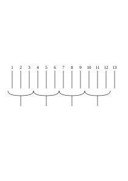

as proof that 13 = 4 × 3 + 1? What does it mean _not_ to accept it as proof? Does this mean that the result of the construction does not always have to be the same, or that the result has nothing to do with the arithmetic theorem?

### [158\[2\]](https://cdn.wittgensteinnachlass.com/2000px/webp/Ms-117/158.webp)

Does one use logic with the abacus?

### [RFM III](/w-rfm-3/#ms-117-158.3) [158\[3\]](https://cdn.wittgensteinnachlass.com/2000px/webp/Ms-117/158.webp) {#158-3}

In what way does the application of a mathematical sentence depend on what one accepts as its proof and what one does not?

### [RFM III](/w-rfm-3/#ms-117-158.4+159.1) [158\[4\]](https://cdn.wittgensteinnachlass.com/2000px/webp/Ms-117/158.webp),[159\[1\]](https://cdn.wittgensteinnachlass.com/2000px/webp/Ms-117/159.webp) {#158-4--159-1}

I can say: If the proposition 137 × 373 = 46792 is true in the ordinary sense, _then there must be a multiplication figure_ at whose ends the sides of this equation stand. And a multiplication figure is a pattern that satisfies certain rules. What I want to say is: If I did not accept the multiplication figure as _a_ proof of the theorem, then the application of the theorem to multiplication figures would also cease.

### [159\[2\]](https://cdn.wittgensteinnachlass.com/2000px/webp/Ms-117/159.webp)

09.02.1940

The concept of ‘application’ is still somewhat unclear here. I meant the application of the timeless proof to the temporal process of proving.

### [159\[3\]](https://cdn.wittgensteinnachlass.com/2000px/webp/Ms-117/159.webp)

What application does the proof have for the man who designs wallpaper patterns? For aesthetic reasons, he designs multiplication figures. (In this case, the rules of multiplication can play the role of the rules of harmony.) [I am very ingenious.]

### [159\[4\]](https://cdn.wittgensteinnachlass.com/2000px/webp/Ms-117/159.webp)

10.02.1940

I am unclear about the usefulness of a particular proof.

### [159\[5\]](https://cdn.wittgensteinnachlass.com/2000px/webp/Ms-117/159.webp)

Could someone who knew no proof of a mathematical theorem have any understanding of it at all? And if he had no idea of the nature of the proof, could he then _believe_ it to be true?

### [159\[6\]](https://cdn.wittgensteinnachlass.com/2000px/webp/Ms-117/159.webp),[160\[1\]](https://cdn.wittgensteinnachlass.com/2000px/webp/Ms-117/160.webp)

What role could a _calculation_ play in a _description_?

### [160\[2\]](https://cdn.wittgensteinnachlass.com/2000px/webp/Ms-117/160.webp)

What is the purpose of the process of proof behind the scenes of language?

### [160\[3\]](https://cdn.wittgensteinnachlass.com/2000px/webp/Ms-117/160.webp)

The proof works behind the scenes of the description (or also, on the scaffolding).

### [VB](/w-vb/#ms-117-160.4) [160\[4\]](https://cdn.wittgensteinnachlass.com/2000px/webp/Ms-117/160.webp) {#160-4}

How hard it is for me to see what _lies before my eyes_!

### [160\[5\]](https://cdn.wittgensteinnachlass.com/2000px/webp/Ms-117/160.webp)

Check: ‘Whoever discovers a new proof of a sentence has discovered a new application of the sentence.’

### [160\[6\]](https://cdn.wittgensteinnachlass.com/2000px/webp/Ms-117/160.webp)

You must always ask yourself: “_Does_ this sentence _work_, & _how_ does it work?”

### [RFM III](/w-rfm-3/#ms-117-160.7) [160\[7\]](https://cdn.wittgensteinnachlass.com/2000px/webp/Ms-117/160.webp) {#160-7}

The _exact_ correspondence of a correct (convincing) transition in music & in mathematics.

### [160\[8\]](https://cdn.wittgensteinnachlass.com/2000px/webp/Ms-117/160.webp),[161\[1\]](https://cdn.wittgensteinnachlass.com/2000px/webp/Ms-117/161.webp)

Of course, the interest of a new proof _may_ also lie in its brevity. But it also places the proposition in a new context (one might say). Namely, in a context in which it appears ‘proved’ once again.

### [161\[1\]](https://cdn.wittgensteinnachlass.com/2000px/webp/Ms-117/161.webp)

Hence, once again, the question: What kind of fact is it that something is a _proof_ of a proposition?

### [161\[2\]](https://cdn.wittgensteinnachlass.com/2000px/webp/Ms-117/161.webp)

What is the fact that something is a ‘correct inference’?

### [161\[3\]](https://cdn.wittgensteinnachlass.com/2000px/webp/Ms-117/161.webp)

_‘This_ line of reasoning also leads to this point.’ The line of reasoning, so to speak, a path of least resistance (or the like).

### [RFM III](/w-rfm-3/#ms-117-161.4) [161\[4\]](https://cdn.wittgensteinnachlass.com/2000px/webp/Ms-117/161.webp) {#161-4}

February 11, 1940

Let us consider that it is not enough for two proofs to meet within the same punctuation mark! For how do we know that this mark says the same thing in both cases? _This_ must be evident from other contexts.

### [161\[5\]](https://cdn.wittgensteinnachlass.com/2000px/webp/Ms-117/161.webp)

What role does the line of reasoning leading to a grammatical rule play _in_ linguistic _practice_?

### [162\[1\]](https://cdn.wittgensteinnachlass.com/2000px/webp/Ms-117/162.webp)

&quot;This is how I am convinced&quot; does not merely mean: _&quot;this_ is how one goes about convincing me&quot;—but rather: &quot;this is where lies that of which I have been convinced.&quot;

### [162\[2\]](https://cdn.wittgensteinnachlass.com/2000px/webp/Ms-117/162.webp)

The proof must demonstrate the usefulness of the rule. For _it_ is for _that_ reason that I accept it.

### [162\[3\]](https://cdn.wittgensteinnachlass.com/2000px/webp/Ms-117/162.webp)

Could one say: ‘The proof must show me the conflicts that I avoid by accepting the rule’? – ‘The abysses from which I avoid by accepting this rule.’

### [162\[4\]](https://cdn.wittgensteinnachlass.com/2000px/webp/Ms-117/162.webp)

February 13, 1940

Why must I show a person _why_ he should accept a rule?

### [162\[5\]](https://cdn.wittgensteinnachlass.com/2000px/webp/Ms-117/162.webp)

But the rules according to which I form grammatical rules are also grammatical rules.

### [162\[6\]](https://cdn.wittgensteinnachlass.com/2000px/webp/Ms-117/162.webp),[163\[1\]](https://cdn.wittgensteinnachlass.com/2000px/webp/Ms-117/163.webp)

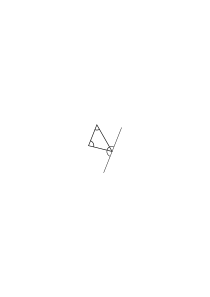

Proof that the sum of the angles in a triangle is approximately 180˚.

What activity does one call ‘to prove this’? Similarly: proof of the mean value theorem.

What is the proving activity here?

### [163\[2\]](https://cdn.wittgensteinnachlass.com/2000px/webp/Ms-117/163.webp)

February 14, 1940

Consider, in the proof

,

that I meant: what _do_ you _dare_ to conclude from the proof? For that is what matters.

### [163\[3\]](https://cdn.wittgensteinnachlass.com/2000px/webp/Ms-117/163.webp)

What do I dare to do on the basis of this proof, that every equation of the nth degree has n roots? In what sense does it have n roots?

### [163\[4\]](https://cdn.wittgensteinnachlass.com/2000px/webp/Ms-117/163.webp)

Suppose I said that 25 × 25 is equal to 526, but the sign ‘526’ should be used in the same way as its mirror image – would my rule then have the same sense as when ‘526’ is used in the usual way?!

### [163\[5\]](https://cdn.wittgensteinnachlass.com/2000px/webp/Ms-117/163.webp),[164\[1\]](https://cdn.wittgensteinnachlass.com/2000px/webp/Ms-117/164.webp)

One could _probably_ say: He who does not know the _system_ to which the rule belongs does not have a sense of the rule. But that would mean: He does not get the _joke_ of the rule.

### [164\[2\]](https://cdn.wittgensteinnachlass.com/2000px/webp/Ms-117/164.webp)

The new proof places the proven proposition in a new context. It provides _new_ reasons for accepting this rule. _But there is an ambiguity here_. – The new proof shows the rule in connection with other rules that fit it (as one says, a hat “fits” someone). But the fact that they fit it—I want to say—is not a mathematical fact. The new proof shows the theorem in a new setting that fits it.

### [RFM III](/w-rfm-3/#ms-117-164.3) [164\[3\]](https://cdn.wittgensteinnachlass.com/2000px/webp/Ms-117/164.webp) {#164-3}

Suppose I gave someone the task: ‘Find a proof of the theorem …’—the answer is, after all, that they present me with certain symbols. All right: _what_ condition must these symbols satisfy? They must be a proof of that theorem—but is that a _geometric_ condition? Or a psychological one? Sometimes one could call it a geometric condition; where the proof elements are already prescribed & only a specific arrangement is sought.

### [165\[1\]](https://cdn.wittgensteinnachlass.com/2000px/webp/Ms-117/165.webp)

February 15, 1940

The proof shows that our theorem also corresponds to _this_ line of thought.

### [165\[2\]](https://cdn.wittgensteinnachlass.com/2000px/webp/Ms-117/165.webp)

The pernicious aspect of the Dirichletian conception of the function: that it introduces a kind of _hypothetical_ notation; which _could_ supposedly be used if we were constituted differently. For the idea that a function, e.g., sin x, is a kind of table in which the values of x are assigned the values of sin x, would only be correct if one could _actually_ use such a table instead of ‘sin x’, if a table were a possible _symbol_ instead of ‘sin x’. Just as, for example, my W.F. tables can actually be used as symbols instead of ‘⌵’, ‘~’, etc.

### [165\[3\]](https://cdn.wittgensteinnachlass.com/2000px/webp/Ms-117/165.webp)

‘Some mathematical proofs are the _calculations_ of theorems; some are not.’ But one could at least have _arrived at_ the theorem through the considerations of the proof!

### [166\[1\]](https://cdn.wittgensteinnachlass.com/2000px/webp/Ms-117/166.webp)

But what if I had _not_ accepted the distributive law in Skolem’s proof? Can one say that I would have violated a _rule_?! – Of course – : where then _does_ Skolem’s proof _end_? One could let it end _like this_: “And now one might perhaps conclude that for all numbers a, b, c …, but we do not do that, but say …”.

### [166\[2\]](https://cdn.wittgensteinnachlass.com/2000px/webp/Ms-117/166.webp)

I want to say: Skolem’s proof _does not_ satisfy us simply because it follows a rule.

### [166\[3\]](https://cdn.wittgensteinnachlass.com/2000px/webp/Ms-117/166.webp)

Or: A mathematical consideration is not something simply _because_ it follows a rule. – But what does it mean to say: ‘On the basis of this consideration, I accept this proposition’? How do I know (so to speak) that it is on the basis of these considerations?

### [166\[4\]](https://cdn.wittgensteinnachlass.com/2000px/webp/Ms-117/166.webp),[167\[1\]](https://cdn.wittgensteinnachlass.com/2000px/webp/Ms-117/167.webp)

How does one rule give rise to another? What is the criterion of _fitting_? Do these two figures

fit together? – This could mean: “Do they fit according to this & that rule?”, or also: “Shall we say that such figures ‘fit’, & therefore say the same about these & those other ones?”

### [167\[2\]](https://cdn.wittgensteinnachlass.com/2000px/webp/Ms-117/167.webp)

If I show someone Skolem's consideration, he will now be inclined to say that the transformation of each sign ‘a + (b + c)’ must yield the corresponding sign ‘(a + b) + c’. And he will in particular be inclined to say this in this & that specific case, even if he has not carried out the transformation. He has decided to adopt a new criterion for it, that the result of the transformation is _this_.

### [167\[3\]](https://cdn.wittgensteinnachlass.com/2000px/webp/Ms-117/167.webp)

What has the person discovered who finds a new consideration that leads me there? What is the benefit of the new consideration if I have already reached its goal?

### [167\[4\]](https://cdn.wittgensteinnachlass.com/2000px/webp/Ms-117/167.webp)

Is the new consideration a new paradigm?

### [167\[5\]](https://cdn.wittgensteinnachlass.com/2000px/webp/Ms-117/167.webp),[168\[1\]](https://cdn.wittgensteinnachlass.com/2000px/webp/Ms-117/168.webp)

16.02.1940

I would like to say something like: that the new consideration suggests a new application. Namely, where this _new_ consideration is interesting. (For if in a consideration I only replace an ‘a’ with a ‘b’, then we don’t even call what results a new consideration.)

### [168\[2\]](https://cdn.wittgensteinnachlass.com/2000px/webp/Ms-117/168.webp)

‘You can also consider it like this…’.

### [168\[3\]](https://cdn.wittgensteinnachlass.com/2000px/webp/Ms-117/168.webp)

‘A consideration’ – one could say – ‘shows principles of consideration’.

### [VB](/w-vb/#ms-117-168.4) [168\[4\]](https://cdn.wittgensteinnachlass.com/2000px/webp/Ms-117/168.webp) {#168-4}

17.02.1940

You cannot want to give up lying and tell the truth.

### [168\[5\]](https://cdn.wittgensteinnachlass.com/2000px/webp/Ms-117/168.webp),[169\[1\]](https://cdn.wittgensteinnachlass.com/2000px/webp/Ms-117/169.webp)

Can one imagine someone who would not accept the argument of the proof by induction? Someone who says: Yes, I see: – if one divides 1 by 3, the remainder is 1 & now one must divide by 3 again – but whether that will continue in the same way, I do not know. What if, at the 40th step, he arrives at 3 and goes on to 4, saying that _this_ is now the continuation in the same way? We say: he has misunderstood us. But he says that he has _not_ misunderstood us. Could we have prevented, by means of a rule, that he suddenly (once) deviates from us?

### [169\[2\]](https://cdn.wittgensteinnachlass.com/2000px/webp/Ms-117/169.webp)

But can we also think of the other person who (does) accept the recursive argument, but not the argument which goes through all the stages? I think so. He would distrust the latter, perhaps with the justification that he can never be completely sure if he repeats a process, whether he is actually doing the same thing both times.

### [169\[3\]](https://cdn.wittgensteinnachlass.com/2000px/webp/Ms-117/169.webp),[170\[1\]](https://cdn.wittgensteinnachlass.com/2000px/webp/Ms-117/170.webp)

What is the benefit of learning a new line of reasoning? Well, first of all, it need not have any benefit at all if, for example, the new line of reasoning sees the old one too much as similar.

If, for example, we accept the distributive law even independently of Skolem’s proof, Skolem’s proof nevertheless teaches us the machinery of **induction** that corresponds to the law.

### [170\[2\]](https://cdn.wittgensteinnachlass.com/2000px/webp/Ms-117/170.webp)

What is the ‘grammatical value’ of this induction machinery?

### [170\[3\]](https://cdn.wittgensteinnachlass.com/2000px/webp/Ms-117/170.webp)

How is it that I can write ‘25 × 25 = 625’ and do not have to write that 25 × 25 is _in this way_ 625, by writing out the whole multiplication? It is important that one knows that the equation 25 × 25 = 625 corresponds to a multiplication, that this equation, for example, is not a definition.

### [170\[4\]](https://cdn.wittgensteinnachlass.com/2000px/webp/Ms-117/170.webp)

The induction schema stands for a technique of forming expressions.

### [170\[5\]](https://cdn.wittgensteinnachlass.com/2000px/webp/Ms-117/170.webp)

I learn a new technique for transforming a sign of this form into a sign of that form. And why shouldn’t that be useful?

### [171\[1\]](https://cdn.wittgensteinnachlass.com/2000px/webp/Ms-117/171.webp)

February 18, 1940

When one formulates a proposition in mathematics as “One cannot …” (e.g., “One cannot trisect the angle with …”), one is already implying a _use_ of the proposition: namely, to convince someone that they should abandon attempts at trisection since nothing can come of it. So we already have a prediction here. Similarly, when we say: “After every prime number there is a larger one.”

### [171\[2\]](https://cdn.wittgensteinnachlass.com/2000px/webp/Ms-117/171.webp)

A technique of having several people draw the same ornament, without them copying it from a common template: We teach them, for example, to multiply and can then _actually_ be sure that everyone will draw the same ornament when given a _new_ command.

### [171\[3\]](https://cdn.wittgensteinnachlass.com/2000px/webp/Ms-117/171.webp)

February 19, 1940

If you do not want to renounce lying on principle, then you _cannot_ renounce it.

### [171\[4\]](https://cdn.wittgensteinnachlass.com/2000px/webp/Ms-117/171.webp),[172\[1\]](https://cdn.wittgensteinnachlass.com/2000px/webp/Ms-117/172.webp)

‘These considerations lead to the same result.’ The two considerations are, for example, two characteristic ways of dividing 100 balls into 5 groups of 20 balls. These divisions acquire the character of _considerations_ through the purpose they serve.

### [RFM III](/w-rfm-3/#ms-117-172.2) [172\[2\]](https://cdn.wittgensteinnachlass.com/2000px/webp/Ms-117/172.webp) {#172-2}

20.02.1940

Are the sentences of mathematics anthropological sentences that say how we humans infer & calculate? – Is a law book a work on anthropology that tells us how the people of this culture treat a thief, etc.? – – Could one say: “The judge looks up in a book on anthropology & then sentences the thief to a prison term.” Now, the judge does not _use_ the law book as a manual of anthropology. (Conversation with Sraffa.)

### [172\[3\]](https://cdn.wittgensteinnachlass.com/2000px/webp/Ms-117/172.webp)

‘What shall we _say_?’ asks the philosopher.

### [172\[4\]](https://cdn.wittgensteinnachlass.com/2000px/webp/Ms-117/172.webp)

‘Look at it this way, & the same thing emerges.’

### [172\[5\]](https://cdn.wittgensteinnachlass.com/2000px/webp/Ms-117/172.webp),[173\[1\]](https://cdn.wittgensteinnachlass.com/2000px/webp/Ms-117/173.webp)

We say: these two sequences of images convince us of the same thing.

### [RFM III](/w-rfm-3/#ms-117-173.2) [173\[2\]](https://cdn.wittgensteinnachlass.com/2000px/webp/Ms-117/173.webp) {#173-2}

The prediction is _not_ that the person, when he follows the transformation of this rule, will bring _that_ forth – but that, when we _say_ that he follows the rule, he will bring it forth.

### [RFM III](/w-rfm-3/#ms-117-173.3+174.1) [173\[3\]](https://cdn.wittgensteinnachlass.com/2000px/webp/Ms-117/173.webp),[174\[1\]](https://cdn.wittgensteinnachlass.com/2000px/webp/Ms-117/174.webp) {#173-3--174-1}

How about if we said that mathematical sentences, in _this_ sense, are predictions; in that they predict what members of a society, who have learned this technique, will bring forth in accordance with the other members of the society. “25 × 25 = 625” would therefore mean that people, when they follow the rules of multiplication in our view, will arrive at the result 625 when multiplying 25 × 25. – That this is a correct prediction is undoubtedly true; & also, that the essence of calculation is based on such predictions. That is, we would not call something ‘calculation’ if we could not make such a prediction with certainty. This actually means: calculation is a technique. And what we have said belongs to the essence of technique.

### [174\[2\]](https://cdn.wittgensteinnachlass.com/2000px/webp/Ms-117/174.webp)

One could also conceive of the prediction _in this_ way: – that agreement regarding the result of the calculation will be achieved if agreement regarding the correct application of the rules is achieved. Or: that it will, in our opinion, be the same step if it is, in our opinion, in accordance with this (unambiguous) rule.

### [174\[3\]](https://cdn.wittgensteinnachlass.com/2000px/webp/Ms-117/174.webp)

Or: We are convinced that I can copy a calculation by performing it again ‘according to the rules’.

### [174\[4\]](https://cdn.wittgensteinnachlass.com/2000px/webp/Ms-117/174.webp),[175\[1\]](https://cdn.wittgensteinnachlass.com/2000px/webp/Ms-117/175.webp)

Could one not say that what I wanted to say was that, where in calculation the correct prediction ceases (even if this is the case, for example, in the calculations of _logic_), the _calculation_ itself comes to an end.

### [175\[2\]](https://cdn.wittgensteinnachlass.com/2000px/webp/Ms-117/175.webp)

But am I not here sliding into the assertion that mathematics consists of predictions, laws of nature, regarding our practice of a (certain) learned technique?? But when I apply calculation, does it always happen in order to make such predictions? If, for example, I calculate how much bread I will need in order to… – then I want to make a prediction about the bread; & the arithmetic sentence is not yet that prediction.

### [RFM III](/w-rfm-3/#ms-117-175.3) [175\[3\]](https://cdn.wittgensteinnachlass.com/2000px/webp/Ms-117/175.webp) {#175-3}

This consensus is, _essentially_, part of calculation; that is certain. That is: this consensus is part of the phenomenon of our calculation.

### [RFM III](/w-rfm-3/#ms-117-175.4) [175\[4\]](https://cdn.wittgensteinnachlass.com/2000px/webp/Ms-117/175.webp) {#175-4}

In a **calculational** technique, predictions must be possible. And that makes the calculational technique similar to the technique of a _game_, such as chess.

### [RFM III](/w-rfm-3/#ms-117-176.1) [176\[1\]](https://cdn.wittgensteinnachlass.com/2000px/webp/Ms-117/176.webp) {#176-1}

But what about the consensus – does this not mean that _one_ person alone could not calculate? Well, _one_ person could certainly not calculate only _once_ in his life.

### [RFM III](/w-rfm-3/#ms-117-176.2) [176\[2\]](https://cdn.wittgensteinnachlass.com/2000px/webp/Ms-117/176.webp) {#176-2}

One could say: all _possible_ game positions in chess can be regarded as sentences that say that they (themselves) are _possible_ game positions; or also as predictions: that people will be able to reach these positions through moves, which they consistently declare to be in accordance with the rules. A game position thus _obtained_ is then a proven sentence of this kind.

### [RFM III](/w-rfm-3/#ms-117-176.3) [176\[3\]](https://cdn.wittgensteinnachlass.com/2000px/webp/Ms-117/176.webp) {#176-3}

“A calculation is an experiment.” – – A calculation can be an experiment. The teacher has the student do a calculation in order to see whether he can calculate; that is an experiment.

### [RFM III](/w-rfm-3/#ms-117-177.1) [177\[1\]](https://cdn.wittgensteinnachlass.com/2000px/webp/Ms-117/177.webp) {#177-1}

When a fire is lit in the stove in the morning, is that an experiment? But it could be one. And so, too, chess moves are _not_ proofs, and chess positions are not propositions. And mathematical propositions are not game positions. And _so,_ they are not prophecies either.

### [177\[2\]](https://cdn.wittgensteinnachlass.com/2000px/webp/Ms-117/177.webp)

So, I could do a calculation to predict what another person will get in this calculation. And I could then say, I am, in a way, doing an experiment with myself, I am trying how I react (to these rules) in order to conclude how he will react.

### [177\[3\]](https://cdn.wittgensteinnachlass.com/2000px/webp/Ms-117/177.webp)

Or one could say: Calculation has proven itself well. One has found that, when one trains people to perform certain operations with strokes, when one then connects this technique in a certain way with that of bridge building, the bridges do not collapse.

### [177\[4\]](https://cdn.wittgensteinnachlass.com/2000px/webp/Ms-117/177.webp),[178\[1\]](https://cdn.wittgensteinnachlass.com/2000px/webp/Ms-117/178.webp)

But wait—if calculation were to have _this_ benefit, would it then also have to be capable of serving to predict the results of calculations?

### [178\[2\]](https://cdn.wittgensteinnachlass.com/2000px/webp/Ms-117/178.webp)

Is something a consideration that no one recognizes as a consideration except for me? Or something that I recognize as a consideration only once & never again?

### [RFM III](/w-rfm-3/#ms-117-178.3) [178\[3\]](https://cdn.wittgensteinnachlass.com/2000px/webp/Ms-117/178.webp) {#178-3}

If a calculation is an experiment, what then is an error in the calculation? An error in the experiment? No; it would have been an error in the experiment if I had not adhered to the _conditions_ of the experiment—if, for example, I had had someone perform the calculation amid terrible noise.

### [RFM III](/w-rfm-3/#ms-117-178.4) [178\[4\]](https://cdn.wittgensteinnachlass.com/2000px/webp/Ms-117/178.webp) {#178-4}

But why shouldn’t I say: A calculation error is not _an error_ in the experiment, but a—sometimes explainable, sometimes unexplainable—_failure_ of the experiment?

### [178\[5\]](https://cdn.wittgensteinnachlass.com/2000px/webp/Ms-117/178.webp),[179\[1\]](https://cdn.wittgensteinnachlass.com/2000px/webp/Ms-117/179.webp)

Shouldn’t I say that the calculation is an experiment on _humanity_, since humanity cannot make a calculation error?

### [179\[2\]](https://cdn.wittgensteinnachlass.com/2000px/webp/Ms-117/179.webp)

But I could study the behavior of a species by conducting experiments with a single animal or, say, a small group of specimens. It is sufficient then if, in _most cases_, the behavior of the test animals is indicative of the behavior of the rest.

### [179\[3\]](https://cdn.wittgensteinnachlass.com/2000px/webp/Ms-117/179.webp)

And so I could say: When calculating, I do an experiment, I see what I get (under the right conditions) in this calculation – because this almost always corresponds to what all others get under such conditions.

### [179\[4\]](https://cdn.wittgensteinnachlass.com/2000px/webp/Ms-117/179.webp)

Or should I say: _‘it seems_ to agree’?

### [179\[5\]](https://cdn.wittgensteinnachlass.com/2000px/webp/Ms-117/179.webp),[180\[1\]](https://cdn.wittgensteinnachlass.com/2000px/webp/Ms-117/180.webp)

Do I do an experiment when I let the wound-up clock run & show the time? when I look now, how much time it is? Well, no one will call that an experiment.

### [180\[2\]](https://cdn.wittgensteinnachlass.com/2000px/webp/Ms-117/180.webp)

February 21, 1940

Should I say: “Mathematical proofs are experiments that show us what we are _inclined_ to say”?

### [RFM III](/w-rfm-3/#ms-117-180.3) [180\[3\]](https://cdn.wittgensteinnachlass.com/2000px/webp/Ms-117/180.webp) {#180-3}

“A calculation, e.g., a multiplication, is an experiment: _we do not know what the result will be_, & find out only when the multiplication is finished.” – Certainly; when we go for a walk, we also do not know at which point we will be in 5 minutes – but is going for a walk therefore an experiment? – Yes; but in the calculation, I wanted to know from the outset what the result would be; _that_ was what interested me. I am curious about the result. But not as to what I _will_ say, but rather what I _ought to_ say.

### [180\[4\]](https://cdn.wittgensteinnachlass.com/2000px/webp/Ms-117/180.webp),[181\[1\]](https://cdn.wittgensteinnachlass.com/2000px/webp/Ms-117/181.webp)

If I make a standard, for example, by deriving it from an original standard, then one could say that I am doing an experiment in which I find out – – –

### [181\[2\]](https://cdn.wittgensteinnachlass.com/2000px/webp/Ms-117/181.webp)

If I say that we are experimenting in calculation, then of course not with signs, but with ourselves. It is then a psychological experiment about the experience of agreement.

### [RFM III](/w-rfm-3/#ms-117-181.3) [181\[3\]](https://cdn.wittgensteinnachlass.com/2000px/webp/Ms-117/181.webp) {#181-3}

But aren’t you interested precisely in this multiplication—in how the general public will calculate? No—at least not usually—even though I too am hurrying toward a common meeting point. But the calculation does show me, experimentally, which of these meeting points it is. I let myself, as it were, run my course, & see where I end up. And the correct multiplication is the image of how we all run our course when we are raised _in this way_.

### [RFM III](/w-rfm-3/#ms-117-181.4) [181\[4\]](https://cdn.wittgensteinnachlass.com/2000px/webp/Ms-117/181.webp) {#181-4}

_Experience_ teaches us that we all find this calculation correct.

### [RFM III](/w-rfm-3/#ms-117-181.5+182.1) [181\[5\]](https://cdn.wittgensteinnachlass.com/2000px/webp/Ms-117/181.webp),[182\[1\]](https://cdn.wittgensteinnachlass.com/2000px/webp/Ms-117/182.webp) {#181-5--182-1}

We let the process run its course & obtain the result of the calculation. But now—I want to say—we are not interested in the fact that we produced this result under these & those conditions; we are interested in the picture of the process, but not as the result of an experiment, but as a _path_.

### [182\[2\]](https://cdn.wittgensteinnachlass.com/2000px/webp/Ms-117/182.webp)

22.02.1940

As if one were to say: The calculation is a reaction, a conditioned reflex – not a statement about such a reflex.

### [182\[3\]](https://cdn.wittgensteinnachlass.com/2000px/webp/Ms-117/182.webp)

One could also call the calculation a series of decisions and the result a final decision.

### [RFM III](/w-rfm-3/#ms-117-182.4) [182\[4\]](https://cdn.wittgensteinnachlass.com/2000px/webp/Ms-117/182.webp) {#182-4}

We do not say: “So _this is how_ we go!”, but rather: “So _this is how_ it goes!”

### [182\[5\]](https://cdn.wittgensteinnachlass.com/2000px/webp/Ms-117/182.webp)

If someone says: “The result of the calculation is found experimentally,” one would have to reply: “Yes, how _else_ is he supposed to find it?”

### [182\[6\]](https://cdn.wittgensteinnachlass.com/2000px/webp/Ms-117/182.webp),[183a\[1\]](https://cdn.wittgensteinnachlass.com/2000px/webp/Ms-117/183a.webp)

Is the expression of a decision a sentence that says that I make such a decision? The proven sentence as an expression of a decision.

### [183a\[2\]](https://cdn.wittgensteinnachlass.com/2000px/webp/Ms-117/183a.webp),[183b\[1\]](https://cdn.wittgensteinnachlass.com/2000px/webp/Ms-117/183b.webp)

I let the process run its course & the end of the process is the proven sentence. But _does_ the sentence then _say_ anything about this process? We conducted an experiment—but in the experiment a _sentence_ was produced (just as, for example, a chemical compound might be). And now there is another sentence that says that that sentence was generated. – But how, if I used precisely that sentence as an expression of this? So that “25 × 25 = 625” is supposed to tell me that people, trained in such and such a way, generally arrive at _this result_. Well, such a statement does exist, after all; it does make good sense. And if that is the case—one might ask—should there really be _two_ propositions: one that expresses this anthropological fact, which is obviously essential to the sense of arithmetic, and another that is supposed to express an arithmetic fact independent of it, namely 25 × 25 = 625? Here the certain nonsense suggests itself: “it depends on how we _mean_ the proposition.” But one can say: it depends on how we use the sentence, what we do with it.

### [183b\[2\]](https://cdn.wittgensteinnachlass.com/2000px/webp/Ms-117/183b.webp)

“But the fact that 25 × 25 is 625 is something we did not know before performing the multiplication.” – Couldn’t I also say: this is a proposition whose proof we _did_ not _know_ beforehand. – – – [_”Wissen”_ (to know) and _”kennen”_ (to be acquainted with) are meant to contrast. This is also related to the fact that we not only did not know _that_ this proposition (or this number) would result, but also not _how_, in what sense, it would “result.”]

### [183b\[3\]](https://cdn.wittgensteinnachlass.com/2000px/webp/Ms-117/183b.webp)

‘The proof creates a _concept_.’

### [183b\[4\]](https://cdn.wittgensteinnachlass.com/2000px/webp/Ms-117/183b.webp)

We are all in agreement, we all run in the same way – but does that mean that we only use this sameness of the process to predict the process of one person from that of another?

### [184a\[1\]](https://cdn.wittgensteinnachlass.com/2000px/webp/Ms-117/184a.webp)

Whoever says that he is curious to know what the multiplication … × … will result in, could say that he is curious to see with what he will agree at the end. – But this could be completely misunderstood. –

### [RFM III](/w-rfm-3/#ms-117-184a.2) [184a\[2\]](https://cdn.wittgensteinnachlass.com/2000px/webp/Ms-117/184a.webp) {#184a-2}

Our agreement proceeds in the same way—but we do not make use of this similarity in the course of events merely to predict the course of agreement. Just as we do not _make_ use of the sentence “this notebook is red” merely to predict that most people will call it ‘red.’

### [RFM III](/w-rfm-3/#ms-117-184a.3+184b.1) [184a\[3\]](https://cdn.wittgensteinnachlass.com/2000px/webp/Ms-117/184a.webp),[184b\[1\]](https://cdn.wittgensteinnachlass.com/2000px/webp/Ms-117/184b.webp) {#184a-3--184b-1}

February 23, 1940

“And that is what we _call_ ‘the same thing’.” If there were no agreement on what we call ‘red,’ etc., etc., language would cease to exist. But what about the agreement in what we call “agreement”? We can describe the phenomenon of linguistic confusion;—but what are the signs of linguistic confusion for us? Not necessarily turmoil and confusion in action. Then, therefore, that when people speak, I am at a loss; I cannot react in agreement with them.

### [RFM III](/w-rfm-3/#ms-117-184b.2) [184b\[2\]](https://cdn.wittgensteinnachlass.com/2000px/webp/Ms-117/184b.webp) {#184b-2}

‘That is not a language-game for me.’ But I could also say: Although they accompany their actions with vocal sounds—and I cannot call their actions ‘confused’—they nevertheless have no _language_. – Perhaps, however, their actions would become confused if one prevented them from uttering those sounds.

### [184b\[3\]](https://cdn.wittgensteinnachlass.com/2000px/webp/Ms-117/184b.webp)

We _can_ scientifically predict what people will come up with in a calculation by doing the calculation ourselves; – & that must be very important.

### [RFM III](/w-rfm-3/#ms-117-184b.4) [184b\[4\]](https://cdn.wittgensteinnachlass.com/2000px/webp/Ms-117/184b.webp) {#184b-4}

One could say: a proof serves _understanding_. An experiment presupposes it. Or also: A mathematical proof shapes our language.

### [RFM III](/w-rfm-3/#ms-117-185.1) [185\[1\]](https://cdn.wittgensteinnachlass.com/2000px/webp/Ms-117/185.webp) {#185-1}

But the fact remains that, by means of a mathematical proof, one can make scientific predictions about the proofs of other people. – If someone asks me: “What color is this book?” & I answer: “It is green.” – I could just as well have given the answer: “The general public of German speakers calls it ‘green’”? Couldn’t he then ask: “And what do _you_ call it?” Because he wanted to hear my reaction.

### [RFM III](/w-rfm-3/#ms-117-185.2) [185\[2\]](https://cdn.wittgensteinnachlass.com/2000px/webp/Ms-117/185.webp) {#185-2}

_‘**The Limits of Empiricism**’_

### [RFM III](/w-rfm-3/#ms-117-185.3+186.1) [185\[3\]](https://cdn.wittgensteinnachlass.com/2000px/webp/Ms-117/185.webp),[186\[1\]](https://cdn.wittgensteinnachlass.com/2000px/webp/Ms-117/186.webp) {#185-3--186-1}

When I calculate the multiplication, – is the result that people will generally agree with it? There is, after all, a science of conditioned computational reflexes; is that mathematics? That science will be based on experiments: & these experiments will be _calculations_. But what if this science were to become quite exact, & ultimately even a ‘mathematical’ science? Is the result of these experiments now that people agree in their calculations, or that they agree in what they call “agreeing”? And so it goes on.

### [RFM III](/w-rfm-3/#ms-117-186.2) [186\[2\]](https://cdn.wittgensteinnachlass.com/2000px/webp/Ms-117/186.webp) {#186-2}

One could say: this science would not work if we did not agree with regard to the idea of agreement.

### [RFM III](/w-rfm-3/#ms-117-186.3) [186\[3\]](https://cdn.wittgensteinnachlass.com/2000px/webp/Ms-117/186.webp) {#186-3}

It is clear that we can use a mathematical work to study anthropology. But it is not clear whether we should say: “this writing shows us how this people operated with signs,” or whether we should say: “this writing shows us what parts of mathematics this people mastered.”

### [186\[4\]](https://cdn.wittgensteinnachlass.com/2000px/webp/Ms-117/186.webp),[187\[1\]](https://cdn.wittgensteinnachlass.com/2000px/webp/Ms-117/187.webp)

Is my conviction that I have counted correctly, omitted no number, and repeated none, the conviction that the general public counts in this way? Do I use a word—the word ‘count,’ or ‘repeat,’ etc.—_on the basis of the conviction_ that the general public uses it in this way?

### [187\[2\]](https://cdn.wittgensteinnachlass.com/2000px/webp/Ms-117/187.webp)

I begin a calculation & I am curious what I will agree with; & the calculation shows it to me. (This is reminiscent of the theory of relativity.) But what if I was mistaken – in that I took something to be agreement, which is not?

### [187\[3\]](https://cdn.wittgensteinnachlass.com/2000px/webp/Ms-117/187.webp)

Spiral springs are mounted in such a way that they can be twisted around any measurable angle & then allowed to snap back. They are all calibrated in the same way, so that when twisted by the same angle, they take the same amount of time to return to the rest position. We use this device, among other things, to find out how long another calibrated spring will take to return a certain angle. (One could similarly calibrate people so that they all take the same amount of time to do the same multiplication.)

### [RFM III](/w-rfm-3/#ms-117-187.4+188.1) [187\[4\]](https://cdn.wittgensteinnachlass.com/2000px/webp/Ms-117/187.webp),[188\[1\]](https://cdn.wittgensteinnachlass.com/2000px/webp/Ms-117/188.webp) {#187-4--188-1}

Can I, having reached the end of a multiplication, say: “So I agree _with that_!”? – But can I say it at a _step_ in the multiplication? For example, at the step “2 × 3 = 6”? No more than I can, seeing this paper, say: “So that’s what I call ‘_white_’!”?

### [RFM III](/w-rfm-3/#ms-117-188.2) [188\[2\]](https://cdn.wittgensteinnachlass.com/2000px/webp/Ms-117/188.webp) {#188-2}

The case seems similar to when someone says: “When I recall what I did today, I perform an experiment (I let myself run along) & the memory that then comes serves to show me what others, who have seen me, will answer to the question of what I have done.”

### [RFM III](/w-rfm-3/#ms-117-188.3+189.1) [188\[3\]](https://cdn.wittgensteinnachlass.com/2000px/webp/Ms-117/188.webp),[189\[1\]](https://cdn.wittgensteinnachlass.com/2000px/webp/Ms-117/189.webp) {#188-3--189-1}

What would happen if we often found ourselves in a situation where we make a calculation and find it correct; then we check it and find it is wrong: we believe we must have overlooked something earlier—when we check it again, our second calculation seems incorrect to us, and so on. Should I call this calculating, or not? – In any case, he cannot base his prediction on his calculation that he will end up there again next time. – But could I say that he calculated _incorrectly_ this time, because he did not calculate that way again the next time? I could say: where _this_ uncertainty exists, there would be no calculation.

### [RFM III](/w-rfm-3/#ms-117-189.2) [189\[2\]](https://cdn.wittgensteinnachlass.com/2000px/webp/Ms-117/189.webp) {#189-2}

But on the other hand, I say again: ‘however one calculates—that is correct.’ There _can_ be no calculation error in 12 × 12 = 144. Why? This statement is included in the rules. But is ‘12 × 12 = 144’ the statement that it is natural for all people to calculate 12 × 12 in such a way that 144 comes out?

### [RFM III](/w-rfm-3/#ms-117-189.3+190.1) [189\[3\]](https://cdn.wittgensteinnachlass.com/2000px/webp/Ms-117/189.webp),[190\[1\]](https://cdn.wittgensteinnachlass.com/2000px/webp/Ms-117/190.webp) {#189-3--190-1}

February 24, 1940

If I check a calculation several times to be sure that I have calculated correctly, and if I then accept it as correct—have I not repeated an experiment to be sure that I will proceed in the same way the next time?—But why should checking it three times convince me that I will proceed in the same way the fourth time? – I would say: I checked to be sure ‘that I hadn’t overlooked anything.’ The danger here, I think, is to provide a justification for our approach where there is no justification, and we should simply say: _this is how we do it_.

### [RFM III](/w-rfm-3/#ms-117-190.2) [190\[2\]](https://cdn.wittgensteinnachlass.com/2000px/webp/Ms-117/190.webp) {#190-2}

If someone repeats an experiment, ‘again and again with the same result,’ has he at the same time conducted an experiment that teaches him _what_ he will call ‘the same result,’ that is, how he uses the word “same”? Does the person who measures the table with a ruler also measure the ruler? If he measures the ruler in doing so, he cannot measure the table.

### [RFM III](/w-rfm-3/#ms-117-190.3+191.1) [190\[3\]](https://cdn.wittgensteinnachlass.com/2000px/webp/Ms-117/190.webp),[191\[1\]](https://cdn.wittgensteinnachlass.com/2000px/webp/Ms-117/191.webp) {#190-3--191-1}

It is as if I were to say: “When someone measures the table with a ruler, is he thereby conducting an experiment that teaches him what the measurement of this table with _other_ rulers would yield”? There is, after all, no doubt that one can predict from a measurement with _one_ ruler what the measurement with other rulers will yield. And furthermore—if one could not do so—our entire system of measurement would collapse. _No_ ruler, one might say, would be correct if they did not all agree. – But when I say that, I do not mean that they would all be _wrong_.

### [191\[2\]](https://cdn.wittgensteinnachlass.com/2000px/webp/Ms-117/191.webp)

Can I replace a mathematical theorem with the statement: “If I properly set people up & let them proceed from _this_ point, they will almost always arrive at this result.”?

### [191\[3\]](https://cdn.wittgensteinnachlass.com/2000px/webp/Ms-117/191.webp)

The philosopher must be wary of nothing _more_ than cutting a knot or snapping a thread. He must _untie_ all the knots.

### [191\[4\]](https://cdn.wittgensteinnachlass.com/2000px/webp/Ms-117/191.webp),[192\[1\]](https://cdn.wittgensteinnachlass.com/2000px/webp/Ms-117/192.webp)

When one learns arithmetic – should I say that he is being trained (conditioned to then run correctly), or: he is learning those anthropological truths about the processes? Or is he first trained and then he learns those truths?

### [RFM III](/w-rfm-3/#ms-117-192.2) [192\[2\]](https://cdn.wittgensteinnachlass.com/2000px/webp/Ms-117/192.webp) {#192-2}

Calculation would lose its sense if _confusion_ were to arise. Just as the use of the words “green” and “blue” would lose its point. And yet it seems nonsensical to say—that a mathematical proposition _states_ that no confusion will arise. – Is the solution simply that the mathematical proposition does not become _false_, but useless, if confusion were to arise? Just as the proposition “this room is 16 feet long” would not become _false_ if confusion were to arise in the standards and in the measuring. Its sense, not its truth, is based on the proper conduct of the measurements. (But do not be dogmatic here. There are transitions that complicate the analysis.)

### [RFM III](/w-rfm-3/#ms-117-192.3+193.1) [192\[3\]](https://cdn.wittgensteinnachlass.com/2000px/webp/Ms-117/192.webp),[193\[1\]](https://cdn.wittgensteinnachlass.com/2000px/webp/Ms-117/193.webp) {#192-3--193-1}

What if I said: the calculation sentence expresses the confidence that no confusion will arise. – Then the use of all words expresses the confidence that no confusion will arise.

### [193\[2\]](https://cdn.wittgensteinnachlass.com/2000px/webp/Ms-117/193.webp)

I am a second-rate poet. Even if I am a one-eyed king among the blind. And a second-rate poet would do _better_ to give up poetry. Even if he thereby stands out among his fellow human beings.

### [RFM III](/w-rfm-3/#ms-117-193.3) [193\[3\]](https://cdn.wittgensteinnachlass.com/2000px/webp/Ms-117/193.webp) {#193-3}

But one cannot nevertheless say that the use of the word ‘green’ implies that no confusion will arise—because then the use of the word “confusion” would again have to make the same statement about _this_ word.

### [RFM III](/w-rfm-3/#ms-117-193.4+194.1) [193\[4\]](https://cdn.wittgensteinnachlass.com/2000px/webp/Ms-117/193.webp),[194\[1\]](https://cdn.wittgensteinnachlass.com/2000px/webp/Ms-117/194.webp) {#193-4--194-1}

If “25 × 25 = 625” expresses the confidence that we will always be able to agree easily that the path ending with this sentence is the one to take—how then does this sentence not express the other confidence, that we would always be able to agree on _its_ use?

### [RFM III](/w-rfm-3/#ms-117-194.2) [194\[2\]](https://cdn.wittgensteinnachlass.com/2000px/webp/Ms-117/194.webp) {#194-2}

We are not playing the same language-game with these two sentences.

### [RFM III](/w-rfm-3/#ms-117-194.3) [194\[3\]](https://cdn.wittgensteinnachlass.com/2000px/webp/Ms-117/194.webp) {#194-3}

Or can one be confident both that one will see the same color there as here – & also that one will be inclined to call the color the same if it is the same?

### [RFM III](/w-rfm-3/#ms-117-194.4) [194\[4\]](https://cdn.wittgensteinnachlass.com/2000px/webp/Ms-117/194.webp) {#194-4}

I want to say: mathematics, as such, is always the measure & not the measured.

### [194\[5\]](https://cdn.wittgensteinnachlass.com/2000px/webp/Ms-117/194.webp)

I expect to find the same color there as here. I go there & indeed find the same color. Do I say: “Yes, I was right; I really call what I see here ‘the same color’”? So is my expectation fulfilled because I react to what I see with these words? No; here are different language-games.

### [194\[6\]](https://cdn.wittgensteinnachlass.com/2000px/webp/Ms-117/194.webp),[195\[1\]](https://cdn.wittgensteinnachlass.com/2000px/webp/Ms-117/195.webp)

Why shouldn’t I call being able to calculate a multiplication not “_knowing_” “what the result is”? For if someone asks me: “Do you know what 732 × 345 equals?”, I answer: “Yes; _that_.” & begin to calculate. I can say: I know the result only as the end of the multiplication.

### [195\[2\]](https://cdn.wittgensteinnachlass.com/2000px/webp/Ms-117/195.webp)

What is that for a sentence: that the distributive law can be proven inductively? Or: that it can be proven inductively from the recursive definition a + (b + 1) = (a + b) + 1?

### [RFM III](/w-rfm-3/#ms-117-195.3) [195\[3\]](https://cdn.wittgensteinnachlass.com/2000px/webp/Ms-117/195.webp) {#195-3}

25.02.1940

The concept of calculation excludes _confusion_. – How, if someone, when calculating a multiplication, brings out different results at different times & _sees_ this, but finds order in it? – But then couldn’t he use the multiplication for the purposes for which we use it! – Why not? & it is not said that he will always do badly in the process.

### [RFM III](/w-rfm-3/#ms-117-196.1) [196\[1\]](https://cdn.wittgensteinnachlass.com/2000px/webp/Ms-117/196.webp) {#196-1}

The conception of calculation as an experiment easily seems to us to be the only _realistic_ one.

### [RFM III](/w-rfm-3/#ms-117-196.2) [196\[2\]](https://cdn.wittgensteinnachlass.com/2000px/webp/Ms-117/196.webp) {#196-2}

Everything else – we think – is nonsense. In the experiment, we have something tangible. It is almost as if one said: “A poet, when he writes poetry, conducts a psychological experiment; only in this way can it be explained that a poem can have value.” One misinterprets the essence of ‘_experiment_’, – by believing that every process whose end we eagerly await is what we call “experiment”.

### [196\[3\]](https://cdn.wittgensteinnachlass.com/2000px/webp/Ms-117/196.webp)

An experiment has a point. When I look through a telescope, it may happen in order to observe the movement of a star; & also: in order to test my eyes. The point of the experiment is – once: ‘to learn something about the movement of the stars’, once: ‘to learn something about my eyes’. But do I not learn both at the same time: since I see this movement of the stars with my eyes?

### [RFM III](/w-rfm-3/#ms-117-197.1) [197\[1\]](https://cdn.wittgensteinnachlass.com/2000px/webp/Ms-117/197.webp) {#197-1}

It seems like obscurantism to say that a calculation is not an experiment. In the same way as the assertion that mathematics _does_ not _deal_ with signs, or that pain is not a form of behaviour. But only because people believe that one is thereby asserting the existence of an intangible—that is, shadowy—object alongside the tangible one known to us all. Whereas we are merely pointing out different ways of using the words. It is almost as if one were to say: ‘blue’ must be used to designate a blue object—otherwise the purpose of the word would be unclear.

### [197\[2\]](https://cdn.wittgensteinnachlass.com/2000px/webp/Ms-117/197.webp)

With his expression “domain of the real, not the actual,” Frege has done great harm to his cause. The word “domain” is so misleading – as is the word “object” when applied to numbers.

### [197\[3\]](https://cdn.wittgensteinnachlass.com/2000px/webp/Ms-117/197.webp),[198\[1\]](https://cdn.wittgensteinnachlass.com/2000px/webp/Ms-117/198.webp)

That I take a picture as a paradigm does not mean that I claim its usefulness.

### [198\[2\]](https://cdn.wittgensteinnachlass.com/2000px/webp/Ms-117/198.webp)

Consider the fluctuating sense of the word “usefulness”.

### [198\[3\]](https://cdn.wittgensteinnachlass.com/2000px/webp/Ms-117/198.webp)

We only call something an “experiment” within a system of actions. But we forget that when a process that looks like an experiment is before our eyes.

### [198\[4\]](https://cdn.wittgensteinnachlass.com/2000px/webp/Ms-117/198.webp),[199\[1\]](https://cdn.wittgensteinnachlass.com/2000px/webp/Ms-117/199.webp)

In what respect is it essential to calculation that the generality of people calculate in the same way? In what respect is it thus essential that I should be able to predict, from my calculation, that of another? Can we imagine that this would be the only use of multiplication, for example? Calculation would then be a kind of automatic speech (association), its purpose merely to find out what the other says under the same circumstances. There would, of course, be a criterion for the equality of the circumstances & of what is said. And now it could be that the other says not the same, but something obtainable from mine according to a certain rule of transformation. I would then, according to my automatic process, _calculate_ what the other’s process will be. Calculation gives us a method of **comparison**.

### [199\[2\]](https://cdn.wittgensteinnachlass.com/2000px/webp/Ms-117/199.webp)

26.02.1940

“The proof must be surveyable” means: in the proof, there are no hidden processes (as in an experiment) that bring about the result, we don’t know how. And that is a _grammatical_ remark! Whoever does not understand this misunderstands it.

### [199\[3\]](https://cdn.wittgensteinnachlass.com/2000px/webp/Ms-117/199.webp)

Let us imagine, for each proof, a sentence that is the logical product of all the sentences of the proof. Then the proof would also be a proof of this sentence. And in fact, by reading the sentence, one would have read its proof.

### [200\[1\]](https://cdn.wittgensteinnachlass.com/2000px/webp/Ms-117/200.webp)

I would like to conceive of the transforming activity of proof as an activity with another purpose, with another benefit than that of proof.

### [200\[2\]](https://cdn.wittgensteinnachlass.com/2000px/webp/Ms-117/200.webp)

February 27, 1940

Can one say that every proof either makes use of already accepted _forms of reasoning_, or introduces such forms into use?

### [200\[3\]](https://cdn.wittgensteinnachlass.com/2000px/webp/Ms-117/200.webp),[201\[1\]](https://cdn.wittgensteinnachlass.com/2000px/webp/Ms-117/201.webp)

28.02.1940

The game with the 3 pushes of pyramid-shaped stacked discs. It teaches one the technique of transferring the discs from one push to another so that a larger disc never lies on a smaller one. I learn – it seems – something mathematical. But why? Well, because I attach a mathematical consideration to it. This technique of transformation could be taught for purely practical purposes. I mean, for example, for construction purposes. And the rule that a larger disc must never rest on a smaller one could have reasons of stability or strength. – Now, if someone finds out how to transfer the discs in accordance with these conditions, i.e. establishes this technique, gives a rule & teaches it, – does he then teach a mathematical technique?

### [201\[2\]](https://cdn.wittgensteinnachlass.com/2000px/webp/Ms-117/201.webp)

Could one not imagine that someone would be _surprised_ by the result of the addition

<math display="block">
  <mtable columnalign="right" rowspacing="0.2em" columnspacing="0em">
    <mtr>
      <mtd>
        <mn>8271</mn>
      </mtd>
    </mtr>
    <mtr>
      <mtd>
        <mn>9537</mn>
      </mtd>
    </mtr>
    <mtr>
      <mtd>
        <mn>8321</mn>
      </mtd>
    </mtr>
    <mtr>
      <mtd>
        <menclose notation="bottom">
          <mn>7204</mn>
        </menclose>
      </mtd>
    </mtr>
    <mtr>
      <mtd>
        <mn>33333</mn>
      </mtd>
    </mtr>
  </mtable>
</math>

: that he did not expect such a _uniform_ number to be the result of the addition of so _colorful_ numbers. – And let us assume that he has an aesthetic pleasure in addition, as in the course of a piece of music, then the emergence of this uniformity from this variety could be the point of the piece of music, what _always surprises us anew_.

### [201\[3\]](https://cdn.wittgensteinnachlass.com/2000px/webp/Ms-117/201.webp)

I am stupid, I cannot express the simplest thing. –

### [201\[4\]](https://cdn.wittgensteinnachlass.com/2000px/webp/Ms-117/201.webp),[202\[1\]](https://cdn.wittgensteinnachlass.com/2000px/webp/Ms-117/202.webp)

The technique of those transformations compared to the one that Skolem teaches us in order to arrive at the distributive law.

### [202\[2\]](https://cdn.wittgensteinnachlass.com/2000px/webp/Ms-117/202.webp)

29.02.1940

What kind of invention is the invention of the vernier scale?

### [202\[3\]](https://cdn.wittgensteinnachlass.com/2000px/webp/Ms-117/202.webp)

The task of transferring those discs was: ‘You must transfer them, _without_ …’. And can one not say that the Skolem proof teaches us to form any sentence of the form ‘a + (b + c) = (a + b) + c’ without …? So, it convinces us that any such sentence can be obtained by applying only _these_ transformations from this construct.

### [202\[4\]](https://cdn.wittgensteinnachlass.com/2000px/webp/Ms-117/202.webp)

‘One can also view the theorem _in this way_.’ In doing so, the focus rests solely on _this_ theorem, as the goal of the proof. We aim only at this proposition, not at the projectile’s trajectory. We do not want it to travel along _this trajectory_ to that point; rather, it is to reach this point, no matter how. – But, _under other circumstances_, it may be precisely the trajectory that matters to us.

### [202\[5\]](https://cdn.wittgensteinnachlass.com/2000px/webp/Ms-117/202.webp),[203\[1\]](https://cdn.wittgensteinnachlass.com/2000px/webp/Ms-117/203.webp)

Could I not give a proof that the two lines of the induction schema

<math display="block">
  <mrow>
    <mtable columnalign="right left" rowspacing="0.5ex">
      <mtr>
        <mtd>
          <mi>a</mi>
          <mo>+</mo>
          <mo stretchy="false">(</mo>
          <mi>b</mi>
          <mo>+</mo>
          <mo stretchy="false">(</mo>
          <mi>c</mi>
          <mo>+</mo>
          <mn>1</mn>
          <mo stretchy="false">)</mo>
          <mo stretchy="false">)</mo>
        </mtd>
        <mtd>
          <mo>=</mo>
          <mo stretchy="false">(</mo>
          <mi>a</mi>
          <mo>+</mo>
          <mo stretchy="false">(</mo>
          <mi>b</mi>
          <mo>+</mo>
          <mi>c</mi>
          <mo stretchy="false">)</mo>
          <mo stretchy="false">)</mo>
          <mo>+</mo>
          <mn>1</mn>
        </mtd>
      </mtr>
      <mtr>
        <mtd>
          <mo stretchy="false">(</mo>
          <mi>a</mi>
          <mo>+</mo>
          <mi>b</mi>
          <mo stretchy="false">)</mo>
          <mo>+</mo>
          <mo stretchy="false">(</mo>
          <mi>c</mi>
          <mo>+</mo>
          <mn>1</mn>
          <mo stretchy="false">)</mo>
        </mtd>
        <mtd>
          <mo>=</mo>
          <mo stretchy="false">(</mo>
          <mo stretchy="false">(</mo>
          <mi>a</mi>
          <mo>+</mo>
          <mi>b</mi>
          <mo stretchy="false">)</mo>
          <mo>+</mo>
          <mi>c</mi>
          <mo stretchy="false">)</mo>
          <mo>+</mo>
          <mn>1</mn>
        </mtd>
      </mtr>
    </mtable>
    <mo fence="true" stretchy="true" symmetric="true">}</mo>
  </mrow>
</math>

are completely, as it were, divisible by the transformation schema α + (β + 1) = (α + β) + 1?

### [203\[2\]](https://cdn.wittgensteinnachlass.com/2000px/webp/Ms-117/203.webp)

01.03.1940

The proof would look like this:

a + (b + (c + 1)) = a + ((b + c) + 1); a + ((b + c) + 1) = (a + (b + c)) + 1

etc.

### [203\[3\]](https://cdn.wittgensteinnachlass.com/2000px/webp/Ms-117/203.webp)

If one calls the operation that one must perform here on the left side of an equation in order to obtain the right side ‘τ’, then one could write, for example:

<math display="block">
  <mrow>
    <mtable columnalign="left left" rowspacing="0.5em">
      <mtr>
        <mtd>
          <mrow>
            <msup>
              <mi>τ</mi>
              <mn>2</mn>
            </msup>
            <mo>'</mo>
            <mo>{</mo>
            <mi>a</mi>
            <mo>+</mo>
            <mo>(</mo>
            <mi>b</mi>
            <mo>+</mo>
            <mo>(</mo>
            <mi>c</mi>
            <mo>+</mo>
            <mn>1</mn>
            <mo>)</mo>
            <mo>)</mo>
            <mo>}</mo>
            <mo>=</mo>
            <mo>(</mo>
            <mi>a</mi>
            <mo>+</mo>
            <mo>(</mo>
            <mi>b</mi>
            <mo>+</mo>
            <mi>c</mi>
            <mo>)</mo>
            <mo>)</mo>
            <mo>+</mo>
            <mn>1</mn>
          </mrow>
        </mtd>
        <mtd></mtd>
      </mtr>
      <mtr>
        <mtd>
          <mrow>
            <mi>τ</mi>
            <mo>'</mo>
            <mo>{</mo>
            <mo>(</mo>
            <mi>a</mi>
            <mo>+</mo>
            <mi>b</mi>
            <mo>)</mo>
            <mo>+</mo>
            <mo>(</mo>
            <mi>c</mi>
            <mo>+</mo>
            <mn>1</mn>
            <mo>)</mo>
            <mo>}</mo>
            <mo>=</mo>
            <mo>(</mo>
            <mo>(</mo>
            <mi>a</mi>
            <mo>+</mo>
            <mi>b</mi>
            <mo>)</mo>
            <mo>+</mo>
            <mi>c</mi>
            <mo>)</mo>
            <mo>+</mo>
            <mn>1</mn>
          </mrow>
        </mtd>
        <mtd></mtd>
      </mtr>
    </mtable>
    <mo>}</mo>
  </mrow>
</math>

### [203\[4\]](https://cdn.wittgensteinnachlass.com/2000px/webp/Ms-117/203.webp)

Are those who, in logic (mathematics), arrive at contradictions, in _my_ sense, ‘in trouble’? (Newman) – If one looks at it in such a way that the calculus begins to shimmer before their eyes, then one might say that.

### [RFM III](/w-rfm-3/#ms-117-204.1) [204\[1\]](https://cdn.wittgensteinnachlass.com/2000px/webp/Ms-117/204.webp) {#204-1}

I invented a game—and realized that whoever starts must always win: so it is not a game. I change it; now it is okay.

### [RFM III](/w-rfm-3/#ms-117-204.2) [204\[2\]](https://cdn.wittgensteinnachlass.com/2000px/webp/Ms-117/204.webp) {#204-2}

Did I conduct an experiment, and was the result that whoever starts always wins? or: that we are inclined to play in such a way that this happens? No. – But you didn’t expect that result! Of course not; but that doesn’t make the game an experiment.

### [RFM III](/w-rfm-3/#ms-117-204.3+205.1) [204\[3\]](https://cdn.wittgensteinnachlass.com/2000px/webp/Ms-117/204.webp),[205\[1\]](https://cdn.wittgensteinnachlass.com/2000px/webp/Ms-117/205.webp) {#204-3--205-1}

But what does it mean: not to know _why_ it always has to turn out that way? Well, it is because of the rules. – I want to know how I have to change the rules in order to arrive at a proper game. – But you can, for example, _completely_ change them—that is, instead of your game, specify a completely different game. – But I don’t want that. I want to keep the rules basically the same and only eliminate one mistake. – But that is vague. It is simply _not clear_ what should be regarded as this mistake.

### [RFM III](/w-rfm-3/#ms-117-205.2) [205\[2\]](https://cdn.wittgensteinnachlass.com/2000px/webp/Ms-117/205.webp) {#205-2}

It’s almost like saying: What’s the mistake in this piece of music? It doesn’t sound right in the instruments. – Well, you don’t _have to_ look for the mistake in the instrumentation; you _could_ look for it in the themes.

### [RFM III](/w-rfm-3/#ms-117-205.3) [205\[3\]](https://cdn.wittgensteinnachlass.com/2000px/webp/Ms-117/205.webp) {#205-3}

But let us assume that the game is such that whoever starts can always win through a certain, simple trick. But one didn’t realize this; – so it is a game. Now someone points this out to us, and it ceases to be a game.

### [RFM III](/w-rfm-3/#ms-117-205.4) [205\[4\]](https://cdn.wittgensteinnachlass.com/2000px/webp/Ms-117/205.webp) {#205-4}

How can I use this so that it becomes clear to me? – I want to say: “and it ceases to be a game”—not: “and we now see that it was not a game.”

### [RFM III](/w-rfm-3/#ms-117-205.5+206.1) [205\[5\]](https://cdn.wittgensteinnachlass.com/2000px/webp/Ms-117/205.webp),[206\[1\]](https://cdn.wittgensteinnachlass.com/2000px/webp/Ms-117/206.webp) {#205-5--206-1}

That is, I want to say that one can also interpret it in such a way that the other person did not point something _out_ to us; rather, he taught us a different game instead of our game. – But how could the new game make the old one obsolete? – We now see something different, and we can no longer play naively. The game consisted on the one hand in our actions (moves in the game) on the board; and I could now perform these moves just as well as before. But on the other hand, the game essentially involved that I tried to win blindly; and I can no longer do that.

### [RFM III](/w-rfm-3/#ms-117-206.2) [206\[2\]](https://cdn.wittgensteinnachlass.com/2000px/webp/Ms-117/206.webp) {#206-2}

Let us assume that people originally treated the 4 species in the usual way. Then they began to calculate with bracket expressions, and also with those of the form (a ‒ a). They now noticed that, for example, multiplications became ambiguous. Did this have to plunge them into confusion? Did they have to say: “Now the basis of arithmetic seems to be tottering”?

### [RFM III](/w-rfm-3/#ms-117-206.3+207.1) [206\[3\]](https://cdn.wittgensteinnachlass.com/2000px/webp/Ms-117/206.webp),[207\[1\]](https://cdn.wittgensteinnachlass.com/2000px/webp/Ms-117/207.webp) {#206-3--207-1}

And if they now demand a proof of consistency, because otherwise they would be in danger of falling into the swamp at every step—what are they demanding? Well, they are demanding _order_. But was there _no_ order before?—Well, they are demanding an order that now reassures them.—But are they then like (little) children & do they just need to be lulled to sleep?

### [RFM III](/w-rfm-3/#ms-117-207.2) [207\[2\]](https://cdn.wittgensteinnachlass.com/2000px/webp/Ms-117/207.webp) {#207-2}

Well, multiplication would become practically unusable because of its ambiguity—that is, for the earlier, normal purposes. Predictions that we based on multiplications would no longer be correct. (If I wanted to predict how long a line of soldiers would be that could be formed from a square of 50 × 50, I would always arrive at false results.) So is this type of calculation wrong? – Well, it is unusable for _these_ purposes. (Perhaps usable for others.) Isn’t it as if I once divided instead of multiplying? (As this can actually happen.)

### [RFM III](/w-rfm-3/#ms-117-207.3) [207\[3\]](https://cdn.wittgensteinnachlass.com/2000px/webp/Ms-117/207.webp) {#207-3}

What does it mean: “You must _multiply_ here, not divide!” –

### [RFM III](/w-rfm-3/#ms-117-207.4+208.1) [207\[4\]](https://cdn.wittgensteinnachlass.com/2000px/webp/Ms-117/207.webp),[208\[1\]](https://cdn.wittgensteinnachlass.com/2000px/webp/Ms-117/208.webp) {#207-4--208-1}

Is ordinary multiplication a _proper_ game; is it _impossible_ to slip out of it? And is the calculation with (a ‒ a) not a proper game—is it impossible _not_ to slip out of it?

### [RFM III](/w-rfm-3/#ms-117-208.2) [208\[2\]](https://cdn.wittgensteinnachlass.com/2000px/webp/Ms-117/208.webp) {#208-2}

(_Describing_, not giving an explanation, is what we want!)

### [RFM III](/w-rfm-3/#ms-117-208.3) [208\[3\]](https://cdn.wittgensteinnachlass.com/2000px/webp/Ms-117/208.webp) {#208-3}

Well, what is it like when we are not familiar with our calculus?

### [RFM III](/w-rfm-3/#ms-117-208.4) [208\[4\]](https://cdn.wittgensteinnachlass.com/2000px/webp/Ms-117/208.webp) {#208-4}

We were sleepwalking along the right path. – But even if we now say: “now we are awake,” – can we be sure that we will not wake up one day? (And then say: so we were sleeping again.)

### [RFM III](/w-rfm-3/#ms-117-208.5) [208\[5\]](https://cdn.wittgensteinnachlass.com/2000px/webp/Ms-117/208.webp) {#208-5}

Can we be sure that there are not abysses _right now_ that we cannot see? But what if I were to say: The abysses, in a calculus, are not there if I do not see them!

### [RFM III](/w-rfm-3/#ms-117-208.6) [208\[6\]](https://cdn.wittgensteinnachlass.com/2000px/webp/Ms-117/208.webp) {#208-6}

Is _some_ little devil misleading us now? Well, if it is misleading us, it doesn’t matter. What I don’t know doesn’t bother me.

### [RFM III](/w-rfm-3/#ms-117-209.1) [209\[1\]](https://cdn.wittgensteinnachlass.com/2000px/webp/Ms-117/209.webp) {#209-1}

Let's assume: earlier, I sometimes divided like this:

sometimes like this:

and didn't notice it. – Then someone points it out to me. Is it a mistake? Is it necessarily a mistake? And under what circumstances do we call it that?

### [209\[2\]](https://cdn.wittgensteinnachlass.com/2000px/webp/Ms-117/209.webp)

A description, not an explanation (Newman), leads to clarity here. [Forgotten how this sentence should go.] A description, not an explanation [Newman], leads to clarity here.

### [209\[3\]](https://cdn.wittgensteinnachlass.com/2000px/webp/Ms-117/209.webp)

We lack the overview; not the causal understanding. We lack the overview of different cases. E.g., of the possible cases of that act of pointing something out & its consequences.

### [220\[1\]](https://cdn.wittgensteinnachlass.com/2000px/webp/Ms-117/220.webp)

One might imagine that people believed division must be commutative, since addition and multiplication are. They would also sometimes determine <math class="stacked" display="inline"><mfrac><mrow><mi>b</mi></mrow><mrow><mi>a</mi></mrow></mfrac></math> by calculating <math class="stacked" display="inline"><mfrac><mrow><mi>a</mi></mrow><mrow><mi>b</mi></mrow></mfrac></math>. Sometimes, however, when they actually calculate both divisions, they notice the discrepancy, and they then say that there is a contradiction. On the one hand, <math class="stacked" display="inline"><mfrac><mrow><mi>a</mi></mrow><mrow><mi>b</mi></mrow></mfrac><mspace width="0.3em"/><mo>=</mo><mfrac><mrow><mi>b</mi></mrow><mrow><mi>a</mi></mrow></mfrac></math> _must_ be true, yet on the other hand, different results come out again.

### [220\[2\]](https://cdn.wittgensteinnachlass.com/2000px/webp/Ms-117/220.webp)

This would be an example of how, on one path, one thing comes out, on the other, something else, and yet I think both should yield the same result.

### [220\[3\]](https://cdn.wittgensteinnachlass.com/2000px/webp/Ms-117/220.webp)

The expression of philosophical confusion: We do not know what to say about it.

### [220\[4\]](https://cdn.wittgensteinnachlass.com/2000px/webp/Ms-117/220.webp),[221\[1\]](https://cdn.wittgensteinnachlass.com/2000px/webp/Ms-117/221.webp)

I do not know how to put the things together. I do not know, for example, whether I should count the proof among the experiments, mathematics among the games, the contradictions among the confusions. Whether I should say that there is a difference in degree between mathematical & experimental truths, whether I should say that a new proof gives the sentence a new sense. I am not familiar with human activities, the techniques of using the words, the mathematical sentences, the proofs. If I am to describe them, I cannot overlook them in any sense. It is as if I had a tiny field of vision & a poor memory, and now, by looking back and forth, I should learn to find my way around on a _large_ map. In such a case, one would constantly forget connections, fail to recognize them, search for them for a long time, where they are not.

### [221\[2\]](https://cdn.wittgensteinnachlass.com/2000px/webp/Ms-117/221.webp),[222\[1\]](https://cdn.wittgensteinnachlass.com/2000px/webp/Ms-117/222.webp)

March 2, 1940

He tells me: “If you start, and then always move _like that_, you can always win.” When I show this method to my playing partner, he says the game has now lost its charm. It is no longer a game. But we can turn it back into a game _by_ stipulating that whoever starts must roll the dice before making a move, and the result of the roll determines whether they may make that infallible move or not.

### [RFM III](/w-rfm-3/#ms-117-222.2) [222\[2\]](https://cdn.wittgensteinnachlass.com/2000px/webp/Ms-117/222.webp) {#222-2}

<math display="block" xmlns="http://www.w3.org/1998/Math/MathML">
  <mtable columnalign="right center left" columnspacing="0.5em">
    <mtr>
      <mtd>
        <mrow>
          <mo>~</mo>
          <mi>f</mi>
          <mo stretchy="false">(</mo>
          <mi>f</mi>
          <mo stretchy="false">)</mo>
        </mrow>
      </mtd>
      <mtd>
        <mo>=</mo>
      </mtd>
      <mtd>
        <mrow>
          <mi mathvariant="normal">Φ</mi>
          <mo stretchy="false">(</mo>
          <mi>f</mi>
          <mo stretchy="false">)</mo>
          <mspace width="1em"/>
          <mtext>Def.</mtext>
        </mrow>
      </mtd>
    </mtr>
    <mtr>
      <mtd>
        <mrow>
          <mi mathvariant="normal">Φ</mi>
          <mo stretchy="false">(</mo>
          <mi mathvariant="normal">Φ</mi>
          <mo stretchy="false">)</mo>
        </mrow>
      </mtd>
      <mtd>
        <mover>
          <mo>=</mo>
          <mo>∴</mo>
        </mover>
      </mtd>
      <mtd>
        <mrow>
          <mo>~</mo>
          <mi mathvariant="normal">Φ</mi>
          <mo stretchy="false">(</mo>
          <mi mathvariant="normal">Φ</mi>
          <mo stretchy="false">)</mo>
        </mrow>
      </mtd>
    </mtr>
  </mtable>
  <mo stretchy="true" symmetric="true" rspace="0.5em">}</mo>
</math>

The sentences “Φ(Φ)” & “~Φ(Φ)” seem to say the same thing & something different to us. _(Depending on how we look at it_, the sentence “Φ(Φ)” seems to say ~Φ(Φ) sometimes, & the opposite of that at other times. Namely, we look at it once as the product of substitution

<math display="block">
  <mtext>Φ(</mtext>
  <mtext>f)</mtext>
  <mspace width="0.3em"/>
  <mtext>❘</mtext>
  <mfrac linethickness="0">
    <mrow>
      <mi>f</mi>
    </mrow>
    <mrow>
      <mtext>Φ</mtext>
    </mrow>
  </mfrac>
</math>

& at other times as:

<math display="block">
  <mtext>f(</mtext>
  <mtext>f)</mtext>
  <mspace width="0.3em"/>
  <mtext>❘</mtext>
  <mfrac linethickness="0">
    <mrow>
      <mi>f</mi>
    </mrow>
    <mrow>
      <mtext>Φ</mtext>
    </mrow>
  </mfrac>
</math>

### [RFM III](/w-rfm-3/#ms-117-222.3+223.1) [222\[3\]](https://cdn.wittgensteinnachlass.com/2000px/webp/Ms-117/222.webp),[223\[1\]](https://cdn.wittgensteinnachlass.com/2000px/webp/Ms-117/223.webp) {#222-3--223-1}

We would like to say: ‘heteronomous is not heteronomous; therefore, according to the definition, one can call it “heteronomous”.’ & It sounds perfectly correct, goes [English?] smoothly, & we don't even have to notice the contradiction. If we become aware of the contradiction, we would first like to say that in the two cases, we do not mean the same thing by the statement that ξ is heteronomous. In one case, it is the unabbreviated statement, in the other, the abbreviated statement according to the definition. We would then like to get out of the situation by saying: <math class="stacked" display="inline"><mtext>“</mtext><mtext>~</mtext><mspace width="0.3em"/><mtext>Φ(</mtext><mtext>Φ)</mtext><mspace width="0.3em"/><mo>=</mo><msub><mtext>Φ</mtext><mn>1</mn></msub><mspace width="0.3em"/><mo>(</mo><mtext>Φ)</mtext><mtext>”</mtext></math>. ← But why should we lie to ourselves like that? Here, two _opposing_ paths really lead – to the _same_ thing. Or also: – _it is just as natural_ to say ‘~Φ(Φ)’ in this case as to say ‘Φ(Φ)’. According to the rule, it is just as natural to say that C lies to the right of point A as it is to say that it lies to the left.

According to this rule – which says that a place lies in the direction of the arrow if the road that begins in this direction leads to it.

### [RFM III](/w-rfm-3/#ms-117-223.2) [223\[2\]](https://cdn.wittgensteinnachlass.com/2000px/webp/Ms-117/223.webp) {#223-2}

Let's look at it from the point of view of language-games. – Originally, we only played the game with straight roads. – – –

### [223\[3\]](https://cdn.wittgensteinnachlass.com/2000px/webp/Ms-117/223.webp),[224\[1\]](https://cdn.wittgensteinnachlass.com/2000px/webp/Ms-117/224.webp)

Wasn’t Newman right when he said that to fall into contradictions is, in my sense, to fall into confusion? Namely, _when_ we are not familiar with our own calculus—cannot grasp it. – For isn’t that just like when I cannot decide whether

and

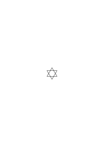

are the same

or different figures? When I have to say: “Now I’m lost; the figure is flickering before my eyes”? Can’t I just as well say: The calculus flickers before my eyes; I can’t make sense of it. Isn’t it just as if one were calculating with numbers that are too long, couldn’t make sense of them, the calculations led to ‘contradictory’ results, and one said: I must create order! That is, a surveyable calculus.

### [224\[2\]](https://cdn.wittgensteinnachlass.com/2000px/webp/Ms-117/224.webp),[225\[1\]](https://cdn.wittgensteinnachlass.com/2000px/webp/Ms-117/225.webp)

But how! – if a _long_ addition gives different results at different times, then it is worthless; & _experience_ teaches me whether something is a calculation or not! And can one say: a calculation is one if it correctly functions as a prediction of what will turn out otherwise?

### [VB](/w-vb/#ms-117-225.2) [225\[2\]](https://cdn.wittgensteinnachlass.com/2000px/webp/Ms-117/225.webp) {#225-2}

Writing in the right style means setting the wagon precisely on the track.

### [225\[3\]](https://cdn.wittgensteinnachlass.com/2000px/webp/Ms-117/225.webp)

Suppose we say: a calculation is one if it justifies a valid prediction of what will turn out otherwise. – It would be more correct to say: a calculation is one if it justifies a valid prediction: I will want to proceed in the same way at some other time.

### [225\[4\]](https://cdn.wittgensteinnachlass.com/2000px/webp/Ms-117/225.webp),[226\[1\]](https://cdn.wittgensteinnachlass.com/2000px/webp/Ms-117/226.webp)

Let’s assume that 5 + 7 gives different results at different times. That is, I am sometimes inclined to say _this_, sometimes something else. This might happen, for example, because I sometimes see 5 & 7 like this

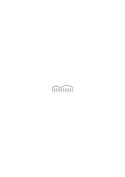

_sometimes like this_

.

‘But I don’t notice the difference’ between the two considerations, but only say: sometimes 12, sometimes 11. Could I then say: “Experience shows me: the calculation is shaky – so it’s useless”? Or what if I had always said “5 + 7 = 12” & suddenly it occurs to me that I must say “5 + 7 = 11”, without knowing why? But first, couldn’t I think that the one who notices the fluctuation in the result of 5 + 7 simply accepts it & calmly proceeds with the calculation. _Must_ he say that a calculation that wavers is useless? And, secondly, can I imagine that the one who once said 5 + 7 = 12 now sticks _against_ his inclination?

### [226\[2\]](https://cdn.wittgensteinnachlass.com/2000px/webp/Ms-117/226.webp)

I want – I think – to say: He _doesn’t_ have to be confused; – but he can be confused.

### [226\[3\]](https://cdn.wittgensteinnachlass.com/2000px/webp/Ms-117/226.webp)

Is it _like_ this: – If I assume the unheard-of case that someone, in a calculation, sometimes gets this result, sometimes that, without having _any_ idea how it happened, why shouldn’t I assume the unheard-of, that it doesn’t bother him?

### [227\[1\]](https://cdn.wittgensteinnachlass.com/2000px/webp/Ms-117/227.webp)

Can I say: experience teaches me whether a calculation is surveyable?!

### [RFM III](/w-rfm-3/#ms-117-227.2+228.1) [227\[2\]](https://cdn.wittgensteinnachlass.com/2000px/webp/Ms-117/227.webp),[228\[1\]](https://cdn.wittgensteinnachlass.com/2000px/webp/Ms-117/228.webp) {#227-2--228-1}

March 3, 1940

One might imagine, for example, that where I see _blue_, this has the meaning that the object I see is _not_ blue—that the color that appears to me is always taken to be the one that is _excluded_. I might, for example, believe that God always shows me a color to say: _Not_ that one. Or is it like this: The color I see merely tells me that this color plays a role in the description of the object. It does not correspond to a sentence, but only to the word “_blue_.” And the description of the object can therefore just as well be: “it is blue,” as well as “it is not blue.” One then says: the eye shows me only blueness, but not the role of this blueness. – We make a comparison between seeing the color and hearing the word “blue” when we have not heard the _rest_ of the sentence.

### [RFM III](/w-rfm-3/#ms-117-228.2) [228\[2\]](https://cdn.wittgensteinnachlass.com/2000px/webp/Ms-117/228.webp) {#228-2}

I want to show that one could be led to describe something as blue with the words that it is blue & also that it is not blue. That we, as it were, shift the projection method so that “p” & “~p” have the same sense. Which makes them lose it, if I don’t introduce something new as negation.

### [RFM III](/w-rfm-3/#ms-117-228.3+229.1) [228\[3\]](https://cdn.wittgensteinnachlass.com/2000px/webp/Ms-117/228.webp),[229\[1\]](https://cdn.wittgensteinnachlass.com/2000px/webp/Ms-117/229.webp) {#228-3--229-1}

A language-game can now lose its _sense_, its character as a language-game, through a contradiction. And here it is important to say that this character is not described by saying that the sounds must have a certain _effect_. For the language-game (1) would lose the character of a language-game if, instead of the 5 commands, the builder kept uttering different sounds; even if, for example, it could be physiologically demonstrated that it is always these sounds that motivate the helper to bring the building blocks that he brings.

### [RFM III](/w-rfm-3/#ms-117-229.2) [229\[2\]](https://cdn.wittgensteinnachlass.com/2000px/webp/Ms-117/229.webp) {#229-2}

Here too, one could say that, of course, the consideration of language-games has its importance in the fact that language-games (actually) (repeatedly) function. That their importance lies in the fact that people allow themselves to be conditioned to such a reaction to sounds.

### [RFM III](/w-rfm-3/#ms-117-229.3) [229\[3\]](https://cdn.wittgensteinnachlass.com/2000px/webp/Ms-117/229.webp) {#229-3}

This seems to be connected with the question of whether a calculation is an experiment for the purpose of predicting the course of calculations. For how if one carried out a calculation & – correctly – predicted that one would calculate differently next time, since the circumstances have already changed next time simply by the fact that the calculation has now been done _this way and that_ often.

### [RFM III](/w-rfm-3/#ms-117-229.4+230.1) [229\[4\]](https://cdn.wittgensteinnachlass.com/2000px/webp/Ms-117/229.webp),[230\[1\]](https://cdn.wittgensteinnachlass.com/2000px/webp/Ms-117/230.webp) {#229-4--230-1}

Calculation is a phenomenon that we know from calculation itself. As language is a phenomenon that we know from our language.

### [RFM III](/w-rfm-3/#ms-117-230.2+231.1) [230\[2\]](https://cdn.wittgensteinnachlass.com/2000px/webp/Ms-117/230.webp),[231\[1\]](https://cdn.wittgensteinnachlass.com/2000px/webp/Ms-117/231.webp) {#230-2--231-1}

Can one say: ‘The contradiction is harmless if it can be isolated’? But what prevents us from isolating it? That we are not familiar with the calculus. _That_ is the harm. And that is what one means when one says that the contradiction indicates that something is not in order in our calculus. It is merely the _symptom_ of an illness of the whole body. But the body is only ill if we are not familiar with it. The calculus has a hidden illness, namely: what we have before us is, as it is, not a calculus, & _we are not familiar with it_ – _i.e._, we cannot give a calculus that corresponds ‘essentially’ to this calculus-like thing and only excludes the false in it.

### [RFM III](/w-rfm-3/#ms-117-231.2) [231\[2\]](https://cdn.wittgensteinnachlass.com/2000px/webp/Ms-117/231.webp) {#231-2}

But how is it possible not to be familiar with a calculus, does it not lie open before us?! Let us imagine the Frege calculus, including the contradiction in it, taught. But not by considering the contradiction as something pathological. It is rather an accepted part of the calculus, it is calculated with. (The calculations do not serve the usual purpose of logical calculations.) – Now the task is set to transform this calculus, of which the contradiction is a perfectly respectable part, into another one, in which this contradiction is not supposed to exist, since the calculus is now to be used for purposes that make a contradiction undesirable. – What is this task? And what is this inability, when we say: ‘we have not yet found a calculus that corresponds to this condition’?

### [RFM III](/w-rfm-3/#ms-117-231.3+232.1) [231\[3\]](https://cdn.wittgensteinnachlass.com/2000px/webp/Ms-117/231.webp),[232\[1\]](https://cdn.wittgensteinnachlass.com/2000px/webp/Ms-117/232.webp) {#231-3--232-1}

By: “I am not familiar with the calculus” – I do not mean a mental state, but an inability to _do_ something.

### [RFM III](/w-rfm-3/#ms-117-232.2) [232\[2\]](https://cdn.wittgensteinnachlass.com/2000px/webp/Ms-117/232.webp) {#232-2}

It is often very useful for clarifying a philosophical problem to imagine the historical development in mathematics, for example, quite differently from how it actually was. If it had been different, then often no one would have the idea of saying what one actually says.

### [RFM III](/w-rfm-3/#ms-117-232.3) [232\[3\]](https://cdn.wittgensteinnachlass.com/2000px/webp/Ms-117/232.webp) {#232-3}

I would like to ask something like: “Are you aiming for utility in your calculus? – then you will not get a contradiction. And if you are not aiming for utility – then it doesn’t matter if you get one.”

### [232\[4\]](https://cdn.wittgensteinnachlass.com/2000px/webp/Ms-117/232.webp)

04.03.1940

_This_ is different & _that_ is different, so they are both the same.

### [RFM III](/w-rfm-3/#ms-117-233.1) [233\[1\]](https://cdn.wittgensteinnachlass.com/2000px/webp/Ms-117/233.webp) {#233-1}

05.03.1940

Our task is not to find calculi, but to describe the _present_ state.

### [RFM III](/w-rfm-3/#ms-117-233.2) [233\[2\]](https://cdn.wittgensteinnachlass.com/2000px/webp/Ms-117/233.webp) {#233-2}

The idea of a predicate that applies to itself, etc., certainly relied on _examples_ – but these examples were _nonsense_; they weren’t even invented. But that doesn’t mean that such predicates couldn’t be used & that the contradiction wouldn’t then have its use! I mean, if one really directs one’s attention to the use, one doesn’t even get the idea of writing ‘f(f)’. On the other hand, if one uses the signs in the calculus, so to speak, _without any preconditions_, one can also write ‘f(f)’ and must then draw the consequences and must not forget that one has no _idea_ yet of any possible practical use of this calculus.

### [RFM III](/w-rfm-3/#ms-117-233.3+234.1) [233\[3\]](https://cdn.wittgensteinnachlass.com/2000px/webp/Ms-117/233.webp),[234\[1\]](https://cdn.wittgensteinnachlass.com/2000px/webp/Ms-117/234.webp) {#233-3--234-1}

Is the question: “Where have we left the area of applicability?”? –

### [RFM III](/w-rfm-3/#ms-117-234.2) [234\[2\]](https://cdn.wittgensteinnachlass.com/2000px/webp/Ms-117/234.webp) {#234-2}

Wouldn’t it be possible that we _want_ to produce a contradiction? That we – with pride in a mathematical discovery – say: “Look, this is how we create a contradiction.” Wouldn’t it be possible that, for example, many people tried to create a contradiction in the area of logic, and that finally _one_ succeeded? But _why_ would people have tried _that_? Well, I may not be able to give the most plausible reason right now. But why not, _for example_, to show that everything in this world is uncertain?

### [RFM III](/w-rfm-3/#ms-117-234.3) [234\[3\]](https://cdn.wittgensteinnachlass.com/2000px/webp/Ms-117/234.webp) {#234-3}

These people would never really use expressions of the form f(f), but they would still be glad that they live in the vicinity of a contradiction.

### [RFM III](/w-rfm-3/#ms-117-234.4+235.1) [234\[4\]](https://cdn.wittgensteinnachlass.com/2000px/webp/Ms-117/234.webp),[235\[1\]](https://cdn.wittgensteinnachlass.com/2000px/webp/Ms-117/235.webp) {#234-4--235-1}

“Do I _see_ an order that prevents me from inadvertently arriving at a contradiction?” That’s like saying: Show me an order in your technique that convinces me that I cannot even arrive at a number that is smaller than that number. I then show him, for example, a recursive proof.

### [RFM III](/w-rfm-3/#ms-117-235.2) [235\[2\]](https://cdn.wittgensteinnachlass.com/2000px/webp/Ms-117/235.webp) {#235-2}

But is it wrong to say: “Well, I’ll continue on my way. _If_ I _see_ a contradiction, then it’s time to do something.” – Does that mean: not really calculating? Why shouldn_’t_ that be calculating?! I’ll calmly continue down this path; should I come to an abyss, I’ll try to turn back. Isn’t that ‘gone’?

### [RFM III](/w-rfm-3/#ms-117-235.3+236.1) [235\[3\]](https://cdn.wittgensteinnachlass.com/2000px/webp/Ms-117/235.webp),[236\[1\]](https://cdn.wittgensteinnachlass.com/2000px/webp/Ms-117/236.webp) {#235-3--236-1}

Let’s imagine the following case: The people of a certain tribe can only calculate orally. They do not yet know writing. They teach their children to count in the decimal system. They often make mistakes in counting, repeating or omitting digits, without noticing it. But a traveler records their counting phonographically. He teaches them writing and written calculation, and then shows them how often they make mistakes when calculating only orally. – Must these people now admit that they didn’t really calculate before? That they were only stumbling around, while now they are walking? Couldn’t they perhaps even say that things used to be better, that their intuition was not hindered by dead means. One cannot grasp the mind with machines. They might say: “If we repeated a digit back then, as your machine claims, then it must have been right.”

### [RFM III](/w-rfm-3/#ms-117-236.2+237.1) [236\[2\]](https://cdn.wittgensteinnachlass.com/2000px/webp/Ms-117/236.webp),[237\[1\]](https://cdn.wittgensteinnachlass.com/2000px/webp/Ms-117/237.webp) {#236-2--237-1}

We trust, for example, ‘mechanical’ means of calculation or counting more than our memory. Why? – Does that have to be the case? I may have miscounted, but the machine, once constructed in this way, cannot miscount. Must I take that position? – “Well, experience has (just) taught us that calculating with the machine is more reliable than calculating with memory. It has taught us that our lives go more smoothly if we calculate with machines.” But must smoothness necessarily be our ideal (must our ideal be that everything is wrapped in cellophane)? Couldn’t I also trust my memory and not trust the machine? And couldn’t I distrust the _experience_ that ‘suggests’ to me that the machine is more reliable?

### [VB](/w-vb/#ms-117-237.2) [237\[2\]](https://cdn.wittgensteinnachlass.com/2000px/webp/Ms-117/237.webp) {#237-2}

06.03.1940

If this stone does not want to move now, if it is wedged in, first move other stones around it. –

### [VB](/w-vb/#ms-117-237.3) [237\[3\]](https://cdn.wittgensteinnachlass.com/2000px/webp/Ms-117/237.webp) {#237-3}

We just want to put you on the right track, if your car is crooked on the rails; we will then let you drive alone.

### [238\[1\]](https://cdn.wittgensteinnachlass.com/2000px/webp/Ms-117/238.webp)

Is the proof of consistency a proof of the usability of the calculus? – And, as long as this proof has not been provided, is it unclear whether the calculus is usable or unusable?

### [238\[2\]](https://cdn.wittgensteinnachlass.com/2000px/webp/Ms-117/238.webp)

I _ask_: – could there not, even if consistency is proven inductively, be a contradiction in the calculus, so to speak, at a higher level? I mean: Can the inductive proof not merely eliminate one form of contradiction; & can one not construct another form that is nevertheless possible? But if this is the case, it does not mean that the proof of consistency is worthless; rather, it means that it has value _where it has practical value_. Like a signpost. (S.d.)

### [238\[3\]](https://cdn.wittgensteinnachlass.com/2000px/webp/Ms-117/238.webp),[239\[1\]](https://cdn.wittgensteinnachlass.com/2000px/webp/Ms-117/239.webp)

Why do I believe that it is possible to construct a contradiction on a higher level? Isn’t that like saying that it must be possible to construct, on a higher level, the possibility that, when dividing 1 : 3, numbers other than just threes will result? So it seems that what I am saying is nonsense.

### [239\[2\]](https://cdn.wittgensteinnachlass.com/2000px/webp/Ms-117/239.webp)

07.03.1940

If one were to give this calculation a superstructure, through which a number other than 0.333 … would be interpreted as the quotient, this would of course not harm the first calculation in any way. But if one could construct a contradictory superstructure to our arithmetic, one could make it appear as if this endangers the arithmetic.

### [RFM III](/w-rfm-3/#ms-117-239.3+240.1) [239\[3\]](https://cdn.wittgensteinnachlass.com/2000px/webp/Ms-117/239.webp),[240\[1\]](https://cdn.wittgensteinnachlass.com/2000px/webp/Ms-117/240.webp) {#239-3--240-1}

My goal is unclear to me: The goal of these remarks (is unclear to me). For I can, after all, notice the proof of consistency where I did not notice it before the proof. Just as, before the proof showing that only _these_ regular n-gons can be constructed with a ruler and compass, I tried to construct such polygons at random, and gave it up afterward. Before that, I was not sure that among the types of multiplication that correspond to _this_ description, there is none that yields a result other than the accepted one. But let us assume that my uncertainty is one that began only at a certain distance from the normal methods of calculation; and let us assume we said: Since it does no harm, for if I calculate in a very abnormal way, I simply have to reconsider everything. Would that not be quite all right?

### [RFM III](/w-rfm-3/#ms-117-240.2) [240\[2\]](https://cdn.wittgensteinnachlass.com/2000px/webp/Ms-117/240.webp) {#240-2}

I want to ask: _Must_ a proof of consistency (or unambiguity) necessarily give me greater certainty than I have without it? And, if I really set out on adventures, _can_ I not also embark on those in which this proof no longer offers me any certainty?

### [RFM III](/w-rfm-3/#ms-117-240.3+241.1) [240\[3\]](https://cdn.wittgensteinnachlass.com/2000px/webp/Ms-117/240.webp),[241\[1\]](https://cdn.wittgensteinnachlass.com/2000px/webp/Ms-117/241.webp) {#240-3--241-1}

My goal is to change the _attitude_ toward contradiction and toward the proof of consistency. (_Not_ to show that this proof demonstrates only something unimportant. How _could_ that even be the case!)

### [RFM III](/w-rfm-3/#ms-117-241.2) [241\[2\]](https://cdn.wittgensteinnachlass.com/2000px/webp/Ms-117/241.webp) {#241-2}

08.03.1940

If I, for example, were interested in creating contradictions, perhaps for aesthetic purposes, then I would now unreservedly accept the inductive proof of consistency and say: it is hopeless to want to create a contradiction in this calculus; the proof shows you that it is not possible. (Proof in the theory of harmony.) – – –

### [241\[3\]](https://cdn.wittgensteinnachlass.com/2000px/webp/Ms-117/241.webp),[242\[1\]](https://cdn.wittgensteinnachlass.com/2000px/webp/Ms-117/242.webp)

As I said, the proof of consistency is a matter of establishing order. It is as if, for example, I wanted to assign names to the locomotives produced by a factory, and said: I want to have a naming system that prevents me from giving a new machine a name that has already been used. (I might then decide, for example, to _number_ the machines.) This could also be compared to establishing an order in the letters and files of an office. Each letter is designated in a certain way upon arrival; _otherwise_, disorder _might _ensue.

### [242\[2\]](https://cdn.wittgensteinnachlass.com/2000px/webp/Ms-117/242.webp)

To prevent disorder, I might need proof that there is only _one_ prime factorization of a number.

### [242\[3\]](https://cdn.wittgensteinnachlass.com/2000px/webp/Ms-117/242.webp)

My goal is to avoid false comparisons. And that is very difficult. Should I say, for example: “I cannot use this calculus; I do not know whether it might not lead me in a circle”?

### [242\[4\]](https://cdn.wittgensteinnachlass.com/2000px/webp/Ms-117/242.webp)

How, when in the example of naming, I say: “My memory might lead me in a circle, therefore I use the system of numbering.” – Yes, “my memory leads me in a circle,” that is _clear_ – but, “the calculus leads me in a circle” –? – Does that mean: my inclination to use the rules of the calculus in this or that way? Or is the calculus here a path, _that is already laid out_?

### [RFM III](/w-rfm-3/#ms-117-242.5+243.1) [242\[5\]](https://cdn.wittgensteinnachlass.com/2000px/webp/Ms-117/242.webp),[243\[1\]](https://cdn.wittgensteinnachlass.com/2000px/webp/Ms-117/243.webp) {#242-5--243-1}

It is a good expression to say: “this calculus does not know this order (this method), this calculus knows it.” How, when one says: “a calculus that does not know this order is actually not a calculus”? (A law firm that does not know this order is actually not a law firm.)

### [RFM III](/w-rfm-3/#ms-117-243.2) [243\[2\]](https://cdn.wittgensteinnachlass.com/2000px/webp/Ms-117/243.webp) {#243-2}

The disorder – I would like to say – is avoided for practical, not theoretical purposes.

### [RFM III](/w-rfm-3/#ms-117-243.3) [243\[3\]](https://cdn.wittgensteinnachlass.com/2000px/webp/Ms-117/243.webp) {#243-3}

An order is introduced because one has had bad experiences without it – or also, it is introduced like the streamlined shape in strollers & lamps because it has proven itself somewhere else, & thus has become a style or fashion.

### [RFM III](/w-rfm-3/#ms-117-243.4) [243\[4\]](https://cdn.wittgensteinnachlass.com/2000px/webp/Ms-117/243.webp) {#243-4}

The misuse of the idea of _mechanical_ protection against contradiction. But what if the parts of the mechanism merge with each other, break or bend?

### [RFM III](/w-rfm-3/#ms-117-243.5) [243\[5\]](https://cdn.wittgensteinnachlass.com/2000px/webp/Ms-117/243.webp) {#243-5}

09.03.1940

‘The proof of consistency only shows me that I can trust the calculus.’

### [RFM III](/w-rfm-3/#ms-117-244.1) [244\[1\]](https://cdn.wittgensteinnachlass.com/2000px/webp/Ms-117/244.webp) {#244-1}

What is this sentence: you can only trust the calculus _then_? But if you _do_ trust it! – What kind of mistake have you made?

### [RFM III](/w-rfm-3/#ms-117-244.2+245.1) [244\[2\]](https://cdn.wittgensteinnachlass.com/2000px/webp/Ms-117/244.webp),[245\[1\]](https://cdn.wittgensteinnachlass.com/2000px/webp/Ms-117/245.webp) {#244-2--245-1}

I create order; I say: ‘there are only _these_ possibilities: …’. It is like when I determine the number of possible permutations of the elements A, B, C: before the order was there, I had only a very vague idea of the set of possibilities. The order is a means of not overlooking any permutation, not repeating any. It is now quite certain that I have not overlooked anything. – But so certain that I could hang the eternal bliss of the calculus on this certainty? Is it now certain that people will never want to calculate differently? That people will never look at our calculus the way we look at the counting of natives whose numbers (only) reach five? – that we will never want to look at reality _differently_? [Lessingian] But _that_ is not the certainty that this order is supposed to give us. It is not the eternal correctness of the calculus that is to be secured.

### [RFM III](/w-rfm-3/#ms-117-245.2) [245\[2\]](https://cdn.wittgensteinnachlass.com/2000px/webp/Ms-117/245.webp) {#245-2}

‘These possibilities _are_ what you mean! – or do you mean others?’

### [RFM III](/w-rfm-3/#ms-117-246.1) [246\[1\]](https://cdn.wittgensteinnachlass.com/2000px/webp/Ms-117/246.webp) {#246-1}

The order convinces me that I have not overlooked any of these 8 possibilities. But does it also convince me that nothing will upset my current view of such possibilities?

### [RFM III](/w-rfm-3/#ms-117-246.2) [246\[2\]](https://cdn.wittgensteinnachlass.com/2000px/webp/Ms-117/246.webp) {#246-2}

10.03.1940

Could one imagine that one would be just as afraid of a possibility of the 7-sided construction as of the construction of a contradiction, & that the proof that the 7-sided construction is impossible would have a reassuring effect, like the proof of consistency?

### [RFM III](/w-rfm-3/#ms-117-246.3+247.1) [246\[3\]](https://cdn.wittgensteinnachlass.com/2000px/webp/Ms-117/246.webp),[247\[1\]](https://cdn.wittgensteinnachlass.com/2000px/webp/Ms-117/247.webp) {#246-3--247-1}

How does it come about that we are at all tempted (or are close to it) to shorten (3 ‒ 3) ∙ 2 = (3 ‒ 3) ∙ 5 by (3 ‒ 3)? How does it come about that this step seems plausible according to the rules, & how does it come about that it is nevertheless unusable? When one wants to describe this situation, it is extremely easy to make a mistake in the description. (It is therefore very difficult to describe.) The descriptions that immediately come to our lips are (all) misleading – that is how our language is structured.

### [RFM III](/w-rfm-3/#ms-117-247.2) [247\[2\]](https://cdn.wittgensteinnachlass.com/2000px/webp/Ms-117/247.webp) {#247-2}

One always falls from describing into explaining.

### [RFM III](/w-rfm-3/#ms-117-247.3+248.1+249.1) [247\[3\]](https://cdn.wittgensteinnachlass.com/2000px/webp/Ms-117/247.webp),[248\[1\]](https://cdn.wittgensteinnachlass.com/2000px/webp/Ms-117/248.webp),[249\[1\]](https://cdn.wittgensteinnachlass.com/2000px/webp/Ms-117/249.webp) {#247-3--248-1--249-1}

It was, or seems to be, _something like_ this: We have a calculus, let us say, with the balls of a calculating machine; we replace this with a calculus using written symbols; this calculus suggests to us an extension of the method of calculation that the first calculus did not suggest—or perhaps better: the second calculus _blurs_ a distinction that was impossible to overlook in the first. If the point of the first calculus is that this distinction is made—and it is not made in the second—then the second has thereby lost its usefulness as a substitute for the first. And now the problem might arise—so it seems—: _where_ have we departed from the original calculus, and which boundaries in the new one correspond to the natural boundaries of the old? I have a system of rules for a calculus that was _incidentally_ modeled after another calculus. I took it as my model. But I have gone beyond it. This was indeed an advantage; but now the new calculus has become unusable in certain respects (at least for the old purposes). I therefore seek to modify it: that is, to replace it with a _somewhat_ different one. Namely, one that has the advantages of the new one without its disadvantages. But is this a clearly _defined_ task? Is there—one might also ask—_the correct_ logical calculus, only without the contradictions? Could one say, for example, that while R’s Theory of Types avoids contradiction, R’s calculus is not _the_ general logical calculus, but rather an artificially restricted, mutilated one? Could one say that the _pure_, _general_ logical calculus has yet to be found??

### [RFM III](/w-rfm-3/#ms-117-249.2+250.1) [249\[2\]](https://cdn.wittgensteinnachlass.com/2000px/webp/Ms-117/249.webp),[250\[1\]](https://cdn.wittgensteinnachlass.com/2000px/webp/Ms-117/250.webp) {#249-2--250-1}

I played a game & followed certain rules in doing so: but _how_ I followed them depended on ⋎ circumstances & this dependence was not laid down in black and white. (This is a somewhat misleading account.) Now I wanted to play this game in such a way that I followed the rules ‘mechanically’ & I ‘formalized’ the game. In doing so, however, I came to points where the game lost _all_ its charm; I therefore wanted to ‘mechanically’ avoid these. – The formalization of logic had not been successfully achieved. But why had it been attempted in the first place? (What was its purpose?) Did this idea not spring from a mistaken conception?

### [RFM III](/w-rfm-3/#ms-117-250.2+251.1) [250\[2\]](https://cdn.wittgensteinnachlass.com/2000px/webp/Ms-117/250.webp),[251\[1\]](https://cdn.wittgensteinnachlass.com/2000px/webp/Ms-117/251.webp) {#250-2--251-1}

The question “What was it good for?” was a thoroughly _essential_ question. For calculus had not been invented for a practical purpose, but rather to ‘establish the foundations of arithmetic.’ But who says that arithmetic is logic; or what one must do with logic to make it, in any sense, the foundation of arithmetic? If, for example, aesthetic considerations had led us to attempt this, who says that we could succeed? (Who says that this English poem can be translated into German to our satisfaction?!) (Even _though_ it is clear that, in _a_ sense, there is a German translation for every English sentence.)

### [251\[2\]](https://cdn.wittgensteinnachlass.com/2000px/webp/Ms-117/251.webp)

(Only by expanding our field of vision can philosophical problems be solved.)

### [RFM III](/w-rfm-3/#ms-117-251.3) [251\[3\]](https://cdn.wittgensteinnachlass.com/2000px/webp/Ms-117/251.webp) {#251-3}

Philosophical dissatisfaction disappears as we see _more_.

### [RFM III](/w-rfm-3/#ms-117-251.4) [251\[4\]](https://cdn.wittgensteinnachlass.com/2000px/webp/Ms-117/251.webp) {#251-4}

By allowing the reduction through (3 ‒ 3), arithmetic loses its charm. But what if, for example, I introduced a new equal sign to express: ‘equal, after _this_ operation’? Would it make sense to say, “Won in _that_ _sense_,” if in that sense _every_ game were won by me?

### [RFM III](/w-rfm-3/#ms-117-251.5+252.1) [251\[5\]](https://cdn.wittgensteinnachlass.com/2000px/webp/Ms-117/251.webp),[252\[1\]](https://cdn.wittgensteinnachlass.com/2000px/webp/Ms-117/252.webp) {#251-5--252-1}

The calculus led me in certain places to negate itself. I now want a calculus that does not do this, and I exclude these places. – But does that mean that every calculus in which such an exclusion has not taken place is an uncertain one? ‘Well, the discovery of these points served as a warning to me.’ – But haven’t you had _a misunderstanding_ regarding this ‘warning’?!

### [RFM III](/w-rfm-3/#ms-117-252.2) [252\[2\]](https://cdn.wittgensteinnachlass.com/2000px/webp/Ms-117/252.webp) {#252-2}

March 11, 1940

Can one prove that one has overlooked nothing? – Certainly. And must one not perhaps later admit: “Yes, I have overlooked something; but _not_ in the field to which my proof applied”?

### [RFM III](/w-rfm-3/#ms-117-252.3+253.1) [252\[3\]](https://cdn.wittgensteinnachlass.com/2000px/webp/Ms-117/252.webp),[253\[1\]](https://cdn.wittgensteinnachlass.com/2000px/webp/Ms-117/253.webp) {#252-3--253-1}

The proof of consistency must give us grounds for a prediction; & that is its _practical purpose_. This does not mean that this proof is a proof from the physics of our computational technique—that is, a proof of applied mathematics—but that the closest application, & the one for which we care about this proof, is that prediction. The prediction is not: “_in this way_, no disorder will arise” (for that is not a prediction, but rather the mathematical theorem) but rather: “no disorder will arise.”

### [VB](/w-vb/#ms-117-253.2) [253\[2\]](https://cdn.wittgensteinnachlass.com/2000px/webp/Ms-117/253.webp) {#253-2}

(Scraping mortar is much easier than moving a stone. Well, one must do the first until one can do the other.)

### [RFM III](/w-rfm-3/#ms-117-253.3) [253\[3\]](https://cdn.wittgensteinnachlass.com/2000px/webp/Ms-117/253.webp) {#253-3}

I wanted to say: The proof of consistency can only _reassure_ us if it is a valid reason for that prediction.

### [RFM III](/w-rfm-3/#ms-117-253.4) [253\[4\]](https://cdn.wittgensteinnachlass.com/2000px/webp/Ms-117/253.webp) {#253-4}

12.03.1940

Where it is enough for me that it is proven that a contradiction, or a trisection of the angle, cannot be constructed in _this_ way, the inductive proof does what is expected of it. But if I had to fear that something, somehow, might one day be interpreted as a construction of a contradiction, then no proof can take away this indefinite fear.

### [254\[1\]](https://cdn.wittgensteinnachlass.com/2000px/webp/Ms-117/254.webp)

Could I perhaps give the inductive proof of the distributive law, & then assign a certain number (say 100100 + 1) such a role in our arithmetic that induction cannot be applied to _it_ in the way we are familiar with? At 100100 + 1 there is indeed an unevenness of the ground, & _there_ the induction spread over it naturally also shows an inequality.

### [254\[2\]](https://cdn.wittgensteinnachlass.com/2000px/webp/Ms-117/254.webp),[255\[1\]](https://cdn.wittgensteinnachlass.com/2000px/webp/Ms-117/255.webp)

How can one say that a cardinal number, perhaps a very large one, will not be singled out, & one will say: “people have so far _believed_ that these laws must apply to all cardinal numbers, because they were simply guided by induction; today we know that not _all_ cardinal numbers play the same role in arithmetic”? [Not yet good.]

### [255\[2\]](https://cdn.wittgensteinnachlass.com/2000px/webp/Ms-117/255.webp)

Is it clear that, if I have found a contradiction, I must, at all times, disavow my previous calculus?

### [255\[3\]](https://cdn.wittgensteinnachlass.com/2000px/webp/Ms-117/255.webp)

But I asked: “have we not misunderstood the warning?”—that is, do you really understand _what_ you have to guard against; & _how_ you should guard against it? (If there was a break-in at my house, is it absolutely good, for example, to have guards in front of my house? Do they make the house safer under all circumstances?)

### [RFM III](/w-rfm-3/#ms-117-255.4) [255\[4\]](https://cdn.wittgensteinnachlass.com/2000px/webp/Ms-117/255.webp) {#255-4}

The fence I draw around the contradiction is not a super-fence.

### [RFM III](/w-rfm-3/#ms-117-255.5+256.1) [255\[5\]](https://cdn.wittgensteinnachlass.com/2000px/webp/Ms-117/255.webp),[256\[1\]](https://cdn.wittgensteinnachlass.com/2000px/webp/Ms-117/256.webp) {#255-5--256-1}

How could the calculus, through a proof, come into order in principle? How could it not have been a proper calculus, as long as one had not found this proof?

### [RFM III](/w-rfm-3/#ms-117-256.2) [256\[2\]](https://cdn.wittgensteinnachlass.com/2000px/webp/Ms-117/256.webp) {#256-2}

‘This calculus is purely mechanical; a machine could perform it.’ What kind of machine? One made of ordinary materials—or a super-machine? Are you confusing the hardness of a rule with the hardness of a material?

### [256\[3\]](https://cdn.wittgensteinnachlass.com/2000px/webp/Ms-117/256.webp)

‘So people calculated up to now. Then they came across a contradiction. But since the purpose of the calculus was aesthetic, the contradiction spoiled people’s enjoyment of the calculus.’

### [RFM III](/w-rfm-3/#ms-117-256.4) [256\[4\]](https://cdn.wittgensteinnachlass.com/2000px/webp/Ms-117/256.webp) {#256-4}

We will see the contradiction in a completely different light if we consider its appearance & its consequences, as it were, anthropologically—as if we were looking at it with the mathematician’s indignation. That is, we will see it differently if we only try to _describe_ how the contradiction influences language-games, as opposed to looking at it from the point of view of a mathematical legislator.

### [257\[1\]](https://cdn.wittgensteinnachlass.com/2000px/webp/Ms-117/257.webp)

The attitude of mathematicians towards contradiction seems to me, to put it bluntly, to be that of hysteria & the thirst for sensation. Of course, above all, it is one of confusion.

### [257\[2\]](https://cdn.wittgensteinnachlass.com/2000px/webp/Ms-117/257.webp)

Just continue on your path—as long as you see one in front of you. It will lead you somewhere, to where it was important to be led.

### [257\[3\]](https://cdn.wittgensteinnachlass.com/2000px/webp/Ms-117/257.webp)

‘People now developed this ideal of the calculus.’ (An ideal calculus had to look _like this_ to them.)

### [257\[4\]](https://cdn.wittgensteinnachlass.com/2000px/webp/Ms-117/257.webp),[258\[1\]](https://cdn.wittgensteinnachlass.com/2000px/webp/Ms-117/258.webp)

13.03.1940

‘Induction allows us to gaze into the distance of the calculus.’ – But must we not be careful that we are not misled by this picture? Seeing through a telescope is of great practical value, namely when what we see gives us good reason to expect something in the future. If, in a particular case, the circumstances make it so that the telescope teaches us no more than the naked eye, then it would be superfluous to look through the telescope.

### [RFM III](/w-rfm-3/#ms-117-258.2) [258\[2\]](https://cdn.wittgensteinnachlass.com/2000px/webp/Ms-117/258.webp) {#258-2}

But hold on! Is it not clear that no one wants to arrive at a contradiction? That therefore, the person to whom you present the possibility of a contradiction will do everything to make such a contradiction impossible? (That therefore, whoever does not do so is a sleepyhead.)

### [RFM III](/w-rfm-3/#ms-117-258.3) [258\[3\]](https://cdn.wittgensteinnachlass.com/2000px/webp/Ms-117/258.webp) {#258-3}

But what if he replied: “I cannot imagine a contradiction in my calculus. – You have indeed shown me a contradiction in another, but not in _this one_. In this one _there is none_, and I do not see the possibility either.”

### [RFM III](/w-rfm-3/#ms-117-258.4) [258\[4\]](https://cdn.wittgensteinnachlass.com/2000px/webp/Ms-117/258.webp) {#258-4}

“If my conception of the calculus should ever change; if, through an environment that I do not see now, its aspect changes – then we will talk further.”

### [RFM III](/w-rfm-3/#ms-117-260a.1) [260a\[1\]](https://cdn.wittgensteinnachlass.com/2000px/webp/Ms-117/260a.webp) {#260a-1}

“I _do not_ see the possibility of a contradiction. Just as little, it seems, as you see the possibility that there is one in your proof of consistency.”

### [RFM III](/w-rfm-3/#ms-117-260a.2) [260a\[2\]](https://cdn.wittgensteinnachlass.com/2000px/webp/Ms-117/260a.webp) {#260a-2}

Do I know whether, if I ever see a contradiction where I now do not see the possibility of one, it will then seem dangerous to me?

### [260a\[3\]](https://cdn.wittgensteinnachlass.com/2000px/webp/Ms-117/260a.webp)

I have not yet described the situation of not knowing one’s way around in the calculus one is using, sufficiently. – Above all, the situation in which this not knowing has undesirable practical consequences.

### [260a\[4\]](https://cdn.wittgensteinnachlass.com/2000px/webp/Ms-117/260a.webp),[260b\[1\]](https://cdn.wittgensteinnachlass.com/2000px/webp/Ms-117/260b.webp)

14.03.1940

Let us assume that people came to calculate with bracket expressions such as “(3 + 4)”, “(4 + 7 ‒ 9)”, then also with expressions such as “(4 ‒ 4)”, and then notice an inconsistency, i.e., notice that two multiplications of _the same_ numbers, correctly calculated according to the rules, yield two different results. And now they are perplexed – they say that it should yield the same result, but it does not, and they do not know why.

### [260b\[2\]](https://cdn.wittgensteinnachlass.com/2000px/webp/Ms-117/260b.webp)

(What is it like when one does not know one’s way around in a district? Well: it is a state of mind, and certain ways of acting.)

### [260b\[3\]](https://cdn.wittgensteinnachlass.com/2000px/webp/Ms-117/260b.webp)

15.03.1940

Look through a tube, and try to find your way around in a room by looking around with the tiny field of vision. Such an activity is the activity of one who philosophizes.

### [260b\[4\]](https://cdn.wittgensteinnachlass.com/2000px/webp/Ms-117/260b.webp)

Imagine that I used only elevations of things as working drawings for workpieces to be manufactured, instead of plan views and elevations. – In many cases, this did not lead to any confusion (although I did not give an account of it). Then, however, it suddenly leads to confusion, and now I introduce the plan view as a necessary supplement to the elevation.

### [260b\[5\]](https://cdn.wittgensteinnachlass.com/2000px/webp/Ms-117/260b.webp),[261\[1\]](https://cdn.wittgensteinnachlass.com/2000px/webp/Ms-117/261.webp)

Can I not now look at the matter in two ways: on the one hand, in such a way that the plan view has taught me something new (that something new has been discovered); on the other hand, that drawing and reading the plan view is a newly invented technique.

### [261\[2\]](https://cdn.wittgensteinnachlass.com/2000px/webp/Ms-117/261.webp)

‘Without a plan view, I cannot find my way around; and the elevation alone is not a depiction of the object at all.’ – But – I _can_ find my way around; but sometimes I do not know my way around, and then the plan view helps me to find my way around (although it too can fail).

### [261\[3\]](https://cdn.wittgensteinnachlass.com/2000px/webp/Ms-117/261.webp),[262\[1\]](https://cdn.wittgensteinnachlass.com/2000px/webp/Ms-117/262.webp)

What does the confusion look like? I make things, compare them in the usual way with the drawing, they correspond to it, but not to each other, and I cannot understand it. But what does it mean: I cannot understand it? – What does _that_ look like? – Well, I had expected them to be _the same_, but they are not. – And I tell myself that I must have made a mistake, and I look for this mistake in my comparisons, i.e., I check it again and again, but I don't get anywhere. – So it is as if I had taken measurements for a right-hand glove, cut out a left-hand glove according to exactly these measurements (and sewn it), and now I want to put it on my hand and it doesn't fit. But I now look in vain to see where I could have made a mistake in the measurements or not cut it out according to the measurements. Do I _know_ such a situation from our experience? Is it perhaps the situation of the scientist who finds that a hypothesis is not confirmed?

### [262\[2\]](https://cdn.wittgensteinnachlass.com/2000px/webp/Ms-117/262.webp),[263\[1\]](https://cdn.wittgensteinnachlass.com/2000px/webp/Ms-117/263.webp)

It seems: not quite! – Because the case I imagined was the one in which that person is _confused_; he says: “I don't know what's going on; it must be right, but it isn't.” The case in which he says: “I must have made a mistake, but I absolutely don't know what it is.” This is not the case of the scientist, who tries out different hypotheses and is more or less willing to give up one in favor of another. (Anthropologically, the cases are different, I would say.)

### [263\[2\]](https://cdn.wittgensteinnachlass.com/2000px/webp/Ms-117/263.webp)

(“But is there a significant difference between the cases?” There is a _difference_.)

### [263\[3\]](https://cdn.wittgensteinnachlass.com/2000px/webp/Ms-117/263.webp)

Of course, we could also have imagined the case in which the person is investigating whether he should make _this_ glove or its mirror image, and perhaps finds that the glove (always) fits when he first makes a drawing after taking measurements, and then cuts it out according to that image in a mirror.

### [263\[4\]](https://cdn.wittgensteinnachlass.com/2000px/webp/Ms-117/263.webp)

The difference between the ‘anthropological’ and the mathematical representation is that in the former we are not tempted to speak of ‘mathematical facts’; rather, the _facts_ in this representation are never mathematical, and never make _mathematical_ propositions true or false.

### [263\[5\]](https://cdn.wittgensteinnachlass.com/2000px/webp/Ms-117/263.webp),[264\[1\]](https://cdn.wittgensteinnachlass.com/2000px/webp/Ms-117/264.webp)

If, however, that confused person made the discovery of the right and left gloves. What kind of discovery would that be? – He did not discover that the mirror image of his glove fits, but he discovered the image ‘right and left glove’. – Did he actually _draw_ it (and for the first time)? Well, – if someone draws something new – does he discover something? Doesn't he simply create something new? – But doesn't he then discover, _by means of_ the new image, that it was the right glove and not the left glove that he should have made?

### [264\[2\]](https://cdn.wittgensteinnachlass.com/2000px/webp/Ms-117/264.webp)

What is it like: do I know such confusions? Are they very rare, or _today_ very rare?

### [264\[3\]](https://cdn.wittgensteinnachlass.com/2000px/webp/Ms-117/264.webp)

Whoever brings order where there was disorder before introduces a new image.

### [264\[4\]](https://cdn.wittgensteinnachlass.com/2000px/webp/Ms-117/264.webp)

16.03.1940

Fictions, as is well known, have a place in our considerations. But they are all material, behavioristic fictions. Fictions that could be staged entirely on a stage.

### [264\[5\]](https://cdn.wittgensteinnachlass.com/2000px/webp/Ms-117/264.webp),[265\[1\]](https://cdn.wittgensteinnachlass.com/2000px/webp/Ms-117/265.webp)

17.03.1940

I only went the way it was naturally to go. Now, however, two tendencies intersect. The continuation of the calculus, which is natural from _one_ point of view, is unnatural from the other. If I come from _there_, I would like to continue _so_, but if from _there_, then definitely not so.

### [265\[2\]](https://cdn.wittgensteinnachlass.com/2000px/webp/Ms-117/265.webp)

(This activity is not so much like putting together a jigsaw puzzle from its pieces, as it is like putting together a _series_ of such puzzles (some of which are complete, others incomplete) from pieces that are all thrown together in _one_ box. No wonder if this is difficult.)

### [265\[3\]](https://cdn.wittgensteinnachlass.com/2000px/webp/Ms-117/265.webp)

It is difficult here not to confuse the different levels on which we move; not, without knowing it, to get from one to the other. (_One_ level is that of the inclinations, to continue the calculus this way or that; another level is that of practical usability, another is that of confusion and clarity.)

### [266\[1\]](https://cdn.wittgensteinnachlass.com/2000px/webp/Ms-117/266.webp)

One easily makes a mistake here, such as thinking that if there is a blind spot on the retina, one must see it as a hole in the field of vision.

### [266\[2\]](https://cdn.wittgensteinnachlass.com/2000px/webp/Ms-117/266.webp),[267\[1\]](https://cdn.wittgensteinnachlass.com/2000px/webp/Ms-117/267.webp)

March 18, 1940

One explains the origin of certain fables from natural myths, and the origin of these from the natural impulse to explain the great, ever-recurring phenomena of nature. And one speaks as if nothing were more self-evident than that we provide ourselves with explanations of precisely these natural phenomena, and also that these explanations are of precisely this kind. As if, were it not so, we could not have been sufficiently puzzled. The fact that these natural phenomena play a major role in our lives, and that they recur again and again, seems to make the other facts self-evident to us. Jeans expresses this, very clumsily but very characteristically, as follows: “Primitive man must have found nature singularly puzzling & intricate.” (“_Must_ have”—especially since we have knowledge that every farmer racks his brains over why the sun rises and sets, and why rain falls from the clouds, etc.!)

### [RFM III](/w-rfm-3/#ms-117-267.2) [267\[2\]](https://cdn.wittgensteinnachlass.com/2000px/webp/Ms-117/267.webp) {#267-2}

March 19, 1940

‘What does a proof teach me, apart from its result?’ – What does a new melody teach me? Am I not tempted to say that it _teaches_ me something? –

### [RFM III](/w-rfm-3/#ms-117-267.3) [267\[3\]](https://cdn.wittgensteinnachlass.com/2000px/webp/Ms-117/267.webp) {#267-3}

I have not yet clarified the role of calculation. The role of the sentence: “I must have made a mistake in my calculation.” It is actually the key to understanding the ‘foundations’ of mathematics.

### [267\[4\]](https://cdn.wittgensteinnachlass.com/2000px/webp/Ms-117/267.webp),[268\[1\]](https://cdn.wittgensteinnachlass.com/2000px/webp/Ms-117/268.webp)

Just as calling an action ‘good’ and acting and judging accordingly does not mean calling it _useful_—although what is obviously useful is often called good, and what we approve of is presented as somehow useful—so _accepting_ a calculation (providing an explanation for it as a _correct_ calculation) does not mean declaring it to be a _useful_ calculation. Although there is a _close_ connection between finding the usefulness or uselessness of a calculation and accepting or rejecting the calculation. But the two are different anthropological phenomena, just as approving actions and discovering them to be useful are. (The different ‘levels.’) (This remark does not, of course, imply that ‘good’ is _indefinable_.) It also does not matter that I have not provided more detailed explanations of what is meant by utility.

### [268\[2\]](https://cdn.wittgensteinnachlass.com/2000px/webp/Ms-117/268.webp)

(The assassin is despised even though he a) acted more intelligently than the murderer who exposes himself to a fight, b) is more humane, in that he spares his victim the fear of death.)

### [268\[3\]](https://cdn.wittgensteinnachlass.com/2000px/webp/Ms-117/268.webp)

Ideas do flicker in me, but they are far from strong enough to win a victory against the darkness.

### [269\[1\]](https://cdn.wittgensteinnachlass.com/2000px/webp/Ms-117/269.webp)

I am apparently not strong enough today, or no longer strong enough, to see this matter clearly. I needed a new picture to get an overview of it. At present, I only run out of breath when I consider the matter. I cannot bring order to it.

### [269\[2\]](https://cdn.wittgensteinnachlass.com/2000px/webp/Ms-117/269.webp)

20.03.1940

The description that I should give is similar to this: ‘What experiences would a person have who spent his life under these and those strange circumstances (e.g., entirely on a carousel), and how could he represent these experiences?’ It is difficult here, first, not to see things with our own eyes (i.e., from our own point of view), second, not to overlook the fact that we ourselves are in a similar situation, relative to another observer. What he experiences will therefore be both extremely strange and completely ordinary. That is to say, it will appear adventurous at first glance, but then, of a completely ordinary kind, only different in the details.

### [270\[1\]](https://cdn.wittgensteinnachlass.com/2000px/webp/Ms-117/270.webp)

The man who helps pull the ship of which he wants to be a passenger—and toils to get it moving more quickly (Hebel: “Comfortable sailing, if you will”)—has he committed an error? One might say: he is doing something _foolish_. But if, for example, he wanted _to_ _pull_ rather than _carry_ his fur coat, it would have been reasonable. What he does can be interpreted as a mistake, as reasonable, and as nonsensical.

### [270\[2\]](https://cdn.wittgensteinnachlass.com/2000px/webp/Ms-117/270.webp)

27.03.1940

If one cannot predict whether and at what point in the development of π three sevens will appear consecutively, is that similar to not being able to predict a lunar eclipse? The two predictions seem to be of a completely different kind. One can say that the first is not a temporal prediction.

### [270\[3\]](https://cdn.wittgensteinnachlass.com/2000px/webp/Ms-117/270.webp),[271\[1\]](https://cdn.wittgensteinnachlass.com/2000px/webp/Ms-117/271.webp)

April 6, 1940

I feel sick; my head is confused and unable to think, as if there had never been any thoughts in it. I am full of fear that my work will be partly lost and partly stolen. Envy toward younger people, fear of the future. It looks like _winter_ in my head; as if the last green plants had died and the earth were facing a long period of desolation.

### [271\[2\]](https://cdn.wittgensteinnachlass.com/2000px/webp/Ms-117/271.webp)

April 18, 1940

What is the case when one says: I need a calculus of this & that kind here? E.g.: I am looking for a way to calculate whether a number is divisible by 7 that is shorter than the division by 7 itself. – What am I looking for in such a case? Is what I am looking for in any way comparable to the calculus intended to provide an explanation for a physical phenomenon? One could say: ‘I want to use my calculus to predict the result of the division.’

### [271\[3\]](https://cdn.wittgensteinnachlass.com/2000px/webp/Ms-117/271.webp),[272\[1\]](https://cdn.wittgensteinnachlass.com/2000px/webp/Ms-117/272.webp)

June 7, 1940

My nerves have been in a _very_ bad state for two months: _too little sleep_; & worry & (unnecessary) agitation. _No_ coherent thoughts! What I needed would be a month of complete silence—I mean: not hearing any _people_. The disgusting middle class here and their antics have particularly gotten on my nerves. In a certain sense, I am to blame for this myself, for I have neither the courage nor the strength to stand up to them. Things look bad with my ‘morals.’

### [272\[2\]](https://cdn.wittgensteinnachlass.com/2000px/webp/Ms-117/272.webp)

13.06.1940

Still unable to work. Terribly sensitive to any noise, especially the laughter, speaking & singing of students. The war is affecting my nerves, and I also have all sorts of _fruitless_ worries about the future. – I see K once or twice a week; but I doubt to what extent the relationship is the right one. May it really be a good one.

### [272\[3\]](https://cdn.wittgensteinnachlass.com/2000px/webp/Ms-117/272.webp)

15.06.1940

My nerves are particularly bad again. Until evening, accelerated pulse, dizziness & extraordinary fatigue & weakness. Normal in the evening. I am trying Adalin as a sleeping aid; perhaps it will have bad consequences. May I recover!

### [272\[4\]](https://cdn.wittgensteinnachlass.com/2000px/webp/Ms-117/272.webp),[273\[1\]](https://cdn.wittgensteinnachlass.com/2000px/webp/Ms-117/273.webp)

June 16, 1940

Hutt visited me. I was glad to see him, but was still in _poor_ condition for most of the day. Abdominal pain. Weakness, anxiety, rapid pulse.
