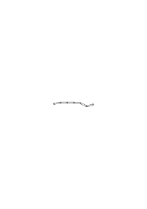
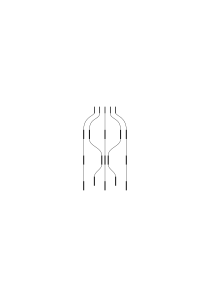
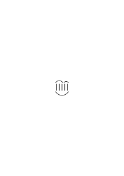
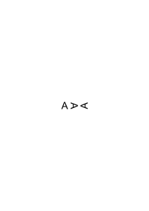
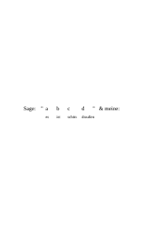
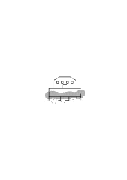

# Ms-119

70 published remarks, CE, VB

### [FCr\[1\]](https://cdn.wittgensteinnachlass.com/2000px/webp/Ms-119/FCr.webp)

## XV.

### [1\[1\]](https://cdn.wittgensteinnachlass.com/2000px/webp/Ms-119/1.webp)

24.09.1937

What we offer are actually remarks on the natural history of man; but not curious contributions, but rather statements that no one has doubted, and which escape being noticed only because they are constantly before our eyes.

### [CE](/w-ce/#ms-119-1.2+2.1) [1\[2\]](https://cdn.wittgensteinnachlass.com/2000px/webp/Ms-119/1.webp),[2\[1\]](https://cdn.wittgensteinnachlass.com/2000px/webp/Ms-119/2.webp) {#1-2--2-1}

If one says: “I am afraid because he looks so menacing” – then here a cause is apparently recognized immediately, without repeated experimentation. Russell said that one must recognize something as a cause through repeated experience, but one must first recognize something as a cause through intuition. Isn't that similar to saying: One must first recognize something as 2 m through measurement, before one recognizes something as 1 m through intuition?

### [CE](/w-ce/#ms-119-2.2+3.1) [2\[2\]](https://cdn.wittgensteinnachlass.com/2000px/webp/Ms-119/2.webp),[3\[1\]](https://cdn.wittgensteinnachlass.com/2000px/webp/Ms-119/3.webp) {#2-2--3-1}

What happens if that intuition is contradicted by repeated experiments? Who is right then? And what is it that intuition tells us about the experience that we ‘recognize as a cause’? Is this about something other than a reaction on our part to the object: the cause?

### [CE](/w-ce/#ms-119-3.2+4.1) [3\[2\]](https://cdn.wittgensteinnachlass.com/2000px/webp/Ms-119/3.webp),[4\[1\]](https://cdn.wittgensteinnachlass.com/2000px/webp/Ms-119/4.webp) {#3-2--4-1}

But do we not immediately recognize that the pain comes from the blow we received? Is it not the cause, and can there be any doubt that it is? – But isn't it quite conceivable that we are sometimes mistaken about this? And later recognize the mistake. It seems as if something strikes us, and at the same time a pain is caused in us. (One sometimes thinks that one causes a noise by a certain movement, and then realizes that it arose independently of us.) And of course, this is a real experience, which one could call ‘experience of the cause’. But not because it infallibly shows us the cause, but because here, in looking for a cause, _a_ root of the cause-and-effect schema lies.

### [CE](/w-ce/#ms-119-4.2) [4\[2\]](https://cdn.wittgensteinnachlass.com/2000px/webp/Ms-119/4.webp) {#4-2}

_We react to the cause._ To call something a “cause” is similar to pointing and saying: “_That_ is to blame!”

### [CE](/w-ce/#ms-119-4.3) [4\[3\]](https://cdn.wittgensteinnachlass.com/2000px/webp/Ms-119/4.webp) {#4-3}

We intuitively establish the cause when the effect is unpleasant to us. We instinctively look from the thing that was struck to the thing that struck. (I assume we do this.)

### [CE](/w-ce/#ms-119-5.1) [5\[1\]](https://cdn.wittgensteinnachlass.com/2000px/webp/Ms-119/5.webp) {#5-1}

Now, if I said that we compare everything in the case of cause and effect to the case of the blow; is it the archetype of the cause of an effect? Would we then have ‘recognized’ the blow as the cause? Imagine a language in which, instead of ‘cause,’ one always says ‘impact’!

---

### [5\[2\]](https://cdn.wittgensteinnachlass.com/2000px/webp/Ms-119/5.webp)

What does the person who separates 4 balls into 2 + 2, puts them together again, separates them again, etc., show us? He impresses upon us a face and a typical change of that face.

### [5\[3\]](https://cdn.wittgensteinnachlass.com/2000px/webp/Ms-119/5.webp),[6\[1\]](https://cdn.wittgensteinnachlass.com/2000px/webp/Ms-119/6.webp)

Why shouldn't one learn to perform the command: put ∣∣∣ & ∣∣ together! instead of the sentence ‘3 + 2 = 5’.

### [6\[2\]](https://cdn.wittgensteinnachlass.com/2000px/webp/Ms-119/6.webp)

The decompositions of the 100 numbered balls are therefore only typical arrangements of a certain face. But they are also characterized by the fact that no ball is added, and none is removed.

### [6\[3\]](https://cdn.wittgensteinnachlass.com/2000px/webp/Ms-119/6.webp)

25.09.1937

_I am very impatient!_

### [6\[4\]](https://cdn.wittgensteinnachlass.com/2000px/webp/Ms-119/6.webp),[7\[1\]](https://cdn.wittgensteinnachlass.com/2000px/webp/Ms-119/7.webp),[8\[1\]](https://cdn.wittgensteinnachlass.com/2000px/webp/Ms-119/8.webp)

Think of the movements of a doll with articulated limbs. Or imagine that you have a chain

with, say, 10 links, and you show what characteristic (i.e. memorable) figures can be made with it. Let the links be numbered; this makes them an easily memorable structure, even if they are in a straight line. I thus impress upon you characteristic arrangements and movements of the chain. If I now say: “See, you can also make _this_ out of it” (and show it), am I showing you an experiment? – In a certain sense, _yes_; I _show_ e.g. that you can bring it _thus_ into this form; but you did not doubt that. And what interests you is not something that concerns this individual chain. – But isn't what I demonstrate still a property of this chain? Certainly; but I only demonstrate such movements, such transformations, which are of a memorable kind; and you are interested in _learning_ these transformations. But you are interested in them because it is so easy to perform them again and again on different objects.

### [8\[2\]](https://cdn.wittgensteinnachlass.com/2000px/webp/Ms-119/8.webp),[9\[1\]](https://cdn.wittgensteinnachlass.com/2000px/webp/Ms-119/9.webp)

The words “Look at what I can make out of it—” are, however, the same ones that I would use if I were to show you what I can do with a lump of clay. Here, you would not be so much interested in _that_ such things can be formed out of this lump, as in _that_ I am perhaps skilled enough to do it. In another case, for example: that this material can be treated _in this way_. Here, one would hardly say: I ‘draw your attention’ to the fact that I can do this, or that the material can withstand this, whereas in the case of the chain, one would say that I draw your attention to the fact that this can be done with it. – Because you could also have _imagined_ it. But you cannot, of course, discover any property of the chain by imagining it. The experimental aspect disappears when one simply regards the process as a memorable image.

### [9\[2\]](https://cdn.wittgensteinnachlass.com/2000px/webp/Ms-119/9.webp),[10\[1\]](https://cdn.wittgensteinnachlass.com/2000px/webp/Ms-119/10.webp)

In what way does the calculation reveal the property of a digit, for example, the digit “625,” when we take the square root & find that “625” results from the operation 25 × 25? (You see, I can talk about digits instead of numbers here.) If I now bring the multiplication

“<math display="inline"><mfrac><mrow><mn>25</mn><mo>×</mo><mn>25</mn></mrow><mrow><mi>etc</mi><mo>.</mo></mrow></mfrac></math>”

as it were, close to “625” in order to measure it against this digit; what should I bring forth: the entire multiplication _with_ the result? Or should I just leave out the result?

### [10\[2\]](https://cdn.wittgensteinnachlass.com/2000px/webp/Ms-119/10.webp),[11\[1\]](https://cdn.wittgensteinnachlass.com/2000px/webp/Ms-119/11.webp),[12\[1\]](https://cdn.wittgensteinnachlass.com/2000px/webp/Ms-119/12.webp)

In what sense is it a property of the sign 725 that it arises through the addition of

<math display="block">
  <mtable columnalign="right">
    <mtr>
      <mtd>
        <mn>170</mn>
      </mtd>
    </mtr>
    <mtr>
      <mtd>
        <mn>252</mn>
      </mtd>
    </mtr>
    <mtr>
      <mtd>
        <mrow>
          <mo>+</mo>
          <mspace width="0.3em"/>
          <mn>303</mn>
        </mrow>
      </mtd>
    </mtr>
  </mtable>
</math>

? Only insofar as it is meant that it is _usually_ produced in this way; not if it is meant that it _is_ the result of this addition, the sum of these numbers. <s>For one could, for example, consider it a property of the sign “5” that we (usually) write it as the result of the addition 3 + 2; but not that…</s> Insofar as it is a property of the sign “625”, it lies in the functioning of our minds, in the facts of our natural history, that _we_ calculate in this way. The purely mathematical is not a property of “625” because the calculation is only complete when the result is already there; & one cannot then say that it is a property of “625” that the calculation _yields_ it, because “yields” mathematically means that this number is at the end of the calculation.

### [12\[2\]](https://cdn.wittgensteinnachlass.com/2000px/webp/Ms-119/12.webp),[13\[1\]](https://cdn.wittgensteinnachlass.com/2000px/webp/Ms-119/13.webp)

One can therefore say: we are unfolding the **role** that “625” plays in our system of calculation. In what respect can one say that the calculation analyzes the sign “625”; it does, after all, add something to it.

(I once wrote: “In mathematics, process & result are equivalent.”)

### [13\[2\]](https://cdn.wittgensteinnachlass.com/2000px/webp/Ms-119/13.webp),[14\[1\]](https://cdn.wittgensteinnachlass.com/2000px/webp/Ms-119/14.webp),[15\[1\]](https://cdn.wittgensteinnachlass.com/2000px/webp/Ms-119/15.webp)

And yet, one feels that it is a property of “625” that it is produced in this way, or can be. But how can it be a property of the structure _“625”_ that it is produced in this way, if, for example, it were not produced in this way? If no one multiplied in this way? But only if one could say that it is a property of this sign to be the object of this rule. It is a property of the “5” to be the object of the rule “3 + 2 = 5”. For only as the object of the rule is the number _the_ result of the addition of the other numbers. But if I now say: is it a property of the number … to be the result of the addition of … according to the rule…? It is therefore a property of the number that it arises in the application of this rule to these numbers. The question is: would we call it the “application of the rule” if this number were _not_ the result? And that is the same question as: “What do you mean by the ‘application of this rule’: that which you do with it (and you might apply it one way or another), or is ‘its application’ defined differently.”

### [15\[2\]](https://cdn.wittgensteinnachlass.com/2000px/webp/Ms-119/15.webp)

“It is a property of this number that this process leads to it.” – But in mathematics, no process leads to it; rather, it is the end of a process (it still belongs to the process).

### [15\[3\]](https://cdn.wittgensteinnachlass.com/2000px/webp/Ms-119/15.webp),[16\[1\]](https://cdn.wittgensteinnachlass.com/2000px/webp/Ms-119/16.webp)

I am unfolding the role of “625” in the game. (And it is completely irrelevant to me whether I consider the digit “625” or, for example, 625 lines.)

### [16\[2\]](https://cdn.wittgensteinnachlass.com/2000px/webp/Ms-119/16.webp)

I unfold the properties of 100 balls; I show what can be done with them. I ask: is it a property of _one_ ball that, together with another, it gives _two_ balls? Do I unfold their properties by placing another ball next to it? Yes; insofar as it then shows, for example, that it lies quite still and does not merge with the other, and so on.

### [16\[3\]](https://cdn.wittgensteinnachlass.com/2000px/webp/Ms-119/16.webp),[17\[1\]](https://cdn.wittgensteinnachlass.com/2000px/webp/Ms-119/17.webp)

“Granted, I was not interested in _those_ properties: that none of the balls disappear, that they can be moved, etc. – I take all of these for granted – but is it not still a property of the row that we can break it down in this way and regroup it into these shapes – _given_ that the balls have those other properties?! Because I could very well be surprised to see that the 100 balls form such a rectangle, etc.” – Yes; but if I had already shown you this transformation, would you be surprised a second time to see that it can be done?

### [17\[2\]](https://cdn.wittgensteinnachlass.com/2000px/webp/Ms-119/17.webp),[18\[1\]](https://cdn.wittgensteinnachlass.com/2000px/webp/Ms-119/18.webp)

_That_ is not the property of this row, that the beginning of this transformation is.

Have I now unfolded the properties of the upper row?

### [18\[2\]](https://cdn.wittgensteinnachlass.com/2000px/webp/Ms-119/18.webp)

If you take those properties for granted, you have (also) not demonstrated any properties of the row.

### [18\[3\]](https://cdn.wittgensteinnachlass.com/2000px/webp/Ms-119/18.webp),[19\[1\]](https://cdn.wittgensteinnachlass.com/2000px/webp/Ms-119/19.webp)

“This row produces this formation through such a transformation.” Does the emphasis lie here on the fact that it does not produce a _different_ formation? – _That_ must be the case. But does this not constitute precisely the property that nothing is lost and nothing is added?

### [19\[2\]](https://cdn.wittgensteinnachlass.com/2000px/webp/Ms-119/19.webp)

But why do I feel that a property of the row is being unfolded, shown? – Because I alternately consider what is shown as essential to the row, and not essential. Or: because I alternately think of these properties as external and internal.

### [19\[3\]](https://cdn.wittgensteinnachlass.com/2000px/webp/Ms-119/19.webp)

It _is_ a property of the row to _move in this way_.

### [19\[4\]](https://cdn.wittgensteinnachlass.com/2000px/webp/Ms-119/19.webp),[20\[1\]](https://cdn.wittgensteinnachlass.com/2000px/webp/Ms-119/20.webp)

Because I alternately take something for granted and find it noteworthy.

### [20\[2\]](https://cdn.wittgensteinnachlass.com/2000px/webp/Ms-119/20.webp),[21\[1\]](https://cdn.wittgensteinnachlass.com/2000px/webp/Ms-119/21.webp)

“You are unfolding the properties of the hundred by showing what can be done with them.” – _How_ can be done? Because no one doubts that it _can_ be done with them; therefore, it must be a matter of the way in _which_ this is brought about. But look at this! does it not presuppose the result? 26.09.1937 Because imagine that, in _this way_, this result is produced once, and a different result another time; would you accept that? Would you not say: “I must have been mistaken: in _this_ way, the same thing must always be produced.” This shows that you include the result in the process of the transformation.

### [CE](/w-ce/#ms-119-21.2+22.1+23.1+24.1) [21\[2\]](https://cdn.wittgensteinnachlass.com/2000px/webp/Ms-119/21.webp),[22\[1\]](https://cdn.wittgensteinnachlass.com/2000px/webp/Ms-119/22.webp),[23\[1\]](https://cdn.wittgensteinnachlass.com/2000px/webp/Ms-119/23.webp),[24\[1\]](https://cdn.wittgensteinnachlass.com/2000px/webp/Ms-119/24.webp) {#21-2--22-1--23-1--24-1}

Imagine two different species of plants, A & B; we obtain seeds from both, & the seeds of the two species look exactly alike, & the most precise examination can reveal no difference between them. However, from the seed of a plant A, plants A grow, from the seeds of a plant B, plants B grow. One can only predict what kind of plant will develop from such a seed if one knows from which plant it came. – Should we now be content with this, or should we say: “There _must_ be a difference in the seeds themselves, or they _could_ not produce different plants; their history alone _can_ not be the cause of their further development if the previous history has not left traces in the seed (itself).” But if we now find no difference in the seeds! And it is now a fact: We do not predict the development from the characteristics of the seed, but from its previous history. – If I say: this could not be the cause of the development, then that does not mean that I cannot predict the development from the previous history, which I do, but it does mean that we do not call _that_ ‘cause’, that we do not predict the effect from the cause here. And the assertion: “There _must_ be a difference in the seeds, even if we do not find it” changes nothing in the facts, but expresses how powerful the urge is in us to see everything through the cause & effect schema. When talk turns to graphology, physiognomy, etc., one always hears the sentence: “… the character must naturally express itself _somehow_ in the handwriting….” ‘It must’, i.e.: we want to apply this image under all circumstances.

### [CE](/w-ce/#ms-119-24.2) [24\[2\]](https://cdn.wittgensteinnachlass.com/2000px/webp/Ms-119/24.webp) {#24-2}

(It would not be entirely nonsensical to say that philosophy is the grammar of the words “must” & “can”; for in doing so, it shows what is a priori & a posteriori.)

### [CE](/w-ce/#ms-119-25.1) [25\[1\]](https://cdn.wittgensteinnachlass.com/2000px/webp/Ms-119/25.webp) {#25-1}

And so you can imagine that the seed of a plant A produces a plant B & the seed of this (plant), which is exactly the same as the seed of A, again produces a plant A, and so on – even though we do not know ‘_why_’. Etc..

### [CE](/w-ce/#ms-119-25.2+26.1) [25\[2\]](https://cdn.wittgensteinnachlass.com/2000px/webp/Ms-119/25.webp),[26\[1\]](https://cdn.wittgensteinnachlass.com/2000px/webp/Ms-119/26.webp) {#25-2--26-1}

And suppose that in the previous example, someone finally succeeded in finding a difference between the seeds of a plant A & a plant B: that person would certainly say: “Now we see that it is indeed not possible for _one_ seed to produce this & that plant” – If I now replied: “How do you know that the characteristic you have discovered is not purely coincidental? How do you know that _it_ has something to do with the fact that sometimes one plant and sometimes the other grows from the seed?” –

### [26\[2\]](https://cdn.wittgensteinnachlass.com/2000px/webp/Ms-119/26.webp),[27\[1\]](https://cdn.wittgensteinnachlass.com/2000px/webp/Ms-119/27.webp)

The rigidity of logical necessity. How, if one said: the necessity of kinematics is much more rigid than the causal necessity that compels a machine part to move _this_ way if the other moves _that_ way? – Imagine that we represent the mode of movement of the ‘perfectly rigid’ mechanism through a kinematographic image, a cartoon. How, if one were to say, this image is _perfectly rigid_, & by that mean that we have taken this image as a way of representation, – whatever the facts may be, however the parts of the real mechanism may bend or stretch. – That would be similar to thinking of the length of the meter as infinitely rigid: because it remains constant, however the lengths of all things may change, because it is unaffected by the forces that expand & compress things.

### [CE](/w-ce/#ms-119-28.1+29.1+30.1+31.1) [28\[1\]](https://cdn.wittgensteinnachlass.com/2000px/webp/Ms-119/28.webp),[29\[1\]](https://cdn.wittgensteinnachlass.com/2000px/webp/Ms-119/29.webp),[30\[1\]](https://cdn.wittgensteinnachlass.com/2000px/webp/Ms-119/30.webp),[31\[1\]](https://cdn.wittgensteinnachlass.com/2000px/webp/Ms-119/31.webp) {#28-1--29-1--30-1--31-1}

The machine (its construction) as a symbol for its mode of operation: The machine – I could say first – ‘seems to already have its mode of operation within itself’. What does that mean? By knowing the machine, everything else, namely the movements it will make, seems to be already quite determined. “We speak as if these parts could only move in this way, as if they could do nothing else.” How is it –: do we forget the possibility that they can bend, break, melt, etc.? _Yes_; in _many_ cases we don’t even think about it. We use a machine, or an image of a machine, as a symbol for a specific mode of operation. We communicate, for example, this image to someone & assume that he derives the phenomena of the movement of the parts from it. (Just as we can communicate a number to someone by saying that it is the 25th in the series: 1, 4, 9, 16 …) “The machine seems to already have its mode of operation within itself” means: you are inclined to compare the future movements of the machine to things that are all already in a drawer & are now gradually taken out by us. However, we do not speak this way when it comes to predicting the actual behaviour of a machine; in general, we do not forget the possibilities of deformation of the parts, etc. etc.. But if we wonder how we can use the machine as a symbol of a mode of movement – since it could also move in a completely _different_ way. Well, we could say that the machine, or its image, stands here for us as the beginning of a series of images, which we have learned to derive from this image. But if we consider that the machine could also have moved differently, it seems easy to us that the mode of movement must be contained in the machine as a symbol much more precisely than in the actual machine. It is not enough that these are the movements that are empirically predetermined, but they must even – in a mysterious sense – already be _present_. And it is true: the movement of the machine symbol is predetermined in a different way than that of a given actual machine.

### [32\[1\]](https://cdn.wittgensteinnachlass.com/2000px/webp/Ms-119/32.webp),[33\[1\]](https://cdn.wittgensteinnachlass.com/2000px/webp/Ms-119/33.webp),[34\[1\]](https://cdn.wittgensteinnachlass.com/2000px/webp/Ms-119/34.webp)

Now, if one says: “Don’t think that the machine already has its movements in some mysterious way within itself!”—one is not pointing out a mistake that the engineer makes when looking at a machine, but rather wants to say: do not let yourself be misled by the use of the static image as a symbol of movement, & by expressions of our language, such as: “I _know_” (_present_), or “_understand_” the way the machine works, & do not let it lead you to think that there must be some unheard-of case of a presentness of what is not present, in that what will happen is already determined in an _unchanging_ way. (One is the certainty of an empirical fact, the other the certainty of an agreement.) Our sentence “Don’t think etc.” says that the other person is under a delusion. But in what delusion is he? Not one concerning a machine. Yes, it is actually not a _delusion_ at all, although it is perhaps clothed in the language of a delusion. Instead of “Don’t think etc.”, one could almost better say: “Don’t act as if etc.” Do not let the shimmering of the mode of expression in our language mislead you into seeing things as they are. Through a comparison, you will be led to say: the further use of the symbol is inexorably determined, inexorably, namely, in comparison with any empirical certainty. And this is not a delusion, because you do not know any such super-inexorability; but you are driven to use this expression.

### [35\[1\]](https://cdn.wittgensteinnachlass.com/2000px/webp/Ms-119/35.webp)

“It’s as if we could grasp the entire use of the word in one fell swoop” – How _exactly_? – Can’t one grasp it – in a certain sense – in one fell swoop? & in _which_ sense can’t you grasp it in one fell swoop? It’s simply as if we could grasp it in an even more direct sense. But do you have a model for that? No. We are only led to this expression. As the result of intersecting images.

### [35\[2\]](https://cdn.wittgensteinnachlass.com/2000px/webp/Ms-119/35.webp),[36\[1\]](https://cdn.wittgensteinnachlass.com/2000px/webp/Ms-119/36.webp)

How easily can the idea take hold: “the meter is immutable, no matter how the lengths of things change”. From immutability, one moves to hardness & resilience. (Very strange, Haldane on the eternal truth of an arithmetical sentence. Very similar: the souls of people, which are invisible, and therefore transparent (Grabbe)).

### [36\[2\]](https://cdn.wittgensteinnachlass.com/2000px/webp/Ms-119/36.webp)

You have no model for this excessive fact, but you are tempted to use a _super-expression_.

### [36\[3\]](https://cdn.wittgensteinnachlass.com/2000px/webp/Ms-119/36.webp),[37\[1\]](https://cdn.wittgensteinnachlass.com/2000px/webp/Ms-119/37.webp),[38\[1\]](https://cdn.wittgensteinnachlass.com/2000px/webp/Ms-119/38.webp),[39\[1\]](https://cdn.wittgensteinnachlass.com/2000px/webp/Ms-119/39.webp),[40\[1\]](https://cdn.wittgensteinnachlass.com/2000px/webp/Ms-119/40.webp)

27.09.1937

When does one think that the machine already has its possible movements in some mysterious way within itself? – Well, when one philosophizes. And what leads us to think this? The way we talk about the machine. We say, for example, that the machine _has_ these movement possibilities, we speak of the ideally rigid machine, which can only move in this way or that way. – What is the movement **possibility**? It is not the _movement_; but it does not seem to be just the physical _condition_ of the movement either, for example, that there is a certain distance between the bearing and the spindle, that the spindle does not fit too tightly into the bearing. For this is indeed, _empirically_, the condition of the movement, but one could also imagine the matter differently. The movement possibility is supposed to be more like a shadow of the movement itself. But do you know such a shadow?! And by shadow I do not mean any _picture_ of the movement; for this _picture_ would not have to be the picture of precisely _this_ movement. But the possibility of this movement must be the possibility of precisely this movement. (See how high the waves of language rise here.)

The waves subside immediately when we ask: how do we, when we talk about a machine, use the word “possibility of movement”? – But where did these strange ideas come from then? Well, I show you the possibility of the movement with a _picture_ of the movement: ‘so the possibility is something similar to reality’. We say: “it is not yet moving, but it already has the possibility of moving”, ‘so the possibility is something very close to reality itself’. We may indeed doubt whether this or that physical condition makes this movement possible, but we never discuss whether _this_ is the possibility of this or that movement: ‘so the possibility of the movement stands in a uniquely close relationship to the movement itself, closer than that of the picture to the object’, because it can be doubted whether this is the picture of this or that object. We say: “experience will teach whether this gives the spindle this movement possibility”, but we do not say: “experience will teach whether this is the possibility of this movement”: ‘so it is not an empirical fact that this possibility is the possibility of precisely this movement’. We pay attention to our own way of expressing these things, but we do not understand them, but misinterpret them. When we philosophize, we are like wild, primitive people, who hear the way of speaking of civilized people, misinterpret it, and now draw the strangest conclusions from this _interpretation_.

### [41\[1\]](https://cdn.wittgensteinnachlass.com/2000px/webp/Ms-119/41.webp)

Imagine, someone doesn’t understand our past tense: “he was here”. He says: “he _is_”, that is the present, so that sentence says that the past is, in a certain sense, present.

### [41\[2\]](https://cdn.wittgensteinnachlass.com/2000px/webp/Ms-119/41.webp),[42\[1\]](https://cdn.wittgensteinnachlass.com/2000px/webp/Ms-119/42.webp)

“But I don’t mean that what I do now (in ‘grasping’) causally & in terms of experience determines the future use, but rather that – in a strange way – this use itself is, in some sense, present.” – But in _some_ sense, it is! (We also say: “the events of the past years are present to me”). Actually, only the expression “in a strange way” is false in what you say. The rest is correct; & the sentence only seems strange if you imagine a different language-game for it than the one in which we actually use it. (Someone told me that as a child he wondered how the tailor ‘sewed a dress’; he thought this meant that a dress was created by simply sewing, by putting thread to thread & sewing them together.)

### [42\[2\]](https://cdn.wittgensteinnachlass.com/2000px/webp/Ms-119/42.webp),[43\[1\]](https://cdn.wittgensteinnachlass.com/2000px/webp/Ms-119/43.webp)

The misunderstood use of the word is interpreted as an expression of a strange _process_. (As one thinks of time as a strange medium, the mind as a strange essence.)

### [CE](/w-ce/#ms-119-43.2) [43\[2\]](https://cdn.wittgensteinnachlass.com/2000px/webp/Ms-119/43.webp) {#43-2}

But the difficulty arises here everywhere through the confusion of “is” & “means”.

### [43\[3\]](https://cdn.wittgensteinnachlass.com/2000px/webp/Ms-119/43.webp),[44\[1\]](https://cdn.wittgensteinnachlass.com/2000px/webp/Ms-119/44.webp)

The connection, which is not a causal, experiential one, but one that is much stricter & more rigid, yes, one that is so firm that the one is, in a certain sense, the other, is always a connection in language.

### [44\[2\]](https://cdn.wittgensteinnachlass.com/2000px/webp/Ms-119/44.webp)

How do I know that this image is my image of the _sun_? – I _call_ it the image of the sun. I _use_ it as an image of the _sun_.

### [44\[3\]](https://cdn.wittgensteinnachlass.com/2000px/webp/Ms-119/44.webp)

It is not as if, but we speak as if it were.

### [44\[4\]](https://cdn.wittgensteinnachlass.com/2000px/webp/Ms-119/44.webp),[45\[1\]](https://cdn.wittgensteinnachlass.com/2000px/webp/Ms-119/45.webp),[46\[1\]](https://cdn.wittgensteinnachlass.com/2000px/webp/Ms-119/46.webp)

28.09.1937

“It is as if we could grasp the whole use of the word in one go.” – We do say that we do. I.e., we describe, sometimes, what we do with these words. But there is nothing surprising, nothing strange, about what is happening. It becomes strange when we are led to think that the future development must somehow be present in the act of grasping, yet it is not present. – For we say that there is no doubt that we understand the word … & on the other hand, its meaning lies in its use. There is no doubt that I now want to play _chess_; but the chess game is this game through _all its rules_ (etc.). So, do I not know what I wanted to play before I played _it_? Or are all the rules contained in my act of intention? Is it only experience that teaches me that this kind of playing usually follows this act of intention? So can I not be sure what I intended to do? And if this is nonsense, what kind of over-rigid connection exists between the act of intention & what is intended? ‒ ‒Where is the connection made between the sense of the words “Let’s play a game of chess!” & all the rules of the game? – In the rule book of the game, in the chess instruction, in the daily practice of playing.

### [50\[2\]-relocated](https://cdn.wittgensteinnachlass.com/2000px/webp/Ms-119/50.webp)

It is very difficult to find new paths of thought where there are already so many established ones, whether your own or others’, & not to get onto one of the established tracks. It is difficult to deviate _only slightly_ from an old line of thought.

### [46\[2\]](https://cdn.wittgensteinnachlass.com/2000px/webp/Ms-119/46.webp),[47\[1\]](https://cdn.wittgensteinnachlass.com/2000px/webp/Ms-119/47.webp)

But isn't equal: _equal_. For equality, we seem to have an infallible paradigm in the equality of a thing with itself. I mean: “Here there can’t be different interpretations. If he sees something in front of him, then he also sees equality.” So, are two things equal if they are as _one_ thing? And how am I supposed to apply what the _one_ thing shows to the case of the two?

### [47\[2\]](https://cdn.wittgensteinnachlass.com/2000px/webp/Ms-119/47.webp),[48\[1\]](https://cdn.wittgensteinnachlass.com/2000px/webp/Ms-119/48.webp),[49\[1\]](https://cdn.wittgensteinnachlass.com/2000px/webp/Ms-119/49.webp)

“A thing is identical with itself” – there is no finer example of a useless sentence that is, however, connected with a play of the imagination. It is as if we placed the thing, in our imagination, into its own form & saw that it _fits_. We could also say: “Every thing fits into itself.” – Or differently: “Every thing fits into its own form.” – One looks at a thing & imagines that the space was reserved for it & that it now fits exactly into it. Does this spot _fit_ into its

white surroundings? – _But precisely_ _this is how it would look_, if instead of it, there had first been a hole & it only fit exactly into it. With the expression “it fits,” one is not simply describing such an image; if one were to forget this, one could easily put forward this sentence: “Every colored spot fits exactly into its surroundings.”

### [49\[2\]](https://cdn.wittgensteinnachlass.com/2000px/webp/Ms-119/49.webp),[50\[1\]](https://cdn.wittgensteinnachlass.com/2000px/webp/Ms-119/50.webp),[51\[1\]](https://cdn.wittgensteinnachlass.com/2000px/webp/Ms-119/51.webp)

When do we say that the solid cylinder _fits_ into the hollow cylinder? There are many different cases; but an important one is this: we put them together, _try_ whether they fit. If they then fit, we say that they fit; i.e., even when they are separated again – namely, under certain conditions. Now, if we try again, & they don't fit – when, should we say, have they ceased to fit? This question is sometimes answered as follows: the point of change is that of another change (when we heated the cylinder, it ceased to fit). But if we don't have such a _criterion_ for that point in time; if we – so to speak – don't even _know_ what happens in the interval between the trials with the _things_? Do they fit now, or do they not fit?

### [CE](/w-ce/#ms-119-51.2+52.1+53.1+54.1) [51\[2\]](https://cdn.wittgensteinnachlass.com/2000px/webp/Ms-119/51.webp),[52\[1\]](https://cdn.wittgensteinnachlass.com/2000px/webp/Ms-119/52.webp),[53\[1\]](https://cdn.wittgensteinnachlass.com/2000px/webp/Ms-119/53.webp),[54\[1\]](https://cdn.wittgensteinnachlass.com/2000px/webp/Ms-119/54.webp) {#51-2--52-1--53-1--54-1}

One says: “It is difficult to know whether this medicine really helps or not, because one does not know whether the cold would have lasted longer or been worse if one had not taken it.” If one really has no basis for this, is it then merely difficult to know? I would invent a medicine; I say: this medicine, when taken for several months, extends the life of _every_ person by one month. If he had not taken it, he would have died one month earlier. “One cannot _know_ whether it was really the medicine; whether he would not have lived just as long without it.” – Is this way of expressing it not misleading? Shouldn't it rather say: “It means nothing to say that this medicine extends life; if a test of the sentence in this way is excluded.” Namely: we have here formed a correct German sentence, analogous to often used sentences, but you are not clear about the _fundamental_ difference in the uses of these sentences. To overlook this is not easy. The sentence is before your eyes, but not a surveyable representation of the use. With “It means nothing…” I want to say: these are words that (roughly) mislead you, they reflect a use that they do not have. They probably also evoke an image (of the extension of life, etc.), but the game with the sentence is so arranged that it does not have the essential point that gives the game with similarly constructed sentences its value (just as the ‘race between the hare & the hedgehog’ looks like a race, but is not one).

### [CE](/w-ce/#ms-119-54.2) [54\[2\]](https://cdn.wittgensteinnachlass.com/2000px/webp/Ms-119/54.webp) {#54-2}

You must ask yourself: what criteria does one take for the fact that a medicine has helped? There are different cases. In which cases does one say: “It is difficult to say whether it has helped.” In which cases is the way of speaking to be rejected as senseless: “One can, of course, never be sure whether it was the medicine that helped.”

### [CE](/w-ce/#ms-119-54.3+55.1+56.1) [54\[3\]](https://cdn.wittgensteinnachlass.com/2000px/webp/Ms-119/54.webp),[55\[1\]](https://cdn.wittgensteinnachlass.com/2000px/webp/Ms-119/55.webp),[56\[1\]](https://cdn.wittgensteinnachlass.com/2000px/webp/Ms-119/56.webp) {#54-3--55-1--56-1}

When do we call two objects equally heavy? When we have weighed them, or only while we are weighing them? If weighing is the only criterion for weight, when has an object changed its weight if it now weighs more than before? Linguistic usage could be such that the object has this and that weight until, when weighed, it shows a different one; in response to the question: “When did it change its weight?”, one gives the time of this weighing. – Or: one says: “One cannot know when it changes its weight; we only know that during the first weighing it had this weight, during the second that weight.” – Or: “It is senseless to ask when it changed its weight; one can only ask when the change in weight became apparent.”

### [CE](/w-ce/#ms-119-56.2+57.1+58.1+59.1) [56\[2\]](https://cdn.wittgensteinnachlass.com/2000px/webp/Ms-119/56.webp),[57\[1\]](https://cdn.wittgensteinnachlass.com/2000px/webp/Ms-119/57.webp),[58\[1\]](https://cdn.wittgensteinnachlass.com/2000px/webp/Ms-119/58.webp),[59\[1\]](https://cdn.wittgensteinnachlass.com/2000px/webp/Ms-119/59.webp) {#56-2--57-1--58-1--59-1}

29.09.1937

“But the body must have had some weight at all times, so the answer was correct: we didn't know when it had changed.” – And what if we said that a body has no weight at all, except when it somehow shows, or that it has no _definite_ weight, except when it is measured? Couldn't we play this language-game too? Suppose we sell a material ‘according to its weight’ & the practice is as follows: We weigh the material every five minutes & then calculate the price according to the result of the last weighing. Or another practice: We calculate the price in this way only if the weight at the weighing after the purchase is the same, if it has changed, then we calculate the price according to the arithmetic mean of the two weights. Which of these methods of price determination is the more correct? – (If the price of a good has changed from yesterday to today, _when_ did it change? What was it at 12 o'clock midnight, when no one was buying?) Result: The connection of the expressions: “the body now has the weight…”, “the body now weighs approximately…”, “I don't know how much it weighs now”, with the result of a weighing is not entirely simple, it depends on various circumstances, we can easily imagine different language-games being played with the _weighing_, & thus with these sentences. And the same applies to the role of the word “to fit” in our language-games.

### [VB](/w-vb/#ms-119-59.2+60.1+61.1) [59\[2\]](https://cdn.wittgensteinnachlass.com/2000px/webp/Ms-119/59.webp),[60\[1\]](https://cdn.wittgensteinnachlass.com/2000px/webp/Ms-119/60.webp),[61\[1\]](https://cdn.wittgensteinnachlass.com/2000px/webp/Ms-119/61.webp) {#59-2--60-1--61-1}

01.10.1937

Russell often made the statement during our conversations: “Logic is hell!” – And this expresses _completely_ what we experienced when thinking about the logical problems; namely, their immense difficulty. Their harshness – their harshness & _smoothness_. I believe the main reason for this feeling was the fact that any new phenomenon of _language_, that one might later think about, could prove the earlier _explanation_ to be unusable. But that is the difficulty in which Socrates becomes involved when he tries to define concepts. Again & again, an _application_ of the word appears that does not seem to be compatible with the concept to which other _applications_ have led us. One says: it is not so! – but it is so! – & can do nothing but constantly repeat these contradictions.

### [61\[2\]](https://cdn.wittgensteinnachlass.com/2000px/webp/Ms-119/61.webp)

Francis drove to Bergen. The last 5 days were nice: he had settled into life here & did everything with love & kindness, & I was, thank God, not impatient, & also truly had no reason to be, except for my own evil nature: Accompanied him yesterday to Sogndal; today back to my cabin. Somewhat dejected, also tired. How will it go on? May it go well.

### [61\[3\]](https://cdn.wittgensteinnachlass.com/2000px/webp/Ms-119/61.webp),[62\[1\]](https://cdn.wittgensteinnachlass.com/2000px/webp/Ms-119/62.webp),[63\[1\]](https://cdn.wittgensteinnachlass.com/2000px/webp/Ms-119/63.webp)

What is going on when one tries to bring a figure and its mirror image into coincidence by shifting them in the plane, and it doesn't succeed? One places them in various ways; looks at the parts that don't coincide, is dissatisfied, says something like: “it _must_ be possible,” and puts the figures together differently again. What is going on when one tries to lift a weight and it doesn't succeed, because the weight is too heavy? One assumes this and that position, takes hold of the weight and tenses this and that muscle, then lets the weight go and shows signs of dissatisfaction. In what does the geometrical, logical impossibility of the first task manifest itself? “Well, he could have shown in a picture or in some other way what he is aiming for in the second attempt.” But he claims to be able to do this in the first case as well, by bringing two identical, congruent figures into coincidence. – What are we to say now? That these two cases are simply different? But that is also the case with picture and reality in the second case.

### [63\[2\]](https://cdn.wittgensteinnachlass.com/2000px/webp/Ms-119/63.webp),[64\[1\]](https://cdn.wittgensteinnachlass.com/2000px/webp/Ms-119/64.webp)

October 2, 1937

It will be very difficult for me to reconcile myself to dispensing with the use of mental energy, i.e., imagination. What should I do when it runs out? Give up the work? Or _how_ should I continue so that it remains at least somewhat decent?

### [64\[2\]](https://cdn.wittgensteinnachlass.com/2000px/webp/Ms-119/64.webp)

October 3, 1937

Various aspects of the definition: – One says: “You will be away for 6 weeks – that is a month and a half, that is a long time!”, “The journey costs 9 shillings – that is almost half a pound; that is a lot!” It is certainly only a change in the expression, instead of saying “6 weeks” one says “1½ months” and instead of “9s”, “almost half a pound”.

### [64\[3\]](https://cdn.wittgensteinnachlass.com/2000px/webp/Ms-119/64.webp)

One could call this book a textbook. But not a textbook in the sense that it imparts knowledge, but rather in the sense that it stimulates thinking.

### [65\[1\]](https://cdn.wittgensteinnachlass.com/2000px/webp/Ms-119/65.webp)

My difficulty now is to know which selection or amount of my remarks is still _enjoyable_. For what is unenjoyable is also not useful. But my judgment wavers and I don't know where to draw the line.

### [65\[2\]](https://cdn.wittgensteinnachlass.com/2000px/webp/Ms-119/65.webp)

October 4, 1937

In philosophy, one can answer a question by means of a hundred other questions.

### [65\[3\]](https://cdn.wittgensteinnachlass.com/2000px/webp/Ms-119/65.webp),[66\[1\]](https://cdn.wittgensteinnachlass.com/2000px/webp/Ms-119/66.webp)

One can, on the basis of the proof, take 13 × 13 = 369 as a _rule_. “One cannot _believe_ that the calculation yields 369, because the result belongs to the calculation.” So it depends on what concept of calculation I have. Or: what do I call “the multiplication of 13 by 13”? Only the correct multiplication picture at the bottom of which “369” is written? Or also something that one would normally call a false multiplication? I could say: He believes that _this_ script is, and at the end of which 369 is written, the multiplication 13 × 13.

### [66\[2\]](https://cdn.wittgensteinnachlass.com/2000px/webp/Ms-119/66.webp),[67\[1\]](https://cdn.wittgensteinnachlass.com/2000px/webp/Ms-119/67.webp),[68\[1\]](https://cdn.wittgensteinnachlass.com/2000px/webp/Ms-119/68.webp)

How is it determined which picture is the multiplication 13 × 13? Is it not determined by the rules of multiplication _?_ But what if, with the help of these rules, something different comes out today than what is in all the arithmetic books? Is that not possible? – “Not, if you apply the rules as they are!” – Of course not! But that is self-evident. And where does it say how they are to be applied – and if it is written somewhere, where does it say how this is to be applied? – What then is the multiplication 13 × 13 – or, according to what should I proceed when multiplying: according to the rules or according to the multiplication that is in the arithmetic books – if these two do not, in fact, agree? – I know they always agree, and if someone stubbornly produces something different, we would declare him crazy. And that does not only mean: in which book is it written, but also, in which _head_?

### [68\[2\]](https://cdn.wittgensteinnachlass.com/2000px/webp/Ms-119/68.webp),[69\[1\]](https://cdn.wittgensteinnachlass.com/2000px/webp/Ms-119/69.webp)

For the past few weeks, a theme has kept recurring in my mind, and I hum or whistle it: it is the end of the overture to ‘The Merry Wives of Windsor’, sometimes also another piece from the overture. This doesn’t particularly correspond to my mood, nor do I particularly like the piece, and yet it keeps forcing itself upon me. I want to know why. When I wrote these lines and said “The Merry Wives”, I thought: could the answer lie there? But I wouldn’t know why. I think the theme came to me when I was still living with Anna Rebni, and it could be connected to the fact that there were a few merry women in the kitchen there, but they didn’t make much of an impression on me.

### [69\[2\]](https://cdn.wittgensteinnachlass.com/2000px/webp/Ms-119/69.webp),[70\[1\]](https://cdn.wittgensteinnachlass.com/2000px/webp/Ms-119/70.webp)

“I think… × … equals… – I have to calculate it.” That’s what one says. Of course, one could also say: I think the multiplication 13 × 13 ends with…. Or, one could say: I think the theme which begins like this: …, has this ending: …. – But is that then a ‘mathematical’ belief? Why shouldn’t one call it that? But in mathematics, i.e. in the edifice of proofs and sentences, belief does not occur.

### [70\[2\]](https://cdn.wittgensteinnachlass.com/2000px/webp/Ms-119/70.webp)

What rule did I establish ([→ p. 75])? I don’t want to say: “I believe that n × m = r,” but rather: “I believe that ‘r’ is the result of the multiplication ‘n × m’.”

### [70\[3\]](https://cdn.wittgensteinnachlass.com/2000px/webp/Ms-119/70.webp),[71\[1\]](https://cdn.wittgensteinnachlass.com/2000px/webp/Ms-119/71.webp)

I am far too ungrateful for the gift of work! (As also for all other gifts.) –

### [VB](/w-vb/#ms-119-71.2+72.1) [71\[2\]](https://cdn.wittgensteinnachlass.com/2000px/webp/Ms-119/71.webp),[72\[1\]](https://cdn.wittgensteinnachlass.com/2000px/webp/Ms-119/72.webp) {#71-2--72-1}

The source that flows calmly & clearly in the Gospels seems to _foam_ in the letters of Paul. Or, at least, that is how it seems to _me_. Perhaps it is simply my own impurity that sees this turbidity here; for why should this impurity not be able to pollute the clear? But it seems to _me_ as if I see human passion here, something like pride or anger, which does not rhyme with the humility of the _Gospels_. As if here, after all, there is an emphasis on one’s own person, _& namely as a religious act_, which is foreign to the Gospel. I would like to ask – & may this not be blasphemy – : “What would Christ probably have said to Paul?” But one could rightly reply: What is it to you? See that _you_ become more decent! As you are, you cannot possibly understand what the truth here might be.

### [VB](/w-vb/#ms-119-72.2+73.1) [72\[2\]](https://cdn.wittgensteinnachlass.com/2000px/webp/Ms-119/72.webp),[73\[1\]](https://cdn.wittgensteinnachlass.com/2000px/webp/Ms-119/73.webp) {#72-2--73-1}

In the Gospels – so it seems to me – everything is simpler, more humble, more straightforward. There are huts there, – in Paul a church. There all people are equal and God himself is a human being; in Paul there is already something like a hierarchy; ranks, and offices. – This is what my sense of smell tells me, so to speak.

### [73\[2\]](https://cdn.wittgensteinnachlass.com/2000px/webp/Ms-119/73.webp),[74\[1\]](https://cdn.wittgensteinnachlass.com/2000px/webp/Ms-119/74.webp),[75\[1\]](https://cdn.wittgensteinnachlass.com/2000px/webp/Ms-119/75.webp)

05.10.1937

[→ p. 75]

(I would like to say:) “When I believe that 13 × 13 = 169 – and it does happen that I believe something like that – say, that I believe it – then I do not believe the mathematical sentence, because it is the end of a proof, the end of a proof, but I believe that this is the formula that is there and there, that I will obtain it in this way and so on.” And that sounds as if I am forcing myself into the process of believing such a sentence. Whereas I only – in an awkward way – point to the fundamental difference between the role of an arithmetical sentence and that of an empirical proposition. For I do indeed say under certain circumstances: “I believe that … × … = …”. What do I mean by that? – What I say! – But the question is interesting under what circumstances do I say this and how are they characterized in contrast to the circumstances under which I say: “I believe it will rain”. Because what concerns you is this difference. We desire to have an image before using the mathematical sentences “including the sentences: ‘I believe that p’ when p is a mathematical sentence.

### [75\[2\]](https://cdn.wittgensteinnachlass.com/2000px/webp/Ms-119/75.webp)

[→ p. 76.]

“When you say ‘I believe that the castling takes place in this way,’ you don’t believe the chess rule, but you believe that this is a rule of chess.” That is, “The sentence: ‘The castling takes place in this way,’ is a rule – and what does it mean to believe a rule?”

### [75\[3\]](https://cdn.wittgensteinnachlass.com/2000px/webp/Ms-119/75.webp),[76\[1\]](https://cdn.wittgensteinnachlass.com/2000px/webp/Ms-119/76.webp)

– – – Well, it never actually happens that someone who has learned to calculate persistently produces a different result in this multiplication than what is in the calculation books. If it were to happen, we would declare him abnormal, and no longer take note of his calculation.

### [76\[2\]](https://cdn.wittgensteinnachlass.com/2000px/webp/Ms-119/76.webp),[77\[1\]](https://cdn.wittgensteinnachlass.com/2000px/webp/Ms-119/77.webp)

“With these pieces you can arrange the figure.” This is, after all, a kind of prediction! And it is based on the fact that, if he only knows _how_ the pieces can actually be arranged to form this figure.

### [77\[2\]](https://cdn.wittgensteinnachlass.com/2000px/webp/Ms-119/77.webp)

Read in the Gospel, but without understanding.

### [77\[3\]](https://cdn.wittgensteinnachlass.com/2000px/webp/Ms-119/77.webp)

October 6, 1937

– – – Can you show me what it is like when they ‘touch in a point’?

### [77\[4\]](https://cdn.wittgensteinnachlass.com/2000px/webp/Ms-119/77.webp)

[→ p. 88.]

_In_ a demonstration we agree with someone. If we do not agree in it, then our paths diverge before it even comes to language.

### [77\[5\]](https://cdn.wittgensteinnachlass.com/2000px/webp/Ms-119/77.webp),[78\[1\]](https://cdn.wittgensteinnachlass.com/2000px/webp/Ms-119/78.webp)

[→ p. 89.]

It is not essentially the case that one person demonstrates to the other. Both can see it and acknowledge it.

### [78\[2\]](https://cdn.wittgensteinnachlass.com/2000px/webp/Ms-119/78.webp)

My remarks should actually open up a wondrous world; if they weren’t too dreary for that.

### [78\[3\]](https://cdn.wittgensteinnachlass.com/2000px/webp/Ms-119/78.webp)

“If the _shape_ of the group is the same, then it _must_ be possible to divide it in this way.”

### [78\[4\]](https://cdn.wittgensteinnachlass.com/2000px/webp/Ms-119/78.webp)

October 7, 1937

[→ p. 94]

I could also have said: What is essential is never the property of the object, but the characteristic of the concept.

### [78\[5\]](https://cdn.wittgensteinnachlass.com/2000px/webp/Ms-119/78.webp),[79\[1\]](https://cdn.wittgensteinnachlass.com/2000px/webp/Ms-119/79.webp)

‘If the _shape_ of the group is the same, then it _must_ be possible to divide it _in this way_. Because that belongs to the shape.’

### [79\[2\]](https://cdn.wittgensteinnachlass.com/2000px/webp/Ms-119/79.webp),[80\[1\]](https://cdn.wittgensteinnachlass.com/2000px/webp/Ms-119/80.webp)

We are always too inclined to talk about occult processes, instead of simply about everyday, well-known ones. A certain ‘behaviorism’ is therefore invaluable, because it teaches us (to think about) what we know, what we are familiar with, instead of the fictions of our language, the schemata of our form of expression. (Similarly: _time_ & _clock_.) But our speculations, against our will, lead us to the unusual, the strange, and it always requires a decision and an effort to return to what is well-known.

### [80\[2\]](https://cdn.wittgensteinnachlass.com/2000px/webp/Ms-119/80.webp)

“I have never noticed that,” even though I have seen it a hundred times. The purpose of an experiment is not to _make you aware_ of what you have long known.

### [80\[3\]](https://cdn.wittgensteinnachlass.com/2000px/webp/Ms-119/80.webp)

[→ p. 95.]

Why are philosophical questions so unsettling, exciting? Or should I say: Philosophical questions arise from a certain excitement, because the strain of thinking is accompanied by excitement. (Similar to nail-biting.)

### [81\[1\]](https://cdn.wittgensteinnachlass.com/2000px/webp/Ms-119/81.webp)

One can say: The person who philosophizes must always strive to come to rest.

### [81\[2\]](https://cdn.wittgensteinnachlass.com/2000px/webp/Ms-119/81.webp)

[→ p. 95]

‘If the shape was the same, then it must have the same aspects, possibilities of division. If it has other (aspects), then it is not the same shape; it may have somehow made the same impression on you; but it is only the _same shape_ if you can divide it in the same way.

### [81\[3\]](https://cdn.wittgensteinnachlass.com/2000px/webp/Ms-119/81.webp)

I still think too unclearly and not deeply enough.

### [81\[4\]](https://cdn.wittgensteinnachlass.com/2000px/webp/Ms-119/81.webp),[82\[1\]](https://cdn.wittgensteinnachlass.com/2000px/webp/Ms-119/82.webp),[83\[1\]](https://cdn.wittgensteinnachlass.com/2000px/webp/Ms-119/83.webp)

[→ p. 95.]

It is as if this were expressing the essence of the shape. – But it is as if I were saying: Whoever speaks of the _essence_ is merely stating an agreement. And one might want to say: there is nothing more different than a sentence about the depth of the essence and one about the superficiality of an agreement. But what if I reply: the _depth_ of the essence corresponds to the depth of the need for that agreement. If I (therefore) say: “it is as if this sentence expresses the _essence_ of the shape,” then I mean by that: it is as if this sentence expresses a property of the essence _shape_! – And one can say: The essence, of which it states a property and which I here call the essence ‘shape,’ is the picture that I cannot help but form when I hear the word “shape.”

### [VB](/w-vb/#ms-119-83.2) [83\[2\]](https://cdn.wittgensteinnachlass.com/2000px/webp/Ms-119/83.webp) {#83-2}

Let us be human. –

### [VB](/w-vb/#ms-119-83.3+84.1) [83\[3\]](https://cdn.wittgensteinnachlass.com/2000px/webp/Ms-119/83.webp),[84\[1\]](https://cdn.wittgensteinnachlass.com/2000px/webp/Ms-119/84.webp) {#83-3--84-1}

Just took apples out of a paper bag, where they had been lying for a long time; I had to cut half of them in half and throw them away. When I then wrote down a sentence of mine, the last half of which was bad, I immediately saw it as a half-rotten apple. And that is how it is with me in general. Everything that comes my way becomes a picture of what I am thinking about. (Is this a certain femininity of attitude?)

### [84\[2\]](https://cdn.wittgensteinnachlass.com/2000px/webp/Ms-119/84.webp)

October 8, 1937

I don't feel quite comfortable compiling my remarks.

### [84\[3\]](https://cdn.wittgensteinnachlass.com/2000px/webp/Ms-119/84.webp),[85\[1\]](https://cdn.wittgensteinnachlass.com/2000px/webp/Ms-119/85.webp)

‘One must also learn to lie.’ (I heard that there is a tribe that is too primitive to _lie_.) This seems paradoxical, and rightly so, for one imagines that what one might call the “lying intention” is a language-game; and that this tribe is now good and innocent, and would become bad by learning a linguistic technique. But when I say that one _learns_ the particular language-game of lying, I do not mean that one first learns _pretending_. Those people who do not know the linguistic lie can nevertheless _pretend_; they can be false and deceitful. And so a child can pretend before he learns to lie. Just as he can be angry before he learns to throw a stone.

### [85\[2\]](https://cdn.wittgensteinnachlass.com/2000px/webp/Ms-119/85.webp),[86\[1\]](https://cdn.wittgensteinnachlass.com/2000px/webp/Ms-119/86.webp)

“But what if, in the designation of his state (for example, by the word “pain”), there is a misunderstanding, i.e., what is false is designated as such?” Here there is no misunderstanding yet. (It is only then that the basis for ‘misunderstandings’ is laid.)

### [86\[2\]](https://cdn.wittgensteinnachlass.com/2000px/webp/Ms-119/86.webp),[87\[1\]](https://cdn.wittgensteinnachlass.com/2000px/webp/Ms-119/87.webp)

Imagine the following custom: In a tribe, each man is given a ‘standard’ by which he has to judge lengths on various occasions. They have a bundle of sticks of quite different lengths, and when a boy reaches the age of 14, one of these sticks is assigned to him by lot. – But how can they _measure_ with such different sticks? – Well, they are trained so that, in practice, as we would say, they designate all the same length as 1 foot, 2 feet, etc. For when they are asked: “How long is this table?”, they measure it by placing their stick against it, and although their sticks are different, they all say the same number (e.g., 5 feet). But if one asks: “What does one call ‘foot’?”, each shows his stick.

### [87\[2\]](https://cdn.wittgensteinnachlass.com/2000px/webp/Ms-119/87.webp),[88\[1\]](https://cdn.wittgensteinnachlass.com/2000px/webp/Ms-119/88.webp),[89\[1\]](https://cdn.wittgensteinnachlass.com/2000px/webp/Ms-119/89.webp),[90\[1\]](https://cdn.wittgensteinnachlass.com/2000px/webp/Ms-119/90.webp),[91\[1\]](https://cdn.wittgensteinnachlass.com/2000px/webp/Ms-119/91.webp)

Imagine that every person is born with a board on which patterns of colors are arranged in rows. As he grows up, he learns the names of the colors – by the adults pointing to a thing and saying a color name – and he writes this name next to _one_ of the colors on his board. Let us assume that no one can see which of the patterns he writes the name next to. – He is then taught to use the color names in various ways, and I assume he is a ‘normal person’, no one ever says that he is colorblind, that he does not know the colors, that he confuses them, etc. The interaction with these words goes smoothly. He says, like everyone else, that the leaves are green in summer, and will later be yellow and red – etc., etc. Now, let us assume that when he has to judge a color, he always looks alternately at the object and at his board – as if he were comparing the colors – and furthermore: if one asks him, in order to test his color perception: “What color is ‘red’?”, he first points to a pattern on his board (which we cannot see) and then points to a red object for the person asking. Similarly, if one asks him: “What is the name of this color?” (by pointing to some object), he first looks at his board, and then says the _correct_ name. And now imagine that we somehow find out that on that board he has written the word “red” next to a green pattern, “blue” next to a red one, and so on! “So it was all a misunderstanding!” – Why? – “Well, he meant green all along when he said ‘red’!” – But why do you say that? Is that the criterion for what he “means” by a word? Must you take _that_ as the criterion **there**for? _Have_ you taken it in linguistic practice as the criterion for his meaning? Why shouldn’t you just as well say: it is completely irrelevant to what he ‘means’, what he points to on his board? Or you could say: “There are two different uses of the expression ‘the color he means’”; but there is no question of a _misunderstanding_. Remember _what_ you called a “misunderstanding”!

### [91\[2\]](https://cdn.wittgensteinnachlass.com/2000px/webp/Ms-119/91.webp)

That would be as if you said of a person: “his head is full of great and beautiful thoughts”; then he dies and his head is opened and you see in it a soft, gray mass and say: “So it was all a lie!”

### [91\[3\]](https://cdn.wittgensteinnachlass.com/2000px/webp/Ms-119/91.webp),[92\[1\]](https://cdn.wittgensteinnachlass.com/2000px/webp/Ms-119/92.webp)

Let us imagine, let us use the image, that every person possesses a _private_ color chart with private use; then we must now insert this image into the _actual use_ of the words “red,” “blue,” “green,” “misunderstanding,” “mean,” etc., etc., in such a way that it does not affect the one given to us. We must therefore be careful, for example, not to extend the normal use of those words to the private color chart, as if it were not the _private_ one. We must be careful not to confuse the role that it now plays in the language-game with those words with that of an ordinary color chart.

### [92\[2\]](https://cdn.wittgensteinnachlass.com/2000px/webp/Ms-119/92.webp),[93\[1\]](https://cdn.wittgensteinnachlass.com/2000px/webp/Ms-119/93.webp),[94\[1\]](https://cdn.wittgensteinnachlass.com/2000px/webp/Ms-119/94.webp)

It is clear that I am conducting an experiment if I say to you: “calculate 5937 × 7935!” Or that the calculation that you do for me can be interpreted by me as an experiment. And I could also experiment with _myself_ by setting myself this calculation problem. If I say to someone: “Go from here to there, & mark out the best way that can be found!”, then I am also conducting an experiment that will show how _he_ goes, which way _he_ marks out. But I do not treat the process as an experiment. I will perhaps check whether this is really the most favorable way – & then go it. Experience teaches me, of course, what the result of the calculation will be; but that does not mean that I recognize it.

### [94\[2\]](https://cdn.wittgensteinnachlass.com/2000px/webp/Ms-119/94.webp),[95\[1\]](https://cdn.wittgensteinnachlass.com/2000px/webp/Ms-119/95.webp)

09.10.1937

Experience has taught me that this time it turned out the way it usually does; but does that say anything about the proposition of mathematics? Experience has taught me that I took this path. But is _that_ the mathematical statement? – What does it say, however? What is its relationship to these statements of experience? The mathematical proposition has the dignity of a rule. _That_ is what makes it true that mathematics is logic. It moves within the rules of our language. And that gives it its special firmness & separate, untouchable position.

### [95\[2\]](https://cdn.wittgensteinnachlass.com/2000px/webp/Ms-119/95.webp)

But how – does it turn these rules _around_? – It creates ever new & new rules: it builds ever new roads of traffic, by extending the old ones.

### [95\[3\]](https://cdn.wittgensteinnachlass.com/2000px/webp/Ms-119/95.webp)

What is mathematics? – Well, what is in the mathematics books.

### [95\[4\]](https://cdn.wittgensteinnachlass.com/2000px/webp/Ms-119/95.webp),[96\[1\]](https://cdn.wittgensteinnachlass.com/2000px/webp/Ms-119/96.webp)

But does it not require some sanction for this? Can it extend the network _arbitrarily_? Well, I could say: the mathematician invents ever new forms of representation. Some, prompted by practical needs, others by aesthetic needs, & many other things. And imagine a landscape architect who designs paths for a garden; that he only draws them as ornamental lines on the drawing board & does not think that anyone will ever walk on them.

### [96\[2\]](https://cdn.wittgensteinnachlass.com/2000px/webp/Ms-119/96.webp),[97\[1\]](https://cdn.wittgensteinnachlass.com/2000px/webp/Ms-119/97.webp)

Experience teaches that when counting, if we use the fingers of one hand, or some group of things that looks like this:

∣ ∣ ∣ ∣

∣

and count on them: I, you, I you, etc., the last word is the same as the first. “But _must_ it be so?” – Is it so unimaginable that someone sees the group

∣ ∣ ∣ ∣

∣

(e.g.) as a group ∣ ∣ ∣∣ ∣ ∣ in which the two middle lines have merged & accordingly counts the middle line twice. (Yes, it is not the usual thing. –)

### [97\[2\]](https://cdn.wittgensteinnachlass.com/2000px/webp/Ms-119/97.webp),[98\[1\]](https://cdn.wittgensteinnachlass.com/2000px/webp/Ms-119/98.webp)

But what if I first draw someone's attention to the fact that the result of the counting is predetermined by the beginning, & he now understands it & says: “Yes, of course – it _must_ be so!” What is _that_ kind of recognition? – He has, for example, written down the scheme:

<math display="block">
  <mfrac linethickness="0">
    <mrow>
      <mi>J</mi>
    </mrow>
    <mrow>
      <mo>|</mo>
    </mrow>
  </mfrac>
  <mfrac linethickness="0">
    <mrow>
      <mi>D</mi>
    </mrow>
    <mrow>
      <mo>|</mo>
    </mrow>
  </mfrac>
  <mfrac linethickness="0">
    <mrow>
      <mi>J</mi>
    </mrow>
    <mrow>
      <mo>|</mo>
    </mrow>
  </mfrac>
  <mfrac linethickness="0">
    <mrow>
      <mi>D</mi>
    </mrow>
    <mrow>
      <mo>|</mo>
    </mrow>
  </mfrac>
  <mfrac linethickness="0">
    <mrow>
      <mi>J</mi>
    </mrow>
    <mrow>
      <mo>|</mo>
    </mrow>
  </mfrac>
</math>

And his reasoning would be something like: “It is _so_ when I count: So it must be…”

### [98\[2\]](https://cdn.wittgensteinnachlass.com/2000px/webp/Ms-119/98.webp),[99\[1\]](https://cdn.wittgensteinnachlass.com/2000px/webp/Ms-119/99.webp)

10.10.1937

Hermann Hänsel is here. He makes a good impression. I don't have a very close relationship with him because he is rough around the edges, and I don't quite fit in with rough people. But he is good stock, or I must be very mistaken. Loving the truth –.

### [99\[2\]](https://cdn.wittgensteinnachlass.com/2000px/webp/Ms-119/99.webp)

11.10.1937

I am a shabby person. How unwillingly I draw inferences, how concerned I am that something will spoil; how annoyed when the slightest thing is spoiled; how concerned about the next day, i.e., how much deprived of carefree behavior. H.H.'s visit showed me this; he is much more decent than I am.

### [99\[3\]](https://cdn.wittgensteinnachlass.com/2000px/webp/Ms-119/99.webp)

12.10.1937

H.H. left today. May his stay have been beneficial and not harmful. It has been somewhat beneficial to me.

### [CE](/w-ce/#ms-119-99.4+100.1) [99\[4\]](https://cdn.wittgensteinnachlass.com/2000px/webp/Ms-119/99.webp),[100\[1\]](https://cdn.wittgensteinnachlass.com/2000px/webp/Ms-119/100.webp) {#99-4--100-1}

‘The basic form of the game cannot contain doubt.’ We primarily _imagine_ a basic form; a possibility, & indeed a _very important_ possibility. (We very often confuse the important possibility with historical truth.)

### [CE](/w-ce/#ms-119-100.2) [100\[2\]](https://cdn.wittgensteinnachlass.com/2000px/webp/Ms-119/100.webp) {#100-2}

A sound seems to come from there, even before I have investigated where (physically) its source is. In the cinema, the sound of speech seems to come from the figure's mouth on the screen. What is the nature of this experience? Perhaps it is that we (involuntarily) direct our gaze to a certain place – the apparent source of the sound – when we hear a sound. And no one in the cinema sees where the microphone is attached.

### [CE](/w-ce/#ms-119-101.1) [101\[1\]](https://cdn.wittgensteinnachlass.com/2000px/webp/Ms-119/101.webp) {#101-1}

The basic form of our game must be one in which doubt does not occur. – Where does this certainty come from? It cannot be a historical one.

### [CE](/w-ce/#ms-119-101.2+102.1+103.1+104.1) [101\[2\]](https://cdn.wittgensteinnachlass.com/2000px/webp/Ms-119/101.webp),[102\[1\]](https://cdn.wittgensteinnachlass.com/2000px/webp/Ms-119/102.webp),[103\[1\]](https://cdn.wittgensteinnachlass.com/2000px/webp/Ms-119/103.webp),[104\[1\]](https://cdn.wittgensteinnachlass.com/2000px/webp/Ms-119/104.webp) {#101-2--102-1--103-1--104-1}

13.10.1937

“Doubt – one might say – must come to an end. Somewhere we must – without doubting – say: _this_ happens because of _that_ cause.”

Similarly: When a child behaves in such & such a way, we say it has toothache – can we be wrong? Can we be wrong in _these_ instances? – What would be the criteria for error here? There are none here. – Does this mean that we intuitively know the child has toothache? – Error & its discovery is a (later) _extension_ of the game. Let the game be this: when a child cries & holds its cheek, it has a tooth pulled. Is error possible here? – “But nothing is being asserted!” – Yes; we take it to the dentist & say: “The child has toothache,” whereupon he pulls a tooth. Similarly: We say: “Take this chair!” & it never occurs to us that we might be wrong, that it might not actually be a chair, that later experience might teach us something different. One game is played here without the possibility of error, & another, more complicated one, with this possibility. Is it not this: it is very essential to the game we are playing that we utter certain words & regularly act according to them. Doubt is a retarding moment & is essentially an exception to the rule. One could say: it is essential to traffic on our roads that the vast majority of cars & pedestrians each move in a consistent direction towards a goal, & _not_ move as someone who decides differently every minute, first going in the direction from A to B, then turning around & taking a few steps back, then turning around again, etc.– And, “it is an essential feature of traffic on our roads,” means: it is an important & characteristic feature; if this were different, then a great deal would change.

### [CE](/w-ce/#ms-119-104.2+105.1) [104\[2\]](https://cdn.wittgensteinnachlass.com/2000px/webp/Ms-119/104.webp),[105\[1\]](https://cdn.wittgensteinnachlass.com/2000px/webp/Ms-119/105.webp) {#104-2--105-1}

What does it mean when one says: the _game_ must first begin without doubt? that doubt can only be added later? – Yes, why shouldn’t one doubt from the start? But hold on – what does doubt then look like? – Yes, however its current phenomenon (e.g., its manifestation) may be, it now has a completely different _environment_ than the one we know. (For as an exception, doubt has regularity as its environment.) (Do (the) eyes have an expression when they are not in a face?) The _reasons_ for doubt are now reasons to leave a well-trodden path.

### [105\[2\]](https://cdn.wittgensteinnachlass.com/2000px/webp/Ms-119/105.webp),[106\[1\]](https://cdn.wittgensteinnachlass.com/2000px/webp/Ms-119/106.webp)

I’m not in a good state. And, strangely enough, a mouse is also to blame, one that got into my pantry, and now I have to kill it with a trap, or I want to. Because I don't have a trap that only catches; otherwise, I would release the mouse into the open. All sorts of thoughts, unpleasant thoughts, come to me.

### [CE](/w-ce/#ms-119-106.2) [106\[2\]](https://cdn.wittgensteinnachlass.com/2000px/webp/Ms-119/106.webp) {#106-2}

Our world appears quite different when one surrounds it with other possibilities.

### [CE](/w-ce/#ms-119-106.3+107.1) [106\[3\]](https://cdn.wittgensteinnachlass.com/2000px/webp/Ms-119/106.webp),[107\[1\]](https://cdn.wittgensteinnachlass.com/2000px/webp/Ms-119/107.webp) {#106-3--107-1}

We teach a child: “_That_ is a chair.” Could we teach it from the beginning to doubt whether this is a chair? One would say: “Impossible! it must first know what a chair is in order to be able to doubt that this is one.” – But isn't it conceivable that the child learns from the beginning to say: “That looks like a chair – but is it really one?” Or that it learns from the beginning to say in a doubting tone: “I _think_ there is a chair here” and not in an assertive tone: “There is a chair here.”

### [CE](/w-ce/#ms-119-107.2) [107\[2\]](https://cdn.wittgensteinnachlass.com/2000px/webp/Ms-119/107.webp) {#107-2}

What is it about the fact that “one cannot begin with doubt”? Such a “can” is always suspicious.

### [CE](/w-ce/#ms-119-107.3) [107\[3\]](https://cdn.wittgensteinnachlass.com/2000px/webp/Ms-119/107.webp) {#107-3}

14.10.1937

One can say: doubt cannot be a _necessary_ addition to the game, as if the game could not be in order without it. Because there are criteria for the warrant of doubt, such as for the fact that there is a chair here.

### [VB](/w-vb/#ms-119-108.1) [108\[1\]](https://cdn.wittgensteinnachlass.com/2000px/webp/Ms-119/108.webp) {#108-1}

I experience this work in the same way as many do when they try in vain to recall a name; one says: “think of something else, then it will come to you” – and so I had to think of other things again and again so that I could recall what I had been looking for for a long time.

### [108\[2\]](https://cdn.wittgensteinnachlass.com/2000px/webp/Ms-119/108.webp),[109\[1\]](https://cdn.wittgensteinnachlass.com/2000px/webp/Ms-119/109.webp)

This book is a collection of wisecracks. But the point is: they are connected; they form a system. If the task were to draw the shape of an object true to nature, then a wisecrack is like drawing merely a tangent to the real curve; but a thousand wisecracks closely drawn can draw the curve.

### [CE](/w-ce/#ms-119-109.2) [109\[2\]](https://cdn.wittgensteinnachlass.com/2000px/webp/Ms-119/109.webp) {#109-2}

One easily thinks: doubt only makes it – _true to nature_. (If one had to pay the same amount on a railway for short and long journeys, that would be an obviously unfair, nonsensical regulation?)

### [CE](/w-ce/#ms-119-109.3+110.1) [109\[3\]](https://cdn.wittgensteinnachlass.com/2000px/webp/Ms-119/109.webp),[110\[1\]](https://cdn.wittgensteinnachlass.com/2000px/webp/Ms-119/110.webp) {#109-3--110-1}

“One cannot know whether someone has pain? – _But_ one can _know_ it!” – This does not say: “we _have_ an ‘intuitive knowledge’ of this pain!” It is only a legitimate protest against those who say: “One cannot _know_ …”. But it does not assert a natural ability that they deny.

### [CE](/w-ce/#ms-119-110.2) [110\[2\]](https://cdn.wittgensteinnachlass.com/2000px/webp/Ms-119/110.webp) {#110-2}

“The game cannot begin with doubt.” – It should say: the game _does not_ begin with doubt. – Or also: “can” has the same warrant as in the sentence: “traffic on roads cannot begin with the fact that everyone doubts whether they should go there – or there; that is, it would never come to what we call ‘traffic,’ and we would probably not call this vacillation ‘doubt.’”

### [CE](/w-ce/#ms-119-110.3+111.1) [110\[3\]](https://cdn.wittgensteinnachlass.com/2000px/webp/Ms-119/110.webp),[111\[1\]](https://cdn.wittgensteinnachlass.com/2000px/webp/Ms-119/111.webp) {#110-3--111-1}

(The philosophical assertion,) “We _know_ that this is a chair!” only describes a game. But it _seems_ to say that when I ask someone: “bring me that chair over there,” feelings of firm conviction move me.

### [111\[2\]](https://cdn.wittgensteinnachlass.com/2000px/webp/Ms-119/111.webp)

I still don’t feel quite well. I tend towards _fear_ and anxiety. Is it because I no longer see the sun?

### [CE](/w-ce/#ms-119-111.3+112.1+113.1+114.1115.1) [111\[3\]](https://cdn.wittgensteinnachlass.com/2000px/webp/Ms-119/111.webp),[112\[1\]](https://cdn.wittgensteinnachlass.com/2000px/webp/Ms-119/112.webp),[113\[1\]](https://cdn.wittgensteinnachlass.com/2000px/webp/Ms-119/113.webp),[114\[1\]115\[1\]](https://cdn.wittgensteinnachlass.com/2000px/webp/Ms-119/114.webp) {#111-3--112-1--113-1--114-1115-1}

The game does not begin with the doubt of whether someone has a toothache, because that would – so to speak – not correspond to the biological function of the game in our lives. Its simplest form is a reaction to the plaintive sounds & gestures of the other, a reaction of compassion, or something similar. We comfort, we want to help. One could think: because doubt is a refinement, in a certain sense, an improvement of the game, it would probably be most correct to start with the doubt. (Similar to how one thinks that because it is often good when a judgment is justified, the chain of reasons should extend into infinity for the perfect justification of a judgment.) Let us imagine doubt & conviction not expressed through language, but only through actions, gestures, facial expressions. This could be the case with very primitive people, or with animals. Let us imagine a mother whose child is crying & holding its cheek. _One_ kind of reaction to this is (therefore) that the mother tries to comfort the child & cares for it, in some way or other. Here, there is nothing that corresponds to the doubt of whether the child really has pain. Another case would be (now) this: the reaction to the child's complaint is usually the one just described, but under certain circumstances, the mother is skeptical. She then shakes her head suspiciously, interrupts the comforting & caring for the child, and is even unwilling & indifferent. Now, let us imagine the mother who is skeptical from the start: When the child cries, she shrugs her shoulders & shakes her head; possibly she looks at it inquisitively, examines it; in exceptional cases, she makes hesitant attempts to comfort or care for it. If we were to see such behaviour, we would certainly not call it that of skepticism; it would only seem odd & foolish to us. “The game cannot begin with doubt” means: we would not call it ‘doubt’ if the game began with it.

### [CE](/w-ce/#ms-119-115.2+116.1) [115\[2\]](https://cdn.wittgensteinnachlass.com/2000px/webp/Ms-119/115.webp),[116\[1\]](https://cdn.wittgensteinnachlass.com/2000px/webp/Ms-119/116.webp) {#115-2--116-1}

Imagine this question: “Can a game begin with one of the players winning (or losing) and then the game continuing?” Why shouldn't a game-like process begin with what usually happens immediately when winning and losing in a game? For example, money is paid out, he is congratulated on his success, and so on. Now, however, we would not call this “winning in the game” and perhaps not even call the whole thing a “game.” If we were to see such a use, it would seem ‘incomprehensible’ to us and we would certainly not say: “these people win and lose at the beginning of the game.”

### [CE](/w-ce/#ms-119-116.2) [116\[2\]](https://cdn.wittgensteinnachlass.com/2000px/webp/Ms-119/116.webp) {#116-2}

“Can that happen?” – Of course. Just describe it in detail and you will see that what you are describing is easily imaginable, but that you will certainly not apply the one or the other expression to it.

### [CE](/w-ce/#ms-119-116.3) [116\[3\]](https://cdn.wittgensteinnachlass.com/2000px/webp/Ms-119/116.webp) {#116-3}

“Could the rhyme in a poem fall at the beginning instead of at the end of the lines?”

### [CE](/w-ce/#ms-119-116.4+117.1) [116\[4\]](https://cdn.wittgensteinnachlass.com/2000px/webp/Ms-119/116.webp),[117\[1\]](https://cdn.wittgensteinnachlass.com/2000px/webp/Ms-119/117.webp) {#116-4--117-1}

“So, there is no doubt in your primitive game – but is it certain that he has a toothache?” – That is how the game is. – And from this you can, if you want, infer how the word “toothache” is used; that is, what meaning it has.

### [CE](/w-ce/#ms-119-117.2) [117\[2\]](https://cdn.wittgensteinnachlass.com/2000px/webp/Ms-119/117.webp) {#117-2}

“What if he cheats?” – But he cannot cheat if what he does is not cheating in the game.

### [117\[3\]](https://cdn.wittgensteinnachlass.com/2000px/webp/Ms-119/117.webp),[118\[1\]](https://cdn.wittgensteinnachlass.com/2000px/webp/Ms-119/118.webp)

On the one hand, I don’t want to stay here much longer; another month seems like a long time to me; on the other hand, it seems to me as if I will be leaving when I have hardly arrived. On the one hand, it seems to me as if it would be right to continue this life for years, day in, day out in the same way; on the other hand, I can hardly stand it for a few months. This life has a strange and perhaps in some way dangerous fascination for me. – – –

### [CE](/w-ce/#ms-119-118.2) [118\[2\]](https://cdn.wittgensteinnachlass.com/2000px/webp/Ms-119/118.webp) {#118-2}

15.10.1937

“Is it certain that there is a chair here?” – Can I not do both: be certain, and doubt? Doesn't it depend on whether I consider something as a criterion of doubt?

### [CE](/w-ce/#ms-119-118.3+119.1) [118\[3\]](https://cdn.wittgensteinnachlass.com/2000px/webp/Ms-119/118.webp),[119\[1\]](https://cdn.wittgensteinnachlass.com/2000px/webp/Ms-119/119.webp) {#118-3--119-1}

We say: if this & that does not apply, then we have made a _mistake_, made a false assumption. The mistake is an error; we are blamed for it, we blame ourselves. Compare this with the following: We determine the midpoint between two points (in space) A & B by estimating it repeatedly in _this_ way: we say:

<math display="block">
  <mfrac linethickness="0">
    <mrow>
      <mtext>ACC'</mtext>
      <mi>B</mi>
    </mrow>
    <mrow>
      <mo>|</mo>
      <mtext>─</mtext>
      <mtext>─</mtext>
      <mtext>─</mtext>
      <mtext>─</mtext>
      <mtext>─</mtext>
      <mtext>─</mtext>
      <mo>|</mo>
      <mtext>─</mtext>
      <mo>|</mo>
      <mo>|</mo>
      <mo>|</mo>
      <mtext>─</mtext>
      <mo>|</mo>
      <mtext>─</mtext>
      <mtext>─</mtext>
      <mtext>─</mtext>
      <mtext>─</mtext>
      <mtext>─</mtext>
      <mo>|</mo>
    </mrow>
  </mfrac>
</math>

“I assume it is at C” & make a point, more or less close to the midpoint. – Then we mark AC from B and obtain C'. Now we repeat the process towards the midpoint of CC'. – Was the first assumption a mistake? You can call it that – but this ‘mistake’ is not treated as an error here.

### [CE](/w-ce/#ms-119-119.2+120.1) [119\[2\]](https://cdn.wittgensteinnachlass.com/2000px/webp/Ms-119/119.webp),[120\[1\]](https://cdn.wittgensteinnachlass.com/2000px/webp/Ms-119/120.webp) {#119-2--120-1}

If we do not doubt, we consider it an error, a foolishness – doubt is – as it seems to us – the deeper insight into the nature of things. The perspective depiction of people (etc.) seems to us more correct compared to the Egyptian style. Of course; people don't really look like that! – But must that be an argument? Who says that I want to depict people on paper as they really look?

### [CE](/w-ce/#ms-119-120.2+121.1) [120\[2\]](https://cdn.wittgensteinnachlass.com/2000px/webp/Ms-119/120.webp),[121\[1\]](https://cdn.wittgensteinnachlass.com/2000px/webp/Ms-119/121.webp) {#120-2--121-1}

“Whoever does not doubt simply overlooks the possibility that things could be different!” Not at all – if there is no such possibility in his language. (Just as someone does not have to overlook anything who gives the same pay for long & short working hours, or demands it.) “But then he is not paying for the work performed!” – That _is_ how it is. –

### [121\[2\]](https://cdn.wittgensteinnachlass.com/2000px/webp/Ms-119/121.webp)

Philosophy arises from the fact that we feel the need to be familiar with our language – its rules. And no wonder we (here) get into difficulties, since the use of our words & expressions is so incredibly complicated!

### [CE](/w-ce/#ms-119-121.3+122.1) [121\[3\]](https://cdn.wittgensteinnachlass.com/2000px/webp/Ms-119/121.webp),[122\[1\]](https://cdn.wittgensteinnachlass.com/2000px/webp/Ms-119/122.webp) {#121-3--122-1}

Why does one call what one immediately recognizes the same as what repeated experience of coincidence teaches us? _In what respect_ is it the same? (A different source of knowledge produces different knowledge.)

### [CE](/w-ce/#ms-119-122.2+123.1) [122\[2\]](https://cdn.wittgensteinnachlass.com/2000px/webp/Ms-119/122.webp),[123\[1\]](https://cdn.wittgensteinnachlass.com/2000px/webp/Ms-119/123.webp) {#122-2--123-1}

“One can recognize the existence of a mechanism in two ways: first, by _seeing_ it, second, by recognizing its effect.” Could one not say: One uses the statement that a mechanism of this & that kind exists in two ways: a) if such a mechanism can be seen – b) if one recognizes effects such as this mechanism produces.

### [CE](/w-ce/#ms-119-123.2) [123\[2\]](https://cdn.wittgensteinnachlass.com/2000px/webp/Ms-119/123.webp) {#123-2}

There is a reaction that one can call “reaction to the cause.” – One also talks about ‘following’ the cause; in the simplest case, one follows a string, for example, to see who is pulling it. If I then find him – how do I know that he, his pulling, is the cause of the string moving? Do I establish this through a series of experiments?

### [123\[3\]](https://cdn.wittgensteinnachlass.com/2000px/webp/Ms-119/123.webp),[124\[1\]](https://cdn.wittgensteinnachlass.com/2000px/webp/Ms-119/124.webp)

16.10.1937

I haven't heard from Francis for about 12 days & am a little worried because he hasn't written from England yet. God, how much misery & sorrow there is in this world.

### [CE](/w-ce/#ms-119-124.2+125.1+126.1) [124\[2\]](https://cdn.wittgensteinnachlass.com/2000px/webp/Ms-119/124.webp),[125\[1\]](https://cdn.wittgensteinnachlass.com/2000px/webp/Ms-119/125.webp),[126\[1\]](https://cdn.wittgensteinnachlass.com/2000px/webp/Ms-119/126.webp) {#124-2--125-1--126-1}

Now, whoever has followed the string & found the one pulling it makes yet another step by concluding: so that is the cause – or is it not the case that everything he wanted to find was someone, & who pulls the string? Let us imagine once again a simpler language-game than the one played with the word “cause.” Let us think of two events: one consists in a person, when he feels the pull of a string, or has a similar experience, following the string – the mechanism – in this sense finding the _cause_ & perhaps eliminating it. He might also ask: “why is this string moving?” or something similar. – The other case is this: he has noticed that his goats have been giving little milk since they have been getting food from here & there. He shakes his head, asks “why” – & now does experiments. He finds that this & that food is bad for them. “But are not these cases of the same kind: he could also have done experiments about whether the person who ‘pulls the string’ is really the cause of the movement, whether not _he_ is ultimately moved by the string & this by some other cause!” – He could have done experiments, but I assume he does _not_. _This_ is the game he is playing.

### [CE](/w-ce/#ms-119-126.2+127.1+128.1+129.1) [126\[2\]](https://cdn.wittgensteinnachlass.com/2000px/webp/Ms-119/126.webp),[127\[1\]](https://cdn.wittgensteinnachlass.com/2000px/webp/Ms-119/127.webp),[128\[1\]](https://cdn.wittgensteinnachlass.com/2000px/webp/Ms-119/128.webp),[129\[1\]](https://cdn.wittgensteinnachlass.com/2000px/webp/Ms-119/129.webp) {#126-2--127-1--128-1--129-1}

What is it that I always do in such a case? Reason – I would like to say – presents itself as (a) yardstick par excellence, as the eternal scale, against which what we do measures & judges itself. And I say: do not let your gaze be fixed on this standard; see it as one standard among others. We are, as it were, accustomed to ‘dismiss’ it, saying that it is unreasonable, corresponds to a low level of intelligence, etc. Our gaze is held captive by the standard & is always drawn away from these phenomena, as if upwards. – It is as if we were so prejudiced towards a certain style, architectural style, or style of behaviour, that we cannot direct our gaze fully on another – but can only look at it from the corner of our eye. (Related to this is a beautiful observation that Eddington makes about the demonstration of the law of inertia.)

### [CE](/w-ce/#ms-119-129.2+130.1) [129\[2\]](https://cdn.wittgensteinnachlass.com/2000px/webp/Ms-119/129.webp),[130\[1\]](https://cdn.wittgensteinnachlass.com/2000px/webp/Ms-119/130.webp) {#129-2--130-1}

In one instance, “_he_ is the cause” simply means: _he_ pulled the string. In the other instance, for example: “_that_ is the circumstance that I had to change in order to stop this phenomenon.” “But how did he – how could he even come up with the idea of changing a circumstance _in order_ to stop the phenomenon? This presupposes that he primarily (initially) senses a connection! He senses a connection where none can be _seen_. He must therefore have already had the idea of such a causal connection beforehand.” Yes, one can say that it presupposes that he is looking for a cause; that he looks from the phenomenon – to _another_ thing.

### [130\[2\]](https://cdn.wittgensteinnachlass.com/2000px/webp/Ms-119/130.webp),[131\[1\]](https://cdn.wittgensteinnachlass.com/2000px/webp/Ms-119/131.webp),[132\[1\]](https://cdn.wittgensteinnachlass.com/2000px/webp/Ms-119/132.webp)

Life here is, on the one hand, terrible for me, and on the other hand, it has something beautiful & also friendly. I love, in a certain _sense_, my room, my food; I also have a certain attachment to the people who are always consistently nice & friendly to me. There is a _pleasant_ relationship between me & them: I believe they would be somewhat sorry if I were to leave. I _think_ of leaving in a month or a month and a half. But I never think about it without fear: will I experience it? Will something else force me to leave sooner? etc. I am afraid of illness & death, of my own & of that of a friend, or a sister, or Max, or Paul. And yet, all of this is wrong & bad & partly even mean; and yet I am afraid. It is almost as if life is like a lady who went to “Don Carlos”, believing it to be a comedy, & after a few acts indignantly stood up, saying: “It seems to me that it is a tragedy!” I look at life wrongly, always wanting to ignore the serious, instead of learning “that my life…” I am like a child who always & always wants to _just play_!

### [CE](/w-ce/#ms-119-132.2+133.1+134.1+135.1+136.1+137.1) [132\[2\]](https://cdn.wittgensteinnachlass.com/2000px/webp/Ms-119/132.webp),[133\[1\]](https://cdn.wittgensteinnachlass.com/2000px/webp/Ms-119/133.webp),[134\[1\]](https://cdn.wittgensteinnachlass.com/2000px/webp/Ms-119/134.webp),[135\[1\]](https://cdn.wittgensteinnachlass.com/2000px/webp/Ms-119/135.webp),[136\[1\]](https://cdn.wittgensteinnachlass.com/2000px/webp/Ms-119/136.webp),[137\[1\]](https://cdn.wittgensteinnachlass.com/2000px/webp/Ms-119/137.webp) {#132-2--133-1--134-1--135-1--136-1--137-1}

17.10.1937

Intuition. To know the cause through intuition. What language-game does one play with the word “intuition”? What kind of trick is being performed with it? We have here the view: that the knowledge of this state of affairs is a state of the mind; & _how_ this state came about is secondary, if we are only interested in the fact that someone knows this & that. Just as headaches can arise from various causes, so too can knowledge. The fact that we are interested in this state in logic is, of course, remarkable. What business is it of ours, such states? – Recall the question: “_When_ does one know that (e.g.) someone is in the next room?” – While one is thinking the thought? And if one is thinking it: while all the parts (words) of the thought? If I say: “I know that someone is in the room” & it turns out that I was mistaken, then I didn't _know_ it – did I make a mistake in my introspection into my state of mind? I looked in & mistook something for _knowledge_, when it was not. – Or can one not _actually_ know such a thing? Rather, only in cases such as: “I see something red”, “I am in pain”, etc. So one should only apply the word “know” where no one applies it; where “I know that p” means nothing unless it is the same as “p”, & the form “I do not know that p” is nonsense. Just don't look at the actual linguistic usage of the words “I know”! Just look at the words & speculate about what linguistic usage they might fit. – How does the language-game work – when do we say that we ‘_know_’? When we find ourselves in a certain _state_? – Not, when we have a certain evidence? – And so, without the evidence, there is no knowledge! What then is intuition? Is it merely a way of experiencing things, of acquiring knowledge, that is known from everyday life? Or is it a chimera, of which we only make use in philosophy? – Is the opinion that intuition is at play in a certain case comparable to the opinion that a certain disease is caused by the sting of an insect? (This opinion can be right or wrong, but we do know of diseases that are caused in this way.) Or do we have here a case where the saying applies: “for when words run short, a word is invented at the right time.” (One could imagine a linguistic usage in which it does not say “it is unknown who did it”, but: “Mr. Unknown did it” – so that one does not have to say that one does not know something.)

### [137\[2\]](https://cdn.wittgensteinnachlass.com/2000px/webp/Ms-119/137.webp)

Received a letter from Francis. I am relieved & happy! God help us.

### [CE](/w-ce/#ms-119-137.3+138.1+139.1) [137\[3\]](https://cdn.wittgensteinnachlass.com/2000px/webp/Ms-119/137.webp),[138\[1\]](https://cdn.wittgensteinnachlass.com/2000px/webp/Ms-119/138.webp),[139\[1\]](https://cdn.wittgensteinnachlass.com/2000px/webp/Ms-119/139.webp) {#137-3--138-1--139-1}

18.10.1937

What do we actually know about intuition? What kind of _image_ do we form of it? It is supposedly a kind of seeing, a recognizing with _one_ glance; I wouldn't know anything more. – “So you do know what intuition is!” – Perhaps in the same way that I know what it means to “see a body from all sides at once.” I don't want to say that one cannot use this _expression_ for some process, for some good reason – but does that mean I know what its _application_ should be? – “Intuitively recognize the cause” means: to know the cause, _in some way_ (to have experienced it in some other way than the usual one). – Now, someone knows it – but what good is that, if his _knowledge_ does not prove itself? Namely, prove itself in the usual way over time. But then he is in no other case than that of someone who has (in some way) _correctly guessed_ the cause. That is to say: we have no concept of this particular _knowledge_ of the cause. We can imagine someone saying, with the gesture of inspiration, that he _knows_ the cause; but that does not prevent us from _checking_ whether he knows the right thing.

### [CE](/w-ce/#ms-119-139.2) [139\[2\]](https://cdn.wittgensteinnachlass.com/2000px/webp/Ms-119/139.webp) {#139-2}

Knowledge only interests us in the game.

### [CE](/w-ce/#ms-119-139.3) [139\[3\]](https://cdn.wittgensteinnachlass.com/2000px/webp/Ms-119/139.webp) {#139-3}

(It is as if someone claimed to possess knowledge of anatomy (of the human body) through intuition; & we say: “We do not doubt it; but if you want to become a doctor, you must pass all the exams, like everyone else.”)

### [139\[4\]](https://cdn.wittgensteinnachlass.com/2000px/webp/Ms-119/139.webp),[140\[1\]](https://cdn.wittgensteinnachlass.com/2000px/webp/Ms-119/140.webp),[141\[1\]](https://cdn.wittgensteinnachlass.com/2000px/webp/Ms-119/141.webp),[142\[1\]](https://cdn.wittgensteinnachlass.com/2000px/webp/Ms-119/142.webp)

The lake has changed its color. It used to be, that is, this summer and autumn, blue or bluish-green; now it is brownish-green (although the sky is blue in places). Storm and rain. It snowed in the mountains yesterday and the day before, now it is thawing on top. I always find the storm unpleasant; it scares me, it disturbs my work. And yet it is perhaps good for me. I had placed the mousetrap on a shelf in the room; there was a sack of wood underneath. Suddenly I heard a scream and squeaking in the room; I thought a mouse had been caught and went in with the stick, afraid, but with the intention of quickly killing the mouse so as not to let it suffer. But I was also afraid of even seeing it. When I came into the room, the trap was no longer on the shelf, and I pulled the sack forward to see where it was, when there was a scream from the sack. I now cleared the wood out of the sack because I could not see anything in it. And I did it very carefully because I was afraid of the mouse, perhaps of being bitten. When I had removed several pieces of wood, I saw: a titmouse had been caught, it had flown in through the window and had been pecking at the cheese in the trap. It was still alive, but it was bleeding a little on its head. I freed it as quickly as I could, and it flew away, bumping into the window, the ceiling, and finally flew out of the window. The fact that it could withstand the impact of the trap is incomprehensible, but it flew away. I went back to the room and was ashamed of my cowardice.

### [CE](/w-ce/#ms-119-142.2+143.1+144.1+145.1+146.1) [142\[2\]](https://cdn.wittgensteinnachlass.com/2000px/webp/Ms-119/142.webp),[143\[1\]](https://cdn.wittgensteinnachlass.com/2000px/webp/Ms-119/143.webp),[144\[1\]](https://cdn.wittgensteinnachlass.com/2000px/webp/Ms-119/144.webp),[145\[1\]](https://cdn.wittgensteinnachlass.com/2000px/webp/Ms-119/145.webp),[146\[1\]](https://cdn.wittgensteinnachlass.com/2000px/webp/Ms-119/146.webp) {#142-2--143-1--144-1--145-1--146-1}

October 19, 1937

October 20, 1937 Why ‘must doubt end somewhere’? – Because the game could not begin if it began with doubt? That is: the _basic form_ of the game is one in which doubt does not enter. Or: we could not know what ‘cause’ is if we did not recognize one thing and another as the cause of an effect without doubt. – But these expressions are all unsatisfactory. – ‘He must instinctively come to recognize a cause.’ He must have a model of the ‘cause’ before he can doubt whether something is the cause. He must once simply call something ‘cause’, otherwise he will never get around to thinking about whether something is the cause. – Just imagine it starts with him racking his brain about whether _this_ is the cause of _that_. How would one have to imagine this racking of the brain, this thinking? In a simple way. So it is something like a _search_, and finally a finding of some object (the cause). What is it that the game cannot begin with doubt? Doubt must have some face. When he doubts, the question is: what does his doubt look like? What does, for example, the investigation he is conducting look like? – Does one only want to say: the game cannot begin with someone saying: ‘One can never _know_ what the cause of something is’? – But why shouldn't he say _that_ too, if he then only takes a courageous step. – But then we don't need to talk about the _beginnings_ of the game, but we can say: the game ‘searching for the cause’ consists primarily and mainly in the fact that we practice a certain practice. Something that we can call doubt and uncertainty also appears in it, but this is a secondary feature. Just as it is characteristic of the functioning of the sewing machine that its parts wear out and bend, and the axles can rattle in the bearings, but it is still a secondary characteristic compared to the normal operation of the machine.

### [CE](/w-ce/#ms-119-146.2) [146\[2\]](https://cdn.wittgensteinnachlass.com/2000px/webp/Ms-119/146.webp) {#146-2}

Imagine this strange possibility: we have always miscalculated in the multiplication 12 × 12. Yes, it is incomprehensible how this could have happened, but it has happened. So everything we have calculated is wrong! – But what does that matter? It doesn't matter at all! – There must therefore be something wrong with our idea of the truth and falsehood of mathematical sentences.

### [146\[3\]](https://cdn.wittgensteinnachlass.com/2000px/webp/Ms-119/146.webp)

_October 21, 1937_

I am rather dull. I cannot think well.

### [CE](/w-ce/#ms-119-146.4+147.1), [VB](/w-vb/#ms-119-146.4+147.1) [146\[4\]](https://cdn.wittgensteinnachlass.com/2000px/webp/Ms-119/146.webp),[147\[1\]](https://cdn.wittgensteinnachlass.com/2000px/webp/Ms-119/147.webp) {#146-4--147-1}

The origin & the primitive form of the language-game is a reaction; it is only on this that the more complicated forms can grow. Language – I want to say – is a refinement, ‘in the beginning was the deed’.

### [147\[2\]](https://cdn.wittgensteinnachlass.com/2000px/webp/Ms-119/147.webp)

When you see the Perfect, how else would you name him other than “God”?

### [CE](/w-ce/#ms-119-147.3) [147\[3\]](https://cdn.wittgensteinnachlass.com/2000px/webp/Ms-119/147.webp) {#147-3}

First, a solid, hard stone must be there for building, & the blocks are laid on top of each other _unhewn_. _Then_, of course, it is important that it can also be hewn, (that) it is not completely hard.

### [CE](/w-ce/#ms-119-147.4+74v.1) [147\[4\]](https://cdn.wittgensteinnachlass.com/2000px/webp/Ms-119/147.webp),[74v\[1\]](https://cdn.wittgensteinnachlass.com/2000px/webp/Ms-119/74v.webp) {#147-4--74v-1}

The primitive form of the language-game is certainty, not uncertainty. For uncertainty could never lead to an act.

### [CE](/w-ce/#ms-119-74v.2+75r.1) [74v\[2\]](https://cdn.wittgensteinnachlass.com/2000px/webp/Ms-119/74v.webp),[75r\[1\]](https://cdn.wittgensteinnachlass.com/2000px/webp/Ms-119/75r.webp) {#74v-2--75r-1}

I want to say: it is characteristic of our language that it grows up on the basis of firm forms of life, regular actions. Its function is _primarily_ determined by the action, of which it is an accompaniment. We simply have a concept of what primitive forms of life are, & which have only arisen from these. We believe that the simplest plow came before the complicated one.

### [CE](/w-ce/#ms-119-75r.2) [75r\[2\]](https://cdn.wittgensteinnachlass.com/2000px/webp/Ms-119/75r.webp) {#75r-2}

The simple form (and this is the original form) of the cause-and-effect game is the determination of the cause, not the doubt.

### [75r\[3\]](https://cdn.wittgensteinnachlass.com/2000px/webp/Ms-119/75r.webp)

Does the coachman guide the horses by fidgeting on the driver’s seat, or by pulling the reins calmly & firmly? Apply this to myself.

### [CE](/w-ce/#ms-119-75r.4+75v.1) [75r\[4\]](https://cdn.wittgensteinnachlass.com/2000px/webp/Ms-119/75r.webp),[75v\[1\]](https://cdn.wittgensteinnachlass.com/2000px/webp/Ms-119/75v.webp) {#75r-4--75v-1}

[“…Somewhere we must – without doubting – say: _this_ happens because of _this_ cause.”] In contrast, for example, _to what_? Presumably, in contrast to the fact that one never _tightens_ the knot, but always remains doubtful as to what the cause of the phenomenon really is. As if it made sense to say: strictly speaking, one could never _know_ the cause with certainty. So that it would most closely correspond to _truth_ not to decide the question. An idea based on a complete misunderstanding of the role of accuracy & falling prey to doubt.

### [75v\[2\]](https://cdn.wittgensteinnachlass.com/2000px/webp/Ms-119/75v.webp),[76r\[1\]](https://cdn.wittgensteinnachlass.com/2000px/webp/Ms-119/76r.webp)

October 22, 1937

Whenever something happens to me, a wave of fear, as it were, passes over me, fear of death, of serious misfortune, etc. This fear is not good; but it shows that I am conceiving of my life incorrectly.

### [VB](/w-vb/#ms-119-76r.2+76v.1+77r.1+77v.1) [76r\[2\]](https://cdn.wittgensteinnachlass.com/2000px/webp/Ms-119/76r.webp),[76v\[1\]](https://cdn.wittgensteinnachlass.com/2000px/webp/Ms-119/76v.webp),[77r\[1\]](https://cdn.wittgensteinnachlass.com/2000px/webp/Ms-119/77r.webp),[77v\[1\]](https://cdn.wittgensteinnachlass.com/2000px/webp/Ms-119/77v.webp) {#76r-2--76v-1--77r-1--77v-1}

Kierkegaard writes: If Christianity were so easy & comfortable, why would God have set heaven & earth in motion in his scripture, threatened with _eternal_ punishments? – Question: But why is this scripture then so unclear? If one wants to warn someone of terrible danger, does one do so by giving him a riddle to solve, the solution of which is perhaps the warning? – But who says that the scripture is really unclear: is it not possible that it was essential here to present a riddle? That a more direct warning would nevertheless have had to have the _wrong_ effect? God has the life of the God-man reported by _four_ people, each differently, & contradictorily – but can one not say: It is important that this account has no more than very ordinary historical probability, _so that_ this is not taken for what is essential, decisive. So that the _letter_ does not find more faith than it deserves & the _spirit_ retains its right. That is: What you are to see cannot be conveyed even by the best, most accurate historian; _therefore_, a mediocre representation is sufficient, indeed preferable. Because what is to be communicated to you can also be communicated by it. (Similarly, a mediocre stage set can be better than a sophisticated one, painted trees better than real ones – which distract attention from what is important.) The essential thing, what is essential for your life, however, the spirit places in these words. You _should_ just see clearly what even _this_ representation shows clearly. (I do not know for sure how much of all this is exactly in the spirit of Kierkegaard.)

---

### [CE](/w-ce/#ms-119-77v.2) [77v\[2\]](https://cdn.wittgensteinnachlass.com/2000px/webp/Ms-119/77v.webp) {#77v-2}

The basic form of the game must be one in which there is action.

### [77v\[3\]](https://cdn.wittgensteinnachlass.com/2000px/webp/Ms-119/77v.webp),[78r\[1\]](https://cdn.wittgensteinnachlass.com/2000px/webp/Ms-119/78r.webp)

Imagine a script in which the letter R can just as well be written as <math display="inline"><mtext>Я</mtext></math>. For it, it is the same letter. Should we say that, for it, the letter is what both have in common? Or (even) a script in which every letter can be arranged arbitrarily, for example, the ‘A’ also like this:

.

They, for example, always cut their script characters into stamps and then print them; the stamps are square; how they are rotated is irrelevant.

### [CE](/w-ce/#ms-119-78r.2) [78r\[2\]](https://cdn.wittgensteinnachlass.com/2000px/webp/Ms-119/78r.webp) {#78r-2}

“How could the concept of ‘cause’ be established if one were always to doubt?”

### [CE](/w-ce/#ms-119-78r.3) [78r\[3\]](https://cdn.wittgensteinnachlass.com/2000px/webp/Ms-119/78r.webp) {#78r-3}

“The cause must originally be something tangible.”

### [CE](/w-ce/#ms-119-78r.4) [78r\[4\]](https://cdn.wittgensteinnachlass.com/2000px/webp/Ms-119/78r.webp) {#78r-4}

Doesn’t it actually mean: one cannot begin with _philosophical speculation_?

### [CE](/w-ce/#ms-119-78r.5+78v.1) [78r\[5\]](https://cdn.wittgensteinnachlass.com/2000px/webp/Ms-119/78r.webp),[78v\[1\]](https://cdn.wittgensteinnachlass.com/2000px/webp/Ms-119/78v.webp) {#78r-5--78v-1}

If I never knew what the cause of something was, how would I then have come to this concept? – Doesn’t that mean: how could I have wondered what might be the cause of this and that if I had not already seen the cause of something? Yes, well, this ‘ability’ must be a logical one – because otherwise one could think of all kinds of explanations. But that only means: when describing this ‘wondering,’ be careful that you are really describing something!

### [CE](/w-ce/#ms-119-78v.2) [78v\[2\]](https://cdn.wittgensteinnachlass.com/2000px/webp/Ms-119/78v.webp) {#78v-2}

The essential thing about the language-game is a practical method (a kind of action) – not speculation, not idle talk.

### [78v\[3\]](https://cdn.wittgensteinnachlass.com/2000px/webp/Ms-119/78v.webp),[79r\[1\]](https://cdn.wittgensteinnachlass.com/2000px/webp/Ms-119/79r.webp)

(The essential thing about the concept is that it normally stands with both feet on the ground; not that it now and then makes a leap into the air and then loses the ground under its feet for a moment.)

### [79r\[2\]](https://cdn.wittgensteinnachlass.com/2000px/webp/Ms-119/79r.webp)

October 23, 1937

At night, I masturbated; afterwards, shame. – I began to look at my old typescript and to sort the wheat from the chaff; if only it were easier to sort it! What is useful, what is useless?! It is difficult to say. May I soon recognize a task that has no possibility of success and leave it, and do what is useful!!

### [79v\[1\]](https://cdn.wittgensteinnachlass.com/2000px/webp/Ms-119/79v.webp)

October 24, 1937

When reviewing my old remarks, it was as if I were setting up the household of an apartment by pulling objects from a trash heap and trying to examine and clean them awkwardly.

### [79v\[2\]](https://cdn.wittgensteinnachlass.com/2000px/webp/Ms-119/79v.webp)

Does ‘water’ fit in a vessel? (Another ‘identity’.)

### [79v\[3\]](https://cdn.wittgensteinnachlass.com/2000px/webp/Ms-119/79v.webp),[80r\[1\]](https://cdn.wittgensteinnachlass.com/2000px/webp/Ms-119/80r.webp)

October 25, 1937

I am reading my old remarks. The great majority is of little interest to me; many, many are bland. The best are those that simply express a problem. I am very curious what impression I will have of these sentences at the end. May it not overwhelm me, as it always is. – Above all, it should be _instructive_. May I learn a lot!!

### [80r\[2\]](https://cdn.wittgensteinnachlass.com/2000px/webp/Ms-119/80r.webp),[80v\[1\]](https://cdn.wittgensteinnachlass.com/2000px/webp/Ms-119/80v.webp),[81r\[1\]](https://cdn.wittgensteinnachlass.com/2000px/webp/Ms-119/81r.webp)

October 26, 1937

Now I am no longer writing, but only reading my typescript all day and making marks next to each paragraph. There is _a lot_ of thinking behind these remarks. But only a few are usable for a book without reworking, for various reasons. I have now almost gone through a quarter of the whole thing. _If_ it goes smoothly, I could finish it in about 6 days. But then what? Well, try to collect the useful material. – Of course, that is very difficult! And today I sometimes thought that it might mean for me to leave here, perhaps to Drury, God willing. Because I do not know if I can do this work in this solitude. But everything will show. – I pray often during the day, and yet I must tell myself that I cannot really pray. Because I am too unserious. I ask for enlightenment; may it be given to me, even though I cannot really ask for it. Vanity and meanness play into everything, _without exception_, that I write or think. At least, meanness is always next door.

### [81r\[2\]](https://cdn.wittgensteinnachlass.com/2000px/webp/Ms-119/81r.webp)

October 27, 1937

Today I did not read any further, but wrote again, because I felt capable of it. It went well. Loving letter from Fr., he writes about a meeting of the Moral Science Club and how miserably bad the discussion was under Braithwaite’s chairmanship. It is horrible. But I would not know what to do about it, because the other people are also too unserious. I would also be _too cowardly_ to do something decisive.

### [81r\[3\]](https://cdn.wittgensteinnachlass.com/2000px/webp/Ms-119/81r.webp),[81v\[1\]](https://cdn.wittgensteinnachlass.com/2000px/webp/Ms-119/81v.webp)

28.10.1937

Whoever teaches philosophy can always say: I do _not_ know. – You decide. –

### [81v\[2\]](https://cdn.wittgensteinnachlass.com/2000px/webp/Ms-119/81v.webp)

I am once again blessed with the ability to work. – And with much else.

### [81v\[3\]](https://cdn.wittgensteinnachlass.com/2000px/webp/Ms-119/81v.webp)

29.10.1937

I could write a lot about myself, my bad thoughts, feelings, anxiety & ill will, but I neglect to do so. Also about religion, indifference, unseriousness. But I live superficially. May it be different! & yet I do not wish for suffering, losses, etc.

### [81v\[4\]](https://cdn.wittgensteinnachlass.com/2000px/webp/Ms-119/81v.webp)

30.10.1937

There is no interpretation of a sentence outside of grammar.

### [82r\[1\]](https://cdn.wittgensteinnachlass.com/2000px/webp/Ms-119/82r.webp)

An interpretation of a sentence is its environment in grammar.

### [82r\[2\]](https://cdn.wittgensteinnachlass.com/2000px/webp/Ms-119/82r.webp)

One says: “Is there a body here?” – & the criteria are precisely the sensory perceptions. But that is a _new_ formation, a formation of philosophy: “Is there, behind these sensory perceptions – which were the criteria for the existence of the body – a body?” (“Unhappy creatures … a thousand times.”)

### [82r\[3\]](https://cdn.wittgensteinnachlass.com/2000px/webp/Ms-119/82r.webp),[82v\[1\]](https://cdn.wittgensteinnachlass.com/2000px/webp/Ms-119/82v.webp)

“How could I have come up with that thought?!” should really mean: What can possibly (in terms of substance) be in this thought? But in order to _see_ that, we must see how we use it.

### [82v\[2\]](https://cdn.wittgensteinnachlass.com/2000px/webp/Ms-119/82v.webp)

“How can I talk about a new taste that I have never had?” “How can I talk about a sixth sense?” Now how do I _talk_ about these things, what do I say about them, with what justification, with what practical consequences?

### [82v\[3\]](https://cdn.wittgensteinnachlass.com/2000px/webp/Ms-119/82v.webp),[83r\[1\]](https://cdn.wittgensteinnachlass.com/2000px/webp/Ms-119/83r.webp)

I cannot actually talk about a new sense, a new kind of sensory experience; that cannot make sense. I cannot, in thought, through words, conjure up a premonition of something that I do _not_ know. (Nihil est in intellectu…) As if I could, in thought, come at it from the back & catch a glimpse of something that I cannot see from the front.

### [83r\[2\]](https://cdn.wittgensteinnachlass.com/2000px/webp/Ms-119/83r.webp),[83v\[1\]](https://cdn.wittgensteinnachlass.com/2000px/webp/Ms-119/83v.webp)

But what kind of statements does he make about a new sense, & what does he do with them? What can he do with them? If they have no sense, then that will be shown in the fact that he cannot do anything with them. Is the question of whether a sentence has sense decided by saying whether one can _think_ of something in connection with it?

### [83v\[2\]](https://cdn.wittgensteinnachlass.com/2000px/webp/Ms-119/83v.webp)

I want to say: “You cannot _do_ that with this statement!” But that will show itself on its own in its application. It is only often difficult to present this application clearly.

### [83v\[3\]](https://cdn.wittgensteinnachlass.com/2000px/webp/Ms-119/83v.webp),[84r\[1\]](https://cdn.wittgensteinnachlass.com/2000px/webp/Ms-119/84r.webp)

“Through the general word ‘sensory perception,’ you cannot now go beyond yourself. It can only have the generality that you have given it; while you act as if you had breathed a soul into it & now it is alive & moves on its own. As if you had, as it were, created a being that now continues independently & takes you along with it.” But that could also be said: ‘You cannot avoid application.’ You can engage in all sorts of fantasies in words, but their sense will prove itself in their application.

### [84r\[2\]](https://cdn.wittgensteinnachlass.com/2000px/webp/Ms-119/84r.webp),[84v\[1\]](https://cdn.wittgensteinnachlass.com/2000px/webp/Ms-119/84v.webp)

I do not need to shout & rave, because the sense will reveal itself – if we only pay close enough attention to the application.

### [84v\[2\]](https://cdn.wittgensteinnachlass.com/2000px/webp/Ms-119/84v.webp)

31.10.1937

A little unwell. I don't know why.

### [84v\[3\]](https://cdn.wittgensteinnachlass.com/2000px/webp/Ms-119/84v.webp),[85r\[1\]](https://cdn.wittgensteinnachlass.com/2000px/webp/Ms-119/85r.webp),[85v\[1\]](https://cdn.wittgensteinnachlass.com/2000px/webp/Ms-119/85v.webp),[86r\[1\]](https://cdn.wittgensteinnachlass.com/2000px/webp/Ms-119/86r.webp)

You speak as if the thought – of which you have a vague idea – could achieve something extraordinary, & that one must simply acknowledge it; it is, after all, just a _thought_. Hardy said in – – – that it is not worth responding to people who use an argument for finitism such as: “The finite cannot think the infinite.” It is true, this is an awkward expression. But what people mean by it is: “There must be some sense to this! Where does this leap from the finite to the infinite come from?” And this expression is not entirely nonsensical – only, this “finite” which the infinite is not supposed to be able to think is not ‘man’ or ‘the mind’, but the _symbolism_. And _how_ this thinks the ‘infinite’ is presumably worth investigating. In such an investigation, one would say: “Come now, first, with all the associations, gestures, etc. that are connected with the word ‘infinite’!” What happens to this concept when we strip it of these things? We must look into the ledgers of this concept. Here, one must see what the concept owes to each of its applications, each of its associations, etc. “The finite cannot think the infinite” says: It cannot proceed as you imagine, & you shy away from letting a _bright_ light fall on the transactions that you carry out with the concept, & what attracts you is precisely the twilight. The thought can, as it were, _fly_; it does not _need_ to walk. You understand, that is, you do not see the transactions, & you project (as it were) your lack of understanding into a medium in which the most extraordinary things are possible.

### [86r\[2\]](https://cdn.wittgensteinnachlass.com/2000px/webp/Ms-119/86r.webp)

How can I imagine a new kind of sensory experience, perhaps a ‘sixth sense’? I don’t really have access to this concept. And to believe that my own general concepts could lead me further is like thinking that a locomotive can travel further than the tracks that have been laid for it.

### [86v\[1\]](https://cdn.wittgensteinnachlass.com/2000px/webp/Ms-119/86v.webp)

How can my (own) thoughts lead me where there is no _way_ for them to go? That would be like forgetting that a train can only travel as far as tracks have been laid, even if the locomotive still has fuel and water. But let anyone who doesn’t believe this take a ride; it will become clear that at the end of the tracks, it must turn around, or an accident will occur.

### [87r\[1\]](https://cdn.wittgensteinnachlass.com/2000px/webp/Ms-119/87r.webp),[87v\[1\]](https://cdn.wittgensteinnachlass.com/2000px/webp/Ms-119/87v.webp)

What concept do I have of the new sensory experience that I do not yet know? Do I even have one? Isn’t ‘sensory experience’ as empty as ‘event’? “An event took place”—“do you now know anything about _what_ happened?” But if I have no concept, then I will also not be able to do anything with this word. And what I can do with it will show what concept I have. So don’t say, “my concept is empty,” but: “let’s see what your concept is, because it is not immediately apparent _what_ is in it.” Let the use speak!

### [87v\[2\]](https://cdn.wittgensteinnachlass.com/2000px/webp/Ms-119/87v.webp),[88r\[1\]](https://cdn.wittgensteinnachlass.com/2000px/webp/Ms-119/88r.webp)

“How can it make sense to talk about a completely new kind of sensory experience that I may one day have, if the experience itself is actually meant, and not just the sensory organ?” I have often said this in discussions, with Ramsey, for example. [One cannot generalize into the blue!] But what is to be done if the answer is: “It is indeed possible to think something like that!” What should one say to that? Well, then one must find out _what_ you are thinking. The fact that you assure me that you are thinking this phrase—what is to be done with that? It is not about that. Its purpose is not to let fog rise in your soul. _What_ you mean—how is it to be found out? We must patiently examine how you use this sentence. How everything looks _around_ it. Its sense will reveal itself.

### [88v\[1\]](https://cdn.wittgensteinnachlass.com/2000px/webp/Ms-119/88v.webp)

As if one wanted to say: Newer technology accomplishes things that you cannot even imagine.

### [88v\[2\]](https://cdn.wittgensteinnachlass.com/2000px/webp/Ms-119/88v.webp)

01.11.1937

Strangely, I am not feeling well today either, although I cannot think why. My state prevents me from thinking calmly.

### [88v\[3\]](https://cdn.wittgensteinnachlass.com/2000px/webp/Ms-119/88v.webp),[89r\[1\]](https://cdn.wittgensteinnachlass.com/2000px/webp/Ms-119/89r.webp)

The strange similarity between a philosophical investigation (perhaps especially in mathematics) & an aesthetic one, for example, what is wrong with this dress, how it fits, etc. It also means here: “What doesn’t quite fit here?” & the more obtuse feeling also says: “it’s all in order.” One must not dismiss the _false_ explanation, because it is useful for learning the correct one. The similarity goes _very_ far.

---

### [89r\[2\]](https://cdn.wittgensteinnachlass.com/2000px/webp/Ms-119/89r.webp),[89v\[1\]](https://cdn.wittgensteinnachlass.com/2000px/webp/Ms-119/89v.webp)

<math display="inline"><mtext>▽</mtext></math> In such cases, I would always (repeatedly) say: “One cannot, through thinking, transcend one’s own thinking!” – But what is it that I ‘cannot’ do in _that_ sense – why should I talk about it? – I will not do so. – Let us therefore examine _what_ we do, _how_ we use our words!

### [89v\[2\]](https://cdn.wittgensteinnachlass.com/2000px/webp/Ms-119/89v.webp)

Who am I opposing here? (And what do I want?) – I should say: You don’t understand – & you use a false (misleading) image. But doesn’t he use the image – don’t I use it? Yes, but it is a crude expression of his way of thinking. (The misleading juxtaposition: recognizing something through thinking, recognizing something through sensory perception. The intellect as a kind of _sense_ for the nonsensical.)

### [90r\[1\]](https://cdn.wittgensteinnachlass.com/2000px/webp/Ms-119/90r.webp)

I could say: You have a false concept; but the matter cannot be clarified by me railing against your words, but only by us examining how you use your words & by me trying to direct your attention away from associations, illustrations, towards the use.

### [90r\[2\]](https://cdn.wittgensteinnachlass.com/2000px/webp/Ms-119/90r.webp)

Compare: inventing a game, inventing a language, inventing a machine.

### [90r\[3\]](https://cdn.wittgensteinnachlass.com/2000px/webp/Ms-119/90r.webp),[90v\[1\]](https://cdn.wittgensteinnachlass.com/2000px/webp/Ms-119/90v.webp)

‘No sign leads us beyond ourselves; & no argument.’

### [90v\[2\]](https://cdn.wittgensteinnachlass.com/2000px/webp/Ms-119/90v.webp)

02.11.1937

The meaning of the word “perhaps”. What does it mean to understand the word “perhaps”? – Do _I_ understand the word “perhaps”? And how do I judge whether I do?

### [90v\[3\]](https://cdn.wittgensteinnachlass.com/2000px/webp/Ms-119/90v.webp),[91r\[1\]](https://cdn.wittgensteinnachlass.com/2000px/webp/Ms-119/91r.webp)

‘No sign leads us beyond ourselves…’– What does that mean, & who believes that it is so? Is it the case that in many cases, as we proceed in the use of our words & symbols, we don’t need to be very careful: their use expands quite on its own & we would be inclined to say: ‘Nothing new is happening; this development was already contained in our original concept.’ But then there are cases where the path leads between abysses, where extreme caution is necessary, since the most serious misunderstandings lie to the right & left of the path. Here one can no longer carelessly follow a generalization of linguistic usage, but must now ask at each step: Is this still the same game?

### [91r\[2\]](https://cdn.wittgensteinnachlass.com/2000px/webp/Ms-119/91r.webp),[91v\[1\]](https://cdn.wittgensteinnachlass.com/2000px/webp/Ms-119/91v.webp)

In the last few days, I have been doing a little worse with my work. I have written in a bad style, i.e. _uncertain, therefore shaky_. My body is in quite good condition, but I don’t have a very good appetite. –

### [91v\[2\]](https://cdn.wittgensteinnachlass.com/2000px/webp/Ms-119/91v.webp)

03.11.1937

Worked quite a lot & well. –

### [91v\[3\]](https://cdn.wittgensteinnachlass.com/2000px/webp/Ms-119/91v.webp),[92r\[1\]](https://cdn.wittgensteinnachlass.com/2000px/webp/Ms-119/92r.webp)

04.11.1937

Does this feeling mean “pain”? But I also use the word to describe the painless state! But I also say that N.N. is dead & yet this man was called “N.N.”. To say that this feeling is called “pain” & also to explain the meaning of the word does not mean that when uttering or hearing the word, if it is not done in a dull-witted way, a mental image of pain must be present; just as when uttering, writing or hearing the word cow, we do not necessarily have to have a mental image of a cow float before us, although in _certain_ cases the transition from the word to the image must be made. Think of the process of buying & selling cows. At which points in the process is it essential that one imagines a cow. If we communicate to the dentist that we have pain, in which cases is it useful for him to imagine pain:

### [92v\[1\]](https://cdn.wittgensteinnachlass.com/2000px/webp/Ms-119/92v.webp)

05.11.1937

Why does one say that I must know whether I understand the word or not? Does one also say that I must know whether I can play chess, whether I know how to use the pawn, how to integrate? Must I know whether I understand the word integral? Can I not be mistaken here? How do I convince myself that I understand the word pawn? How would that nevertheless prove to be a mistake?

### [92v\[2\]](https://cdn.wittgensteinnachlass.com/2000px/webp/Ms-119/92v.webp)

I’m very tired, even though I haven’t worked very much.

### [92v\[3\]](https://cdn.wittgensteinnachlass.com/2000px/webp/Ms-119/92v.webp),[93r\[1\]](https://cdn.wittgensteinnachlass.com/2000px/webp/Ms-119/93r.webp)

Imagine a person who doesn’t know whether “yellow” refers to the color or to any yellow object. He would thus give the ostensive definition correctly, but not know the application. Or, he knows that _this_ is called “smoke,” but believes that any rising gray shadow is called that.

### [93r\[2\]](https://cdn.wittgensteinnachlass.com/2000px/webp/Ms-119/93r.webp)

“If you once know _what_ the word refers to, you understand it, you know its entire application!”

### [93r\[3\]](https://cdn.wittgensteinnachlass.com/2000px/webp/Ms-119/93r.webp),[93v\[1\]](https://cdn.wittgensteinnachlass.com/2000px/webp/Ms-119/93v.webp)

“Can you lift the weight?” “I don’t know—it will become clear.” Can you still play chess? I don’t know; it will become clear. Do you understand the word “tree”? I don’t know; it will become clear. Is it possible to say that? But if it were a matter of distinguishing certain plants as trees and something else, couldn’t I doubt whether I can still use the word correctly in every case? “How was it, which animals were considered clean by the Jews…?” If I don’t know that exactly, do I understand the word “clean”? Can someone who is not sure whether he still knows the definition, or knows it completely, confidently say whether he understands the word?

### [93v\[2\]](https://cdn.wittgensteinnachlass.com/2000px/webp/Ms-119/93v.webp),[94r\[1\]](https://cdn.wittgensteinnachlass.com/2000px/webp/Ms-119/94r.webp)

Someone claims that he can do something. He now tries it and fails. Under what circumstances can he say: “When I claimed I could do it, I could, but now I can’t”? And under what circumstances can he not say that?

### [94r\[2\]](https://cdn.wittgensteinnachlass.com/2000px/webp/Ms-119/94r.webp)

We say: “At this moment, I understood the face he meant,” and we would explain this by saying that we saw the face before us at that moment. Here, understanding is a state of consciousness. Similarly, when we say: “Yes, when I heard this piece, I _understood_ it.” The understanding consisted in following it while we were hearing it.

### [94v\[1\]](https://cdn.wittgensteinnachlass.com/2000px/webp/Ms-119/94v.webp),[95r\[1\]](https://cdn.wittgensteinnachlass.com/2000px/webp/Ms-119/95r.webp)

06.11.1937

07.11.1937 I am doing extraordinarily well here. I can say that it is wonderful. But I have _fear_. Of death and of all kinds of misfortune. If one is to die to the world, that means one should not _collide_ with death, but enter it without collision. With every joy, one could say: but how will I get down from this height, without falling? I am wretchedly bad, and that is why I also feel it only theoretically. I live only on the surface; everything plays out there. I can never become ‘_sober_’. Partly sentimental (often extremely cheap), partly superstitious; I stumble through life, as I cannot sit: my work is sitting. _May_ I wish to come to a heaven after death? Impossible! That would be like giving a child a treasure that it cannot possibly appreciate.

### [95r\[2\]](https://cdn.wittgensteinnachlass.com/2000px/webp/Ms-119/95r.webp)

08.11.1937

I received a very depressing letter from Hutt. I think he has no heart; he has, as it were, gambled away his heart. But I know nothing about it.

### [95r\[3\]](https://cdn.wittgensteinnachlass.com/2000px/webp/Ms-119/95r.webp)

It is strange that mathematicians, for example in set theory, are not afraid of their godlike nature.

### [95v\[1\]](https://cdn.wittgensteinnachlass.com/2000px/webp/Ms-119/95v.webp)

09.11.1937

But, why do I talk about images?! When I am ordered to show something blue, I point to an object. If, according to some other criterion, the color always proves to be the same in such cases, then it is not an explanation to say that I have an image of this word in my mind. Not even if one assumes that the image is constantly present in my mind day and night, because how do I know that its color does not change?

### [95v\[2\]](https://cdn.wittgensteinnachlass.com/2000px/webp/Ms-119/95v.webp),[96r\[1\]](https://cdn.wittgensteinnachlass.com/2000px/webp/Ms-119/96r.webp)

One might think that a private language could also exist, which a person perhaps speaks only to himself, and in which he can, for example, use the word “blue” for the color that he has in mind when he hears the word, and need not worry about whether others agree with its use or not. But he will ask himself what he can do with this language and whether we will then still call it a language.

### [96r\[2\]](https://cdn.wittgensteinnachlass.com/2000px/webp/Ms-119/96r.webp),[96v\[1\]](https://cdn.wittgensteinnachlass.com/2000px/webp/Ms-119/96v.webp)

10.11.1937

I am often (daily) filled with a kind of exuberant cheerfulness when I am alone. If I didn't have it, my life would be _much, much_ more difficult. And yet, I see nothing good in this cheerfulness. It is not a preparation for death: I mean, when the time comes to die, it will be _alien_ to me. I am as poorly prepared for death as someone who is sitting in the theater and is suddenly called out during the play to deal with a serious matter. The play, in which he has been completely absorbed, will now seem to him something completely foreign and irrelevant, and it will be of no help to him in the matter that he now has to deal with.

### [96v\[2\]](https://cdn.wittgensteinnachlass.com/2000px/webp/Ms-119/96v.webp),[97r\[1\]](https://cdn.wittgensteinnachlass.com/2000px/webp/Ms-119/97r.webp),[97v\[1\]](https://cdn.wittgensteinnachlass.com/2000px/webp/Ms-119/97v.webp),[98r\[1\]](https://cdn.wittgensteinnachlass.com/2000px/webp/Ms-119/98r.webp),[98v\[1\]](https://cdn.wittgensteinnachlass.com/2000px/webp/Ms-119/98v.webp),[99r\[1\]](https://cdn.wittgensteinnachlass.com/2000px/webp/Ms-119/99r.webp)

11.11.1937

One could say that a technical drawing is the picture of the object that the worker is supposed to make according to it.

And one could here call the “method of projection” the way in which the worker has to put such a drawing into practice. One can also say that the method of projection mediates between the drawing & the object, extends from the drawing to the object. One compares here the method of projection with projection rays that extend from one figure to another. And this suggests the thought that the picture, _together with_ the projection rays, no longer allows for different _applications_, but that through them, what is depicted, although it is not present, is nevertheless determined in an ethereal way, i.e., in a sense is _there_. The picture, in this conception, is then not only the technical drawing, but it _with_ the method of its use. And under this method, one imagines something that can be there even if the picture is not actually used. If I now ask: How can the technical drawing be used as a representation if it does not already correspond to something with workpieces of this kind; it must, in some sense, have the multiplicity of the workpiece – then one primarily thinks of _special cases_ of the representation, & now compares, falsely, the ‘way of using the picture’ with projection rays. The bridge between the drawing & the workpiece has not yet been built before the workpiece is there. If the way of application is a bridge, then it is one that has not been built as long as the application has not been made. The projection rays are probably a bridge, but they are not the ‘way of application’!

If I now ask: How can the technical drawing be used as a representation if there is not already an agreement with what is to be done? But what does that mean? Now, perhaps, this: How could I play the piano from sheet music if it did not already have some relationship to hand movements. And this relationship consists, of course, _sometimes_ in a certain agreement, but sometimes only in the way in which we have learned to apply the signs. But in order to equate all these cases, the confusion between projection rays that connect the picture with the object and the method of projection serves. One could now say that the projection rays still belong to the ‘picture’, but not: that the method of projection belongs to the picture. One imagines, therefore, that the apparent complete difference between command & execution is compensated for by projection rays that belong to the picture, which leave no more room for a way of **application**. Rather, there is only agreement or disagreement with _this_ picture.

### [99r\[2\]](https://cdn.wittgensteinnachlass.com/2000px/webp/Ms-119/99r.webp)

“The _possibility_ of agreement already presupposes a kind of agreement.” Not always.

### [99v\[2\]](https://cdn.wittgensteinnachlass.com/2000px/webp/Ms-119/99v.webp)

“The possibility of agreement already implies _an_ agreement.” Think, someone said: ‘Being able to play chess is a kind of playing chess.’

### [99v\[3\]](https://cdn.wittgensteinnachlass.com/2000px/webp/Ms-119/99v.webp),[100r\[1\]](https://cdn.wittgensteinnachlass.com/2000px/webp/Ms-119/100r.webp)

One could say one wants to say: “A false sentence only represents reality _falsely_, but it does represent reality. A false description of my room still describes something comparable to my room. The point is this: Two different lengths at least have in common that they are lengths; two shapes that they are shapes; etc. If this is not to be complete nonsense, then it would be, for example, a grammatical statement about the similarity of the use of certain expressions.

### [100r\[2\]](https://cdn.wittgensteinnachlass.com/2000px/webp/Ms-119/100r.webp)

I can hardly write today. I have to keep changing and crossing things out. That is, of course, I cannot _think_ properly. Well, may it get better & not worse. –

### [100v\[1\]](https://cdn.wittgensteinnachlass.com/2000px/webp/Ms-119/100v.webp)

– – – If there is no reason, then the matter is simply irrational & therefore not interesting to us. (Similar to the use of the word “irrational” as in the word “fall” when we say: “If the Earth were not held in some way, it would have to fall”.)

### [100v\[2\]](https://cdn.wittgensteinnachlass.com/2000px/webp/Ms-119/100v.webp),[101r\[1\]](https://cdn.wittgensteinnachlass.com/2000px/webp/Ms-119/101r.webp)

Try this: In a conversation with someone who speaks German but, as you know, understands no English, you suddenly say a few English sentences. You are talking, for example, about whether you should go on the trip together, & you suddenly say to him in English that if the weather is bad, you don't want to go. In this case, you would notice that, even if English is perfectly familiar to you, you cannot _mean_ the sentence. The simple sentence of this language that is so familiar to you suddenly does not engage with you. It, as it were, runs through you emptily.

### [101r\[2\]](https://cdn.wittgensteinnachlass.com/2000px/webp/Ms-119/101r.webp)

### [101r\[3\]](https://cdn.wittgensteinnachlass.com/2000px/webp/Ms-119/101r.webp)

“In what way do these words reproduce what you see in front of you?”

### [101r\[4\]](https://cdn.wittgensteinnachlass.com/2000px/webp/Ms-119/101r.webp),[101v\[1\]](https://cdn.wittgensteinnachlass.com/2000px/webp/Ms-119/101v.webp)

I write extremely uncertainly! It is very embarrassing. I am nervous while writing & all my thoughts are short of breath. And I always feel that I cannot quite defend the expression. That it tastes bad.

### [101v\[2\]](https://cdn.wittgensteinnachlass.com/2000px/webp/Ms-119/101v.webp)

11/12/1937

What happens when one interrogates one’s memory? (Just don’t think: this is such a mysterious mental process that one can only say something very approximate about it.) So what happens? – I squint my eyes, say something like the words: “how was it?” & let a series of images pass by. And when I say “I let” it just means that I favor the process through rest, a certain position, etc.

### [101v\[3\]](https://cdn.wittgensteinnachlass.com/2000px/webp/Ms-119/101v.webp),[102r\[1\]](https://cdn.wittgensteinnachlass.com/2000px/webp/Ms-119/102r.webp),[102v\[1\]](https://cdn.wittgensteinnachlass.com/2000px/webp/Ms-119/102v.webp),[103r\[1\]](https://cdn.wittgensteinnachlass.com/2000px/webp/Ms-119/103r.webp)

What is a communication (it doesn’t matter if I communicate something to myself or if someone else communicates it to me)? What is communicated to me, what is given to me? _Words_, nothing but _words_, & perhaps images – but what do I get from an image? But somehow it seems to us that when he communicates something to me, let's say, in German, he gives me _more_ than just words, sounds. And what more? Of course, the _sense_. But what do I get from a sense, _whatever it may be_! it is, after all, only an addition to the words. – So is the communication: “It is raining” really nothing but these quite uninteresting sounds?! That they conjure up an image in my mind is no better than a landscape painting. I could also give you an image of a rainy landscape with these sounds; but that too is not a communication. But what makes it all a communication? Not by something that is added to it, but by a process in which the words now come into circulation like coins in commerce. (One might ask: do I really only get round metal pieces with heads on them when I pay?)

### [103r\[2\]](https://cdn.wittgensteinnachlass.com/2000px/webp/Ms-119/103r.webp),[103v\[1\]](https://cdn.wittgensteinnachlass.com/2000px/webp/Ms-119/103v.webp)

_11/13/1937_

Can I now say that the diary notes communicate something to him, if indeed his entire language consists of them? (Can my right hand give a gift to my left?) Why shouldn't it please him to go through them & to play them, as it were, on the keyboard of his memory & imagination? – Or, why shouldn’t they bring something long forgotten & important back to his memory, let’s say an injustice that has been done to him & that he now wants to avenge. And then the signs communicate something to him. But if we imagine that this communication proves to be fictitious in most cases, or useless, is it still communication? Can I, for example, say that the dream communicates something to him? Perhaps: he sees the dream as a communication if he always acts as we would if we were given a communication. Instead of the diary, think of a picture book. Can't it entertain him?

### [104r\[1\]](https://cdn.wittgensteinnachlass.com/2000px/webp/Ms-119/104r.webp),[104v\[1\]](https://cdn.wittgensteinnachlass.com/2000px/webp/Ms-119/104v.webp)

Am I communicating something to myself when, looking at this piece of paper, I say: “this paper is white”? And what does it actually mean “to say something to oneself”? Does one say everything to oneself that one utters when no one else is present? But can one not remind oneself, give oneself commands, ask oneself questions and answer them, among other things? Oh yes – one can also play chess with oneself, yes, perhaps even win money from oneself – _if_ one has given these words a sense. Because “one can” in these sentences really means: “does one not do this and that and call it this and that?” And when I come to a house where I expected to meet other people, do I not perhaps say to myself: “So, I am all alone.” And why shouldn't I call that a communication? And if it seems strange to me to call these words a communication – is it not because of the nature of the _game_, because I do not _use_ them as a communication?

### [104v\[2\]](https://cdn.wittgensteinnachlass.com/2000px/webp/Ms-119/104v.webp),[105r\[1\]](https://cdn.wittgensteinnachlass.com/2000px/webp/Ms-119/105r.webp)

If the communication that a diary page makes to him consists in reminding him of the events of a day, what if he had never kept such a diary, but had the same experience when looking at any kind of lines – or even trees in a forest? Would the trees communicate something to him? Could one say that they have a similar effect on his mind as a communication?

If, for example, music once had this effect on me, would it be a communication?

### [105r\[2\]](https://cdn.wittgensteinnachlass.com/2000px/webp/Ms-119/105r.webp),[105v\[1\]](https://cdn.wittgensteinnachlass.com/2000px/webp/Ms-119/105v.webp)

Do I not want to say: “Communication” is primarily what one calls, in our complicated language and in the technique of its use, and in _excessively_ simplified cases, it is difficult to say what else we should call and what not.

### [105v\[2\]](https://cdn.wittgensteinnachlass.com/2000px/webp/Ms-119/105v.webp),[106r\[1\]](https://cdn.wittgensteinnachlass.com/2000px/webp/Ms-119/106r.webp),[106v\[1\]](https://cdn.wittgensteinnachlass.com/2000px/webp/Ms-119/106v.webp)

– – – Suppose these signs were his whole language, and we had only inferred that interpretation from the fact that he regularly enters them on certain occasions. What can he now _use_ this ‘diary’ for? Perhaps to indulge in memories while reading it. – I assume we have some criteria for this. Should I say that an entry, when he looks at it again, communicates something to him? And what does this _communication_ consist of? In the experience that he has while reading it, and let's say in the way in which it is connected to the sign, whatever that may mean. – – But if he had this experience, etc., when looking at a number of trees, would they communicate something to him? Does music communicate something to me when…? And what is ‘_this_’ experience? Why do you say it is sometimes the same as another time? What is the criterion of identity? Have we established anything about that? What we have said hangs completely in the air, has no application at all. It only gives the false impression that it has one, because we use words from our language, which already have – and indeed a very complicated use. It is as if we wanted to talk about a court counselor among Eskimos, forgetting that a court counselor only exists in a certain complicated social order. And that does not contradict the fact that a court counselor could also live among the Eskimos.

### [106v\[2\]](https://cdn.wittgensteinnachlass.com/2000px/webp/Ms-119/106v.webp)

Suppose that when looking at each tree, he even drew a scene from his life; can we simply say that the trees communicated something to him?

### [106v\[3\]](https://cdn.wittgensteinnachlass.com/2000px/webp/Ms-119/106v.webp),[107r\[1\]](https://cdn.wittgensteinnachlass.com/2000px/webp/Ms-119/107r.webp),[107v\[1\]](https://cdn.wittgensteinnachlass.com/2000px/webp/Ms-119/107v.webp)

We say that he indulges in memories of past days. He talks about the old days. _Talks_, of course, in one of the existing languages (makes certain moves in an extremely complicated game). Suppose someone asks: can one not also rearrange pieces on a board that only has a row of four squares? Yes, but can he not also indulge in memories in other ways? Certainly. We could also play a chess problem on a quarter board. But we would never call what we do that, unless it belonged to a large system of… Yes, but are not the _essential_ things about indulging in memories precisely certain _inner_ experiences? Certainly! Only _which_ are they? That is: why and in what cases, with what justification, does one speak of _this_ mental experience?

### [107v\[2\]](https://cdn.wittgensteinnachlass.com/2000px/webp/Ms-119/107v.webp),[108r\[1\]](https://cdn.wittgensteinnachlass.com/2000px/webp/Ms-119/108r.webp)

Isn't what makes a coin a coin a certain value? Certainly! But in what cases do we say that two coins have “the same value,” how do we use—what do we mean by—these words? You are unclear about the grammar of the expression “a certain inner experience” because you have the vague idea that you could, if you _have_ such an experience, point to it within yourself (at least define it for yourself) and then everything would be fine.

### [108r\[2\]](https://cdn.wittgensteinnachlass.com/2000px/webp/Ms-119/108r.webp),[108v\[1\]](https://cdn.wittgensteinnachlass.com/2000px/webp/Ms-119/108v.webp)

But don't we judge whether something is the same inner experience simply by means of memory? Memory is probably another inner experience—? And what does it mean to ‘_judge_’ after the memory? Is judging again an inner experience? If so, I don't know how I can finally get to the _use_ of _words_. But if judging already means: _saying_ something, then I don't know what it means to align myself with what I say according to the inner experience, if the _rule_ is missing according to which I align myself, and which would then have to assign the inner experience to the word—in the form of a _table_, for example.

### [108v\[2\]](https://cdn.wittgensteinnachlass.com/2000px/webp/Ms-119/108v.webp)

I am writing today in extraordinary haste and nervousness. This may be because I am not sleeping well at the moment. And perhaps because I haven't seen the sun for so long. Perhaps it is also a slight cold.

### [109r\[1\]](https://cdn.wittgensteinnachlass.com/2000px/webp/Ms-119/109r.webp)

One could say: we speak twice of the _same_ inner experience, for external reasons. Or even for _no_ reason.

### [109r\[2\]](https://cdn.wittgensteinnachlass.com/2000px/webp/Ms-119/109r.webp)

It means nothing to say: I use the same sign both times _because_ I had the same experience both times, except if there is an answer to the question: “_Which_ experience?” Because if the answer to this question is only: “This cannot be explained,” then it is also not clear how he uses the word “the same.”

### [109r\[3\]](https://cdn.wittgensteinnachlass.com/2000px/webp/Ms-119/109r.webp),[109v\[1\]](https://cdn.wittgensteinnachlass.com/2000px/webp/Ms-119/109v.webp)

Even if we have a criterion for his experience of remembering, for example, that he drew his memories when reading the diary, we would not yet say that the diary entries communicated something to him. But it would be different if we found that he wants to recall something, looks it up, remembers it, and then uses what he looked up.

### [109v\[2\]](https://cdn.wittgensteinnachlass.com/2000px/webp/Ms-119/109v.webp),[110r\[1\]](https://cdn.wittgensteinnachlass.com/2000px/webp/Ms-119/110r.webp)

I feel unsatisfied with my work today and in recent days! There are still thoughts, but they are rushed and without expression. So the real beauty of them is gone. I want to complain about my fate! I want to work; I don't want to be tested. But why don't you calm down? Don't be ambitious! Just think slowly. But I feel rushed. The first thing is calmness; but it is often difficult to calm down.

### [110r\[2\]](https://cdn.wittgensteinnachlass.com/2000px/webp/Ms-119/110r.webp)

14.11.1937

One speaks of “lip prayer”—and what distinguishes lip prayer from genuine prayer? But the absence of the accompanying feelings and thoughts. And in this, speech and music are alike: one speaks of someone who reads something off mindlessly, without really _meaning_ what he says—and of someone who plays a piece of music mindlessly without really meaning what he plays.

### [110v\[1\]](https://cdn.wittgensteinnachlass.com/2000px/webp/Ms-119/110v.webp),[111r\[1\]](https://cdn.wittgensteinnachlass.com/2000px/webp/Ms-119/111r.webp),[111v\[1\]](https://cdn.wittgensteinnachlass.com/2000px/webp/Ms-119/111v.webp),[112r\[1\]](https://cdn.wittgensteinnachlass.com/2000px/webp/Ms-119/112r.webp),[112v\[1\]](https://cdn.wittgensteinnachlass.com/2000px/webp/Ms-119/112v.webp),[113r\[1\]](https://cdn.wittgensteinnachlass.com/2000px/webp/Ms-119/113r.webp)

– – First – what are we talking about when we say that he has an experience of remembering, for example, when seeing the sign “A”? What kind of experience is this? What do _we_ mean when we say that he has the “same” experience twice when looking at the sign A? What is identity here; how do we use this word? (Of course, we think of images, & the use of the words “the same image”!) “But I don’t understand: you sometimes talk about the “same memory” that you had on one occasion or another!” Certainly, but when _we_ talk like that, there is also, for example, something that we call the description of the memory; the confirmation that our memory has not deceived us, the exchange of memories, etc. etc. etc. The words are, in a sense, only a move in a very complicated game. And consider: the castling move, of course, only involves a row of 6 squares & two pieces, but is it called castling if it doesn’t happen in a game of chess? “Yes, but isn’t the _essential_ thing in the case of memory an _inner_ experience?” – Certainly, but by calling it that, you haven’t said anything yet. Or: you are only saying that one can, in some sense, say that the other person knows nothing about it. But _that_ is not enough to be able to talk about it. Let’s call it an inner (private) experience! but the question is: how do we – the one who has the experience & the one who does not – use the words “experience of remembering”, “the same experience”, etc.? How is it that we can use these words, even though we, _apparently_, do not know what the other person is talking about; that will then become clear. “But we know from _ourselves_ what it means to have the same experience twice!” We know what it means! But at most, what _we_ now (if that means anything) call it! And then the question is: does it matter, or does it not matter, that we all call it the _same_? And that is what we, in this sense (in which the experience is supposed to be ‘private’), cannot know, & on which it therefore cannot depend. “But we assume, we start from the _hypothesis_, that the other person has the same experience as we do.” – (‘How can we even _assume_ that?’, one might answer.) But this ‘assumption’ would be empty (– in a way –). An assumption can be confirmed by something, refuted by something else, etc.; but this, by its very premise, cannot. If, for example, we make such an assumption, it can have no practical consequences. It would be a play with words or images, completely isolated from our other ways of talking about our own & other people’s experiences, & therefore something that we would never call an “assumption” or “hypothesis”. It would be comparable to the assumption that the mind of a person can fit into a cm³.

### [113r\[2\]](https://cdn.wittgensteinnachlass.com/2000px/webp/Ms-119/113r.webp),[113v\[1\]](https://cdn.wittgensteinnachlass.com/2000px/webp/Ms-119/113v.webp)

The truth is that you start from the – correct – premise that we know the use of the expressions for ‘inner experiences’, like ‘memory’, etc., etc. And now you claim that the grammar of these expressions is such as it would be to be expected from certain figurative ways of speaking (an _inner_ experience, etc.). And you conclude that this assumed grammar, which has no similarity with the real one, is perfectly in order, because, as we all know, these expressions can be used quite well in life.

### [113v\[2\]](https://cdn.wittgensteinnachlass.com/2000px/webp/Ms-119/113v.webp),[114r\[1\]](https://cdn.wittgensteinnachlass.com/2000px/webp/Ms-119/114r.webp),[114v\[1\]](https://cdn.wittgensteinnachlass.com/2000px/webp/Ms-119/114v.webp)

“But I can surely assume that when he sees the sign D, an image of an experience comes to his mind.” Certainly! & to make the matter even clearer, I will even assume that, while gazing at a sign, he draws an image (roughly) of a certain situation with a pencil on paper, so that we can also see it. – Now, it is not supposed to be the characteristic of the **memory** image as such that it corresponds to what, according to the statements & memories of others, & according to other criteria, happened at the time. Let us imagine that we observed the man, saw what he draws, & each time he sees B, he draws something else. – Or, each time the same thing, but something that does not correspond to the situation at the time. Should we still say that it communicates something to him? How odd to call that communication! But even if he draws each time what, according to our testimony, happened at the time, would we really call that communication? Rather, consider what else would have to be added for us to speak of communication here! There would be _a series of further_ _applications_.

### [114v\[2\]](https://cdn.wittgensteinnachlass.com/2000px/webp/Ms-119/114v.webp),[115r\[1\]](https://cdn.wittgensteinnachlass.com/2000px/webp/Ms-119/115r.webp),[115v\[1\]](https://cdn.wittgensteinnachlass.com/2000px/webp/Ms-119/115v.webp)

“But you haven’t presented the matter correctly. You say he draws pictures – but that is not what we call a memory experience. You have to assume that he has the typical memory experience.” But that means that, if I say of him that he has it, I must use the word “memory experience” _in the same way as otherwise_. And I have criteria for that, that someone has such an experience and what he remembers; without all such criteria, the word would not have any use. I must therefore also construct something like a criterion in this case. “No! because you yourself do not need an external criterion to say that you have this or that experience.” – I do not need an external one, but also not an internal one. If I express such an ‘inner experience’, then it is precisely this expression that functions in the game, and I must assume, in order to assume something analogous for the other, that he also uses an expression that is called the expression of the memory experience. “But you can also have such an experience without expressing it!” That does not take you any further. – – – –

### [115v\[2\]](https://cdn.wittgensteinnachlass.com/2000px/webp/Ms-119/115v.webp)

I do not say “I am in pain” ‘because I have a certain experience’; that means nothing; rather, it means: because I have a toothache, in contrast to the case where I say it in order to be treated kindly, or because it occurs in a play, etc., etc.

### [115v\[3\]](https://cdn.wittgensteinnachlass.com/2000px/webp/Ms-119/115v.webp)

“You can have such an experience without expressing it. If you concede that, why shouldn’t he have the same experience?”

### [116r\[1\]](https://cdn.wittgensteinnachlass.com/2000px/webp/Ms-119/116r.webp),[116v\[1\]](https://cdn.wittgensteinnachlass.com/2000px/webp/Ms-119/116v.webp)

November 15, 1937

I concede everything, if I only know what I am to concede. But what is the ‘same’ experience here? How do we _measure_ two such experiences against each other: this is what is involved in my being able to say that this and that _is_ the same experience! If someone says: “these two banknotes have the same value,” I do not understand him if I do not know which of the many possible criteria of ‘equal value’ he means. You have now ruled out the usual criterion of equality, the usual scale on which we compare them, by saying that he does not possess an expression.

### [116v\[2\]](https://cdn.wittgensteinnachlass.com/2000px/webp/Ms-119/116v.webp)

But he could later say: I experienced this and that at the time. Of course: this is normally a criterion for what he experienced. But not always. “I remember dreaming this and that at the time of my birth.” If he says it later, that does not mean that we take it as a sign of an earlier experience.

### [116v\[3\]](https://cdn.wittgensteinnachlass.com/2000px/webp/Ms-119/116v.webp),[117r\[1\]](https://cdn.wittgensteinnachlass.com/2000px/webp/Ms-119/117r.webp)

You are doing exactly the same thing that someone would do who said to me: You admit that it can be 5 o’clock here even if you are not looking at the clock; therefore, it can also be 5 o’clock on Mars. You forget what Einstein, as I suspect, has taught the world: that the method of time measurement belongs to the grammar of time expressions.

### [117r\[2\]](https://cdn.wittgensteinnachlass.com/2000px/webp/Ms-119/117r.webp),[117v\[1\]](https://cdn.wittgensteinnachlass.com/2000px/webp/Ms-119/117v.webp)

Yes, we are so preoccupied with our _speculations_ about grammar … words, that we completely forget the simplest facts of actual use. For example, one hears: A person can only _know_ that he has pain, but not that the other person has pain. Whereas, no one in the world says: ‘I know that I have pain’, but rather “I know that he has pain”. And to the question “Are you sure that you have pain?”, one would (except in very exceptional circumstances) only answer: “I don't know what you mean”.

### [117v\[2\]](https://cdn.wittgensteinnachlass.com/2000px/webp/Ms-119/117v.webp),[118r\[1\]](https://cdn.wittgensteinnachlass.com/2000px/webp/Ms-119/118r.webp)

If someone, whom we consider incapable of lying, assures us that he remembered his birth a year ago and that he now remembers this memory, we would not say that he is lying, but rather that we do not know what to do with this communication. In such a case, we would say something like: I don't know what memories you have now and what those memories were then; I think the whole thing is just some kind of imagination. Only if such memory statements were proven to be true and one could be certain that he could not have learned the facts from any other source, would one say that the person remembers his birth. But how else would one think that his memory is deceiving him? No. In this case, one would say that he is only imagining having _memories_ and that he has only dreams or images of his imagination.

### [118r\[2\]](https://cdn.wittgensteinnachlass.com/2000px/webp/Ms-119/118r.webp),[118v\[1\]](https://cdn.wittgensteinnachlass.com/2000px/webp/Ms-119/118v.webp)

Now suppose that the person who kept the diary later learns a language and then tells us that memories of it passed before him while reading the diary, this communication, if we don't hear more about these ‘memories’, would still be viewed with some reservation, depending on the way he applied them. For we know, for example, that a main element of what we call memories, language with all its ramifications, was missing here.

### [118v\[2\]](https://cdn.wittgensteinnachlass.com/2000px/webp/Ms-119/118v.webp),[119r\[1\]](https://cdn.wittgensteinnachlass.com/2000px/webp/Ms-119/119r.webp)

And if I said that the communication is to be accepted with reservation, this means that one cannot, on the basis of this communication alone (I am not considering the possibility of a lie), build what one can build on a similar communication under _ordinary circumstances_. One must rather say: “He says these words (e.g., ‘I remember …’) and he is not _lying_, but I do not know what they mean (here).” That is, I do not know what to do with them.

### [119r\[2\]](https://cdn.wittgensteinnachlass.com/2000px/webp/Ms-119/119r.webp),[119v\[1\]](https://cdn.wittgensteinnachlass.com/2000px/webp/Ms-119/119v.webp),[120r\[1\]](https://cdn.wittgensteinnachlass.com/2000px/webp/Ms-119/120r.webp),[120v\[1\]](https://cdn.wittgensteinnachlass.com/2000px/webp/Ms-119/120v.webp),[121r\[1\]](https://cdn.wittgensteinnachlass.com/2000px/webp/Ms-119/121r.webp)

Something sad has happened to me these days: I always get my milk from Anna Rebni & I _believe_ I can say that we were good friends from the very beginning. At least, that is how it seemed to me, & still seems. She was always very friendly to me & I, in my own way, to her. About 2 months ago (or perhaps even earlier?) I noticed a change in her behaviour towards me. But I wasn’t really sure, I put it down to this & that, until about 2 weeks ago; then I thought: no, there is no doubt now, it is a change, & I must ask her what the reason is. I waited another week or so, & then I asked. I had made _all sorts_ of guesses; but if I had been allowed to guess _a hundred_ times, I wouldn’t have guessed her answer. She said that I had threatened her with the stick. I always carry a walking stick, & it is my habit that, when I like someone very much & am on good terms with them, in a joking way, as one might pat someone on the back, I threaten them with my fist or stick. It is a kind of affection. She must, of course, have known this, because it only happened when we were both laughing & friendly. Nevertheless, I can understand that she might have taken it badly once or twice – but _not_ that she would change her behaviour towards me _because of that_, & prefer to be cold & distant rather than say something. Of course, it is possible that I have overestimated her friendship, i.e. her affection for me. In a certain sense: it’s awful, if that was the case, if I have so little feeling, that I can be _so_ wrong! And yet, at least immediately, I can do _nothing_ about it. If I have a false feeling, then I have it – I wrote her a letter the next day, in which I explained the situation to her again & reproached her for her behaviour towards me. I received no answer. – I think it is _possible_ that the reason she gave me is not the real one, or not the only one, although I find it difficult to imagine any other, i.e. any at all, that seems plausible to me. –

### [121r\[2\]](https://cdn.wittgensteinnachlass.com/2000px/webp/Ms-119/121r.webp)

The area we are in here is rightly considered one of the most difficult in philosophy; this is because the surface grammar here is extremely misleading, and the ground is so churned up by the countless crisscrossing tracks of philosophical people that it is almost impossible to recognize any paths here.

### [121r\[3\]](https://cdn.wittgensteinnachlass.com/2000px/webp/Ms-119/121r.webp),[121v\[1\]](https://cdn.wittgensteinnachlass.com/2000px/webp/Ms-119/121v.webp),[122r\[1\]](https://cdn.wittgensteinnachlass.com/2000px/webp/Ms-119/122r.webp)

If one were to speak of a personal experience in a sense in which its grammar would be completely independent of the expression of the experience, then it would be completely irrelevant _what kind_ of experience we assume to be behind the expression, & it would be irrelevant whether we assume that I recognize it correctly or incorrectly. I may repeatedly be mistaken in this sense when I say that I have a toothache, because I have a completely different experience each time; but it doesn't matter. – But what is this sense of the word “personal experience” that functions _in this way_? Where do we get it from; how does it arise? Is it not this: that we regard the word “pain,” for example, as a designation, a name, of an essence, an object, that is behind the expression, the natural expression is an accompanying phenomenon through which we indirectly infer the experience faute de mieux & only in ourselves do we see _both_ side by side.

### [122r\[2\]](https://cdn.wittgensteinnachlass.com/2000px/webp/Ms-119/122r.webp),[122v\[1\]](https://cdn.wittgensteinnachlass.com/2000px/webp/Ms-119/122v.webp)

Again & again, one wants to say: “I say ‘I have pain’ because I have this & that experience which I recognize & to which the name ‘pain’ has been given.” But what does the recognizing consist of? Is it again an experience that I recognize? & is the experience of recognizing thus the same as the pain, so that one might say: “oh, this is pain!” Do I recognize the color blue when I see it as the one that I have often seen? & what if I was mistaken? Is not the fundamental mistake everywhere the following: that one can point to the private ‘experience’ for oneself? As if language had two different senses: a public one & a private one. The private one would consist only in uttering sounds, in making a noise, in connection with experiences. For one cannot play a language-game with the ‘private language’.

### [122v\[2\]](https://cdn.wittgensteinnachlass.com/2000px/webp/Ms-119/122v.webp),[123r\[1\]](https://cdn.wittgensteinnachlass.com/2000px/webp/Ms-119/123r.webp)

For the public use of the word 'pain' there are certain rules; while we think that the word is connected to a certain inner experience.

### [123r\[2\]123v\[1\]](https://cdn.wittgensteinnachlass.com/2000px/webp/Ms-119/123r.webp)

But surely you have an inner experience when you say, without lying, that you have toothache! – Yes, I go even further & say that I have the experience of toothache. You misunderstand the language-game: It means absolutely nothing to say: I call the private experience “pain.” Imagine again a diary & the recording of private feelings: The recognition does not show him that this is the same feeling that he had, but it is now just a new inner experience. But we are actually not allowed to use the word “recognition” for this, because this was intended for a certain public use. So we would have to give it a new name, but there is nothing we can do with it. He can write a sign in the diary & look at the signs again & we know nothing more about what is going on than what is said. But is that a diary?

### [123v\[2\]](https://cdn.wittgensteinnachlass.com/2000px/webp/Ms-119/123v.webp),[124r\[1\]](https://cdn.wittgensteinnachlass.com/2000px/webp/Ms-119/124r.webp)

If one says that the word “toothache” denotes an inner experience, this does not mean that there is something, which is hidden from others but known to me, to which a name has been given. If one says that there is a feeling that has the ‘name’ “toothache,” that is completely misleading.

### [124r\[2\]](https://cdn.wittgensteinnachlass.com/2000px/webp/Ms-119/124r.webp),[124v\[1\]](https://cdn.wittgensteinnachlass.com/2000px/webp/Ms-119/124v.webp)

How can one give a name to the private object? What does it mean to recognize the private object? Presumably the same as believing that one recognizes it again? “Recognition” already has certain public criteria. And this, as it were, completely wipes out the language, as if it had been switched off. We are in complete darkness. We become aware that the word “red,” for example, is only a word in our public way of using it, that as we withdraw into the private, the language simply stops; the word “red,” for example, loses its use. It is almost as if we wanted to see the _actual_ color by extinguishing all the lights around us. Because we tell ourselves that these influence the color; I can therefore never see the actual intrinsic color as long as external light falls on it. Just a misunderstanding about the use of the words “color of the object.”

### [125r\[1\]](https://cdn.wittgensteinnachlass.com/2000px/webp/Ms-119/125r.webp),[125v\[1\]](https://cdn.wittgensteinnachlass.com/2000px/webp/Ms-119/125v.webp),[126r\[1\]](https://cdn.wittgensteinnachlass.com/2000px/webp/Ms-119/126r.webp),[126v\[1\]](https://cdn.wittgensteinnachlass.com/2000px/webp/Ms-119/126v.webp),[127r\[1\]](https://cdn.wittgensteinnachlass.com/2000px/webp/Ms-119/127r.webp),[127v\[1\]](https://cdn.wittgensteinnachlass.com/2000px/webp/Ms-119/127v.webp)

16.11.1937

The mistake lies deepest where we believe we can explain, name, _for ourselves_, an experience, a pain, for example. I have, for example, a toothache & say to myself: I will call this… We forget that this absolutely means nothing in no sense is a naming if not a use is given to the word. If the _act_ of naming in one case is sticking a name tag on a body, i.e., a piece of paper on which some strokes have been drawn, then it is clear that this in itself cannot interest us at all & only gains interest through the use in the game of these strokes. But it is quite the same here. Giving the pain a name consisted, therefore, in uttering certain sounds while we were in pain. How is this supposed to interest us? Only again through the use of these sounds. – But first, one thinks that naming does not consist in these external things, but in a special mental act of _intending_ which attaches the spoken word in a peculiar way to the intended meaning. But even if there were such a thing, what is the interest for us _of_ this connection of a sound with something else? – But the case of naming the pain is different from that of naming the body & this must become apparent in the use of the definition. For if, for example, I give this feather the name A, then the definition is a means for me to be able to refer back from the name A to something else, a sample. But if I now give an experience a name, how do I refer back from the name to its bearer, to _that_ which I have named? The definition should **lead** me back, but here only _one_ half of the definition, so to speak, has been preserved. What leads me back, therefore, is my memory; but now not in the sense in which it can still be controlled by other facts & one can speak of correct or incorrect memory, but its utterance is here _alone_ decisive. We must therefore say here: The definition that I give now _is_ the same as the one I gave then, _if_ my memory tells me so. But even that is misleading, because in this way I seem to have at least a generally recognized guide or guarantor, namely memory; but that is not the case either, because I have no reason to call the experience “memory” except through a process that leads me into an endless regression. My experience could not therefore give me the _right_ to use this word now & so the word now hangs freely in the air & it has neither been derived nor will anything be derived from it. But haven't you thereby broken the stick over the use of all such words as ‘pain’ etc.? Not at all. I have only said that my use of such words is not “internally” justified. Rather, the language-game begins with the utterance (etc.) of these words. You assumed that the earth rests on something & must do so in order not to fall; I said: first, if you assume such a something, that does not lead you any further because this must rest on something else, etc. Second, the earth does not rest on anything, but that does not mean that the houses on it are now unsafe; rather, they are safe because they rest on the earth. On the other hand, in the case of the earth, there is no question of this safety or insecurity, of standing or falling. You saw it wrongly: You saw earth & houses as _one_ house whose foundation is covered by a mist, & which we are now looking for.

### [128r\[1\]](https://cdn.wittgensteinnachlass.com/2000px/webp/Ms-119/128r.webp)

Don’t feel well. Partly because of the cold. Partly, I am troubled by the affair with Anna Rebni. Also, I am not really working well. Tonight I masturbated; sad but true.

### [128r\[2\]](https://cdn.wittgensteinnachlass.com/2000px/webp/Ms-119/128r.webp),[128v\[1\]](https://cdn.wittgensteinnachlass.com/2000px/webp/Ms-119/128v.webp)

But one always wants to say: it is essential that when uttering sentences such as “I have pain,” one should have a corresponding _experience_. And that this experience determines the words. Certainly. What is false, however, is that one can point to the experience in oneself and designate it with “this experience” (unless the pointing has a _public_ sense). The confusion lies in the difference between pointing to something & concentrating one’s attention on something. Although the former is connected with the latter, the latter is not the former.

The words that I say to myself, “I mean by ‘toothache’ _this_ experience,” can be a _practice_ in the use of the word, but not a definition. However, whether this practice has the right _effect_ (namely, that the word is then used _correctly_) cannot be shown by the practice itself.

### [129r\[1\]](https://cdn.wittgensteinnachlass.com/2000px/webp/Ms-119/129r.webp)

So, if I have a toothache, I could memorize the Russian word for “toothache” by repeatedly saying to myself, “this is…” Similarly, I could memorize the Russian word for blue by repeating it and imagining the color blue. But in doing so, I am not giving myself a _definition_ of these words. – They could not have been explained to me in this way! Now I could also give an ostensive definition of “blue” or its Russian equivalent, and it would become clear whether I had memorized the words. However, the definition is something public.

### [129v\[1\]](https://cdn.wittgensteinnachlass.com/2000px/webp/Ms-119/129v.webp),[130r\[1\]](https://cdn.wittgensteinnachlass.com/2000px/webp/Ms-119/130r.webp)

I can use a word in accordance with linguistic usage or not. And without a linguistic usage, one can say—there is no language. Linguistic usage is a regularity. But—can one ask—is there also a purely _subjective_ regularity? The regularity of purely subjective experiences, of which only I myself am aware? Probably; but the question is how we use the word “regularity,” whether it is also meant to be subjective, or whether it is to be objectively established.

### [130r\[2\]](https://cdn.wittgensteinnachlass.com/2000px/webp/Ms-119/130r.webp),[130v\[1\]](https://cdn.wittgensteinnachlass.com/2000px/webp/Ms-119/130v.webp),[131r\[1\]](https://cdn.wittgensteinnachlass.com/2000px/webp/Ms-119/131r.webp)

What the word “regularity”—for example—means, I explain in the same way as I would explain it to another. If this explanation is no longer to apply, there is also no reason to use this word. I can indeed play a game alone, but what I _call_ this, I explain to _myself_ in the same way as I would explain it to another. I can indeed see something subjectively green, while another sees it red, but what _these_ words describe, I must be able to explain to you as well as to myself. Yes, if my experiences are _in that_ sense private, in that I do not let anyone else see them, then I can indeed play any other unknown language-game with them alone. But the word “language-game” must first have been explained _publicly_. But that private language-game is then simply _unexplained_ (kept entirely secret). It is not described by anything that we can say, because we neither show the other what we mean, nor ourselves, since one calls communication something else. But how is it possible that there should not be a private analogue to the language-game? Imagine a subjective analogue to reading a book. Yes, one can say: it is the association of word-images with letter-images. But here “_sound_” & “letter” & “image” are public words. We do not call the uttering of sounds, _about which we know nothing else_, “language.” And your ‘subjective language-game’ would only be _that_. For even the one who utters them ‘knows’ nothing more about them—as we use the word “know.”

### [131r\[2\]](https://cdn.wittgensteinnachlass.com/2000px/webp/Ms-119/131r.webp)

Subjective regularity is objectively defined (explained).

### [131v\[1\]](https://cdn.wittgensteinnachlass.com/2000px/webp/Ms-119/131v.webp)

I am extraordinarily despondent. I always want to say: what is the point of all this suffering? Every joy seems only a preparation for new suffering.

### [131v\[2\]](https://cdn.wittgensteinnachlass.com/2000px/webp/Ms-119/131v.webp)

November 17, 1937

We have a _prejudice_ with regard to the grammar of a word. This, based on all sorts of phenomena of surface grammar, is so powerful that it requires the most sophisticated methods to overcome. (In mathematics in particular, surface grammar is specifically designed to create misunderstandings.)

### [132r\[1\]](https://cdn.wittgensteinnachlass.com/2000px/webp/Ms-119/132r.webp)

So, this kind of prejudice is (for example) the idea that an _image_ is a _picture_ (which only the one imagining it can see), i.e., that the word “image” has the grammar of the word “private picture”. This is our prejudice, and as long as it is present, we cannot understand the use of the word “image” (and related words).

### [132r\[2\]](https://cdn.wittgensteinnachlass.com/2000px/webp/Ms-119/132r.webp),[132v\[1\]](https://cdn.wittgensteinnachlass.com/2000px/webp/Ms-119/132v.webp)

Now, how does one name an image? Perhaps like this: one has it in mind, focuses one’s attention on it, and says the words: “This is meant to be ‘toothache’.” Is it now named? And what use is this magical process to us? We completely forget what we actually mean by calling something the naming of an object. It is as if we were to name dolls or other objects as lieutenants, captains, and generals by attaching the insignia of these ranks to them.

### [132v\[2\]](https://cdn.wittgensteinnachlass.com/2000px/webp/Ms-119/132v.webp),[133r\[1\]](https://cdn.wittgensteinnachlass.com/2000px/webp/Ms-119/133r.webp),[133v\[1\]](https://cdn.wittgensteinnachlass.com/2000px/webp/Ms-119/133v.webp),[134r\[1\]](https://cdn.wittgensteinnachlass.com/2000px/webp/Ms-119/134r.webp)

Let us imagine this case: I note down certain states for the doctor, such as pains, feelings of discomfort. I write certain signs in my calendar. I call one feeling ‘S’, another ‘T’, and another ‘U’. How do I name my feelings in this way? I think to myself, when I have one of them: this is what I will always call ‘S’; etc. What use are the signs to me? I show the doctor the calendar and say: look at the calendar on these and these days, at these and these times, I had these states. – But now he will ask me: “But what kind of states were they? And if I have to describe them for him, I must now do it in public expressions. If I cannot say anything about it, then he cannot do anything with the signs. But is that true? If, for example, he is a psychiatrist, it could be of great importance to him that I communicate in this way. But in which case am _I_? For me, it is surely a communication that I felt S on that day, because I remember what I called “S”. – But why do I say I ‘_remember_’ it? How do I know that what I am doing is what one calls ‘remembering’? The answer cannot be: “Because I have the experience of remembering that I used the word in that way before.” The justification can only be an _external_ one, for it is either an explanation in words or in patterns.

### [134r\[2\]](https://cdn.wittgensteinnachlass.com/2000px/webp/Ms-119/134r.webp)

One could also say this: One cannot take the image as a sample, because it would then be like a sample that is destroyed and therefore has no use. But memory can only help me insofar as it is certified as ‘memory’.

### [134r\[3\]](https://cdn.wittgensteinnachlass.com/2000px/webp/Ms-119/134r.webp)

Why do you call what you are doing _language_?

### [134r\[4\]](https://cdn.wittgensteinnachlass.com/2000px/webp/Ms-119/134r.webp),[135v\[1\]](https://cdn.wittgensteinnachlass.com/2000px/webp/Ms-119/135v.webp)

Of course, I can also speak and use a language in mere imagination, for example, in a dream, but why do I call it with _these_ words? If it has a justification, then it consists of words and signs. If it has no justification for another, then it has no justification for me, and then the _beginning_ of the language-game is that I utter certain words. And that is fine.

### [134v\[1\]](https://cdn.wittgensteinnachlass.com/2000px/webp/Ms-119/134v.webp),[135r\[1\]](https://cdn.wittgensteinnachlass.com/2000px/webp/Ms-119/135r.webp)

What needs to be investigated is, under what circumstances does an assumption, i.e., the expression of an assumption, make sense? (I assume, for example, that all the people I see have terrible pains but do not show them.) ‘An _unfounded_ assumption’. What does one call “making an assumption”? A state of consciousness? The uttering of the assumption? A certain way of acting? What does it mean to assume for half an hour that someone has pain? “I can _assume_ that someone has memories!” – How does one make that assumption; what game does one play with the expression of such an assumption? We can, of course, _say_ it, and also have the and the sensations associated with it. But is that all that is involved in making an assumption? There is obviously something else missing.

### [135v\[2\]-relocated](https://cdn.wittgensteinnachlass.com/2000px/webp/Ms-119/135v.webp)

Unwell. Great cold. The fjord is frozen far out, and the lake is beginning to freeze over, and I am afraid of being trapped. I have stomach pains in a way that I am not really used to.

### [135r\[2\]](https://cdn.wittgensteinnachlass.com/2000px/webp/Ms-119/135r.webp),[136r\[2\]](https://cdn.wittgensteinnachlass.com/2000px/webp/Ms-119/136r.webp),[136v\[1\]](https://cdn.wittgensteinnachlass.com/2000px/webp/Ms-119/136v.webp),[137r\[1\]](https://cdn.wittgensteinnachlass.com/2000px/webp/Ms-119/137r.webp),[137v\[1\]](https://cdn.wittgensteinnachlass.com/2000px/webp/Ms-119/137v.webp)

I could say: If that man who keeps the diary has _memories_ when reading it, then the diary communicates something to him. – – But now the question is: When do we say that he ‘has memories’? If the answer is: “When he has a certain inner experience,” then

18.11.1937 this is, of course, still not an _explanation_, because now the question is: “_which_ inner experience.” (This ‘explanation’ falsely gives the impression that one can point to something in answer.) And when do we say: Someone has this or that inner experience? “But don’t we rather have a case here where we know what it means for him to have this or that experience, _although_ we may not have a way of knowing _whether_ he has it.” You are apparently comparing this case to that of the assumption that he has, say, a watch, although we have no way of determining whether he has one. Two games: one is, say, checkers, the other is a game that is set up so that every game necessarily ends in a draw. In checkers, there are also games that end that way; but wouldn’t we still doubt whether we should call the other one a ‘game’? It is not just about the outcome of this one game. Whether that assumption, that he has a watch, has sense, depends, for example, on _how_ it is ruled out that we will learn the fact. We can also isolate _this_ assumption so that it becomes senseless, although it always remains the case that when we make the assumption, we form a ‘_picture_’ of the state of affairs, but we also have no use for this picture. “But I can assume that he has the same experience that I often have.” – As for ‘an _act_ of assuming,’ you probably know that best. It means that when you say these words, you have one of the experiences that you tend to have when making assumptions. Why should it be impossible to place two arbitrary figures on a game board, one taking the other, and have the experience that one has when winning a game? But would we say that we have won a game? And if someone said that, _which_ objections would we make? Wouldn’t we ask him about the game in general, in order to show him that there is no such thing behind that experience? Wouldn’t we ask him: “Yes, how does one win in this game, and how does one lose? And what is the starting position?” etc.

### [138r\[1\]](https://cdn.wittgensteinnachlass.com/2000px/webp/Ms-119/138r.webp)

In this sense, one can also assume that a blind person sees everything & acts (and speaks) only in a way characteristic of blind people, & one can also assume that a blind person sees all green as blue & vice versa. – Remember what image naive people have of the so-called “red-green color blindness”; they ‘make an assumption’, but one cannot do anything with their ‘assumption’.

### [138r\[2\]](https://cdn.wittgensteinnachlass.com/2000px/webp/Ms-119/138r.webp),[138v\[1\]](https://cdn.wittgensteinnachlass.com/2000px/webp/Ms-119/138v.webp),[139r\[1\]](https://cdn.wittgensteinnachlass.com/2000px/webp/Ms-119/139r.webp),[139v\[1\]](https://cdn.wittgensteinnachlass.com/2000px/webp/Ms-119/139v.webp)

You assume that so-and-so has memories. But are you really clear about the _use_ of the word “memories” for yourself? What does it entail for you to be able to say that you have them? Is everything that is involved in this, for example, a mental image? When do you say: “It seems to me as if I remember”? When you say: “I remember clearly…”, do you notice that it is a memory based on the character of the mental image? How did you learn the use of this expression: you remembered this or that dream? “But the fact that you remember is, after all, a certain inner experience!” – Let's assume that it is a mental image of an event that I am seeing, and that the image must have a bluish tinge. Then “he has a memory” means that he sees such an image with this tinge before him. But since this is not a painted image, the sense is not so clear, and I have to ask myself: in what cases do I say…? Because if I make the assumption that he has this mental image, then what this assumption is depends on how I use the sentence “He has the mental image…”. The translation of an expression into another is only an _explanation_ of the meaning of the first if I understand the application of the second. If I replace an expression with an image, the application of which is just as undefined as that of the expression, then the replacement is not an explanation. One must not forget that one can also use a _picture_ in many ways. The question is: under what circumstances and for what purpose does one _speak_ such an assumption (to oneself or to others)?

### [139v\[2\]](https://cdn.wittgensteinnachlass.com/2000px/webp/Ms-119/139v.webp),[140r\[1\]](https://cdn.wittgensteinnachlass.com/2000px/webp/Ms-119/140r.webp)

What is so peculiar about the assumption that the child has dreams before its birth? First, that these ‘dreams’ are now in an _environment_ in which we are not accustomed to call anything a ‘dream’. Second, that this assumption is an _isolated_ picture without application & we do not call something like that an assumption.

### [140r\[2\]](https://cdn.wittgensteinnachlass.com/2000px/webp/Ms-119/140r.webp),[140v\[1\]](https://cdn.wittgensteinnachlass.com/2000px/webp/Ms-119/140v.webp)

Last year, with God’s help, I gathered myself and made a confession. This brought me into a purer course, into a better relationship with people and into greater seriousness. But now all of that has faded away, and I am not far from where I was. Above all, I am infinitely cowardly. If I do nothing right, I will drift back into the old course. I am afraid of every danger. I hate my life, but I am as far from giving it to God as possible. I could not even give up my friend for Him. May God help me.

### [140v\[2\]](https://cdn.wittgensteinnachlass.com/2000px/webp/Ms-119/140v.webp),[141r\[1\]](https://cdn.wittgensteinnachlass.com/2000px/webp/Ms-119/141r.webp)

Now I want to say that whoever assumes that a child has dreams before birth, in a certain sense, does not _understand_ his assumption. “But why doesn’t he understand it? He does know what it means to have dreams himself! But does he thereby also understand what it means that, say, a raccoon has dreams? And does the essential thing lie in the organization, in the structure of a human being? In such a case, one would like to say: “The raccoon simply doesn’t have a _head_.” And here one sees what is important in such **images**. For one becomes attentive to what the _image_ is that is considered understanding here; or how we get from one’s own dream to the dream of another.

### [141r\[2\]](https://cdn.wittgensteinnachlass.com/2000px/webp/Ms-119/141r.webp),[141v\[1\]](https://cdn.wittgensteinnachlass.com/2000px/webp/Ms-119/141v.webp)

I probably have a memory of a dream now, but I don’t have a dream. Could one not say that I don’t know what it is to dream? I have an _experience_ of remembering a dream, and how should I transfer that to another person in such a way that I know what it is like when _he_ dreams?

### [141v\[2\]](https://cdn.wittgensteinnachlass.com/2000px/webp/Ms-119/141v.webp)

From the _privat_e image of the color blue, I could just as well assume that it remains the same as it changes from one moment to the next, & that this is always the same impression for my memory of the color impression. It, as it were, always remembers incorrectly, & what was different seems the same to it.

### [141v\[3\]](https://cdn.wittgensteinnachlass.com/2000px/webp/Ms-119/141v.webp),[142r\[1\]](https://cdn.wittgensteinnachlass.com/2000px/webp/Ms-119/142r.webp)

You know what it is like when you dream? Well, what is it like? And don’t forget: you can’t answer in a way that points to it, neither to me nor to yourself: “_Like this_.”

### [142r\[2\]](https://cdn.wittgensteinnachlass.com/2000px/webp/Ms-119/142r.webp)

What is the purpose of _language_?! To accompany _experiences_ with noise?

### [142r\[3\]](https://cdn.wittgensteinnachlass.com/2000px/webp/Ms-119/142r.webp)

I am talking about someone being in pain; I can claim it because I know what pain is. But I can’t always imagine pain equally well – does that mean I’m thinking of something different each time?

### [142r\[4\]](https://cdn.wittgensteinnachlass.com/2000px/webp/Ms-119/142r.webp),[142v\[1\]](https://cdn.wittgensteinnachlass.com/2000px/webp/Ms-119/142v.webp)

You know what it means to “dream.” You know what it’s like when you dream! But do I know it right now? And do I always know it equally well? What should this knowledge consist of? If it means that I can apply the word “dream,” then that is true, but that is precisely why I don’t know what it means: the child is dreaming before birth. Because the statements “I dreamed” and “He dreamed” are somehow used. I tell a dream; I compare it to what preceded it.

### [142v\[2\]](https://cdn.wittgensteinnachlass.com/2000px/webp/Ms-119/142v.webp),[143r\[1\]](https://cdn.wittgensteinnachlass.com/2000px/webp/Ms-119/143r.webp),[143v\[1\]](https://cdn.wittgensteinnachlass.com/2000px/webp/Ms-119/143v.webp)

One cannot say: “I say ‘I dreamed’ because I had a certain experience.” Because the question is, how do I know that this experience is called “dreaming”? Is there an error or is there not? If there is no error, then what I call a “dream” is a dream, and it depends on me using the word and nothing else. But if there is an error, then one can never come across it, or only through external criteria. Likewise: how do I know that the experience I am having now is called “seeing the color blue”? As long as there is no error, then the language-game simply begins with my words. It makes no sense to assume an inner error that can never show itself. That is not what we call error. That my memory deceives me and I call the wrong color “blue” can only be shown in external use.

### [143v\[2\]](https://cdn.wittgensteinnachlass.com/2000px/webp/Ms-119/143v.webp)

I cannot give the present image a name because it is not commensurate with a name. Can one say that the named thing must have the same sense of duration as the name?

### [143v\[3\]](https://cdn.wittgensteinnachlass.com/2000px/webp/Ms-119/143v.webp),[144r\[1\]](https://cdn.wittgensteinnachlass.com/2000px/webp/Ms-119/144r.webp),[144v\[1\]](https://cdn.wittgensteinnachlass.com/2000px/webp/Ms-119/144v.webp)

19.11.1937

How can I describe what regularity is? e.g., a regular alternation of colors: blue, red, blue, red, blue, …. I could, of course, also point to a sample instead. But why not also point to my mental images? If I were to say to another person: “I now have a regular sequence of color images: this, this, this, this, this, etc.” He might ask: “Are you sure you aren’t mistaken? That it really was such a regular sequence? Has your memory not deceived you?” – I could answer: “_It seems_ regular to me!” – He: “But _is_ it therefore regular? Because if it is, then there doesn’t need to be anything actually present, such as this regular pattern series here. Then all we have, both you & I, is your word, ‘regular,’ or (the fact) that you point to this & that pattern. This is what begins the **language** game both for me _and for you_.

### [144v\[2\]](https://cdn.wittgensteinnachlass.com/2000px/webp/Ms-119/144v.webp),[145r\[1\]](https://cdn.wittgensteinnachlass.com/2000px/webp/Ms-119/145r.webp),[145v\[1\]](https://cdn.wittgensteinnachlass.com/2000px/webp/Ms-119/145v.webp)

I believe one could also say: with respect to the image, as you describe it, there is only the present; but in language & in play, there is also the past & the future. The image is, as it were, the present projection on the screen, & in this projection, there would also be the experience of remembering, the experience of recognizing, etc., etc. If I am not allowed to compare the images that follow one another (and that contain all of this), if I am not allowed to see the images on the film strip that allow this comparison, then that ‘sequence’ of present images is no better than _a single_ one. For I cannot now say whether they are different from one another or all the same. There _is_, after all (in _this_ sense), always only _one_. This consideration, however valuable it may be, can again be completely misunderstood. It must first be correctly _applied_. For I can here only speak in a quite ordinary way of different kinds of representation, & not of different _worlds_. (‘I cannot even _describe_ the impossible.’) For if the seeing & hearing, etc., of the film play stands for everything that I experience, then I am always sitting in front of the projection screen & seeing nothing other than what appears there; so I also see neither the film strip nor the apparatus; & these are then useless parts of my hypothesis, & thus the idea of the film is useless in general. The image must rather be applied differently.

### [145v\[2\]](https://cdn.wittgensteinnachlass.com/2000px/webp/Ms-119/145v.webp),[146r\[1\]](https://cdn.wittgensteinnachlass.com/2000px/webp/Ms-119/146r.webp)

Suppose someone had described a film scene. Now I say: “But this narrative could have been presented much more simply: you have continuously seen a certain picture.” Response: That is not a description at all. We call ‘description’ the use of certain words, gestures, etc., on certain occasions. We can describe the language, this phenomenon; whereas you (as it were) say: ‘Language should actually be _this_.’ As if you were saying a human being should actually have the shape of a sphere. (Such an idea is quite possible.) And one could only reply: What we call a human being is _not_ a sphere; & if you say that it should actually be one, then this means that you are being seduced by an ideal that has been abstracted (as it were, one-sidedly) from one thing, from reality, & this ideal has taken possession of you.

### [146r\[2\]](https://cdn.wittgensteinnachlass.com/2000px/webp/Ms-119/146r.webp),[146v\[1\]](https://cdn.wittgensteinnachlass.com/2000px/webp/Ms-119/146v.webp)

Let him, instead of remembering the definition, always look it up in a book. And what is written there may constantly change – _but that shouldn’t matter_. Fine; there is nothing to object to that – but this is not yet a game; the _game_ is now only built upon what he looks up. For if nothing further is built upon it, then there is no game here either. One could also say: “Call ‘blue’ whatever you want to call it! whatever the act of this naming may consist of.” There is nothing to object to that; but it does not yet give us anything that we would call ‘language.’ It would have to begin now.

### [146v\[2\]](https://cdn.wittgensteinnachlass.com/2000px/webp/Ms-119/146v.webp),[147r\[1\]](https://cdn.wittgensteinnachlass.com/2000px/webp/Ms-119/147r.webp),[147v\[1\]](https://cdn.wittgensteinnachlass.com/2000px/webp/Ms-119/147v.webp),[148r\[1\]](https://cdn.wittgensteinnachlass.com/2000px/webp/Ms-119/148r.webp)

Isn’t the mistake we are making here similar to imagining that we can test the image of an iron rod for its strength; because we can make an image of the rod being torn.

What we call language or game is not an image, although there is an image of language & the game. This, of course, simply means: The grammar of the words “language,” “word,” “sentence,” “definition,” is not the same as that of the expressions: “impression,” “it seems to me…,” “sensation.” …. Or: To describe a language-game means to describe _actions_ of people; thus giving a description of the kind that we have often given. Now the sentences of the form “it seems to him as if…” do not have the same grammar as: “he does….” For it can seem to him as if he is playing a game of chess _move by move_, & then what _seems_ to him is a copy of an actual game. In contrast, it can _seem_ to him that he has just lost a game of chess – & then this is not the copy of what we call losing a game. In our language, there is something that we call the description of actions, things, etc., _and also_ something that we call the description of images, impressions. They have different applications. The ‘description of a language-game’ is now a description of the former. The assertion: “I saw a blue bird” is used (e.g., verified) in a completely different way than the assertion: “It seemed to me that I saw a blue bird.” (Of course, I will not use the misleading expression: “Things & images are different kinds of objects”!)
