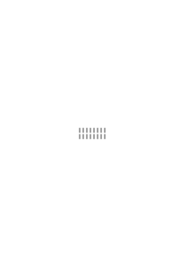
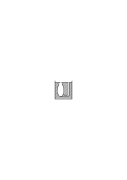
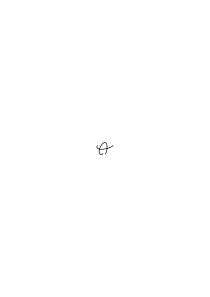
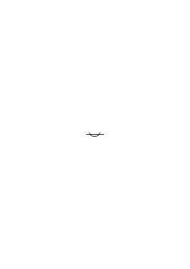
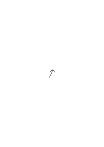
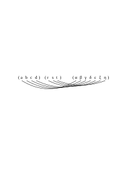

# Ms-122

231 published remarks, RFM III, VB

### [FCv\[1\]](https://cdn.wittgensteinnachlass.com/2000px/webp/Ms-122/FCv.webp)

## Philosophical Remarks XVIII.

### [1r\[1\]](https://cdn.wittgensteinnachlass.com/2000px/webp/Ms-122/1r.webp),[1v\[1\]](https://cdn.wittgensteinnachlass.com/2000px/webp/Ms-122/1v.webp)

16.10.1939

The paradox “Heterological”: It is good to imagine that the words “heterological” & “homological” are actually words of a living language somewhere. Let us imagine that in the script of the tribe… the word for red is always written in red ink, the word for blue always in blue ink, a word that means long is always drawn out, one that means short is compressed. However, the word for hot does not have to be hot, and the word for cold does not have to be cold, etc. Their grammarians speak of homologous and heterological words. One of them now asks: “Is the word ‘heterological’ heterological, or not?” and derives the paradox. Or, he does not derive the paradox and asks it in all seriousness. I (the one asked) think: “What is he really asking? He is asking whether ‘h’ has the property of not having the property that it means, which is: the property of not having the property that it means, and so on.”

### [1v\[2\]](https://cdn.wittgensteinnachlass.com/2000px/webp/Ms-122/1v.webp)

This is as if one said to someone: “Write something different”, without, however, saying _what_ it should be different from.

### [1v\[3\]](https://cdn.wittgensteinnachlass.com/2000px/webp/Ms-122/1v.webp),[2r\[1\]](https://cdn.wittgensteinnachlass.com/2000px/webp/Ms-122/2r.webp)

17.10.1939

To the question “Is ‘h’ h?” we immediately say: “Well, let’s see – what does ‘h’ mean?” That is, we are not immediately clear about what result the explanation of “h” leads to. And immediately after, we see that it does not lead to any result. Because the result is indeed: h (‘h’) = ~h (‘h’), but, apart from the fact that this is a contradiction, it is not an explanation of “h (‘h’)”. And likewise, I also obtain _no_ explanation if I consider what “hom (‘hom’”) means.

### [2r\[2\]](https://cdn.wittgensteinnachlass.com/2000px/webp/Ms-122/2r.webp),[2v\[1\]](https://cdn.wittgensteinnachlass.com/2000px/webp/Ms-122/2v.webp)

Here, a circle is closed by means of a sentence and a definition, and in such a way that the definition is not complete without the sentence and the sentence is not complete without the definition – whereby one is led around in a circle in the search for meaning.

### [2v\[2\]](https://cdn.wittgensteinnachlass.com/2000px/webp/Ms-122/2v.webp),[3r\[1\]](https://cdn.wittgensteinnachlass.com/2000px/webp/Ms-122/3r.webp)

Just as one is led to the contradiction ~S(S) = S(S) by the definition ~f(f) = S(f), but the sign “S(S)” cannot be explained from the definition either. I could, for example, _try_ it like this: If one replaces ‘f’ with ‘S’, one must know what expression S should stand for according to the definition. Most likely for “~ ξ(ξ)” or “~ ( )”. So “S(S)” means as much as “S(~ ( ))”, but not “~ ( )(~ ( ))”: because according to the definition, one should proceed in such a way when replacing S before its argument: ~[~ ( )][~ (])

### [3r\[2\]](https://cdn.wittgensteinnachlass.com/2000px/webp/Ms-122/3r.webp)

Let us write a function as a verb and say, for example, instead of “F(a)”: “a F-ied”. So: ~ (f f-ied) = f S-ied Def. Can we derive from this what expression of the kind “S φ-ied” we should write?

### [3r\[3\]](https://cdn.wittgensteinnachlass.com/2000px/webp/Ms-122/3r.webp)

Let us imagine a calculus with a contradiction in it, but we _don’t_ notice the contradiction. We derive all sorts of sentences which, as we later see, contradict each other. If a devil tricks us so that we never notice it, what will we say?

### [3v\[1\]](https://cdn.wittgensteinnachlass.com/2000px/webp/Ms-122/3v.webp)

What prevents me from saying: I do not call something a “calculus” if it does not include an inductive proof showing that one cannot generate structures of a certain form in it?

### [3v\[2\]](https://cdn.wittgensteinnachlass.com/2000px/webp/Ms-122/3v.webp)

18.10.1939

I want to avoid the formulation: “I now know more about the calculus,” and instead say: “I now have a different calculus.” The point of this is to always keep the gap between a mathematical knowledge and a non-mathematical knowledge in its full size.

### [4r\[1\]](https://cdn.wittgensteinnachlass.com/2000px/webp/Ms-122/4r.webp),[4v\[1\]](https://cdn.wittgensteinnachlass.com/2000px/webp/Ms-122/4v.webp)

Suppose, in a tribe, they perform calculations of the four species & here & there they use a transition of the type

_(3 ‒ 3) ∙ 4 = (3 ‒ 3) ∙ 5._

They therefore sometimes obtain contradictory results—as we would say. But that does not bother them at all. One could also imagine the case that people use that transition only in certain emergencies; when a calculation does not add up in some sense, & _must_ add up. Such a way of calculating would be similar to certain common modes of reasoning through which some assumption (sometimes of a religious nature) is supported, regardless of whether the facts on which it is based look this way or the other.

### [4v\[2\]](https://cdn.wittgensteinnachlass.com/2000px/webp/Ms-122/4v.webp)

19.10.1939

4 × (2 × 2 = 4) = (8 × 2 = 16) 4 × (4 × ξ) = 16 × ξ Four times is a multiple of four.

### [4v\[3\]](https://cdn.wittgensteinnachlass.com/2000px/webp/Ms-122/4v.webp)

Every mathematical invention (e.g. every proof) must be something that one can imagine away & see what remains of mathematics.

### [4v\[4\]](https://cdn.wittgensteinnachlass.com/2000px/webp/Ms-122/4v.webp),[5r\[1\]](https://cdn.wittgensteinnachlass.com/2000px/webp/Ms-122/5r.webp)

One must again & again imagine away a mathematical discovery – & see what remains of mathematics – – or, _what kind of_ _a_ mathematics remains. – For then a game remains, perhaps with a different point, & sometimes almost an embryo of a mathematics – but we can still regard it as a calculus, as a kind of calculation, & this protects us from the danger of forming too narrow a view of ‘the laws of thought’.

### [RFM III](/w-rfm-3/#ms-122-5r.2+5v.1) [5r\[2\]](https://cdn.wittgensteinnachlass.com/2000px/webp/Ms-122/5r.webp),[5v\[1\]](https://cdn.wittgensteinnachlass.com/2000px/webp/Ms-122/5v.webp) {#5r-2--5v-1}

25.10.1939

‘A mathematical proof must be surveyable.’ We call only a structure a “proof”, the reproduction of which is an easily solvable problem. It must be possible to decide with certainty whether we really have the same proof in front of us twice, or not. The proof must be a picture which can be exactly reproduced with certainty. Or also: what is essential to the proof must be able to be exactly reproduced with certainty. It can, for example, be written down in two different handwritings or colors. Nothing that belongs to the reproduction of a proof should be of the kind of an exact reproduction of a color tone or a handwriting.

### [RFM III](/w-rfm-3/#ms-122-5v.2+6r.1+6v.1) [5v\[2\]](https://cdn.wittgensteinnachlass.com/2000px/webp/Ms-122/5v.webp),[6r\[1\]](https://cdn.wittgensteinnachlass.com/2000px/webp/Ms-122/6r.webp),[6v\[1\]](https://cdn.wittgensteinnachlass.com/2000px/webp/Ms-122/6v.webp) {#5v-2--6r-1--6v-1}

It must be easy to write down _exactly_ this proof again. This is where the advantage of the written lies in comparison to the drawn proof. The latter has often been misunderstood in its essence. The drawing of a Euclidean proof can be inaccurate in the sense that the lines are not straight, the circular arcs are not exactly circular, etc. etc. & yet the drawing is an exact proof & this shows that this drawing does not – for example – demonstrate that such a construction results in a polygon with 5 sides of equal length, that it proves a theorem of geometry, not one about the properties of paper, compass, ruler & pencil.

### [6v\[2\]](https://cdn.wittgensteinnachlass.com/2000px/webp/Ms-122/6v.webp)

Would this be a proof:

One writes ∣∣∣∣∣∣∣∣ + ∣∣∣∣∣∣∣∣ = ∣∣∣∣∣∣∣∣∣∣∣∣∣∣∣∣ & (then) weighs the ink on both sides of the equation; if it weighs the same, then the equation is correct. Well, this weighing could very well serve us as a proof, i.e. as a criterion for the fact that there are the same number of lines on both sides of this individual (token) equation, but it would not be a proof of the addition formula in the sense of mathematics, but an experiment of a non-mathematical sentence.

### [RFM III](/w-rfm-3/#ms-122-6v.3+7r.1) [6v\[3\]](https://cdn.wittgensteinnachlass.com/2000px/webp/Ms-122/6v.webp),[7r\[1\]](https://cdn.wittgensteinnachlass.com/2000px/webp/Ms-122/7r.webp) {#6v-3--7r-1}

27.10.1939

I want to say: If one makes a non-surveyable proof figure surveyable by changing the notation, then one creates a proof where there was none before.

### [RFM III](/w-rfm-3/#ms-122-7r.2) [7r\[2\]](https://cdn.wittgensteinnachlass.com/2000px/webp/Ms-122/7r.webp) {#7r-2}

Let us now imagine a Russellian proof for an addition theorem of the kind a + b = c, which consists of a few thousand characters. You will say: To see whether this proof is correct or not is a purely external difficulty, which is of no mathematical interest. (“One person easily overlooks what another person overlooks with difficulty or not at all”– etc. etc.)

### [7r\[3\]](https://cdn.wittgensteinnachlass.com/2000px/webp/Ms-122/7r.webp),[7v\[1\]](https://cdn.wittgensteinnachlass.com/2000px/webp/Ms-122/7v.webp)

We establish that there are 5 million people in city A & 3 million in city B. We calculate that we need 5 million gas masks for both & set up our factory so that it produces this number. We find that the corresponding amount has been produced. So the calculation was very useful in this case. And it is remarkable that Russellian logic can be useful in this way. Or is it just a coincidence that it is so often useful in such cases?

### [RFM III](/w-rfm-3/#ms-122-7v.2) [7v\[2\]](https://cdn.wittgensteinnachlass.com/2000px/webp/Ms-122/7v.webp) {#7v-2}

The assumption is that the definitions only serve to shorten the expression, for the convenience of the calculator; while they are in fact part of the calculation.

With their help, expressions are created that could not be created without their help.

### [7v\[3\]](https://cdn.wittgensteinnachlass.com/2000px/webp/Ms-122/7v.webp),[8r\[1\]](https://cdn.wittgensteinnachlass.com/2000px/webp/Ms-122/8r.webp)

28.10.1939

Perhaps one says that with their help only aspects of expressions are _highlighted_. But what does ‘highlighting an aspect’ mean other than creating a new expression?

### [RFM III](/w-rfm-3/#ms-122-8r.2+8v.1) [8r\[2\]](https://cdn.wittgensteinnachlass.com/2000px/webp/Ms-122/8r.webp),[8v\[1\]](https://cdn.wittgensteinnachlass.com/2000px/webp/Ms-122/8v.webp) {#8r-2--8v-1}

But what about this: “One can’t multiply 234 by 537 in the Russellian calculus – in the ordinary sense – but there is a Russellian calculation that corresponds to this multiplication”? – What kind of correspondence is this? It could be this:

One can also perform this multiplication in the Russellian calculus, only in a different symbolism – just as we would also say that we could perform it in a different number system. We could then, for example, solve the practical problems for which that multiplication is used, also by means of the calculation in the Russellian calculus, only in a more cumbersome way.

### [RFM III](/w-rfm-3/#ms-122-8v.2+9r.1) [8v\[2\]](https://cdn.wittgensteinnachlass.com/2000px/webp/Ms-122/8v.webp),[9r\[1\]](https://cdn.wittgensteinnachlass.com/2000px/webp/Ms-122/9r.webp) {#8v-2--9r-1}

Let us now imagine the cardinal numbers defined as 1, 1 + 1, (1 + 1) + 1, ((1 + 1) + 1) + 1, and so on. You say that the definitions that introduce the digits of the decimal system serve only for convenience; one could also perform the calculation 703000 × 40000101 in that lengthy notation. But is that true? – “Of course it is true! I can write down, construct, a calculation in that notation that corresponds to the calculation in decimal notation.” – But how do I know that it corresponds to it? – Well, because I have derived it from the other one according to a certain method. – But if I look at it again after half an hour, couldn’t it have changed? It is not something that can be grasped at a glance.

### [RFM III](/w-rfm-3/#ms-122-9r.2) [9r\[2\]](https://cdn.wittgensteinnachlass.com/2000px/webp/Ms-122/9r.webp) {#9r-2}

Now I ask: could we also be convinced of the truth of the sentence 7034174 + 6594321 = 13628495 by a proof that is carried out in the first notation? – Is there such a proof of this sentence? – The answer is: no.

### [9r\[3\]](https://cdn.wittgensteinnachlass.com/2000px/webp/Ms-122/9r.webp),[9v\[1\]](https://cdn.wittgensteinnachlass.com/2000px/webp/Ms-122/9v.webp),[10r\[1\]](https://cdn.wittgensteinnachlass.com/2000px/webp/Ms-122/10r.webp)

But does not Russell’s explanation show the connection between addition and disjunction? Does it not show what the essence of addition is, by showing, so to speak, the general scheme of the application of addition; as it were, the general way in which addition relates to things, the nature of its connection with that to which it is applied? So one might, for example—misled by the expression “to add”—imagine that one is combining the inhabitants of London and Manchester in some way when calculating how many inhabitants both cities have _together_; and now R’s explanation tells us that there is no such combination of objects involved. (Related to this is what Frege called the ‘Pfeffernuss view’: the idea that a number is a heap of things.) – So I have taken the two concepts together, not the cities or their inhabitants – – but have I not, in a sense, taken the inhabitants together? namely, by _counting_ them & operating with the symbols I thus obtained.

### [10r\[2\]](https://cdn.wittgensteinnachlass.com/2000px/webp/Ms-122/10r.webp),[10v\[1\]](https://cdn.wittgensteinnachlass.com/2000px/webp/Ms-122/10v.webp),[11r\[1\]](https://cdn.wittgensteinnachlass.com/2000px/webp/Ms-122/11r.webp)

“The number of Londoners & the number of Dubliners taken together” is, however, synonymous with: “the number of people who are either Londoners or Dubliners” or with: “the number of objects that fall under the concept _of Londoner or Dubliner_” (we will speak later of the idea of these ‘objects’ that have the predicate ‘human’) – but is the expression that uses ‘or’ more fundamental than the other? Or also: must I form the concept of the disjunction of the two concepts if I want to speak of the sum of the two numbers? In most cases, I will not do so but will add the two numbers and speak of the sum of the two numbers. There is, of course, also the other case: one says, for example: “the number of people who live in London, or in the vicinity of London, is …”. Of course, even in the first case—if I were asked, “Which _concept_ belongs to the sum you have formed?”—I could say: the concept of a person who is a Londoner or a Dubliner—but could I not just as well answer: the concept of a barrel of beer that I have to produce (namely, if I wanted to produce a barrel of beer for every Londoner and Dubliner).

### [RFM III](/w-rfm-3/#ms-122-11r.2) [11r\[2\]](https://cdn.wittgensteinnachlass.com/2000px/webp/Ms-122/11r.webp) {#11r-2}

But doesn’t Russell teach us _one_ kind of adding?

### [RFM III](/w-rfm-3/#ms-122-11r.3+11v.1) [11r\[3\]](https://cdn.wittgensteinnachlass.com/2000px/webp/Ms-122/11r.webp),[11v\[1\]](https://cdn.wittgensteinnachlass.com/2000px/webp/Ms-122/11v.webp) {#11r-3--11v-1}

October 30, 1939

Suppose we prove, using Russell's method, that (∃a‥‥․g) ‥‥ (∃a‥‥․i) ⊃ (∃a‥‥․s) is a tautology; could we now express our result by saying that g + i = s? This does, however, presuppose that I can take the three groups of letters as representatives of the proof. But does Russell's proof show this? Surely, I could also have carried out Russell's proof using such groups of signs in parentheses, whose sequences have no characteristic feature for me, so that it would not be possible to represent the group of signs in a parenthesis by its last member.

### [RFM III](/w-rfm-3/#ms-122-11v.2+12r.1) [11v\[2\]](https://cdn.wittgensteinnachlass.com/2000px/webp/Ms-122/11v.webp),[12r\[1\]](https://cdn.wittgensteinnachlass.com/2000px/webp/Ms-122/12r.webp) {#11v-2--12r-1}

Suppose, indeed, that Russell's proof is carried out using a notation of the kind <math class="stacked" display="inline"><msub><mi>x</mi><mn>1</mn></msub><msub><mi>x</mi><mn>2</mn></msub><mspace width="0.3em"/><mtext>…</mtext><msub><mi>x</mi><mn>10</mn></msub><msub><mi>x</mi><mn>11</mn></msub><mspace width="0.3em"/><mtext>…</mtext><msub><mi>x</mi><mn>100</mn></msub><mspace width="0.3em"/><mtext>…</mtext></math>, as in decimal notation, and there are 100 members in the first, 300 members in the second, and 400 members in the third parenthesis; does the proof itself then show that 100 + 300 = 400? – As if this proof were to lead once to this result and once to another result, e.g. 100 + 300 = 420? What is required to see that the result of the proof, if it is carried out correctly, always only depends on the last digits of the first two parentheses?

### [RFM III](/w-rfm-3/#ms-122-12r.2+12v.1) [12r\[2\]](https://cdn.wittgensteinnachlass.com/2000px/webp/Ms-122/12r.webp),[12v\[1\]](https://cdn.wittgensteinnachlass.com/2000px/webp/Ms-122/12v.webp) {#12r-2--12v-1}

But Russell does teach us to add for small numbers; for then we simply overlook the groups of signs in the parentheses and can take _them_ as number signs; e.g. 'xy', 'xyz', 'xyzuv'.

Russell, therefore, teaches us a different calculus to get from 2 and 3 to 5; and this is also true when we say that the logical calculus is only – ‘frills’ that are attached to the arithmetic calculus.

### [RFM III](/w-rfm-3/#ms-122-12v.2+13r.1) [12v\[2\]](https://cdn.wittgensteinnachlass.com/2000px/webp/Ms-122/12v.webp),[13r\[1\]](https://cdn.wittgensteinnachlass.com/2000px/webp/Ms-122/13r.webp) {#12v-2--13r-1}

The _application_ of calculation must take care of itself. And this is what is right about ‘formalism’. The reduction of arithmetic to symbolic logic is supposed to show the application of arithmetic; as if it were the approach by means of which it rests on its application. It is as if one were first shown a trumpet without the mouthpiece – and then the mouthpiece, which shows us how a trumpet is used, how it is played. But the approach that Russell gives us is, on the one hand, too narrow, and on the other hand, too wide; too general and too specific. Calculation takes care of its own application.

### [RFM III](/w-rfm-3/#ms-122-13r.2+13v.1) [13r\[2\]](https://cdn.wittgensteinnachlass.com/2000px/webp/Ms-122/13r.webp),[13v\[1\]](https://cdn.wittgensteinnachlass.com/2000px/webp/Ms-122/13v.webp) {#13r-2--13v-1}

We extend our ideas from calculations with small numbers to those with large numbers, much as we imagine that if the distance from here to the sun _could_ be measured with a folding ruler, the result would be exactly what we arrive at today in a completely different way. That is, we are inclined to take the measurement of length with a folding ruler as a model even for measuring the distance between two stars. And people say, for example in school: “If we imagine laying out rulers from here to the Sun, …” & seem to provide an explanation for what we understand by the distance between the Sun and Earth. And the use of such an image is perfectly fine, as long as we realize that we can measure the distance from us to the Sun & that we cannot measure it with rulers.

### [RFM III](/w-rfm-3/#ms-122-13v.2+14r.1) [13v\[2\]](https://cdn.wittgensteinnachlass.com/2000px/webp/Ms-122/13v.webp),[14r\[1\]](https://cdn.wittgensteinnachlass.com/2000px/webp/Ms-122/14r.webp) {#13v-2--14r-1}

October 31, 1939

What if someone were to say: “The actual proof of 1000 + 1000 = 2000 is only Russell's, which shows that the expression … is a tautology”? Can I not prove that a tautology results if I have 1000 members in each of the first two parentheses and 2000 in the third? And if I can prove that, then I can see it as a proof of the arithmetic sentence.

### [RFM III](/w-rfm-3/#ms-122-14r.2) [14r\[2\]](https://cdn.wittgensteinnachlass.com/2000px/webp/Ms-122/14r.webp) {#14r-2}

In philosophy, it is always good to put a _question_ in place of an answer to a question. For an answer to the philosophical question might be unfair; its resolution by means of another question is not.

### [RFM III](/w-rfm-3/#ms-122-14r.3) [14r\[3\]](https://cdn.wittgensteinnachlass.com/2000px/webp/Ms-122/14r.webp) {#14r-3}

Should I, therefore, put a _question_ here instead of the answer, that one cannot prove that arithmetic sentence with Russell's method?

### [RFM III](/w-rfm-3/#ms-122-14v.1+15r.1) [14v\[1\]](https://cdn.wittgensteinnachlass.com/2000px/webp/Ms-122/14v.webp),[15r\[1\]](https://cdn.wittgensteinnachlass.com/2000px/webp/Ms-122/15r.webp) {#14v-1--15r-1}

01.11.1939

The proof that <math class="stacked" display="inline"><msup><mo>(</mo><mn>1</mn></msup><mo>)</mo><msup><mo>(</mo><mn>2</mn></msup><mo>)</mo><mspace width="0.3em"/><mo>⊃</mo><msup><mo>(</mo><mn>3</mn></msup><mo>)</mo></math> is a tautology consists in the fact that one always eliminates one element of the 3rd parenthesis for one element of 1 or 2. And there are indeed many methods for this collation. Or one could also say: there are many kinds & ways of establishing the success of the 1 → 1 assignment. One way would be, for example, to construct star-shaped patterns, one for the left, one for the right side of the implication, & to compare them again by forming an ornament from both. One could, therefore, give the rule: “If you want to know whether the numbers A & B really add up to C, write an expression of the form … & assign the variables in the parentheses to each other by writing down (or trying to write down) the proof that the expression is a tautology.” My objection to this is now not that it is arbitrary to prescribe precisely this kind of collation, but that in this way one cannot establish that 1000 + 1000 = 2000.

### [15r\[2\]](https://cdn.wittgensteinnachlass.com/2000px/webp/Ms-122/15r.webp),[15v\[1\]](https://cdn.wittgensteinnachlass.com/2000px/webp/Ms-122/15v.webp)

02.11.1939

Russell's method does not create the _aspect_ of this addition. But can this aspect not be created by means of it through a corresponding sequence of definitions? Why do I want to say that Russell's proof does not add anything interesting to the transformation that is accomplished by the definitions alone? It seems to me that the proof that a tautology results for the values 1000, 1000 & 2000 is completely outside the proof of the arithmetic sentence.

### [15v\[2\]](https://cdn.wittgensteinnachlass.com/2000px/webp/Ms-122/15v.webp)

And yet, something false seems to me even in what I say.

### [15v\[3\]](https://cdn.wittgensteinnachlass.com/2000px/webp/Ms-122/15v.webp),[16r\[1\]](https://cdn.wittgensteinnachlass.com/2000px/webp/Ms-122/16r.webp)

‘The set in the 3rd parenthesis, which makes the expression a tautology, is the sum of the two first sets.’ But how do I come to the concept of a specific set at all?

### [16r\[2\]](https://cdn.wittgensteinnachlass.com/2000px/webp/Ms-122/16r.webp)

It has often been said that the meaning of a definition often lies in the fact that it highlights the _importance_ of the definiens. But in another sense, it makes the definiens disappear in the calculus. The importance of a definition mostly lies in the fact that expressions take on a different structure.

### [16r\[3\]](https://cdn.wittgensteinnachlass.com/2000px/webp/Ms-122/16r.webp)

Does the one who introduces new definitions not introduce a new calculus?

### [RFM III](/w-rfm-3/#ms-122-16r.4+16v.1) [16r\[4\]](https://cdn.wittgensteinnachlass.com/2000px/webp/Ms-122/16r.webp),[16v\[1\]](https://cdn.wittgensteinnachlass.com/2000px/webp/Ms-122/16v.webp) {#16r-4--16v-1}

03.11.1939

Suppose you have written a mile-long ‘formula,’ & show by transformation that it is tautological (‘if it has not changed in the meantime,’ one would have to say). Now let us _count_ the elements in the parentheses or divide them & make the expression surveyable & it turns out that there are 7566 elements in the first parenthesis, 2434 in the second, & 10000 in the third. Have I now proven that 2434 + 7566 = 10000? – That depends – one could say – on whether you are sure that the counting really gives the numbers of the elements that were in the parentheses during the proof.

### [RFM III](/w-rfm-3/#ms-122-16v.2+17r.1) [16v\[2\]](https://cdn.wittgensteinnachlass.com/2000px/webp/Ms-122/16v.webp),[17r\[1\]](https://cdn.wittgensteinnachlass.com/2000px/webp/Ms-122/17r.webp) {#16v-2--17r-1}

Could one say: “R. teaches us to write as many signs in the 3rd parenthesis as there are in the two first together”? But actually: he teaches us to write one variable in (3) for each variable in (1) & in (2). But do we learn from this what number is the sum of two given numbers? Perhaps one says: “Indeed, because in the 3rd parenthesis there is now the paradigm, the archetype, of the new number.” But in what sense is ∣∣∣∣∣∣∣∣∣∣∣∣∣∣∣∣ the paradigm of a number? Consider how one can use it as such.

### [17r\[2\]](https://cdn.wittgensteinnachlass.com/2000px/webp/Ms-122/17r.webp)

05.11.1939

Must a concept have a specific number of elements?

### [17r\[3\]](https://cdn.wittgensteinnachlass.com/2000px/webp/Ms-122/17r.webp),[17v\[1\]](https://cdn.wittgensteinnachlass.com/2000px/webp/Ms-122/17v.webp)

It is wrong to say: “With regard to the sum of the numbers of two concepts, I have the understanding that the number of the conceptual disjunction is the same as the number of the conceptual sum, if this number can be calculated in a certain way from the first two numbers.” That is, if the ‘number of the sum of the concepts’ has the same understanding as the numbers of the first concepts, it can be obtained in exactly _the same way_.

### [17v\[2\]](https://cdn.wittgensteinnachlass.com/2000px/webp/Ms-122/17v.webp),[18r\[1\]](https://cdn.wittgensteinnachlass.com/2000px/webp/Ms-122/18r.webp)

06.11.1939

On the one hand, we have a definition of the sum of numbers that gives no indication of how addition is to be applied. This explanation may therefore seem unsatisfactory. On the other hand, there is an explanation of the sum based on its application. (And this seems unsatisfactory in comparison to the first, because it meddles in things that it shouldn't concern itself with.) If I now say: the sum of the numbers of two concepts is the number of the concept sum – then I must add: & this number is to be obtained from the two first in this way. – But if that is the case, why don't I define the sum of numbers by this calculation? – I simply mean by the number of the concept sum something that can be obtained from the numbers of the summand concepts by a certain calculation.

### [18r\[2\]](https://cdn.wittgensteinnachlass.com/2000px/webp/Ms-122/18r.webp),[18v\[1\]](https://cdn.wittgensteinnachlass.com/2000px/webp/Ms-122/18v.webp)

At one point, it seems that I only operate with (the) concepts & what then is the number of the resulting concept, I call the sum of the numbers of the partial concepts. – In the other case, I have nothing to do with concepts whose numbers are the numbers.

### [18v\[2\]](https://cdn.wittgensteinnachlass.com/2000px/webp/Ms-122/18v.webp)

07.11.1939

Why shouldn't I say: “If 5 is the number of φ & 7 is the number of ψ, _then I call_ 12 ‘the number of φ ⌵ ψ’”? Instead of saying: “then the number of φ⌵ψ is 12”.

### [18v\[3\]](https://cdn.wittgensteinnachlass.com/2000px/webp/Ms-122/18v.webp),[19r\[1\]](https://cdn.wittgensteinnachlass.com/2000px/webp/Ms-122/19r.webp)

Frege's explanation of the sum seems to explain the content of addition, while the mere rules of calculation do not seem to do so. But isn't there a false impression here? – _Both_ explanations must give us the rules of calculation. And if the first explanation really gives _more_, doesn't it then have to provide something superfluous?

### [19r\[2\]](https://cdn.wittgensteinnachlass.com/2000px/webp/Ms-122/19r.webp),[19v\[1\]](https://cdn.wittgensteinnachlass.com/2000px/webp/Ms-122/19v.webp),[20r\[1\]](https://cdn.wittgensteinnachlass.com/2000px/webp/Ms-122/20r.webp),[20v\[1\]](https://cdn.wittgensteinnachlass.com/2000px/webp/Ms-122/20v.webp)

But where does the impression come from that the first explanation is substantial? For both show us a technique of calculation with signs. – In the first explanation, everything is already prepared to substitute, for example, “Londoners” for “φ” & “Dubliners” for “ψ”. And now the explanation seems to say: If the concept ‘Londoners’ has n members & the concept ‘Dubliners’ has m objects, then you only need to form the concept ‘Londoners or Dubliners’, & as many members as this concept has, that is how much n + m is.

But how do I find out what number it has?! – By examining the concept ‘Londoners or Dubliners’?

It’s as if one said: You can certainly easily form the disjunction of the concepts – well, the number of this concept is the sum n + m. – As if everything (was) already done, because all that remains is to find out what the number of the concept sum is.

### [20v\[2\]](https://cdn.wittgensteinnachlass.com/2000px/webp/Ms-122/20v.webp)

One could, of course, define: The expression “the sum of the numbers of the concepts ‘φ’ & ‘ψ’” should mean: the number of the concept ‘φ⌵ψ’.

### [20v\[3\]](https://cdn.wittgensteinnachlass.com/2000px/webp/Ms-122/20v.webp)

But can't one also explain: “Addition is the operation that is used to find the number of the concept sum from the numbers of two concepts”?

### [20v\[4\]](https://cdn.wittgensteinnachlass.com/2000px/webp/Ms-122/20v.webp),[21r\[1\]](https://cdn.wittgensteinnachlass.com/2000px/webp/Ms-122/21r.webp)

But is that correct? Does one need to _add_ for that? Can one not, for example, say that the number of φ⌵ψ is: 1000 + 2000?

### [21r\[2\]](https://cdn.wittgensteinnachlass.com/2000px/webp/Ms-122/21r.webp)

08.11.1939

One could call what I am doing here 'infantile mathematics'.

### [21r\[3\]](https://cdn.wittgensteinnachlass.com/2000px/webp/Ms-122/21r.webp),[21v\[1\]](https://cdn.wittgensteinnachlass.com/2000px/webp/Ms-122/21v.webp)

“The concept ‘φ⌵ψ’ does have a number”. How is it to be determined? Independently of the numbers of ‘φ’ & ‘ψ’? And how if counting the objects that satisfy φ, the objects that satisfy ψ & the objects that satisfy φ⌵ψ yields that the first number is 100, the second is 200 & the third is 302? It should therefore mean: the sum of the numbers of φ & ψ is the number of the concept sum, – as this results from the calculation.

### [21v\[2\]](https://cdn.wittgensteinnachlass.com/2000px/webp/Ms-122/21v.webp)

Whoever says that the sum of two numbers is the number of the concept disjunction is actually saying: “Calculate the number of the concept sum, then you have the sum of the two numbers”.

### [RFM III](/w-rfm-3/#ms-122-21v.3+22r.1) [21v\[3\]](https://cdn.wittgensteinnachlass.com/2000px/webp/Ms-122/21v.webp),[22r\[1\]](https://cdn.wittgensteinnachlass.com/2000px/webp/Ms-122/22r.webp) {#21v-3--22r-1}

09.11.1939

The R-style tautology, corresponding to the sentence a + b = c, primarily doesn’t show us in what notation the number c should be written, and there is no reason why it shouldn’t be written in the form a + b. – Because R. doesn’t teach us the technique of addition, for example, in the decimal system. – But could we perhaps derive it from his technique? Let’s ask this: Can the technique of the decimal system be derived from that of the system 1, 1 + 1, (1 + 1) + 1, etc.? Couldn’t we also phrase this question as follows: If one has a calculation technique in one system and one in the other system, how does one show that the two are equivalent?

### [22r\[2\]](https://cdn.wittgensteinnachlass.com/2000px/webp/Ms-122/22r.webp),[22v\[1\]](https://cdn.wittgensteinnachlass.com/2000px/webp/Ms-122/22v.webp),[23r\[1\]](https://cdn.wittgensteinnachlass.com/2000px/webp/Ms-122/23r.webp),[23v\[1\]](https://cdn.wittgensteinnachlass.com/2000px/webp/Ms-122/23v.webp)

November 13, 1939

Suppose a tribe has a counting technique, such as ours in the decimal system. Instead of adding, subtracting, etc., however, they use the following procedure: They make iron cubes of exactly the same size, place about 3470 in one pan of a balance, 250 in the other, and now they count, starting again with 1, cubes into the second pan until the balance evens out. They then express the result of this process using a formula, such as “250 + 3220 = 3470.” So they obtained through an experiment what we obtain through a calculation? – How do they use the formula? – If 250 soldiers are standing in a row and they add another 3220 to them, they expect that a count of all 3470 will result. – Why? – It has been shown that this is usually the result. – But what if, when they perform the weighing described above, they obtain the formula 250 + 3000 = 3470—do they then say, “this time _these_ numbers add up to 3470,” or do they say, “there must be an error in the weighing”? – In the second case, have I no longer regarded the weighing as an experiment, but as proof? ‒ ‒ Well, if experience has taught me the same thing often enough, I will finally adhere unconditionally to an assumption, and everything else must conform to _it_. One might say: the assumption solidifies into a rule. – If the hypothesis that n + m dice balance 𝓁 dice becomes set in stone as a rule, does the hypothesis then become an arithmetic theorem?

### [23v\[2\]](https://cdn.wittgensteinnachlass.com/2000px/webp/Ms-122/23v.webp)

“250 dice + 3220 dice _equal_ 3470 dice.”

### [23v\[3\]](https://cdn.wittgensteinnachlass.com/2000px/webp/Ms-122/23v.webp)

“250 + 3220 cubes are the same number of cubes as 3470.”

### [23v\[4\]](https://cdn.wittgensteinnachlass.com/2000px/webp/Ms-122/23v.webp)

November 14, 1939

‘But why do you trust this calculation to really give you the same number?’ – I don’t trust it (at all). _That_ is what I now call ‘the same number.’

### [23v\[5\]](https://cdn.wittgensteinnachlass.com/2000px/webp/Ms-122/23v.webp),[24r\[1\]](https://cdn.wittgensteinnachlass.com/2000px/webp/Ms-122/24r.webp)

I want to say: I associate a certain idea with ‘just as much’—something like

;

& now I introduce a new criterion for ‘just as much.’ “Now I call _this_ ‘just as much.’” Of course, because of a connection between the new criterion and the old one.

### [24r\[2\]](https://cdn.wittgensteinnachlass.com/2000px/webp/Ms-122/24r.webp)

[→ This sentence is] in a certain sense analogous to the following: these _weigh_ as much as those. He sees it this way: the numbers alone do not yet imply that the ones are equal in quantity to the others. Being equal in quantity is a third thing.

### [24r\[3\]](https://cdn.wittgensteinnachlass.com/2000px/webp/Ms-122/24r.webp)

How does one compare:

a) “250 and 3220 peas are as many as 3470 peas”

b) “250 and 3220 peas weigh as much as 3470 peas”

c) “250 and 3220 peas have the same volume as 3470 peas”?

### [24v\[1\]](https://cdn.wittgensteinnachlass.com/2000px/webp/Ms-122/24v.webp)

15.11.1939

One might say: a is a sentence of mathematics, but b is an empirical sentence. – But can not a also be understood as an empirical sentence? – And can c not easily be interpreted as both a mathematical and an empirical sentence? Why then not b as a mathematical sentence?

### [24v\[2\]](https://cdn.wittgensteinnachlass.com/2000px/webp/Ms-122/24v.webp),[25r\[1\]](https://cdn.wittgensteinnachlass.com/2000px/webp/Ms-122/25r.webp)

Why shouldn’t one think of the arithmetic of a people as inextricably linked with the processes of weighing, as there is a mathematics of drawing and measuring with compass and ruler – why not (then) a mathematics of weighing?

### [25r\[2\]](https://cdn.wittgensteinnachlass.com/2000px/webp/Ms-122/25r.webp)

And if mathematics is a priori, why shouldn’t sentence b be? if we just don’t invoke experience as a witness for or against it.

### [25r\[3\]](https://cdn.wittgensteinnachlass.com/2000px/webp/Ms-122/25r.webp),[25v\[1\]](https://cdn.wittgensteinnachlass.com/2000px/webp/Ms-122/25v.webp)

In Archimedes’ proof of the law of the lever, the proposition that a symmetrically loaded, equal-armed lever is in equilibrium is not treated as an empirical proposition but as an a priori proposition; similarly, in the proof of the theorem of communicating vessels, the proposition that water in a vessel remains in equilibrium, even if part of it suddenly solidifies, is also treated as such.

Compare: also the proof with Stevin’s chain. If one understands this proposition as a proposition of experience, it appeals to an observation that certainly no one has carried out.

### [25v\[2\]](https://cdn.wittgensteinnachlass.com/2000px/webp/Ms-122/25v.webp),[26r\[1\]](https://cdn.wittgensteinnachlass.com/2000px/webp/Ms-122/26r.webp)

Consider this proposition: “Must the n + m and the 𝓁 cubes be in equilibrium – well, there are primarily an _equal number_ of them.”

(If, for example, the n + m spheres lie in a circle at equal distances, and the 𝓁 spheres also lie at equal distances in a circle, then in both cases we have the same figure.) And they are also in equilibrium, in an ideal world.

### [26r\[2\]](https://cdn.wittgensteinnachlass.com/2000px/webp/Ms-122/26r.webp)

16.11.1939

We would (then) have an a priori statics in which it is not said how the edges of the cubes are to be measured, nor how it is to be determined that they are made of the same material; just as in Euclidean geometry it is not said how we determine the equality of the lengths of two lines. But what is the proof of a proposition of this purely mathematical statics? Certainly not the experiment of weighing.

### [26v\[1\]](https://cdn.wittgensteinnachlass.com/2000px/webp/Ms-122/26v.webp)

Is it the same with counting as with weighing?

### [RFM III](/w-rfm-3/#ms-122-26v.2) [26v\[2\]](https://cdn.wittgensteinnachlass.com/2000px/webp/Ms-122/26v.webp) {#26v-2}

“A proof should not only show that it is so, but that it must be so.”

### [RFM III](/w-rfm-3/#ms-122-26v.3) [26v\[3\]](https://cdn.wittgensteinnachlass.com/2000px/webp/Ms-122/26v.webp) {#26v-3}

Under what circumstances does counting show this?

### [RFM III](/w-rfm-3/#ms-122-26v.4+27r.1) [26v\[4\]](https://cdn.wittgensteinnachlass.com/2000px/webp/Ms-122/26v.webp),[27r\[1\]](https://cdn.wittgensteinnachlass.com/2000px/webp/Ms-122/27r.webp) {#26v-4--27r-1}

17.11.1939

One might say: if the numerals and the things counted form a memorable image. If this image is then used instead of every new counting of this quantity. – But here it seems we are only talking about _spatial_ images: but if we know a series of words by heart and now assign two such series to each other one to one by saying, for example,

“the first – Monday; the second – Tuesday; the third – Wednesday; etc.” – can we not _prove_ that four days lie between Monday and Thursday? The question is: What do we call a “memorable image”? What is the criterion for us having memorized it? Or is the answer here: “That we use it as a paradigm of identity!”?

### [RFM III](/w-rfm-3/#ms-122-27r.2) [27r\[2\]](https://cdn.wittgensteinnachlass.com/2000px/webp/Ms-122/27r.webp) {#27r-2}

We do not conduct _experiments_ on a proposition or proof in order to determine its properties.

### [RFM III](/w-rfm-3/#ms-122-27r.3+27v.1) [27r\[3\]](https://cdn.wittgensteinnachlass.com/2000px/webp/Ms-122/27r.webp),[27v\[1\]](https://cdn.wittgensteinnachlass.com/2000px/webp/Ms-122/27v.webp) {#27r-3--27v-1}

How do we reproduce, copy a proof? – Not, for example, by taking measurements on it.

### [RFM III](/w-rfm-3/#ms-122-27v.2+28r.1) [27v\[2\]](https://cdn.wittgensteinnachlass.com/2000px/webp/Ms-122/27v.webp),[28r\[1\]](https://cdn.wittgensteinnachlass.com/2000px/webp/Ms-122/28r.webp) {#27v-2--28r-1}

What if a proof were so incredibly long that one could not possibly overlook it – or let us look at another case: Suppose one has a long row of strokes carved into a hard rock as a paradigm of the number we call 1000. We call this row the prime thousand, and in order to find out whether a thousand people are on a square, we draw strokes or span strings (1 → 1 assignment). Here, the numerical sign for 1000 does not have the identity of a shape but of a physical object. We can similarly imagine a prime hundred, etc., and a proof that 10 × 100 = 1000, which we could not _overlook_.

### [RFM III](/w-rfm-3/#ms-122-28r.2) [28r\[2\]](https://cdn.wittgensteinnachlass.com/2000px/webp/Ms-122/28r.webp) {#28r-2}

The numeral for 1000 in the 1 + 1 + 1 + 1… system cannot be recognized by its _shape_.

### [28r\[3\]](https://cdn.wittgensteinnachlass.com/2000px/webp/Ms-122/28r.webp)

18.11.1939

It is difficult for me to be fair here. It is difficult in philosophy not to be unfair if one does not see the _fair_ way out.

### [RFM III](/w-rfm-3/#ms-122-28r.4+28v.1) [28r\[4\]](https://cdn.wittgensteinnachlass.com/2000px/webp/Ms-122/28r.webp),[28v\[1\]](https://cdn.wittgensteinnachlass.com/2000px/webp/Ms-122/28v.webp) {#28r-4--28v-1}

<math display="block">
  <mtext>∣</mtext>
  <mtext>∣</mtext>
  <mtext>∣</mtext>
  <mtext>∣</mtext>
  <mtext>∣</mtext>
  <mtext>∣</mtext>
  <mtext>∣</mtext>
  <mtext>∣</mtext>
  <mtext>∣</mtext>
  <mtext>∣</mtext>
  <mtext>∣</mtext>
  <mtext>∣</mtext>
  <mtext>∣</mtext>
  <mtext>∣</mtext>
  <mtext>∣</mtext>
  <mtext>∣</mtext>
  <mtext>∣</mtext>
  <mtext>∣</mtext>
  <mtext>∣</mtext>
  <mtext>∣</mtext>
  <mtext>∣</mtext>
  <mtext>∣</mtext>
  <mtext>∣</mtext>
  <mtext>∣</mtext>
  <mtext>∣</mtext>
  <mtext>∣</mtext>
  <mtext>∣</mtext>
  <mtext>
    <mo>|</mo>
  </mtext>
  <mtext>∣</mtext>
  <mtext>∣</mtext>
  <mtext>∣</mtext>
  <mtext>∣</mtext>
  <mtext>∣</mtext>
  <mtext>∣</mtext>
  <mtext>∣</mtext>
  <mtext>∣</mtext>
  <mtext>∣</mtext>
  <mtext>∣</mtext>
  <mtext>∣</mtext>
  <mtext>∣</mtext>
  <mtext>∣</mtext>
  <mtext>∣</mtext>
  <mtext>∣</mtext>
  <mtext>∣</mtext>
</math>

Is this figure a proof for 27 + 16 = 43: because one arrives at “27” by counting the strokes on the left side, at “16” on the right side, & at “43” when counting the entire row?

What is strange here – if one calls this figure the proof of this sentence? But it lies in how this proof can be reproduced or recognized, in the fact that it has no characteristic visual shape. –

### [28v\[2\]](https://cdn.wittgensteinnachlass.com/2000px/webp/Ms-122/28v.webp)

Most people do not understand anything, & therefore they are surprised by nothing.

### [RFM III](/w-rfm-3/#ms-122-28v.3+29r.1) [28v\[3\]](https://cdn.wittgensteinnachlass.com/2000px/webp/Ms-122/28v.webp),[29r\[1\]](https://cdn.wittgensteinnachlass.com/2000px/webp/Ms-122/29r.webp) {#28v-3--29r-1}

Now, even if that proof has no visual form, I can still copy it exactly (reproduce it)—so isn’t the figure the proof after all? I could, for example, engrave it on a piece of steel and pass it from hand to hand. I would thus say to someone: “Here you have the proof that 27 + 16 = 43.” – – Well, can’t one _still_ say: he proves the theorem with the help of the figure? Yes; but the figure is not the proof.

### [RFM III](/w-rfm-3/#ms-122-29r.2+29v.1) [29r\[2\]](https://cdn.wittgensteinnachlass.com/2000px/webp/Ms-122/29r.webp),[29v\[1\]](https://cdn.wittgensteinnachlass.com/2000px/webp/Ms-122/29v.webp) {#29r-2--29v-1}

But one would certainly call this a proof of 250 + 3220 = 3470: one counts beyond 250 & at the same time starts counting from 1 & assigns the two counts to each other: 251 … 1 252 … 2 253 … 3 etc. 3470 … 3220. One could call this a proof that progresses through 3220 steps. This is a proof – & can one call it surveyable?

### [29v\[2\]](https://cdn.wittgensteinnachlass.com/2000px/webp/Ms-122/29v.webp),[30r\[1\]](https://cdn.wittgensteinnachlass.com/2000px/webp/Ms-122/30r.webp)

The formation of symbols according to a certain system. (∃x) φx (∃n, m) φn.φm (∃a, r, v) φa.φr.φv – – – – – – – – – –

What does it mean to see the system? Perhaps it means reacting to the command to continue the series in such and such a way. And through a certain definition, I can indeed _hint at_ a system by combining precisely these symbols, but I cannot create the system through mere ‘abbreviation’ of the notation; I merely highlight it. Just as I express a system through the notation

<math display="block">
  <mrow>
    <munder>
      <mrow>
        <mi>x</mi>
        <mspace width="0.3em"/>
        <mi>y</mi>
        <mspace width="0.3em"/>
        <mi>z</mi>
      </mrow>
      <mo>&#x23DD;</mo>
    </munder>
    <mspace width="0.5em"/>
    <munder>
      <mrow>
        <mi>u</mi>
        <mspace width="0.3em"/>
        <mi>v</mi>
        <mspace width="0.3em"/>
        <mi>w</mi>
      </mrow>
      <mo>&#x23DD;</mo>
    </munder>
    <mspace width="0.5em"/>
    <munder>
      <mrow>
        <mi>r</mi>
        <mspace width="0.3em"/>
        <mi>s</mi>
        <mspace width="0.3em"/>
        <mi>t</mi>
      </mrow>
      <mo>&#x23DD;</mo>
    </munder>
  </mrow>
</math>

so too through definitions. But the mere abbreviation of the symbol does not show me how the definition is to be applied in _each_ case.

### [RFM III](/w-rfm-3/#ms-122-30r.2+30v.1) [30r\[2\]](https://cdn.wittgensteinnachlass.com/2000px/webp/Ms-122/30r.webp),[30v\[1\]](https://cdn.wittgensteinnachlass.com/2000px/webp/Ms-122/30v.webp) {#30r-2--30v-1}

How can you say that Russell cannot provide a proof for the statement “250 + 3220 = 3470”?! Just think that one does not know the definitions 1 + 1 = 2, 2 + 1 = 3, etc., by heart _simply_ because they follow a system—one just knows them by heart. What is the invention of the decimal system, actually? The invention of a system of abbreviations—but what is the system of abbreviations? Is it merely the system of new symbols, or also a system of their applications as abbreviations? And if it is the latter, then it is indeed a new way of viewing the old system of symbols.

### [RFM III](/w-rfm-3/#ms-122-30v.2) [30v\[2\]](https://cdn.wittgensteinnachlass.com/2000px/webp/Ms-122/30v.webp) {#30v-2}

Can we, starting from the 1 + 1 + 1… system, learn to do arithmetic in the decimal system simply by means of abbreviations of notation?

### [30v\[3\]](https://cdn.wittgensteinnachlass.com/2000px/webp/Ms-122/30v.webp),[31r\[1\]](https://cdn.wittgensteinnachlass.com/2000px/webp/Ms-122/31r.webp)

19.11.1939

“Repeat this process, this operation, which we want to call…” – Does he know what he has to repeat?

### [31r\[2\]](https://cdn.wittgensteinnachlass.com/2000px/webp/Ms-122/31r.webp)

20.11.1939

A definition introduces the expression of a _new system_.

### [31r\[3\]](https://cdn.wittgensteinnachlass.com/2000px/webp/Ms-122/31r.webp)

One could, of course, say “per definitionem” after every mathematical sentence. And thus, if one proceeds in Skolem's manner, for example, 250 + 3220 = 3470 is simply a derived definition.

### [31r\[4\]](https://cdn.wittgensteinnachlass.com/2000px/webp/Ms-122/31r.webp),[31v\[1\]](https://cdn.wittgensteinnachlass.com/2000px/webp/Ms-122/31v.webp)

And it is, of course, also true – “there are 250 + 3220 people in this room” means _exactly the same_ as: “there are 3470 people in this room”. There is no law of nature in the mathematical sentence. If one sentence is true, then the other is _thereby_ also true, & vice versa! So that, whoever has established the one by experiment has thereby also established the other, _& vice versa_. And yet the one points to a different kind of verification than the other. It is perfectly correct to say: “There are 23 + 27 apples in this box” if one simply wants to say that there are 50 apples in it – & yet no one will say it who does not connect this division with a certain purpose.

### [RFM III](/w-rfm-3/#ms-122-31v.2+32r.1) [31v\[2\]](https://cdn.wittgensteinnachlass.com/2000px/webp/Ms-122/31v.webp),[32r\[1\]](https://cdn.wittgensteinnachlass.com/2000px/webp/Ms-122/32r.webp) {#31v-2--32r-1}

Suppose I have proven a sentence of the form (∃xyz…) (∃uvw…) ⊃ (∃abc…) in Russell’s system – & now I ‘make it surveyable’ by writing over the variables <math class="stacked" display="inline"><msub><mi>x</mi><mn>1</mn></msub><mo>,</mo><msub><mi>x</mi><mn>2</mn></msub><mo>,</mo><msub><mi>x</mi><mn>3</mn></msub><mtext>…</mtext></math> – am I now to say that I have proven an arithmetic sentence in the decimal system in Russell’s system?

### [RFM III](/w-rfm-3/#ms-122-32r.2) [32r\[2\]](https://cdn.wittgensteinnachlass.com/2000px/webp/Ms-122/32r.webp) {#32r-2}

22.11.1939

But every proof in the decimal system corresponds to one in Russell’s system! – How do we know that this is so? Let us put intuition aside. – But one can prove it. –

### [RFM III](/w-rfm-3/#ms-122-32r.3) [32r\[3\]](https://cdn.wittgensteinnachlass.com/2000px/webp/Ms-122/32r.webp) {#32r-3}

If one defines a number in the decimal system from 1, 2, 3 ‥․ 9, 0 & the signs 0, 1…9 from 1, 1 + 1, (1 + 1) + 1, ‥․, can one, through the recursive explanation of the decimal system, get from any number to a sign of the form 1 + 1 + 1…?

### [RFM III](/w-rfm-3/#ms-122-32v.1) [32v\[1\]](https://cdn.wittgensteinnachlass.com/2000px/webp/Ms-122/32v.webp) {#32v-1}

How, if one said: Russell’s arithmetic agrees with the usual one up to numbers less than 1010; then, however, it deviates from it. And now he presents us with an R-proof that 1010 + 1 = 1010. Why should I not trust such a proof? How will one convince me that I must have made a mistake in the R-proof? Do I need a proof from another system in order to convince myself whether I made a mistake in the first proof? Is it not enough that I write this proof in a way that makes it surveyable?

### [RFM III](/w-rfm-3/#ms-122-32v.2+33r.1) [32v\[2\]](https://cdn.wittgensteinnachlass.com/2000px/webp/Ms-122/32v.webp),[33r\[1\]](https://cdn.wittgensteinnachlass.com/2000px/webp/Ms-122/33r.webp) {#32v-2--33r-1}

23.11.1939

Isn’t my whole difficulty in seeing how one, without leaving Russell’s logical calculus, can arrive at the concept of the _set of variables_ in the expression “(∃ x,y,z etc.)”, where this sign is not surveyable? – Now, however, one can make it surveyable by writing:

(<math class="stacked" display="inline"><mo>∃</mo><msub><mi>x</mi><mn>1</mn></msub><mo>,</mo><msub><mi>x</mi><mn>2</mn></msub><mo>,</mo><msub><mi>x</mi><mn>3</mn></msub><mo>,</mo><mtext>etc</mtext><mn>.</mn></math>). And yet I don’t understand something: one has now changed the criterion for the identity of such an expression! I now see in a different way that the set of signs in two such expressions is the same.

### [33r\[2\]](https://cdn.wittgensteinnachlass.com/2000px/webp/Ms-122/33r.webp),[33v\[1\]](https://cdn.wittgensteinnachlass.com/2000px/webp/Ms-122/33v.webp)

If I know a sequence of signs by heart & the signs in the first bracket range from the first sign to

“”,

in the second bracket from the first to

“”,

then in the third from the first to

“”.

### [RFM III](/w-rfm-3/#ms-122-33v.2) [33v\[2\]](https://cdn.wittgensteinnachlass.com/2000px/webp/Ms-122/33v.webp) {#33v-2}

I am just trying to say: R's proof can presumably proceed step by step, but in the end, one does not really know what one has proven – at least not according to the old criteria; by making the R-proof surveyable, I prove something about this proof.

### [RFM III](/w-rfm-3/#ms-122-33v.3+34r.1+34v.1) [33v\[3\]](https://cdn.wittgensteinnachlass.com/2000px/webp/Ms-122/33v.webp),[34r\[1\]](https://cdn.wittgensteinnachlass.com/2000px/webp/Ms-122/34r.webp),[34v\[1\]](https://cdn.wittgensteinnachlass.com/2000px/webp/Ms-122/34v.webp) {#33v-3--34r-1--34v-1}

What I want to say is: one need not accept R’s computational technique at all, and could use another (computational technique) to prove that there _must_ be an R-proof of the theorem. But then, of course, the theorem no longer rests on the R-proof. Or: The fact that one can conceive of an R-proof for every proven theorem of the form m + n = l does not show that the theorem rests on this proof. For it is conceivable that one cannot distinguish the R-proof of one theorem from the R-proof of another theorem at all, and says they are different only because they are the translations of two recognizably different proofs.

### [RFM III](/w-rfm-3/#ms-122-34v.2) [34v\[2\]](https://cdn.wittgensteinnachlass.com/2000px/webp/Ms-122/34v.webp) {#34v-2}

Or: Something ceases to be a proof when it ceases to be a paradigm, e.g., R.'s logical calculus; and conversely, any other calculus is acceptable if it serves us as a paradigm.

### [34v\[3\]](https://cdn.wittgensteinnachlass.com/2000px/webp/Ms-122/34v.webp),[35r\[1\]](https://cdn.wittgensteinnachlass.com/2000px/webp/Ms-122/35r.webp),[35v\[1\]](https://cdn.wittgensteinnachlass.com/2000px/webp/Ms-122/35v.webp),[36r\[1\]](https://cdn.wittgensteinnachlass.com/2000px/webp/Ms-122/36r.webp)

24.11.1939

One could ask: What is the peculiarity of a mathematical problem at all? If, for example, I ask: “Is there a way to trace this

figure without passing over the same path twice?” then everyone would say: this is a _mathematical_ problem, this can be decided mathematically. Likewise, if one asks: “Can the rectangles of this figure be painted with red and green colors in such a way that each rectangle is either entirely red or entirely green and that each one differs from each adjacent one?” What is mathematically characteristic of these problems? Well, one could say that we accept a certain kind of answer for them. For example: If I have succeeded in writing either the letter 'x' or 'y' in each of the rectangles in such a way that two adjacent rectangles never contain the same letter, then I accept this as a positive answer to the second question. Now let us assume that the figure we are talking about was not defined as this specific shape, but as the figure on this board for a certain period of time, and let us assume that this figure flickers and we ask: “Can it be traced in this way or that?” – would we call this a mathematical question? How do I know, even before I have a concept of the type of solution, that this is a mathematical question?

### [36r\[2\]](https://cdn.wittgensteinnachlass.com/2000px/webp/Ms-122/36r.webp)

“This is a _mathematical_ question” – means: This can be decided once and for all by a picture.

### [36r\[3\]](https://cdn.wittgensteinnachlass.com/2000px/webp/Ms-122/36r.webp),[36v\[1\]](https://cdn.wittgensteinnachlass.com/2000px/webp/Ms-122/36v.webp)

That R’s proof of n + m = l contains all sorts of superfluous elements is probably clear, but showing _that_ is not yet enough for me. Well, even if it is somewhat embellished, that does not make it wrong. One does not need this at all, but it does no harm either. But if we omit them, we have, for the time being, a construction for forming a third series using two series of variables, which contains as many variables as the first two combined. Analogous, for example, to this construction:

Is this sufficient for an explanation of the addition of cardinal numbers? Is it correct that our entire calculus of addition with cardinal numbers really _rests_ on such a one-to-one crossing-out, so that this underlies every such calculation?

### [RFM III](/w-rfm-3/#ms-122-36v.2) [36v\[2\]](https://cdn.wittgensteinnachlass.com/2000px/webp/Ms-122/36v.webp) {#36v-2}

25.11.1939

It is a fact that different methods of counting almost always agree.

### [RFM III](/w-rfm-3/#ms-122-36v.3+37r.1) [36v\[3\]](https://cdn.wittgensteinnachlass.com/2000px/webp/Ms-122/36v.webp),[37r\[1\]](https://cdn.wittgensteinnachlass.com/2000px/webp/Ms-122/37r.webp) {#36v-3--37r-1}

If I count the squares of a chessboard, I almost always arrive at ‘64’.

### [RFM III](/w-rfm-3/#ms-122-37r.2) [37r\[2\]](https://cdn.wittgensteinnachlass.com/2000px/webp/Ms-122/37r.webp) {#37r-2}

If I know two series of words by heart, e.g., number words and the alphabet, and I now assign them to each other 1 → 1 a 1 b 2 c 3 etc.

then I almost always arrive at ‘26’ at ‘z’.

### [RFM III](/w-rfm-3/#ms-122-37r.3+37v.1+38r.1) [37r\[3\]](https://cdn.wittgensteinnachlass.com/2000px/webp/Ms-122/37r.webp),[37v\[1\]](https://cdn.wittgensteinnachlass.com/2000px/webp/Ms-122/37v.webp),[38r\[1\]](https://cdn.wittgensteinnachlass.com/2000px/webp/Ms-122/38r.webp) {#37r-3--37v-1--38r-1}

There is something like: being able to recite a series of words from memory. When does one say that I know the poem… by heart? The criteria are quite complicated. Agreement with the printed text is one of them. What would have to happen to make me doubt that I really know the ABC by heart? It’s hard to imagine. But I now use reciting, or writing down from memory, a sequence of words as a criterion for the equality of numbers, the equality of sets. [I'm much too slick & all I produce is pretty slick. It doesn't have enough wrinkles on its face but is superficial & with a smooth forehead. At the same time, it falsely gives the impression of depth, because it is written by someone who would like to know so much. The face is too wrinkle-free; but wrinkles come from _sorrow_, not from comfort. How could someone who wants to float on sorrow, in order to never sink, know depth. My whole life (inner & outer) is designed to float on a safe boat _on_ the sea, on the surface. I don't even want to count; how could I maintain it?]

### [RFM III](/w-rfm-3/#ms-122-38r.2) [38r\[2\]](https://cdn.wittgensteinnachlass.com/2000px/webp/Ms-122/38r.webp) {#38r-2}

Should I now say: That doesn't matter at all – logic still remains the basic calculus, but of course, whether I have the same formula in front of me twice, is determined differently from case to case.

### [38r\[3\]](https://cdn.wittgensteinnachlass.com/2000px/webp/Ms-122/38r.webp),[38v\[1\]](https://cdn.wittgensteinnachlass.com/2000px/webp/Ms-122/38v.webp)

26.11.1939

Let us imagine that we have never seen any sequences of signs other than those of the form <math class="stacked" display="inline"><msub><mi>x</mi><mn>1</mn></msub><mo>,</mo><msub><mi>x</mi><mn>2</mn></msub><mo>,</mo><msub><mi>x</mi><mn>3</mn></msub><mtext>…</mtext><msub><mi>x</mi><mn>10</mn></msub><msub><mi>x</mi><mn>11</mn></msub><mtext>…</mtext></math>. Our logical proofs would then quite naturally refer to _these_ sequences. Suppose I now form the concept of ‘addition by 10’ by means of the concept of ‘addition by 1’. And then, by means of the addition of 10, I form the concept of 100. –

### [38v\[2\]](https://cdn.wittgensteinnachlass.com/2000px/webp/Ms-122/38v.webp)

Is it logic that forces me – – –

### [RFM III](/w-rfm-3/#ms-122-38v.3) [38v\[3\]](https://cdn.wittgensteinnachlass.com/2000px/webp/Ms-122/38v.webp) {#38v-3}

It is not logic that forces me – I would like to say – to accept a sentence of the form (∃) (∃) ⊃ (∃) if there is one million variables in each of the first two parentheses & two million in the third. I want to say: logic does not force me to accept any sentence in this case. Something _else_ forces me to accept such a sentence as being in accordance with logic.

### [RFM III](/w-rfm-3/#ms-122-38v.4+39r.1) [38v\[4\]](https://cdn.wittgensteinnachlass.com/2000px/webp/Ms-122/38v.webp),[39r\[1\]](https://cdn.wittgensteinnachlass.com/2000px/webp/Ms-122/39r.webp) {#38v-4--39r-1}

27.11.1939

Logic only forces me insofar as the logical calculus forces me.

### [RFM III](/w-rfm-3/#ms-122-39r.2+39v.1) [39r\[2\]](https://cdn.wittgensteinnachlass.com/2000px/webp/Ms-122/39r.webp),[39v\[1\]](https://cdn.wittgensteinnachlass.com/2000px/webp/Ms-122/39v.webp) {#39r-2--39v-1}

But it is essential for the calculus with 1,000,000 that this number must be resolvable into a sum of 1 + 1 + 1…. And to be sure that we have the correct number of ones in front of us, we can number the ones. <math class="stacked" display="inline"><mfrac linethickness="0"><mrow><mn>1</mn></mrow><mrow><mn>1</mn></mrow></mfrac><mspace width="0.3em"/><mo>+</mo><mfrac linethickness="0"><mrow><mn>1</mn></mrow><mrow><mn>2</mn></mrow></mfrac><mspace width="0.3em"/><mo>+</mo><mfrac linethickness="0"><mrow><mn>1</mn></mrow><mrow><mn>3</mn></mrow></mfrac><mspace width="0.3em"/><mo>+</mo><mfrac linethickness="0"><mrow><mn>1</mn></mrow><mrow><mn>4</mn></mrow></mfrac><mspace width="0.3em"/><mo>+</mo><mspace width="0.3em"/><mtext>…</mtext><mfrac linethickness="0"><mrow><mo>+</mo><mspace width="0.3em"/><mn>1</mn></mrow><mrow><mn>1000000</mn></mrow></mfrac></math> This notation would be similar to: ‘100,000,000,000’, which also makes the number sign overlookable. And I can imagine that someone has entered large sums of money in pennies in a book where they appear as 100-digit numbers, with which I now have to calculate. I would now start by translating them into an easily readable notation, but I would still call them ‘number signs’, treat them as documents of numbers. Yes, I would even consider it a document of a number if someone said that N has as many schillings as there are peas in this barrel. In other ways: “He has as many schillings as the Song of Songs has letters”.

### [39v\[2\]](https://cdn.wittgensteinnachlass.com/2000px/webp/Ms-122/39v.webp)

28.11.1939

Don't try to be right! It is more fruitful to try to prove one's own wrongness. I am now actually sure that I was wrong. But I do not know the place of my error & its scope.

### [RFM III](/w-rfm-3/#ms-122-39v.3) [39v\[3\]](https://cdn.wittgensteinnachlass.com/2000px/webp/Ms-122/39v.webp) {#39v-3}

29.11.1939

The notation ‘<math class="stacked" display="inline"><msub><mi>x</mi><mn>1</mn></msub><mo>,</mo><msub><mi>x</mi><mn>2</mn></msub><mo>,</mo><msub><mi>x</mi><mn>3</mn></msub><mtext>…</mtext></math>’ makes the expression ‘(∃…)’ into a shape, and thus the R-proven tautology.

### [RFM III](/w-rfm-3/#ms-122-39v.4+40r.1) [39v\[4\]](https://cdn.wittgensteinnachlass.com/2000px/webp/Ms-122/39v.webp),[40r\[1\]](https://cdn.wittgensteinnachlass.com/2000px/webp/Ms-122/40r.webp) {#39v-4--40r-1}

Let me ask this: isn't it possible that the 1 → 1 correspondence in the R-proof cannot be reliably carried out, that, _e.g._, if we want to use it for adding, a result contradicting the usual result regularly emerges, & that we attribute that to fatigue, which, without us knowing it, causes us to skip certain steps? And couldn't we then say: – if we were not tired, this result would emerge –? Because the _logic_ demands it? Does it demand it? Aren't we (here) controlling the logic with another calculus?

### [RFM III](/w-rfm-3/#ms-122-40v.1) [40v\[1\]](https://cdn.wittgensteinnachlass.com/2000px/webp/Ms-122/40v.webp) {#40v-1}

Suppose we always take 100 steps of the logical calculus together & now obtain reliable results, while we do not obtain them if we try to carry out all the steps – – one would like to say: the calculation is based on single steps after all, since a hundred-step is defined by single steps. – The definition does say: making a hundred-step is the same as …, – & yet we make the hundred-step & _not_ the hundred single steps. In the abbreviated _calculation_, I follow a _rule_ – – & how was this rule derived? – How, if the shortened & the unshortened proof yield different results?

### [RFM III](/w-rfm-3/#ms-122-41r.1) [41r\[1\]](https://cdn.wittgensteinnachlass.com/2000px/webp/Ms-122/41r.webp) {#41r-1}

30.11.1939

What I say boils down to this: that I can, for example, define ‘10’ as ‘1 + 1 + 1 + 1…’ & ‘100 × 2’ as ‘2 + 2 + 2…’, but that does not necessarily mean that ‘100 × 10’ is ‘10 + 10 + 10…’ or even ‘1 + 1 + 1 + 1…’.

### [RFM III](/w-rfm-3/#ms-122-41r.2) [41r\[2\]](https://cdn.wittgensteinnachlass.com/2000px/webp/Ms-122/41r.webp) {#41r-2}

I can convince myself that 100 × 100 = 10000 by means of an ‘abbreviated’ procedure. Why should I not then regard _this_ as the original method of proof?

### [RFM III](/w-rfm-3/#ms-122-41r.3) [41r\[3\]](https://cdn.wittgensteinnachlass.com/2000px/webp/Ms-122/41r.webp) {#41r-3}

An abbreviated procedure teaches me what the result of the unabbreviated one _should_ be. (Instead of the other way around.)

### [RFM III](/w-rfm-3/#ms-122-41v.1) [41v\[1\]](https://cdn.wittgensteinnachlass.com/2000px/webp/Ms-122/41v.webp) {#41v-1}

01.12.1939

“The calculation is based on the single steps after all…” Yes; but in a different way. The proof process is simply different.

### [RFM III](/w-rfm-3/#ms-122-41v.2) [41v\[2\]](https://cdn.wittgensteinnachlass.com/2000px/webp/Ms-122/41v.webp) {#41v-2}

I could, for example, say:

10 = 1 + 1 + 1 + 1 + 1 + 1 + 1 + 1 + 1 + 1 and _equally_ 100 = 10 + 10 + 10 + 10 + 10 + 10 + 10 + 10 + 10 + 10. Haven't I based the explanation of 100 on the successive addition of 1? But in the same way as if I had added 100 ones? Does my notation even need a sign of the form – ‘1 + 1 + 1…’ with 100 summands?

### [RFM III](/w-rfm-3/#ms-122-41v.3+42r.1) [41v\[3\]](https://cdn.wittgensteinnachlass.com/2000px/webp/Ms-122/41v.webp),[42r\[1\]](https://cdn.wittgensteinnachlass.com/2000px/webp/Ms-122/42r.webp) {#41v-3--42r-1}

The danger here seems to be to see the shortened procedure as a pale shadow of the unshortened one. The rule of counting is not the counting.

### [RFM III](/w-rfm-3/#ms-122-42r.2) [42r\[2\]](https://cdn.wittgensteinnachlass.com/2000px/webp/Ms-122/42r.webp) {#42r-2}

02.12.1939

What does it consist of to ‘sum up’ 100 steps of the calculus? Doesn't it consist in this, that one does not regard the single steps but another step as decisive?

### [42r\[3\]](https://cdn.wittgensteinnachlass.com/2000px/webp/Ms-122/42r.webp),[42v\[1\]](https://cdn.wittgensteinnachlass.com/2000px/webp/Ms-122/42v.webp)

How do I know that when printing a page of a mathematics book, the same number of lines is always produced on the paper? Here, for example, certain errors seem possible, while others are completely unthinkable. (An explanation of why, when printing the symbols for ‘x² + 2xy + y²’, only ‘y’ appears instead of ‘<math class="stacked" display="inline"><msup><mi>y</mi><mn>2</mn></msup></math>’; but not why ‘<math class="stacked" display="inline"><mo>(</mo><mi>y</mi><mspace width="0.3em"/><mo>+</mo><mspace width="0.3em"/><mn>1</mn><msup><mo>)</mo><mn>3</mn></msup></math>’ appears instead. That is, if the same errors occurred during printing as a foolish student might make.)

### [RFM III](/w-rfm-3/#ms-122-42v.2+43r.1) [42v\[2\]](https://cdn.wittgensteinnachlass.com/2000px/webp/Ms-122/42v.webp),[43r\[1\]](https://cdn.wittgensteinnachlass.com/2000px/webp/Ms-122/43r.webp) {#42v-2--43r-1}

When ordinarily adding numbers in the decimal system, we make steps of one, steps of ten, etc. Can one say that the procedure is based on making only steps of one? And one could justify it thus: the result of the addition certainly looks like this – ‘7583’, but the explanation of this sign, its meaning, which must ultimately also come to expression in its application, is of this sort: 1 + 1 + 1 + 1 + 1, etc. But is this the case? Must the number sign be explained in this way, or must this explanation come to expression implicitly in its application? I believe that, if we think about it, it turns out that this is not the case.

### [RFM III](/w-rfm-3/#ms-122-43r.2) [43r\[2\]](https://cdn.wittgensteinnachlass.com/2000px/webp/Ms-122/43r.webp) {#43r-2}

Calculating with curves or with a slide rule. Of course, if we check one kind of calculation against the other, the same result usually comes out. But if there are several kinds – who says that, if they do not agree, which is the correct one, i.e. the one that stems from the _essence_ of the number?

### [43v\[1\]](https://cdn.wittgensteinnachlass.com/2000px/webp/Ms-122/43v.webp)

03.12.1939

Being ashamed of one's actions is part of human life – and I want to avoid it, I want to prevent it. That is, I do not want to share the fate of other people. This is like when I consider myself too good to share hunger or hardship with others; as if I wanted to live in a palace (and would find this quite appropriate) while others live in ordinary houses and huts.

### [43v\[2\]](https://cdn.wittgensteinnachlass.com/2000px/webp/Ms-122/43v.webp)

‘The proof must be surveyable’ – does this not simply mean: the _image_ of a proof must be able to function as a proof?

### [44r\[1\]](https://cdn.wittgensteinnachlass.com/2000px/webp/Ms-122/44r.webp)

What if one said: one must be able to remember the proof?

### [RFM III](/w-rfm-3/#ms-122-44r.2) [44r\[2\]](https://cdn.wittgensteinnachlass.com/2000px/webp/Ms-122/44r.webp) {#44r-2}

04.12.1939

Where doubt can arise as to whether _this_ is really the image of _this_ proof, where we are ready to doubt the identity of a proof, there the derivation has lost its probative force. For the proof serves us as a measure.

### [RFM III](/w-rfm-3/#ms-122-44r.3) [44r\[3\]](https://cdn.wittgensteinnachlass.com/2000px/webp/Ms-122/44r.webp) {#44r-3}

Could one say: Does a proof include a criterion, accepted by us, for the correct reproduction of the proof?

### [RFM III](/w-rfm-3/#ms-122-44r.4+44v.1) [44r\[4\]](https://cdn.wittgensteinnachlass.com/2000px/webp/Ms-122/44r.webp),[44v\[1\]](https://cdn.wittgensteinnachlass.com/2000px/webp/Ms-122/44v.webp) {#44r-4--44v-1}

That is, (applied to the ordinary case), it must be firmly established for us that we have not overlooked any sign in the proving (e.g.). That no little devil has deceived us by making signs disappear without our knowledge, adding them, etc.

### [RFM III](/w-rfm-3/#ms-122-44v.3) [44v\[3\]](https://cdn.wittgensteinnachlass.com/2000px/webp/Ms-122/44v.webp) {#44v-3}

One could say: If one can say: “even if a demon had deceived us, everything would still be in order”, then the trick he wanted to play on us has failed.

### [44v\[4\]](https://cdn.wittgensteinnachlass.com/2000px/webp/Ms-122/44v.webp)

“The proof must be surveyable” – means: we must be prepared to use it as a guide for – – –

04.12.1939 – – – _for_ what is to be regarded as equal and unequal, etc.

### [44v\[5\]](https://cdn.wittgensteinnachlass.com/2000px/webp/Ms-122/44v.webp)

A mathematical proof, one could say, always helps to define a concept.

### [45r\[1\]](https://cdn.wittgensteinnachlass.com/2000px/webp/Ms-122/45r.webp)

The proof must be our model, our image, of how this expression is to be applied correctly.

### [RFM III](/w-rfm-3/#ms-122-45r.2) [45r\[2\]](https://cdn.wittgensteinnachlass.com/2000px/webp/Ms-122/45r.webp) {#45r-2}

05.12.1939

The proof, one could say, does not merely show _that_ it is so, but: _how_ it is so. It shows _how_ 13 + 14 gives 27.

### [RFM III](/w-rfm-3/#ms-122-45r.3) [45r\[3\]](https://cdn.wittgensteinnachlass.com/2000px/webp/Ms-122/45r.webp) {#45r-3}

“The proof must be surveyable” – means: we must be prepared to use it as a guide for our [(non-mathematical)] judgment.

### [RFM III](/w-rfm-3/#ms-122-45r.4) [45r\[4\]](https://cdn.wittgensteinnachlass.com/2000px/webp/Ms-122/45r.webp) {#45r-4}

If I say “the proof is an image”, then one can also think of it as a cinematographic image.

### [RFM III](/w-rfm-3/#ms-122-45v.1) [45v\[1\]](https://cdn.wittgensteinnachlass.com/2000px/webp/Ms-122/45v.webp) {#45v-1}

One makes the proof once and for all.

### [45v\[2\]](https://cdn.wittgensteinnachlass.com/2000px/webp/Ms-122/45v.webp)

December 6, 1939

Can I say: “The proof is a picture of what it looks like when 200 & 200 give 400”? One could say, for example: there is also a picture of what it looks like when 200 and 200 make 399—because one unit disappears in the process. Or: “If 200 and 200 make 400, this is _how_ it happens.”

### [45v\[3\]](https://cdn.wittgensteinnachlass.com/2000px/webp/Ms-122/45v.webp)

“_This_ image makes us say that 200 + 200 = 400.” It is our model for the addition of 200 and 200.

### [45v\[4\]](https://cdn.wittgensteinnachlass.com/2000px/webp/Ms-122/45v.webp),[46r\[1\]](https://cdn.wittgensteinnachlass.com/2000px/webp/Ms-122/46r.webp)

This image does not show us _that_ 200 and 200 give 400 – but _how_ they ‘give’ it.

### [46r\[2\]](https://cdn.wittgensteinnachlass.com/2000px/webp/Ms-122/46r.webp)

Can one say: “This is what it looks like when 200 and 200 give 400”? “Give” must here be meant _temporally_!

### [46r\[3\]](https://cdn.wittgensteinnachlass.com/2000px/webp/Ms-122/46r.webp)

Look at the written proof as a drawing.

### [46r\[4\]](https://cdn.wittgensteinnachlass.com/2000px/webp/Ms-122/46r.webp)

But if I put 200 apples with 200 apples, it usually does _not_ look like that.

### [46r\[5\]](https://cdn.wittgensteinnachlass.com/2000px/webp/Ms-122/46r.webp)

But if I put 200 apples with 200 apples, it usually does _not_ look like that.

### [46r\[6\]](https://cdn.wittgensteinnachlass.com/2000px/webp/Ms-122/46r.webp)

What if I said: “This is what it can look like when one puts 200 apples and 200 apples together.”

### [46r\[7\]](https://cdn.wittgensteinnachlass.com/2000px/webp/Ms-122/46r.webp)

Or: “This is what it can look like when one puts 200 and 200 apples together in such a way that they give 400.”

### [46v\[1\]](https://cdn.wittgensteinnachlass.com/2000px/webp/Ms-122/46v.webp)

07.12.1939

… we must be prepared to take it as a guideline for assessing a situation; for example, based on this image, we must be prepared to say that after these and these divisions and removals, so many pounds must remain, if none have disappeared or been added in some way unknown to us.

### [RFM III](/w-rfm-3/#ms-122-46v.2) [46v\[2\]](https://cdn.wittgensteinnachlass.com/2000px/webp/Ms-122/46v.webp) {#46v-2}

The proof must, of course, be exemplary.

### [RFM III](/w-rfm-3/#ms-122-46v.3) [46v\[3\]](https://cdn.wittgensteinnachlass.com/2000px/webp/Ms-122/46v.webp) {#46v-3}

December 8, 1939

The proof (the proof image) shows us the result of a process (the construction); and we are convinced that _such_ a systematic procedure (always) leads to this image.

### [RFM III](/w-rfm-3/#ms-122-47r.1) [47r\[1\]](https://cdn.wittgensteinnachlass.com/2000px/webp/Ms-122/47r.webp) {#47r-1}

(The proof presents us with a synthetic fact.)

### [47r\[2\]](https://cdn.wittgensteinnachlass.com/2000px/webp/Ms-122/47r.webp)

‘Yes, – if I proceed according to these instructions, I must always proceed _this way_ (as this picture shows), and _the_ _result_ must always be _the_ same.’

### [RFM III](/w-rfm-3/#ms-122-47r.3) [47r\[3\]](https://cdn.wittgensteinnachlass.com/2000px/webp/Ms-122/47r.webp) {#47r-3}

09.12.1939

With the statement that the proof is a model, we are, of course, not saying anything new.

### [RFM III](/w-rfm-3/#ms-122-47r.4) [47r\[4\]](https://cdn.wittgensteinnachlass.com/2000px/webp/Ms-122/47r.webp) {#47r-4}

The proof must be a process of which I say: Yes, it must be like this; this must be the result if I follow this rule.

### [RFM III](/w-rfm-3/#ms-122-47r.5+47v.1) [47r\[5\]](https://cdn.wittgensteinnachlass.com/2000px/webp/Ms-122/47r.webp),[47v\[1\]](https://cdn.wittgensteinnachlass.com/2000px/webp/Ms-122/47v.webp) {#47r-5--47v-1}

One could say that the proof must originally be a kind of experiment – but then it is simply taken as an image.

### [RFM III](/w-rfm-3/#ms-122-47v.2) [47v\[2\]](https://cdn.wittgensteinnachlass.com/2000px/webp/Ms-122/47v.webp) {#47v-2}

If I put 200 apples and 200 apples together and count them, and the result is 400, that is not a proof of 200 + 200 = 400. That is, we would not want to use this fact as a paradigm for assessing all similar situations.

### [RFM III](/w-rfm-3/#ms-122-47v.3) [47v\[3\]](https://cdn.wittgensteinnachlass.com/2000px/webp/Ms-122/47v.webp) {#47v-3}

To say: “these 200 apples & these 200 apples make 400”—means: When you put them together, none of them disappear, and moreover, they behave _normally_.

### [47v\[4\]](https://cdn.wittgensteinnachlass.com/2000px/webp/Ms-122/47v.webp)

‘This has not only happened once, but it must necessarily repeat itself.’

### [48r\[1\]](https://cdn.wittgensteinnachlass.com/2000px/webp/Ms-122/48r.webp)

We take this image as a model for a 1 to 1 correspondence of 200 + 200 objects and 400 objects.

### [48r\[2\]](https://cdn.wittgensteinnachlass.com/2000px/webp/Ms-122/48r.webp)

These transformations are transformed from a single process into a concept.

### [RFM III](/w-rfm-3/#ms-122-48r.3) [48r\[3\]](https://cdn.wittgensteinnachlass.com/2000px/webp/Ms-122/48r.webp) {#48r-3}

11.12.1939

‘This is the model of the addition of 200 & 200’ – not: ‘This is the model of the fact that 200 & 200 added together yield 400’. The process of adding, however, **yielded** 400, but we now take this result as the criterion for correct addition – or simply: addition – of these numbers.

### [RFM III](/w-rfm-3/#ms-122-48r.4) [48r\[4\]](https://cdn.wittgensteinnachlass.com/2000px/webp/Ms-122/48r.webp) {#48r-4}

The ‘proven sentence’ expresses what can be read from the proof image.

### [RFM III](/w-rfm-3/#ms-122-48v.1) [48v\[1\]](https://cdn.wittgensteinnachlass.com/2000px/webp/Ms-122/48v.webp) {#48v-1}

The proof is for us a paradigm of the correct counting of 200 apples and 200 apples: that is, it defines a new concept: ‘the counting together of 200 and 200 objects’. Or one could also say: ‘a new criterion for the fact that nothing has disappeared or been added’.

### [RFM III](/w-rfm-3/#ms-122-48v.2) [48v\[2\]](https://cdn.wittgensteinnachlass.com/2000px/webp/Ms-122/48v.webp) {#48v-2}

← The proof must be our model, our illustration, of how these operations yield _a result_.

### [RFM III](/w-rfm-3/#ms-122-48v.3) [48v\[3\]](https://cdn.wittgensteinnachlass.com/2000px/webp/Ms-122/48v.webp) {#48v-3}

The proof _defines_ the ‘correct addition’.

### [RFM III](/w-rfm-3/#ms-122-48v.4+49r.1) [48v\[4\]](https://cdn.wittgensteinnachlass.com/2000px/webp/Ms-122/48v.webp),[49r\[1\]](https://cdn.wittgensteinnachlass.com/2000px/webp/Ms-122/49r.webp) {#48v-4--49r-1}

The proof is our model of a specific _outcome_—which serves as an object of comparison (standard) for real changes.

### [49r\[2\]](https://cdn.wittgensteinnachlass.com/2000px/webp/Ms-122/49r.webp)

December 12, 1939

This is a picture that comes about when we follow these rules—and now we say: It _must_ come about.

### [49r\[3\]](https://cdn.wittgensteinnachlass.com/2000px/webp/Ms-122/49r.webp)

The proof is the model for a new concept.

### [49r\[4\]](https://cdn.wittgensteinnachlass.com/2000px/webp/Ms-122/49r.webp)

But what if a logical proof proceeds from one _proposition_ to another? Well, the proof of a proposition naturally always proves its provability (constructibility)—but is it not also used in other ways? Does not the interest these transformations hold for us lie _elsewhere_ than in the case considered earlier?

### [49v\[1\]](https://cdn.wittgensteinnachlass.com/2000px/webp/Ms-122/49v.webp)

If, for example, I infer f(a) from (x)fx — — — —

### [49v\[2\]](https://cdn.wittgensteinnachlass.com/2000px/webp/Ms-122/49v.webp)

– – – – : we must be prepared to take it as a guideline for how a judgment is to be verified.

### [49v\[3\]](https://cdn.wittgensteinnachlass.com/2000px/webp/Ms-122/49v.webp)

December 13, 1939

Comparison of proof with a jigsaw puzzle. – _Must_ the pieces, if they do not change, always be able to be put together to form the same picture?

### [49v\[4\]](https://cdn.wittgensteinnachlass.com/2000px/webp/Ms-122/49v.webp)

15.12.1939

Did not work yesterday. Seems to be tired, dulled!

### [49v\[5\]](https://cdn.wittgensteinnachlass.com/2000px/webp/Ms-122/49v.webp),[50r\[1\]](https://cdn.wittgensteinnachlass.com/2000px/webp/Ms-122/50r.webp)

12/17/1939

But I do recognize one method of proof as equivalent to another! I say: “one can _also_ prove divisibility _in this way_.”

### [RFM III](/w-rfm-3/#ms-122-50r.2) [50r\[2\]](https://cdn.wittgensteinnachlass.com/2000px/webp/Ms-122/50r.webp) {#50r-2}

The proof convinces us of something – but it is not the state of mind of conviction that interests us now, but the actions that prove this conviction.

### [RFM III](/w-rfm-3/#ms-122-50r.3) [50r\[3\]](https://cdn.wittgensteinnachlass.com/2000px/webp/Ms-122/50r.webp) {#50r-3}

Therefore, the statement that the proof convinces us of the truth of this sentence leaves us cold, since this expression is capable of the most diverse interpretations.

### [RFM III](/w-rfm-3/#ms-122-50r.4+50v.1) [50r\[4\]](https://cdn.wittgensteinnachlass.com/2000px/webp/Ms-122/50r.webp),[50v\[1\]](https://cdn.wittgensteinnachlass.com/2000px/webp/Ms-122/50v.webp) {#50r-4--50v-1}

When I say: “the proof convinces me of something,” the sentence that expresses this conviction must not be constructed in the proof. For example, we multiply, but we don’t necessarily write the result in the form of the sentence … × … = …. One would probably say that the multiplication gives us this conviction, without the _sentence_ that expresses it ever being uttered.

### [50v\[2\]](https://cdn.wittgensteinnachlass.com/2000px/webp/Ms-122/50v.webp),[51r\[1\]](https://cdn.wittgensteinnachlass.com/2000px/webp/Ms-122/51r.webp)

The proof can end with a _sentence_; it doesn’t have to end with a _sentence_. A sentence, a so-called sentence, casually shows us how the proof is to be used, since the sentence must contain signs that correspond to words of everyday language (& thus establishes the bridge to application through a practice that is probably familiar to us).

### [RFM III](/w-rfm-3/#ms-122-51r.2) [51r\[2\]](https://cdn.wittgensteinnachlass.com/2000px/webp/Ms-122/51r.webp) {#51r-2}

A psychological disadvantage of proofs that construct _sentences_ is that they more easily make us forget that the _sense_ of the result cannot be read from it alone, but from the _proof_. In this respect, the penetration of Russellian symbolism into proofs has done much harm.

### [RFM III](/w-rfm-3/#ms-122-51r.3+51v.1) [51r\[3\]](https://cdn.wittgensteinnachlass.com/2000px/webp/Ms-122/51r.webp),[51v\[1\]](https://cdn.wittgensteinnachlass.com/2000px/webp/Ms-122/51v.webp) {#51r-3--51v-1}

The Russellian signs, as it were, conceal the important forms of the proof to the point of being unrecognizable, as if a human figure were wrapped in (many) cloths.

### [51v\[2\]](https://cdn.wittgensteinnachlass.com/2000px/webp/Ms-122/51v.webp)

(I once said: “If you want to know what has been proven, look at the proof.” So not: “look at the end of the proof”.)

### [51v\[3\]](https://cdn.wittgensteinnachlass.com/2000px/webp/Ms-122/51v.webp)

Human procedure according to the rule is a process whose result teaches us through experience.

### [51v\[4\]](https://cdn.wittgensteinnachlass.com/2000px/webp/Ms-122/51v.webp)

But the proof says: If you do not arrive at _this_ result, you have not followed this rule.

### [51v\[5\]](https://cdn.wittgensteinnachlass.com/2000px/webp/Ms-122/51v.webp),[52r\[1\]](https://cdn.wittgensteinnachlass.com/2000px/webp/Ms-122/52r.webp)

“The proof convinces us of the truth of this sentence”: How is this conviction _expressed_—for example, what conclusion does this sentence justify? The mathematical sentence generated by the proof is an _instrument_—and we want to know: How is this instrument applied?

### [52r\[2\]](https://cdn.wittgensteinnachlass.com/2000px/webp/Ms-122/52r.webp)

(With “it is an instrument,” I want to say that its function is not to generate belief or disbelief—to produce head-shaking or head-nodding.)

### [52r\[3\]](https://cdn.wittgensteinnachlass.com/2000px/webp/Ms-122/52r.webp)

What do we do with the conviction that 25 × 25 is equal to 625?

### [RFM III](/w-rfm-3/#ms-122-52r.4+52v.1) [52r\[4\]](https://cdn.wittgensteinnachlass.com/2000px/webp/Ms-122/52r.webp),[52v\[1\]](https://cdn.wittgensteinnachlass.com/2000px/webp/Ms-122/52v.webp) {#52r-4--52v-1}

18.12.1939
Let us consider that in mathematics, we are convinced by _grammatical_ sentences; the expression, the result of this conviction, is therefore that we _accept a rule_.

### [RFM III](/w-rfm-3/#ms-122-52v.2) [52v\[2\]](https://cdn.wittgensteinnachlass.com/2000px/webp/Ms-122/52v.webp) {#52v-2}

Nothing is more likely than that the verbal expression of the result of a mathematical proof is designed to deceive us into believing a myth. How could it be otherwise, since every expression in these sentences is used in a very specific, and moreover, in a sense, figurative meaning.

### [52v\[3\]](https://cdn.wittgensteinnachlass.com/2000px/webp/Ms-122/52v.webp)

19.12.1939
Could one say: The proven sentence does not have the form of a rule, but it can be translated into a rule, so the proof creates a paradigm for a symbolism.

### [RFM III](/w-rfm-3/#ms-122-53r.1) [53r\[1\]](https://cdn.wittgensteinnachlass.com/2000px/webp/Ms-122/53r.webp) {#53r-1}

I want to say, for example: Even if the proven mathematical sentence seems to point to a reality outside (itself), it is only the expression of the recognition of a new measure of (reality).

### [RFM III](/w-rfm-3/#ms-122-53r.2) [53r\[2\]](https://cdn.wittgensteinnachlass.com/2000px/webp/Ms-122/53r.webp) {#53r-2}

Thus, we take (from these foundations, in this way) the constructibility (provability) of this symbol (namely, the mathematical sentence) as a sign that we should transform symbols in this way—

### [RFM III](/w-rfm-3/#ms-122-53r.3+53v.1) [53r\[3\]](https://cdn.wittgensteinnachlass.com/2000px/webp/Ms-122/53r.webp),[53v\[1\]](https://cdn.wittgensteinnachlass.com/2000px/webp/Ms-122/53v.webp) {#53r-3--53v-1}

Have we arrived at an insight in the proof? And does the last sentence express this insight? Is this insight now free from the proof (is the umbilical cord cut)? — Well, the sentence is now used alone and without the appendage of the proof.

### [RFM III](/w-rfm-3/#ms-122-53v.2) [53v\[2\]](https://cdn.wittgensteinnachlass.com/2000px/webp/Ms-122/53v.webp) {#53v-2}

Why shouldn’t I say: I arrived at a decision in the proof?

### [RFM III](/w-rfm-3/#ms-122-53v.3) [53v\[3\]](https://cdn.wittgensteinnachlass.com/2000px/webp/Ms-122/53v.webp) {#53v-3}

The proof places this decision in a system of decisions.

### [RFM III](/w-rfm-3/#ms-122-53v.4) [53v\[4\]](https://cdn.wittgensteinnachlass.com/2000px/webp/Ms-122/53v.webp) {#53v-4}

(I could, of course, also say: “the proof convinces me of the expediency of this rule.” But saying that could easily be misleading.)

### [RFM III](/w-rfm-3/#ms-122-53v.5) [53v\[5\]](https://cdn.wittgensteinnachlass.com/2000px/webp/Ms-122/53v.webp) {#53v-5}

20.12.1939
The sentence proven by the proof serves as a rule, and therefore as a paradigm. For we _orient_ ourselves according to the rule.

### [RFM III](/w-rfm-3/#ms-122-54r.1) [54r\[1\]](https://cdn.wittgensteinnachlass.com/2000px/webp/Ms-122/54r.webp) {#54r-1}

But does the proof only lead us to the point that we orient ourselves according to this rule (accept it), or does it also show us _how_ we should orient ourselves according to it?

### [RFM III](/w-rfm-3/#ms-122-54r.2) [54r\[2\]](https://cdn.wittgensteinnachlass.com/2000px/webp/Ms-122/54r.webp) {#54r-2}

The mathematical sentence is supposed to show us what it makes _sense_ to say.

### [RFM III](/w-rfm-3/#ms-122-54r.3+54v.1) [54r\[3\]](https://cdn.wittgensteinnachlass.com/2000px/webp/Ms-122/54r.webp),[54v\[1\]](https://cdn.wittgensteinnachlass.com/2000px/webp/Ms-122/54v.webp) {#54r-3--54v-1}

The proof constructs a sentence; but it depends on _how_ it constructs it. Sometimes, for example, it first constructs a _number_ and then the sentence follows, stating that there is such a number. If we say that the construction must _convince_ us of the sentence, this means that it must bring us to apply this sentence in such and such a way. That it must determine us to recognize this as sense and that as non-sense.

### [RFM III](/w-rfm-3/#ms-122-54v.2) [54v\[2\]](https://cdn.wittgensteinnachlass.com/2000px/webp/Ms-122/54v.webp) {#54v-2}

21.12.1939
What does the purpose of a Euclidean construction, such as bisecting a line, have in common with the purpose of deriving a rule from rules by means of logical inferences?

### [RFM III](/w-rfm-3/#ms-122-54v.3) [54v\[3\]](https://cdn.wittgensteinnachlass.com/2000px/webp/Ms-122/54v.webp) {#54v-3}

The common element seems to be that by constructing a sign, I force the acceptance of a sign.

### [RFM III](/w-rfm-3/#ms-122-54v.4+55r.1) [54v\[4\]](https://cdn.wittgensteinnachlass.com/2000px/webp/Ms-122/54v.webp),[55r\[1\]](https://cdn.wittgensteinnachlass.com/2000px/webp/Ms-122/55r.webp) {#54v-4--55r-1}

Could one say: “Mathematics creates new _expressions_, not new propositions”? In**so**far as mathematical propositions are instruments incorporated into language once and for all—and their proof indicates the place where they stand.

### [RFM III](/w-rfm-3/#ms-122-55r.2) [55r\[2\]](https://cdn.wittgensteinnachlass.com/2000px/webp/Ms-122/55r.webp) {#55r-2}

In what sense are, for example, Russell’s tautologies ‘instruments of language’? Russell would certainly not have considered them as such. His mistake, if there was one, could only have been that he did not pay attention to their _application_.

### [RFM III](/w-rfm-3/#ms-122-55r.3+55v.1) [55r\[3\]](https://cdn.wittgensteinnachlass.com/2000px/webp/Ms-122/55r.webp),[55v\[1\]](https://cdn.wittgensteinnachlass.com/2000px/webp/Ms-122/55v.webp) {#55r-3--55v-1}

The proof allows one structure to emerge from another. It presents us with the emergence of one from others. That’s all well and good – but it achieves something quite different in different cases! What is the _interest_ of this transformation?!

### [RFM III](/w-rfm-3/#ms-122-55v.2) [55v\[2\]](https://cdn.wittgensteinnachlass.com/2000px/webp/Ms-122/55v.webp) {#55v-2}

If I think of the proof as being deposited in an archive of language, who says _how_ this instrument is to be used, what is it for!

### [RFM III](/w-rfm-3/#ms-122-55v.3+56r.1) [55v\[3\]](https://cdn.wittgensteinnachlass.com/2000px/webp/Ms-122/55v.webp),[56r\[1\]](https://cdn.wittgensteinnachlass.com/2000px/webp/Ms-122/56r.webp) {#55v-3--56r-1}

22.12.1939
The proof leads me to say that _this_ must behave in such a way. — Well, I understand this in the case of a Euclidean proof or a proof of “25 × 25 = 625”, but is it also the case in the case of a Russellian proof, such as “⊢ p⊃q ∙ p․⊃․q”? What does ‘it _must_ behave in such a way’ mean here, as opposed to ‘it behaves in such a way’? Should I say: “Now I adopt this expression as a paradigm for all nonsensical sentences of this form”?

### [RFM III](/w-rfm-3/#ms-122-56r.2) [56r\[2\]](https://cdn.wittgensteinnachlass.com/2000px/webp/Ms-122/56r.webp) {#56r-2}

I go through the proof and say: “Yes, it _must_ be so; I must establish the use of language _in this way_”. I am, as it were, driving a stake into the ground, and thereby excluding certain movements.

### [RFM III](/w-rfm-3/#ms-122-56r.3) [56r\[3\]](https://cdn.wittgensteinnachlass.com/2000px/webp/Ms-122/56r.webp) {#56r-3}

I want to say that the _must_ corresponds to a track that I lay in the language.

### [56v\[1\]](https://cdn.wittgensteinnachlass.com/2000px/webp/Ms-122/56v.webp)

If we accept _this_ rule, then we must accept _this_ rule if we do not want to get into trouble. For example, if we do not want to say, “we must have made a mistake”, when there is no reason for this view.

### [56v\[2\]](https://cdn.wittgensteinnachlass.com/2000px/webp/Ms-122/56v.webp)

23.12.1939
It is a _picture_ that convinces you or _determines_ you.

### [RFM III](/w-rfm-3/#ms-122-56v.3+57r.1) [56v\[3\]](https://cdn.wittgensteinnachlass.com/2000px/webp/Ms-122/56v.webp),[57r\[1\]](https://cdn.wittgensteinnachlass.com/2000px/webp/Ms-122/57r.webp) {#56v-3--57r-1}

24.12.1939
If I said that a proof introduces a new concept, then I meant something like this: the proof adds a new paradigm to the paradigms of language; for example, as if one mixed a special reddish-blue color, thereby fixing the particular color mixture in some way, and giving it a name. But if we are also inclined to call a proof such a new paradigm – what is the precise similarity between a proof and such a paradigm? One would like to say: the proof changes the grammar of our language, changes our concepts. It creates new connections and it creates the concept of these connections. (It does not state that they are there, but they did not exist until it created them.)

### [57r\[2\]](https://cdn.wittgensteinnachlass.com/2000px/webp/Ms-122/57r.webp)

Am I moving in a circle?

### [57r\[3\]](https://cdn.wittgensteinnachlass.com/2000px/webp/Ms-122/57r.webp),[57v\[1\]](https://cdn.wittgensteinnachlass.com/2000px/webp/Ms-122/57v.webp)

One could, for example, say that a proof creates the concept of the following of _this_ sentence from _this_ sentence. But, I would like to ask, how is the concept-word of this concept used in ordinary language, i.e. outside of mathematics?

### [RFM III](/w-rfm-3/#ms-122-57v.2) [57v\[2\]](https://cdn.wittgensteinnachlass.com/2000px/webp/Ms-122/57v.webp) {#57v-2}

What concept does ‘p⊃p’ create? And yet, it seems to me as if one could say that “p⊃p” serves us as a concept-sign. “p⊃p” is a formula. Does a formula establish a concept? One can say: “from this follows, according to the formula, that and that”. Or also: “from this follows, in the manner (& way), that and that”. But is this a sentence, as I want it? How is it, then, with “Draw the consequence in the manner…”?

### [57v\[3\]](https://cdn.wittgensteinnachlass.com/2000px/webp/Ms-122/57v.webp),[58r\[1\]](https://cdn.wittgensteinnachlass.com/2000px/webp/Ms-122/58r.webp)

25.12.1939

But one can also say: “And from this follows, according to the rule ‘p⊃p ⌵ q’, ….” And although one can say that the inclusion “according to the rule ‘p⊃p ⌵ q’” is, in a certain sense, superfluous, it is nevertheless useful & plays its role in the language-game.

### [RFM III](/w-rfm-3/#ms-122-58r.2) [58r\[2\]](https://cdn.wittgensteinnachlass.com/2000px/webp/Ms-122/58r.webp) {#58r-2}

If I say that the proof is a model (a picture), then I must say the same of an R-proposition (as the egg cell of a proof).

### [RFM III](/w-rfm-3/#ms-122-58r.3+58v.1) [58r\[3\]](https://cdn.wittgensteinnachlass.com/2000px/webp/Ms-122/58r.webp),[58v\[1\]](https://cdn.wittgensteinnachlass.com/2000px/webp/Ms-122/58v.webp) {#58r-3--58v-1}

One might ask: How did one come to express the sentence “p⊃p” as a true assertion? Well, one did not use it in practical language use—yet one was nevertheless inclined to express it _with conviction_ under special circumstances (e.g., when engaging in logic).

### [58v\[2\]](https://cdn.wittgensteinnachlass.com/2000px/webp/Ms-122/58v.webp)

26.12.1939

If I said “The proof must be comprehensible,” does this not also apply to every sentence: e.g., “There are 20,000 cows in England”? Let us imagine that in this sentence “20,000” is replaced by a series of dashes.

### [58v\[3\]](https://cdn.wittgensteinnachlass.com/2000px/webp/Ms-122/58v.webp)

We gradually decide to accept this rule.

### [58v\[4\]](https://cdn.wittgensteinnachlass.com/2000px/webp/Ms-122/58v.webp)

If the proof is a path to the (proven) sentence, what role does this path still play once we have traveled it? It gives the sentence its place in the system.

### [59r\[1\]](https://cdn.wittgensteinnachlass.com/2000px/webp/Ms-122/59r.webp)

What is it that is unclear to me: is it the role of a proof in language-games?

### [59r\[2\]](https://cdn.wittgensteinnachlass.com/2000px/webp/Ms-122/59r.webp)

The mathematical proof assigns the rule its _place_. (The rule “16 × 4 = 64” could, after all, also be an original definition.)

### [59r\[3\]](https://cdn.wittgensteinnachlass.com/2000px/webp/Ms-122/59r.webp)

The proof convinces me – but not that this and that are related in this and that way, but that I should expand, modify my concepts in this way.

### [59r\[4\]](https://cdn.wittgensteinnachlass.com/2000px/webp/Ms-122/59r.webp)

I accept these transformations. – I let _them_ determine my mode of presentation. (Should I say: “for a variety of reasons”?)

### [RFM III](/w-rfm-3/#ms-122-59r.5+59v.1) [59r\[5\]](https://cdn.wittgensteinnachlass.com/2000px/webp/Ms-122/59r.webp),[59v\[1\]](https://cdn.wittgensteinnachlass.com/2000px/webp/Ms-122/59v.webp) {#59r-5--59v-1}

But what about ‘p⊃p’? I see in it a degenerate sentence that is on the side of truth. I establish it as an important intersection of sentences. An anchor point of the representation.

### [59v\[2\]](https://cdn.wittgensteinnachlass.com/2000px/webp/Ms-122/59v.webp)

What should the proof be a model for? – Should I say: for a certain language movement?

### [59v\[3\]](https://cdn.wittgensteinnachlass.com/2000px/webp/Ms-122/59v.webp)

Even if the proof proceeds according to rules, it is nonetheless the paradigm for _this_ progression.

### [59v\[4\]](https://cdn.wittgensteinnachlass.com/2000px/webp/Ms-122/59v.webp),[60r\[1\]](https://cdn.wittgensteinnachlass.com/2000px/webp/Ms-122/60r.webp)

I wanted to say: The mathematical proof is used outside of mathematics & is there the paradigm of one of our concepts. – But in what sense is that true?

### [60r\[2\]](https://cdn.wittgensteinnachlass.com/2000px/webp/Ms-122/60r.webp)

Take an R-proof from the first part of the Principia Mathematica: in what sense can it be called a model of a concept? Well, it is a model of the concept of a certain transition.

### [60r\[3\]](https://cdn.wittgensteinnachlass.com/2000px/webp/Ms-122/60r.webp)

27.12.1939

But that seems to be too little to say. – How would the concept of such a transformation be used? By saying, for example: “N. uses the signs to perform the transformation T.” And the transformation T is one that is explained by a template. It could, for example, be a rearrangement of the figures on the chessboard.

### [60v\[1\]](https://cdn.wittgensteinnachlass.com/2000px/webp/Ms-122/60v.webp)

I am willing to call this construction “the construction of the regular pentagon by means of compass and ruler.”

### [60v\[2\]](https://cdn.wittgensteinnachlass.com/2000px/webp/Ms-122/60v.webp)

I want to say: Through the construction of the pentagon, I create the _concept_ of this construction, & through the development of the proof of … the concept of this proof.

### [60v\[4\]](https://cdn.wittgensteinnachlass.com/2000px/webp/Ms-122/60v.webp)

But could I not also say: The proof creates the concept of this sentence at this place?

### [60v\[5\]](https://cdn.wittgensteinnachlass.com/2000px/webp/Ms-122/60v.webp)

The proof is our model of this way.

### [61r\[1\]](https://cdn.wittgensteinnachlass.com/2000px/webp/Ms-122/61r.webp)

But the importance of this way is not yet said. –

### [61r\[2\]](https://cdn.wittgensteinnachlass.com/2000px/webp/Ms-122/61r.webp)

It is not enough to say: “I am willing to call this construction the proof of this sentence,” but I must say: – “this sentence, as I use it in this and that way.”

### [RFM III](/w-rfm-3/#ms-122-61r.3+61v.1) [61r\[3\]](https://cdn.wittgensteinnachlass.com/2000px/webp/Ms-122/61r.webp),[61v\[1\]](https://cdn.wittgensteinnachlass.com/2000px/webp/Ms-122/61v.webp) {#61r-3--61v-1}

December 28, 1939

The construction of the proof begins with certain symbols, and among these there must be some—the ‘constants’—that already have meaning in the language. Thus, it is essential that “⌵” and “~” already have an application that is familiar to us, and the construction of a proof in the Principia Mathematica derives its importance and its sense from this. The symbols of the proof, however, _do not_ reveal their meaning.

### [RFM III](/w-rfm-3/#ms-122-61v.2) [61v\[2\]](https://cdn.wittgensteinnachlass.com/2000px/webp/Ms-122/61v.webp) {#61v-2}

The ‘use’ of the proof is, of course, related to that use of its signs.

### [61v\[3\]](https://cdn.wittgensteinnachlass.com/2000px/webp/Ms-122/61v.webp)

[The bending of the path you take appears to you as a bending, while for your view the bends before and behind you stretch out in a straight line.]

### [RFM III](/w-rfm-3/#ms-122-61v.4+62r.1) [61v\[4\]](https://cdn.wittgensteinnachlass.com/2000px/webp/Ms-122/61v.webp),[62r\[1\]](https://cdn.wittgensteinnachlass.com/2000px/webp/Ms-122/62r.webp) {#61v-4--62r-1}

As I said, I am already convinced, in a certain sense, of Russell's primitive propositions. Thus, the conviction that the proof brings about cannot be solely derived from the construction of the proof.

### [62r\[3\]](https://cdn.wittgensteinnachlass.com/2000px/webp/Ms-122/62r.webp)

If I think that the proof derives rules from rules, then it determines me to apply certain rules, after I have already decided to apply certain rules.

### [62r\[4\]](https://cdn.wittgensteinnachlass.com/2000px/webp/Ms-122/62r.webp)

The figure of the proof shows a certain fit – something that I recognize, for complicated reasons, as a fit.

### [62r\[5\]](https://cdn.wittgensteinnachlass.com/2000px/webp/Ms-122/62r.webp),[62v\[1\]](https://cdn.wittgensteinnachlass.com/2000px/webp/Ms-122/62v.webp)

When I say: “the proof creates a concept”—is this concept, so to speak, simply a geometric concept (that corresponds to the geometric figure of the proof), or is it a concept whose content has to do with the (extra-logical) _application_ of the proof? (This question, of course, stems from confusion.)

### [62v\[2\]](https://cdn.wittgensteinnachlass.com/2000px/webp/Ms-122/62v.webp)

The ‘geometric’ application of the proof is apparently only _one_ among many possible _ones_. And it is, after all, an application to a practical problem.

### [62v\[3\]](https://cdn.wittgensteinnachlass.com/2000px/webp/Ms-122/62v.webp),[63r\[1\]](https://cdn.wittgensteinnachlass.com/2000px/webp/Ms-122/63r.webp)

‘Constructing the regular pentagon with a compass and straightedge’ is _what_ _this_ entails. The importance of the construction, of the concept, may lie in the fact that under certain circumstances this construction yields a regular pentagon in the metric sense.

### [63r\[2\]](https://cdn.wittgensteinnachlass.com/2000px/webp/Ms-122/63r.webp)

29.12.1939

Why does one form this concept? Because it is useful.

### [63r\[3\]](https://cdn.wittgensteinnachlass.com/2000px/webp/Ms-122/63r.webp)

Why does one form the concept of the transition from these signs to this sign?

### [63r\[4\]](https://cdn.wittgensteinnachlass.com/2000px/webp/Ms-122/63r.webp)

But what can a _concept_ convince me of? – Should I say: that I will be able to use it _in this way_?

### [63r\[5\]](https://cdn.wittgensteinnachlass.com/2000px/webp/Ms-122/63r.webp),[63v\[1\]](https://cdn.wittgensteinnachlass.com/2000px/webp/Ms-122/63v.webp)

I have before me a series of signs – – that (but) the transitions are made according to _these_ rules is a matter of recognition.

### [63v\[2\]](https://cdn.wittgensteinnachlass.com/2000px/webp/Ms-122/63v.webp)

What use can such a sequence of signs, as the proof is, be?

### [63v\[3\]](https://cdn.wittgensteinnachlass.com/2000px/webp/Ms-122/63v.webp)

But could one not call the construction of the metrically regular pentagon an experiment? _The act of constructing_ is an experiment (or can be one). The _construction_ is—if you want—an instruction.

### [63v\[4\]](https://cdn.wittgensteinnachlass.com/2000px/webp/Ms-122/63v.webp)

The construction of the parallelogram of forces.

### [63v\[5\]](https://cdn.wittgensteinnachlass.com/2000px/webp/Ms-122/63v.webp),[64r\[1\]](https://cdn.wittgensteinnachlass.com/2000px/webp/Ms-122/64r.webp)

The proof, one might say, is a section from a system of signs. We accept, for various reasons, the form of representation that the section represents.

### [64r\[2\]](https://cdn.wittgensteinnachlass.com/2000px/webp/Ms-122/64r.webp)

I have previously presented a calculation as part of a technique, e.g., of house construction. But an _experiment_ with signs could also be part of such a technique: – One pours sulfuric acid over these signs & then proceeds in the manner dictated by what then appears on the paper. – But that is not a calculation. The calculation must be ‘surveyable’. –

### [64r\[3\]](https://cdn.wittgensteinnachlass.com/2000px/webp/Ms-122/64r.webp)

The concept of proof construction can be useful _in various indirect ways_.

### [64v\[1\]](https://cdn.wittgensteinnachlass.com/2000px/webp/Ms-122/64v.webp)

What is the difference between a proof in pure mathematics and one in applied mathematics?

### [RFM III](/w-rfm-3/#ms-122-64v.2) [64v\[2\]](https://cdn.wittgensteinnachlass.com/2000px/webp/Ms-122/64v.webp) {#64v-2}

If I were to see the standard metre in Paris, but did not know the institution of measurement and its connection with the ‘standard metre’ – could I say that I know the concept of the standard metre?

### [RFM III](/w-rfm-3/#ms-122-64v.3) [64v\[3\]](https://cdn.wittgensteinnachlass.com/2000px/webp/Ms-122/64v.webp) {#64v-3}

Is the construction of a proof not also part of an institution?

### [RFM III](/w-rfm-3/#ms-122-64v.4+65r.1) [64v\[4\]](https://cdn.wittgensteinnachlass.com/2000px/webp/Ms-122/64v.webp),[65r\[1\]](https://cdn.wittgensteinnachlass.com/2000px/webp/Ms-122/65r.webp) {#64v-4--65r-1}

The proof is an instrument – but why do I say: “an instrument of language”? Is calculation necessarily an instrument of language?

### [65r\[2\]](https://cdn.wittgensteinnachlass.com/2000px/webp/Ms-122/65r.webp)

One might imagine, for example, that the derivations in Principia Mathematica were written as a pastime, a writing game, by someone who did not associate the symbol “⌵” with the concept of ‘or’ or the symbol ‘~’ with the concept of ‘not’, and so on. Later, someone might have interpreted “⌵” as a sign of disjunction, ~ as a sign of negation, and the (certain) coherent groups of symbols in the book as derivations of rules of inference. Would this latter person have been practicing _applied_ mathematics?

### [VB](/w-vb/#ms-122-65r.3+65v.1) [65r\[3\]](https://cdn.wittgensteinnachlass.com/2000px/webp/Ms-122/65r.webp),[65v\[1\]](https://cdn.wittgensteinnachlass.com/2000px/webp/Ms-122/65v.webp) {#65r-3--65v-1}

30.12.1939

To undergo psychoanalysis is in some way similar to eating from the tree of knowledge. The knowledge that one gains in the process poses (new) ethical problems to us; but it does not contribute to their solution.

### [65v\[2\]](https://cdn.wittgensteinnachlass.com/2000px/webp/Ms-122/65v.webp)

What is it that torments you? The lack of an overview of the use of the proof.

### [65v\[3\]](https://cdn.wittgensteinnachlass.com/2000px/webp/Ms-122/65v.webp)

The &quot;plausibility&quot; of the axioms consists in the determination to take _them_ as the guiding principle of the presentation. I search in vain for an overview of the use of the constructions.

### [65v\[4\]](https://cdn.wittgensteinnachlass.com/2000px/webp/Ms-122/65v.webp),[66r\[1\]](https://cdn.wittgensteinnachlass.com/2000px/webp/Ms-122/66r.webp)

The construction of the pentagon’s side in Euclid is a _part_ of the proof that the construction of the pentagon’s side is possible. But couldn’t we imagine that people decide that this construction process should be regarded as a method of measurement for the regularity of pentagons? This decision would be based on certain (well-known) experiences.

### [RFM III](/w-rfm-3/#ms-122-66r.2) [66r\[2\]](https://cdn.wittgensteinnachlass.com/2000px/webp/Ms-122/66r.webp) {#66r-2}

What I always do seems to be to emphasize a difference between the determination of sense and the use of sense.

### [66r\[3\]](https://cdn.wittgensteinnachlass.com/2000px/webp/Ms-122/66r.webp),[66v\[1\]](https://cdn.wittgensteinnachlass.com/2000px/webp/Ms-122/66v.webp)

The role that so-called axioms play in actual application is manifold: How is it, then, that they are always associated with a _conviction_? What is the common element in the convictions that p⊃p is true and that one can draw a straight line between any two points, or that all bodies attract each other? – What is the common element in the use of these _assertive sentences_?

### [66v\[2\]](https://cdn.wittgensteinnachlass.com/2000px/webp/Ms-122/66v.webp)

Suppose we said: A proof always involves a decision.

### [66v\[3\]](https://cdn.wittgensteinnachlass.com/2000px/webp/Ms-122/66v.webp),[67r\[1\]](https://cdn.wittgensteinnachlass.com/2000px/webp/Ms-122/67r.webp)

I would like to say: The proof is a construction, and a construction that we do not regard as an experiment. It is a series of images, the end of which we call ‘the result’. (And that is because, in reality, the result usually looks like that when we proceed according to this or that rule.) In the sentence: ‘the construction yields _this_’, ‘yields’ is used in a timeless sense.

### [67r\[2\]](https://cdn.wittgensteinnachlass.com/2000px/webp/Ms-122/67r.webp)

The result of the Euclidean construction of the pentagon’s side is therefore not the metric pentagon side. _This_ will _sometimes_ result, sometimes not.

### [67r\[3\]](https://cdn.wittgensteinnachlass.com/2000px/webp/Ms-122/67r.webp)

The construction is therefore not, in this sense, the erection of a building, the _creation_ of a result; the result is not a creation.

### [67r\[4\]](https://cdn.wittgensteinnachlass.com/2000px/webp/Ms-122/67r.webp)

(I am making remarks about the grammar of the words ‘construction’, ‘result’, etc.)

### [67r\[5\]](https://cdn.wittgensteinnachlass.com/2000px/webp/Ms-122/67r.webp),[67v\[1\]](https://cdn.wittgensteinnachlass.com/2000px/webp/Ms-122/67v.webp)

The (geometric) result of the Euclidean construction with compass and ruler could therefore not be called the pentagon’s side at all, but only the entire construction figure – to which the regular pentagon does not belong.

### [67v\[2\]](https://cdn.wittgensteinnachlass.com/2000px/webp/Ms-122/67v.webp)

But we recognize the construction in a certain sense. What does it mean to _recognize_ it? As what can I recognize this combination of lines? Well, it depends: – In the ‘proof’ one speaks of recognizing the axioms and the individual steps. In the construction of the pentagon’s side, there is no such recognition.

### [67v\[3\]](https://cdn.wittgensteinnachlass.com/2000px/webp/Ms-122/67v.webp)

But – as I said – ‘recognizing the axioms, or premises, etc.’ can mean different things.

### [67v\[4\]](https://cdn.wittgensteinnachlass.com/2000px/webp/Ms-122/67v.webp),[68r\[1\]](https://cdn.wittgensteinnachlass.com/2000px/webp/Ms-122/68r.webp)

In the purely mathematical proof – one could say – recognizing the premises is something similar to recognizing the steps.

### [68r\[2\]](https://cdn.wittgensteinnachlass.com/2000px/webp/Ms-122/68r.webp)

(I’m afraid I may not be young enough to do the somersault that may be necessary here.)

### [68r\[3\]](https://cdn.wittgensteinnachlass.com/2000px/webp/Ms-122/68r.webp)

31.12.1939

For everything depends on looking at the familiar from a new angle.

### [RFM III](/w-rfm-3/#ms-122-68r.4+68v.1) [68r\[4\]](https://cdn.wittgensteinnachlass.com/2000px/webp/Ms-122/68r.webp),[68v\[1\]](https://cdn.wittgensteinnachlass.com/2000px/webp/Ms-122/68v.webp) {#68r-4--68v-1}

To recognize the proof: One can recognize it as a paradigm of the figure that arises when _these_ rules are correctly applied to certain figures. One can recognize it as the correct derivation of a rule of inference. Or as a correct derivation from a correct empirical proposition; or as a correct derivation from a false empirical proposition; or simply as a correct derivation from an empirical proposition, of which we do not know whether it is true or false.

### [68v\[2\]](https://cdn.wittgensteinnachlass.com/2000px/webp/Ms-122/68v.webp)

One could ask: ‘What do we do, in light of the proof?’

### [68v\[3\]](https://cdn.wittgensteinnachlass.com/2000px/webp/Ms-122/68v.webp),[69r\[1\]](https://cdn.wittgensteinnachlass.com/2000px/webp/Ms-122/69r.webp)

It is a strange use in our language when we speak of numbers in empirical propositions and also in mathematics.

### [RFM III](/w-rfm-3/#ms-122-69r.2+69v.1) [69r\[2\]](https://cdn.wittgensteinnachlass.com/2000px/webp/Ms-122/69r.webp),[69v\[1\]](https://cdn.wittgensteinnachlass.com/2000px/webp/Ms-122/69v.webp) {#69r-2--69v-1}

Can I now say that the conception of the proof as a ‘proof of the constructibility’ of the proven proposition is in some sense(s) a simpler, more primary conception than any other conception? Can I say: ‘Every proof proves _above all_ that this sign form must come out if I apply these rules to these sign forms’?

Or: ‘The proof proves above all that this sign form can arise if one operates with these signs according to these transformation rules. – This would point to a geometric application. For the proposition whose truth, as I say, is proven here, is a geometric proposition, a proposition concerning the grammar of the transformations of signs. One could, for example, say: it has been proven that it _makes sense_ to say that someone obtained the sign … from … & … according to these rules, but that it makes no sense, etc. etc.’

### [69v\[2\]](https://cdn.wittgensteinnachlass.com/2000px/webp/Ms-122/69v.webp),[70r\[1\]](https://cdn.wittgensteinnachlass.com/2000px/webp/Ms-122/70r.webp)

And yet I could say that, _above all_, the proof must acknowledge that these steps truly conform _to_ the rules of transition. – But is it really essential that the proof specify the rules according to which the transitions occur?

### [70r\[2\]](https://cdn.wittgensteinnachlass.com/2000px/webp/Ms-122/70r.webp)

The proof must therefore primarily be acknowledged as a construction in accordance with the rules. –

### [RFM III](/w-rfm-3/#ms-122-70r.3) [70r\[3\]](https://cdn.wittgensteinnachlass.com/2000px/webp/Ms-122/70r.webp) {#70r-3}

Or: If one were to strip mathematics of all content, then what remains is that certain signs can be constructed from others according to certain rules. –

### [RFM III](/w-rfm-3/#ms-122-70r.4) [70r\[4\]](https://cdn.wittgensteinnachlass.com/2000px/webp/Ms-122/70r.webp) {#70r-4}

The least that we (must) acknowledge is: that these signs, etc., etc. – and this acknowledgement underlies everything else. –

### [RFM III](/w-rfm-3/#ms-122-70v.1) [70v\[1\]](https://cdn.wittgensteinnachlass.com/2000px/webp/Ms-122/70v.webp) {#70v-1}

I would like to say: the sequence of signs in the proof does not necessarily entail any acknowledgement. But if we once begin with acknowledgement, then it does not necessarily have to be ‘geometric’.

### [RFM III](/w-rfm-3/#ms-122-70v.2) [70v\[2\]](https://cdn.wittgensteinnachlass.com/2000px/webp/Ms-122/70v.webp) {#70v-2}

A proof could consist of only two steps: for example, a sentence ‘(x).f(x)’ and a ‘f(a)’ – does the correct transition according to a rule play an important role here?

### [70v\[3\]](https://cdn.wittgensteinnachlass.com/2000px/webp/Ms-122/70v.webp)

One might ask: “Why does mathematics use _sentential_ axioms at all?”

### [70v\[4\]](https://cdn.wittgensteinnachlass.com/2000px/webp/Ms-122/70v.webp),[71r\[1\]](https://cdn.wittgensteinnachlass.com/2000px/webp/Ms-122/71r.webp)

The question is: Is it true that, as I have claimed, mathematics essentially plays the role of the grammar of its signs? – Can one say that in the example I gave, in which people use a calculation as part of a technique for building a house?

### [71r\[2\]](https://cdn.wittgensteinnachlass.com/2000px/webp/Ms-122/71r.webp)

I said: in this calculation, there would be a (so to speak) arithmetical right or wrong, namely: in accordance with the rule or contrary to the rule.

### [71r\[3\]](https://cdn.wittgensteinnachlass.com/2000px/webp/Ms-122/71r.webp)

Do we not have here, so to speak, applied mathematics, _without pure_ mathematics?

### [71r\[4\]](https://cdn.wittgensteinnachlass.com/2000px/webp/Ms-122/71r.webp)

I wanted to say: where pure mathematics progresses from sentence to sentence, there, one progresses from one form of expression to another.

### [71v\[2\]](https://cdn.wittgensteinnachlass.com/2000px/webp/Ms-122/71v.webp)

Isn’t the characteristic of the proof that the proven thing is ultimately established without the proof? (Although the proof always belongs to the grammar of the proven thing.)

### [71v\[3\]](https://cdn.wittgensteinnachlass.com/2000px/webp/Ms-122/71v.webp)

Must the proof, then, not _above all_ prove that proving always leads to this result?

### [71v\[4\]](https://cdn.wittgensteinnachlass.com/2000px/webp/Ms-122/71v.webp)

But when I say: must it not prove this, I do not mean that this sentence emerges during the proving.

### [71v\[5\]](https://cdn.wittgensteinnachlass.com/2000px/webp/Ms-122/71v.webp),[72r\[1\]](https://cdn.wittgensteinnachlass.com/2000px/webp/Ms-122/72r.webp)

So, when I ask: must one primarily acknowledge in the proof that this structure emerges when these rules are applied – well, I don’t need to formulate the proof in such a way that rules are explicitly stated.

### [72r\[2\]](https://cdn.wittgensteinnachlass.com/2000px/webp/Ms-122/72r.webp)

But, for the proof to be recorded in the archive of language – doesn’t that involve something like this geometric acknowledgement?

### [RFM III](/w-rfm-3/#ms-122-72r.3) [72r\[3\]](https://cdn.wittgensteinnachlass.com/2000px/webp/Ms-122/72r.webp) {#72r-3}

January 1, 1940

_What_ is unshakably certain about what has been proven?

### [RFM III](/w-rfm-3/#ms-122-72r.4+72v.1) [72r\[4\]](https://cdn.wittgensteinnachlass.com/2000px/webp/Ms-122/72r.webp),[72v\[1\]](https://cdn.wittgensteinnachlass.com/2000px/webp/Ms-122/72v.webp) {#72r-4--72v-1}

To accept a sentence as unshakably certain – I want to say – means to use it as a grammatical rule: thereby one removes it from uncertainty.

### [RFM III](/w-rfm-3/#ms-122-72v.2) [72v\[2\]](https://cdn.wittgensteinnachlass.com/2000px/webp/Ms-122/72v.webp) {#72v-2}

“The proof must be transparent” actually means nothing other than: the proof is not an experiment. We do not accept what follows from it simply because it follows once, or because it follows often. Rather, we see in the proof the reason for saying that it _must_ follow.

### [RFM III](/w-rfm-3/#ms-122-72v.3+73r.1) [72v\[3\]](https://cdn.wittgensteinnachlass.com/2000px/webp/Ms-122/72v.webp),[73r\[1\]](https://cdn.wittgensteinnachlass.com/2000px/webp/Ms-122/73r.webp) {#72v-3--73r-1}

It is not that the assignment leads to this result _that provides a proof_—but that we are persuaded to take these phenomena (images) as models of what it looks like when ….

### [RFM III](/w-rfm-3/#ms-122-73r.2) [73r\[2\]](https://cdn.wittgensteinnachlass.com/2000px/webp/Ms-122/73r.webp) {#73r-2}

The proof is our new model for how it looks when nothing is lost and nothing is added, when we count correctly, etc.

### [RFM III](/w-rfm-3/#ms-122-73r.3+73v.1) [73r\[3\]](https://cdn.wittgensteinnachlass.com/2000px/webp/Ms-122/73r.webp),[73v\[1\]](https://cdn.wittgensteinnachlass.com/2000px/webp/Ms-122/73v.webp) {#73r-3--73v-1}

I want to say: with the logic of Principia Mathematica, one could ground an arithmetic in which 1000 + 1 = 1000; and all that would be needed is to doubt the sensory correctness of the calculations. But if we do not doubt them, then it is not our conviction of the truth of logic that is to blame.

### [RFM III](/w-rfm-3/#ms-122-73v.2) [73v\[2\]](https://cdn.wittgensteinnachlass.com/2000px/webp/Ms-122/73v.webp) {#73v-2}

When we say in a proof, “This _must_ be the result”—we do not say it for reasons we cannot _see_.

### [RFM III](/w-rfm-3/#ms-122-73v.3) [73v\[3\]](https://cdn.wittgensteinnachlass.com/2000px/webp/Ms-122/73v.webp) {#73v-3}

Not that we obtain this result, but that it is the end of this path, is what makes us accept it.

### [RFM III](/w-rfm-3/#ms-122-73v.4+74r.1) [73v\[4\]](https://cdn.wittgensteinnachlass.com/2000px/webp/Ms-122/73v.webp),[74r\[1\]](https://cdn.wittgensteinnachlass.com/2000px/webp/Ms-122/74r.webp) {#73v-4--74r-1}

_That_ is the proof that convinces us: the picture that does not convince us is not the proof, even if it can be shown that it exemplifies a proposition.

### [RFM III](/w-rfm-3/#ms-122-74r.2) [74r\[2\]](https://cdn.wittgensteinnachlass.com/2000px/webp/Ms-122/74r.webp) {#74r-2}

02.01.1940

That is: no physical investigation of the proof image is necessary to show us what has been proven.

### [74r\[3\]](https://cdn.wittgensteinnachlass.com/2000px/webp/Ms-122/74r.webp)

I could also have said something like: It must be clear.

### [74r\[4\]](https://cdn.wittgensteinnachlass.com/2000px/webp/Ms-122/74r.webp)

The proof is our model (our image) of [how this new concept is to be used].

### [74r\[5\]](https://cdn.wittgensteinnachlass.com/2000px/webp/Ms-122/74r.webp)

The new concept: this rule as the result of these transformations.

### [74v\[1\]](https://cdn.wittgensteinnachlass.com/2000px/webp/Ms-122/74v.webp)

I am somehow tempted to say: a new rule is a new _concept_, a concept newly introduced into our language.

### [74v\[2\]](https://cdn.wittgensteinnachlass.com/2000px/webp/Ms-122/74v.webp)

But does it not introduce a new concept only when it introduces a new image as a means of representation?

### [74v\[3\]](https://cdn.wittgensteinnachlass.com/2000px/webp/Ms-122/74v.webp),[75r\[1\]](https://cdn.wittgensteinnachlass.com/2000px/webp/Ms-122/75r.webp)

Isn’t it strange to say that the formula “25 × 25 = 625” is the sign for a concept? And yet something tempts me to say that. Is that just nonsense, or is it premature? Is it a malady of my way of looking at things? It must be partly a malady.

### [75r\[2\]](https://cdn.wittgensteinnachlass.com/2000px/webp/Ms-122/75r.webp)

A system must be found – if we don’t find what is _obviously_ there, we are forced to dogmatize. (If the _right_ composition doesn’t succeed, we try to force the pieces of the puzzle together.)

### [RFM III](/w-rfm-3/#ms-122-75r.3+75v.1) [75r\[3\]](https://cdn.wittgensteinnachlass.com/2000px/webp/Ms-122/75r.webp),[75v\[1\]](https://cdn.wittgensteinnachlass.com/2000px/webp/Ms-122/75v.webp) {#75r-3--75v-1}

When_ _looking at two people in a picture, we do not _first_ say: one appears smaller than the other, and _only then_ that he appears to be farther away. It is, one might say, quite possible that we do not notice the smaller size at all, but _merely_ that he is in the background. (This seems to me to be connected with the question of the ‘geometric’ conception of proof.)

### [RFM III](/w-rfm-3/#ms-122-75v.2) [75v\[2\]](https://cdn.wittgensteinnachlass.com/2000px/webp/Ms-122/75v.webp) {#75v-2}

03.01.1940

‘It is the model for what one calls so-and-so.’

### [RFM III](/w-rfm-3/#ms-122-75v.3) [75v\[3\]](https://cdn.wittgensteinnachlass.com/2000px/webp/Ms-122/75v.webp) {#75v-3}

But what is the transition from “(x) ∙ φx” to “φa” supposed to be a model of? At most, of how one can infer from signs of the kind “(x) ∙ φx”. I had imagined the model as a justification, but here it is not a justification. The diagram (x) ∙ φx :. φa does not _justify_ the inference. If we want to speak of a justification for the inference, it lies outside this symbolic scheme.

### [RFM III](/w-rfm-3/#ms-122-76r.1) [76r\[1\]](https://cdn.wittgensteinnachlass.com/2000px/webp/Ms-122/76r.webp) {#76r-1}

And yet, there is something to the idea that the mathematical proof creates a new concept. – Every proof is, as it were, a commitment to a certain use of signs.

### [RFM III](/w-rfm-3/#ms-122-76r.2) [76r\[2\]](https://cdn.wittgensteinnachlass.com/2000px/webp/Ms-122/76r.webp) {#76r-2}

But what is it a commitment to? Only to _this_ use of the rules of transition from sign to sign? Or is it also a commitment to the use of the primitive propositions in this or that way?

### [RFM III](/w-rfm-3/#ms-122-76r.3) [76r\[3\]](https://cdn.wittgensteinnachlass.com/2000px/webp/Ms-122/76r.webp) {#76r-3}

Could I say: I am committed to p ⊃ p as a tautology?

### [RFM III](/w-rfm-3/#ms-122-76v.1) [76v\[1\]](https://cdn.wittgensteinnachlass.com/2000px/webp/Ms-122/76v.webp) {#76v-1}

I take p⊃p as a maxim, for example, for inference.

### [RFM III](/w-rfm-3/#ms-122-76v.2) [76v\[2\]](https://cdn.wittgensteinnachlass.com/2000px/webp/Ms-122/76v.webp) {#76v-2}

The idea that the proof creates a new concept could also be expressed approximately as follows: The proof is not: its foundations plus the rules of inference; but a _new_ house – although an example of this and this style. The proof is a _new_ paradigm.

### [76v\[3\]](https://cdn.wittgensteinnachlass.com/2000px/webp/Ms-122/76v.webp)

The purely mathematical proof is the commitment to a new maxim. Is that correct?

### [RFM III](/w-rfm-3/#ms-122-76v.4+77r.1) [76v\[4\]](https://cdn.wittgensteinnachlass.com/2000px/webp/Ms-122/76v.webp),[77r\[1\]](https://cdn.wittgensteinnachlass.com/2000px/webp/Ms-122/77r.webp) {#76v-4--77r-1}

The concept created by the proof can, for example, be a new concept of inference, a new concept of correct inference. But the reason _why_ I recognize this as _correct_ inference lies outside the proof.

### [RFM III](/w-rfm-3/#ms-122-77r.2) [77r\[2\]](https://cdn.wittgensteinnachlass.com/2000px/webp/Ms-122/77r.webp) {#77r-2}

The proof creates a new concept – by creating a new sign, or by being one. Or – by giving the sentence, which is its result, a new place. (For the proof is not a movement, but a way.)

### [77r\[3\]](https://cdn.wittgensteinnachlass.com/2000px/webp/Ms-122/77r.webp)

But is a new concept of correct inference a concept in the sense in which I thought of it? The new concept allows one to represent a sentence as the consequence of _this_.

### [77r\[4\]](https://cdn.wittgensteinnachlass.com/2000px/webp/Ms-122/77r.webp),[77v\[1\]](https://cdn.wittgensteinnachlass.com/2000px/webp/Ms-122/77v.webp)

“A new concept” probably just means a new aid to representation.

### [77v\[2\]](https://cdn.wittgensteinnachlass.com/2000px/webp/Ms-122/77v.webp)

04.01.1940

The proof is what convinces us – so not what we think would convince us if we could grasp it.

### [77v\[3\]](https://cdn.wittgensteinnachlass.com/2000px/webp/Ms-122/77v.webp)

Or: There is nothing that the proof _must_ be, in theory.

### [77v\[4\]](https://cdn.wittgensteinnachlass.com/2000px/webp/Ms-122/77v.webp)

For nothing has – so to speak – the _duty_ to be the proof.

### [77v\[5\]](https://cdn.wittgensteinnachlass.com/2000px/webp/Ms-122/77v.webp)

“That would be a proof if I could grasp it” – what makes you so sure of that? – A proof?

### [77v\[6\]](https://cdn.wittgensteinnachlass.com/2000px/webp/Ms-122/77v.webp),[78r\[1\]](https://cdn.wittgensteinnachlass.com/2000px/webp/Ms-122/78r.webp)

Could one not think that pure mathematics is never practiced, but only applied?

### [78r\[2\]](https://cdn.wittgensteinnachlass.com/2000px/webp/Ms-122/78r.webp)

Are there _sentences_ – of applied mathematics? Well, these would be sentences of the natural sciences written in ‘mathematical language’. The sentence “2 + 2 = 4” is one of pure mathematics & _so_ is the sentence “2 apples + 2 apples = 4 apples”; on the other hand, the sentence “The prices of two quantities of apples are proportional to these quantities”, i.e. “[p 1 p 2] = [n 1 n 2]”, is a sentence of applied mathematics, i.e., an empirical proposition.

### [78r\[3\]](https://cdn.wittgensteinnachlass.com/2000px/webp/Ms-122/78r.webp),[78v\[1\]](https://cdn.wittgensteinnachlass.com/2000px/webp/Ms-122/78v.webp)

One could therefore say: If mathematics is, in some sense, logic (even if not quite as Frege & Russell imagined it), then a sentence of applied mathematics is not a mathematical sentence. However, a _proof_ of applied mathematics is a mathematical proof: a _calculation_.

### [78v\[2\]](https://cdn.wittgensteinnachlass.com/2000px/webp/Ms-122/78v.webp)

After all, the proof is the _model_ of justified transformations.

### [78v\[3\]](https://cdn.wittgensteinnachlass.com/2000px/webp/Ms-122/78v.webp)

The proof must be our model, our _image_ of what the justified transformation should be.

### [78v\[4\]](https://cdn.wittgensteinnachlass.com/2000px/webp/Ms-122/78v.webp),[79r\[1\]](https://cdn.wittgensteinnachlass.com/2000px/webp/Ms-122/79r.webp)

05.01.1940

“The proof must be comprehensible” – does this mean (roughly) that the identity of a transformation in a proof cannot be determined by an experiment, but (directly) by inspection?

### [79r\[2\]](https://cdn.wittgensteinnachlass.com/2000px/webp/Ms-122/79r.webp)

For, suppose I have two lines of a proof; the second is obtained from the first by substituting … for … – how do I establish that it is really so, i.e., that I can rightly call it the result of this substitution? One might think that something like this could be established by weighing.

### [79r\[3\]](https://cdn.wittgensteinnachlass.com/2000px/webp/Ms-122/79r.webp)

The proof is (therefore) a visual process.

### [79r\[4\]](https://cdn.wittgensteinnachlass.com/2000px/webp/Ms-122/79r.webp),[79v\[1\]](https://cdn.wittgensteinnachlass.com/2000px/webp/Ms-122/79v.webp)

So, can I not rely on the fact that the paper retains the lines in the proof, but only on the fact that my memory retains them? Do I not at least support my memory by looking at what is written, and relying on the fact that it has not changed? – I am on the wrong track. –

### [RFM III](/w-rfm-3/#ms-122-79v.2) [79v\[2\]](https://cdn.wittgensteinnachlass.com/2000px/webp/Ms-122/79v.webp) {#79v-2}

It must not be _imaginable_ that _this_ substitution yields anything else in _this_ expression. Or: I must provide an explanation for its inconceivability. (The result of an experiment, however, can be conceived of _in_ _one way_ or _another_.)

### [RFM III](/w-rfm-3/#ms-122-79v.3+80r.1) [79v\[3\]](https://cdn.wittgensteinnachlass.com/2000px/webp/Ms-122/79v.webp),[80r\[1\]](https://cdn.wittgensteinnachlass.com/2000px/webp/Ms-122/80r.webp) {#79v-3--80r-1}

But one could imagine the case where the proof changes when viewed – it is carved into a rock, and one says it is the same, whatever the appearance may be.

### [RFM III](/w-rfm-3/#ms-122-80r.2) [80r\[2\]](https://cdn.wittgensteinnachlass.com/2000px/webp/Ms-122/80r.webp) {#80r-2}

Are you actually saying something other than: the proof is accepted as a _proof_?

### [RFM III](/w-rfm-3/#ms-122-80r.3) [80r\[3\]](https://cdn.wittgensteinnachlass.com/2000px/webp/Ms-122/80r.webp) {#80r-3}

The proof must be a visual process. Or also: the proof is the _visual_ process.

### [RFM III](/w-rfm-3/#ms-122-80r.4) [80r\[4\]](https://cdn.wittgensteinnachlass.com/2000px/webp/Ms-122/80r.webp) {#80r-4}

Not something behind the proof, but the proof itself proves.

### [80r\[5\]](https://cdn.wittgensteinnachlass.com/2000px/webp/Ms-122/80r.webp)

It seems to me: I want to prove _too much_, and that is why I am faltering.

### [80v\[1\]](https://cdn.wittgensteinnachlass.com/2000px/webp/Ms-122/80v.webp)

The proof must be visual: if what we _see_ no longer convinces us, then the proof has lost its power. Whether it is constructed according to Russell's ‘logical’ scheme or otherwise.

### [80v\[2\]](https://cdn.wittgensteinnachlass.com/2000px/webp/Ms-122/80v.webp)

It can, in a sense, be shown that Russell's proof is a proof. – But that _that_ is a Russellian _proof_ could not be established in the original way. It would be similar to someone painting a portrait of N., but in such a way that it would not be possible to determine by mere inspection that it is a picture of N.

### [81r\[1\]](https://cdn.wittgensteinnachlass.com/2000px/webp/Ms-122/81r.webp)

You will be convinced of something else, that this is the proof.

### [81r\[2\]](https://cdn.wittgensteinnachlass.com/2000px/webp/Ms-122/81r.webp)

I am determined to acknowledge that such a proof _exists_. I am determined to acknowledge that it is _possible_ to prove this sentence in this way.

### [81r\[3\]](https://cdn.wittgensteinnachlass.com/2000px/webp/Ms-122/81r.webp)

Now, can I not prove that such a proof is possible? Doesn't that mean: prove that such a construction is possible, that it makes sense to talk about such a construction? But does it follow that it also makes sense to speak of this construction as a _proof_?

### [81r\[4\]](https://cdn.wittgensteinnachlass.com/2000px/webp/Ms-122/81r.webp),[81v\[1\]](https://cdn.wittgensteinnachlass.com/2000px/webp/Ms-122/81v.webp)

06.01.1940

If it has been proven that such a construction is possible (logically possible), then we have, on the basis of a proof, assumed that, even in the case where the appearance contradicts it, a construction described _in this way_ should be regarded as impossible, and only _one_ like this as possibly existing. But the _proof_ convinces by the appearance.

### [81v\[2\]](https://cdn.wittgensteinnachlass.com/2000px/webp/Ms-122/81v.webp)

The proof makes something appear obvious enough that we can regard it as a paradigm.

### [82r\[1\]](https://cdn.wittgensteinnachlass.com/2000px/webp/Ms-122/82r.webp)

What must it make appear (as) obvious?

### [82r\[2\]](https://cdn.wittgensteinnachlass.com/2000px/webp/Ms-122/82r.webp)

What, for example, does a proof reveal?

<math display="block">
  <mrow>
    <mtable columnalign="left" rowspacing="0.1em" columnspacing="0em">
      <mtr>
        <mtd>
          <mrow>
            <mn>1</mn>
            <mo>:</mo>
            <mn>3</mn>
            <mo>=</mo>
            <mn>0</mn>
            <mo>·</mo>
            <mover>
              <mn>3</mn>
              <mo>˙</mo>
            </mover>
          </mrow>
        </mtd>
      </mtr>
      <mtr>
        <mtd>
          <mrow>
            <mspace width="0.5em"/>
            <mn>1</mn>
          </mrow>
        </mtd>
      </mtr>
    </mtable>
  </mrow>
</math>

That 0.333 + <math class="stacked" display="inline"><mfrac><mrow><mn>1</mn></mrow><mrow><mn>3000</mn></mrow></mfrac></math> is the 3rd part of 1 – or that, in a fully executed division after three decimal places, this quotient & this remainder must result? In other words: Is the result of the proof arithmetic or geometric? It is clearly both. But is one primary?

### [82r\[3\]](https://cdn.wittgensteinnachlass.com/2000px/webp/Ms-122/82r.webp),[82v\[1\]](https://cdn.wittgensteinnachlass.com/2000px/webp/Ms-122/82v.webp)

But can I not say: It must primarily be obvious that this substitution (i.e., the substitution according to this rule) actually yields _this_ expression? Must it not primarily be clear that there is no calculation error in the proof?

### [RFM III](/w-rfm-3/#ms-122-82v.3) [82v\[3\]](https://cdn.wittgensteinnachlass.com/2000px/webp/Ms-122/82v.webp) {#82v-3}

07.01.1940

If I say: “it must primarily be obvious that _this_ substitution actually yields _this_ expression,” then I could also say: “I must assume it as beyond doubt” – but then there must be good reasons for it: e.g., that the same substitution almost always yields the same result, etc. And isn't the comprehensibility precisely based on this?

### [RFM III](/w-rfm-3/#ms-122-83r.1) [83r\[1\]](https://cdn.wittgensteinnachlass.com/2000px/webp/Ms-122/83r.webp) {#83r-1}

I would like to say that, where comprehensibility is not present, where there is therefore room for doubt as to whether (here) the result of this substitution is actually present, the _proof_ is destroyed. And not – in a silly & unimportant way, which has nothing to do with the _essence_ of the proof.

### [RFM III](/w-rfm-3/#ms-122-83r.2) [83r\[2\]](https://cdn.wittgensteinnachlass.com/2000px/webp/Ms-122/83r.webp) {#83r-2}

Or: Logic, as the basis of all mathematics, fails for this very reason, because the probative force of logical proofs rises and falls with their geometric probative force.

### [RFM III](/w-rfm-3/#ms-122-83r.3+83v.1) [83r\[3\]](https://cdn.wittgensteinnachlass.com/2000px/webp/Ms-122/83r.webp),[83v\[1\]](https://cdn.wittgensteinnachlass.com/2000px/webp/Ms-122/83v.webp) {#83r-3--83v-1}

That is: the logical proof, of the Russellian type, for example, is only probative as long as it also possesses geometric persuasive power. And an ‘abbreviation’ of such a logical proof can have this persuasive power & through it be a proof, when the (fully) carried-out construction in the Russellian style is not.

### [RFM III](/w-rfm-3/#ms-122-83v.284r.1) [83v\[2\]84r\[1\]](https://cdn.wittgensteinnachlass.com/2000px/webp/Ms-122/83v.webp) {#83v-284r-1}

We tend to believe that the _logical_ proof has its own, absolute probative force, which derives from the unconditional certainty of the logical basic & inference rules. Whereas the sentences thus proven cannot be more certain than the correctness of the _application_ of those inference rules.

### [RFM III](/w-rfm-3/#ms-122-84r.2) [84r\[2\]](https://cdn.wittgensteinnachlass.com/2000px/webp/Ms-122/84r.webp) {#84r-2}

08.01.1940

The logical certainty of proofs – I want to say – does not extend beyond their geometric certainty.

### [RFM III](/w-rfm-3/#ms-122-84r.4) [84r\[4\]](https://cdn.wittgensteinnachlass.com/2000px/webp/Ms-122/84r.webp) {#84r-4}

If now the proof is a model, then it must depend on what is to be regarded as a correct reproduction of the proof.

### [RFM III](/w-rfm-3/#ms-122-84r.5+84v.1) [84r\[5\]](https://cdn.wittgensteinnachlass.com/2000px/webp/Ms-122/84r.webp),[84v\[1\]](https://cdn.wittgensteinnachlass.com/2000px/webp/Ms-122/84v.webp) {#84r-5--84v-1}

For example, if the sign “∣∣∣∣∣∣∣∣∣∣” appears in the proof, it is not clear whether only ‘the same number’ of lines (or, for example, crosses) should be regarded as a reproduction of it, or also another, if not even a smaller number. Etc.

### [RFM III](/w-rfm-3/#ms-122-84v.2) [84v\[2\]](https://cdn.wittgensteinnachlass.com/2000px/webp/Ms-122/84v.webp) {#84v-2}

The question is what should be regarded as the criterion for the reproduction of the proof – the equality of proofs. How are they to be compared in order to establish equality? Are they equal if they look the same?

### [RFM III](/w-rfm-3/#ms-122-84v.3) [84v\[3\]](https://cdn.wittgensteinnachlass.com/2000px/webp/Ms-122/84v.webp) {#84v-3}

I would like, as it were, to show that we can outrun the logical proofs in mathematics.

### [RFM III](/w-rfm-3/#ms-122-85r.1+85v.1) [85r\[1\]](https://cdn.wittgensteinnachlass.com/2000px/webp/Ms-122/85r.webp),[85v\[1\]](https://cdn.wittgensteinnachlass.com/2000px/webp/Ms-122/85v.webp) {#85r-1--85v-1}

“Through definitions that correspond to the original definition, we can provide a proof for ‘25 × 25 = 625’ in R.sch logic.” – And can I give an explanation of the ordinary method of proof through R.sch’s? But how can one method of proof _be explained_ by another? How can one explain _the nature_ of another? For if one is an ‘abbreviation’ of the other, it must surely be a _systematic_ abbreviation. After all, proof is required that I can systematically abbreviate the long proofs & thus obtain a system of proofs once again. The long proofs now (at first) always accompany the short ones &, as it were, sanction them. But eventually they can no longer follow the short ones, & these demonstrate their independence.

### [RFM III](/w-rfm-3/#ms-122-85v.2) [85v\[2\]](https://cdn.wittgensteinnachlass.com/2000px/webp/Ms-122/85v.webp) {#85v-2}

Looking at the _long_, sprawling logical proofs is merely a means of showing how this technique breaks down & new techniques become necessary.

### [85v\[3\]](https://cdn.wittgensteinnachlass.com/2000px/webp/Ms-122/85v.webp),[86r\[1\]](https://cdn.wittgensteinnachlass.com/2000px/webp/Ms-122/86r.webp)

[What I want to say may be nonsense; but may I then discover it in such a way that it is valuable.]

### [RFM III](/w-rfm-3/#ms-122-86r.2) [86r\[2\]](https://cdn.wittgensteinnachlass.com/2000px/webp/Ms-122/86r.webp) {#86r-2}

I want to say: mathematics is a _motley mixture_ of techniques of proof. – – And this is the basis for its manifold applicability & its importance.

### [RFM III](/w-rfm-3/#ms-122-86r.3) [86r\[3\]](https://cdn.wittgensteinnachlass.com/2000px/webp/Ms-122/86r.webp) {#86r-3}

And this ultimately amounts to the same thing as saying: If one possessed a system, such as Russell’s, & generated systems such as differential calculus from it ‘by means of corresponding definitions’, one would invent a new piece of mathematics. (As I said earlier.)

### [RFM III](/w-rfm-3/#ms-122-86r.4+86v.1) [86r\[4\]](https://cdn.wittgensteinnachlass.com/2000px/webp/Ms-122/86r.webp),[86v\[1\]](https://cdn.wittgensteinnachlass.com/2000px/webp/Ms-122/86v.webp) {#86r-4--86v-1}

Well, one could simply say: If a person had invented calculation in the decimal system—he would have made a mathematical invention!—even if Russell’s Principia Mathematica had already been available to him. –

### [RFM III](/w-rfm-3/#ms-122-86v.2+87r.1) [86v\[2\]](https://cdn.wittgensteinnachlass.com/2000px/webp/Ms-122/86v.webp),[87r\[1\]](https://cdn.wittgensteinnachlass.com/2000px/webp/Ms-122/87r.webp) {#86v-2--87r-1}

What if one coordinates one system of proof to another? Then there is a rule of translation by means of which one can translate the sentences proven in <math class="stacked" display="inline"><msub><mi>S</mi><mn>1</mn></msub></math> into those proven in <math class="stacked" display="inline"><msub><mi>S</mi><mn>2</mn></msub></math>. One can imagine that some – or all – of the systems of proof of modern mathematics would be coordinated to a system in this way, for example, Russell’s. So that all proofs, even if cumbersome, could be carried out in this system. Thus, there would then only be the one system – and no longer the many systems? – But it must be possible to demonstrate from the _one_ that it can be represented in the many. – _One_ part of the system will have the peculiarities of trigonometry, another that of algebra, etc. One _can_ say that different techniques are used in these parts.

### [RFM III](/w-rfm-3/#ms-122-87r.2) [87r\[2\]](https://cdn.wittgensteinnachlass.com/2000px/webp/Ms-122/87r.webp) {#87r-2}

I said: the person who invented calculation in decimal notation made a mathematical discovery. But could he not have made this discovery in a series of Russellian symbols? He would, as it were (as I expressed myself at the time), have discovered a new _aspect_.

### [RFM III](/w-rfm-3/#ms-122-87v.1) [87v\[1\]](https://cdn.wittgensteinnachlass.com/2000px/webp/Ms-122/87v.webp) {#87v-1}

‘But the truth of true mathematical sentences can then be proven from those general foundations.’ – It seems to me that there is a catch here. When do we say that a mathematical sentence is true? –

### [RFM III](/w-rfm-3/#ms-122-87v.2) [87v\[2\]](https://cdn.wittgensteinnachlass.com/2000px/webp/Ms-122/87v.webp) {#87v-2}

It seems to me that we are, without knowing it, introducing new concepts into Russell’s logic. – – E.g., by establishing what signs of the form (∃x,y,z…) are to be regarded as equivalent to each other & which are not to be regarded as equivalent. Is it self-evident that “(∃x,y,z)” is not the same sign as “(∃x,y,z,u)”?

### [RFM III](/w-rfm-3/#ms-122-87v.3+88r.1) [87v\[3\]](https://cdn.wittgensteinnachlass.com/2000px/webp/Ms-122/87v.webp),[88r\[1\]](https://cdn.wittgensteinnachlass.com/2000px/webp/Ms-122/88r.webp) {#87v-3--88r-1}

But what if – : If I first introduce ‘p⌵q’ & ‘~p’ & construct some tautologies with them – & then I show (e.g.) the series ~p, ~ ~p, ~ ~ ~p, etc. & introduce a notation like <math class="stacked" display="inline"><msup><mtext>~</mtext><mn>1</mn></msup><mi>p</mi></math>, <math class="stacked" display="inline"><msup><mtext>~</mtext><mn>2</mn></msup><mi>p</mi><mspace width="0.3em"/><mtext>‥</mtext><mtext>‥</mtext><mtext>․</mtext><msup><mtext>~</mtext><mn>10</mn></msup><mi>p</mi><mspace width="0.3em"/><mtext>‥</mtext><mtext>‥</mtext></math>. I would like to say: we may not have originally thought about the _possibility_ of such a sequence, & we have now introduced a new concept into our calculation. Here is a ‘new aspect’.

### [VB](/w-vb/#ms-122-88r.2+88v.1) [88r\[2\]](https://cdn.wittgensteinnachlass.com/2000px/webp/Ms-122/88r.webp),[88v\[1\]](https://cdn.wittgensteinnachlass.com/2000px/webp/Ms-122/88v.webp) {#88r-2--88v-1}

10.01.1940

In all great art, there is a _wild_ animal: _tamed_. In Mendelssohn, for example, this is not the case. All great art has as its foundation the primitive drives of man. They are not the _melody_ (as perhaps in Wagner), but what gives the melody its _depth_ & power. In _this_ sense, one can call Mendelssohn a “_reproductive_” artist. –

In the same sense: my house for Gretl is the result of decisive refinement, _good_ manners, the expression of a great _understanding_ (for a culture, etc.). But the _original_ life, the _wild_ life, which wants to break free – is missing. One could also say that it lacks _health_ (Kierkegaard). (Hothouse plant.)

### [RFM III](/w-rfm-3/#ms-122-88v.2) [88v\[2\]](https://cdn.wittgensteinnachlass.com/2000px/webp/Ms-122/88v.webp) {#88v-2}

It is clear that I could have introduced the concept of number, even if in a very primitive & inadequate way – but this example shows me everything I need.

### [RFM III](/w-rfm-3/#ms-122-89r.1) [89r\[1\]](https://cdn.wittgensteinnachlass.com/2000px/webp/Ms-122/89r.webp) {#89r-1}

In what sense can it be correct to say that one introduced a new concept into logic with the sequence ~p, ~~p, ~~~p, etc.? – Well, first one could say that one did it with the ‘_etc._’. For this ‘etc.’ stands for a new law of symbol formation. This is characterized by the fact that a _recursive_ definition is needed to explain decimal notation.

### [RFM III](/w-rfm-3/#ms-122-89r.2) [89r\[2\]](https://cdn.wittgensteinnachlass.com/2000px/webp/Ms-122/89r.webp) {#89r-2}

A new _technique_ is introduced.

### [RFM III](/w-rfm-3/#ms-122-89r.3+89v.1) [89r\[3\]](https://cdn.wittgensteinnachlass.com/2000px/webp/Ms-122/89r.webp),[89v\[1\]](https://cdn.wittgensteinnachlass.com/2000px/webp/Ms-122/89v.webp) {#89r-3--89v-1}

One could also put it this way: Whoever has grasped R.&#x27;s concept of proof and proposition formation does _not_ thereby have a grasp of every _series_

### [RFM III](/w-rfm-3/#ms-122-89v.2) [89v\[2\]](https://cdn.wittgensteinnachlass.com/2000px/webp/Ms-122/89v.webp) {#89v-2}

I would like to say: Russell’s justification of mathematics postpones the introduction of new techniques – until one finally believes that they are (no longer) necessary.

### [RFM III](/w-rfm-3/#ms-122-89v.3) [89v\[3\]](https://cdn.wittgensteinnachlass.com/2000px/webp/Ms-122/89v.webp) {#89v-3}

(It would be perhaps as if I philosophized about the concept of length measurement for so long that one forgets that the actual fixing of a unit of length is necessary for length measurement.)

### [89v\[4\]](https://cdn.wittgensteinnachlass.com/2000px/webp/Ms-122/89v.webp),[90r\[1\]](https://cdn.wittgensteinnachlass.com/2000px/webp/Ms-122/90r.webp)

(Incidentally, I do not mean that if one adds a principle of induction to Russell’s principles, one is now out of the woods & can derive the entirety of mathematics. For a principle of induction is only a _general picture_ – & its new application is a new invention. (Not ‘intuition’.))

### [90r\[2\]](https://cdn.wittgensteinnachlass.com/2000px/webp/Ms-122/90r.webp)

The vagueness of the concept of ‘aspect’. I can, of course, say that if I learned to multiply in Russell’s symbolism (one day), the Russellian constructions would thereby gain a completely new appearance. – Similar to this is the new aspect that chess would gain if someone were to invent the board game after the writing game.

### [90v\[1\]](https://cdn.wittgensteinnachlass.com/2000px/webp/Ms-122/90v.webp)

One usually says that the application of an axiom system lies in the fact that one is convinced of the _truth_ of the axioms. But what does it mean, for example, to be convinced of the truth of ‘p⊃p’? – One imagines the axioms as if they were a kind of principles of mechanics: if one recognizes them, then one recognizes, for example, that a body in a state of rest, or – etc. etc.

### [RFM III](/w-rfm-3/#ms-122-90v.2+91r.1) [90v\[2\]](https://cdn.wittgensteinnachlass.com/2000px/webp/Ms-122/90v.webp),[91r\[1\]](https://cdn.wittgensteinnachlass.com/2000px/webp/Ms-122/91r.webp) {#90v-2--91r-1}

11.01.1940

Can one now express what I want to say _in this way_: “If we had learned from the beginning to write all mathematics in Russell’s system, then, of course, the Russellian calculus would not yet have invented differential calculus. Whoever discovered this type of calculation _in the Russellian calculus_ – – –.”

### [RFM III](/w-rfm-3/#ms-122-91r.2) [91r\[2\]](https://cdn.wittgensteinnachlass.com/2000px/webp/Ms-122/91r.webp) {#91r-2}

Suppose I had Russellian proofs of the sentences

<math display="block">
  <mtable columnalign="right center left" columnspacing="1em">
    <mtr>
      <mtd>
        <mrow>
          <mo>&#x2018;</mo>
          <mi>p</mi>
        </mrow>
      </mtd>
      <mtd>
        <mo>≡</mo>
      </mtd>
      <mtd>
        <mrow>
          <mo>∼</mo>
          <mo>∼</mo>
          <mi>p</mi>
          <mo>&#x2019;</mo>
        </mrow>
      </mtd>
    </mtr>
    <mtr>
      <mtd>
        <mrow>
          <mo>&#x2018;</mo>
          <mo>∼</mo>
          <mi>p</mi>
        </mrow>
      </mtd>
      <mtd>
        <mo>≡</mo>
      </mtd>
      <mtd>
        <mrow>
          <mo>∼</mo>
          <mo>∼</mo>
          <mo>∼</mo>
          <mi>p</mi>
          <mo>&#x2019;</mo>
        </mrow>
      </mtd>
    </mtr>
    <mtr>
      <mtd>
        <mrow>
          <mo>&#x2018;</mo>
          <mi>p</mi>
        </mrow>
      </mtd>
      <mtd>
        <mo>≡</mo>
      </mtd>
      <mtd>
        <mrow>
          <mo>∼</mo>
          <mo>∼</mo>
          <mo>∼</mo>
          <mo>∼</mo>
          <mi>p</mi>
          <mo>&#x2019;</mo>
        </mrow>
      </mtd>
    </mtr>
  </mtable>
</math>

before me & now found a shortened way to prove the sentence ‘<math class="stacked" display="inline"><mi>p</mi><mspace width="0.3em"/><mtext>≡</mtext><msup><mtext>~</mtext><mn>10</mn></msup><mi>p</mi></math>’. It is as if I have discovered a new type of calculation within the old calculus. In what does it consist that it has been discovered?

### [RFM III](/w-rfm-3/#ms-122-91r.3+91v.1) [91r\[3\]](https://cdn.wittgensteinnachlass.com/2000px/webp/Ms-122/91r.webp),[91v\[1\]](https://cdn.wittgensteinnachlass.com/2000px/webp/Ms-122/91v.webp) {#91r-3--91v-1}

Tell me: have I introduced a new type of calculation if I had learned to multiply & now multiplications with all the same factors strike me as a special branch of these calculations & I therefore introduce the notation ‘an = …’?

### [91v\[2\]](https://cdn.wittgensteinnachlass.com/2000px/webp/Ms-122/91v.webp)

Can one say that I introduce a new concept, not through a single, simple definition, but through an iterative definition? – But why? Does an iterative definition not only introduce a _series_ of abbreviations – instead of _one_ abbreviation? (Is it, by the way, an abbreviation if I set: 1 + (1 + 1) = (1 + 1) + 1 Def.?)

### [RFM III](/w-rfm-3/#ms-122-91v.3+92r.1) [91v\[3\]](https://cdn.wittgensteinnachlass.com/2000px/webp/Ms-122/91v.webp),[92r\[1\]](https://cdn.wittgensteinnachlass.com/2000px/webp/Ms-122/92r.webp) {#91v-3--92r-1}

12.01.1940

Apparently, the mere ‘abbreviated’, or _different_, way of writing – ‘162’ instead of ‘16 × 16’ – doesn’t make the difference. What is important is that we now simply _count_ the factors. Is 1615 the same as

16 × 16 × 16 × 16 × 16 × 16 × 16 × 16 × 16 × 16 × 16 × 16 × 16 × 16 × 16.? The proof that 1615 = ‥‥ does not simply consist in the fact that I multiply 16 by itself 15 times & that this results – but it must be shown in the proof that I set the number _15 times_ as a factor.

### [RFM III](/w-rfm-3/#ms-122-92r.2+92v.1+93r.1) [92r\[2\]](https://cdn.wittgensteinnachlass.com/2000px/webp/Ms-122/92r.webp),[92v\[1\]](https://cdn.wittgensteinnachlass.com/2000px/webp/Ms-122/92v.webp),[93r\[1\]](https://cdn.wittgensteinnachlass.com/2000px/webp/Ms-122/93r.webp) {#92r-2--92v-1--93r-1}

When I ask, “What is new about the ‘new method of calculation’ of exponentiation?”—it is hard to say. The term ‘new aspect’ is vague. It means we now see the matter differently—but the question is: what is the essential, the _important_, expression of this ‘different view’? First, I want to say: “It would never have been necessary _to notice_ that in certain products all factors are the same”—or: “‘product of identical factors’ is a new concept”—or: “The novelty lies in the fact that we summarize the calculations differently.” In exponentiation, it is apparently essential that we see the _number_ of factors. It is not a given that we have ever paid attention to the number of factors. It may strike us for the first time that there are products with 2, 3, 4, etc., factors, even though we have been calculating such products for a long time. A new aspect—but again: What is its _important_ side? What do I use this new aspect for?—Well, first of all, I might perhaps record it in a notation. So I write, for example, ‘<math class="stacked" display="inline"><msup><mi>a</mi><mn>2</mn></msup></math>’ instead of ‘a × a’. In doing so, I refer to the sequence of numbers (allude to it), which had not happened before. So I am indeed establishing a new connection! – A connection – between which things? Between the technique of counting factors & the technique of multiplying.

### [93r\[2\]](https://cdn.wittgensteinnachlass.com/2000px/webp/Ms-122/93r.webp),[93v\[1\]](https://cdn.wittgensteinnachlass.com/2000px/webp/Ms-122/93v.webp)

I often write down my observations, much like housewives collect old scraps: strings, ribbons, rags, pins, because one might need them sometimes. But when one actually needs them, they are not at hand.

### [RFM III](/w-rfm-3/#ms-122-93v.2) [93v\[2\]](https://cdn.wittgensteinnachlass.com/2000px/webp/Ms-122/93v.webp) {#93v-2}

But in this way, every proof, every single calculation, creates new connections!

### [RFM III](/w-rfm-3/#ms-122-93v.3+94r.1) [93v\[3\]](https://cdn.wittgensteinnachlass.com/2000px/webp/Ms-122/93v.webp),[94r\[1\]](https://cdn.wittgensteinnachlass.com/2000px/webp/Ms-122/94r.webp) {#93v-3--94r-1}

But the _same_ proof that shows that a × a × a × a… = b also proves that <math class="stacked" display="inline"><msup><mi>a</mi><mi>n</mi></msup><mspace width="0.3em"/><mo>=</mo><mi>b</mi></math>; only that we must make the transition according to the definition of ‘an’. But this transition is precisely what is new. But if it is merely a transition to the old proof, how can it be important?

### [RFM III](/w-rfm-3/#ms-122-94r.2) [94r\[2\]](https://cdn.wittgensteinnachlass.com/2000px/webp/Ms-122/94r.webp) {#94r-2}

‘It is only a different way of writing.’ Where does it stop – being just another way of writing?

### [RFM III](/w-rfm-3/#ms-122-94r.3) [94r\[3\]](https://cdn.wittgensteinnachlass.com/2000px/webp/Ms-122/94r.webp) {#94r-3}

Not where only one way of writing, and not the other, can be used in this way?

### [RFM III](/w-rfm-3/#ms-122-94r.4+94v.1) [94r\[4\]](https://cdn.wittgensteinnachlass.com/2000px/webp/Ms-122/94r.webp),[94v\[1\]](https://cdn.wittgensteinnachlass.com/2000px/webp/Ms-122/94v.webp) {#94r-4--94v-1}

One could call it “finding a new aspect” if one writes a(f) instead of f(a); one could say: ‘He _sees_ the function as the argument of its argument.’ Or if one were to write ‘x(a)’ instead of ‘a × a,’ one could say: ‘What was previously seen as a special case of a function with two argument positions, he sees as a function with _a single_ argument position.’ Anyone who does this has certainly changed the aspect in a sense; for example, they have combined _this_ expression with others, conducted a comparison with things it was not previously compared to. – But is this now a _significant_ change in aspect? _Not_ as long as it has no specific consequences.

### [RFM III](/w-rfm-3/#ms-122-94v.2+95r.1) [94v\[2\]](https://cdn.wittgensteinnachlass.com/2000px/webp/Ms-122/94v.webp),[95r\[1\]](https://cdn.wittgensteinnachlass.com/2000px/webp/Ms-122/95r.webp) {#94v-2--95r-1}

It is true that by introducing the concept of the _number_ of negations of p, I have changed the aspect of the logical calculation: ‘I haven’t looked at it that way yet’—one might say. But this change only becomes significant insofar as it alters the application of the sign.

### [RFM III](/w-rfm-3/#ms-122-95r.2) [95r\[2\]](https://cdn.wittgensteinnachlass.com/2000px/webp/Ms-122/95r.webp) {#95r-2}

January 13, 1940

To conceive of a foot as _12 inches_ would, however, mean changing the aspect of the foot, but this change would only become important if one _were_ now also _measuring_ lengths in inches.

### [95r\[3\]](https://cdn.wittgensteinnachlass.com/2000px/webp/Ms-122/95r.webp)

Everyone tries to deceive himself: and whoever wants to deceive someone, of course, does it skillfully and not clumsily; he will not tell the other what he can already see through, but what he cannot see through.

### [RFM III](/w-rfm-3/#ms-122-95r.4+95v.1) [95r\[4\]](https://cdn.wittgensteinnachlass.com/2000px/webp/Ms-122/95r.webp),[95v\[1\]](https://cdn.wittgensteinnachlass.com/2000px/webp/Ms-122/95v.webp) {#95r-4--95v-1}

Whoever introduces the counting of negation signs introduces a new type of reproduction of the signs.

### [RFM III](/w-rfm-3/#ms-122-95v.2) [95v\[2\]](https://cdn.wittgensteinnachlass.com/2000px/webp/Ms-122/95v.webp) {#95v-2}

It is true that for arithmetic, which (after all) speaks of the equality of numbers, it is quite irrelevant how the equality of numbers of two classes is established – but it is not irrelevant for its inferences how its signs are compared with each other, according to what method, for example, it is determined whether the number of digits of two number signs is the same.

### [VB](/w-vb/#ms-122-95v.3+96r.1) [95v\[3\]](https://cdn.wittgensteinnachlass.com/2000px/webp/Ms-122/95v.webp),[96r\[1\]](https://cdn.wittgensteinnachlass.com/2000px/webp/Ms-122/96r.webp) {#95v-3--96r-1}

A teacher who can demonstrate good, or even remarkable, results during instruction is not necessarily a good teacher, because it is possible that he raises his students to an unnatural height while they are under his immediate influence, without actually developing them to that height, so that they immediately collapse when the teacher leaves the classroom. This may be true of me; I have thought about it. (Mahler’s teaching performances were excellent when he conducted them; the orchestra seemed to collapse immediately when he did not conduct it himself.)

### [RFM III](/w-rfm-3/#ms-122-96r.2) [96r\[2\]](https://cdn.wittgensteinnachlass.com/2000px/webp/Ms-122/96r.webp) {#96r-2}

It is not the introduction of numerical symbols as abbreviations that is important, but the _method_ of counting.

### [RFM III](/w-rfm-3/#ms-122-96r.3+96v.1) [96r\[3\]](https://cdn.wittgensteinnachlass.com/2000px/webp/Ms-122/96r.webp),[96v\[1\]](https://cdn.wittgensteinnachlass.com/2000px/webp/Ms-122/96v.webp) {#96r-3--96v-1}

I want to explain the colorfulness of mathematics.

### [RFM III](/w-rfm-3/#ms-122-96v.2+97r.1) [96v\[2\]](https://cdn.wittgensteinnachlass.com/2000px/webp/Ms-122/96v.webp),[97r\[1\]](https://cdn.wittgensteinnachlass.com/2000px/webp/Ms-122/97r.webp) {#96v-2--97r-1}

‘I can also provide a proof in Russell’s system that 127 : 18 = 7.055.’ Why not? – But must the result of Russell’s proof be the same as that of ordinary division? The two are, of course, connected by a _calculation_ (through translation rules, for example); but is it not still risky to perform the division using the ‘secondary’ technique?

### [RFM III](/w-rfm-3/#ms-122-97r.2) [97r\[2\]](https://cdn.wittgensteinnachlass.com/2000px/webp/Ms-122/97r.webp) {#97r-2}

But if someone now said: “Nonsense – such concerns play no role at all!” –

### [RFM III](/w-rfm-3/#ms-122-97r.3+97v.1) [97r\[3\]](https://cdn.wittgensteinnachlass.com/2000px/webp/Ms-122/97r.webp),[97v\[1\]](https://cdn.wittgensteinnachlass.com/2000px/webp/Ms-122/97v.webp) {#97r-3--97v-1}

January 14, 1940

– But it is not a matter of uncertainty, for we are (indeed) certain of our conclusions, but rather of whether we are still applying (Russellian) logic when, for example, we _divide_. How do I know how to apply a Russellian proof as a division? For example, I see how many times one length is contained in another: how does a Russellian proof show me this application? – For example, counting need not occur in Russellian proofs. But can I not still translate a statement like ‘127 : 18 = 7.05’ into Russellian notation? – Yes, if I _assume_ a certain translation. But isn’t that simply a translation according to a definition? ‒ ‒

### [97v\[2\]](https://cdn.wittgensteinnachlass.com/2000px/webp/Ms-122/97v.webp),[98r\[1\]](https://cdn.wittgensteinnachlass.com/2000px/webp/Ms-122/98r.webp)

Or should I say: pure mathematics has nothing to do with numbers, just as little as with lengths, circles, angles, etc.? Or perhaps better: ‘just as little with _counting_ as with measuring lengths or angles, etc. etc.’ But it does prepare this application in any case. – Can every sentence of mathematics be logically justified? That is, must one really arrive at these sentences & these techniques if one abbreviates the Russellian proofs?

### [98r\[2\]](https://cdn.wittgensteinnachlass.com/2000px/webp/Ms-122/98r.webp)

15.01.1940

In connection with Dedekind’s theorem: I can calculate the fourth decimal place after the third, & not, for example, the fifth after the third, while the fourth remains undetermined for an indefinite period. Or: if, after the nth step, the n&mth results, then after a specifiable number of calculation steps, <math class="stacked" display="inline"><mi>n</mi><mspace width="0.3em"/><mo>+</mo><msup><mn>1</mn><mtext>te</mtext></msup></math> must result. Or: if, even with each calculation step, I calculate a decimal place, but it remains undecided how many steps I must calculate to obtain the <math class="stacked" display="inline"><mi>n</mi><msup><mo>-</mo><mtext>te</mtext></msup></math> place, then I am not calculating a real number.

### [RFM III](/w-rfm-3/#ms-122-98v.1) [98v\[1\]](https://cdn.wittgensteinnachlass.com/2000px/webp/Ms-122/98v.webp) {#98v-1}

Trigonometry originally has its importance in its connection with measurements of lengths & angles: it is a piece of mathematics that is set up for application to measurements of lengths & angles. One could also call the applicability to this field an ‘aspect’ of trigonometry.

### [RFM III](/w-rfm-3/#ms-122-98v.2) [98v\[2\]](https://cdn.wittgensteinnachlass.com/2000px/webp/Ms-122/98v.webp) {#98v-2}

If I divide a circle into 7 equal parts & determine the cosine of one of these parts by measurement – is this a calculation or an experiment? If it is a calculation – is it _surveyable_?

### [RFM III](/w-rfm-3/#ms-122-99r.1) [99r\[1\]](https://cdn.wittgensteinnachlass.com/2000px/webp/Ms-122/99r.webp) {#99r-1}

Is calculating with a slide rule _surveyable_?

### [99r\[2\]](https://cdn.wittgensteinnachlass.com/2000px/webp/Ms-122/99r.webp)

What does it mean to _believe_ that a body weighs so & so much?

### [RFM III](/w-rfm-3/#ms-122-99r.3) [99r\[3\]](https://cdn.wittgensteinnachlass.com/2000px/webp/Ms-122/99r.webp) {#99r-3}

If one has to determine the cosine of an angle by measurement, is a sentence of the form cos α = n a _mathematical_ sentence? What is the criterion for this decision? Does the sentence say something external about our rulers, etc., or something internal about our concepts? – How is this to be decided?

### [RFM III](/w-rfm-3/#ms-122-99r.4+99v.1) [99r\[4\]](https://cdn.wittgensteinnachlass.com/2000px/webp/Ms-122/99r.webp),[99v\[1\]](https://cdn.wittgensteinnachlass.com/2000px/webp/Ms-122/99v.webp) {#99r-4--99v-1}

Do the figures (illustrations) in trigonometry belong to pure mathematics, or are they only examples of a possible _application_?

### [99v\[2\]](https://cdn.wittgensteinnachlass.com/2000px/webp/Ms-122/99v.webp)

Translation of the writing game into the board game: — — —

### [99v\[3\]](https://cdn.wittgensteinnachlass.com/2000px/webp/Ms-122/99v.webp)

I am not clever, but very _stupid_; because I do not see what is under my nose.

### [RFM III](/w-rfm-3/#ms-122-99v.4) [99v\[4\]](https://cdn.wittgensteinnachlass.com/2000px/webp/Ms-122/99v.webp) {#99v-4}

16.01.1940

If there is anything true in what I want to say, then, _e.g._, calculating in decimal notation must have its own life. – One can, of course, represent every decimal number in the form:

& therefore perform the four arithmetic operations in this notation. But the life of decimal notation must be independent of that of stroke notation.

### [RFM III](/w-rfm-3/#ms-122-100r.1) [100r\[1\]](https://cdn.wittgensteinnachlass.com/2000px/webp/Ms-122/100r.webp) {#100r-1}

In this context, this thought keeps coming to mind: that although one can _provide a proof for_ the proposition a : b = c in R.’s logic, it does not teach us how to construct a correct proposition of this form, i.e., it does not teach us _how to divide_. The process of division would correspond, for example, to that of _systematically testing_ R.&#x27;s proofs for the purpose of obtaining, say, a proof of a theorem of the form 37 × 15 = x. ‘But the technique of such systematic trial and error is, after all, based on logic. One can, after all, provide a logical proof that this technique must lead to the desired result.’ It is thus similar to when we provide a logical proof in Euclid that & can be constructed in such and such a way.

### [100v\[1\]](https://cdn.wittgensteinnachlass.com/2000px/webp/Ms-122/100v.webp)

Our image of the sets are the numbers in the representation of our number system.

### [100v\[2\]](https://cdn.wittgensteinnachlass.com/2000px/webp/Ms-122/100v.webp)

In the experiment, we often attribute the result to the action of invisible processes; the proof lies right before our eyes.

### [RFM III](/w-rfm-3/#ms-122-100v.3+101r.1) [100v\[3\]](https://cdn.wittgensteinnachlass.com/2000px/webp/Ms-122/100v.webp),[101r\[1\]](https://cdn.wittgensteinnachlass.com/2000px/webp/Ms-122/101r.webp) {#100v-3--101r-1}

17.01.1940

What does one want to show, if one wants to show that mathematics is not logic? One wants to say something like: – If one wraps enough tables, chairs, cupboards, etc. in paper, they will eventually all look spherical.

### [RFM III](/w-rfm-3/#ms-122-101r.2) [101r\[2\]](https://cdn.wittgensteinnachlass.com/2000px/webp/Ms-122/101r.webp) {#101r-2}

One does not want to show that it is impossible to construct a Russellian proof for every mathematical proof that (somehow) ‘corresponds’ to it; but that the assumption of such a correspondence is not based on logic.

### [RFM III](/w-rfm-3/#ms-122-101r.3+101v.1) [101r\[3\]](https://cdn.wittgensteinnachlass.com/2000px/webp/Ms-122/101r.webp),[101v\[1\]](https://cdn.wittgensteinnachlass.com/2000px/webp/Ms-122/101v.webp) {#101r-3--101v-1}

18.01.1940

“But we can always go back to the primitive logical method!” Well, assuming that we can – how is it that we don’t _have_ to? Or are we hasty, careless, when we don’t do it? But how do we go back to the primitive expression? Do we, for example, go through the secondary proof & from its end back into the primary system & see where we end up; or do we proceed in both systems & then make the connection of the endpoints? And how do we know that in the primary system we arrive at the same result in both cases? Doesn’t the procedure in the secondary system carry conviction with it?

### [RFM III](/w-rfm-3/#ms-122-101v.2+102r.1) [101v\[2\]](https://cdn.wittgensteinnachlass.com/2000px/webp/Ms-122/101v.webp),[102r\[1\]](https://cdn.wittgensteinnachlass.com/2000px/webp/Ms-122/102r.webp) {#101v-2--102r-1}

“But we can, at every step in the secondary system, think that it could also be done in the primary system!” – That is precisely it: _we can think that it could be done_ – without actually doing it.

### [RFM III](/w-rfm-3/#ms-122-102r.2) [102r\[2\]](https://cdn.wittgensteinnachlass.com/2000px/webp/Ms-122/102r.webp) {#102r-2}

And why do we take one instead of the other? For _logical_ reasons?

### [RFM III](/w-rfm-3/#ms-122-102r.3) [102r\[3\]](https://cdn.wittgensteinnachlass.com/2000px/webp/Ms-122/102r.webp) {#102r-3}

“But can’t one logically prove that both transformations must lead to the same result?” – But here we are dealing with transformations of signs – how is logic supposed to make a judgment here?

### [102v\[1\]](https://cdn.wittgensteinnachlass.com/2000px/webp/Ms-122/102v.webp)

One often says: “It is easy to see that this process must lead to _this_ result.” – How is it that it is (easy) to see? Or do we only imagine that we see it – out of a kind of thoughtlessness?

### [102v\[2\]](https://cdn.wittgensteinnachlass.com/2000px/webp/Ms-122/102v.webp)

Instead of the example ‘1 : 3’, consider an example of the recursive abbreviation of a Russellian proof!

### [102v\[3\]](https://cdn.wittgensteinnachlass.com/2000px/webp/Ms-122/102v.webp)

19.01.1940

Frege’s remark that, if one looks more closely, one must in fact go through all these stages in order to arrive at this conclusion. (Yes, in _his_ system of reasoning, of course.)

### [103r\[1\]](https://cdn.wittgensteinnachlass.com/2000px/webp/Ms-122/103r.webp)

20.01.1940

In a certain sense, the similarity of all branches of mathematics is obvious. Again and again the same signs: the equality sign, “ + ”, “ ‒ ” etc., function & argument. That is _something_. But on the other hand – isn’t it also misleading? like the use of subject & predicate as a framework for a thousand different images. –

### [103r\[2\]](https://cdn.wittgensteinnachlass.com/2000px/webp/Ms-122/103r.webp)

‘So you see: that’s how it continues –.’ This argument is used again and again. But it is used in the most varied contexts.

### [103r\[3\]](https://cdn.wittgensteinnachlass.com/2000px/webp/Ms-122/103r.webp),[103v\[1\]](https://cdn.wittgensteinnachlass.com/2000px/webp/Ms-122/103v.webp)

For example: divisibility – we prove that a number is divisible by 3 if its digit sum is. The proof must agree with the individual cases in which we divide a number in the decimal system by 3. Can one, if this is the case, prove it _in the stroke system_ by induction?

### [103v\[2\]](https://cdn.wittgensteinnachlass.com/2000px/webp/Ms-122/103v.webp)

I _seem_ to be able to prophesy something through my proof – – but my prophecy is different if it refers to the stroke system – & different if it refers to the decimal system. And yet, for the proof (of divisibility, for example), it is essential to be able to be such a prediction.

### [103v\[3\]](https://cdn.wittgensteinnachlass.com/2000px/webp/Ms-122/103v.webp),[104r\[1\]](https://cdn.wittgensteinnachlass.com/2000px/webp/Ms-122/104r.webp)

The question now is, how can I prove in _one_ system that the calculation in another is a valid prediction?

### [104r\[2\]](https://cdn.wittgensteinnachlass.com/2000px/webp/Ms-122/104r.webp)

In order to be able to justify a correct prediction, our proof must be in agreement with the geometry of this space of signs.

### [104r\[3\]](https://cdn.wittgensteinnachlass.com/2000px/webp/Ms-122/104r.webp)

21.01.1940

The proof of divisibility, for example, must convince us that the calculation, _carried out_ in this way, must lead to this result: i.e., that we, conscientiously following the rules, _will_ arrive at this result.

### [104r\[4\]](https://cdn.wittgensteinnachlass.com/2000px/webp/Ms-122/104r.webp),[104v\[1\]](https://cdn.wittgensteinnachlass.com/2000px/webp/Ms-122/104v.webp)

Can one put the question like this: “If one regards the signs of the decimal system as abbreviations of the signs of the stroke system – – can one regard the inductive proof in the decimal system as an abbreviation of a proof in the stroke system?”

### [RFM III](/w-rfm-3/#ms-122-104v.2) [104v\[2\]](https://cdn.wittgensteinnachlass.com/2000px/webp/Ms-122/104v.webp) {#104v-2}

How can the proof in the stroke system prove that the proof in the decimal system is a proof?

### [RFM III](/w-rfm-3/#ms-122-104v.3) [104v\[3\]](https://cdn.wittgensteinnachlass.com/2000px/webp/Ms-122/104v.webp) {#104v-3}

Well, – isn’t the proof in the decimal system here like a _construction_ in Euclid, which is _proven_ to be a genuine construction of this and that figure?

### [RFM III](/w-rfm-3/#ms-122-104v.4+105r.1) [104v\[4\]](https://cdn.wittgensteinnachlass.com/2000px/webp/Ms-122/104v.webp),[105r\[1\]](https://cdn.wittgensteinnachlass.com/2000px/webp/Ms-122/105r.webp) {#104v-4--105r-1}

May I put it this way: “The translation of the line system into the decimal system presupposes a recursive definition. However, this definition does not introduce the abbreviation _of one_ expression by another. The inductive proof in the decimal system, however, naturally does not contain the set of those symbols that would have to be transferred into line symbols by the recursive definition. This general proof cannot therefore be transferred into a proof of the line system by means of the recursive definition.”?

### [RFM III](/w-rfm-3/#ms-122-105r.2+105v.1) [105r\[2\]](https://cdn.wittgensteinnachlass.com/2000px/webp/Ms-122/105r.webp),[105v\[1\]](https://cdn.wittgensteinnachlass.com/2000px/webp/Ms-122/105v.webp) {#105r-2--105v-1}

The recursive proof introduces a new technique for signs. – It must therefore make the transition into a new ‘geometry’. (Can we say): we obtain a new method for recognizing a sign?

### [105v\[2\]](https://cdn.wittgensteinnachlass.com/2000px/webp/Ms-122/105v.webp)

“The proof must be comprehensible” – does this not mean: that it must be visible that it is a proof?

### [RFM III](/w-rfm-3/#ms-122-105v.3+106r.1+106v.1) [105v\[3\]](https://cdn.wittgensteinnachlass.com/2000px/webp/Ms-122/105v.webp),[106r\[1\]](https://cdn.wittgensteinnachlass.com/2000px/webp/Ms-122/106r.webp),[106v\[1\]](https://cdn.wittgensteinnachlass.com/2000px/webp/Ms-122/106v.webp) {#105v-3--106r-1--106v-1}

January 22, 1940

The proof shows us what _is supposed_ to result. – And since every reproduction of the proof must demonstrate the same thing, it must, on the one hand, automatically reproduce the result, but on the other hand, also the _necessity_ of obtaining it.

That is to say: we reproduce not only the _conditions_ under which this result once arose (as in an experiment), but the result itself. And yet the proof is not a rigged game, insofar as it must always be able to lead us there again.

### [RFM III](/w-rfm-3/#ms-122-106v.2) [106v\[2\]](https://cdn.wittgensteinnachlass.com/2000px/webp/Ms-122/106v.webp) {#106v-2}

On the one hand, we must be able to reproduce the proof in its entirety automatically, and on the other hand, this reproduction must itself be the _proof_ of the result.

### [RFM III](/w-rfm-3/#ms-122-106v.3+107r.1) [106v\[3\]](https://cdn.wittgensteinnachlass.com/2000px/webp/Ms-122/106v.webp),[107r\[1\]](https://cdn.wittgensteinnachlass.com/2000px/webp/Ms-122/107r.webp) {#106v-3--107r-1}

“The proof must be transparent” actually wants to direct our attention to the difference between the concepts: ‘repeating a proof,’ ‘repeating an experiment.’ Repeating a proof does not mean reproducing the conditions under which a certain result was once obtained, but rather repeating every step _and the result_. And although the proof is thus something that must be capable of being reproduced entirely—automatically—every such reproduction must nevertheless contain the compelling evidence to accept the result.

### [107r\[2\]](https://cdn.wittgensteinnachlass.com/2000px/webp/Ms-122/107r.webp)

It is as if I said: The proof is nothing but a picture, and yet it must convince us.

### [107r\[3\]](https://cdn.wittgensteinnachlass.com/2000px/webp/Ms-122/107r.webp),[107v\[1\]](https://cdn.wittgensteinnachlass.com/2000px/webp/Ms-122/107v.webp)

Are the (various) calculi of mathematics irreplaceable by Russellian logic simply because the latter would be too _verbose_?

### [107v\[2\]](https://cdn.wittgensteinnachlass.com/2000px/webp/Ms-122/107v.webp)

Or one could ask: “Mathematics knows the most diverse constructions for its sentences: can all these constructions be justified in a Russellian way?”

### [107v\[3\]](https://cdn.wittgensteinnachlass.com/2000px/webp/Ms-122/107v.webp)

Could one ask: ‘Must √2, on the basis of logic, be 1.4142 … in the decimal system?’

### [107v\[4\]](https://cdn.wittgensteinnachlass.com/2000px/webp/Ms-122/107v.webp),[108r\[1\]](https://cdn.wittgensteinnachlass.com/2000px/webp/Ms-122/108r.webp)

24.01.1940

Recognizing a number according to the rhythm of strokes. – How do I know that what is equally divisible in this way is also so according to the method of comparison by counting?

### [108r\[2\]](https://cdn.wittgensteinnachlass.com/2000px/webp/Ms-122/108r.webp),[108v\[1\]](https://cdn.wittgensteinnachlass.com/2000px/webp/Ms-122/108v.webp),[109r\[1\]](https://cdn.wittgensteinnachlass.com/2000px/webp/Ms-122/109r.webp)

One could arrive at √2 in the following way: If, in the decimal system, one multiplies an integer by itself, the product sometimes has an odd number of digits, the highest of which is 1, followed immediately by an unbroken series of 9s, and finally some other digits; but if one increases the units digit of the factors by 1, the product is already > 2. If we have such a product a × a = b, then one can construct another of the same kind with a longer series of 9s by appending a certain sequence of further digits to the digit sequence _a_ on the right. In this way, one obtained, for example, the following sequence: 1 × 1 = 1

14 × 14 = 196

141 × 141 = 19881

1414 × 1414 = 1999396. Now it is clear that these multiplications can be carried out in the stroke system. And also, that in this system one can prove a property of the products which amounts to the fact that the products always get closer and closer to a number <math class="stacked" display="inline"><mn>2</mn><mspace width="0.3em"/><mo>×</mo><mspace width="0.3em"/><mn>1</mn><msup><mn>0</mn><mtext>2n</mtext></msup></math>. – But what can assure me that the proofs in the two systems will actually run parallel? – This cannot be the proof in the stroke system, since I am proceeding independently of it in the decimal system. It is therefore conceivable that at the end of the process it will turn out that they did not run parallel. As it is conceivable that determining a number by means of a rhythm & determining a number by counting leads to different results.

### [109r\[2\]](https://cdn.wittgensteinnachlass.com/2000px/webp/Ms-122/109r.webp),[109v\[1\]](https://cdn.wittgensteinnachlass.com/2000px/webp/Ms-122/109v.webp)

25.01.1940

But, even if one concedes that, is it not a quibble? Can one not say: “The mathematician does not care about such possible inconsistencies. He assumes – and rightly so – that everything will be in order on paper.” – As far as the stroke calculus is concerned, we can number the strokes & make their quantity overseeable, & rely on it, and then everything will agree with the usual calculus!

### [RFM III](/w-rfm-3/#ms-122-109v.2) [109v\[2\]](https://cdn.wittgensteinnachlass.com/2000px/webp/Ms-122/109v.webp) {#109v-2}

When do we say that one calculus ‘corresponds’ to another, except that it is only the abbreviated form of the first? – ‘Well, if one can transform the results of this into the results of that by means of corresponding definitions.’ But has it already been said how one is to calculate with these definitions? What makes us accept this transformation? Is it ultimately a foregone conclusion? It is, if we are determined to accept only the transformation that leads to the result we are used to.

### [109v\[3\]](https://cdn.wittgensteinnachlass.com/2000px/webp/Ms-122/109v.webp),[110r\[1\]](https://cdn.wittgensteinnachlass.com/2000px/webp/Ms-122/110r.webp)

When we talk about ‘corresponding’ calculi, we often think of the possible _application_ of these calculi & call those ‘corresponding’ which are capable of the same application. (One thinks, for example, of some characteristic application of multiplication.) But even this does not help us. (Could not one use the proof of ‘3 × 3 = 9’ as a proof that ‘9 × 9 = 81’, I mean: could one not directly conclude ‘9 × 9 = 81’ from the course of that proof? He says: “3 × 3 = 9 – therefore I must pay 81 groschen for 9 nuts at 9 groschen each.”)

### [RFM III](/w-rfm-3/#ms-122-110r.2+110v.1) [110r\[2\]](https://cdn.wittgensteinnachlass.com/2000px/webp/Ms-122/110r.webp),[110v\[1\]](https://cdn.wittgensteinnachlass.com/2000px/webp/Ms-122/110v.webp) {#110r-2--110v-1}

Why do we call part of Russell's calculus the one corresponding to differential calculus? – Because in it all the sentences of differential calculus are proven. – But not, perhaps, only post hoc. – But is that not irrelevant? Enough that one can find proofs of these sentences in the Russellian system! But are these proofs of these sentences only then, if their results can only be translated into _these_ sentences? But is that even true in the case of multiplication in the stroke system with numbered strokes?

### [RFM III](/w-rfm-3/#ms-122-110v.2+111r.1) [110v\[2\]](https://cdn.wittgensteinnachlass.com/2000px/webp/Ms-122/110v.webp),[111r\[1\]](https://cdn.wittgensteinnachlass.com/2000px/webp/Ms-122/111r.webp) {#110v-2--111r-1}

26.01.1940

Now, it must be clearly stated that the calculations in the stroke notation <math class="stacked" display="inline"><mo>(</mo><msub><mi>S</mi><mi>N</mi></msub><mo>)</mo></math> will normally always agree with those in the decimal notation. Perhaps, in order to achieve certain agreement, we will have to resort to having the calculations with strokes checked by _several_ people. And the same will be done with calculations with even higher numbers in the decimal system. But this already shows that the proofs in the stroke system do not necessarily entail the proofs in the decimal system.

### [RFM III](/w-rfm-3/#ms-122-111r.2+111v.1) [111r\[2\]](https://cdn.wittgensteinnachlass.com/2000px/webp/Ms-122/111r.webp),[111v\[1\]](https://cdn.wittgensteinnachlass.com/2000px/webp/Ms-122/111v.webp) {#111r-2--111v-1}

“But if one did not have these, then one could use those to prove the same.” – The same? What is the same? – So, the stroke proof will convince me of the same, even if not in the same way. – How, if I said: “The place to which a proof leads cannot be determined independently of this proof.” – Have I been convinced by a proof in the stroke system that the proven sentence has the applicability that the proof in the decimal system gives it – is it, for example, shown in the stroke system that the sentence can also be proven in the decimal system?

### [111v\[2\]](https://cdn.wittgensteinnachlass.com/2000px/webp/Ms-122/111v.webp)

27.01.1940

I am grappling with a certain devil on these pages; & the fight is still undecided.

### [RFM III](/w-rfm-3/#ms-122-111v.3+112r.1) [111v\[3\]](https://cdn.wittgensteinnachlass.com/2000px/webp/Ms-122/111v.webp),[112r\[1\]](https://cdn.wittgensteinnachlass.com/2000px/webp/Ms-122/112r.webp) {#111v-3--112r-1}

28.01.1940

It would, of course, be nonsense to say that _one_ sentence cannot have several proofs – because that is precisely what we say. But can one not say: _This_ proof shows that … results when one does _that_; the other proof shows that this expression results when one does something else. For example, is the mathematical fact that 129 is divisible by 3 independent of the fact that _this_ result is obtained in _this_ calculation? I mean: is the fact of this divisibility independent of the _calculus_ in which it arises; or is it a fact of this calculus?

### [RFM III](/w-rfm-3/#ms-122-112v.1) [112v\[1\]](https://cdn.wittgensteinnachlass.com/2000px/webp/Ms-122/112v.webp) {#112v-1}

Suppose one said: “Through calculation we learn the properties of numbers.” But _do_ the properties of numbers _exist_ outside of calculation?

### [RFM III](/w-rfm-3/#ms-122-112v.2) [112v\[2\]](https://cdn.wittgensteinnachlass.com/2000px/webp/Ms-122/112v.webp) {#112v-2}

‘Two proofs prove the same if they convince me of the same thing.’ – And when do they convince me of the same thing? How do I know that they convince me of the same thing? Certainly not through introspection.

### [RFM III](/w-rfm-3/#ms-122-112v.3) [112v\[3\]](https://cdn.wittgensteinnachlass.com/2000px/webp/Ms-122/112v.webp) {#112v-3}

One can bring me to accept this rule in different ways.

### [112v\[4\]](https://cdn.wittgensteinnachlass.com/2000px/webp/Ms-122/112v.webp),[113r\[1\]](https://cdn.wittgensteinnachlass.com/2000px/webp/Ms-122/113r.webp)

Can one provide a proof in R&#x27; logic that <math class="stacked" display="inline"><msup><mtext>~</mtext><mn>100</mn></msup><mi>p</mi><mspace width="0.3em"/><mtext>≡</mtext><mspace width="0.3em"/><mi>p</mi></math> is true? – Well, why not? “<math class="stacked" display="inline"><msup><mtext>~</mtext><mn>100</mn></msup><mi>p</mi></math>” is merely an abbreviation for “~ ~ ~ ~ – – – –p”, and one simply counts down from 100 to 1. Even if one takes issue with the fact that a hundred ‘~’s cannot be recognized as such, one can still number the positions of the ‘~’s and thereby make them visible. –

### [113r\[2\]](https://cdn.wittgensteinnachlass.com/2000px/webp/Ms-122/113r.webp)

29.01.1940

Let us number the ‘~’ before p with the letters ‘a’ to ‘r’: Is ‘<math class="stacked" display="inline"><msup><mtext>~</mtext><mi>r</mi></msup><mi>p</mi></math>’ an R-logical concept? (How, if ‘<math class="stacked" display="inline"><msup><mtext>~</mtext><mi>r</mi></msup><mi>p</mi></math>’ meant: _many_ negations of ‘p’?)

### [113r\[3\]](https://cdn.wittgensteinnachlass.com/2000px/webp/Ms-122/113r.webp),[113v\[1\]](https://cdn.wittgensteinnachlass.com/2000px/webp/Ms-122/113v.webp),[114r\[1\]](https://cdn.wittgensteinnachlass.com/2000px/webp/Ms-122/114r.webp)

I am tempted _to construct_ an _interpretation_ here according to which one can say that the sense of the propositions proven by the calculations

<math display="block">
  <mrow>
    <mtable columnalign="left" rowspacing="0.1em" columnspacing="0em">
      <mtr>
        <mtd>
          <mrow>
            <mn>1000</mn>
            <mo>:</mo>
            <mn>3</mn>
            <mo>=</mo>
            <mn>333</mn>
            <mo>+</mo>
            <mfrac>
              <mn>1</mn>
              <mn>3</mn>
            </mfrac>
          </mrow>
        </mtd>
      </mtr>
      <mtr>
        <mtd>
          <mrow>
            <mspace width="0.5em"/>
            <mn>10</mn>
          </mrow>
        </mtd>
      </mtr>
      <mtr>
        <mtd>
          <mrow>
            <mspace width="1em"/>
            <mn>10</mn>
          </mrow>
        </mtd>
      </mtr>
      <mtr>
        <mtd>
          <mrow>
            <mspace width="1.5em"/>
            <mn>1</mn>
          </mrow>
        </mtd>
      </mtr>
    </mtable>
  </mrow>
</math>

and

<math display="block">
  <mrow>
    <mtable columnalign="left" rowspacing="0.1em" columnspacing="0em">
      <mtr>
        <mtd>
          <mrow>
            <munder>
              <mn>10</mn>
              <mo>&#x0332;</mo>
            </munder>
            <mn>00</mn>
            <mo>:</mo>
            <mn>3</mn>
            <mo>=</mo>
            <mn>333</mn>
            <mo>+</mo>
            <mfrac>
              <mn>1</mn>
              <mn>3</mn>
            </mfrac>
          </mrow>
        </mtd>
      </mtr>
      <mtr>
        <mtd>
          <mrow>
            <mspace width="0.5em"/>
            <munder>
              <mn>10</mn>
              <mo>&#x0332;</mo>
            </munder>
          </mrow>
        </mtd>
      </mtr>
    </mtable>
  </mrow>
</math>

is different. That is: I want to interpret the words “sense of a mathematical theorem” in such a way that this sense depends on how the theorem is obtained. Such an interpretation cannot, of course, show that it is _false_ to say that two proofs prove the same thing! (Similarly, one can say that different criteria provide proof that death occurred two hours ago, & yet it may be useful to speak of different meanings of the expression “occurrence of death,” depending on the criterion used.) Rather, it is a particularly important function of our language to determine that different criteria are to be regarded as criteria of the same thing. –

### [114r\[2\]](https://cdn.wittgensteinnachlass.com/2000px/webp/Ms-122/114r.webp),[114v\[1\]](https://cdn.wittgensteinnachlass.com/2000px/webp/Ms-122/114v.webp)

But might one not object to me: that only a _small number_ of symbolic-geometric principles are applied in mathematics, so that the difference in the calculations of the same theorem becomes uninteresting. I mean: Does what I want to say not amount to the fact that every new proof of the same theorem must be interesting simply because it demonstrates a new symbolic-geometric method. Or: it convinces us of a new possibility of construction.

### [114v\[2\]](https://cdn.wittgensteinnachlass.com/2000px/webp/Ms-122/114v.webp)

But surely such a new method cannot become trivial simply by being introduced in a trivial way?

Could, for example, multiplication with decimals not be presented as a trivial deviation from multiplication in the line system? Yes; but would the triviality not cease once it is shown that in certain cases we rely on the second method rather than the first?

### [115r\[1\]](https://cdn.wittgensteinnachlass.com/2000px/webp/Ms-122/115r.webp)

(One could also express my problem as follows: Is it correct to regard mathematics as a class of true _sentences_?)

### [115r\[2\]](https://cdn.wittgensteinnachlass.com/2000px/webp/Ms-122/115r.webp)

January 30, 1940

Can the line-of-sums method convince me that the decimal system will yield _this_ _result_? In a certain sense, apparently so!

### [115r\[3\]](https://cdn.wittgensteinnachlass.com/2000px/webp/Ms-122/115r.webp),[115v\[1\]](https://cdn.wittgensteinnachlass.com/2000px/webp/Ms-122/115v.webp)

Is not the following a _strong_ objection against me: No one will take the trouble to provide a proof of the commutative law for calculation in the decimal system if a proof for the bar system has been provided. Rather, one would say, based on this proof, that it _must_ now also apply to the decimal system—and if something different were to come out there, one must have miscalculated. It follows that, in this case, one would trust the result of a multiplication in the decimal system less than an inductive proof in the bar system.

### [115v\[2\]](https://cdn.wittgensteinnachlass.com/2000px/webp/Ms-122/115v.webp)

And this raises the following question: Are there only _such uninteresting_ cases, such as long expressions in the decimal system, in which the “shorter” method of calculation is more than just a trivial transformation of the “long” one?

### [115v\[3\]](https://cdn.wittgensteinnachlass.com/2000px/webp/Ms-122/115v.webp),[116r\[1\]](https://cdn.wittgensteinnachlass.com/2000px/webp/Ms-122/116r.webp)

Can’t one say that all _interesting_ propositions about cardinal numbers (and therefore all propositions about numbers) can be convincingly proven in the line system—and that every other system is therefore of interest only for the sake of _brevity_?!

### [116r\[2\]](https://cdn.wittgensteinnachlass.com/2000px/webp/Ms-122/116r.webp)

But, if we have now, for example, proven the commutative law in the line system, is it not of the utmost interest that the calculations in the decimal system—almost always—follow this proof? And not only because one can thus calculate _more_ _concisely_, but because one can thus also calculate _differently_.

### [116r\[3\]](https://cdn.wittgensteinnachlass.com/2000px/webp/Ms-122/116r.webp),[116v\[1\]](https://cdn.wittgensteinnachlass.com/2000px/webp/Ms-122/116v.webp)

One could ask: How is it possible that Skolem's inductive proof of the distributive law convinces us in general of this law? Would – one could say – this conviction be what it is if this law were not actually confirmed in practice (e.g., in the unary system)? – Well, one can say: the inductive proof convinces us that we have to say

a + (b + c) = (a + b) + c, and if this does not come out in the particular case, then we have to assume that we have made a mistake. Yes, but that would be, under the circumstances, a very impractical rule, and there would be no reason to assume it.

### [117r\[1\]](https://cdn.wittgensteinnachlass.com/2000px/webp/Ms-122/117r.webp)

But there are, after all_, more_ or _less_ trivial substitutions and abbreviations!

### [117r\[2\]](https://cdn.wittgensteinnachlass.com/2000px/webp/Ms-122/117r.webp)

The modest man who forgot to count himself.

### [117r\[3\]](https://cdn.wittgensteinnachlass.com/2000px/webp/Ms-122/117r.webp)

31.01.1940

Let π100 be the 100-digit whole number: 314159…. Is the proof that <math class="stacked" display="inline"><msup><mtext>~</mtext><msub><mtext>π</mtext><mn>100</mn></msub></msup><mtext>p≡</mtext><mi>p</mi></math> is (or the opposite) a Russellian proof, since this sentence is only an abbreviation of a Russellian sentence in logic?

### [117r\[4\]](https://cdn.wittgensteinnachlass.com/2000px/webp/Ms-122/117r.webp)

Well, the proof involves a new technique of determining numbers – as one might say. But instead of the general expression “determining numbers,” it would be better to use a very specific one for determining the set of negations.

### [117v\[1\]](https://cdn.wittgensteinnachlass.com/2000px/webp/Ms-122/117v.webp)

Does not the word “abbreviation” direct our attention – like a sleight of hand trick – to the unimportant object? Of course, “<math class="stacked" display="inline"><msup><mtext>~</mtext><msub><mtext>π</mtext><mn>100</mn></msub></msup><mspace width="0.3em"/><mi>p</mi></math>” is shorter than (the corresponding series) “~ ~ ~ ‥‥․p”; but only (because), for example, the letter π is such a short sign. What if we used a line instead of it, which would be more complicated than the whole series of negation signs?

### [117v\[2\]](https://cdn.wittgensteinnachlass.com/2000px/webp/Ms-122/117v.webp),[118r\[1\]](https://cdn.wittgensteinnachlass.com/2000px/webp/Ms-122/118r.webp)

– But one could also say: “The calculation that converts ‘<math class="stacked" display="inline"><msup><mtext>~</mtext><msub><mtext>π</mtext><mn>100</mn></msub></msup><mspace width="0.3em"/><mi>p</mi></math>’ into the form of a series merely shows what ‘<math class="stacked" display="inline"><msup><mtext>~</mtext><msub><mtext>π</mtext><mn>100</mn></msub></msup><mspace width="0.3em"/><mi>p</mi></math>’ means; _it_ is merely the translation from one form of expression into another—and _Russell’s proof_ now follows from this translation.”

### [118r\[2\]](https://cdn.wittgensteinnachlass.com/2000px/webp/Ms-122/118r.webp)

(If one takes this approach, one could go a step further and say that Russell’s proof then proves a statement that says _nothing_.)

### [118r\[3\]](https://cdn.wittgensteinnachlass.com/2000px/webp/Ms-122/118r.webp)

But why shouldn’t I also call the ‘translation’ from one form of expression to another a proof? It shows that _this_ expression in one form corresponds to _that_ in the other. (Thus, one can prove to someone, using a dictionary and grammar, that this German sentence is called _this_ in English.)

### [VB](/w-vb/#ms-122-118r.4+118v.1) [118r\[4\]](https://cdn.wittgensteinnachlass.com/2000px/webp/Ms-122/118r.webp),[118v\[1\]](https://cdn.wittgensteinnachlass.com/2000px/webp/Ms-122/118v.webp) {#118r-4--118v-1}

01.02.1940

‘The purpose of music: to convey feelings.’

### [118v\[2\]](https://cdn.wittgensteinnachlass.com/2000px/webp/Ms-122/118v.webp)

Never hide the fact that you are in difficulty.

### [VB](/w-vb/#ms-122-118v.3) [118v\[3\]](https://cdn.wittgensteinnachlass.com/2000px/webp/Ms-122/118v.webp) {#118v-3}

Related to this: We may rightly say “he now has the same face as before”—even though the measurement yielded different results in both cases. How are the words “the same facial expression” used?—How does one know that someone is using these words correctly? But how do I know that _I_ am using them correctly?

### [118v\[4\]](https://cdn.wittgensteinnachlass.com/2000px/webp/Ms-122/118v.webp),[BCr\[1\]](https://cdn.wittgensteinnachlass.com/2000px/webp/Ms-122/BCr.webp)

‘I _feel_ that I am using the word “red” correctly.’ Well, one can say that. But now it is interesting to investigate what this sentence does _not_ mean.

### [BCr\[2\]](https://cdn.wittgensteinnachlass.com/2000px/webp/Ms-122/BCr.webp)

The unfulfilled longing in philosophy: ‘I want to describe red, but I cannot.’ Am I longing for what one cannot long _for_? If I were to run around in a circle, faster & faster—and say that I want to catch myself, should one then say that I am trying to catch up with myself—or should one not say it?

### [BCr\[3\]](https://cdn.wittgensteinnachlass.com/2000px/webp/Ms-122/BCr.webp)

03.02.1940

Let ‘<math class="stacked" display="inline"><mfrac linethickness="0"><mrow><mi>e</mi></mrow><mrow><mi>n</mi></mrow></mfrac></math>’ be the <math class="stacked" display="inline"><msup><mi>n</mi><mtext>te</mtext></msup></math> place of the number e; then—as I once said—the sentence: ‘I have 2 hats’ has the same sense as: ‘I have <math class="stacked" display="inline"><mfrac linethickness="0"><mrow><mi>e</mi></mrow><mrow><mn>1</mn></mrow></mfrac></math> hats’. But does ‘~ ~p≡p’ also have the same sense as

“<math display="inline"><mrow><msup><mo>~</mo><mrow><mfrac linethickness="0"><mi>e</mi><mn>1</mn></mfrac></mrow></msup><mi>p</mi><mo>≡</mo><mi>p</mi></mrow></math>”?

_[→ Continued in Volume XIII.]_
