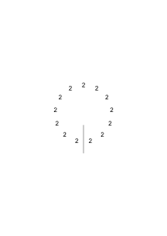
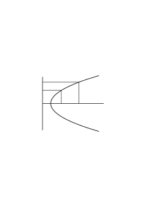
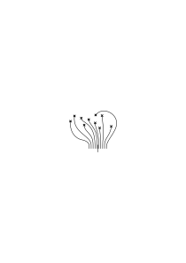
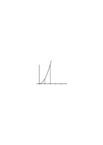
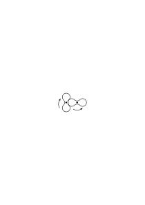

# Ms-125

### [1r\[1\]](https://cdn.wittgensteinnachlass.com/2000px/webp/Ms-125/1r.webp),[1v\[1\]](https://cdn.wittgensteinnachlass.com/2000px/webp/Ms-125/1v.webp),[2r\[1\]](https://cdn.wittgensteinnachlass.com/2000px/webp/Ms-125/2r.webp)

December 28, 1941

I have nothing to write, but I feel so empty & depressed that it is a relief to write _something_. I am very melancholic. I think a lot about Francis, but always only with regret about my lack of affection; not with gratitude. His life & death seem only to accuse me, because I was very often unloving & disloyal to him in the last 2 years of his life. If he hadn't been so infinitely gentle & loyal, I would have become _completely_ unloving towards him. I hardly think of my friends in Vienna. Koder has married & therefore I can no longer think of him, or: see him in my mind, because a wall has been placed in front of him. If he had died, the memory of him would not be erased; but now it seems to be devalued as well. I often see Keith, and what it actually means, I don't know. – Deserved disappointment, anxiety, worry. Inability to settle into a way of life. Only a few, short hours of happiness in _long_ stretches of sadness: sadness of the _bad_ kind. I have no _positive_ life, or purpose or goal. I continue to live, without any real hope. I feel most at ease when working – which is manual labor. I often think of Fr. with sadness, but the sadness is calm & not bad.

### [2v\[1\]](https://cdn.wittgensteinnachlass.com/2000px/webp/Ms-125/2v.webp)

Sometimes, as today, my life seems hardly bearable. It seems to have come to an end due to various circumstances, while I am still in good health & not old at all.

### [2v\[2\]](https://cdn.wittgensteinnachlass.com/2000px/webp/Ms-125/2v.webp),[3r\[1\]](https://cdn.wittgensteinnachlass.com/2000px/webp/Ms-125/3r.webp)

January 3, 1942

Every word stands in a field of relationships, at a specific point in the field of language: whoever is inclined to choose this word & not that one, chooses _one_ point in the field instead of another, one group of relationships instead of another.

### [3r\[2\]](https://cdn.wittgensteinnachlass.com/2000px/webp/Ms-125/3r.webp)

January 4, 1942

Why are people much more inclined to consider a visual image as characteristic of memory than ‘a speech’? One is inclined to talk about “mere words,” but not about a “mere visual image.” The way in which a picture can be applied seems much more self-evident than the way in which sentences can be applied.

### [VB](/w-vb/#ms-125-3v.1) [3v\[1\]](https://cdn.wittgensteinnachlass.com/2000px/webp/Ms-125/3v.webp) {#3v1}

The mathematician (Pascal) who admires the beauty of a theorem in number theory; he is, as it were, admiring a natural beauty. It is wonderful, he says, what wonderful properties the numbers have. It is as if he were admiring the regularities of a crystal.

### [VB](/w-vb/#ms-125-3v.2) [3v\[2\]](https://cdn.wittgensteinnachlass.com/2000px/webp/Ms-125/3v.webp) {#3v2}

One could say: what wonderful laws did the creator place in the numbers!

### [VB](/w-vb/#ms-125-4r.1) [4r\[1\]](https://cdn.wittgensteinnachlass.com/2000px/webp/Ms-125/4r.webp) {#4r1}

Clouds cannot be _built_. And that is why the _dreamed_ future will never come true.

### [VB](/w-vb/#ms-125-4r.2+4v.1) [4r\[2\]](https://cdn.wittgensteinnachlass.com/2000px/webp/Ms-125/4r.webp),[4v\[1\]](https://cdn.wittgensteinnachlass.com/2000px/webp/Ms-125/4v.webp) {#4r24v1}

Before we had airplanes, we dreamed of airplanes & what the world would look like with them. But, just as reality bore no resemblance whatsoever to this dream, we have absolutely no reason to believe that reality will develop into what we dream. For our dreams are full of trifles, like paper hats & costumes.

### [4v\[2\]](https://cdn.wittgensteinnachlass.com/2000px/webp/Ms-125/4v.webp),[5r\[1\]](https://cdn.wittgensteinnachlass.com/2000px/webp/Ms-125/5r.webp)

Proof that two figures like these form a regular pentagon.

### [5r\[2\]](https://cdn.wittgensteinnachlass.com/2000px/webp/Ms-125/5r.webp)

If I faithfully copy the ‘2’ all around, then the last sign is the same as the first.

### [5r\[3\]](https://cdn.wittgensteinnachlass.com/2000px/webp/Ms-125/5r.webp),[5v\[1\]](https://cdn.wittgensteinnachlass.com/2000px/webp/Ms-125/5v.webp)

Consider the mathematical sentence as a description of a picture; so, for example, one can consider the sentence: “The angel leads Peter out of prison.” (Note the present tense.) One could put a participial construction instead of the sentence: “Peter led out of prison by the angel.”

### [5v\[2\]](https://cdn.wittgensteinnachlass.com/2000px/webp/Ms-125/5v.webp)

The proof shows 50 + 25 gives 75.

### [5v\[3\]](https://cdn.wittgensteinnachlass.com/2000px/webp/Ms-125/5v.webp)

One cannot really justify the language-game, in general. That’s how we do it.

### [RFM IV](/w-rfm-4/#ms-125-5v.4) [5v\[4\]](https://cdn.wittgensteinnachlass.com/2000px/webp/Ms-125/5v.webp) {#5v4}

“The axioms of a mathematical axiom system should be self-evident.” How are they self-evident?

### [RFM IV](/w-rfm-4/#ms-125-6r.1) [6r\[1\]](https://cdn.wittgensteinnachlass.com/2000px/webp/Ms-125/6r.webp) {#6r1}

As when I say: _this_ is the easiest way for me to imagine it. And here, imagining is not a specific mental process in which one mostly closes one's eyes or covers one's face with one's hands.

### [RFM IV](/w-rfm-4/#ms-125-6r.2+6v.1) [6r\[2\]](https://cdn.wittgensteinnachlass.com/2000px/webp/Ms-125/6r.webp),[6v\[1\]](https://cdn.wittgensteinnachlass.com/2000px/webp/Ms-125/6v.webp) {#6r26v1}

What do we say when such an axiom is presented to us, e.g., the parallel axiom? Has experience shown us that it is the case?

Well, perhaps; but _which_ experience? I mean: experience plays a role; but not the one one might immediately expect. Because, after all, one has not conducted experiments and found that in reality only _one_ straight line does not intersect the other straight line at the point. And yet the sentence is clear. – If now I said: it is completely irrelevant why it is clear. Enough: we accept it. What is important is only how we use it.

### [RFM IV](/w-rfm-4/#ms-125-6v.2) [6v\[2\]](https://cdn.wittgensteinnachlass.com/2000px/webp/Ms-125/6v.webp) {#6v2}

The sentence describes a picture, namely this:

### [RFM IV](/w-rfm-4/#ms-125-7r.1) [7r\[1\]](https://cdn.wittgensteinnachlass.com/2000px/webp/Ms-125/7r.webp) {#7r1}

This picture is acceptable to us. How it is acceptable to us is the same as how we indicate an imprecise knowledge of a number by rounding it to a multiple of 10.

### [RFM IV](/w-rfm-4/#ms-125-7r.2) [7r\[2\]](https://cdn.wittgensteinnachlass.com/2000px/webp/Ms-125/7r.webp) {#7r2}

‘We accept this sentence.’ But as _what_ do we accept it?

### [RFM IV](/w-rfm-4/#ms-125-7r.3+7v.1) [7r\[3\]](https://cdn.wittgensteinnachlass.com/2000px/webp/Ms-125/7r.webp),[7v\[1\]](https://cdn.wittgensteinnachlass.com/2000px/webp/Ms-125/7v.webp) {#7r37v1}

I want to say: if the wording of the parallel axiom, for example, is given (& we understand the language), then the type of use of this sentence, and thus its sense, is not yet determined. And if we say that it is clear to us, then we have already chosen a certain type of use of the sentence, without knowing it. The sentence is not a mathematical axiom if we do not use it _for that_.

### [RFM IV](/w-rfm-4/#ms-125-7v.2+8r.1) [7v\[2\]](https://cdn.wittgensteinnachlass.com/2000px/webp/Ms-125/7v.webp),[8r\[1\]](https://cdn.wittgensteinnachlass.com/2000px/webp/Ms-125/8r.webp) {#7v28r1}

The fact that we do not conduct experiments here, but let the clarity count, already determines the use. Because we are not so naive as to let the clarity count instead of the experiment.

### [RFM IV](/w-rfm-4/#ms-125-8r.2) [8r\[2\]](https://cdn.wittgensteinnachlass.com/2000px/webp/Ms-125/8r.webp) {#8r2}

Not that it appears true to us, but that we let the clarity count makes it a mathematical sentence.

### [RFM IV](/w-rfm-4/#ms-125-8r.3+8v.1) [8r\[3\]](https://cdn.wittgensteinnachlass.com/2000px/webp/Ms-125/8r.webp),[8v\[1\]](https://cdn.wittgensteinnachlass.com/2000px/webp/Ms-125/8v.webp) {#8r38v1}

Does experience teach us that a straight line is possible between any two points? Or that two different colors cannot be at one place? One could say: _imagination_ teaches us this. And therein lies the truth; one must just understand it correctly.

### [RFM IV](/w-rfm-4/#ms-125-8v.2) [8v\[2\]](https://cdn.wittgensteinnachlass.com/2000px/webp/Ms-125/8v.webp) {#8v2}

_Before_ the sentence, the concept is still flexible.

### [RFM IV](/w-rfm-4/#ms-125-8v.3) [8v\[3\]](https://cdn.wittgensteinnachlass.com/2000px/webp/Ms-125/8v.webp) {#8v3}

But could not experiences determine us to reject the axiom?!

Yes. And yet it does not play the role of the empirical proposition.

### [RFM IV](/w-rfm-4/#ms-125-8v.4+9r.1) [8v\[4\]](https://cdn.wittgensteinnachlass.com/2000px/webp/Ms-125/8v.webp),[9r\[1\]](https://cdn.wittgensteinnachlass.com/2000px/webp/Ms-125/9r.webp) {#8v49r1}

Why are Newton's laws not axioms of mathematics? Because one could very well imagine that things could be different. But – I want to say – this only assigns a certain role to those sentences in contrast to another. That is: to say of a sentence: ‘one could also imagine it differently’ or ‘one can also imagine the opposite of it’, assigns it the role of the empirical proposition.

### [RFM IV](/w-rfm-4/#ms-125-9r.2+9v.1) [9r\[2\]](https://cdn.wittgensteinnachlass.com/2000px/webp/Ms-125/9r.webp),[9v\[1\]](https://cdn.wittgensteinnachlass.com/2000px/webp/Ms-125/9v.webp) {#9r29v1}

The sentence that one is not supposed to be able to imagine anything other than true has a different _function_ than the one for which this is not the case.

### [RFM IV](/w-rfm-4/#ms-125-9v.2) [9v\[2\]](https://cdn.wittgensteinnachlass.com/2000px/webp/Ms-125/9v.webp) {#9v2}

The mathematical axioms function in such a way that, if experience were to move us to give up an axiom, its opposite would not thereby become an axiom. ‘2 × 2 ≠ 5’ does not mean that ‘2 × 2 = 5’ has not proven itself.

### [RFM IV](/w-rfm-4/#ms-125-9v.3) [9v\[3\]](https://cdn.wittgensteinnachlass.com/2000px/webp/Ms-125/9v.webp) {#9v3}

One could, as it were, put a special assertion mark in front of the axioms.

### [RFM IV](/w-rfm-4/#ms-125-9v.4+10r.1) [9v\[4\]](https://cdn.wittgensteinnachlass.com/2000px/webp/Ms-125/9v.webp),[10r\[1\]](https://cdn.wittgensteinnachlass.com/2000px/webp/Ms-125/10r.webp) {#9v410r1}

An axiom is not something _because_ we recognize it as highly probable, indeed as certain, but because _we_ assign it a certain function and one that is contrary to that of the empirical proposition.

### [RFM IV](/w-rfm-4/#ms-125-10r.2) [10r\[2\]](https://cdn.wittgensteinnachlass.com/2000px/webp/Ms-125/10r.webp) {#10r2}

We give the axiom a different kind of recognition than the empirical proposition. And I do not mean by this that the ‘psychic act of recognition’ is different.

### [RFM IV](/w-rfm-4/#ms-125-10v.1) [10v\[1\]](https://cdn.wittgensteinnachlass.com/2000px/webp/Ms-125/10v.webp) {#10v1}

The axiom is, I would say, a different part of speech.

### [RFM IV](/w-rfm-4/#ms-125-10v.2) [10v\[2\]](https://cdn.wittgensteinnachlass.com/2000px/webp/Ms-125/10v.webp) {#10v2}

One assumes, when one hears that the mathematical axiom, this and that, is possible, without further ado, that one knows what ‘being possible’ means here; because the sentence form is naturally familiar to us.

### [RFM IV](/w-rfm-4/#ms-125-10v.3+11r.1) [10v\[3\]](https://cdn.wittgensteinnachlass.com/2000px/webp/Ms-125/10v.webp),[11r\[1\]](https://cdn.wittgensteinnachlass.com/2000px/webp/Ms-125/11r.webp) {#10v311r1}

One does not realize how different the use of the statement, something is possible, is, and does not think to ask about the special use in this case.

### [RFM IV](/w-rfm-4/#ms-125-11r.2) [11r\[2\]](https://cdn.wittgensteinnachlass.com/2000px/webp/Ms-125/11r.webp) {#11r2}

Without overlooking the use in the slightest, we cannot doubt that we understand the sentence.

### [RFM IV](/w-rfm-4/#ms-125-11r.3+11v.1) [11r\[3\]](https://cdn.wittgensteinnachlass.com/2000px/webp/Ms-125/11r.webp),[11v\[1\]](https://cdn.wittgensteinnachlass.com/2000px/webp/Ms-125/11v.webp) {#11r311v1}

Is the sentence that there is no effect in the distance of the type of mathematical sentences? One would also like to say: the sentence is not intended to express an experience, but that one cannot imagine anything else.

### [RFM IV](/w-rfm-4/#ms-125-11v.2+12r.1) [11v\[2\]](https://cdn.wittgensteinnachlass.com/2000px/webp/Ms-125/11v.webp),[12r\[1\]](https://cdn.wittgensteinnachlass.com/2000px/webp/Ms-125/12r.webp) {#11v212r1}

To say that a straight line is always possible – geometrically – between two points means: to say that more than two points lie on a straight line is a statement; to say it of two is not.

### [RFM IV](/w-rfm-4/#ms-125-12r.2) [12r\[2\]](https://cdn.wittgensteinnachlass.com/2000px/webp/Ms-125/12r.webp) {#12r2}

Just as one does not ask what a sentence of the form “There is no…” (e.g., “There is no proof of this sentence”) means in a particular case. In answer to the question of what it means, one answers the other person and oneself with an example of non-existence.

### [RFM IV](/w-rfm-4/#ms-125-12r.3+12v.1) [12r\[3\]](https://cdn.wittgensteinnachlass.com/2000px/webp/Ms-125/12r.webp),[12v\[1\]](https://cdn.wittgensteinnachlass.com/2000px/webp/Ms-125/12v.webp) {#12r312v1}

The mathematical sentence stands on four legs, not three; it is overdetermined.

### [RFM IV](/w-rfm-4/#ms-125-12v.2) [12v\[2\]](https://cdn.wittgensteinnachlass.com/2000px/webp/Ms-125/12v.webp) {#12v2}

If we describe a person’s action, e.g., by means of a rule, we want the person to whom we give the description to know, by applying the rule, what happens in the particular case. Does giving him the rule provide an indirect description?

### [RFM IV](/w-rfm-4/#ms-125-12v.3+13r.1) [12v\[3\]](https://cdn.wittgensteinnachlass.com/2000px/webp/Ms-125/12v.webp),[13r\[1\]](https://cdn.wittgensteinnachlass.com/2000px/webp/Ms-125/13r.webp) {#12v313r1}

There is, of course, a sentence that says: if someone tries to multiply the numbers … according to the rules, then he obtains ….

### [RFM IV](/w-rfm-4/#ms-125-13r.2) [13r\[2\]](https://cdn.wittgensteinnachlass.com/2000px/webp/Ms-125/13r.webp) {#13r2}

An application of the mathematical sentence must always be the calculation itself. This determines the relationship of the calculating activity to the sense of the mathematical sentences.

### [RFM IV](/w-rfm-4/#ms-125-13r.3) [13r\[3\]](https://cdn.wittgensteinnachlass.com/2000px/webp/Ms-125/13r.webp) {#13r3}

We judge sameness and agreement according to the results of our calculations; therefore, we cannot explain calculation with the help of agreement.

### [13v\[1\]](https://cdn.wittgensteinnachlass.com/2000px/webp/Ms-125/13v.webp)

For the past ten days I have been writing again, despite physical work and poor health. This shows how independent ideas (even if weak) are of external circumstances. I am physically _very_ tired.

### [RFM IV](/w-rfm-4/#ms-125-13v.2) [13v\[2\]](https://cdn.wittgensteinnachlass.com/2000px/webp/Ms-125/13v.webp) {#13v2}

We describe with the help of the rule: for what purpose? Why? That is another question.

### [RFM IV](/w-rfm-4/#ms-125-13v.3+14r.1) [13v\[3\]](https://cdn.wittgensteinnachlass.com/2000px/webp/Ms-125/13v.webp),[14r\[1\]](https://cdn.wittgensteinnachlass.com/2000px/webp/Ms-125/14r.webp) {#13v314r1}

‘The rule, when applied to these numbers, gives those’ could mean: the rule, when applied to a person, makes him generate those numbers from these numbers.

### [RFM IV](/w-rfm-4/#ms-125-14r.2) [14r\[2\]](https://cdn.wittgensteinnachlass.com/2000px/webp/Ms-125/14r.webp) {#14r2}

One rightly feels that this would _not_ be a mathematical sentence.

### [RFM IV](/w-rfm-4/#ms-125-14r.3) [14r\[3\]](https://cdn.wittgensteinnachlass.com/2000px/webp/Ms-125/14r.webp) {#14r3}

The mathematical sentence establishes a certain path.

### [RFM IV](/w-rfm-4/#ms-125-14r.4+14v.1) [14r\[4\]](https://cdn.wittgensteinnachlass.com/2000px/webp/Ms-125/14r.webp),[14v\[1\]](https://cdn.wittgensteinnachlass.com/2000px/webp/Ms-125/14v.webp) {#14r414v1}

It is not a contradiction that it is a rule and not simply stipulated, but is generated according to rules.

### [RFM IV](/w-rfm-4/#ms-125-14v.2) [14v\[2\]](https://cdn.wittgensteinnachlass.com/2000px/webp/Ms-125/14v.webp) {#14v2}

Whoever describes with a rule does not know more than he says. That is, he does not foresee the application that he will make of the rule in the particular case. Whoever says “etc.” does not know more than “etc.”.

### [RFM IV](/w-rfm-4/#ms-125-14v.3+15r.1) [14v\[3\]](https://cdn.wittgensteinnachlass.com/2000px/webp/Ms-125/14v.webp),[15r\[1\]](https://cdn.wittgensteinnachlass.com/2000px/webp/Ms-125/15r.webp) {#14v315r1}

How could one explain to someone what he has to do who is supposed to follow a rule?

### [RFM IV](/w-rfm-4/#ms-125-15r.2+15v.1) [15r\[2\]](https://cdn.wittgensteinnachlass.com/2000px/webp/Ms-125/15r.webp),[15v\[1\]](https://cdn.wittgensteinnachlass.com/2000px/webp/Ms-125/15v.webp) {#15r215v1}

One is tempted to explain: first of all, do the _simplest_ thing (if the rule is, for example, always to repeat the same thing). And there is, of course, something to that. It is important that we can say that it is simpler to write down a series of numbers in which each number is equal to the previous one than a series in which each number is 1 greater than the previous one. And again, that this is a simpler law than the one that alternates between adding 1 and 2.

### [RFM IV](/w-rfm-4/#ms-125-15v.2+16r.1) [15v\[2\]](https://cdn.wittgensteinnachlass.com/2000px/webp/Ms-125/15v.webp),[16r\[1\]](https://cdn.wittgensteinnachlass.com/2000px/webp/Ms-125/16r.webp) {#15v216r1}

Isn’t it premature to apply a sentence that one has tested on sticks and beans to the wavelengths of light? I mean: that 2 × 5000 = 10000. Does one really assume that what has proven true in so many cases must also be true for these? Or is it not rather that we are not yet _at all_ committed to the arithmetic assumption?

### [RFM IV](/w-rfm-4/#ms-125-16r.2) [16r\[2\]](https://cdn.wittgensteinnachlass.com/2000px/webp/Ms-125/16r.webp) {#16r2}

Arithmetic as the natural history (mineralogy) of numbers. _Who_ speaks of it in this way? Our entire thinking is permeated by this idea.

### [RFM IV](/w-rfm-4/#ms-125-16r.3+16v.1+17r.1) [16r\[3\]](https://cdn.wittgensteinnachlass.com/2000px/webp/Ms-125/16r.webp),[16v\[1\]](https://cdn.wittgensteinnachlass.com/2000px/webp/Ms-125/16v.webp),[17r\[1\]](https://cdn.wittgensteinnachlass.com/2000px/webp/Ms-125/17r.webp) {#16r316v117r1}

The numbers are shapes (I do not mean the number signs), and arithmetic tells us about the properties of these shapes. But the difficulty is that the properties of the shapes are _possibilities_; not the shape-like properties of things that have the shape. And these possibilities turn out to be physical or psychological possibilities (of decomposition, composition, etc.). The shapes, however, play (only) the role of images that are used in such and such a way. It is not properties of shapes that we give, but transformations of shapes, presented as paradigms.

### [RFM IV](/w-rfm-4/#ms-125-17r.2+17r.3) [17r\[2\]](https://cdn.wittgensteinnachlass.com/2000px/webp/Ms-125/17r.webp),[17r\[3\]](https://cdn.wittgensteinnachlass.com/2000px/webp/Ms-125/17r.webp) {#17r217r3}

We do not judge the images, but by means of the images. We do not investigate them but investigate something else by means of them.

### [RFM IV](/w-rfm-4/#ms-125-17r.4+17v.1) [17r\[4\]](https://cdn.wittgensteinnachlass.com/2000px/webp/Ms-125/17r.webp),[17v\[1\]](https://cdn.wittgensteinnachlass.com/2000px/webp/Ms-125/17v.webp) {#17r417v1}

You lead him to the decision to adopt this image. And that is done through proof, i.e., by presenting a series of images, or simply by showing him the image. What moves him to this decision is irrelevant here. The main thing is that it is about adopting an image.

### [RFM IV](/w-rfm-4/#ms-125-17v.2) [17v\[2\]](https://cdn.wittgensteinnachlass.com/2000px/webp/Ms-125/17v.webp) {#17v2}

The image of composition _is_ not composition; the image of decomposition _is_ not decomposition; the image of fitting is not fitting. But these images are of the utmost meaning. _This is what it looks like_ when something is composed; when something is decomposed; and so on.

### [RFM IV](/w-rfm-4/#ms-125-18r.1) [18r\[1\]](https://cdn.wittgensteinnachlass.com/2000px/webp/Ms-125/18r.webp) {#18r1}

What if animals or crystals had such beautiful properties as numbers? There would be, for example, a series of shapes, each one larger than the other by one unit.

### [RFM IV](/w-rfm-4/#ms-125-18r.2+18v.1) [18r\[2\]](https://cdn.wittgensteinnachlass.com/2000px/webp/Ms-125/18r.webp),[18v\[1\]](https://cdn.wittgensteinnachlass.com/2000px/webp/Ms-125/18v.webp) {#18r218v1}

I would like to be able to show how it is that mathematics now appears to us as a natural history of the realm of numbers, and now again as a collection of rules.

### [RFM IV](/w-rfm-4/#ms-125-18v.2) [18v\[2\]](https://cdn.wittgensteinnachlass.com/2000px/webp/Ms-125/18v.webp) {#18v2}

But could one not study transformations of animal shapes (for example)? But how ‘study’? I mean: could it not be useful to demonstrate transformations of animal shapes? And yet this would not be a branch of zoology.

### [RFM IV](/w-rfm-4/#ms-125-18v.3+19r.1) [18v\[3\]](https://cdn.wittgensteinnachlass.com/2000px/webp/Ms-125/18v.webp),[19r\[1\]](https://cdn.wittgensteinnachlass.com/2000px/webp/Ms-125/19r.webp) {#18v319r1}

A mathematical proposition would then be (e.g.), that _this_ transformation maps _this_ figure onto _that one_. (The figures and the transformation are recognizable.)

### [RFM IV](/w-rfm-4/#ms-125-19r.2+19v.1) [19r\[2\]](https://cdn.wittgensteinnachlass.com/2000px/webp/Ms-125/19r.webp),[19v\[1\]](https://cdn.wittgensteinnachlass.com/2000px/webp/Ms-125/19v.webp) {#19r219v1}

We must, however, remember that the mathematical proof, through its transformations, proves not only propositions of symbolic geometry, but propositions of the most varied _content_.

### [RFM IV](/w-rfm-4/#ms-125-19r.3) [19r\[3\]](https://cdn.wittgensteinnachlass.com/2000px/webp/Ms-125/19r.webp) {#19r3}

Thus, the transformation of a Russellian proof demonstrates that this logical proposition can be derived from the fundamental laws using these rules. But the proof is regarded as a proof of the truth of the conclusion, or as a proof that the conclusion says _nothing_. This is possible only through a relationship of the proposition to the outside world; that is, through its relationship to other propositions, e.g., and their application.

### [RFM IV](/w-rfm-4/#ms-125-19v.2+20r.1) [19v\[2\]](https://cdn.wittgensteinnachlass.com/2000px/webp/Ms-125/19v.webp),[20r\[1\]](https://cdn.wittgensteinnachlass.com/2000px/webp/Ms-125/20r.webp) {#19v220r1}

‘The tautology (“p ∨ ~p”, for example) says nothing’ is a sentence that refers to the language-game in which the sentence p is used. (E.g.: “It is raining, or it is not raining” is not a communication about the weather.)

### [RFM IV](/w-rfm-4/#ms-125-20r.2) [20r\[2\]](https://cdn.wittgensteinnachlass.com/2000px/webp/Ms-125/20r.webp) {#20r2}

R.‘s logic says nothing about the nature and use of _sentences_—I mean, not _logical_ sentences: And yet logic derives its entire sense (only) from the supposed application to sentences.

### [20r\[3\]](https://cdn.wittgensteinnachlass.com/2000px/webp/Ms-125/20r.webp),[20v\[1\]](https://cdn.wittgensteinnachlass.com/2000px/webp/Ms-125/20v.webp)

But one can also regard the Russellian proof as a proof that the proven sentence can be transferred into a certain other notation and will have the structure. This is like proving that a number can be divided by the other number.

### [20v\[2\]](https://cdn.wittgensteinnachlass.com/2000px/webp/Ms-125/20v.webp)

Proof is achieved through speaking or writing—a proof functions in the realm of language. A proof takes place in language. In the written or spoken word.

### [21r\[1\]](https://cdn.wittgensteinnachlass.com/2000px/webp/Ms-125/21r.webp)

But, you say, through a proof we also predict the future. But we can predict it to be true or false through a mathematically correct proof.

### [21r\[2\]](https://cdn.wittgensteinnachlass.com/2000px/webp/Ms-125/21r.webp),[21v\[1\]](https://cdn.wittgensteinnachlass.com/2000px/webp/Ms-125/21v.webp)

If a body moves along a parabola, then for a _statement_ that specifies its x-coordinate, I can construct a _statement_ that specifies how high on the y-axis I must look for it.

### [21v\[2\]](https://cdn.wittgensteinnachlass.com/2000px/webp/Ms-125/21v.webp)

What, for example, is _mathematical_ about a Russellian P.p.?!

### [21v\[3\]](https://cdn.wittgensteinnachlass.com/2000px/webp/Ms-125/21v.webp)

Such a statement is _not_ to be understood as an empirical proposition. –

### [21v\[4\]](https://cdn.wittgensteinnachlass.com/2000px/webp/Ms-125/21v.webp)

We assume this image

<math display="block">
  <mrow>
    <mtable columnalign="left" rowspacing="0.2em">
      <mtr>
        <mtd>
          <mrow>
            <munder>
              <mn>1</mn>
              <mo>&#x005F;</mo>
            </munder>
            <mspace width="0.2em"/>
            <mo>:</mo>
            <mspace width="0.2em"/>
            <mn>3</mn>
            <mspace width="0.2em"/>
            <mo>=</mo>
            <mspace width="0.2em"/>
            <mn>0</mn>
            <mo>&#xB7;</mo>
            <mover>
              <mn>3</mn>
              <mo>˙</mo>
            </mover>
          </mrow>
        </mtd>
      </mtr>
      <mtr>
        <mtd>
          <mrow>
            <mspace width="0.5em"/>
            <munder>
              <mn>1</mn>
              <mo>&#x005F;</mo>
            </munder>
          </mrow>
        </mtd>
      </mtr>
    </mtable>
  </mrow>
</math>

for that.

### [21v\[5\]](https://cdn.wittgensteinnachlass.com/2000px/webp/Ms-125/21v.webp),[22r\[1\]](https://cdn.wittgensteinnachlass.com/2000px/webp/Ms-125/22r.webp)

Mathematics is anything but characteristic of the axiomatic method.

### [22r\[2\]](https://cdn.wittgensteinnachlass.com/2000px/webp/Ms-125/22r.webp)

Mathematical propositions are used in a train of thought just like non-mathematical ones; I mean: conclusions are drawn from both together; they play a similar role _in discourse_. (This is reminiscent of the role of the proposition “angle α is equal to itself”.)

### [22r\[3\]](https://cdn.wittgensteinnachlass.com/2000px/webp/Ms-125/22r.webp),[22v\[1\]](https://cdn.wittgensteinnachlass.com/2000px/webp/Ms-125/22v.webp)

It is an empirical fact that, for example, in a multiplication, the same result is obtained either always or almost always, and if something different comes out, we can always, or almost always, discover a mistake. However, this only applies to small multiplications. The mathematical sentence, however, does not say this. And yet, one can say that this fact underlies it.

### [22v\[2\]](https://cdn.wittgensteinnachlass.com/2000px/webp/Ms-125/22v.webp),[23r\[1\]](https://cdn.wittgensteinnachlass.com/2000px/webp/Ms-125/23r.webp)

I mean, this fact determines our attitude toward the calculation process.

### [VB](/w-vb/#ms-125-23r.2) [23r\[2\]](https://cdn.wittgensteinnachlass.com/2000px/webp/Ms-125/23r.webp) {#23r2}

The popular science writings of our scientists do not express (hard) work, but rather resting on their laurels.

### [VB](/w-vb/#ms-125-23r.3+23v.1) [23r\[3\]](https://cdn.wittgensteinnachlass.com/2000px/webp/Ms-125/23r.webp),[23v\[1\]](https://cdn.wittgensteinnachlass.com/2000px/webp/Ms-125/23v.webp) {#23r323v1}

If you _have_ a person’s love, no sacrifice can overpay for it, yet every sacrifice is too great to _buy_ it for yourself.

### [23v\[2\]](https://cdn.wittgensteinnachlass.com/2000px/webp/Ms-125/23v.webp),[24r\[1\]](https://cdn.wittgensteinnachlass.com/2000px/webp/Ms-125/24r.webp)

Let us imagine people who have memorized two poems, who, for some reason, assign them to each other word for word, and now say that experience teaches that one always reaches to the word… of the other. That sounds strange. Why? – Is this experience related to their memory, or their inclination to assign them to each other in this way, or does it concern properties of the written form of the poems?

### [24r\[2\]](https://cdn.wittgensteinnachlass.com/2000px/webp/Ms-125/24r.webp),[24v\[1\]](https://cdn.wittgensteinnachlass.com/2000px/webp/Ms-125/24v.webp)

I could say: Experience teaches that _these_ people (or people in such and such a state) generally omit words in poems, or add such words—and that therefore that assignment does not always lead to the same result. (Or, conversely, that it _does_ so in the case of people in such and such a state.)

### [24v\[2\]](https://cdn.wittgensteinnachlass.com/2000px/webp/Ms-125/24v.webp),[25r\[1\]](https://cdn.wittgensteinnachlass.com/2000px/webp/Ms-125/25r.webp)

That poem A extends in this way up to the word ‥‥ of poem B can be a mathematical proposition, & has mathematical certainty if this is understood as an _essential_ property of these poems.

### [25r\[2\]](https://cdn.wittgensteinnachlass.com/2000px/webp/Ms-125/25r.webp)

It would be truly absurd to say that poem A _always_ extends up to this word of poem B. Or at the very least, this sentence would allow for a multitude of different interpretations.

### [25r\[3\]](https://cdn.wittgensteinnachlass.com/2000px/webp/Ms-125/25r.webp),[25v\[1\]](https://cdn.wittgensteinnachlass.com/2000px/webp/Ms-125/25v.webp)

Would _that_ be a mathematical statement: that one rule applies every other day, and the other on the remaining days?

### [25v\[2\]](https://cdn.wittgensteinnachlass.com/2000px/webp/Ms-125/25v.webp),[26r\[1\]](https://cdn.wittgensteinnachlass.com/2000px/webp/Ms-125/26r.webp)

We have, for example, recursively proven the commutative law for multiplication in the decimal system, and now we find a multiplication (perhaps a very long one) for which a × b does not yield the same result as b × a. – (The space in which the calculations take place – we could assume – is as if not a straight one.) What should we do now? Now the application of the calculation would change.

### [26r\[2\]](https://cdn.wittgensteinnachlass.com/2000px/webp/Ms-125/26r.webp)

‘It _must_ turn out this way!’ – the eye of the mind seems to rush ahead of the specific calculations, and already sees what the physical eye does not yet see.

### [26r\[3\]](https://cdn.wittgensteinnachlass.com/2000px/webp/Ms-125/26r.webp),[26v\[1\]](https://cdn.wittgensteinnachlass.com/2000px/webp/Ms-125/26v.webp)

01.04.1942

I am doing extraordinarily badly: I have no more hope for the future in my life. It is as if I only have a long stretch of living death ahead of me. I can only imagine a terrible future for myself. Friendless & joyless.

### [26v\[2\]](https://cdn.wittgensteinnachlass.com/2000px/webp/Ms-125/26v.webp)

That at the point of the periodic division, which will seem to me the fiftieth, ‘5’ will appear, is a real prediction.

### [26v\[3\]](https://cdn.wittgensteinnachlass.com/2000px/webp/Ms-125/26v.webp),[27r\[1\]](https://cdn.wittgensteinnachlass.com/2000px/webp/Ms-125/27r.webp)

If I imagine the whole series, do I have such a picture? The calculation I write down is my entire conception. And that shows what role the conception plays. I mean to say: the conception does not precede the calculation—as one sometimes wants to believe. It is the _application_ that makes the leap.

### [27r\[2\]](https://cdn.wittgensteinnachlass.com/2000px/webp/Ms-125/27r.webp),[27v\[1\]](https://cdn.wittgensteinnachlass.com/2000px/webp/Ms-125/27v.webp)

Is it now experience that allows us to predict something correctly? Is this not entirely irrelevant? Enough, we make a correct prediction.

### [27v\[2\]](https://cdn.wittgensteinnachlass.com/2000px/webp/Ms-125/27v.webp)

One could probably say that mathematics is an achievement of the _imagination_.

### [27v\[3\]](https://cdn.wittgensteinnachlass.com/2000px/webp/Ms-125/27v.webp)

The mathematical proposition does not predict that it _will_ turn out to be true, but states that it is _true_.

### [27v\[4\]](https://cdn.wittgensteinnachlass.com/2000px/webp/Ms-125/27v.webp),[28r\[1\]](https://cdn.wittgensteinnachlass.com/2000px/webp/Ms-125/28r.webp)

‘A pound of cheese costs so and so much’: for that to be possible at all, cheese must have all sorts of properties. It must, for example, be weighable and not change its weight without rules. But does that sentence say that? Would the _opposite_ of the sentence be true if things were different?

### [28r\[2\]](https://cdn.wittgensteinnachlass.com/2000px/webp/Ms-125/28r.webp)

When we think, we _use_ concepts.

### [28r\[3\]](https://cdn.wittgensteinnachlass.com/2000px/webp/Ms-125/28r.webp)

Only (through) _language-games_ can one achieve understanding of mathematics.

### [RFM IV](/w-rfm-4/#ms-125-28v.1+29r.1) [28v\[1\]](https://cdn.wittgensteinnachlass.com/2000px/webp/Ms-125/28v.webp),[29r\[1\]](https://cdn.wittgensteinnachlass.com/2000px/webp/Ms-125/29r.webp) {#28v129r1}

One can imagine that people have applied mathematics without pure mathematics. They can, for example—let us assume—calculate the trajectory described by certain moving bodies and predict their location at a given time. To do this, they use a coordinate system, the equations of curves (_a form of describing reality_), and the technique of calculation in the decimal system.

The idea of a theorem in pure mathematics may be completely foreign to them. These people therefore have rules according to which they transform the relevant symbols—in particular, for example, numerical symbols—for the purpose of predicting the occurrence of certain events.

### [RFM IV](/w-rfm-4/#ms-125-29r.2+29v.1) [29r\[2\]](https://cdn.wittgensteinnachlass.com/2000px/webp/Ms-125/29r.webp),[29v\[1\]](https://cdn.wittgensteinnachlass.com/2000px/webp/Ms-125/29v.webp) {#29r229v1}

But if they now multiply, for example, will they not arrive at a theorem stating that the result of the multiplication is the same no matter how the factors are swapped? This will not be a primary symbolic rule, nor will it be a theorem of their physics. Well, they do not _need_ to arrive at such a theorem—even if they allow the factors to be swapped.

### [RFM IV](/w-rfm-4/#ms-125-29v.2+30r.1) [29v\[2\]](https://cdn.wittgensteinnachlass.com/2000px/webp/Ms-125/29v.webp),[30r\[1\]](https://cdn.wittgensteinnachlass.com/2000px/webp/Ms-125/30r.webp) {#29v230r1}

I imagine the matter in such a way that this mathematics is conducted entirely in the form of _commands_. “You must do _this and that_”—namely, in order to obtain the answer to the question, ‘where will this body be at such-and-such a time’. (How these people arrived at this method of prediction is entirely irrelevant).

### [RFM IV](/w-rfm-4/#ms-125-30r.2) [30r\[2\]](https://cdn.wittgensteinnachlass.com/2000px/webp/Ms-125/30r.webp) {#30r2}

For these people, the focus of mathematics lies _entirely_ in _action_.

### [RFM IV](/w-rfm-4/#ms-125-30r.3) [30r\[3\]](https://cdn.wittgensteinnachlass.com/2000px/webp/Ms-125/30r.webp) {#30r3}

But is that possible? Is it possible that they do not address the commutative law (for example) as _a proposition_?

### [RFM IV](/w-rfm-4/#ms-125-30r.4+30v.1) [30r\[4\]](https://cdn.wittgensteinnachlass.com/2000px/webp/Ms-125/30r.webp),[30v\[1\]](https://cdn.wittgensteinnachlass.com/2000px/webp/Ms-125/30v.webp) {#30r430v1}

I want to say: These people should not come to the conclusion that they are making mathematical discoveries—but _only_ physical discoveries. [How greatly I am influenced by Spengler in my thinking!]

### [RFM IV](/w-rfm-4/#ms-125-30v.2+31r.1) [30v\[2\]](https://cdn.wittgensteinnachlass.com/2000px/webp/Ms-125/30v.webp),[31r\[1\]](https://cdn.wittgensteinnachlass.com/2000px/webp/Ms-125/31r.webp) {#30v231r1}

Question: Must they make mathematical discoveries as discoveries? What are they missing if they do not make them? Could they (e.g.) use the proof of the commutative law, but without the notion that it culminates in a _theorem_, that it thus has a result somehow comparable to their physical theorems?

### [RFM IV](/w-rfm-4/#ms-125-31r.2+31v.1) [31r\[2\]](https://cdn.wittgensteinnachlass.com/2000px/webp/Ms-125/31r.webp),[31v\[1\]](https://cdn.wittgensteinnachlass.com/2000px/webp/Ms-125/31v.webp) {#31r231v1}

The mere picture

considered once as 4 rows of 5 points, once as 5 columns of 4 points, could convince someone of the commutative law. And he could then carry out multiplications in one direction in one case, and in the other direction in the other case.

### [RFM IV](/w-rfm-4/#ms-125-31v.2) [31v\[2\]](https://cdn.wittgensteinnachlass.com/2000px/webp/Ms-125/31v.webp) {#31v2}

April 6, 1942

A glance at the template and the stones convinces him that he will be able to lay out the figure with them; that is, he _sets_ about laying them out.

### [31v\[3\]](https://cdn.wittgensteinnachlass.com/2000px/webp/Ms-125/31v.webp)

I feel terribly unhappy.

### [RFM IV](/w-rfm-4/#ms-125-31v.4+32r.1+32r.2+32v.1) [31v\[4\]](https://cdn.wittgensteinnachlass.com/2000px/webp/Ms-125/31v.webp),[32r\[1\]](https://cdn.wittgensteinnachlass.com/2000px/webp/Ms-125/32r.webp),[32r\[2\]](https://cdn.wittgensteinnachlass.com/2000px/webp/Ms-125/32r.webp),[32v\[1\]](https://cdn.wittgensteinnachlass.com/2000px/webp/Ms-125/32v.webp) {#31v432r132r232v1}

‘Yes, but only if the stones do not change? – If they do not change and if we do not make an incomprehensible mistake, or stones disappear unnoticed or are added.’ But it is essential that the figure can always be laid out with the stones! What would happen if it could not be laid out?’ – Perhaps we would then consider ourselves insane. But – what then? – Perhaps we would also accept the matter as it is. And then Frege would say: “Here we have a new kind of madness.”

### [RFM IV](/w-rfm-4/#ms-125-32v.2) [32v\[2\]](https://cdn.wittgensteinnachlass.com/2000px/webp/Ms-125/32v.webp) {#32v2}

It is clear that mathematics as a technique of transforming signs for the purpose of prediction has nothing to do with grammar.

### [RFM IV](/w-rfm-4/#ms-125-32v.3+33r.1) [32v\[3\]](https://cdn.wittgensteinnachlass.com/2000px/webp/Ms-125/32v.webp),[33r\[1\]](https://cdn.wittgensteinnachlass.com/2000px/webp/Ms-125/33r.webp) {#32v333r1}

Those people whose mathematics is only such a technique should also recognize proofs that convince them of the usability of a sign technique.

### [RFM IV](/w-rfm-4/#ms-125-33r.2+33v.1) [33r\[2\]](https://cdn.wittgensteinnachlass.com/2000px/webp/Ms-125/33r.webp),[33v\[1\]](https://cdn.wittgensteinnachlass.com/2000px/webp/Ms-125/33v.webp) {#33r233v1}

If calculation appears to us as a mechanical activity, then _the person_ performing the calculation is the machine.

### [RFM IV](/w-rfm-4/#ms-125-33v.2) [33v\[2\]](https://cdn.wittgensteinnachlass.com/2000px/webp/Ms-125/33v.webp) {#33v2}

The calculation would then be like a diagram that the machine writes down.

### [RFM IV](/w-rfm-4/#ms-125-33v.3) [33v\[3\]](https://cdn.wittgensteinnachlass.com/2000px/webp/Ms-125/33v.webp) {#33v3}

And that brings me to the fact that a picture can very well convince us that a certain part of a mechanism will move in a certain way when the mechanism is set in motion.

### [RFM IV](/w-rfm-4/#ms-125-34r.1) [34r\[1\]](https://cdn.wittgensteinnachlass.com/2000px/webp/Ms-125/34r.webp) {#34r1}

Such an image (or a series of images) acts as proof. For example, I could illustrate how point _x_ of the mechanism

will move.

### [RFM IV](/w-rfm-4/#ms-125-34r.2) [34r\[2\]](https://cdn.wittgensteinnachlass.com/2000px/webp/Ms-125/34r.webp) {#34r2}

Isn’t it _strange_ that it is not immediately clear _how_ the image of the period in division convinces us of the recurrence of the sequence of numbers?

### [34v\[1\]](https://cdn.wittgensteinnachlass.com/2000px/webp/Ms-125/34v.webp)

The mathematical proof makes him change his tune. It convinces him that the new tune will in a certain way agree with the old tune.

### [34v\[2\]](https://cdn.wittgensteinnachlass.com/2000px/webp/Ms-125/34v.webp)

He accepts _one_ rule instead of the other.

### [RFM IV](/w-rfm-4/#ms-125-34v.3) [34v\[3\]](https://cdn.wittgensteinnachlass.com/2000px/webp/Ms-125/34v.webp) {#34v3}

(It is so difficult for me to separate the inner relationship from the outer one – the image from the prediction.)

### [34v\[4\]](https://cdn.wittgensteinnachlass.com/2000px/webp/Ms-125/34v.webp)

You _do_ something based on the proof.

### [35r\[1\]](https://cdn.wittgensteinnachlass.com/2000px/webp/Ms-125/35r.webp)

The proof does not predict that we will write the number such-and-such in the …th place—that could be discovered through experimentation. Rather, it makes it inconceivable that anything else would be written if the calculation is performed according to the rules.

### [35r\[2\]](https://cdn.wittgensteinnachlass.com/2000px/webp/Ms-125/35r.webp),[35v\[1\]](https://cdn.wittgensteinnachlass.com/2000px/webp/Ms-125/35v.webp)

The experiment does not make anything inconceivable; it does not make the outcome it _does not_ take inconceivable. On the contrary, anyone observing the experiment gains an idea of how things could have turned out differently. The proof imposes the _idea_.

### [RFM IV](/w-rfm-4/#ms-125-35v.2) [35v\[2\]](https://cdn.wittgensteinnachlass.com/2000px/webp/Ms-125/35v.webp) {#35v2}

The dual nature of the mathematical proposition—as _a law_ and as _a rule_.

### [35v\[3\]](https://cdn.wittgensteinnachlass.com/2000px/webp/Ms-125/35v.webp),[36r\[1\]](https://cdn.wittgensteinnachlass.com/2000px/webp/Ms-125/36r.webp)

‘It is simply a feat of our imagination that we imagine how it will continue.’ Yes, but how can (this) imagining replace (the) experience? Who tells the imagination that it follows the actual events?

### [36r\[2\]](https://cdn.wittgensteinnachlass.com/2000px/webp/Ms-125/36r.webp)

‘The calculation teaches us something _new_!’ Is a new decision nothing, then?

### [RFM IV](/w-rfm-4/#ms-125-36r.3+36v.1) [36r\[3\]](https://cdn.wittgensteinnachlass.com/2000px/webp/Ms-125/36r.webp),[36v\[1\]](https://cdn.wittgensteinnachlass.com/2000px/webp/Ms-125/36v.webp) {#36r336v1}

What if, instead of “intuition,” one said “correct guessing”? That would show the value of an intuition in a completely different light. Because the phenomenon of guessing is a psychological one, but not that of correct guessing.

### [RFM IV](/w-rfm-4/#ms-125-36v.2) [36v\[2\]](https://cdn.wittgensteinnachlass.com/2000px/webp/Ms-125/36v.webp) {#36v2}

The fact that we have learned the technique means that we now, upon seeing this image, modify it in such and such a way.

### [36v\[3\]](https://cdn.wittgensteinnachlass.com/2000px/webp/Ms-125/36v.webp),[37r\[1\]](https://cdn.wittgensteinnachlass.com/2000px/webp/Ms-125/37r.webp)

09.02.1942

I am suffering greatly from the fear of complete isolation, which now threatens me. I cannot see how I can endure this life. I see it as a life in which I will have to fear every day the evening that brings me only dull sadness.

### [37r\[2\]](https://cdn.wittgensteinnachlass.com/2000px/webp/Ms-125/37r.webp)

“He writes how 25 × 5 equals 125.” As if one were to say: “The proof shows _how_ 25 × 5 equals 125.”?

### [37r\[3\]](https://cdn.wittgensteinnachlass.com/2000px/webp/Ms-125/37r.webp)

It is so incredibly difficult here not to bring _a_ matter up twice!

### [37v\[1\]](https://cdn.wittgensteinnachlass.com/2000px/webp/Ms-125/37v.webp)

What kind of sentence is this: ‘if I multiply these two numbers _correctly_, the result must always be the same’? “It will always turn out that way; you will always accept it as correct when it turns out that way”—that is _one_ _thing_—–“if that was correct, if I did not make a mistake in this calculation, then it _should_ always turn out that way”—that is something else.

### [38r\[1\]](https://cdn.wittgensteinnachlass.com/2000px/webp/Ms-125/38r.webp)

If I (as in the previous figure) always draw a line from one roll & thus connect them all with a series of parallel lines & divide them into 2 equal groups, then in this way I can form two groups of rolls that will prove to be of equal number for different purposes. That is a _great_ physical certainty.

### [38r\[2\]](https://cdn.wittgensteinnachlass.com/2000px/webp/Ms-125/38r.webp),[38v\[1\]](https://cdn.wittgensteinnachlass.com/2000px/webp/Ms-125/38v.webp)

Part of the proof is that it can be copied _with certainty_.

### [38v\[2\]](https://cdn.wittgensteinnachlass.com/2000px/webp/Ms-125/38v.webp)

What if someone said that the certainty of copying is no less than mathematical certainty, yes, is the mathematical certainty itself?

### [38v\[3\]](https://cdn.wittgensteinnachlass.com/2000px/webp/Ms-125/38v.webp)

What is the relationship with the sentence that all correct copies of a proof must be correct copies of each other? –

### [38v\[4\]](https://cdn.wittgensteinnachlass.com/2000px/webp/Ms-125/38v.webp),[39r\[1\]](https://cdn.wittgensteinnachlass.com/2000px/webp/Ms-125/39r.webp)

What kind of sentence is _this_: ‘If I write down a poem from memory twice in a row, & my memory does not deceive me, & the transcriptions remain unchanged, then I must be able to match them word for word on paper using lines’?!

### [39r\[2\]](https://cdn.wittgensteinnachlass.com/2000px/webp/Ms-125/39r.webp),[39v\[1\]](https://cdn.wittgensteinnachlass.com/2000px/webp/Ms-125/39v.webp)

Or this: “If I can assign two series of signs to each other with green lines, one to one, then I can also do it with blue lines, if I am not physically prevented from doing so”?

### [39v\[2\]](https://cdn.wittgensteinnachlass.com/2000px/webp/Ms-125/39v.webp)

“The fact that it works with green lines _is a proof_ that it also works with blue lines.” And it provides a proof in the mathematical sense, but not in the physical sense.

### [RFM IV](/w-rfm-4/#ms-125-39v.3) [39v\[3\]](https://cdn.wittgensteinnachlass.com/2000px/webp/Ms-125/39v.webp) {#39v3}

‘We decide on a new language-game.’ ‘We decide _spontaneously_ (I would say) on a new language-game.’

### [RFM IV](/w-rfm-4/#ms-125-39v.4+40r.1) [39v\[4\]](https://cdn.wittgensteinnachlass.com/2000px/webp/Ms-125/39v.webp),[40r\[1\]](https://cdn.wittgensteinnachlass.com/2000px/webp/Ms-125/40r.webp) {#39v440r1}

Yes – it seems: if our memory functioned differently, then we could not calculate as we do. But could we then give definitions as we do; speak and write as we do? How, however, can we express the foundation of our language through sentences of experience?

### [RFM IV](/w-rfm-4/#ms-125-40r.2+40v.1) [40r\[2\]](https://cdn.wittgensteinnachlass.com/2000px/webp/Ms-125/40r.webp),[40v\[1\]](https://cdn.wittgensteinnachlass.com/2000px/webp/Ms-125/40v.webp) {#40r240v1}

Suppose that a division, if carried out completely, would not lead to the same result as copying the period. This could be due, for example, to the fact that we alter the rules of calculation without being conscious of it. (But it could also be due to the fact that we copy differently.)

### [RFM IV](/w-rfm-4/#ms-125-40v.2+41r.1) [40v\[2\]](https://cdn.wittgensteinnachlass.com/2000px/webp/Ms-125/40v.webp),[41r\[1\]](https://cdn.wittgensteinnachlass.com/2000px/webp/Ms-125/41r.webp) {#40v241r1}

What is the difference between _not_ calculating and calculating _incorrectly_? – Or: is there a _clear_ distinction between _not_ measuring time and measuring it _incorrectly_? Between not knowing how to measure time and doing so incorrectly?

### [RFM IV](/w-rfm-4/#ms-125-41r.2) [41r\[2\]](https://cdn.wittgensteinnachlass.com/2000px/webp/Ms-125/41r.webp) {#41r2}

Pay attention to the chatter by which we convince someone of the truth of a mathematical sentence. It provides an insight into the function of this conviction. I mean the chatter that evokes intuition. With which, therefore, the machine of a technique is set in motion.

### [RFM IV](/w-rfm-4/#ms-125-41v.1) [41v\[1\]](https://cdn.wittgensteinnachlass.com/2000px/webp/Ms-125/41v.webp) {#41v1}

Can one say that someone who learns a technique thereby becomes convinced of the uniformity of the results?

### [RFM IV](/w-rfm-4/#ms-125-41v.2) [41v\[2\]](https://cdn.wittgensteinnachlass.com/2000px/webp/Ms-125/41v.webp) {#41v2}

The limit of empiricism is _conceptualization_.

### [RFM IV](/w-rfm-4/#ms-125-41v.3+42r.1) [41v\[3\]](https://cdn.wittgensteinnachlass.com/2000px/webp/Ms-125/41v.webp),[42r\[1\]](https://cdn.wittgensteinnachlass.com/2000px/webp/Ms-125/42r.webp) {#41v342r1}

What transition do I make from “it will be so” to “it _must_ be so”? I form a different concept. One that includes what was not there before. When I say: “If these derivations are equal, then …”, I thus reformulate my concept of equality.

### [RFM IV](/w-rfm-4/#ms-125-42r.2+42v.1) [42r\[2\]](https://cdn.wittgensteinnachlass.com/2000px/webp/Ms-125/42r.webp),[42v\[1\]](https://cdn.wittgensteinnachlass.com/2000px/webp/Ms-125/42v.webp) {#42r242v1}

But what if someone now says: “I am not conscious of these _two_ processes; I am only conscious of empiricism, not of concept formation and concept transformation independent of it; everything seems to me to be in the service of empiricism.”? In other words: we do not seem to become more or less rational, or to change the form of our thinking, so that _what we call “thinking”_ changes as a result. We seem only to adapt it constantly to experience.

### [RFM IV](/w-rfm-4/#ms-125-42v.2+43r.1) [42v\[2\]](https://cdn.wittgensteinnachlass.com/2000px/webp/Ms-125/42v.webp),[43r\[1\]](https://cdn.wittgensteinnachlass.com/2000px/webp/Ms-125/43r.webp) {#42v243r1}

It is clear that when someone says, “If you follow the _rule_, then it _must_ _be_ so,” they have no _clear_ concept of experiences that would correspond to the opposite.

### [RFM IV](/w-rfm-4/#ms-125-43r.2) [43r\[2\]](https://cdn.wittgensteinnachlass.com/2000px/webp/Ms-125/43r.webp) {#43r2}

Or also: He has no clear concept of what it would look like if it were different. And that is very important.

### [VB](/w-vb/#ms-125-43r.3+43v.1) [43r\[3\]](https://cdn.wittgensteinnachlass.com/2000px/webp/Ms-125/43r.webp),[43v\[1\]](https://cdn.wittgensteinnachlass.com/2000px/webp/Ms-125/43v.webp) {#43r343v1}

Just as there is _depth_ in sleep and light sleep, so there are thoughts that take place deep within and thoughts that frolic on the surface.

### [RFM IV](/w-rfm-4/#ms-125-43v.2+44r.1) [43v\[2\]](https://cdn.wittgensteinnachlass.com/2000px/webp/Ms-125/43v.webp),[44r\[1\]](https://cdn.wittgensteinnachlass.com/2000px/webp/Ms-125/44r.webp) {#43v244r1}

What compels us to shape the concept of equality _in such a way_ that we say, for example: “if you really do the same thing both times, the same result must follow”? – What compels us to proceed according to a rule, to regard something as a rule? What compels us to speak to ourselves in the forms of the language we have learned?

### [RFM IV](/w-rfm-4/#ms-125-44r.2) [44r\[2\]](https://cdn.wittgensteinnachlass.com/2000px/webp/Ms-125/44r.webp) {#44r2}

For the word “must” expresses, after all, that we cannot depart from _this_ concept. (Or should I say “want”?)

### [RFM IV](/w-rfm-4/#ms-125-44r.3+44v.1) [44r\[3\]](https://cdn.wittgensteinnachlass.com/2000px/webp/Ms-125/44r.webp),[44v\[1\]](https://cdn.wittgensteinnachlass.com/2000px/webp/Ms-125/44v.webp) {#44r344v1}

Yes, even if I have moved from one concept formation to another, the old concept still remains in the background.

### [RFM IV](/w-rfm-4/#ms-125-44v.2) [44v\[2\]](https://cdn.wittgensteinnachlass.com/2000px/webp/Ms-125/44v.webp) {#44v2}

Can I say: “A proof brings us to a certain decision, namely to accept a certain concept formation”?

### [44v\[3\]](https://cdn.wittgensteinnachlass.com/2000px/webp/Ms-125/44v.webp)

But what about a new concept formation? For at first glance, it appears to be only a convenient condensation.

### [VB](/w-vb/#ms-125-45r.1) [45r\[1\]](https://cdn.wittgensteinnachlass.com/2000px/webp/Ms-125/45r.webp) {#45r1}

You cannot pull the seed out of the ground. You can only give it warmth, moisture, and light—and then it must grow. (You must _touch_ it yourself only with caution.)

### [RFM IV](/w-rfm-4/#ms-125-45r.2) [45r\[2\]](https://cdn.wittgensteinnachlass.com/2000px/webp/Ms-125/45r.webp) {#45r2}

Do not see the proof as a process that _compels_ you, but rather one that _guides_ you. – Specifically, it guides your _understanding_ of a (certain) state of affairs.

### [RFM IV](/w-rfm-4/#ms-125-45v.1) [45v\[1\]](https://cdn.wittgensteinnachlass.com/2000px/webp/Ms-125/45v.webp) {#45v1}

But how is it that he guides _each_ of us in such a way that we are uniformly influenced by him? Well, how is it that we _count_ in unison? ‘We are simply trained that way,’ one might say, ‘and the uniformity thus produced is perpetuated by the proofs.’

### [RFM IV](/w-rfm-4/#ms-125-45v.2+46r.1) [45v\[2\]](https://cdn.wittgensteinnachlass.com/2000px/webp/Ms-125/45v.webp),[46r\[1\]](https://cdn.wittgensteinnachlass.com/2000px/webp/Ms-125/46r.webp) {#45v246r1}

_During_ this proof, we have formed a conception of the trisection of the angle that excludes a construction with a ruler and compass.

### [46r\[2\]](https://cdn.wittgensteinnachlass.com/2000px/webp/Ms-125/46r.webp)

During the proof_, this_ has become the prevailing view.

### [RFM IV](/w-rfm-4/#ms-125-46r.3+46v.1) [46r\[3\]](https://cdn.wittgensteinnachlass.com/2000px/webp/Ms-125/46r.webp),[46v\[1\]](https://cdn.wittgensteinnachlass.com/2000px/webp/Ms-125/46v.webp) {#46r346v1}

By recognizing a sentence as self-evident, we also free it from all responsibility towards experience.

### [RFM IV](/w-rfm-4/#ms-125-46v.2) [46v\[2\]](https://cdn.wittgensteinnachlass.com/2000px/webp/Ms-125/46v.webp) {#46v2}

During the proof, our view is changed – and the fact that this is connected with experiences does not matter.

### [RFM IV](/w-rfm-4/#ms-125-46v.3) [46v\[3\]](https://cdn.wittgensteinnachlass.com/2000px/webp/Ms-125/46v.webp) {#46v3}

Our view is remodeled.

### [RFM IV](/w-rfm-4/#ms-125-46v.4+47r.1) [46v\[4\]](https://cdn.wittgensteinnachlass.com/2000px/webp/Ms-125/46v.webp),[47r\[1\]](https://cdn.wittgensteinnachlass.com/2000px/webp/Ms-125/47r.webp) {#46v447r1}

&quot;It must be so&quot; does not mean &quot;it will be so.&quot; On the contrary: &quot;It _will_ be so&quot; chooses between _one_ possibility and another. &quot;It must be so&quot; sees only _one_ possibility.

### [RFM IV](/w-rfm-4/#ms-125-47r.2) [47r\[2\]](https://cdn.wittgensteinnachlass.com/2000px/webp/Ms-125/47r.webp) {#47r2}

The proof, as it were, channels our experiences in certain ways. Whoever has tried this again and again gives up the attempt after seeing the proof.

### [RFM IV](/w-rfm-4/#ms-125-47r.3+47v.1) [47r\[3\]](https://cdn.wittgensteinnachlass.com/2000px/webp/Ms-125/47r.webp),[47v\[1\]](https://cdn.wittgensteinnachlass.com/2000px/webp/Ms-125/47v.webp) {#47r347v1}

Someone attempts to assemble a certain picture out of stones. He now sees a model in which a _part_ of that picture appears to have been assembled from all his stones, and he gives up his attempt. The model was the _proof_ that his undertaking is impossible.

### [RFM IV](/w-rfm-4/#ms-125-47v.2+48r.1) [47v\[2\]](https://cdn.wittgensteinnachlass.com/2000px/webp/Ms-125/47v.webp),[48r\[1\]](https://cdn.wittgensteinnachlass.com/2000px/webp/Ms-125/48r.webp) {#47v248r1}

Even the model, as well as the one that shows him that he will be able to assemble a picture from these stones, changes his _conception_. For, one might say, he has never before viewed the assembly of this picture from these stones in this way.

### [RFM IV](/w-rfm-4/#ms-125-48r.2+48v.1) [48r\[2\]](https://cdn.wittgensteinnachlass.com/2000px/webp/Ms-125/48r.webp),[48v\[1\]](https://cdn.wittgensteinnachlass.com/2000px/webp/Ms-125/48v.webp) {#48r248v1}

Is it said that if one person sees that one can arrange a part of the picture with these stones, he realizes that one will therefore in no way be able to put the whole picture together from them? Is it not possible that he tries and tries again to see if perhaps a position of the stones will achieve this goal?

### [RFM IV](/w-rfm-4/#ms-125-48v.2) [48v\[2\]](https://cdn.wittgensteinnachlass.com/2000px/webp/Ms-125/48v.webp) {#48v2}

Must one not distinguish here between thought and the practical success of thought?

### [RFM IV](/w-rfm-4/#ms-125-48v.3+49r.1) [48v\[3\]](https://cdn.wittgensteinnachlass.com/2000px/webp/Ms-125/48v.webp),[49r\[1\]](https://cdn.wittgensteinnachlass.com/2000px/webp/Ms-125/49r.webp) {#48v349r1}

“… those who do not, like us, immediately grasp certain truths, but perhaps rely on the lengthy path of induction,” says Frege. But what interests me is the immediate grasping, whether it is of a truth or of a falsehood. I ask: what is the characteristic behaviour of people who ‘immediately grasp’ something – whatever the practical success of this grasping may be?

### [RFM IV](/w-rfm-4/#ms-125-49v.1) [49v\[1\]](https://cdn.wittgensteinnachlass.com/2000px/webp/Ms-125/49v.webp) {#49v1}

I am not interested in the immediate grasping of a truth, but in the phenomenon of immediate grasping. Not (exactly) as a particular mental phenomenon, but as a phenomenon in the actions of people.

### [RFM IV](/w-rfm-4/#ms-125-49v.2+50r.1) [49v\[2\]](https://cdn.wittgensteinnachlass.com/2000px/webp/Ms-125/49v.webp),[50r\[1\]](https://cdn.wittgensteinnachlass.com/2000px/webp/Ms-125/50r.webp) {#49v250r1}

Yes; it is as if the formation of concepts guided our experience in certain channels so that one now sees one experience with the other in a new way. (As an optical instrument lets light from different sources come together in a picture in a certain way.)

### [RFM IV](/w-rfm-4/#ms-125-50r.2) [50r\[2\]](https://cdn.wittgensteinnachlass.com/2000px/webp/Ms-125/50r.webp) {#50r2}

Imagine that the proof were a poem, or a play. Can seeing such a thing not bring me anything?

### [RFM IV](/w-rfm-4/#ms-125-50r.3+50v.1) [50r\[3\]](https://cdn.wittgensteinnachlass.com/2000px/webp/Ms-125/50r.webp),[50v\[1\]](https://cdn.wittgensteinnachlass.com/2000px/webp/Ms-125/50v.webp) {#50r350v1}

I did not know how it would turn out, but I saw a picture, and now I was convinced that it would turn out as in the picture. The picture helped me to make a prediction. Not as an experiment – it was only the midwife of the prediction.

### [50v\[2\]](https://cdn.wittgensteinnachlass.com/2000px/webp/Ms-125/50v.webp)

Only when you stop making so much of your own suffering will you be able to live!

### [RFM IV](/w-rfm-4/#ms-125-50v.3+50r.1) [50v\[3\]](https://cdn.wittgensteinnachlass.com/2000px/webp/Ms-125/50v.webp),[50r\[1\]](https://cdn.wittgensteinnachlass.com/2000px/webp/Ms-125/50r.webp) {#50v350r1}

For whatever my experiences are, or were, I must still _make_ the prediction. (The experiences do not make it for me.)

### [51r\[2\]](https://cdn.wittgensteinnachlass.com/2000px/webp/Ms-125/51r.webp)

[Do not be ungrateful. Do not always see your life as a terrible tragedy. Have you not made mistakes? Do you not want to suffer for them too? – Do not always think about collapsing!]

### [RFM IV](/w-rfm-4/#ms-125-51v.1) [51v\[1\]](https://cdn.wittgensteinnachlass.com/2000px/webp/Ms-125/51v.webp) {#51v1}

Then it is not such a great wonder that the proof helps us to make a prediction. Without this picture, I could not have said how it would turn out, but when I see it, I use it to make a prediction.

### [RFM IV](/w-rfm-4/#ms-125-51v.2+52r.1+52v.1) [51v\[2\]](https://cdn.wittgensteinnachlass.com/2000px/webp/Ms-125/51v.webp),[52r\[1\]](https://cdn.wittgensteinnachlass.com/2000px/webp/Ms-125/52r.webp),[52v\[1\]](https://cdn.wittgensteinnachlass.com/2000px/webp/Ms-125/52v.webp) {#51v252r152v1}

I cannot predict what color a chemical compound will have with the help of a picture that illustrates the substances in the test tube and their reaction. If the picture shows foaming and, in the end, red crystals, I could not say: “Yes, _that_ must be it,” or “No, that cannot be it.” It is different, however, when I set the image of a mechanism in motion; this can teach me how a part will actually move. But if the image depicted a mechanism whose parts were made of a very soft material (such as dough) and therefore bent in various ways in _the image_, then the image might not help me make a prediction after all.

### [RFM IV](/w-rfm-4/#ms-125-52v.2+53r.1) [52v\[2\]](https://cdn.wittgensteinnachlass.com/2000px/webp/Ms-125/52v.webp),[53r\[1\]](https://cdn.wittgensteinnachlass.com/2000px/webp/Ms-125/53r.webp) {#52v253r1}

Can one say: a concept is formed in such a way that it is adapted to a certain prediction, i.e., makes it possible in the simplest terms?

### [RFM IV](/w-rfm-4/#ms-125-53r.2) [53r\[2\]](https://cdn.wittgensteinnachlass.com/2000px/webp/Ms-125/53r.webp) {#53r2}

The philosophical problem is: how can we speak the truth while _allaying_ these strong prejudices?

### [RFM IV](/w-rfm-4/#ms-125-53r.3+53v.1) [53r\[3\]](https://cdn.wittgensteinnachlass.com/2000px/webp/Ms-125/53r.webp),[53v\[1\]](https://cdn.wittgensteinnachlass.com/2000px/webp/Ms-125/53v.webp) {#53r353v1}

There is a difference: whether I interpret something as an illusion of my senses or as an external event, whether I take this object as the measure of that one, or vice versa, whether I decide to let two criteria decide, or only one.

### [RFM IV](/w-rfm-4/#ms-125-53v.2) [53v\[2\]](https://cdn.wittgensteinnachlass.com/2000px/webp/Ms-125/53v.webp) {#53v2}

If the calculation was done correctly, that is what must result. Must it always turn out _that way_? Of course.

### [RFM IV](/w-rfm-4/#ms-125-53v.3) [53v\[3\]](https://cdn.wittgensteinnachlass.com/2000px/webp/Ms-125/53v.webp) {#53v3}

By being trained in a technique, we are also conditioned to a way of looking at things that is _just as firmly_ established as that technique.

### [53v\[4\]](https://cdn.wittgensteinnachlass.com/2000px/webp/Ms-125/53v.webp)

Be grateful for what you have enjoyed!!

### [RFM IV](/w-rfm-4/#ms-125-54r.1) [54r\[1\]](https://cdn.wittgensteinnachlass.com/2000px/webp/Ms-125/54r.webp) {#54r1}

The mathematical proposition seems to deal neither with signs nor with people, & therefore it _does_ not.

### [RFM IV](/w-rfm-4/#ms-125-54r.2) [54r\[2\]](https://cdn.wittgensteinnachlass.com/2000px/webp/Ms-125/54r.webp) {#54r2}

It reveals _the_ connections we regard as rigid. But we look, so to speak, away from these connections and toward something else. We turn our backs on them, so to speak. Or: we lean on them or stand upon them.

### [RFM IV](/w-rfm-4/#ms-125-54r.3+54v.1) [54r\[3\]](https://cdn.wittgensteinnachlass.com/2000px/webp/Ms-125/54r.webp),[54v\[1\]](https://cdn.wittgensteinnachlass.com/2000px/webp/Ms-125/54v.webp) {#54r354v1}

Once again: we do not see the mathematical proposition as a proposition dealing with signs, & therefore it _is_ not one.

### [RFM IV](/w-rfm-4/#ms-125-54v.2) [54v\[2\]](https://cdn.wittgensteinnachlass.com/2000px/webp/Ms-125/54v.webp) {#54v2}

We acknowledge it _by_ turning our backs on it.

### [RFM IV](/w-rfm-4/#ms-125-54v.3) [54v\[3\]](https://cdn.wittgensteinnachlass.com/2000px/webp/Ms-125/54v.webp) {#54v3}

How is it, for example, with the fundamental laws of mechanics? Whoever understands them must know what experiences they are based on. The sentences of pure mathematics are different.

### [RFM IV](/w-rfm-4/#ms-125-54v.4+55r.1) [54v\[4\]](https://cdn.wittgensteinnachlass.com/2000px/webp/Ms-125/54v.webp),[55r\[1\]](https://cdn.wittgensteinnachlass.com/2000px/webp/Ms-125/55r.webp) {#54v455r1}

A sentence can describe a picture, and this picture can be embedded in many ways in our way of looking at things, i.e., in our way of life and acting.

### [55r\[2\]](https://cdn.wittgensteinnachlass.com/2000px/webp/Ms-125/55r.webp)

“Every body has a certain size and shape.” That is, for example, we can always ask “what shape does this body have?”, we can always play this language-game. The sentence is, as it were, a description of a language-game.

### [RFM IV](/w-rfm-4/#ms-125-55r.3+55v.1) [55r\[3\]](https://cdn.wittgensteinnachlass.com/2000px/webp/Ms-125/55r.webp),[55v\[1\]](https://cdn.wittgensteinnachlass.com/2000px/webp/Ms-125/55v.webp) {#55r355v1}

Is the proof not a flimsy reason to give up the search for a construction of the trisection altogether? You have only gone through this sequence of signs once or twice, and then you want to decide? Just because you have seen this one transformation do you want to give up the search?

### [RFM IV](/w-rfm-4/#ms-125-55v.2) [55v\[2\]](https://cdn.wittgensteinnachlass.com/2000px/webp/Ms-125/55v.webp) {#55v2}

The effect of the proof is that one plunges into the new rule.

### [RFM IV](/w-rfm-4/#ms-125-56r.1+56v.1) [56r\[1\]](https://cdn.wittgensteinnachlass.com/2000px/webp/Ms-125/56r.webp),[56v\[1\]](https://cdn.wittgensteinnachlass.com/2000px/webp/Ms-125/56v.webp) {#56r156v1}

He has so far calculated according to this and that rule; now someone shows him the proof that one can also calculate differently, and he switches (to the other technique) – not because he says to himself that it will also work, but because he regards the new technique as identical with the old, because he must give it the same sense, because he recognizes it as the same as he recognizes this color as green. That is: the comprehension of the mathematical relations plays a similar role to the comprehension of identity. One could almost say that it is a more complicated kind of identity.

### [56v\[2\]](https://cdn.wittgensteinnachlass.com/2000px/webp/Ms-125/56v.webp),[57r\[1\]](https://cdn.wittgensteinnachlass.com/2000px/webp/Ms-125/57r.webp)

‘If you cannot find happiness in rest, find it in running!’ But if I become too tired to run? ‘Do not talk about breaking down before you break down.’ Like a cyclist, I must now constantly pedal, constantly move, so as not to fall over.

### [RFM IV](/w-rfm-4/#ms-125-57r.2) [57r\[2\]](https://cdn.wittgensteinnachlass.com/2000px/webp/Ms-125/57r.webp) {#57r2}

One might say: The reasons why he now switches to a different technique are of the same kind as those that cause him to perform a new multiplication in the way he does; by recognizing the technique as the _same_ as the one he had applied in other multiplications.

### [VB](/w-vb/#ms-125-57r.3) [57r\[3\]](https://cdn.wittgensteinnachlass.com/2000px/webp/Ms-125/57r.webp) {#57r3}

[What is beautiful cannot be pretty. – – –]

### [57v\[1\]](https://cdn.wittgensteinnachlass.com/2000px/webp/Ms-125/57v.webp)

April 26, 1942

In the hospital ward, waiting for tomorrow’s operation. It seems like a truly horrible place. In addition to men, there are also a few sick children, one of whom whimpers incessantly. It is drafty, uncomfortable, and unpleasant. The nurses are also unpleasant.

### [RFM IV](/w-rfm-4/#ms-125-57v.2+58r.1), [VB](/w-vb/#ms-125-57v.2+58r.1) [57v\[2\]](https://cdn.wittgensteinnachlass.com/2000px/webp/Ms-125/57v.webp),[58r\[1\]](https://cdn.wittgensteinnachlass.com/2000px/webp/Ms-125/58r.webp) {#57v258r1}

May 18, 1942

A person is _trapped_ in a room if the door is unlocked and opens inward, but he does not think to _pull it_ instead of pushing against it.

### [VB](/w-vb/#ms-125-58r.2) [58r\[2\]](https://cdn.wittgensteinnachlass.com/2000px/webp/Ms-125/58r.webp) {#58r2}

Put the person in the wrong atmosphere, and nothing will work as it should. He will appear unhealthy in all respects. Bring him back into the right element, and everything will unfold and appear healthy. But if he is now in the wrong element? Then he must accept appearing as a cripple.

### [RFM IV](/w-rfm-4/#ms-125-58r.3+58v.1), [VB](/w-vb/#ms-125-58r.3+58v.1) [58r\[3\]](https://cdn.wittgensteinnachlass.com/2000px/webp/Ms-125/58r.webp),[58v\[1\]](https://cdn.wittgensteinnachlass.com/2000px/webp/Ms-125/58v.webp) {#58r358v1}

When white turns to black, some people say, “It is essentially still the same.” And others, when the color becomes one shade darker, say, “It has changed _completely_.”

### [58v\[2\]](https://cdn.wittgensteinnachlass.com/2000px/webp/Ms-125/58v.webp)

May 26, 1942

My unhappiness is so complex that it is difficult to describe. But _loneliness_ is probably the main thing.

### [58v\[3\]](https://cdn.wittgensteinnachlass.com/2000px/webp/Ms-125/58v.webp),[59r\[1\]](https://cdn.wittgensteinnachlass.com/2000px/webp/Ms-125/59r.webp)

May 27, 1942

I haven’t heard anything from K. in 10 days, even though I asked him for urgent news a week ago. I think he may have broken off with me. A _sad_ thought! And in a few days I am supposed to go to Cambridge to rest! How will I cope there? I can’t imagine it. I can’t imagine how a person in my situation can live. How does one decide to, or resign oneself to, spending the rest of one’s days unhappily? What kind of _face_ does one put on?

### [59r\[2\]](https://cdn.wittgensteinnachlass.com/2000px/webp/Ms-125/59r.webp),[59v\[1\]](https://cdn.wittgensteinnachlass.com/2000px/webp/Ms-125/59v.webp)

I have suffered a lot, but I seem to be incapable of _learning_ from my suffering. I still suffer _as_ I did many years ago. I have not become stronger & wiser. My element of life seems to be still the same; I was a fish & have remained a fish.

### [RFM IV](/w-rfm-4/#ms-125-59v.2+60r.1) [59v\[2\]](https://cdn.wittgensteinnachlass.com/2000px/webp/Ms-125/59v.webp),[60r\[1\]](https://cdn.wittgensteinnachlass.com/2000px/webp/Ms-125/60r.webp) {#59v260r1}

The sentences “a = a”, “p ⊃ p”, “The word ‘Bismarck’ has 8 letters”, “There is no reddish-green”, are all self-evident & sentences about the essence: what do they have in common? They are obviously each of a different kind & of different use. The penultimate one is most similar to an empirical sentence. And it is understandable that one can call it an a priori synthetic sentence. One can say: if one does not _keep_ the number series together with the letter series, one cannot know how many letters the word has.

### [RFM IV](/w-rfm-4/#ms-125-60v.2) [60v\[2\]](https://cdn.wittgensteinnachlass.com/2000px/webp/Ms-125/60v.webp) {#60v2}

September 15, 1942

A figure derived from another according to a rule. (Approximately the reversal of the theme.)

### [RFM IV](/w-rfm-4/#ms-125-60v.3) [60v\[3\]](https://cdn.wittgensteinnachlass.com/2000px/webp/Ms-125/60v.webp) {#60v3}

Then the result is set as equivalent to the operation.

### [RFM IV](/w-rfm-4/#ms-125-60v.4) [60v\[4\]](https://cdn.wittgensteinnachlass.com/2000px/webp/Ms-125/60v.webp) {#60v4}

When I wrote “the proof must be surveyable,” this meant: _causality_ plays no role in the proof. Or also: the proof must be reproducible by mere copying.

### [RFM IV](/w-rfm-4/#ms-125-61r.1) [61r\[1\]](https://cdn.wittgensteinnachlass.com/2000px/webp/Ms-125/61r.webp) {#61r1}

That in the continued division of 1 ÷ 3, 3 must always result, is recognized no more by intuition than that the multiplication 25 × 25, when repeated, always yields the same product.

### [RFM IV](/w-rfm-4/#ms-125-61r.2+61v.1) [61r\[2\]](https://cdn.wittgensteinnachlass.com/2000px/webp/Ms-125/61r.webp),[61v\[1\]](https://cdn.wittgensteinnachlass.com/2000px/webp/Ms-125/61v.webp) {#61r261v1}

One might perhaps say that the synthetic character of the sentences of mathematics is most clearly shown in the irregular distribution of prime numbers.

### [RFM IV](/w-rfm-4/#ms-125-61v.2+62r.1) [61v\[2\]](https://cdn.wittgensteinnachlass.com/2000px/webp/Ms-125/61v.webp),[62r\[1\]](https://cdn.wittgensteinnachlass.com/2000px/webp/Ms-125/62r.webp) {#61v262r1}

But because they are synthetic (in this sense), they are no less a priori. One could say, that is, that they cannot be derived from the concepts by a process of analysis, but nevertheless determine a concept.

### [RFM IV](/w-rfm-4/#ms-125-62v.1+63r.1+63v.1) [62v\[1\]](https://cdn.wittgensteinnachlass.com/2000px/webp/Ms-125/62v.webp),[63r\[1\]](https://cdn.wittgensteinnachlass.com/2000px/webp/Ms-125/63r.webp),[63v\[1\]](https://cdn.wittgensteinnachlass.com/2000px/webp/Ms-125/63v.webp) {#62v163r163v1}

Could one not speak of intuition in mathematics? Not in the sense that a _mathem._ truth is intuitively grasped, but rather a physical or psychological one. For example, I know with _great_ certainty that I will always calculate 625 when I multiply ten times 25 by 25. That is, I know the psychological fact that this calculation will always appear correct to me; just as I know that if I write down the number sequence from 1 to 20 ten times in a row from memory, the written sequences will prove to be identical when compared. – Is this now an empirical fact? Indeed – and yet it would be difficult to specify experiments that would convince me of it. One could call such a thing an intuitively recognized **Erfahrungs** fact.

### [63v\[2\]](https://cdn.wittgensteinnachlass.com/2000px/webp/Ms-125/63v.webp)

Is a hidden contradiction similar to a hidden perpetual motion machine?

### [RFM IV](/w-rfm-4/#ms-125-63v.3) [63v\[3\]](https://cdn.wittgensteinnachlass.com/2000px/webp/Ms-125/63v.webp) {#63v3}

You want to say that every proof changes the concept of proof in one way or another.

### [RFM IV](/w-rfm-4/#ms-125-63v.4) [63v\[4\]](https://cdn.wittgensteinnachlass.com/2000px/webp/Ms-125/63v.webp) {#63v4}

But according to what principle is something recognized as a new proof? Or rather, there is certainly no ‘principle’ there.

### [64r\[1\]](https://cdn.wittgensteinnachlass.com/2000px/webp/Ms-125/64r.webp)

If calculating machines existed in nature & were found & used by people, we would have an arithmetic without sentences & without proofs.

### [64r\[2\]](https://cdn.wittgensteinnachlass.com/2000px/webp/Ms-125/64r.webp)

There is therefore something that one must call mathematics, a technique without sentences & without proofs.

y = x² Add to this a technique of multiplication in the decimal system.

### [64v\[1\]](https://cdn.wittgensteinnachlass.com/2000px/webp/Ms-125/64v.webp)

September 23, 1942

If, however, I note down the result of 25 × 25 instead of recalculating it, I have already used a sentence of mathematics. – Or I have only changed my technique.

### [64v\[2\]](https://cdn.wittgensteinnachlass.com/2000px/webp/Ms-125/64v.webp),[65r\[1\]](https://cdn.wittgensteinnachlass.com/2000px/webp/Ms-125/65r.webp)

One could say here that the use of mathematical sentences & proofs begins _there_, where a calculation that has already been done is not repeated, & its result is simply taken over. Where it is said: “We have already calculated that.”

### [RFM IV](/w-rfm-4/#ms-125-65r.2+65v.1) [65r\[2\]](https://cdn.wittgensteinnachlass.com/2000px/webp/Ms-125/65r.webp),[65v\[1\]](https://cdn.wittgensteinnachlass.com/2000px/webp/Ms-125/65v.webp) {#65r265v1}

Should I now say: “We are convinced that the same result will always emerge”? No, that is not enough. We are convinced that the same calculation will always emerge, will be carried out. Is _that_ now a mathematical conviction? No – for if the same calculation were always carried out, we could not infer that the calculation yields one result one time and a different result another time.

### [RFM IV](/w-rfm-4/#ms-125-65v.2) [65v\[2\]](https://cdn.wittgensteinnachlass.com/2000px/webp/Ms-125/65v.webp) {#65v2}

We are, of _course_, also convinced that when repeatedly calculating, we will reproduce the image of the calculation. –

### [65v\[3\]](https://cdn.wittgensteinnachlass.com/2000px/webp/Ms-125/65v.webp)

I want to say that the description “He multiplied 25 × 24 according to the rules” & “He wrote down the calculation” are equivalent.

### [66r\[1\]](https://cdn.wittgensteinnachlass.com/2000px/webp/Ms-125/66r.webp)

Our calculating machine in which we can follow the operations – & a calculating machine that, on a special paper on which we write the input, produces the correct result by means of a chemical process. –

### [66r\[2\]](https://cdn.wittgensteinnachlass.com/2000px/webp/Ms-125/66r.webp),[66v\[1\]](https://cdn.wittgensteinnachlass.com/2000px/webp/Ms-125/66v.webp)

One could find the cube of a number by weighing an ice cube of the corresponding edge length. And one could of course also regard our calculating as such a process. In this case, the _calculation_ would be a byproduct in the generation of the result. (Like the purring of the machine.)

### [66v\[2\]](https://cdn.wittgensteinnachlass.com/2000px/webp/Ms-125/66v.webp),[67r\[1\]](https://cdn.wittgensteinnachlass.com/2000px/webp/Ms-125/67r.webp)

Imagine the case in which people always produce the same end results in a calculation, but, as it were, follow inscrutable paths to these results, i.e., write down calculations that we cannot re-calculate, & that they themselves could not explain. (As often happens with difficult problems.) (Artificially constructed calculator)

### [RFM IV](/w-rfm-4/#ms-125-67r.2+67v.1) [67r\[2\]](https://cdn.wittgensteinnachlass.com/2000px/webp/Ms-125/67r.webp),[67v\[1\]](https://cdn.wittgensteinnachlass.com/2000px/webp/Ms-125/67v.webp) {#67r267v1}

Why should one not regard the Russellian contradiction as something super-propositional, something that towers above the sentences and looks at both sides (like a Janus head). N.B.: the sentence F(F) – in which F(ξ) = ~ξ(ξ) – contains no variables and could therefore be regarded as something super-logical, as something untouchable, whose negation simply asserts itself again. Yes, could one not even begin logic with this contradiction? And, as it were, descend from it to the sentences.

### [RFM IV](/w-rfm-4/#ms-125-68r.1) [68r\[1\]](https://cdn.wittgensteinnachlass.com/2000px/webp/Ms-125/68r.webp) {#68r1}

The self-contradictory sentence would stand like a monument (with a Janus head) above the sentences of logic.

### [68r\[2\]](https://cdn.wittgensteinnachlass.com/2000px/webp/Ms-125/68r.webp)

‘The word … conversely means …’ – must it necessarily mean something to us to talk about the reversed sound of a word?

### [68r\[3\]](https://cdn.wittgensteinnachlass.com/2000px/webp/Ms-125/68r.webp),[68v\[1\]](https://cdn.wittgensteinnachlass.com/2000px/webp/Ms-125/68v.webp)

That a five-figure

.....

& a three-figure

...

results in an eight-figure

........

you can only find by making the synthesis (not through analysis of the concepts). But if you have made it, then the process serves to establish a concept.

### [68v\[2\]](https://cdn.wittgensteinnachlass.com/2000px/webp/Ms-125/68v.webp),[69r\[1\]](https://cdn.wittgensteinnachlass.com/2000px/webp/Ms-125/69r.webp)

The mere _image_ of the rotation of the two figures can convince me that two bodies of this shape can move _approximately_ like this. But I am also convinced by multiplication that I will actually have so many people if I obtain 14 times 23.

### [RFM IV](/w-rfm-4/#ms-125-69r.2+69v.1) [69r\[2\]](https://cdn.wittgensteinnachlass.com/2000px/webp/Ms-125/69r.webp),[69v\[1\]](https://cdn.wittgensteinnachlass.com/2000px/webp/Ms-125/69v.webp) {#69r269v1}

Could I not say: whoever does the multiplication certainly does not find the mathematical fact, but the mathematical sentence? For what he _finds_ is the non-mathematical fact, and thus the mathematical sentence. For the mathematical sentence is a definition of a concept that follows an discovery.

### [RFM IV](/w-rfm-4/#ms-125-69v.2) [69v\[2\]](https://cdn.wittgensteinnachlass.com/2000px/webp/Ms-125/69v.webp) {#69v2}

You _find_ a new physiognomy. You can, for example, _memorize_ it now or copy it.

### [RFM IV](/w-rfm-4/#ms-125-69v.3+70r.1) [69v\[3\]](https://cdn.wittgensteinnachlass.com/2000px/webp/Ms-125/69v.webp),[70r\[1\]](https://cdn.wittgensteinnachlass.com/2000px/webp/Ms-125/70r.webp) {#69v370r1}

A _new_ form has been found, constructed. But it is used to give a new concept together with the old one:

One changes the concept so that this _must_ come out.

### [70r\[2\]](https://cdn.wittgensteinnachlass.com/2000px/webp/Ms-125/70r.webp)

There is, for example, a difference: whether I overlook the figure at a glance after it has been drawn, or perhaps cover up every stroke and forget it as soon as it is drawn.

### [RFM IV](/w-rfm-4/#ms-125-70r.3+70v.1) [70r\[3\]](https://cdn.wittgensteinnachlass.com/2000px/webp/Ms-125/70r.webp),[70v\[1\]](https://cdn.wittgensteinnachlass.com/2000px/webp/Ms-125/70v.webp) {#70r370v1}

I do not find the result; rather, I find that I arrive at it.

### [RFM IV](/w-rfm-4/#ms-125-70v.2) [70v\[2\]](https://cdn.wittgensteinnachlass.com/2000px/webp/Ms-125/70v.webp) {#70v2}

And it is not an empirical fact that _this_ path begins and ends there; rather, that I have gone this path, or a path to this end.

### [RFM IV](/w-rfm-4/#ms-125-70v.3) [70v\[3\]](https://cdn.wittgensteinnachlass.com/2000px/webp/Ms-125/70v.webp) {#70v3}

But could one not say that the _rules_ lead this way, even if no one goes it?

### [RFM IV](/w-rfm-4/#ms-125-71r.1+71v.1) [71r\[1\]](https://cdn.wittgensteinnachlass.com/2000px/webp/Ms-125/71r.webp),[71v\[1\]](https://cdn.wittgensteinnachlass.com/2000px/webp/Ms-125/71v.webp) {#71r171v1}

For that is what one wants to say – and here is the idea of a mathematical mechanism, one that obeys not the laws of physics, but only those of mathematics.

### [RFM IV](/w-rfm-4/#ms-125-71v.2+72r.1) [71v\[2\]](https://cdn.wittgensteinnachlass.com/2000px/webp/Ms-125/71v.webp),[72r\[1\]](https://cdn.wittgensteinnachlass.com/2000px/webp/Ms-125/72r.webp) {#71v272r1}

I want to say: the working of the mathematical machine is only the _image_ of the working of a machine.

### [RFM IV](/w-rfm-4/#ms-125-72r.2) [72r\[2\]](https://cdn.wittgensteinnachlass.com/2000px/webp/Ms-125/72r.webp) {#72r2}

The _rule_ does not “work,” because whatever happens according to the rule is an interpretation of the rule.

### [RFM IV](/w-rfm-4/#ms-125-72r.3+72v.1) [72r\[3\]](https://cdn.wittgensteinnachlass.com/2000px/webp/Ms-125/72r.webp),[72v\[1\]](https://cdn.wittgensteinnachlass.com/2000px/webp/Ms-125/72v.webp) {#72r372v1}

Suppose I have the stages of the movement from

in the image before me; this helps me arrive at a proposition that I, as it were, read from this image. The proposition contains the word “approximately” and is a proposition of geometry.

### [RFM IV](/w-rfm-4/#ms-125-72v.2) [72v\[2\]](https://cdn.wittgensteinnachlass.com/2000px/webp/Ms-125/72v.webp) {#72v2}

It is strange that I am supposed to be able to read a proposition from an _image_.

### [RFM IV](/w-rfm-4/#ms-125-72v.3) [72v\[3\]](https://cdn.wittgensteinnachlass.com/2000px/webp/Ms-125/72v.webp) {#72v3}

But the sentence is not about the image I see. It does not say that this and that can be seen in this image. Nor does it say what the reality of the mechanism will be, although it implies this.

### [RFM IV](/w-rfm-4/#ms-125-73r.1) [73r\[1\]](https://cdn.wittgensteinnachlass.com/2000px/webp/Ms-125/73r.webp) {#73r1}

But could I also produce other drawings of the movement of the mechanism if its parts do not change? That is to say, am I not _compelled_ to accept precisely this as a picture of the movement, _under these conditions_?

### [RFM IV](/w-rfm-4/#ms-125-73r.2+73v.1) [73r\[2\]](https://cdn.wittgensteinnachlass.com/2000px/webp/Ms-125/73r.webp),[73v\[1\]](https://cdn.wittgensteinnachlass.com/2000px/webp/Ms-125/73v.webp) {#73r273v1}

Let us imagine that the construction of the stages of the mechanism is carried out with strokes of alternating colors. Some of the strokes are black on a white background, some white on a black background. Imagine the constructions in Euclid carried out in this way; they will lose all appearance.

### [RFM IV](/w-rfm-4/#ms-125-73v.2) [73v\[2\]](https://cdn.wittgensteinnachlass.com/2000px/webp/Ms-125/73v.webp) {#73v2}

The reversed word has a _new_ face.

### [73v\[3\]](https://cdn.wittgensteinnachlass.com/2000px/webp/Ms-125/73v.webp),[74r\[1\]](https://cdn.wittgensteinnachlass.com/2000px/webp/Ms-125/74r.webp)

And the rule of experience is that we obtain this face when we reverse the word. – But what does it mean to ‘reverse it’? It certainly cannot mean: to produce this face. It is therefore a process that is not ‘necessarily’ connected with this result. _We,_ however, naturally call “reversing” something that is determined by the result of the reversal. What is not determined in this way we would call, for example, “attempting to reverse.”

### [74r\[2\]](https://cdn.wittgensteinnachlass.com/2000px/webp/Ms-125/74r.webp)

“When I try to reverse it, I get _that_”—that is, of course, a rule of experience.

### [74v\[1\]](https://cdn.wittgensteinnachlass.com/2000px/webp/Ms-125/74v.webp)

But if I regard _this_ as the image of reversal & of the reversal, then I certainly cannot conceive of any other reversal of the sequence. – But can I regard anything else at all as an image of reversal? Can I, for example, accept _two_ images as reversals of the same word? Certainly in the case of very long words; but what about those that one can overlook?

### [75r\[1\]](https://cdn.wittgensteinnachlass.com/2000px/webp/Ms-125/75r.webp)

It is, of course, conceivable that one obtains two different results when trying to reverse a short word. Normally, however, one of them immediately reveals itself as some kind of mistake.

### [RFM IV](/w-rfm-4/#ms-125-75r.2) [75r\[2\]](https://cdn.wittgensteinnachlass.com/2000px/webp/Ms-125/75r.webp) {#75r2}

Imagine a machine that is ‘constructed’ to reverse a sequence of letters. And now the statement that the result in the case of

ABER

is REBA. –

### [75v\[1\]](https://cdn.wittgensteinnachlass.com/2000px/webp/Ms-125/75v.webp),[76r\[1\]](https://cdn.wittgensteinnachlass.com/2000px/webp/Ms-125/76r.webp)

16.10.1942

A dream: I dreamed last night that my sister Gretl gave L. Pollitzer a present: a bag. I saw the bag in the dream, or rather only the steel clasp, which was very large & square and very finely made. It looked like one of the complicated old locks that one sometimes sees in museums. In this clasp there was among other things a mechanism by means of which the words “from your Gretl” or something similar were spoken when it was opened. I thought about how fine the mechanism of this device must be & whether it was a kind of gramophone & what material the disc could be made of, possibly made of steel.

### [RFM IV](/w-rfm-4/#ms-125-76r.2+76v.1) [76r\[2\]](https://cdn.wittgensteinnachlass.com/2000px/webp/Ms-125/76r.webp),[76v\[1\]](https://cdn.wittgensteinnachlass.com/2000px/webp/Ms-125/76v.webp) {#76r276v1}

The rule, as it is truly intended, seems to be a driving force that reverses an ideal series—whatever a person might do with a real series. This, then, is the mechanism that must serve as the standard, as the ideal, for reality.

### [RFM IV](/w-rfm-4/#ms-125-76v.2+77r.1) [76v\[2\]](https://cdn.wittgensteinnachlass.com/2000px/webp/Ms-125/76v.webp),[77r\[1\]](https://cdn.wittgensteinnachlass.com/2000px/webp/Ms-125/77r.webp) {#76v277r1}

And that is understandable. For if the result of the reversal becomes the criterion for whether the series was really reversed, & we express this in such a way that we imitate it with an ideal machine, then this machine must _infallibly_ produce this result.

### [RFM IV](/w-rfm-4/#ms-125-77r.2) [77r\[2\]](https://cdn.wittgensteinnachlass.com/2000px/webp/Ms-125/77r.webp) {#77r2}

Can one say that the concepts which mathematics creates are a convenience, that it would essentially be possible without them?

### [RFM IV](/w-rfm-4/#ms-125-77r.3) [77r\[3\]](https://cdn.wittgensteinnachlass.com/2000px/webp/Ms-125/77r.webp) {#77r3}

First of all, the assumption of these concepts expresses the _certain_ expectation of certain experiences.

### [RFM IV](/w-rfm-4/#ms-125-77v.1) [77v\[1\]](https://cdn.wittgensteinnachlass.com/2000px/webp/Ms-125/77v.webp) {#77v1}

_We do not, for example, accept_ that a multiplication does not yield the same result every time.

### [RFM IV](/w-rfm-4/#ms-125-77v.2) [77v\[2\]](https://cdn.wittgensteinnachlass.com/2000px/webp/Ms-125/77v.webp) {#77v2}

And what we expect with certainty is essential for our whole life.

### [RFM IV](/w-rfm-4/#ms-125-77v.3+78r.1) [77v\[3\]](https://cdn.wittgensteinnachlass.com/2000px/webp/Ms-125/77v.webp),[78r\[1\]](https://cdn.wittgensteinnachlass.com/2000px/webp/Ms-125/78r.webp) {#77v378r1}

Why then shouldn’t I say that mathematical sentences express precisely those specific expectations, i.e., those experiences? Just because they don’t. The assumption of a concept is a measure I might not take if I didn’t expect certain facts to occur with certainty; but that doesn’t mean that establishing this measure is equivalent to expressing the expectations.

### [RFM IV](/w-rfm-4/#ms-125-78r.2+78v.1+79r.1) [78r\[2\]](https://cdn.wittgensteinnachlass.com/2000px/webp/Ms-125/78r.webp),[78v\[1\]](https://cdn.wittgensteinnachlass.com/2000px/webp/Ms-125/78v.webp),[79r\[1\]](https://cdn.wittgensteinnachlass.com/2000px/webp/Ms-125/79r.webp) {#78r278v179r1}

It is difficult to place the body of facts on the correct plane: to consider the given as given. It is difficult to arrange the body differently than one is accustomed to seeing it. A table in a cluttered room may always lie on its tabletop, for reasons of saving space, for example. I have always seen the body of facts arranged _this way_, for various reasons; and now I am supposed to look at something other than its beginning and something other than its end. That is difficult. It, as it were, does not want to stand like that, unless one supports it in this position with other devices.

### [79r\[2\]](https://cdn.wittgensteinnachlass.com/2000px/webp/Ms-125/79r.webp)

What makes one speak of an _synthetic_ sentence is the _new_ form.
