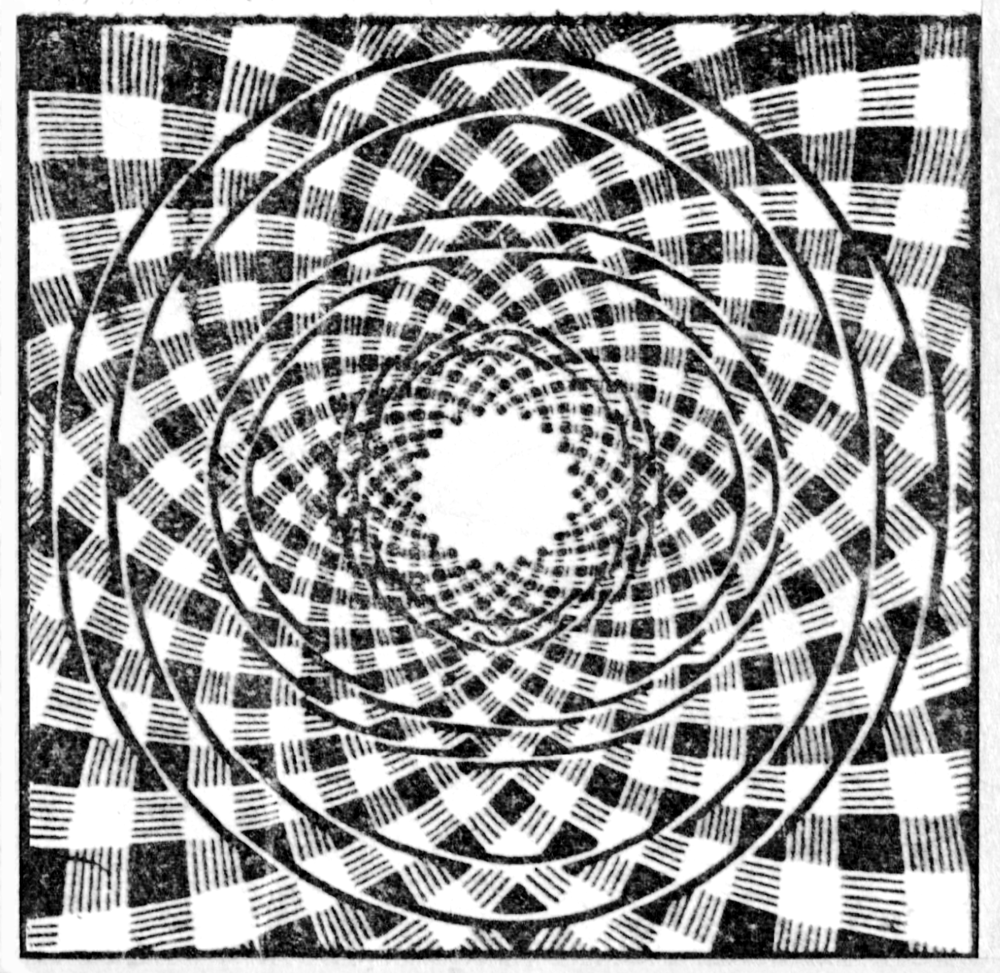

# Ms-135

### [1v\[1\]](https://cdn.wittgensteinnachlass.com/2000px/webp/Ms-135/1v.webp)

12.07.1947

Must one, in order to recognize the analogous structure of two mathematical expressions, see them in a certain way? Or is it correct to say: to see the expression _in this way_ helps to recognize the similarity? This sounds very suspicious! And can one not say: “I suddenly saw the expression _like this_ – so phrased – and then I noticed the similarity with …”?

### [1v\[2\]](https://cdn.wittgensteinnachlass.com/2000px/webp/Ms-135/1v.webp)

This _seeing it as it is_ sometimes seems to be a sense impression, sometimes a _readiness_ to do this and that. Only _experience_ could teach that really, this _seeing it in this way_ is conducive to this action.

### [1v\[3\]](https://cdn.wittgensteinnachlass.com/2000px/webp/Ms-135/1v.webp),[2r\[1\]](https://cdn.wittgensteinnachlass.com/2000px/webp/Ms-135/2r.webp)

One must bear in mind that this _seeing it in this way_ can have a similar effect to changing what is seen, e.g. by placing parentheses, underlining, grouping it in one way or another, etc., and that this _seeing it in this way_ in this way is similar to imagining. No one will deny that underlining, placing parentheses, can be conducive to recognizing a similarity.

### [2r\[2\]](https://cdn.wittgensteinnachlass.com/2000px/webp/Ms-135/2r.webp)

It is clear that only the one who sees the ambiguous image as a rabbit will be able to imitate the rabbit’s facial expression. So, if one sees the image in _this_ way, it will enable him to judge a certain similarity.

### [2r\[3\]](https://cdn.wittgensteinnachlass.com/2000px/webp/Ms-135/2r.webp),[2v\[1\]](https://cdn.wittgensteinnachlass.com/2000px/webp/Ms-135/2v.webp)

One will also only be able to properly estimate certain dimensions if one sees the image in _this_ way.

### [2v\[2\]](https://cdn.wittgensteinnachlass.com/2000px/webp/Ms-135/2v.webp)

And yet, something essential is still missing from my whole consideration, something fundamental. I am still seeing something under a false schema.

### [2v\[3\]](https://cdn.wittgensteinnachlass.com/2000px/webp/Ms-135/2v.webp),[3r\[1\]](https://cdn.wittgensteinnachlass.com/2000px/webp/Ms-135/3r.webp)

There is no reason to assume that a group of ordinary people can achieve the same, i.e. produce the same effects that _one_ unusual person can produce. This does not only mean that a number of mediocre composers could not have written the Well-Tempered Clavier, but there is no reason to assume that it could be a far-reaching historical event that had _one_ man at its center, just as it could be caused by a mass of very ordinary people without an extraordinary leader. It is not at all clear that a concentration of great energy in _one_ person is necessary to generate a large, widespread effect. To assume this from the outset is a stupidity that no scientist could allow in his science.

### [3r\[2\]](https://cdn.wittgensteinnachlass.com/2000px/webp/Ms-135/3r.webp)

_This_ description suddenly seems to fit, then _that_ one! – But is that not only because right now, this is in some sense there, then that? In some sense. – One could, of course, also say: Now it is _like this_, now _like that_. But what is meant by that can only be shown by its further use.

### [3r\[3\]](https://cdn.wittgensteinnachlass.com/2000px/webp/Ms-135/3r.webp),[3v\[1\]](https://cdn.wittgensteinnachlass.com/2000px/webp/Ms-135/3v.webp)

“I see this figure now _like this_, now _like that_.” “Now belonging to _this_ system, now to _that_.” “Now belonging to this order, now to that.

### [3v\[2\]](https://cdn.wittgensteinnachlass.com/2000px/webp/Ms-135/3v.webp)

And what if all this were madness?! What distinguishes it from that?

### [3v\[3\]](https://cdn.wittgensteinnachlass.com/2000px/webp/Ms-135/3v.webp),[4r\[1\]](https://cdn.wittgensteinnachlass.com/2000px/webp/Ms-135/4r.webp)

Seeing the ‘chessboard’ once _like this_, once _like that_, apparently has very little importance. And yet one would like to believe that it must be of the greatest importance. – The fact that one can _grasp_ the chessboard in this way and that way is obviously of the greatest importance. (Mathematics is based on this ability.) But is _grasping it in this way_ and _seeing it in this way_ the same thing? Must the one who can grasp it in this way also be able to see it in this way? Or does the ability to see it in this way favor the ability to grasp it in this way as much as the existence of maps favors the development of geography? Descriptive geometry.

### [4r\[2\]](https://cdn.wittgensteinnachlass.com/2000px/webp/Ms-135/4r.webp)

But have I ever heard a mathematician say that this ability to see it in this way is an important qualification of the mathematician? Have I ever heard one of them talk about it? Am I not laboring under a misunderstanding here?

### [4r\[3\]](https://cdn.wittgensteinnachlass.com/2000px/webp/Ms-135/4r.webp)

13.07.1947

One could, of course, count the ability to see it in this way as imagination, and that probably belongs to the equipment of the mathematician.

### [4r\[4\]](https://cdn.wittgensteinnachlass.com/2000px/webp/Ms-135/4r.webp),[4v\[1\]](https://cdn.wittgensteinnachlass.com/2000px/webp/Ms-135/4v.webp)

Think, a mathematical expression is given to me & I now write it anew with new parentheses, etc., with new organization. – Was it, on the other hand, necessary that I first see the old expression differently? It could have happened that I looked at the old expression & said “Now I see it in a new way”, & now I write it with new organization. But it didn't have to happen that way.

### [4v\[2\]](https://cdn.wittgensteinnachlass.com/2000px/webp/Ms-135/4v.webp)

Could there not be people who cannot do arithmetic in their heads and cannot learn quietly, but who are otherwise very intelligent people and in no sense ‘feeble-minded’?

### [4v\[3\]](https://cdn.wittgensteinnachlass.com/2000px/webp/Ms-135/4v.webp)

For this kind of seeing has much in common with mental arithmetic in its application.

### [4v\[4\]](https://cdn.wittgensteinnachlass.com/2000px/webp/Ms-135/4v.webp),[5r\[1\]](https://cdn.wittgensteinnachlass.com/2000px/webp/Ms-135/5r.webp)

One might say, “I see something quite different each time.” How can that not be of the greatest importance? For example, I see how this chessboard can be put together from different parts. I make a kind of geometrical discoveries of the greatest importance.

### [5r\[2\]](https://cdn.wittgensteinnachlass.com/2000px/webp/Ms-135/5r.webp)

Consider that one can say: “You must hear this melody _in this way_, and then also _play_ it accordingly.”

### [5r\[3\]](https://cdn.wittgensteinnachlass.com/2000px/webp/Ms-135/5r.webp)

Imagine, for example, that someone says, “Now I see a new kind of composition!” – _Then_ he proceeds to explain it. This situation is similar to the situation “Now I know what to do!”

### [5r\[4\]](https://cdn.wittgensteinnachlass.com/2000px/webp/Ms-135/5r.webp),[5v\[1\]](https://cdn.wittgensteinnachlass.com/2000px/webp/Ms-135/5v.webp)

And yet, discovering a new kind of composition is not always associated with seeing this composition, and _if_ it is associated with seeing a particular aspect, it is not necessarily always associated with seeing the same aspect.

### [5v\[2\]](https://cdn.wittgensteinnachlass.com/2000px/webp/Ms-135/5v.webp)

I believe that one often evokes an aspect by a movement of the eyes, by a movement of the gaze.

### [5v\[3\]](https://cdn.wittgensteinnachlass.com/2000px/webp/Ms-135/5v.webp)

But how strange! one might say – if one can discover a kind of composition, how is it possible to also _see_ it?! – How is it possible to know, in one fell swoop, what one wants to say? Is this not equally remarkable?

### [5v\[4\]](https://cdn.wittgensteinnachlass.com/2000px/webp/Ms-135/5v.webp),[6r\[1\]](https://cdn.wittgensteinnachlass.com/2000px/webp/Ms-135/6r.webp)

Suppose I do not have the ability to see aspects, but another person does, and makes corresponding statements: What would I think of them, what could I do with them? I might consider them to be a kind of hallucination; but that would not prevent me from making use of this phenomenon if it can be used. And if it is useful for the other person, it can be useful for me through him.

### [6r\[2\]](https://cdn.wittgensteinnachlass.com/2000px/webp/Ms-135/6r.webp)

Is the appearance of the aspect stranger than my memory of a particular, real person of whom I have a memory-image? Yes, there is even a similarity between the two. For one also asks here: How is it _possible_ that I have a mental image of _him_, and there is no doubt that it is _his_ image?

### [6r\[3\]](https://cdn.wittgensteinnachlass.com/2000px/webp/Ms-135/6r.webp)

14.07.1947

Could the aspect be created by a modification of the image? – The modified image could, after all, be seen _in this way_, or _in that way_. And yet, this is not _quite_ right; for otherwise one could not hear a theme _in this way_ and play it accordingly.

### [6v\[1\]](https://cdn.wittgensteinnachlass.com/2000px/webp/Ms-135/6v.webp)

I am actually a scholar too; only my scholarship has been accumulated not by much reading, but by thinking.

### [6v\[2\]](https://cdn.wittgensteinnachlass.com/2000px/webp/Ms-135/6v.webp)

How can one see something in the way one understands it? One would think that an aspect could only be _favorable_ to an understanding, not that the understanding is the only possible expression of the aspect. (Here lies the analogy with the mental image of a particular person.)

### [6v\[3\]](https://cdn.wittgensteinnachlass.com/2000px/webp/Ms-135/6v.webp)

Philosophy often resolves a difficulty only by saying: “There is as little difficulty _here_ as _there_.”

### [7r\[1\]](https://cdn.wittgensteinnachlass.com/2000px/webp/Ms-135/7r.webp)

That is, it conjures up a problem where there was none.

### [7r\[2\]](https://cdn.wittgensteinnachlass.com/2000px/webp/Ms-135/7r.webp)

It says: “Isn’t it rather strange that…” and leaves it at that.

### [7r\[3\]](https://cdn.wittgensteinnachlass.com/2000px/webp/Ms-135/7r.webp)

What is the use of the command, “Take it _in this way_!”?

### [7r\[4\]](https://cdn.wittgensteinnachlass.com/2000px/webp/Ms-135/7r.webp)

One says, for example: “You will remember it more easily if you understand it _in this way_.”

### [7r\[5\]](https://cdn.wittgensteinnachlass.com/2000px/webp/Ms-135/7r.webp)

How does one comply with the command? But by now treating the object in this way (and so). By describing it in this order, drawing it, etc. etc.

### [7r\[6\]](https://cdn.wittgensteinnachlass.com/2000px/webp/Ms-135/7r.webp),[7v\[1\]](https://cdn.wittgensteinnachlass.com/2000px/webp/Ms-135/7v.webp)

How does one comply with the command, “Imagine N.N.”? How does one know that the command has been obeyed? How does one know that one has obeyed it? What is the use of the _state_ of the imagination here? – I want to say, it is similar to seeing an aspect.

### [7v\[2\]](https://cdn.wittgensteinnachlass.com/2000px/webp/Ms-135/7v.webp)

Again and again we come to elementary words, such as “_state_”, but we forget that we must also examine _their_ application.

### [VB](/w-vb/#ms-135-7v.3+8r.1) [7v\[3\]](https://cdn.wittgensteinnachlass.com/2000px/webp/Ms-135/7v.webp),[8r\[1\]](https://cdn.wittgensteinnachlass.com/2000px/webp/Ms-135/8r.webp) {#7v38r1}

It could be that science & industry, & their progress, are the most enduring aspects of the world today. That any speculation about a collapse of science & industry is, for the time being, & for a long time, merely a dream, & that science & industry will continue to unite the world, with infinite pain, I mean, to consolidate it into a single realm, in which, of course, everything will dwell more peacefully than before. For science & industry do, after all, determine the wars, or so it seems.

### [8r\[2\]](https://cdn.wittgensteinnachlass.com/2000px/webp/Ms-135/8r.webp)

What do I know about the constancy of its state, & thus, about my own?

### [8r\[3\]](https://cdn.wittgensteinnachlass.com/2000px/webp/Ms-135/8r.webp)

I see it (the chessboard) now in this way. It is as if you had given me this schematic drawing. For example:

or

.

### [8r\[4\]](https://cdn.wittgensteinnachlass.com/2000px/webp/Ms-135/8r.webp),[8v\[1\]](https://cdn.wittgensteinnachlass.com/2000px/webp/Ms-135/8v.webp)

The figure, as I see it, is not uniquely determined. Imagine a triangle in a film moving around

the point, depicted, & then coming to rest. & now it could be that this temporal environment affects the finally resting image, as if it were “hanging.” I would say. “But doesn’t anything correspond to that?” Of course! But that only means that I am not lying, & that the expression of the aspect has a use. You must always ask, “What application?”

### [8v\[2\]](https://cdn.wittgensteinnachlass.com/2000px/webp/Ms-135/8v.webp)

Suppose one said instead of “I see the drawing now in this way”: “It seems to me that I see it now in this way,” leaving open the possibility of any illusion. This would not diminish the power of the expression; & now it would apparently be a question of what to do with it.

### [8v\[3\]](https://cdn.wittgensteinnachlass.com/2000px/webp/Ms-135/8v.webp)

It does seem strange that a state of consciousness coincides with a readiness.

### [8v\[4\]](https://cdn.wittgensteinnachlass.com/2000px/webp/Ms-135/8v.webp),[9r\[1\]](https://cdn.wittgensteinnachlass.com/2000px/webp/Ms-135/9r.webp)

Imagine the permanent state as an illusion! & what remains is the predisposition to a certain expression.

### [9r\[2\]](https://cdn.wittgensteinnachlass.com/2000px/webp/Ms-135/9r.webp)

One always wants to make use of experience, the private, as an object. Therefore, one always wants to visualize it. To have it before one’s eyes. And that is where we make the mistake.

### [9r\[3\]](https://cdn.wittgensteinnachlass.com/2000px/webp/Ms-135/9r.webp)

15.07.1947

One always wants to treat experience, the private, as an object to which our description applies.

### [9r\[4\]](https://cdn.wittgensteinnachlass.com/2000px/webp/Ms-135/9r.webp),[9v\[1\]](https://cdn.wittgensteinnachlass.com/2000px/webp/Ms-135/9v.webp)

One could regard the chessboard drawing as a technical drawing according to which pieces are to be manufactured that form the chessboard. This drawing can be used in different ways; & it can also be seen in different ways, corresponding to such uses.

### [9v\[2\]](https://cdn.wittgensteinnachlass.com/2000px/webp/Ms-135/9v.webp)

Suppose one explained it in such a way that the aspect arises from various images & memories superimposed on the visual image. Of course, I am not interested in this explanation as an explanation, but as a logical possibility, i.e., conceptually (mathematically).

### [9v\[3\]](https://cdn.wittgensteinnachlass.com/2000px/webp/Ms-135/9v.webp),[10r\[1\]](https://cdn.wittgensteinnachlass.com/2000px/webp/Ms-135/10r.webp)

“It is not only a green shape present (& with genuine duration), but _leaves_.” “When one imagines a room, one does not only imagine a visual image, an arrangement of colors in space, – but a _room_, & _this_ endures in one’s imagination.”

“The green that I see there is _leaf-like_. These things there are _eye-like_.” (Which things are they?)

### [10r\[2\]](https://cdn.wittgensteinnachlass.com/2000px/webp/Ms-135/10r.webp)

How can something be the picture of ramparts, i.e., be seen as such?

### [10r\[3\]](https://cdn.wittgensteinnachlass.com/2000px/webp/Ms-135/10r.webp)

It seems that here the object of seeing is what cannot be an object of seeing. As if one said, one sees sounds. (But one does, in fact, say that a vowel has this color.)

### [10r\[4\]](https://cdn.wittgensteinnachlass.com/2000px/webp/Ms-135/10r.webp)

I see, in one sense, this:

or this:

although, in another sense, I see the same thing in both cases.

### [10r\[5\]](https://cdn.wittgensteinnachlass.com/2000px/webp/Ms-135/10r.webp)

It is only here that something is fundamentally unclear in the use of the word “I see.”

### [10v\[1\]](https://cdn.wittgensteinnachlass.com/2000px/webp/Ms-135/10v.webp)

How could association be a permanent state? How could I associate ramparts with these lines for five minutes?

### [10v\[2\]](https://cdn.wittgensteinnachlass.com/2000px/webp/Ms-135/10v.webp)

I want to say: “What I see now is _that_, it is composed in such & such a way. – Well, why shouldn’t I say it? After all, I _do_ use objects in the description? – But I want to say: “I _see_ objects.” “Each time I have something different _in front of me_!” _Good!_ but _what_? And now the description that fits here follows. On the one hand, it is done through a drawing, on the other hand, through words & images.

### [10v\[3\]](https://cdn.wittgensteinnachlass.com/2000px/webp/Ms-135/10v.webp),[11r\[1\]](https://cdn.wittgensteinnachlass.com/2000px/webp/Ms-135/11r.webp)

After all, I see this as a shoe! And now one would like to grasp the shoe-like quality, to demonstrate it, to highlight it, the object of seeing.

### [11r\[2\]](https://cdn.wittgensteinnachlass.com/2000px/webp/Ms-135/11r.webp)

The solution, of course, is not: “One can also really _see_ such things, such objects” – but: The word “to see” has a use that does not follow the schema we have assumed.

### [11r\[3\]](https://cdn.wittgensteinnachlass.com/2000px/webp/Ms-135/11r.webp)

It is false comparisons that give rise to the question “How can one…?” “How is it possible…?” ‘The misunderstanding of our logic of language!’

### [11r\[4\]](https://cdn.wittgensteinnachlass.com/2000px/webp/Ms-135/11r.webp),[11v\[1\]](https://cdn.wittgensteinnachlass.com/2000px/webp/Ms-135/11v.webp)

Just as one can see the ambiguous drawing as the head of a rabbit or a duck, so one can see any line as anything imaginable.

For example, as the outline of a head, or as a hook, etc. etc.

### [11v\[2\]](https://cdn.wittgensteinnachlass.com/2000px/webp/Ms-135/11v.webp)

Now, how does it all look from the third person’s point of view? And what applies to the third person also applies to the first, however strange that may seem.

### [11v\[3\]](https://cdn.wittgensteinnachlass.com/2000px/webp/Ms-135/11v.webp)

16.07.1947

What convinces me that the other person sees a normal picture in three dimensions? – That he says so? Nonsense – how do I know what he means by this statement?

### [11v\[4\]](https://cdn.wittgensteinnachlass.com/2000px/webp/Ms-135/11v.webp)

Now, that he is familiar with it; he uses the expressions on the picture that he applies to space; he behaves in front of a landscape picture as he would in front of a landscape, etc. etc.

### [VB](/w-vb/#ms-135-12r.1) [12r\[1\]](https://cdn.wittgensteinnachlass.com/2000px/webp/Ms-135/12r.webp) {#12r1}

Don’t be concerned with what you, supposedly, do alone!

### [12r\[2\]](https://cdn.wittgensteinnachlass.com/2000px/webp/Ms-135/12r.webp)

I cannot know from him whether he really sees. Well, then I cannot know it of myself either. For how do I know that I now call the same thing by the same name as I did before, and that I call the same thing “the same”?

### [12r\[3\]](https://cdn.wittgensteinnachlass.com/2000px/webp/Ms-135/12r.webp)

“My visual image organizes itself: a square and a star form in the middle (etc.). At other times, a homogeneous mass of fields forms, etc. etc.”

### [12r\[4\]](https://cdn.wittgensteinnachlass.com/2000px/webp/Ms-135/12r.webp),[12v\[1\]](https://cdn.wittgensteinnachlass.com/2000px/webp/Ms-135/12v.webp)

Imagine we explained the different aspects through different “charges” of the parts of the retinal image (or something similar). Would such an (or any) explanation solve our problem? Our problem concerns the _grammar_ of perception.

### [12v\[2\]](https://cdn.wittgensteinnachlass.com/2000px/webp/Ms-135/12v.webp),[13r\[1\]](https://cdn.wittgensteinnachlass.com/2000px/webp/Ms-135/13r.webp)

Imagine a physiological explanation for the fact that _I_ see _one_ (A) as a variation of _the other_ (B). It could turn out that when _I_ see A as B, certain processes take place on my retina that would otherwise occur when I really see B. And this could now explain many things in my behaviour. One could, for example, say that when I see A as B, I behave more easily as if I were seeing B than I usually do when I see A, but not as B. But this explanation of my behaviour is superfluous for us. I take behaviour just as much into account as a process on the retina, or in the brain. I want to say: the physiological explanation is initially apparently a help, but then turns out to be just a catalyst for thoughts. I only introduce it in order to get rid of it immediately.

### [13r\[2\]](https://cdn.wittgensteinnachlass.com/2000px/webp/Ms-135/13r.webp)

I see the same thing both times, and yet I do not see exactly the same thing both times.

### [13r\[3\]](https://cdn.wittgensteinnachlass.com/2000px/webp/Ms-135/13r.webp),[13v\[1\]](https://cdn.wittgensteinnachlass.com/2000px/webp/Ms-135/13v.webp)

Why does one in a geometrical drawing draw certain lines thickly, others thinly, others in dotted lines, etc.? To make the overview easier. That is, to make it easier for me to act according to the drawing. Now, one can achieve the same thing by telling one: “You must see the drawing in this way…” and then one gives an explanation.

### [13v\[2\]](https://cdn.wittgensteinnachlass.com/2000px/webp/Ms-135/13v.webp)

And what is “in him” is of similar importance to mental arithmetic.

### [13v\[3\]](https://cdn.wittgensteinnachlass.com/2000px/webp/Ms-135/13v.webp),[14r\[1\]](https://cdn.wittgensteinnachlass.com/2000px/webp/Ms-135/14r.webp)

Imagine someone tells us that he always sees a chessboard as a _star_. And now he explains to us a complicated star ornament. – How would it show that he means this in the usual sense? that he understands what we mean by such words? Or imagine someone says that the ornament changes for him again and again; and now he gives us a long series of aspects that the chessboard takes on for him; and in doing so he uses it exactly as everyone else does. Wouldn’t we think that these useless aspects must distract his attention from what he is doing (e.g. playing chess)? But why shouldn’t these games of aspect actually give the activity a _stimulus_? That, too, would be possible, but the doing would somehow be linked with the aspect.

### [14r\[2\]](https://cdn.wittgensteinnachlass.com/2000px/webp/Ms-135/14r.webp)

I am still rambling around the problem.

### [14r\[3\]](https://cdn.wittgensteinnachlass.com/2000px/webp/Ms-135/14r.webp),[14v\[1\]](https://cdn.wittgensteinnachlass.com/2000px/webp/Ms-135/14v.webp)

That is, I am concerned with all sorts of things that I should not be concerned with in the end. Because the solution must spare me all of this.

### [14v\[2\]](https://cdn.wittgensteinnachlass.com/2000px/webp/Ms-135/14v.webp)

Suppose the physiological explanation explained the talk of aspect as a _mistake_. The physiologist would say: “That is why people _think_ they see the chessboard _as_ this ornament. – Wouldn’t such an explanation also do the trick? Wouldn’t it suffice? (“That is why people _think_ a vowel is yellow…”)

### [14v\[3\]](https://cdn.wittgensteinnachlass.com/2000px/webp/Ms-135/14v.webp)

The physiological explanation has the advantage that it distracts our attention from the private object of seeing.

### [14v\[4\]](https://cdn.wittgensteinnachlass.com/2000px/webp/Ms-135/14v.webp),[15r\[1\]](https://cdn.wittgensteinnachlass.com/2000px/webp/Ms-135/15r.webp)

Don’t even think that you know in advance what state of consciousness means in this case! Let the meaning be _taught_ to you by the use.

### [15r\[2\]](https://cdn.wittgensteinnachlass.com/2000px/webp/Ms-135/15r.webp)

Could I have explained the phenomenon of imagination? If one were told that someone with open eyes sees something that is not in front of him, and at the same time something that is in front of him, and that the two visual objects do not interfere with each other?!

### [15r\[3\]](https://cdn.wittgensteinnachlass.com/2000px/webp/Ms-135/15r.webp)

And it would, of course, be quite wrong to say: “And yet the strange thing happens” or “the unbelievable thing.” Rather, what happens is _not_ strange, and is only wrongly seen as strange!

### [15r\[4\]](https://cdn.wittgensteinnachlass.com/2000px/webp/Ms-135/15r.webp),[15v\[1\]](https://cdn.wittgensteinnachlass.com/2000px/webp/Ms-135/15v.webp)

The old view of the role of _intuition_ in mathematics. Isn’t this intuition just seeing the complexes in different aspects?

### [15v\[2\]](https://cdn.wittgensteinnachlass.com/2000px/webp/Ms-135/15v.webp)

_Must_ the painter of a fantasy landscape see it before his inner eye before he paints it? Can’t he perhaps just _paint_ it? And isn’t it also possible that he sees it in his imagination before he paints it, and perhaps even says so? But isn’t it also possible that he says the opposite? _Must_ the mathematician see the expression, in this separated way, before he uses it in this way, writes it down? And can’t he also see it in that way, and perhaps even say so?

### [15v\[3\]](https://cdn.wittgensteinnachlass.com/2000px/webp/Ms-135/15v.webp),[16r\[1\]](https://cdn.wittgensteinnachlass.com/2000px/webp/Ms-135/16r.webp)

“I knew how to continue? – I said it, and then acted so and so. But didn’t that state of mind also exist? Which one? I only know how I _named_ it. – But it was not something that I named in that way. The words had a different use!

### [16r\[2\]](https://cdn.wittgensteinnachlass.com/2000px/webp/Ms-135/16r.webp),[16v\[1\]](https://cdn.wittgensteinnachlass.com/2000px/webp/Ms-135/16v.webp),[16v\[2\]](https://cdn.wittgensteinnachlass.com/2000px/webp/Ms-135/16v.webp)

17.07.1947

Must one not distinguish purely optical aspects from other aspects? That they are very different from each other is clear: for example, the third dimension sometimes appears in their description, sometimes not; sometimes the aspect is a certain ‘grouping’, but if one sees lines as faces, then they are not only visually grouped together; one can see the schematic drawing of a cube as an open box or as a solid body, lying on its side or standing; the figure

can be seen not only in two, but in very many different ways.

### [16v\[3\]](https://cdn.wittgensteinnachlass.com/2000px/webp/Ms-135/16v.webp),[17r\[1\]](https://cdn.wittgensteinnachlass.com/2000px/webp/Ms-135/17r.webp)

One hangs pictures, puts up photographs of landscapes, interiors, people, and uses and looks at them not like working drawings. One likes to look at them, like the objects themselves; one smiles at the photograph, like the person it shows. We do not learn to understand a photograph like a blueprint. – Of course, it would be possible that we first have to learn to understand a type of depiction with effort in order to use it later as a natural picture. This laborious learning would later only be _history_, and we would now look at the picture in the same way as we look at our photographs now.

### [17r\[2\]](https://cdn.wittgensteinnachlass.com/2000px/webp/Ms-135/17r.webp),[17v\[1\]](https://cdn.wittgensteinnachlass.com/2000px/webp/Ms-135/17v.webp)

There could also be people who do not understand photographs as we do, who see them; who understand that a person can be depicted in this way, who could even model him approximately from a photograph, but who do not see the photograph as a picture. _How_ would that manifest itself? What would we consider as a manifestation of that? This may not be easy to say. These people might not enjoy photographs as we do. They would not say “Look how he smiles!” and the like; they would often not immediately recognize a person from the picture; they would have to _learn to read_ the photograph and _read_ it; they would have difficulty recognizing two good shots of the same face as pictures of somewhat different positions.

### [17v\[2\]](https://cdn.wittgensteinnachlass.com/2000px/webp/Ms-135/17v.webp)

Suppose one of the European peoples wrote F like this: “<math display="inline"><mtext>ꟻ</mtext></math>”, and now I ask myself: are they writing it incorrectly, or differently? How could this be decided? Perhaps historically! Without further information, it would not be possible to decide, and the question would not yet have any sense. If someone communicates to me: “I see it as an inverted F”—what can I do with that? I could, for example, say to him: “Then it doesn't look bold or lively or energetic, but rather lame and Philistine,” or: “then it doesn’t match the overall character of the script.” But for me, it could also lose its lame appearance and, as it were, become a completely different letter, which could also look unenergetic again.

### [18r\[1\]](https://cdn.wittgensteinnachlass.com/2000px/webp/Ms-135/18r.webp)

I used to hear the word “Venus” in the same way as “Wall**nut**.” And even now, the ending still retains some of that. In a face, or in expressive prose, the word could acquire a different sound for me, a _Latin_ sound. If I communicated this to someone, he could draw many conclusions from it and do something with it; but it is not immediately clear _what_.

### [18r\[2\]](https://cdn.wittgensteinnachlass.com/2000px/webp/Ms-135/18r.webp),[18v\[1\]](https://cdn.wittgensteinnachlass.com/2000px/webp/Ms-135/18v.webp)

Does it make sense to say, “I see

_constantly_, as an inverted

”?

This does not seem to be possible. If someone communicated this to us, what should we make of it? (James' remark about attention.) Here lies a complete ambiguity. For it seems as if one could then have the aspect in connection with thoughts, with a capability.

### [18v\[2\]](https://cdn.wittgensteinnachlass.com/2000px/webp/Ms-135/18v.webp)

If someone told me that he had seen the figure as an inverted F for half an hour without interruption, I would assume that he had been constantly _thinking_ about it, _engaging_ with it.

### [18v\[3\]](https://cdn.wittgensteinnachlass.com/2000px/webp/Ms-135/18v.webp)

I understand it when someone says, “It is now an inverted F for me,” but _not_ (strangely) when he says, “It is constantly an inverted F for me.”

### [18v\[4\]](https://cdn.wittgensteinnachlass.com/2000px/webp/Ms-135/18v.webp)

It is as if the aspect is something that only flashes, but does not remain stationary; and yet this must be a _conceptual_ remark, not a psychological one.

### [18v\[5\]](https://cdn.wittgensteinnachlass.com/2000px/webp/Ms-135/18v.webp),[19r\[1\]](https://cdn.wittgensteinnachlass.com/2000px/webp/Ms-135/19r.webp)

A figure that I always regarded as _this_ can suddenly become _that_ for me, and then remain that way, but the acute experience of the transition does not consist of two successive phases, the second of which is simply held on to. In the shift, one experiences the second phase acutely (corresponding to, for example, the exclamation “Ah, it is a …!”) and here one is _engaged_ with the aspect. In the chronic sense, it is only the way we treat the figure again and again.

### [19r\[2\]](https://cdn.wittgensteinnachlass.com/2000px/webp/Ms-135/19r.webp)

What do I communicate to someone when I say that I pronounced the word “bank” and meant it in the sense of “bench”? I might say, “Yes, I know that.” But pay attention to the strange use of the words, to the strange _‘communication’_.

### [19v\[1\]](https://cdn.wittgensteinnachlass.com/2000px/webp/Ms-135/19v.webp)

For we must descend to the concept of communication in order to make the situation of these words understandable.

### [19v\[2\]](https://cdn.wittgensteinnachlass.com/2000px/webp/Ms-135/19v.webp)

I keep getting involved in questions that don’t concern me; but I must get involved in them in order to learn how to avoid these entanglements.

### [19v\[3\]](https://cdn.wittgensteinnachlass.com/2000px/webp/Ms-135/19v.webp),[20r\[1\]](https://cdn.wittgensteinnachlass.com/2000px/webp/Ms-135/20r.webp)

18.07.1947

“Thing” & “background” are visual concepts, like red & round – that’s what Köhler wants to say. The description of what is _seen_ includes the indication of what is the thing and what is the background, just as it includes the indication of the color & the form. And the description is just as incomplete if it doesn’t say what is the thing and what is the background, as it is if the color or form is not indicated. I see one thing just as immediately as the other – that’s what one wants to say. And what is there to object to that? First: how can one recognize it; – whether through introspection & whether everyone has to agree about it. Because it is obviously about the description of what is _subjectively seen_. But how does one learn to express the subjective through words? And what can these words mean to us? Suppose instead of words, it were a case of pictorial representation; & to the words “thing-like” & the like, the sequence, the order in which we produce the drawing would correspond in this representation. (I assume we could draw extraordinarily quickly.) And now someone says: “The sequence belongs to the depiction of what is seen just as much as colors & forms.” – What would that mean?

### [20v\[1\]](https://cdn.wittgensteinnachlass.com/2000px/webp/Ms-135/20v.webp)

One could say: there are reasons to include in the pictorial description of what is seen not only the drawn picture, but also the phrasing while drawing. These reactions of the describer somehow belong together. In one respect they belong together, in another they do not.

### [20v\[2\]](https://cdn.wittgensteinnachlass.com/2000px/webp/Ms-135/20v.webp),[21r\[1\]](https://cdn.wittgensteinnachlass.com/2000px/webp/Ms-135/21r.webp)

Köhler thinks ‘in terms of’ processes in the retina & in the nervous system. He says that a contour can be directed to _this_ side, or to the other side, & explains it, for example, through currents that are directed in this way or that way. And as long as one thinks physiologically, then of course, color, form & aspect are on _one_ level. But the physiological processes in seeing are not what we perceive through seeing.

### [21r\[2\]](https://cdn.wittgensteinnachlass.com/2000px/webp/Ms-135/21r.webp)

Let’s say: a visual contour has two unequal sides, one is the positive one, the other the negative one. Why not? – But what is the use of “positive” & “negative” now, how does it show in our behaviour that one side is positive, etc.? How do I know, that is, that the other person calls what I call “positive,” “positive” too? Does the _other_ function of the words “positive” & “negative” play a role in this?

### [21r\[3\]](https://cdn.wittgensteinnachlass.com/2000px/webp/Ms-135/21r.webp),[21v\[1\]](https://cdn.wittgensteinnachlass.com/2000px/webp/Ms-135/21v.webp)

If one thinks of currents in the retina (or the like), one would like to say: “So the aspect is ‘seen’ as well as form & color.” But how could such a hypothesis help us to this conviction? Well, it goes against the tendency to say here that we _see_ two different things. But this tendency must have another basis.

### [21v\[2\]](https://cdn.wittgensteinnachlass.com/2000px/webp/Ms-135/21v.webp)

One often likes to compare an aspect (with) a struck note that fades away.

### [21v\[3\]](https://cdn.wittgensteinnachlass.com/2000px/webp/Ms-135/21v.webp),[22r\[1\]](https://cdn.wittgensteinnachlass.com/2000px/webp/Ms-135/22r.webp)

The figure

could be seen as a face by someone, namely like this:

But if someone said that he always sees it as a face, how would we know that this doesn’t mean that he _takes_ the figure to be the picture of a face? If someone in _our_ sense says that he sees the figure as _that_, mustn’t he also be able to see it differently? Isn’t it essential to our sense that different aspects are possible? Because how else would the aspect differ from what is objective?

### [22r\[2\]](https://cdn.wittgensteinnachlass.com/2000px/webp/Ms-135/22r.webp)

The expression of the aspect is the expression of a conception (therefore a way of treating, a technique); but used as a description of a state.

### [22r\[3\]](https://cdn.wittgensteinnachlass.com/2000px/webp/Ms-135/22r.webp)

If it seems that there is no place for this logical form, then you must look for it in another dimension. If there is no place for it here, then it is in another dimension.

### [22r\[4\]](https://cdn.wittgensteinnachlass.com/2000px/webp/Ms-135/22r.webp),[22v\[1\]](https://cdn.wittgensteinnachlass.com/2000px/webp/Ms-135/22v.webp)

For in this way, one asks: “How _can_ I hear the word “barrel” in a meaning, or in another?” And to say “It is indeed possible – so a prejudice prevented you from seeing it” is completely misleading, just as if one said that mathematics has freed us from the prejudice that our space _must_ be 3-dimensional. For between three dimensions and four dimensions, there is not the difference as between 3 apples and four apples in a box. There is still ‘room for a fourth apple’ but not for a fourth dimension. In this sense, there is also no room for imaginary numbers on the number line. And that means: The application of the concept of an imaginary number is **fundamentally** different from that of a number, for example; more different than the mathematical operations alone reveal. Thus, in order to create space for it, one must descend to its application, and then one finds it in a, so to speak, _unexpected_, different place.

### [23r\[1\]](https://cdn.wittgensteinnachlass.com/2000px/webp/Ms-135/23r.webp)

You must open, unlock, a new dimension of application, of language-games.

### [23r\[2\]](https://cdn.wittgensteinnachlass.com/2000px/webp/Ms-135/23r.webp)

19.07.1947

If this constellation is constantly and continuously before me, then I have not designated an aspect with it. For _that_ would mean that I always _encounter_ it as a face, treat it as a face; while the peculiarity of the aspect is that I see something into a picture. So that one could say: I see something that is not there at all, that is not in the figure, so that it surprises me that I can see it (at least, if I reflect on it later).

### [23r\[3\]](https://cdn.wittgensteinnachlass.com/2000px/webp/Ms-135/23r.webp)

If the seeing of an aspect corresponds to a thought, then it can only be an aspect in a _world_ of thoughts.

### [23v\[1\]](https://cdn.wittgensteinnachlass.com/2000px/webp/Ms-135/23v.webp)

If I describe an aspect, then the description presupposes concepts that do not belong to the description of the figure itself.

### [23v\[2\]](https://cdn.wittgensteinnachlass.com/2000px/webp/Ms-135/23v.webp)

The aspect lives only as long as I keep it alive.

### [23v\[3\]](https://cdn.wittgensteinnachlass.com/2000px/webp/Ms-135/23v.webp)

“I can _see_ this into the form. I look at it in this way. I _do_ something in the process. It is a kind of mental activity.

### [23v\[4\]](https://cdn.wittgensteinnachlass.com/2000px/webp/Ms-135/23v.webp),[24r\[1\]](https://cdn.wittgensteinnachlass.com/2000px/webp/Ms-135/24r.webp)

It is remarkable that one so rarely includes the movement of the gaze in the description of a visual impression? It is hardly ever included, if the object is small, e.g. a face; although even there the gaze is constantly in motion.

### [24r\[2\]](https://cdn.wittgensteinnachlass.com/2000px/webp/Ms-135/24r.webp)

The change of the aspect gives, each time, something like a flashing of an aspect. Just as our face actually twitches, brightens when it occurs. And this occurrence does not have to happen suddenly; it can be forced by longer looking, by interpretation.

Therefore, the aspect cannot be replaced by a changed picture. I mean: therefore, we cannot perceive the aspect again under an aspect, as if it were itself a visual image.

### [24r\[3\]](https://cdn.wittgensteinnachlass.com/2000px/webp/Ms-135/24r.webp),[24v\[1\]](https://cdn.wittgensteinnachlass.com/2000px/webp/Ms-135/24v.webp)

_Looking_ at the figure as … As if one organized the figure with the gaze, as if one felt for it for a certain aspect. As one might, for example, arrange a dress.

### [24v\[2\]](https://cdn.wittgensteinnachlass.com/2000px/webp/Ms-135/24v.webp)

1699 The aspect can suddenly change, and then a new looking follows. One is, for example, conscious of the facial expression, _looks_ at it. [430]

### [24v\[3\]](https://cdn.wittgensteinnachlass.com/2000px/webp/Ms-135/24v.webp)

I can, for example, look at a photograph and engage with the expression of the face, let it, so to speak, sink in, without saying anything to myself or to anyone else.

### [24v\[4\]](https://cdn.wittgensteinnachlass.com/2000px/webp/Ms-135/24v.webp),[25r\[1\]](https://cdn.wittgensteinnachlass.com/2000px/webp/Ms-135/25r.webp)

I let the eyes of the photograph speak to me. I see the picture, perhaps for the first time, as a real face. ‘Engage with the expression’. Don’t ask “What is going on here?”, but “What does one do with this utterance?”.

### [25r\[2\]](https://cdn.wittgensteinnachlass.com/2000px/webp/Ms-135/25r.webp)

20.07.1947

We only become conscious of the aspect in the change. As if one is only aware of the change of key, but does not have absolute pitch.

### [25r\[3\]](https://cdn.wittgensteinnachlass.com/2000px/webp/Ms-135/25r.webp)

I only say this and that, and then see it _like_ this.

### [25r\[4\]](https://cdn.wittgensteinnachlass.com/2000px/webp/Ms-135/25r.webp)

My gaze, my looking, can _in a certain sense_ engage with a figure.

### [25r\[5\]](https://cdn.wittgensteinnachlass.com/2000px/webp/Ms-135/25r.webp)

The conceptual background lives in the sensation, while one is conscious of the aspect. So, one would like to _say_. For these are all _utterances_, not closer descriptions or analyses of the experience.

### [25v\[1\]](https://cdn.wittgensteinnachlass.com/2000px/webp/Ms-135/25v.webp)

As Köhler wants to say, “_This shows_ that…”, I say: it shows absolutely nothing. If one does not recognize the Mediterranean on a map, with a different color scheme, then _this_ does not show that _actually_ a different visual object is present. It could at most provide a plausible reason for a specific _mode of expression_. It is simply not the same thing to say “This shows that there are really two different visual objects” – & “under these circumstances it would be better to talk about two different visual objects”.

### [25v\[2\]](https://cdn.wittgensteinnachlass.com/2000px/webp/Ms-135/25v.webp)

The fact that one can evoke an aspect through thought is extremely important, although it does not solve the main problem.

### [26r\[1\]](https://cdn.wittgensteinnachlass.com/2000px/webp/Ms-135/26r.webp)

Yes, it is as if the aspect is an unarticulated afterglow of a thought.

### [26r\[2\]](https://cdn.wittgensteinnachlass.com/2000px/webp/Ms-135/26r.webp)

As if the thought had a catalog number, a sign that I see when I see the figure.

### [26r\[3\]](https://cdn.wittgensteinnachlass.com/2000px/webp/Ms-135/26r.webp)

Paraphrasing is not an explanation.

### [26r\[4\]](https://cdn.wittgensteinnachlass.com/2000px/webp/Ms-135/26r.webp)

What do I see

when I see this figure once as something standing upright, once as something hanging down? _It seems indescribable_. This _was_ precisely the description. And the comparison with _seeing_ is precisely dangerous. And _that_ is what I should learn from it. Yes, there are analogies here, but also conceptual differences.

### [26r\[5\]](https://cdn.wittgensteinnachlass.com/2000px/webp/Ms-135/26r.webp),[26v\[1\]](https://cdn.wittgensteinnachlass.com/2000px/webp/Ms-135/26v.webp)

Seeing a figure in a certain aspect is comparable to hearing a word in a certain meaning, in so far as it is as if the figure and the word contain the germ of a certain use. However, this does not say anything about the physiological function of this perception. It does not show that, for example, this ‘seeing’ actually makes the application of the figure or the word easier; although experience could show something like that.

### [26v\[2\]](https://cdn.wittgensteinnachlass.com/2000px/webp/Ms-135/26v.webp),[27r\[1\]](https://cdn.wittgensteinnachlass.com/2000px/webp/Ms-135/27r.webp)

I hear two people talking, I don’t understand what they are saying, but I hear the word “bank.” Now I assume they are talking about money. (This may turn out to be correct or incorrect.) Have I then heard the word “bank” in that meaning? On the other hand: someone uses ambiguous words in a game, without any connection; I hear “bank” and I hear it in the meaning of a financial institution. It is almost as if the latter is a useless remnant of the first process.

### [27r\[2\]](https://cdn.wittgensteinnachlass.com/2000px/webp/Ms-135/27r.webp),[27v\[1\]](https://cdn.wittgensteinnachlass.com/2000px/webp/Ms-135/27v.webp)

Why shouldn’t there be a strong tendency to use a certain word in our utterance? And why shouldn’t this word still be misleading when we think about our experience?

I mean: why shouldn’t we want to say “see,” even though the comparison with seeing is somewhat flawed. Why shouldn’t we be impressed by an analogy, to the detriment of all the differences. But one cannot simply refer to the words of the utterance. Physiological consideration only confuses things here. Because it distracts from the logical, conceptual problem.

### [27v\[2\]](https://cdn.wittgensteinnachlass.com/2000px/webp/Ms-135/27v.webp),[28r\[1\]](https://cdn.wittgensteinnachlass.com/2000px/webp/Ms-135/28r.webp)

The confusion in psychology is not (Köhler) explained by the fact that it is a “young science.” Its state is not comparable to that of mechanics, for example, in its early days. Rather, it is more like certain branches of mathematics. There is, on the one hand, a certain experimental method, and on the other hand, conceptual confusion, just as there is conceptual confusion and methods of proof in some parts of mathematics. However, while one can be quite sure in mathematics that a proof will be important, even if it is still misinterpreted, one is not at all sure of the fruitfulness of the experiments in psychology. Rather, there is problematic aspects to it, and experiments that one considers to be the method of solving the problems, even if they completely miss what concerns us.

### [28r\[2\]](https://cdn.wittgensteinnachlass.com/2000px/webp/Ms-135/28r.webp)

It is not the case that we must still be prepared for all sorts of unforeseen discoveries (Köhler) – as if the laws of nature that psychology teaches are still to be treated as provisional. Köhler himself is quite unclear about what nature such discoveries might be. As I said, the difficulty in psychology is most similar to that of the “foundations” of mathematics.

### [28r\[3\]](https://cdn.wittgensteinnachlass.com/2000px/webp/Ms-135/28r.webp),[28v\[1\]](https://cdn.wittgensteinnachlass.com/2000px/webp/Ms-135/28v.webp)

To see the similarity. Is this a kind of homogeneous state? Does the similarity suddenly occur to me; does a new state simply begin here, which can now continue?

### [28v\[2\]](https://cdn.wittgensteinnachlass.com/2000px/webp/Ms-135/28v.webp)

I suddenly see, for example, the similarity between son & father, or I recognize Italy on the map. In what sense do I _see_ something new here: That is to say: in what sense is this conceptually related to seeing a new complex of colors & shapes?

### [28v\[3\]](https://cdn.wittgensteinnachlass.com/2000px/webp/Ms-135/28v.webp)

For example, in a figure, the same shape appears twice in different contexts. I draw the figure correctly, so I have seen the two identical shapes, but I didn't notice the sameness; I didn't _see_ it.

### [28v\[4\]](https://cdn.wittgensteinnachlass.com/2000px/webp/Ms-135/28v.webp),[29r\[1\]](https://cdn.wittgensteinnachlass.com/2000px/webp/Ms-135/29r.webp),[29v\[1\]](https://cdn.wittgensteinnachlass.com/2000px/webp/Ms-135/29v.webp)

21.07.1947

One might be tempted to believe that there is a specific way of pronouncing dates, a specific tone, or something similar. For me, a number like 1854 can have something date-like in itself. One might believe that our experience is that of a certain disposition of the mind, which prepares it for a certain activity, for comparison, i.e., the position of the body before the jump. Here is a very tempting mistake. It is an empirical fact that _this_ position is a frequent, or purposeful, preparation for _this_ activity. But we have not learned that this feeling, this experience, is a purposeful preparation for the use & the application of the figure, the number. Nor has experience taught us that _this_ intention is a preparation for _this_ action. Expressions such as “It is as if the future use was already trembling in the experience,” “It is as if we were already innervating the muscles for this specific activity,” etc., etc., are merely paraphrased _utterances_ of the experience. (As if one said, “The love for … glows in my heart.”) – Here we have, by the way, a hint of the origin of the mythical innervation sensation, which is supposed to constitute the act of will.

### [29v\[2\]](https://cdn.wittgensteinnachlass.com/2000px/webp/Ms-135/29v.webp),[30r\[1\]](https://cdn.wittgensteinnachlass.com/2000px/webp/Ms-135/30r.webp)

“I see in his face the face of his father”? – even if I don’t have this in front of me! “Now I see how similar he looks to…!” and yet I only have the one face in front of me! And it explains nothing to say that I imagine the other face. How do I know that I am imagining the _right_ face? The phenomenon is comparable to the sudden recognition of a person after a long absence. Suddenly, we remember in this face the features of the past! “Do I now suddenly see his face differently?”

### [30r\[2\]](https://cdn.wittgensteinnachlass.com/2000px/webp/Ms-135/30r.webp)

Seeing without eyes. In what case would one say of a person without eyes that he has a visual image?

### [30r\[3\]](https://cdn.wittgensteinnachlass.com/2000px/webp/Ms-135/30r.webp),[30v\[1\]](https://cdn.wittgensteinnachlass.com/2000px/webp/Ms-135/30v.webp)

I say when recognizing: “Now I see it – it is the same features, only…” – and then follows a description of the actual changes. Imagine I say, “The face is rounder than it was” – am I to say that it is a peculiarity of the visual image, of the visual impression, that shows this? Of course, one will say: “No, here a visual image and a memory come together.” But how do these come together? Yes – it is as if two images are being compared here. But two images are not being compared; and even if they were, one would still have to recognize one of them as the face of the past.

### [30v\[2\]](https://cdn.wittgensteinnachlass.com/2000px/webp/Ms-135/30v.webp),[31r\[1\]](https://cdn.wittgensteinnachlass.com/2000px/webp/Ms-135/31r.webp)

“I now recognize his face. What I see seems to have changed.” – In what way has it changed? _What_ do I see now that I didn’t see before? “Well, I now see (suddenly) the old face.” Is that all you can say? What constitutes the old face? “Well, I now see that the cheeks have become more prominent… but the eyes & the mouth are the same.” – But is the _visual impression_ now different from before the recognition? If _he_ has changed, I would like to express that through a changed _image_. Now perhaps through the image of the former face. In _so_ far, I really see something different: what was not previously an image of what was seen is now one.

### [31r\[2\]](https://cdn.wittgensteinnachlass.com/2000px/webp/Ms-135/31r.webp)

I can say: I see that this figure is contained in this one, but I cannot see it in it.

So I can say: This description is probably suitable for this figure, but I cannot _see_ the figure according to this description. And “seeing” here does not mean “recognizing it at a glance.” For it could well be that someone would not be able to see the one figure in the other at first glance, but could, after having recognized the containment of the one in the other in a kind of piecemeal way.

### [31v\[1\]](https://cdn.wittgensteinnachlass.com/2000px/webp/Ms-135/31v.webp)

If I communicate to him by means of the two pictures that one figure is contained in the other, or, I recognize that this is the case, am I not communicating that I _see_ the one in the other? What is the difference between the two communications? (The verbal expression need not differ.)

### [31v\[2\]](https://cdn.wittgensteinnachlass.com/2000px/webp/Ms-135/31v.webp),[32r\[1\]](https://cdn.wittgensteinnachlass.com/2000px/webp/Ms-135/32r.webp)

I cannot see the figure

as a combination of

 &

that are pushed together so that they overlap, so that the middle field is, as it were, counted twice. If someone said that he could see it that way, could I not understand it? Could I believe it? Should I say that this is possible – even if the like has never happened to me? Would I have to say “He just means something different by ‘seeing it that way’ than I do”? – And if I assume it, what would I know now, what could I do with it? (A physiological employment is of course possible again.)

### [32r\[2\]](https://cdn.wittgensteinnachlass.com/2000px/webp/Ms-135/32r.webp)

Here belongs the question: “What would someone communicate to me who said that he could _see_ a regular 50-gon as such? How would one test his statement? What would be accepted as a test?

### [32r\[3\]](https://cdn.wittgensteinnachlass.com/2000px/webp/Ms-135/32r.webp)

It seems to me that it could now be the case that one would accept _nothing_ as confirmation of this statement.

### [32r\[4\]](https://cdn.wittgensteinnachlass.com/2000px/webp/Ms-135/32r.webp)

The first thing one would like to say is that seeing it in this way is a _state_; similar in this respect to imagining, also to seeing an afterimage, etc.

### [32r\[5\]](https://cdn.wittgensteinnachlass.com/2000px/webp/Ms-135/32r.webp),[32v\[1\]](https://cdn.wittgensteinnachlass.com/2000px/webp/Ms-135/32v.webp)

“For me, it is now _this_ ornament.” The “this” must be explained by reference to a _class_ of ornaments. One could, for example, say “They are white stripes on something black.” Yes – there is no other way to explain it. Although one might say: “There must be a simpler expression for what I see!” And perhaps there is. For above all, one could use the expression “protruding.” One can say “These parts protrude.” And now one can imagine a primitive reaction of a person who does not express this in words, but taps on the “protruding” parts with his fingers. But this primitive expression would not yet be _equivalent_ to the verbal expression “white stripe ornament.”

### [33r\[1\]](https://cdn.wittgensteinnachlass.com/2000px/webp/Ms-135/33r.webp)

But it is also _possible_ that a large number of expressions, concepts would be completely synonymous for someone in this case. And should one say in _this_ case that the described aspect is purely optical?

### [33r\[2\]](https://cdn.wittgensteinnachlass.com/2000px/webp/Ms-135/33r.webp)

But the question is, why should the primitive reaction of tapping with one's finger be called an expression of seeing it in this way? One cannot simply call it that. Only if it is combined with other expressions.

### [33r\[3\]](https://cdn.wittgensteinnachlass.com/2000px/webp/Ms-135/33r.webp)

“I see it _like this_” – and now one could also express it through gestures.

### [33r\[4\]](https://cdn.wittgensteinnachlass.com/2000px/webp/Ms-135/33r.webp),[33v\[1\]](https://cdn.wittgensteinnachlass.com/2000px/webp/Ms-135/33v.webp)

Imagine that someone always expresses seeing it in this way through a memory! He says, for example: Now the figure reminds me of a wallpaper that I once saw; now of a tablecloth…” etc. What could I do with _this_ communication?

### [33v\[2\]](https://cdn.wittgensteinnachlass.com/2000px/webp/Ms-135/33v.webp)

I would like to ask: “What do I know about someone who tells me this?

### [33v\[3\]](https://cdn.wittgensteinnachlass.com/2000px/webp/Ms-135/33v.webp)

Can something remind me of the tablecloth for half an hour? Unless I am occupied with this memory.

### [33v\[4\]](https://cdn.wittgensteinnachlass.com/2000px/webp/Ms-135/33v.webp)

22.07.1947

“It seems to me as if I see…” And from this I can, for example, conclude how he will copy the figure. Various “pictures,” “representations,” “copies” of the figure.

### [33v\[5\]](https://cdn.wittgensteinnachlass.com/2000px/webp/Ms-135/33v.webp)

“I know now what it reminds me of,” but I don’t say it yet.

### [34r\[1\]](https://cdn.wittgensteinnachlass.com/2000px/webp/Ms-135/34r.webp)

“When I look at the figure, it’s as if I see an incomplete ornament with white stripes.” So, what is it like when I see an incomplete ornament? What can the other person learn from this? Well, it could inspire me to draw a picture. In this case, seeing the aspect would be similar to an image that has been evoked by the figure. Such seeing could also precede a mathematical discovery. Or the other person might only infer from my statement that I am indulging in a trivial game of imagination.

### [34r\[2\]](https://cdn.wittgensteinnachlass.com/2000px/webp/Ms-135/34r.webp),[34v\[1\]](https://cdn.wittgensteinnachlass.com/2000px/webp/Ms-135/34v.webp)

If it is the case that there is a meaning-experience, but it is something secondary, how can it seem so important? Does this come from the fact that this phenomenon corresponds to a certain primitive interpretation of our grammar (logic of language)? Just as one often imagines that the memory of an event must be a mental image, and indeed such an image sometimes actually exists.

### [34v\[2\]](https://cdn.wittgensteinnachlass.com/2000px/webp/Ms-135/34v.webp),[35r\[1\]](https://cdn.wittgensteinnachlass.com/2000px/webp/Ms-135/35r.webp)

If I call the figure

a black ring & the figure

a white ring, – then it is striking that it is difficult or impossible to see the figure

as an intermingling of a white & black ring. This _could_ be explained by our inability to move the eyes in this or that way; & it might be found that whoever is able to move the eyes in that way obtains that aspect. But if I say “I cannot see the figure in that way,” I do not mean that I cannot move the eyes in that way (even if this were the condition for the occurrence of the aspect).

### [35r\[2\]](https://cdn.wittgensteinnachlass.com/2000px/webp/Ms-135/35r.webp)

If I say that it might be found that whoever can move his eyes in that way perceives that aspect, then the sign of this will be that he _tells_ us that he sees the figure in that way. And what assures us that there is no misunderstanding here, for example? – that he _really_ sees the figure in that way? Is there another criterion here, apart from his assertion? Are we obliged to accept it here?

### [35r\[3\]](https://cdn.wittgensteinnachlass.com/2000px/webp/Ms-135/35r.webp),[35v\[1\]](https://cdn.wittgensteinnachlass.com/2000px/webp/Ms-135/35v.webp)

If, in fact, there is no further use for that assertion, one cannot simply dismiss it, as long as we do not even play the game with it: “Now I see it like this, and you see it like that.” But if physiological connections with the aspects were found, then the statement of an individual that he sees something in a way that no one else can see it could gain significance.

### [35v\[2\]](https://cdn.wittgensteinnachlass.com/2000px/webp/Ms-135/35v.webp)

One could, of course, say of an ornament: “It will only give you pleasure if you see it in this way.”

### [35v\[3\]](https://cdn.wittgensteinnachlass.com/2000px/webp/Ms-135/35v.webp),[36r\[1\]](https://cdn.wittgensteinnachlass.com/2000px/webp/Ms-135/36r.webp)

However blurred my visual image may be, it must nevertheless have _a specific_ blurriness; it must be a specific visual image. Presumably, this means it must be capable of a precise, fitting description, whereby the description itself should have the same vagueness as what is being described. – But now, take a look at the picture & give a description that fits in this sense! This description should actually be a _picture_, a drawing! But here, we are not dealing with a blurred copy of a blurred picture. What we see is unclear in a completely different sense. And I believe that one might lose interest in talking about a private visual object if one thought about this picture more often.

### [36r\[2\]](https://cdn.wittgensteinnachlass.com/2000px/webp/Ms-135/36r.webp)

The depiction that would otherwise be possible is precisely impossible here.

### [36r\[3\]](https://cdn.wittgensteinnachlass.com/2000px/webp/Ms-135/36r.webp),[36v\[1\]](https://cdn.wittgensteinnachlass.com/2000px/webp/Ms-135/36v.webp)

“You must put your money in a bank,” I say to someone, while thinking of a piece of furniture, but I still want to communicate to him that he should put the money in a money bank. Think of the example of the sentence “a b c d e” = “it will not rain today.” But even stranger would be the case in which the words “it will not rain today” in another language successively meant “you should not always talk.” (“Who came?” – “You sang.”) “When I misunderstood the words, did I not have a different experience than that of correct understanding?” ‘Did’ I have to? I could have.

### [36v\[2\]](https://cdn.wittgensteinnachlass.com/2000px/webp/Ms-135/36v.webp)

“I thought of… and not of… when I said these words.” So, were you thinking this while you were speaking?

### [36v\[3\]](https://cdn.wittgensteinnachlass.com/2000px/webp/Ms-135/36v.webp),[37r\[1\]](https://cdn.wittgensteinnachlass.com/2000px/webp/Ms-135/37r.webp)

But isn't it quite possible for us, & not difficult, to use words with one _intention_ & to _mean_ them _privately_ differently? And again, the question is: what am I communicating to someone when I say, “I said that to him with this _intention_, but I thought of _this_ while doing so”?

### [37r\[2\]](https://cdn.wittgensteinnachlass.com/2000px/webp/Ms-135/37r.webp)

Is the fact that the joke “Weiche, Wotan, weiche!” makes us laugh proof that the word “weiche” is always uttered with a specific _experience_, depending on its _meaning_?

### [37r\[3\]](https://cdn.wittgensteinnachlass.com/2000px/webp/Ms-135/37r.webp),[37v\[1\]](https://cdn.wittgensteinnachlass.com/2000px/webp/Ms-135/37v.webp)

If I say, “He sat down on a bench in the park,” it is indeed difficult to think of a money bank while doing so, to imagine one; but this does not prove that one would otherwise have imagined a different kind of bench. It might be easy for us, for example, while speaking, to conjure up certain images that _correspond_ to the speech, & very difficult to conjure up images that contradict the _intention_ or the context of the speech. But that wouldn't prove that we always conjure up images when speaking.

### [37v\[2\]](https://cdn.wittgensteinnachlass.com/2000px/webp/Ms-135/37v.webp)

But it makes sense to speak of a ‘private meaning’ of a sentence as opposed to the intended sense of the sentence for the other person, that is, as opposed to its purpose. And this ‘private meaning’ is _comparable_ to a representation, an illustration during speech.

### [37v\[3\]](https://cdn.wittgensteinnachlass.com/2000px/webp/Ms-135/37v.webp)

Consider possible variations in the meaning of “to intend,” e.g., thinking about the intention, expressing the intention, preparing to carry out the intention.

### [37v\[4\]](https://cdn.wittgensteinnachlass.com/2000px/webp/Ms-135/37v.webp),[38r\[1\]](https://cdn.wittgensteinnachlass.com/2000px/webp/Ms-135/38r.webp)

If one thinks of the wrong _meaning_ for the word “bank,” one imagines it being used in a different context. And one could now say: it is _remarkable_ that this is possible, that it is possible to imagine a different context at once.

### [38r\[2\]](https://cdn.wittgensteinnachlass.com/2000px/webp/Ms-135/38r.webp),[38v\[1\]](https://cdn.wittgensteinnachlass.com/2000px/webp/Ms-135/38v.webp)

If, while philosophizing, I now simply say the sentence “You must put the money in the bank” & mean it in such & such a way, – does that mean that when I utter the sentence, the same thing is happening in me as when I say the sentence to someone on a real occasion in that meaning? What could justify such an assumption? At most, that I say afterward, “I meant the word ‘bank’ now in the meaning ‥‥.” And here we are dealing with a kind of optical illusion! For what justifies me in this statement in practical use is not a process that accompanies the speaking. Although processes can accompany the speaking that indicate this meaning. (The direction of the gaze, for example.)

### [38v\[2\]](https://cdn.wittgensteinnachlass.com/2000px/webp/Ms-135/38v.webp)

23.07.1947

“For me, it is still…”

### [38v\[3\]](https://cdn.wittgensteinnachlass.com/2000px/webp/Ms-135/38v.webp)

The difficulty is in becoming familiar with the concepts of ‘psychological phenomena.’ To move among them without stumbling. To know the paths that lead from one to the other, so that one can move freely in them.

### [38v\[4\]](https://cdn.wittgensteinnachlass.com/2000px/webp/Ms-135/38v.webp),[39r\[1\]](https://cdn.wittgensteinnachlass.com/2000px/webp/Ms-135/39r.webp)

That is, one must _master_ the _kinship_ & differences of the concepts. As one _masters_ the transition from one key to another, modulates from one to the other.

### [39r\[2\]](https://cdn.wittgensteinnachlass.com/2000px/webp/Ms-135/39r.webp)

What is not irreplaceable may belong to everyone.

### [39r\[3\]](https://cdn.wittgensteinnachlass.com/2000px/webp/Ms-135/39r.webp)

Mathematical questions & answers, mathematical problems & their solutions. A comparison of a mathematical problem with the task of translating a sentence, a poem, or a dialogue from one language into another. (A more interesting & far-reaching comparison.)

### [39r\[4\]](https://cdn.wittgensteinnachlass.com/2000px/webp/Ms-135/39r.webp),[39v\[1\]](https://cdn.wittgensteinnachlass.com/2000px/webp/Ms-135/39v.webp)

An age that is constantly preoccupied with explanations of facts cannot firmly grasp a fact unless it also has the explanation for it. (It is as if one could only clearly see a boulder if one knew its origin.)

### [39v\[2\]](https://cdn.wittgensteinnachlass.com/2000px/webp/Ms-135/39v.webp)

“Now I hear that as an afterthought to the first part.” – “You are probably making certain movements, innervating muscles into certain _gestures_, and so on.” That is not what it is about. First, I know nothing about these movements; & even if they were actually observed, that would not solve my problem. I must ignore these possible _explanations_. (Because even _if_ they are true, they don't have to be.)

### [39v\[3\]](https://cdn.wittgensteinnachlass.com/2000px/webp/Ms-135/39v.webp)

“I have now uttered the word ‘bank’ in the _meaning_ ‥‥.” – How do you know that you have done it? How, if you were mistaken, that you uttered it in that _meaning_?

### [40r\[1\]](https://cdn.wittgensteinnachlass.com/2000px/webp/Ms-135/40r.webp)

Whoever says “I have now spoken the word ‘bank’ in _that_ meaning in isolation” is playing a completely different language-game than the one who tells me that he meant _that_ with the word in that report, or instruction, etc. And now, is it essential or inessential that he also uses the word “mean” in the first case? If it is essential, then the first language-game is, as it were, a reflection of the second.

### [40r\[2\]](https://cdn.wittgensteinnachlass.com/2000px/webp/Ms-135/40r.webp)

For example, how the chess game on stage could be called a reflection of an actual chess game.

### [40r\[3\]](https://cdn.wittgensteinnachlass.com/2000px/webp/Ms-135/40r.webp),[40v\[1\]](https://cdn.wittgensteinnachlass.com/2000px/webp/Ms-135/40v.webp)

One could almost say, “I am _dreaming_ that I _meant_ that.”

### [40v\[2\]](https://cdn.wittgensteinnachlass.com/2000px/webp/Ms-135/40v.webp)

Playing chess in imagination with another: both players play in imagination & agree that _this_ one has won, _this_ one has lost. They can then both reproduce the game consistently from memory, write it down, tell it, etc. – Imagine tennis played in this way. It would be possible. Only, of course, it would not be an exercise for the muscles. (Although one could imagine that too.) The important thing is that even in ‘tennis in the imagination’ one could say “I have _succeeded_ in hitting the ball ‥‥․”.

### [40v\[3\]](https://cdn.wittgensteinnachlass.com/2000px/webp/Ms-135/40v.webp),[41r\[1\]](https://cdn.wittgensteinnachlass.com/2000px/webp/Ms-135/41r.webp)

I could dream of a chess game, but the dream may only have shown me one move of the game. Nevertheless, I would have dreamed: I played a game of chess. One would then say, “You didn’t really play it, you just dreamed it.” Why shouldn’t one also say, “You didn’t really mean the word that way, you just dreamed it”?

### [41r\[2\]](https://cdn.wittgensteinnachlass.com/2000px/webp/Ms-135/41r.webp)

In court, for example, the question could be asked how I meant a word, & it can also be concluded from certain facts how I meant it. It is a question of _intention_. But could this other, played “meaning” also have this importance?

### [41r\[3\]](https://cdn.wittgensteinnachlass.com/2000px/webp/Ms-135/41r.webp)

Is an intention & an imagined, fantasized intention the same thing?

### [41r\[4\]](https://cdn.wittgensteinnachlass.com/2000px/webp/Ms-135/41r.webp),[41v\[1\]](https://cdn.wittgensteinnachlass.com/2000px/webp/Ms-135/41v.webp)

We do not want to determine what is going on in the imagined meaning.

### [41v\[2\]](https://cdn.wittgensteinnachlass.com/2000px/webp/Ms-135/41v.webp)

I spoke the word ‥‥ & it is as if what happens when I mean it _that_ way, happened at that moment.

### [41v\[3\]](https://cdn.wittgensteinnachlass.com/2000px/webp/Ms-135/41v.webp),[42r\[1\]](https://cdn.wittgensteinnachlass.com/2000px/webp/Ms-135/42r.webp)

24.07.1947

But what about it – if I read a poem, or expressive prose, especially if I read it aloud, then something happens during the reading that does not happen when, for example, I only skim the lines for information. I can, for example, read a sentence more or less emphatically. I try to get the tone exactly right. In doing so, I often see a picture, as it were an illustration, before me. Yes, I can even give a _word_ a tone that, like a picture, almost highlights its meaning. One could imagine a way of writing in which certain words are represented by picture characters & thus highlighted. Yes, this sometimes happens when we underline a word, or formally place it on a pedestal in the sentence. [… “there lay a _something_ ‥‥”]

### [42r\[2\]](https://cdn.wittgensteinnachlass.com/2000px/webp/Ms-135/42r.webp)

When I pronounce this word while reading expressively, it is, as it were, filled with its meaning. And now one could ask: “How _can_ that be?”

### [42r\[3\]](https://cdn.wittgensteinnachlass.com/2000px/webp/Ms-135/42r.webp)

“How can that be, if meaning is what you believe?” The use of a word cannot fill the word. And now I can answer: My expression was used figuratively. – But the image _forced itself on_ me. _I want to say_: the word was filled with its meaning. How I come to want to say that could perhaps be explained.

### [42v\[1\]](https://cdn.wittgensteinnachlass.com/2000px/webp/Ms-135/42v.webp)

But why shouldn’t I also “_want to say_”: I pronounced the word (in isolation) in _this_ meaning?

### [42v\[2\]](https://cdn.wittgensteinnachlass.com/2000px/webp/Ms-135/42v.webp)

Why should a certain technique of using the words “meaning,” “mean,” & others not lead me to use these words, as it were, in a figurative, improper sense. (Just as I say that the vowel “e” is yellow.) But I do not mean: it is a _mistake_; I did not really pronounce the word in this meaning, but only _imagined_ it. It is not _like that_. I am not just imagining that a chess game is being played in “Nathan” either.

### [VB](/w-vb/#ms-135-43r.1) [43r\[1\]](https://cdn.wittgensteinnachlass.com/2000px/webp/Ms-135/43r.webp) {#43r1}

The circle of my thoughts is probably much narrower than I realize.

### [43r\[2\]](https://cdn.wittgensteinnachlass.com/2000px/webp/Ms-135/43r.webp)

To see one thing as a fragment of another, to hear it. To see a form as an incomplete ornament.

### [43r\[3\]](https://cdn.wittgensteinnachlass.com/2000px/webp/Ms-135/43r.webp)

Every person is named after a disease.

### [43r\[4\]](https://cdn.wittgensteinnachlass.com/2000px/webp/Ms-135/43r.webp),[43v\[1\]](https://cdn.wittgensteinnachlass.com/2000px/webp/Ms-135/43v.webp)

25.07.1947

Thinking ‘in terms’ of physiological processes is extremely dangerous for clarifying the conceptual problems in psychology. Thinking in physiological hypotheses sometimes presents us with false difficulties, sometimes with false solutions. The best cure for this is the thought that we don’t even know whether the people we know actually have a nervous system.

### [43v\[2\]](https://cdn.wittgensteinnachlass.com/2000px/webp/Ms-135/43v.webp)

The case of ‘experienced meaning’ is _related_ to that of seeing a figure as… More than this relatedness, we cannot state that the same thing actually occurs in both cases.

### [43v\[3\]](https://cdn.wittgensteinnachlass.com/2000px/webp/Ms-135/43v.webp)

“If you write your

‘’

like this,

‘’,

— do you mean it as a ‘shifted’

or as a mirror-

?

— Do you _want_ it to look to the right, or to the left? — The second question _obviously_ does not refer to a process that accompanies the writing. In the first question, _one could_ think of such a process.

### [44r\[1\]](https://cdn.wittgensteinnachlass.com/2000px/webp/Ms-135/44r.webp)

“I see that the child wants to touch the dog, but is not quite daring enough.” How can I see that? – Is this description of what is seen on the same level as a description of moving shapes & colors? Is there an _interpretation_ involved? Well, consider that you can also _imitate_ a person who wants to pick something up, but is not daring enough! And what you imitate is behaviour. But you will perhaps only be able to reproduce this behaviour _characteristically_ in a broader context.

### [44r\[2\]](https://cdn.wittgensteinnachlass.com/2000px/webp/Ms-135/44r.webp),[44v\[1\]](https://cdn.wittgensteinnachlass.com/2000px/webp/Ms-135/44v.webp)

One can also say: what this description says will somehow manifest itself in the child’s movement & other behaviour, but also in the circumstances, & in what happened before.

### [44v\[2\]](https://cdn.wittgensteinnachlass.com/2000px/webp/Ms-135/44v.webp)

Should I now say that I actually ‘_see_’ the fear in this behaviour – or the facial **expression**’? Why not? – But this does not deny the differences between the two concepts of perception. A picture of the face could reproduce the facial features very accurately, but not the expression correctly; it could also be that the expression is similar & the features are not well captured. “Similar expression” combines faces in a completely different way than “similar anatomy.”

### [45r\[1\]](https://cdn.wittgensteinnachlass.com/2000px/webp/Ms-135/45r.webp)

The question is, of course, not: “Is it correct to say ‘I _see_ his clever wink’?” What on earth could be right or wrong about that, other than the use of the German language? We will not say either: the naive person is completely right when he says he _sees_ the facial expression!

### [45r\[2\]](https://cdn.wittgensteinnachlass.com/2000px/webp/Ms-135/45r.webp),[45v\[1\]](https://cdn.wittgensteinnachlass.com/2000px/webp/Ms-135/45v.webp),[46r\[1\]](https://cdn.wittgensteinnachlass.com/2000px/webp/Ms-135/46r.webp)

On the other hand, one would like to say: we cannot ‘see’ the expression, the shyness of the behaviour, etc. _in the same sense_ as we see the movement, the shapes & colors. What is that about? (Of course, the question cannot be answered physiologically.) Well, one does say of the movement & also of the dog’s joy that one sees it. If you close your eyes, you cannot see either the one or the other. But if you say that he saw everything that could be _seen_, the one who could reproduce the dog’s movement in some way accurately in a picture, then _he_ would not have to recognize the dog’s joy. If the ideal representation of what is seen is the photographically (metrically) accurate reproduction in the picture, then one could say one wants to say: “I see the movement, & somehow _notice_ the joy.” But consider how we learn to use the word “see.” We certainly say that we see this person, this flower, while our visual image – the colors & shapes – is constantly changing & varies within the widest limits. That is how we use the word “see.” (Don’t think you can find a better use for it (a phenomenological one)!

### [46r\[2\]](https://cdn.wittgensteinnachlass.com/2000px/webp/Ms-135/46r.webp)

When I learn the meaning of “sad” – applied to a face – do I learn it in quite the same way as I learn the meaning of “round” or “red”? No, not quite, but still in a similar way. (After all, I also react differently to the sadness of a face than to its redness.)

### [46r\[3\]](https://cdn.wittgensteinnachlass.com/2000px/webp/Ms-135/46r.webp),[46v\[1\]](https://cdn.wittgensteinnachlass.com/2000px/webp/Ms-135/46v.webp)

“His face was very sad.” – “Did you _see_ it?” – Am I supposed to answer “No, I saw his features and _know_ that they are signs of sadness”? Should I then also say: “I didn’t see the face, but rather certain colors and shapes, and I _know_ that these belong to a human face”? And _which_ colors and shapes did I see? How, if I am unable to answer this question?

### [46v\[2\]](https://cdn.wittgensteinnachlass.com/2000px/webp/Ms-135/46v.webp)

Look at a photograph; ask yourself whether you see only the distribution of darker and lighter areas, or also the facial expression! Ask yourself what you see: Would it be easier to represent it by a description of that distribution of areas, or by a description of a human head? And if you now say of the face that it is smiling, is it easier to describe the corresponding spatial arrangement of the facial features, or to smile yourself?

### [46v\[3\]](https://cdn.wittgensteinnachlass.com/2000px/webp/Ms-135/46v.webp),[47r\[1\]](https://cdn.wittgensteinnachlass.com/2000px/webp/Ms-135/47r.webp)

If someone says: “What I _see_ can only be the distribution of light and dark” – what would he have asserted? Well, he would have isolated an important sense of the word “to see”; by isolating an important sense of the expression “the seen.” This meaning is something like: The seen is what I can reproduce through a portrait of the person being looked at. And this concept is, of course, close to the belief in the retinal image. For this concept of the seen _seems_ to coincide with this: The seen is what can be derived solely from the retinal image.

### [47r\[2\]](https://cdn.wittgensteinnachlass.com/2000px/webp/Ms-135/47r.webp),[47v\[1\]](https://cdn.wittgensteinnachlass.com/2000px/webp/Ms-135/47v.webp)

“The seen is that whose ideal representation would be an exact _image_.” But here one already makes a mistake: – What does one call an exact _depiction_ of the seen? Yes, an exact copy of the photograph, a metrically accurate image, that’s what we understand! – But what would be an exact image of the instantaneous impression? What would you call that?

### [47v\[2\]](https://cdn.wittgensteinnachlass.com/2000px/webp/Ms-135/47v.webp)

“What I _see_ cannot be the expression, because the recognition of the expression depends on my knowledge, my familiarity with human behavior in general.” But isn’t this merely a historical statement?

### [47v\[3\]](https://cdn.wittgensteinnachlass.com/2000px/webp/Ms-135/47v.webp),[48r\[1\]](https://cdn.wittgensteinnachlass.com/2000px/webp/Ms-135/48r.webp)

“I see that the face is smiling at me; it does _this_” – and I imitate it. Do I say something strange now? Or something that is physiologically difficult to grasp? Is it as if I were perceiving a ‘fourth dimension’? Well, yes and no. But it is not strange. From which you may learn that what seems strange to us when philosophizing is not actually strange. We very often call the ordinary strange when philosophizing. We assume that things ought actually to be _so_ – and then the ordinary seems strange to us. We assume that the word ‥‥ ought actually to be used _in this way_ (this use comes to mind as a prototype), and then we find the normal use highly strange.

### [48r\[2\]](https://cdn.wittgensteinnachlass.com/2000px/webp/Ms-135/48r.webp),[48v\[1\]](https://cdn.wittgensteinnachlass.com/2000px/webp/Ms-135/48v.webp)

“What I actually _see_ must be what is brought about in me by the effect of the object.” – What is brought about in me is then something like a depiction, something that one could almost look at again – almost something like a _materialization_. And this materialization is something spatial and must be described entirely in spatial terms. It can indeed smile, but the concept of friendliness does not belong to its representation, but is _foreign_ to it (even if it can serve it).

### [48v\[2\]](https://cdn.wittgensteinnachlass.com/2000px/webp/Ms-135/48v.webp)

“I see that this eye is staring.”

### [48v\[3\]](https://cdn.wittgensteinnachlass.com/2000px/webp/Ms-135/48v.webp)

One might ask: “How _can_ I see the expression?” – “The expression (friendliness, for example) is not the _kind_ of object that I can see!” (It belongs, as it were, in _another part_ of my mind, my brain.)

### [48v\[4\]](https://cdn.wittgensteinnachlass.com/2000px/webp/Ms-135/48v.webp),[49r\[1\]](https://cdn.wittgensteinnachlass.com/2000px/webp/Ms-135/49r.webp)

Who, for example, would be capable of accurately copying this photograph – should one say that he doesn't see everything that I see? And he wouldn't even have to describe the head as a head, or as something spatial; and even if he did, the expression wouldn't have to mean anything to him. And if he now speaks to me, should I say that I see more than the other person? I _could_ say that.

### [49r\[2\]](https://cdn.wittgensteinnachlass.com/2000px/webp/Ms-135/49r.webp)

But a painter can paint an eye that stares; so its staring must be describable through the distribution of colors on the surface. But whoever paints it doesn't have to be able to describe this distribution.

### [49r\[3\]](https://cdn.wittgensteinnachlass.com/2000px/webp/Ms-135/49r.webp)

26.07.1947

“My

should, of course, be a

& not a

.”

_When_ should it be that? While I’m writing it?

### [49r\[4\]](https://cdn.wittgensteinnachlass.com/2000px/webp/Ms-135/49r.webp),[49v\[1\]](https://cdn.wittgensteinnachlass.com/2000px/webp/Ms-135/49v.webp)

If I call the figure

an octagon, then

consists of a white and a black octagon, but I cannot see it as being composed in that way. What does the one who can see it like this have over me? Very little! – It could be that he ‘_understands_’ certain ornaments that I do not understand.

### [49v\[2\]](https://cdn.wittgensteinnachlass.com/2000px/webp/Ms-135/49v.webp)

Understanding a piece of music – understanding a sentence. One says that I do not understand an idiom like a native speaker if I know its sense, but, for example, do not know what kind of people would use it. One says in such a case that I do not know the exact flavor of the word. But if one were to think that one experiences something different when saying the word if one knows this nuance, then this would again be incorrect. But I can, for example, make countless transitions that the other person cannot make. (I hear the word “soft” in answer to the question “Do you prefer hard-boiled eggs, etc.” & I flinch.)

### [50r\[1\]](https://cdn.wittgensteinnachlass.com/2000px/webp/Ms-135/50r.webp)

One would like to say: “The mental life of a person cannot be described; it is so incredibly complicated & full of hardly graspable experiences. For the most part, it is like a brewing of colorful mists, in which every form is only a transition to other forms, to other transitions.” – Yes, take just the visual experience! Your gaze wanders almost incessantly; how could you describe it? – And yet I describe it! – “But this is only a very crude description; it actually describes your experience only in the broadest outlines.” – But isn’t this precisely what I _call_ describing my experience? How do I arrive at the concept of a kind of description that I cannot possibly give?

### [50r\[2\]](https://cdn.wittgensteinnachlass.com/2000px/webp/Ms-135/50r.webp),[50v\[1\]](https://cdn.wittgensteinnachlass.com/2000px/webp/Ms-135/50v.webp)

Imagine you are looking at flowing water. The image of the surface changes constantly. Lights, waves, swirls appear everywhere and disappear. What would I call a ‘precise description’ of this image? I would call nothing that, says one, it cannot be described, so we can reply: you do not know what you would call a description. Because the most accurate photograph, for example, you would not recognize as an accurate depiction of the visual experience. Accuracy does not exist in this language-game. (Namely: like a rook does not exist in the game of draughts.)

### [50v\[2\]](https://cdn.wittgensteinnachlass.com/2000px/webp/Ms-135/50v.webp)

Yes, just look at the figure ‥‥ & describe what you see!

### [50v\[3\]](https://cdn.wittgensteinnachlass.com/2000px/webp/Ms-135/50v.webp)

Does “a sea of stars” describe our impression poorly?

### [51r\[1\]](https://cdn.wittgensteinnachlass.com/2000px/webp/Ms-135/51r.webp)

Look at the figure

& say precisely what you see. Which is the private object of the experience?

### [51r\[2\]](https://cdn.wittgensteinnachlass.com/2000px/webp/Ms-135/51r.webp)

The description of the experience does not describe an object. It can make use of the description of an object. And this object is sometimes the one that one looks at, sometimes (photograph) not. The impression – I would like to say – is not an object.

### [51r\[3\]](https://cdn.wittgensteinnachlass.com/2000px/webp/Ms-135/51r.webp)

The afterimage seen with closed eyes is seen upright or tilted, depending on how we tilt our head!

### [VB](/w-vb/#ms-135-51r.4) [51r\[4\]](https://cdn.wittgensteinnachlass.com/2000px/webp/Ms-135/51r.webp) {#51r4}

The thoughts rise, slowly, like bubbles to the surface.

### [VB](/w-vb/#ms-135-51v.1) [51v\[1\]](https://cdn.wittgensteinnachlass.com/2000px/webp/Ms-135/51v.webp) {#51v1}

Sometimes it is as if one sees a thought, an idea, as a vague point far on the horizon; and then it often comes closer with surprising speed.

### [51v\[2\]](https://cdn.wittgensteinnachlass.com/2000px/webp/Ms-135/51v.webp)

The impression: not an object – in what way not?

### [51v\[3\]](https://cdn.wittgensteinnachlass.com/2000px/webp/Ms-135/51v.webp)

27.07.1947

As little philosophy as I have read: I certainly have not read too little, _rather too much_. I see this when I read a philosophical book: it does not improve my thoughts, it worsens them.

### [VB](/w-vb/#ms-135-51v.4+52r.1) [51v\[4\]](https://cdn.wittgensteinnachlass.com/2000px/webp/Ms-135/51v.webp),[52r\[1\]](https://cdn.wittgensteinnachlass.com/2000px/webp/Ms-135/52r.webp) {#51v452r1}

Where there is bad economics in the state, I believe, bad economics in families is also favored. The worker, who is always ready to argue, will also not educate his children to be orderly.

### [52r\[2\]](https://cdn.wittgensteinnachlass.com/2000px/webp/Ms-135/52r.webp)

We learn to describe objects, & in so doing, in another sense, our sensations.

### [VB](/w-vb/#ms-135-52r.3) [52r\[3\]](https://cdn.wittgensteinnachlass.com/2000px/webp/Ms-135/52r.webp) {#52r3}

May God grant the philosopher insight into what lies before everyone's eyes.

### [52r\[4\]](https://cdn.wittgensteinnachlass.com/2000px/webp/Ms-135/52r.webp)

I look into the eyepiece of an instrument & draw, or paint a picture of what I see. Whoever looks at it can say: “So that is what it looks like,” but also “So that is how it appears to you.” I could call the picture a description of what is being looked at, but also a description of my visual impression.

### [52r\[5\]](https://cdn.wittgensteinnachlass.com/2000px/webp/Ms-135/52r.webp)

“The impression is blurred” – ‘so the object is blurred, which I have.’

### [52r\[6\]](https://cdn.wittgensteinnachlass.com/2000px/webp/Ms-135/52r.webp),[52v\[1\]](https://cdn.wittgensteinnachlass.com/2000px/webp/Ms-135/52v.webp)

One cannot consider the impression; therefore, it is not an object. (Grammatically.) Because one does not consider the object in order to change it. (That is actually what people mean by it: the objects existed ‘independently of us’.)

### [52v\[2\]](https://cdn.wittgensteinnachlass.com/2000px/webp/Ms-135/52v.webp)

“The armchair is the same, whether I look at it or not” – that does not have to be true. People often become embarrassed when one looks at them. “The armchair continues to exist, whether I look at it or not.” That could be an empirical proposition, or it could be understood grammatically. But one can also simply think of the conceptual difference between sense impression & object in this connection.

### [52v\[3\]](https://cdn.wittgensteinnachlass.com/2000px/webp/Ms-135/52v.webp),[53r\[1\]](https://cdn.wittgensteinnachlass.com/2000px/webp/Ms-135/53r.webp)

“The armchair continues to exist, ‥‥․” – The picture is of a thing, an animal, that does not care whether someone is looking at it or not.

### [53r\[2\]](https://cdn.wittgensteinnachlass.com/2000px/webp/Ms-135/53r.webp)

“I can see that the impression of this picture is three-dimensional!” How do I know that the word “three-dimensional” applies to it?! You want to say, “It is so. And that is ‘three-dimensional’.” And one could quite rightly say that, namely if one points to something three-dimensional, a body, when saying the word “so.”

### [53r\[3\]](https://cdn.wittgensteinnachlass.com/2000px/webp/Ms-135/53r.webp),[53v\[1\]](https://cdn.wittgensteinnachlass.com/2000px/webp/Ms-135/53v.webp)

“I can see that the visual impression is three-dimensional”: “I can feel the connection of fear with what is frightening.” (Köhler.) How do we compare our feelings in order to know that we really all feel the same thing?

### [53v\[2\]](https://cdn.wittgensteinnachlass.com/2000px/webp/Ms-135/53v.webp)

“If you want to see my F as it is meant, you must see it in this way: ‥‥․” Can I thus see a letter as you mean it? And do you mean it that way while you are writing it? or also earlier & later?

### [53v\[3\]](https://cdn.wittgensteinnachlass.com/2000px/webp/Ms-135/53v.webp)

28.07.1947

“I have always meant my

as

, but from now on I see it as a

.” Has much changed there?

### [53v\[4\]](https://cdn.wittgensteinnachlass.com/2000px/webp/Ms-135/53v.webp),[54r\[1\]](https://cdn.wittgensteinnachlass.com/2000px/webp/Ms-135/54r.webp)

Nouns in small print at Stephan George. A German noun in small print looks strange; one must read it carefully in order to recognize it. It is supposed to seem new to us, as if we are seeing it for the first time. – But what interests me about that? This, that the impression cannot initially be described more precisely than by words like “odd,” “unfamiliar.” Only later do analyses of the impression follow, as it were. The reaction of recoiling from the strangely written word.

### [54r\[2\]](https://cdn.wittgensteinnachlass.com/2000px/webp/Ms-135/54r.webp),[54v\[1\]](https://cdn.wittgensteinnachlass.com/2000px/webp/Ms-135/54v.webp)

Grillparzer writes that the word “ghost” only makes an impression on him when he sees it printed, not when he hears it. So the “h” has a ghostly effect. One could imagine a writer who, in this way, alters the orthography of words in order to produce certain effects. Now, what is so significant about someone saying that they have a different feeling when reading the word “ghost” than when simply hearing it? It is, for example, an unsettling feeling. He could use words like “strange,” “tomb-like,” “not of this earth,” etc., in his explanation. – I can understand what Grillparzer means! That is, for me too, the word, the written sign, has something ‘unearthly’ about it, or its unearthly meaning is strongly expressed through its spelling. – If one now wants to analyze this _experience_ (as, for example, James would have done), one arrives at nothing, because what intrigues us about it is not that we do not understand its _composition_. And in that sense, it is correct that we must simply accept what the ‘naive’ person says. But that does not solve our problem, that we say: “There really is such an experience, such a feeling.” The question is, how does what we call ‘feeling’ here relate to what we call other things!

### [55r\[1\]](https://cdn.wittgensteinnachlass.com/2000px/webp/Ms-135/55r.webp)

It is not enough to say that one sees the ‘organization’ _just as_ one sees color. It is precisely this “just as” that is false, or means nothing.

### [55r\[2\]](https://cdn.wittgensteinnachlass.com/2000px/webp/Ms-135/55r.webp),[55v\[1\]](https://cdn.wittgensteinnachlass.com/2000px/webp/Ms-135/55v.webp)

We teach someone the meaning of the word “uncanny” by connecting it with a certain behavior in certain situations (but not: by calling the behavior that). He now says in such situations that he feels uncanny; and also: that the word “ghost” has something uncanny about it. – In what sense was the word “uncanny” originally the designation of a feeling? If someone shies away from going into a dark room, – why should I call this and similar things the expression of a feeling?

Because “feeling” does indeed make us think of sensation and sense impression, and these are the objects that our mind has directly before it. (I want to make a logical step here, which is very difficult for me.)

### [55v\[2\]](https://cdn.wittgensteinnachlass.com/2000px/webp/Ms-135/55v.webp)

It is good to say here: “What do I ultimately know about the feelings of others, and what do I _know_ about my own?”

### [VB](/w-vb/#ms-135-55v.3) [55v\[3\]](https://cdn.wittgensteinnachlass.com/2000px/webp/Ms-135/55v.webp) {#55v3}

Life is like a path on a mountain ridge; smooth slopes on the right and left, on which you inevitably slide down in one direction or the other. Again and again I see people sliding down and say “How can a person help themselves!” And _that_ means: “denying free will.” This is the statement that is expressed in this ‘belief.’ But it is not a _scientific_ belief, it has nothing to do with scientific convictions.

### [VB](/w-vb/#ms-135-56r.1) [56r\[1\]](https://cdn.wittgensteinnachlass.com/2000px/webp/Ms-135/56r.webp) {#56r1}

Denying responsibility means not holding people accountable.

### [56r\[2\]](https://cdn.wittgensteinnachlass.com/2000px/webp/Ms-135/56r.webp)

“What do I know about the feelings of others, and what do I _know_ about my own?” means that the experience falls out of consideration _as an object_.

### [56r\[3\]](https://cdn.wittgensteinnachlass.com/2000px/webp/Ms-135/56r.webp)

Imagine the visual experience as a picture represented in the mind of another. How can I now represent smell, taste, and tactile sensations in the same way?

### [56r\[4\]](https://cdn.wittgensteinnachlass.com/2000px/webp/Ms-135/56r.webp)

I don’t feel well, but I don’t quite know why. I am tired; I feel strange in the world. If you are not bound to people by any bond and not bound to God by any bond, then _you_ are a stranger.

### [56r\[5\]](https://cdn.wittgensteinnachlass.com/2000px/webp/Ms-135/56r.webp),[56v\[1\]](https://cdn.wittgensteinnachlass.com/2000px/webp/Ms-135/56v.webp)

29.07.1947

Can anything be stranger than that the _rhythm_ of a sentence is supposed to be important for accurate understanding!

### [56v\[2\]](https://cdn.wittgensteinnachlass.com/2000px/webp/Ms-135/56v.webp)

The sentence speaks, and the language also seems to speak.

### [56v\[3\]](https://cdn.wittgensteinnachlass.com/2000px/webp/Ms-135/56v.webp)

That is, the sentence, even if no one is using it to communicate, and whether it is true or false in this or that case, seems to communicate something to us.

### [56v\[4\]](https://cdn.wittgensteinnachlass.com/2000px/webp/Ms-135/56v.webp)

It is as if it is communicating something to us, both the one who speaks the sentence and the sentence as a mere possibility of communication.

### [56v\[5\]](https://cdn.wittgensteinnachlass.com/2000px/webp/Ms-135/56v.webp),[57r\[1\]](https://cdn.wittgensteinnachlass.com/2000px/webp/Ms-135/57r.webp)

The ‘soulless’ people, who do not have ‘feelings in our sense,’ still use descriptions of impressions. How could one argue to show that these are not descriptions of inner objects, that their use is not that of descriptions of objects?

### [57r\[2\]](https://cdn.wittgensteinnachlass.com/2000px/webp/Ms-135/57r.webp)

It is clear that the descriptions of sensations have the form of descriptions of ‘outer’ objects—with certain deviations. (With a certain vagueness, for example.) Or also: insofar as the description of an impression resembles the description of an object, it is a description of an object of perception. (Therefore, two-eyed seeing should give a philosopher some cause for concern when he wants to talk about the visual object.)

### [57v\[1\]](https://cdn.wittgensteinnachlass.com/2000px/webp/Ms-135/57v.webp)

“Thinking is a puzzling process that we do not yet understand.” And now experiments are carried out. Apparently, without us being consciously aware of what the puzzling nature of thinking consists of for us.

And this misunderstanding runs through all of psychology. It is a conceptual obscurity here, and therefore the feeling of something problematic, plus an experimental method. [It is as if one wanted to determine through chemical experiments what is matter and what is mind.] The experimental method does something; the fact that it does not solve the problem is attributed to the fact that it is still in its infancy.

### [58r\[1\]](https://cdn.wittgensteinnachlass.com/2000px/webp/Ms-135/58r.webp)

What the materialists do not understand is how many different things we call “explanations”; and how many different things there are that one can call “laws of nature.” (And that, for example, not all laws of nature are of a causal kind, laws that experience teaches us.)

### [58r\[2\]](https://cdn.wittgensteinnachlass.com/2000px/webp/Ms-135/58r.webp)

July 30, 1947

Whoever describes a visual impression does not describe the edges of the visual field. Is this an imperfection in our descriptions?

### [58r\[3\]](https://cdn.wittgensteinnachlass.com/2000px/webp/Ms-135/58r.webp),[58v\[1\]](https://cdn.wittgensteinnachlass.com/2000px/webp/Ms-135/58v.webp)

If I close my left eye and then turn my eyes as far as I can to the right, I still see an object ‘out of the corner of my eye’. Yes, I could give an offhand description of my impression. I could also make a drawing of it, and it might show darkness and a dark, fading edge: but only the person who knows in what situation it is to be used could properly understand and use this image. That is, he could also close one eye, look as far to the right as possible, and say that he sees it in the same way, or (also) in this or that modified way.

### [58v\[2\]](https://cdn.wittgensteinnachlass.com/2000px/webp/Ms-135/58v.webp)

Cannot work because of poor sleep and fatigue.

### [58v\[3\]](https://cdn.wittgensteinnachlass.com/2000px/webp/Ms-135/58v.webp),[59r\[1\]](https://cdn.wittgensteinnachlass.com/2000px/webp/Ms-135/59r.webp)

Weierstrass introduces a series of new concepts in order to bring order to the thoughts about differential calculus. And in much the same way, it seems to me, I must also bring order to psychological thinking through new concepts. (The fact that in one case it is a calculus, and in the other it is not, is not important.)

### [59r\[2\]](https://cdn.wittgensteinnachlass.com/2000px/webp/Ms-135/59r.webp)

The fact that we ‘calculate’ with certain concepts and not with others merely shows how different the conceptual tools are (how little reason we have to assume a uniformity).

### [59r\[3\]](https://cdn.wittgensteinnachlass.com/2000px/webp/Ms-135/59r.webp),[59v\[1\]](https://cdn.wittgensteinnachlass.com/2000px/webp/Ms-135/59v.webp)

Connection between ‘mathematical approximation’ and ‘accuracy’ (let us say: a measurement, a construction, etc.). Primitive idea that it is human inadequacy that a straight line without irrational points is not distinguishable from one with irrational points. As if the holes were too small for our eye. Lack of insight into the difference between the concepts. I can tell the carpenter “Make this board 1 foot wide” and also “Make it √2 feet wide”—how must he proceed in these cases? In the second case, he should make the construction:

as accurately as possible. Or “√2” is a law of numerical approximation, and I say to him: “Use it, and make the bed as accurately as possible.

### [59v\[2\]](https://cdn.wittgensteinnachlass.com/2000px/webp/Ms-135/59v.webp),[60r\[1\]](https://cdn.wittgensteinnachlass.com/2000px/webp/Ms-135/60r.webp)

Turing’s ‘machines’. These machines are the people who calculate. And what he says could also be expressed in the form of games. And in particular, the interesting games would be those in which one arrives at nonsensical instructions according to certain rules. I am thinking of games similar to the “racing game.” One would, for example, receive the instruction “Continue in the same way”; if this makes no sense, because one is caught in a circle, then that instruction only makes sense in certain places. (Watson.)

### [60r\[2\]](https://cdn.wittgensteinnachlass.com/2000px/webp/Ms-135/60r.webp),[60v\[1\]](https://cdn.wittgensteinnachlass.com/2000px/webp/Ms-135/60v.webp)

A variant of Cantor’s diagonal proof:

Let v = φ(κ, n) be the form of the rules for the development of decimal fractions. v is the _n_-th decimal place of the _κ_-th development. The rule of the diagonal is then v = φ(n, n) ≡ φ'(n).

It must be proven that φ'n cannot be one of the rules φ(κ, n). Assume it is the 100th. Therefore, the rule for forming

φ'(1) : φ(1,1)

φ'(2) : φ(2,2)

etc., but the rule for forming the 100th place of φ'(n) is φ(100, 100); that is, it only tells us that the 100th place should be equal to itself, and is therefore, for n = 100, _not_ a rule.

### [60v\[2\]](https://cdn.wittgensteinnachlass.com/2000px/webp/Ms-135/60v.webp)

In fact, I have always had the feeling that Cantor’s proof does _two_ things, but only seems to do one.

### [60v\[3\]](https://cdn.wittgensteinnachlass.com/2000px/webp/Ms-135/60v.webp)

The rule of the game is: “Do the same as ‥‥!” – and in the specific case, it now becomes: “Do the same as what you are doing!”

### [60v\[4\]](https://cdn.wittgensteinnachlass.com/2000px/webp/Ms-135/60v.webp),[61r\[1\]](https://cdn.wittgensteinnachlass.com/2000px/webp/Ms-135/61r.webp)

The concept of ‘ordering’ the rational numbers, for example, and the ‘impossibility’ of ordering the irrational numbers in the same way. Compare this with what one calls ‘ordering’ digits. Likewise, the difference between ‘assigning’ a digit or nut to another, and ‘assigning’ all integers to the even numbers; etc. Everywhere, shifts in concepts.

### [61r\[2\]](https://cdn.wittgensteinnachlass.com/2000px/webp/Ms-135/61r.webp)

The language-game “What do you see there?” Answer: a description of the surroundings. It can be correct or incorrect. But even the incorrect statement only has a different, psychological interest. Thus, the sentence can now be subjectively true, even if objectively false. So it seems as if I have seen an object that belongs only to me, the subjective object, of which the subjective visual judgment is precisely the description. Thus, every sense has its external and internal object. – Yes, the description of the subjectively seen is approximately the description of an object.

### [61r\[3\]](https://cdn.wittgensteinnachlass.com/2000px/webp/Ms-135/61r.webp),[61v\[1\]](https://cdn.wittgensteinnachlass.com/2000px/webp/Ms-135/61v.webp)

The description of the subjectively seen is more or less related to the description of an object, but does not function as a description of an object. How does one compare visual sensations? How do I compare my visual sensation with that of another?

### [61v\[2\]](https://cdn.wittgensteinnachlass.com/2000px/webp/Ms-135/61v.webp),[62r\[1\]](https://cdn.wittgensteinnachlass.com/2000px/webp/Ms-135/62r.webp)

July 31, 1947

The human eye does not appear to us as a receiving organ; it does not seem to receive, but to transmit. The ear receives; the eye _looks_. (It sends glances, it flashes, it shines.) With the eye, one can frighten, but not with the ear or the nose. When you look at the eye, you see something emanating from it. You _see_ the eye looking. And what does that prove? That I do not only see shapes and colors, but also relationships that no one would have considered visible? And where does this prejudice against their visibility come from? Are false ideas about the physiological processes of seeing to blame?

### [62r\[2\]](https://cdn.wittgensteinnachlass.com/2000px/webp/Ms-135/62r.webp)

The eye of a small child can only look in a purely receptive way.

### [62r\[3\]](https://cdn.wittgensteinnachlass.com/2000px/webp/Ms-135/62r.webp),[62v\[1\]](https://cdn.wittgensteinnachlass.com/2000px/webp/Ms-135/62v.webp)

“If you only get rid of your physiological prejudices, you will find nothing to object to the fact that the looking of the eye can also be seen.” I also say that I see the look that you give to another. And if someone were to correct me and say that I don’t really see it, I would consider that mere foolishness. On the other hand, with my way of speaking, I have not admitted something, and I contradict the person who tells me that I see the look ‘just’ like the shape and color of the eye. Because ‘naive speech’, i.e., our naive, normal way of speaking, does not contain a theory of seeing – it does not show you a _theory_, but only a _concept_ of seeing.

### [62v\[2\]](https://cdn.wittgensteinnachlass.com/2000px/webp/Ms-135/62v.webp)

And if someone says, “I don’t actually see the looking, but only shapes and colors,” does he contradict the naive way of speaking? Does he say that _he_ was wrong, who said that he had seen my look, seen that this person’s eyes were staring, looking into the void, etc.? Of course not. So what does the purist want to do?

### [62v\[3\]](https://cdn.wittgensteinnachlass.com/2000px/webp/Ms-135/62v.webp)

Does he want to say that it is more correct to use a different word instead of the word “see” here? I think he only wants to draw attention to a distinction between concepts.

### [62v\[4\]](https://cdn.wittgensteinnachlass.com/2000px/webp/Ms-135/62v.webp),[63r\[1\]](https://cdn.wittgensteinnachlass.com/2000px/webp/Ms-135/63r.webp),[63v\[1\]](https://cdn.wittgensteinnachlass.com/2000px/webp/Ms-135/63v.webp)

[1769] How does the word “to see” arrange perceptions together? I mean: it can bring them together as perceptions _with the eye_; for we do not feel seeing _in_ the eye. But actually, the one who insists on the _correctness_ of the usual way of expressing things seems to say: that everything is contained in the visual **impression**; that the _subjective eye_ has both form and color, as well as movement, as expression & gaze (direction outward). That one does not feel the gaze, so to speak, _elsewhere_. But that does not mean: ‘elsewhere than in the eye’, but: elsewhere than in the visual image. But what if it were different? Perhaps like this, that I say: [451] “I see in this eye the & the forms, colors, movements, – that is, it is looking friendly now,” as if I were drawing a conclusion. – One could therefore say: The place of the perceived gaze is the _subjective_ eye, the visual image of the eye, itself.

### [63v\[2\]](https://cdn.wittgensteinnachlass.com/2000px/webp/Ms-135/63v.webp)

[1770] First of all, I can quite easily imagine someone who, although able to see a face with the utmost precision, perhaps even able to draw an accurate portrait of it, does not recognize its smiling expression as a smile. To say that his seeing is deficient seems very odd to me. And to say that his subjective facial object does not smile, even though it has all the colors & forms of mine, is equally (absurd).

### [63v\[3\]](https://cdn.wittgensteinnachlass.com/2000px/webp/Ms-135/63v.webp)

That is to say, here we draw a conceptual boundary (& it has nothing to do with physiological opinions).

### [63v\[4\]](https://cdn.wittgensteinnachlass.com/2000px/webp/Ms-135/63v.webp)

The sheen or the reflection: If a child paints, it will never paint this. It is almost astonishing that they can be represented by ordinary oil or watercolor paints.

### [64r\[1\]](https://cdn.wittgensteinnachlass.com/2000px/webp/Ms-135/64r.webp)

Someone who sees that a person extends their hand to touch something, but refrains from doing so, surely sees, in an important sense, the same thing as someone who can imitate or depict the movement of the hand in all its details, but is unable to interpret it in that way.

### [64r\[2\]](https://cdn.wittgensteinnachlass.com/2000px/webp/Ms-135/64r.webp),[64v\[1\]](https://cdn.wittgensteinnachlass.com/2000px/webp/Ms-135/64v.webp)

08/01/1947

“But _one_ cannot _see_ something like that!” says one person; “One can indeed see it!” says the other. The first person can, of course, give a physiological explanation for his conviction, i.e., give an explanation _for show_. But what he says is more of the nature of: “One cannot _really_ marry money.” He is therefore saying, “There is a difference here!” – even if he cannot provide a convincing explanation for it. – The second person, if he relies on a different physiological theory, is just as much in error. Only when one leaves everything physiological out of the equation, & forgets that seeing is connected with something like that at all, can one assess the similarity & the differences between the concepts of ‘seeing’.

### [64v\[2\]](https://cdn.wittgensteinnachlass.com/2000px/webp/Ms-135/64v.webp),[65r\[1\]](https://cdn.wittgensteinnachlass.com/2000px/webp/Ms-135/65r.webp)

If someone says: the form, the color, the organization, the expression, are, obviously, (for everyone unbiased) properties, features, of the subjectively seen, of the immediate object of vision, – then the word “obviously” betrays him here. “Obviously” it is so because everyone admits it; & he admits it only through linguistic usage. One is therefore justifying a sentence through an _image_.

### [65r\[2\]](https://cdn.wittgensteinnachlass.com/2000px/webp/Ms-135/65r.webp)

If we are all really inclined to use this image, then it has some psychological interest, but it does not replace a conceptual investigation.

### [65v\[1\]](https://cdn.wittgensteinnachlass.com/2000px/webp/Ms-135/65v.webp)

“Methodology” can be called _two things_: a description of what one calls “measurement,” a branch of the history of human nature that will make the concepts of measurement, accuracy, etc., understandable in their various forms; or else a branch of applied physics, the doctrine of how best (most accurately, most conveniently) to measure this & that under these & those circumstances. (Popper.)

### [65v\[2\]](https://cdn.wittgensteinnachlass.com/2000px/webp/Ms-135/65v.webp)

“The eye gazes outward, into space. It sends something out, toward another.”

### [65v\[3\]](https://cdn.wittgensteinnachlass.com/2000px/webp/Ms-135/65v.webp),[66r\[1\]](https://cdn.wittgensteinnachlass.com/2000px/webp/Ms-135/66r.webp)

02.08.1947

The concept of attitude. Köhler says that our attitude toward the visual field changes our visual impression. And of course, he surrounds this statement with vague physiological hypotheses. But if we now discard all these hypotheses as uncertain & unimportant, what remains of that statement? When do we talk about a certain person's attitude toward what he sees? When do we say that the attitude changes? Is the attitude an experience? or is it a physiological fact? I say to someone: “Now look at the drawing as a picture of…!” – now his attitude has changed. Was it an experience? Do I know anything about the physiological processes in him? ‘Attitude’ is another _category_.

### [66r\[2\]](https://cdn.wittgensteinnachlass.com/2000px/webp/Ms-135/66r.webp),[66v\[1\]](https://cdn.wittgensteinnachlass.com/2000px/webp/Ms-135/66v.webp)

I say to him, “Change your attitude like this:…”. He does it; & now _something_ in him has changed. ‘Something’? His attitude has changed & this change can now be described. Calling the attitude “something in him” is misleading. It is as if we can only dimly see or feel something that has changed & is called ‘the attitude’. While everything is clearly revealed, – but the words “a new attitude” do not refer to a sensation.

### [66v\[2\]](https://cdn.wittgensteinnachlass.com/2000px/webp/Ms-135/66v.webp)

What does the description of an ‘attitude’ look like?

### [66v\[3\]](https://cdn.wittgensteinnachlass.com/2000px/webp/Ms-135/66v.webp)

One says, for example: “Look away from these spots & also from this small irregularity, & look at it as a picture of…!”

### [66v\[4\]](https://cdn.wittgensteinnachlass.com/2000px/webp/Ms-135/66v.webp)

If one now looks away from something, ‘suppresses’ something in the visual field, – does this change the visual impression? “Yes, I only see it as…; I don’t see the spots at all.”

### [67r\[1\]](https://cdn.wittgensteinnachlass.com/2000px/webp/Ms-135/67r.webp)

If one changes the visual impression through imagination, this cannot, of course, be proven physiologically.

### [VB](/w-vb/#ms-135-67r.2) [67r\[2\]](https://cdn.wittgensteinnachlass.com/2000px/webp/Ms-135/67r.webp) {#67r2}

Some people have a taste that relates to a developed one in the same way that the visual impression of a half-blind eye relates to that of a normal eye. Where the normal eye sees clear articulation, the weak one sees blurred patches of color.

### [67r\[3\]](https://cdn.wittgensteinnachlass.com/2000px/webp/Ms-135/67r.webp)

“Imagine it away! Would it also be unpleasant to you without this…?”. One would say that I am changing my visual image – as if by blinking, or by holding back a detail. This “looking away from…” plays a very similar role to, for example, the creation of a new drawing.

### [67v\[1\]](https://cdn.wittgensteinnachlass.com/2000px/webp/Ms-135/67v.webp)

Now then, – & these are good reasons for saying that we have changed our visual impression through our attitude. That is, these are good reasons to limit the concept of ‘visual impression’ in this way.

### [67v\[2\]](https://cdn.wittgensteinnachlass.com/2000px/webp/Ms-135/67v.webp)

Someone, a civil servant for example, has practice in reading scripts. He also sees the strange scribble as a sequence of letters. But do I know more than that he is _reading_ the script?

### [67v\[3\]](https://cdn.wittgensteinnachlass.com/2000px/webp/Ms-135/67v.webp),[68r\[1\]](https://cdn.wittgensteinnachlass.com/2000px/webp/Ms-135/68r.webp)

The word “organization” goes very well with the concept of ‘belonging together’. It seems that there are a number of simple modifications of the visual impression here, all of which are actually ‘_optical_’. But one can indeed do quite different things in various aspects than separating & combining parts, or suppressing & emphasizing.

### [68r\[2\]](https://cdn.wittgensteinnachlass.com/2000px/webp/Ms-135/68r.webp)

I can call a specific characteristic of the process of copying a drawing “combining”. I can then say that someone combines the figure in a pictorial representation – or in a description – in _this_ way. Of course, in some cases, this would be difficult for him; for example, in the case of the hare-duck.

### [68r\[3\]](https://cdn.wittgensteinnachlass.com/2000px/webp/Ms-135/68r.webp)

Now one can say: I can combine strokes when copying, but also only through _attention_. Similar to how I can do calculations in my head, as well as on paper.

### [68r\[4\]](https://cdn.wittgensteinnachlass.com/2000px/webp/Ms-135/68r.webp),[68v\[1\]](https://cdn.wittgensteinnachlass.com/2000px/webp/Ms-135/68v.webp)

Can Gestalt psychology classify the different organizations that can be introduced into the unorganized visual image; can it indicate once and for all the possible _types_ of modifications that our nervous system can produce? If I once see a drawing as a hare's head, and once as a duck's head, have I simply combined the parts differently? If I see the dot as an eye that looks in _this_ direction, into which system of modifications does this aspect fit? (System of shapes & colors.)

### [68v\[2\]](https://cdn.wittgensteinnachlass.com/2000px/webp/Ms-135/68v.webp),[69r\[1\]](https://cdn.wittgensteinnachlass.com/2000px/webp/Ms-135/69r.webp)

For example, I believe it is misleading when Köhler describes the spontaneous aspects of the figure with

as follows: the strokes that belong to the same arm in one aspect now belong to different arms. This sounds as if it were once again a matter of combining these radii. Whereas the radii that used to belong together still belong together; only now they outline either an ‘arm’ or a space in between.

### [69r\[2\]](https://cdn.wittgensteinnachlass.com/2000px/webp/Ms-135/69r.webp)

One could say: The description of what you see, of your visual impression, does not only include what the copy shows, but also, for example, that you see this ‘solidly’ and the other ‘as a space’. In this case, it is important what we want to know when we ask him what he sees.

### [69r\[3\]](https://cdn.wittgensteinnachlass.com/2000px/webp/Ms-135/69r.webp),[69v\[1\]](https://cdn.wittgensteinnachlass.com/2000px/webp/Ms-135/69v.webp)

“But obviously, in _seeing_, one can group spots, lines, etc., _together_!” But why does one call it “grouping together”? Why is a word needed here that already has a different _meaning_? (It is, of course, the same as in the case of the word “mental **arithmetic**”.)

### [69v\[2\]](https://cdn.wittgensteinnachlass.com/2000px/webp/Ms-135/69v.webp)

If I tell someone: “Combine these strokes (or something else)!” what will he do? Well, different things, depending on the circumstances. Perhaps he should count them two by two, or put them in a drawer, or look at them, etc.

### [69v\[3\]](https://cdn.wittgensteinnachlass.com/2000px/webp/Ms-135/69v.webp)

Is the drawing itself, that you look at, organized? And if you see it organized in this way, do you see something that is not actually there?

### [69v\[4\]](https://cdn.wittgensteinnachlass.com/2000px/webp/Ms-135/69v.webp),[70r\[1\]](https://cdn.wittgensteinnachlass.com/2000px/webp/Ms-135/70r.webp)

“Organize these things!” – what does that mean? For example: “arrange them.” It could mean: bring order into them; – or also: learn to become familiar with them, learn to describe them; learn to describe them through a system, through a rule.

### [70r\[2\]](https://cdn.wittgensteinnachlass.com/2000px/webp/Ms-135/70r.webp)

The question is once again: What do I communicate to someone when I say “I am now considering these lines together in this way”? One could also ask: What is the purpose of saying to someone “Consider these lines together in this way!”? Here, there is once again a similarity with the instruction “Imagine _that_!”

### [70r\[3\]](https://cdn.wittgensteinnachlass.com/2000px/webp/Ms-135/70r.webp)

Instead of saying “Combine the parts in this way,” one could also say, “Organize these parts in this way!”

### [70v\[1\]](https://cdn.wittgensteinnachlass.com/2000px/webp/Ms-135/70v.webp)

Every thought is encrusted with the eggshells of its origin. You can tell by his actions in a conflict what he grew up with, what views gave rise to him, and from which he has now freed himself.

### [70v\[2\]](https://cdn.wittgensteinnachlass.com/2000px/webp/Ms-135/70v.webp)

08/03/1947

A: “It is raining” – I: “It is raining?” – A: “Yes, it is raining.” The question expresses ‘incredulous amazement’. Different language-games with the same sentence.

### [70v\[3\]](https://cdn.wittgensteinnachlass.com/2000px/webp/Ms-135/70v.webp),[71r\[1\]](https://cdn.wittgensteinnachlass.com/2000px/webp/Ms-135/71r.webp)

I look at a wallpaper. At first, its pattern is a chaotic jumble of spots; after a short examination, I know my way around; it is a system. One can say that I see it first as unorganized, then as organized.

### [71r\[2\]](https://cdn.wittgensteinnachlass.com/2000px/webp/Ms-135/71r.webp)

The picture

etc. does not organize itself under our gaze.

### [71r\[3\]](https://cdn.wittgensteinnachlass.com/2000px/webp/Ms-135/71r.webp)

10/11/1947

The nonsensicality of a sentence like: “I hope you are still alive” in a letter. Similarly: “I hope this letter reaches you.”

### [71r\[4\]](https://cdn.wittgensteinnachlass.com/2000px/webp/Ms-135/71r.webp)

I experience what I can call a “shift in aspect.” And what is the interest of this experience?

### [71r\[5\]](https://cdn.wittgensteinnachlass.com/2000px/webp/Ms-135/71r.webp),[71v\[1\]](https://cdn.wittgensteinnachlass.com/2000px/webp/Ms-135/71v.webp)

It is perhaps important to remember that I can see a figure in one way today, understand it in one way, and tomorrow in another way, and no such shift need have taken place. For example, I might perceive and use an illustration in a book in one way today, and encounter the same illustration on a later page tomorrow, where it is to be understood differently, without me realizing that it is the same figure again.

### [71v\[2\]](https://cdn.wittgensteinnachlass.com/2000px/webp/Ms-135/71v.webp)

Could someone demonstrate his reliability by saying: It is true; and see: I believe it!

### [71v\[3\]](https://cdn.wittgensteinnachlass.com/2000px/webp/Ms-135/71v.webp)

I see there (I point) this (I draw it) like this (I draw again, or explain a connection).

### [71v\[4\]](https://cdn.wittgensteinnachlass.com/2000px/webp/Ms-135/71v.webp),[72r\[1\]](https://cdn.wittgensteinnachlass.com/2000px/webp/Ms-135/72r.webp)

Could one say that an attitude, a technique, is reflected in the experience? Which only means: We use the expression we have learned for a technique in an expression of experience (not: as a designation of an experience).

### [72r\[2\]](https://cdn.wittgensteinnachlass.com/2000px/webp/Ms-135/72r.webp)

Why should a way of speaking not be responsible for an experience?

### [72r\[3\]](https://cdn.wittgensteinnachlass.com/2000px/webp/Ms-135/72r.webp)

“I see this as this” – why do I say “see”? Well, something leads me to this metaphor. It is obviously a case of analogy. But of course, there are also differences.

### [72r\[4\]](https://cdn.wittgensteinnachlass.com/2000px/webp/Ms-135/72r.webp)

What if one _noticed_ that this rabbit's head could also be a duck's head & he didn't _see_ the drawing as a duck's head!

### [72r\[5\]](https://cdn.wittgensteinnachlass.com/2000px/webp/Ms-135/72r.webp),[72v\[1\]](https://cdn.wittgensteinnachlass.com/2000px/webp/Ms-135/72v.webp)

Would it make sense to ask a composer whether one should hear a figure _this_ way or _that_ way, if that doesn't also mean whether one should _play_ it in this way or that way?

### [72v\[2\]](https://cdn.wittgensteinnachlass.com/2000px/webp/Ms-135/72v.webp)

The aspect has a freshness.

### [72v\[3\]](https://cdn.wittgensteinnachlass.com/2000px/webp/Ms-135/72v.webp)

Memory: “I can still see us sitting at that table.” – But do I really have the same visual image—or one of those that I had at the time? Do I also certainly see the table & my friend from the same point of view as back then, i.e., not myself? – My memory-image is not evidence of that past situation; like a photograph that, taken at the time, now testifies to me that it was like that back then.

### [72v\[4\]](https://cdn.wittgensteinnachlass.com/2000px/webp/Ms-135/72v.webp),[73r\[1\]](https://cdn.wittgensteinnachlass.com/2000px/webp/Ms-135/73r.webp)

Why shouldn't one exclude contradictions—not because they contradict themselves, but because they are useless? Or: Because they contradict themselves, one doesn't need to shy away from them as something impure; one excludes them because they are of no use.

### [73r\[2\]](https://cdn.wittgensteinnachlass.com/2000px/webp/Ms-135/73r.webp)

You must always bear in mind that the assumption could be taken seriously, that there could really be a word in a language that refers to pain-behaviour, & _not_ to pain.

### [73r\[3\]](https://cdn.wittgensteinnachlass.com/2000px/webp/Ms-135/73r.webp)

He asks, “What did you mean by the word?” – I answer the question & add: “If you had asked me earlier, I would have given the same answer; my answer was not an interpretation that occurred to me now.” Was it already in my mind before? No. – And how could I then say: “If you had asked me earlier, I would have ‥‥”? What did I conclude from? From nothing. What do I communicate to him when I utter this conditional? Something; which can sometimes be important.

### [73v\[1\]](https://cdn.wittgensteinnachlass.com/2000px/webp/Ms-135/73v.webp)

He knows, for example, now that no change of sense has taken place in me. It also makes a difference whether I answer that I said the words ‘just to myself,’ without intending anything by them; or, that I intended something by them. Many things depend on it. It is also not irrelevant whether someone says to me “I love you” because a poem with these words is going through his head, or whether he says it to confess his love to me.

### [73v\[2\]](https://cdn.wittgensteinnachlass.com/2000px/webp/Ms-135/73v.webp)

But isn't it strange that there is such a reaction, such a confession of opinion, of intention? Isn't it a very remarkable linguistic instrument? What is actually remarkable about it? Well, it is difficult to imagine how a person learns this use of words. It is so subtle.

### [74r\[1\]](https://cdn.wittgensteinnachlass.com/2000px/webp/Ms-135/74r.webp)

But is it really more subtle than the use of the words “I imagined it,” for example? Yes, remarkable, strange, is any such use of language, if one is only focused on the consideration of descriptions of physical objects.

### [74r\[2\]](https://cdn.wittgensteinnachlass.com/2000px/webp/Ms-135/74r.webp)

09.11.1947

_---_

The existence of an experience that is rather unimportant for life, which accompanies a psychological phenomenon of a completely different kind, can lead us in philosophical reflection to consider an act as an experience. And this is very similar to when one considers belief to be a preparation of the organism for an event.

### [74r\[3\]](https://cdn.wittgensteinnachlass.com/2000px/webp/Ms-135/74r.webp),[74v\[1\]](https://cdn.wittgensteinnachlass.com/2000px/webp/Ms-135/74v.webp)

I am the inventor of certain, discussion-clarifying artifices; so like someone who invented new, more surveyable methods of bookkeeping. What relationship does this activity have to a mathematical one?

### [74v\[2\]](https://cdn.wittgensteinnachlass.com/2000px/webp/Ms-135/74v.webp)

Could one speak of a ‘parasitic experience’? i.e., say that the experience of meaning is a parasitic experience, a parasite of the process of understanding?

### [74v\[3\]](https://cdn.wittgensteinnachlass.com/2000px/webp/Ms-135/74v.webp)

‘Surprise’ & the _sensation_ of rapid intake of breath.

### [74v\[4\]](https://cdn.wittgensteinnachlass.com/2000px/webp/Ms-135/74v.webp)

“I hope endlessly, …” as opposed to “I hope you will come!” This means approximately the same as: “You will come, won’t you?!”

### [74v\[5\]](https://cdn.wittgensteinnachlass.com/2000px/webp/Ms-135/74v.webp),[75r\[1\]](https://cdn.wittgensteinnachlass.com/2000px/webp/Ms-135/75r.webp)

Can self-observation ever be the basis of the statement “I believe…?” – It could happen. But then these words are used in an abnormal sense, somewhat similar to saying “I believe, in the depths of my soul, that…”, “I believe, in my subconscious, ‥‥․”.

### [75r\[2\]](https://cdn.wittgensteinnachlass.com/2000px/webp/Ms-135/75r.webp)

One does not normally say “I wish…” on the basis of self-observation – it is simply an expression of a wish – but it can happen that one recognizes a wish through observation of one’s own reactions, discovers it. If you now ask whether in such a case one recognizes the _same_ thing that one expresses in the other case through the _utterance_, then there is an error in the question. (As if one were asking: Is it the same armchair that I see & that I am sitting on?)

### [75r\[3\]](https://cdn.wittgensteinnachlass.com/2000px/webp/Ms-135/75r.webp)

I say “I hope you will come” but not “I believe: I hope you will come”, but it would be possible to say: “I believe; I still hope that he will come”.

### [75r\[4\]](https://cdn.wittgensteinnachlass.com/2000px/webp/Ms-135/75r.webp),[75v\[1\]](https://cdn.wittgensteinnachlass.com/2000px/webp/Ms-135/75v.webp)

Can one define: To have always seen the figure in this way, means: to have seen it in this way, & to have never seen it in any other way?

### [75v\[2\]](https://cdn.wittgensteinnachlass.com/2000px/webp/Ms-135/75v.webp)

08.12.1947

“But does one not _experience_ the meaning?” “But does one not hear the piano?” Each of these questions can be meant factually & conceptually, i.e.: can be used. (Temporally, or timelessly.)

### [75v\[3\]](https://cdn.wittgensteinnachlass.com/2000px/webp/Ms-135/75v.webp)

“But is the expression ‘to experience the meaning’ not the only _natural_ expression? – That could only mean: is it not the one that occurs to us spontaneously, without having learned it; the primitive expression of the experience?

### [75v\[4\]](https://cdn.wittgensteinnachlass.com/2000px/webp/Ms-135/75v.webp),[76r\[1\]](https://cdn.wittgensteinnachlass.com/2000px/webp/Ms-135/76r.webp)

And now comes the question: But do we not experience the meaning ‘in the same way’ as, for example, colors or sounds? And now we must explain the conceptual differences. Does stating this difference not mean stating the difference between a concept like ‘red’ & one like ‘meaning’? I mean: if one states that the word ‘red’ is used _in this way_, the word ‘meaning’ _in that way_, is there still another difference to be stated? – – –

### [76r\[2\]](https://cdn.wittgensteinnachlass.com/2000px/webp/Ms-135/76r.webp),[76v\[1\]](https://cdn.wittgensteinnachlass.com/2000px/webp/Ms-135/76v.webp),[77r\[1\]](https://cdn.wittgensteinnachlass.com/2000px/webp/Ms-135/77r.webp)

[Not good, but useful] He says “I want to go out now”, suddenly he says “No” & does something else. When he said “No”, it suddenly occurred to him that he wanted to first… . – He said “No”; but did he also _think_ “No”? Was he not rather thinking about that other matter? One can say that he thought about it. But he did not have to express a thought aloud or silently. – He could, of course, later put the intention into a sentence. At the moment of the change, an image may have occurred to him, or he may not only have said “No”, but some _one_ word, the equivalent of an image. If he wanted to close the cupboard first, he may have said “The cupboard!”; if he wanted to wash his hands first, he may have looked at them & made a face. “But is that thinking?” – I don’t know. Does one not say in such a case that one has ‘thought something over’, that one has ‘behaved’ differently? But must one necessarily learn to master a language in order to do _this_ thinking? Could not an ‘intelligent’ animal act in this way? It has been trained to fetch an object from there & bring it here. It now goes to the goal without the object, suddenly turns around (_as if it had said_ “Oh, I have forgotten…!”) & fetches the object, etc.. If we were to see something like that, we would say: something had happened in it, in its mind. And what is happening in _me_ when I act in this way? “Not much,” I would say. And what is happening inside is not more important than what happens externally, through speaking, drawing, etc. [From which you can learn how the word “thinking” is used.]

### [77r\[2\]](https://cdn.wittgensteinnachlass.com/2000px/webp/Ms-135/77r.webp),[77v\[1\]](https://cdn.wittgensteinnachlass.com/2000px/webp/Ms-135/77v.webp)

Now, imagine someone is building something with building blocks or ‘Mechano’. He tries out different pieces, tries to fit them together, perhaps makes a sketch, etc., etc. Now, one says that he is _thinking_ in this activity! – Certainly, one distinguishes this activity from a very different one. But is it a good description of this difference, if in one case something else also accompanies the manual activity? Could one perhaps isolate this ‘something else’ and let it happen without the other activity? It is not true that thinking is a kind of speaking, as I once said. The concept of ‘thinking’ is categorically different from the concept of ‘speaking’. But, of course, thinking is not an accompaniment to speaking, nor an accompaniment to any other activity. That is to say: one cannot let the ‘thinking process’ proceed unattended. It also does not have sections that correspond to the sections of the other activity (such as speaking, for example). That is to say: when one speaks of a ‘thinking process’, it is something like operating (in writing or verbally) with signs. One could call reasoning and calculating a ‘thinking process’.

### [78r\[1\]](https://cdn.wittgensteinnachlass.com/2000px/webp/Ms-135/78r.webp)

It would not be entirely wrong to call speaking ‘the instrument of thinking’. But one cannot say that the speaking process is an instrument of the thinking process; or that language is, as it were, the carrier of thought, as the tones of a song can be called the carriers of the words.

### [78r\[2\]](https://cdn.wittgensteinnachlass.com/2000px/webp/Ms-135/78r.webp)

09.12.1947

One can use the word “thinking” in such a way that, in a casual way, it refers to speaking for a purpose, that is to say, speaking or writing, speaking in one’s imagination, as it were, ‘thinking to oneself’.

### [78r\[3\]](https://cdn.wittgensteinnachlass.com/2000px/webp/Ms-135/78r.webp),[78v\[1\]](https://cdn.wittgensteinnachlass.com/2000px/webp/Ms-135/78v.webp)

One says, “Think about what you want to say before you speak.” _One_ way to do this is to rehearse the speech quietly to oneself, or write it down and make corrections. One might say a sentence to oneself, shake one’s head, and say, “That is too long,” or “too pompous,” etc.; and then say the sentence again in a different form.

### [78v\[2\]](https://cdn.wittgensteinnachlass.com/2000px/webp/Ms-135/78v.webp)

One could describe what thinking is by describing the difference between a mentally deficient person and a normal child who begins to think. If one wanted to indicate the activity that the normal person learns, which the mentally deficient person cannot learn, one could not pluck it out of their behaviour.

### [78v\[3\]](https://cdn.wittgensteinnachlass.com/2000px/webp/Ms-135/78v.webp)

If one were to say to someone, “If you want to know what _thinking_ is, compare the behaviour of the mentally deficient person with that of the normal person,” – he might answer: Thinking is not behaviour! And in that, he would of course be right.

### [79r\[1\]](https://cdn.wittgensteinnachlass.com/2000px/webp/Ms-135/79r.webp)

The word “thinking” is used in a certain way that is very different from, for example, “having pain,” “being sad,” etc.: One does not say “I think” as an expression of a state of mind. At most, “I am thinking about it.” “Leave me alone; I am thinking about…”. And with that, one certainly does not mean “Leave me alone; I am behaving in such and such a way.” So thinking is not behaviour.

### [79r\[2\]](https://cdn.wittgensteinnachlass.com/2000px/webp/Ms-135/79r.webp),[79v\[1\]](https://cdn.wittgensteinnachlass.com/2000px/webp/Ms-135/79v.webp)

“I thought, ‘The stick is too long; I must try another one.’” – When I thought that, I perhaps said nothing to myself – perhaps one or two words. And yet the report is true (or may be true). It has a use. One might say, for example, “Yes, I watched you and I thought that you thought that.”

### [79v\[2\]](https://cdn.wittgensteinnachlass.com/2000px/webp/Ms-135/79v.webp)

I do _not_ want to say that our ‘meaning-blind’ person cannot first intend a sentence (or if you want: a word in the sentence) _so_, – and then, without saying anything, change the sense (or the meaning). If this were denied to him, he would be something like someone who could not say, “When I saw him coming, I suddenly changed my intention to go there.” He would therefore be somewhat mentally retarded. No; the meaning-blind person would have to be able to make all the statements about his inner life in court, just as we do; that is to say, he would have to be able to report his motives, thoughts, his intentions, and their fluctuations just as accurately as we do. Where ‘intending’ is an intending, he does it like everyone else.

### [80r\[1\]](https://cdn.wittgensteinnachlass.com/2000px/webp/Ms-135/80r.webp)

But how is it in the language lesson? The language teacher says, “Today we will be looking at the word ‘sondern.’” The student, who is oblivious to meaning, first thinks that the verb is meant; then, that it is certainly the conjunction. I believe I want to allow this possibility. – But not _that_: Someone says to him, “Say the word ‘sondern’ & by that I mean: ‘absondern’” & he does what he was told.

### [80r\[2\]](https://cdn.wittgensteinnachlass.com/2000px/webp/Ms-135/80r.webp)

But what if, at the beginning of a purely invented story, he writes or utters a sentence that is capable of two interpretations? Imagine the story begins: “He went to the bank.” – Now, I can of course choose to continue in _this_ way or in _that_ way. Here, opinion would therefore be an intention.

### [80r\[3\]](https://cdn.wittgensteinnachlass.com/2000px/webp/Ms-135/80r.webp),[80v\[1\]](https://cdn.wittgensteinnachlass.com/2000px/webp/Ms-135/80v.webp)

Now imagine that someone said: “Say the sentence ‘He went to the bank’ & illustrate it in your mind according to two different interpretations! Couldn't the meaning-blind person do _that_? Why not? He could perhaps even draw the illustrations; & this could even be a task for elementary school.

### [80v\[2\]](https://cdn.wittgensteinnachlass.com/2000px/webp/Ms-135/80v.webp)

The meaning-blind person would not, for example, have the feeling that, when uttering the sentence in the different meanings, the word ‘bank’ somehow sounds different, feels different, or something like that.

### [80v\[3\]](https://cdn.wittgensteinnachlass.com/2000px/webp/Ms-135/80v.webp),[81r\[1\]](https://cdn.wittgensteinnachlass.com/2000px/webp/Ms-135/81r.webp)

Quite _independently_ of this ‘defect,’ if it is one, there could exist the case that people are not able to _see_ a figure once as this and once as that. – Now, this is a very important question: how much does one lose who is, in this sense, shape-blind? Could he solve ambiguous figures? Or would the solution not suddenly come to him? Or could he not even take a picture for anything, i.e., understand it as a picture of this and that object?

### [81r\[2\]](https://cdn.wittgensteinnachlass.com/2000px/webp/Ms-135/81r.webp),[81v\[1\]](https://cdn.wittgensteinnachlass.com/2000px/webp/Ms-135/81v.webp)

If he now understands a picture as that of a forest, & then understands it as the picture of a person hanging in the branches of the trees, – then the aspect has changed for him & he is therefore not aspect-blind. It could be, however, that the aspect is independent of his will, so that he might indeed sometimes say the picture is a picture of _this_ object and at other times a picture of _that_ object, that he tells us it is a picture of a rabbit, later perhaps that it is a picture of a duck – that he cannot bring about the change on command & thus treats the picture as if it were two pictures.

### [81v\[2\]](https://cdn.wittgensteinnachlass.com/2000px/webp/Ms-135/81v.webp),[81v\[3\]](https://cdn.wittgensteinnachlass.com/2000px/webp/Ms-135/81v.webp),[82r\[1\]](https://cdn.wittgensteinnachlass.com/2000px/webp/Ms-135/82r.webp)

“Man thinks, feels, wishes, believes, wants, knows.” That sounds reasonable. Just as: “Man draws, paints, sculpts.” or: “Man knows string instruments, wind instruments, ‥‥․” That first sentence is a list of everything that man does with his mind. But just as one can ask about the sentence about the instruments: “But doesn’t man also know instruments that consist of squeaking rats?” & the answer to that would be: No – – so there must also be a question about the list of mental activities: “And can’t people also ‥‥․?” The question is here, on 10/12/1947: What are the phenomena that one assembles in this way?

### [82r\[2\]](https://cdn.wittgensteinnachlass.com/2000px/webp/Ms-135/82r.webp)

Someone says: “Man hopes.” How would one describe the natural history phenomenon? – One could observe a child & wait until one day it expresses hope; & one could then say: “Today it hoped for the first time.” But that sounds strange! Although it would be quite natural to say: “Today it said ‘I hope.’” And why strange? One does not say of an infant that it hopes ‥‥, & one does say it of the adult. – Well, everyday life gradually becomes the thing in which there is room for hope.

### [82r\[3\]](https://cdn.wittgensteinnachlass.com/2000px/webp/Ms-135/82r.webp),[82v\[1\]](https://cdn.wittgensteinnachlass.com/2000px/webp/Ms-135/82v.webp)

In this case, I have used the expression “embedded,” saying that hope, faith, etc., etc., is embedded in our life in all the situations & reactions that make up human life. The crocodile does not hope, man hopes. Or: One cannot say of the crocodile that it hopes; but of man. But how would a person have to behave, of whom one would say: he never hopes? – The first answer is: I don’t know. Rather, I could say how a person would behave who never desires anything; or who never rejoices in anything; or who never gets startled or is afraid of anything.

### [82v\[2\]](https://cdn.wittgensteinnachlass.com/2000px/webp/Ms-135/82v.webp),[83r\[1\]](https://cdn.wittgensteinnachlass.com/2000px/webp/Ms-135/83r.webp)

Fearful behaviour in fearful situations (etc.) is a phenomenon of our life. But fear? – Well, one could say, instead of “I am afraid”: “The phenomenon of fear manifests itself in me,” without thinking of one’s own _behaviour_. But could one then say in the same sense: “The phenomenon of fear manifests itself in him”?

### [83r\[2\]](https://cdn.wittgensteinnachlass.com/2000px/webp/Ms-135/83r.webp),[83v\[1\]](https://cdn.wittgensteinnachlass.com/2000px/webp/Ms-135/83v.webp)

Could one, for example, say: “Humans believe, hope, are afraid, etc.; I, for example, am afraid now”? – Can one, therefore, discover one of these phenomena in oneself? The question would be: How do you know that what you now find in yourself is the same as what you call “fear” in others? What reason do you have for putting your own experience together with that of others? Or (also): You communicate this to another person – under what circumstances and for what purpose? No matter how sensible this communication may sound, no matter how linguistically correct it is, something is not quite right here. It is not only that the communication is _superfluous_ because everyone knows that anyway. Let us imagine a being to whom this has to be communicated! Well, _one_ thing I can imagine: I say to someone: “Wherever you travel, _all_ people will think, feel, be afraid, hope, etc.” (This may be true, or false.) _This_ communication would be similar to: “Wherever you go, people will have a language, a religion, a law.”

### [83v\[2\]](https://cdn.wittgensteinnachlass.com/2000px/webp/Ms-135/83v.webp),[84r\[1\]](https://cdn.wittgensteinnachlass.com/2000px/webp/Ms-135/84r.webp)

When I tell someone “People think, feel…”, I seem to be making a _natural history_ communication to him. Is it supposed to show him the difference between humans and the (various) species of animals? But can he exemplify it by saying “Yes; I myself, for example, see now”? Is “I see…” a natural history communication about myself? Wouldn’t it be just as good if I said “I do not see”?

### [84r\[2\]](https://cdn.wittgensteinnachlass.com/2000px/webp/Ms-135/84r.webp)

“Humans think, are afraid, etc.”: one could say something like that in response to someone who asked what chapters a book on psychology should contain. Where do we get the concept of “thinking” that we now want to consider? From everyday language. What first directs our attention is the word “thinking”. But the use of this word is confusing. And we cannot expect anything else.

You must remember that “thinking, e.g., is a word of _everyday language_; it has a correspondingly confusing and complicated use.

### [84r\[3\]](https://cdn.wittgensteinnachlass.com/2000px/webp/Ms-135/84r.webp),[84v\[1\]](https://cdn.wittgensteinnachlass.com/2000px/webp/Ms-135/84v.webp)

I say to someone: “People think.” He asks me: “What is _thinking_?” – Now I explain to him the use of this word. But is that first sentence still a communication afterwards? [Could not an ant speak to an ant in this way?] And this can of course be said of all psychological verbs. Their use is not as clear, and as easy to understand, as that of the words of mechanics, for example.

### [84v\[2\]](https://cdn.wittgensteinnachlass.com/2000px/webp/Ms-135/84v.webp)

It is somewhat the same with psychological words as with those that pass from everyday language into the language of doctors. (“Shock.”)

### [84v\[3\]](https://cdn.wittgensteinnachlass.com/2000px/webp/Ms-135/84v.webp)

“People think, grasshoppers do not.” That is to say, the concept ‘thinking’ refers to the life of people, not that of grasshoppers. – And this communication could be made to someone who does not understand the German word “denken” & perhaps mistakenly believes that it refers to something that grasshoppers do. (For example, it might mean “stridulate.”)

### [84v\[4\]](https://cdn.wittgensteinnachlass.com/2000px/webp/Ms-135/84v.webp),[85r\[1\]](https://cdn.wittgensteinnachlass.com/2000px/webp/Ms-135/85r.webp)

“Grasshoppers do not think.” Where does that belong? – Is it an article of faith, or does it belong in natural history? If the latter, it should be something like: “Grasshoppers cannot read and write.” This sentence has a clear sense, and even if it is perhaps never used, it is easy to imagine a use for it.

### [85r\[2\]](https://cdn.wittgensteinnachlass.com/2000px/webp/Ms-135/85r.webp)

“A steam engine has a crosshead, a steam turbine does not.” To whom, in what context, would one say that?

### [85r\[3\]](https://cdn.wittgensteinnachlass.com/2000px/webp/Ms-135/85r.webp),[85v\[1\]](https://cdn.wittgensteinnachlass.com/2000px/webp/Ms-135/85v.webp)

“Can a person understand what ‘reading’ is unless he can read himself; can he understand what ‘fearing’ is without knowing fear, and so on?” Well, a person can certainly say that he cannot read, but his son has learned it. A blind person can say that he is blind, and the people around him are seeing. “Yes, but doesn't he mean something else by the words ‘blind’ and ‘seeing,’ as the seeing person does?” What is the basis for wanting to say that? Well, if someone didn’t know what a leopard looks like, he could still say and understand, “This place is very dangerous, there are leopards there.” One might perhaps say, however, that he doesn’t know what a leopard is, so he doesn’t or only incompletely know what the word ‘leopard’ means, until someone shows him such an animal. Now, it seems similar with the blind. They don’t, so to speak, know what seeing is. – Is ‘not knowing fear’ analogous to ‘never having seen a leopard’? Of course, I want to deny that.

### [85v\[2\]](https://cdn.wittgensteinnachlass.com/2000px/webp/Ms-135/85v.webp),[86r\[1\]](https://cdn.wittgensteinnachlass.com/2000px/webp/Ms-135/86r.webp)

The question is: What language-games can the person who doesn’t know fear eo ipso not play? One could, for example, say that he would watch a tragedy without understanding. And one could explain it like this: If I see another in a terrible situation, even if I myself have nothing to fear, I can shudder, shudder in empathy. But someone who doesn’t know fear wouldn’t do that. _We_ fear _with him_, even if we have nothing to fear; & _that_ is what the other cannot do. Just as I grimace when pain is inflicted on the other.

### [86r\[2\]](https://cdn.wittgensteinnachlass.com/2000px/webp/Ms-135/86r.webp),[86v\[1\]](https://cdn.wittgensteinnachlass.com/2000px/webp/Ms-135/86v.webp)

Good; but wouldn’t it be _thinkable_ that someone who has never felt pain would nevertheless experience it in the form of empathy? So, whatever happens to him, he wouldn’t groan, but he would if pain is inflicted on another. But would we then say that this person has empathy? Wouldn’t we say: “It is not really empathy, because he doesn’t know his own pain” –? Or one could imagine that in such a case people would say that God has given this person a feeling for the suffering, the fear, of others. One might call such a thing an intuition.

### [86v\[2\]](https://cdn.wittgensteinnachlass.com/2000px/webp/Ms-135/86v.webp),[87r\[1\]](https://cdn.wittgensteinnachlass.com/2000px/webp/Ms-135/87r.webp)

12.12.1947

Why shouldn’t I leave myself out of the game for once? So, just talk about the thinking, fearing, etc., of others? Well, it’s perfectly understandable if someone says to me: “People sometimes pull their hair out in anger”; also this: “The crocodile, when it is friendly, makes gurgling sounds in its throat” (I then know, for example, that I can stroke it, etc.). What is not understandable to me is the statement: “People sometimes think.” How have I learned what ‘thinking’ means? – It seems that I can only have learned it by living with people. – One could, of course, imagine that the life of people is shown to one in a film, or that he is only allowed to observe life, but not participate. He would then understand their life in a way that we understand the life of fish; or even of plants. We cannot talk about the pleasure and suffering, etc., of fish.

### [87r\[2\]](https://cdn.wittgensteinnachlass.com/2000px/webp/Ms-135/87r.webp)

But I certainly don’t mean: He cannot understand it, based on experience, if he doesn’t live life together with others (as if one said: one cannot learn to row by merely watching others row) – but what is meant is: I wouldn’t say of myself (nor of the other) that he understands the expressions of life that are foreign to him. And there are, of course, degrees to this.

### [87v\[1\]](https://cdn.wittgensteinnachlass.com/2000px/webp/Ms-135/87v.webp)

But one can say: Consider the fear, the joy, the thinking, etc., of people! But how does it come about that I can say ‘etc.’ here? I must already know which phenomena are meant. – Couldn’t I say: Thinking cannot be called a phenomenon; but one can talk about ‘phenomena of thinking,’ and everyone will know what kind of phenomena are meant.

### [87v\[2\]](https://cdn.wittgensteinnachlass.com/2000px/webp/Ms-135/87v.webp)

One can clearly say: “Think of the causes of anger and the manifestations of anger (angry behaviour). If I call _anger_ a phenomenon, then I must call _my_ anger, my experience of anger, a phenomenon. (A phenomenon of my inner life, perhaps.)

### [87v\[3\]](https://cdn.wittgensteinnachlass.com/2000px/webp/Ms-135/87v.webp),[88r\[1\]](https://cdn.wittgensteinnachlass.com/2000px/webp/Ms-135/88r.webp)

12.12.1947

Let us consider it purely behavioristically: Someone says: Humans think, wish, rejoice, are angry, etc. Suppose here we are only talking about certain forms of behaviour in certain situations. One could imagine that someone who speaks of humans in this way first observed these behaviours in other beings and now says that these phenomena can also be observed in humans. This would be as if we were saying this about a species of animal.

### [88r\[2\]](https://cdn.wittgensteinnachlass.com/2000px/webp/Ms-135/88r.webp)

I have the feeling that I must write about “psychological phenomena” in general. As it were, about how the various psychological categories arise.

### [88r\[3\]](https://cdn.wittgensteinnachlass.com/2000px/webp/Ms-135/88r.webp),[88v\[1\]](https://cdn.wittgensteinnachlass.com/2000px/webp/Ms-135/88v.webp)

Suddenly I smile and say… When I smiled, the thought occurred to me. What was it? It consisted of nothing; for the picture, or word, etc., that might have appeared was not the thought.

### [88v\[2\]](https://cdn.wittgensteinnachlass.com/2000px/webp/Ms-135/88v.webp)

I would like to say: The inner cannot be a phenomenon; and the outer of the “phenomena” is incomparably different.

### [88v\[3\]](https://cdn.wittgensteinnachlass.com/2000px/webp/Ms-135/88v.webp)

I would like to say: Psychology has to do with certain _aspects_ of human life. Or also: with certain phenomena – but the words “thinking”, “fearing”, etc. do _not_ refer to these phenomena.

### [88v\[4\]](https://cdn.wittgensteinnachlass.com/2000px/webp/Ms-135/88v.webp),[89r\[1\]](https://cdn.wittgensteinnachlass.com/2000px/webp/Ms-135/89r.webp)

12/13/1947

I am talking about

“

as mirror-

seeing or as shifted

”

— how could I possibly have communicated so well? — Yes, it was easy to explain how this

could arise in various ways, how it could be interpreted this way & that. But in order for him to understand what “seeing it this way or that” meant, he had to find this use of the word “see” plausible. He must find that this expression fits – & there is a grammatical justification for it. (Duration of seeing – duration of interpreting.)

### [89r\[2\]](https://cdn.wittgensteinnachlass.com/2000px/webp/Ms-135/89r.webp)

“But how is it possible that one sees a thing according to an _interpretation_?” – The question presents this as a strange fact; as if something had been forced into a form that does not actually fit. But no pressing and forcing has taken place here.

### [89r\[3\]](https://cdn.wittgensteinnachlass.com/2000px/webp/Ms-135/89r.webp)

And now the curious thing is that one does not really know what one is doing when one looks at the figure sometimes as _this_, sometimes as _that_. That is, one is inclined to ask “how do I do that?”, “what exactly do I see differently?” And one receives no relevant answer to this.

### [89v\[1\]](https://cdn.wittgensteinnachlass.com/2000px/webp/Ms-135/89v.webp)

For it is not the question: what I do when… (this could only be a psychological question) – but what meaning it has, what can be derived from it.

### [89v\[2\]](https://cdn.wittgensteinnachlass.com/2000px/webp/Ms-135/89v.webp)

Someone who did not experience the change of aspect would not be inclined to say: “Now it looks quite different!”, or “It is as if the picture has changed, and yet it has not changed!” or “The form has remained the same and yet something has changed; something that I would like to call the perception, and which one sees!”

### [89v\[3\]](https://cdn.wittgensteinnachlass.com/2000px/webp/Ms-135/89v.webp),[90r\[1\]](https://cdn.wittgensteinnachlass.com/2000px/webp/Ms-135/90r.webp)

Seeing something sometimes as _this_, sometimes as _that_ could be merely a _game_. One talks to the child in this way – for example: “Now it is…! now…!” – and it reacts; I mean, it laughs, now does various such exercises (as if one had drawn its attention to the fact that the vowels have colours). Another child experiences neither these colours, nor does it understand what is meant by that change (of aspect).

### [90r\[2\]](https://cdn.wittgensteinnachlass.com/2000px/webp/Ms-135/90r.webp)

But what if one set _this_ child the task of finding the figure 4 in the figure

? (This could be a task in the first instruction of children.) Could it not solve the task (or the one of finding a series of different figures in it) if it does not become conscious of a change of aspect, if it does not want to say that the figure changes in some way, becomes another form, or the like?

### [90r\[3\]](https://cdn.wittgensteinnachlass.com/2000px/webp/Ms-135/90r.webp),[90v\[1\]](https://cdn.wittgensteinnachlass.com/2000px/webp/Ms-135/90v.webp)

The child recognizes that a series of different descriptions can be applied to the figure. But must it be able to obtain a changing overall impression of the figure?

### [90v\[2\]](https://cdn.wittgensteinnachlass.com/2000px/webp/Ms-135/90v.webp)

You say that the normal person sees the figure

as two circles intersected by a line. But how does this manifest itself? If, for example, he copies the figure, should I say that it shows itself in _how_ he does it? If he describes the figure in words, does it show itself in which description he chooses? This choice could be determined by the convenience of the representation. Yes, if the child came across various representations (sequences of lines), would _that_ be our criterion for the change of aspect? – But if it says “Now it is…! now…!”, if it speaks as if it _sees_ a different object each time, then we will say that it sees the figure in different ways.

### [90v\[3\]](https://cdn.wittgensteinnachlass.com/2000px/webp/Ms-135/90v.webp),[91r\[1\]](https://cdn.wittgensteinnachlass.com/2000px/webp/Ms-135/91r.webp)

The important thing about ‘seeing’ is that it is a _state_, & such a state can change into another. But how do I know that it is in such a state? not in one comparable to a disposition, such as knowledge, understanding, or an impression. What is the logical characteristic of such a state?

### [91r\[2\]](https://cdn.wittgensteinnachlass.com/2000px/webp/Ms-135/91r.webp)

For to say that one recognizes it as such when one _has_ it is nonsense. Because _how_ does one recognize it? (The criterion of identity.)

### [91r\[3\]](https://cdn.wittgensteinnachlass.com/2000px/webp/Ms-135/91r.webp),[91v\[1\]](https://cdn.wittgensteinnachlass.com/2000px/webp/Ms-135/91v.webp)

I want to talk about a ‘state of consciousness’, & call seeing a certain picture, hearing a tone, a sensation of pain, a sensation of taste, etc., that. I want to say: believing, understanding, knowing, intending, etc., are not states of consciousness. If I call these latter ‘dispositions’ for a moment, then an important difference between dispositions & states of consciousness is that a disposition is not interrupted by an interruption of consciousness, or a shift of attention. (And this is of course not a causal remark.) One hardly ever says that one has believed something “uninterruptedly” since yesterday, or understood something. But an interruption of belief would be a period of disbelief, but not, for example, the turning away of attention from the object of belief, or, for example, sleep.

### [91v\[2\]](https://cdn.wittgensteinnachlass.com/2000px/webp/Ms-135/91v.webp)

I don’t know if this is the best way to explain the difference between what one can call “uninterrupted duration” of dispositions & states of consciousness.

### [91v\[3\]](https://cdn.wittgensteinnachlass.com/2000px/webp/Ms-135/91v.webp)

The difference between ‘knowing’ & ‘being aware of’.

### [91v\[4\]](https://cdn.wittgensteinnachlass.com/2000px/webp/Ms-135/91v.webp),[92r\[1\]](https://cdn.wittgensteinnachlass.com/2000px/webp/Ms-135/92r.webp)

14.12.1947

“But how can one want to explain to _another_ what a state of consciousness is? It is precisely what only he himself can know within himself!” (But how, if he repeatedly misrecognizes it? “That means nothing; for identical is here what he considers to be identical.” – But how do I then know whether he really considers it to be _identical_, & what ‘identical’ means to him?)

### [92r\[2\]](https://cdn.wittgensteinnachlass.com/2000px/webp/Ms-135/92r.webp)

This is probably the point at which one says that one can only communicate the _form_ to the _other_, but not the content. – So, one is talking to oneself _about the content_! & what does that mean? (How do my words ‘relate’ to the content that is conscious to me? & for what purpose?)

### [92r\[3\]](https://cdn.wittgensteinnachlass.com/2000px/webp/Ms-135/92r.webp),[92v\[1\]](https://cdn.wittgensteinnachlass.com/2000px/webp/Ms-135/92v.webp)

In these considerations, we often draw what one can call ‘auxiliary lines’. We make constructions – such as the ‘soulless stem’ – which in the end fall out of the consideration. The fact that they had to fall out had to be shown.

### [92v\[2\]](https://cdn.wittgensteinnachlass.com/2000px/webp/Ms-135/92v.webp)

“Pain is a state of consciousness, understanding is not.” – “Well, I don’t _feel_ understanding!” – But this explanation doesn’t work. It would also not be an explanation to say: What one feels in some sense is a state of consciousness. That would just mean: State of consciousness = feeling. (One would only have replaced one word with another.)

### [92v\[3\]](https://cdn.wittgensteinnachlass.com/2000px/webp/Ms-135/92v.webp)

(The difference between the two types of states can be compared to that between the states of speed & the weight of a body.)

### [92v\[4\]](https://cdn.wittgensteinnachlass.com/2000px/webp/Ms-135/92v.webp)

Pain has an expression &, incidentally, one can judge the duration of the pain from the duration of its expression.

### [93r\[1\]](https://cdn.wittgensteinnachlass.com/2000px/webp/Ms-135/93r.webp)

Seeing a green cross has no primitive expression.

### [93r\[2\]](https://cdn.wittgensteinnachlass.com/2000px/webp/Ms-135/93r.webp)

There is still something quite unclear in my presentation here.

### [93r\[3\]](https://cdn.wittgensteinnachlass.com/2000px/webp/Ms-135/93r.webp)

Observe yourself while writing, & how the hand forms the letters without you actually causing it. You probably feel something in your hand, all sorts of tensions & pressures, but that _these_ are necessary to produce these letters, you don’t know.

### [93r\[4\]](https://cdn.wittgensteinnachlass.com/2000px/webp/Ms-135/93r.webp)

When seeing, there is something like a constant observing.

### [93r\[5\]](https://cdn.wittgensteinnachlass.com/2000px/webp/Ms-135/93r.webp),[93v\[1\]](https://cdn.wittgensteinnachlass.com/2000px/webp/Ms-135/93v.webp)

I once spoke of a family tree of psychological concepts: I could also speak of a sequence in which one must discuss them, explain their interrelationships. This sequence is not yet clear to me; especially not its beginning.

### [93v\[2\]](https://cdn.wittgensteinnachlass.com/2000px/webp/Ms-135/93v.webp)

16.12.1947

The word “genuine duration” for states of consciousness is not worse because one would like to say that they actually last, while, on the other hand, dispositions of the mind appear to us as mere ‘constructions’.

### [93v\[3\]](https://cdn.wittgensteinnachlass.com/2000px/webp/Ms-135/93v.webp)

One could also speak of ‘real duration’ instead of ‘genuine duration’.

### [93v\[4\]](https://cdn.wittgensteinnachlass.com/2000px/webp/Ms-135/93v.webp)

But what really distinguishes real from unreal? And that, one would like to say, cannot be explained. But one approaches it in the wrong way. Namely, as if one saw it oneself, was conscious of what it is, knew it from oneself that what the other calls redness is a real experience. (At least, if he experiences the same thing as I do).

### [93v\[5\]](https://cdn.wittgensteinnachlass.com/2000px/webp/Ms-135/93v.webp),[94r\[1\]](https://cdn.wittgensteinnachlass.com/2000px/webp/Ms-135/94r.webp)

Where there is genuine duration, one can say to one: “Pay attention & give me a sign when it (the image, the sound, etc.) changes. There is generally an act of paying attention. Whereas one cannot observe the forgetting of what is known, and so on, with attention.

### [94r\[2\]](https://cdn.wittgensteinnachlass.com/2000px/webp/Ms-135/94r.webp)

But I am not yet approaching the problem quite correctly. It is as if I wanted to paint an impressionistic picture, but I am still too caught up in the old way of painting & therefore, despite all my efforts, I am still painting what one does not see. For example, I try to go into much more detail than I need to and should.

### [94r\[3\]](https://cdn.wittgensteinnachlass.com/2000px/webp/Ms-135/94r.webp)

17.12.1947

What I am doing here is actually pointing to language-games that demonstrate the difference between the concepts.

### [94r\[4\]](https://cdn.wittgensteinnachlass.com/2000px/webp/Ms-135/94r.webp),[94v\[1\]](https://cdn.wittgensteinnachlass.com/2000px/webp/Ms-135/94v.webp)

Think of the language-game: Determine with the stopwatch how long the impression lasts. One could not determine the duration of knowledge, skill, or understanding in this way.

### [94v\[2\]](https://cdn.wittgensteinnachlass.com/2000px/webp/Ms-135/94v.webp)

“But the difference between knowledge & hearing does not simply lie in a characteristic like the nature of their duration. They are quite different!” Of course. But one cannot say: “Know & hear, & you will notice the difference!”

### [94v\[3\]](https://cdn.wittgensteinnachlass.com/2000px/webp/Ms-135/94v.webp)

One cannot look at knowledge & hearing & see how different they are. Just as one cannot look at fir wood & a table to get an impression of their difference.

### [94v\[4\]](https://cdn.wittgensteinnachlass.com/2000px/webp/Ms-135/94v.webp),[95r\[1\]](https://cdn.wittgensteinnachlass.com/2000px/webp/Ms-135/95r.webp)

If I, in order to demonstrate the difference between the concepts ‘knowledge’ & ‘seeing’, apply the language-game with the stopwatch, for example, then this gives the impression that I am showing a very thin distinction, where the real one is immeasurably large. But this enormous difference lies precisely in the fact (as I would always like to say) that the two concepts are embedded in our language-games in completely different ways. And the difference that I draw attention to is only an indication of this continuous difference.

### [95r\[2\]](https://cdn.wittgensteinnachlass.com/2000px/webp/Ms-135/95r.webp),[95v\[1\]](https://cdn.wittgensteinnachlass.com/2000px/webp/Ms-135/95v.webp)

The child learns “I know that now” & “I hear that now”; but God! how different the occasions, the application, everything! How can one compare the use at all? It is difficult to see how one can put them together in order to indicate differences. Where the difference is so great, it is difficult to point to a distinction.

### [95v\[2\]](https://cdn.wittgensteinnachlass.com/2000px/webp/Ms-135/95v.webp),[96r\[1\]](https://cdn.wittgensteinnachlass.com/2000px/webp/Ms-135/96r.webp)

Think of simple language-games with the words “I see” & “I understand”. ↓ In the first case, for example, someone would be trained to report when a certain object changes its color. The reports would be something like “I see red,” “I see green,” etc. One can also imagine the second case. – And now seeing & understanding are called mental states & it is asked what the conceptual difference lies in. – What should I answer? I could point out in which language-games these words are used. But I can only indicate the difference in use, because I can only sketch the uses. I can say “This word is used in this way & that word in that way.”

The comparability is difficult to see; not the difference.

### [96r\[2\]](https://cdn.wittgensteinnachlass.com/2000px/webp/Ms-135/96r.webp)

Keep a philosophical question at arm’s length.

### [96r\[3\]](https://cdn.wittgensteinnachlass.com/2000px/webp/Ms-135/96r.webp)

What a foolish question: “What is wrong with someone who can’t do that?” (A blindness to meaning). One doesn’t want to learn about the causal consequences of this deficiency. So, one would like to believe, the answer should be: “That he can’t do it.” But what we would like to hear is: what deficiencies would be related to this. The question is about conceptual similarities & dissimilarities.

### [VB](/w-vb/#ms-135-96r.4) [96r\[4\]](https://cdn.wittgensteinnachlass.com/2000px/webp/Ms-135/96r.webp) {#96r4}

For someone who knows too much, it is difficult not to lie.

### [96r\[5\]](https://cdn.wittgensteinnachlass.com/2000px/webp/Ms-135/96r.webp)

If my surroundings were uniformly colored, could I learn to use a color word? Would I have a reason to use it? Could I then say that everything is uniformly colored?

### [VB](/w-vb/#ms-135-96v.1) [96v\[1\]](https://cdn.wittgensteinnachlass.com/2000px/webp/Ms-135/96v.webp) {#96v1}

[I have such a fear that someone in the house plays the piano that, when it happens & the clattering stops, I still have a kind of hallucination, as if it were continuing. I can then hear it quite clearly, even though I know that it is only in my imagination.]

### [96v\[2\]](https://cdn.wittgensteinnachlass.com/2000px/webp/Ms-135/96v.webp)

12.18.1947

But we are not thinking of ‘seeing’ & ‘understanding’, but of the difference between states of consciousness & dispositions in general. We would therefore have to consider something that all states of consciousness have in common & that distinguishes _them all_ from dispositions.

### [96v\[3\]](https://cdn.wittgensteinnachlass.com/2000px/webp/Ms-135/96v.webp)

The common difference _of all_ states of consciousness from dispositions seems to me to be that one does not have to be convinced by sampling whether they are still continuing.

### [96v\[4\]](https://cdn.wittgensteinnachlass.com/2000px/webp/Ms-135/96v.webp),[97r\[1\]](https://cdn.wittgensteinnachlass.com/2000px/webp/Ms-135/97r.webp)

How should I call it when one considers belief, expectation, as a preparation of the organism, the nervous system, for an event in the external world; or when one thinks that intention is an experience, because an image of intending could accompany the decision, and so on? It is a mixing of categories. A failure to distinguish between types of concepts & a tendency to substitute a particular type of concept for all others. A failure to understand our logic of language. A misunderstanding of the concepts. A conceptual misunderstanding. Certain types of concepts are easier for us to understand than others, are in a certain sense more primitive & must now be used everywhere for explanation.

### [97r\[2\]](https://cdn.wittgensteinnachlass.com/2000px/webp/Ms-135/97r.webp)

I lack a good, concise way of expressing myself here. I am unclear, my sense is murky, flickering here & there.
