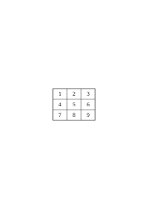
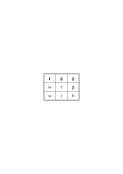
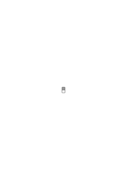
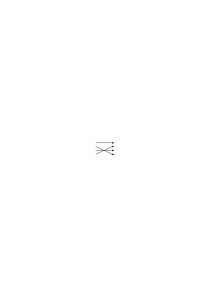
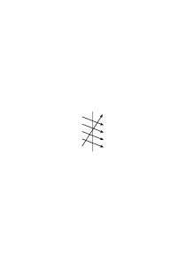
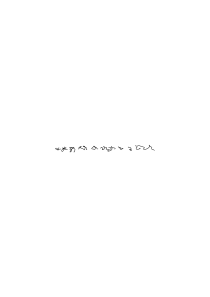
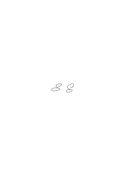

# Ms-142

### [Iv\[1\]](https://cdn.wittgensteinnachlass.com/2000px/webp/Ms-142/Iv.webp)

_Gretl von Ludwig_

_for Christmas 1936_

_a bad gift_

### [IIr\[1\]](https://cdn.wittgensteinnachlass.com/2000px/webp/Ms-142/IIr.webp)

## Philosophical Investigations.

### [IIr\[2\]](https://cdn.wittgensteinnachlass.com/2000px/webp/Ms-142/IIr.webp)

_Started in early November_

_1936_

### [IIv\[1\]](https://cdn.wittgensteinnachlass.com/2000px/webp/Ms-142/IIv.webp)

1 _Augustine_ tells (us) that humans learn their native language like this:

### [1\[2\]](https://cdn.wittgensteinnachlass.com/2000px/webp/Ms-142/1.webp)

1) _Augustine_ describes how humans learn language as follows: (Confessiones I/8)

Cum … appellabant rem aliqam et cum secundum eam vocem corpus ad aliquid movebant, videbam, et tenebam hoc ab eis vocari rem illam, quod sonabant, cum eam vellent ostendere. … ita verba in variis sententiis locis suis posita et crebro audita quarum rerum signa essent paulatim colligebam measque iam voluntates edomito … per … in eis signis ore per haec enuntiabam.

We obtain, as it seems to me, (here) _this_ picture of the essence of language: its words name objects; sentences are combinations of such names. Here is the picture in which the idea of the _‘meaning’_ of words has its roots: for the words have meaning, & the meaning of the word is the object for which the word stands.

Augustine does not speak of a difference between types of words; in his description, we initially think of nouns, such as ‘table’, ‘bread’, ‘tree’ & (the) names of people; the other types of words are added, as it were, in the background.

### [1\[3\]](https://cdn.wittgensteinnachlass.com/2000px/webp/Ms-142/1.webp),[2\[1\]](https://cdn.wittgensteinnachlass.com/2000px/webp/Ms-142/2.webp)

2 Now imagine the following use of language: we send someone shopping. We give him a note with the signs: “five red apples”. He takes the note to the shopkeeper; the shopkeeper opens the drawer on which the sign “apples” is written; then he looks up the word “red” in a chart and finds a colored sample next to it; now he says the sequence of number words – I assume he knows them by heart – up to the word “five” & with each number word he takes an apple from the drawer that has the color of the sample. – This is how it works with words – and similarly. – “But how does he know where and how to look up the word ‘red’ and what to do with the word ‘five’?” – Well, I simply assume that he _acts_ as I have described. Explanations have to come to an end somewhere. – But what is the meaning of the word ‘five’? – Such a thing was not mentioned here; only how the word “five” is used.

### [2\[2\]](https://cdn.wittgensteinnachlass.com/2000px/webp/Ms-142/2.webp),[3\[1\]](https://cdn.wittgensteinnachlass.com/2000px/webp/Ms-142/3.webp)

3 The philosophical concept of the ‘_meaning of words_’ is at home in a primitive idea of how language functions.

Let us imagine a language for which the representation given by Augustine holds true: it serves to communicate between a builder A and an assistant B. A is building a structure from building blocks; there are cubes, columns, slabs and beams available. B has to hand them over to him as needed. To this end, they use a language consisting of the words: “cube”, “column”, “slab”, “beam”. A calls them out – B brings the stone that he has learned to bring when he hears the call.

Let us take this as a complete, primitive language!

### [3\[2\]](https://cdn.wittgensteinnachlass.com/2000px/webp/Ms-142/3.webp)

4 Augustine describes, presumably, a system of communication, a language; but not everything that we call language is this system.

(And one must say this in so many cases where the question arises: “Is this representation useful, or is it useless?” The answer is (then): “Yes, it is useful; but only _for this_, not for the whole area that you intended to represent.”) [Theories of economists]

It is as if someone said: “Playing consists in moving things, according to certain rules, on a surface…” – and we reply to him: You are certainly thinking of board games, & your description is also applicable to them. But these are not all games. So you can correct your explanation by explicitly limiting it to these games.

### [3\[3\]](https://cdn.wittgensteinnachlass.com/2000px/webp/Ms-142/3.webp),[4\[1\]](https://cdn.wittgensteinnachlass.com/2000px/webp/Ms-142/4.webp)

5 Imagine a script in which letters are used to designate sounds, but also to designate stress and even as punctuation marks. One can conceive of the script as a language for describing a sound image. Now imagine that someone understands this script in such a way that it simply corresponds to a sound for each letter and that the letters do not have entirely different functions. – Such a simple understanding of the script is similar to Augustine's understanding of language.

### [4\[2\]](https://cdn.wittgensteinnachlass.com/2000px/webp/Ms-142/4.webp)

6 If one considers example (2), one may perhaps guess to what extent the general concept of the meaning of words surrounds the functioning of language with a haze, so that it becomes almost impossible to understand it. Therefore, it is good if we consider the processes of the use of language in primitive forms of language. Such primitive forms of language are used by the child when it learns to speak. The teaching of language here is not an explanation, but a training.

### [4\[3\]](https://cdn.wittgensteinnachlass.com/2000px/webp/Ms-142/4.webp),[5\[1\]](https://cdn.wittgensteinnachlass.com/2000px/webp/Ms-142/5.webp),[6\[1\]](https://cdn.wittgensteinnachlass.com/2000px/webp/Ms-142/6.webp)

7 We could imagine that language (3) is the _entire_ language of A and B; yes, the entire language of a tribe. The children are trained to perform these activities, to use these words in doing so, & thus to react to the other's words. An important part of the training will consist in the teacher pointing to the objects, directing the child's attention to them, while uttering a word; e.g., the word ‘slab’ while showing this shape. (I do not want to call this an ‘ostensive explanation’ or ‘definition,’ because the child cannot yet _ask_ about the naming. I want to call it ‘ostensive teaching of the words.’ – I say that this will form an important part of the training, because this is the case with people, not because it cannot be imagined otherwise.) This ostensive teaching of the words, one might say, creates an associative connection between the word & the thing. But what does that mean? Well, it can mean various things – but one probably thinks first of all that the image of the thing comes before the child's mind when it hears the word. But if that happens – is that the purpose of the word? – Yes, it _can_ be the purpose. – I can imagine such a use of words (i.e., of sound sequences). (Their utterance is as if one were striking a key on the keyboard of the imagination.) But in language (3), it is _not_ the purpose of the words to evoke images. (It may, of course, also be found that this is conducive to the actual purpose.) But if this is what the ostensive teaching brings about – shall I say that it brings about the understanding of the word? Doesn't the one who acts correctly in response to the call ‘slab!’ understand? – But this probably helped bring about the ostensive teaching, but only together with a certain instruction. With a different instruction, the same ostensive teaching of these words would have brought about a completely different understanding. – More about this later. – “By connecting the rod to the lever with the pin, I put the brake in order.” – Yes – given the entire remaining mechanism. Only in this context is it the brake lever; & detached from its support, it is not even a lever, but can be anything, or nothing.

### [6\[2\]](https://cdn.wittgensteinnachlass.com/2000px/webp/Ms-142/6.webp)

8 In the practice of using language (3), one person names the words, the other acts according to them; but in the instruction of language, this process will be found: the learner names the objects; that is, he says the word when the teacher points to the stone. – Yes, here the even simpler exercise will be found: the pupil repeats the words that the teacher says to him: both are language-similar processes. We can also imagine that the whole process of using the words in (3) is one of those games by means of which children learn language. I want to call these “language-games,” and sometimes speak of a primitive language as a “language-game.” And one could also call the processes of naming the stones and repeating the spoken word language-games. Think of some use of the words in building games.

### [7\[1\]](https://cdn.wittgensteinnachlass.com/2000px/webp/Ms-142/7.webp)

9 Let us now consider an extension of the language (3): in addition to the 4 words “cube,” “pillar,” etc., it contains a series of words that are used as the merchant in (2) uses the number words; it can be the series of letters of the alphabet; furthermore: two words, let them be “thither” & “this,” because this already roughly indicates their purpose, – they are used in conjunction with a pointing gesture; and finally: tablets of various colors. A now gives a command of the kind: “d plate thither” – he shows the assistant a colored tablet, and when he says “thither” he points to a place. B takes from the stock of tablets one of the color of the tablet for each letter of the alphabet up to “d” and brings them to the place that A indicates. – On other occasions, A gives the command “this thither” – at “this” he points to a building block – etc..

### [7\[2\]](https://cdn.wittgensteinnachlass.com/2000px/webp/Ms-142/7.webp),[8\[1\]](https://cdn.wittgensteinnachlass.com/2000px/webp/Ms-142/8.webp)

10 If the child learns this language, it must memorize the series of ‘number words’ “a, b, c, …”. – And it must learn their use: will ostensive teaching of the words also occur in this instruction? – Well, for example, tablets will be pointed to and counted: “a, b, c, tablets.” – More similarity with the ostensive teaching in example (3) would be had by the ostensive teaching of the number words, insofar as they do not serve for counting, but for the designation of things distinguishable by eye. This is how children learn the use of the cardinal numbers from “one” to “five” or “six.”

Is “thither” and “this” also taught ostensively? – Imagine how one could teach their use! In doing so, one would point to places & things, – but here this pointing also happens in the use of the words & not only in learning the use.

### [8\[2\]](https://cdn.wittgensteinnachlass.com/2000px/webp/Ms-142/8.webp),[9\[1\]](https://cdn.wittgensteinnachlass.com/2000px/webp/Ms-142/9.webp),[10\[1\]](https://cdn.wittgensteinnachlass.com/2000px/webp/Ms-142/10.webp)

11 What do the words of this language _designate_? – What they designate – how is this to be shown, if not in the manner of their use? And we have, after all, described this use. The statement “this word designates _that_” would then have to become part of this description. Or: the description should be put in this form: “The word … designates …”. Well, one can shorten the description of the use of the word “plate” to the effect that this word designates this object. One would do this if, for example, it is only a question of avoiding the misunderstanding that the word “plate” refers to the building block that we actually call “cube”; the manner of this ‘_reference_’, i.e. the use of these words in other respects, is known. And similarly one can say that the signs a, b, c, etc. designate numbers, if this perhaps corrects the misunderstanding that a, b, c play in the language the role that “cube”, “column”, “plate” actually play. And one can also say that ‘C’ designates this number and not that one – if this, for example, explains that the letters are to be used in the order a b c d etc. and not a b d c. But by assimilating the descriptions of the use of the words in this way, can this use become any more similar? For, as we see, the manner of their use is quite different. Think of the tools in a toolbox: there is a hammer, a pair of pliers, a saw, a screwdriver, a standard, a glue pot, glue, nails & screws. – So different are the functions of these tools, so different are the functions of the words. (And there are similarities here and there.) 12

Imagine someone says: “_All_ tools serve to modify something. Thus the hammer modifies the position of the nail, the saw the shape of the board, etc.” – And what does the standard, the glue pot, the nails modify? – “Our knowledge of the length of a thing, the temperature of the glue and the strength of the box.” – Would anything be gained by this assimilation of the expression? –

### [10\[2\]](https://cdn.wittgensteinnachlass.com/2000px/webp/Ms-142/10.webp),[11\[1\]](https://cdn.wittgensteinnachlass.com/2000px/webp/Ms-142/11.webp)

12 Indeed, what confuses us is the uniformity of their appearance, when they are spoken or appear in writing & in print. For their _use</em is not so clearly before our eyes, especially when we are philosophizing! As when we look at a switchboard: we see actions, all of which look more or less the same. (Understandable; because they are all to be touched with the hand.) But one is the action of a crank that can be continuously adjusted (it regulates, for example, the opening of a valve); another is the action of a switch that has only two effective positions, it is (either) flipped or upright; a third is the handle of a brake lever, the harder we pull, the stronger it brakes; a fourth is that of a pump, it only works as long as it is moved back and forth. If we say: “every word in the language designates something”, this does not yet say anything in itself; unless we explain exactly _which_ distinction we wish to make. (It could be that we want to distinguish the words of the language (9) from words ‘without meaning’, as they occur in the poems of Lewis Carroll.)

---

### [11\[2\]](https://cdn.wittgensteinnachlass.com/2000px/webp/Ms-142/11.webp)

13 The word “designate” is probably best applied when the sign is on the object it designates. So assume that on tools that A uses in building, there are signs. If A shows the assistant one of these signs, the latter brings the tool that is designated by this sign. In this and more or less similar ways, a name designates a thing, and a name is given to a thing. (More on this later.) – It will often prove useful if, when philosophizing, we say: to name something is something similar to hanging a name tag around a thing. –

### [11\[3\]](https://cdn.wittgensteinnachlass.com/2000px/webp/Ms-142/11.webp)

14 What about the color samples that A shows to B – do they belong to _language_? Well, as one wishes. They do not belong to word-language; but if I were to say to someone: “Say the word ‘the’”, surely you would still count this second ‘the’ as part of the sentence. And yet it plays a very similar role to a color chart in the language-game (9); namely, it is a sample of what he is to say, just as the color chart is a sample of what B is to bring. It is the most natural thing, and causes the least confusion, if we count the samples as among the instruments of language.

### [12\[1\]](https://cdn.wittgensteinnachlass.com/2000px/webp/Ms-142/12.webp)

15 We will be able to say: in language (9), we have different _parts of speech_. For the function of “plate” and of “cube” is more similar than that of “plate” and of “d”. _How_ we group the words according to types will depend on our purpose, & on our inclination. Think of the _different_ ways in which one could classify tools into types of tools. Or chess pieces into types of pieces.

### [12\[2\]](https://cdn.wittgensteinnachlass.com/2000px/webp/Ms-142/12.webp),[13\[1\]](https://cdn.wittgensteinnachlass.com/2000px/webp/Ms-142/13.webp)

16 Do not let the fact that the languages (3) & (9) consist only of commands disturb you. If you want to say that this is why they are not complete, I ask whether our language is complete – whether it was so before the chemical symbolism and the infinitesimal calculus were incorporated into it; for these are, so to speak, suburbs of our language. (And with how many houses, or streets, does a city begin to be a city?) One can think of our language as an old city: a jumble of alleys, squares, old, new, and countless times renovated houses; and this surrounded by new suburbs with straight and regular streets and with monotonous houses. One can easily imagine a language that consists only of commands and reports in battle. – Or a language that consists only of questions and one expression of affirmation and one of negation. And countless other things. – And to imagine a language is to imagine a form of life.

### [13\[2\]](https://cdn.wittgensteinnachlass.com/2000px/webp/Ms-142/13.webp),[14\[1\]](https://cdn.wittgensteinnachlass.com/2000px/webp/Ms-142/14.webp)

17 But how is it, is the cry “Plate!” in example (3) a sentence, or a word? – If a word, then it does not have the same meaning as the identically sounding one in our ordinary language, for in language (3) it is, after all, a cry; but if a sentence, then it is not the elliptical sentence “Plate!” of our language. – Regarding the first question, you can call “Plate!” a word, and also a sentence, perhaps aptly a ‘degenerate sentence’ (as one speaks of a degenerate parabola). And in fact, it is precisely our ‘elliptical’ sentence. – But it is only an abbreviation of the sentence “Bring me a plate!” and this sentence does not exist in example (3). – But why shouldn’t I, conversely, call the sentence “Bring me a plate!” an _extension_ of the sentence “Plate!”? – Because the one who cries “Plate!” actually means: “Bring me a plate!”. – But how do you do that, _this meaning_, while you _say_ “Plate”? Do you recite the unabbreviated sentence to yourself internally? And why should one, in order to say what you mean by the cry “Plate!”, translate this expression into the other? And if they mean the same thing, why shouldn’t I say: “When you say ‘Plate!’, you mean ‘Plate!’”? – Or: Why shouldn’t you be able to mean “Plate!” when you can mean “Bring me the plate!”? – But when I cry “Plate!”, I do want, _I want him to bring me a plate_! – Certainly – but does ‘this wanting’ consist in the fact that you think, in some form, another sentence than the one you say?

### [14\[2\]](https://cdn.wittgensteinnachlass.com/2000px/webp/Ms-142/14.webp),[15\[1\]](https://cdn.wittgensteinnachlass.com/2000px/webp/Ms-142/15.webp)

18 “But if someone says ‘Bring me a plate!’, it seems as if he could mean this expression as _one_ long word – corresponding, namely, to the one word ‘Plate!’” – Can one then mean this sentence sometimes as _one_ word, sometimes as four words? And how does one usually mean it? – I think we will be inclined to say: we mean the sentence as one of _four_ words, when we use it in contrast to other sentences, such as: “Hand me a plate,” “Bring _him_ a plate,” “Bring _two_ plates,” etc.; that is, in contrast to sentences which use the words of our command in _other_ combinations. – But what does it consist of, to use a sentence in contrast to other sentences? Does one have these sentences in mind at the same time? And _all_ of them? And _while_ one says the one sentence, or before, or after? – No! Although such an explanation has some appeal for us, we only need to consider for a moment what actually happens, in order to see that we are on the wrong track here. We say that we use the command in contrast to other sentences, because _our language_ contains the possibility of these other sentences. Someone who does not understand our language, a foreigner who has often heard someone give the command “Bring me a plate!,” might believe that this entire sequence of sounds is one word & corresponds to the word for “brick” in his language. If he himself were to have to give this command, he might pronounce it differently, & we would say: he pronounces it so strangely because he thinks it is _one_ word. – But doesn’t something else also happen in him when he pronounces it, something that corresponds to the fact that he regards our sentence as _one_ word? It could be the same thing that happens in him, or something different. What happens in you when you give such a command; are you conscious that it consists of four words, _while_ you are pronouncing it? Of course, you _master_ this language – in which there are also those other sentences – but is this mastery something that you do while you are pronouncing the one sentence? – And I have admitted: the foreigner will _probably_ pronounce the sentence that he misunderstands differently; but what we call the false understanding need not lie in anything that accompanies the pronunciation of the command. (More about this later.)

### [15\[2\]](https://cdn.wittgensteinnachlass.com/2000px/webp/Ms-142/15.webp),[16\[1\]](https://cdn.wittgensteinnachlass.com/2000px/webp/Ms-142/16.webp)

19 The sentence is not ‘elliptical’ because it omits something that we mean when we pronounce it, but because it is shortened _in comparison_ with a certain standard of our grammar. – One could, of course, raise the objection here: “You admit that the shortened & the unshortened sentence have the same sense. – What sense do they have then? Is there not a verbal expression for this sense?” And which sentence is then its verbal expression? – But does not the same sense of the sentences consist in their same _use_? – (In Russian, it says “stone red,” instead of “the stone is red”; – do they lack the copula in their sense, or do they think it in? –)

### [16\[2\]](https://cdn.wittgensteinnachlass.com/2000px/webp/Ms-142/16.webp),[17\[1\]](https://cdn.wittgensteinnachlass.com/2000px/webp/Ms-142/17.webp)

20 One can easily imagine a language-game in which B, in response to A’s question, states the number of plates or cubes in a stack, or the colors and shapes of the building blocks lying there and there. Such a statement could, for example, be: “five plates.” What is now the difference between the statement, or _assertion_, “five plates,” & the command “five plates!”? – Well, the role that the utterance of these words plays in the language-game. But it will probably also be the case that the tone of voice in which they are uttered is different, & the facial expression, & many other things. But we can also imagine that the tone is the same – because a command & a statement can be uttered in _many_ different tones & with many different gestures, etc. – & that the difference lies solely in the use. – (Of course, we could also use the words “assertion” & “command” to designate a grammatical sentence form & a tone of voice, just as we call the sentence “Isn’t the weather lovely today?” a question, even though it is used as an assertion. We could imagine a language in which _all_ assertions have the form & the tone of a rhetorical question, or every command is given in the form “Would you like to do that?” One might then say: “What he says has the form of a question but is actually a command,” i.e., has the _function_ of a command in the _practice_ of language. (Similarly, one says “You will do that,” not as a prophecy but as a command. What makes it the one, what makes it the other?)

### [17\[2\]](https://cdn.wittgensteinnachlass.com/2000px/webp/Ms-142/17.webp)

21 Frege’s view that an assertion contains an assumption, which is what is asserted, is actually based on the possibility that exists in our language of writing every assertive sentence in the form: “It is asserted that this & that is the case.” But “That this & that is the case” is not a sentence in our language – it is not yet a _move_ in our language-game. And if I write instead of “It is asserted that…”: “It is asserted: this & that is the case,” then the words “It is asserted” are superfluous here. We could very well also write every assertion in the form of a question with a subsequent affirmation; that is, instead of “It is raining”: “Is it raining? Yes!” Would that show that every assertion contains a question?

### [17\[3\]](https://cdn.wittgensteinnachlass.com/2000px/webp/Ms-142/17.webp)

22 One certainly has the right to use an assertion sign in contrast to, for example, a question mark. It is only wrong if one thinks that the assertion consists of two acts, the consideration & the assertion (attaching a truth value, or something similar), & that we perform these acts according to the signs of the sentence, more or less as we sing according to notes. Singing according to notes is, however, to be compared with reading aloud, or quietly, the written sentence, but not with ‘_thinking_’ the read sentence.

### [18\[1\]](https://cdn.wittgensteinnachlass.com/2000px/webp/Ms-142/18.webp)

23 The important meaning of Frege’s assertion sign is perhaps best grasped by saying that it clearly designates the _beginning of the sentence_. – This is _important_, because our philosophical difficulties concerning the nature of ‘negation’ & ‘thinking’ arise, in a certain sense, from the fact that we do not see that a sentence “⊢ ~ p,” or “⊢ I think p,” or “⊢ p” has “p” in common, but not “⊢ p.” (For if I hear someone say “it is raining,” I do not know what he is saying if I do not know whether I have heard the beginning of the sentence.)

### [18\[2\]](https://cdn.wittgensteinnachlass.com/2000px/webp/Ms-142/18.webp),[19\[1\]](https://cdn.wittgensteinnachlass.com/2000px/webp/Ms-142/19.webp),[20\[1\]](https://cdn.wittgensteinnachlass.com/2000px/webp/Ms-142/20.webp)

24 How many kinds of sentences are there? For example: statement, question, & command? There are _countless_ such kinds: countless different kinds of the use of everything we call ‘signs,’ ‘words,’ ‘sentences.’ This variety is constantly changing: new types of language use emerge, others become obsolete & are forgotten. (An _approximate_ picture of this can be given to us by the changes in mathematics.) Imagine the variety of types of language use, of “language-games” – as we might say –; think of these & other examples: giving orders & acting on orders – Looking at, measuring, & describing an object – Producing an object according to a description or drawing – Reporting an event that we have witnessed – Making guesses about an event – Inventing or reading a story

Formulating & testing a hypothesis

Representing the results of an experiment through tables & diagrams

Solving an applied calculation problem.

Asking, thanking, cursing

Greeting

Posing & solving riddles

Telling a joke

Translating from one language into another – Acting in a play

etc. etc. etc. etc.

– It is interesting to compare the variety of the tools of language & their ways of use – the variety of types of words & sentences – with what logicians have said about the structure of language. (And also the author of the Log. Phil. Abh.)

### [20\[2\]](https://cdn.wittgensteinnachlass.com/2000px/webp/Ms-142/20.webp)

The word “language-**game**” is meant to emphasize that speaking a language is part of an activity, a form of activity.

### [20\[3\]](https://cdn.wittgensteinnachlass.com/2000px/webp/Ms-142/20.webp),[21\[1\]](https://cdn.wittgensteinnachlass.com/2000px/webp/Ms-142/21.webp)

25 If we do not see that there is a _number_ of language-games, then we are perhaps inclined to ask: “What is a question?” Is it the statement that I do not know this or that, or the statement that I wish the other person to tell me…? Or is it the description of my mental state of uncertainty? – And is the cry “Help!” such a description? Remember how different things are called “description”: the description of the position of a body through its coordinates; the description of the course of a sensation of pain. One can, of course, replace the usual form of a question with that of a statement or description: “I want to know whether…,” or “I am in doubt whether…” – but this does not bring the different language-games any closer to each other. The significance of such possibilities of reformulation, e.g., of all statements in sentences that begin with the clause “I think” or “I believe” (i.e., _as it were_, in descriptions of _my_ inner life) will become apparent later.

### [21\[2\]](https://cdn.wittgensteinnachlass.com/2000px/webp/Ms-142/21.webp),[22\[1\]](https://cdn.wittgensteinnachlass.com/2000px/webp/Ms-142/22.webp)

26 One sometimes says: animals do not speak because they lack the mental capacities. That is: ‘they do not think, therefore they do not speak.’ But they simply do not speak. Better: they do not _use language_. (Except in the most primitive forms.) Giving orders, asking questions, telling stories, chatting are natural actions, just like walking, eating, drinking, & playing. (It is irrelevant here whether one speaks with the mouth or with the hands.) This is again connected with the idea that learning a language consists in naming objects; namely: people, shapes, colors, pains, moods, numbers, etc. –

– As has been said, naming is something similar to attaching a name tag to a thing. One can call this a preparation for the use of a word. But what is it a preparation _for_? “We name the things & can now talk about them. Refer to them in speech.” As if the act of naming already gave us what we do next. As if there were only one thing called “talking about things.” Whereas we do the most diverse things with our sentences. Let us think only of exclamations! With their very different functions. Water! Away! Ouch! Help! Beautiful! Not!

Are you now still inclined to call these words “names of objects”?

### [22\[2\]](https://cdn.wittgensteinnachlass.com/2000px/webp/Ms-142/22.webp),[23\[1\]](https://cdn.wittgensteinnachlass.com/2000px/webp/Ms-142/23.webp)

27 In languages (3) & (9), there was no question about naming. This & its correlate, the ostensive explanation, definition, could be said to be a language-game in itself. Strictly speaking, this means: we are educated, trained to ask: “What is this called?” – to which the naming then occurs. & there is also a language-game: to invent a name for something. That is, to say: “this is called…” & then to use the new name. (For example, children name their dolls & then talk about them. At the same time, consider how _specifically_ the use of the personal name is, with which we _call_ the (thus) named person!) One can now ostensively define a personal name, a color word, a name for a material, a number word, the name of a point of the compass, etc. etc. The definition of ‘two’: “This is called ‘two’” – while pointing to two nuts – is perfectly exact. – But how can one define ‘two’ in such a way that the person to whom one gives the definition does not know _what_ one wants to name with ‘two’; he will assume that you are calling _this_ group of nuts ‘two’! – He _can_ assume this – perhaps he will not assume it. He could, conversely, if I want to assign a name to this group of nuts, misunderstand it as a number name. & just as easily, if I ostensively explain a personal name, he could understand it as a color name, a designation of race, or even as the name of a point of the compass. That is, the ostensive definition can always be interpreted in this way & in another way.

### [23\[2\]](https://cdn.wittgensteinnachlass.com/2000px/webp/Ms-142/23.webp),[24\[1\]](https://cdn.wittgensteinnachlass.com/2000px/webp/Ms-142/24.webp)

28 Perhaps you say: the number two can only be defined _so_ ostensively: “This _number_ is called ‘two’”; for the word “number” indicates here what _place_ in language, in grammar, we put the word; but this means that the word “number” must be explained before that ostensive definition can be understood. – The word “number” in the definition certainly indicates this place, the item to which we assign the word. And we can thus avoid misunderstandings by saying “This _color_ is called so & so”, “This _length_ is called so & so” and so on. That is to say: misunderstandings _are_ sometimes avoided in this way. But can the word “color”, or “length” be understood only in this way? – Well, we must explain them. – So, explain them through other words! And what about the last explanation in this chain?! (Don’t say, “There is no ‘last’ explanation”; that is just as if you wanted to say: “There is no last house in this street: one can always add another one.”) Whether the word “number” is necessary in the ostensive definition of two depends on whether he understands it differently without this word than I want him to. And that will probably depend on the circumstances under which it is given & on the person to whom it is given. And how he ‘understands’ the explanation is shown in how he uses the explained word.

### [24\[2\]](https://cdn.wittgensteinnachlass.com/2000px/webp/Ms-142/24.webp),[25\[1\]](https://cdn.wittgensteinnachlass.com/2000px/webp/Ms-142/25.webp),[26\[1\]](https://cdn.wittgensteinnachlass.com/2000px/webp/Ms-142/26.webp),[27\[1\]](https://cdn.wittgensteinnachlass.com/2000px/webp/Ms-142/27.webp)

29 One could therefore say: the ostensive explanation explains the use – the meaning – of the word, if it is already clear what role the word is to play in the language. So, if I know that someone wants to explain a color word to me, the ostensive explanation “This means ‘sepia’” will help me to understand the word. – We can say this, provided that we do not forget that all sorts of questions now attach themselves to the word “know” or “be clear”!

Consider this case as well: I explain chess to someone, and I begin by pointing to a game piece and saying: “This is the king. – It can move like this, etc. etc.” One must already know something in order to ask about the naming. But what must one know? If one shows someone the king game piece in chess and says: “This is the chess king,” this does not explain the use of this game piece to him, unless he already knows the rules of the game, except for this last determination: the shape of a king game piece. One can imagine that he has learned the rules of the game without ever having a real game piece shown to him. The form of the game piece corresponds here to the sound or appearance of a word. One can also imagine that someone has learned the game without ever learning or formulating the rules. He may, for example, have first learned very simple board games by watching, and then progressed to increasingly complicated ones. One could also give him the explanation: “This is the king,” if one shows him chess pieces of an unfamiliar shape. This explanation only teaches him the use of the game piece because, as we might say, the place it will be put has already been prepared. Or also: We will only say that it teaches him the use if the place has already been prepared. And it is not prepared here by the fact that the person to whom we give the explanation already knows the rules, but by the fact that he already masters a game in another sense.

We can say: the one who asks about the naming does so meaningfully, because he already knows what to do with it. We can also imagine that the person asked replies: “Determine the naming yourself” – and now the one who asked would have to come up with everything himself.

### [27\[2\]](https://cdn.wittgensteinnachlass.com/2000px/webp/Ms-142/27.webp)

30 When someone comes to a foreign country, he will sometimes learn the language of the local people through ostensive explanations that they give him, and he will often have to _guess_ the interpretation of these explanations, and sometimes guess correctly, and sometimes incorrectly. And now, I think, we can say: Augustine describes the learning of human language as if the child came to a foreign country and did not understand the language of the country, that is, _has_ already a language, only not this one. Or also: – as if the child could already _think_, but not yet speak. And ‘thinking’ would mean here something like: talking to oneself.

### [27\[3\]](https://cdn.wittgensteinnachlass.com/2000px/webp/Ms-142/27.webp)

– In this case, we will say: the words “This is the king” (or, “This is called ‘king’”) are only a word **explanation** if the learner already ‘knows what a game piece is’; if, for example, he has already played several games, or has ‘watched others play with understanding’, _and so on_. Only then will he be able to ask, when learning the game, “what is this called?” – namely, this game piece.

### [27\[4\]](https://cdn.wittgensteinnachlass.com/2000px/webp/Ms-142/27.webp),[28\[1\]](https://cdn.wittgensteinnachlass.com/2000px/webp/Ms-142/28.webp),[29\[1\]](https://cdn.wittgensteinnachlass.com/2000px/webp/Ms-142/29.webp)

31 But what if one were to object: “It is not true that one must already master a language-game in order to understand an ostensive definition; one must only – of course – know (or guess) what the explainer is pointing to! Whether, for example, he is pointing to the shape of the object, or to its color, or to the number, etc., etc.” – And what does it consist of: ‘pointing to the shape’, ‘pointing to the color’, etc.? Point to a piece of paper! – And now point to its shape, – now to its color, – now to ‘its number’ (that sounds odd)! – Well, how did you do it? – You will say that each time you ‘meant’ something different when pointing. And if I ask how that happens, you will say that you concentrated your attention on color, shape, etc. But now I ask once again, how _that_ happens. Imagine someone pointing to a vase and saying: “Look at the magnificent blue! – the shape is irrelevant.” – Or: “Look at the magnificent shape! – the color is irrelevant.” – It is undeniable that you will do _different_ things when you comply with these two requests. But do you always do the _same_ thing when you direct your attention to the color? Just imagine different cases! I want to suggest some: “Is this blue the same as _that_? Do you see a difference?” – You mix colors and say: “This blue of the sky is difficult to reproduce.” “Look how different these two blues appear!” “Do you see that blue book over there? Please bring it here!” “It will be nice; one can see blue sky again!” “This blue light signal means….” “What is this blue called? – is it ‘indigo’?”

Directing one’s attention to the color sometimes means holding the outlines of the shape away with one’s hand, or not directing one’s gaze at the contour of the thing; sometimes, it means staring at the object and trying to remember where one has seen that color before. One directs one’s attention to the shape sometimes by tracing it, sometimes by blinking so as not to see the color clearly, etc., etc. I want to say: this and similar things happen _while_ one ‘directs one’s attention to this or that’. But that is not all that leads us to say that someone is directing his attention to the shape, the color, etc. Just as ‘making a move in chess’ does not consist only in moving a piece on the chessboard in such and such a way – but also not in the thoughts and feelings of the player that accompany the move – but in the circumstances that we call ‘playing a game of chess’ or ‘solving a chess problem’, and the like.

### [29\[2\]](https://cdn.wittgensteinnachlass.com/2000px/webp/Ms-142/29.webp),[30\[1\]](https://cdn.wittgensteinnachlass.com/2000px/webp/Ms-142/30.webp)

31 But suppose someone said: “I always do the same thing when I direct my attention to the shape: I follow the contour with my eyes and feel….” And suppose this person gives another person the ostensive explanation: “This is called ‘circle’”, by pointing to a circular object with all these experiences; – can the other person not still interpret the explanation differently, even if he sees that the explainer is following the shape with his eyes and even if he feels what the explainer feels? That is, this ‘interpretation’ can still consist in how he now makes use of the explained word, for example, what he points to when he is now given the instruction “Point to a circle!” – Because neither the expression “meaning the explanation in this way” nor the expression “interpreting the explanation in this way” refers to a specific process that accompanies the giving and hearing of the explanation.

### [30\[2\]](https://cdn.wittgensteinnachlass.com/2000px/webp/Ms-142/30.webp),[31\[1\]](https://cdn.wittgensteinnachlass.com/2000px/webp/Ms-142/31.webp)

32 Of course, there are what one could call ‘characteristic experiences’ for pointing to the shape (e.g.). For example, tracing the contour with a finger or with one’s gaze while pointing. – But just as little as _this_ happens in all cases in which I ‘mean the shape’ – so little does any other characteristic process happen in all these cases. But even if such a process were to repeat itself in all of them, it would still depend on the circumstances – i.e., on what happens before & after the pointing – whether we would say: “He pointed to the shape and not to the color.” Because the words “point to the shape,” “mean the shape,” etc., are not used in the same way as: “point to the book,” “point to the letter ‘B,’ not to the letter ‘u’,” etc. – For just think how differently we _learn_ the _use_ of the words: “point to this thing,” “point to that thing,” & “point to the color, not to the shape,” “mean the color,” etc. etc.! As I said, in certain cases, especially when pointing ‘to the shape’ or ‘to the number,’ there are characteristic experiences & ways of pointing – ‘characteristic’ because they repeat _often_, not _always_, where shape or number is ‘meant’: – but do you know of any characteristic experience for pointing to the game piece _as a game piece_?! And yet one can say: “I mean: this _game piece_ is called ‘king,’ not this particular piece of wood that I am pointing to.”

### [31\[2\]](https://cdn.wittgensteinnachlass.com/2000px/webp/Ms-142/31.webp)

33 And we are doing here what we do in 1000 other cases: because we cannot specify _one_ physical action that we call pointing to the shape (in contrast, for example, to the color), we say that there is a _mental_ activity corresponding to these words. Wherever our language leads us to expect a body, and we find none, there we put a mind.

### [31\[3\]](https://cdn.wittgensteinnachlass.com/2000px/webp/Ms-142/31.webp),[32\[1\]](https://cdn.wittgensteinnachlass.com/2000px/webp/Ms-142/32.webp)

34 “What is the relationship between names & what is named?” – Well, what _is_ it? Look at the language-game (3), or another! There you can see what this relationship might consist of. This relationship can, among many other things, also consist in the fact that hearing the name brings the image of what is named to mind, & it also consists, among other things, in the fact that the name is written on what is named, or that it is spoken while pointing to what is named.

### [32\[2\]](https://cdn.wittgensteinnachlass.com/2000px/webp/Ms-142/32.webp),[33\[1\]](https://cdn.wittgensteinnachlass.com/2000px/webp/Ms-142/33.webp)

35 What, for example, does the word “this” denote in the language-game (9), or the word “that” in the explanatory “That is to say…”? Well, if you don't want to create confusion, it is best not to say that these words denote anything. – And curiously, it has been said of the word “this” that it is the _actual_ name. Everything else that we call “names” is therefore only so in an imprecise, approximate sense. This curious idea stems from a tendency to abstract the logic of our language – as one might call it. The real answer to this is: we call _very different_ things “names”; the word “name” characterizes many different kinds of use of a word, which are related to each other in many different ways; – but among these kinds of use is _not_ that of the word “this”. It is probably true that we often, for example in the explanatory, point to what is named and say the name. And likewise, we, for example in the explanatory definition, say the word “this” by pointing to a thing. And the word “this” and a name also often occur in the same sentence: we say “Fetch this!” and also “Fetch Paul!” – But one of the most characteristic features of the name is precisely that it is explained by the pointing “That is N” (or “That is called ‘N’”). But do we also explain: “That is called ‘this’”, or even, “This is called ‘this’”?

### [33\[2\]](https://cdn.wittgensteinnachlass.com/2000px/webp/Ms-142/33.webp)

36 This is connected with the idea of naming as a kind of occult process. Naming appears as a _strange_ connection of a word with the object. – And such a strange connection really exists, namely when the philosopher, in order to bring out what _the_ relationship between a name & the named is, stares at an object in front of him & repeats a name countless times, or also the word “this”. For philosophical problems arise when language _celebrates_. And _then_ we can certainly imagine that naming is a curious mental act, quasi a kind of baptism of an object. And we can thus also say the word “this” as if it _were_ the object, thus _addressing_ it; a strange use of this word, which probably only occurs when philosophizing. –

### [33\[3\]](https://cdn.wittgensteinnachlass.com/2000px/webp/Ms-142/33.webp),[34\[1\]](https://cdn.wittgensteinnachlass.com/2000px/webp/Ms-142/34.webp)

37 But why does one come up with the idea of wanting to make precisely this word a name, when it is so obviously _not_ a name? – Precisely because of that; – for one is tempted to make an objection to what is usually called “names”; & this can be expressed as follows: _that the name should actually designate something simple_. And one could argue for this as follows: A proper name in the usual sense is, for example, the word “Nothung”. But the sword Nothung consists of parts in a certain composition. If they are put together differently, Nothung does not exist. Now, the sentence “Nothung has a sharp edge” obviously _makes sense_, whether Nothung is still whole or already broken. But if “Nothung” is the name of an object, then this object no longer exists when Nothung is broken; & since the name would then not correspond to any object, it would have no meaning. Then, however, the sentence “Nothung has a sharp edge” would contain a word that has no meaning & would therefore be nonsense. But it does make sense, so something must always correspond to the words that make it up. Therefore, the word Nothung must disappear in the analysis of meaning, & instead, words that name something simple must be used. We will reasonably call these words the proper names.

### [34\[2\]](https://cdn.wittgensteinnachlass.com/2000px/webp/Ms-142/34.webp),[35\[1\]](https://cdn.wittgensteinnachlass.com/2000px/webp/Ms-142/35.webp)

38 Let us first talk about _the_ point of this reasoning: that the word has no meaning if nothing corresponds to it. – It is important to note that the word “meaning” is used in a way that is contrary to language when one uses it to refer to the thing that ‘corresponds’ to the word. This means confusing the meaning of a name with the _bearer_ of the name. When Paul dies, one says that the bearer of the name dies, but no one says that the meaning of the name dies. And it would be nonsense to say so, because if the name ceased to have meaning, then it would not make sense to say “Paul is dead”.

### [35\[2\]](https://cdn.wittgensteinnachlass.com/2000px/webp/Ms-142/35.webp),[36\[1\]](https://cdn.wittgensteinnachlass.com/2000px/webp/Ms-142/36.webp)

39 In (13) we introduced proper names into the language (9). Now suppose that the tool with the name “α” is broken. A does not know this & gives B the sign “α”: does this sign now have meaning or does it not? – What should B do if he receives this sign? – We have not agreed on anything about this. One could ask: what _will_ he do? Well, he might stand there bewildered, or show A the pieces. One _could_ say here: “α” has become meaningless; & this statement would mean that there is now no longer any use for the sign “α” in our language-game (unless we give it a new one). “α” could also become meaningless if, for _some_ reason, the tool is given a different designation & the sign “α” is no longer used in the game. – But we can also imagine an agreement according to which B, if a tool is broken & A gives the sign of this tool, has to shake his head in response. – With this, one could say, the command “α”, for example, has been incorporated into the language-game, even if this tool no longer exists. And one can now say that the sign “α” has meaning, even if its bearer ceases to exist.

### [36\[2\]](https://cdn.wittgensteinnachlass.com/2000px/webp/Ms-142/36.webp)

40 One can, for a _large_ class of cases in the use of the word “meaning” – although not for _all_ cases of its use – explain this word as follows:

The meaning of a word is its use in language. And the _meaning_ of a name is sometimes explained by pointing to its _bearer_.

### [36\[3\]](https://cdn.wittgensteinnachlass.com/2000px/webp/Ms-142/36.webp)

41 “But do names also have meaning in that language-game, even if they have _never_ been used for a tool?” Suppose “ξ” is such a sign & A gives this sign to B!” – Well, such signs could also be included in the language-game, & B might also answer _them_ with a shake of the head. One could imagine this as a kind of amusement for the two of them.

### [36\[4\]](https://cdn.wittgensteinnachlass.com/2000px/webp/Ms-142/36.webp),[37\[1\]](https://cdn.wittgensteinnachlass.com/2000px/webp/Ms-142/37.webp)

42 We said: the sentence, “Nothung” has a sharp edge,” has sense, even if Nothung has already been broken. Well, that is so because in this language-game a name is also used in the absence of its bearer. But we can imagine a language-game with names (i.e., with signs that we would certainly also call “names”) in which names are used only in the presence of the bearer. Suppose, for example, we observe an area in which patches of color move (as on the screen in the cinema). There are three such patches, which slowly change their shape & position. I name them by ostensive explanation “P”, “Q”, & “R”. Our language describes the changes of these three & I say sentences to you such as: “Do you see how P is now contracting & approaching R?” – In this language, these names are to be used as synonyms for the word “this” _together_ with pointing to a patch of color. If one of the three patches disappears, then I must not say “P has disappeared” – just as I would not say “this has disappeared” – but we say, for example: The name ‘P’ ceases to be in use. In this language, one can say that the name loses its meaning when the bearer ceases to exist & there is always something corresponding to the words “P”, “Q” & “R”, as long as they have any meaning – use in the language-game. (For in the sentence, “‘P’ ceases to be,” the sign “‘P’” appears, but not “P”; & I assume that one does not talk about past events, or has a different way of expressing it.) In this language-game, therefore, the name cannot become bearerless; but this is not an advantage of the language-game, because a name can also have a purpose, use, i.e., meaning, even without a bearer. (And so, for example, the name “Odysseus” has meaning.)

### [37\[2\]](https://cdn.wittgensteinnachlass.com/2000px/webp/Ms-142/37.webp),[38\[1\]](https://cdn.wittgensteinnachlass.com/2000px/webp/Ms-142/38.webp)

42 Our language-game can, I believe, show us a reason why one might want to make the demonstrative into a name: For the demonstrative “this” cannot become bearerless either. One could say: “As long as there is a _this_, as long as the word ‘this’ also has meaning, whether _this_ is simple or composite.” – But that does not make it a name. On the contrary, because a name is not used with the demonstrative gesture, but is only explained by it.

### [38\[2\]](https://cdn.wittgensteinnachlass.com/2000px/webp/Ms-142/38.webp),[39\[1\]](https://cdn.wittgensteinnachlass.com/2000px/webp/Ms-142/39.webp)

43 What is the reason that _names_ actually designate the simple? – Socrates (in the Theaetetus): “If I am not mistaken, I have heard from some that there is no explanation for the _elementary parts_ – to put it that way – out of which we & everything else is composed; for everything that is in itself can only be _designated_ by names, no other determination is possible, neither that it _is_, nor that it _is not_. …. … But what is in itself must be named, …, without any other determinations. Thus it is impossible to speak of any elementary part in an explanatory way; for this there is nothing but the mere naming; it only has its name. But just as what is composed of these elementary parts is itself an interwoven structure, so too have its names become part of this interwoven structure in the explanatory discourse; for their essence is the intertwining of names.” These elementary parts were also Russell’s ‘Individuals’ & also my ‘objects’ (Log. Phil. Abh.).

### [39\[2\]](https://cdn.wittgensteinnachlass.com/2000px/webp/Ms-142/39.webp),[40\[1\]](https://cdn.wittgensteinnachlass.com/2000px/webp/Ms-142/40.webp)

44 But what are the simple constituents of reality? – What are the simple constituents of a chair? – The pieces of wood from which it is put together? Or the molecules, the chemical elements, or the electrons? “Simple” means: not composed. And then it depends on this: in what sense ‘composed’? It makes no sense to talk about the ‘simple constituents of a chair, as such’. Or: does my visual image of this tree, this chair, consist of parts? & what are its simple constituents? Multi-coloredness is _one_ kind of composition; another is, for example, that of the broken contour made up of straight pieces. This curve can be called composed of an ascending & a descending branch. If I say to someone, without further explanation, “What I see in front of me now is composed,” he will rightly ask: “What _do_ you mean by ‘composed’? That can mean all sorts of things!” The question, “Is what you see composed?” probably makes sense only if it is already established which kind of composition – i.e., which particular use of this word – it is (here) about. So, for example, if it had been established that the visual image of a tree should be called “composed” if one sees not only a trunk, but also branches, then the question “Is the visual image of this tree simple or composed?” & the question “What are its simple constituents?” would have a clear meaning – a clear use. And the answer to the second question is, of course, not “the branches” (this would be an answer to the _grammatical_ question: “What _does_ one call the ‘simple constituents’ here?”) but rather a description of the individual branches.

### [40\[2\]](https://cdn.wittgensteinnachlass.com/2000px/webp/Ms-142/40.webp),[41\[1\]](https://cdn.wittgensteinnachlass.com/2000px/webp/Ms-142/41.webp)

45 But isn't, for example, a chessboard obviously, and simply, composed? – You are probably thinking of the composition of 32 white & 32 black squares; – but couldn't you also say that it is composed of the colors white, black, & the pattern of the grid? And if there are quite different ways of looking at it here, do you still want to say that the chessboard is ‘composed’ simply? – The mistake one makes when asking, outside of a specific game, “Is this object composed?” is similar to the one a little boy once made, when he was supposed to say whether the verb in certain sentences was used in the active or passive form, & he then thought about whether, for example, the verb “to sleep” means something active or something passive. The word “composed” (and therefore the word “simple”) is used by us in an infinite number of different, in various ways related, senses. (Is the color of this square simple, or does it consist of pure white & pure yellow? And is the white simple, or does it consist of the colors of the rainbow? – Is this line of 2 cm simple, or does it consist of two lines, each of 1 cm? But why not of a piece of 3 cm in length & a piece of 1 cm set in a negative sense?!)

### [41\[2\]](https://cdn.wittgensteinnachlass.com/2000px/webp/Ms-142/41.webp)

46 Regarding the _philosophical_ question: “Is the visual image of this tree composite, & what are its constituent parts?” the correct answer is: “That depends on what you mean by ‘composite.’” (And this is, of course, not an answer, but a rejection of the question.)

### [41\[3\]](https://cdn.wittgensteinnachlass.com/2000px/webp/Ms-142/41.webp),[42\[1\]](https://cdn.wittgensteinnachlass.com/2000px/webp/Ms-142/42.webp),[43\[1\]](https://cdn.wittgensteinnachlass.com/2000px/webp/Ms-142/43.webp)

47 Let us apply the method of chapter (3) to the representation in the Theaetetus: Let us consider a language-game for which this representation is actually valid. Let language serve to represent combinations of colored patches on a surface. The patches are squares & form a chessboard-like complex. There are red, green, white & black squares. The words of the language are (correspondingly) “r”, “g”, “s”, “w” and a sentence is a sequence of these words. They describe an arrangement of colored squares in the sequence

or

etc.

The sentence “r r s g g g r w w” thus describes, for example, an arrangement of this kind.

Here the sentence is a complex of names, to which a complex of elements corresponds. The primitive elements are the colored squares. “But are these simple?” – I would not know what, in this language-game, I should most naturally call the “simple”. Under other circumstances, however, I would call a monochrome square “composite,” perhaps composed of two rectangles, or of the elements color & shape. But the concept of composition could also be extended in such a way that the smaller area is called “composite” from a larger area & one subtracted from it. Compare: ‘composition’ of forces, ‘division’ of a line by a point outside it; these expressions show that, under certain circumstances, we are also inclined to regard the smaller as the result of the ‘composition’ of the larger & the larger as the result of the division of the smaller. But I do not know whether I should now say that the figure that our sentence describes consists of four elements, or of nine! Now, does that sentence consist of four letters or of nine? – And which are _its_ elements: the letter types, or the letters? Isn’t it quite _irrelevant_ which we say, as long as we avoid misunderstandings in the particular case!

### [43\[2\]](https://cdn.wittgensteinnachlass.com/2000px/webp/Ms-142/43.webp),[44\[1\]](https://cdn.wittgensteinnachlass.com/2000px/webp/Ms-142/44.webp)

48 What does it mean to say that we cannot explain – i.e., describe – these elements, but can only name them? This might mean that the description of a complex, in a borderline case, if it consists of only _one_ square, is simply the name of the color square. One could say here – although this easily leads to all sorts of philosophical superstition – that a sign “r”, or “s”, etc., can be a word and a sentence at the same time. However, whether it is a ‘word or sentence’ depends on the situation in which it is spoken or written. For example, if A has to describe a series of color squares to B and uses the word “r” _alone_, then we can say that the word is here a description – a sentence. But if he, for example, memorizes the words and their meanings, or teaches someone else the use of the words and speaks them in the act of teaching, then we would not say that they are sentences here. In this situation, the word “r”, for example, is not a description; one _names_ an element with it – but that doesn't mean that we can _only_ name the element! Naming and describing are not on the _same_ level: naming is a preparation for describing. Naming is not yet a move in the language-game – any more than placing a chess piece on the board is a move in the game of chess. One can say: nothing is achieved by naming a thing. It _has_ no name either – except in the game. That is also what Frege meant by saying that a word only has meaning in the context of a sentence.

### [44\[2\]](https://cdn.wittgensteinnachlass.com/2000px/webp/Ms-142/44.webp),[45\[1\]](https://cdn.wittgensteinnachlass.com/2000px/webp/Ms-142/45.webp),[46\[1\]](https://cdn.wittgensteinnachlass.com/2000px/webp/Ms-142/46.webp)

49 What does it mean to say of the elements that we cannot attribute being or non-being to them? – One could say: If everything that we call “being” and “non-being” lies in the existence and non-existence of connections between the elements, then it makes no sense to speak of the being (or non-being) of an element; and if everything that we call “destroying” lies in the separation of elements, then it makes no sense to speak of destroying an element. But one might say: one cannot attribute being to the element, for _were_ it not, one could not even name it and thus say nothing about it. – Let us consider an analogous case, which will make the matter clearer: One cannot say of _one_ thing that it _is_ 1 m long, nor that it _is not_ 1 m long, and that is the standard metre in Paris. – But with this, we have not attributed any strange property to it, but only characterized its peculiar role in the game of measuring with the metre. – Let us imagine, in a similar way, that the patterns of colors are also kept in Paris. Then we explain: “Sepia” is the name of the color of the original sepia kept there under air exclusion. Then it will make no sense to say of this pattern that it has this color, nor to say that it does not have it. We can express this as follows: This pattern is part of the _language_ with which we make color statements. In this game, it is not something represented, but a means of representation. – And that is precisely what applies to an element in the language-game (47), when, by naming it, we say the word “r”: with this, we have given this thing a role in our language-game; it is now a _means_ of representation. And to say that _were_ it not, it could not have a _name_, says as much, and as little, as: if this thing did not exist, we could not use it in our game. – What, apparently, must exist belongs to the language. It plays the role of the paradigm in our game; it is what we compare with. And stating this can mean making an _important_ statement! But it is still a statement about our language-game – our way of representing things.

### [46\[2\]](https://cdn.wittgensteinnachlass.com/2000px/webp/Ms-142/46.webp)

Let us imagine that the game (47) has been modified to the extent that in it, names do not designate single-colored squares, but rectangles consisting of two such squares each. Such a rectangle of the form

,

half red, half green, is called “u”, one half green, half white, “v” & one half white, half black, “w”.

### [46\[3\]](https://cdn.wittgensteinnachlass.com/2000px/webp/Ms-142/46.webp),[47\[1\]](https://cdn.wittgensteinnachlass.com/2000px/webp/Ms-142/47.webp)

50 In the description of the language-game (47), I said that the colors of the squares corresponded to the words “r”, “g”, etc. But what does this correspondence consist of; in what sense can one say that these signs correspond to certain colors of the squares? The explanation in (47) only established a connection between these signs & certain words in our language (our color names). – Now, it was assumed that the use of the signs in the game would be taught differently, namely by pointing to paradigms. Probably, – but what does it mean to say that, in the _linguistic practice_, certain elements correspond to the signs? – Does it lie in the fact that the one who describes the complexes of colored squares always says “r” where a red square is, “s” where a black one is, etc.? But what if he makes a mistake in the description, & falsely says “r” where he sees a black square; what is the criterion here for the fact that this was a _mistake_? – Or does the fact that “r” designates a red square consist in the fact that those who use the language always have such a thing in mind when they use the sign “r”? In order to see clearly, we must, as in countless similar cases, examine the details of the processes, consider what is happening _from close up_. If I am inclined to believe that a mouse is created by generatio aequivoca from gray rags & dust, then it will be good to examine these rags closely, to see how a mouse could hide in them, how it could get there, etc. But if I am convinced that a mouse cannot arise from these things, then this investigation may be superfluous. What it is that opposes such a close examination in philosophy, we must still learn to understand. –

### [47\[2\]](https://cdn.wittgensteinnachlass.com/2000px/webp/Ms-142/47.webp),[48\[1\]](https://cdn.wittgensteinnachlass.com/2000px/webp/Ms-142/48.webp)

51 There are now _different_ possibilities for our language-game (47), different cases in which we would say that a sign designates a square of a certain color in the game. We would say this, for example, if we knew that the people who use this language learned the use of the signs in a certain way. Or, if it was laid down in writing, in the form of a table, that this sign corresponds to this element & if this table was used in teaching the language & was used to make decisions in certain disputes. – But we can also imagine that such a table is a tool in the use of the language. The description of a complex then proceeds in such a way that the one who describes carries a table with him, looks up each element of the complex in it & makes the transition to the sign. (And it may also be that the one who is given the description translates the words of it back into the perception of colored squares by means of a table.) One could say that this table takes on the role that memory & association play in other cases. (We usually do not carry out the command, “Bring me a red flower!”, by looking up the color red in a color chart & then bringing a flower of the color that we find; but if it is a question of choosing or mixing a certain shade of red, then it happens that we use a sample or a chart.) If we call such a table the expression of a rule of the game, then one can say that the thing that we call the rule of a game can have very different roles in the game.

### [48\[2\]](https://cdn.wittgensteinnachlass.com/2000px/webp/Ms-142/48.webp),[49\[1\]](https://cdn.wittgensteinnachlass.com/2000px/webp/Ms-142/49.webp)

52 Let us consider in what kinds of cases we say that a game is played according to a certain rule! The rule can be an aid in the instruction of the game. It is communicated to the learner & its application is practiced. – Or it is a tool of the game itself. – Or: A rule is neither used in the instruction nor in the game itself, nor is it laid down in a rule book. One learns the game by watching others play it. But we say that it is played according to these rules & the observer can presumably infer them from the way the game is played, just as one can infer a law of nature from the game-actions. – But how does the observer distinguish in this case between a mistake by the players & a correct game-action? – Well, there are (yes) characteristics for this in the behaviour of the players. Think about how one corrects oneself when one has made a mistake. But in special cases, the difference between a mistake & a correct game-action may completely disappear.

### [49\[2\]](https://cdn.wittgensteinnachlass.com/2000px/webp/Ms-142/49.webp),[50\[1\]](https://cdn.wittgensteinnachlass.com/2000px/webp/Ms-142/50.webp)

53 “What the names of a language designate must be indestructible. For one must be able to describe the state in which everything that is destructible has been destroyed. And in this description there will be words; & what corresponds to them must not then be destroyed, because otherwise the words would have no meaning.” I must not cut off the branch on which I am sitting. One could, of course, immediately object that the description itself must exclude itself from destruction. – But what corresponds to the words of the description & must therefore not be destroyed if it is true, is what gives the words their meaning, without which they would have no meaning. – But this person is, in a certain sense, what corresponds to his name. But he is destructible; & his name does not lose its meaning when the bearer is destroyed. – What corresponds to the name & without which it would have no meaning is, for example, a paradigm that is used in the language-game in connection with the name.

### [50\[2\]](https://cdn.wittgensteinnachlass.com/2000px/webp/Ms-142/50.webp),[51\[1\]](https://cdn.wittgensteinnachlass.com/2000px/webp/Ms-142/51.webp)

54 But how, if no such sample belongs to the language, if we, for example, _remember_ the colour that a word designates? “And if we remember it, then it appears before our mind's eye when we say the word. It must therefore be indestructible in itself if the possibility of remembering it at any time is to exist.” But what do we consider to be the criterion for whether we are remembering it correctly? – If we work with a sample instead of with our memory, we may say that the sample has changed its colour & judge this with our memory. But can we not also, in some cases, speak of a fading – for example – of our memory-image? Are we not just as subject to our memory as we are to a sample? (For one could say: “If we did not have a memory, we would be subject to a sample.”) Or perhaps to a chemical reaction: Suppose you are supposed to paint a certain colour, its name is “φ”, & it is the colour that one sees when substance S combines with substance T under certain conditions. – Suppose the colour seems brighter to you on one day than on another, would you not perhaps say: “I must be mistaken, the colour is certainly the same as yesterday”? This shows that we do not always rely on what the memory says as the ultimate, unappealable, judgment.

### [51\[2\]](https://cdn.wittgensteinnachlass.com/2000px/webp/Ms-142/51.webp),[52\[1\]](https://cdn.wittgensteinnachlass.com/2000px/webp/Ms-142/52.webp)

55 “Something red can be destroyed, but red cannot be destroyed, & therefore the meaning of the word ‘red’ is independent of the existence of a red thing.” Certainly, it makes no sense to say that the color red (color, namely, not pigmentum) is torn or crushed. But don’t we say, “the redness disappears”? And don’t you cling to the fact that we can imagine it, even if there is no longer anything red! This is no different than wanting to say that there is still a chemical reaction that produces something red (again). – But what if you can no longer remember the color? – If we forget what color it is that the word designates, then the word loses its meaning for us; that is, we can no longer play a certain language-game with it. And the situation is then comparable to the fact that the paradigm, which was a means of our language, has been lost.

### [52\[2\]](https://cdn.wittgensteinnachlass.com/2000px/webp/Ms-142/52.webp),[53\[1\]](https://cdn.wittgensteinnachlass.com/2000px/webp/Ms-142/53.webp)

56 “I only want to call ‘_Name_’ that which cannot stand in the connection ‘ξ exists’. – And so one cannot say ‘Red exists’, because, if there were no red, one could not talk about it at all.” More correctly: If “ξ exists” is meant to assert that “ξ” has meaning, then it is not a sentence about ξ, but a sentence about our linguistic usage, namely the use of the word “ξ”. It seems to us as if we are saying something about the nature of red: that “Red exists” does not make sense. It exists ‘in itself’. The same idea – that this is a meta-physical statement about red – is also expressed when we say that red is timeless & perhaps even more strongly in the word “indestructible”. But actually, we only want to understand “Red exists” as a statement: the word “Red” has meaning. Or perhaps more correctly “Red does not exist” as “'Red' has no meaning”. We just don’t want to say that he _says_ that, but that he would have to say _that_, _if_ it had any sense. That he contradicts himself in the attempt to say that – because red is ‘in itself’. Whereas a contradiction only lies in the fact that the sentence looks as if it is talking about the color, while it is supposed to say something about the use of the word “red”. – In reality, however, we do say that a certain color exists; & that means about as much as: something existed that had this color. And the first expression is not (necessarily) any less precise than the second; especially not where ‘that which has the color’ is not a body.

### [53\[2\]](https://cdn.wittgensteinnachlass.com/2000px/webp/Ms-142/53.webp)

57 “_Names_ only designate what is an _element_ of reality. What cannot be destroyed, what remains the same in all change.” But what is that? – While we were saying the sentence, it was already hovering before us! We were already speaking from a very specific image. Because experience does not show us this. We see _components_ of something composite (e.g. a chair). We say that the backrest is part of the chair, but is itself still composed of different pieces of wood; while a leg is a simple component. We also see a whole that changes (is destroyed) while its components remain the same. These are the materials from which we create that image (of reality).

### [53\[3\]](https://cdn.wittgensteinnachlass.com/2000px/webp/Ms-142/53.webp),[54\[1\]](https://cdn.wittgensteinnachlass.com/2000px/webp/Ms-142/54.webp),[55\[1\]](https://cdn.wittgensteinnachlass.com/2000px/webp/Ms-142/55.webp)

58 If I now say: “The broom is in the corner”, is this actually a statement about the handle & the brush? In any case, one could replace the statement with one that indicates the location of the handle & the location of the brush. And this statement is now a further analyzed form of the first. – But why do I call it “further analyzed”? – Well, if the broom is there, then the handle & brush must be there & in a specific relationship to each other; and this was previously, as it were, hidden in the sense of the sentence & in the analyzed sentence it is _expressed_. So, does the person who says the broom is in the corner actually mean that the handle is there & the brush is there & the handle is in the brush? If we asked someone whether that is what they mean, they would probably say that they didn't think of the broom handle or the brush in particular. And that would be the _correct_ answer, because they didn't want to talk about the broom handle or the brush in particular. Imagine you said to someone, instead of “Bring me the broom”: “Bring me the broom handle & the brush that is attached to it!” Wouldn't the answer to that be: “Do you want the broom? & why are you expressing it in such a nonsensical way?” – Will he understand the further analyzed sentence more easily? – This sentence – one could say – accomplishes the same as the usual one, but in a more cumbersome way. – Imagine a language-game in which someone is given instructions to bring, move, or the like, certain things made up of several parts. & two ways of playing it: in one _a_) the composite things (brooms, chairs, tables, etc.) are given names, as in (); in the other _b_) only the parts are given names & the whole is described with their help. – In what way is a command of the second a analyzed form of a command of the first? Does the former lie in this & is it now brought out by analysis? – Yes, the broom is broken down when you separate the handle & the brush; but does this mean that the command to bring the broom consists of corresponding parts?

### [55\[2\]](https://cdn.wittgensteinnachlass.com/2000px/webp/Ms-142/55.webp)

59 “But you will not deny that a certain command in (a) says the same as one in (b)! & how do you want to call the second one, if not an analyzed form of the first.” – Indeed, I would also say that a command in (a) has the same sense as one in (b); or, as I expressed it earlier: they accomplish the same. & that means: if a command in (a) is shown to me & the question is asked, “To which command in (b) is this equivalent in meaning?”, or even, “To which commands in (b) does it contradict?”, then I will answer the question one way or another. But this does not mean that we have reached an understanding about the use of the expression “to have the same sense”, or “to accomplish the same” _in general_. It is namely the question: in which cases do we say: “these are just two different forms of the same game”?

### [55\[3\]](https://cdn.wittgensteinnachlass.com/2000px/webp/Ms-142/55.webp),[56\[1\]](https://cdn.wittgensteinnachlass.com/2000px/webp/Ms-142/56.webp)

60 Imagine, for example, that the person to whom the commands in (a) & (b) are given has to look up in a table that assigns names to images before bringing what is requested: does he then do _the same_ thing when he executes a command in (a) & the corresponding one in (b)? – Yes & no. You can say: “The _point_ of the two commands is the same”. I would say the same here. But it is not always clear what one should call the ‘point’ of the command! (Similarly, one can say of certain things: their purpose is this & that. The essential thing is that it is a _lamp_, that it serves to provide lighting – that it decorates the room, fills an empty space, etc., is not essential. But it is not always the case that what is essential & what is not is clearly separated.)

### [56\[2\]](https://cdn.wittgensteinnachlass.com/2000px/webp/Ms-142/56.webp)

61 The expression, however, that a sentence in (b) is an ‘analyzed’ form of one in (a) is easily misleading: it seems as if that form were the more fundamental one, as if it showed (only) what is meant by the other, etc. We might think: whoever knows only the unanalyzed form misses the analysis; but whoever knows the analyzed form possesses everything in it. – But can I not say that _he_ misses an aspect of the matter, just as the other does?

Could we not imagine people who have names for such color combinations, but not for the (individual) colors? Think of cases when we say: “this color combination (e.g., the tricolor) has a very specific character.” In what respect must the signs of this language-game be analyzed? Yes, in what respect _can_ the game be replaced by the analyzed form (47)? – It is simply a _different_ language-game; even if it is related to (47).

### [56\[3\]](https://cdn.wittgensteinnachlass.com/2000px/webp/Ms-142/56.webp),[57\[1\]](https://cdn.wittgensteinnachlass.com/2000px/webp/Ms-142/57.webp)

62 And here we come to the great question that lies behind all these considerations: For one could now object to me: “You are making it easy for yourself! You talk about all kinds of language-games, but you have nowhere said what is essential about the language-game, & thus about language. What is common to all these processes and makes them language, or parts of language. You are thus depriving yourself of precisely the part of the investigation that gave you the most headaches at the time, namely, the one concerning the _general form of the sentence_ & of language.” And that is true. – Instead of stating something that is common to everything we call language, I say that there is nothing in common to these processes, which is why we use the same word for (them) all, – but they are related to each other in many different ways. And it is because of this kinship, or these kinships, that we call them all “languages.” I want to try to explain this.

### [57\[2\]](https://cdn.wittgensteinnachlass.com/2000px/webp/Ms-142/57.webp),[58\[1\]](https://cdn.wittgensteinnachlass.com/2000px/webp/Ms-142/58.webp)

63 Consider, for example, the processes that we call “games.” I mean board games, card games, ball games, fighting games, etc. What is common to all of these? – Do not say, “there _must_ be something in common to them, otherwise they would not be called ‘games’”; but _look_ to see if they all have something in common. – For if you look at them, you will not see something that is common to _all_ of them, but you will see similarities, kinships, and indeed quite a few. As I said: don't think, but look! – Look, for example, at board games, with their manifold kinships. Now move on to card games; here you will find many correspondences to that first class, but many common features disappear, others emerge. If you now move on to ball games, some common features remain, but some are lost. – Are they all ‘_entertaining_’? Compare chess to checkers. Or: is there always winning & losing, or the competition of players? Think of solitaire. In ball games there is winning & losing, but if a child throws the ball against the wall & catches it again, that move is gone. See what role skill & luck play. And how different is skill in chess & skill in tennis. Now think of circle games: here is the element of entertainment, but how many of the other features have disappeared! And so we can go through the many, many other groups of games. See similarities emerge & disappear. And the result of this consideration is now: we see a complicated network of similarities that overlap & intersect. Similarities in the large & the small.

### [58\[2\]](https://cdn.wittgensteinnachlass.com/2000px/webp/Ms-142/58.webp),[59\[1\]](https://cdn.wittgensteinnachlass.com/2000px/webp/Ms-142/59.webp)

64 I cannot characterize these similarities better than by the word “family resemblances”; for in this way the various similarities among the members of a family overlap & criss-cross: growth, facial features, eye color, gait, temperament, etc. etc. – And I will say: ‘games’ form a family. And similarly, for example, the different kinds of numbers form a family. Why do we call something a “number”? Well, because it has a – direct – kinship with something that has previously been called a number; & through this, one could say, it acquires an indirect kinship to other things that we also call by that name. And we extend our concept of number as we spin a thread, fiber by fiber. And the strength of the thread does not lie in the fact that one fiber runs through its entire length, but in the fact that many fibers overlap. If, however, one were to say: “So all these entities have something in common; namely, the disjunction of all these similarities,” I would reply: Here you are just playing with a word. One could also say: something runs through the entire thread, if the fibers completely cover each other, namely, the complete overlapping of these fibers.

### [59\[2\]](https://cdn.wittgensteinnachlass.com/2000px/webp/Ms-142/59.webp),[60\[1\]](https://cdn.wittgensteinnachlass.com/2000px/webp/Ms-142/60.webp)

65 “Good; so the concept of number is explained for you as the logical sum of those individual, mutually related concepts: cardinal number, rational number, real number, etc.; & similarly, the concept of game as the logical sum of corresponding partial concepts.” – This does not have to be the case. For I _can_ give the concept ‘number’ fixed limits, i.e., use the word “number” to designate a precisely defined concept, but I can also use it in such a way that the scope of the concept is _not_ bounded by a limit. This is how we use the word “game”. How is the concept of the game defined? What is still a game & what is no longer one? Can you specify the limits? No. You can draw them; because none have been drawn yet. (But that has never bothered you when you have applied the word “game”.)

“But then the application of the word is not regulated, the ‘game’ we play with it is not regulated.” – It is not bounded everywhere by rules; but there is also no rule for how high one may throw the ball in tennis, for example, or how strongly, but tennis is still a game, & it also has rules.

### [60\[2\]](https://cdn.wittgensteinnachlass.com/2000px/webp/Ms-142/60.webp),[61\[1\]](https://cdn.wittgensteinnachlass.com/2000px/webp/Ms-142/61.webp)

66 How would you explain to someone what a _game_ is? I believe you will describe _games_ to him, & you could add to the description: “that, _& similar things_, are called ‘games’”. And do you yourself know more? Can you, perhaps, just not tell the other person _exactly_ what a game is? But that is not ignorance. You do not know the boundaries because none have been drawn. As I said, you can – for a specific purpose – draw a boundary. Does this make the concept usable? Not at all! Unless it is for your specific purpose. Just as little as the person who gave the definition “1 step = 75 cm” made the measure ‘one step’ usable. And if you say: “but before that it was not an exact measure of length,” I reply: good, then it was an inexact one. – Although you still owe me the definition of exactness. –

### [61\[2\]](https://cdn.wittgensteinnachlass.com/2000px/webp/Ms-142/61.webp)

67 “But if the concept of ‘game’ is unlimited in this way, then you don’t actually know what you mean by ‘game’.” – If I give the description: “The ground was completely covered with herbs & plants”; do you want to say that I don’t know what I’m talking about until I give a definition of ‘herbs’? Socrates (in the _Theaetetus_): “You know it & can speak Greek, so you must be able to say it.” – No. ‘Knowing’ here simply does not mean being able to say it. The criterion of knowledge is different here. An explanation of what I mean would be, for example, a painted picture & the words: “It looked more or less like that.” I might also say: “_Exactly_ like that.” – So were _precisely_ these grasses & leaves, in these positions, there? No, that’s not what it means. And I would not, in _this_ sense, accept any picture as being the exact one.

### [61\[3\]](https://cdn.wittgensteinnachlass.com/2000px/webp/Ms-142/61.webp),[62\[1\]](https://cdn.wittgensteinnachlass.com/2000px/webp/Ms-142/62.webp)

68 One can say that the concept of ‘game’ is a concept with blurred edges. – “But is a blurred concept even _a concept_?” – Is an out-of-focus photograph even a picture of a person? – Yes, but can one always replace an out-of-focus picture with a sharp one to one’s advantage? Isn’t the out-of-focus one often precisely what we need? Frege compares the _concept_ with a district & says that one cannot even call an unclearly delimited district a district. That probably means that we cannot do anything with it. But is it senseless to say: “Stay approximately here!” Imagine I am standing with someone else in a place & say this. I won’t even draw _any_ boundary, but perhaps make a pointing motion with my hand – just as if I were pointing to a specific _point._ And that is precisely how one explains what a game is. One gives examples, & wants them to be understood in a certain sense. – But with this expression I do _not_ mean: that he should now see the common thing in these examples, which I – for some reason – could not express; but: that he should now _use_ these examples in a certain way. The giving of examples is not here an _indirect_ means of explanation – in the absence of a better one. – Because any general explanation can also be misunderstood. _That’s_ how we play the game. (I mean the language-game with the word ‘game’.)

### [62\[2\]](https://cdn.wittgensteinnachlass.com/2000px/webp/Ms-142/62.webp),[63\[1\]](https://cdn.wittgensteinnachlass.com/2000px/webp/Ms-142/63.webp)

69 _Seeing_ the common thing: Suppose – I show someone various colorful pictures, & say: _“The_ color that you see in _all_ of them is called ‘ocher’.” – This is an explanation that is understood by the learner looking for & seeing what those pictures have in common. He can then look at the common thing, point to it. Compare this with: I show him quadrilaterals of different shapes, all painted in the same color & say: “What these have in common is called ‘ocher’.” And compare this with: – I show him samples of different shades of blue & say: “The color that is common to all of them, I call ‘blue’.”

### [63\[2\]](https://cdn.wittgensteinnachlass.com/2000px/webp/Ms-142/63.webp),[64\[1\]](https://cdn.wittgensteinnachlass.com/2000px/webp/Ms-142/64.webp)

70 If someone explains the names of colors to me by pointing to samples & saying: “This color is called ‘blue,’ this ‘green,’ etc.,” then one can compare this in many ways to the fact that he gives me a chart in which, under the samples of colors, the words are written. – Although this comparison may be misleading in some ways. – One is now inclined to extend this comparison: To have understood the explanation means to have a concept of the explained in one’s mind, & that is a sample or image; if he now shows me various leaves & says, “That is called ‘leaf,’” then I obtain a concept of the leaf’s shape, an image of it in my mind. – But what does the image of a leaf look like that does not show a specific shape, but ‘that which is common to all leaf shapes’? What color is the sample in my mind of the color green, of that which is common to all shades of green? “But could there not be such ‘general’ samples? Perhaps a leaf schema or a sample of _pure_ green.” – Certainly! – But that this schema is understood as a _schema_ & not as the shape of a specific leaf, & that a small piece of pure green is understood as a sample of everything that is greenish & not as a sample for pure green: that lies again in the way in which these samples are applied. Ask yourself: What _shape_ must the sample of the color green have? Should it be square? Or would that then be the sample for green squares? – Should it therefore be ‘irregularly’ shaped? & what prevents us from then simply seeing it as a sample of the irregular shape – i.e. using it?

### [64\[2\]](https://cdn.wittgensteinnachlass.com/2000px/webp/Ms-142/64.webp)

71 This also includes the thought that the one who sees this leaf as a sample of the leaf shape, in general, sees it differently than the one who sees it as a sample for this specific shape. Now, that could be so – although it is not so – because it would only state that, as a matter of experience, the one who sees the leaf in a certain way then uses it in this way or that, according to certain rules. There is, of course, a _way_ of _seeing_ it, & _there are also cases_ in which the one who sees a sample in one _way_ will, in general, use it in _this_ way, & whoever sees it differently will use it differently. For example, the one who sees the drawing

as a plane figure consisting of a square & two rhombuses will perhaps carry out the command, “Bring me something like that!” differently than the one who sees the image spatially.

### [64\[3\]](https://cdn.wittgensteinnachlass.com/2000px/webp/Ms-142/64.webp),[65\[1\]](https://cdn.wittgensteinnachlass.com/2000px/webp/Ms-142/65.webp)

72 What does it mean to know what a game is? What does it mean to know it & not be able to say it? Is this knowledge equivalent to an unspoken definition? So that, if it were spoken, I would recognize it as the expression of my knowledge? Is not my knowledge, my concept of the game, entirely expressed in the explanations that I could give? Namely, in the fact that I describe examples of games of different kinds; show how, by analogy with these, one could construct other games in all possible ways; say that I would hardly call this or that a game anymore, & so on.

### [65\[2\]](https://cdn.wittgensteinnachlass.com/2000px/webp/Ms-142/65.webp)

73 If someone were to draw a sharp line, I could not recognize it as the one that I have always wanted to draw, or that I have in mind. For I did not want to draw any line at all. One can then say: his concept is not the same as mine, but it is related. & the relatedness is that of two pictures, one of which consists of vaguely delineated patches of color, the other of similarly shaped & distributed, but sharply delineated, patches. The relatedness is then as undeniable as the difference.

### [65\[3\]](https://cdn.wittgensteinnachlass.com/2000px/webp/Ms-142/65.webp),[66\[1\]](https://cdn.wittgensteinnachlass.com/2000px/webp/Ms-142/66.webp)

74 And if we take this comparison a bit further, it is clear that the extent to which the sharp image _can_ resemble the blurred one depends on the degree of blurriness. For imagine that you were to create a sharp image that ‘corresponds’ to a blurred one! In the latter, there is a blurred red rectangle; you substitute a sharp one for it. Of course, one could draw several such sharp rectangles that correspond to the blurred one. But if, in the original, the colors flow into one another without any trace of a boundary, will it not then become a hopeless task to draw a sharp image that corresponds to the blurred one? Will you not then have to say: “Here I could just as easily draw a circle as a rectangle or a heart; all the colors flow into one another. Everything is right, – & nothing.” And in this situation is, for example, the person who wants to give definitions in aesthetics or ethics that correspond to our concepts.

In this difficulty, always ask yourself: “How did we learn the meaning of this word – ‘good’ for example? In this difficulty always ask yourself: “How did we _learn_ the meaning of this word – 'good' for example? From what examples; in what language-games? Then you will more easily see that this word must have a _family_ of meanings.

### [66\[2\]](https://cdn.wittgensteinnachlass.com/2000px/webp/Ms-142/66.webp)

75 Comparisons: _knowledge_ & _saying_, how high Mont Blanc is, how the word “game” is used, how a clarinet sounds.

Whoever wonders that one can know something & not say it, probably thinks of a case like the first; & certainly not one like the third.

### [66\[3\]](https://cdn.wittgensteinnachlass.com/2000px/webp/Ms-142/66.webp),[67\[1\]](https://cdn.wittgensteinnachlass.com/2000px/webp/Ms-142/67.webp),[68\[1\]](https://cdn.wittgensteinnachlass.com/2000px/webp/Ms-142/68.webp)

76 Consider this example: When one says, “Moses did not exist,” this can mean different things. It can mean: the Israelites did not have _a_ leader when they departed from Egypt – or: their leader was not named Moses – or: there was no person who accomplished everything that the Bible reports about Moses – etc., etc. – According to Russell, we can say: the name “Moses” can be defined by various descriptions. For example, as: “the man who led the Israelites through the wilderness,” “the man who lived at that time and in that place and was called ‘Moses’ at the time,” “the man who, as a child, was drawn from the Nile by the daughter of Pharaoh,” etc. And depending on which definition we adopt, the sentence “Moses existed” has a different meaning, and so does any other sentence that refers to Moses. – And if one tells us, “N did not exist,” we also ask: “What do you mean? Do you mean that …, or that …, etc.?” But when I make a statement about Moses, am I always ready to substitute any of these descriptions for “Moses”? I might say: by “Moses” I mean the man who did what the Bible reports about Moses, or at least much of it. But how much? Have I decided how much would have to be shown to be false in order for me to abandon my statement as false? Does the name “Moses” therefore have a fixed and clearly defined use for me in all possible cases? – Is it not the case that I, as it were, have an entire series of supports ready and am prepared to rely on _these_ supports if the other is withdrawn from me, and vice versa? – Consider another case: If I say, “N is dead,” the meaning of the name “N” might be related in the following way: I believe that a person lived who I (1.) saw there and there, who (2) looked like this (images), who (3) did this and that, and (4) who in the social world bears the name “N.” If asked what I understand by “N,” I would list all of that, or some of it, and on different occasions, different things. My definition of “N” would therefore be something like “the man about whom all of that is true.” – But what if some of that turns out to be false! – Will I be ready to declare my statement “N is dead” to be false, even if only something that seems quite insignificant to me turns out to be false? But where is the limit of what is insignificant? – If I had given an explanation of the name in such a case, I would now be prepared to modify it. And one can express this by saying that I use the name “N” without a _fixed_ meaning. (But this does not diminish its use any more than the fact that a table rests on _four_ legs instead of three and may therefore be unstable.) Should one say that I use a word whose meaning I do not know, and therefore speak nonsense? – Say what you will, as long as it does not prevent you from seeing how it _is._ (And if you see that, you will not say some things.)

### [68\[2\]](https://cdn.wittgensteinnachlass.com/2000px/webp/Ms-142/68.webp),[69\[1\]](https://cdn.wittgensteinnachlass.com/2000px/webp/Ms-142/69.webp)

77 I say: “There is an armchair there”; as if I were to go to it and want to fetch it, and it suddenly disappears from my sight? – “So it was not an armchair, but some kind of illusion.” – But in a few seconds, we see it again and can touch it, etc. – “So the armchair was there after all, and its disappearance was some kind of illusion.” – But suppose that after a while it disappears again – or seems to disappear. – What should we say now? Do you have rules ready for such cases – rules that say whether one is still allowed to call something “an armchair”? But are they useful in the use of the word “armchair”? And should we say that we do not actually associate any meaning with this word, because we do not have rules for its application in all cases?

### [69\[2\]](https://cdn.wittgensteinnachlass.com/2000px/webp/Ms-142/69.webp),[70\[1\]](https://cdn.wittgensteinnachlass.com/2000px/webp/Ms-142/70.webp)

78 Ramsey once emphasized in a conversation with me that logic is a “normative science.” I don't know the precise idea he had in mind; but it was undoubtedly closely related to the one that only occurred to me later: namely, that in philosophy we often _compare_ the use of words with games, calculi, [following] fixed rules, but cannot say that anyone who uses language _must_ play such a game. – But if one says that our linguistic expression only _approaches_ such calculi, then one immediately stands on the threshold of a misunderstanding. For it may seem as if we are talking about an _ideal_ language in logic, as if our logic were a logic, as it were, for the vacuum. Whereas logic does not treat language – or rather, thought – in the same way that a natural science treats a natural phenomenon; and at most one can say that we _construct_ ideal languages. But here the word _‘ideal’_ would be misleading, because it would seem as if these languages were better, more perfect than our everyday language; and as if it were up to the logician to finally show people what a proper sentence looks like. But all this can only come into the right light when we have gained clarity about the ideas of understanding, meaning, and thought. For then it will also become clear what can lead one – and led me (Log. Phil. Abh.) – to think that anyone who utters a sentence and means or understands it must be performing a calculus according to fixed rules.

### [70\[2\]](https://cdn.wittgensteinnachlass.com/2000px/webp/Ms-142/70.webp),[71\[1\]](https://cdn.wittgensteinnachlass.com/2000px/webp/Ms-142/71.webp)

79 For what do I call the ‘rule according to which he proceeds’? The hypothesis that satisfactorily describes his use of the words that we observe, or the rule that he looks up in the use of the signs, or the one that he gives us as an answer when we ask him about his rule? But what if observation does not reveal any rule clearly, and the question does not bring any to light? – For he did give me an explanation of what he understood by “N” when I asked him, but he was willing to withdraw and modify this explanation. – So how am I to determine the rule according to which he plays? He doesn't know it himself. Or rather: what is the expression “rule according to which he proceeds” supposed to mean here?

### [71\[2\]](https://cdn.wittgensteinnachlass.com/2000px/webp/Ms-142/71.webp)

80 Doesn't the analogy of language with the game shed light on this for us? We can very well imagine people on a meadow talking to each other while playing with a ball, in such a way that they start various existing (regulated) games, some of which they don't finish, in between they throw the ball aimlessly into the air, they jokingly chase and throw the ball at each other, etc. – And now one says: all the time the people are playing a ball game and therefore, with each throw, they are following certain rules. And is there not also the case where we play and ‘make up the rules as we go along’? Yes, even the case in which we change them – as we go along.

### [71\[3\]](https://cdn.wittgensteinnachlass.com/2000px/webp/Ms-142/71.webp),[72\[1\]](https://cdn.wittgensteinnachlass.com/2000px/webp/Ms-142/72.webp)

81 In (65), I spoke of the application of the word “game,” saying that it is not ‘everywhere limited by rules’; but what does a game look like that is everywhere limited by rules? One in which the rules allow no room for doubt; one that plugs up all the holes? – Can we not imagine a rule that regulates the application of a rule? and a doubt that _that_ rule dispels; and so on? But this does not mean that we doubt because we can imagine a doubt. I can very well imagine someone doubting each time before opening his front door whether an abyss has opened up behind it; and that he makes sure of it before stepping through the door (and it may even turn out that he was right); but that does not mean that I doubt in the same case.

### [72\[2\]](https://cdn.wittgensteinnachlass.com/2000px/webp/Ms-142/72.webp)

82 A rule stands there, like a signpost. Does it leave no room for doubt about the way I have to go? Does it show, when I have passed it, in which direction I should go, whether along the road or the field path, or across the fields? But where does it say in what sense I am to follow it; in the direction of the hand or, for example, in the opposite direction? – And if, instead of a signpost, there were a closed chain of signposts, or chalk marks on the ground; is there only _one_ interpretation for them? – So I can say that the signpost leaves no room for doubt. Or rather: it sometimes leaves room for doubt, sometimes not. And this is now no longer a sentence of philosophy; but an experiential/empirical proposition.

### [72\[3\]](https://cdn.wittgensteinnachlass.com/2000px/webp/Ms-142/72.webp),[73\[1\]](https://cdn.wittgensteinnachlass.com/2000px/webp/Ms-142/73.webp)

83 A language-game like (3) is played with the help of a table. Let the signs that A gives to B be script; B has a table: in the first column are the script signs that are used in the game, in a second, pictures of building-block shapes. A shows B a written sign (perhaps writes it on a board): B looks it up in the table, looks at the opposite picture, etc. The table is therefore a rule, according to which he orients himself when carrying out the commands. – One learns to find the picture in the table through training, and part of this training consists of the student learning to run a finger horizontally from left to right in the table – learning, as it were, to draw a row of horizontal lines. Now imagine that different ways of reading a table are introduced; namely, first, as above, according to the scheme:

and another time according to this scheme:

or this:

etc.

Such a scheme is attached to the table as a rule for how it is to be used. Can we not imagine further rules for explaining this? And on the other hand, was that first table incomplete without the scheme:

?

And are the others incomplete without theirs?

### [73\[2\]](https://cdn.wittgensteinnachlass.com/2000px/webp/Ms-142/73.webp),[74\[1\]](https://cdn.wittgensteinnachlass.com/2000px/webp/Ms-142/74.webp)

84 Suppose I explain: “By ‘Moses’ I understand the man, if such a man existed, who led the Israelites out of Egypt, whatever his name was at the time, and whatever else he may or may not have done”: But about the words of this explanation, doubts are possible that are quite similar to those about the name “Moses” (what do you call “Egypt”, who are “the Israelites”, etc.). Yes, these questions also do not come to an end, even if we have arrived at words like “red”, “dark”, “sweet”. – “But how does an explanation help me to understand if it is not the last one? The explanation is then never finished; so I still do not understand, and never will, what he means!” As if an explanation were, as it were, suspended in the air, unless another supported it. While an explanation can rest on another one that has been given, it does not need one – unless _we_ need it in order to avoid a misunderstanding. One could say that an explanation serves to eliminate or prevent a misunderstanding – that is, one that would occur without the explanation; but not: any one that I can imagine. It may easily seem as if every doubt only reveals an existing flaw in the substructure; so that a secure understanding is only possible if we first doubt everything that can be doubted, and then remove these doubts.

### [74\[2\]](https://cdn.wittgensteinnachlass.com/2000px/webp/Ms-142/74.webp),[75\[1\]](https://cdn.wittgensteinnachlass.com/2000px/webp/Ms-142/75.webp),[76\[1\]](https://cdn.wittgensteinnachlass.com/2000px/webp/Ms-142/76.webp)

85 The signpost is in order, – if, under normal circumstances, it fulfills its purpose. If I tell someone, as in (68), “Stay approximately here!” – can this explanation not function perfectly? (And can any other explanation not also fail?) “But is the explanation not imprecise?” – Indeed; why shouldn’t one call it “imprecise”? Let us understand, however, what “imprecise” means! For first, it does not mean “unusable,” otherwise it would have to say: “imprecise for this purpose”; second – let us consider what we call “precise” in contrast to this imprecise explanation! For example, if one draws a chalk line on the ground, delimiting a ‘district’. – But then we immediately realize that the line has a width; a color boundary would therefore be more precise. But does this precision still have (any) function here, or is it merely empty? And we have not yet determined what should be considered as exceeding this sharp boundary; how, with what instruments, it is to be ascertained. Etc. We know what it means to set a pocket watch to the exact time, or – to adjust it so that it runs accurately. But what if one asked: is this accuracy an ideal accuracy, or how closely does it approach it? – We can of course talk about time measurements, in which there is another, as we would say, greater accuracy than in the time measurement with the pocket watch. Where the words, “set the clock to the exact time,” have a different, albeit related, meaning, & reading the clock is a different process, etc.. – If I now say to someone: “You should come to dinner on time; you know that it starts exactly at 1 o’clock” – should one not actually talk about _accuracy_ here, – because one can say: “think (only) of the time determination in the laboratory, or at the observatory, there you will see what ‘accuracy’ means”?

Think, therefore, of the _family_ of uses of the words “accurate,” “inaccurate.” – There is not _one_ ideal of accuracy. That is, none is intended; we do not know what we should imagine by it – unless you yourself determine what is to be called that. But you will find it difficult to make such a determination; one that satisfies you. “Imprecise” is actually a criticism, & “accurate” a praise. And that means that the imprecise does not achieve the goal as completely as the more accurate. It therefore depends on what we call “the goal.” Is it imprecise if we do not specify the width of the table to the carpenter to the 1000th of a mm? and the distance of the sun from the earth to the meter?

### [76\[2\]](https://cdn.wittgensteinnachlass.com/2000px/webp/Ms-142/76.webp)

86 We stand with these considerations at the place where the problem matures: – In what respect is logic something sublime?

### [78\[4\]](https://cdn.wittgensteinnachlass.com/2000px/webp/Ms-142/78.webp),[79\[1\]](https://cdn.wittgensteinnachlass.com/2000px/webp/Ms-142/79.webp),[80\[1\]](https://cdn.wittgensteinnachlass.com/2000px/webp/Ms-142/80.webp)

For see the indeterminacy in our consideration! Its strictness seems to be failing here! And what is it then?

For it seemed that it possessed a special depth – general meaning. It seemed, in a way, to underlie all sciences, or to hover above them. And this, by containing the order of everything, as it were, the concept of order. It wants to see to the bottom of things, & should not concern itself with the accidental, empirical facts – it does not arise from a curiosity for the facts of experience, nor from the need to grasp causal connections; but from an endeavor to understand the foundation – or essence – of _all_ experience. For this seems veiled as if in a fog, & we wish to see it clearly. – But not in such a way that we should discover new facts: rather, it is essential that we, in a certain sense, do not want to learn anything new; but we only want to understand what already lies open before our eyes. For _this_ seems to be something that we, in some sense, do not understand. – That is why Augustine (Confessiones XI/14) says: “quid est ergo tempus? si nemo ex me quaerat scio; si quaerenti explicare velim, nescio.” – This could not be said of a question in natural science (e.g., the question: how great is the specific gravity of hydrogen). What one knows when no one asks, but no longer when one wants to explain it, is something upon which one must _reflect_. (And apparently something upon which one finds it difficult to reflect, for some reason.)

### [80\[2\]](https://cdn.wittgensteinnachlass.com/2000px/webp/Ms-142/80.webp),[81\[1\]](https://cdn.wittgensteinnachlass.com/2000px/webp/Ms-142/81.webp)

It seems to us as if we must _penetrate_ the phenomena: (but what we reflect on are not actually the phenomena, – but – as one might say – the ‘possibility’ of the phenomena: i.e., we reflect on the kind of _statements_, – it is not important whether they are true at the given moment – that we make about the phenomena. Therefore, Augustine also reflects on the way in which he uses the word “time,” the words “future,” “present,” “past.” Our consideration is therefore a grammatical one; & if it leads to a goal, (it) does so by removing misunderstandings. Namely, misunderstandings concerning the use of the words of our language, & created by analogies between our forms of expression. – The misunderstandings are removed by replacing forms of expression with others; & this one can call an “analysis” of our forms of expression, because this process has much similarity with (_the_) one of a decomposition. Now, however, it gives the impression that there is something, as it were, a final analysis of our linguistic forms, thus _a_ completely decomposed form of expression. That is to say, as if our customary forms of expression are essentially still unanalyzed; as if something is hidden in them that needs to be brought to light. If this has happened, then the expression is completely clarified by this, & our task is solved. This misunderstanding is expressed in the question of the _essence_ of language, of the sentence, of thinking. – For even if we really (in a sense) seek to learn to understand the essence of language in our investigations, it is not _that_ which the question aims at. Because it sees in the ‘essence’ not something that is already openly visible, & that becomes _surveyable_ by arranging. But something that lies _under_ the surface. Something that lies inside, – that we see when we penetrate the matter & that an analysis is supposed to uncover. ‘_The essence is hidden from us_’: This is the form that our problem now takes. We ask: “_What is_ language?”, “_What is_ the sentence?”. But the answer to our questions must be given once and for all, & independently of future experience.

### [81\[2\]](https://cdn.wittgensteinnachlass.com/2000px/webp/Ms-142/81.webp),[82\[1\]](https://cdn.wittgensteinnachlass.com/2000px/webp/Ms-142/82.webp)

_One_ might say: “A sentence is the most commonplace thing in the world,” & the other: “A sentence is something very curious!” And he cannot simply look up how a sentence works, because the forms of our expression get in his way. Why do we say it is something curious? On the one hand, because of the immense meaning it has. But on the other hand, this meaning & misunderstandings of the logic of language lead us to assume that the sentence must achieve something extraordinary, indeed something unique. – Through a _misunderstanding_, it seems to us as if the sentence _does_ something odd. “The sentence, a curious thing!”: In this lies, in a way, already the sublimation of the whole representation. The tendency to assume an ethereal, intermediate essence between the sentence and the facts, or even to want to purify, sublimate the sentence itself. For, to see that it has to do with ordinary things is prevented in many ways by our forms of expression, – by sending us on a hunt for chimeras. Or: “Thinking must be something unique.” When we say – _mean_ – that it is so & so, we do not hold what we mean somewhere in front of the fact; rather, we mean that _this & that is so & so_. And one can also express this paradox (which, after all, has the form of a tautology) as follows: One can _think_ what is not the case.

### [82\[2\]](https://cdn.wittgensteinnachlass.com/2000px/webp/Ms-142/82.webp),[83\[1\]](https://cdn.wittgensteinnachlass.com/2000px/webp/Ms-142/83.webp)

The particular illusion that we are discussing here is accompanied by others from various sides. Thinking, language, now appears to us as the unique correlate – or picture – of the world. |And our investigation concerning the essence of language is, as it were, an investigation of the essence of the world.| Thinking is surrounded by a nimbus. Its essence represents an order; namely, the a priori order of things, i.e., the order of possibility that the world and thinking must share. But this order, it seems, must be _extremely simple_. (Yes, I said that it should not even be **simple**.) It is _prior_ to all experience; it must run through the entire reality and no empirical turbidity or uncertainty may adhere to it. Rather, it must be of the purest crystal. But this crystal does not appear as an abstraction, but as something completely concrete – yes, as the most concrete – as it were, the _hardest_. We recognize, see it in the phenomena when we look through them, as it were. And logical analysis is a digging for what we already see (a dangerous kind of error). The concepts of the _sentence_, _language_, _thinking_, _world_, stand in a row behind each other, each equivalent to the other. (But what are these words to be used for? What is lacking is the language-game with which to play.) We are under the illusion that the special, the depth, what is essential in our investigation, lies in its striving to grasp the incomparable essence of language.

### [84\[1\]](https://cdn.wittgensteinnachlass.com/2000px/webp/Ms-142/84.webp),[85\[1\]](https://cdn.wittgensteinnachlass.com/2000px/webp/Ms-142/85.webp)

That is to say, the order that exists between the concepts of sentence, word, inference, truth, experience, etc. And this order is a _superordinate_ order between – so to speak – super-concepts. While the words “language”, “experience”, “world”, when they have a use, must have a use as low as the words “table”, “lamp”, “door”, – and the depth of our task does not stem from the fact that the essence of the unique must be explored by us, but rather from the fact that our puzzles arise from the depth of _our_ language. On the one hand, it is clear that every sentence of our language ‘is in order’ as it is. That is to say, we are not ‘striving for an ideal’. As if our ordinary vague sentences did not yet have _any_ sense, & we would first have to show what a _correct_ sentence looks like. On the other hand, it seems clear: where there is sense, there must be perfect order. Thus, the perfect order must also be contained in the vaguest sentence. The idea: the ideal ‘must’ be found in reality, while one does not see _how_ it is found in it; & one does not understand the nature of this “must”. “The sense of the sentence can indeed leave one thing or another open, but the sentence must still have _a_ certain sense.” Or also: “An ‘indeterminate sense’ would actually be _no_ sense at all”: This is like saying: “an unclear boundary is actually _no_ boundary at all”. One thinks of it something like this: If I say: “I have locked this man firmly in the room – only _one_ door has been left open”, – then I have not locked him at all; he is only locked in _appearance_. One would like to say: “so you have not done anything with it.” And yet he has done something with it. A boundary that has a hole – one would like to say is as good as _no_ boundary at all. But is that true?

### [85\[2\]](https://cdn.wittgensteinnachlass.com/2000px/webp/Ms-142/85.webp),[86\[1\]](https://cdn.wittgensteinnachlass.com/2000px/webp/Ms-142/86.webp),[87\[1\]](https://cdn.wittgensteinnachlass.com/2000px/webp/Ms-142/87.webp),[88\[1\]](https://cdn.wittgensteinnachlass.com/2000px/webp/Ms-142/88.webp)

“The rules of a game probably allow for a certain amount of freedom, – but they must certainly be quite definite.” That would be like saying: “You can certainly allow a person a certain amount of freedom of movement through the four walls of a room, but the walls must be completely rigid.” If you now say: “The walls can probably be elastic, but then they have a quite definite elasticity” – what does that mean now? It seems to say that one must now be able to specify this elasticity – but that is not true. – “The rod always has _a definite_ length, whether I can specify it or not,” that is essentially a commitment to a particular form of expression. Namely, to those who make use of the _form_ of an ideal of precision, as it were, as a parameter of the representation. “It is not a game if there is vagueness _in the rules_.” – But _is_ it then not a game? – “Yes, you might call it a ‘game’, but it is not a pure game.” That is to say: it is then an adulterated game, and I am then interested in _what_ is adulterated. But the ideal is your form of expression, & you apply it incorrectly. It is as if you said: “The circumference of this wheel is _actually_ D × Π” (it is made so accurately). The commitment to a form of expression, when expressed in the form of a sentence about the _object_ of consideration, must, however, be ‘a priori’: that is, its opposite would really be unthinkable, since it corresponds to a form of thought (form of expression) that I simply do not use. (The ‘a priori’ is a form of representation for a form of representation.) How can I understand the sentence _now_, if the analysis is to show _what_ I actually understand? – Here the idea of understanding as a peculiar mental process comes into play. The strict & clear rules of logical sentence construction appear as something in the background; hidden in the medium of understanding. One can say: “they _must_ be there.” I see them already – from a distance – since I understand the sign, I mean something with it. The ideally strict structure seems to be something concrete. – I had used a simile, but through the grammatical illusion – the idea that the concept word corresponds to _one_ thing, the _common_ element of the objects – it did not appear as a simile. We now have a _theory_ (‘dynamic’ theory), but it does not appear as a theory.

We do not simply want to describe what is already openly there, but ‘to penetrate to the inside’: We are looking for an _idea_. – Schopenhauer: The lifespan of a human being is actually 100 years. – “_It_ must be so!” It is as if one has now understood the intention, as it were, of a creator. (“_That_ makes sense,” one could also say.) One does not ask: “How long do people really live?” (Is it the same everywhere? etc. etc..). That now seems almost something superficial, because one has understood something deeper. – We have arrived at a form of representation _that makes sense to us_. But it is as if we have now seen something that lies _under_ the surface. This tendency, however, seems to have its strict warrant in logic; one seems to be justified in concluding with _full_ warrant: “If _a_ sentence is a picture, then every sentence must be a picture, because they must all be of the same essence. (Every sentence says: it is the case that so and so.)” Because we are, in fact, under the illusion that the sublime, essential thing of our investigation lies in the fact that it grasps _one_ incomparable essence. The ideal is firmly fixed. You cannot step out of it. You must always return to it. There is no outside; outside, the air of life is lacking. – Where does this experience come from? – The idea seems unavoidable: because it is a form of representation, but we are far from recognizing it as a form of representation. It sits as a pair of glasses on our noses & what we look at, we see through it. We don't even think of taking it off.

### [88\[2\]](https://cdn.wittgensteinnachlass.com/2000px/webp/Ms-142/88.webp),[89\[1\]](https://cdn.wittgensteinnachlass.com/2000px/webp/Ms-142/89.webp),[90\[1\]](https://cdn.wittgensteinnachlass.com/2000px/webp/Ms-142/90.webp),[91\[1\]](https://cdn.wittgensteinnachlass.com/2000px/webp/Ms-142/91.webp)

Now, if we believe that we must find that order, that ideal, in actual language, we easily come to talk about an ‘_actual_’ sign, to look for the _actual_ sign, in contrast to what is called “the sign,” “the sentence,” “the word” in common linguistic usage. Because we desire something _purer_ than the sign in the sense of the written or printed word, etc. We are looking for a more sublime essence. Thus, one also comes to want to regard the _image_ of word & sentence, in the ordinary sense, as the true sign, instead of the word & sentence. A ‘complete’ grammar of words contains ‘all the rules’ that apply to them. It is as if we must first put _language itself_ in order, & we are let down by all (our) means.

We are now racking our brains over the _essence of the sign_.

Here it is difficult, I once wrote, as if one had to keep one’s head above water, – to see that we must stay with the things of everyday thinking & not get sidetracked, where it seems as if we must describe ultimate subtleties, which we could not describe with our means. It is as if we should put a destroyed spider's web back in order with our fingers. ←

Now, however, if we turn our gaze to actual language, & examine it closely, we gradually recognize a strange illusion. The crystal structure that seemed to be in it appears, as if it had been optically projected into it. – If the causes of this illusion are eliminated, we can now see language as it really is. But the closer we look at actual language, the stronger the conflict between the demand (for the crystal structure) & what _is_. If we want to maintain it, it now threatens to become something _empty_. We have slipped onto the ice, where there is no friction, so the conditions are, in a certain sense, ideal, but we cannot walk because of it. We want to walk; then we need the _friction_. Back to the rough ground! [But how are we doing?] [That is, I have allowed myself to be tempted to hover in the ether & have lost the ground under my feet. So, quickly back! – And now there is another objection.] Here we now recognize that what we call “sentence,” “language” is a family of more or less related entities. But what about logic? Its rigor seems to be coming unglued here. But it is not _so_ that we can give up something of that crystal purity! The _prejudice_ that lies in it can only be eliminated by turning our entire consideration around; & thereby placing that purity in another place. (One could say: The consideration must be turned, but with our actual need as the pivot.) (One could call Π an ideal, because it plays a role in a sense as an ideal, but this _expression_ would be used with _caution_: “In the construction of a circle, we aim for the ideal that the circumference is D × Π.”) “Language (or, thinking) is something unique” turns out to be a superstition (not _error_!) itself caused by grammatical illusions. And this is where pathos comes into play. It was right that our considerations should not be scientific considerations. The experience, “that something can be thought” (whatever that may mean) could not interest us. All _explanation_ had to give way – & be replaced only by _description_. And this description received its light, i.e., its purpose, from the philosophical problems. These are, of course, not empirical, but they are solved by an insight into the workings of our language. And in such a way that this is revealed: _against_ a temptation to misunderstand it. Not by bringing in new experience, but by putting together what has long been known. [The ideal is part of the depiction. – “How did you come to this ideal?” – Why is it so firmly established, like a fixed idea? What concrete _image_ was behind the ideal?]

### [91\[2\]](https://cdn.wittgensteinnachlass.com/2000px/webp/Ms-142/91.webp),[92\[1\]](https://cdn.wittgensteinnachlass.com/2000px/webp/Ms-142/92.webp)

For it seemed to have a special depth – a general meaning. It lies, it seemed, at the foundation of all sciences. – For logical consideration explores the essence of all things. – It wants to see to the bottom of things, & should not concern itself with the this or that of actual events. It does not arise from an interest in the facts of natural phenomena; nor from the need to grasp causal connections. But from an endeavor to understand the foundation – or essence – of all that is experiential. But not in such a way that we should uncover new facts with it: rather, it is essential for our investigation that we do not want to learn anything new with it. We want to _understand_ something – which is already openly before our eyes. For _this_ is what, in some sense, we seem not to understand. Augustine (Confessiones XI/14): “What, then, is time? If no one asks me, I know; if I want to explain it to someone who asks, I do not know.” One could not say this of a question in natural science (e.g.: what is the specific gravity of hydrogen). – What one knows when no one asks us, but no longer knows when we are supposed to explain it, is something on which one must _reflect_. (And apparently something on which it is difficult to reflect, for some reason.)

### [92\[2\]](https://cdn.wittgensteinnachlass.com/2000px/webp/Ms-142/92.webp)

87 It seems as if we must look _through_ the phenomena: but our investigation is not directed at the _phenomena_, but – as one might say – at the ‘possibilities’ of the phenomena: that is to say, we reflect on the _nature of the statements_ that we make about the phenomena. Therefore, Augustine also reflects on the various statements that one makes about the duration of events, about their past, present, or future. (These are of course not _philosophical_ statements about time, past, present & future.)

### [92\[3\]](https://cdn.wittgensteinnachlass.com/2000px/webp/Ms-142/92.webp),[93\[1\]](https://cdn.wittgensteinnachlass.com/2000px/webp/Ms-142/93.webp)

88 Our investigation is therefore grammatical. – If, however, it leads to its goal, this happens by removing misunderstandings. Namely, misunderstandings which concern the use of words (in) our language, & are caused by analogies among our forms of expression. And one can eliminate these misunderstandings by replacing certain forms of expression with others; one can call this an “analysis” of our forms of expression, because the process often has similarity with a decomposition.

### [93\[2\]](https://cdn.wittgensteinnachlass.com/2000px/webp/Ms-142/93.webp)

89 Now, however, it might seem as if there were: _a_ final analysis of our forms of language; that is, _a_ completely decomposed form of expression. In other words: as if our customary forms of expression were essentially still unanalyzed; as if something were hidden within them that needs to be brought to light. Once this has been done, the expression is thus completely clarified, & our task is accomplished. One could also say: we eliminate misunderstandings by making our expression more precise; but now it might seem as if we are striving for _a particular state_ of complete precision, & as if that were the actual goal of our investigation.

### [93\[3\]](https://cdn.wittgensteinnachlass.com/2000px/webp/Ms-142/93.webp),[94\[1\]](https://cdn.wittgensteinnachlass.com/2000px/webp/Ms-142/94.webp)

90 This is expressed in the question – concerning the _essence_ of language, – of the sentence, – of thinking. – For even if, in our investigations, we try to understand the essence of language – its function, its structure – it is not _that_ which this question has in mind. For it does not see in the ‘essence’ something that already lies open before us – & which becomes surveyable through ordering. Rather, it sees something that lies _under_ the surface. Something that lies within, – which we see when we look through the matter & which an analysis is supposed to unearth. ‘_The essence is hidden from us_’: this is the form that our problem now takes. We ask: ‘_What is_ language?’, ‘_What is_ the sentence?’. And the answer to these questions must be given once and for all; & independently of any future experience.

### [94\[2\]](https://cdn.wittgensteinnachlass.com/2000px/webp/Ms-142/94.webp)

91 One could say: “A sentence is the most commonplace thing in the world,” & the other: “A sentence is something very remarkable!” And this one cannot simply examine how a sentence functions, because the forms of our modes of expression, concerning sentences & thinking, stand in the way.

### [94\[3\]](https://cdn.wittgensteinnachlass.com/2000px/webp/Ms-142/94.webp)

92 Why do we say that a sentence is something remarkable? On the one hand, because of the enormous significance that it has. (And this is correct.) On the other hand, this significance & misunderstandings of the logic of language lead us to believe that a sentence must accomplish something extraordinary, indeed something unique. Through a misunderstanding, it seems to us as if the sentence _does_ something strange.

### [94\[4\]](https://cdn.wittgensteinnachlass.com/2000px/webp/Ms-142/94.webp)

93 ‘The sentence, a remarkable thing!’: This already contains the sublimation of the entire representation. The tendency to assume a pure intermediary entity between the sentence **sign** & the facts. Or even to cleanse, sublimate the sentence sign itself. For the fact that ordinary things are involved is prevented in many ways by our forms of expression, by sending us on a hunt for chimeras.

### [95\[1\]](https://cdn.wittgensteinnachlass.com/2000px/webp/Ms-142/95.webp)

94 Or: “Thinking must be something unique.” When we say – _mean_ – that it is so & so, we do not hold what we mean anywhere in front of the fact; rather, we mean that _this & that is so & so_. One can, however, also express this paradox (which has the form of a tautology) as follows: One can _think_ what is not the case. Various other illusions are connected to this particular illusion. Thinking, language, now appears to us as the unique correlate – image – of the world. The concepts: sentence, language, thinking, world, stand in a row, each equivalent to the other. (But what are these words to be used for? What is lacking is the language-game with which to play.)

### [95\[2\]](https://cdn.wittgensteinnachlass.com/2000px/webp/Ms-142/95.webp)

95 Thinking is surrounded by a halo. Its essence – logic – constitutes an order, namely the a priori order of the world, i.e., the order of possibility that the world & thinking must have in common. But this order, it seems, must be _very_ simple. It is _prior_ to all experience; it must run through all experience; no experiential turbidity or uncertainty may adhere to it. Rather, it must be of the purest crystal. But this crystal does not appear as an abstraction, but as something concrete – indeed, as the most concrete thing; as if it were _hardest_.

### [96\[1\]](https://cdn.wittgensteinnachlass.com/2000px/webp/Ms-142/96.webp)

96 We are under the illusion that the special, the profound, the essential thing about our investigation lies in the fact that it strives to grasp the incomparable essence of language: that is, the order that exists between the concepts of sentence, word, inference, truth, experience, etc. This order is a _super_-order between – as it were – **super–**concepts. (For when the words “language,” “experience,” “world” have a use, they must have as low a level of use as the words “table,” “lamp,” and “door.”)

### [96\[2\]](https://cdn.wittgensteinnachlass.com/2000px/webp/Ms-142/96.webp)

97 On the one hand, it is clear that every sentence in our language ‘is in order as it is.’ That is, we are not striving for an ideal, as if our ordinary, vague sentences did not yet have any meaning, & we would first have to show what a _correct_ sentence looks like. On the other hand, it seems clear: where there is meaning, there must be perfect order. Thus, the perfect order must also be contained in the vaguest sentence.

### [96\[3\]](https://cdn.wittgensteinnachlass.com/2000px/webp/Ms-142/96.webp),[97\[1\]](https://cdn.wittgensteinnachlass.com/2000px/webp/Ms-142/97.webp)

98 “The sense of a sentence,” one might say, “can certainly leave one thing or another open, but the sentence must still have _one_ definite sense.” Or: “An ‘indeterminate sense’ would actually be _no_ sense at all.” This is like saying: “An indistinct boundary is actually no boundary at all.” One might think something like this: if I say, “I have locked the man securely in the room – only _one_ door has been left open,” then I have not really locked him in; he is only apparently locked in. One would be inclined to say here: “so you haven’t actually done anything.” And yet he has done something. (A boundary that has a hole in it – one might say – is as good as _no_ boundary.) But is that true?

### [97\[2\]](https://cdn.wittgensteinnachlass.com/2000px/webp/Ms-142/97.webp)

99 Consider also this sentence: “The rules of a game probably allow for a certain freedom, – but they must _after all_ be quite specific rules.” That would be (essentially) like saying: “One can allow a person a certain freedom of movement by means of four walls, but the walls must be completely rigid.” – But if one says: “the walls can probably be elastic, but then they have a quite specific elasticity,” – what does that still say? It seems to say that one must be able to specify this elasticity, – but that is not true either. “The thing always has _a specific_ length (whether I know it or not”): that is essentially a commitment to a specific form of expression. Namely, to those who make use of the _form_ of an ideal of precision. As if it were a parameter of the representation.

### [97\[3\]](https://cdn.wittgensteinnachlass.com/2000px/webp/Ms-142/97.webp)

100

### [97\[4\]](https://cdn.wittgensteinnachlass.com/2000px/webp/Ms-142/97.webp),[98\[1\]](https://cdn.wittgensteinnachlass.com/2000px/webp/Ms-142/98.webp)

101 “It’s not a _game_ if there is vagueness _in the rules_.” – But is it then no longer a _game_? – “Yes, perhaps you will call it a ‘game’, but in any case it is not a perfect game.” That is to say: it is then an impure game, & I am interested in _what_ is impure. But I want to say that you misunderstand the role that the ideal plays in your manner of expression. That is to say: you too would call it a game, only you are blinded by the ideal & therefore do not clearly see the actual _application_ of the word “game.” (It is similar to when you say: “The circumference of this wheel is _really_ D × Π”; it is made so precisely.)

### [98\[3\]](https://cdn.wittgensteinnachlass.com/2000px/webp/Ms-142/98.webp)

100 The confession to a form of expression, when it is expressed in the guise of a sentence that deals with the things (instead of with the sign), must be a priori. For its opposite becomes truly unthinkable, insofar as it corresponds to a way of thinking, a form of expression, that we have excluded.

### [98\[4\]](https://cdn.wittgensteinnachlass.com/2000px/webp/Ms-142/98.webp),[99\[1\]](https://cdn.wittgensteinnachlass.com/2000px/webp/Ms-142/99.webp)

102 There cannot be any vagueness in logic – let us say. We _live_ now in the idea: the ideal ‘must’ be found in reality. While one does not yet see _how_ it is found in it; & does not understand the essence of this “must.” We believe – it must be in it, because we already believe we see it in it. The ideal, in our thought, is firmly fixed. You cannot step out of it. You must always return to it. There is no outside at all; outside, the air of life is lacking. – Where does this come from? – The idea sits, as it were, as a pair of glasses on our nose & what we see, we see it through it. We do not even have the thought of taking it off.

### [99\[2\]](https://cdn.wittgensteinnachlass.com/2000px/webp/Ms-142/99.webp)

103 How can I understand the sentence now, if the analysis is supposed to be able to show what I actually understand? – Here the idea of understanding as a peculiar mental process comes into play.

### [99\[3\]](https://cdn.wittgensteinnachlass.com/2000px/webp/Ms-142/99.webp)

104 The strict & clear rules of logical sentence construction appear to us as something in the background, hidden in the medium of understanding. I already see them (though through a medium), because I understand the sign, I mean something by it. The ideally strict structure appears to me as something concrete: I had used a simile; but through the grammatical illusion, the concept that a word corresponds to _one_ thing, to the _common_ element of all its objects, it did not appear as a simile.

### [99\[4\]](https://cdn.wittgensteinnachlass.com/2000px/webp/Ms-142/99.webp)

105 We now have a _theory_ (a ‘dynamic’ theory of the sentence, etc.), but it does not appear as a theory. For it is characteristic of such a theory that it considers a particular, clearly understandable case – & says: _“This_ shows how it is in general. This is the archetype of _all_ cases.” – “Of course! That is how it must be,” we say, & are satisfied. We have arrived at a form of representation _that makes sense to us_. But it is as if we have now seen something that lies _beneath_ the surface.

### [99\[5\]](https://cdn.wittgensteinnachlass.com/2000px/webp/Ms-142/99.webp),[100\[1\]](https://cdn.wittgensteinnachlass.com/2000px/webp/Ms-142/100.webp)

106 This tendency, to generalize from the clear case, seems to have its strict warrant in logic; one seems to be entitled to conclude here with _full_ justification: “If _one_ sentence is a picture, then every sentence must be a picture, because they must all be essentially the same.” For we are (indeed) under the illusion that the sublime, essential thing in our investigation lies in the fact that it captures _one_ all-encompassing essence.

### [100\[2\]](https://cdn.wittgensteinnachlass.com/2000px/webp/Ms-142/100.webp),[101\[1\]](https://cdn.wittgensteinnachlass.com/2000px/webp/Ms-142/101.webp)

107 If, however, we believe that we must find that order, that ideal, in actual language, we easily come to the point of speaking of a _’real’_ sign, of seeking the _real_ sign – namely, that which lies behind what is normally called ‘the sign’. For now we desire something purer. The _sense_ (the essence –) of our consideration demands something purer here; this is what the strict rules deal with. The totality of these rules forms the complete grammar of the sign. The sentence, the word, which logic deals with, must be something clear, sharply defined. Now we rack our brains over the essence of the sign. – Yes, mustn’t it be the _mental image_ of the word, yes, the mental image in the present moment?! Here it is difficult, as it were, to keep our heads above water – to see that we must remain with the things of everyday thought & not get sidetracked, where it seems as if we must describe the last subtleties, which we could not describe with our means anyway. It is as if we should try to put a destroyed spider’s web in order with our fingers. (Here, too, the problematic nature does not arise from _the fact_ that we have not yet reached the bottom of the phenomena; but rather from the fact that we are not familiar with the grammar of our mode of expression, with regard to the signs, the physical objects.)

### [101\[2\]](https://cdn.wittgensteinnachlass.com/2000px/webp/Ms-142/101.webp)

108 But the more closely we look at actual language, the stronger the conflict between it & our demand becomes. (The crystal clarity of logic did not _emerge_ for me, but I demanded it.) The conflict becomes unbearable; the demand threatens to become something empty. We have skidded onto the ice, where there is no friction, so that the conditions are, in a certain sense, ideal, but we cannot walk on it. We want to walk; then we need the _friction._ Back to the rough ground!

### [101\[3\]](https://cdn.wittgensteinnachlass.com/2000px/webp/Ms-142/101.webp),[102\[1\]](https://cdn.wittgensteinnachlass.com/2000px/webp/Ms-142/102.webp)

109 Here we now recognize that what we call “sentence,” “language” is not the formal unity that I imagined, but rather the family of more or less related entities.

But what will become of logic? Its rigor seems to be falling apart here. – Does it thereby disappear completely? – For how can logic lose its rigor?! – Of course not by taking away some of its rigor. – The _prejudice_ of crystal clarity can only be eliminated _by_ turning our entire consideration around. And thereby that clarity moves to another place. (One could say: The consideration must be turned, but with our actual need as the focal point.)

### [102\[2\]](https://cdn.wittgensteinnachlass.com/2000px/webp/Ms-142/102.webp),[103\[1\]](https://cdn.wittgensteinnachlass.com/2000px/webp/Ms-142/103.webp),[104\[1\]](https://cdn.wittgensteinnachlass.com/2000px/webp/Ms-142/104.webp)

110 It was right that our considerations should not be scientific considerations. The experience, ‘that this or that can be thought, contrary to our prejudice’ – (whatever that may mean) – could not interest us. (The pneumatic conception of thinking.) – And we must not set up any theory. There must be nothing hypothetical in our considerations. All _explanation_ must cease & only _description_ must take its place. And this description receives its light, i.e., its purpose, from the philosophical problems. These are, of course, not empirical, but they are solved by an insight into the workings of our language & in such a way that this is recognized: _contrary_ to a tendency to misunderstand it. The problems are solved, not by bringing in new experience, but by assembling what has long been known. Philosophy is a battle against the bewitchment of our intellect by the means of our language. “Language (or thinking) is something unique,” this proves to be a superstition (not a mistake!) itself caused by grammatical illusions. And (on these illusions,) on the problems, the pathos now falls.

---

### [103\[2\]](https://cdn.wittgensteinnachlass.com/2000px/webp/Ms-142/103.webp)

_[Remarks.] [Undigested chunks are meaningless.]_

If I speak about language – sentence, word, etc. – I must speak the language of everyday life. – But is there any other? (The question “What is a word?” is entirely analogous to: “What is a chess piece?”) That in my explanations concerning language, I must already use the full language (not some preparatory, provisional one), already shows that I can only bring out something external about language. ( [Remark: Spelling of the word “spelling”.]) Yes, but how can these explanations then satisfy us? – Well, your questions were already formulated in this language; they had to be expressed in this language if there was to be a question! And your scruples are misunderstandings. Your questions refer to words, so I must talk about words. Where does the consideration derive its importance, since it seems only to destroy everything interesting, i.e., everything great & important? (as if destroying all buildings; leaving only rubble.)

### [104\[2\]](https://cdn.wittgensteinnachlass.com/2000px/webp/Ms-142/104.webp)

111 The problems that arise through a misinterpretation of our forms of language have the character of _depth._ They are deep disturbances; they are rooted so deeply in us, as the forms of our language are, & their meaning is as great as the importance of our language.

### [104\[3\]](https://cdn.wittgensteinnachlass.com/2000px/webp/Ms-142/104.webp),[105\[1\]](https://cdn.wittgensteinnachlass.com/2000px/webp/Ms-142/105.webp)

112 Let us ask ourselves: Why do we experience a grammatical joke, in a certain sense, as _deep_? (And this is, of course, the philosophical depth.) (What is the depth of the joke: “We called him tortoise because he taught us”? We suddenly become aware that such a derivation of the noun is _impossible_. – But why should it be so impossible? It could also very well be imagined (Czech surnames that are imperfects). And now the joke seems to have lost its depth. But this is because we have shifted our attention. – Consider another example: Lichtenberg has a maid in a letter about literature write the number one hundred as: 001. If one says: “well, it could also be written in _the_ other direction” – then one does not feel the depth of the humor. This, I believe, lies in the context of our decimal system, in which the sign “001” has a certain position. The _depth_ of the absurdity of “001” only becomes apparent to someone who, as it were, can draw the mathematical consequences from this spelling error. Not for someone who only knows that one does not write ‘one hundred’ like that. – One can say, with regard to ‘taught us’: A verb has, for us, a _basic position_ (as one says in gymnastics) and then various positions according to various activities. To take any _of_ these positions as a designation for the one who (e.g.) _teaches_, is like taking any _one_ position in which a person can be, as a depiction of the person. The basic position, one might say, represents the person and the infinitive the verb. It would not have had the comical effect of the noun “taught us” if, instead, the infinitive of the verb had been used to designate the person doing the teaching. – The depth of the absurdity again lies in relationships that require a longer explanation because they concern the peculiar structure of our language. – When we look at the system of our language, _then_ we have the feeling of depth. It is as if we see the whole world through its mesh. (The aptitude for philosophy is based on the ability to receive a strong & lasting impression from a fact of grammar.)

### [105\[2\]](https://cdn.wittgensteinnachlass.com/2000px/webp/Ms-142/105.webp),[106\[1\]](https://cdn.wittgensteinnachlass.com/2000px/webp/Ms-142/106.webp)

113 Philosophical questions are solved by removing the disturbing aspect from the representational form of our language. A simile that has been incorporated into the forms of our language creates a false illusion: this disturbs us: “It is not _so_!” – we say. – “But it must be so _!_” Think how the noun “time” can present us with a medium; how it can mislead us, making us chase after a phantom. (“But there _is_ nothing here! – But there _is_ not nothing here!”) – Or think of the problem: We can measure the duration of an event, and yet it is never present. – Or the problem that arises from the fact that “is” is the copula and the sign of equality. The rose is red, and yet it is not red. – And the sentence of identity does say something – and yet it says _nothing_. One sees no way out, because language seems to offer us none.

### [106\[2\]](https://cdn.wittgensteinnachlass.com/2000px/webp/Ms-142/106.webp),[107\[1\]](https://cdn.wittgensteinnachlass.com/2000px/webp/Ms-142/107.webp)

114 Now we change the aspect by placing a different form of expression alongside ours. – Thus, the spell of an analogy can be broken if we are offered another one that we recognize as equally valid. – We are inclined to abandon the sentence of identity as a fundamental law of being if we are shown a system of expression that systematically excludes this sentence, along with others that have similarly disturbed us, from our notation. – And we resort to the notation that replaces the word “is” once with “ε” and once with “=” and the problem of ‘identity in difference’ disappears.

“Ah, I see” – we say when we are given the philosophical explanation, & breathe a sigh of relief. The strangeness of philosophical unease & its solution seems to be, like the agony of the ascetic who, standing numb under groans while holding a heavy ball, was relieved by a man who said: “let it fall.” One wonders: If these sentences disturb you, if you could not find anything to do with them, why did you not drop them earlier, what prevented you? – It was the system of expression that held me captive.

### [107\[2\]](https://cdn.wittgensteinnachlass.com/2000px/webp/Ms-142/107.webp)

115 A major source of our misunderstanding is that we do not _survey_ the use of our words. – Our grammar lacks surveyability. A surveyable representation conveys understanding, which consists in seeing the ‘connections.’ Hence the importance of finding the _connecting links_. The concept of surveyable representation is of fundamental importance to us. It designates our form of representation, the way in which we see things. (Perhaps this is a kind of ‘world-view.’ Spengler.)

### [107\[3\]](https://cdn.wittgensteinnachlass.com/2000px/webp/Ms-142/107.webp),[108\[1\]](https://cdn.wittgensteinnachlass.com/2000px/webp/Ms-142/108.webp)

116 Philosophy must not interfere with the actual use of language in any way; it can therefore only describe it. For it cannot even justify it. It leaves everything as it is. It also leaves mathematics as it is (now it is) and no mathematical discovery can advance it. A “leading problem of mathematical logic” (Ramsey) is a problem of mathematics, _like any other_.

### [108\[2\]](https://cdn.wittgensteinnachlass.com/2000px/webp/Ms-142/108.webp)

117 A simile belongs to our structure; but we cannot draw inferences from it either; it does not lead us beyond itself, but must remain a simile. – We cannot draw inferences from it. Thus, if we compare the sentence with a picture (where, of course, what we understand by “picture” must have been fixed in us earlier) or the application of the sentences, the operation with them, with the application of a calculus, e.g. multiplication. Philosophy simply lays everything out, & explains & infers nothing. Since everything lies open, there is also nothing to explain. For what is perhaps hidden does not interest us.

### [108\[3\]](https://cdn.wittgensteinnachlass.com/2000px/webp/Ms-142/108.webp),[109\[1\]](https://cdn.wittgensteinnachlass.com/2000px/webp/Ms-142/109.webp)

118 ‘Philosophy’ could also be called what is possible _before_ all new discoveries & inventions. If someone believed he had found the solution to the ‘problem of life’ and wanted to say that now everything is very easy, he would only have to remember that there was a time when it had not been found; but even at _that_ time, one had to be able to live and think. And so it is with logic. If there were a ‘solution’ – as in the case of a mathematical problem – to the logical, i.e. philosophical, problems, then we would only have to remind ourselves that they were once not solved (& even then, one had to be able to live and think).

### [109\[2\]](https://cdn.wittgensteinnachlass.com/2000px/webp/Ms-142/109.webp)

119 The work of the philosopher is a gathering of memories for a specific purpose. See p. 105 below] Learning philosophy is really a recalling. We remember that we really used the words in this way. If one wanted to set up _theses_ in philosophy, it could never be a matter of discussion, because everyone would agree with them.

### [109\[3\]](https://cdn.wittgensteinnachlass.com/2000px/webp/Ms-142/109.webp)

120 The philosophically most important aspects of things are concealed by their simplicity & everyday nature. (One cannot notice it, because one always has it openly before one’s eyes.) (The actual foundations of his research do not strike people at all. Unless this once comes to their consciousness. – And that means, the most striking (strongest) thing in another sense does not strike them.)

### [109\[4\]](https://cdn.wittgensteinnachlass.com/2000px/webp/Ms-142/109.webp),[110\[1\]](https://cdn.wittgensteinnachlass.com/2000px/webp/Ms-142/110.webp)

121 The philosopher strives to find the redemptive word, that is, the word that finally allows us to grasp what, until then, has burdened our consciousness in an elusive way. (It is as if one had a hair on one’s tongue; one feels it, but cannot grasp it & therefore cannot get rid of it.) One of our most important tasks is to express all false lines of thought in such a characteristic way that the reader says: “Yes, that is exactly what I meant.” To trace the physiognomy of each error. We can only convince anyone of an error if he recognizes this expression as the actual expression of his feeling. Namely, only when he recognizes it as such, _is_ it the right expression. (Psychoanalysis.) What the other person recognizes is the analogy that I offer him as the source of his thought.

### [110\[2\]](https://cdn.wittgensteinnachlass.com/2000px/webp/Ms-142/110.webp),[111\[1\]](https://cdn.wittgensteinnachlass.com/2000px/webp/Ms-142/111.webp),[112\[1\]](https://cdn.wittgensteinnachlass.com/2000px/webp/Ms-142/112.webp)

122 Thus, we also free ourselves from the spell of the ideal by recognizing it as an image, the origin of which we indicate. – How did you arrive at this ideal; from what material did you shape it? What concrete image was its actual prototype? This is what we must ask ourselves, otherwise we cannot get rid of its misleading aspect. (Aesthetics.) It is of the greatest importance that we always think of an example in connection with a calculus of logic, to which it can actually be applied; & not give examples & say: these are not the ideal ones, for which the calculus really applies, but we do not yet have these. That is a sign of a false understanding. If I can use the calculus at all, then that is also the ideal use & _the_ use that matters. – One does not want to recognize the real example as the ideal use, because one sees all sorts of relationships in it, a manifold that does not affect it (which it, as it were, overlooks). But it is the true object, the material, of the calculus & it is derived from it, & this is not a mistake, not an imperfection of the calculus. The mistake lay in promising its application in a hazy distance. One might imagine someone saying: “If one counts bundles of rods, – the actual bundle cannot be the rods. Because the rods can break, & fall out, – & yet the bundle remains the bundle. The rods: that is an impure matter, & I could not count this unclear thing with my pure, clear numbers 1, 2, 3,….” (But at some point you would have to take the step from the pure, clear – to the impure. But the pure, clear is the game of signs.) Only in this way can we escape the injustice – or emptiness – of our assertions, by placing the model as what it is, as an object of comparison – as it were, as a standard –; & not as the prejudice to which reality _must_ correspond. (I am thinking of Spengler’s point of view.) For in this lies the dogmatism into which our philosophy so easily falls. It is true: a unit of measurement is well chosen if it expresses many of the lengths that we want to measure with it in whole numbers. But dogmatism asserts that every length _must_ be a whole multiple of the unit of measurement.

### [112\[2\]](https://cdn.wittgensteinnachlass.com/2000px/webp/Ms-142/112.webp)

123 At the time, I said (in the _Logical Philosophical Remarks_) that the ‘elementary sentence’ is a concatenation of names. The names correspond to objects & the sentence corresponds to a complex composed of them. The sentence, “The bottle is to the right of the glass,” if it is true, corresponds to the complex consisting of the bottle, the glass, & the relation of right and left (or however one wants to designate it). The linguistically improper use of the words “object” & “complex”! A complex of houses consists only of the houses & not of them & their mutual locations! And when I say that I see three objects on the table, I do not mean: the glass, the bottle, & their spatial relation!

### [112\[3\]](https://cdn.wittgensteinnachlass.com/2000px/webp/Ms-142/112.webp),[113\[1\]](https://cdn.wittgensteinnachlass.com/2000px/webp/Ms-142/113.webp),[114\[1\]](https://cdn.wittgensteinnachlass.com/2000px/webp/Ms-142/114.webp)

124 But I am searching, desperately searching, for a system, for a _unity_ of all sentences. – And now I become the prisoner of certain forms of expression of my language, I remain caught in the net of language. Because, if instead of “the bottle is blue” we say: “the bottle has the property of being blue,” instead of “the bottle is on the table”: “the bottle is in the relation of being on the table to the table,” etc., – then it can really seem as if every such sentence is a combination of names. Because all the words with a quasi ‘_material_’ meaning appear here scattered in a network of purely logical relations. One can, in a way understandable to others, speak of _combinations of colors with shapes_ (e.g., the colors red & blue with the shapes square & circle), just as one can speak of combinations of different shapes or objects. And this is the root of the misleading expression, the fact is a complex of objects. To say that a red circle ‘_consists of_’ redness & circularity, is a complex composed of these components, is an abuse of these words (and misleading). (Related to the confusion of color & pigmentum.) The fact that this circle is red ‘_consists of_’ nothing. (Frege objected to my expression by saying: “the part is smaller than the whole.”) And again: All words in the sentence correspond to objects; because “Paul” designates _that_, “eats” designates _that_, “three” designates _that_, & “apples” designates _that_. The _image_ held me captive. And I could not get out, because it lay in my language, & it seemed to only, relentlessly, repeat itself. In order to escape the spell of the forms of expression, we must plough through language.

### [114\[2\]](https://cdn.wittgensteinnachlass.com/2000px/webp/Ms-142/114.webp),[115\[1\]](https://cdn.wittgensteinnachlass.com/2000px/webp/Ms-142/115.webp)

125 “Every sentence says: things are so & so.” Here is a form that can seduce us. (That seduced me.) In Plato: “Whoever means something, means something that exists.” (_Theaetetus_ S. 204.) This is the kind of sentence that one repeats to oneself countless times. One believes that one is again & again following nature, & one only follows along the form through which we look at it. Imagine that people used to always point to objects in _this_ way, by describing with the pointing finger in the air, as it were, a circle around the object. One could then imagine that a philosopher would like to say: “Every thing is circular; because the table looks _like this_, the stove _like this_, the lamp _like this_,” etc., by drawing a circle around each thing. Or one says: “I do have a certain concept of the _sentence_! A sentence says: things are so & so.” – Or: “I know what the word ‘sentence’ means!” Yes, yes – one could answer, but what does that mean? I mean, how is this sentence applied, so that you know what the word “sentence” means? Of whom is it said, & of whom is the opposite said? Recall the practical use of this assertion! We always repeat the form of expression & believe that we have depicted the matter. – Through an optical illusion, we seem to see into the interior of things, – what is drawn on our glasses.

### [115\[2\]](https://cdn.wittgensteinnachlass.com/2000px/webp/Ms-142/115.webp)

126 “It is, after all, _like this_–” we say to ourselves again & again. – It seems to us as if we must grasp the essence of the matter if we could only focus our gaze _very sharply_ on this fact. For it seems to lie precisely within the matter itself. Only when this optical illusion is removed can we now simply see the language as it is. But the expression of this illusion is the metaphysical use of our words. For one now predicates of the thing what lies in the mode of representation. The possibility of comparison, which impresses us, we take to be the perception of a very general situation.

### [115\[3\]](https://cdn.wittgensteinnachlass.com/2000px/webp/Ms-142/115.webp),[116\[1\]](https://cdn.wittgensteinnachlass.com/2000px/webp/Ms-142/116.webp)

127 For, “_object_” has never, for example, been used to refer to the location of a thing. And does one say of the sentence “It is raining” (for example), that it states: it is the case that so & so? How is this expression actually used in reality? For it is from this use that you have learned it! If you now use it against its original use & think that you are still playing the old game with it, then it is as if you were playing draughts with chess pieces & imagining that something of the chess game still attaches to the pieces.

### [116\[2\]](https://cdn.wittgensteinnachlass.com/2000px/webp/Ms-142/116.webp)

128 We lead the words from their metaphysical use back to their everyday use. (The man who said that one cannot step twice into the same river said something false; one _can_ step twice into the same river. And an object sometimes ceases to exist when I stop looking at it, & sometimes it does not. And we _know_ sometimes what color the other person sees when he looks at this object, & sometimes we do not.) And this is what the solution of all philosophical difficulties looks like. If our answers are correct, they must be ordinary & trivial. – For these answers, as it were, make fun of the questions.

### [116\[3\]](https://cdn.wittgensteinnachlass.com/2000px/webp/Ms-142/116.webp),[117\[1\]](https://cdn.wittgensteinnachlass.com/2000px/webp/Ms-142/117.webp)

129 The results of philosophy are the discovery of some simple nonsense – bumps that the mind has gotten by running into the limits of language. These bumps let us recognize the value of that discovery.

### [117\[2\]](https://cdn.wittgensteinnachlass.com/2000px/webp/Ms-142/117.webp)

When philosophers use a word (“knowledge,” “being,” “object,” “I,” etc.) in order to grasp the _essence_, one must always ask: is this word actually used in this way in language? –

### [117\[3\]](https://cdn.wittgensteinnachlass.com/2000px/webp/Ms-142/117.webp)

129 From where does the consideration derive its importance, since it seems only to destroy everything interesting, i.e., everything great & important? (As if it were destroying all structures; leaving only rubble & debris.) But these were only castles in the air that we destroyed; & we reveal the foundation of the language on which they stood.

### [117\[4\]](https://cdn.wittgensteinnachlass.com/2000px/webp/Ms-142/117.webp),[118\[1\]](https://cdn.wittgensteinnachlass.com/2000px/webp/Ms-142/118.webp)

130 The fact that in my explanations concerning language, I must already use the full language (not some preparatory, provisional language), shows that I can only bring out external things about language. Yes, but how can these explanations then satisfy us? – Well, your questions were also already formulated in this language; they had to be expressed in this language if there was to be a question! And your scruples are misunderstandings. Your questions refer to words, so I must talk about words. (This also includes: If philosophy talks about the use of the word “philosophy,” one might think that there must therefore be a philosophy of the second order. But that is not the case; rather, the case corresponds to that of orthography, which also has to do with the word “orthography,” but is not a second-order orthography.)

### [118\[2\]](https://cdn.wittgensteinnachlass.com/2000px/webp/Ms-142/118.webp),[119\[1\]](https://cdn.wittgensteinnachlass.com/2000px/webp/Ms-142/119.webp)

131 Since our goal is to break the spell of linguistic forms, we want to establish an order in our knowledge of the use of language that makes this possible. That is, an order for a specific purpose; one of many possible orders. (No _overarching_ order. For this purpose, we will again and again emphasize distinctions that our ordinary linguistic forms easily let us overlook. However, this can give the impression that we consider it our task to improve language. Such a reform for specific practical purposes, the improvement of our terminology to avoid misunderstandings in practical use, is certainly conceivable. But these are not the cases we are dealing with. The confusions that concern us arise, as it were, when language celebrates, not when it works. (One might say: “when it idles.”)

### [119\[2\]](https://cdn.wittgensteinnachlass.com/2000px/webp/Ms-142/119.webp)

132 We do not want to refine or complete the system of rules for the use of our words in an unheard-of way. How would we imagine a complete list of rules for the use of a word? – What does one understand by a complete list of rules for the use of a piece in a game of chess? Could we not construct doubtful cases in which the normal list of rules does not provide a decision? Consider, for example, a question such as: how is it possible to determine who made the last move if the reliability of the players’ memories is doubted? The traffic regulations on the roads allow and prohibit certain actions of drivers and pedestrians; but they do not attempt to regulate all their movements by means of regulations. And it would be senseless to speak of an ‘ideal’ traffic regulation that would do so; we would not even know what to imagine under this ideal. If someone wants to make the traffic regulations stricter in some respects, this does not mean that he wants to bring them closer to such an ideal.

### [119\[3\]](https://cdn.wittgensteinnachlass.com/2000px/webp/Ms-142/119.webp),[120\[1\]](https://cdn.wittgensteinnachlass.com/2000px/webp/Ms-142/120.webp)

133 Our exact language-games are also not preliminary studies for a future regulation of our actual language, as it were, first approximations, without taking into account friction and air resistance. This idea leads to injustices (Nicod & Russell). Rather, the language-games stand there as _objects of comparison_, which, through similarity and dissimilarity, are intended to shed light on the conditions of our language. For the clarity that we strive for is indeed a _complete_ one. But that only means that the philosophical problems should _completely_ disappear.

### [120\[2\]](https://cdn.wittgensteinnachlass.com/2000px/webp/Ms-142/120.webp),[121\[1\]](https://cdn.wittgensteinnachlass.com/2000px/webp/Ms-142/121.webp)

134 The real discovery is the one that makes me capable of stopping philosophizing whenever I want. – The one that brings philosophy to rest, so that it is no longer tormented by questions that _itself_ questions. – Rather, a method is now shown by means of examples, and the series of these examples can be stopped. Problems are solved (difficulties are removed), not _one_ problem. The unrest in philosophy, one could say, comes from the fact that we look at philosophy incorrectly, see it incorrectly, namely as if it were divided into (endless) longitudinal strips, instead of into (limited) transverse strips. This shift in perspective creates the _greatest_ difficulty. We want, as it were, to grasp the unlimited strip and complain that it is not possible piece by piece. Of course not, if one understands (a) piece as an endless longitudinal strip. But if one considers a transverse strip as a piece, then we will never finish our work! – Of course not, because it has no end. (Instead of turbulent conjectures and explanations, we want to put calm reflections on linguistic facts.)

### [121\[2\]](https://cdn.wittgensteinnachlass.com/2000px/webp/Ms-142/121.webp),[122\[1\]](https://cdn.wittgensteinnachlass.com/2000px/webp/Ms-142/122.webp)

135 Let us return to the sentence: “Every sentence says: it is the case that so & so.” – In what respect is this the form of every sentence? – It is primarily _itself_ a sentence – a German sentence – because it has a subject & a predicate (a verb). But how is this sentence applied – applied in our everyday language? for only from **there** did I take it. We say, for example: He explained to me his financial situation, said that it is the case that so & so, & I therefore need an advance. One can therefore say, in so far as, that sentence would stand for any statements. It is used as a sentence **schema**; but only because it has the structure of a German sentence. One could just as easily say instead of it: “this & that is the case,” or “so & so are the circumstances,” etc. But we could also easily imagine that people would use a ‘sensible’ sentence for this purpose – perhaps a very trite one – such as “The sky is blue.” And someone who has grown up with modern logic will perhaps say: “He said: p & I therefore need an advance.” But no one would call the letter ‘p’ the general form of a sentence. As I said: – “It is the case that so & so” was only this because it is itself what one calls a German sentence. For it contains the pronoun “it” & the verb in the third person singular. – But although it is a sentence, it is only used as a sentence variable. To say that this sentence corresponds to reality (or does not correspond to reality) would be obvious nonsense. And it thus illustrates this, that _one_ characteristic of our concept of a sentence is the sentence **sound** – as we might call it. For example, it would not have occurred to me to put the form “it so” instead of that sentence schema, & yet in a language that (like, for example, Russian) does not use a copula, this could very well be used as a sentence variable.

### [122\[2\]](https://cdn.wittgensteinnachlass.com/2000px/webp/Ms-142/122.webp),[123\[1\]](https://cdn.wittgensteinnachlass.com/2000px/webp/Ms-142/123.webp)

136 But do we not have a concept of what a sentence is, of what we understand by “sentence”? – Yes, in so far as we also have a concept of what we understand by “game.” If asked what a sentence is – whether we are to answer another person, or ourselves – we will give examples and include among these what one can call inductive series of sentences; well, in this way we have a concept of the sentence. (Compare the concept of the sentence with the concept of number!)

### [123\[2\]](https://cdn.wittgensteinnachlass.com/2000px/webp/Ms-142/123.webp),[124\[1\]](https://cdn.wittgensteinnachlass.com/2000px/webp/Ms-142/124.webp)

137 Basically, stating that “it is the case that such and such” is the general form of a _sentence_ is the same as the explanation: a sentence is everything that can be true or false. For instead of “it is the case that…”, I could also say: “this and that is true.” (But also: “this and that is false.”) Now, p is true = p, p is false = not-p. And to say that a sentence is everything that can be true or false amounts to saying: we call a _sentence_ that which we _in our language_ apply the calculus of truth-functions to. Because here it is now easy to fall into an error: it seems as if the explanation – a sentence is that which can be true or false – determines what a sentence is by saying: what fits the concept of ‘true’ – or, what the concept of ‘true’ fits – that is a sentence. So it is as if we have a concept of true and false with whose help we can now determine what is a sentence and what is not. What intervenes in the concept of truth, like a cog, is a sentence. But that is a false picture. – It is as if one said: “The chess king is _the_ piece to which one can announce check.” But that can only mean that in our usual game of chess, we only give check to the king. Just as the sentence that only a _sentence_ can be true can only say that we predicate “true” and “false” only of what we call a sentence. And what a sentence is is determined in one sense by the rules of sentence construction (of the German language, for example), and in another sense by the use of the sign in the language-game. And the use of the words “true” and “false” can also be a part of this game; and then it _belongs_ to the sentence for us, but it does not ‘_fit_’ it. Just as we can say that giving check _belongs_ to our concept of the chess king (as if it were a constituent of it). To say that giving check does not _fit_ our concept of the pawn would mean that a game in which the pawn is given check, in which, for example, the player who loses his pawns loses, is an uninteresting game or too complicated, or something like that.

### [124\[2\]](https://cdn.wittgensteinnachlass.com/2000px/webp/Ms-142/124.webp),[125\[1\]](https://cdn.wittgensteinnachlass.com/2000px/webp/Ms-142/125.webp)

138 How is it, then, when we learn to determine the subject in the sentence through the question “Who or what…?” – Here there is (indeed) a ‘_matching_’ of the subject to this question; for how else do we ascertain through the _question_ what the subject is? Now we ascertain it in a _similar_ way to how we ascertain which letter in the alphabet comes after ‘K’, by reciting the alphabet up to ‘K’. In what way does ‘L’ fit into that series of letters? – And in **so** far one could also say that “true” & “false” fit the sentence, & one could teach a child to distinguish sentences from expressions that are not sentences by saying: “Ask yourself whether you can say ‘is true’ afterwards! If these words fit, then it is a sentence.” (And similarly, one could have said: Ask yourself whether you can put the words ‘It is the case that _so_’ before it.

### [125\[2\]](https://cdn.wittgensteinnachlass.com/2000px/webp/Ms-142/125.webp)

139 Yes, but can’t the meaning of a word, which I understand, fit the sense of the sentence that I understand? Or the meaning of one word to the meaning of another word? – Of course, if the meaning of the word is the use we make of it, the game we play with it, then it does not make sense to talk about such a fitting: now, however, we do understand the meaning of a word when we hear it or say it; we grasp it in one go; and what we grasp in this way is something different from the ‘use’ extended in time!

### [125\[3\]](https://cdn.wittgensteinnachlass.com/2000px/webp/Ms-142/125.webp),[126\[1\]](https://cdn.wittgensteinnachlass.com/2000px/webp/Ms-142/126.webp),[127\[1\]](https://cdn.wittgensteinnachlass.com/2000px/webp/Ms-142/127.webp)

140 If someone, for example, says the word “cube” to me, then I know what it means. But can I be aware of the entire _use_ of the word when I _understand_ it in this way? Yes, but on the other hand, isn’t the meaning of the word also determined by this use? And can these determinations now contradict each other? Can what we grasp in one go, agree with a use, fit it, or not fit it? And how can what occurs to us in a moment fit a _use_?! What exactly is it that occurs to us when we _understand_ a word? Isn’t it something like a picture? Can’t it be a picture? Now, suppose that when you hear the word “cube,” a picture comes to mind. Something like the picture

In what way can this picture fit or not fit a use of the word “cube”? Perhaps you say: “It’s simple: if this picture comes to mind, & I point, for example, to a triangular prism & say that this is a cube, then this use does not fit the picture.” – But doesn’t it fit? – I chose the example deliberately so that it is very easy to imagine a ‘method of projection’ according to which the picture does fit. The picture of the cube _suggested_ a certain use to us, but I could also use it differently.

### [127\[2\]](https://cdn.wittgensteinnachlass.com/2000px/webp/Ms-142/127.webp),[128\[1\]](https://cdn.wittgensteinnachlass.com/2000px/webp/Ms-142/128.webp)

141 What, then, was the nature of my mistake; the one that might be expressed as follows: did I believe that the picture now compels me to a specific application? How could I have believed that? What _did_ I believe? Is there a picture, or something similar to a picture, that compels us to a specific application, and was my mistake therefore a confusion? – Because we might be inclined to express ourselves in such a way: we are at most under a psychological compulsion, but not under a logical one. And it seems as if we know of two different cases. What did my argument do? It drew your attention to (reminded you of) the fact that you might be prepared to call another process “application of the cube image,” besides the one you originally had in mind. Your ‘belief that the picture compels you to this application’ therefore consisted in the fact that only the one case occurred to you and no other. “There is also another solution” means: “there is also something else that I am prepared to call ‘solution’,” to which I am prepared to apply this and that picture, this and that analogy, etc. And the essential thing is now that we see that the same thing floats before one when one hears the word, and yet its application can be different. And does it then have the _same_ meaning in both cases? I believe that we will deny this.

### [128\[2\]](https://cdn.wittgensteinnachlass.com/2000px/webp/Ms-142/128.webp),[129\[1\]](https://cdn.wittgensteinnachlass.com/2000px/webp/Ms-142/129.webp)

142 “But how, if what floats before us is not simply the image of the cube, but also the method of projection?” – How am I supposed to think about that? –

I imagine it: – by seeing a schema of the method of projection before me. An image, for example, that shows two cubes connected by projection lines. – But does that really get me any further? Can I not also think of _different_ applications of this schema?! Yes, but can’t I then also have an _application in mind_? Of course; only we must become clearer about our _application_ of this expression. Suppose I explain different methods of projection to someone, so that he can then apply them; & let us ask ourselves, in which case we will say here that _the_ method of projection is present in his mind, which I mean. For this, we apparently recognize two criteria: on the one hand, the image (of whatever kind it may be) which floats before him at some point in time, and on the other hand, the application which he makes of this image over time. (And is it not clear here that it is by no means essential that this image floats before him in his mind, and not rather that it lies before him as a drawing, or as a model, or is produced by him?) Can image & application now collide? Well, they can collide in so far as the image leads us to expect a different application: – because people in general make _this_ application from _this_ image. I mean: there is a _normal_ case & abnormal cases here.

### [129\[2\]](https://cdn.wittgensteinnachlass.com/2000px/webp/Ms-142/129.webp),[130\[1\]](https://cdn.wittgensteinnachlass.com/2000px/webp/Ms-142/130.webp)

143 In order to clarify our concepts, let us consider this kind of language-game: B is to write down rows of signs at the command of A, according to a certain law of formation. The first of these rows is to be that of the natural numbers in the decimal system. – How does he learn to understand this system? – Now, first of all, he is given rows of numbers and he is asked to copy them. (Don't be put off by the fact that I say “rows of numbers,” instead of “rows of number signs.” You understand me, don't you! –) And even here there is a normal & an abnormal reaction of the learner. – We might first guide his hand when copying the row 0 to 9; but then the _possibility of communication_ will depend on him continuing to write independently. – And here we can, for example, imagine that he now copies the digits independently (admittedly), but not in sequence, but randomly, sometimes this one, sometimes that one. And then _there_ the communication stops. – Or else he makes _‘mistakes’_ in the sequence. – The difference between this & the first case is obviously one of frequency. – Or else: he makes a _‘systematic_ mistake,’ he always copies only every second number; or he copies the row 0, 1, 2, 3, 4, 5, … like this: 1, 0, 3, 2, 5, 4, … Here we are almost tempted to say that he has misunderstood us. But note: there is no sharp boundary between a random & a systematic mistake. That is: between what you are inclined to call a “random” mistake, & what you are inclined to call a “systematic” mistake. One might perhaps be able to discourage him from the systematic mistake (as if it were a bad habit). Or, one lets this kind of copying pass & tries to teach him the normal way as a kind of variant, variation of his own. – And even here the learning ability of our pupil may come to an end.

### [130\[2\]](https://cdn.wittgensteinnachlass.com/2000px/webp/Ms-142/130.webp),[131\[1\]](https://cdn.wittgensteinnachlass.com/2000px/webp/Ms-142/131.webp)

144 Now, let me interrupt this line of thought for a moment & ask: What do I mean when I say: “here the student’s ability to learn may come to an end”? Am I sharing this from my experience? Of course not! (Even if I had such an experience.) & what am I doing with that sentence? I want you to say: “Yes, it is true, one could also think that, that could also have happened!” But did I want to draw your attention to the fact that you are capable of imagining this? ‒ ‒ I wanted to present this picture before your eyes, & your _recognition_ of this picture consists in the fact that you are now inclined to consider a given case differently: namely, to compare it with _this_ series of pictures. I have changed your _way of looking at things_. (I read somewhere that Indian mathematicians sometimes use a geometric figure to prove a sentence, saying: “Look at this!” This act of seeing also brings about a change in one’s way of looking at things.)

### [131\[2\]](https://cdn.wittgensteinnachlass.com/2000px/webp/Ms-142/131.webp),[132\[1\]](https://cdn.wittgensteinnachlass.com/2000px/webp/Ms-142/132.webp)

145 The student now writes the series from 0 to 9 to our satisfaction. – And this will only be the case if he succeeds in doing so _often_, not if he gets it right once out of a hundred attempts. (But how often is _‘often’_?) I now continue with the series & draw his attention to the recurrence of the first series in the units; then to this recurrence in the tens (which simply means that I apply certain emphases, underline signs, write them in this or that way, etc.). – And now he continues the series independently – or he doesn’t. – Yes, why do you say that, _that_ is self-evident! – Of course! I wanted to say: the effect of each further _explanation_ depends on his _reaction_. But let us now assume that, after some efforts by the teacher, he continues the series correctly, i.e. in the way that you & I do. Now we can say: he has mastered the system. But hold on – how far must he continue the series correctly in order for us to be able to say that? It is clear: you cannot specify a boundary here.

### [132\[2\]](https://cdn.wittgensteinnachlass.com/2000px/webp/Ms-142/132.webp),[133\[1\]](https://cdn.wittgensteinnachlass.com/2000px/webp/Ms-142/133.webp)

146 If now I ask: “Has he understood the system if he continues the series a hundred terms further?” Or – if I am not supposed to speak of ‘understanding’ in our primitive example: does he possess the system if he correctly continues the series up to **that** point? – You will perhaps say: possessing the system (or also, understanding) cannot consist in the fact that one continues the series up to _this_ or up to _that_ number; _that_ is only the application of understanding. Understanding itself is a state, _from which_ the correct use springs. And what are you actually thinking of? Are you not thinking of deriving a series from its algebraic expression? Or perhaps of something analogous? – But we have already been there once. We can indeed think of more than _one_ application of an algebraic expression; & each type of application can, indeed, be represented algebraically, but this does not, of course, take us any further. – The application remains a criterion of understanding.

### [133\[2\]](https://cdn.wittgensteinnachlass.com/2000px/webp/Ms-142/133.webp)

147 – “But how can it be? If I say that I understand the law of a series, I am not doing so on the basis of the experience that I have so far applied the algebraic expression in this way or that! I know for myself that I mean this and that series, regardless of how far I have actually developed it.” – So you mean: you know the application of the law of the series, even completely independently of a memory of the actual applications to specific numbers. And you will perhaps say: “Of course! because the series is infinite & the series segment that I could develop is finite.” –

### [133\[3\]](https://cdn.wittgensteinnachlass.com/2000px/webp/Ms-142/133.webp),[134\[1\]](https://cdn.wittgensteinnachlass.com/2000px/webp/Ms-142/134.webp)

148 But what does this knowledge consist of? Or let me ask: _when_ do you know it? I mean: always – day & night? Or only while you are thinking about the law of the series? That is to say: do you know it, as you also know the ABCs and the multiplication table, and as you know various poems and melodies by heart; or is the knowledge you are talking about a state of mind or a process, such as thinking about something or the like? For if you _now_ know various melodies by heart, how is it that they do not produce a terrible cacophony when played together? If someone asks you: “Do you know the ABCs?” & you answer with “yes,” this does not mean that you are just now going through the ABCs in your mind, or that you are in a particular state of mind that is somehow equivalent to reciting the ABCs.

### [134\[2\]](https://cdn.wittgensteinnachlass.com/2000px/webp/Ms-142/134.webp)

149 If one were to say that the knowledge of the ABCs is a state of mind, then this can only mean a state of a hypothetical mechanism, such as a state of our brain, by means of which we explain the _utterances_ of this knowledge. I want to call a mental state in _this_ sense a disposition.

The grammar of the word “to know” is clearly closely related to the grammar of the words “can,” “to be able.” (Nothing could be more misleading here than the use of the words “conscious” & “unconscious” knowledge for this contrast. For this pair of words obscures a grammatical difference for that contrast.) But also closely related to the word “to understand.” For I have – for years – understood how a steam engine works, just as I have known the ABCs for years, & can play chess.

### [134\[3\]](https://cdn.wittgensteinnachlass.com/2000px/webp/Ms-142/134.webp),[135\[1\]](https://cdn.wittgensteinnachlass.com/2000px/webp/Ms-142/135.webp)

150 [→ 132] Now, however, there is also _this_ use of the word “to know”: we say: “Now I know!” – & likewise “now I can!” & “now I understand!” Let us imagine this game: A writes rows of numbers, B watches him & tries to find a law in the sequence of numbers. If he has succeeded, he says: “Now I can continue!” – This ability, this understanding, is therefore something that occurs in a moment. So let us take a closer look: what is it that happens here? – A has written the numbers 1, 5, 11, 19, 29; then B says that he now knows how to continue. What happened there? Various things could have happened; for example: While A slowly wrote one number after another, B was busy trying various algebraic formulas on the numbers written. When A had written the number 19, B tried the formula <math class="stacked" display="inline"><msub><mi>a</mi><mi>n</mi></msub><mspace width="0.3em"/><mo>=</mo><mspace width="0.3em"/><mtext>n²</mtext><mspace width="0.3em"/><mo>+</mo><mspace width="0.3em"/><mi>n</mi><mspace width="0.3em"/><mtext>‒</mtext><mspace width="0.3em"/><mn>1</mn></math>; and the next number confirmed his assumption.

Or, perhaps: B is not thinking about formulas. He watches with a certain feeling of tension as A writes his numbers; various unclear thoughts swim through his head. Finally, he says to himself: “What is the series of differences?” He finds: 4, 6, 8, 10 & says: “Now I can continue.”

Or he looks at it & says: “Yes, _this_ series I know,” & continues it. As he might have done if A had written the series 1, 3, 5, 7, 9, 11. Or he says nothing & simply continues the series. Perhaps he had a sensation that one could call the sensation of “this is easy!” (Such a sensation is, for example, that of a light, quick intake of breath, similar to a mild fright.)

### [136\[1\]](https://cdn.wittgensteinnachlass.com/2000px/webp/Ms-142/136.webp)

151 But are these processes that I have described actually _understanding_? “B understands the system of the series” does not simply mean: B remembers the formula “<math class="stacked" display="inline"><msub><mi>a</mi><mi>n</mi></msub><mspace width="0.3em"/><mo>=</mo><mspace width="0.3em"/><mtext>…</mtext></math>”! For it is quite conceivable that he remembers the formula, and yet does not understand. “He understands” must include more than just remembering the formula. And also more than any one of those, more or less characteristic, _accompanying processes_ (or manifestations) of understanding.

We now try to grasp that mental process of understanding, which, it seems, is hidden behind these more easily recognizable accompanying phenomena. But we do not succeed. Or, more precisely: there is never a real attempt. For even if I were to find something that happens in all those cases of understanding, – why should _that_ then be the understanding? How could the process of understanding be hidden, when I say, “now I understand,” _because_ I perceive that I understand?! And if I say it is hidden – how do I know what to look for? – I am in a muddle.

### [137\[1\]](https://cdn.wittgensteinnachlass.com/2000px/webp/Ms-142/137.webp),[138\[1\]](https://cdn.wittgensteinnachlass.com/2000px/webp/Ms-142/138.webp)

152 But wait! – if “now I understand the system” does not say the same thing as “the formula occurs to me” (or, what amounts to the same thing: “I utter the formula,” “I write it down,” etc.) – does it follow that I use the sentence, “now I understand…,” or “now I can continue,” as a description of a process that lies behind, or beside, the process of the formula occurring? If something ‘must lie behind the uttering of the formula,’ then it is _certain circumstances_ – which entitle me to say that I can continue if the formula occurs to me. Don’t think of understanding as a ‘mental process’ at all! – because _that_ is the way of speaking that confuses you. – but ask yourself: in what kind of case, under what kind of circumstances, do we say, “now I know what to do” – when the formula has occurred to me? It is that way of speaking that prevents you from seeing the facts impartially. (Consider the pronunciation of a word by the representational form of its spelling! How easily can one be persuaded that two words (e.g., “für” & “führ’”) do _indeed_ sound different in actual use – because one pronounces them differently when one’s attention is directed to the difference in their spelling. Compare this with: the opinion that a violinist with a fine ear always plays <math display="inline"><mi>f</mi></math> slightly higher than <math display="inline"><mtext>eis</mtext></math>. Consider such cases! _Thus_ the means of representation can create an _illusion_.) So don’t think that you _must_ find a specific mental process because the verb “to understand” is there & because one says that understanding is a mental activity. What I wanted to say was: if he suddenly knew how to continue, understood the system, then he certainly had a special experience – which he might describe if one asked him: “what was it like, what was going on when you suddenly grasped the system?” – similar to how we described it in (150) – but what entitles him for us to say, in such a case, that he understands, that he knows what to do, are _the circumstances_ under which he had such an experience. What these circumstances are & what role they play in the use of the words “to understand,” “to know,” etc., will perhaps become clearer if I introduce the consideration of another word here, namely the word “_to read_”.

### [138\[2\]](https://cdn.wittgensteinnachlass.com/2000px/webp/Ms-142/138.webp),[139\[1\]](https://cdn.wittgensteinnachlass.com/2000px/webp/Ms-142/139.webp),[140\[1\]](https://cdn.wittgensteinnachlass.com/2000px/webp/Ms-142/140.webp),[141\[1\]](https://cdn.wittgensteinnachlass.com/2000px/webp/Ms-142/141.webp)

153 First, I must mention that in this context, I do not include understanding the sense of what is read when I speak of “reading”; rather, reading here is the activity of converting written or printed text into sounds; also, writing from dictation, or copying printed text, etc. The _use_ of the word “read” in the circumstances of our ordinary life is, of course, very well known to us. But the role that the word plays in our lives, and thus the language-game in which we use it, would be difficult to represent even in broad strokes. A person, let's say a German, has gone through one of the types of instruction common in our schools, or at home; in this instruction, he learned to read his native language; later he reads books, letters, the newspaper, etc. Now, what happens when he reads the newspaper, for example? – – His eyes glide – as we say – along the printed words, he speaks them aloud, – or says them only to himself; and in some cases, by grasping their printed form as a whole, in other cases, after his eye has grasped the first syllables, in still other cases, he reads syllable by syllable, and perhaps even letter by letter. – We would also say that he has read a _sentence_ if, while reading, he neither speaks aloud nor says it to himself, but is afterwards able to reproduce the sentence literally or approximately. – He can pay attention to what he is reading, or – as we might say – function as a mere reading machine, that is, read aloud and correctly, without paying attention to the words he is reading – perhaps while his attention is directed to something completely different (so that he is unable to say what he has read if we ask him immediately afterwards). – Now compare this reader with a beginner. He reads the words by spelling them out, with effort. – But he guesses some words from the context; or perhaps he already knows some of the text by heart. – The teacher says in such a case that he is not really _reading_ the words (and in some cases, that he is only pretending to read them). If we think of this _reading_, of the reading of the beginner, and ask ourselves what reading consists of, we will be inclined to say: it is a special conscious mental activity. We also say of the student: “Only _he_ knows, of course, whether he is really reading, or merely repeating the words from memory.” (Much more will have to be said later about these statements: “Only _he_ knows, …”) But I want to say that we must admit that – as far as the pronunciation of any _one_ of the printed words is concerned – the _same_ thing can take place in the consciousness of the student who is “pretending” to read as in the consciousness of the practiced reader who is “reading” it. The word “read” is used _differently_ when we speak of the beginner – and when we speak of the practiced reader. – – We would now like to say: What is going on in the mind of the beginner, and what is going on in the mind of the practiced reader when they pronounce the word, _can_ not be the same. And if the difference does not lie in what is currently conscious to them, then it lies in the unconscious of the mind. – We would therefore like to say: Here, in any case, are two different mechanisms! And what is going on in them distinguishes reading from non-reading – But these mechanisms are only hypotheses; models for the explanation, for the summarization of what you observe.

### [141\[2\]](https://cdn.wittgensteinnachlass.com/2000px/webp/Ms-142/141.webp),[142\[1\]](https://cdn.wittgensteinnachlass.com/2000px/webp/Ms-142/142.webp)

154 Consider the following case: Imagine that people, or other beings, are used by us as reading machines. They are trained for this purpose. The person who trains them says of some that they can already read, and of others, that they cannot yet. Take the case of a student who has not participated so far: if a written word is shown to him, he will sometimes produce some sounds, and now and then it happens ‘by chance’ that they are approximately correct. A third person hears this student at such a moment and says: “He is reading.” But the teacher says: “No, he is not reading; it was just a coincidence.” – But let us assume that this student, when further words are presented to him, reacts correctly to them. After some time, the teacher says: “Now he can read!” – But what about that first word? Should the teacher say: “I was mistaken, he did read it” – or: “He only started to really read later”? – When did he start to read? Which is the first word that he has _read_? This question is meaningless here. Unless we explain: “The first word that someone ‘reads’ is the first word of the first series of 50 words that he reads correctly” (or something like that).

### [142\[2\]](https://cdn.wittgensteinnachlass.com/2000px/webp/Ms-142/142.webp)

155 But if we use “reading” to denote a certain experience of the reader when transitioning from the sign to the spoken sound, then it probably makes sense to speak of a _first_ word that he has really read. He can then (approximately) say: “With _this_ word, I had for the first time the feeling, ‘now I am reading’.”

### [142\[3\]](https://cdn.wittgensteinnachlass.com/2000px/webp/Ms-142/142.webp)

156 Or, in the different case of a reading machine, which, for example, like a pianola, translates signs into sounds, one could say: “Only after this and this happened in the machine – the and the parts were connected by wires – did the machine _read;_ the first sign that it read was ….”

### [142\[4\]](https://cdn.wittgensteinnachlass.com/2000px/webp/Ms-142/142.webp)

157 In the case of the living reading machine, however, “reading” meant: reacting in such and such a way to written signs. This concept was therefore completely independent of a mental or other mechanism. – The teacher cannot say to the trained subject: “Perhaps he has already read this word.” Because there is no doubt about what he has done. – The change when the student began to read was a change in his _behaviour;_ and speaking of ‘the first word in the new state’ does not make sense here.

### [142\[5\]](https://cdn.wittgensteinnachlass.com/2000px/webp/Ms-142/142.webp),[143\[1\]](https://cdn.wittgensteinnachlass.com/2000px/webp/Ms-142/143.webp)

158 But is this not only due to our ignorance of the processes in the brain and the nervous system? If we knew these more precisely, we would see what connections had been established through the training, and we could then, if we looked into his brain, say: “_This_ word he has now _read,_ now the reading connection has been established.” – And this _must_ probably be the case – because how else could we be so sure that there is such a connection? This is probably a priori – or is it only probable? – And how probable is it? Ask yourself, what do _you_ know about these things?! – But if it is a priori, then that means that it is a (to you) very plausible form of representation.

### [143\[2\]](https://cdn.wittgensteinnachlass.com/2000px/webp/Ms-142/143.webp),[144\[1\]](https://cdn.wittgensteinnachlass.com/2000px/webp/Ms-142/144.webp)

159 But when we think about it, we are tempted to say that the only real criterion for whether someone is _reading_ is the conscious act of reading, of decoding the sounds from the letters. “A person knows whether they are reading or merely pretending to read!” – Suppose A wants to make B believe that he can read Cyrillic script. He learns a Russian sentence by heart and then recites it, looking at the printed words as if he were reading them. In this case, we would certainly say that A knows that he is not reading, and that he experiences, while pretending to read, precisely this. For there are, of course, a number of more or less characteristic sensations for reading a sentence in print; it is not difficult to recall such sensations; think of sensations of stumbling, of looking more closely, of misreading, of the greater and lesser familiarity of the sequence of words, and so on. And similarly, there are characteristic sensations for reciting something learned by heart. And in our case, A will not have any of the sensations that are characteristic of reading, and he will have a number of sensations that are characteristic of deceiving.

### [144\[2\]](https://cdn.wittgensteinnachlass.com/2000px/webp/Ms-142/144.webp)

160 Now consider this case: We give someone who can read fluently something to read that he has never seen before. He reads it aloud to us, but with the sensation that he is reciting something he has learned by heart (this could be the effect of some poison). Would we in such a case say that he is not really reading the passage? Would we thus let his sensations serve as a criterion for whether or not he is reading?

### [144\[3\]](https://cdn.wittgensteinnachlass.com/2000px/webp/Ms-142/144.webp),[145\[1\]](https://cdn.wittgensteinnachlass.com/2000px/webp/Ms-142/145.webp)

161 Or: If one presents a series of characters to a person who is under the influence of a certain poison, but which do not have to belong to any existing alphabet, he pronounces words according to the number of characters, as if the characters were letters, and with all the external features and with the sensations of reading. (We have such experiences in dreams; upon waking, one then says something like, “It seemed to me as if I were reading the characters, – although they were not characters at all.”) In such a case, some would be inclined to say that the person is _reading_ these characters; others, that he is not reading them. – Suppose he has in this way read (or interpreted) a group of four characters as “ABOVE”; now we show him the same characters in reverse order, and he reads “NEBO,” and in further attempts he always maintains the same interpretation: in this case, we would probably be inclined to say that he is creating an alphabet ad hoc and then reading according to it.

### [145\[2\]](https://cdn.wittgensteinnachlass.com/2000px/webp/Ms-142/145.webp)

162 Also consider that there is a continuous series of transitions between the case in which someone recites from memory what he is supposed to read, and the case in which he reads every word, letter by letter, without any help from guessing from the context or from knowing it by heart. Try this experiment: Say the series of numbers from 1 to 12. – Now look at the dial of your watch and _read_ this series. – What did you call “reading” in this case? That is, what did you do to make it _reading_?

### [145\[3\]](https://cdn.wittgensteinnachlass.com/2000px/webp/Ms-142/145.webp),[146\[1\]](https://cdn.wittgensteinnachlass.com/2000px/webp/Ms-142/146.webp)

163 Let us try this explanation: One reads when one derives one’s reproduction from the template. And by ‘template’ I mean the text that one reads, or copies, or the dictation that one writes down, the score that one plays, etc. etc. – Now, if we had, for example, taught someone the Cyrillic alphabet and how each letter is to be pronounced; if we then give him a reading passage and he reads it by pronouncing each letter as we taught him; then we would probably say that he derives the sound of a word from the written form with the help of the rule that we gave him. And this is also a clear case of _reading_. (We could say that we taught him the ‘rule of the alphabet’.)

But why do we say that he derives the spoken words from the printed ones? Do we know more than that we taught him how each letter is to be pronounced, and that he then read the words aloud? We might answer: The student shows that he makes the transition from the printed to the spoken with the help of the rule that we gave him. – How one could _show_ this becomes clearer if we modify our example so that the student, instead of reading the printed text, has to copy it, i.e., to transfer it from printed to cursive; for in this case we can give him the rule in the form of a table; in one column are the printed letters, in the other the cursive letters. And that he derives the script from the printed text is shown by the fact that he looks it up in the table.

### [146\[2\]](https://cdn.wittgensteinnachlass.com/2000px/webp/Ms-142/146.webp),[147\[1\]](https://cdn.wittgensteinnachlass.com/2000px/webp/Ms-142/147.webp)

164 But what if he did this, and always transcribed an _A_ into a _b_, a _B_ into a _c_, a _C_ into a _d_, and so on, and a _Z_ into an _a_? – Wouldn’t we still call that deriving from the table? – He is now using it – we could say – according to the scheme

etc. instead of according to the:

That, too, would probably still be deriving from the table, if the way in which he uses it is represented by an arrow scheme without any simple regularity. – But suppose he did _not_ stick to his way of transcribing; but changed it according to a simple rule: if he has once transcribed an _A_ into an _n_, then he transcribes the next _A_ into a _σ_, the next into a _p_, and so on. – But where is the boundary between this procedure and that of one that is without rules?

### [147\[2\]](https://cdn.wittgensteinnachlass.com/2000px/webp/Ms-142/147.webp),[148\[1\]](https://cdn.wittgensteinnachlass.com/2000px/webp/Ms-142/148.webp)

165 In the case (163), the meaning of the word “deriving” was clear to us. – But we told ourselves that this is only a very special case of deriving; a very special form; this had to be stripped away if we wanted to recognize the essence of deriving. Now we stripped away the special forms; but in doing so, the deriving itself dissolved. – We stripped the artichoke of its leaves in order to find the actual artichoke. For it was indeed (163) a special case of deriving, but the essential thing about deriving was not hidden under the external aspects of this case, but this ‘external’ was a member of the family of cases of deriving.

And so we also use the word “reading” for a family of cases. And we use different criteria for whether someone is reading under different circumstances.

### [148\[2\]](https://cdn.wittgensteinnachlass.com/2000px/webp/Ms-142/148.webp),[149\[1\]](https://cdn.wittgensteinnachlass.com/2000px/webp/Ms-142/149.webp)

166 “But reading – we might say – is after all a quite specific process! Read a printed page, and then you can see that something special & highly characteristic is going on.” Well, what happens when I read the print? I see words in the print & pronounce words. But that is, of course, not all, because I could see printed words & pronounce words & it would not be reading. Not even if the words that I speak are those that, according to an existing alphabet, are to be read off from those printed words. – And if you say that reading is a specific experience, then it makes no difference whether you read according to a generally accepted rule of the alphabet or not. – So what is the characteristic thing about the experience of reading? – I would like to say: “The spoken words _come_ in a special way.” Namely, the words that I speak come in a way that they would not come if, for example, I invented them. – They come of their own accord. – But even that is not enough; because it is possible that sounds _occur_ to me while I look at the printed words, & I have not thereby read them. – I could also say that the spoken words do not occur to me as if something reminded me of them. I would not, for example, say: the printed word “nothing” always reminds me of the sound “nothing.” – Rather, the spoken words, as it were, slip in during reading. Yes, I cannot look at a German printed word without an odd process of inner hearing of the word sound.

### [149\[2\]](https://cdn.wittgensteinnachlass.com/2000px/webp/Ms-142/149.webp),[150\[1\]](https://cdn.wittgensteinnachlass.com/2000px/webp/Ms-142/150.webp)

167 I said that the spoken words come in reading ‘in a special way’; but in what way? Is this not a fiction? Let us look at individual letters & pay attention to the way in which the sound of the letter comes. Read the letter _A_. Well, how did the sound come? – We know nothing about it. – Now write a small Latin _A_. – How did the hand movement come about when writing? different from the sound in the previous attempt? I looked at the printed letter & wrote the italic letter; that is all I know. – Now look at the sign

& let a sound occur to you while doing so; speak it. The sound ‘U’ occurred to me, but I could not say that there was an essential difference in the way in which this sound _came._ The difference lay in the somewhat different situation: I had previously said to myself that I should let a sound occur to me; there was a certain tension there before the sound came. And I did not say to myself: “This is a ‘U’”, as when looking at the letter _‘U’_. Also, that sign was not _familiar_ to me, as the letters are; I looked at it as if in suspense, with a certain interest in its shape, I thought of an inverted <math display="inline"><mtext>σ</mtext></math>. ‒ ‒ Imagine that you now have to really use this sign as a sound sign; you get used to it, so that when you see it, you pronounce a certain sound, for example the sound ‘sch’. Can we say more than that after some time this sound will come automatically when we see the sign? I mean: I no longer ask myself when I see it: “What is this letter?” – nor do I of course say to myself: “I want to pronounce the sound ‘sch’ at this sign” – nor even: “This sign somehow reminds me of the sound ‘sch’.”

### [150\[2\]](https://cdn.wittgensteinnachlass.com/2000px/webp/Ms-142/150.webp),[151\[1\]](https://cdn.wittgensteinnachlass.com/2000px/webp/Ms-142/151.webp)

168 What is it about the sentence that reading is ‘a completely specific process’? Doesn't that mean that, when reading, a specific process always takes place, which we recognize? – But if I read a German sentence and then play the piano according to musical notation, – does the same mental process really take place here? – – However, there is undoubtedly a uniformity in the experience of reading a printed page! Because the process is indeed uniform. And it is easy to understand that this process differs from, say, letting six words come to mind when looking at arbitrary lines. – For the mere sight of a printed line is (indeed) extremely characteristic, i.e., a very specific image: the letters all of approximately the same size, also related in terms of shape, recurring; the words, most of which are constantly repeated and are infinitely familiar to us, just like familiar faces. – Think of the discomfort we feel when the spelling of a word is changed (and also the even deeper feelings that questions of the spelling of words have aroused). Of course, not every form of writing has been deeply imprinted on us. A sign, such as Russell's “~” for negation, can be replaced by any other without arousing deep feelings in us. – Consider that the seen word image is familiar to us in a similar way to the heard one.

### [151\[2\]](https://cdn.wittgensteinnachlass.com/2000px/webp/Ms-142/151.webp),[152\[1\]](https://cdn.wittgensteinnachlass.com/2000px/webp/Ms-142/152.webp)

169 The eye also glides differently over the printed line than over a series of arbitrary hooks and flourishes. (However, I am not talking about what can be established by observing the eye movements of the reader.) The eye glides, one might say, particularly effortlessly: without lingering, – and yet it does not slip. And at the same time, an involuntary act of speaking takes place in the imagination. And that is how it is when I read German and other languages, printed or written, and in different types of writing. – But what of all this is essential for reading as such? Not a feature that occurs in all cases of reading!

(Compare the process of reading ordinary printed text with reading words that are printed entirely in capital letters, as sometimes happens in the solutions of puzzles. What a different process! Or reading our script from right to left.)

### [152\[2\]](https://cdn.wittgensteinnachlass.com/2000px/webp/Ms-142/152.webp),[153\[1\]](https://cdn.wittgensteinnachlass.com/2000px/webp/Ms-142/153.webp)

170 But don't we experience, when we read, a kind of causation of our speaking by the word images? Read a sentence! – and now look at the series

& say a sentence while doing so. Isn't it clear that in the first case the speaking was _connected_ with the sight of the signs & in the second it runs alongside the seeing of the signs without connection? But why do you say that we feel a causation? Causation is, after all, what we establish through experiments, by (incidentally) observing the regular occurrence of events. How could I say that I feel what is established in this way through experiments? (This will have to be discussed later.) One could rather say that I feel that the letters are the _reason_ why I read in such and such a way. For if someone asks me: “Why do you read _like this?_” – I justify it by the letters that are there. But what should it mean to _feel_ this justification, which I have expressed, thought? I would like to say: I feel a certain _influence_ of the letters on me when I read, but not an influence of that series of arbitrary flourishes on what I say. – Let us compare again a single letter with such a flourish. Would I also say that I feel the influence of _‘i’_ when I read this letter? It is of course a difference whether, when looking at ‘i’, I say the sound i, or when looking at ‘ + ’. The difference is that when looking at the letter, the inner hearing of the i-sound takes place automatically, yes, against my will; & when I read the letter aloud, its pronunciation happens more effortlessly than when looking at ‘ + ’. That is to say: – this is how it is when I make the _attempt_; – but of course not when, casually looking at the sign ‘ + ’, I happen to say a word in which the i-sound occurs.

### [153\[2\]](https://cdn.wittgensteinnachlass.com/2000px/webp/Ms-142/153.webp),[154\[1\]](https://cdn.wittgensteinnachlass.com/2000px/webp/Ms-142/154.webp)

171 We would never have thought that we _feel an influence_ of the letters on us when reading, if we had not compared the case of the letters with the arbitrary strokes. And here we certainly notice a _difference._ And we interpret this difference as influence – & the absence of influence. And we are particularly inclined to this interpretation when we read deliberately slowly, – perhaps in order to see what happens when reading. When we, as it were, let ourselves be deliberately _guided_ by the letters. But this ‘letting myself be guided’ consists precisely in the fact that I look closely at the letters, perhaps switching off certain other thoughts. – We imagine that we perceive, through a kind of feeling, a connecting mechanism between the word image & the sound that we speak. For when I speak of the experience of the influence, the causation, the being guided, this is supposed to mean that I, as it were, feel the movement of the levers that connect the sight of the letters with the speaking.

### [154\[2\]](https://cdn.wittgensteinnachlass.com/2000px/webp/Ms-142/154.webp),[155\[1\]](https://cdn.wittgensteinnachlass.com/2000px/webp/Ms-142/155.webp)

172 I could have described my experience when reading a word in various ways. [The word “to depict” is too abstract.] I could say that the written word _conveys_ the sounds to me. – But also this: that letter and sound form a unity when reading – as it were, an alloy. (A similar fusion exists, for example, between the faces of famous men & the sound of their names. It seems to us that this name is the only correct expression for this face.) If I feel this unity, I could say: I see, or hear the sound in the written word; or also: that pronouncing is part of the perception of the sign. But now read a few sentences in print, as you usually do, when you are not thinking about the concept of reading; & then ask yourself whether you had such experiences of unity, of influence, etc., while reading. – Do not say that you had them unconsciously. Also, let us not be misled by the image: ‘Upon closer inspection,’ these phenomena reveal themselves. If I am to describe how an object looks from a distance, this description will not become more precise by saying what can be seen from _close up_.

### [155\[2\]](https://cdn.wittgensteinnachlass.com/2000px/webp/Ms-142/155.webp),[156\[1\]](https://cdn.wittgensteinnachlass.com/2000px/webp/Ms-142/156.webp)

173 Let us think about the experience of being guided! Let us ask ourselves: What is this experience, if we are, for example, led along a _path_? Consider these cases:

You are on a playground (perhaps with your eyes closed) & are being led by someone by the hand, sometimes to the left, sometimes to the right – you must always be aware of the movement of their hand & perhaps watch out that you do not stumble at an unexpected movement. Or: – You are being dragged by someone by the hand, where you do not want to go. Or: You are being led in a dance by a partner; you make yourself as receptive as possible in order to guess their intention & follow the slightest pressure. Or: Someone is leading you on a walk. You walk while talking; wherever he goes, you go too. Or: You walk along a street (& are being led by it). All these situations are similar to each other; but what is common to all these experiences?

### [156\[2\]](https://cdn.wittgensteinnachlass.com/2000px/webp/Ms-142/156.webp),[157\[1\]](https://cdn.wittgensteinnachlass.com/2000px/webp/Ms-142/157.webp)

174 If you say, however, that being guided is a specific experience, the answer is: You are now _thinking_ of _a_ specific experience of being guided. If I want to imagine the experience of the one in (163) who is guided in writing by a printed text & a table, I imagine the ‘conscientious’ re-reading, etc. I even imagine a specific facial expression (e.g. that of a conscientious accountant). In this image, _care_ is very essential; in another, the turning off of all one’s own will. (But imagine that someone accompanies what an ordinary person does with the signs of inattention with the expression – & why not with the sensations? – of care. – Is he now careful? –) If I now imagine such a specific process vividly, it appears to me as _the_ experience of being guided (or reading). Now, however, I ask myself: “What are you doing? – You are looking at each sign, you are making this facial expression, you are writing the letters slowly (etc.) – _That_ is the experience of being guided?” I would like to say: “No, that is not it; it is something more internal, more essential.” – It is as if all these more or less insignificant processes were first clothed in a certain atmosphere, which now disappears when I look closely.

### [157\[2\]](https://cdn.wittgensteinnachlass.com/2000px/webp/Ms-142/157.webp)

175 Ask yourself how you _‘deliberately’_ draw a line parallel to a given line, and at other times deliberately draw it at an angle to it. What is the experience of deliberation? You immediately think of a specific facial expression, a gesture – & then you would like to say: “& it is indeed a _specific_ inner experience.” (With which you have, of course, said nothing more.) (You notice a connection with the question of the nature of intention, of will.)

### [157\[3\]](https://cdn.wittgensteinnachlass.com/2000px/webp/Ms-142/157.webp),[158\[1\]](https://cdn.wittgensteinnachlass.com/2000px/webp/Ms-142/158.webp)

176 Draw any driver on the paper

& now trace it next to it, let yourself be guided by it. – I would like to say: “Of course! I have now let myself be guided. But what is characteristic about what happened? When I say what happened, it no longer seems characteristic to me.” But now I notice this: _While_ I let myself be guided, everything is quite simple, I don't notice anything _special_; but afterwards, when I ask myself what happened then, it seems as if something indescribable had happened. _Afterwards_ no description is enough for me. I can, as it were, not believe that I just looked, made the face, drew the line. – But do I _remember_ anything else? No; & yet it seems to me as if something else must have happened; & that is when I think of the word _“guidance,”_ _“influence,”_ & others. ‘Because I was _guided_,’ I say to myself. – Only then does the idea of that _ethereal,_ elusive influence arise.

### [158\[2\]](https://cdn.wittgensteinnachlass.com/2000px/webp/Ms-142/158.webp)

177 When I think about the experience afterwards, I have the feeling that the essential thing about it is the ‘experience of _influence_,’ a _connection_, in contrast to any mere simultaneity of phenomena: at the same time, I would not want to call any experienced phenomenon an ‘experience of influence.’ (Here lies the idea: the will is not a _phenomenon_.) I would like to say that I experienced the _‘because’_; & yet I do not want to call any phenomenon an ‘experience of because.’

### [159\[1\]](https://cdn.wittgensteinnachlass.com/2000px/webp/Ms-142/159.webp)

178 Compare this with the following case: someone is supposed to say what he feels when a weight rests on the flat of his hand. – I can imagine that this creates a conflict: on the one hand, he says that what he feels is pressure against the palm of his hand and tension in the muscles of his arm; on the other hand, he wants to say: “but that is not all; I feel a pull, a striving of the weight downwards!” – Does he feel such a ‘striving’? Yes: if he thinks about the ‘striving.’ With the word “striving,” a certain image, a gesture, a tone of voice is associated; & in this, you see the experience of striving. (Also, think of this: some people say that a ‘fluid’ emanates from something.’ – That is also why the word “_influence_” occurred to us. –)

### [159\[2\]](https://cdn.wittgensteinnachlass.com/2000px/webp/Ms-142/159.webp),[160\[1\]](https://cdn.wittgensteinnachlass.com/2000px/webp/Ms-142/160.webp)

179 I would like to say: “I experience the ‘because’”—but not because I remember this experience; but because, when I think about what I experience in such a case, I see this through the medium of the concept of ‘because’ (or ‘influence,’ or ‘cause,’ or ‘connection’). – For it is indeed true to say that I drew this line under the influence of the template: this, however, does not simply lie in what I feel when drawing the line—but also (for example) in the fact that I draw it parallel to the other—although that is of course not generally essential for the guidedness. –

### [160\[2\]](https://cdn.wittgensteinnachlass.com/2000px/webp/Ms-142/160.webp)

180 We also say: “You _see_ that I am letting myself be guided by it”; & what does the one who sees this see? If I say to myself: “I am being _guided_,” I make a hand movement that expresses the guidance. – Make such a hand movement, as if you were guiding someone along, & then ask yourself what the _guiding_ aspect of this movement consists of. For you have not actually guided anyone here; – & yet you would like to call the movement a ‘guiding’ one. So there was not the essence of guidance in this movement & feeling, & yet it pressed you to use this designation. It is simply _a form of appearance_ of guidance, which gives you this expression.

### [160\[3\]](https://cdn.wittgensteinnachlass.com/2000px/webp/Ms-142/160.webp)

It is clear: we would not say that B now knows more, can continue the series, because the algebraic formula occurred to him, if there were not, in experience, a connection between the occurrence (uttering, writing down) of the formula & the actual continuation of the series.

### [160\[4\]](https://cdn.wittgensteinnachlass.com/2000px/webp/Ms-142/160.webp),[161\[1\]](https://cdn.wittgensteinnachlass.com/2000px/webp/Ms-142/161.webp),[162\[1\]](https://cdn.wittgensteinnachlass.com/2000px/webp/Ms-142/162.webp)

181 Let us return to our case [→ (150)] [→ 132]. It is clear: we would not say that B has a right to use the words, “now I know how to continue,” if the formula occurred to him, if there were not, in experience, a connection between the occurrence (uttering, writing down) of the formula & the actual continuation of the series. And such a connection evidently exists. – And now one might think that the sentence “I can continue” actually says: “I have an experience which, according to experience, leads to the continuation of the series.” But does B mean that when he says “I can continue”? Does that sentence float before his mind, or is he prepared to give it as an explanation of what he means? No. – The words “now I know how to continue” were rightly used when the formula occurred to him: namely under certain circumstances – e.g., if he had learned algebra, had used such formulas before. – This does not mean, however, that that statement is only an abbreviation for the description of all the circumstances that form the background of our language-game. – Think about how we learn to use these expressions, “now I know how to continue,” “now I can continue,” etc. – in what family of language-games we learn their use. We can also imagine the case that in B’s mind, nothing else occurred than that he suddenly said: “now I know how to continue” – perhaps with a feeling of relief, & that he now actually continues the series, without using the formula. And even in this case, we would – under certain circumstances – say that he knew how to continue. _These words are used in this way._ In this latter case, it would, for example, be completely misleading to call them ‘a description of a state of mind.’ – Rather, one could call them a ‘signal’ here; & whether it was rightly used, we judge according to what he does next.

### [162\[2\]](https://cdn.wittgensteinnachlass.com/2000px/webp/Ms-142/162.webp)

182 In order to understand this, we must also consider the following: Suppose B says that he knows how to continue – but when he wants to continue, he falters & cannot do it: should we then say that he said it wrongly, that he could not continue, or that he could have continued then, but cannot now? – It is clear that in different cases we will say different things. (Consider both types of cases.)

### [162\[3\]](https://cdn.wittgensteinnachlass.com/2000px/webp/Ms-142/162.webp),[163\[1\]](https://cdn.wittgensteinnachlass.com/2000px/webp/Ms-142/163.webp)

183 Should we now say that in case (150) the sentence “Now I can continue” _means_ the same as “The formula occurred to me”? We can say that the second sentence, under these circumstances, has the same sense as the first. But also, that, _generally,_ these two sentences do not have the same sense. We _say_ also: “Now I can continue, – I mean: I know the formula”; as we say: “I can go, i.e., I have time”; but also: “I can go, i.e., I am strong enough,” or: “I can go, as regards the state of my leg.” When we _oppose_ this condition of going to other conditions. Here, however, we must be careful not to believe that, according to the nature of the case, there is a _totality_ of all conditions – e.g., for someone to go – so that he could, as it were, only go if they are all fulfilled.

### [163\[2\]](https://cdn.wittgensteinnachlass.com/2000px/webp/Ms-142/163.webp),[164\[1\]](https://cdn.wittgensteinnachlass.com/2000px/webp/Ms-142/164.webp)

184 I want to remember a melody & I can’t; suddenly I say, “Now I know it!”, & I sing it: What was it like when I suddenly knew it? It couldn’t have completely occurred to me in that moment! – Perhaps you say: “It is a certain feeling, as if it were now _there_” – but is it really there now? What if you now start to sing it & get stuck? – But couldn’t I _still_ have been _sure_ in that moment that I knew it? So it was, in some sense, _there_! – But in _what_ sense? You probably say that the melody is there when he sings it, or hears it from beginning to end in his mind. Of course, I don’t deny that you can give the statement that the melody is there a completely different sense – e.g., that I have a note on which it is written. – And what is it that he is _sure_ that he knows it? – You could, of course, say: If someone says with conviction that he now knows the melody, then at that moment (somehow) it is completely before his mind; & this is an explanation of the words: “the melody is completely before his mind.”

### [164\[2\]](https://cdn.wittgensteinnachlass.com/2000px/webp/Ms-142/164.webp),[165\[1\]](https://cdn.wittgensteinnachlass.com/2000px/webp/Ms-142/165.webp)

185 Let us now return to our example (143). The student now – judged according to the usual criteria – has mastered the basic number series. We now also teach him to write other series of cardinal numbers & bring him to the point where, for example, he writes series of the form 0, n, 2n, 3n, etc. on the command “+ n,” but the basic number series on the command “+ 1.” – We would have done our exercises and tests of his understanding of the number range up to 1000. Now we let the student once extend a series (e.g., ‘+ 2’) beyond 1000, – and he writes:

_1000, 1004, 1008, 1012._

We say to him: “Look what you are doing!” – He doesn’t understand. We say: “You should _add_ 2; look how you started the series!” – He replies: “Yes! Is it not correct? I thought I should do it that way.” Or suppose he said, pointing to the series: “I have continued in the same way!” – It would not be of any use for us to say: “But don’t you see…?” – & to repeat the old explanations & examples to him. – In such a case, we could say, for example: This person naturally understands that command in the light of our explanations in the same way that _we_ understand the command: “Add 2 to 1000, 4 to 2000, 6 to 3000, etc.!” This case would have a similarity to the case where a person naturally reacts to a pointing gesture by looking in the direction from the fingertip to the wrist, instead of the other way around. Understanding here is reacting.

### [165\[2\]](https://cdn.wittgensteinnachlass.com/2000px/webp/Ms-142/165.webp),[166\[1\]](https://cdn.wittgensteinnachlass.com/2000px/webp/Ms-142/166.webp)

186 “So what you are saying probably amounts to the fact that in order to correctly follow the command ‘+ n’ at each stage, a new insight – intuition – is necessary.” – For the correct following! How is it decided what the right step is at a given point? – “The right step is the one that is in agreement with the command – as it was _meant_.” – So, at the time you gave the command “+ 2,” you meant that he should write ‘1002’ after ‘1000’ – and did you also mean at that time that he should write ‘1008’ after ‘1866’ & ‘100036’ after ‘100034,’ and so on, an infinite number of such opinions? – “No; I meant: he should write the second number after _every_ number he writes; & from this, of course, all those sentences follow.” – But it is precisely the question of what follows from that sentence at any given point. Or also: – what we should call “agreement” with that sentence at any given point (& also with the _opinion_ that you gave the sentence at that time – whatever it may have consisted of). It would be more correct to say that at each point a new decision is necessary, rather than to say that at each point a new intuition is necessary.

### [166\[2\]](https://cdn.wittgensteinnachlass.com/2000px/webp/Ms-142/166.webp)

187 “But at that time, when I gave the order, I already knew that he was to write ‘1000’ ‘1002’!” – Certainly; & you can even say that you meant it at the time; only you must not let the grammar of the words “to know” & “to mean” mislead you. For you do not mean that you thought of the transition from 1000 to 1002 at that time – & if you did think of this transition, then not of others. Your “I already knew at that time…” means something like: “If I had been asked at that time what number he was to write after 1000, I would have answered, 1002”. & I do not doubt that. It is an assumption of about the same kind as this: “If he had fallen into the water at that time, I would have jumped in after him.” – What was the mistake in your idea?

### [166\[3\]](https://cdn.wittgensteinnachlass.com/2000px/webp/Ms-142/166.webp),[167\[1\]](https://cdn.wittgensteinnachlass.com/2000px/webp/Ms-142/167.webp)

188 I would like to say first: Your idea was that this meaning of the order had, in its own way, already made _all the transitions_: Your mind, as it were, flies ahead in the meaning, and makes all the transitions before you have physically arrived at one or another. So you were inclined to use expressions like: “The transitions are _actually_ already made; even before I make them in writing, orally, or even in thought”. And it seemed as if they were predetermined, anticipated, in a _unique_ way, as only meaning can anticipate reality. (And we will encounter this illusion again.)

### [167\[2\]](https://cdn.wittgensteinnachlass.com/2000px/webp/Ms-142/167.webp)

189 “But are the transitions not determined by the algebraic formula?” – There is a mistake in the question.
