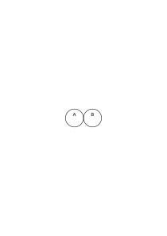
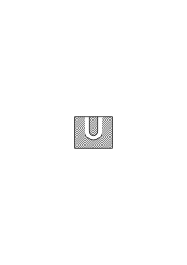
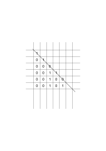
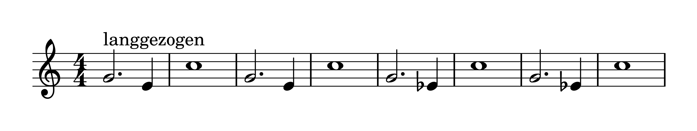
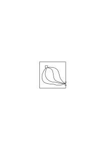
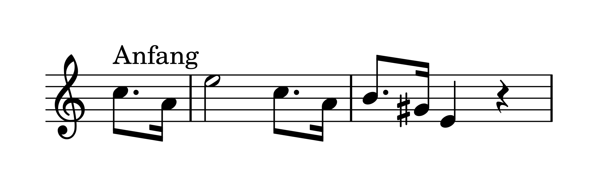
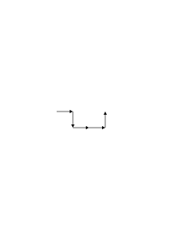
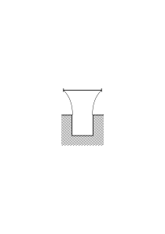
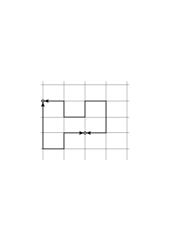
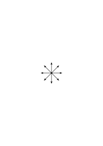

# Ms-157a

9 published remarks, VB

### [FCv\[1\]](https://cdn.wittgensteinnachlass.com/2000px/webp/Ms-157a/FCv.webp)

06.04.1934

You want to designate the picture, representing what you are seeing now, saying “This is the picture of what is actually seen.”

### [FCv\[2\]](https://cdn.wittgensteinnachlass.com/2000px/webp/Ms-157a/FCv.webp)

You say, pointing to it, “this is the only thing that is seen.”

### [FCv\[3\]](https://cdn.wittgensteinnachlass.com/2000px/webp/Ms-157a/FCv.webp)

Is “being actually seen” a description? That is, is it a predicate?

### [FCv\[4\]](https://cdn.wittgensteinnachlass.com/2000px/webp/Ms-157a/FCv.webp),[1r\[1\]](https://cdn.wittgensteinnachlass.com/2000px/webp/Ms-157a/1r.webp)

Philosophers say there are sense-data; or: they believe there are sense-data. This amounts to saying they believe that it happens that someone believes they see an object, independently of whether it is actually in front of their eyes or not.

### [1r\[2\]](https://cdn.wittgensteinnachlass.com/2000px/webp/Ms-157a/1r.webp),[1v\[1\]](https://cdn.wittgensteinnachlass.com/2000px/webp/Ms-157a/1v.webp)

If, however, one uses the word “sense-datum,” one must always first become conscious of what grammar it has. For its actual purpose was to bring appearance & reality into correspondence, & the danger now is that one forgets the difference in the grammar of appearance & reality.

### [1v\[2\]](https://cdn.wittgensteinnachlass.com/2000px/webp/Ms-157a/1v.webp)

If, pointing to it, one says “this is the only thing that is actually seen,” one makes the mistake that one apparently asserts something that could also be false, while wanting to introduce a uniqueness into the grammar.

### [1v\[3\]](https://cdn.wittgensteinnachlass.com/2000px/webp/Ms-157a/1v.webp),[2r\[1\]](https://cdn.wittgensteinnachlass.com/2000px/webp/Ms-157a/2r.webp)

If I say: “this (what is described here) is the only thing that is actually seen,” then I give the description a _title_. But a title that I cannot justify.

### [VB](/w-vb/#ms-157a-2r.2) [2r\[2\]](https://cdn.wittgensteinnachlass.com/2000px/webp/Ms-157a/2r.webp) {#2r-2}

If I say: “this is the only thing that is actually seen,” then I point to it. But if I were to point sideways or behind me – to things that I would not see – then this pointing would lose all sense for me. This means that I point to it in contrast to nothing. (Whoever is in a hurry will, when sitting in a car, involuntarily push, even though he can say to himself that he is not pushing the car at all.)

### [2v\[1\]](https://cdn.wittgensteinnachlass.com/2000px/webp/Ms-157a/2v.webp)

One could also say: if it were to make sense to say, “this is what I see” by pointing forward (where ‘forward’ is a determination of the visual field), then it would also have to make sense if it were also false to say “this is what I do not see” by pointing forward & “this is what I see” by pointing sideways.

### [2v\[2\]](https://cdn.wittgensteinnachlass.com/2000px/webp/Ms-157a/2v.webp)

And in that respect, “only this is actually seen” now reminds us of a tautology.

### [3r\[1\]](https://cdn.wittgensteinnachlass.com/2000px/webp/Ms-157a/3r.webp)

One of the sources of this pseudo-statement is the statement “I only see this,” which determines the limits of my field of vision _in Euclidean space_. Here we have the case of “I am here.”

### [3r\[2\]](https://cdn.wittgensteinnachlass.com/2000px/webp/Ms-157a/3r.webp)

“Only the description that _I_ give is the description of what is seen.”

### [3r\[3\]](https://cdn.wittgensteinnachlass.com/2000px/webp/Ms-157a/3r.webp),[3v\[1\]](https://cdn.wittgensteinnachlass.com/2000px/webp/Ms-157a/3v.webp)

“It comes towards me” also makes sense, even if nothing in reality approaches my body. Likewise, “it is here” even if nothing is near my body, & conversely “I am here,” when I let my voice be heard in Euclidean space.

### [3v\[2\]](https://cdn.wittgensteinnachlass.com/2000px/webp/Ms-157a/3v.webp)

The criterion that someone is addressing me is that he appears en face to me.

### [3v\[3\]](https://cdn.wittgensteinnachlass.com/2000px/webp/Ms-157a/3v.webp),[4r\[1\]](https://cdn.wittgensteinnachlass.com/2000px/webp/Ms-157a/4r.webp)

“Only this description is a description of what is seen”: how can I justify this statement? Now I only see this & that! But further, ‘I’ should not here refer to a person. That is, not to something in physical space. I am, as it were, alone with myself in the visual space. I have several descriptions in front of me & now say, pointing to one: only this has (visual) reality behind it. – & am I now saying this to myself or to the other? For in this way, approximately, the nonsense arises that I say nothing to neither myself nor to the other (“I am here”).

### [4r\[2\]](https://cdn.wittgensteinnachlass.com/2000px/webp/Ms-157a/4r.webp),[4v\[1\]](https://cdn.wittgensteinnachlass.com/2000px/webp/Ms-157a/4v.webp)

If I ask: “What does the description have behind it?”, what would be the answer? Would it be: “_that_” (with a gesture that points forward)?

### [4v\[2\]](https://cdn.wittgensteinnachlass.com/2000px/webp/Ms-157a/4v.webp)

To say “_that_ is now seen” is similar to pointing to it & saying “_this_”.

### [4v\[3\]](https://cdn.wittgensteinnachlass.com/2000px/webp/Ms-157a/4v.webp)

“This is the only description behind which there is a reality.” The others one could call blind descriptions.

### [4v\[4\]](https://cdn.wittgensteinnachlass.com/2000px/webp/Ms-157a/4v.webp),[5r\[1\]](https://cdn.wittgensteinnachlass.com/2000px/webp/Ms-157a/5r.webp)

I am treating here what is seen as a picture, i.e., an object, whereas I want to emphasize that it has no neighbor.

### [5r\[2\]](https://cdn.wittgensteinnachlass.com/2000px/webp/Ms-157a/5r.webp)

Think of the contrast _that_ & _that_ & its variants.

### [5r\[3\]](https://cdn.wittgensteinnachlass.com/2000px/webp/Ms-157a/5r.webp)

“One could also say: _This_ description is taken from a reality; is compared with a reality.”

### [5r\[4\]](https://cdn.wittgensteinnachlass.com/2000px/webp/Ms-157a/5r.webp),[5v\[1\]](https://cdn.wittgensteinnachlass.com/2000px/webp/Ms-157a/5v.webp)

In what sense can I say that my description is derived from what I see? In what sense is it the projection of what I see? Now, it is clear that what I say can be derived from the painted picture of what I see, or from the group of objects in front of my eyes. – But, one will say, “it is not essential that something painted or actual objects are in front of my eyes. I derive it from the sense-datum.”

### [5v\[2\]](https://cdn.wittgensteinnachlass.com/2000px/webp/Ms-157a/5v.webp),[6r\[1\]](https://cdn.wittgensteinnachlass.com/2000px/webp/Ms-157a/6r.webp),[6v\[1\]](https://cdn.wittgensteinnachlass.com/2000px/webp/Ms-157a/6v.webp),[7r\[1\]](https://cdn.wittgensteinnachlass.com/2000px/webp/Ms-157a/7r.webp)

This is now connected with the fact that we are inclined to say that we could never know what the other person really sees when he says he sees ‘brown’. We could suggest to the person who says this that he use two different words instead of the one “brown”. One for _this impression of his_, the other for what everyone can understand. He will then see that something is wrong with his perception. And it lies in the fact that he seeks a justification where there is none. (As in the case where someone believes that the chain of reasons has no end. Think of the justification of a mathematical action through a general formula.) Saying that I derive a sentence from reality means nothing, because otherwise the method of this derivation would be given by a pattern of reality, which does not belong to reality. I can probably see a sample chart in which one color is assigned the word “brown” and also a spot of the same color and now say: so I must use the word “brown” here. But I cannot say that I derive the word “brown” from the particular impression.

### [7r\[2\]](https://cdn.wittgensteinnachlass.com/2000px/webp/Ms-157a/7r.webp),[7v\[1\]](https://cdn.wittgensteinnachlass.com/2000px/webp/Ms-157a/7v.webp)

Does my body now have pain? – One would like to say: “How can the body have pain? The body is, in itself, something dead; the body knows nothing of itself!” And here it is again as if we look into the essence of pain and _recognize_ as a fact of its nature that the body cannot have it, and it is as if we recognize that what has it must be a being of another kind, namely of a mental kind.

### [7v\[2\]](https://cdn.wittgensteinnachlass.com/2000px/webp/Ms-157a/7v.webp)

But to say that the ‘I’ is of a mental kind is like saying that the number 3 is of a mental kind (because one recognizes that ‘3’ is not used to designate a physical object).

### [7v\[3\]](https://cdn.wittgensteinnachlass.com/2000px/webp/Ms-157a/7v.webp)

Words are not a noise that accompanies reality.

### [8r\[1\]](https://cdn.wittgensteinnachlass.com/2000px/webp/Ms-157a/8r.webp),[8v\[1\]](https://cdn.wittgensteinnachlass.com/2000px/webp/Ms-157a/8v.webp)

On the other hand, the way of speaking would also be justified: this body has pain, and we would then speak to it in the same way as now, to go to the doctor, to take medicine, etc. But would this way of speaking, even if we adopt it, always be indirect, like beating the sack and meaning the donkey? – Is it indirect to say “let us write ‘3’ instead of ‘x’” instead of saying “let us substitute 3 for x”? It only depends on how we continue to use our words. Let us not be deceived that meaning is an occult process that contains the whole use of the sign, as the seed contains the tree!

### [8v\[2\]](https://cdn.wittgensteinnachlass.com/2000px/webp/Ms-157a/8v.webp),[9r\[1\]](https://cdn.wittgensteinnachlass.com/2000px/webp/Ms-157a/9r.webp)

Your sentence that what has pain or thinks is of a mental nature only corresponds to the fact that the word “I” in “I have pain” does not designate a specific body because it cannot be replaced by a description of the body.

### [9r\[2\]](https://cdn.wittgensteinnachlass.com/2000px/webp/Ms-157a/9r.webp)

It seems to us that there is a continuity of experience which consists neither in the fact that the same person sees, nor in the fact that the same thing is seen, but in the fact that in _this_ sense one sees.

### [9r\[3\]](https://cdn.wittgensteinnachlass.com/2000px/webp/Ms-157a/9r.webp),[9v\[1\]](https://cdn.wittgensteinnachlass.com/2000px/webp/Ms-157a/9v.webp)

But a continuity does not exist here, but I name something _without_ the justification of a continuity.

### [9v\[2\]](https://cdn.wittgensteinnachlass.com/2000px/webp/Ms-157a/9v.webp),[10r\[1\]](https://cdn.wittgensteinnachlass.com/2000px/webp/Ms-157a/10r.webp),[10v\[1\]](https://cdn.wittgensteinnachlass.com/2000px/webp/Ms-157a/10v.webp)

“Action at a distance” is then impossible if one understands “action” as pushing, shoving, etc. (Because contact is not everything.

If A & B touch each other & an action is exerted from the center of A on the center of B, then the contact of A & B does not help us if we do not assume that the action was transmitted through processes between the two centers.) One must change one’s concept of _action_ in order to allow for action at a distance. This becomes clear if one thinks, for example: “the sun does not act on the earth at all; the earth simply moves _randomly_ in this orbit around the sun, perhaps being moved to do so by other _actions_.” If one then takes Kepler’s laws or the law of gravitation as a description of the Earth’s motion around the sun—which they remain—then the difficulty of the idea of action at a distance disappears.

### [10v\[2\]](https://cdn.wittgensteinnachlass.com/2000px/webp/Ms-157a/10v.webp),[11r\[1\]](https://cdn.wittgensteinnachlass.com/2000px/webp/Ms-157a/11r.webp)

What kind of argument is that? “If we think of all the water outside the tube as being rigid, it would have no influence on the water in the tube.” How does one know that? – One does _not_ know it; one simply assumes it. This is, in a way, a special case of an _axiom_ that we assume. But what axiom?

### [11r\[2\]](https://cdn.wittgensteinnachlass.com/2000px/webp/Ms-157a/11r.webp),[11v\[1\]](https://cdn.wittgensteinnachlass.com/2000px/webp/Ms-157a/11v.webp)

My choice is free means nothing other than: I can choose. And that I sometimes choose, there can be no doubt about that. What one calls free is _only_ the choice itself. To say: “we only believe that we choose” is nonsense. The process that we call ‘choosing’ takes place whether or not the result of the choice can be predicted according to natural laws.

### [11v\[2\]](https://cdn.wittgensteinnachlass.com/2000px/webp/Ms-157a/11v.webp)

“Willing is also only an experience,” I would like to say (the ‘will’ also only ‘image’). It comes when it comes, & I cannot bring it about.

### [11v\[3\]](https://cdn.wittgensteinnachlass.com/2000px/webp/Ms-157a/11v.webp),[12r\[1\]](https://cdn.wittgensteinnachlass.com/2000px/webp/Ms-157a/12r.webp)

And yet one would like to say: “in the case of images we are passive, in the case of will active. There is a difference between experiencing something & doing something.”

### [12r\[2\]](https://cdn.wittgensteinnachlass.com/2000px/webp/Ms-157a/12r.webp)

Certainly. But is one not only inclined to this general division when one thinks of (very) specific experiences & some special acts of will? E.g., on the one hand, the calm hearing or seeing of events, & on the other hand, the movement of rowing.

### [12r\[3\]](https://cdn.wittgensteinnachlass.com/2000px/webp/Ms-157a/12r.webp),[12v\[1\]](https://cdn.wittgensteinnachlass.com/2000px/webp/Ms-157a/12v.webp)

One says: Perhaps it will happen to you one day that you see or hear this; but one does not say: perhaps it will happen to you one day that you will this. Because, one would like to say, if you want (are inclined) you can will at any time. Because you are doing it yourself. (Not the body, which is only partly dependent on you, but _you_.)

### [12v\[2\]](https://cdn.wittgensteinnachlass.com/2000px/webp/Ms-157a/12v.webp),[13r\[1\]](https://cdn.wittgensteinnachlass.com/2000px/webp/Ms-157a/13r.webp)

Here one imagines the willing subject as a massless (i.e., inertia-less) being; as a motor that does not have to overcome any inertia in itself. And thus only a driving force & not also a driven force. That is to say: One can say “I want, but my body does not follow me,” but not: “my will does not follow me.” But in the sense in which it cannot _fail_ me to want, I cannot _try_ to want either.

### [13r\[2\]](https://cdn.wittgensteinnachlass.com/2000px/webp/Ms-157a/13r.webp)

And one could say: “I can only will at any time in so far as I can never try to want.”

### [13r\[3\]](https://cdn.wittgensteinnachlass.com/2000px/webp/Ms-157a/13r.webp),[13v\[1\]](https://cdn.wittgensteinnachlass.com/2000px/webp/Ms-157a/13v.webp)

And to say that I cannot try to want is, of course, no statement about the natural history of the will. It is the verb “to want” that makes us try to compare the activity of willing with the activity of carrying out the will, & to take the grammatical difference as a difference of properties.

### [13v\[2\]](https://cdn.wittgensteinnachlass.com/2000px/webp/Ms-157a/13v.webp),[14r\[1\]](https://cdn.wittgensteinnachlass.com/2000px/webp/Ms-157a/14r.webp),[14v\[1\]](https://cdn.wittgensteinnachlass.com/2000px/webp/Ms-157a/14v.webp)

Let us now ask: “Does something happen to me, do I experience something, when I act arbitrarily?” Do I have an experience? Well, if I raise my arm, for example, & see how it rises, then at least this much can be said that I experience something. As for my muscular sensation, one would also call it an experience in itself. And now let us consider this: that the activities of deliberation are independent of the experiences in the actual execution of the movement. That is to say, this deliberation, consideration, choosing could take place, a decision could be made, & the arbitrary action could still not take place. And conversely, the arbitrary action could be carried out without _any_ previous deliberation.

### [14v\[2\]](https://cdn.wittgensteinnachlass.com/2000px/webp/Ms-157a/14v.webp),[15r\[1\]](https://cdn.wittgensteinnachlass.com/2000px/webp/Ms-157a/15r.webp),[15v\[1\]](https://cdn.wittgensteinnachlass.com/2000px/webp/Ms-157a/15v.webp)

Why shouldn't the stimulation of a muscle or nerve trigger an arbitrary action? But not in such a way that it causes, for example, a pain that serves as a motive for the action, but rather in such a way that it triggers all the sensations of the voluntary movement. – But if I now _intend_ not to make this movement, how can this intention be reconciled with the undesired, yet voluntary, movement? Will I _feel_ that the electric current is causing the movement? No, according to the assumption, my experience regarding the movement will be the same as it would be if I were to raise my arm voluntarily, and only through the _coincidence_ will I know that the electric current is the cause of my action.

### [15v\[2\]](https://cdn.wittgensteinnachlass.com/2000px/webp/Ms-157a/15v.webp)

Can one say: I am in this case forced, but my feeling deceives me into thinking that I am free? No, I am not forced in one sense, and I am in another.

### [15v\[3\]](https://cdn.wittgensteinnachlass.com/2000px/webp/Ms-157a/15v.webp),[16r\[1\]](https://cdn.wittgensteinnachlass.com/2000px/webp/Ms-157a/16r.webp)

When we suck liquid through a tube or straw, we tend to think that we are sucking with our mouth, our cheeks, because we feel the air pressure in them, – but no exertion in the chest muscles that exert the force.

### [16r\[2\]](https://cdn.wittgensteinnachlass.com/2000px/webp/Ms-157a/16r.webp),[16v\[1\]](https://cdn.wittgensteinnachlass.com/2000px/webp/Ms-157a/16v.webp)

“Willing is also just an experience…etc.” What is this directed against? And if the assumption that it rejects was a mistake; how could one have made this mistake? What seduced us to it? What is the idea, the analogy, at the bottom of the view that there is a passive principle, the idea, and an active one, the will?

### [16v\[2\]](https://cdn.wittgensteinnachlass.com/2000px/webp/Ms-157a/16v.webp)

It is, of course, immediately a difficulty in this conception, namely that what the will performs must manifest itself in the idea.

Should what the will wills be something in the idea?

### [16v\[3\]](https://cdn.wittgensteinnachlass.com/2000px/webp/Ms-157a/16v.webp),[17r\[1\]](https://cdn.wittgensteinnachlass.com/2000px/webp/Ms-157a/17r.webp)

Now it is quite different: to raise the arm and feel that it is being raised, or to observe that it is raising and I believe that this opposition is what the division comes from.

### [17v\[1\]-relocated](https://cdn.wittgensteinnachlass.com/2000px/webp/Ms-157a/17v.webp)

f(x ∙ y) = 0⌵1 0 + 1 = 1, 1 + 1 = 0

f(x, x) + 1

f(x, n)

### [17r\[2\]](https://cdn.wittgensteinnachlass.com/2000px/webp/Ms-157a/17r.webp),[17v\[1\]](https://cdn.wittgensteinnachlass.com/2000px/webp/Ms-157a/17v.webp),[17ar\[1\]](https://cdn.wittgensteinnachlass.com/2000px/webp/Ms-157a/17ar.webp)

“Doing” doesn’t seem to have any volume of idea at all. It seems like a point without extension, the tip of a needle. This tip seems to be the actual agent. And everything that happens in the phenomenon is only a consequence of this doing. “I do” seems to have a certain sense, detached from any experience.

### [17ar\[2\]](https://cdn.wittgensteinnachlass.com/2000px/webp/Ms-157a/17ar.webp)

But if I think of an application of this expression, then there is always a phenomenon at play.

### [17ar\[3\]](https://cdn.wittgensteinnachlass.com/2000px/webp/Ms-157a/17ar.webp)

What creates the impression that there is a doing detached from experiencing is the existence of the expressions “I do that,” “I raise my arm” in contrast to “My arm raises itself” or “I feel, see how my arm raises itself.”

### [17ar\[4\]](https://cdn.wittgensteinnachlass.com/2000px/webp/Ms-157a/17ar.webp),[17av\[2\]](https://cdn.wittgensteinnachlass.com/2000px/webp/Ms-157a/17av.webp)

We are impressed by this opposition of expressions when we see the immediately given as doing and perceiving.

### [17av\[1\]-relocated](https://cdn.wittgensteinnachlass.com/2000px/webp/Ms-157a/17av.webp)

### [17av\[2\]](https://cdn.wittgensteinnachlass.com/2000px/webp/Ms-157a/17av.webp)

But let us not forget one thing: If ‘I raise my arm’, ‘my arm raises itself’; and the problem arises: What is it that remains when I subtract the fact that I raise my arm from the fact that my arm raises itself.

### [18r\[1\]](https://cdn.wittgensteinnachlass.com/2000px/webp/Ms-157a/18r.webp)

Ask yourself: is the deliberation that leads to action itself an experience or an activity? And in general: is thinking an experience or an activity? How do you want to call it? – (One often reads in stories the expression “suddenly he heard himself say the words…”)

### [18r\[2\]](https://cdn.wittgensteinnachlass.com/2000px/webp/Ms-157a/18r.webp),[18v\[1\]](https://cdn.wittgensteinnachlass.com/2000px/webp/Ms-157a/18v.webp)

“Does it happen to us that we wish, or do we do it?” Yes, does this question make sense? It certainly makes sense to ask: Did you raise your arm intentionally, or did it raise itself ‘on its own’?” and the question of whether wishing is a doing or an experience can then only mean whether wishing is more similar to the arbitrary raising of the arm or the experience that my arm raises itself. (Lichtenberg: “it thinks”)

### [18v\[2\]](https://cdn.wittgensteinnachlass.com/2000px/webp/Ms-157a/18v.webp),[19r\[1\]](https://cdn.wittgensteinnachlass.com/2000px/webp/Ms-157a/19r.webp)

It also makes no sense to ask: “is willing really an experience?” The peculiar difficulty of this question already shows that it is not really a question.

### [19r\[2\]](https://cdn.wittgensteinnachlass.com/2000px/webp/Ms-157a/19r.webp)

Willing should be something that we ourselves create. And that should actually be something that is there, before it is there.

### [19r\[3\]](https://cdn.wittgensteinnachlass.com/2000px/webp/Ms-157a/19r.webp)

I would like to say: “I am not responsible for willing either; it comes when it comes.”

### [19r\[4\]](https://cdn.wittgensteinnachlass.com/2000px/webp/Ms-157a/19r.webp),[19v\[1\]](https://cdn.wittgensteinnachlass.com/2000px/webp/Ms-157a/19v.webp)

So wouldn't we speak of the movement of our arm. And here is the domain in which it makes sense to speak of something not simply happening to us, but of us doing it.

### [19v\[2\]](https://cdn.wittgensteinnachlass.com/2000px/webp/Ms-157a/19v.webp)

One first looks at a process that, as it were, has a preparation in the will, and then one says that the whole thing does not have a preparation of its own.

### [19v\[3\]](https://cdn.wittgensteinnachlass.com/2000px/webp/Ms-157a/19v.webp),[20r\[1\]](https://cdn.wittgensteinnachlass.com/2000px/webp/Ms-157a/20r.webp)

Consider the paradox: “that there is actually no soft thing; for even the softest thing I lie on has (then) a definite shape, and this shape is not more definite if it is made of steel.”

### [20r\[2\]](https://cdn.wittgensteinnachlass.com/2000px/webp/Ms-157a/20r.webp)

“Yes, I chose that; but did I also choose that I chose it?”

### [20r\[3\]](https://cdn.wittgensteinnachlass.com/2000px/webp/Ms-157a/20r.webp)

The antithesis of happening – doing is clearly at home in the realm of actions.

### [20v\[1\]](https://cdn.wittgensteinnachlass.com/2000px/webp/Ms-157a/20v.webp)

“But mustn’t I also wait for the arbitrary action? Can I want what I want?”

### [20v\[2\]](https://cdn.wittgensteinnachlass.com/2000px/webp/Ms-157a/20v.webp)

Here one makes a similar mistake as when one speaks of the direction of time.

### [20v\[3\]](https://cdn.wittgensteinnachlass.com/2000px/webp/Ms-157a/20v.webp)

It makes sense to speak of an arbitrary raising of the arm, but not of an arbitrary – or involuntary – willing.

### [20v\[4\]](https://cdn.wittgensteinnachlass.com/2000px/webp/Ms-157a/20v.webp),[21r\[1\]](https://cdn.wittgensteinnachlass.com/2000px/webp/Ms-157a/21r.webp)

It does happen that one waits to want to do something, and on the other hand, one can also bring about the wanting (swimming).

### [21r\[2\]](https://cdn.wittgensteinnachlass.com/2000px/webp/Ms-157a/21r.webp)

The action happens when I will. “But do you also will when you will?” That means nothing. And the fact that it means nothing is due to the fact that here the word “willing” is misunderstood grammatically, as is the word “time” when one thinks that time must move at a certain speed.

### [21v\[1\]](https://cdn.wittgensteinnachlass.com/2000px/webp/Ms-157a/21v.webp)

“The willing comes when it comes,” and that means that it should actually be something that is there, before it is there.

### [21v\[2\]](https://cdn.wittgensteinnachlass.com/2000px/webp/Ms-157a/21v.webp)

“It comes when it comes, I cannot bring it about”: Now in one sense I _can_ bring it about (if I deliberately put myself in a coercive situation) (swimming), and on the other hand, the impossibility is a logical one.

### [22r\[1\]](https://cdn.wittgensteinnachlass.com/2000px/webp/Ms-157a/22r.webp)

“The willing should arise from _one's own_ power.” – Well, if you will, we can say that it arises from one's own power. But that doesn't tell us anything about willing; it only amounts to a grammatical remark about the word “willing.”

### [22r\[2\]](https://cdn.wittgensteinnachlass.com/2000px/webp/Ms-157a/22r.webp),[22v\[1\]](https://cdn.wittgensteinnachlass.com/2000px/webp/Ms-157a/22v.webp)

“I cannot bring it about”? Yes, I can bring it about, in the sense in which I can bring about anything. I cannot _will_ it. And that means that it makes no sense to say that I willed something arbitrarily or involuntarily.

### [22v\[2\]](https://cdn.wittgensteinnachlass.com/2000px/webp/Ms-157a/22v.webp)

Paradox of softness, and the form could not be more definite if it were made of steel.

### [22v\[3\]](https://cdn.wittgensteinnachlass.com/2000px/webp/Ms-157a/22v.webp)

Phenomena of coercion, bringing about, trying.

### [VB](/w-vb/#ms-157a-22v.4) [22v\[4\]](https://cdn.wittgensteinnachlass.com/2000px/webp/Ms-157a/22v.webp) {#22v-4}

[In my artistic activities, I only have _good manners_.]

### [22v\[5\]](https://cdn.wittgensteinnachlass.com/2000px/webp/Ms-157a/22v.webp)

What is it that we want? _What_ is the object of willing?

### [23r\[1\]](https://cdn.wittgensteinnachlass.com/2000px/webp/Ms-157a/23r.webp)

The philosophical problem seems unsolvable, until one sees that there is a disease of the form of expression.

### [23r\[2\]](https://cdn.wittgensteinnachlass.com/2000px/webp/Ms-157a/23r.webp)

I said that willing cannot be brought about, because I did not understand “bringing about” to mean causing.

### [23r\[3\]](https://cdn.wittgensteinnachlass.com/2000px/webp/Ms-157a/23r.webp),[23v\[1\]](https://cdn.wittgensteinnachlass.com/2000px/webp/Ms-157a/23v.webp)

How does one imagine a non-causal bringing about? One thinks, I believe, of an inevitable mechanism, in contrast to, for example, remote forces, springs, and the like.

### [23v\[2\]](https://cdn.wittgensteinnachlass.com/2000px/webp/Ms-157a/23v.webp)

My expression came from the fact that I thought of willing as a bringing about, but not as a causing, but – I would like to say – as a direct, non-causal bringing about. And this idea is based on the idea that …

### [23v\[3\]](https://cdn.wittgensteinnachlass.com/2000px/webp/Ms-157a/23v.webp),[24r\[1\]](https://cdn.wittgensteinnachlass.com/2000px/webp/Ms-157a/24r.webp)

So the face that inspires us with fear or delight (the object of fear, delight, etc.) is not its cause; rather, one could say, it is its direction.

### [24r\[2\]](https://cdn.wittgensteinnachlass.com/2000px/webp/Ms-157a/24r.webp)

[If everything is in order in a household, the family members all sit together at breakfast, have similar customs, etc. But if there is a terrible illness in the house, then everyone thinks of a different way to get help, and quite opposite efforts easily emerge. Paul and I.]

### [24v\[1\]](https://cdn.wittgensteinnachlass.com/2000px/webp/Ms-157a/24v.webp)

Is beauty inherent in the beautiful face, or is it an effect of the face on me?

### [24v\[2\]](https://cdn.wittgensteinnachlass.com/2000px/webp/Ms-157a/24v.webp),[25r\[1\]](https://cdn.wittgensteinnachlass.com/2000px/webp/Ms-157a/25r.webp),[25v\[1\]](https://cdn.wittgensteinnachlass.com/2000px/webp/Ms-157a/25v.webp),[26r\[1\]](https://cdn.wittgensteinnachlass.com/2000px/webp/Ms-157a/26r.webp),[26v\[1\]](https://cdn.wittgensteinnachlass.com/2000px/webp/Ms-157a/26v.webp)

Inherent – when we think of properties like color, hardness, etc. So, the question is: is the face _beautiful_ in the same sense that it is _pale_? Or is something _beautiful_ in the way that it is _useful_? That is, is the grammar of the word ‘beautiful’ analogous to that of the word ‘pale’ or to that of the word ‘useful’?

Does “beautiful” mean: pleasant? Its meaning is _related_ to that of “pleasant.” – But consider: what is it that holds together the chord progressions that harmonic theory allows? That they are pleasant? Or should I say: if not that they are pleasant, then that they evoke _a specific_ sensation or disposition in us? Is this feeling something like a joyful encounter, a welcoming, in contrast to the reaction of rejection & withdrawal? _Certainly_ these reactions are also involved! But why doesn’t this explanation satisfy us completely? We would like to say: these sensations, etc., are only accompaniments to beauty; beauty itself is in the object. But let us examine: even if the joyful encounter & everything of that sort is characteristic of the sequences approved by harmonic theory, is harmonic theory structured in such a way that we test whether a sequence is more or less pleasant to us, as we might weigh the ingredients of a dish according to taste? And is the difference only that there are more general valid laws for the taste of tonal sequences than for the taste of food? Yes, can one even indicate _a_ reason why harmonic theory is as it is? And, above all, _must_ such a reason be indicated? It is what it is, and it is part of our whole life.

### [26v\[2\]](https://cdn.wittgensteinnachlass.com/2000px/webp/Ms-157a/26v.webp)

<s> “This tulip is beautiful!” – “What do you find beautiful about it?” – “Look at its shape; it has just the right length & the calyx is open but, as it were, still taut, not drooping.” </s>

### [26v\[3\]](https://cdn.wittgensteinnachlass.com/2000px/webp/Ms-157a/26v.webp),[27r\[1\]](https://cdn.wittgensteinnachlass.com/2000px/webp/Ms-157a/27r.webp)

What is beautiful about this flower? What about this landscape, – this melody, this symphony? What do all of these beauties have in common? Is there still something in common here? And if there is still a thin thread running through them all, is it what connects them for us? No. They are connected by a broad and strong band, but none of the fibers from which it consists runs through from one end to the other.

### [27r\[2\]](https://cdn.wittgensteinnachlass.com/2000px/webp/Ms-157a/27r.webp),[27v\[1\]](https://cdn.wittgensteinnachlass.com/2000px/webp/Ms-157a/27v.webp)

Is beauty inherent in the sight? Why shouldn’t one call it inherent? Doesn’t that depend on what one calls the ‘sight’? – Because, the fact that something is beautiful does not consist in the fact that it is the cause of a certain effect (e.g., a feeling of well-being).

### [27v\[2\]](https://cdn.wittgensteinnachlass.com/2000px/webp/Ms-157a/27v.webp)

Beauty has the structure of the beautiful object. We follow the beautiful line with pleasure.

### [27v\[3\]](https://cdn.wittgensteinnachlass.com/2000px/webp/Ms-157a/27v.webp),[28r\[1\]](https://cdn.wittgensteinnachlass.com/2000px/webp/Ms-157a/28r.webp)

Would something be beautiful if no one found it beautiful? Would toothache be unpleasant if no one suffered from it? As far as toothache is concerned, and to the extent that it is related to the existence of a living being, the fact that it is ‘unpleasant’ is also related to the existence of a suffering subject.

### [28r\[2\]](https://cdn.wittgensteinnachlass.com/2000px/webp/Ms-157a/28r.webp),[28v\[1\]](https://cdn.wittgensteinnachlass.com/2000px/webp/Ms-157a/28v.webp)

Because, what is beautiful – the tree, or the sight of the tree? Certainly, only the tree as something _visible_ is beautiful. When I speak of beautiful proportions, I don’t mean the ratio, for example, of two wavelengths of light.

### [28v\[2\]](https://cdn.wittgensteinnachlass.com/2000px/webp/Ms-157a/28v.webp)

One could (but need not) express this by saying that the visual sense-datum of the tree is what is beautiful. But this does not presuppose a seeing person.

### [28v\[3\]](https://cdn.wittgensteinnachlass.com/2000px/webp/Ms-157a/28v.webp),[29r\[1\]](https://cdn.wittgensteinnachlass.com/2000px/webp/Ms-157a/29r.webp)

What one fears need not be the cause of the fear. It would be easy to imagine a case in which someone, under the influence of a poison, for example, fears everything that is presented to him. One would then say that the cause of the fear is the poison.

### [29r\[2\]](https://cdn.wittgensteinnachlass.com/2000px/webp/Ms-157a/29r.webp)

When I say: I am afraid because he is looking at me, this “because” does not indicate a causal connection.

### [29r\[3\]](https://cdn.wittgensteinnachlass.com/2000px/webp/Ms-157a/29r.webp)

It is important to distinguish between the object of fear and the cause of fear.

### [29r\[4\]](https://cdn.wittgensteinnachlass.com/2000px/webp/Ms-157a/29r.webp),[29v\[1\]](https://cdn.wittgensteinnachlass.com/2000px/webp/Ms-157a/29v.webp)

The method of mathematics: let us arrive at the most surprising result as quickly as possible. We, on the other hand, are looking for the least surprising result.

### [29v\[2\]](https://cdn.wittgensteinnachlass.com/2000px/webp/Ms-157a/29v.webp)

Regarding the diagonal method: one can indicate a law that does not agree with it at any point.

### [29v\[3\]](https://cdn.wittgensteinnachlass.com/2000px/webp/Ms-157a/29v.webp),[30r\[1\]](https://cdn.wittgensteinnachlass.com/2000px/webp/Ms-157a/30r.webp)

It helps, I think, to view the construction of an infinite decimal number different from π as a kind of negation of π.

### [30r\[2\]](https://cdn.wittgensteinnachlass.com/2000px/webp/Ms-157a/30r.webp)

(For one doesn’t find something that doesn’t agree with π, but rather one operates on the basis of π by negating it.)

### [30r\[3\]](https://cdn.wittgensteinnachlass.com/2000px/webp/Ms-157a/30r.webp),[30v\[1\]](https://cdn.wittgensteinnachlass.com/2000px/webp/Ms-157a/30v.webp)

Question: 1. Can one specify a law that does not agree with it at all points? 2. Can one always find, among a finite number of real numbers, one that does not agree with the real numbers in all, but in infinitely many places?

### [30v\[2\]](https://cdn.wittgensteinnachlass.com/2000px/webp/Ms-157a/30v.webp)

˙01100111001000

˙10011000110111

### [30v\[4\]](https://cdn.wittgensteinnachlass.com/2000px/webp/Ms-157a/30v.webp),[31r\[1\]](https://cdn.wittgensteinnachlass.com/2000px/webp/Ms-157a/31r.webp),[31v\[1\]](https://cdn.wittgensteinnachlass.com/2000px/webp/Ms-157a/31v.webp)

Searching without a memory-image. Does the searcher also need an image of sameness? How does he know that his memory-image has not changed? How does he know that the pattern has not changed? “But something must be happening in him!” – Why? What role does showing the pattern play in the language-game? It can be part of teaching the language-game, of training, but it doesn’t have to occur in the language-game. In that case, it could also be completely omitted. “But he must know what red is.” But what does that consist of? In him retrieving the red object on command? Now he could also do that without an explanation. Or in an imagination? The same applies here.

### [31v\[2\]](https://cdn.wittgensteinnachlass.com/2000px/webp/Ms-157a/31v.webp),[32r\[1\]](https://cdn.wittgensteinnachlass.com/2000px/webp/Ms-157a/32r.webp)

Where does the slow sequence begin & where does the fast one end? One cannot say that the sequence begins at a point. But that doesn’t mean that its beginning is imprecise. Quantum theory. One says: “the slow

beating has not yet begun”; that makes good sense. But suppose he says it has not yet begun!

### [32r\[2\]](https://cdn.wittgensteinnachlass.com/2000px/webp/Ms-157a/32r.webp)

What role can the explanation of the sign play?

### [32r\[3\]](https://cdn.wittgensteinnachlass.com/2000px/webp/Ms-157a/32r.webp)

A source of countless errors & misunderstandings, also in everyday life, is: assuming _one_ cause behind every phenomenon. One cannot bring oneself to say: _many_ circumstances have brought about this & that result. Instead, _one_, occult cause is posited.

### [32v\[1\]](https://cdn.wittgensteinnachlass.com/2000px/webp/Ms-157a/32v.webp)

The role of the rule as _cause_ & ground.

As a cause, it plays the same role as the first primitive word teaching.

### [32v\[2\]](https://cdn.wittgensteinnachlass.com/2000px/webp/Ms-157a/32v.webp)

The role of images. We place the language means of actual patterns _beside_ that of the imagination.

### [32v\[3\]](https://cdn.wittgensteinnachlass.com/2000px/webp/Ms-157a/32v.webp),[33r\[1\]](https://cdn.wittgensteinnachlass.com/2000px/webp/Ms-157a/33r.webp)

One could say that what we are trying to do is simply to learn to know the grammar in all its complexity; in order not to fall into the errors that arise from thinking that we know the use of words more simply than it is.

### [33r\[2\]](https://cdn.wittgensteinnachlass.com/2000px/webp/Ms-157a/33r.webp)

“We do have a concept of the rule, even if we cannot give a clear definition…”. But in what sense do we _have_ a concept if we cannot give a definition? Where is this concept? What is our criterion for knowing that we have a concept?

### [33v\[1\]](https://cdn.wittgensteinnachlass.com/2000px/webp/Ms-157a/33v.webp)

Example as a rule

6 + 8

1 2 3 – – – – 6 1 2 3 – – – 8

1 2 3 – – – – – – – – – – – ?

If I say “the rule _guides_ the one who understands it”, then I could also explain it like this: “if the rule had been different, it would have guided him differently”. But what kind of statement is that? A hypothesis? “He follows me” means: _wherever_ I go, he also goes. So there is a generality involved. Game: A leads, B follows. He trusts himself to the rule.

### [33v\[2\]](https://cdn.wittgensteinnachlass.com/2000px/webp/Ms-157a/33v.webp),[34r\[1\]](https://cdn.wittgensteinnachlass.com/2000px/webp/Ms-157a/34r.webp),[34v\[1\]](https://cdn.wittgensteinnachlass.com/2000px/webp/Ms-157a/34v.webp)

Would it be a rule, to draw a certain number of circles, if no other figure is mentioned in the game? The game consists of drawing circles with a free hand and according to a given radius, according to the given model. I now say that the model is there so that it can be followed. Does that mean that if it were, for example, an oval, it would also be followed? – Can one not say: “Following is only following if one would follow it even if it were different”? – What, for example, is the point of writing “1 2 3 – – – 6 etc.” above? Wouldn’t “1-6 etc.” or just “6 etc.” do? For, what do I want with signs that cannot be replaced by others?

### [34v\[2\]](https://cdn.wittgensteinnachlass.com/2000px/webp/Ms-157a/34v.webp)

[Everything should relate to the consideration of the family, as this is what justifies my method.]

### [34v\[3\]](https://cdn.wittgensteinnachlass.com/2000px/webp/Ms-157a/34v.webp),[35r\[1\]](https://cdn.wittgensteinnachlass.com/2000px/webp/Ms-157a/35r.webp)

Language-game: To follow a rule. The rule is, for example: – – x x, i.e., always walk two steps & jump twice. We would call – – x x a rule; but only if it is a particular case of a general possibility; if, for example, every sign of the form: –, x, – x, x –, – – x, – x x, etc. can be used in the game.

### [35r\[2\]](https://cdn.wittgensteinnachlass.com/2000px/webp/Ms-157a/35r.webp)

Equally, we would call it a rule if we gave B the equation of the line along which he is to move. And we can also call it a rule if, instead of the equation, we give him a picture of the curve.

### [35r\[3\]](https://cdn.wittgensteinnachlass.com/2000px/webp/Ms-157a/35r.webp),[35v\[1\]](https://cdn.wittgensteinnachlass.com/2000px/webp/Ms-157a/35v.webp)

“If he doesn’t understand _that_, then he hasn’t understood the other either.” (To understand a sentence means to understand a language.)

### [35v\[2\]](https://cdn.wittgensteinnachlass.com/2000px/webp/Ms-157a/35v.webp)

Thus, I say he understands “1 + 1 = 2” if he would have understood “1 + 1 = 3”.

### [35v\[3\]](https://cdn.wittgensteinnachlass.com/2000px/webp/Ms-157a/35v.webp)

“<math class="stacked" display="inline"><mtext>‘</mtext><mi>y</mi><mspace width="0.3em"/><mo>=</mo><msup><mi>x</mi><mn>2</mn></msup></math>” tells him what to do. He successively substitutes the cardinal numbers for x and calculates y. But this presupposes for us, i.e., this is what we mean by saying that he could have followed the rule in other ways, if it had led him in other directions.

### [36r\[1\]](https://cdn.wittgensteinnachlass.com/2000px/webp/Ms-157a/36r.webp),[36v\[1\]](https://cdn.wittgensteinnachlass.com/2000px/webp/Ms-157a/36v.webp)

“If he understands _that_, then he must understand _this_ too.” This could mean all sorts of things. Above all, it could refer to a hypothesis: “If the inner mechanism is really like that, then it must also bring about _that_.” But this aspect of the matter does not interest me. The above sentence is actually supposed to mean: “If he understands the _system_, then he must also understand this sentence.” Or: “If he really _follows_ this line, then he would also follow it if it were different.”

### [36v\[2\]](https://cdn.wittgensteinnachlass.com/2000px/webp/Ms-157a/36v.webp),[37r\[1\]](https://cdn.wittgensteinnachlass.com/2000px/webp/Ms-157a/37r.webp)

Language-game: Following every line. If we imagine this game actually being played, it has a certain kind of generality. Of course, only a few specific lines are drawn and followed. But what is the nature of this generality? New lines are not rejected; there is then an expression for this in the language: “Draw new, different lines,” etc., etc.

### [37r\[2\]](https://cdn.wittgensteinnachlass.com/2000px/webp/Ms-157a/37r.webp)

Language-game: “Draw _different_ lines.” “Draw any line.”

### [37r\[3\]](https://cdn.wittgensteinnachlass.com/2000px/webp/Ms-157a/37r.webp)

Language-game: Follow a rule (e.g., – x – – x).

### [37r\[4\]](https://cdn.wittgensteinnachlass.com/2000px/webp/Ms-157a/37r.webp)

(The use of the expressions “etc.” and “e.g.”)

### [37r\[5\]](https://cdn.wittgensteinnachlass.com/2000px/webp/Ms-157a/37r.webp),[37v\[1\]](https://cdn.wittgensteinnachlass.com/2000px/webp/Ms-157a/37v.webp)

Could we also talk about the language-game of ‘following the rule – x x’? We would say: if we could train him to act on the sign “– x x” in such a way, then this sign would be equivalent to a _simple_ signal for us. The combination only makes sense if it occurs _freely_ and if it is followed freely. If the training did not refer to the use of the combined sign. – But, one could say, is this not just an uninteresting tool of training?

### [37v\[2\]](https://cdn.wittgensteinnachlass.com/2000px/webp/Ms-157a/37v.webp),[38r\[1\]](https://cdn.wittgensteinnachlass.com/2000px/webp/Ms-157a/38r.webp)

The idea that misleads us is that of _grasping the system_. One could, of course, call something specific that, e.g., the uttering, the inner uttering, the visualizing, etc., of a general formula (or, as I should actually say, a formula). But the generality here lies in criteria such as those of algebraic _notation_ or the _use_ of that formula in the game.

### [38r\[2\]](https://cdn.wittgensteinnachlass.com/2000px/webp/Ms-157a/38r.webp),[38v\[1\]](https://cdn.wittgensteinnachlass.com/2000px/webp/Ms-157a/38v.webp)

“If he grasps the system, then he will also be able to obey this command.” – What kind of sentence is that? Does it mean that, in experience, when someone has grasped the system…? Or is it the criterion of grasping, does grasping consist in his being able to obey that command?

### [38v\[2\]](https://cdn.wittgensteinnachlass.com/2000px/webp/Ms-157a/38v.webp)

One can _stipulate_ that _he_ has grasped the system who has written down the formula in general terms.

### [38v\[3\]](https://cdn.wittgensteinnachlass.com/2000px/webp/Ms-157a/38v.webp),[39r\[1\]](https://cdn.wittgensteinnachlass.com/2000px/webp/Ms-157a/39r.webp)

One can stipulate that someone understands the system of the signs x x – etc. when he sets about arranging them in a series: x, –, x –, – – x, x x –, x x – –, etc. One will also generally say that he understands it; but in doing so, one will think of a general system, an idea, that he has now grasped, or of a mental mechanism, an inevitable guiding principle that has now formed in him. But any such guiding principle is only inevitable if the parts of the machine are rigid bodies, and the criterion of their rigidity is only their behaviour in time. And so that picture of a mechanism is only another symbol of the kind of algebraic expression.

### [39r\[2\]](https://cdn.wittgensteinnachlass.com/2000px/webp/Ms-157a/39r.webp),[39v\[1\]](https://cdn.wittgensteinnachlass.com/2000px/webp/Ms-157a/39v.webp),[40r\[1\]](https://cdn.wittgensteinnachlass.com/2000px/webp/Ms-157a/40r.webp)

Let us give him a rule, if we train him to move according to the sign x x – in such and such a way, and now give him this sign? Let us also assume that it has turned out that a simple sign, e.g., ☒, does not bring him to move in that way. – But if we had brought him to act on the signs x, –, x –, – x, but not on any others, would we then say that he is following these signs? If he reacted to _any_ signs of this kind, we would certainly say that he is following them; that these are the rules according to which he acts. In the penultimate case, we would be doubtful – whether we should call his procedure that. The expression “to follow a rule” is taken from the last case; but this may lead us to apply the idea of ‘following’ or ‘being guided’ also to the first cases.

### [40r\[2\]](https://cdn.wittgensteinnachlass.com/2000px/webp/Ms-157a/40r.webp)

We call a rule, above all, something that has unlimited application.

### [40r\[3\]](https://cdn.wittgensteinnachlass.com/2000px/webp/Ms-157a/40r.webp)

[To be guided by the rule. To trust in the rule.]

### [40r\[4\]](https://cdn.wittgensteinnachlass.com/2000px/webp/Ms-157a/40r.webp),[40v\[1\]](https://cdn.wittgensteinnachlass.com/2000px/webp/Ms-157a/40v.webp)

The idea of the composite sign makes us think of the role that a composite component plays in a mechanism.

### [40v\[2\]](https://cdn.wittgensteinnachlass.com/2000px/webp/Ms-157a/40v.webp)

A sign “x – –” is of course composite, and our words and sentences are composed of letters. But this is not what I mean by “composite.” It has, I would say, nothing to do with the sense.

### [40v\[3\]](https://cdn.wittgensteinnachlass.com/2000px/webp/Ms-157a/40v.webp),[41r\[1\]](https://cdn.wittgensteinnachlass.com/2000px/webp/Ms-157a/41r.webp)

What then has to do with the sense? To see this, I need examples.

“Bring a cube to A.”

“Bring a cube to B.”

“Bring a pillar to A.”

“Bring a pillar to B.”

I say, it shows that he understands that he is following the new sign combination correctly. But do I mean: is it an indication of an inner mental process of ‘understanding’?

### [41r\[2\]](https://cdn.wittgensteinnachlass.com/2000px/webp/Ms-157a/41r.webp)

“He has grasped the system.”

### [41r\[3\]](https://cdn.wittgensteinnachlass.com/2000px/webp/Ms-157a/41r.webp),[41v\[1\]](https://cdn.wittgensteinnachlass.com/2000px/webp/Ms-157a/41v.webp)

We are tempted to say: the sign is composite if its composition gives its sense. But what is its sense? We think of “sense” as something outside the sign. As the use, as it takes place outside the sign. ‘The sign of the command is composite if we can extract from its composition what we have to do.’ What we have to do is, then, something like a picture of the action, which we construct according to the composite sign.

→ x → x x →

→

### [42r\[1\]](https://cdn.wittgensteinnachlass.com/2000px/webp/Ms-157a/42r.webp)

### [42r\[2\]](https://cdn.wittgensteinnachlass.com/2000px/webp/Ms-157a/42r.webp),[42v\[1\]](https://cdn.wittgensteinnachlass.com/2000px/webp/Ms-157a/42v.webp)

How is the word “to follow the rule” used? Does it describe a _process_? If, for example, I go on the sign →↓→→↑ in this way:

,

is it in what I _do_ that I have followed the rule, or does the following consist in my acting regularly in accordance with the rule? If now I say “I did not do that by chance; I followed the rule,” what exactly have I done? I have, for example, looked at the rule piece by piece, compared what I am doing with it (with my eyes), and so on. The question is: would we describe these processes with the expression “following the rule” if they were normally associated with a way of acting that does not correspond to the rule?

### [43r\[1\]](https://cdn.wittgensteinnachlass.com/2000px/webp/Ms-157a/43r.webp)

“I let the rule guide me” – what has happened? I have, for example, inserted the numerical values into the general formula.

### [43r\[2\]](https://cdn.wittgensteinnachlass.com/2000px/webp/Ms-157a/43r.webp)

“I _tried_ to copy the line.”

Copying, following the rule, is one of _many_ processes.

### [43r\[3\]](https://cdn.wittgensteinnachlass.com/2000px/webp/Ms-157a/43r.webp)

x x

– – –

x x –, – x, x –

–

### [43v\[1\]](https://cdn.wittgensteinnachlass.com/2000px/webp/Ms-157a/43v.webp),[44r\[1\]](https://cdn.wittgensteinnachlass.com/2000px/webp/Ms-157a/44r.webp),[44v\[1\]](https://cdn.wittgensteinnachlass.com/2000px/webp/Ms-157a/44v.webp)

We introduce the infinite series of numbers. By causing the learner to continue counting. What is the difference between the finite and infinite game? We can now think of the case where there is no difference in the playing. Description of game No. 2 with an unlimited series of numbers. A says “45 stones” …etc. B brings them. Difference in learning. The student learns the numbers up to…

Is the word “endless” used? – E.g. in the sentence: He can already count endlessly. But what are the criteria for this?

He answers the question: How far can you count?

| ❘ ❘ ❘ ❘ | ❘ ❘ ❘ ❘ | ❘ ❘ ❘ ❘ | ❘ ❘

1 2 3 4 5

It must lead to 3. It does lead to 3.

### [44v\[2\]](https://cdn.wittgensteinnachlass.com/2000px/webp/Ms-157a/44v.webp)

Two hard things compared.

### [VB](/w-vb/#ms-157a-44v.3+45r.1) [44v\[3\]](https://cdn.wittgensteinnachlass.com/2000px/webp/Ms-157a/44v.webp),[45r\[1\]](https://cdn.wittgensteinnachlass.com/2000px/webp/Ms-157a/45r.webp) {#44v-3--45r-1}

In the days of silent films, all the classics were played during the films, but not Brahms & Wagner. Not Brahms because he is too abstract. I can imagine an exciting scene in a film accompanied by music by Beethoven or Schubert, & I could gain a kind of understanding of the music through the film. But not an understanding of Brahms' music. In contrast, Bruckner works well with a film.

### [45r\[2\]](https://cdn.wittgensteinnachlass.com/2000px/webp/Ms-157a/45r.webp),[45v\[1\]](https://cdn.wittgensteinnachlass.com/2000px/webp/Ms-157a/45v.webp),[46r\[1\]](https://cdn.wittgensteinnachlass.com/2000px/webp/Ms-157a/46r.webp),[46v\[1\]](https://cdn.wittgensteinnachlass.com/2000px/webp/Ms-157a/46v.webp),[47r\[1\]](https://cdn.wittgensteinnachlass.com/2000px/webp/Ms-157a/47r.webp)

09.02.1937

– – – For the interest that drove her was _not_ the desire for new facts – for knowledge of nature – but the desire to learn to understand the essence, the structure – as one might say – of facts. It was essential that, in an important sense, we did not want to experience (i.e., learn) anything new, but only to understand what was already well known. (But not to 'understand' in terms of causal connections.) It seemed that what lies clearly before our eyes – in _one_ sense – we nevertheless do not _understand_ (again). This is what Augustine tells us in the words: – – –. One could not say this about a question of natural science (e.g., how large is the specific gravity of mercury). What one knows when no one asks, but not when asked, is apparently something that one must only _reflect_ on. (And also apparently something that one finds difficult to reflect on for some reason.) We seemed to have to gain this _understanding_ through a special kind of _insight_, but it became clear to us that with this insight we did not want to penetrate the fact, but our language concerning these facts. And so we wanted to learn about the _essence_ of language. (The essence of the sentence, of inference, of grammar.) And in the answer to the question about this essence, it seemed, lay what could be said about the 'essence of the world' & the answer to our questions. And it was essential that this answer could be given _once and for all_, i.e., independently of future experience. And so in this answer, it could not be said: There are 13 types of …. And tomorrow we may find a 14th. So there could not be any talk of _types_ at all. And so it seemed that our answer had to be of the _highest_ degree of simplicity. Yes, not even **simple**.

### [47r\[2\]](https://cdn.wittgensteinnachlass.com/2000px/webp/Ms-157a/47r.webp),[47v\[1\]](https://cdn.wittgensteinnachlass.com/2000px/webp/Ms-157a/47v.webp)

In this demand lay the sublime; & it could of course be meaningless to say: You must simply tone down your demand. For the answer to that must be: Then I am not interested in what you are talking about.

### [47v\[2\]](https://cdn.wittgensteinnachlass.com/2000px/webp/Ms-157a/47v.webp)

The concept of 'language' is indeed a family, but even if it were not, our current standpoint would still be different from that of the Log. Phil. Abh. But where would the difference _then_ lie?

### [47v\[3\]](https://cdn.wittgensteinnachlass.com/2000px/webp/Ms-157a/47v.webp),[48r\[1\]](https://cdn.wittgensteinnachlass.com/2000px/webp/Ms-157a/48r.webp)

For sentence must also be _one_ & thought. And there was a series of concepts in a row, each equivalent to the other. World, thought, language, sentence. And so the question of the essence of the sentence (of the general sentential form) was the question of the essence of the world.

### [48r\[2\]](https://cdn.wittgensteinnachlass.com/2000px/webp/Ms-157a/48r.webp)

“Language is language through the rules according to which it is handled.”

### [48r\[3\]](https://cdn.wittgensteinnachlass.com/2000px/webp/Ms-157a/48r.webp)

Logic must not have anything _empirical_ in it.

### [48r\[4\]](https://cdn.wittgensteinnachlass.com/2000px/webp/Ms-157a/48r.webp)

Or also: “Thinking must be something unique.” (Why?) (Here lies the rub.)

### [48v\[1\]](https://cdn.wittgensteinnachlass.com/2000px/webp/Ms-157a/48v.webp),[49r\[1\]](https://cdn.wittgensteinnachlass.com/2000px/webp/Ms-157a/49r.webp)

But what if one said: “Speaking or writing must be something unique”? But there is a difference, in that thinking, or even _meaningful_ speaking & writing, can be something quite special. In thought (i.e., in a meaningful spoken or written sentence), reality is captured – reality itself! Thought is not just a picture – it is both picture & interpretation at the same time. For the sentence is not the thought, but the understood sentence, & in _understanding_, we go all the way to reality. If we _mean_ that this is the case, then we are not just somewhere in front of the fact, but mean that _this & that is so & so_.

### [49r\[2\]](https://cdn.wittgensteinnachlass.com/2000px/webp/Ms-157a/49r.webp)

What is hinted at here is one of the strangest & most far-reaching linguistic illusions with which we struggle when thinking about philosophizing.

### [49r\[3\]](https://cdn.wittgensteinnachlass.com/2000px/webp/Ms-157a/49r.webp),[49v\[1\]](https://cdn.wittgensteinnachlass.com/2000px/webp/Ms-157a/49v.webp)

“But we should not speak empirically about thinking, but state the _essence_ of the unique thing that we call 'thinking'.”

### [49v\[2\]](https://cdn.wittgensteinnachlass.com/2000px/webp/Ms-157a/49v.webp)

Logic must not contain anything empirical; for what interests us is only whether something, and what, can be said about the _essence_ of what we call ‘experience’ – that is, prior to experience.

### [49v\[3\]](https://cdn.wittgensteinnachlass.com/2000px/webp/Ms-157a/49v.webp)

And thinking & experience are equivalent.

### [49v\[4\]](https://cdn.wittgensteinnachlass.com/2000px/webp/Ms-157a/49v.webp),[50r\[1\]](https://cdn.wittgensteinnachlass.com/2000px/webp/Ms-157a/50r.webp)

And it is clear: we are not interested in anything about thinking that psychology can say. Whatever it is that we are striving for, psychological knowledge is not it.

### [50r\[2\]](https://cdn.wittgensteinnachlass.com/2000px/webp/Ms-157a/50r.webp)

[I must repeatedly emphasize the negative here, which is what instinct, what wish, teaches us.]

### [50r\[3\]](https://cdn.wittgensteinnachlass.com/2000px/webp/Ms-157a/50r.webp)

If logic is now supposed to state the _essence_ of language (of thinking), then it must possess a transparency (a crystal clarity) that we do not find in the sciences.

### [50r\[4\]](https://cdn.wittgensteinnachlass.com/2000px/webp/Ms-157a/50r.webp)

Thinking is surrounded by a halo for this consideration.

### [50v\[1\]](https://cdn.wittgensteinnachlass.com/2000px/webp/Ms-157a/50v.webp),[50v\[2\]](https://cdn.wittgensteinnachlass.com/2000px/webp/Ms-157a/50v.webp),[51r\[1\]](https://cdn.wittgensteinnachlass.com/2000px/webp/Ms-157a/51r.webp)

[I want to indicate in what delusion we are!] We are under the delusion that the sublime nature of our question consists in the fact that it asks about the _essence_ of the unique – the world of experience, of thinking – and that this order is a super-order between – as it were – super-concepts. While the words “world,” “language,” “experience,” etc., i.e., their meanings, are as commonplace as those of the words “door,” “table,” “lamp” – and our problems do not derive their (peculiar) depth from the fact that they ask about the _essence_ of language, but rather from the fact that they are linguistic traps.

### [51r\[2\]](https://cdn.wittgensteinnachlass.com/2000px/webp/Ms-157a/51r.webp),[51v\[1\]](https://cdn.wittgensteinnachlass.com/2000px/webp/Ms-157a/51v.webp)

We are, in delusion, the particular, the depth, that which is essential to us; our investigation lies in the fact that it strives to grasp the incomparable nature of language.

While the words “world,” “language,” “experience,” etc., i.e., their meanings, are as commonplace as those of the words “door,” “table,” “lamp,” and the depth of our problems does not stem from the fact that an explanation of the essence of language answers them, but rather from the fact that they are disturbances that arise from the essence of the depth of _our_ language.

### [51v\[2\]](https://cdn.wittgensteinnachlass.com/2000px/webp/Ms-157a/51v.webp),[52r\[1\]](https://cdn.wittgensteinnachlass.com/2000px/webp/Ms-157a/52r.webp),[52v\[1\]](https://cdn.wittgensteinnachlass.com/2000px/webp/Ms-157a/52v.webp),[53r\[1\]](https://cdn.wittgensteinnachlass.com/2000px/webp/Ms-157a/53r.webp)

Language thus seems to have to possess a kind of ideal order. An ideally regulated grammar. And we are so inclined, for example, to speak of ‘all the rules’ that determine the use of a word and to ask ourselves what this totality looks like. We seem to have to find this super-order in actual language. Thus, we also ask ourselves what the _actual_ word, the _actual_ sentence of our language is, because the written and printed words and sentences do not possess in their _essence_ the clarity that the sublime language requires. Thus, we go in search of the _actual_ word and believe that we can find it, for example, in the image of the word. And so it comes about that we have ideal concepts and say that they _must_ be applicable to the reality of language, but we cannot say how. It is as if we had to penetrate into an area of such fineness and complexity that our language is too crude an instrument to represent it. But from there, an instinct drives us back.

### [53r\[2\]](https://cdn.wittgensteinnachlass.com/2000px/webp/Ms-157a/53r.webp)

[I am looking for, in addition to the various step-by-step transitions from the old to the new way of considering things, a quick one, in _one_ step.]

### [53r\[3\]](https://cdn.wittgensteinnachlass.com/2000px/webp/Ms-157a/53r.webp)

_How_ does that error (that delusion) prove to be an error? Because it must not prove to be a delusion through its untenability. Rather, it is untenable because it is a delusion.

### [53v\[1\]](https://cdn.wittgensteinnachlass.com/2000px/webp/Ms-157a/53v.webp)

“Language (or thinking) is something unique,” this proves to be a superstition (not a mistake!) caused (by itself) by logical misunderstandings. And on these delusions, pathos now falls.

### [53v\[2\]](https://cdn.wittgensteinnachlass.com/2000px/webp/Ms-157a/53v.webp)

[But there is still the thread of the role of concrete examples, or, the _role_ of the ideal.]

### [53v\[3\]](https://cdn.wittgensteinnachlass.com/2000px/webp/Ms-157a/53v.webp),[54r\[1\]](https://cdn.wittgensteinnachlass.com/2000px/webp/Ms-157a/54r.webp)

We must admit what the ideal forms go back to.

### [54r\[2\]](https://cdn.wittgensteinnachlass.com/2000px/webp/Ms-157a/54r.webp)

(The _ideal_ name.) What was it that was wrong with this idea? What is immediately apparent?

### [54r\[3\]](https://cdn.wittgensteinnachlass.com/2000px/webp/Ms-157a/54r.webp)

Was it a similar mistake to the one I made when I thought that “(F—)” was a truth function? Namely, the misuse of the word “actually.” If something is only _actually_ this and that, then it is not _actually_ it.

### [54v\[1\]](https://cdn.wittgensteinnachlass.com/2000px/webp/Ms-157a/54v.webp)

The idea that the ideal _must_ be found in reality. While one does not yet see _how_ it is found in it; and does not understand the _nature_ of this “must.”

### [54v\[2\]](https://cdn.wittgensteinnachlass.com/2000px/webp/Ms-157a/54v.webp)

The role of “logical analysis”. How can I understand the sentence _now_, if the analysis is supposed to show _what_ I actually understand? Here, the idea of understanding as a strange mental process comes into play.

### [54v\[3\]](https://cdn.wittgensteinnachlass.com/2000px/webp/Ms-157a/54v.webp),[55r\[1\]](https://cdn.wittgensteinnachlass.com/2000px/webp/Ms-157a/55r.webp)

The ‘ideal’ must now already have its full application. And outside of this, it is _ideal_ only insofar as it is a form of representation.

### [55r\[2\]](https://cdn.wittgensteinnachlass.com/2000px/webp/Ms-157a/55r.webp)

Where did you get this ideal from? What is its archetype? For that is what gives it life.

### [55r\[3\]](https://cdn.wittgensteinnachlass.com/2000px/webp/Ms-157a/55r.webp)

“If _a_ sentence is a picture, then every sentence must be a picture, because they must all be essentially the same. Every sentence says: things are so and so.” Here we also have such an ideal that forces itself into the phenomena.

### [55v\[1\]](https://cdn.wittgensteinnachlass.com/2000px/webp/Ms-157a/55v.webp)

“Every dream is a wish fulfilment”. Freud called it a “dynamic theory”. And it is essentially a theory. That is, an assumption, a hypothesis, is made. A very specific type of construction is applied to the fact of the dream. For if one were to ask without further ado: “What is the dream actually?” The answer would be: Haven't you dreamed yet, don't you know?

### [55v\[2\]](https://cdn.wittgensteinnachlass.com/2000px/webp/Ms-157a/55v.webp),[56r\[1\]](https://cdn.wittgensteinnachlass.com/2000px/webp/Ms-157a/56r.webp)

The idea of essence, if we wanted to state the essence of the sentence, was not simply a description of what one calls a sentence, but it was to say something final, to create a final clarity about the incomparable. To represent it once and for all.

### [56r\[2\]](https://cdn.wittgensteinnachlass.com/2000px/webp/Ms-157a/56r.webp),[56v\[1\]](https://cdn.wittgensteinnachlass.com/2000px/webp/Ms-157a/56v.webp)

How did you come to this ideal?

The ideal is so firmly established. You cannot escape from it. You must always return to it. There is no outside; outside, it lacks the breath of life. – Where does this come from?

### [56v\[2\]](https://cdn.wittgensteinnachlass.com/2000px/webp/Ms-157a/56v.webp)

Why does one not throw the form overboard? It is anchored in various connections, and we cannot imagine any other possibility. But that is not it either.

### [56v\[3\]](https://cdn.wittgensteinnachlass.com/2000px/webp/Ms-157a/56v.webp)

It is as if we do not recognize a form of expression as a form of expression.

### [56v\[4\]](https://cdn.wittgensteinnachlass.com/2000px/webp/Ms-157a/56v.webp),[57r\[1\]](https://cdn.wittgensteinnachlass.com/2000px/webp/Ms-157a/57r.webp)

(Or almost as if we took the color of the glasses or a drawing on the glasses through which we see, to be the color or another characteristic of the thing we are looking at.) For example: “Every sentence says: things are so and so”. That is such a pair of glasses.

### [57r\[2\]](https://cdn.wittgensteinnachlass.com/2000px/webp/Ms-157a/57r.webp)

–Where is the boundary between judgment and prejudice?–

### [VB](/w-vb/#ms-157a-57r.3) [57r\[3\]](https://cdn.wittgensteinnachlass.com/2000px/webp/Ms-157a/57r.webp) {#57r-3}

The _building of your pride_ must be torn down. And that is a terrible amount of work.

### [57r\[4\]](https://cdn.wittgensteinnachlass.com/2000px/webp/Ms-157a/57r.webp)

“It is…”

### [VB](/w-vb/#ms-157a-57r.5) [57r\[5\]](https://cdn.wittgensteinnachlass.com/2000px/webp/Ms-157a/57r.webp) {#57r-5}

In one day, one can experience the horrors of hell; there is quite enough time for it.

### [57v\[1\]](https://cdn.wittgensteinnachlass.com/2000px/webp/Ms-157a/57v.webp),[58r\[1\]](https://cdn.wittgensteinnachlass.com/2000px/webp/Ms-157a/58r.webp)

The ideal name should function as follows: ‘This name corresponds to _that_.’ And that ‘_that_’ should be simple, quite simple. Why does one now oppose this _ideal_ to what one _sees_? One constructs the ideal from what one sees. But why does one believe that something corresponding to this construction must exist? For I want to – I am tempted – to say: it must exist; one must search for it. Why does this idea become an _ideal_ in us? (Or is this question not, in a certain sense, unjustified: _because we are simply_ attached to an idea?) Why do I say that the sentence _must_ be constructed in this way? Why does Plato always conclude: Therefore, it _must_ also be the case _there_ that things are so and so.

### [VB](/w-vb/#ms-157a-58r.2+58v.1) [58r\[2\]](https://cdn.wittgensteinnachlass.com/2000px/webp/Ms-157a/58r.webp),[58v\[1\]](https://cdn.wittgensteinnachlass.com/2000px/webp/Ms-157a/58v.webp) {#58r-2--58v-1}

There is a great difference between the effects of a text that one can read easily and fluently, and one that one can write but not _easily_ decipher. One encloses the thoughts in it, as in a box.

### [58v\[2\]](https://cdn.wittgensteinnachlass.com/2000px/webp/Ms-157a/58v.webp)

Role of the false conception of _analysis_.

### [58v\[3\]](https://cdn.wittgensteinnachlass.com/2000px/webp/Ms-157a/58v.webp)

We are caught in an error. (What I want to explain, and cannot, is: how is one caught in an error? –)

### [58v\[4\]](https://cdn.wittgensteinnachlass.com/2000px/webp/Ms-157a/58v.webp),[59r\[1\]](https://cdn.wittgensteinnachlass.com/2000px/webp/Ms-157a/59r.webp)

The analysis, the thinking

as a mental activity. In this error, we are not striving for _description_, but for unified _representation_ through an idea.

### [59r\[2\]](https://cdn.wittgensteinnachlass.com/2000px/webp/Ms-157a/59r.webp)

_One_ could say: “A sentence is the most commonplace thing in the world”, and the _other_: “A sentence – it is something very remarkable!”. And he cannot simply look at how a sentence works, because our way of expressing ourselves concerning sentences, thinking, etc., blocks his way.

### [59v\[2\]](https://cdn.wittgensteinnachlass.com/2000px/webp/Ms-157a/59v.webp)

“Actually, I am doing well now; it seems that I have succeeded in deceiving God.”

### [60r\[1\]](https://cdn.wittgensteinnachlass.com/2000px/webp/Ms-157a/60r.webp)

For if he does not see it as something completely commonplace, then that means he sees something behind the sentence.

### [60r\[2\]](https://cdn.wittgensteinnachlass.com/2000px/webp/Ms-157a/60r.webp)

(“It is something very remarkable”, here lies the whole error.)

### [60r\[3\]](https://cdn.wittgensteinnachlass.com/2000px/webp/Ms-157a/60r.webp)

Here lies already the ethereal, the metaphysical.

### [60r\[4\]](https://cdn.wittgensteinnachlass.com/2000px/webp/Ms-157a/60r.webp),[60v\[1\]](https://cdn.wittgensteinnachlass.com/2000px/webp/Ms-157a/60v.webp)

But why do we say that it is something remarkable? On the one hand, because of the enormous meaning it has. (And that is correct.) On the other hand, this and many other things tempt us to think that there must be something extraordinary and unique to be found in the way the sentence functions.

### [60v\[2\]](https://cdn.wittgensteinnachlass.com/2000px/webp/Ms-157a/60v.webp)

For if Socrates asks “what is knowledge?”, he could (actually) say beforehand: “Knowledge must be something very remarkable.” “Something enigmatic,” one could also say.

### [61r\[1\]](https://cdn.wittgensteinnachlass.com/2000px/webp/Ms-157a/61r.webp),[61v\[1\]](https://cdn.wittgensteinnachlass.com/2000px/webp/Ms-157a/61v.webp)

Somehow, this simile comes to mind: Imagine threads emanating from a single point, with great forces acting upon them.

At the center is a thin rod. Now, someone says: “This must be a _peculiar_ rod, that it can hold all these threads, & withstand the immense forces that pull on it.” One could say: “That is a false conception: it only looks as if the rod _holds_ the threads. However it looks: as if the Earth, despite its weight, floats in space, & must therefore somehow be _held_.”

### [61v\[2\]](https://cdn.wittgensteinnachlass.com/2000px/webp/Ms-157a/61v.webp)

Winter is in my soul.

### [61v\[3\]](https://cdn.wittgensteinnachlass.com/2000px/webp/Ms-157a/61v.webp)

Through a misunderstanding, it seems to us as if the sentence does something strange.

### [61v\[4\]](https://cdn.wittgensteinnachlass.com/2000px/webp/Ms-157a/61v.webp),[62r\[1\]](https://cdn.wittgensteinnachlass.com/2000px/webp/Ms-157a/62r.webp)

(My thought moves so slowly, as if it had to wade through deep snow.)

### [62r\[2\]](https://cdn.wittgensteinnachlass.com/2000px/webp/Ms-157a/62r.webp)

‘The sentence is a remarkable thing.’: in this lies, in a way, already the sublimation of the whole representation, the tendency either to assume a pure, sublime, intermediate being between the crude sentence and the facts, or to purify and sublimate the sentence itself.

### [62r\[3\]](https://cdn.wittgensteinnachlass.com/2000px/webp/Ms-157a/62r.webp),[62v\[1\]](https://cdn.wittgensteinnachlass.com/2000px/webp/Ms-157a/62v.webp)

For the fact that everything is quite mundane – seeing this is prevented by our way of expressing ourselves, by sending us on a hunt for mythical creatures.

### [VB](/w-vb/#ms-157a-62v.2) [62v\[2\]](https://cdn.wittgensteinnachlass.com/2000px/webp/Ms-157a/62v.webp) {#62v-2}

(The greater ‘purity’ of objects that do not affect the senses, e.g., numbers.)

### [62v\[3\]](https://cdn.wittgensteinnachlass.com/2000px/webp/Ms-157a/62v.webp),[63r\[1\]](https://cdn.wittgensteinnachlass.com/2000px/webp/Ms-157a/63r.webp),[63v\[1\]](https://cdn.wittgensteinnachlass.com/2000px/webp/Ms-157a/63v.webp),[64r\[1\]](https://cdn.wittgensteinnachlass.com/2000px/webp/Ms-157a/64r.webp),[64v\[1\]](https://cdn.wittgensteinnachlass.com/2000px/webp/Ms-157a/64v.webp)

“The sense of a sentence is probably, in a certain sense, ‘blurred,’ as when one says of a thing that it does not have a pure color but rather a murky mixture of hues, or of a sound that it is not a pure tone but an ‘indefinite’ noise”; but one now wants to say: “Even the ‘most indefinite’ noise is _a definite_ noise.” But what does that mean? “Even the (most indefinite), blurred sense is _a definite sense_.” “But I always have a definite visual impression!” How do you know that it is ‘always’ so? That is a priori; so it means that it makes no sense here to talk of ‘indefiniteness.’ And therefore not of definiteness either.

(“A rod always has a definite length!”) “The rules of a game probably allow for a certain freedom, but they must be quite definite.” That would be like saying: You can allow a person to have a certain freedom of movement through four walls, but the walls must be completely rigid;—which is not true.

If, however, one says: “These walls can probably be elastic, but then they have a quite definite elasticity,” this is again false, if it is meant to say that one is always able to specify the elasticity exactly. If, however, it is not meant to say that, then it says nothing. “The rod always has _a definite_ length” is actually the avowal of a particular form of expression, namely, of one who makes use of the _form_ of an ideal of accuracy (as if it were a parameter of the representation). This avowal of a form of expression, when expressed as a sentence about the objects of consideration, must, however, be ‘_a priori_.’ Because its opposite is really unthinkable, since it corresponds to a form of thought, a form of expression, in which one simply does not think. The same is true when I say: “There can be no vagueness _in the sense_ of the sentence.”

### [64v\[2\]](https://cdn.wittgensteinnachlass.com/2000px/webp/Ms-157a/64v.webp)

There is a certain form of representation, the form of the ideal.

### [65r\[1\]](https://cdn.wittgensteinnachlass.com/2000px/webp/Ms-157a/65r.webp)

(It is a little like dawn in my mind.)

### [65r\[2\]](https://cdn.wittgensteinnachlass.com/2000px/webp/Ms-157a/65r.webp),[65v\[1\]](https://cdn.wittgensteinnachlass.com/2000px/webp/Ms-157a/65v.webp)

“It isn’t a _game_ if there is vagueness _in the rules.” – But is it then not a game? – “Yes, perhaps you will call it a ‘game,’ but it is in any case not the ideal game.” That is: it is (then) a contaminated game, and I am then interested in _what_ contaminates it. But the ideal is your form of expression, and a misunderstanding leads you to _misapply_ the ideal. It is as if you said: “The circumference of this wheel is _really_ D.π” (it is that precise in its construction).

### [65v\[2\]](https://cdn.wittgensteinnachlass.com/2000px/webp/Ms-157a/65v.webp),[66r\[1\]](https://cdn.wittgensteinnachlass.com/2000px/webp/Ms-157a/66r.webp),[66v\[1\]](https://cdn.wittgensteinnachlass.com/2000px/webp/Ms-157a/66v.webp)

The perfect purity and clarity of logic:

It should be a crystal, _nothing amorphous in it_. (Where does this ideal come from?)

For the knowledge of the amorphous does not interest us (that is correct). And we also deal with crystal systems. That is, we deal with _exactness_. For (a) greater exactness eliminates some misunderstandings: but there are also misunderstandings that easily arise from striving for greater exactness. Now it is not _so_ that we can allow ourselves to dispense with some of that crystal purity! The _prejudice_ that lies in it can only be eliminated by turning our whole consideration around; thereby giving that purity a different place. But it is also not the case that one could say: “The prejudice is that the ideal _exists_. While we only have to strive for it.” For even _in that_ lies the misunderstanding. The role of the ideal is not grasped by that.

### [VB](/w-vb/#ms-157a-66v.2) [66v\[2\]](https://cdn.wittgensteinnachlass.com/2000px/webp/Ms-157a/66v.webp) {#66v-2}

If you make a sacrifice and then are vain about it, you will be damned along with your sacrifice.

### [67r\[1\]](https://cdn.wittgensteinnachlass.com/2000px/webp/Ms-157a/67r.webp)

One could say: the consideration must be turned, but around the pivot point of our actual interest; that must remain.

### [67r\[2\]](https://cdn.wittgensteinnachlass.com/2000px/webp/Ms-157a/67r.webp),[67v\[1\]](https://cdn.wittgensteinnachlass.com/2000px/webp/Ms-157a/67v.webp)

One could call π an ideal, for it plays a role in a sense that of an ideal, but this expression would be used with _caution_: “In the construction of a circle, we strive for the ideal that the circumference is D.π”.

### [VB](/w-vb/#ms-157a-67v.2) [67v\[2\]](https://cdn.wittgensteinnachlass.com/2000px/webp/Ms-157a/67v.webp) {#67v-2}

The light of work is a beautiful light, but it only really shines beautifully when it is illuminated by another light.

### [67v\[3\]](https://cdn.wittgensteinnachlass.com/2000px/webp/Ms-157a/67v.webp)

(I believe one can say:) The _a priori_ is a form of representation.

### [67v\[4\]](https://cdn.wittgensteinnachlass.com/2000px/webp/Ms-157a/67v.webp)

And _a priori_ is an _order_ of things.

### [67v\[5\]](https://cdn.wittgensteinnachlass.com/2000px/webp/Ms-157a/67v.webp),[68r\[1\]](https://cdn.wittgensteinnachlass.com/2000px/webp/Ms-157a/68r.webp),[68v\[1\]](https://cdn.wittgensteinnachlass.com/2000px/webp/Ms-157a/68v.webp)

At one time I said: “All the numbers of logic must be justified.” But why justified? Should they not be justified by something _else_, and must this also be justified? I said that there should be no _types_, for if there were, let’s say, 3 types of something in logic: why shouldn’t a fourth one be found? – That is, logic must not have the appearance of an empirical science. The word ‘world’ corresponds to the word ‘language,’ to which corresponds the word ‘sentence,’ the word ‘word,’ the word ‘logic.’ All of these stand one after the other, and no side-by-side can ever emerge through further analysis. But what is this word ‘world’ and ‘language’ etc. then _for_? The language-game that is to be played with them is missing.

### [68v\[2\]](https://cdn.wittgensteinnachlass.com/2000px/webp/Ms-157a/68v.webp)

The crystal purity of logic had not _revealed_ itself to me, but I had demanded it.

### [68v\[3\]](https://cdn.wittgensteinnachlass.com/2000px/webp/Ms-157a/68v.webp),[69r\[1\]](https://cdn.wittgensteinnachlass.com/2000px/webp/Ms-157a/69r.webp)

Logic had to be pure: for what should be pure if not it?

### [69r\[2\]](https://cdn.wittgensteinnachlass.com/2000px/webp/Ms-157a/69r.webp)

“Logic must be simple”: this is a _demand_, not a result.

### [69r\[3\]](https://cdn.wittgensteinnachlass.com/2000px/webp/Ms-157a/69r.webp)

In the opinion that I was investigating the order of things, I had _presupposed the order of things_. Presupposed was the idea of the _essence_ (of the world, of the sentence, etc.). (The sentence, this remarkable essence.)

### [69r\[4\]](https://cdn.wittgensteinnachlass.com/2000px/webp/Ms-157a/69r.webp),[69v\[1\]](https://cdn.wittgensteinnachlass.com/2000px/webp/Ms-157a/69v.webp)

The words “sentence,” “world,” and others, and their extraordinary significance, i.e., importance in our language, lead us to the fiction of an application that assumes the existence of transcendental entities with an all-encompassing order.

### [69v\[2\]](https://cdn.wittgensteinnachlass.com/2000px/webp/Ms-157a/69v.webp)

How do you know that there are (precisely) 3 types of …? Does experience teach you that? Then you can find a 4th type tomorrow.

### [69v\[3\]](https://cdn.wittgensteinnachlass.com/2000px/webp/Ms-157a/69v.webp),[BCr\[1\]](https://cdn.wittgensteinnachlass.com/2000px/webp/Ms-157a/BCr.webp)

I originally meant that all the numbers of logic must be justified by the essence of the sentence. If one thus states the essence of the sentence, then everything else must follow. It cannot be otherwise.

### [BCr\[2\]](https://cdn.wittgensteinnachlass.com/2000px/webp/Ms-157a/BCr.webp)

But the sentence was equivalent to the _language_; the language, however, was equivalent to the description of what is the case, to the world.

I took for granted the uniqueness of the meaning of the words “world” & “language” without having a concept of a _use_ of the word …
