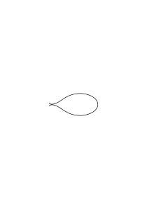
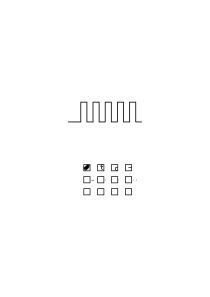
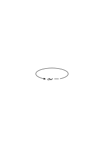
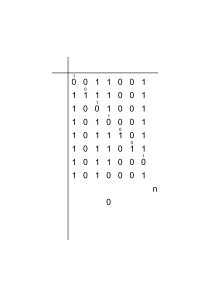

# Ms-159

### [1r\[1\]](https://cdn.wittgensteinnachlass.com/2000px/webp/Ms-159/1r.webp)

Russell often told me during our conversations:

“Logic is hell!” And this fully expresses what both he & I felt when thinking about the logical problems; namely, the immense difficulty & the harshness of these problems.

### [1r\[2\]](https://cdn.wittgensteinnachlass.com/2000px/webp/Ms-159/1r.webp),[1v\[1\]](https://cdn.wittgensteinnachlass.com/2000px/webp/Ms-159/1v.webp),[2r\[1\]](https://cdn.wittgensteinnachlass.com/2000px/webp/Ms-159/2r.webp)

Where is red? What is the place of red? Where does the green of the trees go in the autumn, & where does the yellow come from? We teach a child “this is a chair”. Could we teach it from the beginning to have the doubt whether this is a chair? One will say: impossible! It must first know what a chair is in order to be able to doubt that this is one. Let us assume that the doubt consists in a doubt about the future behaviour of the object. But is it not conceivable that the child learns to say: “That looks like a chair – but is it really one?”

### [2r\[2\]](https://cdn.wittgensteinnachlass.com/2000px/webp/Ms-159/2r.webp)

Yes, but must my sentence say something other than what is written there?!

### [2r\[3\]](https://cdn.wittgensteinnachlass.com/2000px/webp/Ms-159/2r.webp),[2v\[1\]](https://cdn.wittgensteinnachlass.com/2000px/webp/Ms-159/2v.webp)

One can therefore say: Under these circumstances, doubt would have no sense whatsoever. But this merely means that we could not, in fact, call this “doubt” under such circumstances, & we would not know what to do with it.

### [2v\[2\]](https://cdn.wittgensteinnachlass.com/2000px/webp/Ms-159/2v.webp),[3r\[1\]](https://cdn.wittgensteinnachlass.com/2000px/webp/Ms-159/3r.webp)

Philosophy arises from the fact that we have the need to find our way around in our language – its rules. And no wonder if we get into difficulties, since the use of our words & expressions is so extraordinarily complicated!

### [3r\[2\]](https://cdn.wittgensteinnachlass.com/2000px/webp/Ms-159/3r.webp),[3v\[1\]](https://cdn.wittgensteinnachlass.com/2000px/webp/Ms-159/3v.webp)

“Possible – but I don't believe that.” So, I don't believe that. – What does that look like? So it must be some state of my soul! Where is it? – As if someone said to me: “It is now three o'clock,” & I looked around to see how it is now 3 o'clock everywhere. “I believe” is not the description of a state & neither is “I know …”.

### [3v\[2\]](https://cdn.wittgensteinnachlass.com/2000px/webp/Ms-159/3v.webp),[4r\[1\]](https://cdn.wittgensteinnachlass.com/2000px/webp/Ms-159/4r.webp)

What kind of image does one form of intuition? It is something like seeing, a sudden grasp with the eye. But the image does not go any further. “A chess game is like a constant state.” I don’t yet know what that is supposed to mean. One can, of course, call a state a “chess game” for _some reason_, but this description does not yet tell me what it is about.

### [4r\[2\]](https://cdn.wittgensteinnachlass.com/2000px/webp/Ms-159/4r.webp)

But the sensation came from the fact that language could always bring ever new, & ever more impossible, demands; could thwart every explanation.

### [4r\[3\]](https://cdn.wittgensteinnachlass.com/2000px/webp/Ms-159/4r.webp),[4v\[1\]](https://cdn.wittgensteinnachlass.com/2000px/webp/Ms-159/4v.webp)

Memory is an image & words. It is clear that these can only be meaningful in a quite specific environment. The images can be meaningless, the words an empty sound. Under what circumstances will we say that someone has had an experience of remembering?

### [4v\[2\]](https://cdn.wittgensteinnachlass.com/2000px/webp/Ms-159/4v.webp),[5r\[1\]](https://cdn.wittgensteinnachlass.com/2000px/webp/Ms-159/5r.webp)

The symbol of the spoken word: written characters in a loop that comes from the speaker's mouth. This picture appears entirely natural to us, even though we have never actually seen anything of the sort. It could appear absolutely nonsensical – but we simply use it, & as a way station it is perfectly fine.

### [5r\[2\]](https://cdn.wittgensteinnachlass.com/2000px/webp/Ms-159/5r.webp)

Real & fake pearls. “If value plays a role, then the pleasure is not purely aesthetic.”

### [5v\[1\]](https://cdn.wittgensteinnachlass.com/2000px/webp/Ms-159/5v.webp)

> Memory is the name of a game, not of an experience. <

### [5v\[2\]](https://cdn.wittgensteinnachlass.com/2000px/webp/Ms-159/5v.webp)

A memory-game-move does not yet constitute remembering.

### [5v\[3\]](https://cdn.wittgensteinnachlass.com/2000px/webp/Ms-159/5v.webp)

If the person reading the diary were to show signs of memory-experiences while doing so, would we say that he is reading a language?

### [6r\[1\]](https://cdn.wittgensteinnachlass.com/2000px/webp/Ms-159/6r.webp)

Did I mention him, or did I only mention his name?

### [6r\[2\]](https://cdn.wittgensteinnachlass.com/2000px/webp/Ms-159/6r.webp)

Is “I expect him to come” the description of a state of mind?

### [6r\[3\]](https://cdn.wittgensteinnachlass.com/2000px/webp/Ms-159/6r.webp)

“But in what way is this state of mind the expectation that he is going to come?”

### [6r\[4\]](https://cdn.wittgensteinnachlass.com/2000px/webp/Ms-159/6r.webp)

… In each case, the description can serve a different purpose.

### [6v\[1\]](https://cdn.wittgensteinnachlass.com/2000px/webp/Ms-159/6v.webp)

… These descriptions each have a different use.

### [6v\[2\]](https://cdn.wittgensteinnachlass.com/2000px/webp/Ms-159/6v.webp)

… The use of each of these descriptions is different.

### [7r\[1\]](https://cdn.wittgensteinnachlass.com/2000px/webp/Ms-159/7r.webp),[7v\[1\]](https://cdn.wittgensteinnachlass.com/2000px/webp/Ms-159/7v.webp)

<math display="block" xmlns="http://www.w3.org/1998/Math/MathML">
  <mtable columnalign="left left" columnspacing="3em">
    <mtr>
      <mtd>
        <mrow>
          <mi>D</mi>
          <msqrt>
            <mi>u</mi>
          </msqrt>
        </mrow>
      </mtd>
      <mtd>
        <mrow>
          <mi>D</mi>
          <mo>′</mo>
          <msqrt>
            <mi>u</mi>
          </msqrt>
        </mrow>
      </mtd>
    </mtr>
    <mtr>
      <mtd></mtd>
      <mtd></mtd>
    </mtr>
    <mtr>
      <mtd>
        <mrow>
          <msqrt>
            <mn>1</mn>
          </msqrt>
          <mspace width="0.5em"/>
          <msub>
            <mi>f</mi>
            <mn>1</mn>
          </msub>
          <mo>(</mo>
          <mi>x</mi>
          <mo>)</mo>
        </mrow>
      </mtd>
      <mtd></mtd>
    </mtr>
    <mtr>
      <mtd>
        <mrow>
          <msqrt>
            <mn>2</mn>
          </msqrt>
          <mspace width="0.5em"/>
          <msub>
            <mi>f</mi>
            <mn>2</mn>
          </msub>
          <mo>(</mo>
          <mi>x</mi>
          <mo>)</mo>
        </mrow>
      </mtd>
      <mtd>
        <mrow>
          <msqrt>
            <mn>2</mn>
          </msqrt>
          <mspace width="0.5em"/>
          <mo>=</mo>
          <mspace width="0.5em"/>
          <mn>1</mn>
          <mo>·</mo>
          <mn>41</mn>
          <mo>…</mo>
        </mrow>
      </mtd>
    </mtr>
    <mtr>
      <mtd>
        <mrow>
          <msqrt>
            <mn>3</mn>
          </msqrt>
          <mspace width="0.5em"/>
          <msub>
            <mi>f</mi>
            <mn>3</mn>
          </msub>
          <mo>(</mo>
          <mi>x</mi>
          <mo>)</mo>
        </mrow>
      </mtd>
      <mtd></mtd>
    </mtr>
    <mtr>
      <mtd>
        <mrow>
          <msqrt>
            <mn>4</mn>
          </msqrt>
          <mspace width="0.5em"/>
          <mo>…</mo>
        </mrow>
      </mtd>
      <mtd></mtd>
    </mtr>
    <mtr>
      <mtd></mtd>
      <mtd></mtd>
    </mtr>
    <mtr>
      <mtd>
        <mrow>
          <mi>D</mi>
          <msqrt>
            <mi>u</mi>
          </msqrt>
          <mspace width="0.5em"/>
          <msqrt>
            <mi>π</mi>
          </msqrt>
        </mrow>
      </mtd>
      <mtd>
        <mrow>
          <mn>1</mn>
          <mspace width="0.5em"/>
          <mn>6</mn>
          <mspace width="0.5em"/>
          <mn>7</mn>
          <mspace width="0.5em"/>
          <mn>5</mn>
        </mrow>
      </mtd>
    </mtr>
    <mtr>
      <mtd>
        <mrow>
          <mi>π</mi>
          <mspace width="0.5em"/>
          <mo>=</mo>
        </mrow>
      </mtd>
      <mtd>
        <mrow>
          <mn>3</mn>
          <mspace width="0.5em"/>
          <mn>9</mn>
          <mspace width="0.5em"/>
          <mn>8</mn>
          <mspace width="0.5em"/>
          <mo>…</mo>
        </mrow>
      </mtd>
    </mtr>
    <mtr>
      <mtd>
        <mrow>
          <mi>D</mi>
          <mo>′</mo>
          <msqrt>
            <mi>u</mi>
          </msqrt>
        </mrow>
      </mtd>
      <mtd></mtd>
    </mtr>
  </mtable>
</math>

<math display="block">
  <mfrac>
    <mrow>
      <mtext>∆</mtext>
      <mo>(</mo>
      <mi>D</mi>
      <msqrt>
        <mrow>
          <mi>u</mi>
        </mrow>
      </msqrt>
      <mo>)</mo>
    </mrow>
    <mrow>
      <mtext>sin</mtext>
      <mtext>36˚</mtext>
    </mrow>
  </mfrac>
</math>

26 × 96

⊢p ∙ ⊢q ․⊃․ ⊢p ∙ q

p ⊃ p

<math display="block">
  <mrow>
    <munder>
      <mrow>
        <mo>⊢</mo>
        <mi>p</mi>
        <mo>⊃</mo>
        <mi>q</mi>
      </mrow>
      <mo>_</mo>
    </munder>
    <mspace width="0.2em"/>
    <mo>∙</mo>
    <mspace width="0.2em"/>
    <munder>
      <mrow>
        <mo>⊢</mo>
        <mi>p</mi>
      </mrow>
      <mo>_</mo>
    </munder>
    <mspace width="0.2em"/>
    <mo>.</mo>
    <mo>⊃</mo>
    <mo>.</mo>
    <mspace width="0.2em"/>
    <munder>
      <mrow>
        <mo>⊢</mo>
        <mi>q</mi>
      </mrow>
      <mo>_</mo>
    </munder>
  </mrow>
</math>

<math display="block">
  <mtable columnalign="left">
    <mtr>
      <mtd>
        <munder>
          <mrow>
            <mn>1</mn>
            <mo>:</mo>
            <mn>3</mn>
            <mo>=</mo>
          </mrow>
          <mo>&#x2015;</mo>
        </munder>
      </mtd>
    </mtr>
    <mtr>
      <mtd>
        <mspace width="0.5em"/>
        <munder>
          <mrow>
            <mn>1</mn>
            <mo>:</mo>
            <mn>3</mn>
            <mo>=</mo>
          </mrow>
          <mo>&#x2015;</mo>
        </munder>
      </mtd>
    </mtr>
    <mtr>
      <mtd>
        <mspace width="1em"/>
        <mrow>
          <mn>1</mn>
          <mo>:</mo>
          <mn>3</mn>
          <mo>=</mo>
          <mn>0</mn>
          <mo>.</mo>
          <mover>
            <mn>3</mn>
            <mo>&#x2d9;</mo>
          </mover>
        </mrow>
      </mtd>
    </mtr>
  </mtable>
</math>

### [8r\[1\]](https://cdn.wittgensteinnachlass.com/2000px/webp/Ms-159/8r.webp),[8v\[1\]](https://cdn.wittgensteinnachlass.com/2000px/webp/Ms-159/8v.webp)

~Πp = p = ~p⊃p = ~p⊃~πp

⊢q = ⊢~q⊃q

⊢Q

⊢~Q

p⊃q

~p⌵q

~~p = p

3617 × 8901

~ΠP = P = ~P⊃~πP

~p ⊃ ~πp

Πp ⊃ p

~~p ⊃ p

~~~~p ⊃ p

<math display="block">
  <msup>
    <mtext>~</mtext>
    <mtext>2n</mtext>
  </msup>
  <mi>p</mi>
  <mspace width="0.3em"/>
  <mo>⊃</mo>
  <mspace width="0.3em"/>
  <mi>p</mi>
</math>

<math display="block">
  <msup>
    <mtext>~</mtext>
    <mtext>2φ</mtext>
  </msup>
  <mi>p</mi>
  <mspace width="0.3em"/>
  <mo>⊃</mo>
  <mspace width="0.3em"/>
  <mi>p</mi>
</math>

### [9r\[1\]](https://cdn.wittgensteinnachlass.com/2000px/webp/Ms-159/9r.webp)

### [CE](/w-ce/#ms-159-9v.1) [9v\[1\]](https://cdn.wittgensteinnachlass.com/2000px/webp/Ms-159/9v.webp) {#9v1}

“Immediately aware”

### [CE](/w-ce/#ms-159-9v.2) [9v\[2\]](https://cdn.wittgensteinnachlass.com/2000px/webp/Ms-159/9v.webp) {#9v2}

“I'm immediately aware of that which I can't be wrong about”.

### [CE](/w-ce/#ms-159-9v.3) [9v\[3\]](https://cdn.wittgensteinnachlass.com/2000px/webp/Ms-159/9v.webp) {#9v3}

“I'm not sure whether a man went into this room, but I am sure that it seemed to me that one did, that I saw such an image.”

### [CE](/w-ce/#ms-159-9v.4+10r.1+10v.1) [9v\[4\]](https://cdn.wittgensteinnachlass.com/2000px/webp/Ms-159/9v.webp),[10r\[1\]](https://cdn.wittgensteinnachlass.com/2000px/webp/Ms-159/10r.webp),[10v\[1\]](https://cdn.wittgensteinnachlass.com/2000px/webp/Ms-159/10v.webp) {#9v410r110v1}

If I painted my impression instead of just describing it in words, I could now point to my picture & say: “I'm sure that _this_ was what I saw”. (Of course the “I'm sure” is really superfluous.) But further: I have painted, portrayed my impression – but have I portrayed, projected it correctly? All justifications you might try to give are idle wheels, they don't drive anything. – Now this is why the expression “immediate awareness” or “knowledge” are in this sort of case misleading. The proposition is not unquestionable because it rests so securely on something, but there is no question of its resting on anything. To say that we are _certain_ that we have this impression is like saying the earth rests on something that is firm in itself.

### [CE](/w-ce/#ms-159-10v.2+11r.1) [10v\[2\]](https://cdn.wittgensteinnachlass.com/2000px/webp/Ms-159/10v.webp),[11r\[1\]](https://cdn.wittgensteinnachlass.com/2000px/webp/Ms-159/11r.webp) {#10v211r1}

“I am immediately aware that my exclamation is caused by something.” – So I'm immediately aware that the word “cause” fits the case? But remember that _words_ are public property.

### [CE](/w-ce/#ms-159-11r.2) [11r\[2\]](https://cdn.wittgensteinnachlass.com/2000px/webp/Ms-159/11r.webp) {#11r2}

Private language: Playing a game of chess in the imagination. Playing a soccer-match in the imagination.

### [CE](/w-ce/#ms-159-11r.3+11v.1) [11r\[3\]](https://cdn.wittgensteinnachlass.com/2000px/webp/Ms-159/11r.webp),[11v\[1\]](https://cdn.wittgensteinnachlass.com/2000px/webp/Ms-159/11v.webp) {#11r311v1}

What if I said: the word “cause” fits my impression privately? – But “to fit” is a public word. Ask yourself: What do we make this noise of words for?

### [CE](/w-ce/#ms-159-11v.2) [11v\[2\]](https://cdn.wittgensteinnachlass.com/2000px/webp/Ms-159/11v.webp) {#11v2}

“You are immediately aware” makes one think that you are _right_ about something, that you can be shown to be right about; whereas the point is that there is no _right_ (or wrong) about it. (And of course no one would say: I'm sure I'm right that I have pain.)

### [CE](/w-ce/#ms-159-11v.3) [11v\[3\]](https://cdn.wittgensteinnachlass.com/2000px/webp/Ms-159/11v.webp) {#11v3}

Being _immediately aware_ of the cause when you say: “That's where it hurts!”

### [CE](/w-ce/#ms-159-12r.1) [12r\[1\]](https://cdn.wittgensteinnachlass.com/2000px/webp/Ms-159/12r.webp) {#12r1}

Being _immediately aware_ of the cause of terror, pleasure etc.

### [CE](/w-ce/#ms-159-12r.2) [12r\[2\]](https://cdn.wittgensteinnachlass.com/2000px/webp/Ms-159/12r.webp) {#12r2}

Being _immediately aware_ of the cause in a mechanism. Causal ‘nexus’. ‘Cause – reaction’.

### [CE](/w-ce/#ms-159-12r.3) [12r\[3\]](https://cdn.wittgensteinnachlass.com/2000px/webp/Ms-159/12r.webp) {#12r3}

‘Cause isn't just temporary coincidence but influence.’

### [CE](/w-ce/#ms-159-12r.4+12v.1) [12r\[4\]](https://cdn.wittgensteinnachlass.com/2000px/webp/Ms-159/12r.webp),[12v\[1\]](https://cdn.wittgensteinnachlass.com/2000px/webp/Ms-159/12v.webp) {#12r412v1}

“You can't go on having one thing resting on another; in the end there must be something resting on itself.” (The a priori.) Something firm in itself. I propose to drop this mode of speech as it leads to puzzlements.

### [CE](/w-ce/#ms-159-12v.2) [12v\[2\]](https://cdn.wittgensteinnachlass.com/2000px/webp/Ms-159/12v.webp) {#12v2}

“If a stone could think he would think that he wished to drop.”

### [CE](/w-ce/#ms-159-12v.3) [12v\[3\]](https://cdn.wittgensteinnachlass.com/2000px/webp/Ms-159/12v.webp) {#12v3}

“Immediately aware of motive.”

### [CE](/w-ce/#ms-159-12v.4) [12v\[4\]](https://cdn.wittgensteinnachlass.com/2000px/webp/Ms-159/12v.webp) {#12v4}

Immediately aware of what makes me laugh in a joke.

### [13r\[1\]](https://cdn.wittgensteinnachlass.com/2000px/webp/Ms-159/13r.webp)

### [13r\[2\]](https://cdn.wittgensteinnachlass.com/2000px/webp/Ms-159/13r.webp)

Πp ⊃ p

That would be, for example, a rule that allows inductive proofs as well as the original proofs.

### [13r\[3\]](https://cdn.wittgensteinnachlass.com/2000px/webp/Ms-159/13r.webp)

“If I admit that Πp ⊃ p, then I must also admit the truth of the sentence that claims its own unprovability.”

### [13r\[4\]](https://cdn.wittgensteinnachlass.com/2000px/webp/Ms-159/13r.webp),[13v\[1\]](https://cdn.wittgensteinnachlass.com/2000px/webp/Ms-159/13v.webp)

How about a specific case of this general sentence: “If the sentence Q is provable, then it is true”?

### [13v\[2\]](https://cdn.wittgensteinnachlass.com/2000px/webp/Ms-159/13v.webp)

So it seems I can use a sentence for an inductive proof and don't have to wait for a direct proof – – – but here is a sentence that has been proven inductively, which I can therefore use, but which is not capable of any other proof.

### [14r\[1\]](https://cdn.wittgensteinnachlass.com/2000px/webp/Ms-159/14r.webp)

It is not true that ξ is the case, but ξ is the following sentence:↰ We could call that a regressive sentence.

### [14r\[2\]](https://cdn.wittgensteinnachlass.com/2000px/webp/Ms-159/14r.webp),[14v\[1\]](https://cdn.wittgensteinnachlass.com/2000px/webp/Ms-159/14v.webp)

In a certain context, these problems become overwhelmingly difficult; in another context, they _lose_ their difficulty. What I am trying to do is to teach you to make transitions from the one to the other.

### [14v\[2\]](https://cdn.wittgensteinnachlass.com/2000px/webp/Ms-159/14v.webp)

<math display="block">
  <mrow>
    <mo>~</mo>
    <mi>ξ</mi>
    <mspace width="0.2em"/>
    <mo>.</mo>
    <mo>⊃</mo>
    <mo>.</mo>
    <mspace width="0.2em"/>
    <mo>~</mo>
    <mi>π</mi>
    <mi>ξ</mi>
    <mspace width="0.2em"/>
    <mo>:</mo>
    <mspace width="0.2em"/>
    <mi>ξ</mi>
    <mspace width="0.3em"/>
    <mo>= ↰</mo>
  </mrow>
</math>

### [14v\[3\]](https://cdn.wittgensteinnachlass.com/2000px/webp/Ms-159/14v.webp),[15r\[1\]](https://cdn.wittgensteinnachlass.com/2000px/webp/Ms-159/15r.webp)

“Well, this sentence is written as a number – but how do I now find out what it says?” – “What it says? – What does that mean? – It says itself!” – Yes, but suppose it were the sentence “This sentence is true,” then it also says itself, but everyone recognizes that it is not meaningful in itself.

### [15r\[2\]](https://cdn.wittgensteinnachlass.com/2000px/webp/Ms-159/15r.webp),[15v\[1\]](https://cdn.wittgensteinnachlass.com/2000px/webp/Ms-159/15v.webp)

“Russell apparently tacitly assumes that a sentence is true if it is provable.” – (Is that true?) How does this assumption manifest itself? “Now, in the fact that he asserts the sentence if it has been proven.” But in the book, he only uses it for further proofs; & whether he, as a private individual, also considers it to be true in some other way, is none of our business.

### [15v\[2\]](https://cdn.wittgensteinnachlass.com/2000px/webp/Ms-159/15v.webp),[16r\[1\]](https://cdn.wittgensteinnachlass.com/2000px/webp/Ms-159/16r.webp),[16v\[1\]](https://cdn.wittgensteinnachlass.com/2000px/webp/Ms-159/16v.webp)

But one could say: Russell proceeds according to the rule that a sentence, if it has been proven, can be used as a starting point for further proofs. Then this rule is simply a true description of his method; nothing more.

“The laws of logic are habits of thought.” What was wrong with that was the idea that such a habit of thought is the habit of taking certain things for granted as true, things that one has found to be confirmed countless times. (Almost a kind of intellectual laziness.) And of course, there is also something true about that. For the choice of unit of measurement depends on the lengths to be measured. – But what is that supposed to mean?! “First, there must be a unit of measurement before one can even talk about lengths!” (Limit of empiricism.) The choice of the unit of measurement cannot presuppose the result of measurements!

### [16v\[2\]](https://cdn.wittgensteinnachlass.com/2000px/webp/Ms-159/16v.webp),[17r\[1\]](https://cdn.wittgensteinnachlass.com/2000px/webp/Ms-159/17r.webp)

“If something is provable, then it is true.” – Above all, it is unclear what being prov**able** means. What the criterion of prov**ability** is. It is probably a _proof_ of provability.

### [17r\[2\]](https://cdn.wittgensteinnachlass.com/2000px/webp/Ms-159/17r.webp),[17v\[1\]](https://cdn.wittgensteinnachlass.com/2000px/webp/Ms-159/17v.webp),[18r\[1\]](https://cdn.wittgensteinnachlass.com/2000px/webp/Ms-159/18r.webp)

Now take the rule: a proof of the provability of p counts as a proof of p. Is this not _obvious_? Could I reasonably do anything other than accept the proof of provability as a proof of p? But what an odd logical situation! Is something here left to my ‘common sense’; or am I (necessarily) compelled to acknowledge this? But what if I say: Well, this sentence is in any case very plausible & one _can_ therefore add it to the other axioms of logic. It is then a slightly expanded logic, but also a perfectly plausible one; which in any case fully corresponds to the general _use_. (And could one also add the sentence to logic: “All bodies strive towards the earth”, because it also fully corresponds to our perceptions?)

### [18r\[2\]](https://cdn.wittgensteinnachlass.com/2000px/webp/Ms-159/18r.webp),[18v\[1\]](https://cdn.wittgensteinnachlass.com/2000px/webp/Ms-159/18v.webp)

One tears down houses, another builds them up, & a third says: “One tears down houses, another builds them up.”

### [18v\[2\]](https://cdn.wittgensteinnachlass.com/2000px/webp/Ms-159/18v.webp)

But what is actually being added to logic here? A method of inference; – or a sentence? For that is probably two different things.

And if one says: if a sentence, then the application of this sentence must be of a completely different kind than that of the other sentences of logic. It is a different instrument.

### [19r\[1\]](https://cdn.wittgensteinnachlass.com/2000px/webp/Ms-159/19r.webp)

“If I have shown that <math class="stacked" display="inline"><mn>1</mn><mspace width="0.3em"/><mo>:</mo><mspace width="0.3em"/><mn>3</mn><mspace width="0.3em"/><mo>=</mo><mover><mrow><mn>3</mn></mrow><mtext>˙</mtext></mover></math> and I am supposed to calculate <math display="block">
  <mrow>
    <mn>1</mn>
    <mrow>
      <munder>
        <mo>:</mo>
        <mn>27</mn>
      </munder>
    </mrow>
    <mn>3</mn>
  </mrow>
</math>, must I (then) still carry out the 27 operations?” – “Of course not! It has been proven that you could write them down, & that is all that is necessary.” – – –. Well, how should I formulate that? Not like this: “If it is proven that p can be proven, then p is considered proven”?

### [19v\[1\]](https://cdn.wittgensteinnachlass.com/2000px/webp/Ms-159/19v.webp)

But one could simply say: “This (induction) is also considered a proof of p” – without having to interpret the inductive proof as a proof of the possibility of another proof.

### [CE](/w-ce/#ms-159-20r.1) [20r\[1\]](https://cdn.wittgensteinnachlass.com/2000px/webp/Ms-159/20r.webp) {#20r1}

The unity of grammar & experience.

### [CE](/w-ce/#ms-159-20r.2+20v.1) [20r\[2\]](https://cdn.wittgensteinnachlass.com/2000px/webp/Ms-159/20r.webp),[20v\[1\]](https://cdn.wittgensteinnachlass.com/2000px/webp/Ms-159/20v.webp) {#20r220v1}

“You can't have the relation of ‘knowing’ to a fact of this sort.” The relation of knowing does not fit such a fact; it does not have the right number of valencies, as O can't combine with one atom of H. “A cube can't lie in a plane or be cut by a straight line in two – – –.” “A fact of this sort hasn't the right structure for being known.”

### [CE](/w-ce/#ms-159-20v.2) [20v\[2\]](https://cdn.wittgensteinnachlass.com/2000px/webp/Ms-159/20v.webp) {#20v2}

“Or else – if you call _this_ knowing, it's something else than knowing that you have a sense-datum.”

### [CE](/w-ce/#ms-159-20v.3) [20v\[3\]](https://cdn.wittgensteinnachlass.com/2000px/webp/Ms-159/20v.webp) {#20v3}

Collecting the evidence; distinguishing between evidence & surmise. “Now what did you actually see?” – “Did you touch it?” – No – Then it might also have been a – – –.”

### [CE](/w-ce/#ms-159-21r.1) [21r\[1\]](https://cdn.wittgensteinnachlass.com/2000px/webp/Ms-159/21r.webp) {#21r1}

We take one _particular_ game & make it into _the_ game always played.

### [CE](/w-ce/#ms-159-21r.2) [21r\[2\]](https://cdn.wittgensteinnachlass.com/2000px/webp/Ms-159/21r.webp) {#21r2}

“The logical structure of the universe.”

---

### [21r\[3\]](https://cdn.wittgensteinnachlass.com/2000px/webp/Ms-159/21r.webp)

“But in any case, acknowledging induction as a proof is a _logical_ matter.”

### [21r\[4\]](https://cdn.wittgensteinnachlass.com/2000px/webp/Ms-159/21r.webp),[21v\[1\]](https://cdn.wittgensteinnachlass.com/2000px/webp/Ms-159/21v.webp)

Doesn't it fall in the domain of logic? And if so, how does logic decide the question, i.e., by what sort of proposition?

### [21v\[2\]](https://cdn.wittgensteinnachlass.com/2000px/webp/Ms-159/21v.webp)

It is, after all, a logical necessity to acknowledge the inductive proof! (At least a mathematical one.)

### [21v\[3\]](https://cdn.wittgensteinnachlass.com/2000px/webp/Ms-159/21v.webp)

There is something suspicious about the sentence “⊢Πp ⊃ p,” namely, in the use of the implication. But what is it?

### [22r\[1\]](https://cdn.wittgensteinnachlass.com/2000px/webp/Ms-159/22r.webp)

Compare: “If the sum of the digits of a number is divisible by 3, then the number itself is divisible by three.”

### [22r\[2\]](https://cdn.wittgensteinnachlass.com/2000px/webp/Ms-159/22r.webp)

What about this sentence: “If there is a proof of provability, then there is (also) a proof”?

### [22r\[3\]](https://cdn.wittgensteinnachlass.com/2000px/webp/Ms-159/22r.webp),[22v\[1\]](https://cdn.wittgensteinnachlass.com/2000px/webp/Ms-159/22v.webp)

“Πp ⊃ p” sounds as if it said: If Πp is the case, then you will find that p is the case.

### [22v\[2\]](https://cdn.wittgensteinnachlass.com/2000px/webp/Ms-159/22v.webp)

The sentence is, in any case, only valid for the cases that are obtained iteratively recursively.

### [22v\[3\]](https://cdn.wittgensteinnachlass.com/2000px/webp/Ms-159/22v.webp)

Consider: “№ 27 is not provable.”

### [22v\[4\]](https://cdn.wittgensteinnachlass.com/2000px/webp/Ms-159/22v.webp)

(№ x) № y is not provable.

### [23r\[1\]](https://cdn.wittgensteinnachlass.com/2000px/webp/Ms-159/23r.webp)

If one wants to expose a conjurer's trick, one must examine everything with suspicion, what the person usually accepts without examination. If one _wants_ to accept this, then it is impossible to discover the trick.

### [CE](/w-ce/#ms-159-23r.2+23v.1) [23r\[2\]](https://cdn.wittgensteinnachlass.com/2000px/webp/Ms-159/23r.webp),[23v\[1\]](https://cdn.wittgensteinnachlass.com/2000px/webp/Ms-159/23v.webp) {#23r223v1}

“You can't ‘know’ it _in the same sense_….”

Can you deny in the same sense that 20 × 20 = 400 & that it rains?

### [CE](/w-ce/#ms-159-23v.2) [23v\[2\]](https://cdn.wittgensteinnachlass.com/2000px/webp/Ms-159/23v.webp) {#23v2}

“We can't be directly aware of…”

### [CE](/w-ce/#ms-159-23v.3) [23v\[3\]](https://cdn.wittgensteinnachlass.com/2000px/webp/Ms-159/23v.webp) {#23v3}

‘To be directly aware of the direction the sound comes from.’

### [23v\[4\]](https://cdn.wittgensteinnachlass.com/2000px/webp/Ms-159/23v.webp)

This implication serves, of course, only as an instrument for drawing conclusions from the induction to the sentence.

### [24r\[1\]](https://cdn.wittgensteinnachlass.com/2000px/webp/Ms-159/24r.webp),[25v\[1\]](https://cdn.wittgensteinnachlass.com/2000px/webp/Ms-159/25v.webp)

One must remember here that the sentences of logic are constructed in such a way that they have _no_ application in practice as information. One could therefore very well say that they are not _sentences_; & that one writes them down at all still requires a justification. If one now adds another sentence-like structure of another kind to these ‘sentences,’ then we are already even more in the dark about what this system of sentence-like combinations of signs is supposed to have for an application or sense, because the mere _sentence sound_ of these combinations of signs does not yet give them a meaning.

### [26r\[1\]](https://cdn.wittgensteinnachlass.com/2000px/webp/Ms-159/26r.webp)

“His character being what it is, one can hardly expect anything else.”

Now, however, the character is always what it is, so ….

### [26r\[2\]](https://cdn.wittgensteinnachlass.com/2000px/webp/Ms-159/26r.webp)

‘_Mathematics_ cannot be written as a system.’

### [26r\[3\]](https://cdn.wittgensteinnachlass.com/2000px/webp/Ms-159/26r.webp)

_What_ do you know about the houses (castles) that he has built in his mind?!

### [26v\[1\]](https://cdn.wittgensteinnachlass.com/2000px/webp/Ms-159/26v.webp)

‘A system is mathematics; but mathematics is not a system.’

### [26v\[2\]](https://cdn.wittgensteinnachlass.com/2000px/webp/Ms-159/26v.webp)

There are ‘systems of irrational numbers,’ but the word “irrational number” does not designate a system.

### [26v\[3\]](https://cdn.wittgensteinnachlass.com/2000px/webp/Ms-159/26v.webp),[27r\[1\]](https://cdn.wittgensteinnachlass.com/2000px/webp/Ms-159/27r.webp)

Let us use our intuition! And let us remember: If the error is not _in_ the calculation that seems suspicious to us, then it (probably) lies in the _environment_ of this calculation.

### [27r\[2\]](https://cdn.wittgensteinnachlass.com/2000px/webp/Ms-159/27r.webp)

It does not concern the actual changes of the individual numbers, but the _system_ of changes.

### [27r\[3\]](https://cdn.wittgensteinnachlass.com/2000px/webp/Ms-159/27r.webp),[27v\[1\]](https://cdn.wittgensteinnachlass.com/2000px/webp/Ms-159/27v.webp),[28r\[1\]](https://cdn.wittgensteinnachlass.com/2000px/webp/Ms-159/28r.webp)

It is not about constructing a number that is different from all of these, but about having a system for making sequences different from all of these. That is, there is a rule according to which we can continue indefinitely, a system of sequences to change. Can one also call this system an ‘irrational number’? It also produces a series of decimal fractions. And must one not say that this number is now different from all others? Well, it is the number: “Different from all of these diagonally.”

### [28r\[2\]](https://cdn.wittgensteinnachlass.com/2000px/webp/Ms-159/28r.webp)

Is the number “different from 1” different from 1? Is the number “1 greater than 1” 1 greater than 1?

### [28r\[3\]](https://cdn.wittgensteinnachlass.com/2000px/webp/Ms-159/28r.webp),[28v\[1\]](https://cdn.wittgensteinnachlass.com/2000px/webp/Ms-159/28v.webp)

The new number is: “Step by step different from…” – can one say of it that it is step by step different from…?

### [28v\[2\]](https://cdn.wittgensteinnachlass.com/2000px/webp/Ms-159/28v.webp)

‘According to its definition, the number is different from all of these.’

### [28v\[3\]](https://cdn.wittgensteinnachlass.com/2000px/webp/Ms-159/28v.webp)

We teach someone to write down sequences that differ from those of any number of roots (e.g.).

### [28v\[4\]](https://cdn.wittgensteinnachlass.com/2000px/webp/Ms-159/28v.webp)

D + 1 f(ξ)

### [28v\[5\]](https://cdn.wittgensteinnachlass.com/2000px/webp/Ms-159/28v.webp),[29r\[1\]](https://cdn.wittgensteinnachlass.com/2000px/webp/Ms-159/29r.webp)

“Extension step by step different from…”

### [29r\[2\]](https://cdn.wittgensteinnachlass.com/2000px/webp/Ms-159/29r.webp)

One should therefore not speak in mathematics of a connection that has yet to be discovered (e.g., between <math class="stacked" display="inline"><msub><mtext>ℵ</mtext><mn>3</mn></msub></math> & C), but of one that has yet to be invented.

### [29r\[3\]](https://cdn.wittgensteinnachlass.com/2000px/webp/Ms-159/29r.webp),[29v\[1\]](https://cdn.wittgensteinnachlass.com/2000px/webp/Ms-159/29v.webp)

…“And indeed, with this operation, you can form a number that is step by step different from each of these numbers.”… And indeed, you can also give the rule that the sequence you write down should be step by step different from each of _these_ sequences.

### [29v\[2\]](https://cdn.wittgensteinnachlass.com/2000px/webp/Ms-159/29v.webp)

1 × 2 × 3 × 4 …

### [30r\[1\]](https://cdn.wittgensteinnachlass.com/2000px/webp/Ms-159/30r.webp)

<math display="block">
  <mfrac linethickness="0">
    <mrow>
      <mn>1</mn>
    </mrow>
    <mrow>
      <mi>n</mi>
    </mrow>
  </mfrac>
</math>

n × n − 1

n × (n − 1) × (n − 2)

1 + n + n × (n − 1) + n × (n − 1) × (n − 2)

<math display="block">
  <mo>[</mo>
  <mi>n</mi>
  <mspace width="0.3em"/>
  <mo>!</mo>
  <mspace width="0.3em"/>
  <mtext>n!</mtext>
  <mo>]</mo>
  <mspace width="0.3em"/>
  <mo>+</mo>
  <mfrac>
    <mrow>
      <mtext>n!</mtext>
    </mrow>
    <mrow>
      <mo>(</mo>
      <mi>n</mi>
      <mspace width="0.3em"/>
      <mtext>‒</mtext>
      <mspace width="0.3em"/>
      <mtext>1)</mtext>
      <mo>!</mo>
    </mrow>
  </mfrac>
  <mspace width="0.3em"/>
  <mo>+</mo>
  <mfrac>
    <mrow>
      <mtext>n!</mtext>
    </mrow>
    <mrow>
      <mo>(</mo>
      <mi>n</mi>
      <mspace width="0.3em"/>
      <mtext>‒</mtext>
      <mspace width="0.3em"/>
      <mtext>2)</mtext>
      <mo>!</mo>
    </mrow>
  </mfrac>
  <mspace width="0.3em"/>
  <mo>+</mo>
  <mfrac>
    <mrow>
      <mtext>n!</mtext>
    </mrow>
    <mrow>
      <mo>(</mo>
      <mi>n</mi>
      <mspace width="0.3em"/>
      <mtext>‒</mtext>
      <mspace width="0.3em"/>
      <mtext>3)</mtext>
      <mo>!</mo>
    </mrow>
  </mfrac>
  <mspace width="0.3em"/>
  <mtext>n!</mtext>
  <mspace width="0.3em"/>
  <mo>(</mo>
  <mfrac>
    <mrow>
      <mn>1</mn>
    </mrow>
    <mrow>
      <mtext>n!</mtext>
    </mrow>
  </mfrac>
  <mspace width="0.3em"/>
  <mo>+</mo>
  <mspace width="0.3em"/>
  <mo>(</mo>
  <mfrac>
    <mrow>
      <mn>1</mn>
    </mrow>
    <mrow>
      <mo>(</mo>
      <mi>n</mi>
      <mspace width="0.3em"/>
      <mtext>‒</mtext>
      <mspace width="0.3em"/>
      <mtext>1)</mtext>
      <mo>!</mo>
    </mrow>
  </mfrac>
  <mspace width="0.3em"/>
  <mo>+</mo>
  <mfrac>
    <mrow>
      <mn>1</mn>
    </mrow>
    <mrow>
      <mo>(</mo>
      <mi>n</mi>
      <mspace width="0.3em"/>
      <mtext>‒</mtext>
      <mspace width="0.3em"/>
      <mtext>2)</mtext>
      <mo>!</mo>
    </mrow>
  </mfrac>
  <mspace width="0.3em"/>
  <mo>+</mo>
  <mspace width="0.3em"/>
  <mtext>‒</mtext>
  <mfrac>
    <mrow>
      <mn>1</mn>
    </mrow>
    <mrow>
      <mtext>3!</mtext>
    </mrow>
  </mfrac>
  <mspace width="0.3em"/>
  <mo>+</mo>
  <mfrac>
    <mrow>
      <mn>1</mn>
    </mrow>
    <mrow>
      <mtext>2!</mtext>
    </mrow>
  </mfrac>
  <mspace width="0.3em"/>
  <mo>+</mo>
  <mspace width="0.3em"/>
  <mtext>1)</mtext>
</math>

### [CE](/w-ce/#ms-159-30v.1) [30v\[1\]](https://cdn.wittgensteinnachlass.com/2000px/webp/Ms-159/30v.webp) {#30v1}

“You can’t _know_.”

### [CE](/w-ce/#ms-159-30v.2) [30v\[2\]](https://cdn.wittgensteinnachlass.com/2000px/webp/Ms-159/30v.webp) {#30v2}

_Knowing_ is here like _having_; having in oneself.

### [CE](/w-ce/#ms-159-30v.3) [30v\[3\]](https://cdn.wittgensteinnachlass.com/2000px/webp/Ms-159/30v.webp) {#30v3}

You _know_ only the data; everything else is conjecture.

### [CE](/w-ce/#ms-159-30v.4) [30v\[4\]](https://cdn.wittgensteinnachlass.com/2000px/webp/Ms-159/30v.webp) {#30v4}

We identify knowing & data.

### [30v\[5\]](https://cdn.wittgensteinnachlass.com/2000px/webp/Ms-159/30v.webp)

What does logic have to do with inference in general?

### [31r\[1\]](https://cdn.wittgensteinnachlass.com/2000px/webp/Ms-159/31r.webp)

∣∣∣∣∣∣∣∣∣

01011011101111 …

001001100111001111

000

❘—❘—❘—❘—❘—————————

### [CE](/w-ce/#ms-159-31v.1) [31v\[1\]](https://cdn.wittgensteinnachlass.com/2000px/webp/Ms-159/31v.webp) {#31v1}

“This↑

fits this↑

”

Not _any_ sequence of puzzles is beneficial. Language idles.

(Socrates is mortal)

Information

“This colour matches this very nicely”.

fits

this↑

fits this↑ “Things being as they are”. ‘Can we imagine it not fitting?’

### [CE](/w-ce/#ms-159-32r.1) [32r\[1\]](https://cdn.wittgensteinnachlass.com/2000px/webp/Ms-159/32r.webp) {#32r1}

“This↑

does not fit this↑

”

How does one know whether this is a statement or a rule? Is it _meant_ as one or the other?

### [CE](/w-ce/#ms-159-32r.2) [32r\[2\]](https://cdn.wittgensteinnachlass.com/2000px/webp/Ms-159/32r.webp) {#32r2}

─────┼─────

This↑ fits this↑

### [32r\[3\]](https://cdn.wittgensteinnachlass.com/2000px/webp/Ms-159/32r.webp)

This fits this _now_.

### [CE](/w-ce/#ms-159-32r.4) [32r\[4\]](https://cdn.wittgensteinnachlass.com/2000px/webp/Ms-159/32r.webp) {#32r4}

Everything fits itself.

### [CE](/w-ce/#ms-159-32r.5) [32r\[5\]](https://cdn.wittgensteinnachlass.com/2000px/webp/Ms-159/32r.webp) {#32r5}

‘Does this fit?’ – Make an experiment!

‘Are we to call this a fit?’

### [32r\[5\]](https://cdn.wittgensteinnachlass.com/2000px/webp/Ms-159/32r.webp),[32v\[1\]](https://cdn.wittgensteinnachlass.com/2000px/webp/Ms-159/32v.webp)

“Is this _thing_ complex or simple?” How is this to be decided? Is this proposition about the future or present?

### [32v\[2\]](https://cdn.wittgensteinnachlass.com/2000px/webp/Ms-159/32v.webp)

Is the rule “π & change the first place” the same or different from π? & why?

### [33r\[1\]](https://cdn.wittgensteinnachlass.com/2000px/webp/Ms-159/33r.webp)

a) _Important_ to know when one is roughly through. On vacation? No. Going. Sending Sraffa to Vi.

### [33r\[2\]](https://cdn.wittgensteinnachlass.com/2000px/webp/Ms-159/33r.webp)

Can one leave Cambridge – questioning. Leave address with police? b) Permit from H.O. Does one apply oneself? or solicit.

### [34r\[1\]](https://cdn.wittgensteinnachlass.com/2000px/webp/Ms-159/34r.webp),[34v\[1\]](https://cdn.wittgensteinnachlass.com/2000px/webp/Ms-159/34v.webp),[35r\[1\]](https://cdn.wittgensteinnachlass.com/2000px/webp/Ms-159/35r.webp),[35v\[1\]](https://cdn.wittgensteinnachlass.com/2000px/webp/Ms-159/35v.webp),[36r\[1\]](https://cdn.wittgensteinnachlass.com/2000px/webp/Ms-159/36r.webp),[36v\[1\]](https://cdn.wittgensteinnachlass.com/2000px/webp/Ms-159/36v.webp),[37r\[1\]](https://cdn.wittgensteinnachlass.com/2000px/webp/Ms-159/37r.webp),[37v\[1\]](https://cdn.wittgensteinnachlass.com/2000px/webp/Ms-159/37v.webp),[38r\[1\]](https://cdn.wittgensteinnachlass.com/2000px/webp/Ms-159/38r.webp),[38v\[1\]](https://cdn.wittgensteinnachlass.com/2000px/webp/Ms-159/38v.webp),[39r\[1\]](https://cdn.wittgensteinnachlass.com/2000px/webp/Ms-159/39r.webp)

In what follows, a selection of the thoughts that I have written down over the last 9 years will be published. My _intention_ was originally to compile them one day in a book. They concern many different areas of philosophical speculation, such as the concept of meaning, understanding, the sentence, logic, the foundations of mathematics, sensory experience, and other things.

My intention was originally to compile these thoughts in a book. I originally wrote all these thoughts as remarks, short paragraphs. My intention was, however, to compile them one day in a book. Sometimes in longer chains of remarks about the same object, sometimes jumping rapidly from one area to another. My intention was, however, to compile these thoughts one day in a book, of whose form I had different ideas at different times. But it was essential that the thought therein should run through all the subjects treated in an ordered sequence. About 4 years ago, I made the first attempt at such a compilation, and after I had made attempts in this direction for two years, I came to the conviction that it was in vain and that I had to give it up. It became clear to me that even the best that I could write would always only be philosophical remarks, that my thoughts soon petered out when I tried to force them, against their natural inclination, to continue in _one_ line, that my thoughts after a while always had to jump to another area, and I had to wait until they returned to the first ones on their own. And this was connected with the nature of the subject, which is such that the individual thoughts are related to each other in an extremely complicated way. The last attempt at the compilation is the one with which I begin this publication of my thoughts here. It is a fragment and perhaps has the advantage that it relatively easily conveys an idea of my method. I will follow this fragment with a mass of remarks in loose form and will explain to the reader the connections between them through a kind of numbering which gives each remark a running number and appends the numbers of those remarks to which it is in important relation. I wish all these remarks were better than they are. They lack strength and precision. I am publishing those that do not seem too boring to me. They have in many cases come into the world with contorted limbs. I had actually given up the idea of publishing them during my lifetime. But it was revived, and perhaps mainly because I had to realize that my thoughts, which I passed on orally in my teaching activity, but also outside of it, were often misunderstood and more or less diluted and mutilated in circulation. This stimulated my vanity and threatened to irritate and annoy me again and again if I did not put an end to it by publishing, which also seemed desirable for other reasons. For _various_ reasons, many of my thoughts will touch on what others are writing today. But if my remarks do not bear a stamp that marks them as my creations, I do not want to claim them as my property.

— — — even more than this extremely apt & … criticism, I owe to the criticism and suggestion of Mr. P.S. — — — which makes it necessary to traverse the field of thoughts criss-cross, in all directions, so that each thought stands in complicated relations to a large number of others.

### [39v\[2\]](https://cdn.wittgensteinnachlass.com/2000px/webp/Ms-159/39v.webp),[40r\[1\]](https://cdn.wittgensteinnachlass.com/2000px/webp/Ms-159/40r.webp),[40v\[1\]](https://cdn.wittgensteinnachlass.com/2000px/webp/Ms-159/40v.webp)

I have had to acknowledge serious errors in my views, as expressed in the _Log. Phil. Abh._, since I began to occupy myself with philosophy again about 10 years ago. I owe it to the criticism to which my ideas were subjected by Frank Ramsey, with whom I discussed them in countless conversations during the last two years of his life, that I was able to recognize these errors to a great extent.

But even more than this extremely sure & incisive criticism, I owe the criticism & the stimulation that my thoughts received from Mr. Dr. Piero Sraffa. Yes, I owe him the most important thought of these investigations. Yes, without him, I would probably never have arrived at the most important of the ideas in these investigations. Without this, I would probably never have arrived at the most important of the ideas in these investigations.

### [BCr\[1\]](https://cdn.wittgensteinnachlass.com/2000px/webp/Ms-159/BCr.webp)

I do not dare to hope that through my work in this dark age, a ray of light will be cast into one or another mind.
