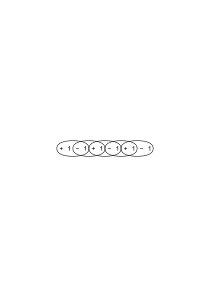
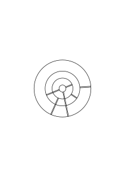
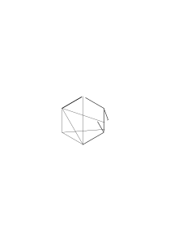
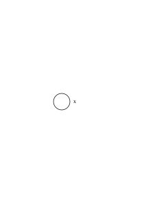
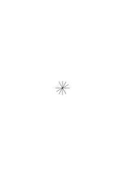
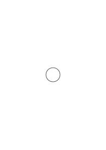

# Ms-162a

1 published remark, VB

### [1\[1\]](https://cdn.wittgensteinnachlass.com/2000px/webp/Ms-162a/1.webp),[2\[1\]](https://cdn.wittgensteinnachlass.com/2000px/webp/Ms-162a/2.webp)

I do unfold the geometric properties of this chain by demonstrating the transformations of another chain built in the same way. But by doing so, I do not show what I can actually do with the first chain, if it turns out to be actually inflexible or otherwise physically unsuitable. So, I cannot say: I unfold the _properties_ _of this chain_.

### [2\[2\]](https://cdn.wittgensteinnachlass.com/2000px/webp/Ms-162a/2.webp)

How can one unfold the properties of a chain that it does not even have?

### [2\[3\]](https://cdn.wittgensteinnachlass.com/2000px/webp/Ms-162a/2.webp),[3\[1\]](https://cdn.wittgensteinnachlass.com/2000px/webp/Ms-162a/3.webp)

‘We unfold the characteristics of the polygon drawn here.’ Suppose the polygon were bent from wire instead of drawn; would we still be inclined to say: we are unfolding the properties of the bent wire? Here, ‘unfolding’ should mean: we present it, make visible what was not previously clear.

### [3\[2\]](https://cdn.wittgensteinnachlass.com/2000px/webp/Ms-162a/3.webp),[4\[1\]](https://cdn.wittgensteinnachlass.com/2000px/webp/Ms-162a/4.webp)

I measure a table & it is 1 m long. – Now I place my meter stick against another meter stick. Do I measure it in this way? Do I find that the second meter stick is 1 m long? Am I doing the same experiment of measurement, only with the difference that I am certain of the starting point?

### [4\[2\]](https://cdn.wittgensteinnachlass.com/2000px/webp/Ms-162a/4.webp),[5\[1\]](https://cdn.wittgensteinnachlass.com/2000px/webp/Ms-162a/5.webp)

Yes, if I place the standard against the table, I always measure the table, but do I not sometimes check the standard? And what is the difference in the procedure?

### [5\[2\]](https://cdn.wittgensteinnachlass.com/2000px/webp/Ms-162a/5.webp)

To unfold the properties of this polygon means, for example, to show that it has 15 corners. Similar to saying: I unfold the length & width of this paper by unfolding the paper.

### [5\[3\]](https://cdn.wittgensteinnachlass.com/2000px/webp/Ms-162a/5.webp)

The unfolding here is a kind of counting.

### [6\[1\]](https://cdn.wittgensteinnachlass.com/2000px/webp/Ms-162a/6.webp)

The experiment of unfolding a series can show us, among other things, how many balls the series consists of, or that we can move these (let’s say) 100 balls in this way or that. However, the calculation of the unfolding shows us what we call a transformation by mere unfolding.

### [6\[2\]](https://cdn.wittgensteinnachlass.com/2000px/webp/Ms-162a/6.webp),[7\[1\]](https://cdn.wittgensteinnachlass.com/2000px/webp/Ms-162a/7.webp),[8\[1\]](https://cdn.wittgensteinnachlass.com/2000px/webp/Ms-162a/8.webp)

“I unfold the properties of this chain, I show what can be done with it.” – What can be done with it by merely bending it at the joints. Now, I could say: I am not only showing physical, but also geometric properties of the chain. Could one say: The links of this chain are welded together in such a way that they cannot be brought into this position, but it is still a geometric property of this chain that it can be brought into this position.

### [8\[2\]](https://cdn.wittgensteinnachlass.com/2000px/webp/Ms-162a/8.webp)

At most, that it could be brought … if the links were not ….

### [8\[3\]](https://cdn.wittgensteinnachlass.com/2000px/webp/Ms-162a/8.webp)

The property is, for example, that the chain consists of 10 links.

---

### [8\[4\]](https://cdn.wittgensteinnachlass.com/2000px/webp/Ms-162a/8.webp),[9\[1\]](https://cdn.wittgensteinnachlass.com/2000px/webp/Ms-162a/9.webp)

“I will show you what can be done with this chain.” In doing so, I take it for granted that the links can move, do not break, do not multiply, etc. – Am I not showing you properties of the chain? But _which_ of the many properties of the chain am I showing? Is it still a chain if it is – for _some_ reason – stiff, like a rod?

### [10\[1\]](https://cdn.wittgensteinnachlass.com/2000px/webp/Ms-162a/10.webp)

<s>Does logic agree with 2 × 2 = 4? One can bring 2 × 2 = 4 into agreement with it, but also 2 × 2 = 5. </s>

### [10\[2\]](https://cdn.wittgensteinnachlass.com/2000px/webp/Ms-162a/10.webp)

Does 2 × 2 = 4 agree with logical calculus? One can bring 2 × 2 = 4, but also 2 × 2 = 5, into agreement with it. (And I mean: 2 × 2 = 5 can, under certain circumstances, be a useful arithmetic sentence.)

### [10\[3\]](https://cdn.wittgensteinnachlass.com/2000px/webp/Ms-162a/10.webp),[11\[1\]](https://cdn.wittgensteinnachlass.com/2000px/webp/Ms-162a/11.webp)

But it cannot be true that 2 × 2 = 4 & 2 × 2 = 5, unless “2” or ‘ × ’ or ‘ = ’ have different meanings in the two systems! Does this mean that in one case 2 × 2 = 4, in the other 2 × 2 = 5, is the _criterion_ for the fact that in the two, those signs have different meanings? Or does experience teach that, under such circumstances, the signs always have different meanings? More on that later.

### [12\[1\]](https://cdn.wittgensteinnachlass.com/2000px/webp/Ms-162a/12.webp)

What do we call the properties of a number, the properties of a sentence?

### [12\[2\]](https://cdn.wittgensteinnachlass.com/2000px/webp/Ms-162a/12.webp),[13\[1\]](https://cdn.wittgensteinnachlass.com/2000px/webp/Ms-162a/13.webp)

Thus, the fact that we form a concept word, e.g., “mathematical sentence,” and also have a use for that word that is familiar to us, does not yet enable us to say how, given the right circumstances, we will be inclined to apply it.

That is to say, if I bring a new situation to your attention, you will have to make a new decision about its use, or also recognize that you ‘cannot avoid’ using it in this way, following _this_ path. (For example, to say “there is no construction of the trisection of the angle with ruler and compass.”)

### [13\[2\]](https://cdn.wittgensteinnachlass.com/2000px/webp/Ms-162a/13.webp),[14\[1\]](https://cdn.wittgensteinnachlass.com/2000px/webp/Ms-162a/14.webp)

And so, Cantor’s proof also brings a new situation to our attention, and the question is: “What should we say now?”

### [14\[2\]](https://cdn.wittgensteinnachlass.com/2000px/webp/Ms-162a/14.webp)

[Even contradictions could, under certain circumstances, be called correct or true.]

### [14\[3\]](https://cdn.wittgensteinnachlass.com/2000px/webp/Ms-162a/14.webp)

[To show that the internal relationships of sentences, the ‘operations’ that generate one sentence from another, are not ‘countable’. This sheds light on the concept of ‘operation’.]

### [15\[1\]](https://cdn.wittgensteinnachlass.com/2000px/webp/Ms-162a/15.webp)

[Freedom]

### [15\[2\]](https://cdn.wittgensteinnachlass.com/2000px/webp/Ms-162a/15.webp)

[“Are you also aware of the difference…?”]

### [15\[3\]](https://cdn.wittgensteinnachlass.com/2000px/webp/Ms-162a/15.webp)

Is one calculus more general than another? In what does the ‘generality’ of set theory consist? Not in the fact that it is a simple picture of a class of other (‘more specific’) calculi? Is it general even without reference to these?

### [16\[1\]](https://cdn.wittgensteinnachlass.com/2000px/webp/Ms-162a/16.webp),[17\[1\]](https://cdn.wittgensteinnachlass.com/2000px/webp/Ms-162a/17.webp)

In what does the ‘enlightened simple-mindedness’ that Littlewood speaks of consist? Does it not consist in believing that the so-called _general_ mathematical investigation brings truths to light that are only carried out on a smaller scale in the more specific investigations? While the general calculus is ‘general’ only in that it refers to specific calculi. Because in mathematics, nothing lies in the _word_, but everything lies in the calculus. That is to say, because the sign brings no other meaning into pure mathematics than the calculus itself gives it.

### [17\[2\]](https://cdn.wittgensteinnachlass.com/2000px/webp/Ms-162a/17.webp),[18\[1\]](https://cdn.wittgensteinnachlass.com/2000px/webp/Ms-162a/18.webp)

Mathematics does not consist of contemplations. And one can only call a part of mathematics ‘abstract’ insofar as its application is indicated but left vague.

### [VB](/w-vb/#ms-162a-18.2) [18\[2\]](https://cdn.wittgensteinnachlass.com/2000px/webp/Ms-162a/18.webp) {#18-2}

[What is missing from Mendelssohn’s music? A ‘bold’ melody?]

### [18\[3\]](https://cdn.wittgensteinnachlass.com/2000px/webp/Ms-162a/18.webp),[19\[1\]](https://cdn.wittgensteinnachlass.com/2000px/webp/Ms-162a/19.webp)

If you say: “But mathematics must be a kind of physics!”, then I say: then it is a physics of its symbols, i.e., it has its physical meaning (Pascal) for the symbols, the images that it recommends.

### [19\[2\]](https://cdn.wittgensteinnachlass.com/2000px/webp/Ms-162a/19.webp)

‘This consideration shows that…’ How can a consideration show something?

### [19\[3\]](https://cdn.wittgensteinnachlass.com/2000px/webp/Ms-162a/19.webp)

That is to say, I want you to think of mathematics at every stage as complete (referent), and every new calculus not as a discovery but as a new invention.

### [20\[1\]](https://cdn.wittgensteinnachlass.com/2000px/webp/Ms-162a/20.webp)

‘I want to show you a hole in this set of operations.’

### [20\[2\]](https://cdn.wittgensteinnachlass.com/2000px/webp/Ms-162a/20.webp)

06.01.1939

For what _everyday_ purpose could Cantor’s method of calculation be used? It is easily understood in the case of a finite number of numbers.

### [21\[1\]](https://cdn.wittgensteinnachlass.com/2000px/webp/Ms-162a/21.webp)

We want to imagine Cantor’s method of introducing D' for a _practical_ purpose. (This is, of course, for reasons of clarifying our grammar, and therefore this practical application may be as fantastic as possible.)

### [21\[2\]](https://cdn.wittgensteinnachlass.com/2000px/webp/Ms-162a/21.webp),[22\[1\]](https://cdn.wittgensteinnachlass.com/2000px/webp/Ms-162a/22.webp)

The first thing that occurs to me is to use Cantor’s method as a solution to a riddle. I say: “I have written down all the combinations of digits in infinite sequences – show me a combination that I have not written down.”

### [22\[2\]](https://cdn.wittgensteinnachlass.com/2000px/webp/Ms-162a/22.webp),[23\[1\]](https://cdn.wittgensteinnachlass.com/2000px/webp/Ms-162a/23.webp)

One thing is clear: If someone said: “Who knows – perhaps one can no longer form any real numbers other than these, because all the combinations of digits have already been exhausted,” – then, according to Cantor, one can answer him: No, because if you give a rule that generates D', then you will say that it generates a number that is different from all of these.

### [23\[2\]](https://cdn.wittgensteinnachlass.com/2000px/webp/Ms-162a/23.webp),[24\[1\]](https://cdn.wittgensteinnachlass.com/2000px/webp/Ms-162a/24.webp)

That is to say: Cantor’s demonstration is a correct answer to that nonsensical objection. But not because it shows a new combination that one had not seen before, but because it shows what one calls a number different from all of these in such a case, and _what_ would therefore be called ‘the formation of a new combination’ here.

### [24\[2\]](https://cdn.wittgensteinnachlass.com/2000px/webp/Ms-162a/24.webp)

For example, there may be a proof that π is ‘diagonally different’ from the algebraic numbers.

### [25\[1\]](https://cdn.wittgensteinnachlass.com/2000px/webp/Ms-162a/25.webp),[26\[1\]](https://cdn.wittgensteinnachlass.com/2000px/webp/Ms-162a/26.webp),[27\[1\]](https://cdn.wittgensteinnachlass.com/2000px/webp/Ms-162a/27.webp)

Our expression need only be of particular precision where it must accurately capture the _psychological_ point. We are not drafting a legal document in which we want to block every objection from the opposing party. For if someone cannot be persuaded by good will, we do not want to persuade them at all.

### [27\[2\]](https://cdn.wittgensteinnachlass.com/2000px/webp/Ms-162a/27.webp)

[This also includes the sentence about ‘guide rails’.]

### [27\[3\]](https://cdn.wittgensteinnachlass.com/2000px/webp/Ms-162a/27.webp),[28\[1\]](https://cdn.wittgensteinnachlass.com/2000px/webp/Ms-162a/28.webp)

Now, Cantor goes even further: he not only says that one cannot have any reason to say: ‘these are now _all_ the real numbers’; but he also shows us a real number that is different from all of these; namely, the number ‘diagonally different from...’.

### [29\[1\]](https://cdn.wittgensteinnachlass.com/2000px/webp/Ms-162a/29.webp),[30\[1\]](https://cdn.wittgensteinnachlass.com/2000px/webp/Ms-162a/30.webp)

Why, for example, does Hardy not use the logical demonstration when he wants to show that there are other numbers besides the rational ones? – Perhaps because the argument is too difficult at this level? No, because what results from it does not actually look like another _number_? (He could also have cited the number 0.01001000100001…, which is clearly not a periodic decimal.) He wanted to present something with which one can _measure_.

### [30\[2\]](https://cdn.wittgensteinnachlass.com/2000px/webp/Ms-162a/30.webp)

The general sentence may say what all the specific sentences say, but the general _technique_ does not do what all the specific techniques do.

### [30\[3\]](https://cdn.wittgensteinnachlass.com/2000px/webp/Ms-162a/30.webp),[31\[1\]](https://cdn.wittgensteinnachlass.com/2000px/webp/Ms-162a/31.webp)

By teaching you to place one brick on top of another, I do not teach you to build a house, – since I have already taught you the general form of house building.

### [31\[2\]](https://cdn.wittgensteinnachlass.com/2000px/webp/Ms-162a/31.webp)

We say: If one can show, by means of a technique of development, that its results do not diagonally agree with those of a system of developments, then we _say_: the technique has a result _different_ from the developments of the system.

### [32\[1\]](https://cdn.wittgensteinnachlass.com/2000px/webp/Ms-162a/32.webp)

So, if one can show that the development of √2 does not diagonally agree with the developments of the fractions, then one says: √2 generates a development different from those others.

### [32\[2\]](https://cdn.wittgensteinnachlass.com/2000px/webp/Ms-162a/32.webp),[33\[1\]](https://cdn.wittgensteinnachlass.com/2000px/webp/Ms-162a/33.webp)

But what about the technique of development: ‘Add 1 to each stage of the diagonal of the system.’ This _is_ a technique of development. And is it not true that its results do not diagonally agree with the developments of the system? – The circumstances here are quite different (I have introduced a completely new type of rule), so I do not _have_ to say the same thing here. But I _can_ say the same thing & thus call D'S a number different from all the numbers of the system.

### [33\[2\]](https://cdn.wittgensteinnachlass.com/2000px/webp/Ms-162a/33.webp),[34\[1\]](https://cdn.wittgensteinnachlass.com/2000px/webp/Ms-162a/34.webp),[35\[1\]](https://cdn.wittgensteinnachlass.com/2000px/webp/Ms-162a/35.webp)

But where does the peculiar feeling come from that, although √2 is a number because it – as I have tried to say – already foresees its entire infinite development, D'S is not really a number because here only the piece that I am currently forming exists? – But what is it that the √2 (for example) ‘foresees its entire development’? Or that the √2 – as it were – is already _finished_, already fully there, even if its development is only in progress?

### [35\[2\]](https://cdn.wittgensteinnachlass.com/2000px/webp/Ms-162a/35.webp),[36\[1\]](https://cdn.wittgensteinnachlass.com/2000px/webp/Ms-162a/36.webp)

Or: How is it that we are not tempted to say that we only know the number π superficially, since we can never write down its number sign completely. Why does the development seem to us almost as a byproduct of the number; while in the case of D'S, the development seems to be the one and only thing of the number? But obviously, because in the case of π, the formation of the development is really only a small part of the calculus with π, because the sign π is thus embedded in an extended calculus (which gives it its meaning), while D'S is nothing more than a technique for forming decimal places.

### [36\[2\]](https://cdn.wittgensteinnachlass.com/2000px/webp/Ms-162a/36.webp),[37\[1\]](https://cdn.wittgensteinnachlass.com/2000px/webp/Ms-162a/37.webp),[38\[1\]](https://cdn.wittgensteinnachlass.com/2000px/webp/Ms-162a/38.webp)

‘The calculus gives the sign its meaning’ means: _The calculus_ shows what a sign is used for – not its appearance, not an image that is associated with it, not just a _part_ of the calculus. (Just as one can say: if you want to understand the construction of a house, don’t just look at the facade – although this _sometimes_ can give you an idea of the building.)

### [38\[2\]](https://cdn.wittgensteinnachlass.com/2000px/webp/Ms-162a/38.webp),[39\[1\]](https://cdn.wittgensteinnachlass.com/2000px/webp/Ms-162a/39.webp)

Suppose we had only calculated with periodic decimals; and now the Cantorian invention had been placed on _this_ basis – is it clear that we would have decided to call the new rules for forming number sequences ‘numbers’? Would one have called them new ‘fractions’?

### [39\[2\]](https://cdn.wittgensteinnachlass.com/2000px/webp/Ms-162a/39.webp)

It is the great diversity of what we call real numbers that makes us swallow the numbers D'S.

### [39\[3\]](https://cdn.wittgensteinnachlass.com/2000px/webp/Ms-162a/39.webp)

“... so I don’t have to say the same thing here” – that is to say: the path is not at all clearly laid out here.

### [39\[4\]](https://cdn.wittgensteinnachlass.com/2000px/webp/Ms-162a/39.webp),[40\[1\]](https://cdn.wittgensteinnachlass.com/2000px/webp/Ms-162a/40.webp),[41\[1\]](https://cdn.wittgensteinnachlass.com/2000px/webp/Ms-162a/41.webp),[42\[1\]](https://cdn.wittgensteinnachlass.com/2000px/webp/Ms-162a/42.webp)

Now, if I were to explain that the rule D'S should also be considered a number – but before I get to that: mustn’t the rule D'S, in any case, be considered a new _rule_? Yes, but _that_ is also what DS is. It must be said: isn’t the result of the new rule, in any case, a new result? That is, I don’t need to call it a number, but I must admit that I have a new extension in front of me. But an extension is only the extension of a rule; and I made the agreement to call something an extension of a rule that is different from the extension of S, if it can be shown that the extension is _one_ of the D'S (D'S is a predicate). And then it depends on what I want to call “rule” and “show”. I could easily say: I don’t want to say that it ‘can be shown’ that <math class="stacked" display="inline"><msub><mi>D</mi><mspace width="0.3em"/><mo>+</mo><mspace width="0.3em"/><mn>1</mn></msub></math> is a D'. But I _can_ again call <math class="stacked" display="inline"><msub><mi>D</mi><mspace width="0.3em"/><mo>+</mo><mspace width="0.3em"/><mn>1</mn></msub></math> a D' and thus say that I have derived a rule with a new extension by means of Cantor’s method. And then I have formed a concept of the rule that cannot be arranged in a system.

### [42\[2\]](https://cdn.wittgensteinnachlass.com/2000px/webp/Ms-162a/42.webp)

And that is nothing so special.

### [43\[1\]](https://cdn.wittgensteinnachlass.com/2000px/webp/Ms-162a/43.webp)

(Heap of sand, next larger length, etc.)

### [43\[2\]](https://cdn.wittgensteinnachlass.com/2000px/webp/Ms-162a/43.webp)

08.01.1939

<math display="block">
  <mrow>
    <mn>126</mn>
    <mo>→</mo>
    <mn>13</mn>
    <mo>,</mo>
    <mo>→</mo>
    <mn>27</mn>
    <mo>,</mo>
    <mo>→</mo>
    <mn>16</mn>
    <mo>,</mo>
    <mo>→</mo>
    <mn>233</mn>
    <mo>,</mo>
    <mo>→</mo>
    <mn>18</mn>
  </mrow>
</math>

### [43\[3\]](https://cdn.wittgensteinnachlass.com/2000px/webp/Ms-162a/43.webp)

### [43\[4\]](https://cdn.wittgensteinnachlass.com/2000px/webp/Ms-162a/43.webp)

How do you show that… all the permutations of a b c d are? How do you show that you can arrange them in a row?

### [43\[5\]](https://cdn.wittgensteinnachlass.com/2000px/webp/Ms-162a/43.webp),[44\[1\]](https://cdn.wittgensteinnachlass.com/2000px/webp/Ms-162a/44.webp)

It should be said: Now we introduce a concept for which it makes no sense to say that it is brought into a system. (Not a discovery – an invention.)

### [44\[2\]](https://cdn.wittgensteinnachlass.com/2000px/webp/Ms-162a/44.webp)

Every ‘property of a number’ corresponds to an endless technique of generating a number from others. If one now arranges such techniques in a row, then the row shows us new techniques.

### [45\[1\]](https://cdn.wittgensteinnachlass.com/2000px/webp/Ms-162a/45.webp)

A property of a number, – I would like to say – is its relationship to other numbers.

### [45\[2\]](https://cdn.wittgensteinnachlass.com/2000px/webp/Ms-162a/45.webp)

09.01.1939

We are examining the grammar of the word “technique”.

### [45\[3\]](https://cdn.wittgensteinnachlass.com/2000px/webp/Ms-162a/45.webp),[46\[1\]](https://cdn.wittgensteinnachlass.com/2000px/webp/Ms-162a/46.webp)

If we say: “Differential calculus does not deal with the infinitely small at all,” then it must primarily mean that a calculation does not yet deal with something; but then that the characteristic _application_ of the calculation is not, – as the expression “infinitely small” suggests – directed at something tiny. But likewise, the _application_ of set theory is not directed at enormous sets!

### [46\[2\]](https://cdn.wittgensteinnachlass.com/2000px/webp/Ms-162a/46.webp),[47\[1\]](https://cdn.wittgensteinnachlass.com/2000px/webp/Ms-162a/47.webp)

Can I say: “If I have learned horizontal techniques and the technique of forming new ones in a vertical direction, then have I thereby learned the technique of forming DS or D'S”? – Well, have I already learned it? No. – But Cantor teaches it to me through his scheme (which is new). That is, this scheme brings new possibilities of operations, for example, to DS, and also a new possibility of concept formation ‘operation’.

### [47\[2\]](https://cdn.wittgensteinnachlass.com/2000px/webp/Ms-162a/47.webp),[48\[1\]](https://cdn.wittgensteinnachlass.com/2000px/webp/Ms-162a/48.webp)

I call a “technique that delivers a result different from S” one that produces a D'S. According to this definition, I cannot say that D'S stands for a technique that produces a result different from S.

### [48\[3\]](https://cdn.wittgensteinnachlass.com/2000px/webp/Ms-162a/48.webp),[49\[1\]](https://cdn.wittgensteinnachlass.com/2000px/webp/Ms-162a/49.webp)

It is, for example, as if someone believes that every infinite decimal number _must_ repeat itself (and one is sometimes inclined to believe this as a beginner), and we now show him the series

0.1011011101111 … and he abandons his earlier view.

### [49\[2\]](https://cdn.wittgensteinnachlass.com/2000px/webp/Ms-162a/49.webp)

It seems that Cantor does not teach me a new technique; he only needs to show me the _picture_, and I can already do it; he only names one that I already knew. But the scheme is _new_ and brings something new into play, if we understand the suggestion immediately.

### [49\[3\]](https://cdn.wittgensteinnachlass.com/2000px/webp/Ms-162a/49.webp),[50\[1\]](https://cdn.wittgensteinnachlass.com/2000px/webp/Ms-162a/50.webp)

How, conversely, could one know a technique of D'S without knowing S.

### [50\[2\]](https://cdn.wittgensteinnachlass.com/2000px/webp/Ms-162a/50.webp),[51\[1\]](https://cdn.wittgensteinnachlass.com/2000px/webp/Ms-162a/51.webp)

How, if one disregards all the customary real numbers, & starting with

generates sequences of D'S (where 0 is always changed to 1 & 1 to 0). Now I say: if I repeatedly add the D'S to the system & form a new D'S, then the resulting D'S cannot be arranged in a sequence. But the _thus_ resulting D'S _can_ be arranged in a sequence.

### [51\[2\]](https://cdn.wittgensteinnachlass.com/2000px/webp/Ms-162a/51.webp),[52\[1\]](https://cdn.wittgensteinnachlass.com/2000px/webp/Ms-162a/52.webp)

One cannot arrange ‘them’ in a sequence – who are the ‘them’ that cannot be arranged? I have made a definition in which I have excluded the _ordering_ by stipulating that every ordering is always to be regarded only as a _partial ordering_; now, within this, one ‘can’ not arrange this concept. The illusion of impossibility (of not being able to) arises here through the _way_ in which we introduce the concept. By introducing the definition, which excludes ordering, subsequently, as if it were a discovery about the already completed concept.

### [53\[1\]](https://cdn.wittgensteinnachlass.com/2000px/webp/Ms-162a/53.webp)

So, if I teach someone the technique of forming fractions, I have taught him to form as many as there are cardinal numbers in the decimal system! But if I teach him the technique of forming the D'S, I teach him to form _more_ signs than there are cardinal numbers!

### [53\[2\]](https://cdn.wittgensteinnachlass.com/2000px/webp/Ms-162a/53.webp),[54\[1\]](https://cdn.wittgensteinnachlass.com/2000px/webp/Ms-162a/54.webp)

If Cantor’s demonstration reveals something odd, then it is an odd definition. If there is a _discovery_ here, it is a psychological one.

### [54\[2\]](https://cdn.wittgensteinnachlass.com/2000px/webp/Ms-162a/54.webp),[55\[1\]](https://cdn.wittgensteinnachlass.com/2000px/webp/Ms-162a/55.webp)

It is clear what purpose it can serve to prove that (e.g.) π is a D'S of the algebraic numbers: but what purpose can it serve to introduce a rule different from S, because of its D'-difference? I.e.: how can one come to the point of needing a rule different from the rules S, merely because of its difference?

### [55\[2\]](https://cdn.wittgensteinnachlass.com/2000px/webp/Ms-162a/55.webp),[56\[1\]](https://cdn.wittgensteinnachlass.com/2000px/webp/Ms-162a/56.webp),[57\[1\]](https://cdn.wittgensteinnachlass.com/2000px/webp/Ms-162a/57.webp),[58\[1\]](https://cdn.wittgensteinnachlass.com/2000px/webp/Ms-162a/58.webp)

Well, I can imagine _the_ case: everyone in a class of people successively writes down the digits of <math class="stacked" display="inline"><mtext>π,</mtext><msup><mtext>π</mtext><mn>2</mn></msup><mo>,</mo><msup><mtext>π</mtext><mn>3</mn></msup></math>, etc., for some purpose; I am to write down a sequence that, on the one hand, is obtained in a different way than the sequences <math class="stacked" display="inline"><msup><mtext>π</mtext><mi>n</mi></msup></math>, and, on the other hand, I must be able to promise with certainty that within so many digits, my sequence will not agree with any arbitrarily chosen sequence <math class="stacked" display="inline"><msup><mtext>π</mtext><mi>n</mi></msup></math>. Could one call the sequence of D'S a new system of numeration here? And indeed _not_ only because of its extension, because that is not possible, but together with its title ‘D'S’? One would then say: a new numeration consists, first, of a different technique of generation, & second, of the non-agreement with the developments of the system within a specifiable number of digits.

### [59\[1\]](https://cdn.wittgensteinnachlass.com/2000px/webp/Ms-162a/59.webp)

One cannot call D'S a different ‘_sample_’ than the developments of S. For example, in

D'S = 0˙0000 …, but 0˙0000 … is not a different sample than 0˙0000 … if, once, all zeros are followed by a 1 somewhere.

### [59\[2\]](https://cdn.wittgensteinnachlass.com/2000px/webp/Ms-162a/59.webp),[60\[1\]](https://cdn.wittgensteinnachlass.com/2000px/webp/Ms-162a/60.webp)

What is the use of a technique of development that does not agree diagonally with all the S?

### [60\[2\]](https://cdn.wittgensteinnachlass.com/2000px/webp/Ms-162a/60.webp)

In mathematics, structures are constructed. – – – Whether & for what purpose they can then be used is a further question.

### [60\[3\]](https://cdn.wittgensteinnachlass.com/2000px/webp/Ms-162a/60.webp),[61\[1\]](https://cdn.wittgensteinnachlass.com/2000px/webp/Ms-162a/61.webp)

Thus, mathematics does not investigate a continuum (namely, for example, the ‘mathematical continuum’), but _constructs_ a concept of the continuum, i.e., it establishes certain rules for the use of the words ‘continuum’, ‘continuous’, etc.; & the question is now whether & to what extent the game with words thus formed is useful in describing a continuous state of affairs.

### [61\[2\]](https://cdn.wittgensteinnachlass.com/2000px/webp/Ms-162a/61.webp),[62\[1\]](https://cdn.wittgensteinnachlass.com/2000px/webp/Ms-162a/62.webp),[63\[1\]](https://cdn.wittgensteinnachlass.com/2000px/webp/Ms-162a/63.webp),[64\[1\]](https://cdn.wittgensteinnachlass.com/2000px/webp/Ms-162a/64.webp),[65\[1\]](https://cdn.wittgensteinnachlass.com/2000px/webp/Ms-162a/65.webp)

How many cardinal numbers has the person learned who, like all of us, has mastered the decimal system, or how many multiplications has he learned to perform? One could answer this in two ways. Either by stating the number of multiplications that he performed _during instruction_. Or the answer is: “He can perform _any number_ of multiplications.” (And now one might decide to give “any number” a numerical value.) Can he now perform more calculations or the same number of calculations as I, who can perform not only any number of multiplications, but also any number of divisions? It seems that he can perform more, but on the other hand, he can only perform _any number_ of calculations, so he can perform just as many as I can. What does this show? Does it show anything other than that it is foolish to look for _the_ analogy with numericals here, where there are clearly different ways in which one can call it ‘the continuation of the old method’? And if one now says: we have both learned to perform the same number of calculations, then this is not an expression of a discovery about the essence of infinity, but rather a determination of the use of the expression “the same number” in connection with the expression “any number.” A determination which, presumably, could have been made more appropriately.

### [65\[2\]](https://cdn.wittgensteinnachlass.com/2000px/webp/Ms-162a/65.webp),[66\[1\]](https://cdn.wittgensteinnachlass.com/2000px/webp/Ms-162a/66.webp)

But what should one answer to the question: “How many cardinal numbers are there?” – Why should one not prescribe the answer: “This question means nothing”? – But does the question not have a sense? Not if you do not give it a sense. And suppose you set the answer: “Infinitely many,” then this does not yet determine how you use this expression further.

### [66\[2\]](https://cdn.wittgensteinnachlass.com/2000px/webp/Ms-162a/66.webp),[67\[1\]](https://cdn.wittgensteinnachlass.com/2000px/webp/Ms-162a/67.webp)

In mathematics, definitions are made, not the properties of concepts are found. [→ ] Unless, properties, such as expediency.

### [67\[2\]](https://cdn.wittgensteinnachlass.com/2000px/webp/Ms-162a/67.webp)

A technique ‘deals’ with nothing. However, one can teach it with regard to its use and application. It would be odd to call a technique of throwing, for example, a general technique because it has all sorts of different uses.

### [67\[3\]](https://cdn.wittgensteinnachlass.com/2000px/webp/Ms-162a/67.webp),[68\[1\]](https://cdn.wittgensteinnachlass.com/2000px/webp/Ms-162a/68.webp)

“Many apples + 2 apples = Many apples.” – Suppose someone said: “Many apples + 2 apples > Many apples!” – “But it is obviously the case that many and 2 are again many and that there is no more than many.” – Make a different definition.

### [68\[2\]](https://cdn.wittgensteinnachlass.com/2000px/webp/Ms-162a/68.webp),[69\[1\]](https://cdn.wittgensteinnachlass.com/2000px/webp/Ms-162a/69.webp)

‘Property of a number’

0'a = b

One shows that the operations with cardinal numbers are not enumerable by showing that every system S of such operations corresponds to a new operation D'S. But then the sentences of arithmetic are also not enumerable. However, the sentences provable in Russell’s system are enumerable.

### [69\[2\]](https://cdn.wittgensteinnachlass.com/2000px/webp/Ms-162a/69.webp),[70\[1\]](https://cdn.wittgensteinnachlass.com/2000px/webp/Ms-162a/70.webp)

If we regard Russell’s signs as digits, then each of his sentences becomes a numerical sign and each of his proofs becomes a particular type of construction of a number (from the numbers of the primitive propositions). We could write each such sentence: “the number n is provable from r, s, t, u,” where provability is a property of numbers.

### [70\[2\]](https://cdn.wittgensteinnachlass.com/2000px/webp/Ms-162a/70.webp)

12.01.1939

_Multiplication_ & _Division_. Division has greater variety; it also shows that a × b is _not_ c.

### [70\[3\]](https://cdn.wittgensteinnachlass.com/2000px/webp/Ms-162a/70.webp)

Proofs in my W-F system, that something is neither a tautology nor a contradiction.

### [70\[4\]](https://cdn.wittgensteinnachlass.com/2000px/webp/Ms-162a/70.webp),[71\[1\]](https://cdn.wittgensteinnachlass.com/2000px/webp/Ms-162a/71.webp)

What does it mean to understand a Russellian proof sometimes as a proof of Russell’s sentence, and sometimes as a proof of its provability?

### [71\[2\]](https://cdn.wittgensteinnachlass.com/2000px/webp/Ms-162a/71.webp)

How does one operate with Russell’s sentence, how with the sentence that it is provable? Or analogously: How does one operate with the tautology (p) and, on the other hand, with a sentence p = taut.? Do they not say different things? Well, yes; each says it to itself, i.e., what one reads when one reads it. But now the question is, what use does one make of the two.

### [72\[1\]](https://cdn.wittgensteinnachlass.com/2000px/webp/Ms-162a/72.webp)

But in any case, the negation of the one is not the negation of the other! Because if ⊢p ⊃ p = ․ p⊃p = taut., then one can ask: what is the negative of the sentence “⊢p⊃p”? Does it say that the sentence is not provable, or that its contrary is provable?

### [73\[1\]](https://cdn.wittgensteinnachlass.com/2000px/webp/Ms-162a/73.webp)

Endless melody

### [73\[2\]](https://cdn.wittgensteinnachlass.com/2000px/webp/Ms-162a/73.webp)

Infinite permission, infinite wish

### [73\[3\]](https://cdn.wittgensteinnachlass.com/2000px/webp/Ms-162a/73.webp)

Which part of mathematics would be particularly applicable to an infinite series? Does the sentence make sense: “This series has no end”? (Why shouldn’t one call, for example, a circular series by that name?) If one can do something with it, then it has sense.

### [73\[4\]](https://cdn.wittgensteinnachlass.com/2000px/webp/Ms-162a/73.webp),[74\[1\]](https://cdn.wittgensteinnachlass.com/2000px/webp/Ms-162a/74.webp)

Can one wish for an infinite amount of money? How does one know if the wish has been fulfilled?

### [74\[2\]](https://cdn.wittgensteinnachlass.com/2000px/webp/Ms-162a/74.webp)

What if someone said: “Russell does not claim that the sentence is provable; rather, he simply states the sentences, their truth”?

### [74\[3\]](https://cdn.wittgensteinnachlass.com/2000px/webp/Ms-162a/74.webp)

“Russell only claims: ‘It is raining, or it is not raining.’”

### [74\[4\]](https://cdn.wittgensteinnachlass.com/2000px/webp/Ms-162a/74.webp),[75\[1\]](https://cdn.wittgensteinnachlass.com/2000px/webp/Ms-162a/75.webp)

‘It is probably true, Russell only claims tautologies; but he does not claim that they are tautologies. If R. makes a calculation error, then he ends up claiming something that is not a tautology.’ ‘Russell only claims at the end of a proof; but he does not claim that it has been proven.’

### [75\[2\]](https://cdn.wittgensteinnachlass.com/2000px/webp/Ms-162a/75.webp)

But what if I said: ‘Russell is only interested in tautologies; he thus gives us a list of tautologies, or even the assertion that all of these are tautologies’?

### [75\[3\]](https://cdn.wittgensteinnachlass.com/2000px/webp/Ms-162a/75.webp),[76\[1\]](https://cdn.wittgensteinnachlass.com/2000px/webp/Ms-162a/76.webp)

If you wanted to contradict R., how would you do it: by claiming that a sentence from the Principia Mathematica is not provable, or that its contrary is provable? Or: Would R. be wrong only if the contrary of his sentence were provable, or also if the sentence turned out to be not provable?

### [76\[2\]](https://cdn.wittgensteinnachlass.com/2000px/webp/Ms-162a/76.webp)

So what is the opposite of a Russellian assertion?

### [77\[1\]](https://cdn.wittgensteinnachlass.com/2000px/webp/Ms-162a/77.webp),[78\[1\]](https://cdn.wittgensteinnachlass.com/2000px/webp/Ms-162a/78.webp),[79\[1\]](https://cdn.wittgensteinnachlass.com/2000px/webp/Ms-162a/79.webp)

How would it be with a sentence, for whose proof the proof of its provability is not the proof, but the proof of its unprovability in _a certain_ system? Now we would have a somewhat strange way of expressing ourselves. Such a sentence would be, for example, “⊢p⊃q”. Why shouldn’t I stipulate that the proof of the sentence ⊢p⊃q should be the demonstration that “p⊃q” is not a tautology? Then we would have added a sentence to mathematical logic that a) can be proven, and b) cannot be equivalent to any tautology; for if we said of any one that it was actually the same mathematical sentence, then it could be proven by showing that it is a tautology, and also that it is not a tautology.

### [79\[2\]](https://cdn.wittgensteinnachlass.com/2000px/webp/Ms-162a/79.webp),[80\[1\]](https://cdn.wittgensteinnachlass.com/2000px/webp/Ms-162a/80.webp)

Question: Is the sentence “⊢p⊃q”, which states that it itself is not a tautology, a new sentence of mathematics, or is it the same as the one: “The sentence p⊃q is not a tautology”? One can understand the sentence “⊢p⊃q” as a _new_ sentence of mathematics,

perhaps similar to a circle

and a point as a new curve.

### [81\[1\]](https://cdn.wittgensteinnachlass.com/2000px/webp/Ms-162a/81.webp),[82\[1\]](https://cdn.wittgensteinnachlass.com/2000px/webp/Ms-162a/82.webp)

What we teach is the diversity of concepts, as it is neither expressed in the surface grammar of our language, nor in the images that we associate with our expressions, but in the structure of the use that we make of them. This structure shows us, as it were, new _dimensions_ of the concept. While, when viewed from above, everything seems to lie in a plane. The connectivity of the concept is different from what it seems to be when viewed from the usual point of view. What appears from there as frayed

can be recognized from there as the meridians of a sphere.

### [83\[1\]](https://cdn.wittgensteinnachlass.com/2000px/webp/Ms-162a/83.webp),[84\[1\]](https://cdn.wittgensteinnachlass.com/2000px/webp/Ms-162a/84.webp)

For from the sentence “⊢p⊃q ≠ taut.” one might say: Give us time and we will prove it as a tautology. We will perhaps arithmetize it and then translate it into Russellian logic. But if I take the step of writing ⊢p⊃q, then I acknowledge with it a new type of proof for a sentence of this form. Is it not the case that this sentence (one could say) is a new mathematical instrument? Because ⊢p⊃q is (now) a sentence that is true if it is R-unprovable, and that was not the case with “⊢p⊃q ≠ taut.” I want this sentence to be understood as a new instrument. And it is obviously not a tautology; and it is obviously a sentence (and one according to Russell's construction rules).

### [85\[1\]](https://cdn.wittgensteinnachlass.com/2000px/webp/Ms-162a/85.webp)

Before one knew the 5-sided construction and knew that there is no 7-sided construction, were the words “5-sided construction” and “7-sided construction” on the same level? But one can say of the latter that it is meaningless – but if one did not know that, then one would know just as little about the meaning of the word 5-sided construction.

### [86\[1\]](https://cdn.wittgensteinnachlass.com/2000px/webp/Ms-162a/86.webp)

‘The ultimate constituents of matter are spheres of roughly this

size.’ It would be easy to give such a sentence sense. But imagine the effect of this sentence on a Jeans & Eddington, & on the readers of popular science writings.

### [87\[1\]](https://cdn.wittgensteinnachlass.com/2000px/webp/Ms-162a/87.webp)

One can only see the _magic trick_ from a certain point, from the auditorium. From the other sides, it looks completely different and not at all like a magic trick.

### [87\[2\]](https://cdn.wittgensteinnachlass.com/2000px/webp/Ms-162a/87.webp),[88\[1\]](https://cdn.wittgensteinnachlass.com/2000px/webp/Ms-162a/88.webp)

Various points of a proof: to show that one must say it, or that it comes into conflict with practical needs – or, to show that one _can_ say it, may be tempted to say it. I mean: the proof suggests a way of expressing oneself and can do so because this way of expressing oneself is best suited to the facts, or because it is paradoxical and it is nice to find that a paradoxical sentence is true.

### [89\[1\]](https://cdn.wittgensteinnachlass.com/2000px/webp/Ms-162a/89.webp)

Since tautologies, e.g. ⊢p⌵~p, do not have the function of ordinary sentences, it is not to be understood why we should not use sentences with completely different functions.

### [89\[2\]](https://cdn.wittgensteinnachlass.com/2000px/webp/Ms-162a/89.webp),[90\[1\]](https://cdn.wittgensteinnachlass.com/2000px/webp/Ms-162a/90.webp)

What does it really come down to? That if I recognize the proof of the S-unprovability of p as proof of the sentence p, I thereby recognize a mathematical system in which p is true and does not belong to S; that it is therefore easy to arrange things so that…

### [91\[1\]](https://cdn.wittgensteinnachlass.com/2000px/webp/Ms-162a/91.webp)

One could arrive at the ‘curve’ in two ways:

first, through an equation of the …th degree, by showing that a circle & a point are a special case of such curves – but also in a completely different way: by simply _saying_

that this, too, is a curve, because abscissas can also be assigned to it. This would also be a step in mathematics, but of a completely different kind than the previous one.

### [92\[1\]](https://cdn.wittgensteinnachlass.com/2000px/webp/Ms-162a/92.webp),[93\[1\]](https://cdn.wittgensteinnachlass.com/2000px/webp/Ms-162a/93.webp)

I could imagine a magician who performs his tricks in front of a mirror, which shows him how the audience sees them, and who is now amazed that he was able to _do_ this. (Thus the sentence deceives the mathematician.) By the way, only a very skilled magician could be deceived by such a mirror, one for whom the _techniques_ of his tricks have become so familiar that he is no longer aware of them.

### [93\[2\]](https://cdn.wittgensteinnachlass.com/2000px/webp/Ms-162a/93.webp),[94\[1\]](https://cdn.wittgensteinnachlass.com/2000px/webp/Ms-162a/94.webp)

‘You cannot see a person in the dark; I will show you what a person looks like in the dark.’ (I then take a photograph of him with infrared rays.) What does it mean to say: ‘Before I understand the process, I do not understand the result either’?

### [94\[2\]](https://cdn.wittgensteinnachlass.com/2000px/webp/Ms-162a/94.webp)

He shows me a picture and says: ‘This is what you look like in the dark.’ Do I understand him because he shows me a picture?

### [94\[3\]](https://cdn.wittgensteinnachlass.com/2000px/webp/Ms-162a/94.webp)

Have the problems of the foundations of mathematics always existed?

### [94\[4\]](https://cdn.wittgensteinnachlass.com/2000px/webp/Ms-162a/94.webp),[95\[1\]](https://cdn.wittgensteinnachlass.com/2000px/webp/Ms-162a/95.webp)

The problem arises most easily where there are strong tendencies to assimilate ways of expression with quite different applications.

### [95\[2\]](https://cdn.wittgensteinnachlass.com/2000px/webp/Ms-162a/95.webp)

If these tendencies suddenly come across a wish and the similarity of the expression is taken up to show that _in fact_ no difference exists, then philosophical anxieties arise from the conflict of the ways of expression, which cannot be resolved in the old sphere.

### [95\[3\]](https://cdn.wittgensteinnachlass.com/2000px/webp/Ms-162a/95.webp),[96\[1\]](https://cdn.wittgensteinnachlass.com/2000px/webp/Ms-162a/96.webp)

‘He has discovered the North Pole of the Earth.’ – Has he perhaps discovered a reason to call something quite trivial ‘the discovery of the North Pole’?

### [96\[2\]](https://cdn.wittgensteinnachlass.com/2000px/webp/Ms-162a/96.webp)

‘He has found a solution to unemployment.’ ‘He is making proposals to eliminate unemployment.’ Do we understand these sentences?

### [96\[3\]](https://cdn.wittgensteinnachlass.com/2000px/webp/Ms-162a/96.webp)

‘He has found out what time it is on the sun.’

### [97\[1\]](https://cdn.wittgensteinnachlass.com/2000px/webp/Ms-162a/97.webp)

I do not compare this sentence with something mysterious, but with something misunderstood.

### [97\[2\]](https://cdn.wittgensteinnachlass.com/2000px/webp/Ms-162a/97.webp)

I show you a new way of looking at this sentence: not in the light of the mysterious, but in the light of the misunderstood.

### [97\[4\]](https://cdn.wittgensteinnachlass.com/2000px/webp/Ms-162a/97.webp),[98\[1\]](https://cdn.wittgensteinnachlass.com/2000px/webp/Ms-162a/98.webp)

You still see this figure as a modification of figure A (however far it may have moved away from it); I say: look at B! Is it not a variation of _B_? And so you have not looked at it before, and that changes your attitude towards the figure. (Perhaps, however, it does not change _your_ attitude!)

### [98\[2\]](https://cdn.wittgensteinnachlass.com/2000px/webp/Ms-162a/98.webp),[99\[1\]](https://cdn.wittgensteinnachlass.com/2000px/webp/Ms-162a/99.webp),[100\[1\]](https://cdn.wittgensteinnachlass.com/2000px/webp/Ms-162a/100.webp)

But “p⊃q ≠ taut.” is after all a sentence of the geometry of sentences of a certain kind. And it is now either a geometrical fact that this sentence itself is a tautology, or that it is not. Let us assume the fact that it is so; but that I now simply want to write ⊢p⊃q cannot change anything about that. For ⊢p⊃q now expresses exactly the same as that sentence. But I am assuming that certain transformations that I allow make it a tautology. And the question is whether I should allow such transformations of the sentence if I allow the notation ⊢p⊃q & the proof that p⊃q is not a tautology.

### [100\[2\]](https://cdn.wittgensteinnachlass.com/2000px/webp/Ms-162a/100.webp)

But doesn't that come down to the fact that I can very well accept a non-R. proof for a sentence & not an R. proof?

### [101\[1\]](https://cdn.wittgensteinnachlass.com/2000px/webp/Ms-162a/101.webp)

How many multiplications have I learned to perform? – How many multiplications can I perform? –

### [101\[2\]](https://cdn.wittgensteinnachlass.com/2000px/webp/Ms-162a/101.webp)

‘You cannot put all the boxes in the world into one box.’ Why? Because there are too many of them? – I will prove to you that there is an infinite number of boxes; for no box, however large you make it, can contain all the boxes.

### [102\[1\]](https://cdn.wittgensteinnachlass.com/2000px/webp/Ms-162a/102.webp)

One cannot divide all systems into cardinal numbers, because dividing them into a system means forming a system.

### [102\[2\]](https://cdn.wittgensteinnachlass.com/2000px/webp/Ms-162a/102.webp)

Simply number the systems with fractions between 1 & 2 & keep the fractions between 2 & 3, 3 & 4, etc., in reserve. Then you can number the systems of systems as much as you like, even if you cannot arrange them in a row.

### [BCr\[1\]](https://cdn.wittgensteinnachlass.com/2000px/webp/Ms-162a/BCr.webp)

“You cannot bring all systems into one system; therefore you cannot give names to all systems; for you can bring all the names into one system.” – You can give names to all systems, as long as you only do not (thereby) waste the names by starting with the system of _all_ names.

### [BCr\[2\]](https://cdn.wittgensteinnachlass.com/2000px/webp/Ms-162a/BCr.webp)

If the fractions are the names, then one can assign them to the systems by…
