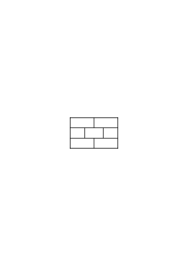
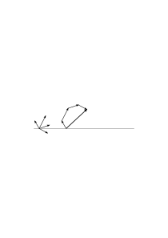
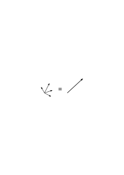

# Ms-163

### [1r\[1\]](https://cdn.wittgensteinnachlass.com/2000px/webp/Ms-163/1r.webp)

June 22, 1941

I feel unwell. It seems to me as if I could… no longer love. As if the desire still exists, but without the love. And it is therefore not just as if something beautiful had ceased, but as if it had never existed. I am behaving very unheroically in all of this. I let myself fall to pieces. –

### [1r\[2\]](https://cdn.wittgensteinnachlass.com/2000px/webp/Ms-163/1r.webp),[1v\[1\]](https://cdn.wittgensteinnachlass.com/2000px/webp/Ms-163/1v.webp)

Let us assume that Russell's contradiction had never been discovered. Well – is it quite clear that we would then have had a false calculus? Are there not various possibilities here?

### [1v\[2\]](https://cdn.wittgensteinnachlass.com/2000px/webp/Ms-163/1v.webp)

And what if one found the contradiction but did not get upset about it and, for example, decided that no conclusions should be drawn from it (as indeed no one draws conclusions from the ‘liar’). Would that have been an obvious mistake?

### [1v\[3\]](https://cdn.wittgensteinnachlass.com/2000px/webp/Ms-163/1v.webp),[2r\[1\]](https://cdn.wittgensteinnachlass.com/2000px/webp/Ms-163/2r.webp)

“But then it is not a proper calculus! It loses all _rigor_!” Well, not _all_. And it only lacks complete rigor if one has a certain ideal of rigor, a certain style of mathematics in mind.

### [2r\[2\]](https://cdn.wittgensteinnachlass.com/2000px/webp/Ms-163/2r.webp),[2v\[1\]](https://cdn.wittgensteinnachlass.com/2000px/webp/Ms-163/2v.webp)

‘But a contradiction in mathematics is incompatible with its application. It makes the application of mathematics a farce or a kind of superfluous ceremony if it is used consistently, i.e., to generate arbitrary results.’

Its effect is roughly the same as that of unstable scales, which allow different measurement results by stretching and compressing. But was measuring by pacing _not_ measuring? And if people were to work with a kind of scales made of dough, would it be wrong in itself to call that measuring?

### [3r\[1\]](https://cdn.wittgensteinnachlass.com/2000px/webp/Ms-163/3r.webp)

Could one not think of reasons why a _certain_ flexibility of the scales might be desirable?

### [3r\[2\]](https://cdn.wittgensteinnachlass.com/2000px/webp/Ms-163/3r.webp)

But is it not right to make the scales from ever harder, more immutable material? Certainly, it is right; if one wants to!

### [3r\[3\]](https://cdn.wittgensteinnachlass.com/2000px/webp/Ms-163/3r.webp)

‘So are you defending the contradiction?!’ Not at all; no more than the soft scales.

### [3v\[1\]](https://cdn.wittgensteinnachlass.com/2000px/webp/Ms-163/3v.webp)

_One_ error to avoid is the thought that the contradiction _must_ be senseless: i.e., if one uses the signs ‘p’, ‘~’, ‘∙’ _consistently_, then p ∙ ~p cannot say anything. – But consider what it means to continue the use of this and that _consistently_? (‘To continue this curve consistently.’)

### [3v\[2\]](https://cdn.wittgensteinnachlass.com/2000px/webp/Ms-163/3v.webp),[4r\[1\]](https://cdn.wittgensteinnachlass.com/2000px/webp/Ms-163/4r.webp)

Why does mathematics need a foundation?! I think it needs it no more than the sentences about physical objects, or sense data, need an _analysis_. However, both mathematical sentences and those other sentences require clarification of their grammar.

### [4r\[2\]](https://cdn.wittgensteinnachlass.com/2000px/webp/Ms-163/4r.webp)

The _mathematical_ problems of the so-called foundations are as irrelevant to us in mathematics as painted water is to a painted ship.

### [4v\[1\]](https://cdn.wittgensteinnachlass.com/2000px/webp/Ms-163/4v.webp)

But was Frege’s logic rendered unusable for the foundation of arithmetic by the contradiction? Yes!

But who said that it had to be suitable for deriving arithmetic sentences?!

### [4v\[2\]](https://cdn.wittgensteinnachlass.com/2000px/webp/Ms-163/4v.webp),[5r\[2\]](https://cdn.wittgensteinnachlass.com/2000px/webp/Ms-163/5r.webp)

One could even imagine that Frege’s logic was given to a savage as an instrument to derive arithmetic sentences. He derived the contradiction without realizing that it was one, and from it he derived all sorts of correct and incorrect sentences.

### [5r\[1\]](https://cdn.wittgensteinnachlass.com/2000px/webp/Ms-163/5r.webp)

You must swallow the bitter as if it were sweet!

### [5r\[3\]](https://cdn.wittgensteinnachlass.com/2000px/webp/Ms-163/5r.webp)

‘A good angel has hitherto protected us from going down _this_ path.’ Well, what more do you want? One could, I think, say: A good angel will always be needed, no matter what you do.

### [5r\[4\]](https://cdn.wittgensteinnachlass.com/2000px/webp/Ms-163/5r.webp),[5v\[1\]](https://cdn.wittgensteinnachlass.com/2000px/webp/Ms-163/5v.webp)

What a peculiar rendering of the cuckoo’s call by this word, which actually has very little similarity to the call.

### [5v\[2\]](https://cdn.wittgensteinnachlass.com/2000px/webp/Ms-163/5v.webp),[6r\[1\]](https://cdn.wittgensteinnachlass.com/2000px/webp/Ms-163/6r.webp)

It is said that calculation is an experiment in order to explain its practical applicability. For one knows that the experiment has real value. One only forgets that it has this value by means of a technique, which would not exist if it did not exist, but whose rules play a different role than sentences of human natural history.

### [6r\[2\]](https://cdn.wittgensteinnachlass.com/2000px/webp/Ms-163/6r.webp)

“The limits of empiricism” – (Do we live because it is practical to live?? Do we think because it is practical to think??)

### [6r\[3\]](https://cdn.wittgensteinnachlass.com/2000px/webp/Ms-163/6r.webp),[6v\[1\]](https://cdn.wittgensteinnachlass.com/2000px/webp/Ms-163/6v.webp)

June 25, 1941

He knows that an experiment is practical; therefore, calculation is an experiment.

### [6v\[2\]](https://cdn.wittgensteinnachlass.com/2000px/webp/Ms-163/6v.webp)

Our experimental actions certainly have a characteristic quality. If I see someone in a laboratory pouring a liquid into a test tube & heating it over a Bunsen burner, I am inclined to say, “he is doing an experiment.”

### [6v\[3\]](https://cdn.wittgensteinnachlass.com/2000px/webp/Ms-163/6v.webp),[7r\[1\]](https://cdn.wittgensteinnachlass.com/2000px/webp/Ms-163/7r.webp)

If we could count & we wanted to know numbers for (certain) practical purposes, & to find them out we asked certain people, who, when they had heard our practical problem, closed their eyes & let the number corresponding to the purpose come to mind; then there would be no calculation, however reliable the numerical information may be. Yes, this numerical information could be much more reliable than any calculation.

### [7r\[2\]](https://cdn.wittgensteinnachlass.com/2000px/webp/Ms-163/7r.webp),[7v\[1\]](https://cdn.wittgensteinnachlass.com/2000px/webp/Ms-163/7v.webp)

A calculation – one could say – is part of the technique of an experiment, but not an experiment in itself.

### [7v\[2\]](https://cdn.wittgensteinnachlass.com/2000px/webp/Ms-163/7v.webp)

June 27, 1941

Do we forget that the experiment has a certain kind of application? And the calculation mediates the application.

### [7v\[3\]](https://cdn.wittgensteinnachlass.com/2000px/webp/Ms-163/7v.webp)

Would anyone think of calling the deciphering of a cipher using a key an experiment?

### [7v\[4\]](https://cdn.wittgensteinnachlass.com/2000px/webp/Ms-163/7v.webp),[8r\[1\]](https://cdn.wittgensteinnachlass.com/2000px/webp/Ms-163/8r.webp)

The normative game – in contrast, for example, to the descriptive one.

### [8r\[2\]](https://cdn.wittgensteinnachlass.com/2000px/webp/Ms-163/8r.webp)

If I doubt whether the numbers n and m, when multiplied, will yield 𝓁, then I am not doubting whether confusion will break out in our calculation & perhaps half the people will consider one thing to be correct and the other half something else.

### [8r\[3\]](https://cdn.wittgensteinnachlass.com/2000px/webp/Ms-163/8r.webp),[8v\[1\]](https://cdn.wittgensteinnachlass.com/2000px/webp/Ms-163/8v.webp),[9r\[1\]](https://cdn.wittgensteinnachlass.com/2000px/webp/Ms-163/9r.webp)

An experiment is simply an action viewed from a certain perspective. And it is _clear_ that a calculation can also be an experiment. For example, I might want to investigate what this person calculates in response to this problem under these circumstances. – But, damn it, that is precisely what you are investigating when you have him do the calculation! Yes, I might very well ask that – i.e., my question might even be expressed in these words. (Compare this with: Is the sentence “The poor man groans” a sentence about the behaviour or the suffering of the person?) But how is it if I perhaps _recalculate_ his calculation? – ‘Well, then I will do another experiment to be absolutely sure that all normal people react in the same way.’ – And if they now do _not_ react uniformly –: what is the result of the calculation?

### [9r\[2\]](https://cdn.wittgensteinnachlass.com/2000px/webp/Ms-163/9r.webp),[9v\[1\]](https://cdn.wittgensteinnachlass.com/2000px/webp/Ms-163/9v.webp),[10r\[1\]](https://cdn.wittgensteinnachlass.com/2000px/webp/Ms-163/10r.webp)

“If the calculation is to be practical, it must reveal facts. And this can only be done through experiment.” But what are ‘facts’? Do you think you can show what a fact is by pointing with your finger at something? Does that already make clear the role that ‘establishing a fact’ plays? If now mathematics only determines the character of what you call ‘fact’? ‘It is interesting to know how many oscillations this sound has.’ But arithmetic only teaches you what “how many” means. It teaches you to ask about this kind of fact; to see this kind of fact.

### [10r\[2\]](https://cdn.wittgensteinnachlass.com/2000px/webp/Ms-163/10r.webp)

Mathematics, I want to say, does not simply teach you the answer to a question; but an entire language-game, with questions & answers.

### [10r\[3\]](https://cdn.wittgensteinnachlass.com/2000px/webp/Ms-163/10r.webp),[10v\[1\]](https://cdn.wittgensteinnachlass.com/2000px/webp/Ms-163/10v.webp)

‘In order to be practical, mathematics must teach us facts.’ – But must the mathematical facts be those facts? – But why should it not, instead of ‘teaching us facts,’ create the forms of what we call facts?

### [10v\[2\]](https://cdn.wittgensteinnachlass.com/2000px/webp/Ms-163/10v.webp)

“Yes, but it remains an empirical fact that people calculate in this way!” – Yes, but that does not make the rules of calculation into empirical sentences.

### [10v\[3\]](https://cdn.wittgensteinnachlass.com/2000px/webp/Ms-163/10v.webp),[11r\[1\]](https://cdn.wittgensteinnachlass.com/2000px/webp/Ms-163/11r.webp),[11v\[1\]](https://cdn.wittgensteinnachlass.com/2000px/webp/Ms-163/11v.webp)

“Yes, but the calculation must be based on (empirical) facts!” Certainly; the point of the calculation would be different if the facts were different – – –

### [11v\[2\]](https://cdn.wittgensteinnachlass.com/2000px/webp/Ms-163/11v.webp)

In calculation, there are no causal connections, only the connections of the picture.

### [11v\[3\]](https://cdn.wittgensteinnachlass.com/2000px/webp/Ms-163/11v.webp),[12r\[1\]](https://cdn.wittgensteinnachlass.com/2000px/webp/Ms-163/12r.webp)

And it does not change the fact that we recalculate the proof figure in order to acknowledge it. That we are thus tempted to say that we let it come about through a psychological experiment. Because the psychological process is not psychologically investigated during the calculation.

### [12r\[2\]](https://cdn.wittgensteinnachlass.com/2000px/webp/Ms-163/12r.webp),[12v\[1\]](https://cdn.wittgensteinnachlass.com/2000px/webp/Ms-163/12v.webp)

But can we not imagine a human society in which there is just as little calculation in the sense we give it, as there is measurement in the sense we give it? – Yes. – But why should I then try to work out exactly what mathematics is? Because we have mathematics here, and a certain conception of mathematics (as it were, an ideal) that it is important to describe clearly.

### [12v\[2\]](https://cdn.wittgensteinnachlass.com/2000px/webp/Ms-163/12v.webp)

‘Our mathematics transforms experiments into definitions.’

### [12v\[3\]](https://cdn.wittgensteinnachlass.com/2000px/webp/Ms-163/12v.webp),[13r\[1\]](https://cdn.wittgensteinnachlass.com/2000px/webp/Ms-163/13r.webp)

Don’t demand too much, and don’t be afraid that your just demand will come to nothing.

### [13r\[2\]](https://cdn.wittgensteinnachlass.com/2000px/webp/Ms-163/13r.webp)

My task is not to attack Russell’s logic from the inside, but from the outside.

### [13r\[3\]](https://cdn.wittgensteinnachlass.com/2000px/webp/Ms-163/13r.webp)

That is to say, not to attack it mathematically – otherwise I would be doing mathematics – but its position in a different whole.

### [13v\[1\]](https://cdn.wittgensteinnachlass.com/2000px/webp/Ms-163/13v.webp)

The two proofs convince us of the same thing.

### [13v\[2\]](https://cdn.wittgensteinnachlass.com/2000px/webp/Ms-163/13v.webp),[14r\[1\]](https://cdn.wittgensteinnachlass.com/2000px/webp/Ms-163/14r.webp),[14v\[1\]](https://cdn.wittgensteinnachlass.com/2000px/webp/Ms-163/14v.webp)

02.07.1941

‘The minute has 60 seconds.’ This is a sentence, very similar to a mathematical one. Does its truth depend on experience? – Well, could we talk of minutes and seconds if there were no sense of time; if there were no clocks, or, for physical reasons, could not be; if all the connections did not exist that give our time measures sense and meaning? In that case – we would say – the time measure would have lost its point (like checkmate without the institution of chess), or it would then have a completely different point. But does the one experience described make the sentence false, the other true? No; that does not describe its function. It functions quite differently.

### [14v\[2\]](https://cdn.wittgensteinnachlass.com/2000px/webp/Ms-163/14v.webp),[15r\[1\]](https://cdn.wittgensteinnachlass.com/2000px/webp/Ms-163/15r.webp)

Sincerity in some people may have only one level; in others it has several levels. English people, e.g., not only speak and write what the government wants them to, but they don’t allow themselves to think anything else. Hence the phenomenon that what they speak is, in a sense, sincere, though the mental activity of suppressing thoughts in themselves is an insincerity. And just in this country you hear again and again the question: “Don’t you think so and so is sincere?” – because they have a way of avoiding the normal judgement of anybody being insincere.

### [15r\[2\]](https://cdn.wittgensteinnachlass.com/2000px/webp/Ms-163/15r.webp)

I want to work out a certain aspect of mathematics; and namely the one which – in my opinion – influences the way mathematicians and philosophers (today) view mathematics when it is worked out.

### [15v\[1\]](https://cdn.wittgensteinnachlass.com/2000px/webp/Ms-163/15v.webp)

‘The psychological process of calculation’ – or should I call it a physiological one? Am I interested in describing the feeling of approving of a step in the calculation? If we put the expression of approval instead of the approval here: – what is it that interests us? It is merely an environment of the calculation. (Note the behaviour in calculation!)

### [15v\[2\]](https://cdn.wittgensteinnachlass.com/2000px/webp/Ms-163/15v.webp),[16r\[1\]](https://cdn.wittgensteinnachlass.com/2000px/webp/Ms-163/16r.webp)

‘For calculation to be practical, it must be based on empirical facts.’ – Why shouldn’t it rather determine what we call empirical facts?

### [16r\[2\]](https://cdn.wittgensteinnachlass.com/2000px/webp/Ms-163/16r.webp)

My task is not to talk about the Gödel proof, for example – but to talk past it.

### [16r\[3\]](https://cdn.wittgensteinnachlass.com/2000px/webp/Ms-163/16r.webp),[16v\[1\]](https://cdn.wittgensteinnachlass.com/2000px/webp/Ms-163/16v.webp),[17r\[1\]](https://cdn.wittgensteinnachlass.com/2000px/webp/Ms-163/17r.webp)

The task of finding the number of paths without repetition

through all the gaps in the wall, is recognized by everyone as a _mathematical_ problem. – If the drawing were _much_ larger, impossible to take in at a glance, one could assume it changes without us _seeing_ it & then the task would be to find that number (which changes in some way), no longer a mathematical one. But even if it remains the same, the task is not mathematical then. – But even if the wall is easy to overlook, that does not mean the task is a mathematical one; as if one were to say: _this_ task now belongs to embryology. Rather: _here_ we need a mathematical solution. (As in: here is what we need, a _template_.)

### [17r\[2\]](https://cdn.wittgensteinnachlass.com/2000px/webp/Ms-163/17r.webp)

Did we recognize the problem as a mathematical one because mathematics deals with tracing drawings?

### [17r\[3\]](https://cdn.wittgensteinnachlass.com/2000px/webp/Ms-163/17r.webp),[17v\[1\]](https://cdn.wittgensteinnachlass.com/2000px/webp/Ms-163/17v.webp)

Why, then, are we inclined to call this problem a ‘mathematical’ one? Because one can immediately _see_ that answering this _math._ question is _almost_ everything one needs. Although one could easily _see_ the problem, for example, as a psychological one.

### [17v\[2\]](https://cdn.wittgensteinnachlass.com/2000px/webp/Ms-163/17v.webp)

Something similar applies to the task of folding this and that out of a square piece of paper.

### [17v\[3\]](https://cdn.wittgensteinnachlass.com/2000px/webp/Ms-163/17v.webp),[18r\[1\]](https://cdn.wittgensteinnachlass.com/2000px/webp/Ms-163/18r.webp)

Do the sentences of dynamics become sentences of pure mathematics when one leaves their interpretation open and uses them only for the production of a system of measurement?

### [18r\[2\]](https://cdn.wittgensteinnachlass.com/2000px/webp/Ms-163/18r.webp)

“The mathematical proof must be surveyable”; this is somewhat related to the surveyability of that figure.

### [18r\[3\]](https://cdn.wittgensteinnachlass.com/2000px/webp/Ms-163/18r.webp)

Don't forget: the sentence that asserts of itself that it is unprovable is to be understood as a mathematical statement. Because that is not self-evident.

### [18v\[1\]](https://cdn.wittgensteinnachlass.com/2000px/webp/Ms-163/18v.webp)

It is not self-evident that the sentence, that the structure is so and so and is not constructible, is to be understood as a mathematical sentence.

### [18v\[2\]](https://cdn.wittgensteinnachlass.com/2000px/webp/Ms-163/18v.webp)

That is: if one says “it says of itself,” then this is to be understood in a special way. Because confusion easily arises here due to the different uses of the expression “this sentence says something about…”.

### [19r\[1\]](https://cdn.wittgensteinnachlass.com/2000px/webp/Ms-163/19r.webp)

In this sense, the sentence 625 = 25 × 25 also says something about itself: namely, that the left digit will be obtained if one multiplies the two right digits with each other.

### [19r\[2\]](https://cdn.wittgensteinnachlass.com/2000px/webp/Ms-163/19r.webp)

The Gödel sentence, which says something about itself, does not mention itself.

### [19r\[3\]](https://cdn.wittgensteinnachlass.com/2000px/webp/Ms-163/19r.webp),[19v\[1\]](https://cdn.wittgensteinnachlass.com/2000px/webp/Ms-163/19v.webp)

Can one not also say that the sentence 3 + 2 = 5 says of itself that it can be decomposed into a group of 3 and a group of 2 signs?

### [19v\[2\]](https://cdn.wittgensteinnachlass.com/2000px/webp/Ms-163/19v.webp)

‘The sentence says that _this_ number cannot be obtained from _these_ numbers in _this_ way’. – But are you also sure that you have translated it correctly into German? Yes, of course, it seems so. – But is it not possible to be mistaken?

### [19v\[3\]](https://cdn.wittgensteinnachlass.com/2000px/webp/Ms-163/19v.webp),[20r\[1\]](https://cdn.wittgensteinnachlass.com/2000px/webp/Ms-163/20r.webp)

A style of building machines in which one surrounds the effective wheels, etc., with a number of ineffective ones that are, for example, placed there only for aesthetic reasons. (Similar to false windows in a façade.)

### [20r\[2\]](https://cdn.wittgensteinnachlass.com/2000px/webp/Ms-163/20r.webp),[20v\[1\]](https://cdn.wittgensteinnachlass.com/2000px/webp/Ms-163/20v.webp)

Could one say: Gödel says that one must also be able to trust a mathematical proof if one wants to understand it practically as the proof of the constructibility of the sentence figure according to the rules of proof. Or: A mathematical sentence must be able to be understood as a sentence of a geometry that is truly applicable to itself. And if one does that, it turns out that one cannot rely on a proof under certain circumstances.

### [20v\[2\]](https://cdn.wittgensteinnachlass.com/2000px/webp/Ms-163/20v.webp)

We expect one thing and are surprised by another; but the chain of reasons has an end.

### [20v\[3\]](https://cdn.wittgensteinnachlass.com/2000px/webp/Ms-163/20v.webp)

The limits of empiricism are not unverified assumptions, or intuitively recognized as correct; but rather types and ways of comparing and acting.

### [21r\[1\]](https://cdn.wittgensteinnachlass.com/2000px/webp/Ms-163/21r.webp),[21v\[1\]](https://cdn.wittgensteinnachlass.com/2000px/webp/Ms-163/21v.webp),[22r\[1\]](https://cdn.wittgensteinnachlass.com/2000px/webp/Ms-163/22r.webp),[22v\[1\]](https://cdn.wittgensteinnachlass.com/2000px/webp/Ms-163/22v.webp)

07/03/1941

Let us assume that we have an arithmetic sentence which states that a certain number cannot be obtained from the numbers …, …, … by means of the operations. And let us assume that it would be possible to give a rule of translation according to which this arithmetic sentence could be translated into the digit of that first number, the axioms, from which we try to prove it, into the digits of those other numbers, and our rules of inference into the operations mentioned in the sentence. – If we then derived _the arithmetic sentence_ from the axioms according to our rules of inference, then we would have demonstrated _thereby_ its derivability, but also proven a sentence, which according to that rule of translation one must express in this way, this arithmetic sentence, namely ours, is not derivable. What would one do then? I think we give credence to our _construction_ of the _sentence_, thus to the _geometric_ proof. We say, then, this ‘sentence figure’ can be obtained from those so and so. And, translated, it simply means: this number can be obtained from those by means of these operations. So far, the sentence and its proof have nothing to do with a particular _logic_. Here, that constructed sentence was simply another way of writing the constructed digit; it had the _form_ of a sentence, but we did not compare it with other sentences as a sign, which asserts this or that, has a _sense_.

### [22v\[2\]](https://cdn.wittgensteinnachlass.com/2000px/webp/Ms-163/22v.webp),[23r\[1\]](https://cdn.wittgensteinnachlass.com/2000px/webp/Ms-163/23r.webp)

If we now read the constructed sentence (or the digit) as a sentence of the mathematical language (e.g., in German), then it says the opposite of what we have just considered as proven. Thus, according to our view, we have proven a demonstrably false arithmetic or geometric sentence (insofar as we, namely, trust the proof by construction more than the meaningful derivation of the existence sentence from axioms).

### [23r\[2\]](https://cdn.wittgensteinnachlass.com/2000px/webp/Ms-163/23r.webp)

(If someone says that I am not allowed to make such an assumption because it would, as it were, be a logical assumption, then I say that I assume that someone arrived at the result through a calculation error & that he cannot immediately find this calculation error.)

### [23v\[1\]](https://cdn.wittgensteinnachlass.com/2000px/webp/Ms-163/23v.webp)

The people who constantly ask “why” are like the tourists who, while reading the Baedeker, stand in front of a building & are prevented from _seeing_ the building by reading about its history, etc., etc.

### [23v\[2\]](https://cdn.wittgensteinnachlass.com/2000px/webp/Ms-163/23v.webp),[24r\[1\]](https://cdn.wittgensteinnachlass.com/2000px/webp/Ms-163/24r.webp)

Here we return to the expression “the proof convinces us”. And what interests us here in the conviction is neither its expression in the voice or gesture, nor the feeling of satisfaction or the like, but its manifestation in the use of the proven.

### [24r\[2\]](https://cdn.wittgensteinnachlass.com/2000px/webp/Ms-163/24r.webp),[24v\[1\]](https://cdn.wittgensteinnachlass.com/2000px/webp/Ms-163/24v.webp)

One can _legitimately_ ask what interest Gödel’s proof has for our work. Because it cannot solve any _of_ our problems. – The answer is: that the _situation_ in which such a proof puts people interests us. “What are they supposed to say now?” – that is our topic.

### [24v\[2\]](https://cdn.wittgensteinnachlass.com/2000px/webp/Ms-163/24v.webp)

“He went like… a fist when you open your hand.” – an interesting construction.

### [24v\[3\]](https://cdn.wittgensteinnachlass.com/2000px/webp/Ms-163/24v.webp)

04.07.1941

It seems far too obvious to us that we ask “how many?” & then count & calculate!

### [24v\[4\]](https://cdn.wittgensteinnachlass.com/2000px/webp/Ms-163/24v.webp),[25r\[1\]](https://cdn.wittgensteinnachlass.com/2000px/webp/Ms-163/25r.webp)

As strange as it sounds, it seems that my task (only) consists in making it clear what a sentence like “assuming one could prove this” means in mathematics.

### [25r\[2\]](https://cdn.wittgensteinnachlass.com/2000px/webp/Ms-163/25r.webp)

Do we count because it is practical to count? We count! – And that’s how we calculate too.

### [25r\[3\]](https://cdn.wittgensteinnachlass.com/2000px/webp/Ms-163/25r.webp)

Can I say: “Simply saying ‘one, two, three, four, …’ – is doing pure mathematics; counting, applied”?

### [VB](/w-vb/#ms-163-25r.4+25v.1+26r.1) [25r\[4\]](https://cdn.wittgensteinnachlass.com/2000px/webp/Ms-163/25r.webp),[25v\[1\]](https://cdn.wittgensteinnachlass.com/2000px/webp/Ms-163/25v.webp),[26r\[1\]](https://cdn.wittgensteinnachlass.com/2000px/webp/Ms-163/26r.webp) {#25r425v126r1}

The counterpoint could represent an extraordinarily difficult problem for a composer; namely, the problem: what relationship should _I_ have to the counterpoint in relation to _my_ inclinations. He may have found a conventional relationship but probably feels that it is not _his_. That the meaning is not clear, what meaning the counterpoint should have for him. (I was thinking of Schubert; that at the end of his life he still wanted to take instruction in counterpoint. I mean that his goal was perhaps not simply to learn more counterpoint, but rather to find his relationship to counterpoint.)

### [26r\[2\]](https://cdn.wittgensteinnachlass.com/2000px/webp/Ms-163/26r.webp)

“The two proofs convince us of the same thing.” –

### [26r\[3\]](https://cdn.wittgensteinnachlass.com/2000px/webp/Ms-163/26r.webp),[26v\[1\]](https://cdn.wittgensteinnachlass.com/2000px/webp/Ms-163/26v.webp)

One can perform an experiment – or whatever else one wants to call it – on the basis of which one changes the assumed measure or also re-evaluates what should be measured.

### [26v\[2\]](https://cdn.wittgensteinnachlass.com/2000px/webp/Ms-163/26v.webp)

So is the unit of measure the result of measurements? Yes & no. Not the result of the measurement, but perhaps the _sequence_ of measurements.

### [26v\[3\]](https://cdn.wittgensteinnachlass.com/2000px/webp/Ms-163/26v.webp),[27r\[1\]](https://cdn.wittgensteinnachlass.com/2000px/webp/Ms-163/27r.webp)

So one question would be: “Has experience taught us to calculate _in this way_?” – & another: “Is calculation an experiment?”

### [27r\[2\]](https://cdn.wittgensteinnachlass.com/2000px/webp/Ms-163/27r.webp),[27v\[1\]](https://cdn.wittgensteinnachlass.com/2000px/webp/Ms-163/27v.webp)

06.07.1941

There are sentences that describe people’s calculating. They say how people learn & teach calculating (I imagine the description as purely behavioristic), how they calculate in writing, etc., on certain occasions. And so on. It also describes how the word “calculate” (etc.) is used. This description also naturally includes the mathematical sentences & their function.

### [27v\[2\]](https://cdn.wittgensteinnachlass.com/2000px/webp/Ms-163/27v.webp)

Physics – one could say – describes the measures & also what is measured. It says how one arrives at these measures. If physics explains the word ‘meter’, then it also explains the word ‘equal’. – – –

### [27v\[3\]](https://cdn.wittgensteinnachlass.com/2000px/webp/Ms-163/27v.webp),[28r\[1\]](https://cdn.wittgensteinnachlass.com/2000px/webp/Ms-163/28r.webp)

One could say: experiment, calculation, are poles between which human actions move.

### [28r\[2\]](https://cdn.wittgensteinnachlass.com/2000px/webp/Ms-163/28r.webp)

An _experiment_ is already something in an investigation; just as a _verb_ already presupposes a certain practice of communication.

### [28r\[3\]](https://cdn.wittgensteinnachlass.com/2000px/webp/Ms-163/28r.webp),[28v\[1\]](https://cdn.wittgensteinnachlass.com/2000px/webp/Ms-163/28v.webp),[29r\[1\]](https://cdn.wittgensteinnachlass.com/2000px/webp/Ms-163/29r.webp)

We condition a person in this way and in that way; then we act upon them through a question; we obtain a _number_. This we use further for our purposes & it proves to be practical. That is calculation. – Not yet! This could be a very _useful_ process – but it does not have to be what we call ‘calculation’. Just as one might imagine that sounds were uttered for purposes that our language now serves, but which did not constitute language. Calculation involves the fact that all those who calculate correctly produce the same calculation. And calculating correctly does not mean calculating with a clear head, or undisturbedly, but calculating _like this_.

### [29r\[2\]](https://cdn.wittgensteinnachlass.com/2000px/webp/Ms-163/29r.webp)

‘What are the conditions of the experiment, what is its result?’ [→ [p. 87]] Is the result the result of the calculation, or the calculation, or the agreement (whatever form this takes)?

### [29r\[3\]](https://cdn.wittgensteinnachlass.com/2000px/webp/Ms-163/29r.webp),[29v\[1\]](https://cdn.wittgensteinnachlass.com/2000px/webp/Ms-163/29v.webp)

Of course, one could say: before we try it, we do not know what we will accept. But if we could not agree on what everyone accepts, there would be no calculation.

### [29v\[2\]](https://cdn.wittgensteinnachlass.com/2000px/webp/Ms-163/29v.webp)

But could one not suggest this interpretation: the mathematical sentence says, for example, ‘all people produce this and that’ & the opposite of this _mathematical_ sentence means: ‘all people produce something else’? How is it in relation to a rule of a game?

### [30r\[1\]](https://cdn.wittgensteinnachlass.com/2000px/webp/Ms-163/30r.webp)

07.07.1941

“We move the king in this way.” – “We allow you to move the king in this way.” – “You are allowed to. …”

### [30r\[2\]](https://cdn.wittgensteinnachlass.com/2000px/webp/Ms-163/30r.webp),[30v\[1\]](https://cdn.wittgensteinnachlass.com/2000px/webp/Ms-163/30v.webp),[31r\[1\]](https://cdn.wittgensteinnachlass.com/2000px/webp/Ms-163/31r.webp)

Could, _conversely_, a natural scientist use mathematical sentences as sentences of our natural history? He comes from Mars & studies, among other things, our mathematics & how we use it. What role will the mathematical sentences play in his report about us? Will they be sentences of the report? – They could certainly be used as such. “25 × 25 = 625” would therefore be a sentence of the report. But is our question “what is 25 × 25?” a natural-historical question in the report? And if this natural scientist now learns our mathematics & now engages in a mathematical problem himself, is he still doing natural research? The description of the function of a mathematical sentence does not have the function of the mathematical sentence.

### [31r\[2\]](https://cdn.wittgensteinnachlass.com/2000px/webp/Ms-163/31r.webp)

The pronoun referring to the sentence _itself_, of the sentence that says something about itself. Such a thing does not exist in our language, its use, the language-game, but can easily be described, if one only first sees that the sentences in which it occurs must not, above all, be logical or mathematical.

### [31r\[3\]](https://cdn.wittgensteinnachlass.com/2000px/webp/Ms-163/31r.webp),[31v\[1\]](https://cdn.wittgensteinnachlass.com/2000px/webp/Ms-163/31v.webp)

If such a sentence now says: “I am not true,” then I have no use for it. Unless I play a game with it to say: So the opposite of this sentence is true, which is: “I am true.” And this is, in _one_ sense, the opposite & in another sense not.

### [31v\[2\]](https://cdn.wittgensteinnachlass.com/2000px/webp/Ms-163/31v.webp)

“I cannot be constructed in this way.”

### [31v\[3\]](https://cdn.wittgensteinnachlass.com/2000px/webp/Ms-163/31v.webp)

“Derive me!”

### [32r\[1\]](https://cdn.wittgensteinnachlass.com/2000px/webp/Ms-163/32r.webp)

“Try to derive me in the way K!”

### [32r\[2\]](https://cdn.wittgensteinnachlass.com/2000px/webp/Ms-163/32r.webp)

But now: “I cannot be proven in the way K.” Let us assume that we can derive the sentence in this way; then one must call it false & therefore also say that this derivation cannot be regarded as a ‘proof’ (proof of truth).

### [32r\[3\]](https://cdn.wittgensteinnachlass.com/2000px/webp/Ms-163/32r.webp),[32v\[1\]](https://cdn.wittgensteinnachlass.com/2000px/webp/Ms-163/32v.webp)

But does this not make the use of such sentences impossible in that a sentence & its opposite can be true? E.g.: “I am an inch long” & “I am not an inch long”. One could say here that there must be an external & an internal negation. The same naturally applies to “I can be derived” & “I cannot be derived,” they can both be true & both be false: And yet not senseless.

### [32v\[2\]](https://cdn.wittgensteinnachlass.com/2000px/webp/Ms-163/32v.webp),[33r\[1\]](https://cdn.wittgensteinnachlass.com/2000px/webp/Ms-163/33r.webp)

If you had derived something from logical & arithmetic basic principles, whose most natural application would seem to be to present the derived sentence as hopelessly derived, then this means that the sentence so derived does not have this application, that the principles from which it is derived are not capable of creating a geometry that can be applied in this way.

### [33r\[2\]](https://cdn.wittgensteinnachlass.com/2000px/webp/Ms-163/33r.webp),[33v\[1\]](https://cdn.wittgensteinnachlass.com/2000px/webp/Ms-163/33v.webp)

Is this really so different from having a general arithmetic proof, when applied to extraordinarily large numbers, produce something that contradicts the result of a specific and enormously long calculation? I could imagine that pairs of enormously long multiplications, n × m, m × n, would lead to ever-different results.

### [33v\[2\]](https://cdn.wittgensteinnachlass.com/2000px/webp/Ms-163/33v.webp),[34r\[1\]](https://cdn.wittgensteinnachlass.com/2000px/webp/Ms-163/34r.webp)

The search for the foundations of mathematics seems to me to be based on a false ideal. (Like a particular policy based on a particular way of life.)

### [34r\[2\]](https://cdn.wittgensteinnachlass.com/2000px/webp/Ms-163/34r.webp)

(“I am true” is false) = (“I am true” is true)

### [VB](/w-vb/#ms-163-34r.3+34v.1) [34r\[3\]](https://cdn.wittgensteinnachlass.com/2000px/webp/Ms-163/34r.webp),[34v\[1\]](https://cdn.wittgensteinnachlass.com/2000px/webp/Ms-163/34v.webp) {#34r334v1}

Wagner's motives could be called musical prose sentences. And just as there is “rhymed prose,” so too can these motives be combined into melodic form, but they do not produce _a_ melody. And so, Wagner's drama is not a drama, but a sequence of situations, strung together like beads on a thread, which is itself only _cleverly_ spun, but not, like the motives and situations, inspired.

### [34v\[2\]](https://cdn.wittgensteinnachlass.com/2000px/webp/Ms-163/34v.webp),[35r\[1\]](https://cdn.wittgensteinnachlass.com/2000px/webp/Ms-163/35r.webp)

07.08.1941

If I want to find an example of a possible confusion in arithmetic, I only need to imagine a calculation with huge numbers, which becomes so unwieldy and thus unreliable.

### [35r\[2\]](https://cdn.wittgensteinnachlass.com/2000px/webp/Ms-163/35r.webp)

But what about comprehensibility here? Comprehensible for the eye? For the memory? or in some other way? –

### [35r\[3\]](https://cdn.wittgensteinnachlass.com/2000px/webp/Ms-163/35r.webp)

With a certain extension of the number signs, we would say, “here the _calculation_ stops.”

### [35r\[4\]](https://cdn.wittgensteinnachlass.com/2000px/webp/Ms-163/35r.webp),[35v\[1\]](https://cdn.wittgensteinnachlass.com/2000px/webp/Ms-163/35v.webp),[36r\[1\]](https://cdn.wittgensteinnachlass.com/2000px/webp/Ms-163/36r.webp),[36v\[1\]](https://cdn.wittgensteinnachlass.com/2000px/webp/Ms-163/36v.webp)

The difficulty here is to gain the appropriate perspective, one from which neither something irrelevant to it is seen nor something essential is overlooked. Our point of view should, in fact, show us those parts of mathematics which seem so important and promising to logicians and mathematicians in the most concise way, while showing those aspects of mathematics in their full length, which seem uninteresting to them.

### [36v\[2\]](https://cdn.wittgensteinnachlass.com/2000px/webp/Ms-163/36v.webp)

The proof of the sentence shows me what I am willing to venture in relation to the truth of the sentence. And different proofs can indeed bring me to venture the same thing.

### [36v\[3\]](https://cdn.wittgensteinnachlass.com/2000px/webp/Ms-163/36v.webp),[37r\[1\]](https://cdn.wittgensteinnachlass.com/2000px/webp/Ms-163/37r.webp)

The surprisingly paradoxical is only paradoxical in a certain environment. One must supplement this environment so that what appeared paradoxical no longer appears so.

### [37r\[2\]](https://cdn.wittgensteinnachlass.com/2000px/webp/Ms-163/37r.webp),[37v\[1\]](https://cdn.wittgensteinnachlass.com/2000px/webp/Ms-163/37v.webp)

“What would be more important to this man: the truth of the sentence that he derived that sentence from the axioms according to the rules, or the truth of the derived sentence?” But is it also _possible_ that he will maintain the truth of the sentence on the basis of the proof and deny the applicability of the sentence to his own derivation?

### [37v\[2\]](https://cdn.wittgensteinnachlass.com/2000px/webp/Ms-163/37v.webp)

Is love possible with _so_ much pessimism?

### [37v\[3\]](https://cdn.wittgensteinnachlass.com/2000px/webp/Ms-163/37v.webp)

I am not interested in Gödel's proof, but in the possibilities that Gödel makes us aware of through his discussion.

### [37v\[4\]](https://cdn.wittgensteinnachlass.com/2000px/webp/Ms-163/37v.webp),[38r\[1\]](https://cdn.wittgensteinnachlass.com/2000px/webp/Ms-163/38r.webp)

The mathematical fact that there is an arithmetic sentence here that cannot be proven or disproven in P does not interest me. – – –

### [38r\[2\]](https://cdn.wittgensteinnachlass.com/2000px/webp/Ms-163/38r.webp),[38v\[1\]](https://cdn.wittgensteinnachlass.com/2000px/webp/Ms-163/38v.webp)

It seems here as if the truth of the mathematical sentence (or certain mathematical sentences) is directly dependent on a certain experience. If a general proof proves the non-constructibility of a sign structure, then this structure must not be obtainable. Or also: it seems that mathematics _must_ in any case be practically applicable to the technique of its proof, and that it must agree with the empirical facts of this.

### [38v\[2\]](https://cdn.wittgensteinnachlass.com/2000px/webp/Ms-163/38v.webp),[39r\[1\]](https://cdn.wittgensteinnachlass.com/2000px/webp/Ms-163/39r.webp)

One could imagine that there are signs that we could use instead of ‘0’, ‘1’, ‘2’, ‘3’, ‘4’ … ‘9’, and which – to put it another way – would influence our memory or our seeing in such a way that when multiplying with them, we do not get the right result, i.e., the result that can be translated into the digit that is considered correct. As one might imagine that calculating with red ink does not yield the same result as calculating with black ink.

### [VB](/w-vb/#ms-163-39r.2) [39r\[2\]](https://cdn.wittgensteinnachlass.com/2000px/webp/Ms-163/39r.webp) {#39r2}

Don’t let yourself be guided by the example of others, but by nature!

### [39r\[3\]](https://cdn.wittgensteinnachlass.com/2000px/webp/Ms-163/39r.webp),[39v\[1\]](https://cdn.wittgensteinnachlass.com/2000px/webp/Ms-163/39v.webp)

If I prove that a certain number cannot be obtained in a certain way, then this must be a proof valid for the geometry of the signs. One must be able to _physically_ trust it.

### [39v\[2\]](https://cdn.wittgensteinnachlass.com/2000px/webp/Ms-163/39v.webp)

But does this not just mean that, if we cannot trust it, we are misinterpreting the sentence? That we are seeing it as an instrument for something for which it is not one?

### [39v\[3\]](https://cdn.wittgensteinnachlass.com/2000px/webp/Ms-163/39v.webp),[40r\[1\]](https://cdn.wittgensteinnachlass.com/2000px/webp/Ms-163/40r.webp)

Gödel’s proof brings up a difficulty that must also manifest itself in a much more elementary way. (And herein, it seems to me, lies at the same time Gödel’s great merit for the philosophy of mathematics, & at the same time the reason why his particular proof is not what interests us.)

### [40r\[2\]](https://cdn.wittgensteinnachlass.com/2000px/webp/Ms-163/40r.webp),[40v\[1\]](https://cdn.wittgensteinnachlass.com/2000px/webp/Ms-163/40v.webp)

July 11, 1941

I could say: Gödel’s proof gives us the impetus to change the perspective from which we saw mathematics. What he proves is irrelevant to us, but we must engage with this mathematical type of proof.

### [40v\[2\]](https://cdn.wittgensteinnachlass.com/2000px/webp/Ms-163/40v.webp)

Act! If you stand firm & act, it will also benefit the other person the most. Don’t make a scene, don’t be ironic, don’t be unnatural.

### [40v\[3\]](https://cdn.wittgensteinnachlass.com/2000px/webp/Ms-163/40v.webp)

Act!

### [40v\[4\]](https://cdn.wittgensteinnachlass.com/2000px/webp/Ms-163/40v.webp),[41r\[1\]](https://cdn.wittgensteinnachlass.com/2000px/webp/Ms-163/41r.webp)

The thoughts must be arranged in such a way that one can break off the investigation at any point without what comes after this point calling into question what has been said up to that point.

### [41r\[2\]](https://cdn.wittgensteinnachlass.com/2000px/webp/Ms-163/41r.webp)

Here we come back to the idea that spelling the word “spell” is not a spelling of the second degree.

### [41r\[3\]](https://cdn.wittgensteinnachlass.com/2000px/webp/Ms-163/41r.webp),[41v\[1\]](https://cdn.wittgensteinnachlass.com/2000px/webp/Ms-163/41v.webp)

If the two ω-contradictory proofs actually exist, then it becomes problematic what we can do with the sentence that has been proven & refuted in this way.

### [41v\[2\]](https://cdn.wittgensteinnachlass.com/2000px/webp/Ms-163/41v.webp)

Gödel demonstrates _clearly_ that the sentence he constructed occupies a special position within the system of sentences. (That is to say,) however one describes this special position, _it remains such_.

### [41v\[3\]](https://cdn.wittgensteinnachlass.com/2000px/webp/Ms-163/41v.webp),[42r\[1\]](https://cdn.wittgensteinnachlass.com/2000px/webp/Ms-163/42r.webp)

Gödel’s discovery is a mathematical discovery. If such a discovery can be understood as an extension of grammar, what is the grammatical meaning of the construction?

### [42r\[2\]](https://cdn.wittgensteinnachlass.com/2000px/webp/Ms-163/42r.webp),[42v\[1\]](https://cdn.wittgensteinnachlass.com/2000px/webp/Ms-163/42v.webp)

Could one also express it like this: What is the extramathematical use of Gödel’s theorem?

### [42v\[2\]](https://cdn.wittgensteinnachlass.com/2000px/webp/Ms-163/42v.webp)

What use do we have for a sentence that mathematically asserts its own unprovability?

### [42v\[3\]](https://cdn.wittgensteinnachlass.com/2000px/webp/Ms-163/42v.webp)

How strange that you are still chasing happiness & know that you can no longer be happy. No longer happy, except in moments that are interrupted by unhappiness.

### [43r\[1\]](https://cdn.wittgensteinnachlass.com/2000px/webp/Ms-163/43r.webp)

“A mathematical sentence is not decidable in a certain proof system, in which it asserts its own unprovability.”

### [43r\[2\]](https://cdn.wittgensteinnachlass.com/2000px/webp/Ms-163/43r.webp),[43v\[1\]](https://cdn.wittgensteinnachlass.com/2000px/webp/Ms-163/43v.webp),[44r\[1\]](https://cdn.wittgensteinnachlass.com/2000px/webp/Ms-163/44r.webp),[44v\[1\]](https://cdn.wittgensteinnachlass.com/2000px/webp/Ms-163/44v.webp)

The phrase “interpreted in terms of content” is a wretched fabrication. I believe that this expression stems from a false idea of the nature of the application of mathematics. One could describe this concept as follows: Let us imagine that we are playing a kind of game with any class, say, of German sentences “Hans is a stupid boy,” “His hat is dusty,” etc., in which understanding these sentences is not the point. We could also play it if the sequences of words were sentences of an unknown language, or even not sentences at all. But let us assume that they are actually German sentences, so that this fact plays a role in the game, as in written chess, the role that we use real letters & numbers for notation. – But now let us assume that the game turns out to be useful in that it produces German sentences under certain circumstances, which turn out to be true. So that if, under certain circumstances, the result of certain transformations is the sentence “Hans is stupid,” this sentence, when interpreted in terms of content, is usually true. – But have you not here – albeit in its most rudimentary form – described the application of mathematics?

### [44v\[2\]](https://cdn.wittgensteinnachlass.com/2000px/webp/Ms-163/44v.webp),[45r\[1\]](https://cdn.wittgensteinnachlass.com/2000px/webp/Ms-163/45r.webp)

What does it mean to interpret a sequence of ‘signs’ in terms of content? Does it mean something other than understanding them as a sentence or expression of a language familiar to us & thus mastering its conventional use, or, if they are not the expression of a language familiar to us, having some kind of fixed application in mind?

### [45r\[2\]](https://cdn.wittgensteinnachlass.com/2000px/webp/Ms-163/45r.webp),[45v\[1\]](https://cdn.wittgensteinnachlass.com/2000px/webp/Ms-163/45v.webp)

Let us imagine specific expressions instead of the phrase “interpreted in terms of content”: “interpreted zoologically,” “interpreted in terms of accounting,” & let us see whether there is also a “mathematically interpreted” one among these.

### [45v\[2\]](https://cdn.wittgensteinnachlass.com/2000px/webp/Ms-163/45v.webp)

When do we interpret? That is: When do we perform the interpretation?

### [45v\[3\]](https://cdn.wittgensteinnachlass.com/2000px/webp/Ms-163/45v.webp),[46r\[1\]](https://cdn.wittgensteinnachlass.com/2000px/webp/Ms-163/46r.webp)

What does the sentence “5 × 5 = 25” say, when interpreted in terms of content? – That 5 × 5 = 25? Or should I regard the Russellian paraphrase as an interpretation in terms of content? But what is the interpretation in terms of content of the “Principia Mathematica”?

### [46r\[2\]](https://cdn.wittgensteinnachlass.com/2000px/webp/Ms-163/46r.webp)

‘Interpreting in terms of content’ should mean: applying; & namely, applying in the way indicated by these words.

### [46r\[3\]](https://cdn.wittgensteinnachlass.com/2000px/webp/Ms-163/46r.webp)

‘Interpreted in terms of content, this formula says …’ thus means: ‘this formula can be expressed in the following words: …’

### [46r\[4\]](https://cdn.wittgensteinnachlass.com/2000px/webp/Ms-163/46r.webp),[46v\[1\]](https://cdn.wittgensteinnachlass.com/2000px/webp/Ms-163/46v.webp)

The entire idea of interpreting in terms of content is based on the conception of mathematics as a kind of physics of ‘mathematical objects’.

### [46v\[2\]](https://cdn.wittgensteinnachlass.com/2000px/webp/Ms-163/46v.webp),[47r\[1\]](https://cdn.wittgensteinnachlass.com/2000px/webp/Ms-163/47r.webp)

I always want to say: mathematical truth & falsehood does not correspond in its application to (the) truth & falsehood of non-mathematical sentences, but to the distinction between sense & nonsense. A mathematical impossibility corresponds to the exclusion of a sentential form from the class of sentences describing experience.

### [VB](/w-vb/#ms-163-47v.1) [47v\[1\]](https://cdn.wittgensteinnachlass.com/2000px/webp/Ms-163/47v.webp) {#47v1}

The language of philosophers is already one that is, as it were, deformed by shoes that are too tight.

### [47v\[2\]](https://cdn.wittgensteinnachlass.com/2000px/webp/Ms-163/47v.webp)

When does one interpret in terms of content? _Before_ the application?

### [47v\[3\]](https://cdn.wittgensteinnachlass.com/2000px/webp/Ms-163/47v.webp),[48r\[1\]](https://cdn.wittgensteinnachlass.com/2000px/webp/Ms-163/48r.webp)

‘The mathematical sentence, as we usually understand it, does have a content!’ – That is: we understand it as a _sentence_, not as a _blank_ group of figures! – Now, this obviously stems from the fact that the signs of the mathematical sentence are signs (words) of our _language_.

### [48r\[2\]](https://cdn.wittgensteinnachlass.com/2000px/webp/Ms-163/48r.webp)

But are the free variables also words in our language? Well, I could certainly use them in the expression of rules for a game. ‘Whenever I say “x + 1”, you should say “1 + x”’.

### [48r\[3\]](https://cdn.wittgensteinnachlass.com/2000px/webp/Ms-163/48r.webp),[48v\[1\]](https://cdn.wittgensteinnachlass.com/2000px/webp/Ms-163/48v.webp)

Now, it is being said that one can consider the formulas of mathematics either as mere groups of figures, positions in a game, or as information about mathematical objects. First: one can regard any sentence as anything possible, connect all possible images, etc., with it. But this multiplicity does not interest me here.

_– – –_

### [48v\[2\]](https://cdn.wittgensteinnachlass.com/2000px/webp/Ms-163/48v.webp),[49r\[1\]](https://cdn.wittgensteinnachlass.com/2000px/webp/Ms-163/49r.webp)

Does ‘considering the formula as information’ mean: relating to it in this way or that? Then I want to know what this way of relating to it consists of, in order to see whether it interests me, and in what way it interests me. I understand what it means to ‘use’ the formula as information’. Also: ‘to derive the formula with a view to this use’; and so on.

### [49r\[2\]](https://cdn.wittgensteinnachlass.com/2000px/webp/Ms-163/49r.webp),[49v\[1\]](https://cdn.wittgensteinnachlass.com/2000px/webp/Ms-163/49v.webp)

The philosophical solution has nothing to do with a mathematical one. Whether the mathematical problem is solved or unsolved – there is always a philosophical solution, i.e., a solution to the philosophical problem presented by the particular situation. This, of course, does not mean that mathematical solutions cannot interest us. On the contrary: they create new situations, new philosophical _problems_.

### [50r\[1\]](https://cdn.wittgensteinnachlass.com/2000px/webp/Ms-163/50r.webp)

It is said, however, that in order to philosophize, I do not have to pursue mathematical discoveries (e.g., in the field of foundational problems).

### [50r\[2\]](https://cdn.wittgensteinnachlass.com/2000px/webp/Ms-163/50r.webp)

I am supposed to give examples of a technique that can be applied, regardless of whether mathematical problems are solved or unsolved.

### [50r\[3\]](https://cdn.wittgensteinnachlass.com/2000px/webp/Ms-163/50r.webp),[50v\[1\]](https://cdn.wittgensteinnachlass.com/2000px/webp/Ms-163/50v.webp),[51r\[1\]](https://cdn.wittgensteinnachlass.com/2000px/webp/Ms-163/51r.webp)

For example, we speak briefly of mathematical problems, and yet the _nature_ of such a problem is not at all clear to us. E.g.: in what way is the problem only clarified by its solution? But what does that mean? – Now: in what way, as soon as the solution is known, does the question itself acquire a different aspect? This question, of course, is still quite unclear. What I want to investigate is (apparently) the grammar of mathematical question and answer.

### [51r\[2\]](https://cdn.wittgensteinnachlass.com/2000px/webp/Ms-163/51r.webp),[51v\[1\]](https://cdn.wittgensteinnachlass.com/2000px/webp/Ms-163/51v.webp)

And it is not about showing that the question in mathematics is _completely_ different from the non-mathematical question; but about showing how what we call ‘question’ and ‘answer’ can, through intermediate stages, pass from _one_ into something completely different. Or: that where we encounter the linguistic forms of question and answer, the language-game in which they function can take on the most varied character.

### [51v\[2\]](https://cdn.wittgensteinnachlass.com/2000px/webp/Ms-163/51v.webp)

The _understanding_ of the mathematical question. How do we know whether we understand a mathematical question?

### [51v\[3\]](https://cdn.wittgensteinnachlass.com/2000px/webp/Ms-163/51v.webp),[52r\[1\]](https://cdn.wittgensteinnachlass.com/2000px/webp/Ms-163/52r.webp)

A question – one can say – is an instruction. And to understand an instruction means: to know what one has to do. An instruction can, of course, be quite vague – e.g., if I say: ‘Bring him something that will do him good!’ But this can mean: think of him, his state, etc., in a friendly way, and then bring him something that corresponds to your attitude towards him.

### [52r\[2\]](https://cdn.wittgensteinnachlass.com/2000px/webp/Ms-163/52r.webp),[52v\[1\]](https://cdn.wittgensteinnachlass.com/2000px/webp/Ms-163/52v.webp)

It seems clear: we understand what it means: ‘does the sequence of digits … occur in the developments of π?’ It is a German sentence; one can show what it means for ‘415’ to occur in π, and so on. Now, as far as such examples go, one can say that one understands this question.

### [52v\[2\]](https://cdn.wittgensteinnachlass.com/2000px/webp/Ms-163/52v.webp)

The question is: can we not be mistaken in that we understand an assertion?

### [52v\[3\]](https://cdn.wittgensteinnachlass.com/2000px/webp/Ms-163/52v.webp),[53r\[1\]](https://cdn.wittgensteinnachlass.com/2000px/webp/Ms-163/53r.webp)

For some mathematical proofs actually lead us to the conclusion that we cannot imagine what we believed we could imagine. (E.g., the construction of the heptagon.) It leads us to revise what we considered to be within the realm of the imaginable.

### [53r\[2\]](https://cdn.wittgensteinnachlass.com/2000px/webp/Ms-163/53r.webp)

The mathematical question is a challenge. And one could say: it has sense if it spurs us to action.

### [53r\[3\]](https://cdn.wittgensteinnachlass.com/2000px/webp/Ms-163/53r.webp),[53v\[1\]](https://cdn.wittgensteinnachlass.com/2000px/webp/Ms-163/53v.webp)

One could then also say that a question in mathematics has sense if it stimulates mathematical fantasy.

### [53v\[2\]](https://cdn.wittgensteinnachlass.com/2000px/webp/Ms-163/53v.webp)

Can such a question turn out to be nonsensical? That is, can we be led to abandon the search for an answer?

### [53v\[3\]](https://cdn.wittgensteinnachlass.com/2000px/webp/Ms-163/53v.webp)

“Understanding” a mathematical question – if one does not want to distinguish between different kinds of understanding – is a vague & irrelevant concept.

### [54r\[1\]](https://cdn.wittgensteinnachlass.com/2000px/webp/Ms-163/54r.webp)

When we consider mathematics, let us not consider states of mind, but rather calculations & their applications.

### [54r\[2\]](https://cdn.wittgensteinnachlass.com/2000px/webp/Ms-163/54r.webp),[54v\[1\]](https://cdn.wittgensteinnachlass.com/2000px/webp/Ms-163/54v.webp)

When Brouwer says that the law of the excluded middle does not apply to the proposition …, this is true in so far as it is not clear from the outset that this proposition can rightly be affirmed or denied. That is: this sentence-like entity is only very loosely comparable with what we are used to calling a proposition. And that is correct.

### [54v\[2\]](https://cdn.wittgensteinnachlass.com/2000px/webp/Ms-163/54v.webp)

In a certain sense, the mathematician discovers both the question & the answer.

### [54v\[3\]](https://cdn.wittgensteinnachlass.com/2000px/webp/Ms-163/54v.webp),[55r\[1\]](https://cdn.wittgensteinnachlass.com/2000px/webp/Ms-163/55r.webp)

Russell's idea that the fulfilment of a wish reveals what we wished for is indeed true for mathematical wishes.

### [55r\[2\]](https://cdn.wittgensteinnachlass.com/2000px/webp/Ms-163/55r.webp)

If the diagonal proof does something, it is that it changes our concept of the system.

### [55r\[3\]](https://cdn.wittgensteinnachlass.com/2000px/webp/Ms-163/55r.webp),[55v\[1\]](https://cdn.wittgensteinnachlass.com/2000px/webp/Ms-163/55v.webp)

Here one must distinguish between the concept in mathematics & outside of mathematics. Only of the former must we say that it has changed. Here one must not want to be dogmatic: for some new proofs, one will be inclined to say that they change our concept, for some – in a sense trivial – ones, not. But for us, it is precisely the transition between the inclination to say the one and the other that is important.

### [55v\[2\]](https://cdn.wittgensteinnachlass.com/2000px/webp/Ms-163/55v.webp),[56r\[1\]](https://cdn.wittgensteinnachlass.com/2000px/webp/Ms-163/56r.webp)

Can one, for example, say that it changes our concept of the ellipse if we find its equation in Cartesian coordinates after having previously defined it by the constancy of the sum of the focal distances? I ask: “Can one say…”, not “must one say…”. That is: can one give an argument for such a view of the situation?

### [56r\[2\]](https://cdn.wittgensteinnachlass.com/2000px/webp/Ms-163/56r.webp),[56v\[1\]](https://cdn.wittgensteinnachlass.com/2000px/webp/Ms-163/56v.webp)

I want to say: two proofs must be recognized as proofs of the same proposition.

### [56v\[2\]](https://cdn.wittgensteinnachlass.com/2000px/webp/Ms-163/56v.webp),[57r\[1\]](https://cdn.wittgensteinnachlass.com/2000px/webp/Ms-163/57r.webp)

Can one say that it changes our concept of one-third if it can be expressed by ‘<math class="stacked" display="inline"><mtext>0˙</mtext><mover><mrow><mn>3</mn></mrow><mtext>˙</mtext></mover></math>’? Is it not simply a new relationship of one-third to something else that we show? Probably; but an internal relationship. After we have learned to understand periodic division, we are now ready to, on every occasion, switch from the expression ⅓ to <math class="stacked" display="inline"><mtext>0˙</mtext><mover><mrow><mn>3</mn></mrow><mtext>˙</mtext></mover></math>; to compare ⅓ with other fractions in this way, etc.

### [57r\[2\]](https://cdn.wittgensteinnachlass.com/2000px/webp/Ms-163/57r.webp)

But here what I understand by the “concept” is still quite unclear. Of course, I am thinking of the technique of using an expression. As if it were the railway network that we have built for it.

### [57v\[1\]](https://cdn.wittgensteinnachlass.com/2000px/webp/Ms-163/57v.webp)

Ramsey was quite right that one must neither be ‘woolly’ nor scholastic in philosophy. However, I do not think that he saw how to do it; for the solution is not: to be scientific.

### [57v\[2\]](https://cdn.wittgensteinnachlass.com/2000px/webp/Ms-163/57v.webp),[58r\[1\]](https://cdn.wittgensteinnachlass.com/2000px/webp/Ms-163/58r.webp)

For us, it is precisely the steeper or more gradual slopes of the concepts that are interesting. For in this falling away lies our justification for calling something this way or that.

### [58r\[2\]](https://cdn.wittgensteinnachlass.com/2000px/webp/Ms-163/58r.webp)

It is often quite sufficient for us to show that one must not call something _so_; that one can call it _so_. For _that_ already changes our view of the objects.

### [58v\[1\]](https://cdn.wittgensteinnachlass.com/2000px/webp/Ms-163/58v.webp)

In this sense, my dogmatic statements were wrong. But they could be corrected if one were to say, where I said: “one must look at it this way”, “one can also look at it this way”. And it would be wrong to believe that this removes the actual force from the statement.

### [58v\[2\]](https://cdn.wittgensteinnachlass.com/2000px/webp/Ms-163/58v.webp)

Something terrible seems to be happening to me.

### [59r\[1\]](https://cdn.wittgensteinnachlass.com/2000px/webp/Ms-163/59r.webp),[59v\[1\]](https://cdn.wittgensteinnachlass.com/2000px/webp/Ms-163/59v.webp)

No one would say that we gain a new concept of the number 5 by learning that 5 × 27 = 135. But it seems to me that this does not contradict my idea; it only shows that there are all sorts of gradations here. One would not, for example, call it a ‘interesting property of 5’ that 5 × 27 = 135. – But under certain circumstances, I mean, perhaps in a beginning arithmetic, it could be an interesting property of 5.

### [59v\[2\]](https://cdn.wittgensteinnachlass.com/2000px/webp/Ms-163/59v.webp)

And I want (as I have often noted) to say that every ‘mathematical property’ is in reality the characteristic of a concept, not really its property.

### [59v\[3\]](https://cdn.wittgensteinnachlass.com/2000px/webp/Ms-163/59v.webp)

A proof is something one could learn by heart.

### [60r\[1\]](https://cdn.wittgensteinnachlass.com/2000px/webp/Ms-163/60r.webp)

If one said that every new kind of calculation changes the concepts, then one would have the same vagueness in the concept of ‘new kind of calculation’ as in the concept of changing the concept.

### [60r\[2\]](https://cdn.wittgensteinnachlass.com/2000px/webp/Ms-163/60r.webp),[60v\[1\]](https://cdn.wittgensteinnachlass.com/2000px/webp/Ms-163/60v.webp)

Think of concepts & conceptual paths. Of course, that is vague & is meant to be vague. Or, as one actually does, of ‘conceptual connections’. How far one can say that new conceptual connections change the concepts remains open.

### [60v\[2\]](https://cdn.wittgensteinnachlass.com/2000px/webp/Ms-163/60v.webp)

‘You are creating new conceptual paths’ means: You are creating new means of representation.

### [60v\[3\]](https://cdn.wittgensteinnachlass.com/2000px/webp/Ms-163/60v.webp),[61r\[1\]](https://cdn.wittgensteinnachlass.com/2000px/webp/Ms-163/61r.webp)

And ‘representation’ should be a very general concept here, and not, above all, the, so to speak, idle depiction, but the one that functions in some activity.

### [61r\[2\]](https://cdn.wittgensteinnachlass.com/2000px/webp/Ms-163/61r.webp)

(The cards of the pattern loom.)

### [61r\[3\]](https://cdn.wittgensteinnachlass.com/2000px/webp/Ms-163/61r.webp),[61v\[1\]](https://cdn.wittgensteinnachlass.com/2000px/webp/Ms-163/61v.webp)

Do I want to say that mathematics (shows) us what connections are imaginable, in the old sense, in which one always spoke of conceivable and imaginable?

### [61v\[2\]](https://cdn.wittgensteinnachlass.com/2000px/webp/Ms-163/61v.webp)

Never forget that the application of mathematics is not in mathematics.

### [61v\[3\]](https://cdn.wittgensteinnachlass.com/2000px/webp/Ms-163/61v.webp),[62r\[1\]](https://cdn.wittgensteinnachlass.com/2000px/webp/Ms-163/62r.webp)

Or: If we believe we are gaining information in mathematics, then this is only a seeming information, the actual information lies outside of mathematics. That is: never let yourself be misled into seeing mathematics as a natural history of numbers, operations, etc.!

### [62r\[2\]](https://cdn.wittgensteinnachlass.com/2000px/webp/Ms-163/62r.webp)

If I said: ‘imaginable in the old sense’, – then that can of course also be a very vague sense; but still a sense with wider application.

### [62r\[3\]](https://cdn.wittgensteinnachlass.com/2000px/webp/Ms-163/62r.webp)

‘Mathematics is a grammar? But it helps us make predictions!’ – It helps us.

### [62r\[4\]](https://cdn.wittgensteinnachlass.com/2000px/webp/Ms-163/62r.webp),[62v\[1\]](https://cdn.wittgensteinnachlass.com/2000px/webp/Ms-163/62v.webp)

What is the parallelism of calculating with what happens in nature? The view is that at a certain point we leave nature to itself & now calculate for ourselves, & that we then meet nature again & see that we have both followed the same path.

### [62v\[2\]](https://cdn.wittgensteinnachlass.com/2000px/webp/Ms-163/62v.webp),[63r\[1\]](https://cdn.wittgensteinnachlass.com/2000px/webp/Ms-163/63r.webp)

A philosophical problem is like a serious illness from which I have to free myself & others.

### [63r\[2\]](https://cdn.wittgensteinnachlass.com/2000px/webp/Ms-163/63r.webp)

An ‘explanation’ is something only under certain circumstances.

### [63r\[3\]](https://cdn.wittgensteinnachlass.com/2000px/webp/Ms-163/63r.webp)

Under what circumstances is it an explanation of the language-game ‘Colored objects bring’ to say that it depends on the color impressions of those involved?

### [63r\[4\]](https://cdn.wittgensteinnachlass.com/2000px/webp/Ms-163/63r.webp),[63v\[1\]](https://cdn.wittgensteinnachlass.com/2000px/webp/Ms-163/63v.webp)

23.08.1941

My soul has suffered so much in these last months that it is completely ill & I cannot seriously think about my work without feeling revulsion. – A great injustice is being avenged here. I was deeply offended & perhaps deserved to be so offended if that is the fate of those who cannot control themselves & therefore impose themselves.

### [63v\[2\]](https://cdn.wittgensteinnachlass.com/2000px/webp/Ms-163/63v.webp),[64r\[1\]](https://cdn.wittgensteinnachlass.com/2000px/webp/Ms-163/64r.webp)

Feeling that one can push back the tendon with the thumb, which nevertheless pulls on the thumb. (Causal interpretation.) (Blowing up the cheeks)

### [64r\[2\]](https://cdn.wittgensteinnachlass.com/2000px/webp/Ms-163/64r.webp)

06.09.1941

‘How, is there only behaviour, & everything that I see before me is nothing?!’ What nonsense! What does it mean: ‘what I see before me is nothing?’ –

### [64r\[3\]](https://cdn.wittgensteinnachlass.com/2000px/webp/Ms-163/64r.webp),[64v\[1\]](https://cdn.wittgensteinnachlass.com/2000px/webp/Ms-163/64v.webp)

Suppose one asked: ‘Is what I see before me something, or nothing?’ –

### [VB](/w-vb/#ms-163-64v.2+65r.1) [64v\[2\]](https://cdn.wittgensteinnachlass.com/2000px/webp/Ms-163/64v.webp),[65r\[1\]](https://cdn.wittgensteinnachlass.com/2000px/webp/Ms-163/65r.webp) {#64v265r1}

The characters of a drama arouse our sympathy, they are like acquaintances to us, often like people we love or hate: The characters in the second part of Faust do not arouse our sympathy at all! We never have the feeling that we know them. They pass before us like thoughts, not like people.

### [65r\[2\]](https://cdn.wittgensteinnachlass.com/2000px/webp/Ms-163/65r.webp)

‘But don’t we at least mean something quite specific when we look at a colour & want to name the colour impression?’ It is as if we were peeling the colour **impression** off, like a skin, from what is seen. (This should arouse our suspicion.)

### [65r\[3\]](https://cdn.wittgensteinnachlass.com/2000px/webp/Ms-163/65r.webp),[65v\[1\]](https://cdn.wittgensteinnachlass.com/2000px/webp/Ms-163/65v.webp),[66r\[1\]](https://cdn.wittgensteinnachlass.com/2000px/webp/Ms-163/66r.webp)

Everything boils down to the fact that what we call a ‘description’ is already a very specific instrument. Something like a machine drawing, a section, a plan with dimensions that must be used in a very specific way. If one thinks of a description as a pictorial representation of the fact, then this is, in a way, misleading, because one might only think of pictures as we know them, hanging on our walls, which seem merely to show how a thing looks, what it is like.

### [66r\[2\]](https://cdn.wittgensteinnachlass.com/2000px/webp/Ms-163/66r.webp)

‘I know how the color green appears to me.’ – Well, that makes sense! – Certainly; what use of the sentence are you thinking of?

### [66r\[3\]](https://cdn.wittgensteinnachlass.com/2000px/webp/Ms-163/66r.webp),[66v\[1\]](https://cdn.wittgensteinnachlass.com/2000px/webp/Ms-163/66v.webp),[67r\[1\]](https://cdn.wittgensteinnachlass.com/2000px/webp/Ms-163/67r.webp)

Someone paints a picture to show what something (let's say, a scene) looks like to him. Now one might say that this picture has a dual function: it communicates something to others, just as pictures or words communicate something, but for the person doing the communicating, it is also a representation (or communication?) of another kind: for him, it is the picture of his image, as it cannot be for anyone else. His private impression of the picture says what he imagined in a sense in which the picture cannot do so for others. But if we have taken the concept of representation and communication from the communication to others, why do we also call something that is admittedly quite different ‘communication’ and ‘representation’? And by what right do you speak of representation or communication in this second case?

### [67r\[2\]](https://cdn.wittgensteinnachlass.com/2000px/webp/Ms-163/67r.webp),[67v\[1\]](https://cdn.wittgensteinnachlass.com/2000px/webp/Ms-163/67v.webp),[68r\[1\]](https://cdn.wittgensteinnachlass.com/2000px/webp/Ms-163/68r.webp)

If my picture or my words are justified for me by my impression, in a similar sense to how they are justified for others by the nature of things that are common to all, then there must be rules in the private sphere, as well as in the interaction between people, that justify the representation. Of course, I can imagine a subjective picture that follows a rule; but does the rule itself follow a rule, that is, does it follow the rule of following a rule? What is the criterion for following a rule? Is ‘I follow the rule …’ a subjective utterance like ‘I am in pain’?

### [68r\[2\]](https://cdn.wittgensteinnachlass.com/2000px/webp/Ms-163/68r.webp)

September 20, 1941

Is a wound something that one can imagine away?! You can remove the thorn from the matter, but that does not mean that the injury stops hurting.

### [68v\[1\]](https://cdn.wittgensteinnachlass.com/2000px/webp/Ms-163/68v.webp)

The scale on which one weighs the impressions – one might say – is not the impression of a scale. If one were to continue: ‘but a real scale,’ this would be true, but it is misleading in the sense that the emphasis is not on the distinction between real and unreal.

### [68v\[2\]](https://cdn.wittgensteinnachlass.com/2000px/webp/Ms-163/68v.webp),[69r\[1\]](https://cdn.wittgensteinnachlass.com/2000px/webp/Ms-163/69r.webp)

September 23, 1941

I am seriously considering resigning from my position. I am in great distress.

### [69r\[2\]](https://cdn.wittgensteinnachlass.com/2000px/webp/Ms-163/69r.webp)

September 29, 1941

If you see a thing from one side, you cannot see it from the other side. If you cover one side, you cover the other.

### [69r\[3\]](https://cdn.wittgensteinnachlass.com/2000px/webp/Ms-163/69r.webp),[69v\[1\]](https://cdn.wittgensteinnachlass.com/2000px/webp/Ms-163/69v.webp)

A picture can, in itself, fascinate and impose itself on us for use, quite independently of its correctness or incorrectness. Psychoanalysis creates such a picture, and it would be interesting to explain its power through considerations similar to those of psychoanalysis.

### [69v\[2\]](https://cdn.wittgensteinnachlass.com/2000px/webp/Ms-163/69v.webp)

I am checking three numbers to see if they add up to 1000. I can’t just look at them and tell. I apply the rules of addition to them.

### [70r\[1\]](https://cdn.wittgensteinnachlass.com/2000px/webp/Ms-163/70r.webp),[70v\[1\]](https://cdn.wittgensteinnachlass.com/2000px/webp/Ms-163/70v.webp)

I do not know if they will yield to it. If they do, then I now take the diagram as a template for all future cases. Or I take

as a _rule_. As a _rule_: because the construction does not serve me as an experiment. Its result for me is that I will now apply _this_ as a paradigm for judging a class of cases. I decide, namely, that there is a _correct_ addition, _it_ would have this result.

### [70v\[2\]](https://cdn.wittgensteinnachlass.com/2000px/webp/Ms-163/70v.webp)

The proof shows how the result comes about.

### [70v\[3\]](https://cdn.wittgensteinnachlass.com/2000px/webp/Ms-163/70v.webp)

No one knows better than I, or knows as well as I, how weak this work is. That I arrive there breathless, with weak legs, where I should still be at full strength.

### [70v\[4\]](https://cdn.wittgensteinnachlass.com/2000px/webp/Ms-163/70v.webp)

One cannot say of the equation, but of the proof: “ … … yielding.”

### [71r\[1\]](https://cdn.wittgensteinnachlass.com/2000px/webp/Ms-163/71r.webp)

One could also, as strange as it may sound, say that a proof is a picture of a person, and that it is that which proves something, or that it generates the given proposition.

### [71r\[2\]](https://cdn.wittgensteinnachlass.com/2000px/webp/Ms-163/71r.webp),[71v\[1\]](https://cdn.wittgensteinnachlass.com/2000px/webp/Ms-163/71v.webp)

I examine three numbers to see if they add up to 1000. I add them: I utter _these_ words, write this and that. – Once that is done, I call what is spoken and written a proof and apply it in a certain way.

### [71v\[2\]](https://cdn.wittgensteinnachlass.com/2000px/webp/Ms-163/71v.webp),[72r\[1\]](https://cdn.wittgensteinnachlass.com/2000px/webp/Ms-163/72r.webp)

You examine the three numbers to see if their sum is 1000: you do what you have learned. If 1000 results, then you now have a path drawn that leads from there to here. And this _image_ now serves you as a justification for acting in this way – according to this rule. For you now take the image as a _track_. As if it were part of a railway network.

### [72r\[2\]](https://cdn.wittgensteinnachlass.com/2000px/webp/Ms-163/72r.webp)

Surely, one could make the arithmetic sentences more memorable for the child by surrounding them with action and images. And this action could simply serve to give the proof and sentence increased meaning. As one surrounds an assumption of office with a ceremony.

### [72v\[1\]](https://cdn.wittgensteinnachlass.com/2000px/webp/Ms-163/72v.webp)

The proof is an important path.

### [72v\[2\]](https://cdn.wittgensteinnachlass.com/2000px/webp/Ms-163/72v.webp)

But one could also connect a ceremony with an important experiment. Of course, only with the creation of the experimental conditions.

### [72v\[3\]](https://cdn.wittgensteinnachlass.com/2000px/webp/Ms-163/72v.webp),[73r\[1\]](https://cdn.wittgensteinnachlass.com/2000px/webp/Ms-163/73r.webp)

One could assert the equation, and have no proof at all. If it is correct, would it not be justified?

### [73r\[2\]](https://cdn.wittgensteinnachlass.com/2000px/webp/Ms-163/73r.webp)

What is the connection between the proof of a sentence and its use?

### [73r\[3\]](https://cdn.wittgensteinnachlass.com/2000px/webp/Ms-163/73r.webp)

If a proof justifies the sentence, then it must also justify the application of the sentence.

### [73r\[4\]](https://cdn.wittgensteinnachlass.com/2000px/webp/Ms-163/73r.webp),[73v\[1\]](https://cdn.wittgensteinnachlass.com/2000px/webp/Ms-163/73v.webp)

The proof is a picture – only insofar as a narrative is also a picture. To call the proof a picture simply means to oppose it to the _experiment_.

### [78v\[1\]](https://cdn.wittgensteinnachlass.com/2000px/webp/Ms-163/78v.webp)

22.06.1941

Why shouldn’t one say that Russell’s contradiction tells (us) that certain concepts are unusable for certain purposes?

### [78v\[2\]](https://cdn.wittgensteinnachlass.com/2000px/webp/Ms-163/78v.webp)

‘It is not the contradiction but the lack of clarity about how it arises that we fear.’ – And here we encounter a (certain) superstition again.

### [78r\[1\]](https://cdn.wittgensteinnachlass.com/2000px/webp/Ms-163/78r.webp)

The contradiction, as the one deadly germ in mathematics, is suspicious because it is too specific. The fear of it creates the impression of a fashionable fear.

### [78r\[2\]](https://cdn.wittgensteinnachlass.com/2000px/webp/Ms-163/78r.webp)

‘The contradiction deprives the calculus of all necessity. It deprives its elements of their rigidity.’

### [78r\[3\]](https://cdn.wittgensteinnachlass.com/2000px/webp/Ms-163/78r.webp)

Compare calculation in mathematics with ritual actions.

### [78r\[4\]](https://cdn.wittgensteinnachlass.com/2000px/webp/Ms-163/78r.webp),[77v\[1\]](https://cdn.wittgensteinnachlass.com/2000px/webp/Ms-163/77v.webp)

‘To assert something about something’ – what a concept! One should ask: in what kind of symbolism would this formation be impossible?

### [77v\[2\]](https://cdn.wittgensteinnachlass.com/2000px/webp/Ms-163/77v.webp)

And if it is accompanied by a contradiction – is _that_ the sign that it is no good?

### [77v\[3\]](https://cdn.wittgensteinnachlass.com/2000px/webp/Ms-163/77v.webp),[77r\[1\]](https://cdn.wittgensteinnachlass.com/2000px/webp/Ms-163/77r.webp)

We only arrive at the truth that suits us through half-truths that disgust us. (As one learns the correct and natural position in riding only by going through unpleasant and unnatural positions.)

### [77r\[2\]](https://cdn.wittgensteinnachlass.com/2000px/webp/Ms-163/77r.webp),[76v\[1\]](https://cdn.wittgensteinnachlass.com/2000px/webp/Ms-163/76v.webp)

Here we have a peculiar difficulty: we always want to say: ‘if it were not so and so, then we could not communicate with each other, or, then we could not calculate at all, etc.’. ‘If we did not always react to the same word with the same color, then there would be no communication about the color of an object,’ and so on – but here we always fall into an error.

### [76v\[2\]](https://cdn.wittgensteinnachlass.com/2000px/webp/Ms-163/76v.webp)

What would a linguistic confusion look like? For whom? For a spectator, or for a participant?

### [76v\[3\]](https://cdn.wittgensteinnachlass.com/2000px/webp/Ms-163/76v.webp),[76r\[1\]](https://cdn.wittgensteinnachlass.com/2000px/webp/Ms-163/76r.webp)

‘What will the number look like that I will accept as the result of this multiplication?’

### [76r\[2\]](https://cdn.wittgensteinnachlass.com/2000px/webp/Ms-163/76r.webp)

At a certain point, a philosophical discussion with oneself becomes a kind of bickering, which always means that you are on the wrong track. The important decision then lies elsewhere, where one is not.

### [76r\[3\]](https://cdn.wittgensteinnachlass.com/2000px/webp/Ms-163/76r.webp),[75v\[1\]](https://cdn.wittgensteinnachlass.com/2000px/webp/Ms-163/75v.webp)

‘I know how big this jug appears to me: & this doesn’t mean how many inches, or how much bigger than another object. –’

### [75v\[2\]](https://cdn.wittgensteinnachlass.com/2000px/webp/Ms-163/75v.webp)

(Short-lived and long-lived ideals. Ideals that hold; and those that do not hold.)

### [75v\[3\]](https://cdn.wittgensteinnachlass.com/2000px/webp/Ms-163/75v.webp),[75r\[1\]](https://cdn.wittgensteinnachlass.com/2000px/webp/Ms-163/75r.webp)

If one fixes in philosophy what should be _loose_, then it is of course impossible to find the truth. And it is all too possible that I have made this mistake.

### [75r\[2\]](https://cdn.wittgensteinnachlass.com/2000px/webp/Ms-163/75r.webp)

‘The proof must be comprehensible’ – i.e.: ‘to be found in the proof’ does not mean: to arise under certain conditions, but: to be recognized as the end of a proof.

### [75r\[3\]](https://cdn.wittgensteinnachlass.com/2000px/webp/Ms-163/75r.webp),[74v\[1\]](https://cdn.wittgensteinnachlass.com/2000px/webp/Ms-163/74v.webp)

‘Freedom of mathematics’ – The decision is free, simply means that, however many rules we give, we could still give one that explains every arbitrary decision with the stage at which it takes place.

### [74v\[2\]](https://cdn.wittgensteinnachlass.com/2000px/webp/Ms-163/74v.webp)

Are the roses red in the darkness? – One can think of the rose in the darkness as red. –

### [74v\[3\]](https://cdn.wittgensteinnachlass.com/2000px/webp/Ms-163/74v.webp)

To hear a word in this meaning, or in another meaning. The teacher says the student is an ass.

### [74v\[4\]](https://cdn.wittgensteinnachlass.com/2000px/webp/Ms-163/74v.webp),[74r\[1\]](https://cdn.wittgensteinnachlass.com/2000px/webp/Ms-163/74r.webp)

The image of a process that we cannot see often becomes a curse instead of a blessing. A particular form of causal structure of reasoning becomes a curse from having been a blessing.
