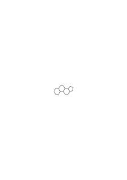

# Ms-172

### [OC](/w-oc/#ms-172-1.1) [1\[1\]](https://cdn.wittgensteinnachlass.com/2000px/webp/Ms-172/1.webp) {#11}

If you know that there is a hand here, then we will give you everything else. (If someone says that a certain sentence cannot be proven, this, of course, does not mean that it cannot be derived from others; every sentence can be derived from others. But these may not be more certain than the sentence itself.) (A curious remark by Henry Newman.)

### [OC](/w-oc/#ms-172-1.2) [1\[2\]](https://cdn.wittgensteinnachlass.com/2000px/webp/Ms-172/1.webp) {#12}

The fact that it _seems_ that way to me – or to everyone – does not imply that it _is_ that way. One can, however, ask whether one can meaningfully doubt this.

### [OC](/w-oc/#ms-172-1.3) [1\[3\]](https://cdn.wittgensteinnachlass.com/2000px/webp/Ms-172/1.webp) {#13}

For example, if someone says, “I don't know if there is a hand there,” one could say to him, “Look more closely.” This possibility of convincing oneself belongs to the language-game. It is one of its essential features.

### [OC](/w-oc/#ms-172-1.4+2.1) [1\[4\]](https://cdn.wittgensteinnachlass.com/2000px/webp/Ms-172/1.webp),[2\[1\]](https://cdn.wittgensteinnachlass.com/2000px/webp/Ms-172/2.webp) {#1421}

“I know that I am a human being.” In order to see how unclear the sense of the sentence is, consider its negation. One could most likely understand it in this way: “I know that I have human organs.” (For example, a brain, which no one has yet seen.) But what about a sentence like “I know that I have a brain”? Can I doubt it? I lack the reasons to _doubt_! ‘Everything speaks in favor of’ the fact that I… Nevertheless, one can imagine that during an operation my skull turns out to be empty.

### [OC](/w-oc/#ms-172-2.2) [2\[2\]](https://cdn.wittgensteinnachlass.com/2000px/webp/Ms-172/2.webp) {#22}

Whether a sentence can turn out to be false in retrospect depends on the stipulations I accept for this sentence.

### [OC](/w-oc/#ms-172-2.3) [2\[3\]](https://cdn.wittgensteinnachlass.com/2000px/webp/Ms-172/2.webp) {#23}

Can one now (like Moore) enumerate what one knows? Not so easily, I believe. For otherwise, the word “I know” would be misused. And through this misuse, a strange and very important state of mind seems to emerge.

### [OC](/w-oc/#ms-172-2.4) [2\[4\]](https://cdn.wittgensteinnachlass.com/2000px/webp/Ms-172/2.webp) {#24}

My life shows that I know, or am certain, that there is an armchair there, a door, and so on. I say to my friend, for example, “Take the armchair there,” “Close the door,” etc., etc.

### [OC](/w-oc/#ms-172-2.5+3.1) [2\[5\]](https://cdn.wittgensteinnachlass.com/2000px/webp/Ms-172/2.webp),[3\[1\]](https://cdn.wittgensteinnachlass.com/2000px/webp/Ms-172/3.webp) {#2531}

The difference between the concept of “wissen” and the concept of “sicher sein” is not of great importance, except where “I know…” is meant to mean: I _cannot_ be mistaken. In the courtroom, for example, “I am sure” could be said in every piece of testimony instead of “I know.” Yes, one might even think that “I know” would be forbidden there. [A passage in Wilhelm Meister, where “You know” or “You knew” is used in the sense of “You were sure,” because it was different than he knew.]

### [OC](/w-oc/#ms-172-3.2) [3\[2\]](https://cdn.wittgensteinnachlass.com/2000px/webp/Ms-172/3.webp) {#32}

Do I prove in life that I know that there is a hand (namely, my hand)?

### [OC](/w-oc/#ms-172-3.3+4.1) [3\[3\]](https://cdn.wittgensteinnachlass.com/2000px/webp/Ms-172/3.webp),[4\[1\]](https://cdn.wittgensteinnachlass.com/2000px/webp/Ms-172/4.webp) {#3341}

I know that a sick person lies here? Nonsense! I sit by his bedside, looking attentively at his features. – So, do I not know that a sick person lies there? – Neither the question nor the statement has any sense. Just as little as the statement “I am here,” which I could use at any moment if the appropriate opportunity arose. – So, is “2 × 2 = 4” also nonsense & not a true arithmetical sentence, except on certain occasions? “2 × 2 = 4” is a true sentence of arithmetic – not “on certain occasions,” nor “always,” – but the spoken or written signs “2 × 2 = 4” could have a different or no meaning in Chinese, & from this one can see that the sentence only has sense in a language-game. And “I know that a sick person lies here,” used in an _inappropriate_ situation, does not appear as nonsense, but rather as self-evident, because one can relatively easily imagine a situation appropriate for it, & because one thinks that the words “I know that…” can be said anywhere where there is no doubt (i.e., also where the expression of doubt would be incomprehensible).

### [OC](/w-oc/#ms-172-4.2) [4\[2\]](https://cdn.wittgensteinnachlass.com/2000px/webp/Ms-172/4.webp) {#42}

One simply does not see how specialized the use of “I know” is.

### [OC](/w-oc/#ms-172-4.3) [4\[3\]](https://cdn.wittgensteinnachlass.com/2000px/webp/Ms-172/4.webp) {#43}

For “I know…” seems to describe a state of affairs that guarantees the known as a fact. One simply always forgets the expression “I believed I knew it.”

### [OC](/w-oc/#ms-172-4.4+5.1) [4\[4\]](https://cdn.wittgensteinnachlass.com/2000px/webp/Ms-172/4.webp),[5\[1\]](https://cdn.wittgensteinnachlass.com/2000px/webp/Ms-172/5.webp) {#4451}

For it is not the case that one could infer the sentence “It is so” from the sentence “I know that it is so.” Nor from the utterance & from the fact that it is not a lie. – But can one not infer “It is so” from my utterance “I know etc.”? Yes, & from the sentence “He knows that there is a hand there” it also follows that “There is a hand there.” But from his utterance “I know…” it does not follow that he knows…

### [OC](/w-oc/#ms-172-5.2) [5\[2\]](https://cdn.wittgensteinnachlass.com/2000px/webp/Ms-172/5.webp) {#52}

It must first be proven that he knows it.

### [OC](/w-oc/#ms-172-5.3) [5\[3\]](https://cdn.wittgensteinnachlass.com/2000px/webp/Ms-172/5.webp) {#53}

It must be _proven_ that no error was possible. The assertion “I know it” is not enough. Because it is only the assertion that I cannot be mistaken (in that), & that I am not mistaken _in it_, must be _objectively_ ascertainable.

### [OC](/w-oc/#ms-172-5.4) [5\[4\]](https://cdn.wittgensteinnachlass.com/2000px/webp/Ms-172/5.webp) {#54}

“If I know something, then I also know that I know it, etc.” amounts to saying “I know this” means “I am infallible in it.” But whether I am, must be objectively ascertainable.

### [OC](/w-oc/#ms-172-5.5) [5\[5\]](https://cdn.wittgensteinnachlass.com/2000px/webp/Ms-172/5.webp) {#55}

Suppose now that I say “I am infallible in that this is a book” & I point to an object. What would an error look like here? And do I have a _clear_ imagination of it?

### [OC](/w-oc/#ms-172-5.6+6.1) [5\[6\]](https://cdn.wittgensteinnachlass.com/2000px/webp/Ms-172/5.webp),[6\[1\]](https://cdn.wittgensteinnachlass.com/2000px/webp/Ms-172/6.webp) {#5661}

“I know it” often means: I have the right reasons for my statement. So if the other person knows the language-game, he would admit that I know that. The other person must be able to imagine _how_ one can know something like that, if he knows the language-game.

### [OC](/w-oc/#ms-172-6.2) [6\[2\]](https://cdn.wittgensteinnachlass.com/2000px/webp/Ms-172/6.webp) {#62}

The statement “I know that there is a hand here” can thus be continued, “namely, it is _my_ hand that I am looking at.” Then a reasonable person will not doubt that I know it. – Nor will the idealist; rather, he will say that it was not about the practical doubt that has been eliminated, but that there is still a doubt _behind_ this. – That this is a _delusion_ must be shown in some other way.

### [OC](/w-oc/#ms-172-6.3+7.1) [6\[3\]](https://cdn.wittgensteinnachlass.com/2000px/webp/Ms-172/6.webp),[7\[1\]](https://cdn.wittgensteinnachlass.com/2000px/webp/Ms-172/7.webp) {#6371}

“Doubting the existence of the external world” does not mean, for example, doubting the existence of a celestial body, which is later proven by observation. – Or does Moore mean that the knowledge that there is his hand here is of a different _kind_ than the knowledge that there is the planet Saturn? Otherwise, one could point the doubter to the discovery of the planet Saturn & say that its existence has been proven, and thus also the existence of the external world.

### [OC](/w-oc/#ms-172-7.2) [7\[2\]](https://cdn.wittgensteinnachlass.com/2000px/webp/Ms-172/7.webp) {#72}

Moore's view actually amounts to saying that the concept ‘know’ is analogous to the concepts ‘believe’, ‘assume’, ‘doubt’, ‘be convinced’ in that the statement “I know…” cannot be an error. And _if_ it is, then one can infer the truth of an assertion from an utterance. And here the form “I believed I knew” is overlooked. – But if this is not to be allowed, then an error must also be logically impossible in the _assertion_. And this is something that anyone who knows the language-game must understand; & believing the assurance of a credible person “I _know_ it” cannot help him.

### [OC](/w-oc/#ms-172-7.3) [7\[3\]](https://cdn.wittgensteinnachlass.com/2000px/webp/Ms-172/7.webp) {#73}

It would be strange if we had to believe the credible person who says “I cannot be wrong”; or the one who says “I am not wrong.”

### [OC](/w-oc/#ms-172-7.4+8.1) [7\[4\]](https://cdn.wittgensteinnachlass.com/2000px/webp/Ms-172/7.webp),[8\[1\]](https://cdn.wittgensteinnachlass.com/2000px/webp/Ms-172/8.webp) {#7481}

If I don’t know whether someone has two hands (e.g., whether they have been amputated or not), I will believe his assurance that he has two hands if he is credible. And if he says that he _knows_ it, then he can only tell me that he has already seen his hands, that his arms are not covered with blankets & bandages, etc. The fact that I believe the credible person here is because I grant him the possibility of being convinced. But someone who says that there (perhaps) are no physical objects does not do that.

### [OC](/w-oc/#ms-172-8.2) [8\[2\]](https://cdn.wittgensteinnachlass.com/2000px/webp/Ms-172/8.webp) {#82}

The idealist's question would be something like this: “On what _grounds_ do I not doubt the existence of my hands?” (And the answer cannot be: “I _know_ that they exist.”) But whoever asks this overlooks the fact that the doubt about an existence only works in a language-game. So one must first ask: What would such a doubt look like? & one does not understand it so readily.

### [OC](/w-oc/#ms-172-8.3) [8\[3\]](https://cdn.wittgensteinnachlass.com/2000px/webp/Ms-172/8.webp) {#83}

One can also be mistaken in this, “that here is a hand.” Only under certain circumstances is this not the case. “One can also be mistaken in a _calculation_, – only under certain circumstances _not_.”

### [OC](/w-oc/#ms-172-9.1) [9\[1\]](https://cdn.wittgensteinnachlass.com/2000px/webp/Ms-172/9.webp) {#91}

But can one discern from a _rule_ under what circumstances an error in the use of the rules of calculation is logically impossible? What is the use of a rule here? Could one not (again) make a mistake in its application?

### [OC](/w-oc/#ms-172-9.2) [9\[2\]](https://cdn.wittgensteinnachlass.com/2000px/webp/Ms-172/9.webp) {#92}

If one wanted to specify something of this regular kind, then the expression “under normal circumstances” would occur in it. And one recognizes the normal circumstances, but one cannot describe them precisely. Rather, a series of abnormal ones.

### [OC](/w-oc/#ms-172-9.3) [9\[3\]](https://cdn.wittgensteinnachlass.com/2000px/webp/Ms-172/9.webp) {#93}

What is ‘to learn a rule’? – _That_. What is ‘to make a mistake in its application’? – _That_. And what is being pointed out here is something indefinite.

### [OC](/w-oc/#ms-172-9.4) [9\[4\]](https://cdn.wittgensteinnachlass.com/2000px/webp/Ms-172/9.webp) {#94}

The practice in the use of the rule also shows what an error in its use is.

### [OC](/w-oc/#ms-172-9.5+10.1) [9\[5\]](https://cdn.wittgensteinnachlass.com/2000px/webp/Ms-172/9.webp),[10\[1\]](https://cdn.wittgensteinnachlass.com/2000px/webp/Ms-172/10.webp) {#95101}

If one is convinced of something, then one says that it is certain. But one does not infer it from one’s state of certainty. One does not infer the facts from one’s own certainty: certainty is _as it were_ a tone in which one states the facts, but one does not infer from the tone that it is justified.

### [OC](/w-oc/#ms-172-10.2) [10\[2\]](https://cdn.wittgensteinnachlass.com/2000px/webp/Ms-172/10.webp) {#102}

I would like to eliminate from philosophical language the sentences that one keeps repeating and repeating without making any progress.

### [OC](/w-oc/#ms-172-10.3) [10\[3\]](https://cdn.wittgensteinnachlass.com/2000px/webp/Ms-172/10.webp) {#103}

It’s not about whether _Moore_ knows that there is a hand there, but rather that we wouldn’t understand him if he said, “Of course, I might be mistaken.” We would ask: “What would such a mistake look like?” – for example, the discovery that it was a mistake?

### [OC](/w-oc/#ms-172-10.4) [10\[4\]](https://cdn.wittgensteinnachlass.com/2000px/webp/Ms-172/10.webp) {#104}

So we eliminate the sentences that don’t get us anywhere.

### [OC](/w-oc/#ms-172-11.1) [11\[1\]](https://cdn.wittgensteinnachlass.com/2000px/webp/Ms-172/11.webp) {#111}

When one teaches someone to calculate, is one also teaching them that they can rely on a calculation under certain circumstances? But at some point, these explanations must come to an end. Is one also teaching them that they can rely on their senses – because in some cases, one tells them that they cannot rely on them in that particular case? – Rule & exception.

### [OC](/w-oc/#ms-172-11.2) [11\[2\]](https://cdn.wittgensteinnachlass.com/2000px/webp/Ms-172/11.webp) {#112}

But can one not imagine that there might be no physical objects? I don’t know. And yet, “There are physical objects” is nonsense. Is it supposed to be an experiential proposition? And is _that_ an experiential proposition: “It seems as though there are physical objects”?

### [OC](/w-oc/#ms-172-11.3+12.1) [11\[3\]](https://cdn.wittgensteinnachlass.com/2000px/webp/Ms-172/11.webp),[12\[1\]](https://cdn.wittgensteinnachlass.com/2000px/webp/Ms-172/12.webp) {#113121}

<s> We make the communication “A is a physical object” only if he does not yet know the meaning of the word “A”, or the meaning of the expression “physical object”. </s> We only give the instruction “A is a physical object” to someone who either does not yet understand what “A” means, or what “physical object” means. Thus, it is an instruction about the use of words, and “physical object” is a logical concept. (Like color, measure…) And that is why a sentence “There are physical objects” cannot be formed.

### [OC](/w-oc/#ms-172-12.3+13.1) [12\[3\]](https://cdn.wittgensteinnachlass.com/2000px/webp/Ms-172/12.webp),[13\[1\]](https://cdn.wittgensteinnachlass.com/2000px/webp/Ms-172/13.webp) {#123131}

But is it a sufficient answer to the arguments of the idealists or the realists: “There are physical objects” is nonsense? For them, it is not nonsense. One would have to say: this assertion, or its opposite, is a failed attempt to express what cannot be expressed in that way. And that it fails can be shown; but that does not yet settle their case. One must simply come to realize that what presents itself to us as the first expression of a difficulty or its solution may still be a completely false expression. Just as someone who rightly criticizes a picture will criticize it where there is nothing to criticize, & an _investigation_ is needed to find the correct expression of the criticism. We encounter such failed attempts at every turn.

### [OC](/w-oc/#ms-172-13.2) [13\[2\]](https://cdn.wittgensteinnachlass.com/2000px/webp/Ms-172/13.webp) {#132}

Mathematical knowledge. One must always remind oneself of the unimportance of the ‘inner process’, or state, & ask, “Why should it be important? What concern is it of mine?”. What is interesting is how we _use_ the mathematical sentences.

### [OC](/w-oc/#ms-172-13.3) [13\[3\]](https://cdn.wittgensteinnachlass.com/2000px/webp/Ms-172/13.webp) {#133}

That’s how one does the _calculation_, under such circumstances one treats a _calculation_ as absolutely reliable, as certainly correct.

### [OC](/w-oc/#ms-172-13.4+14.1) [13\[4\]](https://cdn.wittgensteinnachlass.com/2000px/webp/Ms-172/13.webp),[14\[1\]](https://cdn.wittgensteinnachlass.com/2000px/webp/Ms-172/14.webp) {#134141}

To the “I know that my hand is there,” the question could follow: “How do you know it?” And the answer to that presupposes that _this_ can be known. Instead of “I know that my hand is there,” one could therefore say, “My hand is there,” and add _how_ one knows it.

### [OC](/w-oc/#ms-172-14.2) [14\[2\]](https://cdn.wittgensteinnachlass.com/2000px/webp/Ms-172/14.webp) {#142}

<s>It is (therefore) wrong to say</s> “I know where I feel the pain,” “I know that I feel it _there_” is as wrong as: “I know that I have pain.” Correct, however: “I know where you touched my arm.”

---

### [OC](/w-oc/#ms-172-14.3+15.1) [14\[3\]](https://cdn.wittgensteinnachlass.com/2000px/webp/Ms-172/14.webp),[15\[1\]](https://cdn.wittgensteinnachlass.com/2000px/webp/Ms-172/15.webp) {#143151}

One can say, “He believes it, but it is not so,” but not “He knows it, but it is not so.” Does this come from the difference in the states of mind of belief and knowledge? No. – One could, for example, call a “state of mind” what is expressed in the tone of speech, in gestures, etc. It would therefore be _possible_ to speak of a psychological state of conviction; and it can be the same, whether one knows it or believes it falsely. To claim that the words “believe” and “know” must correspond to different states would be like believing that the word “I” and the name “Ludwig” must correspond to different people, because the concepts are different.

---

### [OC](/w-oc/#ms-172-15.2) [15\[2\]](https://cdn.wittgensteinnachlass.com/2000px/webp/Ms-172/15.webp) {#152}

What kind of sentence is this: “We _could not_ have made a mistake in 12 × 12 = 144”? It must be a sentence of logic. – But is it not the same, or does it amount to the same thing, as the statement 12 × 12 = 144?

### [OC](/w-oc/#ms-172-15.3) [15\[3\]](https://cdn.wittgensteinnachlass.com/2000px/webp/Ms-172/15.webp) {#153}

If you demand a rule from which it follows that one could not have made a mistake here, the answer is that we did not learn this through a rule, but through learning to calculate.

### [OC](/w-oc/#ms-172-15.4) [15\[4\]](https://cdn.wittgensteinnachlass.com/2000px/webp/Ms-172/15.webp) {#154}

We learned the _essence_ of calculation when we learned to calculate.

### [OC](/w-oc/#ms-172-15.5) [15\[5\]](https://cdn.wittgensteinnachlass.com/2000px/webp/Ms-172/15.webp) {#155}

But can one not describe how we convince ourselves of the reliability of a calculation? Yes! But a rule does not emerge from it. – But the most important thing (is): it does not need a rule. We do not lack it. We calculate according to a rule, that is enough.

### [OC](/w-oc/#ms-172-15.6+16.1) [15\[6\]](https://cdn.wittgensteinnachlass.com/2000px/webp/Ms-172/15.webp),[16\[1\]](https://cdn.wittgensteinnachlass.com/2000px/webp/Ms-172/16.webp) {#156161}

_That’s_ how one calculates. And calculation is _this_. What we, for example, learn at school. Forget about this transcendent certainty that is connected with the concept of the mind.

### [OC](/w-oc/#ms-172-16.2) [16\[2\]](https://cdn.wittgensteinnachlass.com/2000px/webp/Ms-172/16.webp) {#162}

But one could still distinguish certain calculations from a series of calculations as being reliable once and for all, and others as not yet established. And is this now a _logical_ distinction?

### [OC](/w-oc/#ms-172-16.3) [16\[3\]](https://cdn.wittgensteinnachlass.com/2000px/webp/Ms-172/16.webp) {#163}

But consider: even if the calculation is certain for me, it is only a practical decision.

### [OC](/w-oc/#ms-172-16.4) [16\[4\]](https://cdn.wittgensteinnachlass.com/2000px/webp/Ms-172/16.webp) {#164}

When does one say, “I know that… x … = …?” When one has checked the calculation.

### [OC](/w-oc/#ms-172-16.5) [16\[5\]](https://cdn.wittgensteinnachlass.com/2000px/webp/Ms-172/16.webp) {#165}

What is this for a sentence: “What would an error look like here!”? It must be a logical sentence. But it is a logic that is not needed, because what it teaches is not taught through sentences. – It is a logical sentence, because it describes the conceptual (linguistic) situation.

### [16\[6\]](https://cdn.wittgensteinnachlass.com/2000px/webp/Ms-172/16.webp)

Therefore, just because I do not know why something is bad, I do not need to distrust my knowledge that it is bad.

### [OC](/w-oc/#ms-172-16.7+17.1) [16\[7\]](https://cdn.wittgensteinnachlass.com/2000px/webp/Ms-172/16.webp),[17\[1\]](https://cdn.wittgensteinnachlass.com/2000px/webp/Ms-172/17.webp) {#167171}

This situation is therefore not the same for a sentence like “At this distance from the sun, a planet exists” and “There is a hand here” (namely, mine). One cannot call the second a hypothesis. But there is no sharp boundary between them.

### [OC](/w-oc/#ms-172-17.2) [17\[2\]](https://cdn.wittgensteinnachlass.com/2000px/webp/Ms-172/17.webp) {#172}

One could therefore agree with Moore if one interprets him in such a way that a sentence that says that there is a physical object can have a similar logical status to one that says that there is a red spot.

### [OC](/w-oc/#ms-172-17.3) [17\[3\]](https://cdn.wittgensteinnachlass.com/2000px/webp/Ms-172/17.webp) {#173}

It is indeed incorrect that the error about the planet and about my own hand only becomes increasingly unlikely. Rather, at some point, it is no longer conceivable. This can be seen from the fact that otherwise it would also be conceivable that we are mistaken in _every_ statement about physical objects, that all the ones we ever make are false.

### [OC](/w-oc/#ms-172-17.4) [17\[4\]](https://cdn.wittgensteinnachlass.com/2000px/webp/Ms-172/17.webp) {#174}

Is the _hypothesis_ therefore possible that all the things in our environment do not exist? Wouldn’t it be like the one that we made a mistake in all calculations?

### [OC](/w-oc/#ms-172-17.5+18.1) [17\[5\]](https://cdn.wittgensteinnachlass.com/2000px/webp/Ms-172/17.webp),[18\[1\]](https://cdn.wittgensteinnachlass.com/2000px/webp/Ms-172/18.webp) {#175181}

If one says “Perhaps this planet doesn’t exist & the light phenomenon is caused in a different way,” then one does have an example of an object _den_ that exists. It doesn’t exist, – as in _z.B._ … Or should one say that _Sicherheit_ is just a constructed point to which some things come closer, others less so?? No. Doubt gradually loses its sense. That’s just how this Sprachspiel _ist_. And everything that a Sprachspiel describes belongs to Logik.

### [OC](/w-oc/#ms-172-18.2) [18\[2\]](https://cdn.wittgensteinnachlass.com/2000px/webp/Ms-172/18.webp) {#182}

Could “I _know_, I don’t just suppose that my hand is here” not be understood as a grammatical _sentence_? That is, not temporally. – But isn’t it then like _the_: “I know, I don’t just suppose that I see red”? And isn’t the consequence “So there are physical objects” like “So there are colors”?

### [OC](/w-oc/#ms-172-18.3) [18\[3\]](https://cdn.wittgensteinnachlass.com/2000px/webp/Ms-172/18.webp) {#183}

If “I know, etc.” is understood as a grammatical sentence, then of course the “I” cannot be important. And it actually means “In this case, there is no doubt” or “The words ‘I do not know’ have no sense in this case.” And it follows from this that “I _know_” has no sense either.

### [OC](/w-oc/#ms-172-18.4) [18\[4\]](https://cdn.wittgensteinnachlass.com/2000px/webp/Ms-172/18.webp) {#184}

“I know” is here a _logical_ insight. However, realism cannot be proven by it.

### [OC](/w-oc/#ms-172-19.1) [19\[1\]](https://cdn.wittgensteinnachlass.com/2000px/webp/Ms-172/19.webp) {#191}

It is incorrect to say that the ‘hypothesis’ that _this_ is a piece of paper is confirmed or refuted by later experience, & that in “I know that this is a piece of paper,” the “I know” refers either to such a hypothesis or to a logical determination.

### [OC](/w-oc/#ms-172-19.2) [19\[2\]](https://cdn.wittgensteinnachlass.com/2000px/webp/Ms-172/19.webp) {#192}

The meaning of a word is a kind of its use.

### [OC](/w-oc/#ms-172-19.3) [19\[3\]](https://cdn.wittgensteinnachlass.com/2000px/webp/Ms-172/19.webp) {#193}

For it is what we learn when the word is first incorporated into our language.

### [OC](/w-oc/#ms-172-19.4) [19\[4\]](https://cdn.wittgensteinnachlass.com/2000px/webp/Ms-172/19.webp) {#194}

Therefore, there is a correspondence between the concepts ‘meaning’ and ‘rule’.

---

### [OC](/w-oc/#ms-172-19.5) [19\[5\]](https://cdn.wittgensteinnachlass.com/2000px/webp/Ms-172/19.webp) {#195}

If we imagine the facts differently from how they are, then certain language-games lose importance, and others gain new importance. And in this way, the use of the vocabulary of the language also changes, gradually.

---

### [OC](/w-oc/#ms-172-19.6) [19\[6\]](https://cdn.wittgensteinnachlass.com/2000px/webp/Ms-172/19.webp) {#196}

Compare the meaning of a word with the ‘function’ of an official, and ‘different meanings’ with ‘different functions’.

---

### [20\[1\]](https://cdn.wittgensteinnachlass.com/2000px/webp/Ms-172/20.webp)

The opposite of superstition is not necessarily that one does not believe the strange events, but that one is unable to see more than strange events in them. One who believes in miracles interprets them as breakthroughs in the course of the world, as interventions by a higher being. One who cannot see this is similar to one who could not recognize an ‘expression of emotion’ as such, i.e., simply does not react naturally to this phenomenon.

---

### [OC](/w-oc/#ms-172-20.2) [20\[2\]](https://cdn.wittgensteinnachlass.com/2000px/webp/Ms-172/20.webp) {#202}

If the language-games change, the concepts change, and with the concepts, the meanings of the words change.

### [20\[3\]](https://cdn.wittgensteinnachlass.com/2000px/webp/Ms-172/20.webp)

Commonality is a kind of friction; it never lets the psychic machinery get going. It moves a little further and stops again.

### [ROC II](/w-roc-2/#ms-172-21.1) [21\[1\]](https://cdn.wittgensteinnachlass.com/2000px/webp/Ms-172/21.webp) {#211}

One could talk about the color impression of a surface, which does not mean the color, but the color tones and their distribution, if, for example, one wants to create the impression of a brown surface.

### [ROC II](/w-roc-2/#ms-172-21.2) [21\[2\]](https://cdn.wittgensteinnachlass.com/2000px/webp/Ms-172/21.webp) {#212}

The addition of white diminishes the color’s _color_; the addition of yellow, however, does not. — Is this at the root of the sentence, that there cannot be a clear, transparent white?

### [ROC II](/w-roc-2/#ms-172-21.3) [21\[3\]](https://cdn.wittgensteinnachlass.com/2000px/webp/Ms-172/21.webp) {#213}

But what is this sentence: that the addition of white takes away the color from the color? As I mean it, it cannot be a physical sentence. Here, the temptation is very great to believe in a phenomenology, a middle ground between science & logic.

### [ROC II](/w-roc-2/#ms-172-21.4) [21\[4\]](https://cdn.wittgensteinnachlass.com/2000px/webp/Ms-172/21.webp) {#214}

What, then, is the essence of _turbidity_? For red, yellow transparent things are not turbid, white things are turbid.

### [ROC II](/w-roc-2/#ms-172-21.5+22.1) [21\[5\]](https://cdn.wittgensteinnachlass.com/2000px/webp/Ms-172/21.webp),[22\[1\]](https://cdn.wittgensteinnachlass.com/2000px/webp/Ms-172/22.webp) {#215221}

Is turbidity what obscures the forms, and does it obscure the forms because it blurs light and shadow?

### [ROC II](/w-roc-2/#ms-172-22.2) [22\[2\]](https://cdn.wittgensteinnachlass.com/2000px/webp/Ms-172/22.webp) {#222}

Is not white what cancels out darkness?

### [ROC II](/w-roc-2/#ms-172-22.3) [22\[3\]](https://cdn.wittgensteinnachlass.com/2000px/webp/Ms-172/22.webp) {#223}

One speaks of ‘black glass,’ but whoever looks at a white surface through red glass sees it red, through ‘black’ glass, not black.

### [ROC II](/w-roc-2/#ms-172-22.4) [22\[4\]](https://cdn.wittgensteinnachlass.com/2000px/webp/Ms-172/22.webp) {#224}

One uses colored lenses to see clearly, but never turbid ones.

### [ROC II](/w-roc-2/#ms-172-22.5) [22\[5\]](https://cdn.wittgensteinnachlass.com/2000px/webp/Ms-172/22.webp) {#225}

“The addition of white blurs the difference between light & dark, light & shadow”: does this define the concepts more precisely? I think so.

### [ROC II](/w-roc-2/#ms-172-22.6) [22\[6\]](https://cdn.wittgensteinnachlass.com/2000px/webp/Ms-172/22.webp) {#226}

If someone didn't find that to be the case, they wouldn't have the opposite experience; rather, we wouldn't understand them.

### [ROC II](/w-roc-2/#ms-172-23.1) [23\[1\]](https://cdn.wittgensteinnachlass.com/2000px/webp/Ms-172/23.webp) {#231}

In philosophy, one must always ask: “_How_ must one look at this problem in order for it to become solvable?”

### [ROC II](/w-roc-2/#ms-172-23.2) [23\[2\]](https://cdn.wittgensteinnachlass.com/2000px/webp/Ms-172/23.webp) {#232}

For here (when I consider the colors, for example), there is only an inability to create any kind of order. We stand there, like the ox in front of the newly (re)painted stable door.

### [ROC II](/w-roc-2/#ms-172-23.3) [23\[3\]](https://cdn.wittgensteinnachlass.com/2000px/webp/Ms-172/23.webp) {#233}

Think about how a painter would depict the view through a reddish-colored glass. It is, after all, a _complicated_ arrangement of surfaces that results. That is to say, the picture will contain a variety of gradations of red & other colors side by side. And analogously, if one were to look through a blue glass. But how if one were to paint a picture in which, where previously something became bluish or reddish, it becomes whitish?

### [ROC II](/w-roc-2/#ms-172-23.4) [23\[4\]](https://cdn.wittgensteinnachlass.com/2000px/webp/Ms-172/23.webp) {#234}

Is the whole difference here that the colors do not lose their saturation through the reddish glow, but they do through the whitish one? Yes, one doesn't even speak of a ‘whitish glow’!

### [ROC II](/w-roc-2/#ms-172-24.1) [24\[1\]](https://cdn.wittgensteinnachlass.com/2000px/webp/Ms-172/24.webp) {#241}

If, with a certain illumination, everything looked whitish, we would not conclude that the luminous must look white.

### [ROC II](/w-roc-2/#ms-172-24.2) [24\[2\]](https://cdn.wittgensteinnachlass.com/2000px/webp/Ms-172/24.webp) {#242}

The phenomenological analysis (as, for example, Goethe wanted) is an analysis of concepts & can neither agree with nor contradict physics.

### [ROC II](/w-roc-2/#ms-172-24.3) [24\[3\]](https://cdn.wittgensteinnachlass.com/2000px/webp/Ms-172/24.webp) {#243}

But what if it were the case somewhere that the light of a white-hot body makes things appear bright but whitish, i.e., color-weak, the light of a red-hot body reddish, etc.? (Only an invisible source, not perceptible to the eye, would make them shine in colors.)

### [ROC II](/w-roc-2/#ms-172-24.4) [24\[4\]](https://cdn.wittgensteinnachlass.com/2000px/webp/Ms-172/24.webp) {#244}

Yes, as if the things only shone in their colors when, in our sense, _no_ light falls on them, when, for example, the sky is _black_? Could one then not say: only in black light do the full colors appear (to us)?

### [ROC II](/w-roc-2/#ms-172-24.5) [24\[5\]](https://cdn.wittgensteinnachlass.com/2000px/webp/Ms-172/24.webp) {#245}

But wouldn't there be a contradiction here?

### [ROC II](/w-roc-2/#ms-172-24.6) [24\[6\]](https://cdn.wittgensteinnachlass.com/2000px/webp/Ms-172/24.webp) {#246}

I _see_ that the colors of the objects reflect light into my eye.
