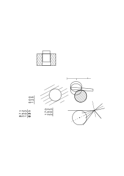

# Ms-178e

### [1\[1\]](https://cdn.wittgensteinnachlass.com/2000px/webp/Ms-178e/1.webp)

… you mustn’t let yourself be misled by the grammar of the words ‘to know’ & ‘to mean’!

### [1\[2\]](https://cdn.wittgensteinnachlass.com/2000px/webp/Ms-178e/1.webp)

_Agreed_.

### [1\[3\]](https://cdn.wittgensteinnachlass.com/2000px/webp/Ms-178e/1.webp)

I would like to express it first in this way: you believed that… At first, this expression comes to mind: you assumed that, in that meaning, you… I would like to say first: your idea was that, in that meaning of ‘command,’ it had, in its own way, already made _all_ the _transitions_ in some mental way, even before you came to any particular one. Your mind, so to speak, flies ahead in meaning and makes the transitions before you physically arrive at this or that.

### [1\[4\]](https://cdn.wittgensteinnachlass.com/2000px/webp/Ms-178e/1.webp)

So you were inclined to use expressions like: “The transitions have _actually_ already been made,”…

### [1\[5\]](https://cdn.wittgensteinnachlass.com/2000px/webp/Ms-178e/1.webp)

You were inclined to use an expression such as: “…”. And it seemed as if they were predetermined in a _unique_ way, anticipated, as only meaning could anticipate reality. ((And) we will return to this idea later.)

### [1\[6\]](https://cdn.wittgensteinnachlass.com/2000px/webp/Ms-178e/1.webp),[2\[1\]](https://cdn.wittgensteinnachlass.com/2000px/webp/Ms-178e/2.webp)

We can, of course, say that the transitions are determined by the algebraic formula, in contrast, for example, to the case in which this formula has not yet been given.

(Yes) but are the transitions not determined by the algebraic formula? For example, I can say that the terms of the series an = pn are still undetermined, _i.e._, the value for p has not been given; now I _determine_ their value by setting n = 2. And one could also say that the application of an algebraic expression is determined by the usual use that a class of people makes of it, in contrast to the case when someone else uses it in some other way.

_“and so on ad infinitum.”_

Past tense: “knew,” “meant.”

### [2\[2\]](https://cdn.wittgensteinnachlass.com/2000px/webp/Ms-178e/2.webp)

What is misleading you here, however, is the use of the past tense.

### [2\[3\]](https://cdn.wittgensteinnachlass.com/2000px/webp/Ms-178e/2.webp),[3\[1\]](https://cdn.wittgensteinnachlass.com/2000px/webp/Ms-178e/3.webp)

I can say: “I am writing a series whose terms are determined by an algebraic formula.” – In contrast, for example, to one that I write down as the numbers come to me, or in contrast to one that is determined by a rule in words. I can also say: “The way in which this formula is used is determined by the general use of mathematicians” – or: “This formula does not yet determine the series: you have not yet given a value to the variable… and so on.” That is to say, a certain way of specifying the formula is what we _call_ ‘determining’ the terms of the series. A dispute about whether the terms are determined can, for example, be about whether such a formula has been given or whether – among any group of people – the formula is always used in the same way.

### [3\[2\]](https://cdn.wittgensteinnachlass.com/2000px/webp/Ms-178e/3.webp)

### [3\[3\]](https://cdn.wittgensteinnachlass.com/2000px/webp/Ms-178e/3.webp),[4\[1\]](https://cdn.wittgensteinnachlass.com/2000px/webp/Ms-178e/4.webp)

If, on the other hand, I say: “The terms of the series an = 2n are uniquely determined,” this is a sentence of grammar. And I can also say that it is a sentence of pure mathematics, and this amounts to the same thing. This, however, will only become clear later. The answer to the question: “Are the transitions not determined by the algebraic formula?” would be something like: “We _call_ the series ‘determined’ when its formula is given.” – And this answer, as you can see, evades the question.

### [4\[2\]](https://cdn.wittgensteinnachlass.com/2000px/webp/Ms-178e/4.webp)

Let us consider here the grammar of another – related – word, the word “to fit.”

### [4\[3\]](https://cdn.wittgensteinnachlass.com/2000px/webp/Ms-178e/4.webp)

Our skill should be to _postpone_ problems. That is, not to say too much at any one point.

### [4\[4\]](https://cdn.wittgensteinnachlass.com/2000px/webp/Ms-178e/4.webp)

When do we say that a solid cylinder fits into a hollow cylinder? We will say: – if they have the same diameter. But what is the criterion for them having the same diameter? Presumably, it is that a certain kind of measurement on both of them yields the same result. But do they only fit while I (am) measuring them, or also afterwards? You are presumably inclined to say: _Certainly_…
