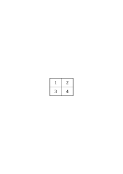
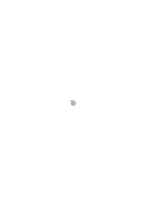
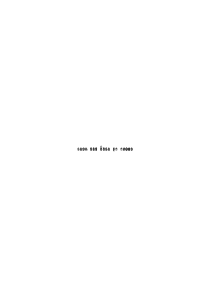
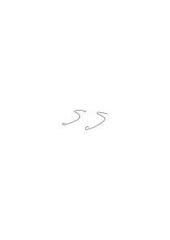

# Ts-220

### [I\[1\]](https://cdn.wittgensteinnachlass.com/2000px/webp/Ts-220/I.webp)

## Philosophical Investigations.

### [II\[1\]](https://cdn.wittgensteinnachlass.com/2000px/webp/Ts-220/II.webp)

1. _Augustine_, in the Confessions I/8: when [older people] called some thing by name, and when, according to the way they used the name, they moved their body to it, I would look at it and try to fix my attention on it; and as they said, I would try to fix my attention on the thing to which they were pointing. And from the movement of their body, I would gather what they were trying to indicate; as if all men had a natural language, which is made up of gestures and looks and the movements of their limbs and the sounds of their voices, which indicate the feelings of the mind in seeking, obtaining, rejecting, or doing things. Thus, in various sentences, the words are placed in their proper places, and often heard, and we gradually learn what the signs of these things are, and we express our own desires by means of these signs, having tamed our will with them. In these words, we find – so it seems to me – a certain picture of the nature of human language. Namely, this: the words of language name objects – sentences are combinations of such names. In this picture of language, we find the roots of the idea: each _word_ has a _meaning_. This meaning is assigned to the word. It is the object for which the word stands. Augustine does not speak of a difference in the types of words. Whoever describes the learning of language in this way, thinks – so I would like to believe – first of nouns, such as “table,” “chair,” “bread,” and the names of people; only in the second place of the names of certain activities and properties, and of the other types of words as something that will be found.

### [II\[2\]](https://cdn.wittgensteinnachlass.com/2000px/webp/Ts-220/II.webp)

2. Now think of this use of language: – I send someone shopping. I give him a slip of paper, on which are the signs: “five red apples.” He takes the slip to the shopkeeper; the shopkeeper opens the drawer on which the sign “apples” is written; then he looks up the word “red” in a chart and finds a colored square next to it; now he says the series of the cardinal numbers – I assume he knows them by heart – up to the word “five,” and with each number word he takes an apple from the drawer that has the color of the square. – In this way, and similarly, one operates with words. – “But how does he know where and how to look up the word ‘red’ and what to do with the word ‘five’?” – Well, I simply assume that he _acts_ as I have described. The explanations must end somewhere. – But what is the meaning of the word “five”? – No such thing has been talked about here; only about how the word “five” is used.

### [II\[3\]](https://cdn.wittgensteinnachlass.com/2000px/webp/Ts-220/II.webp),[III\[1\]](https://cdn.wittgensteinnachlass.com/2000px/webp/Ts-220/III.webp),[2\[1\]](https://cdn.wittgensteinnachlass.com/2000px/webp/Ts-220/2.webp)

3. That philosophical concept of meaning is at home in a primitive conception of the way language works. But one can also say that it is the conception of a more primitive language than our own.

Let us imagine a language for which the description given by Augustine is true: the language is to serve the communication of a builder A with an assistant B. That philosophical concept of meaning is at home in a primitive conception of the functioning of our language. But we can also say that the conception is true only for a primitive language. Now let us imagine a language for which the representation that Augustine gave is completely true: it is to serve the communication of a builder A with his assistant B. A is building a building out of building blocks; there are cubes, columns, slabs, and beams. B has to hand them to him, and in the order in which A needs them. To this end, they use a language consisting of the words: “cube,” “column,” “slab,” “beam.” A calls them out; – B brings the stone that he has learned to bring at that call. Take this as a complete primitive language!

### [2\[2\]](https://cdn.wittgensteinnachlass.com/2000px/webp/Ts-220/2.webp),[3\[1\]](https://cdn.wittgensteinnachlass.com/2000px/webp/Ts-220/3.webp)

4. Augustine describes (one might say) a system of communication, but not everything that we call language is this system. (And one must say this in many cases, where the question arises: “Is this representation useful, or is it useless?” The answer is then “Yes, it is useful; but only for this narrowly defined area, not for the whole, which you intended to represent.” Think of the theories of economists.) It is as if someone were to say: “Playing consists in moving things on a surface, according to certain rules…” – and we reply to him: You are certainly thinking of board games; but these are not all games. You can correct your explanation by explicitly limiting it to these games.

### [3\[2\]](https://cdn.wittgensteinnachlass.com/2000px/webp/Ts-220/3.webp)

5. Imagine a script in which letters are used to designate sounds, but also to designate emphasis and also as punctuation marks. (One can conceive of a script as a language for describing sound patterns.) Now imagine that someone understands this script in such a way that each letter simply corresponds to a sound, and that the letters do not have other functions. – Such a simple understanding of the script is similar to the understanding of language.

### [3\[3\]](https://cdn.wittgensteinnachlass.com/2000px/webp/Ts-220/3.webp)

6. If one considers example (2), one perhaps suspects in what way the general concept of the meaning of words obscures the functioning of language with a mist that makes clear seeing impossible. It clears away the fog if we study the phenomena of language in primitive forms of its use, in forms of use in which one can clearly see the purpose and the functioning of the words. Such primitive forms of language are used by the child when it learns to speak. The teaching of language here is not explaining, but training.

### [3\[4\]](https://cdn.wittgensteinnachlass.com/2000px/webp/Ts-220/3.webp),[4\[1\]](https://cdn.wittgensteinnachlass.com/2000px/webp/Ts-220/4.webp),[5\[1\]](https://cdn.wittgensteinnachlass.com/2000px/webp/Ts-220/5.webp)

7. We could imagine that language (3) is the _entire_ language of A and B; yes, the entire language of a tribe. The children are trained to perform _these_ activities, to use these words in doing so, and _thus_ to react to the words of the other. An important part of the training will consist in the teacher pointing to the objects, directing the child's attention to them, and saying a word while doing so; for example, saying the word “slab” while showing this shape. (I do not want to call this “ostensive explanation” or “definition,” because the child cannot yet _ask_ for a name. I want to call it “ostensive teaching of words.” – I say that it will form an important part of the training because that is the case with humans; not because it could not be imagined otherwise.) This ostensive teaching of words, one could say, creates an associative connection between the word and the thing. But what does that mean? Well, it can mean various things: but one probably thinks first of all that the image of the thing comes before the mind of the child when it hears the word. But if that happens – is that the purpose of the word? – Yes, it _can_ be the purpose. – I can imagine such a use of words (i.e., sequences of sounds). (Their utterance is as if one were striking a key on the keyboard of the imagination.) But in language (3) it is _not_ the purpose of words to evoke images. (It may, of course, also be found that this is conducive to the actual purpose.) But if that is what the ostensive teaching brings about – should I say that it brings about the understanding of the word? Does not the one who, upon hearing the call “slab!”, acts in such and such a way, understand it? – But this probably helped to bring about the ostensive teaching, but only together with a certain instruction. With a different instruction, the same ostensive teaching of these words would have brought about a completely different understanding. – More on this later. “By connecting the rod to the lever with the screw, I put the brake in order.” – Yes, – given the entire remaining mechanism. Only in this context is it the brake lever; and detached from its support, it is not even a lever, but can be anything, or nothing.

### [5\[2\]](https://cdn.wittgensteinnachlass.com/2000px/webp/Ts-220/5.webp)

8. In the practice of using language (3), one part calls out the words, the other acts according to them; in the instruction of language, however, this process will be found: the learner _names_ the objects; that is, he says the word when the teacher points to the stone. – Yes, here the even simpler exercise will be found: the student repeats the words that the teacher says to him: both are language-like processes. We can also imagine that the whole process of using the words in (3) is one of those games by means of which children learn our languages. I want to call these “language-games,” and sometimes speak of a primitive language as a language-game. And one could also call the processes of naming the stones and repeating the spoken word language-games. Think of some use that is made of words in round games.

### [5\[3\]](https://cdn.wittgensteinnachlass.com/2000px/webp/Ts-220/5.webp),[6\[1\]](https://cdn.wittgensteinnachlass.com/2000px/webp/Ts-220/6.webp)

9. Let us now consider an extension of language (3): In addition to the words “cube,” “pillar,” etc., it contains a series of words that are used in the same way as the merchant in (2) uses the number words; it can be the series of letters of the alphabet; furthermore, two words, let us say “thither” and “this,” because this already roughly indicates their purpose – they are used in conjunction with a pointing hand gesture; and finally, we also use certain small tablets of different colors. A now gives a command of the kind: “d plate thither” – he lets the assistant see a colored tablet, and at the word “thither” he points to a place. B takes from the supply of tablets one of the color of the tablet for each letter of the alphabet up to “d” and places them at the place that A designates. – On other occasions, A gives the command “this thither” – at “this” he points to a building block – and so on.

### [6\[2\]](https://cdn.wittgensteinnachlass.com/2000px/webp/Ts-220/6.webp)

10. When the child learns this language, it must memorize the series of ‘number words’ “a,” “b,” “c,” … – And it must learn their use: Will ostensive teaching of the words also occur in this instruction? – Well, for example, tablets will be pointed to and counted: “a, b, c, tablets.” – The ostensive teaching of the number words would have more similarity with the ostensive teaching in example (3) if these were not used for counting, but for the designation of visually discernible groups of objects. Will “thither” and “this” also be taught ostensively? – Imagine how one could teach their use! Tablets will be pointed to, – but here this pointing also takes place in the _use_ of the words and not only when learning the use. –

### [6\[3\]](https://cdn.wittgensteinnachlass.com/2000px/webp/Ts-220/6.webp),[7\[1\]](https://cdn.wittgensteinnachlass.com/2000px/webp/Ts-220/7.webp)

11. What do the words of this language _designate_ now? – How shall what they designate become apparent, if not in the way of their use? And we have, after all, described that. The statement “this word designates _that_” would therefore have to become part of this description. Or: the description should be put into the form: “The word … designates …”. Well, one can abbreviate the description of the use of the word “plate” to the effect that this word designates this object. One will do this if, for example, it is only a question of eliminating the misunderstanding that the word “plate” refers to the building block that we actually call “cube”; the manner of this ‘_reference_’, i.e., the use of these words in other respects, is known. And similarly, one can say that the signs “a,” “b,” “c,” etc. designate numbers, if this eliminates the misunderstanding that “a,” “b,” “c” play the role that “cube,” “pillar,” “plate” actually play in the language. And one can also say “c” designates this number and not that one – if this explains that the letters are to be used in the order “a,” “b,” “c,” “d,” etc. and not in the order “a,” “b,” “d,” “e”. But by assimilating the descriptions of the use of the words in this way, this use cannot become more similar: for, as we see, it is quite different. Think of the tools in a toolbox: There is a hammer, a pair of tongs, a saw, a screwdriver, a yardstick, a glue pot, glue, nails, and screws. – As different as the functions of these objects are, so different are the functions of the words. (And there are similarities here and there.)

### [8\[1\]](https://cdn.wittgensteinnachlass.com/2000px/webp/Ts-220/8.webp),[9\[1\]](https://cdn.wittgensteinnachlass.com/2000px/webp/Ts-220/9.webp)

12. Of course, what confuses us is the uniformity of their appearance, when the words are spoken to us or confront us in writing and print. For their _use_ is not so clearly before us. Especially not when we are philosophizing! As if we were looking at the controls of a machine: we see actions that all look more or less the same. (This is understandable, because they are all intended to be operated by hand.) But one is the handle of a crank that can be continuously adjusted (it regulates the opening of a valve); another is the handle of a switch that has two effective positions, it is flipped or set; a third is the handle of a brake lever, the harder one pulls, the harder it brakes; & a fourth, that of a pump, works only as long as it is moved back and forth. If we say: “every word in the language designates something,” then this does not yet say _anything_ in itself; unless we explain exactly _which_ distinction we wish to make. (It could be that we want to distinguish the words of the language (9) from words ‘without meaning,’ as they occur in the poems of Lewis Carroll.) Imagine someone said: “_All_ tools serve to modify something. Thus, the hammer modifies the position of the nail, the saw the shape of the board, etc.” – And what does the standard, the glue pot, the nails modify? – “Our knowledge of the length of a thing, the temperature of the glue, and the strength of the box.” – Would anything be gained by this assimilation of the expression? –

### [9\[2\]](https://cdn.wittgensteinnachlass.com/2000px/webp/Ts-220/9.webp)

13. The word “designate” is best applied where the sign is on the object it designates. So, suppose the tools that A uses in building have signs inscribed on them. If A shows the assistant such a sign, then the latter brings the tool that is marked with the sign. In this way, and in more or less similar ways, a name designates a thing, and a name is given to a thing. (More about this later.) – It will often prove useful if, when philosophizing, we say: To name something is something similar to hanging a name tag around a thing. –

### [9\[3\]](https://cdn.wittgensteinnachlass.com/2000px/webp/Ts-220/9.webp)

14. What about the color samples that A and B show – do they belong to the _language_? Well, it's up to you. They do not belong to the word-language; but if I say to someone: “Say the word ‘that’,” then you will still count this second “‘that’” in this sentence as part of the sentence. And yet it plays a very similar role to a color sample in the language-game (9); It is, namely, a sample of what the other is supposed to say, just as the color sample is a sample of what B is supposed to bring. It is most natural, and causes the least confusion, if we count the samples as among the tools of the language.

### [9\[4\]](https://cdn.wittgensteinnachlass.com/2000px/webp/Ts-220/9.webp),[10\[1\]](https://cdn.wittgensteinnachlass.com/2000px/webp/Ts-220/10.webp)

15. We will be able to say: in language (9) we have different _types of words_. For the function of “plate” and “cube” is more similar than that of “plate” and “d”. _How_ever we group the words into types will depend on the purpose of the classification, and on our inclination. Think of the _different_ perspectives according to which one can classify tools into types of tools. Or chess pieces into types of pieces.

### [10\[2\]](https://cdn.wittgensteinnachlass.com/2000px/webp/Ts-220/10.webp)

16. The fact that languages (3) and (9) consist only of commands should not bother you. If you want to say that this is why they are not complete, ask yourself whether our language is complete – whether it was so before the chemical symbolism and infinitesimal _calculation_ were incorporated into it; for these are, so to speak, the suburbs of our language. (And with how many houses, or streets, does a city begin to be a city?) One can see our language as an old city: a jumble of alleys and squares, old and new houses, and houses with extensions from various periods; and this, surrounded by a multitude of new suburbs with straight and regular streets and with uniform houses. One can easily imagine a language that consists only of commands and reports in battle. – Or a language that consists only of questions and an expression of affirmation and negation. And countless other things. – And to imagine a language means to imagine a form of life.

### [10\[3\]](https://cdn.wittgensteinnachlass.com/2000px/webp/Ts-220/10.webp),[11\[1\]](https://cdn.wittgensteinnachlass.com/2000px/webp/Ts-220/11.webp)

17. But what about this – is the call “record!” in example (3) a sentence or a word? – If a word, then it does not have the same meaning as the one with the same sound in our ordinary language, because in language (3) it is just a call; but if a sentence, then it is not the elliptical sentence “record!” in our language. – As for the first question, you can call “record!” a word, and also a sentence, perhaps aptly: a ‘degenerate sentence’ (just as one speaks of a degenerate hyperbola). And in fact, it is precisely our ‘elliptical’ sentence. – But it is only a shortened form of the sentence “Bring me a record!” and this sentence does not exist in example (3). – But why shouldn’t I, conversely, call the sentence “Bring me a record!” an _extension_ of the sentence “record!”? – Because the one who calls out “record!” actually means: “Bring me a record!”. – But how do you do that, _mean this_ while you _say_ “record!”? Do you recite the unshortened sentence to yourself internally? And why should I translate this expression into another in order to say what you mean by the call “record!”? And if they mean the same thing, – why shouldn’t I say: “If you say ‘record!’, you mean ‘record!’”? – Or: Why shouldn’t you be able to mean “record!” when you can mean “Bring me the record!”? – But when I call out “record!”, I do want, _he should bring me a record_! – Certainly – but does ‘this wanting’ consist in the fact that you think of some other sentence, in some form, than the one you say? –

### [11\[2\]](https://cdn.wittgensteinnachlass.com/2000px/webp/Ts-220/11.webp),[12\[1\]](https://cdn.wittgensteinnachlass.com/2000px/webp/Ts-220/12.webp),[13\[1\]](https://cdn.wittgensteinnachlass.com/2000px/webp/Ts-220/13.webp)

18. “But if someone says ‘Bring me a plate!’, it now seems as if he could mean this expression as _one_ long word – namely, corresponding to the single word ‘Plate!’” – So can he mean it as _one_ word, and at the same time as four words? And how does one usually mean it? – I think we will be inclined to say: we mean the sentence as a sentence of _four_ words when we use it in contrast to other sentences, such as: “Hand me a plate,” “Bring _him_ a plate,” “Bring _two_ plates,” etc.; that is, in contrast to sentences which contain the words of our command in _other_ combinations. – But what does it consist in, using a sentence in contrast to other sentences? Does one have these sentences in mind? And _all_ of them? And _while_ one says the one sentence, or before, or after? – No! Even if such an explanation has some appeal, we only need to consider for a moment what really happens in order to see that we are on the wrong track. We say that we use the command in contrast to other sentences because _our language_ contains the possibility of these other sentences. Someone who does not understand our language, a foreigner who has often heard someone give the command “Bring me a plate!,” might believe that this entire sequence of sounds is one word and corresponds to something like the word for “building block” in his language. If he himself then had to give this command, he might pronounce it differently, and we would say: He pronounces it so strangely because he thinks it is _one_ word. – But if he pronounces it, isn’t something else also going on in him, corresponding to the fact that he understands the sentence as _one_ word? The same thing could be going on in him, or something else. What is going on in you when you give such a command; are you conscious that it consists of four words _while_ you pronounce it? Of course, you _master_ this language – in which there also exist those other sentences – but is this mastery something that happens while you pronounce the one sentence? – And I have admitted: the foreigner will _probably_ pronounce the sentence, which he understands differently, differently; but what we call the incorrect understanding does _not_ necessarily lie in something that accompanies the pronunciation of the command. (More about this later.)

### [13\[2\]](https://cdn.wittgensteinnachlass.com/2000px/webp/Ts-220/13.webp)

19. The sentence is not ‘elliptical’ because it omits something that we mean when we say it, but because it is shortened _in comparison_ with a certain standard of our grammar. – One could, of course, raise the objection here: “You admit that the shortened and the unshortened sentence have the same sense. – What sense do they have, then? Isn’t there a verbal expression for this sense?” – But doesn’t the same sense of the sentences consist in their same _use_? – (In Russian, it says “stone red,” instead of “the stone is red”; – are they missing the copula in their sense, or do they think it into it?)

### [13\[3\]](https://cdn.wittgensteinnachlass.com/2000px/webp/Ts-220/13.webp),[14\[1\]](https://cdn.wittgensteinnachlass.com/2000px/webp/Ts-220/14.webp)

20. One can easily imagine a language-game in which B, in response to A's question, reports the number of plates or cubes in a stack, or the colors and shapes of the building blocks lying there and there. Such a report could therefore be: “five plates.” What, then, is the difference between the report, or _assertion_, “five plates,” and the command “five plates!”? – Well, the role that the utterance of these words plays in the language-game. But it will probably also be the case that the tone in which they are uttered is different, and the mien, and many other things. But we can also imagine that the tone is the same – because a command and a report can be uttered in _various_ tones and with various miens, etc. – and that the difference lies solely in the use. – (Of course, we could also use the words “assertion” and “command” to designate a grammatical sentential form and a tone of voice, just as one calls the sentence “Isn’t the weather lovely today?” a question, although it is used as an assertion. We could imagine a language in which _all_ assertions have the form and tone of a rhetorical question; or every command has the form: “Would you like to do that?” One might then say: “What he says has the form of a question, but is actually a command,” i.e., has the _function_ of a command in the _practice_ of the language. (Similarly, one says “You will do that,” not as a prophecy but as a command. What makes it the one, what makes it the other?)

### [14\[2\]](https://cdn.wittgensteinnachlass.com/2000px/webp/Ts-220/14.webp),[15\[1\]](https://cdn.wittgensteinnachlass.com/2000px/webp/Ts-220/15.webp)

21. Frege's view that an assertion involves an assumption, which is what is asserted, is actually based on the possibility that exists in our language of writing every assertive sentence in the form: “It is asserted that this and that is the case.” But “That this and that is the case” is not a sentence in our language – it is not yet a _move_ in our language-game. And if I write instead of “It is asserted that…”: “It is asserted that this and that is the case,” then the words “It is asserted” are superfluous here. We could very well also write every assertion in the form of a question with a subsequent affirmation; that is, instead of “It is raining”: “Is it raining? Yes!” Would that show that every assertion involves a question?

### [15\[2\]](https://cdn.wittgensteinnachlass.com/2000px/webp/Ts-220/15.webp)

22. One certainly has the right to use an assertion sign in contrast to, for example, a question mark. It is only wrong if one thinks that the assertion consists of two acts, the consideration and the assertion (attaching a truth value, or the like), and that we perform these acts according to the signs of the sentence, more or less as we sing according to notes. The singing according to notes is certainly comparable to the loud or quiet reading of the written sentence, but not to the ‘_thinking_’ of the read sentence.

### [15\[3\]](https://cdn.wittgensteinnachlass.com/2000px/webp/Ts-220/15.webp)

23. The important sense of the Fregeian assertion sign is perhaps best grasped by saying that it clearly designates the _beginning of the sentence_. – This is _important_: because our philosophical difficulties concerning the nature of ‘negation’ and ‘thinking’ arise, in a certain sense, from the fact that we do not see that a sentence “¬ not p,” or “¬I believe p,” has “p” in common with the sentence “¬p,” but not “¬ p.” (For if I hear someone say “it is raining,” I do not know what he has said if I do not know whether I have heard the _beginning_ of the sentence.)

### [15\[4\]](https://cdn.wittgensteinnachlass.com/2000px/webp/Ts-220/15.webp),[16\[1\]](https://cdn.wittgensteinnachlass.com/2000px/webp/Ts-220/16.webp),[17\[1\]](https://cdn.wittgensteinnachlass.com/2000px/webp/Ts-220/17.webp)

24. How many kinds of sentences are there, then? Something like: statement, question, and command? There are _countless_ such kinds: countless different kinds of the use of everything that we call “signs,” “words,” “sentences.” And this multiplicity is not something fixed, something given once and for all, but new types of language, new language-**games** – as we might say – come into being, and others become obsolete and are forgotten. (An _approximate picture_ of this can be given to us by the changes in mathematics.) The word “language-game” is meant to emphasize that the _speaking_ of language is part of an activity or a form of life. Bring to mind the multiplicity of language-games by means of these examples and others:

Giving commands, and obeying them –

Describing an object by looking at it, or by measuring it –

Constructing an object according to a description (drawing) –

Reporting an event –

Making conjectures about an event –

Formulating and testing a hypothesis –

Presenting the results of an experiment in tables and diagrams –

Inventing a story, and reading it –

Playing a theatrical performance –

Singing a round –

Solving a riddle –

Making a joke, telling it –

Solving a practical calculation problem –

Translating from one language into another –

Asking, thanking, cursing, greeting, praying. – It is interesting to compare the multiplicity of the tools of language and their ways of use – the multiplicity of word and sentence types – with what logicians have said about the structure of language. (And also the author of the Log. Phil. Abh..)

### [17\[2\]](https://cdn.wittgensteinnachlass.com/2000px/webp/Ts-220/17.webp)

25. If we do not see that there is a _multitude_ of language-games, we are inclined to ask: “What is a question?” Is it the statement that I do not know this and that, or the statement that I want the other to tell me…? Or is it the description of my mental state of uncertainty? – And is the cry “Help!” such a description? Remember how different things are called “description”: the description of the position of a body by its coordinates; the description of the course of a sensation of pain. One can, of course, put the usual form of the question in the form of a statement or description: “I want to know whether…,” or “I am in doubt whether…” – but this does not bring the different language-games any closer to each other. The significance of such possibilities of reformulation, e.g., of all assertive sentences into sentences that begin with the clause “I think” or “I believe” (i.e., _as it were_, into descriptions _of my_ inner life), will become apparent later.

### [17\[3\]](https://cdn.wittgensteinnachlass.com/2000px/webp/Ts-220/17.webp),[18\[1\]](https://cdn.wittgensteinnachlass.com/2000px/webp/Ts-220/18.webp)

26. One sometimes says: the animals do not speak because they lack the mental abilities, and that means: “they do not think, therefore they do not speak.” But: they simply do not speak. Or better: They do _not use_ _language_. (If we disregard the most primitive forms of language.) Commanding, questioning, telling, chattering, belong to our natural history just as much as walking, eating, drinking, playing. (It makes no difference here whether one speaks with the mouth or with the hands.) This is connected with the idea that learning a language consists in naming objects; namely: people, shapes, colors, pains, moods, numbers, etc. – As we said – naming is something like attaching a name tag to a thing. One can call this a preparation for the use of a word. But _what_ is it a preparation for? “We name the things and can now talk about them. Refer to them in speech.” As if the act of naming already gave us what we do further on. As if there were only one thing that means: “to talk about things.” Whereas we do all sorts of different things with our sentences. Let us think only of the exclamations – with their quite different functions. Water! Go! Ouch! Help! Beautiful! No! Are you now inclined to call these words “names of objects”?

### [18\[2\]](https://cdn.wittgensteinnachlass.com/2000px/webp/Ts-220/18.webp),[19\[1\]](https://cdn.wittgensteinnachlass.com/2000px/webp/Ts-220/19.webp)

27. In the languages (3) and (9), there was no question of designation. This and its correlate, the ostensive explanation, designation, is, as one might say, a language-game in itself. That is, we are educated, trained to ask: “What is that called?” – whereupon the designation takes place. And there is also a language-game: to invent a name for something. To say, “This is called …”, and then to use the new name. (For example, children name their dolls and then talk about them. Note at the same time how _special_ the use of the personal name is, with which we _call_ the designated person!) One can now ostensively define a personal name, a color word, a material name, a numeral, the name of a direction, etc., etc. The definition of ‘two’: “That is called ‘two’”—while pointing to two nuts—is perfectly accurate. – But how can one define ‘two’ in such a way that the person to whom one gives the definition does not know _what_ one wants to designate with ‘two’; he will assume that you are calling _**this**_ group of nuts ‘two’! – He _can_ assume this—perhaps he will not assume it. He could, conversely, if I want to assign a name to this group of nuts, misunderstand it as a number name. And just as easily, if I ostensively explain a personal name, he could misunderstand it as a color name, as a designation of race, yes, as the name of a direction. That is, the ostensive definition can, in _every_ case, be interpreted in this way or another.

### [19\[2\]](https://cdn.wittgensteinnachlass.com/2000px/webp/Ts-220/19.webp),[20\[1\]](https://cdn.wittgensteinnachlass.com/2000px/webp/Ts-220/20.webp)

28. Perhaps you say: ‘Two’ can only be ostensively defined _in this_ way: “This _number_ is called ‘two’”: for the word “number” here indicates the _place_ in the language, the grammar, where we put the word: that is, the word “number” must be explained before this ostensive definition can be understood. – The word “number” in the definition does, of course, indicate this place, the position to which we assign the word. And we can thus prevent misunderstandings by saying “This _color_ is called so and so”, “This _length_ is called so and so”, and so on. That is: misunderstandings _are_ sometimes avoided in this way. But can the word “color” or “length” only be understood _in this_ way? – Well, we must simply explain them. – That is, explain them by means of other words! And what about the last explanation in this chain?! (Do not say, “There is no ‘last’ explanation”; that is just as if you were to say: “There is no last house in this street: one can always build another one.”) Whether the word “number” is necessary in the ostensive definition of ‘two’ depends on whether he understands it differently from how I want it, without this word. And that will probably depend on the circumstances under which it is given and on the person to whom I give it. And how he ‘understands’ the explanation is shown by how he uses the explained word.

### [20\[2\]](https://cdn.wittgensteinnachlass.com/2000px/webp/Ts-220/20.webp),[21\[1\]](https://cdn.wittgensteinnachlass.com/2000px/webp/Ts-220/21.webp),[22\[1\]](https://cdn.wittgensteinnachlass.com/2000px/webp/Ts-220/22.webp)

29. One could therefore say: The ostensive explanation explains the use – the meaning – of the word, when it is already clear what role the word is supposed to play in the language. So, if I know that someone wants to explain a color word to me, the ostensive explanation will help me to understand the word. – And this can be said if one does not forget that all sorts of questions are connected to the word “know” or “be clear”! One must already know something in order to be able to ask about the naming. But what must one know? If one shows someone the king piece in chess and says: “That is the chess king,” this does not explain the use of this piece to him – unless he already knows the rules of the game, except for this last specification: the shape of a king piece. One can imagine that he has learned the rules of the game without ever having a real game piece shown to him. The shape of the game piece corresponds here to the sound or the form of a word. One can also imagine that someone has learned the game without ever learning or formulating the rules. He may, for example, have first learned very simple board games by watching, and then progressed to more complicated ones. Even to this person, one could give the explanation: “That is the king,” if one shows him chess pieces of an unfamiliar shape. Also, this explanation only teaches him the use of the piece because, as we could say, the place where it is placed has already been prepared. Or also: we will only say that it teaches him the use if the place has already been prepared. And it is not prepared here by the fact that the person to whom we give the explanation already knows the rules, but by the fact that he already masters a game in another sense. Consider also this case: I explain chess to someone and start by pointing to a piece and saying: “That is the king. – He can move like this, and so on.” – In this case, we will say: the words “That is the king” (or, “That is called ‘king'”) are only a word **explanation** if the learner already ‘knows what a game piece is’; if he has, for example, already played other games, or ‘watched the game with understanding’, _and the like_. Only then will he be able to ask a relevant question when learning the game: “What is that called?” – namely, this game piece.

### [22\[2\]](https://cdn.wittgensteinnachlass.com/2000px/webp/Ts-220/22.webp)

We can say: Only the one who already knows what to do with it asks about the naming. We can also imagine that the person asked for the name answers: “Determine the naming yourself” – and now the person who asked has to take care of everything himself.

### [22\[3\]](https://cdn.wittgensteinnachlass.com/2000px/webp/Ts-220/22.webp)

30. When someone comes to a foreign country, he will sometimes learn the language of the natives through ostensive explanations that they give him, and he will often have to _guess_ the interpretation of these explanations, and sometimes guess correctly, sometimes incorrectly. And now, I think, we can say: Augustine describes learning human language as if the child came into a foreign country and did not understand the language of the country, that is: _has_ already a language, only not this one. Or also: – as if the child could already _think_, only not yet speak. And ‘thinking’ here means something like – talking to oneself.

### [22\[4\]](https://cdn.wittgensteinnachlass.com/2000px/webp/Ts-220/22.webp),[23\[1\]](https://cdn.wittgensteinnachlass.com/2000px/webp/Ts-220/23.webp),[24\[1\]](https://cdn.wittgensteinnachlass.com/2000px/webp/Ts-220/24.webp)

31. But what if one were to object: “It is not true that one must already master a language-game in order to understand an ostensive definition; one must only – of course – know (or guess) what the explainer is pointing to! Whether, for example, he is pointing to the shape of the object, or its color, or the number, etc., etc.” – And what does it consist of: ‘pointing to the shape,’ ‘pointing to the color,’ etc.? Point to a piece of paper! – And now point to its shape – now to its color – now to ‘its number’ (that sounds odd)! – Well, how did you do it? – You will say that each time you ‘meant’ something different while pointing. And if I ask how this happens, you will say that you concentrated your attention on color, shape, etc. But now I ask again how _that_ happens. Imagine someone points to a vase and says: “Look at the magnificent blue! – the shape is not important.” – Or: “Look at the magnificent shape! – the color is irrelevant.” – It is undeniable that you will do _different_ things when you comply with these two requests. But do you always do the _same_ thing when you direct your attention to the color? Just imagine different cases! I want to indicate a few: “Is this blue the same as _that_? Do you see a difference?” – You mix colors and say: “This blue of the sky is difficult to capture.” “It will be beautiful, you can already see the blue sky again!” “Look how different these two blues look!” “Do you see that blue book over there? Please bring it!” “This blue light signal means….” “What is this blue called? – is it ‘indigo’?” Directing one’s attention to the color sometimes means keeping the outlines of the shape away with one’s hand, or not directing one’s gaze on the contour of the thing, sometimes, staring at the object and trying to remember where one has seen this color before. One directs one’s attention to the shape sometimes by tracing it, sometimes by blinking to not see the color clearly, etc., etc. I want to say: this and similar things happen _while_ one ‘directs one’s attention to this and that.’ But that is not all that leads us to say that someone is directing his attention to the shape, to the color, etc. Just as ‘making a move in chess’ does not consist only in moving a piece in such and such a way on the board – but also not in the thoughts and feelings of the player that accompany the move – but in the circumstances that we call ‘playing a game of chess’ or ‘solving a chess problem,’ and the like.

### [24\[2\]](https://cdn.wittgensteinnachlass.com/2000px/webp/Ts-220/24.webp),[25\[1\]](https://cdn.wittgensteinnachlass.com/2000px/webp/Ts-220/25.webp)

31. But suppose someone says: “I always do the same thing when I direct my attention to the shape: I follow the contour with my eyes and feel….” And suppose this person gives another person the ostensive explanation: “This means ‘circle,’” by, with all these experiences, pointing to a circular object: – can the other person not still interpret the explanation differently, even if he sees that the explainer is following the shape with his eyes and even if he feels what the explainer feels? That is: this ‘interpretation’ can also consist in how he now uses the explained word, e.g., what he points to when he now receives the instruction, “Point to a circle!” – Because neither the expression: “to mean the explanation in this way,” nor the: “to interpret the explanation in this way,” refers to a specific process that accompanies the giving and hearing of the explanation.

### [25\[2\]](https://cdn.wittgensteinnachlass.com/2000px/webp/Ts-220/25.webp),[26\[1\]](https://cdn.wittgensteinnachlass.com/2000px/webp/Ts-220/26.webp)

32. There are, of course, what one might call ‘characteristic experiences’ for indicating the shape (e.g.). For example, tracing the contour with one’s finger, or with one’s gaze, while indicating. – But just as little as _this_ happens in all cases in which I ‘mean the shape’, so little does any other characteristic process happen in all these cases. But even if such a process were repeated in them all, it would still depend on the circumstances – i.e., on what happens before and after the indicating – whether we would say: “He indicated the shape and not the color.” For the words “to indicate the shape,” “to mean the shape,” etc., are not used in the same way as: “to indicate the book,” “to indicate the letter ‘B,’ not the letter ‘u,’” etc. – For just think how differently we _learn_ the use of the words: “to indicate this thing,” “to indicate that thing,” and on the other hand “to indicate the color, not the shape,” “to mean the color,” etc. etc.! As I said, in certain cases, especially when indicating ‘the shape’ or ‘the number,’ there are characteristic experiences and ways of indicating; – ‘characteristic’ because they _often_, not _always_, repeat themselves where shape or number is ‘meant’: – but do you also know of a characteristic experience for indicating the game piece _as_ a game piece?! And yet one can say: “I mean: this _game piece_ is called ‘king,’ not this particular piece of wood that I am indicating.”

### [26\[2\]](https://cdn.wittgensteinnachlass.com/2000px/webp/Ts-220/26.webp)

33. & here we do what we do in 1000 similar cases: because we cannot specify a _physical_ action that we call pointing to the form (as opposed, for example, to color), we say that there corresponds to these words a _mental_ activity. Where our language leads us to expect a body, & no body is present, there we would like to say that there is a _mind_.

### [26\[3\]](https://cdn.wittgensteinnachlass.com/2000px/webp/Ts-220/26.webp)

34. “What is the relationship between a name and what is named?” – Well, what is it? Look at language-game (3), or another! There, you will already see what this relationship might consist of. This relationship can, among many other things, also consist in the fact that hearing the name brings the image of what is named to our mind, and it also consists, among other things, in the fact that the name is written on what is named, or that it is spoken while pointing to what is named.

### [27\[1\]](https://cdn.wittgensteinnachlass.com/2000px/webp/Ts-220/27.webp),[28\[1\]](https://cdn.wittgensteinnachlass.com/2000px/webp/Ts-220/28.webp)

35. What, for example, does the word “this” denote in the language-game (9), or the word “that” in the explanatory statement “That is to say …”? Well, if you don't want to create confusion, it is best if you don't say that these words denote anything at all. – And, curiously, it was once said that the word “this” is the _actual_ name. Everything else that we call a “name” is only so in an imprecise, approximate sense. This strange view stems from a tendency to sublimate the logic of our language – as one might call it. The real answer to this is: we call _very different_ things “names”; the word “name” characterizes many different kinds of use that are related to each other in many different ways; – but among these kinds of use is _not_ that of the word “this”. It is probably true that we often, for example, in an explanatory definition, point to what is being named and pronounce the name at the same time. And similarly, we, for example, in an explanatory definition, pronounce the word “this” by pointing to a thing. And the word “this” and a name also often appear in the same sentence: we say “Fetch this!” and also “Fetch Paul!” – But one of the most characteristic features of a name is precisely that it is explained by the demonstrative “That is N” (or “That is ‘N’”). But do we also explain: “That is ‘this’”, or even “This is ‘this’”?

### [28\[2\]](https://cdn.wittgensteinnachlass.com/2000px/webp/Ts-220/28.webp)

36. This is connected with the idea of naming as a kind of occult process. Naming appears as a _strange_ connection of a word with the object. – And such a strange connection actually takes place, namely when the philosopher, in order to bring out what _the_ relationship between names and what is named is, stares at an object in front of him and repeats a name countless times – or even the word “this”. For philosophical problems arise when language _plays_. And _then_ we can indeed imagine that naming is some kind of strange mental act, quasi a kind of baptism of an object. And we can also, as it were, say the word “this” _to_ the object, thereby _addressing_ it; a strange use of this word, which probably only occurs when philosophizing. –

### [28\[3\]](https://cdn.wittgensteinnachlass.com/2000px/webp/Ts-220/28.webp),[29\[1\]](https://cdn.wittgensteinnachlass.com/2000px/webp/Ts-220/29.webp)

37. But why does one come up with the idea of wanting to make this very word a name, when it is so obviously _not_ a name? – Precisely because of that; – for one is tempted to make an objection to what is usually called “name”; and this can be expressed as follows: _that the name is actually supposed to designate something simple_. And one might justify this, for example, as follows: A proper name in the usual sense is, for example, the word “Nothung”. The sword Nothung consists of parts in a certain composition. If they are put together differently, then Nothung does not exist. Now, the sentence “Nothung has a sharp edge” _makes sense_, whether Nothung is still whole or already broken. But if “Nothung” is the name of an object, then this object no longer exists when Nothung is broken; and since the name would then not correspond to any object, it would have no meaning. Then, however, the sentence “Nothung has a sharp edge” would contain a word that has no meaning, and therefore the sentence would be nonsense. But it does make sense, so something must always correspond to the words it consists of. Thus, the word “Nothung” must disappear in the analysis of the sense, and instead, words must be used that name something simple. We will reasonably call these words the actual names.

### [29\[2\]](https://cdn.wittgensteinnachlass.com/2000px/webp/Ts-220/29.webp),[30\[1\]](https://cdn.wittgensteinnachlass.com/2000px/webp/Ts-220/30.webp)

38. Let us first talk about _the_ point of this reasoning: that the word has no meaning if nothing corresponds to it. – It is important to note that the word “meaning” is used in a way that is contrary to language if one uses it to refer to the thing to which the word ‘corresponds’. This means confusing the meaning of a name with the _bearer_ of the name. When Paul dies, one says that the bearer of the name dies, but no one says that the meaning of the name dies. And it would be nonsensical to say so, because if the name ceased to have meaning, then it would make no sense to say, “Paul is dead”.

### [30\[2\]](https://cdn.wittgensteinnachlass.com/2000px/webp/Ts-220/30.webp)

39. In (13) we introduced proper names into the language (9). Now suppose the tool with the name “α” is broken. A does not know this and gives B the sign “α”: does this sign now have meaning or does it not? – What should B do if he receives this sign? – We have not agreed on anything about this. One could ask: what _will_ he do? Well, he might stand there, puzzled, or show A the pieces. One _could_ say here: “α” has become meaningless; and this statement would mean that there is no longer any use for the sign “α” in our language-game (unless we give it a new one). “α” could also become meaningless if, for **some** reason, a different designation is engraved on the tool and the sign “α” is no longer used in the game. – But we can also imagine an agreement according to which B, if a tool is broken and A gives the sign of this tool, has to shake his head as an answer. – With this, one could say, the command “α”, for example, has also been incorporated into the language-game, even if this tool no longer exists. And one can now say that the sign “α” has meaning, even if its bearer ceases to exist.

### [31\[1\]](https://cdn.wittgensteinnachlass.com/2000px/webp/Ts-220/31.webp)

40. For a _large_ class of cases in the use of the word “meaning” – although not for _all_ cases of its use – this word can be explained as follows: The meaning of a word is its use in language. And the _meaning_ of a name is sometimes explained by pointing to its _bearer_.

### [31\[2\]](https://cdn.wittgensteinnachlass.com/2000px/webp/Ts-220/31.webp)

41. “But do names also have meaning in that language-game, even if they have _never_ been used for a tool?” Let us suppose that “X” is such a sign and A gives this sign to B. – Well, such signs could also be included in the language-game, and B might also answer _them_ with a shake of his head. One could imagine this as a kind of amusement for the two of them.

### [31\[3\]](https://cdn.wittgensteinnachlass.com/2000px/webp/Ts-220/31.webp),[32\[1\]](https://cdn.wittgensteinnachlass.com/2000px/webp/Ts-220/32.webp)

42. We said: the sentence, “Nothung has a sharp edge,” has sense even if Nothung has already been broken. Well, this is so because in this language-game a name is also used in the absence of its bearer. But we can imagine a language-game with names (i.e., with signs that we would certainly also call “names”) in which names are used only in the presence of the bearer. Suppose, for example, that we observe an area in which colored spots move (as on the screen in the cinema). There are three such spots, which slowly change their shape and position. I could have named them by ostensive explanation “P”, “Q”, and “R”. Our language describes the changes of these three, and I say sentences to you such as: “Do you see how P is now contracting and approaching R?” – In this language, these names are to be used as synonyms for the demonstrative pronoun “this” _together_ with pointing to a colored spot. So if one of the three spots disappears, I must not say “P has disappeared” – just as I would not say “this has disappeared” – but we say something like: “The letter ‘P’ is no longer in use.” In this language, one can say that the name loses its meaning when the bearer ceases to exist, and there is always something corresponding to the words “P”, “Q”, and “R” as long as they have meaning – use in the language-game. (For in the sentence “‘P’ is out,” the sign “‘P’” appears, but not “P”; and I assume that one does not talk about past events, or has a different way of expressing it.) In this language-game, therefore, the name cannot become bearerless; but this is not an advantage of the language-game, because a name can also have a bearerless purpose, use, i.e., meaning. (And so, for example, the name “Odysseus” has meaning.)

### [32\[2\]](https://cdn.wittgensteinnachlass.com/2000px/webp/Ts-220/32.webp),[33\[1\]](https://cdn.wittgensteinnachlass.com/2000px/webp/Ts-220/33.webp)

42. Our language-game can, I think, show us a reason why one might want to make the demonstrative pronoun into a name: For the demonstrative “this” can never become bearerless. One could say: “As long as there is a _this_, so long does the word ‘this’ also have meaning, whether _this_ is simple or composite.” – But that does not make it a name. _On the contrary_, – for a name is not used with the demonstrative gesture, but only explained by it.

### [33\[2\]](https://cdn.wittgensteinnachlass.com/2000px/webp/Ts-220/33.webp),[34\[1\]](https://cdn.wittgensteinnachlass.com/2000px/webp/Ts-220/34.webp)

43. Now, what is the reason that _names_ actually designate the simple? – Socrates (in the Theaetetus): “If I am not mistaken, I have heard from some that there is no explanation for the _elementary constituents_ – to put it that way – out of which we and everything else are composed; for everything that is in itself can only be _designated_ by names, no other determination is possible, neither that it _is_, nor that it _is not_. …. But what is in itself must be named … without any other determinations. Therefore, it is impossible to speak of any elementary constituent in an explanatory way; for there is nothing for it but the mere naming; it has only its name. But how, from what is composed of these elementary constituents, even a complex structure arises, so also its designations have become explanatory in this composition; for their essence is the composition of names.” These elementary constituents were also Russell’s ‘individuals’ and also my ‘objects’ (Log. Phil. Abh.).

### [34\[2\]](https://cdn.wittgensteinnachlass.com/2000px/webp/Ts-220/34.webp),[35\[1\]](https://cdn.wittgensteinnachlass.com/2000px/webp/Ts-220/35.webp)

44. But what are the simple constituents out of which reality is composed? – What are the simple constituents of a chair? – The pieces of wood from which it is put together? Or the molecules, or the electrons? “Simple means: not composed. And it depends on this: in what sense ‘composed’? It doesn’t make any sense to speak of the ‘simple constituents of a chair, simply’. Or: Is my visual image of this tree, this chair, composed of parts? and what are its simple constituents? Multicolor is _one_ kind of composition; another is, for example, this broken contour made of straight pieces. And this curved piece can be called composed of an ascending and a descending branch. If I say to someone without further explanation, “What I see in front of me now is composed,” he will rightly ask: “What _do_ you mean by ‘composed’? That can mean all sorts of things!” The question, “Is what you see composed?” probably makes sense only if it is already established what kind of composition – i.e., what particular use of this word – is meant. So, for example, if it had been established that the visual image of a tree should be called “composed” if one sees not only a trunk but also branches, then the question, “Is the visual image of this tree simple or composed?” and the question “What are its simple constituents?” would have a clear meaning – a clear use. And the answer to the second question is, of course, not “the branches” (this would be an answer to the _grammatical_ question: “What _does_ one call the ‘simple constituents’ here?”) but rather a description of the individual branches.

### [35\[2\]](https://cdn.wittgensteinnachlass.com/2000px/webp/Ts-220/35.webp),[36\[1\]](https://cdn.wittgensteinnachlass.com/2000px/webp/Ts-220/36.webp)

45. But isn’t, for example, a chessboard obviously, and simply, composed? – You are probably thinking of the composition of 32 white and 32 black squares; – but couldn’t one also say that it is composed of the colors white, black, and the pattern of the grid? And if there are quite different ways of looking at it here, do you still want to say that the chessboard is ‘composed’ in a simple way? – The mistake one makes when asking, outside of a certain game, “Is this object composed?” is similar to the one a small boy once made when he was asked to indicate whether the verb in certain example sentences was used in the active or passive form, and he then considered whether, for example, the verb “to sleep” meant something active or something passive. The word “composed” (and therefore the word “simple”) is used by us in a multitude of different ways, which are related to each other in different ways. (Is the color of this square on the chessboard simple, or does it consist of pure white and pure yellow? And is the white simple, or does it consist of the colors of the rainbow? – Is this line segment of 2 cm simple, or does it consist of two line segments of 1 cm each? But why not from a piece of 3 cm in length and a piece of 1 cm in negative terms?)

### [36\[2\]](https://cdn.wittgensteinnachlass.com/2000px/webp/Ts-220/36.webp)

46. The correct answer to the _philosophical_ question: “Is the visual image of this tree composed, and what are its constituent parts?” is: “That depends on what you mean by ‘composed’.” (And this is of course not an answer, but a rejection of the question.)

### [36\[3\]](https://cdn.wittgensteinnachlass.com/2000px/webp/Ts-220/36.webp),[37\[1\]](https://cdn.wittgensteinnachlass.com/2000px/webp/Ts-220/37.webp)

47. Let us apply the method of chapter (3) to the representation in the Theaetetus: Let us consider a language-game for which this representation is really valid. The language serves to represent combinations of colored spots on a surface. The spots are squares and form a chessboard-like complex. There are red, green, white, and black squares. The words of the language are (correspondingly): “r”, “g”, “w”, “s”, and a sentence is a series of these words. They describe an arrangement of colored squares in the sequence

or

etc. The sentence “pr r s g g g r w w” describes, for example, a composition of this kind:

Here, the sentence is a complex of names, to which a complex of elements corresponds. The basic elements are the colored squares – “but are these simple?” – I wouldn’t know what I should naturally call “simple” in this language-game. Under other circumstances, however, I would call a monochrome square “composed,” for example, of two rectangles, or of the elements of color and shape. But the concept of composition could also be extended so that the smaller surface is called “composed” of a larger one and one subtracted from it. Compare the ‘composition’ of forces, the ‘division’ of a line by a point outside; these expressions show that under certain circumstances we are also inclined to regard the smaller as the result of the ‘composition’ of the larger, and the larger as a result of the division of the smaller. But I don’t know whether I should now say that the figure described by our sentence consists of four elements or of nine! Well, does that sentence consist of four letters or of nine? – And what are _its_ elements: the letter types, or the letters? Isn’t it completely _irrelevant_ which we say, as long as we avoid misunderstandings in a particular case!

### [37\[2\]](https://cdn.wittgensteinnachlass.com/2000px/webp/Ts-220/37.webp),[38\[1\]](https://cdn.wittgensteinnachlass.com/2000px/webp/Ts-220/38.webp)

48. What does it mean to say that we cannot explain—that is, describe—these elements, but can only name them? This could mean that the description of a complex, in a borderline case, when it consists of only _one_ square, is simply the name of the color square. One could say here—although this easily leads to all sorts of philosophical superstition—that a sign “r,” or “s,” etc., can be a word and also a sentence. Whether it is ‘word or sentence,’ however, depends on the situation in which it is spoken or written. For example, if A has to describe complexes of color squares to B and uses the word “r” _alone_, then we can say that the word is a description—a sentence. However, if he memorizes the words and their meanings, or teaches another the use of the words and utters them in the act of teaching, then we would not say that they are sentences. In this situation, the word r “r,” for example, is not a description; one _names_ an element with it;—but that does not mean that we can _only_ name the element! Naming and describing do not stand on _the same_ level: naming is a preparation for description. Naming is not yet a move in the language-game—just as placing a chess piece on the board is not a move in chess. One could say: naming a thing does not _accomplish_ anything. It does not even have a name—except in the game. That is what Frege meant by saying that a word has meaning only in the context of a sentence.

### [38\[2\]](https://cdn.wittgensteinnachlass.com/2000px/webp/Ts-220/38.webp),[39\[1\]](https://cdn.wittgensteinnachlass.com/2000px/webp/Ts-220/39.webp),[40\[1\]](https://cdn.wittgensteinnachlass.com/2000px/webp/Ts-220/40.webp)

49. What does it mean to say of the elements that we cannot ascribe being or non-being to them? One could say: If everything that we call “being” and “non-being” lies in the existence and non-existence of connections between the elements, then it makes no sense to speak of the being (non-being) of an element; just as, if everything that we call “destroying” lies in the separation of elements, it makes no sense to speak of destroying an element. But one might say: one cannot ascribe being to the element, because if it _were_ not, one could not even name it and thus say nothing about it. Let us consider an analogous case that will make the matter clearer: One cannot say of _one_ thing that it _is_ 1 m long, or that it is _not_ 1 m long, and that is the standard metre in Paris. But with this, we have not ascribed any strange property to it; rather, we have only indicated its peculiar role in the game of measuring with the metre. Let us imagine, in a similar way, that the patterns of colors are also kept in Paris. We then explain: “Sepia” is the name of the color of the original sepia, which is stored there under air exclusion. Then it will make no sense to say of this pattern that it has this color, or that it does not have it. We can express this as follows: This pattern is part of the _language_ with which we make statements about colors. In this game, it is not what is represented, but a means of representation. And precisely this applies to an element in the language-game (47) when, naming it, we utter the word “R”: we have thereby given this thing a role in our language-game; it is now a _means_ of representation. And the statement, “if it _were_ not, it could not have a _name_,” says as much, and as little, as: if this thing did not exist, we could not use it in our game. What, apparently, must exist belongs to the language. It plays the role of the paradigm in our game; that _with_ which one compares. And to state this can mean making an _important_ statement! But it is still a statement about our language-game—our way of representation.

### [40\[2\]](https://cdn.wittgensteinnachlass.com/2000px/webp/Ts-220/40.webp),[41\[1\]](https://cdn.wittgensteinnachlass.com/2000px/webp/Ts-220/41.webp)

50. In the description of the language-game (47) I said that the colors of the squares corresponded to the words “r”, “b”, etc. But what is this correspondence; in what sense can one say that these signs correspond to certain colors of the squares? The explanation in (47) only established a connection between these signs and certain words of our language (the color names). – Now, it was assumed that the use of the signs in the game would be taught differently, namely by pointing to paradigms. Presumably, – but what does it mean to say that, in the _linguistic practice_, certain elements correspond to the signs? – Does it consist in the fact that the one who describes the set of colored squares always says “r” where a red square is, “s” where a black square is, etc.? But what if he makes a mistake in the description and, falsely, says “r” where a black square is; what is the criterion here for the fact that this was a _mistake_? – Or does the fact that “r” denotes a red square consist in the fact that the people who use the language always have a red square in mind when they use the sign “r”? In order to see more clearly, we must, as in countless similar cases, examine the details of the processes, look at what is going on _from close up_. If I am inclined to assume that a mouse comes into being through spontaneous generation from gray rags and dust, then it will be good to examine these rags closely to see how a mouse could hide in them, how it could get there, etc. But if I am convinced that a mouse cannot come into being from these things, then this investigation may be superfluous. What it is that opposes such an examination of the details in philosophy, we must still learn to understand. –

### [41\[2\]](https://cdn.wittgensteinnachlass.com/2000px/webp/Ts-220/41.webp),[42\[1\]](https://cdn.wittgensteinnachlass.com/2000px/webp/Ts-220/42.webp)

51. There are now _different_ possibilities for our language-game (47), different cases in which we would say that a sign names a square of a certain color in the game. We would say this, for example, if we knew that the use of the signs was taught to the people who use this language in a certain way. Or if it were laid down in writing, perhaps in the form of a table, that this sign corresponds to this element, and if this table were used in teaching the language and used to make decisions in certain disputed cases. – But we can also imagine that such a table is a tool in the use of the language. The description of a complex then proceeds as follows: the one who describes the complex carries a table with him and looks up each element of the complex in it and goes from it in the table to the sign (and it may also be the case that the one to whom the description is given translates the words of it into a view of colored squares by means of a table). One could say that this table takes on the role that memory and association play in other cases. (We will usually not execute the command, “Bring me a red flower!”, in such a way that we look up the color red in a color chart and then bring a flower of the color that we find in the chart; but if it is a question of choosing or mixing a certain shade of red, then it happens that we use a sample or a chart.) If we call such a table the expression of a rule of the language-game, then one can say that the thing that we call a rule of a language-game can have very different roles in the game.

### [42\[2\]](https://cdn.wittgensteinnachlass.com/2000px/webp/Ts-220/42.webp),[43\[1\]](https://cdn.wittgensteinnachlass.com/2000px/webp/Ts-220/43.webp)

52. Let us think about the cases in which we say that a game is played according to a certain rule! The rule can be an aid in the instruction of the game. It is communicated to the learner, and its application is practiced. – Or it is a tool of the game itself. – Or: A rule is not found in the instruction or in the game itself; nor is it laid down in a rule book. One learns the game by watching others play it. But we say that it is played according to these and those rules, because an observer can extract these rules from the practice of the game, as one extracts a law of nature to which the game-actions conform. – But how does the observer distinguish in this case between a mistake by the players and a correct game-action? – There are indications of this in the behaviour of the players. Think of the characteristic behaviour of someone who corrects a promise. It would be possible to recognize that someone is doing this, even if we do not understand his language.

### [43\[2\]](https://cdn.wittgensteinnachlass.com/2000px/webp/Ts-220/43.webp),[44\[1\]](https://cdn.wittgensteinnachlass.com/2000px/webp/Ts-220/44.webp)

53. “What the names of the language designate must be indestructible. For one must be able to describe the state in which everything that is destructible has been destroyed. And in this description there will be words; and what corresponds to them must not then be destroyed, for otherwise the words would have no meaning.” I am not allowed to cut off the branch on which I am sitting. One could, of course, immediately object that the description itself must be exempt from destruction. – But what corresponds to the words of the description and therefore must not be destroyed if it is true, is what gives the words their meaning, without which they would have no meaning. – But this person is, in a sense, what corresponds to his name. But he is destructible; and his name does not lose its meaning when the bearer is destroyed. – What corresponds to the name, and without which it would have no meaning, is – for example – a paradigm, which is used in the language-game in connection with the name.

### [44\[2\]](https://cdn.wittgensteinnachlass.com/2000px/webp/Ts-220/44.webp),[45\[1\]](https://cdn.wittgensteinnachlass.com/2000px/webp/Ts-220/45.webp)

54. But what if no such pattern belongs to the language, if we, for example, _remember_ the colour that a word designates? “And if we remember it, then it appears before our mind’s eye when we say the word. It must therefore be indestructible in itself, if the possibility is to exist that we can remember it at any time.” But what do we take as the criterion for whether we are remembering it correctly? – If we work with a pattern instead of with our memory, we may say that the pattern has changed its colour and judge this with the memory. But can we not also, in some cases, speak of a fading – for example – of our memory-image? Are we not just as much at the mercy of memory as we are of a pattern? (For someone might want to say: “If we did not have a memory, we would be at the mercy of a pattern.”) Or perhaps a chemical reaction: Suppose you are supposed to paint a certain colour, its name is “F”, and it is the colour that one sees when substance S combines with substance T under the given circumstances. – Suppose the colour appears brighter to you one day than on another; would you not then perhaps say: “I must be mistaken, the colour is certainly the same as yesterday”? This shows that we do not always rely on what memory says as the supreme, unappealable, judgment.

### [45\[2\]](https://cdn.wittgensteinnachlass.com/2000px/webp/Ts-220/45.webp)

55. “Something red can be destroyed, but red cannot be destroyed, and therefore the meaning of the word ‘red’ is independent of the existence of a red thing.” Of course, it makes no sense to say that the color red (color, not pigmentum) is torn or crushed. But do we not say, “the redness disappears”? And do we not conjure it up before our mind’s eye, even if there is no longer anything red! This is no different from wanting to say that there would still be a chemical reaction that produces a red flame. – But what if you can no longer remember the color? – If we forget what color it is that has this name, then it loses its meaning for us; that is, we can no longer play a certain language-game with it. And the situation is then comparable to the fact that the paradigm, which was a means of our language, has been lost.

### [45\[3\]](https://cdn.wittgensteinnachlass.com/2000px/webp/Ts-220/45.webp),[46\[1\]](https://cdn.wittgensteinnachlass.com/2000px/webp/Ts-220/46.webp)

56. “I only want to call ‘_name_’ that which cannot stand in the combination ‘X exists’. – And so one cannot say ‘Red exists’, because, if there were no red, one could not talk about it at all.” More accurately: If “X exists” is supposed to mean: “X” has meaning, then it is not a sentence that is about X, but a sentence about our linguistic usage, namely the use of the word “X”. It seems to us as if we are saying something about the nature of red with that: that the words “Red exists” do not make sense. It simply exists ‘in and for itself’. The same idea – that this is a metaphysical statement about red – is also expressed in the fact that we say, for example, that red is timeless and perhaps even more strongly in the word “indestructible”. But actually, we just want to understand “Red exists” as a statement: The word “red” has meaning. Or perhaps more accurately: “Red does not exist” as “‘Red’ has no meaning”. We just don’t want to say that that expression says that, but that it would have to say _that_, _if_ it had any sense. That it contradicts itself in the attempt to say that – namely that red exists ‘in and for itself’. Whereas a contradiction lies only in the fact that the sentence looks as if it is talking about the color, while it is supposed to say something about the use of the word “red”. – In reality, however, we do say that a certain color exists; and that means as much as: there existed something that has this color. And the first expression is no less precise than the second; especially not where ‘that, as the color has’ is not a physical object.

### [46\[2\]](https://cdn.wittgensteinnachlass.com/2000px/webp/Ts-220/46.webp),[47\[1\]](https://cdn.wittgensteinnachlass.com/2000px/webp/Ts-220/47.webp)

57. “_Names_ only designate what is an _element_ of reality. What cannot be destroyed, what remains the same in all change.” But what is that? – While we were saying the proposition, it was already floating before us! We were already expressing a very specific image. A certain picture that we want to use. Because experience does not show us these elements. We see _components_ of something composite (of a chair, for example). We say that the backrest is part of the chair, but is itself composed of different pieces of wood; while a leg is a simple component. We also see a whole that changes (is destroyed) while its components remain unchanged. These are the materials from which we create that picture of reality.

### [47\[2\]](https://cdn.wittgensteinnachlass.com/2000px/webp/Ts-220/47.webp),[48\[1\]](https://cdn.wittgensteinnachlass.com/2000px/webp/Ts-220/48.webp)

58. If now I say, “My broom is in the corner,” is this actually a statement about the broom handle and the brush? In any case, one could replace the statement with one that indicates the location of the handle and the location of the brush. And this statement is now a more analyzed form of the first. – But why do I call it “more analyzed”? – Well, if the broom is there, then that means that the handle and the brush must be there and in a certain position relative to each other; and this was, as it were, hidden in the sense of the sentence, and in the analyzed sentence it is _expressed_. So, does the person who says that the broom is in the corner actually mean that the handle is there and the brush is there and the handle is stuck in the brush? If we asked someone whether that is what they mean, they would probably say that they did not particularly think of the broom handle or the brush. And that would be the _correct_ answer, because they neither wanted to talk about the broom handle nor about the brush in particular. Imagine you say to someone, instead of “Bring me the broom”: “Bring me the broom handle and the brush that is stuck on it!” Is the answer to that not: “Do you want the broom? And why are you expressing it so nonsensically?” – Will he understand the more analyzed sentence better? – This sentence – one could say – accomplishes the same thing as the ordinary one, but in a more cumbersome way. – Imagine a language-game in which someone is given commands to bring, move, or the like, certain things composed of several parts. And two ways of playing it: in one a) the composite things (brooms, chairs, tables, etc.) have names, as in (13); in the other b) only the parts have names and the whole is described with their help. – In what way is a command of the second a more analyzed form of a command of the first? Does the former reside in the latter and is it now brought out through analysis? – Yes, the broom is broken down when one separates handle and brush; but does that mean that the command to bring the broom also consists of corresponding parts?

### [48\[2\]](https://cdn.wittgensteinnachlass.com/2000px/webp/Ts-220/48.webp)

59. “But you will not deny that a certain command in (a) says the same thing as one in (b); and how will you call the latter if not a more analyzed form of the first.” – Of course, I would also say that a command in (a) has the same sense as one in (b); or, as I expressed it earlier: they accomplish the same thing. And that means: if a command in (a) is shown to me and the question is asked, “Which command in (b) is equivalent in sense to this,” or also, “Which commands in (b) does it contradict?” then I will answer the question one way or another. But that does not mean that we have reached an understanding about the use of the expression “to have the same sense” or “to accomplish the same thing” _in general_. One can ask: in what case do we say: “these are just two different forms of the same game”?

### [48\[3\]](https://cdn.wittgensteinnachlass.com/2000px/webp/Ts-220/48.webp),[49\[1\]](https://cdn.wittgensteinnachlass.com/2000px/webp/Ts-220/49.webp)

60. Imagine, for example, that the person to whom the commands (a) and (b) are given has to look up in a table, which assigns names to pictures, before bringing what is requested: Does he then do _the same_ when he executes a command in (a) and the corresponding one in (b)? – Yes and no. You can say: “The _point_ of the two commands is the same.” I would say the same here. But it is not always clear what one should call the ‘point’ of the command! (Similarly, one can say of certain things: their purpose is this and that. The essential thing is that this is a _lamp_, that it serves to provide light – that it decorates the room, that it fills an empty space, etc., is not essential. But it is not always the case that the essential and the unessential are clearly separated.)

### [49\[2\]](https://cdn.wittgensteinnachlass.com/2000px/webp/Ts-220/49.webp)

61. But the expression, that a sentence in (b) is an ‘analyzed’ form of one in (a), easily leads us to believe that this form is the more fundamental one; that it first shows what is meant by the other. We might think: Whoever possesses only the unanalyzed form lacks the analysis; but whoever knows the analyzed form possesses everything by means of it. – But can I not say that _this_ person loses an aspect of the matter, just as that person does? Let us imagine that the game (47) has been modified in such a way that in it names do not designate monochromatic squares, but rectangles, each of which consists of two such squares. Let such a rectangle of the form

half red, half green, be called “u”, one half green, half white “v” and one half white, half black “w”. Could we not imagine people who have names for such color combinations, but not for the individual colors? Think of the cases when we say: “this color combination (e.g. the tricolor) has a very special character.” In what respect do the signs of this language-game require analysis? Yes, in what respect _can_ the game be replaced by (47)? – It is simply a _different_ language-game; although it is related to (47).

### [49\[3\]](https://cdn.wittgensteinnachlass.com/2000px/webp/Ts-220/49.webp),[49v\[1\]](https://cdn.wittgensteinnachlass.com/2000px/webp/Ts-220/49v.webp),[50\[1\]](https://cdn.wittgensteinnachlass.com/2000px/webp/Ts-220/50.webp)

62. Here we encounter the great question that lies behind all these considerations: For one could now object to me: “You are making it easy for yourself! You speak of all sorts of language-games, but you have nowhere said what is essential about the language-game, and thus about language. What is common to all these processes and makes them language, or parts of language. You are thus depriving yourself of the very part of the investigation that caused you the most trouble at the time, namely the one concerning the _general form of the sentence_ and of language.” And that is true. – Instead of stating something that is common to everything that we call language, I say that there is nothing common to these phenomena, which is why we use the same word for all of them – rather, they are related to one another in many different ways. And it is because of this kinship, or these kinships, that we call them all “languages”. I would like to try to explain this.

### [50\[2\]](https://cdn.wittgensteinnachlass.com/2000px/webp/Ts-220/50.webp),[51\[1\]](https://cdn.wittgensteinnachlass.com/2000px/webp/Ts-220/51.webp)

63. Consider, for example, the processes that we call “games”. I mean board games, card games, ball games, fighting games, etc.. What is common to all of them? – Do not say, “there _must_ be something common to them, otherwise they would not be called ‘games’”; but _look_ whether they all have something in common. – For if you look at them, you will not see something that is common to _all_, but you will see similarities, kinships, and indeed a whole series of them. As I said: Do not think, but look! – Look, for example, at the board games, with their manifold similarities. Now move on to the card games; here you will find many correspondences to that first class, but many common features disappear, others emerge. If you now move on to the examples, some of the common features will remain, but many will be lost. – Are they all ‘_entertaining_’? Compare chess with draughts. Or is there everywhere winning and losing, or the competition of players? Think of the solitaire games. In the ball games there is winning and losing, but if a child throws the ball against the wall and catches it again, this move is gone. Look at the role that skill and luck play. And how different is skill in chess, and skill in a tennis game. Now think of the ring games: here is the element of entertainment, but how many of the other characteristics have disappeared! And so we can go through the many, many other groups of games. See similarities emerge and disappear. And the result of this consideration is now: We see a complicated network of similarities that overlap and cross each other. Similarities in large and small.

### [51\[2\]](https://cdn.wittgensteinnachlass.com/2000px/webp/Ts-220/51.webp)

64. I cannot characterize these similarities better than by the word “family resemblances”; for in this way the various similarities between the members of a family are interwoven and cross each other: growth, facial features, eye color, gait, temperament, etc. etc. – And I will say: ‘games’ form a family. And likewise, for example, the different kinds of numbers form a family. Why do we call something a “number”? Well, because it has – a direct – kinship with something that has previously been called a number; and through this, one can say, it acquires an indirect kinship with something else that we also call a number. And we extend our concept of number, just as we spin a thread by twisting fiber after fiber. And the strength of the thread does not lie in the fact that one fiber runs through its entire length, but in the fact that many fibers interweave. If, however, someone were to say: “So, all these formations have something in common; namely, the disjunction of all these similarities,” I would reply: Here you are only playing with a word. Just as one could say: something runs through the entire thread, namely the continuous interweaving of these fibers.

### [52\[1\]](https://cdn.wittgensteinnachlass.com/2000px/webp/Ts-220/52.webp)

65. “Good; so the concept of number is explained for you as the logical sum of those individual, related concepts: cardinal number, rational number, real number, etc.; and likewise the concept of the game as the logical sum of corresponding sub-concepts.” – This does not have to be the case. For I _can_ give the concept “number” fixed boundaries, i.e., use the word “number” to designate a firmly defined concept, but I can also use it in such a way that the scope of the concept is _not_ enclosed by a boundary. And this is how we use the word “game.” How is the concept of the game delimited? What is still a game and what is no longer one? Can you give the boundaries? No. You can draw them; for none have been drawn yet. (But that has never bothered you when you have used the word “game.”) “But then the application of the word is not regulated, the ‘game’ that we play with it is not regulated.” – It is not limited everywhere by rules; but there is also no rule for how high, for example, one is allowed to toss the ball in tennis, or how hard, but tennis is still a game, and it also has rules.

### [52\[2\]](https://cdn.wittgensteinnachlass.com/2000px/webp/Ts-220/52.webp),[53\[1\]](https://cdn.wittgensteinnachlass.com/2000px/webp/Ts-220/53.webp)

66. How would you explain to someone what a _game_ is? I think you will describe _games_ to him, and you could add to the description: “that, _and the like_, is what one calls ‘games’.” And do you yourself know more? Can you, perhaps, just not tell the other person _exactly_ what a game is? But this is not ignorance. You do not know the boundaries because none have been drawn. As I said, you can – for some purpose – draw a boundary. Does this make the concept useful? Not at all! Unless it is for that particular purpose. Just as little as the person who gave the definition “1 step = 75 cm” made the measure ‘1 step’ useful. And if you want to say: “but before that it was not an exact measure of length,” I reply: good, then it was an inexact one. – Although you still owe me the definition of exactness.

### [53\[2\]](https://cdn.wittgensteinnachlass.com/2000px/webp/Ts-220/53.webp)

67. “But if the concept of ‘game’ is unlimited in this way, then, presumably, you don’t actually know what you mean by ‘game’.” – If I give the description: “The ground was completely covered with plants”; do you want to say that I don’t know what I’m talking about until I give a definition of ‘plant’? Socrates (in ), “You know it & can speak Greek, so you must be able to say it.” – No. ‘Knowing it’ here simply doesn’t mean being able to say it. That is not our criterion of knowledge here. An explanation of what I mean would be something like a painted picture & the words: “It looked something like that.” I might also say: “It looked _exactly_ like that.” – So were _precisely_ these grasses & leaves, in these positions, there? No, that’s not what it means. And no picture would I, in _this_ sense, accept as the exact one.

### [53\[3\]](https://cdn.wittgensteinnachlass.com/2000px/webp/Ts-220/53.webp),[54\[1\]](https://cdn.wittgensteinnachlass.com/2000px/webp/Ts-220/54.webp)

68. One could say that the concept ‘game’ is a concept with blurred edges. – “But is a blurred concept at all _a concept_?” – Is an out-of-focus photograph at all a picture of a person? – Yes, can one always replace an out-of-focus picture with a sharp one to one’s advantage? Isn’t the out-of-focus one often precisely what one needs? Frege compares the _concept_ with a district and says: one could hardly call an unclearly delimited district a district at all. This probably means that we can’t do anything with it. But is it senseless to say: “Stay approximately here!”? Imagine I am standing with another person on a square and say this. In doing so, I won’t even draw _any_ boundary, but rather make a pointing movement with my hand – just as if I were indicating a certain _point_. And it is precisely in this way that one explains what a game is. One gives examples and wants them to be understood in a certain sense. – But with this expression, I do _not_ mean: he should now _see the common feature_ in these examples, which I – for whatever reason – could not express, but rather: he should now _use_ these examples in a certain way. The giving of examples is not here an _indirect_ means of explanation – in the absence of a better one. – For any general explanation can also be misunderstood. _This_ is how we play the game. (I mean the language-game with the word “game”.)

### [54\[2\]](https://cdn.wittgensteinnachlass.com/2000px/webp/Ts-220/54.webp)

69. Seeing the common: Suppose – I show someone various colorful pictures and say: “The color that you see in _all_ of them is called ‘ochre.’” – This is an explanation that is understood by the other person looking for and seeing what these pictures have in common. He can then look at the common thing, point to it. Compare this with: I show him quadrilaterals of various shapes, all painted in the same color, and say: “What these have in common is called ‘ochre.’” And compare this with: – I show him samples of different shades of blue and say: “The color that is common to all of them, I call ‘blue.’”

### [55\[1\]](https://cdn.wittgensteinnachlass.com/2000px/webp/Ts-220/55.webp)

70. If someone explains the names of colors to me by pointing to samples and saying, “This color is called ‘blue,’ this is ‘green,’ etc.,” then this case can in many respects be compared to him handing me a chart in which, under the samples of colors, the words are written. – Although this comparison may also be misleading in some ways. – One is now inclined to extend the comparison: Understanding the explanation means having a concept of what has been explained in one’s mind, and that means a sample, or picture. If one now shows me various leaves and says, “This is called a ‘leaf,’” then I get a concept of the leaf’s shape, a picture of it in my mind. – But what does the picture of a leaf look like that does not show a specific shape, but what is common to all leaf shapes? What color is the sample in my mind of the color green, of what is common to all shades of green? “But could there not be such ‘general’ samples? For example, a leaf schema, or a sample of _pure_ green.” – Certainly! – But, the fact that this schema is understood as a _schema_ and not as the shape of a specific leaf, and that a small piece of pure green is understood as a sample of everything that is greenish and not as a sample for pure green: this again lies in the way in which these samples are applied. Ask yourself: What _shape_ must the sample of the color green have? Should it be square? Or would it then be the sample for green squares? – So, should it be ‘irregularly’ shaped? And what prevents us from then simply seeing it as a sample of irregular shape – i.e., using it?

### [55\[2\]](https://cdn.wittgensteinnachlass.com/2000px/webp/Ts-220/55.webp),[56\[1\]](https://cdn.wittgensteinnachlass.com/2000px/webp/Ts-220/56.webp)

71. This also includes the thought that the person who sees this leaf as a sample of leaf shape, in general, sees it differently than the person who sees it, perhaps, as a sample for this particular shape. Now, that could be the case – although it is not – because it would only mean that, as a matter of experience, the person who sees the leaf in a certain way, then uses it in this way or according to these rules. There is, of course, a _this_ way and an _other_ way of seeing, and _there are also cases_ in which the person who sees a sample in _this_ way will generally use it in _this_ way, and the person who sees it differently will use it in a different way. For example, the drawing

, if one sees it as a flat figure consisting of a square and two rhombuses, may execute the command, “Bring me something like that!” perhaps differently than the person who sees the picture spatially.

### [56\[2\]](https://cdn.wittgensteinnachlass.com/2000px/webp/Ts-220/56.webp)

72. What does it mean to know what a game is? What does it mean to know it and not be able to say it? Is this knowledge any equivalent of an unstated definition? So that, if it were stated, I could recognize it as the expression of my knowledge? Is not my knowledge, my concept of game, entirely expressed in the explanations that I could give? Namely, in that I describe examples of games of various kinds; show how, by analogy to these, one can construct other games in all possible ways; say that I would probably no longer call that and that a game, and so on.

### [56\[3\]](https://cdn.wittgensteinnachlass.com/2000px/webp/Ts-220/56.webp),[57\[1\]](https://cdn.wittgensteinnachlass.com/2000px/webp/Ts-220/57.webp)

73. If someone were to draw a sharp boundary, I could not recognize it as the one that I have always wanted to draw, or have drawn in my mind. Because I did not want to draw any at all. One can then say: his concept is not the same as mine, but it is related to it. And the relatedness is that of two pictures, one of which consists of vaguely bounded color patches, the other of similarly shaped and arranged, but sharply bounded, patches. The relatedness is then just as undeniable as the difference.

### [57\[2\]](https://cdn.wittgensteinnachlass.com/2000px/webp/Ts-220/57.webp)

74. And if we take this comparison a little further, it is clear that the degree to which the sharp image can resemble the blurred one depends on the degree of blurriness. For imagine that you were to design a sharp image that ‘corresponds’ to a blurred one! In the latter, there is a blurred red rectangle; you substitute a sharp one for it. Of course, one could draw several such sharp rectangles that would correspond to the blurred one. But if in the original the colors flow into one another without a trace of a boundary, will it not then become a hopeless task to draw a sharp image that corresponds to the blurred one? Will you not then have to say: “Here I could just as well draw a circle as a rectangle or a heart shape; all the colors flow into one another. It all fits, – and nothing.” And in this situation is, for example, the person who is looking for definitions in aesthetics or ethics that correspond to our concepts. In this difficulty, always ask yourself, “How did we learn the meaning of this word – ‘good’ for example? What examples; in what language-games? You will then more easily see that the word must have a _family_ of meanings.

### [57\[3\]](https://cdn.wittgensteinnachlass.com/2000px/webp/Ts-220/57.webp)

75. Consider the following: _knowing_ & _saying_ how high Mont Blanc is; how the word “game” is used; how a clarinet sounds. Anyone who wonders why one can know something but not say it might be thinking of a case like the first one. Certainly not one like the third.

### [58\[1\]](https://cdn.wittgensteinnachlass.com/2000px/webp/Ts-220/58.webp),[59\[1\]](https://cdn.wittgensteinnachlass.com/2000px/webp/Ts-220/59.webp)

76. Consider this example: if one says, “Moses did not exist,” this can have various meanings. It can mean: the Israelites did not have _one_ leader when they departed from Egypt – or: their leader was not named Moses – or: there was no person who accomplished everything that the Bible reports about Moses – etc., etc. – According to Russell, we can say: the name “Moses” can be defined by various descriptions. For example, as: “the man who led the Israelites through the desert,” “the man who lived at that time and in that place and was then called ‘Moses,’” “the man who, as a child, was pulled out of the Nile by the daughter of Pharaoh,” etc. And depending on whether we adopt the one or the other definition, the sentence “Moses existed” acquires a different sense, and so does any other sentence that deals with Moses. – And if someone tells us, “N did not exist,” we also ask: “What do you mean? Do you want to say that …, or that …, etc.?” But if I now make a statement about Moses, am I always ready to assign any of these descriptions to “Moses”? I might say: by “Moses” I mean the man who did what the Bible reports about “Moses,” or at least a great deal of it. But how much? Have I decided how much must prove to be false in order for me to consider my sentence as false? Does the name “Moses” thus have a fixed and clearly defined use for me in all possible cases? – Isn’t it rather that I have, as it were, a whole series of supports ready, and I am ready to lean on one if the other should be taken away from me, and vice versa? – Consider another case: if I say, “N has died,” then the meaning of the name “N” might involve something like this: I believe that a person lived who (1.) I saw there and there, who (2.) looked like this (images), who (3.) did this and that, and (4.) in the social world bore the name “N.” If asked what I understand by “N,” I would list all of this, or some of it, and on different occasions, different things. My definition of “N” would thus be something like: “the man about whom all of this is true.” – But if some of this were to prove to be false! – would I be ready to declare the sentence “N has died” to be false, even if only something that seems minor to me turns out to be false? But where is the limit of what is minor? – If I had given an explanation of the name in such a case, I would now be ready to modify it. And this can be expressed as follows: I use the name “N” without a _fixed_ meaning. (But this does not detract from its use any more than it detracts from the use of a table that rests on _four_ legs instead of three, and may therefore be wobbly under certain circumstances.) Should one say that I use a word whose meaning I do not know, and therefore speak nonsense? – Say what you want, as long as that does not prevent you from seeing how it _is._ (And if you see that, you will not say many things.)

### [59\[2\]](https://cdn.wittgensteinnachlass.com/2000px/webp/Ts-220/59.webp),[60\[1\]](https://cdn.wittgensteinnachlass.com/2000px/webp/Ts-220/60.webp)

77. I say: “There is an armchair there”; as if I were to go up and get it, and it suddenly disappears from my sight? – “So it was not an armchair, but some kind of illusion.” – But in a few seconds we see it again and can touch it, etc. – “So the armchair was there after all, and its disappearance was some kind of illusion.” – But suppose, after some time, it disappears again – or seems to disappear. – What should we say now? Do you have rules ready for such cases that say whether one can still call something an “armchair”? But do they detract from the use of the word “armchair,” and should we say that we actually associate no meaning with this word, since we are not prepared for all possible applications of it with rules?

### [60\[2\]](https://cdn.wittgensteinnachlass.com/2000px/webp/Ts-220/60.webp)

78. Ramsey once emphasized in a conversation with me that logic is a “normative science.” Precisely what idea he had in mind, I do not know; but it was undoubtedly closely related to the one that occurred to me later: namely, that in philosophy we often _compare_ the use of words with games, calculi according to fixed rules, but we cannot say that whoever uses language _must_ play such a game. – But if one says that our linguistic expression only _approaches_ such calculi, one is immediately on the verge of a misunderstanding. For it may seem as if we are talking about an _ideal_ language in logic, as if our logic were a logic, as it were, for the vacuum. Whereas logic does not deal with language – or rather, with thinking – in the sense that a natural science deals with a natural phenomenon, and at most one can say that we _construct_ ideal languages. But here the word _‘ideal’_ would be misleading, because it would seem as if these languages were better, more perfect, than our everyday language; and as if the logician were needed to finally show people what a proper sentence looks like. But all of this can only come into the right light when we have gained clarity about the ideas of understanding, meaning, and thinking. For then it will also become clear what can lead – and has led me (Log. Phil. Abh.) – to think that whoever utters a sentence and means or understands it, is thereby performing a calculus according to certain rules.

### [61\[1\]](https://cdn.wittgensteinnachlass.com/2000px/webp/Ts-220/61.webp)

79. What do I call the ‘rule according to which he proceeds’? the hypothesis that satisfactorily describes his use of the words that we observe, or the rule that he consults when using the signs, or the rule that he gives us in answer to our question about his rule? But what if observation does not reveal a rule clearly and the question does not bring one to light? – For he did give me an explanation in answer to my question about what he meant by “N,” but he was willing to retract and modify this explanation. – How, then, am I to determine the rule according to which he plays? He doesn’t know it himself. Or rather: what is the expression “the rule according to which he proceeds” supposed to mean here?

### [61\[2\]](https://cdn.wittgensteinnachlass.com/2000px/webp/Ts-220/61.webp)

80. Doesn’t the analogy of language with a game shed light on this? We can certainly imagine people on a meadow talking to each other while playing with a ball, so that they begin various existing (rule-governed) games, some of which they do not finish, in between they throw the ball aimlessly into the air, chase each other playfully with the ball and throw it at each other, etc. – And now one says: all the time they are playing a ball game and therefore, with each throw, they are following certain rules. And isn’t there also the case where we play and ‘make up the rules as we go along’? Yes, even the case in which we change them – as we go along.

### [61\[3\]](https://cdn.wittgensteinnachlass.com/2000px/webp/Ts-220/61.webp),[62\[1\]](https://cdn.wittgensteinnachlass.com/2000px/webp/Ts-220/62.webp)

81. I said in (65) that the application of the word “game” is not ‘limited everywhere by rules’: but what does a game look like that is limited everywhere by rules? One in which the rules allow no room for doubt; one in which they plug up all the holes? – Can we not imagine a rule that regulates the application of the rule? and a doubt that _that_ rule resolves – and so on? But that does not mean that we doubt because we can imagine a doubt. I can very well imagine someone doubting each time before opening his front door whether an abyss has opened up behind it; and that he makes sure of it before stepping through the door (and it may turn out that he was right): but that does not mean that I doubt in the same case.

### [62\[2\]](https://cdn.wittgensteinnachlass.com/2000px/webp/Ts-220/62.webp)

82. A rule stands there like a signpost. Does it leave no doubt open about the way I have to go? Does it show, in which direction I should go when I have passed it, whether along the road or the field path, or across country? But where is it stated in what sense I am to follow it; whether in the direction of the hand or, for example, in the opposite direction? – And if, instead of a signpost, there were a closed chain of signposts, or chalk marks on the ground; is there only one interpretation for them? – So I can say, the signpost does leave no doubt open. Or rather: it sometimes leaves a doubt open, sometimes not. And this is now no longer a philosophical proposition; but an experiential proposition.

### [62\[3\]](https://cdn.wittgensteinnachlass.com/2000px/webp/Ts-220/62.webp),[63\[1\]](https://cdn.wittgensteinnachlass.com/2000px/webp/Ts-220/63.webp)

83. A language-game like (3) is played with the help of a table. The signs that A gives to B are now written characters; B has a table: in the first column are the written characters that are used in the game, in a second, pictures of block shapes. A shows B such a written character (writes it on a board, for example): B looks it up in the table, looks at the opposite picture, etc. The table is therefore a rule according to which he orients himself when carrying out the commands. – One learns to look up the picture in the table through training, and part of this training consists of the student learning to run his finger horizontally from left to right in the table, i.e. learning, as it were, to draw a series of horizontal lines. Now imagine that different ways of reading a table are introduced: namely, once, as above, according to the scheme:

another time according to this scheme:

or this:

etc. Such a scheme is attached to the table as a rule for how it is to be used. Can we not now imagine further rules for explaining this? And was the first table, on the other hand, incomplete without the scheme

?

And are the others incomplete without theirs?

### [63\[2\]](https://cdn.wittgensteinnachlass.com/2000px/webp/Ts-220/63.webp),[64\[1\]](https://cdn.wittgensteinnachlass.com/2000px/webp/Ts-220/64.webp)

84. Suppose I explain: “By ‘Moses’ I mean the man, if there was one, who led the Israelites out of Egypt, whatever his name was at the time and whatever else he may or may not have done”: But doubts similar to those about the name “Moses” are possible about the words of this explanation (what do you call “Egypt”, who are “the Israelites”, etc.). Yes, even if we had arrived at words like “red”, “dark”, “sweet”, these questions would not come to an end. – “But how does an explanation then help me to understand, if it is not the last one? The explanation is then never finished; so I still don’t understand, and never will, what he means!” As if an explanation were, as it were, suspended in the air, unless another supported it. Whereas an explanation can rest on another one that has been given, but does not need one – unless _we_ need it to avoid a misunderstanding. One could say: an explanation serves to remove or prevent a misunderstanding – that is, one that would occur without the explanation; but not: every one that I can imagine. It may easily seem as if every doubt only reveals an existing gap in the foundation; so that a secure understanding is only possible if we first doubt everything that _can_ be doubted, and then remedy all these doubts.

### [64\[2\]](https://cdn.wittgensteinnachlass.com/2000px/webp/Ts-220/64.webp),[65\[1\]](https://cdn.wittgensteinnachlass.com/2000px/webp/Ts-220/65.webp)

85. The signpost is in order – if, under normal circumstances, it fulfils its purpose. If I tell someone, as in (68): “Stay approximately here!” – Can this explanation not function perfectly? (And can any other one not also fail?) “But isn’t the explanation still imprecise?” – Yes; why shouldn’t one call it “imprecise”? But let us understand what “imprecise” means! For firstly, it does not mean “unusable”; otherwise, it would have to say: “imprecise for this purpose”; secondly – let us consider what we call “precise” in contrast to this imprecise explanation! For example, if one draws a chalk line on the square, demarcating a ‘district’. – But it immediately occurs to us that the line has a width; a colour boundary would therefore be more precise. But does this precision still have a function here, or is it merely empty? And we have not yet determined what is to be regarded as exceeding this sharp boundary; how, with what instruments, it is to be determined, etc.. We understand what it means to set a pocket watch to the exact time, or – to adjust it so that it keeps accurate time. But what if one were to ask: is this accuracy an ideal accuracy, or how closely does it approximate it? – We can, of course, talk about time measurements in which there is a different, and as we would say, greater accuracy than in the time measurement with the pocket watch. Where the words “setting the clock to the exact time” have a different, albeit related, meaning and reading the clock is a different process, etc.. – If I now tell someone: “You should come to dinner more punctually: You know that it starts exactly at 1 o’clock” – is this really about _accuracy_ – because one can say: “think of the time determination in the laboratory, or in the observatory, and you will see what ‘accuracy’ means”? “Imprecise” is actually a criticism, and “precise” a compliment. And that means: the imprecise does not achieve the goal as completely as the more precise. It therefore depends on what we call “the goal”. Is it imprecise if we do not give the carpenter the width of the table to 1000ths of a mm? And the distance of the sun from us to m? So think of the flexible way in which the words “accurate”, “inaccurate” are used. – An ideal of accuracy is not intended; we do not know what we should imagine by it – unless you yourself define what is to be called that. But you will find it difficult to make such a definition, one that satisfies you.

### [66\[1\]](https://cdn.wittgensteinnachlass.com/2000px/webp/Ts-220/66.webp),[67\[1\]](https://cdn.wittgensteinnachlass.com/2000px/webp/Ts-220/67.webp)

86 With these considerations, we are at the point where the problem lies: In what respect is logic something sublime? For it seemed that it possessed a particular depth – a general meaning – that it was, as it were, at the foundation of all the sciences. – For logical consideration investigates the essence of all things. It wants to get to the bottom of things, & should not concern itself with the this or that of actual events. – – – It does not spring from an interest in the facts of natural phenomena, nor from the need to grasp causal connections. But from a striving to understand the foundation, or essence, of all that is experiential. Not, however, as if we were to discover new facts with it: rather, it is essential for our investigation that we do not want to learn anything _new_ with it. We want to _understand_ something that is already openly before our eyes. For _that_ is what, in some sense, we do not seem to understand. Augustine (Confessiones XI/14): “What, then, is time? If no one asks me, I know; if I want to explain it to someone who asks, I do not know.” – One could not say this of a question in natural science (e.g.: how great is the specific gravity of hydrogen). What one knows when no one asks us, but no longer knows when we want to explain it, is something that one must _reflect_ on. (And apparently something that one finds it difficult to reflect on for some reason.)

### [67\[2\]](https://cdn.wittgensteinnachlass.com/2000px/webp/Ts-220/67.webp)

87 It seems to us as if we must _penetrate_ the phenomena: but our investigation is not directed at the _phenomena,_ but – as one might say – at the _‘possibilities’_ of the phenomena. That is to say, we reflect on the _kind of statements_ that we make about the phenomena. Therefore, Augustine also reflects on the different statements that one makes about the duration of events, about their past, present, or future. (Of course, these are not _philosophical_ statements about time, past, present, and future.) Our consideration is therefore a grammatical one. And this consideration sheds light on our problem by removing misunderstandings. Namely, misunderstandings that concern the use of the words of our language and are caused by analogies that exist between our forms of expression. – And these misunderstandings can be eliminated by replacing certain forms of expression with others; this can be called an “analysis” of our forms of expression, because the process is similar to a decomposition.

### [67\[3\]](https://cdn.wittgensteinnachlass.com/2000px/webp/Ts-220/67.webp),[68\[1\]](https://cdn.wittgensteinnachlass.com/2000px/webp/Ts-220/68.webp)

88 Now, however, it may seem as if there is such a thing as a final analysis of our forms of language, i.e., _one_ completely decomposed form of expression. That is to say, as if our customary forms of expression are, in essence, still unanalyzed; as if something is hidden in them that needs to be brought to light. When this has been done, the expression is thus completely clarified and our task is solved. One can also say: We eliminate misunderstandings by making our expression more precise: but it may now seem as if we are striving for _a certain state_ of perfect precision; and as if that is the actual goal of our investigation. This is expressed in the question of the _essence_ of language, the sentence, thinking. – For although in our investigations we try to understand the essence of language – its function, its structure – it is not _that_ which this question has in mind. For it sees in the essence not something that is already openly apparent, and which becomes _surveyable_ through ordering. But something that lies _under_ the surface. Something that lies within, which we see when we penetrate the matter and which an analysis is supposed to unearth. _‘The essence is hidden from us’_: this is the form that our problem now takes. We ask: “_What is_ language?”; “_What is_ the sentence?” And the answer to these questions is to be given once and for all, and independently of any future experience.

### [68\[2\]](https://cdn.wittgensteinnachlass.com/2000px/webp/Ts-220/68.webp),[69\[1\]](https://cdn.wittgensteinnachlass.com/2000px/webp/Ts-220/69.webp),[70\[1\]](https://cdn.wittgensteinnachlass.com/2000px/webp/Ts-220/70.webp)

89 _One_ might say: “A sentence is the most commonplace thing in the world,” and the _other_: “A sentence – that is something very remarkable!” – – – And he cannot: simply look at how sentences function, – because the forms of our modes of expression, concerning sentences and thinking, stand in his way. Why do we say that the sentence is something remarkable? On the one hand because of the enormous meaning that it has. (And that is correct.) On the other hand, this meaning and misunderstandings of the logic of language lead us to think that the sentence must achieve something extraordinary, indeed something unique. – Through a _misunderstanding_, it seems to us as if the sentence _does_ something odd. ‘The sentence, a remarkable thing!’: in this already lies the sublimation of the whole representation. – The tendency to assume a purely intermediate entity between the sentence**sign** and the facts. Or also to want to purify, sublimate the sentence sign itself. – For, the fact that it has to do with ordinary things, to see this, is prevented in many ways by our forms of expression, by sending us on the hunt for chimeras. Or: “Thinking must be something unique.” When we say, _mean,_ that it is the case in such and such a way, we do not hold what we mean somewhere in front of the fact; rather, we mean that _this and that is the case in such and such a way_. – But one can also express this paradox (which, after all, has the form of a matter of course) as follows: one can _think_ what is not the case. The particular delusion that is meant here is joined, from various sides, by others. Thinking, language, now appears to us as the unique correlate, image, of the world. The concepts: sentence, language, thinking, world stand in a row behind one another, each equivalent to the other. (But what are these words to be used for? What is lacking is the language-game with which to play with them.)

### [70\[2\]](https://cdn.wittgensteinnachlass.com/2000px/webp/Ts-220/70.webp),[71\[1\]](https://cdn.wittgensteinnachlass.com/2000px/webp/Ts-220/71.webp)

90 Thinking is surrounded by an aura. Its essence, logic, constitutes an order, namely the a priori order of the world, that is, the order of _possibility_ that the world and thinking must share. This order, however, seems to be _extremely_ simple. It is _prior_ to all experience, must run through all of experience, and no empirical turbidity or uncertainty may attach itself to it. – – – Rather, it must be of the purest crystal. But this crystal does not appear as an abstraction, but as something concrete, indeed as the most concrete, as it were, the _hardest_. We are under the illusion that the particular, the depth, the essential thing about our investigation lies in the fact that it seeks to grasp the incomparable essence of language. That is, the order that exists between the concepts of the sentence, word, inference, truth, experience, and so on. This order is a _super_-order between – as it were – _super_-concepts. (Whereas the words “language,” “experience,” “world,” when they have a use, must have a use as low as the words “table,” “lamp,” and “door.”)

### [71\[2\]](https://cdn.wittgensteinnachlass.com/2000px/webp/Ts-220/71.webp),[72\[1\]](https://cdn.wittgensteinnachlass.com/2000px/webp/Ts-220/72.webp),[73\[1\]](https://cdn.wittgensteinnachlass.com/2000px/webp/Ts-220/73.webp)

91 On the one hand, it is clear that every sentence of our language ‘is in order, as it is’. That is, we do not _aspire_ to an ideal. As if our ordinary, vague sentences did not yet have any sense and we would first have to show what a _proper_ sentence looks like. On the other hand, it seems clear: where there is sense, there must be perfect order. Thus, perfect order must also be present in the vaguest sentence. “The sense of the sentence – one might say – can, of course, leave this or that open, but the sentence must still have _a_ certain sense.” Or: “An indefinite sense’ would actually be _no_ sense at all.” That is, as if one says: “An unclear boundary is actually no boundary at all.” One thinks something like this: If I say: “I have locked the man firmly in the room – only _one_ door remained open,” then I have not really locked him in; he is only locked in _apparently_. One would be inclined to say: “So you have not done anything with it.” And yet he has done something. (A boundary that has a hole – one might say – is as good as _no_ boundary at all.) But is that true? Also consider this sentence: “The rules of a game may allow for some freedom, but they must _indeed_ be quite specific rules.” That is, as if one said: “You can allow a person a certain freedom of movement through four walls, but the walls must be completely rigid” – and that is not true. But if you say: “The walls may well be elastic, but then they have a very specific elasticity,” – what does that say now? It seems to say that this elasticity must be specifiable, but that is not true either. “The thing always has _a certain_ length – whether I know it or not” –: that is actually the commitment to a specific form of expression. Namely, to those who make use of the _form_ of an ideal of precision. As if it were a parameter of the representation. The commitment to a form of expression, when expressed in the guise of a sentence that deals with the _objects_ (instead of the sign) must be _‘a priori’_. Because its opposite becomes truly unthinkable, in so far as it corresponds to a form of thought, a form of expression, which we have excluded. “It is not a game if there is a vagueness _in the rules_.” – But _is_ it not a game then? – “Yes, perhaps you will call it a ‘game’, but it is in any case not a perfect game.” That is, it is contaminated, and I am interested in _what_ is contaminated. But I want to say, you misunderstand the role that the ideal plays in your way of expressing yourself. That is, even you would call it a game, but you are blinded by the ideal and therefore do not clearly see the actual application of the word “game”. (It is similar to when you say: “The circumference of this wheel is _actually_ D × Π”; it is made so precisely.)

### [73\[2\]](https://cdn.wittgensteinnachlass.com/2000px/webp/Ts-220/73.webp),[74\[1\]](https://cdn.wittgensteinnachlass.com/2000px/webp/Ts-220/74.webp)

92 A vagueness in logic – let’s say – cannot exist. We _live_ now in the idea: that the ideal ‘_**must**_’ be found in reality. While one has not yet seen _how_ it can be found in it, and does not understand the essence of this “must.” We believe – it must be in it, because we already believe we see it in it. The ideal, in our thoughts, is firmly fixed. You cannot step out of it. You must always return to it. There is no outside at all; outside, the breath of life is lacking. – Where does this come from? The idea sits, as it were, like glasses on our nose, and what we look at, we see through them. We don't even come up with the idea of taking them off. How can I understand the sentence _now_, if the analysis is supposed to show _what_ I actually understand? – Here, the idea of understanding as a kind of peculiar mental process comes into play. The strict and clear rules of logical sentence construction appear to us as something in the background – hidden in the medium of understanding. I already see it (even if through a medium), since I do understand the sign, I mean something by it. The ideally strict structure appears to me as something concrete: – I had used a simile; but through the grammatical illusion, the concept word corresponds to _one thing_, the _common element_ of all its objects, it did not appear as a simile.

### [74\[2\]](https://cdn.wittgensteinnachlass.com/2000px/webp/Ts-220/74.webp)

93 We now have a _theory_ (a dynamic theory of the sentence, etc.), but it does not appear as a theory. For it is the characteristic of such a theory that it considers a special, clearly illustrative case, and says: _“This_ shows how it is in general; this case is the prototype of _all_ cases.” – “Of course! that is how it must be,” we say, and are satisfied. We have arrived at a form of representation that seems plausible to us. But it is as if we have now seen something that lies _under_ the surface. This tendency, to generalize the clear case, seems to have its strict warrant in logic; one seems to be justified in concluding: “If _one_ sentence is a picture, then every sentence must be a picture, because they must all be essentially the same.” For we are under the illusion that the sublime, essential thing about our investigation consists in the fact that it encompasses _one_ all-encompassing essence.

### [74\[3\]](https://cdn.wittgensteinnachlass.com/2000px/webp/Ts-220/74.webp),[75\[1\]](https://cdn.wittgensteinnachlass.com/2000px/webp/Ts-220/75.webp)

94 But if we believe that we must find that order, that ideal, in actual language, we easily come to speak of an ‘actual’ sign, to search for the actual sign – namely, that which lies behind what is normally called ‘the sign’. – – – Because now we desire something purer. The _sense_ (the essence) of our consideration demands something purer here, something that the strict rules deal with. The totality of these rules forms the complete grammar of the sign. The sentence, the word, with which logic deals, must be something pure and sharply defined. We now rack our brains over the essence of the sign. – Yes, mustn't it be the _image_ of the word, yes, the image in the present moment?! Here it is difficult, as it were, to keep our head above water – to see that we must stay with the things of everyday thought and not stray onto the wrong path, where it seems as if we must describe the last subtleties, which we could not in any case describe with our means. It is as if we should try to put a destroyed spider's web in order with our fingers. (Also, in these considerations, the problematic aspect does not arise _from_ the fact that we have not yet reached the bottom of the phenomena; but rather from the fact that we are not familiar with the grammar of our mode of expression, concerning the signs, the physical objects.)

### [75\[2\]](https://cdn.wittgensteinnachlass.com/2000px/webp/Ts-220/75.webp),[76\[1\]](https://cdn.wittgensteinnachlass.com/2000px/webp/Ts-220/76.webp)

95 The more closely, however, we examine actual language, the stronger the conflict becomes between it and our demand. (The crystalline purity of logic did not simply _reveal itself_ to me; it was a demand.) The conflict becomes unbearable; the demand threatens to become something empty. – We have found ourselves on thin ice, where friction is lacking, and thus the conditions are in a certain sense ideal, but precisely for that reason we cannot move. We want to move; then we need _friction._ Back to the rough ground! Here we now recognize that what we call “sentence” or “language” is not the formal unity that I imagined, but rather a family of more or less related entities. – But what becomes of logic now? Its strictness seems to be coming undone here. – Does it, however, disappear completely? – For how can logic lose its strictness?! Of course, not by simply taking away some of its strictness. – The _prejudice_ of crystalline purity can only be removed by turning our entire consideration around. And thereby giving that purity a different place. (One could say: the consideration must be turned, but with our actual need as the focal point.)

### [76\[2\]](https://cdn.wittgensteinnachlass.com/2000px/webp/Ts-220/76.webp),[77\[1\]](https://cdn.wittgensteinnachlass.com/2000px/webp/Ts-220/77.webp)

96 It was right that our considerations should not be scientific considerations. The experience that “this or that can be thought, contrary to our prejudice” – whatever that may mean – could not interest us. (The pneumatic conception of thinking.) And we must not set up any theory. There must be nothing hypothetical in our considerations. All _explanation_ must be removed, and only _description_ must take its place. And this description receives its light, i.e., its purpose, from the philosophical problems. These are, of course, not empirical, but they are solved by an insight into the workings of our language, and in such a way that this is recognized: _against_ an impulse to misunderstand it. The problems are solved, not by providing new experience, but by assembling what has long been known. Philosophy is a struggle against the bewitchment of our intellect by the means of our language. “Language (or thinking) is something unique,” this proves to be a superstition (not an error!) itself brought about by grammatical illusions. And on these illusions, on the problems, falls the pathos.

### [77\[2\]](https://cdn.wittgensteinnachlass.com/2000px/webp/Ts-220/77.webp),[78\[1\]](https://cdn.wittgensteinnachlass.com/2000px/webp/Ts-220/78.webp),[79\[1\]](https://cdn.wittgensteinnachlass.com/2000px/webp/Ts-220/79.webp)

97 The problems that arise from a misinterpretation of our linguistic forms have the character of _depth_. They are profound disturbances; they are rooted so deeply in us, just as the forms of our language are, and their meaning is as great as the importance of our language. – – – Let us ask ourselves: Why do we experience a grammatical joke as _deep?_ (And that is, after all, philosophical depth.) What exactly is the depth of the joke: “We called him tortoise because he taught us”? We suddenly become aware that such a derivation of the noun is _impossible_. – But why should it be so impossible? It could also very well be imagined (Czech surnames, such as Zaplatil – he paid). And now the joke seems to have lost its depth. But this comes about because we have shifted our attention. – Consider another example: Lichtenberg has a maid in the “Letters from Maids about Literature” write the number One Hundred 001. If one says to oneself: “well, it could also be written in _that_ direction,” then one does not feel the depth of the comic. This, I believe, lies in the context of our decimal system, in which the sign “001” occupies a certain position. The _depth_ of the absurdity of 001 only becomes apparent to the one who, as it were, can draw the mathematical consequences from this spelling error. Not for the one who only knows that one does not write one hundred in this way. – One can say, with regard to “taught us,” that a verb has a _fundamental_ position (as one says in gymnastics) and then various positions, according to different actions. To take any _of_ these positions to designate the one who (e.g.) _teaches_ is like taking any position in which a person may be for the image of that person. The fundamental position, one could say, represents the person and the infinitive the verb. It would not have the comical effect of the noun “taught us” if, instead, the infinitive of the verb were used to designate the teacher. – The depth of the absurdity lies here again in relationships that allow for a longer explanation; because they concern the peculiar structure of our language. – When we look at the system of our language, _then_ we have the feeling of depth. It is as if we were looking through its net and seeing the whole world.

### [79\[2\]](https://cdn.wittgensteinnachlass.com/2000px/webp/Ts-220/79.webp)

98 The philosophical problems are brought to rest by the fact that a disturbing aspect of the form of representation of our language is taken away. A simile that is incorporated into the forms of our language creates a false appearance; this disturbs us: “It is not _like that_!” – we say. “But it must be _so_!” Think of how the noun “time” can present to us a medium; how it can mislead us in that we chase after a phantom up and down. (“But there _is_ nothing here! – But there isn’t _nothing_ here!”) Or think of the problem: We can measure the duration of an event, and yet it is never present. – Or of the problem that arises from the fact that the word “is” is both a copula and a sign of identity. The rose is red, and yet it is not red. And the sentence of identity does say something, and yet it says _nothing_. One does not know how to escape, because language seems to allow us no escape.

### [79\[3\]](https://cdn.wittgensteinnachlass.com/2000px/webp/Ts-220/79.webp),[80\[1\]](https://cdn.wittgensteinnachlass.com/2000px/webp/Ts-220/80.webp)

99 We now change the aspect by placing another system of expression alongside one. – Thus, the spell that an analogy holds over us can be broken if we place another one alongside it, which we recognize as being of equal value. – We are inclined to abandon the sentence of identity as a fundamental law of being when we are shown a system of expression that systematically excludes this sentence, together with others that disturbed us in a similar way, from our notation. – And we resort to the notation that replaces the word “is” sometimes with “ε” and sometimes with “=”, and the problem of identity disappears in difference. “Oh, I see” – we say when we are given the philosophical explanation, and we breathe a sigh of relief.

The odd thing about philosophical unease and its solution seems to be that it is like the anguish of the ascetic who, while bearing a heavy weight, stood in suffering, and who was relieved by a man who said to him: “Let it fall.” One asks oneself: if these sentences disturb you, if you could not find anything to do with them, why did you not drop them earlier; what prevented you from doing so? – It was the system of expression that held me captive.

### [80\[2\]](https://cdn.wittgensteinnachlass.com/2000px/webp/Ts-220/80.webp),[81\[1\]](https://cdn.wittgensteinnachlass.com/2000px/webp/Ts-220/81.webp)

100 A major source of our misunderstanding is that we do not _survey_ the use of our words. – Our grammar lacks surveyability. – A surveyable representation conveys the understanding, which consists precisely in the fact that we ‘see the connections’. Hence the importance of finding the _connecting links_. The concept of a surveyable representation is of fundamental importance to us. It refers to our form of representation, the way in which we see things. (Perhaps a kind of ‘world-view’. Spengler.)

### [81\[2\]](https://cdn.wittgensteinnachlass.com/2000px/webp/Ts-220/81.webp)

101 Philosophy must not in any way interfere with the actual use of language; it can therefore only describe it. For it cannot even justify it. It leaves everything as it is. It also leaves mathematics as it is, and no mathematical discovery can take it any further. A “leading problem of mathematical logic” (Ramsey) is a problem of mathematics, _like any other_.

### [81\[3\]](https://cdn.wittgensteinnachlass.com/2000px/webp/Ts-220/81.webp)

102 A simile belongs to our structure; but we can also not draw any conclusions from it; it does not lead us beyond itself, but must remain as a simile. – We cannot draw any inferences from it. So, if we compare the sentence with a picture (where, of course, what we understand by “picture” must already be fixed in us) or the application of the sentences, the manipulation of sentences, with the application of a calculus, e.g. multiplication. Philosophy simply presents everything and explains and infers nothing. – Since everything is open, there is also nothing to explain. For what is perhaps hidden does not interest us.

### [82\[1\]](https://cdn.wittgensteinnachlass.com/2000px/webp/Ts-220/82.webp)

103 “Philosophy” could also be called what is possible _before_ all new discoveries and inventions. If someone believes that he has found the solution to the ‘problem of life’ and wants to say that now everything is quite easy, then all he needs to do to refute this is to remember that there was a time when the solution had not been found; but even at _that_ time, one had to be able to live and think. And in relation to that, the solution found appears as a coincidence. And so it is in logic. If there were a ‘solution’ – as in the case of a mathematical problem – to the logical, i.e. philosophical, problems, then we would only have to remind ourselves that they were once not solved (and even then one had to be able to live and think).

### [82\[2\]](https://cdn.wittgensteinnachlass.com/2000px/webp/Ts-220/82.webp)

104 The philosopher’s work is the compilation of memories for a specific purpose. (The aptitude for philosophy rests on the ability to receive a strong and lasting impression from a fact of grammar.) Learning philosophy is, in reality, a recalling. We recall that we actually used the words in this way. If one wanted to establish _theses_ in philosophy, it would never come to discussion, because everyone would agree with them.

### [83\[1\]](https://cdn.wittgensteinnachlass.com/2000px/webp/Ts-220/83.webp)

105 The philosophically most important aspects of things are hidden by their simplicity and everyday nature. (One cannot notice it because one always has it openly before one’s eyes.) The actual foundations of his research are not noticed by man at all, unless this has once struck him. – And that means that the most striking (strongest) thing is not noticed by him.

### [83\[2\]](https://cdn.wittgensteinnachlass.com/2000px/webp/Ts-220/83.webp)

106 The philosopher strives to find the redeeming word, which is the word that finally allows us to grasp what has hitherto, elusive, burdened our consciousness. (It is as if we had a hair on our tongue; one feels it, but cannot grasp it and therefore cannot get rid of it.) One of our most important tasks is to express all false lines of thought in such a characteristic way that the other says: “Yes, that’s exactly what I meant.” To trace the physiognomy of every error. We cannot even convince the other of an error unless he recognizes this expression as the actual expression of his feeling. – Namely, only when he recognizes it as such, _is_ it the right expression. (Psychoanalysis.) What the other recognizes is the analogy that I offer him as the source of his thought.

### [83\[3\]](https://cdn.wittgensteinnachlass.com/2000px/webp/Ts-220/83.webp),[84\[1\]](https://cdn.wittgensteinnachlass.com/2000px/webp/Ts-220/84.webp),[85\[1\]](https://cdn.wittgensteinnachlass.com/2000px/webp/Ts-220/85.webp)

107 In this way, we also free ourselves from the spell of the ideal by recognizing it as an image and stating its _origin_. – How did you come to this ideal; from what material did you shape it? What concrete image was its actual archetype? This is what we must ask ourselves, otherwise we cannot get rid of its misleading aspect. (Aesthetics.) It is of the greatest importance that we always think of an example for the calculus of logic, to which it can actually be applied; and not give examples and say: these are not the ideal ones for which the calculus really applies, we do not yet have these. That is the sign of a false understanding. If I can use the calculus at all, then that is also the ideal use and _the_ use that is relevant. – One does not want to recognize the real example as the ideal use, because one sees all sorts of relationships in it, a multitude that the calculus does not touch (that it, as it were, overlooks). But it is the true object, the material, of the calculus, and it is taken from it. And this is not a mistake, not an imperfection of the calculus. The mistake lay in promising its application in a nebulous distance. One might think that someone says: “If one counts a number of bundles of rods, – the actual bundle cannot be the sticks. Because the sticks can break and fall out, – and yet the bundle remains the bundle. The sticks: that is something impure, and I could not count this unclear thing with my pure, clear numbers 1, 2, 3,...” (But at some point you must _make_ the step, from the pure, clear to the impure.) Only in this way can we escape the injustice, or emptiness, of our assertions, by placing the model as what it is, as an object of comparison – as a kind of standard – and not as the prejudice to which reality _must_ correspond. (I am thinking of Spengler’s point of view.) This is where the dogmatism lies, into which our philosophy so easily falls.

It is true: a unit of measurement is well chosen if it expresses many of the lengths that we want to measure with it in whole numbers. But dogmatism asserts that every length _must_ be a whole multiple of our unit of measurement.

### [85\[2\]](https://cdn.wittgensteinnachlass.com/2000px/webp/Ts-220/85.webp),[86\[1\]](https://cdn.wittgensteinnachlass.com/2000px/webp/Ts-220/86.webp)

108 At the time (in the Logical-Philosophical Treatise), I said that the ‘elementary sentence’ was a concatenation of names. Because the names correspond to objects, and the sentence corresponds to a complex composed of them. The sentence, “The bottle is to the right of the glass,” if it is true, corresponds to the complex consisting of the bottle, the glass, and the relation of right and left (or however one wishes to designate it). – The use of the word “object” and “complex” that is contrary to linguistic usage!! A complex of houses _’consists’_ of the houses, and not of them and their mutual locations! And if I say that I see three objects on the table, I do not mean: the glass, the bottle, and their spatial relation. One can, in a way that is understandable to others, speak of _combinations of colors with shapes_ (e.g., the colors red and blue with the shapes square and circle), just as one can speak of combinations of different shapes or bodies. And this is the root of my awkward expression: that a fact is a complex of objects. To say that a red circle _’consists of’_ redness and circularity, that it is a complex of these components, is an abuse of these words, and misleading. (Related to this: the confusion of color and pigmentum.) The fact that this circle is red _’consists’_ of nothing. (Frege objected to my expression by saying: “The part is indeed smaller than the whole.”)

### [86\[2\]](https://cdn.wittgensteinnachlass.com/2000px/webp/Ts-220/86.webp),[87\[1\]](https://cdn.wittgensteinnachlass.com/2000px/webp/Ts-220/87.webp)

109 But I am searching, desperately searching, for a system, for a _**unity**_ of all sentences. – And now I will become the prisoner of certain forms of expression in my language, remain caught in the net of language. – – – For if, instead of “The bottle is blue,” we say: “The bottle has the property of blue,” instead of “The bottle is to the right of the glass”: “The bottle is to the glass in the relation of right,” and so on, – then it can indeed appear as if every sentence is a connection of names. For here, all the words with, as it were, _material_ meaning appear scattered in a network of purely logical relations. – – – And again: All words in the sentence correspond to objects; for “Paul” designates _that_, “eats” designates _that_, “three” designates _that_, and “apples” designates _that_. – – – The _image_ held us captive. And we could not get out of it, because it lay in our language, and it seemed only to repeat it relentlessly. In order to escape the spell of the forms of expression, we must plow through language.

### [87\[2\]](https://cdn.wittgensteinnachlass.com/2000px/webp/Ts-220/87.webp),[88\[1\]](https://cdn.wittgensteinnachlass.com/2000px/webp/Ts-220/88.webp),[89\[1\]](https://cdn.wittgensteinnachlass.com/2000px/webp/Ts-220/89.webp)

110 “Every sentence says: It is the case that things are thus and so.” Here is a form that can seduce us. (It seduced me.) In Plato: “Whoever means something, means something that is.” (Theaetetus.) This is the kind of sentence that one repeats endlessly. One believes that one is again and again following the nature of things, but one is only following the form through which we look at them. Imagine that people used to point to _der_ objects in such a way that they traced a circle around the object in the air with their finger. One could then imagine that a philosopher might say: “Every thing is round; for the table looks _so_, the stove _so_, the lamp _so_,” etc., by tracing a circle around each thing. Or one says: “I have a certain concept of the sentence! A sentence says: it is thus and so.” – Or: “I know what the word ‘sentence’ means!” – – – Yes, yes, one could reply, but what does that mean? I mean, how is this sentence used, so that you know what the word “sentence” means? Who says this, and who says the opposite? Recall the practical use of this assertion! We always trace the form of expression and believe that we have depicted the matter. – Through an optical illusion, we seem to see in the interior of things what is drawn on our glasses. “It is _so_,” we say to ourselves again and again. We feel as if we must grasp the _essence_ of the matter if we could only focus our gaze very sharply on this fact, bring it into focus. For it seems to lie in the interior of the matter. Only when this optical illusion is removed can we now simply see language as it is. But the expression of this illusion is the metaphysical use of our words. For one now predicates of the matter what lies in the mode of representation. We take the possibility of comparison, which impresses us, for the perception of a highly general _state of affairs_. For, “_Object_,” one has never, for example, called the location of a thing. And does one say that the sentence “It is raining” says: it is the case that things are thus and so? How is this expression used in reality? For from this use you have learned it. If you now use it against its original use and think that you are still playing the old game with it, that is as if you were playing checkers with chess pieces and imagining that the pieces still have something of the chess game attached to them. When philosophers use a word (“knowledge,” “being,” “object,” “I,” etc.) and try to grasp the _essence_ of the thing, one must always ask: is this word actually used in this way in the language in which it has its home?

### [89\[2\]](https://cdn.wittgensteinnachlass.com/2000px/webp/Ts-220/89.webp),[90\[1\]](https://cdn.wittgensteinnachlass.com/2000px/webp/Ts-220/90.webp)

111 We bring the words back from their metaphysical use to their everyday use. (The man who said that one cannot step into the same river twice said something false; one can step into the same river twice. – – – And an object sometimes ceases to exist when I stop looking at it, and sometimes it does not. – – – And we sometimes know what color the other person sees when he looks at this object, and sometimes we do not.) And so looks the solution of all philosophical difficulties. If our answers are correct, they must be ordinary and trivial. – For these answers make fun of the questions. From what does the consideration derive its importance, since it seems only to destroy everything interesting, i.e., everything great and important? (As if it were destroying all the buildings, leaving only rubble.) But these are only castles in the air that we are destroying, and we are laying bare the ground on which they stood. The results of philosophy are the discovery of some simple nonsense and bumps that the mind has acquired in running against the end of language. These bumps let us recognize the value of that discovery.

### [90\[2\]](https://cdn.wittgensteinnachlass.com/2000px/webp/Ts-220/90.webp),[91\[1\]](https://cdn.wittgensteinnachlass.com/2000px/webp/Ts-220/91.webp)

112 The fact that in my explanations concerning language, I already have to use the full language (not some preliminary, provisional one), shows that I can only present something external about language. Yes, but how can these explanations then satisfy us? – Well, your questions were already formulated in this language; they had to be expressed in this language if something was to be asked! And your scruples are misunderstandings. Your questions relate to words, so I must talk about words. (This also includes: If philosophy talks about the use of the word “philosophy”, one might think that there must therefore be a philosophy of the second order. But that is not the case; rather, the case corresponds to that of orthography, which also has to do with the word “orthography”, but is not then an orthography of the second order.)

### [91\[2\]](https://cdn.wittgensteinnachlass.com/2000px/webp/Ts-220/91.webp)

113 Since our goal is to break the spell that certain forms of language hold over us, we want to establish an order in our knowledge of the use of language that makes this possible. That is, an order for a specific purpose; one of many possible orders. (No _overarching_ order. For this purpose, we will repeatedly _emphasize_ distinctions that our ordinary forms of language easily allow us to overlook. This can, however, give the impression that we consider it our task to reform language. Such a reform for specific practical purposes, the improvement of our terminology to avoid misunderstandings in practical use, is indeed possible. But these are not the cases we are dealing with. The confusions that concern us arise, as it were, when language is celebrating, not when it is working. (One might say: when it is idling.)

### [91\[3\]](https://cdn.wittgensteinnachlass.com/2000px/webp/Ts-220/91.webp),[92\[1\]](https://cdn.wittgensteinnachlass.com/2000px/webp/Ts-220/92.webp)

114 We do not want to refine or complete the system of rules for the use of our words in an unheard-of way. How would we imagine a complete list of rules for the use of a word? – What is meant by a complete list of rules for the use of a figure in a game of chess? Could we not construct cases of doubt in which the normal list of rules does not provide an answer? Think, for example, of the question: how is it to be determined who made the last move if the reliability of the players' memories is doubted? The traffic regulations on the roads permit and prohibit certain actions of drivers and pedestrians; but they do not attempt to regulate all their movements by means of rules. And it would be senseless to talk about an ‘ideal’ traffic regulation that would do so; we would not even know what to imagine under this ideal. If someone wants to make the traffic regulations stricter in some respects, that does not mean that he wants to bring them closer to such an ideal.

### [92\[2\]](https://cdn.wittgensteinnachlass.com/2000px/webp/Ts-220/92.webp),[93\[1\]](https://cdn.wittgensteinnachlass.com/2000px/webp/Ts-220/93.webp)

115 Nor are our precise language-games preliminary studies for a future regulation of our actual language, as if they were first approximations, without taking into account friction and air resistance. This view leads to injustices (Nicod and Russell). Rather, the language-games stand as _objects of comparison_, which, through similarity and dissimilarity, are intended to shed light on the relationships of our language. Because the clarity that we strive for is indeed a _perfect_ one. But that only means that the philosophical problems should _completely_ disappear.

### [93\[2\]](https://cdn.wittgensteinnachlass.com/2000px/webp/Ts-220/93.webp)

116 The real discovery is the one that makes me capable of stopping philosophizing when I want to. – The one that brings philosophy to rest, so that it is no longer whipped by questions that call _itself_ into question. – Rather, a method is demonstrated through examples, and one can stop the series of these examples. – – – Problems are solved (difficulties removed), not _a_ problem. One could say that the unrest in philosophy comes from the fact that we look at philosophy incorrectly, see it incorrectly, namely as if it were divided into (endless) longitudinal strips instead of (limited) transverse strips. The change in perspective creates the _greatest_ difficulty. So we want to grasp the unlimited strip, as it were, and complain that it is not possible piece by piece. Of course not, if one understands a piece as an endless longitudinal strip. But it is possible if one understands a transverse strip as such. – But then we won't come to an end with our work! – Of course not, because it has none. (Instead of turbulent conjectures and explanations, let us set quiet considerations of linguistic facts.)

### [94\[1\]](https://cdn.wittgensteinnachlass.com/2000px/webp/Ts-220/94.webp),[95\[1\]](https://cdn.wittgensteinnachlass.com/2000px/webp/Ts-220/95.webp)

117 Let us return to the sentence: “Every sentence says: it is the case that things are so and so.” – In what respect is this the form of every sentence? – It is primarily _itself_ a sentence, a German sentence, because it has a subject and a predicate (a verb). But how is this sentence used – in our everyday language? Because I only took it from _there_. – – – We say, for example: He explained his financial situation to me, said that things are so and so, and therefore I need an advance. So one can say, in a sense, that this sentence stands for any statements. It is used as a sentence**schema**; but that is _only_ because it has the structure of a German sentence. One could also say instead of it: “this and that is the case,” or “things are so and so,” etc. But we can also easily imagine that people would use a ‘meaningful’ sentence for this purpose – perhaps a very hackneyed one – such as, “The sky is blue.” And someone who has grown up with modern logic will perhaps say: “He said: _p_, and therefore I need an advance.” – But no one would call the letter ‘p’ the general form of a sentence. – As I said: – “It is the case that things are so and so” is only so because it is itself what one calls a German sentence. Because it contains the pronoun “it” and the verb in the third person singular. – But although it is a sentence, it is only used as a sentence variable. To say that this sentence corresponds to reality (or does not correspond to reality) would be obvious nonsense. And it thus illustrates that _one_ characteristic of our concept of a sentence is the sentence**sound** – as we might call it. It would not have occurred to me, for example, to use the form “it is so” instead of this sentence schema, and yet in a language that (like Russian) does not use a copula, this could very well be used as a sentence variable.

### [95\[2\]](https://cdn.wittgensteinnachlass.com/2000px/webp/Ts-220/95.webp)

118 But don’t we have a concept of what a sentence is, what we understand by “sentence”? – Yes, – in so far as we also have a concept of what we understand by ‘game’. Asked what a sentence is – whether we are to answer another, or ourselves – we will give examples and include among these what one can call inductive series of sentences; well, in _this_ way we have a concept of the sentence. (Compare the concept of the sentence with the concept of the number!)

### [95\[3\]](https://cdn.wittgensteinnachlass.com/2000px/webp/Ts-220/95.webp),[96\[1\]](https://cdn.wittgensteinnachlass.com/2000px/webp/Ts-220/96.webp),[97\[1\]](https://cdn.wittgensteinnachlass.com/2000px/webp/Ts-220/97.webp)

119 Basically, stating “it is thus and so” as the general form of a sentence is the same as the explanation: a sentence is everything that can be true or false. For instead of “it is thus and so,” I could also say: “this and that is true.” (But also: “this and that is false.”) Now, p is true = p; p is false = not-p. And to say that a sentence is everything that can be true or false amounts to this: we call a sentence what we, _in our language_, apply the calculus of truth-functions to. Because here it is easy to fall into an error: it seems as if the explanation – a sentence is what can be true or false – determines what a sentence is, by saying: what fits the concept of ‘true’, or, what the concept of ‘true’ applies to, that is a sentence. It is as if we had a concept of true and false, with the help of which we can now determine what is a sentence and what is not. What _interacts_ in the concept of truth, like a cogwheel, is a sentence. But that is a misleading picture. – It is as if one said: “A chess king is _the_ figure to which one can declare check.” But that can only mean that in our usual game of chess, we only declare check to the king. Just as the sentence that only a _sentence_ can be true can only say that we predicate “true” and “false” only of what we call a sentence. And what a sentence is is determined in _one_ sense by the rules of sentence construction (of the German language, for example), and in another sense by the use of the sign in the language-game. And the use of the words “true” and “false” can also be a part of this game; and then it _belongs_ to the sentence for us, but it does not ‘_fit_’ it. Just as we can say that declaring check _belongs_ to our concept of the chess king (as if it were a part of it). To say that declaring check does not ‘_fit_’ our concept of the pawn would mean that a game in which pawns are given check, in which, for example, the one who loses his pawns loses, that such a game would be uninteresting, or too complicated, or the like.

### [97\[2\]](https://cdn.wittgensteinnachlass.com/2000px/webp/Ts-220/97.webp)

120 But what happens when we learn to determine the subject in a sentence by asking the question “Who or what…?” – Here, there is indeed a _fitting_ of the subject to this question; for how else do we learn, through the _question_, what the subject is? Well, we learn it in a _similar_ way to how we learn which letter in the alphabet comes after ‘K’, by reciting the alphabet up to ‘K’. In what respect does ‘L’ fit into that sequence of letters? – And in **so** far, one could also say that “true” and “false” fit the sentence, & one could teach a child to distinguish sentences from expressions that are not sentences by saying: “Ask yourself whether you can say ‘is true’ afterward! If these words fit, then it is a sentence.” (And one could equally have said: ask yourself whether you can put the words “It is the case that” before it.)

### [98\[1\]](https://cdn.wittgensteinnachlass.com/2000px/webp/Ts-220/98.webp)

121 Yes, but can’t the meaning of a word, which I understand, fit the sense of the sentence that I understand? Or the meaning of one word fit the meaning of another word? – Indeed, if the meaning of the word is the use we make of it, the game we play with it, then it makes no sense to talk of such a fitting: but do we not understand the meaning of a word when we hear or utter it; do we not grasp it in one go; and is what we grasp in this way not something different from the use extended in time?

### [98\[2\]](https://cdn.wittgensteinnachlass.com/2000px/webp/Ts-220/98.webp),[99\[1\]](https://cdn.wittgensteinnachlass.com/2000px/webp/Ts-220/99.webp)

122 If someone says the word “cube” to me, I know what it means. But can I really have the whole _use_ of the word in mind when I _understand_ it in this way? Yes, but on the other hand, isn’t the meaning of the word also determined by this use? And can these determinations contradict each other? Can what we grasp _at one stroke_ agree with, fit, or not fit a use? And how can what is present to us in a moment, what floats before us in a moment, fit a _use_? What exactly is it that floats before us when we _understand_ a word? – – – Isn’t it something like a picture? Can’t it be a picture? Now suppose that when you hear the word “cube,” a thing floats before you. Perhaps the picture 🖵. In what way can this picture fit or not fit a use of the word “cube”? – Perhaps you say: “It’s simple: if this picture floats before me and I point, for example, to a triangular prism and say, ‘This is a cube,’ then this use does not fit the picture.” – But does it not fit? I chose this example deliberately so that it would be easy to imagine a ‘_method of projection_’ according to which the picture does fit. The picture of the cube certainly _suggested_ a certain use to us, but I could also use it differently.

### [99\[2\]](https://cdn.wittgensteinnachlass.com/2000px/webp/Ts-220/99.webp),[100\[1\]](https://cdn.wittgensteinnachlass.com/2000px/webp/Ts-220/100.webp)

123 What kind of error was it, then, the one that one might express as follows: I thought the picture forced me to a certain application? How could I believe that? What _did_ I believe? Is there a picture, or something similar to a picture, that forces us to a certain application, and was my error a confusion? – For we might be inclined to say: we are at most under a psychological compulsion, but not under a logical one. And it seems as if we know two different cases. What did my argument do? It drew your attention to (reminded you) that you might be prepared to call another process “application of the cube picture” than just the one you originally had in mind. Your belief that the picture forces you to a certain application consisted, therefore, in the fact that only one case occurred to you and no other. “There is also another solution” means: there is also something else that I am prepared to call ‘solution,’ to which I am prepared to apply the picture and the analogy, etc. And the essential thing now is that we see that the same thing floats before us when we hear the word, and yet its application can be different. And does it then have the _same_ meaning in both cases? I think we will deny that.

### [100\[2\]](https://cdn.wittgensteinnachlass.com/2000px/webp/Ts-220/100.webp),[101\[1\]](https://cdn.wittgensteinnachlass.com/2000px/webp/Ts-220/101.webp)

124 But how, if what floats before us is not just the image of the cube, but also the method of projection? – – – How am I supposed to think about that? – Perhaps like this: by having a diagram of the type of projection before me. An image, for example, that shows two cubes connected by projection rays. – But does that really get me any further? Can I not also imagine _different_ applications of this diagram?! – – – Yes, but can’t I also have an _application_ in mind? – Yes; only we must become clearer about our application of _this_ expression. Suppose I explain different methods of projection to someone, so that he can then apply them; and let us ask ourselves in which case we will say that he has _the_ method of projection in mind, the one that I mean. We can clearly recognize two criteria for this: on the one hand, the image (of whatever kind it may be) that floats before him at some point in time, and on the other hand, the application that he makes of this image – over time. (And is it not clear here that it is by no means essential that this image floats before him in his mind, and not rather that it is in front of him as a drawing, or as a model; or that he produces it himself?) Can image and application conflict? Well, they can conflict in so far as the image leads us to expect a different application: – because, in general, people make _this_ application of _this_ image. I mean: there is a _normal_ case and abnormal cases.

### [101\[2\]](https://cdn.wittgensteinnachlass.com/2000px/webp/Ts-220/101.webp),[102\[1\]](https://cdn.wittgensteinnachlass.com/2000px/webp/Ts-220/102.webp),[103\[1\]](https://cdn.wittgensteinnachlass.com/2000px/webp/Ts-220/103.webp)

125 Let us consider, in order to clarify our concepts, this kind of language-game: B is supposed to write down sequences of signs according to a certain rule, at the command of A. The first of these sequences should be that of the natural numbers in the decimal system. – How does he learn to understand this system? – Well, first he is given sequences of numbers and he is instructed to copy them. (Don’t be put off by the fact that I say “sequences of numbers,” instead of “sequences of number signs.” You understand me, don’t you!) And even here there is a normal and an abnormal reaction of the learner. – We, for example, guide his hand when he copies the sequence 0 to 9; but then the _possibility of communication_ will depend on him being able to continue writing it independently. – And here we can imagine, for example, that he can now copy digits independently, but not in the correct sequence, but randomly. And then _there_ communication stops. – Or he makes _‘mistakes’_ in the sequence. – The difference between this and the first case is, of course, one of frequency. – Or: he makes a _‘systematic_ mistake,’ he always writes down only every second number; or he copies the sequence 0, 1, 2, 3, 4, 5, … like this: 1, 0, 3, 2, 5, 4, … Here we are almost tempted to say that he has misunderstood us. But note: there is no sharp boundary between a random and a systematic mistake. That is: between what you are inclined to call a “random” mistake, and what you are inclined to call a “systematic” mistake. One can perhaps teach him to abandon the systematic mistake (as a bad habit). Or, one lets his way of copying be valid and tries to teach him the normal way as a deviation, variation of his way. – And even here the learning ability of our student may break down.

### [103\[2\]](https://cdn.wittgensteinnachlass.com/2000px/webp/Ts-220/103.webp)

126 Now, let me interrupt this reflection for a moment & ask: What do I mean when I say: “here the student’s ability to learn might come to an end”? Am I sharing this from my experience? Of course not! (Even if I had such an experience.) & what do I do with that sentence? I would like you to say: “Yes, it is true, one could also think that, that could also have happened!” But did I want to draw your attention to the fact that you are able to imagine this? – – – I wanted to present this picture before your eyes, & your _recognition_ of this picture consists in the fact that you are now inclined to look at a given case differently: namely, to compare it with _this_ series of images. I have changed your _perspective_. (I read somewhere that Indian mathematicians use a geometric figure to prove a sentence with the words: “Look at this!” This act of seeing also brings about a change in perspective.)

### [103\[3\]](https://cdn.wittgensteinnachlass.com/2000px/webp/Ts-220/103.webp),[104\[1\]](https://cdn.wittgensteinnachlass.com/2000px/webp/Ts-220/104.webp)

127 Let the student now write the series from 0 to 9 to our satisfaction. – And this will only be the case if he succeeds in doing so _often_, not if he gets it right once out of a hundred attempts. (But how _often_ is ‘often’?) I now guide him further in the series and draw his attention to the recurrence of the first series in the units; then to this recurrence in the tens (which simply means that I apply certain emphases, underline signs, write them in a certain way, and so on). – And now he continues the series independently, – or he doesn’t. – Yes, why do you say that, _that_ is self-evident! – Of course! I wanted to say: the effect of any further _explanation_ depends on his _reaction_. But let us now assume that, after some efforts by the teacher, he continues the series correctly, i.e. as you and I would do it. Now we can therefore say: he has mastered the system. But wait, – how far must he continue the series correctly in order for us to be able to say this with good reason? It is clear: you cannot specify any limit here.

### [104\[2\]](https://cdn.wittgensteinnachlass.com/2000px/webp/Ts-220/104.webp),[105\[1\]](https://cdn.wittgensteinnachlass.com/2000px/webp/Ts-220/105.webp)

128 Now, if I ask: “Has he understood the system if he continues the series for a hundred terms?” Or – if we are not to speak of ‘understanding’ in our primitive example: Does he possess the system if he correctly continues the series up to _that_ point? – You will perhaps say: Possessing the system (or also, understanding) cannot consist in continuing the series up to _this_ or up to _that_ number; _that_ is only the application of understanding. Understanding itself is a state, _from which_ the correct use springs. And what are you actually thinking of? Are you not thinking of deriving a series from its algebraic expression? Or something analogous to that? – But we have already been there once. We can, of course, think of more than _one_ application of an algebraic expression; and each type of application can, indeed, be expressed algebraically, but this does not, of course, get us any further. – The application remains a criterion of understanding.

### [105\[2\]](https://cdn.wittgensteinnachlass.com/2000px/webp/Ts-220/105.webp)

129 – “But how can it be? If I say that I understand the law of a series, I don’t say it on the basis of the experience that I have applied the algebraic expression in this way up to now! I certainly know that I mean this and that series, regardless of how far I have actually developed it.” – So you mean: You know the application of the law of the series, even completely independent of a memory of the actual applications to specific numbers. And you might say: “Of course! because the series is infinite and the part of the series that I could develop is finite.” –

### [105\[3\]](https://cdn.wittgensteinnachlass.com/2000px/webp/Ts-220/105.webp),[106\[1\]](https://cdn.wittgensteinnachlass.com/2000px/webp/Ts-220/106.webp)

130 But what does this knowledge consist of? Or let me ask: _When_ do you know this application? I mean: Always – day and night? Or only while you are actually thinking about the law of the series? That is to say: Do you know it in the same way that you know the ABCs and the multiplication table, and in the way that you can recite various poems and melodies from memory; or is the knowledge you are talking about a state of mind or a process, something like thinking about something? Because, if you know various melodies by heart _now_, why don't they all sound together in a terrible dissonance? If someone asks you: “Do you know the ABCs?” and you answer “yes,” that doesn't mean that you are just going through the ABCs in your mind right now, or that you are in some special state of mind that is in some way equivalent to reciting the ABCs.

### [106\[2\]](https://cdn.wittgensteinnachlass.com/2000px/webp/Ts-220/106.webp)

131 If one wanted to say that the knowledge of the ABCs is a state of mind, then this can only mean the state of a hypothetical mental apparatus, such as a state of our brain, by means of which we explain the _utterances_ of this knowledge. I want to call a mental state in _this_ sense a disposition. (Nothing could be more misleading here than the use of the words “conscious” and “unconscious” knowledge for this contrast. Because this pair of words obscures a grammatical difference.) The grammar of the word “know” is clearly closely related to the grammar of the words “can,” “able to.” But also closely related to the word “understand.” For I have understood – for years – how a steam engine works, just as I have known the ABCs for years, and can play chess.

### [107\[1\]](https://cdn.wittgensteinnachlass.com/2000px/webp/Ts-220/107.webp),[108\[1\]](https://cdn.wittgensteinnachlass.com/2000px/webp/Ts-220/108.webp)

132 Now, however, there is also _this_ use of the word “know”: We say: “Now I know it!” – and also “Now I can do it!” and “Now I understand it!” Let us imagine this example: A writes out sequences of numbers, B watches him and tries to find a rule in the sequence of numbers. If he succeeds, he calls out: “Now I can continue!” – This ability, this understanding, is therefore something that occurs in a single moment. So let's take a look: What is it that happens here? – A has written down the numbers 1, 5, 11, 19, 29; then B says, now he knows how to continue. What happened then? Various things could have happened; for example: While A slowly writes down one number after another, B is busy trying out various algebraic formulas on the numbers written. When A wrote the number 19, B tried the formula <math class="stacked" display="inline"><msub><mi>a</mi><mi>n</mi></msub><mspace width="0.3em"/><mo>=</mo><mspace width="0.3em"/><mtext>n²</mtext><mspace width="0.3em"/><mo>+</mo><mspace width="0.3em"/><mi>n</mi><mspace width="0.3em"/><mtext>‒</mtext><mspace width="0.3em"/><mn>1</mn></math>; and the next number confirmed his assumption. Or: B is not thinking about formulas. He watches with a certain feeling of excitement as A writes down his numbers; meanwhile, all sorts of vague thoughts swim in his head. Finally, he says to himself: “What is the sequence of differences?” He finds: 4, 6, 8, 10 and says: Now I can continue. Or he looks and says: “Yes, _this_ sequence I know,” and continues it. However, he might have done it even if A had written the sequence 1, 3, 5, 7, 9, 11. Or he says nothing and just continues the sequence. Perhaps he had an experience that could be called the experience of “this is easy!” (Such an experience is, for example, that of a light, quick intake of breath, similar to a mild fright.)

### [108\[2\]](https://cdn.wittgensteinnachlass.com/2000px/webp/Ts-220/108.webp),[109\[1\]](https://cdn.wittgensteinnachlass.com/2000px/webp/Ts-220/109.webp)

133 But are these processes that I have described really _understanding_? “B understands the system of the series” does not simply mean: B remembers the formula “<math class="stacked" display="inline"><msub><mi>a</mi><mi>n</mi></msub><mspace width="0.3em"/><mo>=</mo><mspace width="0.3em"/><mtext>…</mtext></math>”! For it is quite conceivable that he remembers the formula and yet does not understand. “He understands” must involve more than just remembering the formula. And also more than any one of those, more or less characteristic, _accompanying processes_ (or manifestations) of understanding. We will now try to grasp that mental process of understanding, which, it seems, lies hidden behind these more easily recognizable accompanying phenomena. But this does not succeed. Or, more precisely: it does not lead to a real attempt. For even if I were to find something that happens in all those cases of understanding, – why should _that_ now be the understanding? Yes, how could the process of understanding be hidden, when I say, “now I understand,” _because_ I understood?! And if I say that it is hidden, – how do I know what I should look for? – I am in a muddle.

### [109\[2\]](https://cdn.wittgensteinnachlass.com/2000px/webp/Ts-220/109.webp),[110\[1\]](https://cdn.wittgensteinnachlass.com/2000px/webp/Ts-220/110.webp)

134 But wait: if, “now I understand the system,” does not say the same thing as “the formula comes to my mind” (or, what amounts to the same thing: “I speak the formula,” “write it down,” etc.) – does that mean that I use the sentence, “now I understand…,” or “now I can continue,” as a description of a process that exists behind, or alongside, the process of speaking the formula? If something ‘has to be behind the speaking of the formula,’ then it is _certain circumstances_ – that authorize me to say that I can continue if the formula comes to my mind. Don’t think of understanding as a ‘mental process’ at all! – For _that_ is the way of speaking that confuses you. Instead, ask yourself: in what kind of case, under what kind of circumstances, do we say: “now I know what to do next” – when the formula has come to my mind? It is this way of speaking that prevents you from seeing the facts impartially. (Consider the pronunciation of a word by the representation of its spelling! How easily can one be persuaded that two words (e.g., “für” and “führ'”) sound _different_ in everyday use; because one pronounces them differently when one is focusing on the difference in their spelling. Compare this with the opinion that a violinist with a fine ear always plays f slightly higher than eis. Consider such cases! _Thus_, the means of representation can create an _illusion_.) So don’t think that you _have to_ find a specific mental process because the verb “understand” is there and because one says that understanding is a mental activity. I want to say: If he suddenly knew what to do next, understood the system, then he certainly had a special experience – which he might describe if one asked him: “What was it like, what was going on when you suddenly understood the system?”, similar to how we described it in (132) – but what authorizes him for us to say in such a case that he understands, that he knows what to do next, are the _circumstances_ under which he had such an experience. This will become clearer, however, if I interrupt the consideration of the words “understand” and “know” here and introduce the consideration of another word, namely the word “_read_.”

### [110\[2\]](https://cdn.wittgensteinnachlass.com/2000px/webp/Ts-220/110.webp),[111\[1\]](https://cdn.wittgensteinnachlass.com/2000px/webp/Ts-220/111.webp),[112\[1\]](https://cdn.wittgensteinnachlass.com/2000px/webp/Ts-220/112.webp),[113\[1\]](https://cdn.wittgensteinnachlass.com/2000px/webp/Ts-220/113.webp)

135 First, I must mention that in this context, I do not include the understanding of the sense of what is read when I speak of ‘reading’; rather, reading here is the activity of converting written or printed text into sounds; but also, taking dictation or copying printed text, and the like. The use of this word, under the circumstances of our ordinary life, is, of course, extremely well known to us. However, the role that the word plays in our lives, and thus the language-game in which we use it, would be difficult to represent even in broad strokes. A person, let’s say a German, has gone through one of the usual forms of instruction in school or at home, and in this instruction he has learned to read his native language. Later, he reads books, letters, the newspaper, and so on. What is happening now when he reads, for example, the newspaper? – – – His eyes glide – as we say – along the printed words, he speaks them aloud, – or says them only to himself; and in some cases, by grasping their printed form as a whole, in others, after his eye has grasped the first syllables, he reads some again syllable by syllable, and some perhaps letter by letter. – We would also say that he has read a sentence if, while reading, he neither speaks aloud nor to himself, but is then able to reproduce the sentence literally or approximately. – He can pay attention to what he is reading, or – as we might say – function as a mere reading machine, i.e., read aloud and correctly, without paying attention to what he is reading, – perhaps while his attention is directed to something completely different (so that he is not able to say what he has read if we ask him immediately afterward). – Compare this reader now with a beginner. He reads the words by laboriously spelling them out. – But he guesses some words from the context; or he may already know some of the reading material by heart. – The teacher then says that he is not really _reading_ the words (and in some cases, that he is only pretending to read them). If we think of _this_ _reading_, of the reading of the beginner, and ask ourselves what reading consists of, we will be inclined to say: it is a special conscious mental activity. We also say of t_he_ student: “Only he knows, of course, whether he is really reading or merely reciting the words.” (About these statements: “Only he knows…”, we must still talk later.) But I want to say: we must admit that – with regard to the pronunciation of any _one_ of the printed words – the _same_ thing can take place in the consciousness of the student who ‘pretends’ to read as in the consciousness of the practiced reader who is reading it. The word “reading” is used _differently_ when we speak of the beginner – and when we speak of the practiced reader. – – – We would of course like to say: What is happening in the practiced reader and what is happening in the beginner when they pronounce the word _can_ not be the same. And if the difference does not lie in what is currently conscious to them, then it lies in the unconscious of the mind. We would like to say: Here, in any case, there are two different mechanisms! And what is happening in them must distinguish reading from non-reading. – But these mechanisms are only hypotheses; constructions for the explanation, for the summarization of what you observe.

### [113\[2\]](https://cdn.wittgensteinnachlass.com/2000px/webp/Ts-220/113.webp),[114\[1\]](https://cdn.wittgensteinnachlass.com/2000px/webp/Ts-220/114.webp)

136 Consider the following case: People, or other beings, are used by us as reading machines. They are trained for this purpose. The one who trains them says of some that they can already read, of others that they cannot yet. Take the case of a student who has not participated so far: if a written word is shown to him, he will sometimes produce some sounds, and now and then it happens ‘by chance’ that they are approximately correct. A third person hears this student in such a case and says: “He is reading.” But the teacher says: “No, he is not reading; it was just a coincidence.” – But suppose this student, when further words are presented to him, reacts correctly to them continuously. After some time, the teacher says: “Now he can read!” – But what about that first word? Should the teacher say: “I was mistaken, he did read it” – or: “He only started reading properly later”? – When did he start to read? Which is the first word that he has _read_? This question is senseless here. Unless we define: “The first word that someone ‘reads’ is the first word of the first series of 50 words that he reads correctly” (or something similar).

### [114\[2\]](https://cdn.wittgensteinnachlass.com/2000px/webp/Ts-220/114.webp)

137 If, on the other hand, we use “reading” to mean a certain experience of the transition from the sign to the spoken sound, then it probably makes sense to speak of a _first_ word that he has really read. He can then say something like: “With _this_ word, I had for the first time the feeling, ‘now I am reading’.”

### [114\[3\]](https://cdn.wittgensteinnachlass.com/2000px/webp/Ts-220/114.webp)

138 Or, in the different case of a reading machine that, in a way similar to a pianola, translates signs into sounds, one could say: “Only after this and that had happened on the machine – the parts had been connected by wires – did the machine _read;_ the first sign that it read was ….”

### [114\[4\]](https://cdn.wittgensteinnachlass.com/2000px/webp/Ts-220/114.webp),[115\[1\]](https://cdn.wittgensteinnachlass.com/2000px/webp/Ts-220/115.webp)

139 In the case of the living reading machine, however, “reading” meant: reacting in such and such a way to written signs. This concept was thus quite independent of that of a mental or other mechanism. – The teacher can also not say of the trained subject: “Perhaps he has already read this word.” Because there is no doubt about what he has done. The change, when the student started to read, was a change in his _behaviour;_ and to speak of a ‘first word in the new state’ makes no sense here. But is this not only due to our insufficient knowledge of the processes in the brain and nervous system? If we knew these more precisely, we would see which connections had been established through the training, and we could then, when we looked into his brain, say: _‘This_ word he has now _read,_ now the reading connection has been established’.” – And that _must_ probably be so – because how else could we be so sure that such a connection exists? That is probably a priori so – or is it only probable? – And how probable is it? Ask yourself, what do _you_ know about these things?! – But if it is a priori, then that means that it is a very plausible form of representation.

### [115\[2\]](https://cdn.wittgensteinnachlass.com/2000px/webp/Ts-220/115.webp),[116\[1\]](https://cdn.wittgensteinnachlass.com/2000px/webp/Ts-220/116.webp)

137 But when we think about it, we are tempted to say that the only real criterion for whether someone is _reading_ is the conscious act of reading, of deciphering the sounds from the letters. “A person knows whether they are reading or merely pretending to read!” – Suppose A wants to make B believe that they can read Cyrillic script. They memorize a Russian sentence and then recite it, looking at the printed words as if they were reading them. We will certainly say here that A knows that they are not reading, and that they experience, while pretending to read, precisely this. For there are, of course, a number of more or less characteristic sensations for reading a sentence in print; it is not difficult to recall such sensations; think of sensations of stumbling, looking more closely, misreading, the greater and lesser familiarity of the sequence of words, and so on. And similarly, there are characteristic sensations for reciting something that has been memorized. And in our case, A will not have any of the sensations that are characteristic of reading, and they will instead have a number of sensations that are characteristic of deception.

### [116\[2\]](https://cdn.wittgensteinnachlass.com/2000px/webp/Ts-220/116.webp),[117\[1\]](https://cdn.wittgensteinnachlass.com/2000px/webp/Ts-220/117.webp)

138 Now consider this case: We give someone who can read fluently a text that they have never seen before. They read it aloud to us, but with the feeling that they are reciting something that they have memorized (this could be the effect of some poison). Would we in such a case say that they are not really reading the passage? Would we thus take their sensations as a criterion for whether or not they are reading? Or: If one shows a person, who is under the influence of a certain poison, a series of characters that do not have to belong to any existing alphabet, they pronounce words according to the number of characters, as if the characters were letters, and with all the external characteristics and with sensations of reading. (We have similar experiences in dreams; upon waking, one then says something like: “It seemed to me as if I was reading the characters – although there were no characters at all.”) In such a case, some would be inclined to say that the person _is reading_ these characters; others, that they are not. – Suppose that in this way they have interpreted a group of four characters as “_ABOVE_”; now we show them the same characters in reverse order, and they read “_NEBO_”, and so in further attempts they always maintain the same interpretation: here we would probably be inclined to say that they are ad hoc creating an alphabet and then reading according to it.

### [117\[2\]](https://cdn.wittgensteinnachlass.com/2000px/webp/Ts-220/117.webp)

139 Also, consider that there is a continuous series of transitions between the case in which someone recites from memory what they are supposed to read, and the case in which they read each word letter by letter without any help from guessing from the context, or from memorization. Try this experiment: Say the sequence of numbers from 1 to 12. – Now look at the dial of your watch and _read_ this sequence. – What did you call “reading” in this case? That is, what did you do to make it _reading_?

### [117\[3\]](https://cdn.wittgensteinnachlass.com/2000px/webp/Ts-220/117.webp),[118\[1\]](https://cdn.wittgensteinnachlass.com/2000px/webp/Ts-220/118.webp)

140 Let’s try this explanation: Someone is said to read when he _derives_ the reproduction from the template. And I call the ‘template’ the text that he reads or copies, the dictation that he writes from, the musical score that he plays, etc., etc. – Now, if, for example, we had taught someone the Cyrillic alphabet and how each letter should be pronounced; if we then give him a reading passage and he reads it by pronouncing each letter as we taught him, then we would probably say that he derives the sound of a word from the visual form of the letters with the help of the rule that we gave him. And this is also a clear case of _reading_. (We could say that we taught him the ‘rule of the alphabet’.) But why do we say that he derives the spoken words from the printed ones? Do we know more than that we taught him how to pronounce each letter and that he then read the words aloud? We might answer: the student shows that he makes the transition from the printed to the spoken with the help of the instruction that we gave him. – How this can be _shown_ becomes clearer if we modify our example in such a way that, instead of reading the printed text aloud, the student has to copy it, to transcribe it from print into cursive; for in this case we can give him the rule in the form of a table: in one column are the printed letters, and in the other the cursive letters. And that he derives the script from the printed text is shown by the fact that he looks it up in the table.

### [118\[2\]](https://cdn.wittgensteinnachlass.com/2000px/webp/Ts-220/118.webp),[119\[1\]](https://cdn.wittgensteinnachlass.com/2000px/webp/Ts-220/119.webp),[120\[1\]](https://cdn.wittgensteinnachlass.com/2000px/webp/Ts-220/120.webp)

141 But what if he did this, and in doing so transcribed every _A_ into a _b_, every _B_ into a _c_, every _C_ into a _d_, and so on, and every _z_ into an _a_? – We would still call that deriving from the table. – He is now using it, we might say, according to a schema rather than according to a rule. This, too, would probably still be deriving from the table, if the use he makes of it is represented by an arrow diagram without any simple regularity. – But suppose he _does not_ stick to one way of transcribing; instead, he changes it according to a simple rule: if he has once transcribed an _A_ into an _n_, then he transcribes the next _A_ into an _o_, the next into a _p_, and so on. – But where is the boundary between this procedure and that of one that is without rules? But does this mean that the word “derive” actually has no meaning, since it seems that when we examine it, it dissolves into nothing? In (140) the meaning of the word “derive” was clear to us. – But we said that this was only a very special case of deriving; a very special form; this had to be stripped away if we wanted to recognize the essence of deriving. Now we have stripped away the special forms; but in doing so, deriving itself has disappeared. – In order to find the real artichoke, we stripped it of its leaves. For it was indeed (140) a special case of deriving, but the essential thing about deriving was not hidden under the exterior of this case, but this exterior was a case from the family of cases of deriving. And so we also use the word “reading” for a family of cases. And we apply different criteria under different circumstances to determine whether someone is reading.

### [120\[2\]](https://cdn.wittgensteinnachlass.com/2000px/webp/Ts-220/120.webp),[121\[1\]](https://cdn.wittgensteinnachlass.com/2000px/webp/Ts-220/121.webp)

142 “But reading—shall we say—is after all a quite specific process! Read a printed page, and then you can see it: something special is going on, something highly characteristic.” – Well, what is going on when I read the print? I see printed words and utter words. But that is, of course, not all, because I could see printed words and utter words, and yet it would not be reading. Not even if the words I utter were the ones that, according to an established alphabet, one _is supposed to_ read off from those printed ones. – And if you say that reading is a particular experience, then it doesn’t matter at all whether you read according to a generally accepted rule of the alphabet or not. – So what is the characteristic thing about the experience of reading? – I would like to say: “The words that I utter _come_ in a special way.” Namely, they don’t come as they would if, for example, I were inventing them. – They come of themselves. – But that is not enough either; because sequences of sounds could _come to me,_ while I am looking at the printed words, and yet I would not have read them. – I could also say that the uttered words don’t come to me as if something were reminding me of them. I wouldn’t like to say, for example, that the printed word “nothing” always reminds me of the sound “nothing”. – Rather, the uttered words, as it were, slip into being while I am reading. Yes, I can’t even look at a German printed word without a peculiar process of inner hearing of the word’s sound.

### [121\[2\]](https://cdn.wittgensteinnachlass.com/2000px/webp/Ts-220/121.webp),[122\[1\]](https://cdn.wittgensteinnachlass.com/2000px/webp/Ts-220/122.webp)

143 I said that the spoken words, when reading, come ‘in a special way’; but in what way? Isn't this just a fiction? Let's look at individual letters and pay attention to the way the sound of the letter comes. Read the letter _A_. Well, how did the sound come? – We don't know anything about it. – Now write a small Latin _A_. – How did the hand movement come about when writing? Different from the sound in the previous attempt? I looked at the printed letter and wrote the italic letter; that's all I know. – Now look at the sign

and let a sound come to mind while doing so; speak it out. The sound U came to my mind, but I couldn't say that there was an essential difference in the way this sound came. The difference lay in the slightly different situation: I had previously told myself that I should let a sound come to mind; there was a certain tension before the sound came. And I didn't say to myself: “This is a U,” as when looking at the letter _‘U’_. Also, that sign was not _familiar_ to me, like the letters; I looked at it, as it were, with a certain interest in its shape, I thought of a reversed <math display="inline"><mtext>σ</mtext></math>. – – – Imagine that you now have to really use this sign as a sound sign; you get used to it, so that when you see it, you pronounce a certain sound, for example, the sound ‘sch’. Can we say anything more than that after some time this sound comes automatically when we look at the sign? That is, I no longer ask myself when looking at it: “What kind of letter is this?” – nor do I, of course, say to myself: “I want to pronounce the sound ‘sch’ at this sign” – nor even: “This sign somehow reminds me of the sound ‘sch’.”

### [122\[2\]](https://cdn.wittgensteinnachlass.com/2000px/webp/Ts-220/122.webp),[123\[1\]](https://cdn.wittgensteinnachlass.com/2000px/webp/Ts-220/123.webp)

144 What is it about the sentence that reading is ‘a perfectly definite process’? Doesn't that mean that a definite process always takes place when one reads, a process that we can recognize? – But if I read a sentence in print one time and write it down in Morse code another time, – does the same mental process really take place? – – – Of course, there is a uniformity in the experience of reading a printed page. For the process is indeed uniform. And it is easily understood that this process differs from, say, letting six words come to mind when looking at arbitrary lines. – For the mere sight of a printed line is already extremely characteristic, i.e., a quite specific image: the letters are all of roughly the same size, also related in form, recurring again and again; the words, most of which are constantly repeated and are infinitely familiar to us, just like familiar faces. – Think of the discomfort we feel when the spelling of a word is changed (and of the even deeper feelings that questions of word spelling have aroused). Of course, not every sign has been deeply imprinted on us. A sign, such as Russell's “~” for negation, can be replaced by any other sign without arousing deep feelings in us. – Consider that the seen word image is familiar to us in a similar way to what is heard.

### [123\[2\]](https://cdn.wittgensteinnachlass.com/2000px/webp/Ts-220/123.webp)

145 Also, the eye glides differently over the printed line than over a row of arbitrary lines and curves (I am not talking here about what can be ascertained by observing the eye movements of the reader). One might say that the eye glides, in particular, without resistance: without pausing, – and yet it does not slip. And at the same time, an involuntary speaking takes place in the imagination. And this is the case when I read German and other languages, printed or written, and in different types of script. – But of all this, what is essential for reading as such? Not a feature that occurs in all cases of reading! (Compare the process of reading ordinary print with the reading of words that are printed entirely in capital letters, as sometimes happens in the solutions of puzzles. What a different process! Or the reading of our script from right to left.)

### [123\[3\]](https://cdn.wittgensteinnachlass.com/2000px/webp/Ts-220/123.webp),[124\[1\]](https://cdn.wittgensteinnachlass.com/2000px/webp/Ts-220/124.webp),[125\[1\]](https://cdn.wittgensteinnachlass.com/2000px/webp/Ts-220/125.webp)

146 But don’t we, when we read, experience a kind of causation of our speaking through the word images? Read a sentence! – and now look along the line

and speak a sentence while doing so. Isn’t it clear that in the first case, the speaking was _connected_ with the sight of the signs, and in the second, it proceeds without connection alongside the seeing of the signs? But why do you say that we feel a causation? Causation is, after all, what we establish through experiments by (in passing) observing the regular occurrence of events. How could I say that I feel what is established in this way through experiments? (More will have to be said about this later.) Rather, one could say that I feel that the letters are the _ground_ for why I read in this way. For, if someone asks me: “Why do you read _so?_ – I justify it by the letters that are there. But what should it mean to _feel_ this justification that I have spoken, thought? I would like to say: I feel a certain _influence_ of the letters on me when I read; but not an influence of that series of arbitrary scribbles on what I say. – Let us compare a single letter with such a scribble again. Would I also say that I feel the influence of _i_ when I read this letter? There is, of course, a difference between whether, when looking at ‘i’, I say the sound _i_, or when looking at ‘§’. The difference is that when looking at the letter, the internal hearing of the i-sound takes place automatically, indeed against my will; and when I read the letter aloud, its pronunciation is less effortful than when looking at ‘§’. That is to say: – this is how it is when I make the _attempt_, but of course not when, casually looking at the sign ‘§’, I happen to pronounce a word in which the i-sound occurs.

### [125\[2\]](https://cdn.wittgensteinnachlass.com/2000px/webp/Ts-220/125.webp),[153\[1\]](https://cdn.wittgensteinnachlass.com/2000px/webp/Ts-220/153.webp)

147 We would never have had the thought that we _felt the influence_ of the letters on us while reading, if we had not compared the case of the letters with arbitrary strokes. And here we certainly notice a _difference_. And we interpret this difference as influence – and the absence of influence. And we are particularly inclined to this interpretation when we deliberately read slowly – for example, to see what happens when reading. When we, as it were, allow ourselves to be _led_ by the letters. But this ‘letting myself be led’ again consists only in the fact that I look at the letters carefully, for example, switching off certain other thoughts. We imagine that we perceive, through a feeling, as it were, a connecting mechanism between the picture of the word and the sound we speak. For when I speak of the experience of influence, causation, being led, this is meant to mean that I, as it were, feel the movement of the levers that connect the sight of the letters with the speaking.

### [126\[2\]](https://cdn.wittgensteinnachlass.com/2000px/webp/Ts-220/126.webp)

148 I could have aptly expressed my experience when reading a word in various ways. For instance, I could say that the written word _suggests_ the sounds to me. But also, that letter and sound form a unity when reading – as it were, an _alloy._ (A similar fusion exists, for example, between the faces of famous men and the sound of their names. It seems to us that this name is the only correct expression for this face.) If I feel this unity, I could say: I see, or hear the sound in the written word. But now, read a few sentences in print, as you usually do when you are not thinking about the concept of reading; and ask yourself whether you have had such experiences of unity, of influence, etc., while reading. – Do not say that you had them unconsciously. Nor should we be misled by the image: ‘Upon closer inspection,’ these phenomena become apparent. If I am to describe what an object looks like from a distance, this description will not become more precise by saying what can be seen from up _close_ on it.

### [126\[3\]](https://cdn.wittgensteinnachlass.com/2000px/webp/Ts-220/126.webp),[127\[1\]](https://cdn.wittgensteinnachlass.com/2000px/webp/Ts-220/127.webp)

149 Let us think of the experience of being guided! Let us ask ourselves: In what does this experience consist when, for example, we are guided along a path? Imagine these cases:

You are on a playground (perhaps with your eyes covered) and are being led by someone by the hand, sometimes to the left, sometimes to the right – you must always be aware of the move of their hand and perhaps pay attention so that you do not stumble at an unexpected jerk. Or: you are being led by someone by force, to where you do not want to go. Or: you are being led in a dance by a partner; you make yourself as receptive as possible in order to guess their intention and follow the slightest pressure. Or: someone is taking you for a walk; you are walking together, talking; wherever he goes, you go too. Or: you are walking along a country path (and are being led by it). All these situations are similar to each other; but what is common to all these experiences?

### [127\[2\]](https://cdn.wittgensteinnachlass.com/2000px/webp/Ts-220/127.webp),[128\[1\]](https://cdn.wittgensteinnachlass.com/2000px/webp/Ts-220/128.webp)

150 “But being guided is indeed a specific experience.” – The answer to this is: You are now thinking of a specific experience of being guided. If I want to bring to mind the experience of someone who, in (140), is guided by the printed text and the table while writing, I imagine the ‘conscientious’ looking, etc. I even assume a specific facial expression (such as that of a conscientious accountant). In this picture, for example, _carefulness_ is very important; in another, it is the suppression of every own will. (But imagine that someone accompanies things that an ordinary person does with the signs of inattentiveness, with the expression – and why not with the sensations? – of carefulness. – Is he now careful?) If I bring to mind a specific experience in this way, it appears to me as _the_ experience of being guided (or reading). But now I ask myself: “What are you doing? – You are looking at each sign, you are making this face, you are writing the letters carefully (and so on) – _That_ is therefore the experience of being guided?” I would like to say: “No, that is not it; it is something more inner, more essential.” – It is as if, first, all these more or less inessential processes were clothed in a certain atmosphere, which now disappears when I look closely.

### [128\[2\]](https://cdn.wittgensteinnachlass.com/2000px/webp/Ts-220/128.webp),[129\[1\]](https://cdn.wittgensteinnachlass.com/2000px/webp/Ts-220/129.webp)

151 Ask yourself how you draw a line parallel to a given line _‘carefully’_, and at another time draw carefully at an angle to it. What is the experience of carefulness? You immediately think of a specific mien, a gesture – and then you would like to say: “and it is indeed a _specific_ inner experience.” (With which, of course, you have not said anything more.) (You notice a connection with the question of the essence of intention, of will.) Make any driver on the paper

and now draw him next to it, let yourself be guided by him. – I would like to say: “Of course! I have now let myself be guided. But what is characteristic about what happened? If I say what happened, it no longer seems characteristic to me.” But now I notice this: _While_ I am being guided, everything is quite simple, I notice nothing _special;_ but afterwards, when I ask myself what happened then, it seems as if something indescribable had happened. _Afterwards_ no description is enough for me. I cannot, as it were, believe that I merely looked, made this face, drew the line. – But do I remember anything else? No; and yet it seems to me as if something else must have happened; and that is when I say the words _“guide,” “influence,”_ and others. ‘Because I was _guided_,’ I say to myself. – Only then does the idea of that _ethereal,_ elusive, influence arise.

### [129\[2\]](https://cdn.wittgensteinnachlass.com/2000px/webp/Ts-220/129.webp),[130\[1\]](https://cdn.wittgensteinnachlass.com/2000px/webp/Ts-220/130.webp),[131\[1\]](https://cdn.wittgensteinnachlass.com/2000px/webp/Ts-220/131.webp)

152 When I think about the experience afterward, I have the feeling that its essence is ‘the experience of an _influence_, a _connection_, as opposed to any mere simultaneity of phenomena: but I would not want to call any experienced phenomenon “the experience of influence.” Here is the idea: the will is not a _phenomenon_.) I would like to say that I experienced the ‘because’; and yet I do not want to call it a phenomenon, ‘the experience of because.’ Compare this with the following case: someone is supposed to say what he feels when a weight rests on the flat of his hand. – I can now imagine that a conflict arises here: on the one hand, he says that what he feels is a pressure against the palm of his hand and a tension in the muscles of his arm; on the other hand, he wants to say: “but that is not all; I feel a _move_, a striving of the weight downwards!” – Does he feel such a striving? Yes: if he thinks about the striving. With the word “striving,” a certain _picture_, a _facial expression_, a tone of voice is associated; and in this you see the experience of the striving. (Also remember: some people say that a certain ‘fluid’ emanates from this or that. – That is also why the word “_influence_” occurred to us.) I would like to say: “I experience the because” – but not because I remember this experience; but because, when thinking about what I experience in such a case, I view this through the medium of the concept ‘because’ (or ‘influence’, or ‘cause’, or ‘connection’). – For it is indeed correct to say that I drew this line under the influence of the template: but this does not simply lie in what I experience when drawing the line – but perhaps also (e.g.) in the fact that I draw it parallel to the other – although that, too, is not generally essential for being guided. –

### [131\[2\]](https://cdn.wittgensteinnachlass.com/2000px/webp/Ts-220/131.webp)

155 We also say: “You can see that I am letting myself be guided by her”; & what does the one who sees this see? If I say to myself: “I am being guided,” I might make a hand gesture to accompany it, which expresses the guiding. – Make such a hand gesture, as if you were guiding someone along, & then ask yourself what the _guiding_ element of this movement consists of. Because you have not actually guided anyone here; – & yet you want to call the movement a guiding one. So, this movement, & this sensation, do not contain the essence of guiding, & yet it compels you to use this designation. It is simply _a phenomenon_ of guiding, which imposes this expression upon you.

### [131\[3\]](https://cdn.wittgensteinnachlass.com/2000px/webp/Ts-220/131.webp),[132\[1\]](https://cdn.wittgensteinnachlass.com/2000px/webp/Ts-220/132.webp),[133\[1\]](https://cdn.wittgensteinnachlass.com/2000px/webp/Ts-220/133.webp)

158 Let us return to our example (132). It is clear: we would not say that B is justified in using the words, “now I know how to proceed,” because he has thought of the formula – unless, in experience, there is a connection between the thinking of – uttering, writing down – the formula and the actual continuation of the series. And such a connection evidently exists. – And now one might think that the sentence “I can continue” says as much as: “I have an experience which, in experience, leads to the continuation of the series.” But does B mean this when he says “I can continue”? Does that sentence float before his mind, or is he prepared to give it as an explanation of what he means? No. – The words “now I know how to proceed” were rightly used when he had thought of the formula: namely, under certain circumstances – for example, if he had learned algebra, had used such formulas before. – But this does not mean that that statement is only an abbreviation for the description of all the circumstances that constitute the setting of our language-game. – Think about how we learn to use these expressions, “now I know how to proceed,” “now I can continue,” etc. – in what family of language-games we learn their use. We can also imagine the case that in B’s mind nothing else happened than that he suddenly said: “now I know how to proceed” – perhaps with a feeling of relief, and that he now actually continues the series, without using the formula. And even in this case we would – under certain circumstances – say that he knew how to proceed. _These words are used in this way._ In this latter case, for example, it would be completely misleading to call them the description of a state of mind. – Rather, one could call them a ‘signal’ here; and whether they were rightly used, we judge according to what he does next.

### [133\[2\]](https://cdn.wittgensteinnachlass.com/2000px/webp/Ts-220/133.webp)

155 To understand this, we must also consider the following: suppose B says that he knows how to proceed – but when he wants to continue, he stops and cannot do it: should we then say that he said it wrongly when he said he could continue, or that he could have continued at that time, but now he cannot? – It is clear that we will say different things in different cases. (Consider both types of cases.)

### [133\[3\]](https://cdn.wittgensteinnachlass.com/2000px/webp/Ts-220/133.webp),[134\[1\]](https://cdn.wittgensteinnachlass.com/2000px/webp/Ts-220/134.webp)

156 Should we now say that in case (132) the sentence “Now I can continue” _meant_ the same as “The formula has occurred to me,” or something else? We can say that this sentence, under these circumstances, has the same sense as that one. But also that, _in general,_ these two sentences do not have the same sense. We _say_ also: “Now I can continue – I mean: I know the formula”; as we say: “I can go, i.e., I have time”; but also: “I can go, i.e., I am strong enough”; or “I can go, with regard to the state of my leg”; when, namely, we _oppose_ this condition of going to other conditions. Here we must be careful not to believe that there is, corresponding to the nature of the case, a _totality_ of all conditions – for example, for someone to go – so that he could not help but go _if_ they are all fulfilled.

### [134\[2\]](https://cdn.wittgensteinnachlass.com/2000px/webp/Ts-220/134.webp)

157 I want to remember a melody, and it doesn't come to me; suddenly I say, “Now I know it!” and I sing it: What was it like when I suddenly knew it? It couldn't have fully occurred to me in that moment! – You might say: “It’s a certain feeling, as if it’s now _here_” – but _is_ it really here now? What if you now start to sing it and get stuck? – Yes, but couldn't I still have been _certain_ in that moment that I knew it? So it was, in some sense, _there!_ – But in _what_ sense? You say that the melody is there when he sings it, or hears it from beginning to end in his mind. Of course, I don't deny that you can also give the statement that the melody is there a completely different sense – for example, that I have a note on which it is written down. – And what is it that he is _certain_ that he knows it? – You can, of course, say: If someone says with conviction that he now knows the melody, then it is (in some way) completely present in his mind at this moment; and this is an explanation of the words: “the melody is completely present in his mind.”

### [134\[3\]](https://cdn.wittgensteinnachlass.com/2000px/webp/Ts-220/134.webp),[135\[1\]](https://cdn.wittgensteinnachlass.com/2000px/webp/Ts-220/135.webp),[136\[1\]](https://cdn.wittgensteinnachlass.com/2000px/webp/Ts-220/136.webp)

158 Let's go back to our example (125). The student now – judged by the usual criteria – masters the basic number series. We now also teach him other series of cardinal numbers and bring him to the point where, for example, he writes series of the form

0, n, 2n, 3n, etc., on command of the form “+n”, but the basic number series on the command “+1”. – We have done our exercises and samples of his understanding of the number range up to 1000. Now we let the student continue a series (e.g. ‘+ 2’) beyond 1000 – and he writes: 1000, 1004, 1008, 1012. We say to him: “Look what you are doing!” – He doesn't understand. We say: “You should _add_ 2; look how you started the series!” – He replies: “Yes! Isn't it correct? I thought I should do it that way.” Or suppose he said, pointing to the series: “I continued in the same way!” – It would be of no use to us to say: “But don't you see …?” – and to repeat the old explanations and examples to him. – In such a case, we could say something like this: This person naturally understands that command in relation to our explanations in the same way that _we_ understand the command: “Add 2 to 1000, then 4 to 2000, then 6 to 3000, etc.!” This case would have a similarity to the case where a person naturally reacts to a pointing hand gesture by looking in the direction from the fingertip to the wrist, instead of in the direction of the fingertip.

### [136\[2\]](https://cdn.wittgensteinnachlass.com/2000px/webp/Ts-220/136.webp)

159 “So what you say probably comes down to this: that in order to correctly follow the command ‘+n’ at each stage, a new insight – intuition – is necessary.” – For the correct following! How is it decided which is the right step at a given point? – “The right step is the one that corresponds to the command – as it was meant.” – So, at the time you gave the command “+ 2”, you meant that he should write ‘1002’ after ‘1000’ – and did you also mean at that time that he should write ‘1868’ after ‘1866’ and ‘100036’ after ‘100034’, etc. – an infinite number of such sentences? – “No; I meant that he should write the second number after each number he writes; and from that, all those sentences follow.” – But it is precisely the question of what follows from that sentence at any given point. Or also: what we should call “agreement” with that sentence at any given point (and also with the _opinion_ that you gave to the sentence at the time – whatever it may have been). More accurately than saying that a new intuition is necessary at each point, it would be to say: a new decision is necessary at each point.

### [136\[3\]](https://cdn.wittgensteinnachlass.com/2000px/webp/Ts-220/136.webp),[137\[1\]](https://cdn.wittgensteinnachlass.com/2000px/webp/Ts-220/137.webp)

160 “But I did know, even then, when I gave the order, that he was to write ‘1000’ ‘1002’!” – Certainly; and you can even say that you meant it then; only you must not let yourself be misled by the grammar of the words “to know” and “to mean.” For you do not mean that you thought of the transition from 1000 to 1002 – and even if you did think of this transition, you did not think of others. Your “I knew it then…” means something like: “If I had been asked then what number he was to write after 1000, I would have answered, 1002.” And I do not doubt that. It is an assumption of the kind: “If he had fallen into the water then, I would have jumped in after him.” – In what did the error of your idea consist?

### [137\[2\]](https://cdn.wittgensteinnachlass.com/2000px/webp/Ts-220/137.webp)

161 I would first like to say: Your idea was that this meaning of the order had, in its own way, already made _all those transitions_. Your mind, as it were, flies ahead when you mean something, and makes all the transitions before you physically arrive at one or another. You were therefore inclined to use expressions such as: “The transitions have _actually_ already been made; even before I make them in writing, orally, or in thought.” And it seemed as if they were predetermined, anticipated in a _unique_ way: as only meaning can anticipate reality. (And we will encounter this illusion again and again.) “But are the transitions not determined by the algebraic formula?” – There is an error in the question.
