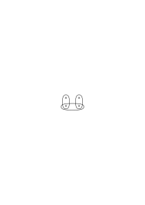
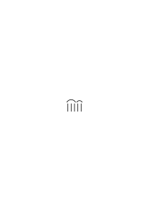
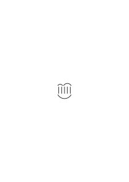
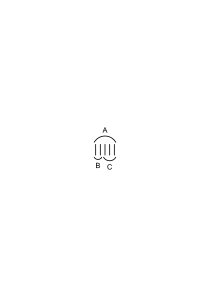
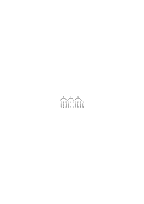
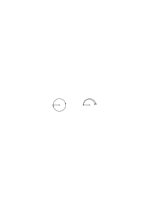

# Ts-222

### [RFM I](/w-rfm-1/#ts-222-1.1+2.1) [1\[1\]](https://cdn.wittgensteinnachlass.com/2000px/webp/Ts-222/1.webp),[2\[1\]](https://cdn.wittgensteinnachlass.com/2000px/webp/Ts-222/2.webp) {#1121}

We use the expression: “the transitions are determined by the formula ‥‥․”. How is it used? –

We can, for example, talk about how people are brought by means of training (drill) to use the formula y = x² in such a way that, when everyone substitutes the same number for x, they always calculate the same number for y. Or we can say: “These people are so trained that, when they receive the command ‘+3’, they all make the same transition at the same step.” We could express this as follows: “The command ‘+3’ completely determines every transition from one number to the next for these people.” (In contrast to other people, who, when given this command, do not know what to do, or who, although they do know with certainty, [→ (cf. 189)] each react to it in a different way.) We can, on the other hand, contrast different types of formulas and the different types of use (different types of training) that go with them. We then _call_ formulas of a certain type (and the corresponding way of using them) “formulas that determine a number y for a given x,” and formulas of another type, such. (y = x² + 1 would be of the first type, y > x² + 1, y = x² ± 1, y = x² + z would be of the second type.) The sentence “the formula ‥‥․ determines a number y” is then a statement about the form of the formulas, and it is now a sentence: “The formula that I have written down determines y,” or “Here is a formula that determines y,” to be distinguished from a sentence such as: “The formula y = x² determines the number y for a given x.” The question “Does the formula written there determine y?” then means the same as: “Does the formula written there have this type, or that type?”; but what we are supposed to do with the question: “Is y = x² a formula that determines y for a given x?” – is not immediately clear. One might, for example, ask this question of a student in order to test whether he understands the use of the expression “determines”; or it might be a mathematical problem to calculate whether only one variable appears on the right-hand side of the formula, as in the case:

y = (x² + z)² ‒ z(2x² + z).

### [RFM I](/w-rfm-1/#ts-222-2.2) [2\[2\]](https://cdn.wittgensteinnachlass.com/2000px/webp/Ts-222/2.webp) {#22}

203 “How the formula is meant determines which transitions are to be made.” What is the criterion for how the formula is meant? Surely it is the way in which we constantly use it, the way in which we were taught to use it. We say, for example, to someone who is using a symbol unknown to us: “If you mean x² by ‘<math class="stacked" display="inline"><mtable rowspacing="0.1em"><mtr><mtd><mi>x</mi></mtd></mtr><mtr><mtd><mo>∼</mo></mtd></mtr><mtr><mtd><mn>2</mn></mtd></mtr></mtable></math>’, then you will get _this_ value for y; if you mean √x, then you will get _that_.” – Now ask yourself: how does one do it, how does one _mean_ one thing or the other by ‘<math class="stacked" display="inline"><mtable rowspacing="0.1em"><mtr><mtd><mi>x</mi></mtd></mtr><mtr><mtd><mo>∼</mo></mtd></mtr><mtr><mtd><mn>2</mn></mtd></mtr></mtable></math>’? _Thus_, the meaning can determine the transitions in advance.

### [RFM I](/w-rfm-1/#ts-222-3.1+4.1) [3\[1\]](https://cdn.wittgensteinnachlass.com/2000px/webp/Ts-222/3.webp),[4\[1\]](https://cdn.wittgensteinnachlass.com/2000px/webp/Ts-222/4.webp) {#3141}

209 _How do I know_ that in continuing the series +2 I must write

_“20004, 20006”_

and not

_“20004, 20008”? –_

(The question is similar: “How do I know that this color is ‘red’?”) “But you do know, for example, that you always have to write the _same_ sequence of numbers in the units: 2, 4, 6, 8, 0, 2, 4, etc.” – Quite right! the problem must also already occur in this sequence of numbers, yes, even already in the 2, 2, 2, 2, etc. – For how do I know that after the 500th “2” I should write “2”? that “2” at this point is ‘the same digit’? And if I know it _before_, what does this knowledge help me for later? I mean: how do I then know, when the step really has to be taken, what to do with that earlier knowledge? (If intuition is needed to continue the series +1, then it is also needed to continue the series +0.)

### [RFM I](/w-rfm-1/#ts-222-5.1) [5\[1\]](https://cdn.wittgensteinnachlass.com/2000px/webp/Ts-222/5.webp) {#51}

“But are you saying that the expression ‘+2’ leaves you in doubt about what you should write after 2004, for example?” – No; I answer without hesitation: “2006”. But that is why it is superfluous that something was already determined about it earlier. The fact that I have no doubt when the question is put to me does not mean that it was already answered earlier. “But I also know that, whatever number you give me, I will be able to state the next one with certainty.” – Except, of course, for the case that I die before I get to it, and many other cases. But the fact that I am so sure that I will be able to continue is, of course, very important. –

### [RFM I](/w-rfm-1/#ts-222-6.1+7.1) [6\[1\]](https://cdn.wittgensteinnachlass.com/2000px/webp/Ts-222/6.webp),[7\[1\]](https://cdn.wittgensteinnachlass.com/2000px/webp/Ts-222/7.webp) {#6171}

204 “But what is the peculiar inexorability of mathematics based on?” – Wouldn’t a good example of it be the inexorability with which two follows one, three follows two, and so on? – Does that mean that in the _series of cardinal numbers_, one is followed by the next, because in another series, something else follows? And isn’t _this_ series precisely defined by this sequence? – “So, is that supposed to mean that it is equally correct in any way one counts, and that everyone can count however they want?” – We probably wouldn’t call it “counting” if everyone uttered digits in succession in _some way_; but it is certainly not just a question of naming. For what we call “counting” is an important part of the activities of our lives. Counting, and calculating, is – for example – not just a pastime. Counting (and that means: _counting in this way_) is a technique that is used daily in the most diverse activities of our lives. And that is why we learn to count the way we do: with endless practice, with merciless accuracy; that is why it is insisted on inexorably that we all say “one” after “one”, “two” after “two”, and so on. – “But is this counting then only a _use_; does this sequence also correspond to a truth?” The _truth_ is that counting has proven itself. – “So, are you saying that ‘being true’ means ‘being useful’?” – No; but that one cannot say that the series of natural numbers – as well as our language – is true, but rather: it is useful and, above all, _it is used_.

### [RFM I](/w-rfm-1/#ts-222-7.2) [7\[2\]](https://cdn.wittgensteinnachlass.com/2000px/webp/Ts-222/7.webp) {#72}

205 “But doesn’t it necessarily follow logically that you get two when you count one plus one, and three when you count two plus one, and so on; and isn’t this inexorability the same as that of logical deduction?” – Yes! it is the same. – “But does logical deduction correspond to a truth? Isn’t it _true_ that this follows from that?” – The sentence: “it is true that this follows from that”, simply means: that follows from this. And how do we use this sentence? – What would happen if we deduced differently – _how_ would we come into conflict with the truth?

### [RFM I](/w-rfm-1/#ts-222-8.1) [8\[1\]](https://cdn.wittgensteinnachlass.com/2000px/webp/Ts-222/8.webp) {#81}

How would we come into conflict with the truth if our measuring rods were made of very soft rubber instead of wood and steel? – “Well, we wouldn’t learn the correct measure of the table.” – You mean, we wouldn’t, or wouldn’t reliably, obtain the measure that we obtain with our hard measuring rods. So, the one who measured the table with the flexible measuring rod and claimed that it measured 1.80 m according to our usual method of measurement would be wrong; but if he says that the table measures 1.80 m according to his method, then that is correct. – “But that is then not measurement at all!” – It is similar to our measurement & can, under certain circumstances, serve ‘practical purposes’. (A merchant could, in this way, treat different customers differently.) A measuring rod that expands extraordinarily strongly with slight heating, we would – under normal circumstances – therefore call _unusable_. But we could imagine circumstances in which precisely this would be desirable. I imagine that we perceive the expansion with the naked eye; and we assign the same measure of length to bodies in spaces of unequal temperature if they reach the same point on the measuring rod, which is sometimes longer and sometimes shorter for the eye. One can then say: what is meant here by “measuring” and “length” and “length-equal” is something different than what we usually call it. The use of these words is different here than ours; but it is _related_ to it, and we also use these words in many ways.

### [RFM I](/w-rfm-1/#ts-222-9.1+10.1) [9\[1\]](https://cdn.wittgensteinnachlass.com/2000px/webp/Ts-222/9.webp),[10\[1\]](https://cdn.wittgensteinnachlass.com/2000px/webp/Ts-222/10.webp) {#91101}

206 One must make it clear to oneself what inference actually consists in. One might say that it consists in the transition from one assertion to another. But does that mean that inference is something that takes place in the transition from one assertion to another, i.e., _before_ the other is uttered – or that inference consists in letting one assertion follow from the other, i.e., for example, in uttering it after it? We like to imagine, misled by the particular use of the verb “to infer”, that inference is a peculiar activity, a process in the medium of the intellect, as it were, a brewing of the mists from which the inference emerges. But let us rather look at what happens! – There is a transition from one sentence to another by way of other sentences, i.e., through a chain of inferences, but we need not speak of this, since it presupposes a different kind of transition, namely the transition from one link in the chain to the next. A process of transition can now take place between the links. There is nothing occult about this process; it is a derivation of one sentence from the other according to a rule; a comparison of the two with some paradigm that shows us the schema of the transition; or the like. This can take place on paper, orally, or ‘in the head’. – The inference can also be drawn in such a way that one sentence is uttered after the other without transition; or the transition consists only in our saying “Therefore” or “It follows that”, or the like. It is then called an “inference” if the inferred sentence can actually be _derived_ from the premise.

### [RFM I](/w-rfm-1/#ts-222-10.2+11.1) [10\[2\]](https://cdn.wittgensteinnachlass.com/2000px/webp/Ts-222/10.webp),[11\[1\]](https://cdn.wittgensteinnachlass.com/2000px/webp/Ts-222/11.webp) {#102111}

207 What does it mean to say that one sentence can be derived from another, by means of a rule? Can’t everything be derived from anything by means of _**some**_ rule – in fact, from any rule with an appropriate interpretation? What does it mean when I say, for example, that this number can be obtained by multiplying those two? This is a rule that says that we must obtain this number if we multiply correctly; and we can obtain this rule by multiplying the two numbers, or also in other ways (although one could also call any process that leads to this result a ‘multiplication’). It is now said that I have multiplied when I have carried out the multiplication 265 × 463, but also when I say: “4 times 2 is 8”, although here no calculation has led to the product (which I could, however, have _calculated_). And so we also say that a deduction is made, where it is not calculated.

### [RFM I](/w-rfm-1/#ts-222-11.3+12.1) [11\[3\]](https://cdn.wittgensteinnachlass.com/2000px/webp/Ts-222/11.webp),[12\[1\]](https://cdn.wittgensteinnachlass.com/2000px/webp/Ts-222/12.webp) {#113121}

202 But surely I may only infer what actually _follows_! – Does this mean: only what follows according to the rules of inference; or does it mean: only what follows according to _such_ rules of inference that somehow correspond to a reality? Here, we vaguely envision that this reality is something very abstract, very general, and very rigid. Logic is a kind of ultra-physics, the description of the ‘logical structure’ of the world, which we perceive through a kind of ultra-experience (with the intellect, for example). Perhaps we envision inferences like this: “The stove is smoking, so the stovepipe is blocked again.” (And _thus_ this inference is drawn! Not like this: “The stove is smoking, and whenever the stove smokes, the stovepipe is blocked; therefore ‥‥․”.)

### [RFM I](/w-rfm-1/#ts-222-12.2) [12\[2\]](https://cdn.wittgensteinnachlass.com/2000px/webp/Ts-222/12.webp) {#122}

203 What we call ‘logical inference’ is a transformation of the expression. For example, the conversion of one measure to another. On one edge of a standard, inches are marked, on the other, cm. I measure the table in inches and then, _on the standard_, convert it to cm. – And of course, there is also right and wrong in the transition from one measure to another; but with what reality does the correct one correspond? Probably with an _agreement_ or a _use_, and perhaps with the practical needs.

### [RFM I](/w-rfm-1/#ts-222-13.1) [13\[1\]](https://cdn.wittgensteinnachlass.com/2000px/webp/Ts-222/13.webp) {#131}

205 “But must it not – for example – follow from “(x)․fx” that “fa” follows, _if_ “(x)․fx” is meant in the way we mean it?” – And how is it expressed, _how_ do we mean it? Not through the constant practice of its use? And perhaps also through certain _gestures_ – and things of that sort. – – It is as if, when _we_ say the word “all”, something else still clings to it, which would be incompatible with another use; namely, the _meaning_. “‘All’ means: _**all**_!’” we would like to say if we were to explain it; and in doing so, we make a certain gesture and facial expression. Chop down all these trees! – – Yes, don’t you understand what ‘_all_’ means? (He had left _one_ standing.) How did he learn what ‘all’ means? Surely through practice. – And indeed, this practice has not only brought about the fact that he _does_ that when given the command – but it has surrounded the word with a whole host of images (visual and others), of which one or the other emerges when we hear and utter the word. (And if we are to give an account of what the ‘meaning’ of the word is, we first pick _one_ image out of this mass – and then reject it again as irrelevant when we see that sometimes this, sometimes that emerges, and sometimes none at all.) One learns the meaning of “all” by learning that “fa” follows from “(x)․fx”. – The exercises that practice the use of this word, that teach its meaning, always aim at the fact that no exception may be made.

### [RFM I](/w-rfm-1/#ts-222-14.1) [14\[1\]](https://cdn.wittgensteinnachlass.com/2000px/webp/Ts-222/14.webp) {#141}

209 How do we learn to reason? Or do we not learn it? Does the child know that a double negation implies affirmation? – And how does one convince it of this? Probably by showing it a process (a double reversal, twice rotating by 180 degrees, etc.) which it then accepts as a picture of the negation. And one clarifies the sense of “(x)․fx” by insisting that “fa” follows from it.

### [RFM I](/w-rfm-1/#ts-222-15.1) [15\[1\]](https://cdn.wittgensteinnachlass.com/2000px/webp/Ts-222/15.webp) {#151}

206

207 “From ‘all,’ if that is what is meant, surely _that_ must follow.” – If it is meant _like_ that? Consider it, how do you mean it? Perhaps you still have an image in your mind – and that is all you have. – No, it does not _have_ to – but it _follows_: We _carry out_ this transition. And we say: If that does not follow, then it was not _**all**_! – – and that merely shows how we react to words in such a situation. –

### [RFM I](/w-rfm-1/#ts-222-15.2) [15\[2\]](https://cdn.wittgensteinnachlass.com/2000px/webp/Ts-222/15.webp) {#152}

207 It seems to us that, apart from the use of the word “all”, something else must also have changed if “fa” is no longer to follow from “(x)․fx”; something that is attached to the word itself. Is this not similar to when one says: “If this person acted differently, then his character would also have to be different.” Now, in some cases this may mean something, and in some it may not. We say: “the character gives rise to the way of acting”, and so the meaning gives rise to the use. [→ See the remark ‘medicine helps’]

### [RFM I](/w-rfm-1/#ts-222-15.3+16.1) [15\[3\]](https://cdn.wittgensteinnachlass.com/2000px/webp/Ts-222/15.webp),[16\[1\]](https://cdn.wittgensteinnachlass.com/2000px/webp/Ts-222/16.webp) {#153161}

208 This shows you – one could say – how strongly certain gestures, images, reactions are connected with a constantly practiced use. ‘The image forces itself upon us ‥‥․’. It is very interesting that images force themselves upon us. And if that were not the case, how could a sentence like “What’s done cannot be undone” mean something to us.

### [RFM I](/w-rfm-1/#ts-222-16.2) [16\[2\]](https://cdn.wittgensteinnachlass.com/2000px/webp/Ts-222/16.webp) {#162}

206

210 It is important that in our language – in our natural language – ‘all’ is a basic concept, & ‘all except one’ is less fundamental; that is, there is no _single_ word for it, nor a characteristic gesture.

### [RFM I](/w-rfm-1/#ts-222-16.3) [16\[3\]](https://cdn.wittgensteinnachlass.com/2000px/webp/Ts-222/16.webp) {#163}

211 The point of the word “all” is that it allows no exceptions. – Yes, that is the point of its use in our language; but what kinds of uses we perceive as ‘witty’ is connected with what role this use plays in our whole life. [→ See =, ε, is.]

### [RFM I](/w-rfm-1/#ts-222-17.1) [17\[1\]](https://cdn.wittgensteinnachlass.com/2000px/webp/Ts-222/17.webp) {#171}

210 When asked what inference consists in, we might hear something like: “If I have recognized the truth of the sentences…, then I am now entitled to add….” – Entitled in what respect? Didn’t I have the right to add it before? – – “Those sentences convince me of the truth of this sentence.” But that’s not really what it’s about either. – – “According to these laws, the mind performs the special activity of logical inference.” That is certainly interesting and important; but is it also true? Does the mind always infer according to _these_ laws? And what does the special activity of inference consist in? – – That is why it is necessary to look at how we actually perform inferences in linguistic practice; what inference is as a process in the language-game. E.g.: A regulation states: “All those who are over 1.80 m tall are to be assigned to the… department.” An clerk reads out the names of the people, along with their height. Another assigns them to the departments. – N.N., 1.90 m. – “So N.N. goes to the… department.” That is inference.

### [RFM I](/w-rfm-1/#ts-222-18.1) [18\[1\]](https://cdn.wittgensteinnachlass.com/2000px/webp/Ts-222/18.webp) {#181}

211 What, then, do we call ‘inferences’ in Russell, or in Euclid? Shall I say: the transitions from one sentence to the next in the proof? But where is the _transition_? – I say that, in Russell, one sentence follows from another if the latter can be derived from the former according to the position of the two in a proof, & the signs attached to them – if we read the book. For, to read this book is a game that one must learn.

### [RFM I](/w-rfm-1/#ts-222-18.2) [18\[2\]](https://cdn.wittgensteinnachlass.com/2000px/webp/Ts-222/18.webp) {#182}

212 Use in surfaces & use in a language-game. One is often unclear about what the following and inferring actually consist of; what kind of state of affairs and process it is. The peculiar use of these verbs suggests that following is the existence of a connection between sentences, which we trace when we infer. This is very instructively shown in Russell’s representation (‘Principia Mathematica’). That a sentence ⊢q follows from a sentence ⊢p⊃q.p is here a logical basic law:

⊢p⊃q.p․⊃․⊢q

This, it is said, entitles us to infer ⊢q from ⊢p⊃q.p. But what does ‘inferring’ consist of, the procedure for which we are entitled? But it consists in uttering, writing down, and the like, the one sentence – in some language-game – after the other as an assertion; and how can that basic law entitle me _to do_ that?

### [RFM I](/w-rfm-1/#ts-222-19.1) [19\[1\]](https://cdn.wittgensteinnachlass.com/2000px/webp/Ts-222/19.webp) {#191}

Russell wants to say: “_Thus_ is how I will infer, and thus is how it is _correct_.” He wants to communicate to us, therefore, how he intends to infer: this is done through a _rule_ of inference. What does it say? That this sentence implies that one? — – – No, rather, that in the proofs of this book, such a sentence should follow after such a sentence. – But it is supposed to be a logical basic law that it is _correct_ to infer in this way! – Then the basic law would have to say: “It is correct to infer from ‥‥․ to ‥‥․”; and this basic law should now be clear – – but then we will simply see the rule itself as correct, or as justified. “But this rule is really only about sentences in a book, and that does not belong in logic!” – Quite right; the rule is really only a communication that in this book, only _this_ transition from one sentence to another is used (as it were, a communication from the index), because the correctness of the transition must be clear at the moment; and the expression of the ‘logical basic law’ is then the _sequence of the sentences_ themselves.

### [RFM I](/w-rfm-1/#ts-222-19.2+20.1) [19\[2\]](https://cdn.wittgensteinnachlass.com/2000px/webp/Ts-222/19.webp),[20\[1\]](https://cdn.wittgensteinnachlass.com/2000px/webp/Ts-222/20.webp) {#192201}

214 Russell seems to say with that basic law about a sentence: “It already follows – I only need to infer it.” Thus, Frege says that the line connecting any two points is actually already there before we draw it, and it is the same when we say that the transitions of the series +2, for example, have actually already been made before we make them orally or in writing – as it were, tracing them.

### [RFM I](/w-rfm-1/#ts-222-20.2+21.1) [20\[2\]](https://cdn.wittgensteinnachlass.com/2000px/webp/Ts-222/20.webp),[21\[1\]](https://cdn.wittgensteinnachlass.com/2000px/webp/Ts-222/21.webp) {#202211}

215 One could respond to someone who says this: You are using a picture here. One _can_ determine the transitions that one is supposed to make in a series by demonstrating them. For example, by writing down the series that he is supposed to write in a different notation, so that he only has to transfer it, or by actually writing it out very thinly and he has to trace it. In the first case, we can also say that we are not writing _the_ series that he is supposed to write, so we are not making the transitions of this series ourselves; but in the second case, we will certainly say that the series that he is supposed to write is already there. We would also say this if we _dictated_ to him what he should add, even though we then produce a series of sounds and he produces a series of written characters. In any case, it is a reliable way to determine the transitions that one is supposed to make by demonstrating them to him, in some sense, beforehand. – If, therefore, we determine these transitions in a completely different sense by subjecting our student to training, as, for example, our children receive in learning their multiplication tables, so that all those who are trained in this way can now perform any multiplications that they did not practice during their training in the same way and with consistent results – if, therefore, the transitions that one is supposed to make on the command +2 are determined through training in such a way that we can reliably predict how he will proceed, even if he has never made _this_ transition before, – then it can certainly seem appropriate to use the following as a picture of this state of affairs: the transitions have already all been made; he is only writing them down. [We will often have occasion to talk about the conception of possibility as a shadow of reality.]

### [22\[1\]](https://cdn.wittgensteinnachlass.com/2000px/webp/Ts-222/22.webp)

Language-games of inference.

### [RFM I](/w-rfm-1/#ts-222-23.1) [23\[1\]](https://cdn.wittgensteinnachlass.com/2000px/webp/Ts-222/23.webp) {#231}

237 “But we infer this sentence from that one because it actually follows! We convince ourselves that it follows.” We convince ourselves that what is stated here follows from what is stated there. And this sentence is used _temporally_.

### [RFM I](/w-rfm-1/#ts-222-24.1) [24\[1\]](https://cdn.wittgensteinnachlass.com/2000px/webp/Ts-222/24.webp) {#241}

257 [→ See p. 171/252] Separate the feelings (gestures) of agreement from what you _do_ with the proof! Does it relate to [→ 172: Who calculates like that]?

### [RFM I](/w-rfm-1/#ts-222-25.1) [25\[1\]](https://cdn.wittgensteinnachlass.com/2000px/webp/Ts-222/25.webp) {#251}

238 But what if I convince myself that the schema of these lines | | | | |

_(a_

is of even number with the schema of these points:

_(b_

(I have intentionally made the schemata memorable), by associating:

_(c_

Now, what do I convince myself of when I look at this figure? I see a star with thread-like extensions. –

### [RFM I](/w-rfm-1/#ts-222-25.2) [25\[2\]](https://cdn.wittgensteinnachlass.com/2000px/webp/Ts-222/25.webp) {#252}

239 But I can use the figure in the following way: Five people are standing in a pentagon; there are rods on the wall, like the lines in (a); I look at the figure (c) and say: “I can give each of the people a rod.” I could conceive of figure (c) as a schematic _picture_ of the fact that I am giving each of the five people a rod.

### [RFM I](/w-rfm-1/#ts-222-25.3+26.1) [25\[3\]](https://cdn.wittgensteinnachlass.com/2000px/webp/Ts-222/25.webp),[26\[1\]](https://cdn.wittgensteinnachlass.com/2000px/webp/Ts-222/26.webp) {#253261}

240 For, if I first draw any polygon

and then any series of lines

∣∣∣∣∣∣∣∣∣∣∣∣∣∣∣∣∣∣

then I can now find out by association whether I have as many corners above as I have lines below. (I don't know what would come out.) And I can also say that I have convinced myself by drawing the projection lines that at the top end of figure (c) there are as many lines as the star has corners at the bottom. (Temporally!) In this conception, the figure does not resemble a mathematical proof (just as a mathematical proof is not when I distribute a sack of apples to a group of people and find that each one gets exactly _one_ apple). But I can conceive of figure (c) as a mathematical proof. Let's give the shapes of the schemas (a) and (b) names! Let the shape a be called “hand”, H., and the shape b “spider's foot”, D. I have proven that H. has as many lines as D. has corners. And this sentence is again atemporal.

### [RFM I](/w-rfm-1/#ts-222-26.2+27.1) [26\[2\]](https://cdn.wittgensteinnachlass.com/2000px/webp/Ts-222/26.webp),[27\[1\]](https://cdn.wittgensteinnachlass.com/2000px/webp/Ts-222/27.webp) {#262271}

241 A proof – I can say – is _one_ figure, at one end of which certain sentences stand and at the other end of which a sentence stands (which we call the ‘proven’ one). One can describe such a figure by saying: in it, the sentence ‥‥․ follows from ‥‥․. This is a form of describing a _sample_, which could also be, for example, an ornament (wallpaper pattern). So I can say: “In the proof, which is on that board, the sentence p follows from q and r,” and that is simply a description of what can be seen there. But it is not the mathematical sentence that p follows from q and r. This has a different application. It says – one could put it this way – that it makes sense to talk about a proof (sample) in which p follows from q and r. Just as one can say that the sentence “white is lighter than black” says that it makes sense to talk about two objects, of which the lighter one is white and the other is black, but not about two objects, of which the lighter one is black and the other is white.

### [RFM I](/w-rfm-1/#ts-222-27.2) [27\[2\]](https://cdn.wittgensteinnachlass.com/2000px/webp/Ts-222/27.webp) {#272}

242 Let us imagine that we have given the paradigm for “lighter” and “darker” in the form of a white and black patch, and now, with its help, we derive, as it were, that red is darker than white.

### [RFM I](/w-rfm-1/#ts-222-27.3) [27\[3\]](https://cdn.wittgensteinnachlass.com/2000px/webp/Ts-222/27.webp) {#273}

243 The sentence proven by (c) now serves as a new rule for stating the equality: If one has a set of objects arranged in the form of a hand and another in the form of the corners of a spider's foot, then we say that the two sets have the same number of elements.

### [RFM I](/w-rfm-1/#ts-222-27.4+28.1) [27\[4\]](https://cdn.wittgensteinnachlass.com/2000px/webp/Ts-222/27.webp),[28\[1\]](https://cdn.wittgensteinnachlass.com/2000px/webp/Ts-222/28.webp) {#274281}

244 “But isn't that simply because we have already assigned H and D to each other and seen that they are of equal number?” – Yes, but if they were in _one_ instance – how do I know that they will be so again? – “Because it is in the _essence_ of H and D that they are of equal number.” – But how could you bring _that_ out through the assignment? (I thought that the counting, or assignment, only shows that these two groups, which I have before me now, are of equal or unequal number.) – “But if he has a set of H things and a set of D things, and he actually assigns them to each other, then it is not _possible_ for him to obtain anything other than that they are of equal number. – And that it is not possible, I see from the proof.” – But _is_ it not possible? If, for example, – as another might say – he _overlooks_ drawing one of the lines of assignment. But I admit that in the vast majority of cases he will always obtain the same result, and if he did not, he would consider himself to be in some way disturbed. And if it were not so, the whole proof would be deprived of its foundation. We decide to use the proof picture instead of an assignment of the groups; we do _not_ assign them, but _instead_ compare the groups with those of the proof (in which, however, two groups are assigned to each other). (How we decide …

Proof by induction

<math display="block">
  <mrow>
    <mtable columnalign="left" rowspacing="0.2em">
      <mtr>
        <mtd>
          <mrow>
            <munder>
              <mn>1</mn>
              <mo>&#x005F;</mo>
            </munder>
            <mspace width="0.2em"/>
            <mo>:</mo>
            <mspace width="0.2em"/>
            <mn>3</mn>
            <mspace width="0.2em"/>
            <mo>=</mo>
            <mspace width="0.2em"/>
            <mn>0</mn>
            <mo>.</mo>
            <mn>3</mn>
          </mrow>
        </mtd>
      </mtr>
      <mtr>
        <mtd>
          <mrow>
            <mspace width="0.5em"/>
            <mn>1</mn>
          </mrow>
        </mtd>
      </mtr>
    </mtable>
  </mrow>
</math>

Triangle in the Euclidean proof.

### [RFM I](/w-rfm-1/#ts-222-28.2+29.1) [28\[2\]](https://cdn.wittgensteinnachlass.com/2000px/webp/Ts-222/28.webp),[29\[1\]](https://cdn.wittgensteinnachlass.com/2000px/webp/Ts-222/29.webp) {#282291}

245 I could also say as a result of the proof: “A group and a group are henceforth called ‘of equal number.’” Or: The proof does not investigate the essence of the two figures, but it expresses what I will henceforth consider to be the essence of the figures. – What belongs to the essence, I place under the paradigms of language. One could imagine a mathematical library in Greenwich. The mathematician creates essences.

### [RFM I](/w-rfm-1/#ts-222-29.2) [29\[2\]](https://cdn.wittgensteinnachlass.com/2000px/webp/Ts-222/29.webp) {#292}

246 When I say: “This sentence follows from that one,” that is the acknowledgment of a rule. It occurs _on the basis_ of the proof. That is to say, I allow this chain (this figure) to serve as _proof_. ‒ ‒ “But could I do otherwise? _Must_ I allow it?” – Why do you say that you must? Because, at the end of the proof, you say something like: “Yes – I must acknowledge this conclusion.” But that is merely the expression of your unconditional acknowledgment. – That is to say, I believe that the words “I must admit it” are used in _two_ cases: when we have received a proof – but also in relation to the individual step itself in the proof. [→ (See p. 173)]

### [RFM I](/w-rfm-1/#ts-222-29.3+30.1) [29\[3\]](https://cdn.wittgensteinnachlass.com/2000px/webp/Ts-222/29.webp),[30\[1\]](https://cdn.wittgensteinnachlass.com/2000px/webp/Ts-222/30.webp) {#293301}

247 And how does it manifest that the proof forces me? It is manifested in the fact that I proceed in this and that way, that I refuse to take another way. As a final argument, against someone who did not want to go this way, I would only say: “Yes, can’t you see…!” – and that is not an argument.

### [RFM I](/w-rfm-1/#ts-222-30.2) [30\[2\]](https://cdn.wittgensteinnachlass.com/2000px/webp/Ts-222/30.webp) {#302}

248﹖ “But, if you are right, how does it come about that all people (or at least all normal people) accept these figures as proofs of these sentences?” – Yes, there is a great – and interesting – agreement.

### [RFM I](/w-rfm-1/#ts-222-30.3+31.1) [30\[3\]](https://cdn.wittgensteinnachlass.com/2000px/webp/Ts-222/30.webp),[31\[1\]](https://cdn.wittgensteinnachlass.com/2000px/webp/Ts-222/31.webp) {#303311}

249 Imagine you have a row of balls in front of you; you number them with Arabic numerals, starting from 1 and going up to 100; then you make a larger space after every 10; in each row of 10, you make a slightly smaller space in the middle, between 5 and 5 – this makes the 10 surveyable; now you take the rows of ten and place them **under** each other, making a slightly larger space in the middle of the column, that is, between five rows and five rows; now you number the rows from 1 to 10. – You have, as it were, excerpted with the balls. I can say that I have unfolded the properties of the hundred balls. – Now, imagine that this whole process, this experiment with the hundred balls, was filmed. When I see it on the screen, I do not see an experiment; the image of an experiment is not itself an experiment. – But the ‘mathematically essential’ I now see in the projection! For first 100 dots appear, then they are divided into rows of ten, and so on and so forth. I could therefore say: the proof does not serve me as an experiment, but rather as a picture of an experiment.

### [RFM I](/w-rfm-1/#ts-222-31.2) [31\[2\]](https://cdn.wittgensteinnachlass.com/2000px/webp/Ts-222/31.webp) {#312}

250 Place 2 apples on the empty tabletop, make sure that no one comes near it and that the table is not shaken; now place 2 more apples on the tabletop; now count the apples that are there. You have performed an experiment; the result of the count is probably 4. (We would represent the result x as follows: if, under these and these circumstances, one first places 2 and then 2 more apples on a table, mostly none disappear, nor does one come to it.) And analogous experiments can be carried out with all sorts of solid objects, with the same result. – This is how children learn to count with us, because they are allowed to place 3 beans and then 3 more beans, and then count what is there. If, on one occasion, the result was 5, and on another, 7 (because, _as we would now say_, one bean was added on its own, and one disappeared), then we would first declare beans unsuitable for teaching arithmetic. But if the same thing happened with sticks, fingers, strokes, and most other things, then arithmetic with them would come to an end. “But wouldn’t 2 + 2 = 2 still be true?” – This sentence would then have become unusable. –

### [RFM I](/w-rfm-1/#ts-222-32.2) [32\[2\]](https://cdn.wittgensteinnachlass.com/2000px/webp/Ts-222/32.webp) {#322}

251 “You only have to look at the figure

to see that 2 + 2 = 4.” – Then I only have to look at the figure

to see that 2 + 2 + 2 = 4.

[→ See p. 173/257]

### [RFM I](/w-rfm-1/#ts-222-33.1) [33\[1\]](https://cdn.wittgensteinnachlass.com/2000px/webp/Ts-222/33.webp) {#331}

270 What do I convince someone of, who observes that depiction in the film of the experiment with the hundred balls? One could say: of the fact that this is how it happened. – But that would not be a mathematical conviction. – But can I not say: _I impress a process on him_? This process is the regrouping of a row of 100 things into 10 rows of 10. And this process is _actually_ easily reproducible. And he can rightly be convinced of that.

### [RFM I](/w-rfm-1/#ts-222-34.1) [34\[1\]](https://cdn.wittgensteinnachlass.com/2000px/webp/Ts-222/34.webp) {#341}

271 And so, the proof (238) by drawing the projection lines <math display="inline"><mtext>🖵</mtext></math> establishes a process, the one-to-one correspondence between the H and the D. – “But doesn't it also convince me that this correspondence is _possible_?” – Does “this correspondence” here refer to the figures of the proof itself? Something cannot be both a measure & something being measured at the same time. If this is meant to say that you can always execute it, then that does not necessarily have to be true. But the drawing of the projection lines convinces us that there are as many lines above as there are corners below; and it provides a template for assigning such figures to each other. – “But doesn't the template thereby show that it is possible? not that it was possible this time! In the sense that it would not be possible if, instead of ❘ ❘ ❘ ❘ ❘ above, the figure ❘ ❘ ❘ ❘ ❘ ❘ stood” – Why? Is it not possible then? _Thus_, for example:

This figure could also be used as a proof for something! Namely, to show that groups of these shapes cannot be assigned to each other in a 1–1 correspondence. A 1–1 correspondence is impossible here means: the figure – – –, the figure – – – & 1–1 correspondence do not fit together. “That is not what I meant!” – Then show me how you mean it, and I will do it. I will, for example, try to make an assignment on the figure here, but not the other one, and I will say that the other one is not possible. But can I not say that the figure shows _how_ such an assignment is possible – and must it not therefore also show _that_ it is possible? –

### [RFM I](/w-rfm-1/#ts-222-34.2+35.1+36.1) [34\[2\]](https://cdn.wittgensteinnachlass.com/2000px/webp/Ts-222/34.webp),[35\[1\]](https://cdn.wittgensteinnachlass.com/2000px/webp/Ts-222/35.webp),[36\[1\]](https://cdn.wittgensteinnachlass.com/2000px/webp/Ts-222/36.webp) {#342351361}

272 What was the sense at the time that we suggested assigning names to the shapes of the 5 parallel lines and the pentagonal star? What has happened with the fact that they have received names? This implies something about the nature of the use of these figures. Namely – that one recognizes them at a glance as this and that; one does not count their lines or corners; they are for us types of shapes, like knife and fork, the letters and numbers. So I can, upon the command: “Draw an H.” (for example), immediately reproduce this shape. – Now, the proof teaches me a correspondence between the two shapes. (I would like to say that it is not only these individual figures that are assigned in the proof, but the _shapes_ themselves; but that only means that I memorize these shapes well.) Can I not, if I want to assign the shapes H and D to each other, get into difficulties – in that, for example, there is one corner too many at the bottom, or one line too many at the top? – “But not if you have really drawn H and D again! – And that can be proven; look at this figure!”

– This figure teaches me a new kind of control to make sure that I have really drawn the same figures; but if I now want to follow this template, can I not still get into difficulties? But I say, I am sure that I will normally not get into any difficulties.

### [RFM I](/w-rfm-1/#ts-222-36.2) [36\[2\]](https://cdn.wittgensteinnachlass.com/2000px/webp/Ts-222/36.webp) {#362}

273 There is a puzzle game in which one consists of putting together a specific figure, e.g. a rectangle, from given pieces. The division of the figure is such that it is difficult for us to find the correct arrangement of the parts. Let it be, for example, this

What does the one who succeeds in the composition find? – He finds: an arrangement – which he had not thought of before. – Good; but can one not then say: he convinces himself that these triangles can be put together in this way? – But these triangles: are they the ones that are at the top in the rectangle, or are they triangles that are only supposed to be put together in this way?

### [RFM I](/w-rfm-1/#ts-222-36.3+37.1) [36\[3\]](https://cdn.wittgensteinnachlass.com/2000px/webp/Ts-222/36.webp),[37\[1\]](https://cdn.wittgensteinnachlass.com/2000px/webp/Ts-222/37.webp) {#363371}

274 Whoever says: “I didn't think that these figures could be put together in this way,” one cannot, pointing to the completed puzzle game, say: “So, you didn't think that the pieces could be put together in this way?” – He would answer: “I mean, I didn't think of this kind of composition at all.”

### [RFM I](/w-rfm-1/#ts-222-37.2) [37\[2\]](https://cdn.wittgensteinnachlass.com/2000px/webp/Ts-222/37.webp) {#372}

275 Let us imagine the physical properties of the pieces of the puzzle in such a way that they cannot get into the desired position. But not that one experiences resistance when trying to bring them into this position, but rather one simply tries all other possibilities, except for _this_ one, and the pieces do not happen to get into this position by chance. It is as if this position is excluded from space. As if there were a ‘blind spot’ here, perhaps in our brain. – And _is_ it not the case that when I believe I have tried all _possible_ positions and have always passed by this one, as if by magic? Can one not say that the figure that shows us the solution removes a blindness; or that it changes your geometry? It shows you, as it were, a new dimension of space. (As if one were showing a fly the way out of a glass jar.)

### [RFM I](/w-rfm-1/#ts-222-37.3+38.1) [37\[3\]](https://cdn.wittgensteinnachlass.com/2000px/webp/Ts-222/37.webp),[38\[1\]](https://cdn.wittgensteinnachlass.com/2000px/webp/Ts-222/38.webp) {#373381}

276 Some essence has surrounded this position with a spell and excluded it from our space.

### [RFM I](/w-rfm-1/#ts-222-38.2) [38\[2\]](https://cdn.wittgensteinnachlass.com/2000px/webp/Ts-222/38.webp) {#382}

277 The new position has arisen as if from nothing. Where before there was nothing, there is now suddenly something.

### [RFM I](/w-rfm-1/#ts-222-38.3) [38\[3\]](https://cdn.wittgensteinnachlass.com/2000px/webp/Ts-222/38.webp) {#383}

278 In what way has the solution convinced you that one can do this and that? – You could not do it before – and now you can do it. –

### [RFM I](/w-rfm-1/#ts-222-39.1) [39\[1\]](https://cdn.wittgensteinnachlass.com/2000px/webp/Ts-222/39.webp) {#391}

280 I said, ‘I will accept this and that as proof of a proposition’ – but can I not accept the figure that shows the pieces of the puzzle put together as proof that those pieces can be put together to form this outline?

### [RFM I](/w-rfm-1/#ts-222-39.2) [39\[2\]](https://cdn.wittgensteinnachlass.com/2000px/webp/Ts-222/39.webp) {#392}

281 But suppose one of the pieces is placed so that it is the _mirror image_ of the corresponding part of the template. He now wants to put the figure together according to the template, sees that it must be possible, but does not have the idea to turn the piece around and finds that he cannot succeed in putting it together.

### [RFM I](/w-rfm-1/#ts-222-39.3+40.1) [39\[3\]](https://cdn.wittgensteinnachlass.com/2000px/webp/Ts-222/39.webp),[40\[1\]](https://cdn.wittgensteinnachlass.com/2000px/webp/Ts-222/40.webp) {#393401}

282 One can put a rectangle together from two parallelograms and two triangles. Proof:

A child would find it difficult to put a rectangle together from these components and be surprised that two sides of the parallelograms fall into a straight line, even though the parallelograms are askew. – It might seem to him that the rectangle is formed as if by magic from these figures. Yes, he must admit that they now form a rectangle, but by a trick, by a complicated arrangement, in an unnatural way. I can imagine that when the child has put the two parallelograms together in _this_ way, he does not trust his eyes when he sees that they _do_ fit together. ‘_They don’t look_ as if they fit together.’ And I can imagine that one might say: It only appears to us as if they form the rectangle – in reality, they have changed their nature, they are no longer the parallelograms.

### [RFM I](/w-rfm-1/#ts-222-41.1) [41\[1\]](https://cdn.wittgensteinnachlass.com/2000px/webp/Ts-222/41.webp) {#411}

290 “You admit _this_ – then you must admit _that_.” – He _must_ admit it – and yet it is possible that he does not admit it! You want to say: “If he _thinks_, he must admit it.” “I will show you why you must admit it. –” I will present a case to you which, if you consider it, will determine you to judge in that way.

### [RFM I](/w-rfm-1/#ts-222-41.2) [41\[2\]](https://cdn.wittgensteinnachlass.com/2000px/webp/Ts-222/41.webp) {#412}

291 How can the manipulations of the proof bring him to admit something?

### [RFM I](/w-rfm-1/#ts-222-41.3) [41\[3\]](https://cdn.wittgensteinnachlass.com/2000px/webp/Ts-222/41.webp) {#413}

292 “You will admit that 5 consists of 3 and 2!”

I will only admit it if I do not admit anything else by it. Except – that I want to use _this picture_.

### [RFM I](/w-rfm-1/#ts-222-41.4+42.1) [41\[4\]](https://cdn.wittgensteinnachlass.com/2000px/webp/Ts-222/41.webp),[42\[1\]](https://cdn.wittgensteinnachlass.com/2000px/webp/Ts-222/42.webp) {#414421}

293 One could, for example, take the figure

as proof that 100 parallelograms, when put together, must form a straight strip. If one then actually puts 100 together, one obtains a slightly curved strip. – But the proof has determined us to use the picture and the expression: If they do not form a straight strip, they were not manufactured accurately.

### [RFM I](/w-rfm-1/#ts-222-42.2) [42\[2\]](https://cdn.wittgensteinnachlass.com/2000px/webp/Ts-222/42.webp) {#422}

294 Just think, how can the picture or process you show me commit me to judging in such and such a way from now on! Yes, if there is an experiment here, then _one_ is surely not enough to connect me with any judgment.

### [RFM I](/w-rfm-1/#ts-222-42.3) [42\[3\]](https://cdn.wittgensteinnachlass.com/2000px/webp/Ts-222/42.webp) {#423}

295 The person offering the proof says: “Look at this figure! What shall we say about it? That a rectangle consists of ‥‥․? –” Or also: “You call that ‘parallelograms’ and that ‘triangles,’ and _that_ is what it looks like when one figure consists of others. –”

### [RFM I](/w-rfm-1/#ts-222-42.4+43.1) [42\[4\]](https://cdn.wittgensteinnachlass.com/2000px/webp/Ts-222/42.webp),[43\[1\]](https://cdn.wittgensteinnachlass.com/2000px/webp/Ts-222/43.webp) {#424431}

296 “Yes, you have convinced me: a rectangle always consists of ‥‥․” – Would I also say: “Yes, you have convinced me: _this_ rectangle (the one in the proof) consists of ‥‥․”? And this would surely be the more modest sentence, which even someone who does not yet accept the general sentence should admit. However, it seems that the one who admits _that_ does not admit the more modest geometric sentence, but admits no geometric sentence at all. Of course, – because with regard to the rectangle in the proof, he has not convinced me of anything. (If I had seen this figure earlier, I would not have had any doubt about it.) I have, on my own, conceded everything concerning this figure. And he has only convinced me _by means_ of it. – But on the other hand, if he has not even convinced me of anything with regard to _this_ rectangle, how much less with regard to a property of other rectangles?

### [RFM I](/w-rfm-1/#ts-222-44.3) [44\[3\]](https://cdn.wittgensteinnachlass.com/2000px/webp/Ts-222/44.webp) {#443}

297 “Yes, the shape does not look as if it could consist of two askew parts.” What surprises you? Surely not the fact that you are now looking at this figure! Something in this figure surprises me. – But there is nothing going on in this figure! What surprises me is the combination of the askew with the straight. I feel, as it were, dizzy.

### [RFM I](/w-rfm-1/#ts-222-45.2) [45\[2\]](https://cdn.wittgensteinnachlass.com/2000px/webp/Ts-222/45.webp) {#452}

298 But I really do say: “I am convinced that one can arrange the figure out of these parts,” if, for example, I have seen the depiction of the solution to the patience game. If I now say this to someone, it should mean: “Just try it! These pieces, when arranged correctly, really do form the figure.” I want to encourage him to do something and predict a success for him. And the prediction is based on the ease with which one can put the figure together from the pieces, once one knows _how_.

### [RFM I](/w-rfm-1/#ts-222-45.3) [45\[3\]](https://cdn.wittgensteinnachlass.com/2000px/webp/Ts-222/45.webp) {#453}

299 You say that you are amazed by what the proof shows you. But are you amazed by the fact that these lines can be drawn? No. You are only amazed if you tell yourself that two such pieces give this shape _forth_. So, if you imagine yourself in the situation, you expected something else and now you see the result.

### [RFM I](/w-rfm-1/#ts-222-45.4+46.1) [45\[4\]](https://cdn.wittgensteinnachlass.com/2000px/webp/Ts-222/45.webp),[46\[1\]](https://cdn.wittgensteinnachlass.com/2000px/webp/Ts-222/46.webp) {#454461}

300 “_That_ follows inexorably from _this_.” Yes, in this demonstration it emerges from it. And a demonstration is this for the person who recognizes it as a demonstration. Whoever does _not_ recognize it, whoever does not follow it as a demonstration, separates himself from us long before it comes to language.

### [RFM I](/w-rfm-1/#ts-222-46.2) [46\[2\]](https://cdn.wittgensteinnachlass.com/2000px/webp/Ts-222/46.webp) {#462}

301

Here we have something that looks inexorable. And yet: ‘inexorable’ it can only be in its consequences! Because otherwise it is only a picture. What is the far-reaching effect – as one might call it – of this diagram?

### [RFM I](/w-rfm-1/#ts-222-46.3) [46\[3\]](https://cdn.wittgensteinnachlass.com/2000px/webp/Ts-222/46.webp) {#463}

302 I have read a proof – now I am convinced. – As if I were to forget this conviction immediately! For it is a peculiar procedure: that I _go through_ the proof and then accept its result. ‒ ‒ I mean: this is simply how _we_ do it. This is how it is customary with us, or a fact of our natural history.

### [RFM I](/w-rfm-1/#ts-222-46.4+47.1) [46\[4\]](https://cdn.wittgensteinnachlass.com/2000px/webp/Ts-222/46.webp),[47\[1\]](https://cdn.wittgensteinnachlass.com/2000px/webp/Ts-222/47.webp) {#464471}

303 “If I have _five_, then I have _three_, and _two_.” – But how do I know that I have five? – Well, if it looks like that. – And is it certain that, if it looks _like that_, I can always divide it into _such_ groups? It is a fact that we can play the following game: I teach someone what a group of two, three, four, or five looks like, and I teach him to assign the strokes to each other one-to-one; then I always have him carry out the command twice: “Draw a group of five” – and then the command: “Assign the two groups to each other”; it turns out that he, almost _always_, assigns the strokes to each other completely. Or also: it is a fact that, when I assign one-to-one what I draw as groups of five, I _almost never_ encounter difficulties.

### [RFM I](/w-rfm-1/#ts-222-47.2) [47\[2\]](https://cdn.wittgensteinnachlass.com/2000px/webp/Ts-222/47.webp) {#472}

304 I am supposed to put the patience game together; I try this way & that, & am doubtful whether I will succeed. Now someone shows me the picture of the solution: Now I say – without any doubt – “now I can do it!” – Is it really _certain_ that I will now succeed? – But the fact is: I do not doubt it. If now someone were to ask: “In what does the distant effect of that picture consist?” – in that I apply it.

### [RFM I](/w-rfm-1/#ts-222-48.1) [48\[1\]](https://cdn.wittgensteinnachlass.com/2000px/webp/Ts-222/48.webp) {#481}

308 _In_ a demonstration, we come to an agreement with someone. If we do not agree in it, then our ways part before any communication by means of this language takes place.

It is not essential that one person persuades the other with the demonstration. Both of them can see (read) it, & acknowledge it.

### [RFM I](/w-rfm-1/#ts-222-48.2) [48\[2\]](https://cdn.wittgensteinnachlass.com/2000px/webp/Ts-222/48.webp) {#482}

309 “You can see – there can be no doubt that a group like A essentially consists of one like

B and one like C!” – I also say – that is, I also express myself in such a way – that the group that you have drawn consists of the two smaller ones; but I do not know whether every group that I would call one of that kind (or shape) will necessarily consist of two groups of the kind of those smaller ones. – – But I believe that it will probably always be so (my experience may have taught me this) and therefore I want to adopt it as a rule: I want to call a group one of the shape A only when it can be divided into two groups like B and C.

### [RFM I](/w-rfm-1/#ts-222-48.3+49.1) [48\[3\]](https://cdn.wittgensteinnachlass.com/2000px/webp/Ts-222/48.webp),[49\[1\]](https://cdn.wittgensteinnachlass.com/2000px/webp/Ts-222/49.webp) {#483491}

310 And so, the drawing [→ 282] also functions as a proof. “Yes, indeed! two parallelograms combine to form this shape!” (This is very similar to when I say: “Yes, really! a curve can consist of straight segments.”) – I wouldn’t have thought of that. Yes – not that the parts of this figure produce this figure. That means nothing. – Rather, I am only surprised when I think that I had unknowingly placed the upper parallelogram on top of the lower one and now see this result.

### [RFM I](/w-rfm-1/#ts-222-49.2) [49\[2\]](https://cdn.wittgensteinnachlass.com/2000px/webp/Ts-222/49.webp) {#492}

311

[271] One could say: the proof has convinced me of _that_ – which surprises me.

### [RFM I](/w-rfm-1/#ts-222-49.3) [49\[3\]](https://cdn.wittgensteinnachlass.com/2000px/webp/Ts-222/49.webp) {#493}

311˙1 For why do I say that that figure [→ 282] convinces me of something, and not just this one as well:

It also shows that two such pieces give a rectangle. “But that is uninteresting,” one might say. And why is it uninteresting?

### [RFM I](/w-rfm-1/#ts-222-49.4+50.1) [49\[4\]](https://cdn.wittgensteinnachlass.com/2000px/webp/Ts-222/49.webp),[50\[1\]](https://cdn.wittgensteinnachlass.com/2000px/webp/Ts-222/50.webp) {#494501}

312 When one says: “This form consists of these forms,” one imagines the form as a delicate drawing, a delicate framework of this form, onto which, as it were, the things are stretched that have this form. (Compare: Plato’s conception of a property as an ingredient of a thing.)

### [RFM I](/w-rfm-1/#ts-222-50.3+51.1) [50\[3\]](https://cdn.wittgensteinnachlass.com/2000px/webp/Ts-222/50.webp),[51\[1\]](https://cdn.wittgensteinnachlass.com/2000px/webp/Ts-222/51.webp) {#503511}

314 “This form consists of these forms. You have shown me an essential property of this form.” – You have shown me a new _image_. It is as if _God_ had put it together in this way. ‒ ‒ _Thus, we are using a simile_. The _form_ becomes the ethereal essence that possesses this form; it is as if it had been put together once and for all (by the one who put the essential properties into things). For if the form becomes the thing that consists of parts, then the craftsman of the form is the one who also created light and darkness, color and hardness, etc. (Think: someone asked: “The form ‥‥ is composed of these parts; who put it together? You?”) The word “Being” has been used for a sublimated, ethereal kind of existence. Now consider the sentence: “Red _is_” (e.g.). Of course, no one ever uses it. But if I were to invent a use for it, it would be: as an introductory formula for statements that are then supposed to make use of the word “red.” When uttering the formula, I look at a sample of the color red. One is tempted to utter a sentence like “Red _is_” when one is attentively observing the color: thus, in the same _situation_ in which one ascertains the existence of a thing (e.g., an insect that resembles a leaf). And I want to say: when one uses the expression “the proof has taught me – has convinced me that it is so,” one is still in that simile.

### [RFM I](/w-rfm-1/#ts-222-52.1) [52\[1\]](https://cdn.wittgensteinnachlass.com/2000px/webp/Ts-222/52.webp) {#521}

315 I could also have said: What is essential is never the property of the object, but rather the characteristic of the concept.

### [RFM I](/w-rfm-1/#ts-222-52.2+53.1) [52\[2\]](https://cdn.wittgensteinnachlass.com/2000px/webp/Ts-222/52.webp),[53\[1\]](https://cdn.wittgensteinnachlass.com/2000px/webp/Ts-222/53.webp) {#522531}

315

[309]

[279] “If the shape of the group was the same, then it must have the same aspects, the same possibilities of division. If it has different ones, then it is not the same shape; it may have given you the same impression somehow; but it is only the _same_ shape if you can divide it in the same way.” Surely, this expresses the essence of shape. – But I say: whoever speaks of the _essence_ merely states a convention. And one would like to retort: there is nothing more different than a sentence about the depth of the essence and one about a mere convention. But what if I answer: the _depth_ of the essence corresponds to the _deep_ need for the convention? So if I say: “it is as if this sentence expresses the _essence_ of the shape,” then I mean: it is as if this sentence expresses a property of the essence _shape_! – And one can say: the essence of which it states a property, and which I here call the essence ‘shape,’ is the picture that seems to me inseparably connected with the word “shape.”

### [RFM I](/w-rfm-1/#ts-222-54.1+55.1+56.1) [54\[1\]](https://cdn.wittgensteinnachlass.com/2000px/webp/Ts-222/54.webp),[55\[1\]](https://cdn.wittgensteinnachlass.com/2000px/webp/Ts-222/55.webp),[56\[1\]](https://cdn.wittgensteinnachlass.com/2000px/webp/Ts-222/56.webp) {#541551561}

But what properties of the 100 balls did you reveal, or demonstrate? – Well, that one can do these things with them. – But _which_ things? Do you mean that you could move them in such a way that they weren't glued to the surface of the table? – This too, but mainly that none of them disappeared, that one could move them, and follow the movement with one's eyes; that they retained their shape in the process. – So you have demonstrated physical properties of the series. But why did you use the expression “reveal”? You wouldn't say that you reveal the properties of an iron bar by showing that it melts at so many degrees. And couldn't you just as well say that you reveal the properties of our numerical memory (for example)? What you are actually _revealing_, is presumably the series of balls. – And you show, for example, that a series, if it looks like this, can be brought into that other memorable form in a simple way, and without any balls being added or removed. But this could just as easily be a psychological experiment, which shows that you _now_ find certain forms memorable, into which 100 spots can be brought by simply moving them. “I have shown what can be done with 100 balls.” – You have shown that _these_ 100 balls (or these balls here) could be arranged in this way. The experiment was one of revelation (as opposed, for example, to one of combustion). And the psychological experiment could, for example, show how easily one can be deceived; that you don't notice when balls are added to or removed from the series. One could also say _this_: I have shown what can be done with a series of 100 spots by apparent movement – what figures can be produced from it by apparent movement. – But what have I revealed in this case?

### [RFM I](/w-rfm-1/#ts-222-56.2+57.1+58.1) [56\[2\]](https://cdn.wittgensteinnachlass.com/2000px/webp/Ts-222/56.webp),[57\[1\]](https://cdn.wittgensteinnachlass.com/2000px/webp/Ts-222/57.webp),[58\[1\]](https://cdn.wittgensteinnachlass.com/2000px/webp/Ts-222/58.webp) {#562571581}

Imagine that one says: we reveal the properties of a polygon by combining three sides with a diagonal. It turns out to be a 15-sided figure. Do I want to say that I have revealed a property of the 15-sided figure? No. I want to say that I have revealed a property of this (here drawn) polygon. I now know that there is a trick involved. I didn't know it before. Is this an experiment? It shows me, for example, what kind of mistake is there. One could call what I have done an experiment of counting. Yes, but what if I do such an experiment on a pentagon, which I can already see? – Well, let's assume for a moment that I couldn't see it – which can happen, for example, if it is very large, and I am too close. Then drawing the diagonal would be a means of convincing myself that it is a pentagon. Have I shown that there is a 5-sided figure here, and was it only superfluous? [Meter stick] I could say again that I have revealed the properties of the polygon that is drawn there. – If I can already see it, then nothing can change _that_. It was perhaps superfluous to reveal this property, just as it is superfluous to count two apples that are in front of me. Should I say: “it was another experiment, but I was sure of the outcome”? But what is the outcome here? But am I sure of the outcome in the same way as I am of the outcome of the electrolysis of a quantity of water? No, but differently! If the electrolysis of the liquid did not produce H2O, I would consider myself a fool, or say that I don't know what I'm talking about anymore. Do I still see how many strokes there are when I point to this stroke and say “_One_” (i.e., count it). Imagine that I said: “Yes, there is a square here – but let's see if it can be divided into two triangles by a diagonal!” I then draw it and say: “Yes, here we have two triangles.” Then one would ask me: Didn't you _see_ that it could be divided into two triangles? Are you only now convinced that there is a quadrilateral here, and why do you trust your eyes more now than before?

### [RFM I](/w-rfm-1/#ts-222-58.2) [58\[2\]](https://cdn.wittgensteinnachlass.com/2000px/webp/Ts-222/58.webp) {#582}

\* Tasks: the number of notes, an internal property of a melody; the number of leaves, an external property of a tree. How does this relate to the identity of the concept? *Ramsey

### [RFM I](/w-rfm-1/#ts-222-59.1) [59\[1\]](https://cdn.wittgensteinnachlass.com/2000px/webp/Ts-222/59.webp) {#591}

What does the person show us who separates 4 balls into 2 and 2, pushes them together again, separates them again, etc.? He impresses upon us a face and a typical change of this face.

### [RFM I](/w-rfm-1/#ts-222-60.1) [60\[1\]](https://cdn.wittgensteinnachlass.com/2000px/webp/Ts-222/60.webp) {#601}

Think of the possible positions of an articulated doll. Or imagine you have a chain with, say, 10 links, and you show what characteristic (i.e., memorable) figures can be created with it. Let the links be numbered; this makes them an easily memorable structure, even if they lie in a straight line. So I impress upon you characteristic arrangements and movements of this chain. If I now say: “Look, you can also make _this_ out of it” (and demonstrate it), am I showing you an experiment? – In a certain sense, _yes_; I show, for example, that it can be brought into this form; but you didn't doubt that. And what interests you is not something that concerns this individual chain. – But isn't what I demonstrate still a property of this chain? Certainly; but I only demonstrate such movements, such transformations, that are of a memorable kind; and you are interested in _learning_ these transformations. But you are interested in it because it is so easy to perform them again and again, on different objects. (Calculation)

### [RFM I](/w-rfm-1/#ts-222-60.2+61.1) [60\[2\]](https://cdn.wittgensteinnachlass.com/2000px/webp/Ts-222/60.webp),[61\[1\]](https://cdn.wittgensteinnachlass.com/2000px/webp/Ts-222/61.webp) {#602611}

The words “Look, what I can make out of it –” are, however, the same that I would also use if I showed you what I can form from a lump of clay, for example. _That_ I am skilled enough to form such things from this lump. In another case: that this material can be treated _in this way_. Here, one would hardly say: ‘I am drawing your attention to the fact’ that I can do this, or that the material can withstand this – while in the case of the chain, one would say: I am drawing your attention to the fact that this can be done with it. – Because you could also have imagined it. But you cannot, of course, recognize a property of the chain by imagining it. The experimental nature disappears when one simply considers the process as a memorable image.

### [RFM I](/w-rfm-1/#ts-222-61.2) [61\[2\]](https://cdn.wittgensteinnachlass.com/2000px/webp/Ts-222/61.webp) {#612}

One can therefore say: We unfold the _role_ that “100” plays in our system of calculation.

### [RFM I](/w-rfm-1/#ts-222-61.3) [61\[3\]](https://cdn.wittgensteinnachlass.com/2000px/webp/Ts-222/61.webp) {#613}

(I once wrote: “In mathematics, process and result are equivalent.”)

### [RFM I](/w-rfm-1/#ts-222-61.4+62.1) [61\[4\]](https://cdn.wittgensteinnachlass.com/2000px/webp/Ts-222/61.webp),[62\[1\]](https://cdn.wittgensteinnachlass.com/2000px/webp/Ts-222/62.webp) {#614621}

And yet I feel that it is a property of “100” that it is, or can be, generated in this way. But how can it be a property of the structure “_100_” that it is generated in this way, if, for example, it is not generated in this way? If no one multiplied in this way? Only if one could say that it is a property of this sign to be the object of this rule, for example. It is a property of “5” to be the object of the rule “3 + 2 = 5”. For only as the object of the rule is the number _the_ result of the addition of those other numbers. But if I now say: it is a property of the number … that it is the result of the addition of … according to the rule …? It is therefore a property of the number that it arises when this rule is applied to these numbers. The question is: would we call it “application of the rule” if this number were _not_ the result? And that is the same question as: “What do you understand by ‘the application of this rule’: what you might do with it (and you might apply it in one way or another), or is ‘its application’ defined differently.”

### [RFM I](/w-rfm-1/#ts-222-62.2) [62\[2\]](https://cdn.wittgensteinnachlass.com/2000px/webp/Ts-222/62.webp) {#622}

“It is a property of this number that this process leads to it.” – But mathematically speaking, no process leads to it, but it is the end of a process (it still belongs to the process).

### [RFM I](/w-rfm-1/#ts-222-63.4+64.1) [63\[4\]](https://cdn.wittgensteinnachlass.com/2000px/webp/Ts-222/63.webp),[64\[1\]](https://cdn.wittgensteinnachlass.com/2000px/webp/Ts-222/64.webp) {#634641}

But why do I feel that a property of the series is being unfolded, shown? – Because I alternately consider what is being shown as essential and not essential to the series. Or: because I alternately think of these properties as external and internal. Because I alternately take something for granted and find it remarkable.

### [RFM I](/w-rfm-1/#ts-222-64.3) [64\[3\]](https://cdn.wittgensteinnachlass.com/2000px/webp/Ts-222/64.webp) {#643}

“You are unfolding the _properties_ of the 100 balls by showing what can be done with them.” – _How_ can it be done? For no one has doubted that something can be made from them; it must therefore be about the way in which this is produced. But look at this! Does it not already presuppose the result? – For imagine that this time one result is produced in _this way_, another time a different result; would you accept that? Wouldn’t you say: “I must have been mistaken; in _the same_ way, the same thing must always be produced.” This shows that you are including the result of the transformation in the way of the transformation.

### [RFM I](/w-rfm-1/#ts-222-65.1) [65\[1\]](https://cdn.wittgensteinnachlass.com/2000px/webp/Ts-222/65.webp) {#651}

Task: Should I call it an empirical fact that _this_ face, through _this_ change, becomes _that_?

### [65\[2\]](https://cdn.wittgensteinnachlass.com/2000px/webp/Ts-222/65.webp)

Is the property that I ‘unfold’ external or internal?

### [RFM I](/w-rfm-1/#ts-222-65.7+66.1) [65\[7\]](https://cdn.wittgensteinnachlass.com/2000px/webp/Ts-222/65.webp),[66\[1\]](https://cdn.wittgensteinnachlass.com/2000px/webp/Ts-222/66.webp) {#657661}

One says: this division makes clear what this series of balls represents. Does it make clear what series was there before the division, or does it make clear what series is there now?

### [RFM I](/w-rfm-1/#ts-222-66.2) [66\[2\]](https://cdn.wittgensteinnachlass.com/2000px/webp/Ts-222/66.webp) {#662}

‘I can see at a glance how many there are.’ Well, how many are there? Is the answer ‘So many’? – (while pointing to the group of objects). But what is the answer? There are ‘50’, or ‘100’, etc.

### [RFM I](/w-rfm-1/#ts-222-66.3) [66\[3\]](https://cdn.wittgensteinnachlass.com/2000px/webp/Ts-222/66.webp) {#663}

‘The division makes clear to me what this series represents.’ Well, what does it represent? Is the answer ‘This’? What would be a meaningful answer?

### [RFM I](/w-rfm-1/#ts-222-66.6+67.1) [66\[6\]](https://cdn.wittgensteinnachlass.com/2000px/webp/Ts-222/66.webp),[67\[1\]](https://cdn.wittgensteinnachlass.com/2000px/webp/Ts-222/67.webp) {#666671}

I also unfold the geometrical properties of this chain by demonstrating the transformations of another, identically constructed chain. But in doing so, I do not show what I can actually do with the first one, if it turns out to be inflexible or otherwise physically unsuitable. So, I cannot say: I am unfolding the properties of this chain.

### [RFM I](/w-rfm-1/#ts-222-67.2) [67\[2\]](https://cdn.wittgensteinnachlass.com/2000px/webp/Ts-222/67.webp) {#672}

Can one unfold properties of the chain that it doesn’t actually have?

### [RFM I](/w-rfm-1/#ts-222-67.4) [67\[4\]](https://cdn.wittgensteinnachlass.com/2000px/webp/Ts-222/67.webp) {#674}

I measure a table and it is 1 m long. – Now I place my meter stick against another meter stick. Am I measuring it in this way? Do I find that the second meter stick is 1 m long? Am I doing the same experiment of measurement, only with the difference that I am certain of the outcome?

### [RFM I](/w-rfm-1/#ts-222-67.5+68.1) [67\[5\]](https://cdn.wittgensteinnachlass.com/2000px/webp/Ts-222/67.webp),[68\[1\]](https://cdn.wittgensteinnachlass.com/2000px/webp/Ts-222/68.webp) {#675681}

Yes, if I place the standard against the table, I am always measuring the table; am I not sometimes checking the standard? And what is the difference between this approach and the other?

### [RFM I](/w-rfm-1/#ts-222-68.4) [68\[4\]](https://cdn.wittgensteinnachlass.com/2000px/webp/Ts-222/68.webp) {#684}

The experiment of unfolding a series can show us, among other things, how many balls the series consists of, or that we can move these (say) 100 balls in this and that way. But the calculation of the unfolding shows us what we call a ‘transformation through mere unfolding’.

### [RFM I](/w-rfm-1/#ts-222-70.1+71.1) [70\[1\]](https://cdn.wittgensteinnachlass.com/2000px/webp/Ts-222/70.webp),[71\[1\]](https://cdn.wittgensteinnachlass.com/2000px/webp/Ts-222/71.webp) {#701711}

305 Examine the sentence: I once wrote that it is not an _empirical fact_: that the tangent of a visual curve runs along a portion of it; and if this shows a figure, it is not as the result of an experiment.

One could also say: You see here that portions of a continuous visual curve are straight. – But shouldn’t one say: – “You call this a ‘curve’. – And do you call this little piece ‘curved’ or ‘straight’? – You call this a ‘straight line’, and it contains this piece.” But why shouldn’t one use a new name for visual segments of a curve that do not show any curvature on their own? “The experiment of drawing these lines has shown that they do not touch in a _point_.” – That _they_ do not touch in a point? How are ‘_they_’ defined? Or: can you show me a picture of what it is like when they ‘touch in a point’? For why shouldn’t one simply say: the experiment has shown that they – namely a curved and a straight line – touch _each other_? For is this _not_ what I call “touching” such lines?

### [RFM I](/w-rfm-1/#ts-222-71.2+72.1) [71\[2\]](https://cdn.wittgensteinnachlass.com/2000px/webp/Ts-222/71.webp),[72\[1\]](https://cdn.wittgensteinnachlass.com/2000px/webp/Ts-222/72.webp) {#712721}

306 Let’s draw a circle made up of black and white pieces, getting progressively smaller.

“Which of these pieces – from left to right – already appears to you to be straight?” This is an experiment.

### [RFM I](/w-rfm-1/#ts-222-72.2) [72\[2\]](https://cdn.wittgensteinnachlass.com/2000px/webp/Ts-222/72.webp) {#722}

307 How, if someone said: “Experience teaches you that this line

is curved”? – One would have to say that here the words “this line” refer to the line drawn on the paper. One can, in fact, conduct the experiment and show this line to different people, and ask: “What do you see; a straight line or a curved line?” – Remark about identity. But if someone said: “I am now imagining a curved line,” and we said to him: “So you see that this line is curved” – what sense would that have? Now one can also say: “I am imagining a circle made up of black and white pieces, one is large and curved, the following ones get smaller and smaller, the sixth one is already straight.” Where does the experiment lie here? In the imagination, one can calculate, but not experiment.

### [RFM I](/w-rfm-1/#ts-222-73.1+74.1) [73\[1\]](https://cdn.wittgensteinnachlass.com/2000px/webp/Ts-222/73.webp),[74\[1\]](https://cdn.wittgensteinnachlass.com/2000px/webp/Ts-222/74.webp) {#731741}

220 What is the characteristic use of the process of derivation as _calculation_ – as opposed to the use of the process as an experiment? We consider the calculation as a demonstration of an _internal property_ (a property of the _essence_) of the structures. But what does that mean? This could serve as a prototype for the ‘internal property’:

10 = 3 × 3 + 1

If I now say that 10 lines necessarily consist of 3 times 3 lines and one line – that doesn’t mean: if 10 lines are there, then the digits and curves around them are always there. – But if I add them to the lines, then I say that I am only demonstrating the essence of that group of lines. – But are you sure that the group hasn’t changed by adding those signs? – “I don’t know; but _a_ certain number of lines was there; and if not 10, then another, and then that other had different properties.”

### [RFM I](/w-rfm-1/#ts-222-74.2) [74\[2\]](https://cdn.wittgensteinnachlass.com/2000px/webp/Ts-222/74.webp) {#742}

221 One says: the calculation ‘reveals’ the property of one hundred. What does it actually mean: 100 consists of 50 and 50? One says: the content of the box consists of 50 apples and 50 pears. But if someone said: “The content of the box consists of 50 apples and 50 apples” – we wouldn’t know at first what he means. – If one says: “The content of the box consists of 2 times 50 apples,” that means either that there are two compartments of 50 apples; or it concerns a distribution in which each person is to receive 50 apples, and I now hear that two people can be provided from this box.

### [RFM I](/w-rfm-1/#ts-222-74.3) [74\[3\]](https://cdn.wittgensteinnachlass.com/2000px/webp/Ts-222/74.webp) {#743}

222 “The 100 apples in the box consist of 50 and 50” – here the timeless character of ‘consists’ is important. Because it does not mean that they consist _now_, or for some time, of 50 and 50.

### [RFM I](/w-rfm-1/#ts-222-75.1) [75\[1\]](https://cdn.wittgensteinnachlass.com/2000px/webp/Ts-222/75.webp) {#751}

223 What is the characteristic of ‘internal properties’? That they always, immutably, exist in the whole that they form; as if independent of all external events. Just as the construction of a machine on paper does not break when the machine itself succumbs to external forces. – Or I would like to say: that they are not subject to wind and weather, like the physical aspect of things; but are invulnerable, like schemata.

### [RFM I](/w-rfm-1/#ts-222-76.1) [76\[1\]](https://cdn.wittgensteinnachlass.com/2000px/webp/Ts-222/76.webp) {#761}

233 If we say: “this sentence follows from that one,” then “follows” is again used in a _timeless_ way. (And that shows that this sentence does not express the result of an experiment.)

### [RFM I](/w-rfm-1/#ts-222-76.2) [76\[2\]](https://cdn.wittgensteinnachlass.com/2000px/webp/Ts-222/76.webp) {#762}

234 Compare with: “White is lighter than black.” This statement is also timeless, and it also expresses the existence of an _internal_ relation.

### [RFM I](/w-rfm-1/#ts-222-77.1+78.1) [77\[1\]](https://cdn.wittgensteinnachlass.com/2000px/webp/Ts-222/77.webp),[78\[1\]](https://cdn.wittgensteinnachlass.com/2000px/webp/Ts-222/78.webp) {#771781}

235 “This relation, however, _exists_” – one would like to say. But the question is: Does this sentence have a use – and what is it? Because for the time being, I only know that a picture comes to my mind (but this does not guarantee its use) and that the words form a German sentence. But you will notice that the words are used differently here than in the ordinary case of a useful statement. (As, for example, a wheelwright may notice that the statements he usually makes about circular and straight things are of a different kind than those in Euclid.) For we say: this _object_ is lighter than that one, or, the color of this thing is lighter than the color of that thing, and then something is now lighter and may later be darker. Where does the sensation come from that “white is lighter than black” says something about the _essence_ of the two colors? – But is the question even asked correctly? What do we mean by the ‘essence’ of white or black? We think of ‘the inner’, ‘the constitution’, but that does not make sense here. We also say, for example: “It is inherent in white that it is lighter…”. [→ See remark on identity] Is it not like this: the image of a black and a white spot

serves us _at the same time_ as a paradigm of what we understand by “lighter” and “darker” and as a paradigm for “white” and for “black”. In _so_ far as darkness now ‘lies’ ‘in’ black, as _both_ are represented by this spot. It is dark, _in that_ it is black. – But more correctly said: it is _called_ “black” and thus, in our language, also “dark”. That connection, a connection of paradigms and names, is established in our language. And our sentence is timeless, because it only states the connection of the words “white,” “black,” and “lighter” with a paradigm. One can avoid misunderstandings by explaining that it is nonsense to say: “the color of this body is lighter than the color of that one”; it should say: “this body is lighter than that one.” That is, one excludes that form of expression from our language. To whom do we say “white is lighter than black”? What does it tell him?

### [RFM I](/w-rfm-1/#ts-222-79.1+80.1) [79\[1\]](https://cdn.wittgensteinnachlass.com/2000px/webp/Ts-222/79.webp),[80\[1\]](https://cdn.wittgensteinnachlass.com/2000px/webp/Ts-222/80.webp) {#791801}

283 But can’t I _assume_ the proposition of geometry without proof, for example, based on the assurance of another? – And what does the proposition lose if it loses its proof? – I am presumably meant to ask here: “What can I do with it?”, because that is what matters. To _assume_ the proposition based on the assurance of another – how does that manifest itself? I can, for example, use it in further calculations, or I can use it in assessing a physical state of affairs. If someone assures me, for example, that 13 times 13 is 396, and I _believe_ him, then I will now be surprised that I cannot place 396 nuts in 13 rows of 13 nuts each, and perhaps assume that the nuts have multiplied on their own. But I feel tempted to say: one cannot **believe** that 13 × 13 = 396, one can only mechanically _assume_ this number from another. But why shouldn’t I say that I believe it? Is believing it a mysterious act that is, as it were, connected underground with the correct calculation? I can in any case _say_: “I believe it”, and then act accordingly. One might ask: “What does the person who believes that 13 × 13 = 396 do?” And the answer can be: well, that will depend on whether he, for example, did the calculation himself and made a mistake in it, – or whether someone else did it, but he does know how to do such a calculation, – or whether he cannot multiply, but knows that the product is the number of people standing in 13 rows of 13, – in short, what he can do with the equation 13 × 13 = 396. For, to test it is to do something with it.

### [RFM I](/w-rfm-1/#ts-222-80.2) [80\[2\]](https://cdn.wittgensteinnachlass.com/2000px/webp/Ts-222/80.webp) {#802}

284 If one considers the arithmetical equation as the expression of an internal relation, one might say: “He cannot possibly believe that 13 × 13 yields _this_, because that is not a multiplication of 13 by 13, or no _yielding_, if 396 is at the end.” This means that one does not want to apply the word “believe” to the case of a calculation and its result – or only if one has the correct calculation in front of one.

### [RFM I](/w-rfm-1/#ts-222-81.1) [81\[1\]](https://cdn.wittgensteinnachlass.com/2000px/webp/Ts-222/81.webp) {#811}

285 “What does he believe, the one who believes that 13 × 13 is 396?” – How deeply, one might say, does his belief penetrate into the relation of these numbers? For until the end – one wants to say – he cannot penetrate, or he could not believe it. But when does he penetrate into the relations of the numbers? Precisely while he says that he believes…? You will not insist on this – because it is easy to see that this illusion was only created by the surface form of our grammar (as one might call it).

### [RFM I](/w-rfm-1/#ts-222-81.2) [81\[2\]](https://cdn.wittgensteinnachlass.com/2000px/webp/Ts-222/81.webp) {#812}

286 For I want to say: “One can only _see_ that 13 × 13 = 369, and one cannot even _believe_ that. And one can – more or less blindly – accept a rule.” And what do I do when I say this? I make a distinction; between the _calculation_ with its result (i.e., a certain picture, a certain model) and an attempt with its result.

### [RFM I](/w-rfm-1/#ts-222-81.3+82.1) [81\[3\]](https://cdn.wittgensteinnachlass.com/2000px/webp/Ts-222/81.webp),[82\[1\]](https://cdn.wittgensteinnachlass.com/2000px/webp/Ts-222/82.webp) {#813821}

287 I want to say: “If I believe that x × y = z – and it happens that I believe something like that – say that I believe it – then I do not believe the mathematical sentence, because it stands at the end of a proof, is the end of a proof; rather, I believe: that this is the formula that is there and there, that I will obtain it in this way, and so on.” – And this sounds as if I were penetrating into the process of believing such a sentence. Whereas I am only – in an awkward way – pointing to the _fundamental_ difference in the apparent similarity of the roles – of an arithmetical sentence and an empirical proposition. For I do, under certain circumstances, _say_: “I believe that x × y = z.” What do I _mean_ by that? – What I say! – But the question is interesting: under what circumstances do I say this, and how are they characterized, in contrast to those of a statement: “I believe it will rain”? For it is this contrast that interests us. We want to obtain a picture of the use of mathematical sentences and the sentences “I believe that…”, where a mathematical sentence is the object of belief. [→ [See p. 173]]

### [RFM I](/w-rfm-1/#ts-222-82.2+83.1) [82\[2\]](https://cdn.wittgensteinnachlass.com/2000px/webp/Ts-222/82.webp),[83\[1\]](https://cdn.wittgensteinnachlass.com/2000px/webp/Ts-222/83.webp) {#822831}

288 “You don’t believe the mathematical sentence.” This means: “mathematical sentence” designates a role for the sentence, a function in which a belief does not occur. Compare: “If you say: ‘I believe that the rook move happens in this way,’ then you do not believe the rule of chess, but you believe, perhaps, that _this_ is what the rule of chess is.”

### [RFM I](/w-rfm-1/#ts-222-83.2) [83\[2\]](https://cdn.wittgensteinnachlass.com/2000px/webp/Ts-222/83.webp) {#832}

289 “One cannot _believe_ that the multiplication 13 × 13 yields 369, because the result belongs to the calculation.” – What do I call “the multiplication 13 × 13”? Only the correct multiplication _image_, at the bottom of which is 369? Or also a ‘false multiplication’? How is it determined which _image_ is the multiplication 13 × 13? – Is it not determined by the rules of multiplication? – But how, if with the help of these rules, something different comes out today than what is in all the arithmetic books? Is that not possible? – “Not, if you apply the rules as _they_ are!” – Of course not! but that is a pleonasm. And where is it written how they are to be applied – and if it is written somewhere: where is it written how _this_ is to be applied? And that does not only mean: in which book is it written, but also, in which _head_? – What then is the multiplication 13 × 13 – or, according to what should I orient myself when multiplying: according to the rules, or according to the multiplication that is in the arithmetic books – if these two do not _agree_? – Well, it actually never happens that someone who has learned to calculate persistently brings out something different in this multiplication than what is in the arithmetic books. If it should happen; then we would declare him abnormal, and take no further notice of his calculation.

### [RFM I](/w-rfm-1/#ts-222-84.1) [84\[1\]](https://cdn.wittgensteinnachlass.com/2000px/webp/Ts-222/84.webp) {#841}

224

209˙1 Remark on identity. “But am I not, in a chain of reasoning, compelled to proceed as I do?” – Compelled? Surely I can proceed as I please! – “But if you want to remain in accordance with the rules, you _must_ proceed in that way.” – Not at all; I call _that_ ‘accordance’. – “Then you have changed the sense of the word ‘accordance’, or the sense of the rule.” – No – who says what ‘changing’ & what ‘remaining the same’ means here?

However many rules you give me – I give you a rule that justifies _my_ use of your rules.

### [RFM I](/w-rfm-1/#ts-222-85.1) [85\[1\]](https://cdn.wittgensteinnachlass.com/2000px/webp/Ts-222/85.webp) {#851}

226 We could also say: if we _follow_ the rules of inference, then following them always also involves interpretation.

### [RFM I](/w-rfm-1/#ts-222-86.1+87.1) [86\[1\]](https://cdn.wittgensteinnachlass.com/2000px/webp/Ts-222/86.webp),[87\[1\]](https://cdn.wittgensteinnachlass.com/2000px/webp/Ts-222/87.webp) {#861871}

225 [154] “You are not allowed to apply the law differently all at once now!” – If I reply: “Oh yes, I had applied it _like_ this!” or: “Oh, _this_ is how I should apply it – !”; then I am playing along. But if I simply reply: “Differently? – That _is_ not different!” – what do you want to do? This actually means that a person could act with the signs of reason in such a way that we would call it foolish.

### [RFM I](/w-rfm-1/#ts-222-88.1+89.1) [88\[1\]](https://cdn.wittgensteinnachlass.com/2000px/webp/Ts-222/88.webp),[89\[1\]](https://cdn.wittgensteinnachlass.com/2000px/webp/Ts-222/89.webp) {#881891}

230 “After you, anyone could continue the series in any way they want; and thus also conclude it in _some_ way!” We will then not call it “continuing the series” and probably not “concluding” it either. And thinking & concluding (as well as counting) are not defined for us by an arbitrary definition, but by natural limits, corresponding to the body of what we can call the role of thinking & concluding in our lives. Because we agree that closure rules do not force it, like rails force a train, to _say_ or write this or that. And if you say that it can indeed _speak_, but it cannot _think_, then I only say that it does not mean: it could not think it, quasi despite all effort, but it means: for ‘thinking’ to be essential for us, it must – when speaking, writing, etc. – make _such_ transitions. And furthermore, I say that the boundary between what we still call ‘thinking’ and what we no longer call it is as indistinct as the boundary between what is still called “lawfulness” and what we no longer call it. One can still say that the closure rules force us; in the sense, namely, that other laws in human society do. The clerk, who concludes as in (210), _must_ do so; he would have been punished if he had concluded differently. However, whoever concludes differently comes into conflict: e.g., with society; but also with other practical consequences. And there is also something to it, when one says: he cannot _think_ it. One wants to say: He cannot fill it with personal content: he cannot really _go along_ – with his mind, with his person. It is similar to saying: These sequences of notes do not make sense, I cannot sing them with expression. I cannot _resonate_ with them. Or, what amounts to the same thing here: I do not resonate. “If he speaks it – one could say – he can only speak it thoughtlessly.” And it should only be noted that ‘thoughtless’ speaking is also sometimes distinguished from another by what is going on in the speaker, in terms of images, sensations, and other things, during the speaking, but that this accompaniment does not constitute ‘thinking’ and its absence does not yet constitute ‘thoughtlessness’. [→ [See Reading] Experiment

> Vol. XII p. 103/1]

### [RFM I](/w-rfm-1/#ts-222-90.1) [90\[1\]](https://cdn.wittgensteinnachlass.com/2000px/webp/Ts-222/90.webp) {#901}

226

[193] In what way is a logical argument a compulsion? “You do admit _that_, & _that_; then you must also admit _that_!” That is the way to compel someone. I.e., one can actually compel people to admit something in this way. – Not different from how one can compel someone to go there by pointing with one’s finger in that direction in an imperative manner. See the relentless law of thought; I point with two fingers simultaneously in two different directions in such a case, thus leaving it up to the other person in which of the two directions he wants to go – at other times I point in _one_ direction only; one can also express it like this: my first command did not compel him to go in _one_ direction, but the second one did. However, this is a statement that is supposed to indicate what kind of commands mine were; but not in what way they act, whether they actually compel the person in question, i.e., whether he obeys them.

### [RFM I](/w-rfm-1/#ts-222-91.1+92.1) [91\[1\]](https://cdn.wittgensteinnachlass.com/2000px/webp/Ts-222/91.webp),[92\[1\]](https://cdn.wittgensteinnachlass.com/2000px/webp/Ts-222/92.webp) {#911921}

279 It initially seemed as though these considerations were meant to show that ‘what appears to be logical compulsion is in reality only psychological’. – And this raised the question: do I then know both kinds of compulsion? – Imagine that the expression is used: “Section §‥‥ of the law prescribes the death penalty for murderers.” This could only mean that the law states: and so on. However, this form of expression might seem natural to us because the law is a means when the guilty party is brought to justice. – Now, when we speak of ‘relentlessness’ in those who punish someone, we might be inclined to say: “The law is _relentless_ – people may let the guilty party go free, but the law executes him.” (Yes, also: “the law _always_ executes him.”) – What is the purpose of using such a form of expression? – First, this sentence only states that the law says this and that, and people do not always abide by it. But then it does show the image of one relentless and many more lenient judges. It therefore serves as an expression of respect for the law. Finally, however, one can also use this form of expression in such a way that one calls a law ‘relentless’ if it does not provide for the possibility of clemency, and ‘understanding’ in the opposite case. Remark: “‥‥ the waves of language ‥․”

See remarks towards the end, Vol. XIII. Now we are talking about the ‘relentlessness’ of logic; and we imagine the logical laws as relentless, even more so than the laws of nature. We now point out how the word ‘relentless’ is applied in various ways. Very general facts of everyday experience correspond to our logical laws. These are the ones that make it possible for us to demonstrate those laws again and again in a simple way (with ink on paper, for example). They are comparable to those facts that make measurement with the meter stick easy and useful. This suggests the use of precisely these rules of inference, and now _we_ are relentless in the application of these laws. Because we ‘_measure_’; and it is part of measuring that everyone has the same standard. Furthermore, one can distinguish between relentless, i.e. _unambiguous_, and non-unambiguous rules of inference, I mean those that offer us an alternative.

### [RFM I](/w-rfm-1/#ts-222-93.1) [93\[1\]](https://cdn.wittgensteinnachlass.com/2000px/webp/Ts-222/93.webp) {#931}

“I can only infer what actually follows!” – That is: what the logical machine actually produces. The logical machine would be a pervasive, ethereal mechanism. – We must beware of this image.

### [RFM I](/w-rfm-1/#ts-222-94.1+95.1) [94\[1\]](https://cdn.wittgensteinnachlass.com/2000px/webp/Ts-222/94.webp),[95\[1\]](https://cdn.wittgensteinnachlass.com/2000px/webp/Ts-222/95.webp) {#941951}

Imagine a material harder and more solid than any other. But if one brings a rod made of this material from the horizontal to the vertical position, it contracts; or it bends when it is set upright and is so hard that it cannot be bent in any other way. – (A mechanism made of this material, such as a crank, connecting rod and crosshead. Different movement of the crosshead.) Or: a rod bends when a certain mass is brought close to it; but against all forces that we let act on it, it is completely rigid. Imagine that the guide rails of the crosshead bend and straighten again when the crank approaches and recedes. However, I would assume that no special external force is required to bring this about. This behaviour of the rails would seem like that of a living being. If we say: “If the members of the mechanism were completely rigid, they would move in this way”, what is the criterion for them being completely rigid? Is it that they resist certain forces? or that they move in such and such a way? Suppose I say: “This is the law of motion of the crosshead (the correlation of its position – with the position of the crank, for example), if the length of the crank and the connecting rod does not change.” This probably means: if the positions of the crank and the crosshead are related in this way, then I say that the length of the connecting rod remains the same.

### [RFM I](/w-rfm-1/#ts-222-95.2+96.1) [95\[2\]](https://cdn.wittgensteinnachlass.com/2000px/webp/Ts-222/95.webp),[96\[1\]](https://cdn.wittgensteinnachlass.com/2000px/webp/Ts-222/96.webp) {#952961}

“If the parts were completely rigid, they would move in this way”: is this a hypothesis? It seems not. For when we say, “kinematics describes the movements of the mechanism under the assumption that its parts are completely rigid,” we acknowledge, on the one hand, that this assumption is never true in reality, but on the other hand, it should be beyond doubt that completely rigid parts would move in this way. But where does this certainty come from? It is probably not a matter of certainty, but of a determination that we have made. We do not _know_ that bodies, if they were rigid (according to certain criteria), would move in this way; but we would (under certain circumstances) call parts ‘rigid’ that move in this way – always remember in such a case that geometry (or kinematics) does not specify a method of measurement when it speaks of equal lengths or of a length remaining constant. So if we call kinematics, for example, the doctrine of the movement of completely rigid machine parts, this contains, on the one hand, a hint about the (mathematical) method: we determine certain distances as the lengths of the machine parts, which do not change; and on the other hand, a hint about the application of the calculus.

### [RFM I](/w-rfm-1/#ts-222-97.1+98.1) [97\[1\]](https://cdn.wittgensteinnachlass.com/2000px/webp/Ts-222/97.webp),[98\[1\]](https://cdn.wittgensteinnachlass.com/2000px/webp/Ts-222/98.webp) {#971981}

The harshness of logical necessity. What if one said: the necessity of kinematics is much harsher than the causal necessity that compels a machine part to move _so_ when the other moves _so_? – Imagine that we represent the mode of movement of the ‘completely rigid’ mechanism by a kinematographic image, a cartoon. What if one were to say that this image is _completely rigid_, and by this mean that we have taken this image as a way of representation – whatever the facts may be, however the parts of the real mechanism may bend or stretch. –

### [RFM I](/w-rfm-1/#ts-222-98.2+99.1+100.1) [98\[2\]](https://cdn.wittgensteinnachlass.com/2000px/webp/Ts-222/98.webp),[99\[1\]](https://cdn.wittgensteinnachlass.com/2000px/webp/Ts-222/99.webp),[100\[1\]](https://cdn.wittgensteinnachlass.com/2000px/webp/Ts-222/100.webp) {#9829911001}

The machine (its construction) as a symbol for its mode of operation: The machine—one could say at first—‘seems to have its mode of operation already inherent in it.’ What does this mean? By knowing the machine, everything else, namely the movements it will make, seems to be completely determined. [→ See the beginning of the second part] “We speak as if these parts could only move in this way, as if they could do nothing else.” What is it like—let us forget the possibility that they can bend, break, melt, etc.? _Yes_; in _many_ cases, we do not even think about it. We use a machine, or the image of a machine, as a symbol for a specific mode of operation. We communicate, for example, this image to someone and assume that he will derive the appearances of the movements of the parts from it. (Just as we can communicate a number to someone by saying that it is the twenty-fifth in the series: 1, 4, 9, 16, ‥‥) “The machine seems to have its mode of operation already inherent in it” means: You are inclined to compare the future movements of the machine with objects that already lie in a drawer and are now being taken out by us. But this is not how we speak when it comes to predicting the actual behaviour of a machine; in general, we do not forget the possibilities of deformation of the parts, etc. However, when we wonder how we can use the machine as a symbol of a mode of movement—since it can also move in a completely _different_ way—then we might say that the machine, or its image, stands as the beginning of a series of images, which we have learned to derive from this image. But if we consider that the machine could also have moved differently, then it seems to us that the mode of movement must be contained in the machine as a symbol in a much more specific way than in the actual machine. It would not be enough that these are the movements that are empirically predetermined; rather, they must actually—in a mysterious sense—already be _present_. And it is true: the movement of the machine symbol is predetermined in a different way than that of a given actual machine.

### [RFM I](/w-rfm-1/#ts-222-100.2) [100\[2\]](https://cdn.wittgensteinnachlass.com/2000px/webp/Ts-222/100.webp) {#1002}

“It’s as if we could grasp the entire use of the word in one fell swoop.” – How, in _what_ way, for example? – Can’t it be grasped – in a certain sense – in one fell swoop? And in _what_ sense can’t you? It’s just as if we could grasp it in an even more direct sense. But do you have a model for that? No. Only this way of expression presents itself to us as the result of intersecting similes.

### [RFM I](/w-rfm-1/#ts-222-100.3) [100\[3\]](https://cdn.wittgensteinnachlass.com/2000px/webp/Ts-222/100.webp) {#1003}

You don’t have a model for this excessive fact, but you are tempted to use an _overexpression_. [→ See “Is it a confusion?”]

### [RFM I](/w-rfm-1/#ts-222-100.4+101.1+102.1) [100\[4\]](https://cdn.wittgensteinnachlass.com/2000px/webp/Ts-222/100.webp),[101\[1\]](https://cdn.wittgensteinnachlass.com/2000px/webp/Ts-222/101.webp),[102\[1\]](https://cdn.wittgensteinnachlass.com/2000px/webp/Ts-222/102.webp) {#100410111021}

When does one think that the machine already has its possible movements in some mysterious way within itself? – Well, when one philosophizes. And what leads us to think that? The way we talk about the machine. We say, for example, that the machine _has_ (_possesses_) these possibilities for movement, we speak of the ideally rigid machine that can only move in this way or that way. The possibility of **movement**, what is it? It is not the _movement_; but it also does not seem to be merely the physical _condition_ of the movement, for example, that there is a certain space between the bearing and the pin, that the pin does not fit too tightly into the bearing. Because this is indeed _empirically_ the condition for the movement, but one could also imagine the thing differently. The possibility of movement is supposed to be more like a shadow of the movement itself. But do you know such a shadow? And by shadow, I do not mean any picture of the movement; because this picture would not have to be the picture of precisely _this_ movement. But the possibility of this movement must be the possibility of precisely this movement. (See how high the waves of language rise here.) The waves subside as we ask: how do we use the word “possibility of movement” when we talk about a machine? – But where did these strange ideas come from? Well, I show you the possibility of movement, for example, through a _picture_ of the movement: ‘so the possibility is something similar to reality’. We say: “it is not yet moving, but it already has the possibility to move”, ‘so the possibility is something very close to reality’. We may indeed doubt whether this or that physical condition makes this movement possible, but we never discuss whether _this_ is the possibility of this or that movement: ‘so the possibility of movement is in a unique relation to the movement itself, closer than that of the picture to its object’, because it can be doubted whether this is the picture of this or that object. We say: “experience will teach whether this gives the pin this possibility of movement”, but we do not say: “experience will teach whether this is the possibility of this movement”: ‘so it is not an empirical fact that this possibility is the possibility of precisely this movement’. We pay attention to our own way of expressing ourselves with regard to these things, but we do not understand them, but rather misinterpret them. When we philosophize, we are like savages, like primitive people who hear the way of speaking of civilized people, misinterpret it and now draw strange conclusions from this interpretation. Imagine that someone does not understand our past tense: “he is here”. – He says: “‘he _is_’, that is the present, so this sentence says that the past is present in a certain sense”.

### [RFM I](/w-rfm-1/#ts-222-102.1+103.1) [102\[1\]](https://cdn.wittgensteinnachlass.com/2000px/webp/Ts-222/102.webp),[103\[1\]](https://cdn.wittgensteinnachlass.com/2000px/webp/Ts-222/103.webp) {#10211031}

“But I don’t mean that what I am doing now (in grasping) causally & empirically determines the future use, but rather that, in a _strange_ way, this use itself is, in some sense, present.” – But in **some** sense, it is! (We also say: “the events of the past years are present to me.”) Actually, what is wrong with what you say is only the expression: “in a strange way.” The rest is correct; & the sentence only seems strange if one imagines a different language-game for it than the one in which we actually use it. (Someone told me that as a child he wondered how the tailor _‘sewed a dress’_ – he thought this meant that a dress was created by _mere_ sewing, namely by sewing thread to thread.)

### [RFM I](/w-rfm-1/#ts-222-103.2) [103\[2\]](https://cdn.wittgensteinnachlass.com/2000px/webp/Ts-222/103.webp) {#1032}

The misunderstood use of the word is interpreted as an expression of a strange _process_. (As one thinks of time as a strange medium, the mind as a strange essence.) However, the difficulty arises in all these cases from the confusion of “is” and “means.”

### [RFM I](/w-rfm-1/#ts-222-103.3) [103\[3\]](https://cdn.wittgensteinnachlass.com/2000px/webp/Ts-222/103.webp) {#1033}

The connection, which is not a causal, empirical one, but a much stricter and harder one, yes, so fixed that the one is somehow already the other _is_, is always a connection in the grammar.

### [RFM I](/w-rfm-1/#ts-222-103.4) [103\[4\]](https://cdn.wittgensteinnachlass.com/2000px/webp/Ts-222/103.webp) {#1034}

How do I know that this picture is my image of the _sun_? – I _call_ it an image of the sun. I _use_ it as a picture of the _sun_.

### [RFM I](/w-rfm-1/#ts-222-104.1) [104\[1\]](https://cdn.wittgensteinnachlass.com/2000px/webp/Ts-222/104.webp) {#1041}

“It is as if we could grasp the entire use of the word in one fell swoop.” – We do say that we do. That is, we sometimes describe what is happening with these words. But there is nothing surprising or strange about what is happening. It becomes strange if we are led to think that the future development must somehow be present in the act of grasping, and yet it is not present. – For we say that there is no doubt that we understand the word ‥‥‥ and on the other hand, its meaning lies in its use. There is no doubt that I now want to play _chess_; but the game of chess is this game through _all its rules_ (etc.). So do I not know what I wanted to play before I played _it_? Or are all the rules contained in my act of intention? Is it experience that teaches me that this kind of game usually follows this act of intention? Can I therefore not be sure of what I intended to do? And if this is nonsense, what kind of rigid connection exists between the act of intention and the intended? – – Where is the connection made between the sense of the words “Let’s play a game of chess!” and all the rules of the game? – In the rule book of the game, in the instruction in chess, in the daily practice of playing.

### [RFM I](/w-rfm-1/#ts-222-105.1+106.1) [105\[1\]](https://cdn.wittgensteinnachlass.com/2000px/webp/Ts-222/105.webp),[106\[1\]](https://cdn.wittgensteinnachlass.com/2000px/webp/Ts-222/106.webp) {#10511061}

The laws of logic are certainly an expression of ‘habits of thought’, but also of the habit _of thinking_. That is, one can say that they show how people think and also _what_ people call “thinking.” [→ Remark on habits of thought & mental laziness in the notebook]

See also p. 173

### [RFM I](/w-rfm-1/#ts-222-106.2) [106\[2\]](https://cdn.wittgensteinnachlass.com/2000px/webp/Ts-222/106.webp) {#1062}

Frege calls ‘a law of human assertiveness’: “It is impossible for human beings ‥‥ to recognize an object as different from itself.” – If I think that this is impossible for me, then I think that I _am trying_ to do it. So I look at my lamp and say: “this lamp is different from itself.” (But nothing happens.) I do not see that it is wrong, but I cannot do anything with it. (Except that if the lamp flickers in the sunlight, then I can express that quite well with this sentence.) One can also put oneself in a kind of mental struggle, in which one _acts_ as if one were trying to think the impossible and failing. Similar to how one can also _act_ as if one were trying (in vain) to pull an object from a distance closer by sheer will. (In doing so, one perhaps makes certain faces, as if one wanted to convey to the thing by facial expressions that it should come closer.) [→ See remark on identity]

### [RFM I](/w-rfm-1/#ts-222-107.1) [107\[1\]](https://cdn.wittgensteinnachlass.com/2000px/webp/Ts-222/107.webp) {#1071}

The sentences of logic are ‘laws of thought,’ ‘because they express the essence of human thinking’ – but more accurately: because they express the essence, the technique (Watson), of thinking, or show it. They show what thinking is, and also types of thinking.

### [RFM I](/w-rfm-1/#ts-222-108.1) [108\[1\]](https://cdn.wittgensteinnachlass.com/2000px/webp/Ts-222/108.webp) {#1081}

Logic – one can say – shows what we understand by “sentence” and by “language.”

### [RFM I](/w-rfm-1/#ts-222-109.1) [109\[1\]](https://cdn.wittgensteinnachlass.com/2000px/webp/Ts-222/109.webp) {#1091}

Imagine this strange possibility: We have always miscalculated in the multiplication 12 × 12. Yes, it is incomprehensible how that could have happened, but it has happened. So everything that has been calculated is wrong! – – But what does that matter? It doesn’t matter at all! – Then something must be wrong with our idea of the truth and falsity of mathematical sentences.

### [RFM I](/w-rfm-1/#ts-222-110.1) [110\[1\]](https://cdn.wittgensteinnachlass.com/2000px/webp/Ts-222/110.webp) {#1101}

265 But is it impossible for me to have made a mistake in the calculation? And what if a little devil makes me err, so that I keep overlooking something, no matter how many times I recalculate step by step. So that, when I wake up from the spell, I would say: “yes, was I blind!” – But what difference does it make if I ‘assume’ this? I could then say: “Yes, yes, the calculation is certainly wrong – but that’s how I calculate. And I call that addition, and that number the sum of these two.”

### [RFM I](/w-rfm-1/#ts-222-110.2) [110\[2\]](https://cdn.wittgensteinnachlass.com/2000px/webp/Ts-222/110.webp) {#1102}

266 Imagine someone is so hexed that he calculates:

that is, 4 × 3 + 2 = 10

Now he should apply his calculation. He takes four times 3 nuts and 2 more, and distributes them among 10 people; and each receives _one_ nut: because he distributes them, according to the arcs of the calculation, and as often as he gives one a second nut, it disappears.

Contradiction

### [RFM I](/w-rfm-1/#ts-222-110.3+111.1) [110\[3\]](https://cdn.wittgensteinnachlass.com/2000px/webp/Ts-222/110.webp),[111\[1\]](https://cdn.wittgensteinnachlass.com/2000px/webp/Ts-222/111.webp) {#11031111}

267 One could also say: You are shouting from sentence to sentence in the proof; but do you also allow yourself to be given an assessment that you have proceeded correctly? – Or do you just say, “It _must_ be correct” and measure everything else with the sentence you obtain?

### [RFM I](/w-rfm-1/#ts-222-111.2) [111\[2\]](https://cdn.wittgensteinnachlass.com/2000px/webp/Ts-222/111.webp) {#1112}

268 Because, if it _is_ so, then you are only jumping from picture to picture.

### [RFM I](/w-rfm-1/#ts-222-111.3) [111\[3\]](https://cdn.wittgensteinnachlass.com/2000px/webp/Ts-222/111.webp) {#1113}

269 It could be practical to measure with a standard that has the property of shrinking to about half its length when it is brought from this space into that one. A property that would make it unsuitable as a standard under other circumstances. It could be practical, when counting a quantity, under certain circumstances, to skip numbers; to count: 1, 2, 4, 5, 7, 8, 10.

### [RFM I](/w-rfm-1/#ts-222-112.1+113.1) [112\[1\]](https://cdn.wittgensteinnachlass.com/2000px/webp/Ts-222/112.webp),[113\[1\]](https://cdn.wittgensteinnachlass.com/2000px/webp/Ts-222/113.webp) {#11211131}

281˙1 [271] What is going on when someone tries to bring a figure and its mirror image into coincidence by shifting it in the plane, and it does not succeed? He puts them together in different ways, looks at the parts that do not coincide, is dissatisfied, says something like: “it _must_ work,” and puts the figures together differently again. What is going on when someone tries to lift a weight and fails because the weight is too heavy? He assumes this and that position, grabs the weight and tenses these and those muscles, then lets go and shows, perhaps, signs of dissatisfaction. In what does the geometrical, logical impossibility of the first _task_ show itself? “Well, he could have shown in a picture or in some other way what he is aiming for in the second attempt.” But he claims that he can do this in the first case as well, by bringing two identical, _congruent_, figures into coincidence. – What should we say now? That these two cases are different? But that is also how picture and reality are in the second case.

### [RFM I](/w-rfm-1/#ts-222-114.1) [114\[1\]](https://cdn.wittgensteinnachlass.com/2000px/webp/Ts-222/114.webp) {#1141}

281˙2 What we offer are actually remarks on the natural history of man; but not curious contributions, but statements of facts that no one has doubted, and which escape being noticed only because they are constantly swirling before our eyes.

### [RFM I](/w-rfm-1/#ts-222-115.1+116.1) [115\[1\]](https://cdn.wittgensteinnachlass.com/2000px/webp/Ts-222/115.webp),[116\[1\]](https://cdn.wittgensteinnachlass.com/2000px/webp/Ts-222/116.webp) {#11511161}

252 We teach someone a method for distributing nuts among people; part of this method is multiplying two numbers in the decimal system. We teach someone to build a house; this also involves teaching them how to obtain sufficient quantities of material, such as planks, which requires a technique of calculation. The technique of calculation is part of the technique of building a house. People sell and buy firewood; the logs are measured using a standard, the dimensions of length, width, and height are multiplied, and the result is the number of pennies they have to demand and pay. They do not know ‘why’ this happens, but they simply do it that way: that is how it is done. – Do these people not calculate?

### [RFM I](/w-rfm-1/#ts-222-116.2) [116\[2\]](https://cdn.wittgensteinnachlass.com/2000px/webp/Ts-222/116.webp) {#1162}

253 If they calculate in this way, must they utter an ‘arithmetical _sentence_’? Of course, we teach children the multiplication tables in the form of _sentences_, but is that essential? Why shouldn’t they simply _learn to calculate_? And if they can do it, have they not learned arithmetic?

### [RFM I](/w-rfm-1/#ts-222-116.3) [116\[3\]](https://cdn.wittgensteinnachlass.com/2000px/webp/Ts-222/116.webp) {#1163}

254 But what is the relationship between the _justification_ of a calculation and the calculation itself?

### [RFM I](/w-rfm-1/#ts-222-116.4) [116\[4\]](https://cdn.wittgensteinnachlass.com/2000px/webp/Ts-222/116.webp) {#1164}

255 “Yes, I understand that this sentence follows from that one.” – Do I understand _why_ it follows, or do I only understand _that_ it follows?

### [RFM I](/w-rfm-1/#ts-222-116.5) [116\[5\]](https://cdn.wittgensteinnachlass.com/2000px/webp/Ts-222/116.webp) {#1165}

256 How about if I said: Those people pay for the wood _based on the calculation_; they accept the calculation as proof that they have to pay that much. – Well, it is simply a description of their procedure (behavior).

### [RFM I](/w-rfm-1/#ts-222-117.1) [117\[1\]](https://cdn.wittgensteinnachlass.com/2000px/webp/Ts-222/117.webp) {#1171}

258 Those people – we would say – sell the wood by cubic measure – but are they right in doing so? Wouldn’t it be more correct to sell it by weight – or by the time it takes to cut it – or by the effort of cutting it, measured by the age and strength of the woodcutter? And why shouldn’t they sell it for a price that is independent of all of this: each buyer pays the same amount, no matter how much they take (it has been found that one can live like that). And is there anything to object to the idea of simply giving away the wood?

### [RFM I](/w-rfm-1/#ts-222-117.2+118.1) [117\[2\]](https://cdn.wittgensteinnachlass.com/2000px/webp/Ts-222/117.webp),[118\[1\]](https://cdn.wittgensteinnachlass.com/2000px/webp/Ts-222/118.webp) {#11721181}

259 Suppose they stacked the wood into logs of arbitrary, different heights and then sold it at a price proportional to the base area of the logs? And suppose they even justified this by saying: “Yes, whoever buys more wood must also pay more.”

### [RFM I](/w-rfm-1/#ts-222-118.2) [118\[2\]](https://cdn.wittgensteinnachlass.com/2000px/webp/Ts-222/118.webp) {#1182}

260 How could I show them that – as I would say – the one who buys a log with a larger base area does not actually buy more wood? – I would, for example, take a log that, in their terms, is small and transform it into a ‘large’ one by rearranging the pieces. This _might_ convince them – but perhaps they would say: “Yes, now it is _much_ wood and costs more” – and that would be the end of it. – In this case, we would probably say: they simply do not mean the same thing by “much wood” and “little wood” as we do; and they have a completely different system of payment than we do.

### [RFM I](/w-rfm-1/#ts-222-118.3) [118\[3\]](https://cdn.wittgensteinnachlass.com/2000px/webp/Ts-222/118.webp) {#1183}

261 Frege says in the preface to the Basic Laws of Arithmetic: “‥‥․ here we have a hitherto unknown kind of madness” – but he never specified what this ‘madness’ would actually look like.

### [RFM I](/w-rfm-1/#ts-222-118.4) [118\[4\]](https://cdn.wittgensteinnachlass.com/2000px/webp/Ts-222/118.webp) {#1184}

262 (A society that acts in this way might remind us of the “clever people” in the fairy tale.) [→ [The sentence on p. 173 “Logic ‥‥․” might perhaps fit here]]

### [RFM I](/w-rfm-1/#ts-222-119.1) [119\[1\]](https://cdn.wittgensteinnachlass.com/2000px/webp/Ts-222/119.webp) {#1191}

263 In what does the agreement of people consist, with regard to recognizing a structure as that of a proof? In that they use words as _language_; as what we call “language”. Imagine people who use money in their dealings, namely coins that look like our coins, are made of gold or silver, and are minted; and they also exchange them for goods – – but each gives for the goods what they feel like, and the merchant does not give the customer more or less, depending on what is paid; in short, this money, or what looks like it, plays a completely different role with them than with us. We would feel much less related to these people than to those who do not yet know money and practice a primitive kind of barter. – “But surely the coins of these people must also have a purpose!” – Does everything one does have a purpose? What about religious acts? – It is possible that we would be inclined to call people who behave like this crazy. But we do not call all those who act similarly in the forms of our culture, and who use words ‘pointlessly’, crazy. (Think of the coronation of a king!)

### [RFM I](/w-rfm-1/#ts-222-120.1+121.1) [120\[1\]](https://cdn.wittgensteinnachlass.com/2000px/webp/Ts-222/120.webp),[121\[1\]](https://cdn.wittgensteinnachlass.com/2000px/webp/Ts-222/121.webp) {#12011211}

264 Proof involves surveyability. If the process by which I obtain the result were unsurveyable, then I could indeed note the result, that this number comes out – but what fact is supposed to confirm it for me? I do not know: ‘what is supposed to come out’.

### [RFM I](/w-rfm-1/#ts-222-122.1) [122\[1\]](https://cdn.wittgensteinnachlass.com/2000px/webp/Ts-222/122.webp) {#1221}

228 Would it be possible for people today to go through one of our calculations and be satisfied with the conclusions, but tomorrow want to draw completely different conclusions, and on another day draw different ones again? Yes, can one not imagine that this would happen with a _rule_; that, when he once makes _this_ transition, he ‘_precisely for that reason_’ makes a different one next time, and therefore (perhaps) the first one again next time? (Similar to how, in a language, the colour that is once called “red” would be called differently the next time and “red” again the time after, and so on; this could be natural to people. One could call it a need for variety.) Are our rules of inference eternal &unchanging?

### [RFM I](/w-rfm-1/#ts-222-124.1+125.1) [124\[1\]](https://cdn.wittgensteinnachlass.com/2000px/webp/Ts-222/124.webp),[125\[1\]](https://cdn.wittgensteinnachlass.com/2000px/webp/Ts-222/125.webp) {#12411251}

229 Isn’t it like this: as long as one thinks that it cannot be otherwise, one draws logical inferences. That is, as long as _this and that is not called into question_. The steps that one does not call into question are logical inferences. But one does not call them into question because they ‘certainly correspond to the truth’ – or something like that – but this is precisely what one calls ‘thinking’, ‘speaking’, ‘inferring’, ‘arguing’. This is not about any correspondence between what is said and reality; rather, logic is _prior_ to such a correspondence; namely in the sense in which the determination of the method of measurement is _prior_ to the correctness or incorrectness of a length measurement.

_[→ See p. 173]_

_Is the unit of measurement arbitrary?_

_> 3 remarks, Vol. XIII, also Vol. XII / p. 133/3]_

### [RFM I](/w-rfm-1/#ts-222-126.1) [126\[1\]](https://cdn.wittgensteinnachlass.com/2000px/webp/Ts-222/126.webp) {#1261}

216 Is it now established experimentally whether one sentence can be derived from the other? – It seems, yes! For I write down certain sequences of signs, and follow certain paradigms in doing so – it is certainly essential that I do not overlook any sign, or that it otherwise disappears – and I say that what emerges in this process follows. – – In contrast, this is an argument: If 2 and 2 apples only yield 3 apples, i.e. if 3 apples are lying there after I have put down two and then two more, I do not say: “2 + 2 is therefore not always 4”; but: “One must have somehow disappeared”.

### [RFM I](/w-rfm-1/#ts-222-126.2) [126\[2\]](https://cdn.wittgensteinnachlass.com/2000px/webp/Ts-222/126.webp) {#1262}

217 But in what sense am I conducting an experiment if I merely _follow_ the proof that has already been written? One could say: “If you look at this chain of transformations, does it not also seem to you that they agree with the paradigms?”

### [RFM I](/w-rfm-1/#ts-222-127.1) [127\[1\]](https://cdn.wittgensteinnachlass.com/2000px/webp/Ts-222/127.webp) {#1271}

218 If this is to be called an experiment, then it is probably a psychological one. – The semblance of agreement may be based on a sensory illusion. And that is sometimes the case when we make calculation errors. One also says: “That is what comes out.” And it is indeed an experiment that shows that this is what comes out for me.

### [RFM I](/w-rfm-1/#ts-222-127.2) [127\[2\]](https://cdn.wittgensteinnachlass.com/2000px/webp/Ts-222/127.webp) {#1272}

219 One could say: The result of the experiment is this: that I, at the end, having arrived at the result of the proof, say with conviction: “Yes, it is correct.”

### [RFM I](/w-rfm-1/#ts-222-128.1+129.1) [128\[1\]](https://cdn.wittgensteinnachlass.com/2000px/webp/Ts-222/128.webp),[129\[1\]](https://cdn.wittgensteinnachlass.com/2000px/webp/Ts-222/129.webp) {#12811291}

227 Is a calculation an experiment? – Is it an experiment when I get out of bed in the morning? But could this not be an experiment – which is meant to show whether, after a certain number of hours of sleep, I have the strength to get up? And what is lacking for this action to be this experiment? – Only that it is not carried out for this purpose, i.e., in connection with such an investigation. An ‘experiment’ is something determined by the use made of it.

### [RFM I](/w-rfm-1/#ts-222-130.1) [130\[1\]](https://cdn.wittgensteinnachlass.com/2000px/webp/Ts-222/130.webp) {#1301}

Is an experiment in which we observe the acceleration during free fall a physical experiment, or is it a psychological one that shows what people see under such circumstances? – – Can it not be both? Does it not depend on its _context_: on what we do with it, what we say about it?

### [RFM I](/w-rfm-1/#ts-222-131.1+132.1) [131\[1\]](https://cdn.wittgensteinnachlass.com/2000px/webp/Ts-222/131.webp),[132\[1\]](https://cdn.wittgensteinnachlass.com/2000px/webp/Ts-222/132.webp) {#13111321}

231 If one regards a proof as an experiment, then the result of the experiment is certainly not what one calls the result of the proof. The result of the calculation is the sentence with which it concludes; the result of the experiment is that I was led from these sentences by these rules to this sentence.

### [RFM I](/w-rfm-1/#ts-222-132.2) [132\[2\]](https://cdn.wittgensteinnachlass.com/2000px/webp/Ts-222/132.webp) {#1322}

232 But it is not our interest that this and that (or all) people have been guided by these rules (or have proceeded in this way); we take it for granted that people – ‘if they can think correctly’ – proceed _in this way_. But now we have obtained a _path_, as it were, following the footsteps of those who have proceeded in this way. And along this path, the activity takes place – for various purposes.

### [RFM I](/w-rfm-1/#ts-222-133.1) [133\[1\]](https://cdn.wittgensteinnachlass.com/2000px/webp/Ts-222/133.webp) {#1331}

Experience certainly teaches me how the calculation turns out; but with that, I do not yet acknowledge it.

### [RFM I](/w-rfm-1/#ts-222-133.2) [133\[2\]](https://cdn.wittgensteinnachlass.com/2000px/webp/Ts-222/133.webp) {#1332}

Experience has taught me that this is what came out this time, that this is what usually comes out; but does the sentence of mathematics say that? Experience has taught me that I have taken this path. But is _that_ the mathematical statement? – What does it say? What is its relationship to these sentences of experience? The mathematical sentence has the dignity of a rule. _That_ is what is true about the fact that mathematics is logic: it moves in the rules of our language. And that gives it its special firmness, its separate and invulnerable position.

Mathematics laid down among the basic concepts

### [RFM I](/w-rfm-1/#ts-222-133.3+134.1) [133\[3\]](https://cdn.wittgensteinnachlass.com/2000px/webp/Ts-222/133.webp),[134\[1\]](https://cdn.wittgensteinnachlass.com/2000px/webp/Ts-222/134.webp) {#13331341}

But how – does it turn _here_ and _there_ in these rules? – It creates new and new rules: it builds ever new roads of traffic; by extending the network of the old ones.

### [RFM I](/w-rfm-1/#ts-222-134.3) [134\[3\]](https://cdn.wittgensteinnachlass.com/2000px/webp/Ts-222/134.webp) {#1343}

But does it not need a sanction for this? Can it extend the network _arbitrarily_? Well, I could say: the mathematician invents new forms of representation. Some, prompted by practical needs, others by aesthetic needs, and many others. And think of a garden architect who designs paths for a garden; it may be that he only draws them as ornamental bands on the drawing board and does not think that anyone will ever walk on them.

### [RFM I](/w-rfm-1/#ts-222-134.4) [134\[4\]](https://cdn.wittgensteinnachlass.com/2000px/webp/Ts-222/134.webp) {#1344}

The mathematician is an inventor, not a discoverer.

### [RFM I](/w-rfm-1/#ts-222-134.5+135.1) [134\[5\]](https://cdn.wittgensteinnachlass.com/2000px/webp/Ts-222/134.webp),[135\[1\]](https://cdn.wittgensteinnachlass.com/2000px/webp/Ts-222/135.webp) {#13451351}

Experience teaches that when counting, if we use the fingers of one hand, or any group of things that looks like this: ❘ ❘ ❘ ❘ ❘, and count on them: I, you, I, you, etc., the first word is also the last. “But _must_ it not be so?” – – Is it so unimaginable that one sees the group ❘ ❘ ❘ ❘ ❘ (e.g.) as a group ❘ ❘ ❘❘ ❘ ❘, in which the two middle strokes have merged and accordingly counts the middle stroke twice? (Yes, it is not the usual case. –)

### [RFM I](/w-rfm-1/#ts-222-135.2) [135\[2\]](https://cdn.wittgensteinnachlass.com/2000px/webp/Ts-222/135.webp) {#1352}

But what if I first draw one’s attention to the fact that the result of the counting is predetermined by the beginning, and he now understands it and says: “Yes, of course, – it must be so!” What kind of insight is that? – He has, perhaps, written down the following scheme:

<math display="block">
  <mtext>🖵</mtext>
</math>

And his reasoning would be something like: “It is _so_ when I count. – Therefore, it must be ‥‥‥”

### [RFM I App I](/w-rfm-1-app-1/#ts-222-136.1) [136\[1\]](https://cdn.wittgensteinnachlass.com/2000px/webp/Ts-222/136.webp) {#1361}

Couldn’t I say that two words – let’s write them “non” and “ne” – have the same meaning, that they are both negations – but

non non p = p

and

ne ne p = ne p?

(In word-languages, a double negation often means a negation.) Why do I then call both “negations”? What do they have in common? Well, it is clear that a large part of their use is the same. But that does not yet solve our problem. Because we would like to say: Even the fact that the double negation is an affirmation must be true for both, if we only understand the doubling accordingly. But _how_? – Well, in the way that it can, for example, be expressed by parentheses.

(ne ne) p = ne p, ne (ne p) = p

We immediately think of an analogous case in geometry: “Two half-turns added together cancel each other out,” “Two half-turns added together are a half-turn.”

[Figures]

I II

It just depends on how we add them.

### [RFM I App I](/w-rfm-1-app-1/#ts-222-137.1) [137\[1\]](https://cdn.wittgensteinnachlass.com/2000px/webp/Ts-222/137.webp) {#1371}

(Here we encounter a remarkable (and characteristic) phenomenon in philosophical investigations: the difficulty – could I say – is not to find the solution, but to recognize something as the solution that looks as if it were only a preliminary step to it. We have already said everything. – Not something that follows from it, but it _is_ the solution! I think this is connected with the fact that we wrongly expect an explanation; while a description is the solution to the difficulty, if we correctly incorporate it into our consideration. If we dwell on it and do not try to go beyond it.)

### [RFM I App I](/w-rfm-1-app-1/#ts-222-137.2+138.1) [137\[2\]](https://cdn.wittgensteinnachlass.com/2000px/webp/Ts-222/137.webp),[138\[1\]](https://cdn.wittgensteinnachlass.com/2000px/webp/Ts-222/138.webp) {#13721381}

“That is already all that can be said about it.” –

To _understand_ “non non p” as the negation of the negated sentence is, in the particular case, to give an explanation of the kind “non non p = non (non p).” ?§ ⋎ “If ‘ne’ is a negation, then ‘ne ne p’, if it is only understood accordingly, must be equal to p.” “If one takes ‘ne ne p’ as the negation of p, one must understand the doubling differently.” One would like to say: “‘Doubling’ _means_ something else now, _therefore_ it now results in a negation,” that is, the fact that it now results in a negation is the consequence of its other meaning. “I mean it now as an intensification,” one would say. We put the expression of the opinion in place of the opinion. Direct your gaze to the expression of the opinion.

[→ See No. 60]

### [RFM I App I](/w-rfm-1-app-1/#ts-222-138.2) [138\[2\]](https://cdn.wittgensteinnachlass.com/2000px/webp/Ts-222/138.webp) {#1382}

What could it be that when I said the double negation, I meant it as an intensification? To understand the doubling as an annulment was, for example, to put parentheses around it. – “Yes, but these parentheses themselves can play different roles; because who says that in ‘non (non p)’ they are to be understood in the usual sense as parentheses and not, for example, the first as a separator between the two ‘non,’ the second as the end of the sentence?” – Nobody says that. And you have now replaced your understanding with words again. What the parentheses mean will become apparent in their use and, in another sense, it lies perhaps in the rhythm of the visual impression of ‘non (non-p)’.

### [RFM I App I](/w-rfm-1-app-1/#ts-222-138.3+139.1) [138\[3\]](https://cdn.wittgensteinnachlass.com/2000px/webp/Ts-222/138.webp),[139\[1\]](https://cdn.wittgensteinnachlass.com/2000px/webp/Ts-222/139.webp) {#13831391}

Should I now say: that the meanings of “non” and “ne” are _something_ different? That they are different varieties of negation? – No one would say that. For, one might object, does “don't go into that room!” perhaps not mean exactly the same as usual, if we establish the rule that “non non” should be used as a negation? – However, one might object to that: “If the two sentences ‘ne P’ and ‘non P’ say exactly the same thing, how can ‘ne ne’ not mean the same as ‘non non’?” But here we are simply assuming a symbolism – i.e., taking it as a model – in which from ‘ne p = non p’ it follows that the two words are used in the same way in all cases. The rotation of 180˚ and the negation are, in the special case, actually the same, and the application of the sentence ‘non non p = p’ is of the nature of the application of a certain geometry.

### [RFM I App I](/w-rfm-1-app-1/#ts-222-139.2) [139\[2\]](https://cdn.wittgensteinnachlass.com/2000px/webp/Ts-222/139.webp) {#1392}

Let us think, I asked: when we utter the sentences “this stick is 1 m long” & “there is 1 soldier here”, is it clear to us that we mean something different with ‘1’, that ‘1’ has different meanings? – It does not become clear to us. Especially when we say a sentence like: “For every 1 m, there is 1 soldier, for 2 m, 2 soldiers, & so on.” Asked, “Do you mean the same thing with the two ones,” one would perhaps answer: “Of course, I mean the same thing: – _**one**_!” (whereby one perhaps raises a finger).

### [RFM I App I](/w-rfm-1-app-1/#ts-222-139.3+140.1) [139\[3\]](https://cdn.wittgensteinnachlass.com/2000px/webp/Ts-222/139.webp),[140\[1\]](https://cdn.wittgensteinnachlass.com/2000px/webp/Ts-222/140.webp) {#13931401}

What does one mean by it: ‘ne ne p,’ even if, according to the convention, it means ‘ne p,’ could also be used as an annulled negation? – One might say: “‘ne,’ with the meaning that we have given it, could cancel itself out if we only apply it correctly.” What does one mean by that? (The two half-rotations in the same direction could cancel each other out if they were combined accordingly.) “The _movement_ of the negation ‘ne’ can cancel itself out.” But where is this movement? One would naturally like to speak of a mental movement of the negation, to the execution of which the sign ‘ne’ is only the signal.

### [RFM I App I](/w-rfm-1-app-1/#ts-222-140.2) [140\[2\]](https://cdn.wittgensteinnachlass.com/2000px/webp/Ts-222/140.webp) {#1402}

We can (easily) imagine people with a ‘more primitive’ logic, in which something corresponding to our negation only exists for certain sentences; for example, for those that do not contain a negation. In the language of these people, one could then negate a sentence such as “He goes into this house”; but they would understand a doubling of the negation as a mere repetition, never as an annulment of the negation.

### [RFM I App I](/w-rfm-1-app-1/#ts-222-140.3) [140\[3\]](https://cdn.wittgensteinnachlass.com/2000px/webp/Ts-222/140.webp) {#1403}

The question of whether the negation has the same meaning for these people as for us would then be analogous to the question of whether the digit ‘2’ means the same thing for people whose number series ends with 5 as it does for us.

_[→ ⋎ §2 S. 258]_

### [RFM I App I](/w-rfm-1-app-1/#ts-222-140.5+141.1) [140\[5\]](https://cdn.wittgensteinnachlass.com/2000px/webp/Ts-222/140.webp),[141\[1\]](https://cdn.wittgensteinnachlass.com/2000px/webp/Ts-222/141.webp) {#14051411}

Whoever calls “~~p = p” (or also “~~p ≡ p”) a “necessary sentence of logic” (not a determination about the representational method that we have adopted) also has the tendency to say that this sentence follows from the meaning of the negation. If, in a dialectical way of speaking, the double negation is used as a negation, as in “he found nothing anywhere,” then we are inclined to say: _actually_ that means he found something everywhere. Let us consider what this “actually” means! –

### [RFM I App I](/w-rfm-1-app-1/#ts-222-141.2) [141\[2\]](https://cdn.wittgensteinnachlass.com/2000px/webp/Ts-222/141.webp) {#1412}

Suppose we have two systems of length measurement; a length is expressed in both by a numeral, followed by a word that indicates the measurement system. One system designates a length as “n feet,” and feet is a unit of length in the usual sense; in the other system, a length is designated with “n W,” and

1 foot = 1 W.

But: 2 W = 4 feet, 3 W = 9 feet, etc. – So the sentence “this rod is 1 W long” means the same as “this rod is 1 foot long.” Question: Do “W” and “foot” have the same meaning in these two sentences? The question should be: “Is W = foot?” Now, we said that ‥‥‥

### [RFM I App I](/w-rfm-1-app-1/#ts-222-141.3+142.1) [141\[3\]](https://cdn.wittgensteinnachlass.com/2000px/webp/Ts-222/141.webp),[142\[1\]](https://cdn.wittgensteinnachlass.com/2000px/webp/Ts-222/142.webp) {#14131421}

The question is wrongly formulated. This becomes clear when we express sameness of meaning through an equation. The question can then only be: “Is W = foot, or is it not?” – The sentences in which these signs appear disappear in this consideration. – Nor can one, in this terminology, naturally ask whether “is” means the same as “is”; but one can ask whether “ε” means the same as “=”. Well, we did say: 1 foot = 1 W, but foot ≠ W.

### [RFM I App I](/w-rfm-1-app-1/#ts-222-142.2) [142\[2\]](https://cdn.wittgensteinnachlass.com/2000px/webp/Ts-222/142.webp) {#1422}

Does “ne” now have the same meaning as “non”? – Can I use “ne” instead of “non”? – “Well, in some cases probably, in others not.” – But that is not what I was asking. My question was: can one, without further qualification, use “ne” instead of “non”? – No.

### [RFM I App I](/w-rfm-1-app-1/#ts-222-142.3) [142\[3\]](https://cdn.wittgensteinnachlass.com/2000px/webp/Ts-222/142.webp) {#1423}

“‘ne’ and ‘non’ mean exactly the same thing in _this_ case.” – And namely _what_? – “Well, one should not do this and that.” – But with that, you have only said that in this case ne p = non p, and we do not deny that. If you explain that ne ne p = ne p, non non p = p, then you are simply using the two words in different ways; and if one adheres to the view that what they yield in certain combinations ‘depends’ on their meaning, on the meaning that they carry with them, then one must say that they must have different meanings if, when composed in the same way, they can yield different results.

### [RFM I App I](/w-rfm-1-app-1/#ts-222-142.4+143.1) [142\[4\]](https://cdn.wittgensteinnachlass.com/2000px/webp/Ts-222/142.webp),[143\[1\]](https://cdn.wittgensteinnachlass.com/2000px/webp/Ts-222/143.webp) {#14241431}

One might, for example, talk about the _function_, the activity, the mode of operation of the word in this sentence as one talks about the function of a lever in a machine. But what is this function? How does it manifest itself? Because it is not hidden! we see the whole sentence. The function must reveal itself in the course of the calculus. But one wants to say: “‘non’ _does_ the same thing to ‘p’ as ‘ne’ does: it reverses it.” But these are only other words for: “non p = ne p.” Again and again, the thought, the picture that what we see of the sign is only an exterior to an interior, in which the actual processes of sense and meaning take place.

### [RFM I App I](/w-rfm-1-app-1/#ts-222-143.2) [143\[2\]](https://cdn.wittgensteinnachlass.com/2000px/webp/Ts-222/143.webp) {#1432}

But if the use of the signs is its meaning… is it not remarkable that I say that the word “is” is used in two different meanings (as ‘ε’ and ‘=’) and do not want to say that its meaning is its use? One would like to say that these two types of use do not give _one_ meaning; the personal union through the same word is an unimportant accident.

### [RFM I App I](/w-rfm-1-app-1/#ts-222-143.3+144.1) [143\[3\]](https://cdn.wittgensteinnachlass.com/2000px/webp/Ts-222/143.webp),[144\[1\]](https://cdn.wittgensteinnachlass.com/2000px/webp/Ts-222/144.webp) {#14331441}

But how can I decide which is an essential and which is an unimportant, accidental feature of the notation? Is there a reality behind the notation, according to which its grammar is ordered? Let us think of a similar case in a game: in draughts, a queen is identified by placing two pieces on top of each other. Would one not say that it is unimportant for the game that a queen consists of two pieces?

### [RFM I App I](/w-rfm-1-app-1/#ts-222-144.2) [144\[2\]](https://cdn.wittgensteinnachlass.com/2000px/webp/Ts-222/144.webp) {#1442}

Let us say: the meaning of a piece (a figure) is its role in the game. – Now, before the start of each chess game, let it be decided by lot which of the players receives White. To do this, let one player hold a chess king in each closed hand and the other choose one of the two hands at random. Will one now consider it to be part of the role of the king in chess that it is used in the draw?

### [RFM I App I](/w-rfm-1-app-1/#ts-222-144.3) [144\[3\]](https://cdn.wittgensteinnachlass.com/2000px/webp/Ts-222/144.webp) {#1443}

I am therefore inclined to distinguish between essential and inessential rules even in the game. The game, I would like to say, has not only rules, but also a point.

### [RFM I App I](/w-rfm-1-app-1/#ts-222-144.4) [144\[4\]](https://cdn.wittgensteinnachlass.com/2000px/webp/Ts-222/144.webp) {#1444}

What is the point of the same word? We do not make use of this sameness in the calculus! What is the point of using the same pieces for both? – But what does it mean here “to make use of the sameness”? Is it not a use if we simply use the same word?

### [RFM I App I](/w-rfm-1-app-1/#ts-222-144.5+145.1) [144\[5\]](https://cdn.wittgensteinnachlass.com/2000px/webp/Ts-222/144.webp),[145\[1\]](https://cdn.wittgensteinnachlass.com/2000px/webp/Ts-222/145.webp) {#14451451}

Here it seems as if the use of the same word, the same piece, has a _purpose_ – if the sameness is not accidental, inessential. And as if the purpose is that one recognizes the piece and knows how to play. Is this about a physical or a logical possibility? If the latter, then the sameness of the pieces is part of the game.

### [RFM I App I](/w-rfm-1-app-1/#ts-222-145.2) [145\[2\]](https://cdn.wittgensteinnachlass.com/2000px/webp/Ts-222/145.webp) {#1452}

Surely, the game is meant to be determined by the rules! So, if a rule of the game stipulates that, when drawing lots before a chess match, the kings are to be taken, then this is, in an essential way, part of the game. What could one object to this? Perhaps that one cannot see the point of this rule. Just as one might not see the point of a rule that requires one to turn each piece three times before moving it. If we were to find this rule in a board game, we would be surprised, and we would make assumptions about the purpose of such a rule. (“Is this rule intended to prevent one from moving without reflection?”)

### [RFM I App I](/w-rfm-1-app-1/#ts-222-145.3) [145\[3\]](https://cdn.wittgensteinnachlass.com/2000px/webp/Ts-222/145.webp) {#1453}

“If I understand the character of the game correctly,” I might say, “then this does not belong to it in an essential way.”

### [RFM I App I](/w-rfm-1-app-1/#ts-222-145.4) [145\[4\]](https://cdn.wittgensteinnachlass.com/2000px/webp/Ts-222/145.webp) {#1454}

Let us imagine, however, that the two offices are combined in one person as an old custom.

### [RFM I App I](/w-rfm-1-app-1/#ts-222-145.5+146.1) [145\[5\]](https://cdn.wittgensteinnachlass.com/2000px/webp/Ts-222/145.webp),[146\[1\]](https://cdn.wittgensteinnachlass.com/2000px/webp/Ts-222/146.webp) {#14551461}

One says: the use of the same word is _here_ inessential, because the sameness does not bridge any transitions. But with this, one only describes the character of the game that one wants to play.

### [RFM I App I](/w-rfm-1-app-1/#ts-222-147.1) [147\[1\]](https://cdn.wittgensteinnachlass.com/2000px/webp/Ts-222/147.webp) {#1471}

“What does the word ‘a’ mean in the sentence F(a)’?” “What does the word a mean in the sentence Fa that you just uttered?” “What does the word ‥‥ mean in this sentence?”

### [RFM I](/w-rfm-1/#ts-222-148.1+149.1) [148\[1\]](https://cdn.wittgensteinnachlass.com/2000px/webp/Ts-222/148.webp),[149\[1\]](https://cdn.wittgensteinnachlass.com/2000px/webp/Ts-222/149.webp) {#14811491}

(This is connected with the following: Sometimes we would like to say, “there must be a reason why, in a sonata movement, for example, _that_ theme follows this one.” As a reason, we would recognize a certain relationship between the two themes, a kinship, an opposition, or something similar. – But we can construct such a relationship: as it were, an operation that generates one theme from the other; but this is only helpful if this relationship is one that we are familiar with. It is as if the sequence of these themes must correspond to a paradigm that is already present in us. One could say something similar about a painting that shows two human figures: “There must be a reason why _these_ two faces make such an impression on us.” We would like – does this mean? – to find this impression of the two faces again elsewhere – in another domain. – But can it be found again? One could also ask: Which combination of themes has a _point_, which has _none_? Or: _Why_ does this combination have a point, and _that_ one does not? That may not be easy to say! Often we can say: “This corresponds to a gesture, this one does not.”)
