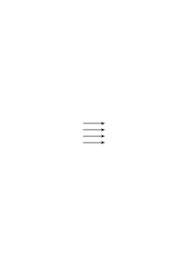
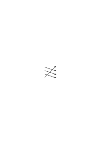

# Ts-227b

709 published remarks, PI

### [1\[1\]](https://cdn.wittgensteinnachlass.com/2000px/webp/Ts-227b/1.webp)

## Philosophical Investigations.

### [1\[2\]](https://cdn.wittgensteinnachlass.com/2000px/webp/Ts-227b/1.webp)

Motto: “In general, progress has the characteristic of appearing much greater than it actually is.” (Nestroy)

### [1\[3\]](https://cdn.wittgensteinnachlass.com/2000px/webp/Ts-227b/1.webp)

_**Preface.**_

### [1\[4\]](https://cdn.wittgensteinnachlass.com/2000px/webp/Ts-227b/1.webp),[2\[1\]](https://cdn.wittgensteinnachlass.com/2000px/webp/Ts-227b/2.webp),[3\[1\]](https://cdn.wittgensteinnachlass.com/2000px/webp/Ts-227b/3.webp),[4\[1\]](https://cdn.wittgensteinnachlass.com/2000px/webp/Ts-227b/4.webp)

In what follows, I publish thoughts, the result of philosophical investigations that have occupied me in recent years. They concern many objects: the concept of meaning, of understanding, of the sentence, of logic, the foundations of mathematics, the states of consciousness, and others. I have written all these thoughts down as _remarks_, short paragraphs. Sometimes in longer sequences, on the same object, sometimes jumping rapidly from one area to another. – From the beginning, my intention was to bring all of this together in a book, the form of which I imagined differently at different times. But it seemed essential to me that the thoughts should progress from one object to another in a natural and continuous sequence. After a few unsuccessful attempts to weld my results into such a whole, I realized that this would never succeed. That the best I could write would always remain philosophical remarks; that my thoughts soon flagged when I tried to force them, against their natural inclination, in _one_ direction. – – And this was, of course, connected with the nature of the investigation itself. It forces us to travel criss-cross through a wide field of thought, in all directions. – The philosophical remarks in this book are rather like a collection of landscape sketches, created during these long and complicated journeys. The same points, or almost the same, were always touched upon again from different directions, and always new pictures were created. A large number of these were recorded, or were uncharacteristic, burdened with all the defects of a weak draftsman. And if one discarded these, there remained a number of half-finished ones, which now had to be arranged, often trimmed, in such a way that they could give the viewer an image of the landscape. – So this book is really just an album. Until recently, I had actually given up the idea of publishing my work during my lifetime. It was, however, revived from time to time, mainly by the fact that I had to realize that my results, which I had communicated in lectures, scripts and discussions, were often misunderstood, more or less diluted, or mutilated in circulation. This stimulated my vanity and I had trouble calming it. Four years ago, however, I had occasion to reread my first book (the “Logical-Philosophical Treatise”) and to explain its thoughts. Then it suddenly seemed to me that I should publish these old thoughts together with the new ones: that they could only obtain their proper illumination through the contrast, and against the background of my older way of thinking. Since, namely, 16 years ago I began to concern myself with philosophy again, I had to recognize serious errors in what I had set down in that first book. Seeing these errors has helped me – to an extent that I can hardly judge myself – the criticism that my ideas have received from Frank Ramsey, with whom I discussed them in countless conversations during the last two years of his life. – More than this – always powerful and certain – criticism, I owe it to the one that a teacher of this university, Mr. P. Sraffa, has tirelessly exercised on my thoughts for many years. _To him_ I owe the most far-reaching of the ideas in this work. For more than _one_ reason, what I publish here will touch on what others are writing today. – If my remarks do not bear a stamp that marks them as mine, I will not claim them any further as my own. I hand them over to the public with dubious feelings. That this work, in its poverty and in the darkness of this time, should be destined to shed light on one or another brain is not impossible, – but certainly not probable. I would not want to spare others the effort of thinking with my writings. Rather, if possible, to stimulate someone to think for themselves. I would have liked to have produced a good book. It has not turned out that way; but the time is past when it could be improved by me. Cambridge, January 1945.

### [4\[2\]](https://cdn.wittgensteinnachlass.com/2000px/webp/Ts-227b/4.webp),[5\[1\]](https://cdn.wittgensteinnachlass.com/2000px/webp/Ts-227b/5.webp)

1 _Augustine_, in the Confessions I/8: when they (older people) called some thing by name, and when, in accordance with that name, they moved their body toward something, I would see, and I would grasp that this thing was called by the sound they made when they wanted to indicate it. This, however, was made clear to them by the movement of their body: as if by means of the natural signs of all peoples, which are produced by means of the face and the movement of the eyes, and the actions of the other limbs, and the sound of the voice, indicating the feeling of the soul in seeking, having, rejecting, or fleeing things. Thus, little by little, I gathered that words in various sentences, placed in their proper locations, and often heard, were the signs of things, and I began to express my own desires through these, training my mouth to make the sounds.+ In these words, it seems to me, we find a certain picture of the nature of human language. Namely, this: The words of language name objects – sentences are combinations of such namings. In this picture of language, we find the roots of the idea: Every word has a meaning. This meaning is assigned to the word. It is the object for which the word stands.

- - - - - - - - - - - - - - - - - - - - - - - - - - - - - - -

### [5\[2\]](https://cdn.wittgensteinnachlass.com/2000px/webp/Ts-227b/5.webp)

\+ When the adults named some object and turned towards it, I perceived this and grasped that the object was designated by the sounds they uttered, since they wanted to point to _it_. This, however, I gathered from their gestures, the natural language of all peoples, the language that through facial expressions and the play of the eyes, through the movements of the limbs and the sound of the voice indicates the sensations of the mind when it desires, or holds on to, or rejects, or flees something. Thus I gradually learned to understand which things the words designated that I heard uttered again and again in their determinate places in various sentences. And when my mouth had become accustomed to these signs, I expressed my wishes through them.

### [6\[1\]](https://cdn.wittgensteinnachlass.com/2000px/webp/Ts-227b/6.webp)

Augustine does not speak of a difference between the parts of speech. Whoever describes the learning of language in this way, I would like to believe, thinks first of nouns, such as “table,” “chair,” “bread,” & the names of people, only secondarily of the names of certain activities & properties, & of the remaining parts of speech as something that will be found later. Now, consider this use of language: I send someone shopping. I give him a note, on which are the signs: “five red apples.” He takes the note to the shopkeeper; the shopkeeper opens the drawer on which the sign “apples” is written; then he looks up the word “red” in a chart & finds a color sample opposite it; now he says the series of number words – I assume he knows them by heart – up to the word “five,” & with each number word he takes an apple from the drawer that has the color of the sample. – – Thus, & similarly, one operates with words. – – “But how does he know where & how to look up the word ‘red’ & what to do with the word ‘five’?” – – Well, I assume that he _acts_ as I have described. The explanations must come to an end somewhere. – But what is the meaning of the word “five”? – There was no talk of such a thing here; only of how the word “five” is used.

### [6\[2\]](https://cdn.wittgensteinnachlass.com/2000px/webp/Ts-227b/6.webp),[7\[1\]](https://cdn.wittgensteinnachlass.com/2000px/webp/Ts-227b/7.webp)

2 That philosophical concept of meaning is at home in a primitive image, in the way language functions. One could also say that it is the image of a more primitive language than our own. Let us imagine a language for which the description given by Augustine holds true: the language is intended to serve the communication between a builder A and an assistant B. A is erecting a building out of building blocks; there are cubes, columns, slabs, and beams. B has to hand them to him, and in the order in which A needs them. To this end, they use a language consisting of the words: “cube,” “column,” “slab,” “beam.” A calls them out; B brings the stone that he has learned to bring in response to this call. – – Consider this as a complete, primitive language.

### [7\[2\]](https://cdn.wittgensteinnachlass.com/2000px/webp/Ts-227b/7.webp)

3 Augustine describes, one might say, a system of communication, but not everything that we call language is this system. And that must be said in some cases, where the question arises: “Is this representation useful, or useless?” The answer is then “Yes, useful; but only for this narrowly defined area, not for the whole, which you intended to represent.” It is as if someone were to say: “Playing consists in moving things, according to certain rules, on a surface…” – and we respond to him: You seem to be thinking of board games; but these are not all games. You can correct your explanation by explicitly limiting it to these games.

### [7\[3\]](https://cdn.wittgensteinnachlass.com/2000px/webp/Ts-227b/7.webp),[8\[1\]](https://cdn.wittgensteinnachlass.com/2000px/webp/Ts-227b/8.webp)

4 Imagine a script in which letters are used to designate sounds, but also to designate emphasis and as punctuation marks. (One can understand a script as a language for describing sound patterns.) Now imagine that someone understands this script in such a way that it simply corresponds to a sound for each letter and that the letters do not have other functions. Such a simple _understanding_ of the script is similar to Augustine's _understanding_ of language.

### [8\[2\]](https://cdn.wittgensteinnachlass.com/2000px/webp/Ts-227b/8.webp)

5 If one considers the example in §1, one might suspect in what way the general concept of the meaning of words surrounds the functioning of language with a haze that makes clear seeing impossible. – This haze dissipates if we study the phenomena of language in primitive forms of its use, in which one can clearly grasp the purpose & functioning of the words. Such primitive forms of language are used by the child when it learns to speak. The teaching of language here is not explaining, but training.

### [8\[3\]](https://cdn.wittgensteinnachlass.com/2000px/webp/Ts-227b/8.webp),[9\[1\]](https://cdn.wittgensteinnachlass.com/2000px/webp/Ts-227b/9.webp),[10\[1\]](https://cdn.wittgensteinnachlass.com/2000px/webp/Ts-227b/10.webp)

6 We might imagine that in §2, language is the _whole_ language of A and B; yes, the whole language of a tribe. The children are trained to perform _these_ actions, to use these words in doing so, and _thus_ to react to the words of the other. An important part of the training will consist in the teacher pointing to the objects, directing the child's attention to them, and saying a word; for example, saying the word “slab” when showing this shape. (I do not want to call this an “ostensive explanation” or a “definition,” because the child cannot yet ask questions about the naming. I want to call it “ostensive teaching of words.” – – I say that it will form an important part of the training, because this is the case with human beings; not because it could not be imagined differently.) This ostensive teaching of words, one might say, establishes an associative connection between the word and the thing. But what does that mean? Well, it can mean various things; but one thinks first of all that the image of the thing comes before the child’s mind when it hears the word. But if that happens now, is that the purpose of the word? – Yes, it _can_ be the purpose. – I can imagine such a use of words (sequences of sounds). (Saying a word is like pressing a key on the keyboard of the imagination.) But in the language in §2, it is _not_ the purpose of the words to evoke images. (It may, of course, also be found that this is conducive to the actual purpose.) But if ostensive teaching has this effect, should I say that it brings about the understanding of the word? Does not the one who reacts to the call “slab!” in this and that way understand it? – But this, of course, helped to bring about the ostensive teaching; but only together with a certain instruction. With a different instruction, the same ostensive teaching of these words would have produced a completely different understanding. “By connecting the rod to the lever, I put the brake in order.” – Yes, given the whole remaining mechanism. Only with this is it the brake lever; and detached from its support, it is not even a lever, but can be anything, or nothing.

### [10\[2\]](https://cdn.wittgensteinnachlass.com/2000px/webp/Ts-227b/10.webp)

7 In the practice of the use of language (2), one part calls out the words, the other acts according to them; in the instruction of language, however, this process is found: the learner _names_ the objects; that is, he speaks the word when the teacher points to the stone. – Yes, here one will find an even simpler exercise: the student repeats the words that the teacher dictates to him ‒ ‒ both are language-like processes. We can also imagine that the whole process of the use of words in (2) is one of those games by means of which children learn their native language. I will call these _“language-games”_, and sometimes speak of a primitive language as a language-game. And one could also call the processes of naming the stones and repeating the dictated word language-games. Think of many uses that are made of words in special games.

I will also call the whole: the language and the activities with which it is interwoven, “the language-game”.

### [10\[3\]](https://cdn.wittgensteinnachlass.com/2000px/webp/Ts-227b/10.webp),[11\[1\]](https://cdn.wittgensteinnachlass.com/2000px/webp/Ts-227b/11.webp)

8 Let us now consider an extension of language (2). In addition to the four words “cube,” “pillar,” etc., it contains a series of words that are used as the merchant in (1) uses the number words (it could be the series of letters of the alphabet); furthermore, two words, let us say “there” and “this” (because this already roughly indicates their purpose), they are used in conjunction with a pointing gesture; and finally a number of color samples. A gives a command of the kind: “d-plate – there.” He lets the assistant see a color sample, and with the word “there” he points to a place on the construction site. B takes one plate of the color of the sample for each letter of the alphabet up to “d” from the stock of plates and places it on the place indicated by A. – On other occasions, A gives the command: “this – there.” With “this” he points to a building block. Etc.

### [11\[2\]](https://cdn.wittgensteinnachlass.com/2000px/webp/Ts-227b/11.webp),[12\[1\]](https://cdn.wittgensteinnachlass.com/2000px/webp/Ts-227b/12.webp)

9 When the child learns this language, it must memorize the series of ‘number words’ “a, b, c,…” And it must learn their use. Will ostensive teaching of the words also occur in this instruction? – Well, it will, for example, point to plates and count: “a, b, c, plates.” – More similar to the ostensive teaching of the words “cube,” “pillar,” etc., would be the ostensive teaching of number words that are not used for counting, but for the designation of visually graspable groups of things. This is how children learn the use of the first five or six basic number words. Will “there” and “this” also be taught ostensively? – Imagine how one might teach their use! One will point to places and things – but here, this pointing also takes place in the _use_ of the words and not only when learning their use. –

### [12\[2\]](https://cdn.wittgensteinnachlass.com/2000px/webp/Ts-227b/12.webp),[13\[1\]](https://cdn.wittgensteinnachlass.com/2000px/webp/Ts-227b/13.webp)

10 What do the words of this language _designate_ now? – How should it show what they designate, if not in the manner of their use? And we have, after all, described this. The statement “this word designates _that_” would therefore have to become part of this description. Or: the description should be brought into the form: “The word … designates …”. Well, one can shorten the description of the use of the word “plate” to the effect that this word designates this object. One will do this if, for example, it is now only a matter of eliminating the misunderstanding that the word “plate” refers to the building block form that we actually call “cube” – the manner of this ‘_reference_’, i.e. the use of these words in other respects, is known. And one can also say that the signs “a,” “b,” etc. designate numbers; if this eliminates the misunderstanding that “a,” “b,” “c” play in the language the role that “cube,” “plate,” “pillar” actually play. And one can also say that “c” designates this number and not that one; if this explains that the letters are to be used in the order a, b, c, d, etc. and not in the order: a, b, d, c. But by making the descriptions of the use of the words similar to each other, this use cannot become more similar! Because, as we see, it is quite dissimilar.

### [13\[2\]](https://cdn.wittgensteinnachlass.com/2000px/webp/Ts-227b/13.webp)

11 Think of the tools in a toolbox: there is a hammer, a pair of pliers, a saw, a screwdriver, a measure, a glue pot, glue, nails and screws. – As different as the functions of these objects are, so different are the functions of the words. (And there are similarities here and there.) Of course, what confuses us is the uniformity of their appearance when the words are spoken to us, or appear in writing and print. Because their _use_ is not so clearly before us. Especially not when we philosophize!

### [13\[3\]](https://cdn.wittgensteinnachlass.com/2000px/webp/Ts-227b/13.webp)

12 It’s as if we were looking into the driver’s cabin of a locomotive: there are levers, all of which look more or less the same. (This is understandable, because they are all meant to be operated with the hand.) But one is the lever of a crank, which can be adjusted continuously (it regulates the opening of a valve); another is the lever of a switch, which has only two effective positions, it is either flipped or upright; a third is the handle of a brake lever, the harder one pulls, the stronger the braking; a fourth, the handle of a pump; it only works as long as it is moved back and forth.

### [13\[4\]](https://cdn.wittgensteinnachlass.com/2000px/webp/Ts-227b/13.webp),[14\[1\]](https://cdn.wittgensteinnachlass.com/2000px/webp/Ts-227b/14.webp)

13 If we say: “Every word in the language denotes something,” then this does not say anything at all for the time being; unless we explain exactly which distinction we want to make. (It could be that we want to distinguish the words of the language (8) from words ‘without meaning,’ as they occur, for example, in the poems of Lewis Carroll, or from words like “juwiwallera” in a song.)

### [14\[2\]](https://cdn.wittgensteinnachlass.com/2000px/webp/Ts-227b/14.webp)

14 Imagine someone said: “All tools serve to modify something. Thus, the hammer modifies the position of the nail, the saw modifies the shape of the board, etc.” – And what does the measure, the glue pot, the nails modify? – “Our knowledge of the length of a thing, the temperature of the glue, and the strength of the box.” – Would this assimilation of the expression gain us anything? –

### [14\[3\]](https://cdn.wittgensteinnachlass.com/2000px/webp/Ts-227b/14.webp)

15 The word “denote” is perhaps most directly applied where the sign is on the object that it denotes. Suppose the tools that A uses in building have certain signs. If A shows the assistant such a sign, the latter brings the tool that is marked with the sign. Thus, and in more or less the same way, a name denotes a thing, and a name is given to a thing. – It will often prove useful if, when philosophizing, we say: To name something is something similar to attaching a name tag to a thing.

### [14\[4\]](https://cdn.wittgensteinnachlass.com/2000px/webp/Ts-227b/14.webp),[15\[1\]](https://cdn.wittgensteinnachlass.com/2000px/webp/Ts-227b/15.webp)

16 What about the color samples that A shows to B – do they belong to the _language_? Well, it’s a matter of definition. They don’t belong to word-language; but if I say to someone: “Say the word ‘that,’” you will still count this second “‘that’” as part of the sentence. And yet it plays a very similar role to a color sample in the language-game (8); namely, it is a sample of what the other person is to say. It is most natural, and causes the least confusion, if we count the samples among the tools of language. [Remark on the reflexive pronoun “this sentence.”]

### [15\[2\]](https://cdn.wittgensteinnachlass.com/2000px/webp/Ts-227b/15.webp)

17 We can say: in the language (8), we have different _parts of speech_. For the function of the word “plate” and the word “cube” are more similar to each other than those of “plate” and “d”. However, the way in which we group the words into types will depend on the purpose of the classification – and on our inclination. Think of the different points of view according to which one can divide tools into types of tools. Or chess pieces into types of pieces.

### [15\[3\]](https://cdn.wittgensteinnachlass.com/2000px/webp/Ts-227b/15.webp)

18 Don’t let the fact that the languages (2) and (8) consist only of commands disturb you. If you want to say that they are not complete because of this, ask yourself whether our language is complete; whether it was complete before the chemical symbolism and infinitesimal notation were incorporated into it; for these are, as it were, suburbs of our language. (And how many houses, or streets, does it take for a city to begin to be a city?) We can look at our language as an old city: a jumble of alleys and squares, old and new houses, and houses with additions from different times; and all this surrounded by a multitude of new suburbs with straight and regular streets and with monotonous houses.

### [15\[4\]](https://cdn.wittgensteinnachlass.com/2000px/webp/Ts-227b/15.webp),[16\[1\]](https://cdn.wittgensteinnachlass.com/2000px/webp/Ts-227b/16.webp),[17\[1\]](https://cdn.wittgensteinnachlass.com/2000px/webp/Ts-227b/17.webp)

19 One can easily imagine a language that consists only of commands & reports in battle. – Or a language that consists only of questions & one expression of affirmation & one of negation. & countless other things. – – To imagine a language means to imagine a form of life. But how is it: is the call “Slab!” in example (2) a sentence or a word? – If a word, then it does not have the same meaning as the identically sounding one in our ordinary language, for in § 2 it is, after all, a call. But if a sentence, then it is not the elliptical sentence “Slab!” of our language. – – As for the first question, you can call “Slab!” a word, & also a sentence; perhaps aptly a “degenerate sentence” (as one speaks of a degenerate hyperbola), & in fact it is precisely our ‘elliptical’ sentence. – But it is only a shortened form of the sentence “Bring me a slab!” & this sentence does not exist in example (2). – But why shouldn’t I, conversely, call the sentence “Bring me a slab!” an _extension_ of the sentence “Slab!”? – Because the one who calls out “Slab!” actually means: “Bring me a slab!”. – But how do you do that, _this meaning_, while you _say_ “Slab!”? Do you recite the unabbreviated sentence to yourself internally? & why should I, in order to say what someone means by the call “Slab!”, translate this expression into another? & if they mean the same thing, – why shouldn’t I say: “when he says ‘Slab!’, he means ‘Slab!’”? Or: why shouldn’t you be able to mean “Slab!” when you can mean “Bring me the slab!”? – – But when I call out “Slab!”, I do, after all, _want him to bring me a slab_! – – Certainly, but does ‘this wanting’ consist in the fact that you think of some other sentence, in some form, than the one you say? –

### [17\[2\]](https://cdn.wittgensteinnachlass.com/2000px/webp/Ts-227b/17.webp),[18\[1\]](https://cdn.wittgensteinnachlass.com/2000px/webp/Ts-227b/18.webp),[19\[1\]](https://cdn.wittgensteinnachlass.com/2000px/webp/Ts-227b/19.webp)

20 “But if someone says, ‘Bring me a slab!’,’ it seems as if he could mean this expression as _one_ long word: corresponding, namely, to the one word ‘slab!’”‒ ‒ Can he, therefore, sometimes mean it as _one_ word and sometimes as four words? And how does one usually mean it? ‒ ‒ I think we will be inclined to say: we mean the sentence as one of _four_ words, when we use it in contrast to other sentences, such as ‘_Hand_ me a slab,’ ‘Bring _him_ a slab,’ ‘Bring _two_ slabs,’ etc.; that is, in contrast to sentences which contain the words of our command in _other_ combinations. ‒ ‒ But what does it consist in, using a sentence in contrast to other sentences? Does one have these sentences in mind at the same time? And _all_ of them? And _while_ one is saying the one sentence, or before, or after? – No! Although such an explanation may have some appeal for us, we need only consider for a moment what really happens in order to see that we are on the wrong track here. We say that we use the command in contrast to other sentences because _our language_ contains the possibility of these other sentences. Someone who does not understand our language, a foreigner who has often heard someone give the command ‘Bring me a slab!,’ might think that this entire sequence of sounds is one word and corresponds to something like the word for ‘brick’ in his language. If he himself were to give this command, he might pronounce it differently, and we would say: he pronounces it so strangely because he thinks it is _one_ word. – But doesn’t something else also go on in him when he pronounces it, – something that corresponds to the fact that he understands the sentence as _one_ word? ‒ ‒ The same thing may go on in him, or something else. What goes on in you when you give such a command; are you conscious that it consists of four words _while_ you are pronouncing it? Of course, you _master_ this language – in which there are also those other sentences – but is this mastery something that happens while you are pronouncing the sentence? – And I have already admitted: the foreigner will probably pronounce the sentence differently because he understands it differently; but what we call the wrong understanding need not lie in anything that accompanies the pronunciation of the command. The sentence is not ‘elliptical’ because it leaves out something that we mean when we pronounce it, but because it is shortened in comparison with a certain model of our grammar. – One could, of course, raise the objection here: ‘You admit that the shortened and the unshortened sentence have the same sense. – What sense do they have, then? Isn’t there a verbal expression for this sense?’ ‒ ‒ But doesn’t the same sense of the sentences consist in their same _use_? – (In Russian, they say ‘stone red,’ instead of ‘the stone is red’; do they lack the copula in their sense, or do they think it in?)

### [19\[2\]](https://cdn.wittgensteinnachlass.com/2000px/webp/Ts-227b/19.webp),[20\[1\]](https://cdn.wittgensteinnachlass.com/2000px/webp/Ts-227b/20.webp)

21 Imagine a language-game in which B, in response to A’s question, reports the number of plates or cubes in a pile, or the colors and shapes of the building blocks lying here and there. – Such a report might therefore sound like this: “Five plates.” What, then, is the difference between the report, or assertion, “five plates,” and the command “five plates!”? – Well, the role that the utterance of these words plays in the language-game. But it will probably also be the case that the tone of voice in which they are uttered is different, and the facial expression, and many other things. But we can also imagine that the tone is the same – for a command and a report can be uttered in _various_ tones and with various facial expressions – and that the difference lies solely in the use. (Of course, we could also use the words “assertion” and “command” to designate a grammatical sentential form and a tone of voice, just as we call “Isn’t the weather lovely today?” a question, even though it is used as an assertion.) We could imagine a language in which _all_ assertions have the form and the tone of rhetorical questions; or every command has the form of a question: “Would you like to do that?” One might then say: “What he says has the form of a question, but is really a command” – that is, it has the function of a command in linguistic practice. (Similarly, one says “You will do that,” not as a prophecy, but as a command. What makes it the one, what makes it the other?)

### [20\[2\]](https://cdn.wittgensteinnachlass.com/2000px/webp/Ts-227b/20.webp),[21\[1\]](https://cdn.wittgensteinnachlass.com/2000px/webp/Ts-227b/21.webp)

22 Frege’s view that an assertion contains an assumption, which is what is asserted, is actually based on the possibility that exists in our language of writing every assertive sentence in the form “It is asserted that this and that is the case.” – But “that this and that is the case” is not a sentence in our language—it is not yet a _move_ in the language-game. And if I write instead of “It is asserted that…” “It is asserted: this and that is the case,” then the words “It is asserted” are simply superfluous. We could very well write every assertion in the form of a question with a subsequent affirmation; for example: “Is it raining? Yes!” Would that show that every assertion contains a question? One probably has the right to use an assertion sign in contrast to, for example, a question mark; or when one wants to distinguish an assertion from a fiction or an assumption. It is only mistaken if one thinks that the assertion now consists of two acts, the considering and the asserting (attaching the truth-value, or something similar), and that we perform these acts according to the signs of the sentence, more or less as we sing according to notes. The singing according to notes, however, is comparable to the loud or soft reading of the written sentence, but not the ‘_thinking_’ of the read sentence.

The Fregean assertion sign emphasizes the _beginning of the sentence_. It thus has a similar function to the period. It distinguishes the whole period from the sentence in the period. If I hear someone say “it is raining,” but I do not know whether I have heard the beginning and the end of the period, then this sentence is not yet a means of communication for me.

### [20a\[1\]](https://cdn.wittgensteinnachlass.com/2000px/webp/Ts-227b/20a.webp)

Let us imagine a picture depicting a boxer in a certain fighting stance. This picture can now be used to communicate to someone how he should stand, how he should hold himself; or how he should not hold himself; or how a certain man stood there and there; or etc. etc. One could call this picture (chemically speaking) a sentence-radical. Frege probably thought of the “assumption” in a similar way.

### [21\[2\]](https://cdn.wittgensteinnachlass.com/2000px/webp/Ts-227b/21.webp),[22\[1\]](https://cdn.wittgensteinnachlass.com/2000px/webp/Ts-227b/22.webp)

23 How many kinds of sentences are there? Roughly speaking, assertion, question, and command? – There are _countless_ such kinds: countless different kinds of the use of everything that we call “signs,” “words,” “sentences.” And this variety is not something fixed, something given once and for all; rather, new types of language, new language-games, as we might say, come into being, and others become obsolete and are forgotten. (An _approximate picture_ of this can be given by the changes in mathematics.) The word “language-**game**” is meant to emphasize that speaking a language is part of an activity, or a form of life. Bring the variety of language-games before your eyes through these examples, and others:

Giving orders, and obeying them –

Describing an object after looking at it, or after measurements –

Constructing an object according to a description (a drawing) –

Relating an event –

Making conjectures about an event –

Putting forward a hypothesis and testing it –

Presenting the results of an experiment in tables and diagrams –

Inventing a story; and reading it –

Playing a play –

Singing a song –

Guessing a riddle –

Making a joke; telling it –

Solving a problem in applied arithmetic –

Translating a language into another –

Begging, thanking, cursing, greeting, praying –

– It is interesting to compare the variety of the tools of language and their uses, the variety of words and sentences, with what logicians have said about the structure of language. (And also the author of the _Tractatus Logico-Philosophicus_.)

### [22\[2\]](https://cdn.wittgensteinnachlass.com/2000px/webp/Ts-227b/22.webp),[23\[1\]](https://cdn.wittgensteinnachlass.com/2000px/webp/Ts-227b/23.webp)

24 He who does not see the variety of language-games will be inclined to ask questions like this: “What is a question?” – Is it the statement that I don’t know something, or the statement that I want the other person to tell me…? Or is it the description of my mental state of uncertainty? – And is the cry “Help!” such a description? Remember how much variety is covered by what is called “description”: the description of the position of a body by its coordinates; the description of a facial expression; the description of a tactile sensation; a mood. One can, of course, replace the usual form of a question with the form of a statement or description: “I want to know whether…,” or “I am in doubt whether…,” – but this does not bring the different language-games any closer to one another. The significance of such possibilities of reformulation, for example, of all assertive sentences into sentences that begin with the clause “I think” or “I believe” (i.e., into descriptions of _my_ inner life), will become clearer later. (Solipsism.)

### [23\[2\]](https://cdn.wittgensteinnachlass.com/2000px/webp/Ts-227b/23.webp)

25 It is sometimes said that animals do not speak because they lack mental abilities. And this means: “they do not think, therefore they do not speak.” But: they simply do not speak. Or better: they do not use language – if we leave aside the most primitive forms of language. – To give orders, to ask questions, to tell, to chat, are all part of our natural history, just as walking, eating, drinking, playing are.

### [23\[3\]](https://cdn.wittgensteinnachlass.com/2000px/webp/Ts-227b/23.webp),[24\[1\]](https://cdn.wittgensteinnachlass.com/2000px/webp/Ts-227b/24.webp)

26 One might say that learning a language consists in naming objects. Namely: people, shapes, colors, pains, moods, numbers, etc. As I said, naming is something like attaching a name tag to a thing. One could call this a preparation for the use of a word. But _what_ is it a preparation for?

### [24\[2\]](https://cdn.wittgensteinnachlass.com/2000px/webp/Ts-227b/24.webp),[25\[1\]](https://cdn.wittgensteinnachlass.com/2000px/webp/Ts-227b/25.webp)

27 “We name the things and can now talk about them. Refer to them in our speech.” – As if the act of naming already contained everything that we do afterward. As if there were only one thing, namely: “to talk about things.” Whereas, in reality, we do all sorts of different things with our sentences. Let us consider, for example, exclamations, with their very different functions. Water! Away! Ouch! Help! Beautiful! No!

Are you still inclined to call these words “names of objects”? In languages (2) and (8), there was no question of naming. This, and its correlate, the ostensive explanation, is, as we might say, a language-game of its own. That is, we are actually trained, conditioned, to ask: “What is this called?” – whereupon naming takes place. And there is also a language-game: to invent a name for something. That is, to say: “This is called…”, and then to use the new name. (For example, children name their dolls and then talk about them and to them. At the same time, consider how peculiar the use of a personal name is, with which we call the person named!)

### [25\[2\]](https://cdn.wittgensteinnachlass.com/2000px/webp/Ts-227b/25.webp)

28 One can ostensively define a personal name, a color word, a material name, a numeral, the name of a cardinal direction, etc. The definition of the number two, “That is called ‘two’” – while pointing to two nuts, is perfectly accurate. – But how can one define two in this way? The person to whom one gives the definition does not then know _what_ one wants to name with “two”; he will assume that you are calling _this_ group of nuts “two”! ‒ ‒ He _can_ assume this; perhaps he does not assume it. He could, conversely, if I want to give a name to this group of nuts, misunderstand it as a number name. And just as easily, if I ostensively explain a personal name, he might take it as a color name, as a designation of race, or even as the name of a cardinal direction. That is, the ostensive definition can, in _every_ case, be interpreted in one way or another.

### [24a\[1\]](https://cdn.wittgensteinnachlass.com/2000px/webp/Ts-227b/24a.webp)

Could one point to something that is _not_ red in order to explain the word “red”? This would be similar to explaining the word “modest” to someone who does not speak German, and one points to an arrogant person as an explanation and says, “This person is _not_ modest.” It is not an argument against such a method of explanation that it is ambiguous. Every explanation can be misunderstood. However, one could ask: should we still call this an “explanation”? – Because it naturally plays a different role in the calculus than what we call the “ostensive explanation” of the word “red”; even if it has the same practical consequences, the same _effect_ on the learner.

### [25\[3\]](https://cdn.wittgensteinnachlass.com/2000px/webp/Ts-227b/25.webp),[26\[1\]](https://cdn.wittgensteinnachlass.com/2000px/webp/Ts-227b/26.webp)

29 Perhaps one says: the number two can only be defined _so_ ostensively: “This _number_ is called ‘two’”. For the word “number” indicates here which _place_ in language, in grammar, we put the word. That is to say, the word “number” must be explained before that ostensive definition can be understood. – The word “number” in the definition does indeed indicate this place; the position to which we assign the word. And we can thus prevent misunderstandings by saying “This _color_ is called so and so”, “This _length_ is called so and so”, and so on. That is to say: misunderstandings are sometimes avoided _in this way_. But can the word “color” or “length” really only be understood _in this way_? – Well, we must simply explain them. – That is, explain them through other words! And what about the last explanation in this chain? (Don’t say “There is no ‘last’ explanation”. That is just like saying: “There is no last house in this street; one can always add another one.”) Whether the word “number” is necessary in the ostensive definition of two depends on whether he understands it differently from how I want him to, without this word. And that will probably depend on the circumstances under which it is given and on the person to whom I give it. And how he ‘understands’ the explanation is shown in how he makes use of the explained word.

### [26\[2\]](https://cdn.wittgensteinnachlass.com/2000px/webp/Ts-227b/26.webp),[27\[1\]](https://cdn.wittgensteinnachlass.com/2000px/webp/Ts-227b/27.webp)

30 One could therefore say: The ostensive definition explains the use – the meaning – of a word, if it is already clear what role the word is supposed to play in the language. So, if I know that someone wants to explain a color word to me, the ostensive explanation “This means ‘sepia’” will help me to understand the word. – And one can say this, if one does not forget that all sorts of questions are connected to the word “to know,” or “to be clear”! One must already know something (or be able to), in order to be able to ask about the naming. But what must one know?

### [27\[2\]](https://cdn.wittgensteinnachlass.com/2000px/webp/Ts-227b/27.webp),[28\[1\]](https://cdn.wittgensteinnachlass.com/2000px/webp/Ts-227b/28.webp)

31

If one shows someone a king piece in chess and says: “This is the chess king,” one does not thereby explain the use of this piece to him – unless he already knows the rules of the game, except for this last specification: the form of a king piece. One can imagine that he has learned the rules of the game without ever having had a real game piece shown to him. The form of the game piece here corresponds to the sound or shape of a word. But one can also imagine that someone has learned the game without ever learning or formulating the rules. He may, for example, have first learned very simple board games by watching, and progressed to ever more complicated ones. Even to this person, one could give the explanation: “This is the king,” if, for example, one shows him chess pieces of an unfamiliar shape. This explanation only teaches him the use of the piece because, as one might say, the place to which it is to be placed has already been prepared. Or also: We will only say that it teaches him the use if the place has already been prepared. And it is not prepared here by the fact that the person to whom we give the explanation already knows the rules, but by the fact that he already masters a game in another sense. Consider also this case: I explain the game of chess to someone, and I begin by pointing to a piece and saying: “This is the king. He can move like this, etc. etc.” – In this case, we will say: the words “This is the king” (or, “This is called ‘king’”) are only a word-explanation if the learner already ‘knows what a game piece is’. That is, if he has already played other games, or has watched others play ‘with understanding’ – _and the like_. Only then will he be able to ask a relevant question when learning the game: “What is this called?” – namely, this game piece. We can say: Only someone who already knows what to do with it asks meaningfully after naming it. We can also imagine that the person asked replies: “Determine the naming yourself” – and now the person who asked would have to take care of _everything_ himself.

### [28\[2\]](https://cdn.wittgensteinnachlass.com/2000px/webp/Ts-227b/28.webp)

32 When someone comes to a foreign country, they sometimes learn the language of the locals through ostensive explanations that they provide, and they will often have to _guess_ the interpretation of these explanations, sometimes guessing correctly, sometimes incorrectly. And now, I believe, we can say: Augustine describes learning human language as if the child were coming to a foreign country and not understanding the language of that country; that is, as if it already has a language, only not this one. Or also: –as if the child can already _think_, only not yet speak. And ‘thinking’ would here mean something like: talking to oneself.

### [28\[3\]](https://cdn.wittgensteinnachlass.com/2000px/webp/Ts-227b/28.webp),[29\[1\]](https://cdn.wittgensteinnachlass.com/2000px/webp/Ts-227b/29.webp),[30\[1\]](https://cdn.wittgensteinnachlass.com/2000px/webp/Ts-227b/30.webp)

33 But what if one were to object: “It is not true that one must already master a language-game in order to understand an ostensive definition; he must only – of course – know (or guess) what the explainer is pointing to! Whether, for example, to the shape of the object, or to its color, or to the number, etc. etc.” – And what does it consist of – ‘pointing to the shape,’ ‘pointing to the color’? Point to a piece of paper! – And now point to its shape, – now to its color, – now to its number (that sounds odd)! – Well, how did you do it? – You will say that you ‘meant’ something different each time while pointing. And if I ask how that works, you will say that you concentrated your attention on the color, shape, etc. Now, however, I ask again how _that_ works. Imagine someone points to a vase and says: “Look at the magnificent blue! – the shape is not important.” – Or: “Look at the magnificent shape! – the color is irrelevant.” It is undeniable that you will do _different_ things when you comply with these two requests. But do you always do the _same_ thing when you direct your attention to the color? Just imagine different cases! I want to indicate a few: “Is this blue the same as that one? Do you see a difference?” – You mix colors and say: “This blue of the sky is difficult to capture.” “It will be beautiful, you can already see the blue sky again!” “Look how different these two blues appear!” “Do you see the blue book over there? Bring it here.” “This blue light signal means….” “What is the name of this blue? – is it ‘indigo’?”

Directing one’s attention to the color, one sometimes does this by holding the outlines of the shape away with one’s hand; or by not directing one’s gaze at the contour of the thing; or by staring at the object and trying to remember where one has seen this color before. One directs one’s attention to the shape, sometimes by tracing it, sometimes by blinking so as not to see the color clearly, etc. etc. I want to say: this and similar things happen _while_ one ‘directs one’s attention to this or that.’ But that is not all that leads us to say that someone is directing his attention to the shape, to the color, etc. Just as a move in chess does not consist solely in moving a piece on the board in this way, – but also not in the thoughts and feelings of the player that accompany the move; but in the circumstances that we call: “playing a game of chess,” “solving a chess problem,” and so on.

### [31\[1\]](https://cdn.wittgensteinnachlass.com/2000px/webp/Ts-227b/31.webp)

34 But suppose someone says: “I always do the same thing when I direct my attention to the shape: I follow the contour with my eyes and feel …”. And suppose he gives another person the ostensive explanation “That is called ‘circle’” by pointing to a circular object – with all these experiences – can the other person not still interpret the explanation differently, even if he sees that the explainer is following the shape with his eyes, and even if he feels what the explainer feels? That is to say: this ‘interpretation’ can also consist in how he now uses the explained word, for example, what he points to when he receives the command “Point to a circle!” – Because neither the expression “meaning the explanation in this way,” nor the expression “interpreting the explanation in this way,” refers to a process that accompanies the giving and hearing of the explanation.

### [31\[2\]](https://cdn.wittgensteinnachlass.com/2000px/webp/Ts-227b/31.webp),[32\[1\]](https://cdn.wittgensteinnachlass.com/2000px/webp/Ts-227b/32.webp)

35 There are, of course, what one might call ‘characteristic experiences’ for indicating the form. For example, tracing the contour with one’s finger, or with one’s gaze, while indicating. – But as little as _this_ happens in all cases in which one ‘means the form’, so little does any other characteristic process happen in all these cases. – But even if such a process were to recur in all of them, it would still depend on the circumstances – i.e., on what happens before and after the indicating – whether we would say “He indicated the form and not the color”. For the words “to indicate the form”, “to mean the form”, etc., are not used in the same way as: “to indicate this book” (not that one), “to indicate the chair, not the table”, etc. – For consider how differently we _learn_ the use of the words: “to indicate this thing”, “to indicate that thing”, and on the other hand, “to indicate the _color_, not the form”, “to mean the _color_”, etc. etc. As mentioned, in certain cases, especially when indicating ‘the form’ or ‘the number’, there are characteristic experiences and ways of indicating – ‘characteristic’ because they often (not always) recur when form or number is ‘meant’. But do you also know of a characteristic experience for indicating the _game piece_ as a _game piece_? And yet, one can say: “I mean this _game piece_ is called ‘king’, not this particular piece of wood that I am indicating”. (Recognizing, wishing, remembering, etc.)

### [32\[2\]](https://cdn.wittgensteinnachlass.com/2000px/webp/Ts-227b/32.webp)

36 & we are doing here what we do in a thousand similar cases: Because we cannot indicate _a_ physical action that we call pointing to the form (in contrast, for example, to color), we say that these words correspond to a _mental_ activity. Where our language leads us to expect a body, & no body is present, we would like to say that there is a _mind_.

### [32\[3\]](https://cdn.wittgensteinnachlass.com/2000px/webp/Ts-227b/32.webp),[33\[1\]](https://cdn.wittgensteinnachlass.com/2000px/webp/Ts-227b/33.webp)

37 What is the relationship between names and what is named? – Well, what is it? Look at language-game (2), or another! There you can see what this relationship might consist of. This relationship can, among other things, also consist in the fact that hearing the name brings the image of what is named to our mind, and it consists, among other things, in the fact that the name is written on what is named, or that it is spoken while pointing to what is named.

### [33\[2\]](https://cdn.wittgensteinnachlass.com/2000px/webp/Ts-227b/33.webp),[34\[1\]](https://cdn.wittgensteinnachlass.com/2000px/webp/Ts-227b/34.webp)

38 What, for example, does the word “this” name in the language-game (8), or the word “that” in the explanatory statement “That is to say…”? – If one does not want to create confusion, it is best not to say that these words name anything. – And, curiously, it has been said of the word “this” that it is the _actual_ name. Everything else that we call “name” is, then, only so in an imprecise, approximate sense. This curious view stems from a tendency to sublimate the logic of our language – as one might call it. The real answer to this is: “name” is what we call _very different_ things; the word “name” characterizes many different types of use, which are related to each other in many different ways; – but among these types of use, there is _not_ the use of the word “this”. It is indeed true that we often, e.g., in an explanatory definition, point to the named object while uttering the name. And similarly, we, e.g., in an explanatory definition, utter the word “this” by pointing to a thing. And the word “this” and a name also often occur in the same place in the sentence structure. But what is characteristic of the name is precisely that it is explained by the explanatory “That is N” (or “That is ‘N’”). But do we also explain: “That is ‘this’”, or “This is ‘this’?” This is connected with the view of naming as a kind of occult process. Naming appears as a _strange_ connection of a word with an object. – And such a strange connection really takes place when, namely, the philosopher, in order to bring out what _the_ relationship between names and what is named is, stares at an object in front of him and repeats a name countless times – or even the word “this”. For philosophical problems arise when language _plays_. And _there_ we can certainly imagine that naming is some strange mental act, as it were, a baptism of an object. And we can also, as it were, say the word “this” _to_ the object, thereby _addressing_ it; a strange use of this word, which probably only occurs in philosophizing.

### [34\[2\]](https://cdn.wittgensteinnachlass.com/2000px/webp/Ts-227b/34.webp),[35\[1\]](https://cdn.wittgensteinnachlass.com/2000px/webp/Ts-227b/35.webp)

39 But why does one get the idea of wanting to make precisely this word into a name, when it is obviously _not_ a name? – Precisely because of that. Because one is tempted to raise an objection to what is usually called “name”; and this can be expressed as follows: _that the name is supposed to refer to something simple_. And one could argue this as follows: A proper name in the ordinary sense is, for example, the word “Nothung.” The sword Nothung consists of parts in a certain composition. If they are put together differently, Nothung does not exist. Now, however, the sentence “Nothung has a sharp edge” obviously has _sense_, whether Nothung is still whole or already broken. But if “Nothung” is the name of an object, then this object no longer exists when Nothung is broken; and since the name would then no longer correspond to an object, it would have no meaning. Then, however, the sentence “Nothung has a sharp edge” would contain a word that has no meaning, and therefore the sentence would be nonsense. But it does have sense; therefore, something must always correspond to the words that make it up. Therefore, the word “Nothung” must disappear in the analysis of the sense, and instead, words must be used that name something simple. We will reasonably call these words the actual names.

### [35\[2\]](https://cdn.wittgensteinnachlass.com/2000px/webp/Ts-227b/35.webp),[36\[1\]](https://cdn.wittgensteinnachlass.com/2000px/webp/Ts-227b/36.webp)

40 Let us first talk about the point of this line of thought: that a word has no meaning if nothing corresponds to it. – It is important to note that the word “meaning” is used in a way that is contrary to language when it is used to refer to the _thing_ to which the word ‘corresponds’. This means confusing the meaning of a name with the _bearer_ of the name. If Mr. N.N. dies, one says that the bearer of the name dies, not that the meaning of the name dies. And it would be nonsensical to say so, because if the name ceased to have meaning, then it would not make sense to say, “Mr. N.N. has died.”

### [36\[2\]](https://cdn.wittgensteinnachlass.com/2000px/webp/Ts-227b/36.webp)

41 In §15, we introduced proper names into the language (8). Now suppose that the tool with the name “N” is broken. A does not know this and gives the sign “N” to B. Does this sign now have meaning, or does it not? – What should B do when he receives this sign? – We have not agreed on anything about this. One could ask: what _will_ he do? Well, he might stand there helplessly, or he might show A the pieces. One _could_ say here: “N” has become meaningless; and this statement would mean that the sign “N” no longer has a use in our language-game (unless we give it a new one). “N” could also become meaningless if, for whatever reason, the tool is given another designation and the sign “N” is no longer used in the language-game. – But we can also imagine an agreement according to which B, if a tool is broken and A gives the sign of this tool, has to shake his head in response. – With this, one could say, the instruction “N” has been incorporated into the language-game, even if this tool no longer exists, and the sign “N” has meaning, even if its bearer ceases to exist.

### [36\[3\]](https://cdn.wittgensteinnachlass.com/2000px/webp/Ts-227b/36.webp),[37\[1\]](https://cdn.wittgensteinnachlass.com/2000px/webp/Ts-227b/37.webp)

43 One can explain this word – “meaning” – as follows for a _large_ class of cases in which the word is used – although not for _all_ cases in which it is used: the meaning of a word is its use in language. And the _meaning_ of a name is sometimes explained by pointing to its _bearer_.

### [37\[2\]](https://cdn.wittgensteinnachlass.com/2000px/webp/Ts-227b/37.webp)

42 But do names in that game also have meaning, which have _never_ been used for a tool? – – Let us assume that “X” is such a sign, and A gives this sign to B – well, such signs could also be incorporated into the language-game, and B would also have to respond to them with a head shake. (One could imagine this as a kind of amusement for the two of them.)

### [37\[3\]](https://cdn.wittgensteinnachlass.com/2000px/webp/Ts-227b/37.webp),[38\[1\]](https://cdn.wittgensteinnachlass.com/2000px/webp/Ts-227b/38.webp)

44 We said: the sentence “Nothung has a sharp edge” has sense, even if Nothung is already broken. Well, this is so because in this language-game a name is also used in the absence of its bearer. But we can imagine a language-game with names (i.e., with signs that we would certainly also call “names”) in which these are used only in the presence of the bearer; thus, they can _always_ be replaced by the demonstrative pronoun with the demonstrative gesture.

### [PI](/w-pi/#ts-227b-38.3) [38\[3\]](https://cdn.wittgensteinnachlass.com/2000px/webp/Ts-227b/38.webp) {#38-3}

45 The demonstrative “this” can never become bearerless. One could say: “As long as there is a _this_, as long as the word ‘this’ also has meaning, whether _this_ is simple or composite.” – – But that does not make the word a name. On the contrary; for a name is not used with the demonstrative gesture, but is only explained by it.

### [38\[4\]](https://cdn.wittgensteinnachlass.com/2000px/webp/Ts-227b/38.webp),[39\[1\]](https://cdn.wittgensteinnachlass.com/2000px/webp/Ts-227b/39.webp)

46 What is the reason that names actually refer to the simple? – Socrates (in the Theaetetus): “If I am not mistaken, I have heard from some that for the _Urelemente_ – to put it this way – from which we and everything else are composed, there is no explanation; for everything that is in itself can only be designated by names; another designation is not possible, neither that it _is_, nor that it _is not_. … But what is in itself must be named … without any other designations. Thus, it is impossible to speak of any elementary component in an explanatory way; for there is nothing for it but the mere designation; it only has its name. But just as what is composed of these elementary components is itself an interwoven structure, so too have its designations become explanatory in this interwoven structure; for their essence is the interwovenness of names.” These elementary components were also Russell's ‘individuals’ and also my ‘objects’ (Log. Phil. Abh.).

### [39\[2\]](https://cdn.wittgensteinnachlass.com/2000px/webp/Ts-227b/39.webp),[40\[1\]](https://cdn.wittgensteinnachlass.com/2000px/webp/Ts-227b/40.webp),[41\[1\]](https://cdn.wittgensteinnachlass.com/2000px/webp/Ts-227b/41.webp)

47 But what are the simple constituents from which reality is composed? – What are the simple constituents of a chair? – The pieces of wood of which it is made? Or the molecules, or the electrons? – “Simple” means: not composite. And then the question is: in what sense ‘composite’? It makes no sense to talk of the ‘simple constituents of the chair’, simply. Or: does my visual image of this tree, this chair, consist of parts? and what are its simple constituents? Multi-coloredness is _one_ kind of compositeness; another is, for example, that of a broken contour made up of straight lines. And one could call a curved line composite, made up of an ascending and a descending branch. If I say to someone, without further explanation, “What I see in front of me now is composite,” he is right to ask: “What do you mean by ‘composite’? That can mean all sorts of things!” – The question “Is what you see composite?” probably makes sense only if it is already established what kind of compositeness – i.e., what particular use of the word – is meant. If it had been established that the visual image of a tree should be called “composite” if it shows not only a trunk but also branches, then the question “Is the visual image of this tree simple or composite?” and the question “What are its simple constituents?” would have a clear sense – a clear use. And the answer to the second question would, of course, not be “The branches” (this would be an answer to the _grammatical_ question: “What does _one_ call the ‘simple constituents’ here?”) but, for example, a description of the individual branches. But is, for example, a chessboard not obviously, and simply, composite? – You probably think of it as being composed of 32 white and 32 black squares. But could we not also say that it is composed of the colors white, black, and the pattern of the grid? And if there are so many different ways of looking at it, do you still want to say that the chessboard is “composite” simply? – To ask, outside a specific game, “Is this object composite?” is similar to what a little boy once did, who was supposed to indicate whether verbs in certain example sentences were used in the active or passive form, and who now racked his brains over whether the verb “to sleep,” for example, means something active or something passive. The word “composite” (and therefore the word “simple”) is used by us in an infinite number of different, and in different ways related, ways. (Is the color of a square on a chessboard simple, or is it composed of pure white and pure yellow? And is the white simple, or is it composed of the colors of the rainbow? – Is this line segment of 2 cm simple, or is it composed of two line segments of 1 cm each? But why not of a segment of 3 cm and one, in a negative sense, of 1 cm?) The correct answer to the _philosophical_ question: “Is the visual image of this tree composite, and what are its constituents?” is: “That depends on what you mean by ‘composite’.” (And this is, of course, not an answer, but a rejection of the question.)

### [41\[2\]](https://cdn.wittgensteinnachlass.com/2000px/webp/Ts-227b/41.webp),[42\[1\]](https://cdn.wittgensteinnachlass.com/2000px/webp/Ts-227b/42.webp),[43\[1\]](https://cdn.wittgensteinnachlass.com/2000px/webp/Ts-227b/43.webp)

48 Let us apply the method of §2 to the representation in the Theaetetus. Let us consider a language-game for which this representation is actually valid. Let language serve to represent combinations of colored squares on a surface. The squares form a chessboard-like complex. There are red, green, white, and black squares. The words of the language are (correspondingly): “R”, “G”, “W”, “S”, and a sentence is a sequence of these words. They describe an arrangement of colored squares in the sequence

The sentence “RRSGGGRWW” describes, for example, an arrangement of this kind:

Here the sentence is a complex of names, to which a complex of elements corresponds. The primitive elements are the colored squares. “But are these simple?” – I wouldn't know what I should more naturally call “simple” in this language-game. Under other circumstances, however, I would call a monochromatic square “composed,” perhaps of two rectangles, or of the elements of color and shape. But the concept of composition could also be extended so that the smaller area is called ‘composed’ of a larger one and one subtracted from it. Compare ‘composition’ of forces, ‘division’ of a line by a point outside it; these expressions show that we are sometimes inclined to regard the smaller as the result of the ‘composition’ of the larger, and the larger as the result of the division of the smaller. But I do not know whether I should now say that the figure that our sentence describes consists of four elements, or of nine! Well, does that sentence consist of four letters or of nine? – And which are _its_ elements: the types of letters, or the letters? Is it not irrelevant which we say, as long as we avoid misunderstandings in the particular case!

### [43\[2\]](https://cdn.wittgensteinnachlass.com/2000px/webp/Ts-227b/43.webp),[44\[1\]](https://cdn.wittgensteinnachlass.com/2000px/webp/Ts-227b/44.webp)

49 But what does it mean that we cannot explain (i.e., describe) these elements, but can only name them? This might mean, for example, that the description of a complex, when, in a borderline case, it consists of only _one_ square, is simply the name of the colored square. One could say here – although this easily leads to all sorts of philosophical superstition – that a sign “R”, or “S”, etc., can be both word and sentence at the same time. But whether it is ‘word or sentence’ depends on the situation in which it is spoken or written. If, for example, A describes complexes of colored squares to B and uses the word “R” _alone_, we can say that the word is a description – a sentence. But if he memorizes the words and their meanings, or teaches another the use of the words and speaks them in the act of demonstrative teaching, we would not say that they are sentences here. In this situation, the word “R”, for example, is not a description; one _names_ an element with it ‒ ‒ but that does not mean that one can _only_ name the element here! Naming and describing do not stand on _the same_ level: naming is a preparation for description. Naming is not yet a move in the language-game, – just as placing a chess piece is not yet a move in chess. One can say: nothing has been done by naming a thing. It _has_ no name except in the game. That is also what Frege meant by saying that a word only has meaning in the context of a sentence.

### [44\[2\]](https://cdn.wittgensteinnachlass.com/2000px/webp/Ts-227b/44.webp),[45\[1\]](https://cdn.wittgensteinnachlass.com/2000px/webp/Ts-227b/45.webp)

50 What does it mean to say of the elements that we cannot ascribe being or non-being to them? – One could say: if everything that we call “being” and “non-being” lies in the existence and non-existence of connections between the elements, then it makes no sense to speak of the being (non-being) of an element; and, if everything that we call “destroying” lies in the separation of elements, then it makes no sense to speak of destroying an element. But one would like to say: one cannot ascribe being to the element, for _were_ it not there, one could not even name it and therefore say nothing about it. – Let us consider an analogous case! One cannot say of _one_ thing that it is 1 m long, nor that it is not 1 m long, and that is the standard metre in Paris. – With this, however, we have not ascribed any strange property to it, but only indicated its peculiar role in the game of measuring with the metre. – Let us imagine that, in a similar way, the patterns of colours in Paris are also kept. Then we would say: “Sepia” is the name of the colour of the original sepia kept there under airlock. Then it would make no sense to say of this pattern that it has this colour, nor that it does not have it. We can express this as follows: this pattern is an instrument of the language with which we make statements about colours. It is not what is depicted in this game, but a means of depiction. – And this is precisely what applies to an element in the language-game (48), when, by naming it, we utter the word “R”: we have thereby given this thing a role in our language-game; it is now _a means_ of depiction. And to say “_Were_ it not there, it could not have a _name_” says as much, and as little, as: if this thing did not exist, we could not use it in our game. – What, apparently, must exist belongs to the language. It is a paradigm in our game; something with which one compares. And to state this can mean making an important statement; but it is still a statement about our language-game – our way of depicting.

### [45\[2\]](https://cdn.wittgensteinnachlass.com/2000px/webp/Ts-227b/45.webp),[46\[1\]](https://cdn.wittgensteinnachlass.com/2000px/webp/Ts-227b/46.webp)

51 In the description of the language-game (48), I said that the colours of the squares corresponded to the words “R”, “S”, etc. But what is this correspondence; in what sense can one say that these signs correspond to certain colours of the squares? The explanation in (48) only established a connection between these signs and certain words in our language (the colour names). – Now, it was assumed that the use of the signs in the game would be taught differently, and namely by pointing to paradigms. Indeed, but what does it mean to say that, in the _practice of the language_, certain elements correspond to the signs? – Does it consist in the fact that the person who describes the set of coloured squares always says “R” where a red square is, “S” where a black square is, etc.? But what if he makes a mistake in the description and, falsely, says “R” where he sees a black square – what is the criterion for this being a mistake? – Or does the fact that “R” denotes a red square consist in the fact that the people who use the language always have a red square in mind when they use the sign “R”? In order to see more clearly, we must, as in countless similar cases, examine the details of the processes; we must _look at what is happening from close up_.

### [46\[2\]](https://cdn.wittgensteinnachlass.com/2000px/webp/Ts-227b/46.webp),[47\[1\]](https://cdn.wittgensteinnachlass.com/2000px/webp/Ts-227b/47.webp)

52 If I am inclined to assume that a mouse arises spontaneously from grey rags and dust, then it will be useful to examine these rags closely to see how a mouse could hide in them, how it could get there, etc. But if I am convinced that a mouse cannot arise from these things, then this examination may be superfluous. What it is that opposes such a detailed examination in philosophy, we must first learn to understand.

### [47\[2\]](https://cdn.wittgensteinnachlass.com/2000px/webp/Ts-227b/47.webp),[48\[1\]](https://cdn.wittgensteinnachlass.com/2000px/webp/Ts-227b/48.webp)

53 There are now _different_ possibilities for our language-game (48), different cases in which we would say that a sign in the game denotes a square of this or that color. We would say this, for example, if we knew that the use of signs of this kind is taught to the people who use this language. Or if it were laid down in writing, perhaps in the form of a chart, that this sign corresponds to this element, and if this chart were used in teaching the language and, in certain disputed cases, were brought into play for the purpose of decision.

But we can also imagine that such a chart is a tool in the use of language. The description of a complex proceeds as follows: the person describing it carries a chart with him and looks up each element of the complex in it and, from this, goes over to the sign in the chart (and the person to whom the description is given can also translate the words into an image of colored squares by means of a chart). One could say that this chart takes on the role that memory and association play in other cases. (We do not usually carry out the command “Bring me a red flower!” by looking up the color red in a color chart and then bringing a flower of the color that we find in the chart; but when it is a question of choosing or mixing a particular shade of red, it happens that we make use of a sample or chart.) If we call such a chart an expression of a rule of the language-game, then we can say that the thing which we call the rule of a language-game can have very different roles in the game.

### [48\[2\]](https://cdn.wittgensteinnachlass.com/2000px/webp/Ts-227b/48.webp)

54 Let us remember in what kind of cases we say that a game is played according to a certain rule! The rule can be an aid to instruction in the game. It is communicated to the learner and its application is practiced. – Or it is a tool of the game itself. – Or: A rule is neither used in the instruction nor in the game itself; nor is it laid down in a collection of rules. One learns the game by watching how others play it. But we say that it is played according to these and those rules, because an observer can read these rules from the way the game is played,– just as one can read a law of nature from the way things happen. ‒ ‒ How does the observer distinguish in this case between a mistake made by the players and a correct move? – There are characteristics for this in the behaviour of the players. Think of the characteristic behaviour of someone who corrects a promise. It would be possible to recognize that someone is doing this, even if we did not understand his language.

### [48\[3\]](https://cdn.wittgensteinnachlass.com/2000px/webp/Ts-227b/48.webp),[49\[1\]](https://cdn.wittgensteinnachlass.com/2000px/webp/Ts-227b/49.webp)

55 “What the names of the language designate must be indestructible: for one must be able to describe the state in which everything that is destructible has been destroyed. And in this description there will be words; and what corresponds to them must not be destroyed, because otherwise the words would have no meaning.” I must not cut off the branch on which I am sitting. One could, of course, immediately object that the description itself must be an exception to destruction. – But what corresponds to the words of the description and must therefore not be destroyed if the description is true, is what gives the words their meaning,– without which they would have no meaning. ‒ ‒ But this person is, in a sense, what corresponds to his name. But he is destructible; and his name does not lose its meaning when the bearer is destroyed. – What corresponds to the name and without which it would have no meaning is, for example, a paradigm that is used in the language-game in connection with the name.

### [49\[2\]](https://cdn.wittgensteinnachlass.com/2000px/webp/Ts-227b/49.webp),[50\[1\]](https://cdn.wittgensteinnachlass.com/2000px/webp/Ts-227b/50.webp)

56 But how if no such sample belongs to the language, if we, for example, _remember_ the color that a word designates? – – “And if we remember it, then it appears before our mind's eye when we pronounce the word. It must therefore be indestructible in itself, if there is to be the possibility that we can remember it at any time.” – – But what do we consider to be the criterion for the fact that we remember it correctly? – If we work with a sample instead of with our memory, we might say that the sample has changed its color and judge this with our memory. But can we not also speak, under certain circumstances, of a fading of our memory-image? Are we not just as subject to the demands of memory as to those of a sample? (For someone might want to say: “If we did not have a memory, we would be subject to a sample.”) – Or perhaps to a chemical reaction. Imagine that you should paint a certain color “F,” and it is the color that one sees when the chemical substances X and Y combine. – Suppose that on one day the color appears brighter to you than on another; would you not perhaps say: “I must be mistaken; the color is certainly the same as yesterday”? This shows that we do not always rely on what the memory says as the supreme, unappealable judgment.

### [50\[2\]](https://cdn.wittgensteinnachlass.com/2000px/webp/Ts-227b/50.webp),[51\[1\]](https://cdn.wittgensteinnachlass.com/2000px/webp/Ts-227b/51.webp)

57 “Something red can be destroyed, but red cannot be destroyed, and therefore the meaning of the word ‘red’ is independent of the existence of a red thing.” – Certainly, it makes no sense to say that the color red (color, not pigmentum) is torn or crushed. But do we not say, “The redness disappears”? And do not cling to the fact that we can call it to mind before our mind’s eye, even if there is no longer anything red! This is no different from saying that there would still be a chemical reaction that produces a red flame. – For how if you can no longer remember the color? – If we forget what color it is that has this name, then it loses its meaning for us; that is, we can no longer play a certain language-game with it. And the situation is then comparable to the fact that the paradigm, which was a means of our language, has been lost.

### [51\[2\]](https://cdn.wittgensteinnachlass.com/2000px/webp/Ts-227b/51.webp),[52\[1\]](https://cdn.wittgensteinnachlass.com/2000px/webp/Ts-227b/52.webp)

58 “I only want to call ‘_name_’ what cannot stand in the connection ‘X exists.’ – And so one cannot say ‘Red exists,’ because if there were no red, one could not talk about it at all.” – More correctly: If “X exists” is supposed to mean: “X” has meaning, – then it is not a sentence that is about X, but a sentence about our linguistic usage, namely the use of the word “X.” It appears to us as if we are saying something about the nature of red: that the words “Red exists” do not make sense. It exists, rather, ‘in and of itself.’ The same idea – that this is a metaphysical statement about red – is also expressed in the fact that we say, for example, that red is timeless, and perhaps even more strongly in the word ‘indestructible.’ But actually we only want to understand “Red exists” as a statement: the word “Red” has meaning. Or perhaps more correctly: “Red does not exist” as “‘Red’ has no meaning.” Only we do not want to say that that expression _says_ that, but that it _would have to_ say that, _if_ it had any meaning. That, in trying to say that, it contradicts itself – because red is ‘in and of itself.’ Whereas a contradiction only lies in the fact that the sentence looks as if it is talking about the color, while it is supposed to say something about the use of the word “red.” – In reality, however, we do say that a certain color exists; and that means as much as: there exists something that has that color. And the first expression is no less precise than the second; especially where ‘that which has the color’ is not a physical object.

### [52\[2\]](https://cdn.wittgensteinnachlass.com/2000px/webp/Ts-227b/52.webp)

59 “_Names_ designate only what is an _element_ of reality. What cannot be destroyed; what remains constant in all change.” – But what is that? – While we were saying the sentence, it was already present in our minds! We were already expressing a quite specific image. A specific picture that we want to use. For experience does not show us these elements. We see _components_ of something composite (e.g., a chair). We say that the backrest is part of the chair, but it itself is also composed of different pieces of wood; whereas a leg is a simpler component. We also see a whole that changes (is destroyed) while its components remain unchanged. These are the materials from which we create that picture of reality.

### [52\[3\]](https://cdn.wittgensteinnachlass.com/2000px/webp/Ts-227b/52.webp),[53\[1\]](https://cdn.wittgensteinnachlass.com/2000px/webp/Ts-227b/53.webp),[54\[1\]](https://cdn.wittgensteinnachlass.com/2000px/webp/Ts-227b/54.webp)

60 Now, if I say: “My broom is in the corner,”– is this actually a statement about the broom handle and the brush of the broom? In any case, one could replace the statement with one that indicates the location of the handle and the location of the brush. And this statement is now a more analyzed form of the first. – But why do I call it “more analyzed”? – Well, if the broom is there, then that means that the handle and brush must be there and in a certain relationship to each other; and this was previously, as it were, hidden in the sense of the sentence, and in the analyzed sentence it is _expressed_. So does the person who says that the broom is in the corner actually mean: the handle is there and the brush, and the handle is stuck in the brush? – If we asked someone whether that is what he means, he would probably say that he did not particularly think of the broom handle or the brush. And that would be the _correct_ answer, because he did not want to talk about the broom handle or the brush in particular. Imagine you said to someone instead of “Bring me the broom!”– “Bring me the broom handle and the brush that is attached to it!” – Is the answer to that not: “Do you want the broom? And why are you expressing it in such a strange way?”‒ ‒ Will he understand the more analyzed sentence better? – One could say that this sentence achieves the same thing as the ordinary one, but in a more cumbersome way. – Imagine a language-game in which someone is given instructions to bring, move, or the like, certain things that are composed of several parts. And two ways of playing it: in one a) the composite things (brooms, chairs, tables, etc.) have names, as in (15); in the other b) only the parts have names and the whole is described with their help. – In what way is a command in the second game an analyzed form of a command in the first? Does it lie in it and is it now brought out by analysis? – Yes, the broom is broken down when one separates handle and brush; but does that mean that the command to bring the broom also consists of corresponding parts?

### [54\[2\]](https://cdn.wittgensteinnachlass.com/2000px/webp/Ts-227b/54.webp)

61 “But you won’t deny that a certain command in (a) says the same thing as one in (b); and how will you call the latter if not an analyzed form of the former.” – Indeed, I would also say that a command in (a) has the same sense as one in (b); or, as I expressed it earlier: they achieve the same thing. And that means: if I am shown a command in (a) and the question is asked “To which command in (b) is this equivalent?”, or even, “To which commands in (b) does it contradict?”, then I will answer the question in such and such a way. But that does not mean that we have come to an understanding about the use of the expression “to have the same sense”, or “to achieve the same thing” _in general_. For one can ask: in what case do we say “These are just two different forms of the same game”?

### [54\[3\]](https://cdn.wittgensteinnachlass.com/2000px/webp/Ts-227b/54.webp),[55\[1\]](https://cdn.wittgensteinnachlass.com/2000px/webp/Ts-227b/55.webp)

62 Suppose, for example, that the person to whom the commands in (a) and (b) are given has to consult a table that pairs names and images before carrying out what is requested. Does he now do the _same_ thing when he executes a command in (a) and the corresponding command in (b)? – Yes and no. You might say: “The _point_ of the two commands is the same.” I would say the same here. – But it is not everywhere clear what one should call the ‘point’ of the command. (One can also say about certain things: their purpose is this or that. The essential thing is that this is a _lamp_, it serves to illuminate ‒ ‒ that it decorates the room, fills an empty space, etc., is not essential. But not always are the essential and non-essential clearly separated.) (Connection to the last paragraph in (43).)

### [55\[2\]](https://cdn.wittgensteinnachlass.com/2000px/webp/Ts-227b/55.webp)

63 However, the expression that a sentence in (b) is an ‘analyzed’ form of one in (a) easily leads us to think that this form is the more fundamental one; that it first shows what is meant by the other. We think, for example: whoever only possesses the unanalyzed form is missing the analysis; but whoever knows the analyzed form possesses everything with it. – But can I not say that _this_ person loses an aspect of the matter, just as that person does?

### [55\[3\]](https://cdn.wittgensteinnachlass.com/2000px/webp/Ts-227b/55.webp),[56\[1\]](https://cdn.wittgensteinnachlass.com/2000px/webp/Ts-227b/56.webp)

64 Let us imagine that the game (48) is modified in such a way that in it, names do not refer to single-colored squares, but to rectangles consisting of two such squares each. Let such a rectangle, half red, half green, be called “U”; a rectangle, half green, half white, be called “V”, etc. Could we not imagine people who have names for such color combinations, but not for the individual colors? Think of the cases in which we say: “This color combination (the French tricolor, for example) has a very special character.” In what way do the signs of this language-game require analysis? Yes, to what extent _can_ the game be replaced by (48)? – It is simply a _different_ language-game; although it is related to (48).

### [56\[2\]](https://cdn.wittgensteinnachlass.com/2000px/webp/Ts-227b/56.webp)

65 Here we come to the great question that underlies all these considerations. – For one could now object to me: “You are making it easy for yourself! You talk about all sorts of language-games, but you have nowhere said what the essential thing about the language-game, and therefore about language, is. What is common to all these processes and makes them language, or parts of language. You are, in fact, neglecting the part of the investigation that caused you the most trouble at the time, namely, the one concerning the _general form of the sentence_ and of language.” And that is true. – Instead of stating something that is common to everything we call language, I say that these phenomena do not have one thing in common, which is why we use the same word for all of them, – but they are related to each other in many different ways. And because of this relatedness, or these relatednesses, we call them all “languages.” I want to try to explain this.

### [56\[3\]](https://cdn.wittgensteinnachlass.com/2000px/webp/Ts-227b/56.webp),[57\[1\]](https://cdn.wittgensteinnachlass.com/2000px/webp/Ts-227b/57.webp),[58\[1\]](https://cdn.wittgensteinnachlass.com/2000px/webp/Ts-227b/58.webp)

66 Consider, for example, the processes that we call “games.” I mean board games, card games, ball games, combat games, and so on. What is common to all of them? – Don’t say: “There _must_ be something common to them, otherwise they wouldn’t be called ‘games’” – but _look_ to see if they all have something in common. – Because, if you look at them, you will indeed not see something that is common to _all_ of them, but you will see similarities, affinities, and indeed a whole series of them. As I said: don’t think, but look! – Look, for example, at board games, with their manifold affinities. Now move on to card games: here you will find many correspondences with that first class, but many common features disappear, others emerge. If we now move on to ball games, some common features are retained, but many are lost. – Are they all ‘_entertaining_’? Compare chess with draughts. Or is there everywhere winning and losing, or a competition among the players? Think of solitaire. In ball games there is winning and losing; but if a child throws the ball against the wall and catches it again, that move is gone. Look at the role that skill and luck play. And how different is skill in chess and skill in tennis. Now think of ring games: here is the element of entertainment, but how many of the other features have disappeared! And so we can go through the many, many other groups of games. See similarities appear and disappear. And the result of this consideration is now: we see a complicated network of similarities, which overlap and criss-cross. Similarities in large and small.

### [58\[2\]](https://cdn.wittgensteinnachlass.com/2000px/webp/Ts-227b/58.webp)

67 I cannot characterize these similarities better than by the word “family resemblances”; for this is how the different similarities between the members of a family overlap and criss-cross: growth, facial features, eye color, gait, temperament, etc. etc.. – And I will say: ‘games’ form a family. And likewise, for example, the types of numbers form a family. Why do we call something a “number”? Well, because it has a – direct – relatedness to many things that have been called numbers so far; and through this, one can say, it acquires an indirect relatedness to other things that we also call that. And we extend our concept of number, just as we spin a thread by twisting fiber after fiber. And the strength of the thread does not lie in the fact that any one fiber runs through its entire length, but in the fact that many fibers overlap. But if someone were to say: “So there is something common to all these formations, namely the disjunction of all these similarities,” I would reply: here you are just playing with a word. Likewise, one could say: there runs something through the whole thread, namely the continuous overlap of these fibers.

### [58\[3\]](https://cdn.wittgensteinnachlass.com/2000px/webp/Ts-227b/58.webp),[59\[1\]](https://cdn.wittgensteinnachlass.com/2000px/webp/Ts-227b/59.webp)

68 “Good; so the concept of number is explained to you as the logical sum of those individual, mutually related concepts: cardinal number, rational number, real number, etc.; and similarly the concept of a game as the logical sum of corresponding sub-concepts.”‒ ‒ This doesn't have to be the case. Because I _can_ give the concept ‘number’ fixed boundaries, i.e., use the word “number” to designate a clearly defined concept, but I can also use it in such a way that the scope of the concept is _not_ bounded by a limit. And that is how we use the word “game.” How is the concept of a game bounded? What still counts as a game and what no longer does? Can you specify the boundaries? No. You can _draw_ them: because none have been drawn yet. (But that has never bothered you when you have used the word “game.”) “But then the use of the word is not regulated; the ‘game’ that we play with it is not regulated.”‒ ‒ It is not bounded by rules everywhere, but there are also no rules for, for example, how high one is allowed to throw the ball in tennis, or how hard, but tennis is still a game and it also has rules.

### [59\[2\]](https://cdn.wittgensteinnachlass.com/2000px/webp/Ts-227b/59.webp),[60\[1\]](https://cdn.wittgensteinnachlass.com/2000px/webp/Ts-227b/60.webp)

69 How would we explain to someone what a game is? I believe we would describe _games_ to him, and we could add to the description: “that, _and the like,_ is called ‘games’.” And do we ourselves know more? Are we simply unable to tell the other person exactly what a game is? – But that is not ignorance. We do not know the boundaries because none have been drawn. As I said, we can – for a particular purpose – draw a boundary. Does this make the concept usable? Not at all! Unless it is for that particular purpose. Just as little as giving the definition: 1 step = 75 cm made the measure of length ‘1 step’ usable. And if you want to say “But beforehand, it wasn’t an exact measure of length,” I reply: well, then it was an inexact one. – Although you still owe me the definition of exactness.

### [60\[2\]](https://cdn.wittgensteinnachlass.com/2000px/webp/Ts-227b/60.webp)

70 “But if the concept of ‘game’ is unlimited in this way, then you don’t actually know what you mean by ‘game’.”‒ ‒ If I give the description: “The ground was completely covered with plants,” – do you want to say that I don’t know what I’m talking about until I give a definition of a plant? An explanation of what I mean would be, for example, a drawing and the words “The ground looked approximately like this.” I might also say: “_exactly_ like this.” – So, were exactly _these_ grasses and leaves, in these locations, there? No, that is not what it means. And I would not, in _this_ sense, recognize any picture as being exact.

### [59a\[1\]](https://cdn.wittgensteinnachlass.com/2000px/webp/Ts-227b/59a.webp)

Someone says to me: “Show the children a game!” I teach them to play dice for money, and the other person says to me, “That is not the kind of game I meant.” When he gave me the command, did the exclusion of dice games have to be what he had in mind?

### [PI](/w-pi/#ts-227b-60.3+61.1) [60\[3\]](https://cdn.wittgensteinnachlass.com/2000px/webp/Ts-227b/60.webp),[61\[1\]](https://cdn.wittgensteinnachlass.com/2000px/webp/Ts-227b/61.webp) {#60-3--61-1}

71 One could say that the concept of ‘game’ is a concept with blurred edges. – “But is a blurred concept even a _concept_?” – Is an out-of-focus photograph even a picture of a person? Yes, but can one always replace an out-of-focus picture with a sharp one to one's advantage? Isn't the out-of-focus one often precisely what we need? Frege compares the concept to a district and says: one can't even call an unclearly defined district a district. That probably means we can't do anything with it. – But is it senseless to say: “Stay approximately here!”? Imagine, I am standing with another person in a place and say this. In doing so, I won't even draw any boundary, but perhaps make a pointing motion with my hand – as if I were showing him a specific _point_. And that is precisely how one explains what a game is. One gives examples and wants them to be understood in a certain sense. – But with this expression, I don't mean: he should now see the common thing in these examples, which I – for some reason – could not express. Rather: he should now _use_ these examples in a certain way. The giving of examples is not here an _indirect_ means of explanation, in the absence of something better. – Because any general explanation can also be misunderstood. _That_ is how we play the game. (I mean the language-game with the word “game”.)

### [61\[2\]](https://cdn.wittgensteinnachlass.com/2000px/webp/Ts-227b/61.webp),[62\[1\]](https://cdn.wittgensteinnachlass.com/2000px/webp/Ts-227b/62.webp)

72 _Seeing the common thing_. Suppose I show someone various colorful pictures and say: “The color that you see in all of them is called ‘ocher’.” – This is an explanation that is understood by the other person searching for and seeing what those pictures have in common. He can then look at the common thing, point to it. Compare this with: I show him figures of different shapes, all painted in the same color and say: “What these have in common is called ‘ocher’.” And compare this with: I show him samples of different shades of blue and say: “The color that is common to all of them, I call ‘blue’.”

### [62\[2\]](https://cdn.wittgensteinnachlass.com/2000px/webp/Ts-227b/62.webp),[63\[1\]](https://cdn.wittgensteinnachlass.com/2000px/webp/Ts-227b/63.webp)

73 When someone explains the names of colors to me by pointing to samples and saying: “This color is called ‘blue,’ this ‘green,’…”, this case can be compared in many respects to when he hands me a table in which the words are written under the samples of colors. – Although this comparison can also be misleading in some ways. – One is now inclined to extend the comparison: to have understood the explanation means to have a concept of the explained in one's mind, and that is a sample, or image. If one now shows me various leaves and says “That is called ‘leaf’”, then I get a concept of the leaf shape, an image of it in my mind. – But what does the image of a leaf look like, which does not show a specific shape, but ‘what is common to all leaf shapes’? What hue does the ‘sample in my mind’ of the color green have – that of what is common to all shades of green? “But could there not be such ‘general’ samples? For example, a leaf schema, or a sample of _pure_ green.” – Certainly! But that this schema is understood as a _schema_, and not as the shape of a specific leaf, and that a small square of pure green is understood as a sample of everything that is greenish and not as a sample for pure green – that lies again in the way in which these samples are used. Ask yourself: What _shape_ must the sample of the color green have? Should it be square? Or would it then be the sample for green squares? – Should it then be ‘irregularly’ shaped? And what prevents us from then seeing it only as a sample of irregular shape – i.e., using it?

### [63\[2\]](https://cdn.wittgensteinnachlass.com/2000px/webp/Ts-227b/63.webp)

74 This also includes the thought that he who regards this sheet as a _sample_ ‘of leaf form in general’ _sees_ it differently from he who regards it as a _sample_ for this particular form. Now, that could indeed be the case – although it is not – because it would only mean that, as a matter of experience, he who _sees_ the leaf in a certain way then uses it in this way or according to these rules. There is, of course, a way of seeing it ‘in _this_ way’ and a way of seeing it ‘in _another_ way’; and there are also cases in which he who sees a sample ‘in _this_ way’ will generally use it in _this_ way, and he who sees it in another way will use it in another way. For example, he who sees the schematic drawing of a cube as a plane figure, consisting of a square and two rhombuses, will perhaps execute the command, “Bring me something like that!” differently from he who sees the image spatially.

### [63\[3\]](https://cdn.wittgensteinnachlass.com/2000px/webp/Ts-227b/63.webp),[64\[1\]](https://cdn.wittgensteinnachlass.com/2000px/webp/Ts-227b/64.webp)

75 What does it mean to know what a game is? What does it mean to know it and not be able to say it? Is this knowledge any equivalent of an unexpressed definition? So that if it were expressed, I could recognize it as the expression of my knowledge? Is not my knowledge, my concept of the game, entirely expressed in the explanations that I could give? Namely, in that I describe examples of games of various kinds; show how, by analogy with these, one can construct all kinds of other games; say that I would hardly call this or that a game; and so on.

### [64\[2\]](https://cdn.wittgensteinnachlass.com/2000px/webp/Ts-227b/64.webp)

76 If one were to draw a sharp boundary, I could not recognize it as the one I always wanted to draw, or had in mind. For I did not want to draw any at all. One can then say: his concept is not the same as mine, but it is related to it. And the relatedness is that of two pictures, one of which consists of vaguely delineated patches of color, the other of similarly shaped and arranged, but sharply delineated, ones. The relatedness is then just as undeniable as the difference.

### [64\[3\]](https://cdn.wittgensteinnachlass.com/2000px/webp/Ts-227b/64.webp),[65\[1\]](https://cdn.wittgensteinnachlass.com/2000px/webp/Ts-227b/65.webp)

77 And if we take this comparison a little further, it is clear that the degree to which the sharp picture can be similar to the blurred one depends on the degree of the blurriness of the second. For imagine that you are to design a sharp picture ‘corresponding’ to a blurred one. In the latter, there is a blurred red rectangle; you put a sharp one in its place. Of course – several such sharp rectangles could be drawn that would correspond to the blurred one. – But if the colors in the original flow into one another without a trace of a boundary, will it not then become a hopeless task to draw a sharp picture corresponding to the blurred one? Will you not then have to say: “Here I could just as well draw a circle as a rectangle, or a heart shape; all the colors flow into one another. It all fits – and nothing.” – And in this situation is, for example, he who seeks definitions in aesthetics or ethics that correspond to our concepts. In this difficulty, always ask yourself: How did we learn the meaning of this word (“good,” for example)? From what kind of examples; in what language-games? You will then more easily see that the word must have a family of meanings.

### [65\[2\]](https://cdn.wittgensteinnachlass.com/2000px/webp/Ts-227b/65.webp)

78 Compare: to know and to say: how high Mont Blanc is – how the word “game” is used – what a clarinet sounds like.

He who wonders that one can know something and not say it perhaps thinks of a case like the first. Certainly not of a case like the third.

### [65\[3\]](https://cdn.wittgensteinnachlass.com/2000px/webp/Ts-227b/65.webp),[66\[1\]](https://cdn.wittgensteinnachlass.com/2000px/webp/Ts-227b/66.webp),[67\[1\]](https://cdn.wittgensteinnachlass.com/2000px/webp/Ts-227b/67.webp),[68\[1\]](https://cdn.wittgensteinnachlass.com/2000px/webp/Ts-227b/68.webp)

79 Consider this example: if one says, “Moses did not exist,” this can mean different things. It could mean: the Israelites did not have _one_ leader when they departed from Egypt – – or: their leader was not named Moses – – or: there was no person who accomplished everything that the Bible says about Moses – – or etc. etc. – According to Russell, we can say: the name “Moses” can be defined by various descriptions. For example, as: “the man who led the Israelites through the desert,” “the man who lived at that time and in that place and was then called ‘Moses,’” “the man who, as a child, was taken out of the Nile by the daughter of Pharaoh,” etc. And depending on whether we adopt the one or the other definition, the sentence “Moses existed” takes on a different sense, and so does any other sentence that refers to Moses. – And if one tells us “N did not exist,” we also ask: “What do you mean? Do you mean that …, or that …, etc.?” But if I now make a statement about Moses, am I always ready to assign some _one_ of these descriptions to “Moses”? I might say: By “Moses” I mean the man who did what the Bible says Moses did, or at least much of it. But how much of it? Have I decided how much must prove to be false in order for me to consider my statement to be false? Does the name “Moses” therefore have a fixed and unambiguously determined use for me in all possible cases? – Is it not rather the case that I have, as it were, a whole series of supports ready, and I am prepared to lean on one if the other is taken away from me, and vice versa? – – Consider another case. If I say “N is dead,” the meaning of the name “N” might involve something like this: I believe that a person lived who (1) I saw there and there, who (2) looked like this (images), (3) did this and that, and (4) in the social world went by the name “N.” – If asked what I mean by “N,” I would list all of this, or some of it, and on different occasions, different things. My definition of “N” would therefore be something like: “the man for whom all of this is true.” – But what if some of this proves to be false! – Will I be prepared to declare the statement “N is dead” to be false, even if only something that seems minor to me turns out to be false? But where is the limit of what is minor? – If I had given an explanation of the name in such a case, I would now be ready to modify it. And this can be expressed as follows: I use the name “N” without a _fixed_ meaning. (But this detracts from its use as little as the fact that a table rests on four legs instead of three and may therefore wobble.) Should one say that I use a word whose meaning I do not know, and therefore speak nonsense? – Say what you want, as long as it does not prevent you from seeing how things are. (And if you see that, you will not say many things.) (The fluctuation of scientific definitions: what today is considered an empirical concomitant of the state of affairs A will tomorrow be used as the definition of “A.”)

### [68\[2\]](https://cdn.wittgensteinnachlass.com/2000px/webp/Ts-227b/68.webp)

80 I say: “There is an armchair there.” How, if I go to it & want to fetch it, & it suddenly disappears from my view? ‒ ‒ “So it wasn’t an armchair, but some kind of illusion.” – But in a few seconds we see it again & can touch it, etc.. ‒ ‒ “So the armchair was there after all & its disappearance was some kind of illusion.” ‒ ‒ But suppose that after some time it disappears again, – or seems to disappear. What shall we say now? Do you have rules ready for such cases, – that say whether one may still call something like that an “armchair”? But do they apply when we are using the word “armchair”; & should we say that we don’t actually connect any meaning with this word, because we are not equipped with rules for all the possibilities of its application?

### [68\[3\]](https://cdn.wittgensteinnachlass.com/2000px/webp/Ts-227b/68.webp),[69\[1\]](https://cdn.wittgensteinnachlass.com/2000px/webp/Ts-227b/69.webp)

81 F. P. Ramsey once emphasized in a conversation with me that logic is a “normative science.” I don't know exactly what idea he had in mind; however, it was undoubtedly closely related to the one that only occurred to me later: namely, that in philosophy, we often _compare_ the use of words with games, calculi based on fixed rules, but we cannot say that anyone who uses language _must_ play such a game. ‒ ‒ If, however, one says that our linguistic expression only approaches such calculi, one is immediately on the verge of a misunderstanding. Because it may seem as if we are talking about an _ideal_ language in logic. As if our logic were a logic, as it were, for the vacuum. Whereas logic does not deal with language – or rather, with thinking – in the same sense as a natural science deals with a natural phenomenon, and at most one can say that we construct ideal languages. But here the word 'ideal' would be misleading, because it sounds as if these languages are better, more perfect than our everyday language; and as if the logician were needed to finally show people what a correct sentence looks like. All of this can only then appear in the right light when one has gained greater clarity about the concepts of understanding, thinking, and thought. Because then it will also become clear what can lead us (and me) to think that anyone who utters a sentence and _means_ it, or _understands_ it, is thereby performing a calculus according to certain rules.

### [69\[2\]](https://cdn.wittgensteinnachlass.com/2000px/webp/Ts-227b/69.webp),[70\[1\]](https://cdn.wittgensteinnachlass.com/2000px/webp/Ts-227b/70.webp)

82 What do I call the ‘rule according to which he proceeds’? – The hypothesis that satisfactorily describes his use of the words we observe; or the rule that he consults when using the signs; or the one he gives us as an answer when we ask him about his rule? – But what if observation does not reveal a clear rule, & the question does not bring one to light? – For he did give me an explanation of what he meant by “N” in answer to my question, but was ready to retract & modify this explanation. – How, then, am I to determine the rule according to which he plays? He himself does not know it. Or rather: What should the expression “rule according to which he proceeds” still signify here?

### [70\[2\]](https://cdn.wittgensteinnachlass.com/2000px/webp/Ts-227b/70.webp)

83 Doesn’t the analogy of language with a game shed light on this? Surely we can imagine people on a meadow entertaining themselves by playing with a ball, in such a way that they begin various existing games, some of which they don’t finish, and in between they throw the ball aimlessly into the air, playfully chase after and throw the ball at each other, etc. And now one of them says: “All the while, the people are playing a ball game, and therefore, with each throw, they are following certain rules.” And isn’t there also the case where we play and – ‘make up the rules as we go along’? Yes, there is also the case in which we change them – as we go along.

### [70\[3\]](https://cdn.wittgensteinnachlass.com/2000px/webp/Ts-227b/70.webp),[71\[1\]](https://cdn.wittgensteinnachlass.com/2000px/webp/Ts-227b/71.webp)

84 I said that the application of a word is not limited by rules everywhere. But what does a game look like that is limited by rules everywhere? A game whose rules allow no room for doubt; one that plugs up all the holes? – Can we not imagine a rule that governs the application of the rule? And a doubt that _that_ rule resolves, and so on? But that does not mean that we doubt because we can imagine a doubt. I can very well imagine someone doubting each time before opening his front door whether an abyss has opened up behind it; and that he makes sure of it before stepping through the door (and it may turn out that he was right) – but that does not mean that I doubt in the same case.

### [71\[2\]](https://cdn.wittgensteinnachlass.com/2000px/webp/Ts-227b/71.webp)

85 A rule stands there, like a signpost. – Does it leave no room for doubt about the way I have to go? Does it show in which direction I should go when I have passed it; whether along the road, or along the field path, or across the fields? But where does it say in what sense I am to follow it; whether in the direction of the hand, or (e.g.) in the opposite direction? – And if, instead of a signpost, there were a closed chain of signposts, or if there were chalk marks on the ground, – is there only _one_ interpretation for them? – So I can say that the signpost does leave room for doubt. Or rather: It sometimes leaves room for doubt, sometimes not. And this is now no longer a philosophical proposition, but an empirical proposition.

### [71\[3\]](https://cdn.wittgensteinnachlass.com/2000px/webp/Ts-227b/71.webp),[72\[1\]](https://cdn.wittgensteinnachlass.com/2000px/webp/Ts-227b/72.webp)

86 A language-game like (2) is played with the help of a table. Let the signs that A gives to B now be written signs. B has a table; in the first column are the written signs that are used in the game, in the second, pictures of block shapes. A shows B such a written sign; B looks it up in the table, looks at the corresponding picture, etc. The table is thus a rule, according to which he orients himself when carrying out the commands. – One learns to find the picture in the table through training, and part of this training consists, for example, in the student learning to move his finger horizontally from left to right in the table; he learns, as it were, to draw a series of horizontal lines. Imagine that different ways of reading a table are now introduced; namely, once, as above, according to the schema:

and another time according to this schema:

or another. – Such a schema is appended to the table as a rule for how it is to be used. Can we not now imagine further rules for the explanation of _this_? and was that first table, on the other hand, incomplete without the schema of the arrows? And are the others incomplete without their schema?

### [72\[2\]](https://cdn.wittgensteinnachlass.com/2000px/webp/Ts-227b/72.webp),[73\[1\]](https://cdn.wittgensteinnachlass.com/2000px/webp/Ts-227b/73.webp)

87 Suppose I explain: “By ‘Moses’ I understand the man, if such a man existed, who led the Israelites out of Egypt, whatever his name was at the time and whatever else he may or may not have done.” – But doubts similar to those about the name “Moses” are also possible about the words of this explanation (what do you call “Egypt,” who are “the Israelites,” etc.?). Yes, these questions also have no end, even if we were to arrive at words like “red,” “dark,” or “sweet.” – – “But how does an explanation then help with understanding, if it is not the last one? The explanation is then never finished; so I still don’t understand, and never will, what he means!” – As if an explanation were suspended in the air unless another supported it. While an explanation can rest on another explanation that has been given, it does not need one – unless _we_ need it to avoid a misunderstanding. One could say: an explanation serves to eliminate or prevent a misunderstanding – that is, one that would occur without the explanation; but not: any misunderstanding that I can imagine. It may easily seem as if every doubt merely reveals an existing gap in the foundation; so that secure understanding is only possible if we first doubt everything that can be doubted, and then resolve all these doubts.

The signpost is in order – if, under normal circumstances, it fulfills its purpose.

### [73\[2\]](https://cdn.wittgensteinnachlass.com/2000px/webp/Ts-227b/73.webp),[74\[1\]](https://cdn.wittgensteinnachlass.com/2000px/webp/Ts-227b/74.webp),[75\[1\]](https://cdn.wittgensteinnachlass.com/2000px/webp/Ts-227b/75.webp)

88 If I say to someone “Stay approximately here!” – can this explanation not function perfectly? And can any other explanation not also fail? “But is the explanation not inexact?” – Yes; why should we not call it “inexact”? Do we understand what “inexact” means! Because it does not mean “useless.” And let us consider what we call an “exact” explanation in contrast to this explanation! Perhaps the demarcation of an area by a chalk line? We immediately realize that the line has a width. More exact would be a color boundary. But does this exactness still have a function here; is it not empty? And we have not yet determined what is to be considered as exceeding this sharp boundary; how, with what instruments, it is to be determined. And so on. We understand what it means to set a pocket watch to the exact time, or to adjust it so that it keeps accurate time. But what if one were to ask: Is this accuracy an ideal accuracy, or how closely does it approximate it? – we can of course talk about time measurements in which there is another and, as we would say, greater accuracy than in time measurement with a pocket watch. Where the words “setting the clock to the exact time” have a different, albeit related, meaning, and ‘reading the clock’ is a different process, etc. – If I now say to someone: “You should come to dinner more punctually; you know that it starts exactly at one o’clock” – is “accuracy” not actually being talked about here? because one can say: “Think of time determination in the laboratory or at the observatory; there you will see what ‘accuracy’ means.” “Inexact” is actually a criticism, and “exact” a compliment. And that means: the inexact does not achieve its goal as completely as the exact. It therefore depends on what we call “the goal.” Is it inexact if I do not state the distance of the sun from us to within 1 m; and if I do not state the width of the table to the carpenter to within 0.001 mm? An ideal of accuracy is not intended; we do not know what we should imagine it to be – unless you yourself determine what is to be called that. But it will be difficult for you to make such a determination, one that satisfies you.

### [75\[2\]](https://cdn.wittgensteinnachlass.com/2000px/webp/Ts-227b/75.webp),[76\[1\]](https://cdn.wittgensteinnachlass.com/2000px/webp/Ts-227b/76.webp)

89 With these considerations, we arrive at the point where the problem lies: in what respect is logic something sublime? For it seemed that it possessed a particular depth – a general meaning. It appeared to lie at the foundation of all the sciences. – For logical consideration investigates the essence of all things. It wants to see to the bottom of things, and should not concern itself with the this or that of actual events. ‒ ‒ It does not spring from an interest in the facts of natural phenomena, nor from the need to grasp causal connections. But from an endeavor to understand the foundation, or essence, of all that is empirical. Not, however, as if we were to discover new facts for this purpose: rather, it is essential for our investigation that we do not want to learn anything _new_ from it. We want to _understand_ something that already lies open before our eyes. For _this_ is what, in some sense, we seem not to understand. Augustine (Conf. XI/14): “quid est ergo tempus? si nemo ex me quaerat scio; si quaerenti explicare velim, nescio.” – One could not say this of a question in the natural sciences (for example, the one about the specific gravity of hydrogen?). What one knows when no one asks us, but no longer knows when we are asked to explain it, is something upon which one must _reflect_. (And apparently something upon which one finds it difficult to reflect for some reason.)

### [76\[2\]](https://cdn.wittgensteinnachlass.com/2000px/webp/Ts-227b/76.webp),[77\[1\]](https://cdn.wittgensteinnachlass.com/2000px/webp/Ts-227b/77.webp)

90 It seems to us as if we must _penetrate_ the phenomena: but our investigation is not directed at the _phenomena_, but, as one might say, at the ‘_possibilities_’ of the phenomena. We reflect, that is, on the _kind of statements_ that we make about the phenomena. Therefore, Augustine also reflects on the different statements that are made about the duration of events, about their past, present, or future. (These are, of course, not _philosophical_ statements about time, past, present, and future.) Our consideration is therefore a grammatical one. And this consideration sheds light on our problem by removing misunderstandings. Namely, misunderstandings that concern the use of words, caused, among other things, by certain analogies between the forms of expression in different areas of our language. – Some of them can be eliminated by replacing one form of expression with another; this can be called an “analyzing” of our forms of expression, because the process sometimes resembles a decomposition.

### [77\[2\]](https://cdn.wittgensteinnachlass.com/2000px/webp/Ts-227b/77.webp)

91 Now, however, it may seem as if there is such a thing as a final analysis of our forms of language, i.e., _a_ completely decomposed form of expression. I.e., as if our customary forms of expression are, in essence, still unanalyzed; as if something is hidden in them that needs to be brought to light. When this has been done, the expression is completely clarified and our task is solved. One can also say this: we eliminate misunderstandings by making our expression more precise: but it may now seem as if we are striving for a certain state, the state of perfect precision; and as if that were the actual goal of our investigation.

### [77\[3\]](https://cdn.wittgensteinnachlass.com/2000px/webp/Ts-227b/77.webp),[78\[1\]](https://cdn.wittgensteinnachlass.com/2000px/webp/Ts-227b/78.webp)

92 This is expressed in the question about the _essence_ of language, the sentence, thought. – For even if we try to understand the essence of language – its function, its structure – in our investigations, it is not _this_ that this question has in mind. For it does not see in the essence something that already lies open and that becomes _surveyable_ through ordering. But something that lies _under_ the surface. Something that lies inside, which we see when we penetrate the matter, and which an analysis is supposed to uncover. _‘The essence is hidden from us’_: this is the form that our problem now takes. We ask: “_What is_ language?”, “_What is_ the sentence?”. And the answer to these questions is to be given once and for all; and independently of any future experience.

### [78\[2\]](https://cdn.wittgensteinnachlass.com/2000px/webp/Ts-227b/78.webp)

93 One might say: “A sentence is the most commonplace thing in the world,” and another: “A sentence is something very strange!” – And this one cannot simply look up how sentences function. Because the forms of our modes of expression, concerning sentences and thought, stand in the way. Why do we say that the sentence is something strange? On the one hand, because of the immense importance it has. (And that is correct.) On the other hand, this importance and a misunderstanding of the logic of language lead us to believe that the sentence must accomplish something extraordinary, even something unique. – Through a misunderstanding, it seems to us as if the sentence _does_ something odd.

### [78\[3\]](https://cdn.wittgensteinnachlass.com/2000px/webp/Ts-227b/78.webp)

94 ‘The sentence, a strange thing!’: this already contains the sublimation of the entire representation. The tendency to posit a purely intermediate entity between the sentence **sign** and the facts. Or also to want to purify, sublimate, the sentence sign itself. – For, the fact that it deals with ordinary things, we are prevented from seeing this in various ways by our forms of expression, by sending us on a hunt for chimeras.

### [78\[4\]](https://cdn.wittgensteinnachlass.com/2000px/webp/Ts-227b/78.webp),[79\[1\]](https://cdn.wittgensteinnachlass.com/2000px/webp/Ts-227b/79.webp)

95 Or: “Thinking must be something unique.” When we say, _mean_, that it is so and so, we do not hold what we mean somewhere in front of the fact: rather, we mean that _this and that is so and so_. – However, this paradox (which has the form of a matter of course) can also be expressed as follows: One can _think_ what is not the case.

### [79\[2\]](https://cdn.wittgensteinnachlass.com/2000px/webp/Ts-227b/79.webp)

96 Other illusions join this particular illusion, from various sides. Thinking, language, now appears to us as the unique correlate, image, of the world. The concepts: sentence, language, thought, world stand in a row behind one another, each equivalent to the other. (But what are these words to be used for? The language-game is lacking, in which they are to be applied.)

### [79\[3\]](https://cdn.wittgensteinnachlass.com/2000px/webp/Ts-227b/79.webp),[80\[1\]](https://cdn.wittgensteinnachlass.com/2000px/webp/Ts-227b/80.webp)

97 Thinking is surrounded by a nimbus. – Its essence, the logic, represents an order, namely the a priori order of the world, i.e., the order of the _possibilities_ that the world and thinking must have in common. However, this order seems to be _extremely_ simple. It is _before_ all experience; it must run through all experience; no empirical turbidity or uncertainty may attach to it. – – Rather, it must be of the purest crystal. But this crystal does not appear as an abstraction, but as something concrete, indeed as the most concrete thing, as it were, the _hardest_. (Log. Phil. Abh. 5.5563.) We are under the illusion that the special, the deep, the essential thing in our investigation lies in the fact that it strives to grasp the incomparable essence of language. That is, the order that exists between the concepts of the sentence, the word, inference, truth, experience, etc. This order is an _over_-order between – as it were – _over_-concepts. Whereas, if the words “language,” “experience,” “world” have any use, they must have a use as low as the words “table,” “lamp,” “door.”

### [80\[2\]](https://cdn.wittgensteinnachlass.com/2000px/webp/Ts-227b/80.webp)

98 On the one hand, it is clear that every sentence in our language ‘is in order as it is’. That is, we are not striving for an ideal: as if our ordinary, vague sentences did not yet have a completely flawless meaning and a perfect language had yet to be constructed by us. – On the other hand, it seems clear: where there is sense, there must be perfect order. – – Therefore, the perfect order must also be present in the vaguest sentence.

### [80\[3\]](https://cdn.wittgensteinnachlass.com/2000px/webp/Ts-227b/80.webp),[81\[1\]](https://cdn.wittgensteinnachlass.com/2000px/webp/Ts-227b/81.webp)

99 One might say that the sense of a sentence can, of course, leave this or that open, but the sentence must nevertheless have _a_ definite sense. An indefinite sense would actually be _no_ sense at all. This is like: an unclear boundary is actually no boundary at all. One might think something like this: if I say, “I have locked the man securely in the room – only _one_ door has been left open,” then I have not really locked him in. He is only locked in ostensibly. One would be inclined to say here: “so you have not done anything at all with that.” A boundary that has a hole is as good as _no_ boundary at all. But is that really true?

### [81\[2\]](https://cdn.wittgensteinnachlass.com/2000px/webp/Ts-227b/81.webp)

100 “It is not a game if there is vagueness in the rules.” – But is it then not a game? – “Yes, perhaps you will call it a game, but it is certainly not a perfect game.” That is, it is then impure, and I am interested in what has been made impure. – But I want to say: we misunderstand the role that the ideal plays in our way of expressing ourselves. That is, we would also call it a game, only we are blinded by the ideal and therefore do not clearly see the actual application of the word “game.”

### [81\[3\]](https://cdn.wittgensteinnachlass.com/2000px/webp/Ts-227b/81.webp)

101 A vagueness in logic – let us say – cannot exist. We live with the idea that the ideal ‘must’ be found in reality. While one has not yet seen how it is found in it, and does not understand the nature of this “must.” We believe: it must be contained in it; because we already believe we see it in it.

### [81\[4\]](https://cdn.wittgensteinnachlass.com/2000px/webp/Ts-227b/81.webp),[82\[1\]](https://cdn.wittgensteinnachlass.com/2000px/webp/Ts-227b/82.webp)

102 The strict & clear rules of logical sentence construction appear to us as something in the background, – hidden in the medium of understanding. I already see them (albeit through a medium), since I understand the sign & have something in mind when using it.

103 The ideal in our thoughts is firmly fixed. One cannot step outside of it. One must always return to it. There is no outside at all; outside, the air of life is lacking. – Where does this come from? The idea is, as it were, like a pair of glasses on our nose, & whatever we see, we see it through them. We don’t even think of taking them off.

### [82\[3\]](https://cdn.wittgensteinnachlass.com/2000px/webp/Ts-227b/82.webp)

105 If we believe that we must find this order, this ideal, in real language, we will now be dissatisfied with what one calls “sentence,” “word,” “sign” in everyday life. The sentence, the word, that logic deals with, should be something pure and sharply defined. And we are now racking our brains over the nature of the actual sign. – Is it perhaps the image of the sign? or the image in the present moment?

### [82\[4\]](https://cdn.wittgensteinnachlass.com/2000px/webp/Ts-227b/82.webp),[83\[1\]](https://cdn.wittgensteinnachlass.com/2000px/webp/Ts-227b/83.webp)

106 Here it is difficult, as it were, to keep our head above water, to see that we must remain with the things of everyday thinking, and not get sidetracked into a place where it seems as if we must describe the last subtleties, which we could not describe with our means. It is as if we should put a destroyed spider's web in order with our fingers.

### [83\[2\]](https://cdn.wittgensteinnachlass.com/2000px/webp/Ts-227b/83.webp)

107 The more closely we examine actual language, the stronger the conflict between it and our demand. (The crystalline purity of logic did not emerge for me; rather, it was a demand.) The conflict becomes unbearable; the demand threatens to become something empty. – We have slipped onto the ice, where there is no friction, so the conditions are, in a certain sense, ideal, but we cannot walk on it. We want to walk; then we need the friction. Back to the rough ground!

### [83\[3\]](https://cdn.wittgensteinnachlass.com/2000px/webp/Ts-227b/83.webp),[84\[1\]](https://cdn.wittgensteinnachlass.com/2000px/webp/Ts-227b/84.webp)

108 We recognize that what we call “sentence” and “language” is not the formal unity that I imagined, but rather the family of more or less related entities. – But what then becomes of logic? Its rigor seems to be coming undone here. – Does this mean that it disappears completely? – For how could logic lose its rigor?! Certainly not by taking away some of its rigor. – The _prejudice_ of crystalline purity can only be eliminated by turning our entire consideration around. (One could say: the consideration must be turned, but with our actual need as the focal point.)

### [PI](/w-pi/#ts-227b-82a.1) [82a\[1\]](https://cdn.wittgensteinnachlass.com/2000px/webp/Ts-227b/82a.webp) {#82a-1}

The philosophy of logic speaks of sentences and words in no other sense than we do in everyday life when we say, for example, “Here is a Chinese sentence written,” or “No, that only looks like a character, but it is an ornament,” etc. (One can, however, be interested in a phenomenon in different ways.) We speak of the spatial and temporal phenomenon of language; not of some non-spatial and non-temporal thing. But we speak of it in the same way as of the figures in a game of chess, by giving rules of the game for them, and not by describing their physical properties. The question “What is actually a word?” is analogous to “What is a chess piece?”

### [84\[2\]](https://cdn.wittgensteinnachlass.com/2000px/webp/Ts-227b/84.webp)

109 It was correct that our considerations should not be scientific considerations. The experience, that ‘this or that can be thought, contrary to our prejudice’ – whatever that may mean – could not interest us. (The pneumatic conception of thinking.) And we must not set up any theory. There must be nothing hypothetical in our considerations. All _explanation_ must be removed, and only description must take its place. And this description receives its light, i.e., its purpose, from the philosophical problems. These are, of course, not empirical, but they are solved by an insight into the workings of our language, and in such a way that this is recognized: _against_ an impulse to misunderstand it. The problems are solved, not by bringing in new experience, but by putting together what is already known. Philosophy is a struggle against the bewitchment of our intellect by the means of our language.

### [84\[3\]](https://cdn.wittgensteinnachlass.com/2000px/webp/Ts-227b/84.webp)

110 “Language (or thinking) is something unique” – this proves to be a superstition (not a mistake!) brought about even by grammatical illusions. And on these illusions, on the problems, the pathos now falls.

### [84\[4\]](https://cdn.wittgensteinnachlass.com/2000px/webp/Ts-227b/84.webp),[85\[1\]](https://cdn.wittgensteinnachlass.com/2000px/webp/Ts-227b/85.webp)

111 The problems that arise from a misinterpretation of our forms of language have the character of _depth_. They are deep disturbances; they are rooted so deeply in us, just like the forms of our language, and their significance is as great as the importance of our language. – Let us ask ourselves: Why do we feel a grammatical joke to be _deep_? (And that is the philosophical depth.)

### [85\[2\]](https://cdn.wittgensteinnachlass.com/2000px/webp/Ts-227b/85.webp)

For example, what constitutes the depth of the joke: “We called him Tortoise because he taught us”? We suddenly become conscious of the impossibility of the absurdity of such a derivation. But why is it impossible? One could presumably imagine it. – And now the joke seems to have lost its depth. But take another example: Lichtenberg, “Letters from Maids about Literature”: “…because I recently read that there are 001 witty people who possess profound seriousness.” If one says: “well, one hundred could also be written _so_,” then one does not feel the _depth_ of the joke. It only becomes apparent when one, as it were, draws the mathematical consequences from this spelling error. The depth of the absurdity lies in relationships that allow for a longer explanation, because they concern the particular structure of our language. When the entire system is suddenly shown to us, _then_ we have the feeling of depth [enchanted].

### [85\[3\]](https://cdn.wittgensteinnachlass.com/2000px/webp/Ts-227b/85.webp),[85a\[1\]](https://cdn.wittgensteinnachlass.com/2000px/webp/Ts-227b/85a.webp),[86\[1\]](https://cdn.wittgensteinnachlass.com/2000px/webp/Ts-227b/86.webp)

112 A simile that is incorporated into the forms of our language produces a false appearance; it disturbs us: “It is not _like that_!” – we say. “But it must _be like that_!”

### [86\[2\]](https://cdn.wittgensteinnachlass.com/2000px/webp/Ts-227b/86.webp)

114 Log. Phil. Abh. (4.5): “The general form of the sentence is: It is the case that things are so and so.” – – – This is a sentence of that kind that one repeats to oneself countless times. One believes again and again that one is tracing the nature of things, but one is merely following the form through which we consider them.

### [86\[3\]](https://cdn.wittgensteinnachlass.com/2000px/webp/Ts-227b/86.webp)

113 “It is after all _so – – –_” I say to myself again and again. It seems to me that I must grasp the essence of the matter if I could only focus my gaze _very sharply_ on this fact, bring it into focus.

### [86\[4\]](https://cdn.wittgensteinnachlass.com/2000px/webp/Ts-227b/86.webp)

115. 104 One predicates of the matter what lies in the mode of representation. (Faraday, “The Chemical History of a Candle”): “Water is one individual thing – it never changes.” The possibility of comparison, which impresses us, we take for the perception of a highly general situation.

### [86\[5\]](https://cdn.wittgensteinnachlass.com/2000px/webp/Ts-227b/86.webp)

115 A _picture_ had us in its grip. And we could not get out of it, because it was in our language, and it seemed only to repeat it incessantly.

### [86\[6\]](https://cdn.wittgensteinnachlass.com/2000px/webp/Ts-227b/86.webp),[87\[1\]](https://cdn.wittgensteinnachlass.com/2000px/webp/Ts-227b/87.webp)

116 When philosophers use a word – be it “knowledge,” “being,” “object,” “I,” “sentence,” or “name” – and try to grasp the _essence_ of the thing, one must always ask: Is this word actually used in this way in the language in which it originates? – We lead the words from their metaphysical meaning back to their everyday use.

### [87\[2\]](https://cdn.wittgensteinnachlass.com/2000px/webp/Ts-227b/87.webp)

117 One says to me: “You understand this expression, don’t you? Well then, I use it in the meaning that you know.” – As if meaning were a kind of aura that the word carries with it and transfers to every use. (If, for example, someone says that the sentence “This is here” – while pointing to an object – has meaning for him, then he should ask himself under what specific circumstances this sentence is actually used. In these circumstances, it then has meaning.)

### [87\[3\]](https://cdn.wittgensteinnachlass.com/2000px/webp/Ts-227b/87.webp)

118 From where does the examination derive its importance, since it seems only to destroy everything interesting, i.e., everything great and important? (As if it were destroying all buildings, leaving only rubble.) But these are only castles in the air that we destroy, and we reveal the foundation of language upon which they stood.

### [87\[4\]](https://cdn.wittgensteinnachlass.com/2000px/webp/Ts-227b/87.webp)

119 The results of philosophy are the discovery of some simple nonsense and the bumps that the intellect has acquired while running up against the limits of language. These bumps make us recognize the value of that discovery.

### [86a\[1\]](https://cdn.wittgensteinnachlass.com/2000px/webp/Ts-227b/86a.webp),[87\[5\]](https://cdn.wittgensteinnachlass.com/2000px/webp/Ts-227b/87.webp),[88\[1\]](https://cdn.wittgensteinnachlass.com/2000px/webp/Ts-227b/88.webp),[86a\[2\]](https://cdn.wittgensteinnachlass.com/2000px/webp/Ts-227b/86a.webp)

120 When I talk about language (word, sentence, etc.), I must use the language of everyday life. Is this language perhaps too crude, too material, for what we want to say? And how else could one be formed? – And how strange that we can then do something with our language! The fact that in my explanations concerning language, I must already use the full language (not some preparatory, provisional one) shows that I can only bring forth something external about language. Yes, but how can these observations then satisfy us? – Well, your questions were already formulated in this language; they had to be expressed in this language if something was to be asked! And your scruples are misunderstandings. Your questions refer to words; so I must talk about words. One says: It is not the word that matters, but its meaning; and one thinks of meaning as something of the same kind as the word, although different from it. Here the word, here the meaning. The money and the cow that one can buy for it. (On the other hand: the money, and its use.)

### [88\[2\]](https://cdn.wittgensteinnachlass.com/2000px/webp/Ts-227b/88.webp)

121 One might think that if philosophy speaks about the use of the word “philosophy,” then there must be a philosophy of the second order. But that is not the case; rather, the situation is the same as that of orthography, which also deals with the word “orthography,” but is not itself a second-order orthography.

### [88\[3\]](https://cdn.wittgensteinnachlass.com/2000px/webp/Ts-227b/88.webp)

122 A major source of our misunderstanding is that we do not _survey_ the use of our words. – Our grammar lacks surveyability. – A surveyable representation conveys understanding, which consists in the fact that we ‘see the connections.’ Hence the importance of finding and inventing _intermediaries_. The concept of surveyable representation is of fundamental importance to us. It denotes our form of representation, the way in which we see things. (Is this a ‘world-view’?)

### [88\[4\]](https://cdn.wittgensteinnachlass.com/2000px/webp/Ts-227b/88.webp),[89\[1\]](https://cdn.wittgensteinnachlass.com/2000px/webp/Ts-227b/89.webp)

123 A philosophical problem has the form: “I don’t know my way around.”

### [89\[2\]](https://cdn.wittgensteinnachlass.com/2000px/webp/Ts-227b/89.webp)

124 Philosophy must not interfere with the actual use of language in any way; in the end, it can only describe it. For it cannot justify it either. It leaves everything as it is. It leaves mathematics as it is, and no mathematical discovery can advance it. A “leading problem of mathematical logic” is for us a problem of mathematics, just like any other.

### [88a\[1\]](https://cdn.wittgensteinnachlass.com/2000px/webp/Ts-227b/88a.webp),[88b\[1\]](https://cdn.wittgensteinnachlass.com/2000px/webp/Ts-227b/88b.webp),[88b\[2\]](https://cdn.wittgensteinnachlass.com/2000px/webp/Ts-227b/88b.webp),[88c\[1\]](https://cdn.wittgensteinnachlass.com/2000px/webp/Ts-227b/88c.webp)

125 a) It is not the task of philosophy to eliminate the contradiction through a mathematical, logico-mathematical, discovery. Rather, it is to make the state of mathematics, which disturbs us, the state _before_ the resolution of the contradiction, surveyable. (And with this, one does not avoid a difficulty.) b) The fundamental fact here is that we establish rules, a technique, for a game, and that then, when we follow the rules, it does not happen as we had assumed. That we, as it were, get caught in our own rules. This being caught in our rules is what we want to understand, i.e., to overlook. It sheds light on our concept of meaning. For in these cases, things turn out differently than we meant, anticipated. We simply say, when, for example, the contradiction arises: “That is not what I meant.” c) The bourgeois status of the contradiction, or its position in the bourgeois world: that is the philosophical problem.

### [89\[4\]](https://cdn.wittgensteinnachlass.com/2000px/webp/Ts-227b/89.webp)

125 126 Philosophy simply presents everything and explains and infers nothing. – Since everything lies open, there is nothing to explain. For what may be hidden does not interest us. “Philosophy” could also be called what is possible _before_ all new discoveries and inventions.

### [89\[5\]](https://cdn.wittgensteinnachlass.com/2000px/webp/Ts-227b/89.webp)

127 The work of the philosopher is a gathering of memories for a specific purpose.

### [89\[6\]](https://cdn.wittgensteinnachlass.com/2000px/webp/Ts-227b/89.webp)

128 If one wanted to put forward _theses_ in philosophy, it would never come up for discussion, because everyone would agree with them.

### [89\[7\]](https://cdn.wittgensteinnachlass.com/2000px/webp/Ts-227b/89.webp),[90\[1\]](https://cdn.wittgensteinnachlass.com/2000px/webp/Ts-227b/90.webp)

129 The most important aspects of things for us are hidden by their simplicity and everyday nature. (One cannot notice it, – because one always has it in plain sight.) The actual foundations of his research do not strike the person at all. Unless _this_ has struck him once. – And that means: what, once seen, is the most striking and strongest, does not strike us.

### [90\[2\]](https://cdn.wittgensteinnachlass.com/2000px/webp/Ts-227b/90.webp)

130 Our clear and simple language-games are not preliminary studies for a future regulation of language, – as if they were first approximations, without taking into account the friction and air resistance. Rather, the language-games stand there as _objects of comparison_, which, through similarity and dissimilarity, are intended to shed light on the relationships of our language.

### [90\[3\]](https://cdn.wittgensteinnachlass.com/2000px/webp/Ts-227b/90.webp)

131 Only in this way can we escape the injustice, or emptiness, of our assertions, by placing the model as what it is, as an object of comparison – as it were, as a standard; and not as the prejudice to which reality _must_ correspond. (The dogmatism into which we so easily fall when philosophizing.)

### [90\[4\]](https://cdn.wittgensteinnachlass.com/2000px/webp/Ts-227b/90.webp),[91\[1\]](https://cdn.wittgensteinnachlass.com/2000px/webp/Ts-227b/91.webp)

132 We want to establish an order in our knowledge of the use of language: an order for a specific purpose; one of many possible orders; not _the_ order. For this purpose, we will again and again _emphasize_ distinctions that our ordinary forms of language easily let us overlook. This may give the impression that we see it as our task to reform language. Such a reform for specific practical purposes, the improvement of our terminology to avoid misunderstandings in practical use, is certainly possible. But these are not the cases with which we have to deal. The confusions that concern us arise, as it were, when language runs empty, not when it works.

### [91\[2\]](https://cdn.wittgensteinnachlass.com/2000px/webp/Ts-227b/91.webp)

133 We do not want to refine or complete the system of rules for the use of our words in an unheard-of way. For the clarity that we strive for is indeed a _perfect_ one. But that merely means that the philosophical problems should _perfectly_ disappear.

### [PI](/w-pi/#ts-227b-91.3+90a.1) [91\[3\]](https://cdn.wittgensteinnachlass.com/2000px/webp/Ts-227b/91.webp),[90a\[1\]](https://cdn.wittgensteinnachlass.com/2000px/webp/Ts-227b/90a.webp) {#91-3--90a-1}

133 The real discovery is the one that makes me capable of stopping philosophizing whenever I want. – The one that brings philosophy to rest, so that it is no longer tormented by questions that _it itself_ calls into question. – Rather, a method is now shown through examples, and the series of these examples can be stopped. ‒ ‒ Problems are solved (difficulties are removed), not _a_ problem.

There is not one method in philosophy, but there are methods, as it were, different therapies.

### [91\[4\]](https://cdn.wittgensteinnachlass.com/2000px/webp/Ts-227b/91.webp),[92\[1\]](https://cdn.wittgensteinnachlass.com/2000px/webp/Ts-227b/92.webp)

134 Let us consider the sentence: “It is so and so.” – How can I say that this is the general form of every sentence? – It is primarily _itself_ a sentence, a German sentence, for it has a subject and a predicate. But how is this sentence applied – in our everyday language, namely? For it is only _from there_ that I have taken it. We say, for example: “He explained his situation to me, said that it was so and so, and that is why I need an advance.” So one can say, in a sense, that this sentence stands for any statements. It is used as a sentence**schema**; but that is only because it has the structure of a German sentence. One could also say instead of it: “this and that is the case,” or “so and so are the things,” etc. One could also, as in symbolic logic, simply use a letter, a variable. But no one would call the letter ‘p’ the general form of a sentence. As I said: “It is so and so” was only that because it is itself what one calls a German sentence. But even though it is a sentence, it is only used as a sentence variable. To say that this sentence corresponds to reality (or does not correspond to reality) would be obvious nonsense, and it thus illustrates that _a_ characteristic of our concept of the sentence is the _sentence sound_.

### [92\[2\]](https://cdn.wittgensteinnachlass.com/2000px/webp/Ts-227b/92.webp),[93\[1\]](https://cdn.wittgensteinnachlass.com/2000px/webp/Ts-227b/93.webp)

135 But do we not have a concept of what a sentence is, of what we understand by “sentence”? – Yes, insofar as we also have a concept of what we understand by “game.” When asked what a sentence is – whether we are to answer someone else, or ourselves – we will give examples and include among them what one can call inductive series of sentences; well, in _this_ way we have a concept of the sentence. (Compare the concept of the sentence with the concept of the number!)

### [93\[2\]](https://cdn.wittgensteinnachlass.com/2000px/webp/Ts-227b/93.webp),[94\[1\]](https://cdn.wittgensteinnachlass.com/2000px/webp/Ts-227b/94.webp)

136 Basically, stating “It is the case that things are thus and so” as the general form of a sentence is the same as the explanation: a sentence is everything that can be true or false. For, instead of “It is the case that…”, I could also say: “This and that is true”. (But also: “This and that is false”.) Now, however, ‘p’ is true = p, ‘p’ is false = not-p.

And, to say that a sentence is everything that can be true or false amounts to this: we call a sentence what we apply the calculus of truth functions to _in our language_. It now seems as if the explanation – that a sentence is what can be true or false – determines what a sentence is, by saying: what fits the concept of ‘true’, or what the concept of ‘true’ fits, that is a sentence. It is as if we have a concept of true and false, with the help of which we can now determine what is a sentence and what is not. What is involved in the concept of truth (like a cog in a gear), that is a sentence. But that is a poor picture. – It is as if one said: “The chess king is _the_ piece to which one can declare check”. But that can only mean that in our chess game we only declare check to the king. Just as the sentence that only a _sentence_ can be true can only say that we predicate “true” and “false” only of what we call a sentence. And what a sentence is, is determined in _one_ sense by the rules of sentence construction (e.g., of the German language), and in another sense by the use of the sign in the language-game. And the use of the words “true” and “false” can also be a component of this game; and then it _belongs_ to the sentence for us, but it doesn’t ‘_fit_’ it. Just as we can say that declaring check _belongs_ to our concept of the chess king (as if it were a component of it). To say that declaring check does not _fit_ our concept of the pawns would mean that a game in which pawns are put in check, in which, for example, the player who loses his pawns loses, – that such a game would be uninteresting, or silly, or too complicated, or something like that.

### [94\[2\]](https://cdn.wittgensteinnachlass.com/2000px/webp/Ts-227b/94.webp),[95\[1\]](https://cdn.wittgensteinnachlass.com/2000px/webp/Ts-227b/95.webp)

137 What is it like when we learn to determine the subject in a sentence by asking the question “Who or what…?” – Here there is indeed a _fitting_ of the subject to this question; for how else do we learn from the _question_ what the subject is? We learn it in a similar way to how we learn which letter in the alphabet comes after ‘K’, by reciting the alphabet up to ‘K’. In what way does ‘L’ fit into that series of letters? – And in**so**far as that, one could also say that “true” and “false” fit the sentence; and one could teach a child to distinguish sentences from other expressions by saying: “Ask yourself whether you can then say ‘is true’. – If these words fit, then it is a sentence.” (And similarly, one could have said: Ask yourself whether you can put the words “It is the case that” before it.)

### [95\[2\]](https://cdn.wittgensteinnachlass.com/2000px/webp/Ts-227b/95.webp)

138 But can the meaning of a word, which I understand, not fit the sense of the sentence that I understand? Or the meaning of one word to the meaning of another? – Indeed, if the meaning is the use we make of the word, then it makes no sense to talk of such a fitting. But we understand the meaning of a word when we hear it, or say it; we grasp it at a single stroke; and what we grasp in this way is something different from the use that extends over time!

### [94a\[1\]](https://cdn.wittgensteinnachlass.com/2000px/webp/Ts-227b/94a.webp),[94a\[2\]](https://cdn.wittgensteinnachlass.com/2000px/webp/Ts-227b/94a.webp),[94a\[3\]](https://cdn.wittgensteinnachlass.com/2000px/webp/Ts-227b/94a.webp),[94a\[4\]](https://cdn.wittgensteinnachlass.com/2000px/webp/Ts-227b/94a.webp),[94b\[1\]](https://cdn.wittgensteinnachlass.com/2000px/webp/Ts-227b/94b.webp)

b) Must one _know_ whether one understands a word? Doesn't it also happen that one _imagines_ oneself to understand a word (not differently than understanding a method of calculation) and then realizes that one has not understood it? (“I thought I knew what ‘relative’ and ‘absolute’ motion meant, but I see that I do not know it.”) c) “That three negations again result in a negation must already be present in the one negation that I am now using.” (The temptation to invent a myth of ‘meaning’.) It seems as if the nature of negation implies that a double negation is an affirmation. (And there is something correct about that. What? _Our_ nature is connected with both.) d) There can be no discussion about whether these rules, or other rules, are the correct ones for the word “not” (I mean, whether they are in accordance with its meaning). For the word does not yet have any meaning without these rules; and if we change the rules, then it now has a different meaning (or no meaning) and we can just as well change the word.

### [95\[3\]](https://cdn.wittgensteinnachlass.com/2000px/webp/Ts-227b/95.webp),[96\[1\]](https://cdn.wittgensteinnachlass.com/2000px/webp/Ts-227b/96.webp)

139 If someone says the word “cube” to me, for example, I know what it means. But can I really have the entire _use_ of the word in mind when I _understand_ it like that? Yes, but on the other hand, isn’t the meaning of the word also determined by this use? And can these determinations now contradict each other? Can what we grasp _at a glance_ agree with a use, fit it, or not fit it? And how can what is present to us in a moment, what floats before us in a moment, fit a _use_?! What exactly is it that floats before us when we _understand_ a word? – Isn’t it something like a picture? Can’t it be a picture _itself?_ Now suppose that when you hear the word “cube,” a picture floats before you. Perhaps a drawing of a cube. In what way can this picture fit or not fit a use of the word “cube”? – Perhaps you say: “That’s simple; if this picture floats before me, & I point, for example, to a triangular prism & say that this is a cube, then this use does not fit the picture.” – But doesn’t it fit? I chose the example deliberately so that it would be very easy to imagine a _projection method_ according to which the picture does fit. The picture of the cube certainly suggested a certain use to us, but I could also use it differently.

### [95a\[2\]](https://cdn.wittgensteinnachlass.com/2000px/webp/Ts-227b/95a.webp)

a) “I believe the right word in this case is…” Doesn’t this show that the meaning of the word is something that occurs to us, and that it is, as it were, the exact picture that we want to use here? Suppose I chose between the words “stately,” “dignified,” “proud,” “commanding respect”; isn’t it as if I were choosing between drawings in a folder? No; the fact that one speaks of the _apt word_ does not show the existence of something, etc. Rather, one is inclined to speak of that image-like something because one can perceive a word as apt; one chooses between words, often as between similar, but not identical, pictures; because one often uses pictures instead of words, or to illustrate words; etc.

### [PI](/w-pi/#ts-227b-95a.1) [95a\[1\]](https://cdn.wittgensteinnachlass.com/2000px/webp/Ts-227b/95a.webp) {#95a-1}

b) I see a picture: it depicts an old man, leaning on a cane, walking up a steep path. – And how is that? Couldn’t it also look like this if he were sliding down the street in this position? A Martian might describe the picture in this way. I don’t need to explain why _we_ don’t describe it that way.

### [96\[2\]](https://cdn.wittgensteinnachlass.com/2000px/webp/Ts-227b/96.webp),[97\[1\]](https://cdn.wittgensteinnachlass.com/2000px/webp/Ts-227b/97.webp)

140 What, then, was the nature of my error; the one that one might express as follows: I believed that the picture now compels me to a specific use? How could I have believed that? What did I believe? Is there a picture, or something similar to a picture, that compels us to a specific application, and was my error, therefore, a confusion? – For we might be inclined to express ourselves in this way: we are at most under a psychological compulsion, but not under a logical one. And it seems entirely as if we know of two different cases. What did my argument do? It drew attention to (reminded us) that we might be prepared to call another process “application of the cube image,” besides the one we originally had in mind. Our ‘belief that the picture compels us to a specific application,’ therefore, consisted in the fact that only the one case occurred to us, and no other. “There is also another solution” means: there is also something else that I am prepared to call “solution”; something to which I am prepared to apply this and that picture, this and that analogy, etc. And the essential thing now is that we see that the same thing floats before us when we hear the word, and yet its application can be different. And does it then have the _same_ meaning in both cases? I think we will deny that.

### [97\[2\]](https://cdn.wittgensteinnachlass.com/2000px/webp/Ts-227b/97.webp),[98\[1\]](https://cdn.wittgensteinnachlass.com/2000px/webp/Ts-227b/98.webp)

141 But how, if not only the image of the cube, but also the method of projection, is what we have in mind? – – How am I supposed to think about it? – Perhaps like this: I see a diagram of the type of projection before me. An image, for example, that shows two cubes connected by projection rays. – But does this essentially take me any further? Can I not also imagine different applications of this diagram?! – – Yes, but can I not imagine an _application_? – Yes; only we must become clearer about our use of _this_ expression. Suppose I explain different methods of projection to someone so that he can then apply them; and let us ask ourselves, in which case will we say that the method of projection that I mean is what he has in mind. We apparently recognize two criteria for this: On the one hand, the image (of whatever kind it may be) that is before him at some time, and on the other hand, the application that he makes of this image over time. (And is it not clear here that it is quite immaterial whether this image is before him in his imagination, or whether it is rather a drawing before him, or a model; or even that he makes it as a model?) Can image and application now collide? Well, they can, in so far as the image leads us to expect a different use: – because people in general make _this_ application of _this_ image. I mean: there is a _normal_ case and abnormal cases.

### [98\[2\]](https://cdn.wittgensteinnachlass.com/2000px/webp/Ts-227b/98.webp),[99\[1\]](https://cdn.wittgensteinnachlass.com/2000px/webp/Ts-227b/99.webp)

142 Only in normal cases is the use of words clearly laid out for us; we know, have no doubt, what we have to say in this or that case. The more abnormal the case, the more doubtful it becomes as to what we should now say. And if things were very different from how they actually are – if, for example, there were no characteristic expression of pain, fear, or joy; if what is a rule became the exception, and what is the exception became the rule; or if both became phenomena of approximately equal frequency – then our normal language-games would lose their point. – The procedure of placing a piece of cheese on the scales and determining the price according to the deflection of the scales would lose its point if it happened more often that such pieces grew or shrank without any obvious cause. This remark will become clearer when we talk about things such as the relationship between expression and feeling, and so on.

### [PI](/w-pi/#ts-227b-98a.1) [98a\[1\]](https://cdn.wittgensteinnachlass.com/2000px/webp/Ts-227b/98a.webp) {#98a-1}

1 What we have to say in order to explain the meaning, or rather the importance, of a concept, are often extraordinarily general facts of nature. Such facts, because of their great generality, are hardly ever mentioned.

### [99\[2\]](https://cdn.wittgensteinnachlass.com/2000px/webp/Ts-227b/99.webp),[100\[1\]](https://cdn.wittgensteinnachlass.com/2000px/webp/Ts-227b/100.webp)

143 Let us now consider this type of language-game: A instructs B to write down sequences of signs according to a specific rule. The first of these sequences should be the sequence of natural numbers in the decimal system. – How does he learn to understand this system? – First, he is given sequences of numbers and is asked to copy them. (Don't be bothered by the word “sequences of numbers”; it is not used incorrectly here!) And even here, there is a normal and an abnormal reaction from the learner. – For example, we might first guide his hand while copying the sequence from 0 to 9; but the _possibility of communication_ will depend on whether he can now continue independently. – And here we can, for example, imagine that he now copies the digits independently, but not according to the sequence, but in a random manner, sometimes this one, sometimes that one. And then _there_ communication stops. – Or he makes _‘mistakes’_ in the sequence. – The difference between this and the first case is, of course, one of frequency. – Or: he makes a _‘systematic’_ mistake; for example, he always copies only every second number; or he copies the sequence 0, 1, 2, 3, 4, 5, … as follows: 1, 0, 3, 2, 5, 4, … Here we are almost tempted to say that he has _misunderstood_ us. But note: there is no sharp boundary between a random and a systematic mistake. That is, between what you are inclined to call a “random” mistake and what you are inclined to call a “systematic” mistake. One can perhaps teach him to avoid the systematic mistake (as if it were a bad habit). Or, one can accept his way of copying and try to teach him the normal way as a variation of his own. – And also here, the learner's ability to learn may come to an end.

### [100\[2\]](https://cdn.wittgensteinnachlass.com/2000px/webp/Ts-227b/100.webp),[101\[1\]](https://cdn.wittgensteinnachlass.com/2000px/webp/Ts-227b/101.webp)

144 What do I mean when I say that “here the learner’s ability to learn may come to an end”? Do I share this from my experience? Of course not! (Even if I had such an experience.) And what do I do with that sentence? I want you to say: “Yes, it is true; one could also think that, it could also happen!” But did I want to draw attention to the fact that he is able to imagine this? ‒ ‒ I wanted to present this picture before his eyes, and his _recognition_ of this picture consists in the fact that he is now inclined to consider a given case differently: namely, to compare it with _this_ series of pictures. I have changed his _perspective_. [Indian mathematicians: “look at this!”]

### [101\[2\]](https://cdn.wittgensteinnachlass.com/2000px/webp/Ts-227b/101.webp)

145 The student now writes the sequence from 0 to 9 to our satisfaction. – And this will only be the case if he succeeds in doing so _often_, not if he gets it right once out of a hundred attempts. I now continue with the sequence and draw his attention to the recurrence of the first sequence in the units; then to this recurrence in the tens. (Which only means that I apply certain emphases, underline signs, write them in a certain way under each other, and so on). – And now he either continues the sequence independently, or he does not. – But why do you say that; _that_ is self-evident! – Indeed; I only wanted to say: the effect of any further _explanation_ depends on his _reaction_. But let us now assume that, after some efforts by the teacher, he continues the sequence correctly, i.e., in the way we do. We can now say: he has mastered the system. – But how far must he continue the sequence correctly in order for us to be able to say this with justification? It is clear: you cannot specify any limit here.

### [101\[3\]](https://cdn.wittgensteinnachlass.com/2000px/webp/Ts-227b/101.webp),[102\[1\]](https://cdn.wittgensteinnachlass.com/2000px/webp/Ts-227b/102.webp)

146 If I now ask: “Has he understood the system if he continues the sequence for a hundred terms?” Or – if I shouldn’t speak of ‘understanding’ in our primitive language-game: Does he possess the system if he correctly continues the sequence up to _there_? – You will perhaps say: Possessing the system (or also, understanding) cannot consist in continuing the sequence up to _this_, or up to _that_ number; _that_ is only the application of understanding. Understanding itself is a state from _which_ the correct use springs. And what does one actually think of here? Does one not think of deriving a series from its algebraic expression? Or something analogous to it? – But we were already there. We can indeed think of more than _one_ application of an algebraic expression; and each type of application can indeed be represented algebraically again, but this does not, of course, take us any further. – The application remains a criterion of understanding.

### [102\[2\]](https://cdn.wittgensteinnachlass.com/2000px/webp/Ts-227b/102.webp),[103\[1\]](https://cdn.wittgensteinnachlass.com/2000px/webp/Ts-227b/103.webp)

147 “But how can it be that way? When _I_ say that I understand the law of a sequence, I do not do so on the basis of the _experience_ that I have applied the algebraic expression in this way so far! I certainly know of myself that I mean this and that sequence; regardless of how far I have actually developed it.” – So you mean: you know the application of the law of the sequence, even completely independent of a memory of the actual applications to specific numbers. And you will perhaps say: “Of course! because the sequence is infinite and the part of the sequence that I could develop is finite.”

### [103\[2\]](https://cdn.wittgensteinnachlass.com/2000px/webp/Ts-227b/103.webp)

148 But what does this knowledge consist of? Let me ask: _When_ do you know this application? Always? Day and night? or only when you are currently thinking about the law of the sequence? That is: Do you know it, as you also know the ABCs and the multiplication table; or do you call a state of consciousness or a process “knowledge” – for example, a thinking-about-something, or something similar?

### [103\[3\]](https://cdn.wittgensteinnachlass.com/2000px/webp/Ts-227b/103.webp)

149 If one says that the knowledge of the ABCs is a state of mind, one thinks of the state of a mental apparatus (roughly, our brain), by means of which we explain the _utterances_ of this knowledge. One calls such a state a disposition. (Nothing could be more confusing here than the use of the words “conscious” and “unconscious” for the contrast between a state of consciousness and a disposition. For that pair of words obscures a grammatical difference.)

### [102a\[1\]](https://cdn.wittgensteinnachlass.com/2000px/webp/Ts-227b/102a.webp),[102a\[2\]](https://cdn.wittgensteinnachlass.com/2000px/webp/Ts-227b/102a.webp)

a) ‘Understanding a word’ is a state. But a mental state? – Sadness, excitement, pain, we call these mental states. Make this grammatical observation: We say:

“He was sad all day.”

“He was in great excitement all day.”

“He has had continuous pain since yesterday.” – We also say “I have understood this word since yesterday.” But “continuously”? – Yes, one can speak of an interruption in understanding. But in what cases? Compare: “When did your pain subside?” and “When did you stop understanding the word?”

b) How, if one asked: When _can_ you play chess? Always? Or while you are making a move? And during each move, the whole of chess? – And how odd that the ability to play chess requires so little time and a game takes so much longer.

### [103\[4\]](https://cdn.wittgensteinnachlass.com/2000px/webp/Ts-227b/103.webp)

150 The grammar of the word “know” is clearly closely related to the grammar of the words “can,” “able to.” But also closely related to the grammar of the word “understand.” (Mastering a technique.)

### [103\[5\]](https://cdn.wittgensteinnachlass.com/2000px/webp/Ts-227b/103.webp),[104\[1\]](https://cdn.wittgensteinnachlass.com/2000px/webp/Ts-227b/104.webp),[105\[1\]](https://cdn.wittgensteinnachlass.com/2000px/webp/Ts-227b/105.webp)

151 Now, there is also _this_ use of the word “to know”: We say, “Now I know!” – and similarly, “Now I can!” and “Now I understand!” Let us imagine this example: A writes sequences of numbers; B watches him and tries to find a rule in the sequence of numbers. If he succeeds, he exclaims, “Now I can continue!” – – This ability, this understanding, is therefore something that occurs in a single moment. So let us examine: What is it that occurs here? – A has written the numbers 1, 5, 11, 19, 29; then B says, now he knows how to continue. What happened then? Various things could have happened; for example: While A slowly writes one number after another, B is busy trying out various algebraic formulas on the written numbers. When A had written the number 19, B tried the formula <math class="stacked" display="inline"><msub><mi>a</mi><mi>n</mi></msub><mspace width="0.3em"/><mo>=</mo><mspace width="0.3em"/><mtext>n²</mtext><mspace width="0.3em"/><mo>+</mo><mspace width="0.3em"/><mi>n</mi><mspace width="0.3em"/><mtext>‒</mtext><mspace width="0.3em"/><mn>1</mn></math>; and the next number confirmed his assumption. Or, B does not think of formulas. He watches with a certain feeling of tension as A writes his numbers; at the same time, all sorts of vague thoughts float through his head. Finally, he asks himself: “What is the sequence of differences?” He finds: 4, 6, 8, 10 and says: Now I can continue. Or he looks at it and says: “Yes, _this_ sequence I know,” – and continues it; just as he might have done if A had written the sequence 1, 3, 5, 7, 9. – Or he says nothing and simply continues the sequence. Perhaps he had a sensation that one could call “that is easy!” (Such a sensation is, for example, that of a light, quick intake of breath, similar to a mild fright.)

### [105\[2\]](https://cdn.wittgensteinnachlass.com/2000px/webp/Ts-227b/105.webp)

152 But are these processes, which I have described, the _understanding_? “B understands the system of the series” does not simply mean: B has the formula “<math class="stacked" display="inline"><msub><mi>a</mi><mi>n</mi></msub><mspace width="0.3em"/><mo>=</mo><mspace width="0.3em"/><mtext>…</mtext></math>” in mind! Because it is quite conceivable that the formula comes to him and yet he does not understand. “He understands” must include more than just: he has the formula in mind. And also more than any of those, more or less characteristic, _accompanying processes_ (or manifestations) of understanding.

### [105\[3\]](https://cdn.wittgensteinnachlass.com/2000px/webp/Ts-227b/105.webp)

153 We now try to grasp the mental process of understanding, which, it seems, is hidden behind those coarser and therefore more obvious accompanying phenomena. But this does not succeed. Or, more correctly: it does not lead to a real attempt. Because, even if I had found something that happens in all those cases of understanding, – why should _that_ now be the understanding? Yes, how could the process of understanding be hidden, if I said, “Now I understand,” _because_ I understood?! And if I say that it is hidden, – how do I know what to look for? – I am in a muddle.

### [105\[4\]](https://cdn.wittgensteinnachlass.com/2000px/webp/Ts-227b/105.webp),[106\[1\]](https://cdn.wittgensteinnachlass.com/2000px/webp/Ts-227b/106.webp)

154 But hold on! – if “now I understand the system” does not say the same thing as “the formula occurs to me” (or “I state the formula,” “I write it down,” etc.) – does it follow that I use the sentence, “now I understand…,” or “now I can continue,” as a description of a process that lies behind, or alongside, the process of stating the formula? If something ‘must lie behind stating the formula,’ then it is _certain circumstances_ that entitle me to say that I can continue, if the formula occurs to me. Don’t think of understanding at all as a ‘mental process’! – Because _that_ is the way of speaking that confuses you. Rather, ask yourself: in what kind of case, under what kind of circumstances, do we say “Now I know what to do next”? I mean, when the formula occurs to me. – In the sense in which there are processes characteristic of understanding (even mental processes), understanding is not a mental process. (The waxing and waning of a sensation of pain, hearing a melody, a sentence: mental processes.)

### [106\[2\]](https://cdn.wittgensteinnachlass.com/2000px/webp/Ts-227b/106.webp)

155 So I wanted to say: If he suddenly knew what to do next, understood the system, then he may have had a particular experience – which he might describe if one asks him, “What was it like, what was going on when you suddenly grasped the system?” – similar to how we described it above – but what entitles him, in such a case, to say that he understands, that he knows what to do next, are the _circumstances_ under which he had such an experience.

### [106\[3\]](https://cdn.wittgensteinnachlass.com/2000px/webp/Ts-227b/106.webp),[107\[1\]](https://cdn.wittgensteinnachlass.com/2000px/webp/Ts-227b/107.webp),[108\[1\]](https://cdn.wittgensteinnachlass.com/2000px/webp/Ts-227b/108.webp),[109\[1\]](https://cdn.wittgensteinnachlass.com/2000px/webp/Ts-227b/109.webp)

156 This will become clearer if we introduce the consideration of another word, namely the word _“reading”_. First, I must note that in this context, I do not include the understanding of the sense of what is being read under “reading”; rather, reading here is the activity of converting written or printed text into sounds; also, writing from dictation, copying printed text, playing from sheet music, and so on. The use of this word in the circumstances of our ordinary life is, of course, very well known to us. However, the role that the word plays in our lives, and thus the language-game in which we use it, would be difficult to represent even in broad strokes. A person, let’s say a German, goes through one of the usual forms of instruction in school or at home, and in this instruction, he learns to read his native language. Later, he reads books, letters, the newspaper, and so on. What happens when he, for example, reads the newspaper? – – His eyes glide – as we say – along the printed words, he speaks them aloud, or he says them only to himself; and sometimes he grasps certain words as a whole in their printed form, others after his eye has grasped the first syllables, some he reads again syllable by syllable, and one or another perhaps letter by letter. – We would also say that he has read a sentence if, while reading, he neither speaks it aloud nor to himself, but is then able to reproduce the sentence literally or approximately. – He can pay attention to what he is reading, or – as we might say – function as a mere reading machine, that is, read aloud and correctly, without paying attention to what he is reading; perhaps while his attention is directed to something completely different (so that he is not able to say what he has read if he is asked immediately afterward). Compare this reader with a beginner. He reads the words by painstakingly spelling them out. – However, he guesses some words from the context; or he may already know parts of the text by heart. The teacher then says that he is not really _reading_ the words (and in certain cases, that he is only pretending to read them). If we think of _this_ reading, the reading of the beginner, and ask ourselves what _reading_ consists of, we will be inclined to say: it is a special conscious mental activity. We also say of the student: “Only he knows, of course, whether he is really reading or merely reciting the words from memory.” (These sentences, “Only _he_ knows…,” must still be discussed.) But I want to say: we must admit that – as far as the pronunciation of any _one_ of the printed words is concerned – the same thing can happen in the consciousness of the student who is ‘pretending’ to read it as in the consciousness of the practiced reader who is ‘reading’ it. The word “reading” is applied _differently_ when we speak of the beginner and when we speak of the practiced reader. – – Of course, we would now like to say: what happens in the practiced reader and what happens in the beginner when they pronounce the word _can_ not be the same. And if there is no difference in what is immediately conscious to them, then there is a difference in the unconscious work of their mind, or even in the brain. – So we would like to say: there are, in any case, two different mechanisms here! And what is going on in them must distinguish reading from not-reading. – But these mechanisms are only hypotheses; models for the explanation, for the summarization of what you observe.

### [109\[2\]](https://cdn.wittgensteinnachlass.com/2000px/webp/Ts-227b/109.webp),[110\[1\]](https://cdn.wittgensteinnachlass.com/2000px/webp/Ts-227b/110.webp),[111\[1\]](https://cdn.wittgensteinnachlass.com/2000px/webp/Ts-227b/111.webp)

157 Consider the following case: people, or other beings, are used by us as reading machines. They are trained for this purpose. The one who trains them says of some that they can already read, of others that they cannot yet. Take the case of a student who has not participated so far: if a written word is shown to him, he will sometimes produce some sounds, and now and then it happens ‘by chance’ that they are approximately correct. A third person hears this student in such a case and says: “He is reading.” But the teacher says: “No, he is not reading; it was just a coincidence.” – But suppose this student, when further words are presented to him, reacts correctly to them. After some time, the teacher says: “Now he can read!” – But what about that first word? Should the teacher say: “I was mistaken, he did read it” – or: “He only started to really read later”? – When did he start to read? Which is the first word that he _read_? This question is nonsensical here. Unless we explained: “The first word that someone ‘reads’ is the first word of the first series of 50 words that he reads correctly” (or something like that). If, on the other hand, we use “reading” for a certain experience of the transition from the sign to the spoken sound, then it probably makes sense to speak of a _first_ word that he really read. He can then, for example, say: “With this word, I had the feeling for the first time: ‘now I am reading.’” Or, in the different case of a reading machine that, for example, like a pianola, translates signs into sounds, one could say: “Only after this and this had happened in the machine – these and those parts had been connected by wires – did the machine _read;_ the first sign that it read was ….” In the case of the living reading machine, however, “reading” meant: reacting in such and such a way to written signs. This concept was therefore quite independent of a mental or other mechanism. – The teacher cannot say to the trained person: “Perhaps he has already read this word.” Because there is no doubt about what he has done. – The change, when the student began to read, was a change in his _behaviour;_ and to speak of a ‘first word in the new state’ makes no sense here.

### [111\[2\]](https://cdn.wittgensteinnachlass.com/2000px/webp/Ts-227b/111.webp)

158 But is this not only due to our insufficient knowledge of the processes in the brain and the nervous system? If we knew these more precisely, we would see which connections had been established through the training, and we could then, if we looked into his brain, say: ‘This word he has now _read,_ now the reading connection has been established.’ ‒ ‒ And this _must_ be so – because how else could we be so sure that such a connection exists? This is probably a priori – or is it only probable? – And how probable is it? Ask yourself: what do you _know_ about these things? ‒ ‒ But if it is a priori, then that means that it is a form of representation that is very plausible to us.

### [111\[3\]](https://cdn.wittgensteinnachlass.com/2000px/webp/Ts-227b/111.webp),[112\[1\]](https://cdn.wittgensteinnachlass.com/2000px/webp/Ts-227b/112.webp)

159 But when we think about it, we are tempted to say that the only real criterion for whether someone is _reading_ is the conscious act of reading, of deciphering the sounds from the letters. “A person knows whether he is reading or is only pretending to read!” – Suppose A wants to make B believe that he can read Cyrillic script. He memorizes a Russian sentence and then says it, looking at the printed words, as if he were reading them. We would certainly say here that A knows that he is not reading, and that he experiences, while pretending to read, precisely this. For there are, of course, a number of more or less characteristic sensations for reading a sentence in print; it is not difficult to recall such sensations: think of sensations of stumbling, of looking more closely, of misreading, of the greater or lesser familiarity of the sequence of words, etc. And similarly, there are characteristic sensations for reciting something that has been memorized. And in our case, A will have none of the sensations that are characteristic of reading, and he will have a number of sensations that are characteristic of deceiving.

### [112\[2\]](https://cdn.wittgensteinnachlass.com/2000px/webp/Ts-227b/112.webp),[113\[1\]](https://cdn.wittgensteinnachlass.com/2000px/webp/Ts-227b/113.webp)

160 Now consider this case: We give someone who can read fluently a text to read that he has never seen before. He reads it to us – but with the sensation that he is reciting something he has memorized (this could be the effect of some poison). Would we in such a case say that he is not really reading the passage? Would we let his sensations serve as a criterion for whether he is reading or not? Or rather: If one presents a series of characters to a person who is under the influence of a certain poison, characters that do not need to belong to any existing alphabet, so that he pronounces words according to the number of characters, as if the characters were letters, and with all the external characteristics and with the sensations of reading. (We have similar experiences in dreams; after waking up, one then says something like: “It seemed to me as if I was reading the characters, although there were no characters at all.”) In such a case, some would be inclined to say that the person _is_ reading these characters; others, that he is not reading them. – Suppose he has in this way read (or interpreted) a group of four characters as _ABOVE_ – now we show him the same characters in reverse order and he reads _NEBO_, and in further attempts he always maintains the same interpretation of the characters: here we would probably be inclined to say that he is creating an alphabet ad hoc and then reading according to it.

### [113\[2\]](https://cdn.wittgensteinnachlass.com/2000px/webp/Ts-227b/113.webp)

161 Now also consider that there is a continuous series of transitions between the case in which someone recites from memory what he is supposed to read, and the case in which he reads each word letter by letter, without any help from guessing from the context or from memorization. Try this experiment: say the series of numbers from 1 to 12. Now look at the dial of your clock and _read_ this series. – What did you call “reading” in this case? That is: what did you do to make it reading?

### [113\[3\]](https://cdn.wittgensteinnachlass.com/2000px/webp/Ts-227b/113.webp),[114\[1\]](https://cdn.wittgensteinnachlass.com/2000px/webp/Ts-227b/114.webp)

162 Let us try this explanation: Someone is said to read when he _derives_ the reproduction from the template. And I call the ‘template’ the text that he reads or copies; the dictation according to which he writes; the musical score that he plays; etc. etc. – Now, if we had, for example, taught someone the Cyrillic alphabet and how each letter is to be pronounced, and if we then presented him with a reading passage and he reads it by pronouncing each letter as we taught him, then we would probably say that he derives the sound of a word from the script with the aid of the rule that we gave him. And this is also a clear case of _reading_. (We could say that we taught him the ‘rule of the alphabet’.) But why do we say that he derives the spoken words from the printed ones? Do we know more than that we taught him how to pronounce each letter, and that he then read the words aloud? We might answer: the student shows that he makes the transition from the printed to the spoken with the aid of the rule that we gave him. – How one could _show_ this becomes clearer if we modify our example so that, instead of reading the text aloud, the student has to copy it, to transfer the printed script into cursive. For in this case we can give him the rule in the form of a table; in one column are the printed letters, and in the other the cursive letters. And that he derives the script from the printed text is shown by the fact that he looks it up in the table.

### [114\[2\]](https://cdn.wittgensteinnachlass.com/2000px/webp/Ts-227b/114.webp),[115\[1\]](https://cdn.wittgensteinnachlass.com/2000px/webp/Ts-227b/115.webp)

163 But what if he did this, and in doing so always transcribed an A into a b, a B into a c, a C into a d, and so on, and a Z into an a? – We would still call that deriving according to the table. – He is now using it, we could say, according to the second schema in §86, instead of according to the first. This, too, would probably still be deriving according to the table, which could be represented by an arrow diagram without any simple regularity. But suppose he does not stick to _one_ way of transcribing; rather, he changes it according to a simple rule: if he has once transcribed an A into an n, then he transcribes the next A into an o, the next into a p, and so on. – But where is the boundary between this procedure and one that is without rules? But does this mean that the word ‘derive’ actually has no meaning, since, if we follow it, it seems to dissolve into nothing?

### [115\[2\]](https://cdn.wittgensteinnachlass.com/2000px/webp/Ts-227b/115.webp),[116\[1\]](https://cdn.wittgensteinnachlass.com/2000px/webp/Ts-227b/116.webp)

164 In the case of (162), the meaning of the word ‘derive’ was clear to us. But we told ourselves that this was only a very special case of deriving, a very special guise; this had to be stripped away if we wanted to recognize the essence of deriving. Now we stripped away the special guises; but in doing so, deriving itself disappeared. – In order to find the actual artichoke, we stripped it of its leaves. For it was indeed (162) a special case of deriving, but the essential thing about deriving was not hidden under the exterior of this case, but this ‘exterior’ was a case from the family of cases of deriving. And so we also use the word ‘reading’ for a family of cases. And we apply different criteria under different circumstances for whether someone is reading.

### [116\[2\]](https://cdn.wittgensteinnachlass.com/2000px/webp/Ts-227b/116.webp),[117\[1\]](https://cdn.wittgensteinnachlass.com/2000px/webp/Ts-227b/117.webp)

165 “But reading – would we like to say – is after all a quite specific process! Read a printed page, then you can see it; something special is happening there, something highly characteristic.” – – Well, what is happening when I read the printed text? I see printed words and I utter words. But that is, of course, not all; for I could see printed words and utter words, and it would not be reading. Not even if the words I utter are those that, according to an existing alphabet, one is supposed to read off from those printed ones. – And if you say that reading is a specific experience, then it doesn’t matter whether you read according to a rule of the alphabet that is generally accepted by people, or not. – So what is the characteristic thing about the experience of reading? – I would like to say: “The words that I utter _come_ in a special way.” Namely, they don’t come in the way they would come if I, for example, invented them. – They come of their own accord. – But even that is not enough; for words may _occur_ to me while I look at the printed words, and I still haven’t read them. – I could also say that the uttered words don’t occur to me as if something reminded me of them. I wouldn’t, for example, like to say: the printed word “nothing” always reminds me of the sound “nothing.” – Rather, the uttered words, as it were, slip in while reading. Yes, I can’t even look at a German printed word without a peculiar process of inner hearing of the word’s sound.

### [115a\[1\]](https://cdn.wittgensteinnachlass.com/2000px/webp/Ts-227b/115a.webp)

The grammar of the expression: “a quite specific” (atmosphere)

One says “This face has a quite specific expression,” and looks for words to characterize it.

### [117\[2\]](https://cdn.wittgensteinnachlass.com/2000px/webp/Ts-227b/117.webp),[118\[1\]](https://cdn.wittgensteinnachlass.com/2000px/webp/Ts-227b/118.webp)

166 I said that the uttered words, when reading, come ‘in a special way’; but in what way? Is this not a fiction? Let us look at individual letters and pay attention to the way the sound of the letter comes about. Read the letter A. – Well, how did the sound come about? – We don't know anything about it. – – Now, write a small Latin a! – How did the hand movement come about when writing? Different from the sound in the previous attempt? I looked at the printed letter and wrote the italic letter; that is all I know. – – Now look at the sign <math display="inline"><mtext>🖵</mtext></math> and let a sound come to your mind while doing so; utter it. The sound ‘U’ came to my mind; but I could not say that there was an essential difference in the way this sound came. The difference lay in the somewhat different situation: I had previously told myself that I should let a sound come to my mind; there was a certain tension there before the sound came. And I did not utter the sound ‘U’ automatically, as when looking at the letter U. Also, that sign was not familiar to me, like the letters. I looked at it, as it were, with a certain interest in its form; I thought of a reversed sigma. – – Imagine that you now have to use this sign regularly as a letter; you get used to it, so that when you see it, you utter a certain sound, for example, the sound ‘sch’. Can we say more than that after some time this sound will come automatically when we see the sign? That is, I no longer ask myself when I see it “What is this letter?” – nor do I, of course, say to myself “I want to utter the sound ‘sch’ at this sign” – nor also: “This sign somehow reminds me of the sound ‘sch’.” (Compare this with the idea: the memory-image differs from other mental images through a special characteristic.)

### [118\[2\]](https://cdn.wittgensteinnachlass.com/2000px/webp/Ts-227b/118.webp),[119\[1\]](https://cdn.wittgensteinnachlass.com/2000px/webp/Ts-227b/119.webp)

167 What is it about the sentence that reading is ‘a completely specific process’? Doesn’t this probably mean that a specific process always takes place when one reads, one that we can recognize? – But if I read a sentence in print one time and write it down in Morse code another time, does the same mental process really take place? However, there is undoubtedly a uniformity in the experience of reading a printed page. For the process is in fact uniform. And it is easily understood that this process differs from, say, letting words come to mind when looking at arbitrary lines. – For even the mere sight of a printed line is extremely characteristic, i.e., a very specific picture: the letters are all approximately the same size and also related in form, and they keep recurring; the words, most of which are constantly repeated and are infinitely familiar to us, just like familiar faces. – Think of the discomfort we feel when the spelling of a word is changed. (And the even deeper feelings that questions about the spelling of words have aroused.) Of course, not every sign has been deeply imprinted on us. A sign, for example, in the algebra of logic can be replaced by any other without arousing deep feelings in us. – Consider that the seen word-image is as familiar to us as the heard one.

### [119\[2\]](https://cdn.wittgensteinnachlass.com/2000px/webp/Ts-227b/119.webp)

168 Also, the eye glides differently over the printed line than over a series of arbitrary hooks and flourishes. (However, I am not talking here about what can be ascertained by observing the eye movements of the reader.) The eye glides, one might say, particularly effortlessly, without lingering; and yet it does not slip. And at the same time, an involuntary speaking takes place in the imagination. And that is how it is when I read German and other languages; printed or written, and in different types of script. – But what of all this is essential for reading as such? Not a feature that occurs in all cases of reading! (Compare the process of reading ordinary print with the reading of words that are printed entirely in capital letters, as is sometimes the case in the solutions of puzzles. What a different process! – Or the reading of our script from right to left.)

### [119\[3\]](https://cdn.wittgensteinnachlass.com/2000px/webp/Ts-227b/119.webp),[120\[1\]](https://cdn.wittgensteinnachlass.com/2000px/webp/Ts-227b/120.webp),[121\[1\]](https://cdn.wittgensteinnachlass.com/2000px/webp/Ts-227b/121.webp)

169 But do we not experience, when we read, a kind of causation of our speaking by the word images? – Read a sentence! – and now look at the series

&8§ ≠ § ≠ ?ß +S 8!§X

and speak a sentence at the same time. Is it not noticeable that in the first case the speaking was connected with the sight of the signs and in the second it runs alongside the seeing of the signs without connection? But why do you say that we feel a causation? Causation is, after all, what we establish through experiments; by observing, for example, the regular occurrence of events. How could I say that I _feel_ what is thus established through experiments? (It is, of course, true that we do not establish causation only through the observation of a regular occurrence.) Rather, one could say that I feel that the letters are the reason why I read in this way. For, if someone asks me: “Why do you read _like this_?” – I justify it by the letters that are there. But what does it mean to _feel_ this justification, which I have expressed, thought? I would like to say: I feel a certain _influence_ of the letters on me when I read – but not an influence of that series of arbitrary flourishes on what I say. – Let us compare a single letter with such a flourish! Would I also say that I feel the influence of “i” when I read this letter? Of course, there is a difference between saying the sound i when I see “i”, or saying it when I see ‘§’. The difference is roughly that when I see the letter, the inner hearing of the i-sound occurs automatically, yes, against my will; and when I read the letter aloud, its pronunciation is less effortful than when I see ‘§’. That is to say – it is so when I make the _attempt_; but, of course, not when I, glancing at the sign ‘§’, happen to utter a word in which the i-sound occurs.

### [121\[2\]](https://cdn.wittgensteinnachlass.com/2000px/webp/Ts-227b/121.webp),[122\[1\]](https://cdn.wittgensteinnachlass.com/2000px/webp/Ts-227b/122.webp)

170 We would never have thought that we _feel the influence_ of the letters on us when reading, if we had not compared the case of the letters with arbitrary strokes. And here we certainly notice a _difference_. And we interpret this difference as influence, and lack of influence. And we are particularly inclined to this interpretation when we read deliberately slowly – perhaps to see what happens when reading. When we, as it were, let ourselves be _led_ deliberately by the letters. But this ‘being led’ consists only in the fact that I look at the letters closely – for example, shutting out certain other thoughts. We imagine that we perceive, through a feeling, as it were, a connecting mechanism between the word image and the sound that we speak. For when I speak of the experience of influence, of causation, of being led, this is meant to mean that I, as it were, feel the movement of the levers that connect the sight of the letters with the speaking.

### [122\[2\]](https://cdn.wittgensteinnachlass.com/2000px/webp/Ts-227b/122.webp),[123\[1\]](https://cdn.wittgensteinnachlass.com/2000px/webp/Ts-227b/123.webp)

171 I could have described my experience while reading a word in various ways that would have been fitting. For example, I could say that the written word conveys the sounds to me. – But also that letter and sound form a unity while reading – as it were, an alloy. (A similar fusion exists, for example, between the faces of famous men and the sound of their names. It seems to us that this name is the only correct expression for this face.) If I feel this unity, I could say: I see, or hear, the sound in the written word. – But now read a few sentences in print, as you usually do when you are not thinking about the concept of reading; and ask yourself whether you had such experiences of unity, of influence, etc., while reading. – Do not say that you had them unconsciously! Nor should we let ourselves be misled by the image that these phenomena become apparent ‘upon closer inspection’! If I am to describe how an object looks from a distance, this description does not become more precise by stating what can be noticed upon closer inspection.

### [123\[2\]](https://cdn.wittgensteinnachlass.com/2000px/webp/Ts-227b/123.webp)

172 Let us think about the experience of being led! Let us ask ourselves: What is this experience, when, for example, we are led along a path? – Imagine these situations:

You are on a playground, perhaps with your eyes covered, and are being led by someone by the hand, now to the left, now to the right; you must always be prepared for the direction of their hand, and also pay attention that you do not stumble at an unexpected movement. Or: you are being led by someone by the hand, against your will, wherever they want to go. Or: you are being led by a partner in a dance; you make yourself as receptive as possible in order to guess their intention and follow the slightest pressure. Or: someone is leading you along a path; you are walking together, talking; wherever they go, you go too. Or: you are walking along a dirt path, letting it guide you. All these situations are similar to each other; but what do all these experiences have in common?

### [123\[3\]](https://cdn.wittgensteinnachlass.com/2000px/webp/Ts-227b/123.webp),[124\[1\]](https://cdn.wittgensteinnachlass.com/2000px/webp/Ts-227b/124.webp)

173 “But being guided is after all a specific experience!” – The answer to this is: You _think_ now of a specific experience of being guided. If I want to imagine the experience of the one who, in one of the earlier examples, is guided in writing by the printed text and the table, then I imagine the ‘conscientious’ looking through, etc. I even assume a specific facial expression (e.g., that of a conscientious accountant). In this picture, for example, _carefulness_ is very essential; in another, it is the switching off of every own will. (But imagine that someone does things that the ordinary person does with the signs of inattentiveness, with the expression – and why not with the sensations? – of carefulness. – Is he now careful? Imagine, for example, that the servant lets the tea tray with everything on it fall to the ground, with the external sign of carefulness.) If I imagine such a specific experience, then it appears to me as _the_ experience of being guided (or reading). Now, however, I ask myself: What are you doing? – You look at every sign, you make this facial expression, you write the letters with care (and so on) – _This_ is therefore the experience of being guided? – – To this I would like to say: “No, that is not it; it is something more internal, more essential.” – It is as if first all these more or less inessential processes were clothed in a specific atmosphere, which now dissipates when I look closely.

### [124\[2\]](https://cdn.wittgensteinnachlass.com/2000px/webp/Ts-227b/124.webp),[125\[1\]](https://cdn.wittgensteinnachlass.com/2000px/webp/Ts-227b/125.webp)

174 Ask yourself how you draw a line parallel to a given line – ‘carefully’ – and at another time carefully at an angle to it. What is the experience of carefulness? Immediately, a certain facial expression, a gesture comes to mind – and then you would like to say: “and it is indeed a specific inner experience”. (With which you have of course said nothing more.) (There is a connection here with the question of the nature of intention, of will.)

### [125\[2\]](https://cdn.wittgensteinnachlass.com/2000px/webp/Ts-227b/125.webp),[126\[1\]](https://cdn.wittgensteinnachlass.com/2000px/webp/Ts-227b/126.webp)

175 Draw any driver on paper. ‒ ‒ And now trace it next to it, let yourself be guided by it. ‒ ‒ I would like to say: “Of course! I have now let myself be guided. But what specifically happened in the process? – If I say what happened, it no longer seems characteristic.” But now note this: _While_ I let myself be guided, everything is quite simple, I don’t notice anything _special;_ but afterward, when I ask myself what happened at that time, it seems as if something indescribable must have happened. _Afterward_ no description is sufficient for me. I cannot, as it were, believe that I merely looked, made this face, drew the line. – But do I remember anything else? No; and yet it seems to me that something else must have happened; and that is when I associate with it the word _“guidance,” “influence,”_ and the like. ‘Because I was _guided_,’ I say to myself. – Only then does the idea of that _ethereal,_ intangible influence arise.

### [126\[2\]](https://cdn.wittgensteinnachlass.com/2000px/webp/Ts-227b/126.webp)

176 When I think back to the experience, I have the feeling that the essence of it is an ‘experience of influence,’ of connection – as opposed to any mere simultaneity of phenomena: yet at the same time, I would not want to call any experienced phenomenon an “experience of influence.” (Here lies the idea: the will is not an _appearance_.) I would like to say that I experienced the _‘because’_; and yet I do not want to call any phenomenon an “experience of because.”

### [126\[3\]](https://cdn.wittgensteinnachlass.com/2000px/webp/Ts-227b/126.webp)

177 I would like to say: “I experience the because.” But not because I remember this experience; but because, when thinking about what I experience in such a case, I view this through the medium of the concept of ‘because’ (or ‘influence,’ or ‘cause,’ or ‘connection’). – For it is, of course, correct to say that I drew this line under the influence of the template: but this does not simply lie in what I experience when drawing the line – but, under certain circumstances, e.g., in the fact that I draw it parallel to the other; although even that is not generally essential for being guided. –

### [126\[4\]](https://cdn.wittgensteinnachlass.com/2000px/webp/Ts-227b/126.webp),[127\[1\]](https://cdn.wittgensteinnachlass.com/2000px/webp/Ts-227b/127.webp)

178 We also say: “You _see_ that I am letting myself be guided by it” – and what does the one who sees it see? If I say to myself: “I am being guided” – then I make a hand gesture to go with it, which expresses the guiding. – Make such a hand gesture, as if you were guiding someone along, and then ask yourself what the _guiding_ aspect of this movement consists of. Because you have not actually guided anyone here. And yet you would like to call the movement a ‘guiding’ one. So, in this movement, and sensation, the essence of guidance was not contained, and yet it urged you to use this designation. It is simply _a form of appearance_ of guidance that imposes this expression on us.

### [127\[2\]](https://cdn.wittgensteinnachlass.com/2000px/webp/Ts-227b/127.webp),[128\[1\]](https://cdn.wittgensteinnachlass.com/2000px/webp/Ts-227b/128.webp)

179 Let us return to our case (151). It is clear: we would not say that B is justified in saying the words “Now I know how to proceed” because the formula occurred to him – unless there were, in experience, a connection between the occurrence – utterance, writing down – of the formula and the actual continuation of the series. And such a connection manifestly exists. – And now one might think that the sentence “I can continue” says as much as: “I have an experience which, according to experience, leads to the continuation of the series.” But does B mean this when he says that he can continue? Does that sentence float before his mind, or is he prepared to give it as an explanation of what he means? No. The words “Now I know how to proceed” were rightly used when the formula occurred to him: namely, under certain circumstances. For example, if he had learned algebra, had used such formulas before. – But this does not mean that that statement is only an abbreviation for the description of all the circumstances that constitute the setting of our language-game. – Remember how we learn to use these expressions, “now I know how to proceed,” “now I can continue,” and so on; in what family of language-games we learn their use. We can also imagine the case that in B’s mind nothing else occurred than that he suddenly said “Now I know how to proceed” – perhaps with a feeling of relief; and that he now actually continues the series, without using the formula. And even in this case we would – under certain circumstances – say that he knew how to proceed.

### [128\[2\]](https://cdn.wittgensteinnachlass.com/2000px/webp/Ts-227b/128.webp)

180 _This is how these words are used._ In this latter case, for example, it would be completely misleading to call the words “a description of a mental state.” – Rather, one could call them a ‘signal’ here; and whether they were rightly used, we judge by what he does next.

### [128\[3\]](https://cdn.wittgensteinnachlass.com/2000px/webp/Ts-227b/128.webp),[129\[1\]](https://cdn.wittgensteinnachlass.com/2000px/webp/Ts-227b/129.webp)

181 In order to understand this, we must also consider the following: Suppose B says that he knows how to proceed – but when he wants to continue, he stops and cannot do it: Should we then say that he said, without justification, that he could continue, or rather: he could have continued at that time, but now he cannot? – It is clear that we will say different things in different cases. (Consider both types of cases.)

### [129\[2\]](https://cdn.wittgensteinnachlass.com/2000px/webp/Ts-227b/129.webp),[130\[1\]](https://cdn.wittgensteinnachlass.com/2000px/webp/Ts-227b/130.webp)

182 The grammar of “fit,” “can,” and “understand.” Tasks: 1) When does one say that a cylinder Z fits into a hollow cylinder H? Only as long as Z is in H? 2) One sometimes says: Z stopped fitting into H at around such and such a time. What criteria are used in such a case to determine that it happened at that time? 3) What is considered a criterion for the fact that a body changed its weight at a certain time, if it was not on the scales at that time? 4) Yesterday I knew the poem by heart; today I don’t know it anymore. In what cases does the question make sense: “When did I stop knowing it by heart”? 5) Someone asks me: “Can you lift this weight?” I answer “Yes.” Now he says “Do it!” – but I can’t. Under what circumstances would the justification be accepted: “When I answered ‘Yes,’ I _could_ do it, but now I can’t”?

The criteria that we accept for ‘fitting,’ “can,” “understanding” are much more complicated than they seem at first glance. That is to say, the game with these words, their use in linguistic practice, of which they are the means, is more complicated – the role of these words in our language is different – than we are inclined to believe. (It is this role that we must understand in order to resolve philosophical paradoxes. And that is why a definition is usually not enough for this; and certainly not the statement that a word is ‘undefinable’.)

### [130\[2\]](https://cdn.wittgensteinnachlass.com/2000px/webp/Ts-227b/130.webp)

183 But how – in case (151), did the sentence “Now I can continue” mean the same as “Now I have remembered the formula,” or something else? We can say that this sentence, under these circumstances, has the same sense (achieves the same thing) as that one. But also, that, _generally,_ these two sentences do not have the same sense. We also say: “Now I can continue, I mean, I know the formula”; just as we say: “I can go, that is, I have time”; but also: “I can go, that is, I am strong enough”; or: “I can go, with regard to the condition of my leg,” if we set _this_ condition of going against other conditions. Here, however, we must be careful not to believe that, according to the nature of the case, there is a _totality_ of all conditions (e.g., for someone to go) such that he, as it were, could not do anything other than go _if_ they are all fulfilled.

### [130\[3\]](https://cdn.wittgensteinnachlass.com/2000px/webp/Ts-227b/130.webp),[131\[1\]](https://cdn.wittgensteinnachlass.com/2000px/webp/Ts-227b/131.webp)

184 I want to remember a melody and I can’t recall it; suddenly I say, “Now I know it!” and I sing it. What was it like when I suddenly knew it? It couldn’t possibly have fully come to me in that moment! – You might say: “It is a certain feeling, as if it were now _there_” – but _is_ it really there now? What if I now start to sing it and get stuck? ‒ ‒ Yes, but couldn’t I _still_ have been _certain_ in that moment that I knew it? So it was, in a sense, _there_! ‒ ‒ But in what sense? You do say, don’t you, that the melody is there when he sings it, or listens to it from beginning to end in his mind’s ear. Of course, I don’t deny that the statement that the melody is there can also be given a completely different sense – for example, that I have a piece of paper on which it is written. – And what is it that he ‘is sure’ he knows it? – One can, of course, say: When someone says with conviction that he now knows the melody, it is, in this moment (somehow), completely present in his mind ‒ ‒ and this is an explanation of the words: “the melody is completely present in his mind”.

### [131\[2\]](https://cdn.wittgensteinnachlass.com/2000px/webp/Ts-227b/131.webp),[132\[1\]](https://cdn.wittgensteinnachlass.com/2000px/webp/Ts-227b/132.webp),[133\[1\]](https://cdn.wittgensteinnachlass.com/2000px/webp/Ts-227b/133.webp)

185 Let us now return to our example (143). The student now – judged by the usual criteria – has mastered the basic number series. We now also teach him other series of cardinal numbers and bring him to the point where, for example, he writes series of the form 0, n, 2n, 3n, etc. on the command “+ n”; so the basic number series on the command “+1”. – We would have done our exercises and tests of his understanding of the number space up to 1000. We now let the student continue a series (e.g., “+2”) beyond 1000, and he writes: 1000, 1004, 1008, 1012. We say to him: “Look what you are doing!” – He does not understand us. We say: “You should _add_ two; look how you started the series!” – He replies: “Yes! Is that not correct? I thought I should do it this way.” ‒ ‒ Or suppose he said, pointing to the series: “I did continue in the same way!” – It would not be of any use for us to say “But don’t you see…?” – and to repeat the old explanations and examples to him. – In such a case, we could say: This person, by nature, understands that command, in response to our explanations, in such a way _as_ we understand the command: “Add 2 up to 1000, 4 up to 2000, 6 up to 3000, etc.” This case would be similar to the case where a person, by nature, reacts to a pointing gesture of the hand by looking in the direction from the fingertip to the wrist, instead of in the direction of the fingertip.

### [133\[2\]](https://cdn.wittgensteinnachlass.com/2000px/webp/Ts-227b/133.webp)

186 “So what you are saying comes down to the fact that, in order to correctly follow the command ‘+ n,’ a new insight – intuition – is needed at every stage.” – For the correct following! How is it decided which is the right step at a particular point? – “The right step is the one that corresponds to the command – as it was _meant_.” – So, at the time when you gave the command “+ 2,” you meant that it should write 1000 1002 – and did you also mean at that time that it should write 1866 1868, and 100034 100036, etc. – an infinite number of such sentences? – “No; I meant that it should write the second number after _every_ number it writes; and all those sentences follow from that.” – But the question is precisely what follows from that sentence at any given point. Or also – what we should call “agreement” with that sentence at any given point (and also with the _opinion_ that you gave to the sentence at that time, whatever it may have consisted of). More accurately than saying that a new intuition is needed at every point, it would be almost to say: a new decision is needed at every point.

### [133\[3\]](https://cdn.wittgensteinnachlass.com/2000px/webp/Ts-227b/133.webp),[134\[1\]](https://cdn.wittgensteinnachlass.com/2000px/webp/Ts-227b/134.webp)

187 “But I also knew at the time when I gave the command that it should write 1000 1002!” – Certainly; and you can even say that you _meant_ it at the time; only you should not be misled by the grammar of the words “know” and “mean.” Because you do not mean that you thought of the transition from 1000 to 1002 at that time – and even if you did think of that transition, you did not think of others. Your “I already knew at the time …” means something like: “If I had been asked at that time what number it should write after 1000, I would have answered ‘1002’.” And I do not doubt that. It is an assumption of the kind: “If he had fallen into the water at that time, I would have jumped in after him.” – In what was the error of your idea?

### [134\[2\]](https://cdn.wittgensteinnachlass.com/2000px/webp/Ts-227b/134.webp)

188 I would like to say first: Your idea was that your meaning of the command had, in its way, already carried out all those transitions: your mind flies ahead, as it were, when meaning, and carries out all the transitions before you physically arrive at this or that point. So you were inclined to expressions such as: “The transitions have _actually_ already been made; even before I make them in writing, orally, or in thought.” And it seemed as if they were predetermined in a _unique_ way, anticipated – as only meaning can anticipate reality.

### [134\[3\]](https://cdn.wittgensteinnachlass.com/2000px/webp/Ts-227b/134.webp),[135\[1\]](https://cdn.wittgensteinnachlass.com/2000px/webp/Ts-227b/135.webp),[136\[1\]](https://cdn.wittgensteinnachlass.com/2000px/webp/Ts-227b/136.webp)

189 “But are the transitions thus not determined by the algebraic formula?” – There is a mistake in the question. We use the expression: “the transitions are determined by the formula…”. _How_ is it used? – We can, for example, talk about how people are brought, through education (training), to use the formula y = x² in such a way that everyone, when they substitute the same number for x, always calculate the same number for y. Or we can say: “These people are so trained that, when they receive the command ‘+3’, they all make the same transition at the same level. We could express this as follows: The command “+3” completely determines for these people every transition from one number to the next. (In contrast to other people who, when they receive this command, do not know what to do; or who, although they react to it with complete certainty, each react in a different way.) On the other hand, we can set different types of formulas, and the different types of use (different types of training) that belong to them, against each other. We _call_ formulas of a certain type (and the corresponding way of using them) “formulas that determine a number y for a given x”, and formulas of another type those “that do not determine the number y for a given x”. (y = x² would be of the first type, y ≠ x² of the second.) The sentence “The formula… determines a number y” is then a statement about the form of the formula – and it is now to be distinguished from a sentence like this: “The formula that I have written down determines y” or “Here is a formula that determines y” – from a sentence of the type: “The formula y = x² determines the number y for a given x”. The question “Is there a formula that determines y?” then means the same as: “Is there a formula of this type, or that type?” – but it is not immediately clear what we should do with the question “Is y = x² a formula that determines y for a given x?”. One could, for example, ask this question to a student in order to test whether he understands the use of the word “determine”; or it could be a mathematical problem, in a specific system, to prove that x has only one square.

### [136\[2\]](https://cdn.wittgensteinnachlass.com/2000px/webp/Ts-227b/136.webp),[137\[1\]](https://cdn.wittgensteinnachlass.com/2000px/webp/Ts-227b/137.webp)

190 One can now say: “How the formula is meant determines which operations are to be performed.” What is the criterion for how the formula is meant? Perhaps the way in which we constantly use it, the way we were taught to use it. We say, for example, to someone who uses a sign unknown to us: “If by ‘x!2’ you mean x², then you obtain _this_ value for y; if by 2x you mean _that_.” – Now ask yourself: How does one intend “x!2” to mean the one thing or the other? _Thus_, the meaning can determine the operations in advance.

### [137\[2\]](https://cdn.wittgensteinnachlass.com/2000px/webp/Ts-227b/137.webp)

191 “It is as if we could grasp the entire use of the word in one fell swoop.” – How, for example, _what_? – Can one not grasp it – in a certain sense – in one fell swoop? And in _which_ sense cannot you do this? – It is simply as if we could grasp it in an even more direct sense ‘in one fell swoop’. – But do you have a model for this? No. Only this way of expressing it presents itself to us. As the result of intersecting images.

### [137\[3\]](https://cdn.wittgensteinnachlass.com/2000px/webp/Ts-227b/137.webp)

192 You have no model for this excessive fact, but you are tempted to use an over-expression. (One could call this a philosophical superlative.)

### [137\[4\]](https://cdn.wittgensteinnachlass.com/2000px/webp/Ts-227b/137.webp),[138\[1\]](https://cdn.wittgensteinnachlass.com/2000px/webp/Ts-227b/138.webp),[139\[1\]](https://cdn.wittgensteinnachlass.com/2000px/webp/Ts-227b/139.webp)

193 The machine as a symbol of its mode of operation: The machine – one might say at first – seems to already have its mode of operation within itself. What does that mean? – By knowing the machine, everything else, namely the movements that it will make, seems to be completely determined. We speak as if these parts could only move in this way, as if they could do nothing else. What if – we forget the possibility that they might bend, break, melt, etc.? Yes; in many cases, we don't even think about it. We use a machine, or the image of a machine, as a symbol for a particular mode of operation. We communicate, for example, this image to someone and assume that he will derive the phenomena of the movement of the parts from it. (Just as we can communicate a number to someone by saying that it is the twenty-fifth in the series 1, 4, 9, 16, …) “The machine seems to already have its mode of operation within itself” means: we are inclined to compare the future movements of the machine in their determinacy with objects that already lie in a drawer and are now taken out by us. – – But that is not how we speak when it comes to predicting the actual behaviour of a machine. In that case, we generally do not forget the possibility of deformation of the parts, etc. – – But if we wonder how we can use the machine as a symbol of a mode of movement, since it can also move in a completely _different_ way. We might say that the machine, or its image, is the beginning of a series of images that we have learned to derive from this image. But if we consider that the machine could also have moved differently, then it may now seem as if the type of movement must be contained in the machine, as a symbol, in an even more determined way than in the actual machine. It would not be enough that these are the movements that are empirically predetermined; rather, they would actually have to be – in a mysterious sense – already _present_. And that is true: the movement of the machine symbol is predetermined in a different way than that of a given actual machine.

### [139\[2\]](https://cdn.wittgensteinnachlass.com/2000px/webp/Ts-227b/139.webp),[140\[1\]](https://cdn.wittgensteinnachlass.com/2000px/webp/Ts-227b/140.webp),[141\[1\]](https://cdn.wittgensteinnachlass.com/2000px/webp/Ts-227b/141.webp)

194 When does one think that the machine has its possible movements already in some mysterious way within itself? – Well, when one philosophizes. And what leads us to think that? The way we talk about the machine. We say, for example, that the machine _has_ (possesses) these movement possibilities; we speak of the ideally rigid machine, which _can_ only move in this way or that. – – The movement **possibility**, what is it? It is not the _movement_; but it also does not seem to be merely the physical condition of the movement – for example, that there is a space between the bearing and the pin, which does not fit too tightly into the bearing. For this is, indeed, empirically the condition of the movement, but one could also imagine the matter differently. The possibility of movement should rather be like a shadow of the movement itself. But do you know such a shadow? And by shadow I do not mean any picture of the movement, – for this picture would not have to be the picture of precisely _this_ movement. But the possibility of this movement must be the possibility of precisely this movement. (See how high the waves of language rise here!) The waves subside as soon as we ask ourselves: How do we use the word “possibility of movement” when we talk about a machine? – – But where did the strange ideas come from? Well, I show you the possibility of the movement, for example, through a _picture_ of the movement: ‘so the possibility is something similar to reality’. We say: “it is not yet moving, but it already has the possibility of moving” – – ‘so the possibility is something very close to reality’. We may indeed doubt whether this or that physical condition makes this movement possible, but we never discuss whether _this_ is the possibility of this or that movement: ‘so the possibility of movement stands in a unique relation to the movement itself; closer than that of the picture to its object; because it can be doubted whether this is the picture of this or that object. We say: “Experience will teach whether this gives the pin this possibility of movement”, but we do not say: “Experience will teach whether this is the possibility of this movement”: ‘so it is not an empirical fact that this possibility is the possibility of precisely this movement’. We pay attention to our own way of expressing ourselves with regard to these things, but we do not understand them, but misinterpret them. When we philosophize, we are like savages, like primitive people, who hear the way of speaking of civilized people, misinterpret it and now draw the strangest conclusions from their interpretation.

### [141\[2\]](https://cdn.wittgensteinnachlass.com/2000px/webp/Ts-227b/141.webp)

195 “But I don’t mean that what I do now (in grasping) causally & empirically determines the future use, but rather that, in a _curious_ way, this use itself is in some sense present.” – But in _some_ sense, it is! Actually, the only thing wrong with what you say is the expression “in a curious way.” The rest is correct; & the sentence only seems curious if one imagines a different language-game for it than the one in which we actually use it. (Someone told me that as a child he wondered that the tailor “could sew a dress” – he thought this meant that a dress would be created simply by sewing, by sewing thread to thread.)

### [141\[3\]](https://cdn.wittgensteinnachlass.com/2000px/webp/Ts-227b/141.webp)

196 The misunderstood use of the word is interpreted as an expression of a strange _process_. (As one thinks of time as a strange medium, the soul as a strange essence.)

### [142\[1\]](https://cdn.wittgensteinnachlass.com/2000px/webp/Ts-227b/142.webp),[143\[1\]](https://cdn.wittgensteinnachlass.com/2000px/webp/Ts-227b/143.webp)

197 “It is as if we could grasp the entire use of a word in one go.” – But we do say that we do. That is, we sometimes describe what we do with these words. But there is nothing surprising, nothing strange, about what happens. It becomes strange only if we are led to think that the future development must somehow already be present in the act of grasping, and yet it is not present. – For we say that there is no doubt that we understand this word, and on the other hand, its meaning lies in its use. There is no doubt that I now want to play chess; but the game of chess is this game through all its rules (and so on). Do I not, therefore, know what I wanted to play before I played _it_? Or are all the rules contained in my act of intention? Is it experience that teaches me that this kind of play usually follows this act of intention? Can I therefore not be sure what I intended to do? And if this is nonsense, what kind of over-rigid connection exists between the act of intention and what is intended? – – Where is the connection made between the sense of the words “Let’s play a game of chess!” and all the rules of the game? – Well, in the rule book of the game, in chess instruction, in the daily practice of playing.

### [143\[2\]](https://cdn.wittgensteinnachlass.com/2000px/webp/Ts-227b/143.webp)

198 “But how can a rule teach me what I have to do at _this_ point? Whatever I do must be in accordance with some interpretation of the rule.” – No, that is not how it should be said. Rather, it should be said like this: Every interpretation hangs, along with what it interprets, in the air; it cannot serve as a support for it. The interpretations alone do not determine the meaning. “So, whatever I do is in accordance with the rule?” – Let me put it this way: What does the expression of the rule – let’s say, the signpost – have to do with my actions? What kind of connection exists there? – Well, something like this: I have been trained to react in a certain way to this sign, and so I now react. But with that, you have only given a causal connection, only explained how it came about that we now follow the signpost; not what this following-the-sign actually consists of. No; I have also indicated that one only follows a signpost insofar as there is a constant use, a custom.

### [143\[3\]](https://cdn.wittgensteinnachlass.com/2000px/webp/Ts-227b/143.webp),[144\[1\]](https://cdn.wittgensteinnachlass.com/2000px/webp/Ts-227b/144.webp)

199 Is what we call “following a rule” something that only _one_ person could do, and only _once_ in a lifetime? – And this is, of course, a remark about the _grammar_ of the expression “following the rule”. It cannot be that a person has followed a rule only once. It cannot be that a communication has been made, an order given, or understood, only once, etc. – Following a rule, making a communication, giving an order, playing a game of chess, are _customs_ (usages, institutions**)**. Understanding a sentence means understanding a language. Understanding a language means mastering a technique.

### [144\[2\]](https://cdn.wittgensteinnachlass.com/2000px/webp/Ts-227b/144.webp)

200 It is, of course, conceivable that in a people that does not know games, two people sit down at a chessboard and carry out the moves of a game of chess; yes, even with all the associated mental phenomena. And if _we_ saw this, we would say that they were playing chess. But now imagine a game of chess, translated into a series of actions according to certain rules, which we are not accustomed to associate with a _game_ – for example, shouting and stamping with our feet. And let these two people now, instead of playing this familiar form of chess, shout and stamp; and let them do so in such a way that these actions could be translated into a game of chess according to appropriate rules. Would we still be inclined to say that they were playing a game; and on what grounds could one say that?

### [145\[1\]](https://cdn.wittgensteinnachlass.com/2000px/webp/Ts-227b/145.webp)

201 Our paradox was this: a rule could not determine a way of acting, since every way of acting is to be brought into agreement with the rule. The answer was: if everything that is in agreement with the rule is also in contradiction with it, then there is neither agreement nor contradiction here. That there is a misunderstanding is already shown by the fact that in this line of thought we place interpretation upon interpretation; as if each one at least comforts us for a moment, until we think of an interpretation that lies behind this one. Through this, we show that there is a conception of a rule that is _not_ an _interpretation_; but which, from case to case of application, manifests itself in what we call “following the rule” and what we call “acting against it.” Therefore, there is a tendency to say: every action according to the rule is an interpretation. But one should only call “interpretation”: replacing the expression of one rule with another.

### [145\[2\]](https://cdn.wittgensteinnachlass.com/2000px/webp/Ts-227b/145.webp)

202 Therefore, ‘following the rule’ is a practice. And believing that one is following the rule is not: following the rule. And therefore, one cannot follow the rule ‘privately’, because otherwise believing that one is following the rule would be the same as following the rule.

### [145\[3\]](https://cdn.wittgensteinnachlass.com/2000px/webp/Ts-227b/145.webp),[146\[1\]](https://cdn.wittgensteinnachlass.com/2000px/webp/Ts-227b/146.webp)

203 Language is a labyrinth of ways. You come from _one_ side and you know your way around; you come from another to the same place, and you no longer know your way around.

### [146\[2\]](https://cdn.wittgensteinnachlass.com/2000px/webp/Ts-227b/146.webp),[147\[1\]](https://cdn.wittgensteinnachlass.com/2000px/webp/Ts-227b/147.webp)

204 I can, as things stand, invent a game that has never been played by anyone. –

But would it also be possible for this to happen: that humanity has never played games; but once, someone invented a game – which, however, was never played?

### [147\[2\]](https://cdn.wittgensteinnachlass.com/2000px/webp/Ts-227b/147.webp)

205 “The remarkable thing about _intention_, about the mental process, is that the existence of custom, of technique, is not necessary for it. For example, it is conceivable that two people play a game of chess in a world where no one else plays; yes, even just the beginning of a game of chess, after which they are perhaps disturbed.” But is the game of chess not defined by its rules? And how are these rules present in the mind of the one who intends to play chess?

### [147\[3\]](https://cdn.wittgensteinnachlass.com/2000px/webp/Ts-227b/147.webp),[148\[1\]](https://cdn.wittgensteinnachlass.com/2000px/webp/Ts-227b/148.webp)

206 Following a rule is analogous to: obeying an order. One is trained for it, and one reacts to it in a certain way. But what if now one person reacts to the order and training _this_ way, the other person _that_ way? Who is right? Imagine you come as a researcher into an unknown country with a language that is completely foreign to you. Under what circumstances would you say that the people there give orders, understand orders, obey them, rebel against orders, etc.? The common human way of acting is the frame of reference by means of which we interpret a foreign language.

### [148\[2\]](https://cdn.wittgensteinnachlass.com/2000px/webp/Ts-227b/148.webp)

207 Let us imagine that the people in that country perform ordinary human activities and, as it seems, make use of an articulated language. When one observes their activities, it is understandable; it seems ‘logical’ to us. But if we try to learn their language, we find that it is impossible. Namely, there is no regular connection between the spoken, the sounds, and the actions; nevertheless, these sounds are not superfluous; for if, for example, we gag one of these people, this has the same consequences as with us: without these sounds, their actions become confused – how I want to express it. Should we say that these people have a language; orders, communications, etc.? What we call “language” lacks regularity.

### [148\[3\]](https://cdn.wittgensteinnachlass.com/2000px/webp/Ts-227b/148.webp),[149\[1\]](https://cdn.wittgensteinnachlass.com/2000px/webp/Ts-227b/149.webp),[150\[1\]](https://cdn.wittgensteinnachlass.com/2000px/webp/Ts-227b/150.webp)

208 So, do I explain what “command” and what “rule” mean through “regularity”? – How do I explain to someone the meaning of “regular,” “uniform,” “same”? – To someone who, let’s say, only speaks French, I will explain these words through the corresponding French terms. But someone who does not yet possess these _concepts_, I will teach the words through _examples_ and through _practice_. – And in doing so, I will impart to him no less than what I myself know. I will show him, in this instruction, the same colors, the same lengths, the same figures, let him find and produce them, and so on. I will guide him, for example, to continue series ornaments in a ‘uniform’ manner upon command. – And also to continue progressions. For example, to continue like this:

.... ..... ...... I demonstrate it to him, he imitates me; and I influence him through expressions of approval, disapproval, expectation, encouragement. I let him proceed, or I hold him back; and so on. Imagine that you are a witness to such instruction. No word will be explained by itself in it, no logical circle will be made. Even the expressions “and so on” and “and so on ad infinitum” will be explained in this instruction. A gesture can also serve for this, among other things. The gesture that means “continue like this!” or “and so on” has a function comparable to that of pointing to an object or to a place. It must be distinguished: the “etc.” which is a shorthand of the writing, from the one which is _not_ this. The “etc. ad inf.” is _no_ shorthand of the writing. The fact that we cannot write down all the places of π is not a human failing, as mathematicians sometimes believe. An instruction that wants to remain with the examples presented differs from one that ‘_points beyond_’ them.

### [150\[2\]](https://cdn.wittgensteinnachlass.com/2000px/webp/Ts-227b/150.webp)

209 “But doesn’t understanding extend further than all the examples?” – A very remarkable expression, and quite natural! – But is that _all_? Is there not an even deeper explanation; or must the _understanding_ of the explanation not be deeper? – Yes, do I myself have a deeper understanding? _Do_ I have more than what I give in the explanation? – But where does the feeling come from that I have more? Is it like when I interpret the unlimited as a length that extends beyond every length?

### [150\[3\]](https://cdn.wittgensteinnachlass.com/2000px/webp/Ts-227b/150.webp),[151\[1\]](https://cdn.wittgensteinnachlass.com/2000px/webp/Ts-227b/151.webp)

210 “But are you really explaining to him what you yourself understand? Are you not letting him _guess_ at the essential? You give him examples – but he must guess at their tendency, i.e., your intention.” – Every explanation that I can give myself, I also give to him. – “He guesses what I mean” would mean: various interpretations of my explanation occur to him, and he guesses at one of them. In this case, he could ask; and I could, and would, answer him.

### [151\[2\]](https://cdn.wittgensteinnachlass.com/2000px/webp/Ts-227b/151.webp)

211 “However you teach him to continue the series ornament, how can he _know_ how to continue it independently?” – Well, how do _I_ know? – – If this means “Do I have reasons?”, then the answer is: the reasons will soon run out. And then I will act without reasons.

### [151\[3\]](https://cdn.wittgensteinnachlass.com/2000px/webp/Ts-227b/151.webp)

212 If someone whom I fear gives me the command to continue the series, then I will act quickly, with complete certainty, and the lack of reasons will not bother me.

### [151\[4\]](https://cdn.wittgensteinnachlass.com/2000px/webp/Ts-227b/151.webp),[152\[1\]](https://cdn.wittgensteinnachlass.com/2000px/webp/Ts-227b/152.webp)

213 “But this beginning of the series could apparently be interpreted in different ways (e.g., through algebraic expressions), and so you must first have chosen _one_ such interpretation.” – Not at all! Under certain circumstances, doubt was possible. But that doesn’t mean that I doubted, or even could have doubted. (This is related to what can be said about the psychological ‘atmosphere’ of a process.) Could intuition alone dispel this doubt? – If it is an inner voice, how do I know _how_ to follow it? And how do I know that it is not misleading me? For if it can guide me correctly, then it can also mislead me. ((Intuition is an unnecessary excuse.))

### [152\[2\]](https://cdn.wittgensteinnachlass.com/2000px/webp/Ts-227b/152.webp)

214 If intuition is needed to develop the series 1 2 3 4 …, then it is also needed to develop the series 2 2 2 2 ….

### [152\[3\]](https://cdn.wittgensteinnachlass.com/2000px/webp/Ts-227b/152.webp)

215 But is not at least sameness = sameness? For sameness, we seem to have an infallible paradigm in the sameness of a thing with itself. I mean: “Surely there cannot be different interpretations here. If he sees a thing before him, then he also sees sameness.” So are two things the same if they are as _one_ thing? And how am I to apply what the _one_ thing shows to the case of the two?

### [152\[4\]](https://cdn.wittgensteinnachlass.com/2000px/webp/Ts-227b/152.webp),[153\[1\]](https://cdn.wittgensteinnachlass.com/2000px/webp/Ts-227b/153.webp)

216 “A thing is identical with itself.” – There is no finer example of a useless sentence, yet one that is connected with a play of the imagination. It is as if we were to place the thing, in our imagination, into its own form, and see that it fits. We could also say: “Every thing fits itself.” – Or differently: “Every thing fits into its own form.” One looks at a thing and imagines that the space for it was reserved and that it now fits in exactly. ‘_Fits_’ this spot

into its white surroundings? – _But it would look exactly the same_ if, instead of it, there had first been a hole and it now fitted into it. With the expression “it fits,” we are not simply describing this image. Not simply this _situation_. “Every colored spot fits exactly into its surroundings” is a somewhat specialized sentence of identity.

### [153\[2\]](https://cdn.wittgensteinnachlass.com/2000px/webp/Ts-227b/153.webp)

217 “How can I follow a rule?” – If this is not a question of causes, then it is a question of the justification for the fact that I act _so_ according to it. If I have exhausted the grounds, then I have now reached the hard rock, and my spade is turned back. I am then inclined to say: “That is simply how I act.” (Remember that sometimes we ask for explanations not because of their content, but because of the form of the explanation. Our demand is architectural; the explanation is a kind of sham frieze that supports nothing.)

### [153\[3\]](https://cdn.wittgensteinnachlass.com/2000px/webp/Ts-227b/153.webp),[154\[1\]](https://cdn.wittgensteinnachlass.com/2000px/webp/Ts-227b/154.webp)

218 Where does the idea come from that the series begun is a visible piece of track that extends invisibly into infinity? Well, instead of the rule, we could think of tracks. And the unlimited application of the rule corresponds to tracks of infinite length.

### [154\[2\]](https://cdn.wittgensteinnachlass.com/2000px/webp/Ts-227b/154.webp)

219 “The transitions are actually already made” means that I have no choice left. The rule, once stamped with a certain meaning, draws the lines of its application through the entire space. – – But if that were really the case, what would it be of use to me? No; my description only made sense if it was to be understood symbolically. – _That is how it seems to me_ – I should say. When I follow the rule, I do not choose.

I follow the rule _blindly_.

### [154\[3\]](https://cdn.wittgensteinnachlass.com/2000px/webp/Ts-227b/154.webp)

220 What purpose does that symbolic sentence serve? It was meant to highlight a difference between causal determination and logical determination.

### [154\[4\]](https://cdn.wittgensteinnachlass.com/2000px/webp/Ts-227b/154.webp)

221 My symbolic expression was actually a mythological description of the use of a rule.

### [154\[5\]](https://cdn.wittgensteinnachlass.com/2000px/webp/Ts-227b/154.webp)

222 The line, it tells me, shows me how to proceed. – But that is, of course, only a picture. And if I were to judge that it tells me, as it were, irresponsibly, this or that, I would not say that I am following it as a rule.

### [155\[1\]](https://cdn.wittgensteinnachlass.com/2000px/webp/Ts-227b/155.webp)

223 One does not feel that one must always be aware of the hint (the prompting) of the rule. On the contrary. We are not on tenterhooks to see what it will tell us now, but it always tells us the same thing, and we do what it tells us. One could say to the person being trained: “Look, I always do the same thing: I…”

### [155\[2\]](https://cdn.wittgensteinnachlass.com/2000px/webp/Ts-227b/155.webp)

224 The word “agreement” and the word “rule” are related; they are cousins. If I teach someone the use of one word, then he also learns the use of the other.

### [155\[3\]](https://cdn.wittgensteinnachlass.com/2000px/webp/Ts-227b/155.webp)

225 The use of the word “rule” is intertwined with the use of the word “equal.” (As is the use of “sentence” with the use of “true.”)

### [155\[4\]](https://cdn.wittgensteinnachlass.com/2000px/webp/Ts-227b/155.webp)

226 Suppose someone follows the sequence x = 1, 3, 5, 7,… by writing down the sequence of x² + 1. And he asks himself: “But am I always doing the same thing, or something different each time?” If someone promises “Tomorrow I will visit you” from one day to the next – does he say the same thing each day, or something different each day?

### [155\[5\]](https://cdn.wittgensteinnachlass.com/2000px/webp/Ts-227b/155.webp),[156\[1\]](https://cdn.wittgensteinnachlass.com/2000px/webp/Ts-227b/156.webp)

227 Would it make sense to say: “If he did something different each time, we would not say that he is following a rule”? That makes no sense.

### [156\[2\]](https://cdn.wittgensteinnachlass.com/2000px/webp/Ts-227b/156.webp)

228 “A sequence has a face for us!” – Well; but which one? Surely the algebraic one, and one of the elements of its development. Or does it have another one? – “But that already contains everything!” – But that is not an assertion about the sequence, or about something we see in it; but the expression of the fact that we only look at the mouth of the rule and do, and do not appeal to any further instruction.

### [156\[3\]](https://cdn.wittgensteinnachlass.com/2000px/webp/Ts-227b/156.webp)

229 I think I can perceive a quite subtle pattern in the sequence, a characteristic feature that only needs the “etc.” to extend into infinity.

### [156\[4\]](https://cdn.wittgensteinnachlass.com/2000px/webp/Ts-227b/156.webp)

230 “The line shows me how to proceed”: this only paraphrases: it is my ultimate authority for how to proceed.

### [156\[5\]](https://cdn.wittgensteinnachlass.com/2000px/webp/Ts-227b/156.webp)

231 “But you can see…” – Well, that is precisely the characteristic utterance of someone who is compelled by the rule.

### [156\[6\]](https://cdn.wittgensteinnachlass.com/2000px/webp/Ts-227b/156.webp),[157\[1\]](https://cdn.wittgensteinnachlass.com/2000px/webp/Ts-227b/157.webp)

232 Suppose a rule tells me how to follow it; that is, if I follow the line with my eyes, then an inner voice now says to me: “Do it like this!” – What is the difference between this process, following a kind of inspiration, and following a rule? Because they are not the same. In the case of inspiration, I wait for the instruction. I will not be able to teach someone else my ‘technique’ for following the line. Unless I teach him a kind of listening, of receptivity. But then, of course, I cannot expect him to follow the line in the same way as I do. These are not my experiences of acting according to an inspiration and according to a rule; but grammatical remarks.

### [157\[2\]](https://cdn.wittgensteinnachlass.com/2000px/webp/Ts-227b/157.webp)

233 One could also imagine such instruction in a kind of arithmetic. The children can then calculate, each in their own way, as long as they only listen to the inner voice and follow it. This calculation would be like composing.

### [157\[3\]](https://cdn.wittgensteinnachlass.com/2000px/webp/Ts-227b/157.webp)

234 But could we not also calculate as we calculate (all in agreement, etc.) and yet at each step have the feeling that we are being guided by the rules as if by magic; perhaps astonished that we agree? (Thanking the deity, perhaps, for this agreement.)

### [157\[4\]](https://cdn.wittgensteinnachlass.com/2000px/webp/Ts-227b/157.webp)

235 From this, one can see that what we call “following a rule” in everyday life is part of the physiognomy of someone!

### [158\[1\]](https://cdn.wittgensteinnachlass.com/2000px/webp/Ts-227b/158.webp)

236 The skilled calculators who arrive at the correct result, but cannot say how. Should we say that they are not calculating? (A family of cases.)

### [158\[2\]](https://cdn.wittgensteinnachlass.com/2000px/webp/Ts-227b/158.webp)

237 Imagine someone following a line as a rule in this way: He holds a compass, and he guides one point along the line that represents the rule, while the other point draws the line that follows the rule. And as he moves along the rule in this way, he changes the opening of the compass, seemingly with great accuracy, always looking at the rule, as if it determines what he does. Now, we, who are watching him, see no regularity in this opening and closing of the compass. We cannot learn from him how to follow the line. We might truly say here: “The template seems to be telling him how to proceed. But it is not a rule.”

### [158\[3\]](https://cdn.wittgensteinnachlass.com/2000px/webp/Ts-227b/158.webp)

238 In order for it to seem to me as if the rule has generated all its subsequent sentences in advance, they must be _self-evident_ to me. So self-evident as it is for me to call this color “blue.” (Criteria for this being ‘self-evident’ to me.)

### [158\[4\]](https://cdn.wittgensteinnachlass.com/2000px/webp/Ts-227b/158.webp),[159\[1\]](https://cdn.wittgensteinnachlass.com/2000px/webp/Ts-227b/159.webp)

239 How is he supposed to know which color to choose when he hears “red”? – Very simple: he should take the color whose image comes to mind when he hears the word. – But how is he supposed to know which color that is, ‘the color whose image comes to mind’? Does this require a further criterion? (There is, of course, a process: choosing the color that comes to mind when one hears the word.) “‘Red’ means the color that comes to mind when I hear the word ‘red’” – would be a _definition_. Not an explanation of the _essence_ of the designation by a word.

### [159\[2\]](https://cdn.wittgensteinnachlass.com/2000px/webp/Ts-227b/159.webp)

240 There is no dispute about whether the procedure was in accordance with the rule or not. For example, it does not lead to violence. This belongs to the framework from which our language operates (e.g., a description).

### [159\[3\]](https://cdn.wittgensteinnachlass.com/2000px/webp/Ts-227b/159.webp)

241 “So you are saying that the agreement of people decides what is right and what is wrong?” – Right and wrong is what people _say_; and in _language_, people agree. This is not an agreement of opinions, but of form of life.

### [159\[4\]](https://cdn.wittgensteinnachlass.com/2000px/webp/Ts-227b/159.webp),[160\[1\]](https://cdn.wittgensteinnachlass.com/2000px/webp/Ts-227b/160.webp)

242 Communication through language involves not only an agreement in definitions, but (however strange this may sound) an agreement in judgments. This seems to abolish logic; but it does not. – One thing is to describe the method of measurement, another is to find and pronounce measurement results. But what we call “measurement” is also determined by a certain consistency of measurement results.

### [161\[1\]](https://cdn.wittgensteinnachlass.com/2000px/webp/Ts-227b/161.webp)

243 A person can encourage himself, command himself, obey, reproach, punish, pose a question and answer it. So one could also imagine people who only speak monologically. Their activities are accompanied by soliloquies. – A researcher who observes them and listens to their speeches might succeed in translating their language into ours. (He would thereby be in a position to correctly predict the actions of these people, because he also hears them making intentions and decisions.) But would a language also be conceivable in which one could write down, or utter, one's inner experiences – one's feelings, moods, etc. – for one's own use? ‒ ‒ Can’t we do that in our ordinary language? – But that is not what I mean. The words of this language should refer to what only the speaker can know; to his immediate, private, sensations. Another person cannot therefore understand this language.

### [161\[2\]](https://cdn.wittgensteinnachlass.com/2000px/webp/Ts-227b/161.webp),[162\[1\]](https://cdn.wittgensteinnachlass.com/2000px/webp/Ts-227b/162.webp)

244 How are words related to sensations? – It seems there is no problem here; for don't we talk about sensations every day, and name them? But how is the connection between the name and the named established? The question is the same as: How does a person learn the meaning of the names of sensations? E.g., the word “pain”. One possibility is this: Words are connected with the original, natural expression of the sensation and put in its place. A child has hurt itself, it screams; and now the adults speak to it and teach it exclamations and later sentences. They teach the child a new pain-behaviour. “So you're saying that the word 'pain' actually means screaming?” – On the contrary; the verbal expression of pain replaces the screaming and does not describe it.

### [161a\[1\]](https://cdn.wittgensteinnachlass.com/2000px/webp/Ts-227b/161a.webp)

245 How can I still want to interpose language between the expression of pain and the pain itself?

### [162\[2\]](https://cdn.wittgensteinnachlass.com/2000px/webp/Ts-227b/162.webp),[163\[1\]](https://cdn.wittgensteinnachlass.com/2000px/webp/Ts-227b/163.webp)

246 In what sense are my sensations _private_? – Well, only I can know whether I really have pain; the other person can only guess. – This is false in one way, and nonsensical in another. If we use the word “know” as it is normally used (and how else should we use it?), then others very often know when I have pain. – Yes, but not with the certainty with which I myself know it! – It cannot be said of me (except perhaps in jest) that I _know_ that I have pain. What should that mean other than that I _have_ pain? It cannot be said that others learn my sensation _only_ through my behaviour, – because it cannot be said of me that I learn it. I _have_ it. This is correct: it makes sense to say of others that they are in doubt as to whether I have pain; but not to say it of myself.

### [163\[2\]](https://cdn.wittgensteinnachlass.com/2000px/webp/Ts-227b/163.webp)

247 “Only you can know whether you had the intention.” One could say this to someone when explaining the meaning of the word “intention.” It then means: _that_ is how we use it. (And “know” means here that the expression of uncertainty is nonsensical.)

### [163\[3\]](https://cdn.wittgensteinnachlass.com/2000px/webp/Ts-227b/163.webp)

248 The sentence “Sensations are private” is comparable to: “Patience is a game one plays alone.”

### [163\[4\]](https://cdn.wittgensteinnachlass.com/2000px/webp/Ts-227b/163.webp)

249 Are we perhaps too hasty in the assumption that the infant's smile is not pretending? – And on what experience is our assumption based? (Lying is a language-game that has to be learned, like any other.)

### [163\[5\]](https://cdn.wittgensteinnachlass.com/2000px/webp/Ts-227b/163.webp)

250 Why can a dog not feign pain? Is it too honest? Could one teach a dog to feign pain? One might perhaps teach it to howl as if in pain on certain occasions, without it having pain. But this behaviour still lacks the right context for genuine feigning.

### [163\[6\]](https://cdn.wittgensteinnachlass.com/2000px/webp/Ts-227b/163.webp),[164\[1\]](https://cdn.wittgensteinnachlass.com/2000px/webp/Ts-227b/164.webp)

251 What does it mean when we say: “I cannot imagine the opposite of that,” or: “What if things were different?” – For example, when someone has said that my mental images are private; or, that only I can know whether I am experiencing pain; and so on. “I cannot imagine the opposite of that” here certainly does not mean: my powers of imagination are not sufficient. With these words, we are resisting something that, through its form, presents itself as an experiential proposition, but which in reality is a grammatical sentence. But why do I say “I cannot imagine the opposite of that”? Why not: “I cannot imagine what you are saying”? Example: “Every rod has a length.” This means something like: we call something “the length of a rod”—but nothing “the length of a sphere.” Can I now imagine that ‘every rod has a length’? Well, I simply imagine a rod; and that is all. Only this image, in connection with this sentence, plays a completely different role than an image in connection with the sentence “This table has the same length as that one.” For here I understand what it means to form a mental image of the opposite (and it does not have to be a mental image). But the image in connection with the grammatical sentence could only show what one calls “the length of a rod.” And what would the opposite image of that be? ((Remark about the negation of a proposition a priori.))

### [164\[2\]](https://cdn.wittgensteinnachlass.com/2000px/webp/Ts-227b/164.webp),[165\[1\]](https://cdn.wittgensteinnachlass.com/2000px/webp/Ts-227b/165.webp)

252 We could reply to the sentence “This body has an extension”: “Nonsense!”—but we tend to reply: “Of course!”—Why?

### [165\[2\]](https://cdn.wittgensteinnachlass.com/2000px/webp/Ts-227b/165.webp)

253 “The other person cannot have my pain.” – What are _my_ pains? What is taken as the criterion of identity here? Consider what makes it possible to speak of “two exactly the same” in the case of physical objects. For example, to say: “This armchair is not the same one that you saw here yesterday, but it is exactly the same.” Insofar as it makes sense to say that my pain is the same as his, to that extent we can both have the same pain. (Yes, it is also conceivable that two people would experience pain in the same—not just homologous—place. In the case of Siamese twins, for example, this could be the case.) I saw someone in a discussion about this subject strike their chest and say: “But the other person cannot have _**this**_ pain!” – The answer to this is that by emphatically stressing the word “this,” one does not define a criterion of identity. Rather, the emphasis merely presents to us the case that such a criterion is familiar to us, but we need to be reminded of it.

### [165\[3\]](https://cdn.wittgensteinnachlass.com/2000px/webp/Ts-227b/165.webp),[166\[1\]](https://cdn.wittgensteinnachlass.com/2000px/webp/Ts-227b/166.webp)

244 Even replacing the word “equal” with “identical” (for example) is a typical device in philosophy. It is as if we were speaking of shades of meaning, & it is only a matter of hitting the right nuance with our words. & that is what philosophizing is all about, only where our task is to give a psychologically precise account of the temptation to use a certain mode of expression. What we are ‘trying to say’ in such a case is, of course, not philosophy; rather, it is its raw material. What, for example, a mathematician is inclined to say about the objectivity & reality of mathematical facts is not a philosophy of mathematics, but something that philosophy would have to _deal with_.

### [166\[2\]](https://cdn.wittgensteinnachlass.com/2000px/webp/Ts-227b/166.webp)

255 The philosopher deals with a question, as one deals with an illness.

### [166\[3\]](https://cdn.wittgensteinnachlass.com/2000px/webp/Ts-227b/166.webp)

256 How is it then with the language that describes my inner experiences, and which only I myself can understand? _How_ do I designate my sensations with words? – In the way we usually do? Are my sensation words linked to my natural expressions of sensation? – In this case, my language is not ‘private’. Another could understand it, as I do. – But how, if I had no natural expressions of sensation, but only the sensation itself? And now I simply associate names with the sensations and use these names in a description. –

### [166\[4\]](https://cdn.wittgensteinnachlass.com/2000px/webp/Ts-227b/166.webp),[167\[1\]](https://cdn.wittgensteinnachlass.com/2000px/webp/Ts-227b/167.webp)

257 “What if people did not express their pains (did not groan, did not grimace, etc.)? Then one could not teach a child the use of the word ‘toothache’.” – Well, let us assume that the child is a genius and invents a name for the sensation himself! – But now, of course, it could not make itself understood with this word. – So, it understands the name, but cannot explain its meaning to anyone? – But what does it mean that it ‘has named its pain’? – How did it do that: name the pain?! And, whatever it has done, what purpose did it serve? – When one says “He has given a name to the sensation,” one forgets that a great deal must already be prepared in language, so that the mere naming has a meaning. And when we talk about someone giving a name to pain, the grammar of the word “pain” is what has been prepared here; it indicates the slot in which the new word is placed.

### [167\[2\]](https://cdn.wittgensteinnachlass.com/2000px/webp/Ts-227b/167.webp),[168\[1\]](https://cdn.wittgensteinnachlass.com/2000px/webp/Ts-227b/168.webp)

258 Let us imagine this case. I want to keep a diary about the recurrence of a certain sensation. To this end, I associate it with the sign “E” and write this sign in a calendar on each day that I have the sensation. – – I first want to point out that a definition of the sign cannot be given. – But I can give it to myself as a kind of ostensive definition! – How? Can I point to the sensation? – Not in the usual sense. But I speak, or write the sign, and in doing so I concentrate my attention on the sensation – as it were, pointing to it internally. – But what is the purpose of this ceremony? Because that is all it seems to be! A definition is meant to fix the meaning of a sign. – Well, that is precisely what happens through the concentration of attention; because this is how I impress on myself the connection between the sign and the sensation. – “I impress it on myself” can only mean: this process causes me to remember the connection correctly in the future. But in our case, I have no criterion for correctness. One would like to say here: correct is what always appears correct to me. And that means only that one cannot speak of ‘correct’ here.

### [169\[1\]](https://cdn.wittgensteinnachlass.com/2000px/webp/Ts-227b/169.webp)

259 Are the rules of the private language _impressions_ of rules? – The scales on which one weighs the impressions are not the _impression_ of scales.

### [169\[2\]](https://cdn.wittgensteinnachlass.com/2000px/webp/Ts-227b/169.webp)

260 “Well, I _believe_ that this is sensation E again.” – You probably _believe_ that you believe it! So, the one who entered the sign in the calendar has _noted nothing at all_? – Don’t take it for granted that someone notes something down when he enters signs – in a calendar, for example. A note has a function; and “E” does not have one, at least not yet. (One can talk to oneself. – Does everyone talk to himself when no one else is present?)

### [169\[3\]](https://cdn.wittgensteinnachlass.com/2000px/webp/Ts-227b/169.webp),[170\[1\]](https://cdn.wittgensteinnachlass.com/2000px/webp/Ts-227b/170.webp)

261 What reason do we have for calling “E” the sign for a _sensation_? For “sensation” is a word in our common language, one that is understood by everyone, not just me. Thus, the use of this word requires a justification that everyone can understand. – And it would also be of no help to say: it doesn’t have to be a _sensation_; when he writes “E,” he has _something_ – and that is all we can say. But “have” and “something” also belong to the common language. – In the end, philosophical inquiries often lead one to the point where one wants to utter only an unarticulated sound. – But such a sound is only an expression within a specific language-game, which must now be described.

### [170\[2\]](https://cdn.wittgensteinnachlass.com/2000px/webp/Ts-227b/170.webp)

262 One could say: Whoever has given himself a private explanation of a word must now _resolve_ internally to use the word in a certain way. And how does he resolve this? Should I assume that he invents the technique of this application, or that he already found it ready-made?

### [170\[3\]](https://cdn.wittgensteinnachlass.com/2000px/webp/Ts-227b/170.webp)

263 “I can _resolve_ internally to call _**that**_ ‘pain’ in the future.” – “But have you really resolved to do so? Are you sure that it was enough to focus your attention on your feeling?” – A strange question. –

### [170\[4\]](https://cdn.wittgensteinnachlass.com/2000px/webp/Ts-227b/170.webp)

264 “If you know _what_ the word designates, you understand it, you know its entire application.”

### [170\[5\]](https://cdn.wittgensteinnachlass.com/2000px/webp/Ts-227b/170.webp),[171\[1\]](https://cdn.wittgensteinnachlass.com/2000px/webp/Ts-227b/171.webp)

265 Let us imagine a table that exists only in our imagination; for example, a dictionary. With the help of a dictionary, one can justify the translation of a word x by a word Y. But should we also call it a justification if this table is only consulted in the imagination? – “Well, then it is simply a subjective justification.” – But the justification consists in appealing to an independent source. – “But I can also appeal to a memory of something else. I do not (for example) know whether I have remembered the departure time of the train correctly and I recall the image of the page of the timetable to check. Is this not the same case?” – No, because this process must actually evoke the _correct_ memory. If the mental image of the timetable were not itself to be _checked_ for its correctness, how could it confirm the correctness of the first memory? (As if one bought several copies of today’s morning paper to make sure that it tells the truth.) Consulting a table in the imagination is as little like consulting a table as the imagining of the result of an imagined experiment is the result of an experiment.

### [171\[2\]](https://cdn.wittgensteinnachlass.com/2000px/webp/Ts-227b/171.webp)

266 I can look at the clock to see what time it is. But I can also look at the dial of a clock in order to _guess_ what time it is, or to this end, adjust the hands of a clock until the position seems right to me. Thus, the image of the clock can serve in more than one way to determine the time. (Looking at the clock in the imagination.)

### [171\[3\]](https://cdn.wittgensteinnachlass.com/2000px/webp/Ts-227b/171.webp),[172\[1\]](https://cdn.wittgensteinnachlass.com/2000px/webp/Ts-227b/172.webp)

267 Suppose I wanted to justify the dimensioning of a bridge that is being built in my imagination by first performing tensile tests in the imagination with the material of the bridge. This would, of course, be the imagination of what one calls the justification for the dimensioning of a bridge. But would we also call it a justification of the imagination of a dimensioning?

### [172\[2\]](https://cdn.wittgensteinnachlass.com/2000px/webp/Ts-227b/172.webp)

268 Why can’t my right hand give money to my left hand? – My right hand can give it to my left hand. My right hand can write a deed of gift and my left hand can write a receipt. – But the further practical consequences would not be those of a gift. If the left hand has taken the money from the right, etc., one will ask: “Well, and what next?” And the same question could be asked if one had given oneself a private explanation of a word; I mean, if one had assigned a word to oneself and directed one’s attention to a sensation.

### [172\[3\]](https://cdn.wittgensteinnachlass.com/2000px/webp/Ts-227b/172.webp)

269 Let us remember that there are certain criteria of behaviour that indicate that one does not understand a word: that it says nothing to him, that he does not know what to do with it. And criteria for the fact that he ‘understands’ the word, that he connects a meaning with it, but not the right one. And finally, criteria for the fact that he understands the word correctly. In the second case, one could speak of a subjective understanding. And a “private language” could be called utterances that no one else understands, but which I ‘seem to understand’.

### [172\[4\]](https://cdn.wittgensteinnachlass.com/2000px/webp/Ts-227b/172.webp),[173\[1\]](https://cdn.wittgensteinnachlass.com/2000px/webp/Ts-227b/173.webp),[174\[1\]](https://cdn.wittgensteinnachlass.com/2000px/webp/Ts-227b/174.webp)

270 Let us imagine a use of writing the sign “E” in my diary. I have the following experience: whenever I have a certain sensation, a manometer shows me that my blood pressure rises. Thus, I am put in a position to announce an increase in my blood pressure without the aid of an apparatus. This is a useful result. And now it seems to be quite irrelevant whether I have recognized the sensation _correctly_ or not.

Let us assume that I consistently make mistakes in identifying it; it makes no difference. And this already shows that the assumption of this error was only an illusion. (We, as it were, turned a knob that looked as if one could use it to adjust something on the machine; but it was merely an ornament, not connected with the mechanism.) And what reason do we have here to call “E” the designation of a sensation? Perhaps the way in which this sign is used in this language-game. – And why a ‘certain sensation’, that is, the same sensation each time? Well, we are assuming that we write “E” each time.

### [174\[2\]](https://cdn.wittgensteinnachlass.com/2000px/webp/Ts-227b/174.webp)

271 “Imagine a person who could not remember _what_ the word ‘pain’ means; and who therefore always calls something else by this name – but nevertheless uses the word in accordance with the usual signs and circumstances of pain!” – that is, he uses it as we all do. _Here_ I would like to say: the wheel does not belong to the machine that one can turn without something else also moving.

### [175\[2\]](https://cdn.wittgensteinnachlass.com/2000px/webp/Ts-227b/175.webp)

272 The essential thing about the private experience is not that everyone has their own copy, but that no one knows whether the other person has _this_ experience, or something else. It would therefore be possible – although not verifiable – that part of humanity has _one_ visual impression of red, and another part has a different one.

### [175\[3\]](https://cdn.wittgensteinnachlass.com/2000px/webp/Ts-227b/175.webp)

273 What about the word “red” – shall I say that this designates something ‘facing us all’, and that everyone should actually have another word to designate his _own_ sensation of red? Or is it like this: the word “red” designates something that is familiar to us all; and for each person, furthermore, something that is familiar only to him? (Or perhaps better: it _relates_ to something that is familiar only to him.)

### [175\[4\]](https://cdn.wittgensteinnachlass.com/2000px/webp/Ts-227b/175.webp),[176\[1\]](https://cdn.wittgensteinnachlass.com/2000px/webp/Ts-227b/176.webp)

274 It does not, of course, help us to understand the function of “red” to say that it “_relates_ to” the private, instead of “it designates” it; but it is the psychologically more accurate expression for a certain experience in philosophizing. It is as if, when pronouncing the word, I cast a sidelong glance at my own sensation, as if to say to myself: I already know what I mean by it.

### [176\[2\]](https://cdn.wittgensteinnachlass.com/2000px/webp/Ts-227b/176.webp)

275 Look at the blue of the sky, and say to yourself, “How blue the sky is!” – If you do this spontaneously – not with philosophical intentions – then it does not occur to you that this colour impression belongs only to _you_. And you have no qualms about directing this exclamation at another person. And if, when saying the words, you point at something, it is the sky. I mean: you do not have the feeling of pointing inward, which often accompanies ‘naming the sensation’ when one is thinking about ‘private language’. You also do not think that you should actually point with your hand, and not just with your attention, at the colour. (Consider what it means to “point with one’s attention at something”.)

### [176\[3\]](https://cdn.wittgensteinnachlass.com/2000px/webp/Ts-227b/176.webp)

276 “But surely, when we look at a colour and name the colour impression, do we not mean something quite specific?” It is almost as if we detach the colour **impression** from the object that is seen, like peeling off a skin. (This should arouse our suspicion.)

### [176\[4\]](https://cdn.wittgensteinnachlass.com/2000px/webp/Ts-227b/176.webp),[177\[1\]](https://cdn.wittgensteinnachlass.com/2000px/webp/Ts-227b/177.webp)

277 But how is it even possible that one is tempted to believe that one _means_ the colour that is familiar to everyone with a word – namely, the ‘visual impression’ that _I_ am having at this moment? How can there even be a temptation here? – – In these cases, I do not apply the same kind of attention to the colour. When I say (as I would like to say) that the colour impression belongs to me, I immerse myself in the colour – more or less as if I cannot get enough of it. Therefore, it is easier to create this experience when one looks at a bright colour, or at a colour combination that makes an impression on us.

### [177\[2\]](https://cdn.wittgensteinnachlass.com/2000px/webp/Ts-227b/177.webp)

278

“I know how the colour green appears to _me_” – well, that does make sense! – Of course; what use of the sentence do you have in mind?

### [176a\[1\]](https://cdn.wittgensteinnachlass.com/2000px/webp/Ts-227b/176a.webp)

279 Imagine someone who says, “I know how tall I am!” and places his hand as a sign on the top of his head!

### [177\[3\]](https://cdn.wittgensteinnachlass.com/2000px/webp/Ts-227b/177.webp)

280 Someone paints a picture in order to show how he imagines, for example, a scene in the theatre. And now I say: “This picture has a double function; it communicates something to others, as pictures or words do – but for the communicator, it is also a representation (or communication?) of another kind: for him, it is the picture of his imagination, as it cannot be for anyone else. His private impression of the picture tells him what he imagined; in a sense in which the picture cannot do so for others.” – And on what grounds do I speak of representation, or communication, in this second case, if these words were correctly applied in the _first_ case?

### [178\[2\]](https://cdn.wittgensteinnachlass.com/2000px/webp/Ts-227b/178.webp)

281 “But doesn’t what you say amount to the fact that there is, for example, no pain without _pain-behaviour_?” – It does amount to that: one can only say that a living person, and something similar to it (something that behaves similarly), has sensations; that it sees; that it is blind; that it hears; that it is deaf; that it is conscious; or unconscious.

### [178\[3\]](https://cdn.wittgensteinnachlass.com/2000px/webp/Ts-227b/178.webp),[179\[1\]](https://cdn.wittgensteinnachlass.com/2000px/webp/Ts-227b/179.webp)

282 “But in a fairy tale, can’t the pot also see & hear!” (Certainly; but it _can_ also speak.) “But the fairy tale only invents what is not the case; it doesn’t speak _nonsense_.” – That’s not so simple. Is it untruth, or nonsense, to say that a pot is speaking? Does one form a clear picture of the circumstances under which one would say that a pot is speaking? (Even a nonsense poem is not nonsense in the same way as, for example, a child’s babbling.) Yes; we say of inanimate things that they have pain: in a game with dolls, for example. But this use of the concept of pain is a secondary one. Let us imagine the case where people only say that inanimate things have pain; only feel sorry for dolls! (When children play trains, their game is connected with their knowledge of trains. But children of a tribe to whom trains are unknown could have taken over this game from others, & play it without knowing that something is being imitated. One could say that the game does not have the same _sense_ for them as for us.)

### [179\[2\]](https://cdn.wittgensteinnachlass.com/2000px/webp/Ts-227b/179.webp),[180\[1\]](https://cdn.wittgensteinnachlass.com/2000px/webp/Ts-227b/180.webp)

283 Where does the _very thought_ come from: that essences, objects, could feel something?? My upbringing would have led me to this by making me aware of the feelings in myself, and now I transfer the idea to objects outside of me? I recognize that there is something in me that, without contradicting the way others use words, I can call “pain”? – I do not transfer my idea to stones and plants, etc. Could I imagine that I have terrible pain and, while it lasts, become a stone? Yes, how do I know, when I close my eyes, that I have not become a stone? – And if that has now happened, in what way will _the stone_ have pain? In what way will one be able to say it of the stone? Yes, why should pain have a bearer here at all?! And can one say that the stone has a mind and _that_ has pain? What does a mind have to do with a stone, what do pains have to do with a stone? Only of something that behaves like a human being can one say that it _has_ pain. Because one must say it of a body, or, if you want, of a mind that has a body. And how can a body have a mind?

### [180\[2\]](https://cdn.wittgensteinnachlass.com/2000px/webp/Ts-227b/180.webp)

284 Look at a stone & imagine it has sensations! – One says to oneself: How could one even come up with the idea of attributing a sensation to a _thing_? One could just as easily attribute it to a number! – And now look at a squirming fly, & immediately this difficulty disappears, & the pain seems to be able to _attack_ here, where before everything was, as it were, _smooth_. & so it seems to us that a corpse is completely inaccessible to pain. – Our attitude towards the living is not the same as towards the dead. All our reactions are different. – If someone says: “This can’t simply be because the living moves in this way & the dead does not” – I want to point out to him that here we have a case of the transition ‘from quantity to quality’.

### [180\[3\]](https://cdn.wittgensteinnachlass.com/2000px/webp/Ts-227b/180.webp),[181\[1\]](https://cdn.wittgensteinnachlass.com/2000px/webp/Ts-227b/181.webp)

285 Think of recognizing a _facial expression_. Or of describing a facial expression – which does not consist of giving the measurements of the face! Also, think about how one can imitate a person’s face without looking at one’s own face in a mirror.

### [181\[2\]](https://cdn.wittgensteinnachlass.com/2000px/webp/Ts-227b/181.webp)

286 But isn’t it absurd to say that a _body_ has pain? – – And why does one feel an absurdity in it? In what sense does my hand not have pain; rather, I have pain in my hand? What is this question: Is it the _body_ that feels pain? – How is it to be decided? How does it assert itself that it is not the body? – Well, something like this: If someone has pain in his hand, the _hand_ does not say so (unless it writes it down), and one does not comfort the hand, but the person in pain; one looks him in the eyes.

### [181\[3\]](https://cdn.wittgensteinnachlass.com/2000px/webp/Ts-227b/181.webp)

287 How am I filled with _compassion_ for this person? How does it show itself, what is the object of the compassion? (Compassion, one could say, is a form of conviction that another person is in pain.)

### [181\[4\]](https://cdn.wittgensteinnachlass.com/2000px/webp/Ts-227b/181.webp),[182\[1\]](https://cdn.wittgensteinnachlass.com/2000px/webp/Ts-227b/182.webp)

288 I turn to stone, and my pain continues. – And if I were now mistaken, and it were no longer _pain_! – – But I cannot be mistaken here; it means nothing to doubt whether I am in pain! – That is to say: if someone said, “I do not know if what I have is pain, or something else,” we would think that he does not know what the German word “pain” means, and we would explain it to him. – How? Perhaps through gestures, or by pricking him with a needle and saying, “See, that is pain.” He could understand this explanation of the word, as he could understand any other, correctly, incorrectly, or not at all. And which he does, he will show in the use of the word, as happens otherwise. If he now said, for example: “Oh, I know what ‘pain’ means, but whether _this_ is pain, what I have here now, I do not know” – then we would only shake our heads and would have to regard his words as a strange reaction, with which we do not know what to do. (It would be something like hearing someone say seriously: “I clearly remember believing, some time before my birth, …”) That expression of doubt does not belong to the language-game; but if now the expression of sensation, human behaviour, is excluded, then it seems that I _may_ doubt again. The fact that I am here tempted to say that one can take sensation for something other than what it is comes from this: if I think away the normal language-game with the expression of sensation, I now need a criterion of identity for it; and then the possibility of error would also exist.

### [183\[1\]](https://cdn.wittgensteinnachlass.com/2000px/webp/Ts-227b/183.webp)

289 “When I say ‘I am in pain,’ I am in any case justified _before myself_.” – What does that mean? Does it mean: “If another person could know what I call ‘pain,’ would he admit that I am using the word correctly”? To use a word without justification does not mean to use it incorrectly.

### [183\[2\]](https://cdn.wittgensteinnachlass.com/2000px/webp/Ts-227b/183.webp)

290 I do not indeed identify my sensation by criteria, but I use the same expression. But with that, the language-game does not _end_; it begins. But does it not begin with the sensation – which I describe? – The word “describe” has perhaps served us well here. I say “I describe my state of mind” and “I describe my room.” One must remember the differences between the language-games.

### [183\[3\]](https://cdn.wittgensteinnachlass.com/2000px/webp/Ts-227b/183.webp)

291 What we call “_descriptions_” are instruments for specific uses. Think of a machine drawing, a section, an elevation with the dimensions that the mechanic has before him. If one thinks of a description as a verbal picture of the facts, then that has something misleading: One thinks only of pictures, as they hang on our walls; which seem to simply depict what a thing looks like, what it is like. (These pictures are, as it were, superfluous.)

### [184\[1\]](https://cdn.wittgensteinnachlass.com/2000px/webp/Ts-227b/184.webp)

292 Do not always think that you read your words from facts; that you map these onto words according to rules! Because you would have to make the application of the rule in the particular case without guidance.

### [184\[2\]](https://cdn.wittgensteinnachlass.com/2000px/webp/Ts-227b/184.webp),[185\[1\]](https://cdn.wittgensteinnachlass.com/2000px/webp/Ts-227b/185.webp)

293 If I say of myself that I only know what the word “pain” means from my own case,– must I not say the same of others? And how can I generalize _the_ one case in such an irresponsible way? Well, everyone says it of themselves, that they only know of themselves what pain is. ‒ ‒ Suppose everyone had a box, in which was something that we call a “beetle.” No one can ever look into the box of another; and everyone says that he knows only what his beetle looks like. – It could be that each one had a different thing in his box. Yes, one could imagine that this thing changed continuously. – But if the word “beetle” had a use for these people? – Then it would not be that of the designation of a thing. The thing in the box doesn’t belong to the language-game at all; not even as _something_: for the box could also be empty. – No, by means of this thing in the box, it can be ‘shortened’; it cancels out, whatever it is. That is to say: if one constructs the grammar of the expression of sensation according to the pattern of ‘object & designation’, then the object falls out of the consideration as irrelevant.

### [185\[2\]](https://cdn.wittgensteinnachlass.com/2000px/webp/Ts-227b/185.webp)

294 If you say that he sees a private picture before him that he describes, then you have at least made an assumption about what he has before him. And that means that you can describe it more precisely, or describe it. If you admit that you have no idea what kind of thing he has before him might be, what then tempts you to say that he has something before him? Isn’t that as if I said of someone: “He has something. But whether it is money, or debts, or an empty cash box, I do not know.”

### [185\[3\]](https://cdn.wittgensteinnachlass.com/2000px/webp/Ts-227b/185.webp),[186\[1\]](https://cdn.wittgensteinnachlass.com/2000px/webp/Ts-227b/186.webp)

295 And what is “I know only from my own case…” supposed to be? An experiential proposition? No. – A grammatical one? So I think: everyone says of themselves that they only know from their own pain what pain is. – Not that people actually say that, or are even willing to say it. But if everyone said it – it could be a kind of exclamation. And if it is meaningless as communication, it is still a picture; and why shouldn’t we want to conjure up such a picture in our minds? Instead of the words, imagine a painted allegorical picture. Yes, when we philosophize and look into ourselves, we often see just such a picture. Formally, a pictorial representation of our grammar. Not facts; but rather illustrated turns of phrase.

### [186\[2\]](https://cdn.wittgensteinnachlass.com/2000px/webp/Ts-227b/186.webp)

296 “Yes, but there is something there that accompanies my exclamation of pain! And for the sake of which I make it. And this something is what is important – and terrible.” – To whom are we communicating this? And on what occasion?

### [186\[3\]](https://cdn.wittgensteinnachlass.com/2000px/webp/Ts-227b/186.webp)

297 Of course, if the water boils in the pot, the steam rises from the pot, and the picture of the steam rises from the picture of the pot. But what if one wants to say that something must also be boiling in the picture of the pot?

### [186\[4\]](https://cdn.wittgensteinnachlass.com/2000px/webp/Ts-227b/186.webp)

298 The fact that we like to say “The important thing is that” – by pointing to the sensation for ourselves – already shows how much we are inclined to say something that is not a communication.

### [186\[5\]](https://cdn.wittgensteinnachlass.com/2000px/webp/Ts-227b/186.webp)

299 That we cannot help but say this and that when we engage in philosophical thought, that we are irresistibly inclined to say this, does not mean that we are forced to make an assumption, or to directly grasp a state of affairs, or to know.

### [186\[6\]](https://cdn.wittgensteinnachlass.com/2000px/webp/Ts-227b/186.webp),[187\[1\]](https://cdn.wittgensteinnachlass.com/2000px/webp/Ts-227b/187.webp)

300 The language-game with the words “he is in pain” includes – one might say – not only the image of the behaviour, but also the image of the pain. Or: not only the paradigm of the behaviour, but also that of the pain. – To say “The image of pain enters the language-game with the word ‘pain’” is a misunderstanding. The image of pain is not a picture, & _this_ image cannot be replaced in the language-game by something we would call a picture. – Presumably, the image of pain enters the language-game _in a sense_; only not as a picture.

### [187\[2\]](https://cdn.wittgensteinnachlass.com/2000px/webp/Ts-227b/187.webp)

301 An image is not a picture, but a picture can correspond to it.

### [187\[3\]](https://cdn.wittgensteinnachlass.com/2000px/webp/Ts-227b/187.webp)

302 If one has to imagine the pain of the other person based on the model of one’s own, then that is not such an easy thing: because I am supposed to imagine, based on the pain that I feel, pain that I do not feel. I do not simply have to make a transition from one location of pain to another in my imagination. As from pain in the hand to pain in the arm. Because I am not supposed to imagine that I feel pain at a place on his body. (Which would also be possible.) Pain-behaviour can indicate a painful place, – but the suffering person is the one who expresses pain.

### [187\[4\]](https://cdn.wittgensteinnachlass.com/2000px/webp/Ts-227b/187.webp),[188\[1\]](https://cdn.wittgensteinnachlass.com/2000px/webp/Ts-227b/188.webp)

303 “I can only believe that the other person has pain, but I know it when I have it.” – Yes; one can decide to say “I believe he has pain” instead of “He has pain.” But that is all. – What looks here like an explanation, or a statement about mental processes, is in reality a substitution of one way of speaking for another, which, while we are philosophizing, seems more appropriate to us. Try, in a real case, to doubt the fear, the pain of the other person!

### [188\[2\]](https://cdn.wittgensteinnachlass.com/2000px/webp/Ts-227b/188.webp)

304 “But you must admit that there is a difference between pain-behaviour with pain and pain-behaviour without pain.” – Admit? What greater difference could there be! – “And yet you always come to the conclusion that the sensation itself is nothing.” – Not at all. It is not something, but it is also not nothing! The result was only that nothing would serve the same purpose as something, about which nothing can be said. We only rejected the grammar that wants to impose itself on us here. The paradox disappears only when we break radically with the idea that language always functions in one way, always serves the same purpose: to transmit thoughts – whether these are thoughts about houses, pain, good and evil, or whatever.

### [188\[3\]](https://cdn.wittgensteinnachlass.com/2000px/webp/Ts-227b/188.webp),[189\[1\]](https://cdn.wittgensteinnachlass.com/2000px/webp/Ts-227b/189.webp)

305 “But you can’t deny that, for example, an inner process takes place when remembering.” – Why does it give the impression that we want to deny something? When one says “An inner process does take place,” one wants to continue: “You see it.” And it is this inner process that one means by the word “remembering.” – The impression that we want to deny something arises from the fact that we are opposing the image of the ‘inner process’. What we deny is that the image of the inner process gives us the right idea of the use of the word “remember.” Yes, we say that this image, with its ramifications, prevents us from seeing the use of the word as it is.

### [189\[2\]](https://cdn.wittgensteinnachlass.com/2000px/webp/Ts-227b/189.webp)

306 Why should I deny that there is a mental process?! Only, “An mental process of remembering … has now taken place in me” means nothing other than: “I have now remembered …”. To deny the mental process would mean to deny remembering; to deny that anyone ever remembers anything.

### [189\[3\]](https://cdn.wittgensteinnachlass.com/2000px/webp/Ts-227b/189.webp)

307 “Aren’t you, after all, a disguised behaviorist? Aren’t you, in principle, saying that everything is fiction except for human behaviour?” – If I speak of a fiction, then I speak of a grammatical fiction.

### [189\[4\]](https://cdn.wittgensteinnachlass.com/2000px/webp/Ts-227b/189.webp),[190\[1\]](https://cdn.wittgensteinnachlass.com/2000px/webp/Ts-227b/190.webp)

308 How does the philosophical problem of mental processes and states, and of behaviorism, arise? – The first step is quite unobtrusive. We talk of processes and states, leaving their nature undecided! We might, perhaps, one day know more about them – we think. But in doing so, we have already committed ourselves to a certain way of looking at things. For we have a certain concept of what it means to learn more about a process. (The decisive step in the conjuring trick has been accomplished, and it is precisely this that seemed innocent to us.) – And now the comparison, which was meant to make our thoughts intelligible, falls apart. So we must deny the process that we do not yet understand, in the medium that we have not yet explored. And thus we seem to have denied mental processes. But of course we do not want to deny them!

### [190\[2\]](https://cdn.wittgensteinnachlass.com/2000px/webp/Ts-227b/190.webp)

309 What is your aim in philosophy? – To show the fly the way out of the fly-bottle.

### [190\[3\]](https://cdn.wittgensteinnachlass.com/2000px/webp/Ts-227b/190.webp)

310 I tell someone that I am in pain. His attitude toward me will now be one of belief; of disbelief; of mistrust; and so on. Let us suppose he says: “It won’t be so bad.” – Is this not proof that he believes in something that underlies the utterance of pain? – His attitude is proof of his attitude. Imagine not only the sentence “I am in pain,” but also the reply “It won’t be so bad” replaced by natural sounds and gestures!

### [190\[4\]](https://cdn.wittgensteinnachlass.com/2000px/webp/Ts-227b/190.webp),[191\[1\]](https://cdn.wittgensteinnachlass.com/2000px/webp/Ts-227b/191.webp),[192\[1\]](https://cdn.wittgensteinnachlass.com/2000px/webp/Ts-227b/192.webp)

311 “What greater difference could there be!” – In the case of pain, I believe I could demonstrate this difference privately. But the difference between a tooth that has been extracted and one that has not, I can demonstrate to anyone. – But for this private demonstration, you don’t actually need to experience pain; it is enough if you merely _imagine_ it – for example, by slightly contorting your face. And do you know that what you are demonstrating to yourself is pain, and not, say, a facial expression? How do you know what you should demonstrate to yourself before you demonstrate it? This _private_ demonstration is an illusion.

### [192\[2\]](https://cdn.wittgensteinnachlass.com/2000px/webp/Ts-227b/192.webp)

312 But are the cases of the tooth and of pain not similar after all? For the sensation of the face in one case corresponds to the sensation of pain in the other. I can demonstrate the sensation of the face no more, or no better, than I can demonstrate the sensation of pain. Let us imagine this case: The surfaces of the things in our environment (stones, plants, etc., etc.) had spots and zones that caused pain to our skin when touched. (Perhaps through the chemical composition of these surfaces. But we don’t need to know that.) We would now, as we do today with a red-spotted leaf of a certain plant, speak of a leaf with pain-spots. I imagine that the perception of these spots and their shape would be useful to us, that we could draw conclusions from it about important properties of things.

### [192\[3\]](https://cdn.wittgensteinnachlass.com/2000px/webp/Ts-227b/192.webp)

313 I can demonstrate pain, just as I demonstrate red, and just as I demonstrate straight and curved, and tree and stone. – This is what we _call_ “demonstrating.”

### [192\[4\]](https://cdn.wittgensteinnachlass.com/2000px/webp/Ts-227b/192.webp),[193\[1\]](https://cdn.wittgensteinnachlass.com/2000px/webp/Ts-227b/193.webp)

314 It shows a fundamental misunderstanding if I am inclined to consider my present state of headache in order to clarify the philosophical problem of sensation.

### [193\[2\]](https://cdn.wittgensteinnachlass.com/2000px/webp/Ts-227b/193.webp)

315 Could someone who has _never_ felt pain understand the word “pain”? – Should experience teach me whether this is so or not? – And when we say “One cannot imagine pain except by having felt it,” – how do we know that? How can it be decided whether this is true?

### [193\[3\]](https://cdn.wittgensteinnachlass.com/2000px/webp/Ts-227b/193.webp)

316 In order to become clear about the meaning of the word “thinking,” let us observe ourselves while thinking: what we observe will be what the word means! – But this is not how this concept is actually used. (It would be similar if, without knowing the game of chess, I tried to understand what the word “checkmate” means by carefully observing the last move in a game of chess.)

### [192a\[1\]](https://cdn.wittgensteinnachlass.com/2000px/webp/Ts-227b/192a.webp)

317 Misleading parallel: the cry, an expression of pain – the sentence, an expression of thought! As if the purpose of the sentence were to let one know how the other feels: only, so to speak, in the apparatus of thought and not in the stomach.

### [193\[4\]](https://cdn.wittgensteinnachlass.com/2000px/webp/Ts-227b/193.webp),[194\[1\]](https://cdn.wittgensteinnachlass.com/2000px/webp/Ts-227b/194.webp)

318 When we speak or write while thinking – that is, as we usually do – we will, in general, not say that we think faster than we speak; rather, the thought here appears not to be separated from the expression. On the other hand, one speaks of the speed of thought; how a thought flashes through our minds, how problems suddenly become clear to us, etc. It is tempting to ask: when thinking flashes by, does the same thing happen as when we speak without much thought, only extremely accelerated? So that in the first case, the mechanism, as it were, runs with a jolt, while in the second case, it proceeds step by step, inhibited by the words.

### [194\[2\]](https://cdn.wittgensteinnachlass.com/2000px/webp/Ts-227b/194.webp)

319 I can, in the same sense, suddenly see or understand a thought in its entirety, or I can write it down in a few words or lines. What makes this note a summary of this thought?

### [194\[3\]](https://cdn.wittgensteinnachlass.com/2000px/webp/Ts-227b/194.webp)

320 The sudden thought can be related to the expressed thought as the algebraic formula is related to a sequence of numbers that I derive from it. For example, if I am given an algebraic function, I am _certain_ that I will be able to calculate its values for the arguments 1, 2, 3 up to 10. This certainty will be called ‘well-founded,’ because I have learned to calculate such functions, etc. In other cases, it will not be justified, but still justified by success.

### [194\[4\]](https://cdn.wittgensteinnachlass.com/2000px/webp/Ts-227b/194.webp),[195\[1\]](https://cdn.wittgensteinnachlass.com/2000px/webp/Ts-227b/195.webp)

321 “What happens when a person suddenly understands?” – The question is poorly phrased. If it asks for the meaning of the expression “suddenly understand,” the answer is not to point to a process that we call by that name. – The question could mean: what are the signs that someone suddenly understands; what are the characteristic psychological accompaniments of sudden understanding? (There is no reason to assume that a person feels the expressive movements of his face, for example, or the changes in his breathing that are characteristic of an emotional state. Even if he feels them, as soon as he turns his attention to them.) ((Posture))

### [195\[2\]](https://cdn.wittgensteinnachlass.com/2000px/webp/Ts-227b/195.webp)

322 The fact that the answer to the question of the meaning of the expression is not given by this description then leads to the conclusion that understanding is simply a specific, indefinable, experience. However, one forgets that what must interest us is the question: how do we _compare_ these experiences; what do we _establish_ as the criterion for the identity of the event?

### [195\[3\]](https://cdn.wittgensteinnachlass.com/2000px/webp/Ts-227b/195.webp),[196\[1\]](https://cdn.wittgensteinnachlass.com/2000px/webp/Ts-227b/196.webp)

323 “Now I know more!” is an exclamation; it corresponds to a natural sound, a joyful jump. From my sensation, it does not follow, of course, that I will not get stuck as soon as I try to continue. – There are cases in which I will say: “When I said that I knew more, that _was_ how it was.” This will be said, for example, when an unforeseen disturbance has occurred. But the unforeseen must not simply be that I got stuck. It is also conceivable that one always has false flashes of insight, exclaims “Now I have it!” and then never justifies it through action. – It might seem as if one immediately forgets the meaning of the image that he had in mind.

### [196\[2\]](https://cdn.wittgensteinnachlass.com/2000px/webp/Ts-227b/196.webp)

324 Would it be correct to say that this is a case of induction, and that I am as certain that I will be able to continue the series as I am that this book will fall to the ground if I let it go; and would I not be more surprised if I suddenly found myself unable to continue the series for no apparent reason, than if the book, instead of falling, remained suspended in the air? – I would like to answer that we do not need any reasons for _this_ certainty. What could justify the certainty _more_ than success?

### [196\[3\]](https://cdn.wittgensteinnachlass.com/2000px/webp/Ts-227b/196.webp),[197\[1\]](https://cdn.wittgensteinnachlass.com/2000px/webp/Ts-227b/197.webp)

325 “The certainty that I will be able to continue after I have had this experience – for example, after I have seen this formula – is simply based on induction.” What does that mean? – “The certainty that fire will burn me is based on induction.” Does this mean that I conclude: “I have always been burned by a flame, so it will happen again now”? Or is the previous experience the _cause_ of my certainty, not its basis? Is the previous experience the cause of the certainty – this depends on the system of hypotheses, the laws of nature, in which we consider the phenomenon of certainty. Is the confidence justified? – What people consider to be justification shows how they think and live.

### [197\[2\]](https://cdn.wittgensteinnachlass.com/2000px/webp/Ts-227b/197.webp)

326 We expect _this_ and are surprised by _that_; but the chain of reasons has an end.

### [197\[3\]](https://cdn.wittgensteinnachlass.com/2000px/webp/Ts-227b/197.webp)

327 “Can one think without speaking?” – And what is _thinking_? – Well, don't you ever think? Can't you observe yourself and see what is going on? That should be simple. You don't have to wait for it, as if it were an astronomical event, and then make your observation in a hurry.

### [197\[4\]](https://cdn.wittgensteinnachlass.com/2000px/webp/Ts-227b/197.webp)

328 Now, what else is called “thinking”? What has one learned to use the word for? – If I say that I have thought, do I always have to be right? – What kind of error is that? Are there circumstances under which one would ask: “Was what I did really thinking; am I mistaken?” If someone, in the course of a thought process, performs a measurement: has he interrupted the thinking if he does not speak to himself while measuring?

### [196a\[1\]](https://cdn.wittgensteinnachlass.com/2000px/webp/Ts-227b/196a.webp)

329 If I think in language, then meanings do not float before me in addition to the linguistic expression; rather, language itself is the vehicle of thinking.

### [197\[5\]](https://cdn.wittgensteinnachlass.com/2000px/webp/Ts-227b/197.webp),[198\[1\]](https://cdn.wittgensteinnachlass.com/2000px/webp/Ts-227b/198.webp)

330 Is thinking a kind of speaking? One might say that it is what distinguishes thoughtful speaking from thoughtless speaking. – And it seems to be an accompaniment to speaking. A process that might also accompany something else, or run independently. Say the line: “The pen is probably blunt. Well, well, it works.” Once thinking; then thoughtless; then just think the thought, but without the words. – Now, I could, in the course of an action, test the tip of my pen, make a face, and then continue writing with a gesture of resignation. – I could also, while engaged in some measurements, act in such a way that anyone watching me would say that I had – without words – thought: If two quantities are equal to a third, then they are equal to each other. – But what constitutes thinking here is not a process that must accompany the words if they are not to be spoken thoughtlessly.

### [198\[2\]](https://cdn.wittgensteinnachlass.com/2000px/webp/Ts-227b/198.webp)

331 Imagine people who could only think aloud! (Just as there are people who can only read aloud.)

### [198\[3\]](https://cdn.wittgensteinnachlass.com/2000px/webp/Ts-227b/198.webp),[199\[1\]](https://cdn.wittgensteinnachlass.com/2000px/webp/Ts-227b/199.webp)

332 We sometimes call it “thinking” when we accompany a sentence with a mental process, but we do not call that very accompaniment a “thought.” – – Say a sentence and think it; say it with understanding! – And now don’t say it, but just do what accompanied it when you spoke it with understanding! – (Sing this song with expression! And now don’t sing it, but repeat the expression! – And one could also repeat something here; e.g., vibrations of the body, slower and faster breathing, etc.)

### [199\[2\]](https://cdn.wittgensteinnachlass.com/2000px/webp/Ts-227b/199.webp)

333 “Only someone who is _convinced_ can say that.” – How does this conviction help him when he says it? – Is it then present alongside the spoken expression? (Or is it covered up by it, like a soft tone by a loud one, so that it can no longer be ‘heard’ when it is expressed aloud?) What if someone said: “In order to be able to sing a melody from memory, one must hear it in one’s mind and sing it along”?

### [199\[3\]](https://cdn.wittgensteinnachlass.com/2000px/webp/Ts-227b/199.webp)

334 “So you actually wanted to say…” – With this phrase, we lead someone from one form of expression to another. One is tempted to use the image: what he actually ‘wanted to say’, what he ‘meant’, was already present in his mind before we uttered it. What motivates us to abandon one expression and adopt another can be of various kinds. To understand this, it is useful to consider the relationship in which solutions to mathematical problems serve as the occasion and origin of their formulation. The concept of ‘trisecting an angle with ruler and compass,’ when someone is looking for the trisection, and on the other hand, when it has been proven that it does not exist.

### [200\[1\]](https://cdn.wittgensteinnachlass.com/2000px/webp/Ts-227b/200.webp)

335 What happens when we try – for example, when writing a letter – to find the right expression for our thoughts? – This way of speaking compares the process to a translation or description: The thoughts are there (perhaps already present), and we are simply looking for their expression. This image applies more or less to various cases. – But what can’t happen here! – I give myself over to a mood, and the expression _comes_. Or: I have an image in mind that I try to describe. Or: An English expression occurs to me, and I want to recall the corresponding German one. Or: I make a gesture, and ask myself: “Which are the words that correspond to this gesture?” Etc. If one were to ask, “Did you have the thought before you had the expression?” – what would one have to answer? And what would be the answer to the question: “What was the thought like when it was present before the expression?”

### [200\[2\]](https://cdn.wittgensteinnachlass.com/2000px/webp/Ts-227b/200.webp)

336 Here, we have a case similar to when someone imagines that one cannot simply think a sentence with the strange word order of German or Latin as it stands. One must first think it, and then one puts the words in that strange order. (A French politician once wrote that it is a peculiarity of the French language that the words in it are in the order in which one thinks them.)

### [201\[1\]](https://cdn.wittgensteinnachlass.com/2000px/webp/Ts-227b/201.webp)

337 But didn’t I already intend the overall form of the sentence at its beginning? So it was already in my mind, before it was even spoken! – If it was in my mind, then, in general, not with a different word order. But we are creating a misleading image of ‘intending’ here; that is, of the use of this word. The intention is embedded in the situation, in human customs and institutions. If there were no technique of chess, then I could not intend to play a game of chess. To the extent that I intend the sentential form in advance, this is made possible by the fact that I can speak German.

### [201\[2\]](https://cdn.wittgensteinnachlass.com/2000px/webp/Ts-227b/201.webp)

338 One can only say something if one has learned to speak. Thus, whoever wants to say something must also have learned to do so, must master a language; and yet it is clear that one does not have to speak in order to want to speak. Just as one does not dance when one wants to dance. And if one thinks about it, the mind grasps at the image of dancing, speaking, etc.

### [201\[3\]](https://cdn.wittgensteinnachlass.com/2000px/webp/Ts-227b/201.webp),[202\[1\]](https://cdn.wittgensteinnachlass.com/2000px/webp/Ts-227b/202.webp)

339 Thinking is not an incorporeal process that lends life and meaning to speaking, and that could be detached from speaking, just as the evil one detaches Schlemihl’s shadow from the ground. – – But how: “not a corporeal process”? Do I, then, know of incorporeal processes, but thinking is not one of them? No; I used the word “incorporeal process” to help myself, in my confusion, because I wanted to explain the meaning of the word “thinking” in a primitive way. One could, however, say “Thinking is an incorporeal process” if one wants to distinguish the grammar of the word “thinking” from that of the word “eating,” for example. Only, this makes the difference in meanings seem too small. (Similarly, if one says that number signs are real objects, while numbers are not.) An inappropriate expression is a sure way to remain stuck in confusion. It, as it were, locks the way out of it.

### [202\[2\]](https://cdn.wittgensteinnachlass.com/2000px/webp/Ts-227b/202.webp)

340 One cannot guess how a word functions. One must observe its application and learn from it. The difficulty, however, is to remove the prejudice that stands in the way of this learning. It is not a foolish prejudice.

### [202\[3\]](https://cdn.wittgensteinnachlass.com/2000px/webp/Ts-227b/202.webp)

341 Thoughtless and non-thoughtless speaking is to be compared to thoughtless and non-thoughtless playing of a piece of music.

### [202\[4\]](https://cdn.wittgensteinnachlass.com/2000px/webp/Ts-227b/202.webp),[203\[1\]](https://cdn.wittgensteinnachlass.com/2000px/webp/Ts-227b/203.webp),[204\[1\]](https://cdn.wittgensteinnachlass.com/2000px/webp/Ts-227b/204.webp)

342 William James, in order to show that thinking is possible without speaking, quotes the recollection of a deaf-mute, Mr. Ballard, who writes that in his early youth, before he could speak, he thought about God and the world. – What does that mean! – Ballard writes: “It was during those delightful rides, some two or three years before my initiation into the rudiments of written language, that I began to ask myself the question: how came the world into being?” – Are you sure that this is the correct translation of your wordless thoughts into words? – one would like to ask. And why does this question – which otherwise does not seem to exist at all – raise its head here? Do I mean that it deceives the writer’s memory? – I do not even know if I would say that. These memories are a strange phenomenon of memory – and I do not know what conclusions one can draw from them about the narrator’s past!

### [204\[2\]](https://cdn.wittgensteinnachlass.com/2000px/webp/Ts-227b/204.webp)

344 Would it be conceivable that people never spoke a language that could be heard, but rather one internally, in their imagination, to themselves? “If people always spoke only to themselves internally, then they would eventually do only what they _persistently_ do even today.” It is, therefore, quite easy to imagine this; one only needs to make the slight transition from some to all. (Similarly: “An infinitely long row of trees is simply one that does _not_ come to an end.”) Our criterion for whether someone is speaking to themselves is what they tell us and their other behaviour; and we only say of someone that they are speaking to themselves if, in the ordinary sense, they can _speak_. And we do not say it of a parrot either; nor of a gramophone. They only _sometimes_ do that.

### [205\[1\]](https://cdn.wittgensteinnachlass.com/2000px/webp/Ts-227b/205.webp)

345 “What sometimes happens could always happen” – what would that be for a sentence? A similar one to this: If “F(a)” has sense, then “(x).F(x)” has sense. “If it can happen that one makes a wrong move in a game, then it could be that all people in all games make nothing but wrong moves.” – So, we are tempted here to misunderstand the logic of our expressions, to misrepresent the use of our words. Commands are sometimes not followed. But what would it look like if commands were _never_ followed? The concept of ‘command’ would lose its purpose.

### [205\[2\]](https://cdn.wittgensteinnachlass.com/2000px/webp/Ts-227b/205.webp)

346 But couldn't we imagine that God suddenly gave a parrot understanding, and that this parrot now talks to itself? – But here it is important that I use the idea of a deity to help with this idea.

### [205\[3\]](https://cdn.wittgensteinnachlass.com/2000px/webp/Ts-227b/205.webp)

347 “But I know from myself what it means ‘to talk to oneself’. And if I were deprived of the organs of loud speech, I could still have conversations with myself internally.” If I only know it from myself, then I only know what _I_ call it, not what someone else calls it.

### [205\[4\]](https://cdn.wittgensteinnachlass.com/2000px/webp/Ts-227b/205.webp),[206\[1\]](https://cdn.wittgensteinnachlass.com/2000px/webp/Ts-227b/206.webp)

348 “These deaf-mutes have all only learned a sign language, but each speaks to himself internally a spoken language.” – Well, don't you understand that? – How do I know if I understand it?! – What can I do with this communication (if it is one)? The whole idea of understanding takes on a suspicious quality here. I don't know if I should say I understand it or I don't understand it. I would like to answer: “It is a German sentence; _apparently_ quite in order – before one wants to work with it; it is connected with other sentences in a way that makes it difficult for us to say that we don't really know what it communicates to us; anyone who has not become insensitive through philosophizing notices that something is wrong here.”

### [206\[2\]](https://cdn.wittgensteinnachlass.com/2000px/webp/Ts-227b/206.webp)

349 “But this assumption certainly has a good sense!” – Yes; these words and this image have a familiar application under ordinary circumstances. – But if we assume a case in which this application is absent, then we will, as it were, become aware for the first time of the nakedness of the words and the image.

### [206\[3\]](https://cdn.wittgensteinnachlass.com/2000px/webp/Ts-227b/206.webp),[207\[1\]](https://cdn.wittgensteinnachlass.com/2000px/webp/Ts-227b/207.webp)

350 “But if I assume that someone is in pain, then I simply assume that he has the same thing that I have had so often.” – That doesn’t take us any further. It is as if I said: “You know what it means ‘It is 5 o'clock here’; then you also know what it means that it is 5 o'clock on the sun. It just means that it is the same time there as here, when it is 5 o'clock here.” – The explanation by means of _sameness_ does not work here. Because I do know that one can call 5 o'clock here “the same time” as 5 o'clock there, but I do not know in what case one should speak of time being the same here and there. It is just the same as saying that the assumption that he is in pain is just the assumption that he has the same as I do. Because _this_ part of the grammar is clear to me: that one would say that the stove has the same experience as I do, _if_ one says: it is in pain and I am in pain.

### [207\[2\]](https://cdn.wittgensteinnachlass.com/2000px/webp/Ts-227b/207.webp),[208\[1\]](https://cdn.wittgensteinnachlass.com/2000px/webp/Ts-227b/208.webp)

351 But we always want to say: “The sensation of pain is the sensation of pain – whether he has it or I have it; and however I learn whether he has it or not.” – With that, I could agree. – And if you ask me: “Don't you know what I mean when I say that the stove has pain?” – then I can answer: These words can lead me to all sorts of images; but their use goes no further. And I can also imagine something in the words “It was exactly 5 o'clock in the afternoon on the sun” – namely, a pendulum clock that shows 5. – But the example of the application of “above” and “below” to the globe would be even better. Here, we all have a very clear image of what “above” and “below” means. I see that I am above; the earth is below me! (Don't laugh at this example. We are taught in elementary school that it is silly to say such a thing. But it is much easier to dismiss a problem than to solve it.) And only a consideration shows us that in this case, “above” and “below” cannot be used in the usual way. (That, for example, we can speak of the antipodes as the people ‘below’ our part of the earth, but we must now accept that they apply the same expression to us.)

### [208\[2\]](https://cdn.wittgensteinnachlass.com/2000px/webp/Ts-227b/208.webp),[209\[1\]](https://cdn.wittgensteinnachlass.com/2000px/webp/Ts-227b/209.webp)

352 Here, it happens that our thinking plays a strange trick on us. We want to cite the law of the excluded middle and say: “Either he has such an image in his mind, or he does not; there is no third option!” – We also encounter this strange argument in other areas of philosophy. “In the infinite development of π, the group “7777” appears at some point, or it does not – there is no third option.” That is, God knows it – but we do not. What does that mean? – We use an image; the image of a visible series, which one person overlooks, and the other does not. The law of the excluded middle says here: It must either look like _this_, or like _this_. It actually says nothing – and this is self-evident – but rather gives us an image. And the problem is now supposed to be whether reality corresponds to the image, or not. And this image now seems to determine what we should do, how and what we should look for – but it does not, because we do not know how to apply it. If we say here “There is no third option,” or “There really is no third option!” – this expresses that we cannot turn our gaze away from this image, which seems to contain the problem and its solution, while we _feel_ that this is not the case. Likewise, if one says “Either he has this sensation, or he does not!” – then above all, we have an image in mind, which seems to determine the sense of the statements _unambiguously_. “You know what it's about now,” one would like to say. And that is precisely what he does not know yet.

### [209\[2\]](https://cdn.wittgensteinnachlass.com/2000px/webp/Ts-227b/209.webp)

353 The question of the nature and possibility of the verification of a sentence is only a special form of the question “What do you mean by that?” The answer is a contribution to the grammar of the sentence.

### [209\[3\]](https://cdn.wittgensteinnachlass.com/2000px/webp/Ts-227b/209.webp),[210\[1\]](https://cdn.wittgensteinnachlass.com/2000px/webp/Ts-227b/210.webp)

354 The fluctuation in grammar between criteria and symptoms creates the illusion that there are only symptoms. We say, for example: “Experience teaches that it rains when the barometer falls, but it also teaches that it rains when we have certain feelings of wetness and cold, or the such and such visual impression.” As an argument for this, one then points out that these sensory impressions can deceive us. But one does not consider that the fact that they deceive us about the rain is based on a definition.

### [210\[2\]](https://cdn.wittgensteinnachlass.com/2000px/webp/Ts-227b/210.webp)

355 It is not a matter of whether our sensory impressions can deceive us, but that we understand their language. (And this language is based, like any other, on convention.)

### [210\[3\]](https://cdn.wittgensteinnachlass.com/2000px/webp/Ts-227b/210.webp)

356 One is inclined to say: “It is raining, or it is not raining – how I know this, how I receive the information about it, is another matter.” But let us then frame the question thus: What do I call “information that it is raining”? (Or do I only receive information about this information?) And what is it that characterizes this ‘information’ as information about something? Does not the form of our expression mislead us here? Is it not, after all, a misleading metaphor: “My eye tells me that there is a chair over there”?

### [210\[4\]](https://cdn.wittgensteinnachlass.com/2000px/webp/Ts-227b/210.webp),[211\[1\]](https://cdn.wittgensteinnachlass.com/2000px/webp/Ts-227b/211.webp)

357 We do not say that a dog is possibly talking to itself. Is this because we know its mind so well? Well, one could say: If one observes the behaviour of the living being, one sees its mind. – But do I also say of myself that I am talking to myself because I behave in such and such a way? – I do not say it on the basis of observing my behaviour. But it only makes sense because I behave in that way. – So, it does not make sense because it is _my_ [behaviour]?

### [211\[2\]](https://cdn.wittgensteinnachlass.com/2000px/webp/Ts-227b/211.webp)

358 But is it not _my_ intention that gives the sentence sense? (And, of course, this includes: nonsensical sequences of words cannot be intended.) And intention is something in the realm of the mind. But it is also something private! It is the intangible something; comparable only to consciousness itself. How could one find that ridiculous! It is, as it were, a dream of our language.

### [211\[3\]](https://cdn.wittgensteinnachlass.com/2000px/webp/Ts-227b/211.webp)

359 Could a machine think? – Could it feel pain? – Well, is the human body supposed to be called a machine? It is, after all, the closest thing to a machine.

### [211\[4\]](https://cdn.wittgensteinnachlass.com/2000px/webp/Ts-227b/211.webp)

360 But a machine cannot think! – Is this an experiential proposition? No. We only say of humans, and of things similar to them, that they think. We also say it of dolls and probably also of spirits. See the word “thinking” as a tool!

### [211\[5\]](https://cdn.wittgensteinnachlass.com/2000px/webp/Ts-227b/211.webp),[212\[1\]](https://cdn.wittgensteinnachlass.com/2000px/webp/Ts-227b/212.webp)

361 The armchair thinks to itself: … _Where?_ In one of its parts? Or outside its body; in the air around it? Or not _anywhere_ at all? But what is then the difference between the internal speech of this armchair and another one standing next to it? – But how is it then with the human: Where does _he_ speak to himself? How does it come about that this question seems senseless; & no determination of location is needed, except that this very human is speaking to himself? While the question, _where_ the armchair is speaking to itself, seems to demand an answer. – The reason is: We want to know _how_ the armchair is supposed to resemble a human here; whether the head, for example, is at the upper end of the back, etc. How is it when one speaks to oneself internally; what is going on there? – How am I supposed to explain it? Well, just the way you can teach someone the meaning of the expression “to speak to oneself”. & as children we learn this meaning. – Only, no one will say, whoever teaches it to us, ‘what is going on there’.

### [213\[1\]](https://cdn.wittgensteinnachlass.com/2000px/webp/Ts-227b/213.webp)

362 Rather, it seems to us as if the teacher, in this case, imparts the meaning to the student – without telling it to him directly; that the student is finally brought to give himself the correct ostensive explanation. And therein lies our illusion.

### [213\[2\]](https://cdn.wittgensteinnachlass.com/2000px/webp/Ts-227b/213.webp),[214\[1\]](https://cdn.wittgensteinnachlass.com/2000px/webp/Ts-227b/214.webp)

363 “When I imagine something, something _happens_, doesn’t it!” Well, something happens – and why then do I make such a fuss? Probably to communicate what happens. – But how does one communicate something at all? When does one say that something is being communicated? – What is the language-game of communication? I would like to say: you take it for granted that one can communicate something to another. That is to say: we are so accustomed to communication through speech, in conversation, that it seems to us as if the whole point of communication lies in the fact that another person grasps the sense of my words – something mental – and, as it were, absorbs it into his mind. If he then also does something with it, that no longer belongs to the immediate purpose of language. One might say: “The communication causes him to _know_ that I am in pain; it causes this mental phenomenon; everything else is immaterial to the communication.” What this remarkable phenomenon of knowledge is – one takes one’s time with that. Mental processes are indeed remarkable. (It is as if one said: “The clock tells us the time. _What_ time is, has not yet been decided. And _wherefore_ one reads the time – that does not belong here.”)

### [214\[2\]](https://cdn.wittgensteinnachlass.com/2000px/webp/Ts-227b/214.webp)

364 Someone does a calculation in his head. He uses the result, let us say, in building a bridge or a machine. – Do you want to say that he did not _actually_ find this number through calculation? That it somehow, after a kind of reverie, fell into his lap? There must have been calculation, and it was done. Because he _knows_ that he calculated, and how he calculated; and the correct result could not be explained without calculation. – – But what if I said: “It only _seems_ to him that he calculated. And why should the correct result be explainable? Isn’t it strange enough that he was able to _**calculate**_ without a word or a written sign?” –

### [214\[3\]](https://cdn.wittgensteinnachlass.com/2000px/webp/Ts-227b/214.webp),[215\[1\]](https://cdn.wittgensteinnachlass.com/2000px/webp/Ts-227b/215.webp)

Is calculation in the imagination, in a certain sense, more unreal than calculation on paper? The _real_ thing is mental calculation. – Is it similar to calculation on paper? – I don't know if I should call it similar. Is a piece of white paper with black lines on it similar to a human body?

### [215\[2\]](https://cdn.wittgensteinnachlass.com/2000px/webp/Ts-227b/215.webp)

Are Adelheid & the bishop playing a _real_ game of chess? – Of course. They are not merely pretending to play – as could happen in a play. – But this game, for example, has no beginning! – But it does; otherwise it wouldn't be a game of chess. –

### [215\[3\]](https://cdn.wittgensteinnachlass.com/2000px/webp/Ts-227b/215.webp),[216\[1\]](https://cdn.wittgensteinnachlass.com/2000px/webp/Ts-227b/216.webp)

366 Is calculation in the head more unreal than calculation on paper? – One might be inclined to say so; but one can also bring oneself to the opposite view by saying that paper, ink, etc. are only logical constructions from our sensory data. “I carried out the multiplication … in my head” – do I not believe such a statement? – But was it really a multiplication? It was not just ‘a’ multiplication, but _this_ one – in my head. This is the point at which I am mistaken. For I now want to say: it was some mental process _corresponding_ to multiplying on paper. So that it would make sense to say: “_This_ process in the mind corresponds to _this_ process on the paper.” And then it would make sense to speak of a method of depiction, according to which the image of the sign represents the sign itself.

### [216\[2\]](https://cdn.wittgensteinnachlass.com/2000px/webp/Ts-227b/216.webp)

367 The mental image is the image that is described when someone describes his image.

### [216\[3\]](https://cdn.wittgensteinnachlass.com/2000px/webp/Ts-227b/216.webp)

368 I describe a room to someone, and then have him paint an _impressionistic_ picture of it, as a sign that he has understood my description. – He now paints the chairs, which were described as green in my description, dark red; where I said “yellow,” he paints blue. – This is the impression he received of this room. And now I say: “Quite right; that is how it looks.”

### [216\[4\]](https://cdn.wittgensteinnachlass.com/2000px/webp/Ts-227b/216.webp)

369 One might ask: “What is it like – what is going on – when someone calculates in their head?” – And in a specific case, the answer could be: “I first add 17 and 18, then I subtract 39…” But that is not the answer to our question. What it means to calculate in one’s head is not explained in this way.

### [216\[5\]](https://cdn.wittgensteinnachlass.com/2000px/webp/Ts-227b/216.webp),[217\[1\]](https://cdn.wittgensteinnachlass.com/2000px/webp/Ts-227b/217.webp)

370 One must not ask what images are, or what happens when one imagines something, but rather: how the word “image” is used. This does not mean that I only want to talk about words. Because to the extent that my question concerns the word “image,” it also concerns the question of the nature of the image. And I am only saying that this question cannot be explained by pointing – neither for the one who is imagining, nor for the other – nor by describing any process. The first question also asks for an explanation of a word; but it directs our expectation towards a false type of answer.

### [217\[2\]](https://cdn.wittgensteinnachlass.com/2000px/webp/Ts-227b/217.webp)

371 The essence is expressed in the grammar.

### [217\[3\]](https://cdn.wittgensteinnachlass.com/2000px/webp/Ts-227b/217.webp)

372 Consider: “The only correlate in language to a natural necessity is an arbitrary rule. It is the only thing that can be abstracted from this natural necessity into a sentence.”

### [217\[4\]](https://cdn.wittgensteinnachlass.com/2000px/webp/Ts-227b/217.webp)

373 The grammar says what kind of object something is. (Theology as grammar.)

### [217\[5\]](https://cdn.wittgensteinnachlass.com/2000px/webp/Ts-227b/217.webp),[218\[1\]](https://cdn.wittgensteinnachlass.com/2000px/webp/Ts-227b/218.webp)

374 The great difficulty here is not to present the matter as if one could not do something. As if there were indeed an object from which I abstract the description, but I would not be able to show it to anyone. – – And the best thing I can suggest is probably that we give in to the temptation to use this image: but now examine how the application of this image looks.

### [218\[2\]](https://cdn.wittgensteinnachlass.com/2000px/webp/Ts-227b/218.webp)

375 How does one teach someone to read silently to themselves? How does one know if they can do it? How does he himself know that he is doing what is asked of him?

### [218\[3\]](https://cdn.wittgensteinnachlass.com/2000px/webp/Ts-227b/218.webp)

376 If I recite the ABC to myself inwardly, what is the criterion that I am doing the same thing as another, who is reciting it silently? It could be found that the same thing is happening in my larynx and in his. (And likewise, when we both think of the same thing, wish for the same thing, etc.) But did we learn the use of the words “to recite something silently to oneself” by pointing to a process in the larynx, or in the brain? Is it not also quite possible that different physiological processes correspond to my image of the sound a? The question is: how does one compare images?

### [218\[4\]](https://cdn.wittgensteinnachlass.com/2000px/webp/Ts-227b/218.webp),[219\[1\]](https://cdn.wittgensteinnachlass.com/2000px/webp/Ts-227b/219.webp)

377 A logician might think: Equal is equal – it is a psychological question how a person is convinced of equality. (Height is height – it belongs in psychology that a person sometimes sees it, sometimes hears it.) What is the criterion for the equality of two images? – What is the criterion for the redness of an image? For me, if the other person has it: what he says and does. For me, if I have it: nothing. And what applies to “red” also applies to “equal”.

### [219\[2\]](https://cdn.wittgensteinnachlass.com/2000px/webp/Ts-227b/219.webp)

378 “Before I judge that two of my images are equal, I must recognize them as equal.” And when that has happened, how will I know that the word “equal” describes my recognition? Only if I can express this recognition in another way, and another person can teach me that “equal” is the right word here. Because, if I need a warrant for using a word, then there must also be one for the other person.

### [219\[3\]](https://cdn.wittgensteinnachlass.com/2000px/webp/Ts-227b/219.webp)

379 I only recognize it as that; and now I remember how that is called. – Consider: In what cases can one rightly say this?

### [219\[4\]](https://cdn.wittgensteinnachlass.com/2000px/webp/Ts-227b/219.webp)

380 How do I recognize that this is red? – “I see that it is _this_; and now I know that this is what it is called.” This? – What?! What kind of answer makes sense to this question? (You keep coming back to an internal ostensive explanation.) I could not apply any rules to the _private_ transition from the seen to the word. Here, the rules really hang in the air; because the institution of their application is lacking.

### [220\[1\]](https://cdn.wittgensteinnachlass.com/2000px/webp/Ts-227b/220.webp)

381 How do I recognize that this color is red? – One answer would be: “I have learned German.”

### [220\[2\]](https://cdn.wittgensteinnachlass.com/2000px/webp/Ts-227b/220.webp)

382 How can I _justify_ the fact that I form this image in my mind when I hear these words? Has someone shown me the image of the color blue and said that _it_ is blue? What do the words “_this_ image” mean? How does one point to an image? How does one point to the same image twice?

### [220\[3\]](https://cdn.wittgensteinnachlass.com/2000px/webp/Ts-227b/220.webp)

383 We are not analyzing a phenomenon (e.g., thinking), but a concept (e.g., the concept of thinking), and thus the use of a word. So it may seem as if what we are doing is nominalism. Nominalists make the mistake of interpreting all words as _names_, so they do not really describe their use, but rather give something like a paper instruction for such a description.

### [220\[4\]](https://cdn.wittgensteinnachlass.com/2000px/webp/Ts-227b/220.webp)

384 You learned the _concept_ ‘pain’ together with language.

### [220\[5\]](https://cdn.wittgensteinnachlass.com/2000px/webp/Ts-227b/220.webp),[221\[1\]](https://cdn.wittgensteinnachlass.com/2000px/webp/Ts-227b/221.webp)

385 Ask yourself: Would it be conceivable that someone learned to calculate in their head without ever calculating in writing or orally? – “To learn it” probably means: to be brought to the point where one can do it. And the only question is what will count as a criterion for the fact that someone can do this. ‒ ‒ Is it also possible that a tribe knows only mental calculation and nothing else? Here, one must ask oneself “What would that look like?” – One would have to imagine this as a borderline case. And then one would ask whether we still want to apply the concept of ‘mental calculation’ here – or whether it has lost its purpose under such circumstances; because the phenomena now gravitate towards a different model.

### [221\[2\]](https://cdn.wittgensteinnachlass.com/2000px/webp/Ts-227b/221.webp),[222\[1\]](https://cdn.wittgensteinnachlass.com/2000px/webp/Ts-227b/222.webp)

386 “But why do you trust yourself so little? You always know what ‘calculating’ means. So if you say that you calculated in your imagination, then it is just so. If you had _not_ calculated, you would not say so. Likewise: if you say that you see something red in your imagination, then it will indeed be red _it_. You know what ‘red’ is. – And furthermore: you do not always rely on agreement with others; because often you report that you have seen something that no one else has seen.” ‒ ‒ But I do trust myself – I say without hesitation that I calculated this in my head, that I imagined this color. It is not the case that I doubt whether I really imagined something red. Rather, this is the case: that it does not present any difficulty to show or describe what color I imagined, to project the image into reality. Do they not look confusingly similar? – But I can also easily recognize a person from a drawing. – But can I ask “What does a correct image of this color look like?”, or “What is it like?”; can I _learn_ this? (I cannot accept his testimony, because it is no _testimony_. It only tells me what he is _inclined_ to say.)

### [222\[2\]](https://cdn.wittgensteinnachlass.com/2000px/webp/Ts-227b/222.webp)

387 The _deep_ aspect is easily overlooked.

### [222\[3\]](https://cdn.wittgensteinnachlass.com/2000px/webp/Ts-227b/222.webp)

388 “I don’t see anything violet here, but if you give me a box of paints, I can show it to you.” How can one _know_ that one can show it, if…, that is, that one can recognize it when one sees it? How do I know, from my _image_, what the color really looks like? How do I know that I will be able to do something? i.e., that the state in which I am now is the state of being able to do it?

### [223\[1\]](https://cdn.wittgensteinnachlass.com/2000px/webp/Ts-227b/223.webp)

389 “The image must be more similar to its object than any picture: For however similar I make the picture to what it is supposed to represent, it can still be a picture of something else. But the image has within it that it is the image of _this_, and of nothing else.” One might thus come to regard the image as a kind of super-picture.

### [223\[2\]](https://cdn.wittgensteinnachlass.com/2000px/webp/Ts-227b/223.webp)

390 Could one imagine that a stone has consciousness? And if one can—why shouldn’t that merely prove that this kind of imagining is of no interest to us?

### [223\[3\]](https://cdn.wittgensteinnachlass.com/2000px/webp/Ts-227b/223.webp)

391 I can perhaps also imagine (although it is not easy) that each of the people I see in the street has terrible pain, but cleverly conceals it. And it is important that I must imagine a clever concealment here. That I do not simply say: “Well, his mind has pain; but what does that have to do with his body!”, or “it must not show on the body!”—And if I now imagine this, what do I do; what do I say to myself; how do I look at the people? I look at someone and think, “It must be hard to laugh when one has such pain,” and many such things. I am, as it were, playing a role, _acting as if_ the others have pain. _If I do this_, does one say that I am imagining…?

### [224\[1\]](https://cdn.wittgensteinnachlass.com/2000px/webp/Ts-227b/224.webp)

392 “When I imagine that he has pain, it is really only… happening in me.” Another then says: “I think I can also imagine it, _without_ thinking… at the same time.” (“I think I can think without speaking.”) This leads nowhere. The analysis oscillates between a natural scientific and a grammatical one.

### [224\[2\]](https://cdn.wittgensteinnachlass.com/2000px/webp/Ts-227b/224.webp),[225\[1\]](https://cdn.wittgensteinnachlass.com/2000px/webp/Ts-227b/225.webp)

393 “When I imagine that someone who is laughing actually has pain, I am not imagining pain-behaviour, because I see the opposite. _What_ am I imagining, then?”—I have already said that. And I do not necessarily imagine that _I_ am feeling pain. —“But how does it happen, then, that I imagine this?”—Where (outside of philosophy) do we use the words “I can imagine that he has pain,” or “I imagine that…,” or “Imagine that…!”? One says, for example, to someone who has to play a role in a play: “You must imagine here that this person has pain that he conceals”—and we do not give him any instruction, do not tell him what he _really_ should do. Therefore, that analysis is not relevant. We now watch the actor who is imagining this situation.

### [225\[2\]](https://cdn.wittgensteinnachlass.com/2000px/webp/Ts-227b/225.webp)

394 Under what circumstances would we ask someone: “What was actually going on in you, how did you imagine this?”—And what kind of answer do we expect?

### [225\[3\]](https://cdn.wittgensteinnachlass.com/2000px/webp/Ts-227b/225.webp)

395 There is uncertainty about what role _imaginability_ plays in our investigation. In what way does it ensure the sense of a sentence.

### [225\[4\]](https://cdn.wittgensteinnachlass.com/2000px/webp/Ts-227b/225.webp)

396 It is as little essential for the understanding of a sentence that one imagines something in it, as that one draw a picture after it.

### [225\[5\]](https://cdn.wittgensteinnachlass.com/2000px/webp/Ts-227b/225.webp)

397 Instead of “imaginability,” one can also say here: depictability in a certain means of depiction. And such a depiction _can_ indeed lead to a secure path for further use. On the other hand, an image can force itself upon us and be of no use.

### [225\[6\]](https://cdn.wittgensteinnachlass.com/2000px/webp/Ts-227b/225.webp),[226\[1\]](https://cdn.wittgensteinnachlass.com/2000px/webp/Ts-227b/226.webp),[227\[1\]](https://cdn.wittgensteinnachlass.com/2000px/webp/Ts-227b/227.webp)

398 “But if I imagine something, or even actually _saw_ objects, _then I would have_ something that my neighbor doesn't have.” – I understand you. You want to look around and say: “Only _ich_ have _**this**_.” – What is the point of these words? They are useless. – Yes, can one not also say “Is it not the case that there is no talk of ‘seeing’ – and therefore also of ‘having’ – and of a subject, and thus also of ‘I’?” Couldn't I ask: That, which you are talking about and saying that only you have,– in what way do you _have_ it? Do you possess it? You don't even _see_ it. Yes, wouldn't you have to say that no one has it? It is also clear: if you logically exclude that another has something, then it also loses its sense to say that you have it. But what is it then that you are talking about? I said that I know in my heart what you mean. But that meant: I know how to conceive of this object, to see it, how one is supposed to indicate it, as it were, through gaze and gestures. I know in what way one looks at oneself and around oneself in this case,– and other things. I think one can say: You are talking (if you are, for example, sitting in a room) about the ‘visual room’. That which has no owner is the ‘visual room’. I can possess it as little as I can walk around in it, or look at it, or point at it. In that sense, it does not belong to me, just as it cannot belong to anyone else. Or: it does not belong to me in that I want to apply the same form of expression to it as to the material room itself in which I am sitting. The description of the latter does not need to mention an owner; it does not even have to have an owner. Then, however, the visual room cannot have one. “For it has no master except itself and no one within itself” – one could say. Imagine a landscape, an imaginary landscape, and in it a house – and someone asks, “Whose house is that?” – Incidentally, the answer could be: “The farmer who is sitting on the bench in front of it.” But this person cannot then, for example, enter his house.

### [227\[2\]](https://cdn.wittgensteinnachlass.com/2000px/webp/Ts-227b/227.webp)

399 One could also say: the owner of the visual room would have to be essentially identical with it; but he is not located in it, nor is there an outside.

### [227\[3\]](https://cdn.wittgensteinnachlass.com/2000px/webp/Ts-227b/227.webp)

400 What the one, who seemed to have discovered, as it were, the ‘visual room’ – what he had found – was a new way of speaking, a new comparison; and one could also say, a new sensation.

### [227\[4\]](https://cdn.wittgensteinnachlass.com/2000px/webp/Ts-227b/227.webp)

401 You interpret the new conception as the seeing of a new object. You interpret a grammatical movement that you have made as a quasi-physical phenomenon that you are observing. (Think, for example, of the question: “Are sensory data the building blocks of the universe?”) But my expression is not flawless: You have made a ‘grammatical’ movement. Above all, you have found a new conception. As if you had invented a new way of painting; or also a new meter, or a new kind of songs. –

### [227\[5\]](https://cdn.wittgensteinnachlass.com/2000px/webp/Ts-227b/227.webp),[228\[1\]](https://cdn.wittgensteinnachlass.com/2000px/webp/Ts-227b/228.webp)

402 “I say, ‘I now have this and that image,’ but the words ‘I have’ are only a sign for the _other_; the world of the imagination is _entirely_ depicted in the description of the image.” – You mean: “I have” is like saying, “Now, pay attention!” You are inclined to say that it should actually be expressed differently. Perhaps simply by giving a sign with one’s hand and then describing it. – If, as here, one is not satisfied with the expressions of our usual language (which, after all, serve their purpose), then one has a picture in one’s head that clashes with the usual way of expression. As if we were trying to say that our way of expression does not describe the facts as they really are. As if (e.g.) the sentence “He is in pain” could be false in some other way than by that person _not_ being in pain. As if the form of expression said something false, even if the sentence, at a pinch, asserts something true. For that is how the disputes between idealists, solipsists, and realists look. The former attack the normal form of expression as if they were attacking an assertion; the latter defend it as if they were stating facts that every reasonable person would acknowledge.

### [228\[2\]](https://cdn.wittgensteinnachlass.com/2000px/webp/Ts-227b/228.webp),[229\[1\]](https://cdn.wittgensteinnachlass.com/2000px/webp/Ts-227b/229.webp)

403 If I were to claim the word “pain” entirely for what I previously called “my pain” and what others have called “the pain of L.W.,” that would not do any injustice to others, as long as a notation is provided in which the absence of the word “pain” in other contexts is somehow compensated for. | The others would still be pitied, treated by a doctor, and so on. It would, of course, also be _no_ objection to this way of expression to say: “But the others have exactly the same thing that you have!” But what would I gain from this new way of representation? Nothing. But the solipsist does _not_ want any practical advantages when he asserts his view!

### [229\[2\]](https://cdn.wittgensteinnachlass.com/2000px/webp/Ts-227b/229.webp),[230\[1\]](https://cdn.wittgensteinnachlass.com/2000px/webp/Ts-227b/230.webp)

404 “When I say ‘I am in pain,’ am I not pointing to a person who is in pain, since in a certain sense I do not even know _who_ it is?” And this can be justified. For, first of all, I did not say that this and that person is in pain, but “I am in…” Now, with that, I am not naming a person. No more than by _groaning_ in pain. Although the other person can see from the groaning who is in pain. What does it mean to know _who_ is in pain? It means, for example, to know which person in this room is in pain: that is, the one sitting there, or the one standing in that corner, the tall one with the blond hair there, etc. – What am I getting at? That there are very different criteria for the ‘_identity_’ of the person. Well, which of them determines me to say, ‘_I_ am in pain’? None.

### [230\[2\]](https://cdn.wittgensteinnachlass.com/2000px/webp/Ts-227b/230.webp)

405 “But you do want, in any case, when you say ‘I am in pain,’ to direct the attention of others to a specific person.” – The answer could be: No; I only want to direct it to _me_. –

### [230\[3\]](https://cdn.wittgensteinnachlass.com/2000px/webp/Ts-227b/230.webp)

406 “But you do want to distinguish between _you_ and the _other_ with the words ‘I have…’” – Can one say that in all cases? Even if I just groan? And even if I want to ‘distinguish’ between myself and the other – do I want to distinguish between the persons L.W. and N.N. with that?

### [230\[4\]](https://cdn.wittgensteinnachlass.com/2000px/webp/Ts-227b/230.webp)

407 One could imagine someone groaning: “Someone is in pain – I don’t know who!” – whereupon one would rush to help the groaning person.

### [230\[5\]](https://cdn.wittgensteinnachlass.com/2000px/webp/Ts-227b/230.webp)

408 “You don’t doubt whether you or the other person is in pain!” – The sentence “I don’t know whether I or the other person is in pain” would be a logical product, and one of its factors: “I don’t know whether I am in pain or not” – and this is not a meaningful sentence.

### [230\[6\]](https://cdn.wittgensteinnachlass.com/2000px/webp/Ts-227b/230.webp),[231\[1\]](https://cdn.wittgensteinnachlass.com/2000px/webp/Ts-227b/231.webp)

409 Suppose several people are standing in a circle, including myself. At some point, one of us, now this one, now that one, is connected to the poles of an electrical machine, without our being able to see it. I observe the faces of the others and try to determine which of us is currently being electrified. – At one point, I say: “Now I _know_ which one it is; it is _me_.” In this sense, I could also say: “Now I know who is feeling the shocks; it is me.” This would be a somewhat odd way of putting it. – But if I assume here that I can also feel shocks when others are being electrified, _then the expression_ “Now I know who…” becomes quite inappropriate. It does not belong to this game.

### [231\[2\]](https://cdn.wittgensteinnachlass.com/2000px/webp/Ts-227b/231.webp)

410 “I” does not name a person, “here” does not name a place, “this” is not a name. But they are related to names. Names are explained by means of them. It is also true that physics is characterized by the fact that it does not use these words.

### [231\[3\]](https://cdn.wittgensteinnachlass.com/2000px/webp/Ts-227b/231.webp),[232\[1\]](https://cdn.wittgensteinnachlass.com/2000px/webp/Ts-227b/232.webp)

411 Consider: How can these questions be applied, and how can they be decided:

1) “Are these books _my_ books?” 2) “Is this foot _my_ foot?”

3) “Is this body _my_ body?”

4) “Is this sensation _my_ sensation?”

Each of these questions has practical (non-philosophical) applications. Regarding 2): Think of cases in which my foot is anesthetized or paralyzed. Under certain circumstances, the question could be decided by determining whether I feel pain in this foot. Regarding 3): One could point to a picture in a mirror. But under certain circumstances, one could also examine a body and ask the question. Under other circumstances, it means the same as: “Does _this_ look like my body?” Regarding 4): Which is _this_ sensation? That is: how is the demonstrative pronoun used here? But differently than, for example, in the first example! _Errors_ arise here again because one imagines that one is pointing to a sensation by directing one’s attention to it.

### [232\[2\]](https://cdn.wittgensteinnachlass.com/2000px/webp/Ts-227b/232.webp),[233\[1\]](https://cdn.wittgensteinnachlass.com/2000px/webp/Ts-227b/233.webp)

412 The feeling of the unbridgeable gulf between consciousness and brain processes: How does it come about that this does not play a role in the considerations of everyday life? The idea of this kind of difference is associated with a subtle dizziness, which occurs when we perform logical tricks. (The same dizziness overcomes us in certain theorems of set theory.) When, in our case, does this feeling arise? Well, if I, for example, direct my attention in a certain way to my consciousness and say to myself in amazement: _**this**_ is supposed to be produced by a brain process! – as if I were touching my forehead. – But what can it mean to “direct my attention to my consciousness”? It is nothing more remarkable than that such a thing exists! What I called it (because these words are not used in everyday life) was an act of seeing. I looked straight ahead – but _not_ at any particular point or object. My eyes were wide open, my eyebrows not furrowed (as they usually are when a specific object interests me). No such interest preceded the looking. My gaze was ‘vacant’; or _similar_ to that of a person who admires the illumination of the sky and absorbs the light. Now consider that there was nothing paradoxical about the sentence I uttered as a paradox (_**this**_ is produced by a brain process!). I could have uttered it during an experiment whose purpose was to show that the lighting effect I see is produced by the excitation of a specific part of the brain. – But I did not utter the sentence in the environment in which it would have had an everyday and non-paradoxical meaning. And my attention was not of the kind that would have been appropriate for the experiment. (My gaze would have been ‘intent’, not ‘vacant’.)

### [233\[2\]](https://cdn.wittgensteinnachlass.com/2000px/webp/Ts-227b/233.webp),[234\[1\]](https://cdn.wittgensteinnachlass.com/2000px/webp/Ts-227b/234.webp)

413 Here we have a case of introspection; not unlike the one through which William James showed that the ‘self’ consists mainly of ‘peculiar motions in the head and between the head and throat’. And what James’s introspection showed was not the meaning of the word “self” (in so far as this means something similar to “person,” “human being,” “he himself,” “I myself”), nor an analysis of such an essence, but the state of attention of a philosopher who is mentally rehearsing the word “self” and wants to analyze its meaning. (And much could be learned from this.)

### [234\[2\]](https://cdn.wittgensteinnachlass.com/2000px/webp/Ts-227b/234.webp)

414 You think you must weave a fabric: because you are sitting in front of a – albeit empty – loom and making the motions of weaving.

### [234\[3\]](https://cdn.wittgensteinnachlass.com/2000px/webp/Ts-227b/234.webp)

415 What we provide are actually remarks on the natural history of man; but not curious contributions, but statements that no one has doubted, and which only escape notice because they are constantly before our eyes.

### [234\[4\]](https://cdn.wittgensteinnachlass.com/2000px/webp/Ts-227b/234.webp),[235\[1\]](https://cdn.wittgensteinnachlass.com/2000px/webp/Ts-227b/235.webp)

416 “People consistently say: they see, hear, feel, etc. (even if some are blind and some are deaf). So they testify to themselves that they have _consciousness_.” – But how strange! Whom am I really communicating with when I say “I have consciousness”? What is the purpose of saying this to myself, and how can the other person understand me? – Well, sentences like “I see,” “I hear,” “I am conscious” do indeed have their use. I tell the doctor, “Now I can hear again with this ear”; I tell the person who thinks I am unconscious, “I am conscious again,” etc.

### [235\[2\]](https://cdn.wittgensteinnachlass.com/2000px/webp/Ts-227b/235.webp)

417 So, am I observing myself and noticing that I see, or that I am conscious? And why even talk about observation at all! Why not simply say “I notice that I am conscious”? – But why these words “I notice” – why not say “I am conscious”? – But don’t the words “I notice” indicate here that I am paying attention to my consciousness? – which is usually not the case. – If this is the case, then the sentence “I notice that…” does not say that I am conscious, but that my attention is set in such and such a way. But is it not a certain experience that makes me say “I am conscious again”? – _Which_ experience? In what situation do we say it?

### [235\[3\]](https://cdn.wittgensteinnachlass.com/2000px/webp/Ts-227b/235.webp),[236\[1\]](https://cdn.wittgensteinnachlass.com/2000px/webp/Ts-227b/236.webp)

418 Is the fact that I have consciousness an empirical fact? – But don’t we say that humans have consciousness; but trees or stones do not? – What if it were different? – Would all people be unconscious? – No; not in the ordinary sense of the word. But I, for example, would not have consciousness ‒ ‒ as I actually do now.

### [235a\[1\]](https://cdn.wittgensteinnachlass.com/2000px/webp/Ts-227b/235a.webp)

419 Under what circumstances will I say that a tribe has a _chief_? And the chief must have _consciousness_. He must not be without consciousness!

### [236\[2\]](https://cdn.wittgensteinnachlass.com/2000px/webp/Ts-227b/236.webp)

420 But can I not imagine that the people around me are automatons, have no consciousness, even if their way of acting is the same as always? – If I imagine this now – alone in my room – I see the people with a fixed gaze (as if in a trance) going about their business – the idea may be a little eerie. But now try to hold on to this idea in ordinary life, e.g. on the street! Say to yourself, for example: “The children there are mere automatons; all their vitality is merely automatic.” And either these words will become completely meaningless to you; or you will create in yourself some kind of eerie feeling, or something similar. To see a living person as an automaton is analogous to seeing some figure as a borderline case, or variation of another, e.g. a window cross as a swastika.

### [236\[3\]](https://cdn.wittgensteinnachlass.com/2000px/webp/Ts-227b/236.webp),[237\[1\]](https://cdn.wittgensteinnachlass.com/2000px/webp/Ts-227b/237.webp)

421 It seems paradoxical to us that in _one_ account we mix physical and conscious states all jumbled together: “He suffered greatly & tossed restlessly.” This is quite ordinary; so why does it seem paradoxical to us? Because we want to say that the sentence is about something tangible & something intangible. – But do you see anything wrong with me saying: “These 3 supports give the structure stability”? Are three & stability tangible? ‒ ‒ See the sentence as an instrument, & its sense as its use!

### [237\[2\]](https://cdn.wittgensteinnachlass.com/2000px/webp/Ts-227b/237.webp)

422 What do I believe when I believe in a soul in a person? What do I believe when I believe that this substance contains two rings of carbon atoms? In both cases, a picture is in the foreground, but the sense is far in the background; that is, the application of the picture is not easy to overlook.

### [237\[3\]](https://cdn.wittgensteinnachlass.com/2000px/webp/Ts-227b/237.webp)

423 _Certainly_, all these things happen in you. – & now let me just understand the expression that we use. – The picture is there. & I do not deny its validity in the particular case. – Only let me now understand the application of the picture.

### [237\[4\]](https://cdn.wittgensteinnachlass.com/2000px/webp/Ts-227b/237.webp)

424 The picture is _there_; & I do not deny its _correctness_. But _what_ is its application? Think of the picture of blindness as a darkness in the soul or in the head of the blind person.

### [237\[5\]](https://cdn.wittgensteinnachlass.com/2000px/webp/Ts-227b/237.webp),[238\[1\]](https://cdn.wittgensteinnachlass.com/2000px/webp/Ts-227b/238.webp)

425 Whereas in countless cases we strive to find a picture, & once this has been found, the application, as it were, takes care of itself, here we already have a picture that forces itself upon us at every turn, – but does not help us with the difficulty, which is only just beginning. If, for example, I ask: “How am I to imagine that _this_ mechanism goes into _this_ casing?” – then a drawing on a smaller scale can serve as an answer. One can then say to me, “See, _this_ is how it goes in”; or perhaps also: “Why are you surprised? Just as you _see_ it here, so it also goes in there.” – The latter, of course, no longer explains anything, but only asks me to make the application of the picture that has been given to me.

### [238\[2\]](https://cdn.wittgensteinnachlass.com/2000px/webp/Ts-227b/238.webp)

426 A picture is conjured up, which seems _clearly_ to determine the sense. The actual use seems to be a corrupted version of what the picture suggests to us. This is again like in set theory: The mode of expression seems to be tailored for a god who knows what we cannot know; he sees all the infinite series & sees into the consciousness of the person. For us, however, these modes of expression are as if an ornament that we certainly put on, but with which we cannot do much, because we lack the real power that would give this garment sense & purpose. In the actual use of the expressions, we as it were take detours, go through back alleys; whereas we certainly see the wide, straight road in front of us, but we cannot actually use it, because it is permanently blocked.

### [239\[1\]](https://cdn.wittgensteinnachlass.com/2000px/webp/Ts-227b/239.webp)

427 “While I was talking to him, I did not know what was going on behind his forehead.” One does not think of brain processes here, but of thought processes. The picture is to be taken seriously. We really would like to look behind this forehead. And yet we only mean what we also mean with the words otherwise: we would like to know what he is thinking. I want to say: we have the vivid picture – & the use that seems to contradict the picture, & that expresses the psychological.

### [239\[2\]](https://cdn.wittgensteinnachlass.com/2000px/webp/Ts-227b/239.webp)

428 “The thought of this strange being” – but it does not seem strange to us when we think. The thought does not seem mysterious to us while we are thinking, but only when we, as it were, retrospectively say: “How was that possible?” How was it possible that the thought was about this object _itself_? It seems to us as if we had captured reality with it.

### [239\[3\]](https://cdn.wittgensteinnachlass.com/2000px/webp/Ts-227b/239.webp)

429 The agreement, harmony, of thought and reality lies in the fact that, when I incorrectly say that something is _red_, it is nevertheless not _red_. And when I want to explain the word “red” in the sentence “That is not red” to someone, I point to something red.

### [239\[4\]](https://cdn.wittgensteinnachlass.com/2000px/webp/Ts-227b/239.webp),[240\[1\]](https://cdn.wittgensteinnachlass.com/2000px/webp/Ts-227b/240.webp)

430 “Apply a standard to this object; it does not say that the object is so long. Rather, it is, as it were, dead in itself – I would like to say – and does not perform any of what the thought performs.” – It is as if we had imagined that the essential thing about a living person is the external shape, and we have now produced a wooden block of this shape and look with embarrassment at the dead block, which also has no similarity to a living being.

### [240\[2\]](https://cdn.wittgensteinnachlass.com/2000px/webp/Ts-227b/240.webp)

431 “There is a gap between the command and the execution. It must be closed by understanding.” “Only in understanding do we mean that we have to do _**that_**. The _command_ – these are just sounds, ink strokes.” –

### [240\[3\]](https://cdn.wittgensteinnachlass.com/2000px/webp/Ts-227b/240.webp)

432 Every sign seems _alone_ to be dead. _What_ gives it life? – It lives in _use_. Does it then have the living breath within it? – Or is the _use_ its breath?

### [240\[4\]](https://cdn.wittgensteinnachlass.com/2000px/webp/Ts-227b/240.webp),[241\[1\]](https://cdn.wittgensteinnachlass.com/2000px/webp/Ts-227b/241.webp)

433 When we give a command, it may seem as if the last thing the command wishes for must remain unexpressed, since there is always a gap between the command and its execution. I want, for example, that someone make a certain movement, for example, raise their arm. In order to make it quite clear, I demonstrate the movement to him. This picture seems unambiguous; except for the question: how does he know that he should _make this movement_? – How does he even know how to use the signs that I give him? – I will now try to supplement the command with further signs, by pointing from myself to the other, making gestures of encouragement, etc.. Here it seems as if the command begins to stammer. As if the sign tries, with uncertain means, to evoke understanding in us. – But when we now understand it, in which sign do we do so?

### [241\[2\]](https://cdn.wittgensteinnachlass.com/2000px/webp/Ts-227b/241.webp)

434 The gesture _tries_ to imitate – one might say – but it cannot.

### [241\[3\]](https://cdn.wittgensteinnachlass.com/2000px/webp/Ts-227b/241.webp)

435 If one asks, “How does the sentence do that, that it represents?” – the answer could be: “Don’t you know? You see it, after all, when you use it.” Nothing is hidden. How does the sentence do it? – Don’t you know? Nothing is hidden. But in response to the answer “You know how the sentence does it, nothing is hidden,” one might reply: “Yes, but everything passes so quickly, and I would like to see it, as it were, spread out more.”

### [241\[4\]](https://cdn.wittgensteinnachlass.com/2000px/webp/Ts-227b/241.webp),[242\[1\]](https://cdn.wittgensteinnachlass.com/2000px/webp/Ts-227b/242.webp)

436 Here it is easy to get into that dead end of philosophizing, where one believes that the difficulty of the task lies in the fact that elusive phenomena, fleeting present experience, or the like, are to be described by us. Where ordinary language seems too crude to us, and it seems as if we are not dealing with the phenomena that everyday life talks about, but “with the easily vanishing ones, which, with their appearing and disappearing, approximately create the former ones.” (Augustine: Manifestissima et usitatissima sunt, et eadem rursus nimis latent, et nova est inventio eorum.)

### [242\[2\]](https://cdn.wittgensteinnachlass.com/2000px/webp/Ts-227b/242.webp)

437 The wish already seems to know what will fulfill it, or would; the sentence, the thought, what makes it true, even if it is not there! Where does this _determination_ come from, of what is not yet there? This despotic demanding? (“The hardness of logical necessity.”)

### [242\[3\]](https://cdn.wittgensteinnachlass.com/2000px/webp/Ts-227b/242.webp)

438 “The plan is, as a plan, something unsatisfactory. (As is the wish, the expectation, the conjecture, etc.) And here I mean: the expectation is unsatisfactory because it is the expectation of something; the belief, the opinion, unsatisfactory because it is the opinion that something is the case, something real, something outside the process of opining.

### [242\[4\]](https://cdn.wittgensteinnachlass.com/2000px/webp/Ts-227b/242.webp),[243\[1\]](https://cdn.wittgensteinnachlass.com/2000px/webp/Ts-227b/243.webp)

439 In what sense can one call a wish, an expectation, a belief, etc., “unsatisfied”? What is our prototype of unsatisfaction? Is it an empty space? And would one say that such a space is unsatisfied? Wouldn’t that also be a metaphor? – Isn’t it a feeling, what we call unsatisfaction, – for example, hunger? We can describe an object within a certain system of expression by means of the words “satisfied” and “unsatisfied.” If, for example, we decide to call the hollow cylinder an “unsatisfied cylinder,” and the solid cylinder that complements it “its satisfaction.”

### [243\[2\]](https://cdn.wittgensteinnachlass.com/2000px/webp/Ts-227b/243.webp)

440 To say “I have a desire for an apple” does not mean: I believe that an apple will satisfy my feeling of unsatisfaction. _This_ sentence is not an expression of a wish, but of unsatisfaction.

### [243\[3\]](https://cdn.wittgensteinnachlass.com/2000px/webp/Ts-227b/243.webp)

441 We are by nature and through a certain training, education, predisposed to make expressions of wishes under certain circumstances. (Such a ‘circumstance’ is, of course, not the _wish_ itself.) The question of whether I know what I wish before my wish is fulfilled cannot arise in this game. And the fact that an event silences my wish does not mean that it fulfills the wish. I might not be satisfied, even if my wish had been fulfilled. On the other hand, the word “to wish” is also used as follows: “I don’t even know what I wish for.” (“For wishes conceal from us even what is wished for.”) How about if one were to ask: “Do I know what I long for before I receive it?” If I have learned to speak, then I know.

### [244\[1\]](https://cdn.wittgensteinnachlass.com/2000px/webp/Ts-227b/244.webp)

442 I see someone aiming the rifle, and I say: “I expect a bang.” The shot is fired. – How, was this bang already in your expectation? Or does your expectation only agree in some other respect with what has happened; was this noise not contained in your expectation and only came as an accident when the expectation was fulfilled? – But no, if the noise had not occurred, my expectation would not have been fulfilled; the noise fulfilled it; it did not come as an addition to the fulfillment, like a second guest to the one I was expecting. – Was what was not in the event also in the expectation an accident, an addition to the situation? – But what then was _not_ an addition? Did anything from this shot already occur in my expectation? – And what _was_ an addition, – for didn’t I expect the whole shot? “The bang was not as loud as I expected.” – “So, was it louder in your expectation?”

### [244\[2\]](https://cdn.wittgensteinnachlass.com/2000px/webp/Ts-227b/244.webp),[245\[1\]](https://cdn.wittgensteinnachlass.com/2000px/webp/Ts-227b/245.webp)

443 “The red that you imagine is certainly not the same (not the same thing) as what you see in front of you; how then can you say that it is what you had imagined?” – But isn’t the relationship analogous in the sentences “Here is a red spot” and “Here is no red spot”? In both, the word “red” appears; therefore, this word cannot indicate the presence of something red.

### [245\[2\]](https://cdn.wittgensteinnachlass.com/2000px/webp/Ts-227b/245.webp)

444 One might have the feeling that in the sentence “I expect him to come,” one uses the words “he comes” in a different sense than in the assertion “He comes.” But if that were so, how could one talk about one’s expectation being fulfilled? If one were to explain the two words “he” and “comes” by means of ostensive explanations, the same explanations would apply to both sentences. But one could ask: what does it look like when he comes? – The door opens, someone enters, etc. – What does it look like when I expect him to come? – I walk around the room, occasionally look at the clock, etc. – But the one process has absolutely no similarity with the other! How then can one use the same words to describe them? – But now I might say while walking around: “I expect him to come in.” – Now there is a similarity. But what kind is it?

### [245\[3\]](https://cdn.wittgensteinnachlass.com/2000px/webp/Ts-227b/245.webp)

445 In language, expectation and fulfilment touch upon each other.

### [245\[4\]](https://cdn.wittgensteinnachlass.com/2000px/webp/Ts-227b/245.webp),[246\[1\]](https://cdn.wittgensteinnachlass.com/2000px/webp/Ts-227b/246.webp)

446 It would be strange to say: “A process looks different when it happens than when it doesn’t happen.” Or: “A red spot looks different when it is there than when it is not there – but language abstracts from this difference, because it speaks of a red spot, whether it is there or not.”

### [246\[2\]](https://cdn.wittgensteinnachlass.com/2000px/webp/Ts-227b/246.webp)

447 The feeling is as if, in order to negate a sentence, the negative sentence must first, in a certain sense, make it true. (The assertion of the negative sentence contains the negated sentence, but not its assertion.)

### [246\[3\]](https://cdn.wittgensteinnachlass.com/2000px/webp/Ts-227b/246.webp)

448 “If I say that I did not dream last night, then I must know where to look for the dream; that is, the sentence ‘I dreamed’ may be false when applied to the actual situation, but it must not be nonsensical.” – Does this mean that you did feel something, a kind of hint of a dream, which makes you aware of the place where a dream would have been? Or: if I say “I have no pain in my arm,” does that mean that I have a shadow of a feeling of pain, which, as it were, indicates the place where the pain could enter? In what way does the present painless state contain the possibility of pain? If someone says: “In order for the word ‘pain’ to have meaning, it is necessary to recognize pain as such when it occurs” – one can reply: “It is not more necessary than to recognize the absence of pain.”

### [247\[1\]](https://cdn.wittgensteinnachlass.com/2000px/webp/Ts-227b/247.webp)

449 “But mustn’t I know what it would be like to have pain?” – One cannot get away from the fact that the use of the sentence consists in the fact that one imagines something with each word. One does not realize that one is _calculating_ with the words, operating with them, and gradually transforming them into this or that image. – It is as if one believed that the written instruction for a cow that someone is supposed to provide to me must always be accompanied by an image of a cow, so that this instruction does not lose its meaning.

### [247\[2\]](https://cdn.wittgensteinnachlass.com/2000px/webp/Ts-227b/247.webp)

450 To know what someone looks like: to be able to imagine it – but also: to be able to _imitate_ it. Must one imagine it in order to imitate it? And is imitating it not just as strong as imagining it?

### [247\[3\]](https://cdn.wittgensteinnachlass.com/2000px/webp/Ts-227b/247.webp)

451 What is it like when I give someone the command “Imagine a red circle here!” – and I now say: to understand the command means to know what it is like when it is executed – or even: to be able to imagine what it is like…?

### [247\[4\]](https://cdn.wittgensteinnachlass.com/2000px/webp/Ts-227b/247.webp)

452 I want to say: “If one could see the expectation, the mental process, one would have to see _what_ is expected.” – But that is how it is: whoever sees the expression of the expectation sees what is expected. And how could one see it in any other way, in any other sense?

### [247\[5\]](https://cdn.wittgensteinnachlass.com/2000px/webp/Ts-227b/247.webp),[248\[1\]](https://cdn.wittgensteinnachlass.com/2000px/webp/Ts-227b/248.webp)

453 Whoever perceives my expectation must immediately perceive _what_ is expected. That is to say: do not _infer_ it from the perceived process! – But to say that someone perceives the expectation _makes no sense_. Unless, perhaps, he perceives the expression of the expectation. To say of the one who expects that he perceives the expectation, instead of saying that he _expects_, would be a nonsensical twisting of the expression.

### [248\[2\]](https://cdn.wittgensteinnachlass.com/2000px/webp/Ts-227b/248.webp)

454 “It is all already contained in…” How does it come about that the ? arrow <math display="inline"><mtext>🖵</mtext></math> points? Does it not already seem to carry something outside of itself within itself? – “No, it is not the dead line; only the mental, the meaning, can do this.” – That is both true and false. The arrow only points in the application that the living being makes of it. This pointing is not some hocus-pocus that only the mind can perform.

### [248\[3\]](https://cdn.wittgensteinnachlass.com/2000px/webp/Ts-227b/248.webp)

455 We want to say: “When one means, there is no dead picture (of whatever kind), but it is as if one were approaching someone.” We are approaching what is meant.

### [248\[4\]](https://cdn.wittgensteinnachlass.com/2000px/webp/Ts-227b/248.webp)

456 “When one means, one moves oneself”; in this way one moves oneself. One storms forward oneself and can therefore not also observe the storming. Certainly not.

### [248\[5\]](https://cdn.wittgensteinnachlass.com/2000px/webp/Ts-227b/248.webp)

457 Yes; to mean is like approaching someone.

### [248\[6\]](https://cdn.wittgensteinnachlass.com/2000px/webp/Ts-227b/248.webp),[249\[1\]](https://cdn.wittgensteinnachlass.com/2000px/webp/Ts-227b/249.webp)

458 “The command commands its obedience.” Does he then know its obedience even before it exists? – But this is a grammatical sentence and it says: If a command says “Do this and that!”, then “doing this and that” is called obeying the command.

### [249\[2\]](https://cdn.wittgensteinnachlass.com/2000px/webp/Ts-227b/249.webp)

459 We say “The command commands _this_ –” and do it; but also: “The command commands this: I should…” We translate it once into a sentence, once into a demonstration, and once into an act.

### [249\[3\]](https://cdn.wittgensteinnachlass.com/2000px/webp/Ts-227b/249.webp)

460 Could the justification of an action, as an obedience to a command, be phrased as follows: “You said ‘Bring me a yellow flower’ and this flower then gave me a feeling of satisfaction, so I brought it”? Would one not have to answer: “I didn’t make it so that bringing me the flower would give you that feeling!”

### [249\[4\]](https://cdn.wittgensteinnachlass.com/2000px/webp/Ts-227b/249.webp),[250\[1\]](https://cdn.wittgensteinnachlass.com/2000px/webp/Ts-227b/250.webp)

461 In what sense does the command anticipate the execution? – In that it commands _that_ now, which will be executed later? – But it would have to say: “which will be executed later, or not executed at all.” And that says nothing. “But even if my wish does not determine what will be the case, it does, as it were, determine the theme of a fact; whether it fulfills the wish or not.” We are – as it were – not surprised that someone knows the future; but that he can even prophesy (correctly or incorrectly). As if the very act of prophesying, whether correct or incorrect, already casts a shadow of the future; while it knows nothing about the future, and can know less than nothing.

### [250\[2\]](https://cdn.wittgensteinnachlass.com/2000px/webp/Ts-227b/250.webp)

462 I can look for it when it is not there, but I cannot hang it when it is not there. One might want to say: “It must also be there when I look for it.” – Then it must also be there when I do not find it, and also when it does not exist at all.

### [250\[3\]](https://cdn.wittgensteinnachlass.com/2000px/webp/Ts-227b/250.webp)

463 “Did you look for **him**? You couldn’t even know whether he was there!” – However, this problem arises _really_ when searching in mathematics. One can, for example, ask: How was it possible to even _search_ for the trisection of the angle?

### [250\[4\]](https://cdn.wittgensteinnachlass.com/2000px/webp/Ts-227b/250.webp)

464 What I want to teach is: to move from a non-obvious nonsense to an obvious one.

### [250\[5\]](https://cdn.wittgensteinnachlass.com/2000px/webp/Ts-227b/250.webp),[251\[1\]](https://cdn.wittgensteinnachlass.com/2000px/webp/Ts-227b/251.webp)

465 “An expectation is constructed in such a way that, whatever comes, must agree with it or not.” If one now asks: Is the fact thus determined by the expectation, yes or no – i.e., is it determined in what sense the expectation will be answered by an event – whatever it may be; then one must answer “Yes; unless the expression of the expectation is indeterminate, that it contains, for example, a disjunction of different possibilities.”

### [251\[2\]](https://cdn.wittgensteinnachlass.com/2000px/webp/Ts-227b/251.webp)

466 Why does man think? What is its use? – Why does he calculate steam boilers & not leave their wall thickness to chance? It is just an empirical fact that boilers that have been calculated in this way do not explode so often! But just as he would rather do almost anything than put his hand in the fire that burned him before, so he will rather do anything than not calculate the boiler. – But since causes do not interest us, we will say: People actually think: they, for example, proceed in this way when building a steam boiler. – Can such a boiler not explode? Oh yes.

### [251\[3\]](https://cdn.wittgensteinnachlass.com/2000px/webp/Ts-227b/251.webp)

467 Does man think because thinking has proven itself? – Because he thinks that it is advantageous to think? (Does he raise his children because it has proven itself?)

### [251\[4\]](https://cdn.wittgensteinnachlass.com/2000px/webp/Ts-227b/251.webp)

468 How could one bring out: why he thinks?

### [251\[5\]](https://cdn.wittgensteinnachlass.com/2000px/webp/Ts-227b/251.webp)

469 And yet one can say that thinking has proven itself. There are now fewer boiler explosions than before, since, for example, the wall thicknesses are no longer determined by feeling, but calculated in this way. Or, since every calculation by an engineer is checked by a second.

### [252\[1\]](https://cdn.wittgensteinnachlass.com/2000px/webp/Ts-227b/252.webp)

470 So, sometimes one thinks because it has proven itself.

### [252\[2\]](https://cdn.wittgensteinnachlass.com/2000px/webp/Ts-227b/252.webp)

471 If we suppress the question “why”, we often only become aware of the important facts; which then lead to an answer in our investigations.

### [252\[3\]](https://cdn.wittgensteinnachlass.com/2000px/webp/Ts-227b/252.webp)

472 The nature of the belief in the uniformity of what happens is perhaps most clearly seen in the case in which we feel fear of what is expected. Nothing could induce me to put my hand in the flame – although I was only burned in the past.

### [252\[4\]](https://cdn.wittgensteinnachlass.com/2000px/webp/Ts-227b/252.webp)

473 The belief that the fire will burn me is of the same kind as the fear that it will burn me.

### [252\[5\]](https://cdn.wittgensteinnachlass.com/2000px/webp/Ts-227b/252.webp)

474 That the fire will burn me if I put my hand in it: that is certainty. That is, there we see what certainty means. (Not only what the word “certainty” means, but also what it entails.)

### [252\[6\]](https://cdn.wittgensteinnachlass.com/2000px/webp/Ts-227b/252.webp)

475 When asked for the reasons for an assumption, one recalls these reasons. Does the same thing happen here as when one thinks about what the causes of an event may have been?

### [253\[1\]](https://cdn.wittgensteinnachlass.com/2000px/webp/Ts-227b/253.webp)

476 It is to be distinguished between the object of fear and the cause of fear. So the face that inspires us with fear, or delight (the object of fear, delight) is not its cause, but – one could say – its direction.

### [253\[2\]](https://cdn.wittgensteinnachlass.com/2000px/webp/Ts-227b/253.webp)

477 “Why do you believe that you will burn yourself on the hot stove?” – Do you have reasons for this belief; and do you need reasons?

### [253\[3\]](https://cdn.wittgensteinnachlass.com/2000px/webp/Ts-227b/253.webp)

478 What reason do I have to assume that my finger, when it touches the table, will feel resistance? What reason to believe that this pencil will not be able to pass painlessly through my hand? – If I ask this, a hundred reasons come forward, which hardly want to let each other speak. “I have experienced it myself countless times; and just as often I have heard of similar experiences; if it were not so, then …; etc.”

### [253\[4\]](https://cdn.wittgensteinnachlass.com/2000px/webp/Ts-227b/253.webp)

479 The question “On what grounds do you believe that?” could mean: “On what grounds do you derive that now (have you derived it now)?” But also: “What reasons can you give me afterward for this assumption?”

### [253\[5\]](https://cdn.wittgensteinnachlass.com/2000px/webp/Ts-227b/253.webp),[254\[1\]](https://cdn.wittgensteinnachlass.com/2000px/webp/Ts-227b/254.webp)

480 One could therefore understand by “grounds” for an opinion only what one has predicted for oneself before coming to that opinion. The calculation that one has actually carried out. If one were to ask: How can previous experience be a reason for the assumption that something will happen later? – then the answer is: What general concept do we have of the grounds for such an assumption? We simply call this kind of statement about the past a reason for the assumption that something will happen in the future. – And if one wonders that we play such a game, then I refer to the effect of a past experience (to the fact that a burned child fears the fire).

### [254\[2\]](https://cdn.wittgensteinnachlass.com/2000px/webp/Ts-227b/254.webp)

481 Whoever says that he cannot be convinced by statements about the past that something will happen in the future – I would not understand him. One could ask him: What do you want to hear? What kind of statements do you call reasons for believing that? What do you call “convincing”? What kind of conviction do you expect? – If that is not a reason, then what is a reason? – If you say that these are not reasons, then you must be able to state what the case would have to be, so that we could rightly say that there are reasons for our assumption. For note: Here, reasons are not sentences from which what is believed logically follows. But it is not as if one could say: Less is enough for belief than for knowledge. – Because here it is not about an approximation to logical inference.

### [255\[1\]](https://cdn.wittgensteinnachlass.com/2000px/webp/Ts-227b/255.webp)

482 We are misled by the way of speaking: “This reason is good, because it makes the occurrence of the event likely.” Here, it is as if we were now saying something further about the reason, which justifies it as a reason; while the statement that this reason makes the occurrence likely says nothing, unless that this reason corresponds to a certain standard of a good reason – but the standard is not justified!

### [255\[2\]](https://cdn.wittgensteinnachlass.com/2000px/webp/Ts-227b/255.webp)

483 A good reason is one that looks like that.

### [255\[3\]](https://cdn.wittgensteinnachlass.com/2000px/webp/Ts-227b/255.webp)

484 One would like to say: “It is a good reason only because it actually makes the occurrence likely.” Because it, as it were, actually has an influence on the event; thus, quasi, an empirical one.

### [255\[4\]](https://cdn.wittgensteinnachlass.com/2000px/webp/Ts-227b/255.webp)

485 The justification through experience has an end. If it did not, it would not be a justification.

### [255\[5\]](https://cdn.wittgensteinnachlass.com/2000px/webp/Ts-227b/255.webp),[256\[1\]](https://cdn.wittgensteinnachlass.com/2000px/webp/Ts-227b/256.webp)

486 Does it _follow_ from the sensory impressions I receive that there is an armchair standing there? – How can a _sentence_ follow from sensory impressions? Well, does it follow from the sentences that describe the sensory impressions? No. – But don't I infer from the impressions, from the sense data, that an armchair is standing there? – I don't draw any inference! – Sometimes, though, I do. For example, I see a photograph and say, “So there must have been an armchair standing there,” or even “From what one sees there, I infer that an armchair is standing there.” That is an inference; but not one of logic. An inference is the transition to an assertion; hence also to the behaviour corresponding to the assertion. I don't just “draw the consequences” in words, but also in actions. Was I entitled to draw these consequences? What does one _call_ entitlement here? – How is the word “entitlement” used? Describe language-games! From them, one can also infer the importance of being entitled.

### [256\[2\]](https://cdn.wittgensteinnachlass.com/2000px/webp/Ts-227b/256.webp)

487 “I leave the room because you command it.” “I leave the room, but not because you command it.” Does this sentence describe a connection between my action & his command; or does it establish the connection? Can one ask: “How do you know that you are doing it for that reason, or not for that reason?” And is the answer: “I feel it”?

### [256\[3\]](https://cdn.wittgensteinnachlass.com/2000px/webp/Ts-227b/256.webp)

488 How do I judge whether that is the case? According to indications?

### [256\[4\]](https://cdn.wittgensteinnachlass.com/2000px/webp/Ts-227b/256.webp)

489 Ask yourself: On what occasion, for what purpose, do we say that? What ways of acting accompany these words? (Think of greeting!) In what scenes are they used; and to what end?

### [257\[1\]](https://cdn.wittgensteinnachlass.com/2000px/webp/Ts-227b/257.webp)

490 How do I know that this line of thought has led me to this action? – Well, it is a specific picture: e.g., in an experimental investigation, a calculation leads to a further experiment. It looks like this—and now I could describe an example.

### [257\[2\]](https://cdn.wittgensteinnachlass.com/2000px/webp/Ts-227b/257.webp)

491 Not: “without language we could not communicate with each other”—but rather: without language, we cannot influence other people in such and such ways; we cannot build roads and machines, etc. And also: Without the use of speech and writing, people could not communicate.

### [257\[3\]](https://cdn.wittgensteinnachlass.com/2000px/webp/Ts-227b/257.webp)

492 Inventing a language could mean, on the basis of natural laws (or in accordance with them), inventing a device for a specific purpose; but it also has the other sense, analogous to which we speak of the invention of a game. I am here saying something about the grammar of the word “language” by connecting it with the grammar of the word “invent.”

### [257\[4\]](https://cdn.wittgensteinnachlass.com/2000px/webp/Ts-227b/257.webp),[258\[1\]](https://cdn.wittgensteinnachlass.com/2000px/webp/Ts-227b/258.webp)

493 One says: “The rooster summons the chickens by its crowing”—but is this not already based on a comparison with our language? – Is the aspect not completely changed if we imagine that some physical effect sets the chickens in motion because of the crowing? But if it were shown in what way the words “Come to me!” affect the person addressed, so that in the end, under certain conditions, his leg muscles are innervated, etc.—would that sentence then lose its character for us?

### [258\[2\]](https://cdn.wittgensteinnachlass.com/2000px/webp/Ts-227b/258.webp)

494 I want to say: the apparatus of our ordinary language, our word-language, is above all what we call “language”; and then other things according to their analogy or comparability with it.

### [258\[3\]](https://cdn.wittgensteinnachlass.com/2000px/webp/Ts-227b/258.webp),[259\[1\]](https://cdn.wittgensteinnachlass.com/2000px/webp/Ts-227b/259.webp)

495 It is clear that I can determine through experience that a human (or animal) reacts to one sign in the way I want, but not to another. For example, that a human goes to the right when seeing the sign “→”, and to the left when seeing the sign “←”; but that he does not react to the sign “<math display="inline"><mtext>o–</mtext><mo>|</mo></math>” in the same way as to “←”, etc. Yes, I don’t even need to invent a case, but can simply consider the actual case that I can only guide a human who has only learned German with the German language. (For I now consider learning the German language as setting up the mechanism in a certain way to be influenced; and it can be all the same to us whether the other person has learned the language, or is perhaps from birth constructed in such a way that he reacts to the sentences of the German language in the same way as an ordinary human who has learned German.)

### [259\[2\]](https://cdn.wittgensteinnachlass.com/2000px/webp/Ts-227b/259.webp)

496 Grammar does not say how language must be constructed in order to fulfill its purpose, in order to have such and such an effect on people. It only describes, but in no way explains, the use of the signs.

### [259\[3\]](https://cdn.wittgensteinnachlass.com/2000px/webp/Ts-227b/259.webp)

497 One can call the rules of grammar “arbitrary” if what is meant is that the purpose of grammar is only that of language. If one says “If our language did not have this grammar, it could not express these facts”—one should ask what “could” means here.

### [259\[4\]](https://cdn.wittgensteinnachlass.com/2000px/webp/Ts-227b/259.webp)

498 If I say that the command “Bring me sugar!” and “Bring me milk!” has sense, but not the combination “Milk me sugar”, that does not mean that uttering this combination of words has no effect. And if it now has the effect that the other person stares at me and opens their mouth, I would not call it the command to stare at me, etc., even if I wanted to bring about precisely this effect.

### [259\[5\]](https://cdn.wittgensteinnachlass.com/2000px/webp/Ts-227b/259.webp),[260\[1\]](https://cdn.wittgensteinnachlass.com/2000px/webp/Ts-227b/260.webp)

499 To say “This combination of words has no sense” excludes it from the realm of language and thereby delimits the area of language. But if one draws a boundary, this can have various reasons. If I enclose a place with a fence, a line, or something similar, this can have the purpose of preventing someone from going out or coming in; but it can also be part of a game, and the boundary is perhaps meant to be jumped over by the players; or it can indicate where one person’s property ends and another begins; etc.. So, if I draw a boundary, this does not necessarily mean that I am saying why I am drawing it.

### [260\[2\]](https://cdn.wittgensteinnachlass.com/2000px/webp/Ts-227b/260.webp)

500 When it is said that a sentence is senseless, it is not, as it were, its sense that is senseless. Rather, a combination of words is _excluded from language_, removed from circulation.

### [260\[3\]](https://cdn.wittgensteinnachlass.com/2000px/webp/Ts-227b/260.webp)

501 “The purpose of language is to express thoughts.” – So, presumably, the purpose of each sentence is to express a thought. What thought, for example, does the sentence “It is raining” express? –

### [260\[4\]](https://cdn.wittgensteinnachlass.com/2000px/webp/Ts-227b/260.webp)

502 The question of sense. Compare: “This sentence has sense.” – “Which?” “This sequence of words is a sentence.” – “Which?”

### [260\[5\]](https://cdn.wittgensteinnachlass.com/2000px/webp/Ts-227b/260.webp),[261\[1\]](https://cdn.wittgensteinnachlass.com/2000px/webp/Ts-227b/261.webp)

503 When I give someone a command, it is _quite enough_ for me to give them signs. And I would never say: These are just words, and I must penetrate behind the words. Similarly, if I have asked someone something and they give me an answer (i.e., a sign), I am satisfied – That was what I expected – and I do not say: That was just an answer.

### [261\[2\]](https://cdn.wittgensteinnachlass.com/2000px/webp/Ts-227b/261.webp)

504 But if one says: “How am I supposed to know what he means, I only see his signs”, then I say: “How is _he_ supposed to know what he means, he only has his signs.”

### [261\[3\]](https://cdn.wittgensteinnachlass.com/2000px/webp/Ts-227b/261.webp)

405 Must I understand a command before I can act on it? – Certainly! otherwise you wouldn’t know what to do. – But the leap from _knowing_ to doing is another matter! –

### [261\[4\]](https://cdn.wittgensteinnachlass.com/2000px/webp/Ts-227b/261.webp)

506 The absent-minded person, who, upon hearing the command “Turn right!”, turns to the left, and then, touching their forehead, says “Oh, right – turn right” and turns right. – What occurred to him? An interpretation?

### [261\[5\]](https://cdn.wittgensteinnachlass.com/2000px/webp/Ts-227b/261.webp)

507 “I don’t just say that, I also mean something by it.” – If one considers what is happening in us when we _mean_ words (and not just say them), it is as if something is then coupled with these words, while otherwise they run empty. – As if they, as it were, intervened in us.

### [261\[6\]](https://cdn.wittgensteinnachlass.com/2000px/webp/Ts-227b/261.webp),[262\[1\]](https://cdn.wittgensteinnachlass.com/2000px/webp/Ts-227b/262.webp)

508 I say a sentence: “The weather is nice”; but the words are arbitrary signs – so let us put these in their place: “a b c d”. But now, when I read this, I cannot immediately connect it with the above sense. – I am not accustomed, I could say, to saying “a” instead of “the”, “b” instead of “weather”, etc.. But I do not mean that I am not accustomed to immediately associating “a” with the word “the”, but I am not accustomed to using “a” _in place of_ “the” – i.e., in the sense of “the”. (I do not master this language.) (I am not accustomed to measuring temperatures in Fahrenheit. Therefore, such a temperature reading tells me nothing.)

### [262\[2\]](https://cdn.wittgensteinnachlass.com/2000px/webp/Ts-227b/262.webp),[263\[1\]](https://cdn.wittgensteinnachlass.com/2000px/webp/Ts-227b/263.webp)

509 How, if we asked someone, “In what way are these words a description of what you see?” – and he answers: “I _mean_ that with these words.” (He was, for example, looking at a landscape.) Why is this answer “I _mean_ that…” not an answer at all? How does one _mean_ what one sees with words? Imagine I say “a b c d” and I mean: The weather is nice. I experienced, while uttering these signs, what normally only someone who has used “a” in the sense of “the”, “b” in the sense of “weather”, etc., year in, year out, would experience. – Does “a b c d” then mean: The weather is nice? What should be the criterion for the fact that I had _this_ experience?

### [263\[2\]](https://cdn.wittgensteinnachlass.com/2000px/webp/Ts-227b/263.webp)

510 Try this: _Say_ “It’s cold here” and _mean_ “It’s warm here”. Can you do it? – And what are you doing in the process? And is there only one way to do it?

### [263\[3\]](https://cdn.wittgensteinnachlass.com/2000px/webp/Ts-227b/263.webp)

511 What does it mean to “discover that a statement has no meaning”? – And what does it mean to say: “If I mean something by it, then it must have meaning”? – If I mean something by it? – If I _mean_ something by it?! – One wants to say: the meaningful sentence is the one that one can not only say, but also think.

### [263\[4\]](https://cdn.wittgensteinnachlass.com/2000px/webp/Ts-227b/263.webp)

512 It seems as if one could say: “Word-language allows nonsensical combinations of words, but the language of images does not allow nonsensical images.” – So the language of drawing does not allow nonsensical drawings either? Imagine there were drawings according to which bodies are to be modeled. Then some drawings have meaning, some do not. – What if I imagine nonsensical combinations of words?

### [263\[5\]](https://cdn.wittgensteinnachlass.com/2000px/webp/Ts-227b/263.webp),[264\[1\]](https://cdn.wittgensteinnachlass.com/2000px/webp/Ts-227b/264.webp)

513 Consider this form of expression: “My book has as many pages as there are solutions to the equation x³ + 2x ‒ 3 = 0.” Or: “The number of my friends is n and n² + 2n + 2 = 0.” Does this sentence have meaning? It is not immediately apparent. This example shows how something can look like a sentence that we understand, but which in fact has no meaning. (This sheds light on the concepts of ‘understanding’ and ‘meaning’.)

### [264\[2\]](https://cdn.wittgensteinnachlass.com/2000px/webp/Ts-227b/264.webp)

514 A philosopher says: he understands the sentence “I am here,” means something by it, thinks something – even if he does not consider how, on what occasion, this sentence is used. And if I say “The rose is red even in the dark,” then you can actually see this redness in the dark.

### [264\[3\]](https://cdn.wittgensteinnachlass.com/2000px/webp/Ts-227b/264.webp)

515 Two pictures of the rose in the dark. One is completely black, because the rose is invisible. In the other, it is painted in every detail and surrounded by black. Is one of them correct, the other incorrect? Are we not talking about a white rose in the dark and a red rose in the dark? And do we not say that they could not be distinguished in the dark?

### [264\[4\]](https://cdn.wittgensteinnachlass.com/2000px/webp/Ts-227b/264.webp)

516 It seems clear: we understand what the question means: “Does the digit sequence 7777 appear in the development of π?” It is a German sentence; one can show what it means for 415 to appear in the development of π; and so on. Well, as far as such explanations go, as far as that, one can say one understands that question.

### [265\[1\]](https://cdn.wittgensteinnachlass.com/2000px/webp/Ts-227b/265.webp)

517 The question arises: Can we not be mistaken in that we understand a question? For some mathematical proofs lead us to say that we cannot imagine what we thought we could imagine. (E.g., the construction of the heptagon.) It leads us to revise what we considered to be the realm of the imaginable.

### [265\[2\]](https://cdn.wittgensteinnachlass.com/2000px/webp/Ts-227b/265.webp)

518 Socrates to Theaetetus: “And whoever imagines, should he not _imagine_ something?” – Th.: “Necessarily.” – Soc.: “And whoever imagines something, does he not imagine something real?” – Th.: “So it seems.” And whoever paints, should he not paint something – and whoever paints something, does he not paint something real? – Yes, what is the object of painting: the human image (e.g.) or the human being that the picture depicts?

### [265\[3\]](https://cdn.wittgensteinnachlass.com/2000px/webp/Ts-227b/265.webp)

519 One will say: a command is a picture of the action that was carried out after it; but also, a picture of the action that is to be carried out after it.

### [265\[4\]](https://cdn.wittgensteinnachlass.com/2000px/webp/Ts-227b/265.webp),[266\[1\]](https://cdn.wittgensteinnachlass.com/2000px/webp/Ts-227b/266.webp)

520 “If one also regards the sentence as a picture of a possible state of affairs and says that it shows the possibility of the state of affairs, then the sentence can at best do what a painted or plastic picture, or a film, does; and it certainly cannot depict what is not the case. So, it depends entirely on our grammar what is called (logically) possible, and what is not – namely, what it allows?” – But is that arbitrary? – Is it arbitrary? – Not every sentence-like formation allows us to understand something; not every technique has a use in our lives, and if in philosophy we try to count something completely useless among the sentences, it often happens because we have not sufficiently considered its application.

### [266\[2\]](https://cdn.wittgensteinnachlass.com/2000px/webp/Ts-227b/266.webp)

521 Compare ‘logically possible’ with ‘chemically possible’. Chemically possible might refer to a compound for which there is a structural formula with the correct valences (e.g., H-O-O-O-H). Such a compound does not necessarily have to exist; but even a formula <math class="stacked" display="inline"><mi>H</mi><msub><mi>O</mi><mn>2</mn></msub></math> cannot correspond to less in reality than no compound.

### [266\[3\]](https://cdn.wittgensteinnachlass.com/2000px/webp/Ts-227b/266.webp),[267\[1\]](https://cdn.wittgensteinnachlass.com/2000px/webp/Ts-227b/267.webp)

522 If we compare the sentence with a picture, then we must consider whether it is a portrait (a historical depiction) or a genre painting. And both comparisons make sense. If I look at a genre painting, it ‘tells’ me something, even if I do not for a moment believe (imagine) that the people I see in it are real, or that there were real people in this situation. For how if I asked: “_What_ does it tell me?”

### [267\[2\]](https://cdn.wittgensteinnachlass.com/2000px/webp/Ts-227b/267.webp)

“The picture tells itself to me,” I would like to say. That is, what it tells me lies in its own structure, in _its_ forms and colors. (What would it mean if one said, “The musical theme tells itself to me?”)

### [267\[3\]](https://cdn.wittgensteinnachlass.com/2000px/webp/Ts-227b/267.webp)

524 Do not take it for granted, but as a remarkable fact that pictures and invented stories give us pleasure; occupy our mind. (“Do not take it for granted” – that is: be surprised by it as you are by other things that disturb you. Then the problematic will disappear by you accepting one fact as much as the other.) ((Transition from an obvious to a non-obvious nonsense.))

### [267\[4\]](https://cdn.wittgensteinnachlass.com/2000px/webp/Ts-227b/267.webp)

525 “After he had said that, he left them as on the previous day.” – Do I understand this sentence? Do I understand it in the same way as I would if I heard it in the course of a communication? If it stands isolated, I would say that I do not know what it is about. But I would still know how one could use this sentence; I could even invent a context for it. (A lot of well-known paths lead from these words in all directions.)

### [267\[5\]](https://cdn.wittgensteinnachlass.com/2000px/webp/Ts-227b/267.webp),[268\[1\]](https://cdn.wittgensteinnachlass.com/2000px/webp/Ts-227b/268.webp)

526 What does it mean to understand a picture, a drawing? Even there, there is understanding and not-understanding. And even there, these expressions can mean different things. The picture is, for example, a still life; but I do not understand a part of it: I am not able to see bodies there, but only see patches of color on the canvas. – Or I see everything as physical, but they are objects that I do not know (they look like devices, but I do not know their use). – Perhaps I know the objects, but I do not understand, in another sense, their arrangement.

### [268\[2\]](https://cdn.wittgensteinnachlass.com/2000px/webp/Ts-227b/268.webp)

527 The understanding of a sentence in language is more closely related to the understanding of a theme in music than one might think. I mean it in such a way that the understanding of the linguistic sentence is closer than one thinks to what one usually calls the understanding of a musical theme. Why should the strength and tempo move along precisely _this_ line? One would like to say: “Because I know what all this means.” But what does it mean? I wouldn't know how to say it. For the ‘explanation,’ I could compare it to something else that has the same rhythm (I mean, the same line). (One says: “Don’t you see that it’s as if a conclusion is being drawn?” or: “It’s as if it were a parenthesis,” etc. How does one justify such comparisons? – There are very different kinds of justifications.)

### [268\[3\]](https://cdn.wittgensteinnachlass.com/2000px/webp/Ts-227b/268.webp),[269\[1\]](https://cdn.wittgensteinnachlass.com/2000px/webp/Ts-227b/269.webp)

528 One could imagine people possessing something not entirely unlike language: vocal gestures, without a vocabulary or grammar. (‘Speaking with tongues’)

### [269\[2\]](https://cdn.wittgensteinnachlass.com/2000px/webp/Ts-227b/269.webp)

529 “But what would be the meaning of the sounds here?” – What is it in music? Even if I don't want to say that this language of sonic gestures should be compared to music.

### [269\[3\]](https://cdn.wittgensteinnachlass.com/2000px/webp/Ts-227b/269.webp)

530 There could also be a language in which the ‘mind’ of the words plays no role in its use. One in which we, for example, don't care about replacing a word with any arbitrarily invented new one. (?)

### [269\[4\]](https://cdn.wittgensteinnachlass.com/2000px/webp/Ts-227b/269.webp)

531 We speak of understanding a sentence in the sense in which it can be replaced by another that says the same thing; but also in the sense in which it cannot be replaced by any other. (Just as little as a musical theme can be replaced by another.) In one case, the thought of the sentence is what different sentences have in common; in the other, something that only these words, in these positions, express. (Understanding a poem.)

### [269\[5\]](https://cdn.wittgensteinnachlass.com/2000px/webp/Ts-227b/269.webp)

532 So, does “understanding” have two different meanings here? – I would rather say that these ways of using “understanding” constitute its meaning, my _concept_ of understanding. Because I _want_ to apply “understanding” to all of this.

### [270\[1\]](https://cdn.wittgensteinnachlass.com/2000px/webp/Ts-227b/270.webp)

533 But how can one explain the expression, transmit the understanding, in that second case? Ask yourself: How does one _lead_ someone to the understanding of a poem, or a theme? The answer to that tells us how one explains the sense here.

### [270\[2\]](https://cdn.wittgensteinnachlass.com/2000px/webp/Ts-227b/270.webp)

534 To _hear_ a word in this meaning. How strange that there is such a thing! Phrased _thus_, emphasized _thus_, heard _thus_, the sentence is the beginning of a transition to _these_ sentences, images, actions. ((A lot of well-known paths lead from these words in all directions.))

### [270\[3\]](https://cdn.wittgensteinnachlass.com/2000px/webp/Ts-227b/270.webp)

535 What happens when we learn to _feel_ the end of a church mode as an end?

### [270\[4\]](https://cdn.wittgensteinnachlass.com/2000px/webp/Ts-227b/270.webp),[271\[1\]](https://cdn.wittgensteinnachlass.com/2000px/webp/Ts-227b/271.webp)

536 I say: “This face (which makes the impression of timidity) I can also think of as a courageous one.” We do not mean that I can imagine someone with this face saving another’s life (one can, of course, imagine this for any face). Rather, I am talking about an aspect of the face itself. What I mean is not that I can imagine this person changing his face into a courageous one, in the ordinary sense; rather, that it can, in a very specific way, transition into such a one. The reinterpretation of a facial expression is comparable to the reinterpretation of a chord in music, when we perceive it once as a transition into this key, and once into that key.

### [271\[2\]](https://cdn.wittgensteinnachlass.com/2000px/webp/Ts-227b/271.webp)

537

One can say, “I read the fear in this face,” but in any case, it seems that fear is not merely associated with the face, externally connected to it; rather, the fear lives in the facial features. If the features change a little, then we can speak of a corresponding change in the fear. If we were asked, “Can you also imagine this face as an expression of courage?”—we would, as it were, not know how to accommodate the courage in these features. I would then say something like, “I don’t know what it would mean if this face were a courageous face.” But what does the solution to such a question look like? One might say, “Yes, now I understand: the face is, as it were, indifferent to the external world.” So we have, as it were, insinuated courage. Courage, one might say, _fits_ the face again. But _what_ fits _what_ here?

### [271\[3\]](https://cdn.wittgensteinnachlass.com/2000px/webp/Ts-227b/271.webp)

538 It is a related case (although it may not seem so) when we wonder, for example, why in French the predicative adjective agrees in gender with the noun, and when we explain this as follows: They mean “man is good.”

### [272\[1\]](https://cdn.wittgensteinnachlass.com/2000px/webp/Ts-227b/272.webp)

539 I see a picture that depicts a smiling head. What do I do when I interpret the smile once as friendly and once as evil? Don’t I often imagine it in a spatial and temporal environment that is friendly or evil? So, I could imagine that the smiling person is looking down on a child playing, or on the suffering of an enemy. Nothing is changed by the fact that I can also interpret the seemingly pleasant situation differently by means of a further environment. If there are no particular circumstances to change my interpretation, I will interpret a certain smile as friendly, call it a “friendly” smile, and react accordingly. ((Probability, frequency))

### [273\[1\]](https://cdn.wittgensteinnachlass.com/2000px/webp/Ts-227b/273.webp)

540 “Isn’t it peculiar that I shouldn’t be able to think that it will soon stop raining, even without the institution of language and its entire environment?”—Do you mean that it is strange that you shouldn’t be able to say these words and have them “mean” something without that environment? Suppose someone, pointing to the sky, utters a series of unintelligible words. When we ask him what he means, he says that it means “Thank God, it will soon stop raining.” Yes, he also explains to us what the individual words mean. I suppose he suddenly comes to his senses and says that that sentence was complete nonsense, but that it appeared to him as a sentence of a language familiar to him when he said it. (Yes, even as a well-known quotation.) What should I say now? Didn’t he understand this sentence when he said it? Didn’t the sentence contain its entire meaning?

### [273\[2\]](https://cdn.wittgensteinnachlass.com/2000px/webp/Ts-227b/273.webp)

541 But what was the understanding and the meaning? He spoke the sequences of sounds in a joyful tone, pointing to the sky while it was still raining, but was already getting lighter; later he made a connection between his words and the German words.

### [273\[3\]](https://cdn.wittgensteinnachlass.com/2000px/webp/Ts-227b/273.webp),[274\[1\]](https://cdn.wittgensteinnachlass.com/2000px/webp/Ts-227b/274.webp)

542 “But his words simply felt to him like the words of a language that was quite familiar to him.” – Yes; a criterion for this is that he said _this_ later. And now don’t say: “The words of a language that is familiar to us simply feel in a very specific way.” (What is the _expression_ of this feeling?)

### [274\[2\]](https://cdn.wittgensteinnachlass.com/2000px/webp/Ts-227b/274.webp)

543 Can I not say that a cry, laughter, are full of meaning? And that means roughly: One could read a lot from them.

### [274\[3\]](https://cdn.wittgensteinnachlass.com/2000px/webp/Ts-227b/274.webp)

544 When longing speaks from me, “If only he would come!”, the feeling gives the words “meaning.” Does it, however, give the individual words their meanings? One could also say here: the feeling gives the words “truth.” And there you see how the concepts flow into one another. (This is reminiscent of the question: What is the sense of a mathematical sentence?)

### [274\[4\]](https://cdn.wittgensteinnachlass.com/2000px/webp/Ts-227b/274.webp)

545 If, however, one says “I _hope_ he will come”—does the feeling not give the word “hope” its meaning? (And what about the sentence “I no longer _hope_ that he will come”?) The feeling perhaps gives the word “hope” its particular tone; that is, it has its expression in the tone. – If the feeling gives the word its meaning, then “meaning” here means: _what matters_. But why does the feeling matter? Is hoping a feeling? (Characteristic.)

### [274\[5\]](https://cdn.wittgensteinnachlass.com/2000px/webp/Ts-227b/274.webp),[275\[1\]](https://cdn.wittgensteinnachlass.com/2000px/webp/Ts-227b/275.webp)

546 So, I would like to say, the words “If only he would come!” are charged with my wish. And words can be torn from us—like a cry. Words can be _difficult_ to utter: such as those with which one renounces something, or confesses a weakness. (Words are also deeds.)

### [275\[2\]](https://cdn.wittgensteinnachlass.com/2000px/webp/Ts-227b/275.webp)

548 What is the difference between the two processes: wishing that something happen—and wishing that the same thing _does not_ happen? If one wants to depict it figuratively, one will do different things with the image of the event: cross it out, fence it off, and so on. But that, it seems to us, is a _crude_ method of expression. In word-language, we simply use the sign “not”. This is like an awkward expedient. One thinks: in _thinking_, it happens differently.

### [275\[3\]](https://cdn.wittgensteinnachlass.com/2000px/webp/Ts-227b/275.webp)

547 To negate: a ‘mental activity’. Negate something, and observe what you do! – Do you perhaps shake your head internally? And if so—is this process more worthy of our interest than, for example, writing a negation sign into a sentence? Do you now know the _essence_ of negation?

### [275\[4\]](https://cdn.wittgensteinnachlass.com/2000px/webp/Ts-227b/275.webp),[276\[1\]](https://cdn.wittgensteinnachlass.com/2000px/webp/Ts-227b/276.webp)

549 “How can the word ‘not’ negate?!” – “The sign ‘not’ indicates that you should take what follows as negative.” One would like to say: the sign of negation is an inducement to do something—possibly very complicated. It is as if the sign of negation induces us to do something. But to what end? That is not said. It is as if it only needs to be indicated; as if we already know it. As if an explanation is unnecessary, since we already know the thing anyway.

### [276\[2\]](https://cdn.wittgensteinnachlass.com/2000px/webp/Ts-227b/276.webp)

550 Negation, one might say, is an excluding, rejecting gesture. But we use such a gesture in very different cases!

### [276\[3\]](https://cdn.wittgensteinnachlass.com/2000px/webp/Ts-227b/276.webp)

551 “Is it the _same_ negation: ‘Iron does not melt at 100 degrees C’ and ‘2 times 2 is not 5’?” Should this be decided by introspection; by trying to see what we _think_ in both sentences?

### [276\[4\]](https://cdn.wittgensteinnachlass.com/2000px/webp/Ts-227b/276.webp)

552 How if I asked: Does it become clear to us while we utter the sentences “This rod is 1 m long” and “There is 1 soldier here,” that we mean something different by “1,” that “1” has different meanings? – It does not become clear to us. – Say a sentence like “For every 1 m there is one soldier, so for every 2 m there are 2 soldiers.” Asked “Do you mean the same thing by the two ones?”, one might answer: “Of course, I mean the same thing: _one_!” (Thereby one might hold up a finger.)

### [276\[5\]](https://cdn.wittgensteinnachlass.com/2000px/webp/Ts-227b/276.webp),[277\[1\]](https://cdn.wittgensteinnachlass.com/2000px/webp/Ts-227b/277.webp)

553 Does “1” then have a different meaning when it is once for the measure number, and another time for the number? If the question is asked _in this way_, then one will answer it in the affirmative.

### [277\[2\]](https://cdn.wittgensteinnachlass.com/2000px/webp/Ts-227b/277.webp)

554 We can easily imagine people with a ‘more primitive’ logic, in which there is something corresponding to our negation only for certain sentences; for example, for those that do not yet contain a negation. One could negate the sentence “He goes into the house,” but a negation of the negative sentence would be senseless, or it only applies as a repetition of the negation. Think of other means than ours of expressing a negation: for example, through the tone of the sentence. What would a double negation look like here?

### [277\[3\]](https://cdn.wittgensteinnachlass.com/2000px/webp/Ts-227b/277.webp)

555 The question of whether negation has the same meaning for these people as it does for us would be analogous to the question of whether the digit “5” has the same meaning for people whose number series ends with 5 as it does for us.

### [277\[4\]](https://cdn.wittgensteinnachlass.com/2000px/webp/Ts-227b/277.webp),[278\[1\]](https://cdn.wittgensteinnachlass.com/2000px/webp/Ts-227b/278.webp)

556 Imagine a language with two different words for negation, one is “X”, the other is “Y”. A double “X” gives an affirmation, but a double “Y” gives an intensified negation. Otherwise, the two words are used in the same way. – Do “X” and “Y” then have the same meaning when they occur in sentences without repetition? – One could answer this in different ways. a) The two words have different uses. Therefore, different meaning. However, sentences in which they appear without repetition, and which otherwise have the same content, have the same sense. b) The two words have the same function in language-games, except for one difference, which is an unimportant matter of origin. The use of both words is taught in the same way, through the same actions, gestures, images, etc.; and the difference in their use is regarded as something secondary, as one of the whimsical features of language, added to the explanation of the words. Therefore, we will say: “X” and “Y” have the same meaning. c) We associate different images with the two negations. “X” turns the sense, as it were, 180 degrees. And _that_ is why two such negations bring the sense back to its original state. “Y” is like a shake of the head. And just as one does not cancel a shake of the head with a second one, so too one does not cancel a “Y” with a second one. And even if sentences with the two negations practically amount to the same thing, “X” and “Y” still express different ideas.

### [278\[2\]](https://cdn.wittgensteinnachlass.com/2000px/webp/Ts-227b/278.webp),[279\[1\]](https://cdn.wittgensteinnachlass.com/2000px/webp/Ts-227b/279.webp)

557 What could it have been that, when I uttered the double negation, I meant it as an intensified negation and not as an affirmation? There is no answer that says: “It was because …”. Instead of saying “This doubling is meant as an intensification,” I can, under certain circumstances, _utter_ it as an intensification. Instead of saying “The doubling of the negation is meant as its cancellation,” I can, for example, use parentheses. – “Yes, but these parentheses themselves can play different roles; for who says that they are to be understood as _parentheses_?” No one says it. And you have, after all, explained your understanding again by means of words. What the parentheses mean lies in the technique of their application. The question is: Under what circumstances does it make sense to say “I meant …”, and what circumstances authorize me to say “He meant …”?

### [279\[2\]](https://cdn.wittgensteinnachlass.com/2000px/webp/Ts-227b/279.webp)

558 What does it mean that in the sentence “The rose is red” the “is” has a different meaning than in “two times two is four”? If one answers that it means that different rules apply to these two words, then one must say that here we only have _one_ word. – And if I only pay attention to the grammatical rules, then these rules allow the use of the word “is” in both contexts. – However, the rule which shows that the word “is” has different meaning in these sentences is the one which allows one to replace the word “is” in the second sentence with the sign of equality, and which forbids this replacement in the first sentence. (?)

### [279\[3\]](https://cdn.wittgensteinnachlass.com/2000px/webp/Ts-227b/279.webp),[280\[1\]](https://cdn.wittgensteinnachlass.com/2000px/webp/Ts-227b/280.webp)

559 One might want to talk about the function of the word in _this_ sentence. As if the sentence were a mechanism in which the word has a certain function. But what is this function? How does it manifest itself? Because there is nothing hidden; we can see the whole sentence! The function must become apparent in the course of the calculus. ((Meaning-body))

### [280\[2\]](https://cdn.wittgensteinnachlass.com/2000px/webp/Ts-227b/280.webp)

560 “The meaning of the word is what explains the explanation of the meaning.” That is: if you want to understand the use of the word “meaning,” look at what one calls the “explanation of meaning.”

### [280\[3\]](https://cdn.wittgensteinnachlass.com/2000px/webp/Ts-227b/280.webp)

561 Is it not remarkable that I say the word “is” is used in two different meanings (as a copula and as a sign of identity), and do not want to say that its meaning is its use: namely, as a copula and as a sign of identity? One might say that these two kinds of use do not give _one_ meaning; the personal union through the same word is an immaterial coincidence.

### [280\[4\]](https://cdn.wittgensteinnachlass.com/2000px/webp/Ts-227b/280.webp),[281\[1\]](https://cdn.wittgensteinnachlass.com/2000px/webp/Ts-227b/281.webp)

562 But how can I decide which is an essential and which is an inessential, accidental feature of the notation? Is there a reality behind the notation, according to which its grammar is determined? Let us think of a similar case in a game: in draughts, a piece is designated as a queen by placing two pieces on top of each other. Would one not say that it is immaterial to the game that a queen consists of two pieces?

### [281\[2\]](https://cdn.wittgensteinnachlass.com/2000px/webp/Ts-227b/281.webp)

563 Let us say: the meaning of a piece (a figure) is its role in the game. – Now, before the start of each chess game, let the players decide by lot who will receive White. To do this, let one player hold a chess king in each closed hand, and the other chooses one of the two hands at random. Would one now consider it to be part of the role of the chess king in the game of chess that it is used in this way for drawing lots?

### [281\[3\]](https://cdn.wittgensteinnachlass.com/2000px/webp/Ts-227b/281.webp)

564 I am therefore inclined to distinguish between essential and inessential rules, even in a game. The game, one might say, has not only rules, but also a _point_.

### [281\[4\]](https://cdn.wittgensteinnachlass.com/2000px/webp/Ts-227b/281.webp)

565 What is the purpose of using the same word? We do not make use of this identity in the calculus! – Why use the same pieces for both purposes? – But what does it mean to “make use of the identity” here? Is it not a use when we use the same word?

### [281\[5\]](https://cdn.wittgensteinnachlass.com/2000px/webp/Ts-227b/281.webp),[282\[1\]](https://cdn.wittgensteinnachlass.com/2000px/webp/Ts-227b/282.webp)

566 It seems here as if the use of the same word, the same piece, has a _purpose_ – if the identity is not accidental, inessential. And as if the purpose is that one should recognize the piece and know how to play. – Is this about a physical, or a logical possibility? If the latter, then the identity of the pieces is part of the game.

### [282\[2\]](https://cdn.wittgensteinnachlass.com/2000px/webp/Ts-227b/282.webp)

567 The game is supposed to be determined by the rules! If a rule of the game prescribes that the kings are to be used for drawing lots before the chess game, then this is, essentially, part of the game. What could one object to? That one does not see the point of this rule. As if one did not see the point of a rule according to which each piece would have to be turned over three times before one moves it. If we found this rule in a board game, we would be surprised and make guesses about the purpose of the rule. (“Is this rule intended to prevent one from moving without thinking?”)

### [282\[3\]](https://cdn.wittgensteinnachlass.com/2000px/webp/Ts-227b/282.webp)

568 If I understand the character of the game correctly – I could say – then it does not essentially belong to it. ((The meaning is a physiognomy))

### [282\[4\]](https://cdn.wittgensteinnachlass.com/2000px/webp/Ts-227b/282.webp),[283\[1\]](https://cdn.wittgensteinnachlass.com/2000px/webp/Ts-227b/283.webp)

569 Language is an instrument. Its concepts are instruments. One now thinks that it may not make a _big_ difference _which_ concepts we use. Just as one can do physics with feet and inches as well as with meters and centimeters; the difference is only one of convenience. But that is not true either, if, for example, calculations in one system of measurement require more time and effort than we can expend.

### [283\[2\]](https://cdn.wittgensteinnachlass.com/2000px/webp/Ts-227b/283.webp)

570 Concepts guide us to investigations. They are the expression of our interest, and they direct our interest.

### [283\[3\]](https://cdn.wittgensteinnachlass.com/2000px/webp/Ts-227b/283.webp)

571 A misleading parallel: psychology deals with the processes in the psychological realm, just as physics deals with the physical realm. Seeing, hearing, thinking, feeling, wanting are not, in the same sense, the objects of psychology, as the movements of bodies, electrical phenomena, etc., are the objects of physics. You can see this from the fact that the physicist sees these phenomena, hears them, thinks about them, and communicates them to us, while the psychologist observes the subject's utterances (behaviour).

### [283\[4\]](https://cdn.wittgensteinnachlass.com/2000px/webp/Ts-227b/283.webp)

572 Expectation is, grammatically, a state: like: having an opinion, hoping for something, knowing something, being able to do something. But in order to understand the grammar of these states, one must ask: “What counts as a criterion for someone being in this state?” (State of hardness, weight, fitting.)

### [283\[5\]](https://cdn.wittgensteinnachlass.com/2000px/webp/Ts-227b/283.webp),[284\[1\]](https://cdn.wittgensteinnachlass.com/2000px/webp/Ts-227b/284.webp)

573 Having an opinion is a state. – A state of what? The mind? The spirit? Well, of whom does one say that he has an opinion? Of Mr. N.N., for example. And that is the correct answer. One should not, however, expect any further insight from the answer to this question. The questions that probe more deeply are: What do we, in particular cases, regard as criteria for someone having this or that opinion? When do we say that he came to this opinion at that time? When: that he changed his opinion? And so on. The picture that the answers to these questions give us shows what is, grammatically, treated as a state here.

### [284\[2\]](https://cdn.wittgensteinnachlass.com/2000px/webp/Ts-227b/284.webp)

574 A sentence, and therefore in another sense a thought, can be the ‘expression’ of belief, hope, expectation, etc. But belief is not thinking. (A grammatical remark.) The concepts of belief, expectation, and hope are less different from one another than they are from the concept of thinking.

### [284\[3\]](https://cdn.wittgensteinnachlass.com/2000px/webp/Ts-227b/284.webp)

575 When I sat down on this chair, I naturally believed that it would support me. I did not think that it could collapse. But: “Despite everything he did, I held fast to the belief…” Here, one is thinking, and perhaps repeatedly fighting for a particular attitude.

### [284\[4\]](https://cdn.wittgensteinnachlass.com/2000px/webp/Ts-227b/284.webp)

576 I look at the burning fuse, following with the greatest tension the progress of the fire and how it approaches the explosive. I may not be thinking anything at all, or a lot of disjointed thoughts. This is certainly a case of expectation.

### [285\[1\]](https://cdn.wittgensteinnachlass.com/2000px/webp/Ts-227b/285.webp)

577 We say “I expect him” when we believe that he will come, but his coming does not occupy us. But we also say “I expect him” when this means: I am waiting for him. We could imagine a language that consistently uses different verbs in these cases. And likewise more than one verb where we talk about ‘believing,’ ‘hoping,’ etc. The concepts of this language might be more suitable for an understanding of psychology than the concepts of our language.

### [285\[2\]](https://cdn.wittgensteinnachlass.com/2000px/webp/Ts-227b/285.webp)

(“‘I expect him’ here would mean ‘I would be surprised if he didn’t come’—and one would not call that a description of a state of mind.”)

### [285\[3\]](https://cdn.wittgensteinnachlass.com/2000px/webp/Ts-227b/285.webp),[286\[1\]](https://cdn.wittgensteinnachlass.com/2000px/webp/Ts-227b/286.webp)

578 Ask yourself: What does it mean to believe the Goldbach conjecture? What does this belief consist of? In a feeling of certainty when we state, hear, or think the conjecture? (This did not interest us.) And what are the characteristics of this feeling? I also do not know how much the feeling may be aroused by the conjecture itself. Should I say that belief is a shade of thought? Where does this idea come from? Well, there is a tone of voice of belief, as of doubt. I would like to ask: How does belief enter into this sentence? Let us look at what the consequences of this belief are, what it leads us to. “It leads me to search for a proof of this conjecture.” – Good, now let us look at what your searching actually consists of! Then we will know what the belief in the conjecture is all about.

### [286\[2\]](https://cdn.wittgensteinnachlass.com/2000px/webp/Ts-227b/286.webp)

579 The feeling of confidence. How does it manifest itself in behaviour?

### [286\[3\]](https://cdn.wittgensteinnachlass.com/2000px/webp/Ts-227b/286.webp)

580 An ‘inner process’ requires external criteria.

### [286\[4\]](https://cdn.wittgensteinnachlass.com/2000px/webp/Ts-227b/286.webp)

581 An expectation is embedded in a situation from which it arises. For example, the expectation of an explosion can arise from a situation in which an explosion is _to be expected_.

### [286\[5\]](https://cdn.wittgensteinnachlass.com/2000px/webp/Ts-227b/286.webp)

582 If someone, instead of saying “I expect the explosion any moment,” whispers: “It will start soon,” his words do not describe a sensation; although they, and their tone, may be a manifestation of his sensation.

### [286\[6\]](https://cdn.wittgensteinnachlass.com/2000px/webp/Ts-227b/286.webp),[287\[1\]](https://cdn.wittgensteinnachlass.com/2000px/webp/Ts-227b/287.webp)

583 “But you speak as if I didn’t actually expect, hope – as if I believe in hoping. As if what is happening _now_ has no deep meaning.” – What does it mean to say: “What is happening now has meaning” or “has deep meaning”? What is a _deep_ sensation? Could someone experience a moment of intense love or hope – _whatever_ preceded that moment, or follows it? – What is happening now has meaning – in this environment. The environment gives it its importance. And the word “hoping” refers to a phenomenon in human life. (A smiling mouth only _smiles_ in a human face.)

### [287\[2\]](https://cdn.wittgensteinnachlass.com/2000px/webp/Ts-227b/287.webp)

584 If I now sit in my room and hope that N.N. will come and bring me money, and a minute of this state could be isolated, cut out of its context: would what happens in it then not be hoping? – Think, for example, of the words you might say during this time. They no longer belong to this language. And the institution of money does not exist in another environment either. A coronation is the image of splendor and dignity. Cut a minute of this process out of its environment: the king in the coronation robe has the crown placed on his head. – But in another environment, gold is the cheapest metal, and its luster is considered vulgar. The fabric of the robe is cheap to produce there. The crown is the parody of a decent hat. Etc.

### [287\[3\]](https://cdn.wittgensteinnachlass.com/2000px/webp/Ts-227b/287.webp),[288\[1\]](https://cdn.wittgensteinnachlass.com/2000px/webp/Ts-227b/288.webp)

585 If someone says “I hope he will come” – is this a _report_ about his state of mind, or a _manifestation_ of his hope? – I can, for example, say it to myself. And I am not giving myself a report. It can be a sigh; but it does not have to be a sigh. If I say to someone, “Today I cannot keep my thoughts on my work; I keep thinking about his coming,” this will be called a description of my state of mind.

### [288\[2\]](https://cdn.wittgensteinnachlass.com/2000px/webp/Ts-227b/288.webp)

586 “I heard that he will come; I have been expecting him all day.” This is a report of how I spent the day. – I come to the conclusion in a conversation that a certain event is to be expected, and I draw this conclusion with the words: “I must now expect his coming.” This can be called the first thought, the first act, of this expectation. – The exclamation “I am eagerly expecting him!” can be called an act of expectation. But I can also utter the same words as the result of self-observation, and they would then mean something like: “So, after everything that has happened, I still expect him with longing.” It depends: how did these words come about?

### [288\[3\]](https://cdn.wittgensteinnachlass.com/2000px/webp/Ts-227b/288.webp),[289\[1\]](https://cdn.wittgensteinnachlass.com/2000px/webp/Ts-227b/289.webp)

587 Does it make sense to ask “How do you know that you believe that?” – and is the answer: “I recognize it through introspection”? In _some_ cases, one can say something like that, in most cases not. It makes sense to ask: “Do I really love her, or am I just pretending?” and the process of introspection is the awakening of memories; of images of possible situations and the feelings one would have if …

### [289\[2\]](https://cdn.wittgensteinnachlass.com/2000px/webp/Ts-227b/289.webp)

588 “I am toying with the decision within myself to leave tomorrow.” (One could call this a description of a state of mind.) – – “Your reasons do not convince me; I still intend to leave tomorrow.” Here, one might be tempted to call the intention a feeling. The feeling is that of a certain rigidity; of an unalterable decision. (But there are also many different characteristic feelings and attitudes here.) – – I am asked: “How long will you stay here?” I answer: “I am leaving tomorrow; my vacation is coming to an end.” – But in contrast to this: I say at the end of a dispute, “Very well; then I will leave tomorrow!” I make a decision.

### [289\[3\]](https://cdn.wittgensteinnachlass.com/2000px/webp/Ts-227b/289.webp)

589 “I have decided this in my heart.” And one is also inclined to point to the chest. This way of speaking is to be taken seriously psychologically. Why should it be taken any less seriously than the statement that belief is a state of mind? (Luther: “Faith is under the left breast.”)

### [289\[4\]](https://cdn.wittgensteinnachlass.com/2000px/webp/Ts-227b/289.webp)

590 It could be that someone learns to understand the meaning of the expression “to mean something seriously” by pointing to the heart. But now one must ask, “How does it show that he has learned it?”

### [290\[1\]](https://cdn.wittgensteinnachlass.com/2000px/webp/Ts-227b/290.webp)

591 Should I say that someone who has an intention experiences a tendency? Are there specific tendencies experienced? – Recall this case: When one urgently wants to make a remark, an interjection, in a discussion, it often happens that one opens one’s mouth, takes a breath, and holds it; if one then decides to forgo the interjection, one lets the breath out. The experience of this process is obviously the experience of a tendency to speak. Someone observing me will recognize that I wanted to say something and then changed my mind. In _this_ situation, namely. In another situation, he would not interpret my behaviour in this way, however characteristic it may be in the present situation for the intention to speak. And is there any reason to assume that this same experience could not occur in a completely different situation – one that has nothing to do with a tendency?

### [290\[2\]](https://cdn.wittgensteinnachlass.com/2000px/webp/Ts-227b/290.webp),[291\[1\]](https://cdn.wittgensteinnachlass.com/2000px/webp/Ts-227b/291.webp)

592 “But when you say ‘I intend to leave,’ you do mean it! It is precisely here that the mental meaning enlivens the sentence. If you merely repeat the sentence to someone else, perhaps to mock his way of speaking, you speak it without this meaning.” – When we philosophize, it can sometimes seem so. But let us really imagine _different_ situations and conversations, and how that sentence is uttered in them! – “I always discover a mental undertone; perhaps not always the _same_.” – And was there no undertone when you repeated the sentence to the other person? And how are we to separate this ‘undertone’ from the rest of the experience of speaking?

### [291\[2\]](https://cdn.wittgensteinnachlass.com/2000px/webp/Ts-227b/291.webp)

593 A major cause of philosophical ailments – a one-sided diet: one nourishes one’s thinking with only one kind of example.

### [291\[3\]](https://cdn.wittgensteinnachlass.com/2000px/webp/Ts-227b/291.webp)

594 “But the words, when spoken meaningfully, do not only have surface, but also a dimension of depth!” Something different does indeed happen when they are spoken meaningfully than when they are merely spoken. – It does not matter how I express it. Whether I say that they have depth in the first case; or, something is happening in me, in my inner self; or, they have an atmosphere – it always comes down to the same thing. “If we all agree on this, will it not be true?” (I cannot accept the other’s testimony, because it is not _testimony_. It only tells me what he is _inclined_ to say.)

### [291\[4\]](https://cdn.wittgensteinnachlass.com/2000px/webp/Ts-227b/291.webp),[292\[1\]](https://cdn.wittgensteinnachlass.com/2000px/webp/Ts-227b/292.webp)

595 It is natural for us to utter the sentence in this context; and unnatural to say it in isolation. Should we say: there is a certain feeling that accompanies the uttering of every sentence whose uttering is natural to us?

### [292\[2\]](https://cdn.wittgensteinnachlass.com/2000px/webp/Ts-227b/292.webp)

596 The feeling of ‘familiarity’ and ‘naturalness’. It is easier to find a feeling of unfamiliarity and unnaturalness. Or: _feelings_. For not everything that is unfamiliar to us gives us an impression of unfamiliarity. And here one must consider what we call “unfamiliar.” We recognize a fieldstone that we see on the road as such, but perhaps not as the one that has always been there. A person, for example, as a person, but not as someone we know. There are feelings of familiarity; their manifestation is sometimes a glance, or the words “This old room!” (that I lived in many years ago and now find unchanged). Likewise, there are feelings of strangeness: I hesitate; look at the object, or people, questioningly or distrustfully; say “Everything is strange to me.” – But because there is this feeling of strangeness, one cannot say that every object that we know well and that does not seem strange to us gives us a feeling of familiarity. – We mean, as it were, that the place that the feeling of strangeness occupies must somehow be filled. There is a place for this atmosphere, and if one thing does not occupy it, then another does.

### [293\[1\]](https://cdn.wittgensteinnachlass.com/2000px/webp/Ts-227b/293.webp)

597 Just as Germanisms _creep_ into the speech of a German who speaks good English, although he does not first form the German expression and then translate it into English; just as he speaks English, _as if_ translating from German, ‘unconsciously,’ so we often think as if there were a thought-schema underlying our thinking; as if we were translating from a more primitive way of thinking into our own.

### [293\[2\]](https://cdn.wittgensteinnachlass.com/2000px/webp/Ts-227b/293.webp)

598 When we philosophize, we want to hypostasize feelings where there are none. They serve to explain our thoughts. ‘_Here_ the explanation of our thinking requires a feeling!’ It is as if our conviction were fulfilling this demand.

### [293\[3\]](https://cdn.wittgensteinnachlass.com/2000px/webp/Ts-227b/293.webp)

599 No inferences are drawn in philosophy. “It must be so!” is not a sentence of philosophy. It merely states what everyone concedes to it.

### [293\[4\]](https://cdn.wittgensteinnachlass.com/2000px/webp/Ts-227b/293.webp)

600 Does everything that we do not notice give the impression of inconspicuousness? Does the ordinary always give us the _impression_ of ordinariness?

### [293\[5\]](https://cdn.wittgensteinnachlass.com/2000px/webp/Ts-227b/293.webp)

601 When I talk about this table, do I _remember_ that this object is called “table”?

### [293\[6\]](https://cdn.wittgensteinnachlass.com/2000px/webp/Ts-227b/293.webp),[294\[1\]](https://cdn.wittgensteinnachlass.com/2000px/webp/Ts-227b/294.webp)

602 If one asks me “Did you recognize your desk when you walked into your room this morning?” – I would probably say “Certainly!” And yet it would be misleading to say that a recognition took place. The desk was certainly not unfamiliar to me; I was not surprised to see it, as I would have been if someone else had been standing there, or if there had been a strange object.

### [294\[2\]](https://cdn.wittgensteinnachlass.com/2000px/webp/Ts-227b/294.webp)

603 No one will say that every time I come into my room, into the familiar surroundings, a recognition of everything I see and have seen a hundred times takes place.

### [294\[3\]](https://cdn.wittgensteinnachlass.com/2000px/webp/Ts-227b/294.webp)

604 We have an easy, and perhaps incorrect, picture of the processes that we call “recognition”; as if recognition always consisted in comparing two impressions. It is as if I carried a picture of an object with me and identified an object as the one that the picture depicts. Our memory seems to provide us with such a comparison, by preserving a picture of what was seen before, or by allowing us (as through a tube) to look into the past.

### [294\[4\]](https://cdn.wittgensteinnachlass.com/2000px/webp/Ts-227b/294.webp)

605 And it is not so much as if I compared the object with a picture next to it, but as if it _matched_ the picture. So I see only one thing, not two.

### [295\[1\]](https://cdn.wittgensteinnachlass.com/2000px/webp/Ts-227b/295.webp)

606 We say, “The expression of his voice was _genuine_.” If it was not genuine, then we imagine, as it were, that there is another standing behind it. – He puts on _this_ face outwardly, but has a different one inwardly. – This does not mean that, when his expression is _genuine_, he is making two identical faces. ((“A quite specific expression”))

### [295\[2\]](https://cdn.wittgensteinnachlass.com/2000px/webp/Ts-227b/295.webp),[296\[1\]](https://cdn.wittgensteinnachlass.com/2000px/webp/Ts-227b/296.webp),[297\[1\]](https://cdn.wittgensteinnachlass.com/2000px/webp/Ts-227b/297.webp)

607 How does one estimate what time it is? I do not mean according to external clues, the position of the sun, the brightness in the room, and so on. – One asks oneself, for example, “What time could it be?” One pauses for a moment, perhaps imagines the clock face; and then one states a time. – Or one considers several possibilities; one imagines _one_ time, then another, and finally settles on one. It happens in this way, or in a similar way. – – But is not this guess accompanied by a feeling of conviction? And does that not mean that it now corresponds to an internal clock? – No, I am not reading the time from any clock; a feeling of conviction is present in so far as I state a time without any sensation of doubt, calmly and with certainty. – But is something not present in this statement of time? – Nothing that I am aware of; unless you call the quieting of the consideration, the stopping at a number, that. I would never have spoken of a “feeling of conviction” here, but would have said: I thought about it for a while and then decided that it was a quarter to six. – But what did I decide according to? I might have said: “merely according to feeling”; that is to say, I simply left it to the guess. – – But you must have put yourself in a certain state in order to estimate the time; and you do not take every idea of a time as an indication of the correct time! – As I said: I _asked_ myself “What time could it be?” That is to say, I did not, for example, read this question in a story; nor did I quote it as the utterance of another; nor did I practice saying these words, and so on. I did not speak the words under _these_ circumstances. – But under _what_ circumstances, then? – I was thinking about my breakfast and whether I would be late with it today. That was the situation. – But do you not really see that you were in a certain state, albeit an elusive one, which is characteristic of estimating the time, as it were, in a characteristic atmosphere? – Yes, the characteristic thing was that I asked myself “What time could it be?” – And does this sentence have a certain atmosphere? How am I supposed to separate it from the sentence itself? It would never have occurred to me that the sentence had such an aura if I had not thought about how it could also be said in other ways – as a quotation, in jest, as a speech exercise, etc. And _there_ I suddenly wanted to say that I must have _meant_ the words in some special way; differently, namely, than in those other cases. The image of the special atmosphere was forced upon me; I can actually see it before me – as long as I do not look at what really happened in my memory. And as for the feeling of certainty: I sometimes say to myself “I am sure it is … o’clock,” and in a more or less certain tone of voice, etc. If you ask for the _reason_ for this certainty, I have no reason. If I say: I read it from an internal clock, then that is an image that corresponds only to the fact that I made this statement of time. And the purpose of the image is to make this case resemble the other. I resist recognizing the two different cases.

### [297\[2\]](https://cdn.wittgensteinnachlass.com/2000px/webp/Ts-227b/297.webp)

608 The idea of the elusiveness of that mental state in estimating time is of the greatest importance. Why is it _elusive_? Is it not because we refuse to count what is graspable in our state as belonging to the specific state that we postulate?

### [297\[3\]](https://cdn.wittgensteinnachlass.com/2000px/webp/Ts-227b/297.webp)

609 The description of an atmosphere is a special application of language, for specific purposes. ((Interpreting ‘understanding’ as atmosphere; as a mental act. One can construct an atmosphere for anything. ‘An indescribable character’.)

### [298\[1\]](https://cdn.wittgensteinnachlass.com/2000px/webp/Ts-227b/298.webp)

610 Describe the aroma of coffee! – Why is it impossible? Are we lacking the words? And _for what_ are we lacking them? – But where does the thought come from that such a description should be possible? Have you ever been without such a description? Have you tried to describe the aroma, and failed? ((I would like to say, “These sounds say something wonderful, but I don’t know what.” These sounds are a strong gesture, but I can’t put anything explanatory beside them. A deep, earnest nod. James: “We are lacking the words.” Why don’t we introduce them? What would have to be the case for us to be able to do so?))

### [298\[2\]](https://cdn.wittgensteinnachlass.com/2000px/webp/Ts-227b/298.webp)

611 “Willing is also just an experience,” one might say (and ‘will’ is also just ‘image’). It comes when it comes, and I cannot bring it about. Not bring it about? – How _what_? What can I bring about? What do I compare willing to when I say this?

### [298\[3\]](https://cdn.wittgensteinnachlass.com/2000px/webp/Ts-227b/298.webp),[299\[1\]](https://cdn.wittgensteinnachlass.com/2000px/webp/Ts-227b/299.webp)

612 I would not say that the movement of my arm, for example, comes when it comes, etc. And here is the area in which we can meaningfully say that something does not simply happen to us, but that we _do_ it. “I do not need to wait until my arm will lift; I can lift it.” And here I set the movement of my arm in opposition to the fact that the violent throbbing of my heart will subside.

### [299\[2\]](https://cdn.wittgensteinnachlass.com/2000px/webp/Ts-227b/299.webp)

613 In the sense in which I can bring something about at all (for example, stomach pain by overeating), I can also bring about willing. In this sense, I bring about the willing to swim by jumping into the water. I wanted to say: I could not want the willing; that is, it does not make sense to speak of wanting to want. “Willing” is not the name for an action, and therefore also not for any voluntary action. And my false expression came from the fact that one wants to think of willing as an immediate, non-causal, bringing-about. But this idea is based on a misleading analogy; the causal nexus appears to be established through a mechanism that connects two machine parts. The connection can fail if the mechanism is disturbed. (One thinks only of the disturbances to which a mechanism is normally exposed; not of the fact that the gears suddenly become soft, or penetrate each other, etc.)

### [299\[3\]](https://cdn.wittgensteinnachlass.com/2000px/webp/Ts-227b/299.webp)

614 If I move my arm ‘voluntarily’, then I do not use a means to bring about the movement. My wish is also not such a means.

### [299\[4\]](https://cdn.wittgensteinnachlass.com/2000px/webp/Ts-227b/299.webp),[300\[1\]](https://cdn.wittgensteinnachlass.com/2000px/webp/Ts-227b/300.webp)

615 “Willing, if it is not a kind of wishing, must be the action itself. It must not remain before the action.” If it is the action, then it is this in the ordinary sense of the word; that is: speaking, writing, going, lifting something, imagining something. But also: striving, trying, making an effort, – to speak, to write, to lift something, to imagine something, etc.

### [300\[2\]](https://cdn.wittgensteinnachlass.com/2000px/webp/Ts-227b/300.webp)

616 When I lift my arm, I have _not_ wished that it should lift. Voluntary action excludes this wish. One can, however, say: “I hope that I will draw the circle without error.” And with that, one expresses a wish that the hand should move in such and such a way.

### [300\[3\]](https://cdn.wittgensteinnachlass.com/2000px/webp/Ts-227b/300.webp),[301\[1\]](https://cdn.wittgensteinnachlass.com/2000px/webp/Ts-227b/301.webp)

617 When we interlock our fingers in a certain way, we are sometimes unable to move a particular finger when instructed to do so, if the person giving the instruction merely _points_ to the finger – merely shows it to our eye. However, if they touch it, we can move it. One might describe this experience as follows: we are unable to _want_ to move the finger. The situation is quite different from when we are unable to move the finger because someone is holding it. One is then inclined to describe the first case as follows: one cannot find a way for the will to act until the finger is touched. Only when one feels it can the will know where to act. – But this way of expressing it is misleading. One would like to say: “How can I know where to apply the will if the feeling does not indicate the place?” But how does one know, when the feeling is there, in what direction to direct the will? The fact that the finger is, as it were, paralyzed in this case before we feel a touch in it, is shown by the experience; but it was not something that could have been known a priori.

### [301\[2\]](https://cdn.wittgensteinnachlass.com/2000px/webp/Ts-227b/301.webp)

618 Here, the willing subject is imagined as something without mass (without inertia); as a motor that has no inertia of its own to overcome. And thus is only a driving force and not a driven one. That is to say: one can say “I want, but my body does not follow me” – but not: “My will does not follow me”. (Augustine) But in the sense in which I cannot fail to want, I cannot try to want either.

### [301\[3\]](https://cdn.wittgensteinnachlass.com/2000px/webp/Ts-227b/301.webp)

619 And one could say: “I can only _want_ at any time insofar as I can never try to want.”

### [301\[4\]](https://cdn.wittgensteinnachlass.com/2000px/webp/Ts-227b/301.webp)

620 _Doing_ does not seem to have any volume of experience in itself. It seems like an extensionless point, the tip of a needle. This tip seems to be the actual agent. And what happens in the phenomenon is only a consequence of this doing. “I _do_” seems to have a certain sense, detached from any experience.

### [301\[5\]](https://cdn.wittgensteinnachlass.com/2000px/webp/Ts-227b/301.webp),[302\[1\]](https://cdn.wittgensteinnachlass.com/2000px/webp/Ts-227b/302.webp)

621 But let us not forget one thing: when ‘I raise my arm’, my arm is raised. And the problem arises: what is it that remains when I subtract from the fact that I raise my arm, the fact that my arm is raised? ((Are the kinesthetic sensations my will?))

### [302\[2\]](https://cdn.wittgensteinnachlass.com/2000px/webp/Ts-227b/302.webp)

622 When I raise my arm, I am usually not _trying_ to raise it.

### [302\[3\]](https://cdn.wittgensteinnachlass.com/2000px/webp/Ts-227b/302.webp)

623 “I absolutely want to reach this house.” But if there is no difficulty, – _can_ I then try to reach this house?

### [302\[4\]](https://cdn.wittgensteinnachlass.com/2000px/webp/Ts-227b/302.webp)

624 In the laboratory, under the influence of electric currents, for example, one says with closed eyes, “I am moving my arm up and down” – although the arm is not moving. “He has the special feeling of this movement,” we say. – Move your arm back and forth with your eyes closed. And now try to imagine that the arm is standing still and that you only have certain strange sensations in the muscles and joints!

### [302\[5\]](https://cdn.wittgensteinnachlass.com/2000px/webp/Ts-227b/302.webp)

625 “How do you know that you have raised your arm?” – “I feel it.” What you recognize is the sensation, then? And are you sure that you recognize it correctly? – You are sure that you have raised your arm; is this not the criterion, the measure, of recognition?

### [302\[6\]](https://cdn.wittgensteinnachlass.com/2000px/webp/Ts-227b/302.webp),[303\[1\]](https://cdn.wittgensteinnachlass.com/2000px/webp/Ts-227b/303.webp)

626 “When I use a stick to feel this object, I have the sensation of touch at the tip of the stick, not in the hand that holds it.” If someone says, “I don’t have pain here in my hand, but in my wrist,” the consequence is that the doctor examines the wrist. But what difference does it make if I say that I feel the hardness of the object in the tip of the stick, or in my hand? Does what I say mean: “It is as if I have nerve endings in the tip of the stick”? _In what sense_ is it so? – Well, I am certainly inclined to say, “I feel the hardness, etc. in the tip of the stick.” And this is connected with the fact that when I am feeling, I look at the tip of the stick, not at my hand; that I describe what I feel with the words “I feel something hard, round there” – not with the words “I feel pressure against the fingertips of the thumb, middle finger, and index finger…” If someone were to ask me, “What do you feel now in the fingers that are holding the probe?” I could answer him, “I don’t know – I feel something hard, rough _there_.”

### [303\[2\]](https://cdn.wittgensteinnachlass.com/2000px/webp/Ts-227b/303.webp),[304\[1\]](https://cdn.wittgensteinnachlass.com/2000px/webp/Ts-227b/304.webp)

627 Consider this description of a voluntary action: “I decide to ring the bell at 5 o’clock; and when it is 5 o’clock, my arm now makes this movement.” – Is this the correct description, and not _this_: “…and when it is 5 o’clock, I raise my arm”? – The first description one would like to supplement as follows: “and lo and behold! my arm rises when it is 5 o’clock.” And this “lo and behold” is precisely what is missing here. I do _not_ say: “Look, my arm is rising!” when I raise it.

### [304\[2\]](https://cdn.wittgensteinnachlass.com/2000px/webp/Ts-227b/304.webp)

628 One could therefore say: voluntary movement is characterized by the absence of amazement. And now I do not want anyone to ask, “But _why_ is there no amazement here?”

### [304\[3\]](https://cdn.wittgensteinnachlass.com/2000px/webp/Ts-227b/304.webp)

629 When people talk about the possibility of foreknowledge of the future, they always forget the fact of predicting voluntary movements.

### [PI](/w-pi/#ts-227b-304.4) [304\[4\]](https://cdn.wittgensteinnachlass.com/2000px/webp/Ts-227b/304.webp) {#304-4}

630 Consider these two language-games: a) One person gives another person the instruction to make certain arm movements or to assume certain postures (gym teacher and student). And a variant of this language-game is this: the student gives himself instructions and then carries them out. b) Someone observes certain regular occurrences – e.g., the reactions of different metals to acids – and then makes predictions about the reactions that will occur in certain cases. There is an obvious kinship and also a fundamental difference between these two language-games. In both, one could call the spoken words “predictions.” But compare the training that leads to the first technique with the training for the second!

### [305\[1\]](https://cdn.wittgensteinnachlass.com/2000px/webp/Ts-227b/305.webp)

631 “I am now going to take two powders; half an hour later I will vomit.” – It explains nothing if I say that in the first case I am the agent, and in the second merely the observer. Or: in the first case I see the causal connection from within, in the second from the outside. And many similar things. It is also not relevant to say that a prediction of the first kind is just as fallible as a prediction of the second kind. I did not say that I would now take two powders on the basis of observations of my behaviour. The antecedents of this sentence were different. I mean the thoughts, actions, etc., that lead up to it. And it is only misleading to say: “The only essential prerequisite for your utterance was your decision.”

### [305\[2\]](https://cdn.wittgensteinnachlass.com/2000px/webp/Ts-227b/305.webp)

632 I do not want to say: in the case of the expression of will, “I will take the powder,” the prediction is the cause – and its fulfillment the effect. (This might be decided by a physiological investigation.) But this much is true: we can often predict a person’s action from the expression of his decision. An important language-game.

### [305\[3\]](https://cdn.wittgensteinnachlass.com/2000px/webp/Ts-227b/305.webp),[306\[1\]](https://cdn.wittgensteinnachlass.com/2000px/webp/Ts-227b/306.webp)

633 “You were interrupted earlier; do you remember what you wanted to say?” – If I now know it and say it – does that mean that I had already thought it before, and just hadn’t said it? No. Unless you take the certainty with which I continue the interrupted sentence as a criterion for the fact that the thought was already complete at that time. – But of course, at that time, all sorts of things were already present in the situation and in my thoughts that help to complete the sentence.

### [306\[2\]](https://cdn.wittgensteinnachlass.com/2000px/webp/Ts-227b/306.webp)

634 If I continue the interrupted sentence & say, “that is how I would have continued it at the time,” this is similar to elaborating on a train of thought from brief notes. And am I not thereby _interpreting_ these notes? Was only _one_ continuation possible under those circumstances? Certainly not. But I did not _choose_ among these interpretations. I _recalled_: that this is what I wanted to say.

### [306\[3\]](https://cdn.wittgensteinnachlass.com/2000px/webp/Ts-227b/306.webp)

635 “I wanted to say…” – You remember various details. But they all do not show this intention. It is as if a picture of a scene had been taken, but only some scattered details can be seen from it; here a hand, there a piece of a face, or a hat – the rest is dark. And now it is as if I knew for certain what the whole picture depicts. As if I could read the darkness.

### [306\[4\]](https://cdn.wittgensteinnachlass.com/2000px/webp/Ts-227b/306.webp),[307\[1\]](https://cdn.wittgensteinnachlass.com/2000px/webp/Ts-227b/307.webp)

636 These ‘details’ are not irrelevant in the sense in which other circumstances are, which I can also remember. But when I communicate “I wanted to say for a moment…”, this does not reveal these details, and the other person does not have to guess them. He does not have to know, for example, that I had already opened my mouth to speak. But he can imagine the process in that way. (And this ability belongs to the understanding of my communication.)

### [307\[2\]](https://cdn.wittgensteinnachlass.com/2000px/webp/Ts-227b/307.webp)

637 “I know exactly what I wanted to say!” And yet I didn’t say it. – And yet I am not inferring it from some other event that took place at that time and is in my memory. And I am not interpreting the situation at that time and its history. Because I am not considering it and not judging it.

### [307\[3\]](https://cdn.wittgensteinnachlass.com/2000px/webp/Ts-227b/307.webp),[308\[1\]](https://cdn.wittgensteinnachlass.com/2000px/webp/Ts-227b/308.webp)

638 How is it that I am still inclined to see an interpretation in it when I say, “For a moment, I wanted to deceive him”? “How can you be sure that you wanted to deceive him for a moment? Weren’t your actions and thoughts too rudimentary?” Can the evidence not be too sparse? Yes, if one examines it, it seems extraordinarily sparse; but is that not because one ignores the history of this evidence? If I had the intention for a moment to feign discomfort in the other person, then that required a history. Does the person who says “For a moment…” really only describe a momentary event? But the whole story was not the evidence on the basis of which I said “For a moment…”

### [308\[2\]](https://cdn.wittgensteinnachlass.com/2000px/webp/Ts-227b/308.webp)

639 One might say that the opinion develops. But there is also a mistake in that.

### [308\[3\]](https://cdn.wittgensteinnachlass.com/2000px/webp/Ts-227b/308.webp)

640 “This thought connects to thoughts that I had earlier.” – How does it do that? Through a feeling of connection? But how can the feeling really connect the thoughts? – The word “feeling” is very misleading here. But it is sometimes possible to say with certainty, “This thought is connected to those earlier ones,” without being able to show the connection. This may succeed later.

### [308\[4\]](https://cdn.wittgensteinnachlass.com/2000px/webp/Ts-227b/308.webp),[309\[1\]](https://cdn.wittgensteinnachlass.com/2000px/webp/Ts-227b/309.webp)

641 “If I had said the words ‘I want to deceive him now,’ would I not have had the intention more certainly than this?” – But if you had said those words, you must have meant them in earnest? (Thus, the most explicit expression of intention alone is not sufficient evidence of intention.)

### [309\[2\]](https://cdn.wittgensteinnachlass.com/2000px/webp/Ts-227b/309.webp)

642 “I hated him at that moment” – what happened then? Didn't it consist of thoughts, feelings, and actions? And if I were to imagine this moment now, would I make a certain face, think of certain events, breathe in a certain way, evoke certain feelings within myself? I could imagine a conversation, an entire scene, in which this hatred would flare up. And I could play out this scene with feelings that would be close to those of a real event. Of course, it will help me that I have actually experienced something similar.

### [309\[3\]](https://cdn.wittgensteinnachlass.com/2000px/webp/Ts-227b/309.webp)

643 If I am now ashamed of the event, am I not ashamed of the whole thing: the words, the poisonous tone, etc.?

### [309\[4\]](https://cdn.wittgensteinnachlass.com/2000px/webp/Ts-227b/309.webp)

644 “I am not ashamed of what I did then, but of the intention I had.” – But was the intention not _also_ in what I did? What justifies the shame? The whole history of the event.

### [309\[5\]](https://cdn.wittgensteinnachlass.com/2000px/webp/Ts-227b/309.webp),[310\[1\]](https://cdn.wittgensteinnachlass.com/2000px/webp/Ts-227b/310.webp)

645 “For a moment I wanted to…” That is, I had a certain feeling, inner experience; and I remember it. – – And now, remember it _very precisely_! There, the ‘inner experience’ of wanting seems to disappear again. Instead, one remembers thoughts, feelings, movements, also connections with earlier situations. It is as if one had changed the setting of a microscope, and what is now in focus, one did not see before.

### [310\[2\]](https://cdn.wittgensteinnachlass.com/2000px/webp/Ts-227b/310.webp)

646 “Well, that only shows that you have adjusted your microscope incorrectly. You should look at a certain layer of the specimen, and now you are looking at a different one.” There is something right about that. But suppose I remember (with a certain adjustment of the lenses) _one_ sensation; how can I say that it is what I call “intention”? It could be that a certain tingle (for example) accompanied all of my intentions.

### [310\[3\]](https://cdn.wittgensteinnachlass.com/2000px/webp/Ts-227b/310.webp)

647 What is the natural expression of an intention? – Look at a cat when it sneaks up on a bird; or an animal when it wants to escape. ((Connection with sentences about sensations.))

### [310\[4\]](https://cdn.wittgensteinnachlass.com/2000px/webp/Ts-227b/310.webp),[311\[1\]](https://cdn.wittgensteinnachlass.com/2000px/webp/Ts-227b/311.webp)

647 “I don't remember my words anymore, but I remember exactly my intention: I wanted to calm him down with my words.” What does my memory _show_ me; what does it bring before my mind? Well, if it did nothing but give me these words! and perhaps also others that depict the situation even more precisely. – (“I no longer remember my words, but I do remember the spirit of my words.”)

### [311\[2\]](https://cdn.wittgensteinnachlass.com/2000px/webp/Ts-227b/311.webp)

649 “So, can someone who has not learned a language not have certain memories?” Of course, – he cannot have linguistic memories, linguistic wishes or fears, etc. And memories, etc., in language are not just the flimsy representations of the _actual_ experiences; is the linguistic not an experience itself?

### [311\[3\]](https://cdn.wittgensteinnachlass.com/2000px/webp/Ts-227b/311.webp)

650 We say that the dog is afraid that its master will beat it; but not: that it is afraid that its master will beat it tomorrow. Why not?

### [311\[4\]](https://cdn.wittgensteinnachlass.com/2000px/webp/Ts-227b/311.webp)

651 “I remember that I would have liked to stay longer.” – What picture of this desire comes before my mind? None at all. What I see in my memory does not allow any conclusion about my feelings. And yet I remember it quite clearly that they were there.

### [311\[5\]](https://cdn.wittgensteinnachlass.com/2000px/webp/Ts-227b/311.webp),[312\[1\]](https://cdn.wittgensteinnachlass.com/2000px/webp/Ts-227b/312.webp)

652 “He looked at him with a hostile gaze and said…” The reader of the story understands this; he has no doubt in his mind. Now you say: “Well, he adds the meaning, he guesses it.” – In general: No. In general, he doesn’t add anything, he doesn’t guess. – But it is also possible that the hostile gaze and the words later turn out to be a pretense, or that the reader remains in doubt as to whether they are, and that he is therefore really guessing at a possible interpretation. – But then he is guessing primarily at a connection. He says to himself, for example: the two who are acting so hostilely are actually friends, etc. etc. ((“If you want to understand the sentence, you must imagine the psychological meaning, the states of mind, in it.”))

### [312\[2\]](https://cdn.wittgensteinnachlass.com/2000px/webp/Ts-227b/312.webp),[313\[1\]](https://cdn.wittgensteinnachlass.com/2000px/webp/Ts-227b/313.webp)

653 Imagine this case: I tell someone that I followed a certain path according to a plan that I had drawn up beforehand. I then show him this plan, and it consists of lines on a piece of paper; but I cannot explain in what way these lines are the plan for my journey, I cannot give the other person a rule for how to interpret the plan. However, I did follow this drawing with all the characteristic signs of reading a map. I could call such a drawing a ‘private’ plan; or the phenomenon that I have described: “following a private plan.” (But this expression would of course be very easily misunderstood.) Could I now say: “That I wanted to act in such and such a way at that time, I read it, as it were, from a plan, although no plan exists”? But that means nothing other than: _I am now inclined to say_: “I read the intention to act in a certain way in certain states of mind that I remember.”

### [313\[2\]](https://cdn.wittgensteinnachlass.com/2000px/webp/Ts-227b/313.webp)

654 Our mistake is to look for an explanation where we should see the facts as ‘proto-phenomena.’ That is, where we should say: _this language-game is being played_.

### [313\[3\]](https://cdn.wittgensteinnachlass.com/2000px/webp/Ts-227b/313.webp)

655 It is not about explaining a language-game through our experiences, but about establishing a language-game.

### [313\[4\]](https://cdn.wittgensteinnachlass.com/2000px/webp/Ts-227b/313.webp)

656 _Why_ do I tell someone that I had a certain wish earlier? – See the language-game as the _primary_ thing! And see the feelings, etc., as a way of looking at it, an interpretation of the language-game! One could ask: How did a person ever come to make a linguistic utterance that we call “reporting a past wish” or a past intention?

### [313\[5\]](https://cdn.wittgensteinnachlass.com/2000px/webp/Ts-227b/313.webp)

657 Let us imagine that this utterance always takes the form: “I said to myself: ‘If only I could stay longer!’” The purpose of such a communication could be to teach the other person about my reactions. (Compare the grammar of “to mean” & “vouloir dire”.)

### [314\[1\]](https://cdn.wittgensteinnachlass.com/2000px/webp/Ts-227b/314.webp)

658 Suppose we always express a person’s intention by saying: “He said, as it were, to himself ‘I want to…’” – That is the picture. And now I want to know: How is the expression “saying something, as it were, to oneself” used? Because it does not mean: saying something to oneself.

### [314\[2\]](https://cdn.wittgensteinnachlass.com/2000px/webp/Ts-227b/314.webp)

659 Why do I want to communicate not only what I did, but also an intention? – Not because the intention was also something that was happening at the time. But because I want to communicate something about _myself_ that goes beyond what happened at the time. I reveal my inner self when I say what I wanted to do. – But not on the basis of self-observation, but through a reaction (one could also call it an intuition).

### [314\[3\]](https://cdn.wittgensteinnachlass.com/2000px/webp/Ts-227b/314.webp)

660 The grammar of the expression “I wanted to say…” is related to the grammar of the expression “I could have continued.” In one case, the memory of an intention; in the other, of an understanding.

### [314\[4\]](https://cdn.wittgensteinnachlass.com/2000px/webp/Ts-227b/314.webp),[315\[1\]](https://cdn.wittgensteinnachlass.com/2000px/webp/Ts-227b/315.webp)

661 I remember _having meant_ him. Do I remember a process or a state? – When did it begin; how did it proceed; etc.?

### [315\[2\]](https://cdn.wittgensteinnachlass.com/2000px/webp/Ts-227b/315.webp)

662 In a situation that differs only slightly, instead of silently pointing with his finger, he might have said to someone, “Tell N. that he should come to me.” One can now say that the words “I wanted N. to come to me” describe the state of my mind at the time, and one can also say that they do _not_.

### [315\[3\]](https://cdn.wittgensteinnachlass.com/2000px/webp/Ts-227b/315.webp)

663 When I say “I meant _him_,” presumably a picture comes to my mind, perhaps of how I looked at him, etc.; but the picture is only like an illustration to a story. From it alone, one could usually infer nothing; it is only when one knows the story that one knows what the picture is supposed to mean.

### [315\[4\]](https://cdn.wittgensteinnachlass.com/2000px/webp/Ts-227b/315.webp)

664 One could distinguish between a ‘surface grammar’ and a ‘depth grammar’ in the use of a word. What is immediately impressed upon us by the use of a word is its mode of employment in _sentence structure_, which is part of its use – one might say – and which one can grasp with the ear. ‒ ‒ And now compare the depth grammar of the word “to mean,” for example, with what its surface grammar would lead us to expect. No wonder that one finds it difficult to find one’s way around.

### [315\[5\]](https://cdn.wittgensteinnachlass.com/2000px/webp/Ts-227b/315.webp),[316\[1\]](https://cdn.wittgensteinnachlass.com/2000px/webp/Ts-227b/316.webp)

665 Imagine someone, with a facial expression of pain, points to his cheek and says, “abrakadabra!” – We ask, “What do you mean?” And he replies, “I meant toothache.” – You immediately think: how can one mean ‘toothache’ with this word? Or what did it _mean_ to mean pain with the word? And yet, in a different context, you would have claimed that the mental activity of _meaning_ this or that is precisely the most important thing in the use of language. But how can I not say, “With ‘abrakadabra’ I mean toothache”? Of course; but that is a definition; not a description of what is going on in me when I utter the word.

### [316\[2\]](https://cdn.wittgensteinnachlass.com/2000px/webp/Ts-227b/316.webp)

666 Imagine that you are in pain and at the same time you hear someone tuning a piano next door. You say, “It will soon be over.” Surely there is a difference between meaning the pain and meaning the piano tuning! – Of course; but what is the difference? I admit: in many cases, the opinion will correspond to a direction of attention, as often a glance, a gesture, or a closing of the eyes, which one could call “looking inward,” will as well.

### [316\[3\]](https://cdn.wittgensteinnachlass.com/2000px/webp/Ts-227b/316.webp),[317\[1\]](https://cdn.wittgensteinnachlass.com/2000px/webp/Ts-227b/317.webp)

667 Imagine that someone is simulating pain and now says, “It will soon subside.” Can one not say that he means the pain? And yet he is not concentrating his attention on any pain. – And what if I finally say, “It has stopped”?

### [317\[2\]](https://cdn.wittgensteinnachlass.com/2000px/webp/Ts-227b/317.webp)

668 But can one not also lie in such a way by saying, “It will soon be over,” and meaning the pain, but when asked, “What did you mean?” replying, “The noise in the next room”? In cases of this kind, one says something like: “I intended to reply…, but I thought better of it and replied…”

### [317\[3\]](https://cdn.wittgensteinnachlass.com/2000px/webp/Ts-227b/317.webp)

669 One can refer to an object in speech by pointing to it. The pointing is here part of the language-game. And now it seems to us as if one speaks of a sensation by directing one’s attention to it while speaking. But where is the analogy? It is apparently in the fact that one can point to something by _looking_ and _listening_. But even pointing to the object one is speaking about may be quite immaterial to the language-game, to the thought.

### [317\[4\]](https://cdn.wittgensteinnachlass.com/2000px/webp/Ts-227b/317.webp)

670 Imagine you are telephoning someone and saying to him, “This table is too high,” while pointing with your finger at the table. What role does the pointing play here? Can I say that I _mean_ the table in question by pointing at it? What is the purpose of this pointing, and what is the purpose of these words and whatever else may accompany them?

### [317\[5\]](https://cdn.wittgensteinnachlass.com/2000px/webp/Ts-227b/317.webp),[318\[1\]](https://cdn.wittgensteinnachlass.com/2000px/webp/Ts-227b/318.webp)

671 And what do I point to through the internal activity of listening? To the sound that reaches my ears, and to the silence when I hear _nothing_? Listening, as it were, _seeks_ a sensation of hearing and therefore cannot point to it, but only to the _place_ where it seeks it.

### [318\[2\]](https://cdn.wittgensteinnachlass.com/2000px/webp/Ts-227b/318.webp)

672 If the receptive attitude is called a ‘pointing to’ something, then it is not pointing to the sensation that we receive through it.

### [318\[3\]](https://cdn.wittgensteinnachlass.com/2000px/webp/Ts-227b/318.webp)

673 The mental attitude ‘_accompanies_’ the word not in the same sense as a gesture accompanies it. (Similar to how one can travel alone, and yet be accompanied by one’s wishes, and how a room can be empty and yet permeated by light.)

### [318\[4\]](https://cdn.wittgensteinnachlass.com/2000px/webp/Ts-227b/318.webp)

674 Does one say, for example, “I didn’t really mean my pain; I didn’t pay enough attention to it”? Do I ask myself, “What did I mean with this word? My attention was divided between my pain and the noise.”

### [318\[5\]](https://cdn.wittgensteinnachlass.com/2000px/webp/Ts-227b/318.webp)

675 “Tell me what was going on in you when you spoke the words…” The answer to this is not “I meant…”!

### [318\[6\]](https://cdn.wittgensteinnachlass.com/2000px/webp/Ts-227b/318.webp),[319\[1\]](https://cdn.wittgensteinnachlass.com/2000px/webp/Ts-227b/319.webp)

676 “I meant with the word _this_” is a communication that is used differently than a communication of an affection of the mind.

### [319\[2\]](https://cdn.wittgensteinnachlass.com/2000px/webp/Ts-227b/319.webp)

677 On the other hand: “When you cursed before, did you really mean it?” This means something like: “Were you really angry at that time?” – And the answer can be given on the basis of introspection, and is often of the kind: “I didn’t mean it very seriously,” “I meant it half in pain,” etc. There are gradations here. And one also says: “I thought of him only half of the time with this word.”

### [319\[3\]](https://cdn.wittgensteinnachlass.com/2000px/webp/Ts-227b/319.webp)

678 What does this meaning (of the pain or of tuning the piano) consist of? There is no answer, because the answers that present themselves at first glance are no good. – “And yet, I _meant_ that one and not the other.” Yes, – now you have only repeated a sentence with emphasis, which no one has contradicted.

### [319\[4\]](https://cdn.wittgensteinnachlass.com/2000px/webp/Ts-227b/319.webp)

679 “But can you doubt that you _meant_ that?” – No; but I cannot be certain, I cannot know it.

### [319\[5\]](https://cdn.wittgensteinnachlass.com/2000px/webp/Ts-227b/319.webp),[320\[1\]](https://cdn.wittgensteinnachlass.com/2000px/webp/Ts-227b/320.webp)

680 If you tell me that you cursed and meant N. by it, then it will be of no importance to me whether you looked at his picture, whether you imagined him, spoke his name, etc. The conclusions from the fact that interest me have nothing to do with that. On the other hand, it could be that someone explains to me that the curse is only _effective_ if one clearly imagines the person or speaks his name aloud. But one would not say “It depends on how the curser _means_ his victim.”

### [320\[2\]](https://cdn.wittgensteinnachlass.com/2000px/webp/Ts-227b/320.webp)

681 One does not naturally ask: “Are you sure that you cursed _him_, that the connection with him was established?” So, is this connection so easy to establish that one can be so sure of it?! Know that it is not wrong. – Well, can it happen that I want to write to _one_ person and actually write to another? And how could that happen?

### [320\[3\]](https://cdn.wittgensteinnachlass.com/2000px/webp/Ts-227b/320.webp)

682 “You said, ‘It will soon stop.’ – Were you thinking of the noise, or of your pain?” If he now answers, “I was thinking of tuning the piano,” does he state that this connection existed, or does he establish it with these words? – Can I not say _both_? If what he said was true, then that connection existed – and is he not nonetheless establishing one that did not exist?

### [320\[4\]](https://cdn.wittgensteinnachlass.com/2000px/webp/Ts-227b/320.webp),[321\[1\]](https://cdn.wittgensteinnachlass.com/2000px/webp/Ts-227b/321.webp)

683 I draw a head. You ask, “Who is this supposed to be?” – I: “It is supposed to be N.” – You: “It doesn’t look like him; it looks more like M.” – When I said it was supposed to be N., did I establish a connection, or did I report one? What connection had existed?

### [321\[2\]](https://cdn.wittgensteinnachlass.com/2000px/webp/Ts-227b/321.webp)

684 What can one say to the effect that my words describe a connection that existed? Well, they refer to different things, things that did not only come into being with them. They say, for example, that I would have given a certain answer at the time if I had been asked. And even if this is only conditional, it says something about the past.

### [321\[3\]](https://cdn.wittgensteinnachlass.com/2000px/webp/Ts-227b/321.webp)

685 “Look for A” does not mean “Look for B”; but I might, by obeying both commands, end up doing exactly the same thing. To say that something else must happen in the process would be like saying that the sentences “Today is my birthday” and “April 26 is my birthday” must refer to different days, because their sense is not the same.

### [321\[4\]](https://cdn.wittgensteinnachlass.com/2000px/webp/Ts-227b/321.webp)

686 “Of course, I meant B; I didn’t think of A at all!” “I wanted B to come to me so that…” – All of this points to a larger connection.

### [321\[5\]](https://cdn.wittgensteinnachlass.com/2000px/webp/Ts-227b/321.webp),[322\[1\]](https://cdn.wittgensteinnachlass.com/2000px/webp/Ts-227b/322.webp)

687 Instead of “I meant him,” one can sometimes say “I thought of him”; sometimes also “Yes, we talked about him.” So, ask yourself, what does it consist of to “talk about him”?

### [322\[2\]](https://cdn.wittgensteinnachlass.com/2000px/webp/Ts-227b/322.webp)

688 Under certain circumstances, one can say, “When I spoke, I felt that I was saying it to you.” But I would not say this if I was talking to you anyway.

### [322\[3\]](https://cdn.wittgensteinnachlass.com/2000px/webp/Ts-227b/322.webp)

689 “I am thinking of N.” “I am talking about N.” How do I talk about him? I might say, “I have to visit N. today.” – But is that enough? With “N.,” I could mean different people who have that name. – “So there must be another connection between my speech and N., because otherwise I wouldn’t have meant _him_.” Certainly, such a connection exists. But not in the way you imagine it: namely, through a mental _mechanism_. (One compares “meaning him” with “aiming at him.”)

### [322\[4\]](https://cdn.wittgensteinnachlass.com/2000px/webp/Ts-227b/322.webp)

690 What if I make an apparently innocent remark and accompany it with a sidelong glance at someone; at another time, looking down, I openly talk about someone who is present by naming his name – do I really think of him specifically when I use his name?

### [322\[5\]](https://cdn.wittgensteinnachlass.com/2000px/webp/Ts-227b/322.webp),[323\[1\]](https://cdn.wittgensteinnachlass.com/2000px/webp/Ts-227b/323.webp)

691 If I sketch the face of N. from memory, one can surely say that I _mean_ him in my drawing. But which process, occurring during the drawing (or before or after), could one say is the act of meaning? Because one would naturally say: when he meant him, he had him in mind. But how does one do that when one recalls the face of another? I mean, how does one recall _**him**_ to memory? _How does one recall him_?

### [323\[2\]](https://cdn.wittgensteinnachlass.com/2000px/webp/Ts-227b/323.webp)

692 Is it correct when someone says, “When I gave you this rule, I meant that you should do this in this case”? Even if he did not think of this case when he gave the rule? Of course, it is correct. “Meaning it” just meant not “thinking about it.” The question now is: how do we judge whether someone meant this? – The fact that he, for example, mastered a certain technique of arithmetic and algebra and gave the other the usual instruction in developing a series, is such a criterion.

### [323\[3\]](https://cdn.wittgensteinnachlass.com/2000px/webp/Ts-227b/323.webp),[324\[1\]](https://cdn.wittgensteinnachlass.com/2000px/webp/Ts-227b/324.webp)

693 “When I teach someone the formation of the series…, I mean that he should write at the hundredth position…” – Quite right: you mean it. And obviously, without necessarily even thinking about it. This shows you how different the grammar of the verb “to mean” is from the grammar of the verb “to think.” And nothing could be more misleading than to call “meaning” a mental activity! If one does not want to create confusion. (One could also speak of an activity of butter if its price rises; and if this does not create problems, then it is harmless.)
