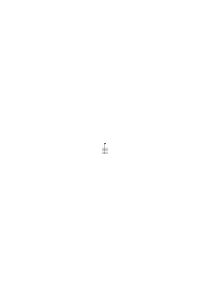
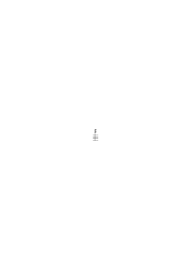
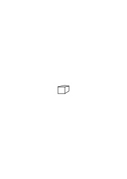

# Ts-228

### [1\[1\]](https://cdn.wittgensteinnachlass.com/2000px/webp/Ts-228/1.webp)

## Remarks I.

### [1\[2\]](https://cdn.wittgensteinnachlass.com/2000px/webp/Ts-228/1.webp)

1. [→ 18] When I give someone an order, it is _quite_ _enough_ for me to give him signs. And I would never say: These are just words, and I must get behind the words. Likewise, if I have asked someone something and he gives me an answer (i.e., a sign), I am satisfied – that was what I expected – and I do not say: That is just an answer.

### [1\[3\]](https://cdn.wittgensteinnachlass.com/2000px/webp/Ts-228/1.webp)

2. [→ 19] But if one says: “How am I to know what he means, I only see his signs,” then I say: “How is _he_ to know what he means, he only has his signs, too.”

### [1\[4\]](https://cdn.wittgensteinnachlass.com/2000px/webp/Ts-228/1.webp)

3.[→ 23] “You made a movement with your hand; did you mean something by it? – I thought you meant that I should come to you.” So he could have meant something, or he might not have meant anything. And if the former: then it was his hand movement, or something else? Did he mean something other than this with his expression? or did he only _mean_ his expression?

### [1\[5\]](https://cdn.wittgensteinnachlass.com/2000px/webp/Ts-228/1.webp)

4.[→ 24] Could one also answer: “I meant something with this movement, something that I can only express through this movement”? (Music, musical thought.) One does not learn the meaning of a sign only through translation; but also by learning to understand its intervention in life. Cf.[→ 113/406]

### [1\[6\]](https://cdn.wittgensteinnachlass.com/2000px/webp/Ts-228/1.webp)

5 Let a sentence be given to me in a cipher, and also its key; then, in one respect, everything is given to me for understanding the sentence. And yet I would answer the question “Do you understand this sentence?” with: No, not yet; I must first decipher it. And only when I have, for example, translated it into German would I say “Now I understand it.” If one now asks “At what moment in the translation do I _understand_ the sentence?” one would gain an insight into the nature of what we call “understanding.”

### [2\[1\]](https://cdn.wittgensteinnachlass.com/2000px/webp/Ts-228/2.webp)

6 I say a sentence: “I see a black circle”; but the particular words do not matter – so let us put these in their place: “a b c d e”. But now, when I read this, I cannot immediately connect it with the meaning of the above. – I am not used to it, one might say, instead of “I” to say “a” and instead of “see” to say “b”, etc. But this does not mean that I am not used to immediately associating “a” with the word “I”, but I am not used to using “a” in place of “I” – in the meaning of “I”.

### [2\[2\]](https://cdn.wittgensteinnachlass.com/2000px/webp/Ts-228/2.webp)

7. [→ 20] “I don’t just say that, I also mean something by it.” – If one considers what is going on in us when we _mean_ words (and not just say them), it is as if something is then coupled with these words, whereas otherwise they run empty. – As if they, as it were, intervened in us.

### [2\[3\]](https://cdn.wittgensteinnachlass.com/2000px/webp/Ts-228/2.webp)

8. [→ 21] “The sentence, when I understand it, gains depth for me – a new dimension.”

### [2\[4\]](https://cdn.wittgensteinnachlass.com/2000px/webp/Ts-228/2.webp)

9. [→ 55] “After he had said that, he left her as on the previous day.” – Do I understand this sentence? Do I understand it as I would if I were reading it in the course of a story? If it stands isolated, I would say that I do not know what it is about. But I would still know how one could use this sentence; I could even invent a context for it myself.

### [2\[5\]](https://cdn.wittgensteinnachlass.com/2000px/webp/Ts-228/2.webp),[3\[1\]](https://cdn.wittgensteinnachlass.com/2000px/webp/Ts-228/3.webp)

10. [→ 54] What does it mean to understand a picture, a drawing? even there, there is understanding and not understanding. And also there, these expressions can mean different things. The picture is supposed to be a still life; but I do not understand one part of it: I am not able to see bodies there, but only see patches of color. – Or I see everything physically, but they are objects that I do not know (they look like devices, but I do not know their use). – Perhaps, however, I know the objects, but I do not understand – in another sense – their arrangement.

### [3\[2\]](https://cdn.wittgensteinnachlass.com/2000px/webp/Ts-228/3.webp)

11. [→ 32] We understand Chinese gestures as little as we understand Chinese sentences.

### [3\[3\]](https://cdn.wittgensteinnachlass.com/2000px/webp/Ts-228/3.webp)

12 “I do not just say this, I mean something by it.” – Should one ask “What?” – – then another sentence is given as an answer. – Or can one not ask in this way, since the sentence perhaps says “I do not just say this, but it also moves me.”

### [3\[4\]](https://cdn.wittgensteinnachlass.com/2000px/webp/Ts-228/3.webp)

13. [→ 110] “My tears, my face, my words can never communicate to you how sad I am”? What does it mean to ‘communicate’ this? – “Words are just words, they cannot communicate a thought.” One can communicate the taste of a dish through words, but also by letting the other person taste it. One could call it “communicating what I feel” if one knocked out the other person’s tooth. Is it correct to say: “Only in this way can I communicate the pain I feel; not through words.” What is the criterion for it being a correct communication?

### [3\[5\]](https://cdn.wittgensteinnachlass.com/2000px/webp/Ts-228/3.webp),[4\[1\]](https://cdn.wittgensteinnachlass.com/2000px/webp/Ts-228/4.webp)

14 I understand this picture perfectly, I could represent it plastically. – I understand this description perfectly, I could make a drawing based on it. In many cases, one could establish as a criterion of understanding that one must be able to represent the sense of the sentence graphically. (I am thinking of an officially defined test of understanding.) How will one be tested in map reading, in understanding a map?

### [4\[2\]](https://cdn.wittgensteinnachlass.com/2000px/webp/Ts-228/4.webp)

15 It does not follow that understanding is the activity by means of which we demonstrate our understanding. The question of whether it is this activity is misleading. It must not be conceived in this way: “Is understanding _this_ activity – is it not, after all, some _other_ activity?” – but rather in this way: “Is ‘understanding’ used as the designation for this activity – is it not used in some _other_ way?”

### [4\[3\]](https://cdn.wittgensteinnachlass.com/2000px/webp/Ts-228/4.webp)

16. [→ 33] It is strange: we would like to explain our understanding of a gesture by translating it into words, and the understanding of words by translating it into a gesture. (Thus we are tossed back and forth when we want to find out where understanding actually lies.) And indeed, we explain words through a gesture, and a gesture through words.

### [4\[4\]](https://cdn.wittgensteinnachlass.com/2000px/webp/Ts-228/4.webp)

17. [→ 103] Must I understand an order before I can act on it? – Certainly! otherwise you wouldn’t know what you have to do. – But there is a leap from knowing to doing! –

### [4\[5\]](https://cdn.wittgensteinnachlass.com/2000px/webp/Ts-228/4.webp)

18. [→ 104] The sentence “I must understand the order before I can act on it” has a good sense; but no metalogical one.

### [4\[6\]](https://cdn.wittgensteinnachlass.com/2000px/webp/Ts-228/4.webp),[5\[1\]](https://cdn.wittgensteinnachlass.com/2000px/webp/Ts-228/5.webp)

19. [→ 107] The idea one has of understanding in this context is, for example, that it brings one closer to the execution from the words. – In what sense is that correct?

### [5\[2\]](https://cdn.wittgensteinnachlass.com/2000px/webp/Ts-228/5.webp)

20. [→ 106] “But I must understand an order in order to act on it.” Here the “must” is suspicious. – Think of the question: “How long before obeying must you understand the order?”

### [5\[3\]](https://cdn.wittgensteinnachlass.com/2000px/webp/Ts-228/5.webp)

21. [→ 187] “There is a gap between the command & the execution. It must be bridged by understanding.” “Only in understanding do we know that we have to do _**that**_. The _command_: these are just sounds, ink marks. –”

### [5\[4\]](https://cdn.wittgensteinnachlass.com/2000px/webp/Ts-228/5.webp)

22 An interpretation is something that is given in the sign. It is this interpretation, in contrast to another (which sounds different). – If one wanted to say “Every sentence still needs an interpretation,” that would mean: no sentence can be understood without an addition.

### [5\[5\]](https://cdn.wittgensteinnachlass.com/2000px/webp/Ts-228/5.webp),[6\[1\]](https://cdn.wittgensteinnachlass.com/2000px/webp/Ts-228/6.webp)

23.[→ 100] “I cannot carry out the order because I do not understand what you mean. – – Yes, now I understand you.” – What was happening when I suddenly understood the other person? There were many possibilities. The order, for example, could have been given with incorrect emphasis; and suddenly the correct emphasis occurred to me. I would then say to a third person, “Now he means ‥‥․” and would repeat the order with the correct emphasis. And with the correct emphasis, I now understand it; that is, I no longer need to grasp any further _sense_ (something _outside_ the sentence, i.e., something ethereal), but I am perfectly satisfied with the well-known German wording. – Or, the order was given to me in understandable German, but it seemed nonsensical. Then an explanation occurs to me, and now I can carry it out. – Or, several interpretations could have occurred to me, and I finally decide on one.

### [6\[2\]](https://cdn.wittgensteinnachlass.com/2000px/webp/Ts-228/6.webp)

24 What does it mean to understand that something is an order, if one does not yet understand the order itself? (“He means: I should do something – but I do not know _what_ he wants.”)

### [6\[3\]](https://cdn.wittgensteinnachlass.com/2000px/webp/Ts-228/6.webp)

25. [→ 102] The absent-minded person, who turns left on the order “Right turn!” and then, touching his forehead, says “oh, I see – right turn” and makes a right turn. – Did an _interpretation_ occur to him?

### [6\[4\]](https://cdn.wittgensteinnachlass.com/2000px/webp/Ts-228/6.webp)

26.[→ 101] I interpret the words; probably – but do I also interpret facial expressions? Do I interpret a facial expression as threatening or friendly? – It _can_ happen. If I now said, “It is not enough that I perceive the threatening face, but I must first interpret it.” – Someone points a knife at me, and I say, “I perceive this as a threat.”

### [6\[5\]](https://cdn.wittgensteinnachlass.com/2000px/webp/Ts-228/6.webp)

27.[→ 480] Can one command someone to understand a sentence? Why can one not command someone: “Understand this!”? Could I not obey the command “Understand this Greek sentence!” by learning Greek? – Similarly: One can say “Bring about pain!”, but not “Have pain!”. Cf 173/646

### [6\[6\]](https://cdn.wittgensteinnachlass.com/2000px/webp/Ts-228/6.webp)

28 The sentence: “It must be 3 o’clock now.” Accompanying mental states.

### [7\[1\]](https://cdn.wittgensteinnachlass.com/2000px/webp/Ts-228/7.webp)

29 “I do not see anything violet here, but if you give me a box of paints, I can show it to you in it.” How can one _know_ that one can show it, if ‥‥ – that is, that one can recognize it when one sees it? How do I know from my _image_, what the color really looks like? How do I know that I will be able to do something? i.e., that the state in which I am now is the state of being able to do it?

### [7\[2\]](https://cdn.wittgensteinnachlass.com/2000px/webp/Ts-228/7.webp)

30. № 286˙1 [→ 184] “The image must be more similar to its object than any picture: For, however similar I make the picture to what it is supposed to represent, it can still be the picture of something else. But the image has it in itself, that it is the image of _this_, and of nothing else.” One could come to see the image as a kind of super-picture.

### [7\[3\]](https://cdn.wittgensteinnachlass.com/2000px/webp/Ts-228/7.webp)

31 What is it like when I give someone the command “Imagine a red circle!” – and then say: understanding the command means knowing what it is like when it is carried out; or even: being able to imagine what it is like when ‥‥?

### [7\[4\]](https://cdn.wittgensteinnachlass.com/2000px/webp/Ts-228/7.webp)

32 Suppose I wanted to replace all the words in my language with other words at once; how could _I_ know which of the new words is in which place? Are the images what hold the places of the words?

### [7\[5\]](https://cdn.wittgensteinnachlass.com/2000px/webp/Ts-228/7.webp),[8\[1\]](https://cdn.wittgensteinnachlass.com/2000px/webp/Ts-228/8.webp)

33.[→ 87] I am inclined to say: I ‘point’ to this object, to its shape, to its color, etc., in a _different sense_. – What does that mean? It _seems_ to mean that something else is happening during the pointing, or _behind_ the pointing. What does it mean: I ‘hear’ in a _different sense_: the piano, its sound, the piece of music, the pianist, his skill? It simply means that one of these expressions can be explained through its connection with another. I ‘marry’ a woman in one sense, her money in another.

### [8\[2\]](https://cdn.wittgensteinnachlass.com/2000px/webp/Ts-228/8.webp)

34.[→ 17] “Is the meaning, the understanding of a word, laid down in the explanation of meaning, or is it only brought about by it, as the disease is brought about by the poison? How does the explanation affect the understanding?” – How does the explanation work? That is, what does it _effect_; and how is it applied? (Not everything that brings about understanding is called an “explanation”.)

### [8\[3\]](https://cdn.wittgensteinnachlass.com/2000px/webp/Ts-228/8.webp)

35 “The meaning of the word is what the explanation of the meaning explains.” That is, if you want to understand the use of the word “meaning,” look first at what is called “explanation of meaning.”

### [8\[4\]](https://cdn.wittgensteinnachlass.com/2000px/webp/Ts-228/8.webp)

36 How does it happen: the words “_This_ is blue” once as a statement about the object to which one points – once as an explanation of the word “blue” _mean_? In the second case, does one actually mean “This is called ‘blue’”? – Can one therefore mean the word “is” sometimes as “is called,” and the word “blue” as “‘blue’,” and at other times the “is” really as “is”? It can also happen that someone draws an explanation of a word from what was meant as a communication.

### [8\[5\]](https://cdn.wittgensteinnachlass.com/2000px/webp/Ts-228/8.webp)

37.[→ 105] Misunderstanding – lack of understanding. Understanding is brought about by explanation; but also by training.

### [8\[6\]](https://cdn.wittgensteinnachlass.com/2000px/webp/Ts-228/8.webp),[9\[1\]](https://cdn.wittgensteinnachlass.com/2000px/webp/Ts-228/9.webp)

37˙ Why can one not teach a cat to fetch? Does it not understand what one wants? And what is the difference here between understanding and lack of understanding?

### [9\[2\]](https://cdn.wittgensteinnachlass.com/2000px/webp/Ts-228/9.webp)

38. [→ 328] How is he to know which color to choose when he hears “red”? – Very simple: he should take the color whose image comes to mind when he hears the word. – But how is he to know which color that is, ‘whose image comes to mind’? Does this require a further criterion? (There is indeed a process: choosing the color that comes to mind when one hears the word ‥‥.) “‘Red’ means the color that comes to mind when I hear the word ‘red’” would be a _definition_. – No explanation of the _essence_ of the meaning of a word. (Refers to what Frege, and occasionally Ramsey, said about recognizing as a condition of symbolizing. What is the criterion for me recognizing the color correctly? Something like the experience of joy when recognizing it?)

### [9\[3\]](https://cdn.wittgensteinnachlass.com/2000px/webp/Ts-228/9.webp)

39.[→ 329] The psychological – trivial – discussions of expectation, association, etc., always leave out what is actually remarkable, and one can see from them that they are talking around the subject without touching the crucial point.

### [9\[4\]](https://cdn.wittgensteinnachlass.com/2000px/webp/Ts-228/9.webp)

40 “Why do you ask for explanations? If these are given, you will still be at the same point. They cannot lead you any further than you are now.”

### [9\[5\]](https://cdn.wittgensteinnachlass.com/2000px/webp/Ts-228/9.webp),[10\[1\]](https://cdn.wittgensteinnachlass.com/2000px/webp/Ts-228/10.webp)

41.[→ 163] One can use a red object as a sample for painting a _reddish_ white, or a reddish yellow (etc.) – but can one also use it as a sample for painting a blue-green hue, for example? – How, if I were to see someone ‘reproduce’ a red patch as blue-green, with all the external signs of exact copying? – I would say “I don’t know how he does it!” Or even “I don’t know _what_ he is doing.” – But suppose he now ‘copied’ this tone of red as blue-green on various occasions, and other tones of red regularly as other blue-green tones – should I then say that he is copying, or that he is not copying? What does it mean that I don’t know ‘what he is doing’? Don’t I see what he is doing? – But I don’t see _into him_. – Let’s not have that simile! If I see him copy red as red, – what do I know then? Do I know _how_ I do it? Of course, one says: I simply paint the _same_ color. – But what if _he_ says, “And I am painting the fifth to this color”? Do I see a special process of mediation when _I_ paint the ‘same’ color? Suppose I know him as an honest person; he reproduces a red through a blue-green, as I have described – but now _not_ always the same tone through the same tone, but sometimes through one tone, sometimes through another. – Should I say “I don’t know what he is doing”? – He is doing what I see – but _I_ would never do it; I don’t know why he does it; his way of acting ‘is incomprehensible to me’.

### [10\[2\]](https://cdn.wittgensteinnachlass.com/2000px/webp/Ts-228/10.webp),[11\[1\]](https://cdn.wittgensteinnachlass.com/2000px/webp/Ts-228/11.webp)

42. [→ 164] “How can it make sense to talk about a completely new kind of sensory perception that I might one day have? If you don’t mean the sensory **organ**.” Ramsey used to answer such questions by saying that it was _indeed_ possible to think such a thing. In a way, as one says, “Technology can do things today that you can’t even imagine.” – – Well, then we must find out _what_ you are thinking about. (That I am assured that this phrase can be _thought_ – what can I do with it? Its purpose is not to create fog in our minds.) _What_ you mean – how can it be found out? We must patiently examine how this sentence is to be applied. How everything looks _around it_. Its sense will then reveal itself.

### [11\[2\]](https://cdn.wittgensteinnachlass.com/2000px/webp/Ts-228/11.webp)

43 “I cannot, by means of words, smuggle a prediction into the thought of something that I _do not know_. (Nihil est in intellectu ‥‥․) As if I could come at the thought from behind, as it were, and catch a glimpse of something that is impossible to see from the front.”

### [11\[3\]](https://cdn.wittgensteinnachlass.com/2000px/webp/Ts-228/11.webp)

44 “You have a false concept. – But the matter cannot be clarified by me arguing against your words; but only by me trying to direct your attention away from certain expressions, illustrations, images, and _toward_ the _use_ of the words.”

### [11\[4\]](https://cdn.wittgensteinnachlass.com/2000px/webp/Ts-228/11.webp),[12\[1\]](https://cdn.wittgensteinnachlass.com/2000px/webp/Ts-228/12.webp)

45.[→ 363] Hardy: “That ‘the finite cannot understand the infinite’ should surely be a theological and not a mathematical war-cry.” It is true, this expression is clumsy. But what one wants to say with it is: “Surely, things cannot be done this way! Where does this leap from the finite to the infinite come from?” And the way it is expressed is not entirely nonsensical – only, what is meant by ‘the finite’ that the infinite should not be able to think, is not ‘man’ or ‘our understanding’, but the calculus. And _**how**_ this thinks of ‘the infinite’ is certainly worth investigating. And this is comparable to the thorough investigation and clarification of business practices by a chartered accountant. The goal is a surveyable, comparative representation of all applications, illustrations, and conceptions of the calculus. A complete overview of everything that can create uncertainty. And this overview must extend over a wide area, because the roots of our ideas run deep. – “The finite cannot understand the infinite” means here: it cannot happen _in this way_, as you present it, in your characteristic superficiality. Thought can, as it were, _fly_; it does not need to walk. You do not understand, i.e., you overlook, your transactions, and you project, as it were, your lack of understanding into the idea of a medium in which the most astonishing things are possible.

### [12\[2\]](https://cdn.wittgensteinnachlass.com/2000px/webp/Ts-228/12.webp)

46. [→ 53] Imagine this language: the words and grammar are those of German, but the words in the sentence are in the opposite order. A sentence in this language therefore sounds like a German sentence that one reads from the period to the beginning. The expressive possibilities therefore have the same variety as in German. But what we know as sentence intonation is destroyed.

### [12\[3\]](https://cdn.wittgensteinnachlass.com/2000px/webp/Ts-228/12.webp),[13\[1\]](https://cdn.wittgensteinnachlass.com/2000px/webp/Ts-228/13.webp)

47. [→ 114] Consider this form of expression: “My book has as many pages as the equation <math class="stacked" display="inline"><msup><mi>x</mi><mn>3</mn></msup><mspace width="0.3em"/><mo>+</mo><mspace width="0.3em"/><mtext>2x</mtext><mspace width="0.3em"/><mtext>‒</mtext><mspace width="0.3em"/><mn>3</mn><mspace width="0.3em"/><mo>=</mo><mspace width="0.3em"/><mn>0</mn></math> yields.” Or: “The number of my friends is n and <math class="stacked" display="inline"><msup><mi>n</mi><mn>2</mn></msup><mspace width="0.3em"/><mo>+</mo><mspace width="0.3em"/><mn>2</mn><mi>n</mi><mspace width="0.3em"/><mo>+</mo><mspace width="0.3em"/><mn>2</mn><mspace width="0.3em"/><mo>=</mo><mspace width="0.3em"/><mn>0</mn></math>.” Does this sentence have sense? It is not immediately apparent. This example shows how it comes about that something looks like a sentence that we understand, but which makes no sense. (This sheds light on what it means to understand or mean a sentence.)

### [13\[2\]](https://cdn.wittgensteinnachlass.com/2000px/webp/Ts-228/13.webp)

48 How do I do it, so that I always use a word correctly, i.e., meaningfully; do I always look it up in the grammar? “No; the fact that I mean something – what I mean – prevents me from saying nonsense.” – “I mean something with the words” means here: I _know_ that I can use them. But I can believe that I can use them, and it turns out that I was mistaken.

### [13\[3\]](https://cdn.wittgensteinnachlass.com/2000px/webp/Ts-228/13.webp)

49 What does it mean to “discover that a sentence has no sense”? And what does it mean that “if I mean something with it, it must have sense”? The former means that one should not be misled by the appearance of a sentence and should investigate its use in the language-game. And “if I mean something with it” – does this mean something _similar_ to: “if I can imagine something with it”? – Imagination often leads to further use.

### [13\[4\]](https://cdn.wittgensteinnachlass.com/2000px/webp/Ts-228/13.webp)

50. [→ 214] “An expectation is so constructed that, whatever comes, must agree with it or not.”

### [14\[1\]](https://cdn.wittgensteinnachlass.com/2000px/webp/Ts-228/14.webp)

51. [→ 186] “Apply a standard to this object; it does not say that the object is so long. Rather, it is, as it were, dead in itself, and does not perform any of what the thought performs.” – It is as if we had imagined that the essence of a living human being is its external shape, and then produced a wooden block of this shape, and now look with embarrassment at the dead block, which also bears no similarity to a living being.

### [14\[2\]](https://cdn.wittgensteinnachlass.com/2000px/webp/Ts-228/14.webp)

52 One could say: “The expectation is not a picture; it merely makes use of one.” I expect, for example, that my clock will now show 7, and I express this through a picture of the position of the hands. I can now compare this picture with the actual position; but not the expectation.

### [14\[3\]](https://cdn.wittgensteinnachlass.com/2000px/webp/Ts-228/14.webp)

53.[→ 192] My thought is this: If one could see the expectation itself, one would have to see what is expected. (In such a way that it would not require a method of projection or comparison in order to arrive, from what one sees, at the fact that is expected.) But that is how it is: Whoever sees the expression of the expectation sees ‘what is expected’.

### [14\[4\]](https://cdn.wittgensteinnachlass.com/2000px/webp/Ts-228/14.webp)

54 If one takes it for granted that human beings derive pleasure from their imagination, then one should consider that the imagination does not correspond to a painted picture, a sculpture, or a film, but to a complex structure made up of heterogeneous components – signs and pictures.

### [14\[5\]](https://cdn.wittgensteinnachlass.com/2000px/webp/Ts-228/14.webp),[15\[1\]](https://cdn.wittgensteinnachlass.com/2000px/webp/Ts-228/15.webp)

55.[→ 201] Explain to someone that the pointer setting, which you have recorded, is intended to express: the pointers of _this_ clock are now in this position. – – The awkwardness with which the sign, like a mute person, tries to make itself understood through all sorts of suggestive gestures – it disappears when we recognize that it is the _system_ to which the sign belongs that matters. One wanted to say: only the _thought_ can _say_ it, the sign cannot.

### [15\[2\]](https://cdn.wittgensteinnachlass.com/2000px/webp/Ts-228/15.webp)

56. [→ 212] “The plan is, as a plan, something unsatisfying. (As is the wish, the expectation, the conjecture, etc.).” And here I mean: the expectation is unsatisfying because it is an expectation of something; the belief, the opinion, is unsatisfying because it is the opinion that something is the case, something real, something outside the process of opining.

### [15\[3\]](https://cdn.wittgensteinnachlass.com/2000px/webp/Ts-228/15.webp)

57. [→ 191] The wish seems to already know what will fulfill it, or would fulfill it; the sentence, the thought, what makes it true, even if it is not yet there! Where does this determination come from, of what is not yet there? This despotic demand? (Compare ‘the hardness of logical necessity’.)

### [15\[4\]](https://cdn.wittgensteinnachlass.com/2000px/webp/Ts-228/15.webp)

58. [→ 199] “The command commands its obedience.” So does it know its obedience even before it is there? – But it is a grammatical sentence, and it says: If a command says “Do this and that!”, then “doing this and that” is called obeying this command.

### [15\[5\]](https://cdn.wittgensteinnachlass.com/2000px/webp/Ts-228/15.webp),[16\[1\]](https://cdn.wittgensteinnachlass.com/2000px/webp/Ts-228/16.webp)

59. [→ 200] We say “The command commands this” – and do it; but also: “The command commands that I do this and that.” We translate it once into a sentence, once into a demonstration, and once into the act.

### [16\[2\]](https://cdn.wittgensteinnachlass.com/2000px/webp/Ts-228/16.webp)

60 What constitutes identity: doing _**the same**_ now as what I previously _meant_ to do?

### [16\[3\]](https://cdn.wittgensteinnachlass.com/2000px/webp/Ts-228/16.webp)

61 If the command is not obeyed – where is the shadow of its obedience, which you meant to see; because the form was present to you: It commands this and that.

### [16\[4\]](https://cdn.wittgensteinnachlass.com/2000px/webp/Ts-228/16.webp)

62 “He did what I told him to do.” – Why shouldn’t one say here that there is an identity between the _action_ & the _**words**_?! Why should I put a shadow between the two? We do have a method of projection. – It is only a different identity: “I did what he did” and, on the other hand, “I did what he ordered.”

### [16\[5\]](https://cdn.wittgensteinnachlass.com/2000px/webp/Ts-228/16.webp),[17\[1\]](https://cdn.wittgensteinnachlass.com/2000px/webp/Ts-228/17.webp)

63. [→ 161] What does it mean when we say, “I cannot imagine the opposite,” or, “What would it be like if it were different?” – for example, when someone says that my mental images are private, or that only I myself can know whether I am in pain, and so on. “I cannot imagine…” here does not, of course, mean: my powers of imagination are insufficient. We use this response to ward off a statement that is, in reality, grammatical, but pretends to be a statement about facts (such as pain). But why do I say “I cannot imagine the opposite,” and not “I cannot imagine what you are saying”? An example: “Every stick has a length” – that is, we call something (or _this_) ‘the length of a stick’ (but nothing ‘the length of a sphere’). Can I now imagine that ‘every stick has a length’? Well, I simply imagine a stick – and that is all. However, this image, in conjunction with this sentence, plays a completely different role than an image in conjunction with the sentence: “This table has the same length as that one.” For here, I understand what it means to form an image of the opposite (and it need not be a mental image). The image, however, in connection with the grammatical sentence could only show what one calls “the length of a stick.” And what would the opposite image of that be? (See remarks about a priori sentences.)

### [17\[2\]](https://cdn.wittgensteinnachlass.com/2000px/webp/Ts-228/17.webp)

64. [→ 157] It seems as if one could say: “Word-language allows nonsensical combinations of words, but the language of imagination does not allow nonsensical images.” – So the language of drawing does not allow nonsensical drawings either? Consider, these would be drawings that are intended to be used to create models of objects. Then some drawings have sense, some do not. What if I imagine nonsensical combinations of words!

### [17\[3\]](https://cdn.wittgensteinnachlass.com/2000px/webp/Ts-228/17.webp)

65. [→ 162] We could respond to the sentence “This body has an extension” with: “Nonsense!” – but we tend to respond with: “Of course!” – Why?

### [17\[4\]](https://cdn.wittgensteinnachlass.com/2000px/webp/Ts-228/17.webp),[18\[1\]](https://cdn.wittgensteinnachlass.com/2000px/webp/Ts-228/18.webp)

66 “I have never actually seen a black spot gradually become lighter until it is white, and then the white gradually become redder until it is red. But I know that it is possible, because I can imagine it.” “I know that it is possible to open this lock with the pick, because I have opened such locks in this way before.” – Are these two cases analogous?

### [18\[2\]](https://cdn.wittgensteinnachlass.com/2000px/webp/Ts-228/18.webp)

67. [→ 155] When it is said that a sentence is nonsensical, it is not, as it were, that its sense is nonsensical. Rather, this expression is excluded from the language.

### [18\[3\]](https://cdn.wittgensteinnachlass.com/2000px/webp/Ts-228/18.webp)

68 I try something, but I cannot do it. – But what does it mean: “not to be able to try something”? – – “We cannot even _try_ to imagine a round square.”

### [18\[4\]](https://cdn.wittgensteinnachlass.com/2000px/webp/Ts-228/18.webp)

69.﹖ [→ 160] If one also considers a sentence as a picture of a possible state of affairs and says that it shows the possibility of the state of affairs, then the sentence can at best do what a painted or a plastic image, or a film does; and it certainly cannot represent what is not the case. So it depends entirely on our grammar what is called (logically) possible and what is not, – namely, what it allows? But is that arbitrary? – Is it arbitrary? – I cannot make use of every sentence-like formation; not every game is useful, and if I try to allow something completely useless as a sentence, it usually happens because I have not thought enough about its application. (“Infinitely long row of trees” – how is it to be verified that such a row is infinitely long?)

### [18\[5\]](https://cdn.wittgensteinnachlass.com/2000px/webp/Ts-228/18.webp),[19\[1\]](https://cdn.wittgensteinnachlass.com/2000px/webp/Ts-228/19.webp)

70. [→ 218] “If I say that I did not dream tonight, I must nevertheless know where to look for the dream (i.e., the sentence ‘I dreamed’ must, when applied to the actual situation, be false, but not nonsensical).” Does this mean that you did, in a way, feel something, a hint of a dream, which makes the place conscious to you, the place where a dream would have been? Or: If I say, “I don’t have pain in my arm,” does that mean I have a shadow of a feeling of pain, which, as it were, indicates the place where the pain would occur? In what way does the present, painless state contain the possibility of pain? If one says, “In order for the word ‘pain’ to have meaning, it is necessary that one recognizes pain as such when it occurs,” one can answer: “It is not more necessary than that one recognizes the absence of pain.”

### [19\[2\]](https://cdn.wittgensteinnachlass.com/2000px/webp/Ts-228/19.webp),[20\[1\]](https://cdn.wittgensteinnachlass.com/2000px/webp/Ts-228/20.webp)

71. [→ 219] “But mustn’t I know what it would be like to have pain?” – One cannot escape the fact that the use of the sentence consists in the fact that one imagines something with every word. The application of the sentence is not one that demands such an imagining. Again and again, one wants to think of the meaning of a sentence, i.e., its use, as concentrated in a mental state of the speaker or listener. One does not think that one is calculating with the words, operating with them, and gradually transforming them into this or that image. – Rather, their meaning, i.e., their purpose, is supposed to lie in a kind of image that they create in the mind of the speaker. It is as if one believed that the written instruction to someone to give me a cow must always be accompanied by an image of a cow, so that this instruction does not lose its meaning. When we communicate to the doctor that we have pain – in what cases is it useful for him to imagine pain? – And does this not happen in many different ways? (As many ways as: remembering a pain.)

### [20\[2\]](https://cdn.wittgensteinnachlass.com/2000px/webp/Ts-228/20.webp)

72. [→ 220] One cannot escape the fact that the meaning of the sentence accompanies the sentence; it is with the sentence.

### [20\[3\]](https://cdn.wittgensteinnachlass.com/2000px/webp/Ts-228/20.webp)

73. [→ 90] Is the negation of a sentence identical with the disjunction of the not-excluded cases? It is in some cases. (E.g., in this: “The permutation of the elements A, B, C that he wrote down was not ACB.”)

### [20\[4\]](https://cdn.wittgensteinnachlass.com/2000px/webp/Ts-228/20.webp)

74. [→ 81] Negating: a ‘mental activity’. – Negate something, and observe what you do! – Do you perhaps shake your head inwardly? And if so – is this process any more worthy of our interest than, say, writing a negation sign in front of a sentence? Do you now know the _essence_ of negation?

### [20\[5\]](https://cdn.wittgensteinnachlass.com/2000px/webp/Ts-228/20.webp)

75. [→ 79] “How can the word ‘not’ negate?” – “The sign ‘not’ indicates that you should take what follows it in a negative sense.” One wants to say: the sign of negation is only an invitation to do something, possibly very complicated. It is as if the sign of negation were an incitement to do something. But to what end? That is not said. It is as if it only needed to be hinted at; as if we already knew it. As if an explanation were unnecessary, since we already know the thing.

### [20\[6\]](https://cdn.wittgensteinnachlass.com/2000px/webp/Ts-228/20.webp),[21\[1\]](https://cdn.wittgensteinnachlass.com/2000px/webp/Ts-228/21.webp)

76. [→ 80] What is the difference between the two processes: wishing for something to happen – and wishing for the same thing not to happen? If one were to depict it in an image, one would do something different with the image of the event: one would cross it out, one would put a line through it, and so on. But that, it seems to us, is a _crude_ method of expression. In word-language, we use the sign “not.” This is like an awkward expedient. One thinks: in _thinking_, it happens differently.

### [21\[2\]](https://cdn.wittgensteinnachlass.com/2000px/webp/Ts-228/21.webp)

77. [→ 87] Negation, one might say, is an excluding, rejecting gesture. But we use such a gesture in many different cases!

### [21\[3\]](https://cdn.wittgensteinnachlass.com/2000px/webp/Ts-228/21.webp)

78. [→ 82] “Is it the _same_ negation: ‘Iron does not melt at 100 degrees Celsius’ & ‘2 times 2 is not 5’?” Should this be established through introspection; by trying to see what one thinks when considering both sentences?

### [21\[4\]](https://cdn.wittgensteinnachlass.com/2000px/webp/Ts-228/21.webp)

79. [→ 477] Is ‘understanding a word’ a mental state? – Sadness, excitement, pain; let us call these mental states. Make this grammatical observation: We say

“He was sad all day”

“He was excited all day”

“He has had uninterrupted pain since yesterday.” – We also say “I have understood this word since yesterday.” But “uninterruptedly”? – Yes, one can speak of an interruption in understanding. But in what cases? Compare: “When did your pain subside?” and “When did you stop understanding the word?”

### [21\[5\]](https://cdn.wittgensteinnachlass.com/2000px/webp/Ts-228/21.webp),[22\[1\]](https://cdn.wittgensteinnachlass.com/2000px/webp/Ts-228/22.webp)

80 Compare: “I have had pain since yesterday,” “I have been expecting him since yesterday,” “I knew since yesterday that he would come,” “I have been able to integrate since yesterday,” “I have understood the word since yesterday.”

Distinguish the cases in which it makes sense to insert the word “uninterruptedly” into the sentence from those in which it makes no sense. You are making a grammatical distinction.

### [22\[2\]](https://cdn.wittgensteinnachlass.com/2000px/webp/Ts-228/22.webp)

81.[→ 478] States: ‘Being able to climb a mountain’ can be called a state of my body. I say: “I can climb – I mean: I am strong enough to do so.” Compare this with this state of being able: “Yes, I can go there – I mean: I have time.”

### [22\[3\]](https://cdn.wittgensteinnachlass.com/2000px/webp/Ts-228/22.webp)

82. [→ 113] Must one _know_ whether one understands a word? Doesn’t it also happen that one imagines one understands a word (not differently than understanding a type of _calculation_) & then realizes that one has not understood it? (“I thought I knew what ‘relative’ & ‘absolute’ motion meant, but I see that I don’t know it.”)

### [22\[4\]](https://cdn.wittgensteinnachlass.com/2000px/webp/Ts-228/22.webp),[23\[1\]](https://cdn.wittgensteinnachlass.com/2000px/webp/Ts-228/23.webp)

83 Imagine this game: A list of words from different languages and of nonsensical sequences of sounds is read to me. I am to say after each one whether I understand it or not; also, what was going on in me when I understood or did not understand. – I will answer “yes” without thinking to the word “tree” (an image may float before me); I answer just as unhesitatingly with “no” to a sequence of sounds that I have never heard before. With words that denote a specific nuance of color, there will often be a visualizing of the answer beforehand; with rare words (“continuum,” for example), a consideration; with words like the article “the,” a shrug of the shoulders; words from a foreign language I will _sometimes_ translate into German; if images float before me, they are sometimes those of the objects that are designated by the words (again, all sorts of cases), sometimes other images. This game could be supplemented by one in which one person names _activities_ and asks at each one: “Can you do that?” – The subject should indicate what reasons he had for answering the question with “yes” or “no.”

### [23\[2\]](https://cdn.wittgensteinnachlass.com/2000px/webp/Ts-228/23.webp)

84. ↓ “If I am asked, ‘Do you see a sphere there?’ and another time ‘Do you see the hemisphere there?’, then what I see can be the same in both cases, and if I answer ‘Yes,’ I still distinguish between the two hypotheses. As in chess I distinguish between a pawn and the king, even if the present move is one that both could make, and even if a king figure were functioning as a pawn.” – One is always in danger in philosophy of creating a myth of symbolism, or one of mental processes. Instead of simply saying what everyone knows and must admit.

### [23\[3\]](https://cdn.wittgensteinnachlass.com/2000px/webp/Ts-228/23.webp)

85 “As long as the temperature of the rod does not drop below ‥‥․, one can forge it.” Therefore, it makes sense to say: “I can forge from 5 to 6 o'clock.” Or: “I can play chess from 5 to 6,” that is, I have time from 5 to 6. – “As long as my patience does not drop below ‥‥, I can perform the calculation.” This calculation takes 1 1/2 minutes; but how long does it take to be able to perform it? And if you can calculate it for an hour, do you always start from scratch?

### [24\[1\]](https://cdn.wittgensteinnachlass.com/2000px/webp/Ts-228/24.webp)

86. [→ 479] What if one asked: _When can_ you play chess? Always? Or while you are making a move? And during each move, the whole game of chess? – And how strange that being able to play chess takes so little time and a game takes so much longer. (And now consider the _everyday_ use of “Why can you play chess?!”)

### [24\[2\]](https://cdn.wittgensteinnachlass.com/2000px/webp/Ts-228/24.webp)

87 How strange: It seems as if a physical (mechanical) guide could fail, allowing the unforeseen, but a rule cannot! It would be, as it were, the only reliable guide. But what is it that a guide does not allow a movement, and what is it that a rule does not allow it? – How does one know one, and how does one know the other?

### [24\[3\]](https://cdn.wittgensteinnachlass.com/2000px/webp/Ts-228/24.webp)

88.[→ 7] It is as if it bothers us that the thought of a sentence is not fully present at any one moment. We look at it as an object that we create, and never fully possess, for no sooner has one part arisen than another disappears.

### [24\[4\]](https://cdn.wittgensteinnachlass.com/2000px/webp/Ts-228/24.webp),[25\[1\]](https://cdn.wittgensteinnachlass.com/2000px/webp/Ts-228/25.webp)

89. [→ 60] Understanding a sentence of the language is more closely related to understanding a theme in music than one might think. I mean it in this way: that understanding the linguistic sentence is closer than one thinks to what one usually calls understanding musical expression. Why do I want this particular line of intensity & tempo? One would like to say: “because I know what all this means.” But what does it mean? I wouldn't know how to say it. To ‘explain’ it, I could only compare it with something else that has the same rhythm (I mean, the same line). (One can say: “Don't you see: this is like drawing an inference,” or: “this is as it were a parenthesis,” etc. How does one justify such comparisons? There are very different kinds of justifications.)

### [25\[2\]](https://cdn.wittgensteinnachlass.com/2000px/webp/Ts-228/25.webp)

90.﹖ [→ 93] We sometimes call “thinking” the act of accompanying a sentence with a mental process, but we do not call that accompaniment a “thought.” – – Speak a sentence and think it; speak it with understanding! – And now do not speak it, but do only what you accompanied it with when speaking it with understanding! – (Sing this song with expression – – and now do not sing it, but repeat the expression! – And one _could_ also repeat something here; e.g., vibrations of the body, slower and faster breathing, etc.)

### [25\[3\]](https://cdn.wittgensteinnachlass.com/2000px/webp/Ts-228/25.webp)

91. [→ 28] “This sentence makes sense.” – “Which sense?” Compare this with: “This string of words is a sentence.” – “Which sentence?”

### [25\[4\]](https://cdn.wittgensteinnachlass.com/2000px/webp/Ts-228/25.webp)

92. [→ 122] “That three negations again result in a negation must be contained in the one negation that I am now using.” (The temptation to invent a myth of ‘meaning’.)

### [25\[5\]](https://cdn.wittgensteinnachlass.com/2000px/webp/Ts-228/25.webp)

93. [→ 123] It appears as if the nature of negation implies that a double negation is an affirmation. (And there is something true about this. What? _Our_ nature is connected with both.)

### [25\[6\]](https://cdn.wittgensteinnachlass.com/2000px/webp/Ts-228/25.webp),[26\[1\]](https://cdn.wittgensteinnachlass.com/2000px/webp/Ts-228/26.webp)

94. [→ 27] Imagine a sentence of the word-language replaced by signs of the sign language. Do we still feel the same need for _explanation_ here – as with the words? [100]

### [26\[2\]](https://cdn.wittgensteinnachlass.com/2000px/webp/Ts-228/26.webp)

95. [→ 330] How can one, as a test of whether one understands the word “blue,” conjure up a blue mental image in one’s mind? For how can the word “blue” show me which color from the palette of colors in my imagination I should choose, and how can the color that presents itself to me show me that _it_ is the right one? Do I then choose a mental image that fits the word “blue”? – And can the wrong mental image occur? _And how does this manifest itself?_

### [26\[3\]](https://cdn.wittgensteinnachlass.com/2000px/webp/Ts-228/26.webp)

96 What counts as a criterion for the fact that I always mean the same color by “blue”? Is this the criterion that the same mental image always occurs to me when I hear the word?

### [26\[4\]](https://cdn.wittgensteinnachlass.com/2000px/webp/Ts-228/26.webp)

97. [→ 152] “Once you know _what_ the word designates, you understand it, you know its entire application.”

### [26\[5\]](https://cdn.wittgensteinnachlass.com/2000px/webp/Ts-228/26.webp)

98. ↓ Forgetting the meaning of a word – remembering it again. What processes are involved in this? What does one remember, what comes to mind when one remembers what the English word “perhaps” means? – – How does something like this happen: I say “Now I know for the first time what the words ‘the blue ether’ mean”?

### [26\[6\]](https://cdn.wittgensteinnachlass.com/2000px/webp/Ts-228/26.webp),[27\[1\]](https://cdn.wittgensteinnachlass.com/2000px/webp/Ts-228/27.webp)

99. [→ 331] How can I _justify_ the fact that I form these mental images in response to these words? Has someone shown me the mental image of the blue color and said that _it_ is the color in question? What do the words “_this_ mental image” mean? How does one point to a mental image? How does one point twice to the same mental image?

### [27\[2\]](https://cdn.wittgensteinnachlass.com/2000px/webp/Ts-228/27.webp)

100 [→ ] Is sign language therefore incapable of explanation? – Certainly! e.g. through word-language.

### [27\[3\]](https://cdn.wittgensteinnachlass.com/2000px/webp/Ts-228/27.webp)

101 “As with all metaphysics, the ‘harmony between thinking and reality’ must be sought in the grammar of language.”

### [27\[4\]](https://cdn.wittgensteinnachlass.com/2000px/webp/Ts-228/27.webp)

102.[→ 227] Ambiguous use of “picture.” One wants to say: a command is a picture of the action that was performed after it; but also, a picture of the action that is to be performed after it.

### [27\[5\]](https://cdn.wittgensteinnachlass.com/2000px/webp/Ts-228/27.webp)

103.﹖ [→ 228] “The connection of the picture with what is depicted” could be called the rays of projection; but also the technique of projecting.

### [27\[6\]](https://cdn.wittgensteinnachlass.com/2000px/webp/Ts-228/27.webp)

104.[→ 181] The harmony between thinking & reality. “The possibility of agreement already presupposes _an_ agreement.” – Imagine someone saying: “Being able to play chess is a kind of playing chess”!

### [27\[7\]](https://cdn.wittgensteinnachlass.com/2000px/webp/Ts-228/27.webp),[28\[1\]](https://cdn.wittgensteinnachlass.com/2000px/webp/Ts-228/28.webp)

105. [→ 406] What if we asked someone “In what way are these words a description of what you see?” and he replies: “I _mean_ that with these words.” (He was looking at a landscape.) Why is this answer “I _mean_ that ‥‥” not an answer at all? How does one _mean_ what one sees with words? Imagine I say “a b c d,” and I mean by it: The weather is nice. I, in fact, had, when uttering these signs, the experience which normally only someone who has used “a” year after year to mean “the,” “b” to mean “weather,” etc., would have. – Does “a b c d” then mean: The weather is nice?

### [28\[2\]](https://cdn.wittgensteinnachlass.com/2000px/webp/Ts-228/28.webp)

106 Can I not express with words what I want? – Look at the door of your room, and say a series of arbitrary sounds, and _mean_ by them a description of this door! –

### [28\[4\]](https://cdn.wittgensteinnachlass.com/2000px/webp/Ts-228/28.webp)

108. [→ 408] Imagine someone expressing pain with their facial expression while saying “abrakadabra!” – We ask “What do you mean?” and he replies: “I meant ‘toothache’ by it.” – You immediately think: how can one _mean_ ‘toothache’ with this word, or what does it _mean_ to _mean_ pain with the word? And yet, in another context, you would assert that the mental activity of _meaning_ this or that is precisely what is most important in the use of language. But how – can I not say: “With ‘abrakadabra’ I mean toothache”? Of course; but that is a definition; not a description of what is happening in me when uttering the word.

### [29\[1\]](https://cdn.wittgensteinnachlass.com/2000px/webp/Ts-228/29.webp)

109. [→ 399] One could distinguish between a ‘surface grammar’ and a ‘depth grammar’ in the use of a word. What is immediately imprinted on us by the use of a word is its use in _sentence structure_, which is part of its use – one might say – that one can grasp with the ear – – And now compare the depth grammar of the word “mean” with what its surface grammar would lead us to expect. No wonder one finds it difficult to find one’s way around.

### [29\[2\]](https://cdn.wittgensteinnachlass.com/2000px/webp/Ts-228/29.webp)

110 Grammar does not say how language must be structured in order to fulfill its purpose, in order to have such and such an effect on people. It only describes, but in no way explains, the use of the signs.

### [29\[3\]](https://cdn.wittgensteinnachlass.com/2000px/webp/Ts-228/29.webp)

111 The concept of a living being has the same indeterminacy as that of language.

### [29\[4\]](https://cdn.wittgensteinnachlass.com/2000px/webp/Ts-228/29.webp)

112. [→ 71] “The purpose of language is to express thoughts.” – So it is probably the purpose of every sentence to express a thought. What thought, then, does the sentence “It is raining” express? – –

### [29\[5\]](https://cdn.wittgensteinnachlass.com/2000px/webp/Ts-228/29.webp)

113. [→ 8] Not: “Without language, we could not communicate with each other” – but rather: without language, we cannot influence people in this or that way, we cannot build roads and machines, etc. And also: Without the use of speech and writing, people could not communicate.

### [29\[6\]](https://cdn.wittgensteinnachlass.com/2000px/webp/Ts-228/29.webp)

114.[→ 9] Compare: inventing a game – inventing a language – inventing a machine.

### [30\[1\]](https://cdn.wittgensteinnachlass.com/2000px/webp/Ts-228/30.webp)

115.[→ 127] One can call the rules of grammar “arbitrary” if it is meant to say that the _purpose_ of grammar is only that of language. If someone says “If our language did not have this grammar, it could not express these facts,” one should ask what “could” means here.

### [30\[2\]](https://cdn.wittgensteinnachlass.com/2000px/webp/Ts-228/30.webp)

116.[→ 323] Do I communicate something to myself when, looking at this paper, I say: “This paper is white”? And what does it actually mean to “say something to oneself”? Does one say everything to oneself that one utters when no one else is present?

### [30\[3\]](https://cdn.wittgensteinnachlass.com/2000px/webp/Ts-228/30.webp)

117.[→ 358] “I assume that he has an image in mind.” – Could I also assume that this stove has an image in mind? – And why does this seem impossible? Is the human form necessary for this? –

### [30\[4\]](https://cdn.wittgensteinnachlass.com/2000px/webp/Ts-228/30.webp)

118. [→ 359] “But this assumption certainly has a good sense!” – Yes; these words and this image have a familiar application under ordinary circumstances. – But let us assume a case in which this application is absent, and then we will, as it were, become aware for the first time of the nakedness of the words and the image.

### [30\[5\]](https://cdn.wittgensteinnachlass.com/2000px/webp/Ts-228/30.webp),[31\[1\]](https://cdn.wittgensteinnachlass.com/2000px/webp/Ts-228/31.webp)

119. [→ 361] “But if I assume that he has, for example, pain, then I simply assume that he has the same thing that I have had so often!” – That doesn't get us anywhere. It's as if I said: “You know what it means to say ‘It is five o'clock here’ – then you also know what it means to say that it is five o'clock on the sun; it simply means that it is just as much o'clock there as it is here when it is five o'clock here.” The _explanation_ by means of _sameness_ doesn't work here, because I do know that one can call five o'clock here “the same time” as five o'clock there, but I don't know in what case one speaks of simultaneity here and there. It is just like saying that the assumption that he has pain is simply the assumption that he has the same thing as I do. Because _this_ part of the grammar is probably clear to me: namely, that one will say that the stove has the same _experience_ as I do if one says that it has pain and I have pain.

### [31\[2\]](https://cdn.wittgensteinnachlass.com/2000px/webp/Ts-228/31.webp),[32\[1\]](https://cdn.wittgensteinnachlass.com/2000px/webp/Ts-228/32.webp)

120. [→ 362] We always want to say: “A memory-image is a memory-image! whether _he_ has it, or I have it; & however I find out whether he has one, or not.” – I could agree with that. – And if you ask me, “Don’t you know what I mean when I say that he has a memory-image?” – then I can answer: “I probably imagine something when I hear these words” – – but the usefulness of these words doesn’t go any further in this case. And I can also imagine something when I hear the words “It was exactly five o’clock in the afternoon in the sun” – namely, perhaps a pendulum clock showing five. – Perhaps the example of the application of “above” & “below” to the globe would be even better. Here, we all have a _very clear_ image of what “above” & “below” means. I can see that I am above; the earth is under me! (Don’t laugh at this example. We are, of course, already taught in elementary school that it is stupid to say such a thing. But it is much easier to sweep a problem under the rug than to solve it.) & only a reflection shows us that we cannot play the ordinary game with “above” & “below” here, that we have to change it here if we want to apply these words. (That is, we can, for example, say that the people on the antipodes are ‘below’ our part of the earth, but we can also now accept that they apply the same expression to us.)

### [32\[2\]](https://cdn.wittgensteinnachlass.com/2000px/webp/Ts-228/32.webp),[33\[1\]](https://cdn.wittgensteinnachlass.com/2000px/webp/Ts-228/33.webp)

121. [→ 360] Here, it happens that our thinking plays a strange trick on us. We want to cite the law of the excluded third and say: “Either such a picture has occurred to him, or it has not – there is no third possibility!” – We also encounter this strange argument in other areas of philosophy. “In the infinite development of this irrational number, the group ‘77777’ appears at some point, or it does not – there is no third possibility.” (See Weyl). That is to say, God sees it – but we do not know it. What does that mean? – We use a picture; the picture of a visible series, which one person overlooks, and the other does not. The law of the excluded third says here: It must either look _like this_, or _like that_. It actually says nothing – and this is obvious – but gives us a picture. And the problem is now supposed to be whether reality corresponds to the picture, or not. And this picture now _seems_ to determine what we have to do, how and according to what we have to search, – but it does not, because we do not know how to apply it. If we say here “there is no third possibility,” or “there really is no third possibility,” then this expresses the fact that we cannot turn away from this picture, which looks as if the problem and its solution must already be contained in it, while we _feel_ that this is not the case. Likewise, if one says “Either he has this sensation, or he does not have it!” – then primarily a picture is presented to us, which seems to determine the sense of the statements _unambiguously_. “You now know what it is about,” one would like to say. And that is precisely what he does not know. (In general, the law of the excluded third would be used most appropriately as follows: We give someone a drawing and say “Go there and see if it looks _like this_, or not.” The addition “there is no third possibility” could then mean: _I_ only want the answer “yes” or “no,” and no other.)

### [33\[2\]](https://cdn.wittgensteinnachlass.com/2000px/webp/Ts-228/33.webp)

122. [→ 315] If I were to claim the word “pain” entirely for what I had previously called “my pain,” and what others had called “the pain of L.W.,” then this would not do any injustice to others, as long as a notation is provided in which the absence of the word “pain” in other connections is somehow replaced. The others will still be pitied, treated by the doctor, etc. It would of course also be _no_ objection to this way of speaking to say: “But the others have exactly the same thing as you have!” But what would I gain from this new way of speaking? Nothing. But the solipsist does not _want_ any practical advantages when he asserts his view!

### [33\[3\]](https://cdn.wittgensteinnachlass.com/2000px/webp/Ts-228/33.webp),[34\[1\]](https://cdn.wittgensteinnachlass.com/2000px/webp/Ts-228/34.webp)

123. [→ 307] “If I say ‘I have pain,’ am I not pointing to a person who has the pain, since in a certain sense I do not even know _who_ has it.” – And this can be justified. For above all: I did not say that this and that person has pain, but “I have ‥‥”. With that, I name no person. Just as little as when I _groan_ in pain. Although the other person can see from the groaning who is feeling pain. What does it mean to know _who_ is feeling pain? It means, for example, knowing which person in this room has pain: that is, the one sitting there, or the one standing in that corner, the tall one with the blond hair, etc. etc. – What am I getting at? That there are very different criteria for the ‘_identity_’ of the person. Now, which one is it that determines me to say “_I_” have pain? None.

### [34\[2\]](https://cdn.wittgensteinnachlass.com/2000px/webp/Ts-228/34.webp)

124. [→ 308] “But you certainly want, when you say ‘I have pain,’ to draw the attention of others to a specific person.” – The answer could be: No; I only want to draw their attention to _myself_. –

### [34\[3\]](https://cdn.wittgensteinnachlass.com/2000px/webp/Ts-228/34.webp)

125. [→ 309] “But don't you want to, by saying ‘I have…,’ distinguish between _you_ and _the other person_?” – Could one say that in all cases? Even if I only groan? And even if I want to ‘distinguish between myself and the other,’ – does that mean I want to distinguish between the persons L.W. and N.N.?

### [34\[4\]](https://cdn.wittgensteinnachlass.com/2000px/webp/Ts-228/34.webp),[35\[1\]](https://cdn.wittgensteinnachlass.com/2000px/webp/Ts-228/35.webp)

126. [→ 356] …Whereas in countless cases we strive to find a picture, and once this is found, the application seems to arise of its own accord, here we already have a picture that constantly presents itself to us, but does not help us with the difficulty, which is only just beginning. If I ask, for example: “How should I imagine that _this_ mechanism goes into _this_ housing?” – then a drawing in reduced scale could serve as an answer. One could then say to me, “See, _that’s_ how it goes in”; or perhaps also: “Why are you surprised? Just as you _see_ it here, it also goes in there.” – The latter, of course, no longer explains anything, but only asks you to make the application of the picture that I have given you.

### [35\[2\]](https://cdn.wittgensteinnachlass.com/2000px/webp/Ts-228/35.webp)

127. [→ 357] A picture is evoked, which seems to determine the sense in an _unambiguous_ way. The actual use seems to be a corruption of what the _picture_ shows us. It is once again as in set theory: the form of expression seems to be tailored for a god who knows what we cannot know, who sees all the infinite series and sees into the consciousness of the human being. For us, of course, these forms of expression are as if an ornament that we probably put on, but with which we cannot do much, because we lack the real power that would give this garment meaning and purpose. In the actual use of the expressions, we make, as it were, detours, go through side streets; whereas we can see the straight, broad road in front of us, but we can never use it, because it is permanently blocked.

### [35\[3\]](https://cdn.wittgensteinnachlass.com/2000px/webp/Ts-228/35.webp)

128 “I” and “he” do not serve the same purposes in our language. For “I have pain” is understandable even without reference to a person, but the word “he” requires a reference.

### [35\[4\]](https://cdn.wittgensteinnachlass.com/2000px/webp/Ts-228/35.webp),[36\[1\]](https://cdn.wittgensteinnachlass.com/2000px/webp/Ts-228/36.webp)

129 One could imagine that someone groaned: “Someone has pain – I don't know who!” – whereupon one hastened to help the person groaning.

### [36\[2\]](https://cdn.wittgensteinnachlass.com/2000px/webp/Ts-228/36.webp)

130.[→ 310] The complaint does not say _who_ is complaining.

### [36\[3\]](https://cdn.wittgensteinnachlass.com/2000px/webp/Ts-228/36.webp)

131. [→ 311] “You don't doubt whether it is you or the other person who has it!” – The sentence “I don't know whether it is I or the other person who has pain” would be a logical product, one of whose factors is “I don't know whether I have pain or not”; and this is not a meaningful sentence.

### [36\[4\]](https://cdn.wittgensteinnachlass.com/2000px/webp/Ts-228/36.webp)

132.﹖ [→ 312] Imagine several people standing in a circle, including myself. At some point, one of us, sometimes one, sometimes another, is connected to the poles of an electrification machine, without us seeing it. I try to recognize which of us is currently being electrified. At one point I say: “Now I know who it is; it is _me_.” In this sense, I could also say: “Now I know who is feeling the shocks; it is me.” This would be a somewhat strange way of expressing oneself. But if I can also feel the shocks in a place outside my body, so that the statement that I feel them does not yet imply which body the contact touches, then the expression “Now I know who…” seems completely inadequate.

### [36\[5\]](https://cdn.wittgensteinnachlass.com/2000px/webp/Ts-228/36.webp)

133.﹖ [→ 313] If, as an introduction to a communication, I say “I tell you,” am I first telling him _who_ is speaking? But if I say “I am speaking indistinctly,” then I am telling him who is doing this. The sentence is an assertion, an expression of opinion, or of knowledge. The introduction “I tell you” is not.

### [37\[1\]](https://cdn.wittgensteinnachlass.com/2000px/webp/Ts-228/37.webp)

134 The “I have” in “I have pain” is the characteristic of the sensation signal. That is to say: it means something different here than in the _assertions_ “I have ‥‥”: namely, where a relationship of something to my body is established. – The sensation signal does not _name_ me; because it also does not state anything about me, i.e., about my body.

### [37\[2\]](https://cdn.wittgensteinnachlass.com/2000px/webp/Ts-228/37.webp)

135.[→ 304] To call the expression of a sensation an _assertion_ is misleading, in that the word “assertion” is connected with the ‘testing’, the ‘justification’, the ‘confirmation’, the ‘refutation’ of the assertion in the language-game.

### [37\[3\]](https://cdn.wittgensteinnachlass.com/2000px/webp/Ts-228/37.webp)

136 What is the purpose of the statement: “I _do_ have something, when I have pain”?

### [37\[4\]](https://cdn.wittgensteinnachlass.com/2000px/webp/Ts-228/37.webp)

137 Instead of “one cannot,” say: “there is nothing of this in this game.” Instead of “one cannot castle in checkers” – “there is no castling in checkers”; instead of “I cannot show my sensation” – “there is no showing of what one has in the use of the word ‘sensation’”; instead of “one cannot enumerate all cardinal numbers” – “there is no enumerating of all the elements here.”

### [37\[5\]](https://cdn.wittgensteinnachlass.com/2000px/webp/Ts-228/37.webp)

138.[→ 338] The sentence “Sensations are private” is of the kind: One plays patience alone.

### [37\[6\]](https://cdn.wittgensteinnachlass.com/2000px/webp/Ts-228/37.webp),[38\[1\]](https://cdn.wittgensteinnachlass.com/2000px/webp/Ts-228/38.webp)

139.[→ 314] Consider: How can these questions be applied, and how can they be decided: 1) “Are these books _my_ books?” 2) “Is this foot _my_ foot?” 3) “Is this body _my_ body?” 4) “Is this sensation _my_ sensation?” To 2): Think of cases in which my foot is anesthetized or paralyzed. Under certain circumstances, the question could be decided by establishing whether I feel pain in this foot. To 3): One could point to a picture in the mirror. Under certain circumstances, however, one could touch a body and ask the question. Under other circumstances, it means the same as: “Does _this_ look like my body?” To 4): What is _this_ sensation? i.e.: how is the demonstrative pronoun used here? But differently than, for example, in the first example! Errors arise here again because one imagines that one is pointing to a sensation by directing attention to it.

### [38\[2\]](https://cdn.wittgensteinnachlass.com/2000px/webp/Ts-228/38.webp)

140.[→ 542] There is not _one_ method of philosophy, but there are methods, as it were, different therapies.

### [38\[3\]](https://cdn.wittgensteinnachlass.com/2000px/webp/Ts-228/38.webp)

141. [→ 419] Suppose you have pain and at the same time you hear a piano being tuned next door. You say “It will soon stop.” Surely there is a difference whether you mean the pain, or the piano tuning! – Indeed; but what is this difference? I admit: in many cases, the opinion will correspond to a direction of attention, just as often a look, a gesture, or a closing of the eyes, which one could call “looking inward.”

### [38\[4\]](https://cdn.wittgensteinnachlass.com/2000px/webp/Ts-228/38.webp),[39\[1\]](https://cdn.wittgensteinnachlass.com/2000px/webp/Ts-228/39.webp)

142. [→ 420] Suppose someone simulates pain and now says “It will soon stop” – can one not say of him that he means the pain; and yet he concentrates his attention on no pain. – And how, if I finally say: “It has already stopped”?

### [39\[2\]](https://cdn.wittgensteinnachlass.com/2000px/webp/Ts-228/39.webp)

143. [→ 421] But can one not also lie by saying “It will soon stop” and meaning the pain, – but giving the answer “The noise in the next room” to the question “What did you mean?” In cases of this kind, one says something like: “I wanted to answer ‥‥․, but then I thought better of it and answered ‥‥․.”

### [39\[3\]](https://cdn.wittgensteinnachlass.com/2000px/webp/Ts-228/39.webp)

144. [→ 422] One can refer to an object while speaking by pointing to it. The act of pointing is here a part of the language-game. And now it seems to us as if one speaks of a sensation by directing one’s attention to it while speaking. But where is the analogy? It lies obviously in the fact that one can point to something by _looking_ and _listening_. But even pointing to the object _that_ one speaks about can, in some circumstances, be quite immaterial for the language-game, for the thought.

### [39\[4\]](https://cdn.wittgensteinnachlass.com/2000px/webp/Ts-228/39.webp)

145. [→ 424] And to what do I point by the internal activity of listening? To the sound that reaches my ears, and to the silence when I hear _nothing_? Listening _searches_, as it were, for a sensation of hearing and can therefore not point to it, but only to the _place_ where it searches for it.

### [39\[5\]](https://cdn.wittgensteinnachlass.com/2000px/webp/Ts-228/39.webp),[40\[1\]](https://cdn.wittgensteinnachlass.com/2000px/webp/Ts-228/40.webp)

146. [→ 425] If the receptive attitude is called “pointing to” something, then not to what we obtain through this attitude.

### [40\[2\]](https://cdn.wittgensteinnachlass.com/2000px/webp/Ts-228/40.webp)

147. [→ 426] The mental attitude ‘_accompanies_’ the word not in the same sense as a gesture accompanies it. (Similarly, one can travel alone, and yet be accompanied by one’s wishes, and a room can be empty and yet permeated by light.)

### [40\[3\]](https://cdn.wittgensteinnachlass.com/2000px/webp/Ts-228/40.webp)

148. [→ 423] Suppose you are telephoning someone and say to him: “This table is too high” – while pointing to the table with your finger – – – what role does this pointing play here? Can I say that I _mean_ the table in question by pointing to it? What is the purpose of this pointing, and what is the purpose of these words and whatever else may accompany them?

### [40\[4\]](https://cdn.wittgensteinnachlass.com/2000px/webp/Ts-228/40.webp)

149.[→ 318] The internal directing of attention to the sensation – what connection is supposed to be established between word and sensation; what purpose is this connection supposed to serve? Was I _taught_ this when I learned to use this sentence, to think this thought? (Thinking is something that I had to learn.) We certainly also learn this, to direct our attention to things and to sensations. We learn to observe and to describe the observation. But how am I taught this; how is my ‘internal activity’ controlled in this case? According to what is it judged whether I have really paid attention?

### [40\[5\]](https://cdn.wittgensteinnachlass.com/2000px/webp/Ts-228/40.webp),[41\[1\]](https://cdn.wittgensteinnachlass.com/2000px/webp/Ts-228/41.webp)

150. [→ 393] Does one say, for example: “I did not actually mean my pain now, I did not pay enough attention to it”? Do I ask myself: “What did I mean with this word now? My attention was divided between my pain and the noise.”

### [41\[2\]](https://cdn.wittgensteinnachlass.com/2000px/webp/Ts-228/41.webp)

151.﹖ [→ 394] “Tell me, what was going on in you when you uttered the words ‥‥?” – The answer to this is not: “I meant ‥‥”!

### [41\[3\]](https://cdn.wittgensteinnachlass.com/2000px/webp/Ts-228/41.webp)

152.﹖ [→ 395] On the other hand: “When you swore just now, did you really mean it?” This means approximately: “Were you really angry at the time?” – And the answer can be given on the basis of introspection and is often of the kind: “I did not mean it very seriously”, “I meant it half in jest”, etc.; here there are gradations. And one also says: “I thought of him half and half with this word”.

### [41\[4\]](https://cdn.wittgensteinnachlass.com/2000px/webp/Ts-228/41.webp)

153. [→ 158] The mental image is the picture that is described when one describes one’s image.

### [41\[5\]](https://cdn.wittgensteinnachlass.com/2000px/webp/Ts-228/41.webp)

154. [→ 321] Certainly, when the water boils in the pot, the steam rises from the pot and also the image of the steam rises from the image of the pot. But how if one wanted to say that something must also be boiling in the image of the pot?

### [41\[6\]](https://cdn.wittgensteinnachlass.com/2000px/webp/Ts-228/41.webp),[42\[1\]](https://cdn.wittgensteinnachlass.com/2000px/webp/Ts-228/42.webp)

155. [→ 332] If you say that he has a private image before him that he describes, then you are at least making an assumption about what he has before him. And that means that you can describe it more precisely, or are describing it. Do you admit that you have no idea what kind of thing he might have before him – what then leads you to say that he has something before him? Isn’t that like saying of someone: “He _has_ something. But whether it is money, or debts, or an empty cash box, I do not know.”

[Example of the beetle in the box]

### [42\[2\]](https://cdn.wittgensteinnachlass.com/2000px/webp/Ts-228/42.webp),[43\[1\]](https://cdn.wittgensteinnachlass.com/2000px/webp/Ts-228/43.webp)

156. [→ 377] “But if I imagine something, or even see real objects, then I _have_ something that my neighbor does not have.” – I understand you. You want to look around and say: “Only _I_ have _this_.” – But what is the purpose of these words? They are of no use. – Yes, can you not also say: “In this case, there is no talk of ‘seeing’ – and therefore also of ‘having’ – and of a subject, and thus also of the I”? Could I not ask you: the thing you are talking about and saying that only you have it – in what sense do you _have_ it? Do you possess it? You do not even _see_ it. Yes, shouldn’t you rather say that no one has it? It is also clear: if you _logically_ exclude that someone else has something, then it also loses its sense to say that you have it. But what is it that you are talking about? I said that I know in my inner self what you are talking about. But that did not mean that I could show the object that you spoke of. But I know how to conceive of this object, to see it, how you meant to designate it, so to speak, through glances and gestures. I know in what way one looks at and around oneself in this case, and other things. – I think one can say: You are talking (if, for example, you are sitting in a room) about the ‘visual room’. What has no owner is the ‘visual room’. I can possess it as little as I can walk around in it, or look at it, or point to it. In _so_ far it does not belong to me, as it cannot belong to anyone else; or: it does not belong to me in so far as I want to use the same form of expression for it as for the material room in which I am sitting. The description of the latter does not need to mention an owner, indeed it does not even need to have one. Then the visual room cannot have an owner. “For it has no master except itself and no master in itself,” one could say. Imagine a landscape painting, an imaginary landscape, and in it a house – and someone asked “Who owns the house?” (The answer to this could, by the way, be: “The farmer who is sitting on the bench in front of it.” But he cannot then, for example, enter his house.)

### [43\[2\]](https://cdn.wittgensteinnachlass.com/2000px/webp/Ts-228/43.webp),[44\[1\]](https://cdn.wittgensteinnachlass.com/2000px/webp/Ts-228/44.webp)

157 “I say ‘I have the such and such image now,’ but the words ‘I have’ are only a sign for the _other_; the world of the imagination is _completely_ represented in the description of the image.” – You mean, “I have” is more like: “Now pay attention!” You are inclined to say that it should actually be expressed differently. For example, simply by giving a sign with your hand, and then describing it. – If, as here, one is not in agreement with the expressions of our ordinary language (which, after all, does its duty), then one has an image in one’s head that conflicts with the ordinary way of expressing things. While we try to say that our way of expressing things does not describe the facts as they really are. – As if (for example) the sentence “He is in pain” could be false in any other way than by that person _not_ being in pain. As if the form of expression says something false, even if the sentence, if necessary, asserts something true. For _that_ is how the disputes between idealists, solipsists, and realists look. The former attack the normal form of expression, as if they were attacking an assertion; the latter defend it, as if they were stating facts that everyone with common sense admits.

### [44\[2\]](https://cdn.wittgensteinnachlass.com/2000px/webp/Ts-228/44.webp)

158.[→ 305] It is correct, even if paradoxical, to say: “I” does not designate a person. (In the sense in which “here” does not designate a place.)

### [44\[3\]](https://cdn.wittgensteinnachlass.com/2000px/webp/Ts-228/44.webp)

159.[→ 500] One must proceed cautiously, as on brittle ice; one must ask about the use everywhere, and trust nowhere in the semblance of the expression. For each of the common expressions suggests something other than its actual use.

### [44\[4\]](https://cdn.wittgensteinnachlass.com/2000px/webp/Ts-228/44.webp)

160.[→ 501] Here, a hundred misleading pictures come together, and that is what makes the difficulty of the philosophical situation. Wherever one treads, the ground again totters. The ‘great’, difficult problems of philosophy are not so much due to the fact that there is here an extraordinarily subtle and mysterious state of affairs that we are supposed to investigate, but rather to the fact that at this point a large number of misleading forms of expression intersect.

### [44\[5\]](https://cdn.wittgensteinnachlass.com/2000px/webp/Ts-228/44.webp)

161.[→ 118] You think you must weave a fabric: because you are sitting in front of a (albeit empty) loom and making the motions of weaving.

### [44\[6\]](https://cdn.wittgensteinnachlass.com/2000px/webp/Ts-228/44.webp)

162 One could also say: the owner of the visual room must be essentially the same as it; but he is not in it, nor is there an outside.

### [45\[1\]](https://cdn.wittgensteinnachlass.com/2000px/webp/Ts-228/45.webp)

163.[→ 382] “The visual room has no owner” means as much as: it has no neighbor.

### [45\[2\]](https://cdn.wittgensteinnachlass.com/2000px/webp/Ts-228/45.webp)

164. [→ 383] What the person, who seemed to have discovered the ‘visual room’ – what he had found was a new form of expression, a new comparison; and one could also say, a new sensation.

### [45\[3\]](https://cdn.wittgensteinnachlass.com/2000px/webp/Ts-228/45.webp)

165.[→ 384] Imagine someone who, while looking at the sun, suddenly has the _sensation_ that it is not the sun that is moving, but that we are passing by it. Now he wants to say that he has seen a new state of motion in which we are; and imagine that he now shows, through gestures, what motion he means, and that it is not that of the sun. – Here we would have to do with two different applications of the word “motion”.

### [45\[4\]](https://cdn.wittgensteinnachlass.com/2000px/webp/Ts-228/45.webp)

166. [→ 385] You interpret the new view as seeing a new object. You interpret a grammatical move that you have made – as a quasi-physical phenomenon that you are observing. (Think, for example, of the question “Are sensory data the building blocks of the universe?”) But my expression is not flawless: you have made a ‘grammatical’ move. You have primarily discovered a new view. It is as if you had invented a new style of painting; or even a new meter, or a new kind of song. –

### [45\[5\]](https://cdn.wittgensteinnachlass.com/2000px/webp/Ts-228/45.webp)

167 Grammar of “pain” & “behavior.” One can own a mirror; does one then also own the reflection that appears in it? [From the transfer of possession, move on to the transfer of pleasure in possession.]

### [45\[6\]](https://cdn.wittgensteinnachlass.com/2000px/webp/Ts-228/45.webp),[46\[1\]](https://cdn.wittgensteinnachlass.com/2000px/webp/Ts-228/46.webp)

168.[→ 112] [→ 303] “Sentences serve to describe how everything is related,” we think. The sentence as a _picture_. And that is quite nice, but there are still lifes, portraits, landscape paintings, mythological representations, ornaments, maps, diagrams, etc. etc.

### [46\[2\]](https://cdn.wittgensteinnachlass.com/2000px/webp/Ts-228/46.webp)

169 Compare: playing a game of chess in one’s head – playing a soccer match in one’s head. – Giving oneself a birthday present – buying a house from oneself.

### [46\[3\]](https://cdn.wittgensteinnachlass.com/2000px/webp/Ts-228/46.webp)

170 “The assumption that this person – who behaves quite normally – is nevertheless blind, does it not make sense!” – That is: ‘it is indeed an assumption’, ‘I can indeed really make such an assumption’. And that means: I am making a _picture_ of what I am assuming. Probably; but does it go further? If I make the assumption that someone is blind under other circumstances, I never confirm to myself that this assumption really has sense. And whether I am really thinking something, have a picture, plays no role at all. This picture only becomes important here, where it is, so to speak, the only basis for the fact that I have really made an assumption. Yes, it is all that is left of an assumption here.

### [46\[4\]](https://cdn.wittgensteinnachlass.com/2000px/webp/Ts-228/46.webp)

171.[→ 380] “Nothing in the field of vision indicates that ‥‥․” (Logical Philosophical Remarks). That means, so to speak: You will look in vain in the visual space for the _seer_. He is nowhere to be found in the visual space. – But the truth is: You are only _acting_ as if you were looking for a person, for something that is not there.

### [46\[5\]](https://cdn.wittgensteinnachlass.com/2000px/webp/Ts-228/46.webp),[47\[1\]](https://cdn.wittgensteinnachlass.com/2000px/webp/Ts-228/47.webp),[48\[1\]](https://cdn.wittgensteinnachlass.com/2000px/webp/Ts-228/48.webp),[49\[1\]](https://cdn.wittgensteinnachlass.com/2000px/webp/Ts-228/49.webp)

172.[→ 381] “In the visual space, no light rays travel from an object to an eye.” – If I say that, then I do, in a way, have a picture of this fact. And I have _one_ picture of the visual space, another of the physical space. But the pictures are those of two different spaces. In one, the empty space is as if traversed by lines of construction; in the other, it is empty in the strict sense – as if dark. (And these words themselves do not so much _describe_ the two pictures, but belong themselves to these pictures.) Now, remember that in our statement we said something about _the ‘nature’_ of the visual space, – but thereby we have not yet made any practical use of the expression “the visual space.” How shall we apply the expression now? Probably in the communication of the subjective visual impression: e.g., in a psychological experiment. We might say: “In my visual space, objects are arranged as follows: ‥‥․”. And instead of “in my visual space,” one can simply say “_in the visual space_,” and eliminate the possessive pronoun through the practice of applying the expression. It is easy to imagine the rules of such an application. – And whoever finds this way of representation (for whatever reasons) appealing will be inclined to say: there is no ‘_my_’ and ‘_his_’ visual space; there is only the visual space. Think of the description of a picture. Let there be a landscape picture; two forms of description are possible. In one, it says: The evening sun illuminates the peaks of the mountains ‥‥ the trees cast long shadows ‥‥ the clouds are reflected in the lake, etc. In the other: The sun is just above the horizon ‥‥ the peaks of the mountains are bright ‥‥ the trees have long shadows ‥‥ in the lake one sees blue sky and clouds, etc. (Perhaps one will say that the first type of description can only be applied where the lights and shadows, etc., are actually motivated in the picture. But that is not the case. If, for example, there were an unmotivated brightness at a spot in the picture, we could simply say: “Light falls from an invisible source on ‥‥.”) If now someone were to say: “In the space of a picture, no light falls from one object onto another” – what could he mean by this statement? Is it not a particular way of looking at things that he is presenting to us? The statement is timeless; I do not mean to say “In the picture space, light _never_ falls ‥‥,” nor “Experience teaches ‥‥,” but: it is in the nature of the picture space. However, one could also use the sentence in this way: “It is useless for you to paint the sun even brighter in this picture; the mountains will not become brighter as a result.” The way of looking at things that is presented to us is something like this: Even in a picture, there _is_ a right and left, a front and back, and spatial objects; they are bright here, dark here; but there are not the (well-known) causal connections between the lights and darkness. – _One_ analogy is thus emphasized, another suppressed. But the expression “in the picture space, no light etc.” draws us in another direction, (_puts us on a different track of thought_). We imagine a physical space in which the objects have a magical brightness and do not affect each other through their brightness. If someone says “In the visual space, no light rays ‥‥” – then I do not yet know for certain how he wants to use this statement. He could, for example, continue: “I want to say that not in all cases in which something _is seen_, it is seen with the eye.” But I can best explain the sentence in this way: “In the visual space, rays go from there to there” means that _luminous lines_ run through the space; where these are not to be seen, where (as one might also say) they do not exist in the visual space, one does not speak of ‘rays in the visual space’. I want to show how easily one can arrive at a statement that has the character of a statement about a strange world, through natural transitions from one way of representation to another; and which nevertheless only presents a strange picture to us for the representation of well-familiar things.

### [49\[2\]](https://cdn.wittgensteinnachlass.com/2000px/webp/Ts-228/49.webp),[50\[1\]](https://cdn.wittgensteinnachlass.com/2000px/webp/Ts-228/50.webp)

173. [→ 386] Where do I see the house: here in my eye, or there, where it stands? Suppose I decide on one of the two answers – what would be the consequence of the decision? Task: One says “I see a house there”; how is this sentence used? And how could one use this: “I see the house _here_” (pointing to one eye, or to both eyes)? – Compare this with: “If I use a stick to feel this object, I have the sensation in the tip of the stick, not in the hand that holds it.” If someone says “I do not have the pain here in my hand, but in my wrist,” the consequence is that the doctor examines the wrist. What _difference does it make_, however, if I say that I feel the hardness of the object in the tip of the stick, or in my hand? Does what I say mean: “It is as if I had nerve endings in the tip of the stick”? _In what sense_ is it so? – Well, I am in any case inclined to say “I feel the hardness, etc. in the tip of the stick”; and this is associated with the fact that when feeling, I do not look at my hand, but at the tip of the stick, that I describe what I feel with the words “I feel something hard, round there” – not by saying “I feel a pressure against the fingertips of the thumb, middle finger and index finger ‥‥” If someone were to ask me “What do you feel now in the fingers that are holding the probe?”, I could answer him: “I don’t know – – I feel something hard, rough _there_.” [Compare: “Does my _body_ feel pain or do I feel it in my body?”]

### [50\[2\]](https://cdn.wittgensteinnachlass.com/2000px/webp/Ts-228/50.webp)

174. [→ 374] If I recite the ABC to myself internally, what is the criterion for the fact that I am doing the same thing as another person who is reciting it silently? It could be found that the same thing is happening in my larynx and in his. (And likewise, if we both think of the same thing, wish for the same thing, etc.) But did we learn the use of the words “reciting something silently to oneself” by being pointed to a process in the larynx or in the brain? Isn’t it also quite possible that my idea of the sound _a_ and its have different physiological processes corresponding to it? The question is: _how does one compare_ ideas?

### [50\[3\]](https://cdn.wittgensteinnachlass.com/2000px/webp/Ts-228/50.webp),[51\[1\]](https://cdn.wittgensteinnachlass.com/2000px/webp/Ts-228/51.webp)

175. [→ 368] The great difficulty here is not to present the matter as if one could not do something. As if there is an object from which I derive the description, but I am not able to show it to someone. – And the best thing I can suggest is probably that we give in to the temptation to use this image: but now examine how it can be used further.

### [51\[2\]](https://cdn.wittgensteinnachlass.com/2000px/webp/Ts-228/51.webp)

176. [→ 347] Why should I deny that a mental process is taking place?! It only means that “the mental process of remembering ‥‥ has now taken place in me”: “I have now remembered ‥‥”. To deny the mental process would mean denying remembering; denying that anyone ever remembers anything.

### [51\[3\]](https://cdn.wittgensteinnachlass.com/2000px/webp/Ts-228/51.webp),[52\[1\]](https://cdn.wittgensteinnachlass.com/2000px/webp/Ts-228/52.webp)

177. [→ 319] Let us imagine a table that exists only in our imagination. For example, a dictionary. With the help of a dictionary, one can justify the translation of word X with word Y. But should we also call it a justification if this table is only consulted in the imagination? – “Well, then it is simply a subjective justification.” – But the justification consisted in appealing to an independent source. – “But I can appeal to a memory of something else. I do not know, for example, whether I have correctly remembered the train's departure time and I recall the image of the timetable to check. Isn't this the same case?” – No, because this process must actually produce the _correct_ memory. If the mental image of the timetable were not itself to be _checked_ for its accuracy, how could it be a confirmation of the accuracy of the _first_ memory? It would be as if one bought _several_ copies of today's morning paper in order to convince oneself that it tells the truth. Consulting a table in the imagination is as little like consulting a table as the imagination of the result of an imagined experiment is the result of an experiment.

### [52\[2\]](https://cdn.wittgensteinnachlass.com/2000px/webp/Ts-228/52.webp)

178 It would be almost the same if, when rolling dice, one determined how many points a throw should count by means of a further throw.

### [52\[3\]](https://cdn.wittgensteinnachlass.com/2000px/webp/Ts-228/52.webp)

179. [→ 320] Suppose one wanted to justify the dimensioning of a bridge that is being built in our imagination by first conducting tensile tests with the material in the bridge in the imagination. This would, of course, be the idea of what one calls the justification for the dimensioning of a bridge; but would it also be a justification of the idea of a dimensioning?

### [52\[4\]](https://cdn.wittgensteinnachlass.com/2000px/webp/Ts-228/52.webp)

180. [→ 316] “I can (internally) decide to call ‘pain’ _**that**_ in the future.” – “But have you really decided? Are you sure that it was enough to concentrate your attention on your feeling?” – Strange question. –

### [52\[5\]](https://cdn.wittgensteinnachlass.com/2000px/webp/Ts-228/52.webp),[53\[1\]](https://cdn.wittgensteinnachlass.com/2000px/webp/Ts-228/53.webp)

181. [→ 324] Why can't my right hand give money to my left hand? – Well, my right hand can give it to my left. Yes, my right hand could write a deed of gift and my left hand could write a receipt. – But the further practical consequences would not be those of a gift. If the left hand has taken the money from the right hand, etc. – one will ask: “And what has happened with it?” And the same question could be asked if one gave oneself a private explanation of a word; I mean: if one says a word to oneself & concentrates his attention on a sensation.

### [53\[2\]](https://cdn.wittgensteinnachlass.com/2000px/webp/Ts-228/53.webp)

182. [→ 346] “But you cannot deny that an internal process takes place when remembering.” – Why does it give the impression that we want to deny something? When one says “An internal process does take place”, one wants to continue: “You _see_ it.” And it is this internal process that one means by the word “remembering”. – It gives the impression that we want to deny something because we are resisting the image of the ‘internal process’. What we deny is that the image of the internal process gives us the correct idea of the use of the word “remembering”. Yes, we say that this image, with its ramifications, prevents us from seeing the use of the word as it is.

### [53\[3\]](https://cdn.wittgensteinnachlass.com/2000px/webp/Ts-228/53.webp)

183. [→ 45] A major cause of philosophical diseases – a one-sided diet: one nourishes one's thinking with only one kind of example.

### [53\[4\]](https://cdn.wittgensteinnachlass.com/2000px/webp/Ts-228/53.webp)

184 If you call the thought an ‘experience’, then it is the experience of the expression of the thought.

### [53\[5\]](https://cdn.wittgensteinnachlass.com/2000px/webp/Ts-228/53.webp),[54\[1\]](https://cdn.wittgensteinnachlass.com/2000px/webp/Ts-228/54.webp)

185 Let us imagine a variant of the game of tennis: it is included in the rules of this game that the player has to imagine this and that during certain game-actions! (The purpose of this rule is to make the game more difficult.) The first objection is: one could cheat too easily in this game. But this is countered by the assumption that the game is only played by honest and reliable people. Here we have a game with inner game-actions. – What kind of inner game-action is it, and what does it consist of? In the fact that he – according to the rule of the game – imagines… – But could one not also say: _We do not know_ what kind of inner game-action he performs according to the rule; we only know its manifestations? The inner game-action is an X, the nature of which we do not know. Or: there are only outer game-actions here: the communication of the rule of the game and what one calls the ‘manifestation of the inner process’. – – Well, can one not describe the game in all three ways? Even the ‘unknown’ is a quite possible way of describing it. One says that the so-called ‘inner’ game-action is not comparable with a game-action in the ordinary sense – another says that it _is_ comparable with such an action – the third: it is only comparable with an action that takes place in secret and that no one knows except the actor. What is important to us is that we see the _dangers_ of the expression “inner game-action”. It is dangerous because it causes confusion.

### [54\[2\]](https://cdn.wittgensteinnachlass.com/2000px/webp/Ts-228/54.webp)

186 We call shrugging, head-shaking, nodding, etc., signs primarily because they are embedded in the use of our _language_.

### [54\[3\]](https://cdn.wittgensteinnachlass.com/2000px/webp/Ts-228/54.webp),[55\[1\]](https://cdn.wittgensteinnachlass.com/2000px/webp/Ts-228/55.webp)

187 One says: “the rooster summons the chickens by its crowing” – but is not the comparison with our language already the basis of this? – Is not the aspect completely changed if we imagine that, through some physical action, the crowing sets the chickens in motion? But if it were shown in what way the words “Come to me!” act on the person addressed, so that in the end, under certain conditions, his leg muscles are innervated, etc. – would that sentence then lose its character for us?

### [55\[2\]](https://cdn.wittgensteinnachlass.com/2000px/webp/Ts-228/55.webp)

188 I want to say: the apparatus of our language, our word-language, is _**primarily**_ what we call language, and then other things in analogy or comparability with it.

### [55\[3\]](https://cdn.wittgensteinnachlass.com/2000px/webp/Ts-228/55.webp)

189.[→ 25] “The dog _means_ something by wagging its tail.” – How would one justify that? – Does one also say: “The plant, when it lets its leaves hang, means by it that it needs water”? –

### [55\[4\]](https://cdn.wittgensteinnachlass.com/2000px/webp/Ts-228/55.webp)

190.[→ 26] We would hardly ask whether the crocodile means anything by it when it comes towards a person with its mouth open. And we would explain: the crocodile cannot think, and therefore, in fact, there is no question of meaning here.

### [55\[5\]](https://cdn.wittgensteinnachlass.com/2000px/webp/Ts-228/55.webp),[56\[1\]](https://cdn.wittgensteinnachlass.com/2000px/webp/Ts-228/56.webp)

191. [→ 401] “You said ‘It will soon be over’ – Did you think of the noise, or of your pain?” If he now answers “I thought of the piano tuning”, does he state that this connection existed, or is he establishing it with these words? – Can I not _both_ say? If what he said was true, did that connection not exist? And is he not nevertheless establishing one that did not exist?

### [56\[2\]](https://cdn.wittgensteinnachlass.com/2000px/webp/Ts-228/56.webp)

192 I point with my hand and say “Come here!”. A asks “Did you mean me?” I say “No; B.” – What was happening when I meant B (since my pointing made it doubtful which one I meant)? – I said these words, I made this hand movement. Did nothing more have to happen for the language-game to take place? But did I not already know, while pointing, whom I meant? Did know? I could, for example, have pointed at B, even if A had not been near him.

### [56\[3\]](https://cdn.wittgensteinnachlass.com/2000px/webp/Ts-228/56.webp)

193. [→ 390] “Of course, I meant B; I didn’t even think of A!” “I wanted B to come to me, so that ‥‥․” – This suggests a larger connection.

### [56\[4\]](https://cdn.wittgensteinnachlass.com/2000px/webp/Ts-228/56.webp)

194.[→ 391] Isn’t this exactly the same with the verb “to understand”? Someone explains to me the route I should take there and there. He asks, “Do you understand?” I answer, “I understand.” – Do I want to communicate to him what was going on in me during his explanation? – And yet, that could also be communicated. What would such a communication sound like?

### [56\[5\]](https://cdn.wittgensteinnachlass.com/2000px/webp/Ts-228/56.webp),[57\[1\]](https://cdn.wittgensteinnachlass.com/2000px/webp/Ts-228/57.webp)

195 I say “Come here!” and point in the direction of A. B, who is standing next to him, takes a step towards me. I say: “No; A should come.” Will this now be understood as a communication about my inner experiences? Certainly not. – And couldn’t one nevertheless draw conclusions from this about processes that took place in me while uttering the command? But about what kind of processes? Couldn’t one speculate that, while giving the command, I looked at A; that my train of thought led me to him? But perhaps I don’t know B at all; I only have a connection with A. Then, whoever speculated about my mental processes could have been completely wrong, and yet still understood that I meant A and not B.

### [57\[2\]](https://cdn.wittgensteinnachlass.com/2000px/webp/Ts-228/57.webp)

196. [→ 414] If I draw the face of N from memory, one can say that I _mean_ him with my drawing. But of which process, taking place during the drawing, could one say that it is the meaning? For one would naturally say: when he meant him, he aimed at him. But how does one do that when one recalls the face of the other in one’s memory? I mean, how does one recall _**him**_ to memory? → _How does one recall him?_

### [57\[3\]](https://cdn.wittgensteinnachlass.com/2000px/webp/Ts-228/57.webp)

197. [→ 443] We say “I expect him” when we believe that he will come, but his coming does not _occupy_ us. One could say that “to expect” here does not refer to a state in which I am. But we also say “I expect him” when this means: I am waiting for him. We could imagine a language that uses different verbs in these cases. And likewise more than one verb where we talk about ‘believing,’ ‘hoping,’ etc. The concepts of this language would be much more suitable for an understanding of psychology than the concepts of our language.

### [58\[1\]](https://cdn.wittgensteinnachlass.com/2000px/webp/Ts-228/58.webp)

198.[→ 403] If the connection of meaning could be established _before_ the command, then it could also be established after the command.

### [58\[2\]](https://cdn.wittgensteinnachlass.com/2000px/webp/Ts-228/58.webp)

199.[→ 411] In some spiritualist practices, it is essential that one _think_ of a specific person. And we have here the impression that ‘thinking of him’ is as if one were, as it were, impaling him with one’s thoughts. Or it is as if one were repeatedly probing for him with one’s thoughts. For they perhaps always stray a little from him.

### [58\[3\]](https://cdn.wittgensteinnachlass.com/2000px/webp/Ts-228/58.webp)

200. [→ 396] If you tell me that you cursed and meant N by it, then it will be irrelevant to me whether you looked at his picture, whether you imagined him, said his name, etc. The conclusions drawn from that have nothing to do with it. On the other hand, it could be that someone explains to me that the curse is only effective if one clearly imagines the person or says his name aloud. And here one could say, for example, “It depends on _how_ the curser _means_ his victim.” But this is not the usual use of “to mean.”

### [58\[4\]](https://cdn.wittgensteinnachlass.com/2000px/webp/Ts-228/58.webp)

201.[→ 397] One does not ask: “Are you sure that you cursed _him_, that the connection with him was established?” So, is this connection so easily established that one can be so sure of it?! Know that it will not go wrong. – Well, can it happen that I want to write to one person and actually write to another? And how could that happen?

### [59\[1\]](https://cdn.wittgensteinnachlass.com/2000px/webp/Ts-228/59.webp)

202 If I have two friends with the same name, and I write a letter to one of them; what is it that prevents me from writing it to the other? Is it the content? But it could be suitable for both. (I haven't written the address yet.) Well, the connection could lie in the history. But it could also lie in what _follows_ the writing. If someone now asks me, “To which of the two are you writing?” and I answer him, do I derive the answer from the history? Or do I give it almost as I would say “I have a toothache”? – Could I be in doubt about which of the two I am writing to? And what would such a case of doubt look like? – Yes, wouldn’t it also be possible for there to be a case of deception: I think I am writing to one and I write to the other? And what would such a case of deception look like? (One sometimes says: “What did I want to look for in this drawer? – Oh yes, the photograph!” And when this occurs to us, we remember the connection of our action with what went before. But it could also be the case: I open the drawer and rummage in it; finally, I, as it were, come to my senses and ask myself “Why am I rummaging in this drawer?” And then the answer comes: “I want to see the photograph of ‥‥”. “I _want_”, not “I _wanted_”. The opening of the drawer, etc., then happened, as it were, automatically and received _later_ an interpretation.)

### [59\[2\]](https://cdn.wittgensteinnachlass.com/2000px/webp/Ts-228/59.webp),[60\[1\]](https://cdn.wittgensteinnachlass.com/2000px/webp/Ts-228/60.webp)

203.[→ 198] One might ask: “Would someone who was able to see into your inner being be able to see there that you _wanted_ to say _that_?” Suppose I had noted my intention on a piece of paper; then someone else could have read my intention there. And can I imagine that he could have learned it in some other way, and in a _more_ reliable way than that? Certainly not.

### [60\[2\]](https://cdn.wittgensteinnachlass.com/2000px/webp/Ts-228/60.webp)

204.[→ 462] I remember having meant _him_. Do I remember an event; or a state? – When did it begin, how did it proceed, etc.?

### [60\[3\]](https://cdn.wittgensteinnachlass.com/2000px/webp/Ts-228/60.webp)

205.[→ 350] What do I believe if I believe in a soul in a person? What do I believe if I believe that this substance contains two rings of carbon atoms? In both cases, an image is in the foreground, but the sense is far in the background; i.e., the application of the image is not easily overlooked.

### [60\[4\]](https://cdn.wittgensteinnachlass.com/2000px/webp/Ts-228/60.webp)

206.[→ 398] Guessing thoughts. Playing cards are lying on a table. I want the other person to touch one of them. I close my eyes and think of one of these cards; the other person is supposed to guess which one I mean. – He may think of a card and want to guess my thought. He touches the card, and I say “Yes, that was it” or it was not. A variant of this game would be that I _look_ at a specific card, in such a way that the other person does not see the direction of my gaze, and that he must now guess which card I am looking at. The fact that this is a variant of the first game is important. It may be important here _how_ I think about the card, because it may turn out that the reliability of the guessing depends on it. But if in everyday life I say “I was just thinking of N”, I am not asked “_How_ did you think of him?”.

### [61\[1\]](https://cdn.wittgensteinnachlass.com/2000px/webp/Ts-228/61.webp)

207.[→ 457] If I say “I saw an armchair in this room”, I can usually only remember the particular visual image very vaguely, and in most cases it has no meaning either. The use that is made of the sentence goes beyond this particularity. Is it the same when I say “I meant N”? Does this sentence also go beyond the particularities of the process in the same way?

### [61\[2\]](https://cdn.wittgensteinnachlass.com/2000px/webp/Ts-228/61.webp)

208 In a situation only slightly different, he would have said to someone, instead of silently waving with his finger, “Tell N to come to me”. One can now say that the words “I wanted N to come to me” describe the state of my mind at that time, and one can also say that it does _not_.

### [61\[3\]](https://cdn.wittgensteinnachlass.com/2000px/webp/Ts-228/61.webp)

209.[→ 435] When I say “I meant _him_”, probably a picture floats before one, perhaps of how I looked at him, etc.; but the picture is only, like an illustration to a story. From it alone, one could usually not infer anything; only when one knows the story does one know what the picture is supposed to be. (Think: I see an illustration, but don't know if it represents a situation from the main narrative, or a memory, a wish, a dream of the hero, or of another person.)

### [61\[4\]](https://cdn.wittgensteinnachlass.com/2000px/webp/Ts-228/61.webp),[62\[1\]](https://cdn.wittgensteinnachlass.com/2000px/webp/Ts-228/62.webp)

210.[→ 464] _Why_ do I tell someone that I had such and such a wish earlier? Look at the language-game as the _primary!_ And at the feelings, etc., as a way of looking at the language-game! One could ask: How did people ever come to make a linguistic utterance that we can call “reporting of a past wish”?

### [62\[2\]](https://cdn.wittgensteinnachlass.com/2000px/webp/Ts-228/62.webp)

211. [→ 465] Let us imagine that this utterance always takes the form: “I said to myself: ‘If only I could stay longer!’” The purpose of such a communication could be to teach the other person my reactions. (Compare the grammar of “to mean” and “vouloir dire”.)

### [62\[3\]](https://cdn.wittgensteinnachlass.com/2000px/webp/Ts-228/62.webp)

212 If Max says “The prince exercises guardianship over the troops”, he means Wallenstein. – Suppose someone said: We don't know if he means Wallenstein; he might mean another prince in this sentence.

### [62\[4\]](https://cdn.wittgensteinnachlass.com/2000px/webp/Ts-228/62.webp)

213.[→ 400] I draw a head. You ask me “Who is this supposed to represent?” – I: “It is supposed to be N.” You: “It doesn't look like him. It looks more like M.” – When I said that it was supposed to be N, was I making a connection, or was I reporting something? What connection had existed?

### [62\[5\]](https://cdn.wittgensteinnachlass.com/2000px/webp/Ts-228/62.webp)

214 What is there to say for the fact that my words describe a connection that existed? Well, they refer to various things that did not only come into appearance with them. They say, for example, that I would have given a certain answer if I had been asked at that time. And even if this is only conditional, it says something about the past.

### [62\[6\]](https://cdn.wittgensteinnachlass.com/2000px/webp/Ts-228/62.webp),[63\[1\]](https://cdn.wittgensteinnachlass.com/2000px/webp/Ts-228/63.webp)

215.[→ 441] If I remember that I wanted to say something for a moment, I often also remember certain ‘details’. These details are not irrelevant in the sense in which other circumstances, which I can also remember, are. But if I communicate to someone “I wanted to say something for a moment”, that person does not learn these details and does not have to guess. He does not have to know, for example, that I had already opened my mouth to speak. He _can_, however, imagine the process in that way.

### [63\[2\]](https://cdn.wittgensteinnachlass.com/2000px/webp/Ts-228/63.webp)

216. [→ 442] The grammar of the expression “I wanted to say something at that time” is related to that of “I could have continued at that time”. In one case, the memory of an intention, in the other, of an understanding.

### [63\[3\]](https://cdn.wittgensteinnachlass.com/2000px/webp/Ts-228/63.webp)

217.[→ 183] One can only say something if one has learned to speak. So, whoever _wants_ to say something must also have learned to master a language; and yet it is clear that he did not have to speak when he wanted to speak. As he does not dance when he wants to dance. And if one thinks about it, the mind reaches for the _image_ of dancing, speaking, etc.

### [63\[4\]](https://cdn.wittgensteinnachlass.com/2000px/webp/Ts-228/63.webp),[64\[1\]](https://cdn.wittgensteinnachlass.com/2000px/webp/Ts-228/64.webp)

218 Imagine this case: I tell someone that I followed a certain path, according to a plan that I had drawn up beforehand. I then show him this plan, and it consists of lines on a piece of paper; but I cannot explain in what way these lines are the plan of my walk, nor can I tell the other person how to interpret the plan. However, I did follow this drawing, observing all the characteristic signs of map reading. I could call such a drawing a ‘private’ plan; or the phenomenon that I have described: “following a private plan.” (But this expression would, of course, be very misleading.)

### [64\[2\]](https://cdn.wittgensteinnachlass.com/2000px/webp/Ts-228/64.webp)

219 Can I now say: “That I wanted to act in such and such a way at that time, I read, as it were, from a plan, although no plan is there”? But that means nothing other than: _I am now inclined to say_ “I read the intention to act in a certain way in certain states of mind to which I remember.”

### [64\[3\]](https://cdn.wittgensteinnachlass.com/2000px/webp/Ts-228/64.webp)

220.[→ 443] “I wanted to say…” – You remember various details. But they all do not show this intention. It is as if a picture of a scene had been taken, but only some scattered details of it can be seen; here a hand, there a piece of a face, or some skin – the rest is dark. And now it is as if I knew with certainty what the whole picture depicts. As if I could read the darkness.

### [64\[4\]](https://cdn.wittgensteinnachlass.com/2000px/webp/Ts-228/64.webp),[65\[1\]](https://cdn.wittgensteinnachlass.com/2000px/webp/Ts-228/65.webp)

221 If I say “I wanted to do this and that at that time” and this statement is based on the thoughts, images, etc., that I remember, then another person, to whom I communicate only these thoughts, images, etc., must be able to conclude from them with the same certainty that I wanted to do this and that at that time. – But he could not. Yes, if I myself were to draw this conclusion about my intention based on this evidence, then the other person would rightly say that this conclusion is very uncertain.

### [65\[2\]](https://cdn.wittgensteinnachlass.com/2000px/webp/Ts-228/65.webp)

222. [→ 463] Why do I want to communicate not only what I did, but also an intention? – Not because the intention was also something that took place at that time. But because I want to communicate something about _myself_, something that goes beyond what happened at that time. I reveal my inner being when I say what I wanted to do. – Not, however, on the basis of self-observation, but through a reaction (one could also call it intuition).

### [65\[3\]](https://cdn.wittgensteinnachlass.com/2000px/webp/Ts-228/65.webp)

223. [→ 409] Can I mean “If it doesn’t rain, I will go for a walk” with the word “bububu”? – Only in a language can I mean something by something. This clearly shows that the grammar of “meaning” is not similar to that of the expression “imagining something” and the like.

### [65\[4\]](https://cdn.wittgensteinnachlass.com/2000px/webp/Ts-228/65.webp)

224. [→ 415] “I am thinking of N.” “I am talking about N.” How do I talk about N? I say, for example, “I must visit N today.” – – But is that enough? With “N,” I could mean different people who have that name. “So there must be another connection between my speech and N, otherwise I would _not_ have meant _**him**_.” Certainly, such a connection exists; only not as you imagine it: namely, through a mental _mechanism_. (One compares “meaning him” with “aiming at him.”)

### [65\[5\]](https://cdn.wittgensteinnachlass.com/2000px/webp/Ts-228/65.webp),[66\[1\]](https://cdn.wittgensteinnachlass.com/2000px/webp/Ts-228/66.webp)

225.[→ 456] If I allude to N in a remark, then, given certain circumstances, this may be inferred from my gaze, facial expression, etc. And if, while speaking, I also communicate my feelings, images, etc., then these may complete the typical image of the allusion (or an image of that sort). But it does not follow from this that the expression “to allude to N” means: to behave in such a way and to feel this and to imagine this, etc. And here some will say: “Of course not! We have always seen that. And there must be a common thread running through all these phenomena. It is as if it were interwoven with them, and therefore difficult to find.” – And that is not true either.

But it is also false to say that “allude” denotes a family of mental and other processes. – For one does not ask: “How did you allude to him? Was it with a facial expression, a gesture, with thoughts?” – As one can certainly ask: “How did you point to him? With your finger, with a movement of your head?”

### [66\[2\]](https://cdn.wittgensteinnachlass.com/2000px/webp/Ts-228/66.webp)

226 “I alluded to him in my speech.” – “With what words?” – “I alluded to him when I spoke of a man who ‥‥”. “I alluded to him” means approximately: I wanted someone to think of him when hearing these words. But “I wanted” is not the description of a state of mind, and neither is “understanding that N was meant.”

### [66\[3\]](https://cdn.wittgensteinnachlass.com/2000px/webp/Ts-228/66.webp)

227. [→ 504] If I move my arm ‘voluntarily’, I do not use a means to bring about the movement. Nor is my wish such a means.

### [66\[4\]](https://cdn.wittgensteinnachlass.com/2000px/webp/Ts-228/66.webp),[67\[1\]](https://cdn.wittgensteinnachlass.com/2000px/webp/Ts-228/67.webp)

228. [→ 505] Consider this description of a voluntary action: “I make the decision to pull the bell at 5 o’clock; and when it strikes 5, my arm simply makes this movement.” – Is that the right description? And not rather this: “and when it strikes 5, I raise my arm”? – – The first description one would like to supplement in this way: “and lo, my arm rises when it strikes 5.” And this “lo” is precisely what is missing here. We do _not_ say: “Lo, my arm rises!”, when we raise the arm.

### [67\[2\]](https://cdn.wittgensteinnachlass.com/2000px/webp/Ts-228/67.webp)

229.[→ 506] One could therefore say that the voluntary movement is characterized by the absence of astonishment. And now I do not want anyone to ask “But _why_ does one not feel astonishment here?”

### [67\[3\]](https://cdn.wittgensteinnachlass.com/2000px/webp/Ts-228/67.webp)

230 Language is an instrument. Its concepts are instruments. Now there is the idea that it makes no _great_ difference _which_ concepts we use. Just as one can do physics with feet and inches, as with meters and centimeters; the difference is only one of convenience. But that is not true either, if, for example, calculations in one system of measurement require more time and effort than we can expend.

### [67\[4\]](https://cdn.wittgensteinnachlass.com/2000px/webp/Ts-228/67.webp)

231. [→ 125] Concepts lead us to investigations. They are the expression of our interest, and they determine our interest.

### [67\[5\]](https://cdn.wittgensteinnachlass.com/2000px/webp/Ts-228/67.webp)

232. [→ 174] Can you imagine absolute pitch if you do not have it? – Can you imagine it _if_ you do have it? – Can a blind person imagine seeing? Can _I_ imagine it? – Can I imagine that I react spontaneously in such and such a way, if I do not do so? – Can I imagine it better if I do do so?

### [68\[1\]](https://cdn.wittgensteinnachlass.com/2000px/webp/Ts-228/68.webp)

233. [→ 351] Could one imagine that a stone has consciousness? And if someone can – why should that not merely prove that this imagining is of no interest to us?

### [68\[2\]](https://cdn.wittgensteinnachlass.com/2000px/webp/Ts-228/68.webp)

234 If the situation is ambiguous, is it then doubtful whether I mean him? In my statement, “I meant him” or “I did not mean him,” I do not judge according to the situation. And if I now do not judge according to the situation, according to what do I judge? Apparently according to nothing. For I do remember the situation, but I _interpret_ it. I can, for example, now imitate my sidelong glance at him, but the meaning appears as a quite elusive, subtle atmosphere of speaking and acting. (A suspicious picture!)

### [68\[3\]](https://cdn.wittgensteinnachlass.com/2000px/webp/Ts-228/68.webp)

235 “When I said that, I only wanted to give him a hint.” – How can I know that I only said it in order to give him a hint? Well, the words “When I said it, etc.” describe a certain situation that is understandable to us. What does the situation look like? To describe it, I must describe a context.

### [68\[4\]](https://cdn.wittgensteinnachlass.com/2000px/webp/Ts-228/68.webp),[69\[1\]](https://cdn.wittgensteinnachlass.com/2000px/webp/Ts-228/69.webp)

236.[→ 410] “I wanted to hit _him_ with this remark.” If I hear that, I can imagine a situation and its history. I could represent it in the theater, put myself in the state of mind in which I want to ‘hit him.’ – But how is this state of mind to be described? That is, how is it to be identified? – I think myself into the situation, assume a certain facial expression and tone of voice, etc. What connects my words with him? The situation and my thoughts. And my thoughts are not other than words that I utter.

### [69\[2\]](https://cdn.wittgensteinnachlass.com/2000px/webp/Ts-228/69.webp)

237.[→ 402] “I suddenly had to think of him.” His picture suddenly floated before me. Did I know that it was the picture of N.? I did not say it to myself. So what was it that made it his? Perhaps in what I said or did later.

### [69\[3\]](https://cdn.wittgensteinnachlass.com/2000px/webp/Ts-228/69.webp)

238.[→ 387] How, if I once make an apparently innocent remark and accompany it with a furtive sidelong glance at someone – another time, gazing into the distance, openly talk about the person present by naming him – do I really think _especially_ of him when I use his name?

### [69\[4\]](https://cdn.wittgensteinnachlass.com/2000px/webp/Ts-228/69.webp)

239.[→ 416] How does _**he**_ enter into these processes: I lunged at him, I spoke to him, I called him, I spoke about him, I imagined him, I pay attention to him?

### [69\[5\]](https://cdn.wittgensteinnachlass.com/2000px/webp/Ts-228/69.webp)

240.[→ 417] It is a similar case here as when someone imagines that one cannot simply think a sentence with the curious word order of German or Latin as it stands. One must first think it, and then one puts the words in that strange order. (A French politician wrote a few years ago that it is a peculiarity of the French language that in it the words stand in the order in which one thinks them.)

### [70\[1\]](https://cdn.wittgensteinnachlass.com/2000px/webp/Ts-228/70.webp)

241.[→ 418] But do I not have the overall form of the sentence, for example, already intended at its beginning? So it was already in my mind, before it was even spoken! – If it was in my mind, then, in general, not with a different word order. But we are creating a misleading picture of ‘intending’; that is, of the use of this word. The intention is embedded in the situation, in human customs and institutions. If there were not the technique of chess, I could not intend to play a game of chess. In so far as I intend the sentence form in advance, this is made possible by the fact that I can speak German.

### [70\[2\]](https://cdn.wittgensteinnachlass.com/2000px/webp/Ts-228/70.webp),[71\[1\]](https://cdn.wittgensteinnachlass.com/2000px/webp/Ts-228/71.webp)

242 I expect an explosion every moment. I am unable to give my full attention to something else; I look at a book, but without reading. When asked why I seem distracted or nervous, I say that I expect an explosion every moment. – But what was it like? Did this sentence describe precisely that behaviour? But how does the process of expecting an explosion differ from the process of expecting some quite different event, e.g., a specific signal? And how does the expectation of _one_ signal differ from the expectation of a somewhat different signal? Or was my way of acting merely a secondary effect of the actual expectation, and was this a mental process? And was this process homogeneous, or structured like a sentence (with _internal_ beginning and end)? – But how does the one who is engaged in it know what event the process is the expectation of? For he does not seem to be in doubt about it. It is not as if he were stating a mental or other state and making a conjecture about its cause. He might say, “I don’t know if it is only this expectation that makes me so restless today”; but he will not say: “I don’t know if this state of mind is the expectation of an explosion, or of something else.” The statement “I expect a bang every moment” is a _manifestation_ of the expectation. This verbal reaction is the pointer’s deflection, indicating the expected event.

### [71\[2\]](https://cdn.wittgensteinnachlass.com/2000px/webp/Ts-228/71.webp)

243 And it is similar with the utterance of a wish. To say “I feel like an apple” does not mean: I believe that an apple will satisfy my feeling of dissatisfaction. _This_ sentence is not a manifestation of a wish, but of dissatisfaction.

### [71\[3\]](https://cdn.wittgensteinnachlass.com/2000px/webp/Ts-228/71.webp)

244.[→ 233] We are, through a certain training, education, conditioned in such a way that we utter wishes under certain circumstances. (Such a ‘circumstance’ is, of course, not the _wish_.) The question of whether I know what I wish before my wish is fulfilled cannot arise in this game. And that an event silences my wish does not mean that it fulfills the wish. I might not be satisfied if my wish were fulfilled. On the other hand, the word “wish” is also used as follows: One says “I don’t even know what I wish for.” (“For wishes conceal the wished-for thing from us.”)

### [72\[1\]](https://cdn.wittgensteinnachlass.com/2000px/webp/Ts-228/72.webp)

245.[→ 429] The absence of uncertainty, we interpret as _knowledge_.

### [72\[2\]](https://cdn.wittgensteinnachlass.com/2000px/webp/Ts-228/72.webp)

246.[→ 433] How a word functions cannot be guessed. One must _observe_ its application and learn from it. But the difficulty is to remove the prejudice that stands in the way of this _learning_. (It is not a _silly_ prejudice.)

### [72\[3\]](https://cdn.wittgensteinnachlass.com/2000px/webp/Ts-228/72.webp)

247.[→ 389] The exclamation “There he is!” need not serve as a communication. And need not be intended as a communication. And how does one case differ from the other? Not always in the same way. – I am expecting the arrival of a friend. I stand on the platform among many strangers. I become aware of my friend and exclaim, “There he is!” Suppose I want to address the strangers around me for some strange reason. Imagine this case! And now this: Friends are with me, expecting the arrival of the friend. I see him first and exclaim, “There he is!” Here it is difficult not to address the others; to isolate myself completely.

### [72\[4\]](https://cdn.wittgensteinnachlass.com/2000px/webp/Ts-228/72.webp)

248.[→ 475] I whistle, and someone asks me why I am in such good spirits. I reply, “I hope that N will come today.” – But while I was whistling, I was not thinking of him. And yet it would be wrong to say: I stopped hoping when I started whistling.

### [72\[5\]](https://cdn.wittgensteinnachlass.com/2000px/webp/Ts-228/72.webp),[73\[1\]](https://cdn.wittgensteinnachlass.com/2000px/webp/Ts-228/73.webp)

249. [→ 476] When someone says, “I hope he will come,” is this a _report_ about his state of mind, or a _manifestation_ of his hope? – I can, for example, say it to myself. And I am not communicating anything to myself. It can be a sigh; but it doesn't have to be. If I say to someone, “Today I cannot concentrate on my work; I keep thinking about him coming,” then this would be called a description of my state of mind.

### [73\[2\]](https://cdn.wittgensteinnachlass.com/2000px/webp/Ts-228/73.webp)

250. [→ 470] Even “believing” does not mean _thinking_. When I sit down on this chair, I naturally believed that it would support me. I didn't even think that it might collapse. But: “Despite everything he did, I held fast to my belief that…” Here, one thinks, and perhaps repeatedly fights for a certain attitude. But all of this does not tell us what believing _is_. It is not a definition of the word “believing”; and I cannot give one; because there isn't one. We simply have here a family of cases. Describing them means teaching us the application of the word “believing.”

### [73\[3\]](https://cdn.wittgensteinnachlass.com/2000px/webp/Ts-228/73.webp)

251.[→ 471] Now one might say: a person's face is not always the same shape. It changes from minute to minute; sometimes little, sometimes to the point of being unrecognizable. Nevertheless, it is possible to draw a picture of his physiognomy. Of course, a picture of a smiling face does not show how it looks when it is crying. But it still allows us to draw conclusions. – And so it would also be possible to describe a kind of approximate physiognomy of belief (for example).

### [73\[4\]](https://cdn.wittgensteinnachlass.com/2000px/webp/Ts-228/73.webp),[74\[1\]](https://cdn.wittgensteinnachlass.com/2000px/webp/Ts-228/74.webp)

252. [→ 439] Why can a dog not feign pain? Is he too honest? Could one teach a dog to feign pain? One can perhaps teach him to yelp on certain occasions as if he were in pain, without him actually feeling pain. But this behaviour still lacks the right environment for it to be considered genuine feigning.

### [74\[2\]](https://cdn.wittgensteinnachlass.com/2000px/webp/Ts-228/74.webp)

253.[→ 49] “But you are speaking as if I were not actually hoping _now_, – since I believe that I am hoping. As if what is happening now has no deep meaning.” – What does it mean: “What is happening now has meaning,” or “has deep meaning”? What is a _deep_ sensation? Could someone experience intense love or hope for just one second, regardless of what came before or follows that second? What is happening now has meaning – in this environment. The environment gives it its significance. And the word “hoping” refers to a phenomenon in human life. (A smiling mouth _smiles_ only in a human face.)

### [74\[3\]](https://cdn.wittgensteinnachlass.com/2000px/webp/Ts-228/74.webp),[75\[1\]](https://cdn.wittgensteinnachlass.com/2000px/webp/Ts-228/75.webp)

254. [→ 50] If I now sit in my room and hope that N will come and bring me money; and if one minute of this hoping could be isolated, cut off from its context: would what happens in that minute then not be hoping? – Think, for example, of the words you might utter in that minute. They no longer belong to this language. Perhaps to one in which they mean something completely different. And the institution of money does not exist in another environment either. Etc. A coronation is a picture of splendor and dignity. Cut out one minute of this event from its environment: the king in his coronation robe has the crown placed on his head. – – In another environment, gold is the cheapest metal. The fabric of the robe can be produced cheaply with the available machines; etc., etc., the crown is perceived as a parody of a decent hat and is placed on someone's head as a joke.

### [75\[2\]](https://cdn.wittgensteinnachlass.com/2000px/webp/Ts-228/75.webp)

255.[→ 451] We say that the dog is afraid that his master will beat him; but not: he is afraid that his master will beat him tomorrow. Why not?

### [75\[3\]](https://cdn.wittgensteinnachlass.com/2000px/webp/Ts-228/75.webp)

256. [→ 293] We expect _this_ and are surprised by _that_; but the chain of reasons has an end.

### [75\[4\]](https://cdn.wittgensteinnachlass.com/2000px/webp/Ts-228/75.webp)

257 One could say: I would not have an impression of the room as a whole if I could not quickly let my gaze wander around in it and move about freely in it. (Stream of thought.) But how does it manifest that I have an impression of it as a whole? In the matter-of-course way in which I find my way around in it; in the absence of searching, doubting, and wondering; in the fact that an infinite number of activities are bounded by its walls; and in the fact that I summarize all of this in speech as “my room.”

### [75\[5\]](https://cdn.wittgensteinnachlass.com/2000px/webp/Ts-228/75.webp)

258.[→ 348] “Aren’t you, after all, a closet behaviorist? Aren’t you essentially saying that everything is fiction except human behaviour?” – If I speak of a fiction, then it is a _grammatical_ fiction.

### [75\[6\]](https://cdn.wittgensteinnachlass.com/2000px/webp/Ts-228/75.webp),[76\[1\]](https://cdn.wittgensteinnachlass.com/2000px/webp/Ts-228/76.webp)

259. [→ 366] You learned the _concept_ of pain through language.

### [76\[2\]](https://cdn.wittgensteinnachlass.com/2000px/webp/Ts-228/76.webp)

260.[→ 373] You give someone a signal when you imagine something; you use different signals for different images. – How do you agree on what each signal should mean?

### [76\[3\]](https://cdn.wittgensteinnachlass.com/2000px/webp/Ts-228/76.webp)

261. [→ 370] What is the criterion of the sameness of two images? That is: how are images compared? – A logician might think: equal is equal – it is a psychological question: how the human being becomes convinced of sameness. (Height is height – it belongs to psychology that the human being sometimes _sees_ it, sometimes _hears_ it.) What is the criterion of the sameness of two images? – What is the criterion of the redness of an image? For me, if the other person has it – what he says and does. For me, if I have it – (nothing at all). And what applies to “red” also applies to “equal.”

### [76\[4\]](https://cdn.wittgensteinnachlass.com/2000px/webp/Ts-228/76.webp),[77\[1\]](https://cdn.wittgensteinnachlass.com/2000px/webp/Ts-228/77.webp)

262. [→ 335] How do I recognize that this is red? – I am at a loss as to what to say. – – How do I recognize that these trees are the same height? Here I am not at a loss. I know various answers. – How do I recognize that this is red? I wanted to say: I look; and see that it is _so_. And from this I now move on to the word. “I see that it is _this_ color; and now I know that this color is called so.” This? – Which one?! What kind of answer makes sense to this question? (You always revert to an inner ostensive explanation.) No rules can be applied to the _private_ transition from the seen to the word. Here the rules really hang in the air; because the institution of their application is lacking.

### [77\[2\]](https://cdn.wittgensteinnachlass.com/2000px/webp/Ts-228/77.webp)

263. [→ 333] “Before I judge that two of my images are the same, I must recognize them as the same.” And when that has happened, how will I then know that the word “same” describes my recognition? Only when I can express this recognition in another way, and another person can teach me that “same” is the right word here. For, if I need a warrant for using a word, then there must also be one for the other person.

### [77\[3\]](https://cdn.wittgensteinnachlass.com/2000px/webp/Ts-228/77.webp)

264. [→ 334] I only recognize it as _that_; and now I remember how it is called. – Consider: In what cases can one really say that?

### [77\[4\]](https://cdn.wittgensteinnachlass.com/2000px/webp/Ts-228/77.webp),[78\[1\]](https://cdn.wittgensteinnachlass.com/2000px/webp/Ts-228/78.webp)

265 Our paradox was this: a rule could not determine a way of acting, since every way of acting is to be brought into agreement with the rule. The answer was: If everything is to be brought into agreement with the rule, then also into contradiction with it. Therefore, here there would be neither agreement nor contradiction. That there is a misunderstanding is already shown by the fact that in this line of thought we place interpretation upon interpretation; as if each one at least calmed us for a moment, until we think of an interpretation that lies behind it. In this way, we show that there is a conception of a rule that is _not_ an _interpretation_; but rather, in each individual case, it manifests itself in the application, in what we call “following the rule” and what we call “acting contrary to it.” Therefore, there is a tendency to say: every action according to the rule is also an interpretation. But one should only call “interpretation”: replacing the rule with another expression.

### [78\[2\]](https://cdn.wittgensteinnachlass.com/2000px/webp/Ts-228/78.webp)

266 Therefore, “following the rule” is a practice. And to _believe_ that one is following the rule, is not: following the rule. And therefore, one cannot follow the rule in private, because otherwise believing that one is following the rule would be the same as following the rule.

### [78\[3\]](https://cdn.wittgensteinnachlass.com/2000px/webp/Ts-228/78.webp)

267. [→ 336] Language is a labyrinth of paths. You come from _one_ side and you know your way around; you come from another to the same place, and you no longer know your way around.

### [78\[4\]](https://cdn.wittgensteinnachlass.com/2000px/webp/Ts-228/78.webp),[79\[1\]](https://cdn.wittgensteinnachlass.com/2000px/webp/Ts-228/79.webp)

268. [→ 64] It is useful here to consider what one says about a phenomenon, such as the following:

The figure

seeing it once as F, once as its mirror image. Now I want to ask: What does it consist of, to see the figure once this way, once that way? – Do I really see something different each time? or do I only _interpret_ what I see in different ways? – I am inclined to say the former. _But why_? Well, interpreting is an action. It can consist, for example, in someone saying “This is supposed to be an F”; or not saying it, but replacing the sign with an F when copying; or thinking: “What could it be? It will be an F that the writer botched.” – Seeing is not an action, but a state. And if I have never considered it to be anything other than an F, have never wondered what it might be, then one will say that I _see_ the sign as F; namely, if one knows that it can also be seen differently. How did one come up with the concept of ‘seeing something as something’ in the first place? On what occasions was there a need for it? (Very often in art.) Everywhere where it is a matter of phrasing through the eye or the ear. We say “You must hear these measures as an introduction,” “You must listen for this key,” “Once you have seen this figure as ‥‥, it is difficult to see it differently,” “I hear the French ‘ne ‥‥ pas’ as a two-part negation, but not as ‘not a step’,” etc. etc. Is it a real seeing or hearing? Well: that is what we call it; with these words we react in certain situations. And we react to these words again through certain actions.

### [79\[2\]](https://cdn.wittgensteinnachlass.com/2000px/webp/Ts-228/79.webp)

269. [→ 375] How does one teach someone to read silently to himself? How does one know if he can do it? How does he himself know that he is doing what is asked of him? If the other person could be an automaton, then so could I. –

### [79\[3\]](https://cdn.wittgensteinnachlass.com/2000px/webp/Ts-228/79.webp),[80\[1\]](https://cdn.wittgensteinnachlass.com/2000px/webp/Ts-228/80.webp)

270 If longing speaks out of me, “If only he would come!”, then the feeling gives the words ‘meaning’. But do the individual words give their meanings? One could also say here: the feeling gives the sentence _truth_. And there you see how the concepts flow into one another. (This is reminiscent of the question: What is the _sense_ of a mathematical sentence?)

### [80\[2\]](https://cdn.wittgensteinnachlass.com/2000px/webp/Ts-228/80.webp)

271. [→ 40] But when one says “I _hope_ he will come,” does the feeling not give the word “hope” its meaning? (And what about the sentence “I hope _no_ longer that he will come”?) The feeling perhaps gives the word “hope” its particular nuance. – If the feeling gives the word its meaning, then “meaning” here means: _that which matters_. But why does the feeling matter?

### [80\[3\]](https://cdn.wittgensteinnachlass.com/2000px/webp/Ts-228/80.webp)

272. [→ 41] Why shouldn’t I say that a scream, a laugh, is full of meaning? And that means roughly: a great deal could be read from them.

### [80\[4\]](https://cdn.wittgensteinnachlass.com/2000px/webp/Ts-228/80.webp)

273. [→ 376] Under what circumstances would I say that a tribe has a _chief_? And surely the chief must have _consciousness_. He must not be without consciousness!

### [80\[5\]](https://cdn.wittgensteinnachlass.com/2000px/webp/Ts-228/80.webp)

274 In what lies the power and meaning of hoping? Not in the _life_ of the one who hopes?

### [80\[6\]](https://cdn.wittgensteinnachlass.com/2000px/webp/Ts-228/80.webp)

275.[→ 234] I give him the command: “Continue the series – …– …– ….” Now, what do I want him to do? The best answer I can give myself is to execute this command (myself) for a while. Or do you think that an algebraic expression of this rule presupposes less?

### [81\[1\]](https://cdn.wittgensteinnachlass.com/2000px/webp/Ts-228/81.webp)

276.[→ 243] Here the temptation is overwhelming to say something more, even if everything has already been described. – Where does this urge come from? What analogy, what false interpretation creates it?

### [81\[2\]](https://cdn.wittgensteinnachlass.com/2000px/webp/Ts-228/81.webp)

277. [→ 262] No dispute breaks out (e.g., among mathematicians) as to whether the rule has been followed or not. It does not, for example, lead to violence. This belongs to the framework from which our language operates (e.g., a description).

### [81\[3\]](https://cdn.wittgensteinnachlass.com/2000px/webp/Ts-228/81.webp)

278. [→ 236] What we, in an environment that would be very complicated to describe, call “following a rule,” we certainly would not call that if it stood alone.

### [81\[4\]](https://cdn.wittgensteinnachlass.com/2000px/webp/Ts-228/81.webp)

279.[→ 263] Communication through language involves not only agreement in definitions, but (however strange it may sound) agreement in judgments. This seems to abolish logic; but it does not. – It is one thing to establish the method of measurement, another to find and state the results of measurement. But what we call “measuring” is also determined by a certain constancy of the measurement results.

### [81\[5\]](https://cdn.wittgensteinnachlass.com/2000px/webp/Ts-228/81.webp)

280. [→ 34] To _hear_ a word in this sense. How strange that such a thing exists! Phrased _thus_, emphasized _thus_, heard _thus_, the sentence is the beginning of a transition to _these_ sentences, images, actions.

### [81\[6\]](https://cdn.wittgensteinnachlass.com/2000px/webp/Ts-228/81.webp),[82\[1\]](https://cdn.wittgensteinnachlass.com/2000px/webp/Ts-228/82.webp)

281. [→ 35] Suppose, instead of using instantaneous photographs of our acquaintances, we used a kind of cinematographic images that would reproduce a very small movement. And we simply called it a ‘living’ likeness, as opposed to a ‘dead’ one, and did not regard it as an image of a movement, a change of position.

### [82\[2\]](https://cdn.wittgensteinnachlass.com/2000px/webp/Ts-228/82.webp)

282. [→ 256] The word “agreement” and the word “rule” are _related_ to each other; they are cousins. If I teach one the use of one word, he also learns the use of the other.

### [82\[3\]](https://cdn.wittgensteinnachlass.com/2000px/webp/Ts-228/82.webp)

283. [→ 494] Should I say that when one has an intention, one experiences a tendency? Are there specific experiences of tendencies? – Recall this case: when, in a discussion, one urgently wants to make a remark, an interjection, it often happens that one opens one's mouth, inhales, and holds one's breath. If one then decides to forego the interjection, one exhales. The experience of this process is clearly the experience of a tendency to speak. Anyone observing me will recognize that I wanted to say something and then changed my mind. In _this_ situation, namely. In another, one would not interpret my behaviour in this way, even if it is very characteristic of the intention to speak in the present situation. And is there any reason to assume that this same experience could not occur in a completely different situation, where it does not indicate any tendency?

### [82\[4\]](https://cdn.wittgensteinnachlass.com/2000px/webp/Ts-228/82.webp),[83\[1\]](https://cdn.wittgensteinnachlass.com/2000px/webp/Ts-228/83.webp)

284. [→ 486] What is it to have the intention to do something? – What can I answer to that? One kind of answer would be to quote a novelist, Dostoevsky for example, when he describes the mental state of a person who has an intention. – Perhaps nowhere in this description is the word “intention” used to describe the person. But when we recount the events of the novel, we might say it.

### [83\[2\]](https://cdn.wittgensteinnachlass.com/2000px/webp/Ts-228/83.webp)

285 An expectation is embedded in a situation from which it arises. The expectation of an explosion can, for example, arise from a situation in which an explosion _is to be expected_. The person expecting it heard two people whispering: “Tomorrow at ten o'clock the fuse will be lit.” Then he thinks: perhaps someone here wants to blow up a house. Around ten o'clock, he becomes restless, jumps at every noise, and finally answers the question of why he is nervous: “I am expecting…”. This answer, for example, will make his behaviour understandable. It will also enable us to imagine his thoughts and feelings. However, it is also conceivable that someone, without any cause or prior history, suddenly adopts an expectant stance and says: “I am expecting an explosion at any moment.” We might then think he is crazy. And if, when asked why he is expecting an explosion, he could not answer and only repeatedly expressed the expectation, then we would not know whether we should say that he really has an expectation. Not because we cannot look into his mind, but because this is a _borderline case_ of the process of expectation.

### [83\[3\]](https://cdn.wittgensteinnachlass.com/2000px/webp/Ts-228/83.webp),[84\[1\]](https://cdn.wittgensteinnachlass.com/2000px/webp/Ts-228/84.webp)

286. [→ 466] I look at the burning fuse, follow with the utmost tension the progress of the fire and how it approaches the explosive. I may not think anything at all, or I may have a lot of fleeting thoughts. This is certainly a case of expecting.

### [84\[2\]](https://cdn.wittgensteinnachlass.com/2000px/webp/Ts-228/84.webp)

287.[→ 467] If someone, instead of saying “I am expecting the explosion at any moment,” whispers “It will start soon!”, then his words do not describe a sensation; although they and their tone may be a manifestation of his sensation.

### [84\[3\]](https://cdn.wittgensteinnachlass.com/2000px/webp/Ts-228/84.webp),[85\[1\]](https://cdn.wittgensteinnachlass.com/2000px/webp/Ts-228/85.webp)

288.[→ 468] Now, if I say “I expect ‥‥․” – is this a statement: that the situation, my actions, thoughts, etc., are those of expecting this event; or do the words “I expect ‥‥․” belong to the process of expecting? Under certain circumstances, these words simply mean (can be replaced by) “I believe that this and that will happen.” Sometimes also: “Be prepared that ‥‥․.” I say to someone: “I heard that he will come; I have been expecting him all day.” This is a report of how I spent the day. I come to the conclusion, in the course of my thoughts, that a certain event is to be expected, and I draw this conclusion with the words “I must therefore now expect him to come.” One can call this the first thought, the first act, of this expectation. The exclamation “I am eagerly awaiting him!” is an act of expecting, when the tension of the expectation finds expression in it. But I can also utter the same words as a result of self-observation, and they would then mean something like: “So, after everything that has happened, I am still eagerly awaiting him.” It depends: How did these words come about?

### [85\[2\]](https://cdn.wittgensteinnachlass.com/2000px/webp/Ts-228/85.webp)

289. [→ 482] Expectation is, grammatically, a state. As: to have an opinion, to hope for something, to know something, to be able to do something. But in order to understand the grammar of these states, one must ask: “What is taken as the criterion for someone being in this state?” (State of hardness, of weight, of fitting.)

### [85\[3\]](https://cdn.wittgensteinnachlass.com/2000px/webp/Ts-228/85.webp)

290. [→ 434] “How can you be sure that you wanted to deceive him for a moment? Weren't your actions and thoughts too rudimentary?” Can the evidence not be too sparse? Yes, when one examines it, it often seems extraordinarily sparse; but that is perhaps because one leaves out of account the history of this evidence. If I had the intention, for a moment, to feign discomfort in the other person, this required a prior history.

### [85\[4\]](https://cdn.wittgensteinnachlass.com/2000px/webp/Ts-228/85.webp)

291. [→ 455] “This thought is connected to thoughts that I had earlier.” – How does it do that? Through a _feeling_ of connection? But how can the feeling really connect the thoughts? – The word “feeling” is very misleading here. But it is possible that someone says with certainty: “This thought is connected to that earlier one,” without being able to specify the connection. This may succeed later.

### [85\[5\]](https://cdn.wittgensteinnachlass.com/2000px/webp/Ts-228/85.webp),[86\[1\]](https://cdn.wittgensteinnachlass.com/2000px/webp/Ts-228/86.webp)

292.[→ 436] “If I had said the words ‘I want to deceive him now,’ I would not have had the intention any more certainly than I do now.” – But if you had said those words, did you have to mean them seriously? (Thus, the most explicit expression of intention is not in itself sufficient evidence of intention.)[Is the evidence not too sparse?]

### [86\[2\]](https://cdn.wittgensteinnachlass.com/2000px/webp/Ts-228/86.webp)

293 “I hated him at that moment” – what happened then? Did it consist of thoughts, feelings, and actions? And if I were to stage such a scene, I would make a certain face, think of certain events, breathe in a certain way, bring forth certain feelings in myself. I could imagine a conversation, an entire scene, in which this hatred flared up. And I could play out this scene with feelings that are close to those in an actual event. Of course, it will be helpful that I have actually experienced something similar.

### [86\[3\]](https://cdn.wittgensteinnachlass.com/2000px/webp/Ts-228/86.webp)

294. [→ 437] If I am now ashamed of the incident, am I ashamed of the whole thing: the words, the venomous tone, etc.?

### [86\[4\]](https://cdn.wittgensteinnachlass.com/2000px/webp/Ts-228/86.webp)

295﹖. [→ 438] “I am not ashamed of what I did then, but of the intention that I had.” – But wasn't the intention also in what I did? In what did the intending consist? Only in what I thought at the time, what I said to myself? How is the intention given? By the whole story.

### [86\[5\]](https://cdn.wittgensteinnachlass.com/2000px/webp/Ts-228/86.webp),[87\[1\]](https://cdn.wittgensteinnachlass.com/2000px/webp/Ts-228/87.webp)

296 The words “Thank God! Something small has escaped – from the fingers of the Croats,” with their tone and expression, seem already to contain every nuance of their meaning. Only because we know them as part of a certain scene. (Many well-trodden paths lead from these words in all directions.) – But one could construct a completely different scene around these words (spoken in the same tone); to show how their particular nature lies in the story to which they belong. (That is why one also says: “It depends on _**who**_ says it.”)

### [87\[2\]](https://cdn.wittgensteinnachlass.com/2000px/webp/Ts-228/87.webp)

297 Let a person look angry, haughty, ironic; and now shade his face so that only the eyes remain free – in which the whole expression seemed to be united: its expression is now surprisingly _ambiguous_.

### [87\[3\]](https://cdn.wittgensteinnachlass.com/2000px/webp/Ts-228/87.webp)

298. [→ 202] “It is all already contained in ‥‥.” How does it come about that the arrow → _points_? Doesn't it already seem to carry something outside of itself within itself? – “No, it is not the dead line; only the psychic, the meaning, can do this.” – That is both true and false. The arrow only points in the application that the living being makes of it. This pointing is _not_ a hocus pocus that only the mind can accomplish.

### [87\[4\]](https://cdn.wittgensteinnachlass.com/2000px/webp/Ts-228/87.webp)

299. [→ 73] “He looked at him with a hostile gaze and said ‥‥․.” The reader of the story understands this; he has no doubt in his mind. Now you say: “Well, he adds the meaning, he guesses it.” – In general: No. In general, he does not add anything, he does not guess anything. – But it is also possible that the hostile gaze and the words later turn out to be pretense, or that the reader is left in doubt as to whether they are, or are not, and that he is therefore actually guessing at a possible interpretation. – But then he is guessing, above all, at a connection. He says to himself, for example: the two who are acting so hostilely are actually friends, etc. etc..

### [87\[5\]](https://cdn.wittgensteinnachlass.com/2000px/webp/Ts-228/87.webp),[88\[1\]](https://cdn.wittgensteinnachlass.com/2000px/webp/Ts-228/88.webp)

300. [→ 459] “For a moment I wanted to ‥‥․” That is, I had a certain feeling, inner experience; and I remember it. – – And now remember _very exactly_. There, the ‘inner experience’ of wanting seems to disappear again. Instead, one remembers thoughts, feelings, movements, also connections with earlier situations. It is as if one had changed the setting of the microscope, and what is now in focus was previously outside of it.

### [88\[2\]](https://cdn.wittgensteinnachlass.com/2000px/webp/Ts-228/88.webp)

301. [→ 460] “Well, that just shows that you have set your microscope incorrectly. You should look at a certain layer of the specimen, and now you are seeing a different one.”

### [88\[3\]](https://cdn.wittgensteinnachlass.com/2000px/webp/Ts-228/88.webp)

302. [→ 461] There is something right about that. But suppose I remember (with a certain setting of the lenses) _one_ sensation; how can I say that it is what I call ‘intention’? It could be that a certain thrill (for example) accompanied all my intentions. What is the natural expression of intention? – Look at a cat when it creeps up to a bird; or an animal when it wants to flee. (Connection with sentences about sensations.)

### [88\[4\]](https://cdn.wittgensteinnachlass.com/2000px/webp/Ts-228/88.webp)

303. [→ 449] “I no longer remember my words, but I do remember the intention in which I spoke them.” – Another person might say something like this: “I can testify to that; you said at the time ‥‥․” Similarly, one can sometimes say: “I no longer remember my words, but I do remember the spirit of my words.”

“I no longer remember my words, but I do remember my intention: I wanted to calm him down with my words.” What does my memory _show_ me; what does it present to my mind? Well, if it did nothing but give me these words! and perhaps also others that paint the situation even more accurately. –

### [89\[1\]](https://cdn.wittgensteinnachlass.com/2000px/webp/Ts-228/89.webp)

304. [→ 450] The words with which I express my memory are my memory reaction.

### [89\[2\]](https://cdn.wittgensteinnachlass.com/2000px/webp/Ts-228/89.webp)

305. [→ 339] “Only you can know if you had the intention.” One could say this to someone when explaining the meaning of the word “intention.” For it means: that is how we use it. (And “to know” here means that the expression of uncertainty is senseless.)

### [89\[3\]](https://cdn.wittgensteinnachlass.com/2000px/webp/Ts-228/89.webp)

306. [→ 458] He got up and went to the window. Later, he says, “I got up to get away from these people.” Another person says: “You are only adding that now. You only got up to stretch your limbs.” – But what was he supposed to have added? That elusive thing – the intention? And why does it seem elusive to us; even more elusive than, say, a sensation of pain? – It must be because we are tempted to apply a certain kind of description here – but then abandon it. And interpret this as follows: we tried to grasp something, and it turned out to be elusive.

### [89\[4\]](https://cdn.wittgensteinnachlass.com/2000px/webp/Ts-228/89.webp)

307 “I intend to travel tomorrow.” – When do you have the intention? All the time; or intermittently? Look in the drawer where you think you can find it. The drawer is empty. – I think you have been looking for it among your sensations. Consider what it would actually mean to “have an intention intermittently.” It would mean something like: you have it; you let it drop; you pick it up again, and so on.

### [89\[5\]](https://cdn.wittgensteinnachlass.com/2000px/webp/Ts-228/89.webp),[90\[1\]](https://cdn.wittgensteinnachlass.com/2000px/webp/Ts-228/90.webp)

308. [→ 445] How is it that I am nevertheless inclined to see an interpretation in it when I say, “For a moment, I wanted to deceive him”? Is it because I interpret what happened in that moment through the environment and the history, i.e., I characterize it, together with all of that, as an intention?

### [90\[2\]](https://cdn.wittgensteinnachlass.com/2000px/webp/Ts-228/90.webp)

309. [→ 337] Do not always assume that you derive your words from facts: that you translate these facts into words according to a rule! For you would have to apply the rule in the particular case without guidance.

### [90\[3\]](https://cdn.wittgensteinnachlass.com/2000px/webp/Ts-228/90.webp)

310. [→ 487] “I am turning the decision over in my mind to travel tomorrow.” (One could call this a description of a state of mind.) “Your reasons do not convince me; I still intend to travel tomorrow.” Here, one is tempted to call the intention a feeling. The feeling is that of a certain stiffness; of an irrevocable decision. (But there are also many different characteristic feelings and attitudes here.) I am asked: “How long will you stay here?” I answer: “I will leave tomorrow; my vacation is ending.” However, I might say at the end of a dispute, “Well, then I will leave tomorrow!” I make a decision.

### [90\[4\]](https://cdn.wittgensteinnachlass.com/2000px/webp/Ts-228/90.webp)

311. [→ 488] This last case is similar to: “I will give you a sign: I will raise my hand.” – It would surprise everyone if I said instead, “My hand will raise itself,” even though this prediction would also be fulfilled if I raise my hand. Does the sentence “I will raise my hand” actually say something very difficult to understand, which is only – fortunately – hidden from the layperson who says it?

### [90\[5\]](https://cdn.wittgensteinnachlass.com/2000px/webp/Ts-228/90.webp),[91\[1\]](https://cdn.wittgensteinnachlass.com/2000px/webp/Ts-228/91.webp)

312. [→ 489] Consider these two language-games:

a) The gymnastics teacher gives the student the command to make certain arm movements or to assume certain body positions. A variant of this language-game is this: the student gives himself commands and executes them, perhaps after a short pause. b) Someone observes certain regular occurrences – e.g., the reactions of various metals to acids – and then makes predictions about the reactions that will occur in certain cases. There is an obvious kinship and also a fundamental difference between these two language-games. In both, one could call what is said “predictions.” (A command often says “You will…”) But compare the training that leads to the first technique with the training for the second.

### [91\[2\]](https://cdn.wittgensteinnachlass.com/2000px/webp/Ts-228/91.webp)

313. [→ 490] “I will now take two powders; half an hour later, I will vomit.” – It explains nothing if I say that in the first case, I am the agent, and in the second, merely the observer. Or: in the first case, I see the causal connection from within, in the second from without. And _many_ similar things. It is also not relevant to say that a prediction of the first kind is just as fallible as one of the second kind. I did not say that I would take two powders now on the basis of observations of my behaviour. The antecedents of this sentence were quite different. I mean the thoughts, actions, etc., that lead up to it; and it is only misleading to say: “The only essential prerequisite for your utterance was your decision.”

### [91\[3\]](https://cdn.wittgensteinnachlass.com/2000px/webp/Ts-228/91.webp),[92\[1\]](https://cdn.wittgensteinnachlass.com/2000px/webp/Ts-228/92.webp)

314. [→ 491] I do not want to say that in the case of the expression of will, “I will take the powders,” the prediction is the cause – and its fulfilment the effect. (Perhaps a physiological investigation could decide that.) But this much is true: we can often predict a person’s action from the expression of his decision. An important language-game.

### [92\[2\]](https://cdn.wittgensteinnachlass.com/2000px/webp/Ts-228/92.webp)

315. [→ 492] “But when you say ‘I intend to leave,’ you mean it! It is here again the mental meaning that animates the sentence. If you merely repeat the sentence to another, perhaps to mock his way of speaking, then you say it without this meaning.” – When we philosophize, it seems that way. But let us really imagine _different_ situations and conversations, and how that sentence is uttered in them. – “I always discover a mental undertone; perhaps not always the _same_ one.” – And was there no undertone when you repeated the sentence to another? And why now separate the ‘undertone’ from the rest of the experience of speaking?

### [92\[3\]](https://cdn.wittgensteinnachlass.com/2000px/webp/Ts-228/92.webp)

316. [→ 493] It is natural for us to utter the sentence in this context; and unnatural to say it in isolation. Should we say: there is a specific feeling that accompanies the utterance of every sentence whose utterance is natural for us?

### [92\[4\]](https://cdn.wittgensteinnachlass.com/2000px/webp/Ts-228/92.webp),[93\[1\]](https://cdn.wittgensteinnachlass.com/2000px/webp/Ts-228/93.webp)

317. [→ 448] “You were interrupted earlier; do you still remember what you wanted to say?” – If I now know it and say it – does that mean that I had already thought it earlier, and only not said it? No. Unless you take the certainty with which I continue the interrupted sentence as a criterion for the fact that the thought was already complete at that time. – But of course, everything imaginable was already present in the situation and in my thoughts, which helps the sentence along.

### [93\[2\]](https://cdn.wittgensteinnachlass.com/2000px/webp/Ts-228/93.webp)

318. [→ 446] If I continue the interrupted sentence and say that is how I would have continued it at that time, then that is similar to when I elaborate on a train of thought after making brief notes. And am I not interpreting these notes? Was only _one_ continuation possible under those circumstances? Certainly not. But I did not _choose_ among these interpretations. I _remembered_ that that is what I wanted to say.

### [93\[3\]](https://cdn.wittgensteinnachlass.com/2000px/webp/Ts-228/93.webp)

319 “I wanted to launch into ‥‥ in my explanation.” This goal was before me. I could see in my mind the place in the book that I was aiming for. To describe the intention means to describe what happened from a certain point of view, for a certain purpose. I paint a specific portrait of the events; I highlight certain features.

### [93\[4\]](https://cdn.wittgensteinnachlass.com/2000px/webp/Ts-228/93.webp)

320. [→ 432] “Look for book A” does not mean “Look for book B.” But I may, in obeying both commands, do exactly the same thing. To say that something different must happen in the process would be similar to saying that the sentences “Today is my birthday” and “My birthday is on April 26” must refer to different days, because their sense is not the same.

### [93\[5\]](https://cdn.wittgensteinnachlass.com/2000px/webp/Ts-228/93.webp)

321 “I absolutely want to reach this house.” But if there are no difficulties – _can_ I then aim to reach this house absolutely?

### [93\[6\]](https://cdn.wittgensteinnachlass.com/2000px/webp/Ts-228/93.webp)

322. [→ 404] One might say that an opinion develops. But there is also a mistake in that.

### [94\[1\]](https://cdn.wittgensteinnachlass.com/2000px/webp/Ts-228/94.webp)

323 In the course of a conversation, I want to point to something; I have already begun the initial movement of pointing; but I do not complete it. Later I say: “At that time I wanted to point to that. I can still clearly remember that I had already raised my finger.” In the stream of these events, thoughts, and sensations, this was the beginning of a gesture of pointing. Yes, if I made the complete gesture and said, “It is over there,” that would not be pointing, unless these words belonged to a language.

### [94\[2\]](https://cdn.wittgensteinnachlass.com/2000px/webp/Ts-228/94.webp)

324. [→ 499] The question “What is happening when…?” (in this kind of investigation) is completely misleading. The philosophical question itself obstructs the path to clarity.

### [94\[3\]](https://cdn.wittgensteinnachlass.com/2000px/webp/Ts-228/94.webp)

325. [→ 388]

325˙1﹖ 60˙1 [→ 447] One can, under certain circumstances, say: “When I spoke, I felt that I was saying it to you.” But I would not say that if I were already speaking to you. Interrupt a person in their completely unprepared and flowing speech. Then ask him what he wanted to say; and in many cases he will be able to continue the sentence he began. – “He must have already had in mind what he wanted to say.” – Is it not perhaps that phenomenon that is the reason why we say that the continuation had already occurred to him?

### [94\[4\]](https://cdn.wittgensteinnachlass.com/2000px/webp/Ts-228/94.webp),[95\[1\]](https://cdn.wittgensteinnachlass.com/2000px/webp/Ts-228/95.webp)

326. [→ 483] Having an opinion is a state. – A state of what? Of the mind/soul? Of the mind/spirit? Well, of whom do we say that he has an opinion? Of Mr. N.N., for example. That is the _correct_ answer. One should not, however, expect any philosophical insight from the answer to that question. The questions that probe more deeply are: What do we consider to be the criteria in particular cases for someone having this or that opinion? When do we say: he came to this opinion at that time? When: he has changed his opinion? And so on. The picture that the answers to these questions give us shows _what_ is being treated here grammatically as a _state_.

### [95\[2\]](https://cdn.wittgensteinnachlass.com/2000px/webp/Ts-228/95.webp)

327. [→ 46] “Is it not peculiar that I should not be able to think that it will soon stop raining without the existence of the institution of language and its entire environment?” – Do you mean that it is strange that you should not be able to say these words and have them mean something without that environment? Let us suppose someone, pointing to the sky, utters a series of unintelligible words. When we ask him what he means, he says that it means “Thank God, it will soon stop raining.” Yes, he also explains to us what the individual words mean. – I assume that he suddenly comes to his senses and says that that sentence was complete nonsense, but that, when he spoke it, it appeared to him as a sentence of a language familiar to him. (Yes, like a well-known quote.) – – What shall I say now? Did he not understand this sentence when he said it? Did the sentence not contain all its meaning?

### [95\[3\]](https://cdn.wittgensteinnachlass.com/2000px/webp/Ts-228/95.webp)

328. [→ 47] But what was the understanding and the meaning? He spoke the sequences of sounds in a cheerful tone, while pointing to the sky, while it was still raining, but was already clearing up; later he made a connection between his words and the German words.

### [95\[4\]](https://cdn.wittgensteinnachlass.com/2000px/webp/Ts-228/95.webp)

329. [→ 48] “But his words simply felt like the words of a language that was quite familiar to him.” – Yes; the criterion for this is that he said _this_ later. And now don’t say: “The words of a language that is familiar to us simply feel in a quite specific way.” (What is the _expression_ of this feeling?)

### [95\[5\]](https://cdn.wittgensteinnachlass.com/2000px/webp/Ts-228/95.webp),[96\[1\]](https://cdn.wittgensteinnachlass.com/2000px/webp/Ts-228/96.webp)

330 I had deliberately chosen an example in which the person expresses a sensation. Because in this case, one says that sounds that do not belong to any language are full of meaning.

### [96\[2\]](https://cdn.wittgensteinnachlass.com/2000px/webp/Ts-228/96.webp)

331. [→ 42] Thus, the words “If only he would come!” are imbued with my wish. And words can burst forth from us, like a cry. Words can be difficult to utter: words with which one renounces something, or confesses a weakness.

### [96\[3\]](https://cdn.wittgensteinnachlass.com/2000px/webp/Ts-228/96.webp)

332. [→ 43] One could imagine people possessing something not entirely unlike a language: vocal gestures; without vocabulary or grammar. (‘Speaking with tongues’)

### [96\[4\]](https://cdn.wittgensteinnachlass.com/2000px/webp/Ts-228/96.webp)

333 The words of a poet can permeate us completely. And this, causally, is naturally connected with the use they have in our lives. And it is also connected with the fact that, in accordance with this use, we let our thoughts wander here and there into the familiar environment of the words.

### [96\[5\]](https://cdn.wittgensteinnachlass.com/2000px/webp/Ts-228/96.webp)

334. [→ 44] “But what would be the meaning of the sounds here?” – What is it in music? Although I don't want to say that this language of sonic gestures must be compared to music. [Addendum on one-sided diet]

### [96\[6\]](https://cdn.wittgensteinnachlass.com/2000px/webp/Ts-228/96.webp)

335. [→ 210] I see a picture: it depicts an old man, leaning on a cane, walking up a steep path. – And how is that? Couldn't it also look like this if he were sliding down the street in this position? – A Martian might describe the picture in this way. I do not need to explain why we do not describe it in this way.

### [96\[7\]](https://cdn.wittgensteinnachlass.com/2000px/webp/Ts-228/96.webp),[97\[1\]](https://cdn.wittgensteinnachlass.com/2000px/webp/Ts-228/97.webp)

336. [→ 237] In order for it to appear to me as if the rule has generated all its subsequent sentences in advance, they must be self-evident to me. So self-evident as it is to me to call this color “blue.” (Criteria for this being ‘self-evident’ to me.)

### [97\[2\]](https://cdn.wittgensteinnachlass.com/2000px/webp/Ts-228/97.webp)

337. [→ 238] Where does the idea come from that the initiated series is a visible stretch of invisible rails extending into infinity? Well, the rule guides us like a rail. And the unlimited application of the rule corresponds to infinite rails.

### [97\[3\]](https://cdn.wittgensteinnachlass.com/2000px/webp/Ts-228/97.webp)

338 I believe I can discern a drawing quite finely in the series, a train that only needs the “etc.” to extend into infinity.

### [97\[4\]](https://cdn.wittgensteinnachlass.com/2000px/webp/Ts-228/97.webp)

339. [→ 250] One does not feel that one must always be aware of the hint (the prompting) of the rule. On the contrary. We are not eager to see what it will tell us now, but it always tells us the same thing, and we do what it tells us. One could say: we see what we do when following the rule from the point of view of the always same. One could say to the one being trained: “Look, I always do the same: I ‥‥․”

### [97\[5\]](https://cdn.wittgensteinnachlass.com/2000px/webp/Ts-228/97.webp)

340. [→ 130] (Faraday “The Chemical History of a Candle”): “Water is one individual thing – it never changes.”

### [97\[6\]](https://cdn.wittgensteinnachlass.com/2000px/webp/Ts-228/97.webp)

341.[→ 235] To describe to someone how to follow a rule means to teach him to follow rules.

### [97\[7\]](https://cdn.wittgensteinnachlass.com/2000px/webp/Ts-228/97.webp),[98\[1\]](https://cdn.wittgensteinnachlass.com/2000px/webp/Ts-228/98.webp)

342. [→ 76] But a machine cannot think! – Is that an empirical proposition? No. We only say that humans, and what is similar to them, think. We also say it of dolls, and probably also of spirits. See the word “think” as an instrument!

### [98\[2\]](https://cdn.wittgensteinnachlass.com/2000px/webp/Ts-228/98.webp)

343. [→ 412] “When I teach someone the formation of the series ‥‥․, I mean that he should write at the 100th position ‥‥․.” Quite right: you mean it. And obviously, without necessarily even thinking about it. This shows you how different the grammar of the verb “to mean” is from that of the verb “to think.” And there is nothing more misleading than calling meaning a mental activity! Unless one intends to create confusion. (One could also talk about an activity of butter if its price rises; and if this does not create problems, then it is harmless.)

### [98\[3\]](https://cdn.wittgensteinnachlass.com/2000px/webp/Ts-228/98.webp)

344 I do not follow a rule in any other way than by following the instruction “Crack two eggs into a pan.” And if this sentence did not belong to any language, or to one that I did not understand, I would not follow these words, whatever I might do.

### [98\[4\]](https://cdn.wittgensteinnachlass.com/2000px/webp/Ts-228/98.webp)

345.[→ 535] I am inclined to speak of the inanimate as if something were lacking to it. I certainly see life as a plus, as something given to the inanimate. (Psychological atmosphere.)

### [98\[5\]](https://cdn.wittgensteinnachlass.com/2000px/webp/Ts-228/98.webp)

346. [→ 372] How do I recognize that this color is red? – _One_ answer would be: “I have learned German.”

### [98\[6\]](https://cdn.wittgensteinnachlass.com/2000px/webp/Ts-228/98.webp),[99\[1\]](https://cdn.wittgensteinnachlass.com/2000px/webp/Ts-228/99.webp)

347.[→ 51] Someone who does not know German heard me exclaim on certain occasions: “What wonderful lighting!” He guesses the meaning and now uses the exclamation himself, as I do, without, however, understanding the three words. Does he understand the exclamation? Would it be equally easy to imagine an analogous case for this sentence: “If the train does not arrive punctually at 5 o'clock, it will miss the connection”? What would it mean in this case to guess the meaning?

### [99\[2\]](https://cdn.wittgensteinnachlass.com/2000px/webp/Ts-228/99.webp)

348. [→ 108] To know what someone looks like: to be able to imagine it – but also: to be able to _imitate_ it. Must one imagine it in order to imitate it? And is imitating it not just as powerful as imagining it?

### [99\[3\]](https://cdn.wittgensteinnachlass.com/2000px/webp/Ts-228/99.webp)

349 If someone suddenly says to me with a hateful expression, “I hate N” – and that name does not refer to anyone – am I to say that this person hates someone? I will perhaps say: this person has fits of hatred. Could one say in a similar sense that a person has ‘allusion fits’? – But these fits would consist in the _subjective_ _phenomena_ of making allusions.

### [99\[4\]](https://cdn.wittgensteinnachlass.com/2000px/webp/Ts-228/99.webp)

350. [→ 497] “What happens when a person suddenly understands?” – The question is misleadingly posed. If it asks for the meaning of the expression “suddenly understand,” the answer is not to point to a process that we call that. The question could mean: What are the signs that someone suddenly understands, and what are the characteristic psychological accompaniments, such as the feelings that belong to those signs? If I suddenly take a breath, for example, the other person notices it, and I may also feel it. (There is no reason to assume that a person feels the expressive movements of his face, for example, or the changes in breathing that are characteristic of the emotion; even if he feels them as soon as he directs his attention to them.)

### [99\[5\]](https://cdn.wittgensteinnachlass.com/2000px/webp/Ts-228/99.webp),[100\[1\]](https://cdn.wittgensteinnachlass.com/2000px/webp/Ts-228/100.webp)

351. [→ 498] The fact that the answer to the question about the meaning of the expression is not given in this description leads to the conclusion that understanding is precisely a specific, indefinable, experience. But one forgets that what must interest us is the question: How do we _compare_ these experiences; what do we _establish_ as a criterion for the identity of the event?

### [100\[2\]](https://cdn.wittgensteinnachlass.com/2000px/webp/Ts-228/100.webp)

352 Is it correct when someone says: “When I gave this rule, I meant that you should in this case…?” even if, when he gave the rule, he did not even think about this case? Of course, it is correct. “To mean this” simply meant: to not think about it. The question now is: How do we judge whether someone meant this? – The fact that he, for example, mastered a certain technique of arithmetic and algebra and gave the other the usual instruction in developing a series, is such a criterion.

### [100\[3\]](https://cdn.wittgensteinnachlass.com/2000px/webp/Ts-228/100.webp)

353 A sentence, and therefore in another sense a thought, can be the ‘expression’ of belief, hope, expectation, etc. But to believe is not to think. (A grammatical remark.) The concepts of belief, expectation, and hope are less different from each other than they are from the concept of thinking.

### [100\[4\]](https://cdn.wittgensteinnachlass.com/2000px/webp/Ts-228/100.webp)

354.[→ 153] How a word is understood, words alone cannot say. (Theology.)

### [100\[5\]](https://cdn.wittgensteinnachlass.com/2000px/webp/Ts-228/100.webp)

355.[→ 365] [→ S. 185] We are not analyzing a phenomenon (e.g., thinking), but a concept (e.g., that of thinking), and thus the use of a word. So it may seem as if what we are doing is nominalism. Nominalists make the mistake of interpreting all words as _names_, so they do not really describe their use, but rather give a kind of paper application to such a description.

### [100\[6\]](https://cdn.wittgensteinnachlass.com/2000px/webp/Ts-228/100.webp),[101\[1\]](https://cdn.wittgensteinnachlass.com/2000px/webp/Ts-228/101.webp)

356 Instead of “I meant _him_,” one can also say, “I spoke of _him_.” And how does one do that: by speaking of _him_ with these words? Why does it sound wrong to say, “I spoke of him _by_ pointing to him with these words”? “Meaning him” means something like: speaking about him. Not: pointing at him. And when I speak _of him_, there is of course a connection between my speech and him, but this connection lies in the use of the speech, not in an act of pointing. The pointing itself is only a sign, and it can regulate the application of the sentences in the language-game, i.e., indicate what is meant.

### [101\[2\]](https://cdn.wittgensteinnachlass.com/2000px/webp/Ts-228/101.webp)

357. [→ 124] What we must say to explain the meaning, I mean the importance, of a concept are often extraordinarily general facts of nature. Such as those that, because of their great generality, are hardly ever mentioned. (Here, the remark about ‘curious contributions’.) ( _Counting_)

### [101\[3\]](https://cdn.wittgensteinnachlass.com/2000px/webp/Ts-228/101.webp)

358. [→ 96] It is as little essential for understanding a sentence that one imagines something with it, as it is to draw a picture after it.

### [101\[4\]](https://cdn.wittgensteinnachlass.com/2000px/webp/Ts-228/101.webp)

359. [→ 502] “Willing, if it is not to be a kind of wishing, must be the action itself. It must not remain before the action.” If it is the action, then it is this in the ordinary sense of the word; that is: speaking, singing, walking, lifting something, imagining something, etc.; but also: striving, trying, endeavoring to speak, to sing, to lift something, to imagine something, etc.

### [101\[5\]](https://cdn.wittgensteinnachlass.com/2000px/webp/Ts-228/101.webp),[102\[1\]](https://cdn.wittgensteinnachlass.com/2000px/webp/Ts-228/102.webp)

360. [→ 503] When I raise my arm, I do _not_ wish that it should rise. The voluntary action excludes this wish. One can, however, say: “I hope that I will draw the circle flawlessly.” And with that one expresses a wish that the hand should move in such and such a way.

### [102\[2\]](https://cdn.wittgensteinnachlass.com/2000px/webp/Ts-228/102.webp)

361. [→ 521] In the laboratory, under the influence of electric currents, for example, one says with closed eyes, “I am moving my arm up and down” – although the arm does not move. “He has the peculiar sensation of movement,” we say. – Move your arm up and down with your eyes closed. And now try, while you do so, to say to yourself that the arm is still and that you only have certain strange sensations in different muscles, etc.!

### [102\[3\]](https://cdn.wittgensteinnachlass.com/2000px/webp/Ts-228/102.webp)

362. [→ 522] “How do you know that you have raised your arm?” – “I feel it.” What you recognize, then, is the sensation? And is it certain that you recognize it correctly? – Making this utterance is the criterion, the measure of recognition.

### [102\[4\]](https://cdn.wittgensteinnachlass.com/2000px/webp/Ts-228/102.webp)

363. [→ 72] “I think that the right word in this case is…” Does that not show that the meaning of the word is something that we have in mind, and which is, as it were, the exact picture that we want to use here? – Imagine I choose between the words “stately,” “dignified,” “proud,” “commanding respect”; is it not as if I were choosing between drawings in a folder? – No; the fact that one speaks of the _apt word_ does _not_ show the existence of something, which etc. Rather, one is inclined to speak of that pictorial essence because one can feel a word to be apt; one often chooses between words as between similar, but not identical, pictures; because one often uses pictures instead of words, or to illustrate words; etc.

### [102\[5\]](https://cdn.wittgensteinnachlass.com/2000px/webp/Ts-228/102.webp)

364.[→ 495] What does it mean to imagine the thoughts and feelings of another? How does one do that?

### [103\[1\]](https://cdn.wittgensteinnachlass.com/2000px/webp/Ts-228/103.webp)

365. [→ 524] When we suppress the question “why,” we often only then become aware of the important _facts_. Namely, those that are decisive in our investigation.

### [103\[2\]](https://cdn.wittgensteinnachlass.com/2000px/webp/Ts-228/103.webp),[104\[1\]](https://cdn.wittgensteinnachlass.com/2000px/webp/Ts-228/104.webp)

366. [→ 536] How does one estimate how much time has passed? I don’t mean based on external clues, the position of the sun, the brightness in the room, and so on. – One asks oneself, “What time could it be?” one thinks about it for a moment; that is, one becomes still, perhaps imagines the clock face; and then one states a particular time. – Or one considers several possibilities: one thinks of _one_ time, then another, and finally settles on one. That is how it happens, and similarly. – – But isn’t the idea accompanied by a feeling of conviction, and doesn’t that mean that it now corresponds to an inner clock? – No, I don’t read the time off any clock; a feeling of conviction is present insofar as I say a time without any feeling of doubt, calmly and confidently. – But doesn’t something “snap” into place when stating this time? – Nothing that I know of; unless you call the quieting of the consideration, the settling on a number, that. I would never have spoken of a “feeling of conviction” here, but rather said: I thought about it for a while and then decided that it was quarter past five. But what did I decide based on? I might have said: “just based on feeling.” That only means: I left it up to the idea. – – But you must have at least put yourself in a certain state in order to estimate; and you don’t take every image of a time as an indication of the correct time! – As I said: _I had asked myself_ “What time could it be?” that is, I did not, for example, read this question from a narrative, nor did I cite it as the statement of another, nor did I practice saying these words, and so on – I did not speak the words under _these_ circumstances. – But under _what_ circumstances then? – I was thinking about my breakfast and whether I would be late for it. Those were the circumstances. – But don’t you really see that you were, after all, in a characteristic state for estimating time, in a characteristic atmosphere, if you will? – Yes, the characteristic thing was that I was asking myself, “What time could it be?” and if this sentence has a certain atmosphere, how am I supposed to separate it from the sentence itself? It would never have occurred to me that the sentence had such an aura if I hadn’t thought about how it could also be said differently – as a quotation, in jest, as a speaking exercise, etc. And _there_ I suddenly wanted to say, it suddenly occurred to me: I must have somehow meant the words in a special way; differently, that is, than in those other cases. The image of the special atmosphere had forced itself upon me; I can actually see it before me – as long as I don’t look at what actually happened in my memory. And as for the feeling of certainty: sometimes I say to myself, “I am sure that it is ‥‥ o’clock,” and in a more or less certain tone of voice, etc. If you ask for the _reason_ for this certainty, I have no reason. If I say: I read it off my inner clock, that is just an image that corresponds only to the fact that I made this time statement. And the purpose of the image is to make this case resemble the other. I resist acknowledging the two different cases.

### [104\[2\]](https://cdn.wittgensteinnachlass.com/2000px/webp/Ts-228/104.webp),[105\[1\]](https://cdn.wittgensteinnachlass.com/2000px/webp/Ts-228/105.webp)

367. [→ 537] The idea of the elusiveness of that state when estimating time is of the greatest importance. Why is it _elusive_? Isn’t it because we refuse to count what is tangible about our state as belonging to the specific state that we postulate?

### [105\[2\]](https://cdn.wittgensteinnachlass.com/2000px/webp/Ts-228/105.webp)

368.[→ 178] What is your goal in philosophy? – To show the fly the way out of the fly-bottle.

### [105\[3\]](https://cdn.wittgensteinnachlass.com/2000px/webp/Ts-228/105.webp)

369. [→ 175]

369˙1 [→ 176] If one asks, “How does the sentence accomplish the task of representing?”, the answer could be: “Don’t you know? You can see it when you use it.” It’s all quite obvious. How does the sentence accomplish this? – Don’t you know? Nothing is hidden. But to the answer, “You know how the sentence does it; nothing is hidden,” one might say: “Yes, but everything passes so quickly, and I would like to see it, as it were, spread out more clearly.” But this does not prevent the expression. – We know what it means to want to capture something fleeting in a description. This happens, for example, when we forget one thing while trying to describe another. But that is not what is at issue here. And that is how the word “fleeting” should be applied.

### [105\[4\]](https://cdn.wittgensteinnachlass.com/2000px/webp/Ts-228/105.webp)

370. [→ 74] Could a machine think? – Could it feel pain? – Well, – is the human body supposed to be called a machine? It comes closest to being one.

### [105\[5\]](https://cdn.wittgensteinnachlass.com/2000px/webp/Ts-228/105.webp)

371. [→ 226] Socrates to Theaetetus: “And whoever imagines something, shouldn’t he _imagine_ something?” – Th.: “Necessarily.” – Soc.: “And whoever imagines something, is it not something real?” – Th.: “So it seems.” And whoever paints, shouldn’t he paint something – and whoever paints something, is it not something real? – Yes, what is the object of painting: the picture, or an object that it represents?

### [106\[1\]](https://cdn.wittgensteinnachlass.com/2000px/webp/Ts-228/106.webp)

372.[→ 78] Is thinking, so to speak, a specifically _organic_ process of the mind – as it were, a chewing and digesting in the mind? Can it then be replaced by an inorganic process that serves the same purpose, as it were, to perform thinking with a prosthesis? How would one imagine a thinking prosthesis?

### [106\[2\]](https://cdn.wittgensteinnachlass.com/2000px/webp/Ts-228/106.webp)

373 One of the most philosophically dangerous ideas is, curiously, that we think with our head, or in our head.

### [106\[3\]](https://cdn.wittgensteinnachlass.com/2000px/webp/Ts-228/106.webp)

374 The idea of thinking as a process in the head, in that completely enclosed space, gives it something occult.

### [106\[4\]](https://cdn.wittgensteinnachlass.com/2000px/webp/Ts-228/106.webp)

375. [→ 95] Misleading parallel: the scream, an expression of pain – the sentence, an expression of thought! As if the purpose of the sentence were to let one know how I feel: only, as it were, in the thinking apparatus and not in the stomach.

### [106\[5\]](https://cdn.wittgensteinnachlass.com/2000px/webp/Ts-228/106.webp)

376. [→ 276] Why does man think? Why is it useful? Why does he _calculate_ steam boilers and not leave their wall thickness to chance? It is only an empirical fact that boilers that have been calculated in this way do not explode as often! But just as he would rather do anything than put his hand in the fire that burned him before, so he will rather do anything than not calculate the boiler. But since the causes do not interest us, we will say: People do think: they go about it in this way, for example, when building a steam boiler. – Can such a boiler not explode? Oh yes!

### [106\[6\]](https://cdn.wittgensteinnachlass.com/2000px/webp/Ts-228/106.webp)

377. [→ 277] Does man think because thinking has proven to be useful? – Because he thinks it is advantageous to think? (Does he raise his children because it has proven to be useful?)

### [107\[1\]](https://cdn.wittgensteinnachlass.com/2000px/webp/Ts-228/107.webp)

378. [→ 278] How could one find out: _why_ he thinks?

### [107\[2\]](https://cdn.wittgensteinnachlass.com/2000px/webp/Ts-228/107.webp)

379. [→ 279] And yet one can say that thinking has proven to be useful. There are now fewer boiler explosions than before, since about the time that the wall thicknesses were no longer determined by feeling, but calculated in this way. Or, since every engineer's calculation has been checked by a second person.

### [107\[3\]](https://cdn.wittgensteinnachlass.com/2000px/webp/Ts-228/107.webp)

380 _Sometimes_, therefore, one thinks because it has proven to be useful.

### [107\[4\]](https://cdn.wittgensteinnachlass.com/2000px/webp/Ts-228/107.webp)

381. [→ 272] The nature of the belief in the uniformity of events is perhaps most clearly seen in the case where we feel fear of what is expected. Nothing could induce me to put my hand in the flame, although I have only been burned in the past.

### [107\[5\]](https://cdn.wittgensteinnachlass.com/2000px/webp/Ts-228/107.webp)

382. [→ 273] The belief that fire will burn me is of the same nature as the fear that it will burn me.

### [107\[6\]](https://cdn.wittgensteinnachlass.com/2000px/webp/Ts-228/107.webp)

383. [→ 274] That fire will burn me if I put my hand in it: that is certainty. That is, we see what certainty means. (Not only what the word “certainty” means, but also what it entails.)

### [107\[7\]](https://cdn.wittgensteinnachlass.com/2000px/webp/Ts-228/107.webp)

384. [→ 275] If someone were to force me into the fire, I would resist and not go willingly: and similarly, I would shout, “It will burn me!”; and I would not shout, “Perhaps it will be quite pleasant!”

### [107\[8\]](https://cdn.wittgensteinnachlass.com/2000px/webp/Ts-228/107.webp),[108\[1\]](https://cdn.wittgensteinnachlass.com/2000px/webp/Ts-228/108.webp)

385.[→ 129] Consider: “The only correlate in language to a natural necessity is an arbitrary rule. It is the only thing that can be extracted from this necessity into sentences.”

### [108\[2\]](https://cdn.wittgensteinnachlass.com/2000px/webp/Ts-228/108.webp)

386.[→ 128] One is tempted to justify the rules of grammar by sentences of the kind, “But there really are four primary colors.” And the possibility of this justification, which is based on the model of justifying a sentence by pointing to the fact that makes it true, is what the statement that the rules of grammar are arbitrary is directed against. But can one not, in some sense, say that the grammar of color words characterizes the world as it actually is? One would like to say: Can I not, in fact, search in vain for a fifth primary color? Are not the primary colors grouped together because they have a similarity; or at least the colors, as opposed to, for example, shapes or tones, because they have a similarity? Or, if I present this division of the world as the correct one, do I already have a preconceived idea as a paradigm in my head? From which I can then only say something like: “Yes, this is the way we look at things,” or “We simply want to create such a picture”? For if I say: “The primary colors do have a certain similarity with one another,” from where do I take the concept of this similarity? Is it not so that, just as the concept of ‘primary color’ is nothing other than ‘blue or red or green, or yellow,’ the concept of that similarity is also only given by the four colors? Yes, are the concepts not the same? – “Could one also group red, green, and circular together?” – Why not?!

### [108\[3\]](https://cdn.wittgensteinnachlass.com/2000px/webp/Ts-228/108.webp),[109\[1\]](https://cdn.wittgensteinnachlass.com/2000px/webp/Ts-228/109.webp)

387 Why do I not call the rules of cooking arbitrary; and why am I tempted to call the rules of grammar arbitrary? Because ‘cooking’ is defined by its purpose, whereas ‘speaking’ is not. That is why the use of language is, in a certain sense, autonomous, in a way that cooking and washing are not. Whoever follows rules other than the correct ones when cooking cooks badly; but whoever follows rules other than those of chess plays a different game; and whoever follows grammatical rules other than ours does not speak something false, but speaks of something else.

### [109\[2\]](https://cdn.wittgensteinnachlass.com/2000px/webp/Ts-228/109.webp)

388 When one adds a rule, concerning a word in the sentence, to the sentence, its sense does not change.

### [109\[3\]](https://cdn.wittgensteinnachlass.com/2000px/webp/Ts-228/109.webp)

389. [→ 126] What we provide are actually remarks on the natural history of man; but not curious contributions, but rather statements of facts that no one has doubted, and which only escape being noticed because they are constantly before our eyes.

### [109\[4\]](https://cdn.wittgensteinnachlass.com/2000px/webp/Ts-228/109.webp)

390. [→ 525] If one asks me, “Did you recognize your desk when you entered your room this morning?” I would probably say, “Of course”; and yet it is misleading to call what happened there “recognition.” Certainly, the desk was not foreign to me; I was not surprised to see it, as I would have been if a different one had been standing there, or if a strange object had been there.

### [109\[5\]](https://cdn.wittgensteinnachlass.com/2000px/webp/Ts-228/109.webp)

391. [→ 526] No one will say that every time I come into my room, into the familiar surroundings, there occurs a recognition of everything that I see and have seen a hundred times.

### [109\[6\]](https://cdn.wittgensteinnachlass.com/2000px/webp/Ts-228/109.webp),[110\[1\]](https://cdn.wittgensteinnachlass.com/2000px/webp/Ts-228/110.webp)

392. [→ 527] We easily form a false picture of the processes that one calls “recognition”; as if recognition always consisted in comparing two impressions with each other. It is as if I carried a picture of an object with me and recognized an object as the one that the picture depicts. Our memory seems to provide us with such a comparison, by preserving a picture of what was seen earlier, or allowing us (as through a tube) to look into the past.

### [110\[2\]](https://cdn.wittgensteinnachlass.com/2000px/webp/Ts-228/110.webp)

393. [→ 528] This form – I would like to say – is not simply _one_ form, but it is one of the forms that I know; it is a form that was distinguished in advance. It is one of the forms whose picture was already in me, and only because it corresponds to such a picture, is it the well-known form. (I carry, as it were, a catalog of such forms with me, and the objects that are depicted there are then the well-known ones.)

### [110\[3\]](https://cdn.wittgensteinnachlass.com/2000px/webp/Ts-228/110.webp)

394. [→ 529] But that I carried the picture with me earlier would only be a causal explanation of the present impression. It is as if one said: This movement goes so easily, as if it had been practiced. And it is not so much that I compare the object with a picture next to it, but rather as if it _matched_ the picture. So I see only one thing, and not two.

### [110\[4\]](https://cdn.wittgensteinnachlass.com/2000px/webp/Ts-228/110.webp)

395. [→ 61] One says “This face has a quite _distinct_ expression,” and looks for words to characterize it.

### [110\[5\]](https://cdn.wittgensteinnachlass.com/2000px/webp/Ts-228/110.webp),[111\[1\]](https://cdn.wittgensteinnachlass.com/2000px/webp/Ts-228/111.webp)

396.[→ 177] Here it is easy to get into that dead end of philosophizing, where one believes that the difficulty of the task lies in the fact that elusive phenomena, quickly vanishing present experience, or the like, should be described by us. Where ordinary language seems too crude to us; and it seems as if we are not dealing with the phenomena of which everyday life speaks, but “with the ones that quickly vanish, which, with their appearance and disappearance, approximately create those former ones.”

### [111\[2\]](https://cdn.wittgensteinnachlass.com/2000px/webp/Ts-228/111.webp)

397 Certainly, I read a story and I don’t give a damn about a system of language. I simply read, have impressions, see pictures before me, etc. I let the story pass before me like pictures, like a picture story. (Of course, I do not mean to say that every sentence evokes a visual picture, or several, in me, and that this is perhaps the purpose of a sentence.)

### [111\[3\]](https://cdn.wittgensteinnachlass.com/2000px/webp/Ts-228/111.webp)

398 Let us imagine a picture story in schematic pictures, thus more similar to a narrative in a language than to a sequence of realistic pictures. In such a picture language, one could, for example, record the course of battles. (Language-game.) And a sentence of our word-language comes much closer to a picture of this picture language than one might think.

### [111\[4\]](https://cdn.wittgensteinnachlass.com/2000px/webp/Ts-228/111.webp)

399 Let us also remember that we do not first have to transfer such pictures into realistic ones in order to ‘understand’ them, just as little as we ever transfer photographs or the pictures of a film into colored pictures, although black-and-white people, or plants in reality, seem unspeakably strange and terrible to us. What if we now said: “A picture is something only in a picture language”?

### [112\[1\]](https://cdn.wittgensteinnachlass.com/2000px/webp/Ts-228/112.webp)

400 [→ ] And we must remember that all the phenomena that now seem so strange to us are the completely ordinary ones, which, when they _occur_, do not strike us in the least. They only seem strange to us in the strange light that we now cast upon them when we philosophize.

### [112\[2\]](https://cdn.wittgensteinnachlass.com/2000px/webp/Ts-228/112.webp)

401 [→ ] One can easily imagine a language in which people use a single word for that exclamation. But what about a word for the sentence “if the move ‥‥”? In what case would we say that the word actually stands for this sentence? Perhaps in this case: The people initially used a sentence like ours; then, however, circumstances arose in which the sentence had to be spoken so often that they condensed it into a word. These people could then still explain the word by means of the sentence. But can there also be a case in which people have _only_ a word for that sense, that is, for that use? Why not? One must imagine how someone learns the use of this word, and under what circumstances we would say that the word really represents that sentence. But consider this: In our language, someone says, “He will arrive at 5 o’clock”; another replies, “No, 10 minutes past 5.” Is there this kind of conversation in the other language as well? That is why sense and meaning are vague concepts.

### [112\[3\]](https://cdn.wittgensteinnachlass.com/2000px/webp/Ts-228/112.webp)

402.[→ 364] It is very difficult to describe thought patterns when there are already many established paths – whether your own or those of others – and not to get into one of the well-trodden paths. It is difficult to deviate _only slightly_ from an old thought pattern. [Doctrine of irrational numbers.]

### [112\[4\]](https://cdn.wittgensteinnachlass.com/2000px/webp/Ts-228/112.webp),[113\[1\]](https://cdn.wittgensteinnachlass.com/2000px/webp/Ts-228/113.webp)

403. [→ 52] We can imagine a language in which the feeling that is attached to our words plays no role in its use; in which there is no understanding of the character of words. The words are transmitted to us somewhat like the symbols of the chemical language and do not acquire an aura. If, for example, an order is given, we transmit the signs according to rules, charts, into action. An impression, similar to that of a painted picture, does not arise, and in this language, no poetry is written.

### [113\[2\]](https://cdn.wittgensteinnachlass.com/2000px/webp/Ts-228/113.webp)

404 It would, of course, also be conceivable that we have to translate a sentence of the word-language into a drawn picture according to rules in order to get an _impression_ of it. (That only this picture would have a mind.)

### [113\[3\]](https://cdn.wittgensteinnachlass.com/2000px/webp/Ts-228/113.webp)

405 [→ ] In this case, one could say: “The sequence of signs is _dead_ without the system.”

### [113\[4\]](https://cdn.wittgensteinnachlass.com/2000px/webp/Ts-228/113.webp)

406. [→ 58] “The picture tells itself,” I would like to say. That is, that it tells me something consists in its own structure, in _its_ forms and colors. (What would it mean if one said: “The musical theme tells itself”?)

### [113\[5\]](https://cdn.wittgensteinnachlass.com/2000px/webp/Ts-228/113.webp)

407.[→ 1] Let us pay attention to the _use_ of the word “German language”! Otherwise, we ask, for example: “What is language? – All its sentences that have ever been spoken? The class of its rules and words? etc. etc.” – What is the system? Where is it? What is the game of chess? – All the games? The list of rules?

### [113\[6\]](https://cdn.wittgensteinnachlass.com/2000px/webp/Ts-228/113.webp)

408 (I could say to my student: You will think differently when you have gone through these exercises.)

### [113\[7\]](https://cdn.wittgensteinnachlass.com/2000px/webp/Ts-228/113.webp),[114\[1\]](https://cdn.wittgensteinnachlass.com/2000px/webp/Ts-228/114.webp)

409.[→ 57] Let us imagine a kind of puzzle, in which not _a_ specific object is to be found, but what appears to us at first glance as a jumble of meaningless lines, and after some searching only appears as, say, a landscape picture. – In what consists the difference between the sight of the picture before and after the solution? That we see it differently both times is clear. In what respect can one say that, after the solution, the picture now tells us something, whereas before it told us nothing?

### [114\[2\]](https://cdn.wittgensteinnachlass.com/2000px/webp/Ts-228/114.webp)

410 We can also ask this question in the following way: What is the general characteristic for finding the solution?

### [114\[3\]](https://cdn.wittgensteinnachlass.com/2000px/webp/Ts-228/114.webp),[115\[1\]](https://cdn.wittgensteinnachlass.com/2000px/webp/Ts-228/115.webp)

411 I want to assume that, as soon as it is solved, I indicate the solution by strongly emphasizing certain lines of the picture and perhaps adding shadows. Why do you now call the picture that you have drawn a solution? a) Because it is the clear representation of a group of spatial objects. b) Because it is the representation of a regular body. c) Because it is a symmetrical figure. d) Because it is a figure that gives me an ornamental impression. e) Because it is the representation of a body that seems familiar to me. f) Because there is a list of solutions, and this figure (this body) is on the list. g) Because it represents a type of object that I probably know: for it gives me the immediate impression of familiarity; I immediately connect all possible associations with it; I know what its name is; that I have often seen it; I know what it is used for; etc.. h) Because I seem to know the object: a word immediately comes to mind as its name (even if the word does not belong to any existing language); I say to myself, “Of course, this is a…”, and give myself a nonsensical explanation that seems meaningful to me at this moment (as in a dream). i) Because it represents a face that is familiar to me. j) Because it represents a face that I recognize: it is the face of my friend N; it is a face that I have often seen depicted. Etc.. k) Because it represents an object that I remember having seen once. l) Because it is an ornament that I know well (although I do not know where I have seen it). m) Because it is an ornament that I know well: I know its name, I know where I have seen it before. n) Because it represents an item of furniture in my room. o) Because I instinctively emphasized these lines and now feel at ease. p) Because I remember that this object was described to me. Etc.. (Whoever does not understand why we are talking about these things must regard what we say as empty play.)

### [115\[2\]](https://cdn.wittgensteinnachlass.com/2000px/webp/Ts-228/115.webp),[116\[1\]](https://cdn.wittgensteinnachlass.com/2000px/webp/Ts-228/116.webp)

412.[→ 165] Can I imagine away the impression of individual familiarity where it is; and imagine it in where it is not? And what does that mean? – I look at the face of a friend and ask myself: What does this face look like when I see it as an unfamiliar face (as if I were seeing it for the first time)? What, so to speak, remains of the sight of the face when I imagine away the impression of familiarity, when I subtract it? – Here I am inclined to say: “It is _very difficult_ to separate the familiarity from the impression of the face.” But I also feel that this is a misleading way of expressing myself. I do not really know how I should even try to separate these two things. The expression “to separate them” has no clear sense for me. I know what _it means_: “Imagine this table, but black, even though it is brown.” This is related to “Paint a picture of this table, but black instead of brown”; or analogously, “Draw this person, but with longer legs than he has.”

### [116\[2\]](https://cdn.wittgensteinnachlass.com/2000px/webp/Ts-228/116.webp)

413. [→ 166] What if one said: “Imagine this butterfly, exactly as it is, but ugly instead of beautiful”?! (The question is: what is being asked of us here? That would first require an explanation.)

### [116\[3\]](https://cdn.wittgensteinnachlass.com/2000px/webp/Ts-228/116.webp)

414.[→ 167] _We_ have not _defined_ what it means to imagine away the familiarity. It could mean, for example, to remember the impression I had when I saw the face for the first time.

### [116\[4\]](https://cdn.wittgensteinnachlass.com/2000px/webp/Ts-228/116.webp),[117\[1\]](https://cdn.wittgensteinnachlass.com/2000px/webp/Ts-228/117.webp)

415.[→ 168] The pictorial representation of the interior of a radio receiver will be a jumble of senseless lines for someone who has no idea about these things. But if he has become familiar with the device and its function, then the drawing will now be a meaningful picture for him. Now, given any physical shape that is currently senseless to me (e.g., in a picture) – can I imagine it in a meaningful way, as I please? That would be like asking: “Can I imagine any arbitrarily shaped object as an object of use?” But for what use? One could, for example, systematically imagine lumps of clay of any shape as dwellings for animals or humans; or as weapons; or as models of landscapes. Etc. And here I know how I can give meaning to a senseless form.

### [117\[2\]](https://cdn.wittgensteinnachlass.com/2000px/webp/Ts-228/117.webp)

416. [→ 65] When I say that this face has the expression of mildness, goodness, cowardice, it seems as if I do not only mean that we associate these and those feelings with the sight of the face, but I am tempted to say that the face is an aspect of goodness or of cowardice itself. (Compare Weininger.) – One could say: I see the cowardice in this face (and could also see it in another); but in any case, it seems that it is not merely associated with the face, externally connected; rather, the timidity is of the nature of the facial features. And if the features change slightly, we can speak of a corresponding change in the fear. If we were asked, “Can you also imagine this face as an expression of courage?”, we would, as it were, not know how to accommodate the courage in these features. I would then say something like: “I don’t know what it would mean if this face were a courageous face.” But what does the solution to such a question look like? One might say: “Yes, now I understand; the face is, as it were, indifferent to the external world.” So we have interpreted courage into it. Courage, one might say, _fits_ the face again. But _what_ fits _onto what_?

### [117\[3\]](https://cdn.wittgensteinnachlass.com/2000px/webp/Ts-228/117.webp)

417. [→ 66] It is a related case (although it may not seem so), when we are first surprised that the French put an attributive adjective where a predicative one should be placed: and when we then solve the problem in such a way: they mean “man is _a_ good one.”

An interpretation, in this case, makes us feel at home. But that does not mean that one can only feel at home in these forms through an interpretation.

### [118\[1\]](https://cdn.wittgensteinnachlass.com/2000px/webp/Ts-228/118.webp)

418. [→ 67] I see a picture that depicts a smiling head. What do I do when I once perceive the smile as friendly and once as malicious? Don’t I often imagine it in a spatial and temporal environment that I call friendly or malicious? So I could imagine, in connection with the picture, that the smiling person is looking down on a playing child, or on the suffering of an enemy. Nothing is changed by the fact that I can also interpret the situation, which at first glance seems pleasant, differently through another environment. – A certain smile, unless special circumstances reverse my interpretation, I will perceive as friendly, call it “friendly,” and react accordingly. [Seeing a line segment as straight]

### [118\[2\]](https://cdn.wittgensteinnachlass.com/2000px/webp/Ts-228/118.webp)

419 I say: “This face (which _initially_ gives the impression of timidity) can also be thought of as a courageous one.” With this, we do not mean that I can imagine someone with this face, for example, saving another person's life (one can naturally imagine this for any face). Rather, I am talking about an aspect of the face itself. What I mean is not that I can imagine this person changing their face into a courageous one, in the ordinary sense; rather, that it can, in a very specific way, transition into such a state. The reinterpretation of a facial expression can be compared to the reinterpretation of a chord in music, when we perceive it now as a transition into this key, now into that. (Compare also the difference: mixed color, intermediate color.)

### [118\[3\]](https://cdn.wittgensteinnachlass.com/2000px/webp/Ts-228/118.webp),[119\[1\]](https://cdn.wittgensteinnachlass.com/2000px/webp/Ts-228/119.webp)

420 A friendly mouth, a friendly eye. How does one imagine a friendly hand? – Probably open and not in a fist. – And could one imagine the person’s hair color as an expression of friendliness, or of the opposite? – But when posed in this way, it seems to be the question of whether this can succeed. The question should be: Do we want to call something a friendly, or unfriendly, hair color? If we wanted to give such words sense, we would think of someone whose hair darkens when he is angry. But the reading of the evil expression into the dark hair would happen by means of an idea that was already formed earlier. One can say: The friendly eye, the friendly mouth, the wagging of the dog's tail, are, among others, primary and independent symbols of friendliness; I mean: they are parts of the phenomena that one calls friendliness. If one wants to think of other phenomena as expressions of friendliness, one sees those symbols in them. We say “He makes a sullen face”; perhaps because the eyes are more shaded by the eyebrows; and now we transfer the idea of gloom to the hair color.

### [119\[2\]](https://cdn.wittgensteinnachlass.com/2000px/webp/Ts-228/119.webp)

421.[→ 63] Experience of actual size. We see a picture that shows the shape of an armchair; we are told that it represents a construction of house size. Now we see it differently.

### [119\[3\]](https://cdn.wittgensteinnachlass.com/2000px/webp/Ts-228/119.webp)

422. [→ 62] What happens when we learn to experience the end of a church mode as an end?

### [119\[4\]](https://cdn.wittgensteinnachlass.com/2000px/webp/Ts-228/119.webp)

423. [→ 531] When I talk about this table, do I remember that this object is called “table”?

### [119\[5\]](https://cdn.wittgensteinnachlass.com/2000px/webp/Ts-228/119.webp),[120\[1\]](https://cdn.wittgensteinnachlass.com/2000px/webp/Ts-228/120.webp)

424. [→ 452] “So, can someone who has not learned a language not have memories?” Of course, – he cannot have linguistic memories, linguistic desires, etc. And memories, etc., in language are not just flimsy representations of actual experiences; is the linguistic not an experience?

### [120\[2\]](https://cdn.wittgensteinnachlass.com/2000px/webp/Ts-228/120.webp)

425.[→ 453] Some people remember a musical theme in such a way that the musical score appears before them and they read it down. It would be conceivable that what we call “remembering” in a person consists in him seeing a book in his mind and reading from it, and that what he reads in the book is precisely what is remembered. (How do I react to a memory?)

### [120\[3\]](https://cdn.wittgensteinnachlass.com/2000px/webp/Ts-228/120.webp)

426. [→ 91] Make this attempt: _Say_ “It is cold here” and _mean_ “It is warm here.” Can you do it? – And what are you doing in doing so? And is there only one way to do it?

### [120\[4\]](https://cdn.wittgensteinnachlass.com/2000px/webp/Ts-228/120.webp)

427.[→ 92] (One of the most misleading ways of speaking is the question “What do I mean by that?” – In most cases, one could answer: “Nothing – I _say_ ‥‥․”)

### [120\[5\]](https://cdn.wittgensteinnachlass.com/2000px/webp/Ts-228/120.webp)

428.[→ 405] “You actually wanted to say” – with this phrase, we lead someone from one form of expression to another. One might say that what he actually ‘wanted to say,’ what he ‘meant,’ was already expressed in his mind even before we uttered it. Consider what motivates us to abandon one expression and adopt another in its place. To understand this, it is helpful to consider the relationship in which solutions to mathematical problems serve as the occasion and origin of their formulation. The relationship between the concepts of ‘trisecting an angle with ruler and compass,’ when one is looking for the trisection, and, on the other hand, when it has been proven that it is impossible. [Understanding a concept, expression.]

### [120\[6\]](https://cdn.wittgensteinnachlass.com/2000px/webp/Ts-228/120.webp),[121\[1\]](https://cdn.wittgensteinnachlass.com/2000px/webp/Ts-228/121.webp)

429.[→ 97] What happens when we try, for example, while writing a letter, to find the right expression for our thoughts? This way of speaking compares the process to that of translation or description: the thoughts are there, and we are only looking for their expression; the mental images are there, but not yet their description. This image is more or less accurate in various cases. – But what can’t happen here! For example: I indulge in a mood, and the expression _comes_. Or: I have a mental image that I try to describe. Or: an English expression comes to me, and I want to recall the corresponding German one. Or: a gesture comes to me, and I ask myself, “Which sentence corresponds to this gesture?” Finally, one occurs to me and seems appropriate for the gesture. Etc. If one were to ask, “Did you have the thought before you had the expression?” – What would one have to answer? And what about the question: “In what form did the thought exist before the expression?”

### [121\[2\]](https://cdn.wittgensteinnachlass.com/2000px/webp/Ts-228/121.webp)

430.[→ 474] Our investigation does not aim to _find_ the actual, exact meaning of the words; but we do _give_ the words exact meanings in the course of our investigation.

### [121\[3\]](https://cdn.wittgensteinnachlass.com/2000px/webp/Ts-228/121.webp)

431.[→ 326] Something that looks like a sentence, or a definition, & is not. Something that looks like a machine & is not. The following proposal for the construction of a road roller was communicated to me. The motor is located inside the hollow roller. The crankshaft runs through the middle of the roller and is connected to the edge of the roller by spokes at both ends. The cylinder of the motor is attached to the inside of the roller in a radial position. At first glance, this construction looks like a machine; but it is a rigid system, and the piston cannot move in the cylinder. We have deprived it of the possibility of movement without realizing it. I was once told the following proposal for ‥‥․:

### [122\[1\]](https://cdn.wittgensteinnachlass.com/2000px/webp/Ts-228/122.webp)

432 Let us imagine a picture, depicting a boxer in a certain fighting stance. This picture can now be used to communicate to someone how he should stand, how he should hold himself; or, how he should not hold himself; or, how a certain man stood there and there; or etc. etc. One could call this picture, (chemically speaking), a sentence-radical.

### [122\[2\]](https://cdn.wittgensteinnachlass.com/2000px/webp/Ts-228/122.webp)

433 What might be the reason that, when I uttered the double negation, it was intended as an intensified negation and not as an affirmation? In the circumstances under which I used the expression, in the image that perhaps floats before me in this context, or with which I am prepared to compare the double negation, in the tone of my speech, which, as it were, sets parentheses in the sentence. The interpretation of the doubling as an intensification is then of the kind that, under certain circumstances, it is expressed as an intensification. The interpretation of the doubling as a cancellation means, for example, setting parentheses (also in spoken expression). – “Yes, but these parentheses themselves can play different roles; for who says that they must be understood in the ordinary sense as parentheses?” No one says it. And you have already replaced your understanding with words. What the parentheses mean will become apparent in their use, and, in another sense, it lies, perhaps, in the aspect (seen rhythm) of the seen or heard sentence.

### [122\[3\]](https://cdn.wittgensteinnachlass.com/2000px/webp/Ts-228/122.webp),[123\[1\]](https://cdn.wittgensteinnachlass.com/2000px/webp/Ts-228/123.webp)

434.[→ 523] Here we encounter a peculiar and characteristic phenomenon in philosophical investigations: The difficulty – could one say – is not in finding the solution, but in recognizing something as the solution, which looks as if it were only a preliminary stage to it. “We have already said everything. – Not something that follows from it, but precisely _that_ is the solution!” I believe this is connected with the fact that we wrongly expect an explanation; while a description is the solution to the difficulty, if we correctly integrate it into our consideration. If we dwell on it, and do not try to go beyond it. The difficulty here is: to stop.

### [123\[2\]](https://cdn.wittgensteinnachlass.com/2000px/webp/Ts-228/123.webp)

435. [→ 83] Let us think, I asked: Does it become clear to us when we utter the sentences “This stick is 1m long” and “There is 1 soldier here,” that we mean different things with “1,” that “1” has different meanings? – It does not become clear to us at all. Say a sentence like “For every 1m there is a soldier, so for every 2m there are 2 soldiers.” Asked, “Do you mean the same thing with the two ones?” one might answer: “Of course, I mean the same thing: _one_!” (perhaps raising a finger in the air).

### [123\[3\]](https://cdn.wittgensteinnachlass.com/2000px/webp/Ts-228/123.webp)

436. [→ 84] Does “1” have different meanings when it is sometimes used for the measure, and at other times for the number? If the question is put _that_ way, then one will affirm it.

### [123\[4\]](https://cdn.wittgensteinnachlass.com/2000px/webp/Ts-228/123.webp)

437. [→ 85] We can easily imagine people with a ‘more primitive’ logic, in which something corresponding to our negation only exists for certain sentences; for example, for sentences that do not contain a negation. One could negate the sentence “He goes into the house”; but a negation of the negative sentence would be senseless, or only counts as a repetition of the negation. Think of other means than ours to express negation: for example, through the pitch of the sentence.

### [123\[5\]](https://cdn.wittgensteinnachlass.com/2000px/webp/Ts-228/123.webp)

438. [→ 86] The question of whether, for these people, negation has the same meaning as for us, would be analogous to whether the digit “5” means the same thing for people whose number series ends with 5, as it does for us.

### [124\[1\]](https://cdn.wittgensteinnachlass.com/2000px/webp/Ts-228/124.webp)

439.[→ 142] Our problem could also be stated as follows: Suppose we have two systems of length measurement; a length is expressed in both by a number sign, followed by a word that indicates the measure. One system describes a length as “n feet” and feet is a unit of length in the usual sense; in the other system, a length is described with “n W” and 1 foot = 1 W. But 2 W = 4 feet, 3 W = 9 feet, etc. – So the sentence “This stick is 1 W long” means the same as “This stick is 1 foot long.” Question: Do “W” and “foot” have the same meaning in these two sentences?

### [124\[2\]](https://cdn.wittgensteinnachlass.com/2000px/webp/Ts-228/124.webp)

440.[→ 143] The question is posed incorrectly. This becomes clear if we express the sameness of meaning through an equation. Then the question can only be: “Is W = foot, or not?” – Namely, in this language; not in this or that sentence. Likewise, one cannot, in this terminology, ask whether “is” means the same thing as “is”; but one can ask whether the copula “is” means the same thing as the sign of identity “is.” Well, we did say: 1 foot = 1 W; but foot ≠ W.

### [124\[3\]](https://cdn.wittgensteinnachlass.com/2000px/webp/Ts-228/124.webp),[125\[1\]](https://cdn.wittgensteinnachlass.com/2000px/webp/Ts-228/125.webp)

441.[→ 144] One might want to talk about the function of the word in _this_ sentence. But what is this function? How does it manifest itself? Because it is not hidden; we see the whole sentence! The function must reveal itself in the course of the calculus. One wants to say (something like): “The one negation _does_ the same thing to the sentence as the other, – it reverses it.” But these are only other words for an equating of the two negative sentences (which only holds if the negated sentence is not itself a negative sentence). Again and again, the thought that what we see of the sign is only an exterior to an interior, in which the actual operations of sense and meaning take place.

### [125\[2\]](https://cdn.wittgensteinnachlass.com/2000px/webp/Ts-228/125.webp)

442. [→ 145] Is it not remarkable that I say that the word “is” is used in two different meanings (as a copula and as a sign of identity), and I do not want to say that its meaning is its use: as a copula and as a sign of identity? One might say that these two types of use do not give _one_ meaning; the personal union through the same word is an insignificant coincidence.

### [125\[3\]](https://cdn.wittgensteinnachlass.com/2000px/webp/Ts-228/125.webp)

443. [→ 146] But how can I decide which is an essential and which is an inessential, accidental feature of the notation? Is there a reality behind the notation, according to which its grammar is structured? Let us think of a similar case in a game: in draughts, a queen is indicated by placing two playing pieces on top of each other. Would one not say that it is irrelevant for the game that a queen consists of two pieces?

### [125\[4\]](https://cdn.wittgensteinnachlass.com/2000px/webp/Ts-228/125.webp)

444. [→ 147] Let us say: the meaning of a piece (a figure) is its role in the game. – Now, before the start of each chess game, it is decided by lot which of the players receives White. To do this, one player holds a chess king in each closed hand, and the other chooses one of the two hands at random. Would one now consider it to be the role of the king in chess that it is used in this way for the drawing of lots?

### [125\[5\]](https://cdn.wittgensteinnachlass.com/2000px/webp/Ts-228/125.webp)

445. [→ 148] I am therefore inclined to distinguish between essential and inessential rules, even in a game. The game, I would like to say, has not only rules, but also a point.

### [126\[1\]](https://cdn.wittgensteinnachlass.com/2000px/webp/Ts-228/126.webp)

446. [→ 149] What is the purpose of the same word? We do not make any use of this identity in the calculus! – Why the same pieces for both purposes? – But what does it mean here to ‘make use of the identity’? Is it not a use when we use the same word?

### [126\[2\]](https://cdn.wittgensteinnachlass.com/2000px/webp/Ts-228/126.webp)

447 Here it seems as if the use of the same word, the same piece, has a _purpose_ – if the identity is not accidental, inessential. And as if the purpose is that one recognizes the piece and knows how to play. – Is this about a physical or a logical possibility? If the latter, then the identity of the pieces belongs to the game.

### [126\[3\]](https://cdn.wittgensteinnachlass.com/2000px/webp/Ts-228/126.webp)

448. [→ 150] After all, the game is supposed to be determined by the rules! So, if a rule of a game stipulates that the kings are to be used for the draw before the chess match, then this belongs, in essence, to the game. What could one object to that? That one cannot see the point of this rule. For example, just as one might not see the point of a rule according to which each piece would have to be turned over three times before one moves it. If we were to find this rule in a board game, we would be surprised and speculate about the purpose of the rule. (“Is this rule intended to prevent one from moving without thinking?”)

### [126\[4\]](https://cdn.wittgensteinnachlass.com/2000px/webp/Ts-228/126.webp)

449. [→ 151] If I understand the character of the game correctly, I could say – this does not essentially belong to it.

### [126\[5\]](https://cdn.wittgensteinnachlass.com/2000px/webp/Ts-228/126.webp)

450 Let us imagine the two functions united in one person as an old custom.

### [126\[6\]](https://cdn.wittgensteinnachlass.com/2000px/webp/Ts-228/126.webp),[127\[1\]](https://cdn.wittgensteinnachlass.com/2000px/webp/Ts-228/127.webp)

451. [→ 295] The question of the possibility and nature of the verification of the proposition is only a special form of the question “What do you mean by that?” The answer is a contribution to the grammar of the proposition.

### [127\[2\]](https://cdn.wittgensteinnachlass.com/2000px/webp/Ts-228/127.webp)

452 It is quite common for the meaning of an expression to fluctuate in such a way that a phenomenon is sometimes regarded as a symptom and sometimes as a criterion of the existence of a _fact_. And in most cases, we do not notice this change in meaning. In science, it is common to make phenomena that allow for accurate measurements defining criteria of an expression; and one is then inclined to think that the actual meaning has now been _found_. A great deal of confusion has arisen in this way. There are degrees of pleasure, but no measurement of pleasure. It is true that in certain cases, a measurable phenomenon takes the place of what was previously an immeasurable one. The word that denotes this place then changes its meaning, and its old meaning has become more or less obsolete. One then consoles oneself with the thought that one concept is more accurate, the other less accurate; and one does not notice that in each particular case there is a different relationship between the ‘accurate’ and the ‘inaccurate’. It is the old mistake of not examining the particular cases.

### [127\[3\]](https://cdn.wittgensteinnachlass.com/2000px/webp/Ts-228/127.webp)

453. [→ 298] The fluctuation in _grammar_ between criteria and symptoms then makes it appear as if there are only symptoms. We then say, for example: “Experience teaches us that it rains when the barometer falls, but it also teaches us that it rains when we have a certain feeling of wetness and cold, or a certain visual impression.” As an argument for this, one then points out that these sensory impressions can deceive us. But one does not consider that the fact that they deceive us about the rain is based on an agreement.

### [128\[1\]](https://cdn.wittgensteinnachlass.com/2000px/webp/Ts-228/128.webp)

454. [→ 296] The point is not that our sensory impressions can deceive us, but that we understand their language. (And this language, like any other, is based on convention.)

### [128\[2\]](https://cdn.wittgensteinnachlass.com/2000px/webp/Ts-228/128.webp)

455. [→ 297] One is inclined to say: “It is raining, or it is not raining; how I know that, how the knowledge of it reaches me, is another matter.” But let us ask the question in this way: What do I call “knowledge of the fact that it is raining”? (Or have I only received knowledge of this knowledge?) – And what characterizes this ‘knowledge’ as knowledge of something? Does the form of our expression not mislead us? Is this not a misleading metaphor: “My eye gives me knowledge of the fact that there is a chair over there”?

### [128\[3\]](https://cdn.wittgensteinnachlass.com/2000px/webp/Ts-228/128.webp)

456. [→ 379] “The chair exists independently of whether anyone perceives it.” Is this an empirical proposition; or a disguised statement about the grammar? Is it supposed to say that experience has taught us that a chair does not disappear when we turn away from it?

### [128\[4\]](https://cdn.wittgensteinnachlass.com/2000px/webp/Ts-228/128.webp)

457. [→ 264] The reasons why we believe a sentence are certainly irrelevant to the question of what it is that we believe; but not the grounds, which are grammatically related to the sentence and tell us who or what it is.

### [128\[5\]](https://cdn.wittgensteinnachlass.com/2000px/webp/Ts-228/128.webp),[129\[1\]](https://cdn.wittgensteinnachlass.com/2000px/webp/Ts-228/129.webp)

458. [→ 302] “What if people didn’t express their pain (didn’t groan, wince, etc.)? Then one couldn’t teach a child the word ‘toothache.’” – Well, let us assume that the child is a genius and invents a name for the pain himself, even though he hasn’t been taught one! – But now he couldn’t, of course, make himself understood with this word! – So he understands the name, but no one can explain its meaning? – But what does it mean to say that he ‘named’ his pain’? – How did he do it: name the pain?? And, whatever he did, what was its purpose? – When one says “He gave the pain a name,” one forgets that much must already be prepared in language so that the mere naming has sense. And when we talk about him giving the pain a name, it is the grammar of the word “pain” that is what has been prepared here; it indicates the slot in which the new word is placed.

### [129\[2\]](https://cdn.wittgensteinnachlass.com/2000px/webp/Ts-228/129.webp)

459. [→ 469] Does it make sense to ask “How do you know that you believe it?” – and is the answer perhaps “I recognize it through introspection”? In _some_ cases, one can say something like that, but in most, one cannot. It makes sense to ask: “Do I really love her, or am I just imagining it?” And the process of introspection is the awakening of memories; of images of possible situations and the feelings one would have, etc.

### [129\[3\]](https://cdn.wittgensteinnachlass.com/2000px/webp/Ts-228/129.webp)

460. [→ 270] “Why do you believe that you will burn yourself on the hot stove?” – Do you have reasons for this belief; and do you need reasons?

### [129\[4\]](https://cdn.wittgensteinnachlass.com/2000px/webp/Ts-228/129.webp),[130\[1\]](https://cdn.wittgensteinnachlass.com/2000px/webp/Ts-228/130.webp)

461. [→ 271] What reason do I have to assume that my finger will feel resistance when it touches the table? What reason to believe that this pencil cannot pass painlessly through my hand? – If I ask this, a hundred reasons come forth, hardly letting each other speak. “I have experienced it countless times myself; and I have also heard of similar experiences; if it were not so, then ‥‥․; etc..”

### [130\[2\]](https://cdn.wittgensteinnachlass.com/2000px/webp/Ts-228/130.webp)

462. [→ 265] The question “Why do you believe that?” could _mean_: “From what reasons do you derive it now (have you derived it now)?” But also: “What reasons can you give me afterwards for this assumption?”

### [130\[3\]](https://cdn.wittgensteinnachlass.com/2000px/webp/Ts-228/130.webp)

463. [→ 266] One could, therefore, understand ‘grounds’ for an opinion as simply what one has predicted for oneself before coming to that opinion. The calculation that one has actually carried out.

### [130\[4\]](https://cdn.wittgensteinnachlass.com/2000px/webp/Ts-228/130.webp)

464. [→ 280] If one now asks: How _can_ past experience be a reason for the assumption that something will happen later? – then the answer is: what general concept do we have of the ground for such an assumption? We simply call this kind of indication of the past a reason for the assumption that it will happen in the future. – And if one is surprised that we play such a game, then I refer to the _effect_ of a past experience (to the fact that a burned child fears the fire).

### [130\[5\]](https://cdn.wittgensteinnachlass.com/2000px/webp/Ts-228/130.webp),[131\[1\]](https://cdn.wittgensteinnachlass.com/2000px/webp/Ts-228/131.webp)

465. [→ 281] Whoever says that he is not convinced of the future by information about the past must mean something else by the word “to convince” than we do. – One could ask him: What do you want to hear? What kind of “convincing” do you expect? – If _that_ is not a reason, what are reasons? – If these are not reasons, then you must be able to indicate what had to be the case so that we could rightly say that there were reasons for our assumption. For, note: here, reasons are not sentences from which what is believed _follows_. But it is not as if one could say: less is enough for believing than for knowing. – Because here, it is not a matter of approaching logical consequence.

### [131\[2\]](https://cdn.wittgensteinnachlass.com/2000px/webp/Ts-228/131.webp)

466. [→ 282] We are misled by the expression: “This reason is good, because it makes the occurrence of the event probable.” Here, it is as if we were now saying something further about the reason, which justifies it as a reason; whereas, with the sentence that this reason makes the occurrence probable, nothing is said if not that this reason corresponds to a certain standard of a good reason – but the standard is not justified!

### [131\[3\]](https://cdn.wittgensteinnachlass.com/2000px/webp/Ts-228/131.webp)

467. [→ 283] A good reason is one that _looks_ like that.

### [131\[4\]](https://cdn.wittgensteinnachlass.com/2000px/webp/Ts-228/131.webp)

468. [→ 284] One would like to say: “It is a good reason only because it _actually_ makes the occurrence probable.” Because it, as it were, has a real influence on the event; thus, quasi an empirical one.

### [131\[5\]](https://cdn.wittgensteinnachlass.com/2000px/webp/Ts-228/131.webp)

469. [→ 285] Justification through experience has an end. If it didn't, it would not be a justification.

### [131\[6\]](https://cdn.wittgensteinnachlass.com/2000px/webp/Ts-228/131.webp),[132\[1\]](https://cdn.wittgensteinnachlass.com/2000px/webp/Ts-228/132.webp)

470 The reasoning that leads to an endless regress is not to be abandoned ‘because we can never reach the goal’, but because there is no goal here; so that it doesn't even make sense to say “we cannot reach it”. We easily think that we must go through the regress a few steps and then, as it were, give it up in despair. Whereas its aimlessness (the absence of the goal in the calculus) can be seen from the initial position.

### [132\[2\]](https://cdn.wittgensteinnachlass.com/2000px/webp/Ts-228/132.webp)

471. [→ 286] I put my hand on the hotplate, feel unbearable heat, and quickly withdraw it. Was it not possible that the heat would have stopped in the next moment? Could I have known that? And was it not possible that I expose myself to further pain by withdrawing it? It must therefore not be a good reason to say: “I withdrew it because the plate was too hot.”

### [132\[3\]](https://cdn.wittgensteinnachlass.com/2000px/webp/Ts-228/132.webp)

472. [→ 287] If one asked me, “Are you sure that you did it _for that reason_?” – would there be any doubt? Should one say, “I know that I _wanted_ to do it for that reason; not: that the arm withdrew itself for that reason”? That is, one knows the motive, not the cause. –

### [132\[4\]](https://cdn.wittgensteinnachlass.com/2000px/webp/Ts-228/132.webp)

473 And how do you know that you did it for that motive? – “I remember doing it for that reason.” – But _what_ do you remember? What you said to yourself at the time; the feelings of fear; the cramp in the muscles of your arm?

### [132\[5\]](https://cdn.wittgensteinnachlass.com/2000px/webp/Ts-228/132.webp),[133\[1\]](https://cdn.wittgensteinnachlass.com/2000px/webp/Ts-228/133.webp)

474. [→ 507] If we interlock our fingers in a particular way, we are sometimes unable to move a specific finger on command if the person giving the command merely points to the finger – merely shows it to our eye. If, on the other hand, they touch it, we can move it. One might describe this experience as follows: we are not able to _want_ to move the finger. The case is quite different from when we are unable to move the finger because someone is holding it. One is now inclined to describe the first case as follows: one cannot find a _point of attack_ for the will until the finger is touched, until one feels the finger. Only when one feels it can the will know where to attack. – But this way of speaking is misleading. One wants to say: “How can I know where to apply the will if the feeling does not indicate the place?” But how does one know, when the feeling is there, how to direct the will? That the finger is, as it were, paralyzed in this case before we feel a touch in it, this is what the experience shows; but it could not be seen a priori.

### [133\[2\]](https://cdn.wittgensteinnachlass.com/2000px/webp/Ts-228/133.webp)

475. [→ 508] “Willing is also just an experience,” one might say (the ‘will’ also just ‘image’). It comes when it comes, and I cannot bring it about. ‘Cannot bring it about’? – How _what_? – What can I bring about? With what do I compare willing when I say this (_of it_)?

### [133\[3\]](https://cdn.wittgensteinnachlass.com/2000px/webp/Ts-228/133.webp)

476. [→ 509] I would not say that the movement of my arm, for example, comes when it comes, etc. And here is the area in which we can meaningfully say that something does not simply happen to us, but that we do it. “I do not need to wait until my arm rises – I can raise it.” And here I set the movement of my arm in opposition to the fact that the violent throbbing of my heart will subside.

### [133\[4\]](https://cdn.wittgensteinnachlass.com/2000px/webp/Ts-228/133.webp),[134\[1\]](https://cdn.wittgensteinnachlass.com/2000px/webp/Ts-228/134.webp)

477 The action happens when I will it. – “But do you will it when you will it?” – That means nothing. And the fact that it means nothing comes from the fact that here the word “to will” is understood grammatically incorrectly; as is the word “time,” when one thinks that time must pass at a certain speed.

### [134\[2\]](https://cdn.wittgensteinnachlass.com/2000px/webp/Ts-228/134.webp)

478.[→ 510] “I cannot bring it about”? Yes, I can bring it about, in the sense in which I can bring about anything. I cannot _will_ it. And that means that it makes no sense to say “I willed it arbitrarily (or unwillingly).”

### [134\[3\]](https://cdn.wittgensteinnachlass.com/2000px/webp/Ts-228/134.webp)

479.[→ 511] Thus one brings about willing when one intentionally puts oneself in a coercive situation. When one, for example, jumps into deep water in order to learn to swim.

### [134\[4\]](https://cdn.wittgensteinnachlass.com/2000px/webp/Ts-228/134.webp),[135\[1\]](https://cdn.wittgensteinnachlass.com/2000px/webp/Ts-228/135.webp)

480.[→ 512] My expression came from the fact that I thought of willing as a bringing about, – but not as a causation, but – I would like to say – as a direct, non-causal bringing about. And this idea is based on the assumption that the causal nexus is the connection of two machine parts by a mechanism, such as a series of gears. The connection can fail if the mechanism is disturbed. (One only thinks of the disturbances to which a mechanism is normally exposed; not of the fact that, for example, the gears suddenly become soft, or penetrate one another, etc.). In the sense in which I can bring about anything at all (such as stomach pains by overeating), I can also bring about willing. (In this sense, I bring about the will to swim by jumping into deep water.) I probably wanted to say: I could not will the willing; that is, it makes no sense to speak of willing-to-will. And my false expression came from the fact that one wants to think of willing as an immediate, non-causal, bringing about. But this idea is based on a misleading analogy; the causal nexus appears to be established through a mechanism that connects two machine parts. The connection can fail… …

### [135\[2\]](https://cdn.wittgensteinnachlass.com/2000px/webp/Ts-228/135.webp)

481.[→ 211] Think of the paradox: that there is actually no such thing as something soft; for even the softest cushion, when I lie on it, has _a certain_ shape, and this shape could not be more definite even if it were made of steel. (The arrow that never moves.)

### [135\[3\]](https://cdn.wittgensteinnachlass.com/2000px/webp/Ts-228/135.webp)

482. [→ 513] Here, one imagines the willing subject as something without mass (without inertia), as a motor that has no inertial resistance to overcome within itself. And thus is only a driving force and not a driven one. I.e.: One can say “I want, but my body does not obey me” – but not: “my will does not obey me”. (Augustine) But in the sense in which I cannot fail to want, I cannot try to want either.

### [135\[4\]](https://cdn.wittgensteinnachlass.com/2000px/webp/Ts-228/135.webp)

483. [→ 514] And one could say: “I can only want at any time insofar as I can never try to want”.

### [135\[5\]](https://cdn.wittgensteinnachlass.com/2000px/webp/Ts-228/135.webp)

484. [→ 515] _Doing_ does not seem to have any volume of experience in itself. It seems like a dimensionless point, the tip of a needle. This tip seems to be the actual agent. And all that happens in the phenomenon is only a consequence of this doing. “I _do_” seems to have a certain sense, detached from any experience.

### [135\[6\]](https://cdn.wittgensteinnachlass.com/2000px/webp/Ts-228/135.webp)

485. [→ 516] But let us not forget one thing: if ‘I raise my arm’, my arm is raised; and the problem arises: what is it that remains when I subtract from the fact that I raise my arm, the fact that my arm is raised?

### [136\[1\]](https://cdn.wittgensteinnachlass.com/2000px/webp/Ts-228/136.webp)

486.[→ 517] Can only an arbitrary action not be caused? – And is it therefore compelled? If I am arrested and taken away by the police, I go by compulsion. Is the same true when I take a walk in the garden? Is the cause a compulsion? Is it correct to say “I _feel_ not compelled in this case only because the cause for which I move as I do is not known to me”? Would the knowledge of a law of nature be a feeling of compulsion?

### [136\[2\]](https://cdn.wittgensteinnachlass.com/2000px/webp/Ts-228/136.webp)

487 Is the feeling, the experience, of compulsion the direct perception of the cause; which one otherwise only infers from the coincidence?

### [136\[3\]](https://cdn.wittgensteinnachlass.com/2000px/webp/Ts-228/136.webp)

488.[→ 518] Compare the different meanings of the words “compulsion”, “bring about”, “try”.

### [136\[4\]](https://cdn.wittgensteinnachlass.com/2000px/webp/Ts-228/136.webp)

489.[→ 520] When we drink through a straw, we tend to think that we suck with our mouth, our cheeks, because we feel the sucking in them; but no effort in the chest muscles, which exert the force.

### [136\[5\]](https://cdn.wittgensteinnachlass.com/2000px/webp/Ts-228/136.webp)

490.[→ 519] My choice is free means nothing other than: I choose. And that I sometimes choose is beyond doubt. What one calls “free” is the choice. To say “We only believe that we choose” is nonsense. The process that we call “choosing” takes place, whether the result of the choice can be predicted according to the laws of nature, or not.

### [136\[6\]](https://cdn.wittgensteinnachlass.com/2000px/webp/Ts-228/136.webp)

491. [→ 268] When asked about the reasons for an assumption, one _recollects_ these reasons. Is the same thing happening here as when one thinks about what the causes of an event may have been?

### [137\[1\]](https://cdn.wittgensteinnachlass.com/2000px/webp/Ts-228/137.webp)

492. [→ 269] It is to be distinguished between the object of fear and the cause of fear. So the face that inspires us with fear, or delight (the object of fear, of delight) is not its cause, but – one could say – its direction.

### [137\[2\]](https://cdn.wittgensteinnachlass.com/2000px/webp/Ts-228/137.webp)

493.[→ 216] One seems to be saying something about the state of being pain-free when one says that it must contain the possibility of pain. One is only talking about the system of images that we use.

### [137\[3\]](https://cdn.wittgensteinnachlass.com/2000px/webp/Ts-228/137.webp)

494. [→ 217] The feeling is as if the negative sentence, in order to negate a sentence, must first make it true in a certain sense. (Compare: expectation and fulfilment.) The assertion of the negative sentence contains this, but not its assertion.

### [137\[4\]](https://cdn.wittgensteinnachlass.com/2000px/webp/Ts-228/137.webp)

495 How does it come about that philosophy is such a complicated structure? Surely it should be completely simple, if it is that ultimate thing, independent of all experience, for which you claim it to be. – Philosophy untangles knots in our thinking; therefore, its result must be simple, but its activity as complicated as the knots that it untangles.

### [137\[5\]](https://cdn.wittgensteinnachlass.com/2000px/webp/Ts-228/137.webp),[138\[1\]](https://cdn.wittgensteinnachlass.com/2000px/webp/Ts-228/138.webp)

496. [→ 472] What does it mean to _believe_ Goldbach’s sentence? What does this belief consist of? In a feeling of certainty when we state the sentence, or hear it? That does not interest us. I also do not know how much this feeling may be caused by the sentence itself. How does belief intervene in this sentence? Let us look at what consequences believing it has, what it leads us to. “It leads me to search for a proof of this sentence.” – Good, now let us also look at what your searching actually consists of; then we will know what the belief in the sentence is all about.

### [138\[2\]](https://cdn.wittgensteinnachlass.com/2000px/webp/Ts-228/138.webp)

497 It seems as if in a sentence that, for example, contains the word “sphere,” the shadow of other uses of this word is already contained. Namely, the _possibility_ of forming those other sentences. – Who does it seem so to? And under what circumstances?

### [138\[3\]](https://cdn.wittgensteinnachlass.com/2000px/webp/Ts-228/138.webp)

498. [→ 141] What does it mean that in the sentence “the rose is red” the “is” has a different meaning than in “two times two is four”? If one answers that it means that different rules apply to these two words, then it must be said that here we only have _one_ word. – And if I only pay attention to the grammatical rules, then these rules allow the use of the word “is” in both contexts. – But the rule that shows that the word “is” has a different meaning in the two sentences is the one that allows us to replace the word “is” in the second sentence with the equality sign, and that forbids this replacement in the first sentence.

### [138\[4\]](https://cdn.wittgensteinnachlass.com/2000px/webp/Ts-228/138.webp)

499.[→ 99] Does the child only learn to speak, or also to think? Does it learn the meaning of multiplication _before_ – or _after_ – multiplying?

### [138\[5\]](https://cdn.wittgensteinnachlass.com/2000px/webp/Ts-228/138.webp),[139\[1\]](https://cdn.wittgensteinnachlass.com/2000px/webp/Ts-228/139.webp)

500.[→ 2] How did I come to the concept of ‘sentence,’ or to the concept of ‘language’? Only through the languages that I have learned. – But they seem to have led me in a certain sense beyond themselves, because I am now able to construct a new language, e.g., to invent words. – So this construction also belongs to the concept of language. But only if I want to define it in this way.

### [139\[2\]](https://cdn.wittgensteinnachlass.com/2000px/webp/Ts-228/139.webp)

501.[→ 3] The use of the words “sentence,” “language,” etc. has the vagueness of the normal use of the terms in our language. To believe that they are therefore unusable, or that they do not quite correspond to their purpose, would be like saying “The heat that this stove gives off is useless because one does not know where it begins and where it ends.”

### [139\[3\]](https://cdn.wittgensteinnachlass.com/2000px/webp/Ts-228/139.webp)

502.[→ 4] The philosophy of logic speaks of sentences and words in no other sense than we do in everyday life, when we say “here a Chinese sentence is written down,” or “no, it only looks like characters, but it is an ornament,” etc. We speak of the spatial and temporal phenomenon of language; not of an aspatial and atemporal thing. But we speak of it in the same way as of the figures of a game of chess, by giving rules for them, not by describing their physical properties. The question “What is a word?” is analogous to “What is a chess piece?”

### [139\[4\]](https://cdn.wittgensteinnachlass.com/2000px/webp/Ts-228/139.webp)

503.[→ 5] When thinking about language and meaning, we can easily come to think that in philosophy we are not actually talking about words and sentences in the most ordinary sense, but in a sublimated, abstract sense. – As if a particular sentence were not actually what some human being utters, but an ideal entity (the ‘class of all sentences with the same meaning’, or something similar). But is the chess king, about which the rules of chess speak, also such an ideal entity, an abstract being?

### [140\[1\]](https://cdn.wittgensteinnachlass.com/2000px/webp/Ts-228/140.webp)

504. [→ 6] When I speak about language (word, sentence, etc.), I must speak the language of everyday life. Is this language perhaps too broad, too material, for what we want to say? _And how is another one formed? –_ And how strange that we can then use our own language for something! The fact that in philosophical explanations about language, I already have to use the full language (not some preparatory, provisional one) shows that I can only bring forth something external about language. “Yes, but how can these explanations then satisfy us?” – Well, your questions were already formulated in this language! – And your scruples are misunderstandings. – Your questions refer to words, so I must talk about words. One says: it is not the word that matters, but its meaning; and one thinks of the meaning as something of the same kind as the word, even if it is different from the word. Here the word, here the meaning. The money and the cow that one can buy for it. (On the other hand: the money, and its use.)

### [140\[2\]](https://cdn.wittgensteinnachlass.com/2000px/webp/Ts-228/140.webp)

505. [→ 159] Compare ‘logically possible’ with ‘chemically possible’. Chemically possible one might call a compound for which there is a structural formula with the correct valences, for example H-O-O-O-H. Such a compound does not necessarily have to exist; but even a quantitative formula that does not correspond to a structure can be no less in correspondence with reality than no compound.

### [140\[3\]](https://cdn.wittgensteinnachlass.com/2000px/webp/Ts-228/140.webp),[141\[1\]](https://cdn.wittgensteinnachlass.com/2000px/webp/Ts-228/141.webp)

506. [→ 156] What does it mean to “discover that a statement has no meaning”? – And what does it mean to say: “If I mean something by it, it must have meaning”? – ‘If I mean something by it’? – if I mean _something_ by it?! – One wants to say: the meaningful sentence is the one that one can not only say, but also think. That would be as if one said: the meaningful picture is the one that I can not only draw, but also represent in three dimensions. And saying this would make sense. But thinking the sentence is not an activity that one performs after the words (as, for example, singing after the notes). The following example shows this. “I have as many friends as the solution of the equation ‥‥․ gives”? Whether this has meaning is not immediately apparent from the equation. And when reading, one cannot know whether the sentence can be thought or not. Whether it can be understood or not.

### [141\[2\]](https://cdn.wittgensteinnachlass.com/2000px/webp/Ts-228/141.webp)

507. [→ 196] I want to say: “If one could see the expectation, the mental process, one would have to see what is expected.” – But that is how it is: whoever sees the expression of expectation sees what is expected. And how could one see it in another way, in another sense?

### [141\[3\]](https://cdn.wittgensteinnachlass.com/2000px/webp/Ts-228/141.webp)

508. [→ 213] In what sense can one call a wish, an expectation, a belief, etc. “unsatisfied”? What is our archetype of unsatisfaction? Is it an empty space? and would one say that such a space is unsatisfied; would that not also be a metaphor? Is it not a feeling that we call unsatisfaction; for example, hunger? We can describe an object in a certain system of expression by means of the words “satisfied” and “unsatisfied”. If, for example, we determine to call the hollow cylinder an “unsatisfied cylinder”, and the full cylinder that complements it, its “satisfaction”.

### [142\[1\]](https://cdn.wittgensteinnachlass.com/2000px/webp/Ts-228/142.webp)

509 It seems that the expectation and the fact that fulfils the expectation somehow fit together. One might describe an expectation and a fact that fit together, so that one can see in what this agreement consists. One immediately thinks of the fitting of a solid form into a _corresponding_ hollow form. But if one wants to describe these two, one sees that, as far as they fit, _one_ description applies to both. (Compare this with what it means to say “These trousers don't fit this skirt”.)

### [142\[2\]](https://cdn.wittgensteinnachlass.com/2000px/webp/Ts-228/142.webp)

510. [→ 193] I see someone aim the rifle and say: “I expect a bang.” The shot is fired. – How, that is what you expected; so was this noise (in some way) already in your expectation? Or does your expectation only correspond in another respect to what has occurred; was this noise not contained in your expectation and only came as an accident when the expectation was fulfilled? But no, if the noise had not occurred, my expectation would not have been fulfilled; the noise fulfilled it; it did not simply join the fulfilment, as a second guest to the one I had expected. – Was what was not also in the expectation an accident, an addition to the situation? – But what then was _not_ an addition? Did anything from the shot already occur in my expectation? – And what was the addition; – for didn't I expect the whole shot? “The bang was not as loud as I had expected.” – “So, was it louder in your expectation?”

### [142\[3\]](https://cdn.wittgensteinnachlass.com/2000px/webp/Ts-228/142.webp),[143\[1\]](https://cdn.wittgensteinnachlass.com/2000px/webp/Ts-228/143.webp)

511. [→ 194] “The red that you imagine is certainly not the same (the same thing) as what you see in front of you; how then can you say that it is what you had imagined?” – But is the relationship not analogous in the sentences “there is a red patch here” and “there is no red patch here”? In both, the word “red” appears, so this word cannot indicate the presence of something red.

### [143\[2\]](https://cdn.wittgensteinnachlass.com/2000px/webp/Ts-228/143.webp)

512. [→ 195] It would be strange to say: “An event looks different when it happens than when it does not happen.” Or: “A red patch looks different when it is there than when it is not there; but language abstracts from this _difference_; it speaks of a red patch, whether it is there or not.”

### [143\[3\]](https://cdn.wittgensteinnachlass.com/2000px/webp/Ts-228/143.webp)

513 Reality is not a property that is still lacking in the expected thing and that is now added when the expectation occurs. – Reality is also not like daylight, which only gives things colour when they are already, as it were, colourless, present in the darkness.

### [143\[4\]](https://cdn.wittgensteinnachlass.com/2000px/webp/Ts-228/143.webp),[144\[1\]](https://cdn.wittgensteinnachlass.com/2000px/webp/Ts-228/144.webp)

514 “Socrates: So, if one imagines what is not, does one imagine nothing? – Theaetetus: So it seems. – S.: But whoever imagines nothing, will surely not imagine at all? – Th.: Apparently, as we can see.” Let us substitute the word “kill” for the word “imagine” in this argument; then there is a rule for the use of this word; it makes no sense to say “I kill something that does not exist.” I can imagine a deer on this meadow that is not there, but I cannot kill one that is not there. And “to imagine a deer on this meadow” means: to imagine that a deer is there. To kill a deer, however, does not mean: to kill that etc. If someone says “In order for me to imagine a deer, it must exist in some sense,” – then the answer is: no, it does not have to exist in any sense. And if the answer were: “But the brown colour, for example, must exist in order for me to imagine it,” – then it must be said: “the brown colour exists” means nothing; except something that it is there or there as the colour of an object; and that is not necessary for me to imagine a brown deer.

### [144\[2\]](https://cdn.wittgensteinnachlass.com/2000px/webp/Ts-228/144.webp)

515. [→ 182] Being able to do something appears as a shadow of the actual doing, just as the sense of a sentence is a shadow of a fact, or the understanding of a command as a shadow of its execution. In the command, the fact, as it were, “already casts its shadow”. But this shadow, whatever it may be, is not the event. The shadowy anticipation of the fact consists in the fact that we can now think that _that_ will happen, which will only happen _later_. Or: that we can now think of _that_ (or, of that) which will only happen _later_; which does not yet exist!

### [144\[3\]](https://cdn.wittgensteinnachlass.com/2000px/webp/Ts-228/144.webp)

516.[→ 222] We say that the expression of expectation “describes” the expected fact, and we think of it as an object or complex that appears as the fulfillment of the expectation. – But the expected one is not the fulfillment, but: that he comes. The mistake is deeply embedded in our language: we say “I expect him” and “I expect his coming” and “I expect that he will come”.

### [144\[4\]](https://cdn.wittgensteinnachlass.com/2000px/webp/Ts-228/144.webp)

517.[→ 223] It is difficult for us to break away from the comparison: The person enters – the event enters. As if the event were already pre-formed in front of the door of reality and would now enter into it (as into a room).

### [144\[5\]](https://cdn.wittgensteinnachlass.com/2000px/webp/Ts-228/144.webp),[145\[1\]](https://cdn.wittgensteinnachlass.com/2000px/webp/Ts-228/145.webp)

518. [→ 224] I can look for him when he is not there, but not hang him when he is not there. One might want to say: “He must also be there when I look for him”. – Then he must also be there when I don’t find him, and also when he doesn’t exist at all.

### [145\[2\]](https://cdn.wittgensteinnachlass.com/2000px/webp/Ts-228/145.webp)

519. [→ 225] “_Him_ did you look for? You couldn’t even know if he was there!” (Compare, on the other hand, the search for the trisection of the angle.)

### [145\[3\]](https://cdn.wittgensteinnachlass.com/2000px/webp/Ts-228/145.webp)

520 One can say of the bearer of a name that he does not exist: and this is, of course, not an activity, although one could compare it and say: he must also be there when he does not exist. (And this has certainly been written by a philosopher once before.)

### [145\[4\]](https://cdn.wittgensteinnachlass.com/2000px/webp/Ts-228/145.webp)

521.[→ 221] The thought that it is only finding that shows us what we were looking for, only the fulfillment of the wish, what we wished for, means judging the process in the same way as the symptoms of expectation, or of searching, in another person. I see him restlessly pacing in his room; someone comes to the door, and he becomes calm and shows signs of satisfaction. And now I say “He apparently expected this person”.

### [145\[5\]](https://cdn.wittgensteinnachlass.com/2000px/webp/Ts-228/145.webp),[146\[1\]](https://cdn.wittgensteinnachlass.com/2000px/webp/Ts-228/146.webp)

522.[→ 229] Could one point to something that is _not red_ in order to explain the word “red”? That would be similar to when one explains the word “modest” to someone who is not proficient in the German language, and one points to an arrogant person as an explanation and says “This one is _not_ modest”. It is not an argument against such a way of explaining that it is ambiguous. Any explanation can be misunderstood. One could, however, ask: should we still call that an “explanation”? – Because it plays a different role in the calculus than what we usually call the “ostensive explanation” of the word “red”; even if it has the same practical consequences, the same _effect_ on the learner.

### [146\[2\]](https://cdn.wittgensteinnachlass.com/2000px/webp/Ts-228/146.webp)

523. [→ 230] One might have the feeling that in the sentence “I expect that he will come,” one uses the words “he will come” in a different sense than in the assertion “He is coming.” But if that were so, how could I talk about my expectation being fulfilled? If I were to explain the two words “he” and “comes” by means of ostensive explanations, then the same explanations would apply to both sentences. Now, one could ask: what does it look like when he comes? – The door opens, a man enters, etc. – What does it look like when I expect that he will come? – I walk up and down the room, occasionally look at the clock, etc. – but there is absolutely no similarity between these two processes! How can one then use the same words to describe them? – But now I might say while walking up and down: “I expect him to come in.” – Now there is a similarity: but what kind is it?

### [146\[3\]](https://cdn.wittgensteinnachlass.com/2000px/webp/Ts-228/146.webp)

524. [→ 231] In language, expectation and fulfilment touch upon each other.

### [146\[4\]](https://cdn.wittgensteinnachlass.com/2000px/webp/Ts-228/146.webp),[147\[1\]](https://cdn.wittgensteinnachlass.com/2000px/webp/Ts-228/147.webp)

525. [→ 232] The fulfilment of an expectation does not consist in a third thing happening, which one could describe in some other way besides just as “the fulfilment of that expectation,” for example, as a feeling of satisfaction or joy, or whatever. The expectation that something will be the case is the same as the expectation of the fulfilment of that expectation. Could the justification of an action as the fulfilment of an order be phrased as follows: “You said ‘bring me a yellow flower,’ and this one then gave me a feeling of satisfaction, so I brought it”? Wouldn’t one have to answer: “I didn’t just bring you the flower, I brought you the flower that, in response to your words, would give you such a feeling!”

### [147\[2\]](https://cdn.wittgensteinnachlass.com/2000px/webp/Ts-228/147.webp)

526 The ambiguity of our way of speaking: If an order were given to us in a code and the key to translating it into German, then we could describe the process of formulating the German order with the words: “derive from the code what we have to do,” or “derive what the fulfilment of the order is.” If, on the other hand, we act according to the order, we fulfil it, then in certain cases one can also speak of deriving the fulfilment.

### [147\[3\]](https://cdn.wittgensteinnachlass.com/2000px/webp/Ts-228/147.webp)

527. [→ 215] In what way does the order anticipate the execution? – By the fact that it orders _that_ now, which will be executed later? – But it would have to say: “that which will be executed later, or may not be executed at all.” And that says nothing. “But even if my wish does not determine what will be the case, it does determine, as it were, the theme of a fact; whether it fulfils the wish or not.” I am, as it were, not surprised that someone knows the future, but that he can prophesy at all. (Right or wrong.) As if the mere prophecy, regardless of whether it is right or wrong, already casts a shadow of the future. – Whereas it knows nothing about the future; and cannot know less than nothing.

### [147\[4\]](https://cdn.wittgensteinnachlass.com/2000px/webp/Ts-228/147.webp)

528. [→ 70] When I think in language, meanings do not float before me in addition to the linguistic expression; rather, language itself is the vehicle of thought.

### [147\[5\]](https://cdn.wittgensteinnachlass.com/2000px/webp/Ts-228/147.webp),[148\[1\]](https://cdn.wittgensteinnachlass.com/2000px/webp/Ts-228/148.webp)

529 If one now asks: is the fact then determined by the expectation, yes or no, – i.e., is it determined in what sense the expectation will be answered by an event – whatever event occurs; then one must answer: _Yes_! if the expression of the expectation is not indeterminate; if it does not, for example, contain a disjunction of different possibilities.

### [148\[2\]](https://cdn.wittgensteinnachlass.com/2000px/webp/Ts-228/148.webp)

530 As with all metaphysics, the harmony between thought and reality is to be found in the grammar of language.

### [148\[3\]](https://cdn.wittgensteinnachlass.com/2000px/webp/Ts-228/148.webp)

531. [→ 180] The agreement between thought and reality lies in the fact that if I falsely say that something is _red_, it is still not _red_. And if I want to explain the word “red” in the sentence “That is not red” to someone, I point to something red.

### [148\[4\]](https://cdn.wittgensteinnachlass.com/2000px/webp/Ts-228/148.webp)

532. [→ 56] The sense of a sentence, the sense of a picture. When we compare the sentence with a picture, we must consider whether it is a portrait, a historical depiction, or a genre painting. And both comparisons make sense. “If I look at a genre painting, it ‘tells me something,’ even if I don't for a moment believe (imagine) that the people I see in it are real, or that there were real people in this situation. For how, if I asked: ‘_What_ does it tell me?’”

### [148\[5\]](https://cdn.wittgensteinnachlass.com/2000px/webp/Ts-228/148.webp),[149\[1\]](https://cdn.wittgensteinnachlass.com/2000px/webp/Ts-228/149.webp)

533. [→ 121] There can be no discussion about whether these rules, or other rules, are the correct ones for the word “not” (i.e., whether they are in accordance with its meaning). For the word does not yet have a meaning without these rules; and if we change the rules, it now has a different meaning (or no meaning), and we could just as well change the word.

### [149\[2\]](https://cdn.wittgensteinnachlass.com/2000px/webp/Ts-228/149.webp)

534 (The ugliness of a person can be repulsive in a picture, in a painting, as well as in reality, but also in a description, in words.)

### [149\[3\]](https://cdn.wittgensteinnachlass.com/2000px/webp/Ts-228/149.webp)

535.[→ 11] One can imagine that a person invents language; that he makes the invention of getting other human beings to work for him, by training them through punishment and reward to perform certain actions in response to commands. This invention would be analogous to the invention of a machine.

### [149\[4\]](https://cdn.wittgensteinnachlass.com/2000px/webp/Ts-228/149.webp)

536.[→ 12] Can one say that grammar describes language; language, that part of the psycho-physical mechanism by means of which we make a human machine work for us by uttering words, as if by pressing the buttons of a keyboard? Grammar then describes that part of the whole machine.

### [149\[5\]](https://cdn.wittgensteinnachlass.com/2000px/webp/Ts-228/149.webp),[150\[1\]](https://cdn.wittgensteinnachlass.com/2000px/webp/Ts-228/150.webp)

537. [→ 14] It is clear that I can determine through experience that a person (or animal) reacts to a sign in the way I want, and to another sign does not. That, for example, a person goes to the right when he sees the sign “→”, and to the left when he sees the sign “←”; but that he does not react to the sign “<math display="inline"><mtext>o─</mtext><mtext>┤</mtext></math>” in the same way as to “←”, etc. Yes, I don't even need to invent a case, but only consider the actual case: that I can only guide a person who has only learned German with the German language. (For I see the learning of the German language as an adjustment of the mechanism to a certain kind of influence; and it makes no difference here whether the other person has learned the language, or was perhaps born in such a way that he reacts to the sentences of the German language in the same way as an ordinary person does only when he has learned it.)

### [150\[2\]](https://cdn.wittgensteinnachlass.com/2000px/webp/Ts-228/150.webp)

538. [→ 15] If I say that the command “Bring me sugar!” and “Bring me milk!” has sense, but not the combination “milk with sugar,” this does not mean that uttering this combination of words has no effect. And if it now has the effect that the other person stares at me and opens his mouth, I do not call it the command to stare at me, etc., even if I wanted to bring about precisely this effect.

### [150\[3\]](https://cdn.wittgensteinnachlass.com/2000px/webp/Ts-228/150.webp)

539. [→ 154] To say “This combination of words has no sense” excludes it from the realm of language and thereby defines the area of language. But if one draws a boundary, it can have various reasons. If I enclose a place with a fence, a line, or something similar, it can have the purpose of preventing someone from going out or coming in; but it can also be part of a game, and the boundary is perhaps intended to be jumped over by the players; or it can indicate where one person’s property ends and another begins; etc. So, if I draw a boundary, it does not necessarily mean that I am saying why I am drawing it.

### [150\[4\]](https://cdn.wittgensteinnachlass.com/2000px/webp/Ts-228/150.webp)

540. [→ 16] Language is not defined for us as an institution that fulfills a specific purpose. Rather, “language” is a collective term for me, and I understand it to include German, English, and so on, and also various systems of signs that have a greater or lesser kinship with these languages.

### [150\[5\]](https://cdn.wittgensteinnachlass.com/2000px/webp/Ts-228/150.webp),[151\[1\]](https://cdn.wittgensteinnachlass.com/2000px/webp/Ts-228/151.webp)

541. [→ 13] When someone learns musical notation, they are taught a kind of grammar. It says: this note corresponds to this key on the piano, the sharp raises a tone, the sign ♮ cancels the effect of the sharp, etc., etc. If the student asked whether there was a difference between

and

,

or what the sign

means, we would tell him that the distance of the note head from the lines does not express anything, etc. One can regard these instructions as part of the preparations that turn the student into a kind of machine for playing a game.

### [151\[2\]](https://cdn.wittgensteinnachlass.com/2000px/webp/Ts-228/151.webp)

542 Can one also speak of grammar insofar as a language is taught to people merely through training? It is clear that I can only use the word “grammar” in a ‘degenerate’ sense if I want to use it: for how can I speak here of “explanation” or of “agreement”? A trained child, or animal, also does not yet know the problems of philosophy.

### [151\[3\]](https://cdn.wittgensteinnachlass.com/2000px/webp/Ts-228/151.webp)

543. [→ 10] To invent a language could mean to invent a device for a specific purpose based on natural laws (or in accordance with them); but it also has the other sense, which is analogous to when we speak of the invention of a game. I am here saying something about the grammar of the word “language” by connecting it with the grammar of the word “invent”.

### [151\[4\]](https://cdn.wittgensteinnachlass.com/2000px/webp/Ts-228/151.webp),[152\[1\]](https://cdn.wittgensteinnachlass.com/2000px/webp/Ts-228/152.webp)

544. [→ 36] One could say: in all cases, “thought” means the _living_ element in the sentence. That without which it is dead, a mere sequence of sounds, or a sequence of written figures. But if I were to speak in the same way of something that gives meaning to a configuration of chess pieces, i.e., distinguishes it from an arbitrary arrangement of wooden blocks, – what could I not mean by that! The rules that make the chess configuration a situation in a game; the particular experiences that we associate with such game positions; the use of the game. Or if we were to speak of something that distinguishes paper money from mere printed slips of paper and gives it its meaning, its life! The _life_ of the sign, its existence in the system.

### [152\[2\]](https://cdn.wittgensteinnachlass.com/2000px/webp/Ts-228/152.webp)

545 Someone says to me: “Show the children a game!” I teach them to roll dice for money, and the other says to me, “I didn’t mean that kind of game.” Did he have in mind the exclusion of the game of dice when he gave me the command?

### [152\[3\]](https://cdn.wittgensteinnachlass.com/2000px/webp/Ts-228/152.webp)

546. [→ 189] When we give a command, it might seem as though the last thing the command desires must remain unexpressed, since there always remains a gap between the command and its execution. I want something, that someone make a certain movement, for example, raise an arm. In order to make it quite clear, I demonstrate the movement to him. This picture seems, perhaps, unambiguous, except for the question: how does he know that _he should make this movement_? – How does he even know how to use the signs, whatever they may be, that I give him? I will now try to supplement the command with further signs, by pointing from myself to the other, by making gestures of encouragement, etc. Here it seems as if the command begins to stammer. As if the sign were trying, by uncertain means, to evoke understanding in us. – But when we now understand it, in what signs do we do so?

### [152\[4\]](https://cdn.wittgensteinnachlass.com/2000px/webp/Ts-228/152.webp),[153\[1\]](https://cdn.wittgensteinnachlass.com/2000px/webp/Ts-228/153.webp)

547 Someone might want to say, “Expectation is a thought.” This clearly corresponds to a use of the word “to expect.” And we only want to remember that the process of thought can be _very diverse_.

### [153\[2\]](https://cdn.wittgensteinnachlass.com/2000px/webp/Ts-228/153.webp)

548.[→ 203] By “intention” I mean here what the sign is used for in thought. Intention seems to interpret, to give the final interpretation; but not another sign or picture, but something else, that which one cannot interpret again. But a psychological end is reached, not a logical one. Let us think of a sign language, an ‘abstract’ one, I mean one that is foreign to us, in which we do not feel at home, in which, as we would say, we do not _think_; and let us imagine this language being interpreted by a translation into a, as we would like to say, unambiguous language of pictures, a language consisting of pictures painted in perspective. It is quite clear that it is much easier to think of different _interpretations_ of the written signs than of a picture painted in the usual way. Here we will also be inclined to think that there is no longer any possibility of interpretation.

### [153\[3\]](https://cdn.wittgensteinnachlass.com/2000px/webp/Ts-228/153.webp)

549 We could also say that we do not live in the sign language, but rather in the painted picture.

### [153\[4\]](https://cdn.wittgensteinnachlass.com/2000px/webp/Ts-228/153.webp),[154\[1\]](https://cdn.wittgensteinnachlass.com/2000px/webp/Ts-228/154.webp)

550.[→ 204] “Only the intended picture is sufficient as a standard for reality. Seen from the outside, it stands as if dead and isolated.” – It is as if we had only looked at a picture in such a way that we live in it and the objects in it surround us as real, and then we step back and are now outside, see the frame, and the picture is a painted surface. So, when we intend, the _pictures_ of the intention surround us and we live among them. But when we step out of the intention, they are merely patches on a canvas, without life and without interest for us. When we intend, we live in the space of intention, among the pictures (shadows) of intention, together with the real things. Let us imagine that we are sitting in a darkened cinema and living in the film. The hall is now illuminated, but the play of light on the screen continues. But now we suddenly stand outside and see it as movements of light and dark patches on a canvas. (In a dream, it sometimes happens that we first read a story and then act in it ourselves. And after waking up from a dream, it is sometimes as if we have stepped out of the dream and now see it as a foreign picture before us.) And it also means something to “live in the pages of a book.”

### [154\[2\]](https://cdn.wittgensteinnachlass.com/2000px/webp/Ts-228/154.webp)

551 It is not the case that this symbol can no longer be interpreted, but rather: I do not interpret. I do not interpret because I feel _at home_ in the present picture. When I interpret, I proceed on my path of thought from step to step.

### [154\[3\]](https://cdn.wittgensteinnachlass.com/2000px/webp/Ts-228/154.webp)

552.[→ 205] If I look at the imagined symbol “from the outside,” then it becomes conscious to me that it could be interpreted in this way or that; if it is a stage in my chain of thought, then it is a natural state for me, and it does not trouble (or disturb) me that it can be interpreted further. – Just as the table, the railway timetable, accompanies me in life without it troubling me that a table can be interpreted in different ways.

### [154\[4\]](https://cdn.wittgensteinnachlass.com/2000px/webp/Ts-228/154.webp),[155\[1\]](https://cdn.wittgensteinnachlass.com/2000px/webp/Ts-228/155.webp)

553.[→ 206] If I want to describe the process of intention, I feel above all that it can best achieve what it is supposed to achieve when it contains a very accurate picture of what it intends. But further, that this is not enough either, because the picture, whatever it is, can be interpreted in different ways, so that this picture once again stands isolated. As soon as one considers the picture alone, it suddenly becomes lifeless, and it is as if something has been taken from it that previously enlivened it. It is neither a thought nor an intention; and however we may think of it as accompanied by articulated or unarticulated processes, and by whatever sensations, – it remains isolated, does not point out of itself to a reality outside itself. Now one says: “Of course, the picture does not intend, but we must intend _something_ with it.” But if this intending, meaning, is again something _that happens with the picture_, then I do not see why it should be tied to a human being. One can also study the process of digestion as a chemical process, independently of whether it takes place in a living being. We want to say “Meaning is essentially a mental process, a process of conscious life, not of dead matter.” But what should make it so, except the specific way in which it proceeds – as long as we are thinking of a process. And now it seems to us as if no process, of whatever kind, can be the intending. – We are simply not satisfied with the grammar of the _process_, and a specific process is not enough for us. One could say: we would call every process “dead” in this sense!

### [155\[2\]](https://cdn.wittgensteinnachlass.com/2000px/webp/Ts-228/155.webp)

554.[→ 207] One could almost say: “The opinion goes, while every process stands.”

### [155\[3\]](https://cdn.wittgensteinnachlass.com/2000px/webp/Ts-228/155.webp)

555 One says: How can this gesture, this posture of the hand, this picture, be the wish that this and that should be the case? It is nothing more than a hand over a table, and stands alone without sense! Like a single stage set that has been left standing alone in a room after the performance of a play. It only had life in the play.

### [156\[1\]](https://cdn.wittgensteinnachlass.com/2000px/webp/Ts-228/156.webp)

556. [→ 190] The gesture tries to represent – one might say – but cannot.

### [156\[2\]](https://cdn.wittgensteinnachlass.com/2000px/webp/Ts-228/156.webp)

557. [→ 179] “The thought, this strange being”: but it does not seem strange to us when we think it. The thought does not seem mysterious to us while we are thinking, but only when we say, as it were, retrospectively: “How was that possible?” How was it possible that the thought was about this person itself?

### [156\[3\]](https://cdn.wittgensteinnachlass.com/2000px/webp/Ts-228/156.webp)

558 The thought seems mysterious to us. But not while we are thinking. Nor do we mean: psychologically remarkable. We do not see in it only a special way of producing pictures and signs. It seems to us as if we have captured reality with it.

### [156\[4\]](https://cdn.wittgensteinnachlass.com/2000px/webp/Ts-228/156.webp)

559. [→ 94] “Only someone who is convinced can say that.” – How does the conviction help him when he says it? – Is it then present alongside the spoken expression? (Or is it covered up by it, like a quiet tone by a loud one, so that it can no longer be heard if it is expressed aloud?) As if someone said: “In order to be able to sing a melody from memory, one must hear it in one’s mind and sing it along”?

### [156\[5\]](https://cdn.wittgensteinnachlass.com/2000px/webp/Ts-228/156.webp)

560. [→ 208] We want to say: “When we mean something, it is not as if there is a dead picture (of whatever kind), but rather as if we are approaching someone.” We are approaching what is meant.

### [156\[6\]](https://cdn.wittgensteinnachlass.com/2000px/webp/Ts-228/156.webp)

561 “When one means something, one means it oneself”; in this way one moves oneself. One storms ahead of oneself and cannot therefore also observe the storming ahead. Certainly not.

### [157\[1\]](https://cdn.wittgensteinnachlass.com/2000px/webp/Ts-228/157.webp)

562. [→ 209] Yes, to mean something is like approaching someone.

### [157\[2\]](https://cdn.wittgensteinnachlass.com/2000px/webp/Ts-228/157.webp)

563. [→ 484] “I have decided on this in my heart.” And one is also inclined to point to one’s chest. This way of speaking is to be taken seriously from a psychological point of view. Why should it be taken any less seriously than the statement that belief is a state of mind? (Luther: “Belief is under the left breast.”)

### [157\[3\]](https://cdn.wittgensteinnachlass.com/2000px/webp/Ts-228/157.webp)

564. [→ 485] It could be that someone learns to understand the meaning of the expression “what one says, to _mean_” by pointing to the heart. But now one must ask, “How does it show that he has learned it?”

### [157\[4\]](https://cdn.wittgensteinnachlass.com/2000px/webp/Ts-228/157.webp)

565.[→ 69] To say that the points that this experiment provides are, on average, located on this line, e.g., a straight line, says something similar to: “Seen from this distance, they appear to be on a straight line.” I can say of a distance that the general impression is that of a straight line; but not of the line

;

although it would be possible to see it as a part of a longer line, in which the deviations from the straight line would be lost. I cannot say: “This line segment looks straight, because it can be a part of a line that gives me the impression of being straight as a whole.” (Mountains on the earth and on the moon. Earth a sphere.)

### [157\[5\]](https://cdn.wittgensteinnachlass.com/2000px/webp/Ts-228/157.webp)

566. [→ 68]| [→ 534] We say “the expression of his voice was _genuine_”. If it was not genuine, then we imagine, as it were, another person standing behind it. He puts on _this_ face outwardly, but inwardly a different one. This does not mean that, if his expression is _genuine_, he makes two identical faces.

### [158\[1\]](https://cdn.wittgensteinnachlass.com/2000px/webp/Ts-228/158.webp)

567. [→ 38] “But the words, spoken meaningfully, do not only have surface, but also a depth dimension!” Something else does indeed happen when they are spoken meaningfully than when they are merely spoken. It doesn’t matter how I express it. Whether I say that in the first case they have depth, or that something happens in me, in my inner self; or that they have an atmosphere – it always comes down to the same thing. If we all agree on this, will it not be true?

### [158\[2\]](https://cdn.wittgensteinnachlass.com/2000px/webp/Ts-228/158.webp)

568.[→ 340] “You cannot hear God talking to someone else, but only when you are the one being addressed.” This is a grammatical remark.

### [158\[3\]](https://cdn.wittgensteinnachlass.com/2000px/webp/Ts-228/158.webp)

569.[→ 290] “The certainty that I will be able to continue after having had this experience – e.g., having seen this formula – is simply based on induction.” – What does this mean? – “The certainty that fire will burn me is based on induction.” Does this mean that I say: “I have always been burned by a flame, so it will happen now too”? Or is the earlier experience the _cause_ of my certainty, not its basis? Is the earlier experience the cause of the certainty? – this depends on the system of hypotheses, laws of nature, in which we consider the phenomenon of certainty.

### [158\[4\]](https://cdn.wittgensteinnachlass.com/2000px/webp/Ts-228/158.webp)

570. [→ 291] The feeling of confidence. How does it manifest itself in behaviour?

### [158\[5\]](https://cdn.wittgensteinnachlass.com/2000px/webp/Ts-228/158.webp)

571.[→ 292] Is the confidence justified? – What people consider to be justification shows how they think and live.

### [159\[1\]](https://cdn.wittgensteinnachlass.com/2000px/webp/Ts-228/159.webp)

572.[→ 131] Let us ask ourselves: What practical purpose can Russell's theory of types serve? – R. points out that we sometimes have to limit the expression of generality in order to avoid drawing undesirable consequences from it.

### [159\[2\]](https://cdn.wittgensteinnachlass.com/2000px/webp/Ts-228/159.webp)

573.[→ 132] The fundamental fact here is that we establish rules, a technique, for a game, and that when we follow the rules, things turn out quite differently than we had foreseen. So, we get, as it were, caught in our own rules.

### [159\[3\]](https://cdn.wittgensteinnachlass.com/2000px/webp/Ts-228/159.webp)

574.[→ 133] This being caught in our rules is what we want to understand. It sheds light on our concept of _meaning_. For in these cases, things turn out differently than we intended, foresaw. We simply say, when, for example, the contradiction arises: “That's not what I meant.”

### [159\[4\]](https://cdn.wittgensteinnachlass.com/2000px/webp/Ts-228/159.webp)

575.[→ 134] A contradiction prevents me from acting in the language-game.

### [159\[5\]](https://cdn.wittgensteinnachlass.com/2000px/webp/Ts-228/159.webp)

576.[→ 135] But let us suppose that the language-game consists precisely in throwing me continually from one decision into the opposite one!

### [159\[6\]](https://cdn.wittgensteinnachlass.com/2000px/webp/Ts-228/159.webp)

577.[→ 136] The contradiction is not to be understood as a catastrophe, but as a wall that shows us that we cannot go any further here.

### [159\[7\]](https://cdn.wittgensteinnachlass.com/2000px/webp/Ts-228/159.webp)

578.[→ 137] The bourgeois position of the contradiction, or its position in the bourgeois world: that is the philosophical problem.

### [160\[1\]](https://cdn.wittgensteinnachlass.com/2000px/webp/Ts-228/160.webp)

579.[→ 138] I would not so much ask “What must we do to avoid a contradiction?” as “What should we do when we arrive at a contradiction?”

### [160\[2\]](https://cdn.wittgensteinnachlass.com/2000px/webp/Ts-228/160.webp)

580.[→ 139] Why is a contradiction more to be feared than a tautology?

### [160\[3\]](https://cdn.wittgensteinnachlass.com/2000px/webp/Ts-228/160.webp)

581 Our motto could be: “Let us not be bewitched!”

### [160\[4\]](https://cdn.wittgensteinnachlass.com/2000px/webp/Ts-228/160.webp)

582.[→ 140] Regarding my remark: philosophy leaves everything as it is, it also leaves mathematics as it is. It is not the task of philosophy to resolve the contradiction through a mathematical, logical-mathematical, discovery. Rather, it is to make the state of mathematics, which disturbs us, the state _before_ the resolution of the contradiction, comprehensible. (And this does not mean avoiding a difficulty.)

### [160\[5\]](https://cdn.wittgensteinnachlass.com/2000px/webp/Ts-228/160.webp)

583. [→ 327] Remember that there are certain criteria for behaviour that indicate whether someone does not understand a word: that it says nothing to him, that he does not know what to do with it. And criteria for him ‘believing he understands’ the word, connecting a meaning with it, but not the right one. And finally, criteria for him understanding the word correctly. In the second case, one could speak of a subjective understanding. And a “private language” could be called sounds that no one else understands, but which I _‘seem to understand’_.

### [160\[6\]](https://cdn.wittgensteinnachlass.com/2000px/webp/Ts-228/160.webp)

584.[→ 407] Here, meaning is conceived as a kind of mental pointing, indicating.

### [160\[7\]](https://cdn.wittgensteinnachlass.com/2000px/webp/Ts-228/160.webp),[161\[1\]](https://cdn.wittgensteinnachlass.com/2000px/webp/Ts-228/161.webp)

585. [→ 413] Instead of “I meant him,” one can indeed sometimes say “I thought of him”; sometimes also “Yes, we talked about him.” So, ask yourself what it consists of ‘to talk about him’!

### [161\[2\]](https://cdn.wittgensteinnachlass.com/2000px/webp/Ts-228/161.webp)

586 It is wrong to say: I meant him, _by_ looking at him. “Meaning” is not used as the designation of an activity that is wholly, or partially, in the ‘utterances’ of meaning.

### [161\[3\]](https://cdn.wittgensteinnachlass.com/2000px/webp/Ts-228/161.webp)

587. [→ 392] “I meant by the word _this_” is a communication that is used differently from that of an affection of the soul.

### [161\[4\]](https://cdn.wittgensteinnachlass.com/2000px/webp/Ts-228/161.webp)

588. [→ 371] An ‘inner process’ requires ‘external criteria’.

### [161\[5\]](https://cdn.wittgensteinnachlass.com/2000px/webp/Ts-228/161.webp)

589. [→ 427] What does this ‘meaning’ (of pain or of playing music) consist of? There is no answer—because the answers that immediately suggest themselves are no good. “And yet, at the time, I meant one thing and not the other.” Yes; you have only repeated a sentence with emphasis, and no one has contradicted it.

### [161\[6\]](https://cdn.wittgensteinnachlass.com/2000px/webp/Ts-228/161.webp)

590. [→ 428] “But can you doubt that you meant that?” – No; but I cannot be sure, I cannot know it.

### [161\[7\]](https://cdn.wittgensteinnachlass.com/2000px/webp/Ts-228/161.webp)

591.[→ 430] “That you meant tuning the piano consisted in the fact that you were thinking about tuning the piano.” “That in this letter you meant this person by the word ‘you’ consisted in the fact that you were writing to _him_.” The error is: that meaning does not consist in something.

### [161\[8\]](https://cdn.wittgensteinnachlass.com/2000px/webp/Ts-228/161.webp),[162\[1\]](https://cdn.wittgensteinnachlass.com/2000px/webp/Ts-228/162.webp)

592.[→ 431] It would therefore be silly to call meaning a ‘mental activity’ because it would encourage a false understanding of the function of the word.

### [162\[2\]](https://cdn.wittgensteinnachlass.com/2000px/webp/Ts-228/162.webp)

593 Compare the phenomenon of thinking with the phenomenon of behaviour! Can not the burning, the flame, seem mysterious to us? And why the flame more than the table? – – And how do you solve this riddle? And how is the riddle of thinking to be solved? – Like that of the flame?

### [162\[3\]](https://cdn.wittgensteinnachlass.com/2000px/webp/Ts-228/162.webp)

594 Is the flame not mysterious because it is intangible? Yes—but why does that make it mysterious? Why should the intangible be more mysterious than the tangible? Except that we want to grasp it. –

### [162\[4\]](https://cdn.wittgensteinnachlass.com/2000px/webp/Ts-228/162.webp)

595. [→ 98] Imagine people who could only think aloud! (As there are people who can only read aloud.)

### [162\[5\]](https://cdn.wittgensteinnachlass.com/2000px/webp/Ts-228/162.webp)

596. [→ 239] “The transitions have actually all been made” means, I have no choice anymore. The rule, once stamped with a certain meaning, draws the lines of its application through the whole space. But if something like that really happened, what good would it do me? No, my description only made sense if it was to be understood symbolically. – That’s how it seems to me—I should say. If I follow the rule, I do not choose.

### [162\[6\]](https://cdn.wittgensteinnachlass.com/2000px/webp/Ts-228/162.webp)

597. [→ 240] I follow the rule blindly, I could also say.

### [162\[7\]](https://cdn.wittgensteinnachlass.com/2000px/webp/Ts-228/162.webp),[163\[1\]](https://cdn.wittgensteinnachlass.com/2000px/webp/Ts-228/163.webp)

598 What is the purpose of that symbolic sentence? It was supposed to highlight a difference between causal conditioning and logical conditioning.

### [163\[2\]](https://cdn.wittgensteinnachlass.com/2000px/webp/Ts-228/163.webp)

599. [→ 241] My symbolic expression was actually a mythological description of the use of a rule.

### [163\[3\]](https://cdn.wittgensteinnachlass.com/2000px/webp/Ts-228/163.webp)

600 Is it introspection that teaches me whether I am dealing with genuine seeing or with interpreting? First of all, I must make it clear to myself what I would call interpreting; what can be recognized as either interpreting or seeing.

### [163\[4\]](https://cdn.wittgensteinnachlass.com/2000px/webp/Ts-228/163.webp)

601 Do I not see the figure sometimes one way, sometimes another, even if I do not react with words? But “sometimes one way,” “sometimes another” are words, and what right do I have to use them here? Can I prove to you, or to myself, my right? (Unless by some other reaction.) But I do know that there are two impressions, even if I don’t say so! But how do I know that what I then say is what I knew?

### [163\[5\]](https://cdn.wittgensteinnachlass.com/2000px/webp/Ts-228/163.webp)

602. [→ 39] – I cannot accept his testimony, because it is not testimony. It only tells me what he is inclined to say.

### [163\[6\]](https://cdn.wittgensteinnachlass.com/2000px/webp/Ts-228/163.webp)

603 “The line, one might say, tells me how to go. But that is, of course, only an image. And if it told me something different each time, I would not follow it as a rule. And what ‘different’ and what ‘the same’ means can only be decided by life.”

### [163\[7\]](https://cdn.wittgensteinnachlass.com/2000px/webp/Ts-228/163.webp)

604. [→ 248] “The line tells me how to go”: that only paraphrases: it is my ultimate instance of how to go.

### [164\[1\]](https://cdn.wittgensteinnachlass.com/2000px/webp/Ts-228/164.webp)

605. [→ 249] Imagine one following a line as a _rule_ in this way: he holds a compass, one point of which he guides along the rule, while the other point draws the line that follows the rule. And as he goes along the rule-line in this way, he opens and closes the compass, apparently with great precision, always looking at the line as if it determined what he is doing. We, who are watching him, see no _regularity_ in this opening and closing of the compass. We cannot learn from him how to follow the line. But we believe him that the line has given him _what he did._

### [164\[2\]](https://cdn.wittgensteinnachlass.com/2000px/webp/Ts-228/164.webp)

606 Perhaps we would actually say here: “The template seems to give him the instruction as to how to proceed. But it is not a rule.”

### [164\[3\]](https://cdn.wittgensteinnachlass.com/2000px/webp/Ts-228/164.webp)

607. [→ 251] Suppose one follows the series x = 1, 3, 5, 7, ... by writing down the series <math class="stacked" display="inline"><msup><mi>x</mi><mn>2</mn></msup><mspace width="0.3em"/><mo>+</mo><mspace width="0.3em"/><mn>1</mn></math>; and he asks himself: “But am I always doing the same thing, or something different each time?” Whoever promises from one day to the next, “Tomorrow I will visit you” – is he saying the same thing every day, or something different each day?

### [164\[4\]](https://cdn.wittgensteinnachlass.com/2000px/webp/Ts-228/164.webp)

608. [→ 252] Would it make sense to say: “If he did something different each time, we would not say that he was following a rule”? That makes no sense.

### [164\[5\]](https://cdn.wittgensteinnachlass.com/2000px/webp/Ts-228/164.webp),[165\[1\]](https://cdn.wittgensteinnachlass.com/2000px/webp/Ts-228/165.webp)

609. [→ 257] Suppose a line gives me the instruction as to how to follow it; that is, when I follow it with my eyes, an inner voice tells me: “Do it like this!” – Now, what is the difference between this process, of following a kind of inspiration, and following a rule? Because they are not the same. In the case of inspiration, I wait for the instruction. I will not be able to teach another my ‘technique’ of following the line. Unless I teach him a kind of listening, of receptivity. But then, of course, I cannot demand that he follow the line in the same way that I do.

### [165\[2\]](https://cdn.wittgensteinnachlass.com/2000px/webp/Ts-228/165.webp)

610. [→ 258] One could also imagine a lesson in a kind of calculation. The children can then calculate in their own way, as long as they only listen to the inner voice and follow it. – This calculation would be like composing.

### [165\[3\]](https://cdn.wittgensteinnachlass.com/2000px/webp/Ts-228/165.webp)

611 When do we say: “The line gives me this _as a rule_ – always the same.” And on the other hand: “It always gives me again what I have to do – it is not a rule.” In the first case, it means: I have no further instance for what I have to do. The rule does it all by itself; I only need to _follow_ it (and following is just _one_). I don’t feel, for example: it is odd that the line always tells me something. – The other sentence says: I don’t know what I will do; the line will tell me.

### [165\[4\]](https://cdn.wittgensteinnachlass.com/2000px/webp/Ts-228/165.webp)

612. [→ 261] The art calculators, who arrive at the correct result, but cannot say how. Should we say that they are not calculating? (A family of cases.)

### [165\[5\]](https://cdn.wittgensteinnachlass.com/2000px/webp/Ts-228/165.webp)

613. [→ 255] The use of the word “rule” is interwoven with the use of the word “same”.

### [165\[6\]](https://cdn.wittgensteinnachlass.com/2000px/webp/Ts-228/165.webp)

614 [→ ] … just an image. And if I judge that it gives me, as if irresponsibly, this or that, I would not say that I am following it as a rule.

### [165\[7\]](https://cdn.wittgensteinnachlass.com/2000px/webp/Ts-228/165.webp),[166\[1\]](https://cdn.wittgensteinnachlass.com/2000px/webp/Ts-228/166.webp)

615.[→ 259] One could imagine that someone multiplies with such feelings, multiplies correctly; always says “I don’t know – now the rule suddenly gives me this!” – and that we answer: “Of course; you are just following the rule.”

### [166\[2\]](https://cdn.wittgensteinnachlass.com/2000px/webp/Ts-228/166.webp)

616. [→ 260] But could we not also calculate in such a way that we all agree, etc., and yet at every step have the feeling that we are being guided by the rules as if by magic; perhaps even amazed that we agree? (Perhaps thanking the god for this agreement.)

### [166\[3\]](https://cdn.wittgensteinnachlass.com/2000px/webp/Ts-228/166.webp)

617 From this, one can see what all is involved in the physiognomy of what, in everyday life, we call “following a rule”!

### [166\[4\]](https://cdn.wittgensteinnachlass.com/2000px/webp/Ts-228/166.webp)

618 “It gives me, irresponsibly, this or that” means: I cannot teach you _how_ I follow the sequence. I do not assume that you will follow it as I do, even if you follow it.

### [166\[5\]](https://cdn.wittgensteinnachlass.com/2000px/webp/Ts-228/166.webp)

619 These are not my experiences of acting according to inspiration and according to a rule, but rather grammatical remarks.

### [166\[6\]](https://cdn.wittgensteinnachlass.com/2000px/webp/Ts-228/166.webp)

620 We say: “If, when multiplying, you really follow the rule, _**the** same_ thing must come out.” Well, if this is only the somewhat hysterical expression of university language, then it need not interest us very much. But it is the expression of an attitude toward the technique of calculation, which manifests itself everywhere in our lives. The emphasis on “must” corresponds only to the implacability of this attitude, both toward the technique of calculation and toward countless related _practices_.

### [167\[1\]](https://cdn.wittgensteinnachlass.com/2000px/webp/Ts-228/167.webp)

621 “A sequence has _a_ face for us!” Indeed; but what face? – Now, the algebraic one, and one of a piece with the development. Or does it have another one? – “But that already contains everything!” – But this is not a statement about the sequence, or about something that we perceive in it; but rather the expression of the fact that we only look at the mouth of the rule and _act_, and do not appeal to any further guidance.

### [167\[2\]](https://cdn.wittgensteinnachlass.com/2000px/webp/Ts-228/167.webp)

622. [→ 242] “But you see ‥‥!” Well, that is precisely the characteristic utterance of one who is compelled by the rule.

### [167\[3\]](https://cdn.wittgensteinnachlass.com/2000px/webp/Ts-228/167.webp)

623.[→ 244] I think I can discern a fine pattern in the sequence, which only needs the “etc.” in order to extend into infinity. “I discern a characteristic feature in it.” – Well, something that corresponds to the algebraic expression. – “Yes, but nothing written, but rather something ethereal.” What a strange picture. – “Something that is not the algebraic expression, but of which this is only the _expression_.”

### [167\[4\]](https://cdn.wittgensteinnachlass.com/2000px/webp/Ts-228/167.webp)

624 I discern something in it – similar to a shape in a puzzle picture. And if I see that, then I say “That is all I need.” – Whoever finds the signpost no longer looks for further instruction, but he _goes_. (And if I said “he follows it” instead of “he goes,” the only difference between the two expressions might be that the second expression alludes to certain psychological accompaniments.)

### [167\[5\]](https://cdn.wittgensteinnachlass.com/2000px/webp/Ts-228/167.webp)

625.[→ 245] Instead of hypostatizing something, observe that you have a tendency to do this, and now _explain_ this tendency.

### [168\[1\]](https://cdn.wittgensteinnachlass.com/2000px/webp/Ts-228/168.webp)

626. [→ 343] How can I still want to interpose language between the expression of pain and the pain?

### [168\[2\]](https://cdn.wittgensteinnachlass.com/2000px/webp/Ts-228/168.webp)

627. [→ 246] Not being able to avoid – when we engage in philosophical thought – saying this or that, being irresistibly inclined to say this, does not mean being compelled to an _assumption_, or seeing something immediately, or knowing.

### [168\[3\]](https://cdn.wittgensteinnachlass.com/2000px/webp/Ts-228/168.webp)

628. [→ 267] “I leave the room because you command it.” – “I do not leave the room because you command it.” Does this sentence describe a connection between my action and his command?

### [168\[4\]](https://cdn.wittgensteinnachlass.com/2000px/webp/Ts-228/168.webp)

629. [→ 496] Under what circumstances does one say “This device is a brake, but it does not work?” That is, it does not fulfill its purpose. What is it that makes it have this purpose? One could also say: “It was the _intention_ that this should act as a brake.” Whose intention? Here, the intention as a state of mind completely vanishes. Could one not also think that several people have an intention, carry it out, without any one of them having it? Thus, a government can have an intention that no _person_ has.

### [168\[5\]](https://cdn.wittgensteinnachlass.com/2000px/webp/Ts-228/168.webp)

630. [→ 197] If someone were to perceive my expectation, they would immediately perceive _what_ is expected. That is, one must not _infer_ from the perceived process! – But to say that someone perceives the expectation _makes no sense_. – Unless, perhaps, it means: he perceives the ‘expression of the expectation’. To say of the one who expects that he perceives the expectation, instead of saying that he expects, would be a nonsensical distortion of the expression.

### [169\[1\]](https://cdn.wittgensteinnachlass.com/2000px/webp/Ts-228/169.webp)

631. [→ 288] Does the _sentence_ that there is a chair over there follow from the sense impressions I receive? – How can a _sentence_ follow from sense impressions? Well – does it follow from the sentences that describe the sense impressions? No. – But don’t I infer from the impressions that there is a chair over there? – But I don’t draw any conclusions! – But sometimes I do. I see, for example, a photograph and say “So there must have been a chair there,” or even “From what one sees there, I conclude that there is a chair there.” That is an inference; but not one of logic. An inference is the transition to an assertion; and therefore also to the behaviour corresponding to the assertion. ‘I draw the consequences’ not only in words, but also in actions.

### [169\[2\]](https://cdn.wittgensteinnachlass.com/2000px/webp/Ts-228/169.webp)

632. [→ 289] But was I entitled to draw these consequences? What does one _call_ ‘entitlement’ here? – How is the word “entitlement” used? Describe language-games! From them, one can also see the importance of entitlement.

### [169\[3\]](https://cdn.wittgensteinnachlass.com/2000px/webp/Ts-228/169.webp)

633. [→ 367] One must not ask what images are, or what happens when one imagines something, but: how the word “image” is used. This does not mean that I only want to talk about words. For as long as my question concerns the word “image,” it also concerns the question of the nature of the image. And I am only saying that this question cannot be explained by a showing – neither for the one who imagines, nor for the other – nor by the description of any process. The first question also asks for an explanation of a word; but it directs our attention to the wrong kind of answer.

### [170\[1\]](https://cdn.wittgensteinnachlass.com/2000px/webp/Ts-228/170.webp)

634. [→ 247] The philosopher treats a question as if it were an illness.

### [170\[2\]](https://cdn.wittgensteinnachlass.com/2000px/webp/Ts-228/170.webp)

635. [→ 353] _Certainly_, all these things happen in you. – And now just let me understand the expression that we use. – The image is there. And I do not deny its validity in the particular case. – Only let me now understand the application of the image.

### [170\[3\]](https://cdn.wittgensteinnachlass.com/2000px/webp/Ts-228/170.webp)

636. [→ 354] The image is _there_; and I do not deny its _correctness_. But what is its application? Think of the image of the blind man with the darkness in his soul, or in his head behind his eyes.

### [170\[4\]](https://cdn.wittgensteinnachlass.com/2000px/webp/Ts-228/170.webp)

637. [→ 355] Suppose we always express a person’s intention by saying: “He said, as it were, to himself, ‘I want to ‥‥․’”. That is the image. And now I want to know: How is the expression “saying something as it were to oneself” used? For it does not mean: saying something to oneself. (Bear in mind that our “to mean” corresponds in French to “vouloir dire”.)

### [170\[5\]](https://cdn.wittgensteinnachlass.com/2000px/webp/Ts-228/170.webp),[171\[1\]](https://cdn.wittgensteinnachlass.com/2000px/webp/Ts-228/171.webp)

638. [→ 538] “The ending ‘a’ sounds different when it is the ending of a masculine noun, than when it is the ending of a feminine noun. The ‘a’ in ‘agricola’ sounds different than the ‘a’ in ‘puella’. The first sounds lively, the second soft.” – I would also like to say that I can ‘interpret’ the final ‘a’ sometimes as feminine, sometimes as masculine. And yet the _sound_ of the two “a”s is characteristically different. – But how can I put masculinity and femininity into the “a”? Well, the fact is that I am inclined to say these things: even though the masculine and feminine “a”s do not differ in sound. If I say “The ‘a’ in ‘puella’ sounds feminine” – how do you establish that? Or: how else does it show, other than by us saying it, that this “a” sounds feminine? One does not say, for example: “Listen carefully when I pronounce it.” One does not teach one to pronounce the “a” as feminine and masculine. It goes something like this: We learn that the “a” is the ending of the feminine gender; and this is natural to us because there are also many feminine names ending in it. Then we learn masculine nouns ending in “a”, and at first this seems strange to us; but soon it becomes quite natural to us. We no longer think: this sounds feminine, but it is nevertheless a masculine noun. We find it natural to combine it with an adjective ending in “us”. We _treat_ it now as masculine and find this self-evident. – If we now think of the double use of the ending for masculine and feminine, we also _associate_ with it gestures, images, ways of pronouncing, which, however, do not accompany the ordinary use of the words in “a”. Except perhaps in certain cases: If we have taken a word to be the name of a woman and it turns out that it is a masculine name. In this case, we sometimes say that the ending now suddenly sounds different. Because one really does, by freeing oneself from the earlier image, make a special gesture expressing masculinity, or something similar.

### [171\[2\]](https://cdn.wittgensteinnachlass.com/2000px/webp/Ts-228/171.webp)

639. [→ 539] The interest of this case lies in the fact that it shows how we are sometimes inclined to interpret a difference in use as a difference in feelings.

### [171\[3\]](https://cdn.wittgensteinnachlass.com/2000px/webp/Ts-228/171.webp),[172\[1\]](https://cdn.wittgensteinnachlass.com/2000px/webp/Ts-228/172.webp)

640. [→ 533] The feeling of ‘familiarity’ and ‘naturalness’. – It is easier to find a feeling of unfamiliarity and unnaturalness. Or: _feelings_. But not everything that is unfamiliar to us gives us an impression of unfamiliarity. And here one must consider what we call “unfamiliar”. We recognize a fieldstone that we see on the way as such, but perhaps not as the one that has always been there. We recognize a person as a person, but not as an acquaintance. There are feelings of familiarity; their manifestation is sometimes a glance; or the words “The old room!” (in which I lived many years ago and which I now find unchanged). Likewise, there are feelings of strangeness: I stop; look at the object, or people, examining them and mistrustfully; say “Everything is strange to me”. – But because there is now this feeling of strangeness, one cannot say that every object that we know well and that does not seem strange to us gives us a feeling of familiarity. We mean, as it were, that the place that the feeling of strangeness occupies must somehow be filled. The space for this atmosphere exists, and if one thing does not occupy it, then another will.

### [172\[2\]](https://cdn.wittgensteinnachlass.com/2000px/webp/Ts-228/172.webp)

641. [→ 540] Just as a German who speaks good English commits Germanisms, even though he never first forms a German expression & then translates it into English, as if he were speaking English _as if **translating**_, ‘unconsciously’, from German, – so we often think _as if_ there were a thought-schema underlying our thinking, as if we were translating from a more primitive way of thinking into our own.

### [172\[3\]](https://cdn.wittgensteinnachlass.com/2000px/webp/Ts-228/172.webp),[173\[1\]](https://cdn.wittgensteinnachlass.com/2000px/webp/Ts-228/173.webp)

642. [→ 541] When we philosophize, we sometimes want to place feelings where there are none. They serve to explain our thoughts. “Here, the explanation of our thinking requires a feeling!” It is as if our conviction now complies with this demand.

### [173\[2\]](https://cdn.wittgensteinnachlass.com/2000px/webp/Ts-228/173.webp)

643. [→ 344] “I feel great joy.” – Where? – That sounds _nonsensical_. And yet, one also says, “I feel a joyful excitement in my chest.” – But why isn’t joy localized? Is it because it is distributed throughout the body? Even then, it is not localized, if, for example, the feeling that evokes it is; if we are pleased by the scent of a flower. – The joy manifests itself in facial expression, in behaviour. (But we don’t say we feel joy in our face.)

### [173\[3\]](https://cdn.wittgensteinnachlass.com/2000px/webp/Ts-228/173.webp)

644. [→ 345] “But I do have a real _feeling_ of joy!” Yes, if you are joyful, then you are truly joyful. And, of course, joy is not joyful behaviour, nor is it a feeling around the corners of the mouth and eyes. “But ‘joy’ does refer to something inner.” No. “Joy” refers neither to the inner nor to the outer.

### [173\[4\]](https://cdn.wittgensteinnachlass.com/2000px/webp/Ts-228/173.webp)

645. [→ 444] “I know exactly what I wanted to say!” And yet, I didn’t say it. – And yet, I don’t derive it from some other process that took place at the time and is now in my memory. And I am not _interpreting_ the situation at the time and its history. Because I am not considering it and I am not judging it.

### [173\[5\]](https://cdn.wittgensteinnachlass.com/2000px/webp/Ts-228/173.webp),[174\[1\]](https://cdn.wittgensteinnachlass.com/2000px/webp/Ts-228/174.webp)

646. [→ 481] Application of the imperative. What does it mean that one understands these commands without further ado: imagine ‥‥‥! Calculate ‥‥‥ in your head! Think about ‥‥‥! Concentrate your attention on …! See this figure as an image of a prism! In contrast, not so for the following: Intend ‥‥‥! Express with these words ‥‥‥! Assume that this is the case! Believe that it is so! Be firmly convinced ‥‥‥! Remember that this happened! Doubt whether it happened! Hope for its return! Is _this_ the difference, that the first are arbitrary, the second involuntary movements of the mind? I could rather say that the verbs of the second group do not denote actions.

### [174\[2\]](https://cdn.wittgensteinnachlass.com/2000px/webp/Ts-228/174.webp)

647. [→ 37] [→ 188] What I am trying to learn is to move from an obvious nonsense to an apparent one.

### [174\[3\]](https://cdn.wittgensteinnachlass.com/2000px/webp/Ts-228/174.webp)

648. [→ 454] Can one describe a memory experience? – Certainly. – But can one describe the memorial quality of this experience? _What does that mean_?

### [174\[4\]](https://cdn.wittgensteinnachlass.com/2000px/webp/Ts-228/174.webp)

649 Is it an empirical fact that whoever has had an experience can imagine it, and that another _cannot_? (How do I know that the blind man can imagine colors?) But: he cannot play a language-game (cannot learn it). But how? empirically, or eo ipso? The latter.

### [175\[1\]](https://cdn.wittgensteinnachlass.com/2000px/webp/Ts-228/175.webp)

650. [→ 342] To the language-game with “he is in pain” belongs – one might say – not only the image of behaviour, but also the image of the pain. – But here one must be careful: think of the example of the private tables, which do not belong to the _game_. – The impression of the ‘private table’ arises in the game through the _absence_ of a table and through the similarity of the game to one that is played with a table.

### [175\[2\]](https://cdn.wittgensteinnachlass.com/2000px/webp/Ts-228/175.webp)

651 To say that “the image of pain enters the language-game with the word ‘pain’” is a misunderstanding. The image of pain is not a picture, and _this_ image is also not replaceable by something that we would call a picture. However, the image of pain does enter the language-game in a sense; only not as a picture.

### [175\[3\]](https://cdn.wittgensteinnachlass.com/2000px/webp/Ts-228/175.webp)

652 “It’s easy to imagine a 4-dimensional cube! It looks like this: – But that’s not what I mean; I mean something like

only with 4 dimensions!” – “But isn’t what you showed me something like

only with 4 dimensions?” – No; that’s not what I mean! – – But what do I mean? What is my image? Well, the 4-dimensional cube, as you have drawn it, is not it! I now have only the _words_ as my image, and the rejection of everything that you can show me.

### [175\[4\]](https://cdn.wittgensteinnachlass.com/2000px/webp/Ts-228/175.webp),[176\[1\]](https://cdn.wittgensteinnachlass.com/2000px/webp/Ts-228/176.webp)

653.[→ 169] Am I entitled to say, “I cannot see !!!!!!!!!! as a shape”? What entitles me to do so? (What entitles a blind person to say that he cannot see?)

### [176\[2\]](https://cdn.wittgensteinnachlass.com/2000px/webp/Ts-228/176.webp)

654. [→ 170] What is the purpose of a sentence like this: “We cannot imagine the sensations of a juggler, such as Rastelli”?

### [176\[3\]](https://cdn.wittgensteinnachlass.com/2000px/webp/Ts-228/176.webp)

655.[→ 171] What if someone said: “I cannot imagine what it is like to see a chair, except when I am actually _seeing_ it”? Would he be entitled to say that?

### [176\[4\]](https://cdn.wittgensteinnachlass.com/2000px/webp/Ts-228/176.webp)

656. [→ 172] The experience: to learn about new experiences. For example, when writing. When does one say that one has learned about a new experience? How is such a sentence used?

### [176\[5\]](https://cdn.wittgensteinnachlass.com/2000px/webp/Ts-228/176.webp)

657.[→ 173] What would we say to someone who claimed that he could accurately imagine what it is like to have perfect pitch, without actually having it?

### [176\[6\]](https://cdn.wittgensteinnachlass.com/2000px/webp/Ts-228/176.webp)

658. [→ 109] I describe a room to someone, and then ask him, as a sign that he has understood my description, to paint an _impressionistic_ picture of the room based on that description. – He now paints the chairs that I described as green in dark red, and where I said yellow, he paints blue. – This is the impression he received of the room. And now I say, “Quite right – that’s what it looks like.”

### [176\[7\]](https://cdn.wittgensteinnachlass.com/2000px/webp/Ts-228/176.webp),[177\[1\]](https://cdn.wittgensteinnachlass.com/2000px/webp/Ts-228/177.webp)

659.[→ 300] What does it mean to “designate a sensation with a word, to name it”? Is there nothing to investigate here? Imagine you come from a language-game with spatial objects – and now it turns out that _sensations_ are also being named. Wouldn’t that be like first talking about a transfer of possession, and then suddenly about a transfer of the joy of possession, or the pride of possession. Don’t we have to learn something new here? Something new that we also call “transfer.” (To possess a mirror, to possess one’s mirror image)

### [177\[2\]](https://cdn.wittgensteinnachlass.com/2000px/webp/Ts-228/177.webp)

660. [→ 301] The advantage of considering language-games is precisely that they allow us to see, _step by step_, what we otherwise see only as a whole, and that in a confused tangle.

### [177\[3\]](https://cdn.wittgensteinnachlass.com/2000px/webp/Ts-228/177.webp)

661.[→ 378] If in the fog I mistake a man for a mast – have I taken “nn” for “st”? And couldn’t we perhaps imagine that under certain circumstances we might try to express it that way?

### [177\[4\]](https://cdn.wittgensteinnachlass.com/2000px/webp/Ts-228/177.webp)

662. [→ 532] Does everything that we do not notice create the impression of inconspicuousness? Does the ordinary always give us the _impression_ of ordinariness?

### [177\[5\]](https://cdn.wittgensteinnachlass.com/2000px/webp/Ts-228/177.webp)

663. [→ 59] The impression seen as atmosphere: “This melody is surrounded by a strong atmosphere.” But with _which_ atmosphere? What would we call a description of this atmosphere?

The description of an atmosphere is a special application of language, for special purposes. Interpreting ‘understanding’ as atmosphere; as a psychic act. One can construct an atmosphere for anything.

### [177\[6\]](https://cdn.wittgensteinnachlass.com/2000px/webp/Ts-228/177.webp)

664. [→ 111] Describe the aroma of the coffee! – Why is it not possible? Are we lacking the words? And for what are they lacking? – Where does the thought come from that such a description should be possible? Have you ever been unable to produce such a description? Have you tried to describe the aroma and failed? We have a certain ideal of a description in mind. Something like the aroma being composed of tiny amounts of aroma elements.

### [178\[1\]](https://cdn.wittgensteinnachlass.com/2000px/webp/Ts-228/178.webp)

665 The understanding of the mathematical question. How do we know if we understand a mathematical question? A question – one can say – is an instruction. And to understand an instruction means: to know what one has to do. An instruction can, of course, be very vague – e.g., when I say: “Bring him something that will do him good!” But this can mean: think of him, his state, etc., in a friendly way and then bring him something that corresponds to your disposition toward him.

### [178\[2\]](https://cdn.wittgensteinnachlass.com/2000px/webp/Ts-228/178.webp)

666. [→ 119] It seems clear: we understand what the question means: “Does the sequence of digits … appear in the development of π?” It is a German sentence; one can show what it means for “415” to appear in the development of π, and so on. Now, as far as such examples go, that far, one can say, one understands that question.

### [178\[3\]](https://cdn.wittgensteinnachlass.com/2000px/webp/Ts-228/178.webp)

667. [→ 120] The question arises: can we not be mistaken in that we understand a question? Because some mathematical proofs lead us to say that we cannot imagine what we thought we could imagine. (E.g., the construction of the 7-gon.) It leads us to revise what we considered to be within the realm of the imaginable.

### [178\[4\]](https://cdn.wittgensteinnachlass.com/2000px/webp/Ts-228/178.webp)

668 The mathematical question is a challenge. And one could say: it has sense if it spurs us to mathematical activity.

### [178\[5\]](https://cdn.wittgensteinnachlass.com/2000px/webp/Ts-228/178.webp)

669 One could also say that a question in mathematics has sense if it stimulates mathematical imagination.

### [178\[6\]](https://cdn.wittgensteinnachlass.com/2000px/webp/Ts-228/178.webp)

670. [→ 117] Are roses red in the darkness? – One can think of the rose in the darkness as red. –

### [179\[1\]](https://cdn.wittgensteinnachlass.com/2000px/webp/Ts-228/179.webp)

671 Manifestissima et usitatissima sunt, et eadem rusus nimis latent, et nova est inventio eorum. (Augustine) (“Nothing is hidden!”)

### [179\[2\]](https://cdn.wittgensteinnachlass.com/2000px/webp/Ts-228/179.webp)

672 By the way, the difference between what one calls sentences of mathematics and sentences about experience emerges when one considers whether it makes sense to say “I wish that 2 times 2 were 5!”

### [179\[3\]](https://cdn.wittgensteinnachlass.com/2000px/webp/Ts-228/179.webp)

673 (The classifications of philosophers and psychologists: they classify clouds according to their shape.)

### [179\[4\]](https://cdn.wittgensteinnachlass.com/2000px/webp/Ts-228/179.webp)

674 One can, in a certain sense, not be careful enough in dealing with philosophical errors; they contain so much truth.

### [179\[5\]](https://cdn.wittgensteinnachlass.com/2000px/webp/Ts-228/179.webp)

675 (The philosopher is not a citizen of a community of thought. That is what makes him a philosopher.)

### [179\[6\]](https://cdn.wittgensteinnachlass.com/2000px/webp/Ts-228/179.webp)

676 Some philosophers suffer from what one could call “problem loss.”

### [179\[7\]](https://cdn.wittgensteinnachlass.com/2000px/webp/Ts-228/179.webp)

677. [→ 253] But is not equal: _equal_? For sameness, we seem to have an infallible paradigm in the sameness of a thing with itself. I mean: “There cannot be different interpretations here. When he looks at a thing, he also sees sameness.” So, two things are the same if they are as _one_ thing? And how am I supposed to apply what the _one_ thing shows to the case of the two?

### [180\[1\]](https://cdn.wittgensteinnachlass.com/2000px/webp/Ts-228/180.webp)

678. [→ 245] “A thing is identical with itself.” – There is no finer example of a useless sentence, yet one that is connected with a game of imagination. It is as if we placed the thing, in our imagination, into its own form, and saw that it fits. We could also say: “Every thing fits itself.” – Or differently: “Every thing fits into its own form.” One looks at a thing and imagines that the space for it was reserved and that it now fits in exactly. Does this patch

fit into its white surroundings? – But it would look exactly the same if, instead of it, there had first been a hole, and it now fitted into it exactly. The expression “it fits” does not simply describe this picture. Not simply this _situation_. “Every colored patch fits exactly into its surroundings” is a somewhat specialized sentence of identity.

### [181\[1\]](https://cdn.wittgensteinnachlass.com/2000px/webp/Ts-228/181.webp)

679.[→ 530] Consider how we use the word “recognize”! I recognize the furniture in my room, my friend, whom I see daily. But no ‘re-recognition’ takes place.

### [181\[2\]](https://cdn.wittgensteinnachlass.com/2000px/webp/Ts-228/181.webp)

680. [→ 306] “I” does not name a person, “here” does not name a place, and “this” is not a name. But they are connected with names. Names are explained by means of them. It is also true that physics does not use these words.

### [181\[3\]](https://cdn.wittgensteinnachlass.com/2000px/webp/Ts-228/181.webp)

681. [→ 299] Seeing, hearing, thinking, feeling, willing, are not _in the same sense_ the objects of psychology, as are the movements of the body, the electrical phenomena, etc., objects of physics. You can see this from the fact that the physicist sees these phenomena, hears them, thinks about them, and communicates them to us; and the psychologist observes the _utterances_ (the behavior) of his subject. (That one marries a woman in one sense and her money in another sense, you can see from the fact that “marrying her money” means: marrying her for the sake of her money.)

### [181\[4\]](https://cdn.wittgensteinnachlass.com/2000px/webp/Ts-228/181.webp)

682. [→ 29] We speak of understanding a sentence in the sense in which it can be replaced by another that says the same thing; but also in the sense in which it cannot be replaced by any other. (Just as little as a musical theme can be replaced by another.) In one case, the thought of the sentence is what is common to different sentences; in the other, something that is expressed only by these words, in these positions. Understanding a poem.

### [181\[5\]](https://cdn.wittgensteinnachlass.com/2000px/webp/Ts-228/181.webp),[181\[1\]](https://cdn.wittgensteinnachlass.com/2000px/webp/Ts-228/181.webp)

683. [→ 30] So, does “understanding” have two different meanings here? – _I_ would say that these ways of using “understanding” constitute its meaning, my _concept_ of understanding. For I _want_ to apply “understanding” to everything.

### [182\[2\]](https://cdn.wittgensteinnachlass.com/2000px/webp/Ts-228/182.webp)

684. [→ 31] But how can one explain the expression in that second case, transmit the understanding? Ask yourself: How does one _lead_ someone to understand a poem, or a theme? The answer to that tells us how one explains the sense here.

### [182\[3\]](https://cdn.wittgensteinnachlass.com/2000px/webp/Ts-228/182.webp)

685.[→ 115] A philosopher says: he understands the sentence “I am here,” he means something by it, he thinks something, – even if he does not remember how, on what occasion, this sentence is used. And when I say “The rose is also red in the dark,” you actually see this redness in the dark before you.

### [182\[4\]](https://cdn.wittgensteinnachlass.com/2000px/webp/Ts-228/182.webp)

686.[→ 116] Two pictures of the rose in the dark. One is completely black, because the rose is invisible. In the other, it is painted in all its details and surrounded by black. Is one of them correct, the other false? Are we not talking about a white rose in the dark and a red rose in the dark? And do we not nevertheless say that they could not be distinguished in the dark?

### [182\[5\]](https://cdn.wittgensteinnachlass.com/2000px/webp/Ts-228/182.webp),[183\[1\]](https://cdn.wittgensteinnachlass.com/2000px/webp/Ts-228/183.webp)

687.[→ 349] How does the philosophical problem of mental processes and states, and of behaviourism, arise? – The first step is quite inconspicuous. We talk about processes and states, and leave their nature open! We may perhaps one day know more about them – we think. But in doing so, we have committed ourselves to a particular way of looking at things. For we have a certain concept of what it means to learn more about a process. (The decisive step in the conjuring trick has been taken, and it is precisely this that seemed to us quite harmless.) – And now the comparison breaks down, which was supposed to make our thoughts comprehensible. We must, therefore, deny the still misunderstood process in the still unexplored medium. And so it seems as if we have denied the mental processes. And yet we certainly do not want to deny them!

### [183\[2\]](https://cdn.wittgensteinnachlass.com/2000px/webp/Ts-228/183.webp)

688.[→ 185] Every sign seems to be dead _in itself_. _What_ gives it life? – In use, it _lives_. Does it then contain the living breath within it? – Or is _use_ its breath?

### [183\[3\]](https://cdn.wittgensteinnachlass.com/2000px/webp/Ts-228/183.webp)

689.[→ 440] Are we perhaps too hasty in the assumption that the smile of an infant is not pretending? – And on what experience is our assumption based?

### [184\[1\]](https://cdn.wittgensteinnachlass.com/2000px/webp/Ts-228/184.webp)

690 We copy the numbers from 1 to 100, for example, and _infer, think_ in this way. I might put it like this: When I copy the numbers from 1 to 100, – how do I know that I will obtain a sequence of numbers that is correct when counting? And _what_ is a control _for_ here? Or how am I to describe this important empirical fact? Am I to say that experience teaches that I always count the same way? or that no number is lost when copying? or that the numbers remain on the paper as they are, even if I don't look at them? Or _all_ these facts? Or am I to say that we simply don't get into difficulties? Or that everything usually seems to be in order? _Thus_ we think. _Thus_ we act. _Thus_ we talk about it.

### [184\[2\]](https://cdn.wittgensteinnachlass.com/2000px/webp/Ts-228/184.webp)

691.[→ 294] In philosophy, no inferences are drawn. “It must be so!” is not a sentence of philosophy. It merely states what everyone concedes to it.

### [184\[3\]](https://cdn.wittgensteinnachlass.com/2000px/webp/Ts-228/184.webp)

692.[→ 322] I can ‘look at the clock’ to see what time it is. But I can also look at the clock face in order to _guess_ what time it is, or for this purpose, move the hands of a clock until the position seems right to me. In this way, the image of the clock helps in quite different ways to determine the time.

### [184\[4\]](https://cdn.wittgensteinnachlass.com/2000px/webp/Ts-228/184.webp)

693.[→ 317] One might say: Whoever has given himself a private explanation of a word must now _resolve_ internally to use the word in this and that way. And how does he resolve this? Am I to assume that he invents the technique of this application, or that he finds it ready-made?

### [184\[5\]](https://cdn.wittgensteinnachlass.com/2000px/webp/Ts-228/184.webp),[185\[1\]](https://cdn.wittgensteinnachlass.com/2000px/webp/Ts-228/185.webp)

694 There is only a psychology for beings whose _**behaviour**_ is similar to that of human beings.

### [185\[2\]](https://cdn.wittgensteinnachlass.com/2000px/webp/Ts-228/185.webp)

695. [→ 325] Imagine someone who says: “I know how tall I am!” and at the same time points with his hand to the top of his head! (Compare: “I am here.”) Or also: “Every human being knows how tall he is.” (Example of the steamroller.)

### [185\[3\]](https://cdn.wittgensteinnachlass.com/2000px/webp/Ts-228/185.webp)

696. [→ 352] “While I was speaking to him, I did not know what was going on behind his forehead.” In this, one is not thinking of brain processes, but of thought processes. The image is to be taken seriously. We really would like to look behind this forehead. And yet we now mean what we usually mean by it: “we would like to know what he is thinking.” I want to say: we have there the vivid image – and the use which seems to contradict the image, and which expresses the mental.

### [185\[4\]](https://cdn.wittgensteinnachlass.com/2000px/webp/Ts-228/185.webp)

697.[→ 369] The _essence_ is expressed in the grammar.

### [185\[5\]](https://cdn.wittgensteinnachlass.com/2000px/webp/Ts-228/185.webp)

698.[→ 341] What kind of object something is is said by the grammar. (Theology as grammar.)
