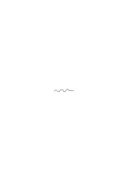

# Ts-230c

### [1\[1\]](https://cdn.wittgensteinnachlass.com/2000px/webp/Ts-230c/1.webp)

## II. Remarks.

### [1\[2\]](https://cdn.wittgensteinnachlass.com/2000px/webp/Ts-230c/1.webp)

1. Let us consider the _use_ of the word “German language”! Otherwise, we might ask: “What is language? – All its sentences that have ever been spoken? The class of its rules and words? etc. etc.” – What is the system? Where is it? What is chess? – All the games; the list of rules?

([→ 407])

### [1\[3\]](https://cdn.wittgensteinnachlass.com/2000px/webp/Ts-230c/1.webp)

2. How did I come to the concept of ‘sentence’ or the concept of ‘language’? Only through the languages that I have learned. – But they seem to have led me, in a certain sense, beyond themselves, because I am now able to construct a new language, e.g., to invent words. – So this construction also belongs to the concept of language. But only if I want to define it in that way.

([→ 500])

### [1\[4\]](https://cdn.wittgensteinnachlass.com/2000px/webp/Ts-230c/1.webp)

3. The _use_ of the words “sentence,” “language,” etc., has the same vagueness as the normal _use_ of the terms in our language. To believe that they are therefore unusable, or that they do not fully serve their purpose, would be like saying: “The heat given off by this stove is useless – one does not know where it begins and where it ends.”

([→ 501])

### [1\[4\]](https://cdn.wittgensteinnachlass.com/2000px/webp/Ts-230c/1.webp),[2\[1\]](https://cdn.wittgensteinnachlass.com/2000px/webp/Ts-230c/2.webp)

4. The philosophy of logic speaks of sentences and words in no other sense than we do in ordinary life, when we say, for example, “Here is a Chinese sentence written,” or “No, it only looks like characters, but it is an ornament,” etc. We speak of the spatial and temporal phenomenon of language; not of an aspatial and atemporal thing. But we speak of it in the same way as of the pieces in a game of chess, by giving rules for it, not by describing their physical properties. The question “What is a word?” is analogous to the question: “What is a chess piece?”

([→ 502])

### [2\[2\]](https://cdn.wittgensteinnachlass.com/2000px/webp/Ts-230c/2.webp)

5. When thinking about language and meaning, we can easily come to think that in philosophy we are not actually talking about words and sentences in the most ordinary sense, but in a sublimated, abstract sense. – As if a particular sentence were not actually what any person utters, but an ideal entity (the ‘class of all sentences with the same meaning’, or something similar). But is the chess king, about which the rules of chess speak, also such an ideal entity, an abstract being?

([→ 503])

### [2\[3\]](https://cdn.wittgensteinnachlass.com/2000px/webp/Ts-230c/2.webp),[3\[1\]](https://cdn.wittgensteinnachlass.com/2000px/webp/Ts-230c/3.webp)

6. When I talk about language (word, sentence, etc.), I must use the language of everyday life. Is this language perhaps too crude, too material, for what we want to say? And how could one create a different one? – And how strange that we can then do anything with it at all! The fact that in philosophical explanations about language I must already use the full language (not some preliminary, provisional one) shows that I can only bring forth something external about language. “Yes, but how can these explanations then satisfy us?” – Well, your questions were already formulated in this language! – And your scruples are misunderstandings. – Your questions relate to words, so I must talk about words. One says: it does not depend on the word, but on its meaning; and thinks of the meaning as something of the same kind as the word, although different from it. Here the word, here the meaning. The money, and the cow that can be bought for it. (On the other hand: the money, and its use.)

([→ 504])

### [3\[2\]](https://cdn.wittgensteinnachlass.com/2000px/webp/Ts-230c/3.webp)

7. It somehow bothers us that the thought of a sentence is not fully present at any moment. We see it as an object that we create, and never fully possess; for scarcely has one part come into being, when another disappears.

([→ 88])

### [3\[3\]](https://cdn.wittgensteinnachlass.com/2000px/webp/Ts-230c/3.webp)

8. Not: “Without language, we could not communicate with each other” – but rather: without language, we cannot influence people in such and such a way, we cannot build roads and machines, etc. And also: without the use of speech and writing, people could not communicate.

([→ 113])

### [3\[4\]](https://cdn.wittgensteinnachlass.com/2000px/webp/Ts-230c/3.webp)

9. Consider: inventing a game – inventing a language – inventing a machine.

([→ 114])

### [3\[5\]](https://cdn.wittgensteinnachlass.com/2000px/webp/Ts-230c/3.webp)

10. Inventing a language could mean, on the basis of natural laws (or in agreement with them), inventing a device for a specific purpose; but it also has the other sense, which is analogous to the sense in which we speak of inventing a game. I make a statement about the grammar of the word “language” by connecting it with the grammar of the word “to invent”.

([→ 543])

### [3\[6\]](https://cdn.wittgensteinnachlass.com/2000px/webp/Ts-230c/3.webp),[4\[1\]](https://cdn.wittgensteinnachlass.com/2000px/webp/Ts-230c/4.webp)

11. One can imagine that a person invents language; that he makes the invention of having other human beings work for him, by training them through reward and punishment to perform certain actions in response to commands. This invention would be analogous to the invention of a machine.

([→ 535])

### [4\[2\]](https://cdn.wittgensteinnachlass.com/2000px/webp/Ts-230c/4.webp)

12. Can one say that grammar describes language; that language is that part of the psycho-physical mechanism by means of which we, by uttering words, make a human machine work for us, as if by pressing the buttons of a keyboard? Grammar then describes that part of the whole machine. ([→ 536])

### [4\[3\]](https://cdn.wittgensteinnachlass.com/2000px/webp/Ts-230c/4.webp)

13. When one learns musical notation, one is taught a kind of grammar. It states that this note corresponds to this key on the piano, the sharp raises a tone, the sign ♮ cancels the effect of the sharp, etc. If the student asked whether there was a difference between

and

,

or what the sign

means, we would tell him that the distance of the note head from the lines expresses nothing, and so on. One can regard these instructions as part of the preparation that turns the student into a kind of playing machine.

([→ 541])

### [4\[4\]](https://cdn.wittgensteinnachlass.com/2000px/webp/Ts-230c/4.webp),[5\[1\]](https://cdn.wittgensteinnachlass.com/2000px/webp/Ts-230c/5.webp)

14. It is clear that I can determine through experience that a human or an animal reacts to a sign in the way I want, but not to another. For example, that a human goes to the right when they see the sign

“”

and goes to the left when they see the sign

“”; but that they do not react to the sign

“”

in the same way as to

“”,

etc. Yes, I do not even need to invent a case, and can just consider the actual one: that I can only guide a person who has only learned German with the German language. (For I see the learning of the German language as an adjustment, a making receptive of the mechanism for this kind of influence; and it makes no difference here whether the other person has learned the language, or perhaps is already, from birth, so constituted that he reacts to the sentences of the German language, as normally only someone who has learned it does.)

([→ 537])

### [5\[2\]](https://cdn.wittgensteinnachlass.com/2000px/webp/Ts-230c/5.webp)

15. When I say that the command “Bring me sugar!” and “Bring me milk!” has sense, but not the combination “Milk me sugar”, this does not mean that uttering this combination of words has no effect. And if it now has the effect that the other person stares at me and opens his mouth, I do not call it the command to stare at me, etc., even if that was the effect I wanted to produce.

([→ 538])

### [5\[3\]](https://cdn.wittgensteinnachlass.com/2000px/webp/Ts-230c/5.webp)

16. Language is not defined for us as an institution that serves a specific purpose. Rather, “language” is, for us, a collective name, and I understand by it the German language, the English language, and so on, and also various systems of signs that have a greater or lesser kinship with these languages.

([→ 540])

### [5\[4\]](https://cdn.wittgensteinnachlass.com/2000px/webp/Ts-230c/5.webp)

17. “Is the meaning, the understanding of the word, contained in the explanation of the meaning; or is it only brought about by it, as the disease is brought about by the poison? – How does the explanation affect understanding?” – How does the explanation work? That is: what does it _effect_; and how does one apply it? (Not everything that brings about understanding is called an “explanation”.)

([→ 34])

### [6\[1\]](https://cdn.wittgensteinnachlass.com/2000px/webp/Ts-230c/6.webp)

18. When I give someone a command, it is quite enough for me to give him signs. And I would never say: these are just words, and I must penetrate behind the words. Similarly, if I have asked someone something and he gives me an answer (i.e., signs), I am satisfied – that was what I expected – and I do not say: this is merely an answer. (The deep aspect easily escapes one's notice.)

([→ 1])

### [6\[2\]](https://cdn.wittgensteinnachlass.com/2000px/webp/Ts-230c/6.webp)

19. But if one says: “How am I to know what he means; I can only see his signs,” then I say: “How is _he_ to know what he means; he only has his signs as well.”

([→ 2])

### [6\[3\]](https://cdn.wittgensteinnachlass.com/2000px/webp/Ts-230c/6.webp)

20. “I don't just say this, I also mean something by it.” – If one considers what is going on within us when we _mean_ words (and not just say them), it seems to us as if something is then coupled with these words, whereas otherwise they run empty. – As if they, as it were, intervened in us.

([→ 7])

### [6\[4\]](https://cdn.wittgensteinnachlass.com/2000px/webp/Ts-230c/6.webp)

21. The sentence, when I understand it, acquires for me depth, a new dimension, one might say.

([→ 8])

### [6\[5\]](https://cdn.wittgensteinnachlass.com/2000px/webp/Ts-230c/6.webp)

22. How does something like this happen: I say “now for the first time I know what the words ‘the blue ether’ mean.”

( )

### [6\[6\]](https://cdn.wittgensteinnachlass.com/2000px/webp/Ts-230c/6.webp),[7\[1\]](https://cdn.wittgensteinnachlass.com/2000px/webp/Ts-230c/7.webp)

23. “You made a movement with your hand; did you mean something by it? – I thought you meant that I should come to you.” So he could mean something by it, or also mean nothing. And if the former: then it is his hand movement – or something else? Did he mean something other than this with his expression? or did he only _mean_ his expression?

([→ 3])

### [7\[2\]](https://cdn.wittgensteinnachlass.com/2000px/webp/Ts-230c/7.webp)

24. Could one also answer: “I meant something with this movement, which I can only express through this movement”? One does not learn the meaning of a sign only through translation; but also by learning to understand its intervention in life.

([→ 4] cf. [→ 406])

### [7\[3\]](https://cdn.wittgensteinnachlass.com/2000px/webp/Ts-230c/7.webp)

25. “The dog _means_ something with its wagging.” – How would one justify this? – Does one also say: “The plant, when it lets its leaves hang, means by this that it needs water”?

([→ 189])

### [7\[4\]](https://cdn.wittgensteinnachlass.com/2000px/webp/Ts-230c/7.webp)

26. We would hardly ask whether the crocodile means something by it when it comes towards a person with its mouth open. And we would explain: the crocodile cannot think, and therefore, strictly speaking, there is no question of meaning here.

([→ 190])

### [7\[5\]](https://cdn.wittgensteinnachlass.com/2000px/webp/Ts-230c/7.webp)

27. Imagine a sentence of word-language replaced by signs of sign language. Do we still feel the same need for _explanation_ here as with words? – Is sign language incapable of explanation? Certainly! e.g. through word-language.

([→ 94])

### [8\[1\]](https://cdn.wittgensteinnachlass.com/2000px/webp/Ts-230c/8.webp)

28. “This sentence has sense.” – “Which?” Compare this with: “This sequence of words is a sentence.” – “Which?”

([→ 91] cf. [→ 112])

### [8\[2\]](https://cdn.wittgensteinnachlass.com/2000px/webp/Ts-230c/8.webp)

29. We speak of understanding a sentence in the sense in which it can be replaced by another that says the same thing; but also in the sense in which it cannot be replaced by any other. (Just as little as a musical theme can be replaced by another.) In the one case, the thought of the sentence is what is common to different sentences; in the other, something that only these words, in these positions, express. (Understanding a poem.)

([→ 682])

### [8\[3\]](https://cdn.wittgensteinnachlass.com/2000px/webp/Ts-230c/8.webp)

30. So, does “understanding” have two different meanings here? – I would say that these uses of “understanding” constitute its meaning, my _concept_ of understanding. Because I _want_ to apply “understanding” to everything.

([→ 683])

### [8\[4\]](https://cdn.wittgensteinnachlass.com/2000px/webp/Ts-230c/8.webp)

31. But how can one explain the expression in the latter case, convey the understanding? Ask yourself: How does one lead someone to understand a poem, or a theme? The answer to that tells us how one explains the sense here.

([→ 684])

### [8\[5\]](https://cdn.wittgensteinnachlass.com/2000px/webp/Ts-230c/8.webp)

32. We understand Chinese gestures as little as we understand Chinese sentences.

([→ 11])

### [9\[1\]](https://cdn.wittgensteinnachlass.com/2000px/webp/Ts-230c/9.webp)

33. It is odd: we would like to explain our understanding of a gesture as interpreting the gesture through words, and understanding words as interpreting them through gestures. And indeed, we explain words through a gesture, and a gesture through words.

([→ 16])

### [9\[2\]](https://cdn.wittgensteinnachlass.com/2000px/webp/Ts-230c/9.webp)

34. To _hear_ a word in this meaning. How odd that there is such a thing! Thus phrased, thus emphasized, thus heard, the sentence is the beginning of a transition to these sentences, images, actions. (A number of well-known paths lead from these words in all directions.

### [9\[3\]](https://cdn.wittgensteinnachlass.com/2000px/webp/Ts-230c/9.webp)

35. Suppose, instead of snapshot photographs of our acquaintances, we used a kind of cinematographic images that reproduced a very small movement. And we called this a ‘living’ portrait, as opposed to a ‘dead’ one, and did not consider it as an image of a movement, a change of position. (The vibrant life of words.)

([→ 281])

### [9\[4\]](https://cdn.wittgensteinnachlass.com/2000px/webp/Ts-230c/9.webp),[10\[1\]](https://cdn.wittgensteinnachlass.com/2000px/webp/Ts-230c/10.webp)

36. One could say: in all cases, one means by “thought” the _living_ thing in the sentence. That which, without it, is dead, a mere sequence of sounds, or a sequence of written figures. But if I were to speak of something that gives meaning to a configuration of chess pieces, i.e., distinguishes it from any arbitrary arrangement of wooden blocks, – what could I not mean! The rules that make the chess configuration a situation in a game; the particular experiences that we associate with such game positions; the usefulness of the game. – Or if we were to speak of something that distinguishes paper money from mere printed slips of paper and gives it its meaning, its life!

([→ 544])

### [10\[2\]](https://cdn.wittgensteinnachlass.com/2000px/webp/Ts-230c/10.webp)

37. What I want to teach people is to make the transition from an unobvious nonsense to an obvious one.

([→ 647])

### [10\[3\]](https://cdn.wittgensteinnachlass.com/2000px/webp/Ts-230c/10.webp)

38. “But the words, pronounced meaningfully, do have not only a surface, but also a depth dimension!” Something else is indeed happening when they are pronounced meaningfully, than when they are merely pronounced. It doesn't matter how I express it. Whether I say that in the first case they have depth; or, something is happening in me, in my inner self; or, they have an atmosphere – it always comes down to the same thing. If we all agree on this, won't it be true?

([→ 567])

### [10\[4\]](https://cdn.wittgensteinnachlass.com/2000px/webp/Ts-230c/10.webp)

39. (– I cannot accept his testimony because it is not a _testimony_. It only tells me what he is _inclined_ to say.)

([→ 602) To No. _286_].

### [10\[5\]](https://cdn.wittgensteinnachlass.com/2000px/webp/Ts-230c/10.webp)

40. But if one says “I _hope_ he will come!” – does the feeling not give the word “hope” its meaning? (And what about the sentence “I no longer _hope_ that he will come”?) The feeling perhaps gives the word “hope” its particular tone. – If the feeling gives the word its meaning, then “meaning” here means: _what matters_. But why does the feeling matter?

([→ 271])

### [11\[1\]](https://cdn.wittgensteinnachlass.com/2000px/webp/Ts-230c/11.webp)

41. Why should I not say: the cry, the laughter, are full of meaning? And this means approximately: much could be read from them.

([→ 272])

### [11\[2\]](https://cdn.wittgensteinnachlass.com/2000px/webp/Ts-230c/11.webp)

42. Thus the words “I wish he would come!” are charged with my wish. And words can be torn from us, like a cry. Words can be _difficult_ to utter: words with which one renounces something; or confesses a weakness.

([→ 331])

### [11\[3\]](https://cdn.wittgensteinnachlass.com/2000px/webp/Ts-230c/11.webp)

43. One could imagine people possessing something not entirely unlike a language: vocal gestures, without vocabulary or grammar. (‘Speaking with tongues’)

([→ 332])

### [11\[4\]](https://cdn.wittgensteinnachlass.com/2000px/webp/Ts-230c/11.webp)

44. “But what would be the meaning of the sounds here?” – What is it in music? – Even if I do not want to say that this language of sound gestures must be compared with music.

([→ 334])

### [11\[5\]](https://cdn.wittgensteinnachlass.com/2000px/webp/Ts-230c/11.webp)

45. A major cause of philosophical illnesses – a one-sided diet. One nourishes one’s thinking with only one kind of example.

([→ 183])

### [11\[6\]](https://cdn.wittgensteinnachlass.com/2000px/webp/Ts-230c/11.webp),[12\[1\]](https://cdn.wittgensteinnachlass.com/2000px/webp/Ts-230c/12.webp)

46. “Is it not peculiar that I should not be able to think that it will soon stop raining, without the institution of language and its whole environment?” – Do you mean that it is odd that you should not be able to say these words and _mean_ them, without that environment? Let us assume that someone, pointing to the sky, utters a series of unintelligible words. When we ask him what he means, he says that it means “Thank God, it will soon stop raining”. Yes, he also explains to us what the individual words mean. – I assume that he suddenly comes to himself and says that that sentence was complete nonsense, but that, when he spoke it, it _appeared_ to him as a sentence of a language familiar to him. (Yes, something like a well-known quote.) – What am I to say? Did he not understand this sentence when he said it? Did not the sentence contain all its meaning?

([→ 327])

### [12\[2\]](https://cdn.wittgensteinnachlass.com/2000px/webp/Ts-230c/12.webp)

47. But in what did this understanding and the meaning consist? He spoke the sequences of sounds in a joyful tone, while pointing to the sky, while it was still raining, but was becoming lighter; _later_ he made a connection between his words and the German words.

([→ 328])

### [12\[3\]](https://cdn.wittgensteinnachlass.com/2000px/webp/Ts-230c/12.webp)

48. “But his words just felt like the words of a language familiar to him”. – Yes; the criterion for this is that he _later_ said so. And now don’t say: “The words of a language familiar to us just feel in a quite specific way”.

(What is the _expression_ of this feeling?)

([→ 329])

### [12\[4\]](https://cdn.wittgensteinnachlass.com/2000px/webp/Ts-230c/12.webp),[13\[1\]](https://cdn.wittgensteinnachlass.com/2000px/webp/Ts-230c/13.webp)

49. “But you speak as if I didn’t actually _hope_ now, since I believe I am hoping. As if what is happening now had no deep meaning.” – What does it mean “What is happening now has meaning”, or “has deep meaning”? What is a _deep_ feeling? Could someone experience intense love or hope for just one second, no matter what preceded that second, or followed it? What is happening now has meaning – in this environment. The environment gives it importance. And the word “hope” refers to a phenomenon in human life. (A smiling mouth only _smiles_ in a human face.)

([→ 253])

### [13\[2\]](https://cdn.wittgensteinnachlass.com/2000px/webp/Ts-230c/13.webp)

50. If I now sit in my room and hope that N.N. will come and bring me money; and one minute of this hoping could be isolated, cut off from its context: Would what is happening in that minute then not be hoping? – Think, for example, of the words that you might utter in that minute. They no longer belong to that language. Perhaps to one in which they have a completely different meaning. And the institution of money does not exist in another environment either. A king's coronation is the image of splendor and dignity. Cut a short piece of this process out of its environment: The king in his coronation robe has the crown placed on his head. – Now, in another environment, on another planet, gold is the cheapest metal. The fabric of the robe can be produced cheaply by the machines available; etc. etc.; the crown is regarded there as a parody of a decent hat.

([→ 254])

### [13\[3\]](https://cdn.wittgensteinnachlass.com/2000px/webp/Ts-230c/13.webp),[14\[1\]](https://cdn.wittgensteinnachlass.com/2000px/webp/Ts-230c/14.webp)

51. Someone who does not speak German hears me exclaim on certain occasions: “What glorious lighting!” He guesses the sense and now uses the exclamation himself, as I do, without, however, understanding the three words. Does he understand the exclamation? Would it be just as easy to imagine the analogous case for this sentence: “If the train does not arrive punctually at 5 o'clock, it will miss the connection”? What would it mean in this case: to guess the sense?

([→ 347])

### [14\[2\]](https://cdn.wittgensteinnachlass.com/2000px/webp/Ts-230c/14.webp)

52. We can imagine a language in whose use the _feeling_ that adheres to our words plays no role; in which there is no understanding of the word's character, the soul of the word. The words are transmitted to us as if they were the signs of the chemical sign language and do not acquire an aura. If, for example, an order is given, then we transmit the signs according to rules, tables, into actions. It does not come to an impression, similar to that of a painted picture, and in this language, no poetry is written. ([→ 403])

### [14\[3\]](https://cdn.wittgensteinnachlass.com/2000px/webp/Ts-230c/14.webp)

53. Imagine this language: The words and grammar are those of German, but the words in the sentence stand in the opposite order. A sentence in this language sounds like a German sentence that one reads from the full stop to the beginning. The possibilities of expression therefore have the same variety as in German. But what we know as sentence melody is destroyed.

([→ 46])

### [14\[4\]](https://cdn.wittgensteinnachlass.com/2000px/webp/Ts-230c/14.webp),[15\[1\]](https://cdn.wittgensteinnachlass.com/2000px/webp/Ts-230c/15.webp)

54. What does it mean to understand a picture, a drawing? For even there, there is understanding and not understanding. And even there, these expressions can mean different things. The picture may be a still life; but I do not understand part of it, I am not able to see bodies there, but only see patches of color on the canvas. – Or I see everything physically, but they are objects that I do not know (they look like devices, but I do not know their use). – Perhaps I know the objects, but I do not understand – in another sense – their arrangement.

([→ 10])

### [15\[2\]](https://cdn.wittgensteinnachlass.com/2000px/webp/Ts-230c/15.webp)

55. “After he had said that, he left them as on the previous day.” – Do I understand this sentence? Do I understand it as I would if I read it in the course of a narrative? If it stands isolated, I would say I do not know what it is about. But I would still know how this sentence could be used; I could invent a context for it myself.

([→ 9])

### [15\[3\]](https://cdn.wittgensteinnachlass.com/2000px/webp/Ts-230c/15.webp)

56. Sense of the sentence, sense of a picture. If we compare the sentence with a picture, we must consider whether it is a portrait, a historical representation, or a genre painting. And both comparisons make sense. “When I look at a genre painting, it ‘tells me something,’ even if I do not believe for a moment (imagine) that the people I see in it are real; or, that there were real people in this situation.” What kind of answer would there be to the question: “_What_ does it tell me?”

([→ 532])

### [15\[4\]](https://cdn.wittgensteinnachlass.com/2000px/webp/Ts-230c/15.webp)

57. Let us imagine a kind of puzzle picture in which one does not have to find a _specific_ object, but rather something that initially appears to us as a jumble of meaningless lines, and only after some searching does it emerge as, say, a landscape picture. – In what does the difference consist between the sight of the picture before and after the solution? It is clear that we see it differently both times. But in what sense can one say that after the solution the picture now tells us something, whereas earlier it told us nothing?

([→ 409])

### [16\[1\]](https://cdn.wittgensteinnachlass.com/2000px/webp/Ts-230c/16.webp)

58. “The picture tells itself to me” – I would like to say. That is to say, that it tells me something consists in its own structure, in _its_ forms and colors. (What would it mean if one said “The musical theme tells itself to me”?)

([→ 406])

### [16\[2\]](https://cdn.wittgensteinnachlass.com/2000px/webp/Ts-230c/16.webp)

59. The impression seen as an atmosphere: “This melody is surrounded by a strong atmosphere.” – But with _what_ atmosphere? What would we call a description of this atmosphere? (Interpreting ‘understanding’ as an atmosphere; as a mental act. – One can construct an atmosphere for anything.)

([→ 663])

### [16\[3\]](https://cdn.wittgensteinnachlass.com/2000px/webp/Ts-230c/16.webp)

60. The understanding of a sentence of language is much more closely related to the understanding of a theme in music than one might think. I mean it in such a way that the understanding of the linguistic sentence is closer than one thinks to what one usually calls the understanding of musical expression. Why should the strength and tempo move in _this_ line in particular? One would like to say: “Because I know what all this means.” But what does it mean? I would not know how to say it. In order to ‘explain’ it, I could only _compare_ it with something else that has the same rhythm (I mean, the same line). (One can say: “Don’t you see that this is as if an inference is being drawn” or: “this is as it were a parenthesis”, etc. How does one justify such comparisons? There are very different justifications for it.)

([→ 89])

### [16\[4\]](https://cdn.wittgensteinnachlass.com/2000px/webp/Ts-230c/16.webp)

61. One says “This face has a quite _definite_ expression” – and perhaps looks for words to characterize it.

([→ 395])

### [17\[1\]](https://cdn.wittgensteinnachlass.com/2000px/webp/Ts-230c/17.webp)

62. What happens when we learn to _experience_ the ending of a church mode as an ending?

([→ 422])

### [17\[2\]](https://cdn.wittgensteinnachlass.com/2000px/webp/Ts-230c/17.webp)

63. Experience of true size. We see a picture that shows the shape of an armchair. We are told that it represents a construction of house size. Now we see it differently.

([→ 421])

### [17\[3\]](https://cdn.wittgensteinnachlass.com/2000px/webp/Ts-230c/17.webp),[18\[1\]](https://cdn.wittgensteinnachlass.com/2000px/webp/Ts-230c/18.webp)

64. It is useful here to consider what one says about a phenomenon, such as the following: the figure

sometimes seeing it as F, sometimes as its mirror image. Now, I want to ask: what does it consist in, seeing the figure one way, and another way? – Do I really see something different each time? Or do I only _interpret_ what I see in different ways? – I am inclined to say the former. _But why_ Well, interpretation is an action. It can consist, for example, in someone saying, “This is supposed to be an F”; or in not saying it, but replacing the sign with an F when copying; or in thinking, “What could this be? It will be an F that the writer botched.” – Seeing is not an action, but a state. And if I have never considered the sign to be anything other than an F, and have never thought about what it might be, then one will say that I _see_ the sign as an F; namely, because one knows that it can also be seen differently. How did one come to the concept of ‘seeing something as something’ in the first place? On what occasions was there a need for it? (Very common in aesthetic considerations.) Everywhere there, where it is a matter of phrasing through the eye and the ear. We say, “You must hear these bars as an introduction,” “You must listen for this key,” “Once you have seen this figure as …, it is difficult to see it differently,” “I hear the French ‘ne … pas’ as a two-part negation, but not in the sense of ‘not a step’,” etc. Is it now a real seeing or hearing? Well: that is what we call it; with these words, we react in certain situations. And we react to these words again through certain actions.

([→ 268])

### [18\[2\]](https://cdn.wittgensteinnachlass.com/2000px/webp/Ts-230c/18.webp)

65. When I say that this face has the expression of mildness, goodness, cowardice, it seems that I do not only mean that we associate the character in question with the sight of the face, i.e. think of it when we see the face; but I am tempted to say that the face is an aspect of goodness, or of cowardice itself. (Compare Weininger.) One can say: I see the cowardice in this face (and could also see it in another); but in any case it seems that it is not merely associated with the face, externally connected; but that the timidity is of the nature of the facial features. And if, for example, the features change a little, then we can speak of a corresponding change in the timidity. If we were asked, “Can you also think of this face as an expression of courage?” – we would, as it were, not know how to accommodate the courage in these features. I would then say something like: “I don’t know what it would mean if this face were a courageous face.” – But what does the solution to such a question look like? One says, for example: ‘Yes, now I understand; the face is, as it were, indifferent to the outside world.’ So we have interpreted courage into it. Courage, one could say, _fits_ back onto the face now. But _what_ fits _onto_ what here?

([→ 416])

### [18\[3\]](https://cdn.wittgensteinnachlass.com/2000px/webp/Ts-230c/18.webp),[19\[1\]](https://cdn.wittgensteinnachlass.com/2000px/webp/Ts-230c/19.webp)

66. It is a related case (although it may not seem so) when we first wonder that the French put an attributive adjective where a predicative one should stand; and when we solve the problem for ourselves in this way: they mean “the person is _a good_ one”. An interpretation, in this case, makes us feel at home. But that does not mean that one can only come to feel at home in these forms through an interpretation.

([→ 417])

### [19\[2\]](https://cdn.wittgensteinnachlass.com/2000px/webp/Ts-230c/19.webp)

67. I see a picture that depicts a smiling head. What do I do when I sometimes interpret the smile as friendly, and at other times as malicious? Don't I often imagine it in a certain spatial and temporal environment, which I call friendly or malicious? Thus, I could imagine that the smiling person is looking down on a child at play, or on the suffering of an enemy. Nothing changes in this by also being able to interpret the, at first glance, amiable situation differently through another environment. – I will interpret a certain smile as friendly, if no particular circumstances cause my interpretation to change, and I will call it “friendly,” and react accordingly.

([→ 418])

### [19\[3\]](https://cdn.wittgensteinnachlass.com/2000px/webp/Ts-230c/19.webp)

68. We say “The expression of his voice was _genuine_.” If it was not genuine, then we quasi imagine another one behind it. – He puts on _this_ face outwardly, but has a different one inside. This does not mean, however, that when his expression is _genuine_, he makes two identical faces.

([→ 566])

### [19\[4\]](https://cdn.wittgensteinnachlass.com/2000px/webp/Ts-230c/19.webp),[20\[1\]](https://cdn.wittgensteinnachlass.com/2000px/webp/Ts-230c/20.webp)

69. To say that the points, which this experiment yields, lie on average on this line, e.g., a straight line, says something similar to: “Seen from this distance, they seem to lie on a straight line.” I can say of a stretch that the general impression it gives is that of a straight line; but not of a line segment.

;

although it would be possible to see it as a piece of a longer line, in which the deviations from the straight line would be lost. I cannot say: “This line segment looks straight, because it can be the piece of a line that, as a whole, gives me the impression of a straight line.” (Mountains on the Earth and on the Moon. Earth a sphere.)

([→ 565])

### [20\[2\]](https://cdn.wittgensteinnachlass.com/2000px/webp/Ts-230c/20.webp)

70. When I think in language, meanings do not float before me alongside the linguistic expression; rather, the language itself is the vehicle of thought.

([→ 528])

### [20\[3\]](https://cdn.wittgensteinnachlass.com/2000px/webp/Ts-230c/20.webp)

71. “The purpose of language is to express thoughts.” – So, presumably, the purpose of every sentence is to express a thought. What thought, for example, does the sentence “It is raining” express? ‒ ‒

([→ 112])

### [20\[4\]](https://cdn.wittgensteinnachlass.com/2000px/webp/Ts-230c/20.webp),[21\[1\]](https://cdn.wittgensteinnachlass.com/2000px/webp/Ts-230c/21.webp)

72. I think the right word in this case is …” – Doesn't this show that the meaning of the word is something that we have in mind, and that it is, as it were, the precise image that we need here? ‒ ‒ I think I chose between the words “stately,” “dignified,” “proud,” “awe-inspiring”; isn't it as if I were choosing between drawings in a folder? – No; the fact that one speaks of the _apt word_ does not _show_ the existence of something, etc.. Rather, one is inclined to speak of that image-like essence because one can perceive a word as apt; one often chooses between words, as between similar, but not identical, images; because one often uses images instead of words, or to illustrate words, etc..

([→ 363])

### [21\[2\]](https://cdn.wittgensteinnachlass.com/2000px/webp/Ts-230c/21.webp)

73. “He measured him with a hostile glance and said …” The reader of the story understands this; he has no doubt in his mind. Now you say: “Well, he adds the meaning himself, he guesses it.” – In general: No. In general, he does not add anything, he does not guess anything. – However, it is also possible that the hostile glance and the words later turn out to be a pretense, or that the reader remains in doubt as to whether they are or not, and that he is therefore really guessing at a possible interpretation. – But then he guesses primarily at a connection. He says to himself, for example: the two who are acting so hostilely are actually friends. etc..

([→ 299])

### [21\[3\]](https://cdn.wittgensteinnachlass.com/2000px/webp/Ts-230c/21.webp)

74. Could a machine think – could it feel pain? Well, – is the human body supposed to be called a machine? It is, after all, the closest thing to a machine.

([→ 370])

### [21\[4\]](https://cdn.wittgensteinnachlass.com/2000px/webp/Ts-230c/21.webp)

75. If the other person could be an automaton, then so could I. –

([→ 269.1])

### [21\[5\]](https://cdn.wittgensteinnachlass.com/2000px/webp/Ts-230c/21.webp)

76. But a machine cannot think! – Is that an experiential proposition? No. We only say that humans, and things similar to them, think. We also say it of dolls, and probably also of spirits. Consider the word “thinking” as an instrument!

([→ 342])

### [22\[1\]](https://cdn.wittgensteinnachlass.com/2000px/webp/Ts-230c/22.webp)

77. There is a psychology only for beings whose _**behaviour**_ is similar to that of humans.

([→ 694])

### [22\[2\]](https://cdn.wittgensteinnachlass.com/2000px/webp/Ts-230c/22.webp)

78. Is thinking, so to speak, a specifically _organic_ process of the mind, something like chewing and digesting in the mind? Can it then be replaced by an inorganic process that serves the same purpose; something like performing the task of thinking with a prosthesis? How would one imagine a thinking prosthesis?

([→ 372])

### [22\[3\]](https://cdn.wittgensteinnachlass.com/2000px/webp/Ts-230c/22.webp)

79. “How can the word ‘not’ negate?” – “The sign ‘not’ indicates that you should _perceive_ what follows it in a negative way.” One might say: the sign of negation is merely an inducement to do something, possibly something very complicated. It is as if the sign of negation induces us to do something. But to what end? This is not said. – It is as if it only needs to be indicated; as if we already know it. As if an explanation were unnecessary, since we already know the matter.

([→ 75])

### [22\[4\]](https://cdn.wittgensteinnachlass.com/2000px/webp/Ts-230c/22.webp)

80. What is the difference between the two processes: wishing that something happen – and wishing that the same thing _not_ happen? If one wants to represent it figuratively, one will do different things with the image of the event: cross it out, fence it off, and the like. But this, it seems, is a _crude_ method of expression. In word-language, we actually use the sign “not”. This is like an awkward makeshift. One thinks: in _thinking_, it happens differently.

([→ 76])

### [23\[1\]](https://cdn.wittgensteinnachlass.com/2000px/webp/Ts-230c/23.webp)

81. Negation: a ‘mental activity’. Negate something, and observe what you do! – Do you perhaps shake your head inwardly? And if so, is this process now more worthy of our interest than, say, writing a negation sign in front of a sentence? Do you now know the _essence_ of negation?

([→ 74])

### [23\[2\]](https://cdn.wittgensteinnachlass.com/2000px/webp/Ts-230c/23.webp)

82. Is it the _same_ negation: “Iron does not melt at 100 degrees C” and “2 times 2 is not 5”? – Should this be determined by introspection? By trying to see what we _think_ in both sentences?

([→ 78])

### [23\[3\]](https://cdn.wittgensteinnachlass.com/2000px/webp/Ts-230c/23.webp)

83. When we think, I asked: when we utter the sentences “This stick is 1 m long” and “There is 1 soldier here,” is it clear to us that we mean different things by “1,” that “1” has different meanings? – It does not become clear to us. Say a sentence like “For every 1 m, there is one soldier, so for every 2 m, there are 2 soldiers.” If asked, “Do you mean the same thing by the two ones?” – would one perhaps answer: “Of course, I mean the same thing: _one_!” (possibly raising a finger).

([→ 435])

### [23\[4\]](https://cdn.wittgensteinnachlass.com/2000px/webp/Ts-230c/23.webp)

84. Does “1” have a different meaning when it is sometimes used for a measure and at other times for a quantity? If the question is _asked_ in this way, then one will answer it in the affirmative.

([→ 436])

### [23\[5\]](https://cdn.wittgensteinnachlass.com/2000px/webp/Ts-230c/23.webp),[24\[1\]](https://cdn.wittgensteinnachlass.com/2000px/webp/Ts-230c/24.webp)

85. We can easily imagine people with a ‘more primitive’ logic, in which something corresponding to our negation only exists for certain sentences; for sentences, for example, that do not themselves contain a negation. One could negate the sentence “He goes into the house,” but a negation of a negative sentence would be senseless, or it would only be valid as a repetition of the negation. Think of other means than ours of expressing a negation: for example, through the tone of the sentence. What would a double negation look like here?

([→ 437])

### [24\[2\]](https://cdn.wittgensteinnachlass.com/2000px/webp/Ts-230c/24.webp)

86. The question of whether, for these people, negation has the same meaning as it does for us, would be analogous to the question of whether the digit “5” means the same thing to people whose number series ends with 5, as it does to us.

([→ 438])

### [24\[3\]](https://cdn.wittgensteinnachlass.com/2000px/webp/Ts-230c/24.webp)

87. I am inclined to say: I ‘point’ _in a different sense_ to this object, to its shape, to its color, etc. – What does that mean? It _seems_ to mean that something else is going on when one points; or _behind_ the pointing. What does it mean: I ‘hear’ _in another sense_: the piano, its sound, the piece of music, the pianist, his dexterity? It just means that one of these expressions can be explained by its association with another.

([→ 33])

### [24\[4\]](https://cdn.wittgensteinnachlass.com/2000px/webp/Ts-230c/24.webp)

88. One is always in danger in philosophy of producing a myth of symbolism, or one of mental processes; instead of simply saying what everyone knows and must admit.

( )

### [24\[5\]](https://cdn.wittgensteinnachlass.com/2000px/webp/Ts-230c/24.webp)

89. Negation, one might say, is like an excluding, rejecting gesture. But we use such gestures in very many different cases!

([→ 77])

### [25\[1\]](https://cdn.wittgensteinnachlass.com/2000px/webp/Ts-230c/25.webp)

90. Is the negation of a sentence identical with the disjunction of the non-excluded cases? Sometimes it is. For example, in this case: “The permutation of the elements A, B, C, which he wrote down, was not A C B.”

([→ 73])

### [25\[2\]](https://cdn.wittgensteinnachlass.com/2000px/webp/Ts-230c/25.webp)

91. Try this: _Say_ “It is cold here” and _mean_ “It is warm here.” Can you do it? – And what are you doing in the process? And is there only one way of doing it?

([→ 426])

### [25\[3\]](https://cdn.wittgensteinnachlass.com/2000px/webp/Ts-230c/25.webp)

92. (One of the most misleading ways of speaking is the question “What do I mean by that?” – In most cases one could answer: “Nothing – I _say_…”)

([→ 427])

### [25\[4\]](https://cdn.wittgensteinnachlass.com/2000px/webp/Ts-230c/25.webp)

93. “Thinking,” we sometimes call the act of accompanying a sentence with a mental process, but we do not call that accompaniment a “thought.” – – Say a sentence and think it; say it with understanding! – And now don’t say it, but just do what you did when you accompanied it with understanding! – (Sing this song with expression. And now don’t sing it, but repeat the expression! – And one could also repeat something here; e.g., movements of the body, slower and faster breathing, etc.)

([→ 90])

### [25\[5\]](https://cdn.wittgensteinnachlass.com/2000px/webp/Ts-230c/25.webp),[26\[1\]](https://cdn.wittgensteinnachlass.com/2000px/webp/Ts-230c/26.webp)

94. “That can only be said by someone who is _convinced_ of it.” How does the conviction help him when he says it? – Is it then present alongside the spoken expression? (Or is it covered up by it, like a quiet tone by a loud one, so that it can no longer be heard, if one expresses it aloud?) How, if someone said: “In order to be able to sing a melody from memory, one must hear it in one’s mind, and sing it along”?

([→ 559])

### [26\[2\]](https://cdn.wittgensteinnachlass.com/2000px/webp/Ts-230c/26.webp)

95. Misleading parallel: The cry, an expression of pain – the sentence, an expression of thought. As if it were the purpose of the sentence to let one know how I feel: only, as it were, in the organ of thought and not in the stomach.

([→ 375])

### [26\[3\]](https://cdn.wittgensteinnachlass.com/2000px/webp/Ts-230c/26.webp)

96. It is as little essential for understanding a sentence that one should imagine something in connection with it, as it is that one should draw a picture after it.

([→ 358])

### [26\[4\]](https://cdn.wittgensteinnachlass.com/2000px/webp/Ts-230c/26.webp),[27\[1\]](https://cdn.wittgensteinnachlass.com/2000px/webp/Ts-230c/27.webp)

97. What happens when we try, for example, when writing a letter, to find the right expression for our thoughts? – This way of speaking compares the process to one of translation or description: the thoughts are there, and we are only looking for their expression; the mental images are there, but not yet their description. This picture is more or less true in various cases. – But what all could not happen here! For example: I give myself over to a mood, and the expression _comes_. Or: I have a mental image in mind, which I try to describe. Or: an English expression occurs to me, and I want to recall the corresponding German one. Or: a gesture occurs to me, and I ask myself, “Which are the words that correspond to this gesture?” Finally, a sentence occurs to me and seems appropriate to the gesture. Etc. If one were to ask, “Did you have the thought before you had the expression?” – what would one have to answer? And what about the question: “In what did the thought consist, as it existed before the expression?”

([→ 429])

### [27\[2\]](https://cdn.wittgensteinnachlass.com/2000px/webp/Ts-230c/27.webp)

98. Imagine people who could only think aloud! (As there are people who can only read aloud.)

([→ 595])

### [27\[3\]](https://cdn.wittgensteinnachlass.com/2000px/webp/Ts-230c/27.webp)

99. Does the child learn to speak, or also to think? Does it learn the sense of multiplication _before_ – or _after_ multiplying?

([→ 499])

### [27\[4\]](https://cdn.wittgensteinnachlass.com/2000px/webp/Ts-230c/27.webp)

100. “I cannot execute the command because I do not understand what you mean. – – Yes, now I understand you.” What happened when I suddenly understood the other person? There were many possibilities. The command, for example, could have been given with incorrect emphasis, and suddenly the correct emphasis occurred to me. I would then say to a third person, “Now I understand him; he means….” – and I would repeat the command with the correct emphasis. And with the correct emphasis, I now understand it; that is, I no longer have to grasp a _sense_ – something _outside_ the sentence, i.e., something ethereal – but the perfectly familiar German wording is enough for me. – Or, the command was given to me in understandable German, but it seemed nonsensical. Then an explanation occurs to me, and now I can execute it. – Or, several interpretations could occur to me, and I finally decide on one.

([→ 23])

### [27\[5\]](https://cdn.wittgensteinnachlass.com/2000px/webp/Ts-230c/27.webp),[28\[1\]](https://cdn.wittgensteinnachlass.com/2000px/webp/Ts-230c/28.webp)

101. I interpret the words. Very well. – But do I also interpret facial expressions? Do I interpret a facial expression as threatening or friendly? – It _can_ happen. If now I said: “It is not enough that I perceive the threatening face, but I must first interpret it!” – Someone points a knife at me, and I say: “I take this as a threat.”

([→ 26])

### [28\[2\]](https://cdn.wittgensteinnachlass.com/2000px/webp/Ts-230c/28.webp)

102. The absent-minded person, who, on the command “Turn right!”, turns to the left, and now, touching his forehead, says “Ah, yes – turn right” and turns right. – Did an _interpretation_ occur to him?

([→ 25])

### [28\[3\]](https://cdn.wittgensteinnachlass.com/2000px/webp/Ts-230c/28.webp)

103. Must I understand a command before I can act on it? – Certainly! Otherwise, you would not know what to do. – But from _knowledge_ to action is another leap! –

([→ 17])

### [28\[4\]](https://cdn.wittgensteinnachlass.com/2000px/webp/Ts-230c/28.webp)

104. The sentence “I must understand the command before I can act on it” naturally has a good sense; but again, no meta-logical sense.

([→ 18])

### [28\[5\]](https://cdn.wittgensteinnachlass.com/2000px/webp/Ts-230c/28.webp)

105. Misunderstanding – lack of understanding. Understanding is brought about by explanation; but also by training. Why can one not teach a cat to fetch? Does it not understand what one wants? And in what does understanding and lack of understanding consist here?

([→ 37])

### [28\[6\]](https://cdn.wittgensteinnachlass.com/2000px/webp/Ts-230c/28.webp),[29\[1\]](https://cdn.wittgensteinnachlass.com/2000px/webp/Ts-230c/29.webp)

106. “But I must understand a command in order to act on it.” – Here, the _“must”_ is suspicious. –

Think of the question: “How long before obeying must you understand the command?”

([→ 20])

### [29\[2\]](https://cdn.wittgensteinnachlass.com/2000px/webp/Ts-230c/29.webp)

107. The idea one has of understanding in this context is roughly that it brings one closer to the execution from the words. – In what sense is that correct?

([→ 19])

### [29\[3\]](https://cdn.wittgensteinnachlass.com/2000px/webp/Ts-230c/29.webp)

108. Knowing what someone looks like: being able to imagine it, but also being able to _imitate_ it. Must one imagine it in order to imitate it? And isn't imitating it just as strong as imagining it?

([→ 348])

### [29\[4\]](https://cdn.wittgensteinnachlass.com/2000px/webp/Ts-230c/29.webp)

109. I describe a room to someone, and then have him paint an _impressionistic_ picture of it based on that description, as a sign that he has understood my description. – He now paints the chairs that were green in my description dark red; where I said “yellow,” he paints blue. – This is the impression he received of the room. And now I say: “That’s right – that’s how it looks.”

([→ 658])

### [29\[5\]](https://cdn.wittgensteinnachlass.com/2000px/webp/Ts-230c/29.webp),[30\[1\]](https://cdn.wittgensteinnachlass.com/2000px/webp/Ts-230c/30.webp)

110. “My tears, my face, my words can never communicate how sad I am.” What does it mean to communicate that? – “Words are just words; they cannot communicate a thought.” One can communicate the taste of a dish through words, but also by letting the other person taste it. One could call it “communicating what I feel” if one knocked out the other person’s tooth. Is it correct to say: “Only _in this way_ can I communicate the pain I feel; not through words”? What is the criterion for it being a genuine communication?

([→ 13])

### [30\[2\]](https://cdn.wittgensteinnachlass.com/2000px/webp/Ts-230c/30.webp)

111. Describe the aroma of the coffee! – Why is it impossible? Are we lacking the words? And _for what_ are we lacking them? – Where does the idea come from that such a description should be possible? Have you ever been unable to describe something? Have you tried to describe the aroma and failed? We have a certain ideal of description in our minds. Something like a composition of the aroma from exact quantities of aroma elements.

([→ 664])

### [30\[3\]](https://cdn.wittgensteinnachlass.com/2000px/webp/Ts-230c/30.webp)

112. “Sentences are meant to describe how everything is,” we think. The sentence as a _picture_. And that is quite nice, but there are still lifes, portraits, landscape paintings, mythological depictions, ornaments, maps, diagrams, etc. etc.

([→ 168])

### [30\[4\]](https://cdn.wittgensteinnachlass.com/2000px/webp/Ts-230c/30.webp)

113. Must I _know_ whether I understand a word? Doesn't it also happen that I _imagine_ that I understand a word (not differently than understanding a type of calculation), and then realize that I haven't understood it? (“I thought I knew what ‘relative’ and ‘absolute’ motion meant, but I see that I don't know it.”)

([→ 82])

### [30\[5\]](https://cdn.wittgensteinnachlass.com/2000px/webp/Ts-230c/30.webp),[31\[1\]](https://cdn.wittgensteinnachlass.com/2000px/webp/Ts-230c/31.webp)

114. Consider this form of expression: “My book has as many pages as the equation x³ + 2x ‒ 3 = 0 yields.” Or: “I have n friends; n² + 2n + 2 = 0.” – Does this sentence have sense? It is not immediately apparent. This example shows how it can happen that something looks like a sentence that we understand, but which in fact makes no sense. (This sheds light on what it consists of: to understand a sentence, or to think one understands it.)

([→ 47])

### [31\[2\]](https://cdn.wittgensteinnachlass.com/2000px/webp/Ts-230c/31.webp)

115. A philosopher says: he understands the sentence “I am here,” means something with it, thinks something – even if he doesn't consider how, on what occasion, this sentence is used. And if I say “The rose is also red in the dark,” you literally see that redness in the dark.

([→ 685])

### [31\[3\]](https://cdn.wittgensteinnachlass.com/2000px/webp/Ts-230c/31.webp)

116. Two pictures of the rose in the dark. One is completely black, because the rose is invisible. In the other, it is painted in all its details and surrounded by blackness. Is one of these correct, the other incorrect? Are we not talking about a white rose in the dark and a red rose in the dark? And don't we still say that they cannot be distinguished in the dark?

([→ 686])

### [31\[4\]](https://cdn.wittgensteinnachlass.com/2000px/webp/Ts-230c/31.webp)

117. Are the roses red in the dark? – One can think of the rose in the dark as red. –

([→ 670])

### [31\[5\]](https://cdn.wittgensteinnachlass.com/2000px/webp/Ts-230c/31.webp)

118. You think you must weave a fabric: because you are sitting in front of a (albeit empty) loom and making the movements of weaving. ([→ 161])

### [32\[1\]](https://cdn.wittgensteinnachlass.com/2000px/webp/Ts-230c/32.webp)

119. It seems clear: we understand what the question means: “Does the sequence of digits … appear in the development of π?” – It is a German sentence; one can show what it means for “415” to appear in the development of π; and so on. Well, insofar as these explanations go, insofar, one can say, one understands that question. ([→ 666])

### [32\[2\]](https://cdn.wittgensteinnachlass.com/2000px/webp/Ts-230c/32.webp)

120. The question arises: can we not be mistaken in thinking that we understand a question? For some mathematical proofs lead us to say that we cannot imagine what we thought we could imagine. (E.g., the construction of the 7-gon.) It leads us to revise what we considered to be the realm of the imaginable. ([→ 667])

### [32\[3\]](https://cdn.wittgensteinnachlass.com/2000px/webp/Ts-230c/32.webp)

121. There can be no discussion about whether these rules, or other rules, are the right ones for the word “not” (i.e., whether they are in accordance with its meaning). For the word does not have any meaning without these rules; and if we change the rules, then it now has a different meaning (or no meaning) and we could just as well change the word. ([→ 533])

### [32\[4\]](https://cdn.wittgensteinnachlass.com/2000px/webp/Ts-230c/32.webp)

122. “The fact that three negations again give a negation must already be contained in the one negation that I am now using.” (The temptation to invent a myth of ‘meaning’.) ([→ 92])

### [32\[5\]](https://cdn.wittgensteinnachlass.com/2000px/webp/Ts-230c/32.webp),[33\[1\]](https://cdn.wittgensteinnachlass.com/2000px/webp/Ts-230c/33.webp)

123. It seems as if it follows from the nature of negation that a double negation is an affirmation. (And there is something true in this. What? _Our_ nature is connected with both.) ([→ 93])

### [33\[2\]](https://cdn.wittgensteinnachlass.com/2000px/webp/Ts-230c/33.webp)

124. What we have to say in order to explain the meaning, I mean the importance, of a concept, are often extraordinarily general facts of nature. Such facts, because of their great generality, are hardly ever mentioned. (Counting) ([→ 357])

### [33\[3\]](https://cdn.wittgensteinnachlass.com/2000px/webp/Ts-230c/33.webp)

125. Concepts lead us to investigations. They are the expression of our interest, and they direct our interest. ([→ 231])

### [33\[4\]](https://cdn.wittgensteinnachlass.com/2000px/webp/Ts-230c/33.webp)

126. What we provide are actually remarks on the natural history of man; but not curious contributions, but statements of facts that no one has doubted, and which only escape being noticed because they are constantly before our eyes. ([→ 389])

### [33\[5\]](https://cdn.wittgensteinnachlass.com/2000px/webp/Ts-230c/33.webp)

127. If one says “If our language did not have this grammar, it could not express these facts,” then one should ask oneself what the _“could”_ means here. ([→ 115])

### [33\[6\]](https://cdn.wittgensteinnachlass.com/2000px/webp/Ts-230c/33.webp),[34\[1\]](https://cdn.wittgensteinnachlass.com/2000px/webp/Ts-230c/34.webp)

128. One is tempted to justify rules of grammar by sentences of this kind: “But there really are four primary colors.” And the possibility of this justification—analogous to the justification of a sentence by pointing to the fact that makes it true—is what the statement that the rules of grammar are arbitrary is directed against. But can one not, in some sense, say that the grammar of color words, for example, characterizes the world as it actually is? Can I not, in fact, search in vain for a fifth primary color? Are not the primary colors taken together because they have a similarity; or at least, are not the colors, in contrast to, for example, shapes or tones? Or, if I present this division of the world as the correct one, do I already have a preconceived idea as a paradigm in my head, of which I can then only say: “Yes, that is the way we look at things,” or “We simply want to create such an image”? For if I say “The primary colors do, in fact, have a certain similarity to one another,” from where do I take the concept of this similarity? – Just as the concept of ‘primary color’ is nothing other than ‘blue, or red, or green, or yellow,’ is not the concept of that similarity also given by the four colors? Yes, are not the concepts the same? – “Could one also group ‘red,’ ‘green,’ and ‘circular’ together?” – Why not?!

([→ 386])

### [34\[2\]](https://cdn.wittgensteinnachlass.com/2000px/webp/Ts-230c/34.webp)

129. Consider: “The only correlate in language to a natural necessity is an arbitrary rule. It is the only thing that one can extract from this necessity into a sentence.”

([→ 385])

### [34\[3\]](https://cdn.wittgensteinnachlass.com/2000px/webp/Ts-230c/34.webp)

130. “Water is one individual thing – it never changes.” (Faraday: “The Chemical History of a Candle”).

([→ 340])

### [34\[4\]](https://cdn.wittgensteinnachlass.com/2000px/webp/Ts-230c/34.webp),[35\[1\]](https://cdn.wittgensteinnachlass.com/2000px/webp/Ts-230c/35.webp)

131. Let us consider the question: What practical purpose can Russell's theory of types serve? – R. points out that we sometimes have to restrict the expression of generality in order to avoid drawing undesirable consequences from it.

([→ 572])

### [35\[2\]](https://cdn.wittgensteinnachlass.com/2000px/webp/Ts-230c/35.webp)

132. The fundamental fact here is that we establish rules, a technique, for a game, and that then, when we follow the rules, things turn out quite differently than we had foreseen. That we, as it were, get caught up in our own rules.

([→ 573])

### [35\[3\]](https://cdn.wittgensteinnachlass.com/2000px/webp/Ts-230c/35.webp)

133. This getting caught up in our rules is what we want to understand. It sheds light on our concept of _meaning_. For in those cases, things turn out differently than we intended, than we had foreseen. We simply say, when, for example, the contradiction arises: “That’s not what I meant.”

([→ 574])

### [35\[4\]](https://cdn.wittgensteinnachlass.com/2000px/webp/Ts-230c/35.webp)

134. A contradiction prevents me, in the language-game, from acting.

([→ 575])

### [35\[5\]](https://cdn.wittgensteinnachlass.com/2000px/webp/Ts-230c/35.webp)

135. But suppose the language-game consisted precisely in continuously throwing me from one decision into the opposite one!

([→ 576])

### [35\[6\]](https://cdn.wittgensteinnachlass.com/2000px/webp/Ts-230c/35.webp)

136. The contradiction is not to be understood as a catastrophe, but as a wall that shows us that we cannot go any further here.

([→ 577])

### [35\[7\]](https://cdn.wittgensteinnachlass.com/2000px/webp/Ts-230c/35.webp),[36\[1\]](https://cdn.wittgensteinnachlass.com/2000px/webp/Ts-230c/36.webp)

137. The bourgeois status of contradiction, or its position in the bourgeois world: that is the philosophical problem.

([→ 578])

### [36\[2\]](https://cdn.wittgensteinnachlass.com/2000px/webp/Ts-230c/36.webp)

138. I would like to ask _not so much_ “What must we do to avoid a contradiction?” as “What should we do when we arrive at a contradiction?”

([→ 579])

### [36\[3\]](https://cdn.wittgensteinnachlass.com/2000px/webp/Ts-230c/36.webp)

139. Why is a contradiction more to be feared than a tautology?

([→ 580])

### [36\[4\]](https://cdn.wittgensteinnachlass.com/2000px/webp/Ts-230c/36.webp)

140. Regarding my remark: philosophy leaves everything as it is; it also leaves mathematics as it is. It is not the task of philosophy to resolve the contradiction through a mathematical, logical-mathematical, discovery. Rather, it is to make the state of mathematics, which disturbs us, the state _before_ the resolution of the contradiction, comprehensible. (And in doing so, one does not necessarily avoid a difficulty.)

([→ 582])

### [36\[5\]](https://cdn.wittgensteinnachlass.com/2000px/webp/Ts-230c/36.webp),[36a\[1\]](https://cdn.wittgensteinnachlass.com/2000px/webp/Ts-230c/36a.webp)

141. What does it mean that in the sentence “the rose is red,” “is” has a different meaning than in “two times two is four”? If one answers that it means that different rules apply to these two words, then one must say that here we only have _one_ word. – And if I only pay attention to the grammatical rules, then these simply allow the use of the word “is” in both contexts. – But the rule that shows that the word “is” has a different meaning in the two sentences is the one that allows the word “is” in the second sentence to be replaced by the equality sign, and that prohibits this replacement in the first sentence.

([→ 498])

### [36a\[2\]](https://cdn.wittgensteinnachlass.com/2000px/webp/Ts-230c/36a.webp)

141.1. Imagine a language with two different words for negation, one is “X,” the other is “Y.” A double “X” gives an affirmation, but a double “Y” gives an intensified negation. In other respects, the two words are used in the same way. Now, do “X” and “Y” have the same meaning when they appear, without repetition, in sentences? – One could answer this in various ways. a) The two words have different uses. Therefore, different meanings. Sentences in which they appear without repetition, and which otherwise sound the same, have the same sense. b) The two words have the same function in language-games; except for one difference, which is an unimportant matter of convention. The use of both words is taught in the same way, through the same actions, gestures, images, etc.; and the difference in their use is added as something secondary, as one of the capricious features of language, to the explanation. Therefore, we will say that “X” and “Y” have the same meaning. c) We associate different images with the two negations. “X” turns the sense around 180 degrees. And _therefore_ two such negations bring the sense back to its original state. “Y” is like a shaking of the head. And just as one does not negate a shaking of the head by a second shaking, so too, one does not negate a “Y” with a second “Y.” And even if sentences with the two negations practically come to the same thing, “X” and “Y” still express different ideas.

### [37\[2\]](https://cdn.wittgensteinnachlass.com/2000px/webp/Ts-230c/37.webp)

142. One could also state our problem as follows: Suppose we had two systems of units for measuring length; a length is expressed in both by a numeral, which is followed by a word indicating the unit of measure. One system designates a length as “n feet,” and “foot” is a unit of length in the usual sense; in the other system, a length is designated by “n W,” and 1 foot = 1 W. But 2 W = 4 feet, 3 W = 9 feet, etc. – Thus, the sentence “This stick is 1 W long” means the same as “This stick is 1 foot long.” Question: Do “W” and “foot” have the same meaning in these two sentences?

([→ 439])

### [37\[3\]](https://cdn.wittgensteinnachlass.com/2000px/webp/Ts-230c/37.webp)

143. The question is wrongly posed. This becomes clear if we express the equality of meaning through an equation. The question can then only be: “Is W = foot, or is it not?” – Namely, in this language; not in this or that sentence. – Just as one cannot, in this terminology, ask whether “is” means the same as “is”; one can, however, ask whether the copula “is” means the same as the equality sign “is.” Well, we did say: 1 foot = 1 W; but foot ≠ W.

([→ 440])

### [37\[4\]](https://cdn.wittgensteinnachlass.com/2000px/webp/Ts-230c/37.webp),[38\[1\]](https://cdn.wittgensteinnachlass.com/2000px/webp/Ts-230c/38.webp)

144. One would like to talk about the function of the word in _this_ sentence. But what is this function? How does it manifest itself? Because nothing is hidden; we see the whole sentence! The function must become apparent in the course of the calculus. One might say: “One negation _does_ the same thing to the sentence as the other – it inverts it.” But these are only other words for an equating of the two negative sentences (which is only valid if the negated sentence is not itself a negative sentence). Again and again, the thought that what we see in the sign is only an exterior to an interior, in which the actual operations of sense and meaning take place.

([→ 441])

### [38\[2\]](https://cdn.wittgensteinnachlass.com/2000px/webp/Ts-230c/38.webp)

145. Is it not remarkable that I say that the word “is” is used in two different meanings (as a copula and as an equality sign), and do not want to say: its meaning is its use: namely, as a copula and as an equality sign? One might say that these two types of use do not give _one_ meaning; the personal union through the same word is an immaterial coincidence. (But imagine the union of the two offices in one person as an old custom).

([→ 442])

### [38\[3\]](https://cdn.wittgensteinnachlass.com/2000px/webp/Ts-230c/38.webp)

146. But how can I decide which is an essential and which is an immaterial, accidental feature of the notation? Is there a reality behind the notation, according to which its grammar is determined? Let us think of a similar case in a game: In checkers, a queen is identified by placing two playing pieces on top of each other. Would one not say that it is immaterial to the game that a queen consists of two pieces?

([→ 443])

### [38\[4\]](https://cdn.wittgensteinnachlass.com/2000px/webp/Ts-230c/38.webp),[39\[1\]](https://cdn.wittgensteinnachlass.com/2000px/webp/Ts-230c/39.webp)

147. Let us say: The meaning of a piece (a figure) is its role in the game. – Now, before the start of each chess game, let it be decided by lot which of the players receives white. To do this, let one hold a chess king in each closed hand, and the other choose one of the two hands at random. Would one now consider it part of the role of the chess king in chess to be used in this way for a draw?

([→ 444])

### [39\[2\]](https://cdn.wittgensteinnachlass.com/2000px/webp/Ts-230c/39.webp)

148. I am therefore inclined to distinguish between essential and immaterial rules even in a game. The game, I would like to say, has not only rules, but also a _point_.

([→ 445])

### [39\[3\]](https://cdn.wittgensteinnachlass.com/2000px/webp/Ts-230c/39.webp)

149. What is the purpose of the same word? We do not make use of this sameness in the calculus! – Why use the same playing pieces for both purposes? – But what does it mean to “make use of sameness” here? Is it not a use when we simply use the same word?

([→ 446])

### [39\[4\]](https://cdn.wittgensteinnachlass.com/2000px/webp/Ts-230c/39.webp)

150. The game is supposed to be determined by the rules. If, therefore, a rule of the game stipulates that the kings are to be used to determine the colors before the chess game, then this, essentially, belongs to the game. What objection could one raise to this? – That one does not see the point of this rule. As one might also not see the point of a rule according to which each piece would have to be turned over three times before one moves with it. If we found this rule in a board game, we would be surprised and make guesses about the purpose of the rule. (“Is this rule intended to prevent one from moving without consideration?”)

([→ 448])

### [39\[5\]](https://cdn.wittgensteinnachlass.com/2000px/webp/Ts-230c/39.webp),[40\[1\]](https://cdn.wittgensteinnachlass.com/2000px/webp/Ts-230c/40.webp)

151. If I understand the character of the game correctly – I could say – then it does not essentially belong to it.

([→ 449])

### [40\[2\]](https://cdn.wittgensteinnachlass.com/2000px/webp/Ts-230c/40.webp)

152. Consider: “If you once know _what_ the word designates, you understand it, you know its entire application.”

([→ 97])

### [40\[3\]](https://cdn.wittgensteinnachlass.com/2000px/webp/Ts-230c/40.webp)

153. How a word is understood, words alone do not say. (Theology).

([→ 354])

### [40\[4\]](https://cdn.wittgensteinnachlass.com/2000px/webp/Ts-230c/40.webp)

154. To say “This combination of words is senseless” excludes it from the realm of language and thereby delimits the domain of language. – But if one draws a boundary, it can have various reasons. If I enclose a space with a fence, a line, or something similar, it may be to prevent someone from going out or coming in; but it may also be part of a game, and the boundary is perhaps intended to be jumped over by the players; or it may indicate where one person's property ends and another's begins; etc. So, drawing a boundary does not necessarily tell us why I am drawing it.

([→ 539])

### [40\[5\]](https://cdn.wittgensteinnachlass.com/2000px/webp/Ts-230c/40.webp)

155. If it is said that a sentence is senseless, it is not, as it were, that its sense is senseless. Rather, the expression is excluded from language.

([→ 67])

### [40\[6\]](https://cdn.wittgensteinnachlass.com/2000px/webp/Ts-230c/40.webp),[41\[1\]](https://cdn.wittgensteinnachlass.com/2000px/webp/Ts-230c/41.webp)

156. What does it mean to “discover that a statement has no sense”? – And what does it mean to say: “If I mean something by it, it must have sense”? – If I mean something by it? – If I mean _something_ by it?! – One wants to say: the meaningful sentence is the one that one can not only say but also think. This would be, analogously, that the meaningful picture is the one that I can not only draw but also represent plastically. And that could be said. But the thinking of the sentence is not an activity that one performs according to the words, as singing according to the notes. “I have as many friends as the solution of the equation … gives.” Whether this makes sense is not immediately apparent from the equation. And while reading, one cannot know whether the sentence can be thought. Whether it can be understood or not. (“To mean” means, as it were, to be certain that one masters a use of the sentence. But now think of the grammar of the word “to be certain”!)

([→ 506])

### [41\[2\]](https://cdn.wittgensteinnachlass.com/2000px/webp/Ts-230c/41.webp)

157. It seems as if one could say: “Word-language allows nonsensical combinations of words, but the language of imagination does not allow nonsensical images.” – So, the language of drawing does not allow nonsensical drawings either? Think of drawings according to which bodies are to be modeled. Then some drawings have sense, some do not. Just as when I imagine nonsensical combinations of words!

([→ 64])

### [41\[3\]](https://cdn.wittgensteinnachlass.com/2000px/webp/Ts-230c/41.webp)

158. The mental image is the image that is described when someone describes his imagination.

([→ 153])

### [41\[4\]](https://cdn.wittgensteinnachlass.com/2000px/webp/Ts-230c/41.webp),[42\[1\]](https://cdn.wittgensteinnachlass.com/2000px/webp/Ts-230c/42.webp)

159. Compare ‘logically possible’ with ‘chemically possible’. Chemically possible one could call a compound for which there is a structural formula with the correct valencies, for example H-O-O-O-H. Such a compound does not necessarily have to exist; but a quantitative formula, which does not correspond to a structural formula, can no less correspond to reality than no compound.

([→ 505])

### [42\[2\]](https://cdn.wittgensteinnachlass.com/2000px/webp/Ts-230c/42.webp)

160. If one also regards the sentence as a picture of a possible state of affairs and says that it shows the possibility of the state of affairs, then the sentence can at best do what a painted or plastic picture, or a film, does; and it cannot in any case represent what is not the case. So, it depends entirely on our grammar what is called (logically) possible, and what is not, namely, what it allows? But is that arbitrary? – Is it arbitrary? – Not every sentence-like formation can be used, not every game is useful; and if I try to allow something completely useless as a sentence, it usually happens because I have not thought enough about its application. (“Infinitely long row of trees” – how is it to be verified that such a row is infinitely long?)

([→ 69])

### [42\[3\]](https://cdn.wittgensteinnachlass.com/2000px/webp/Ts-230c/42.webp),[43\[1\]](https://cdn.wittgensteinnachlass.com/2000px/webp/Ts-230c/43.webp)

161. What does it mean when we say: “I cannot imagine the opposite of that” – or: “What would it be like if it were different?” – for example, when someone has said that my mental images are private, or that only I myself can know whether I experience pain, and so on. “I cannot imagine the opposite” here naturally does not mean: my powers of imagination are not sufficient. It is the criticism of a statement which, in truth, is a grammatical one, but which, through its form, pretends to be an experiential proposition. But why do I say “I cannot imagine the opposite”, why not: “I cannot imagine what you say”? An example: “Every rod has a length”. That means something like: We call something (or this) ‘the length of a rod’ (but nothing ‘the length of a sphere’). Can I now imagine that ‘every rod has a length’? Well, I simply imagine a rod – and that is all. Only this image plays a completely different role in connection with this sentence than an image does in connection with the sentence “This table has the same length as that one.” For here I understand what it means to form a mental image of the opposite (and it does not have to be a mental image). But the image for the grammatical sentence could only show what one calls ‘the length of a rod’. And what would the opposite image of that be? (Compare remark about the negation of a sentence a priori).

([→ 63])

### [43\[2\]](https://cdn.wittgensteinnachlass.com/2000px/webp/Ts-230c/43.webp)

162. We could respond to the sentence “This body has an extension” with: “Nonsense!” – but we tend to respond with: “Of course!” – Why?

([→ 65])

### [43\[3\]](https://cdn.wittgensteinnachlass.com/2000px/webp/Ts-230c/43.webp),[44\[1\]](https://cdn.wittgensteinnachlass.com/2000px/webp/Ts-230c/44.webp)

163. One can use a red object as a sample for painting a _reddish_ white, or a reddish yellow (etc.). But can one also use it as a sample for painting a blue-green hue? – How, if I saw someone, with all the external signs of exact copying, ‘reproduce’ a red patch in blue-green? – I would say “I don’t know how he does it”, or also “I don’t know _what_ he is doing”. – But suppose he now ‘copied’ this tone of red into blue-green on various occasions, and, for example, other tones of red regularly into other blue-green tones – should I then say that he is copying, or that he is not copying? What does it mean, though, that I do not know ‘what he is doing’? Do I not see what he is doing? – “But I cannot see _into_ him.” – Let us not have this simile! If I see him copy something red in red, – what do I know then? – And do I know _how_ I do it? Of course, one says: I simply paint the _same_ color. – But what if he says “And I paint the fifth to this color”? Do I see a particular process of mediation when _I_ paint the ‘same’ color? Suppose I know him as an honest person; he reproduces a red through a blue-green – but now _not_ always the same tone through the same, but sometimes through one tone, sometimes through another. – Should I say “I don’t know what he is doing”? – He is doing what I see – but _I_ would never do it; I don’t know why he does it; his way of acting ‘is incomprehensible to me’.

([→ 41])

### [44\[2\]](https://cdn.wittgensteinnachlass.com/2000px/webp/Ts-230c/44.webp)

164. “How can it make sense to talk about a completely new kind of sensory perception that I might have one day? If, namely, you do not mean the sensory organ.” – Ramsey used to answer such questions by saying that it is _indeed_ possible to think such a thing. Something like saying: “Technique today achieves things that you cannot even imagine.” – Well, we must find out _what_ you mean by that. (That one assures that this phrase can be _thought_ – what can I do with that? Its purpose is not to let fog rise in our minds.) _What_ you mean – how can we find out? We must patiently examine how this sentence is to be applied. How _everything around it_ looks. Its sense will then reveal itself.

([→ 42])

### [45\[1\]](https://cdn.wittgensteinnachlass.com/2000px/webp/Ts-230c/45.webp)

165. Can I imagine away the impression of being familiar with something, where it is; and imagine it where it is not? And what does that mean? – For example, I look at the face of a friend and ask myself: what does this face look like if I see it as something I am not yet familiar with (as if I were seeing it for the first time)? What, in a way, remains of the sight of the face if I imagine away the impression of familiarity, subtract it? – Here, I am inclined to say: “It is _very difficult_ to separate the familiarity from the impression of the face.” But I also feel that this is an incorrect way of putting it. For I don't even know how to try to separate the two. The expression “to separate them” has no clear sense for me. I know what it means: “Imagine this table, but black,” even though it is brown. This is related to: “Paint a picture of this brown table, but black,” or “Draw this person, but with longer legs than he has.”

([→ 412])

### [45\[2\]](https://cdn.wittgensteinnachlass.com/2000px/webp/Ts-230c/45.webp)

166. What if one said: “Imagine this butterfly, exactly as it is, but ugly, instead of beautiful!”? The question is: what is being asked of us here? That would first require an explanation.

([→ 413])

### [45\[3\]](https://cdn.wittgensteinnachlass.com/2000px/webp/Ts-230c/45.webp)

167. In that case, we have not _defined_ what it means to imagine away the familiarity. It could mean, for example, to remember the impression that I had when I saw the face for the first time.

([→ 414])

### [45\[4\]](https://cdn.wittgensteinnachlass.com/2000px/webp/Ts-230c/45.webp),[46\[1\]](https://cdn.wittgensteinnachlass.com/2000px/webp/Ts-230c/46.webp)

168. The pictorial representation of the inside of a radio receiver will be a jumble of senseless lines for someone who knows nothing of these things. But if he has become familiar with the device and its function, then the drawing will now be a meaningful picture for him. Suppose there is some physical form that is meaningless to me now – for example, in a picture; can I imagine it in a meaningful way at will? – This would be like asking: “Can I imagine any arbitrarily shaped object as an object for use?” But for what use? One could, for example, systematically think of lumps of clay of any shape as homes for animals or people; or as weapons; or as models of landscapes. Etc. And here I know how to give meaning to a meaningless form.

([→ 415])

### [46\[2\]](https://cdn.wittgensteinnachlass.com/2000px/webp/Ts-230c/46.webp)

169. _Am I justified_ in saying “I cannot see !!!!!!!!!! as a shape”? What justifies me in that? (What justifies the blind in saying that they cannot see?)

([→ 653])

### [46\[3\]](https://cdn.wittgensteinnachlass.com/2000px/webp/Ts-230c/46.webp)

170. What is the purpose of a sentence like this: “A juggler, like Rastelli, must have sensations that we cannot imagine”?

([→ 654])

### [46\[4\]](https://cdn.wittgensteinnachlass.com/2000px/webp/Ts-230c/46.webp)

171. What if someone said: “I cannot imagine what it is like to see a chair, except when I am actually _seeing_ one”? Would one be justified in saying that?

([→ 655 ])

### [46\[5\]](https://cdn.wittgensteinnachlass.com/2000px/webp/Ts-230c/46.webp)

172. The experience: getting to know new experiences. For example, when writing. When does one say that one has gotten to know an experience? How is such a sentence used?

([→ 656])

### [47\[1\]](https://cdn.wittgensteinnachlass.com/2000px/webp/Ts-230c/47.webp)

173. What would we say to someone who claimed that they could imagine exactly what it is like to have perfect pitch, if they do not have it themselves.

([→ 657])

### [47\[2\]](https://cdn.wittgensteinnachlass.com/2000px/webp/Ts-230c/47.webp)

174. Can you imagine perfect pitch if you don't have it? – Can you imagine it _if_ you have it? – Can a blind person imagine seeing? Can _I_ imagine it? – Can I imagine that I react in such and such a way spontaneously, if I do not do so? – Can I imagine it better if I do do so?

([→ 232])

### [47\[3\]](https://cdn.wittgensteinnachlass.com/2000px/webp/Ts-230c/47.webp)

175. If one asks “How does the sentence do that, that it represents?” – then the answer could be: “Don't you know? You can see it, after all, when you use it.” It is nothing hidden. How does the sentence do that? – Don't you know? It is nothing hidden. (Augustine: Manifestissima et usitatissima sunt, et eadem rursus nimis latent, et nova est inventio eorum.)

([→ 369])

### [47\[4\]](https://cdn.wittgensteinnachlass.com/2000px/webp/Ts-230c/47.webp)

176. But to the answer, “You know how the sentence does it; after all, it is nothing hidden,” one might say: “Yes, but everything passes so quickly, and I would like to see it, as it were, spread out more broadly.” But it does not prevent us from expressing ourselves. – We know what it means to want to capture something fleeting in a description. This happens, for example, when we forget one thing while wanting to describe another. But that is not what is at issue here. And _that_ is how the word “fleeting” should be used.

([→ 369.1])

### [48\[1\]](https://cdn.wittgensteinnachlass.com/2000px/webp/Ts-230c/48.webp)

177. Here, it is easy to get into that dead end of philosophizing, where one believes that the difficulty of the task lies in the fact that elusive phenomena, quickly disappearing present experience, or the like, should be described by us. Where ordinary language seems too crude to us; and it seems as if we are not dealing with the phenomena that everyday life talks about, but “with the ones that quickly vanish, which, with their appearance and disappearance, approximately produce those former ones.”

And one must remember that all the phenomena that now seem so curious to us are quite ordinary; the ones that, when they occur, do not strike us in the slightest. It is only in the strange lighting that they seem curious to us, when we philosophize.

([→ 396])

### [48\[2\]](https://cdn.wittgensteinnachlass.com/2000px/webp/Ts-230c/48.webp)

178. What is your goal in philosophy? – To show the fly the way out of the fly bottle.

([→ 368])

### [48\[3\]](https://cdn.wittgensteinnachlass.com/2000px/webp/Ts-230c/48.webp)

179. “The thought of this strange being” – but it does not seem strange to us when we think. The thought does not seem mysterious to us while we are thinking, but only when, as it were, retrospectively, we say: “How was that possible?” – How was it possible that the thought concerned _this very person_? It seems to us as if we have captured reality with it. (And again, how strange this expression “it seems to us as if we…” Philosophical superlative.)

([→ 557])

### [48\[4\]](https://cdn.wittgensteinnachlass.com/2000px/webp/Ts-230c/48.webp),[49\[1\]](https://cdn.wittgensteinnachlass.com/2000px/webp/Ts-230c/49.webp)

180. № 196 The agreement, harmony, of thought and reality lies in the fact that, if I falsely say that something is _red_, it is nevertheless not _red_. And if I want to explain the word “red” in the sentence “That is not red” to someone, I point to something red.

([→ 531])

### [49\[2\]](https://cdn.wittgensteinnachlass.com/2000px/webp/Ts-230c/49.webp)

181. “The possibility of agreement already presupposes _some_ agreement.” – Consider that someone said: “Being able to play chess is a kind of playing chess!”

([→ 104])

### [49\[3\]](https://cdn.wittgensteinnachlass.com/2000px/webp/Ts-230c/49.webp)

182. Being able to do something seems to us like a shadow of actual doing, just as the sense of the sentence is like a shadow of a fact, or the understanding of the command as a shadow of its execution. In the command, the fact, as it were, “already casts its shadow.” But this shadow, whatever it may be, is not the event. This shadowy anticipation of the fact consists in the fact that we can now think that _that_ will happen, which will only happen _later_. Or: that we can now think of _that_ (or of that), which will only happen _later_; which does not yet exist!

([→ 515])

### [49\[4\]](https://cdn.wittgensteinnachlass.com/2000px/webp/Ts-230c/49.webp)

183. One can only say something if one has learned to speak. Therefore, if someone wants to say something, he must also have learned to master a language; and yet it is clear that one does not have to speak when one wants to speak. Just as one does not dance when one wants to dance. And if one thinks about it, the mind grasps the _image_ of dancing, speaking, etc.

([→ 217])

### [49\[5\]](https://cdn.wittgensteinnachlass.com/2000px/webp/Ts-230c/49.webp),[50\[1\]](https://cdn.wittgensteinnachlass.com/2000px/webp/Ts-230c/50.webp)

184. “The image must be more similar to its object than any picture: for however similar I make the picture to what it is supposed to represent, it can still be the picture of something else. But the image has it in itself that it is the image of _this_, and of nothing else.” – One could come to see the image as a kind of super-image.

([→ 30, to No. 286.1])

### [50\[2\]](https://cdn.wittgensteinnachlass.com/2000px/webp/Ts-230c/50.webp)

185. Every sign seems to be _alone_ and dead. _What_ gives it life? – It lives in its use. Does it then have the living breath within it? – Or is the _use_ its breath?

([→ 688])

### [50\[3\]](https://cdn.wittgensteinnachlass.com/2000px/webp/Ts-230c/50.webp)

186. “Apply a standard to this body; it does not say that the body has this length. Rather, it is in itself – I would say – dead, and does not perform any of what the thought performs.” – It is as if we had imagined that the essential thing about a living person is the external form, and we have now produced a wooden block of this form and look with embarrassment at the dead block, which also has no similarity to a living being.

([→ 51])

### [50\[4\]](https://cdn.wittgensteinnachlass.com/2000px/webp/Ts-230c/50.webp)

187. “There is a gap between the command and the execution. It must be closed by understanding.” “Only in understanding do we say that we have to do _**this**_. The command – these are just sounds, ink strokes.”

([→ 21])

### [50\[5\]](https://cdn.wittgensteinnachlass.com/2000px/webp/Ts-230c/50.webp)

188. What I want to teach people is to move from an unapparent nonsense to an apparent one.

([→ 647])

### [50\[6\]](https://cdn.wittgensteinnachlass.com/2000px/webp/Ts-230c/50.webp),[51\[1\]](https://cdn.wittgensteinnachlass.com/2000px/webp/Ts-230c/51.webp)

189. When we give a command, it may seem as if the last thing the command wishes must remain unexpressed, since there is still a gap between the command and its execution. I want, for example, that someone make a certain movement, such as raise an arm. To make it quite clear, I demonstrate the movement to him. This picture seems unambiguous, except for the question: how does he know that _he_ should make this movement? – How does he even know how to use the signs, whatever they may be, that I give him? – I will now try to supplement the command with further signs, by pointing from myself to the other person, making gestures of encouragement, etc. Here it seems as if the command begins to stammer. As if the sign tries, with uncertain means, to evoke understanding in us. – But when we understand it, in what signs do we do so?

([→ 546])

### [51\[2\]](https://cdn.wittgensteinnachlass.com/2000px/webp/Ts-230c/51.webp)

190. The gesture _tries_ to model – one might say – but it cannot.

([→ 556])

### [51\[3\]](https://cdn.wittgensteinnachlass.com/2000px/webp/Ts-230c/51.webp)

191. The wish seems already to know what will fulfill it, or would; the sentence, the thought, what makes it true, even if it is not yet there! Where does this _determination_ come from, of what is not yet there – this despotic demand? (“the hardness of logical necessity”)

([→ 57])

### [51\[4\]](https://cdn.wittgensteinnachlass.com/2000px/webp/Ts-230c/51.webp),[52\[1\]](https://cdn.wittgensteinnachlass.com/2000px/webp/Ts-230c/52.webp)

192. My thought here is: If one could see the expectation itself – he would have to see what is expected. (But not in such a way that it would still require a method of projection, a method of comparison, in order to arrive from what he sees to the fact that is expected.) But that is how it is: Whoever sees the expression of expectation sees ‘what is expected’.

([→ 53])

### [52\[2\]](https://cdn.wittgensteinnachlass.com/2000px/webp/Ts-230c/52.webp)

193. I see someone aim the rifle, and I say: “I expect a bang.” The shot is fired. – How, you expected that; was this bang somehow already in your expectation? Or does your expectation only agree in another respect with what has happened; was this noise not contained in your expectation and only came as an accident, as the expectation was fulfilled? – But no, if the noise had not occurred, then my expectation would not have been fulfilled; the noise fulfilled it; it did not join the fulfillment as a second guest to the one I had expected. – Was what was not in the event, an accident, an addition of fate? – But what then was _not_ an addition? Did anything from this shot already exist in my expectation? – And what _was_ an addition; – didn’t I expect the whole shot? “The bang was not as loud as I had expected.” – “Did it then bang louder in your expectation?”

### [52\[3\]](https://cdn.wittgensteinnachlass.com/2000px/webp/Ts-230c/52.webp)

194. “The red you imagine is certainly not the _same_ (the same thing) as what you see in front of you. How then can you say it is what you had imagined?” – But isn't it analogous in the sentences “There is a red patch here” and “There is no red patch here”? In both, the word “red” appears; therefore, this word cannot indicate the presence of something red.

([→ 511])

### [53\[1\]](https://cdn.wittgensteinnachlass.com/2000px/webp/Ts-230c/53.webp)

195. It would be strange to say: “A process looks different when it happens than when it doesn’t happen.” Or: “A red patch looks different when it is there than when it is not there, – but language abstracts from this _difference_; it speaks of a red patch, whether it is there or not.”

([→ 512])

### [53\[2\]](https://cdn.wittgensteinnachlass.com/2000px/webp/Ts-230c/53.webp)

196. I want to say: “If one could see someone’s expectation, the mental process, one would have to see what is expected.” But that is already the case: whoever sees the expression of expectation sees what is expected. And how could one see it in any other way, in a different sense?

([→ 507])

### [53\[3\]](https://cdn.wittgensteinnachlass.com/2000px/webp/Ts-230c/53.webp)

197. Whoever perceives my expectation would have to immediately perceive _what_ is expected. That is, not _infer_ it from the perceived process. – But to say that one perceives the expectation _makes no sense_. – Unless, perhaps, in the sense: he perceives the ‘expression of the expectation’. To say of the one who expects that he perceives the expectation, instead of saying that he expects, would be a nonsensical distortion of expression.

([→ 630])

### [53\[4\]](https://cdn.wittgensteinnachlass.com/2000px/webp/Ts-230c/53.webp),[54\[1\]](https://cdn.wittgensteinnachlass.com/2000px/webp/Ts-230c/54.webp)

198. One might ask: “If someone were able to look into your inner self, would he be able to see there that you _wanted_ to say _that_?” Suppose I had written my intention on a piece of paper; then another person could read my intention there. And can I imagine that he could have found it out in some other way, in a more certain way?

([→ 203])

### [54\[2\]](https://cdn.wittgensteinnachlass.com/2000px/webp/Ts-230c/54.webp)

199. “The command commands its obedience.” Does he then know its obedience already before it is there? – But it was a grammatical sentence; and it says: If a command says, “Do this and that!”, then doing “this and that” is called obeying this command.

([→ 58])

### [54\[3\]](https://cdn.wittgensteinnachlass.com/2000px/webp/Ts-230c/54.webp)

200. We say “The command commands _this_” and do it; but also: “The command commands this:” – and now we explain it. We translate it once into a sentence, once into a demonstration, and once into an act.

([→ 59])

### [54\[4\]](https://cdn.wittgensteinnachlass.com/2000px/webp/Ts-230c/54.webp)

201. Explain to someone: the pointer setting you have recorded is meant to express: the pointers of _this_ clock are now set like this. – – The awkwardness with which the sign, like a mute person, tries to make itself understood through all sorts of suggestive gestures. It disappears when we recognize that it is the _system_ to which the sign belongs that is important. One wanted to say: only the _thought_ can _say_ it, the sign cannot.

([→ 55])

### [54\[5\]](https://cdn.wittgensteinnachlass.com/2000px/webp/Ts-230c/54.webp),[55\[1\]](https://cdn.wittgensteinnachlass.com/2000px/webp/Ts-230c/55.webp)

202. “It is all already in…” – How does it come about that the arrow → _points_? Doesn't it already seem to carry something outside itself within itself? – “No, it is not the dead line; only the mental, the meaning, can do this.” – That is true and false. The arrow only points in the application that the living being makes of it. This pointing is _not_ a hocus pocus that only the soul can perform.

([→ 298])

### [55\[2\]](https://cdn.wittgensteinnachlass.com/2000px/webp/Ts-230c/55.webp)

203. The intention seems to provide the interpretation, the final interpretation; but not another sign or image, but something else; that which cannot be interpreted again. But a psychological end is reached, not a logical one. Let us imagine a language of signs, an ‘abstract’ one, I mean one that is foreign to us, in which we do not feel at home, in which, as we would say, we do not _think_; and let us imagine this language interpreted by a translation into an unambiguous language of images, a language consisting of perspectively painted pictures. It is quite clear that it is much easier to think of different _interpretations_ of the written characters than of a picture painted in the usual way. Here, too, we will be inclined to think that there is no longer any possibility of interpretation.

([→ 548])

### [55\[3\]](https://cdn.wittgensteinnachlass.com/2000px/webp/Ts-230c/55.webp),[56\[1\]](https://cdn.wittgensteinnachlass.com/2000px/webp/Ts-230c/56.webp)

204. “Only the intended image is sufficient as a standard in relation to reality. Viewed from the outside, it stands, as it were, dead and isolated.” – It is as if we had first looked at a picture in such a way that we live in it and the objects in it surround us as real, and then we step back and are now outside, see the frame, and the picture is a painted surface. So, when we intend, the images of the intention surround us and we live under them. But when we step out of the intention, they are merely spots on a canvas, without life and without interest for us. When we intend, we live in the space of the intention, among the images (shadows) of the intention, at the same time as the real things. Let us imagine that we are sitting in the darkened cinema and living in the film. The hall is now illuminated, but the play of light on the screen continues. But now we suddenly stand outside and see it as movements of light and dark spots. (In dreams, it sometimes happens that we first read a story and then act in it ourselves. And after waking up from a dream, it is sometimes as if we have stepped out of the dream and now see it as a foreign picture in front of us.) And it also means something to “live in the pages of a book”.

([→ 550])

### [56\[2\]](https://cdn.wittgensteinnachlass.com/2000px/webp/Ts-230c/56.webp)

205. If I look at the imagined symbol “from the outside”, it becomes clear to me that it could be interpreted in this way or that; if it is a stage in my line of thought, then it is a place that is natural to me, and I am not troubled (or disturbed) by its other interpretability. – Just as the table, the timetable, are familiar tools to me, without me being concerned that a table allows for different interpretations.

([→ 552])

### [56\[3\]](https://cdn.wittgensteinnachlass.com/2000px/webp/Ts-230c/56.webp),[57\[1\]](https://cdn.wittgensteinnachlass.com/2000px/webp/Ts-230c/57.webp)

206. If I want to describe the process of intention, I first feel that it can best achieve what it is supposed to do if it is a very faithful picture of what is intended. But furthermore, that is not enough, because the picture, whatever it is, can be interpreted in different ways; so this picture again stands isolated. As soon as one considers the picture alone, it suddenly becomes lifeless, and it is as if something that had previously animated it has been taken away. It is not a thought, not an intention; and whatever we associate with it, through articulated or unarticulated processes, and whatever sensations, – it remains isolated, does not point from itself to a reality outside of it. Now one says: “Of course, the picture does not intend, but we must intend something with it.” But if this intending is again something that happens with the picture, then I do not see why this process should be tied to a human being. One can also study the process of digestion as a chemical process, independently of whether it takes place in a living being. We want to say: “Meaning is essentially a mental process, a process of conscious life, not of dead matter.” But what should be the essence of such a thing, except the specific nature of what is happening – as long as we are thinking of a process. And now it seems to us as if no process, of whatever kind, can be the intending. – We are simply not satisfied with the grammar of ‘process’; not with this or that process. – One could say: we would call every process “dead” in this sense!

([→ 553])

### [57\[2\]](https://cdn.wittgensteinnachlass.com/2000px/webp/Ts-230c/57.webp)

207. One could almost say: “The opinion ‘goes on’, while every process stands still.”

([→ 554])

### [57\[3\]](https://cdn.wittgensteinnachlass.com/2000px/webp/Ts-230c/57.webp)

208. We want to say: “When we mean, there is no dead picture (of whatever kind), but it is as if we are going up to someone.” We are going up to what is meant.

([→ 560])

### [58\[1\]](https://cdn.wittgensteinnachlass.com/2000px/webp/Ts-230c/58.webp)

209. Yes: meaning is, as if one were going up to someone.

([→ 562])

### [58\[2\]](https://cdn.wittgensteinnachlass.com/2000px/webp/Ts-230c/58.webp)

210. I see a picture: It depicts an old man leaning on a stick, walking up a steep path. – And how is that? Could it not also look like this if he were sliding down the street in this position? – A Martian would perhaps describe the picture in this way. I do not need to explain why _we_ do not describe it in this way.

([→ 335]) [We are inclined to see a situation

### [58\[3\]](https://cdn.wittgensteinnachlass.com/2000px/webp/Ts-230c/58.webp)

211. Think of the paradox: that there is actually no such thing as something soft; for even the softest cushion has, when I lie on it, a _certain_ shape, and this could not be more certain even if it were made of steel. (The arrow that never moves).

([→ 481])

### [58\[4\]](https://cdn.wittgensteinnachlass.com/2000px/webp/Ts-230c/58.webp)

212. “The plan is, as a plan, something incomplete. (As is the wish, the expectation, the presumption, etc.)” And here I mean: the expectation is incomplete, because it is the expectation of something; the belief, the opinion, incomplete, because it is the opinion that something is the case, something real, something outside the process of meaning.

([→ 56])

### [58\[5\]](https://cdn.wittgensteinnachlass.com/2000px/webp/Ts-230c/58.webp),[59\[1\]](https://cdn.wittgensteinnachlass.com/2000px/webp/Ts-230c/59.webp)

213. In what sense can one call the wish, the expectation, the belief, etc. “incomplete”? What is our prototype of incompleteness? Is it a void? And would one say that such a thing is incomplete; would that not also be a metaphor? Is it not a feeling that we call incompleteness; for example, hunger? We can, in a certain system of expression, describe an object by means of the words “complete” and “incomplete”. If, for example, we decide to call the hollow cylinder an “incomplete cylinder” and the cylinder that complements it, its “completion”.

([→ 508])

### [59\[2\]](https://cdn.wittgensteinnachlass.com/2000px/webp/Ts-230c/59.webp)

214. “An expectation is so made that, whatever comes, must agree with it or not.”

([→ 50])

### [59\[3\]](https://cdn.wittgensteinnachlass.com/2000px/webp/Ts-230c/59.webp)

215. In what respect does the command anticipate its execution? By the fact that it commands _that_ now, which will later be executed? – But it would have to read: “that which will later be executed, or perhaps not executed.” And that says nothing. “But, even if my wish does not determine what will be the case, it does, in a certain sense, determine the theme of a fact; whether it fulfills the wish or not.” I am, in a way, not surprised that someone knows the future; but rather that he can prophesy at all (whether rightly or wrongly)! As if the very act of prophesying, regardless of whether it is right or wrong, already contains a foreshadowing of the future. – Whereas it knows nothing about the future; and could not know less than nothing.

([→ 527])

### [59\[4\]](https://cdn.wittgensteinnachlass.com/2000px/webp/Ts-230c/59.webp)

216. One seems to be saying something about the state of being pain-free when one says that it must contain the possibility of pain. But one is only talking about the system of images that we use.

([→ 493])

### [59\[5\]](https://cdn.wittgensteinnachlass.com/2000px/webp/Ts-230c/59.webp),[60\[1\]](https://cdn.wittgensteinnachlass.com/2000px/webp/Ts-230c/60.webp)

217. The feeling is as if, in order to negate a sentence, the negative sentence must first, in a certain sense, make it true. The assertion of the negative sentence contains the negated sentence, but not its assertion.

([→ 494])

### [60\[2\]](https://cdn.wittgensteinnachlass.com/2000px/webp/Ts-230c/60.webp)

218. “If I say that I did not dream last night, then I must know where to look for the dream (i.e., the sentence ‘I dreamed’ must, when applied to the actual situation, be false, but not nonsensical).” Does this mean that you did experience something, in a way, a hint of a dream, which makes you aware of the place where a dream could have been? Or: If I say “I have no pain in my arm,” does that mean that I have a trace of a feeling of pain, which, as it were, indicates the place where the pain could occur? In what respect does the present pain-free state contain the possibility of pain? If someone says: “In order for the word ‘pain’ to have meaning, it is necessary that one recognize pain as such when it occurs” – one can reply: “It is not more necessary than that one recognizes the absence of pain.”

([→ 70])

### [60\[3\]](https://cdn.wittgensteinnachlass.com/2000px/webp/Ts-230c/60.webp),[61\[1\]](https://cdn.wittgensteinnachlass.com/2000px/webp/Ts-230c/61.webp)

219. “But must one not know what it would be like to have pain?” – One cannot get away from the fact that the use of the sentence consists in the fact that one imagines something with every word. The application of the sentence is _not_ one that requires such imagining. Again and again, one wants to think of the meaning of a sentence, thus its use, concentrated in a mental state of the speaker or listener. One does not think that one is _calculating_ with the words, operating with them, gradually transforming them into this or that image. – Rather, their meaning, i.e., their purpose, is supposed to lie in a kind of image that they create in the mind of the speaker. It is as if one believed that, for example, the written instruction to someone to bring me a cow must always be accompanied by an image of a cow, so that this instruction does not lose its meaning. When we communicate to the doctor that we have pain – in what cases is it useful for him to imagine pain? – And is this not done in many different ways? (As many different ways as: remembering a pain.)

([→ 71])

### [61\[2\]](https://cdn.wittgensteinnachlass.com/2000px/webp/Ts-230c/61.webp)

220. One cannot get away from the fact that the meaning of the sentence accompanies the sentence; it is with the sentence.

([→ 72])

### [61\[3\]](https://cdn.wittgensteinnachlass.com/2000px/webp/Ts-230c/61.webp)

221. To think that it is only the finding that shows us what we sought, only the fulfillment of the wish that shows us what we wished for, means to judge the process as one judges the symptoms of expectation or searching in another. I see him restlessly pacing up and down in his room; then someone comes to the door, and he becomes calm and shows signs of satisfaction. And now I say: “He obviously expected this person.”

([→ 521])

### [61\[4\]](https://cdn.wittgensteinnachlass.com/2000px/webp/Ts-230c/61.webp),[62\[1\]](https://cdn.wittgensteinnachlass.com/2000px/webp/Ts-230c/62.webp)

222. We say that the expression of the expectation ‘describes’ the expected fact, and we think of it as an object or complex that appears as the fulfilment of the expectation. – But the expected one is not the fulfilment, but: that he comes. The mistake is deeply rooted in our language: we say “I expect him” and “I expect his coming” and “I expect that he will come”.

([→ 516])

### [62\[2\]](https://cdn.wittgensteinnachlass.com/2000px/webp/Ts-230c/62.webp)

223. It is difficult for us to break away from the comparison: the person enters – the event occurs. As if the event were already pre-formed in front of the door of reality and would now enter into it (as into a room).

([→ 517])

### [62\[3\]](https://cdn.wittgensteinnachlass.com/2000px/webp/Ts-230c/62.webp)

224. I can search for him when he is not there, but I cannot hang him when he is not there. One might want to say: “He must also be present when I search for him.” – Then he must also be present when I do not find him, and also when he does not exist at all.

([→ 518])

### [62\[4\]](https://cdn.wittgensteinnachlass.com/2000px/webp/Ts-230c/62.webp)

225. “You were looking for him? You could not even know whether he was there!” (Compare: searching for a person with searching for the trisection of the angle.)

([→ 519])

### [62\[5\]](https://cdn.wittgensteinnachlass.com/2000px/webp/Ts-230c/62.webp)

226. Socrates to Theaetetus: “And he who imagines, should he not imagine _something_?” – Theaetetus: “Necessarily.” – Socrates: “And he who imagines something, nothing real?” – Theaetetus: “So it seems.” And he who paints, should he not paint something – and he who paints something, nothing real? – Yes, what is the object of painting: the picture, or an object that it represents?

([→ 371])

### [63\[1\]](https://cdn.wittgensteinnachlass.com/2000px/webp/Ts-230c/63.webp)

227. Ambiguous use of the word “picture”. One wants to say: a command is a picture of the action that was carried out after it; but also, a picture of the action that is to be carried out after it.

([→ 102])

### [63\[2\]](https://cdn.wittgensteinnachlass.com/2000px/webp/Ts-230c/63.webp)

228. “The connection of the picture with what is depicted” could be called the projection rays; but also the technique of projecting.

([→ 103])

### [63\[3\]](https://cdn.wittgensteinnachlass.com/2000px/webp/Ts-230c/63.webp)

229. Could one point to something that is _not red_ in order to explain the word “red”? This would be similar to when one explains the word “modest” to someone who is not proficient in the German language, and one points to an arrogant person as an explanation and says “This person is _not_ modest”. It is not an argument against such a method of explanation that it is ambiguous. Any explanation can be misunderstood. However, one could ask: Should we still call this an “explanation”? – Because it naturally plays a different role in the calculus than what we usually call the “ostensive explanation” of the word “red”; even if it has the same practical consequences, the same _effect_ on the learner.

([→ 522])

### [63\[4\]](https://cdn.wittgensteinnachlass.com/2000px/webp/Ts-230c/63.webp),[64\[1\]](https://cdn.wittgensteinnachlass.com/2000px/webp/Ts-230c/64.webp)

230. One might think that in the sentence “I expect that he will come”, one uses the words “he comes” in a different meaning than in the assertion “He comes”. But if that were the case, how could I talk about my expectation being fulfilled? If I were to explain the two words “he” and “comes” through ostensive explanations, the same explanations of these words would apply to both sentences. Now one could ask: What does it look like when he comes? – The door opens, someone enters, etc. – What does it look like when I expect that he will come? – I walk up and down in the room, look at the clock from time to time, etc. But one process has absolutely no similarity with the other! How can one then use the same words to describe them? – But now I may say while walking up and down: “I expect him to come in.” – Now there is a similarity: But what kind of similarity is it?! [p ~p]

([→ 523])

### [64\[2\]](https://cdn.wittgensteinnachlass.com/2000px/webp/Ts-230c/64.webp)

231. In language, expectation and fulfilment touch upon each other.

([→ 524])

### [64\[3\]](https://cdn.wittgensteinnachlass.com/2000px/webp/Ts-230c/64.webp)

232. The fulfilment of an expectation does not consist in the occurrence of a third thing, which one could also describe in some other way than simply as the “fulfilment of this expectation”; for example, as a feeling of satisfaction, or of joy, or however. The expectation that something will be the case is the same as the expectation of the fulfilment of that expectation. Could the justification of an action consist in the following of an order: “You said ‘bring me a yellow flower,’ and this one here subsequently gave me a feeling of satisfaction, therefore I brought it”?

([→ 525])

### [64\[4\]](https://cdn.wittgensteinnachlass.com/2000px/webp/Ts-230c/64.webp),[65\[1\]](https://cdn.wittgensteinnachlass.com/2000px/webp/Ts-230c/65.webp)

233. We are, through a certain training and education, conditioned in such a way that we express wishes under certain circumstances. (Such a ‘circumstance’ is, of course, not the _wish_ itself.) The question of whether I know what I wish before my wish is fulfilled cannot arise in this game. And that an event brings my wish to an end does not mean that it fulfils the wish. I might not be satisfied if my wish were fulfilled. On the other hand, the word “to wish” is also used as follows: “I don’t even know what I wish for.” (“For wishes conceal the wished-for thing even from ourselves.”)

([→ 244])

### [65\[2\]](https://cdn.wittgensteinnachlass.com/2000px/webp/Ts-230c/65.webp)

234. I give him the command: “Continue the series

_–‥․–‥․–‥․–_

.” Now, what do I want him to do? The best answer that I can give myself to this question is: to execute this command myself, at least in part. Or do you think that an algebraic expression of this rule presupposes less?

([→ 275])

### [65\[3\]](https://cdn.wittgensteinnachlass.com/2000px/webp/Ts-230c/65.webp)

235. To describe to someone how to follow a rule is to teach him to follow rules.

([→ 341])

### [65\[4\]](https://cdn.wittgensteinnachlass.com/2000px/webp/Ts-230c/65.webp)

236. What we, in an environment that would be extremely lengthy to describe, call “following a rule,” we certainly would not call that if it stood in isolation.

([→ 278])

### [65\[5\]](https://cdn.wittgensteinnachlass.com/2000px/webp/Ts-230c/65.webp)

237. In order for it to seem to me as if the rule had generated all its subsequent sentences in advance, they must be _self-evident_ to me. As self-evident as it is to me to call this color “blue.” (Criteria for the fact that this is ‘self-evident’ to me.)

([→ 336])

### [66\[1\]](https://cdn.wittgensteinnachlass.com/2000px/webp/Ts-230c/66.webp)

238. Where does the idea come from that the started series is a visible piece of track that extends invisibly into infinity? – Well, the rule guides us like a track. And the unlimited application of the rule corresponds to infinite tracks.

([→ 337])

### [66\[2\]](https://cdn.wittgensteinnachlass.com/2000px/webp/Ts-230c/66.webp)

239. “The transitions have actually all been made” means that I have no more choice. The rule, once stamped with a certain meaning, draws the lines of its application throughout the entire space. But if something like that really happened, what would it help me? No, my description only made sense if it was to be understood symbolically. – _That’s how it seems to me_ – I should say. When I follow the rule, I do not choose.

([→ 596])

### [66\[3\]](https://cdn.wittgensteinnachlass.com/2000px/webp/Ts-230c/66.webp)

240. I could also say: I follow the rule _blindly_.

([→ 597])

### [66\[4\]](https://cdn.wittgensteinnachlass.com/2000px/webp/Ts-230c/66.webp)

241. My symbolic utterance was actually a mythological description of the use of a rule.

([→ 599])

### [66\[5\]](https://cdn.wittgensteinnachlass.com/2000px/webp/Ts-230c/66.webp)

242. “But you can see…!” – Well, that is precisely the characteristic utterance of someone who is compelled by the rule.

([→ 622])

### [66\[6\]](https://cdn.wittgensteinnachlass.com/2000px/webp/Ts-230c/66.webp),[67\[1\]](https://cdn.wittgensteinnachlass.com/2000px/webp/Ts-230c/67.webp)

243. Here, the temptation is overwhelming to say something more, even when everything has already been described. – Where does this urge come from? What analogy, what false interpretation, creates it?

([→ 276])

### [67\[2\]](https://cdn.wittgensteinnachlass.com/2000px/webp/Ts-230c/67.webp)

244. I think I can discern, in the series, a quite subtle picture, which only needs the “etc.” to extend into infinity. “I discern a characteristic feature in it.” – Well, something that corresponds to the algebraic expression. – “Yes; but not something written, but rather something ethereal.” – What a curious picture. – “Something that is not the algebraic expression, but rather of which this is merely the expression.”

([→ 623])

### [67\[3\]](https://cdn.wittgensteinnachlass.com/2000px/webp/Ts-230c/67.webp)

245. Instead of hypostasizing something, note that you have the inclination to do so; and now _explain_ this inclination.

([→ 625])

### [67\[4\]](https://cdn.wittgensteinnachlass.com/2000px/webp/Ts-230c/67.webp)

246. Being unable to avoid – when we engage in philosophical thought – saying this and that, irresistibly tending to say this, does not mean being compelled to an _assumption_, or directly perceiving a state of affairs, or knowing.

([→ 627])

### [67\[5\]](https://cdn.wittgensteinnachlass.com/2000px/webp/Ts-230c/67.webp)

247. The philosopher treats a question as one would treat an illness.

([→ 634])

### [67\[6\]](https://cdn.wittgensteinnachlass.com/2000px/webp/Ts-230c/67.webp)

248. “The line tells me how to proceed” – this merely paraphrases: it is my _ultimate_ authority for how to proceed.

([→ 604])

### [68\[1\]](https://cdn.wittgensteinnachlass.com/2000px/webp/Ts-230c/68.webp)

249. Imagine someone following a line as a rule in this way: He holds a compass, one point of which he guides along the rule-line, while the other point draws the line that follows the rule. And as he moves along the rule, he gradually changes the opening of the compass, as it seems, with great precision, always looking at the rule as if it determines his actions. We, who watch him, see no regularity in this opening and closing of the compass. We cannot learn from him how to follow the line. But we believe him that the line told him what to do. We might perhaps say here: “The template seems to _tell_ him how to proceed. But it is not a rule.”

([→ 605])

### [68\[2\]](https://cdn.wittgensteinnachlass.com/2000px/webp/Ts-230c/68.webp)

250. One does not feel that one must always be aware of the hint (the prompting) of the rule. On the contrary. We are not keen to know what it might tell us now, but it always tells us the same thing; and we do what it tells us. Could one say: we see what we do in following the rule from the point of view of the _always same_? One could say to the one being trained: “Look, I always do the same: I…”

([→ 339])

### [68\[3\]](https://cdn.wittgensteinnachlass.com/2000px/webp/Ts-230c/68.webp),[69\[1\]](https://cdn.wittgensteinnachlass.com/2000px/webp/Ts-230c/69.webp)

251. Suppose someone follows the series x = 1, 3, 5, 7, …, by writing down the series of x² + 1; and he asks himself: “But am I always doing the same thing, or something different each time?” Someone who promises from one day to the next, “Tomorrow I will pay you” – does he say the same thing each day, or something different each day?

([→ 607])

### [69\[2\]](https://cdn.wittgensteinnachlass.com/2000px/webp/Ts-230c/69.webp)

252. Would it make sense to say: “If he did something _different_ each time, we would not say that he is following a rule”? That makes _no_ sense.

([→ 608])

[What applies to the series 2, 4, 6, 8, 10 … also applies to the series 2, 2, 2, 2, 2 …]

### [69\[3\]](https://cdn.wittgensteinnachlass.com/2000px/webp/Ts-230c/69.webp)

253. But is not equal: _equal_? We seem to have an infallible paradigm for equality in the equality of a thing with itself. I mean: “Here there cannot be different interpretations. When he sees a thing, he also sees equality.” So are two things equal if they are as _one_ thing? And how am I to apply what the _one_ thing shows me to the case of the two?

([→ 677])

### [69\[4\]](https://cdn.wittgensteinnachlass.com/2000px/webp/Ts-230c/69.webp),[70\[1\]](https://cdn.wittgensteinnachlass.com/2000px/webp/Ts-230c/70.webp)

254. “A thing is identical with itself.” – There is no finer example of a useless sentence that is, however, connected with a play of the imagination. It is as if we were to place the thing, in our imagination, into its own form, and see that it fits. We could also say: “Every thing fits into itself.” Or differently: “Every thing fits into its own form.” One looks at a thing and imagines that the space for it was reserved and that it now fits in exactly. ‘_Fits_’ this patch

into its white surroundings? – _But it would look exactly the same_ if, instead of it, there had first been a hole and it now fitted in exactly. With the expression “it fits,” this picture is not simply described. Not simply this _situation_. “Every colored patch fits exactly into its surroundings” is a specialized sentence of identity.

([→ 678])

### [70\[2\]](https://cdn.wittgensteinnachlass.com/2000px/webp/Ts-230c/70.webp)

255. The use of the word “rule” is interwoven with the use of the word “equal.”

([→ 613])

### [70\[3\]](https://cdn.wittgensteinnachlass.com/2000px/webp/Ts-230c/70.webp)

256. The word “agreement” and the word “rule” are related to each other; they are cousins. If I teach one person the use of one word, he also learns the use of the other.

([→ 282])

### [70\[4\]](https://cdn.wittgensteinnachlass.com/2000px/webp/Ts-230c/70.webp)

257. 258. Suppose a line shows me how to follow it; i.e., if I follow it with my eyes, a kind of inner voice tells me, “Go _like this_!” – Now, what is the difference between this process, of following a kind of inspiration, and following a rule? For they are not the same. In the case of inspiration, I _wait_ for the instruction. I cannot teach another person my ‘technique’ for following the line, unless I teach him a kind of listening, of receptivity. But then, of course, I cannot demand that he follow the line in the same way as I do.

(These are not my experiences of acting according to inspiration and according to a rule, but grammatical remarks.)

([→ 609])

### [70\[5\]](https://cdn.wittgensteinnachlass.com/2000px/webp/Ts-230c/70.webp)

258. One could also imagine a kind of instruction in a certain kind of arithmetic. Then the children can, each in his own way, do arithmetic; as long as they only listen to the inner voice and follow it. – This arithmetic would be like composing.

([→ 610])

### [71\[1\]](https://cdn.wittgensteinnachlass.com/2000px/webp/Ts-230c/71.webp)

259. One could imagine that someone, with such feelings, does multiply correctly; always says: “I don’t know – now the rule suddenly gives me _that_!” – and that we reply: “Of course; you are simply following the rule.”

([→ 615])

### [71\[2\]](https://cdn.wittgensteinnachlass.com/2000px/webp/Ts-230c/71.webp)

260. But could we not also do arithmetic as we do (all in agreement, etc.), and yet at every step have the feeling that we are guided by the rules as if by magic; perhaps astonished that we agree? (Thanking God for this agreement.)

([→ 616])

### [71\[3\]](https://cdn.wittgensteinnachlass.com/2000px/webp/Ts-230c/71.webp)

261. The artful calculators, who arrive at the correct result but cannot say how. Shall we say that they do not calculate? (A family of cases.)

([→ 612])

### [71\[4\]](https://cdn.wittgensteinnachlass.com/2000px/webp/Ts-230c/71.webp)

262. No dispute breaks out (e.g., among mathematicians) as to whether the rule was followed or not. There is no violence, for example, about it. This belongs to the framework from which our language works (e.g., a description).

([→ 277])

### [71\[5\]](https://cdn.wittgensteinnachlass.com/2000px/webp/Ts-230c/71.webp),[72\[1\]](https://cdn.wittgensteinnachlass.com/2000px/webp/Ts-230c/72.webp)

263. Communication through language involves not only agreement in definitions, but (however strange it may sound) agreement in judgments. This seems to abolish logic; but it does not. – One thing is to describe the method of measurement, another is to find and state the results of measurement. But what we call “measuring” is also determined by a certain constancy of the results of measurement.

([→ 279])

### [72\[2\]](https://cdn.wittgensteinnachlass.com/2000px/webp/Ts-230c/72.webp)

264. The causes for why we believe a sentence are, admittedly, irrelevant to the question of what it is that we believe; but not the reasons – which are grammatically related to the sentence and tell us what it is.

([→ 457])

### [72\[3\]](https://cdn.wittgensteinnachlass.com/2000px/webp/Ts-230c/72.webp)

265. The question “Why do you believe that?” can mean: “Based on what reasons do you derive this now (have you derived it now)?” – But also: “What reasons can you subsequently give me for this assumption?”

([→ 462])

### [72\[4\]](https://cdn.wittgensteinnachlass.com/2000px/webp/Ts-230c/72.webp)

266. One could, therefore, understand “giving reasons” for an opinion as simply what one has predicted for oneself before coming to that opinion. The calculation that one has actually carried out.

([→ 463])

### [72\[5\]](https://cdn.wittgensteinnachlass.com/2000px/webp/Ts-230c/72.webp)

267. “I leave the room because you command it.” – “I leave the room, not because you command it.” Does this sentence describe a connection between my action and a command?

([→ 628])

### [72\[6\]](https://cdn.wittgensteinnachlass.com/2000px/webp/Ts-230c/72.webp)

268. When asked for the reasons for an assumption, one recalls these reasons. Does the same thing happen here as when one thinks about what the causes of an event might have been?

([→ 491])

### [72\[7\]](https://cdn.wittgensteinnachlass.com/2000px/webp/Ts-230c/72.webp),[73\[1\]](https://cdn.wittgensteinnachlass.com/2000px/webp/Ts-230c/73.webp)

269. One must distinguish between the object of fear and the cause of fear. Thus, the face that inspires fear in us is not its cause, but – one might say – its direction.

([→ 492])

### [73\[2\]](https://cdn.wittgensteinnachlass.com/2000px/webp/Ts-230c/73.webp)

270. “Why do you believe that you will burn yourself on the hot hotplate?” – Do you have reasons for this belief; and do you need reasons?

([→ 460])

### [73\[3\]](https://cdn.wittgensteinnachlass.com/2000px/webp/Ts-230c/73.webp)

271. What reason do I have to assume that my finger, when it touches the table, will feel resistance? What reason to believe that this pencil cannot be painlessly pushed through my hand? – If I ask this, hundreds of reasons come forth, barely allowing each other to speak. “I have experienced it myself countless times; and I have often heard of similar experiences; if it were not so, then… etc.”

([→ 461])

### [73\[4\]](https://cdn.wittgensteinnachlass.com/2000px/webp/Ts-230c/73.webp)

272. The nature of the belief in the uniformity of events is perhaps most clearly seen in the case where we feel fear of the expected. Nothing could induce me to put my hand in the flame – – although I have only been burned in the past.

([→ 381])

### [73\[5\]](https://cdn.wittgensteinnachlass.com/2000px/webp/Ts-230c/73.webp)

273. The belief that the fire will burn me is of the same kind as the fear that it will burn me.

([→ 382])

### [73\[6\]](https://cdn.wittgensteinnachlass.com/2000px/webp/Ts-230c/73.webp),[74\[1\]](https://cdn.wittgensteinnachlass.com/2000px/webp/Ts-230c/74.webp)

274. That the fire will burn me when I put my hand in it: that is certainty. That is, here we see what certainty means. (Not just what the word “certainty” means, but also what is involved in it.)

([→ 383])

### [74\[2\]](https://cdn.wittgensteinnachlass.com/2000px/webp/Ts-230c/74.webp)

275. If one were to pull me into the fire, I would resist and not go willingly: and likewise I would shout “It will burn me!” – and I would not shout “Perhaps it will be quite pleasant!”

([→ 384])

### [74\[3\]](https://cdn.wittgensteinnachlass.com/2000px/webp/Ts-230c/74.webp)

276. Why does man think? What is it useful for? Why does he calculate steam boilers and not leave their wall thickness to chance? It is only an empirical fact that boilers that have been calculated in this way do not explode so often! But just as he would rather do everything than put his hand in the fire that burned him before, so he will rather do everything than not calculate the boiler. – But since causes do not interest us, we will say: people actually think: they proceed in this way, for example, when building a steam boiler. – Can such a boiler not explode? Oh yes.

([→ 376])

### [74\[4\]](https://cdn.wittgensteinnachlass.com/2000px/webp/Ts-230c/74.webp)

277. Does man think because thinking has proven itself? – Because he thinks it is beneficial to think? (Does he educate his children because it has proven itself?)

([→ 377])

### [74\[5\]](https://cdn.wittgensteinnachlass.com/2000px/webp/Ts-230c/74.webp)

278. How could one bring out: why he thinks?

([→ 378])

### [74\[6\]](https://cdn.wittgensteinnachlass.com/2000px/webp/Ts-230c/74.webp),[75\[1\]](https://cdn.wittgensteinnachlass.com/2000px/webp/Ts-230c/75.webp)

279. And yet, one can say that thinking has proven itself. There are now fewer boiler explosions since the wall thicknesses are no longer determined by feeling, but are calculated in a specific way. Or: since every engineer’s calculation is checked by a second person. So, sometimes one thinks because it has proven itself.

([→ 379])

### [75\[2\]](https://cdn.wittgensteinnachlass.com/2000px/webp/Ts-230c/75.webp)

280. If one now asks: “How can previous experience be a reason to assume that something will happen later?” – then the answer is: What general concept do we have for the basis of such an assumption? We simply call this kind of statement about the past a reason to assume that something will happen in the future. – And if one is surprised that we play such a game, then I refer to the _effect_ of a past experience. (To the fact that a scalded child fears the fire.)

([→ 464])

### [75\[3\]](https://cdn.wittgensteinnachlass.com/2000px/webp/Ts-230c/75.webp)

281. One who says that he is not convinced of the future by statements about the past, – one would have to ask him: What do you want to hear? What kind of “convincing” do you expect? If _that_ is not a reason, what are reasons? For, note well: here, reasons are not sentences from which the believed thing _follows_. But it is not as if one could say: less is sufficient for believing than for knowing. – Because here, it is not a matter of approaching logical consequence.

([→ 465])

### [75\[4\]](https://cdn.wittgensteinnachlass.com/2000px/webp/Ts-230c/75.webp),[76\[1\]](https://cdn.wittgensteinnachlass.com/2000px/webp/Ts-230c/76.webp)

282. We are misled by the way of speaking: “This reason is good, because it makes the occurrence of the event probable.” Here, it is as if we are now saying something further about the reason, which justifies it as a reason. Whereas, with the sentence that this reason makes the occurrence probable, nothing is said, unless that this reason corresponds to a certain standard of a good reason – but the standard is not justified!

([→ 466])

### [76\[2\]](https://cdn.wittgensteinnachlass.com/2000px/webp/Ts-230c/76.webp)

283. A good reason is one that _looks_ like this.

([→ 467])

### [76\[3\]](https://cdn.wittgensteinnachlass.com/2000px/webp/Ts-230c/76.webp)

284. One would like to say: “It is a good reason only because it actually makes the occurrence _probable_.” – Because it, as it were, actually has an influence on the event; that is, a kind of empirical one.

([→ 468])

### [76\[4\]](https://cdn.wittgensteinnachlass.com/2000px/webp/Ts-230c/76.webp)

285. Justification through experience has an end. If it did not, it would not be a justification.

([→ 469])

### [76\[5\]](https://cdn.wittgensteinnachlass.com/2000px/webp/Ts-230c/76.webp)

286. I put my hand on the hotplate, feel unbearable heat, and quickly pull it away. Was it not possible that the heat would have stopped in the next moment? Could I have known it? And was it not possible that I exposed myself to further pain by withdrawing my hand? So, it doesn’t have to be a good reason to say: “I withdrew it because the plate was too hot.”

([→ 471])

### [76\[6\]](https://cdn.wittgensteinnachlass.com/2000px/webp/Ts-230c/76.webp),[77\[1\]](https://cdn.wittgensteinnachlass.com/2000px/webp/Ts-230c/77.webp)

287. If one asked me: “Are you sure that you did it _because_ of that?” – would there be any doubt? Should one say “I know that I _wanted_ to do it for that reason; not that the arm withdrew itself because of that cause”? So, one probably means: you know the motive, not the cause.

([→ 472])

### [77\[2\]](https://cdn.wittgensteinnachlass.com/2000px/webp/Ts-230c/77.webp)

288. Does it _follow_ that there is a chair there, from the sensory impressions that I receive? – How can a _sentence_ follow from sensory impressions? – Does it follow from the sentences that describe the sensory impressions? No. – But don’t I infer from the impressions that there is a chair there? – I don’t draw any conclusions! – But sometimes I do. For example, I see a photograph and say “There must have been an armchair there”, or even “From what one sees, I conclude that there is an armchair there”. That is a conclusion; but not one of logic. A conclusion is the transition to an assertion; thus also to the _behaviour_ corresponding to the assertion. I do not only “draw the consequences” in words, but also in actions.

([→ 631])

### [77\[3\]](https://cdn.wittgensteinnachlass.com/2000px/webp/Ts-230c/77.webp)

290. Was was I entitled to, to draw these conclusions? What does one call a “warrant” here? – How is the word “warrant” used? Describe language-games! From them, the importance of justification can also be gleaned.

([→ 632])

### [77\[4\]](https://cdn.wittgensteinnachlass.com/2000px/webp/Ts-230c/77.webp),[78\[1\]](https://cdn.wittgensteinnachlass.com/2000px/webp/Ts-230c/78.webp)

291. “The certainty that I will be able to continue after having had this experience – e.g., after having seen this formula – is simply based on induction.” – What does that mean? – “The certainty that fire will burn me is based on induction.” Does that mean that I say to myself: “I have always been burned by a flame, so it will happen now too”? Or is the earlier experience the _cause_ of my certainty, not its ground? Is the earlier experience the cause of certainty? – This depends on the system of hypotheses, laws of nature, in which we consider the phenomenon of certainty.

([→ 569])

### [78\[2\]](https://cdn.wittgensteinnachlass.com/2000px/webp/Ts-230c/78.webp)

292. The feeling of confidence. How does it manifest itself in behaviour?

([→ 570])

### [78\[3\]](https://cdn.wittgensteinnachlass.com/2000px/webp/Ts-230c/78.webp)

293. Is confidence justified? – What people accept as justification shows how they think and live.

([→ 571])

### [78\[4\]](https://cdn.wittgensteinnachlass.com/2000px/webp/Ts-230c/78.webp)

294. We expect _this_ and are surprised by _that_; but the chain of reasons has an end.

([→ 256])

### [78\[5\]](https://cdn.wittgensteinnachlass.com/2000px/webp/Ts-230c/78.webp)

295. In philosophy, no conclusions are drawn. – “It must be so!” is not a sentence of philosophy. It merely states what everyone concedes to it.

([→ 691])

### [78\[6\]](https://cdn.wittgensteinnachlass.com/2000px/webp/Ts-230c/78.webp)

296. The question of the possibility and nature of the verification of a sentence is only a special form of the question “How do you mean that?” The answer is a contribution to the grammar of the sentence.

([→ 451])

### [78\[7\]](https://cdn.wittgensteinnachlass.com/2000px/webp/Ts-230c/78.webp),[79\[1\]](https://cdn.wittgensteinnachlass.com/2000px/webp/Ts-230c/79.webp)

297. It is not a question of whether our sensory impressions can deceive us, but that we understand their language. (And this language, like any other, is based on convention.)

([→ 454])

### [79\[2\]](https://cdn.wittgensteinnachlass.com/2000px/webp/Ts-230c/79.webp)

298. One is inclined to say: “It is raining, or it is not raining; how I know this, how the knowledge of it reaches me, is another matter.” – But do we then ask the question like this: What do I call “knowledge of the fact that it is raining”? (Or have I only received knowledge of this knowledge?) And what characterizes this ‘knowledge’ as knowledge of something? Doesn’t the form of our expression mislead us here? Isn’t this just a misleading metaphor: “My eye tells me that there is an armchair there”?

([→ 455])

### [79\[3\]](https://cdn.wittgensteinnachlass.com/2000px/webp/Ts-230c/79.webp)

299. The fluctuation in the grammar between criteria and symptoms then makes it appear as if there are only symptoms. We say, for example: “Experience teaches that it rains when the barometer falls; but it also teaches that it rains when we have a certain feeling of dampness and cold, or a certain visual impression.” As an argument for this, one then states that these sensory impressions can deceive us. But one does not consider that the fact that they are precisely deceiving us about the rain is based on an agreement.

([→ 453])

### [79\[4\]](https://cdn.wittgensteinnachlass.com/2000px/webp/Ts-230c/79.webp),[80\[1\]](https://cdn.wittgensteinnachlass.com/2000px/webp/Ts-230c/80.webp)

300. Seeing, hearing, thinking, feeling, wanting, are not _in the same sense_ the objects of psychology, as the movements of the body, the electrical phenomena, etc., are the objects of physics. You can see this from the fact that the physicist sees these phenomena, hears about them, thinks about them, communicates them to us; and psychology observes the _utterances_ (the behaviour) of the subject.

([→ 681])

### [80\[2\]](https://cdn.wittgensteinnachlass.com/2000px/webp/Ts-230c/80.webp)

300. What does it mean to “designate a sensation with a word, to name it”? Is there nothing to investigate here? Imagine, you come from a language-game with physical objects – and now it turns out that _sensations_ are also being named. Wouldn’t that be as if one first talked about a transfer of possession, and then suddenly about a transfer of the pleasure of possession, or the pride in possession? Must we not learn something new here? Something new, which we also call “transfer”. (One can own a mirror; does one also own the image reflected in it?)

([→ 659])

### [80\[3\]](https://cdn.wittgensteinnachlass.com/2000px/webp/Ts-230c/80.webp)

301. The advantage of considering language-games is precisely that they allow us to see, _step by step_, what we otherwise see only as a whole, and indeed in a confused tangle.

([→ 660])

### [80\[4\]](https://cdn.wittgensteinnachlass.com/2000px/webp/Ts-230c/80.webp),[81\[1\]](https://cdn.wittgensteinnachlass.com/2000px/webp/Ts-230c/81.webp)

302. “What if people didn’t express their pain (didn’t groan, didn’t contort their faces, etc.)? Then one couldn’t teach a child the use of the word ‘toothache’.” – Well, let’s assume the child is a genius and invents a name for the sensation himself! – But now, of course, it couldn’t make itself understood with that word. – So it understands the name, but no one can explain its meaning? – But what does it mean that it ‘has named its pain’? – How did it do that: name the pain?! And, whatever it has done, what was its purpose? – When one says “It has given the sensation a name”, one forgets that much must already be prepared in the language, so that the mere naming now fulfills a function. And when we talk about someone giving the pain a name, the grammar of the word “pain” is what has been prepared here; it points to the position in which the new word is placed.

([→ 458])

### [81\[2\]](https://cdn.wittgensteinnachlass.com/2000px/webp/Ts-230c/81.webp)

303. “Sentences are used to describe how everything is related,” we think. The sentence as a _picture_. And that is correct; but there are also still lifes, portraits, landscape paintings, mythological depictions, ornaments, etc.

([→ 168])

### [81\[3\]](https://cdn.wittgensteinnachlass.com/2000px/webp/Ts-230c/81.webp)

304. Calling the expression of a sensation an “assertion” is misleading, since the word “assertion” is associated in the language-game with the ‘testing’, the ‘justification’, the ‘confirmation’, the ‘refutation’ of the assertion.

([→ 135])

### [81\[4\]](https://cdn.wittgensteinnachlass.com/2000px/webp/Ts-230c/81.webp)

305. It is correct, even if paradoxical, to say: “I” does not designate a person. (In the sense in which “here” does not designate a place.)

([→ 158])

### [81\[5\]](https://cdn.wittgensteinnachlass.com/2000px/webp/Ts-230c/81.webp)

306. “I” does not name a person, “here” does not name a place, and “this” is not a name. But they are related to names. Names are explained by means of them. It is also true: physics is characterized by the fact that it does not use these terms.

([→ 680])

### [82\[1\]](https://cdn.wittgensteinnachlass.com/2000px/webp/Ts-230c/82.webp)

307. “When I say ‘I have pain,’ I am not pointing to a person who has the pain, because in a certain sense I don’t even know _who_ has it.” – And that can be justified. For, above all: I didn’t say that and that person has pain, but “I have…”. Now, with that, I am not naming a person. Just as little as when I _groan_ in pain. Although the other person can see from the groaning who is feeling the pain. What does it mean to know _who_ is feeling the pain? It means, for example, knowing which person in this room has pain: that is, the one sitting there, or the one standing in that corner, the tall one with the blond hair over there, etc. – What am I getting at? That there are very different criteria for the ‘_identity_’ of the person. Now, which one is it that determines that I say, _I_ have pain? None.

([→ 123])

### [82\[2\]](https://cdn.wittgensteinnachlass.com/2000px/webp/Ts-230c/82.webp)

308. “But you certainly want, when you say ‘I have pain,’ to direct the attention of others to a specific person.” – The answer could be: No; I only want to direct it to _myself_. –

([→ 124])

### [82\[3\]](https://cdn.wittgensteinnachlass.com/2000px/webp/Ts-230c/82.webp)

309. “But don't you really want to distinguish between _you_ and _the other person_ with the words ‘I have …’?” – Can this be said in all cases? Even if I just groan? And even if I want to ‘distinguish’ between myself and the other person – does this mean that I want to distinguish between the persons L.W. and N.N.?

([→ 125])

### [82\[4\]](https://cdn.wittgensteinnachlass.com/2000px/webp/Ts-230c/82.webp)

310. The complaint does not say _who_ is complaining.

([→ 130])

### [83\[1\]](https://cdn.wittgensteinnachlass.com/2000px/webp/Ts-230c/83.webp)

311. “You don't doubt whether _you_ have it, or the other person has it!” – The sentence “I don't know whether I, or the other person, have pain” would be a logical product, and one of its factors: “I don't know whether I have pain or not” – and this is not a meaningful sentence.

([→ 131])

### [83\[2\]](https://cdn.wittgensteinnachlass.com/2000px/webp/Ts-230c/83.webp)

312. Imagine several people are standing in a circle, including myself. At some point, one of us, sometimes this one, sometimes that one, is connected to the poles of an electrical machine, without us being able to see it. I try to determine which of us is currently being electrified. At one point, I say: “Now I know who it is; it's _me_, after all.” In this sense, I could also say: “Now I know who is feeling the blows; it's me.” This would be a somewhat odd way of expressing myself. But what I know is not that I have a sensation, but something about the cause of the sensation.

([→ 132])

### [83\[3\]](https://cdn.wittgensteinnachlass.com/2000px/webp/Ts-230c/83.webp)

313. If, as an introduction to a communication, I say “I'm telling you” – am I first communicating who is speaking? But if I say “I am speaking unclearly,” then I am communicating who is doing this. The sentence is an assertion, an expression of opinion, or of knowledge. The introduction “I'm telling you” is not.

([→ 133])

### [83\[4\]](https://cdn.wittgensteinnachlass.com/2000px/webp/Ts-230c/83.webp),[84\[1\]](https://cdn.wittgensteinnachlass.com/2000px/webp/Ts-230c/84.webp)

314. Consider: How can these questions be applied, and how can they be decided: 1) “Are these books _my_ books?” 2) “Is this foot _my_ foot?” 3) “Is this body _my_ body?” 4) “Is this sensation _my_ sensation?” For 2): Think of cases in which my foot is anesthetized, asleep, or paralyzed. Under certain circumstances, the question could be decided by determining whether I feel pain in this foot. For 3): One could point to an image in a mirror. But under certain circumstances, one could also feel a body and ask the question. Under other circumstances, it means the same as: “Does _it_ look like my body?” For 4): Which is ‘_this_’ sensation? That is: how does one use the demonstrative pronoun here? But differently than, for example, in the first example! Confusion arises again because one imagines that one is pointing to a sensation by directing attention to it.

([→ 139])

### [84\[2\]](https://cdn.wittgensteinnachlass.com/2000px/webp/Ts-230c/84.webp)

315. If I were to claim the word “pain” entirely for what I had previously called “my pain,” and what others had called “the pain of L.W.,” then this would do no wrong to others, as long as a notation is provided in which the absence of the word “pain” in other connections is somehow replaced. The others will still be pitied, treated by a doctor, etc. Of course, it would also not be an objection to this way of speaking to say: “But the others have exactly the same thing that you have!” But what would I gain from this new way of expressing myself? Nothing. But the solipsist does not _want_ any practical advantages when he asserts his view!

([→ 122])

### [84\[3\]](https://cdn.wittgensteinnachlass.com/2000px/webp/Ts-230c/84.webp),[85\[1\]](https://cdn.wittgensteinnachlass.com/2000px/webp/Ts-230c/85.webp)

316. “I can (internally) resolve to call ‘pain’ _that_ in the future.” – “But have you really made up your mind? Are you sure that it was enough to concentrate your attention on your feeling?” – Strange question. –

([→ 180])

### [85\[2\]](https://cdn.wittgensteinnachlass.com/2000px/webp/Ts-230c/85.webp)

317. Could one say: Whoever has given himself a private definition of a word must now _resolve_ internally to use the word in this way. And how does he resolve this; should I assume that he invents the technique of this application; or that he has already found it ready-made?

([→ 693])

### [85\[3\]](https://cdn.wittgensteinnachlass.com/2000px/webp/Ts-230c/85.webp)

318. The internal reflection on the sensation – what connection is supposed to be established between the word and the sensation; what purpose is this connection supposed to serve? Was I taught _this_ when I learned to use this sentence, to think this thought? (Thinking is, after all, something that I had to learn.) We also learn, of course, to direct our attention to things and to sensations. We learn to observe and to describe the observation. But how am I taught this; how is my ‘inner activity’ controlled in this case? According to what is it judged whether I have really paid attention? [Referring to “It will soon stop,” where I mean the pain]

([→ 149])

### [85\[4\]](https://cdn.wittgensteinnachlass.com/2000px/webp/Ts-230c/85.webp),[86\[1\]](https://cdn.wittgensteinnachlass.com/2000px/webp/Ts-230c/86.webp)

319. Let us imagine a table that exists only in our imagination. For example, a dictionary. By means of a dictionary, one can justify the translation of the word X by the word Y. But should we also call it a justification if this table is only consulted in the imagination? – “Well, then it is simply a subjective justification.” – But the justification consists in appealing to an independent source. – “But I can also appeal to a memory of something else. I don’t know, for example, whether I have correctly remembered the departure time of the train, and I recall the image of the page of the timetable to check. Don’t we have the same case here?” – No, because this process must really produce the _correct_ memory. If the mental image of the timetable were not itself to be _checked_ for its correctness, how could it confirm the correctness of the first memory? (Then it would be as if one bought several copies of today’s morning paper in order to make sure that it tells the truth.) Consulting a table in the imagination is as much consulting a table as imagining the result of an imagined experiment is the result of an experiment.

([→ 177])

### [86\[2\]](https://cdn.wittgensteinnachlass.com/2000px/webp/Ts-230c/86.webp)

320. Suppose someone wanted to justify the dimensioning of a bridge that is being built in his imagination by first conducting tensile tests in his imagination with the material of the bridge. This would, of course, be an imagination of what is called the justification of the dimensioning of a bridge; but would we also call it a justification of the imagination of a dimensioning?

([→ 179])

### [86\[3\]](https://cdn.wittgensteinnachlass.com/2000px/webp/Ts-230c/86.webp)

321. Of course, if the water in the pot is boiling, the steam rises from the pot, and also the image of the steam rises from the image of the pot. But what if one were to say: in the image of the pot, something must also be boiling.

([→ 154])

### [87\[1\]](https://cdn.wittgensteinnachlass.com/2000px/webp/Ts-230c/87.webp)

322. I can look at the clock to see what time it is. But I can also look at the face of a clock to help me _guess_ what time it is, or to this end move the hands of a clock until the position seems correct to me. Thus, the image of the clock can help to determine the time in quite different ways.

(Looking at the clock in the imagination.)

([→ 692])

### [87\[2\]](https://cdn.wittgensteinnachlass.com/2000px/webp/Ts-230c/87.webp)

323. Do I communicate something to myself when, looking at this paper, I say: “This paper is white”? And what does it actually mean to “say something to oneself”? Does one say everything to oneself that one utters when no one else is present?

([→ 116])

### [87\[3\]](https://cdn.wittgensteinnachlass.com/2000px/webp/Ts-230c/87.webp)

324. Why can’t my right hand give money to my left hand? – My right hand can give it to my left hand. Yes, my right hand could write a deed of gift and my left hand a receipt. – But the further practical consequences would not be those of a gift. If the left hand has taken the money from the right hand, etc., one will ask: “And what has happened to it?” – And the same question could be asked if someone has given himself a private explanation of a word; I mean: if he says a word to himself and directs his attention to a sensation.

([→ 181])

### [87\[4\]](https://cdn.wittgensteinnachlass.com/2000px/webp/Ts-230c/87.webp)

325. Imagine someone who says: “I know how tall I am!” and at the same time puts his hand as a sign on top of his head! Or: “Everyone knows how tall he is.”–

([→ 695])

### [88\[1\]](https://cdn.wittgensteinnachlass.com/2000px/webp/Ts-230c/88.webp)

326. I was once told the following proposal for the construction of a road roller: The motor is located inside the hollow roller. The crankshaft lies in the roller axis and is connected to the roller rim at both ends by spokes. The cylinder of the motor is attached to the inside of the roller in a radial position. At first glance, this construction looks like a machine, but it is a rigid system, and the piston cannot move in the cylinder. The inventor, without knowing it, deprived it of the possibility of movement. (So something can look like a sentence, even if it is not one, or like an explanation, even if it is not one.)

([→ 431])

### [88\[2\]](https://cdn.wittgensteinnachlass.com/2000px/webp/Ts-230c/88.webp)

327. Remember that there are certain criteria of behaviour that indicate that someone does not understand a word: that it means nothing to him, that he does not know what to do with it. And criteria for the fact that he ‘understands’ the word, that he associates a meaning with it, but not the right one. And finally, criteria for the fact that he understands the word correctly. In the second case, one could speak of a subjective understanding. And one could call ‘a private language’ sounds that no one else understands, but that I ‘seem to understand’.

([→ 583])

### [88\[3\]](https://cdn.wittgensteinnachlass.com/2000px/webp/Ts-230c/88.webp),[89\[1\]](https://cdn.wittgensteinnachlass.com/2000px/webp/Ts-230c/89.webp)

328. How is he supposed to know which color to choose when he hears “red”? – Very simple: he should take the color whose image comes to his mind when he hears the word. – But how is he supposed to know which color that is, the one whose image comes to his mind? Does he need another criterion for that? (There is, however, a process: choosing the color that comes to mind when one hears the word…) “‘Red’ means the color that comes to my mind when I hear the word ‘red’” – would be a _definition._ Not an explanation of the _essence_ of the meaning of a word. This refers to what has sometimes been said about recognition as a condition of designation. What is the criterion for the fact that I have correctly recognized the color? Something like the experience of pleasure when recognizing it?

([→ 38])

### [89\[2\]](https://cdn.wittgensteinnachlass.com/2000px/webp/Ts-230c/89.webp)

329. The psychological – trivial – discussions about expectation, association, etc., always leave out what is actually remarkable, and one can see from them that they are talking around the subject without touching the crucial point.

([→ 39])

### [89\[3\]](https://cdn.wittgensteinnachlass.com/2000px/webp/Ts-230c/89.webp)

330. How can one, as a test of whether one understands the word “blue,” conjure up a blue mental image in one’s mind? For how can the word “blue” show me which color from the box of colors of my imagination I should choose, and how can the color that presents itself to me show me that it is the right one? Do I therefore choose an image that fits the word “blue”? – And can not the wrong image come? _And how does that show itself?_

([→ 95])

### [89\[4\]](https://cdn.wittgensteinnachlass.com/2000px/webp/Ts-230c/89.webp),[90\[1\]](https://cdn.wittgensteinnachlass.com/2000px/webp/Ts-230c/90.webp)

331. How can I _justify_ that I create this image in my mind in response to these words?

Has someone shown me the image of the blue color and said that _it_ is it? What do the words “_this_ image” mean? How does one point to an image? How does one point twice to the same image?

([→ 99])

### [90\[2\]](https://cdn.wittgensteinnachlass.com/2000px/webp/Ts-230c/90.webp)

332. If you say that he sees a private image before him, which he describes, then you have at least made an assumption about what he has before him. And that means that you can describe it in more detail, or you describe it. Do you admit that you have no idea what kind of thing it could be that he has before him – what then tempts you to say that he has something before him? Is that not like saying of someone: “He _has_ something. But whether it is money, or debts, or an empty cash box, I do not know.”

([→ 155])

### [90\[3\]](https://cdn.wittgensteinnachlass.com/2000px/webp/Ts-230c/90.webp)

333. “Before I judge that two of my images are the same, I must recognize them as being the same.” – And when that has happened, how will I know that the word “same” describes my recognition? Only if I can express this recognition in another way, and someone else can teach me that “same” is the right word here. For if I need a warrant for using a word, then there must also be one for the other person.

([→ 263])

### [90\[4\]](https://cdn.wittgensteinnachlass.com/2000px/webp/Ts-230c/90.webp)

334. I only recognize it as _this_: and now I remember how it is called – Consider: – in what cases can one rightly say that?

([→ 264])

### [90\[5\]](https://cdn.wittgensteinnachlass.com/2000px/webp/Ts-230c/90.webp),[91\[1\]](https://cdn.wittgensteinnachlass.com/2000px/webp/Ts-230c/91.webp)

335. How do I recognize that this is red? ‒ ‒ I am at a loss as to what to say. – How do I recognize that these trees are the same height? Here I am not at a loss. I know various answers. How do I recognize that this is red? I might like to say: “I look, and see that it is so. And now I know that this color is called so.” This? – Which one?! What kind of answer makes sense to this question? (You keep coming back to an inner ostensive explanation.)

No rules can be applied to the _private_ transition from what is seen to the word. Here the rules really hang in the air, because the institution of their application is missing.

([→ 262?])

### [91\[2\]](https://cdn.wittgensteinnachlass.com/2000px/webp/Ts-230c/91.webp)

336. Language is a labyrinth of ways. You come from _one_ side and you know your way around, you come from another to the same place, and you no longer know your way around.

([→ 267])

### [91\[3\]](https://cdn.wittgensteinnachlass.com/2000px/webp/Ts-230c/91.webp)

337. Don't always think that you derive your words from facts, that you depict these in words according to rules! Because in the particular case you would have to apply the rule without guidance.

([→ 309])

### [91\[4\]](https://cdn.wittgensteinnachlass.com/2000px/webp/Ts-230c/91.webp)

338. The sentence “Sensations are private” is of the kind “Patience is a game one plays alone.”

([→ 138?])

### [91\[5\]](https://cdn.wittgensteinnachlass.com/2000px/webp/Ts-230c/91.webp),[92\[1\]](https://cdn.wittgensteinnachlass.com/2000px/webp/Ts-230c/92.webp)

339. “Only you can know whether you had the intention.” One could say that to someone when one is explaining the meaning of the word “intention.” It then means: _that_ is how we use it. (And “know” here means that the expression of uncertainty is nonsensical.)

([→ 305])

### [92\[2\]](https://cdn.wittgensteinnachlass.com/2000px/webp/Ts-230c/92.webp)

340. “You cannot hear God talking to another, only when you are the one being addressed.” This is a grammatical remark.

([→ 568])

### [92\[3\]](https://cdn.wittgensteinnachlass.com/2000px/webp/Ts-230c/92.webp)

341. The kind of object something is, is said by the grammar. (Theology as grammar.)

([→ 698])

### [92\[4\]](https://cdn.wittgensteinnachlass.com/2000px/webp/Ts-230c/92.webp)

342. The language-game with the expression “having pains” includes – one might say – not only the image of behavior, but also the image of the pain. But the image of pain is not a picture, and this image is not replaceable in the language-game by anything we would call a picture. – However, the image of pain does enter the language-game in a sense. Only not as a picture.

([→ 650?])

### [92\[5\]](https://cdn.wittgensteinnachlass.com/2000px/webp/Ts-230c/92.webp)

343. How can I still want to come between the language and the expression of pain?

([→ 626])

### [92\[6\]](https://cdn.wittgensteinnachlass.com/2000px/webp/Ts-230c/92.webp),[93\[1\]](https://cdn.wittgensteinnachlass.com/2000px/webp/Ts-230c/93.webp)

344. “I feel great joy.” – Where? – That sounds nonsensical. And yet one says “I feel a joyful excitement in my chest.” – But why is joy not localized? Is it because it is distributed over the whole body? – Even then it is not localized, when the feeling is what causes it; when we are pleased by the smell of a flower. – Joy is expressed in facial expression, in behavior. But we do not say that we are joyful in our face.

([→ 643])?

### [93\[2\]](https://cdn.wittgensteinnachlass.com/2000px/webp/Ts-230c/93.webp)

345. “But I have a real _feeling_ of joy!” Yes, if you are joyful, you are really joyful. And of course, joy is not joyful behavior, nor is it a feeling around the corners of the mouth and eyes, or anywhere else. “But joy does refer to something inner.” No. “Joy” refers to neither the inner nor the outer.

([→ 644])

### [93\[3\]](https://cdn.wittgensteinnachlass.com/2000px/webp/Ts-230c/93.webp)

346. “But surely you can’t deny that an inner process takes place when remembering.” Why does it give the impression that we want to deny something? When one says, “An inner process does take place,” one wants to continue: “You see it.” And it is this inner process that one means by the word “remembering.” It gives the impression that we want to deny something because we are opposed to the picture of the “inner process.” What we deny is that the picture of the inner process gives us the correct idea of the use of the word “remember.” Yes, we say that this picture, with its ramifications, prevents us from seeing the use of the word as it is.

([→ 182])

### [93\[4\]](https://cdn.wittgensteinnachlass.com/2000px/webp/Ts-230c/93.webp),[94\[1\]](https://cdn.wittgensteinnachlass.com/2000px/webp/Ts-230c/94.webp)

347. Why should I deny that a mental process is there?! It only means that “now the mental process of remembering… has taken place in me”: “I have now remembered…” To deny the mental process would mean denying remembering; denying that anyone ever remembers anything.

([→ 176])

### [94\[2\]](https://cdn.wittgensteinnachlass.com/2000px/webp/Ts-230c/94.webp)

348. “Aren’t you really a disguised behaviorist? Aren’t you essentially saying that everything is fiction except for human behavior?” If I speak of a fiction, then I speak of a _grammatical_ fiction.

([→ 258])

### [94\[3\]](https://cdn.wittgensteinnachlass.com/2000px/webp/Ts-230c/94.webp)

349. How does the philosophical problem of mental processes and states and of behaviorism arise? The first step is quite unobtrusive. We speak of processes and states, and leave their nature undecided! Perhaps we will know more about them someday – we think. But by doing so, we have committed ourselves to a certain way of looking at things. For we have a certain concept of what it means to get to know a process more closely. (The crucial step in the conjurer’s trick has been taken, and it seemed innocent enough.) And now the comparison, which was supposed to make our thoughts understandable, falls apart. We must, therefore, deny the still misunderstood process in the still unexplored medium. And so it seems as if we have denied mental processes. But we do not want to deny them!

([→ 687])

### [94\[4\]](https://cdn.wittgensteinnachlass.com/2000px/webp/Ts-230c/94.webp)

350. What do I believe when I believe in a soul in a human being? What do I believe when I believe that this substance contains two rings of carbon atoms? In both cases, a picture is in the foreground; but the sense is far in the background, i.e., the application of the picture is not easily overlooked.

([→ 205?])

### [94\[5\]](https://cdn.wittgensteinnachlass.com/2000px/webp/Ts-230c/94.webp),[95\[1\]](https://cdn.wittgensteinnachlass.com/2000px/webp/Ts-230c/95.webp)

351. Could one imagine that a stone has consciousness? And if one can – why shouldn’t that simply prove that this imagining has no interest for us?

([→ 233])

### [95\[2\]](https://cdn.wittgensteinnachlass.com/2000px/webp/Ts-230c/95.webp)

352. “While I was speaking to him, I didn’t know what was going on behind his forehead.” One does not think of brain processes, but of thought processes. The picture is to be taken seriously. We really want to see behind this forehead. And yet we only mean what we usually mean by it: “we want to know what he is thinking.” I want to say: we have the vivid picture there – and the use that seems to contradict the picture, and that expresses the mental.

([→ 696])

### [95\[3\]](https://cdn.wittgensteinnachlass.com/2000px/webp/Ts-230c/95.webp)

353. Certainly, all these things happen in you. And now, let me just understand the expression that we use. The picture is there. And I do not dispute its validity in the particular case. But now let me understand the application of the picture.

([→ 635])

### [95\[4\]](https://cdn.wittgensteinnachlass.com/2000px/webp/Ts-230c/95.webp)

354. The picture is there; and I do not dispute its _correctness_. But _what_ is its application? Think of the picture of the darkness in the soul of a blind person, or also in his head, behind his eyes.

([→ 636])

### [95\[5\]](https://cdn.wittgensteinnachlass.com/2000px/webp/Ts-230c/95.webp),[96\[1\]](https://cdn.wittgensteinnachlass.com/2000px/webp/Ts-230c/96.webp)

355. Suppose we always express a person’s intention by saying: “He said, as it were, to himself, ‘I want to…’” That is the picture. And now I want to know: how is the expression “saying something, as it were, to oneself” used? Because it does not mean: saying something to oneself. (Note that in French, our “meinen” corresponds to “vouloir dire”.)

([→ 637])

### [96\[2\]](https://cdn.wittgensteinnachlass.com/2000px/webp/Ts-230c/96.webp)

356. In countless cases, we strive to find a picture, and once this is found, the application seems to make itself. But here we already have a picture that constantly forces itself upon us, but does not help us with the difficulty, which is only just beginning. If, for example, I ask: “How am I to imagine this mechanism fitting into this housing?” – then a drawing on a reduced scale might serve as an answer. One can then say to me, “You see, _this_ is how it fits in” – or perhaps also: “Why are you surprised? Just as you see it here, it also fits in there.” – The latter, of course, explains nothing further, but only asks you to apply the picture that I have given you.

([→ 126])

### [96\[3\]](https://cdn.wittgensteinnachlass.com/2000px/webp/Ts-230c/96.webp),[97\[1\]](https://cdn.wittgensteinnachlass.com/2000px/webp/Ts-230c/97.webp)

357. A picture is conjured up, which seems _clearly_ to determine the sense. The actual use seems to be something that contaminates what the picture suggests to us. It is the same as in set theory: the form of expression seems to be tailored for a god who knows what we cannot know; he sees the whole infinite series and looks into the consciousness of the human being. For us, however, these forms of expression are as good as an ornament that we may well put on, but with which we cannot do much, because we lack the real power that would give this garment sense and purpose. In the actual use of the expressions, we make, as it were, detours, go through side streets; while we certainly see the broad, straight road in front of us, we cannot in fact use it, because it is permanently blocked.

([→ 127])

### [97\[2\]](https://cdn.wittgensteinnachlass.com/2000px/webp/Ts-230c/97.webp)

358. “I assume that he has a picture in mind.” – Could I also assume that this stove has a picture in mind? – And why does this seem impossible? Is the human form therefore necessary? –

([→ 117])

### [97\[3\]](https://cdn.wittgensteinnachlass.com/2000px/webp/Ts-230c/97.webp)

359. “But this assumption certainly has a good sense!” Yes; these words and this picture have a familiar application in ordinary circumstances. – But if we assume a case in which this application is absent, then we will, as it were, become conscious for the first time of the nakedness of the words and the picture.

([→ 118])

### [97\[4\]](https://cdn.wittgensteinnachlass.com/2000px/webp/Ts-230c/97.webp),[98\[1\]](https://cdn.wittgensteinnachlass.com/2000px/webp/Ts-230c/98.webp)

360. Here, it happens that our thinking plays a strange trick on us. We want, in fact, to cite the law of the excluded middle and say: “Either he had such a picture in mind, or he didn’t – there is no third possibility!” – We also encounter this strange argument in other areas of philosophy. “In the infinite development of the number Π, the group ‘7777’ appears at some point, or it doesn’t – there is no third possibility” (See Weyl). That is to say: God knows it – but we do not. What does this mean? – We use a picture; the picture of a visible series, which one person overlooks, while the other does not. The law of the excluded middle says here: it must either look _like this_, or _like that_. It actually says nothing – and this is self-evident – but rather gives us a picture. And the problem is now supposed to be: whether reality corresponds to the picture, or not. And this picture now _seems_ to determine what we have to do, how and according to what we have to search – but it does not, because we do not know how to apply it. If we say here “There is no third possibility,” or “There really is no third possibility!” – this expresses the fact that we cannot turn our gaze away from this picture, which looks as if the problem and its solution are already contained in it, while we _feel_ that this is not the case. Likewise, if one says “Either he has this sensation, or he does not!” – then, above all, a picture is present in our minds, which seems to determine the sense of the statements _unambiguously_. One would like to say: “You now know what it is about.” And precisely with this, he does not yet know it. (In general, the law of the excluded middle would most likely be used as follows: We give someone a drawing, for example, and say: “Go and look whether it looks _like this_ or not.” The addition “there is no third possibility” could then mean: _I only want_ the answer “yes” or “no,” and no other.)

([→ 121])

### [98\[2\]](https://cdn.wittgensteinnachlass.com/2000px/webp/Ts-230c/98.webp),[99\[1\]](https://cdn.wittgensteinnachlass.com/2000px/webp/Ts-230c/99.webp)

361. “But if I assume that he has, say, pain, then I simply assume that he has the same thing that I have had so often!” – This does not take us any further. It is as if I said, “You know what it means to say ‘It is 5 o’clock here’ – then you also know what it means to say that it is 5 o’clock on the sun; it simply means that it is the same time there as it is here when it is 5 o’clock here.” The explanation by means of _sameness_ does not work here, because although I know that one can call 5 o’clock here “the same time” as 5 o’clock there, I do not know in which case one should speak of time being the same here and there. It is precisely the same as saying that to say that he has pain is simply the assumption that he has the same thing as I do. Because _this_ part of the grammar is clear to me: that one will say that the stove has the same experience as I do, _if_ one says that it has pain and I have pain.

([→ 119])

### [99\[2\]](https://cdn.wittgensteinnachlass.com/2000px/webp/Ts-230c/99.webp)

362. We always want to say: “A memory-image is a memory-image – whether _he_ has it, or I have it; and however I find out whether he has one or not.” – I could agree with that. – And if you ask me: “Don’t you know what I mean when I say that he has a memory-image?” – then I can answer: I probably imagine something when I hear these words – but its use goes no further in this case. And I can also imagine something when I hear the words “It was precisely 5 o’clock in the afternoon on the sun” – namely, something like a pendulum clock showing 5. – Or take the example of ‘above’ and ‘below’ on the globe. Here we all have a very clear image of what “above” and “below” means. I can see that I am above; the earth is below me! (Don’t laugh at this example. We are, of course, taught in elementary school that it is silly to say such things. But it is much easier to sweep a problem under the rug than to solve it.) And only a consideration shows us that here “above” and “below” cannot be used in the usual way. (That is, we can, for example, speak of the antipodes as the people ‘below’ our part of the earth, but we must acknowledge it as correct if they apply the same expression to us.)

([→ 120])

### [100\[1\]](https://cdn.wittgensteinnachlass.com/2000px/webp/Ts-230c/100.webp)

363. Hardy: “That ‘the finite cannot understand the infinite’ should surely be a theological and not a mathematical war cry.” – It is true, the expression is clumsy. But what one wants to say with it is: “Things must be done properly here! Where does this leap from the finite to the infinite come from?” – And this expression is not entirely nonsensical – only the ‘finite’, which is not supposed to be able to think the infinite, is not ‘man’, or ‘our understanding’, but the calculus. And _how_ it thinks the ‘infinite’ is certainly worth investigating. This investigation is comparable to that of a business conducted by a ‘Chartered Accountant’. Its goal is a clear, comparative representation of the applications, illustrations, concepts of the calculus. A complete overview of everything that can cause confusion. And this overview must extend over a wide field, because the roots of our ideas run deep. – “The finite cannot understand the infinite” means here: _This_ is not how it can happen, as you, in characteristic superficiality, present it. It seems: thought can, as it were, _fly_; it doesn’t need to walk. You do not understand, that is, you do not survey, your transactions, and you project, as it were, your lack of understanding into the idea of a medium in which the most astonishing things are possible.

([→ 45])

### [100\[2\]](https://cdn.wittgensteinnachlass.com/2000px/webp/Ts-230c/100.webp)

364. It is very difficult to describe thought patterns when there are already many established paths – whether your own or those of others – and not to end up on one of these well-trodden paths. It is difficult: to deviate _only slightly_ from an old thought path.

([→ 402])

### [101\[1\]](https://cdn.wittgensteinnachlass.com/2000px/webp/Ts-230c/101.webp)

365. We are not analyzing a phenomenon (e.g., thinking), but a concept (e.g., that of thinking), and therefore the application of a word. So it may seem as if what we are doing is nominalism. Nominalists make the mistake of interpreting all words as _names_, so they do not really describe their use, but, as it were, only give a paper instruction for such a description.

([→ 355] to [→ Nr. 284) = № 284]

### [101\[2\]](https://cdn.wittgensteinnachlass.com/2000px/webp/Ts-230c/101.webp)

366. You learned the _concept_ ‘pain’ with language.

([→ 259]) [→ № 284]

### [101\[3\]](https://cdn.wittgensteinnachlass.com/2000px/webp/Ts-230c/101.webp)

367. One must not ask: what are images, or what happens when one imagines something, but: how is the word “image” used? This, however, does not mean that I only want to talk about words. For insofar as my question concerns the word “image”, it also concerns the question of the nature of the image. And I only say that this question cannot be explained by pointing – neither for the one imagining, nor for the other – nor by describing any process. The first question also asks for an explanation of a word; but it directs our attention to the wrong kind of answer.

([→ 633]) to [→ № 284]

### [101\[4\]](https://cdn.wittgensteinnachlass.com/2000px/webp/Ts-230c/101.webp),[102\[1\]](https://cdn.wittgensteinnachlass.com/2000px/webp/Ts-230c/102.webp)

368. The great difficulty here is not to present the matter as if something were impossible. As if there were indeed an object from which I detach the description, but I am unable to show it to anyone. – – And the best thing I can suggest is probably that we give in to the temptation to use this image: but now examine how the _application_ of this image looks.

([→ 175])

### [102\[2\]](https://cdn.wittgensteinnachlass.com/2000px/webp/Ts-230c/102.webp)

369. The _essence_ is expressed in the grammar.

([→ 697])

### [102\[3\]](https://cdn.wittgensteinnachlass.com/2000px/webp/Ts-230c/102.webp)

370. What is the criterion for the sameness of two images? That is: how are images compared? – A logician might think: “Equal is equal; it is a psychological question: how does a person become convinced of sameness.” (Height is height – it is part of psychology that a person sometimes _sees_ it, sometimes _hears_ it.) What is the criterion for the sameness of two images? – What is the criterion for the redness of an image? Now, what can you say justifies you in making the statement that you are imagining something red; or that the other person is doing so? And what applies to “red” also applies to “equal”.

([→ 261])

### [102\[4\]](https://cdn.wittgensteinnachlass.com/2000px/webp/Ts-230c/102.webp)

371. An ‘inner process’ requires ‘outer criteria’.

([→ 588])

### [102\[5\]](https://cdn.wittgensteinnachlass.com/2000px/webp/Ts-230c/102.webp)

372. How do I know that this color is red? – _One_ answer would be: “I have learned German.”

([→ 346])

### [102\[6\]](https://cdn.wittgensteinnachlass.com/2000px/webp/Ts-230c/102.webp)

373. You give someone a signal when you imagine something; you use different signals for different images. – How do you agree on what each signal should mean?

([→ 260])

### [102\[7\]](https://cdn.wittgensteinnachlass.com/2000px/webp/Ts-230c/102.webp),[103\[1\]](https://cdn.wittgensteinnachlass.com/2000px/webp/Ts-230c/103.webp)

374. If I silently recite the ABC to myself, what is the criterion for the fact that I am doing the same thing as another person who is reciting it silently? It could be found that the same thing happens in my larynx and in his. (And likewise, if we both think the same thing, wish for the same thing, etc.) But did we learn the use of the words “silently reciting something to oneself” by pointing to a process in the larynx or in the brain? Is it not also quite possible that my image of the sound “a” and his correspond to different physiological processes? – The question is: _How does one compare_ images?

([→ 174])

### [103\[2\]](https://cdn.wittgensteinnachlass.com/2000px/webp/Ts-230c/103.webp)

375. How does one teach someone to read silently to himself? How does one know if he can do it? How does he himself know that he is doing what is expected of him?

([→ 269])

### [103\[3\]](https://cdn.wittgensteinnachlass.com/2000px/webp/Ts-230c/103.webp)

376. Under what circumstances will I say that a tribe has a chief? And the chief must have _consciousness_. He must not be without consciousness!

([→ 273?])

### [103\[4\]](https://cdn.wittgensteinnachlass.com/2000px/webp/Ts-230c/103.webp),[104\[1\]](https://cdn.wittgensteinnachlass.com/2000px/webp/Ts-230c/104.webp)

377. “But when I imagine something, or even see real objects, I do have something that my neighbor doesn’t have.” – I understand you: you want to look around and say, “Only _I_ have _this_.” – But what is the point of these words? They are useless. – Yes, but couldn’t you also say: “Here, we are not talking about ‘seeing’ – and therefore also not about ‘having’ – and about a subject, and thus also about the ‘I’”? Couldn’t I ask you: the thing you are talking about and saying that only you have – in what way do you _have_ it? Do you possess it? You don’t even _see_ it. Yes, shouldn’t you rather say that no one has it? It is also clear: if you _logically_ exclude that someone else has something, then it also loses its _sense_ to say that you have it. But what then is the thing you are talking about? I said: I know in my heart what you are talking about. But that meant: I know how to conceive this object, how to _see_ it, how you, so to speak, mean to designate it by means of a glance and gestures. I know in what way one looks at oneself and around oneself in this case, and other things. – I believe one can say: you are talking (when, for example, you are sitting in a room) about the ‘visual room’. What has no owner is the ‘visual room’. I can possess it as little as I can walk around in it, or look at it, or point to it. It does not belong to me _insofar_ as it cannot belong to anyone else. Or: it does not belong to me in so far as I want to use the same _form of expression_ for it as for the material room in which I am sitting. _Its_ description does not need to mention an owner; in fact, it must not even have an owner. Then, however, the visual room _can_ not have an owner. “For it has no master except itself and no one in itself” – one could say. Imagine a landscape picture, an imaginary landscape, and in it a house – and someone asks: “Whose is the house?” (Incidentally, the answer could be: “The farmer who is sitting on the bench in front of it.” But he cannot then, for example, enter his house.)

([→ 156])

### [104\[2\]](https://cdn.wittgensteinnachlass.com/2000px/webp/Ts-230c/104.webp)

378. If I mistake a man for a pole in the fog, do I have “nn” for “st”? And couldn't we imagine circumstances in which we would be inclined to express it that way?

([→ 661])

### [105\[1\]](https://cdn.wittgensteinnachlass.com/2000px/webp/Ts-230c/105.webp)

379. “The armchair exists independently of whether anyone perceives it.” Is this an empirical proposition, or is it a disguised statement about grammar? Is it meant to say that experience has taught us that an armchair does not disappear when one turns away from it?

([→ 456])

### [105\[2\]](https://cdn.wittgensteinnachlass.com/2000px/webp/Ts-230c/105.webp)

380. “Nothing in the field of vision suggests that…” (Log.-Phil. Abh.) That is, you will search in vain in the visual space for the seer. He is nowhere to be found in the visual space. – But the truth is: you are only pretending to look for a person, for something that is not there.

([→ 171])

### [105\[3\]](https://cdn.wittgensteinnachlass.com/2000px/webp/Ts-230c/105.webp),[106\[1\]](https://cdn.wittgensteinnachlass.com/2000px/webp/Ts-230c/106.webp),[107\[1\]](https://cdn.wittgensteinnachlass.com/2000px/webp/Ts-230c/107.webp)

381. “No rays of light travel from an object to an eye in the visual space.” – If I say that, then I do, in a way, have a picture of that fact. And I have _one_ picture of the visual space, another of the physical space. But the pictures are those of two different spaces. In one, the empty space is, as it were, traversed by lines of construction; in the other, it is, in the strict sense, empty – as it were, dark. (And these words themselves do not so much _describe_ the two pictures as belong to these pictures themselves.) Now, remember that in our sentence we said something _about the ‘nature’_ of the visual space, but in doing so, we have not yet put the expression “the visual space” to any practical use. How shall we now apply the expression? Probably in communicating the subjective visual impression: e.g., in a psychological experiment. We might say: “In my visual space, objects are arranged as follows…” And instead of “in my visual space,” one can simply say “in the visual space,” and leave out the possessive pronoun. It is easy to imagine the rules for such a way of expressing oneself. – And whoever finds that this way of representation (for whatever reason) appeals to him will be inclined to say: there is no ‘my’ and ‘his’ visual space; there is only the visual space. Let us think of the description of a picture. There are two forms of description. In one, it says: the evening sun illuminates the mountain peaks… the trees cast long shadows… the clouds are reflected in the lake, etc. In the other: the sun is just above the horizon… the mountain peaks are bright… the trees have long shadows… one sees blue sky and clouds in the lake, etc. (Perhaps one will say that the first kind of description is only applicable where the lights and shadows, etc., are actually motivated in the picture. But that is not the case. If, for example, there were an unmotivated brightness at a point in the picture, we could say: “Light falls from an invisible source…”). If now someone says: “In the space of a picture, no light falls from one object onto another” – what could he mean by this statement? Is it not a particular way of looking at things that he is presenting to us? The sentence is timeless; I do not mean to say “In the picture space, light _never_ falls…” nor: “Experience teaches…” – but: it is in the nature of picture space. But one could also use the sentence in this way: “It is of no use that you paint the sun brighter in this picture; the mountains will not become brighter.” The way of looking at things that is presented to us is something like this: even in the picture, there _is_ a right and left, a front and back, and spatial objects; they are bright here, dark there; but there are not the (well-known) causal connections between the brightness and darkness. – _One_ analogy is thus emphasized, another suppressed. But the expression “in the picture space, no light falls, etc.” draws us in a different direction. We imagine a physical space in which the objects have a magical brightness, and do not affect each other through their brightness. If someone says “In the visual space, no rays of light…” – then I do not yet know for certain how he intends to use this statement. He might, for example, continue: “I want to say that not in all cases, in which _seeing_ occurs, is it seeing with the eye.” But I can perhaps best explain the sentence in this way: “Rays go from there to here in the visual space” means that _bright lines_ run through the space; where such lines are not to be seen, where (as one might also say) such lines do not exist in the visual space, one does not speak of ‘rays in the visual space’. I want to show how easily, through transitions that present themselves naturally, one can arrive at a sentence that has the character of a statement about a strange world; and which, however, only presents a strange picture to us for the representation of things that are quite familiar.

([→ 172])

### [107\[2\]](https://cdn.wittgensteinnachlass.com/2000px/webp/Ts-230c/107.webp)

382. “The visual room has no owner” means something like: it has no neighbor.

([→ 163?])

### [107\[3\]](https://cdn.wittgensteinnachlass.com/2000px/webp/Ts-230c/107.webp),[108\[1\]](https://cdn.wittgensteinnachlass.com/2000px/webp/Ts-230c/108.webp)

383. What the one who seemed to have discovered the ‘visual room’ found was a new form of expression, a new comparison; and one could also say, a new sensation.

([→ 164])

### [108\[2\]](https://cdn.wittgensteinnachlass.com/2000px/webp/Ts-230c/108.webp)

384. Imagine someone who, while looking at the sun, suddenly has the _sensation_ that it is not the sun that is moving – but that we are passing it. Now, he wants to say that he has seen a new state of motion in which we find ourselves; and suppose he now shows, through gestures, what kind of motion he means, and that it is not the motion of the sun. – Here we would have to do with two different applications of the word “motion”.

([→ 165])?

### [108\[3\]](https://cdn.wittgensteinnachlass.com/2000px/webp/Ts-230c/108.webp)

385. You interpret the new conception as seeing a new object. You interpret a grammatical movement that you have made as a quasi-physical phenomenon that you are observing. (Think, for example, of the question: “Are sensory data the building blocks of the universe?”) But my expression is not unambiguous: you have made a ‘grammatical’ movement. Above all, you have discovered a new conception. As if you had invented a new way of painting; or a new meter, or a new kind of song.

([→ 166])

### [108\[4\]](https://cdn.wittgensteinnachlass.com/2000px/webp/Ts-230c/108.webp),[109\[1\]](https://cdn.wittgensteinnachlass.com/2000px/webp/Ts-230c/109.webp)

386. Where do I see the house: here in my eye, or there, where it stands? Suppose I decide on one of the two answers – what consequences would the decision have? Task: One says “I see a house there”; how is this sentence applied? And how could one apply _the_ sentence: “I see the house _here_” (while pointing to an eye, or to both eyes)? Compare this with: “When I use a stick to feel this object, I have the tactile sensation in the tip of the stick, not in the hand that holds it”. If someone says “I don’t have the pain here in my hand, but in my wrist,” the consequence is that the doctor examines the wrist. But what difference does it make if I say that I feel the hardness of the object in the tip of the stick, or if I feel it in my hand? – Does what I say mean: “It is as if I had nerve endings in the tip of the stick”? _In what way_ is it so? – Well, I am in any case inclined to say “I feel the hardness, etc. in the tip of the stick”. And this is accompanied by the fact that when feeling, I do not look at my hand, but at the tip of the stick; that I describe what I feel with the words “I feel something hard, round there” – not with the words “I feel a pressure against the fingertips of the thumb, middle finger, and index finger…”. If someone were to ask me, “What do you feel now in the fingers that are holding the probe?”, I could answer him: “I don’t know – I feel something hard, rough _there_.”

([→ 173])

### [109\[2\]](https://cdn.wittgensteinnachlass.com/2000px/webp/Ts-230c/109.webp)

387. How about if I make a seemingly harmless remark and accompany it with a sidelong glance at someone – and another time, looking into the distance, openly talk about someone who is present by mentioning his name: Do I really _specifically_ think of him when I use his name?

([→ 238])

### [109\[3\]](https://cdn.wittgensteinnachlass.com/2000px/webp/Ts-230c/109.webp)

388. One can under certain circumstances say: “When I spoke, I had the sensation that I was saying it _to you_.” But I would not say that if I was already speaking to you.

([→ 325])

### [109\[4\]](https://cdn.wittgensteinnachlass.com/2000px/webp/Ts-230c/109.webp),[110\[1\]](https://cdn.wittgensteinnachlass.com/2000px/webp/Ts-230c/110.webp)

390. The exclamation “There he is!” does not necessarily have to serve as a communication, nor is it necessarily intended as such. And how does one case differ from the other? – Not always in the same way. – I am expecting a friend to arrive. I am standing on the platform among many strangers. I notice my friend and exclaim, “There he is!” Suppose I want to address the strangers around me for some reason. Imagine that situation! – And now this: Friends are with me, also expecting the arrival of our friend. I see him first and exclaim, “There he is!” Here, it is difficult not to address the others – to completely isolate myself.

([→ 247])

### [110\[2\]](https://cdn.wittgensteinnachlass.com/2000px/webp/Ts-230c/110.webp)

391. “Of course, I meant A; I didn't think of B at all!” “I wanted A to come to me so that…” – This suggests a larger context.

([→ 193])

### [110\[3\]](https://cdn.wittgensteinnachlass.com/2000px/webp/Ts-230c/110.webp)

392. Is it not the same with the verb “to understand”? Someone explains to me the route I need to take to get there. He asks, “Do you understand?” I reply, “I understand.” – Do I want to communicate to him what was happening in my mind during his explanation? – And yet, that could also be communicated. How would such a communication sound?

([→ 194]?)

### [110\[4\]](https://cdn.wittgensteinnachlass.com/2000px/webp/Ts-230c/110.webp)

393. “I meant with the word _this_.” This is a communication that is used differently from the communication of an affect of the mind.

([→ 587])

### [110\[5\]](https://cdn.wittgensteinnachlass.com/2000px/webp/Ts-230c/110.webp),[111\[1\]](https://cdn.wittgensteinnachlass.com/2000px/webp/Ts-230c/111.webp)

394. For example, does one say: “I didn't really mean my pain; I didn't pay enough attention to it”? Am I asking myself: What did I mean with this word? – My attention was divided between my pain and the noise next door.

([→ 150])

### [111\[2\]](https://cdn.wittgensteinnachlass.com/2000px/webp/Ts-230c/111.webp)

395. “Tell me, what was going on in you when you spoke these words?” – The answer to this is not: “I meant…”!

([→ 151]?)

### [111\[3\]](https://cdn.wittgensteinnachlass.com/2000px/webp/Ts-230c/111.webp)

396. On the other hand: “When you cursed before, did you really mean it?” This means something like: “Were you really angry at that time?” – And the answer can be given on the basis of introspection and is often of the kind: “I didn't mean it very seriously,” “I meant it half in jest,” etc. Here, there are gradations. And one also says: “I thought of him half and half with this word.”

([→ 152] ?)

### [111\[4\]](https://cdn.wittgensteinnachlass.com/2000px/webp/Ts-230c/111.webp)

397. If you tell me that you cursed and that you meant N. by it, then it will be of little importance to me whether you looked at his picture, whether you imagined him, whether you spoke his name, etc. The conclusions from the fact that interest me have nothing to do with that. On the other hand, it could be that someone explains to me that the curse is only effective if one clearly imagines the person or says his name aloud. And here one could say something like: “It depends on _how_ the curser _means_ his victim.” But that is not the usual use of the word “to mean.”

([→ 200])

### [111\[5\]](https://cdn.wittgensteinnachlass.com/2000px/webp/Ts-230c/111.webp),[112\[1\]](https://cdn.wittgensteinnachlass.com/2000px/webp/Ts-230c/112.webp)

398. Does one also not ask: “Are you sure that you cursed _him_, that the connection with him was established?” So, is this connection so easily established that one can be so sure of it, can know that it is not off the mark? – Well, can it happen that I want to write to one person and actually write to another? – And how could that happen?

([→ 201])

### [112\[2\]](https://cdn.wittgensteinnachlass.com/2000px/webp/Ts-230c/112.webp)

398. Guessing someone’s thought. There are playing cards on a table. I want the other person to touch one of them. I close my eyes and think of the card; the other person should guess which one I have in mind. – He might pick a card and try to guess what my opinion is. He touches the card, and I say “Yes, that’s the one” or “No, that’s not it.” A variant of this game would be: I look at a specific card; the other person doesn’t know which one, and has to guess which card it is. It is important that this is a variant of the first game. It could make a difference _how_ I think of the card, because it might turn out that the reliability of the guessing depends on it. But if in ordinary life I say “I was just thinking of him,” one usually doesn’t ask: “_How_ did you think of him?”

([→ 206])

### [112\[3\]](https://cdn.wittgensteinnachlass.com/2000px/webp/Ts-230c/112.webp)

399. One could distinguish between a ‘surface grammar’ and a ‘depth grammar’ in the use of a word. What immediately impresses itself on us in the use of a word is its way of being used in the _sentence structure_, that part of its use (one might say) that can be grasped with the ear. – –And now compare the depth grammar of the word “to mean” with what its surface grammar should lead us to expect. No wonder one finds it difficult to make sense of this.

([→ 109])

### [113\[1\]](https://cdn.wittgensteinnachlass.com/2000px/webp/Ts-230c/113.webp)

400. I draw a head. You ask me: “Who is that supposed to be?” – I: “It is supposed to be N.” – You: “But it doesn’t look like him. It looks more like M.” – When I said that it was supposed to be N, – was I making a connection, or was I reporting on one? What kind of connection had existed?

([→ 213])

### [113\[2\]](https://cdn.wittgensteinnachlass.com/2000px/webp/Ts-230c/113.webp)

401. “You said ‘It will soon stop.’ Were you thinking of the noise, or of your pain?” If he answers “I was thinking of the noise,” is he stating that this connection existed, or is he establishing it with these words? – Can’t I say _both_? If what he said was true, didn’t that connection exist? And isn’t he still establishing one that didn’t exist?

([→ 191])

### [113\[3\]](https://cdn.wittgensteinnachlass.com/2000px/webp/Ts-230c/113.webp)

402. “I suddenly had to think of him.” His image suddenly appeared before me. Did I know that it was his, N.’s, image? I didn’t tell myself that. So what was it that made it his? Perhaps in what I said or did later.

([→ 237])

### [113\[4\]](https://cdn.wittgensteinnachlass.com/2000px/webp/Ts-230c/113.webp)

403. If the connection of the thought _could_ be established before the command, then it can also be established after the command.

([→ 198])

### [113\[5\]](https://cdn.wittgensteinnachlass.com/2000px/webp/Ts-230c/113.webp)

404. One might say that the opinion _develops_. But there is also a mistake in that.

([→ 322])

### [113\[6\]](https://cdn.wittgensteinnachlass.com/2000px/webp/Ts-230c/113.webp),[114\[1\]](https://cdn.wittgensteinnachlass.com/2000px/webp/Ts-230c/114.webp)

405. “So you actually wanted to say” – with this phrase, we lead someone from one form of expression to another. One might say that what he actually ‘wanted to say’, what he ‘meant’, was already present in his mind before we uttered it. Consider what moves us to abandon one expression and adopt another. To understand this, it is helpful to consider the relationship between solutions to mathematical problems and the occasion and origin of their formulation. The concept ‘trisecting the angle with ruler and compass,’ when someone is looking for a way to trisect the angle, and, on the other hand, when it has been proven that it is impossible.

([→ 428])

### [114\[2\]](https://cdn.wittgensteinnachlass.com/2000px/webp/Ts-230c/114.webp)

406. How, if we asked someone, “in what respect are these words a description of what you see?” – and he replies: “I mean that with these words” (he was, for example, looking at a landscape). Why is this answer “I _mean_ that…” not an answer at all? How does one _mean_ what one sees with words? Suppose I say “_abcd_”, and by that I mean: the weather is nice. For when I pronounced these signs, I had the experience that normally only someone who, year in, year out, uses “a” in the sense of “the,” “b” in the sense of “weather,” etc., would have. – Does “_abcd_” then mean: the weather is nice?

([→ 105])

### [114\[3\]](https://cdn.wittgensteinnachlass.com/2000px/webp/Ts-230c/114.webp)

407. One imagines meaning here as a kind of mental pointing, indicating.

([→ 584])

### [114\[4\]](https://cdn.wittgensteinnachlass.com/2000px/webp/Ts-230c/114.webp),[115\[1\]](https://cdn.wittgensteinnachlass.com/2000px/webp/Ts-230c/115.webp)

408. Suppose someone, with the facial expression of pain, points to his cheek and says “abrakadabra!” We ask “What do you mean?” and he replies: “I meant ‘toothache’ by that.” – You immediately think: how can one _mean_ ‘toothache’ with this word? Or what did it _mean_ to mean pain with the word? – And yet, in a different context, you would have claimed that the mental activity of meaning this or that is precisely what is most important in the use of language. But how can I not say “With ‘abrakadabra’ I mean toothache”? Of course; but that is a definition; not a description of what is going on in me when I utter the word.

([→ 108])

### [115\[2\]](https://cdn.wittgensteinnachlass.com/2000px/webp/Ts-230c/115.webp)

409. Can I mean “If it doesn’t rain, I will go for a walk” with the word “abrakadabra”? – Only in a language can I mean one thing with another. This clearly shows that the grammar of “to mean” is not similar to that of the expression “to imagine something” and so on.

([→ 223])

### [115\[3\]](https://cdn.wittgensteinnachlass.com/2000px/webp/Ts-230c/115.webp)

410. “I wanted to hit _him_ with this remark.” When I hear that, I can imagine a situation and its history. I could stage it in the theater, put myself in the state of mind in which I want to ‘hit him.’ – But how is this state of mind to be described; that is, how is it to be identified? – I imagine myself in the situation, assume a certain mien and voice, etc. What connects my words with _him_? The situation and my thoughts. And my thoughts not other than words that I utter.

([→ 236])

### [115\[4\]](https://cdn.wittgensteinnachlass.com/2000px/webp/Ts-230c/115.webp),[116\[1\]](https://cdn.wittgensteinnachlass.com/2000px/webp/Ts-230c/116.webp)

411. In some spiritualistic practices, it is essential that one _thinks_ of a specific person. And we have here the impression that ‘thinking of him’ is, as it were, like skewering him with my thoughts. Or it is as if I were constantly probing toward him with my thoughts, because they keep straying away from him a little.

([→ 199])

### [116\[2\]](https://cdn.wittgensteinnachlass.com/2000px/webp/Ts-230c/116.webp)

412. “When I teach someone the sequence ‥‥, I do mean that he should write ‥‥ in the hundredth position.” Quite right: you mean it. And apparently, without necessarily even thinking about it. This shows you how different the grammar of the verb “to mean” is from that of the verb “to think.” And there is nothing more misleading than calling meaning a mental activity! (One could also speak of an activity of butter when its price rises; and if this does not create any problems, it is harmless.)

([→ 343])

### [116\[3\]](https://cdn.wittgensteinnachlass.com/2000px/webp/Ts-230c/116.webp)

413. Instead of “I meant him,” one can, of course, sometimes say “I thought of him”; sometimes also “Yes, we talked about him.” So ask yourself, what does it consist of ‘to talk about him’!

([→ 585])

### [116\[4\]](https://cdn.wittgensteinnachlass.com/2000px/webp/Ts-230c/116.webp)

414. If I draw the face of N. from memory, one can certainly say that I _mean_ him with my drawing. But of which process that takes place during the drawing could one say that it is the meaning? For one would naturally say: when he meant him, he aimed at him. But how does one do that when one recalls the face of the other in memory? I mean, how does he recall _**him**_ to memory? _How does he recall him?_

([→ 196])

### [117\[1\]](https://cdn.wittgensteinnachlass.com/2000px/webp/Ts-230c/117.webp)

415. “I am thinking of N.” ‒ ‒ “I am talking about N.” How do I talk about N.? I say, for example, “I have to visit N. today.” ‒ ‒ But this is not enough! With “N.” I could mean different people who have this name. “So there must be another connection between my statement and N., because otherwise I wouldn’t have meant _him_.” Certainly, such a connection exists. Only not in the way you imagine it: through a mental _mechanism_. (One compares “meaning him” with “aiming at him.”)

([→ 224])

### [117\[2\]](https://cdn.wittgensteinnachlass.com/2000px/webp/Ts-230c/117.webp)

416. How does _**he**_ enter into these processes: I stab at him. I speak to him. I recall him. I speak of him. I imagine him. I observe him.

([→ 239])

### [117\[3\]](https://cdn.wittgensteinnachlass.com/2000px/webp/Ts-230c/117.webp)

417. Here is a similar case, as when someone imagines that one cannot simply think a sentence with the strange word order of German, or Latin, as it stands. One must first think it and then put the words in that strange order. (A French politician wrote a few years ago that it is characteristic of the French language that in it the words stand in the order in which one thinks them.)

([→ 240])

### [117\[4\]](https://cdn.wittgensteinnachlass.com/2000px/webp/Ts-230c/117.webp),[118\[1\]](https://cdn.wittgensteinnachlass.com/2000px/webp/Ts-230c/118.webp)

418. But don’t I have the overall form of the sentence, for example, already intended at its beginning? So it was already in my mind, even before it was spoken! – If it was in my mind, then, in general, not with a different word order. But we are creating a misleading picture of ‘intending’ here; that is, of the use of this word. Intention is embedded in the situation, in human customs and institutions. If there were not the technique of the game of chess, I could not intend to play a game of chess. As far as I intend the sentence form in advance, this is made possible by the fact that I can speak German.

([→ 241])

### [118\[2\]](https://cdn.wittgensteinnachlass.com/2000px/webp/Ts-230c/118.webp)

419. You have pain and at the same time you hear a piano being tuned next door. You say “It will soon be over.” Surely there is a difference whether you mean the pain, or the piano tuning! – Of course; but what is this difference? I admit: in many cases, the meaning will correspond to a direction of attention, just as often a glance, a gesture, or a closing of the eyes, which one could call “looking inward.”

([→ 141])

### [118\[3\]](https://cdn.wittgensteinnachlass.com/2000px/webp/Ts-230c/118.webp)

420. Suppose someone simulates pain and now says “It will soon subside.” Can one not say of him that he means the pain; and yet he is not concentrating his attention on any pain. – And what if I finally say: “It has already stopped”?

([→ 142])

### [118\[4\]](https://cdn.wittgensteinnachlass.com/2000px/webp/Ts-230c/118.webp),[119\[1\]](https://cdn.wittgensteinnachlass.com/2000px/webp/Ts-230c/119.webp)

421. But can one not also lie by saying “It will soon be over” and meaning the pain: but in answer to the question “What did you mean?” replies “The noise in the next room”? In cases of this kind, one says, for example: “I wanted to answer …, but I thought better of it and answered…”

([→ 143])

### [119\[2\]](https://cdn.wittgensteinnachlass.com/2000px/webp/Ts-230c/119.webp)

422. One can refer to an object while speaking by pointing to it. Here, pointing is part of the language-game. – And now it seems to us as if one speaks of a sensation by directing one's attention to it while speaking. But where is the analogy? It is obviously in the fact that one can point to something by _looking_ and _listening_. But even pointing to the object _one_ is speaking about can, under certain circumstances, be quite immaterial to the language-game, to the thought.

([→ 144])

### [119\[3\]](https://cdn.wittgensteinnachlass.com/2000px/webp/Ts-230c/119.webp)

423. Suppose you are talking on the phone with someone and say, “This table is too high” – while pointing at the table with your finger – what role does this pointing play here? Can I say: I _mean_ the table in question by pointing to it? What is the purpose of this pointing, and what is the purpose of these words, and what else might accompany them?

([→ 148])

### [119\[4\]](https://cdn.wittgensteinnachlass.com/2000px/webp/Ts-230c/119.webp)

424. And what do I point to through the inner activity of listening? To the sound that reaches my ears, and to the silence when I hear _nothing_? Listening, as it were, _searches_ for an auditory impression and therefore cannot point to it, but only to the _place_ where it searches for it.

([→ 145])

### [119\[5\]](https://cdn.wittgensteinnachlass.com/2000px/webp/Ts-230c/119.webp)

425. If the receptive attitude is called ‘pointing’ to something, then not to the sensation that we obtain through it.

([→ 146])

### [120\[1\]](https://cdn.wittgensteinnachlass.com/2000px/webp/Ts-230c/120.webp)

426. The mental attitude ‘_accompanies_’ the word not in the same sense as a gesture accompanies it. (Similarly, one can travel alone and yet be accompanied by one's wishes; and a room can be empty and yet permeated by light.)

([→ 147])

### [120\[2\]](https://cdn.wittgensteinnachlass.com/2000px/webp/Ts-230c/120.webp)

427. In what does this meaning (of the pain, or of the piano tuning) consist? No answer is forthcoming – because the answers that readily present themselves to us are no good. – “And yet, I _meant_ the one thing and not the other at that time.” Yes, – now you have only repeated a sentence with emphasis, which no one has contradicted.

([→ 589])

### [120\[3\]](https://cdn.wittgensteinnachlass.com/2000px/webp/Ts-230c/120.webp)

428. “But can you doubt that you _meant_ that?” – No; but I cannot be certain, I cannot know it.

([→ 590])

### [120\[4\]](https://cdn.wittgensteinnachlass.com/2000px/webp/Ts-230c/120.webp)

429. The absence of uncertainty we interpret as _knowledge_.

([→ 245])

### [120\[5\]](https://cdn.wittgensteinnachlass.com/2000px/webp/Ts-230c/120.webp)

430. “That you meant the piano tuning consisted in the fact that you thought of the piano tuning.” “That in this letter you meant _this_ person with the word ‘you’ consisted in the fact that you wrote to _him_.” The mistake is that meaning does not consist in something.

([→ 591])

### [120\[6\]](https://cdn.wittgensteinnachlass.com/2000px/webp/Ts-230c/120.webp)

431. It would therefore be foolish to call “thinking” a ‘mental activity’, because this would encourage a false understanding of the function of the word.

([→ 592)]

### [121\[1\]](https://cdn.wittgensteinnachlass.com/2000px/webp/Ts-230c/121.webp)

432. “Look for book A!” does not mean “Look for book B!” But I may, in obeying both commands, do exactly the same thing. To say that something else must happen in the process would be similar to saying that the sentences “Today is my birthday” and “April 26 is my birthday” must refer to different days, because their sense is not the same.

([→ 320])

### [121\[2\]](https://cdn.wittgensteinnachlass.com/2000px/webp/Ts-230c/121.webp)

433. One cannot guess how a word functions. One must _look_ at its application and learn from it. The difficulty, however, is to remove the prejudice that stands in the way of this learning. (It is not a _silly_ prejudice.)

([→ 246])

### [121\[3\]](https://cdn.wittgensteinnachlass.com/2000px/webp/Ts-230c/121.webp)

434. “How can you be so sure that you wanted to deceive me for a moment? Weren’t your actions and thoughts far too rudimentary?” Can the evidence not be too sparse? Yes, if one investigates it, it can seem extraordinarily sparse; but perhaps that is because one neglects the history of this evidence. If I had the intention for a moment to feign discomfort, then that requires a history.

([→ 290])

### [121\[4\]](https://cdn.wittgensteinnachlass.com/2000px/webp/Ts-230c/121.webp)

435. If I say “I meant _him_, then presumably a picture floats before my mind, perhaps of how I looked at him, etc.; but the picture is only like an illustration to a story. From it alone, one could usually deduce nothing; only when one knows the story, does one know what the picture is supposed to mean.

([→ 209)]

### [122\[1\]](https://cdn.wittgensteinnachlass.com/2000px/webp/Ts-230c/122.webp)

436. “If I had said the words ‘I want to deceive him now,’ would I not have had the intention more certainly?” – But if you had said those words, did you not have to have meant them in full seriousness? (So, the most explicit expression of intention is not in itself sufficient evidence of the intention.)

([→ 292)]

### [122\[2\]](https://cdn.wittgensteinnachlass.com/2000px/webp/Ts-230c/122.webp)

437. If I am now ashamed of the incident, I am ashamed of the whole thing: the words, the venomous tone, etc.

([→ 294)]

### [122\[3\]](https://cdn.wittgensteinnachlass.com/2000px/webp/Ts-230c/122.webp)

438. “I am not ashamed of what I did back then, but of the intention that I had.” – But was the intention not also in what I did? What was the intending? Only in what I thought at the time, what I said to myself? How is the intention given? By the whole story.

([→ 295)]

### [122\[4\]](https://cdn.wittgensteinnachlass.com/2000px/webp/Ts-230c/122.webp)

439. Why can a dog not pretend to be in pain? Is he too honest? Could one teach a dog to pretend to be in pain? One can perhaps teach him to cry out as if in pain on certain occasions, without him feeling pain. But this behaviour still lacks the proper environment for genuine pretending.

([→ 252)]

### [122\[5\]](https://cdn.wittgensteinnachlass.com/2000px/webp/Ts-230c/122.webp)

440. Are we perhaps too hasty in the assumption that the infant’s smile is not pretending? – And on what experience is our assumption based?

([→ 689)]

### [122\[6\]](https://cdn.wittgensteinnachlass.com/2000px/webp/Ts-230c/122.webp),[123\[1\]](https://cdn.wittgensteinnachlass.com/2000px/webp/Ts-230c/123.webp)

441. When I remember that I wanted to say this or that for a moment, I often also remember certain ‘details’. These details are not irrelevant in the sense in which other circumstances, which I can also remember, are. But when I tell someone “I wanted to say… for a moment,” that person does not learn these details and does not have to guess them. He does not have to know, for example, that I had already opened my mouth to speak. But he _can_ imagine the process in that way.

([→ 215)]

### [123\[2\]](https://cdn.wittgensteinnachlass.com/2000px/webp/Ts-230c/123.webp)

442. The grammar of the expression “I wanted to say… then” is related to that of: “I could have continued then.” In one case, the memory of an intention; in the other, of an understanding.

([→ 216)]

### [123\[3\]](https://cdn.wittgensteinnachlass.com/2000px/webp/Ts-230c/123.webp)

443. “I wanted to say…” – You remember various details. But they all do not show that intention. It is as if a picture of a scene had been taken, but only individual parts of it can be recognized; here a hand, there a piece of a face, or a hat, the rest is dark. And now it is as if I knew for certain what the whole picture depicts. As if I could read the darkness.

([→ 220)]

### [123\[4\]](https://cdn.wittgensteinnachlass.com/2000px/webp/Ts-230c/123.webp)

444. “I know exactly what I wanted to say!” And yet I didn’t say it. – And yet I am not inferring it from any other process that took place at the time and is in my memory. And I am not _interpreting_ the situation at that time and its history. Because I am not considering it and not judging it.

([→ 645)]

### [124\[1\]](https://cdn.wittgensteinnachlass.com/2000px/webp/Ts-230c/124.webp)

445. How does it come about that I am nevertheless inclined to see an interpretation in it, when I say “For a moment I wanted to deceive him”? Is it because I interpret what happened in that moment through the environment and history, i.e., see it together with these only as an expression of the intention?

([→ 308)]

### [124\[2\]](https://cdn.wittgensteinnachlass.com/2000px/webp/Ts-230c/124.webp)

446. If I continue the interrupted sentence & say that I would have wanted to continue it in that way at the time, then this is similar to elaborating on a train of thought based on brief notes. & am I not, therefore, _interpreting_ these notes? Was only _one_ continuation possible under those circumstances? Certainly not. – But I did not _choose_ from among these interpretations. I _recalled_: – that this is what I wanted to say.

([→ 318)]

### [124\[3\]](https://cdn.wittgensteinnachlass.com/2000px/webp/Ts-230c/124.webp)

447. Interrupt a person in the midst of speaking fluently and unprepared. Then ask him what he wanted to say, and in many cases he will be able to continue the sentence he started. – “He must have already had in mind what he wanted to say.” – Isn’t this phenomenon perhaps the reason why we say that the continuation was already in his mind?

([→ 325.1)]

### [124\[4\]](https://cdn.wittgensteinnachlass.com/2000px/webp/Ts-230c/124.webp),[125\[1\]](https://cdn.wittgensteinnachlass.com/2000px/webp/Ts-230c/125.webp)

448. “You were interrupted earlier; do you still remember what you wanted to say?” – If I now know it and say it, does that mean that I had already thought it before, and just hadn’t said it? No. It could be that you take the certainty with which I continue the interrupted sentence as a criterion for the fact that the thought was already complete at the time. – But, of course, there was already everything possible in the situation and in my thoughts that would help to continue the sentence.

([→ 317)]

### [125\[2\]](https://cdn.wittgensteinnachlass.com/2000px/webp/Ts-230c/125.webp)

449. “I no longer remember my words, but I do remember the intention with which I spoke them.” – Someone else might say in response: “I can attest to that; you said at the time…” One can also say: “I no longer remember my words, but I do remember the spirit of my words.” “I no longer remember my words, but I remember exactly my intention: I wanted to reassure him with my words.” – What does my memory show me; what does it bring before my mind? Well, if it did nothing but give me these words! – and perhaps other words that further illustrate the situation. –

([→ 303)]

### [125\[3\]](https://cdn.wittgensteinnachlass.com/2000px/webp/Ts-230c/125.webp)

450. The words with which I express my memory are my memory reaction.

([→ 304)]

### [125\[4\]](https://cdn.wittgensteinnachlass.com/2000px/webp/Ts-230c/125.webp)

451. We say that the dog is afraid that his master will beat him. But not: he is afraid that his master will beat him tomorrow. – Why not?

([→ 255)]

### [125\[5\]](https://cdn.wittgensteinnachlass.com/2000px/webp/Ts-230c/125.webp)

452. “So, someone who has not learned a language cannot have certain memories.” Indeed; he cannot have linguistic memories, linguistic wishes, etc. And memories in language are not merely superficial representations of actual experiences; is the linguistic not itself an experience?

([→ 424)]

### [125\[6\]](https://cdn.wittgensteinnachlass.com/2000px/webp/Ts-230c/125.webp),[126\[1\]](https://cdn.wittgensteinnachlass.com/2000px/webp/Ts-230c/126.webp)

453. Some people remember a musical theme in such a way that the musical notation appears before them and they read it off. One could imagine a ‘remembering’ that consists of people seeing themselves looking up a book in their minds, and what one reads in the book is what is remembered. (How do I react to a memory?)

([→ 425)]

### [126\[2\]](https://cdn.wittgensteinnachlass.com/2000px/webp/Ts-230c/126.webp)

454. Can one describe an experience of remembering? Certainly. – But can one describe the aspect of remembering in this experience? What does that mean?

([→ 648)]

### [126\[3\]](https://cdn.wittgensteinnachlass.com/2000px/webp/Ts-230c/126.webp)

455. “This thought is connected to thoughts that I had before.” – How does it do that? Through a feeling of connection? But how can feeling really connect the thoughts? – The word “feeling” is very misleading here. But it is possible that someone can say with certainty: “This thought is connected to that earlier one,” without being able to specify the connection. This may succeed later.

([→ 291)]

### [126\[4\]](https://cdn.wittgensteinnachlass.com/2000px/webp/Ts-230c/126.webp),[127\[1\]](https://cdn.wittgensteinnachlass.com/2000px/webp/Ts-230c/127.webp)

456. If I refer to N. in a remark, then, given certain circumstances, this may be discernible from my look, facial expression, etc. And if I also communicate my feelings, images, etc. during the conversation, then these may complete the typical picture of the allusion (or an image of this kind). But it does not follow from this that the expression “to allude to N.” means: to behave in such a way, to feel this, to imagine this, etc. And here, many will say: Of course not! We have always seen that. And there must be a common thread running through all these phenomena. It is as if they were interwoven with it, and therefore difficult to find.” – But that is not true either. –

([→ 225)]

### [127\[2\]](https://cdn.wittgensteinnachlass.com/2000px/webp/Ts-230c/127.webp)

457. If I say “I saw an armchair in this room,” then I can usually remember the particular visual image only in a very vague way; and in most cases, it has no meaning. The use that is made of the sentence goes beyond this particularity. Is it the same when I say “I had N. in mind”? Does this sentence also go beyond the particularities of the process in the same way?

([→ 207)]

### [127\[3\]](https://cdn.wittgensteinnachlass.com/2000px/webp/Ts-230c/127.webp)

458. He stood up and went to the window. Later he says, “I stood up in order to get away from these people.” Another says: “You are only putting that in now. You stood up to stretch your limbs.” – But what is he supposed to have put in? That elusive thing – the intention? And why does it seem so elusive to us? It is perhaps even more elusive than, for example, a sensation of pain. – It must be because we try to apply a certain kind of description here; but we abandon it. And we interpret this as follows: we tried to grasp something, and it turned out to be elusive.

([→ 306)]

### [127\[4\]](https://cdn.wittgensteinnachlass.com/2000px/webp/Ts-230c/127.webp),[128\[1\]](https://cdn.wittgensteinnachlass.com/2000px/webp/Ts-230c/128.webp)

459. “For a moment I wanted to…” That is, I had a certain feeling, inner experience, and I remember it. – And now, remember it very precisely. There, the ‘inner experience’ of wanting seems to disappear again. Instead, one remembers thoughts, feelings, movements, and also connections with earlier situations. It is as if one had changed the setting of a microscope, and what is now in focus was not seen before.

([→ 300)]

### [128\[2\]](https://cdn.wittgensteinnachlass.com/2000px/webp/Ts-230c/128.webp)

460. “Well, that just shows that you have set your microscope incorrectly. You should be looking at a certain layer of the specimen, and now you are looking at another.”

([→ 301)]

### [128\[3\]](https://cdn.wittgensteinnachlass.com/2000px/webp/Ts-230c/128.webp)

461. There is some truth in that. But suppose I remembered (with a certain setting of the lenses) a sensation; how am I to say that it is the one that I call “intention”? It could be that a certain tingle (for example) accompanied all my intentions. What is the natural expression of intention? – Look at a cat when it creeps up on a bird; or an animal when it wants to escape.

([→ 302)]

### [128\[4\]](https://cdn.wittgensteinnachlass.com/2000px/webp/Ts-230c/128.webp)

462. I remember having him in mind. Do I remember a process; or a state? – When did it begin, how did it proceed, etc.?

([→ 204)]

### [128\[5\]](https://cdn.wittgensteinnachlass.com/2000px/webp/Ts-230c/128.webp),[128a\[1\]](https://cdn.wittgensteinnachlass.com/2000px/webp/Ts-230c/128a.webp)

463. Why do I want to communicate not only what I did to him, but also an intention? – Not because the intention was also something that was happening at the time. But because I want to communicate something about myself that goes beyond that. I reveal my inner self when I say what I wanted to do. – But not on the basis of self-observation, but through a reaction (one could also call it an intuition).

([→ 222])

### [128a\[2\]](https://cdn.wittgensteinnachlass.com/2000px/webp/Ts-230c/128a.webp)

463a. “I remember that I would have liked to stay longer at the time.” – What image of this desire comes before my mind? None at all. What I see before me in the memory does not allow any conclusion to be drawn about my feelings. And yet I remember quite clearly that they were present.

### [128a\[3\]](https://cdn.wittgensteinnachlass.com/2000px/webp/Ts-230c/128a.webp)

463b. Our mistake is to look for an explanation where we should see the facts as ‘proto-phenomena’. That is, where we should say: _this language-game is being played_.

### [128a\[4\]](https://cdn.wittgensteinnachlass.com/2000px/webp/Ts-230c/128a.webp),[129\[1\]](https://cdn.wittgensteinnachlass.com/2000px/webp/Ts-230c/129.webp)

463c. It is not about the explanation of a language-game through feelings, but about the ascertainment of the language-game.

### [129\[2\]](https://cdn.wittgensteinnachlass.com/2000px/webp/Ts-230c/129.webp)

464. _Why_ do I tell someone that I once had a certain wish? See the language-game as the _primary_ thing! And see the feelings, etc., as a way of looking at it, an interpretation of the language-game! One could ask: how did people ever come to make a linguistic utterance that we can call “a report of a past wish”?

([→ 210)]

### [129\[3\]](https://cdn.wittgensteinnachlass.com/2000px/webp/Ts-230c/129.webp)

465. Let us imagine that this utterance always takes the form: “I said to myself, ‘if only I could stay longer!’” The purpose of such communication could be to teach others about my reactions. (Compare the grammar of “meinen” and “vouloir dire”.)

([→ 211)]

### [129\[4\]](https://cdn.wittgensteinnachlass.com/2000px/webp/Ts-230c/129.webp)

466. I look at the burning fuse, follow with the greatest tension the progress of the fire and how it approaches the explosive. I may not be thinking anything at all, or I may be having a lot of disjointed thoughts. This is certainly a case of expectation.

([→ 286])

### [129\[5\]](https://cdn.wittgensteinnachlass.com/2000px/webp/Ts-230c/129.webp)

467. If someone, instead of saying “I expect the explosion any moment,” whispers “It will start soon!” then his words do not describe a sensation; although they, and their tone, may be a manifestation of his sensation.

([→ 287)]

### [129\[6\]](https://cdn.wittgensteinnachlass.com/2000px/webp/Ts-230c/129.webp),[130\[1\]](https://cdn.wittgensteinnachlass.com/2000px/webp/Ts-230c/130.webp)

468. If I now say “I expect…” – is this the assertion that the situation, my actions, thoughts, etc., are those of expecting this event? Or do the words “I expect…” belong to the process of expecting? Under certain circumstances, these words will simply tell us (can be replaced by) “I think that this and that will happen.” Sometimes also: “Be prepared that…” I tell someone: “I heard that he is coming; I have been expecting him all day.” This is a report of how I have spent the day. I come to the conclusion in a conversation that a certain event is to be expected, and I express this conclusion with the words: “I must therefore now expect his arrival.” This can be called the first thought, the first act of this expectation. The exclamation “I eagerly await him!” is an act of expecting, if the tension of the expectation finds release in it. But I can also utter the same words as the result of self-observation, and then they would mean something like: “So after everything that has happened, I still eagerly await him.” It depends on: how did these words come about?

([→ 288)]

### [130\[2\]](https://cdn.wittgensteinnachlass.com/2000px/webp/Ts-230c/130.webp)

469. Does it make sense to ask “How do you know that you believe it?” – and is the answer: “I recognize it through introspection”? In _some_ cases, one can say something like that, in most cases not. It makes sense to ask: “Do I really love her, or am I only imagining it?” And the process of introspection is the awakening of memories; of images of possible situations and the feelings that one would have, etc.

([→ 459)]

### [131\[1\]](https://cdn.wittgensteinnachlass.com/2000px/webp/Ts-230c/131.webp)

470. Believing is not a _thinking_. When I sat down on this chair, I naturally believed that it would support me. I didn’t think it might collapse. But: “Despite everything he did, I held on to my belief…” Here, _thinking_ takes place, and perhaps repeatedly a certain attitude is defended. But all of this does not tell us what believing _is_. It is not a definition of the word “believe”; and I cannot give one; because there is none. We simply have here a family of cases. They describe, that is, teach us the application of the word “believe.”

([→ 250)]

### [131\[2\]](https://cdn.wittgensteinnachlass.com/2000px/webp/Ts-230c/131.webp)

471. Now, one could say: A person’s face is certainly not always the same shape. It changes from minute to minute; sometimes little, sometimes to the point of being unrecognizable. Nevertheless, it is possible to draw a picture of his physiognomy. Of course, a picture in which the face is smiling does not show what it looks like when it is weeping. But it does at least allow us to draw conclusions. – And so it would also be possible to describe an approximate physiognomy of belief (for example).

([→ 251)]

### [131\[3\]](https://cdn.wittgensteinnachlass.com/2000px/webp/Ts-230c/131.webp),[132\[1\]](https://cdn.wittgensteinnachlass.com/2000px/webp/Ts-230c/132.webp)

472. What does it mean to _believe_ the Goldbach sentence? What does this belief consist of? Is it a feeling of certainty when we utter the sentence or hear it? That would not be interesting. I also don’t know to what extent this feeling may be caused by the sentence itself. – How does belief enter into this sentence? Let us look at what consequences this belief has, what it leads us to. “It leads me to search for a proof of this sentence.” – Good, let us now also look at what your searching actually consists of! Then we will know what believing the sentence amounts to.

([→ 496)]

### [132\[2\]](https://cdn.wittgensteinnachlass.com/2000px/webp/Ts-230c/132.webp)

473. I say “I expect him” when I believe he will come, but his coming does not _further occupy_ me. One could say that here “expect” does not refer to a state in which I am. But we also say “I expect him” when this means: I am waiting for him. – We could imagine a language that uses different verbs in these cases. And likewise more than one verb where we speak of ‘believing’ or ‘hoping’. The concepts of this language could be more suitable for understanding psychology than the concepts of our language.

([→ 197])

### [132\[3\]](https://cdn.wittgensteinnachlass.com/2000px/webp/Ts-230c/132.webp)

474. Our investigation does not aim to _find_ the actual, exact meaning of the words; but we do sometimes _give_ the words more exact meanings in the course of our investigation.

([→ 430)]

### [132\[4\]](https://cdn.wittgensteinnachlass.com/2000px/webp/Ts-230c/132.webp)

475. I whistle, and someone asks me why I am in such good spirits. I reply, “I hope N. will come today.” – But while I was whistling, I was not thinking about him. And yet it would be wrong to say: I stopped hoping when I started whistling.

([→ 248)]

### [132\[5\]](https://cdn.wittgensteinnachlass.com/2000px/webp/Ts-230c/132.webp),[133\[1\]](https://cdn.wittgensteinnachlass.com/2000px/webp/Ts-230c/133.webp)

476. When someone says “I hope he will come” – is this a _report_ about his state of mind, or an _utterance_ of his hope? – I can, for example, say it to myself. And I am not communicating anything to myself. It can be a sigh; but it does not have to be a sigh. If I say to someone, “Today I can’t concentrate on my work; I keep thinking about him coming” – then one would call _that_ a description of my state of mind.

([→ 249)]

### [133\[2\]](https://cdn.wittgensteinnachlass.com/2000px/webp/Ts-230c/133.webp)

477. Is ‘understanding a word’ a state of mind? – Sadness, excitement, pain, let us call these states of mind. Consider this grammatical point: We say “He was sad all day,” “He was excited all day,” “He has had uninterrupted pain since yesterday.” –

We also say “I have understood this word since yesterday.” But ‘uninterrupted’? – Yes, one can speak of an interruption of understanding. In what cases? – Compare: “When did your pain subside?” and “When did you stop understanding the word?”

([→ 79)]

### [133\[3\]](https://cdn.wittgensteinnachlass.com/2000px/webp/Ts-230c/133.webp)

478. States: ‘Being able to climb a mountain’ can be called a state of a body. I say: “I can climb it; I am strong enough to do so.” Compare this with this state of being able: “Yes, I can climb it; I have time.”

([→ 81)]

### [133\[4\]](https://cdn.wittgensteinnachlass.com/2000px/webp/Ts-230c/133.webp)

479. How, if one were to ask: _When can_ you play chess? – Always; or while you are making a move? And while making each move, the whole of chess? – And how odd that the ability to play chess requires so little time, and a game takes so much longer. (And now consider the _everyday_ use of the words “When can you play chess?”!)

([→ 86) to p. 103 № 148]

### [134\[1\]](https://cdn.wittgensteinnachlass.com/2000px/webp/Ts-230c/134.webp)

480. Can one order someone to understand a sentence? Why doesn't one say: “Understand this!”? Could I not obey the command “Understand this Greek sentence!” by learning Greek? – Similarly: One can say “Call up pain!”, but not “Feel pain!”.

([→ 27)]

### [134\[2\]](https://cdn.wittgensteinnachlass.com/2000px/webp/Ts-230c/134.webp)

481. Application of the imperative. What is the significance of the fact that one understands these commands without further ado: Imagine…! Calculate… in your head! Consider…! Concentrate your attention on…! See this figure as a picture of a prism! In contrast, the following are not understood without further ado: Intend…! Mean these words…! Assume that this is the case! Believe that it is so! Be firmly convinced…! Remember that this happened! Doubt that it happened! Hope for its return! Is _this_ the difference, that the first are voluntary, the second involuntary movements of the mind? Rather, I could say that the verbs in the second group denote not actions but states.

One commands “Put yourself in this state!”, not: “Be in this state!”.

([→ 646)]

### [134\[3\]](https://cdn.wittgensteinnachlass.com/2000px/webp/Ts-230c/134.webp)

482. Expectation is, grammatically, a state; as are: having an opinion, hoping for something, knowing something, being able to do something. But in order to understand the grammar of these states, one must ask: “What counts as the criterion for someone being in this state?” (State of hardness, of weight, of fitting together.)

([→ 289)]

### [135\[1\]](https://cdn.wittgensteinnachlass.com/2000px/webp/Ts-230c/135.webp)

483. Having an opinion is a state. – A state of what? Of the mind, of the spirit? Well, of whom does one say that he has an opinion? Of Mr. N.N., for example. That is the _correct_ answer. One should not, however, expect any philosophical insight from the answer to that question. Deeper questions are: What do we, in particular cases, regard as criteria for someone having this or that opinion? When do we say: he came to this opinion at that time? When: he has changed his opinion? And so on. The picture that the answers to these questions give us shows _what_ is here grammatically treated as a _state_.

([→ 326)]

### [135\[2\]](https://cdn.wittgensteinnachlass.com/2000px/webp/Ts-230c/135.webp)

484. “I have decided to do so in my heart.” And one is also inclined to point to one's chest. This expression is to be understood psychologically. Why should it be taken any less seriously than the statement that belief is a state of the mind? (Luther: “Belief is under the left breast.”)

([→ 563)]

### [135\[3\]](https://cdn.wittgensteinnachlass.com/2000px/webp/Ts-230c/135.webp)

485. It could be that someone learns to understand the meaning of the expression “what one says, _means_” by pointing to the heart. But now one must ask: “How does it show that he has learned it?”

([→ 564)]

### [135\[4\]](https://cdn.wittgensteinnachlass.com/2000px/webp/Ts-230c/135.webp)

486. What is it to ‘have the intention of doing something’? – What better could I do than to quote novelists like Tolstoy and Dostoevsky when they describe the state of mind of a person who has an intention? –

([→ 284)]

### [136\[1\]](https://cdn.wittgensteinnachlass.com/2000px/webp/Ts-230c/136.webp)

487. “I toss the decision around in my mind, to leave tomorrow.” (One could call this a description of a state of mind.) “Your reasons do not convince me; I still intend to leave tomorrow.” Here one might be tempted to call the intention a feeling. The feeling is one of a certain rigidity; of an unchangeable decision. (But there are also many different characteristic feelings and attitudes here.) One asks me: “How long will you stay here?” I answer: “Tomorrow I will leave; my vacation is coming to an end.” But, in contrast, I say at the end of a dispute: “Very well; then I will leave tomorrow!” – I make a decision.

([→ 310)]

### [136\[2\]](https://cdn.wittgensteinnachlass.com/2000px/webp/Ts-230c/136.webp)

488. This last case is similar to: “I will give you a sign: I will raise my hand.” – It would be odd if I said instead “My hand will raise itself,” even though this prediction would also be fulfilled if I raise my hand. Does the sentence “I will raise my hand” actually say something very difficult to understand; something that is, fortunately, hidden from the layperson who says it?

([→ 311)]

### [136\[3\]](https://cdn.wittgensteinnachlass.com/2000px/webp/Ts-230c/136.webp),[137\[1\]](https://cdn.wittgensteinnachlass.com/2000px/webp/Ts-230c/137.webp)

489. Consider the two language-games: a) The gymnastics teacher gives the student the order to make certain arm movements or to assume certain body positions. A variation of this is: The student gives himself orders and then carries them out. b) Someone observes certain regular processes – e.g. the reactions of different metals to acids – and then makes predictions about the reactions that will occur in certain cases. There is an obvious kinship and also a fundamental difference between these two language-games. In both, one could call what is said “predictions.” (An order often says: “You will now…”) But let us compare the training that leads to the first technique with the training for the second!

([→ 312)]

### [137\[2\]](https://cdn.wittgensteinnachlass.com/2000px/webp/Ts-230c/137.webp)

490. “I will now take two powders; half an hour later I will vomit.” – It explains nothing if I say that in the first case I am the agent, and in the second only the observer. Or: in the first case I see the causal connection from the inside, and in the second from the outside. And much the same. It is also irrelevant to say that a prediction of the first kind is as unreliable as a prediction of the second kind. I did not say that I would take two powders now on the basis of observations of my behaviour; the antecedents of this sentence were quite different. I mean the thoughts, actions, etc., that lead up to it. And it is only misleading to say: “The only essential prerequisite for your utterance was your decision.”

([→ 313)]

### [137\[3\]](https://cdn.wittgensteinnachlass.com/2000px/webp/Ts-230c/137.webp)

491. I do not want to say: in the case of the expression of will “I will take powder,” the prediction is the cause – and its fulfilment the effect. (This might perhaps be decided by a physiological investigation.) But this much is true: we can often predict a person’s action from the expression of his intention. An important language-game.

([→ 314)]

### [138\[1\]](https://cdn.wittgensteinnachlass.com/2000px/webp/Ts-230c/138.webp)

492. “But when you say ‘I intend to leave,’ you do mean it! It is here again the mental meaning that animates the sentence. If you merely repeat the sentence to another, in order to mock his way of speaking, then you say it without this meaning.” – When we philosophize, it may seem so. But let us really think of different situations, and conversations, and how that sentence is uttered in them! – – “I always discover a mental undertone; perhaps not always the same.” – And was there no undertone when you repeated the sentence to another? And how are we to separate this ‘undertone’ from the rest of the experience of speaking?

([→ 315)]

### [138\[2\]](https://cdn.wittgensteinnachlass.com/2000px/webp/Ts-230c/138.webp)

493. It is natural for us to utter the sentence in this context; and unnatural to say it in isolation. Should we say: there is a certain feeling that accompanies the uttering of every sentence, the uttering of which is natural to us?

([→ 316)]

### [138\[3\]](https://cdn.wittgensteinnachlass.com/2000px/webp/Ts-230c/138.webp),[139\[1\]](https://cdn.wittgensteinnachlass.com/2000px/webp/Ts-230c/139.webp)

494. Should I say, when one has an intention, does one experience a tendency? Are there certain tendency-experiences? – Recall this case: when one urgently wants to make a remark, an interjection, in a discussion, it often happens that one opens one’s mouth, inhales, and holds one’s breath. If one then decides to refrain from making the interjection, one exhales. The experience of this process is clearly the experience of a tendency to speak. Whoever observes me will recognize that I wanted to say something and then changed my mind. In _this_ situation, namely. – In another situation, he would not interpret my behaviour in this way, however characteristic it may be in the present situation for the intention to say something. And is there any reason to assume that this same experience could not occur in a completely different situation – where it would not correspond to any tendency?

([→ 283)]

### [139\[2\]](https://cdn.wittgensteinnachlass.com/2000px/webp/Ts-230c/139.webp)

495. What does it mean to imagine the thoughts and feelings of another? How does one do that? ([→ 364])

### [139\[3\]](https://cdn.wittgensteinnachlass.com/2000px/webp/Ts-230c/139.webp)

496. Under what circumstances does one say, “This device is a brake, but it doesn’t work”? That means it does not fulfill its purpose. What is it that it has this purpose? – One could also say: “It was the _intention_ that this should function as a brake.” Whose intention? Here, the intention as a state of mind completely eludes us. Couldn’t one also think that several people had an intention, they carried it out, without any one of them having it? Thus, a government can have an intention that no human being has.

([→ 629)]

### [139\[4\]](https://cdn.wittgensteinnachlass.com/2000px/webp/Ts-230c/139.webp),[140\[1\]](https://cdn.wittgensteinnachlass.com/2000px/webp/Ts-230c/140.webp)

497. “What happens when a person suddenly understands?” The question is wrongly posed. If it asks for the meaning of the expression “suddenly understand,” the answer is not to point to a process that we call by that name. – The question could mean: What are the signs that someone suddenly understands; and what are the characteristic psychological accompaniments, such as the feelings that belong to those signs? If, for example, I suddenly inhale, the other person notices it, and I also feel it. (There is no reason to assume that a person feels the expressive movements of his face, for example, or those of the breathing that are characteristic of a state of mind. Even if he feels them, only when he directs his attention to them.)

([→ 350)]

### [140\[2\]](https://cdn.wittgensteinnachlass.com/2000px/webp/Ts-230c/140.webp)

498. The fact that the answer to the question about the meaning of the expression is not given by this description then leads to the conclusion that understanding is simply a specific, indefinable, experience. But one forgets that what must interest us is the question: How do we _compare_ these experiences; what do we _establish_ as a criterion for the identity of the event?

([→ 351)]

### [140\[3\]](https://cdn.wittgensteinnachlass.com/2000px/webp/Ts-230c/140.webp)

499. The question “What is happening when…?” (in this kind of investigation) is completely misleading. The philosophical question itself obscures the path to clarity.

([→ 324?)]

### [140\[4\]](https://cdn.wittgensteinnachlass.com/2000px/webp/Ts-230c/140.webp)

500. Cautiously, as on thin ice, one must proceed; everywhere ask about the use, nowhere trust the appearance of the expression. For each of the common expressions suggests something other than the actual use.

([→ 159)]

### [140\[5\]](https://cdn.wittgensteinnachlass.com/2000px/webp/Ts-230c/140.webp),[141\[1\]](https://cdn.wittgensteinnachlass.com/2000px/webp/Ts-230c/141.webp)

501. A hundred misleading images come together here, and _that_ is what makes the difficulty of the philosophical situation. Wherever we tread, the ground wavers again. The ‘great’, difficult problems of philosophy are not so difficult because there is some unheard-of subtle and mysterious state of affairs that we are supposed to investigate, but because at _this_ point a large number of misleading forms of expression intersect.

([→ 160)]

### [141\[2\]](https://cdn.wittgensteinnachlass.com/2000px/webp/Ts-230c/141.webp)

502. “The will, if it is not to be a kind of wishing, must be the action itself. It must not remain before the action.” – If it is the action, then it is this in the ordinary sense of the word; that is, speaking, singing, walking, lifting something, imagining something, etc.; but also: striving, trying, making an effort – to do all that.

([→ 359)]

### [141\[3\]](https://cdn.wittgensteinnachlass.com/2000px/webp/Ts-230c/141.webp)

503. When I raise my arm, I have _not_ wished that it raise itself. Arbitrary action excludes this wish. One can, however, say: “I hope that I will draw the circle flawlessly.” And with that, one expresses a wish that the hand move in such and such a way.

([→ 360)]

### [141\[4\]](https://cdn.wittgensteinnachlass.com/2000px/webp/Ts-230c/141.webp)

504. If I move my arm ‘arbitrarily,’ I do not use a means to bring about the movement. My wish is also not such a means.

([→ 227)]

### [141\[5\]](https://cdn.wittgensteinnachlass.com/2000px/webp/Ts-230c/141.webp)

505. Consider this description of an arbitrary action: “I make the decision to pull the bell at 5 o’clock; and when it strikes 5, my arm simply makes this movement.” – Is this the correct description? And not rather this: “...and when it strikes 5, I raise my arm”? – – The first description one would like to supplement in this way: “And lo, my arm raises itself when it strikes 5.” And this “lo” is precisely what is missing here. We do _not_ say: “Behold, my arm raises itself!” when we raise the arm.

([→ 228)]

### [142\[1\]](https://cdn.wittgensteinnachlass.com/2000px/webp/Ts-230c/142.webp)

506. One could therefore say: the arbitrary movement is characterized by the absence of amazement. And now I do not want one to ask “But _why_ is one not amazed here?”

([→ 229)]

### [142\[2\]](https://cdn.wittgensteinnachlass.com/2000px/webp/Ts-230c/142.webp)

507. When we interlock our fingers in a certain way, we are sometimes unable to move one of them on command, if the commander merely points to the finger – merely shows it to our eye. If, however, he touches it, then we can move it. One would like to describe this experience as follows: we are not able to will the movement of the finger. The case is quite different from when we are unable to move the finger because someone is holding it. One is now inclined to describe the first case in this way: one cannot find an _attack_ for the will until the finger is touched. Only when one feels it can the will know where to attack. – But this way of speaking is misleading. One would like to say: “How am I supposed to know where to attack with the will if the feeling does not indicate the place?” But how does one know, when the feeling is there, where to direct the will? That the finger is, as it were, paralyzed in this case before we feel a touch in it, that is what the experience shows; but it could not be seen a priori.

([→ 474)]

### [142\[3\]](https://cdn.wittgensteinnachlass.com/2000px/webp/Ts-230c/142.webp),[143\[1\]](https://cdn.wittgensteinnachlass.com/2000px/webp/Ts-230c/143.webp)

508. “The will is also just an experience,” one might say. (The ‘will’ is also just ‘image’.) It comes when it comes, and I cannot bring it about. Cannot bring it about? – How _what_? What can I bring about? With what do I compare the will when I say this _of it_?

([→ 475)]

### [143\[2\]](https://cdn.wittgensteinnachlass.com/2000px/webp/Ts-230c/143.webp)

509. Of the movement of my arm, for example, I would not say that it comes when it comes – etc. And here is the area in which we can meaningfully say that something does not simply happen to us, but that we do it. “I do not need to wait until my arm raises itself; I can raise it.” And here I set the movement of my arm in opposition to this: that the beating of my heart will stop.

([→ 476)]

### [143\[3\]](https://cdn.wittgensteinnachlass.com/2000px/webp/Ts-230c/143.webp)

510. “I cannot bring it about”? Yes, I can bring it about, in the sense in which I can bring about anything. I cannot _will_ it. And that means: it makes no sense to say “I willed it arbitrarily (or unwillingly).”

([→ 478)]

### [143\[4\]](https://cdn.wittgensteinnachlass.com/2000px/webp/Ts-230c/143.webp)

511. Thus, one brings about willing when one intentionally puts oneself in a constrained situation. For example, when one jumps into deep water in order to learn how to swim.

([→ 479)]

### [143\[5\]](https://cdn.wittgensteinnachlass.com/2000px/webp/Ts-230c/143.webp),[144\[1\]](https://cdn.wittgensteinnachlass.com/2000px/webp/Ts-230c/144.webp)

512. My statement arose from the fact that I thought of willing as bringing something about – but not as causing something, but rather – I would like to say – as a direct, non-causal bringing about. And this idea is based on the notion that the causal nexus is the connection of two machine parts through a mechanism, such as a series of gears. The connection can break down if the mechanism is disrupted. (One only thinks of the disturbances to which a mechanism is normally exposed; not that the gears suddenly become soft, or penetrate each other, etc.)

([→ 480)]

### [144\[2\]](https://cdn.wittgensteinnachlass.com/2000px/webp/Ts-230c/144.webp)

513. Here, one imagines the willing subject as something massless (inertialess); as a motor that does not have to overcome any resistance to inertia within itself. And thus is only a driving force and not a driven force. That is: one can say “I want to, but my body does not follow me” – but not: “My will does not follow me.” (Augustine) But in the sense in which I cannot fail to want, I cannot try to want either.

([→ 482)]

### [144\[3\]](https://cdn.wittgensteinnachlass.com/2000px/webp/Ts-230c/144.webp)

514. And one could say: “I can only will at any time insofar as I can never try to will.”

([→ 483)]

### [144\[4\]](https://cdn.wittgensteinnachlass.com/2000px/webp/Ts-230c/144.webp)

515. _Acting_ does not seem to have any volume of experience in itself. It seems like a point without extension, the tip of a needle. This tip seems to be the actual agent. And what happens in the phenomenon is only a consequence of this acting. “I _act_” seems to have a certain sense, detached from any experience.

([→ 484)]

### [144\[5\]](https://cdn.wittgensteinnachlass.com/2000px/webp/Ts-230c/144.webp)

516. But let us not forget one thing: if ‘I raise my arm,’ then my arm rises. And the problem arises: what is that which remains when I subtract from the fact that I raise my arm, the fact that my arm rises?

([→ 485)]

### [145\[1\]](https://cdn.wittgensteinnachlass.com/2000px/webp/Ts-230c/145.webp)

517. Can an arbitrary action not be caused? – And is it therefore compelled? – If I am arrested and taken away by the police, then I go compelled. Is the same true when I take a walk in the garden? Is the cause a compulsion? Is it correct to say “I simply do not feel compelled in this case because I am not aware of the causes that move me”? Would knowledge of a law of nature be a feeling of compulsion?

([→ 486)]

### [145\[2\]](https://cdn.wittgensteinnachlass.com/2000px/webp/Ts-230c/145.webp)

518. Compare the different meanings of the words “compulsion,” “bringing about,” “trying.”

([→ 488)]

### [145\[3\]](https://cdn.wittgensteinnachlass.com/2000px/webp/Ts-230c/145.webp)

519. My choice is free means nothing other than: I choose. And that I sometimes choose is beyond doubt. What one calls “free” is the choice. To say “We only believe that we choose” is nonsense. The process that we call “choosing” takes place, whether the result of the choice can be predicted according to the laws of nature, or not.

([→ 490)]

### [145\[4\]](https://cdn.wittgensteinnachlass.com/2000px/webp/Ts-230c/145.webp)

520. When we drink through a straw, we tend to think that we are sucking with our mouth, our cheeks, because we feel the sucking in them, not in the chest muscles that exert the force.

([→ 489)]

### [145\[5\]](https://cdn.wittgensteinnachlass.com/2000px/webp/Ts-230c/145.webp),[146\[1\]](https://cdn.wittgensteinnachlass.com/2000px/webp/Ts-230c/146.webp)

521. In the laboratory, under the influence of electric currents, for example, one says with closed eyes: “I move my arm up and down,” although the arm does not move. “He thus has the special feeling of movement,” we say. – Move your arm back and forth with your eyes closed. And now try to say, while doing so, that the arm is still and that you only have certain strange sensations in its muscles, joints, etc.!

([→ 361)]

### [146\[2\]](https://cdn.wittgensteinnachlass.com/2000px/webp/Ts-230c/146.webp)

522. “How do you know that you have raised your arm?” – “I feel it.” So what you recognize is the sensation? And is it certain that you recognize it correctly? – This utterance is the criterion, the measure of recognition.

([→ 362)]

### [146\[3\]](https://cdn.wittgensteinnachlass.com/2000px/webp/Ts-230c/146.webp)

523. Here we encounter a characteristic phenomenon in philosophical investigations: the difficulty, I might say, is not in finding the solution, but in recognizing something as the solution, which looks as if it were only a preliminary step to it. We have already said everything. – Not something that follows from it, but precisely _that_ is the solution!” This is connected with the fact that we falsely expect an explanation; whereas a description is the solution to the difficulty – if we place it correctly in our consideration. If we linger with it, and do not try to go beyond it. The difficulty here is: to stop.

([→ 434)]

### [146\[4\]](https://cdn.wittgensteinnachlass.com/2000px/webp/Ts-230c/146.webp)

524. When we suppress the question “why,” we often only then become aware of the important _facts_ that lead our investigations to a decision, that lead our investigations to an answer.

([→ 365)]

### [147\[1\]](https://cdn.wittgensteinnachlass.com/2000px/webp/Ts-230c/147.webp)

525. If someone asks me, “Did you recognize your desk when you entered your room today?” I would probably say: “Of course!” – And yet, it is misleading to call what happened there a “recognition.” Certainly, the desk was not unfamiliar to me; I was not surprised to see it, as I would have been if a different one had been standing there, or if a strange object had been there.

([→ 390)]

### [147\[2\]](https://cdn.wittgensteinnachlass.com/2000px/webp/Ts-230c/147.webp)

526. No one will say that every time I enter my room, into the familiar surroundings, a recognition of everything I see and have seen a hundred times takes place.

([→ 391)]

### [147\[3\]](https://cdn.wittgensteinnachlass.com/2000px/webp/Ts-230c/147.webp)

527. We easily have a false picture of the processes that are called “recognition”; as if recognition always consisted in comparing two impressions with each other. It is as if I carry a picture of an object with me and then recognize an object as the one the picture depicts. Our memory seems to provide us with such a comparison, by preserving a picture of what we have seen before, or allowing us (as if through a tube!) to look into the past.

([→ 392)]

### [147\[4\]](https://cdn.wittgensteinnachlass.com/2000px/webp/Ts-230c/147.webp),[148\[1\]](https://cdn.wittgensteinnachlass.com/2000px/webp/Ts-230c/148.webp)

528. This form that I see – I would like to say – is not simply _one_ form, but it is one of the forms I know; it is a form that has been distinguished in advance. It is one of the forms whose picture was already in me before; and only because it corresponds to such a picture is it the familiar form. (I carry, as it were, a catalog of such forms with me, and the objects that are depicted there are then the familiar ones.)

([→ 393)]

### [148\[2\]](https://cdn.wittgensteinnachlass.com/2000px/webp/Ts-230c/148.webp)

529. But that I carried the picture with me before would only be a causal explanation of the present impression. It is as if one said: This movement goes so easily as if it had been practiced. And it is not so much as if I compared the object with a picture next to it, but as if it _matched_ the picture. So I see only one thing and not two.

([→ 394)]

### [148\[3\]](https://cdn.wittgensteinnachlass.com/2000px/webp/Ts-230c/148.webp)

530. Consider carefully how we use the word “recognize”! I recognize the furniture in my room, my friend whom I see every day. But no recognition takes place.

([→ 679)]

### [148\[4\]](https://cdn.wittgensteinnachlass.com/2000px/webp/Ts-230c/148.webp)

531. When I speak of this table, do I remember that this object is called “table”?

([→ 423)]

### [148\[5\]](https://cdn.wittgensteinnachlass.com/2000px/webp/Ts-230c/148.webp)

532. Does everything that does not strike us create the impression of inconspicuousness? Does the ordinary always create the _impression_ of ordinariness?

([→ 662)]

### [148\[6\]](https://cdn.wittgensteinnachlass.com/2000px/webp/Ts-230c/148.webp),[149\[1\]](https://cdn.wittgensteinnachlass.com/2000px/webp/Ts-230c/149.webp)

533. The feeling of “familiarity” and “naturalness.” – It is easier to point out a feeling of strangeness and unnaturalness. Or: _feelings_. But not everything that is unknown to us creates the impression of unfamiliarity. And here one must consider what we call “unfamiliar.” We recognize a fieldstone that we see by the roadside as such, but perhaps not as the one that has always been there. A person, for example, as a person, but not as someone we know. There are feelings of familiarity; their manifestation is sometimes a glance; or the words “This old room!” – in which I lived many years ago and which I now find unchanged. Likewise, there are feelings of strangeness: I hesitate; look at the object, or people, examining them suspiciously; say “Everything is unfamiliar to me.” – But because this feeling of strangeness exists, one cannot say: every object that we know well, and that does not seem strange to us, gives us a feeling of familiarity. We mean: the place that the feeling of strangeness occupies must somehow be filled. The space for this atmosphere exists, and if one thing does not occupy it, then another does.

([→ 640)]

### [149\[2\]](https://cdn.wittgensteinnachlass.com/2000px/webp/Ts-230c/149.webp)

534. We say “The expression of his voice was _genuine_.” If it was not genuine, then we imagine, as it were, another person standing behind him. He puts on _this_ face outwardly, but has a different one inwardly. This does not mean that, if his expression is _genuine_, he makes two identical faces.

([→ 566)]

### [149\[3\]](https://cdn.wittgensteinnachlass.com/2000px/webp/Ts-230c/149.webp)

535. I am inclined to speak of something inanimate as if it were a thing that lacks something. I see life as an absolute plus, as something added to the inanimate, given to it. (Psychological atmosphere.)

([→ 345)]

### [150\[1\]](https://cdn.wittgensteinnachlass.com/2000px/webp/Ts-230c/150.webp),[151\[1\]](https://cdn.wittgensteinnachlass.com/2000px/webp/Ts-230c/151.webp)

536. How does one estimate: what time is it? But I do not mean, according to external clues, the position of the sun, the brightness in the room, and so on. – One asks oneself, for example, “What time could it be?” – considers for a moment – that is to say, one remains still, perhaps imagines the clock face; and then one states a certain time. Or one considers several possibilities: one thinks of _one_ time, then another, and finally settles on one. It is like this, or something similar. – – – But is not this guess accompanied by a feeling of certainty; and does this not mean that it coincides with an inner clock? – No, I do not read the time off any clock; a feeling of certainty is present in so far as I state a time without any feeling of doubt, calmly and with confidence. – But is nothing “snapping” into place in this statement of time? – Nothing that I know of; unless you call the quieting of the consideration, the stopping at a number, that. I would never have spoken here of a “feeling of certainty,” but would have said: I have considered it for a while and then decided that it is 6 o’clock. – But according to what did I decide? I might have said: “merely according to feeling”; that is to say, I simply left it to the guess. – – – But you must at least have put yourself in a certain state in order to estimate the time; and you do not take every idea of a time as an indication of the correct time! – As I said: _I had asked myself_: “What time could it be?” – that is to say, I did not, for example, read this question in a story, nor did I quote it as the utterance of another, nor did I practice saying these words, etc. It was not under _these_ circumstances that I spoke the words. – But under _which_ ones then? – I was thinking of my breakfast, and whether I would be late with it today. These were the circumstances. – But do you really not see that you were, after all, in a state, albeit an elusive one, characteristic of estimating the time, in a characteristic atmosphere, as it were? – Yes, the characteristic thing was that I asked myself “What time could it be?” – And does this sentence have a certain atmosphere; how can I separate it from the sentence itself? I would never have thought that the sentence had such a halo, if I had not thought about how it could also be said differently – as a quotation, in jest, as a speaking exercise, etc. And _there_ I suddenly wanted to say, there it suddenly seemed to me that I must somehow have _meant_ the words differently; that they were accompanied by a different mental process than in those other cases. The image of the special atmosphere forced itself on me; I can almost see it before me – as long as I do not look at what, according to my memory, actually happened. And as for the feeling of certainty: I sometimes say to myself “I am sure that it is 6 o’clock”; and in a more or less confident tone, etc. If you ask for the _reason_ for this certainty, I have no reason. If I say that I read it on my inner clock, then that is an image, to which corresponds only the fact that I made this statement of time. And the purpose of the image is to make this case resemble the other. I am reluctant to acknowledge the two different cases.

([→ 366)]

### [151\[2\]](https://cdn.wittgensteinnachlass.com/2000px/webp/Ts-230c/151.webp)

537. Of the greatest importance is the idea of the elusiveness of that state when estimating time. Why is it _elusive?_ Is it not because we refuse to count what is graspable in our state as part of the specific state that we postulate?

([→ 367)]

### [152\[1\]](https://cdn.wittgensteinnachlass.com/2000px/webp/Ts-230c/152.webp),[153\[1\]](https://cdn.wittgensteinnachlass.com/2000px/webp/Ts-230c/153.webp)

538. “The ending ‘-a’ sounds different when it is the ending of a masculine noun than when it is the ending of a feminine noun. The endings of ‘agricola’ and ‘puella’ do not sound the same. The first is, so to speak, lively, the second soft.” – I would like to say that I can ‘interpret’ the ‘a’ once as feminine, once as masculine. And yet the ‘sound’ of the two ‘a’s is not different. – But how can I put masculinity and femininity into the ‘a’? Well, the fact is that I am inclined to say these things: although the masculine and the feminine ‘a’ do _not_ differ in sound. If I say ‘The ‘a’ in ‘puella’ sounds feminine’ – how does one establish that? Or: how else does it show itself, apart from the fact that we want to say that this ‘a’ sounds feminine? One does not say, for example, ‘Listen carefully when I pronounce it.’ We are not taught to pronounce the ‘a’ as feminine and masculine. It is something like this: We learn that the ‘a’ is the ending of the feminine gender; and this is natural to us because there are also many feminine names that end in it. Then we learn masculine nouns ending in ‘a’ and at first this seems strange to us; but soon it becomes completely natural to us. We no longer think: ‘This sounds feminine, but is considered a masculine noun.’ We find it natural to combine an adjective in ‘us’ with it. We now _treat_ it as masculine and find this self-evident. – If we now think of this double use of the ending for masculine and feminine, we also _associate_ with it gestures, images, ways of speaking, which, however, do not accompany the usual use of the words in ‘a’. Except perhaps in certain cases: If we have taken a word to be the name of a woman, and it turns out that it is a masculine name. In this case, we sometimes say that the ending now sounds different. – Because one really does – by abandoning the earlier images – make a special, masculine, gesture, or something similar.

([→ 638)]

### [153\[2\]](https://cdn.wittgensteinnachlass.com/2000px/webp/Ts-230c/153.webp)

539. The interest of this case lies in the fact that it shows how we sometimes interpret a difference in use as a difference in feelings.

([→ 639)]

### [153\[3\]](https://cdn.wittgensteinnachlass.com/2000px/webp/Ts-230c/153.webp)

540. Just as a German who speaks good English makes Germanisms, although he does not first form a German expression in his mind and then translate it into English; just as he speaks English, _as if he were translating_ (‘unconsciously’) from German, – so we often think, _as if_ there were a thought-schema underlying our thinking; as if we were translating from a more primitive way of thinking into ours.

([→ 641)]

### [153\[4\]](https://cdn.wittgensteinnachlass.com/2000px/webp/Ts-230c/153.webp)

541. When we philosophize, we sometimes want to put feelings where there are none. They serve to explain our thoughts. ‘_Here_ the explanation of our thinking requires a feeling!’ – It is as if our conviction now complies with this demand.

([→ 642?)]

### [153\[5\]](https://cdn.wittgensteinnachlass.com/2000px/webp/Ts-230c/153.webp)

542. There is not _one_ method of philosophy, but there are methods, rather like different therapies.

([→ 140)]
