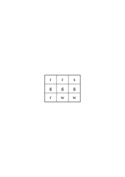
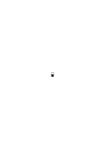
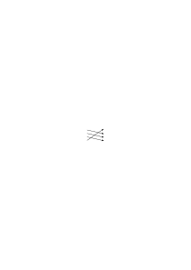
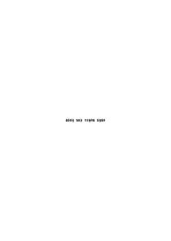
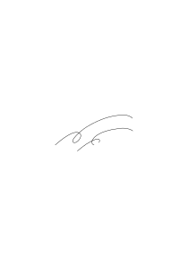

# Ts-239

### [1\[1\]](https://cdn.wittgensteinnachlass.com/2000px/webp/Ts-239/1.webp),[2\[1\]](https://cdn.wittgensteinnachlass.com/2000px/webp/Ts-239/2.webp)

## Philosophical Investigations.

1. _Augustine_, in the Confessions I/8, says that when people used to call some thing by name, and when, according to this name, the body moved to do something, he would see and understand that this was what they were calling that thing, namely the sound they made when they wanted to point it out. And he says that this was made clear to him by the movements of their bodies: as if, in all languages, there were words that were natural, words that were formed by the expression of the face, the movement of the eyes, and the movements of other limbs, and the sound of the voice, all of which indicated the feelings of the mind when it was wanting, having, rejecting, or avoiding something. Thus, words, when placed in their proper positions in various sentences, and heard frequently, as the signs of the things to which they referred, gradually came together, and he began to express his own will, with his mouth now trained in these signs, by means of these words. In these words, we seem to have a certain picture of the nature of human language. Namely, this: The words of language name objects – sentences are combinations of such names. In this picture of language, we find the roots of the idea: Every _word_ has a _meaning_. This meaning is assigned to the word. It is the object for which the word stands. Augustine does not speak of a difference between the parts of speech. Whoever describes the learning of language in this way, I would like to believe, first thinks of nouns, such as “table,” “chair,” “bread,” and the names of people, and only then of the names of certain activities and properties, and of the other parts of speech as something that will be found.

### [2\[2\]](https://cdn.wittgensteinnachlass.com/2000px/webp/Ts-239/2.webp)

2. Now think of this use of language: – I send someone shopping. I give him a note, on which are written the signs: “five red apples.” He takes the note to the shopkeeper, who opens the drawer on which the sign “apples” is written; then he looks up the word “red” in a chart and finds a colored square next to it; now he says the series of cardinal number words – I assume he knows them by heart – until he reaches the word “five,” and for each number word he takes an apple from the drawer that has the color of the square. – This is how one operates with words, and similarly. – “But how does he know where and how to look up the word ‘red’ and what to do with the word ‘five’?” – Well, I assume he _acts_ as I have described. Explanations must come to an end somewhere. – But what is the meaning of the word “five”? – No such thing was spoken of here; only how the word “five” is used.

### [2\[3\]](https://cdn.wittgensteinnachlass.com/2000px/webp/Ts-239/2.webp),[2a\[1\]](https://cdn.wittgensteinnachlass.com/2000px/webp/Ts-239/2a.webp)

3. That philosophical concept of meaning is at home in a primitive conception of how language works. One could also say that it is the conception of a more primitive language than our own. Let us _imagine_ a language for which Augustine’s description applies: The language is supposed to serve the purpose of communicating between a builder A and an assistant B. A is building a building out of building blocks; there are cubes, pillars, slabs, and beams. B is supposed to hand them to him in the order in which A needs them. To this end, they use a language consisting of the words: “cube,” “pillar,” “slab,” “beam.” A calls them out; – B brings the stone that he has learned to bring when he hears this call. Take this as a complete primitive language.

### [2a\[2\]](https://cdn.wittgensteinnachlass.com/2000px/webp/Ts-239/2a.webp),[3\[1\]](https://cdn.wittgensteinnachlass.com/2000px/webp/Ts-239/3.webp)

4. Augustine describes, we might say, a system of communication; only, not everything that we call language is this system. (And this must be said in so many cases where the question arises: “Is this representation useful, or is it useless?” The answer is then: “Yes, it is useful; but only for this narrowly defined area, not for the whole, which you intended to represent.” Think, for example, of the theories of economists.) It is as if someone were to say: “Playing consists in moving things, according to certain rules, on a surface…” – and we reply to him: You seem to be thinking of board games; but these are not all games. You can correct your explanation by explicitly limiting it to these games.

### [3\[2\]](https://cdn.wittgensteinnachlass.com/2000px/webp/Ts-239/3.webp)

5. Imagine a script in which letters are used to designate sounds, but also to designate stress and as punctuation marks. (One can conceive of a script as a language for describing sound patterns.) Now imagine that someone understands this script in such a way that it simply corresponds to a sound for each letter and that the letters do not have other functions as well. Such a simple understanding of the script is analogous to Augustine's understanding of language.

### [3\[3\]](https://cdn.wittgensteinnachlass.com/2000px/webp/Ts-239/3.webp)

6. If one considers the example (2), one might surmise in what way the general concept of the meaning of words shrouds the functioning of language in a mist that makes clear seeing impossible. It dissipates the fog if we study the phenomena of language in primitive forms of its use, in which one can clearly see the purpose and functioning of the words. Children use such primitive forms of language when they learn to speak. Teaching language here is not explaining, but training.

### [3\[4\]](https://cdn.wittgensteinnachlass.com/2000px/webp/Ts-239/3.webp),[4\[1\]](https://cdn.wittgensteinnachlass.com/2000px/webp/Ts-239/4.webp),[5\[1\]](https://cdn.wittgensteinnachlass.com/2000px/webp/Ts-239/5.webp)

7. We might imagine that language (3) is the _entire_ language of A and B; yes, the entire language of a tribe. The children are trained to perform _these_ activities, to _use_ _these_ words in doing so, and thus to react to the words of the other. An important part of the training will consist in the teacher pointing to the objects, directing the child's attention to them, and at the same time uttering a word; e.g., the word “slab” when showing this shape. (I do not want to call this an “ostensive explanation” or a “definition,” because the child cannot yet _ask_ questions about the naming. I want to call it “ostensive teaching of words.” ‒ ‒ I say that this will be an important part of the training because this is the case with human beings; not because it could not be otherwise.) This ostensive teaching of words, one might say, establishes an associative connection between the word and the thing. But what does that mean? Well, it can mean different things; but one probably thinks first of all that the image of the thing comes before the child's mind when it hears the word. But if that happens now – is that the purpose of the word? – Yes, it _can_ be the purpose. – I can imagine such a use of words (i.e., of sequences of sounds). (Their utterance is as it were striking a key on the keyboard of the imagination.) But in language (3), it is _not_ the purpose of words to evoke images. (Of course, it may also be found that this is conducive to the actual purpose.) But if this is what the ostensive teaching achieves – should I say that it achieves understanding of the word? Does not the one who reacts to the call “slab!” in this and that way, understand it? – But this probably helped to bring about the ostensive teaching; but only together with a certain instruction. With a different instruction, the same ostensive teaching of these words would have brought about a completely different understanding. “By connecting the rod with the lever, I put the brake in order.” – Yes, given the whole remaining mechanism. Only with this is it the brake lever; and detached from its support, it is not even a lever, but can be anything or nothing.

### [5\[2\]](https://cdn.wittgensteinnachlass.com/2000px/webp/Ts-239/5.webp)

8. In the practice of using language (3), one part names the words, the other acts according to them; but in the instruction of language, this process is found: the learner names the objects; that is, he says the word when the teacher points to the stone. – Yes, here we find an even simpler exercise: the student repeats the words that the teacher dictates to him; both are language-similar processes. We can also imagine that the whole process of using words in (3) is one of those games by means of which children learn our languages. I will call these “language-games,” and sometimes speak of a primitive language as a language-game. And one could also call the processes of naming the stones and repeating the dictated word language-games. Think of some use that is made of words in simple games.

### [5\[3\]](https://cdn.wittgensteinnachlass.com/2000px/webp/Ts-239/5.webp),[6\[1\]](https://cdn.wittgensteinnachlass.com/2000px/webp/Ts-239/6.webp)

9. Let us now consider an extension of the language (3). Besides the four words, “cube,” “pillar,” etc., it contains a series of words that are used in the same way that the merchant in (2) uses the number words; it can be the series of letters of the alphabet; furthermore, two words, let them be “there” and “this,” because this already roughly indicates their purpose; they are used in connection with a pointing hand gesture; and finally, a number of color samples (small squares of different colors). A gives an order of the kind: “d - plate - there.” He lets the assistant see a color sample, and at the word “there” he points to a place on the construction site. B takes from the stock of plates one of the color of the sample for each letter of the alphabet up to “d” and brings them to the place that A indicates. – On other occasions, A gives the order “this there.” At “this,” he points to a building block – and so on.

### [6\[2\]](https://cdn.wittgensteinnachlass.com/2000px/webp/Ts-239/6.webp)

10. When the child learns this language, it must memorize the series of ‘number words’ “a,” “b,” “c,” … – And it must learn their use. Will ostensive teaching of the words also occur in this instruction? – Well, for example, they will point to plates and count: “a, b, c, plates.” – More similar to the ostensive teaching in example (3) would be the ostensive teaching of number words that are not used for counting, but for designating with the eye-graspable groups of things. This is how children learn the use of the first five or six basic number words. Will “there” and “this” also be taught ostensively? – Imagine how one might teach their use! They will point to places and things – but here, this pointing also occurs in the use of the words and not only in learning their use.

### [6\[3\]](https://cdn.wittgensteinnachlass.com/2000px/webp/Ts-239/6.webp),[7\[1\]](https://cdn.wittgensteinnachlass.com/2000px/webp/Ts-239/7.webp)

11. What do the words of this language _designate_ now? – How is what they designate to be shown, if not in the way of their use? And we have described that, haven’t we? So the statement “this word designates _that_” would have to become part of this description. Or: the description should be put into the form: “The word… designates…” Now, one can shorten the description of the use of the word “plate” to the point of saying that this word designates this object. One will do this if, for example, it is only a matter of eliminating the misunderstanding that the word “plate” refers to the building block shape that we actually call “cube” – but the way of this ‘_reference_’, i.e., the use of these words otherwise, is known. And similarly, one can say that the signs “a”, “b”, “c”, etc. designate numbers, if this perhaps eliminates the misunderstanding that “a”, “b”, “c” play the role in the language that “cube”, “pillar”, “plate” actually play. And one can also say that “c” designates this number and not that one – if this perhaps explains that the letters are to be used in the order “a”, “b”, “c”, “d”, etc. and not in the order “a”, “b”, “d”, “c”. But by making the descriptions of the use of the words resemble each other in this way, the use itself cannot become more similar. For, as we see, it is completely dissimilar.

### [7\[2\]](https://cdn.wittgensteinnachlass.com/2000px/webp/Ts-239/7.webp)

12. Think of the tools in a toolbox: There is a hammer; pliers; a saw; a screwdriver; a yardstick; a glue pot; glue; nails; screws. – As different as the functions of these objects are, so different are the functions of the words. (And there are similarities here and there.)

### [8\[1\]](https://cdn.wittgensteinnachlass.com/2000px/webp/Ts-239/8.webp)

13. Of course, what confuses us is the uniformity of their appearance when the words are spoken to us or appear in writing and print. For their _use_ is not so clearly before us. Especially not when we are philosophizing!

### [8\[2\]](https://cdn.wittgensteinnachlass.com/2000px/webp/Ts-239/8.webp)

14. As if we were looking at the control panel of a locomotive: there are handles that all look more or less the same. (This is understandable, because they are all supposed to be touched with the hand.) But one is the handle of a crank that can be continuously adjusted (it regulates the opening of a valve); another is the handle of a switch that has only two effective positions, it is either flipped or upright; a third is the handle of a brake lever, the more one pulls, the stronger the braking; & a fourth, the handle of a pump; it only works as long as it is moved back and forth.

### [8\[3\]](https://cdn.wittgensteinnachlass.com/2000px/webp/Ts-239/8.webp)

15. If we say: “Every word in the language designates something,” this does not yet say _anything_ at all; unless we explain exactly _which_ distinction we want to make. (It could be that we want to distinguish the words of the language (9) from words ‘without meaning’, as they occur in the poems of Lewis Carroll.)

### [8\[4\]](https://cdn.wittgensteinnachlass.com/2000px/webp/Ts-239/8.webp),[9\[1\]](https://cdn.wittgensteinnachlass.com/2000px/webp/Ts-239/9.webp)

16. Imagine someone saying: “_All_ tools serve to modify something. Thus, the hammer modifies the position of the nail, the saw the shape of the board, etc.” – And what does the yardstick, the glue pot, the nails modify? – “Our knowledge of the length of a thing, the temperature of the glue, and the strength of the box.” – Would anything be gained by this assimilation of the expression?

### [9\[2\]](https://cdn.wittgensteinnachlass.com/2000px/webp/Ts-239/9.webp)

17. The word “designate” is perhaps used most directly when the sign is on the object that it designates. So, let us assume that the tools that A uses in building bear certain marks. If A shows one of these to the assistant, the latter brings the tool that is marked. In this and more or less similar ways, a name designates a thing, and a name is given to a thing. – It will often prove useful, when philosophizing, to say: To name something is something similar to hanging a name tag around a thing.

### [9\[3\]](https://cdn.wittgensteinnachlass.com/2000px/webp/Ts-239/9.webp)

18. What about the color samples that A and B show – do they belong to _language_? Well, it’s a matter of definition. They do not belong to word-language; but if I say to someone, “Say the word ‘the’,” you will still count this second “‘the’” as part of the sentence. And yet, it plays a very similar role to a color sample in the language-game (9); namely, it is a sample of what the other person is supposed to say. It is most natural, and causes the least confusion, if we count the samples among the tools of language.

### [9\[4\]](https://cdn.wittgensteinnachlass.com/2000px/webp/Ts-239/9.webp),[10\[1\]](https://cdn.wittgensteinnachlass.com/2000px/webp/Ts-239/10.webp)

19. We will be able to say: in language (9), we have different _parts of speech_. For the function of “plate” and “cube” is more similar than that of “plate” and “d.” _How_ we group the words into types will depend on the purpose of the classification, and on our inclination. Think of the _different_ perspectives according to which one can classify tools into types. Or chess pieces into types.

Let yourself not be disturbed by the fact that languages (3) and (9) consist only of commands. If you want to say that they are therefore not complete, ask yourself whether our language is complete; – whether it was so before chemical symbolism and infinitesimal notation were incorporated into it; for these are, as it were, suburbs of our language. (And how many houses, or streets, does it take for a town to begin to be a town?) Our language can be seen as an old town: a jumble of alleys and squares, old and new houses, and houses with additions from different periods; and this is surrounded by a large number of new suburbs with straight and regular streets and with uniform houses. One can easily imagine a language that consists only of commands and reports in battle. – Or a language that consists only of questions and an expression of affirmation and negation. And countless other things. – And to imagine a language is to imagine a form of life.

### [10\[2\]](https://cdn.wittgensteinnachlass.com/2000px/webp/Ts-239/10.webp),[11\[1\]](https://cdn.wittgensteinnachlass.com/2000px/webp/Ts-239/11.webp)

21. But how is it: is the exclamation “Record!” in example (3) a sentence, or a word? – If a word, then it does not have the same meaning as the identically sounding word in our ordinary language, because in language (3) it is, after all, an exclamation; but if a sentence, then it is not the elliptical sentence “Record!” of our language. – As for the first question, you can call “Record!” a word, and also a sentence: perhaps aptly a ‘degenerate sentence’ (as one speaks of a degenerate hyperbola), and indeed it is precisely our ‘elliptical’ sentence. – But it is only a shortened form of the sentence “Bring me a record!” and this sentence does not exist in example (3). – But why shouldn’t I, conversely, call the sentence “Bring me a record!” an _extension_ of the sentence “Record!”? – Because the one who calls out “Record!” actually means: “Bring me a record!”. – But how do you do that, _mean this_, while you _say_ “Record?” Do you recite the unabbreviated sentence to yourself internally? And why should I, in order to say what you mean by the exclamation “Record!”, translate this expression into another? And if they mean the same thing, – why shouldn’t I say: “When you say ‘Record!’, you mean ‘Record!’”? Or: Why shouldn’t you be able to mean “Record!” when you can mean “Bring me the record!”? – But when I call out “Record!”, I do, after all, want, _he should bring me a record_! – Certainly, – but does ‘this wanting’ consist in the fact that you think, in some form, another sentence than the one you say? –

### [11\[2\]](https://cdn.wittgensteinnachlass.com/2000px/webp/Ts-239/11.webp),[12\[1\]](https://cdn.wittgensteinnachlass.com/2000px/webp/Ts-239/12.webp),[13\[1\]](https://cdn.wittgensteinnachlass.com/2000px/webp/Ts-239/13.webp)

22. But if someone says “Bring me a plate!”, it now seems as if he might mean this expression as _one_ long word: corresponding, namely, to the one word ‘Plate!’. – Can he then mean it sometimes as _one_ word and sometimes as _four_ words? And how does he usually mean it? – I think we will be inclined to say: we mean the sentence as one of _four_ words, when we use it in contrast to _other_ sentences, such as: “Pass me a plate”, “Bring _him_ a plate”, “Bring _two_ plates”, etc.; that is, in contrast to sentences that contain the words of our command in other combinations. – But what does it consist of, using a sentence in contrast to other sentences? Do these sentences perhaps float before one's mind? And _all_ of them? And _while_ one says the one sentence, or before, or afterwards? – No! Even if such an explanation has some appeal for us, we only need to consider for a moment what really happens in order to see that we are on the wrong track here. We say that we use the command in contrast to other sentences because _our language_ contains the possibility of these other sentences. Someone who does not understand our language, a foreigner who has often heard someone give the command “Bring me a plate!”, might think that this whole sequence of sounds is a word and corresponds to something like the word for “brick” in his language. If he himself then had to give this command, he might pronounce it differently, and we would say: He pronounces it so strangely because he regards it as _one_ word. – But doesn’t something else then also go on in him when he pronounces it, corresponding to the fact that he regards the sentence as _one_ word? – The same thing can go on in him, or something else. What goes on in you when you give such a command; are you conscious that it consists of four words, _while_ you pronounce it? Of course, you _master_ this language – in which those other sentences also exist – but is this mastery something that happens while you pronounce the sentence? – And I have, of course, admitted: the foreigner will _probably_ pronounce the sentence, which he understands differently, differently; but what we call the wrong understanding _must_ not lie in anything that accompanies the pronunciation of the command.

### [13\[2\]](https://cdn.wittgensteinnachlass.com/2000px/webp/Ts-239/13.webp)

23. The sentence is not elliptical because it omits something that one means when one utters it, but because it is abbreviated _in comparison_ with a certain model of our grammar. – One could, of course, raise the objection here: “You admit that the abbreviated and the unabbreviated sentence have the same sense. – What sense do they have, then? Isn’t there a verbal expression for this sense?” – But doesn’t the same sense of the sentences consist in their identical _use_? – (In Russian, one says “stone red,” instead of “the stone is red”; – are they lacking the copula in their sense, or do they _think_ of adding the copula?)

### [13\[3\]](https://cdn.wittgensteinnachlass.com/2000px/webp/Ts-239/13.webp),[14\[1\]](https://cdn.wittgensteinnachlass.com/2000px/webp/Ts-239/14.webp)

24. Imagine a language-game in which B, in answer to A’s question, reports the number of plates or cubes in a pile, or the colors and shapes of the building blocks lying there and there. Such a report might be: “five plates.” What is now the difference between the report, or _assertion_, “five plates,” and the command “five plates!”? – Well, the role that uttering these words plays in the language-game. But it will probably also be that the tone of voice in which they are uttered is different, and perhaps the facial expression, and many other things. But we can also imagine that the tone is the same – because a command and a report can be uttered in _many_ different tones and with many different facial expressions, – and that the difference lies solely in the use. – (Of course, we could also use the words “assertion” and “command” to designate a grammatical sentence-form and a tone of voice, just as one calls the sentence “Isn’t the weather lovely today?” a question, although it is used as an assertion.) We could imagine a language in which _all_ assertions have the form and tone of a rhetorical question; or every command has the form: “Would you like to do that?” One will then perhaps say: “What he says has the form of a question, but is really a command” – i.e., has the _function_ of a command in the _practice_ of language. (Similarly, one says “You will do that,” not as a prophecy, but as a command. What makes it the one, what makes it the other?)

### [14\[2\]](https://cdn.wittgensteinnachlass.com/2000px/webp/Ts-239/14.webp),[15\[1\]](https://cdn.wittgensteinnachlass.com/2000px/webp/Ts-239/15.webp)

25. Frege’s view that an assertion contains an assumption, which is what is asserted, is actually based on the possibility that exists in our language of writing every assertive sentence in the form: “It is asserted that this and that is the case.” But “That this and that is the case” is not a sentence in our language – it is not yet a _move_ in the language-game. And if I write instead of “It is asserted that…”: “It is asserted: this and that is the case,” then the words “It is asserted” are superfluous here. We could very well write every assertion in the form of a question with a subsequent affirmation; that is, instead of “It is raining”: “Is it raining? Yes!” Would that show that every assertion contains a question?

### [15\[2\]](https://cdn.wittgensteinnachlass.com/2000px/webp/Ts-239/15.webp)

26. One certainly has the right to use an assertive sign in contrast, for example, to a question mark. It is only wrong if one thinks that the assertion now consists of two acts, the considering and the asserting (attaching a truth-value, or something similar), and that we perform these acts according to the signs of the sentence, more or less as we sing according to notes. The singing according to notes can indeed be compared with the loud or soft reading of the written sentence, but not with the ‘_thinking_’ of the read sentence.

### [15\[3\]](https://cdn.wittgensteinnachlass.com/2000px/webp/Ts-239/15.webp)

27. The important sense of Frege’s assertion sign is perhaps best grasped by saying: it clearly designates the _beginning of the sentence_. – This is _important_: for our philosophical difficulties, concerning the nature of ‘negation’ and ‘thinking’, are connected with the fact that a sentence “¬ not p”, or “¬ I believe p”, probably contains the sentence “p”, but not “¬p”. (For if I hear someone say “it is raining”, I do not know what he has said, if I do not know whether I have heard the beginning of the sentence.)

### [15\[4\]](https://cdn.wittgensteinnachlass.com/2000px/webp/Ts-239/15.webp),[16\[1\]](https://cdn.wittgensteinnachlass.com/2000px/webp/Ts-239/16.webp),[17\[1\]](https://cdn.wittgensteinnachlass.com/2000px/webp/Ts-239/17.webp)

28. How many kinds of sentences are there then? Roughly: assertion, question, and command? There are _countless_ such kinds: countless different kinds of use of everything that we call “signs”, “words”, “sentences”. And this diversity is not something fixed, something given once and for all, but new types of language, new language-games – as we might say – come into being, and others become obsolete and are forgotten. (An _approximate picture_ of this can be given to us by the transformations of mathematics.) The word “language-**game**” is meant to emphasize that speaking the language is part of an activity, or a form of life. Bring the diversity of language-games before your eyes in these, and other, examples:

Giving orders, and acting on orders

Describing an object after looking at it, or

after measurements –

Constructing an object according to a description

(drawing)

Reporting an event –

Making guesses about the event

Formulating and testing a hypothesis –

Representing the results of an experiment through

tables and diagrams

Inventing a story, and reading it

Playing a game –

Singing a round

Guessing a riddle

Making a joke, telling it

Solving a practical calculation exercise

Translating from one language into another

Asking, thanking, cursing, greeting, praying.

– It is interesting to compare the diversity of the tools of language and their ways of use – the diversity of words and sentences – with what logicians have said about the structure of language. (And also the author of the Log. Phil. Abh..)

### [17\[2\]](https://cdn.wittgensteinnachlass.com/2000px/webp/Ts-239/17.webp)

29. Whoever is not aware of the diversity of language-games will perhaps be inclined to ask: “What is a question?” – Is it the statement that I do not know this and that, or the statement that I wish the other to tell me…? Or is it the description of my mental state of uncertainty? – And is the cry “Help!” such a description? Remember how different things are called “description”: think of the description of the position of a body by its coordinates: of the description of a facial expression; of the description of a sensation; of a mood. One can, of course, put the usual form of the question in the form of a statement or description: “I want to know whether…”, or “I am in doubt whether…” – but this does not bring the different language-games any closer together. The significance of such possibilities of transformation, e.g. of all assertion sentences into sentences that begin with the clause “I think” or “I believe” (i.e. _as it were_ into descriptions _of my_ inner life) will become even clearer elsewhere. (Idealism.)

### [17\[3\]](https://cdn.wittgensteinnachlass.com/2000px/webp/Ts-239/17.webp),[18\[1\]](https://cdn.wittgensteinnachlass.com/2000px/webp/Ts-239/18.webp)

30. One sometimes says: animals do not talk because they lack mental abilities. And that means: ‘they do not think, therefore they do not talk’. But: they simply do not talk. Or rather: they do not _use_ _language_. _(If we disregard the most primitive forms of communication.)_ Giving orders, asking, telling, chattering belong to our natural history just as much as walking, eating, drinking, playing. (It makes no difference here whether one talks with one’s mouth or with one’s hands.)

### [18\[2\]](https://cdn.wittgensteinnachlass.com/2000px/webp/Ts-239/18.webp)

31. One sometimes thinks that learning a language consists in naming objects; namely: people, shapes, colors, pains, moods, numbers, etc. – As I said – naming is something similar to attaching a name tag to a thing. One could call this a preparation for the use of a word. But for _what_ is it a preparation?

### [18\[3\]](https://cdn.wittgensteinnachlass.com/2000px/webp/Ts-239/18.webp)

32. “We name things and can now talk about them. Refer to them in our discourse.” As if the act of naming already provided everything that we do next. As if there were only one thing that is meant by “talking about things.” Whereas we do all sorts of different things with our sentences. Consider, for example, exclamations – with their very different functions. Water! Away! Ouch! Help! Beautiful! No!

Are you still inclined to call these words “names of objects”?

### [18\[4\]](https://cdn.wittgensteinnachlass.com/2000px/webp/Ts-239/18.webp),[19\[1\]](https://cdn.wittgensteinnachlass.com/2000px/webp/Ts-239/19.webp)

33. In languages (3) and (9), there was no question of naming. This, and its correlate, the ostensive definition, is, as one might say, a language-game in itself. That is, we are taught, trained to ask: “What is that called?” – whereupon naming takes place. And there is also a language-game: inventing a name for something. That is, saying: “it is called…” and then using the new name. (For example, children name their dolls and then talk about them. Note at the same time how _special_ the use of the proper name is, with which we _call_ the person named!) One can ostensively define a proper name, a color word, a material name, a numeral, the name of a point of the compass, etc., etc. The definition of “two”: “That is called ‘two’” – while pointing to two nuts – is perfectly accurate. – But how can one define “two” in this way? The person to whom the definition is given does not then know _what_ one wants to name with “two”; he will assume that you are calling _this_ group of nuts “two”! – He _can_ assume this – perhaps he does not assume it. He could, conversely, if I want to assign a name to this group of nuts, misunderstand it as a number name. And just as easily, if I ostensively explain a proper name, he might understand it as a color name, as a designation of race, yes, as the name of a point of the compass. That is, the ostensive definition can in _every_ case be interpreted in this way or another.

### [19\[2\]](https://cdn.wittgensteinnachlass.com/2000px/webp/Ts-239/19.webp),[20\[1\]](https://cdn.wittgensteinnachlass.com/2000px/webp/Ts-239/20.webp)

34. Perhaps you will say: “Two” can only be ostensively defined _in this way_: “This _number_ is called ‘two’.” For the word “number” here indicates which _place_ in language, in grammar, we put the word. That is, the word “number” must be explained before that ostensive definition can be understood. – The word “number” in the definition does, of course, indicate this place, the position to which we put the word. And we can prevent misunderstandings by saying “This _color_ is called so and so,” “This _length_ is called so and so,” and so on. That is, misunderstandings are sometimes avoided in this way. But can the word “color” or “length” only be understood _in this way_? – Well, we must explain them. – So explain them by other words! And what about the last explanation in this chain?! (Don’t say, “There is no ‘last’ explanation.” That is just like saying: “There is no last house in this street: one can always build another one.”) Whether the word “number” is necessary in the ostensive definition of “two” depends on whether he understands it differently from the way I want it, without this word. And that will probably depend on the circumstances under which it is given and on the person to whom I give it. And how he ‘understands’ the explanation is shown in how he uses the explained word.

### [20\[2\]](https://cdn.wittgensteinnachlass.com/2000px/webp/Ts-239/20.webp),[21\[1\]](https://cdn.wittgensteinnachlass.com/2000px/webp/Ts-239/21.webp),[22\[1\]](https://cdn.wittgensteinnachlass.com/2000px/webp/Ts-239/22.webp)

35. One could therefore say: The ostensive explanation explains the use – the meaning – of the word, if it is already clear what role the word is supposed to play in the language. So, if I know that someone wants to explain a color word to me, the ostensive explanation will help me to understand the word. – And this can be said if one does not forget that all sorts of questions are connected with the word “know” or “be clear”! One must already know something in order to be able to ask about the naming. But what must one know? If one shows someone the king piece in a game of chess and says: “This is the chess king,” this does not explain the use of this piece to him – unless he already knows the rules of the game, except for this last specification: the shape of a king piece. One can imagine that he has learned the rules of the game without ever having seen a real game piece. The shape of the game piece here corresponds to the sound, or the form, of a word. But one can also imagine that someone has learned the game without ever learning or formulating the rules. He may, for example, have first learned very simple board games by watching and then progressed to more and more complicated ones. Even to this person, one could give the explanation: “This is the king,” if one shows him, for example, chess pieces of an unfamiliar shape. Even this explanation only teaches him the use of the piece because, as one might say, the place to which it is placed has already been prepared. Or also: We will only say that it teaches him the use if the place has already been prepared. And it is not prepared here by the fact that the person to whom we give the explanation already knows the rules, but by the fact that he already knows a game in another sense. Consider this case: I explain the game of chess to someone, and I begin by pointing to a piece and saying, “This is the king. It can move so and so, etc.” – In this case, we will say: the words “This is the king” (or “This is called ‘king'”) are only a word **explanation** if the learner already ‘knows what a game piece is’. If he has, for example, already played other games, or has ‘watched others play with understanding’ – _and so on_. Only then will he be able to ask a relevant question when learning the game: “What is this called?” – namely, this game piece. We can say: only he who already knows what to do with it asks meaningfully after the naming. We can also imagine that the person asked replies: “Determine the naming yourself” – and now the person who asked has to take care of _everything_ himself.

### [22\[2\]](https://cdn.wittgensteinnachlass.com/2000px/webp/Ts-239/22.webp)

36. Someone who comes to a foreign country will sometimes learn the language of the natives through ostensive explanations that they give him, and he will often have to _guess_ the interpretation of these explanations, sometimes guessing correctly, sometimes incorrectly. And now, I think, we can say: Augustine describes the learning of human language as if the child came to a foreign country and did not understand the language of the country, that is: _already has_ a language, only not this one. Or also: – as if the child could already _think_, only not yet speak. And ‘thinking’ here would mean something like: talking to oneself.

### [22\[3\]](https://cdn.wittgensteinnachlass.com/2000px/webp/Ts-239/22.webp),[23\[1\]](https://cdn.wittgensteinnachlass.com/2000px/webp/Ts-239/23.webp),[24\[1\]](https://cdn.wittgensteinnachlass.com/2000px/webp/Ts-239/24.webp)

37. But how if one were to object: “It is not true that one must already master a language-game in order to understand an ostensive definition; one must only – of course – know (or guess) what the person giving the explanation is pointing to! Whether, for example, to the shape of the object, or to its color, or to the number, etc., etc.” – And what does it consist of: ‘pointing to the shape’, ‘pointing to the color’? Point to a piece of paper! – And now point to its shape, – now to its color, – now to its number (that sounds odd)! – Well, how did you do it? – You will say that each time you ‘meant’ something different when pointing. And if I ask how this happens, you will say that you concentrated your attention on color, shape, etc. But now I ask again how _that_ happens. Imagine someone points to a vase and says: “Look at the glorious blue! – the shape is irrelevant. –” Or: “Look at the glorious shape! – the color is irrelevant. –” There is no doubt that you will do _different_ things if you comply with these two requests. But do you always do the _same_ thing when you direct your attention to the color? Imagine different cases! I want to indicate some: “Is this blue the same as _that_? Do you see a difference? –” You mix colors and say: “This blue of the sky is difficult to reproduce.” “It’s getting nice, one can see blue sky again!” “Look how different these two blues look!” “Do you see that blue book over there? Please bring it!” “This blue light signal means….” “What is this blue called? – is it ‘indigo’ –?”

Directing one’s attention to the color sometimes means holding back the outlines of the shape with one’s hand, or not directing one’s gaze to the contour of the thing, sometimes, staring at the object and trying to remember where one has seen this color before. One directs one’s attention to the shape, sometimes by tracing it, sometimes by blinking to avoid seeing the color clearly, etc., etc. I want to say: this and similar things happen _while_ one ‘directs one’s attention to this and that’. But that is not all that makes us say that someone is directing their attention to the shape, the color, etc. Just as ‘a move in chess’ does not consist solely in a piece being moved in such and such a way on the board, – but also not in the thoughts and feelings of the player making the move that accompany the move; but in the circumstances that we call “playing a game of chess” or “solving a chess problem”, and the like.

### [24\[2\]](https://cdn.wittgensteinnachlass.com/2000px/webp/Ts-239/24.webp),[25\[1\]](https://cdn.wittgensteinnachlass.com/2000px/webp/Ts-239/25.webp)

38. But suppose someone says: “I always do the same thing when I direct my attention to the shape: I follow the contour with my eyes and feel….” And suppose this person gives an ostensive explanation to another person: “That means ‘circle’”, by pointing to a circular object with all these experiences – can the other person not still interpret the explanation differently, even if he sees that the person giving the explanation is following the shape with his eyes and even if he feels what the person giving the explanation feels? That is to say: this ‘interpretation’ can also consist in how he now makes use of the explained word, e.g., what he points to when he receives the command “Point to a circle!”. – Because neither the expression “meaning the explanation in this way”, nor the expression “interpreting the explanation in this way”, refer to a process that accompanies the giving and hearing of the explanation.

### [25\[2\]](https://cdn.wittgensteinnachlass.com/2000px/webp/Ts-239/25.webp),[26\[1\]](https://cdn.wittgensteinnachlass.com/2000px/webp/Ts-239/26.webp)

39. There are, of course, what one might call ‘characteristic experiences’ for pointing to the shape (or something of the sort). For example, tracing the contour with one’s finger, or with one’s gaze, while pointing. – But just as little as _this_ happens in all cases in which I ‘mean the shape’, so little does any other characteristic process happen in all these cases. But even if such a process were repeated in all of them, it would still depend on the circumstances – that is, on what happens before and after the pointing – whether we would say: “He pointed to the shape and not to the color.” For the words “pointing to the shape,” “meaning the shape,” etc., are not used in the same way as: “pointing to the book,” “pointing to the letter ‘B,’ not to the letter ‘u’,” etc. – For consider how differently we _learn_ the _use_ of the words: “pointing to this thing,” “pointing to that thing,” and on the other hand, “pointing to the color, not to the shape,” “meaning the color,” etc. etc. As I said, in certain cases, especially when pointing ‘to the shape’ or ‘to the number,’ there are characteristic experiences and ways of pointing; – ‘characteristic,’ because they _often_ (not _always_) repeat themselves when shape or number is ‘meant.’ But do you know of any characteristic experience for pointing to the _game piece_ _as a game piece_?! And yet one can say: “I mean: this _game piece_ is called ‘king,’ not this particular piece of wood that I am pointing to.” (Recognizing, wishing, remembering, etc.)

### [26\[2\]](https://cdn.wittgensteinnachlass.com/2000px/webp/Ts-239/26.webp)

40. And here we are doing what we do in a thousand similar cases: Because we cannot specify a _physical_ action that we call pointing to the form (as opposed, for example, to the color), we say that these words correspond to a _mental_ activity. Where our language leads us to expect a body, and no body exists, there we would like to say that there is a _spirit_.

### [26\[3\]](https://cdn.wittgensteinnachlass.com/2000px/webp/Ts-239/26.webp)

41. “What is the relationship between names and what is named?” – Now, what is it? Look at language-game (3), or another! There, it is already clear what this relationship might consist in. This relationship can, among many other things, also consist in the fact that hearing the name brings the image of what is named before our mind, and it also consists, among other things, in the fact that the name is written on what is named, or that it is spoken while pointing to what is named.

### [27\[1\]](https://cdn.wittgensteinnachlass.com/2000px/webp/Ts-239/27.webp),[28\[1\]](https://cdn.wittgensteinnachlass.com/2000px/webp/Ts-239/28.webp)

42. What, for example, does the word “this” name in the language-game (9), or the word “that” in the explanatory statement “That means …”? – Well, if you don’t want to create confusion, it’s best if you don’t say that these words name anything. – And, curiously, it was once said of the word “this” that it is the _actual_ name. Everything else that we call a “name” is therefore only so in an imprecise, approximate sense. This strange view stems from a tendency to abstract the logic of our language – as one might call it. The real answer to this is: “name” is used to refer to _very different_ things; the word “name” characterizes many different kinds of use of a word, which are related to each other in many different ways; – but among these kinds of use is _not_ that of the word “this”. It is probably true that we often, for example, point to what is named in an explanatory definition, and in doing so we pronounce the name. And similarly, we, for example, pronounce the word “this” in an explanatory definition by pointing to a thing. And the word “this” and a name also often appear in the same sentence: we say “Fetch this!” and also “Fetch Paul!” – But one of the most characteristic features of a name is precisely that it is explained by the demonstrative “That is N” (or “That means ‘N’”). But do we also explain: “That means ‘this’”, or “This means ‘this’”?

### [28\[2\]](https://cdn.wittgensteinnachlass.com/2000px/webp/Ts-239/28.webp)

43. This is connected with the idea of naming as a kind of occult process. Naming appears as a _strange_ connection of a word with the object. – And such a strange connection does indeed take place, namely when the philosopher, in order to bring out what _the_ relationship between a name and what is named is, stares at an object in front of him and repeats a name countless times, or even the word “this”. For philosophical problems arise when language _celebrates_. And _there_ we can certainly imagine that naming is some kind of strange mental act, as it were, a kind of baptism of an object. And we can also say the word “this” as if it _were_ the object, thus _addressing_ it – a strange use of this word, which probably only occurs when philosophizing. –

### [28\[3\]](https://cdn.wittgensteinnachlass.com/2000px/webp/Ts-239/28.webp),[29\[1\]](https://cdn.wittgensteinnachlass.com/2000px/webp/Ts-239/29.webp)

44. But why does one have the idea of wanting to make precisely this word a name, when it is so obviously _not_ a name? – Precisely for that reason. For one is tempted to raise an objection to what is usually called “name”; and this can be expressed as follows: _that the name is supposed to designate something simple_. And one could justify this as follows: A proper name in the ordinary sense is, for example, the word “Nothung”. The sword Nothung consists of parts in a certain composition. If they are put together differently, then Nothung does not exist. Now, the sentence “Nothung has a sharp edge” _makes sense_, whether Nothung is still whole or already broken. But if “Nothung” is the name of an object, then that object no longer exists when Nothung is broken; and since the name would then not correspond to any object, it would have no meaning. But if that were the case, the sentence “Nothung has a sharp edge” would contain a word that has no meaning and would therefore be nonsense. But it does make sense, so something must always correspond to the words it consists of. Thus, the word “Nothung” must disappear in the analysis of the sense, and instead, words must be introduced that name something simple. We will rightly call these the proper names.

### [29\[2\]](https://cdn.wittgensteinnachlass.com/2000px/webp/Ts-239/29.webp),[30\[1\]](https://cdn.wittgensteinnachlass.com/2000px/webp/Ts-239/30.webp)

45. Let us first talk about _the_ point of this reasoning: that a word has no meaning if nothing corresponds to it. – It is important to note that the word “meaning” is used in a way that is contrary to language when one uses it to refer to the thing that ‘corresponds’ to the word. This means confusing the meaning of a name with the _bearer_ of the name. When Paul dies, one says that the bearer of the name dies, but no one says that the meaning of the name dies. And it would be nonsense to say so, because if the name ceased to have meaning, then it would not make sense to say “Paul is dead”.

### [30\[2\]](https://cdn.wittgensteinnachlass.com/2000px/webp/Ts-239/30.webp)

46. In (17), we introduced proper names into the language (9). Now suppose that the tool with the name “α” is broken. A does not know this and gives B the sign “α”: does this sign now have meaning, or does it not? – What should B do if he receives this sign? We have not agreed on anything about this. One might ask: what _will_ he do? Well, he might stand there perplexed, or show A the pieces. One _could_ say: “α” has become meaningless; and this statement would mean that there is no longer any use for the sign “α” in our language-game (unless we give it a new one). “α” could also become meaningless if, for _some_ reason, the tool is given a different designation and the sign “α” is no longer used in the game. – But we can also imagine an agreement according to which B, if a tool is broken and A gives the sign for that tool, has to shake his head as a reply. – With this, one could say, the command “α”, even if this tool no longer exists, has been incorporated into the language-game and the sign “α” has meaning, even if its bearer ceases to exist.

### [31\[1\]](https://cdn.wittgensteinnachlass.com/2000px/webp/Ts-239/31.webp)

47. For a _large_ class of cases in the use of the word “meaning” – although not for _all_ cases of its use – this word can be explained as follows: The meaning of a word is its use in language. And the _meaning_ of a name is sometimes explained by pointing to its _bearer_.

### [31\[2\]](https://cdn.wittgensteinnachlass.com/2000px/webp/Ts-239/31.webp)

48. “But do names also have meaning in that game, even if they have _never_ been used for a tool?” Let us suppose that “X” is such a sign and A gives this sign to B. – Well, such signs could also be incorporated into the language-game, and B might also answer it by shaking his head. One could imagine this as a kind of amusement between the two.

### [31\[3\]](https://cdn.wittgensteinnachlass.com/2000px/webp/Ts-239/31.webp),[32\[1\]](https://cdn.wittgensteinnachlass.com/2000px/webp/Ts-239/32.webp)

49. We said: the sentence, “Nothung has a sharp edge,” has sense even if Nothung has already been broken. Well, this is so because in this language-game a name is also used in the absence of its bearer. But we can imagine a language-game with names (i.e. with signs which we would certainly also call “names”) in which these are only used in the presence of the bearer; that is, they can _always_ be replaced by the demonstrative pronoun with the demonstrative gesture. Suppose we observed an area in which patches of color slowly changed their shape and position. I would have named them by means of ostensive explanation “P,” “Q,” and so on. Our language serves to accompany these changes with a description. I say: “Look – how P is now shrinking and approaching R?” But not: “Q no longer exists” – just as I would not say “this no longer exists.” The name loses its meaning when the bearer ceases to exist. “P,” “Q,” and so on always correspond to something, as long as they have any meaning at all; they cannot become bearerless; it is only that this is not a special feature of the language-game, because a name can also have a purpose, use, i.e. meaning, even without a bearer. (And so, for example, the name “Odysseus” has meaning.)

### [32\[2\]](https://cdn.wittgensteinnachlass.com/2000px/webp/Ts-239/32.webp),[33\[1\]](https://cdn.wittgensteinnachlass.com/2000px/webp/Ts-239/33.webp)

50. But, I think, our language-game can show us a reason why one might want to make the demonstrative pronoun into a name: For the demonstrative “this” can never be bearerless. One could say: “As long as there is a _this_, so long does the word ‘this’ also have meaning, whether _this_ is simple or composite.” – But this does not make the word a name. _On the contrary_; for a name is not used with the demonstrative gesture, but is only explained by it.

### [33\[2\]](https://cdn.wittgensteinnachlass.com/2000px/webp/Ts-239/33.webp),[34\[1\]](https://cdn.wittgensteinnachlass.com/2000px/webp/Ts-239/34.webp)

51. What is the meaning of the fact that _names_ actually designate the simple? – Socrates (in the Theaetetus): “If I am not mistaken, I have heard from some people that for the _elements_ – to put it this way – out of which we and everything else are composed, there is no explanation; for everything that is in itself can only be designated by names, no other determination is possible, neither that it _is_, nor that it _is not_. … But what is in itself must be named … without any other determination. Thus it is impossible to speak of any element in an explanatory way; for there is nothing for it but the bare naming; it has only its name. But as what is composed of these elements is itself an interwoven structure, so also its names have become part of this interwoven structure, so that their essence is the weaving together of names.” These elements were also Russell’s ‘individuals’ and also my ‘objects’ (Logical Philosophical Treatise).

### [34\[2\]](https://cdn.wittgensteinnachlass.com/2000px/webp/Ts-239/34.webp),[35\[1\]](https://cdn.wittgensteinnachlass.com/2000px/webp/Ts-239/35.webp)

52. But what are the simple components from which reality is composed? – What are the simple components of a chair? – The pieces of wood from which it is assembled? Or the molecules, or the electrons? “Simple means: not composite. And then the question is: in what sense ‘composite’?” It makes no sense to speak of the ‘simple components of the chair’ in general. Or: is my visual image of this tree, this chair, composed of parts? And what are its simple components? Multi-coloredness is _one_ kind of compositeness; another is, for example, this broken contour made up of straight lines. And one could call this curved line composed of an ascending and a descending branch. If I say to someone, without further explanation, “What I see in front of me now is composite,” he is rightly asking: “What _do_ you mean by ‘composite’?” That can mean all sorts of things!” The question, “Is what you see composite?” only makes sense if it is already established what kind of compositeness – that is, what particular use of the word – is meant. If, for example, it had been stipulated that the visual image of a tree should be called “composite” if it shows not only a trunk but also branches, then the question, “Is the visual image of this tree simple or composite?” and the question, “What are its simple components?” would have a clear sense – a clear use. And the answer to the second question would, of course, not be “the branches” (this would be an answer to the _grammatical_ question: “What _does_ one call the ‘simple components’ here?”), but rather a description of the individual branches.

### [35\[2\]](https://cdn.wittgensteinnachlass.com/2000px/webp/Ts-239/35.webp),[36\[1\]](https://cdn.wittgensteinnachlass.com/2000px/webp/Ts-239/36.webp)

53. But is, for example, a chessboard not obviously, and simply, composite? – You are probably thinking of the composition of 32 white and 32 black squares; – but could you not also say that it is composed of the colors white, black, and the pattern of the grid? And if there are so many different ways of looking at it, do you still want to say that the chessboard is ‘composite’ in general? – The mistake of asking, _outside_ a specific game, “Is this object composite?” is similar to the mistake that a little boy once made when he was asked to indicate whether the verb in certain example sentences was used in the active or passive voice, and he racked his brains over whether the verb “to sleep” meant something active or something passive. The word “composite” (and therefore the word “simple”) is used by us in an infinite number of different ways, in different ways related to each other. (Is the color of this square simple, or is it composed of pure white and pure yellow? And is the white simple, or is it composed of the colors of the rainbow? – Is this line of 2 cm simple, or is it composed of two segments of 1 cm each? But why not of a segment of 3 cm and a segment of 1 cm set in a negative sense?!)

### [36\[2\]](https://cdn.wittgensteinnachlass.com/2000px/webp/Ts-239/36.webp)

The correct answer to the _philosophical_ question: “Is the visual image of this tree composite, and what are its components?” is: “That depends on what you mean by ‘composite’.” (And this is, of course, not an answer, but a rejection of the question.)

### [36\[3\]](https://cdn.wittgensteinnachlass.com/2000px/webp/Ts-239/36.webp),[37\[1\]](https://cdn.wittgensteinnachlass.com/2000px/webp/Ts-239/37.webp)

54. Let us apply the method of chapter (3) to the representation in the Theaetetus: Let us consider a language-game for which this representation actually holds. Let the language serve to represent combinations of colored patches on a surface. The patches are squares and form a chessboard-like complex. There are red, green, white, and black squares. The words of the language are (correspondingly): “r”, “g”, “w”, “s”, and a sentence is a sequence of these words. They describe an arrangement of colored squares in the order

or

etc. The sentence “r r s g g g r w w” describes, for example, a composition of this kind:

Here, the sentence is a complex of names, to which a complex of elements corresponds. The primitive elements are the colored squares; “but are these simple?” – I wouldn’t know what to call the “simple” thing in this language-game. But under other circumstances, I would call a monochrome square “composite,” for example, from two rectangles, or from the elements of color and shape. But the concept of composition could also be extended so that the smaller surface is called ‘composite’ from a larger one and one subtracted from it. Compare the ‘composition’ of forces, the ‘division’ of a line by a point outside; these expressions show that we are sometimes also inclined to conceive of the smaller as the result of the ‘composition’ of the larger, and the larger as a result of the division of the smaller. But I don’t know whether I should now say that the figure that our sentence describes consists of four elements, or of nine! Well, does that sentence consist of four letters or of nine? – And which are its elements: the letter types, or the letters? Isn’t it completely irrelevant which we say, as long as we avoid misunderstandings in the particular case!

### [37\[2\]](https://cdn.wittgensteinnachlass.com/2000px/webp/Ts-239/37.webp),[38\[1\]](https://cdn.wittgensteinnachlass.com/2000px/webp/Ts-239/38.webp)

55. But what does it mean to say that we can only name these elements, not explain (i.e., describe) them? This could mean, for example, that the description of a complex, if, in a borderline case, it consists of only _one_ colored square, is simply the name of the colored square. One could say here – although this easily leads to all sorts of philosophical superstition – that a sign “r”, or “s”, etc., can be a word or a sentence. But whether it is a ‘word or a sentence’ depends on the situation in which it is spoken or written. If, for example, A describes complexes of colored squares to B and uses the word “r” _alone_, then we can say that the word is a description – a sentence. But if he memorizes the words and their meaning, or teaches another the use of the words and utters them when teaching indicatively, then we will not say that they are sentences here. In this situation, the word “r” is, for example, not a description; one _names_ an element with it – but that doesn’t mean that one can _only_ name the element! Naming and describing are not on _one_ level: naming is a preparation for description. Naming is not yet a move in the language-game – no more than placing a chess piece is a move in chess. One could say: with the naming of a thing, nothing has yet been done. It _has_ no name, except in the game. That is also what Frege meant by saying that a word only has meaning in the context of a sentence.

### [38\[2\]](https://cdn.wittgensteinnachlass.com/2000px/webp/Ts-239/38.webp),[39\[1\]](https://cdn.wittgensteinnachlass.com/2000px/webp/Ts-239/39.webp),[40\[1\]](https://cdn.wittgensteinnachlass.com/2000px/webp/Ts-239/40.webp)

56. What does it mean to say that we cannot attribute either being or non-being to the elements? – One could say: if everything that we call “being” & “non-being” lies in the existence & non-existence of connections between the elements, then it makes no sense to speak of the being (non-being) of an element; just as, if everything that we call “destruction” lies in the separation of elements, it makes no sense to speak of the destruction of an element. But one would like to say: one cannot attribute being to the element, for if it were not, one could not even name it & thus say nothing about it. – Let us consider an analogous case! One cannot say of _one_ thing that it _is_ 1 m long, nor that it _is not_ 1 m long, & that is the standard metre in Paris. – But with this, we have not attributed any remarkable property to it, but only indicated its peculiar role in the game of measuring with the metre. – Let us imagine, in a similar way to the standard metre, that the samples of colors are also kept in Paris. We then explain: “sepia” is the name of the color of the original sepia preserved there under airtight conditions. Then it will make no sense to say of this sample that it has this color, nor that it does not have it. We can express this as follows: this sample is part of the _language with_ which we make statements about colors. It is not something represented in this game, but a means of representation. – & this is precisely what applies to an element in the language-game (84), when, by naming it, we pronounce the word “R”: with this, we have given this thing a role in our language-game; it is now a _means_ of representation. & to say, “if it were not, it could not have a _name_”, says as much, & as little, as: if this thing did not exist, we could not use it in our game. – What, apparently, _must_ exist belongs to the language. It plays in our game the role of the paradigm; that _with_ which is compared. & to state this can mean making an _important_ statement! But it is still a statement concerning our language-game – our way of representation.

### [40\[2\]](https://cdn.wittgensteinnachlass.com/2000px/webp/Ts-239/40.webp),[41\[1\]](https://cdn.wittgensteinnachlass.com/2000px/webp/Ts-239/41.webp)

57. In the description of the language-game (54), I said that the colors of the squares corresponded to the words “r”, “s”, etc. But what does this correspondence consist in; in what sense can one say that these signs correspond to certain colors of the squares? The explanation in (54) only established a connection between these signs & certain words in our language (the color names). – Well, it was assumed that the use of the signs in the game would be taught differently, namely by pointing to paradigms. Presumably, – but what does it mean to say that, in _linguistic practice_, certain elements correspond to the signs? – Does it consist in the fact that the person describing the complex of colored squares always says “r” when a red square is present; “s” when a black square is present, etc.? But how if he makes a mistake in the description & says “r” when a black square is present; what is the criterion that this was a _mistake_? – Or does the fact that “r” designates a red square consist in the fact that, for the people who use the language, a red square always ho**vers** in the mind when they use the sign “r”?

? In order to see more clearly, we must, as in countless similar cases, consider the details of the processes, _examine them closely_. If I am inclined to assume that a mouse is created by spontaneous generation from gray rags & dust, then it will be good to examine these rags closely, to see how a mouse could hide in them, how it could get there, etc. But if I am convinced that a mouse cannot be created from these things, then this investigation may be superfluous. What it is that opposes such a detailed examination in philosophy, we must still learn to understand. –

### [41\[2\]](https://cdn.wittgensteinnachlass.com/2000px/webp/Ts-239/41.webp),[42\[1\]](https://cdn.wittgensteinnachlass.com/2000px/webp/Ts-239/42.webp)

58. Now, there are _various_ possibilities for our language-game (54), various cases in which we would say that a sign in the game names a square of this or that color. We would say this, for example, if we knew that the use of the signs in this way was taught to the people who use this language. Or, if it were laid down in writing, perhaps in the form of a chart, that this sign corresponds to this element, and if this chart were used in teaching the language and consulted in certain disputes to make a decision. – But we can also imagine that such a chart is a tool in the use of the language. The description of a complex then proceeds as follows: the person describing the complex carries a chart with him and looks up each element of the complex in it and goes from it in the chart to the sign (and the person to whom the description is given can also translate the words of it by means of a chart into the perception of colored squares). One could say that this chart takes on the role that memory and association play in other cases. (We do not usually carry out the command, “Bring me a red flower!”, by looking up the color red in a color chart and then bringing a flower of the color that we find in the chart; but when it comes to choosing or mixing a particular shade of red, it happens that we use a sample or a chart.) If we call such a chart the expression of a rule of the language-game, then one can say that the thing we call a rule of a language-game can have very different roles in the game.

### [42\[2\]](https://cdn.wittgensteinnachlass.com/2000px/webp/Ts-239/42.webp),[43\[1\]](https://cdn.wittgensteinnachlass.com/2000px/webp/Ts-239/43.webp)

59. Let us remember in what kinds of cases we say that a game is played according to a certain rule! The rule can be an aid to instruction in the game. It is communicated to the learner and its application is practiced. – Or it is a tool of the game itself. – Or: a rule finds neither use in the instruction nor in the game itself; nor is it laid down in a list of rules. One learns the game by watching others play it. But we say that it is played according to the rules because an observer can read this rule from the practice of the game, as one reads a law of nature to which the game-actions are subject. – But how does the observer distinguish in this case between a mistake by the players and a correct game-action? – There are characteristics for this in the behaviour of the players. Think of the characteristic behaviour of someone who corrects a promise. It would be possible to recognize that someone is doing this even if we do not understand his language.

### [43\[2\]](https://cdn.wittgensteinnachlass.com/2000px/webp/Ts-239/43.webp),[44\[1\]](https://cdn.wittgensteinnachlass.com/2000px/webp/Ts-239/44.webp)

60. “What the names of the language designate must be indestructible, because one must be able to describe the state in which everything that is destructible is destroyed. And in this description there will be words; and what corresponds to them must not then be destroyed, because otherwise the words would have no meaning.” I must not saw off the branch on which I am sitting. One could, of course, immediately object that the description itself must be excluded from destruction. – But what corresponds to the words of the description and therefore must not be destroyed if it is true, is what gives the words their meaning, – without which they would have no meaning. – But this person is indeed, in a sense, what corresponds to his name. But he is destructible; and his name does not lose its meaning when the bearer is destroyed. – What corresponds to the name, and without which it would have no meaning, is – for example – a paradigm, which is used in the language-game in connection with the name.

### [44\[2\]](https://cdn.wittgensteinnachlass.com/2000px/webp/Ts-239/44.webp),[45\[1\]](https://cdn.wittgensteinnachlass.com/2000px/webp/Ts-239/45.webp)

61. But how, if no such sample belongs to the language, if we, for example, remember the color that a word designates? – – “And if we remember it, then it appears before our mind's eye when we pronounce the word. It must therefore be indestructible in itself, if the possibility is to exist that we can remember it at any time.” – –

But what do we consider to be the criterion for whether we remember it correctly? – If we work with a sample instead of our memory, we might say that the sample has changed its color and judge this with our memory. But can we not also, under certain circumstances, speak of a fading of our memory-image? Are we not just as subject to memory as we are to a sample? (For someone might want to say: “If we didn’t have a memory, we would be subject to a sample.”) Or perhaps to a chemical reaction: Imagine that you should paint a certain color, its name is “F”, and it is the color that one sees when the substances S and T combine with each other. – Suppose the color appears brighter to you on one day than on another; would you not, under certain circumstances, say: “I must be mistaken, the color is certainly the same as yesterday”? This shows that we do not always rely on what memory says as the ultimate, unappealable, judgment.

### [45\[2\]](https://cdn.wittgensteinnachlass.com/2000px/webp/Ts-239/45.webp)

62. “Something red can be destroyed, but red cannot be destroyed, and therefore the meaning of the word ‘red’ is independent of the existence of a red thing.” Certainly – it makes no sense to say that the color red (color, not pigmentum) is torn or crushed. But do we not say, “the redness disappears”? And do not cling to the fact that we can call it to mind, even if there is no longer anything red! This is no different than if you wanted to say that there would still be a chemical reaction that produces a red flame. – For how, if you can no longer remember the color? – If we forget what color it is that has this name, then it loses its meaning for us; that is, we can no longer play a certain language-game with it. And the situation is then comparable to the fact that the paradigm, which was a means of our language, has been lost.

### [45\[3\]](https://cdn.wittgensteinnachlass.com/2000px/webp/Ts-239/45.webp),[46\[1\]](https://cdn.wittgensteinnachlass.com/2000px/webp/Ts-239/46.webp)

63. “I want to call ‘_Name_’ only what cannot stand in the proposition ‘X exists’. – And so one cannot say ‘Red exists’, because, if there were no red, one could not talk about it at all.” More correctly: If ‘X exists’ is supposed to mean: ‘X’ has meaning, – then it is not a proposition that is about X, but a proposition about our linguistic usage, namely the use of the word ‘X’. It seems to us as if we were saying something about the nature of red with it: that the words ‘Red exists’ do not make sense. It simply exists ‘in and for itself’. The same idea – that this is a metaphysical statement about red – is also expressed in the fact that we say, for example, that red is timeless, and perhaps even more strongly in the word ‘indestructible’. But actually, we only want to understand ‘Red exists’ as the statement: the word ‘red’ has meaning. Or perhaps more correctly: ‘Red does not exist’ as ‘red’ has no meaning. Only, we do not want to say that this expression says that, but that it would have to say _that_, _if_ it had sense. That, in its attempt to say that, it contradicts itself – because red is ‘in and for itself’. Whereas a contradiction lies only in the fact that the proposition looks as if it is talking about the color, while it is supposed to say something about the use of the word ‘red’. – In reality, however, we do say that a certain color exists; and that means as much as: there exists something that has this color. And the first expression is no less exact than the second; especially where ‘that, as it has the color’ is not a physical object.

### [46\[2\]](https://cdn.wittgensteinnachlass.com/2000px/webp/Ts-239/46.webp),[47\[1\]](https://cdn.wittgensteinnachlass.com/2000px/webp/Ts-239/47.webp)

64. “_Names_ refer only to what is an _element_ of reality. What cannot be destroyed, what remains the same in all change.” But what is that? – While we were saying the sentence, it was already present in our minds! We were already expressing a quite specific image. A specific picture that we want to use. Because experience does not show us these elements. We see _components_ of something composite (a chair, for example). We say that the backrest is a part of the chair, but it is itself composed of different pieces of wood; while a leg is a simple component. We also see a whole that changes (is destroyed) while its components remain unchanged. These are the materials from which we construct that picture of reality.

### [47\[2\]](https://cdn.wittgensteinnachlass.com/2000px/webp/Ts-239/47.webp),[48\[1\]](https://cdn.wittgensteinnachlass.com/2000px/webp/Ts-239/48.webp)

65. If now I say: “My broom is in the corner,” is this actually a statement about the broom handle and the brush? In any case, one could replace the statement with one that indicates the location of the handle and the location of the brush. And this statement is now a more analyzed form of the first. – But why do I call it “more analyzed”? – Well, if the broom is there, then that means that the handle and the brush must be there and in a certain position relative to each other; and this was previously, as it were, hidden in the meaning of the sentence, and in the analyzed sentence it is _expressed_. So does the person who says that the broom is in the corner actually mean that the handle is there and the brush is there, and the handle is stuck in the brush? If we asked someone whether this is what they mean, they would probably say that they didn’t particularly think of the broom handle or the brush. And that would be the _correct_ answer, because they neither wanted to talk about the broom handle in particular, nor about the brush in particular. Imagine you say to someone instead of “Bring me the broom”: “Bring me the broom handle and the brush that is attached to it!” Is the answer to that not: “Do you want me to bring the broom? And why are you expressing it in such a strange way?” – Will he understand the more analyzed sentence better? – This sentence – one might say – accomplishes the same thing as the ordinary one, but in a more cumbersome way. – Imagine a language-game in which someone is given commands to bring, move, or the like, certain things that are composed of several parts. And two ways of playing it: in the one a) the composite things (brooms, chairs, tables, etc.) have names, as in (17); in the other b) only the parts have names and the whole is described with their help. – In what sense is a command from the second game an analyzed form of a command from the first? Does the latter lie in it and is it now brought out through analysis? – Yes, the broom is disassembled when one separates the handle and the brush; but does this mean that the command to bring the broom consists of corresponding parts?

### [48\[2\]](https://cdn.wittgensteinnachlass.com/2000px/webp/Ts-239/48.webp)

66. “But you won’t deny that a certain command in (a) says the same thing as one in (b); and how will you call the latter if not an analyzed form of the former?” – Of course, I would also say that a command in (a) has the same sense as one in (b); or, as I expressed it earlier: they accomplish the same thing. And that means: If I am shown a command in (a) and asked, “Which command in (b) is equivalent to this?” or even, “Which commands in (b) does it contradict?”, I will answer the question one way or another. But this does not mean that we have come to an understanding about the use of the expression “to have the same sense” or “to accomplish the same thing” _in general_. For one can ask: in which case do we say “these are just two different forms of the same game”?

### [48\[3\]](https://cdn.wittgensteinnachlass.com/2000px/webp/Ts-239/48.webp),[49\[1\]](https://cdn.wittgensteinnachlass.com/2000px/webp/Ts-239/49.webp)

67. Suppose, for example, that the person to whom the commands (a) and (b) are given has to consult a chart that associates names with pictures before carrying out what is required. Does he do the _same_ thing when he executes a command in (a) and the corresponding command in (b)? – Yes and no. You can say: “The _point_ of the two commands is the same.” I would say the same here. But it is not always clear what one should call the ‘point’ of the command. (Similarly, one can say of certain things: their purpose is such and such. The essential thing is that it is a _lamp_ and serves to provide illumination – that it decorates the room or fills an empty space is not essential. But it is not always the case that what is essential and what is unessential are clearly separated.)

### [49\[2\]](https://cdn.wittgensteinnachlass.com/2000px/webp/Ts-239/49.webp)

68. But the expression that a sentence in (b) is an ‘analyzed’ form of one in (a) easily leads us to think that this form is the more fundamental one; that it first reveals what is meant by the other. We think, for example: whoever only possesses the unanalyzed form lacks the analysis; but whoever knows the analyzed form possesses everything in it. – But can one not say that _this_ person loses an aspect of the matter, just as the other does? Let us imagine that the game (54) has been modified so that in it, names do not refer to solid-colored squares, but to rectangles that consist of two such squares. Let such a rectangle of the form

half red, half green, be called “u”; one half green, half white, “v”; and one half white, half black, “w”. Could we not imagine people who have names for such color combinations, but not for the individual colors? Think of the cases when we say: “this color combination (the French tricolor, for example) has a very special character.” In what way do the signs of this language-game require analysis? Yes, to what extent _can_ the game be replaced by (54)? – It is simply a _different_ language-game; although it is related to (54).

### [49\[3\]](https://cdn.wittgensteinnachlass.com/2000px/webp/Ts-239/49.webp),[50\[1\]](https://cdn.wittgensteinnachlass.com/2000px/webp/Ts-239/50.webp)

69. Here we come across the great question that underlies all these considerations. – – One could now object to me: “You are making it easy for yourself! You talk about all sorts of language-games, but you have nowhere said what is essential about the language-game, and thus about language. What is common to all these processes and makes them language, or parts of language. You are therefore depriving yourself of the part of the investigation that caused you the most trouble at the time, namely the one concerning the _general form of the sentence_ and of language.” And that is true. – Instead of stating something that is common to everything we call language, I say that there is nothing common to these phenomena, which is why we use the same word for all of them – but they are related to each other in many different ways. And because of this kinship, or these kinship relations, we call them all “languages.” I want to try to explain this.

### [50\[2\]](https://cdn.wittgensteinnachlass.com/2000px/webp/Ts-239/50.webp),[51\[1\]](https://cdn.wittgensteinnachlass.com/2000px/webp/Ts-239/51.webp)

70. Consider, for example, the processes that we call “games.” I mean board games, card games, ball games, fighting games, and so on. What is common to all of these? – Don’t say: “there _must_ be something common to them, otherwise they would not be called ‘games’”; rather, _look_ and see if there is something common to all of them. – Because if you look at them, you will not see something that is common to _all_ of them, but you will see similarities, kinship relations, and indeed, quite a few. As I said: don’t think, but look! – Look, for example, at board games, with their many kinship relations. Now move on to card games; here you will find many correspondences to that first class, but many common features disappear, others emerge. If you now move on to ball games, some of the common features are retained, but much is lost. – Are they all ‘_entertaining_’? Compare chess with nine men’s morris. Or is there always winning and losing, or the competition of players? Think of solitaire. In ball games there is winning and losing; but when a child throws the ball against the wall and catches it again, this move has disappeared. Look at the role that skill and luck play. And how different is skill in chess and skill in a tennis match. Now think of ring games: here is the element of entertainment, but how many of the other features have disappeared! And so we can go through the many, many other groups of games. We see similarities appearing and disappearing. And the result of this consideration is now: we see a complicated network of similarities, which overlap and criss-cross. Similarities in large and small.

### [51\[2\]](https://cdn.wittgensteinnachlass.com/2000px/webp/Ts-239/51.webp)

71. I cannot characterize these similarities better than by the words “family resemblances”; for in this way the various similarities between the members of a family overlap and criss-cross: growth, facial features, eye color, gait, temperament, etc. etc. – And I will say: ‘games’ form a family. And similarly, for example, the types of numbers form a family. Why do we call something a “number”? Well, because it has a – direct – kinship with many things that have been called numbers so far; and through this, one can say, it acquires an indirect kinship with other things that we also call that. And we extend our concept of number, just as we spin a thread by twisting fiber upon fiber. And the strength of the thread does not lie in the fact that one fiber runs through its entire length, but in the fact that many fibers overlap. But if someone were to say: “So, all these formations have something in common – namely, the disjunction of all these commonalities” – I would reply: here you are just playing with a word. In the same way, one could say: _something_ runs through the entire thread, namely the continuous overlapping of these fibers.

### [52\[1\]](https://cdn.wittgensteinnachlass.com/2000px/webp/Ts-239/52.webp)

72. “Very well, – so the concept of number is explained to you as the logical sum of those individual, related concepts: cardinal number, rational number, real number, etc.; and similarly, the concept of a game as the logical sum of corresponding sub-concepts.” – This need not be the case. Because I _can_ give the concept “number” fixed boundaries, i.e., use the word “number” to designate a precisely defined concept, but I can also use it in such a way that the scope of the concept is _not_ bounded by a limit. And that is how we use the word “game”. How is the concept of a game delimited? What is still a game, and what is no longer one? Can you specify the boundaries? No. You can _draw_ them; because none have been drawn yet. (But that has never bothered you when you have used the word “game”.) “But then the use of the word is not regulated; the ‘game’ that we play with it is not regulated.” – It is not delimited everywhere by rules; but there is also no rule for how high one may, for example, toss the ball in tennis, or how hard, but tennis is still a game, and it also has rules.

### [52\[2\]](https://cdn.wittgensteinnachlass.com/2000px/webp/Ts-239/52.webp),[53\[1\]](https://cdn.wittgensteinnachlass.com/2000px/webp/Ts-239/53.webp)

73. How would you explain to someone what a game is? I think you would describe _games_ to him, and you could add to the description: “that, _and the like_, is called ‘games’.” And do you yourself know more? Can you perhaps not _precisely_ tell the other person what a game is? But that is not ignorance. You do not know the boundaries because none have been drawn. As I said, you can – for some purpose – draw a boundary. Does this make the concept usable? Not at all! Unless it is for that particular purpose. Just as little as the person who gave the definition “1 step = 75 cm” made the measure ‘1 step’ usable. And if you say: “but before that, it was not an exact measure of length,” I reply: well, then it was an inexact one. – Although you still owe me the definition of exactness. –

### [53\[2\]](https://cdn.wittgensteinnachlass.com/2000px/webp/Ts-239/53.webp)

74. “But if the concept of ‘game’ is unlimited in this way, then you do not really know what you mean by ‘game’.” – If I give the description: “The ground was completely covered with plants,” – do you want to say that I do not know what I am talking about, that I cannot give a definition of a plant?

Socrates (in the ): “You know it and can speak Greek, so you must be able to say it.” – No. ‘Knowing’ it here does not mean being able to say it. Not _that_ is our criterion of knowledge here. An explanation of what I mean would be, for example, a drawing and the words: “the ground looked something like this.” I might also say: “_exactly_ like this.” – So, were _these_ grasses and leaves, in these positions, there? No, that is not what it means. And I would not, in _this_ sense, accept any picture as being the exact one.

### [53\[3\]](https://cdn.wittgensteinnachlass.com/2000px/webp/Ts-239/53.webp),[54\[1\]](https://cdn.wittgensteinnachlass.com/2000px/webp/Ts-239/54.webp)

75. One can say that the concept of ‘game’ is a concept with blurred edges. – “But is a blurred concept even _a_ concept?” – Is an out-of-focus photograph even a picture of a person? – Yes, but can one always replace an out-of-focus picture with a sharp one to one's advantage? Is the out-of-focus picture not often precisely what we need? Frege compares the _concept_ with a district and says that one cannot really call an unclearly delimited district a district at all. This probably means that we cannot do anything with it. But is it senseless to say: “Stay approximately here!” Imagine that I am standing with another person in a place and say this. In doing so, I will not even draw _any_ boundary, but rather make a pointing motion with my hand – just as if I were showing him a specific _point_. And in precisely this way, one explains what a game is. One gives examples, and wants them to be understood in a certain sense. – But with this expression, I do _not_ mean: that he should now see the commonality in these examples, which I – for some reason – could not express. Rather – he should now _use_ these examples in a certain way. The exemplification is not here an _indirect_ means of explanation, – in the absence of something better. – Because, any general explanation can be misunderstood. _That_ is how we play the game. (I mean the language-game with the word “game”.)

### [54\[2\]](https://cdn.wittgensteinnachlass.com/2000px/webp/Ts-239/54.webp)

76. To _see_ the commonality: Suppose I show someone different colorful pictures, and say: _“The_ color that you see in _all_ of them is called ‘ochre’.” – This is an explanation that is understood by the other person looking and seeing what these pictures have in common. He can then look at the commonality, point to it. Compare this with: I show him figures of different shapes, all painted in the same color and say: “What these have in common is called ‘ochre’.” And compare this with: I show him samples of different shades of blue and say: “The color that they all have in common, I call ‘blue’.”

### [55\[1\]](https://cdn.wittgensteinnachlass.com/2000px/webp/Ts-239/55.webp)

77. When someone explains the names of colors to me by pointing to samples and saying: “this color is called ‘blue,’ this ‘green,’…”, this case can in many respects be compared to giving me a table, in which the words are written under the samples of colors. – Although this comparison can also be misleading in some ways. – One is now inclined to extend the comparison: to understand the explanation means to have a concept of the explained thing in one's mind, and that is, a sample or picture. If one now shows me different leaves and says “that is called ‘leaf’”, then I receive a concept of the leaf shape, a picture of it in my mind. – But what does the picture of a leaf look like, which does not show a specific shape, but ‘what is common to all leaf shapes’? What hue does the ‘sample in my mind’ of the color green have – that of what is common to all shades of green? “But could there not be such ‘general’ samples? For example, a leaf schema, or a sample of _pure_ green.” – Certainly! But that this schema is understood as a _schema_ and not as the shape of a specific leaf, and that a small square of pure green is understood as a sample of everything that is greenish and not as a sample for pure green – that lies again in the way of applying these samples. Ask yourself: what _shape_ must the sample of the color green have? Should it be square? Or would it then be the sample for green squares? – Should it therefore be ‘irregularly’ shaped? And what prevents us from then seeing it only as a sample of the irregular shape – i.e. using it?

### [55\[2\]](https://cdn.wittgensteinnachlass.com/2000px/webp/Ts-239/55.webp),[56\[1\]](https://cdn.wittgensteinnachlass.com/2000px/webp/Ts-239/56.webp)

78. This also includes the thought that the one who _sees_ this leaf as a sample of leaf shape, in general, sees it differently than the one who considers it as a sample for this particular shape. Now, that could be the case – although it is not – because it would only state that, as a matter of experience, the one who _sees_ the leaf in a certain way then uses it in such and such a way, or according to certain rules. Of course, there is a way of seeing something _in one way_ and _differently_; and _there are also cases_ in which the one who sees a sample _in this way_ will generally use it in _this_ way, and the one who sees it in a different way will use it in another way. For example, the one who sees the schematic drawing of a cube as a flat figure, consisting of a square and two rhombuses, may execute the command “Bring me something like that!” * differently than the one who sees the image spatially.

### [56\[2\]](https://cdn.wittgensteinnachlass.com/2000px/webp/Ts-239/56.webp)

79. What does it mean to know what a game is? What does it mean to know it and not be able to say it? Is this knowledge any equivalent of an unstated definition? So that, if it were stated, I could recognize it as the expression of my knowledge? Is not my knowledge, my concept of a game, entirely expressed in the explanations that I could give? Namely, in that I describe examples of games of various kinds; show how, by analogy with these, one can construct other games in all possible ways; say that I would hardly call that and that a game anymore; and so on.

### [56\[3\]](https://cdn.wittgensteinnachlass.com/2000px/webp/Ts-239/56.webp),[57\[1\]](https://cdn.wittgensteinnachlass.com/2000px/webp/Ts-239/57.webp)

80. If someone were to draw a sharp boundary, I could not recognize it as the one that I have always wanted to draw, or that I have in mind. Because I did not want to draw any at all. One can then say: his concept is not the same as mine, but it is related to it. And the relatedness is that of two images, one of which consists of vaguely bounded color patches, and the other of similarly shaped and arranged, but sharply bounded, patches. The relatedness is then as undeniable as the difference.

### [57\[2\]](https://cdn.wittgensteinnachlass.com/2000px/webp/Ts-239/57.webp)

81. And if we take this comparison a little further, it is clear that the degree to which the sharp image can be similar to the blurred one depends on the degree of blur in the latter. Because imagine that you should design a sharp image that ‘corresponds’ to a blurred one! In the latter, there is a blurred red rectangle; you put a sharp one in its place. Of course, several such sharp rectangles could be drawn that would correspond to the blurred one. But if, in the original, the colors flow into one another without a trace of a boundary, will it not become a hopeless task to draw a sharp image that corresponds to the blurred one? Will you not then have to say: “Here I could just as easily draw a circle as a rectangle, or a heart shape; all the colors flow into one another. Everything fits – and nothing.” And in this situation is, for example, the one who is looking for definitions in aesthetics or ethics that correspond to our concepts. In this difficulty, always ask yourself: “How did we learn the meaning of this word – ‘good’ for example?” What examples, in what language-games? You will then more easily see that the word must have a family of meanings.

### [57\[3\]](https://cdn.wittgensteinnachlass.com/2000px/webp/Ts-239/57.webp)

82. Compare: _knowing_ and _saying_, how many meters high Mont Blanc is, how the word “game” is used, how a clarinet sounds.

Whoever wonders why one can know something and not be able to say it may be thinking of a case like the first one. Certainly not one like the third.

### [58\[1\]](https://cdn.wittgensteinnachlass.com/2000px/webp/Ts-239/58.webp),[59\[1\]](https://cdn.wittgensteinnachlass.com/2000px/webp/Ts-239/59.webp)

83. Consider this example: If one says, “Moses did not exist,” this can mean different things. It can mean: the Israelites did not have _a_ leader when they departed from Egypt – or: their leader was not named Moses – or: there was no person who accomplished everything that the Bible reports about Moses – etc., etc. According to Russell, we can say: the name “Moses” can be defined by various descriptions. For example, as: “the man who led the Israelites through the desert,” “the man who lived at that time and place and was then called ‘Moses’,” “the man who, as a child, was drawn from the Nile by the daughter of Pharaoh,” etc. And depending on which definition we adopt, the sentence “Moses existed” takes on a different meaning, and so does any other sentence that speaks of Moses. – And if someone tells us, “N did not exist,” we also ask: “What do you mean? Do you mean that …, or that …, etc.?” But when I make a statement about Moses, am I always prepared to assign any one of these descriptions to “Moses”? I might say: By “Moses” I mean the man who did what the Bible says about “Moses,” or at least much of it. But how much? Have I decided how much must prove to be false in order for me to consider my statement false? Does the name “Moses” therefore have a fixed and unambiguously determined use for me in all possible cases? Is it not rather the case that I have, as it were, a whole series of supports ready, and I am prepared to rely on one if the other is taken away from me, and vice versa? – Consider another case. If I say, “N is dead,” then the meaning of the name “N” might have the following connection: I believe that a person lived who I (1) saw there, (2) who looked like this (images), (3) who did this and that, and (4) who in the world went by the name “N.” If asked what I understand by “N,” I would enumerate all of this, or some of it, and on different occasions, different things. My definition of “N” would therefore be something like: “the man about whom all of this is true.” – But what if some of this proves to be false! – Would I be prepared to declare the statement “N is dead” to be false, even if only something that seems insignificant to me turns out to be false? But where is the limit of what is insignificant? – If I had given an explanation of the name in such a case, I would now be prepared to modify it. And this can be expressed by saying that I use the name “N” without a _fixed_ meaning. (But this does not detract from its use any more than the fact that a table rests on four legs instead of three, and may therefore wobble under certain circumstances.) Should one say that I use a word whose meaning I do not know, and therefore speak nonsense? – Say what you like, as long as it does not prevent you from seeing how things are. (And if you see that, you will not say some things.)

### [59\[2\]](https://cdn.wittgensteinnachlass.com/2000px/webp/Ts-239/59.webp),[60\[1\]](https://cdn.wittgensteinnachlass.com/2000px/webp/Ts-239/60.webp)

84. I say: “There is an armchair there.” Suppose I go over and want to take it, and it suddenly disappears from my sight. – “So it was not an armchair, but some kind of illusion.” – But in a few seconds we see it again and can touch it, etc. – “So the armchair was there after all, and its disappearance was some kind of illusion.” – But suppose, after some time, it disappears again – or seems to disappear. – What should we say now? Do you have rules ready for such cases – rules that say whether one is still allowed to call something an “armchair”? But do these rules take away from the use of the word “armchair,” and should we say that we do not actually connect any meaning with this word, because we do not have rules for all possible applications of it?

### [60\[2\]](https://cdn.wittgensteinnachlass.com/2000px/webp/Ts-239/60.webp)

85. F.P. Ramsey once emphasized in a conversation with me that logic is a “normative science.” I don’t know exactly what idea he had in mind; but it was undoubtedly closely related to the one that only later occurred to me: namely, that in philosophy we often _compare_ the use of words with games, calculi governed by fixed rules, but cannot say that anyone using language _must_ play such a game. – But if one now says that our linguistic expression only _approaches_ such calculi, one is immediately on the verge of a misunderstanding. For it may seem as if we are speaking in logic of an _ideal_ language. As if our logic were a logic, as it were, for the void. Whereas logic does not deal with language – or with thought – in the sense in which a natural science deals with a phenomenon of nature, and at most one can say that we _construct_ ideal languages. But here the word _‘ideal’_ would be misleading, because it would seem as if these languages were better, more perfect, than our everyday language; and as if the logician were needed to finally show people what a proper sentence looks like. But all of this can only come into the right light when we have gained clarity about the ideas of understanding, meaning, and thought. For then it will also become clear what can lead us – what led me (Log. Phil. Abh.) – to think that whoever utters a sentence and means or understands it is performing a calculus according to certain rules.

### [61\[1\]](https://cdn.wittgensteinnachlass.com/2000px/webp/Ts-239/61.webp)

86. What do I call the ‘rule according to which he proceeds’? The hypothesis that satisfactorily describes his use of the words that we observe, or the rule that he consults when using the signs, or the one that he gives us as an answer when we ask him about his rule? But what if the observation does not reveal a clear rule and the question does not bring one to light? – For he did give me an explanation of what he meant by “N” in answer to my question, but he was willing to withdraw and modify this explanation. – How, then, am I to determine the rule according to which he plays? He does not know it himself. Or rather: what is the expression “the rule according to which he proceeds” supposed to mean here?

### [61\[2\]](https://cdn.wittgensteinnachlass.com/2000px/webp/Ts-239/61.webp)

87. Does not the analogy of language with a game shed light on this for us? We can very well imagine people in a meadow talking to each other while playing with a ball, in such a way that they start various existing games, some of which they do not finish, in between they throw the ball aimlessly into the air, they playfully chase after each other with the ball and throw it at each other, etc. – And now one says: all the time they are playing a ball game, and therefore they follow certain rules in every throw. And is there not also the case where we play and ‘make up the rules as we go along’? Yes, even that, in which we change them – as we go along.

### [61\[3\]](https://cdn.wittgensteinnachlass.com/2000px/webp/Ts-239/61.webp),[62\[1\]](https://cdn.wittgensteinnachlass.com/2000px/webp/Ts-239/62.webp)

88. I said in (_72_) that the application of the word “game” is not ‘limited everywhere by rules’: but what does a game look like that is limited everywhere by rules? Whose rules do not allow any doubt to creep in; that plug up all the holes – Can we not imagine a rule that governs the application of the rule? And a doubt that _that_ rule resolves – and so on? But that does not mean that we doubt because we can _think_ of a doubt. I can very well imagine that someone doubts every time before opening his front door whether an abyss has opened up behind it; and that he makes sure of it before stepping through the door (and it may turn out that he was right): but that does not mean that I doubt in the same case.

### [62\[2\]](https://cdn.wittgensteinnachlass.com/2000px/webp/Ts-239/62.webp)

89. A rule stands there like a signpost. Does it leave no doubt open about the way I have to go? Does it show, in which direction I should go when I have passed it, whether along the road or along the field path, or across the fields? But where is it stated in what sense I am to follow it, whether in the direction of the hand or, for example, in the opposite direction? – And if, instead of a signpost, there were a closed chain of signposts, or chalk marks on the ground; is there only one interpretation for them? – So I can say that the signpost does leave some doubt open. Or rather: it sometimes leaves a doubt open, sometimes not. And this is now no longer a philosophical proposition, but an empirical proposition.

### [62\[3\]](https://cdn.wittgensteinnachlass.com/2000px/webp/Ts-239/62.webp),[63\[1\]](https://cdn.wittgensteinnachlass.com/2000px/webp/Ts-239/63.webp)

90. A language-game like (3) is played with the help of a table. The signs that A gives to B are now written characters; B has a table; in the first column are the written characters used in the game, in a second, pictures of brick shapes. A shows B a written character (writes it on a board, for example): B looks it up in the table, looks at the corresponding picture, etc. The table is therefore a rule, according to which he orients himself when carrying out the instructions. – One learns to find the picture in the table through training, and part of this training consists, for example, in the student learning to run his finger horizontally from left to right in the table, i.e. learning, as it were, to draw a series of horizontal lines. Now imagine that different ways of reading a table are introduced; namely, once, as above, according to the scheme:

and another time according to this scheme:

or another. Such a scheme is attached to the table as a rule for how it is to be used. Can we not imagine further rules for the explanation of this? And was that first table incomplete without the scheme of the arrows? And are the other tables without theirs?

### [63\[2\]](https://cdn.wittgensteinnachlass.com/2000px/webp/Ts-239/63.webp),[64\[1\]](https://cdn.wittgensteinnachlass.com/2000px/webp/Ts-239/64.webp)

91. Suppose I explain: “By ‘Moses’ I mean the man, if there was one, who led the Israelites out of Egypt, whatever his name was at the time and whatever else he may or may not have done.” – But similar doubts are possible about the words of this explanation, as about the name “Moses” (what do you call “Egypt”, who are “the Israelites”, etc.). Yes, even these questions do not come to an end if we arrive at words like “red”, “dark”, “sweet”. – “But how does an explanation help me to understand, if it is not the last one? The explanation is then never finished; I still don’t understand, and never will, what he means!” As if an explanation hangs, as it were, in the air, unless another supports it. Whereas an explanation can rest on another that has been given, but does not need one – unless _we_ need it to avoid a misunderstanding. One could say: an explanation serves to remove or prevent a misunderstanding – i.e. one that would occur without the explanation; but not: every one that I can imagine. It may easily seem as if every doubt only shows an existing gap in the foundation; so that a secure understanding is only possible when we have first doubted everything that can be doubted, and then removed all these doubts.

### [64\[2\]](https://cdn.wittgensteinnachlass.com/2000px/webp/Ts-239/64.webp),[65\[1\]](https://cdn.wittgensteinnachlass.com/2000px/webp/Ts-239/65.webp)

92. The signpost is in order – if, under normal circumstances, it fulfills its purpose. If I tell someone: “Stay approximately here!” – can this explanation not function perfectly? (And can any other explanation not also fail?) “But isn’t the explanation still imprecise?” – Yes; why shouldn’t one call it “imprecise”? Let us only understand what “imprecise” means! Because it does not then mean “unusable”, otherwise it would have to say: “imprecise for this purpose”. And – let us consider what we call an “precise explanation” in contrast to this! For example, the one in which one draws a chalk line on the ground, demarcates a ‘district’. – But then we immediately think that the line has a width. More precise would therefore be a color boundary. But does this exactness still have a function here; does it not become empty? And we have not yet determined what should be considered as exceeding this sharp boundary; how, with what instruments, it is to be determined. And so on. We understand what it means: to set a pocket watch to the exact hour, or – to adjust it so that it keeps accurate time. But what if one were to ask: is this exactness an ideal exactness, or how closely does it approach it? – Of course, we can talk about time measurements, in which there is another, and as we would say, greater exactness than in the time measurement with the pocket watch. Where the words “setting the clock to the exact hour” have a different, albeit related, meaning and reading the clock is a different process, etc. – If I now say to someone: “You should come to dinner more punctually: you know that it starts exactly at 1 o’clock” – is this not actually about _accuracy_? – because one can say: “think of the time determination in the laboratory, or in the observatory, then you will see what ‘accuracy’ means.” “Imprecise”, that is actually meant to be a reprimand, and “precise” a compliment. And that means: the imprecise does not achieve the goal as completely as the more precise. It depends on what we call “the goal”. Is it imprecise if I do not state the width of a table to someone to 0.001 mm? And do not state the distance of the sun from us to 1 m? An ideal of exactness is not intended; we do not know what we should imagine it to be – unless you yourself determine what should be called that. But it will be difficult for you to make such a determination; one that satisfies you.

### [66\[1\]](https://cdn.wittgensteinnachlass.com/2000px/webp/Ts-239/66.webp),[67\[1\]](https://cdn.wittgensteinnachlass.com/2000px/webp/Ts-239/67.webp)

93. With these considerations, we are at the point where the problem lies: in what respect is logic something sublime? For it seemed that it has a particular depth – general meaning – attributed to it. It lies, it seemed, at the foundation of all sciences. – For logical consideration investigates the essence of all things. It wants to get to the bottom of things and should not concern itself with the this or that of actual events. – – It does not originate from an interest in facts of natural phenomena, nor from the need to grasp causal connections. Rather, it stems from an endeavor to understand the foundation or essence of all that is experiential. But not in such a way that we should discover new facts with it: rather, it is essential for our investigation that we do not want to learn anything _new_ with it. We want to _understand_ something that already lies open before our eyes. For _this_ is what, in some sense, we do not seem to understand. Augustine (Conf. XI/14): “What then is time? If no one asks me, I know; if I want to explain it to someone who asks, I don’t know.” – One could not say this of a question in natural science (e.g., how large is the specific gravity of hydrogen). What one knows when no one asks us, but no longer knows when we want to explain it, is something upon which one must _reflect_. (And apparently something upon which one finds it difficult to reflect for some reason.)

### [67\[2\]](https://cdn.wittgensteinnachlass.com/2000px/webp/Ts-239/67.webp)

94. It seems to us as if we must _penetrate_ the phenomena: but our investigation is not directed at the _phenomena,_ but – as one might say – at the _‘possibilities’_ of the phenomena. In other words, we are concerned with the _nature of the statements_ that we make about the phenomena. Therefore, Augustine also reflects on the various statements that one can make about the duration of events, about their past, present, or future. (These are, of course, not _philosophical_ statements about time, past, present, and future.) Our consideration is therefore grammatical. And this consideration sheds light on our problem by removing misunderstandings. Namely, misunderstandings that concern the use of the words in our language and are caused by analogies that exist between our forms of expression. – And these misunderstandings can be eliminated by replacing certain forms of expression with others; this one can call an “analysis” of our forms of expression, because the process sometimes resembles a decomposition.

### [67\[3\]](https://cdn.wittgensteinnachlass.com/2000px/webp/Ts-239/67.webp),[68\[1\]](https://cdn.wittgensteinnachlass.com/2000px/webp/Ts-239/68.webp)

95. Now, however, it may seem as if there is such a thing as a final analysis of our linguistic forms, that is, _one_ completely decomposed form of expression. In other words: as if our customary forms of expression were, in essence, still unanalyzed; as if something were hidden in them that needs to be brought to light. Once this has been done, the expression is completely clarified, and our task is accomplished. One can also say this: we eliminate misunderstandings by making our expression more precise: but it may now seem as if we are striving for _a_ _certain state,_ the state of perfect precision; and as if this were the actual goal of our investigation.

### [68\[2\]](https://cdn.wittgensteinnachlass.com/2000px/webp/Ts-239/68.webp)

96. This is expressed in the question about the _essence_ of language, the sentence, thinking. – For even if, in our investigations, we try to understand the essence of language – its function, its structure – it is not _this_ that this question has in mind. For it does not see the essence as something that is already openly apparent and that becomes _surveyable_ through ordering. But rather as something that lies _under_ the surface. Something that lies within, which we see when we penetrate the matter and which an analysis is supposed to uncover. _‘The essence is hidden from us’_: this is the form that our problem now takes. We ask: “_What is_ language?”; “_What is_ the sentence?”. And the answer to these questions must be given once and for all, and independently of any future experience.

### [68\[3\]](https://cdn.wittgensteinnachlass.com/2000px/webp/Ts-239/68.webp),[69\[1\]](https://cdn.wittgensteinnachlass.com/2000px/webp/Ts-239/69.webp)

97. _One_ might say: “a sentence is the most ordinary thing in the world,” and the _other:_ “A sentence – that is something very remarkable!” ‒ ‒ And the latter cannot simply look at how sentences function, because the forms of our way of expressing ourselves, concerning sentences and thinking, stand in his way. Why do we say that the sentence is something remarkable? On the one hand because of the enormous importance that it has. (And that is correct.) On the other hand, this importance and misunderstandings of the logic of language lead us to believe that the sentence must achieve something extraordinary, even unique. – Through a _misunderstanding_ it seems to us as if the sentence _does_ something strange.

### [69\[2\]](https://cdn.wittgensteinnachlass.com/2000px/webp/Ts-239/69.webp)

98. ‘The sentence, a remarkable thing!’: this already contains the sublimation of the whole representation. – The tendency to assume a pure intermediate being between the sentence **sign** and the facts. Or also to want to purify, to sublimate, the sentence sign itself. – For, to see that ordinary things are involved, we are in various ways prevented from doing so by our forms of expression, by sending us on the hunt for chimeras.

### [69\[3\]](https://cdn.wittgensteinnachlass.com/2000px/webp/Ts-239/69.webp)

99. Or: “Thinking must be something unique.” When we say, _I mean,_ that things are so and so, we do not place what we mean anywhere before the fact; rather, we mean that _this and that is so and so_. – But this paradox (which does indeed have the form of a truism) can also be expressed thus: one can _think_ what is not the case.

### [70\[1\]](https://cdn.wittgensteinnachlass.com/2000px/webp/Ts-239/70.webp)

100. Various other fallacies are associated with this particular delusion. Thinking, language, now appears to us as the unique correlate, image, of the world. The concepts: sentence, language, thinking, world, stand in a row, each equivalent to the other. (But what are these words to be used for? What is lacking is the language-game with which to play.)

### [70\[2\]](https://cdn.wittgensteinnachlass.com/2000px/webp/Ts-239/70.webp),[71\[1\]](https://cdn.wittgensteinnachlass.com/2000px/webp/Ts-239/71.webp)

101. Thinking is surrounded by a nimbus. – Its essence, logic, represents an order, namely the a priori order of the world, i.e., the order of the _possibilities_ that the world and thinking must share. This order, however, seems to be _extremely simple_. It is _prior_ to all experience, must run through all experience, and no empirical turbidity or uncertainty may cling to it. – – – It must, rather, be of the purest crystal. This crystal, however, does not appear as an abstraction, but as something concrete, yes, as the most concrete thing, as it were, the _hardest_. We are under the delusion that the particular, the depth, the essential thing in our investigation lies in the fact that it seeks to grasp the incomparable essence of language. That is to say, the order that exists between the concepts of the sentence, word, inference, truth, experience, etc. This order is a _super_-order between – so to speak – **super**-concepts. (Whereas, if the words “language,” “experience,” “world” have a use, they must have as limited a use as the words “table,” “lamp,” and “door.”)

### [71\[2\]](https://cdn.wittgensteinnachlass.com/2000px/webp/Ts-239/71.webp)

102. On the one hand, it is clear that every sentence of our language ‘is in order as it is.’ That is to say, we are not striving for an ideal. As if our ordinary, vague sentences did not yet have a sense and we had to show how a _correct_ sentence looks. On the other hand, it seems clear: where there is sense, there must be complete order. Thus, the complete order must also be contained in the vaguest sentence.

### [71\[3\]](https://cdn.wittgensteinnachlass.com/2000px/webp/Ts-239/71.webp),[72\[1\]](https://cdn.wittgensteinnachlass.com/2000px/webp/Ts-239/72.webp)

103. “The sense of a sentence – one might say – can indeed leave this or that open, but the sentence must still have _a_ definite sense.” Or: “An indefinite sense would actually be _no_ sense at all.” This is as if one were to say: “an indistinct boundary is actually no boundary at all.” One thinks of it something like this: if I say “I have the man firmly locked in the room – only _one_ door is left open,” then I have not really locked him in; he is only locked in _apparently_. One would be inclined to say here: “so you haven’t done anything at all.” And yet he has done something. (A boundary that has a hole – one might say – is as good as _no_ boundary at all. But is that true?)

Consider also this sentence: “The rules of a game may allow for a certain freedom, but they must be quite specific rules.” – That is as if one were to say: “You can allow a person a certain freedom of movement through four walls, but the walls must be completely rigid” – and that is not true. – – “Now the walls may be elastic, but then they have a very specific elasticity.” – What does that say now? It seems to say that one must be able to specify this elasticity, but that is not true either. “The wall always has _a_ definite elasticity – whether I know it or not” –”: that is actually the confession to ? a form of expression. The one that makes use of the _form_ of an ideal of accuracy. As if it were a parameter of representation.

### [72\[2\]](https://cdn.wittgensteinnachlass.com/2000px/webp/Ts-239/72.webp)

104. The assertion of a form of expression, when expressed as a sentence that deals with the _objects_ (instead of the signs), must be _a priori_. For its opposite becomes genuinely unthinkable, insofar as it corresponds to a form of thought, a form of expression, that we have excluded.

### [72\[3\]](https://cdn.wittgensteinnachlass.com/2000px/webp/Ts-239/72.webp),[73\[1\]](https://cdn.wittgensteinnachlass.com/2000px/webp/Ts-239/73.webp)

105. “It isn’t a game if there is vagueness _in the rules_.” – But _is_ it then not a game? – “Yes, perhaps you will call it a ‘game,’ but it is certainly not a perfect game.” That is to say, it is then contaminated, and I am interested in what has been contaminated. – . But I want to say: You misunderstand the role that the ideal plays in your manner of expression. That is to say, you too would call it a game, only you are blinded by the ideal and therefore do not clearly see the actual application of the word “game.”

### [73\[2\]](https://cdn.wittgensteinnachlass.com/2000px/webp/Ts-239/73.webp)

106. There cannot be vagueness in logic – let us say. We _live_ in the idea that the ideal ‘_**must**_’ be found in reality. While one does not yet see _how_ it is found in it, and does not understand the nature of this “must.” We believe – it must be inherent in it, because we already believe that we see it in it.

### [73\[3\]](https://cdn.wittgensteinnachlass.com/2000px/webp/Ts-239/73.webp)

107. The ideal, in our thoughts, is firmly fixed. You cannot step out of it. You must always return. There is no outside at all; outside, it lacks the breath of life. – Where does this come from? The idea sits, as it were, like glasses on our nose, and what we look at, we see through them. We do not even think of taking them off.

### [73\[4\]](https://cdn.wittgensteinnachlass.com/2000px/webp/Ts-239/73.webp),[74\[1\]](https://cdn.wittgensteinnachlass.com/2000px/webp/Ts-239/74.webp)

108.
How can I understand the sentence _now_, if the analysis is to be able to show _what_ I actually understand? – ? Here, the idea of understanding as a peculiar mental process comes into play. – The strict and clear rules of logical sentence construction appear to us as something in the background, – hidden in the medium of understanding. I see them already (even if through a medium), since I understand the sign, I mean something by it. The ideally strict structure appears to me as something concrete: – I had used a simile; but through the grammatical illusion, the concept that the word corresponds to _one_, the _common_ thing of all its objects, it did not appear as a simile.

### [74\[2\]](https://cdn.wittgensteinnachlass.com/2000px/webp/Ts-239/74.webp)

109. We now have a _theory_; (a ‘dynamic’ theory of the sentence) but it does not appear as a theory. Freud speaks of a ‘dynamic’ theory of the dream. It is characteristic of such a theory that it looks at a particular, clearly illustrative, case and says: _“This_ shows how it generally applies; this case is the archetype _of_ all cases.” ‒ ‒ We have come to a form of representation that _makes sense_ to us. But it is as if we have now seen something that lies _beneath_ the surface.

This tendency, to generalize the clear case, seems to have its strict justification in logic; one seems to be entitled to conclude with _full_ justification: “If _one_ sentence is a picture, then every sentence must be a picture, because they must all be essentially the same.” For we are under the illusion that the sublime, essential thing of our investigation consists in the fact that it encompasses _an_ all-encompassing essence.

### [74\[3\]](https://cdn.wittgensteinnachlass.com/2000px/webp/Ts-239/74.webp),[75\[1\]](https://cdn.wittgensteinnachlass.com/2000px/webp/Ts-239/75.webp)

110. If, however, we believe that we must find that order, that ideal, in actual language, we easily come to the point of wanting to speak of a ‘proper’ sign, of seeking the proper sign – behind which lies, namely, what is normally called a ‘sign.’ ‒ ‒ We are now dissatisfied with what one calls a sentence, a word, a sign in ordinary life. The sentence, the word, that logic deals with, is supposed to be something pure and sharply defined. We rack our brains over the nature of the proper sign. – Is it perhaps an _image_, yes, the image in the present moment?

### [75\[2\]](https://cdn.wittgensteinnachlass.com/2000px/webp/Ts-239/75.webp)

111.

Here, it is difficult, as it were, to keep one’s head above water, – to see that we must remain with the things of everyday thinking and not stray onto a path where it seems as if we must describe the ultimate subtleties, which we could not, in any case, describe with our means. It is as if we were to put a destroyed spider's web in order with our fingers.

(In these considerations, too, the problematic element does not arise from the fact that we have not yet reached the bottom of the phenomena; but from the fact that we are not familiar with the grammar of our way of expressing ourselves, concerning the signs, the physical objects.)

### [75\[3\]](https://cdn.wittgensteinnachlass.com/2000px/webp/Ts-239/75.webp),[76\[1\]](https://cdn.wittgensteinnachlass.com/2000px/webp/Ts-239/76.webp)

112. The more closely, however, we examine actual language, the stronger becomes the conflict between it and our demand. (The crystal clarity of logic did not simply present itself to me; rather, it was a demand.) The conflict becomes unbearable; the demand threatens to become something empty. – We have found ourselves on thin ice, where friction is lacking, and thus the conditions are, in a certain sense, ideal, but precisely for that reason we cannot move. We want to move; then we need friction. Back to rough ground!

### [76\[2\]](https://cdn.wittgensteinnachlass.com/2000px/webp/Ts-239/76.webp)

113. Here we recognize that what we call “sentence,” “language” is not the formal unity that I imagined, but rather the family of more or less related entities. – But what will become of logic? Its rigor seems to be coming apart here. – Does it thereby disappear completely? – For how can logic lose its rigor?! Not, of course, by taking away some of its rigor. – The prejudice of crystal clarity can only be eliminated by turning our whole consideration around. And thereby that purity will receive a different place. (One might say: the consideration must be turned, but with our actual need as the focal point.)

### [76\[3\]](https://cdn.wittgensteinnachlass.com/2000px/webp/Ts-239/76.webp),[77\[1\]](https://cdn.wittgensteinnachlass.com/2000px/webp/Ts-239/77.webp)

114. It was correct that our considerations were not to be scientific considerations. The experience, “that this or that can be thought, contrary to our prejudice” – whatever that may mean – could not interest us. (The pneumatic conception of thinking.) And we must not set up any theory. There must be nothing hypothetical in our considerations. All _Erklärung_ must be removed, and only _Beschreibung_ must take its place. And this description receives its light, i.e., its purpose, from the philosophical problems. These are, of course, not empirical, but they are solved through an insight into the workings of our language, and in such a way that this is recognized: _entgegen_ an impulse to misunderstand it. The problems are solved, not by introducing new experience, but by putting together what has long been known. Philosophy is a struggle against the bewitchment of our intellect by the means of our language. 115. “Language (or thought) is something unique,” this turns out to be a superstition (not an error!) itself caused by grammatical illusions. And on these illusions, on the problems, the pathos now falls.

### [77\[2\]](https://cdn.wittgensteinnachlass.com/2000px/webp/Ts-239/77.webp),[77a\[1\]](https://cdn.wittgensteinnachlass.com/2000px/webp/Ts-239/77a.webp)

116. The problems that arise from a misinterpretation of our forms of language have the character of _depth_. They are profound disturbances; they are rooted so deeply in us, as are the forms of our language, and their meaning is as great as the importance of our language. – – – Let us ask ourselves: Why do we experience a grammatical joke as _deep?_ (And this is indeed philosophical depth.) A similar train of thought: How can one estimate _time_ – since life is so _distant_ from a clock? – The fact that times come to our minds in accordance with the clock; that we can estimate time, is a reason why what the clock measures, time, is so important.

117. For example, in what does the depth of the joke lie: “We called him tortoise because he taught us”? We suddenly become aware that such a derivation of the noun is _impossible_. But why should it be impossible? It could probably be conceived. And now the joke seems to have lost its depth. – Consider another example: In Lichtenberg, a maid writes to another: the number 1001. If one says: “well, one hundred could also be written in _that_ direction,” then one does not feel the depth of the joke. This lies, in the context of our decimal system, in which the sign “001” occupies a certain position. The _depth_ of the absurdity of “001” only becomes apparent to the one who, so to speak, can draw all the consequences from this spelling error. Not for the one who only knows that one does not write ‘one hundred’ that way. – One can say, with regard to ‘taught us’: a verb has a _basic position_ (as one says in gymnastics) and then various positions, according to various actions. To take any _of_ these positions to designate the one who (e.g.) _teaches,_ is as if one were to take any position of a human being in which he can also be, for a static image. And yet it is not impossible. The depth of the absurdity lies here in relationships that allow for a longer explanation; because it concerns the peculiar structure of our language. – When we look at the system of our language, _then_ we have the feeling of depth. It is as if we saw through its network hindu**r**ch the whole world.

### [77b\[1\]](https://cdn.wittgensteinnachlass.com/2000px/webp/Ts-239/77b.webp)

118. The philosophical problem. A simile that has been incorporated into the forms of our language creates a false impression; this disturbs us: “It is not _so_!” – we say. “But it must be _so!_!”

### [77b\[2\]](https://cdn.wittgensteinnachlass.com/2000px/webp/Ts-239/77b.webp)

119. Consider how the noun “time” can present itself to us as a medium; how it can mislead us into chasing a phantom up and down. (“But here _is_ nothing! – But here _is_ nothing!”)

### [77b\[3\]](https://cdn.wittgensteinnachlass.com/2000px/webp/Ts-239/77b.webp)

120. In the _Logical-Philosophical Treatise_, §4.5, I said: “The general form of a sentence is: Things stand so & so.” This is the kind of sentence that one repeats endlessly. One thinks one is following up on it time & again, but one is merely tracing the form through which we consider it.

One says: “But I do have a specific concept of the sentence! A sentence says: things are so & so.” – Or: “I do know what the word ‘sentence’ means!” – Yes, yes, but how is this sentence used, so that you know what the word “sentence” means? Who is it that says this, & who is it that says the opposite? Recall the practical use of this assertion!

### [77b\[4\]](https://cdn.wittgensteinnachlass.com/2000px/webp/Ts-239/77b.webp)

121. Whether we are thinking about the nature of the sentence of understanding, of the private experience that is conscious only to me: “It is, after all, _like this_: – – –” we say to ourselves again & again. It seems to us as if we must grasp the essence of the matter if we only set our gaze _very sharply_ on this fact, if we could bring it into focus.

### [77c\[1\]](https://cdn.wittgensteinnachlass.com/2000px/webp/Ts-239/77c.webp)

122. The expression of this illusion is the metaphysical use of our words. One predicates of the thing what lies in the way it is represented. The possibility of comparison, which impresses us, we take to be the perception of a very general situation.

### [77c\[2\]](https://cdn.wittgensteinnachlass.com/2000px/webp/Ts-239/77c.webp)

123. A _picture_ held us captive. And we could not break free, for it lay in our language, & it seemed only to repeat it relentlessly.

### [77c\[3\]](https://cdn.wittgensteinnachlass.com/2000px/webp/Ts-239/77c.webp)

124. When philosophers use a word – “knowledge”, “being”, “object”, “I”, “sentence”, “name” – & try to grasp the _essence_ of the thing, one must always ask: is this word ever actually used in that way in the language in which it has its home? –

### [77d\[1\]-relocated](https://cdn.wittgensteinnachlass.com/2000px/webp/Ts-239/77d.webp)

125. One tells me: “You understand this expression, don’t you? Well then, I too use it in the meaning that you know.” As if meaning were an aura that the word brings with it & carries over into any use one makes of it. If someone, for example, says that the sentence “This is here” – (where he points to an object in front of him) – has sense for him, then let him ask himself under what _particular_ circumstances this sentence is actually used. In these circumstances, it then has sense.

### [77c\[4\]](https://cdn.wittgensteinnachlass.com/2000px/webp/Ts-239/77c.webp)

126. We bring the words from their metaphysical sense back to their everyday use. One often steps into the same river. ‒ ‒ An object sometimes ceases to exist when I stop seeing it, and sometimes it does not. ‒ ‒ We sometimes know what color the other person sees when he looks at this object, and sometimes we do not. And this is what the solution to all philosophical difficulties looks like. Our answers must, if they are correct, be ordinary and trivial. For the answers are, as it were, making fun of the questions. But not the explanation, which makes these questions understandable.

### [77e\[1\]](https://cdn.wittgensteinnachlass.com/2000px/webp/Ts-239/77e.webp)

127. Where does the contemplation derive its importance, when it seems only to destroy everything of interest, i.e., everything great & important? (As if it were destroying all buildings, leaving only rubble.) But we are only destroying castles in the air, & we are laying bare the foundation of language on which they stood.

### [77e\[2\]](https://cdn.wittgensteinnachlass.com/2000px/webp/Ts-239/77e.webp)

128. The results of philosophy are the discovery of some simple nonsense and the bruises that the intellect has acquired in bumping against the limits of language. These bruises show us the value of that discovery.

### [77e\[3\]](https://cdn.wittgensteinnachlass.com/2000px/webp/Ts-239/77e.webp)

129. The fact that in my explanations, concerning language, I already have to use the full language (not some preparatory, preliminary language) shows that I can only bring forth something external about language. Yes, but how can these discussions then satisfy us? – Well, your questions were already formulated in this language; they had to be expressed in this language if something was to be asked! And your scruples are misunderstandings. Your questions relate to words, so I must talk about words.

### [77e\[4\]](https://cdn.wittgensteinnachlass.com/2000px/webp/Ts-239/77e.webp)

130. When philosophy speaks of the use of the word “philosophy,” one might think that there must therefore be a philosophy of the second order. But that is not the case; rather, the situation is analogous to that of orthography, which also deals with the word “orthography,” but is not itself an orthography of the second order.

### [77f\[1\]](https://cdn.wittgensteinnachlass.com/2000px/webp/Ts-239/77f.webp)

131. A main source of our misunderstanding is that we do not _overlook_ the use of our words. – Our grammar lacks _surveyability_. – A surveyable representation conveys the understanding, which consists precisely in our ‘seeing the connections’. Hence the importance of finding & inventing _intermediaries_.

### [77f\[2\]](https://cdn.wittgensteinnachlass.com/2000px/webp/Ts-239/77f.webp)

132. The concept of a surveyable representation is of fundamental meaning to us. It refers to our form of representation, the way in which we see things. (Similar to a ‘world-view’.)

### [77f\[3\]](https://cdn.wittgensteinnachlass.com/2000px/webp/Ts-239/77f.webp)

133. A philosophical problem has the form: “I do not know my way about.”

### [77f\[4\]](https://cdn.wittgensteinnachlass.com/2000px/webp/Ts-239/77f.webp)

134. Philosophy must not in any way interfere with the actual use of language; it can only describe it. For it cannot justify it. It leaves everything as it is. It leaves mathematics as it is, and no mathematical discovery can help it further. A “leading problem of mathematical logic” (for example) is for us a problem of mathematics, _like any other_.

### [77f\[5\]](https://cdn.wittgensteinnachlass.com/2000px/webp/Ts-239/77f.webp)

135. A simile belongs to our structure; but we cannot draw inferences from it; it does not lead us beyond itself, but must remain a simile. – We cannot draw inferences from it.

### [77f\[6\]](https://cdn.wittgensteinnachlass.com/2000px/webp/Ts-239/77f.webp)

136. Philosophy simply lays everything out and explains and infers nothing. – Since everything lies open, there is nothing to explain. For what is perhaps hidden does not interest us.

### [77g\[1\]](https://cdn.wittgensteinnachlass.com/2000px/webp/Ts-239/77g.webp)

. “Philosophy” could also be called what is possible _before_ all new discoveries and inventions.

### [77g\[2\]](https://cdn.wittgensteinnachlass.com/2000px/webp/Ts-239/77g.webp)

137. The work of the philosopher is to bring together recollections for a specific purpose. (The predisposition to philosophy is based on the ability to receive a strong and lasting impression from a fact of grammar.)

If one wanted to put forward _theses_ in philosophy, they could never be the subject of discussion, because everyone would agree with them.

### [77h\[1\]](https://cdn.wittgensteinnachlass.com/2000px/webp/Ts-239/77h.webp)

138. The philosophically most important aspects of things are hidden by their simplicity and everyday nature. (One cannot notice it because one always has it in plain sight.) The actual foundations of his research do not strike the person at all, unless _this_ has once struck him. – And that means: what has once been seen, what is most striking, does not strike him.

### [77h\[2\]](https://cdn.wittgensteinnachlass.com/2000px/webp/Ts-239/77h.webp)

139.

He who philosophizes seeks to find the redeeming word, which is the word that finally allows us to grasp what has hitherto, intangible, burdened our consciousness. (It is as if a hair is on our tongue; one feels it, but cannot grasp it and therefore cannot get rid of it.) One of our most important tasks is to express all false lines of thought so characteristically that the other says: “Yes, that is exactly what I meant.” To trace the physiognomy of every error. We cannot convince the other of an error unless he recognizes this expression as the actual expression of his feeling. – Namely, only if he recognizes it as such, _is_ it the right expression. (Psychoanalysis.) What the other recognizes is the analogy that I offer him as the source of his thought. 140. The spell in which an analogy holds us can be broken if we place another next to it, which we recognize as equal. – For example, we are inclined to discard the proposition of identity as a fundamental law of being if we are shown a system of expression that systematically excludes this proposition, along with others that disturb us in a similar way, from our notation. –

### [77i\[1\]](https://cdn.wittgensteinnachlass.com/2000px/webp/Ts-239/77i.webp)

141. We free ourselves from the compulsion of a logical ideal by recognizing it as an image and stating its _origin_. – How did you come to this ideal; from what material did you shape it? What concrete image was its actual archetype? This is what we must ask ourselves, otherwise we cannot get rid of its misleading aspect.

### [77i\[2\]](https://cdn.wittgensteinnachlass.com/2000px/webp/Ts-239/77i.webp)

142.

It is of the greatest importance that we always think of an example for a calculus of logic, to which it can actually be applied; and not give examples and say that these are not the ideal ones for which the calculus actually holds, that we have not yet encountered these. This shows a false understanding. If I can use the calculus at all, then that is also the ideal use, _the_ use that is relevant. – For one does not want to recognize the real example as the ideal use, because one sees all sorts of relationships in it, a multitude that the calculus does not touch (that it, as it were, overlooks). But it is the true object, the material, of the calculus, and it was taken from it. And this is not a mistake, not an imperfection of the calculus. The mistake was in promising its application in a hazy distance.

### [77i\[3\]](https://cdn.wittgensteinnachlass.com/2000px/webp/Ts-239/77i.webp),[77j\[1\]](https://cdn.wittgensteinnachlass.com/2000px/webp/Ts-239/77j.webp)

143. One could imagine someone saying: “If one counts a bundle of rods, – the actual bundle cannot be the rods. Because the rods can break and fall out, – and yet the bundle remains the bundle. The rods: that is something impure, and I could not count this unclear thing with my pure, clear numbers 1, 2, 3,….” (But one must make the step _from_ the pure, clear – to the impure.) The pure, clear thing, however, is the game of signs.

144. Only in this way can we escape the injustice, or emptiness, of our assertions, by placing the model as what it is, as an object of comparison – as it were, as a standard; and not as the prejudice to which reality _must_ correspond. (Spengler's point of view; the dogmatism into which one easily falls when philosophizing.)

### [77j\[2\]](https://cdn.wittgensteinnachlass.com/2000px/webp/Ts-239/77j.webp)

145. Our clear & simple language-games are not preliminary studies for a future regulation of our actual language, as if they were first approximations, without taking into account the friction and air resistance. Rather, the language-games stand there as _objects of comparison_, which, through similarity and dissimilarity, are intended to shed light on the relationships of our language.

### [77k\[1\]](https://cdn.wittgensteinnachlass.com/2000px/webp/Ts-239/77k.webp)

146. We want to establish an order in our knowledge of the use of language; an order for a specific purpose; one of many possible orders. (Not a _super_-order. For this purpose, we will again and again _highlight_ distinctions that our ordinary forms of language easily allow us to overlook. This can give the impression that we see it as our task to reform the language. Such a reform for specific practical purposes, the improvement of our terminology to avoid misunderstandings in practical use, is certainly possible. But these are not the cases with which we have to deal. The confusions that concern us arise, as it were, when the language runs idle, not when it is working.

### [77k\[2\]](https://cdn.wittgensteinnachlass.com/2000px/webp/Ts-239/77k.webp)

147. We do not want to refine or complete the system of rules for the use of our words in an unheard-of way. Because the clarity that we strive for is indeed _complete_. But this only means that the philosophical problems should _completely_ disappear.

### [77k\[3\]](https://cdn.wittgensteinnachlass.com/2000px/webp/Ts-239/77k.webp)

148. The real discovery is the one that makes me capable of stopping philosophizing when I want to. – The one that brings philosophy to rest, so that it is no longer driven by questions that _it itself_ calls into question. – Rather, a method is now shown by means of examples, and the series of these examples can be stopped. ‒ ‒ Problems are solved (difficulties are removed) not _one_ problem.

### [94\[1\]](https://cdn.wittgensteinnachlass.com/2000px/webp/Ts-239/94.webp),[95\[1\]](https://cdn.wittgensteinnachlass.com/2000px/webp/Ts-239/95.webp)

149. “It is so and so” – in what respect is this the form of every _sentence_? – It is, above all, itself a sentence, a German sentence, because it has a subject and a predicate. But how is this sentence applied – applied in our everyday language? Because only _therefore_ did I take it. – – We say, for example: “He explained his financial situation to me, said that it is so and so, and I therefore need an advance.” One can therefore say that this sentence stands for some kind of statements. It is used as a sentence **schema**; but only because it has the structure of a German sentence. One could, instead, say: “this and that is the case,” or “things are so and so,” etc. But we could also imagine that people used a ‘meaningful’ sentence for this purpose – perhaps a very trite one – such as “The sky is blue.” And someone who has grown up with modern logic will perhaps say: “He said: _p_ – and I therefore need an advance.” – But surely no one would call the letter ‘p’ the general form of a sentence. – As I said: “It is so and so” was only that because it is itself what one calls a German sentence. Because it contains the pronoun “it” and the verb in the third person singular. – But although it is a sentence, it is only used as a sentence variable. To say that this sentence corresponds to reality (or does not correspond to reality) would be obvious nonsense. And it thus illustrates that _one_ characteristic of our concept of a sentence is the sentence **klang** – as we might call it. For example, it would not have occurred to me to put the form “it so” in place of that sentence schema, and yet in a language that does not use a copula, this could very well be used as a sentence variable.

### [95\[2\]](https://cdn.wittgensteinnachlass.com/2000px/webp/Ts-239/95.webp)

150. But do we not have a concept of what a sentence is, of what we understand by “sentence”? – Yes, – in so far as we also have a concept of what we understand by “game.” When asked what a sentence is – whether we are to answer another person, or ourselves – we will give examples and include among these what one can call inductive series of sentences; now, in this way we have a concept of the sentence. (Compare the concept of the sentence with the concept of number!)

### [95\[3\]](https://cdn.wittgensteinnachlass.com/2000px/webp/Ts-239/95.webp),[96\[1\]](https://cdn.wittgensteinnachlass.com/2000px/webp/Ts-239/96.webp),[97\[1\]](https://cdn.wittgensteinnachlass.com/2000px/webp/Ts-239/97.webp)

151. In essence, stating that “it is the case that such and such” is the general form of a sentence is the same as the explanation: a sentence is everything that can be true or false. For instead of “it is the case that…” I could also say: “this and that is true.” (But also: “this and that is false.”) Now, however, ‘p’ is true = p, ‘p’ is false = not-p. And to say that a sentence is everything that can be true or false amounts to this: we call a sentence what, _in our language_, we apply the calculus of truth-functions to.

For here it is easy to fall into an error. It seems as though the explanation – a sentence is what can be true or false – determines what a sentence is by saying: what fits the concept ‘true,’ or what the concept ‘true’ fits, that is a sentence. It is as if we have a concept of true and false, with whose help we can now determine what is a sentence and what is not. What _interacts_ with the concept of truth (like a cogwheel) is a sentence. But this is a misleading picture. – It is as if one said: “The chess king is _the_ figure to whom one can announce check.” But this can only mean that in our usual game of chess, we only give check to the king. So, just as the sentence that only a _sentence_ can be true can only say that we predicate “true” and “false” only of what we call a sentence. And what a sentence is is determined in _one_ sense by the rules of sentence construction (of the German language, for example), and in another sense by the use of the sign in the language-game. And the use of the words “true” and “false” can also be a part of this game; and then it _belongs_ to the sentence for us, but it does not ‘_fit_’ it. Just as we can say that giving check _belongs_ to our concept of the chess king (as if it were a part of it). To say that giving check does not _fit_ our concept of the pawns would mean that a game in which the pawns are given check, in which, perhaps, the one who loses his pawns loses, that such a game would be uninteresting, or too complicated, or something like that.

### [97\[2\]](https://cdn.wittgensteinnachlass.com/2000px/webp/Ts-239/97.webp)

152. But what if we learn to determine the subject in the sentence by asking the question “Who or what…?” – Here, there is indeed a _fit_ between the subject and this question; for how else do we ascertain, through the _question_, what the subject is? Well, we ascertain it in a _similar_ way to how we ascertain which letter in the alphabet comes after “K,” by reciting the alphabet up to “K.” In what way does “L” fit into that sequence of letters? – And in **so** far, one could also say that “true” and “false” fit the sentence, and one could teach a child to distinguish sentences from expressions that are not sentences by saying: “Ask yourself whether you can then say ‘is true!’ If these words fit, then it is a sentence.” (And one could equally have said: ask yourself whether you can put the words “It is the case that” before it.)

### [98\[1\]](https://cdn.wittgensteinnachlass.com/2000px/webp/Ts-239/98.webp)

153. Yes, but can’t the meaning of a word, which I understand, fit the sense of the sentence that I understand? Or the meaning of a word fit the meaning of another word? – Indeed, if the meaning of the word is the _use_ we make of it, the game we play with it, then it makes no sense to speak of such a fitting: for we _understand_ the meaning of a word when we hear it or say it; we grasp it at once; and what we grasp in this way is something different from the ‘use’ extended in time!

### [98\[2\]](https://cdn.wittgensteinnachlass.com/2000px/webp/Ts-239/98.webp),[99\[1\]](https://cdn.wittgensteinnachlass.com/2000px/webp/Ts-239/99.webp)

154. If someone, for example, says the word “cube” to me, then I know what it means. But can I really have the entire _use_ of the word in mind when I _understand_ it? Yes, but on the other hand, isn’t the meaning of the word also determined by this use? And can these determinations contradict each other? Can what we grasp in a single instant _agree_ with a use, _fit_ it, or not fit it? And how can what is present to us in a single moment, what floats before us in a single moment, fit a _use_?! What exactly is it that floats before us when we _understand_ a word? ‒ ‒ Isn’t it something like a picture? Can’t it be a picture? Now, suppose that when you hear the word “cube,” a picture floats before you. Something like this:

.

In what way can this picture fit, or not fit, a use of the word “cube”? – Perhaps you say: “That’s simple; if this picture floats before me and I point, for example, to a triangular prism and say that this is a cube, then this use does not fit the picture.” – But does it not fit? I chose this example intentionally so that it would be easy to imagine a ‘_method of projection_’ according to which the picture would, in fact, fit. The picture of the cube certainly _suggested_ a certain use to us, but I could also use it differently.

### [99\[2\]](https://cdn.wittgensteinnachlass.com/2000px/webp/Ts-239/99.webp)

155. What kind of error was it, then, the one that one might express as follows: I thought that the picture now forced me to a specific _application_? How could I have believed that? What did I _believe_? Is there a picture, or something similar to a picture, that forces us to a specific _application_, and was my error therefore a confusion? – For we might be inclined to express ourselves as follows: we are at most under a psychological compulsion, but not under a logical one. And it seems as though we really do know of two different cases.

### [100\[1\]](https://cdn.wittgensteinnachlass.com/2000px/webp/Ts-239/100.webp)

What did my argument do? It drew your attention (reminded you) that you might be willing to call another process “application of the cube image,” and not just the one you originally had in mind. Your belief that the image forces you to a certain application consisted in the fact that only one case occurred to you, and no other. “There is also another solution” means: there is also something else that I am willing to call ‘solution,’ to which I am willing to apply this and that image, this and that analogy, etc. And the essential thing now is that we see that the same thing floats before us when we hear the word, and yet its application can be different. And does it then have the _same_ meaning in both cases? I believe we will deny that.

### [100\[2\]](https://cdn.wittgensteinnachlass.com/2000px/webp/Ts-239/100.webp),[101\[1\]](https://cdn.wittgensteinnachlass.com/2000px/webp/Ts-239/101.webp)

156. But how if it is not simply the image of the cube that floats before us, but also the method of projection? – – – How am I to think of this? – Perhaps like this: by having a schema of the type of projection before me. An image, perhaps, that shows two cubes connected by projection rays. – But does this essentially take me any further? Can I not also imagine _different_ applications of this schema? – – Yes, but can I not then imagine an _application_? – Yes; only we must become clearer about our application of _this_ expression. Suppose I explain different methods of projection to someone, so that he can then apply them; and let us ask ourselves in which case we will say that _the_ method of projection floats before him, the one that I mean. We evidently recognize two criteria for this: on the one hand, the image (of whatever kind it may be) which floats before him at some time, and on the other hand, the application that he makes of this image – in the course of time. (And is it not clear here that it is quite immaterial whether this image floats before him in his mind, or whether it lies before him as a drawing, or as a model; or whether it is made by him as a model?) 157. Can image and application now collide? Well, they can collide in so far as the image leads us to expect a different application: – because people in general make _this_ application of _this_ image. I mean: there is a _normal_ case and abnormal cases here.

### [101\[2\]](https://cdn.wittgensteinnachlass.com/2000px/webp/Ts-239/101.webp)

158. Only in a normal case is the use of words clearly laid out for us; we know, have no doubt, what we have to say in this or that case. The more abnormal the case, the more doubtful it becomes what we are to say here. And if things were quite different from how they actually are: if, for example, there were no characteristic expression of pain, fear, or joy; if what is the rule were the exception & vice versa, or if both were phenomena of approximately the same frequency, – then our language-games would lose their point. The procedure of placing a piece of butter, cheese, or meat on the scales and determining the price according to the reading would lose its point if it happened more often that such pieces shrank or grew suddenly without any obvious cause. This remark will become much clearer when we talk about things like the relationship between expression and feeling and the like.

### [101\[3\]](https://cdn.wittgensteinnachlass.com/2000px/webp/Ts-239/101.webp),[102\[1\]](https://cdn.wittgensteinnachlass.com/2000px/webp/Ts-239/102.webp),[103\[1\]](https://cdn.wittgensteinnachlass.com/2000px/webp/Ts-239/103.webp)

159. Let us consider this type of language-game: A is to write sequences of signs at the command of B, according to a certain generative rule. The first of these sequences is to be the sequence of natural numbers in the decimal system. – How does he learn to understand this system? – Well, first he is given number sequences and is instructed to copy them. (Do not be put off by the fact that I say “number sequences,” instead of “sequences of number signs.” You understand me, don't you!) And even here, there is a normal and an abnormal reaction on the part of the learner. – We might, for example, first guide his hand while he copies the sequence from 0 to 9; but then the _possibility of communication_ will depend on his being able to continue independently. – And here we can imagine, for example, that he now copies the digits independently, but not in the correct sequence, but randomly, now this one, now that one. And then _there_ communication stops. – Or he makes _‘mistakes’_ in the sequence. – The difference between this and the first case is, of course, one of frequency. – Or: he makes a _‘systematic_ mistake,’ for example, he always copies every other number; or he copies the sequence 0, 1, 2, 3, 4, 5, … as follows: 1, 0, 3, 2, 5, 4, … Here, we are almost tempted to say that he has _misunderstood_ us. But note: there is no sharp boundary between a random and a systematic mistake. That is: between what you are inclined to call a “random” mistake and what you are inclined to call a “systematic” mistake. One can now perhaps train him to abandon the systematic mistake (as if it were a bad habit). Or, one can allow his way of copying to pass and try to teach him the normal way as a kind of variant of his own. – And even here, the learner's ability may come to an end.

### [103\[2\]](https://cdn.wittgensteinnachlass.com/2000px/webp/Ts-239/103.webp)

160. What do I mean when I say that “here the learner's ability may come to an end”? Am I drawing on my experience? Of course not! (Even if I had had such an experience.) And what do I do with that statement? I want you to say: “Yes, it is true, one could also think that, it could also have happened!” But did I want to draw your attention to the fact that you are capable of imagining this? – – – I wanted to present this picture before your eyes, and your _recognition_ of this picture consists in the fact that you are now inclined to look at a given case differently: namely, to compare it with _this_ series of images. I have changed your _perspective_. (I have read somewhere that certain Indian mathematicians use a geometric figure to prove a theorem, saying: “Look at this!” This act of looking also brings about a change in perspective.)

### [103\[3\]](https://cdn.wittgensteinnachlass.com/2000px/webp/Ts-239/103.webp),[104\[1\]](https://cdn.wittgensteinnachlass.com/2000px/webp/Ts-239/104.webp)

161. The student now writes the sequence from 0 to 9 to our satisfaction. – And this will only be the case if he succeeds in doing so _often_, not if he gets it right once out of a hundred attempts. I now lead him further in the sequence and draw his attention to the recurrence of the first sequence in the ones place; then to this recurrence in the tens place (which only means that I apply certain emphases, underline certain signs, write them in a certain way, and the like). – And now he either continues the sequence independently, or he does not. – Yes, why do you say that, _that_ is obvious! – Indeed. I wanted to say: the effect of any further _explanation_ depends on his _reaction_. But let us now assume that, after some effort by the teacher, he continues the sequence correctly, i.e., in the way we do. Now we can say: he has mastered the system. But how far must he continue the sequence correctly in order for us to be able to say this with justification? It is clear: you cannot specify any limit here.

### [104\[2\]](https://cdn.wittgensteinnachlass.com/2000px/webp/Ts-239/104.webp)

162. If now, however, I ask: “Has he understood the system if he continues the sequence for a hundred terms?” Or—if I am not to speak of ‘understanding’ in our primitive example—does he possess the system if he continues the sequence correctly up to _here_? – One might say: possessing the system (or also, understanding) cannot consist in continuing the sequence up to _this_ or up to _that_ number; _that_ is only the application of understanding. Understanding itself is a state from which the correct use springs.

### [105\[1\]](https://cdn.wittgensteinnachlass.com/2000px/webp/Ts-239/105.webp)

163. And what does one actually think of here? Doesn’t one think of deriving a sequence from its algebraic expression? Or something analogous to that? – But we have already been there. We can indeed think of more than _one_ application of an algebraic expression; and each type of application can, of course, be expressed algebraically, but this does not lead us any further. – The application remains a criterion of understanding.

### [105\[2\]](https://cdn.wittgensteinnachlass.com/2000px/webp/Ts-239/105.webp)

164. – “But how can it be that? When _I_ say that I understand the law of a sequence, I don’t say it on the basis of the _experience_ that I have so far applied the algebraic expression in this way! I certainly know that I mean this and that sequence, regardless of how far I have actually developed it.” – So you mean: you know the application of the law of the sequence, even completely independently of a memory of the actual applications to specific numbers. And you will perhaps say: “Of course! because the sequence is infinite and the part of the sequence that I have been able to develop is finite.” –

### [105\[3\]](https://cdn.wittgensteinnachlass.com/2000px/webp/Ts-239/105.webp),[106\[1\]](https://cdn.wittgensteinnachlass.com/2000px/webp/Ts-239/106.webp)

165. But what does this knowledge consist of? Let me ask: _When_ do you know this application? Always? Day and night? or only while you are currently thinking about the law of the sequence? That is, do you know it as you know the ABCs and the multiplication table by heart, or is the knowledge you are talking about a state of consciousness or process, such as a thinking-about-something or something similar?

If one asks me: “Do you know the ABCs?” and I answer with “yes,” then I don’t say that I am now going through the ABCs in my mind, or in a particular state of mind that is in some way equivalent to reciting the ABCs.

### [106\[2\]](https://cdn.wittgensteinnachlass.com/2000px/webp/Ts-239/106.webp)

166. If one wanted to say that the knowledge of the ABCs is a state of the mind, then one primarily thinks of a state of a hypothetical mental apparatus, such as a state of our brain, by means of which we explain the _utterances_ of this knowledge. I want to call a disposition a verification for a state. One state of mind in _this_ sense. (Nothing would be more misleading than the use of the words “conscious” and “unconscious” for the contrast between a state of consciousness and a disposition. Because this pair of words obscures a grammatical difference.)

### [106\[3\]](https://cdn.wittgensteinnachlass.com/2000px/webp/Ts-239/106.webp)

167. The grammar of the word “to know” is clearly closely related to the grammar of the words “can,” “able to.” But also closely related to that of the word “to understand.” Because I understand—for years now—how a steam engine works, as I have known the multiplication table for years and can play a game. To ‘master’ a technique.

### [107\[1\]](https://cdn.wittgensteinnachlass.com/2000px/webp/Ts-239/107.webp),[108\[1\]](https://cdn.wittgensteinnachlass.com/2000px/webp/Ts-239/108.webp)

168. Now, there is also _this_ use of the word “to know”: We say: “Now I know!” – and similarly “Now I can do it!” and “Now I understand it!”.

→ Let us imagine this example: A writes rows of numbers, B watches him and tries to find a rule in the sequence of numbers. If he succeeds, he calls out: “Now I can continue!” – This ability, this understanding, is therefore something that happens in a moment. So let us look: What is it that happens here? – A has written down the numbers 1, 5, 11, 19, 29; then B says, now he knows how to continue. What happened then? Various things could have happened; for example: while A slowly writes down one number after another, B is busy trying out various algebraic formulas on the numbers written down. When A has written the number 19, B tries the formula <math class="stacked" display="inline"><msub><mi>a</mi><mi>n</mi></msub><mspace width="0.3em"/><mo>=</mo><mspace width="0.3em"/><mtext>n²</mtext><mspace width="0.3em"/><mo>+</mo><mspace width="0.3em"/><mi>n</mi><mspace width="0.3em"/><mtext>‒</mtext><mspace width="0.3em"/><mn>1</mn></math>; and the next number confirms his assumption. Or: B is not thinking about formulas. He watches with a certain feeling of tension as A writes down his numbers; various unclear thoughts swim in his head. Finally, he says to himself: “What is the sequence of differences?” He finds: 4, 6, 8, 10 and says: Now I can continue. Or he looks and says: “Yes, _this_ sequence I know,” and continues it. However he may have done it, if A had written the sequence 1, 3, 5, 7, 9, 11. Or he says nothing and simply continues writing in the sequence. Perhaps he had a sensation that could be called the sensation of “this is easy!” (Such a sensation is, for example, that of a light, quick intake of breath, similar to a mild fright.)

### [108\[2\]](https://cdn.wittgensteinnachlass.com/2000px/webp/Ts-239/108.webp)

169. But are these processes that I have described the _understanding_? “B understands the system of the sequence” does not simply mean: B thinks of the formula “<math class="stacked" display="inline"><msub><mi>a</mi><mi>n</mi></msub><mspace width="0.3em"/><mo>=</mo><mspace width="0.3em"/><mtext>…</mtext></math>”! Because it is quite possible that the formula comes to him and he still does not understand. “He understands” must involve more than just him thinking of the formula. And also more than any of those, more or less characteristic, _accompanying processes_ (or manifestations) of understanding.

### [108\[3\]](https://cdn.wittgensteinnachlass.com/2000px/webp/Ts-239/108.webp),[109\[1\]](https://cdn.wittgensteinnachlass.com/2000px/webp/Ts-239/109.webp)

170.

We now try to grasp the mental process of _understanding_, which, it seems, is hidden behind those coarser, and therefore more striking, accompanying phenomena. But that does not succeed. Or, more precisely: it does not even come to a real attempt. Because even if I were to find something that happens in all those cases of understanding, – why should _that_ now be the understanding? Yes, how could the process of understanding be hidden if I said “now I understand,” _because_ I understood?! And if I say that it is hidden, – how do I know what I should be looking for? – I am in a muddle.

### [109\[2\]](https://cdn.wittgensteinnachlass.com/2000px/webp/Ts-239/109.webp)

171. But wait: if “now I understand the system” does not say the same thing as “the formula occurs to me” (or “I pronounce the formula,” “I write it down,” etc.) – does it follow that I am using the sentence “now I understand…” or “now I can continue” as a description of a process that lies behind, or alongside, the process of pronouncing the formula? If something must lie ‘behind the pronouncing of the formula,’ then it is _certain circumstances_ – which entitle me to say that I can continue if the formula occurs to me. Don’t think of understanding at all as a ‘mental process’! – Because _that_ is the way of speaking that confuses you. Rather, ask yourself: in what kind of case, under what kind of circumstances, do we say “now I know how to proceed” when the formula occurs to us? In the sense in which there are characteristic processes (including mental processes) for understanding, understanding is not a mental process.

### [109\[3\]](https://cdn.wittgensteinnachlass.com/2000px/webp/Ts-239/109.webp),[110\[1\]](https://cdn.wittgensteinnachlass.com/2000px/webp/Ts-239/110.webp)

172. It is that way of speaking that prevents us from seeing the facts impartially. Consider the pronunciation of a word through the representational form of its spelling! How easily can one be persuaded that two words – e.g., “für” and “führ” – have different sounds in everyday use – because one pronounces them differently when one’s attention is directed to the difference in their spelling. This can be compared to the opinion that a violinist with a fine ear always plays f slightly higher than eis. Consider such cases! – _**Thus**_ a means of representation can create an _**illusion**_. So let us not think that we must find a specific mental process because the verb “to understand” is there and because people say:

### [110\[2\]](https://cdn.wittgensteinnachlass.com/2000px/webp/Ts-239/110.webp)

173. So I wanted to say: if he suddenly knew how to proceed, understood the system, then he had a particular experience – which he will describe if one asks him: “What was it like, what was going on when you suddenly understood the system?”, similar to how we described it in (168) –; but what entitles him for us to say that he understands, that he knows how to proceed in such a case, are _the circumstances_ under which he had such an experience.

This will, however, become clearer if we interrupt the consideration of the words “understand” and “know” and introduce the consideration of another word, namely the word “_read_”.

### [110\[3\]](https://cdn.wittgensteinnachlass.com/2000px/webp/Ts-239/110.webp),[111\[1\]](https://cdn.wittgensteinnachlass.com/2000px/webp/Ts-239/111.webp),[112\[1\]](https://cdn.wittgensteinnachlass.com/2000px/webp/Ts-239/112.webp),[113\[1\]](https://cdn.wittgensteinnachlass.com/2000px/webp/Ts-239/113.webp)

174. First, I must point out that in this discussion, when I speak of ‘reading,’ I do not include understanding the sense of what is being read; rather, reading here is the activity of converting written or printed material into sounds; also, taking dictation or writing down, or singing from sheet music, and so on. The use of this word in the circumstances of our ordinary life is, of course, very familiar to us. However, the role that the word plays in our lives, and thus the language-game in which we use it, would be difficult to present even in broad strokes. A person, let’s say a German, has gone through one of the types of instruction common in our schools or at home; in this instruction, he learned to read his native language. Later, he reads books, letters, the newspaper, and so on. What is happening when he reads the newspaper, for example? – His eyes glide – as we say – along the printed words, he speaks them aloud, or only says them to himself; and indeed, some words by grasping their printed form as a whole, others after his eye has grasped the first syllables, and some he reads syllable by syllable, and perhaps even letter by letter. – We would also say that he has read a sentence if, while reading, he neither speaks it aloud nor to himself, but is afterwards able to reproduce the sentence literally or approximately. – He can pay attention to what he is reading, or – as we might say – function as a mere reading machine, that is, read aloud and correctly without paying attention to what he is reading – perhaps while his attention is directed to something completely different (so that he is not able to say what he has read if we ask him immediately afterwards). – Now compare this reader with a beginner. He reads the words by laboriously spelling them out. – But some words he guesses from the context; or he may already know part of the passage by heart. – The teacher then says that he is not really _reading_ the words (and in certain cases, that he is only pretending to read them). If we think of _this_ reading, the reading of the beginner, and ask ourselves what _reading_ consists of, we will be inclined to say that it is a special conscious mental activity. We also say of the student: “Only _he_ knows, of course, whether he is really reading or merely reciting the words.” (More will have to be said later about these sentences: “Only _he_ knows, …”) But I want to say that we must admit that – as far as the pronunciation of any _one_ of the printed words is concerned – the _same_ thing can happen in the consciousness of the student who ‘pretends’ to read as in the consciousness of the experienced reader who is actually reading. The word “read” is used _differently_ when we speak of the beginner – and when we speak of the experienced reader. – – – We would, of course, like to say: What happens in the experienced reader and what happens in the beginner when they pronounce the word _cannot_ be the same. And even if there were no difference in what is currently conscious to them, there would be a difference in the unconscious workings of their mind; or even in the brain. – So we would like to say: Here, in any case, are two different mechanisms! And what happens in them must distinguish reading from non-reading. – But these mechanisms are only hypotheses; constructions for the explanation, for the summarization of what you observe.

### [113\[2\]](https://cdn.wittgensteinnachlass.com/2000px/webp/Ts-239/113.webp),[114\[1\]](https://cdn.wittgensteinnachlass.com/2000px/webp/Ts-239/114.webp)

175. Consider the following case: people, or other beings, are used by us as reading machines. They are trained for this purpose. The person who trains them says that some of them can already read, while others cannot yet. Take the case of a student who has not participated before: if a written word is shown to him, he will sometimes produce some sounds, and now and then it happens ‘by chance’ that they are approximately correct. A third person hears this student in such a case and says: “He is reading.” But the teacher says: “No, he is not reading; it was just a coincidence.” – But suppose this student, when further words are presented to him, consistently reacts correctly to them. After some time, the teacher says: “Now he can read!” – But what about that first word? Should the teacher say: “I was mistaken; he did read it” – or: “He only started to read properly later”? – When did he start to read? Which is the first word that he _read_? This question is senseless here. Unless we define: “The first word that someone ‘reads’ is the first word of the first series of 50 words that he reads correctly” (or something similar). If, on the other hand, we use “reading” to refer to a certain experience of the transition from the sign to the spoken sound, then it probably makes sense to speak of a _first_ word that he actually read. He can then say, for example: “With _this_ word, I had the feeling for the first time that ‘now I am reading’.” Or, in the different case of a reading machine that, like a pianola, translates signs into sounds, one could say: “Only after this and that had happened in the machine – the parts had been connected by wires – did the machine _read;_ the first sign that it read was ….” In the case of the living reading machine, however, “reading” meant: reacting in such and such a way to written signs. This concept was therefore quite independent of that of a mental or other mechanism. – The teacher cannot say to the trained person: “Perhaps he has already read this word.” Because there is no doubt about what he has done.” The change when the student began to read was a change in his _behaviour;_ and to speak of a ‘first word in the new state’ makes no sense here.

### [114\[2\]](https://cdn.wittgensteinnachlass.com/2000px/webp/Ts-239/114.webp),[115\[1\]](https://cdn.wittgensteinnachlass.com/2000px/webp/Ts-239/115.webp)

176. But is this not only due to our insufficient knowledge of the processes in the brain and the nervous system? If we knew these more precisely, we would see which connections had been established through the training, and we could then, if we could see into his brain, say: _‘This_ word he has now _read,_ now the reading connection has been established’.” – And this _must_ be so – because how else could we be so sure that there is such a connection? That is probably a priori so – or is it only probable? – And how probable is it? Just ask yourself, what do _you_ know about these things?! – But if it is a priori, then this means that it is a form of representation that is very clear to us.

### [115\[2\]](https://cdn.wittgensteinnachlass.com/2000px/webp/Ts-239/115.webp),[116\[1\]](https://cdn.wittgensteinnachlass.com/2000px/webp/Ts-239/116.webp)

177. But when we think about it, we are tempted to say that the only real criterion for whether someone is _reading_ is the conscious act of reading, of deciphering the sounds from the letters. “A person knows whether he is reading or merely pretending to read!” – Suppose A wants to convince B that he can read Cyrillic script. He memorizes a Russian sentence and then says it, looking at the printed words, as if he were reading them. We would certainly say here that A knows that he is not reading, and that he experiences, while pretending to read, precisely this. For there are, of course, a number of more or less characteristic sensations involved in reading a sentence in print; it is not difficult to recall such sensations; think of sensations of stumbling, of looking more closely, of misreading, of the greater or lesser familiarity of the sequence of words, and so on. And similarly, there are characteristic sensations for reciting something memorized. And in our case, A will not have any of the sensations that are characteristic of reading, and he will instead have a number of sensations that are characteristic of deceiving.

### [116\[2\]](https://cdn.wittgensteinnachlass.com/2000px/webp/Ts-239/116.webp),[117\[1\]](https://cdn.wittgensteinnachlass.com/2000px/webp/Ts-239/117.webp)

178. Now consider this case: We give someone who can read fluently a text to read that he has never seen before. He reads it to us; but with the sensation that he is reciting something he has memorized (this could be the effect of some poison). Would we in such a case say that he is not really reading the passage? Would we let his sensations serve as a criterion for whether he is reading or not? Or rather: If one presents a person, who is under the influence of a certain poison, with a series of characters that do not need to belong to any existing alphabet, so that he speaks out words according to the number of characters, as if the characters were letters, and this with all the external characteristics and with the sensations of reading. (We have similar experiences in dreams. After waking up, one says something like: “It seemed to me as if I were reading the characters, – even though there were no characters at all.”) In such a case, some might be inclined to say that the person is _reading_ these characters; others, that he is not reading them. – Suppose he has in this way read (or interpreted) a group of four characters as “_OBEN_”; now we show him the same characters in reverse order and he reads “_NEBO_” and so he maintains the same interpretation of the individual characters in further attempts: here we would probably be inclined to say that he is ad hoc creating an alphabet for himself and then reading according to it.

### [117\[2\]](https://cdn.wittgensteinnachlass.com/2000px/webp/Ts-239/117.webp)

179. Now also consider that there is a continuous series of transitions between the case in which someone recites from memory what he is supposed to read, and the case in which he reads each word letter by letter, without any help from guessing from the context, or from memorization. Try this experiment: Say the series of numbers from 1 to 12. – Now look at the dial of your watch and _read_ this series. – What did you call “reading” in this case? That is: what did you do in order to make it _reading_?

### [117\[3\]](https://cdn.wittgensteinnachlass.com/2000px/webp/Ts-239/117.webp),[118\[1\]](https://cdn.wittgensteinnachlass.com/2000px/webp/Ts-239/118.webp)

180. Let us try this explanation: Someone is said to read when he derives the reproduction from the template. And by ‘template’ I mean the text that he reads or copies, the dictation that he writes from, the musical score that he plays, etc., etc. – Now, if we, for example, had taught someone the Cyrillic alphabet and how to pronounce each letter; if we then presented him with a reading passage and he read it by pronouncing each letter as we taught him, then we would probably say that he derives the sound of a word from the written form with the help of the rule that we gave him. And this is also a clear case of _reading_. (We could say that we taught him the ‘rule of the alphabet’.) But why do we say that he derived the spoken words from the printed ones? Do we know more than that we taught him how to pronounce each letter and that he then read the words aloud? We might answer: the student shows – that he makes the transition from the printed to the spoken with the help of the rule that we gave him. – How one could _show_ this becomes clearer if we modify our example so that the student, instead of reading the printed text aloud, has to copy it, has to transcribe it from the printed form to the cursive script; for in this case we can give him the rule in the form of a table: in one column are the printed letters, in the other the cursive letters. And that he derives the script from the printed form shows in that he looks it up in the table.

### [118\[2\]](https://cdn.wittgensteinnachlass.com/2000px/webp/Ts-239/118.webp),[118\[1\]](https://cdn.wittgensteinnachlass.com/2000px/webp/Ts-239/118.webp)

181. But what if he did this, and in doing so transcribed every _A_ into a _b_, every _B_ into a _c_, every _C_ into a _d_, and so on, and a _Z_ into an _a_? – We would still call that deriving according to the table. – He is now using it, we could say, according to the second scheme in [→ § 90] instead of the first.

That, too, would probably still be deriving according to the table, if the use he makes of it is represented by a scheme of arrows without any simple regularity. – But suppose he does not stick to one kind of transcription; rather, he changes it according to a simple rule: If he has once transcribed an _A_ into an _n_, then he transcribes the next _A_ into an _o_, the next into a _p_, and so on. – But where is the boundary between this procedure and that of one without rules? Does this mean that the word “derive” actually has no meaning, since it seems that if we pursue it, it dissolves into nothing?

### [119\[2\]](https://cdn.wittgensteinnachlass.com/2000px/webp/Ts-239/119.webp),[119\[1\]](https://cdn.wittgensteinnachlass.com/2000px/webp/Ts-239/119.webp)

182. In case (180), the meaning of the word “derive” was clear to us. – But we said to ourselves that this is only a very special case of deriving; a very special form; this must be stripped away if we want to recognize the essence of deriving. Now we stripped away the particular forms; but there remains deriving itself. – In order to find the actual artichoke, we stripped it of its leaves. For it was indeed (180) a special case of deriving, but the essential thing about deriving was not hidden under the exterior of this case, but this exterior was a case from the family of cases of deriving. And so we also use the word “reading” for a family of cases. And we apply different criteria under different circumstances to determine whether someone is reading.

### [120\[2\]](https://cdn.wittgensteinnachlass.com/2000px/webp/Ts-239/120.webp),[121\[1\]](https://cdn.wittgensteinnachlass.com/2000px/webp/Ts-239/121.webp)

183. “But reading—might one say—is after all a quite specific process! Read a printed page, then you can see it; something special is going on there, something highly characteristic.” — Well, what is going on when I read the printing? I see printed words and utter words. But that is, of course, not all, for I could see printed words and utter words, and yet it would not be reading. Not even if the words that I utter are those that, according to an existing alphabet, can be read off from those printed words. — And if you say that reading is a specific experience, then it makes no difference whether you read according to a generally recognized rule of the alphabet or not. — So, what is the characteristic thing about the experience of reading? — I would like to say: “The words that I utter _come_ in a special way.” Namely, they come not as they would come if, for example, I invented them. — They come of themselves. — But that is not enough either; for words may _come to mind_ while I look at the printed words, and yet I have not read them. — I could also say that the spoken words do not come to mind as if something reminded me of them, for example. I would not like to say, for example, that the printed word “nothing” always reminds me of the sound “nothing.” — Rather, the spoken words, as it were, slip in while reading. Yes, I cannot look at a German printed word without a peculiar process of inner hearing of the sound of the word.

### [121\[2\]](https://cdn.wittgensteinnachlass.com/2000px/webp/Ts-239/121.webp),[122\[1\]](https://cdn.wittgensteinnachlass.com/2000px/webp/Ts-239/122.webp)

184. I said that the spoken words, when reading, come ‘in a special way’; but in what way? Is this not a fiction? Let us look at individual letters and pay attention to the way in which the sound of the letter comes. Read the letter _A_. Well, how did the sound come? – We know nothing about it. – Now write a small Latin _A_. – How did the hand movement come about when writing? Different from the sound in the previous attempt? I looked at the printed letter and wrote the cursive letter; that is all I know. – Now look at the sign

and let a sound come to mind while looking at it; speak it out. The sound U came to my mind, but I could not say that there was an essential difference in the way in which this sound came. The difference lay in the somewhat different situation: I had previously told myself that I should let a sound come to mind; there was a certain tension before the sound came. And I did not say to myself: “This is a U,” as when looking at the letter _‘U’_. Also, that sign was not familiar to me, as the letters are; I looked at it, as it were, with a certain interest in its form, I thought of an inverted σ. – – Imagine you now had to use this sign regularly as a sound sign; you get used to it, so that when you see it, you pronounce a certain sound, for example the sound ‘sh’. Can we say more than that after a while this sound comes automatically when we look at the sign? That is, I no longer ask myself when looking at it: “What is this letter?” – nor do I of course say to myself: “I want to pronounce the sound ‘sh’ with this sign” – nor also: “This sign somehow reminds me of the sound ‘sh’.”

(Compare this with the idea: the memory-image has a special characteristic.)

### [122\[2\]](https://cdn.wittgensteinnachlass.com/2000px/webp/Ts-239/122.webp),[123\[1\]](https://cdn.wittgensteinnachlass.com/2000px/webp/Ts-239/123.webp)

185. What is it about the sentence that reading is ‘a quite specific process’? Surely, that means that when one reads, a specific process always takes place, one that we can recognize. – But if I read a sentence in print one time and write it down in Morse code another time – does the same psychological process really take place here? – However, there is indeed a uniformity in the experience of reading a printed page. For the process is, after all, uniform. And it is easily understood that this process differs from, for example, letting six words come to mind when looking at arbitrary lines. – For the mere sight of a printed line is already extremely characteristic, i.e., a quite specific image: the letters are all of approximately the same size, also related in form, and recurring; the words, most of which constantly repeat themselves and are infinitely familiar to us, just like familiar faces. – Think of the unease we feel when the spelling of a word is changed. (And of the even deeper feelings that questions of the spelling of words have aroused.) Of course, not every sign form has been deeply imprinted on us. A sign, such as Russell's “~” for negation, can be replaced by any other, without arousing deep feelings in us. – Consider that the seen word image is familiar to us in a similar way to the heard one.

### [123\[2\]](https://cdn.wittgensteinnachlass.com/2000px/webp/Ts-239/123.webp)

186. The eye also glides differently over the printed line than over a series of arbitrary hooks and flourishes (I am not talking here about what can be ascertained by observing the eye movements of the reader.) One might say that the eye glides, in particular, without resistance: without lingering; and yet it does not _slip_.

### [123\[3\]](https://cdn.wittgensteinnachlass.com/2000px/webp/Ts-239/123.webp)

And at the same time, an involuntary speech takes place in the imagination. And this is the case when I read German and other languages, in print or written, and in different types of script. – But of all this, what is essential for reading as such? Not a feature that occurs in all cases of reading! (Compare the process when reading ordinary print with reading words that are printed entirely in capital letters, as sometimes happens in the solutions of puzzles. What a different process! Or reading our script from right to left.)

### [123\[4\]](https://cdn.wittgensteinnachlass.com/2000px/webp/Ts-239/123.webp),[124\[1\]](https://cdn.wittgensteinnachlass.com/2000px/webp/Ts-239/124.webp),[125\[1\]](https://cdn.wittgensteinnachlass.com/2000px/webp/Ts-239/125.webp)

187. But when we read, don't we experience a kind of causation of our speaking through the word images? Read a sentence! – and now look along the row

and speak a sentence while doing so. Isn't it noticeable that in the first case, the speaking was _connected_ with the sight of the signs, and in the second, it runs alongside the seeing of the signs without connection? But why do you say that we feel a causation? Causation is, after all, what we establish through experiments by observing, – for example –, the regular occurrence of events. How could I say that I feel what is established in this way through experiments? One could rather say that I feel that the letters are the _ground_ for why I read in this way. For, if someone asks me: “Why do you read _so?_ – I justify it by referring to the letters that are there. But what does it mean to _feel_ this justification that I have expressed, thought? I would like to say: I feel a certain _influence_ of the letters on me while reading – but not an influence of that series of arbitrary scribbles on what I say. – Let us compare a single letter with such a scribble again. Would I also say that I feel the influence of _‘i’_ when I read this letter? Of course, there is a difference between when I say the sound _i_ when looking at ‘i’, or when looking at ‘§’. The difference is that when looking at the letter, the inner hearing of the i-sound takes place automatically, yes, against my will; and when I read the letter aloud, its pronunciation is less strenuous than when looking at ‘§’. That is to say: – it is this way when I make the _attempt_, but of course not when I, glancing at the sign ‘§’ by chance, say a word containing the i-sound.

### [125\[2\]](https://cdn.wittgensteinnachlass.com/2000px/webp/Ts-239/125.webp),[126\[1\]](https://cdn.wittgensteinnachlass.com/2000px/webp/Ts-239/126.webp)

188. We would never have had the thought that we _felt_ the influence of the letters on us while reading if we hadn't compared the case of the letters with arbitrary strokes. And here we certainly notice a _difference_. And we interpret this difference as the contrast: influence – absence of influence. And we are particularly inclined to this interpretation when we deliberately read slowly – for example, in order to see what happens when we read. When we, as it were, deliberately let ourselves be _guided_ by the letters. But this ‘letting myself be guided’ consists again only in the fact that I look closely at the letters, for example, switching off certain other thoughts. We imagine that we perceive a connecting mechanism, as it were, through a feeling, between the picture of the word and the sound that we speak. For when I speak of the experience of influence, causation, of being guided, this is meant to say that I, as it were, feel the movement of the levers that connect the sight of the letters with the speaking.

### [126\[2\]](https://cdn.wittgensteinnachlass.com/2000px/webp/Ts-239/126.webp)

189. I could have aptly expressed my experience when reading a word in various ways through words. For instance, I could say that the written word conveys the sounds to me – _eingebe._ But also this: that letter and sound form a unity when reading – as it were, an _alloy._ (A similar fusion exists, for example, between the faces of famous men and the sound of their names. It seems to us that this name is the only correct expression for that face.) If I feel this unity, I could say: I see, or hear the sound in the written word. But now, read a few sentences in print, just as you usually do when you are not thinking about the concept of reading; and ask yourself whether you had such experiences of unity, of influence, etc., while reading. – Don't say that you had them unconsciously. Also, let us not be misled by the image that 'upon closer inspection' these phenomena reveal themselves! If I am to describe what an object looks like from a distance, this description does not become more accurate by saying what can be noticed in it upon closer inspection.

### [126\[3\]](https://cdn.wittgensteinnachlass.com/2000px/webp/Ts-239/126.webp),[127\[1\]](https://cdn.wittgensteinnachlass.com/2000px/webp/Ts-239/127.webp)

190. Let us think of the experience of being guided! Let us ask ourselves: What is this experience when, for example, we are guided along a path? Imagine these cases:

you are on a playground (perhaps with your eyes covered) and are led by someone by the hand, sometimes to the left, sometimes to the right; you must always be aware of the direction of their hand, and also pay attention so that you do not stumble at an unexpected jerk. Or: you are being led by someone by the hand, against your will, to where you do not want to go. Or: you are being led by a partner in a dance; you make yourself as receptive as possible in order to guess their intention and follow the slightest pressure. Or: someone is taking you for a walk; you are walking together, talking; wherever they go, you go too. Or: you are walking along a country path, letting yourself be led by them. All these situations are similar to each other; but what is common to all these experiences?

### [127\[2\]](https://cdn.wittgensteinnachlass.com/2000px/webp/Ts-239/127.webp),[128\[1\]](https://cdn.wittgensteinnachlass.com/2000px/webp/Ts-239/128.webp)

191.

“But being guided is indeed a specific experience.” – The answer to this is: You are now thinking of a specific experience of being guided. When I want to imagine the experience of the one who is guided by the printed text and the table while writing, I imagine the ‘conscientious’ looking, etc. I even assume a specific facial expression (e.g., that of a conscientious accountant). In this image, for example, _carefulness_ is very essential; in another, it is the switching off of every own will. (But imagine that someone accompanies actions that the ordinary person performs with the signs of inattentiveness with the expression – and why not with the sensations? – of carefulness. – Is he now careful?) When I imagine a specific experience in this way, it appears to me as _the_ experience of being guided (or reading). Now, however, I ask myself: “What are you doing? – You are looking at each sign, you are making that face, you are writing the letters carefully (etc.) – _That_ is the experience of being guided?” I would like to say: “No, that is not it; it is something more internal, more essential.” – It is as if all these more or less insignificant processes were first clothed in a certain atmosphere, which now dissipates when I look closely.

### [128\[2\]](https://cdn.wittgensteinnachlass.com/2000px/webp/Ts-239/128.webp)

192. Ask yourself how you draw a line parallel to a given line _‘carefully’_, and at another time draw it carefully at an angle to it. What is the experience of carefulness? You immediately think of a specific facial expression, a gesture – and then you would like to say: “and it is indeed a _specific_ inner experience.” (With which, of course, you have not said anything more.) (You notice a connection with the question of the nature of intention, of will.)

### [128\[3\]](https://cdn.wittgensteinnachlass.com/2000px/webp/Ts-239/128.webp),[129\[1\]](https://cdn.wittgensteinnachlass.com/2000px/webp/Ts-239/129.webp)

193. Make any driver on paper

and now trace it next to it, let yourself be guided by it. – I would like to say: “Of course! I have now let myself be guided. But what has happened that is characteristic? – If I say what has happened, it no longer seems characteristic to me.” But now I notice this: _While_ I am letting myself be guided, everything is quite simple, I notice nothing _special;_ but afterwards, when I ask myself what happened then, it seems as if something indescribable had happened. _Afterwards_ no description is enough for me. I cannot, as it were, believe that I merely looked, made that face, drew the line. – But do I remember anything else? No; and yet it seems to me as if something else must have been; and that is when I say the words _“guide,” “influence,”_ and others to myself. ‘Because I have indeed been _guided_,’ I say to myself. – Only then does the idea of that _ethereal,_ intangible influence emerge.

### [129\[2\]](https://cdn.wittgensteinnachlass.com/2000px/webp/Ts-239/129.webp),[130\[1\]](https://cdn.wittgensteinnachlass.com/2000px/webp/Ts-239/130.webp)

194. When I think about the experience afterward, I have the feeling that the essential thing about it is the ‘experience of an _influence_,’ a _connection_—as opposed to any mere simultaneity of phenomena: but at the same time, I wouldn't want to call any experienced phenomenon an ‘experience of influence.’ Here is the idea: the will is not an _appearance_. I would like to say that I experienced the ‘because,’ and yet I don't want to call any phenomenon an ‘experience of because.’

(Also, remember: some people say that a ‘fluid’ emanates from this and that. – That's why the word “_influence_” occurred to us.)

### [130\[2\]](https://cdn.wittgensteinnachlass.com/2000px/webp/Ts-239/130.webp),[131\[1\]](https://cdn.wittgensteinnachlass.com/2000px/webp/Ts-239/131.webp)

195. I would like to say: “I experience the because.” But not because I remember this experience; but because, when thinking about what I experience in such a case, I view it through the medium of the concept of ‘because’ (or ‘influence,’ or ‘cause,’ or ‘connection’). – For it is indeed correct to say that I drew this line under the influence of the template: but this is not simply contained in what I experience while drawing the line—but perhaps, for example, in the fact that I draw it parallel to the other—although that, too, is not generally essential for the guidedness. –

### [131\[2\]](https://cdn.wittgensteinnachlass.com/2000px/webp/Ts-239/131.webp)

196. We also say: “You _see_ that I am letting myself be guided by it”; and what does the one who sees this see? When I say to myself, “I am being guided,” I make a hand movement that expresses guidance. – Make such a hand movement, as if you were guiding someone along, and then ask yourself what the _guiding_ in this movement consists of. Because you haven't actually guided anyone here; – and yet you would like to call the movement a guiding one. So the essence of guidance was not contained in this movement, and this sensation, and yet it urged you to use this designation. It is simply _a form of appearance_ of guidance that forces this expression upon you.

### [131\[3\]](https://cdn.wittgensteinnachlass.com/2000px/webp/Ts-239/131.webp),[132\[1\]](https://cdn.wittgensteinnachlass.com/2000px/webp/Ts-239/132.webp)

197. Let us return to our case (168). It is clear: we would not say that B has the right to use the words “now I know how to continue” because he had the formula occur to him—unless there is, in fact, a connection between the formula occurring, being spoken, being written down, and the actual continuation of the series. And such a connection apparently exists. – And now one might think that the sentence “I can continue” says as much as: “I have an experience that, according to experience, leads to the continuation of the series.” But does B mean this when he says “I can continue”? Does that sentence float before his mind, or is he prepared to give it as an explanation of what he means? No. – The words “now I know how to continue” were correctly used when he had the formula occur to him: namely, under certain circumstances—e.g., if he learned algebra, if he had used such formulas before. – This does not mean that that statement is only a shorthand for the description of all the circumstances that make up the setting of our language-game. – Think about how we learn to use those expressions “now I know how to continue,” “now I can continue,” etc.; in what family of language-games we learn their use. We can also imagine the case that in B’s mind, nothing else happened than that he suddenly said: “now I know how to continue” – perhaps with a feeling of relief, and that he now actually calculates the series, without using the formula. And even in this case, we would – under certain circumstances – say that he knew how to continue.

### [132\[2\]](https://cdn.wittgensteinnachlass.com/2000px/webp/Ts-239/132.webp),[133\[1\]](https://cdn.wittgensteinnachlass.com/2000px/webp/Ts-239/133.webp)

198. _That is how these words are used._ In this latter case, it would be completely misleading to call them ‘a description of a mental state.’ – Rather, one could call them a ‘signal’ here; and whether they were correctly used, we judge by what he does next.

### [133\[2\]](https://cdn.wittgensteinnachlass.com/2000px/webp/Ts-239/133.webp)

199. To understand this, we must also consider the following: Suppose B says that he knows how to continue – but when he wants to continue, he falters and cannot: should we then say that he said it in error, or that he could have continued at that time, but cannot now? – It is clear that we will say different things in different cases. (Consider both types of cases.)

The use of the word “can”.

### [133\[3\]](https://cdn.wittgensteinnachlass.com/2000px/webp/Ts-239/133.webp),[134\[1\]](https://cdn.wittgensteinnachlass.com/2000px/webp/Ts-239/134.webp)

200.

But, in case (168), did the sentence “now I can continue” mean the same thing as “now the formula has occurred to me”, or something else? We can say that this sentence, under these circumstances, has the same sense as that one. But also, that, _generally,_ these two sentences do not have the same sense. We _say_ also: “Now I can continue – I mean: I know the formula”; just as we say: “I can go, i.e., I have time”; but also: “I can go, i.e., I am strong enough”; or “I can go, with regard to the condition of my leg”; if we, namely, set _this_ condition of going against other conditions. Here we must be careful not to believe that there is, according to the nature of the case, a _totality_ of all conditions – e.g. for someone to go – so that he, as it were, could not help but go if they are all fulfilled.

### [134\[2\]](https://cdn.wittgensteinnachlass.com/2000px/webp/Ts-239/134.webp)

201. I want to remember a melody and it does not occur to me; suddenly I say, “Now I know it!”, and I sing it: What was it like when I suddenly knew it? It could not have occurred to me _completely_ in that moment! – You might say: “It is a certain feeling, as if it is now _there_” – but _is_ it now there? What if you now start to sing it and get stuck? – Yes, but could I not _still_ have been _certain_ in that moment that I knew it? So it was, after all, in some sense _there!_ – But in _what_ sense? You probably say that the melody is there when he sings it through, or when he hears it from beginning to end in his mind. Of course, I do not deny that the statement that the melody is there can also be given a completely different sense – e.g. that I have a note on which it is written down. – And what does it consist of, that he is _certain_ that he knows it? – You can, of course, say: If someone says with conviction that he now knows the melody, then it is (somehow) completely present in his mind at this moment; and that is an explanation of the words: “the melody is completely present in his mind”.

### [134\[3\]](https://cdn.wittgensteinnachlass.com/2000px/webp/Ts-239/134.webp),[135\[1\]](https://cdn.wittgensteinnachlass.com/2000px/webp/Ts-239/135.webp),[136\[1\]](https://cdn.wittgensteinnachlass.com/2000px/webp/Ts-239/136.webp)

202 Let us now return to our example (159). The student now – judged according to the usual criteria – has mastered the basic number series. We now also teach him to write other series of cardinal numbers and bring him to the point where, for example, on the command of the form “+n”, he writes series of the form

0, n, 2n, 3n, etc.; but on the command “+1” the basic number series. – We would have carried out our exercises and tests of his understanding in the number space up to 1000. We now let the student continue a series (e.g. ‘+2’) beyond 1000, – and he writes: 1000, 1004, 1008, 1012. We say to him: “Look what you are doing!” – He does not understand us. We say: “you should add _two_; look how you started the series!” – He replies: “Yes! Isn’t that correct? I thought I should do it like that.” Or suppose he said, pointing to the series: “I did continue in the same way!” – It would now be of no use to us to say: “But don’t you see…?” – and to repeat the old explanations and examples to him. – In such a case, we could perhaps say: This person naturally understands that command in relation to our explanations in the same way that _we_ understand the command: “Add to 1000 always 2, to 2000 always 4, to 3000 always 6, etc.!” This case would have a similarity to the fact that a person ‘naturally’ reacted to a pointing gesture of the hand by looking in the direction from the fingertip to the wrist, instead of in the direction towards the fingertip.

### [136\[2\]](https://cdn.wittgensteinnachlass.com/2000px/webp/Ts-239/136.webp)

203. “So what you are saying probably comes down to this: that in order to properly follow the command ‘+ n,’ a new insight – intuition – is needed at each step.” – In order to follow it properly! How is it decided what the right step is at a given point? – “The right step is the one that agrees with the command – as it was meant.” – So, at the time when you gave the command “+2,” you meant that he should write ‘1002’ after ‘1000’ – and did you also mean at that time that he should write ‘1868’ after ‘1866’ and ‘100036’ after ‘100034,’ etc. – an infinite number of such sentences? – “No; I meant that he should write the number that comes next after _every_ number he writes; and all those sentences follow from that.” – But the question is precisely what follows from that sentence at any given point. Or also: what we should call “agreement” with that sentence at any given point (and also with the _opinion_ that you gave to the sentence at that time – whatever it may have consisted of). It would be almost more correct to say that a new decision is needed at each point, rather than to say that a new intuition is needed at each point.

### [136\[3\]](https://cdn.wittgensteinnachlass.com/2000px/webp/Ts-239/136.webp),[137\[1\]](https://cdn.wittgensteinnachlass.com/2000px/webp/Ts-239/137.webp)

204. “But I already knew at the time when I gave the command that he should write ‘1002’ after ‘1000’!” – Certainly; and you can even say that you meant it at that time; only you should not be misled by the grammar of the words “know” and “mean.” For you do not mean that you thought about the transition from 1000 to 1002 at that time – and even if you did think about that transition, you didn’t think about others. Your “I already knew at the time…” means something like: “If I had been asked at that time what number he should write after 1000, I would have answered 1002.” And I do not doubt that. It is an assumption of the kind: “If he had fallen into the water at that time, I would have jumped in after him.” – In what did the fallacy of your idea lie?

### [137\[2\]](https://cdn.wittgensteinnachlass.com/2000px/webp/Ts-239/137.webp)

205. I would like to say first: Your idea was that this thinking of a command, in its own way, has already made _all the transitions_: Your mind, as it were, flies ahead and makes all the transitions before you physically arrive at this or that. You were thus inclined to expressions like: “The transitions are _actually_ already made, even before I make them in writing, orally, or in thought.” And it seemed as if they were predetermined, anticipated in a _unique_ way: how only thinking can anticipate reality. (And we will encounter this illusion again and again.)

### [137\[3\]](https://cdn.wittgensteinnachlass.com/2000px/webp/Ts-239/137.webp)

206. “But are the transitions therefore not determined by the algebraic formula?” – There is an error in the question.
