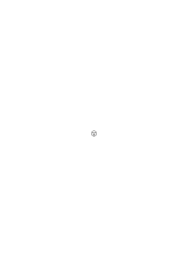

# Philosophy of Psychology – A Fragment

1949, 383 remarks, Ms-144

### [Ms-144](/ms-144/#1r.1) [1r\[1\]](https://cdn.wittgensteinnachlass.com/2000px/webp/Ms-144/1r.webp) {#ms-144-1r-1}

One can imagine an animal being angry, fearful, sad, joyful, frightened. But hopeful? And why not? The dog believes his master is at the door. But can he also believe that his master will come the day after tomorrow? – And _what_ can he not do? – How am I to do it? – What am I to answer? Can only those who can speak also hope? Only those who master the use of a language. That is, the phenomena of hoping are modifications of this complicated form of life. (If a concept aims at a characteristic of human handwriting, then it has no application to beings that do not write.)

### [Ms-144](/ms-144/#1r.2) [1r\[2\]](https://cdn.wittgensteinnachlass.com/2000px/webp/Ms-144/1r.webp) {#ms-144-1r-2}

“Sorrow” describes a pattern that recurs in the tapestry of life with various variations. If, in a person, the bodily expression of grief and joy alternated, for example, with the ticking of a clock, then we would not have here the characteristic course of the grief pattern, nor the joy pattern.

### [Ms-144](/ms-144/#1r.3) [1r\[3\]](https://cdn.wittgensteinnachlass.com/2000px/webp/Ms-144/1r.webp) {#ms-144-1r-3}

“He felt intense pain for a moment.” – Why does it sound strange: “He felt deep sorrow for a moment”? Is it only because it happens so rarely?

### [Ms-144](/ms-144/#1v.1) [1v\[1\]](https://cdn.wittgensteinnachlass.com/2000px/webp/Ms-144/1v.webp) {#ms-144-1v-1}

But don’t you feel the sorrow _now_? (“But aren’t you playing chess _now_?”) The answer can be affirmative; but that doesn’t make the concept of sorrow any more similar to a concept of sensation. – The question was actually a temporal & personal one; not the logical one that we wanted to pose.

### [Ms-144](/ms-144/#1v.2) [1v\[2\]](https://cdn.wittgensteinnachlass.com/2000px/webp/Ms-144/1v.webp) {#ms-144-1v-2}

And do you want to tell me that he doesn't feel it?! How else would he _know_ it? – But even if it is a communication, he doesn't learn it from his sensations. “You must know – I am afraid.” “You must know – I dread it.” – Yes, one can also say that in a _smiling_ tone.

### [Ms-144](/ms-144/#1v.3) [1v\[3\]](https://cdn.wittgensteinnachlass.com/2000px/webp/Ms-144/1v.webp) {#ms-144-1v-3}

For consider the sensations evoked by the _gestures_ of dread: the words “I am afraid of it” are also a gesture; & when I hear & feel them as they are spoken, that belongs to those other sensations. Why should the unspoken gesture be the basis for the spoken one?

### [Ms-144](/ms-144/#4r.1) [4r\[1\]](https://cdn.wittgensteinnachlass.com/2000px/webp/Ms-144/4r.webp) {#ms-144-4r-1}

With his words, “When I heard the word, it meant to me…,” he refers to a _point in time_ & to a _way of using words_. (What we do not understand is, of course, this combination.) And the expression “I wanted to say at that time…” refers to a _point in time_ & to an _action_. I am speaking of the essential _references_ of the utterance, in order to distinguish it from other peculiarities of our expression. And the references are essential to the utterance in that they would lead us to translate an otherwise unfamiliar mode of expression into this form that we use.

### [Ms-144](/ms-144/#4r.2) [4r\[2\]](https://cdn.wittgensteinnachlass.com/2000px/webp/Ms-144/4r.webp) {#ms-144-4r-2}

Someone who would be unable to say that the word “but” could be a verb & a conjunction, or to form sentences in which it is sometimes the one, sometimes the other, would not be able to cope with simple school exercises. But that is not what is expected of a student: to understand the word in isolation, or to report how he has understood it.

### [Ms-144](/ms-144/#4r.3+4v.1) [4r\[3\]](https://cdn.wittgensteinnachlass.com/2000px/webp/Ms-144/4r.webp),[4v\[1\]](https://cdn.wittgensteinnachlass.com/2000px/webp/Ms-144/4v.webp) {#ms-144-4r-3--4v-1}

The words “the rose is red” are senseless if the word “is” has the meaning of “is identical with.” – Does this mean: If you utter that sentence & intend “is” in it as a sign of identity, then the sense of it dissolves? We take a sentence & explain to someone the meaning of each of its words; he learns to apply them & thus also that sentence. If we had chosen a sequence of words without sense instead of the sentence, he would not learn to apply _it_. And if one explains the word “is” as a sign of identity, then he does not learn to use the sentence “the rose is red.”

### [Ms-144](/ms-144/#4v.2) [4v\[2\]](https://cdn.wittgensteinnachlass.com/2000px/webp/Ms-144/4v.webp) {#ms-144-4v-2}

And yet, it also has its validity with regard to the ‘dissolution of sense’. It is illustrated in this example: One could say to someone: If you want to express the exclamation “Oh, oh!” expressively, you must not think of eggs!

### [Ms-144](/ms-144/#4v.3) [4v\[3\]](https://cdn.wittgensteinnachlass.com/2000px/webp/Ms-144/4v.webp) {#ms-144-4v-3}

The experience of a meaning & the experience of a mental image. “One _experiences_ here & there,” one might say, “only something different. A different content is presented to consciousness – stands before it.” – What is the content of the experience of an image? The answer is a picture, or a description. And what is the content of the experience of meaning? I don’t know how to answer. – If that utterance has any sense, it is that the two concepts are related to each other in a similar way to ‘red’ & ‘blue’; & that is false.

### [Ms-144](/ms-144/#4v.4) [4v\[4\]](https://cdn.wittgensteinnachlass.com/2000px/webp/Ms-144/4v.webp) {#ms-144-4v-4}

Can one capture the understanding of a meaning like a mental image? So, if a meaning of a word suddenly occurs to me, can it also remain before my mind?

### [Ms-144](/ms-144/#4v.5) [4v\[5\]](https://cdn.wittgensteinnachlass.com/2000px/webp/Ms-144/4v.webp) {#ms-144-4v-5}

“The whole plan stood before my mind in a flash & remained so for five minutes.” Why does that sound strange? One would think: what flashed and what remained could not be the same thing.

### [Ms-144](/ms-144/#5r.1) [5r\[1\]](https://cdn.wittgensteinnachlass.com/2000px/webp/Ms-144/5r.webp) {#ms-144-5r-1}

I exclaimed “Now I’ve got it!”, it was a flash: then I could explain the plan in detail. What should remain? Perhaps an image. But “Now I’ve got it” did not mean, I have the image.

### [Ms-144](/ms-144/#5r.2) [5r\[2\]](https://cdn.wittgensteinnachlass.com/2000px/webp/Ms-144/5r.webp) {#ms-144-5r-2}

Whoever had a meaning of a word occur to him, & who did not subsequently _forget_ it, can now apply the word in this way. Whoever had the meaning occur to him, now _knows_ it, & the occurrence was the beginning of knowledge. How is it then similar to an experience of imagination?

### [Ms-144](/ms-144/#5r.3) [5r\[3\]](https://cdn.wittgensteinnachlass.com/2000px/webp/Ms-144/5r.webp) {#ms-144-5r-3}

If I say “Mr. Schweizer is not a Swiss,” then I mean the first “Schweizer” as a proper name, the second as a generic name. Must something different therefore occur in my mind when I think of the first “S.” compared to when I think of the second? (Unless I pronounce the sentence ‘parrot-fashion’.) – Try to think of the first “S.” as a generic name & the second as a proper name! – How does one do that? When _I_ do it, I blink my eyes from the effort, as I try to imagine the correct meaning for each of the two words. – But do I also imagine the meaning of the words in their ordinary use?

### [Ms-144](/ms-144/#5r.4+5v.1) [5r\[4\]](https://cdn.wittgensteinnachlass.com/2000px/webp/Ms-144/5r.webp),[5v\[1\]](https://cdn.wittgensteinnachlass.com/2000px/webp/Ms-144/5v.webp) {#ms-144-5r-4--5v-1}

If I utter the sentence with the meanings swapped, the sense of the sentence falls apart. — Well, it falls apart _for me_, but not for the other person, to whom I am making the communication. So what’s the harm? — “But something definite _else_ is indeed happening when one utters the sentence in the ordinary way.” — What is happening is _not_ that ‘demonstration of meaning’.

### [Ms-144](/ms-144/#6r.1) [6r\[1\]](https://cdn.wittgensteinnachlass.com/2000px/webp/Ms-144/6r.webp) {#ms-144-6r-1}

What makes my image of him an image of _him_? Not the similarity of the picture. The same question applies to the utterance “I can now vividly see him,” as to the image. What makes my utterance an utterance about _him_? – Nothing that lies in it, or that is simultaneous with it (‘behind it’). If you want to know whom he meant, ask him! (But it may also be that I have a face in mind, yes, that I can draw it, & do not know to which person it belongs, where I saw it.)

### [Ms-144](/ms-144/#6r.2) [6r\[2\]](https://cdn.wittgensteinnachlass.com/2000px/webp/Ms-144/6r.webp) {#ms-144-6r-2}

If, however, someone were to draw while imagining, or instead of imagining; even if only with a finger in the air (one might call this a “motor image”). One could ask him, “What is this supposed to represent?” & his answer would be decisive. – It is exactly as if he had given a description in words, & this can indeed stand _instead_ of the image.

### [Ms-144](/ms-144/#7r.1) [7r\[1\]](https://cdn.wittgensteinnachlass.com/2000px/webp/Ms-144/7r.webp) {#ms-144-7r-1}

“I believe that he is suffering.” – – Do I also believe that he is not an automaton? I could only utter that word in these two contexts with reluctance. (Or is it _so_: I believe that he is suffering; I am sure that he is not an automaton? Nonsense!)

### [Ms-144](/ms-144/#7r.2) [7r\[2\]](https://cdn.wittgensteinnachlass.com/2000px/webp/Ms-144/7r.webp) {#ms-144-7r-2}

Suppose I say of a friend: “He is not an automaton.” – What is being communicated here, & for whom would it be a communication? For a _person_ who encounters the other under normal circumstances? What _could_ it communicate to him! (But at most, that this person always behaves like a person, not sometimes like a machine.)

### [Ms-144](/ms-144/#7r.3) [7r\[3\]](https://cdn.wittgensteinnachlass.com/2000px/webp/Ms-144/7r.webp) {#ms-144-7r-3}

“I believe that he is not an automaton” has, as such, no sense whatsoever.

### [Ms-144](/ms-144/#7r.4) [7r\[4\]](https://cdn.wittgensteinnachlass.com/2000px/webp/Ms-144/7r.webp) {#ms-144-7r-4}

My attitude toward him is an attitude toward the mind. I don't have the opinion that he has a mind.

### [Ms-144](/ms-144/#7r.5) [7r\[5\]](https://cdn.wittgensteinnachlass.com/2000px/webp/Ms-144/7r.webp) {#ms-144-7r-5}

Religion teaches that the mind can persist even when the body has decayed. Do I understand what it teaches? – Of course, I understand it – I can imagine many things in this connection. Pictures of these things have also been painted. And why should such a picture only be an imperfect representation of the expressed thought? Why shouldn't it serve the _same_ purpose as the word? And it is the purpose that matters.

### [Ms-144](/ms-144/#7v.1) [7v\[1\]](https://cdn.wittgensteinnachlass.com/2000px/webp/Ms-144/7v.webp) {#ms-144-7v-1}

If the image of the thought can impose itself on our mind, why not even more so the image of the thought in the mind?

### [Ms-144](/ms-144/#7v.2) [7v\[2\]](https://cdn.wittgensteinnachlass.com/2000px/webp/Ms-144/7v.webp) {#ms-144-7v-2}

The human body is the best picture of the human mind.

### [Ms-144](/ms-144/#7v.3) [7v\[3\]](https://cdn.wittgensteinnachlass.com/2000px/webp/Ms-144/7v.webp) {#ms-144-7v-3}

But what about such an expression: “When you said it, I understood it in my heart”? One points to the heart. And does one not _mean_ this gesture?! Of course, one does mean it. Or is one only conscious of _using_ a picture, an image? Certainly not. – It is not a picture of our choice, not a simile, & yet it is a pictorial expression.

### [Ms-144](/ms-144/#8r.1) [8r\[1\]](https://cdn.wittgensteinnachlass.com/2000px/webp/Ms-144/8r.webp) {#ms-144-8r-1}

Imagine we are observing the movement of a point (a point of light on a screen, for example). Important conclusions of various kinds could be drawn from the behavior of this point. But how many different things can be observed about it! The path of the point and certain of its dimensions (e.g., amplitude and wavelength), or the speed and the law according to which it changes, or the number or location of the points at which it changes abruptly, or the curvature of the path at these points, and countless other things. And each of these _features_ of the behavior could be the only one that interests us. For example, everything in this movement might be of no interest to us except the number of oscillations in a certain time. And if not only _one_ such feature interests us, but several, then each of them may give us a particular insight, different in kind from all the others. And so it is with human behavior, with the various characteristics of this behavior that we observe.

### [Ms-144](/ms-144/#8r.2) [8r\[2\]](https://cdn.wittgensteinnachlass.com/2000px/webp/Ms-144/8r.webp) {#ms-144-8r-2}

So does psychology deal with behavior, not with the mind? What does the psychologist report? What does he observe? Not the behavior of people, especially their expressions? But _these_ do not deal with behavior.

### [Ms-144](/ms-144/#8r.3+8v.1) [8r\[3\]](https://cdn.wittgensteinnachlass.com/2000px/webp/Ms-144/8r.webp),[8v\[1\]](https://cdn.wittgensteinnachlass.com/2000px/webp/Ms-144/8v.webp) {#ms-144-8r-3--8v-1}

“I noticed that he was upset.” Is this a report about behavior, or about the state of mind? (“The sky looks threatening”: does this concern the present, or the future?) Both; but not side by side; but the one is inferred from the other.

### [Ms-144](/ms-144/#8v.2) [8v\[2\]](https://cdn.wittgensteinnachlass.com/2000px/webp/Ms-144/8v.webp) {#ms-144-8v-2}

The doctor asks: “How does he feel?” The nurse says: “He groans.” A report about behavior. But does the question exist for either of them as to whether this groaning is really genuine, really the expression of something? Could they not, for example, draw the conclusion “If he groans, we must give him another painkiller” – without omitting an intermediate step? Doesn't it all depend on the purpose for which they present the description of the behavior?

### [Ms-144](/ms-144/#8v.3) [8v\[3\]](https://cdn.wittgensteinnachlass.com/2000px/webp/Ms-144/8v.webp) {#ms-144-8v-3}

“But these then make an implicit assumption.” Then the process of our language-game always rests on an implicit assumption.

### [Ms-144](/ms-144/#8v.4+9r.1) [8v\[4\]](https://cdn.wittgensteinnachlass.com/2000px/webp/Ms-144/8v.webp),[9r\[1\]](https://cdn.wittgensteinnachlass.com/2000px/webp/Ms-144/9r.webp) {#ms-144-8v-4--9r-1}

I describe a psychological experiment: the apparatus, the experimenter's questions, the actions and answers of the subject – and now I say that this is a scene in a play. Now everything has changed. So one must explain: if this experiment were described in the same way in a book on psychology, the description of the behavior would be understood as an expression of the mental, because one _assumes_ that the subject is not putting on an act, has not learned the answers by heart, and so on. So we are making an assumption? Would we really say: “Of course, I am assuming that…”? Or only not because the other person already knows that?

### [Ms-144](/ms-144/#9r.2) [9r\[2\]](https://cdn.wittgensteinnachlass.com/2000px/webp/Ms-144/9r.webp) {#ms-144-9r-2}

Does an assumption not consist in the existence of a doubt? And the doubt may be completely absent. Doubting has an end.

### [Ms-144](/ms-144/#9r.3) [9r\[3\]](https://cdn.wittgensteinnachlass.com/2000px/webp/Ms-144/9r.webp) {#ms-144-9r-3}

Here it is like the relationship: physical object & sensory impressions. We have _two_ language-games here, & their relationships to each other are of a complicated kind. – If one wants to bring these relationships to a _simple_ formula, one is mistaken.

### [Ms-144](/ms-144/#10r.1) [10r\[1\]](https://cdn.wittgensteinnachlass.com/2000px/webp/Ms-144/10r.webp) {#ms-144-10r-1}

Imagine, someone said: every word that is well-known to us, in a book, for example, already has a vague area in our mind, a ‘court’ of weakly indicated uses around it. – As if in a painting, each of the figures is also surrounded by delicate, nebulously drawn scenes, as if in another dimension, and we see the figures here in other contexts. – Let us simply take this assumption seriously! – Then it turns out that it cannot explain the _intention_. For if it is the case that the possibilities of the use of a word float before us in half-tones when speaking or listening – if it is the case, then this is only true for _us_. But we communicate with others without knowing whether they also have these experiences.

### [Ms-144](/ms-144/#10r.2) [10r\[2\]](https://cdn.wittgensteinnachlass.com/2000px/webp/Ms-144/10r.webp) {#ms-144-10r-2}

What would we say to someone who told us that for _him_, understanding is an internal process? – – What would we say to him if he said that for him, the ability to play chess is an internal process? – That nothing that happens in him interests us if we want to know whether he can play chess. – And if he now replies that it does interest us: – namely, whether he can play chess – then we would have to point him to the criteria that would prove his ability to us, & on the other hand, to the criteria of ‘internal states’. Even if someone could only do this & that, and only for as long as he has a certain feeling, the feeling would not be the ability.

### [Ms-144](/ms-144/#10v.1) [10v\[1\]](https://cdn.wittgensteinnachlass.com/2000px/webp/Ms-144/10v.webp) {#ms-144-10v-1}

Meaning is not the experience when listening to or uttering the word, & the sense of the sentence is not the complex of these experiences. – (How is the sense of the sentence: “I have still not seen him” composed of the meanings of its words?) The sentence is composed of the words, & that is enough.

### [Ms-144](/ms-144/#10v.2) [10v\[2\]](https://cdn.wittgensteinnachlass.com/2000px/webp/Ms-144/10v.webp) {#ms-144-10v-2}

Every word – one might say – can indeed have a different character in different contexts, but it always has _one_ character – a face. It does look at us. – But even a _painted_ face looks at us.

### [Ms-144](/ms-144/#10v.3) [10v\[3\]](https://cdn.wittgensteinnachlass.com/2000px/webp/Ms-144/10v.webp) {#ms-144-10v-3}

Are you sure that there is _a_ if-feeling; perhaps not several? Have you tried to utter the word in very different contexts? For example, if it carries the main stress of the sentence, & if the next word carries the stress.

### [Ms-144](/ms-144/#10v.4) [10v\[4\]](https://cdn.wittgensteinnachlass.com/2000px/webp/Ms-144/10v.webp) {#ms-144-10v-4}

Imagine, we find a person who tells us about his feelings for words: for him, “if” & “but” have the _same_ feeling. – Would we not believe him? It might seem strange to us. “He doesn’t play our game,” one might say. Or also: “He is a different type.” If we would not believe that he understands the words “if” & “but” as we understand them, if he uses them as we _use_ them, would we?

### [Ms-144](/ms-144/#11r.1) [11r\[1\]](https://cdn.wittgensteinnachlass.com/2000px/webp/Ms-144/11r.webp) {#ms-144-11r-1}

One misjudges the psychological interest of the if-feeling if one regards it as a matter of course correlate of a meaning; rather, it must be seen in another context, in the one of the particular circumstances under which it occurs.

### [Ms-144](/ms-144/#11r.2) [11r\[2\]](https://cdn.wittgensteinnachlass.com/2000px/webp/Ms-144/11r.webp) {#ms-144-11r-2}

Does someone never have the if-feeling when he does not utter the word “if”? It is certainly strange if only this cause brings about this feeling. And so it is in general with the ‘atmosphere’ of a word: – why does one take it for granted that only _this_ word has this atmosphere?

### [Ms-144](/ms-144/#11r.3) [11r\[3\]](https://cdn.wittgensteinnachlass.com/2000px/webp/Ms-144/11r.webp) {#ms-144-11r-3}

The if-feeling is not a feeling that accompanies the word “if”.

### [Ms-144](/ms-144/#11r.4) [11r\[4\]](https://cdn.wittgensteinnachlass.com/2000px/webp/Ms-144/11r.webp) {#ms-144-11r-4}

The if-feeling could be compared to the particular ‘feeling’ that a musical phrase gives us. (One sometimes describes such a feeling by saying “It is as if a conclusion is being drawn,” or “I would like to say ‘_so_...’”, or “I would like to make a gesture here –” & (now) one (makes) it.)

### [Ms-144](/ms-144/#11r.5) [11r\[5\]](https://cdn.wittgensteinnachlass.com/2000px/webp/Ms-144/11r.webp) {#ms-144-11r-5}

But can one separate this feeling from the phrase? And yet it is not the phrase itself; for someone can hear it without this feeling.

### [Ms-144](/ms-144/#11r.6) [11r\[6\]](https://cdn.wittgensteinnachlass.com/2000px/webp/Ms-144/11r.webp) {#ms-144-11r-6}

Is it similar to the ‘expression’ with which it is played?

### [Ms-144](/ms-144/#11v.1) [11v\[1\]](https://cdn.wittgensteinnachlass.com/2000px/webp/Ms-144/11v.webp) {#ms-144-11v-1}

We say that this passage gives us a very special feeling. We sing it to ourselves, and in doing so, we make a certain movement, perhaps also have some particular sensation. But these accompaniments – the movement, the sensation – we would not recognize them in another context. They are completely empty, except when we sing this passage.

### [Ms-144](/ms-144/#11v.2) [11v\[2\]](https://cdn.wittgensteinnachlass.com/2000px/webp/Ms-144/11v.webp) {#ms-144-11v-2}

“I sing it with a very specific expression.” This expression is not something that can be separated from the passage. It is a different concept. (A different game.)

### [Ms-144](/ms-144/#11v.3) [11v\[3\]](https://cdn.wittgensteinnachlass.com/2000px/webp/Ms-144/11v.webp) {#ms-144-11v-3}

Experience is this instance, so played (_so_, as I might demonstrate it; a description could only _hint_ at it).

### [Ms-144](/ms-144/#11v.4) [11v\[4\]](https://cdn.wittgensteinnachlass.com/2000px/webp/Ms-144/11v.webp) {#ms-144-11v-4}

The atmosphere inseparable from the thing – so it is not an atmosphere. What is intimately associated with one another, what _has been_ associated, that seems to fit together. But how does it seem to fit? How is it expressed that it seems to fit? Perhaps like this: We cannot think that the man who had this name, this face, this handwriting did not produce _these_ works, but perhaps quite different ones (those of another great man). Can we not think this? Let us try. –

### [Ms-144](/ms-144/#12r.1) [12r\[1\]](https://cdn.wittgensteinnachlass.com/2000px/webp/Ms-144/12r.webp) {#ms-144-12r-1}

It could be like this: I hear someone paint a picture of “Beethoven writing the Ninth Symphony.” I could easily imagine what might be seen in such a picture. But how, if someone wanted to depict what Goethe looked like while writing the Ninth Symphony? I cannot imagine anything that would not be embarrassing & ridiculous.

### [Ms-144](/ms-144/#14r.1) [14r\[1\]](https://cdn.wittgensteinnachlass.com/2000px/webp/Ms-144/14r.webp) {#ms-144-14r-1}

People who, after waking up, tell us about certain events (they were there and there, etc.). We now teach them the expression “I dreamed,” which is followed by the narration. I sometimes ask them, “Did you dream anything last night?” and receive an affirmative or negative answer, sometimes a dream narration, sometimes none. That is the language-game. (I am now assuming that I myself do not dream. But I also never have the feelings of an invisible presence, and others have them, and I can ask them about their experiences.) Must I now make an assumption about whether the people have deceived their memory, or not; whether they really saw these images in front of them during sleep, or whether it only seems that way to them after waking up? And what is the point of this question? – And what is the interest?! Do we ever ask ourselves this when someone tells us their dream? And if not, is it because we are sure that their memory will not deceive them? (And suppose it is a person with a very bad memory. –)

### [Ms-144](/ms-144/#14r.2) [14r\[2\]](https://cdn.wittgensteinnachlass.com/2000px/webp/Ms-144/14r.webp) {#ms-144-14r-2}

And does this mean that it is nonsensical to ever ask the question: whether the dream really takes place during sleep, or is a phenomenon of memory of the awakened? It depends on the use of the question.

### [Ms-144](/ms-144/#14r.3+14v.1) [14r\[3\]](https://cdn.wittgensteinnachlass.com/2000px/webp/Ms-144/14r.webp),[14v\[1\]](https://cdn.wittgensteinnachlass.com/2000px/webp/Ms-144/14v.webp) {#ms-144-14r-3--14v-1}

“It seems that the mind can give meaning to the word.” – Is this not the same as saying: “It seems that in benzene, the C atoms are located at the corners of a hexagon”? That is not an appearance; it is a picture.

### [Ms-144](/ms-144/#14v.2) [14v\[2\]](https://cdn.wittgensteinnachlass.com/2000px/webp/Ms-144/14v.webp) {#ms-144-14v-2}

The evolution of higher animals and humans and the awakening of consciousness at a certain stage. The picture is something like this: The world is dark, despite all the ethereal vibrations that run through it. But one day the human being opens his seeing eye, and it becomes light. Our language first describes a picture. What is to happen with the picture, how is it to be used, remains in the dark. But it is clear that it must be explored if one wants to understand the meaning of our statement. But the picture seems to transcend this work; it already points to a certain use. This is what makes it so good for us.

### [Ms-144](/ms-144/#15r.1) [15r\[1\]](https://cdn.wittgensteinnachlass.com/2000px/webp/Ms-144/15r.webp) {#ms-144-15r-1}

“My kinesthetic sensations inform me about the movements & positions of my limbs.” I let my index finger make a slight, oscillating movement with a small range. I hardly feel it, or not at all. Perhaps a little in the fingertip as a slight tension. (Not at all in the joint.) And does this sensation inform me about the movement? – because I can describe it precisely.

### [Ms-144](/ms-144/#15r.2) [15r\[2\]](https://cdn.wittgensteinnachlass.com/2000px/webp/Ms-144/15r.webp) {#ms-144-15r-2}

“You just have to feel it, otherwise you wouldn't know (without looking) how your finger is moving.” But, “knowing” just means: being able to describe it. – I can only indicate the direction from which a sound comes because it affects one ear more strongly than the other; but I don't feel it in my ears; but it does result in: I _know_ from which direction the sound is coming; I look, for example, in that direction.

### [Ms-144](/ms-144/#15r.3) [15r\[3\]](https://cdn.wittgensteinnachlass.com/2000px/webp/Ms-144/15r.webp) {#ms-144-15r-3}

It is the same with the idea that a characteristic of the sensation of pain must inform us about its location on the body, & a characteristic of the memory-image about the time to which it belongs.

### [Ms-144](/ms-144/#15r.4+15v.1) [15r\[4\]](https://cdn.wittgensteinnachlass.com/2000px/webp/Ms-144/15r.webp),[15v\[1\]](https://cdn.wittgensteinnachlass.com/2000px/webp/Ms-144/15v.webp) {#ms-144-15r-4--15v-1}

A sensation _can_ inform us about the movement or position of a limb. (Whoever does not know, like a normal person, whether his arm is outstretched, could be convinced of this by a sharp pain in his elbow.) – And so the character of a pain can also inform us about the location of the injury. (And the yellowing of a photograph about its age.)

### [Ms-144](/ms-144/#15v.2) [15v\[2\]](https://cdn.wittgensteinnachlass.com/2000px/webp/Ms-144/15v.webp) {#ms-144-15v-2}

What is the criterion for the fact that a sense impression informs me about the form & color?

### [Ms-144](/ms-144/#15v.3) [15v\[3\]](https://cdn.wittgensteinnachlass.com/2000px/webp/Ms-144/15v.webp) {#ms-144-15v-3}

_Which_ sense impression? Now _this_; I describe it through words or through a picture. And now: what do you feel when your fingers are in this position? – “How can one explain a feeling? It is something inexplicable, special.” But one must be able to teach the use of the words!

### [Ms-144](/ms-144/#15v.4) [15v\[4\]](https://cdn.wittgensteinnachlass.com/2000px/webp/Ms-144/15v.webp) {#ms-144-15v-4}

I am now looking for the grammatical difference.

### [Ms-144](/ms-144/#15v.5) [15v\[5\]](https://cdn.wittgensteinnachlass.com/2000px/webp/Ms-144/15v.webp) {#ms-144-15v-5}

Let us put aside the kinesthetic feeling for a moment! – I want to describe a feeling to someone, & I say to him, “Do it _like this_, then you will have it,” while I hold my arm, or my head in a certain position. Is this now a description of a feeling, & when will I say that he has understood which feeling I meant? – He will then have to give a _further_ description of the feeling. And what kind must that be?

### [Ms-144](/ms-144/#15v.6+16r.1) [15v\[6\]](https://cdn.wittgensteinnachlass.com/2000px/webp/Ms-144/15v.webp),[16r\[1\]](https://cdn.wittgensteinnachlass.com/2000px/webp/Ms-144/16r.webp) {#ms-144-15v-6--16r-1}

I say, “Do it _like this_, then you will have it.” Can there not be a doubt? Must there not be one, if a feeling is meant?

### [Ms-144](/ms-144/#16r.2) [16r\[2\]](https://cdn.wittgensteinnachlass.com/2000px/webp/Ms-144/16r.webp) {#ms-144-16r-2}

_That_ looks _like this_; _that_ tastes _like this_; _that_ feels _like this_. “that” & “like this” must be explained differently.

### [Ms-144](/ms-144/#16r.3) [16r\[3\]](https://cdn.wittgensteinnachlass.com/2000px/webp/Ms-144/16r.webp) {#ms-144-16r-3}

A ‘feeling’ has a quite _definite_ interest for us. And this includes, for example, the ‘degree of the feeling’, the ‘location’, the overpowerability of one by another. (If the movement is very painful, so that the pain overpowers every other faint sensation in that place, does this make it uncertain whether you really made this movement? Could it bring you to convince yourself of it with your eyes?)

### [Ms-144](/ms-144/#18r.1) [18r\[1\]](https://cdn.wittgensteinnachlass.com/2000px/webp/Ms-144/18r.webp) {#ms-144-18r-1}

Whoever observes his own sorrow, with what senses does he observe it? With a special sense; with one that _feels_ the sorrow? Does he feel it _differently_ when he observes it? And which does he observe; the one that is only there while it is being observed? ‘Observing’ does not create the observed. (This is a conceptual statement.) Or: I do not ‘observe’ _that_ which comes into being through observing. The object of observation is something else.

### [Ms-144](/ms-144/#18r.2) [18r\[2\]](https://cdn.wittgensteinnachlass.com/2000px/webp/Ms-144/18r.webp) {#ms-144-18r-2}

A touch that was painful yesterday is no longer so today. Today I only feel the pain when I think about it. (I.e.: under certain circumstances.) My sorrow is no longer the same: a memory that was unbearable to me a year ago is no longer so today. This is the result of an observation.

### [Ms-144](/ms-144/#18r.3) [18r\[3\]](https://cdn.wittgensteinnachlass.com/2000px/webp/Ms-144/18r.webp) {#ms-144-18r-3}

When does one say: someone is observing? Approximately: When he puts himself in a favorable position to receive certain impressions in order to describe (e.g.) what they teach him.

### [Ms-144](/ms-144/#18r.4+18v.1) [18r\[4\]](https://cdn.wittgensteinnachlass.com/2000px/webp/Ms-144/18r.webp),[18v\[1\]](https://cdn.wittgensteinnachlass.com/2000px/webp/Ms-144/18v.webp) {#ms-144-18r-4--18v-1}

If one were trained to utter a specific sound upon seeing something red, another upon seeing something yellow, and so on for other colors, this would not yet be a description of objects according to their colors. Although it could help us with a description. A description is a depiction of a distribution in a space (e.g., time).

### [Ms-144](/ms-144/#18v.2) [18v\[2\]](https://cdn.wittgensteinnachlass.com/2000px/webp/Ms-144/18v.webp) {#ms-144-18v-2}

I let my gaze wander around a room, suddenly it falls on an object of strikingly red hue, and I say “Red!” – with this, I have not given a description.

### [Ms-144](/ms-144/#18v.3) [18v\[3\]](https://cdn.wittgensteinnachlass.com/2000px/webp/Ms-144/18v.webp) {#ms-144-18v-3}

Are the words “I am afraid” a description of a state of mind?

### [Ms-144](/ms-144/#18v.4+19r.1) [18v\[4\]](https://cdn.wittgensteinnachlass.com/2000px/webp/Ms-144/18v.webp),[19r\[1\]](https://cdn.wittgensteinnachlass.com/2000px/webp/Ms-144/19r.webp) {#ms-144-18v-4--19r-1}

I say “I am afraid,” and the other asks me: “What was that? A cry of fear; or did you want to communicate to me how you feel; was it a reflection on your present state?” – Could I always give him a clear answer? Could I never give him one? One can imagine very different things, e.g.: “No, no! I am afraid!” “I am afraid. Unfortunately, I have to admit it.” “I am still a little afraid, but not as much as before.” “I am basically still afraid, although I don’t want to admit it.” “I am tormenting myself with all sorts of fearful thoughts.” “I am afraid now, when I should be fearless!” Each of these sentences has a particular tone of voice, each has a different context. One could imagine people who think in a much more precise way than we do, and where we use _one_ word, they use different ones.

### [Ms-144](/ms-144/#19r.2) [19r\[2\]](https://cdn.wittgensteinnachlass.com/2000px/webp/Ms-144/19r.webp) {#ms-144-19r-2}

One asks oneself, “What does ‘I am afraid’ actually mean, what is my aim with it?” And of course, there is no answer, or one that is not sufficient. The question is: “In what kind of context is it?”

### [Ms-144](/ms-144/#19r.3) [19r\[3\]](https://cdn.wittgensteinnachlass.com/2000px/webp/Ms-144/19r.webp) {#ms-144-19r-3}

There is no answer if I want to answer the question “What is my aim?” “What am I thinking?” by repeating the expression of fear and, as it were, observing my soul from the corner of my eye. However, I can indeed ask in a concrete case, “Why did I say that, what did I want to achieve with it?” – and I could also answer the question; but not on the basis of observing the accompanying phenomena of speaking. And my answer would supplement, paraphrase the previous utterance.

### [Ms-144](/ms-144/#19r.4) [19r\[4\]](https://cdn.wittgensteinnachlass.com/2000px/webp/Ms-144/19r.webp) {#ms-144-19r-4}

What is fear? What does “being afraid” mean? If I wanted to explain it with _one_ demonstration, I would _play_ the fear.

### [Ms-144](/ms-144/#19r.5) [19r\[5\]](https://cdn.wittgensteinnachlass.com/2000px/webp/Ms-144/19r.webp) {#ms-144-19r-5}

Could I also represent hope in this way? Hardly. Or even belief?

### [Ms-144](/ms-144/#19v.1) [19v\[1\]](https://cdn.wittgensteinnachlass.com/2000px/webp/Ms-144/19v.webp) {#ms-144-19v-1}

I describe my state of mind (e.g., fear) in a specific context. (Just as a specific action is only an experiment in a specific context.) Is it so surprising that I use the same expression in different games? And sometimes even, as it were, between the games?

### [Ms-144](/ms-144/#19v.2) [19v\[2\]](https://cdn.wittgensteinnachlass.com/2000px/webp/Ms-144/19v.webp) {#ms-144-19v-2}

And do I always speak with a very specific intention? – And is what I say therefore meaningless?

### [Ms-144](/ms-144/#19v.3) [19v\[3\]](https://cdn.wittgensteinnachlass.com/2000px/webp/Ms-144/19v.webp) {#ms-144-19v-3}

If, in a eulogy, it is said “We mourn our…”, this is meant to express the grief; not to communicate something to those present. But in a prayer at the grave, these words would be a kind of communication.

### [Ms-144](/ms-144/#19v.4) [19v\[4\]](https://cdn.wittgensteinnachlass.com/2000px/webp/Ms-144/19v.webp) {#ms-144-19v-4}

The problem is this: The cry, which cannot be called a description, which is more primitive than any description, nevertheless performs the function of a description of mental life.

### [Ms-144](/ms-144/#19v.5) [19v\[5\]](https://cdn.wittgensteinnachlass.com/2000px/webp/Ms-144/19v.webp) {#ms-144-19v-5}

A cry is not a description. But there are transitions. And the words “I am afraid” can be closer and more distant from a cry. They can be very close to it, and _very_ far from it.

### [Ms-144](/ms-144/#19v.6+20r.1) [19v\[6\]](https://cdn.wittgensteinnachlass.com/2000px/webp/Ms-144/19v.webp),[20r\[1\]](https://cdn.wittgensteinnachlass.com/2000px/webp/Ms-144/20r.webp) {#ms-144-19v-6--20r-1}

We do not necessarily say of someone that he _complains_ just because he says that he is in pain. So the words “I am in pain” can be a complaint, and also something else.

### [Ms-144](/ms-144/#20r.2) [20r\[2\]](https://cdn.wittgensteinnachlass.com/2000px/webp/Ms-144/20r.webp) {#ms-144-20r-2}

But if “I am afraid” is not always, and yet sometimes, something similar to a complaint, why should it then _always_ be a description of my state of mind?

### [Ms-144](/ms-144/#21r.1) [21r\[1\]](https://cdn.wittgensteinnachlass.com/2000px/webp/Ms-144/21r.webp) {#ms-144-21r-1}

How did one come to use an expression like “I believe…”? Did one become aware of a phenomenon (of belief)? Did one observe oneself and others and thus discover belief?

### [Ms-144](/ms-144/#21r.2) [21r\[2\]](https://cdn.wittgensteinnachlass.com/2000px/webp/Ms-144/21r.webp) {#ms-144-21r-2}

Moore’s paradox can be expressed as follows: the utterance “I believe that it is the case” is used similarly to the assertion “It is the case”; & yet the _assumption_ that I believe that it is the case is not used similarly to the assumption that it is the case.

### [Ms-144](/ms-144/#21v.2) [21v\[2\]](https://cdn.wittgensteinnachlass.com/2000px/webp/Ms-144/21v.webp) {#ms-144-21v-2}

It seems as if the assertion “I believe” is not the assertion of what the assumption “I believe” assumes!

### [Ms-144](/ms-144/#21r.3) [21r\[3\]](https://cdn.wittgensteinnachlass.com/2000px/webp/Ms-144/21r.webp) {#ms-144-21r-3}

Likewise: The statement “I believe it will rain” has a similar sense, i.e., similar use, as “It will rain,” but “I believed then that it would rain” does not have a similar sense as “It rained then.” “But surely ‘I believed’ must state _that_ in the past which ‘I believe’ states in the present!” — Surely √‒1 must mean for ‒1 what √1 means for 1! That means absolutely nothing.

### [Ms-144](/ms-144/#21r.4+21v.1) [21r\[4\]](https://cdn.wittgensteinnachlass.com/2000px/webp/Ms-144/21r.webp),[21v\[1\]](https://cdn.wittgensteinnachlass.com/2000px/webp/Ms-144/21v.webp) {#ms-144-21r-4--21v-1}

“In essence, with the words ‘I believe…,’ I describe my own state of mind, but this description is here indirectly an assertion of the believed fact itself.” – As when I describe a photograph in order to describe what it depicts. But then I must also be able to say that the photograph is a good depiction. Also: “I believe that it will rain, and my belief is reliable, so I rely on it.” – Then my belief would be a kind of sense impression.

\>

### [Ms-144](/ms-144/#21v.6) [21v\[6\]](https://cdn.wittgensteinnachlass.com/2000px/webp/Ms-144/21v.webp) {#ms-144-21v-6}

One can distrust one’s own senses, but not one’s own beliefs.

### [Ms-144](/ms-144/#21v.3) [21v\[3\]](https://cdn.wittgensteinnachlass.com/2000px/webp/Ms-144/21v.webp) {#ms-144-21v-3}

If there were a verb with the meaning ‘to believe falsely,’ it would not have a meaningful first person in the indicative present.

### [Ms-144](/ms-144/#21v.4) [21v\[4\]](https://cdn.wittgensteinnachlass.com/2000px/webp/Ms-144/21v.webp) {#ms-144-21v-4}

Don’t see it as self-evident, but as something very remarkable, that the verbs “believe,” “wish,” and “want” all have the grammatical forms that “cut,” “chew,” and “run” also have.

### [Ms-144](/ms-144/#21v.5) [21v\[5\]](https://cdn.wittgensteinnachlass.com/2000px/webp/Ms-144/21v.webp) {#ms-144-21v-5}

The language-game of reporting can be used in such a way that the report is not intended to inform the recipient about its object, but about the person making the report. For example, when the teacher tests the student. (One can measure in order to test the standard.)

### [Ms-144](/ms-144/#21v.7+22r.1) [21v\[7\]](https://cdn.wittgensteinnachlass.com/2000px/webp/Ms-144/21v.webp),[22r\[1\]](https://cdn.wittgensteinnachlass.com/2000px/webp/Ms-144/22r.webp) {#ms-144-21v-7--22r-1}

Suppose I introduced an expression – e.g., “I believe” – in such a way: it should be placed before the report where it serves to provide information about the person making the report. (Therefore, no uncertainty need be attached to the expression. Note that the uncertainty of the assertion can also be expressed impersonally: “He will probably come today.”) – “I believe… and it is not so” would be a contradiction.

### [Ms-144](/ms-144/#22r.2) [22r\[2\]](https://cdn.wittgensteinnachlass.com/2000px/webp/Ms-144/22r.webp) {#ms-144-22r-2}

“I believe…” illuminates my state. Conclusions about my behaviour can be drawn from this utterance. Therefore, there is a _similarity_ here with the utterances of emotional states, moods, etc.

### [Ms-144](/ms-144/#22r.3) [22r\[3\]](https://cdn.wittgensteinnachlass.com/2000px/webp/Ms-144/22r.webp) {#ms-144-22r-3}

But if “I believe that it is so” illuminates my state, then so does the assertion “It is so.” For the sign “I believe” cannot do this; it can only suggest it.

### [Ms-144](/ms-144/#22r.4) [22r\[4\]](https://cdn.wittgensteinnachlass.com/2000px/webp/Ms-144/22r.webp) {#ms-144-22r-4}

A language in which “I believe it is so” is expressed only through the tone of the assertion “It is so.” Instead of “He believes,” it says there, “He is inclined to say…,” & there is also the assumption (the subjunctive) “Suppose I am inclined, etc.,” but not an utterance: “I am inclined to say.” Moore’s paradox would not exist in this language; instead, there would be a verb that lacks a form. But this should not surprise us. Remember that one can predict one’s _own_ future action in the utterance of the intention.

### [Ms-144](/ms-144/#22r.5+22v.1) [22r\[5\]](https://cdn.wittgensteinnachlass.com/2000px/webp/Ms-144/22r.webp),[22v\[1\]](https://cdn.wittgensteinnachlass.com/2000px/webp/Ms-144/22v.webp) {#ms-144-22r-5--22v-1}

I say of the other, “He seems to believe…” & others say it of me. Now, why do I never say it of myself, even when others say it of me _justifiably_? – Don’t I see & hear myself? – One can say that.

### [Ms-144](/ms-144/#22v.2) [22v\[2\]](https://cdn.wittgensteinnachlass.com/2000px/webp/Ms-144/22v.webp) {#ms-144-22v-2}

“One feels conviction within oneself; one does not infer it from one’s own words or their tone.” – It is true that one does not infer one’s own conviction from one’s own words, or from the actions that spring from it.

### [Ms-144](/ms-144/#22v.3) [22v\[3\]](https://cdn.wittgensteinnachlass.com/2000px/webp/Ms-144/22v.webp) {#ms-144-22v-3}

“It seems as if the assertion ‘I believe’ is not the assertion of what the assumption assumes.” – Therefore, I am tempted to look for another continuation of the verb in the first person of the indicative present.

### [Ms-144](/ms-144/#22v.4) [22v\[4\]](https://cdn.wittgensteinnachlass.com/2000px/webp/Ms-144/22v.webp) {#ms-144-22v-4}

I think as follows: Belief is a state of mind. It endures; & is independent of the unfolding of its expression in a sentence, e.g. It is, therefore, a kind of disposition of the believer, which reveals to me, in the other, his behaviour; his words. And that, both an utterance “I believe…”, as well as his simple assertion. – Now, what about me: how do I recognize my own disposition? – Surely, I would have to, like the other, pay attention to myself, listen to my words, and be able to draw conclusions from them!

### [Ms-144](/ms-144/#22v.5) [22v\[5\]](https://cdn.wittgensteinnachlass.com/2000px/webp/Ms-144/22v.webp) {#ms-144-22v-5}

I have a completely different attitude towards my own words than others do.

### [Ms-144](/ms-144/#23r.4) [23r\[4\]](https://cdn.wittgensteinnachlass.com/2000px/webp/Ms-144/23r.webp) {#ms-144-23r-4}

I could find that continuation if I could only say “I seem to believe”.

### [Ms-144](/ms-144/#23r.5) [23r\[5\]](https://cdn.wittgensteinnachlass.com/2000px/webp/Ms-144/23r.webp) {#ms-144-23r-5}

I could find that continuation if I could only say “I seem to believe”.

### [Ms-144](/ms-144/#23r.1) [23r\[1\]](https://cdn.wittgensteinnachlass.com/2000px/webp/Ms-144/23r.webp) {#ms-144-23r-1}

If I listened to the speech of my mouth, I could say that another person is speaking from my mouth.

### [Ms-144](/ms-144/#23r.2) [23r\[2\]](https://cdn.wittgensteinnachlass.com/2000px/webp/Ms-144/23r.webp) {#ms-144-23r-2}

“Judging from my utterance, I believe _that_.” Well, circumstances could be imagined in which these words would make sense. And then one could also say “It is raining & I don’t believe it”, or “It seems to me that my ego believes that, but it is not so.” One would have to imagine a behaviour that indicates that two beings are speaking from my mouth.

### [Ms-144](/ms-144/#23r.3) [23r\[3\]](https://cdn.wittgensteinnachlass.com/2000px/webp/Ms-144/23r.webp) {#ms-144-23r-3}

The line lies differently in the _assumption_ than you think. In the words “Suppose I believe…”, you already presuppose the whole grammar of the word “believe”, the usual use, which you master. – You do not assume something that is, as it were, clearly before your eyes in an image, so that you can then attach a different assertion than the usual one to this assumption. – You would not even know what you are assuming here (i.e., what follows from such an assumption), if you were not already familiar with the use of “believe”.

### [Ms-144](/ms-144/#23r.6+23v.1) [23r\[6\]](https://cdn.wittgensteinnachlass.com/2000px/webp/Ms-144/23r.webp),[23v\[1\]](https://cdn.wittgensteinnachlass.com/2000px/webp/Ms-144/23v.webp) {#ms-144-23r-6--23v-1}

Think of the expression “I say…”, e.g. in “I say it will rain today”, which is simply equivalent to the assertion “It will…”. “He says it will…” casually means “He believes it will…”. “Suppose I say…” does _not_ mean: Suppose it will rain today….

### [Ms-144](/ms-144/#23v.2) [23v\[2\]](https://cdn.wittgensteinnachlass.com/2000px/webp/Ms-144/23v.webp) {#ms-144-23v-2}

Various concepts touch each other here & run along a path together. One must not believe that all the lines are _circles_.

### [Ms-144](/ms-144/#23v.3) [23v\[3\]](https://cdn.wittgensteinnachlass.com/2000px/webp/Ms-144/23v.webp) {#ms-144-23v-3}

Consider also the non-sentence: “It probably will rain; but it is not raining.” And here one must be careful not to say: “It probably will rain” actually means: I believe it will rain. – Why should not the reverse be the case?

### [Ms-144](/ms-144/#23v.4) [23v\[4\]](https://cdn.wittgensteinnachlass.com/2000px/webp/Ms-144/23v.webp) {#ms-144-23v-4}

Do not consider the hesitant assertion as an assertion of hesitancy.

### [Ms-144](/ms-144/#24r.1) [24r\[1\]](https://cdn.wittgensteinnachlass.com/2000px/webp/Ms-144/24r.webp) {#ms-144-24r-1}

a1 Two uses of the word “see”. The one: “What do you see there?” – “I see _this_” [a description follows, a drawing, a copy]. The other: “I see a similarity in these two faces” – the person to whom I communicate this may see the faces as clearly as I do. The importance: The categorical difference between the two ‘objects’ of seeing.

### [Ms-144](/ms-144/#24r.2) [24r\[2\]](https://cdn.wittgensteinnachlass.com/2000px/webp/Ms-144/24r.webp) {#ms-144-24r-2}

a2 One person could accurately draw the two faces; the other, in this drawing, notice the similarity that the first did not see.

### [Ms-144](/ms-144/#24r.3) [24r\[3\]](https://cdn.wittgensteinnachlass.com/2000px/webp/Ms-144/24r.webp) {#ms-144-24r-3}

a3 I look at a face, suddenly I notice its similarity to another. I _see_ that it has not changed; & I see it differently. I call this experience “noticing an aspect”.

### [Ms-144](/ms-144/#24r.4) [24r\[4\]](https://cdn.wittgensteinnachlass.com/2000px/webp/Ms-144/24r.webp) {#ms-144-24r-4}

a4 Its _causes_ interest the psychologist.

### [Ms-144](/ms-144/#24r.5) [24r\[5\]](https://cdn.wittgensteinnachlass.com/2000px/webp/Ms-144/24r.webp) {#ms-144-24r-5}

We are interested in the concept & its position in the concepts of experience.

### [Ms-144](/ms-144/#24r.6+24v.1) [24r\[6\]](https://cdn.wittgensteinnachlass.com/2000px/webp/Ms-144/24r.webp),[24v\[1\]](https://cdn.wittgensteinnachlass.com/2000px/webp/Ms-144/24v.webp) {#ms-144-24r-6--24v-1}

a5 One could imagine that in several places of a book, e.g. a textbook, the illustration

would be found. In the accompanying text, something different is discussed each time: Once a glass cube, once an overturned open box, once a wire frame that has this shape, once three boards that form a corner of a room. The text indicates the illustration each time. But we can also _see_ the illustration once as this, once as that thing. – So we interpret it, & _see_ it as we _interpret_ it.

### [Ms-144](/ms-144/#24v.2) [24v\[2\]](https://cdn.wittgensteinnachlass.com/2000px/webp/Ms-144/24v.webp) {#ms-144-24v-2}

a6 Perhaps one might answer: The description of immediate experience, of the act of seeing, by means of an interpretation is an indirect description. “I see the figure as a box” means: I have a certain visual experience, which, according to experience, goes together with interpreting the figure as a box, or with looking at a box. But if that were what it meant, then I would have to know it. I would have to be able to refer directly to the experience, and not just indirectly. (As I don’t necessarily have to talk about red as the color of blood.)

### [Ms-144](/ms-144/#24v.3+25r.1) [24v\[3\]](https://cdn.wittgensteinnachlass.com/2000px/webp/Ms-144/24v.webp),[25r\[1\]](https://cdn.wittgensteinnachlass.com/2000px/webp/Ms-144/25r.webp) {#ms-144-24v-3--25r-1}

a7 The following figure, which I have taken from Jastrow, will in my remarks be called the duck-rabbit (H-E head). One can see it as a rabbit’s head, or as a duck’s head.

And I must distinguish between ‘steadily seeing’ an aspect and the ‘lighting up’ of the aspect. The picture may have been shown to me, and I may never have seen anything other than a rabbit in it.

### [Ms-144](/ms-144/#25r.2) [25r\[2\]](https://cdn.wittgensteinnachlass.com/2000px/webp/Ms-144/25r.webp) {#ms-144-25r-2}

a8 It is useful here to introduce the concept of the picture-object. A ‘picture-face’, for example, would be the figure

.

In some respects, I behave towards it as I do towards a human face. I can study its expression, react to it as I react to the expression of a human face. A child can talk to the picture-person, or picture-animal, treat it as it treats dolls.

### [Ms-144](/ms-144/#25r.3) [25r\[3\]](https://cdn.wittgensteinnachlass.com/2000px/webp/Ms-144/25r.webp) {#ms-144-25r-3}

a9 So, I could simply have seen the duck-rabbit from the start as a picture-rabbit. That is: when asked, “What is that?”, or “What do you see there?”, I would have answered: “A picture-rabbit.” If I had been asked further what that was, I would have explained it by pointing to all sorts of pictures of rabbits, even to real rabbits, talked about the life of these animals, or acted them out.

### [Ms-144](/ms-144/#25r.4+25v.1) [25r\[4\]](https://cdn.wittgensteinnachlass.com/2000px/webp/Ms-144/25r.webp),[25v\[1\]](https://cdn.wittgensteinnachlass.com/2000px/webp/Ms-144/25v.webp) {#ms-144-25r-4--25v-1}

a10 I would not have answered the question “What do you see there?” with: “I am now seeing it as a picture-rabbit.” I would simply have described the perception; not differently than if my words had been “I see a red circle there.” – Nevertheless, another person could have said of me, “He sees the figure as a picture-rabbit.”

### [Ms-144](/ms-144/#25v.2) [25v\[2\]](https://cdn.wittgensteinnachlass.com/2000px/webp/Ms-144/25v.webp) {#ms-144-25v-2}

a11 To say “I am now seeing it as…”, would have had as little sense for me as saying, when looking at a knife and fork: “I am now seeing it as a knife and fork.” One would not understand this utterance. – Just as little as this: “This is now a fork for me,” or “This could also be a fork.”

### [Ms-144](/ms-144/#25v.3) [25v\[3\]](https://cdn.wittgensteinnachlass.com/2000px/webp/Ms-144/25v.webp) {#ms-144-25v-3}

a12 One does not consider what one recognizes at the table as cutlery to _be_ cutlery; no more than one, when eating, usually tries to move one’s mouth, or attempts to do so.

### [Ms-144](/ms-144/#25v.4) [25v\[4\]](https://cdn.wittgensteinnachlass.com/2000px/webp/Ms-144/25v.webp) {#ms-144-25v-4}

a13 Whoever says “Now it is a face for me”, can be asked: “What transformation are you referring to?”

### [Ms-144](/ms-144/#25v.5) [25v\[5\]](https://cdn.wittgensteinnachlass.com/2000px/webp/Ms-144/25v.webp) {#ms-144-25v-5}

a14 I see two pictures; in one, the duck-rabbit is surrounded by rabbits, in the other, by ducks. I don’t notice the sameness. Does it _follow_ from this that I see something different each time? – This gives us a reason to use this _expression_ here.

### [Ms-144](/ms-144/#25v.6) [25v\[6\]](https://cdn.wittgensteinnachlass.com/2000px/webp/Ms-144/25v.webp) {#ms-144-25v-6}

a15 “I saw it quite differently, I would never have recognized it!” Well, that is an exclamation. And it also has a justification.

### [Ms-144](/ms-144/#25v.7+26r.1) [25v\[7\]](https://cdn.wittgensteinnachlass.com/2000px/webp/Ms-144/25v.webp),[26r\[1\]](https://cdn.wittgensteinnachlass.com/2000px/webp/Ms-144/26r.webp) {#ms-144-25v-7--26r-1}

a16 I would never have thought of putting the two heads together like that, of comparing them _in that way_. For they suggest a different way of comparison. The head, _seen in this way_, has no similarity whatsoever with the head, _seen in that way_ – although they are congruent.

### [Ms-144](/ms-144/#26r.2) [26r\[2\]](https://cdn.wittgensteinnachlass.com/2000px/webp/Ms-144/26r.webp) {#ms-144-26r-2}

a17 One shows me a picture-rabbit & asks me what it is; I say “That is a rabbit.” Not “That is now a rabbit.” I communicate the perception. – One shows me the duck-rabbit (H-E head) & asks me what it is; then I _can_ say “That is a duck-rabbit (H-E head).” But I can also react to the question in a completely different way. – The answer, that it is the duck-rabbit (H-E head), is again the communication of the perception; the answer “Now it is a rabbit” is not. If I had said “It is a rabbit,” I would have missed the ambiguity, & I would have reported the perception.

### [Ms-144](/ms-144/#26r.3) [26r\[3\]](https://cdn.wittgensteinnachlass.com/2000px/webp/Ms-144/26r.webp) {#ms-144-26r-3}

a18 The change of aspect. “Surely you would say that the picture has now changed completely!” But what is different: my impression? my statement? – Can I say it? I _describe_ the change as one would describe a perception; as if the object had changed before my eyes.

### [Ms-144](/ms-144/#26r.4) [26r\[4\]](https://cdn.wittgensteinnachlass.com/2000px/webp/Ms-144/26r.webp) {#ms-144-26r-4}

a19 “I can now see _that_,” I might say (e.g., while pointing to a different picture). It is the form of reporting a new perception.

### [Ms-144](/ms-144/#26r.5+26v.1) [26r\[5\]](https://cdn.wittgensteinnachlass.com/2000px/webp/Ms-144/26r.webp),[26v\[1\]](https://cdn.wittgensteinnachlass.com/2000px/webp/Ms-144/26v.webp) {#ms-144-26r-5--26v-1}

a20 The expression of the change of aspect is the expression of a _new_ perception, at the same time as it is the expression of the unchanged perception.

### [Ms-144](/ms-144/#26v.2) [26v\[2\]](https://cdn.wittgensteinnachlass.com/2000px/webp/Ms-144/26v.webp) {#ms-144-26v-2}

a21 I suddenly see the solution to a puzzle picture. Where before there were branches, there is now a human figure. My visual impression has changed, & I now realize that it had not only color & form, but also a very specific ‘organization’. – My visual impression has changed; – what was it like before; what is it like now? – If I represent it by an exact copy – & is that not a good representation? – then no change is shown.

### [Ms-144](/ms-144/#26v.3) [26v\[3\]](https://cdn.wittgensteinnachlass.com/2000px/webp/Ms-144/26v.webp) {#ms-144-26v-3}

a22 And don’t you dare say, “My visual impression is not the _drawing_; it is _this_ – – something I cannot show to anyone.” – Of course, it is not the drawing, but also not something of the same category that I carry within me.

### [Ms-144](/ms-144/#26v.4) [26v\[4\]](https://cdn.wittgensteinnachlass.com/2000px/webp/Ms-144/26v.webp) {#ms-144-26v-4}

a23 The concept of the ‘inner image’ is misleading, because the model for this concept is the ‘_outer_ image’; & yet the uses of the terms are no more similar to each other than those of “sign for a number” & “number”. (Yes, whoever wanted to call a number the “ideal sign for a number” could create a similar confusion.)

### [Ms-144](/ms-144/#26v.5+27r.1) [26v\[5\]](https://cdn.wittgensteinnachlass.com/2000px/webp/Ms-144/26v.webp),[27r\[1\]](https://cdn.wittgensteinnachlass.com/2000px/webp/Ms-144/27r.webp) {#ms-144-26v-5--27r-1}

a24 Whoever equates the ‘organization’ of the visual impression with colors & forms, proceeds from the visual impression as an inner object. This object thereby becomes something absurd; a strangely fluctuating entity. For the similarity with the picture is now disturbed.

### [Ms-144](/ms-144/#27r.2) [27r\[2\]](https://cdn.wittgensteinnachlass.com/2000px/webp/Ms-144/27r.webp) {#ms-144-27r-2}

a25 If I know that there are different aspects of the cube schema, I can, in order to find out what the other person sees, produce or have produced a model of what has been seen, in addition to the copy; even if _he_ doesn't know why I am asking for two explanations. But with the change of aspect, things shift. It becomes the only possible expression of experience, which previously, after looking at the copy, may have seemed like a superfluous determination, or perhaps it was.

### [Ms-144](/ms-144/#27r.3) [27r\[3\]](https://cdn.wittgensteinnachlass.com/2000px/webp/Ms-144/27r.webp) {#ms-144-27r-3}

a26 And that alone dismisses the comparison of the ‘organization’ with color & form in the visual impression.

### [Ms-144](/ms-144/#27r.4) [27r\[4\]](https://cdn.wittgensteinnachlass.com/2000px/webp/Ms-144/27r.webp) {#ms-144-27r-4}

a27 If I saw the duck-rabbit as a rabbit, then I saw: these forms & colors (I reproduce them exactly) – & besides, something else: I then point to a collection of different rabbit pictures. – This shows the difference between the concepts. ‘Seeing as …’ does not belong to the perception.

And that is why it is like seeing & yet not like seeing.

### [Ms-144](/ms-144/#27r.5+27v.1) [27r\[5\]](https://cdn.wittgensteinnachlass.com/2000px/webp/Ms-144/27r.webp),[27v\[1\]](https://cdn.wittgensteinnachlass.com/2000px/webp/Ms-144/27v.webp) {#ms-144-27r-5--27v-1}

a28 I look at an animal; someone asks me: “What do you see?” I reply: “A hare.” – I look into the landscape; suddenly a hare runs by. I exclaim “A hare!” Both, the communication & the exclamation, is an expression of the perception & the experience of seeing. But the exclamation is so in a different sense than the communication. It comes from us. – It is related to the experience in a way similar to how a scream is related to pain.

### [Ms-144](/ms-144/#27v.2) [27v\[2\]](https://cdn.wittgensteinnachlass.com/2000px/webp/Ms-144/27v.webp) {#ms-144-27v-2}

a29 But since it is a description of a perception, one can also call it an expression of thought. – Whoever looks at the object does not necessarily have to think about it; however, whoever has the experience of seeing, the expression of which is the exclamation, also thinks about what he sees.

### [Ms-144](/ms-144/#27v.3) [27v\[3\]](https://cdn.wittgensteinnachlass.com/2000px/webp/Ms-144/27v.webp) {#ms-144-27v-3}

a30 And that is why the lighting up of the aspect appears to be half an experience of seeing, half a thought.

### [Ms-144](/ms-144/#27v.4) [27v\[4\]](https://cdn.wittgensteinnachlass.com/2000px/webp/Ms-144/27v.webp) {#ms-144-27v-4}

a31 Someone suddenly sees an appearance in front of him that he does not recognize (it may be an object that is quite familiar to him, but in an unusual position or lighting); this non-recognition may only last for a few seconds. Is it correct: does he have a different experience of seeing than the one who immediately recognized the object?

### [Ms-144](/ms-144/#27v.5) [27v\[5\]](https://cdn.wittgensteinnachlass.com/2000px/webp/Ms-144/27v.webp) {#ms-144-27v-5}

a32 Couldn’t someone describe the form that appears before him, which is unfamiliar to him, just as _accurately_ as I, to whom it is familiar? And isn’t that the answer? – Of course, in general, it won’t be like that. Also, his description will sound quite different. (For example, I will say “The animal had long ears” – he: “There were two long appendages” & now he draws them.)

### [Ms-144](/ms-144/#27v.6+28r.1) [27v\[6\]](https://cdn.wittgensteinnachlass.com/2000px/webp/Ms-144/27v.webp),[28r\[1\]](https://cdn.wittgensteinnachlass.com/2000px/webp/Ms-144/28r.webp) {#ms-144-27v-6--28r-1}

a33 I meet someone I haven't seen in years; I see him clearly, but I don't recognize him. Suddenly I recognize him, I see his earlier self in his changed face. I think I would now portray him differently if I could paint.

### [Ms-144](/ms-144/#28r.2) [28r\[2\]](https://cdn.wittgensteinnachlass.com/2000px/webp/Ms-144/28r.webp) {#ms-144-28r-2}

a34 If I now recognize my acquaintance in the crowd, after perhaps having looked in his direction for some time, – is that a special kind of seeing? Is it seeing & thinking? Or is it a merging of the two – as I would almost like to say? The question is: _Why_ does one want to say that?

### [Ms-144](/ms-144/#28r.3) [28r\[3\]](https://cdn.wittgensteinnachlass.com/2000px/webp/Ms-144/28r.webp) {#ms-144-28r-3}

a35 The same expression, which is also a report of what has been seen, is now an exclamation of recognition.

### [Ms-144](/ms-144/#28r.4) [28r\[4\]](https://cdn.wittgensteinnachlass.com/2000px/webp/Ms-144/28r.webp) {#ms-144-28r-4}

a36 What is the criterion of the experience of seeing? – What should the criterion be? The representation of ‘what is seen’.

### [Ms-144](/ms-144/#28r.5) [28r\[5\]](https://cdn.wittgensteinnachlass.com/2000px/webp/Ms-144/28r.webp) {#ms-144-28r-5}

a37 The concept of the representation of what is seen, as well as that of the copy, is very flexible, & _with it_ the concept of what is seen. The two are closely related. (And that does _not_ mean that they are similar.)

### [Ms-144](/ms-144/#42r.1) [42r\[1\]](https://cdn.wittgensteinnachlass.com/2000px/webp/Ms-144/42r.webp) {#ms-144-42r-1}

a37˙1 How does one recognize that people spatially _see_? – I ask someone how the terrain (there) lies, that which he surveys. “Does it lie _like this_?” (I show it with my hand) – “Yes.” – “How do you know that?” – “It is not foggy, I see it quite clearly.” – No reasons are given for the _assumption_. It is uniquely natural for us to represent what is seen spatially; whereas, for the planar representation, whether through drawing or through words, special practice & instruction are required. (The peculiarity of children’s drawings.)

### [Ms-144](/ms-144/#28r.6) [28r\[6\]](https://cdn.wittgensteinnachlass.com/2000px/webp/Ms-144/28r.webp) {#ms-144-28r-6}

a38 Does someone who sees a smile that he does not recognize as a smile, that he does not understand, see it differently than the one who understands it? – He, for example, copies it differently.

### [Ms-144](/ms-144/#30v.1) [30v\[1\]](https://cdn.wittgensteinnachlass.com/2000px/webp/Ms-144/30v.webp) {#ms-144-30v-1}

Hold a drawing of a face upside down & you cannot recognize the expression of the face. Perhaps you can see that it is smiling, but not exactly _how_ it is smiling. You cannot imitate the smile, or describe its character more precisely. And yet the inverted picture may depict a person's face quite accurately.

### [Ms-144](/ms-144/#28v.1) [28v\[1\]](https://cdn.wittgensteinnachlass.com/2000px/webp/Ms-144/28v.webp) {#ms-144-28v-1}

a40 Figure a)

is the reversal of figure b)

,

as figure c)

is the reversal of d)

.

But there is a different difference between my impression of c & d – I would like to say – than between that of a & b. (For example, d looks neater than c. Compare a remark by Lewis Carroll.) d is easy to copy, c difficult.

### [Ms-144](/ms-144/#28v.2) [28v\[2\]](https://cdn.wittgensteinnachlass.com/2000px/webp/Ms-144/28v.webp) {#ms-144-28v-2}

a41 Imagine the duck-rabbit head hidden in a tangle of lines. Now I notice it in the picture, simply as a rabbit's head. Later I look at the same picture and notice the same line, but as a duck, and I do not yet need to know that it was the same line both times. If I later see the aspect change, can I say that the aspects of H and E are seen quite differently than when I recognized them individually in the tangle of lines? No. But the change evokes a sense of wonder that recognition does not evoke.

### [Ms-144](/ms-144/#28v.3) [28v\[3\]](https://cdn.wittgensteinnachlass.com/2000px/webp/Ms-144/28v.webp) {#ms-144-28v-3}

a42 He who looks for another (2) in a figure (1), & then finds it, sees (1) in a new way. He can not only give a new description of it, but that noticing was a new experience of seeing.

### [Ms-144](/ms-144/#28v.4+29r.1) [28v\[4\]](https://cdn.wittgensteinnachlass.com/2000px/webp/Ms-144/28v.webp),[29r\[1\]](https://cdn.wittgensteinnachlass.com/2000px/webp/Ms-144/29r.webp) {#ms-144-28v-4--29r-1}

a43 But it does not have to be the case that he wants to say: “The figure (1) now looks completely different; it also has no similarity with the earlier one, although it is congruent with it!”

a44

### [Ms-144](/ms-144/#29v.4) [29v\[4\]](https://cdn.wittgensteinnachlass.com/2000px/webp/Ms-144/29v.webp) {#ms-144-29v-4}

a44 There are here a large number of related phenomena and possible concepts.

### [Ms-144](/ms-144/#29r.2) [29r\[2\]](https://cdn.wittgensteinnachlass.com/2000px/webp/Ms-144/29r.webp) {#ms-144-29r-2}

a45 Is the copy of the figure then an _incomplete_ description of my experience of seeing? No. – It depends on the circumstances whether, and which, further specifications are necessary. – It _can_ be an incomplete description; if a question remains.

### [Ms-144](/ms-144/#29r.3) [29r\[3\]](https://cdn.wittgensteinnachlass.com/2000px/webp/Ms-144/29r.webp) {#ms-144-29r-3}

One can, of course, say: there are certain things that fall under both the concept of ‘picture-rabbit’ and ‘picture-duck’. And such a thing is a picture, a drawing. – But the _impression_ is not at the same time the impression of a picture-duck and a picture-rabbit.

### [Ms-144](/ms-144/#29r.4) [29r\[4\]](https://cdn.wittgensteinnachlass.com/2000px/webp/Ms-144/29r.webp) {#ms-144-29r-4}

a46 “What I actually _see_ must be what is brought about in me by the action of the object.” – What is brought about in me is then a kind of depiction, something that one could look at again, have before one; almost like a _materialization_. And this materialization is something spatial and must be described entirely in spatial terms. It can, for example, smile (if it is a face), but the concept of friendliness does not belong to its depiction, but is _foreign_ to this depiction (even if it can serve it).

### [Ms-144](/ms-144/#29r.5+29v.1) [29r\[5\]](https://cdn.wittgensteinnachlass.com/2000px/webp/Ms-144/29r.webp),[29v\[1\]](https://cdn.wittgensteinnachlass.com/2000px/webp/Ms-144/29v.webp) {#ms-144-29r-5--29v-1}

a47 If you ask me what I saw, I will perhaps be able to produce a sketch that shows it; but I will in most cases not remember at all how my gaze wandered.

### [Ms-144](/ms-144/#29v.2) [29v\[2\]](https://cdn.wittgensteinnachlass.com/2000px/webp/Ms-144/29v.webp) {#ms-144-29v-2}

a48 The concept of ‘seeing’ makes a confused impression. Well, that is how it is. – I look at the landscape; my gaze wanders, I see all sorts of clear and unclear movements; _this_ is clearly imprinted on me, _that_ only very vaguely. How completely fragmented what we see can appear! And now look at what “description of what was seen” means! – But that is precisely what one calls a description of what was seen. There is not _one proper_, orderly case of such a description – and the rest is simply still unclear, awaits clarification, or must simply be relegated to the corner as waste.

### [Ms-144](/ms-144/#29v.3) [29v\[3\]](https://cdn.wittgensteinnachlass.com/2000px/webp/Ms-144/29v.webp) {#ms-144-29v-3}

a49 Here there is a great danger for us: to want to make fine distinctions. – It is similar when one wants to explain the concept of the physical body from ‘what is actually seen’. – Rather, one must _add_ the everyday language-game, and _false_ depictions must be designated as such. The primitive language-game that is taught to the child needs no justification; attempts at justification require rejection.

### [Ms-144](/ms-144/#29v.5+30r.1) [29v\[5\]](https://cdn.wittgensteinnachlass.com/2000px/webp/Ms-144/29v.webp),[30r\[1\]](https://cdn.wittgensteinnachlass.com/2000px/webp/Ms-144/30r.webp) {#ms-144-29v-5--30r-1}

a50 Consider as an example the aspects of the triangle. The triangle

can be seen: as a triangular hole, as a body, as a geometric drawing; standing on its base, hanging from its tip; as a mountain, as a wedge, as an arrow or pointer; as an overturned body that should (e.g.) stand on the shorter leg, as a half parallelogram, and various other things.

### [Ms-144](/ms-144/#30r.2) [30r\[2\]](https://cdn.wittgensteinnachlass.com/2000px/webp/Ms-144/30r.webp) {#ms-144-30r-2}

a51 “You can think of _this_ one time, _that_ one time, see it as _this_ one time, as _that_ one time, and then you will see it _this_ way one time, _that_ way one time.” – _How_ so? There is no further determination.

### [Ms-144](/ms-144/#30r.3) [30r\[3\]](https://cdn.wittgensteinnachlass.com/2000px/webp/Ms-144/30r.webp) {#ms-144-30r-3}

a52 But how is it possible that one sees a _thing_ according to an _interpretation_? – The question presents it as an odd fact; as if something had been forced into a form that doesn’t actually fit. But here, no forcing or coercion has taken place.

### [Ms-144](/ms-144/#30r.4) [30r\[4\]](https://cdn.wittgensteinnachlass.com/2000px/webp/Ms-144/30r.webp) {#ms-144-30r-4}

a53 If it seems as though there is no room for such a logical form, then one must seek it in another dimension. If there is no room here, then it is simply in another dimension. (In this sense, there is also no room for imaginary numbers on the real number line. And this means: the application of an imaginary number sign is more dissimilar to that of the real number than the sight of the _calculations_ reveals. If one descends to the application, then that concept finds, as it were, a quite _unexpectedly_ different place.)

### [Ms-144](/ms-144/#30v.3) [30v\[3\]](https://cdn.wittgensteinnachlass.com/2000px/webp/Ms-144/30v.webp) {#ms-144-30v-3}

a54 How would this explanation be: “I can see something as _that_ which it can be a picture of”? Doesn’t that mean: the aspects in the change of aspect are _those_ which the figure could possibly _constantly_ have in a picture?

### [Ms-144](/ms-144/#30v.4) [30v\[4\]](https://cdn.wittgensteinnachlass.com/2000px/webp/Ms-144/30v.webp) {#ms-144-30v-4}

a55 A triangle can indeed actually _be_ in a painting, in another be hanging, in a third depict something that has fallen over. – Thus, that I, the observer, do not say “That can also depict something that has fallen over”, but “The glass has fallen over & lies in shards”. That is how we react to the picture.

### [Ms-144](/ms-144/#30v.5) [30v\[5\]](https://cdn.wittgensteinnachlass.com/2000px/webp/Ms-144/30v.webp) {#ms-144-30v-5}

a56 Could I say how a picture must be in order to bring this about? No. There are, for example, ways of painting that do not communicate anything to me in this immediate way, but do communicate to other people. I believe that habit & education have something to do with it.

### [Ms-144](/ms-144/#30v.6+31r.1) [30v\[6\]](https://cdn.wittgensteinnachlass.com/2000px/webp/Ms-144/30v.webp),[31r\[1\]](https://cdn.wittgensteinnachlass.com/2000px/webp/Ms-144/31r.webp) {#ms-144-30v-6--31r-1}

a57 What does it mean now, that in the picture I ‘_see the sphere floating_’? Does it already lie in the fact that this description is closest to me, self-evident? No; it could be for various reasons. It could, for example, simply be the conventional one. But what is the expression for the fact that I do not just understand the picture in a certain way (know what it is _supposed_ to represent), but _see_ it that way? – Such an expression is: “The sphere seems to float”, “One sees it floating”, or also, in a special tone, “It is floating!” This is therefore the expression of the way one takes it to be. But not used as such.

### [Ms-144](/ms-144/#31r.2) [31r\[2\]](https://cdn.wittgensteinnachlass.com/2000px/webp/Ms-144/31r.webp) {#ms-144-31r-2}

a58 We are not asking here what the causes are & what gives rise to this impression in a particular case.

### [Ms-144](/ms-144/#31r.3) [31r\[3\]](https://cdn.wittgensteinnachlass.com/2000px/webp/Ms-144/31r.webp) {#ms-144-31r-3}

a59 And is it a special impression? – “I do see something _different_ when I see the sphere floating, as opposed to when I simply see it lying there.” – This actually means: This expression is justified! (Because, taken literally, it is only a repetition.) (And yet my impression is not that of a real floating sphere. There are variations of ‘spatial seeing’. The spatial quality of a photograph & the spatial quality of what we see through a stereoscope.)

### [Ms-144](/ms-144/#31r.4) [31r\[4\]](https://cdn.wittgensteinnachlass.com/2000px/webp/Ms-144/31r.webp) {#ms-144-31r-4}

a60 “And is it really a different impression?” – In order to answer this, I would like to ask myself whether something truly different exists within me. But how can I convince myself of this? ‒ ‒ I _describe_ what I see differently.

### [Ms-144](/ms-144/#31v.1) [31v\[1\]](https://cdn.wittgensteinnachlass.com/2000px/webp/Ms-144/31v.webp) {#ms-144-31v-1}

a61 Certain drawings one always sees as figures in a plane, others sometimes, or even always, as spatial. One would now like to say: The visual impression of the drawings that are seen as spatial is spatial; it is, for example, a cube for the cube schema. (Because the description of the impression is the description of a cube.)

### [Ms-144](/ms-144/#31v.2) [31v\[2\]](https://cdn.wittgensteinnachlass.com/2000px/webp/Ms-144/31v.webp) {#ms-144-31v-2}

a62 And it is then remarkable that our impression is, for some drawings, of something flat, and for others, of something spatial. One asks oneself: “Where is this supposed to end?”

### [Ms-144](/ms-144/#31v.3) [31v\[3\]](https://cdn.wittgensteinnachlass.com/2000px/webp/Ms-144/31v.webp) {#ms-144-31v-3}

a63 When I see the picture of a galloping horse, do I merely know that this kind of movement is meant? Is it superstition that I see it galloping in the picture? – And does my visual impression do the same?

### [Ms-144](/ms-144/#31v.4) [31v\[4\]](https://cdn.wittgensteinnachlass.com/2000px/webp/Ms-144/31v.webp) {#ms-144-31v-4}

a64 What does one communicate to me when he says, “I now see it as…”? What are the consequences of this communication? What can I do with it?

### [Ms-144](/ms-144/#31v.5+32r.1) [31v\[5\]](https://cdn.wittgensteinnachlass.com/2000px/webp/Ms-144/31v.webp),[32r\[1\]](https://cdn.wittgensteinnachlass.com/2000px/webp/Ms-144/32r.webp) {#ms-144-31v-5--32r-1}

a65 People often associate colors with vowels. It could be that for some, a vowel, when pronounced repeatedly, changes its color. For example, _a_ is ‘now blue – now red’ for him. The utterance “I now see it as…” might not mean anything more to us than: “_a_ is now red for me.” (Coupled with physiological observations, this change could also become important to us.)

### [Ms-144](/ms-144/#32r.2) [32r\[2\]](https://cdn.wittgensteinnachlass.com/2000px/webp/Ms-144/32r.webp) {#ms-144-32r-2}

a66 It occurs to me that in conversations about aesthetic objects, the words are used: “You must see it _this_ way; that is how it is meant”; “If you see it _this_ way, you will see where the mistake lies”; “You must hear these measures as an introduction”; “You must listen for this key”; “You must phrase it _this_ way” (and this can refer to both hearing and playing).

### [Ms-144](/ms-144/#32r.3) [32r\[3\]](https://cdn.wittgensteinnachlass.com/2000px/webp/Ms-144/32r.webp) {#ms-144-32r-3}

a67 The figure

is intended to represent a convex step and is used to demonstrate certain spatial processes. For example, we draw the line _a_ through the midpoints of the two surfaces. If someone only saw the figure spatially for a moment, and even then sometimes as a concave step, sometimes as a convex step, it could make it difficult for him to follow our demonstration. And if the flat aspect alternates with a spatial one for him, then it is no different than if I were showing him completely different objects during the demonstration.

### [Ms-144](/ms-144/#32r.4+32v.1) [32r\[4\]](https://cdn.wittgensteinnachlass.com/2000px/webp/Ms-144/32r.webp),[32v\[1\]](https://cdn.wittgensteinnachlass.com/2000px/webp/Ms-144/32v.webp) {#ms-144-32r-4--32v-1}

a68 What does it mean when, looking at a drawing in descriptive geometry, I say: “I know that this line will reappear here, but I cannot _see_ it”? Does it simply mean that I lack the familiarity with operating in the drawing, that I am not so familiar with it? Well, this familiarity is certainly one of our criteria. The criterion is a certain _kind_ of ‘being familiar’. Certain gestures, for example, that indicate the spatial relationships: subtle nuances of behaviour.

### [Ms-144](/ms-144/#32v.2) [32v\[2\]](https://cdn.wittgensteinnachlass.com/2000px/webp/Ms-144/32v.webp) {#ms-144-32v-2}

a69 I see that in the picture, the arrow penetrates the animal. It has hit it in the throat & protrudes from the back of its neck. Let the picture be a silhouette. – _Do_ you see the arrow – _do_ you simply know that these two parts are supposed to represent parts of an arrow? (Compare Köhler’s figure of the intersecting hexagons.)

### [Ms-144](/ms-144/#32v.4) [32v\[4\]](https://cdn.wittgensteinnachlass.com/2000px/webp/Ms-144/32v.webp) {#ms-144-32v-4}

a70 “This is not _seeing_!” – “This is seeing!” – Both must be justified conceptually.

### [Ms-144](/ms-144/#32v.5) [32v\[5\]](https://cdn.wittgensteinnachlass.com/2000px/webp/Ms-144/32v.webp) {#ms-144-32v-5}

a71 This is seeing! _In what way_ is it seeing?

### [Ms-144](/ms-144/#32v.3) [32v\[3\]](https://cdn.wittgensteinnachlass.com/2000px/webp/Ms-144/32v.webp) {#ms-144-32v-3}

a72 “The phenomenon initially seems strange, but a physiological explanation will certainly be found for it.” Our problem is not a causal one, but a conceptual one.

### [Ms-144](/ms-144/#32v.6+33v.1) [32v\[6\]](https://cdn.wittgensteinnachlass.com/2000px/webp/Ms-144/32v.webp),[33v\[1\]](https://cdn.wittgensteinnachlass.com/2000px/webp/Ms-144/33v.webp) {#ms-144-32v-6--33v-1}

a73 If I were shown the picture of the pierced animal, or of the intersecting crystals, for only a moment, and then asked to describe it, then _that_ would be the description; if I were to draw it, I would certainly produce a very inaccurate copy, but it would show a kind of animal pierced by an arrow, or two hexagons intersecting. That is, I would _not_ make certain mistakes.

### [Ms-144](/ms-144/#33r.2) [33r\[2\]](https://cdn.wittgensteinnachlass.com/2000px/webp/Ms-144/33r.webp) {#ms-144-33r-2}

a76 The first thing that strikes me about this picture is: there are two hexagons. Now I look at them and ask myself: “Do I really _see_ them as hexagons?” – and this throughout the time they are before my eyes? (Assuming that their aspect has not changed.) – And I would like to answer: “I don’t think about them as hexagons all the time.”

### [Ms-144](/ms-144/#33r.3) [33r\[3\]](https://cdn.wittgensteinnachlass.com/2000px/webp/Ms-144/33r.webp) {#ms-144-33r-3}

a75 Someone says to me: “I immediately saw it as two hexagons. Yes, that was _all that_ I saw.” But how am I to understand that? I think that he would have given this description as an answer to the question “What do you see?” right away, and that he would not have treated it as one of several possible answers. In this respect, it is the same as the answer “A face,” if I had shown him the figure

.

### [Ms-144](/ms-144/#33v.2) [33v\[2\]](https://cdn.wittgensteinnachlass.com/2000px/webp/Ms-144/33v.webp) {#ms-144-33v-2}

The best description I can give of what was shown to me for a moment is _this_: … “The impression was of an animal rearing up.” So, a very specific description emerged. – Was that the _seeing_, or was it a thought?

### [Ms-144](/ms-144/#33v.3) [33v\[3\]](https://cdn.wittgensteinnachlass.com/2000px/webp/Ms-144/33v.webp) {#ms-144-33v-3}

Don't try to analyze the experience in yourself!

### [Ms-144](/ms-144/#33r.4) [33r\[4\]](https://cdn.wittgensteinnachlass.com/2000px/webp/Ms-144/33r.webp) {#ms-144-33r-4}

a78 It could also have been that I first saw the picture as something else, & then said to myself “Ah, it's two hexagons!” So the aspect would have changed. And does that prove that I actually _saw_ it as something specific?

### [Ms-144](/ms-144/#33r.5) [33r\[5\]](https://cdn.wittgensteinnachlass.com/2000px/webp/Ms-144/33r.webp) {#ms-144-33r-5}

a79 “Is it a _real_ experience of seeing?”

The question is: In what way is it one.

### [Ms-144](/ms-144/#33r.6+33v.1) [33r\[6\]](https://cdn.wittgensteinnachlass.com/2000px/webp/Ms-144/33r.webp),[33v\[1\]](https://cdn.wittgensteinnachlass.com/2000px/webp/Ms-144/33v.webp) {#ms-144-33r-6--33v-1}

a80 It is _difficult_ to see here that it is about definitions. A _concept_ is pressing itself upon us. (Don't forget that.)

### [Ms-144](/ms-144/#33v.4) [33v\[4\]](https://cdn.wittgensteinnachlass.com/2000px/webp/Ms-144/33v.webp) {#ms-144-33v-4}

a81 When would I call it merely knowing, not seeing? – Perhaps, if someone treated the picture like a technical drawing, _reading_ it like a blueprint. (Fine nuances of behaviour. – Why are they _important_? They have important consequences.)

### [Ms-144](/ms-144/#33v.5) [33v\[5\]](https://cdn.wittgensteinnachlass.com/2000px/webp/Ms-144/33v.webp) {#ms-144-33v-5}

a82 “It is for me an animal, pierced by the arrow.” I treat it as that; this is my _attitude_ towards the figure. That is one meaning of calling it ‘seeing.’

### [Ms-144](/ms-144/#33v.6) [33v\[6\]](https://cdn.wittgensteinnachlass.com/2000px/webp/Ms-144/33v.webp) {#ms-144-33v-6}

a83 But can I also say in the same sense: “These are for me two hexagons”? Not in the same sense, but in a similar one.

### [Ms-144](/ms-144/#33v.7+34r.1) [33v\[7\]](https://cdn.wittgensteinnachlass.com/2000px/webp/Ms-144/33v.webp),[34r\[1\]](https://cdn.wittgensteinnachlass.com/2000px/webp/Ms-144/34r.webp) {#ms-144-33v-7--34r-1}

a84 You must think about the role that pictures play in our lives, in their character as paintings (as opposed to technical drawings). And there is certainly not uniformity here. Compare this: sometimes one hangs sayings on the wall. But not theorems of mechanics. (Our relationship to these two.)

### [Ms-144](/ms-144/#34r.2) [34r\[2\]](https://cdn.wittgensteinnachlass.com/2000px/webp/Ms-144/34r.webp) {#ms-144-34r-2}

a85 I would expect something different from the one who sees the drawing as this animal than from the one who only knows what it is supposed to represent.

### [Ms-144](/ms-144/#34r.3) [34r\[3\]](https://cdn.wittgensteinnachlass.com/2000px/webp/Ms-144/34r.webp) {#ms-144-34r-3}

a86 Perhaps, however, this expression would have been better: We _regard_ the photograph, the picture on our wall, as the object itself (person, landscape, etc.) that was depicted.

### [Ms-144](/ms-144/#34r.4) [34r\[4\]](https://cdn.wittgensteinnachlass.com/2000px/webp/Ms-144/34r.webp) {#ms-144-34r-4}

a87 This does not have to be the case. We could easily imagine people who do not have this relationship to these pictures. People, for example, who would be repelled by photographs because a face without color, or perhaps a face on a reduced scale, seems inhuman to them.

### [Ms-144](/ms-144/#34r.5) [34r\[5\]](https://cdn.wittgensteinnachlass.com/2000px/webp/Ms-144/34r.webp) {#ms-144-34r-5}

a88 If now I say “We regard a portrait as a person,” – when & for how long do we do this? _Always_, when we see it (& not see it as something else)? I could affirm that, & thereby I would define the concept of regarding. – The question is whether another, related concept becomes important to us, that of such a seeing (namely), which only takes place while I am engaged with the picture as the object (that is depicted).

### [Ms-144](/ms-144/#34r.6+34v.1) [34r\[6\]](https://cdn.wittgensteinnachlass.com/2000px/webp/Ms-144/34r.webp),[34v\[1\]](https://cdn.wittgensteinnachlass.com/2000px/webp/Ms-144/34v.webp) {#ms-144-34r-6--34v-1}

a89 I could say: A picture does not _live_ for me always while I see it. “Your picture smiles at me from the wall.” It doesn’t have to do that every time my gaze falls on it.

a90

### [Ms-144](/ms-144/#36r.4) [36r\[4\]](https://cdn.wittgensteinnachlass.com/2000px/webp/Ms-144/36r.webp) {#ms-144-36r-4}

a90 The H.-E. head. One wonders: How is it possible that the eye, this _point_, looks in one direction? – “_Look how it looks_!” (And in doing so, one ‘looks’ oneself.) But one does not say and do that constantly while looking at the picture. And what is this “Look how it looks!” – is it the expression of a sensation?

### [Ms-144](/ms-144/#34v.2) [34v\[2\]](https://cdn.wittgensteinnachlass.com/2000px/webp/Ms-144/34v.webp) {#ms-144-34v-2}

a91 (I am not striving for completeness with all these examples. Not a classification of the psychological terms. They are only intended to enable the reader to help himself in conceptual uncertainties.)

### [Ms-144](/ms-144/#34v.3) [34v\[3\]](https://cdn.wittgensteinnachlass.com/2000px/webp/Ms-144/34v.webp) {#ms-144-34v-3}

a92 “I see it now as a…” goes together with “I try to see it as a…” or “I cannot yet see it as a…”. But I cannot try to see the conventional picture of a lion _as_ a lion, just as little as I can see

as that letter. (But perhaps as a gallows.)

a93

### [Ms-144](/ms-144/#37r.4) [37r\[4\]](https://cdn.wittgensteinnachlass.com/2000px/webp/Ms-144/37r.webp) {#ms-144-37r-4}

a93 Now, do not ask yourself “How is it with _me_?” – Ask: “What do I know about the other?”

### [Ms-144](/ms-144/#34v.4) [34v\[4\]](https://cdn.wittgensteinnachlass.com/2000px/webp/Ms-144/34v.webp) {#ms-144-34v-4}

a94 How does one play the game: “It could also be _that_”? (_That_, which the figure could also be – and that is what it can be seen as – is not simply another figure. Whoever says “I see

as

”,

might mean something quite different.) Children play this game. They say of a box, for example, that it is now a house; and it is then entirely interpreted as a house and a story is woven around it.

### [Ms-144](/ms-144/#34v.5) [34v\[5\]](https://cdn.wittgensteinnachlass.com/2000px/webp/Ms-144/34v.webp) {#ms-144-34v-5}

a95 And does the child now _see_ the box as a house? “He completely forgets that it is a box; it is actually a house for him.” (There are certain signs of this.) Wouldn’t it also be correct to say that he _sees_ it as a house?

### [Ms-144](/ms-144/#35r.1) [35r\[1\]](https://cdn.wittgensteinnachlass.com/2000px/webp/Ms-144/35r.webp) {#ms-144-35r-1}

a96 And if someone could play like that, and in a particular situation, with a special expression, exclaimed, “Now it is a house!” – that would express the lighting up of the aspect.

a96˙1

### [Ms-144](/ms-144/#37r.5) [37r\[5\]](https://cdn.wittgensteinnachlass.com/2000px/webp/Ms-144/37r.webp) {#ms-144-37r-5}

a96˙1 If I heard someone talking about the H.-E. picture, and _now_, in a certain way, about the particular expression of this rabbit's face, then I would say that he is now seeing the picture as a rabbit.

### [Ms-144](/ms-144/#35r.2) [35r\[2\]](https://cdn.wittgensteinnachlass.com/2000px/webp/Ms-144/35r.webp) {#ms-144-35r-2}

a97 But the expression of the voice and gesture is the same as if the object had changed and had finally _become_ that or the other. I have a theme played to me repeatedly and each time at a slower tempo. Finally, I say “_Now_ it is right”, or “_Now_ it only is a march”, “_Now_ it only is a dance”. – In _this_ tone, the lighting up of the aspect also expresses itself.

### [Ms-144](/ms-144/#35r.3) [35r\[3\]](https://cdn.wittgensteinnachlass.com/2000px/webp/Ms-144/35r.webp) {#ms-144-35r-3}

a98 ‘Fine nuances of behaviour’ – If my understanding of a theme is expressed in that I whistle it with the correct expression, then that is an example of these fine nuances.

### [Ms-144](/ms-144/#35r.4) [35r\[4\]](https://cdn.wittgensteinnachlass.com/2000px/webp/Ms-144/35r.webp) {#ms-144-35r-4}

a99 The aspects of the triangle: It is as if an _image_ came into contact with the visual impression and remained in contact for a time.

### [Ms-144](/ms-144/#35r.5) [35r\[5\]](https://cdn.wittgensteinnachlass.com/2000px/webp/Ms-144/35r.webp) {#ms-144-35r-5}

a100 In this, however, these aspects differ from the concave and convex aspect of the step (e.g.). Also from the aspects of the figure

(I will call them “double cross”) as a white cross on a black background and as a black cross on a white background.

### [Ms-144](/ms-144/#35r.6+35v.1) [35r\[6\]](https://cdn.wittgensteinnachlass.com/2000px/webp/Ms-144/35r.webp),[35v\[1\]](https://cdn.wittgensteinnachlass.com/2000px/webp/Ms-144/35v.webp) {#ms-144-35r-6--35v-1}

a101 You must remember that the description of the alternating aspects is in each case of a different kind.

### [Ms-144](/ms-144/#36r.3) [36r\[3\]](https://cdn.wittgensteinnachlass.com/2000px/webp/Ms-144/36r.webp) {#ms-144-36r-3}

a102 (The temptation to say “I see it _like this_”, by pointing at the same thing when saying “it” & “like this”.)

### [Ms-144](/ms-144/#41v.3) [41v\[3\]](https://cdn.wittgensteinnachlass.com/2000px/webp/Ms-144/41v.webp) {#ms-144-41v-3}

Always eliminate the private object by assuming: it changes constantly; you just don't notice it because your memory constantly deceives you.

### [Ms-144](/ms-144/#35v.2) [35v\[2\]](https://cdn.wittgensteinnachlass.com/2000px/webp/Ms-144/35v.webp) {#ms-144-35v-2}

a103 Those two aspects of the double cross (I will call them the aspects _A_) could, for example, be simply communicated by the observer alternately pointing to a separate white cross and to a separate black cross. Yes, one could imagine that this is a primitive reaction of a child, even before it can speak. (In the communication of the aspects _A_, a part of the double cross figure is therefore pointed out. – The H. & E. aspect could not be described in an analogous way.)

### [Ms-144](/ms-144/#35v.3) [35v\[3\]](https://cdn.wittgensteinnachlass.com/2000px/webp/Ms-144/35v.webp) {#ms-144-35v-3}

a104 Only the one who ‘sees the aspects H. & E.’ has the shapes of those two animals in mind. There is no analogous condition for the aspects _A_.

### [Ms-144](/ms-144/#35v.4) [35v\[4\]](https://cdn.wittgensteinnachlass.com/2000px/webp/Ms-144/35v.webp) {#ms-144-35v-4}

a105 Someone can simply take the H-E head to be the picture of a rabbit, the double cross to be the picture of a black cross, but not the mere triangular figure to be the picture of an overturned object. It requires _powers of imagination_ to see this aspect of the triangle.

### [Ms-144](/ms-144/#35v.5+36r.1) [35v\[5\]](https://cdn.wittgensteinnachlass.com/2000px/webp/Ms-144/35v.webp),[36r\[1\]](https://cdn.wittgensteinnachlass.com/2000px/webp/Ms-144/36r.webp) {#ms-144-35v-5--36r-1}

a106 The aspects _A_ are not essentially spatial aspects; a black cross on a white background is not essentially one that has a white area as its background. One could teach someone the concept of a black cross on a differently colored background without ever showing him crosses other than those painted on sheets of paper. The ‘background’ here is simply the surroundings of the cross figure. The aspects _A_ are not connected in the same way with a possible illusion, as are the spatial aspects of the cube drawing, or the steps.

### [Ms-144](/ms-144/#38v.2) [38v\[2\]](https://cdn.wittgensteinnachlass.com/2000px/webp/Ms-144/38v.webp) {#ms-144-38v-2}

a106˙1 I can see the cube diagram as a box; – but also: sometimes as a paper box, sometimes as a metal box? – What should I say if someone assured me that _he_ could do it? – Here I can draw a conceptual boundary. But think of the _expression_ “_felt_” when considering a picture. (“One feels the softness of this material.”) (The _knowledge_ in a dream. “And I _knew_ that in the room there was the …”)

### [Ms-144](/ms-144/#38v.3) [38v\[3\]](https://cdn.wittgensteinnachlass.com/2000px/webp/Ms-144/38v.webp) {#ms-144-38v-3}

a107˙01 How do you teach a child (perhaps while doing arithmetic) to “Now put _these_ points together!” or “Now _these_ belong together”? Apparently, “putting together” & “belonging together” must have originally had a different meaning for him than simply _seeing_ something in a certain way. – And this is a remark about concepts, not about methods of instruction.

### [Ms-144](/ms-144/#37r.6) [37r\[6\]](https://cdn.wittgensteinnachlass.com/2000px/webp/Ms-144/37r.webp) {#ms-144-37r-6}

a107 One could call one _kind_ of aspect “aspects of organization.” When the aspect changes, parts of the picture that were not previously connected become connected.

### [Ms-144](/ms-144/#38r.5) [38r\[5\]](https://cdn.wittgensteinnachlass.com/2000px/webp/Ms-144/38r.webp) {#ms-144-38r-5}

a107˙1 Now I can see _this_ as the apex, _that_ as the base of the triangle – now _this_ as the apex & _that_ as the base. – It is clear that the words “I now see _this_ as the apex” cannot mean anything to the student who has only just become acquainted with the concepts of apex, base, etc. – But I do not mean this as an empirical proposition. Only of someone who is _capable_ of applying certain techniques to the figure would one say that he now sees it _like this_, now _like that_. The substrate of this experience is the mastery of a technique.

### [Ms-144](/ms-144/#38v.1) [38v\[1\]](https://cdn.wittgensteinnachlass.com/2000px/webp/Ms-144/38v.webp) {#ms-144-38v-1}

a107˙2 How strange, however, that this should be the logical condition for someone to _experience_ this & that! You don’t say that only the one who ‘has toothache’ is capable of doing this & that. – From which it follows that we are not dealing with the same concept of experience here. It is a different one, although related.

### [Ms-144](/ms-144/#38v.4+39r.1) [38v\[4\]](https://cdn.wittgensteinnachlass.com/2000px/webp/Ms-144/38v.webp),[39r\[1\]](https://cdn.wittgensteinnachlass.com/2000px/webp/Ms-144/39r.webp) {#ms-144-38v-4--39r-1}

a107˙3 Only someone who has learned & mastered how to _do_ that has any reason to say that he has experienced _it_. And if that sounds absurd, one must consider that the _concept_ of seeing is being modified here. (A similar consideration is often necessary to dispel the feeling of delusion in mathematics.)

### [Ms-144](/ms-144/#39r.2) [39r\[2\]](https://cdn.wittgensteinnachlass.com/2000px/webp/Ms-144/39r.webp) {#ms-144-39r-2}

We speak, make utterances, & only _later_ do we form an image of their life.

### [Ms-144](/ms-144/#39r.3) [39r\[3\]](https://cdn.wittgensteinnachlass.com/2000px/webp/Ms-144/39r.webp) {#ms-144-39r-3}

a107˙4 How could I have seen that this posture was hesitant before I knew that it was a posture & not the anatomy of this being? But doesn’t that just mean that I couldn’t apply this concept, which does not refer _only_ to the visual, to describe what I am _seeing_? – Couldn’t I still have a purely visual concept, let’s say, of a fearful face?

### [Ms-144](/ms-144/#39r.4) [39r\[4\]](https://cdn.wittgensteinnachlass.com/2000px/webp/Ms-144/39r.webp) {#ms-144-39r-4}

a107˙5 Such a concept could then be compared with the concepts ‘major’ & ‘minor’, which probably have an emotional value, but which can also be used only to describe the perceived structure.

### [Ms-144](/ms-144/#39v.3) [39v\[3\]](https://cdn.wittgensteinnachlass.com/2000px/webp/Ms-144/39v.webp) {#ms-144-39v-3}

a107˙51 The epithet “sad” applied to a stick figure, for example, characterizes the grouping of lines in an oval. When applied to a human being, it has a different (although related) meaning. (This, however, does _not_ mean that the sad facial expression is _similar_ to the feeling of sadness!)

### [Ms-144](/ms-144/#39v.4) [39v\[4\]](https://cdn.wittgensteinnachlass.com/2000px/webp/Ms-144/39v.webp) {#ms-144-39v-4}

a107˙52 Also consider this: I can only see red and green, but not hear them – but sadness, as far as I can see it, I can also hear.

### [Ms-144](/ms-144/#39r.5) [39r\[5\]](https://cdn.wittgensteinnachlass.com/2000px/webp/Ms-144/39r.webp) {#ms-144-39r-5}

a107˙6 Just think of the expression “I heard a plaintive melody”! And now the question: “Does he _hear_ the lament?”

### [Ms-144](/ms-144/#39r.6+39v.1) [39r\[6\]](https://cdn.wittgensteinnachlass.com/2000px/webp/Ms-144/39r.webp),[39v\[1\]](https://cdn.wittgensteinnachlass.com/2000px/webp/Ms-144/39v.webp) {#ms-144-39r-6--39v-1}

a107˙7 And if I replied: “No, he doesn’t hear it; he only _experiences_ it” – what is to be done about that? One cannot even specify a sensory organ for this ‘experience’. Some might now reply: “Of course, I hear it!” – Some: “I don’t actually hear it.” However, conceptual differences can be identified.

### [Ms-144](/ms-144/#39v.2) [39v\[2\]](https://cdn.wittgensteinnachlass.com/2000px/webp/Ms-144/39v.webp) {#ms-144-39v-2}

a107˙8 We react differently to the visual impression than someone who does not recognize it as fearful (in the _full_ sense of the word). – Now, I do _not_ want to say that we feel this reaction in the muscles & joints, & that this is the ‘sensation’. – No, here we have a modified concept of **sensation**.

### [Ms-144](/ms-144/#39v.5+40r.1) [39v\[5\]](https://cdn.wittgensteinnachlass.com/2000px/webp/Ms-144/39v.webp),[40r\[1\]](https://cdn.wittgensteinnachlass.com/2000px/webp/Ms-144/40r.webp) {#ms-144-39v-5--40r-1}

a107˙9 One could say that someone is blind to the _expression_ in a face. But does that mean that their sense of facial expression is lacking? But, of course, this is not simply a question of physiology. Here, the physiological is a symbol for the logical.

### [Ms-144](/ms-144/#41r.1) [41r\[1\]](https://cdn.wittgensteinnachlass.com/2000px/webp/Ms-144/41r.webp) {#ms-144-41r-1}

a107˙91 When someone experiences the seriousness of a melody, what does he perceive? – Nothing that could be conveyed by reproducing what was heard.

### [Ms-144](/ms-144/#36r.2) [36r\[2\]](https://cdn.wittgensteinnachlass.com/2000px/webp/Ms-144/36r.webp) {#ms-144-36r-2}

a108 From any written character – this one, for example <math display="inline"><mtext>𝖄</mtext></math> – I can imagine that it is the strictly correctly written letter of some foreign alphabet. Or, it is a poorly written one; and in this case, poorly written in one way or another: e.g., hastily, or in a typically childishly awkward way, or bureaucratically ornate. It could deviate from the correctly written one in various ways. – And depending on the interpretation with which I surround it, I can see it in different aspects. And here there is a close kinship with ‘experiencing the meaning of a word’.

### [Ms-144](/ms-144/#36v.2) [36v\[2\]](https://cdn.wittgensteinnachlass.com/2000px/webp/Ms-144/36v.webp) {#ms-144-36v-2}

a109 I would like to say that what emerges here remains only as long as a certain engagement with the object being considered lasts. (“Look how it looks”) – ‘I would like to say’ – and _is_ it so? – Ask yourself: “How long do I notice something?” – How long is it _new_ to me?

### [Ms-144](/ms-144/#36v.3) [36v\[3\]](https://cdn.wittgensteinnachlass.com/2000px/webp/Ms-144/36v.webp) {#ms-144-36v-3}

a110 In the aspect, there is a physiognomy present that later fades away. It is almost as if there were a face that I first _imitate_, and then take in, without imitating it. – And is not that essentially enough of an explanation? – But, is it not too much?

### [Ms-144](/ms-144/#36v.4) [36v\[4\]](https://cdn.wittgensteinnachlass.com/2000px/webp/Ms-144/36v.webp) {#ms-144-36v-4}

a111 “I noticed the similarity between him & his father for a few minutes, then not anymore.” – One could say this if his face changes and only looks like his father's for a short time. But it can also mean: After a few minutes, I no longer noticed their similarity.

### [Ms-144](/ms-144/#38r.3) [38r\[3\]](https://cdn.wittgensteinnachlass.com/2000px/webp/Ms-144/38r.webp) {#ms-144-38r-3}

a111˙1 “After you noticed the similarity between the two, – how long were you conscious of it?” How could one answer this question? – “I soon stopped thinking about it” or “It kept occurring to me from time to time” or “It occurred to me several times: How similar they are!” “I certainly admired the similarity for a minute.” That is roughly what the answers would look like.

### [Ms-144](/ms-144/#37v.2) [37v\[2\]](https://cdn.wittgensteinnachlass.com/2000px/webp/Ms-144/37v.webp) {#ms-144-37v-2}

a111˙2 I would like to ask: “When I see an object (this cupboard, for example), am I _always conscious_ of its spatiality, its depth?” Do I, as it were, _feel_ it all the time? – But pose the question in the third person. – When would one say that he is always conscious of it? When the opposite? – One could ask him, – but how did he learn to answer this question? – He knows what it means to “feel pain continuously”. But that will only confuse him (as it also confuses me). If he now says that he is continuously conscious of the depth, – do I believe him? And if he says that he is only conscious of it from time to time (when he talks about it, for example) – do I believe _that_? It seems to me that these answers are based on a false premise. – But it is different if he says that the object sometimes appears flat to him, sometimes spatial.

### [Ms-144](/ms-144/#37v.3+38r.1) [37v\[3\]](https://cdn.wittgensteinnachlass.com/2000px/webp/Ms-144/37v.webp),[38r\[1\]](https://cdn.wittgensteinnachlass.com/2000px/webp/Ms-144/38r.webp) {#ms-144-37v-3--38r-1}

a111˙3 Someone tells me: “I looked at the flower, but I was thinking about something else & I was not conscious of its color.” Do I understand that? – I can think of a meaningful connection with it; it might continue: “Then suddenly I _saw_ it & realized that it was the one which…” Or also: “If I had turned away then, I would not have been able to say what color it was.” “He looked at it without seeing it.” – That happens. But what is the criterion for that? – There are indeed different cases.

### [Ms-144](/ms-144/#38r.2) [38r\[2\]](https://cdn.wittgensteinnachlass.com/2000px/webp/Ms-144/38r.webp) {#ms-144-38r-2}

a112 “Now I looked more at the shape than at the color.” Do not let yourself be confused by such turns of phrase. Above all, do not think “What is going on in the eye, or in the brain?”

### [Ms-144](/ms-144/#36v.5+37r.1) [36v\[5\]](https://cdn.wittgensteinnachlass.com/2000px/webp/Ms-144/36v.webp),[37r\[1\]](https://cdn.wittgensteinnachlass.com/2000px/webp/Ms-144/37r.webp) {#ms-144-36v-5--37r-1}

a111˙4 The similarity strikes me, and the striking fades away. It only struck me for a few minutes, then not anymore. What happened then? – What can I remember? My own facial expression comes to mind; I could imitate it. If someone who doesn't know me had seen my face, he would have said: “You are now noticing something about his face.” – I also think of what I might say aloud, or only to myself, on such an occasion. And that is all. – And is that the striking? No. These are the phenomena of the striking; but _they_ are ‘what happens’.

### [Ms-144](/ms-144/#37r.2) [37r\[2\]](https://cdn.wittgensteinnachlass.com/2000px/webp/Ms-144/37r.webp) {#ms-144-37r-2}

a113 Is the striking seeing & thinking? No. Many of our concepts _intersect_ here.

### [Ms-144](/ms-144/#37r.3) [37r\[3\]](https://cdn.wittgensteinnachlass.com/2000px/webp/Ms-144/37r.webp) {#ms-144-37r-3}

a114 (‘Thinking’ & ‘speaking in the imagination’ (I do not say ‘talking to oneself’) are different concepts.)

### [Ms-144](/ms-144/#37r.7+37v.1) [37r\[7\]](https://cdn.wittgensteinnachlass.com/2000px/webp/Ms-144/37r.webp),[37v\[1\]](https://cdn.wittgensteinnachlass.com/2000px/webp/Ms-144/37v.webp) {#ms-144-37r-7--37v-1}

a115 The color of the object corresponds to the color in the visual impression (this tissue paper seems pink to me, & it is pink) – the shape of the object to the shape in the visual impression (it seems rectangular to me, & it is rectangular) – but what I perceive in the lighting up of the aspect is not a property of the object; it is an internal relation between it & other objects.

### [Ms-144](/ms-144/#41r.2) [41r\[2\]](https://cdn.wittgensteinnachlass.com/2000px/webp/Ms-144/41r.webp) {#ms-144-41r-2}

a108˙1 It is almost as if the ‘_seeing_ of the sign in this context’ were an echo of a thought. “A thought echoing in seeing” – one might say.

### [Ms-144](/ms-144/#41r.3+41v.1) [41r\[3\]](https://cdn.wittgensteinnachlass.com/2000px/webp/Ms-144/41r.webp),[41v\[1\]](https://cdn.wittgensteinnachlass.com/2000px/webp/Ms-144/41v.webp) {#ms-144-41r-3--41v-1}

a108˙2 Imagine a physiological explanation for the experience. Let it be this: when looking at the figure, the gaze traces its object again and again along a certain path. The path corresponds to a particular form of oscillation of the eyeballs while looking. It may happen that such a movement jumps to another and the two alternate with each other (aspects _A_). Certain movements are physiologically impossible; therefore, I cannot, for example, see the cube schema as two prisms penetrating each other. And so on. This is the explanation. – “Yes, now I know that it is a kind of _seeing_.” – You have now introduced a new, a physiological criterion of seeing. And this may obscure the old problem, but it does not solve it. – The purpose of this remark, however, was to make us aware of what happens when a physiological explanation is presented to us. The psychological concept hovers over this explanation, untouched. And the nature of our problem becomes clearer.

### [Ms-144](/ms-144/#41v.4) [41v\[4\]](https://cdn.wittgensteinnachlass.com/2000px/webp/Ms-144/41v.webp) {#ms-144-41v-4}

a01 Do I really see something different each time, or do I just interpret what I see in different ways? I am inclined to say the former. But why? – Interpreting is a thinking, an acting; seeing is a state.

### [Ms-144](/ms-144/#41v.5) [41v\[5\]](https://cdn.wittgensteinnachlass.com/2000px/webp/Ms-144/41v.webp) {#ms-144-41v-5}

a02 Now, the cases in which we _interpret_ are easy to recognize. When we interpret, we make hypotheses that may prove to be false. – “I see this figure as a …” can be verified no more (or only in that sense) than “I see a bright red”. There is, therefore, a similarity in the use of “_seeing_” in both contexts.

### [Ms-144](/ms-144/#41v.6) [41v\[6\]](https://cdn.wittgensteinnachlass.com/2000px/webp/Ms-144/41v.webp) {#ms-144-41v-6}

a03 Now, don't think that you know in advance what the “_state_ of seeing” means here! Let the meaning be _taught_ to you by the use.

### [Ms-144](/ms-144/#42r.2) [42r\[2\]](https://cdn.wittgensteinnachlass.com/2000px/webp/Ms-144/42r.webp) {#ms-144-42r-2}

Certain aspects of seeing seem mysterious to us, because seeing as a whole does not seem mysterious enough to us.

### [Ms-144](/ms-144/#42r.3) [42r\[3\]](https://cdn.wittgensteinnachlass.com/2000px/webp/Ms-144/42r.webp) {#ms-144-42r-3}

When one looks at a photograph of people, houses, trees, spatiality does not disappear from it. It would not be easy for us to describe it as an aggregate of color patches on a surface, but what we see in the stereoscope looks even more spatial in a different way.

### [Ms-144](/ms-144/#42r.4) [42r\[4\]](https://cdn.wittgensteinnachlass.com/2000px/webp/Ms-144/42r.webp) {#ms-144-42r-4}

(It is far from self-evident that we see ‘spatially’ with two eyes. If the two visual images were to merge into one, one might expect the result to be a blurred image.)

### [Ms-144](/ms-144/#42r.5+42v.1) [42r\[5\]](https://cdn.wittgensteinnachlass.com/2000px/webp/Ms-144/42r.webp),[42v\[1\]](https://cdn.wittgensteinnachlass.com/2000px/webp/Ms-144/42v.webp) {#ms-144-42r-5--42v-1}

The concept of the aspect is related to the concept of imagination. Or: the concept ‘I see it now as…’ is related to ‘I imagine _that_ now’.

### [Ms-144](/ms-144/#42v.2) [42v\[2\]](https://cdn.wittgensteinnachlass.com/2000px/webp/Ms-144/42v.webp) {#ms-144-42v-2}

Does it not also require imagination to hear something as a variation of a particular theme? And yet, one perceives something through it.

### [Ms-144](/ms-144/#42v.3) [42v\[3\]](https://cdn.wittgensteinnachlass.com/2000px/webp/Ms-144/42v.webp) {#ms-144-42v-3}

“Imagine it changed in this way, and you will have the other.” One can conduct a proof in imagination.

### [Ms-144](/ms-144/#42v.4) [42v\[4\]](https://cdn.wittgensteinnachlass.com/2000px/webp/Ms-144/42v.webp) {#ms-144-42v-4}

Seeing the aspect & imagining are subject to the will. There is the command “Imagine _that_!” & the command, “See the figure now _this_ way!”; but not: “See the leaf now green!”

### [Ms-144](/ms-144/#42v.5) [42v\[5\]](https://cdn.wittgensteinnachlass.com/2000px/webp/Ms-144/42v.webp) {#ms-144-42v-5}

Now the question arises: Could there be people in whom the ability to see something _as_ something is lacking – & what would that be like? What consequences would it have? Would this defect be comparable to color blindness, or to the lack of absolute pitch? – We want to call it “aspect-blindness” – & now consider what that could mean. (A conceptual investigation.)

### [Ms-144](/ms-144/#42v.6+43r.1) [42v\[6\]](https://cdn.wittgensteinnachlass.com/2000px/webp/Ms-144/42v.webp),[43r\[1\]](https://cdn.wittgensteinnachlass.com/2000px/webp/Ms-144/43r.webp) {#ms-144-42v-6--43r-1}

The aspect-blind person should not see the aspects _A_ change. But should he (also) not recognize that the double cross contains a black & a white cross? Should he therefore not be able to perform the task: “Show me among these figures those that contain a black cross”? No, he should be able to do that, but he should not say: “Now it is a black cross on a white background!”

### [Ms-144](/ms-144/#43r.2) [43r\[2\]](https://cdn.wittgensteinnachlass.com/2000px/webp/Ms-144/43r.webp) {#ms-144-43r-2}

Should he be blind to the similarity of two faces? – But also to sameness, or approximate sameness? I do not want to fix that. (He should be able to carry out commands of the type “Bring me something that looks like _this_!”)

### [Ms-144](/ms-144/#43r.3) [43r\[3\]](https://cdn.wittgensteinnachlass.com/2000px/webp/Ms-144/43r.webp) {#ms-144-43r-3}

Should he not be able to see the cube schema as a cube? – It would not follow from that that he could not recognize it as a representation (e.g. as a technical drawing) of a cube. But it would not jump for him from one aspect to the other. – Question: Should he, as we do, possibly _take_ it to be a cube? – If not, then one could hardly call that blindness. The ‘aspect-blind’ person will have a different relationship to images in general than we do.

### [Ms-144](/ms-144/#43r.4) [43r\[4\]](https://cdn.wittgensteinnachlass.com/2000px/webp/Ms-144/43r.webp) {#ms-144-43r-4}

(Anomalies of _this_ kind can easily be imagined.)

### [Ms-144](/ms-144/#43r.5) [43r\[5\]](https://cdn.wittgensteinnachlass.com/2000px/webp/Ms-144/43r.webp) {#ms-144-43r-5}

Aspect-blindness will be _related_ to the lack of ‘musical ear’.

### [Ms-144](/ms-144/#43r.6+43v.1) [43r\[6\]](https://cdn.wittgensteinnachlass.com/2000px/webp/Ms-144/43r.webp),[43v\[1\]](https://cdn.wittgensteinnachlass.com/2000px/webp/Ms-144/43v.webp) {#ms-144-43r-6--43v-1}

The importance of this concept lies in the connection between the concepts ‘seeing the aspect’ & ‘experiencing the meaning of a word’. For we want to ask: “What would be lacking in someone who does not _experience_ the meaning of a word?” What would be lacking, for example, in someone who does not understand the instruction to pronounce the word “but” & to mean it as an adverb – or in someone who does not feel that the word, when pronounced ten times in succession, loses its meaning for him & becomes a mere sound?

### [Ms-144](/ms-144/#43v.2) [43v\[2\]](https://cdn.wittgensteinnachlass.com/2000px/webp/Ms-144/43v.webp) {#ms-144-43v-2}

In court, for example, the question could be discussed as to how someone meant a word. And this can be inferred from certain facts. – It is a question of _intention_. But could it be meaningful in a similar way how he experienced a word – the word “bank”, for example?

### [Ms-144](/ms-144/#43v.3) [43v\[3\]](https://cdn.wittgensteinnachlass.com/2000px/webp/Ms-144/43v.webp) {#ms-144-43v-3}

I could have agreed on a secret language with someone; “tower” means bank. I say to him, “Go to the tower now!” – he understands me & acts accordingly, but the word “tower” seems strange to him in this use; it has not yet ‘taken on’ its meaning.

### [Ms-144](/ms-144/#43v.4+44r.1) [43v\[4\]](https://cdn.wittgensteinnachlass.com/2000px/webp/Ms-144/43v.webp),[44r\[1\]](https://cdn.wittgensteinnachlass.com/2000px/webp/Ms-144/44r.webp) {#ms-144-43v-4--44r-1}

“When I read a poem or a story with feeling, something happens in me that does not happen when I merely skim the lines for information.” – What kind of processes am I referring to? – The sentences _sound_ different. I pay close attention to the tone. Sometimes a word has the wrong tone, it stands out too much or not enough. I notice it & my face expresses it. I could later talk about the details of my performance, e.g. about the inaccuracies in the tone. Sometimes an image, as it were an illustration, floats before me. Yes, this seems to help me to read with the right expression. And I could mention many more things. – I can also give a word a tone that highlights its meaning, as if the word were a picture of the thing, from the others. (And this can of course be due to the structure of the sentence.)

### [Ms-144](/ms-144/#44r.2) [44r\[2\]](https://cdn.wittgensteinnachlass.com/2000px/webp/Ms-144/44r.webp) {#ms-144-44r-2}

When I pronounce this word while reading expressively, it is filled with its meaning. – “How can this be, if meaning is the use of the word?” Well, my statement was meant figuratively. But not as if I had chosen the image, but it suggested itself to me. – But the figurative use of the word could not conflict with the original one.

### [Ms-144](/ms-144/#44r.3) [44r\[3\]](https://cdn.wittgensteinnachlass.com/2000px/webp/Ms-144/44r.webp) {#ms-144-44r-3}

Why precisely _this_ image presents itself to me could perhaps be explained. (Just think of the expression & the meaning of the expression “the apt word”.)

### [Ms-144](/ms-144/#44r.4) [44r\[4\]](https://cdn.wittgensteinnachlass.com/2000px/webp/Ms-144/44r.webp) {#ms-144-44r-4}

If, however, the sentence can seem like a word painting to me, yes, if the individual word in the sentence can seem like a picture, then it is no longer so surprising that a word, isolated & spoken without purpose, can seem to have a certain meaning in itself.

### [Ms-144](/ms-144/#44r.5+44v.1) [44r\[5\]](https://cdn.wittgensteinnachlass.com/2000px/webp/Ms-144/44r.webp),[44v\[1\]](https://cdn.wittgensteinnachlass.com/2000px/webp/Ms-144/44v.webp) {#ms-144-44r-5--44v-1}

Think here of a special kind of illusion that sheds light on these things. – I go for a walk with an acquaintance in the vicinity of the city. In the conversation, it becomes clear that I imagine the city to be on our right. I have not only _no_ conscious reason for this assumption, but a very simple consideration could convince me that the city is a little to our left. Asked _why_ I imagine the city in _this_ direction, I can initially give no answer. I had _no reason_ to believe that. Although I have no reason, I seem to see certain psychological causes. Namely, they are certain associations & memories. For example, this: we were walking along a canal, & I once followed a similar one under similar circumstances, & the city was then on our right. – I could try to find the causes of my unfounded belief, as it were, psychoanalytically.

### [Ms-144](/ms-144/#44v.2) [44v\[2\]](https://cdn.wittgensteinnachlass.com/2000px/webp/Ms-144/44v.webp) {#ms-144-44v-2}

“But what is this strange experience?” – It is of course not stranger than any other; it is just of a different kind than those experiences that we consider to be the most fundamental, such as sensory impressions.

### [Ms-144](/ms-144/#44v.3) [44v\[3\]](https://cdn.wittgensteinnachlass.com/2000px/webp/Ms-144/44v.webp) {#ms-144-44v-3}

“It feels as if I know that the city is there.” – “It feels as if the name “Schubert” fits Schubert’s works & his face.”

### [Ms-144](/ms-144/#44v.4+45r.1) [44v\[4\]](https://cdn.wittgensteinnachlass.com/2000px/webp/Ms-144/44v.webp),[45r\[1\]](https://cdn.wittgensteinnachlass.com/2000px/webp/Ms-144/45r.webp) {#ms-144-44v-4--45r-1}

You can say the word “weiche” aloud, intending it once as an imperative, once as a word describing a property. And now say “Weiche!” – and then “Weiche _nicht_ vom Platz!” – Does the _same_ experience accompany the word both times – are you sure?

### [Ms-144](/ms-144/#45r.2) [45r\[2\]](https://cdn.wittgensteinnachlass.com/2000px/webp/Ms-144/45r.webp) {#ms-144-45r-2}

If a keen attention reveals to me that in that game, the word is sometimes experienced _in this way_, sometimes _in that way_, doesn’t it also reveal to me that in the flow of discourse, I often don’t experience it _at all_? — For the fact that I then also sometimes mean it _in this way_, sometimes _in that way_, intend it, and will probably also explain it that way later, does not raise any question.

### [Ms-144](/ms-144/#45r.3) [45r\[3\]](https://cdn.wittgensteinnachlass.com/2000px/webp/Ms-144/45r.webp) {#ms-144-45r-3}

But then the question remains as to why, in this _game_ of linguistic experience, we also speak of ‘meaning’ & ‘intending’. – This is a question of a different kind. – – It is the characteristic phenomenon of this language-game that, in _this_ situation, we say that we have uttered the word in _that_ meaning, & transfer this expression from that other language-game.

### [Ms-144](/ms-144/#45v.5) [45v\[5\]](https://cdn.wittgensteinnachlass.com/2000px/webp/Ms-144/45v.webp) {#ms-144-45v-5}

Call it a dream. It changes nothing.

### [Ms-144](/ms-144/#45r.4) [45r\[4\]](https://cdn.wittgensteinnachlass.com/2000px/webp/Ms-144/45r.webp) {#ms-144-45r-4}

Given the two terms ‘fat’ & ‘thin’, would you be more inclined to say that Wednesday is fat & Tuesday is thin, or the reverse? (I decidedly lean towards the former.) Do “fat” & “thin” have a different meaning here than their usual meaning? – They have a different use. – Should I have actually used different words? But certainly not. – I want to use _these_ words (with the meanings familiar to me) _here_. – Now I am not saying anything about the causes of the phenomenon. They _could_ be associations from my childhood. But that is a hypothesis. Whatever the explanation, that inclination persists.

### [Ms-144](/ms-144/#45r.5+45v.1) [45r\[5\]](https://cdn.wittgensteinnachlass.com/2000px/webp/Ms-144/45r.webp),[45v\[1\]](https://cdn.wittgensteinnachlass.com/2000px/webp/Ms-144/45v.webp) {#ms-144-45r-5--45v-1}

Asked, “What exactly do you mean here by ‘fat’ & ‘lean’?”—I could only explain the meanings in the completely ordinary way. I could _not_ demonstrate them using the examples from Tuesday & Wednesday.

### [Ms-144](/ms-144/#45v.2) [45v\[2\]](https://cdn.wittgensteinnachlass.com/2000px/webp/Ms-144/45v.webp) {#ms-144-45v-2}

One could speak here of the ‘primary’ & ‘secondary’ meaning of a word. Only the person for whom the word has that meaning uses it in this way.

### [Ms-144](/ms-144/#45v.3) [45v\[3\]](https://cdn.wittgensteinnachlass.com/2000px/webp/Ms-144/45v.webp) {#ms-144-45v-3}

Only the person who has learned to calculate – in writing or orally – can, by means of this concept of calculation, be made to understand what mental calculation is.

### [Ms-144](/ms-144/#45v.4) [45v\[4\]](https://cdn.wittgensteinnachlass.com/2000px/webp/Ms-144/45v.webp) {#ms-144-45v-4}

The secondary meaning is not a ‘transferred’ meaning. If I say, “The vowel _e_ is yellow for me,” then I do not mean: ‘yellow’ in a transferred meaning – for I could not express what I want to say in any other way than by means of the concept ‘yellow’.

### [Ms-144](/ms-144/#45v.6) [45v\[6\]](https://cdn.wittgensteinnachlass.com/2000px/webp/Ms-144/45v.webp) {#ms-144-45v-6}

Someone says to me: “Wait for me at the bank.” Question: When you uttered that word, did you mean _that_ bank? – This question is of the same kind as: “When you were on your way to him, did you intend to tell him this & that?” It refers to a specific time (to the time of walking, just as the first question refers to the time of speaking) – but not to an _experience_ during that time. Meaning is as little an experience as intending.

### [Ms-144](/ms-144/#47r.2) [47r\[2\]](https://cdn.wittgensteinnachlass.com/2000px/webp/Ms-144/47r.webp) {#ms-144-47r-2}

What distinguishes it from an experience? – It has no experiential content. Because the contents (e.g., images) that accompany and illustrate it are not the meaning or intention.

### [Ms-144](/ms-144/#46r.1) [46r\[1\]](https://cdn.wittgensteinnachlass.com/2000px/webp/Ms-144/46r.webp) {#ms-144-46r-1}

The intention _in which_ one acts does not “accompany” the action, any more than a thought “accompanies” the speech. Thought & intention are neither “articulated” nor “unarticulated”; they are not to be compared with a single note that sounds during the acting or speaking, nor with a melody.

### [Ms-144](/ms-144/#46r.2) [46r\[2\]](https://cdn.wittgensteinnachlass.com/2000px/webp/Ms-144/46r.webp) {#ms-144-46r-2}

‘Speaking’ (whether aloud or silently) & ‘thinking’ are not terms of the same kind, although they are closely related.

### [Ms-144](/ms-144/#46r.3) [46r\[3\]](https://cdn.wittgensteinnachlass.com/2000px/webp/Ms-144/46r.webp) {#ms-144-46r-3}

The experience of speaking & the intention do not have the same _relevance_. (The experience might perhaps enlighten a psychologist about the ‘_unconscious_’ intention.)

### [Ms-144](/ms-144/#46r.4) [46r\[4\]](https://cdn.wittgensteinnachlass.com/2000px/webp/Ms-144/46r.webp) {#ms-144-46r-4}

“When we use this word, both of us have him in mind.” Let’s assume that each of us silently said the same words – & surely, that’s all there is to it. – But wouldn’t these words also just be a _seed_? They must belong to a language & to a context in order to truly be the expression of the thought of that person.

### [Ms-144](/ms-144/#46r.5) [46r\[5\]](https://cdn.wittgensteinnachlass.com/2000px/webp/Ms-144/46r.webp) {#ms-144-46r-5}

God, if he had looked into our minds, would not have been able to see whom we were speaking of.

### [Ms-144](/ms-144/#46r.6+46v.1) [46r\[6\]](https://cdn.wittgensteinnachlass.com/2000px/webp/Ms-144/46r.webp),[46v\[1\]](https://cdn.wittgensteinnachlass.com/2000px/webp/Ms-144/46v.webp) {#ms-144-46r-6--46v-1}

“Why did you look at me with this word, did you think of…?” – So, there is a reaction at this moment, & it is explained by the words “I was thinking of…” or “I suddenly remembered…”.

### [Ms-144](/ms-144/#46v.2) [46v\[2\]](https://cdn.wittgensteinnachlass.com/2000px/webp/Ms-144/46v.webp) {#ms-144-46v-2}

You are referring with this utterance to the moment of speaking. It makes a difference whether you refer to this moment or to that one. The mere explanation of the word does not refer to an event at the moment of utterance.

### [Ms-144](/ms-144/#46v.3) [46v\[3\]](https://cdn.wittgensteinnachlass.com/2000px/webp/Ms-144/46v.webp) {#ms-144-46v-3}

The language-game “I mean (or meant) _that_” (a subsequent explanation of a word) is quite different from the one: “I was thinking of…” _This_ is related to: “It reminded me of…”

### [Ms-144](/ms-144/#46v.4) [46v\[4\]](https://cdn.wittgensteinnachlass.com/2000px/webp/Ms-144/46v.webp) {#ms-144-46v-4}

“Today, I’ve already thought of it three times: I need to write to him.” How important is what’s going on inside me in this process? – But on the other hand, how important is the report itself, what interest does it hold? – It allows for certain conclusions.

### [Ms-144](/ms-144/#46v.5) [46v\[5\]](https://cdn.wittgensteinnachlass.com/2000px/webp/Ms-144/46v.webp) {#ms-144-46v-5}

“These words reminded me of him.” – What is the primitive reaction with which the language-game begins? – which can then be translated into these words. How does it come about that people use these words? The primitive reaction could be a look, a gesture, but also a word.

### [Ms-144](/ms-144/#46v.6+47.1) [46v\[6\]](https://cdn.wittgensteinnachlass.com/2000px/webp/Ms-144/46v.webp),[47\[1\]](https://cdn.wittgensteinnachlass.com/2000px/webp/Ms-144/47.webp) {#ms-144-46v-6--47-1}

“Why did you look at me and shake your head?” – “I wanted to make you understand that you…” This is not meant to express a sign-rule, but the purpose of my action.

### [Ms-144](/ms-144/#47r.3) [47r\[3\]](https://cdn.wittgensteinnachlass.com/2000px/webp/Ms-144/47r.webp) {#ms-144-47r-3}

Meaning is not a process that accompanies this word. Because no _process_ could have the consequences of meaning. (One could, I think, say something similar: A calculation is not an experiment, because no experiment could have the specific consequences of a multiplication.)

### [Ms-144](/ms-144/#47r.4) [47r\[4\]](https://cdn.wittgensteinnachlass.com/2000px/webp/Ms-144/47r.webp) {#ms-144-47r-4}

There are important accompanying processes of speaking, which are often lacking in thoughtless speaking and which characterize it. But _they_ are not the thinking.

### [Ms-144](/ms-144/#47r.5) [47r\[5\]](https://cdn.wittgensteinnachlass.com/2000px/webp/Ms-144/47r.webp) {#ms-144-47r-5}

“Now I know it!” What happened then? – – – So, did I _not_ know it when I assured myself that I now knew it? You are looking at it incorrectly. (What is the purpose of the signal?) And could one call the ‘knowledge’ an accompaniment of the exclamation?

### [Ms-144](/ms-144/#47r.6+47v.1) [47r\[6\]](https://cdn.wittgensteinnachlass.com/2000px/webp/Ms-144/47r.webp),[47v\[1\]](https://cdn.wittgensteinnachlass.com/2000px/webp/Ms-144/47v.webp) {#ms-144-47r-6--47v-1}

The familiar face of a word, the sensation that it has absorbed its meaning, is a picture of its meaning – there could be people for whom all this is foreign. (They would lack the attachment to their words.) – And how do these feelings manifest themselves in us? – In how we choose and appreciate words.

### [Ms-144](/ms-144/#47v.2) [47v\[2\]](https://cdn.wittgensteinnachlass.com/2000px/webp/Ms-144/47v.webp) {#ms-144-47v-2}

How do I find the ‘right’ word? How do I choose among the words? Sometimes it’s as if I compare them according to subtle differences in scent: _this_ is too much…, _this_ is too much…, – _that_ is the right one. – But I don’t always have to judge, explain; I could often just say: “It just doesn’t fit yet.” I am unsatisfied, I search further. Finally, a word comes: “_That_ is it!” _Sometimes_ I can say why. That’s how the searching looks here, and so does the finding.

### [Ms-144](/ms-144/#47v.3) [47v\[3\]](https://cdn.wittgensteinnachlass.com/2000px/webp/Ms-144/47v.webp) {#ms-144-47v-3}

But doesn’t the word that comes to you come in a special way? Pay attention! – The precise attention doesn’t help me. It could only discover what is _now_ happening in _me_. And how can I even listen to it right now? I would have to wait until a word comes to me again. But the strange thing is that it seems as if I don’t have to wait for the opportunity; as if I could present it to myself, even if it doesn’t really happen. And how? – I _play_ it. – But _what_ can I learn in this way? What do I do afterward? – Characteristic accompanying phenomena. Mainly: gestures, facial expressions, tone of voice.

### [Ms-144](/ms-144/#47v.4+48r.1) [47v\[4\]](https://cdn.wittgensteinnachlass.com/2000px/webp/Ms-144/47v.webp),[48r\[1\]](https://cdn.wittgensteinnachlass.com/2000px/webp/Ms-144/48r.webp) {#ms-144-47v-4--48r-1}

Much can be said about a subtle aesthetic difference – that is important. – The first _utterance_ might, of course, be: “_This_ word fits, _this_ one does not” – or something similar. But now all the far-reaching connections that each of the words implies can also be discussed. It is not simply settled with that initial judgment, because it is the _field_ of a word that decides.

### [Ms-144](/ms-144/#48r.2) [48r\[2\]](https://cdn.wittgensteinnachlass.com/2000px/webp/Ms-144/48r.webp) {#ms-144-48r-2}

“The word is on the tip of my tongue.” What is happening in my consciousness? That’s not what matters. Whatever was happening was not meant with that utterance. What is more interesting is what was happening in my behaviour. – “The word is on the tip of my tongue” tells you: the word that belongs here has slipped my mind, I hope to find it soon. Furthermore, that expression does no more than a certain wordless behaviour.

### [Ms-144](/ms-144/#48r.3) [48r\[3\]](https://cdn.wittgensteinnachlass.com/2000px/webp/Ms-144/48r.webp) {#ms-144-48r-3}

James would actually say about it: “What a remarkable experience! The word is not yet there & yet, in a sense, it is already there – or something is there that can only grow into this word.” – But that is not an experience at all. Interpreted as an experience, it does indeed look odd. No different than the intention, interpreted as an accompaniment to the action, or – 1 as a cardinal number.

### [Ms-144](/ms-144/#48r.4+48v.1) [48r\[4\]](https://cdn.wittgensteinnachlass.com/2000px/webp/Ms-144/48r.webp),[48v\[1\]](https://cdn.wittgensteinnachlass.com/2000px/webp/Ms-144/48v.webp) {#ms-144-48r-4--48v-1}

The words “It’s on the tip of my tongue” are as little the expression of an experience as the words: “Now I know what to do!” – We use them in _certain situations_, & they are surrounded by a behaviour of a special kind, also by some characteristic experiences. In particular, they are often followed by the _finding_ of the word. (Ask yourself: “What would it be like if people _never_ found the word that is on their tongue?”)

### [Ms-144](/ms-144/#52r.2) [52r\[2\]](https://cdn.wittgensteinnachlass.com/2000px/webp/Ms-144/52r.webp) {#ms-144-52r-2}

Silent, ‘internal’ speech is not a phenomenon that is only half-hidden, as if one were perceiving it through a veil. It is _not_ hidden at all, but its concept can easily confuse us, because it runs, over a considerable distance, close to the concept of an ‘external’ process, without actually coinciding with it. (The question of whether muscles in the larynx are innervated during internal speech, and so on, may be of great interest, but not for our investigation.)

### [Ms-144](/ms-144/#52r.3) [52r\[3\]](https://cdn.wittgensteinnachlass.com/2000px/webp/Ms-144/52r.webp) {#ms-144-52r-3}

The close _kinship_ between ‘internal speech’ & ‘speech’ is expressed in the fact that what is said internally can be communicated audibly, & that internal speech can accompany an external action. (One can sing internally, or read silently, or do mental arithmetic while tapping the rhythm with one’s hand.)

### [Ms-144](/ms-144/#52r.4) [52r\[4\]](https://cdn.wittgensteinnachlass.com/2000px/webp/Ms-144/52r.webp) {#ms-144-52r-4}

“But internal speech is a certain activity that I have to learn!” Yes; but what here is ‘doing’ and what here is ‘learning’? Let the meaning of the words be taught to you by their uses! (Similarly, in mathematics one can often say: Let the _proof_ teach you _what_ has been proven.)

### [Ms-144](/ms-144/#52r.5) [52r\[5\]](https://cdn.wittgensteinnachlass.com/2000px/webp/Ms-144/52r.webp) {#ms-144-52r-5}

“So, do I not _really_ calculate when I do mental arithmetic?” – But you also distinguish mental arithmetic from perceptible calculation! But you can only learn what ‘mental arithmetic’ is by learning what ‘calculation’ is; you can only learn mental arithmetic by learning to calculate.

### [Ms-144](/ms-144/#52v.1) [52v\[1\]](https://cdn.wittgensteinnachlass.com/2000px/webp/Ms-144/52v.webp) {#ms-144-52v-1}

One can speak very ‘clearly’ in one’s imagination if one reproduces the intonation of the sentences by humming (with closed lips). Movements of the larynx also help. But the remarkable thing is that one then _hears_ the speech in one’s imagination, & does not merely, as it were, feel its skeleton in the larynx. (For one could also imagine that people calculate silently with movements of the larynx, as one can calculate with one’s fingers.)

### [Ms-144](/ms-144/#52v.2) [52v\[2\]](https://cdn.wittgensteinnachlass.com/2000px/webp/Ms-144/52v.webp) {#ms-144-52v-2}

A hypothesis, such as the one that this and that goes on in our body during internal speech, is of interest to us only in so far as it shows us a possible use of the utterance “I said to myself…”, namely, to infer the physiological process from the utterance.

### [Ms-144](/ms-144/#52v.3) [52v\[3\]](https://cdn.wittgensteinnachlass.com/2000px/webp/Ms-144/52v.webp) {#ms-144-52v-3}

The fact that what another person speaks internally is hidden from me lies in the _concept_ ‘internal speech’. Only, ‘hidden’ is the wrong word here; for if it is hidden from me, it should be obvious to him himself, _he_ should _know_ it. But he does not know it; only the doubt that it gives me does not exist for him.

### [Ms-144](/ms-144/#52v.4) [52v\[4\]](https://cdn.wittgensteinnachlass.com/2000px/webp/Ms-144/52v.webp) {#ms-144-52v-4}

“What one says to oneself internally is hidden from me” could, of course, also mean that I can mostly not _guess_ it, nor (as would be possible) read it off from the movements of his larynx.

### [Ms-144](/ms-144/#53r.1) [53r\[1\]](https://cdn.wittgensteinnachlass.com/2000px/webp/Ms-144/53r.webp) {#ms-144-53r-1}

“I know what I want, wish, believe, feel…” (and so on, through all the psychological verbs) is either philosophical nonsense, or else it is _not_ an a priori proposition.

### [Ms-144](/ms-144/#53r.2) [53r\[2\]](https://cdn.wittgensteinnachlass.com/2000px/webp/Ms-144/53r.webp) {#ms-144-53r-2}

“I know…” may mean “I do not doubt…” – but it does not mean that the words “I doubt…” are _meaningless_, that doubt is logically excluded.

### [Ms-144](/ms-144/#53r.3) [53r\[3\]](https://cdn.wittgensteinnachlass.com/2000px/webp/Ms-144/53r.webp) {#ms-144-53r-3}

One says “I know” where one can also say “I believe” or “I suspect”; where one can be convinced. (But if someone points out to me that one sometimes says “I must know whether I am in pain!”, “Only you can know what you feel,” and so on, then he should consider the occasions and the purpose of these ways of speaking. “War is war!” is (yes) also not an example of the law of identity.)

### [Ms-144](/ms-144/#53r.4) [53r\[4\]](https://cdn.wittgensteinnachlass.com/2000px/webp/Ms-144/53r.webp) {#ms-144-53r-4}

The situation is conceivable in which I _could_ convince myself that I have two hands. Normally, however, I _cannot_. “But you only have to hold them up in front of your eyes.” – If I _now_ doubt whether I have two hands, then I also cannot trust my eyes. (Just as well, I could ask my friend.)

### [Ms-144](/ms-144/#53r.5+53v.1) [53r\[5\]](https://cdn.wittgensteinnachlass.com/2000px/webp/Ms-144/53r.webp),[53v\[1\]](https://cdn.wittgensteinnachlass.com/2000px/webp/Ms-144/53v.webp) {#ms-144-53r-5--53v-1}

This is connected with the fact that, for example, the sentence “The Earth has existed for millions of years” has a clearer meaning than the sentence: “The Earth has existed for the last 5 minutes.” For, if someone asserts the latter, I would ask him: “On what observations does this sentence refer; and what would contradict it?” – while I know to what circle of thoughts and to what observations the first sentence belongs.

### [Ms-144](/ms-144/#53v.2) [53v\[2\]](https://cdn.wittgensteinnachlass.com/2000px/webp/Ms-144/53v.webp) {#ms-144-53v-2}

“A newborn child has no teeth.” – “A goose has no teeth.” – “A rose has no teeth.” – The latter, one might say, is obviously true! Even more certain than that a goose has none. – And yet it isn’t so clear. For where should a rose have teeth? The goose doesn’t have any in its jaws. And it certainly doesn’t have any in its wings, but that’s not what anyone means when they say it has no teeth. – Yes, how would it be if one said: The cow chews its food and then fertilizes the rose with it, so the rose has teeth in the mouth of an animal. That wouldn’t be absurd because, from the outset, one wouldn’t know where to look for teeth on the rose.

### [Ms-144](/ms-144/#53v.3) [53v\[3\]](https://cdn.wittgensteinnachlass.com/2000px/webp/Ms-144/53v.webp) {#ms-144-53v-3}

I can know what the other person is thinking, not what I am thinking. It is correct to say “I know what you are thinking,” and incorrect: “I know what I am thinking.” (An entire cloud of philosophy condensed into a drop of grammar.)

### [Ms-144](/ms-144/#53v.4+54r.1) [53v\[4\]](https://cdn.wittgensteinnachlass.com/2000px/webp/Ms-144/53v.webp),[54r\[1\]](https://cdn.wittgensteinnachlass.com/2000px/webp/Ms-144/54r.webp) {#ms-144-53v-4--54r-1}

“The thinking of a human being takes place in the interior of consciousness in a way that is completely separated from any physical separation.” Would people who could constantly – for example, by observing the larynx – read the silent inner monologues of others, also be inclined to use the image of complete separation?

### [Ms-144](/ms-144/#54r.2) [54r\[2\]](https://cdn.wittgensteinnachlass.com/2000px/webp/Ms-144/54r.webp) {#ms-144-54r-2}

If I spoke aloud to myself, in a language that those present did not understand, then my thoughts would be hidden from them.

### [Ms-144](/ms-144/#54r.3) [54r\[3\]](https://cdn.wittgensteinnachlass.com/2000px/webp/Ms-144/54r.webp) {#ms-144-54r-3}

Let us assume that there is a person who always correctly guesses what I am thinking. (How he manages it is irrelevant.) But what is the criterion for him guessing it _correctly_? Well, I am truth-loving and admit that he guessed it correctly. – But could I not be mistaken? Could my memory not deceive me? And could it not always do so when – without lying – I express what I have thought to myself? – – But it seems that it cannot matter ‘what has been going on in my inner self.’ (I am making a hypothetical construct here.)

### [Ms-144](/ms-144/#54r.4) [54r\[4\]](https://cdn.wittgensteinnachlass.com/2000px/webp/Ms-144/54r.webp) {#ms-144-54r-4}

For the truth of the _confession_ that I thought this and that, the criteria are not those of the truthful _description_ of a process. And the importance of the truthful confession does not lie in the fact that it accurately reproduces some process with certainty. Rather, it lies in the special consequences that can be drawn from a confession whose truth is guaranteed by the special criteria of _sincerity_.

### [Ms-144](/ms-144/#54r.5+54v.1) [54r\[5\]](https://cdn.wittgensteinnachlass.com/2000px/webp/Ms-144/54r.webp),[54v\[1\]](https://cdn.wittgensteinnachlass.com/2000px/webp/Ms-144/54v.webp) {#ms-144-54r-5--54v-1}

(Assuming that dreams can provide us with important insights about the dreamer, what provides the insight would be the truthful dream narrative. The question of whether the dreamer’s memory deceives him when he recounts the dream after waking up cannot arise unless we introduce an entirely new criterion for ‘agreement’ between the account and the dream, a criterion that here distinguishes truth from sincerity.)

### [Ms-144](/ms-144/#54v.2) [54v\[2\]](https://cdn.wittgensteinnachlass.com/2000px/webp/Ms-144/54v.webp) {#ms-144-54v-2}

There is a game: ‘guessing thoughts’. A variant of it would be this: I communicate something to A in a language that B does not understand. B is to guess the meaning of the communication. – Another variant: I write down a sentence that the other person cannot see. He must guess the wording or the meaning. – Yet another: I put together a jigsaw puzzle; the other person cannot see me, but from time to time guesses my thoughts and expresses them. He says, for example: “Where is this piece!” – “_Now_ I know how it fits!” – “I have no idea what belongs here.” – “The sky is always the hardest.” – and so on – but in this case, _I_ do not need to speak aloud or even silently to myself.

### [Ms-144](/ms-144/#54v.3) [54v\[3\]](https://cdn.wittgensteinnachlass.com/2000px/webp/Ms-144/54v.webp) {#ms-144-54v-3}

All of this is guessing thoughts; and if it doesn’t actually happen, this does not make the thoughts more hidden than the physical process that one does not perceive.

### [Ms-144](/ms-144/#54v.4+55r.1) [54v\[4\]](https://cdn.wittgensteinnachlass.com/2000px/webp/Ms-144/54v.webp),[55r\[1\]](https://cdn.wittgensteinnachlass.com/2000px/webp/Ms-144/55r.webp) {#ms-144-54v-4--55r-1}

“The _inner_ is hidden from us.” – The future is hidden from us. – But does the astronomer think this when he calculates a solar eclipse?

### [Ms-144](/ms-144/#55r.2) [55r\[2\]](https://cdn.wittgensteinnachlass.com/2000px/webp/Ms-144/55r.webp) {#ms-144-55r-2}

When I see someone writhing in pain for an obvious reason, I do not think that their feelings are hidden from me.

### [Ms-144](/ms-144/#55r.3) [55r\[3\]](https://cdn.wittgensteinnachlass.com/2000px/webp/Ms-144/55r.webp) {#ms-144-55r-3}

We also say of a person that he is transparent to us. But for this consideration, it is important that a person can be a complete mystery to another. This becomes apparent when one comes to a foreign country with completely foreign traditions; and even when one masters the language of the country. One does not _understand_ the people. (And not because one does not know what they say to themselves.) We cannot find our way into them.

### [Ms-144](/ms-144/#55r.4) [55r\[4\]](https://cdn.wittgensteinnachlass.com/2000px/webp/Ms-144/55r.webp) {#ms-144-55r-4}

“I cannot know what is going on in him” is primarily an _image_. It is the convincing expression of a belief. It does not give the reasons for the belief. _They_ are not obvious.

### [Ms-144](/ms-144/#55r.5) [55r\[5\]](https://cdn.wittgensteinnachlass.com/2000px/webp/Ms-144/55r.webp) {#ms-144-55r-5}

If a lion could speak, we could not understand him.

### [Ms-144](/ms-144/#55r.6+55v.1) [55r\[6\]](https://cdn.wittgensteinnachlass.com/2000px/webp/Ms-144/55r.webp),[55v\[1\]](https://cdn.wittgensteinnachlass.com/2000px/webp/Ms-144/55v.webp) {#ms-144-55r-6--55v-1}

One can imagine a guessing of intention, similar to mind-reading, but also a guessing of what one will actually _do_. To say “Only he can know what he intends” is nonsense; to say “Only he can know what he will do” is false. For the prediction that lies in the expression of my intention (e.g., “As soon as it strikes 5 o’clock, I will go home”) does not have to be true, and the other person may know what will actually happen.

### [Ms-144](/ms-144/#55v.2) [55v\[2\]](https://cdn.wittgensteinnachlass.com/2000px/webp/Ms-144/55v.webp) {#ms-144-55v-2}

However, two things are important: that in many cases he cannot predict my actions, while I predict them in my intention. And that my prediction (in the expression of my intention) does not rest on the same basis as his prediction of my action, and the conclusions to be drawn from these predictions are quite different.

### [Ms-144](/ms-144/#55v.3) [55v\[3\]](https://cdn.wittgensteinnachlass.com/2000px/webp/Ms-144/55v.webp) {#ms-144-55v-3}

I can be as _certain_ of the other’s sensation as of any fact. But this does not make the sentences “He is deeply depressed,” “25 × 25 = 625,” and “I am 60 years old” similar instruments. The explanation suggests itself: the certainty is of a different _kind_. It seems to point to a psychological difference. But the difference is a logical one.

### [Ms-144](/ms-144/#55v.4) [55v\[4\]](https://cdn.wittgensteinnachlass.com/2000px/webp/Ms-144/55v.webp) {#ms-144-55v-4}

“But are you not simply closing your eyes to doubt when you are _certain_?” – They are closed to me.

### [Ms-144](/ms-144/#55v.5) [55v\[5\]](https://cdn.wittgensteinnachlass.com/2000px/webp/Ms-144/55v.webp) {#ms-144-55v-5}

Am I less certain that this man is in pain than that 2 × 2 = 4? – But does this make the former a mathematical certainty? – ‘Mathematical certainty’ is not a psychological concept. The kind of certainty is the kind of language-game.

### [Ms-144](/ms-144/#55v.6+56r.1) [55v\[6\]](https://cdn.wittgensteinnachlass.com/2000px/webp/Ms-144/55v.webp),[56r\[1\]](https://cdn.wittgensteinnachlass.com/2000px/webp/Ms-144/56r.webp) {#ms-144-55v-6--56r-1}

“His motives are known only to him” – this is an expression of the fact that we _ask_ him about his motives. – If he is honest, he will tell us; but I need more than honesty to guess his motives. Here is the kinship with the case of _knowledge_.

### [Ms-144](/ms-144/#56r.2) [56r\[2\]](https://cdn.wittgensteinnachlass.com/2000px/webp/Ms-144/56r.webp) {#ms-144-56r-2}

But let it _strike_ you that there is such a thing as our language-game: confessing the motive of my action.

### [Ms-144](/ms-144/#56r.3) [56r\[3\]](https://cdn.wittgensteinnachlass.com/2000px/webp/Ms-144/56r.webp) {#ms-144-56r-3}

The unspeakable difference of all these everyday language-games does not become conscious to us because the external forms of our language make everything look alike.

### [Ms-144](/ms-144/#56v.2) [56v\[2\]](https://cdn.wittgensteinnachlass.com/2000px/webp/Ms-144/56v.webp) {#ms-144-56v-2}

The new (spontaneous, ‘specific’) is a language-game.

### [Ms-144](/ms-144/#56r.4) [56r\[4\]](https://cdn.wittgensteinnachlass.com/2000px/webp/Ms-144/56r.webp) {#ms-144-56r-4}

What is the difference between motive and cause? – How does one _find_ the motive, and how the cause?

### [Ms-144](/ms-144/#56r.5) [56r\[5\]](https://cdn.wittgensteinnachlass.com/2000px/webp/Ms-144/56r.webp) {#ms-144-56r-5}

There is the question: “Is this a reliable way to judge people’s motives?” But in order to ask this, we must already know what it means to “judge the motive”; and we do not learn this by finding out what ‘_motive_’ is and what ‘_judge_’ is.

### [Ms-144](/ms-144/#56r.6+56v.1) [56r\[6\]](https://cdn.wittgensteinnachlass.com/2000px/webp/Ms-144/56r.webp),[56v\[1\]](https://cdn.wittgensteinnachlass.com/2000px/webp/Ms-144/56v.webp) {#ms-144-56r-6--56v-1}

One assesses the length of a rod & can search for, & find, a method to assess it more accurately or reliably. So – you say – what is being assessed here is independent of the method of assessment. What length _is_ cannot be explained by means of the method of determining length. – Whoever thinks this way is making a mistake. Which one? – To say “The height of Mont Blanc depends on how one climbs it” would be odd. And “measuring the length ever more accurately,” that is what one wants to compare it to, getting closer & closer to an object. But in certain cases it is clear, in certain cases _not_, what it means to “get closer to the length of the object.” One does not learn what “determining the length” means by learning what _length_ is, & what _determining_ is; rather, one learns the meaning of the word “length,” among other things, by learning what determining length is. (Therefore, the word “methodology” has a double meaning. One can call a “methodological investigation” a physical investigation, but also a conceptual one.)

### [Ms-144](/ms-144/#56v.3) [56v\[3\]](https://cdn.wittgensteinnachlass.com/2000px/webp/Ms-144/56v.webp) {#ms-144-56v-3}

One sometimes wants to say that certainty, belief, are nuances of thought; and it is true: they have an expression in the _tone_ of speech. But do not think of them as ‘feelings’ when speaking or thinking! Do not ask: “What is going on within us when we are certain, …?” – but: How does ‘the certainty that it is so’ manifest itself in the actions of a person?

### [Ms-144](/ms-144/#56v.4) [56v\[4\]](https://cdn.wittgensteinnachlass.com/2000px/webp/Ms-144/56v.webp) {#ms-144-56v-4}

“You can indeed be completely certain about the state of mind of another person, but it is always only a subjective one, not an objective one.” – These two words point to a difference in language-games.

### [Ms-144](/ms-144/#56v.5+57r.1) [56v\[5\]](https://cdn.wittgensteinnachlass.com/2000px/webp/Ms-144/56v.webp),[57r\[1\]](https://cdn.wittgensteinnachlass.com/2000px/webp/Ms-144/57r.webp) {#ms-144-56v-5--57r-1}

A dispute can arise as to which is the correct result of a calculation (e.g., a longer addition). But such a dispute rarely arises & is short-lived. It is, as we say, ‘certainly’ resolvable. In general, there is no dispute among mathematicians about the result of a calculation. (This is an important fact.) – If it were otherwise, for example, if one were convinced that a digit had changed unnoticed, or that memory had deceived him or the other, etc., etc., then we would not have our concept of ‘mathematical certainty’.

### [Ms-144](/ms-144/#57r.2) [57r\[2\]](https://cdn.wittgensteinnachlass.com/2000px/webp/Ms-144/57r.webp) {#ms-144-57r-2}

It could still be said: “We may never _know_ what the result of a calculation is, but it always has a quite specific result. (God knows it.) Mathematics is indeed of the highest certainty – even if we only possess a crude depiction of it.”

### [Ms-144](/ms-144/#57r.3) [57r\[3\]](https://cdn.wittgensteinnachlass.com/2000px/webp/Ms-144/57r.webp) {#ms-144-57r-3}

But do I want to say that the certainty of mathematics rests on the reliability of ink & paper? _No_. (That would be a vicious circle.) – I did not say _why_ there is no dispute among mathematicians, but only _that_ there is no dispute.

### [Ms-144](/ms-144/#57r.4+57v.1) [57r\[4\]](https://cdn.wittgensteinnachlass.com/2000px/webp/Ms-144/57r.webp),[57v\[1\]](https://cdn.wittgensteinnachlass.com/2000px/webp/Ms-144/57v.webp) {#ms-144-57r-4--57v-1}

It is probably true that one could not calculate with certain types of paper & ink if they were subject to certain strange changes – but that they change could only again result from memory & comparison with other means of calculation. And how does one check these again?

### [Ms-144](/ms-144/#57v.2) [57v\[2\]](https://cdn.wittgensteinnachlass.com/2000px/webp/Ms-144/57v.webp) {#ms-144-57v-2}

What is accepted, given – one could say – are _forms of life_.

### [Ms-144](/ms-144/#57v.3) [57v\[3\]](https://cdn.wittgensteinnachlass.com/2000px/webp/Ms-144/57v.webp) {#ms-144-57v-3}

Does it make sense to say that people generally agree about their judgments of colors? – What if it were different? – This one would say the flower is red, the other calls it blue, etc., etc. – But on what basis could one now call the words “red” & “blue” of these people _our_ ‘color words’? – How would they learn to use those words? And is the language-game that they learn still what we call the use of ‘color names’? There are clearly gradations here.

### [Ms-144](/ms-144/#57v.4) [57v\[4\]](https://cdn.wittgensteinnachlass.com/2000px/webp/Ms-144/57v.webp) {#ms-144-57v-4}

But this consideration must also apply to mathematics. If there were not complete agreement, people would also not learn the technique that we learn. It would be more or less different from ours, even to the point of being unrecognizable.

### [Ms-144](/ms-144/#57v.5+58r.1) [57v\[5\]](https://cdn.wittgensteinnachlass.com/2000px/webp/Ms-144/57v.webp),[58r\[1\]](https://cdn.wittgensteinnachlass.com/2000px/webp/Ms-144/58r.webp) {#ms-144-57v-5--58r-1}

“Mathematical truth is, after all, independent of whether people recognize it, or not!” – Certainly: the sentences “People believe that 2 × 2 = 4” & “2 × 2 = 4” do not have the same sense. The latter is a mathematical sentence; the former, if it has any sense at all, might mean that people have _come to_ the mathematical sentence. The two have completely different _uses_. – But what would _that_ mean: “Even if all people believed that 2 × 2 = 5, it would still be 4.” – What would it look like if all people believed this? – Well, I could imagine that they might have a different calculus, or a technique that we wouldn’t call “calculation.” But would that be _false_? (Is a king’s coronation _false_? It might seem highly odd, with a nature different from ours.)

### [Ms-144](/ms-144/#58r.2) [58r\[2\]](https://cdn.wittgensteinnachlass.com/2000px/webp/Ms-144/58r.webp) {#ms-144-58r-2}

Mathematics is, in a sense, a teaching – but it is also an _activity_. And ‘incorrect moves’ can only occur as exceptions. For if what we now call the rule were the rule, then the game would be abolished, in which these would be incorrect moves.

### [Ms-144](/ms-144/#58r.3) [58r\[3\]](https://cdn.wittgensteinnachlass.com/2000px/webp/Ms-144/58r.webp) {#ms-144-58r-3}

“We all learn the same multiplication tables.” This could be a remark about arithmetic instruction in our schools – but it could also be a statement about the concept of the multiplication tables. (“In a horse race, the horses, in general, run as fast as they can.”)

### [Ms-144](/ms-144/#58r.4) [58r\[4\]](https://cdn.wittgensteinnachlass.com/2000px/webp/Ms-144/58r.webp) {#ms-144-58r-4}

There is color blindness & methods for detecting it. In the color statements of those found to have normal vision, there is, in general, complete agreement. This characterizes the concept of color statements.

### [Ms-144](/ms-144/#58r.5) [58r\[5\]](https://cdn.wittgensteinnachlass.com/2000px/webp/Ms-144/58r.webp) {#ms-144-58r-5}

This agreement does not generally exist in the question of whether an expression of feeling is genuine or not.

### [Ms-144](/ms-144/#58r.6+58v.1) [58r\[6\]](https://cdn.wittgensteinnachlass.com/2000px/webp/Ms-144/58r.webp),[58v\[1\]](https://cdn.wittgensteinnachlass.com/2000px/webp/Ms-144/58v.webp) {#ms-144-58r-6--58v-1}

I am certain, _certain_, that he is not pretending; but a third person is not. Can I always convince him? And if not, does he then make a mistake in thinking or observation?

### [Ms-144](/ms-144/#58v.2) [58v\[2\]](https://cdn.wittgensteinnachlass.com/2000px/webp/Ms-144/58v.webp) {#ms-144-58v-2}

“You don’t understand anything!” – this is what one says when someone doubts what we clearly recognize as genuine – but we cannot prove anything.

### [Ms-144](/ms-144/#58v.3) [58v\[3\]](https://cdn.wittgensteinnachlass.com/2000px/webp/Ms-144/58v.webp) {#ms-144-58v-3}

Is there a ‘professional’ judgment about the genuineness of the expression of feeling? – There are also people with ‘better’ & people with ‘worse’ judgment in this area. In general, the judgments of the better person will lead to more accurate predictions. Can one learn to understand people? Yes; some can learn it. But not through a course of instruction, but through ‘_experience_’. – Can another person be his teacher? Certainly. He gives him the right _hint_ from time to time. – This is what ‘learning’ & ‘teaching’ look like here. – What is learned is not a technique; one learns to judge more accurately. There are also rules, but they do not form a system, & only the experienced person can apply them correctly. Unlike the rules of calculation.

### [Ms-144](/ms-144/#58v.4) [58v\[4\]](https://cdn.wittgensteinnachlass.com/2000px/webp/Ms-144/58v.webp) {#ms-144-58v-4}

The most difficult thing here is to express the indeterminacy correctly & without distortion.

### [Ms-144](/ms-144/#58v.5+59r.1) [58v\[5\]](https://cdn.wittgensteinnachlass.com/2000px/webp/Ms-144/58v.webp),[59r\[1\]](https://cdn.wittgensteinnachlass.com/2000px/webp/Ms-144/59r.webp) {#ms-144-58v-5--59r-1}

“The genuineness of the expression cannot be proven; one must feel it.” – True, – but what happens next with this recognition of genuineness? If someone says “Voilà comment s'exprime un coeur vraiment épris” – & if he also brought another person to his point of view – what further consequences does it have? Or does it have none, & does the game _end_ with the fact that one person likes what the other does not like? There are probably _consequences_, but they are of a diffuse kind. Experience, therefore, manifold observation, can teach them; & you cannot formulate them generally, but only make a correct, fruitful judgment in isolated cases, see a fruitful connection. And the most general remarks only result in what looks like the ruins of a system.

### [Ms-144](/ms-144/#59r.2) [59r\[2\]](https://cdn.wittgensteinnachlass.com/2000px/webp/Ms-144/59r.webp) {#ms-144-59r-2}

One can indeed be convinced by evidence that someone is in a particular state of mind, that he, for example, is not pretending. But there is also ‘unreliable’ evidence here.

### [Ms-144](/ms-144/#59r.3) [59r\[3\]](https://cdn.wittgensteinnachlass.com/2000px/webp/Ms-144/59r.webp) {#ms-144-59r-3}

The question is: What does the unreliable evidence _achieve_? Suppose there were unreliable evidence for the chemical structure (the interior) of a substance, then it would have to be demonstrated as evidence through certain _reliable_ consequences. (Unreliable evidence could convince one that this picture is a genuine… But this _can_ also be documented as correct.)

### [Ms-144](/ms-144/#59r.4+59v.1) [59r\[4\]](https://cdn.wittgensteinnachlass.com/2000px/webp/Ms-144/59r.webp),[59v\[1\]](https://cdn.wittgensteinnachlass.com/2000px/webp/Ms-144/59v.webp) {#ms-144-59r-4--59v-1}

The unreliable evidence includes the nuances of the gaze, the gesture, the tone. I may recognize the genuine look of love, distinguish it from the pretended one (and, of course, there can be a ‘reliable’ confirmation of my judgment here). But I may be completely incapable of describing the difference. And not because the languages I know have no words for it. Why don't I simply introduce new words? – If I were a highly talented painter, it would be conceivable that I could depict the genuine look and the feigned one in pictures.

### [Ms-144](/ms-144/#59v.2) [59v\[2\]](https://cdn.wittgensteinnachlass.com/2000px/webp/Ms-144/59v.webp) {#ms-144-59v-2}

Ask yourself: How does a person learn to develop a ‘feel’ for something? And how can such a feel be used?

### [Ms-144](/ms-144/#59v.3) [59v\[3\]](https://cdn.wittgensteinnachlass.com/2000px/webp/Ms-144/59v.webp) {#ms-144-59v-3}

Pretending is, of course, only a special case of someone, for example, expressing pain when he does not actually feel pain. If this is even possible, why should pretending always occur in this very specific pattern on the tape of life?

### [Ms-144](/ms-144/#59v.4) [59v\[4\]](https://cdn.wittgensteinnachlass.com/2000px/webp/Ms-144/59v.webp) {#ms-144-59v-4}

A child must learn a lot before it can pretend. (A dog cannot feign, but it also cannot be sincere.)

### [Ms-144](/ms-144/#59v.5) [59v\[5\]](https://cdn.wittgensteinnachlass.com/2000px/webp/Ms-144/59v.webp) {#ms-144-59v-5}

Yes, a case could occur in which we would say: “He _believes_ he is pretending.”

### [Ms-144](/ms-144/#50r.1) [50r\[1\]](https://cdn.wittgensteinnachlass.com/2000px/webp/Ms-144/50r.webp) {#ms-144-50r-1}

If the formation of concepts can be explained by facts of nature, should we not, instead of grammar, be interested in what underlies it in nature? – We are also interested in the correspondence of concepts with very general facts of nature. (Those that we usually do not notice because of their generality.) But our interest does not now turn back to these possible causes of concept formation; we do not engage in natural science; nor in natural history, since we can also invent natural history for our purposes.

### [Ms-144](/ms-144/#50r.2) [50r\[2\]](https://cdn.wittgensteinnachlass.com/2000px/webp/Ms-144/50r.webp) {#ms-144-50r-2}

I am not saying: If these and those facts of nature were different, then people would have different concepts (as a hypothesis). But: Whoever believes that certain concepts are simply the right ones, whoever would have others, simply does not see something that we see – let him imagine certain very general facts of nature differently than we are accustomed to, and other concept formations will become understandable to him.

### [Ms-144](/ms-144/#50r.3) [50r\[3\]](https://cdn.wittgensteinnachlass.com/2000px/webp/Ms-144/50r.webp) {#ms-144-50r-3}

Compare a concept with a style of painting: Is our style of painting also arbitrary? Can we choose one at will? (For example, that of the Egyptians.) Or is it just a question of beautiful and ugly?

### [Ms-144](/ms-144/#51r.1) [51r\[1\]](https://cdn.wittgensteinnachlass.com/2000px/webp/Ms-144/51r.webp) {#ms-144-51r-1}

If I say “Half an hour ago, he was here” – that is, recalling it from memory – then this is not a description of a present **experience**. Memories are byproducts of the act of remembering.

### [Ms-144](/ms-144/#51r.2) [51r\[2\]](https://cdn.wittgensteinnachlass.com/2000px/webp/Ms-144/51r.webp) {#ms-144-51r-2}

Remembering has no experiential content. – Isn't this still discernible through introspection? Doesn't it show that there is nothing there when one looks for content? – It could only show this from case to case. And it cannot show one what the word “remembering” means, i.e., where one would search for content! The _idea_ of content in remembering is obtained only through a _comparison_ of psychological concepts. It is similar to the _comparison_ of two _games_. (Football has _goals_; dodgeball does not.)

### [Ms-144](/ms-144/#51r.3+51v.1) [51r\[3\]](https://cdn.wittgensteinnachlass.com/2000px/webp/Ms-144/51r.webp),[51v\[1\]](https://cdn.wittgensteinnachlass.com/2000px/webp/Ms-144/51v.webp) {#ms-144-51r-3--51v-1}

Could one imagine this situation: for the first time in his life, someone remembers something & says: “Yes, now I know what ‘remembering’ is, how remembering _feels_.” – How does he know that this feeling is ‘remembering’? Compare: “Yes, now I know what ‘being electrocuted’ is!” (he received an electric shock for the first time). – Does he know that it is remembering because it was triggered by something from the past? And how does he know what the past is? After all, people learn the concept of the past by remembering. And how will he know in the future how remembering feels? (On the other hand, one could perhaps speak of a feeling of “long, long ago,” because there is a tone, a gesture that belongs to certain stories from past days.)

### [Ms-144](/ms-144/#39v.5+40r.1.2) [39v\[5\]](https://cdn.wittgensteinnachlass.com/2000px/webp/Ms-144/39v.webp),[40r\[1\].2](https://cdn.wittgensteinnachlass.com/2000px/webp/Ms-144/40r.webp) {#ms-144-39v-5--40r-1-2}

The confusion & desolation of psychology cannot be explained by the fact that it is a “young science”; its state cannot be compared with that of physics, for example, in its early days. (Rather, it is more comparable to certain branches of mathematics, such as set theory.) (In psychology, there are experimental methods _and conceptual confusion_. (As in the other case, conceptual confusion & methods of proof.) The existence of the experimental method leads us to believe that we have the means to get rid of the problems that trouble us; although problem & method run askew, passing each other by.)

### [Ms-144](/ms-144/#40r.2) [40r\[2\]](https://cdn.wittgensteinnachlass.com/2000px/webp/Ms-144/40r.webp) {#ms-144-40r-2}

For mathematics, an investigation is possible that is quite analogous to our investigation of psychology. It is no more a _mathematical_ one than the other is a psychological one. In it, there is _no_ calculation; it is, therefore, not, for example, logic. It could deserve the name of an investigation of the ‘foundations of mathematics’.

