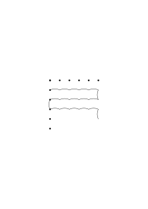
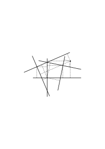
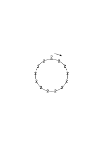
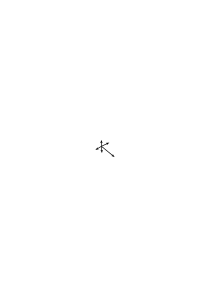
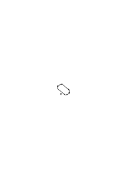
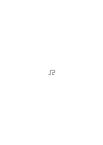
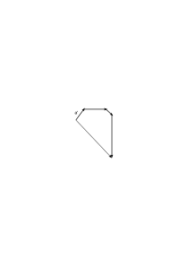

# Bemerkungen über die Grundlagen der Mathematik – VI

1944, 261 remarks, Ms-164

### [Ms-164](/ms-164/#FCv.1) [FCv\[1\]](https://cdn.wittgensteinnachlass.com/2000px/webp/Ms-164/FCv.webp) {#ms-164-fcv1}

1 The proofs arrange the sentences. They give them coherence.

### [Ms-164](/ms-164/#FCv.2) [FCv\[2\]](https://cdn.wittgensteinnachlass.com/2000px/webp/Ms-164/FCv.webp) {#ms-164-fcv2}

2 The concept of a formal test presupposes the concept of a rule of transformation & thus a technique.

### [Ms-164](/ms-164/#FCv.3) [FCv\[3\]](https://cdn.wittgensteinnachlass.com/2000px/webp/Ms-164/FCv.webp) {#ms-164-fcv3}

For only through a technique can we grasp a regularity.

### [Ms-164](/ms-164/#FCv.4+2.1) [FCv\[4\]](https://cdn.wittgensteinnachlass.com/2000px/webp/Ms-164/FCv.webp),[2\[1\]](https://cdn.wittgensteinnachlass.com/2000px/webp/Ms-164/2.webp) {#ms-164-fcv421}

The technique is outside the picture of the proof. One could see the proof exactly & yet not understand it as a transformation according to these rules.

### [Ms-164](/ms-164/#2.2) [2\[2\]](https://cdn.wittgensteinnachlass.com/2000px/webp/Ms-164/2.webp) {#ms-164-22}

One will certainly call the addition of the numbers …, in order to see whether they give 1000, a formal test of the number signs. But only if the adding is a practiced technique. For how else could the process be called any kind of test?

### [Ms-164](/ms-164/#2.3) [2\[3\]](https://cdn.wittgensteinnachlass.com/2000px/webp/Ms-164/2.webp) {#ms-164-23}

The proof is a formal test only within a technique of transformation.

### [Ms-164](/ms-164/#2.4+3.1) [2\[4\]](https://cdn.wittgensteinnachlass.com/2000px/webp/Ms-164/2.webp),[3\[1\]](https://cdn.wittgensteinnachlass.com/2000px/webp/Ms-164/3.webp) {#ms-164-2431}

If you ask on what grounds do you state this rule, the answer is the proof.

### [Ms-164](/ms-164/#3.2) [3\[2\]](https://cdn.wittgensteinnachlass.com/2000px/webp/Ms-164/3.webp) {#ms-164-32}

On what grounds do you say that? On what grounds do you say that?

### [Ms-164](/ms-164/#3.3+4.1) [3\[3\]](https://cdn.wittgensteinnachlass.com/2000px/webp/Ms-164/3.webp),[4\[1\]](https://cdn.wittgensteinnachlass.com/2000px/webp/Ms-164/4.webp) {#ms-164-3341}

How do you test a topic for a counterpointing property? You transform it according to _this_ rule, combine it _in this way_ with something else, and so on. In this way, you obtain a specific result. You explain it as you would also obtain it through an experiment. Up to this point, what you are doing could also be an experiment. The word “obtain” is used here in a temporal sense; you obtain the result at 3 o’clock. – In the mathematical sentence that I then formulate, the verb (“obtains,” “yields,” etc.) is used in a non-temporal way. The activity of the testing produced this & that result. The testing was thus, up to now, in a sense experimental. Now it is conceived of as a proof. And the proof is the _image_ of this testing.

### [Ms-164](/ms-164/#5.1) [5\[1\]](https://cdn.wittgensteinnachlass.com/2000px/webp/Ms-164/5.webp) {#ms-164-51}

The proof stands behind the sentence, as does the application. It is also connected with the application.

### [Ms-164](/ms-164/#5.2) [5\[2\]](https://cdn.wittgensteinnachlass.com/2000px/webp/Ms-164/5.webp) {#ms-164-52}

The proof is the way of the test.

### [Ms-164](/ms-164/#5.3) [5\[3\]](https://cdn.wittgensteinnachlass.com/2000px/webp/Ms-164/5.webp) {#ms-164-53}

The test is formal only insofar as we understand the result as a formal sentence.

### [Ms-164](/ms-164/#5.4+6.1) [5\[4\]](https://cdn.wittgensteinnachlass.com/2000px/webp/Ms-164/5.webp),[6\[1\]](https://cdn.wittgensteinnachlass.com/2000px/webp/Ms-164/6.webp) {#ms-164-5461}

3 And if this picture justifies the prediction – that is, if you only need to see it and are convinced that a process will unfold in such and such a way – then the picture naturally also justifies the rule. – In this case, the proof stands behind the rule as a picture that justifies it.

### [Ms-164](/ms-164/#6.2) [6\[2\]](https://cdn.wittgensteinnachlass.com/2000px/webp/Ms-164/6.webp) {#ms-164-62}

Why does the picture of the movement justify the mechanism of belief, that this movement will always produce this type of mechanism? – It gives our belief a certain direction.

### [Ms-164](/ms-164/#6.3+7.1) [6\[3\]](https://cdn.wittgensteinnachlass.com/2000px/webp/Ms-164/6.webp),[7\[1\]](https://cdn.wittgensteinnachlass.com/2000px/webp/Ms-164/7.webp) {#ms-164-6371}

If the sentence does not seem to be correct in the application, then the proof must show me why and how it must be correct, that is, how I must reconcile it with the experience.

### [Ms-164](/ms-164/#7.2) [7\[2\]](https://cdn.wittgensteinnachlass.com/2000px/webp/Ms-164/7.webp) {#ms-164-72}

The proof is therefore also an instruction for using the rule.

### [Ms-164](/ms-164/#7.3) [7\[3\]](https://cdn.wittgensteinnachlass.com/2000px/webp/Ms-164/7.webp) {#ms-164-73}

4 How does the proof justify the rule? – It shows how, and therefore why it can be used.

### [Ms-164](/ms-164/#7.4+8.1) [7\[4\]](https://cdn.wittgensteinnachlass.com/2000px/webp/Ms-164/7.webp),[8\[1\]](https://cdn.wittgensteinnachlass.com/2000px/webp/Ms-164/8.webp) {#ms-164-7481}

The king’s knight shows us how 8 × 9 gives 72 – but here the rule of counting is not recognized as a rule. The king’s knight shows us that 8 × 9 gives 72: Now we recognize the rule.

### [Ms-164](/ms-164/#8.2) [8\[2\]](https://cdn.wittgensteinnachlass.com/2000px/webp/Ms-164/8.webp) {#ms-164-82}

Or should I say: The king’s knight shows me how 9 × 8 can give 72, that is, it shows me one way.

### [Ms-164](/ms-164/#8.3+9.1) [8\[3\]](https://cdn.wittgensteinnachlass.com/2000px/webp/Ms-164/8.webp),[9\[1\]](https://cdn.wittgensteinnachlass.com/2000px/webp/Ms-164/9.webp) {#ms-164-8391}

The process shows me a how of the result.

### [Ms-164](/ms-164/#9.2) [9\[2\]](https://cdn.wittgensteinnachlass.com/2000px/webp/Ms-164/9.webp) {#ms-164-92}

Insofar as 8 × 9 = 72 is a rule, it naturally means nothing to say that someone shows me how 8 × 9 = 72; unless this means: someone shows me how one came to this rule.

### [Ms-164](/ms-164/#9.3) [9\[3\]](https://cdn.wittgensteinnachlass.com/2000px/webp/Ms-164/9.webp) {#ms-164-93}

Is not going through every proof such a process?

### [Ms-164](/ms-164/#9.4+10.1) [9\[4\]](https://cdn.wittgensteinnachlass.com/2000px/webp/Ms-164/9.webp),[10\[1\]](https://cdn.wittgensteinnachlass.com/2000px/webp/Ms-164/10.webp) {#ms-164-94101}

Would it mean anything to say, “I want to show you how 8 × 9 first gave 72”?

### [Ms-164](/ms-164/#10.2+11.1) [10\[2\]](https://cdn.wittgensteinnachlass.com/2000px/webp/Ms-164/10.webp),[11\[1\]](https://cdn.wittgensteinnachlass.com/2000px/webp/Ms-164/11.webp) {#ms-164-102111}

5 The strange thing is that the picture, not reality, should be able to prove a sentence! As if the picture itself played the role of reality. – But that is not the case: for from the picture I now derive a rule. And the rule is not related to the picture in the same way that the empirical proposition is related to reality. – The picture does not, of course, show that this and that happens. It only shows that what happens can be understood in this way.

### [Ms-164](/ms-164/#11.2) [11\[2\]](https://cdn.wittgensteinnachlass.com/2000px/webp/Ms-164/11.webp) {#ms-164-112}

The picture shows how one proceeds according to a rule without stumbling.

### [Ms-164](/ms-164/#11.3) [11\[3\]](https://cdn.wittgensteinnachlass.com/2000px/webp/Ms-164/11.webp) {#ms-164-113}

One can therefore also say: the process, the proof, shows me in what way 8 × 9 = 72 is.

### [Ms-164](/ms-164/#11.4) [11\[4\]](https://cdn.wittgensteinnachlass.com/2000px/webp/Ms-164/11.webp) {#ms-164-114}

The picture does not, of course, show that something happens, but that whatever happens can be seen in this way.

### [Ms-164](/ms-164/#11.5+12.1) [11\[5\]](https://cdn.wittgensteinnachlass.com/2000px/webp/Ms-164/11.webp),[12\[1\]](https://cdn.wittgensteinnachlass.com/2000px/webp/Ms-164/12.webp) {#ms-164-115121}

We are led to use this technique in this case. I am led to – & in **sofern** convinced of something.

See, that’s how 3 and 2 make 5. Remember this process. “You also remember the rule at the same time.”

### [Ms-164](/ms-164/#12.2+13.1) [12\[2\]](https://cdn.wittgensteinnachlass.com/2000px/webp/Ms-164/12.webp),[13\[1\]](https://cdn.wittgensteinnachlass.com/2000px/webp/Ms-164/13.webp) {#ms-164-122131}

6 The Euclidean proof of the infinitude of the series of prime numbers could be presented in such a way that the investigation of the numbers between p and p! + 1 is demonstrated with an example or several, and thus a technique of investigation is taught to us. The strength of the proof naturally does not lie in the fact that a prime number > p is found in this example. And that is, at first glance, odd. One might now say that the algebraic proof is more rigorous than the proof by examples, because it is, as it were, the extract of the essential principle of these examples. But the algebraic proof also contains an embodiment. One must, I could say, understand both!

### [Ms-164](/ms-164/#13.2+14.1) [13\[2\]](https://cdn.wittgensteinnachlass.com/2000px/webp/Ms-164/13.webp),[14\[1\]](https://cdn.wittgensteinnachlass.com/2000px/webp/Ms-164/14.webp) {#ms-164-132141}

The proof teaches us a technique for finding a prime number between p and p! + 1. And we are convinced that this technique must always lead to a prime number > p. Or, that we have made a mistake in our calculation if it does not.

### [Ms-164](/ms-164/#14.2+15.1) [14\[2\]](https://cdn.wittgensteinnachlass.com/2000px/webp/Ms-164/14.webp),[15\[1\]](https://cdn.wittgensteinnachlass.com/2000px/webp/Ms-164/15.webp) {#ms-164-142151}

Would one now be inclined to say that the proof shows us how there is an infinite series of prime numbers? Well, one could say that. And in any case: “in what way there are infinitely many prime numbers.” One could also imagine that we have a proof that tells us that there are infinitely many prime numbers, but does not teach us how to find a prime number > p. Now one might say: “these two proofs, even so, prove the same proposition, the same mathematical fact.” There may be reason to say this, or there may not.

### [Ms-164](/ms-164/#15.2+16.1) [15\[2\]](https://cdn.wittgensteinnachlass.com/2000px/webp/Ms-164/15.webp),[16\[1\]](https://cdn.wittgensteinnachlass.com/2000px/webp/Ms-164/16.webp) {#ms-164-152161}

7 The spectator sees the whole, impressive process. And he is convinced of something; for that is the special impression that he receives. He comes away from the spectacle, convinced of something. Convinced that he will come to the same end with other numbers (e.g.). He will be ready to express what he has been convinced of in such and such a way. Convinced of what? Of a psychological fact? –

### [Ms-164](/ms-164/#16.2) [16\[2\]](https://cdn.wittgensteinnachlass.com/2000px/webp/Ms-164/16.webp) {#ms-164-162}

He will say that he has drawn a conclusion from what he has seen. – But not as in an experiment. (Think of periodic division.)

### [Ms-164](/ms-164/#16.3+17.1) [16\[3\]](https://cdn.wittgensteinnachlass.com/2000px/webp/Ms-164/16.webp),[17\[1\]](https://cdn.wittgensteinnachlass.com/2000px/webp/Ms-164/17.webp) {#ms-164-163171}

Could he say: “What I saw was very impressive. I have drawn a conclusion from it. I will in the future…”? (For example: I will always calculate in this way in the future.)

He tells:

“I have seen that it must be so.”

### [Ms-164](/ms-164/#17.2) [17\[2\]](https://cdn.wittgensteinnachlass.com/2000px/webp/Ms-164/17.webp) {#ms-164-172}

“I have seen that it must be so” – that is what he will report.

### [Ms-164](/ms-164/#17.3) [17\[3\]](https://cdn.wittgensteinnachlass.com/2000px/webp/Ms-164/17.webp) {#ms-164-173}

He will now perhaps mentally go through the proof process.

### [Ms-164](/ms-164/#17.4+18.1) [17\[4\]](https://cdn.wittgensteinnachlass.com/2000px/webp/Ms-164/17.webp),[18\[1\]](https://cdn.wittgensteinnachlass.com/2000px/webp/Ms-164/18.webp) {#ms-164-174181}

But he does not say: I have seen that this happens. Rather: that it must be so. This “must” signifies a circle.

### [Ms-164](/ms-164/#19.1) [19\[1\]](https://cdn.wittgensteinnachlass.com/2000px/webp/Ms-164/19.webp) {#ms-164-191}

– – – But: that it must be so. This shows what kind of teaching he has drawn from the scene. The “must” shows that he has gone in a circle.

### [Ms-164](/ms-164/#18.2) [18\[2\]](https://cdn.wittgensteinnachlass.com/2000px/webp/Ms-164/18.webp) {#ms-164-182}

I decide to look at things in this way. Also, to act in this way.

### [Ms-164](/ms-164/#18.3) [18\[3\]](https://cdn.wittgensteinnachlass.com/2000px/webp/Ms-164/18.webp) {#ms-164-183}

I think that the spectator himself draws a moral from the process.

### [Ms-164](/ms-164/#18.4) [18\[4\]](https://cdn.wittgensteinnachlass.com/2000px/webp/Ms-164/18.webp) {#ms-164-184}

It must be so means that the outcome has been explained as essential to the process.

### [Ms-164](/ms-164/#19.2) [19\[2\]](https://cdn.wittgensteinnachlass.com/2000px/webp/Ms-164/19.webp) {#ms-164-192}

8 This “must” shows that he has adopted a concept.

### [Ms-164](/ms-164/#19.3) [19\[3\]](https://cdn.wittgensteinnachlass.com/2000px/webp/Ms-164/19.webp) {#ms-164-193}

This “must” means that he has gone in a circle.

### [Ms-164](/ms-164/#19.4+20.1) [19\[4\]](https://cdn.wittgensteinnachlass.com/2000px/webp/Ms-164/19.webp),[20\[1\]](https://cdn.wittgensteinnachlass.com/2000px/webp/Ms-164/20.webp) {#ms-164-194201}

Instead of a scientific sentence, he has read a definition of the concept from the process.

Concept here means method. As opposed to the application of the method.

### [Ms-164](/ms-164/#20.2) [20\[2\]](https://cdn.wittgensteinnachlass.com/2000px/webp/Ms-164/20.webp) {#ms-164-202}

9 See, 50 and 50 give 100. One has, for example, successively added five 10s to 50.

And one follows the increase of the number until it becomes 100. Here, of course, the observed process becomes a process of calculation in some way (on the abacus, for example), a proof.

### [Ms-164](/ms-164/#20.3+21.1) [20\[3\]](https://cdn.wittgensteinnachlass.com/2000px/webp/Ms-164/20.webp),[21\[1\]](https://cdn.wittgensteinnachlass.com/2000px/webp/Ms-164/21.webp) {#ms-164-203211}

The meaning of “so” is not, of course, that the sentence “50 + 50 = 100” says that this happens somewhere. It is not as if I say: “Do you see how a horse gallops?” – and show him pictures.

### [Ms-164](/ms-164/#21.2) [21\[2\]](https://cdn.wittgensteinnachlass.com/2000px/webp/Ms-164/21.webp) {#ms-164-212}

But one could say: “See, that is why I say ‘50 + 50 = 100’.”

### [Ms-164](/ms-164/#21.3) [21\[3\]](https://cdn.wittgensteinnachlass.com/2000px/webp/Ms-164/21.webp) {#ms-164-213}

Or: “See, that is how I (or: one) obtains the sentence that 50 + 50 = 100.”

### [Ms-164](/ms-164/#21.4+22.1+23.1) [21\[4\]](https://cdn.wittgensteinnachlass.com/2000px/webp/Ms-164/21.webp),[22\[1\]](https://cdn.wittgensteinnachlass.com/2000px/webp/Ms-164/22.webp),[23\[1\]](https://cdn.wittgensteinnachlass.com/2000px/webp/Ms-164/23.webp) {#ms-164-214221231}

If now I say: “Look, 3 + 2 gives 5” & put three apples on the table & then two more; I want to say something like: 3 apples & 2 apples give 5 apples, if none disappear or are added. – Or one could also say to someone: If you (as I am now) put 3 apples & then 2 more on the table, then almost always what you see now happens & there are now 5 apples there. I want to show him that 3 apples & 2 apples do not give 5 apples in the same way that 6 apples can (by, for example, one suddenly appearing). This is actually an explanation, a definition of the operation of adding. One could really use this to explain addition with the abacus.

### [Ms-164](/ms-164/#23.2) [23\[2\]](https://cdn.wittgensteinnachlass.com/2000px/webp/Ms-164/23.webp) {#ms-164-232}

“If we put 3 things to 2 things, it can result in different numbers of things. But as a norm, we see the process that 3 things + 2 things give 5 things. See, that’s what it looks like when they give 5.”

### [Ms-164](/ms-164/#23.3+24.1) [23\[3\]](https://cdn.wittgensteinnachlass.com/2000px/webp/Ms-164/23.webp),[24\[1\]](https://cdn.wittgensteinnachlass.com/2000px/webp/Ms-164/24.webp) {#ms-164-233241}

Couldn't one say to the child: “Show me how 3 + 2 gives 5.” And the child would then use the abacus to calculate 3 + 2.

### [Ms-164](/ms-164/#24.2) [24\[2\]](https://cdn.wittgensteinnachlass.com/2000px/webp/Ms-164/24.webp) {#ms-164-242}

If one asked the child in math instruction, “how does 3 + 3 give 5?” – what should it show? Well, it should obviously push 3 balls to 2 balls + count the balls (or something similar).

### [Ms-164](/ms-164/#24.3+25.1) [24\[3\]](https://cdn.wittgensteinnachlass.com/2000px/webp/Ms-164/24.webp),[25\[1\]](https://cdn.wittgensteinnachlass.com/2000px/webp/Ms-164/25.webp) {#ms-164-243251}

Couldn't one ask: “Show me how this topic gives rise to a canon.” And whoever is asked this would have to prove that there is a canon. – One would be asking about the “how,” that is, the thing one wants to be shown, in order to understand what is being talked about.

### [Ms-164](/ms-164/#25.2) [25\[2\]](https://cdn.wittgensteinnachlass.com/2000px/webp/Ms-164/25.webp) {#ms-164-252}

And if the child now shows how 3 + 2 gives 5, it shows a process that can be regarded as the basis of the rule “2 + 3 = 5.”

### [Ms-164](/ms-164/#25.3+26.1) [25\[3\]](https://cdn.wittgensteinnachlass.com/2000px/webp/Ms-164/25.webp),[26\[1\]](https://cdn.wittgensteinnachlass.com/2000px/webp/Ms-164/26.webp) {#ms-164-253261}

10 But what if one asks the student: “Show me how there are infinitely many prime numbers” – Here, the grammar is doubtful! However, one could say: “Show me in what way one can say that there are infinitely many prime numbers.”

### [Ms-164](/ms-164/#26.2+27.1) [26\[2\]](https://cdn.wittgensteinnachlass.com/2000px/webp/Ms-164/26.webp),[27\[1\]](https://cdn.wittgensteinnachlass.com/2000px/webp/Ms-164/27.webp) {#ms-164-262271}

When one says: “Show me that it…” then the question, _whether_ it…, has already been asked & only “yes” or “no” remains to be said. If one says “show me _how_ it…”, then here the language-game, in general, must first be explained. One certainly does not yet have a _clear_ concept of what this assertion is supposed to mean. (One is, in a sense, asking: “how can such an assertion be justified at all?”)

### [Ms-164](/ms-164/#27.2) [27\[2\]](https://cdn.wittgensteinnachlass.com/2000px/webp/Ms-164/27.webp) {#ms-164-272}

Should I give a different answer to the question: “Show me how…,” than to the question: “Show me that…?”

### [Ms-164](/ms-164/#27.3) [27\[3\]](https://cdn.wittgensteinnachlass.com/2000px/webp/Ms-164/27.webp) {#ms-164-273}

You derive a teaching from the proof. If you derive a teaching from the proof, then its sense must be independent of the proof, because otherwise it could never have been separated from the proof. Similarly, I can erase the construction lines in a drawing & leave the rest.

### [Ms-164](/ms-164/#27.4+28.1) [27\[4\]](https://cdn.wittgensteinnachlass.com/2000px/webp/Ms-164/27.webp),[28\[1\]](https://cdn.wittgensteinnachlass.com/2000px/webp/Ms-164/28.webp) {#ms-164-274281}

So the proof does not determine the sense of the proven sentence; & yet, in a way, it does.

### [Ms-164](/ms-164/#28.2) [28\[2\]](https://cdn.wittgensteinnachlass.com/2000px/webp/Ms-164/28.webp) {#ms-164-282}

But isn't that the case with every verification of every sentence?

### [Ms-164](/ms-164/#28.3+29.1+30.1) [28\[3\]](https://cdn.wittgensteinnachlass.com/2000px/webp/Ms-164/28.webp),[29\[1\]](https://cdn.wittgensteinnachlass.com/2000px/webp/Ms-164/29.webp),[30\[1\]](https://cdn.wittgensteinnachlass.com/2000px/webp/Ms-164/30.webp) {#ms-164-283291301}

11 I believe: Only in a certain large context can one say that there are infinitely many prime numbers. That is: there must already be an extensive technique of calculating with cardinal numbers. Only within this technique does this sentence make sense. A proof of the sentence gives it its place in the whole system of calculations. And this place can now be described in more than one way, since the whole complicated system is presupposed in the background.

For example, if 3 coordinate systems are related to each other in a certain way, I can now determine the position of a point in relation to all of them by specifying it in relation to any one of them.

### [Ms-164](/ms-164/#30.2) [30\[2\]](https://cdn.wittgensteinnachlass.com/2000px/webp/Ms-164/30.webp) {#ms-164-302}

The proof of a sentence does not mention or describe the whole system of calculation that underlies the sentence & gives it its sense.

### [Ms-164](/ms-164/#30.3+31.1) [30\[3\]](https://cdn.wittgensteinnachlass.com/2000px/webp/Ms-164/30.webp),[31\[1\]](https://cdn.wittgensteinnachlass.com/2000px/webp/Ms-164/31.webp) {#ms-164-303311}

Suppose an adult with intelligence & experience has only learned the first elements of calculation, for example, the four basic arithmetic operations with numbers up to 20. He has also learned the word “prime number.” And someone said to him: I will prove to you that there are infinitely many prime numbers. Now how can he prove it to him? He must teach him to calculate. That is part of the proof here. He must give the question “Are there infinitely many prime numbers” a meaning, so to speak.

### [Ms-164](/ms-164/#31.2+32.1) [31\[2\]](https://cdn.wittgensteinnachlass.com/2000px/webp/Ms-164/31.webp),[32\[1\]](https://cdn.wittgensteinnachlass.com/2000px/webp/Ms-164/32.webp) {#ms-164-312321}

12 Philosophy has to grapple with the temptation of misunderstanding that exists at this stage of knowledge. (At another stage, new ones arise.) But this does not make philosophizing any easier!

### [Ms-164](/ms-164/#32.2+33.1) [32\[2\]](https://cdn.wittgensteinnachlass.com/2000px/webp/Ms-164/32.webp),[33\[1\]](https://cdn.wittgensteinnachlass.com/2000px/webp/Ms-164/33.webp) {#ms-164-322331}

13 Is it not absurd to say that one does not understand the sense of Fermat’s theorem? – Well, one could answer: mathematicians are not _completely_ at a loss with this theorem. They are, after all, trying out certain methods of proof; & insofar as they try out methods, _to that extent_ they understand the theorem. – But is that correct? Do they not understand it as completely as it can be understood?

### [Ms-164](/ms-164/#33.2) [33\[2\]](https://cdn.wittgensteinnachlass.com/2000px/webp/Ms-164/33.webp) {#ms-164-332}

Now, suppose the opposite were proven, quite against the mathematicians’ expectations. Thus, one shows that it could not be the case.

### [Ms-164](/ms-164/#33.3+34.1) [33\[3\]](https://cdn.wittgensteinnachlass.com/2000px/webp/Ms-164/33.webp),[34\[1\]](https://cdn.wittgensteinnachlass.com/2000px/webp/Ms-164/34.webp) {#ms-164-333341}

But must I not, in order to know what a sentence like Fermat's means, know what the criterion is for the sentence being true? And I certainly know criteria for the truth of similar sentences, but no criterion for the truth of this sentence.

### [Ms-164](/ms-164/#34.2) [34\[2\]](https://cdn.wittgensteinnachlass.com/2000px/webp/Ms-164/34.webp) {#ms-164-342}

‘Understanding’ is a vague concept!

### [Ms-164](/ms-164/#34.3) [34\[3\]](https://cdn.wittgensteinnachlass.com/2000px/webp/Ms-164/34.webp) {#ms-164-343}

First, there is such a thing as believing one understands a sentence. And if understanding is a psychological process, why should it interest us so much? Unless it is empirically connected with the ability to use the sentence.

### [Ms-164](/ms-164/#35.1) [35\[1\]](https://cdn.wittgensteinnachlass.com/2000px/webp/Ms-164/35.webp) {#ms-164-351}

“Show me how…” means: show me in what context you use this sentence (this machine part).

### [Ms-164](/ms-164/#35.2) [35\[2\]](https://cdn.wittgensteinnachlass.com/2000px/webp/Ms-164/35.webp) {#ms-164-352}

14 I will show you how there are infinitely many prime numbers, presupposes a state in which the sentence that there are infinitely many prime numbers had no, or only the vaguest, meaning for the other person. It might have been just a joke or a paradox to him.

### [Ms-164](/ms-164/#36.1+37.1) [36\[1\]](https://cdn.wittgensteinnachlass.com/2000px/webp/Ms-164/36.webp),[37\[1\]](https://cdn.wittgensteinnachlass.com/2000px/webp/Ms-164/37.webp) {#ms-164-361371}

If this process convinces him, then it must be very impressive. – But is it? – Not particularly. Why is it not more so? I believe it would only be impressive if it were explained from the ground up. If, for example, one did not just write p! + 1, but explained it beforehand and illustrated it with examples. If one did not take the technique as something self-evident, but presented it.

### [Ms-164](/ms-164/#37.2) [37\[2\]](https://cdn.wittgensteinnachlass.com/2000px/webp/Ms-164/37.webp) {#ms-164-372}

15 

We always copy the sign “2” from right to left from the last one written. If we copy correctly, then the last sign is again a copy of the first.

### [Ms-164](/ms-164/#37.3+38.1) [37\[3\]](https://cdn.wittgensteinnachlass.com/2000px/webp/Ms-164/37.webp),[38\[1\]](https://cdn.wittgensteinnachlass.com/2000px/webp/Ms-164/38.webp) {#ms-164-373381}

A language-game.

.

One person predicts the result to the other. The other draws the arrows and is curious about how they will lead him, and he enjoys how they finally lead him to the predicted result. He reacts somewhat similarly to how one reacts to a joke.

A may have constructed, or only guessed, the result beforehand. B knows nothing about it and is not interested in it.

### [Ms-164](/ms-164/#38.2+39.1) [38\[2\]](https://cdn.wittgensteinnachlass.com/2000px/webp/Ms-164/38.webp),[39\[1\]](https://cdn.wittgensteinnachlass.com/2000px/webp/Ms-164/39.webp) {#ms-164-382391}

Even if he knew the _rule_, he never followed it _so_ closely. He is now doing something _new_. However, there is also curiosity & surprise when one has already taken that path. Thus, one can read a story again & again, even know it by heart, & yet always be surprised by a particular turn.

### [Ms-164](/ms-164/#39.2+40.1) [39\[2\]](https://cdn.wittgensteinnachlass.com/2000px/webp/Ms-164/39.webp),[40\[1\]](https://cdn.wittgensteinnachlass.com/2000px/webp/Ms-164/40.webp) {#ms-164-392401}

Before I have followed the two arrows

,

I do not know what the path, or the resultant, will look like. I do not know the face that I will receive. Is it strange that I did not know it? How could I have known it? I had never seen it! I knew the rule and mastered it, and I saw the bundle of arrows. –

### [Ms-164](/ms-164/#40.2+41.1) [40\[2\]](https://cdn.wittgensteinnachlass.com/2000px/webp/Ms-164/40.webp),[41\[1\]](https://cdn.wittgensteinnachlass.com/2000px/webp/Ms-164/41.webp) {#ms-164-402411}

<s> And if I assume that A did not construct the result beforehand, is his prediction not (apparently) a genuine prediction? </s>

But why then was it not a genuine prediction: “if you follow the rule, you will produce this”? Whereas this certainly is a genuine prediction: “if you follow the rule to the best of your knowledge & conscience, then you will…”. The answer is: the first is not a prediction because I could also have said: “if you follow the rule, then you _must_ produce this.” It is then not a prediction if the concept of _following_ the rule is defined in such a way that the result is the criterion for whether the rule has been followed.

### [Ms-164](/ms-164/#42.1) [42\[1\]](https://cdn.wittgensteinnachlass.com/2000px/webp/Ms-164/42.webp) {#ms-164-421}

A says: “If you follow the _rule_, you will obtain _that_”, or he simply says: “You will obtain that”. In doing so, he draws the resulting arrow.

### [Ms-164](/ms-164/#42.2+43.1) [42\[2\]](https://cdn.wittgensteinnachlass.com/2000px/webp/Ms-164/42.webp),[43\[1\]](https://cdn.wittgensteinnachlass.com/2000px/webp/Ms-164/43.webp) {#ms-164-422431}

Was A said, was it in this game a prediction? Well, damn it, in a certain sense: yes! Doesn’t that become particularly clear when we assume that the prediction was _false_? It was only not a prediction if the _condition_ made the sentence a pleonasm. A could have said: “If you will agree with each of your steps, then you will come _there_”.

### [Ms-164](/ms-164/#43.2+44.1) [43\[2\]](https://cdn.wittgensteinnachlass.com/2000px/webp/Ms-164/43.webp),[44\[1\]](https://cdn.wittgensteinnachlass.com/2000px/webp/Ms-164/44.webp) {#ms-164-432441}

Suppose that while B draws the polygon, the arrows of the bundle change their direction slightly. B always draws an arrow parallel, as it is at that moment. He is now just as surprised and excited as in the previous game, although here the result is not the result of a calculation. He has therefore understood the first game as he did the second.

### [Ms-164](/ms-164/#44.2) [44\[2\]](https://cdn.wittgensteinnachlass.com/2000px/webp/Ms-164/44.webp) {#ms-164-442}

“If you follow the rule, you will get there” is therefore not a prediction, because this sentence simply states “The result of this calculation is…” and that is a true or false mathematical sentence. The reference to the future & to you is merely a way of putting it.

### [Ms-164](/ms-164/#44.3+45.1) [44\[3\]](https://cdn.wittgensteinnachlass.com/2000px/webp/Ms-164/44.webp),[45\[1\]](https://cdn.wittgensteinnachlass.com/2000px/webp/Ms-164/45.webp) {#ms-164-443451}

Must A really have a clear understanding of whether his prediction is meant mathematically or otherwise? He simply says, “If you follow the rule, then … will result,” & perhaps enjoys the _game_. For example, if what was predicted does not come about, he does not investigate further.

### [Ms-164](/ms-164/#45.2) [45\[2\]](https://cdn.wittgensteinnachlass.com/2000px/webp/Ms-164/45.webp) {#ms-164-452}

16 – – – And this series is defined by a rule. Or also by the training to proceed according to the rule. And the relentless statement is that after this rule, this number follows this one.

### [Ms-164](/ms-164/#45.3+46.1) [45\[3\]](https://cdn.wittgensteinnachlass.com/2000px/webp/Ms-164/45.webp),[46\[1\]](https://cdn.wittgensteinnachlass.com/2000px/webp/Ms-164/46.webp) {#ms-164-453461}

And this sentence is not an empirical proposition. But why not an empirical proposition? A rule is something according to which we proceed and generate a number sign from another. Is it not an experience that this rule leads someone from here to there?

### [Ms-164](/ms-164/#46.2) [46\[2\]](https://cdn.wittgensteinnachlass.com/2000px/webp/Ms-164/46.webp) {#ms-164-462}

And if it once leads him from 4 to 5, then perhaps another time from 4 to 7. Why is that impossible?

The question is what we take as the criterion for proceeding according to the rule. Is it, for example, a feeling of satisfaction that accompanies the act of proceeding according to the rule? Or an intuition that tells me that I have proceeded correctly? Or are they certain practical consequences of proceeding, which determine whether I have really followed the rule? – Then it would be possible that 4 + 1 sometimes yields 5, sometimes something else. It would be _thinkable_, i.e.: an experimental investigation would show whether 4 + 1 always yields 5.

### [Ms-164](/ms-164/#47.2+48.1) [47\[2\]](https://cdn.wittgensteinnachlass.com/2000px/webp/Ms-164/47.webp),[48\[1\]](https://cdn.wittgensteinnachlass.com/2000px/webp/Ms-164/48.webp) {#ms-164-472481}

If it is not to be an empirical proposition that the rule leads from 4 to 5, then _this_, the result, must be taken as the criterion for whether one has proceeded according to the rule.

### [Ms-164](/ms-164/#48.2) [48\[2\]](https://cdn.wittgensteinnachlass.com/2000px/webp/Ms-164/48.webp) {#ms-164-482}

The truth of the sentence that 4 + 1 = 5 is therefore, as it were, _overdetermined_. Overdetermined by the fact that one declares the result of the operation to be the criterion for whether this operation has been carried out.

### [Ms-164](/ms-164/#48.3+49.1) [48\[3\]](https://cdn.wittgensteinnachlass.com/2000px/webp/Ms-164/48.webp),[49\[1\]](https://cdn.wittgensteinnachlass.com/2000px/webp/Ms-164/49.webp) {#ms-164-483491}

The sentence now rests on one more leg than the empirical proposition that is the same. It becomes a definition. And we can use it for a new language-game: We judge whether someone follows the rule correctly or incorrectly by whether he obtains this or another result. Namely, now we can judge in another sense whether someone has followed the rule.

### [Ms-164](/ms-164/#49.2+50.1) [49\[2\]](https://cdn.wittgensteinnachlass.com/2000px/webp/Ms-164/49.webp),[50\[1\]](https://cdn.wittgensteinnachlass.com/2000px/webp/Ms-164/50.webp) {#ms-164-492501}

4 + 1 = 5 is therefore now itself a rule according to which we judge processes. This rule is the result of a process that we regard as authoritative for judging other processes. This process is the proof of the rule.

### [Ms-164](/ms-164/#50.2) [50\[2\]](https://cdn.wittgensteinnachlass.com/2000px/webp/Ms-164/50.webp) {#ms-164-502}

17 How does one describe the process of learning a rule? – Whenever A claps his hands, B should do the same.

### [Ms-164](/ms-164/#50.3) [50\[3\]](https://cdn.wittgensteinnachlass.com/2000px/webp/Ms-164/50.webp) {#ms-164-503}

Remember that describing a language-game is already a description.

### [Ms-164](/ms-164/#50.4+51.1) [50\[4\]](https://cdn.wittgensteinnachlass.com/2000px/webp/Ms-164/50.webp),[51\[1\]](https://cdn.wittgensteinnachlass.com/2000px/webp/Ms-164/51.webp) {#ms-164-504511}

I can train someone to perform a _uniform_ activity. For example, to draw a line of this kind on paper with a pencil: – · · – · · – · · – · · – · · – · · – · ·

### [Ms-164](/ms-164/#52.3+53.1) [52\[3\]](https://cdn.wittgensteinnachlass.com/2000px/webp/Ms-164/52.webp),[53\[1\]](https://cdn.wittgensteinnachlass.com/2000px/webp/Ms-164/53.webp) {#ms-164-523531}

– – – Now I ask myself, what do I want him to do? The answer is: “He should always continue in the way that I have shown him.” And what do I actually mean by saying that he should always continue in the same way? The best answer I can give myself is an example of the kind I just gave.

### [Ms-164](/ms-164/#53.2) [53\[2\]](https://cdn.wittgensteinnachlass.com/2000px/webp/Ms-164/53.webp) {#ms-164-532}

I would use this example to tell him, but also to tell myself, what I mean by uniform.

### [Ms-164](/ms-164/#51.2) [51\[2\]](https://cdn.wittgensteinnachlass.com/2000px/webp/Ms-164/51.webp) {#ms-164-512}

We speak & act. This is already presupposed in everything I say.

### [Ms-164](/ms-164/#52.1) [52\[1\]](https://cdn.wittgensteinnachlass.com/2000px/webp/Ms-164/52.webp) {#ms-164-521}

I say to him: “That’s right” & this expression carries a tone, a gesture. I let him proceed. Or I say: “No!” & hold him back.

### [Ms-164](/ms-164/#52.2) [52\[2\]](https://cdn.wittgensteinnachlass.com/2000px/webp/Ms-164/52.webp) {#ms-164-522}

18 Does what I say mean that ‘following a rule’ is indefinable? No. I can define it in countless ways. It’s just that these definitions are of no use to _us_ here.

### [Ms-164](/ms-164/#53.3+54.1) [53\[3\]](https://cdn.wittgensteinnachlass.com/2000px/webp/Ms-164/53.webp),[54\[1\]](https://cdn.wittgensteinnachlass.com/2000px/webp/Ms-164/54.webp) {#ms-164-533541}

19 I could also teach him to understand a command of the form

(– · ·) → or (– · · · –) →

(The reader will guess what I mean.)

### [Ms-164](/ms-164/#54.2) [54\[2\]](https://cdn.wittgensteinnachlass.com/2000px/webp/Ms-164/54.webp) {#ms-164-542}

Now, what do I want him to do? The best answer I can give myself is to carry out these commands to some extent. Or do you think that an algebraic expression of this rule presupposes less?

### [Ms-164](/ms-164/#54.3+55.1) [54\[3\]](https://cdn.wittgensteinnachlass.com/2000px/webp/Ms-164/54.webp),[55\[1\]](https://cdn.wittgensteinnachlass.com/2000px/webp/Ms-164/55.webp) {#ms-164-543551}

And now I train him to follow the rule

– · – · · – · · · etc.

And again, I myself know no more about what I want from him than what the example itself shows me. Of course, I can paraphrase the rule in all sorts of ways, but that only makes it more understandable to those who can already follow these paraphrases.

### [Ms-164](/ms-164/#55.2) [55\[2\]](https://cdn.wittgensteinnachlass.com/2000px/webp/Ms-164/55.webp) {#ms-164-552}

20 So, for example, I have taught someone to count & multiply in the decimal system. “365 × 428” is a command & he obeys it by carrying out the multiplication.

### [Ms-164](/ms-164/#56.2) [56\[2\]](https://cdn.wittgensteinnachlass.com/2000px/webp/Ms-164/56.webp) {#ms-164-562}

In this case, we insist that the same approach always has the same multiplication pattern in its wake, and therefore also the same result. We do not accept different multiplication patterns with the same approach.

### [Ms-164](/ms-164/#56.3+57.1) [56\[3\]](https://cdn.wittgensteinnachlass.com/2000px/webp/Ms-164/56.webp),[57\[1\]](https://cdn.wittgensteinnachlass.com/2000px/webp/Ms-164/57.webp) {#ms-164-563571}

Here, the situation will arise in which the calculator makes calculation errors; & also that he corrects the calculation errors.

### [Ms-164](/ms-164/#55.3+56.1) [55\[3\]](https://cdn.wittgensteinnachlass.com/2000px/webp/Ms-164/55.webp),[56\[1\]](https://cdn.wittgensteinnachlass.com/2000px/webp/Ms-164/56.webp) {#ms-164-553561}

Another language-game is this: He is asked “what is ‘365 × 428’?” And in response to this question, he can do two things. Either carry out the multiplication, or if he has already carried it out before, read off the result of the first execution.

### [Ms-164](/ms-164/#57.2) [57\[2\]](https://cdn.wittgensteinnachlass.com/2000px/webp/Ms-164/57.webp) {#ms-164-572}

21 The concept of ‘following a rule’ presupposes a custom. Therefore, it would be nonsense to say that once in the history of mankind someone followed a rule. (Played a game, uttered a sentence, or understood one; etc.)

### [Ms-164](/ms-164/#57.3+58.1) [57\[3\]](https://cdn.wittgensteinnachlass.com/2000px/webp/Ms-164/57.webp),[58\[1\]](https://cdn.wittgensteinnachlass.com/2000px/webp/Ms-164/58.webp) {#ms-164-573581}

Here, it is difficult not to get lost in pleonasms & to say only what really describes something.

### [Ms-164](/ms-164/#58.2) [58\[2\]](https://cdn.wittgensteinnachlass.com/2000px/webp/Ms-164/58.webp) {#ms-164-582}

For here, the temptation is overwhelming to say something more when everything has already been described.

### [Ms-164](/ms-164/#58.3+59.1) [58\[3\]](https://cdn.wittgensteinnachlass.com/2000px/webp/Ms-164/58.webp),[59\[1\]](https://cdn.wittgensteinnachlass.com/2000px/webp/Ms-164/59.webp) {#ms-164-583591}

It is of the greatest importance that there is almost never a dispute among people about whether the color of this object is the same as the color of that one, whether the length of this rod is the same as the length of that one, etc. This peaceful agreement is the characteristic environment of the use of the word “same”.

### [Ms-164](/ms-164/#59.2) [59\[2\]](https://cdn.wittgensteinnachlass.com/2000px/webp/Ms-164/59.webp) {#ms-164-592}

And one must say the same about proceeding according to a rule.

### [Ms-164](/ms-164/#59.4) [59\[4\]](https://cdn.wittgensteinnachlass.com/2000px/webp/Ms-164/59.webp) {#ms-164-594}

There is no dispute about whether the rule has been followed or not.

There are no physical altercations, for example.

### [Ms-164](/ms-164/#59.5+60.1) [59\[5\]](https://cdn.wittgensteinnachlass.com/2000px/webp/Ms-164/59.webp),[60\[1\]](https://cdn.wittgensteinnachlass.com/2000px/webp/Ms-164/60.webp) {#ms-164-595601}

This is the framework from which our language operates (e.g. a description).

### [Ms-164](/ms-164/#60.2) [60\[2\]](https://cdn.wittgensteinnachlass.com/2000px/webp/Ms-164/60.webp) {#ms-164-602}

22 Now, someone says that in the series of cardinal numbers, which obeys the rule “+ 1,” the rule that was taught to us in this way, 450 follows 449. This is not the experiential proposition that we arrive at 450 from 449 when it seems to us that we have applied the operation + 1 to 449. Rather, it is the determination that we have only applied this operation when the result is 450.

### [Ms-164](/ms-164/#61.1) [61\[1\]](https://cdn.wittgensteinnachlass.com/2000px/webp/Ms-164/61.webp) {#ms-164-611}

We have hardened the experiential proposition (so to speak) into a rule. And it is now no longer an assertion that we test through experience, but a paradigm that serves to depict experience. With this paradigm, we now play a new language-game.

### [Ms-164](/ms-164/#62.1) [62\[1\]](https://cdn.wittgensteinnachlass.com/2000px/webp/Ms-164/62.webp) {#ms-164-621}

For example, a judgment is “He calculated 25 × 25, was attentive and conscientious, and obtained 615,” and another is “He calculated 25 × 25, but made a mistake and instead of 625 obtained 615.” But do both judgments not amount to the same thing?

### [Ms-164](/ms-164/#62.2+63.1) [62\[2\]](https://cdn.wittgensteinnachlass.com/2000px/webp/Ms-164/62.webp),[63\[1\]](https://cdn.wittgensteinnachlass.com/2000px/webp/Ms-164/63.webp) {#ms-164-622631}

The arithmetical sentence is not the experiential proposition: “if I do _this_, I obtain _that_” – where the criterion for the fact that I do _this_ must not be what results from it.

### [Ms-164](/ms-164/#63.2) [63\[2\]](https://cdn.wittgensteinnachlass.com/2000px/webp/Ms-164/63.webp) {#ms-164-632}

23 Could we not think that when multiplying, the main thing is to concentrate the mind in a certain way, and that although the same approach does not always yield the same result, these differences in the result would be beneficial for the specific practical problems that we want to solve?

### [Ms-164](/ms-164/#63.3+64.1) [63\[3\]](https://cdn.wittgensteinnachlass.com/2000px/webp/Ms-164/63.webp),[64\[1\]](https://cdn.wittgensteinnachlass.com/2000px/webp/Ms-164/64.webp) {#ms-164-633641}

Is not the main thing that in _calculating_, the main emphasis is placed on whether the calculation was correct or incorrect, and is abstracted from the psychological state, etc., of the calculator?

### [Ms-164](/ms-164/#64.2+65.1) [64\[2\]](https://cdn.wittgensteinnachlass.com/2000px/webp/Ms-164/64.webp),[65\[1\]](https://cdn.wittgensteinnachlass.com/2000px/webp/Ms-164/65.webp) {#ms-164-642651}

The justification for the sentence 25 × 25 = 625 is, of course, that multiplying 25 by 25 yields 625. But 25 × 25 = 625 is not this statement, but rather the statement that 25 × 25 _should_ yield 625.

### [Ms-164](/ms-164/#66.1+67.1) [66\[1\]](https://cdn.wittgensteinnachlass.com/2000px/webp/Ms-164/66.webp),[67\[1\]](https://cdn.wittgensteinnachlass.com/2000px/webp/Ms-164/67.webp) {#ms-164-661671}

If we want to use a calculation in practice, then we convince ourselves that the calculation was “correct,” that the _correct_ result was obtained. And the correct result of the multiplication, for example, may only be _one_, and does not depend on what the _application_ of the calculation will yield. We judge the facts with the help of the calculation in a completely different way than we would if we did not regard the result of the calculation as something definitively determined once and for all.

### [Ms-164](/ms-164/#67.2) [67\[2\]](https://cdn.wittgensteinnachlass.com/2000px/webp/Ms-164/67.webp) {#ms-164-672}

Not empiricism, and yet realism in philosophy, that is the most difficult thing. (Against Ramsey)

### [Ms-164](/ms-164/#67.3) [67\[3\]](https://cdn.wittgensteinnachlass.com/2000px/webp/Ms-164/67.webp) {#ms-164-673}

You understand no more from the rule itself than you can explain.

### [Ms-164](/ms-164/#67.4+68.1) [67\[4\]](https://cdn.wittgensteinnachlass.com/2000px/webp/Ms-164/67.webp),[68\[1\]](https://cdn.wittgensteinnachlass.com/2000px/webp/Ms-164/68.webp) {#ms-164-674681}

24 “I have a certain concept of the rule. If one follows it in this sense, then one can only arrive at this number from this number.” This is a spontaneous decision.

### [Ms-164](/ms-164/#68.2) [68\[2\]](https://cdn.wittgensteinnachlass.com/2000px/webp/Ms-164/68.webp) {#ms-164-682}

But why do I say “I _must_,” if it is my decision? Yes, can I not decide to decide?

### [Ms-164](/ms-164/#68.3) [68\[3\]](https://cdn.wittgensteinnachlass.com/2000px/webp/Ms-164/68.webp) {#ms-164-683}

Does it mean that it is a spontaneous decision, not just: I act in this way; I do not ask for any reason!

### [Ms-164](/ms-164/#68.4) [68\[4\]](https://cdn.wittgensteinnachlass.com/2000px/webp/Ms-164/68.webp) {#ms-164-684}

You say you must; but you cannot say what compels you.

### [Ms-164](/ms-164/#68.5+69.1) [68\[5\]](https://cdn.wittgensteinnachlass.com/2000px/webp/Ms-164/68.webp),[69\[1\]](https://cdn.wittgensteinnachlass.com/2000px/webp/Ms-164/69.webp) {#ms-164-685691}

I have a certain concept of the rule. I _know_ what I have to do in each particular case. I know, i.e., I do not doubt, it is obvious to me. I say: “of course.” I cannot give a reason.

### [Ms-164](/ms-164/#69.2) [69\[2\]](https://cdn.wittgensteinnachlass.com/2000px/webp/Ms-164/69.webp) {#ms-164-692}

If I say: “I decide spontaneously,” then this naturally does not mean: I consider which number would be best here and then decide on…

### [Ms-164](/ms-164/#69.3+72.1) [69\[3\]](https://cdn.wittgensteinnachlass.com/2000px/webp/Ms-164/69.webp),[72\[1\]](https://cdn.wittgensteinnachlass.com/2000px/webp/Ms-164/72.webp) {#ms-164-693721}

We say: “First, the calculation must be correct, and then it will become clear what the observation of nature yields.” The correct calculation is the schema according to which the phenomena are judged.

### [Ms-164](/ms-164/#72.2+73.1) [72\[2\]](https://cdn.wittgensteinnachlass.com/2000px/webp/Ms-164/72.webp),[73\[1\]](https://cdn.wittgensteinnachlass.com/2000px/webp/Ms-164/73.webp) {#ms-164-722731}

25 Someone has learned the rule of counting in the decimal system. Now he amuses himself by writing down number after number in the “series of natural numbers.”

Or he follows the command in the language-game “write the successor of the number… in the series…” – How can I explain this language-game to someone? Well, I can describe an example (or examples). – To see whether he has understood the language-game, I can have him do examples.

### [Ms-164](/ms-164/#73.2+74.1) [73\[2\]](https://cdn.wittgensteinnachlass.com/2000px/webp/Ms-164/73.webp),[74\[1\]](https://cdn.wittgensteinnachlass.com/2000px/webp/Ms-164/74.webp) {#ms-164-732741}

Suppose someone were to recalculate multiplication tables, logarithmic tables, etc., because he didn't trust them. If he arrives at a different result, he trusts this result and says that he concentrated his mind so much on the rules that his result should be regarded as correct. If someone points out an error to him, he says that he would rather doubt the reliability of his mind and his senses _now_ than when he did the calculation the first time.

### [Ms-164](/ms-164/#74.2+75.1) [74\[2\]](https://cdn.wittgensteinnachlass.com/2000px/webp/Ms-164/74.webp),[75\[1\]](https://cdn.wittgensteinnachlass.com/2000px/webp/Ms-164/75.webp) {#ms-164-742751}

We can assume agreement in all questions of calculation. But does it make a difference whether we express the calculation as an experiential proposition or as a rule?

### [Ms-164](/ms-164/#75.2) [75\[2\]](https://cdn.wittgensteinnachlass.com/2000px/webp/Ms-164/75.webp) {#ms-164-752}

26 Would we recognize the rule 25² = 625 if we didn't all arrive at this result? Well, why shouldn't we then be able to use the experiential proposition instead of the rule? – Is the answer to this: because the opposite of the experiential proposition does not correspond to the opposite of the rule.

### [Ms-164](/ms-164/#75.3+76.1) [75\[3\]](https://cdn.wittgensteinnachlass.com/2000px/webp/Ms-164/75.webp),[76\[1\]](https://cdn.wittgensteinnachlass.com/2000px/webp/Ms-164/76.webp) {#ms-164-753761}

If I write down a piece of a series for you, so that you then see _this_ regularity in it, one can call that an empirical fact, a psychological fact. But, if you have perceived this regularity in it, so that you then continue the series _in this way_, that is no longer an empirical fact. But why isn't it an empirical fact: because “perceiving _this_ in it” would not be the _same_ as: continuing it in this way! Only in this way can one say that this is not an empirical fact, that one explains the step at this level as corresponding to the rule's expression.

### [Ms-164](/ms-164/#77.1) [77\[1\]](https://cdn.wittgensteinnachlass.com/2000px/webp/Ms-164/77.webp) {#ms-164-771}

So you say: “According to the _rule_ that I see in this sequence, it continues _like this_.” Not: according to experience! Rather, that is precisely the _sense_ of this _rule_.

### [Ms-164](/ms-164/#77.2) [77\[2\]](https://cdn.wittgensteinnachlass.com/2000px/webp/Ms-164/77.webp) {#ms-164-772}

I understand: You say: “that is not based on experience” – but isn’t it, in fact, based on experience?

### [Ms-164](/ms-164/#77.3+78.1) [77\[3\]](https://cdn.wittgensteinnachlass.com/2000px/webp/Ms-164/77.webp),[78\[1\]](https://cdn.wittgensteinnachlass.com/2000px/webp/Ms-164/78.webp) {#ms-164-773781}

“According to this rule, it goes like this,” meaning, you _give_ this rule an extension. But why can’t I give it one extension today & another one tomorrow?

### [Ms-164](/ms-164/#78.2) [78\[2\]](https://cdn.wittgensteinnachlass.com/2000px/webp/Ms-164/78.webp) {#ms-164-782}

Now I can do it. I could, for example, give it alternatingly one of two interpretations.

### [Ms-164](/ms-164/#78.3) [78\[3\]](https://cdn.wittgensteinnachlass.com/2000px/webp/Ms-164/78.webp) {#ms-164-783}

27 Once I have grasped a rule, I am now bound in my progression. But this naturally only means that I am bound in my _judgments_ about what is in accordance with the rule and what is not.

### [Ms-164](/ms-164/#78.4+79.1) [78\[4\]](https://cdn.wittgensteinnachlass.com/2000px/webp/Ms-164/78.webp),[79\[1\]](https://cdn.wittgensteinnachlass.com/2000px/webp/Ms-164/79.webp) {#ms-164-784791}

If I now see a rule in the sequence given to me, can this simply consist in the fact that I, for example, see an algebraic expression in front of me? Doesn't it have to belong to a language?

### [Ms-164](/ms-164/#79.2) [79\[2\]](https://cdn.wittgensteinnachlass.com/2000px/webp/Ms-164/79.webp) {#ms-164-792}

One writes down a sequence of numbers. Finally, one says: “Now I understand it: one must always – – –”. And isn’t this the expression of the rule? But only in a language!

### [Ms-164](/ms-164/#79.3+80.1) [79\[3\]](https://cdn.wittgensteinnachlass.com/2000px/webp/Ms-164/79.webp),[80\[1\]](https://cdn.wittgensteinnachlass.com/2000px/webp/Ms-164/80.webp) {#ms-164-793801}

When do I say that I see the rule – or a rule – in this sequence? For example, when I can talk about this sequence in a certain way. But not simply when I can continue it? No, I explain to myself or to another in general how to continue it. But couldn't I give this explanation only in gestures, i.e., without an actual language?

### [Ms-164](/ms-164/#80.2+81.1) [80\[2\]](https://cdn.wittgensteinnachlass.com/2000px/webp/Ms-164/80.webp),[81\[1\]](https://cdn.wittgensteinnachlass.com/2000px/webp/Ms-164/81.webp) {#ms-164-802811}

28 Someone asks me: “What is the color of this flower?” I answer: “Red.” – Are you absolutely certain? Yes, absolutely certain! But couldn’t I be mistaken & name the wrong color “red”? No. The certainty with which I name the color “red” is the rigidity of the standard, it is the rigidity from which I proceed. It is not to be doubted in my description. This is what characterizes what we call description. (Of course, I can also make a promise here, but nothing else.)

### [Ms-164](/ms-164/#81.2) [81\[2\]](https://cdn.wittgensteinnachlass.com/2000px/webp/Ms-164/81.webp) {#ms-164-812}

Following the rule is at the _core_ of our language-game. It characterizes what we call description.

### [Ms-164](/ms-164/#82.1) [82\[1\]](https://cdn.wittgensteinnachlass.com/2000px/webp/Ms-164/82.webp) {#ms-164-821}

This is the similarity of my consideration with the theory of relativity, in that it is, as it were, a consideration of the clocks with which we compare the events.

### [Ms-164](/ms-164/#82.2) [82\[2\]](https://cdn.wittgensteinnachlass.com/2000px/webp/Ms-164/82.webp) {#ms-164-822}

Is 25² = 625 an empirical fact? You would like to say: “No”. – Why not? – “Because, according to the rules, it cannot be otherwise.” – And why is that? – Because that is the meaning of the rules. Because that is the process on which we all base our judgments.

### [Ms-164](/ms-164/#83.1) [83\[1\]](https://cdn.wittgensteinnachlass.com/2000px/webp/Ms-164/83.webp) {#ms-164-831}

29 When we perform the multiplication, we establish a law. But what is the difference between the law and the experiential proposition: that we give this law?

### [Ms-164](/ms-164/#83.2+84.1) [83\[2\]](https://cdn.wittgensteinnachlass.com/2000px/webp/Ms-164/83.webp),[84\[1\]](https://cdn.wittgensteinnachlass.com/2000px/webp/Ms-164/84.webp) {#ms-164-832841}

If someone has taught me the rule, the ornament

to repeat, and now tells me “continue like this!”: how do I know what I have to do next? – Well, I do it with certainty, I will also be able to defend it. Namely, up to a certain point. If this is not supposed to be a defense, then there is none.

### [Ms-164](/ms-164/#84.2) [84\[2\]](https://cdn.wittgensteinnachlass.com/2000px/webp/Ms-164/84.webp) {#ms-164-842}

“The way I understand the rule is that _this_ follows.”

### [Ms-164](/ms-164/#84.3) [84\[3\]](https://cdn.wittgensteinnachlass.com/2000px/webp/Ms-164/84.webp) {#ms-164-843}

Following a rule is a human activity.

### [Ms-164](/ms-164/#84.4) [84\[4\]](https://cdn.wittgensteinnachlass.com/2000px/webp/Ms-164/84.webp) {#ms-164-844}

I give the rule an extension.

### [Ms-164](/ms-164/#84.5+85.1) [84\[5\]](https://cdn.wittgensteinnachlass.com/2000px/webp/Ms-164/84.webp),[85\[1\]](https://cdn.wittgensteinnachlass.com/2000px/webp/Ms-164/85.webp) {#ms-164-845851}

Could I say: “Look, if I follow the command, I draw this line”? Well, in certain cases I will say that. For example, if I have constructed a curve according to an equation.

### [Ms-164](/ms-164/#85.2) [85\[2\]](https://cdn.wittgensteinnachlass.com/2000px/webp/Ms-164/85.webp) {#ms-164-852}

“Look! If I follow the command, I do _this_!” This is not, of course, meant to say: if I follow the command, I follow the command. I must therefore have another identification for this “this”.

### [Ms-164](/ms-164/#85.3) [85\[3\]](https://cdn.wittgensteinnachlass.com/2000px/webp/Ms-164/85.webp) {#ms-164-853}

“So _this_ is what following this command looks like!”

### [Ms-164](/ms-164/#85.4+86.1) [85\[4\]](https://cdn.wittgensteinnachlass.com/2000px/webp/Ms-164/85.webp),[86\[1\]](https://cdn.wittgensteinnachlass.com/2000px/webp/Ms-164/86.webp) {#ms-164-854861}

Can I say: “Experience teaches me: if I understand the rule _in this way_, that I then have to do _that_”? One cannot say it if one considers the this-understanding and this-continuing as one.

### [Ms-164](/ms-164/#86.2) [86\[2\]](https://cdn.wittgensteinnachlass.com/2000px/webp/Ms-164/86.webp) {#ms-164-862}

Following a rule of transformation is not more problematic than following the rule: “always write the same thing”. For the transformation is a kind of identity.

### [Ms-164](/ms-164/#86.3+87.1) [86\[3\]](https://cdn.wittgensteinnachlass.com/2000px/webp/Ms-164/86.webp),[87\[1\]](https://cdn.wittgensteinnachlass.com/2000px/webp/Ms-164/87.webp) {#ms-164-863871}

30 One could ask: If all people who have been brought up in this way anyway calculate _like this_, or at least agree on _this_ calculation as the correct one; why is the _law_ needed?

### [Ms-164](/ms-164/#87.2) [87\[2\]](https://cdn.wittgensteinnachlass.com/2000px/webp/Ms-164/87.webp) {#ms-164-872}

“25² = 625” cannot therefore be the empirical proposition that people calculate like this, because if 25² ≠ 625, then the proposition would not be that people obtain a different result; and it could also be true if people did not calculate at all.

### [Ms-164](/ms-164/#88.1) [88\[1\]](https://cdn.wittgensteinnachlass.com/2000px/webp/Ms-164/88.webp) {#ms-164-881}

The agreement of people in calculation is not an agreement of opinions or beliefs.

### [Ms-164](/ms-164/#88.2) [88\[2\]](https://cdn.wittgensteinnachlass.com/2000px/webp/Ms-164/88.webp) {#ms-164-882}

Could one say: “When calculating, the rules seem inexorable to you; you feel that you can only do that and nothing else if you want to follow the rule”?

### [Ms-164](/ms-164/#88.3+89.1) [88\[3\]](https://cdn.wittgensteinnachlass.com/2000px/webp/Ms-164/88.webp),[89\[1\]](https://cdn.wittgensteinnachlass.com/2000px/webp/Ms-164/89.webp) {#ms-164-883891}

“The way I see the rule, it requires _this_.” It does not depend on whether I am in this or that mood.

### [Ms-164](/ms-164/#89.2) [89\[2\]](https://cdn.wittgensteinnachlass.com/2000px/webp/Ms-164/89.webp) {#ms-164-892}

I feel that I have given the rule an interpretation _before_ I followed it; and that this interpretation is enough to _determine_ what I have to do in the specific case in order to follow it. If I understand the rule in the way I have understood it, then this action now corresponds to it.

### [Ms-164](/ms-164/#89.3+90.1) [89\[3\]](https://cdn.wittgensteinnachlass.com/2000px/webp/Ms-164/89.webp),[90\[1\]](https://cdn.wittgensteinnachlass.com/2000px/webp/Ms-164/90.webp) {#ms-164-893901}

“Have you understood the rules?” – Yes, I have understood them. – “Then apply them to the numbers now!” – If I want to follow them, do I still have a choice?

### [Ms-164](/ms-164/#90.2) [90\[2\]](https://cdn.wittgensteinnachlass.com/2000px/webp/Ms-164/90.webp) {#ms-164-902}

Suppose he commands me to follow the rule and I am not afraid to obey him: am I not then compelled? But this is also the case if he only commands: “bring me this stone”. Am I less compelled by these words?

### [Ms-164](/ms-164/#90.3+91.1+92.1) [90\[3\]](https://cdn.wittgensteinnachlass.com/2000px/webp/Ms-164/90.webp),[91\[1\]](https://cdn.wittgensteinnachlass.com/2000px/webp/Ms-164/91.webp),[92\[1\]](https://cdn.wittgensteinnachlass.com/2000px/webp/Ms-164/92.webp) {#ms-164-903911921}

31 How far can one describe the function of language? One can train someone who does not master a language to master it. One can remind someone who masters it of the manner of training, or describe it, for a specific purpose; thus already using the technique of description. How far can one describe the function of the rule? One can only train someone who has not yet mastered it. But how can I explain to myself how the rule is? The difficulty here is not to dig to the bottom, but to recognize the ground that lies before us as the ground.

### [Ms-164](/ms-164/#92.2) [92\[2\]](https://cdn.wittgensteinnachlass.com/2000px/webp/Ms-164/92.webp) {#ms-164-922}

For the ground always presents us with a greater depth, and when we try to reach this, we always find ourselves back at the old level.

### [Ms-164](/ms-164/#92.3) [92\[3\]](https://cdn.wittgensteinnachlass.com/2000px/webp/Ms-164/92.webp) {#ms-164-923}

Our sickness is wanting to explain.

### [Ms-164](/ms-164/#92.4) [92\[4\]](https://cdn.wittgensteinnachlass.com/2000px/webp/Ms-164/92.webp) {#ms-164-924}

“If you understand the rule, the route is predetermined for you.”

### [Ms-164](/ms-164/#93.1) [93\[1\]](https://cdn.wittgensteinnachlass.com/2000px/webp/Ms-164/93.webp) {#ms-164-931}

32 What kind of public is essentially involved in a game existing, in a game being invented?

### [Ms-164](/ms-164/#93.2) [93\[2\]](https://cdn.wittgensteinnachlass.com/2000px/webp/Ms-164/93.webp) {#ms-164-932}

What kind of environment is needed for someone to invent chess (for example)? Of course, I could invent a board game today that would _never_ really be played. I would simply describe it. But this is only possible because there are already similar games, i.e. because such games are _played_.

### [Ms-164](/ms-164/#94.1) [94\[1\]](https://cdn.wittgensteinnachlass.com/2000px/webp/Ms-164/94.webp) {#ms-164-941}

One could also ask: “Is regularity possible _without_ repetition?”

### [Ms-164](/ms-164/#94.2) [94\[2\]](https://cdn.wittgensteinnachlass.com/2000px/webp/Ms-164/94.webp) {#ms-164-942}

I could probably give a new rule today that has _never_ been applied, and yet it is understood. But would that be possible if _no_ rule had ever actually been applied?

### [Ms-164](/ms-164/#94.3) [94\[3\]](https://cdn.wittgensteinnachlass.com/2000px/webp/Ms-164/94.webp) {#ms-164-943}

And if one now says, “Isn’t application in the imagination enough?” – then the answer is no. – (Possibility of a private language.)

### [Ms-164](/ms-164/#95.1) [95\[1\]](https://cdn.wittgensteinnachlass.com/2000px/webp/Ms-164/95.webp) {#ms-164-951}

A game, a language, a rule, is an institution.

### [Ms-164](/ms-164/#95.2+96.1) [95\[2\]](https://cdn.wittgensteinnachlass.com/2000px/webp/Ms-164/95.webp),[96\[1\]](https://cdn.wittgensteinnachlass.com/2000px/webp/Ms-164/96.webp) {#ms-164-952961}

“But how often must a rule actually have been applied in order to be able to speak of a rule?” – How often must a person have added, multiplied, divided in order to say that he masters the technique of these types of calculation? And by this I do not mean how often must he have calculated correctly in order to prove to _others_ that he can calculate; but: in order to prove it to himself.

### [Ms-164](/ms-164/#96.2+97.1+98.1) [96\[2\]](https://cdn.wittgensteinnachlass.com/2000px/webp/Ms-164/96.webp),[97\[1\]](https://cdn.wittgensteinnachlass.com/2000px/webp/Ms-164/97.webp),[98\[1\]](https://cdn.wittgensteinnachlass.com/2000px/webp/Ms-164/98.webp) {#ms-164-962971981}

33 But couldn't we imagine that someone, without any training, is in the state of mind, when he sees a calculation, that is normally only the result of training and practice? So that _he_ would know that he can calculate, even though he has never calculated. (One could therefore, it seems, say: the training would only be a matter of history, and only necessary to produce the knowledge by experience.) – But if he is now in that state of certainty and then multiplies incorrectly. What should he say now? And let us assume that he then multiplies correctly once, and completely incorrectly again. – The training can, of course, be disregarded as mere history if he now always multiplies correctly. But to be able to calculate means for the others as well as for himself: to calculate correctly.

### [Ms-164](/ms-164/#98.2) [98\[2\]](https://cdn.wittgensteinnachlass.com/2000px/webp/Ms-164/98.webp) {#ms-164-982}

What we call “following a rule” in a complicated environment, we would certainly not call it that if it stood in isolation.

### [Ms-164](/ms-164/#98.3) [98\[3\]](https://cdn.wittgensteinnachlass.com/2000px/webp/Ms-164/98.webp) {#ms-164-983}

34 Language, I would like to say, relates to a Lebens**weise**.

### [Ms-164](/ms-164/#98.4+99.1) [98\[4\]](https://cdn.wittgensteinnachlass.com/2000px/webp/Ms-164/98.webp),[99\[1\]](https://cdn.wittgensteinnachlass.com/2000px/webp/Ms-164/99.webp) {#ms-164-984991}

In order to describe the phenomenon of language, one must describe a practice, not a single event, however it may be.

### [Ms-164](/ms-164/#99.2) [99\[2\]](https://cdn.wittgensteinnachlass.com/2000px/webp/Ms-164/99.webp) {#ms-164-992}

This is a very difficult realization.

### [Ms-164](/ms-164/#99.3+100.1+101.1) [99\[3\]](https://cdn.wittgensteinnachlass.com/2000px/webp/Ms-164/99.webp),[100\[1\]](https://cdn.wittgensteinnachlass.com/2000px/webp/Ms-164/100.webp),[101\[1\]](https://cdn.wittgensteinnachlass.com/2000px/webp/Ms-164/101.webp) {#ms-164-99310011011}

Let us imagine: a god creates a world just as it is in this moment. The people go about their various activities and speak just as we do. Some of them, for example, are doing mathematics. Five minutes after God created this world, he destroys it again. Minutes pass. One of these people is doing exactly what a mathematician in England is doing, who is currently doing a calculation. – Should we say that this two-minute person is calculating? Could we not, for example, imagine a past and a future for these two minutes, which would give us a completely different name for the events.

### [Ms-164](/ms-164/#101.2+102.1) [101\[2\]](https://cdn.wittgensteinnachlass.com/2000px/webp/Ms-164/101.webp),[102\[1\]](https://cdn.wittgensteinnachlass.com/2000px/webp/Ms-164/102.webp) {#ms-164-10121021}

Suppose these beings did not speak English, but apparently communicated in a language that does not exist on earth. What reason would we have to say that they speak a language? And yet, could one not also interpret what they are doing in this way?

### [Ms-164](/ms-164/#102.2) [102\[2\]](https://cdn.wittgensteinnachlass.com/2000px/webp/Ms-164/102.webp) {#ms-164-1022}

And suppose they did something that we would be inclined to call “calculating”; perhaps because it looks similar. – But _is_ it calculating; and do the people who do it know it (more or less), and we just don’t?

### [Ms-164](/ms-164/#102.3+103.1) [102\[3\]](https://cdn.wittgensteinnachlass.com/2000px/webp/Ms-164/102.webp),[103\[1\]](https://cdn.wittgensteinnachlass.com/2000px/webp/Ms-164/103.webp) {#ms-164-10231031}

35 How do I know that the color I see now is called “green”? Well, to confirm it, I could ask other people; but if they did not agree with me, I would be completely confused and perhaps think that they or I am crazy. That is, I would either no longer dare to judge, or no longer react to what they say as a judgment. If I am drowning and shout “Help!”, how do I know what the word “Help!” means? Well, I react in this situation. – Well, _that’s_ how I know what “green” means, and also how to follow the rule in this particular case.

### [Ms-164](/ms-164/#104.1+105.1) [104\[1\]](https://cdn.wittgensteinnachlass.com/2000px/webp/Ms-164/104.webp),[105\[1\]](https://cdn.wittgensteinnachlass.com/2000px/webp/Ms-164/105.webp) {#ms-164-10411051}

Is it _imaginable_ that the force polygon of

does not look like this

but looks different? Now, is it imaginable that the parallel to a does not look like a’, but looks different? That is, is it possible that I do not see a’ but another arrow pointing in a different direction as a parallel to a? Well, I could, for example, imagine that I see the parallel arrow in some way perspectivally & therefore

↗ ↑

call parallel arrows; & that I do not notice that I have used a different way of looking at it. So, _it is_ imaginable that I draw a different force polygon corresponding to the arrows.

### [Ms-164](/ms-164/#106.1) [106\[1\]](https://cdn.wittgensteinnachlass.com/2000px/webp/Ms-164/106.webp) {#ms-164-1061}

36 What kind of sentence is this: “The word ‘ABOVE’ has four letters”? Is it an empirical proposition?

### [Ms-164](/ms-164/#106.2) [106\[2\]](https://cdn.wittgensteinnachlass.com/2000px/webp/Ms-164/106.webp) {#ms-164-1062}

Before we have counted the letters, we do not know it.

### [Ms-164](/ms-164/#106.3+107.1) [106\[3\]](https://cdn.wittgensteinnachlass.com/2000px/webp/Ms-164/106.webp),[107\[1\]](https://cdn.wittgensteinnachlass.com/2000px/webp/Ms-164/107.webp) {#ms-164-10631071}

Whoever counts the letters of the word ‘ABOVE’ in order to find out how many letters the sequence of sounds has, does exactly the same thing as the one who counts in order to find out how many letters the word written there and there has. The former, therefore, does something that could also be an experiment. And this could be the reason to call the sentence “‘ABOVE’ has 4 letters” synthetic a priori.

### [Ms-164](/ms-164/#107.2) [107\[2\]](https://cdn.wittgensteinnachlass.com/2000px/webp/Ms-164/107.webp) {#ms-164-1072}

The word “Plato” has as many sounds as the Druid’s foot has corners. Is this a sentence of logic? – Is it an empirical proposition?

### [Ms-164](/ms-164/#107.3) [107\[3\]](https://cdn.wittgensteinnachlass.com/2000px/webp/Ms-164/107.webp) {#ms-164-1073}

Is counting an experiment? It _can_ be one.

### [Ms-164](/ms-164/#107.4+108.1+109.1) [107\[4\]](https://cdn.wittgensteinnachlass.com/2000px/webp/Ms-164/107.webp),[108\[1\]](https://cdn.wittgensteinnachlass.com/2000px/webp/Ms-164/108.webp),[109\[1\]](https://cdn.wittgensteinnachlass.com/2000px/webp/Ms-164/109.webp) {#ms-164-107410811091}

Imagine a language-game in which someone has to count the sounds of words. It could be that a word apparently always has the same sound, but when we count its sounds, we come to different numbers on different occasions. For example, it could be that a word seemed to sound the same in different contexts (as if through an acoustic illusion), but when counting the sounds, a difference emerges. In such a case, we will, for example, always count the sounds of a word on different occasions & this will be a kind of experiment. On the other hand, it may be that we count the sounds of words once and for all, do a calculation, and use the result of this count. The resulting sentence will be temporal in the first case, and timeless in the second.

### [Ms-164](/ms-164/#109.2+110.1) [109\[2\]](https://cdn.wittgensteinnachlass.com/2000px/webp/Ms-164/109.webp),[110\[1\]](https://cdn.wittgensteinnachlass.com/2000px/webp/Ms-164/110.webp) {#ms-164-10921101}

When I count the sounds of the word ‘Daedalus’, I can regard different things as the result:

1) The word that is there or looks like that or was spoken now, etc., has 7 sounds.

2) The sound image “Daedalus” has 7 sounds. The second sentence is timeless. The use of the two sentences must be different.

### [Ms-164](/ms-164/#110.2) [110\[2\]](https://cdn.wittgensteinnachlass.com/2000px/webp/Ms-164/110.webp) {#ms-164-1102}

The _counting_ is _the same_ in both cases. Only, what we do with it, is different.

### [Ms-164](/ms-164/#110.3+111.1) [110\[3\]](https://cdn.wittgensteinnachlass.com/2000px/webp/Ms-164/110.webp),[111\[1\]](https://cdn.wittgensteinnachlass.com/2000px/webp/Ms-164/111.webp) {#ms-164-11031111}

The timelessness of the second sentence is not a result of the counting, but of the decision to use the result of the counting in a certain way.

### [Ms-164](/ms-164/#111.2) [111\[2\]](https://cdn.wittgensteinnachlass.com/2000px/webp/Ms-164/111.webp) {#ms-164-1112}

In German, the word “Daedalus” has 7 sounds. This is an empirical proposition.

### [Ms-164](/ms-164/#111.3+112.1) [111\[3\]](https://cdn.wittgensteinnachlass.com/2000px/webp/Ms-164/111.webp),[112\[1\]](https://cdn.wittgensteinnachlass.com/2000px/webp/Ms-164/112.webp) {#ms-164-11131121}

Suppose someone counts the sounds of words in order to find or test a language rule, for example, a rule of language development. He says: “‘Daedalus’ has 7 sounds”. This is an empirical proposition. Consider here the _identity_ of the word. The same word can have one number of sounds in one case, and a different number in another.

### [Ms-164](/ms-164/#112.2) [112\[2\]](https://cdn.wittgensteinnachlass.com/2000px/webp/Ms-164/112.webp) {#ms-164-1122}

Now I say to someone: “Count the sounds in these words & write the number next to each word!”

### [Ms-164](/ms-164/#112.3) [112\[3\]](https://cdn.wittgensteinnachlass.com/2000px/webp/Ms-164/112.webp) {#ms-164-1123}

“I would like to say: By counting the sounds of the word, one can obtain an empirical proposition – but also a rule.”

### [Ms-164](/ms-164/#113.1) [113\[1\]](https://cdn.wittgensteinnachlass.com/2000px/webp/Ms-164/113.webp) {#ms-164-1131}

To say: “The word … has … sounds – and this is timelessly true” is a determination about the identity of the concept ‘the word …’. Hence the timelessness.

### [Ms-164](/ms-164/#113.2) [113\[2\]](https://cdn.wittgensteinnachlass.com/2000px/webp/Ms-164/113.webp) {#ms-164-1132}

Instead of “The word … has … sounds – in the timeless sense,” one could also say: “The word … has _essentially_ … sounds.”

### [Ms-164](/ms-164/#113.3) [113\[3\]](https://cdn.wittgensteinnachlass.com/2000px/webp/Ms-164/113.webp) {#ms-164-1133}

37 p❘p ∙ ❘ ∙ q❘q = p ∙ q

p ❘ q ∙ ❘ ∙ p ❘ q = p⌵q

x❘y ∙ ❘ ∙ z❘u = ≝ ∣∣ (x,y,z,u)

### [Ms-164](/ms-164/#114.1) [114\[1\]](https://cdn.wittgensteinnachlass.com/2000px/webp/Ms-164/114.webp) {#ms-164-1141}

The definitions do not necessarily have to be abbreviations, but they could in other ways create new connections. For example, through brackets or the use of different colors of the signs.

### [Ms-164](/ms-164/#114.2) [114\[2\]](https://cdn.wittgensteinnachlass.com/2000px/webp/Ms-164/114.webp) {#ms-164-1142}

I can, for example, prove a sentence by suggesting with colors that it has the form of one of my axioms, but extended by a certain substitution.

### [Ms-164](/ms-164/#114.3+115.1) [114\[3\]](https://cdn.wittgensteinnachlass.com/2000px/webp/Ms-164/114.webp),[115\[1\]](https://cdn.wittgensteinnachlass.com/2000px/webp/Ms-164/115.webp) {#ms-164-11431151}

38 “I know how to go” means: I do not doubt how to go.

### [Ms-164](/ms-164/#115.2) [115\[2\]](https://cdn.wittgensteinnachlass.com/2000px/webp/Ms-164/115.webp) {#ms-164-1152}

“How can one follow a rule?” This is what I would like to ask.

### [Ms-164](/ms-164/#115.3) [115\[3\]](https://cdn.wittgensteinnachlass.com/2000px/webp/Ms-164/115.webp) {#ms-164-1153}

But how does it come about that I want to ask this, when I find no difficulty in following a rule?

### [Ms-164](/ms-164/#115.4) [115\[4\]](https://cdn.wittgensteinnachlass.com/2000px/webp/Ms-164/115.webp) {#ms-164-1154}

We are apparently misunderstanding the facts that are before our eyes.

### [Ms-164](/ms-164/#115.5+116.1) [115\[5\]](https://cdn.wittgensteinnachlass.com/2000px/webp/Ms-164/115.webp),[116\[1\]](https://cdn.wittgensteinnachlass.com/2000px/webp/Ms-164/116.webp) {#ms-164-11551161}

How can the word “plate” indicate what I have to do, since I can bring any action into accord with any interpretation?

### [Ms-164](/ms-164/#116.2) [116\[2\]](https://cdn.wittgensteinnachlass.com/2000px/webp/Ms-164/116.webp) {#ms-164-1162}

How can I follow a rule, since whatever I do can always be interpreted as following it?

### [Ms-164](/ms-164/#116.3) [116\[3\]](https://cdn.wittgensteinnachlass.com/2000px/webp/Ms-164/116.webp) {#ms-164-1163}

What must I know in order to be able to follow the instruction? Is there a _knowledge_, which makes the rule followable _in this way_? Sometimes I have to _know_ something; sometimes I have to _interpret_ the rule before I apply it.

### [Ms-164](/ms-164/#117.1+118.1) [117\[1\]](https://cdn.wittgensteinnachlass.com/2000px/webp/Ms-164/117.webp),[118\[1\]](https://cdn.wittgensteinnachlass.com/2000px/webp/Ms-164/118.webp) {#ms-164-11711181}

How could an interpretation of the rule be given in instruction that reaches up to the so-and-so many levels? And if this level was not mentioned in the explanation, how can we agree on what is to happen at this level, since whatever happens can be brought into accord with the rule and the examples. So, you say, nothing has been said about these levels.

### [Ms-164](/ms-164/#118.2) [118\[2\]](https://cdn.wittgensteinnachlass.com/2000px/webp/Ms-164/118.webp) {#ms-164-1182}

Interpreting has an end.

### [Ms-164](/ms-164/#118.3+119.1) [118\[3\]](https://cdn.wittgensteinnachlass.com/2000px/webp/Ms-164/118.webp),[119\[1\]](https://cdn.wittgensteinnachlass.com/2000px/webp/Ms-164/119.webp) {#ms-164-11831191}

39 It is true that everything could somehow be justified. But the phenomenon of language is based on agreement in action. It is of the greatest importance that we all, or the vast majority, agree on certain things. For example, I can be quite sure that the color of this object is called ‘green’ by the vast majority of people who see it.

### [Ms-164](/ms-164/#119.2+120.1) [119\[2\]](https://cdn.wittgensteinnachlass.com/2000px/webp/Ms-164/119.webp),[120\[1\]](https://cdn.wittgensteinnachlass.com/2000px/webp/Ms-164/120.webp) {#ms-164-11921201}

It is conceivable that people from different tribes possess languages that all have the same vocabulary, but the meanings of the words would be different. The word that means green in one tribe means the same in the other and table in the third, etc. Yes, we could even imagine that the same sentences are used by the tribes, but with a completely different sense. Well, in this case I would not say that they speak the same language.

### [Ms-164](/ms-164/#120.2+121.1) [120\[2\]](https://cdn.wittgensteinnachlass.com/2000px/webp/Ms-164/120.webp),[121\[1\]](https://cdn.wittgensteinnachlass.com/2000px/webp/Ms-164/121.webp) {#ms-164-12021211}

We say that people must agree on the meanings of words in order to communicate with each other. But the criterion for this agreement is not only an agreement with regard to definitions (e.g. ostensive definitions), but also an agreement in judgments. It is essential for communication that we agree in a large number of judgments.

### [Ms-164](/ms-164/#121.2+122.1) [121\[2\]](https://cdn.wittgensteinnachlass.com/2000px/webp/Ms-164/121.webp),[122\[1\]](https://cdn.wittgensteinnachlass.com/2000px/webp/Ms-164/122.webp) {#ms-164-12121221}

40 The language-game (2), how can I explain it to someone or to myself? Whenever A. says “plate,” B. brings _this_ kind of object. I could also ask how can _I_ understand it? Well, _only_ insofar as I can explain it.

### [Ms-164](/ms-164/#122.2) [122\[2\]](https://cdn.wittgensteinnachlass.com/2000px/webp/Ms-164/122.webp) {#ms-164-1222}

But there is a peculiar temptation here, which is expressed in the fact that I would like to say: I cannot understand it, because the interpretation of the explanation remains vague.

### [Ms-164](/ms-164/#122.4+123.1) [122\[4\]](https://cdn.wittgensteinnachlass.com/2000px/webp/Ms-164/122.webp),[123\[1\]](https://cdn.wittgensteinnachlass.com/2000px/webp/Ms-164/123.webp) {#ms-164-12241231}

41 The word “agreement” and the word “rule” are _related_ to each other; they are cousins. The phenomenon of agreement and acting according to a rule are connected.

### [Ms-164](/ms-164/#123.2+124.1) [123\[2\]](https://cdn.wittgensteinnachlass.com/2000px/webp/Ms-164/123.webp),[124\[1\]](https://cdn.wittgensteinnachlass.com/2000px/webp/Ms-164/124.webp) {#ms-164-12321241}

There could be a caveman who produces _regular_ sequences of signs for himself. He might, for example, amuse himself by drawing on the wall of the cave:

– · – – · – – · – –

or – · – · · – · · · – · · · · –.

But he is not following the general expression of a rule. And we do not say that he acts regularly because we can form such an expression.

### [Ms-164](/ms-164/#124.2) [124\[2\]](https://cdn.wittgensteinnachlass.com/2000px/webp/Ms-164/124.webp) {#ms-164-1242}

But what if he now developed Π! (I mean without a general rule expression.)

### [Ms-164](/ms-164/#124.3) [124\[3\]](https://cdn.wittgensteinnachlass.com/2000px/webp/Ms-164/124.webp) {#ms-164-1243}

Only in a practice can a word have meaning.

### [Ms-164](/ms-164/#124.4+125.1) [124\[4\]](https://cdn.wittgensteinnachlass.com/2000px/webp/Ms-164/124.webp),[125\[1\]](https://cdn.wittgensteinnachlass.com/2000px/webp/Ms-164/125.webp) {#ms-164-12441251}

Certainly, I can give myself a rule and then follow it. But is it only a rule because it is analogous to what is called ‘rule’ in human interaction?

### [Ms-164](/ms-164/#125.2) [125\[2\]](https://cdn.wittgensteinnachlass.com/2000px/webp/Ms-164/125.webp) {#ms-164-1252}

If a thrush repeats the same phrase several times in its song, do we say that it is perhaps giving itself a rule each time, which it then follows?

### [Ms-164](/ms-164/#125.3+126.1) [125\[3\]](https://cdn.wittgensteinnachlass.com/2000px/webp/Ms-164/125.webp),[126\[1\]](https://cdn.wittgensteinnachlass.com/2000px/webp/Ms-164/126.webp) {#ms-164-12531261}

42 – · ·

Let us consider very simple rules. Let the expression of the rule be a figure, for example:

∣– –∣

& one follows the rule by drawing a series of such figures (perhaps as an ornament).

∣– –∣∣– –∣∣– –∣∣– –∣∣– –∣

### [Ms-164](/ms-164/#126.3+127.1+128.1) [126\[3\]](https://cdn.wittgensteinnachlass.com/2000px/webp/Ms-164/126.webp),[127\[1\]](https://cdn.wittgensteinnachlass.com/2000px/webp/Ms-164/127.webp),[128\[1\]](https://cdn.wittgensteinnachlass.com/2000px/webp/Ms-164/128.webp) {#ms-164-126312711281}

If, of two chimpanzees, one once scratched the figure ∣– –∣ into the clay ground & the other drew the series ∣– –∣∣– –∣ etc. on it, then the first would not have given a rule & the second would not have followed it, _whatever_ might be going on in the minds of the two. But if one observed, for example, the phenomenon of a kind of instruction; of showing & imitating; of successful & unsuccessful attempts; of reward & punishment etc.; & if in the end the one, who had been trained in this way, arranged figures, which he had not seen before, as in the first example, then we would probably say that the one chimpanzee wrote rules that the other followed.

### [Ms-164](/ms-164/#128.2) [128\[2\]](https://cdn.wittgensteinnachlass.com/2000px/webp/Ms-164/128.webp) {#ms-164-1282}

43 But what if, even on the first occasion, the one chimpanzee _intended_ to repeat this process, to teach the other? Only in an existing technique of acting, speaking, thinking, can one intend something. (This is a grammatical sentence.)

### [Ms-164](/ms-164/#128.3+129.1) [128\[3\]](https://cdn.wittgensteinnachlass.com/2000px/webp/Ms-164/128.webp),[129\[1\]](https://cdn.wittgensteinnachlass.com/2000px/webp/Ms-164/129.webp) {#ms-164-12831291}

It is possible that I invent a card game today, but it is never played. But it means nothing to say that in the history of mankind, a game was invented only once & that no one played it. This means nothing not because it contradicts psychological laws; the words “invent a game”, “play a game” only have meaning in a very specific environment.

### [Ms-164](/ms-164/#129.2+130.1) [129\[2\]](https://cdn.wittgensteinnachlass.com/2000px/webp/Ms-164/129.webp),[130\[1\]](https://cdn.wittgensteinnachlass.com/2000px/webp/Ms-164/130.webp) {#ms-164-12921301}

So one cannot say that in the history of mankind, someone followed a signpost only once. But: once, someone walked parallel to a board. And that first impossibility is again not a psychological one.

### [Ms-164](/ms-164/#130.2) [130\[2\]](https://cdn.wittgensteinnachlass.com/2000px/webp/Ms-164/130.webp) {#ms-164-1302}

The words “language”, “sentence”, “command”, “rule”, “calculation”, “experiment”, “following a rule” refer to a technique, to a custom.

### [Ms-164](/ms-164/#130.3+131.1) [130\[3\]](https://cdn.wittgensteinnachlass.com/2000px/webp/Ms-164/130.webp),[131\[1\]](https://cdn.wittgensteinnachlass.com/2000px/webp/Ms-164/131.webp) {#ms-164-13031311}

A precursor to acting according to a rule would be, for example, the enjoyment of simple regularities, such as tapping simple rhythms or drawing or looking at simple ornaments. One could thus train someone to follow the command: “draw something regular”, “tap regularly”. And here again, one must imagine a certain technique.

### [Ms-164](/ms-164/#131.2+132.1) [131\[2\]](https://cdn.wittgensteinnachlass.com/2000px/webp/Ms-164/131.webp),[132\[1\]](https://cdn.wittgensteinnachlass.com/2000px/webp/Ms-164/132.webp) {#ms-164-13121321}

You must ask yourself: under what particular circumstances do we say that someone “simply made a mistake” or “he could have continued, but he did not do so intentionally” or “he wanted to repeat the figure he drew, but he did not get around to it”.

### [Ms-164](/ms-164/#132.2) [132\[2\]](https://cdn.wittgensteinnachlass.com/2000px/webp/Ms-164/132.webp) {#ms-164-1322}

The concept of “regular tapping”, “regular figure” is taught to us in the same way as “bright”, “dirty” or “colorful”.

### [Ms-164](/ms-164/#132.3+133.1) [132\[3\]](https://cdn.wittgensteinnachlass.com/2000px/webp/Ms-164/132.webp),[133\[1\]](https://cdn.wittgensteinnachlass.com/2000px/webp/Ms-164/133.webp) {#ms-164-13231331}

44 But are we not guided by the rule? And how can it guide us when its expression can be interpreted by us in this way or that? I.e. when different regularities correspond to it. Well, we are inclined to say that an expression of the rule guides us; we are therefore inclined to use this metaphor.

### [Ms-164](/ms-164/#133.2+134.1) [133\[2\]](https://cdn.wittgensteinnachlass.com/2000px/webp/Ms-164/133.webp),[134\[1\]](https://cdn.wittgensteinnachlass.com/2000px/webp/Ms-164/134.webp) {#ms-164-13321341}

What is now the difference between the process of following a rule (e.g. an algebraic expression) of deriving number after number in succession & this process: if we show someone a certain sign, e.g. <math display="inline"><mtext>𝖄</mtext></math>, a digit occurs to him; he looks at the digit & the sign, & again a digit occurs to him & so on. And each time we perform this experiment, the same sequence of digits occurs to him. Is the difference between this process & the process of following the rule a psychological one, that in the second case, an occurrence takes place? Could I not say: when he followed the rule “∣– –∣”, the figure “∣– –∣” always occurred to him?

### [Ms-164](/ms-164/#134.2+135.1) [134\[2\]](https://cdn.wittgensteinnachlass.com/2000px/webp/Ms-164/134.webp),[135\[1\]](https://cdn.wittgensteinnachlass.com/2000px/webp/Ms-164/135.webp) {#ms-164-13421351}

Now, in our case, we do have intuition, and it is said that intuition is at the basis of acting according to a rule. So let us assume that that, so to speak, magical sign produces the series 123 123 123 etc.; is that sign _then_ not the expression of a rule? No. Acting according to a rule presupposes the recognition of a _regularity_, and the sign “123 123 123 etc.” was the natural expression of a regularity.

### [Ms-164](/ms-164/#135.2+136.1) [135\[2\]](https://cdn.wittgensteinnachlass.com/2000px/webp/Ms-164/135.webp),[136\[1\]](https://cdn.wittgensteinnachlass.com/2000px/webp/Ms-164/136.webp) {#ms-164-13521361}

Now, one might say that ∣22∣∣22∣∣22∣ is indeed a regular sequence of digits, but not

∣2∣∣22∣∣222∣∣2222∣

Now, I could call that a different kind of regularity.

### [Ms-164](/ms-164/#136.2+137.1) [136\[2\]](https://cdn.wittgensteinnachlass.com/2000px/webp/Ms-164/136.webp),[137\[1\]](https://cdn.wittgensteinnachlass.com/2000px/webp/Ms-164/137.webp) {#ms-164-13621371}

45 But what if there were a tribe whose members apparently have an understanding of a kind of regularity that I cannot grasp? Among these people, there would also be learning, instruction, quite analogous to that in §…. If one were to observe them, one would say that they follow rules, learn rules, and follow them. The instruction, for example, produces agreement in the actions of the students and the teacher. But if we look at one of their sequences of figures, we see no regularity.

### [Ms-164](/ms-164/#137.2) [137\[2\]](https://cdn.wittgensteinnachlass.com/2000px/webp/Ms-164/137.webp) {#ms-164-1372}

What should we say now? We _could_ say: “they seem to be following a rule that escapes us,” but also “Here we have a phenomenon of human behaviour that we do not understand.”

### [Ms-164](/ms-164/#137.3+138.1) [137\[3\]](https://cdn.wittgensteinnachlass.com/2000px/webp/Ms-164/137.webp),[138\[1\]](https://cdn.wittgensteinnachlass.com/2000px/webp/Ms-164/138.webp) {#ms-164-13731381}

The instruction in acting according to the rule can be described without using the word ‘etc.’. However, in this description, a gesture, a tone of voice, a sign that the teacher uses in a certain way during the instruction and that the students imitate will be described. The effect of these expressions can also be described, again without recourse to ‘etc.’, i.e. finitely. The effect of ‘etc.’ will be to create agreement beyond the instruction. It will thus be ensured that we all, or almost all, count and calculate in the same way.

### [Ms-164](/ms-164/#138.2+139.1) [138\[2\]](https://cdn.wittgensteinnachlass.com/2000px/webp/Ms-164/138.webp),[139\[1\]](https://cdn.wittgensteinnachlass.com/2000px/webp/Ms-164/139.webp) {#ms-164-13821391}

But one could also imagine the instruction without the ‘etc.’. However, when the people came out of school, they would still all count and calculate in the same way, beyond the examples in the instruction.

### [Ms-164](/ms-164/#139.2) [139\[2\]](https://cdn.wittgensteinnachlass.com/2000px/webp/Ms-164/139.webp) {#ms-164-1392}

What if, however, the instruction one day no longer produced agreement?

### [Ms-164](/ms-164/#139.3) [139\[3\]](https://cdn.wittgensteinnachlass.com/2000px/webp/Ms-164/139.webp) {#ms-164-1393}

Could there be arithmetic without agreement among those who calculate?

### [Ms-164](/ms-164/#139.4+140.1) [139\[4\]](https://cdn.wittgensteinnachlass.com/2000px/webp/Ms-164/139.webp),[140\[1\]](https://cdn.wittgensteinnachlass.com/2000px/webp/Ms-164/140.webp) {#ms-164-13941401}

Could a person calculate alone? Could one person alone follow a rule?

### [Ms-164](/ms-164/#140.2) [140\[2\]](https://cdn.wittgensteinnachlass.com/2000px/webp/Ms-164/140.webp) {#ms-164-1402}

Are these questions perhaps similar to: “Can one person alone trade?”

### [Ms-164](/ms-164/#140.3) [140\[3\]](https://cdn.wittgensteinnachlass.com/2000px/webp/Ms-164/140.webp) {#ms-164-1403}

It only makes sense to say “etc.” when “etc.” is _understood_. That is, when the other person can continue just as well as I can, i.e., continues in the same way as I do.

### [Ms-164](/ms-164/#140.4) [140\[4\]](https://cdn.wittgensteinnachlass.com/2000px/webp/Ms-164/140.webp) {#ms-164-1404}

Could two people trade with each other?

### [Ms-164](/ms-164/#141.1) [141\[1\]](https://cdn.wittgensteinnachlass.com/2000px/webp/Ms-164/141.webp) {#ms-164-1411}

46 If I say: “if you follow the rule, _this_ must be the result,” that does not mean: it must be, because it has always been the result; but: that it is the result is one of my _foundations_.

### [Ms-164](/ms-164/#141.2) [141\[2\]](https://cdn.wittgensteinnachlass.com/2000px/webp/Ms-164/141.webp) {#ms-164-1412}

What must be the result is a foundation that I do not touch.

### [Ms-164](/ms-164/#141.3+142.1) [141\[3\]](https://cdn.wittgensteinnachlass.com/2000px/webp/Ms-164/141.webp),[142\[1\]](https://cdn.wittgensteinnachlass.com/2000px/webp/Ms-164/142.webp) {#ms-164-14131421}

On what occasion will one say: “if you follow the rule, _this_ must be the result”? It may be a mathematical explanation, for example, with reference to a proof that a certain path has no branching. It may also be that one says it to someone in order to impress on him the essence of the rule, in order to tell him, for example: “You are not conducting an experiment here.”

### [Ms-164](/ms-164/#142.2+143.1) [142\[2\]](https://cdn.wittgensteinnachlass.com/2000px/webp/Ms-164/142.webp),[143\[1\]](https://cdn.wittgensteinnachlass.com/2000px/webp/Ms-164/143.webp) {#ms-164-14221431}

47 “At every step I know exactly what I have to do; what the rule demands of me. The rule, as I understand it. I don’t think back and forth. The image of the rule makes it clear, just as the image of the series makes it clear how to continue. I know exactly what I have to do at every step. I can see it quite clearly. It may be boring, but there is no doubt about what I have to do.” Where does this certainty come from? But why do I ask this? Isn’t it enough that this certainty exists? Why do I still need a source for it? (And I can give _causes_ for it.)

### [Ms-164](/ms-164/#144.1) [144\[1\]](https://cdn.wittgensteinnachlass.com/2000px/webp/Ms-164/144.webp) {#ms-164-1441}

If someone who is supposed to obey it orders us to do something that we fear, the rule…, to follow which we understand, then we will write number after number without any hesitation. And this is a typical way in which we react to a rule.

### [Ms-164](/ms-164/#144.3+145.1) [144\[3\]](https://cdn.wittgensteinnachlass.com/2000px/webp/Ms-164/144.webp),[145\[1\]](https://cdn.wittgensteinnachlass.com/2000px/webp/Ms-164/145.webp) {#ms-164-14431451}

“You already know how it is”; “You already know how it goes on.”

### [Ms-164](/ms-164/#145.2) [145\[2\]](https://cdn.wittgensteinnachlass.com/2000px/webp/Ms-164/145.webp) {#ms-164-1452}

Now I can set out to follow the rule (– · –). Like this:

– · – – · – – · – – · –

But it is remarkable that I do not lose the meaning of the rule in doing so. For how do I hold onto it? But – how do I know that I am holding onto it, that I am not losing it?! It doesn't make any sense to say that I hold onto it, if there isn't an external sign of it. (If I were falling through space, I could hold onto something but not keep it still.)

### [Ms-164](/ms-164/#146.1) [146\[1\]](https://cdn.wittgensteinnachlass.com/2000px/webp/Ms-164/146.webp) {#ms-164-1461}

Language is simply a phenomenon of human behaviour.

### [Ms-164](/ms-164/#146.2) [146\[2\]](https://cdn.wittgensteinnachlass.com/2000px/webp/Ms-164/146.webp) {#ms-164-1462}

48 One person makes an imperative gesture, as if to say “go!”. The other, with an expression of fear, slinks away. Couldn’t I call this process “commanding and obeying,” even if it only happened once?

### [Ms-164](/ms-164/#146.3+147.1) [146\[3\]](https://cdn.wittgensteinnachlass.com/2000px/webp/Ms-164/146.webp),[147\[1\]](https://cdn.wittgensteinnachlass.com/2000px/webp/Ms-164/147.webp) {#ms-164-14631471}

What does it mean to say: “Could I call this process …”? One could, of course, object to this naming, arguing that it is quite conceivable that, in other people besides us, an entirely different gesture corresponds to “go away!” and that, perhaps, our gesture for this command has the meaning of extending a hand in a gesture of friendship for them. And what interpretation one gives to a gesture depends on other actions that precede and follow the gesture.

### [Ms-164](/ms-164/#147.2+148.1) [147\[2\]](https://cdn.wittgensteinnachlass.com/2000px/webp/Ms-164/147.webp),[148\[1\]](https://cdn.wittgensteinnachlass.com/2000px/webp/Ms-164/148.webp) {#ms-164-14721481}

The words “command” and “obey” are used in such a way that gestures, like words, are entangled in a network of diverse relationships. If I now construct a simplified case, it is not clear whether I should still call this phenomenon “commanding” and “obeying.”

### [Ms-164](/ms-164/#148.2+149.1) [148\[2\]](https://cdn.wittgensteinnachlass.com/2000px/webp/Ms-164/148.webp),[149\[1\]](https://cdn.wittgensteinnachlass.com/2000px/webp/Ms-164/149.webp) {#ms-164-14821491}

We come to a foreign tribe whose language we do not understand. Under what circumstances will we say that they have a chief? What will lead us to say that this is the chief, even if he is dressed more poorly than others? Is it necessarily the one to whom the others obey who is the chief?

### [Ms-164](/ms-164/#149.2) [149\[2\]](https://cdn.wittgensteinnachlass.com/2000px/webp/Ms-164/149.webp) {#ms-164-1492}

What is the difference between drawing a false conclusion and not drawing a conclusion; between adding incorrectly and not adding? Think about that.

### [Ms-164](/ms-164/#149.3+150.1) [149\[3\]](https://cdn.wittgensteinnachlass.com/2000px/webp/Ms-164/149.webp),[150\[1\]](https://cdn.wittgensteinnachlass.com/2000px/webp/Ms-164/150.webp) {#ms-164-14931501}

49 What you say seems to imply that logic belongs to the natural history of man. And that is not compatible with the stringency of logical necessity.

### [Ms-164](/ms-164/#150.2+151.1) [150\[2\]](https://cdn.wittgensteinnachlass.com/2000px/webp/Ms-164/150.webp),[151\[1\]](https://cdn.wittgensteinnachlass.com/2000px/webp/Ms-164/151.webp) {#ms-164-15021511}

But logical “necessity” is a constituent of the sentences of logic, and these are _not_ sentences of human natural history. If a sentence of logic said: “People agree in this and that way” (and that would be the form of the sentence of natural history), then its opposite would say that there is a _lack_ of agreement here. Not that there is an agreement of another kind.

### [Ms-164](/ms-164/#151.2) [151\[2\]](https://cdn.wittgensteinnachlass.com/2000px/webp/Ms-164/151.webp) {#ms-164-1512}

The agreement of people that is essential to logic is not an agreement in _opinions_, let alone opinions about the questions of logic.
