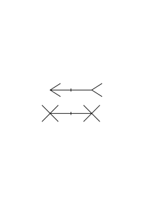
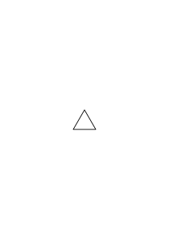
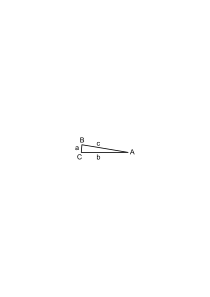
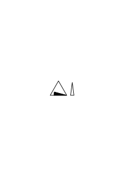
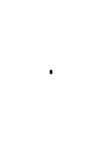
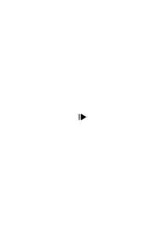
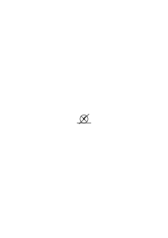

# Remarks translated via DeepL

## Ms-116.md:1.1

**Issue:** emphasis: Underscore count mismatch: DE has 4, EN has 2

**German:**

1 Kann man denn etwas Anderes, als einen Satz, _verstehen_? Oder: Ist es nicht erst ein Satz, wenn man es versteht. Also: Kann man Etwas anders als _als Satz_ verstehen?

**English:**

1 Can one _understand_ anything other than a sentence? Or: Is it not a sentence until one understands it? Thus: Can one understand anything other than _a sentence_?

---

## Ms-116.md:100.1

**Issue:** structure: HTML tags differ: DE ["", ""] vs EN []

**German:**

1 Kann ich (nicht) sagen: Ich meine die Verneinung, welche verdoppelt eine Bejahung gibt? Wenn Du von Rot gesprochen hast, hast Du dann das gemeint, wovon man sagen kann, es sei hell, aber nicht, es sei grün, auch wenn Du an diese Regel nicht gedacht, noch von ihr Gebrauch gemacht hast? Hast Du das _nicht_ verwendet, deren drei eine Verneinung geben; auch wenn Du diese Regel nicht verwendet hast? Ist es eine Hypothese, daß es _das_ nicht war? Kann es zweifelhaft sein, ob es dasselbe war, & durch Erfahrung bestätigt werden?

**English:**

1 Can I (not) say: I mean the negation which, when doubled, yields an affirmation? When you spoke of red, did you mean that which one can say is bright, but not that it is green, even if you did not think of this rule nor use it? Did you _not_ use those three that constitute a negation; even if you did not use this rule? Is it a hypothesis that it was not _so_? Can it be doubtful whether it was the same thing, & be confirmed by experience?

---

## Ms-116.md:100.2+101.1

**Issue:** structure: HTML tags differ: DE ["", ""] vs EN []; emphasis: Underscore count mismatch: DE has 2, EN has 0

**German:**

100 Worin besteht die Absicht, eine Partie Schach zu spielen? Wie unterscheidet sie sich von der Absicht, ein anderes Spiel zu spielen? Schach ist doch durch seine Regeln definiert; wäre eine der Regeln anders, so wäre es ein anderes Spiel. Wie treten also die Regeln des Schach in die Absicht ein Schach zu spielen? Oder wissen wir etwa nicht, welches Spiel zu spielen wir beabsichtigen; zeigt sich uns das erst wenn wir es schon gespielt haben? (Man sagt: “Ich werde doch wissen, was ich spielen wollte!”, “Ich werde doch wissen, was ich mir wünsche!”, “Ich werde doch wissen, warum ich es getan habe!”) Denke an eine Begründung wie: “Ich weiß, daß ich die Absicht hatte, _denn_ ich habe mir gedacht: ‘jetzt komme ich endlich zum Schachspielen’.” Es würde sich mit dieser Absicht auch vollkommen vertragen, wenn ich beim ersten Zug darauf käme, daß ich alle Regeln schon vergessen habe.

**English:**

100 What constitutes the intention to play a game of chess? How does it differ from the intention to play another game? Chess is, after all, defined by its rules; if any of the rules were different, it would be a different game. So how do the rules of chess enter into the intention to play chess? Or do we perhaps not know which game we want to play; does that only become clear to us once we have already played it? (People say: “Surely I will know what I wanted to play!”, “Surely I will know what I wish for!”, “Surely I will know why I did it!”) Consider a justification such as: “I know that I had the intention, _because_ I thought to myself: ‘Now I’m finally going to play chess.’” It would be entirely consistent with this intention if, on the first move, I realized that I had already forgotten all the rules.

---

## Ms-116.md:101.2

**Issue:** structure: HTML tags differ: DE ["", ""] vs EN []

**German:**

1 Es stört uns gleichsam, daß der Gedanke eines Satzes in keinem Moment ganz vorhanden ist. Wir sehen ihn wie einen Gegenstand an, den wir erzeugen, & nie ganz besitzen, denn kaum entsteht ein Teil, so verschwindet ein andrer.

**English:**

1 It bothers us, as it were, that the thought of a sentence is never fully present at any given moment. We see it as an object that we create but never fully possess, for as soon as one part arises, another disappears.

---

## Ms-116.md:101.3+102.1

**Issue:** emphasis: Underscore count mismatch: DE has 10, EN has 0

**German:**

2 ‘Intuitives Denken.’ Mozart schreibt in einem Brief, ein Stück stünde in einem Augenblick ganz vor seinem Geist. – Wenn mir nun jemand sagte: “Also ist es eben _doch_ möglich, daß ein ganzer Gedanke _auf einmal_ erfaßt, gedacht, wird” – also ist es doch möglich, etwas ‘intuitives Denken’ _zu nennen_. Aber erklärt diese Wortverbindung schon, _was_ wir darunter verstehen? Bei Mozarts Worten kann ich mir mancherlei denken: Z.B., daß gewiß _nicht_ gemeint ist, er höre das ganze Stück in einem Augenblick vor seinem inneren Ohr, als würden alle Töne des Stücks zugleich angeschlagen oder als würde das Stück in rasender Geschwindigkeit durchgespielt; ich kann noch dies & jenes vermuten, & weiter komme ich nicht.

**English:**

2 ‘Intuitive thinking.’ Mozart writes in a letter that a piece stands fully before his mind in an instant. – If someone were to say to me: “So it is _indeed_ possible that an entire thought is grasped and conceived _at once_”—so it is indeed possible _to call_ something ‘intuitive thinking.’ But does this phrase already provide an explanation of _what_ we mean by it? Mozart’s words give me cause for various thoughts: for example, that he certainly does _not_ mean that he hears the entire piece in an instant in his inner ear, as if all the notes of the piece were struck simultaneously or as if the piece were played through at breakneck speed; I can surmise this and that, and I get no further.

---

## Ms-116.md:102.2+103.1

**Issue:** emphasis: Underscore count mismatch: DE has 6, EN has 0

**German:**

1 Das Verstehen eines Satzes der Sprache ist dem Verstehen eines Themas in der Musik (oder Musikstückes) viel verwandter als man etwa glaubt. Ich meine es aber so: daß das Verstehen des sprachlichen Satzes näher als man denkt dem liegt, was man gewöhnlich Verstehen des Musikstücks nennt. Warum will ich den Wechsel der Stärke & des Tempos gerade auf diesen Rhythmus bringen, warum gerade _diese_ Linie zeichnen? Man möchte sagen: “weil ich weiß, was das alles heißt”. Aber was heißt es? ich wüßte es nicht zu sagen. Zur ‘Erklärung’ könnte ich es nur mit etwas anderem _vergleichen_, was denselben Rhythmus (ich meine, dieselbe Linie) hat. (Man kann sagen: “Siehst Du nicht: das ist, als würde eine Schlußfolgerung gezogen”, oder: “das ist gleichsam eine Parenthese”, etc.. Wie begründet man solche Vergleiche? Es gibt _verschiedenartige_ Begründungen.)

**English:**

1 Understanding a sentence in the language is much more akin to understanding a theme in music (or a musical piece) than one might suppose. But what I mean is this: that understanding a linguistic sentence is closer than one thinks to what is usually called understanding a piece of music. Why do I want to bring the change in dynamics and tempo precisely to this rhythm, why draw precisely _this_ line? One might say: “because I know what it all means.” But what does it mean? I wouldn’t know how to say. To ‘give an explanation’ of it, I could only _compare_ it to something else that has the same rhythm (I mean, the same line). (One might say: “Don’t you see: it’s as if a conclusion were being drawn,” or: “it is, as it were, a parenthesis,” etc. How does one justify such comparisons? There are _various_ justifications.)

---

## Ms-116.md:103.2+104.1

**Issue:** emphasis: Underscore count mismatch: DE has 2, EN has 0

**German:**

11 “Denken” nennen wir wohl manchmal den Satz mit einem seelischen Vorgang begleiten, aber “Gedanke” nennen wir nicht jene Begleitung. – Sprich einen Satz & denke ihn; sprich ihn mit Verständnis! – Und nun sprich ihn nicht, & tu nur das, womit Du ihn beim verständnisvollen Sprechen begleitet hast! – (Singe dies Lied mit Ausdruck – & nun singe es nicht, aber wiederhole den Ausdruck! – Und man _könnte_ auch hier etwas wiederholen: Z.B. Schwingungen des Körpers, langsameres & schnelleres Atmen, Vorstellungsbilder. –)

**English:**

11 We sometimes call “thinking” the mental process that accompanies a sentence, but we do not call that accompaniment a “thought.” – Speak a sentence & think it; speak it with understanding! – And now do not speak it, & do only that with which you accompanied it while speaking with understanding! – (Sing this song with expression – & now do not sing it, but repeat the expression! – And one _could_ also repeat something here: e.g., bodily vibrations, slower & faster breathing, mental images. –)

---

## Ms-116.md:105.1

**Issue:** emphasis: Underscore count mismatch: DE has 2, EN has 0

**German:**

1 Was heißt es, wenn ich sage, daß im Satz: “die Rose ist rot”, das “ist” eine andere Bedeutung hat als im Satz: “2 mal 2 ist 4”. Wenn ich sagen wollte, es heiße, daß verschiedene Regeln von diesen beiden Wörtern gelten, so wäre die Antwort, daß nur von _einem_ Wort die Rede ist. Ich kann aber sagen: In dem ersten Satz darfst Du “ist” durch “hat die Eigenschaft” (ε) ersetzen, in dem zweiten “ist” durch “ist gleich” ( = ), aber nicht umgekehrt. Und im weitern Verlauf macht man etwas ganz anderes mit “ε” als mit “ = ”.

**English:**

1 What does it mean when I say that in the sentence “the rose is red,” the “is” has a different meaning than in the sentence “2 times 2 is 4”? If I wanted to say that different rules apply to these two words, the answer would be that we are talking about only _one_ word. But I can say: In the first sentence, you may replace “is” with “has the property” (ε), in the second “is” with “is equal to” ( = ), but not the other way around. And in the further course of the argument, one does something quite different with “ε” than with “ = ”.

---

## Ms-116.md:105.2

**Issue:** emphasis: Underscore count mismatch: DE has 2, EN has 0

**German:**

2 Kann ich nun das, was die Regeln der Anwendung vom Worte sagen, auch anders beschreiben, nämlich durch die Beschreibung des Vorgangs, der beim Verstehen des Worts stattfindet? Ich meinte früher einmal, die grammatischen Regeln seien die Auseinanderlegung dessen, was ich bei _einem_ Gebrauch des Wortes auf einmal erlebe. Sozusagen Folgen, Äußerungen, der Eigenschaften, die ich beim Verstehen auf einmal erlebe.

**English:**

2 Can I now describe what the rules of word application say in a different way, namely by describing the process that takes place when understanding the word? I once thought that the grammatical rules were the analysis of what I experience all at once when using a word. So to speak, consequences, expressions, of the properties that I experience all at once when understanding.

---

## Ms-116.md:106.1

**Issue:** emphasis: Underscore count mismatch: DE has 4, EN has 0; emphasis: Asterisk count mismatch: DE has 0, EN has 4

**German:**

1 Man möchte ja sagen: die Verneinung habe die Eigenschaft, verdoppelt eine Bejahung zu ergeben. “Die doppelte Negation gibt eine Bejahung”, das klingt so wie: “Kohle und Sauerstoff geben Kohlensäure”. Aber in Wirklichkeit _gibt_ die doppelte Negation nichts, sondern _ist_ etwas.

**English:**

1 One might be tempted to say: negation has the property of yielding an affirmation when doubled. “Double negation yields an affirmation”—that sounds like: “Carbon and oxygen yield carbonic acid.” But in reality, double negation _does not yield_ anything; rather, it _is_ something.

---

## Ms-116.md:107.3

**Issue:** emphasis: Underscore count mismatch: DE has 8, EN has 0; emphasis: Asterisk count mismatch: DE has 0, EN has 4

**German:**

2 Heißt es etwas: daß drei _solche_ Verneinungen eine Verneinung ergeben? (Wie: “drei solche Pferde können diesen Wagen fortbewegen”.) Aber im Satz “~~~p = ~p” ist gar nicht von der Verneinung die Rede. (Von der Verneinung _handelt_ etwa der Satz: “es regnet nicht”.) Der Satz der Logik ist eine Regel für den Gebrauch des Zeichens “~”. Man könnte auch sagen: in ihm _hat_ das Zeichen “~” keine Bedeutung, sondern _erhält_ eine.

**English:**

2 Does it mean something: that three _such_ negations result in a negation? (Like: “three such horses can move this carriage.”) But in the sentence “~~~p = ~p,” there is no mention of negation at all. (The sentence “it is not raining,” for example, _deals_ with negation.) The proposition of logic is a rule for the use of the symbol “~.” One could also say: in it, the symbol “~” _has_ no meaning, but _is given_ one.

---

## Ms-116.md:107.4+108.1

**Issue:** emphasis: Underscore count mismatch: DE has 4, EN has 0; emphasis: Asterisk count mismatch: DE has 0, EN has 2

**German:**

3 Es hat den Anschein, als würde aus der Natur der Negation folgen, daß ~~ p p ist. (Und _etwas_ Richtiges ist daran. Was? _Unsre_ Natur hängt mit beiden zusammen.)

**English:**

3 It appears as though it follows from the nature of negation that ~~ p is p. (And there is _some_ truth to this. What? _Our_ nature is connected to both.)

---

## Ms-116.md:108.2

**Issue:** emphasis: Asterisk count mismatch: DE has 4, EN has 0

**German:**

1 Ich möchte das Bild gebrauchen: daß das Wort “ist”, wenn es einmal “ = ”, einmal “ε” bedeutet, einen verschiedenen Bedeutungs**körper** hinter sich hat; daß es die gleiche Vorderfläche ist die (jedesmal) einem andern Körper angehört; wie wenn ich ein Dreieck im Vordergrund sehe, das das einemal die Endfläche eines Prismas, das andremal eines Tetraeders ist.

**English:**

1 I would like to use the following image: that the word “is,” when it means “= ” in one instance and “ε” in another, has a different body of meaning behind it; that it is the same front surface that (each time) belongs to a different body; as when I see a triangle in the foreground that is sometimes the end face of a prism, and at other times that of a tetrahedron.

---

## Ms-116.md:109.2

**Issue:** emphasis: Underscore count mismatch: DE has 2, EN has 0

**German:**

1 Wenn wir nun aber einen Würfel _sehen_ sind uns damit wirklich schon alle Gesetze der möglichen Zusammenstellung gegeben? – Also seine ganze Geometrie? Kann ich die Geometrie des Würfels von einem Würfel ablesen?

**English:**

1 But when we _see_ a cube, are we thereby truly given all the laws of its possible composition?—That is, its entire geometry? Can I deduce the geometry of the cube from a cube?

---

## Ms-116.md:109.3+110.1

**Issue:** emphasis: Underscore count mismatch: DE has 6, EN has 0; emphasis: Asterisk count mismatch: DE has 0, EN has 4

**German:**

2 Der Würfel ist dann eine Notation der Regel. – Und hätten wir so eine Regel gefunden, so könnten wir sie wirklich nicht besser notieren, als durch die Zeichnung eines Würfels (& daß es hier eine _Zeichnung_ tut, ist sehr bedeutsam). Aber der Würfel oder die Zeichnung des Würfels, sind doch nur Zeichen, wirken doch nur als Zeichen, insofern, als ich sie nun _benütze_, in einem System von Verbindungen mit andern Zeichen. Wenn ich denke, der Würfel enthält schon die ganze Geometrie des Würfels – welcher Würfel? Der Gesichtswürfel, oder ein Eisenwürfel? Oder gibt es einen idealen geometrischen Würfel? – Offenbar schwebt uns der Vorgang vor, wenn wir aus einer Zeichnung, einem Modell, der Vorstellung, Sätze der Geometrie ableiten. Aber welche Rolle spielt dabei das Modell? Doch die des Zeichens, mit bestimmter Verwendungsart. Es ist allerdings (interessant &) merkwürdig, wie wir eine Figur (das Bild des Würfels z.B.) wieder & wieder verwenden, mit immer anderen Zutaten. Und es ist dieses Zeichen (_mit der Identität eines Zeichens_), welches wir für jenen Würfel nehmen, in dem die geometrischen Gesetze bereits liegen.

**English:**

2 The cube is then a notation of the rule. – And if we had found such a rule, we really could not note it better than by drawing a cube (& the fact that a _drawing_ suffices here is very significant). But the cube or the drawing of the cube are, after all, only signs; they function only as signs insofar as I now _use_ them in a system of connections with other signs. When I think that the cube already contains the entire geometry of the cube—which cube? The cube with faces, or an iron cube? Or is there an ideal geometric cube?—obviously, the process comes to mind when we derive geometric theorems from a drawing, a model, or an idea. But what role does the model play in this? That of a sign, with a specific mode of use. It is, however, (interesting &) curious how we use a figure (the image of the cube, for example) again & again, with ever-changing elements. And it is this sign (_with the identity of a sign_) that we take for that cube in which the geometric laws already lie.

---

## Ms-116.md:114.2

**Issue:** structure: HTML tags differ: DE ["", ""] vs EN []; emphasis: Underscore count mismatch: DE has 6, EN has 0

**German:**

1 Wie kann man sich zur Probe, ob man das Wort “blau” versteht, ein blaues Vorstellungsbild vor die Seele rufen; denn wie kann mir das Wort “blau” zeigen, welche Farbe aus dem Farbenkasten meiner Vorstellung ich zu wählen habe, & wie kann mir die Farbe, die kommt, zeigen, daß _sie_ die richtige ist? _Wähle_ ich denn also eine Vorstellung, die zum Worte “blau” paßt? – Und kann nicht die unrechte Vorstellung kommen? _Und wie zeigt sich das_?

**English:**

1 How can one, to test one’s understanding of the word “blue,” conjure up a mental image of blue; for how can the word “blue” show me which color from the palette of my imagination I am to choose, & how can the color that comes to mind show me that _it_ is the right one? _Do_ I therefore _choose_ an image that fits the word “blue”?—And might not the wrong image arise? _And how does that become apparent_?

---

## Ms-116.md:115.1

**Issue:** structure: HTML tags differ: DE ["", "", "<s>", "</s>"] vs EN []; emphasis: Underscore count mismatch: DE has 8, EN has 0

**German:**

1 Was ist das Kriterium dafür, daß ich das Wort “blau” verstehe: daß mir dabei diese Farbe vorschwebt (daß ich instinktiv meinen Blick auf _sie_ richte u. dergl.); oder, daß die andern Menschen mit meiner Benützung des Wortes einverstanden sind? <s> Angenommen, beim Worte “mn” fiele mir regelmäßig irgend eine Farbe ein (nach dem normalen Gebrauch der Wörter: ‘nicht immer dieselbe’); könnte ich nicht sagen: “‘mn’ nenne ich die Farbe, die mir bei dem Worte einfällt”?

</s> Aber warum rede ich von Vorstellungen?! Auf den Befehl, etwas Blaues zu zeigen, zeige ich auf einen Gegenstand von bestimmter Färbung, & wenn die nun – nach irgendwelchen andern Kriterien beurteilt – beim Wort “blau” immer die gleiche ist, so ist es eben dafür keine _Erklärung_, zu sagen, es schwebe mir beim Hören des Wortes ein _Bild_ vor & nach _ihm_ richte ich mich.

**English:**

1 What is the criterion for my understanding of the word “blue”: that this color comes to mind (that I instinctively direct my gaze toward _it_, and the like); or that other people agree with my use of the word? <s> Suppose that whenever I hear the word “blue,” a certain color has a degree of regularity in that it regularly comes to mind (according to the normal use of words: “not always the same”); could I not say: “I call ‘blue’ the color that comes to mind when I hear the word”?

</s> But why am I talking about mental images?! When asked to point to something blue, I point to an object of a certain color, & if this—judged by some other criteria—is always the same when the word “blue” is used, then saying that an _image_ comes to mind when I hear the word & that I orient myself by _it_ is no _explanation_ for this.

---

## Ms-116.md:115.2+116.1

**Issue:** structure: HTML tags differ: DE ["", ""] vs EN []; emphasis: Underscore count mismatch: DE has 4, EN has 0

**German:**

1 Angenommen, ich nenne morgen “blau”, was ich immer so genannt habe – d.h. so sage _ich_; aber alle Andern die ich treffe sagen: “das ist ja rot!” – wer hat dann Recht? Wenn ich mich vergewissere, daß ich ein Wort verstehe, indem ich mir ein Bild in die Vorstellung rufe, oder auf einen Gegenstand zeige, so ist dies doch nur insofern ein Kriterium des _richtigen_ Verständnisses, als es mir nur die Verständigung mit Andern ermöglicht.

**English:**

1 Suppose tomorrow I call “blue” what I have always called that—that is, that is what _I_ say; but everyone else I meet says: “That’s red!”—who is right then? If I verify that I understand a word by calling an image to mind or pointing to an object, this is a criterion of _correct_ understanding only insofar as it enables me to communicate with others.

---

## Ms-116.md:116.2+117.1+118.1

**Issue:** structure: HTML tags differ: DE ["", ""] vs EN []; emphasis: Underscore count mismatch: DE has 16, EN has 0

**German:**

1 Aber könnte man hier nicht zwischen subjektivem Verstehen des Wortes & objektivem Verstehen unterscheiden? Ich lese etwa von einem blauen Topf & es springt in mir sogleich mit Bestimmtheit ein Bild in der Vorstellung hervor. (Als wäre auf einen Knopf gedrückt worden & ein Täfelchen mit dem Bild darauf in Verbindung mit dem Knopf.) Beim Wort “Puhu” springt so ein Bild nicht hervor. Dies ist _ein_ Unterschied. Ob ich aber die Worte “blauer Topf” _richtig_ verstanden habe, in Übereinstimmung mit dem allgemeinen Gebrauch, ist damit noch nicht gesagt. Das Wort subjektiv verstehen hieße also – beiläufig gesprochen: es ist in Verbindung mit einem Bild. Es im objektiven Sinne verstehen hieße: es ist in Verbindung mit dem _rechten_ Bild. – Man könnte also auch sagen: Die Sprache soweit Einer sie nur subjektiv versteht ist zwar kein Mittel der Verständigung mit Andern, aber ein Werkzeug zum _privaten_ Gebrauch des Einzelnen. Die Frage aber ist: ob wir dieses Aussprechen von Lautverbindungen, Schreiben von Linienzügen u. dergl., nun auch ‘Sprache’, & ob wir es noch ein _‘Werkzeug’_ nennen würden. Denn er müßte nun mit sich selbst Sprachspiele spielen – & das kann er _wohl_: denke Dir nun einen Robinson Crusoe, der für seinen privaten Gebrauch eine Sprache (Zeichen) verwendet; denke Du sähest ihm dabei (ohne daß er es wüßte) zu; Du sähest also, wie er bei mannigfachen Gelegenheiten Striche in Hölzer ritzt, Laute ausstößt: würdest Du dies unter _allen_ Umständen ‘Benützen von Zeichen’ nennen? Doch nur wenn _Du_ dabei eine bestimmte Regelmäßigkeit beobachten würdest. Wir beobachten einen Menschen der bei verschiedener Gelegenheit – ohne Gesetzmäßigkeit – irgendwelche Laute ausstößt – nun sagen wir: “Das mag eine rein-private Sprache sein; er wird sich wohl jedesmal beim gleichen Laut dasselbe vorstellen.” –

**English:**

1 But couldn’t one distinguish here between subjective understanding of the word and objective understanding? For instance, I read about a blue pot, and an image immediately springs to mind with certainty. (As if a button had been pressed and a small panel with the image on it were connected to the button.) With the word “Puhu,” such an image does not spring to mind. This is _a_ difference. But whether I have _correctly_ understood the words “blue pot” in accordance with general use is not yet settled. To have a subjectivist understanding of the word would thus mean—to put it simply: it is associated with an image. To have an objective sense of the word would mean: it is associated with the _correct_ image. – One could therefore also say: Language, insofar as one understands it only subjectively, is indeed not a means of communication with others, but a tool for the individual’s _private_ use. The question, however, is: whether we would still call this utterance of sound combinations, writing of lines, and the like, ‘language,’ and whether we would still call it a _‘tool.’_ For he would now have to play language-games with himself—and he can _certainly_ do that: imagine a Robinson Crusoe who uses a language (signs) for his private use; imagine you were seeing him do so (without his knowing it); You would thus see how, on numerous occasions, he carves lines into wood and utters sounds: would you under _any_ circumstances call this ‘the use of signs’? Yet only if _you_ were to observe a certain regularity in the process. We observe a person who, on various occasions—without any regularity—emits certain sounds—now we say: “This may be a purely private language; he probably imagines the same thing every time he makes the same sound.” –

---

## Ms-116.md:118.2

**Issue:** structure: HTML tags differ: DE ["", ""] vs EN []; emphasis: Underscore count mismatch: DE has 2, EN has 0

**German:**

1 “Wenn Du einmal weißt, _was_ das Wort bezeichnet, verstehst Du es, kennst seine ganze Anwendung.”

**English:**

1 “Once you know _what_ the word denotes, you have understanding of it, you know its full application.”

---

## Ms-116.md:118.3

**Issue:** structure: HTML tags differ: DE ["", ""] vs EN []

**German:**

2 Denke Dir, ein Mensch gebrauchte “gelb” zur Bezeichnung jedes gelben Gegenstandes (also etwa wie wir “etwas Gelbes”). Er würde dann die hinweisende Erklärung immer richtig geben & sein Gebrauch des Wortes wäre doch nicht der unsere.

**English:**

2 Imagine that a person used “yellow” to perform the designation of every yellow object (much like we use “something yellow”). He would then always give the correct ostensive explanation, yet his use of the word would not be ours.

---

## Ms-116.md:118.4

**Issue:** emphasis: Underscore count mismatch: DE has 2, EN has 0

**German:**

3 Die Bedeutung eines Wortes vergessen – sich wieder an sie erinnern. Was für Abarten gibt es da? An was erinnert man sich, was fällt einem da ein, wenn man sich wieder daran erinnert, was das englische Wort “perhaps” bedeutet? – Wie geht _so_ etwas vor sich: ich sage, “jetzt weiß ich zum erstenmal was die Worte bedeuten: ‘der blaue Äther’”?

**English:**

3 Forgetting the meaning of a word—remembering it again. What variations are there? What does one remember, what comes to mind when one recalls what the English word “perhaps” means?—How does something _like_ _this_ happen: I say, “Now, for the first time, I know what the words mean: ‘the blue ether’”?

---

## Ms-116.md:120.2

**Issue:** emphasis: Underscore count mismatch: DE has 14, EN has 0

**German:**

1 Wie kann ich es _rechtfertigen_, daß ich mir auf diese Worte hin diese Vorstellung mache? Hat mir jemand die Vorstellung der blauen Farbe gezeigt & gesagt, daß _sie_ es sei? Was heißt denn hier: “_diese_ Vorstellung”? kann ich denn auf sie zeigen? Kann ich etwa _in mir_ auf sie zeigen, wenn sie _meine_ Vorstellung ist? Wenn ich mir einen blauen Kreis & einen Pfeil vorstelle, der auf ihn zeigt – zeigt der Pfeil auf meine Vorstellung? Könnte ich mir _so_ private hinweisende Definitionen geben? (Denke immer an den _Gebrauch_ der Zeichen!) (Dies alles hängt mit dem Problem zusammen: ob, & wie, ich denn wissen kann, ob, & was, der Andre fühlt, sieht, etc..)

**English:**

1 How can I _justify_ forming this mental image based on these words? Did someone show me the image of the color blue and tell me that _this_ is it? What does “_this_ mental image” mean here? Can I point to it? Can I point to it _within myself_, if it is _my_ mental image? If I imagine a blue circle and an arrow pointing at it—does the arrow point to my image? Could I give myself _such_ private, ostensive definitions? (Always think of the _use_ of signs!) (All this is connected to the problem: whether, and how, I can know whether, and what, the other person feels, sees, etc.)

---

## Ms-116.md:121.1

**Issue:** emphasis: Underscore count mismatch: DE has 2, EN has 0

**German:**

1 Ich sehe jemand & erinnere mich an ihn. Schwebt mir da immer (oder auch nur _oft_) ein ‘Erinnerungsbild’ des Menschen vor?

**English:**

1 I see someone & remember him. Does a ‘memory-image’ of the person always (or even just _often_) come to mind?

---

## Ms-116.md:121.3

**Issue:** emphasis: Underscore count mismatch: DE has 2, EN has 0

**German:**

3 Denke an das laute Lesen des Geschriebenen, oder an das Niederschreiben des Gesprochenen. Wir _könnten_ uns eine Art Tabelle (hier einen Mechanismus) denken, nach der man sich bei der Übertragung richten könnte. Aber wir richten uns nach keiner. Kein Akt des Gedächtnisses, nichts, vermittelt zwischen dem geschriebenen Zeichen & dem Laut.

**English:**

3 Think of reading the written word aloud, or of writing down what is spoken. We _could_ imagine a kind of table (here a mechanism) that one could use as a guide for the translation. But we do not use any such guide. No act of memory, nothing, mediates between the written sign and the sound.

---

## Ms-116.md:121.4+122.1

**Issue:** emphasis: Underscore count mismatch: DE has 6, EN has 0

**German:**

4 Es ist _ein_ Spiel, mittels eines Farbmuster Gegenstände aus andern auswählen, ein anderes, dies mittels eines Erinnerungsbildes einer Farbe tun, & ein anderes, unmittelbar nach einem Wort handeln. “Aber die Farbe kann mich bei der Wahl _führen_, & das Wort nicht!” – Aber würdest Du nicht sagen, Du wirst beim Lesen vom Geschriebenen geführt; beim Schreiben vom Diktat? Ja, ich will nicht sagen, dieser Fall sei von gleicher Art wie der vorige; aber es besteht eine Analogie, & eine Unähnlichkeit. Auch ein Muster führt mich, wie _ich_ mich von ihm führen lasse. – Stelle Dir verschiedene Grenzfälle vor, in denen es schwer zu sagen ist, ob man dies “von den Zeichen geführt werden” nennen soll, oder nicht.

**English:**

4 It is _one_ thing to select objects from among others using a color sample, another to do so using a memory-image of a color, and yet another to act immediately upon a word. “But the color can _guide_ me in my choice, and the word cannot!”—But would you not say that you are guided by the written text when reading, and by the dictation when writing? Yes, I do not want to say that this case is of the same kind as the previous one; but there is an analogy, and a dissimilarity. A pattern also guides me, insofar as _I_ allow myself to be guided by it. – Imagine various borderline cases in which it is difficult to say whether one should call this “being guided by the signs” or not.

---

## Ms-116.md:122.3+123.1+PG I App IV

**Issue:** structure: HTML tags differ: DE ["", "", "<s>", "</s>"] vs EN ["", ""]; emphasis: Underscore count mismatch: DE has 0, EN has 2

**German:**

2 Was kann uns glauben machen, es bestehe eine Art Übereinstimmung zwischen Gedanken & Wirklichkeit? – Statt “Übereinstimmung” könnte man (hier) ruhig setzen: “Bildhaftigkeit”. Ist aber die Bildhaftigkeit eine Übereinstimmung? in der Log. Phil. Abh. habe ich so etwas gesagt, wie: sie sei eine Übereinstimmung der Form. <s> Das aber ist ein Irrtum. Alles kann ein Bild von allem sein – wenn wir den Begriff des Bilds entsprechend ausdehnen. Was ich sagte, kommt nun darauf hinaus: jede Projektion, nach welcher Methode immer, müsse etwas mit dem Projizierten gemein haben. Das heißt, ich dehne den Begriff des ‘gemeinsam habens’ aus & mache ihn dem allgemeinen Begriff des Projizierens äquivalent. Es drängt sich mir also eine bestimmte Art der Verallgemeinerung auf, eine Form der Darstellung, ein bestimmter Aspekt. </s>

**English:**

2 What can lead us to believe that there is a kind of correspondence between thought and reality? – Instead of “correspondence,” one could easily say (here): “pictoriality.” But is pictoriality a correspondence? In the Logical-Philosophical Treatise, I said something like: it is a correspondence of form.  <s>But that is a mistake. Everything can be an image of everything—if we correspond the concept of the image accordingly. What I said now amounts to this: every projection, by whatever method, must have something in common with the projected. That is, I expand the concept of “having in common” and make it equivalent to the general concept of projection. A certain kind of generalization thus imposes itself on me, a form of representation, a certain aspect. </s>

---

## Ms-116.md:123.2+PG I App IV

**Issue:** emphasis: Underscore count mismatch: DE has 2, EN has 0

**German:**

1 Vor allem ist “Bild” hier zweideutig (gebraucht). Man will sagen: ein Befehl sei ein Bild der Handlung die nach ihm ausgeführt wurde; aber auch, ein Bild der Handlung, die nach ihm ausgeführt werden _soll_.

**English:**

1 Above all, “image” is used ambiguously here. One wants to say: a command is an image of the action that was carried out according to it; but also, an image of the action that _is_ _to_ be carried out according to it.

---

## Ms-116.md:124.1+125.1+PG I App IV

**Issue:** emphasis: Underscore count mismatch: DE has 12, EN has 0

**German:**

1 Man kann sagen: eine Werkzeichnung _dient als Bild_ des Gegenstandes, den der Arbeiter nach ihr anfertigen soll. Und man könnte hier “Projektionsmethode” die Art & Weise nennen, wie der Arbeiter so eine Zeichnung in die Arbeit umzusetzen hat. Man könnte sich nun so ausdrücken: die Projektionsmethode vermittle zwischen der Zeichnung & dem Objekt, sie reiche von der Zeichnung zum Werkstück. Man vergleicht damit die Projektionsmethode mit Projektionslinien, die von einer Figur zu einer anderen reichen. – Wenn aber die Projektionsmethode eine Brücke ist, dann ist sie eine, die nicht geschlagen ist, ehe die Anwendung nicht gemacht ist. – Der Vergleich aber führt zur Idee, daß das Bild _mitsamt_ den Projektionsstrahlen nun nicht noch verschiedene Arten der _Anwendung_ zuläßt, sondern daß dadurch das Abgebildete, auch wenn es tatsächlich nicht vorhanden, ätherisch bestimmt ist, so bestimmt nämlich, als _wäre_ es vorhanden. (Es ist ‘auf ja & nein bestimmt’.) “Bild” kann man dann die Werkzeichnung _mit_ der Methode ihrer Anwendung nennen. Und unter dieser Methode stellt man sich nun etwas vor, was sich an die Werkzeichnung anschließt, auch wenn sie nicht verwendet wird. (Man kann eine Anwendung ‘_beschreiben_’, auch wenn es sie nicht gibt.)

**English:**

1 One could say: a working drawing _serves as an image_ of the object that the worker is to produce according to it. And one could call the “projection method” here the manner in which the worker must translate such a drawing into the work. One could now make the following expression: the projection method mediates between the drawing and the object; it extends from the drawing to the workpiece. One thus makes a comparison between the projection method and projection lines that extend from one figure to another. – But if the projection method is a bridge, then it is one that is not built until the application is made. – The comparison, however, leads to the idea that the image, _together with_ the projection rays, does not merely permit various modes of _application_, but that through this the depicted object, even if it does not actually exist, is ethically determined—namely, determined as _if_ it _were_ present. (It is “determined to be both yes and no.”) One can then call the working drawing_, with_ the method of its application, an “image.” And under this method, one now imagines something that follows the working drawing, even if it is not used. (One can ‘_describe_’ an application, even if it does not exist.)

---

## Ms-116.md:105.2

**Issue:** emphasis: Underscore count mismatch: DE has 2, EN has 0

**Status:** unchanged (DeepL couldn't fix)

**German:**

2 Kann ich nun das, was die Regeln der Anwendung vom Worte sagen, auch anders beschreiben, nämlich durch die Beschreibung des Vorgangs, der beim Verstehen des Worts stattfindet? Ich meinte früher einmal, die grammatischen Regeln seien die Auseinanderlegung dessen, was ich bei _einem_ Gebrauch des Wortes auf einmal erlebe. Sozusagen Folgen, Äußerungen, der Eigenschaften, die ich beim Verstehen auf einmal erlebe.

**Old translation:**

2 Can I now describe what the rules of word application say in a different way, namely by describing the process that takes place when understanding the word? I once thought that the grammatical rules were the analysis of what I experience all at once when using a word. So to speak, consequences, expressions, of the properties that I experience all at once when understanding.

**DeepL translation (not used — failed verification):**

2 Can I now describe what the rules of word application say in a different way, namely by describing the process that takes place when understanding the word? I once thought that the grammatical rules were the analysis of what I experience all at once when using a word. So to speak, consequences, expressions, of the properties that I experience all at once when understanding.

---

## Ms-116.md:108.2

**Issue:** emphasis: Asterisk count mismatch: DE has 4, EN has 0

**Status:** unchanged (DeepL couldn't fix)

**German:**

1 Ich möchte das Bild gebrauchen: daß das Wort “ist”, wenn es einmal “ = ”, einmal “ε” bedeutet, einen verschiedenen Bedeutungs**körper** hinter sich hat; daß es die gleiche Vorderfläche ist die (jedesmal) einem andern Körper angehört; wie wenn ich ein Dreieck im Vordergrund sehe, das das einemal die Endfläche eines Prismas, das andremal eines Tetraeders ist.

**Old translation:**

1 I would like to use the following image: that the word “is,” when it means “= ” in one instance and “ε” in another, has a different body of meaning behind it; that it is the same front surface that (each time) belongs to a different body; as when I see a triangle in the foreground that is sometimes the end face of a prism, and at other times that of a tetrahedron.

**DeepL translation (not used — failed verification):**

1 I would like to use the following image: that the word “is,” when it means “= ” in one instance and “ε” in another, has a different body of meaning behind it; that it is the same front surface that (each time) belongs to a different body; as when I see a triangle in the foreground that is sometimes the end face of a prism, and at other times that of a tetrahedron.

---

## Ms-116.md:114.2

**Issue:** emphasis: Underscore count mismatch: DE has 6, EN has 8

**Status:** unchanged (DeepL couldn't fix)

**German:**

1 Wie kann man sich zur Probe, ob man das Wort “blau” versteht, ein blaues Vorstellungsbild vor die Seele rufen; denn wie kann mir das Wort “blau” zeigen, welche Farbe aus dem Farbenkasten meiner Vorstellung ich zu wählen habe, & wie kann mir die Farbe, die kommt, zeigen, daß _sie_ die richtige ist? _Wähle_ ich denn also eine Vorstellung, die zum Worte “blau” paßt? – Und kann nicht die unrechte Vorstellung kommen? _Und wie zeigt sich das_?

**Old translation:**

1 How can one, to test one’s understanding of the word “blue,” conjure up a mental image of blue; for how can the word “blue” show me which color from the palette of my imagination I am to choose, & how can the color that comes to mind show me that _it_ is the right one? _Do_ I therefore _choose_ an image that fits the word “blue”?—And might not the wrong image arise? _And how does that become apparent_?

**DeepL translation (not used — failed verification):**

1 How can one, to test one’s understanding of the word “blue,” conjure up a mental image of blue? For how can the word “blue” show me which color from the palette of my imagination I am to choose, and how can the color that comes to mind show me that _it_ is the right one? _Do_ I therefore _choose_ an image that fits the word “blue”?—And might not the wrong image arise? _And how does that become apparent_?

---

## Ms-116.md:118.4

**Issue:** emphasis: Underscore count mismatch: DE has 2, EN has 4

**Status:** unchanged (DeepL couldn't fix)

**German:**

3 Die Bedeutung eines Wortes vergessen – sich wieder an sie erinnern. Was für Abarten gibt es da? An was erinnert man sich, was fällt einem da ein, wenn man sich wieder daran erinnert, was das englische Wort “perhaps” bedeutet? – Wie geht _so_ etwas vor sich: ich sage, “jetzt weiß ich zum erstenmal was die Worte bedeuten: ‘der blaue Äther’”?

**Old translation:**

3 Forgetting the meaning of a word—remembering it again. What variations are there? What does one remember, what comes to mind when one recalls what the English word “perhaps” means?—How does something _like_ _this_ happen: I say, “Now, for the first time, I know what the words mean: ‘the blue ether’”?

**DeepL translation (not used — failed verification):**

3 Forgetting the meaning of a word—remembering it again. What variations are there? What does one remember, what comes to mind when one recalls what the English word “perhaps” means?—How does something _like_ _this_ happen: I say, “Now, for the first time, I know what the words mean: ‘the blue ether’”?

---

## Ms-116.md:123.2+PG I App IV

**Issue:** emphasis: Underscore count mismatch: DE has 2, EN has 4

**Status:** unchanged (DeepL couldn't fix)

**German:**

1 Vor allem ist “Bild” hier zweideutig (gebraucht). Man will sagen: ein Befehl sei ein Bild der Handlung die nach ihm ausgeführt wurde; aber auch, ein Bild der Handlung, die nach ihm ausgeführt werden _soll_.

**Old translation:**

1 Above all, “image” is used ambiguously here. One wants to say: a command is an image of the action that was carried out according to it; but also, an image of the action that _is_ _to_ be carried out according to it.

**DeepL translation (not used — failed verification):**

1 Above all, “image” is used ambiguously here. One wants to say: a command is an image of the action that was carried out according to it; but also, an image of the action that _is_ _to_ be carried out according to it.

---

## Ms-116.md:124.1+125.1+PG I App IV

**Issue:** emphasis: Underscore count mismatch: DE has 12, EN has 14

**Status:** unchanged (DeepL couldn't fix)

**German:**

1 Man kann sagen: eine Werkzeichnung _dient als Bild_ des Gegenstandes, den der Arbeiter nach ihr anfertigen soll. Und man könnte hier “Projektionsmethode” die Art & Weise nennen, wie der Arbeiter so eine Zeichnung in die Arbeit umzusetzen hat. Man könnte sich nun so ausdrücken: die Projektionsmethode vermittle zwischen der Zeichnung & dem Objekt, sie reiche von der Zeichnung zum Werkstück. Man vergleicht damit die Projektionsmethode mit Projektionslinien, die von einer Figur zu einer anderen reichen. – Wenn aber die Projektionsmethode eine Brücke ist, dann ist sie eine, die nicht geschlagen ist, ehe die Anwendung nicht gemacht ist. – Der Vergleich aber führt zur Idee, daß das Bild _mitsamt_ den Projektionsstrahlen nun nicht noch verschiedene Arten der _Anwendung_ zuläßt, sondern daß dadurch das Abgebildete, auch wenn es tatsächlich nicht vorhanden, ätherisch bestimmt ist, so bestimmt nämlich, als _wäre_ es vorhanden. (Es ist ‘auf ja & nein bestimmt’.) “Bild” kann man dann die Werkzeichnung _mit_ der Methode ihrer Anwendung nennen. Und unter dieser Methode stellt man sich nun etwas vor, was sich an die Werkzeichnung anschließt, auch wenn sie nicht verwendet wird. (Man kann eine Anwendung ‘_beschreiben_’, auch wenn es sie nicht gibt.)

**Old translation:**

1 One could say: a working drawing _serves as an image_ of the object that the worker is to produce according to it. And one could call the “projection method” here the manner in which the worker must translate such a drawing into the work. One could now make the following expression: the projection method mediates between the drawing and the object; it extends from the drawing to the workpiece. One thus makes a comparison between the projection method and projection lines that extend from one figure to another. – But if the projection method is a bridge, then it is one that is not built until the application is made. – The comparison, however, leads to the idea that the image, _together with_ the projection rays, does not merely permit various modes of _application_, but that through this the depicted object, even if it does not actually exist, is ethically determined—namely, determined as _if_ it _were_ present. (It is “determined to be both yes and no.”) One can then call the working drawing_, with_ the method of its application, an “image.” And under this method, one now imagines something that follows the working drawing, even if it is not used. (One can ‘_describe_’ an application, even if it does not exist.)

**DeepL translation (not used — failed verification):**

1 One could say: a working drawing _serves as an image_ of the object that the worker is to produce according to it. And one could call the “projection method” here the manner in which the worker must translate such a drawing into the work. One could now use the following expression: the projection method mediates between the drawing and the object; it extends from the drawing to the workpiece. One thus makes a comparison between the projection method and projection lines that extend from one figure to another. – But if the projection method is a bridge, then it is one that is not built until the application is made. – The comparison, however, leads to the idea that the image, _together with_ the projection rays, does not merely permit various types of _application_, but that through this the depicted object, even if it does not actually exist, is ethically determined—namely, determined as _if_ it _were_ present. (It is “determined to be both yes and no.”) One can then call the working drawing_, with_ the method of its application, an “image.” And under this method, one now imagines something that follows the working drawing, even if it is not used. (One can ‘_describe_’ an application, even if it does not exist.)

---

## Ms-116.md:125.2+126.1+PG I App IV

**Issue:** emphasis: Underscore count mismatch: DE has 6, EN has 0

**Status:** fixed

**German:**

1 Ich frage nun: “Wie könnte denn die Werkzeichnung als Darstellung verwendet werden, wenn nicht schon eine Übereinstimmung, mit dem, was gemacht werden soll, da ist?” – Aber was heißt das? Nun, etwa dies: Wie könnte ich nach Noten Klavier spielen, wenn sie nicht schon irgend eine Beziehung zu Handbewegungen gewisser Art hätten? Und diese Beziehung besteht freilich _manchmal_ in einer gewissen Übereinstimmung (Ähnlichkeit), manchmal aber nicht in einer Übereinstimmung, sondern nur darin, daß wir die Zeichen so & so anwenden gelernt haben. Um aber diese Fälle alle gleich zu machen – denn _dazu_ reizt es uns – dient die Verwechslung zwischen Projektionsstrahlen, die das Bild mit dem Gegenstand verbinden, & der Projektionsmethode. Man kann sagen: die Projektionsstrahlen rechne ich noch zum Bild – aber nicht die Projektionsmethode. Man könnte freilich auch sagen: Eine _Beschreibung_ der Projektionsmethode rechne ich noch zum Bild. Ich stelle mir also vor, die Verschiedenheit zwischen Satz & Wirklichkeit werde durch die Projektionsstrahlen ausgeglichen, die zum Bild, zum Gedanken, gehören, & die keinen Raum mehr für eine Methode der Anwendung lassen. Es gibt (vielmehr) nur noch Übereinstimmung & Nichtübereinstimmung.

**Old translation:**

1 I now ask: “How could the technical drawing be used as a representation if there were not already an agreement with what is to be done?” – But what does that mean? Well, something like this: How could I play the piano from sheet music if it did not already have some relationship to movements of the hands of a certain kind? And this relationship certainly consists sometimes in a certain agreement (similarity), but sometimes not in an agreement, but only in the fact that we have learned to apply the signs in this way. But to make all these cases the same – because this is what tempts us – is served by the confusion between projection rays, which connect the picture with the object, & the method of projection. One can say: I still count the projection rays as belonging to the picture – but not the method of projection. One could also say: I still count a description of the method of projection as belonging to the picture. I imagine that the difference between sentence & reality is compensated for by the projection rays that belong to the picture, to the thought, & that leave no room for a method of application. (Rather,) there is only agreement & disagreement.

**DeepL translation:**

1 I now ask: “How could the working drawing be used as a representation if there were not already a correspondence with what is to be made?”—But what does that mean? Well, something like this: How could I play the piano from sheet music if it did not already have some kind of relationship to hand movements of a certain sort? And this relationship consists, of course, _sometimes_ in a certain correspondence (similarity), but sometimes not in a correspondence, but only in the fact that we have learned to apply the signs in such and such a way. But to make all these cases the same—for _that_ is what tempts us—serves the confusion between the projection rays that connect the image with the object, and the projection method. One might say: I still count the projection rays as part of the image—but not the projection method. One could, of course, also say: I still count a _description_ of the projection method as part of the image. I therefore imagine that the difference between proposition and reality is balanced out by the projection rays, which belong to the image, to the thought, and which leave no room for a method of application. There is (rather) only agreement and disagreement.

---

## Ms-116.md:126.2

**Issue:** emphasis: Underscore count mismatch: DE has 2, EN has 0

**Status:** fixed

**German:**

1 “Die Möglichkeit der Übereinstimmung bedingt schon _eine_ Übereinstimmung.” – Denke, jemand sagte: “Schachspielen können ist eine Art Schach-spielen”.

**Old translation:**

1 “The possibility of agreement already implies an agreement.” – Imagine someone said: “Being able to play chess is a kind of playing chess.”

**DeepL translation:**

1 “The possibility of agreement already presupposes _an_ agreement.” – I think someone said: “Being able to play chess is a kind of playing chess.”

---

## Ms-116.md:131.2+132.1

**Issue:** structure: HTML tags differ: DE ["", ""] vs EN []; emphasis: Underscore count mismatch: DE has 8, EN has 2

**Status:** fixed

**German:**

1 Denke, jemand zeigte mit der Gebärde des Zahnschmerzes auf seine Wange & sagte dabei: “abrakadabra! ” – Wir fragen: “Was meinst Du?”& er antwortet: “Ich meinte damit: ‘Zahnschmerzen’.” – Du denkst Dir sofort: wie kann man denn das – was heißt es denn, mit diesem Wort ‘Zahnschmerzen _meinen_’? Und doch hättest Du, in anderem Zusammenhang, behauptet, daß die Tätigkeit, das & das zu _meinen_, gerade das Wichtigste beim Gebrauch der Sprache sei. Aber wie, – kann ich denn nicht sagen: “Mit ‘abrakadabra’ meine ich Zahnschmerzen”? Freilich; aber das ist eine Definition, nicht eine Beschreibung dessen, was in mir beim Aussprechen des Wortes vorgeht. Und man kann auch sagen: “Als ich ‘der Führer’ sagte, meinte ich Adolf Hitler” & ich nehme an, als ich jene Worte sagte, hatte mir tatsächlich ein Bild des Menschen vorgeschwebt; & _dennoch_ sagt der Satz: “als ich sagte … meinte ich …” nicht: dies oder jenes ging in mir beim Aussprechen der Worte vor. “Mit dem Worte … meinte ich …” heißt nicht dasselbe wie: bei jenem Wort dachte ich an … Man kann wohl beim Aussprechen des Wortes “abracadabra” an Schmerzen denken; aber das drückt man nicht mit den Worten aus: “ich habe mit dem Wort … gemeint”. Diese Aussage ist vielmehr immer ein Ausdruck einer _Regel_.

**Old translation:**

Suppose someone, with the gesture of toothache, points to his cheek and says, “abracadabra!” – We ask: “What do you mean by that?” & he replies: “I meant by it: ‘toothache’.” – You immediately think: how can one – what does it mean to ‘mean’ ‘toothache’ with this word? And yet, in another context, you would have claimed that the activity of ‘meaning’ this or that is precisely the most important thing in the use of language. But how – can I not say: “With ‘abracadabra’ I mean toothache”? Of course; but that is a definition, not a description of what is happening in me when I utter the word. And one can also say: “When I said ‘the leader,’ I meant Adolf Hitler,” & I assume that when I said those words, I actually had an image of the man in mind; & yet, the sentence “when I said … I meant …” does not say: this or that was happening in me when I uttered the words. “With the word … I meant …” does not mean the same as: when I said that word, I thought of … One can, of course, think of pain when uttering the word “abracadabra”; but that is not expressed by the words: “I meant … with the word.” This statement is rather always an expression of a _rule_.

**DeepL translation:**

1 Imagine someone pointing to his cheek with the gesture for toothache and saying, “abracadabra!” – We ask, “What do you mean?” and he answers, “I meant ‘toothache’.” – You immediately think to yourself: how can one—what does it even mean to _“mean_ ‘toothache’” with that word? And yet, in a different context, you would have asserted that the act of _meaning_ this or that is precisely the most important thing in the use of language. But how—can’t I say: “By ‘abracadabra’ I mean toothache”? Of course; but that is a definition, not a description of what is going on inside me when I utter the word. And one can also say: “When I said ‘the Führer,’ I meant Adolf Hitler”—and I suppose that when I said those words, an image of the man had indeed come to mind;—and _yet_ the sentence: “When I said … I meant …” does not say: this or that was going on inside me when I spoke the words. “By the word … I meant …” does not mean the same thing as: when I said that word, I thought of … One can certainly think of pain when uttering the word “abracadabra”; but one does not express that with the words: “I meant … by the word …”. Rather, this statement is always an expression of a _rule_.

---

## Ms-116.md:132.2

**Issue:** structure: HTML tags differ: DE ["", ""] vs EN []

**Status:** fixed

**German:**

1 Man könnte im Gebrauch eines Worts eine ‘Oberflächengrammatik’ von einer ‘eingehenden Grammatik’ unterscheiden. Das, was sich uns am Gebrauch eines Worts unmittelbar einprägt, ist seine Verwendungsweise im _Satzbau_, der Teil seines Gebrauches – könnte man sagen – den man mit dem _Ohr_ erfassen kann. – Und nun vergleiche die Tatsachen der eingehenden Grammatik des Wortes “meinen” (etwa), mit dem, was seine Oberflächengrammatik uns sollte erwarten lassen. Kein Wunder, wenn man es schwer findet sich auszukennen.

**Old translation:**

One could distinguish between a ‘surface grammar’ & a ‘deep grammar’ in the use of a word. What is immediately impressed upon us by the use of a word is its way of being used in the _sentence structure_, that part of its use – one might say – which one can grasp with the _ear_. – And now compare the facts of the deep grammar of the word “mean” (approximately), with what its surface grammar should lead us to expect. No wonder one finds it difficult to find one’s way around.

**DeepL translation:**

1 One could distinguish between a ‘surface grammar’ and a ‘deep grammar’ in the use of a word. What immediately strikes us about the use of a word is its function in _sentence structure_—the part of its use, one might say, that can be grasped by the _ear_. – And now perform a comparison of the facts of the deep grammar of the word “mean” (for example) with what its surface grammar would lead us to expect. No wonder it is difficult to make sense of it.

---

## Ms-116.md:133.1

**Issue:** structure: HTML tags differ: DE ["", ""] vs EN []

**Status:** fixed

**German:**

1 Die Grammatik sagt nicht, wie die Sprache gebaut sein muß, um ihren Zweck zu erfüllen, um so & und so auf Menschen zu wirken. Sie beschreibt nur, aber erklärt in keiner Weise, den Gebrauch der Zeichen.

**Old translation:**

Grammar does not say how language must be constructed in order to fulfill its purpose, in order to have such and such an effect on people. It only describes, but in no way explains, the use of the signs.

**DeepL translation:**

1 Grammar does not say how language must be constructed in order to fulfil its purpose, to have such and such an effect on people. It merely describes, but in no way provides an explanation for the use of signs.

---

## Ms-116.md:133.2

**Issue:** structure: HTML tags differ: DE ["", ""] vs EN []

**Status:** fixed

**German:**

2 Der Begriff des Lebewesens hat die gleiche Unbestimmtheit, wie der der Sprache.

**Old translation:**

The concept of a living being has the same indeterminacy as that of language.

**DeepL translation:**

2 The concept of a living being has the same indeterminacy as that of language.

---

## Ms-116.md:133.3

**Issue:** structure: HTML tags differ: DE ["", ""] vs EN []

**Status:** fixed

**German:**

3 “Der Zweck der Sprache ist, Gedanken auszudrücken.” – So ist es wohl der Zweck jedes Satzes, einen Gedanken auszudrücken; – welchen Gedanken drückt also z.B. der Satz: “Es regnet” aus? – – Nicht: “Ohne Sprache könnten wir uns nicht mit einander verständigen”. Wohl aber: ohne Sprache können wir Menschen nicht so & so beeinflussen, können wir nicht Straßen & Maschinen bauen; etc.. Und auch: Ohne den Gebrauch der Rede & der Schrift könnten sich Menschen nicht verständigen.

**Old translation:**

“The purpose of language is to express thoughts.” – So, presumably, the purpose of every sentence is to express a thought; – what thought, then, does the sentence “It is raining” express? – – Not: “Without language we could not communicate with each other.” But rather: without language, we cannot influence people in such and such a way, we cannot build roads & machines; etc. And also: without the use of speech & writing, people could not communicate.

**DeepL translation:**

3 “The purpose of language is to express thoughts.” – So it is probably the purpose of every sentence to express a thought; – what thought, then, does the sentence “It is raining” express, for example? – – Not: “Without language, we could not communicate with one another.” But rather: without language, we humans cannot influence things in such and such a way; we cannot build roads and machines; etc. And also: Without the use of speech and writing, people could not communicate with one another.

---

## Ms-116.md:134.1

**Issue:** structure: HTML tags differ: DE ["", ""] vs EN []

**Status:** fixed

**German:**

1 Vergleiche: Ein Spiel erfinden – eine Sprache erfinden – eine Maschine erfinden.

**Old translation:**

Compare: inventing a game – inventing a language – inventing a machine.

**DeepL translation:**

1 Comparison: Inventing a game – inventing a language – inventing a machine.

---

## Ms-116.md:134.2

**Issue:** structure: HTML tags differ: DE ["", ""] vs EN []

**Status:** fixed

**German:**

2 Sind die Regeln eines Spiels willkürlich? – Ich könnte sie “willkürlich” nennen zum Unterschied, etwa, von den Regeln etwa des Fingersatzes, wenn hervorgehoben werden soll, daß das so oder so der Spielhandlungen nicht unmittelbar zweckdienlich oder zweckwidrig ist. Obwohl eine Regel ein Spiel interessant, langweilig oder lustig machen kann.

**Old translation:**

Are the rules of a game arbitrary? – I might call them “arbitrary” in contrast, for example, to the rules of fingering, if it is to be emphasized that this or that game-action is not directly conducive or detrimental to the purpose. Although a rule can make a game interesting, boring, or amusing.

**DeepL translation:**

2 Are the rules of a game arbitrary? – I could call them “arbitrary” to distinguish them, for example, from the rules of fingering, if the point is to be made that this or that is not immediately conducive or detrimental to the game’s actions. Although a rule can make a game interesting, boring, or fun.

---

## Ms-116.md:134.3+135.1

**Issue:** structure: HTML tags differ: DE ["", ""] vs EN []

**Status:** fixed

**German:**

3 Man kann die Regeln der Grammatik “willkürlich” nennen, wenn damit gesagt sein soll, der _Zweck_ der Grammatik sei nur der der Sprache. Und es sei Unsinn etwa zu sagen: die Sprache müsse Substantiva, Eigenschaftswörter, Verben & Zahlwörter enthalten, weil es Dinge, Eigenschaften Tätigkeiten & Zahlen gebe, u. dergl.. Als sei der Fall vergleichbar dem: Die Astronomie muß von 4 Jupitermonden sprechen weil es 4 Jupitermonde gibt.

**Old translation:**

One can call the rules of grammar “arbitrary” if it is to be said that the _purpose_ of grammar is only that of language. And it is nonsense to say, for example, that language must contain nouns, adjectives, verbs, & numerals because there are things, properties, activities, & numbers, etc. As if the case were comparable to the fact that astronomy must speak of 4 Jupiter moons because there are 4 Jupiter moons.

**DeepL translation:**

3 One can call the rules of grammar “arbitrary” if the intention is to say that the _purpose_ of grammar is solely that of language. And it would be nonsensical to say, for example: language must contain nouns, adjectives, verbs, and numerals because there are things, properties, activities, and numbers, and the like. As if the case were comparable to this: Astronomy must speak of 4 moons of Jupiter because there are 4 moons of Jupiter.

---

## Ms-116.md:142.3+143.1

**Issue:** emphasis: Underscore count mismatch: DE has 4, EN has 2

**Status:** fixed

**German:**

2 Wir möchten doch immer sagen: “Erinnerungsbild ist Erinnerungsbild! ob _er_ es hat, oder ich es habe; & wie immer ich erfahre, ob er eines hat, oder nicht.” – Damit könnte ich mich einverstanden erklären. – Und wenn Du mich fragst: “Weißt Du denn nicht, was ich meine, wenn ich sage, er habe ein Erinnerungsbild?” – so kann ich antworten: “Ich kann mir bei diesen Worten etwas vorstellen; – aber weiter geht der Nutzen dieser Worte in diesem speziellen Fall nicht.” Und ich kann mir auch etwas bei den Worten vorstellen: “es war gerade 5 Uhr Nachmittag auf der Sonne” – nämlich etwa eine Pendeluhr die 5 Uhr zeigt. – Noch besser wäre vielleicht das Beispiel der Anwendung von “oben” & “unten” auf die Erdkugel. Hier haben wir alle eine _ganz deutliche_ Vorstellung, was “oben” & “unten” bedeutet. Ich sehe doch, daß ich oben bin, die Erde ist doch unter mir! (Lächle ja nicht über dieses Beispiel. Es wird uns zwar schon in der Volksschule beigebracht, daß es dumm sei, so etwas zu sagen. Aber es ist eben viel leichter, ein Problem zuzuschütten. als (es) zu lösen.) Und erst eine Überlegung zeigt uns, daß wir das gewöhnliche Spiel mit “oben” & “unten” hier nicht spielen können, daß wir es hier umändern müssen, wenn wir diese Worte anwenden wollen. (Daß wir also z.B. von den Antipoden als den Menschen “unter” unserem Erdteil reden können, es aber nun auch für richtig anerkennen, wenn sie auf uns den gleichen Ausdruck anwenden.)

**Old translation:**

2 We always want to say: “A memory-image is a memory-image! whether he has it or I have it; & however I learn whether he has one or not.” – With that, I could agree. – And if you ask me: “Don’t you know what I mean when I say that he has a memory-image?” – then I can answer: “I can imagine something with these words; – but further than that, the use of these words does not go in this specific case.” And I can also imagine something with the words: “It was exactly 5 p.m. in the afternoon in the sun” – namely, something like a pendulum clock showing 5 o’clock. – Perhaps an even better example would be the application of “above” & “below” to the globe. Here, we all have a _very clear_ image of what “above” & “below” means. I can see that I am above, the earth is below me! (Don’t laugh at this example. We are already taught in primary school that it is stupid to say such a thing. But it is much easier to sweep a problem under the rug than to solve it.) And only a closer consideration shows us that we cannot play the usual game with “above” & “below” here, that we must change it here if we want to apply these words. (That we can, for example, talk about the antipodes as the people “below” our part of the world, but also accept that they apply the same expression to us.)

**DeepL translation:**

2 We always want to say: “A memory-image is a memory-image! Whether _he_ has it, or I have it; and however I come to know whether he has one or not.” – I could agree with that. – And if you ask me: “Don’t you know what I mean when I say he has a memory-image?” – then I can answer: “I can picture something when I hear those words; – but in this specific case, the usefulness of those words doesn’t go any further.” And I can also picture something when I hear the words: “It was exactly 5 o’clock in the afternoon on the sun” – namely, a pendulum clock showing 5 o’clock. – Perhaps an even better example would be the application of “up” & “down” in relation to the globe. Here we all have a _very clear_ idea of the meaning of “up” and “down”. I see that I’m up, the Earth is below me! (Don’t laugh at this example. We’re taught in elementary school that it’s silly to say such things. But it’s just much easier to gloss over a problem than to solve it.) And only upon reflection do we realize that we cannot play the usual game with “up” and “down” here, that we must adapt it if we want to use these words. (So that, for example, we can speak of the antipodes as the people “below” our continent, but we must also acknowledge as correct when they make the same expression applicable to us.)

---

## Ms-116.md:153.2+154.1

**Issue:** structure: HTML tags differ: DE ["", ""] vs EN []; emphasis: Underscore count mismatch: DE has 6, EN has 0

**Status:** unchanged (DeepL couldn't fix)

**German:**

1 Nun, es bietet sich mir eine Ausdrucksweise an, in der “Schmerz” nur dort steht, wo ich normalerweise “mein Schmerz” sage. Und wenn ich eine solche Ausdrucksweise adoptiere, so hat es ja wirklich keinen Sinn von “meinem Schmerz” zu reden. Merkwürdig ist es, daß man hier nun geneigt ist, zu sagen: “_Eigentlich_ müßte es ja heißen: ‘ …’”. – Der Eine sagt also: “_Eigentlich_ schneidet ja die Gerade den Kreis noch immer, …”, der Andere: “_Eigentlich_ schneidet sie ihn natürlich nicht mehr.” – Ebenso: “Eigentlich denkt man auch im Schlaf, – nur unbewußt’ – “Eigentlich ist das ja kein Denken, sondern …”.

**Old translation:**

Now, an expression presents itself in which “pain” is used only where I normally say “my pain”. And if I adopt such an expression, then it really makes no sense to talk about “my pain”. It is remarkable that one is now inclined to say: “Actually, it should be: ‘…’”. – So, one person says: “Actually, the line still intersects the circle…”, the other: “Actually, it no longer intersects it.” – Likewise: “Actually, one also thinks in one’s sleep – only unconsciously.” – “Actually, this is not thinking, but…”

**DeepL translation (not used — failed verification):**

1 Well, a way of expressing myself suggests itself to me in which “pain” appears only where I would normally say “my pain.” And if I adopt such a way of expressing myself, then it really has no sense to speak of “my pain.” It is strange that one is now inclined to say: “Actually, it should read: ‘…’”. – So one person says: “_Actually_, the line still intersects the circle, …”, while another says: “_Actually,_ of course, it no longer intersects it.” – Similarly: “Actually, one thinks even in sleep—only unconsciously”—“Actually, that’s not really thinking, but …”.

---

## Ms-116.md:154.2

**Issue:** structure: HTML tags differ: DE ["", ""] vs EN []; emphasis: Underscore count mismatch: DE has 2, EN has 0

**Status:** fixed

**German:**

1 Und das zeigt Dir wieder, wie man das Wort “Schmerz” (z.B.) durch den _gleichen_ Hinweis erklären, aber dann in verschiedener Weise gebrauchen kann.

**Old translation:**

And this shows you again how one can explain the word “pain” (for example) by means of the same indication, but then use it in different ways.

**DeepL translation:**

1 And this shows you once again how the word “pain” (for example) can be explained by the _same_ reference, but then used in different ways.

---

## Ms-116.md:154.3

**Issue:** structure: HTML tags differ: DE ["", ""] vs EN []

**Status:** fixed

**German:**

2 Ich fragte: “Was ist es, was sich gegen diese Ausdrucksweise auflehnt?” – Aber vor allem: Für gewöhnlich lehnt sich ja in mir (gar) nichts gegen diese Ausdrucksweise auf! Also nur unter ganz besondern Umständen – wenn mein Blick in ganz besonderer Weise gerichtet ist. Wenn ich nämlich philosophiere & mich in eine Art der Anschauung verbohre.

**Old translation:**

I asked: “What is it that resists this way of expressing oneself?” – But above all: normally, nothing in me resists this way of expressing myself! So, only under very special circumstances – when my gaze is directed in a very special way. Namely, when I am philosophizing and immerse myself in a kind of perspective.

**DeepL translation:**

2 I asked: “What is it that rebels against this mode of expression?” – But above all: Usually, nothing in me rebels against this mode of expression at all! Only under very special circumstances—when my gaze is directed in a very special way. Namely, when I am philosophizing and have withdrawn into a kind of contemplation.

---

## Ms-116.md:154.4+155.1

**Issue:** structure: HTML tags differ: DE ["", ""] vs EN []; emphasis: Underscore count mismatch: DE has 4, EN has 0

**Status:** fixed

**German:**

3 Wenn ich nun das Wort “Schmerz” ganz für das in Anspruch nähme, was ich bis dahin “meinen Schmerz” genannt habe, & was Andere “den Schmerz des L.W.” genannt haben, so geschähe den Andern damit kein Unrecht, solange nur eine Notation vorgesehen wäre, in der der Ausfall des Wortes “Schmerz” in anderen Verbindungen irgendwie ersetzt wird. Die Andern werden dann dennoch bedauert, vom Arzt behandelt, etc.. Es wäre natürlich auch _kein_ Einwand gegen diese Ausdrucksweise, zu sagen: “Aber die Andern haben ja genau dasselbe, was Du hast!”. Aber was hätte ich dann von dieser neuen Ausdrucksart? Nichts. Aber der Solipsist _will_ ja auch keine praktischen Vorteile, wenn er seine Anschauung vertritt!

**Old translation:**

If I were now to use the word “pain” entirely for what I had previously called “my pain”, and what others called “the pain of L.W.”, this would not do the others any wrong, as long as only a notation is provided in which the omission of the word “pain” in other connections is somehow compensated for. The others will still be pitied, treated by a doctor, etc. Of course, it would also be no objection to this way of expressing oneself to say: “But the others have exactly the same thing that you have!” But what would I then gain from this new expression? Nothing. But the solipsist does not want any practical advantages when he asserts his view!

**DeepL translation:**

3 If I were now to reserve the word “pain” entirely for what I have hitherto called “my pain,” & what others have called “the pain of L.W.,” this would not do the others any injustice, provided only that a notation were provided whereby the omission of the word “pain” in other contexts is somehow replaced. The others would still be pitied, treated by a doctor, etc. Of course, there would be _no_ objection to this way of speaking if one were to say: “But the others have exactly the same thing that you have!” But what would I gain from this new way of speaking? Nothing. But the solipsist does not _want_ any practical advantages when he defends his view!

---

## Ms-116.md:155.2+156.1+157.1

**Issue:** structure: HTML tags differ: DE ["", ""] vs EN []; emphasis: Underscore count mismatch: DE has 12, EN has 0

**Status:** unchanged (DeepL couldn't fix)

**German:**

1 Ich möchte sagen: “Wenn ich sage, ‘ich habe Schmerzen’, weise ich nicht auf eine Person, die die Schmerzen hat, da ich in gewissem Sinne gar nicht weiß, _wer_ sie hat.” Und das läßt sich rechtfertigen. Denn vor allem: ich sagte ja nicht, die & die Person hat Schmerzen, sondern: “Ich habe …”. Nun damit nenne ich ja keine Person. So wenig, wie, wenn ich vor Schmerzen _stöhne_. Obwohl der Andre aus dem Stöhnen ersieht, wer Schmerz fühlt. Was heißt es denn: wissen _wer_ Schmerzen fühlt? Es heißt, z.B., wissen, welcher Mensch in diesem Zimmer Schmerzen fühlt: also, der dort sitzt, oder, der in dieser Ecke steht, der Lange mit den blonden Haaren dort, oder der Dicke, etc. etc. – Worauf will ich hinaus? Darauf, daß es sehr verschiedene Kriterien der ‘_Identität_’ der Person gibt. Nun, welches ist es, das mich bestimmt, zu sagen, ‘_ich_’ habe Schmerzen? Gar keins. Denn wenn ich mich selbst nicht sehe (etc.) – mit geschlossenen Augen etwa – (so) kann ich mir ja vorstellen, daß ich Gestalt & Ort geändert habe. Wenn ich also die Augen wieder aufschlage, daß ich um mich her alles verändert finde; daß dort ein Mensch sitzt, der so ausschaut wie ich früher, wenn ich mich im Spiegel sah, daß mein Körper so aussieht, wie der des N.N. & daß ich dort stehe, wo ich ihn vor wenigen Sekunden stehen sah. Bin ich nun noch L.W.? D.h., wenn ich Schmerzen habe & nun statt, “Ich habe …”, sagen wollte “ L.W. hat …”, & wenn man nun nicht mir zu Hilfe käme sondern jenen Andern dort, – hätten die Andern Unrecht so zu handeln, gehen sie _nicht_ nach den Regeln des Sprachspiels vor?

**Old translation:**

I would like to say: “When I say ‘I have pain,’ I am not pointing to a person who has the pain, because in a certain sense I do not even know who has it.” And this can be justified. Because above all: I did not say that this person or that person has pain, but: “I have…”. Now, with that, I am not naming a person. Just as little as when I groan in pain. Although the other person can see from the groaning who is feeling the pain. What does it mean to know who is feeling pain? It means, for example, knowing which person in this room is feeling pain: that is, the one sitting there, or the one standing in that corner, the tall one with the blond hair, or the fat one, etc. etc. – What do I want to get at? That there are very different criteria for the ‘identity’ of the person. Now, which one is it that determines me to say, ‘I’ have pain’? None. Because if I cannot see myself (etc.) – with my eyes closed, for example – then I can imagine that I have changed shape and location. If, when I open my eyes again, I find that everything around me has changed; that there is a person sitting there who looks like I used to look when I looked in the mirror, that my body looks like that of N.N., and that I am standing where I saw him a few seconds ago. Am I still L.W.? That is, if I have pain and now instead of saying “I have…”, I wanted to say “L.W. has…”, and if no one came to my help but to that other person there – would the others be wrong to act that way, are they not following the rules of the language-game?

**DeepL translation (not used — failed verification):**

1 I would like to say: “When I say, ‘I am in pain,’ I am not pointing to a person who is in pain, since in a certain sense I do not even know _who_ is in pain.” And that can be justified. For above all: I did not say that such-and-such a person is in pain, but rather: “I am in pain …”. Now, by that I am not naming any person. Just as little as when I _groan_ in pain. Although the other person can tell from the groaning who is feeling the pain. What does it mean to know _who_ is feeling pain? It means, for example, to know which person in this room is feeling pain: that is, the one sitting there, or the one standing in that corner, the tall one with blond hair over there, or the fat one, etc., etc. – What do I want to get at? That there are very different criteria for a person’s ‘identity.’ Now, which one is it that determines me to say, ‘I’ am in pain? None at all. For if I do not see myself (etc.)—with my eyes closed, for instance—(then) I can imagine that I have changed form and location. So when I open my eyes again and find that everything around me has changed; that there is a person sitting there who looks like I used to when I saw myself in the mirror, that my body looks like that of N.N., and that I am standing where I saw him standing just a few seconds ago. Am I still L.W.? That is, if I am in pain and instead of saying, “I have …,” I wanted to say “L.W. has …,” and if someone were to come to the aid of that other person there instead of me—would the others be wrong to act that way? Are they _not_ following the rules of the language-game?

---

## Ms-116.md:157.2

**Issue:** structure: HTML tags differ: DE ["", ""] vs EN []; emphasis: Underscore count mismatch: DE has 12, EN has 0

**Status:** unchanged (DeepL couldn't fix)

**German:**

1 Aber wie weiß ich, daß ich's bin?! – Daß ich _was_ bin? Daß ich _ich_ bin, heißt doch nichts. Daß ich der Mensch bin, der diese _Geschichte_ hat, – nun das _sage_ ich – daran erinnere ich mich. Wenn aber nun die Andern das nicht annehmen, so kann ja der Fall ganz so liegen, wie wenn ich mir jetzt plötzlich ‘_einbildete_’, ein Andrer gewesen zu sein, d.h. ganz anders ausgesehen zu haben & eine andere _Geschichte_ zu haben, als die welche ich nach der Aussage aller Andern habe.

**Old translation:**

But how do I know that it is me?! – That I am something? That I am I, means nothing. That I am the person who has this history – well, that I say – I remember that. But if the others do not accept that, then the case may be exactly as if I suddenly ‘imagined’ being another, that is, looking quite different and having a different history than the one that I have according to the testimony of all the others.

**DeepL translation (not used — failed verification):**

1 But how do I know that I am it?!—That I am _something_? That I am _me_ means nothing. That I am the person who has this _story_—well, that _is_ what I _say_—that is what I remember. But if the others do not accept this, then the situation could well be exactly as if I were now suddenly _“imagining_” that I had been someone else—that is, that I had looked completely different and had a different _story_ than the one I have according to everyone else’s statement.

---

## Ms-116.md:160.2

**Issue:** emphasis: Underscore count mismatch: DE has 8, EN has 4

**Status:** fixed

**German:**

1 Aber _unser_ Problem ist nicht: “Wie soll ich es mir _vorstellen_, daß der Andre die & die Vorstellung hat?” – – Eher noch: Wie kann ich es mir noch auf _andere_ als die gewöhnliche Weise vorstellen; welches _andere_ Bild kann ich noch dafür verwenden? – um mich nämlich davor zu schützen, die Anwendung des gewöhnlichen Bildes mißzuverstehen. – Oder auch: Wie kann ich das gewöhnliche Bild noch auf andere als die gewöhnliche Weise anwenden? – damit nämlich sichtbar werde, daß es da noch verschiedene Anwendungen geben könnte.

**Old translation:**

1 But _our_ problem is not: “How should I imagine that the other person has this & that image?” – – Rather: How can I imagine it in a way other than the usual way; what _other_ image can I use for it? – in order to protect myself from misinterpreting the application of the usual image. – Or also: How can I apply the usual image in a way other than the usual way? – so that it becomes clear that there could be different applications.

**DeepL translation:**

1 But _our_ problem is not: “How am I to _imagine_ that the other person has this or that idea?” – – Rather: How can I imagine it in ways _other_ than the usual way; what _other_ image can I use for this? – namely, to protect myself from misunderstanding the application of the usual image. – Or also: How can I apply the usual image in ways other than the usual way? – so that it becomes clear that there could be other applications as well.

---

## Ms-116.md:161.2

**Issue:** emphasis: Underscore count mismatch: DE has 4, EN has 2

**Status:** fixed

**German:**

1 Ich sehe einen roten Fleck & sage: “Das bin doch _ich_, der dies sieht. –” – Aber, vor allem, was bedeutet hier “dies”? (Und es bedeutet nicht: ‘was ich damit _meine_.’) Lasse ich aber die Bedeutung des “dies” in der Schwebe, wo ist dann der Sinn des Satzes?

**Old translation:**

1 I see a red spot & say: “That is surely _me_ who sees this.” – But, above all, what does “this” mean here? (And it does not mean: ‘what I mean by it.’) If I let the meaning of “this” remain in suspension, where then is the sense of the sentence?

**DeepL translation:**

1 I see a red spot & say: “It is _I_, after all, who sees this. –” – But, above all, what does “this” mean here? (And it does not mean: ‘what I _mean_ by it.’) But if I leave the meaning of “this” open, where then is the sense of the sentence?

---

## Ms-116.md:162.3+163.1

**Issue:** emphasis: Underscore count mismatch: DE has 4, EN has 0

**Status:** fixed

**German:**

3 Ein Bild wird heraufbeschworen, das _eindeutig_ den Sinn zu bestimmen scheint. Die wirkliche Verwendung scheint etwas Verunreinigtes der gegenüber, die das _Bild_ uns zeigt. Es geht hier wieder, wie in der Mengenlehre: die Ausdrucksform scheint für einen Gott zugeschnitten zu sein, der weiß, was wir nicht wissen können, er sieht die ganzen unendlichen Reihen & sieht in das Bewußtsein des Menschen hinein. Für uns freilich sind diese Ausdrucksformen quasi ein Ornat, das wir wohl anlegen, mit dem wir aber nicht viel anfangen können, da uns die reale Macht fehlt, die dieser Kleidung Sinn & Zweck geben würde. In der wirklichen Verwendung der Ausdrücke machen wir gleichsam Umwege, gehen durch Nebengassen; während wir wohl die gerade breite Straße vor uns sehen, sie aber nie benützen können, weil sie permanent gesperrt ist.

**Old translation:**

3 An image is conjured up that seems to determine the sense quite clearly. The actual use seems to be a corruption of what the image shows us. Here, as in set theory, the form of expression seems tailored for a god who knows what we cannot know, who sees all the infinite series and looks into the consciousness of man. For us, however, these forms of expression are almost an ornament that we probably put on, but with which we cannot do much, because we lack the real power that would give this garment sense and purpose. In the actual use of the expressions, we make, as it were, detours, go through side streets; whereas we probably see the straight, wide street in front of us, but can never use it, because it is permanently blocked.

**DeepL translation:**

3 An image is conjured up that seems to _unambiguously_ determine the sense. The reality of the usage seems somewhat tainted in comparison to what the _image_ shows us. It is the same here as in set theory: the form of expression seems tailored for a God who knows what we cannot know; he sees the entire infinite series and looks into the consciousness of human beings. For us, however, these forms of expression are, so to speak, a set of regalia that we may well don, but with which we cannot do much, since we lack the real power that would give this attire sense and purpose. In the reality of their use, we take detours, so to speak, and walk through side streets; while we may well see the straight, wide road ahead of us, we can never use it because it is permanently blocked.

---

## Ms-116.md:164.2+165.1

**Issue:** emphasis: Underscore count mismatch: DE has 24, EN has 20

**Status:** fixed

**German:**

1 “Aber Du gebrauchst doch ‘_ich_ habe’ im Gegensatz zu ‘_er_ hat’.” – Nun, ich sage in diesem Fall “ich”, & sage nicht “er”. Und “ich” steht allerdings an der gleichen Stelle im Gefüge des Satzes, an der in andern Fällen “er” steht. Aber es ist nicht, als zeigte _der_ Zeiger jetzt auf _mich_ (d.h. hier: auf meinen Körper), der sonst auf einen Andern zeigt. (Denn nicht darin besteht es, daß _ich_ Schmerzen habe, daß sie jetzt in _meinem_ Körper sind.) Denn ich bin ja eben versucht zu sagen: vom Andern wisse ich, daß er Schmerzen habe, weil ich sein Benehmen beobachte, von mir – weil ich sie _fühle_. Aber das ist eben sinnlos, da “ich fühle Schmerzen” das gleiche heißt, wie: “ich habe sie”. Es scheint hier so, als hülfe mir in einem Fall der _eine_ Sinn, im andern Fall der andre den Besitzer des Schmerzes finden; wie ich etwa einen Gegenstand mit den Augen suchen kann, aber auch mit den Ohren. Und man kann wohl sagen, daß mich in einem Fall der Gesichtssinn an den _Ort_ der Schmerzen leitet im andern Fall der Sinn des Schmerzgefühls; aber mein Schmerzgefühl leitet mich nicht zum _Besitzer_ des Schmerzes. Wenn jeder dieser Leute ‘weiß’, daß er Schmerzen hat, – weiß denn jeder etwas anderes? Weiß nicht jeder dasselbe, nämlich: “_ich habe_ Schmerzen”? – Anders verhält es sich mit dem Satz: “er hat Schmerzen” – denn “_er_” bezieht sich auf einen Namen, eine Beschreibung, oder (eine) hinweisende Gebärde; ohne eine solche Beziehung ist der Ausdruck ohne Sinn. “Ich” & “er” dienen in unserer Sprache nicht gleichartigen Zwecken.

**Old translation:**

1 “But you do use ‘_I_ have’ in contrast to ‘_he_ has’.” – Well, in this case I say “I” and do not say “he.” And “I” is certainly in the same place in the structure of the sentence as “he” is in other cases. But it is not as if the pointer now points to _me_ (i.e., here: to my body), which otherwise points to someone else. (For it is not the case that _I_ have pain, that they are now in _my_ body.) For I am, in fact, tempted to say: I know that the other has pain because I observe his behaviour; in my case – because I _feel_ it. But that is simply senseless, because “I feel pain” means the same as: “I have it.” It seems here as if, in one case, one sense helps me to find the owner of the pain, and in the other case, the other sense does. As if I could search for an object with my eyes, but also with my ears. And one can say that in one case the sense of sight leads me to the _place_ of the pain, and in the other case, the sense of feeling pain does; but my feeling of pain does not lead me to the _owner_ of the pain. If each of these people ‘knows’ that he has pain, does each of them know something different? Does not each of them know the same thing, namely: “_I_ have pain”? – The sentence “he has pain” is different – for “_he_” refers to a name, a description, or a pointing gesture; without such a relationship, the expression is meaningless. “I” and “he” do not serve the same purposes in our language.

**DeepL translation:**

1 “But you do use ‘_I_ have’ as opposed to ‘_he_ has’.” – Well, in this case I say “I,” and do not say “he.” And “I” does indeed occupy the same position in the sentence structure as “he” does in other cases. But it is not as if _the_ pointer now points to _me_ (i.e., here: to my body), whereas it otherwise points to someone else. (For it is not the case that _I_ have pain because it is now in _my_ body.) For I am, after all, tempted to say: of the other person I know that he has pain because I observe his behaviour; of myself—because I _feel_ it. But that is precisely senseless, since “I feel pain” means the same as “I have it.” It seems here as if, in one case, _one_ sense helps me find the owner of the pain, and in the other case, the other sense does; just as I can search for an object with my eyes, but also with my ears. And one might well say that in one case the sense of sight leads me to the _location_ of the pain, in the other case the sense of pain; but my sense of pain does not lead me to _the owner_ of the pain. If each of these people “knows” that they are in pain—does each have knowledge of something different? Doesn’t everyone know the same thing, namely: “_I am_ _in_ pain”? – The situation is different with the sentence: “He is in pain” – for “he” refers to a name, a description, or (a) pointing gesture; without such a reference, the expression has no sense. “I” & “he” do not serve the same purposes in our language.

---

## Ms-116.md:166.3

**Issue:** emphasis: Underscore count mismatch: DE has 10, EN has 6

**Status:** unchanged (DeepL couldn't fix)

**German:**

2 “Aber Du sagst doch jedenfalls, daß _Du_ Schmerzen hast!” – Ich wollte nicht behaupten, daß _ich_ etwas habe; ich wollte nur klagen, & man hat mich die Klage gelehrt: “ich habe Schmerzen”. Denn wenn ich _behaupte_ “ich habe …”, so behaupte ich eine Beziehung eines Gegenstandes zu meinem Körper. Hier aber _klagt_ mein Körper zwar, aber die Klage sagt nichts über ihn, es sei denn, daß sie sagt, der Schmerz sei _in ihm_.

**Old translation:**

2 “But you certainly say that _you_ are in pain!” – I didn’t want to assert that _I_ have something; I only wanted to complain, and I was taught this complaint: “I have pain.” For if I assert “I have…”, then I assert a relationship of an object to my body. Here, however, my body is certainly complaining, but the complaint says nothing about it, except that the pain is _in it_.

**DeepL translation (not used — failed verification):**

2 “But you do say, at any rate, that _you_ are in pain!” – I did not mean to assert that _I_ have something; I only wanted to complain, and I was taught to complain: “I am in pain.” For when I _assert_ “I have …,” I am asserting a relationship between an object and my body. Here, however, my body _does_ indeed _complain_, but the complaint says nothing about it, unless it says that the pain is _within it_.

---

## Ms-116.md:167.3

**Issue:** emphasis: Underscore count mismatch: DE has 10, EN has 8

**Status:** unchanged (DeepL couldn't fix)

**German:**

3 Denke, es werde jemand gelehrt auf Personen zu zeigen & zu sagen: “_Da_ ist der N”, “_Da_ ist der M”, etc. & auch: “_Da_ bin _ich_”. Wird ihn dies letztere nun in der gleichen Weise gelehrt? Freilich, auch hier zeigt er auf einen Menschen, aber was man ihn lehrte war, bei _diesen_ Worten den Arm zu beugen.

**Old translation:**

3 Imagine someone is taught to point to people and say: “_There_ is N”, “_There_ is M”, etc., and also: “_There_ am I”. Is this latter thing taught to him in the same way? Of course, here too he points to a person, but what he was taught was to bend his arm when saying _these_ words.

**DeepL translation (not used — failed verification):**

3 Suppose someone is taught to point at people and say: “_There_ is N,” “_There_ is M,” etc., and also: “_There I_ am.” Is the latter taught to him in the same way? Of course, here too he points at a person, but what he was taught was to bend his arm when saying _these_ words.

---

## Ms-116.md:167.4+168.1

**Issue:** emphasis: Underscore count mismatch: DE has 14, EN has 16

**Status:** fixed

**German:**

4 “Ich fühle nicht, daß _ich_ etwas habe, ich fühle nur Schmerzen.” “Ich will nicht sagen, daß jetzt etwas _bei mir_ ist; daß ein Etwas jetzt in besonderer Beziehung zu _meinem_ Körper steht.” “Ich will nicht sagen, daß ein Etwas, das ich ‘Schmerz’ nenne, seinen Aufenthaltsort (jetzt) bei _mir_ genommen hat.” – Aber schließlich könnte man doch statt der Klage “ich habe Schmerzen”, die gebrauchen: “ein Etwas … hat seinen Aufenthalt …”. – Also heißt: “ich will das nicht sagen”: ich verwende diese Worte nicht _so_, sondern _so_. Ich mache also auf einen grammatischen Unterschied aufmerksam. Ich könnte auch sagen: “Laß Dich nicht von der _bildlichen Redeweise_ ‘ich habe Schmerzen’ irreführen.”

**Old translation:**

4 “I don’t feel that _I_ have something, I only feel pain.” “I don’t want to say that something is _with me_ now; that something is now in a special relationship to _my_ body.” “I don’t want to say that something that I call ‘pain’ has taken up its abode (_now_) in _me_.” – But ultimately, one could use instead of the complaint “I have pain,” the following: “something… has taken up its abode…”. – So it means: “I don’t want to say that”: I don’t use these words _like this_, but _like that_. I am thus pointing out a grammatical difference. I could also say: “Don’t let yourself be misled by the _figurative way of speaking_ ‘I have pain.’”

**DeepL translation:**

4 “I do not feel that _I_ have something; I only feel pain.” “I do not want to say that something is now _with me_; that a something now stands in a special relationship to _my_ body.” “I do not want to say that a something, which I call ‘pain,’ has (now) taken up residence within _me_.” – But after all, instead of the complaint “I have pain,” one could use: “something … has taken up residence …”. – So “I don’t want to say that” means: I don’t use these words _that way_, but _this way_. I am thus drawing attention to a grammatical distinction. I could also say: “Don’t let yourself be misled by the _figurative expression_ ‘I have pain.’”

---

## Ms-116.md:168.3+169.1

**Issue:** emphasis: Underscore count mismatch: DE has 6, EN has 5

**Status:** fixed

**German:**

2 “Du weißt doch insofern, wer den Schmerz hat, als Du weißt, daß _Du_ ihn hast” – scheint etwa zu sagen: “Du weißt doch jedenfalls, daß der Schmerz jetzt bei _Dir_ ist”– so wie man sagt: “Ich weiß jetzt, wo der Plumpsack ist, – weil nämlich _ich_ ihn habe.” – Das heißt aber doch: “jetzt bin ich nicht mehr im Zweifel darüber, wer ihn, hat – weil ich ihn nämlich habe”. Aber kann man auch sagen: “Jetzt bin ich nicht mehr im Zweifel darüber, wer Schmerzen hat, weil ich sie habe”? Bin ich über die Andern jetzt weniger im Zweifel, & war ich über mich früher im Zweifel?

**Old translation:**

2 “You know, in a way, who has the pain, because you know that _you_ have it” – seems to say: “You certainly know that the pain is now _with you” – just as one says: “I know now where the googly-box is – because _I_ have it.” – But this means: “Now I am no longer in doubt about who has it – because I have it.” But can one also say: “Now I am no longer in doubt about who has pain, because I have it”? Am I now less in doubt about the others, and was I in doubt about myself earlier?

**DeepL translation:**

2 “You know, insofar as you know that _you_ have the pain, who has the pain” – seems to be saying something like: “You know, in any case, that the pain is with _you_ now” – just as one says: “I now know where the sack is – because _I_ have it.” – But that means: “Now I am no longer in doubt about who has it—because I have it.” But can one also say: “Now I am no longer in doubt about who is in pain, because I am in pain”? Am I now less in doubt about others, & was I in doubt about myself before?

---

## Ms-116.md:169.2

**Issue:** emphasis: Underscore count mismatch: DE has 0, EN has 4

**Status:** fixed

**German:**

1 “Du zweifelst doch nicht, ob Du sie oder der Andere sie hat!” – Der Satz “Ich weiß nicht ob ich, oder der Andre Schmerzen hat” wäre ein logisches Produkt dessen ein Faktor wäre: “ich weiß nicht, ob ich Schmerzen habe, oder nicht”; & dies ist kein sinnvoller deutscher Satz.

**Old translation:**

1 “You don’t doubt whether _you_ have it or the other person has it!” – The sentence “I don’t know whether _I_ or the other person has pain” would be a logical product, one factor of which would be: “I don’t know whether I have pain, or not”; and this is not a sensible German sentence.

**DeepL translation:**

1 “You don’t doubt whether you have it or the other person has it!” – The sentence “I don’t know whether I, or the other person, is in pain” would be a logical product of which one factor would be: “I don’t know whether I am in pain or not”; & this is not a meaningful German sentence.

---

## Ms-116.md:169.3+170.1

**Issue:** emphasis: Underscore count mismatch: DE has 2, EN has 4

**Status:** fixed

**German:**

2 Denke Dir: Mehrere Leute stehen in einem Kreis, darunter auch ich. Irgend einer von uns, einmal der, einmal jener, wird mit den Polen einer Elektrisiermaschine in Berührung gebracht, ohne daß wir es sehen können. Ich trachte zu erkennen, welcher von uns jetzt (gerade) elektrisiert wird. Einmal sage ich: “Jetzt weiß ich, wer mit der Induktionsspule in Verbindung steht; _ich_ bin's nämlich.” In diesem Sinne könnte ich auch sagen: “Jetzt weiß ich, wer die Schläge spürt; ich nämlich.” Dies wäre eine etwas seltsame Ausdrucksweise. Wenn ich die Schläge aber auch an einem Ort außerhalb meines Körpers fühlen kann, so daß mit der Äußerung, daß ich sie fühle, auch nicht gesagt ist, welchen Körper der Kontakt berührt, dann scheint die Ausdrucksweise “Jetzt weiß ich, wer …” gänzlich inadäquat.

**Old translation:**

2 Imagine: Several people are standing in a circle, including myself. One of us, sometimes this one, sometimes that one, is brought into contact with the poles of an electric machine, without us being able to see it. I try to determine which of us is now (at the moment) being electrified. At one point I say: “Now I know who is in contact with the induction coil; it’s _me_.” In this sense, I could also say: “Now I know who is feeling the shocks; it’s _me_.” This would be a rather strange way of expressing oneself. But if I can also feel the shocks at a location outside my body, so that the statement that I feel them does not imply which body the contact touches, then the expression “Now I know who…” seems completely inadequate.

**DeepL translation:**

2 Imagine this: Several people are standing in a circle, including me. One of us, sometimes this one, sometimes that one, is brought into contact with the poles of an electrifying machine without us being able to see it. I try to figure out which one of us is being electrified right now. Once I say: “Now I know who is connected to the induction coil; it’s _me_, after all.” In this sense, I could also say: “Now I know who feels the shocks; it’s me, after all.” This would be a somewhat strange way of expressing it. But if I can also feel the shocks at a location outside my body, so that saying I feel them does not specify which body the contact is touching, then the expression “Now I know who…” seems entirely inadequate.

---

## Ms-116.md:173.3+174.1

**Issue:** emphasis: Underscore count mismatch: DE has 6, EN has 4

**Status:** fixed

**German:**

2 “Ich weiß jetzt, wer die Schläge fühlt; _der_ dort.” “Ich weiß jetzt, wer die Schläge fühlt; _ich_.” – Man könnte erwidern: “Soll ich das als Äußerung der Empfindung nehmen, oder hast Du etwas an Dir _beobachtet_?” Ist das das Empfindungssignal (entsprechend etwa einem Zucken des Gesichts) – dann weiß ich, was ich damit anzufangen habe; & ich kümmere mich um den Wortlaut nicht, der eine andere Verwendung nahe zu legen scheint.

**Old translation:**

2 “Now I know who is feeling the blows; _he_ there.” “Now I know who is feeling the blows; _I_.” – One might reply: “Should I take that as an utterance of sensation, or have you observed something about yourself?” If that is the sensation signal (corresponding, for example, to a twitch of the face) – then I know what to do with it; and I do not care about the wording, which seems to suggest a different use.

**DeepL translation:**

2 “I now know who feels the blows; _the one_ over there.” “I now know who feels the blows; _I_.” – One might reply: “Should I take that as an expression of sensation, or have you _observed_ something in yourself?” If that is the signal of sensation (corresponding, for example, to a twitch of the face)—then I know what to make of it; & I do not concern myself with the wording, which seems to suggest a different use.

---

## Ms-116.md:175.4+176.1

**Issue:** emphasis: Underscore count mismatch: DE has 10, EN has 8

**Status:** fixed

**German:**

2 Ich möchte sagen: Der Hinweis auf _mich_ in der Äußerung der Empfindung läuft, gleichsam, leer. – Aber er läuft in sofern _nicht_ leer, als die Worte “ich habe” in dem Satz eine Funktion haben; sie unterscheiden den Fall von dem, in welchem (statt ihrer ) “er hat” steht. – Ich fühle, der Hinweis läuft leer, wenn die Schmerzäußerung auszusagen scheint: “ich äußere Schmerz”. – Wie kann denn die _Klage_ sagen, _daß_ ich klage?! Nun, sie kann es – – & sie kann es insofern nicht, als man die Mitteilung, daß man klagt, nicht machen kann, als bis die Klage ausgestoßen ist, & daß man die _Mitteilung_, man habe geklagt, nicht “Klage” nennt.

**Old translation:**

2 I would like to say: the reference to _myself_ in the utterance of sensation is, as it were, empty. – But it is not entirely empty, in so far as the words “I have” have a function in the sentence; they distinguish it from the case in which “he has” stands instead of them. – I feel, the reference is empty when the pain utterance seems to state: “I am expressing pain.” – How can the _complaint_ say that _I_ am complaining?! Well, it can – & it cannot do so, in so far as one cannot make the communication that one is complaining until the complaint has been uttered, and that the _communication_ that one has complained is not called “complaint.”

**DeepL translation:**

2 I would like to say: The reference to _me_ in the statement of the sensation is, so to speak, empty. – But it is _not_ empty insofar as the words “I have” have a function in the sentence; they distinguish this case from the one in which (instead of them) “he has” appears. – I feel that the reference is empty when the statement of pain seems to say: “I express pain”. – How, then, can the _complaint_ say _that_ I am complaining?! Well, it can – – & it cannot insofar as one cannot communicate the fact that one is complaining until the complaint has been uttered, & that one does not call the _communication_ that one has complained “complaint.”

---

## Ms-116.md:176.2

**Issue:** emphasis: Underscore count mismatch: DE has 4, EN has 2

**Status:** fixed

**German:**

1 Die Äußerung der Empfindung eine _Behauptung_ zu nennen ist _dadurch_ irreführend, daß mit dem Wort “Behauptung” die ‘Prüfung der Behauptung’, die ‘Bestätigung der Behauptung’, die ‘Entkräftung der Behauptung’ im Sprachspiel verbunden ist.

**Old translation:**

1 To call the utterance of sensation a _statement_ is misleading in that the word “statement” is associated with ‘testing the statement’, ‘confirming the statement’, ‘refuting the statement’ in the language-game.

**DeepL translation:**

1 To call the utterance of a sensation an _assertion_ is misleading _in_ that the word “assertion” is associated in the language-game with the ‘verification of the assertion,’ the ‘confirmation of the assertion,’ and the ‘refutation of the assertion.’

---

## Ms-116.md:176.3

**Issue:** emphasis: Underscore count mismatch: DE has 8, EN has 6

**Status:** unchanged (DeepL couldn't fix)

**German:**

2 “Ich weiß doch, daß _ich_ _Schmerzen_ habe!” – Du _sagst_ jedenfalls, daß Du es weißt, – & das genügt mir; aber die Frage ist: Wie bist Du zu dieser Aussage gekommen, was geschieht mit ihr, wozu _dient_ sie?

**Old translation:**

2 “I know that _I_ _have_ pain!” – You certainly say that you know it – & that is enough for me; but the question is: How did you arrive at this statement, what happens with it, what does it _serve_?

**DeepL translation (not used — failed verification):**

2 “I know very well that _I_ am _in pain_!”—You _say_, in any case, that you know it—and that is enough for me; but the question is: How did you arrive at this statement, what happens to it, what _is_ its _purpose_?

---

## Ms-116.md:177.2

**Issue:** emphasis: Underscore count mismatch: DE has 10, EN has 6

**Status:** fixed

**German:**

2 Wir verwechseln immer wieder Aussagen der Art: “Ich bin geneigt dies _so_ – nicht _so_ zu nennen” – mit der Mitteilung, daß etwas sich hier _so_, & nicht so verhält. Alle metaphysischen (unzeitlichen) Aussagen könnte man in der Form machen: “_Ich bin geneigt_, …”. “Ich bin geneigt eine Aussage über das, was geschehen _wird_, nicht ‘Satz’ zu nennen”, “ich bin geneigt Farbe & Größe & Lage ‘Gegenstände’ zu nennen”, “ich bin geneigt die Zahl 3 einen objektiven, nicht wirklichen Gegenstand zu nennen”.

**Old translation:**

2 We repeatedly confuse statements of the kind: “I am inclined to call this _so_ – not _so_” – with the communication that something is the case here, and not otherwise. All metaphysical (timeless) statements could be made in the form: “_I am inclined_ to…”. “I am inclined not to call a statement about what will happen ‘sentence’”, “I am inclined to call color & size & location ‘objects’”, “I am inclined to call the number 3 an objective, not real, object.”

**DeepL translation:**

2 We repeatedly confuse statements of the kind: “I am inclined to call this _this_—not _that_”—with the communication that something behaves this _way_, and not that way. All metaphysical (timeless) statements could be made in the form: “I_ am inclined_ to …”. “I am inclined not to call a statement about what _will_ happen a ‘sentence’,” “I am inclined to call color, size, and location ‘objects’,” “I am inclined to call the number 3 an objective, not a real object.”

---

## Ms-116.md:179.3

**Issue:** emphasis: Underscore count mismatch: DE has 10, EN has 8

**Status:** fixed

**German:**

2 “Jetzt habe _ich_ die Schmerzen” – So weißt Du also, daß Du jetzt das hast, was früher _er_ hatte – aber wie weißt Du daß es _dasselbe_ ist? Frage: _Was ist hier die Methode der Vergleichung_? Anschließend daran: In welchem Sinne sagt man hier, man _habe etwas_.

**Old translation:**

2 “Now _I_ have the pain” – So you now know that you have what he had before – but how do you know that it is the _same_? Question: _What is the method of comparison_ here? Subsequently: In what sense does one say here that one _has_ something.

**DeepL translation:**

2 “Now _I_ have the pain”—So you know that you now have what _he_ used to have—but how do you know that it is _the same thing_? Question: _What is the comparison method here_? Following on from that: In what sense does one say here that one _has something_?

---

## Ms-116.md:180.3+181.1

**Issue:** emphasis: Underscore count mismatch: DE has 6, EN has 4

**Status:** fixed

**German:**

2 Kann ich zweifeln ob _ich_ es war, der, wie ich mich erinnere, gestern im Lesezimmer der Bibliothek gesessen ist, oder ob es ein Andrer war? – Gewiß: indem ich zweifle, ob ich gestern dort gesessen bin &, ob ein Andrer dort gesessen ist. – Aber kannst Du denn zweifeln, ob die Erinnerung, die Du hast Dich, oder einen Andern darstellt (wie Du zweifelst, ob diese Gestalt auf der Photographie Du bist, oder ein Andrer)? Nun, es kann ein Bild in meiner Erinnerung auftauchen, ich sehe uns beide am Tisch sitzen, weiß aber nicht mehr, bin _ich_ an diesem Platz gesessen & Du am andern, oder war es umgekehrt. Oder aber: Ich sehe mich in der Erinnerung an diesem Tisch sitzen. Aber das Bild, was vor mir auftaucht ist nicht das eines Menschen – etwa im Profil – an einem Tisch sitzend, sondern das Bild, was der sieht, der selbst an dem Tisch sitzt. Gebe ich dann diesem Bild, gleichsam, den Titel: “ich, an diesem Tisch sitzend”, so nicht darum, weil ich eine Gestalt auf dem Bild für mich halte. Aber so geht es ja normalerweise überhaupt nicht vor sich, daß meine Erinnerung mir ein Bild zeigt, & ich nach der Porträtähnlichkeit beurteile, wen es darstellt. Sondern mit dem Bild, oder auch ohne ein solches, kommen mir die Worte: “ich erinnere mich, dort & dort gewesen zu sein.” Meine Worte sind eine Äußerung der Erinnerung, sie sind selbst das Erinnerungsphänomen & nicht bloß die Beschreibung eines Erinnerungsbildes. Zweifeln, ob ich es bin, den meine Erinnerung mir zeigt, heißt in diesem Fall zweifeln, ob das wirklich die Äußerung meiner Erinnerung ist. Man sagt auch: “Erinnerst Du Dich wirklich daran, daß …, oder nur _daran_, daß …?” Wie, aber wenn Einer fragte: “Bist Du sicher, daß Du Dich daran erinnerst, daß es gestern schön war, & nicht, daß es geregnet hat?” –

**Old translation:**

2 Can I doubt whether _I_ was the one who, as I remember, sat in the reading room of the library yesterday, or whether it was someone else? – Certainly: by doubting whether I sat there yesterday & whether someone else sat there. – But can you doubt whether the memory you have represents you, or someone else (just as you doubt whether this figure in the photograph is you, or someone else)? Well, a picture may appear in my memory, I see both of us sitting at the table, but I no longer know whether _I_ sat at this place & you at the other, or whether it was the other way around. Or: I see myself in memory sitting at this table. But the picture that appears before me is not that of a person – for example, in profile – sitting at a table, but the picture of what the one sitting at the table sees. If I then give this picture, as it were, the title: “I, sitting at this table,” it is not because I take the figure in the picture to be myself. But this is not how it usually happens that my memory shows me a picture, & I judge, according to the resemblance, who it represents. Rather, with the picture, or even without it, the words come to me: “I remember having been there.” My words are an utterance of the memory, they are the memory-phenomenon itself & not merely the description of a memory-image. Doubting whether it is me that my memory shows means, in this case, doubting whether this is really the utterance of my memory. One also says: “Do you really remember that …, or only that …?” How, but if one asked: “Are you sure that you remember that it was nice yesterday, & not that it rained?” –

**DeepL translation:**

2 Can I doubt whether it was _I_ who, as I recall, sat in the library’s reading room yesterday, or whether it was someone else? – Certainly: by doubting whether I sat there yesterday and whether someone else sat there. – But can you doubt whether the memory you have depicts you or someone else (just as you doubt whether the figure in the photograph is you or someone else)? Well, an image may appear in my memory; I see both of us sitting at the table, but I no longer know whether _I_ was sitting in this seat and you in the other, or whether it was the other way around. Or else: I see myself sitting at this table in my memory. But the image that appears before me is not that of a person—say, in profile—sitting at a table, but rather the image seen by the one who is sitting at the table himself. If I then give this image, as it were, the title: “I, sitting at this table,” it is not because I take a figure in the image to be myself. But that is not how it normally happens at all, that my memory shows me an image, & I judge by the likeness of the portrait whom it depicts. Rather, with the image, or even without one, the words come to me: “I remember having been there & there.” My words are an expression of memory; they are themselves the phenomenon of memory & not merely the description of a memory-image. To doubt whether it is me that my memory shows me means, in this case, to doubt whether this is truly the expression of my memory. One also says: “Do you really remember that …, or only _that_ …?” But what if someone asked: “Are you sure that you remember that it was nice yesterday, and not that it rained?” –

---

## Ms-116.md:189.3+190.1

**Issue:** emphasis: Underscore count mismatch: DE has 6, EN has 4

**Status:** fixed

**German:**

2 Und auf was zeige ich denn durch die innere Tätigkeit des Horchens? Auf den Laut der mir zu Ohren kommt & auf die Stille, wenn ich _nichts_ höre? Das Horchen _sucht_ gleichsam einen Gehörseindruck & kann daher auf ihn nicht zeigen, sondern nur auf den _Ort_, wo es ihn sucht.

**Old translation:**

2 And what do I point to through the inner activity of listening? To the sound that reaches my ears & to the silence when I hear _nothing_? Listening is, as it were, searching for a sensory impression & can therefore not point to it, but only to the _place_ where it searches for it.

**DeepL translation:**

2 And what, then, do I point to through the inner activity of listening? To the sound that reaches my ears & to the silence when I hear _nothing_? Listening _seeks_, as it were, an auditory impression & can therefore not point to it, but only to the _place_ where it seeks it.

---

## Ms-116.md:190.3+191.1

**Issue:** structure: HTML tags differ: DE ["", ""] vs EN ["", "", "</em >"]; emphasis: Underscore count mismatch: DE has 4, EN has 3

**Status:** fixed

**German:**

2 Denke, ich horchte aufmerksam auf ein Geräusch, das immer leiser wird. Ich sage endlich: “es wird bald ganz aufhören”. Worin bestand es, daß ich mit “es” das Geräusch meinte? Und wie müßte ich es anstellen, in dieser Situation etwas anderes zu meinen? – Was geht mich denn dieses ‘Meinen’ an? Denke doch an die praktische Verwendung des Gedankens, der Sprache! Von welcher Bedeutung könnte die Frage sein, ob ich mit diesem Wort bereits das & das gemeint habe, oder nicht?? Ich sage: “es wird bald aufhören” – nun, wozu mache ich diesen Lärm überhaupt? Was nützt er? Worin liegt sein Interesse? Hätte denn diese Lautreihe irgend ein Interesse für uns, wenn sie, ohne (das) Glied einer _Sprache_ zu sein, in diesem _einen_ Fall, mit welcher psychischen Begleitung immer, ausgestoßen worden wäre?

**Old translation:**

2 Suppose I attentively listen to a sound that is gradually becoming quieter. I finally say: “it will soon stop completely.” What is it that, in saying “it,” I mean the sound? And how would I have to proceed in this situation to mean something else? – What business is this ‘meaning’ of mine? Think of the practical use of the thought, of the language! What could be the point of the question of whether, with this word, I already meant this and that, or not? I say: “it will soon stop” – well, why do I make all this noise in the first place? What is the use of it? What is its significance? Would this sequence of sounds have any significance for us if, without being a member of a _language</em >, it had been uttered in this _one_ case, with whatever psychological accompaniment?

**DeepL translation:**

2 Suppose I listened attentively to a sound that is growing ever fainter. I finally say: “it will soon stop altogether.” In what sense did I mean the sound by “it”? And how would I have to go about it to mean something else in this situation? – What business is this ‘meaning’ of mine? Just think of the practical use of thought, of language! What meaning could the question have as to whether I already meant this or that with this word, or not?? I say: “It will soon stop”—well, why am I making this noise at all? What good does it do? What is its significance? Would this sequence of sounds have any significance for us if, without being a part of a _language_, it had been uttered in this _one_ instance, whatever the psychological context might be?

---

## Ms-116.md:191.2

**Issue:** emphasis: Underscore count mismatch: DE has 6, EN has 4

**Status:** fixed

**German:**

1 Wenn ich in der Beschreibung eines Experiments sage: das & das habe _eine halbe Stunde lang_ zu geschehen, so muß bekannt sein, wonach das Verfließen einer halben Stunde zu beurteilen ist. Und wenn ich sage, es gehöre zu einem Gedanken, daß diese geistige Einstellung das Wort … begleite, so muß bekannt sein, wie das zu beurteilen ist. Die geistige Einstellung ‘_begleitet_’ das Wort nicht in demselben Sinne, wie eine Gebärde es begleitet. (Ähnlich, wie Einer _allein_ reisen kann & doch von meinen Wünschen begleitet, & wie ein Raum leer sein kann & doch von Licht durchflossen.)

**Old translation:**

1 If, in describing an experiment, I say that this and that must happen for _half an hour_, then it must be known according to what the passage of half an hour is to be judged. And if I say that it is part of a thought that this mental attitude accompanies the word…, then it must be known how this is to be judged. The mental attitude does not ‘accompany’ the word in the same sense that a gesture does. (Similarly, one can travel _alone_ and yet be accompanied by one’s wishes, and a room can be empty and yet permeated by light.)

**DeepL translation:**

1 When I say in the description of an experiment: this and that must take place _for half an hour_, it must be known by what standard the passage of half an hour is to be judged. And when I say that it belongs to a thought that this mental attitude accompanies the word …, it must be known how that is to be judged. The mental attitude does not ‘_accompany_’ the word in the same sense that a gesture accompanies it. (Similarly, just as one can travel _alone_ & yet be accompanied by my wishes, & just as a room can be empty & yet be filled with light.)

---

## Ms-116.md:105.2

**Issue:** emphasis: Underscore count mismatch: DE has 2, EN has 0

**Status:** fixed (minor issues: emphasis: Underscore count mismatch: DE has 2, EN has 0)

**German:**

2 Kann ich nun das, was die Regeln der Anwendung vom Worte sagen, auch anders beschreiben, nämlich durch die Beschreibung des Vorgangs, der beim Verstehen des Worts stattfindet? Ich meinte früher einmal, die grammatischen Regeln seien die Auseinanderlegung dessen, was ich bei _einem_ Gebrauch des Wortes auf einmal erlebe. Sozusagen Folgen, Äußerungen, der Eigenschaften, die ich beim Verstehen auf einmal erlebe.

**Old translation:**

2 Can I now describe what the rules of word application say in a different way, namely by describing the process that takes place when understanding the word? I once thought that the grammatical rules were the analysis of what I experience all at once when using a word. So to speak, consequences, expressions, of the properties that I experience all at once when understanding.

**DeepL translation:**

2 Can I now describe what the rules of word application say in a different way, namely by describing the process that takes place when understanding the word? I once thought that the grammatical rules were the analysis of what I experience all at once when using a word. So to speak, consequences, expressions, of the properties that I experience all at once when understanding.

---

## Ms-116.md:108.2

**Issue:** emphasis: Asterisk count mismatch: DE has 4, EN has 0

**Status:** fixed (minor issues: emphasis: Asterisk count mismatch: DE has 4, EN has 0)

**German:**

1 Ich möchte das Bild gebrauchen: daß das Wort “ist”, wenn es einmal “ = ”, einmal “ε” bedeutet, einen verschiedenen Bedeutungs**körper** hinter sich hat; daß es die gleiche Vorderfläche ist die (jedesmal) einem andern Körper angehört; wie wenn ich ein Dreieck im Vordergrund sehe, das das einemal die Endfläche eines Prismas, das andremal eines Tetraeders ist.

**Old translation:**

1 I would like to use the following image: that the word “is,” when it means “= ” in one instance and “ε” in another, has a different body of meaning behind it; that it is the same front surface that (each time) belongs to a different body; as when I see a triangle in the foreground that is sometimes the end face of a prism, and at other times that of a tetrahedron.

**DeepL translation:**

1 I would like to use the following image: that the word “is,” when it means “= ” in one instance and “ε” in another, has a different body of meaning behind it; that it is the same front surface that (each time) belongs to a different body; as when I see a triangle in the foreground that is sometimes the end face of a prism, and at other times that of a tetrahedron.

---

## Ms-116.md:114.2

**Issue:** emphasis: Underscore count mismatch: DE has 6, EN has 8

**Status:** fixed (minor issues: emphasis: Underscore count mismatch: DE has 6, EN has 8)

**German:**

1 Wie kann man sich zur Probe, ob man das Wort “blau” versteht, ein blaues Vorstellungsbild vor die Seele rufen; denn wie kann mir das Wort “blau” zeigen, welche Farbe aus dem Farbenkasten meiner Vorstellung ich zu wählen habe, & wie kann mir die Farbe, die kommt, zeigen, daß _sie_ die richtige ist? _Wähle_ ich denn also eine Vorstellung, die zum Worte “blau” paßt? – Und kann nicht die unrechte Vorstellung kommen? _Und wie zeigt sich das_?

**Old translation:**

1 How can one, to test one’s understanding of the word “blue,” conjure up a mental image of blue; for how can the word “blue” show me which color from the palette of my imagination I am to choose, & how can the color that comes to mind show me that _it_ is the right one? _Do_ I therefore _choose_ an image that fits the word “blue”?—And might not the wrong image arise? _And how does that become apparent_?

**DeepL translation:**

1 How can one, to test one’s understanding of the word “blue,” conjure up a mental image of blue; for how can the word “blue” show me which color from the palette of my imagination I am to choose, & how can the color that comes to mind show me that _it_ is the right one? _Do_ I therefore _choose_ an image that fits the word “blue”?—And might not the wrong image arise? _And how does that become apparent_?

---

## Ms-116.md:118.4

**Issue:** emphasis: Underscore count mismatch: DE has 2, EN has 4

**Status:** fixed (minor issues: emphasis: Underscore count mismatch: DE has 2, EN has 4)

**German:**

3 Die Bedeutung eines Wortes vergessen – sich wieder an sie erinnern. Was für Abarten gibt es da? An was erinnert man sich, was fällt einem da ein, wenn man sich wieder daran erinnert, was das englische Wort “perhaps” bedeutet? – Wie geht _so_ etwas vor sich: ich sage, “jetzt weiß ich zum erstenmal was die Worte bedeuten: ‘der blaue Äther’”?

**Old translation:**

3 Forgetting the meaning of a word—remembering it again. What variations are there? What does one remember, what comes to mind when one recalls what the English word “perhaps” means?—How does something _like_ _this_ happen: I say, “Now, for the first time, I know what the words mean: ‘the blue ether’”?

**DeepL translation:**

3 Forgetting the meaning of a word—remembering it again. What variations are there? What does one remember, what comes to mind when one recalls what the English word “perhaps” means?—How does something _like_ _this_ happen: I say, “Now, for the first time, I know what the words mean: ‘the blue ether’”?

---

## Ms-116.md:123.2+PG I App IV

**Issue:** emphasis: Underscore count mismatch: DE has 2, EN has 4

**Status:** fixed (minor issues: emphasis: Underscore count mismatch: DE has 2, EN has 4)

**German:**

1 Vor allem ist “Bild” hier zweideutig (gebraucht). Man will sagen: ein Befehl sei ein Bild der Handlung die nach ihm ausgeführt wurde; aber auch, ein Bild der Handlung, die nach ihm ausgeführt werden _soll_.

**Old translation:**

1 Above all, “image” is used ambiguously here. One wants to say: a command is an image of the action that was carried out according to it; but also, an image of the action that _is_ _to_ be carried out according to it.

**DeepL translation:**

1 Above all, “image” is used ambiguously here. One wants to say: a command is an image of the action that was carried out according to it; but also, an image of the action that _is_ _to_ be carried out according to it.

---

## Ms-116.md:124.1+125.1+PG I App IV

**Issue:** emphasis: Underscore count mismatch: DE has 12, EN has 14

**Status:** fixed (minor issues: emphasis: Underscore count mismatch: DE has 12, EN has 14)

**German:**

1 Man kann sagen: eine Werkzeichnung _dient als Bild_ des Gegenstandes, den der Arbeiter nach ihr anfertigen soll. Und man könnte hier “Projektionsmethode” die Art & Weise nennen, wie der Arbeiter so eine Zeichnung in die Arbeit umzusetzen hat. Man könnte sich nun so ausdrücken: die Projektionsmethode vermittle zwischen der Zeichnung & dem Objekt, sie reiche von der Zeichnung zum Werkstück. Man vergleicht damit die Projektionsmethode mit Projektionslinien, die von einer Figur zu einer anderen reichen. – Wenn aber die Projektionsmethode eine Brücke ist, dann ist sie eine, die nicht geschlagen ist, ehe die Anwendung nicht gemacht ist. – Der Vergleich aber führt zur Idee, daß das Bild _mitsamt_ den Projektionsstrahlen nun nicht noch verschiedene Arten der _Anwendung_ zuläßt, sondern daß dadurch das Abgebildete, auch wenn es tatsächlich nicht vorhanden, ätherisch bestimmt ist, so bestimmt nämlich, als _wäre_ es vorhanden. (Es ist ‘auf ja & nein bestimmt’.) “Bild” kann man dann die Werkzeichnung _mit_ der Methode ihrer Anwendung nennen. Und unter dieser Methode stellt man sich nun etwas vor, was sich an die Werkzeichnung anschließt, auch wenn sie nicht verwendet wird. (Man kann eine Anwendung ‘_beschreiben_’, auch wenn es sie nicht gibt.)

**Old translation:**

1 One could say: a working drawing _serves as an image_ of the object that the worker is to produce according to it. And one could call the “projection method” here the manner in which the worker must translate such a drawing into the work. One could now make the following expression: the projection method mediates between the drawing and the object; it extends from the drawing to the workpiece. One thus makes a comparison between the projection method and projection lines that extend from one figure to another. – But if the projection method is a bridge, then it is one that is not built until the application is made. – The comparison, however, leads to the idea that the image, _together with_ the projection rays, does not merely permit various modes of _application_, but that through this the depicted object, even if it does not actually exist, is ethically determined—namely, determined as _if_ it _were_ present. (It is “determined to be both yes and no.”) One can then call the working drawing_, with_ the method of its application, an “image.” And under this method, one now imagines something that follows the working drawing, even if it is not used. (One can ‘_describe_’ an application, even if it does not exist.)

**DeepL translation:**

1 One could say: a working drawing _serves as an image_ of the object that the worker is to produce according to it. And one could call the “projection method” here the manner in which the worker must translate such a drawing into the work. One could now use the following expression: the projection method mediates between the drawing and the object; it extends from the drawing to the workpiece. One thus makes a comparison between the projection method and projection lines that extend from one figure to another. – But if the projection method is a bridge, then it is one that is not built until the application is made. – The comparison, however, leads to the idea that the image, _together with_ the projection rays, does not merely permit various types of _application_, but that through this the depicted object, even if it does not actually exist, is ethically determined—namely, determined as _if_ it _were_ present. (It is “determined to be both yes and no.”) One can then call the working drawing_, with_ the method of its application, an “image.” And under this method, one now imagines something that follows the working drawing, even if it is not used. (One can ‘_describe_’ an application, even if it does not exist.)

---

## Ms-116.md:153.2+154.1

**Issue:** structure: HTML tags differ: DE ["", ""] vs EN []; emphasis: Underscore count mismatch: DE has 6, EN has 0

**Status:** fixed (minor issues: emphasis: Underscore count mismatch: DE has 6, EN has 4)

**German:**

1 Nun, es bietet sich mir eine Ausdrucksweise an, in der “Schmerz” nur dort steht, wo ich normalerweise “mein Schmerz” sage. Und wenn ich eine solche Ausdrucksweise adoptiere, so hat es ja wirklich keinen Sinn von “meinem Schmerz” zu reden. Merkwürdig ist es, daß man hier nun geneigt ist, zu sagen: “_Eigentlich_ müßte es ja heißen: ‘ …’”. – Der Eine sagt also: “_Eigentlich_ schneidet ja die Gerade den Kreis noch immer, …”, der Andere: “_Eigentlich_ schneidet sie ihn natürlich nicht mehr.” – Ebenso: “Eigentlich denkt man auch im Schlaf, – nur unbewußt’ – “Eigentlich ist das ja kein Denken, sondern …”.

**Old translation:**

Now, an expression presents itself in which “pain” is used only where I normally say “my pain”. And if I adopt such an expression, then it really makes no sense to talk about “my pain”. It is remarkable that one is now inclined to say: “Actually, it should be: ‘…’”. – So, one person says: “Actually, the line still intersects the circle…”, the other: “Actually, it no longer intersects it.” – Likewise: “Actually, one also thinks in one’s sleep – only unconsciously.” – “Actually, this is not thinking, but…”

**DeepL translation:**

1 Well, a way of expressing myself suggests itself to me in which “pain” appears only where I would normally say “my pain.” And if I adopt such a way of expressing myself, then it really has no sense to speak of “my pain.” It is strange that one is now inclined to say: “Actually, it should read: ‘…’”. – So one person says: “_Actually_, the line still intersects the circle, …”, while another says: “_Actually,_ of course, it no longer intersects it.” – Similarly: “Actually, one thinks even in sleep—only unconsciously”—“Actually, that’s not really thinking, but …”.

---

## Ms-116.md:155.2+156.1+157.1

**Issue:** structure: HTML tags differ: DE ["", ""] vs EN []; emphasis: Underscore count mismatch: DE has 12, EN has 0

**Status:** fixed (minor issues: emphasis: Underscore count mismatch: DE has 12, EN has 8)

**German:**

1 Ich möchte sagen: “Wenn ich sage, ‘ich habe Schmerzen’, weise ich nicht auf eine Person, die die Schmerzen hat, da ich in gewissem Sinne gar nicht weiß, _wer_ sie hat.” Und das läßt sich rechtfertigen. Denn vor allem: ich sagte ja nicht, die & die Person hat Schmerzen, sondern: “Ich habe …”. Nun damit nenne ich ja keine Person. So wenig, wie, wenn ich vor Schmerzen _stöhne_. Obwohl der Andre aus dem Stöhnen ersieht, wer Schmerz fühlt. Was heißt es denn: wissen _wer_ Schmerzen fühlt? Es heißt, z.B., wissen, welcher Mensch in diesem Zimmer Schmerzen fühlt: also, der dort sitzt, oder, der in dieser Ecke steht, der Lange mit den blonden Haaren dort, oder der Dicke, etc. etc. – Worauf will ich hinaus? Darauf, daß es sehr verschiedene Kriterien der ‘_Identität_’ der Person gibt. Nun, welches ist es, das mich bestimmt, zu sagen, ‘_ich_’ habe Schmerzen? Gar keins. Denn wenn ich mich selbst nicht sehe (etc.) – mit geschlossenen Augen etwa – (so) kann ich mir ja vorstellen, daß ich Gestalt & Ort geändert habe. Wenn ich also die Augen wieder aufschlage, daß ich um mich her alles verändert finde; daß dort ein Mensch sitzt, der so ausschaut wie ich früher, wenn ich mich im Spiegel sah, daß mein Körper so aussieht, wie der des N.N. & daß ich dort stehe, wo ich ihn vor wenigen Sekunden stehen sah. Bin ich nun noch L.W.? D.h., wenn ich Schmerzen habe & nun statt, “Ich habe …”, sagen wollte “ L.W. hat …”, & wenn man nun nicht mir zu Hilfe käme sondern jenen Andern dort, – hätten die Andern Unrecht so zu handeln, gehen sie _nicht_ nach den Regeln des Sprachspiels vor?

**Old translation:**

I would like to say: “When I say ‘I have pain,’ I am not pointing to a person who has the pain, because in a certain sense I do not even know who has it.” And this can be justified. Because above all: I did not say that this person or that person has pain, but: “I have…”. Now, with that, I am not naming a person. Just as little as when I groan in pain. Although the other person can see from the groaning who is feeling the pain. What does it mean to know who is feeling pain? It means, for example, knowing which person in this room is feeling pain: that is, the one sitting there, or the one standing in that corner, the tall one with the blond hair, or the fat one, etc. etc. – What do I want to get at? That there are very different criteria for the ‘identity’ of the person. Now, which one is it that determines me to say, ‘I’ have pain’? None. Because if I cannot see myself (etc.) – with my eyes closed, for example – then I can imagine that I have changed shape and location. If, when I open my eyes again, I find that everything around me has changed; that there is a person sitting there who looks like I used to look when I looked in the mirror, that my body looks like that of N.N., and that I am standing where I saw him a few seconds ago. Am I still L.W.? That is, if I have pain and now instead of saying “I have…”, I wanted to say “L.W. has…”, and if no one came to my help but to that other person there – would the others be wrong to act that way, are they not following the rules of the language-game?

**DeepL translation:**

1 I would like to say: “When I say, ‘I am in pain,’ I am not pointing to a person who is in pain, since in a certain sense I do not even know _who_ is in pain.” And that can be justified. For above all: I did not say that such-and-such a person is in pain, but rather: “I am in pain …”. Now, by that I am not naming any person. Just as little as when I _groan_ in pain. Although the other person can tell from the groaning who is feeling the pain. What does it mean to know _who_ is feeling pain? It means, for example, to know which person in this room is feeling pain: that is, the one sitting there, or the one standing in that corner, the tall one with blond hair over there, or the fat one, etc., etc. – What do I want to get at? That there are very different criteria for a person’s ‘identity.’ Now, which one is it that determines me to say, ‘I’ am in pain? None at all. For if I do not see myself (etc.)—with my eyes closed, for example—(then) I can certainly imagine that I have changed form and location. So when I open my eyes again and find that everything around me has changed; that there is a person sitting there who looks like I used to when I saw myself in the mirror, that my body looks like that of N.N., and that I am standing where I saw him standing just a few seconds ago. Am I still L.W.? That is, if I am in pain and instead of saying, “I have …,” I wanted to say “L.W. has …,” and if someone were to come to the aid of that other person there instead of me—would the others be wrong to act that way; _aren’t_ they following the rules of the language-game?

---

## Ms-116.md:157.2

**Issue:** structure: HTML tags differ: DE ["", ""] vs EN []; emphasis: Underscore count mismatch: DE has 12, EN has 0

**Status:** fixed (minor issues: emphasis: Underscore count mismatch: DE has 12, EN has 14)

**German:**

1 Aber wie weiß ich, daß ich's bin?! – Daß ich _was_ bin? Daß ich _ich_ bin, heißt doch nichts. Daß ich der Mensch bin, der diese _Geschichte_ hat, – nun das _sage_ ich – daran erinnere ich mich. Wenn aber nun die Andern das nicht annehmen, so kann ja der Fall ganz so liegen, wie wenn ich mir jetzt plötzlich ‘_einbildete_’, ein Andrer gewesen zu sein, d.h. ganz anders ausgesehen zu haben & eine andere _Geschichte_ zu haben, als die welche ich nach der Aussage aller Andern habe.

**Old translation:**

But how do I know that it is me?! – That I am something? That I am I, means nothing. That I am the person who has this history – well, that I say – I remember that. But if the others do not accept that, then the case may be exactly as if I suddenly ‘imagined’ being another, that is, looking quite different and having a different history than the one that I have according to the testimony of all the others.

**DeepL translation:**

1 But how do I know that I am it?!—That I am _something_? That I am _me_ means nothing. That I am the person who has this _story_—well, that _is_ what I _say_—that is what I remember. But if the others do not accept this, then the situation could well be just as if I were now suddenly ‘_imagining_’ that I had been someone else, i.e., that I had looked completely different & had a different _story_ than the one I have according to everyone else’s statement.

---

## Ms-116.md:166.3

**Issue:** emphasis: Underscore count mismatch: DE has 10, EN has 6

**Status:** fixed (minor issues: emphasis: Underscore count mismatch: DE has 10, EN has 12)

**German:**

2 “Aber Du sagst doch jedenfalls, daß _Du_ Schmerzen hast!” – Ich wollte nicht behaupten, daß _ich_ etwas habe; ich wollte nur klagen, & man hat mich die Klage gelehrt: “ich habe Schmerzen”. Denn wenn ich _behaupte_ “ich habe …”, so behaupte ich eine Beziehung eines Gegenstandes zu meinem Körper. Hier aber _klagt_ mein Körper zwar, aber die Klage sagt nichts über ihn, es sei denn, daß sie sagt, der Schmerz sei _in ihm_.

**Old translation:**

2 “But you certainly say that _you_ are in pain!” – I didn’t want to assert that _I_ have something; I only wanted to complain, and I was taught this complaint: “I have pain.” For if I assert “I have…”, then I assert a relationship of an object to my body. Here, however, my body is certainly complaining, but the complaint says nothing about it, except that the pain is _in it_.

**DeepL translation:**

2 “But you do say, at any rate, that _you_ are in pain!” – I did not want to assert that _I_ have something; I only wanted to complain, and I was taught to complain: “I am in pain.” For when I _assert_ “I have …,” I am asserting a relationship between an object and my body. Here, however, my body _does_ indeed _complain_, but the complaint says nothing about it, unless it says that the pain is _within it_.

---

## Ms-116.md:167.3

**Issue:** emphasis: Underscore count mismatch: DE has 10, EN has 8

**Status:** fixed (minor issues: emphasis: Underscore count mismatch: DE has 10, EN has 8)

**German:**

3 Denke, es werde jemand gelehrt auf Personen zu zeigen & zu sagen: “_Da_ ist der N”, “_Da_ ist der M”, etc. & auch: “_Da_ bin _ich_”. Wird ihn dies letztere nun in der gleichen Weise gelehrt? Freilich, auch hier zeigt er auf einen Menschen, aber was man ihn lehrte war, bei _diesen_ Worten den Arm zu beugen.

**Old translation:**

3 Imagine someone is taught to point to people and say: “_There_ is N”, “_There_ is M”, etc., and also: “_There_ am I”. Is this latter thing taught to him in the same way? Of course, here too he points to a person, but what he was taught was to bend his arm when saying _these_ words.

**DeepL translation:**

3 Suppose someone is taught to point at people and say: “_There_ is N,” “_There_ is M,” etc., and also: “_There I_ am.” Is the latter taught to him in the same way? Of course, here too he points at a person, but what he was taught was to bend his arm when saying _these_ words.

---

## Ms-116.md:176.3

**Issue:** emphasis: Underscore count mismatch: DE has 8, EN has 6

**Status:** fixed (minor issues: emphasis: Underscore count mismatch: DE has 8, EN has 10)

**German:**

2 “Ich weiß doch, daß _ich_ _Schmerzen_ habe!” – Du _sagst_ jedenfalls, daß Du es weißt, – & das genügt mir; aber die Frage ist: Wie bist Du zu dieser Aussage gekommen, was geschieht mit ihr, wozu _dient_ sie?

**Old translation:**

2 “I know that _I_ _have_ pain!” – You certainly say that you know it – & that is enough for me; but the question is: How did you arrive at this statement, what happens with it, what does it _serve_?

**DeepL translation:**

2 “I know very well that _I_ am _in pain_!”—You _say_, in any case, that you know it—and that is enough for me; but the question is: How did you arrive at this statement, what happens to it, what _is_ its _purpose_?

---

## Ms-116.md:194.4+195.1

**Issue:** emphasis: Underscore count mismatch: DE has 6, EN has 4

**Status:** fixed (minor issues: emphasis: Underscore count mismatch: DE has 6, EN has 4)

**German:**

3 Ich habe meinen Schmerz gemeint = Ich habe es mit Hinblick auf meinen Schmerz gesagt. Und doch benützen wir “meinen” _nicht_ zur Bezeichnung eines solchen seelischen Aktes. Die Bedeutung des Wortes “meinen” geht quasi an diesem Akt _vorbei_. Wenn man das & das _meint_, tut man Gewisses. Aber das Verbum “meinen” bedeutet nicht: dies tun.

**Old translation:**

3 I meant my pain = I said it with reference to my pain. And yet we do _not_ use “mean” to designate such a mental act. The meaning of the word “mean” passes by this act, as it were. If one _means_ this and that, one does something. But the verb “mean” does not mean: to do this.

**DeepL translation:**

3 I meant my pain = I said it with regard to my pain. And yet we _do not_ use “mean” to perform a designation of such a mental act. The meaning of the word “mean” virtually bypasses this act. When one _means_ this or that, one does certain things. But the verb “mean” does not mean: to do this.

---

## Ms-116.md:195.2

**Issue:** emphasis: Underscore count mismatch: DE has 2, EN has 0

**Status:** fixed

**German:**

1 Vergleiche mit “meinen” die französische Ausdrucksweise: “vouloir dire”. Diese könnte uns verleiten, darüber nachzudenken, wie man denn eines sagen _wolle_, während man etwas anderes sagt.

**Old translation:**

1 Compare this with the French expression “vouloir dire” (“to want to say”). This could tempt us to consider how one intends to say something while saying something else.

**DeepL translation:**

1 A comparison of “meinen” with the French expression: “vouloir dire.” This might lead us to think about how one _might want_ to say one thing while saying something else.

---

## Ms-116.md:195.3+196.1

**Issue:** emphasis: Underscore count mismatch: DE has 2, EN has 0

**Status:** fixed (minor issues: emphasis: Underscore count mismatch: DE has 2, EN has 0)

**German:**

2 “Es wird bald aufhören”. – Du wirst mir doch nicht sagen, daß, wer das sagt, _dabei_ nicht schon meint, was er meint! – Kann Einer, der nicht Deutsch kann, durch sie begleitende seelische Vorgänge, diese Lautreihe so meinen? Oder denke, daß sie gar nicht der Satz einer Sprache wäre! –

**Old translation:**

2 “It will soon be over.” – You wouldn’t tell me that the person saying this wasn’t already meaning what he means! – Can someone who doesn’t know German, through the accompanying mental processes, mean this sequence of sounds in this way? Or does he think that it isn’t even a sentence of a language! –

**DeepL translation:**

2 “It will stop soon.” – You’re not going to tell me that whoever says that doesn’t already mean what they mean! – Can someone who doesn’t know German, through the accompanying mental processes, mean this sequence of sounds in that way? Or think that it isn’t even a sentence in a language! –

---

## Ms-116.md:196.2+197.1

**Issue:** emphasis: Underscore count mismatch: DE has 4, EN has 0

**Status:** fixed

**German:**

1 Ich horche auf ein Geräusch & sage: “Welche wunderbare Melodie!” Der Andere: “Ich höre keine Melodie.” – Ich: “Ich meine nicht, was wir da hören, sondern das Lied …” (von dem wir etwa früher geredet hatten). Das zeigt nur, kann man sagen, daß _meinen_ nicht _horchen_ ist, – sondern ein anderer spezifischer Vorgang. – Also teilt, wer sagt: “ich habe das Lied … gemeint” dem Andern mit, daß der besondere Vorgang, den man “meinen” nennt (& der allerdings niemandem so ganz bekannt zu sein scheint) in ihm (dem Sprecher) in bezug auf dieses Lied stattgefunden hat. Aber warum teilt er ihm das mit? Ist es für den Andern von Interesse? – Ich würde so nicht fragen, wenn sie dabei gewesen wären ein psychologisches Experiment zu machen. – Sie sprechen auch nicht weiter von dem Vorgang des Meinens sondern von jener Melodie. Wenn meine Worte “ich habe … gemeint” eine Mitteilung über diesen, recht unklaren, seelischen Vorgang waren, so scheint sie jedenfalls für das Gespräch ziemlich irrelevant gewesen zu sein. So irrelevant etwa wie in einer Schachpartie die Mitteilung, daß ich jetzt gerade die eigentümliche Empfindung des Bedrohens des fremden Königs gehabt habe.

**Old translation:**

1 I listen to a sound & say: “What a wonderful melody!” The other person: “I don’t hear any melody.” – I: “I don’t mean what we are hearing, but the song…” (which we perhaps talked about earlier). This only shows, one could say, that “meaning” is not “hearing,” but rather a different, specific process. – So, when someone says, “I meant the song…,” he communicates to the other person that the particular process that one calls “meaning” (which, however, seems to be not entirely known to anyone) has taken place in him (the speaker) in relation to this song. But why does he communicate this to him? Is it of interest to the other person? – I wouldn’t ask this if they were in the process of conducting a psychological experiment. – They also don’t talk further about the process of meaning, but about that melody. If my words “I meant…” were a communication about this rather unclear mental process, it seems in any case to have been rather irrelevant for the conversation. As irrelevant as, in a game of chess, the communication that I just had the peculiar sensation of threatening the opponent’s king.

**DeepL translation:**

1 I listen to a sound & say: “What a wonderful melody!” The other person: “I don’t hear a melody.” – I: “I don’t mean what we’re hearing here, but the song …” (which we had talked about earlier, for example). This only shows, one might say, that _“to mean”_ is not the same as _listening_—but rather a different, specific process. – So whoever says: “I meant the song…” is telling the other person that the particular process called “meaning” (& which, admittedly, no one seems to know all that well) took place in him (the speaker) with regard to this song. But why is he telling him this? Is it of interest to the other person? – I wouldn’t ask that if they had been conducting a psychological experiment. – You also don’t go on to talk about the process of “meaning” but rather about that melody. If my words “I meant …” were a communication about this rather unclear mental process, it seems in any case to have been quite irrelevant to the conversation. As irrelevant, for example, as the statement in a chess game that I just had the peculiar sensation of threatening the opponent’s king.

---

## Ms-116.md:198.2

**Issue:** emphasis: Underscore count mismatch: DE has 6, EN has 0

**Status:** fixed

**German:**

1 Introspektion könnte uns doch wenigstens dahin führen, daß wir sehen, es gebe jedenfalls mehrere Abarten seelischer Vorgänge, die man ‘Vorgänge des Meinens’ nennen könnte. – Und dann könnte es uns doch wundern, daß die Frage: “Sag mir, _wie_ hast Du das Lied gemeint – _so_ …, oder _so_ … ?” uns unverständlich erscheinen würde. (Ist dieser Fall vergleichbar dem: Es mag interessant sein zu wissen, was ich dem N.N. geschrieben habe; aber wer würde mich z.B. fragen “Wie hast Du das ‘L’ am Anfang dieses Briefs geschrieben?”!)

**Old translation:**

1 Introspection could at least lead us to see that there are several different kinds of mental processes that one could call “processes of meaning.” – And then it could surprise us that the question, “Tell me, how did you mean the song – like this…, or like that…?” would seem incomprehensible to us. (Is this case comparable to the following: It might be interesting to know what I wrote to N.N.; but who would ask me, for example, “How did you write the ‘L’ at the beginning of this letter?”!)

**DeepL translation:**

1 Introspection could at least lead us to see that there are, in any case, several varieties of mental processes that one could call ‘processes of meaning.’ – And then we might well be surprised that the question: “Tell me, _how_ did you mean the song—_this_ way… or _that_ way…?” would seem incomprehensible to us. (Is this case comparable to the following: It may be interesting to have knowledge of what I wrote to so-and-so; but who would ask me, for example, “How did you write the ‘L’ at the beginning of this letter?”!)

---

## Ms-116.md:210.3+211.1+212.1+213.1

**Issue:** emphasis: Underscore count mismatch: DE has 30, EN has 40

**Status:** fixed

**German:**

2 Woher die Idee, daß Einer ein privates Bild vor sich hat? – “Nun, daher, daß ich eines habe!” – Aber hast Du denn ein _Bild_ vor Dir? Das sagst Du ja nur! Und es ist so wenig & so viel Grund, diese Wendung in Deinem Fall zu gebrauchen, wie in dem des Andern. “Aber ich stelle mir doch z.B. etwas lebhaft vor, sehe es also vor mir & der Andre, der neben mir steht, sieht es nicht, also gehört es mir allein zu.” – Aber es ist ja (nur) eine Metapher, zu sagen, Du sähest etwas “vor Dir”, oder “in Dir”, das Gleichnis vom ‘innern Auge’. Und wenn sich der Andre dasselbe vorstellt, warum sollst Du nicht sagen, er habe _dasselbe_ vor sich? – “Er kann doch nicht die identischen Schmerzen haben, die ich habe!” – Warum nicht? Was ist das Kriterium der Identität? Und wie ist es: Kann er sie nur nicht mit Dir zugleich haben, wohl aber, wenn Du sie abgelegt hast; oder kann er _das_ überhaupt nie haben? (Seltsam, was man sich doch für Vorstellungen macht!)

“Aber wenn ich mir etwas vorstelle, oder auch wirkliche Gegenstände sähe, so _habe_ ich doch etwas, was mein Nachbar nicht hat.” – Ich verstehe Dich. Du willst um Dich schauen & sagen: “Nur _ich_ habe doch _dieses_.” – Aber wozu diese Worte? sie taugen zu _nichts_. – Ja, kannst Du nicht auch sagen: “Es ist hier von einem ‘_Sehen_’ (& daher auch von einem ‘Haben’) & von einem Subjekt, also auch vom Ich, nicht die Rede”? Könnte ich Dir nicht sagen: Das, wovon Du redest & sagst, nur Du habest es – inwiefern _hast_ Du es denn? Besitzt Du es? Du _siehst_ es nicht einmal. Ja müßtest Du nicht davon sagen: niemand _habe_ es? Es ist ja auch klar: wenn Du _logisch_ ausschließt, daß ein Andrer etwas hat, so verliert es auch seinen Sinn zu sagen, _Du_ habest es. Aber was ist dann das, wovon Du redest? Ich sagte ja: ich wisse in meinem Innern, wovon Du redest. Aber das hieß (nun) nicht, ich könne den Gegenstand zeigen, von dem Du gesprochen hast; aber ich weiß, wie Du diesen Gegenstand aufzufassen, zu sehen, wie Du ihn sozusagen durch Blick und Gesten zu bezeichnen meintest. Ich weiß, in welcher Weise man in diesem Fall vor sich & um sich schaut, & anderes. – Ich glaube, man kann sagen: Du redest (wenn Du z.B. im Zimmer sitzt) von dem ‘visuellen Zimmer’. Das, was keinen Besitzer hat, ist das ‘visuelle Zimmer’. Ich kann es sowenig besitzen, als ich darin herumgehen, oder es anschauen, oder darauf zeigen kann. Es gehört in _sofern_ nicht mir an, als es niemand anderm angehören kann; oder: es gehört insofern nicht mir an, als ich (ja) darauf die gleiche Ausdrucksform verwenden will, wie (z.B.) auf das materielle Zimmer selbst, in dem ich sitze. Dieses kann doch beschrieben werden, ohne daß dabei von einem Besitzen des Zimmers die Rede wäre. Und es ist doch auch ganz gut möglich, daß das Zimmer keinen Besitzer hat. Dann aber _kann_ das visuelle Zimmer keinen Besitzer haben. “Denn es hat keinen Herrn außer sich & keinen in sich” – könnte man sagen. Denk' Dir doch ein Landschaftsbild, eine Phantasielandschaft, & in ihr ein Haus – & jemand fragte: “wem gehört das Haus?” (Es könnte übrigens die Antwort sein: “Dem Bauer, der auf der Bank vor dem Haustor sitzt”. – Aber dieser Bauer kann sein Haus dann, z.B., nicht betreten.)

**Old translation:**

2 Where does the idea come from that one has a private _image_ in front of them? – “Well, because I have one!” – But do you actually have an _image_ in front of you? You only say so! And there is so little & so much reason to use this expression in your case, as in that of another. “But I, for example, vividly imagine something, so I see it in front of me, and the other person standing next to me doesn’t see it, so it belongs to me alone.” – But it is (only) a metaphor to say that you see something “in front of you” or “within you,” the simile of the ‘inner eye’. And if the other person imagines the same thing, why shouldn’t you say that they have the _same_ in front of them? – “They can’t have the identical _pain_ that I have!” – Why not? What is the criterion of _identity_? And how is it: Can they not have it at the same time as you, but perhaps have it after you have stopped having it; or can they never have _it_ at all? (Strange, the _images_ one creates!)

“But if I imagine something, or even see real _objects_, I do have something that my neighbor does not have.” – I understand you. You want to look around and say: “Only _I_ have _this_.” – But what is the purpose of these words? They are of _no_ use. – Yes, can’t you also say: “It’s not about ‘_seeing_’ (& therefore also about ‘having’) and about a subject, so also about the I”? Couldn’t I say to you: what you are talking about and saying that only you have it – in what sense do you have it? Do you possess it? You don’t even _see_ it. Yes, wouldn’t you have to say that no one has it? It is also clear: if you logically exclude that another person has something, then it also loses its _sense_ to say that _you_ have it. But what then is it that you are talking about? I said that I know in my inner being what you are talking about. But that didn’t mean (now) that I could show the _object_ you spoke of; but I know how you would grasp this _object_, how you would see it, how you would, as it were, indicate it through looks and _gestures_. I know in what way one looks at and around oneself in this case, and other things. – I think one can say: you are talking (when you, for example, sit in a room) about the ‘visual room’. What has no owner is the ‘visual room’. I can possess it no more than I can walk around in it, or look at it, or point to it. In _so_ far as it does not belong to me, it also does not belong to anyone else; or: it does not belong to me in so far as I (yes) want to use the same _expression_ on it as (e.g.) on the material room itself in which I am sitting. This can be described without mentioning the possession of the room. And it is also quite possible that the room has no owner. Then the visual room cannot have an owner. “For it has no master except itself and no one within itself” – one could say. Imagine a landscape picture, an imaginary landscape, and in it a house – and someone asks: “Who owns the house?” (Incidentally, the answer could be: “The farmer who is sitting on the bench in front of the gate.” – But this farmer cannot then, for example, enter his house.)

**DeepL translation:**

2 Where does the idea come from that someone has a private image before them? – “Well, because I have one!” – But do you have an _image_ before you? You’re just saying that! And there is as little & as much reason to use this phrase in your case as in that of the other person. “But I do, for example, vividly imagine something, so I see it before me, and the other person standing next to me does not see it, so it belongs to me alone.” – But it is (only) a metaphor to say that you see something “in front of you” or “within you”—the simile of the ‘inner eye.’ And if the other person imagines the same thing, why shouldn’t you say that he has _the same thing_ in front of him? – “But he can’t possibly have the exact same pain that I have!” – Why not? What is the criterion of identity? And how is it: Can he not have it at the same time as you, but can have it once you have put it aside; or can he never have _it_ at all? (Strange, the ideas we come up with!)

“But when I imagine something, or even see real objects, I still _have_ something my neighbor does not have.” – I have understanding for you. You want to look around and say: “Only _I_ have _this_.” – But what’s the point of these words? They’re _useless_. – Yes, couldn’t you also say: “We’re not talking here about ‘_seeing_’ (and therefore also about ‘having’) and about a subject, that is, about the ‘I’”? Couldn’t I say to you: What you’re talking about and saying only you have—in what sense _do_ you _have_ it? Do you possess it? You don’t even _see_ it. Yes, shouldn’t you say of it: no one _has_ it? It’s clear, after all: if you _logically_ rule out that another has something, then it also loses its sense to say that _you_ have it. But what, then, is this thing you’re talking about? I did say: I know within myself what you’re talking about. But that didn’t mean I could point to the object you were speaking of; yet I know how to grasp this object, to see how you intended to designate it, so to speak, through your gaze and gestures. I know in what way one looks in front of and around oneself in this case, and other things. – I believe one can say: You speak (when you are sitting in the room, for example) of the ‘visual room’. That which has no owner is the ‘visual room’. I can no more possess it than I can walk around in it, or look at it, or point to it. It does not belong to me insofar as it cannot belong to anyone else; or: it does not belong to me insofar as I (indeed) want to use the same form of expression for it as (e.g.) for the material room itself in which I am sitting. This can, after all, be described without there being any question of owning the room. And it is quite possible, after all, that the room has no owner. But then the visual room _cannot_ have an owner either. “For it has no master except itself & none within itself”—one might say. Just imagine a landscape, an imaginary landscape, and within it a house—and someone asked: “Who owns the house?” (The answer, by the way, could be: “The farmer sitting on the bench in front of the front door.”—But this farmer cannot, for example, enter his house.)

---

## Ms-116.md:213.2+214.1

**Issue:** structure: HTML tags differ: DE ["", ""] vs EN []

**Status:** fixed (minor issues: emphasis: Underscore count mismatch: DE has 10, EN has 12)

**German:**

1 – “Ich sage zwar: ‘ich habe jetzt die & die Vorstellung’, aber die Worte ‘ich habe’ sind nur ein Zeichen für den _Andern_; die Vorstellungswelt ist _ganz_ in der Beschreibung der Vorstellung dargestellt.” – Du meinst, “Ich habe” ist mehr wie: “Jetzt Achtung!”. Du bist geneigt, zu sagen, es sollte eigentlich anders ausgedrückt werden. Etwa einfach, indem man mit der Hand ein Zeichen gibt & dann beschreibt. – Wenn man, wie hier, mit den Ausdrücken unsrer gewöhnlichen Sprache (die doch ihre Schuldigkeit tun) nicht einverstanden ist, so sitzt uns ein Bild im Kopf, das mit dem der gewöhnlichen Ausdrucksweise streitet. Während wir versucht sind, zu sagen, unsre Ausdrucksweise beschreibe die Tatsachen nicht so, wie sie wirklich sind. – Als ob (z.B.) der Satz “er hat Schmerzen” noch auf andre Weise falsch sein könnte, als dadurch, daß dieser Mensch _nicht_ Schmerzen hat. Man will also etwa sagen: “er _hat_ eigentlich nicht Schmerzen” – ohne damit sagen zu wollen, daß er nicht Schmerzen habe. Als sage die Ausdrucksform etwas Falsches, obwohl der Satz, zur Not, etwas Richtiges behauptet. Denn _so_ sehen ja die Streitigkeiten zwischen Idealisten, Solipsisten & Realisten aus. Die einen greifen die normale Sprache an, als griffen sie eine Behauptung an; die andern verteidigen sie, als konstatierten sie offenbare Fakten, die jeder vernünftige Mensch anerkennt.

**Old translation:**

“I say, of course: ‘I have such & such an image,’ but the words ‘I have’ are only a sign for the _other_; the world of the imagination is _entirely_ represented in the description of the image.” – You mean, “I have” is more like: “Now, pay attention!” You are inclined to say that it should actually be expressed differently. For example, simply by making a sign with your hand & then describing. – If one is not content with the expressions of our ordinary language (which, after all, do their duty), then one has an image in one's head that conflicts with the ordinary way of expressing things. We are tempted to say that our way of expressing things does not describe the facts as they really are. – As if (for example) the sentence “he is in pain” could be false in any way other than by that person _not_ being in pain. One wants to say something like: “he does _not_ actually have pain” – without wanting to say that he does not have pain. As if the form of expression says something false, although the sentence, if need be, asserts something true. For _this_ is how the disputes between idealists, solipsists & realists look. Some attack ordinary language as if they were attacking an assertion; the others defend it as if they were stating obvious facts that every reasonable person acknowledges.

**DeepL translation:**

1 – “I do say: ‘I now have this and that idea,’ but the words ‘I have’ are merely a sign for the _other_; the world of the imagination is _entirely_ represented in the description of the idea.” – You mean, “I have” is more like: “Now pay attention!” You are inclined to say that it should actually be expressed differently. Perhaps simply by making a gesture with the hand and then describing it. – When, as here, one disagrees with the expressions of our ordinary language (which do, after all, serve their purpose), we have an image in our minds that conflicts with that of ordinary expression. While we are tempted to say that our way of speaking does not describe the facts as they really are. – As if (e.g.) the sentence “he is in pain” could be false in any other way than by the fact that this person is _not_ in pain. So one wants to say, for example: “he _is_ not actually in pain” – without thereby meaning to say that he is not in pain. As if the form of expression were saying something false, even though the sentence, if necessary, asserts something true. For _this_ is indeed _how_ the disputes between idealists, solipsists, and realists appear. The former attack ordinary language as if they were attacking an assertion; the latter defend it as if they were stating obvious facts that every reasonable person acknowledges.

---

## Ms-116.md:215.2

**Issue:** structure: HTML tags differ: DE ["", ""] vs EN []

**Status:** fixed (minor issues: emphasis: Underscore count mismatch: DE has 6, EN has 4)

**German:**

1 Wenn ich den Gebrauch des Wortes “Ich” beschreiben will –, genügt es, wenn ich beschreibe, wie die Personen A, B, C, usw. das Wort verwenden – oder muß ich auch sagen, wie _ich_ es verwende? Wird also in der Beschreibung des Sprachspiels das Wort “ich” auch in _dieser_ Weise vorkommen? – “Ja, willst Du denn sagen, daß Du, L.W., eine besondere Verwendung für dieses Wort hast?” – Nein; aber ich wollte auch nicht sagen: “ich, L.W.”, sondern bloß “_ich_”. ‒ ‒ Diesen Streich kann uns dieses Wort spielen.

**Old translation:**

If I want to describe the use of the word “I” – is it enough if I describe how the persons A, B, C, etc. use the word – or must I also say how _I_ use it? Will the word “I” also appear in _this_ way in the description of the language-game? – “Yes, do you mean to say that you, L.W., have a special use for this word?” – No; but I did not want to say: “I, L.W.”, but simply “_I_.” – – This is the trick that this word can play on us.

**DeepL translation:**

1 If I want to describe the use of the word “I”—is it sufficient for me to describe how persons A, B, C, etc., use the word—or must I also say how _I_ use it? So will the word “I” also appear in _this_ way in the description of the language-game? – “Yes, are you saying that you, L.W., have a special use for this word?” – No; but I didn’t want to say “I, L.W.” either, just “I.” ‒ ‒ This is the trick this word can play on us.

---

## Ms-116.md:215.3+216.1

**Issue:** structure: HTML tags differ: DE ["", ""] vs EN []; emphasis: Underscore count mismatch: DE has 8, EN has 4

**Status:** fixed (minor issues: emphasis: Underscore count mismatch: DE has 8, EN has 10)

**German:**

2 “Wenn ich Schmerzen habe, so sind doch da einfach _Schmerzen_, & von einer Person ist überhaupt nicht die Rede.” – Du möchtest also einfach sagen: “Schmerzen!” – dies _beschreibt_ – würdest Du sagen – das ganze Faktum. Aber, erstens, ist das eine Beschreibung? & zweitens, wozu ist sie nütze? Du _vergleichst_ offenbar die Situation der, in welcher Du eine Beschreibung zu geben hast. Die Vorstellung ist eine Welt, die beschrieben werden soll; wie (etwa) die Erde in einem Geographiebuch beschrieben wird. Die Beschreibung könnte auch von einem Grammophon gesprochen werden. – Inwiefern ist der Ausdruck des Schmerzes aber eine Beschreibung einer Welt; _& wozu ist diese Beschreibung nütze?_

**Old translation:**

If I am in pain, then there are simply _pains_ there, & there is no talk of a person at all. – So you simply want to say: “Pain!” – this _describes_ – would you say – the whole fact. But, first, is this a description? & second, what is it useful for? You are apparently comparing the situation in which you have to give a description. The image is a world that is to be described; as (for example) the Earth is described in a geography book. The description could also be spoken by a gramophone. – In what way is the expression of pain a description of a world; & what is this description useful for?

**DeepL translation:**

2 “When I am in pain, there is simply _pain_, & there is no mention of a person at all.” – So you simply want to say: “Pain!” – this _describes_ – you would say – the whole fact. But, first of all, is that a description? & secondly, what is it good for? You _are_ evidently _conducting a comparison of_ the situation with one in which you have to give a description. The idea is a world that is to be described; like (for example) the Earth as described in a geography book. The description could also be spoken of in terms of a gramophone. – But to what extent is the expression of pain a description of a world; _& what use is this description?_

---

## Ms-116.md:216.2+217.1

**Issue:** structure: HTML tags differ: DE ["", ""] vs EN []

**Status:** fixed

**German:**

1 Denke Dir zwei Beschreibungen. In einer heißt es: an dem & dem Ort der Erde steht ein Haus, das so & so aussieht, so eingerichtet ist, etc. In der andern: “Es war einmal ein reicher Mann, der lebte in einem Haus …” (nun folgt die Beschreibung). Oder ich sage: “Denken wir uns ein Haus, welches …”. Die Verwendung jeder dieser Beschreibungen ist eine andere. (Wie, wenn Einer sagte: die Beschreibung des Hauses ist eigentlich alles worauf es ankommt; das Übrige sei ein Wink für den, der sie hört?) Es ist eine falsche Vergleichung, die uns irreführt.

**Old translation:**

Imagine two descriptions. In one, it says: at such & such a place on Earth there is a house that looks like this, is furnished in this way, etc. In the other: “Once upon a time there was a rich man who lived in a house…” (now follows the description). Or I say: “Let us imagine a house which…” The use of each of these descriptions is different. (As if one said: the description of the house is actually all that matters; the rest is a hint for the one who hears it?) It is a false comparison that misleads us.

**DeepL translation:**

1 Imagine two descriptions. In one, it says: at such-and-such a place on Earth stands a house that looks like this and that, is furnished like this, etc. In the other: “Once upon a time there was a rich man who lived in a house …” (now the description follows). Or I say: “Let’s imagine a house that …”. The purpose of each of these descriptions is different. (What if someone were to say: the description of the house is actually all that matters; the rest is merely a hint for the listener?) It is a false comparison that misleads us.

---

## Ms-116.md:217.2

**Issue:** structure: HTML tags differ: DE ["", ""] vs EN []

**Status:** fixed

**German:**

1 Oder eigentlich, hundert irreführende Vergleichungen scheinen sich hier zu treffen: Man nimmt für eine hinweisende Erklärung, was keine ist; & für Beschreibung, was keine Beschreibung ist; & für einen Eigennamen, was keiner ist; & für ein Wissen, was kein Wissen ist.

**Old translation:**

Or rather, a hundred misleading comparisons seem to come together here: One takes what is not an ostensive explanation for one; & what is not a description for a description; & what is not a proper name for a proper name; & what is not knowledge for knowledge.

**DeepL translation:**

1 Or rather, a hundred misleading comparisons seem to converge here: one takes for an ostensive explanation what is not one; & for a description what is not a description; & for a proper name what is not one; & for knowledge what is not knowledge.

---

## Ms-116.md:217.3

**Issue:** structure: HTML tags differ: DE ["", ""] vs EN []

**Status:** fixed

**German:**

2 Vorsichtig, wie auf brüchigem Eis muß man vorwärts gehen; überall nach der Verwendung fragen, nirgends dem Schein des Ausdrucks trauen. Denn jeder der geläufigen Ausdrücke legt eine andere als die tatsächliche Verwendung nahe.

**Old translation:**

Carefully, as if on thin ice, one must proceed; everywhere ask about the use, nowhere trust the appearance of the expression. For each of the common expressions suggests something other than the actual use.

**DeepL translation:**

2 One must proceed cautiously, as if on thin ice; one must ask about usage everywhere, and trust the appearance of the expression nowhere. For each of the common expressions suggests a usage other than the fact.

---

## Ms-116.md:217.4+218.1

**Issue:** emphasis: Underscore count mismatch: DE has 4, EN has 0

**Status:** fixed

**German:**

3 Hundert irreleitende Bilder kommen hier zusammen, & _das_ macht die Schwierigkeit der philosophischen Situation aus. Wohin wir treten, wankt wieder der Boden. Die ‘großen’, schwierigen Probleme der Philosophie sind es nicht etwa dadurch, daß hier ein unerhört subtiler & geheimnisvoller Sachverhalt ist, den wir erforschen sollen, sondern dadurch, daß sich an _dieser_ Stelle eine große Menge von irreführenden Ausdrucksformen kreuzen.

**Old translation:**

3 Here, hundreds of misleading images come together, & that is what constitutes the difficulty of the philosophical situation. Wherever we tread, the ground totters again. The ‘great’, difficult problems of philosophy are not due to the fact that there is an extraordinarily subtle & mysterious state of affairs here that we are supposed to investigate, but rather to the fact that at this point a large number of misleading forms of expression cross paths.

**DeepL translation:**

3 A hundred misleading images converge here, and _that_ is what constitutes the difficulty of the philosophical situation. Wherever we step, the ground gives way again. The ‘great,’ difficult problems of philosophy do not arise because there is some incredibly subtle and mysterious state of affairs here that we are to investigate, but because a great multitude of misleading forms of expression intersect at _this_ point.

---

## Ms-116.md:221.4

**Issue:** emphasis: Underscore count mismatch: DE has 2, EN has 0

**Status:** fixed

**German:**

4 Was der, der gleichsam das ‘visuelle Zimmer’ _entdeckt_ zu haben schien, – was der gefunden hatte, war eine neue Ausdrucksform, ein neuer Vergleich; & man könnte auch sagen, eine neue Empfindung.

**Old translation:**

4 What the one who seemed to have “discovered” the ‘visual room’ – what he had found was a new form of expression, a new comparison; & one could also say, a new sensation.

**DeepL translation:**

4 What the one who seemed to have _discovered_ the ‘visual room’—what he had found—was a new form of expression, a new comparison; & one could also say, a new sensation.

---

## Ms-116.md:223.3

**Issue:** emphasis: Underscore count mismatch: DE has 2, EN has 0

**Status:** fixed

**German:**

2 “Man sollte eigentlich sagen: …” – Warum soll man _eigentlich_ einen andern Ausdruck gebrauchen; wenn dieser es auch tut? Doch darum, weil uns das Bild, das in unserm gewöhnlichen Ausdruck enthalten ist (jetzt) nicht paßt; weil wir, aus irgendwelchen Gründen, eine andre Auffassung anstreben; aber nicht darum, weil der andre Ausdruck nun das Faktum (richtiger,) zutreffender, beschreibt.

**Old translation:**

2 “One should actually say: …” – Why should one actually use a different expression if this one also does the job? But because the picture contained in our usual expression (now) does not fit us; because, for whatever reasons, we are pursuing a different conception; but not because the other expression now describes the fact (more) accurately.

**DeepL translation:**

2 “One should actually say: …” – Why should one _actually_ use a different expression if this one also does the job? Because the image contained in our usual expression does not (now) fit us; because, for whatever reason, we are striving for a different conception; but not because the other expression now describes the fact (more correctly) or more accurately.

---

## Ms-116.md:224.3+225.1+226.1

**Issue:** emphasis: Underscore count mismatch: DE has 10, EN has 8

**Status:** fixed

**German:**

2 Wie machen wir es denn, das ‘visuelle Zimmer’ zu sehen; ich meine das, was eine Welt ist & keinem Subjekt gehört? Denn eben darum denken wir ja, wir _entdeckten_ es, weil wir uns seiner nicht immer bewußt sind. – Einerseits sehe ich da natürlich alles ganz wie gewöhnlich; ich schaue umher, auch auf meinen Körper, _denke_: “ich kann meine Augen nicht sehen” – – Aber es gibt ja wohl alle möglichen solcher _Arten_ meine Umgebung zu sehen. Ich kann mir z.B. ‘vorstellen’, alle Gegenstände, die ich sehe, seien aus bemaltem Papier & körperlich nur auf der Seite, die mir jetzt zugewendet ist. Und worin besteht es denn: die Dinge so & so & so sehen? – Manchmal teils darin, daß man den Blick ruhen oder wandern läßt & darin, wie er wandert; oder darin, daß man ganz _Auge_ ist, & in dem, was wir dabei sagen, & _nicht_ sagen; in Gesten, die wir machen; & vielem andern. Manchen Eindruck erhalten wir nur, wenn man auf einen Fleck starrt; manchen nur, wenn alle Gegenstände um uns in Ruhe sind, nicht, wenn sich etwas bewegt; manchen wohl nur im Zimmer, wenn alle Entfernungen klein sind; & wenn die Menschen immer im Freien philosophierten, würden sie auf manche Gedanken nicht kommen. Man kann sagen: wenn wir philosophieren, feiert nicht nur unsre Sprache, sondern auch unser Blick. Denn während ich den Ofen heize, sehe ich ihn anders, als wenn ich beim Philosophieren auf ihn starre – denke ich nicht an den ‘visuellen Ofen’, das Sinnesdatum, etc. Ein Philosoph, der beim Philosophieren immer ein Auge zudrückte, könnte von andern Anschauungen eher gefangen werden, als der, welcher immer mit beiden schaut.

**Old translation:**

2 How do we see the ‘visual room’; I mean, that which is a world and does not belong to any subject? Because that is precisely why we think that we _discovered_ it, because we are not always conscious of it. – On the one hand, I naturally see everything quite as usual; I look around, also at my body, _think_: “I cannot see my eyes” – – But there are surely all sorts of different ways of seeing my surroundings. I can, for example, ‘imagine’ that all the objects I see are made of painted paper and are only physically present on the side that is now facing me. And what does it consist of: seeing things this way and that way? – Sometimes partly in letting the gaze rest or wander, and in how it wanders; or in being completely _eye_, and in what we say, and _do not_ say, in gestures that we make, and much else. Some impression we only receive if one stares at a spot; some only if all the objects around us are still, not if something moves; some perhaps only in a room if all the distances are small; and if people always philosophized outdoors, they would not come up with certain thoughts. One could say: when we philosophize, not only our language is celebrating, but also our gaze. For while I am heating the stove, I see it differently than when I stare at it while philosophizing – do I not think of the ‘visual stove’, the sense-datum, etc.? A philosopher who always closed one eye while philosophizing might be more easily captured by other perspectives than the one who always looks with both.

**DeepL translation:**

2 How do we go about seeing the ‘visual room’; I mean that which is a world & belongs to no subject? For that is precisely why we think we _have discovered_ it, because we are not always conscious of it. – On the one hand, of course, I see everything there just as usual; I look around, including at my body, _and think_: “I cannot see my eyes”— – But there are surely all sorts of _ways_ to see my surroundings like this. I can, for example, ‘imagine’ that all the objects I see are made of painted paper & physically exist only on the side that is now facing me. And what does it consist of, to see things this way and that way? – Sometimes partly in letting the gaze rest or wander, and in how it wanders; or in being entirely _an eye_, and in what we say—and _do not_ say—in the process; in the gestures we make; and in many other things. We receive some impressions only when we stare at a spot; some only when all objects around us are at rest, not when something is moving; some probably only indoors, when all distances are small; & if people always philosophized outdoors, they would not come up with certain thoughts. One might say: when we philosophize, not only our language celebrates, but also our gaze. For while I am stoking the stove, I see it differently than when I stare at it while philosophizing—I do not think of the ‘visual stove,’ the sense-datum, etc. A philosopher who always closes one eye while philosophizing might be more easily captivated by other perspectives than one who always looks with both.

---

## Ms-116.md:231.2+232.1

**Issue:** emphasis: Underscore count mismatch: DE has 2, EN has 0

**Status:** fixed

**German:**

1 Wenn er eine gewisse Erscheinung am Himmel sieht, macht er ein Kreuz in's Tagebuch. – Das ist die Beschreibung eines Sprachspiels. Hier stellen wir uns bestimmte Umstände vor; einen Menschen, dessen Zuverlässigkeit in der normalen Weise erprobt worden ist. Nun sehe ich von diesen gewohnten Umständen ab & betrachte nur mehr das subjektive Sprachspiel. Er macht jetzt ein Kreuz ins Tagebuch, wenn er jene Erscheinungen ‘zu sehen glaubt’. Und dies _nehme ich an_; denn ich habe weiter kein Anzeichen dafür, daß er die Erscheinung zu sehen glaubt. Dann aber nehme ich an, daß dort etwas vorgeht, wo niemand hinsieht.

**Old translation:**

1 When he sees a certain phenomenon in the sky, he makes a cross in his diary. – This is the description of a language-game. Here, we imagine certain circumstances; a person whose reliability has been tested in the normal way. Now I disregard these familiar circumstances and consider only the subjective language-game. He now makes a cross in his diary when he ‘believes he sees’ those phenomena. And I assume this; for I have no other indication that he believes he sees the phenomenon. Then, however, I assume that something is happening there where no one is looking.

**DeepL translation:**

1 When he sees a certain phenomenon in the sky, he makes a cross in his diary. – This is the description of a language-game. Here we imagine certain circumstances; a person whose reliability has been tested in the usual way. Now I disregard these familiar circumstances & consider only the subjective language-game. He now makes a cross in the diary when he ‘thinks he sees’ those phenomena. And _I accept_ this; for I have no further indication that he thinks he sees the phenomenon. But then I assume that something is happening there where no one is looking.

---

## Ms-116.md:232.2

**Issue:** emphasis: Underscore count mismatch: DE has 2, EN has 0

**Status:** fixed

**German:**

1 “Blind ist der, der nicht sieht; wie immer man dies feststellen mag & ob es jemand weiß, oder nicht.” Aber so wird das Wort “blind” nicht verwendet! Freilich ist blind, der nicht sieht – d.h., die Ausdrücke bedeuten dasselbe, sie werden auf die _gleiche_ Weise verwendet. Mit der Erklärung: “‘blind’ ist der, der nicht sieht” gibt man nun gleichsam ein Bild der Blindheit; etwa dieses:

im Gegensatz zu diesem:

Aber damit ist man nicht die Kriterien für das Blindsein losgeworden. Diese bestimmen nach wie vor die Verwendung des Wortes “blind”.

**Old translation:**

1 “Blind is the one who does not see; however one may determine this and whether anyone knows it or not.” But this is not how the word “blind” is used! Of course, blind is the one who does not see – i.e., the expressions mean the same thing; they are used in the same way. By saying, “‘blind’ is the one who does not see,” one now provides, as it were, a picture of blindness; something like this:

in contrast to this:

But this does not get rid of the criteria for being blind. These still determine the use of the word “blind.”

**DeepL translation:**

1 “Blind is the one who does not see; however one may determine this & whether anyone knows it or not.” But that is not how the word “blind” is used! Of course, blind is the one who does not see—i.e., the expressions mean the same thing; they are used in the _same_ way. With the explanation: “‘blind’ is the one who does not see,” one now, as it were, provides a picture of blindness; something like this:

as opposed to this:

But that doesn’t mean we’ve gotten rid of the criteria for being blind. These criteria still determine the use of the word “blind.”

---

## Ms-116.md:235.2

**Issue:** emphasis: Underscore count mismatch: DE has 2, EN has 0

**Status:** fixed

**German:**

1 Wenn ich an einer Annahme festhalte, so ist eben die Frage, _woran_ ich mit dieser Annahme festhalte.

**Old translation:**

1 When I hold onto an assumption, the question is what I am holding onto with this assumption.

**DeepL translation:**

1 If I hold on to an assumption, the question is precisely _what_ I am holding on to with this assumption.

---

## Ms-116.md:235.4+236.1

**Issue:** emphasis: Underscore count mismatch: DE has 4, EN has 2

**Status:** fixed (minor issues: emphasis: Underscore count mismatch: DE has 4, EN has 6)

**German:**

3 “Nichts im Gesichtsfeld deutet darauf hin etc.” (Log. Phil. Abh.) Das heißt sozusagen: Du wirst vergebens im Gesichtsraum nach dem _Sehen_ ausschauen. Er ist nirgends im Gesichtsraum zu finden. – Aber die Wahrheit ist: Du _tust_ nur, als suchtest Du nach einem Etwas, nach einer Person im Gesichtsraum, die nicht da ist.

**Old translation:**

3 “Nothing in the field of vision indicates it, etc.” (Log. Phil. Abh.) That is, one might say: You will look in vain in the field of vision for _seeing_. It cannot be found anywhere in the field of vision. – But the truth is: You are only pretending to look for something, for a person in the field of vision, who is not there.

**DeepL translation:**

3 “Nothing in the visual field points to this, etc.” (Log. Phil. Abh.) This means, so to speak: You will search in vain within the visual field for the act of _seeing_. It is nowhere to be found within the visual field. – But the truth is: You _are_ only _pretending_ to search for something, for a person within the visual field who is not there.

---

## Ms-116.md:240.2+241.1+242.1

**Issue:** structure: HTML tags differ: DE ["", ""] vs EN []; emphasis: Underscore count mismatch: DE has 8, EN has 6

**Status:** fixed (minor issues: emphasis: Underscore count mismatch: DE has 8, EN has 6)

**German:**

1 Wo sehe ich das Haus: hier in meinem Auge, oder dort, wo es steht? (In der Philosophie vergißt man immer wieder, daß man zwei Augen hat.) Aber angenommen, ich entscheide mich für eine der beiden Antworten, welche Konsequenz hätte die Entscheidung? – Aufgabe: Man sagt: “Ich sehe dort ein Haus”; wie wird dieser Satz angewendet? Und wie könnte man _den_ anwenden: “ich sehe das Haus _hier_” (wobei man auf ein Auge, oder auf beide Augen zeigt)? – Vergleiche damit: “Wenn ich mit einem Stock diesen Gegenstand abtaste, habe ich die Tastempfindung in der Spitze des Stockes, nicht in der Hand die ihn hält.” Wenn Einer sagt: “ich empfinde diesen Druck nicht hier in der Hand, sondern im Handgelenk” – so ist die Konsequenz, daß der Arzt das Handgelenk untersucht. Welchen Unterschied macht es aber, ob ich sage, ich fühle die Härte des Gegenstandes in der Stockspitze; oder in der Hand? Heißt, was ich sage: “es ist, als hätte ich Nervenenden in der Stockspitze”? _Inwiefern_ ist es so? – Nun, ich bin jedenfalls geneigt, zu sagen: “ich fühle die Härte etc. in der Stockspitze”; & damit geht zusammen, daß ich beim Abtasten nicht auf meine Hand, sondern auf die Stockspitze sehe, daß ich, was ich empfinde, mit den Worten beschreibe: “ich fühle dort etwas Hartes, Rundes” – nicht, indem ich sage: “ich fühle einen Druck gegen die Fingerspitzen des Daumens, Mittelfingers & Zeigefingers. “Wenn mich etwa jemand fragte: “was fühlst Du jetzt in den Fingern, die die Sonde halten?” – (so) könnte ich ihm antworten: “ich weiß nicht – – ich fühle _dort_ etwas Hartes, Raues.”

**Old translation:**

Where do I see the house: here in my eye, or there, where it stands? (In philosophy, one always forgets that one has two eyes.) But suppose I decide on one of the two answers, what would be the consequence of the decision? – Task: One says: “I see a house there”; how is this sentence applied? And how could one apply: “I see the house _here_” (while pointing to one eye, or to both eyes)? – Compare this with: “If I explore this object with a stick, I have the sensation in the tip of the stick, not in the hand that holds it.” If someone says: “I don’t feel this pressure here in my hand, but in my wrist” – the consequence is that the doctor examines the wrist. But what difference does it make if I say I feel the hardness of the object in the tip of the stick, or in my hand? Does what I say mean: “it is as if I have nerve endings in the tip of the stick”? _In what sense_ is it so? – Well, I am at least inclined to say: “I feel the hardness, etc., in the tip of the stick”; & this is connected with the fact that when exploring, I do not look at my hand, but at the tip of the stick, that I describe what I feel with the words: “I feel something hard, round there” – not by saying: “I feel a pressure against the fingertips of the thumb, middle finger & index finger.” If someone were to ask me: “What do you feel now in the fingers that hold the probe?” – (then) I could answer him: “I don’t know – – I feel something hard, rough _there_.”

**DeepL translation:**

1 Where do I see the house: here in my eye, or there, where it stands? (In philosophy, one keeps forgetting that one has two eyes.) But suppose I decide on one of the two answers; what consequence would that decision have? – Task: One says: “I see a house there”; how is the sentence applied? And how could one apply: “I see the house _here_” (while pointing to one eye, or to both eyes)? – Compare this with a comparison: “When I feel this object with a stick, I have the sensation of touch at the tip of the stick, not in the hand holding it.” When someone says: “I do not feel this pressure here in my hand, but in my wrist”—the consequence is that the doctor examines the wrist. But what difference does it make whether I say I feel the hardness of the object at the tip of the stick, or in my hand? Does what I say mean: “It is as if I had nerve endings at the tip of the stick”? _In what sense_ is that so?—Well, in any case, I am inclined to say: “I feel the hardness, etc., at the tip of the stick”; and this goes hand in hand with the fact that, while feeling it, I see not my hand but the tip of the stick, that I describe what I feel with the words: “I feel something hard and round there”—not by saying: “I feel pressure against the fingertips of my thumb, middle finger, and index finger.” If, for example, someone asked me: “What do you feel now in the fingers holding the probe?” – (then) I could answer him: “I don’t know – – I feel something hard and rough _there_.”

---

## Ms-116.md:242.2

**Issue:** structure: HTML tags differ: DE ["", ""] vs EN []

**Status:** fixed (minor issues: emphasis: Underscore count mismatch: DE has 4, EN has 6)

**German:**

1 Wenn ich mir im Innern das ABC vorsage, was ist das Kriterium dafür, daß ich das Gleiche tue wie ein Andrer, der es sich im Stillen vorsagt? Es könnte gefunden werden, daß in meinem Kehlkopf & seinem das Gleiche dabei vorgeht. (Und ebenso, wenn wir beide an das Gleiche denken, das Gleiche wünschen etc..) Aber lernen wir denn die Verwendung der Worte “sich im Stillen das & das vorsagen” indem auf einen Vorgang im Kehlkopf oder im Gehirn hingewiesen wird? Ist es nicht auch ganz gut möglich, daß meiner Vorstellung vom Laut _a_ & seiner verschiedene physiologische Vorgänge entsprechen? Die Frage ist: _Wie vergleicht_ man Vorstellungen?

**Old translation:**

If I imagine the ABC internally, what is the criterion for the fact that I am doing the same as another person who imagines it silently? It might be found that the same thing happens in my larynx & in his. (And likewise, if we both think of the same thing, wish for the same thing, etc..) But do we learn the use of the words “to imagine something silently” by pointing to a process in the larynx or in the brain? Is it not also quite possible that my image of the sound _a_ & his correspond to different physiological processes? The question is: _How does one compare_ images?

**DeepL translation:**

1 When I recite the ABC in my mind, what is the criterion for knowing that I am doing the same thing as someone else who is reciting it silently? It might be found that the same process is taking place in my larynx and his. (And likewise, when we both think the same thing, wish the same thing, etc.) But do we learn the usage of the words “recite this and that silently” by referring to a process in the larynx or in the brain? Is it not also quite possible that different physiological processes correspond to my conception of the sound _a_ and his? The question is: _How does_ one _perform a comparison_ of conceptions?

---

## Ms-116.md:242.3+243.1

**Issue:** structure: HTML tags differ: DE ["", ""] vs EN []; emphasis: Underscore count mismatch: DE has 20, EN has 18

**Status:** fixed

**German:**

2 ‘Ich kann nie _wissen_, daß er sich _das_ im Geiste vorsagt.’ – Aber weiß er's selbst? Wie, wenn wir sagten: Er kann es auch nicht wissen, er kann's nur _sagen_? Er kann – könnte man sagen – so wenig wie ich _kontrollieren_, daß, was er sich vorstellt, wirklich das ist, was wir den Laut _a_ nennen. – ‘So weiß er nicht, ob er sich den Laut _a_ vorstellt?!’ – Nein, _das_ zu sagen, wäre falsch. Es würde heißen, er sei unsicher, sei im Zweifel darüber. Richtiger ist es, zu sagen, es sei hier weder von Wissen, _noch_ von einem Zweifel die Rede. – Das _Sprachspiel_ fängt damit an, daß er _sagt_, er habe die Vorstellung ‥‥.

**Old translation:**

‘I can never _know_ that he is imagining _that_ in his mind.’ – But does he know it himself? What if we said: He can’t know it either; he can only _say_ it? He can – one might say – no more than I can _control_ that what he imagines is really what we call the sound _a_. – ‘So he doesn’t know whether he is imagining the sound _a_?!’ – No, to say _that_ would be wrong. It would mean that he is uncertain, that he has doubts about it. It is more correct to say that neither knowledge nor doubt is being discussed here. – The _language-game_ begins with the fact that he _says_ that he has the image ‥‥.

**DeepL translation:**

2 ‘I can never _know_ that he is reciting _it_ to himself in his mind.’ – But does he know it himself? What if we said: He cannot know it either; he can only _say_ it? He can—one might say—just as little as I _can verify_ that what he imagines is really what we call the sound _a_. – ‘So he doesn’t know whether he is imagining the sound _a_?!’ – No, to say _that_ would be wrong. It would imply that he is uncertain, that he is in doubt about it. It is more correct to say that neither knowledge _nor_ doubt is at issue here. – The _language-game_ begins with him _saying_ that he has the idea …

---

## Ms-116.md:243.2

**Issue:** structure: HTML tags differ: DE ["", ""] vs EN []

**Status:** fixed

**German:**

1 Das Sprachspiel fängt also quasi mit einer Beschreibung an, der nicht ein Beschriebenes entspricht. (Diese, grammatische, Bemerkung könnte auch gänzlich irreführen.)

**Old translation:**

The language-game therefore begins, as it were, with a description that does not correspond to anything described. (This, grammatical, remark could also be completely misleading.)

**DeepL translation:**

1 The language-game thus begins, so to speak, with a description that does not correspond to anything described. (This grammatical remark could also be entirely misleading.)

---

## Ms-116.md:243.3+244.1

**Issue:** structure: HTML tags differ: DE ["", ""] vs EN []

**Status:** fixed

**German:**

2 Die große Schwierigkeit ist hier, die Sache nicht so darzustellen, als könnte man etwas nicht: nämlich, als wäre da wohl ein Gegenstand, von dem ich die Beschreibung abziehe, aber ich wäre nicht im Stande, ihn jemandem zu zeigen. – Und das Beste, was ich vorschlagen kann, ist wohl, daß wir der Versuchung, dies Bild zu gebrauchen, nachgeben: aber nun untersuchen, wie es sich weiter anwenden läßt.

**Old translation:**

The great difficulty here is not to present the matter as if one could not: namely, as if there were an object from which I derive the description, but I am not able to show it to anyone. – And the best thing I can suggest is probably that we give in to the temptation to use this image: but now examine how it can be applied further.

**DeepL translation:**

2 The great difficulty here is not to present the matter as if one were incapable of doing something: namely, as if there were indeed an object from which I derive the description, but I were unable to show it to anyone. – And the best I can suggest is probably that we give in to the temptation to use this image: but now examine how it can be applied further.

---

## Ms-116.md:244.2

**Issue:** structure: HTML tags differ: DE ["", ""] vs EN []

**Status:** fixed

**German:**

1 Die Auffassung der Erinnerung als innerer Vorgang macht es uns möglich, eine Annahme über den Vorgang zu machen, scheinbar ohne uns darum zu bekümmern, wie & ob sich der innere Vorgang ausdrückt. Nur ist die Annahme _leer_, solange sie mit keiner Annahme über die äußern Vorgänge gekuppelt ist.

**Old translation:**

The conception of memory as an internal process makes it possible for us to make an assumption about the process, apparently without worrying about how & whether the internal process expresses itself. Only the assumption is _empty_, as long as it is not coupled with an assumption about the external processes.

**DeepL translation:**

1 The conception of memory as an internal process makes it possible for us to make an assumption about the process, seemingly without concerning ourselves with how and whether the internal process expresses itself. However, the assumption is _empty_ as long as it is not coupled with an assumption about the external processes.

---

## Ms-116.md:244.3+245.1

**Issue:** structure: HTML tags differ: DE ["", ""] vs EN []

**Status:** fixed

**German:**

2 Oh wie schwer ist es hier, aus der Metaphysik in die Grammatik zu treten. – D.h. über aller Bildlichkeit der Ausdrücke, die sich uns aufdrängen, nicht ihre _Anwendung_ zu vergessen.

**Old translation:**

Oh, how difficult it is here to move from metaphysics to grammar. – That is, not to forget its _application_ behind all the imagery of the expressions that impose themselves on us.

**DeepL translation:**

2 Oh, how difficult it is here to step from metaphysics into grammar. – That is, despite all the imagery of the expressions that impose themselves on us, not to forget their _application_.

---

## Ms-116.md:245.2

**Issue:** structure: HTML tags differ: DE ["", ""] vs EN []

**Status:** fixed

**German:**

1 Denn das ist ja der Witz, daß alles Ätherische aus der Erklärung hinaus muß.

**Old translation:**

For that is the crux of the matter, that everything ethereal must be eliminated from the explanation.

**DeepL translation:**

1 For that is the point: everything ethereal must be left out of the explanation.

---

## Ms-116.md:245.3+246.1

**Issue:** structure: HTML tags differ: DE ["", ""] vs EN []

**Status:** fixed

**German:**

2 Es ist, als hätten wir eine Sprachform überkommen, die die Dinge darstellt als Erzeugnisse des Gießens eines Materials in eine Form & in der z.B. vom Tisch nicht anders die Rede ist, als indem gesagt wird, daß das Material des Tisches in die Form eines Tisches eingegangen sei, so daß man am Ende glaubt, man dürfe nicht einfach von einem Tisch reden, sondern es sei da einmal das Material, & dann die Form, in die es tritt. Das Resultat der Philosophie wäre hier: daß man rundweg vom Tisch spricht & dies als eine in sich vollständige Ausdrucksform ansieht.

**Old translation:**

It is as if we had inherited a form of language that presents things as the products of pouring a material into a mold, and in which, for example, the table is spoken of only in terms of the material of the table having been cast into the form of a table, so that in the end one believes that one is not simply allowed to speak of a table, but that there is first the material, and then the form into which it is cast. The result of philosophy here would be that one simply speaks of the table and regards this as a complete form of expression in itself.

**DeepL translation:**

2 It is as if we had inherited a linguistic form that represents things as the products of pouring a material into a form & in which, for example, one speaks of a table in no other way than by saying that the material of the table has taken on the form of a table, so that in the end one believes one must not simply speak of a table, but rather that there is first the material, & then the form into which it enters. The result of philosophy here would be: that one speaks of the table outright & regards this as a form of expression complete in itself.

---

## Ms-116.md:246.2

**Issue:** structure: HTML tags differ: DE ["", ""] vs EN []

**Status:** fixed

**German:**

1 Warum soll ich denn leugnen, daß ein geistiger Vorgang da ist?! Nur heißt, “es hat jetzt in mir der geistige Vorgang der Erinnerung an … stattgefunden” – eben: “ich habe mich jetzt an … erinnert”. Den geistigen Vorgang leugnen hieße, die Erinnerung leugnen; leugnen daß irgend jemand sich an irgendetwas erinnert.

**Old translation:**

Why should I deny that there is a mental process? It simply means, “the mental process of remembering … has now taken place in me” – in other words, “I have now remembered …”. To deny the mental process would mean denying the memory, denying that anyone remembers anything.

**DeepL translation:**

1 Why should I deny that a mental process exists?! Just say, “the mental process of remembering … has now taken place within me”—that is: “I have now remembered …”. To deny the mental process would be to deny the memory; to deny that anyone remembers anything.

---

## Ms-116.md:246.3+247.1

**Issue:** structure: HTML tags differ: DE ["", ""] vs EN []; emphasis: Underscore count mismatch: DE has 6, EN has 0

**Status:** fixed

**German:**

2 Wenn ich nun sage: “das Sprachspiel fängt mit der _Äußerung_ an”, ist dies eine grammatische Selbstverständlichkeit? – Vergleichen wir damit: “Das Sprachspiel fängt mit der _Traumerzählung_ an”. Das sagt doch nicht, daß wir dem nicht glauben, der sagt, er habe geträumt, … – “Das Sprachspiel fängt mit der Äußerung an” – nun, dies ist _der Unterschied_: zwischen einer Beschreibung eines ‘innern’ Erlebnisses & der einer physikalischen Tatsache.

**Old translation:**

If I now say: “The language-game begins with the utterance,” is this a grammatical truism? – Let us compare it with: “The language-game begins with the recounting of a dream.” This does not mean that we do not believe the person who says he has had a dream, … – “The language-game begins with the utterance” – now, this is the difference: between a description of an ‘inner’ experience and a description of a physical fact.

**DeepL translation:**

2 If I now say: “the language-game begins with the _utterance_,” is this a grammatical truism? – Let us conduct a comparison between this and: “The language-game begins with the _dream narrative_.” That does not mean, however, that we do not believe someone who says they have dreamed, … – “The language-game begins with the utterance” – well, this is _the difference_: between a description of an ‘inner’ experience and that of a physical fact.

---

## Ms-116.md:247.2

**Issue:** structure: HTML tags differ: DE ["", ""] vs EN []; emphasis: Underscore count mismatch: DE has 6, EN has 0

**Status:** fixed

**German:**

1 Da wir in diesen Untersuchungen immer fragen: “_was müßte_ _man sagen_, wenn …”, so genügt uns die Varietät der uns in der Wirklichkeit bekannten Fälle _nicht_, sondern wir müssen eine Mannigfaltigkeit von Sachverhalten in die Erwägung ziehen, gleichgültig, ob sie wirklich oder erdichtete sind. Daher berührt es komisch, wenn wir einen Philosophen mit der Miene eines Naturforschers nach einzelnen entlegenen Fakten (seltsamen Geisteskrankheiten z.B.) fischen sehen. Als wäre das faktische dieser Dinge für uns von Wichtigkeit.

**Old translation:**

Since in these investigations we always ask: “what would one have to say, if …”, we are not satisfied with the variety of cases known to us in reality, but we must consider a multitude of states of affairs, whether they are real or imagined. Therefore, it is strangely touching when we see a philosopher, with the mien of a natural scientist, fishing for individual, remote facts (e.g., strange mental illnesses). As if the factual nature of these things were important to us.

**DeepL translation:**

1 Since in these investigations we always ask: “_what would_ _one have to say_ if …,” the variety of cases known to us in reality is _not_ sufficient for us; rather, we must take into consideration a multitude of states of affairs, regardless of whether they are real or fictional. That is why it strikes us as odd when we see a philosopher, with the air of a natural scientist, fishing for individual remote facts (strange mental illnesses, for example). As if the factual nature of these things were of importance to us.

---

## Ms-116.md:247.3+248.1

**Issue:** structure: HTML tags differ: DE ["", ""] vs EN []; emphasis: Underscore count mismatch: DE has 4, EN has 0

**Status:** fixed

**German:**

2 “Ich sage doch, daß ich Schmerzen habe, weil es wirklich so ist.” – Das soll den Gebrauch des Ausdrucks “ich habe Schmerzen” erklären? Wie kann es das, – es setzt ihn ja voraus! Es kann wohl sagen: – ich gebrauche diesmal den Ausdruck ‘ich habe Schmerzen’, weil es _wirklich_ so ist & nicht weil …, z.B., weil es in der Rolle steht, die ich auswendig lerne. Was man eigentlich sagen möchte, ist: “Ich sage doch, ich habe Schmerzen, weil _dies hier_ der Fall ist”. – Und sagt man dies & gibt dabei eine Demonstration, die das Wort “dies hier” ja doch erfordert, – so wird dieser Erklärung niemand widersprechen wollen.

**Old translation:**

“I say that I am in pain because it is really so.” – Is this supposed to explain the use of the expression “I am in pain”? How can it, – it presupposes it! It can indeed say: – this time I use the expression ‘I am in pain’ because it is really so and not because …, for example, because it is in the role that I am learning by rote. What one really wants to say is: “I say that I am in pain because this is the case.” – And if one says this and gives a demonstration that requires the word “this,” – no one will want to contradict this explanation.

**DeepL translation:**

2 “I’m saying that I’m in pain because that’s really the case.” – Is that supposed to provide an explanation for the use of the expression “I’m in pain”? How can it—it presupposes it! One might say: – I am using the expression ‘I am in pain’ this time because the reality is that it is _actually_ the case & not because …, e.g., because it is in the script I am learning. What one actually wants to say is: “I am saying that I am in pain because _this_ is the case.” – And if one says this and provides a demonstration that the word “this” does indeed require, – then no one will want to contradict this explanation.

---

## Ms-116.md:248.2+249.1+250.1

**Issue:** structure: HTML tags differ: DE ["", ""] vs EN []; emphasis: Underscore count mismatch: DE has 14, EN has 0; emphasis: Asterisk count mismatch: DE has 0, EN has 12

**Status:** fixed

**German:**

1 “Woher aber dann die Einbildung, daß die Worte die Beschreibung eines Gefühls sind?” – Dies ist ja keine Einbildung. Eine Einbildung ist es, daß der Satz “Schmerzen sind _dieses_ Gefühl” eine Erklärung des Wortes “Schmerzen” ist, auch wenn er von keiner _Demonstration_ begleitet wird. (Damit hängt zusammen: das _Schauen_ kann zwar eine Art des Zeigens genannt werden, aber nicht das _Sehen_.) Man müßte hier von einer Erklärung reden, die sich _nur_ im Gedächtnis niederlegen läßt. Denken wir uns eine Tabelle die nur in unsrer Vorstellung existiert. Etwa ein Wörterbuch. Mittels eines Wörterbuchs kann man die Übersetzung eines Wortes X durch ein Wort Y rechtfertigen. Sollen wir es aber auch eine Rechtfertigung nennen, wenn diese Tabelle nur in der Vorstellung nachgeschlagen wird? – “Nun, es ist dann eben eine subjektive Rechtfertigung.” – Aber die Rechtfertigung bestand doch darin, daß man an eine unabhängige Stelle appelliert. – “Aber ich kann doch auch von meiner Erinnerung einer Sache an das Erinnerungsbild einer andern appellieren. Ich weiß – z.B. – nicht, ob ich mir die Abfahrzeit des Zuges richtig gemerkt habe, & rufe mir zur Kontrolle das Bild der Tabelle des Fahrplans ins Gedächtnis. Haben wir hier nicht den gleichen Fall?” – Nein; denn es ist wesentlich, daß dieser Vorgang erfahrungsgemäß hilft, die _richtige_ Erinnerung hervorzurufen. Wäre das Vorstellungsbild des Fahrplans nicht selbst auf seine Richtigkeit zu _prüfen_, so könnte es keine Bestätigung der Richtigkeit der ersten Erinnerung abgeben. (Wie es keinen Sinn hätte mehrere Exemplare der heutigen Morgenzeitung zu kaufen, um sich zu versichern, ob sie die Wahrheit schreibt.) In der Vorstellung eine Tabelle nachschlagen, ist so wenig ein Nachschlagen einer Tabelle, wie die Vorstellung eines Resultats eines vorgestellten Experiments das Resultat eines Experiments ist.

**Old translation:**

“But from where does the notion arise that words are the description of a feeling?” – This is not an arbitrary notion. It is arbitrary to claim that the sentence “Pain is *this* feeling” is an explanation of the word “pain,” even if it is not accompanied by a *demonstration*. (This is related to the fact that *looking* can be called a kind of showing, but not *seeing*.) Here, one would have to speak of an explanation that can only be stored in memory. Let us imagine a table that exists only in our imagination. For example, a dictionary. By means of a dictionary, one can justify the translation of a word X with a word Y. But should we also call it a justification if this table is only consulted in the imagination? – “Well, then it is simply a subjective justification.” – But the justification consisted in appealing to an independent source. – “But I can also appeal from the memory of one thing to the memory-image of another. I do not know, for example, whether I have remembered the departure time of the train correctly, and I recall the image of the timetable in my memory in order to check. Is this not the same case?” – No, because it is essential that this process, by experience, helps to bring about the *correct* memory. If the mental image of the timetable were not itself to be *checked* for its correctness, it could not provide confirmation of the correctness of the first memory. (Just as it would make no sense to buy several copies of today’s morning paper in order to make sure that it is telling the truth.) To consult a table in one’s imagination is as little a consultation of a table as the imagining of a result of an imagined experiment is the result of an experiment.

**DeepL translation:**

1 “But where, then, does the notion come from that words are the description of a feeling?” – This is not a notion. It is a delusion that the sentence “Pain is _this_ feeling” is an explanation of the word “pain,” even if it is not accompanied by any _demonstration_. (Related to this: _looking_ can indeed be called a kind of pointing, but not _seeing_.) One would have to speak here of an explanation that can _only_ be laid down in memory. Let us imagine a table that exists only in our imagination. A dictionary, for example. By means of a dictionary, one can justify the translation of a word X into a word Y. But should we also call it a justification if this table is consulted only in the imagination? – “Well, then it is simply a subjective justification.” – But the justification consisted in appealing to an independent source. – “But I can also appeal from my memory of one thing to the memory-image of another. I don’t know—for example—whether I’ve correctly memorized the train’s departure time, so I call up the image of the timetable in my memory to check. Isn’t this the same case here?” – No; for it is essential that this process, based on experience, helps to evoke the _correct_ memory. If the mental image of the timetable could not itself be _checked_ for accuracy, it could not confirm the accuracy of the first memory. (Just as it would make no sense to buy several copies of today’s morning paper to make sure it reports the truth.) Looking up a table in one’s mind is no more an act of looking up a table than the mental image of the result of an imagined experiment is the result of an experiment.

---

## Ms-116.md:25.4+26.1

**Issue:** emphasis: Underscore count mismatch: DE has 4, EN has 2

**Status:** fixed (minor issues: emphasis: Underscore count mismatch: DE has 4, EN has 6)

**German:**

4 Ich deute die Worte; wohl; aber deute ich auch die Mienen? _Deute_ ich, etwa, einen Gesichtsausdruck als drohend, oder freundlich? – Es _kann_ geschehen. Wenn ich nun sagte: Es ist nicht genug, daß ich das drohende Gesicht wahrnehme, sondern ich muß es erst deuten. – Es zückt jemand das Messer & ich sage: “Ich verstehe das als eine Drohung.”

**Old translation:**

4 I interpret the words; probably; but do I also interpret facial expressions? Do I, for example, interpret a facial expression as threatening or friendly? – It _can_ happen. If I now say: It is not enough that I perceive the threatening face, but I must first interpret it. – Someone draws a knife & I say: “I understand this as a threat.”

**DeepL translation:**

4 I interpret the words; certainly; but do I also interpret the expressions? _Do_ I, for example, _interpret_ a facial expression as threatening, or friendly? – It _can_ happen. If I were to say: It is not enough that I perceive the threatening face; rather, I must first interpret it. – Someone draws a knife, and I say: “I understand this as a threat.”

---

## Ms-116.md:250.2

**Issue:** structure: HTML tags differ: DE ["", ""] vs EN []

**Status:** fixed

**German:**

1 Ähnlich wäre es fast, wenn man beim Würfeln wieviel ein Wurf gilt durch einen weitern Wurf bestimmte.

**Old translation:**

It would be almost the same if, when rolling dice, one determined how much a throw is worth by means of a further throw.

**DeepL translation:**

1 It would be almost the same as if, when rolling a die, one determined the value of a roll by rolling it again.

---

## Ms-116.md:250.3+251.1

**Issue:** structure: HTML tags differ: DE ["", ""] vs EN []

**Status:** fixed

**German:**

2 Angenommen etwa, man wollte die Konstruktion einer Brücke, die in der Phantasie gebaut wird, dadurch rechtfertigen, daß man zuerst in der Vorstellung Zerreißproben mit den Materialien der Brücke macht. Dies wäre natürlich die Vorstellung von dem, was man die Rechtfertigung der Dimensionierung der Brücke nennt; aber würden wir es auch eine Rechtfertigung der Vorstellung einer Dimensionierung nennen?

**Old translation:**

Suppose, for example, that one wanted to justify the construction of a bridge, which is built in the imagination, by first conducting tensile tests with the materials of the bridge in the imagination. This would, of course, be the imagining of what one calls the justification for the dimensioning of the bridge; but would we also call it a justification of the imagining of a dimensioning?

**DeepL translation:**

2 Suppose, for example, one wanted to justify the construction of a bridge built in the imagination by first conducting tensile tests in the mind on the bridge’s materials. This would, of course, be the idea of what is called the justification of the bridge’s dimensions; but would we also call it a justification of the idea of a set of dimensions?

---

## Ms-116.md:251.2

**Issue:** structure: HTML tags differ: DE ["", ""] vs EN []; emphasis: Underscore count mismatch: DE has 2, EN has 0; emphasis: Asterisk count mismatch: DE has 0, EN has 2

**Status:** fixed

**German:**

1 “Ich kann mir (im Innern) doch vornehmen, in Zukunft _das_ ‘Schmerz’ zu nennen.” – Aber hast Du es Dir auch gewiß vorgenommen? Bist Du sicher, daß es dazu genug war, die Aufmerksamkeit auf Dein Gefühl zu konzentrieren? – Seltsame Frage. –

**Old translation:**

“I can, in my mind, resolve to call ‘pain’ *that* in the future.” – But did you really resolve it? Are you sure that it was enough to concentrate your attention on your feeling? – Strange question. –

**DeepL translation:**

1 “I can, after all, resolve (inwardly) to call _this_ ‘pain’ in the future.” – But have you certainly resolved to do so? Are you sure that it was enough to focus your attention on your feeling? – Strange question. –

---

## Ms-116.md:251.3+252.1

**Issue:** structure: HTML tags differ: DE ["", ""] vs EN []; emphasis: Underscore count mismatch: DE has 2, EN has 0; emphasis: Asterisk count mismatch: DE has 0, EN has 2

**Status:** fixed

**German:**

2 [Witz des Begriffes geht verloren.] Warum kann meine rechte Hand nicht meiner linken ein Geschenk geben? – Nun, es läßt sich tun; meine rechte Hand kann es in meine linke geben. Ja, meine rechte Hand könnte eine Schenkungsurkunde schreiben & meine linke eine Quittung u. dergl. – Aber die weiteren praktischen Folgen wären nicht die einer Schenkung. Wenn die linke Hand das Geld von der rechten genommen hat, die Quittung geschrieben ist, etc. – wird man fragen: “Nun, & was _dann_?” Und das Gleiche kann man fragen, wenn Einer sich eine private Worterklärung gegeben hat.

**Old translation:**

[The point of the concept is lost.] Why can my right hand not give a gift to my left hand? – Well, it can be done; my right hand can give it into my left. Yes, my right hand could write a deed of gift and my left hand a receipt, etc. – But the further practical consequences would not be those of a gift. If the left hand has taken the money from the right, the receipt has been written, etc. – one will ask: “Well, and what *then*?” And the same question can be asked when one has given oneself a private explanation of a word.

**DeepL translation:**

2 [The joke of the concept is lost.] Why can’t my right hand give a gift to my left? – Well, it can be done; my right hand can put it into my left. Yes, my right hand could write a deed of gift & my left a receipt, etc. – But the further practical consequences would not be those of a gift. Once the left hand has taken the money from the right, the receipt is written, etc. – one will ask: “Well, & _then_ what?” And the same can be asked when one has given oneself a private explanation of a word.

---

## Ms-116.md:252.2

**Issue:** structure: HTML tags differ: DE ["", ""] vs EN []; emphasis: Underscore count mismatch: DE has 2, EN has 0; emphasis: Asterisk count mismatch: DE has 0, EN has 2

**Status:** fixed

**German:**

1 “Aber Du kannst doch nicht leugnen, daß beim Erinnern ein innerer Vorgang stattfindet.” – Warum macht es denn den Eindruck, als wollten wir etwas leugnen? Wenn man sagt: “es findet doch dabei ein innerer Vorgang statt”, so will man fortsetzen: “Du _siehst_ es doch.” Und es ist doch dieser innere Vorgang, den man mit dem Wort “sich erinnern” meint. – Es macht den Eindruck, daß wir etwas leugnen wollen, weil wir uns gegen das Bild vom ‘innern Vorgang’ wenden. Was ich leugne ist, daß das Bild vom ‘innern Vorgang’ uns die richtige Idee von der Verwendung des Worts “erinnern” gibt. Ja wir sagen, daß dieses Bild mit seinen Verästungen uns verhindert, die Verwendung des Wortes zu sehen, wie sie ist.

**Old translation:**

“But you cannot deny that an inner process takes place when remembering.” – Why does it create the impression that we want to deny something? When one says: “there is an inner process taking place,” one wants to continue: “You *see* it.” And it is this inner process that one means by the word “to remember.” – It creates the impression that we want to deny something because we are resisting the image of the ‘inner process.’ What I deny is that the image of the ‘inner process’ gives us the right idea of the use of the word “remember.” Yes, we say that this image, with its ramifications, prevents us from seeing the use of the word as it is.

**DeepL translation:**

1 “But you can’t deny that an inner process takes place when remembering.” – Why does it give the impression that we want to deny something? When one says, “an inner process does take place,” one wants to continue: “You _can see_ it, after all.” And it is this inner process that is meant by the word “remember.” – It gives the impression that we want to deny something because we are turning against the image of the ‘inner process.’ What I deny is that the image of the ‘inner process’ gives us the correct idea of the use of the word “remember.” Yes, we say that this image, with its ramifications, prevents us from seeing the use of the word as it is.

---

## Ms-116.md:253.1

**Issue:** structure: HTML tags differ: DE ["", ""] vs EN []

**Status:** fixed

**German:**

1 Wenn Einer mir sagt: “Du weißt doch, daß Du etwas innerlich erlebst, wenn Du Dich einer Sache erinnerst”, bin ich geneigt zu sagen: “Ja.” – Aber was weiter? Was geschieht nun damit?

**Old translation:**

If someone says to me: “You do know that you are experiencing something internally when you remember something,” I am inclined to say: “Yes.” – But what then? What happens with it?

**DeepL translation:**

1 When someone says to me, “You know, after all, that you experience something internally when you remember something,” I am inclined to say, “Yes.” – But what next? What happens with that now?

---

## Ms-116.md:253.2

**Issue:** structure: HTML tags differ: DE ["", ""] vs EN []

**Status:** fixed

**German:**

2 Wenn wir unter Umständen geneigt sind uns leerlaufende Sätze vorzusagen, warum soll es nicht auch leerlaufende Zwiegespräche geben?

**Old translation:**

If we are sometimes inclined to utter nonsensical sentences, why shouldn’t there also be nonsensical dialogues?

**DeepL translation:**

2 If we are sometimes inclined to utter meaningless sentences, why shouldn’t there also be meaningless dialogues?

---

## Ms-116.md:253.3

**Issue:** structure: HTML tags differ: DE ["", ""] vs EN []; emphasis: Underscore count mismatch: DE has 2, EN has 0

**Status:** fixed

**German:**

3 “Du willst doch nicht sagen, daß dabei nichts in Dir vorgegangen ist!” – Nun, ich sagte ja: ich habe mich an … erinnert. Soll denn noch etwas _anderes_ vorgegangen sein? Und einen Vorgang im Sinne von ‘Essen’, ‘Nähen’, hast du ja nicht gemeint.

**Old translation:**

“You can’t say that nothing happened inside you!” – Well, I did say: I remembered… Shouldn’t something else have happened? And you didn’t mean a process in the sense of ‘eating’ or ‘sewing.’

**DeepL translation:**

3 “You don’t want to say that nothing happened inside you!” – Well, I did say: I remembered … . Is there supposed to have been something _else_ going on? And you didn’t mean an action in the sense of ‘eating’ or ‘sewing’.

---

## Ms-116.md:253.4+254.1

**Issue:** structure: HTML tags differ: DE ["", ""] vs EN []; emphasis: Underscore count mismatch: DE has 4, EN has 0

**Status:** fixed (minor issues: emphasis: Underscore count mismatch: DE has 4, EN has 2)

**German:**

4 “Aber es ging doch, als ich mich erinnerte, etwas in mir vor!” – Warum sagst Du: “es ging _doch_ …”? Ist das eine _Mitteilung_, daß etwas in Dir vorging, – wozu die Emphase? Ich wollte es ja nicht leugnen.

**Old translation:**

“But something did happen inside me when I remembered!” – Why do you say: “something did happen …”? Is that a communication that something happened inside you – what is the purpose of the emphasis? I didn’t want to deny it.

**DeepL translation:**

4 “But something was going on inside me when I remembered!” – Why do you say: “something was going on …”? Is that a _communication_ that something was going on inside you—why the emphasis? I didn’t want to deny it.

---

## Ms-116.md:254.2

**Issue:** structure: HTML tags differ: DE ["", ""] vs EN []; emphasis: Underscore count mismatch: DE has 4, EN has 0

**Status:** fixed

**German:**

1 “Was zu A paßt, ist doch in einem Sinne A _gleich_!” – Nun, ich kann verstehen, daß man geneigt ist, das zu sagen. Diese Aussage setzt voraus, daß man den Gebrauch der Worte “passen” & “gleich sein” kenne. Sie unterstreicht eine Analogie, die zwischen dem Gebrauch des einen Wortes & des andern besteht. Man könnte sie (auch) einen _Versuch der Überredung_ nennen. Sie ist nicht zu verwechseln mit einer Behauptung der Art: “Damit dieser Zylinder in den Hohlzylinder passe müssen sie mit der Schublehre gemessen den gleichen Durchmesser zeigen.” (Dies ist ein ‘Erfahrungssatz’.)

**Old translation:**

“What fits with A is, in a sense, equal to A!” – Well, I can understand that one might be inclined to say that. This statement presupposes that one knows the use of the words “fit” & “be equal.” It emphasizes an analogy that exists between the use of one word & the other. One could also call it an attempt at persuasion. It should not be confused with an assertion of the kind: “In order for this cylinder to fit into the hollow cylinder, they must show the same diameter when measured with calipers.” (This is an ‘empirical proposition’.)

**DeepL translation:**

1 “What fits A is, in a sense, _the same as_ A!” – Well, I can understand that one is inclined to say that. This statement presupposes that one is familiar with the use of the words “fit” and “be the same.” It underscores an analogy that exists between the use of one word and the other. One could (also) call it an _attempt at persuasion_. It is not to be confused with an assertion of the kind: “For this cylinder to fit into the hollow cylinder, they must have the same diameter when measured with a caliper.” (This is an ‘empirical statement’.)

---

## Ms-116.md:254.3+255.1

**Issue:** structure: HTML tags differ: DE ["", ""] vs EN []

**Status:** fixed

**German:**

2 Man ändert die Grammatik des Wortes “die Zahl 3” dadurch nicht, daß man sie ‘einen Gegenstand’ nennt. Wir willigen damit ein, statt “die Drei” zu sagen: “der Gegenstand Drei”. Man verwechselt immer wieder Sätze, die ein neues Bild, einen neuen Namen, in Vorschlag bringen, mit Sätzen über die Natur eines Gegenstandes. Bringe ich eine neue bildliche Ausdrucksweise heran, so muß ich nun die Grammatik des alten Ausdrucks auf den neuen übertragen.

**Old translation:**

One does not change the grammar of the word “the number 3” by calling it ‘an object.’ We agree to say “the object three” instead of “the three.” One repeatedly confuses sentences that propose a new image, a new name, with sentences about the nature of an object. If I introduce a new figurative way of expression, I must now transfer the grammar of the old expression to the new one.

**DeepL translation:**

2 One does not change the grammar of the phrase “the number 3” by calling it ‘an object.’ We thereby agree to say “the object Three” instead of “the number three.” People repeatedly confuse sentences that propose a new image, a new name, with sentences about the nature of an object. If I introduce a new figurative mode of expression, I must now transfer the grammar of the old expression to the new one.

---

## Ms-116.md:255.2

**Issue:** structure: HTML tags differ: DE ["", ""] vs EN []

**Status:** fixed

**German:**

2 “Du meinst doch einen inneren Vorgang.” – Freilich meine ich einen innern Vorgang. Wie ich auch mit “3” eine Zahl meine.

**Old translation:**

“You mean an inner process.” – Of course, I mean an inner process. Just as I mean a number with “3.”

**DeepL translation:**

2 “You mean an inner process, don’t you?” – Of course I mean an inner process. Just as I mean a number when I say “3.”

---

## Ms-116.md:255.3

**Issue:** structure: HTML tags differ: DE ["", ""] vs EN []

**Status:** fixed

**German:**

2 Eine Hauptursache philosophischer Krankheiten – einseitige Diät: man nährt sein Denken mit nur einer Art von Beispielen.

**Old translation:**

A major cause of philosophical diseases – a one-sided diet: one nourishes one’s thinking with only one kind of example.

**DeepL translation:**

2 A major cause of philosophical ailments—a one-sided diet: one feeds one’s thinking with only one kind of example.

---

## Ms-116.md:255.4

**Issue:** structure: HTML tags differ: DE ["", ""] vs EN []

**Status:** fixed

**German:**

2 Nennst Du den Gedanken ein ‘Erlebnis’, so ist er das Erlebnis des Gedankenausdrucks.

**Old translation:**

If you call the thought an ‘experience,’ then it is the experience of the thought expression.

**DeepL translation:**

2 If you call the thought an ‘experience,’ then it is the experience of the expression of the thought.

---

## Ms-116.md:256.1

**Issue:** structure: HTML tags differ: DE ["", ""] vs EN []

**Status:** fixed

**German:**

1 Frage Dich: in wiefern gehört das Achten, Konzentrieren der Aufmerksamkeit, auf die Empfindung, oder ein ähnlicher Vorgang, zum Sprachspiel – zum Gedanken? Welche Funktion hat es im Sprachspiel? (Hat es die des Zeigens?)

**Old translation:**

Ask yourself: in what way does the act of paying attention, concentrating, belong to the language-game – to the thought? What function does it have in the language-game? (Does it have the function of pointing?)

**DeepL translation:**

1 Ask yourself: to what extent does paying attention, focusing one’s attention on the sensation, or a similar process, belong to the language-game—to thought? What function does it have in the language-game? (Does it have that of pointing?)

---

## Ms-116.md:256.2

**Issue:** structure: HTML tags differ: DE ["", ""] vs EN []

**Status:** fixed

**German:**

2 Die größte Gefahr im Philosophieren droht dem Geist von der metaphysischen Tendenz, die ihn in Besitz nimmt, & die grammatische verdrängt.

**Old translation:**

The greatest danger in philosophizing threatens the mind from the metaphysical tendency that takes possession of it, and that displaces the grammatical.

**DeepL translation:**

2 The greatest danger in philosophy threatens the mind from the metaphysical tendency that takes hold of it and supplants the grammatical.

---

## Ms-116.md:256.3

**Issue:** structure: HTML tags differ: DE ["", ""] vs EN []

**Status:** fixed

**German:**

3 Man rät Einem: “Um … zu tun, stell Dir … vor.” – Was ist das Kriterium dafür, daß er den Rat befolgt hat?

**Old translation:**

One advises someone: “In order to do …, imagine ….” – What is the criterion for the fact that he has followed the advice?

**DeepL translation:**

3 One is advised: “To do …, imagine ….” – What is the criterion for determining that he has followed the advice?

---

## Ms-116.md:256.4

**Issue:** structure: HTML tags differ: DE ["", ""] vs EN []

**Status:** fixed

**German:**

1 Wie kann man ‘innere Spielhandlungen’ lehren, wie kontrollieren?

**Old translation:**

How can one teach ‘inner game-actions,’ how can one control them?

**DeepL translation:**

1 How can one teach ‘inner play actions,’ and how can one monitor them?

---

## Ms-116.md:257.1

**Issue:** structure: HTML tags differ: DE ["", ""] vs EN []; emphasis: Underscore count mismatch: DE has 2, EN has 0

**Status:** fixed

**German:**

1 Wenn es äußere & innere Spiele gibt, – so ist das Fußballspiel kein inneres, sondern ein _äußeres_ Spiel.

**Old translation:**

If there are external & internal games, then the soccer game is not an internal, but an external game.

**DeepL translation:**

1 If there are external and internal games, then soccer is not an internal game, but an _external_ one.

---

## Ms-116.md:257.2

**Issue:** structure: HTML tags differ: DE ["", ""] vs EN []

**Status:** fixed

**German:**

2) Die ‘innere Spielhandlung’ ist so wenig ‘Spielhandlung’, wie das Bild eines meiner Geschwister eines meiner Geschwister ist.

**Old translation:**

The ‘inner game-action’ is as little a ‘game-action’ as a picture of one of my siblings is one of my siblings.

**DeepL translation:**

2) The ‘inner game action’ is just as little a ‘game action’ as the picture of one of my siblings is one of my siblings.

---

## Ms-116.md:257.3

**Issue:** structure: HTML tags differ: DE ["", ""] vs EN []; emphasis: Underscore count mismatch: DE has 4, EN has 0

**Status:** fixed

**German:**

3) Ein bekannter Mathematiker erzählte einmal, nicht ohne eine gewisse Befriedigung, daß sein Sohn die Figuren zu einem seiner Bücher habe zeichnen müssen, da er selbst nicht gewußt habe, wie eine Ellipse _aussieht_. – Der nächste Schritt wäre offenbar, daß der Mathematiker auch nicht wüßte, wie die Gleichung einer Ellipse _aussieht_, oder überhaupt, wie ein mathematischer Satz aussieht.

**Old translation:**

A well-known mathematician once told, not without some satisfaction, that his son had to draw the figures for one of his books, because he himself did not know what an ellipse looks like. – The next step would obviously be that the mathematician also does not know what the equation of an ellipse looks like, or even what a mathematical sentence looks like.

**DeepL translation:**

3) A well-known mathematician once recounted, not without a certain satisfaction, that his son had to draw the figures for one of his books because he himself did not know what an ellipse _looked like_. – The next step would apparently be that the mathematician also did not know what the equation of an ellipse _looked like_, or indeed what a mathematical theorem looked like.

---

## Ms-116.md:258.1

**Issue:** structure: HTML tags differ: DE ["", ""] vs EN []

**Status:** fixed

**German:**

1 Ein Ballspiel, bei dem mir Einer den Ball zuwirft, & ich ihn in der Vorstellung zurückwerfe.

**Old translation:**

A ball game in which someone throws the ball to me, and I throw it back in my imagination.

**DeepL translation:**

1 A ball game in which someone throws the ball to me, and I throw it back in my imagination.

---

## Ms-116.md:258.2

**Issue:** structure: HTML tags differ: DE ["", ""] vs EN []; emphasis: Underscore count mismatch: DE has 2, EN has 0

**Status:** fixed

**German:**

2 Denken wir uns eine Variante des Tennisspiels: es wird in die Regeln dieses Spiels die aufgenommen, der Spieler habe sich in gewissen Momenten des Spiels, etwa beim Servieren, das & das _vorzustellen_. (Der Zweck dieser Regel wäre, das Spiel zu erschweren.) – Der erste Einwand könnte sein: man könne in diesem Spiel zu leicht schwindeln; aber dem wird mit der Annahme begegnet, das Spiel werde nur von durchaus ehrlichen & zuverlässigen Menschen gespielt. Hier haben wir also ein Spiel mit innern Spielhandlungen. –

**Old translation:**

Let us imagine a variation of the game of tennis: a rule is added to the rules of this game, according to which the player has to imagine something – for example, when serving – the this and that. (The purpose of this rule would be to make the game more difficult.) – The first objection could be: it would be too easy to cheat in this game; but this is countered by the assumption that the game is only played by thoroughly honest and reliable people. Here, then, we have a game with inner game-actions. –

**DeepL translation:**

2 Let us imagine a variation of the game of tennis: a rule is added to this game stating that the player must _imagine_ this and that at certain moments of the game, such as when serving. (The purpose of this rule would be to make the game more difficult.) – The first objection might be: it would be too easy to cheat in this game; but this is countered by the assumption that the game is played only by thoroughly honest & reliable people. So here we have a game with internal game actions. –

---

## Ms-116.md:258.3+259.1

**Issue:** structure: HTML tags differ: DE ["", ""] vs EN []; emphasis: Underscore count mismatch: DE has 6, EN has 0

**Status:** fixed

**German:**

3 Welcher Art ist nun die innere Spielhandlung, worin besteht sie? Nun, darin, daß er – der Spielregel gemäß – sich … vorstellt. – Könnte man aber nicht auch sagen: _Wir wissen nicht_, welcher Art die innere Spielhandlung ist, die er der Regel gemäß ausführt; wir kennen nur ihre Äußerungen? Die innere Spielhandlung sei ein X, dessen Natur wir nicht kennen. Oder: Es gebe auch hier nur äußere Spielhandlungen: die Mitteilung der Spielregel & das, was man die ‘Äußerung des innern Vorgangs’ nennt. – Nun, kann man das Spiel nicht auf alle drei Arten beschreiben? Auch das mit dem ‘unbekannten’ X ist eine ganz mögliche Beschreibungsart. Der Eine sagt, die sogenannte ‘innere’ Spielhandlung sei mit einer Spielhandlung, im andern Sinne, nicht vergleichbar – der Andre sagt, sie _sei_ mit einer solchen vergleichbar – der Dritte: sie sei vergleichbar nur mit einer Handlung, die im Geheimen geschieht & die niemand kennt, als der Handelnde. Wichtig ist für uns, daß wir die _Gefahren_ des Ausdrucks “innere Spielhandlung” sehen. Er ist gefährlich, weil er Verwirrung hervorruft.

**Old translation:**

Of what kind is the inner game-action, and what does it consist? Well, in the fact that he – according to the rule of the game – imagines … – But could one not also say: we do not know what kind of inner game-action it is that he performs according to the rule; we only know its manifestations? The inner game-action is an X, the nature of which we do not know. Or: there are only external game-actions here: the communication of the rule of the game & what one calls the ‘manifestation of the inner process’. – Well, can one not describe the game in all three ways? Also, the one with the ‘unknown’ X is a perfectly possible way of describing it. One person says that the so-called ‘inner’ game-action is not comparable with a game-action in another sense – another says that it is comparable with such an action – the third: it is only comparable with an action that takes place in secret and that no one knows except the actor. What is important for us is that we see the dangers of the expression “inner game-action”. It is dangerous because it creates confusion.

**DeepL translation:**

3 What kind of inner game action is this, and what does it consist of? Well, in the fact that he—in accordance with the rule of a game—imagines … – But couldn’t one also say: _We do not know_ what kind of inner game action it is that he performs in accordance with the rule; we know only its manifestations? Let the inner game action be an X whose nature we do not know. Or: Perhaps there are only external game actions here as well: the communication of the rule of a game & what is called the ‘manifestation of the internal process.’ – Well, can’t the game be described in all three ways? Even the one involving the ‘unknown’ X is a perfectly possible way of describing it. One says that the so-called ‘internal’ play action is not comparable to a play action in the other sense—another says it _is_ comparable to such an action—a third: it is comparable only to an action that takes place in secret & that no one knows except the actor. What is important for us is that we see the _dangers_ of the expression “inner plot.” It is dangerous because it causes confusion.

---

## Ms-116.md:259.2+260.1

**Issue:** structure: HTML tags differ: DE ["", ""] vs EN []; emphasis: Underscore count mismatch: DE has 2, EN has 0

**Status:** fixed

**German:**

1 Die Grammatik – kann man sagen – das sind die Geschäftsbücher der Sprache; aus denen sich alles ersehen lassen muß, was die tatsächlichen _Transaktionen_ vermittels unsrer Worte betrifft – & nicht bloß vage Gefühle über ihre Bedeutung.

**Old translation:**

Grammar – one can say – is like the account books of a language; from which everything can be seen that concerns the actual transactions by means of our words – and not just vague feelings about their meaning.

**DeepL translation:**

1 Grammar—one might say—is the ledger of language; from it everything must be discernible that concerns the actual _transactions_ mediated by our words—and not merely vague feelings about their meaning.

---

## Ms-116.md:260.2+261.1

**Issue:** structure: HTML tags differ: DE ["", ""] vs EN []

**Status:** fixed

**German:**

1 Denk' Dir eine Reise um die Erde dargestellt durch eine Linie, die in den Projektionen der Erdhemisphären eingezeichnet ist. Ich sage nun …

---

**Old translation:**

Imagine a journey around the world depicted by a line drawn on the projections of the Earth's hemispheres. I now say …

**DeepL translation:**

1 Imagine a journey around the Earth represented by a line drawn in the projections of the Earth’s hemispheres. I now say …

---

---

## Ms-116.md:261.2

**Issue:** structure: HTML tags differ: DE ["", ""] vs EN []; emphasis: Asterisk count mismatch: DE has 4, EN has 0

**Status:** fixed

**German:**

1 Es würde Einer vorschlagen: “Meine einmal mit der Lautreihe ‘zer’ die Negation, statt mit dem Wort ‘nicht’.” – Wie sollte ich das machen? Soll ich versuchen ein gewisses Gefühl in mir hervorzurufen, wenn ich das Wort “zer” ausspreche? (Man könnte sagen: bedenke, daß das Wort je nach der Wort**art** in einem andern Sinne ‘bedeutet’.)

**Old translation:**

One might suggest: “Why not use the series ‘zer’ to represent negation, instead of the word ‘nicht’?” – How should I do that? Should I try to evoke a certain feeling in myself when I pronounce the word “zer”? (One could say: consider that the word ‘means’ something different depending on the part of speech.)

**DeepL translation:**

1 Someone might suggest: “Use the sound sequence ‘zer’ for negation instead of the word ‘nicht’.” – How should I do that? Should I try to evoke a certain feeling within myself when I pronounce the word “zer”? (One might say: consider that the word has a different meaning depending on its **part** of speech.)

---

## Ms-116.md:261.3+262.1

**Issue:** structure: HTML tags differ: DE ["", ""] vs EN []; emphasis: Underscore count mismatch: DE has 10, EN has 0

**Status:** fixed

**German:**

1 Ist das Gähnen nur ein _Anzeichen_ der Langenweile, nicht auch ein _Zeichen_? Kann man das Gähnen nicht auch _meinen_? Wenn ich die Achsel zucke; könnte man sagen: ich meine etwas damit? Gewiß; es könnte mich doch jemand fragen: “Hast Du nur zufällig mit der Achsel gezuckt, oder hast Du es als Achselzucken gemeint?” Worin liegt der Unterschied? Worin besteht es die Bewegung als Achselzucken zu _meinen_? Wenn ich antworte: “Ich hab' es gemeint” – heißt das: die Bewegung war von den & den Gefühlen begleitet –? Was macht das Achselzucken zum Zeichen? Daß wir dem Andern dadurch etwas mitteilen wollen? Und ist diese Absicht nun eine Erfahrung; die das Achselzucken begleitet? – Aber begleiten denn nicht charakteristische Empfindungen das Achselzucken als Ausdruck? Oh ja – so wie charakteristische _Mienen_ es begleiten.

**Old translation:**

Is yawning only a sign of boredom, or is it also a sign? Can one not also intend to yawn? If I shrug my shoulders, could one say that I mean something by it? Of course; someone could ask me: “Did you just shrug your shoulders by chance, or did you intend it as a shrug?” What is the difference? What does it consist of, intending the movement as a shrug? If I answer: “I intended it,” does that mean that the movement was accompanied by certain feelings? What makes the shrug a sign? That we want to communicate something to the other person by it? And is this intention an experience that accompanies the shrug? – But are not characteristic sensations associated with the shrug as an expression? Oh yes – just as characteristic mien are associated with it.

**DeepL translation:**

1 Is yawning merely a _sign_ of boredom, or is it also a _sign_? Can’t yawning also _be meant_? When I shrug my shoulders, could one say: I mean something by it? Certainly; someone might ask me: “Did you just happen to shrug your shoulders, or did you mean it as a shrug?” What is the difference? What does it mean to _intend_ the movement as a shrug? If I answer, “I meant it”—does that mean the movement was accompanied by certain feelings? What makes the shrug a sign? That we want to communicate something to the other person through it? And is this intention an experience that accompanies the shrug?—But don’t characteristic feelings accompany the shrug as an expression? Oh yes—just as characteristic _facial expressions_ accompany it.

---

## Ms-116.md:262.2

**Issue:** structure: HTML tags differ: DE ["", ""] vs EN []; emphasis: Underscore count mismatch: DE has 2, EN has 0

**Status:** fixed

**German:**

1 Das Achselzucken, Kopfschütteln, Nicken, usf. nennen wir Zeichen vor allem darum, weil sie in dem Gebrauch unsrer _Wortsprache_ eingebettet sind.

**Old translation:**

We call shrugging, head-shaking, nodding, etc., signs primarily because they are embedded in the use of our word-language.

**DeepL translation:**

1 We call shrugging, shaking one’s head, nodding, and so on “signs” primarily because they are embedded in the use of our _word-language_.

---

## Ms-116.md:262.3+263.1

**Issue:** structure: HTML tags differ: DE ["", ""] vs EN []

**Status:** fixed

**German:**

2 Man sagt: “der Hahn ruft die Hühner durch sein Krähen herbei” – aber liegt dem nicht schon der Vergleich mit unsrer Sprache zu Grunde? – Wird der Aspekt nicht ganz verändert, wenn wir uns vorstellen, durch irgend eine physikalische Einwirkung setze das Krähen die Hühner in Bewegung. Wenn aber gezeigt würde, in welcher Weise die Worte “Komm zu mir!” auf den Angesprochenen einwirken, sodaß (am Schluß) unter gewissen Bedingungen gewisse seiner Muskeln innerviert werden etc. – würde jener Satz damit für uns den Charakter des Satzes verlieren?

**Old translation:**

One says: “the rooster calls the chickens together by its crowing” – but is this not already based on a comparison with our language? – Is not the aspect completely changed if we imagine that, by some physical effect, the crowing sets the chickens in motion? But if it were shown in what way the words “Come to me!” act on the person addressed, so that (in the end) under certain conditions certain of their muscles are innervated, etc. – would that sentence thereby lose its character as a sentence for us?

**DeepL translation:**

2 One says: “The rooster calls the hens by crowing”—but isn’t this already based on a comparison with our language?—Wouldn’t the whole aspect change if we imagined that the crowing set the hens in motion through some physical effect? But if it were shown in what way the words “Come to me!” affect the person addressed, so that (in the end) under certain conditions certain of his muscles are innervated, etc.—would that sentence thereby lose its character as a sentence for us?

---

## Ms-116.md:263.2

**Issue:** structure: HTML tags differ: DE ["", ""] vs EN []; emphasis: Underscore count mismatch: DE has 2, EN has 0

**Status:** fixed

**German:**

1 Ich will sagen: Der Apparat unserer Sprache, unserer Wortsprache, ist _vor allem_ das, was wir Sprache nennen, & dann anderes nach seiner Analogie oder Vergleichbarkeit mit ihr.

**Old translation:**

I want to say: the apparatus of our language, of our word-language, is primarily what we call language, and then other things according to their analogy or comparability with it.

**DeepL translation:**

1 I mean to say: The apparatus of our language, our word-language, is _above all_ that which we call language, & then other things by analogy or comparability with it.

---

## Ms-116.md:263.3

**Issue:** structure: HTML tags differ: DE ["", ""] vs EN []; emphasis: Underscore count mismatch: DE has 2, EN has 0

**Status:** fixed

**German:**

2 “Der Hund _meint_ etwas mit seinem Wedeln.” – Wie kann man das begründen? – Sagt man auch: “Die Pflanze wenn sie ihre Blätter hängen läßt, meint damit, daß sie Wasser braucht”? –

**Old translation:**

“The dog intends something with its wagging.” – How can one justify this? – Does one also say: “The plant, when it lets its leaves hang, intends that it needs water”? –

**DeepL translation:**

2 “The dog _means_ something by wagging its tail.” – How can one justify that? – Does one also say: “When the plant lets its leaves droop, it means that it needs water”? –

---

## Ms-116.md:264.1

**Issue:** emphasis: Underscore count mismatch: DE has 2, EN has 0; emphasis: Asterisk count mismatch: DE has 0, EN has 2

**Status:** fixed

**German:**

_Bd. XI. S. 39/3_

**Old translation:**

*Vol. XI. p. 39/3*

**DeepL translation:**

_Vol. XI, p. 39/3_

---

## Ms-116.md:265.1

**Issue:** structure: HTML tags differ: DE ["", ""] vs EN []; emphasis: Underscore count mismatch: DE has 2, EN has 0

**Status:** fixed

**German:**

1 Stelle Dir ein Sprachspiel vor mit dem Befehl: “Schau _das_ an!” – Wie aber sähe ein Sprachspiel aus mit dem Befehl “Sieh das”? Da gibt es verschiedene Möglichkeiten. Z.B. “Stelle Dir … vor!” oder “Sieh diese Zeichnung als …!”

**Old translation:**

Imagine a language-game with the command: “Look at that!” – But what would a language-game look like with the command “See that”? There are various possibilities. For example, “Imagine this!” or “See this figure as a cube!”

**DeepL translation:**

1 Imagine a language-game with the command: “Look at _that_!” – But what would a language-game look like with the command “See that”? There are various possibilities. E.g., “Imagine …!” or “See this drawing as …!”

---

## Ms-116.md:265.2

**Issue:** structure: HTML tags differ: DE ["", ""] vs EN []; emphasis: Underscore count mismatch: DE has 2, EN has 0

**Status:** fixed

**German:**

2 ‘Du sagtest “Es wird bald aufhören” – hast Du an den Lärm gedacht oder an Deine Schmerzen?’ Wenn er nun antwortet “Ich habe an den Klavierstimmer gedacht”, konstatiert er es habe diese Verbindung bestanden, oder schlägt er sie mit diesen Worten? – Kann ich nicht _beides_ sagen? Wenn, was er sagte, wahr war, bestand da nicht jene Verbindung? Und schlägt er nicht dennoch eine die nicht bestand?

**Old translation:**

‘You said “It will soon stop” – did you think of the noise or of your pain?’ If he now answers “I was thinking of the piano tuner,” does he state that this connection existed, or is he establishing it with these words? – Can I not say both? If what he said was true, did not that connection exist? And is he not still establishing a connection that did not exist?

**DeepL translation:**

2 ‘You said “It will stop soon”—were you thinking of the noise or of your pain?’ If he now replies “I was thinking of the piano tuner,” is he stating that this connection existed, or is he suggesting it with these words? – Can I not say _both_? If what he said was true, wasn’t that connection there? And isn’t he nevertheless suggesting one that didn’t exist?

---

## Ms-116.md:265.3

**Issue:** structure: HTML tags differ: DE ["", ""] vs EN []; emphasis: Underscore count mismatch: DE has 4, EN has 0

**Status:** fixed

**German:**

3 Es ist daher oft ganz gleichgültig, ob man sagt “ich habe gemeint”, oder “ich meine”. Es heißt ungefähr: Der Satz gehört in _diesen_ Zusammenhang. Und es _kann_ sein daß er erst durch die Worte “Ich meine …” in den Zusammenhang eingereiht wird.

**Old translation:**

It is therefore often quite immaterial whether one says “I meant it” or “I mean it.” It means approximately: The sentence belongs in this context. And it may be that it is only through the words “I mean…” that it is placed in the context.

**DeepL translation:**

3 It is therefore often quite irrelevant whether one says “I meant” or “I mean.” It means roughly: The sentence belongs in _this_ context. And it _may_ be that it is only placed in the context through the words “I mean ….”

---

## Ms-116.md:266.1

**Issue:** structure: HTML tags differ: DE ["", ""] vs EN []

**Status:** fixed

**German:**

1 Es gibt einen Befehl: “Schau das an!”. Gibt es auch den Befehl: “Sieh das!”? Man kann aber sagen: “Stell Dir das vor!” & auch “Sieh diese Figur als Würfel!”.

**Old translation:**

There is a command: “Look at that!” Is there also the command: “See that!”? One can, however, say: “Imagine that!” and also “See this figure as a cube!”

**DeepL translation:**

1 There is a command: “Look at that!” Is there also the command: “See that!”? But one can say: “Imagine that!” & also “See this figure as a cube!”

---

## Ms-116.md:266.2

**Issue:** structure: HTML tags differ: DE ["", ""] vs EN []

**Status:** fixed

**German:**

2 Ich zeige mit der Hand & sage “Komm her!”. A fragt “Hast Du mich gemeint?”. Ich sage “Nein; den B.” Was ging da vor als ich den B meinte (da doch mein Zeigen es zweifelhaft ließ, welchen ich meinte)? – Ich sagte diese Worte, machte diese Handbewegung; mußte noch mehr vorgehen, daß das Sprachspiel vorsichgehen konnte? Aber wußte ich nicht schon während des Zeigens, wen ich meinte? Wußte? Ich hätte z.B. auf B gezeigt auch wenn A nicht in einer Nähe gestanden wäre. [Das Meinen entwickelt sich.]

**Old translation:**

I point with my hand and say “Come here!” A asks “Did you mean me?” I say “No; B.” What was going on when I meant B (since my pointing made it doubtful which one I meant)? – I said these words, made this hand movement; must there have been something more in order for the language-game to proceed? But did I not already know during the pointing whom I meant? Did I know? I could, for example, have pointed at B even if A had not been nearby. [The intending develops.]

**DeepL translation:**

2 I point with my hand & say “Come here!”. A asks “Did you mean me?”. I say “No; B.” What was going on when I meant B (since my pointing left it in doubt whom I meant)? – I said these words, made this hand gesture; did anything else have to happen for the language-game to proceed? But didn’t I already know whom I meant while pointing? Did I know? I would have pointed at B, for example, even if A hadn’t been standing nearby. [The meaning develops.]

---

## Ms-116.md:267.3

**Issue:** emphasis: Underscore count mismatch: DE has 2, EN has 0

**Status:** fixed

**German:**

Ich möchte also _zweierlei_ sagen: Daß ich B meine, liege in den Umständen & meinen Gedanken – & anderseits: es liege in dem, was ich später sage & tue.

**Old translation:**

I would therefore like to say two things: That I mean B lies in the circumstances and my thoughts – and on the other hand: it lies in what I say and do later.

**DeepL translation:**

So I would like to say _two things_: That I mean B lies in the circumstances & my thoughts – & on the other hand: it lies in what I say & do later.

---

## Ms-116.md:267.6+268.1

**Issue:** emphasis: Underscore count mismatch: DE has 4, EN has 0

**Status:** fixed

**German:**

Aber ist die Fragestellung nicht ganz irreführend “Was geschieht da, wenn ich den A meine?”? Handelt sich's nicht _darum_: _Was will ich mitteilen_, wenn ich sage “Ich habe den B gemeint”? Oder auch: Wozu dient dieser Satz?

**Old translation:**

But is the question not completely misleading: “What happens when I mean A?” Is it not rather about: What do I want to communicate when I say “I meant B”? Or also: What is the purpose of this sentence?

**DeepL translation:**

But isn’t the question itself somewhat misleading: “What happens there when I mean A?” Isn’t the _point_ rather: _What do I want to communicate_ when I say “I meant B”? Or also: What is the purpose of this sentence?

---

## Ms-116.md:268.6

**Issue:** emphasis: Underscore count mismatch: DE has 4, EN has 0

**Status:** fixed

**German:**

“Mit diesen Worten habe ich _ihn_ gemeint”. – Was soll der Andre daraus schließen? Etwa, daß _er_ in meinen Gedanken war.

**Old translation:**

“With these words, I meant him.” – What is the other person supposed to conclude from this? Perhaps that he was in my thoughts.

**DeepL translation:**

“With these words I meant _him_”. – What is the other person supposed to conclude from this? Perhaps that _he_ was in my thoughts.

---

## Ms-116.md:268.7+269.1

**Issue:** emphasis: Underscore count mismatch: DE has 2, EN has 0

**Status:** fixed

**German:**

“Wir haben damals von _Dir_ geredet”. Hier könnte man fortfahren: “Ich sagte …”.

**Old translation:**

“We talked about you back then.” Here one could continue: “I said…”

**DeepL translation:**

“We were talking about _you_ back then.” Here one could continue: “I said …”.

---

## Ms-116.md:269.3

**Issue:** emphasis: Underscore count mismatch: DE has 2, EN has 0

**Status:** fixed

**German:**

“Mit dieser Bemerkung meinte ich _ihn_”. Das ist anders. Nimm an, jemand antwortete mir: “Ich habe Dich ganz gut verstanden.” Als er meine Bemerkung las, fiel ihm gleich ein, auf wen sie sich bezog. Das wollte ich auch erreichen; nicht, daß er sonst noch etwas über meine Seelenvorgänge daraus erriete.

**Old translation:**

“With this remark, I meant him.” That is different. Suppose someone answered me: “I understood you quite well.” When he read my remark, he immediately knew who it referred to. That is what I also wanted to achieve; not that he should infer anything else about my mental processes from it.

**DeepL translation:**

“With this remark, I meant _him_.” That is different. Suppose someone replied to me: “I had a good understanding of you.” When he read my remark, it immediately occurred to him whom it referred to. That is what I wanted to achieve; not that he might otherwise deduce anything else about my inner workings from it.

---

## Ms-116.md:271.3

**Issue:** emphasis: Underscore count mismatch: DE has 4, EN has 2

**Status:** fixed

**German:**

Wenn ich Einem sage “Ich meine …”, teile ich ihm nicht mit, _daß ich meine_? Ich _sage_ ihm: “Ich meine ….”

**Old translation:**

If I say to someone, “I mean…,” am I not communicating to him that I mean? I _say_ to him: “I mean…”

**DeepL translation:**

When I say to someone, “I mean…,” am I not telling them _that I mean_ it? I _am saying_ to them: “I mean….”

---

## Ms-116.md:271.4+272.1

**Issue:** emphasis: Underscore count mismatch: DE has 4, EN has 0

**Status:** fixed (minor issues: emphasis: Underscore count mismatch: DE has 4, EN has 6)

**German:**

Aber ist es nicht sonderbar, daß der Fall, daß ich A meinte sich psychologisch von dem unterschied, in dem ich B meinte, & daß ich dennoch mit den Worten “Ich meinte A, nicht B” nicht eben diesen Unterschied beschreiben sollte? Ich will sagen: Wenn das so ist, dann muß es _Erfahrungstatsache_ sein, daß sich die Fälle psychologisch unterscheiden & es müßte möglich sein, daß sie sich _nicht_ so unterschieden.

**Old translation:**

But isn’t it strange that the case in which I meant A is psychologically different from the case in which I meant B, and that I should not, with the words “I meant A, not B,” describe precisely this difference? I mean: if that is so, then it must be an empirical fact that the cases differ psychologically, and it must be possible that they do not differ in that way.

**DeepL translation:**

But isn’t it strange that the case in which I meant A differs psychologically from the one in which I meant B, & that I should nevertheless not be describing precisely this difference with the words “I meant A, not B”? I want to say: If this is so, then it must be _an empirical fact_ that the cases differ psychologically & it would have to be possible that they _did_ _not_ differ in this way.

---

## Ms-116.md:279.4+280.1

**Issue:** emphasis: Underscore count mismatch: DE has 2, EN has 0

**Status:** fixed

**German:**

Wenn ich zwei Freunde habe, die beide Fritz heißen, & ich schreibe einem von ihnen einen Brief; worin liegt es, daß ich ihn nicht dem Andern schreibe? Am Inhalt? Aber der könnte für beide passen. Die Adresse habe ich noch nicht geschrieben. Nun die Verbindung kann in der Vorgeschichte liegen. Aber wenn mich nun jemand fragt “An wen schreibst Du?” & ich antworte “An Fritz N in …” – schloß ich dies aus der Vorgeschichte? Gebe ich die Antwort nicht beinahe so, wie ich sage “Ich habe Zahnschmerzen”? – Könnte ich im Zweifel darüber sein welchem von beiden ich schreibe? – _Das_ wäre natürlich möglich, daß ich einen Brief schreibe & mich erst später entscheide welchem von beiden ich ihn schicken werde. Und in diesem Falle könnte ich auf die Frage “Wem schreibst Du?” antworten “Ich weiß es noch nicht”. Aber ich könnte auch antworten: “Vorläufig niemandem, – ich werde den Brief an …, oder an … schicken.”

**Old translation:**

If I have two friends, both named Fritz, & I write a letter to one of them; what is it that prevents me from writing it to the other? Is it the content? But it could be suitable for both. I haven't written the address yet. Now, the connection could lie in the past. But if someone asks me “Who are you writing to?” & I answer “To Fritz N in…”, did I draw this from the past? Don't I give the answer almost as I would say “I have a toothache”? – Could I be in doubt about which of the two I am writing to? – That would, of course, be possible, that I write a letter & only decide later to whom I will send it. And in this case, I could answer the question “Who are you writing to?” with “I don't know yet”. But I could also answer: “For the time being, no one – I will send the letter to …, or to…”.

**DeepL translation:**

If I have two friends, both named Fritz, and I write a letter to one of them; what is it that prevents me from writing it to the other? The content? But that could fit both. I haven’t written the address yet. Well, the connection might lie in the background. But if someone asks me, “Who are you writing to?” and I answer, “To Fritz N in …”—did I deduce this from the background? Don’t I give the answer almost the same way I say, “I have a toothache”?—Could I be in doubt about which of the two I’m writing to? – _It_ would, of course, be possible that I’m writing a letter and will only decide later which of the two I’ll send it to. And in that case, I could answer the question “Who are you writing to?” with “I don’t know yet.” But I could also answer: “No one for now—I’ll send the letter to …, or to ….”

---

## Ms-116.md:283.2+284.1

**Issue:** emphasis: Underscore count mismatch: DE has 8, EN has 0

**Status:** fixed (minor issues: emphasis: Underscore count mismatch: DE has 8, EN has 6)

**German:**

Wir hören, primitive Volksstämme glauben, sie stammen von einem Tier (z.B. einer Schlange) ab. Wir fragen uns: Wie können sie das glauben? – Wir sollten fragen: “_Wie_ glauben sie es?” Sie sagen, etwa, Worte, die wir in den deutschen Satz “Wir stammen von … ab” übersetzen. – “Aber das ist doch nicht alles!” sagt man nun; sie haben ja die mannigfachsten Gebräuche & Gesetze; die alle sich auf diesen Glauben stützen (& also beweisen, daß wir ihre Worte _richtig_ ins Deutsche übertragen haben)! Aber warum sollten wir nicht sagen: diese Gebräuche & Gesetze _stützen_ sich nicht auf jenen Glauben, sondern sie zeigen _inwiefern_, in welchem Sinn, ein solcher Glaube besteht. Man könnte sich z.B. fragen: Glauben jene Leute jemals bei anderen Gelegenheiten daß eine Schlange einen Menschen statt einer Schlange hervorbringt. Je nachdem diese Frage zu beantworten ist, erhält ihr Glaube an ihren Ursprung ein anderes Feld.

**Old translation:**

We hear that primitive tribes believe they are descended from an animal (e.g., a snake). We ask ourselves: How can they believe that? – We should ask: “How do they believe it?” They utter words that we translate into the German sentence “We are descended from…” – “But that is not all!” one now says; they have all sorts of customs & laws; all of which are based on this belief (and thus prove that we have translated their words correctly)! But why shouldn't we say: these customs & laws are not based on that belief, but they show in what way, in what sense, such a belief exists. One could, for example, ask: Do these people ever believe on other occasions that a snake brings forth a human being instead of a snake? Depending on how this question can be answered, their belief about their origin receives a different scope.

**DeepL translation:**

We hear that primitive tribes believe they are descended from an animal (e.g., a snake). We ask ourselves: How can they believe that? – We should ask: “How do they believe it?” They say, for example, words that we translate into the English sentence “We are descended from …”. – “But that’s not all!” one might say; after all, they have the most diverse uses and laws, all of which are based on this belief (and thus provide a proof that we have _correctly_ translated their words into German)! But why shouldn’t we say: these uses and laws are not _based_ on that belief, but rather they show _to what extent_, in what sense, such a belief exists. One might ask, for example: Do those people ever believe on other occasions that a snake gives birth to a human instead of a snake? Depending on how this question is answered, their belief in their origin takes on a different dimension.

---

## Ms-116.md:284.2+285.1

**Issue:** emphasis: Underscore count mismatch: DE has 6, EN has 0

**Status:** fixed

**German:**

Denken wir uns, ein Stamm nennt sich “die Kinder Israel”. Ursprünglich, nehme ich an, heiße das nicht die Nachkommen eines Mannes mit Namen Israel. Sondern “Nachkommen” oder “Kinder” heiße so viel wie “_der Stamm_”, betrachtet als eine Erscheinung in der Zeit. Dies wäre als nennte man die Entwickelung von π “die Kinder π”. Nun denke ‘durch ein Mißverstehen’ fasse man jenen Ausdruck auf als “die Kinder (Nachkommen) _des_ Israel” & rede also von einem Mann Israel als dem Stammvater: die Frage ist: in was für Fällen hat man ein Recht von einem Mißverstehen zu reden; in was für Fällen aber nur von einer bildlichen Ausdrucksweise. Prima facie ist anzunehmen, daß es hier in Wirklichkeit _allerlei Grade_ geben wird. Und daß in gewissen Religionen, was ursprünglich bildliche Ausdrucksweise war, zu einer ausgewachsenen Verfälschung weiterentwickelt wird. (Mit der Hilfe etwa von Philosophen.)

**Old translation:**

Let us imagine that a tribe calls itself “the children of Israel.” Originally, I assume, this did not mean the descendants of a man named Israel. Rather, “descendants” or “children” meant something like “the tribe,” considered as a phenomenon in time. This would be as if one were to call the development of π “the children of π.” Now, imagine that one takes this expression to mean “the children (descendants) of Israel” and thus speaks of a man Israel as the progenitor: the question is: in what cases does one have a right to speak of a misunderstanding; in what cases, however, only of a figurative expression? Prima facie, it can be assumed that there will be all sorts of degrees here. And that in certain religions, what was originally a figurative expression has developed into a full-blown distortion. (With the help of philosophers, perhaps.)

**DeepL translation:**

Let us imagine a tribe calling itself “the Children of Israel.” Originally, I assume, this did not refer to the descendants of a man named Israel. Rather, “descendants” or “children” meant something like “_the tribe_,” viewed as a phenomenon in time. This would be like calling the development of π “the children of π.” Now suppose, “through a misunderstanding,” one interprets that expression as “the children (descendants) _of_ Israel” and thus speaks of a man named Israel as the progenitor: the question is: in what cases does one have the right to speak of a misunderstanding; and in what cases only of a figurative mode of expression. Prima facie, it must be assumed that there are in reality _all sorts of degrees_ here. And that in certain religions, what was originally figurative language develops into a full-blown distortion. (With the help, for example, of philosophers.)

---

## Ms-116.md:285.2+286.1

**Issue:** emphasis: Underscore count mismatch: DE has 4, EN has 0

**Status:** unchanged (critical issues)

**German:**

Ein Sprachspiel: Gedanken erraten. Spielkarten liegen auf einem Tisch. Ich will, daß der Andre eine von ihnen berühren soll. Ich schließe die Augen & denke an eine dieser Karten; der Andre soll erraten, welche ich meine. Er läßt sich darauf etwa eine Karte einfallen, wobei er wünscht meine Meinung zu treffen, & berührt die Karte. Ich sage: Ja, die war's, oder die war's nicht. Eine Variante dieses Spiels wäre, daß ich auf eine bestimmte Karte _schaue_, so aber, daß der Andre die Richtung meines Blicks nicht sehen kann & daß er nun jene Karte erraten muß. Daß dies eine Variante des ersten Spiels ist, ist wichtig.

Man könnte mich im ersten Spiel auch fragen: _Wie_ denkst Du an eine Karte? (Und dies könnte wichtig sein weil es sich zeigen könnte, daß je nach der Art & Weise das Erraten bald mehr, bald weniger zuverlässig wäre.)

**Old translation:**

A language-game: guessing thoughts. Playing cards lie on a table. I want the other person to touch one of them. I close my eyes & think of one of these cards; the other person is supposed to guess which one I mean. He happens to think of a card, whereby he wishes to guess my opinion, & touches the card. I say: Yes, that was it, or it wasn't. A variant of this game would be that I look at a particular card, but in such a way that the other person cannot see the direction of my gaze, & he must now guess that card. The fact that this is a variant of the first game is important.

In the first game, one could also ask me: How are you thinking of a card? (And this could be important because it could turn out that, depending on the way it is done, the guessing will sometimes be more, sometimes less reliable.)

**DeepL translation (not used — failed verification):**

A language-game: guessing thoughts. Playing cards lie on a table. I want the other person to touch one of them. I close my eyes & think of one of these cards; the other person is supposed to guess which one I mean. He happens to think of a card, whereby he wishes to guess my opinion, & touches the card. I say: Yes, that was it, or it wasn't. A variant of this game would be that I look at a particular card, but in such a way that the other person cannot see the direction of my gaze, & he must now guess that card. The fact that this is a variant of the first game is important.

In the first game, one could also ask me: How are you thinking of a card? (And this could be important because it could turn out that, depending on the way it is done, the guessing will sometimes be more, sometimes less reliable.)

---

## Ms-116.md:286.2

**Issue:** emphasis: Underscore count mismatch: DE has 4, EN has 0

**Status:** unchanged (critical issues)

**German:**

“Ich wollte, daß _N_ zu mir komme” – hier gibt es eine Frage: “Warum wolltest Du das?” D.h.: “Wie kamst Du auf diesen Gedanken?” Ich will hier die Umgebung des Wunsches kennen lernen. Aber das ist hier ein schlechter Ausdruck. Nicht die Umgebung des Wunsches sondern höchstens die Umgebung des Wunschausdrucks wollte ich kennen lernen; &, man könnte sagen, den _Verlauf_ des Wunsches.

**Old translation:**

“I wanted N to come to me” – here there is a question: “Why did you want that?” That is: “How did you come up with this thought?” I want to get to know the environment of the wish. But this is a bad expression here. Not the environment of the wish, but at most the environment of the expression of the wish is what I wanted to get to know; & one could say, the course of the wish.

**DeepL translation (not used — failed verification):**

“I wanted N to come to me” – here there is a question: “Why did you want that?” That is: “How did you come up with this thought?” I want to get to know the environment of the wish. But this is a bad expression here. Not the environment of the wish, but at most the environment of the expression of the wish is what I wanted to get to know; & one could say, the course of the wish.

---

## Ms-116.md:286.3

**Issue:** emphasis: Underscore count mismatch: DE has 2, EN has 0

**Status:** unchanged (critical issues)

**German:**

Mußte aber der Wunsch solchen Verlauf haben? Konnte ich nicht plötzlich & ohne jeden Grund wünschen, N möge zu mir kommen? Und das geschah doch zu irgend einer Zeit! Hatte einen Anfang, ein Ende, etc. So mußte also doch ein Vorgang stattfinden, _ähnlich_ dem des Aussprechens des Wunsches.

**Old translation:**

But did the wish have to have such a course? Couldn't I suddenly & without any reason wish that N come to me? And that did happen at some point! It had a beginning, an end, etc. So, therefore, a process must have taken place, similar to the one of expressing the wish.

**DeepL translation (not used — failed verification):**

But did the wish have to have such a course? Couldn't I suddenly & without any reason wish that N come to me? And that did happen at some point! It had a beginning, an end, etc. So, therefore, a process must have taken place, similar to the one of expressing the wish.

---

## Ms-116.md:286.4+287.1

**Issue:** emphasis: Underscore count mismatch: DE has 4, EN has 0

**Status:** unchanged (critical issues)

**German:**

Wenn ich sage “Ich habe in diesem Zimmer einen Sessel gesehen”, so kann ich mich meistens nur sehr beiläufig an das besondere Gesichtsbild erinnern, & es hat in den meisten Fällen auch gar keine Bedeutung. Der Gebrauch, der von dem Satz gemacht wird, geht an dieser Besonderheit vorbei. Ist es nun so auch, wenn ich sage “Ich habe ihn gemeint”: Geht dieser Satz in der gleichen Weise an den Besonderheiten des Vorgangs vorbei? So daß man also sagen könnte: “Ich meinte N; aber (genau) _wie_ das vorging weiß ich nicht mehr”. – Woran kann ich mich hier _nicht_ erinnern?

**Old translation:**

If I say “I saw an armchair in this room,” then I can usually only remember the particular visual image in a very casual way, & in most cases it does not have any meaning. The use that is made of the sentence passes by this particularity. Is it the same when I say “I meant him”? Does this sentence also pass by the particularities of the process in the same way? So that one could say: “I meant N; but (precisely) how that happened I no longer know.” – What can I not remember here?

**DeepL translation (not used — failed verification):**

If I say “I saw an armchair in this room,” then I can usually only remember the particular visual image in a very casual way, & in most cases it does not have any meaning. The use that is made of the sentence passes by this particularity. Is it the same when I say “I meant him”? Does this sentence also pass by the particularities of the process in the same way? So that one could say: “I meant N; but (precisely) how that happened I no longer know.” – What can I not remember here?

---

## Ms-116.md:288.3

**Issue:** emphasis: Underscore count mismatch: DE has 2, EN has 0; emphasis: Asterisk count mismatch: DE has 0, EN has 2

**Status:** unchanged (critical issues)

**German:**

Wenn ich sage “Ich meinte _ihn_”, da mag mir wohl ein Bild vorschweben, etwa davon, wie ich ihn ansah, etc., aber das Bild ist nur, wie die Illustration in einer Geschichte. Aus ihr allein wäre meistens gar nichts zu erschließen; erst wenn man die Geschichte kennt, weiß man, was es mit dem Bild soll.

**Old translation:**

When I say “I meant *him*,” a picture probably comes to my mind, perhaps of how I looked at him, etc., but the picture is only like the illustration in a story. From it alone, one could usually infer nothing at all; only when one knows the story does one know what the picture is supposed to be.

**DeepL translation (not used — failed verification):**

When I say “I meant *him*,” a picture probably comes to my mind, perhaps of how I looked at him, etc., but the picture is only like the illustration in a story. From it alone, one could usually infer nothing at all; only when one knows the story does one know what the picture is supposed to be.

---

## Ms-116.md:288.4

**Issue:** emphasis: Underscore count mismatch: DE has 4, EN has 0; emphasis: Asterisk count mismatch: DE has 0, EN has 4

**Status:** unchanged (critical issues)

**German:**

“Aber, wer sagt ‘Ich meinte _ihn_’, _erinnert_ sich doch an etwas! Etwas Vergangenes kommt wieder in sein Gedächtnis!”

**Old translation:**

“But, when someone says ‘I meant *him*,’ they *remember* something! Something from the past comes back into their memory!”

**DeepL translation (not used — failed verification):**

“But, when someone says ‘I meant *him*,’ they *remember* something! Something from the past comes back into their memory!”

---

## Ms-116.md:288.5+289.1

**Issue:** emphasis: Underscore count mismatch: DE has 2, EN has 0; emphasis: Asterisk count mismatch: DE has 0, EN has 2

**Status:** unchanged (critical issues)

**German:**

Erkennt man denn aber ein Erlebnis als Gedächtniserlebnis? Ich meine: Haben wir ein Erlebnis, sehen wir ein Bild vor uns, oder dergleichen, & erkennen dies Bild nun nach gewissen Merkmalen als das eines vergangenen Ereignisses? Wie man etwa eine Photographie sieht, die vergilbt ist & daraus schließt, sie sei vor längerer Zeit aufgenommen worden? Aber hier brauchen wir _Erfahrung_, uns zu lehren, daß die Farbe des Papiers auf Alter deutet.

**Old translation:**

But does one recognize an experience as a memory experience? Do I mean: When we have an experience, do we see a picture before us, or something similar, and then recognize this picture according to certain characteristics as belonging to a past event? As one sees a photograph that has turned yellow and concludes that it was taken some time ago? But here we need *experience* to teach us that the color of the paper indicates age.

**DeepL translation (not used — failed verification):**

But does one recognize an experience as a memory experience? Do I mean: When we have an experience, do we see a picture before us, or something similar, and then recognize this picture according to certain characteristics as belonging to a past event? As one sees a photograph that has turned yellow and concludes that it was taken some time ago? But here we need *experience* to teach us that the color of the paper indicates age.

---

## Ms-116.md:289.2

**Issue:** emphasis: Underscore count mismatch: DE has 2, EN has 0; emphasis: Asterisk count mismatch: DE has 0, EN has 2

**Status:** unchanged (critical issues)

**German:**

Jemand macht Anstalten zu sprechen. Ich lasse ihn nicht zu Wort kommen. Dann frage ich “Was wolltest Du sagen?” – Nun sagt er irgend etwas. – Was kümmert es mich, _was_ damals in ihm vorging? Was kümmert es mich wie er das Wollen in die Rede übersetzt? – Wie aber ist es mit ihm selbst?

**Old translation:**

Someone is about to speak. I don’t let him speak. Then I ask, “What did you want to say?”—Now he says something. What do I care *what* was going on in him at the time? What do I care how he translates the wish into speech?—But what about him?

**DeepL translation (not used — failed verification):**

Someone is about to speak. I don’t let him speak. Then I ask, “What did you want to say?”—Now he says something. What do I care *what* was going on in him at the time? What do I care how he translates the wish into speech?—But what about him?

---

## Ms-116.md:290.3

**Issue:** emphasis: Underscore count mismatch: DE has 2, EN has 0; emphasis: Asterisk count mismatch: DE has 0, EN has 2

**Status:** unchanged (critical issues)

**German:**

Unser Fehler ist, dort nach einer Erklärung zu suchen, wo wir die Tatsachen als ‘Urphänomene’ sehen sollten. D.h., wo wir sagen sollten: _dieses Sprachspiel wird gespielt_.

**Old translation:**

Our mistake is to look for an explanation where we should see the facts as ‘proto-phenomena.’ That is, where we should say: *this language-game is being played*.

**DeepL translation (not used — failed verification):**

Our mistake is to look for an explanation where we should see the facts as ‘proto-phenomena.’ That is, where we should say: *this language-game is being played*.

---

## Ms-116.md:290.5+291.1

**Issue:** emphasis: Underscore count mismatch: DE has 4, EN has 0; emphasis: Asterisk count mismatch: DE has 0, EN has 4

**Status:** unchanged (critical issues)

**German:**

_Wozu_ sage ich jemandem, ich hätte früher den & den Wunsch gehabt? Sieh auf das Sprachspiel als das _Primäre_! Und auf die Gefühle etc. als auf eine Betrachtungsweise des Sprachspiels! Man könnte fragen: Wie ist der Mensch je dazu gekommen, einen vergangenen Wunsch zu äußern?

**Old translation:**

*Why* do I say to someone that I had such and such a wish earlier? Look at the language-game as the *primary* thing! And at the feelings, etc., as a way of looking at the language-game! One could ask: How did a person ever come to express a past wish?

**DeepL translation (not used — failed verification):**

*Why* do I say to someone that I had such and such a wish earlier? Look at the language-game as the *primary* thing! And at the feelings, etc., as a way of looking at the language-game! One could ask: How did a person ever come to express a past wish?

---

## Ms-116.md:291.4

**Issue:** emphasis: Underscore count mismatch: DE has 2, EN has 0; emphasis: Asterisk count mismatch: DE has 0, EN has 2

**Status:** unchanged (critical issues)

**German:**

Oder man könnte sich auch _so_ ausdrücken: “Ich sagte mir gleichsam: ‘N soll zu mir kommen’.”

**Old translation:**

Or one could also express it *this* way: “I said to myself, as it were: ‘N should come to me.’”

**DeepL translation (not used — failed verification):**

Or one could also express it *this* way: “I said to myself, as it were: ‘N should come to me.’”

---

## Ms-116.md:292.4+293.1

**Issue:** emphasis: Underscore count mismatch: DE has 4, EN has 0

**Status:** unchanged (critical issues)

**German:**

Wenn ich nun mit A von einem Menschen namens ‘B’ rede, aber es gibt zwei Leute, die so heißen, worin besteht dann die Verbindung unseres Gesprächs mit dem einen von ihnen? – “Nun ihr _denkt_ an diesen Menschen.” – Aber was für eine Art von Verbindung stellt das her? – Nun, man kann sich natürlich leicht allerlei Verbindungen des Gesprächs mit einem der beiden vorstellen. Ist es aber nicht klar, daß eine _entscheidende_ Verbindung von unserm Denken nicht gemacht werden kann, wenn sie nicht auch von dem Gespräch selbst gemacht werden kann? (Der innere Vorgang kann nichts tun, was der äußere nicht auch kann.)

**Old translation:**

If now, when speaking of a person named ‘B,’ I refer to one of two people with that name, what is the connection between our conversation and that particular person? – “Well, you’re thinking of that person.” – But what kind of connection does that establish? – Well, one can easily imagine all sorts of connections between the conversation and one of the two. But isn't it clear that a decisive connection of our thinking cannot be made if it cannot also be made by the conversation itself? (The inner process can do nothing that the outer process cannot also do.)

**DeepL translation (not used — failed verification):**

If now, when speaking of a person named ‘B,’ I refer to one of two people with that name, what is the connection between our conversation and that particular person? – “Well, you’re thinking of that person.” – But what kind of connection does that establish? – Well, one can easily imagine all sorts of connections between the conversation and one of the two. But isn't it clear that a decisive connection of our thinking cannot be made if it cannot also be made by the conversation itself? (The inner process can do nothing that the outer process cannot also do.)

---

## Ms-116.md:294.3

**Issue:** emphasis: Underscore count mismatch: DE has 4, EN has 0

**Status:** unchanged (critical issues)

**German:**

“Ich meinte N” scheint von einem Zusammenhang zu _berichten_ & auch einen zu _machen_.

**Old translation:**

“I meant N” seems to report on a connection and also to make one.

**DeepL translation (not used — failed verification):**

“I meant N” seems to report on a connection and also to make one.

---

## Ms-116.md:296.1

**Issue:** emphasis: Underscore count mismatch: DE has 4, EN has 0

**Status:** unchanged (critical issues)

**German:**

“Ich habe nicht auf den neuen Überzug des Sessels gezeigt, sondern auf das alte Holz, & _davon_ gesprochen.” – Meine Gesinnung war _die_. “Hättest Du mich damals darum gebeten, ich hätte es Dir mit Freuden gegeben!” – So war ich damals. – Ist nun diese Aussage von derselben Art wie die: “Hättest Du mir damals befohlen dieses Gewicht zu heben, ich wäre zu schwach dazu gewesen.”?

**Old translation:**

“I didn't point to the new cover of the chair, but to the old wood, and I spoke about it.” – My attitude was that. “If you had asked me at the time, I would have gladly given it to you!” – That’s how I was at the time. – Is this statement of the same kind as the one: “If you had ordered me to lift this weight at the time, I would have been too weak for it”?

**DeepL translation (not used — failed verification):**

“I didn't point to the new cover of the chair, but to the old wood, and I spoke about it.” – My attitude was that. “If you had asked me at the time, I would have gladly given it to you!” – That’s how I was at the time. – Is this statement of the same kind as the one: “If you had ordered me to lift this weight at the time, I would have been too weak for it”?

---

## Ms-116.md:296.2+297.1

**Issue:** emphasis: Underscore count mismatch: DE has 4, EN has 0

**Status:** unchanged (critical issues)

**German:**

“Ich sah ihn an & winkte mit dem Finger. Ich wollte, für einen Augenblick, er möchte zu mir kommen.” Kann man sagen: Diese Worte “Ich wollte …” sind eine Beschreibung _eines menschlichen_ Zustandes? D.h. was da vorging war so nur zu beschreiben als _ein_ Fall eines typisch menschlichen Verhaltens. Wenn wir die Skitzen eines Zeichners sehen, so erkennen wir das Glied eines Fingers, das allein dasteht als solches; aber darum nur, weil wir wissen, daß dieser Mensch Teile des menschlichen Körpers zeichnet. Wir werden die Skitze richtig als die einer Fingerspitze beschreiben.

**Old translation:**

“I looked at him and waved my finger. I wanted, for a moment, him to come to me.” Can one say that these words, “I wanted…,” are a description of a human state? That is, what was going on could only be described as one case of typical human behavior. When we see the sketches of a draftsman, we recognize a finger, standing alone, as such; but only because we know that this person is drawing parts of the human body. We will correctly describe the sketch as that of a fingertip.

**DeepL translation (not used — failed verification):**

“I looked at him and waved my finger. I wanted, for a moment, him to come to me.” Can one say that these words, “I wanted…,” are a description of a human state? That is, what was going on could only be described as one case of typical human behavior. When we see the sketches of a draftsman, we recognize a finger, standing alone, as such; but only because we know that this person is drawing parts of the human body. We will correctly describe the sketch as that of a fingertip.

---

## Ms-116.md:297.3+298.1

**Issue:** emphasis: Underscore count mismatch: DE has 2, EN has 0

**Status:** unchanged (critical issues)

**German:**

Erinnere ich mich daran, daß ich das & das für einen Augenblick habe sagen wollen, so erinnere ich mich meistens an gewisse ‘Einzelheiten’. Diese Einzelheiten sind nicht irrelevant in dem Sinne in welchem andere Umstände an die ich mich auch erinnern kann es sind. Aber wem ich sage “Ich wollte für einen Augenblick sagen …” erfährt dadurch diese Einzelheiten nicht & muß sie auch nicht erraten. Er muß z.B. nicht wissen, daß ich schon den Mund zum sprechen geöffnet hatte & das Bild einer bestimmten Buchseite vor meinem Geiste hatte. Er _kann_ sich aber den Vorgang so ‘ausmalen’.

**Old translation:**

When I recall that I wanted to say this and that for a moment, I mostly remember certain ‘details’. These details are not irrelevant in the sense in which other circumstances are, to which I can also remember. But if I tell someone, “I wanted to say… for a moment,” this does not reveal these details, nor must he guess them. He does not have to know, for example, that I had already opened my mouth to speak and had a picture of a specific page of a book in my mind. But he can, however, imagine the process in that way.

**DeepL translation (not used — failed verification):**

When I recall that I wanted to say this and that for a moment, I mostly remember certain ‘details’. These details are not irrelevant in the sense in which other circumstances are, to which I can also remember. But if I tell someone, “I wanted to say… for a moment,” this does not reveal these details, nor must he guess them. He does not have to know, for example, that I had already opened my mouth to speak and had a picture of a specific page of a book in my mind. But he can, however, imagine the process in that way.

---

## Ms-116.md:298.2

**Issue:** emphasis: Underscore count mismatch: DE has 2, EN has 0

**Status:** unchanged (critical issues)

**German:**

Sammle ich nun zusammen, woran ich mich erinnere, so scheint das alles als Evidenz dafür, daß ich das & das wollte, ungenügend. Nun ist die Frage. Wenn ich mich selbst daran erinnern könnte, gesagt zu haben “Ich will …”, wäre mir _das_ Evidenz genug? Nun, jedenfalls könnte ich ein Gesetz aufstellen & sagen: Wenn ich sagte: “Ich will das & das”, dann wollte ich das & das.

**Old translation:**

If I now gather what I remember, it all seems insufficient as evidence that I wanted to say this and that. Now, the question is: If I could remember myself having said, “I want to…,” would that be enough evidence for me? Well, in any case, I could establish a rule and say: If I said, “I want this and that,” then I wanted this and that.

**DeepL translation (not used — failed verification):**

If I now gather what I remember, it all seems insufficient as evidence that I wanted to say this and that. Now, the question is: If I could remember myself having said, “I want to…,” would that be enough evidence for me? Well, in any case, I could establish a rule and say: If I said, “I want this and that,” then I wanted this and that.

---

## Ms-116.md:298.3

**Issue:** emphasis: Underscore count mismatch: DE has 4, EN has 0

**Status:** unchanged (critical issues)

**German:**

Natürlich ist hier ein tiefer Irrtum, wenn ich sage, die Evidenz sei ungenügend. Denn ich könnte nicht sagen _wofür_ sie nicht genügt. Wohl aber kann man sagen, daß ich den Satz “Ich wollte sagen: …” aus den Vorgängen, an die ich mich erinnere nicht _ableiten_ kann.

**Old translation:**

Of course, there is a deep mistake here if I say that the evidence is insufficient. Because I could not say for what it is insufficient. However, one can say that I cannot derive the sentence “I wanted to say…” from the events that I remember.

**DeepL translation (not used — failed verification):**

Of course, there is a deep mistake here if I say that the evidence is insufficient. Because I could not say for what it is insufficient. However, one can say that I cannot derive the sentence “I wanted to say…” from the events that I remember.

---

## Ms-116.md:299.2

**Issue:** emphasis: Underscore count mismatch: DE has 2, EN has 0

**Status:** unchanged (critical issues)

**German:**

Wenn ich damals das & das sagen wollte, so _konnte_ es sein, daß ich dies damals aufschrieb. Schrieb ich es auf, so ist mir das später ein Zeugnis, daß ich dies wollte. Wenn ich es nicht aufschrieb, so mußte der Fall doch dem der ersten ähnlich sein.

**Old translation:**

If I wanted to say this and that at the time, then it may have been the case that I wrote it down at the time. If I wrote it down, then it is later testimony to me that I wanted to say this. If I did not write it down, then the case must be similar to the first.

**DeepL translation (not used — failed verification):**

If I wanted to say this and that at the time, then it may have been the case that I wrote it down at the time. If I wrote it down, then it is later testimony to me that I wanted to say this. If I did not write it down, then the case must be similar to the first.

---

## Ms-116.md:300.1

**Issue:** emphasis: Underscore count mismatch: DE has 6, EN has 0

**Status:** unchanged (critical issues)

**German:**

Es ist offenbar richtig, daß ich sagen kann: unter den & den Umständen hätte ich damals das gesagt. – Und was kann mich dazu berechtigen dies zu behaupten? Ich behaupte doch gleichsam eine Gesinnung. Aber nicht bloß wie ich etwa sage ich hätte gestern von 1 bis 100 zählen _können_; sondern die Gesinnung war gleichsam akut vorhanden. Und der Fall daher vielleicht ähnlich dem: Ich hätte gestern auf Deine Erklärung hin die Reihe fortsetzen _können_, wenn nichts dazwischen gekommen wäre. Gibt es dafür eine Verifikation? Unter welchen Umständen werde ich ihm _glauben_, daß er es konnte? Z.B., wenn ich wußte, daß er eine bestimmte Technik beherrschte.

**Old translation:**

It is obviously true that I can say: under these and those circumstances, I would have said that at the time. And what can justify me in claiming this? I am, as it were, claiming a disposition. But not just as if I said that I could have counted from 1 to 100 yesterday; rather, the disposition was, as it were, acutely present. And the case is therefore perhaps similar to this: I could have continued the series yesterday in response to your explanation, if nothing had intervened. Is there verification for this? Under what circumstances will I believe him that he could have done it? For example, if I knew that he had mastered a certain technique.

**DeepL translation (not used — failed verification):**

It is obviously true that I can say: under these and those circumstances, I would have said that at the time. And what can justify me in claiming this? I am, as it were, claiming a disposition. But not just as if I said that I could have counted from 1 to 100 yesterday; rather, the disposition was, as it were, acutely present. And the case is therefore perhaps similar to this: I could have continued the series yesterday in response to your explanation, if nothing had intervened. Is there verification for this? Under what circumstances will I believe him that he could have done it? For example, if I knew that he had mastered a certain technique.

---

## Ms-116.md:300.2+301.1

**Issue:** emphasis: Underscore count mismatch: DE has 10, EN has 0

**Status:** unchanged (critical issues)

**German:**

Ich fragte einmal: “Könnte ich immer sagen: ‘es _kommt mir vor_, als hätte ich das gestern sagen wollen’ statt ‘ich wollte das gestern sagen’?” – Aber ich kann auch sagen: “Ich _weiß_, ich wollte das gestern sagen.” – Nun ich _sage_ das & sage es mit Überzeugung. Es ist der Ausdruck einer _Art_ von Erinnerung. Nun, hat sie denn keinen Gebrauch?! Wird man der Aussage immer glauben? Nicht unter allen Umständen. Man wird manchmal z.B. antworten: “Das bildest Du Dir nur ein”. Manchmal aber: “Ich weiß, daß Du es sagen wolltest; ich hab es Dir angesehen.” Darin scheint nun die Schwierigkeit zu bestehen, daß jener Erinnerungssatz gleichsam _halb_ verifizierbar ist. Einerseits kann etwas dafür, oder dagegen sprechen, daß er wahr ist; anderseits stützt er sich nicht auf die Umstände die für, oder gegen ihn sprechen.

**Old translation:**

I once asked: “Could I always say: ‘it seems to me as if I wanted to say that yesterday’ instead of ‘I wanted to say that yesterday’?” But I can also say: “I know that I wanted to say that yesterday.” Well, I say that and say it with conviction. It is the expression of a kind of memory. Well, does it not have a use? Will one always believe the statement? Not under all circumstances. One will sometimes, for example, answer: “You are only imagining it.” But sometimes: “I know that you wanted to say it; I could see it in you.” It seems that the difficulty lies in the fact that this memory statement is, as it were, only half verifiable. On the one hand, something can speak for or against it being true; on the other hand, it does not rely on the circumstances that speak for or against it.

**DeepL translation (not used — failed verification):**

I once asked: “Could I always say: ‘it seems to me as if I wanted to say that yesterday’ instead of ‘I wanted to say that yesterday’?” But I can also say: “I know that I wanted to say that yesterday.” Well, I say that and say it with conviction. It is the expression of a kind of memory. Well, does it not have a use? Will one always believe the statement? Not under all circumstances. One will sometimes, for example, answer: “You are only imagining it.” But sometimes: “I know that you wanted to say it; I could see it in you.” It seems that the difficulty lies in the fact that this memory statement is, as it were, only half verifiable. On the one hand, something can speak for or against it being true; on the other hand, it does not rely on the circumstances that speak for or against it.

---

## Ms-116.md:302.4

**Issue:** emphasis: Underscore count mismatch: DE has 4, EN has 0

**Status:** unchanged (critical issues)

**German:**

Man kann doch nur etwas sagen, wenn man sprechen gelernt hat: wer also etwas sagen _will_ muß dazu auch sprechen gelernt haben; & doch ist es klar, daß er beim Sprechen-Wollen nicht sprechen mußte. Wie er auch beim Tanzen-Wollen nicht tanzt. Und wenn man darüber nachdenkt, so greift der Geist nach der _Vorstellung_ des Tanzens, Redens, etc..

**Old translation:**

One can only say something if one has learned to speak: therefore, whoever wants to say something must also have learned to speak; and yet it is clear that he did not have to speak when he wanted to speak. Nor does he dance when he wants to dance. And if one thinks about it, the mind grasps the image of dancing, speaking, etc.

**DeepL translation (not used — failed verification):**

One can only say something if one has learned to speak: therefore, whoever wants to say something must also have learned to speak; and yet it is clear that he did not have to speak when he wanted to speak. Nor does he dance when he wants to dance. And if one thinks about it, the mind grasps the image of dancing, speaking, etc.

---

## Ms-116.md:302.5+303.1

**Issue:** emphasis: Underscore count mismatch: DE has 4, EN has 0

**Status:** unchanged (critical issues)

**German:**

Als wäre nämlich das Tanzen-Wollen: einen _Plan_ für den Tanz machen. Aber man kann doch auch einen Plan machen _wollen_.

**Old translation:**

As if wanting to dance were: to make a plan for the dance. But one can also want to make a plan.

**DeepL translation (not used — failed verification):**

As if wanting to dance were: to make a plan for the dance. But one can also want to make a plan.

---

## Ms-116.md:303.2

**Issue:** emphasis: Underscore count mismatch: DE has 6, EN has 0

**Status:** unchanged (critical issues)

**German:**

Oder man möchte sagen: “Etwas tun wollen, ist etwas _Ähnliches_ wie, für das Tun einen _Plan_ entwerfen.” Und ein Plan ist natürlich nicht _privat_. Einen Plan machen kann man nur innerhalb einer Technik. Und daß ein Plan gemacht wurde, können Andere so gut wissen, wie ich.

**Old translation:**

Or one might say: “Wanting to do something is something similar to devising a plan for doing it.” And a plan is, of course, not private. One can only make a plan within a technique. And others can know just as well that a plan has been made as I can.

**DeepL translation (not used — failed verification):**

Or one might say: “Wanting to do something is something similar to devising a plan for doing it.” And a plan is, of course, not private. One can only make a plan within a technique. And others can know just as well that a plan has been made as I can.

---

## Ms-116.md:303.5+304.1

**Issue:** emphasis: Underscore count mismatch: DE has 4, EN has 0

**Status:** unchanged (critical issues)

**German:**

“Ich bereitete alles zur Abreise vor.” – “Laß hören, was Du wirklich getan hast, worin Deine Vorbereitungen bestanden haben?” – – Kann man auch sagen: “Laß hören, worin Deine Absicht, das zu sagen, bestanden hat”? Im ersten Falle können wir aus den Einzelheiten z.B. schließen, ob er wirklich alles zur Reise vorbereitet hatte. Können wir auch erfahren, ob er das _wirklich_ sagen wollte, es sozusagen _gründlich wollte_, wenn er uns sagt welches Bild ihm etwa vorschwebte etc.?

**Old translation:**

“I prepared everything for the departure.” – “Let me hear what you really did, what your preparations consisted of?” – – Can one also say: “Let me hear what your intention to say this consisted of”? In the first case, we can infer from the details, for example, whether he really prepared everything for the journey. Can we also find out whether he really wanted to say it, whether he wanted to say it thoroughly, if he tells us what image he had in mind, etc.?

**DeepL translation (not used — failed verification):**

“I prepared everything for the departure.” – “Let me hear what you really did, what your preparations consisted of?” – – Can one also say: “Let me hear what your intention to say this consisted of”? In the first case, we can infer from the details, for example, whether he really prepared everything for the journey. Can we also find out whether he really wanted to say it, whether he wanted to say it thoroughly, if he tells us what image he had in mind, etc.?

---

## Ms-116.md:305.2

**Issue:** emphasis: Underscore count mismatch: DE has 2, EN has 0

**Status:** unchanged (critical issues)

**German:**

Könnte ich nun sagen: “Daß ich damals tanzen wollte, lese ich gleichsam wie von einem Plan ab, obwohl kein Plan da ist”? Aber das heißt doch nichts anderes als: _Ich bin jetzt geneigt zu sagen_: ich lese die Absicht zu tanzen in gewissen Seelenzuständen, an die ich mich erinnere.

**Old translation:**

Could I now say: “I read, as it were, from a plan, that I wanted to dance at that time, even though there is no plan”? But that means nothing other than: I am now inclined to say: I read the intention to dance in certain states of mind that I remember.

**DeepL translation (not used — failed verification):**

Could I now say: “I read, as it were, from a plan, that I wanted to dance at that time, even though there is no plan”? But that means nothing other than: I am now inclined to say: I read the intention to dance in certain states of mind that I remember.

---

## Ms-116.md:306.2

**Issue:** emphasis: Underscore count mismatch: DE has 2, EN has 0

**Status:** unchanged (critical issues)

**German:**

Wenn Du Dich erinnerst daß Du das & das sagen wolltest, so erinnerst Du Dich weder es gesagt zu haben noch irgend eines Vorgangs aus welchem man nach irgend einer Regel, _was_ Du sagen wolltest, ableiten kann. Deine Erinnerungsreaktion sind die Worte “Ich wollte sagen …”.

**Old translation:**

If you remember that you wanted to say this and that, then you remember neither having said it nor any process from which one could, according to some rule, infer what you wanted to say. Your memory reaction is the words “I wanted to say …”.

**DeepL translation (not used — failed verification):**

If you remember that you wanted to say this and that, then you remember neither having said it nor any process from which one could, according to some rule, infer what you wanted to say. Your memory reaction is the words “I wanted to say …”.

---

## Ms-116.md:306.3

**Issue:** emphasis: Underscore count mismatch: DE has 2, EN has 0

**Status:** unchanged (critical issues)

**German:**

“Ich wollte sagen” (“I was going to say”) – Also sagte ich doch nichts; & ich machte auch keine anderen Zeichen. Was man ‘sagen wollte’ hatte man also _in keiner Form_ gesagt.

**Old translation:**

“I wanted to say” – So I didn’t say anything; and I also made no other signs. What one ‘wanted to say’ was therefore said in no form.

**DeepL translation (not used — failed verification):**

“I wanted to say” – So I didn’t say anything; and I also made no other signs. What one ‘wanted to say’ was therefore said in no form.

---

## Ms-116.md:307.5+308.1

**Issue:** emphasis: Underscore count mismatch: DE has 2, EN has 0

**Status:** unchanged (critical issues)

**German:**

Aber wenn ich nun wirklich damals das sagen wollte – muß es nicht genug sein dem Andern mitzuteilen was ich damals tatsächlich getan habe? Denk Dir ich erwarte jemand am Bahnhofe ich sehe ihn von ferne kommen & eile ihm mit freudigem Gesicht entgegen. Und denk Dir diesen Vorgang würde nach dem ersten Schritt durch ein Elementarereignis abgebrochen. Dann würde ich doch sagen ich hätte ihm entgegeneilen _wollen_.

**Old translation:**

But if I really wanted to say that back then – shouldn’t it be enough to communicate to the other person what I actually did back then? Imagine I am expecting someone at the train station, I see him coming from afar & rush towards him with a joyful expression. And imagine that this process is interrupted after the first step by an elementary event. Then I would say that I wanted to rush towards him.

**DeepL translation (not used — failed verification):**

But if I really wanted to say that back then – shouldn’t it be enough to communicate to the other person what I actually did back then? Imagine I am expecting someone at the train station, I see him coming from afar & rush towards him with a joyful expression. And imagine that this process is interrupted after the first step by an elementary event. Then I would say that I wanted to rush towards him.

---

## Ms-116.md:311.2+312.1

**Issue:** emphasis: Underscore count mismatch: DE has 2, EN has 0

**Status:** unchanged (critical issues)

**German:**

Wenn ich mit einer Bemerkung auf N. anspiele, so mag sich dies – wenn bestimmte Umstände gegeben sind – aus meinem Blick, Gesichtsausdruck, etc. ersehen lassen. Und teile ich jemand dazu noch meine Gefühle, Vorstellungen, etc. während meiner Anspielung mit, so mögen diese das typische Bild des Anspielens (oder _ein_ solches Bild) vervollständigen. Aber daraus folgt nicht, daß der Ausdruck “auf N. anspielen” bedeutet: sich so benehmen, dies fühlen, sich dies vorstellen, etc. Und hier wird mancher sagen: “Freilich nicht! Das haben wir immer schon gesehen. Und es muß sich eben ein roter Faden durch alle diese Erscheinungen ziehen, die diesen Faden gleichsam umspinnen & schwer auffindbar machen.” Und das ist auch nicht wahr.

Aber es wäre auch falsch zu sagen, “Anspielen” bezeichne eine Familie von geistigen und anderen Vorgängen. Denn man frägt nicht: “Wie hast Du auf ihn angespielt? War es mit einer Miene, Geste, mit Gedanken?” – Wie man wohl fragen kann: “Wie hast Du auf ihn gezeigt? Mit der Hand, mit einer Kopfbewegung?”

**Old translation:**

If I allude to N. in a remark, then this – if certain circumstances are given – can be seen from my gaze, facial expression, etc. And if I also share my feelings, images, etc. during my allusion, then these may complete the typical image of the allusion (or an image of that kind). But it does not follow from this that the expression “alluding to N.” means: to behave in such a way, to feel this, to imagine this, etc. And here, some will say: “Of course not! We have always seen that. And there must indeed be a red thread running through all these appearances, which, as it were, wraps around this thread and makes it difficult to find.” And that is not true either.

But it would also be wrong to say that “alluding” denotes a family of mental and other processes. For one does not ask: “How did you allude to him? Was it with a mien, a gesture, with thoughts?” – As one can well ask: “How did you point to him? With your hand, with a movement of your head?”

**DeepL translation (not used — failed verification):**

If I allude to N. in a remark, then this – if certain circumstances are given – can be seen from my gaze, facial expression, etc. And if I also share my feelings, images, etc. during my allusion, then these may complete the typical image of the allusion (or an image of that kind). But it does not follow from this that the expression “alluding to N.” means: to behave in such a way, to feel this, to imagine this, etc. And here, some will say: “Of course not! We have always seen that. And there must indeed be a red thread running through all these appearances, which, as it were, wraps around this thread and makes it difficult to find.” And that is not true either.

But it would also be wrong to say that “alluding” denotes a family of mental and other processes. For one does not ask: “How did you allude to him? Was it with a mien, a gesture, with thoughts?” – As one can well ask: “How did you point to him? With your hand, with a movement of your head?”

---

## Ms-116.md:313.3

**Issue:** emphasis: Underscore count mismatch: DE has 2, EN has 0

**Status:** unchanged (critical issues)

**German:**

Ich wünsche nicht daß sich mein Arm heben möge, damit er sich hebe. (_Grammatische_ Bemerkung.)

**Old translation:**

I do not wish that my arm should raise itself so that it raises itself. (Grammatical remark.)

**DeepL translation (not used — failed verification):**

I do not wish that my arm should raise itself so that it raises itself. (Grammatical remark.)

---

## Ms-116.md:317.1

**Issue:** emphasis: Underscore count mismatch: DE has 2, EN has 0

**Status:** unchanged (critical issues)

**German:**

Unter was für Umständen sagt man “Diese Vorrichtung ist eine Bremse, funktioniert aber jetzt nicht”? Das heißt doch: sie erfüllt ihren Zweck nicht. Worin liegt es daß sie diesen Zweck hat? Man könnte auch sagen: “Es war die _Absicht_, daß dies als Bremse wirken sollte”. Wessen Absicht? Hier entschwindet uns die Absicht als Zustand der Seele gänzlich. Könnte man sich nicht auch das denken, daß 5 Leute eine Absicht haben, ausführen, ohne daß einer von ihnen sie hat? So kann eine Regierung eine Absicht haben, die kein Mensch hat.

**Old translation:**

Under what circumstances does one say, “This device is a brake, but it isn’t working right now”? Surely, this means: it isn’t fulfilling its purpose. What is it that gives it this purpose? One could also say, “It was the intention that this should function as a brake.” Whose intention? Here, the intention as a state of mind completely eludes us. Couldn’t one also imagine that five people have an intention, execute it, without any one of them having it? For example, a government can have an intention that no individual possesses.

**DeepL translation (not used — failed verification):**

Under what circumstances does one say, “This device is a brake, but it isn’t working right now”? Surely, this means: it isn’t fulfilling its purpose. What is it that gives it this purpose? One could also say, “It was the intention that this should function as a brake.” Whose intention? Here, the intention as a state of mind completely eludes us. Couldn’t one also imagine that five people have an intention, execute it, without any one of them having it? For example, a government can have an intention that no individual possesses.

---

## Ms-116.md:317.2+318.1

**Issue:** emphasis: Underscore count mismatch: DE has 6, EN has 2

**Status:** unchanged (critical issues)

**German:**

Wer mein Erwarten wahrnähme, müßte unmittelbar wahrnehmen, _was_ erwartet wird. D.h.: Nicht aus dem wahrgenommenen Vorgang darauf _schließen_! – Aber zu sagen, Einer nehme die Erwartung wahr, _hat keinen Sinn_. Es sei denn etwa den: er nehme den ‘Ausdruck der Erwartung’ wahr. Vom Erwartenden zu sagen er nähme die Erwartung wahr, statt, er erwarte, wäre blödsinnige Verdrehung des Ausdrucks.

**Old translation:**

If someone were to perceive my expectation, they would immediately perceive _what_ is expected. That is: one should not infer from the perceived process! – But to say that someone perceives the expectation is meaningless, unless, perhaps, in the sense that they perceive the ‘expression of the expectation’. To say that the one who is expecting perceives the expectation, instead of saying that they expect, would be a nonsensical distortion of the expression.

**DeepL translation (not used — failed verification):**

If someone were to perceive my expectation, they would immediately perceive _what_ is expected. That is: one should not infer from the perceived process! – But to say that someone perceives the expectation is meaningless, unless, perhaps, in the sense that they perceive the ‘expression of the expectation’. To say that the one who is expecting perceives the expectation, instead of saying that they expect, would be a nonsensical distortion of the expression.

---

## Ms-116.md:318.2

**Issue:** emphasis: Underscore count mismatch: DE has 4, EN has 0

**Status:** unchanged (critical issues)

**German:**

_Folgt_, daß dort ein Sessel steht, aus den Sinneseindrücken die ich empfange? – Wie kann denn ein _Satz_ aus Sinneseindrücken folgen? Nun – folgt er aus den Sätzen die die Sinneseindrücke beschreiben? Nein. – Aber schließe ich denn nicht aus den Eindrücken, daß ein Sessel dort steht? – Ich ziehe doch keinen Schluß! – Aber manchmal doch! Ich sehe z.B. eine Photographie & sage “Es muß also dort ein Sessel gestanden haben”, oder auch “Aus dem, was man da sieht, schließe ich daß ein Sessel dort gestanden ist.” Nun das ist ein Schluß; aber keiner der Logik. Ein Schluß ist der Übergang zu einer Behauptung; also auch zu dem der Behauptung entsprechenden Benehmen. ‘Ich ziehe die Konsequenzen’ nicht nur in Worten, sondern auch in Handlungen.

**Old translation:**

Does it follow, from the sensory impressions that I receive, that there is a chair standing there? – How can a sentence follow from sensory impressions? Well – does it follow from the sentences that describe the sensory impressions? No. – But don’t I infer from the impressions that there is a chair there? – I don’t draw any conclusion! – But sometimes I do! For example, I see a photograph and say, “So there must have been a chair there,” or even, “From what one sees here, I conclude that there was a chair there.” Now that is a conclusion, but not one of logic. A conclusion is the transition to an assertion; and therefore also to the behaviour corresponding to the assertion. ‘I draw the consequences’ not only in words, but also in actions.

**DeepL translation (not used — failed verification):**

Does it follow, from the sensory impressions that I receive, that there is a chair standing there? – How can a sentence follow from sensory impressions? Well – does it follow from the sentences that describe the sensory impressions? No. – But don’t I infer from the impressions that there is a chair there? – I don’t draw any conclusion! – But sometimes I do! For example, I see a photograph and say, “So there must have been a chair there,” or even, “From what one sees here, I conclude that there was a chair there.” Now that is a conclusion, but not one of logic. A conclusion is the transition to an assertion; and therefore also to the behaviour corresponding to the assertion. ‘I draw the consequences’ not only in words, but also in actions.

---

## Ms-116.md:318.3+319.1

**Issue:** emphasis: Underscore count mismatch: DE has 2, EN has 0

**Status:** unchanged (critical issues)

**German:**

War ich aber dazu berechtigt, diese Konsequenzen zu ziehen?

Was _nennt_ man hier eine Berechtigung? – Wie wird das Wort “Berechtigung” gebraucht? Beschreibe Sprachspiele! Aus ihnen wird sich auch die Wichtigkeit der Berechtigung entnehmen lassen.

**Old translation:**

But was I entitled to draw these consequences?

What does one call “entitlement” here? – How is the word “entitlement” used? Describe language-games! From them, the importance of entitlement can also be ascertained.

**DeepL translation (not used — failed verification):**

But was I entitled to draw these consequences?

What does one call “entitlement” here? – How is the word “entitlement” used? Describe language-games! From them, the importance of entitlement can also be ascertained.

---

## Ms-116.md:319.2+320.1

**Issue:** emphasis: Underscore count mismatch: DE has 2, EN has 0

**Status:** unchanged (critical issues)

**German:**

Nicht _was_ Vorstellungen sind, oder was da geschieht, wenn man sich etwas vorstellt, muß man fragen, sondern: wie das Wort “Vorstellung” gebraucht wird. Das heißt aber nicht daß ich nur von Worten reden will. Denn soweit in meiner Frage vom Wort “Vorstellung” die Rede ist, ist sie's auch in der Frage nach dem Wesen der Vorstellung. Und ich sage nur, daß diese Frage nicht durch ein Zeigen – weder für den Vorstellenden, noch für den Andern – zu erklären ist; noch durch die Beschreibung irgend eines Vorgangs. Nach einer Worterklärung frägt auch die erste Frage; aber sie führt irre in Bezug auf die Art der Antwort, die zu erwarten ist.

**Old translation:**

One must not ask what images are, or what happens when one imagines something, but: how is the word “image” used? This does not mean that I only want to talk about words. For as long as my question refers to the word “image,” it also refers to the question of the nature of the image. And I am only saying that this question cannot be explained by pointing – neither for the one who is imagining, nor for the other – nor by the description of any process. The first question also asks for a definition of a word; but it leads one astray with regard to the type of answer that is to be expected.

**DeepL translation (not used — failed verification):**

One must not ask what images are, or what happens when one imagines something, but: how is the word “image” used? This does not mean that I only want to talk about words. For as long as my question refers to the word “image,” it also refers to the question of the nature of the image. And I am only saying that this question cannot be explained by pointing – neither for the one who is imagining, nor for the other – nor by the description of any process. The first question also asks for a definition of a word; but it leads one astray with regard to the type of answer that is to be expected.

---

## Ms-116.md:321.3

**Issue:** emphasis: Underscore count mismatch: DE has 2, EN has 0

**Status:** unchanged (critical issues)

**German:**

Man könnte das Fregesche Behauptungszeichen _so_ verwenden: Wenn ich schreibe “Er sagte: ‘Es regnet’” weiß ich damit noch nicht, ob er dies behaupten wollte. Darum werde ich in diesem Falle schreiben “Er sagte: ‘⊢ Es regnet’”, was soviel heißt als “Er behauptete: ‘Es regnet’”.

**Old translation:**

One could use Frege’s assertion sign in this way: If I write “He said: ‘It is raining’,” I do not yet know whether he intended to assert this. Therefore, in this case, I will write “He said: ‘⊢ It is raining’,” which means “He asserted: ‘It is raining’.”

**DeepL translation (not used — failed verification):**

One could use Frege’s assertion sign in this way: If I write “He said: ‘It is raining’,” I do not yet know whether he intended to assert this. Therefore, in this case, I will write “He said: ‘⊢ It is raining’,” which means “He asserted: ‘It is raining’.”

---

## Ms-116.md:325.4+326.1+327.1+328.1

**Issue:** emphasis: Underscore count mismatch: DE has 12, EN has 0

**Status:** unchanged (critical issues)

**German:**

“Die Endung “a” klingt anders, wenn sie die Endung eines männlichen Namens, als wenn sie die eines weiblichen ist. Das “a” in “agricola” klingt anders als das in “puella”. Das erste klingt aggressiv, das zweite weich.” Ich möchte auch sagen, ich könne das Schluß-a einmal weiblich, einmal männlich ‘_deuten_’. Und doch _klingt_ natürlich das “a” in den beiden Fällen nicht verschieden. – Wie aber kann ich in das “a” Männlichkeit & Weiblichkeit hineinlesen? Nun, die Tatsache ist, daß ich geneigt bin diese Dinge zu sagen, obwohl das männliche & das weibliche “a” _nicht_ verschieden klingen. Wenn ich sage “Das ‘a’ in ‘puella’ klingt weiblich” – gibt es dafür eine Verifikation? Oder: wie zeigt es sich sonst noch, außer dadurch, daß ich's sage, daß dies “a” weiblich klingt? Man sagt z.B. nicht: “Hör genau hin wenn ich's ausspreche. Du wirst hören, daß es weich klingt.” Man lehrt auch Einen nicht das “a” weiblich & männlich auszusprechen. Es geht etwa so zu: Wir lernen daß das “a” die Endung des weiblichen Geschlechts ist; & das ist uns natürlich, weil es auch bei uns unzählige weibliche Namen endigt. Dann lernen wir männliche Wörter auf “a” & das kommt uns zuerst seltsam vor; aber bald wird es uns ganz natürlich. Wir überlegen uns nicht mehr, daß dies zwar weiblich klingt, aber doch als männliches Hauptwort gibt. Wir finden es ganz natürlich es mit einem Adjektiv auf “us” zu verbinden. Wir _behandeln_ es jetzt als männlich, & es ist uns natürlich. Wenn wir nun an den doppelten Gebrauch der Endung für Männliches & Weibliches denken, _assoziieren_ wir auch mit ihr Gesten, Vorstellungen, Arten der Aussprache, die wir aber beim gewöhnlichen Gebrauch der Wörter auf “a” nicht verwenden. Wohl aber vielleicht in gewissen Fällen: Wenn wir etwa ein Wort für den Namen einer Frau _gehalten_ haben & es sich nun herausstellt, daß es ein männlicher Name ist. In diesem Falle sagen wir oft: “Jetzt klingt das “a” plötzlich anders”. Denn man macht nun wirklich, indem man sich von der früheren Vorstellung frei macht, eine besondere ‘männliche’ Gebärde und dergleichen.

**Old translation:**

“The ending ‘a’ sounds different when it’s the ending of a masculine name than when it’s the ending of a feminine one. The ‘a’ in ‘agricola’ sounds different than the one in ‘puella’. The first sounds aggressive, the second soft.” I would also like to say that I can ‘interpret’ the final ‘a’ as feminine or masculine. And yet, of course, the ‘a’ in the two cases does not sound different. But how can I read masculinity & femininity into the ‘a’? Well, the fact is that I am inclined to say these things, even though the masculine & feminine ‘a’ do not sound different. If I say, ‘The ‘a’ in ‘puella’ sounds feminine’ – is there a verification for that? Or: how else does it show, other than by me saying it, that this ‘a’ sounds feminine? One doesn’t say, for example, ‘Listen carefully when I pronounce it. You will hear that it sounds soft.’ One also doesn’t teach someone to pronounce the ‘a’ in a feminine & masculine way. It’s something like this: we learn that the ‘a’ is the ending of the feminine gender; & this is natural to us because countless feminine names also end with it. Then we learn masculine words ending in ‘a’ & at first, this seems strange to us; but soon it becomes completely natural. We no longer think that this sounds feminine, but is nevertheless a masculine noun. We find it quite natural to combine it with an adjective ending in ‘us’. We now treat it as masculine, & this is natural to us. If we now think of the double use of the ending for masculine & feminine, we also associate with it gestures, images, ways of pronunciation, which, however, we do not use in the ordinary use of words ending in ‘a’. Perhaps, however, in certain cases: if, for example, we have considered a word to be the name of a woman & it turns out that it is a masculine name. In this case, we often say: ‘Now the ‘a’ suddenly sounds different.’ Because one really does, by freeing oneself from the earlier image, make a special ‘masculine’ gesture and the like.

**DeepL translation (not used — failed verification):**

“The ending ‘a’ sounds different when it’s the ending of a masculine name than when it’s the ending of a feminine one. The ‘a’ in ‘agricola’ sounds different than the one in ‘puella’. The first sounds aggressive, the second soft.” I would also like to say that I can ‘interpret’ the final ‘a’ as feminine or masculine. And yet, of course, the ‘a’ in the two cases does not sound different. But how can I read masculinity & femininity into the ‘a’? Well, the fact is that I am inclined to say these things, even though the masculine & feminine ‘a’ do not sound different. If I say, ‘The ‘a’ in ‘puella’ sounds feminine’ – is there a verification for that? Or: how else does it show, other than by me saying it, that this ‘a’ sounds feminine? One doesn’t say, for example, ‘Listen carefully when I pronounce it. You will hear that it sounds soft.’ One also doesn’t teach someone to pronounce the ‘a’ in a feminine & masculine way. It’s something like this: we learn that the ‘a’ is the ending of the feminine gender; & this is natural to us because countless feminine names also end with it. Then we learn masculine words ending in ‘a’ & at first, this seems strange to us; but soon it becomes completely natural. We no longer think that this sounds feminine, but is nevertheless a masculine noun. We find it quite natural to combine it with an adjective ending in ‘us’. We now treat it as masculine, & this is natural to us. If we now think of the double use of the ending for masculine & feminine, we also associate with it gestures, images, ways of pronunciation, which, however, we do not use in the ordinary use of words ending in ‘a’. Perhaps, however, in certain cases: if, for example, we have considered a word to be the name of a woman & it turns out that it is a masculine name. In this case, we often say: ‘Now the ‘a’ suddenly sounds different.’ Because one really does, by freeing oneself from the earlier image, make a special ‘masculine’ gesture and the like.

---

## Ms-116.md:328.3+329.1

**Issue:** emphasis: Underscore count mismatch: DE has 4, EN has 0

**Status:** unchanged (critical issues)

**German:**

Das Gefühl der ‘Bekanntheit’ & der ‘Natürlichkeit’. – Leichter ist es ein Gefühl der Unbekanntheit & der Unnatürlichkeit aufzufinden. Oder: _Gefühle_. Denn nicht alles was uns unbekannt ist macht uns einen Eindruck der Unbekanntheit. Und hier muß man sich überlegen, was wir “unbekannt” nennen. Einen Feldstein, den wir am Weg sehen, erkennen wir als solchen, aber vielleicht nicht als den, den wir immer da gesehen haben. Einen Menschen etwa als Menschen, aber nicht als Bekannten. Es gibt Gefühle der Wohlvertrautheit, ihre Äußerung ist manchmal ein Blick, oder die Worte “Das alte Zimmer!” (worin ich vor vielen Jahren gewohnt habe & das ich nun unverändert wiederfinde). Ebenso gibt es Gefühle der Fremdheit: Ich stutze; sehe den Gegenstand, oder Menschen, prüfend & mißtrauisch an; sage “Es ist mir alles fremd”. – Aber weil es nun dies Gefühl der Fremdheit gibt, kann man nicht sagen, jeder Gegenstand den wir gut kennen & der uns nicht fremd vorkommt, gebe uns ein Gefühl der Vertrautheit. Wir meinen quasi den Platz den einmal das Gefühl der Fremdheit einnimmt, müsse doch _irgendwie_ besetzt sein. Es ist der Platz für diese Atmosphäre vorhanden, & nimmt ihn nicht die eine ein, dann eine andere.

**Old translation:**

The feeling of ‘familiarity’ & ‘naturalness’. – It is easier to find a feeling of unfamiliarity & unnaturalness. Or: feelings. Because not everything that is unfamiliar to us gives us an impression of unfamiliarity. And here one must consider what we call ‘unfamiliar’. We recognize a field stone that we see on the road as such, but perhaps not as the one that we have always seen there. A person as a person, but not as an acquaintance. There are feelings of familiarity, their expression is sometimes a glance, or the words ‘The old room!’ (in which I lived many years ago & which I now find unchanged). Likewise, there are feelings of strangeness: I hesitate; look at the object, or people, critically & suspiciously; say ‘Everything is foreign to me’. – But because there is now this feeling of strangeness, one cannot say that every object that we know well & that does not seem foreign to us gives us a feeling of familiarity. We almost mean that the place that the feeling of strangeness once occupies must somehow be occupied. The space for this atmosphere exists, & if one thing does not occupy it, then another does.

**DeepL translation (not used — failed verification):**

The feeling of ‘familiarity’ & ‘naturalness’. – It is easier to find a feeling of unfamiliarity & unnaturalness. Or: feelings. Because not everything that is unfamiliar to us gives us an impression of unfamiliarity. And here one must consider what we call ‘unfamiliar’. We recognize a field stone that we see on the road as such, but perhaps not as the one that we have always seen there. A person as a person, but not as an acquaintance. There are feelings of familiarity, their expression is sometimes a glance, or the words ‘The old room!’ (in which I lived many years ago & which I now find unchanged). Likewise, there are feelings of strangeness: I hesitate; look at the object, or people, critically & suspiciously; say ‘Everything is foreign to me’. – But because there is now this feeling of strangeness, one cannot say that every object that we know well & that does not seem foreign to us gives us a feeling of familiarity. We almost mean that the place that the feeling of strangeness once occupies must somehow be occupied. The space for this atmosphere exists, & if one thing does not occupy it, then another does.

---

## Ms-116.md:329.2+330.1

**Issue:** emphasis: Underscore count mismatch: DE has 4, EN has 0

**Status:** unchanged (critical issues)

**German:**

Wie der Deutsche, der gut Englisch spricht Germanismen gebraucht, obgleich er nie erst einen deutschen Ausdruck bildet & ihn dann in's Englische übersetzt; wie er also Englisch spricht _als übersetze er_, ‘unbewußt’, aus dem Deutschen, so denken wir oft, _als läge_ unserm Denken eine Überlegung zugrunde; als übersetzten wir aus einer sehr primitiven Muttersprache in die unsre.

**Old translation:**

Just as the German, who speaks good English, uses Germanisms, even though he never first forms a German expression & then translates it into English; just as he speaks English as if he were translating, ‘unconsciously’, from German, so we often think as if there were a consideration underlying our thinking; as if we were translating from a very primitive mother tongue into our own.

**DeepL translation (not used — failed verification):**

Just as the German, who speaks good English, uses Germanisms, even though he never first forms a German expression & then translates it into English; just as he speaks English as if he were translating, ‘unconsciously’, from German, so we often think as if there were a consideration underlying our thinking; as if we were translating from a very primitive mother tongue into our own.

---

## Ms-116.md:330.2

**Issue:** emphasis: Underscore count mismatch: DE has 4, EN has 0

**Status:** unchanged (critical issues)

**German:**

Wenn man in gewissen Gedanken _lebt_, so scheinen sie uns _wichtig_. Und man vergißt, daß sie Andern mit demselben Recht gänzlich gleichgültig sein können, mit dem die Gedanken früherer Menschen uns selbst obsolet geworden sind.

**Old translation:**

If one lives in certain thoughts, then they seem important to us. And one forgets that they may be completely indifferent to others, just as the thoughts of earlier people have become obsolete to us.

**DeepL translation (not used — failed verification):**

If one lives in certain thoughts, then they seem important to us. And one forgets that they may be completely indifferent to others, just as the thoughts of earlier people have become obsolete to us.

---

## Ms-116.md:330.3+331.1

**Issue:** emphasis: Underscore count mismatch: DE has 2, EN has 0

**Status:** unchanged (critical issues)

**German:**

Wenn wir philosophieren, setzen wir Gefühle, dort, wo es keine gibt. Sie dienen uns zur Erklärung unserer Gedanken. ‘_Hier_ verlangt die Erklärung unseres Denkens ein Gefühl!’ Es ist als ob unsre Überzeugung auf dieses Verlangen hin handelte.

**Old translation:**

When we philosophize, we posit feelings where there are none. They serve us to explain our thoughts. ‘Here, the explanation of our thinking requires a feeling!’ It is as if our conviction acted in response to this demand.

**DeepL translation (not used — failed verification):**

When we philosophize, we posit feelings where there are none. They serve us to explain our thoughts. ‘Here, the explanation of our thinking requires a feeling!’ It is as if our conviction acted in response to this demand.

---

## Ms-116.md:332.2

**Issue:** emphasis: Underscore count mismatch: DE has 2, EN has 0

**Status:** unchanged (critical issues)

**German:**

Der erste Schritt ist die unschuldige pneumatische Auffassung, wobei man (aber) die ‘Art’ der Vorgänge oder Zustände offen läßt. Das nächste aber ist, daß man sieht: welcher _Art_ immer dieses Etwas ist, wovon man reden will, – es erkläre nichts & ist eine unnütze Fiktion. Gibt man nun aber diese Fiktion auf, so scheint man alles Geistige zu leugnen & dadurch zu sagen, es gebe nur Körperliches.

**Old translation:**

The first step is the innocent pneumatic conception, whereby one leaves the ‘kind’ of the processes or states open. But the next step is that one sees: whatever kind this something is that one wants to speak about, it explains nothing and is a useless fiction. But if one gives up this fiction, then one seems to deny everything mental and thereby to say that there is only the physical.

**DeepL translation (not used — failed verification):**

The first step is the innocent pneumatic conception, whereby one leaves the ‘kind’ of the processes or states open. But the next step is that one sees: whatever kind this something is that one wants to speak about, it explains nothing and is a useless fiction. But if one gives up this fiction, then one seems to deny everything mental and thereby to say that there is only the physical.

---

## Ms-116.md:333.2

**Issue:** emphasis: Underscore count mismatch: DE has 4, EN has 0

**Status:** unchanged (critical issues)

**German:**

Sehen, Hören Denken, Fühlen, Wollen, sind nicht _im gleichen Sinne_ die Gegenstände der Psychologie, wie die Bewegungen der Körper, die elektrischen Erscheinungen, etc., Gegenstände der Physik. Das siehst Du daraus, daß der Physiker diese Erscheinungen sieht, hört, über sie nachdenkt, sie uns mitteilt & der Psychologe die _Äußerungen_ (das Benehmen) seines Subjekts beobachtet. (Daß man in anderm Sinne eine Frau & ihr Geld heiratet, siehst Du daraus, daß ihr Geld heiraten heißt sie ihres Geldes wegen heiraten.)

**Old translation:**

Seeing, hearing, thinking, feeling, wanting are not, in the same sense, the objects of psychology as the movements of bodies, the electrical phenomena, etc., are the objects of physics. You can see this from the fact that the physicist sees these phenomena, hears them, thinks about them, communicates them to us, and the psychologist observes the ‘utterances’ (the behaviour) of his subject. (That one marries a woman and her money in a different sense, you can see from the fact that marrying her money means marrying her for the sake of her money.)

**DeepL translation (not used — failed verification):**

Seeing, hearing, thinking, feeling, wanting are not, in the same sense, the objects of psychology as the movements of bodies, the electrical phenomena, etc., are the objects of physics. You can see this from the fact that the physicist sees these phenomena, hears them, thinks about them, communicates them to us, and the psychologist observes the ‘utterances’ (the behaviour) of his subject. (That one marries a woman and her money in a different sense, you can see from the fact that marrying her money means marrying her for the sake of her money.)

---

## Ms-116.md:334.2

**Issue:** emphasis: Underscore count mismatch: DE has 6, EN has 0

**Status:** unchanged (critical issues)

**German:**

So hat also “verstehen” hier zwei verschiedene Bedeutungen? – _Ich_ möchte sagen, diese Gebrauchsarten von “verstehen” bilden seine Bedeutung, meinen _Begriff_ des Verstehens. Denn ich _will_ “verstehen” auf alles das anwenden.

**Old translation:**

So, does ‘understanding’ have two different meanings here? – I would say that these uses of ‘understanding’ constitute its meaning, my concept of understanding. Because I want to apply ‘understanding’ to all of this.

**DeepL translation (not used — failed verification):**

So, does ‘understanding’ have two different meanings here? – I would say that these uses of ‘understanding’ constitute its meaning, my concept of understanding. Because I want to apply ‘understanding’ to all of this.

---

## Ms-116.md:334.3

**Issue:** emphasis: Underscore count mismatch: DE has 2, EN has 0

**Status:** unchanged (critical issues)

**German:**

Wie kann man aber in dem zweiten Falle den ‘Sinn’ erklären? Frage Dich: Wie _führt_ man jemand zum Verständnis eines Gedichts, oder eines Themas? Die Antwort darauf sagt, wie man hier den Sinn erklärt.

**Old translation:**

But how can one explain the ‘sense’ in the second case? Ask yourself: How does one lead someone to the understanding of a poem, or a theme? The answer to that tells us how one explains the sense here.

**DeepL translation (not used — failed verification):**

But how can one explain the ‘sense’ in the second case? Ask yourself: How does one lead someone to the understanding of a poem, or a theme? The answer to that tells us how one explains the sense here.

---

## Ms-116.md:336.1

**Issue:** emphasis: Underscore count mismatch: DE has 8, EN has 6

**Status:** unchanged (critical issues)

**German:**

Jedes Zeichen scheint _allein_ tot. _Was_ gibt ihm Leben? – Im Gebrauch _lebt_ es. Hat es da den lebenden Atem in sich? Oder ist der _Gebrauch_ sein Atem?

**Old translation:**

Every sign seems _alone_ to be dead. _What_ gives it life? – It lives in use. Does it then have the living breath within it? Or is the _use_ its breath?

**DeepL translation (not used — failed verification):**

Every sign seems _alone_ to be dead. _What_ gives it life? – It lives in use. Does it then have the living breath within it? Or is the _use_ its breath?

---

## Ms-116.md:341.4+342.1

**Issue:** structure: Math block count mismatch: DE has 4, EN has 3

**Status:** unchanged (critical issues)

**German:**

Ich will nun sagen, daß f sich nicht selbst besitzt. – Während also “Eigenschaft” eine der Eigenschaften bezeichnet, bezeichnet “f” nicht eines der f. Oder

(x) : f(x) ⊃ { x ≠ φ, wobei <math display="inline"><menclose notation="box"><mtext>φ</mtext></menclose></math> → <math display="inline"><menclose notation="box"><mi>f</mi></menclose></math> }

(x) : f(x) ⊃ x ≠ φ, wobei <math display="inline"><menclose notation="box"><mtext>φ</mtext></menclose></math> → <math display="inline"><menclose notation="box"><mi>f</mi></menclose></math>

**Old translation:**

I now want to say that f does not possess itself. – While “property” denotes one of the properties, “f” does not denote one of the f. Or:

(x) : f(x) ⊃ { x ≠ φ, where <math display="inline"><menclose notation="box"><mi>f</mi></menclose></math> → <math display="inline"><menclose notation="box"><mi>f</mi></menclose></math> }

(x) : f(x) ⊃ x ≠ φ, where <math display="inline"><menclose notation="box"><mtext>φ</mtext></menclose></math> → ⟦MATH:7⟧

**DeepL translation (not used — failed verification):**

I now want to say that f does not possess itself. – While “property” denotes one of the properties, “f” does not denote one of the f. Or:

(x) : f(x) ⊃ { x ≠ φ, where <math display="inline"><menclose notation="box"><mi>f</mi></menclose></math> → <math display="inline"><menclose notation="box"><mi>f</mi></menclose></math> }

(x) : f(x) ⊃ x ≠ φ, where <math display="inline"><menclose notation="box"><mtext>φ</mtext></menclose></math> → ⟦MATH:7⟧

---

## Ms-116.md:342.2

**Issue:** structure: Math block count mismatch: DE has 9, EN has 7; emphasis: Underscore count mismatch: DE has 2, EN has 0

**Status:** unchanged (critical issues)

**German:**

Und die Eigenschaft _ε_', welches die Eigenschaft einer Eigenschaft sein soll, sich nicht selbst zu besitzen, kann also so definiert werden:

ε'(f) = (∃a):.(x):f(x) ⊃ x ≠ a wobei <math display="inline"><menclose notation="box"><mtext>a</mtext></menclose></math> → <math display="inline"><menclose notation="box"><mi>f</mi></menclose></math>

Und ε'(ε') = (∃a) :. (φ) : ε'(φ) ⊃ φ ≠ a wobei <math display="inline"><menclose notation="box"><mi>a</mi></menclose></math> → <math display="inline"><menclose notation="box"><mtext>ε'</mtext></menclose></math> =

= (∃a):∙:(φ)∷(∃b) :. (y): φy ⊃ y ≠ b wobei b → <math display="inline"><menclose notation="box"><mtext>φ</mtext></menclose></math>

f(f) = (∃x): [ f(x) wobei <math display="inline"><menclose notation="box"><mi>f</mi></menclose></math> → <math display="inline"><menclose notation="box"><mi>x</mi></menclose></math> ]

~ ∙ f(f) = (x): (f(x) <math display="inline"><menclose notation="box"><mi>f</mi></menclose></math> → <math display="inline"><menclose notation="box"><mi>x</mi></menclose></math>

**Old translation:**

And the property ε', which is supposed to be the property of a property of not possessing itself, can therefore be defined as follows:

ε'(f) = (∃a):.(x):f(x) ⊃ x ≠ a where <math display="inline"><menclose notation="box"><mi>f</mi></menclose></math> → <math display="inline"><menclose notation="box"><mi>x</mi></menclose></math>

And ε'(ε') = (∃a) :. (φ) : ε'(φ) ⊃ φ ≠ a where <math display="inline"><menclose notation="box"><mi>a</mi></menclose></math> → <math display="inline"><menclose notation="box"><mtext>ε'</mtext></menclose></math> =

= (∃a):∙:(φ)∷(∃b) :. (y): φy ⊃ y ≠ b where b → <math display="inline"><menclose notation="box"><mtext>φ</mtext></menclose></math>

f(f) = (∃x): [ f(x) where <math display="inline"><menclose notation="box"><mi>f</mi></menclose></math> → <math display="inline"><menclose notation="box"><mi>x</mi></menclose></math> ]

~ ∙ f(f) = (x): (f(x) ⟦MATH:15⟧ → ⟦MATH:16⟧

**DeepL translation (not used — failed verification):**

And the property ε', which is supposed to be the property of a property of not possessing itself, can therefore be defined as follows:

ε'(f) = (∃a):.(x):f(x) ⊃ x ≠ a where <math display="inline"><menclose notation="box"><mi>f</mi></menclose></math> → <math display="inline"><menclose notation="box"><mi>x</mi></menclose></math>

And ε'(ε') = (∃a) :. (φ) : ε'(φ) ⊃ φ ≠ a where <math display="inline"><menclose notation="box"><mi>a</mi></menclose></math> → <math display="inline"><menclose notation="box"><mtext>ε'</mtext></menclose></math> =

= (∃a):∙:(φ)∷(∃b) :. (y): φy ⊃ y ≠ b where b → <math display="inline"><menclose notation="box"><mtext>φ</mtext></menclose></math>

f(f) = (∃x): [ f(x) where <math display="inline"><menclose notation="box"><mi>f</mi></menclose></math> → <math display="inline"><menclose notation="box"><mi>x</mi></menclose></math> ]

~ ∙ f(f) = (x): (f(x) ⟦MATH:15⟧ → ⟦MATH:16⟧

---

## Ms-116.md:342.3+343.1+344.1

**Issue:** emphasis: Underscore count mismatch: DE has 4, EN has 0; emphasis: Asterisk count mismatch: DE has 0, EN has 4

**Status:** unchanged (critical issues)

**German:**

Denk Dir, Einer sagte: “Die Freude ist ein Funkeln der Seele”. – Das klingt viel richtiger, als – wie etwa James – zu sagen, sie sei eine Summe von Empfindungen, den Wahrnehmungen des Freude-Benehmens unsres Körpers. Das eine ist ein Bild, eine Illustration, die die Verwendung des Begriffs ‘Freude’ noch gar nicht präjudiziert. Das zweite führt uns auf einen falschen Weg. Aber warum? Der Begriff ‘Freude’ ist nicht ähnlich dem einer Empfindung. – Wenn ich höre daß Einer erfreut ist interessieren mich irgendwelche Gefühle in seiner Brust um die Mundwinkel, Augen, in seinen Muskeln nicht. Ja auch wenn ich sage ich habe ein freudiges Gefühl in der Brust so interessiert den Andern nicht eigentlich das Gefühl in meiner Brust. – Aber interessieren sie denn _mich_ nicht? – Sie sind jedenfalls nicht das, was ich mitteilen möchte. – “Ich freue mich” ist vor allem ein _Ausdruck_ der Freude. Er ist zu vergleichen, dem Händeklatschen, Jauchzen, Lachen, etc., er ist aber nicht eine Beschreibung dieses Benehmens; noch eine Beschreibung der Empfindungen, die etwa dieses Benehmen hervorrufen. [ ‘Wie ein Wort verwendet wird, kann man nicht erraten”.]

**Old translation:**

Imagine someone saying: “Joy is a sparkle of the mind.” – This sounds much better than – as James does – saying that it is a sum of sensations, the perceptions of the joyful behaviour of our body. The one is a picture, an illustration, which does not yet prejudice the use of the term ‘joy’. The second leads us down the wrong path. But why? The term ‘joy’ is not similar to that of a sensation. – If I hear that someone is joyful, I am not interested in any feelings in their chest, around the corners of their mouth, in their eyes, in their muscles. Yes, even if I say that I have a joyful feeling in my chest, it is not really what the other person is interested in. – But is it not interesting to *me*? – They are certainly not what I want to communicate. – “I am joyful” is primarily an *expression* of joy. It can be compared to clapping hands, cheering, laughing, etc., but it is not a description of this behaviour; nor is it a description of the sensations that may cause this behaviour. [“One cannot guess how a word is used.”]

**DeepL translation (not used — failed verification):**

Imagine someone saying: “Joy is a sparkle of the mind.” – This sounds much better than – as James does – saying that it is a sum of sensations, the perceptions of the joyful behaviour of our body. The one is a picture, an illustration, which does not yet prejudice the use of the term ‘joy’. The second leads us down the wrong path. But why? The term ‘joy’ is not similar to that of a sensation. – If I hear that someone is joyful, I am not interested in any feelings in their chest, around the corners of their mouth, in their eyes, in their muscles. Yes, even if I say that I have a joyful feeling in my chest, it is not really what the other person is interested in. – But is it not interesting to *me*? – They are certainly not what I want to communicate. – “I am joyful” is primarily an *expression* of joy. It can be compared to clapping hands, cheering, laughing, etc., but it is not a description of this behaviour; nor is it a description of the sensations that may cause this behaviour. [“One cannot guess how a word is used.”]

---

## Ms-116.md:344.2

**Issue:** emphasis: Underscore count mismatch: DE has 6, EN has 0; emphasis: Asterisk count mismatch: DE has 0, EN has 6

**Status:** unchanged (critical issues)

**German:**

“Alles, was geschieht, _muß_ geschehen.” – Denn es kann nicht _mehr_ als geschehen. Und darum kann es nicht weniger, als _geschehen müssen_.

**Old translation:**

“Everything that happens *must* happen.” – Because no *more* can happen. And therefore it cannot happen less than *must* happen.

**DeepL translation (not used — failed verification):**

“Everything that happens *must* happen.” – Because no *more* can happen. And therefore it cannot happen less than *must* happen.

---

## Ms-116.md:345.1

**Issue:** emphasis: Underscore count mismatch: DE has 2, EN has 0

**Status:** unchanged (critical issues)

**German:**

Wenn Einer sagt, er glaubt an Gott, so ist das eine ganz undeutliche Mitteilung. “Aber ‘glauben’ heißt doch einfach: ‘für wahr halten’!” – Ja, es heißt für wahr halten, & mit dieser Definition ist _auch_ nichts erklärt, was uns interessiert. Ich glaube, daß das Wetter schön bleiben wird, daß die Erde sich um die Sonne bewegt, daß ich mich damals schlecht benommen habe.

**Old translation:**

If someone says that he believes in God, that is a very unclear communication. “But ‘believing’ simply means ‘holding to be true’!” – Yes, it means holding to be true, & with this definition, nothing is explained that interests us. I believe that the weather will stay nice, that the Earth moves around the Sun, that I behaved badly at the time.

**DeepL translation (not used — failed verification):**

If someone says that he believes in God, that is a very unclear communication. “But ‘believing’ simply means ‘holding to be true’!” – Yes, it means holding to be true, & with this definition, nothing is explained that interests us. I believe that the weather will stay nice, that the Earth moves around the Sun, that I behaved badly at the time.

---

## Ms-116.md:36.3+37.1

**Issue:** emphasis: Underscore count mismatch: DE has 2, EN has 0

**Status:** unchanged (critical issues)

**German:**

2 Man möchte mit dem Gedächtnis & der Assoziation den _Mechanismus des Bedeutens_ erklären. –

Aber wir fühlen, daß es uns auf eine Erklärung eines Mechanismus nicht ankommen kann. Denn die ist wieder eine Beschreibung von Phänomenen in der Sprache. Sie sagt, etwa: wenn wir das Wort “rot” hören, so springt die & die Vorstellung hervor. Nun, wenn das eintritt, – was weiter? Wir wollen eben nicht die Erklärung eines Mechanismus hören, sondern die Erklärung eines Kalküls.

**Old translation:**

2 One would like to explain the mechanism of meaning by means of memory & association. –

But we feel that we are not interested in an explanation of a mechanism. For this is again a description of phenomena in language. It says, for example: when we hear the word “red,” this & that image emerges. Well, if that happens, what then? We do not want to hear the explanation of a mechanism, but the explanation of a calculus.

**DeepL translation (not used — failed verification):**

2 One would like to explain the mechanism of meaning by means of memory & association. –

But we feel that we are not interested in an explanation of a mechanism. For this is again a description of phenomena in language. It says, for example: when we hear the word “red,” this & that image emerges. Well, if that happens, what then? We do not want to hear the explanation of a mechanism, but the explanation of a calculus.

---

## Ms-116.md:37.2

**Issue:** emphasis: Underscore count mismatch: DE has 2, EN has 0

**Status:** unchanged (critical issues)

**German:**

1 Wenn ich sage, das Symbol ist das, was diesen Effekt hervorruft, so fragt es sich eben, wie ich von diesem Effekt reden kann, wenn er nicht gegenwärtig ist. Und wie ich weiß, daß es _der ist, den ich gemeint habe_, wenn er eintritt. Es ist darum keine Erklärung, die unsre Schwierigkeiten hebt, zu sagen: “sehr einfach, wir vergleichen die Tatsache mit dem Erinnerungsbild”, – weil vergleichen eine bestimmte Vergleichsmethode voraussetzt, & wie ist uns die gegeben?

**Old translation:**

1 If I say that the symbol is what brings about this effect, then the question is how I can talk about this effect if it is not present. And how I know that it is the one I meant when it occurs. Therefore, saying that “very simply, we compare the fact with the memory-image” is not an explanation that resolves our difficulties, because comparing presupposes a certain method of comparison, & how is that given to us?

**DeepL translation (not used — failed verification):**

1 If I say that the symbol is what brings about this effect, then the question is how I can talk about this effect if it is not present. And how I know that it is the one I meant when it occurs. Therefore, saying that “very simply, we compare the fact with the memory-image” is not an explanation that resolves our difficulties, because comparing presupposes a certain method of comparison, & how is that given to us?

---

## Ms-116.md:37.3+38.1

**Issue:** emphasis: Underscore count mismatch: DE has 4, EN has 0

**Status:** unchanged (critical issues)

**German:**

2 Wie soll er wissen, welche Farbe er zu wählen hat, wenn er “rot” hört? – Sehr einfach: er soll die Farbe nehmen, deren Bild ihm beim Hören des Wortes einfällt. Aber wie soll er wissen, welche Farbe das ist, “deren Bild ihm einfällt”? Braucht es dafür ein weiteres Kriterium? (Es _gibt_ übrigens ein Spiel: die Farbe wählen, welche einem beim Wort … einfällt.) “‘Rot’ bedeutet die Farbe, die mir beim Hören des Wortes ‘rot’ einfällt” ist eine _Definition_. Es erklärt nicht, was das Wesen des Bedeutens ist. (Bezieht sich auf das, was Frege, & gelegentlich Ramsey, vom Wiedererkennen als der Bedingung des Symbolisierens sagte. Was ist denn das Kriterium dessen, daß ich die Farbe richtig wiedererkannt habe? Etwa, soetwas wie das Erlebnis der Freude beim Wiedererkennen?)

**Old translation:**

2 How is he supposed to know which color to choose when he hears “red”? – Very simple: he should take the color whose image occurs to him when he hears the word. But how is he supposed to know which color that is, “whose image occurs to him”? Does that require a further criterion? (There is, by the way, a game: choosing the color that occurs to one when one hears the word…) “‘Red’ means the color that occurs to me when I hear the word ‘red’” is a definition. It does not explain what the essence of meaning is. (Refers to what Frege, & occasionally Ramsey, said about recognition as the condition of symbolizing. What is the criterion for whether I have correctly recognized the color? Something like the experience of joy when recognizing it?)

**DeepL translation (not used — failed verification):**

2 How is he supposed to know which color to choose when he hears “red”? – Very simple: he should take the color whose image occurs to him when he hears the word. But how is he supposed to know which color that is, “whose image occurs to him”? Does that require a further criterion? (There is, by the way, a game: choosing the color that occurs to one when one hears the word…) “‘Red’ means the color that occurs to me when I hear the word ‘red’” is a definition. It does not explain what the essence of meaning is. (Refers to what Frege, & occasionally Ramsey, said about recognition as the condition of symbolizing. What is the criterion for whether I have correctly recognized the color? Something like the experience of joy when recognizing it?)

---

## Ms-116.md:39.2

**Issue:** emphasis: Underscore count mismatch: DE has 4, EN has 0

**Status:** unchanged (critical issues)

**German:**

2 Die Wirkung eines Satzes auf das Gemüt ist nicht sein Sinn. D.h.: nicht _so_ wird das Wort Sinn gebraucht. Die Untersuchung, ob die Bedeutung eines Zeichens seine Wirkung ist, ist eine grammatische Untersuchung. Wenn wir Einem einen Stoß geben, damit er weggehe & er taumelt zurück, so _nennen_ wir das nicht die Bedeutung des Stoßes.

**Old translation:**

2 The effect of a sentence on one’s feelings is not its sense. That is to say: that is not how the word sense is used. The investigation of whether the meaning of a sign is its effect is a grammatical investigation. If we give someone a shove so that he goes away & he stumbles back, we do not call that the meaning of the shove.

**DeepL translation (not used — failed verification):**

2 The effect of a sentence on one’s feelings is not its sense. That is to say: that is not how the word sense is used. The investigation of whether the meaning of a sign is its effect is a grammatical investigation. If we give someone a shove so that he goes away & he stumbles back, we do not call that the meaning of the shove.

---

## Ms-116.md:39.3

**Issue:** emphasis: Underscore count mismatch: DE has 6, EN has 0

**Status:** unchanged (critical issues)

**German:**

2 Ist der Sinn der Bitte: “Gib mir einen Apfel”, ihre _Wirkung_? Sagen wir, wir haben die Bitte anders gemeint, wenn er mir einen Apfel gibt, & anders, wenn er mir keinen gibt? Baten wir ihn jedesmal um etwas _anderes_; oder war es im _einen_ Fall keine Bitte?

**Old translation:**

2 Is the sense of the request: “Give me an apple,” its effect? Do we say that we meant the request differently if he gives me an apple, & differently if he does not give me one? Did we ask him for something different each time; or was it not a request in one case?

**DeepL translation (not used — failed verification):**

2 Is the sense of the request: “Give me an apple,” its effect? Do we say that we meant the request differently if he gives me an apple, & differently if he does not give me one? Did we ask him for something different each time; or was it not a request in one case?

---

## Ms-116.md:40.1

**Issue:** emphasis: Underscore count mismatch: DE has 4, EN has 0

**Status:** unchanged (critical issues)

**German:**

1 Wer einen Satz in seiner Muttersprache liest, sieht die einzelnen Wörter, wie sie einander folgen, jedes in anderer Weise. Wir vergessen ganz, daß “nicht” & “mich” & “sieht”, als Laut- oder Schriftbilder, sich nicht _wesentlich_ von einander unterscheiden. In einer uns ganz fremden Sprache sehen wir klar die wesentliche Einförmigkeit der Wörter. – Könnte man ganz Analoges nicht auch von den Figuren eines Spiels sagen? Aber auch z.B. von Werkzeugen etwa den Instrumenten eines Zahnarztes; wer ihren Zweck nicht kennt, sieht (nur) längere & kürzere, spitze & stumpfe dicke & dünne Stäbe. Für den, der sie gebraucht, haben sie vor allem jedes seine _Bedeutung_.

**Old translation:**

1 Whoever reads a sentence in his mother tongue sees the individual words as they follow one another, each in a different way. We quite forget that “not” & “me” & “sees,” as sound or written images, do not differ essentially from one another. In a language that is completely foreign to us, we clearly see the essential uniformity of the words. – Could one not say something quite similar about the figures in a game? But also, for example, about tools, such as the instruments of a dentist; someone who does not know their purpose sees (only) longer & shorter, pointed & blunt, thick & thin rods. For the one who uses them, each has its meaning above all else.

**DeepL translation (not used — failed verification):**

1 Whoever reads a sentence in his mother tongue sees the individual words as they follow one another, each in a different way. We quite forget that “not” & “me” & “sees,” as sound or written images, do not differ essentially from one another. In a language that is completely foreign to us, we clearly see the essential uniformity of the words. – Could one not say something quite similar about the figures in a game? But also, for example, about tools, such as the instruments of a dentist; someone who does not know their purpose sees (only) longer & shorter, pointed & blunt, thick & thin rods. For the one who uses them, each has its meaning above all else.

---

## Ms-116.md:43.2+44.1+45.1

**Issue:** structure: HTML tags differ: DE ["", ""] vs EN []; emphasis: Underscore count mismatch: DE has 22, EN has 0

**Status:** unchanged (critical issues)

**German:**

1 Man kann ein rotes Täfelchen als Muster für das Malen eines _rötlichen_ Weiß, oder eines rötlichen Gelb (etc.) verwenden – aber kann man es auch als Muster für das Malen eines Tones von Blaugrün (z.B.) verwenden? – Wie, wenn ich jemand, mit allen äußern Zeichen des genauen Kopierens, einen roten Fleck blaugrün ‘wiedergeben’ sähe? – Ich würde sagen: “Ich weiß nicht, wie er es macht!”, oder auch: “Ich weiß nicht _was_ er macht.” – Aber angenommen, er ‘kopierte’ nun diesen Ton von Rot bei verschiedenen Gelegenheiten in eben diesem Blaugrün, & etwa andere Töne von Rot regelmäßig in andern blaugrünen Tönen – soll ich nun sagen, er kopiere, oder er kopiere nicht? – Nein, wie Du willst. Was heißt es aber, daß ich nicht weiß ‘was er macht’? Sehe ich denn nicht, was er macht? Aber ich sehe nicht _in ihn hinein_. – Nur dieses Gleichnis nicht! Wenn ich ihn rot in rot kopieren sehe, was weiß ich denn _da_? Weiß ich, _wie_ ich es mache? Freilich, man sagt: ich male eben die _gleiche_ Farbe. – Aber wie, wenn _er_ sagt: “& ich male die Quint zu dieser Farbe”? Sehe ich einen besonderen Vorgang der Vermittlung, wenn _ich_ die ‘gleiche’ Farbe male? Nimm an, ich kenne diesen Menschen als einen ehrlichen Menschen; er gibt, wie ich es beschrieben habe, ein Rot durch ein Blaugrün wieder – aber nun _nicht_ den gleichen Ton immer durch den gleichen, sondern einmal durch einen, einmal durch einen andern Ton. Soll ich sagen: “ich weiß nicht, was er macht”? – Er macht, was ich sehe – aber _ich_ würde es nie _tun_; ich weiß nicht, warum er es tut; seine Handlungsweise ‘ist mir unverständlich’.

**Old translation:**

One can use a red tile as a sample for painting a reddish white, or a reddish yellow (etc.) – but can it also be used as a sample for painting a shade of blue-green (e.g.)? – How, if I were to see someone, with all the external signs of precise copying, ‘reproduce’ a red patch in blue-green? – I would say: “I don’t know how he does it!”, or even: “I don’t know what he is doing.” – But suppose he ‘copied’ this shade of red in blue-green on various occasions, and perhaps other shades of red regularly in other blue-green shades – should I then say he is copying, or that he is not copying? – No, do as you wish. But what does it mean that I don’t know ‘what he is doing’? Don’t I see what he is doing? But I don’t see into him. – Let’s not have this simile! If I see him copy red in red, what do I know then? Do I know how I do it? Of course, one says: I am just painting the same color. – But what if he says: “And I am painting the fifth to this color”? Do I see a specific process of mediation when I paint the ‘same’ color? Suppose I know this person as an honest person; he reproduces a red through a blue-green, as I have described, but now not always the same shade with the same, but sometimes with one shade, sometimes with another. Should I say: “I don’t know what he is doing”? – He is doing what I see – but I would never do it; I don’t know why he is doing it; his way of acting is ‘incomprehensible’ to me.

**DeepL translation (not used — failed verification):**

One can use a red tile as a sample for painting a reddish white, or a reddish yellow (etc.) – but can it also be used as a sample for painting a shade of blue-green (e.g.)? – How, if I were to see someone, with all the external signs of precise copying, ‘reproduce’ a red patch in blue-green? – I would say: “I don’t know how he does it!”, or even: “I don’t know what he is doing.” – But suppose he ‘copied’ this shade of red in blue-green on various occasions, and perhaps other shades of red regularly in other blue-green shades – should I then say he is copying, or that he is not copying? – No, do as you wish. But what does it mean that I don’t know ‘what he is doing’? Don’t I see what he is doing? But I don’t see into him. – Let’s not have this simile! If I see him copy red in red, what do I know then? Do I know how I do it? Of course, one says: I am just painting the same color. – But what if he says: “And I am painting the fifth to this color”? Do I see a specific process of mediation when I paint the ‘same’ color? Suppose I know this person as an honest person; he reproduces a red through a blue-green, as I have described, but now not always the same shade with the same, but sometimes with one shade, sometimes with another. Should I say: “I don’t know what he is doing”? – He is doing what I see – but I would never do it; I don’t know why he is doing it; his way of acting is ‘incomprehensible’ to me.

---

## Ms-116.md:45.2

**Issue:** structure: HTML tags differ: DE ["", ""] vs EN []

**Status:** unchanged (critical issues)

**German:**

1 Wenn ich französische Vokabeln durchgehe, um zu sehen, ob ich sie verstehe; ist es mir nicht ein Beweis dafür, daß ich ‘rouge” verstehe, wenn ich es durch “rot” übersetzen kann? – “Ja; aber nur, weil Du das deutsche Wort schon anwenden kannst.” – Aber gilt das nicht auch vom roten Muster, wenn ich, um mein Verständnis zu zeigen, darauf weise?

**Old translation:**

If I go through French vocabulary to see if I understand it, isn’t it proof for me that I understand ‘rouge’ if I can translate it as ‘red’? – “Yes; but only because you can already use the German word.” – But doesn’t this also apply to the red sample, if I point to it to show my understanding?

**DeepL translation (not used — failed verification):**

If I go through French vocabulary to see if I understand it, isn’t it proof for me that I understand ‘rouge’ if I can translate it as ‘red’? – “Yes; but only because you can already use the German word.” – But doesn’t this also apply to the red sample, if I point to it to show my understanding?

---

## Ms-116.md:46.1

**Issue:** structure: HTML tags differ: DE ["", ""] vs EN []

**Status:** unchanged (critical issues)

**German:**

1 Ist denn das ‘primäre Zeichen’ unmißdeutbar?

**Old translation:**

Isn’t the ‘primary sign’ unambiguous?

**DeepL translation (not used — failed verification):**

Isn’t the ‘primary sign’ unambiguous?

---

## Ms-116.md:46.2

**Issue:** structure: HTML tags differ: DE ["", ""] vs EN []; emphasis: Underscore count mismatch: DE has 4, EN has 0

**Status:** unchanged (critical issues)

**German:**

2 Wir sagen manchmal: “Ja, wenn das Wort _das_ bedeutet (bedeuten soll), dann ist der Satz wahr.” – Worauf sehen, was meinen, wir hier mit dem Wort “_das_”?

**Old translation:**

Sometimes we say: “Yes, if the word means that, then the sentence is true.” – What do we mean by the word “that” here?

**DeepL translation (not used — failed verification):**

Sometimes we say: “Yes, if the word means that, then the sentence is true.” – What do we mean by the word “that” here?

---

## Ms-116.md:46.3+47.1

**Issue:** structure: HTML tags differ: DE ["", ""] vs EN []; emphasis: Underscore count mismatch: DE has 4, EN has 0

**Status:** unchanged (critical issues)

**German:**

2 Der Begriff vom ‘sekundären Zeichen’ ist doch dieser: Sekundär ist ein Zeichen dann, wenn, um mich nach ihm zu richten, ich eine Art von Tabelle brauche, die es mit einem andern (primären) Zeichen verbindet, & über dieses kann ich mich erst nach dem sekundären richten. Die Tabelle garantiert die Gleichheit aller Übergänge, die ich mir mache, nicht, denn sie zwingt mich ja nicht, sie immer in gleicher Weise zu gebrauchen. Sie ist da, wie ein Feld, durch das Wege führen, aber ich kann ja auch querfeldein gehen. Welcher Art ist denn meine Aussage über die Tabelle: sie zwinge mich nicht, sie so & so zu gebrauchen? Diese Erklärung führt mir eine Verwendung der Tabelle _vor Augen_, – an die ich vielleicht nicht gedacht hatte. Ich könnte sagen: “Sieh Deine Theorie doch _so_ an – bist Du jetzt noch immer von ihr befriedigt?”

**Old translation:**

The concept of the ‘secondary sign’ is this: a sign is secondary when, in order to act according to it, I need a kind of table that connects it with another (primary) sign, and I can only act according to the secondary sign through this. The table does not guarantee the sameness of all the transitions I make, because it does not force me to use it in the same way. It is there, like a field through which paths lead, but I can also go across country. What is the nature of my statement about the table: that it does not force me to use it in such and such a way? This explanation brings a use of the table to my attention – which I might not have thought of. I could say: “Look at your theory in this way – are you still satisfied with it?”

**DeepL translation (not used — failed verification):**

The concept of the ‘secondary sign’ is this: a sign is secondary when, in order to act according to it, I need a kind of table that connects it with another (primary) sign, and I can only act according to the secondary sign through this. The table does not guarantee the sameness of all the transitions I make, because it does not force me to use it in the same way. It is there, like a field through which paths lead, but I can also go across country. What is the nature of my statement about the table: that it does not force me to use it in such and such a way? This explanation brings a use of the table to my attention – which I might not have thought of. I could say: “Look at your theory in this way – are you still satisfied with it?”

---

## Ms-116.md:47.2

**Issue:** structure: HTML tags differ: DE ["", ""] vs EN []; emphasis: Underscore count mismatch: DE has 2, EN has 0

**Status:** unchanged (critical issues)

**German:**

1 Die Grammatik – könnte man sagen – das sind die Geschäftsbücher der Sprache; aus denen alles zu ersehen sein muß, was die _Transaktionen_ mittels unsrer Sprache betrifft; – & nicht (bloß) irgendwelche Gefühle über die Bedeutung der Worte.

**Old translation:**

Grammar – one could say – is the ledger of language; from which everything must be discernible about the transactions made by means of our language; – and not (only) any feelings about the meaning of the words.

**DeepL translation (not used — failed verification):**

Grammar – one could say – is the ledger of language; from which everything must be discernible about the transactions made by means of our language; – and not (only) any feelings about the meaning of the words.

---

## Ms-116.md:47.3

**Issue:** structure: HTML tags differ: DE ["", ""] vs EN []

**Status:** unchanged (critical issues)

**German:**

2 Wie gebrauchst Du das Wort, was machst Du damit, – das wird mich lehren, wie Du es verstehst. (Gilt besonders für die ‘Deutungen’ mathematischer Theoreme.)

**Old translation:**

How do you use the word, what do you do with it – that will teach me how you understand it. (This applies particularly to the ‘interpretations’ of mathematical theorems.)

**DeepL translation (not used — failed verification):**

How do you use the word, what do you do with it – that will teach me how you understand it. (This applies particularly to the ‘interpretations’ of mathematical theorems.)

---

## Ms-116.md:47.4

**Issue:** structure: HTML tags differ: DE ["", ""] vs EN []

**Status:** unchanged (critical issues)

**German:**

3 Eine Interpretation eines Satzes ist seine Umgebung in der Grammatik.

**Old translation:**

An interpretation of a sentence is its environment in the grammar.

**DeepL translation (not used — failed verification):**

An interpretation of a sentence is its environment in the grammar.

---

## Ms-116.md:48.1

**Issue:** structure: HTML tags differ: DE ["", ""] vs EN []; emphasis: Underscore count mismatch: DE has 2, EN has 0

**Status:** unchanged (critical issues)

**German:**

1 Rede mir nicht von Interpretationen, Illustrationen, Anwendungen von Sätzen, deren genaue _Stellung_ zu diesen Sätzen Du nicht erklärst & zu erklären nicht der Mühe wert achtest, weil sie doch nicht eigentlich zur Sache gehörten – obwohl doch eben sie es sind, die Deinen Sätzen Interesse für Dich geben.

**Old translation:**

Don’t talk to me about interpretations, illustrations, applications of sentences, whose exact position in relation to these sentences you don’t explain and don’t bother to explain, because they don’t really matter – although it is precisely they that give your sentences interest for you.

**DeepL translation (not used — failed verification):**

Don’t talk to me about interpretations, illustrations, applications of sentences, whose exact position in relation to these sentences you don’t explain and don’t bother to explain, because they don’t really matter – although it is precisely they that give your sentences interest for you.

---

## Ms-116.md:48.2

**Issue:** structure: HTML tags differ: DE ["", ""] vs EN []

**Status:** unchanged (critical issues)

**German:**

2 Was ist ein Satz? Wodurch ist dieser Begriff bestimmt? – Wie wird dieses Wort, “Satz”, in der nicht-philosophischen Sprache gebraucht? ‘Satz’, im Gegensatz wozu?

**Old translation:**

What is a sentence? How is this concept defined? – How is this word, “sentence,” used in non-philosophical language? ‘Sentence,’ in contrast to what?

**DeepL translation (not used — failed verification):**

What is a sentence? How is this concept defined? – How is this word, “sentence,” used in non-philosophical language? ‘Sentence,’ in contrast to what?

---

## Ms-116.md:48.3

**Issue:** structure: HTML tags differ: DE ["", ""] vs EN []

**Status:** unchanged (critical issues)

**German:**

3 Wenn wir sagen: “Satz ist jedes Zeichen, womit wir etwas _meinen_”, so ist die Frage: _was_ meinen wir – & wann meinen wir es? Während der Satz ausgesprochen wird? usw., usw..

**Old translation:**

If we say: “A sentence is every sign with which we _mean_ something,” then the question is: _what_ do we mean – and when do we mean it? While the sentence is being spoken? etc., etc.

**DeepL translation (not used — failed verification):**

If we say: “A sentence is every sign with which we _mean_ something,” then the question is: _what_ do we mean – and when do we mean it? While the sentence is being spoken? etc., etc.

---

## Ms-116.md:48.4+49.1

**Issue:** structure: HTML tags differ: DE ["", ""] vs EN []; emphasis: Underscore count mismatch: DE has 2, EN has 0

**Status:** unchanged (critical issues)

**German:**

4 Wenn ich frage: “was ist die allgemeine Form des Satzes?” – so kann man dawider fragen: _haben_ wir denn einen allgemeinen Begriff vom Satz? den wir nun noch exakt fassen wollen.

**Old translation:**

If I ask: “What is the general form of the sentence?” – then one can ask in return: Do we even have a general concept of the sentence that we now want to define more precisely?

**DeepL translation (not used — failed verification):**

If I ask: “What is the general form of the sentence?” – then one can ask in return: Do we even have a general concept of the sentence that we now want to define more precisely?

---

## Ms-116.md:49.2

**Issue:** structure: HTML tags differ: DE ["", ""] vs EN []

**Status:** unchanged (critical issues)

**German:**

1 Was tut der, der eine neue Sprache konstruiert (erfindet)? Nach welchem Prinzip geht er vor? Denn dies Prinzip wird uns zeigen, welches unser Begriff der ‘Sprache’ ist.

**Old translation:**

What does one do when constructing (inventing) a new language? According to what principle does one proceed? For this principle will show us what our concept of ‘language’ is.

**DeepL translation (not used — failed verification):**

What does one do when constructing (inventing) a new language? According to what principle does one proceed? For this principle will show us what our concept of ‘language’ is.

---

## Ms-116.md:49.3+50.1

**Issue:** structure: HTML tags differ: DE ["", ""] vs EN []; emphasis: Underscore count mismatch: DE has 8, EN has 6

**Status:** unchanged (critical issues)

**German:**

2 Diese Frage ist fundamental: Wie, wenn wir eine neue Erfahrung, etwa einen neuen Geschmack, ein neues Gefühl, kennen lernen: woher weiß ich, daß, was diese Erfahrung beschreiben wird, ein Satz ist? Oder: warum soll ich das jetzt einen Satz nennen? – Nun mit demselben Recht, womit ich vom ‘beschreiben’ rede, oder von einer neuen ‘_Erfahrung_’. – Aber warum habe ich das Wort “Erfahrung” gebraucht, – im Gegensatz wozu? (Habe ich denn, was geschehen wird, schon bis zu einem Grade damit charakterisiert, daß ich sagte, es sei eine Erfahrung?) Und wenn ich sage: aber die Sprache kann sich doch ausdehnen, so ist die Antwort: Gewiß, aber wenn dieses Wort “ausdehnen” hier einen Sinn hat, so muß ich _jetzt_ schon wissen, was ich damit meine, wie ich mir eine Ausdehnung vorstelle. Und was ich jetzt nicht denken kann, das kann ich jetzt auch nicht ausdrücken, & auch nicht andeuten. Ich möchte in solchen Fällen sagen: “Ich kann doch nicht denkend mein (eigenes) Denken transzendieren!” – – Aber was ich in _dem_ Sinne ‘nicht kann’ – wozu soll ich davon reden. (‘Beruhige Dich – könnte ich sagen – das Unmögliche wird ja auch nicht geschehen.’) – Sehen wir also nach, _was_ wir tun, wie wir unsre Worte gebrauchen!

**Old translation:**

This question is fundamental: How, when we become acquainted with a new experience, for example, a new taste, a new feeling, do we know that what will describe this experience is a sentence? Or: why should I call it a sentence now? – Now with the same right with which I speak of ‘describing’ or of a new ‘experience.’ – But why did I use the word “experience” – in contrast to what? (Have I already characterized what will happen to such an extent that I say it is an experience?) And if I say: but language can expand, the answer is: Certainly, but if this word “expand” has any meaning here, then I must _now_ already know what I mean by it, how I imagine an expansion. And what I cannot think now, I cannot express now, nor can I hint at it. I would like to say in such cases: “I cannot, in thinking, transcend my own thinking!” – – But what I ‘cannot’ in _that_ sense – why should I talk about it? (‘Calm down,’ I could say, ‘the impossible will not happen anyway.’) – Let us therefore look at _what_ we do, how we use our words!

**DeepL translation (not used — failed verification):**

This question is fundamental: How, when we become acquainted with a new experience, for example, a new taste, a new feeling, do we know that what will describe this experience is a sentence? Or: why should I call it a sentence now? – Now with the same right with which I speak of ‘describing’ or of a new ‘experience.’ – But why did I use the word “experience” – in contrast to what? (Have I already characterized what will happen to such an extent that I say it is an experience?) And if I say: but language can expand, the answer is: Certainly, but if this word “expand” has any meaning here, then I must _now_ already know what I mean by it, how I imagine an expansion. And what I cannot think now, I cannot express now, nor can I hint at it. I would like to say in such cases: “I cannot, in thinking, transcend my own thinking!” – – But what I ‘cannot’ in _that_ sense – why should I talk about it? (‘Calm down,’ I could say, ‘the impossible will not happen anyway.’) – Let us therefore look at _what_ we do, how we use our words!

---

## Ms-116.md:5.3+6.1

**Issue:** emphasis: Underscore count mismatch: DE has 2, EN has 0

**Status:** unchanged (critical issues)

**German:**

2 Wenn ich jemandem einen Befehl gebe, so ist es mir _ganz genug_, ihm Zeichen zu geben. Und ich würde nie sagen: Das sind ja nur Worte, & ich muß hinter die Worte dringen. Ebenso, wenn ich jemand etwas gefragt habe & er gibt mir eine Antwort (also ein Zeichen), bin ich zufrieden – das war es, was ich erwartete – & wende nicht ein: Das ist ja eine bloße Antwort.

**Old translation:**

2 When I give someone an order, it is quite enough for me to give him signs. And I would never say: these are just words, & I must get behind the words. Similarly, if I have asked someone something & he gives me an answer (i.e. a sign), I am satisfied – that is what I expected – & do not say: that is just an answer.

**DeepL translation (not used — failed verification):**

2 When I give someone an order, it is quite enough for me to give him signs. And I would never say: these are just words, & I must get behind the words. Similarly, if I have asked someone something & he gives me an answer (i.e. a sign), I am satisfied – that is what I expected – & do not say: that is just an answer.

---

## Ms-116.md:50.2

**Issue:** structure: HTML tags differ: DE ["", ""] vs EN []

**Status:** unchanged (critical issues)

**German:**

1 Hier haben wir dieses bohrende Problem: wie es denn möglich ist, auch nur auf den Gedanken zu kommen! An die Existenz von Dingen auch nur zu denken, wenn wir immer nur Vorstellungen – ihre Abbilder – sehen.

**Old translation:**

Here we have this nagging problem: how is it even possible to come up with the idea! To even think about the existence of things if we only see representations – their images.

**DeepL translation (not used — failed verification):**

Here we have this nagging problem: how is it even possible to come up with the idea! To even think about the existence of things if we only see representations – their images.

---

## Ms-116.md:50.3+51.1

**Issue:** structure: HTML tags differ: DE ["", ""] vs EN []

**Status:** unchanged (critical issues)

**German:**

2 “Wie konnte ich nur auf den Gedanken kommen!” müßte doch heißen: Was kann denn überhaupt (für Substanz) in diesem Gedanken sein? – Aber, _das_ zu sehen, müssen wir sehen, wie wir ihn denn gebrauchen.

**Old translation:**

“How could I even have the idea!” should rather mean: What can there possibly be (in terms of substance) in this thought? – But, to see _that_, we must see how we use it.

**DeepL translation (not used — failed verification):**

“How could I even have the idea!” should rather mean: What can there possibly be (in terms of substance) in this thought? – But, to see _that_, we must see how we use it.

---

## Ms-116.md:51.2+52.1

**Issue:** structure: HTML tags differ: DE ["", ""] vs EN []

**Status:** unchanged (critical issues)

**German:**

2 “Wie kann es denn Sinn haben von einer mir ganz neuen Art der Sinneswahrnehmung zu reden, die ich vielleicht einmal haben werde. – Wenn Du nicht vom Sinnes**organ** reden willst.” Ich habe solches oft in Diskussionen (mit Ramsey, z.B.) gesagt. Die Antwort war dann von der Art: “Es ist _eben doch_ möglich, so etwas zu denken!” (So, wie man sagt: “die Technik leistet heute eben Dinge, die Du Dir gar nicht vorstellen kannst.”) – – Nun, was ist da zu machen? man muß herausfinden, _was_ Du dabei denkst. (Daß Du versicherst, diese Phrase ließe sich _denken_ – was kann ich damit tun? Darauf kommt es ja (auch) nicht an. Ihr Zweck ist ja nicht (der), Nebel in Deiner Seele aufsteigen zu lassen.) _Was_ Du meinst – wie ist es herauszufinden? Wir müssen geduldig prüfen, wie dieser Satz ausgewählt werden soll. Wie _rund um ihn_ alles aussieht. – Da wird sich sein Sinn zeigen.

**Old translation:**

“How can it make sense to talk about a completely new kind of sensory perception that I might have someday – if you don’t want to talk about the sensory **organ**.” I have often said this in discussions (with Ramsey, for example). The answer was then of the kind: “It is _indeed_ possible to think such a thing!” (As one says: “Technology can do things today that you can’t even imagine.”) – – Now, what is to be done? One must find out _what_ you are thinking. (What can I do with the fact that you assert that this phrase can be _thought_ – is that what matters?) Its purpose is not (to) let fog rise in your mind. How is it possible to find out _what_ you mean? We must patiently examine how this sentence is to be selected. How everything looks _around_ it. – Its sense will then become apparent.

**DeepL translation (not used — failed verification):**

“How can it make sense to talk about a completely new kind of sensory perception that I might have someday – if you don’t want to talk about the sensory **organ**.” I have often said this in discussions (with Ramsey, for example). The answer was then of the kind: “It is _indeed_ possible to think such a thing!” (As one says: “Technology can do things today that you can’t even imagine.”) – – Now, what is to be done? One must find out _what_ you are thinking. (What can I do with the fact that you assert that this phrase can be _thought_ – is that what matters?) Its purpose is not (to) let fog rise in your mind. How is it possible to find out _what_ you mean? We must patiently examine how this sentence is to be selected. How everything looks _around_ it. – Its sense will then become apparent.

---

## Ms-116.md:52.2

**Issue:** structure: HTML tags differ: DE ["", ""] vs EN []

**Status:** unchanged (critical issues)

**German:**

1 “Wie können mich denn meine (eigenen) Gedanken dorthin führen, wo kein _Weg_ für sie geht? Das wäre (ja), als meinte man, eine Lokomotive, wenn sie nur Brennstoff hat, könne beliebig weit fahren, & vergäße, daß sie nicht weiter fahren kann, als die Gleise liegen.”

**Old translation:**

“How can my own thoughts lead me to where there is no _way_ for them? That would be (as if) one meant that a locomotive, if it only has fuel, could travel any distance, and forgets that it cannot travel further than the tracks allow.”

**DeepL translation (not used — failed verification):**

“How can my own thoughts lead me to where there is no _way_ for them? That would be (as if) one meant that a locomotive, if it only has fuel, could travel any distance, and forgets that it cannot travel further than the tracks allow.”

---

## Ms-116.md:52.3

**Issue:** structure: HTML tags differ: DE ["", ""] vs EN []

**Status:** unchanged (critical issues)

**German:**

2 “Welchen Begriff habe ich denn von der neuen Sinneserfahrung? Habe ich denn überhaupt einen? Ist nun nicht ‘Sinneserfahrung’ so leer wie ‘Ereignis’? “Da geschah ein Ereignis” – weißt Du jetzt etwas darüber, _was_ geschah?” – Aber wenn ich keinen Begriff habe, dann werde ich ja auch nichts mit diesem Wort anfangen können. Und was ich damit anfangen kann, wird ja zeigen, welcher Begriff da ist. Sage also nicht: “Dein Begriff ist leer”, sondern: “Sehen wir nach, was Dein Begriff ist; denn es ist ihm nicht unmittelbar anzusehen, _was_ an ihm ist.”

**Old translation:**

“What concept do I have of this new sensory experience? Do I even have one? Is ‘sensory experience’ not as empty as ‘event’? ‘An event occurred’ – do you now know anything about _what_ occurred?” – But if I have no concept, then I will not be able to do anything with this word. And what I can do with it will show what concept is present. So don’t say: “Your concept is empty,” but rather: “Let us examine what your concept is, because it is not immediately apparent _what_ it is.”

**DeepL translation (not used — failed verification):**

“What concept do I have of this new sensory experience? Do I even have one? Is ‘sensory experience’ not as empty as ‘event’? ‘An event occurred’ – do you now know anything about _what_ occurred?” – But if I have no concept, then I will not be able to do anything with this word. And what I can do with it will show what concept is present. So don’t say: “Your concept is empty,” but rather: “Let us examine what your concept is, because it is not immediately apparent _what_ it is.”

---

## Ms-116.md:53.1

**Issue:** structure: HTML tags differ: DE ["", ""] vs EN []; emphasis: Underscore count mismatch: DE has 8, EN has 4

**Status:** unchanged (critical issues)

**German:**

1 “Ich kann doch nicht in den Gedanken, durch Worte, eine Voraussicht erschleichen, von etwas, was ich _nicht kenne_.

_(Nihil est in intellectu …)_

Als könnte ich in den Gedanken gleichsam von hinten kommen, & einen Blick von etwas erhaschen, was ich von vorn nicht ansehen kann.” – Gegen wen richte ich mich denn da? – Wenn ich mich nicht selbst verrenne – dann doch gegen eine falsche, d.i. irreführende, _Auffassung_, gegen falsche, irreführende, Bilder. (Die irreführende Gegenüberstellung: ‘etwas durch Denken erkennen, durch den Verstand erfassen’ – ‘etwas durch Sinneswahrnehmung erfassen’. Der Verstand, als eine Art _Sinn_ für das Unsinnliche.)

**Old translation:**

“I cannot, in thought, conjure up an anticipation, through words, of something that I do not know.”

(There is nothing in the intellect…)

As if I could, as it were, come at it from behind, and catch a glimpse of something that I cannot look at from the front.” – Against whom am I directing myself here? – If I am not contorting myself – then it is against a false, i.e., misleading, _conception_, against false, misleading, images. (The misleading juxtaposition: ‘to know something through thinking, to grasp it through the intellect’ – ‘to grasp something through sensory perception’. The intellect, as a kind of _sense_ for the nonsensical.)

**DeepL translation (not used — failed verification):**

“I cannot, in thought, conjure up an anticipation, through words, of something that I do not know.”

(There is nothing in the intellect…)

As if I could, as it were, come at it from behind, and catch a glimpse of something that I cannot look at from the front.” – Against whom am I directing myself here? – If I am not contorting myself – then it is against a false, i.e., misleading, _conception_, against false, misleading, images. (The misleading juxtaposition: ‘to know something through thinking, to grasp it through the intellect’ – ‘to grasp something through sensory perception’. The intellect, as a kind of _sense_ for the nonsensical.)

---

## Ms-116.md:53.2+54.1

**Issue:** structure: HTML tags differ: DE ["", ""] vs EN []; emphasis: Asterisk count mismatch: DE has 4, EN has 0

**Status:** unchanged (critical issues)

**German:**

2 Ich könnte sagen: Du hast einen falschen Begriff; – aber aufklären läßt sich die Sache nicht, dadurch daß man gegen Deine Worte wettert; sondern nur dadurch, daß ich versuche, Deine Aufmerksamkeit von gewissen _Worten_, Illustrationen, Vorstellungen, weg, & auf die _Verwendung_ der Wörter **hin**zulenken.

**Old translation:**

I could say: You have a false concept; – but the matter cannot be clarified by railing against your words; but only by trying to divert your attention from certain _words_, illustrations, images, and to direct it to the _use_ of the words.

**DeepL translation (not used — failed verification):**

I could say: You have a false concept; – but the matter cannot be clarified by railing against your words; but only by trying to divert your attention from certain _words_, illustrations, images, and to direct it to the _use_ of the words.

---

## Ms-116.md:54.2+55.1

**Issue:** structure: HTML tags differ: DE ["", ""] vs EN []

**Status:** unchanged (critical issues)

**German:**

1 Du redest, als könnte der Gedanke – von dem Du einen nebelhaften Begriff hast – etwas Unerhörtes leisten; & das muß man eben anerkennen – es ist eben der _Gedanke_. Hardy sagt in dem Aufsatz “Mathematical Proof”: “That ‘the finite cannot understand the infinite’ should surely be a theological & not a mathematical war-cry.” Es ist wahr, dies ist ein ungeschickter Ausdruck. Aber was die die ihn verwenden damit sagen wollen, ist: “Es muß hier doch mit rechten Dingen zugehen! Woher dieser Sprung vom Endlichen zum Unendlichen?” Und so ganz unsinnig ist jene Ausdrucksweise auch nicht – nur ist jenes ‘Endliche’, was das Unendliche nicht soll denken können, – nicht ‘der Mensch’, oder ‘der Verstand’, sondern der _Symbolismus_, der Kalkül. Und _wie_ dieser das ‘Unendliche’ denkt, dies ist wohl einer Untersuchung wert. Und eine solche Untersuchung ist zu vergleichen der genauen Untersuchung & Klärung der Geschäftsgebarung eines Unternehmens durch einen …. Das Ziel ist eine übersichtliche vergleichende Darstellung aller Anwendungen, Illustrationen, Auffassungen, des Kalküls. Eine _allseitige_ Beleuchtung. (Denn jede einseitige Beleuchtung wirft auch einen Schatten.) Die vollkommene Übersicht über alles, was Unklarheit schaffen kann. Und diese Übersicht muß sich über einen weiten Raum erstrecken, denn die Wurzeln unserer Ideen reichen weit. So eine Untersuchung ist _schwer_. – “Das Endliche kann nicht das Unendliche verstehen” heißt: _So_ kann es nicht zugehen, wie ihr es, in charakteristischer Oberflächlichkeit, darstellt. Der Gedanke kann, gleichsam, _fliegen_, er _braucht_ nicht zu gehen. Du verstehst, d.h. übersiehst, Deine Transaktionen nicht, & projizierst, quasi, Dein Unverständnis in die Idee eines Mediums, in dem das Erstaunlichste möglich ist.

**Old translation:**

You speak as if the thought – of which you have a vague concept – could achieve something unheard of; and that must simply be acknowledged – it is, after all, _thought_. Hardy says in the essay “Mathematical Proof”: “That ‘the finite cannot understand the infinite’ should surely be a theological & not a mathematical war-cry.” It is true, this is an awkward expression. But what those who use it want to say is: “Things must proceed in an orderly manner! Where does this leap from the finite to the infinite come from?” And this way of expressing it is not entirely nonsensical – only, the ‘finite’ that is not supposed to be able to think the infinite is not ‘man’ or ‘the intellect,’ but the _symbolism_, the calculus. And _how_ this thinks the ‘infinite’ is certainly worth investigating. And such an investigation can be compared to the precise investigation and clarification of the business operations of a company by a… The goal is a clear, comparative presentation of all applications, illustrations, conceptions of the calculus. A _comprehensive_ illumination. (For every one-sided illumination also casts a shadow.) The complete overview of everything that can create uncertainty. And this overview must extend over a wide area, because the roots of our ideas run deep. Such an investigation is _difficult_. – “The finite cannot understand the infinite” means: _This_ is not how it can happen, as you, in characteristic superficiality, present it. Thought can, as it were, _fly_; it does not _need_ to walk. You do not understand, i.e., overlook, your transactions, and, as it were, project your lack of understanding into the idea of a medium in which the most amazing things are possible.

**DeepL translation (not used — failed verification):**

You speak as if the thought – of which you have a vague concept – could achieve something unheard of; and that must simply be acknowledged – it is, after all, _thought_. Hardy says in the essay “Mathematical Proof”: “That ‘the finite cannot understand the infinite’ should surely be a theological & not a mathematical war-cry.” It is true, this is an awkward expression. But what those who use it want to say is: “Things must proceed in an orderly manner! Where does this leap from the finite to the infinite come from?” And this way of expressing it is not entirely nonsensical – only, the ‘finite’ that is not supposed to be able to think the infinite is not ‘man’ or ‘the intellect,’ but the _symbolism_, the calculus. And _how_ this thinks the ‘infinite’ is certainly worth investigating. And such an investigation can be compared to the precise investigation and clarification of the business operations of a company by a… The goal is a clear, comparative presentation of all applications, illustrations, conceptions of the calculus. A _comprehensive_ illumination. (For every one-sided illumination also casts a shadow.) The complete overview of everything that can create uncertainty. And this overview must extend over a wide area, because the roots of our ideas run deep. Such an investigation is _difficult_. – “The finite cannot understand the infinite” means: _This_ is not how it can happen, as you, in characteristic superficiality, present it. Thought can, as it were, _fly_; it does not _need_ to walk. You do not understand, i.e., overlook, your transactions, and, as it were, project your lack of understanding into the idea of a medium in which the most amazing things are possible.

---

## Ms-116.md:56.1

**Issue:** structure: HTML tags differ: DE ["", ""] vs EN []

**Status:** unchanged (critical issues)

**German:**

1 Man sagt: “Befindet sich ein Körper hier?” – & die Kriterien sind eben die Sinneswahrnehmungen. Aber _das_ ist eine _neue_ Bildung, eine Bildung der Philosophie: “Gibt es hinter diesen Sinneswahrnehmungen – die ja die Kriterien der Existenz des Körpers waren – einen Körper?” –

**Old translation:**

One says: “Is a body located here?” – and the criteria are precisely the sensory perceptions. But _that_ is a _new_ formation, a formation of philosophy: “Is there, behind these sensory perceptions – which were the criteria for the existence of the body – a body?” –

**DeepL translation (not used — failed verification):**

One says: “Is a body located here?” – and the criteria are precisely the sensory perceptions. But _that_ is a _new_ formation, a formation of philosophy: “Is there, behind these sensory perceptions – which were the criteria for the existence of the body – a body?” –

---

## Ms-116.md:56.2+VB

**Issue:** structure: HTML tags differ: DE ["", ""] vs EN []

**Status:** unchanged (critical issues)

**German:**

2 Die seltsame Ähnlichkeit einer philosophischen Untersuchung (vielleicht besonders in der Mathematik) mit einer ästhetischen. (Z.B., was an diesem Kleid schlecht ist, wie es gehörte, etc..)

**Old translation:**

The curious similarity between a philosophical investigation (perhaps especially in mathematics) and an aesthetic one. (E.g., what is wrong with this dress, how it should be worn, etc.)

**DeepL translation (not used — failed verification):**

The curious similarity between a philosophical investigation (perhaps especially in mathematics) and an aesthetic one. (E.g., what is wrong with this dress, how it should be worn, etc.)

---

## Ms-116.md:6.4+7.1

**Issue:** emphasis: Underscore count mismatch: DE has 2, EN has 0

**Status:** unchanged (critical issues)

**German:**

3 Denke Dir, Einer hätte das Schachspiel ursprünglich als ein Schreibspiel kennen gelernt & wüßte nichts von der _Deutung_ dieses Spiels als Brettspiel. Später würde sie ihm gezeigt.

**Old translation:**

3 Imagine that someone originally learned chess as a writing game & knew nothing of the interpretation of this game as a board game. Later it would be shown to him.

**DeepL translation (not used — failed verification):**

3 Imagine that someone originally learned chess as a writing game & knew nothing of the interpretation of this game as a board game. Later it would be shown to him.

---

## Ms-116.md:63.2+64.1

**Issue:** emphasis: Underscore count mismatch: DE has 2, EN has 0

**Status:** unchanged (critical issues)

**German:**

1 = 61˙2 “Der Satz ‘Ich teile rot’ ist unsinnig, _rot_ kann man nicht teilen.” – Dem Satz “ich teile rot” könnte ich doch einen Sinn geben (er möge etwa dasselbe sagen wie “ich teile einen roten Körper”). Wie, wenn ich fragte: welches Wort, welcher Fehler, macht den Satz zum Unsinn? Warum soll es gerade das Wort “rot” sein? Da sieht man, daß wir bei diesem Satz, auch in seiner unsinnigen Gestalt an ein ganz bestimmtes System von Sätzen denken. Daher sagt man auch: “rot kann man nicht teilen”, gibt also eine Antwort; während man auf eine beliebige Wortzusammenstellung nicht antworten würde. “Rot kann man nicht teilen” heißt also: Erinnere Dich daran, daß Du in dem Sprachspiel, zu dem der Satz seiner Erscheinung nach zu gehören scheint, mit ihm nichts anzufangen weißt.

**Old translation:**

1 = 61˙2 “The sentence ‘I divide red’ is nonsense; one cannot divide red.” – I could give a sense to the sentence “I divide red” (it might say about the same thing as “I divide a red body”). How, if I asked: which word, which mistake, makes the sentence nonsense? Why should it be precisely the word “red”? This shows that with this sentence, even in its nonsensical form, we think of a very specific system of sentences. Therefore, one also says: “One cannot divide red,” thus giving an answer; whereas one would not answer any arbitrary combination of words. “One cannot divide red” means: Remember that in the language-game to which the sentence seems to belong, you don’t know what to do with it.

**DeepL translation (not used — failed verification):**

1 = 61˙2 “The sentence ‘I divide red’ is nonsense; one cannot divide red.” – I could give a sense to the sentence “I divide red” (it might say about the same thing as “I divide a red body”). How, if I asked: which word, which mistake, makes the sentence nonsense? Why should it be precisely the word “red”? This shows that with this sentence, even in its nonsensical form, we think of a very specific system of sentences. Therefore, one also says: “One cannot divide red,” thus giving an answer; whereas one would not answer any arbitrary combination of words. “One cannot divide red” means: Remember that in the language-game to which the sentence seems to belong, you don’t know what to do with it.

---

## Ms-116.md:64.3+65.1

**Issue:** structure: Image references differ: DE has 1, EN has 0

**Status:** unchanged (critical issues)

**German:**

2 Welcher Art sind die Regeln, welche sagen, daß die & die Zusammenstellungen von Wörtern keinen Sinn haben? Sind sie analog denjenigen Regeln, welche sagen, daß es keine Spielstellung im Schach ist, wenn zwei Figuren zugleich auf einem Feld stehen; oder wenn eine Figur auf der Grenze zweier Felder steht? Denk' an eine Darstellung einer Reise um die Erde; durch eine Linie, die in den Projektionen der beiden Hemisphären eingezeichnet ist. Ich sage nun: ein

Linienstück, das in so einer Darstellung über den Grenzkreis einer Hemisphäre hinausschaut wie a, _hat keinen Sinn_. Man könnte auch sagen: nichts ist darüber ausgemacht worden.

**Old translation:**

2 What kind of rules are those that say that this and that combination of words has no sense? Are they analogous to those rules that say that there is no possible position in chess if two pieces stand on one square at the same time; or if a piece stands on the border of two squares? Think of a representation of a journey around the earth; through a line drawn in the projections of both hemispheres. I now say: a line segment that, in such a representation, extends beyond the boundary circle of a hemisphere like a, _has no sense_. One could also say: nothing has been decided about it.

**DeepL translation (not used — failed verification):**

2 What kind of rules are those that say that this and that combination of words has no sense? Are they analogous to those rules that say that there is no possible position in chess if two pieces stand on one square at the same time; or if a piece stands on the border of two squares? Think of a representation of a journey around the earth; through a line drawn in the projections of both hemispheres. I now say: a line segment that, in such a representation, extends beyond the boundary circle of a hemisphere like a, _has no sense_. One could also say: nothing has been decided about it.

---

## Ms-116.md:70.2

**Issue:** emphasis: Underscore count mismatch: DE has 4, EN has 0

**Status:** unchanged (critical issues)

**German:**

1 Vom Hohlzylinder zu sagen er wäre ‘unbefriedigt’, was sollte das heißen! – Aber ich kann mir denken daß man sich _statt_ des Ausdrucks “der leere Hohlzylinder” des Ausdrucks bedient “der unbefriedigte Hohlzylinder”, & daß man den Vollzylinder, der in ihn paßt “seine Befriedigung” _nennt_.

**Old translation:**

1 To say that a hollow cylinder is ‘unsatisfactory’ – what should that mean! – But I can imagine that one uses the expression “the unsatisfactory hollow cylinder” instead of the expression “the empty hollow cylinder,” and that one calls the solid cylinder that fits into it “its satisfaction.”

**DeepL translation (not used — failed verification):**

1 To say that a hollow cylinder is ‘unsatisfactory’ – what should that mean! – But I can imagine that one uses the expression “the unsatisfactory hollow cylinder” instead of the expression “the empty hollow cylinder,” and that one calls the solid cylinder that fits into it “its satisfaction.”

---

## Ms-116.md:72.3+73.1

**Issue:** emphasis: Underscore count mismatch: DE has 18, EN has 16

**Status:** unchanged (critical issues)

**German:**

2 Man könnte auch so sagen: Dieser Befehl befiehlt _dies_ (man tut es) – – aber hat er dies nicht schon früher befohlen? (Er hat doch früher nichts anders befohlen!) Also hat er diese Tat befohlen, ehe es sie (noch) _gab_. Inwiefern hat er aber früher dies befohlen? – ist denn Befehlen eine Tätigkeit die der Befehl auch früher ausübte? Und wie hat er sie ausgeübt? “Der Befehl befiehlt das & das” enthält ja die Zeit gar nicht, sowenig wie “2 + 2 ist 4”. “Ich habe auch früher _dies_ gemeint” enthält wohl die Zeit. – Wie kann man meinen, was noch nicht geschehen ist? Worin bestand aber damals: _dies_ zu meinen? Was nennen wir also jetzt: ‘_dies_, was jetzt geschieht, gemeint zu haben’. Worin besteht die Identität: _dasselbe_ jetzt _tun_, was ich früher _meinte_. Worin besteht es: _dieselbe_ Speise jetzt zubereiten, die ich später esse?

**Old translation:**

2 One could also say: This command commands _this_ (one does it) – – but didn’t it command this earlier? (Didn’t it command nothing else earlier?) So it commanded this deed before it (even) _existed_. In what sense did it command this earlier? – Is commanding an activity that the command also performed earlier? And how did it perform it? “The command commands this and that” does not contain time, any more than “2 + 2 = 4.” “I also meant _this_ earlier” does contain time. – How can one mean what has not yet happened? What did it consist of, back then: to mean _this_? What do we call now: ‘having meant _this_, which is now happening’? What is the identity: _doing_ _the same_ thing now that I meant earlier. What does it consist of: preparing _the same_ dish now that I will eat later?

**DeepL translation (not used — failed verification):**

2 One could also say: This command commands _this_ (one does it) – – but didn’t it command this earlier? (Didn’t it command nothing else earlier?) So it commanded this deed before it (even) _existed_. In what sense did it command this earlier? – Is commanding an activity that the command also performed earlier? And how did it perform it? “The command commands this and that” does not contain time, any more than “2 + 2 = 4.” “I also meant _this_ earlier” does contain time. – How can one mean what has not yet happened? What did it consist of, back then: to mean _this_? What do we call now: ‘having meant _this_, which is now happening’? What is the identity: _doing_ _the same_ thing now that I meant earlier. What does it consist of: preparing _the same_ dish now that I will eat later?

---

## Ms-116.md:79.1

**Issue:** emphasis: Underscore count mismatch: DE has 2, EN has 0

**Status:** unchanged (critical issues)

**German:**

1 Ich versuche etwas, kann es aber nicht. – Was heißt es aber: “etwas nicht versuchen können”? “Wir können auch nicht einmal _versuchen_, uns ein rundes Viereck vorzustellen.”

**Old translation:**

1 I try to do something, but I cannot. – But what does it mean: “to be unable to try something”? “We cannot even try to imagine a round square.”

**DeepL translation (not used — failed verification):**

1 I try to do something, but I cannot. – But what does it mean: “to be unable to try something”? “We cannot even try to imagine a round square.”

---

## Ms-116.md:79.2+80.1

**Issue:** emphasis: Underscore count mismatch: DE has 4, EN has 0

**Status:** unchanged (critical issues)

**German:**

2 Wenn man auch den Satz als Bild eines möglichen Sachverhalts auffaßt & sagt, er zeige die Möglichkeit des Sachverhalts, so kann doch der Satz bestenfalls tun, was ein gemaltes, oder plastisches Bild, oder ein Film tut, & er kann also jedenfalls nicht hinstellen, was nicht der Fall ist. Also hängt es ganz von unsrer Grammatik ab, was (logisch) möglich genannt wird, & was nicht, nämlich eben was sie zuläßt. Aber das ist doch willkürlich! – In _einem_ Sinne, _ja_. Aber nicht mit jeder satzähnlichen Bildung kann ich etwas anfangen, nicht jedes Spiel ist nützlich & wenn ich versucht bin etwas ganz Unnützes als Satz zuzulassen, so geschieht es meistens, weil ich mir seine Anwendung nicht genügend überlegt habe. Wenn ich z.B. von einer ‘unendlich langen Baumreihe’ rede & mich nicht frage, wie es etwa zu verifizieren ist, daß eine Baumreihe unendlich lang ist.

**Old translation:**

2 If one also conceives of the sentence as a picture of a possible state of affairs & says that it shows the possibility of the state of affairs, then the sentence can at best do what a painted or plastic picture, or a film does, & it certainly cannot represent what is not the case. So it depends entirely on our grammar what is called (logically) possible, & what is not, namely what it allows. But is that not arbitrary? – In one sense, yes. But I cannot make something out of every sentence-like formation, not every game is useful & if I am inclined to allow something completely useless as a sentence, it mostly happens because I have not sufficiently considered its application. For example, if I talk about an ‘infinitely long row of trees’ & do not ask myself how it could be verified that a row of trees is infinitely long.

**DeepL translation (not used — failed verification):**

2 If one also conceives of the sentence as a picture of a possible state of affairs & says that it shows the possibility of the state of affairs, then the sentence can at best do what a painted or plastic picture, or a film does, & it certainly cannot represent what is not the case. So it depends entirely on our grammar what is called (logically) possible, & what is not, namely what it allows. But is that not arbitrary? – In one sense, yes. But I cannot make something out of every sentence-like formation, not every game is useful & if I am inclined to allow something completely useless as a sentence, it mostly happens because I have not sufficiently considered its application. For example, if I talk about an ‘infinitely long row of trees’ & do not ask myself how it could be verified that a row of trees is infinitely long.

---

## Ms-116.md:80.2+81.1+82.1+PG I App IV

**Issue:** emphasis: Underscore count mismatch: DE has 2, EN has 0

**Status:** unchanged (critical issues)

**German:**

1 Wenn man die Bezeichnung “Elementarsatz” gebrauchen will wie ich es in der Log. Phil. Abh. getan habe, also wie “atomic proposition” bei Russell, so kann man den Satz “hier steht eine rote Rose” Elementarsatz nennen. D.h. er enthält keine Wahrheitsfunktion & ist nicht durch einen Ausdruck definiert, der eine enthält. Soll aber gesagt werden, der Satz sei nur dann ein Elementarsatz, wenn seine logische Analyse keine Wahrheitsfunktion ans Licht bringt,, so setzt das voraus daß man eine Vorstellung von so einer ‘Analyse’ habe. Ich habe selbst in frühern Zeiten von der ‘vollständigen Analyse’ geredet, in dem Gedanken, die Philosophie müßte alle Sätze endgültig zergliedern, um so alle Zusammenhänge klarzustellen & jede Möglichkeit des Mißverständnisses zu beseitigen. Als gäbe es einen Kalkül in dem diese Zergliederung möglich wäre. Mir schwebte dabei etwas vor von der Art der Definition Russells für den bestimmten Artikel. Ähnlich, dachte ich einmal, könnte & sollte man auch etwa den Begriff einer Kugel mit Hilfe von Gesichtsbildern, etc., definieren & so würde ein für allemal der Zusammenhang der Begriffe gezeigt, die Quelle aller Mißverständnisse, etc.. Es lag dem (allen) ein falsch idealisiertes Bild der Sprache & ihrer Verwendung zu Grunde. Freilich kann man in gewissen Fällen durch Definitionen den Zusammenhang der Arten des Gebrauchs von Ausdrücken klarstellen. Und auch im Falle des Zusammenhangs von ‘Gesichtsbild’ & ‘Kugel’ kann eine solche Definition helfen. Aber nicht, indem man den Begriff der physikalischen Kugel definiert, wohl aber indem man ein unserm Sprachspiel verwandtes oder vielmehr eine ganze Reihe ihm verwandter Sprachspiele beschreibt & in diesen mögen solche Definitionen vorkommen. Es werden durch diese Gegenüberstellung grammatische Vorurteile zerstört & es wird uns dadurch ermöglicht die Verwendung eines Worts zu sehen wie sie wirklich ist statt dem Wort eine Verwendung _anzudichten_.

**Old translation:**

1 If one wants to use the designation “elementary sentence” as I did in the Log. Phil. Abh., i.e. as “atomic proposition” in Russell, then one can call the sentence “there is a red rose here” an elementary sentence. That is, it contains no truth function & is not defined by an expression that contains one. But if it is to be said that the sentence is only an elementary sentence if its logical analysis reveals no truth function, then this presupposes that one has a conception of such an ‘analysis’. I myself spoke in earlier times of the ‘complete analysis’, with the idea that philosophy should finally dissect all sentences in order to clarify all connections & eliminate every possibility of misunderstanding. As if there were a calculus in which this dissection would be possible. I had in mind something of the kind of Russell's definition for the definite article. Similarly, I once thought, one could & should also define the concept of a sphere with the help of visual images, etc., & in this way the connection of concepts would be shown once & for all, the source of all misunderstandings, etc.. Underlying this was a falsely idealized picture of language & its use. Of course, in certain cases definitions can clarify the connection of the types of use of expressions. And also in the case of the connection between ‘visual image’ & ‘sphere’, such a definition can help. But not by defining the concept of the physical sphere, but rather by describing language-games related to our language-game, or rather a whole series of language-games related to it, & such definitions may occur in these. These juxtapositions destroy grammatical prejudices & enable us to see the use of a word as it really is, instead of attributing a use to the word.

**DeepL translation (not used — failed verification):**

1 If one wants to use the designation “elementary sentence” as I did in the Log. Phil. Abh., i.e. as “atomic proposition” in Russell, then one can call the sentence “there is a red rose here” an elementary sentence. That is, it contains no truth function & is not defined by an expression that contains one. But if it is to be said that the sentence is only an elementary sentence if its logical analysis reveals no truth function, then this presupposes that one has a conception of such an ‘analysis’. I myself spoke in earlier times of the ‘complete analysis’, with the idea that philosophy should finally dissect all sentences in order to clarify all connections & eliminate every possibility of misunderstanding. As if there were a calculus in which this dissection would be possible. I had in mind something of the kind of Russell's definition for the definite article. Similarly, I once thought, one could & should also define the concept of a sphere with the help of visual images, etc., & in this way the connection of concepts would be shown once & for all, the source of all misunderstandings, etc.. Underlying this was a falsely idealized picture of language & its use. Of course, in certain cases definitions can clarify the connection of the types of use of expressions. And also in the case of the connection between ‘visual image’ & ‘sphere’, such a definition can help. But not by defining the concept of the physical sphere, but rather by describing language-games related to our language-game, or rather a whole series of language-games related to it, & such definitions may occur in these. These juxtapositions destroy grammatical prejudices & enable us to see the use of a word as it really is, instead of attributing a use to the word.

---

## Ms-116.md:82.3+83.1

**Issue:** emphasis: Underscore count mismatch: DE has 4, EN has 0

**Status:** unchanged (critical issues)

**German:**

2 “Wenn ich sage, ich habe heute Nacht _nicht_ geträumt, so muß ich doch wissen, wo nach dem Traum zu suchen wäre (d.h., der Satz ‘ich habe geträumt’ darf, auf die tatsächliche Situation angewendet, falsch, aber nicht unsinnig sein.)” Heißt das also, daß Du doch etwas gespürt hast, sozusagen die Andeutung eines Traums, die Dir die Stelle bewußt macht, an der ein Traum gestanden _wäre_. Oder, wenn ich sage, “ich habe keine Schmerzen im Arm”, heißt das, daß ich einen Schatten eines Schmerzgefühls habe, der die Stelle andeutet, in die der Schmerz eintreten würde? – In wiefern enthält der gegenwärtige, schmerzlose Zustand die Möglichkeit der Schmerzen. Wenn Einer sagt: “Damit das Wort ‘Schmerzen’ Bedeutung habe, ist es notwendig, daß man Schmerzen als solche erkennt, wenn sie auftreten”, so kann man antworten: “Es ist nicht notwendiger, als daß man das Fehlen der Schmerzen erkennt”.

**Old translation:**

2 “If I say that I did not dream last night, then I must know where to look for the dream (i.e., the sentence ‘I dreamed’ may, when applied to the actual situation, be false, but not nonsensical).” Does this mean that you did feel something, as it were, a hint of a dream, which makes you conscious of the place where a dream would have been? Or, if I say, “I have no pain in my arm,” does that mean that I have a shadow of a feeling of pain, which indicates the place where the pain would occur? – In what way does the present, painless state contain the possibility of pain? If someone says: “In order for the word ‘pain’ to have meaning, it is necessary that one recognizes pain as such when it occurs,” one can reply: “It is not more necessary than that one recognizes the absence of pain.”

**DeepL translation (not used — failed verification):**

2 “If I say that I did not dream last night, then I must know where to look for the dream (i.e., the sentence ‘I dreamed’ may, when applied to the actual situation, be false, but not nonsensical).” Does this mean that you did feel something, as it were, a hint of a dream, which makes you conscious of the place where a dream would have been? Or, if I say, “I have no pain in my arm,” does that mean that I have a shadow of a feeling of pain, which indicates the place where the pain would occur? – In what way does the present, painless state contain the possibility of pain? If someone says: “In order for the word ‘pain’ to have meaning, it is necessary that one recognizes pain as such when it occurs,” one can reply: “It is not more necessary than that one recognizes the absence of pain.”

---

## Ms-116.md:83.2+84.1

**Issue:** emphasis: Underscore count mismatch: DE has 4, EN has 2

**Status:** unchanged (critical issues)

**German:**

1 “Aber muß ich nicht wissen, wie es wäre, wenn ich Schmerzen hätte.” – Man kommt nicht davon weg, daß die Benützung des Satzes darin besteht, daß man sich bei jedem Wort etwas vorstelle. Die Anwendung des Satzes ist _nicht_ die, die ein solches Vorstellen fordert. Immer wieder möchte man sich den Sinn eines Satzes, also seine Verwendung (seinen Nutzen) in einem seelischen Zustand des Redenden oder Hörenden konzentriert denken. Man denkt nicht, daß man mit den Worten _rechnet_, operiert, für sie mit der Zeit dies oder jenes Bild substituiert. Sondern ihr Sinn, d.i. aber ihr Zweck, soll in einer Art Bild liegen, das sie im Geist des Sprechers erzeugen. Es ist so als glaube man, daß etwa die schriftliche Anweisung, auf eine Kuh, die mir Einer ausfolgen soll, immer von einer Vorstellung einer Kuh begleitet sein müsse, wenn diese Anweisung nicht ihren Sinn verlieren soll. Damit meine ich natürlich nicht, daß es in manchen Sprachspielen nicht wesentlich sei, daß man an gewissen Punkten den Übergang von den Worten zur Vorstellung mache. – Wenn wir dem Arzt mitteilen wir hätten Schmerzen – in welchen Fällen ist es nützlich, daß er sich einen Schmerz vorstellt? – –Und wie ist es übrigens: sich einen Schmerz vorstellen. Geschieht dies nicht auf sehr mannigfache Weise. (So mannigfach, wie, sich an einen Schmerz erinnern.)

**Old translation:**

1 “But must I not know what it would be like to have pain?” – One cannot get away from the fact that the use of a sentence consists in imagining something for every word. The application of the sentence is not one that demands such an imagining. Again and again one wants to think of the sense of a sentence, i.e., its use (its purpose) concentrated in a mental state of the speaker or listener. One does not think that one is _calculating_, operating with the words, and substituting this or that image for them over time. Rather, their meaning, i.e., their purpose, is supposed to lie in a kind of image that they create in the speaker’s mind. It is as if one believes that, for example, the written instruction to follow a cow that someone is giving me must always be accompanied by an image of a cow, if this instruction is not to lose its meaning. I do not mean, of course, that in some language-games it is not essential that one make the transition from words to imagination at certain points. – When we tell the doctor that we have pain – in what cases is it useful for him to imagine pain? – And how is it, by the way: to imagine pain. Does this not happen in many different ways? (As many ways as there are to remember pain.)

**DeepL translation (not used — failed verification):**

1 “But must I not know what it would be like to have pain?” – One cannot get away from the fact that the use of a sentence consists in imagining something for every word. The application of the sentence is not one that demands such an imagining. Again and again one wants to think of the sense of a sentence, i.e., its use (its purpose) concentrated in a mental state of the speaker or listener. One does not think that one is _calculating_, operating with the words, and substituting this or that image for them over time. Rather, their meaning, i.e., their purpose, is supposed to lie in a kind of image that they create in the speaker’s mind. It is as if one believes that, for example, the written instruction to follow a cow that someone is giving me must always be accompanied by an image of a cow, if this instruction is not to lose its meaning. I do not mean, of course, that in some language-games it is not essential that one make the transition from words to imagination at certain points. – When we tell the doctor that we have pain – in what cases is it useful for him to imagine pain? – And how is it, by the way: to imagine pain. Does this not happen in many different ways? (As many ways as there are to remember pain.)

---

## Ms-116.md:85.1

**Issue:** emphasis: Underscore count mismatch: DE has 4, EN has 2

**Status:** unchanged (critical issues)

**German:**

1 Das Gefühl ist, als müßte ‘~ p’, um ‘p’ zu verneinen, es erst in gewissem Sinne wahr machen. Man fragt: “_was_ ist nicht der Fall”. Dieses muß dargestellt werden. – Aber es _ist_ ja durch p dargestellt.

**Old translation:**

1 The feeling is as if ‘~ p’ must, in order to negate ‘p’, first make it true in a certain sense. One asks: “_what_ is not the case.” This must be represented. – But it is already represented by p.

**DeepL translation (not used — failed verification):**

1 The feeling is as if ‘~ p’ must, in order to negate ‘p’, first make it true in a certain sense. One asks: “_what_ is not the case.” This must be represented. – But it is already represented by p.

---

## Ms-116.md:86.3+87.1

**Issue:** emphasis: Underscore count mismatch: DE has 6, EN has 4

**Status:** unchanged (critical issues)

**German:**

2 Was ist der Unterschied zwischen diesen beiden Vorgängen: wünschen, daß etwas geschehe & wünschen, das dasselbe _nicht_ geschehe? Will man es bildlich darstellen, so wird man mit dem Bild des Ereignisses etwas vornehmen: es durchstreifen, es abzäumen, & dergleichen. Aber das, kommt uns vor, ist eine _rohe_ Methode des Ausdrucks. In der Wortsprache gar verwenden wir das Zeichen “nicht”; dies ist wie ein ungeschickter Behelf. Man meint: im _Denken_ geschieht es schon anders.

**Old translation:**

2 What is the difference between these two processes: wishing that something happen & wishing that the same thing not happen? If one were to depict it figuratively, one would do something to the image of the event: cross it out, mark it, and so on. But this seems to us a _crude_ method of expression. In word-language, we use the sign “not”; this is like an awkward expedient. One might think: in _thought_, it happens differently.

**DeepL translation (not used — failed verification):**

2 What is the difference between these two processes: wishing that something happen & wishing that the same thing not happen? If one were to depict it figuratively, one would do something to the image of the event: cross it out, mark it, and so on. But this seems to us a _crude_ method of expression. In word-language, we use the sign “not”; this is like an awkward expedient. One might think: in _thought_, it happens differently.

---

## Ms-116.md:91.2

**Issue:** emphasis: Asterisk count mismatch: DE has 4, EN has 0

**Status:** unchanged (critical issues)

**German:**

1 ‘Einen Berg ersteigen können’ kann man einen Zustand meines Körpers nennen. Ich sage: “Ich kann hinauf steigen – ich meine, ich bin stark genug dazu”. Es ist aber ein Zustand andrer Art, wenn ich sage: “Ja, ich kann dorthin gehen – ich meine, ich habe Zeit dazu.” – <s> “Aber wenn Du sie wirklich machen kannst, dann müssen doch **alle** Bedingungen eintreffen; dann heißt eben ‘Du kannst sie machen’ nicht nur, Du habest Zeit, sondern auch, Du habest die Kraft, u.s.f.” </s>

**Old translation:**

1 ‘Being able to climb a mountain’ can be called a state of my body. I say: “I can climb up – I mean, I am strong enough to do so.” But it is a state of a different kind when I say: “Yes, I can go there – I mean, I have time for it.” – <s> “But if you can really do it, then all the conditions must be met; then ‘you can do it’ means not only that you have time, but also that you have the strength, etc.” </s>

**DeepL translation (not used — failed verification):**

1 ‘Being able to climb a mountain’ can be called a state of my body. I say: “I can climb up – I mean, I am strong enough to do so.” But it is a state of a different kind when I say: “Yes, I can go there – I mean, I have time for it.” – <s> “But if you can really do it, then all the conditions must be met; then ‘you can do it’ means not only that you have time, but also that you have the strength, etc.” </s>

---

## Ms-116.md:91.3

**Issue:** emphasis: Underscore count mismatch: DE has 4, EN has 0

**Status:** unchanged (critical issues)

**German:**

2 “Aber was ist es für ein seltsamer Zustand: ‘etwas tun _können_’! Wie weiß er, daß, was er jetzt tut, ist: das andere, was er jetzt nicht tut, tun _können_?”

**Old translation:**

2 “But what is this strange state: ‘being able to do something’! How does he know that what he is doing now is: being able to do the other thing, which he is not doing now?”

**DeepL translation (not used — failed verification):**

2 “But what is this strange state: ‘being able to do something’! How does he know that what he is doing now is: being able to do the other thing, which he is not doing now?”

---

## Ms-116.md:92.2+93.1

**Issue:** emphasis: Underscore count mismatch: DE has 6, EN has 0

**Status:** unchanged (critical issues)

**German:**

1 Auf die Frage: “Kannst Du dieses Gewicht heben?”, kann die Antwort lauten: “Ich weiß nicht; es wird sich zeigen”. Ebenso auf die Frage: “Kannst Du noch Schach spielen?”. Wenn mich aber jemand fragt “Verstehst Du das Wort ‘Baum’?” – kann ich sagen “Es wird sich zeigen”? – Die Antwort wäre: “Du mußt doch _wissen_ ob Du's verstehst!” Aber denk', es wäre gefragt worden: “Weißt Du wie ein Bauer im Schach zieht?” & er hätte geantwortet: “Es wird sich zeigen” – da wären wir schon eher geneigt, zu sagen: “Du wirst doch wissen, ob Du's weißt, oder nicht!” – Anderseits: er wäre gefragt worden: “Weißt Du, was ‘rein’ & ‘unrein’ in den jüdischen Speisevorschriften bedeutet?” – wäre es da Unsinn, zu sagen: “Laß sehen – das & das nennt man rein; aber ob auch _das_ rein heißt, weiß ich nicht, etc. etc.” Man sagt dann auch: “Bis zu einem gewissen Grade verstehe ich das Wort.” Oder die Frage wäre: “Verstehst Du das Wort ‘Integral’?” – Aber kannst Du Dir nicht auch Fälle denken, in denen es ganz natürlich wäre, zu sagen: “Ja, bis zu einem gewissen Grade verstehe ich das Wort Baum; aber wie weit, das wird sich zeigen”? Und konnte es nicht auch geschehen daß Du Dir _einbildest_ ein Wort zu verstehen (nicht anders als eine Rechnungsart zu verstehen) & nun draufkommst daß Du es nicht verstanden hast? “Ich habe geglaubt ich weiß was ‘relative’ & ‘absolute Bewegung’ heißt, aber ich sehe, ich weiß es nicht.”

**Old translation:**

1 To the question: “Can you lift this weight?”, the answer can be: “I don’t know; it will become clear.” Likewise, to the question: “Can you still play chess?” If someone asks me, “Do you understand the word ‘tree’?” – can I say “It will become clear”? – The answer would be: “You must know whether you understand it!” But imagine that the question had been: “Do you know how a pawn moves in chess?” & he had answered: “It will become clear” – then we would be more inclined to say: “You must know whether you know it or not!” – On the other hand: he would have been asked: “Do you know what ‘pure’ & ‘impure’ means in Jewish dietary laws?” – would it be nonsense to say: “Let’s see – this & that is called pure; but whether this also means pure, I don’t know, etc. etc.” One also says: “To a certain extent, I understand the word.” Or the question would be: “Do you understand the word ‘integral’?” – But can’t you also think of cases in which it would be quite natural to say: “Yes, to a certain extent I understand the word tree; but how far, that will become clear”? And couldn’t it also happen that you imagine that you understand a word (not different from understanding a type of calculation) & now realize that you did not understand it? “I thought I knew what ‘relative’ & ‘absolute motion’ means, but I see, I don’t know it.”

**DeepL translation (not used — failed verification):**

1 To the question: “Can you lift this weight?”, the answer can be: “I don’t know; it will become clear.” Likewise, to the question: “Can you still play chess?” If someone asks me, “Do you understand the word ‘tree’?” – can I say “It will become clear”? – The answer would be: “You must know whether you understand it!” But imagine that the question had been: “Do you know how a pawn moves in chess?” & he had answered: “It will become clear” – then we would be more inclined to say: “You must know whether you know it or not!” – On the other hand: he would have been asked: “Do you know what ‘pure’ & ‘impure’ means in Jewish dietary laws?” – would it be nonsense to say: “Let’s see – this & that is called pure; but whether this also means pure, I don’t know, etc. etc.” One also says: “To a certain extent, I understand the word.” Or the question would be: “Do you understand the word ‘integral’?” – But can’t you also think of cases in which it would be quite natural to say: “Yes, to a certain extent I understand the word tree; but how far, that will become clear”? And couldn’t it also happen that you imagine that you understand a word (not different from understanding a type of calculation) & now realize that you did not understand it? “I thought I knew what ‘relative’ & ‘absolute motion’ means, but I see, I don’t know it.”

---

## Ms-116.md:93.2+94.1

**Issue:** structure: HTML tags differ: DE ["", ""] vs EN []; emphasis: Underscore count mismatch: DE has 8, EN has 0

**Status:** unchanged (critical issues)

**German:**

1 Ich denke mir dieses Spiel gespielt: Eine Liste von Wörtern verschiedener Art wird angelegt; es sind teils ganz einfache Substantiva, wie “Baum”, “Brot”, dann z.B. auch “Ding”, seltenere wie “Dynamometer”, “Kontinuität” u.a. spezielle Farbnamen wie: “sepia”, “ultramarin”, “kobaltblau”; die Wörter “vielleicht”, “etwa”, “das”; auch Wörter fremder Sprachen, mehr, oder weniger ausgefallen; & auch sinnlose Lautreihen. Diese Wörter werden mir vorgelesen, ich soll nach jedem sagen, ob ich es verstehe oder nicht; & nachzusehen, was beim Verstehen oder Nichtverstehen in mir vorging. – Auf das Wort “Baum” werde ich, unbedenklich, mit “ja” antworten – ein Bild _mag_ mir vorschweben oder nicht; auf eine Lautzusammenstellung die ich noch nie gehört habe ebenso unbedenklich mit nein; bei Wörtern, die einen speziellen Farbton bezeichnen, wird häufig ein Vorstellen der Antwort vorhergehen; bei selteneren Wörtern wie “Dynamometer” ein Überlegen; bei Wörtern wie der Artikel “das” etwa ein Achselzucken; Wörter einer fremden Sprache werde ich _manchmal_ ins Deutsche übersetzen; schweben mir Bilder vor so sind es manchmal die der Gegenstände, die das Wort bezeichnet (wieder tausenderlei Fälle), manchmal _andere_ Bilder. Dies Spiel könnte man durch eines ergänzen, in dem die Namen von _Tätigkeiten_ gesagt werden & bei jeder gefragt: “Kannst Du das?” – Das Subjekt soll dann angeben, welche Gründe es hatte die Frage so oder so zu beantworten.

**Old translation:**

I imagine this game being played: A list of words of various kinds is created; some are very simple nouns, like “tree,” “bread,” then, for example, “thing,” rarer ones like “dynamometer,” “continuity,” and other specific color names such as: “sepia,” “ultramarine,” “cobalt blue”; the words “perhaps,” “about,” “that”; also words from foreign languages, more or less unusual; and also nonsensical sequences of sounds. These words are read aloud to me, and I am supposed to say after each one whether I understand it or not; and to observe what is going on in me when I understand or do not understand. – I will undoubtedly answer “yes” to the word “tree” – an image may or may not float before my mind; similarly, I will undoubtedly answer “no” to a sequence of sounds that I have never heard before; with words that denote a specific shade of color, there will often be a consideration of the answer beforehand; with rarer words like “dynamometer,” there will be some deliberation; with words like the article “that,” perhaps a shrug of the shoulders; I will sometimes translate words from a foreign language into German; if images float before me, sometimes they are those of the objects that the word denotes (again, countless cases), sometimes other images. This game could be supplemented by one in which the names of activities are said, and with each one, one is asked: “Can you do that?” – The subject should then indicate what reasons he had for answering the question in one way or another.

**DeepL translation (not used — failed verification):**

I imagine this game being played: A list of words of various kinds is created; some are very simple nouns, like “tree,” “bread,” then, for example, “thing,” rarer ones like “dynamometer,” “continuity,” and other specific color names such as: “sepia,” “ultramarine,” “cobalt blue”; the words “perhaps,” “about,” “that”; also words from foreign languages, more or less unusual; and also nonsensical sequences of sounds. These words are read aloud to me, and I am supposed to say after each one whether I understand it or not; and to observe what is going on in me when I understand or do not understand. – I will undoubtedly answer “yes” to the word “tree” – an image may or may not float before my mind; similarly, I will undoubtedly answer “no” to a sequence of sounds that I have never heard before; with words that denote a specific shade of color, there will often be a consideration of the answer beforehand; with rarer words like “dynamometer,” there will be some deliberation; with words like the article “that,” perhaps a shrug of the shoulders; I will sometimes translate words from a foreign language into German; if images float before me, sometimes they are those of the objects that the word denotes (again, countless cases), sometimes other images. This game could be supplemented by one in which the names of activities are said, and with each one, one is asked: “Can you do that?” – The subject should then indicate what reasons he had for answering the question in one way or another.

---

## Ms-116.md:95.1

**Issue:** structure: HTML tags differ: DE ["", ""] vs EN []; emphasis: Underscore count mismatch: DE has 2, EN has 0

**Status:** unchanged (critical issues)

**German:**

1 Es ist interessant, daß die Bilder, die uns beim Hören & ‘Verstehen’ eines isolierten Wortes vorschweben, wenn etwa unser Verständnis geprüft wird, meist ganz ausbleiben, wenn wir einen Satz der das Wort enthält mit _Verständnis_ lesen. Das Bild, was dieser etwa hervorruft, besteht durchaus nicht aus allen jenen Teilbildern.

**Old translation:**

It is interesting that the images that float before us when we hear and ‘understand’ an isolated word, when, for example, our understanding is being tested, mostly disappear completely when we read a sentence that contains the word with understanding. The image that this evokes does not consist of all those partial images.

**DeepL translation (not used — failed verification):**

It is interesting that the images that float before us when we hear and ‘understand’ an isolated word, when, for example, our understanding is being tested, mostly disappear completely when we read a sentence that contains the word with understanding. The image that this evokes does not consist of all those partial images.

---

## Ms-116.md:95.2+96.1

**Issue:** structure: HTML tags differ: DE ["", ""] vs EN []

**Status:** unchanged (critical issues)

**German:**

2 Ich schrieb einmal: “Wenn ich gefragt werde ‘Siehst Du dort eine Kugel?’, ein andermal ‘Siehst Du dort die Halbkugel?’, so kann was ich sehe beidemale das Gleiche sein, & wenn ich antworte ‘Ja, ich sehe sie’, so unterscheide ich doch zwischen den beiden Hypothesen. Wie ich im Schachspiel zwischen einem Bauer & dem König unterscheide, auch wenn der gegenwärtige Zug einer ist, den beide machen könnten & wenn selbst eine Königsfigur als Bauer fungierte.” Man ist in der Philosophie immer in der Gefahr, einen Mythus des Symbolismus zu geben, oder der psychischen Vorgänge. Statt einfach zu sagen, was jeder weiß & zugeben muß.

**Old translation:**

I once wrote: “If I am asked, ‘Do you see a sphere there?’ and another time, ‘Do you see the hemisphere there?’ then what I see can be the same in both cases, and if I answer ‘Yes, I see it,’ I still distinguish between the two hypotheses. As in chess, I distinguish between a pawn and the king, even if the present move is one that both could make, and even if a king figure were functioning as a pawn.” One is always in danger in philosophy of creating a myth of symbolism or of psychological processes, instead of simply saying what everyone knows and must admit.

**DeepL translation (not used — failed verification):**

I once wrote: “If I am asked, ‘Do you see a sphere there?’ and another time, ‘Do you see the hemisphere there?’ then what I see can be the same in both cases, and if I answer ‘Yes, I see it,’ I still distinguish between the two hypotheses. As in chess, I distinguish between a pawn and the king, even if the present move is one that both could make, and even if a king figure were functioning as a pawn.” One is always in danger in philosophy of creating a myth of symbolism or of psychological processes, instead of simply saying what everyone knows and must admit.

---

## Ms-116.md:96.2

**Issue:** structure: HTML tags differ: DE ["", ""] vs EN []; emphasis: Underscore count mismatch: DE has 2, EN has 0

**Status:** unchanged (critical issues)

**German:**

1 Man sagt: – “In diesem Augenblick verstand ich, welchen Gesichtsausdruck er meinte – ich sah ihn vor mir.” Hier ist also Verstehen ein Bewußtseinszustand, oder Vorgang. Ganz ähnlich: “Als ich dieses Quartett neulich hörte, da _verstand_ ich es.” Nein; man sagt “Ich hörte ihm mit Verständnis zu”, aber nicht “Ich verstand es die ganze Zeit”.

**Old translation:**

One says: – “At that moment I understood what facial expression he meant – I saw it before me.” Here, understanding is a state of consciousness or a process. Very similar: “When I heard this quartet the other day, I understood it.” No; one says, “I listened to it with understanding,” but not “I understood it the whole time.”

**DeepL translation (not used — failed verification):**

One says: – “At that moment I understood what facial expression he meant – I saw it before me.” Here, understanding is a state of consciousness or a process. Very similar: “When I heard this quartet the other day, I understood it.” No; one says, “I listened to it with understanding,” but not “I understood it the whole time.”

---

## Ms-116.md:96.3

**Issue:** structure: HTML tags differ: DE ["", ""] vs EN []; emphasis: Underscore count mismatch: DE has 6, EN has 0

**Status:** unchanged (critical issues)

**German:**

2 “Solange die Temperatur des Stabes nicht unter … sinkt, kann man ihn schmieden”. Es hat also Sinn zu sagen: “ich kann ihn von 5 bis 6 Uhr schmieden”. Oder: “Ich kann von 5 bis 6 Schachspielen”, d.h. z.B. ich habe von 5 bis 6 Zeit. – “Solange mein Puls nicht unter … herabsinkt kann ich diese Multiplikation ausführen.” Diese Multiplikation braucht 1½ Minuten; wie lange braucht es: sie ausführen _können_? Und wenn Du sie eine Stunde lang rechnen _kannst_, die ganze Zeit _kannst,_ fängst Du da immer wieder von frischem damit an?

**Old translation:**

“As long as the temperature of the rod does not fall below …, it can be forged.” So it makes sense to say: “I can forge it from 5 to 6 o’clock.” Or: “I can play chess from 5 to 6,” i.e., for example, I have time from 5 to 6. – “As long as my pulse does not fall below …, I can perform this multiplication.” This multiplication takes 1½ minutes; how long does it take to be able to perform it? And if you can do it for an hour, can do it the whole time, do you always start fresh with it?

**DeepL translation (not used — failed verification):**

“As long as the temperature of the rod does not fall below …, it can be forged.” So it makes sense to say: “I can forge it from 5 to 6 o’clock.” Or: “I can play chess from 5 to 6,” i.e., for example, I have time from 5 to 6. – “As long as my pulse does not fall below …, I can perform this multiplication.” This multiplication takes 1½ minutes; how long does it take to be able to perform it? And if you can do it for an hour, can do it the whole time, do you always start fresh with it?

---

## Ms-116.md:97.1

**Issue:** structure: HTML tags differ: DE ["", ""] vs EN []; emphasis: Underscore count mismatch: DE has 4, EN has 0

**Status:** unchanged (critical issues)

**German:**

1 “Ich verstand sein Mienenspiel.” – – Wie lange? – Nun, während ich es sah! Hier kann man sagen: “ich _folgte_ ihm mit Verständnis”. Worin besteht dies Folgen? _Beschreibe_ solche Fälle; dann wirst Du's sehen.

**Old translation:**

“I understood his facial expressions.” – – For how long? – Well, while I was looking at them! Here one can say: “I followed him with understanding.” What does this following consist of? Describe such cases; then you will see.

**DeepL translation (not used — failed verification):**

“I understood his facial expressions.” – – For how long? – Well, while I was looking at them! Here one can say: “I followed him with understanding.” What does this following consist of? Describe such cases; then you will see.

---

## Ms-116.md:97.2

**Issue:** structure: HTML tags differ: DE ["", ""] vs EN []; emphasis: Underscore count mismatch: DE has 2, EN has 0

**Status:** unchanged (critical issues)

**German:**

2 _Wann_ verstehe ich den Satz: “Unser Leben währet siebzig Jahre”? Immer? oder während ich ihn lese? Bei jedem Wort nur dies Wort, oder das Ganze auf einmal am Schluß?

**Old translation:**

When do I understand the sentence: “Our life lasts seventy years”? Always? Or while I am reading it? With each word, only this word, or the whole thing at once at the end?

**DeepL translation (not used — failed verification):**

When do I understand the sentence: “Our life lasts seventy years”? Always? Or while I am reading it? With each word, only this word, or the whole thing at once at the end?

---

## Ms-116.md:97.3

**Issue:** structure: HTML tags differ: DE ["", ""] vs EN []

**Status:** unchanged (critical issues)

**German:**

3 Wie, wenn man fragte: Wann _kannst_ Du Schach spielen? Immer? oder während der Partie? Und während jedes Zuges das ganze Schach? – Und wie seltsam, daß Schachspielen können so kurze Zeit braucht & eine Partie so viel länger?

**Old translation:**

How, if one asked: When _can_ you play chess? Always? Or during the game? And during each move, the whole game? – And how odd that being able to play chess requires such a short time, while a game takes much longer?

**DeepL translation (not used — failed verification):**

How, if one asked: When _can_ you play chess? Always? Or during the game? And during each move, the whole game? – And how odd that being able to play chess requires such a short time, while a game takes much longer?

---

## Ms-116.md:97.4+98.1+99.1

**Issue:** structure: HTML tags differ: DE ["", ""] vs EN []

**Status:** unchanged (critical issues)

**German:**

4 Es ist eine sehr merkwürdige Tatsache, daß ich mich bei dem Gebrauch der Sprache nicht erinnere, wie ich sie gelernt habe. Ich sage: “das Glas steht im Schrank”; ich weiß nicht wie ich die Bedeutung von “Glas” & “Schrank” gelernt habe. Meine Anwendung der Wörter ist ganz losgelöst von Erklärungen die mir einmal gegeben wurden. Es ist so, als hätte ich die Wörter selbst geprägt. Und hier werden wir wieder zu der Frage geführt: Wenn die grammatischen Regeln die von einem Wort handeln seine Bedeutung bestimmen, muß ich diese Regeln alle im Kopf haben, wenn das Wort für mich etwas bedeuten soll? Oder ist es hier wie in einem Mechanismus: das Rad, das stillsteht, das Rad in _einer_ Lage, weiß, gleichsam nicht, welche Bewegung ihm noch erlaubt ist, der Kolben weiß nicht, welches Gesetz seiner Bewegung vorgeschrieben ist; & doch wirkt das Rad & der Kolben nur durch jene Gebundenheit. Soll ich also sagen: Die grammatischen Regeln wirken in der Zeit? (Wie jene Führung.) Also: Das Wort “Glas” wirkt nur in der Art seiner Anwendung. Und es wäre die seltsame Frage denkbar: “Wie kann ich dann gleich wissen, was ich mit “Glas” meine, ich kann doch nicht die ganze Art der Anwendung auf einmal im Kopfe haben?” – Und ist es nicht ähnlich in einem Spiel? Man kann sagen, ich wisse die Regeln des Spiels, ‘habe sie im Kopf’, wenn ich spiele. Aber ist dieses ‘im Kopf haben’ nicht wirklich nur eine Hypothese? Habe ich sie nicht nur insofern im Kopf, als ich sie in jedem besondern Fall anwende? – Gewiß, dies Wissen ist nur das hypothetische Reservoir, woraus das wirklich gesehene Wasser fließt. Das Verständnis der Sprache – quasi des Spiels – scheint wie ein Hintergrund, auf dem der einzelne Satz erst Bedeutung gewinnt.

**Old translation:**

It is a very remarkable fact that, in using language, I do not remember how I learned it. I say: “The glass is on the shelf”; I do not know how I learned the meaning of “glass” & “shelf.” My application of the words is completely detached from explanations that were once given to me. It is as if I had coined the words myself. And here we are again led to the question: If the grammatical rules governing a word determine its meaning, must I have all these rules in my head if the word is to mean something to me? Or is it like a mechanism: the wheel that is at rest, the wheel in _one_ position, does not, so to speak, know what movement is still allowed to it; the piston does not know what law governs its movement; and yet the wheel & the piston only function through this constraint. Should I therefore say: Do the grammatical rules operate in time? (Like that guide.) So: The word “glass” only functions in the way of its application. And the strange question would be conceivable: “How can I then immediately know what I mean by ‘glass,’ when I cannot have the entire mode of application in my head at once?” – And is it not similar in a game? One can say that I know the rules of the game, ‘have them in my head,’ when I play. But is this ‘having them in my head’ not really just a hypothesis? Do I not only have them in my head in so far as I apply them in each particular case? – Certainly, this knowledge is only the hypothetical reservoir from which the truly seen water flows. The understanding of language – quasi the game – seems like a background against which the individual sentence only gains meaning.

**DeepL translation (not used — failed verification):**

It is a very remarkable fact that, in using language, I do not remember how I learned it. I say: “The glass is on the shelf”; I do not know how I learned the meaning of “glass” & “shelf.” My application of the words is completely detached from explanations that were once given to me. It is as if I had coined the words myself. And here we are again led to the question: If the grammatical rules governing a word determine its meaning, must I have all these rules in my head if the word is to mean something to me? Or is it like a mechanism: the wheel that is at rest, the wheel in _one_ position, does not, so to speak, know what movement is still allowed to it; the piston does not know what law governs its movement; and yet the wheel & the piston only function through this constraint. Should I therefore say: Do the grammatical rules operate in time? (Like that guide.) So: The word “glass” only functions in the way of its application. And the strange question would be conceivable: “How can I then immediately know what I mean by ‘glass,’ when I cannot have the entire mode of application in my head at once?” – And is it not similar in a game? One can say that I know the rules of the game, ‘have them in my head,’ when I play. But is this ‘having them in my head’ not really just a hypothesis? Do I not only have them in my head in so far as I apply them in each particular case? – Certainly, this knowledge is only the hypothetical reservoir from which the truly seen water flows. The understanding of language – quasi the game – seems like a background against which the individual sentence only gains meaning.

---

## Ms-116.md:99.2

**Issue:** structure: HTML tags differ: DE ["", ""] vs EN []

**Status:** unchanged (critical issues)

**German:**

1 Wie seltsam: es scheint, als ob zwar eine physische (mechanische) Führung versagen, Unvorhergesehenes zulassen könnte, aber eine Regel nicht! Sie wäre sozusagen die einzig verläßliche Führung. Aber worin besteht es, daß eine Führung eine Bewegung nicht zuläßt, & worin, daß eine Regel sie nicht zuläßt? – Wie weiß man das eine, & wie das andere?

**Old translation:**

How odd: it seems as if a physical (mechanical) guidance could fail, allow for the unforeseen, but a rule could not! It would be, as it were, the only reliable guidance. But what is it that a guidance does not allow a movement, and what is it that a rule does not allow it? – How does one know the one, and how the other?

**DeepL translation (not used — failed verification):**

How odd: it seems as if a physical (mechanical) guidance could fail, allow for the unforeseen, but a rule could not! It would be, as it were, the only reliable guidance. But what is it that a guidance does not allow a movement, and what is it that a rule does not allow it? – How does one know the one, and how the other?

---

## Ms-117.md:1.1+2.1+3.1+3.1+4.1+5.1+6.1+7.1+8.1+9.1+10.1+11.1+12.1+13.1+14.1+15.1+16.1+17.1+18.1+19.1+20.1

**Issue:** structure: Math block count mismatch: DE has 3, EN has 0; emphasis: Underscore count mismatch: DE has 164, EN has 0; emphasis: Asterisk count mismatch: DE has 0, EN has 63; quotes: Undirected double quote: line 1: Dieser Text ist eine tiefgründige philosophische Auseinandersetzung mit der Natu; quotes: Undirected double quote: line 5: *   **Hinterfragung des "Schließens":** Der Text stellt die einfache Vorstellung; quotes: Undirected double quote: line 6: *   **Die Rolle der Sprache und des Sprachspiels:** Die Sprache wird nicht als n; quotes: Undirected double quote: line 7: *   **Die Bedeutung von Mustern und Übung:** Unser Denken ist stark von Mustern,; quotes: Undirected double quote: line 8: *   **Die Analogie zur musikalischen Komposition und zur Malerei:** Die Beispiel; quotes: Undirected double quote: line 25: *   **Das Beispiel mit der Zahlenreihe "+2":** Der Text hinterfragt, wie wir sic; length: Possible truncation: ratio 0.22 (DE 20707 chars, EN 4659 chars); untranslated: English contains 40 German-specific characters (ä/ö/ü/ß)

**Status:** unchanged (critical issues)

**German:**

11.09.1937

“Aber sind die Übergänge also durch die algebraische Formel _nicht_ bestimmt?” – In der Frage liegt ein Fehler. Wir verwenden den Ausdruck: “die Übergänge sind durch die Formel … bestimmt”. Wie verwenden wir ihn? Wir können etwa davon reden, daß Menschen durch Erziehung (Abrichtung) dahin gebracht werden, diese Formeln so zu verwenden, daß Alle, wenn sie die gleiche Zahl für _x_ einsetzen, immer die gleiche Zahl für _y_ herausrechnen. Oder wir können sagen: “Diese Menschen sind so erzogen, daß sie alle auf den Befehl ‘ + 3’ auf der gleichen Stufe den gleichen Übergang machen.” Wir könnten dies so ausdrücken: “Der Befehl ‘ + 3’ bestimmt für diese Menschen jeden Übergang von einer Zahl zur nächsten völlig.” (Im Gegensatz zu andern Menschen, die auf diesen Befehl nicht wissen, was sie zu tun haben, oder deren jeder zwar mit Sicherheit, aber in anderer Weise, auf ihn reagiert.) Wir können anderseits verschiedene Arten von Formeln & zu ihnen gehörige verschiedene Arten der Verwendung (verschiedene Arten der Abrichtung) einander entgegensetzen. Wir _nennen_ dann Formeln einer bestimmten Art (& der dazugehörigen Verwendungsweise) “Formeln, welche eine Zahl y für ein gegebenes x bestimmen” & Formeln anderer Art solche, “die die Zahl y für ein gegebenes x nicht bestimmen”. (y = x² + 1 wäre etwa von der ersten Art, y > x² + 1, y = x² ± 1, y = x² + z von der andern.) Der Satz “Die Formel … bestimmt eine Zahl y” ist dann eine Aussage über die Form der Formel. Und es ist nun zu unterscheiden ein Satz wie “Die Formel, die ich hingeschrieben habe, bestimmt y” oder “Hier steht eine Formel, die y bestimmt”, von einem Satz wie: “die Formel y = x² bestimmt die Zahl y für ein gegebenes x”. Die Frage: “Steht dort eine Formel, die y bestimmt?” heißt dann dasselbe wie: “steht dort eine Formel dieser Art, oder jener Art?”, was wir aber mit der Frage anfangen sollen: “Ist y = x² eine Formel die y für ein gegebenes x bestimmt?” ist nicht ohne weiteres klar. Diese Frage könnte man etwa an einen Schüler stellen, um zu prüfen, ob er die Verwendung des Ausdrucks “bestimmen” versteht; oder es könnte eine mathematische Aufgabe sein, zu finden, ob auf der rechten Seite der Formel nur eine Variable steht, wie z.B. im Fall y = (x² + z)² ‒ z(2x² + z). Man kann nun sagen: “Wie die Formel gemeint wird, das bestimmt, welche Übergänge zu machen sind.” Was ist das Kriterium dafür, wie die Formel gemeint ist? Doch wohl die Art & Weise, wie wir sie ständig gebrauchen, wie uns gelehrt wurde, sie zu gebrauchen. Wir sagen z.B. Einem, der ein uns unbekanntes Zeichen gebraucht: “Wenn Du mit “<math class="stacked" display="inline"><mtable rowspacing="0.1em"><mtr><mtd><mi>x</mi></mtd></mtr><mtr><mtd><mo>∼</mo></mtd></mtr><mtr><mtd><mn>2</mn></mtd></mtr></mtable></math>” meinst: x², so erhältst Du _diesen_ Wert für y, wenn Du damit √x meinst, _jenen_.” – Frag' Dich nun: Wie macht man es, mit “<math class="stacked" display="inline"><mtable rowspacing="0.1em"><mtr><mtd><mi>x</mi></mtd></mtr><mtr><mtd><mo>∼</mo></mtd></mtr><mtr><mtd><mn>2</mn></mtd></mtr></mtable></math>” das eine, oder das andere, _meinen_? _So_ kann also das Meinen die Übergänge zum Voraus bestimmen. “Worin liegt dann aber die eigentümliche Unerbittlichkeit der Mathematik?” – Ist für sie nicht ein gutes Beispiel die Unerbittlichkeit, mit der auf 1 2 folgt, auf 2 3, auf 3 4, u.s.w.? – Das heißt doch wohl: in der _Kardinalzahlenreihe_ folgt, – denn in einer andern Reihe folgt ja etwas anderes? Und ist denn _diese_ Reihe nicht eben durch diese Folge _definiert_? – “Willst Du also sagen, daß es gleich richtig ist _wie_ man zählt & daß jeder zählen kann, wie er will?” – Wir würden es wohl nicht “zählen” nennen, wenn Jeder _irgendwie_ Ziffern nacheinander ausspricht; aber es ist freilich nicht einfach eine Frage der Benennung. Denn das, was wir “zählen” nennen, ist ja ein wichtiger Teil der Praxis unseres Lebens. Das Zählen, & Rechnen, ist ja, z.B., nicht einfach ein Zeitvertreib. Zählen (& das heißt: _so_ zählen) ist eine Technik, die täglich in den mannigfaltigsten Verrichtungen unseres Lebens verwendet wird. Und darum lernen wir zählen, so, wie wir es lernen: mit endlosem Üben, mit erbarmungsloser Genauigkeit, darum wird unerbittlich darauf gedrungen, daß wir Alle auf “eins” “zwei”, auf “zwei” “drei”, sagen, u.s.f..– “Aber ist dieses Zählen also nur ein _Gebrauch_; entspricht dieser Folge nicht auch eine Wahrheit?” Die _Wahrheit_ ist, daß das Zählen sich sehr gut bewährt hat. – “Willst Du also sagen, daß “wahr-sein” heißt: brauchbar (oder nützlich) sein?” – Nein; sondern, daß man von der natürlichen Zahlenreihe – ebenso wie von unserer Sprache – nicht sagen kann, sie sei wahr, sondern: sie sei brauchbar &, vor allem, _sie werde verwendet._ “Aber folgt es nicht mit logischer Notwendigkeit, daß Du 2 erhältst, wenn Du zu 1 1 zählst & 3, wenn Du zu 2 1 zählst, u.s.f.; & ist diese Unerbittlichkeit nicht dieselbe, wie die des logischen Schlusses?” – Doch! Sie ist dieselbe. – “Aber entspricht denn der logische Schluß nicht einer Wahrheit? Ist es nicht _wahr_, daß das aus diesem folgt?” – Der Satz: ‘es ist wahr, daß das aus diesem folgt’, heißt einfach: das folgt aus diesem. Und wie verwenden wir diesen Satz? – Was würde denn geschehen, wenn wir anders schlössen – wie würden wir mit der Wahrheit in Konflikt geraten? Da muß man sich klar machen, worin Schließen denn eigentlich besteht. Man wird etwa sagen, es besteht im Übergang von einer Behauptung zu einer weiteren. Aber was heißt das? Heißt es, daß Schließen etwas ist, was stattfindet beim Übergang von der einen zur andern Behauptung, also _ehe_ die andere ausgesprochen ist – oder heißt es, daß schließen darin besteht die eine Behauptung auf die andere folgen zu lassen, d.h., nach ihr auszusprechen? Wir stellen uns, verleitet durch die besondere Verwendung des Verbums “schließen”, gern vor, das Schließen sei eine eigentümliche Tätigkeit, ein Vorgang im Medium des Verstandes, gleichsam ein Brauen der Nebel, aus welchem dann der Schluß auftaucht. Sehen wir aber doch zu, was dabei geschieht! Einerseits gibt es da einen Übergang von einem Satz zum andern auf dem Weg über andere Sätze also durch eine Schlußkette, aber von diesem Übergang brauchen wir nicht zu reden, da er ja eine andere Art von Übergang voraussetzt, nämlich von einem Glied der Kette zum nächsten. Und auch hier gibt es einen Vorgang, den man Übergang _zwischen_ Gliedern nennen kann. An diesem Vorgang ist nun nichts okkultes; es ist ein Ableiten des einen Satzzeichens aus dem andern nach einer Regel, ein Vergleichen der beiden mit irgend einem Paradigma das uns das Schema des Übergangs darstellt, oder dergleichen. Es kann auf dem Papier, mündlich, oder ‘im Kopf’ d.h. in der Vorstellung vor sich gehen. Der Schluß kann aber auch so gezogen werden, daß der eine Satz ohne einen Vorgang der Überleitung nach dem andern ausgesprochen wird; oder die Überleitung besteht nur darin, daß wir sagen: “Also:”, oder “Daraus folgt:” oder dergl.. Man nennt es dann “schließen”, wenn der gefolgerte Satz sich tatsächlich aus der Prämisse ableiten _läßt_. Was heißt es nun, daß sich ein Satz aus einem andern, vermittels einer Regel, ableiten _läßt_? Läßt sich nicht alles aus allem vermittels _irgend_ einer Regel ableiten? – Was heißt es, wenn ich z.B. sage: diese Zahl läßt sich durch die Multiplikation jener beiden erhalten? Dies ist offenbar eine Regel, die sagt, daß Du diese Zahl erhalten mußt wenn anders Du _richtig_ multiplizierst; & diese Regel können wir dadurch erhalten, daß wir die beiden Zahlen multiplizieren, oder auch auf andere Weise (obwohl man auch jeden Vorgang, der zu diesem Ergebnis führt, eine ‘Multiplikation’ nennen kann). Man sagt nun ich habe multipliziert wenn ich die Multiplikation 165 × 363 ausgeführt habe, aber auch, wenn ich sage: “4 mal 2 ist 8”, obwohl hier kein Rechnungsvorgang zum Produkt geführt hat (das ich aber auch hätte _ausrechnen_ können). Und so sagen wir auch es werde ein Schluß gezogen wo er nicht errechnet wird. Aber die Schlußregel muß doch so sein, daß die Folgerung wahr sein _muß_, wenn die Prämisse wahr ist. Wenn ich also die Prämisse als wahr erkannt habe, so muß der Schluß ein solcher sein, daß ein Nicht-Übereinstimmen der Folgerung mit der Realität ausgeschlossen ist. – Und das ist nur dadurch möglich daß ich nichts als ein solches Nicht-Übereinstimmen gelten lasse, wenn die Realität mit den Prämissen übereinstimmt. “Ich darf aber doch nur folgern, was wirklich _folgt_!” – Soll das heißen: nur das, was den Schlußregeln gemäß folgt, – oder soll es heißen: nur das, was nach solchen Schlußregeln folgt, die mit irgend einer Realität übereinstimmen? Hier schwebt uns in vager Weise vor, daß diese Realität etwas sehr Abstraktes, sehr Allgemeines & sehr Hartes ist. Die Logik ist eine Art von Ultraphysik, die Beschreibung des ‘logischen Bau's’ der Welt, den wir durch eine Art Ultraerfahrung wahrnehmen (mit dem Verstande, etwa). Es schweben uns hier vielleicht Schlüsse vor wie dieser: “Der Ofen raucht, also ist das Ofenrohr wieder verlegt.” (Und _so_ wird dieser Schluß gezogen! Nicht so: “Der Ofen raucht & wenn immer der Ofen raucht, ist das Rohr verlegt; also …”.) Das, was wir ‘logischer Schluß’ nennen ist nichts als eine Transformation des Ausdrucks. Die Umrechnung von einem Maß auf ein anderes. Auf der einen Kante eines Maßstabes sind Zoll aufgetragen, auf der andern _cm._. Ich messe den Tisch in Zoll & gehe dann _auf dem Maßstab_ zu cm über. – Oder so: ich fülle ein Gefäß mit Wasser, dann leere ich das Wasser in ein Standglas (über) & endlich wäge ich dieses Wasser, um einen andern Ausdruck für den Inhalt des Gefäßes zu erhalten. Und freilich gibt es auch beim Übergang von einem Maß zum andern richtig & falsch; aber mit welcher Realität stimmt hier das Richtige überein? Wohl mit einer _Abmachung_, oder einem _Gebrauch_, & etwa mit den praktischen Bedürfnissen. Wie würden wir mit der Wahrheit in Konflikt geraten, wenn unsere Zollstäbe aus weichem Gummi wären, statt aus Holz & Stahl? “Nun, wir würden nicht das richtige Maß des Tisches kennenlernen.” – Du meinst wir würden nicht, oder nicht zuverlässig, _das_ Maß erhalten, die wir mit unsern harten Maßstäben erhalten. _Der_ wäre also im Unrecht, der den Tisch mit diesem weichen Maßstab mißt & behauptet, er mäße nun 1 m 80 nach unsrer gewöhnlichen Meßart; sagt er aber bloß, der Tisch mißt 1 m 80 nach seiner Meßart, so stimmt das. – “Aber das ist dann doch überhaupt kein Messen!” – Gewiß, es ist nicht was wir ‘messen’ nennen; kann aber unter Umständen auch ‘praktische Zwecke’ erfüllen. Einen Maßstab, der sich bei der Erwärmung außerordentlich stark ausdehnte, würden wir – unter gewöhnlichen Umständen – deshalb _unbrauchbar_ nennen. Wir könnten uns aber Verhältnisse denken, in denen gerade dies das Erwünschte wäre. Ich stelle mir vor, daß wir die Ausdehnung mit freiem Auge wahrnehmen; & Körpern in Räumen von verschiedener Temperatur die gleiche Maßzahl der Länge beilegen wenn sie auf dem Maßstab der für's Auge bald länger, bald kürzer ist, gleich weit reichen. Man kann dann sagen: Was hier “messen” & “Länge” & “längengleich” heißt ist etwas Anderes, als was wir so nennen. Der Gebrauch dieser Wörter ist hier ein anderer als der unsere; aber er ist mit ihm _verwandt_ & auch wir gebrauchen diese Wörter auf _vielerlei_ Weise. Plinius sagte, es sei eine Eigenschaft der Zahlen, daß nach je zehn eine höhere Art beginne. (Die logische Struktur der Welt. –) “Aber muß denn nicht aus ‘(x)․fx’ fa folgen, _wenn_ (ξ) ∙ Φξ so gemeint ist, wie wir es meinen?” – Und wie äußert es sich: _wie_ wir es meinen? Nicht durch die ständige Praxis seines Gebrauchs? & etwa noch durch gewisse _Gesten_ – & was dem ähnlich ist. — Es ist aber als hinge dem Wort “alle”, wenn _wir_ es sagen, noch etwas an, womit ein anderer Gebrauch unvereinbar wäre; nämlich, die _Bedeutung_. “‘Alle’ heißt doch: _alle_!” möchten wir sagen, wenn wir es erklären sollen; & dabei machen wir eine gewisse Geste & Miene. Hacke alle diese Bäume um! ‒ ‒ Ja, verstehst Du nicht was ‘_alle_’ heißt? (Er hatte _einen_ stehen gelassen.) Wie hat er gelernt, was ‘alle’ heißt? Doch wohl durch Übung. – Und freilich diese Übung hat nun nicht bewirkt, daß er auf den Befehl _das tut_, sondern sie hat das Wort mit einer Menge von Bildern (visuellen & andern) umgeben, von denen das eine oder das andere auftaucht, wenn wir das Wort hören & aussprechen. (Und wenn wir Rechenschaft darüber geben sollen, was die ‘Bedeutung’ des Wortes ist, greifen wir zuerst _ein_ Bild aus dieser Masse heraus – & verwerfen es dann wieder als unwesentlich, wenn wir sehen, daß einmal dies, einmal jenes auftritt, & manchmal keines.) Man könnte sagen: Man lernt die Bedeutung von “alle”, indem man lernt, daß aus (x)․fx fa folgt. – D.h., die Übungen die den Gebrauch dieses Wortes einüben, lehren, gehen immer darauf hinaus, daß keine Ausnahme gemacht werden darf. “Aus ‘alle’, wenn es _so_ gemeint ist muß doch _das_ folgen.” – Wenn es _wie_ gemeint ist? Überlege es Dir, wie meinst Du es? Da schwebt Dir etwa noch ein Bild vor – & mehr hast Du nicht. – Nein, es _muß_ nicht, – aber es _folgt_: Wir _vollziehen_ diesen Übergang. Und wir sagen: Wenn es nicht folgt, dann waren es eben nicht _alle_! – – und das zeigt nur, wie wir mit Worten in so einer Situation reagieren. – Wir könnten es auch so sagen: Es kommt uns vor, daß, wenn aus (x). fx nicht mehr fa folgen soll, außer dem _Gebrauch_ des Wortes “alle” noch etwas anderes sich geändert hat, etwas, was dem Worte unmittelbar anhängt. Ist das nicht ähnlich, wie wenn man sagt: “Wenn dieser Mensch anders handelte, da müßte auch sein Charakter ein andrer sein.” Nun das kann in manchen Fällen etwas heißen & in manchen nicht. Wir sagen: “aus dem Charakter fließt die Handlungsweise” & so fließt aus der Bedeutung der Gebrauch. Das zeigt Dir – könnte man sagen – wie fest verbunden gewisse Gesten, Bilder, Reaktionen mit einem ständig geübten Gebrauch sind. ‘Es drängt sich uns das Bild auf …’ Es ist sehr interessant, daß sich uns Bilder _aufdrängen_ können. Wichtig ist, daß in unserer Sprache – in unserer natürlichen Sprache – ‘alle’ ein Grundbegriff ist & ‘alle außer einem’ weniger fundamental; d.h., es gibt dafür nicht _ein_ Wort auch nicht eine charakteristische Geste. Der ganze _Witz_ des Wortes “alle” ist ja, daß es keine Ausnahme zuläßt. – Ja, das ist der Witz seiner Verwendung in unserer Sprache; aber welche Verwendungsarten wir als ‘Witz’ empfinden, das hängt damit zusammen, welche Rolle diese Verwendung in unserm ganzen Leben spielt. (Damit hängt diese Bemerkung zusammen: Wir möchten manchmal sagen: “Es muß doch einen Grund haben, warum auf dieses Thema – in einer Symphonie etwa – gerade _das_ Thema folgt.” Als Grund würden wir eine gewisse Beziehung der beiden Themen, eine Verwandtschaft, einen Gegensatz oder dergleichen, anerkennen. – Aber wir können ja eine solche Beziehung konstruieren: sozusagen eine Operation, die das eine aus dem andern erzeugt; aber damit ist uns nur gedient, wenn diese Beziehung eine uns wohl bekannte ist. Es ist also als müßte die Folge dieser Themen einem in uns schon vorhandenen Paradigma entsprechen. Von einem Gemälde, das zwei menschliche Figuren zeigt, könnte man ähnlich sagen: “Es muß einen Grund haben, warum gerade _diese_ zwei Gesichter uns einen solchen Eindruck machen.” Wir möchten – heißt das – diesen Eindruck der beiden Gesichter wo anders wiederfinden– in einem andern Gebiet. – Aber ob er wiederzufinden ist? Man könnte auch fragen: Welche Zusammenstellung von Themen hat eine _Pointe_, welche _keine_? Oder: _Warum_ hat diese Zusammenstellung eine Pointe & _die_ keine? Das mag nicht leicht zu sagen sein! Oft können wir sagen: “Diese entspricht einer Geste, diese nicht.”) Diese Unklarheit zeigt sich sehr deutlich in Russell's Darstellung (‘Principia Mathematica’ …) Daß ein Satz ⊢ q aus einem Satz ⊢ p ⊃ q ∙ p folgt, ist hier ein logisches Grundgesetz:

⊢ p ⊃ q ∙ p ․⊃․ ⊢ q.

Dieses berechtige uns nun, heißt es, ⊢ q aus ⊢ p ⊃ q ∙ p zu schließen. Aber worin besteht denn ‘schließen’, diese Tätigkeit, zu der wir berechtigt werden? Doch darin, den einen Satz – in irgend einem Sprachspiel – nach dem andern als Behauptung auszusprechen, anzuschreiben & dergl., & wie kann mich jenes Grundgesetz _dazu_ berechtigen? Russell will doch sagen: “_So_ werde ich schließen & so ist es _richtig_.” Er will uns also einmal mitteilen, wie er schließen will: das geschieht durch eine _Regel_ des Schließens. Wie lautet sie? Daß dieser Satz jenen impliziert? Doch wohl, daß in den Beweisen dieses Buchs ein solcher Satz nach einem solchen geschrieben wird. – : es soll ja ein logisches Grundgesetz sein, daß es _richtig_ ist, so zu schließen! – Dann müßte das Grundgesetz lauten: “Es ist richtig von … auf … zu schließen”; und dieses Grundgesetz sollte nun wohl einleuchten; aber dann wird uns eben die Regel selbst als richtig, oder berechtigt, einleuchten. “Aber diese Regel handelt doch von Sätzen in einem Buch, & das gehört doch nicht in die Logik!” – Ganz richtig; die Regel ist wirklich nur eine Mitteilung, daß in diesem Buche nur _dieser_ Übergang von einem Satz zum nächsten gebraucht wird, denn die Richtigkeit des Übergangs muß (eben) an Ort & Stelle einleuchten; & der Ausdruck des ‘logischen Grundgesetzes’ ist dann die _Folge der Sätze_ selbst. Russell scheint mit jenem Grundgesetz von einem Satz ⊢ q zu sagen: “Er folgt schon – ich brauche ihn nur noch zu folgern.” Ganz analog heißt es einmal bei Frege, die Gerade, welche je zwei Punkte verbindet, sei eigentlich schon da, ehe wir sie zögen. Und so ist es auch, wenn wir sagen, die Übergänge der Reihe + 2 etwa wären eigentlich bereits gemacht, ehe wir sie mündlich oder schriftlich machen, – gleichsam nachzögen. Einem, der dies sagt, könnte man antworten: Du verwendest hier ein Bild: Man _kann_ die Übergänge, die Einer in einer Reihe machen soll, dadurch _bestimmen_, daß man sie ihm vormacht. Indem man z.B. die Reihe, die er schreiben soll, in einer anderen Notation vorschreibt daß er sie nur noch zu übertragen hat, oder indem man sie wirklich ganz dünn vorschreibt & er hat sie nachzuziehen. Im ersten Fall können wir auch sagen, wir schreiben nicht _die_ Reihe an, die er zu schreiben hat, machen also die Übergänge dieser Reihe selbst nicht; im zweiten Falle aber werden wir gewiß sagen, die Reihe, die er schreiben soll, sei schon vorhanden. Wir würden dies auch sagen wenn wir ihm, was er hinzuschreiben hat, _diktieren_, obwohl wir dann eine Reihe von Lauten hervorbringen & er eine Reihe von Schriftzeichen. Es ist jedenfalls eine sichere Art die Übergänge, die Einer zu machen hat, zu _bestimmen_, sie ihm, in irgend einem Sinne, schon vorzumachen. – Wenn wir daher diese Übergänge in einer ganz andern Weise bestimmen, indem wir nämlich unsern Schüler einer Abrichtung unterziehen, wie z.B. unsere Kinder sie im Einmaleins & im Multiplizieren erhalten, so nämlich, daß Alle, die so abgerichtet sind, nun beliebige Multiplikationen, die sie nicht in ihrer Lehrzeit gemacht haben, auf die gleiche Weise & mit übereinstimmenden Resultaten ausführen – wenn also die Übergänge, die Einer auf den Befehl + 2 zu machen hat durch Abrichtung so bestimmt sind, daß wir mit Sicherheit voraussagen können, wie er gehen wird, auch wenn er _diesen_ Übergang bis jetzt noch nie gemacht hat, – dann kann es uns natürlich sein, als Bild dieses Sachverhalts den zu gebrauchen, die Übergänge seien bereits alle gemacht, wir schrieben sie nur noch hin. “_Wie weiß ich_, daß ich im Verfolg der Reihe + 2 schreiben muß

_200004, 200006_

und nicht 200004, 200008?” – Die Frage ist ähnlich der: wie weiß ich, daß diese Farbe ‘rot’ ist? “Aber Du weißt doch, daß Du immer die _gleiche_ Zahlenfolge in den Einern schreiben mußt: 2, 4, 6, 8, 0, 2, 4, u.s.w.” – Ganz richtig! das Problem muß auch schon in dieser Zahlenfolge, ja auch schon in _der_

2, 2, 2, 2 u.s.w. ad inf.

auftreten. – Denn wie weiß ich, daß ich nach der <math class="stacked" display="inline"><mn>50</mn><msup><mn>0</mn><mtext>sten</mtext></msup><mspace width="0.3em"/><mn>2</mn><mspace width="0.3em"/><mtext>“</mtext><mtext>2”</mtext></math> schreiben soll? daß nämlich dann “2” ‘die gleiche Zahl’ ist!? Ja, weiß ich es denn? Und wenn ich es _zuvor_ weiß, was hilft mir dieses Wissen für später? Ich meine: wie weiß ich dann, wenn der Schritt wirklich zu machen ist, was ich mit diesem Wissen anzufangen habe? Wenn zur Fortsetzung der Reihe + 1 eine Intuition nötig ist, dann auch zur Fortsetzung der Reihe + 0.

**Old translation:**

Dieser Text ist eine tiefgründige philosophische Auseinandersetzung mit der Natur der Logik, der Sprache und des Denkens. Er hinterfragt, was es bedeutet, "zu schließen", "zu wissen" und "einen Grund" zu haben. Hier ist eine Zusammenfassung der Hauptpunkte und eine Interpretation:

**Hauptpunkte:**

*   **Hinterfragung des "Schließens":** Der Text stellt die einfache Vorstellung in Frage, dass logisches Schließen lediglich die Anwendung einer Regel ist. Es wird argumentiert, dass die Regel selbst nicht erklärt, *wie* man zu einem bestimmten Schluss kommt. Die eigentliche Frage ist: Was berechtigt uns dazu, von einem Satz zum nächsten überzugehen?
*   **Die Rolle der Sprache und des Sprachspiels:** Die Sprache wird nicht als neutrales Werkzeug betrachtet, sondern als ein System, das unser Denken und Handeln beeinflusst. Die Bedeutung von Wörtern wie "alle" ist nicht statisch, sondern hängt vom Kontext und der Verwendung ab.
*   **Die Bedeutung von Mustern und Übung:** Unser Denken ist stark von Mustern, Gewohnheiten und Übung geprägt. Wir lernen durch wiederholtes Anwenden von Regeln und durch das Beobachten von Konsequenzen. Diese Muster prägen unser Verständnis von "Wissen" und "Richtigkeit".
*   **Die Analogie zur musikalischen Komposition und zur Malerei:** Die Beispiele aus der Musik und der Malerei verdeutlichen, dass es oft nicht einfach ist, einen "Grund" für bestimmte Entscheidungen zu finden. Wir suchen nach Zusammenhängen, Beziehungen und Mustern, die uns helfen, das Ganze zu verstehen.
*   **Die kritische Auseinandersetzung mit Russell und Frege:** Der Text kritisiert die Art und Weise, wie Russell und Frege die Logik darstellen. Es wird argumentiert, dass ihre Darstellung die Dynamik des Denkens und der Sprache nicht ausreichend berücksichtigt.
*   **Das Problem der Verallgemeinerung und der Abstraktion:** Die Frage, wie wir von einzelnen Fällen auf allgemeine Regeln schließen können, ist ein zentrales Thema. Der Text zeigt, dass es schwierig ist, eine klare Abgrenzung zwischen dem Einzelnen und dem Allgemeinen zu ziehen.
*   **Die Rolle der Intuition und der Erfahrung:** Der Text impliziert, dass Intuition und Erfahrung eine wichtige Rolle im Denken spielen. Wir verlassen uns nicht nur auf logische Regeln, sondern auch auf unser Gefühl und unsere Erfahrung, um Entscheidungen zu treffen.

**Interpretation:**

Der Text ist eine Einladung, über die Grundlagen unseres Denkens und unserer Sprache nachzudenken. Er zeigt, dass die Logik nicht nur ein System von Regeln ist, sondern auch eine Form des Lebens. Unsere Sprache, unsere Gewohnheiten und unsere Erfahrungen prägen unser Denken und beeinflussen die Art und Weise, wie wir die Welt wahrnehmen.

Der Text betont die Bedeutung der Praxis und der Erfahrung. Wir lernen nicht nur durch das Studium von Regeln, sondern auch durch das aktive Anwenden von Wissen in realen Situationen. Durch Übung entwickeln wir ein Gefühl für das, was richtig ist, und wir lernen, wie wir in neuen Situationen handeln sollen.

Der Text ist auch eine Kritik an der formalen Logik, die versucht, das Denken auf ein System von Regeln zu reduzieren. Der Autor argumentiert, dass diese formale Logik die Dynamik und die Komplexität des menschlichen Denkens nicht ausreichend berücksichtigt.

Letztendlich ist der Text eine Aufforderung, unser Denken kritisch zu hinterfragen und uns bewusst zu machen, wie unsere Sprache, unsere Gewohnheiten und unsere Erfahrungen unser Verständnis der Welt prägen.

**Beispiele zur Verdeutlichung:**

*   **Das Beispiel mit der Zahlenreihe "+2":** Der Text hinterfragt, wie wir sicherstellen können, dass wir in einer Zahlenreihe, die durch die Addition von 2 erweitert wird, immer die richtigen Zahlen schreiben. Die Antwort liegt nicht nur in der Anwendung einer Regel, sondern auch in der Erfahrung und der Gewohnheit. Wir haben gelernt, wie wir diese Regel anwenden, und wir vertrauen darauf, dass wir es richtig machen.
*   **Das Beispiel mit der musikalischen Komposition:** Der Text fragt, warum bestimmte Themen in einer Symphonie aufeinander folgen. Es gibt vielleicht eine logische oder ästhetische Beziehung zwischen den Themen, aber es ist nicht immer einfach, diese Beziehung zu erklären. Oft ist es einfach eine Frage des Geschmacks oder der Intuition.

**Fazit:**

Der Text ist ein anspruchsvolles, aber auch lohnendes Leseerlebnis. Er regt dazu an, über die Grundlagen unseres Denkens und unserer Sprache nachzudenken und uns bewusst zu machen, wie diese Grundlagen unser Verständnis der Welt prägen. Es ist ein Text, der uns dazu einlädt, unsere eigenen Annahmen und Überzeugungen zu hinterfragen und uns für neue Perspektiven zu öffnen.

**DeepL translation (not used — failed verification):**

Dieser Text ist eine tiefgründige philosophische Auseinandersetzung mit der Natur der Logik, der Sprache und des Denkens. Er hinterfragt, was es bedeutet, "zu schließen", "zu wissen" und "einen Grund" zu haben. Hier ist eine Zusammenfassung der Hauptpunkte und eine Interpretation:

**Hauptpunkte:**

*   **Hinterfragung des "Schließens":** Der Text stellt die einfache Vorstellung in Frage, dass logisches Schließen lediglich die Anwendung einer Regel ist. Es wird argumentiert, dass die Regel selbst nicht erklärt, *wie* man zu einem bestimmten Schluss kommt. Die eigentliche Frage ist: Was berechtigt uns dazu, von einem Satz zum nächsten überzugehen?
*   **Die Rolle der Sprache und des Sprachspiels:** Die Sprache wird nicht als neutrales Werkzeug betrachtet, sondern als ein System, das unser Denken und Handeln beeinflusst. Die Bedeutung von Wörtern wie "alle" ist nicht statisch, sondern hängt vom Kontext und der Verwendung ab.
*   **Die Bedeutung von Mustern und Übung:** Unser Denken ist stark von Mustern, Gewohnheiten und Übung geprägt. Wir lernen durch wiederholtes Anwenden von Regeln und durch das Beobachten von Konsequenzen. Diese Muster prägen unser Verständnis von "Wissen" und "Richtigkeit".
*   **Die Analogie zur musikalischen Komposition und zur Malerei:** Die Beispiele aus der Musik und der Malerei verdeutlichen, dass es oft nicht einfach ist, einen "Grund" für bestimmte Entscheidungen zu finden. Wir suchen nach Zusammenhängen, Beziehungen und Mustern, die uns helfen, das Ganze zu verstehen.
*   **Die kritische Auseinandersetzung mit Russell und Frege:** Der Text kritisiert die Art und Weise, wie Russell und Frege die Logik darstellen. Es wird argumentiert, dass ihre Darstellung die Dynamik des Denkens und der Sprache nicht ausreichend berücksichtigt.
*   **Das Problem der Verallgemeinerung und der Abstraktion:** Die Frage, wie wir von einzelnen Fällen auf allgemeine Regeln schließen können, ist ein zentrales Thema. Der Text zeigt, dass es schwierig ist, eine klare Abgrenzung zwischen dem Einzelnen und dem Allgemeinen zu ziehen.
*   **Die Rolle der Intuition und der Erfahrung:** Der Text impliziert, dass Intuition und Erfahrung eine wichtige Rolle im Denken spielen. Wir verlassen uns nicht nur auf logische Regeln, sondern auch auf unser Gefühl und unsere Erfahrung, um Entscheidungen zu treffen.

**Interpretation:**

Der Text ist eine Einladung, über die Grundlagen unseres Denkens und unserer Sprache nachzudenken. Er zeigt, dass die Logik nicht nur ein System von Regeln ist, sondern auch eine Form des Lebens. Unsere Sprache, unsere Gewohnheiten und unsere Erfahrungen prägen unser Denken und beeinflussen die Art und Weise, wie wir die Welt wahrnehmen.

Der Text betont die Bedeutung der Praxis und der Erfahrung. Wir lernen nicht nur durch das Studium von Regeln, sondern auch durch das aktive Anwenden von Wissen in realen Situationen. Durch Übung entwickeln wir ein Gefühl für das, was richtig ist, und wir lernen, wie wir in neuen Situationen handeln sollen.

Der Text ist auch eine Kritik an der formalen Logik, die versucht, das Denken auf ein System von Regeln zu reduzieren. Der Autor argumentiert, dass diese formale Logik die Dynamik und die Komplexität des menschlichen Denkens nicht ausreichend berücksichtigt.

Letztendlich ist der Text eine Aufforderung, unser Denken kritisch zu hinterfragen und uns bewusst zu machen, wie unsere Sprache, unsere Gewohnheiten und unsere Erfahrungen unser Verständnis der Welt prägen.

**Beispiele zur Verdeutlichung:**

*   **Das Beispiel mit der Zahlenreihe "+2":** Der Text hinterfragt, wie wir sicherstellen können, dass wir in einer Zahlenreihe, die durch die Addition von 2 erweitert wird, immer die richtigen Zahlen schreiben. Die Antwort liegt nicht nur in der Anwendung einer Regel, sondern auch in der Erfahrung und der Gewohnheit. Wir haben gelernt, wie wir diese Regel anwenden, und wir vertrauen darauf, dass wir es richtig machen.
*   **Das Beispiel mit der musikalischen Komposition:** Der Text fragt, warum bestimmte Themen in einer Symphonie aufeinander folgen. Es gibt vielleicht eine logische oder ästhetische Beziehung zwischen den Themen, aber es ist nicht immer einfach, diese Beziehung zu erklären. Oft ist es einfach eine Frage des Geschmacks oder der Intuition.

**Fazit:**

Der Text ist ein anspruchsvolles, aber auch lohnendes Leseerlebnis. Er regt dazu an, über die Grundlagen unseres Denkens und unserer Sprache nachzudenken und uns bewusst zu machen, wie diese Grundlagen unser Verständnis der Welt prägen. Es ist ein Text, der uns dazu einlädt, unsere eigenen Annahmen und Überzeugungen zu hinterfragen und uns für neue Perspektiven zu öffnen.

---

## Ms-117.md:100.4+101.1+RFM II

**Issue:** emphasis: Underscore count mismatch: DE has 6, EN has 4

**Status:** unchanged (critical issues)

**German:**

Das Resultat einer Kalkulation in der Wortsprache ausgedrückt ist mit Mißtrauen zu betrachten. Die _Rechnung_ beleuchtet die Bedeutung des Wortausdrucks. Sie

_[Ansätze]_

ist das _feinere_ Instrument zur Bestimmung der Bedeutung. Willst Du wissen was der Wortausdruck bedeutet, so schau auf die Rechnung; nicht umgekehrt. Der Wortausdruck wirft nur einen matten allgemeinen Schein auf die Rechnung; die Rechnung aber ein grelles Licht auf den Wortausdruck. (Als wolltest Du die Höhen zweier Berge nicht durch Höhenmessung vergleichen sondern durch ihr scheinbares Verhältnis wenn man sie von unten anschaut.)

**Old translation:**

The result of a calculation expressed in word-language should be viewed with suspicion. The _calculation_ illuminates the meaning of the word expression. It is the _finer_ instrument for determining meaning. If you want to know what the word expression means, look at the calculation; not the other way around. The word expression casts only a dull, general light on the calculation; but the calculation casts a bright light on the word expression. (As if you didn't want to compare the heights of two mountains by measuring their heights, but by their apparent ratio when viewed from below.)

**DeepL translation (not used — failed verification):**

The result of a calculation expressed in word-language should be viewed with suspicion. The _calculation_ illuminates the meaning of the word expression. It is the _finer_ instrument for determining meaning. If you want to know what the word expression means, look at the calculation; not the other way around. The word expression casts only a dull, general light on the calculation; but the calculation casts a bright light on the word expression. (As if you didn't want to compare the heights of two mountains by measuring their heights, but by their apparent ratio when viewed from below.)

---

## Ms-117.md:101.3+102.1+RFM II

**Issue:** emphasis: Underscore count mismatch: DE has 4, EN has 2

**Status:** unchanged (critical issues)

**German:**

Wie wäre es mit dieser Konstruktionsmethode: Die Diagonalzahl wird durch Addition oder Subtraktion von 1 erzeugt, aber

_[Ansätze]_

ob zu addieren oder zu subtrahieren ist erfährt man erst, wenn man die ursprüngliche Reihe um mehrere Stellen fortgesetzt hat. Wie wenn man nun sagte: die Entwicklung der Diagonalreihe holt die Entwicklung der andern Reihen nie ein; – gewiß die Diagonalreihe weicht jeder der Reihen aus wenn sie sie trifft, aber das nützt ihr nichts da die Entwicklung der andern Reihen ihr wieder voraus ist. Ich kann hier doch sagen: es gibt _immer_ eine der Reihen für die nicht bestimmt ist ob sie von der Diagonalreihe verschieden ist oder nicht. Man kann sagen: sie laufen einander ins Unendliche nach aber immer die ursprüngliche Reihe voran. “Aber Deine Regel reicht doch schon in's Unendliche, also weißt Du doch schon genau daß die Diagonal-Reihe von jeder andern verschieden sein wird!”– – –

**Old translation:**

How about this method of construction: The diagonal number is generated by adding or subtracting 1, but whether to add or subtract is only determined after the original sequence has been continued for several terms. What if we then say: the development of the diagonal sequence never catches up with the development of the other sequences; – certainly the diagonal sequence avoids each of the sequences when it meets them, but that doesn't help it, because the development of the other sequences is ahead of it again. I can say here: there is _always_ one of the sequences for which it is not determined whether it is different from the diagonal sequence or not. One could say: they chase each other endlessly, but always with the original sequence in the lead. “But your rule already goes on infinitely, so you already know exactly that the diagonal sequence will be different from every other sequence!” – – –

**DeepL translation (not used — failed verification):**

How about this method of construction: The diagonal number is generated by adding or subtracting 1, but whether to add or subtract is only determined after the original sequence has been continued for several terms. What if we then say: the development of the diagonal sequence never catches up with the development of the other sequences; – certainly the diagonal sequence avoids each of the sequences when it meets them, but that doesn't help it, because the development of the other sequences is ahead of it again. I can say here: there is _always_ one of the sequences for which it is not determined whether it is different from the diagonal sequence or not. One could say: they chase each other endlessly, but always with the original sequence in the lead. “But your rule already goes on infinitely, so you already know exactly that the diagonal sequence will be different from every other sequence!” – – –

---

## Ms-117.md:102.2+103.1+RFM II

**Issue:** emphasis: Underscore count mismatch: DE has 4, EN has 0

**Status:** unchanged (critical issues)

**German:**

Es heißt nichts zu sagen: “_Also_ sind die X-Zahlen nicht abzählbar”. Man könnte

_[Ansätze]_

etwa sagen: Den Zahlbegriff X nenne ich unabzählbar, wenn festgesetzt ist, daß, welche der unter ihn fallenden Zahlen immer Du in eine Reihe bringst die Diagonalzahl dieser Reihe auch unter ihn fällt.

**Old translation:**

It doesn't mean anything to say: “Therefore, the X-numbers are not countable.” One could say: I call the number concept X uncountable if it is stipulated that, whichever of the numbers falling under it you put into a sequence, the diagonal number of that sequence also falls under it.

**DeepL translation (not used — failed verification):**

It doesn't mean anything to say: “Therefore, the X-numbers are not countable.” One could say: I call the number concept X uncountable if it is stipulated that, whichever of the numbers falling under it you put into a sequence, the diagonal number of that sequence also falls under it.

---

## Ms-117.md:103.2+103.3+104.1+RFM II

**Issue:** emphasis: Underscore count mismatch: DE has 8, EN has 6

**Status:** unchanged (critical issues)

**German:**

Da meine Zeichnung ja doch nur die _Andeutung_ der Unendlichkeit ist, warum muß ich so zeichnen:

& nicht so:

Hier haben wir eben verschiedene Bilder; & ihnen entsprechen verschiedene Redeweisen. Aber kommt denn dabei etwas Nützliches heraus, wenn wir über _ihre_

_[Ansätze]_

Berechtigung streiten? Das Wichtige muß doch woanders liegen; wenn auch diese Bilder unsre _Phantasie_ am stärksten erhitzen.

**Old translation:**

Since my drawing is only the _hint_ of infinity, why must I draw it like this:

& not like this:

Here we have different pictures; & they correspond to different ways of speaking. But does anything useful come of it if we argue about _their_ justification? The important thing must lie elsewhere; even if these pictures most strongly excite our _imagination_.

**DeepL translation (not used — failed verification):**

Since my drawing is only the _hint_ of infinity, why must I draw it like this:

& not like this:

Here we have different pictures; & they correspond to different ways of speaking. But does anything useful come of it if we argue about _their_ justification? The important thing must lie elsewhere; even if these pictures most strongly excite our _imagination_.

---

## Ms-117.md:105.3+106.1+107.1+RFM II

**Issue:** emphasis: Underscore count mismatch: DE has 10, EN has 0

**Status:** unchanged (critical issues)

**German:**

Der Fehler beginnt damit daß man sagt die Kardinalzahlen ließen sich in eine Reihe ordnen. Welchen Begriff hat man denn von diesem Ordnen? Ja man hat natürlich einen von einer endlichen Reihe, aber das gibt uns ja hier höchstens eine vage Idee einen Leitstern für die Bildung eines Begriffs.) Der Begriff selbst ist ja von dieser & einigen andern Reihen _abstrahiert_; oder: der Ausdruck bezeichnet eine gewisse Analogie von Fällen & man kann ihn etwa dazu benützen um ein Gebiet, von dem man reden will vorläufig abzugrenzen. Damit ist aber nicht gesagt, daß die Frage einen klaren Sinn hat: “Ist die Menge R. in eine Reihe zu ordnen?” Denn diese Frage bedeutet nun etwa: Kann man mit diesen Gebilden etwas tun was dem Ordnen der Kardinalzahlen in eine Reihe entspricht. Wenn man also fragt: “Kann man die Reellen Zahlen in eine Reihe ordnen?” So könnte die gewissenhafte Antwort sein: “Ich kann mir vorläufig gar nichts Genaues darunter vorstellen”. – “Aber Du kannst doch z.B. die Wurzeln & die algebraischen Zahlen in eine Reihe ordnen; also verstehst Du doch den Ausdruck!” – Richtiger gesagt ich _habe_ hier gewisse analoge Gebilde, die ich mit dem gemeinsamen Namen “Reihen” benenne. Aber ich habe noch keine sichere Brücke von diesen Fällen zu dem ‘aller reellen Zahlen’. Ich habe auch keine allgemeine Methode um zu versuchen ob sich die oder die Menge ‘in eine Reihe ordnen läßt’. Nun zeigt man mir das Diagonalverfahren & sagt: “hier hast Du nun den Beweis, daß dieses Ordnen hier nicht geht”. Aber ich kann antworten: “Ich weiß – wie gesagt – nicht, was es ist, was hier _nicht geht_.” Wohl aber sehe ich: Du willst einen Unterschied zeigen in der Verwendung von “Wurzel”, “algebraische Zahl”, etc. einerseits & “reelle Zahl” anderseits. Und zwar etwa so: Die Wurzeln nennen wir “reelle Zahlen” & die Diagonalzahl, die aus den Wurzeln gebildet ist _auch_. Und ähnlich mit allen Reihen reeller Zahlen. Daher hat es keinen Sinn von einer “Reihe _aller_ reellen Zahlen” zu reden, weil man ja auch die Diagonalzahl der Reihe eine “reelle Zahl” nennt. – Wäre das nicht etwas ähnlich, wie wenn man gewöhnlich jede Reihe von Büchern selbst ein Buch nennte & nun sagte: “Es hat keinen Sinn von ‘der Reihe aller Bücher’ zu reden, da jede Reihe selbst ein Buch ist.”

**Old translation:**

The error begins with the statement that the cardinal numbers can be arranged in a series. What concept does one have of this arrangement? Yes, one naturally has a concept of a finite series, but that gives us at most a vague idea, a guiding principle for the formation of a concept. The concept itself is abstracted from this and some other series; or: the expression denotes a certain analogy of cases, and one can use it, for example, to provisionally delineate an area about which one wants to speak. But that does not mean that the question has a clear sense: “Can the set R be arranged in a series?” For this question now means something like: Can one do something with these formations that corresponds to the arrangement of the cardinal numbers in a series? So, if one asks: “Can the real numbers be arranged in a series?”, the conscientious answer could be: “I can’t imagine anything precise about it at the moment.” – “But you can, for example, arrange the roots and the algebraic numbers in a series; so you do understand the expression!” – More precisely, I have certain analogous formations here, which I name with the common name “series.” But I do not yet have a secure bridge from these cases to the ‘all real numbers.’ I also do not have a general method to try whether this or that set can be arranged ‘in a series.’ Now, one shows me the diagonal method and says: “Here you have the proof that this arrangement here does not work.” But I can answer: “I know – as I said – not what it is that ‘does not work’ here.” However, I do see: you want to show a difference in the use of ‘root,’ ‘algebraic number,’ etc., on the one hand, and ‘real number’ on the other. And in something like this way: we call the roots ‘real numbers’ and the diagonal number, which is formed from the roots, also. And similarly with all series of real numbers. Therefore, it makes no sense to speak of a ‘series of all real numbers,’ because one also calls the diagonal number of the series a ‘real number.’ – Wouldn’t that be something similar to when one usually calls every series of books a book itself and now says: ‘It makes no sense to speak of ‘the series of all books,’ because each series is itself a book.’

**DeepL translation (not used — failed verification):**

The error begins with the statement that the cardinal numbers can be arranged in a series. What concept does one have of this arrangement? Yes, one naturally has a concept of a finite series, but that gives us at most a vague idea, a guiding principle for the formation of a concept. The concept itself is abstracted from this and some other series; or: the expression denotes a certain analogy of cases, and one can use it, for example, to provisionally delineate an area about which one wants to speak. But that does not mean that the question has a clear sense: “Can the set R be arranged in a series?” For this question now means something like: Can one do something with these formations that corresponds to the arrangement of the cardinal numbers in a series? So, if one asks: “Can the real numbers be arranged in a series?”, the conscientious answer could be: “I can’t imagine anything precise about it at the moment.” – “But you can, for example, arrange the roots and the algebraic numbers in a series; so you do understand the expression!” – More precisely, I have certain analogous formations here, which I name with the common name “series.” But I do not yet have a secure bridge from these cases to the ‘all real numbers.’ I also do not have a general method to try whether this or that set can be arranged ‘in a series.’ Now, one shows me the diagonal method and says: “Here you have the proof that this arrangement here does not work.” But I can answer: “I know – as I said – not what it is that ‘does not work’ here.” However, I do see: you want to show a difference in the use of ‘root,’ ‘algebraic number,’ etc., on the one hand, and ‘real number’ on the other. And in something like this way: we call the roots ‘real numbers’ and the diagonal number, which is formed from the roots, also. And similarly with all series of real numbers. Therefore, it makes no sense to speak of a ‘series of all real numbers,’ because one also calls the diagonal number of the series a ‘real number.’ – Wouldn’t that be something similar to when one usually calls every series of books a book itself and now says: ‘It makes no sense to speak of ‘the series of all books,’ because each series is itself a book.’

---

## Ms-117.md:107.2+108.1+RFM II

**Issue:** emphasis: Underscore count mismatch: DE has 2, EN has 0

**Status:** unchanged (critical issues)

**German:**

Es ist hier sehr nützlich sich vorzustellen, daß das Diagonalverfahren zur Erzeugung einer reellen Zahl längst vor der Erfindung der Mengenlehre bekannt & auch den Schulkindern geläufig gewesen wäre, wie es ja sehr wohl hätte sein können. So wird nämlich der Aspekt der Entdeckung Cantors geändert. Diese Entdeckung hätte sehr wohl _bloß_ in der Interpretation dieser altbekannten, elementaren Rechnung liegen können.

**Old translation:**

It is very useful here to imagine that the diagonal method for generating a real number was known long before the invention of set theory and was also familiar to schoolchildren, as it very well could have been. In this way, the aspect of Cantor’s discovery is changed. This discovery could very well have consisted merely in the interpretation of this well-known, elementary calculation.

**DeepL translation (not used — failed verification):**

It is very useful here to imagine that the diagonal method for generating a real number was known long before the invention of set theory and was also familiar to schoolchildren, as it very well could have been. In this way, the aspect of Cantor’s discovery is changed. This discovery could very well have consisted merely in the interpretation of this well-known, elementary calculation.

---

## Ms-117.md:114.2+115.1

**Issue:** emphasis: Underscore count mismatch: DE has 8, EN has 0

**Status:** unchanged (critical issues)

**German:**

Aus _verschiedenen_ Gründen werden sich meine Gedanken mit dem berühren, was Andre heute schreiben. Tragen meine Bemerkungen keinen Stempel an sich, der sie als die meinen kennzeichnet, so will ich sie (auch) weiter nicht als mein Eigentum beanspruchen. Ich habe, seit ich mich vor 10 Jahren wieder mit Philosophie zu beschäftigen anfing, schwere Irrtümer in _dem_ einsehen müssen, was ich seinerzeit in der ‘Log. Phil. Abh.’ niedergelegt hatte. Diese Irrtümer einzusehen, hat mir – in einem Maße, das ich kaum selbst beurteilen kann – die Kritik geholfen, die meine Ideen durch Frank Ramsey erfuhren, mit welchem ich sie in den letzten zwei Jahren seines Lebens in unzähligen Diskussionen erörterte. Noch mehr aber als dieser (äußerst) sicheren Kritik verdanke ich derjenigen, die Piero Sraffa Professor der Nationalökonomie an meinen Gedanken geübt hat.. Ohne _diesen_ Ansporn hätte ich zu der folgereichsten Idee dieser Untersuchungen wohl nie gelangen können. Ich übergebe diese nicht ohne zweifelhafte Gefühle der Öffentlichkeit. Ich wage nicht, zu hoffen, daß, (in unserm _dunkeln_ Zeitalter,) meine Arbeit im Stande sein sollte Lichtstrahlen in ein oder das andere Gehirn zu werfen. Mein Zweck ist es nicht jemandem das Denken zu ersparen; ich möchte vielmehr, wenn es möglich wäre, jemand zum Denken eigener Gedanken anregen. Gewidmet sind diese Schriften eigentlich meinen Freunden. Wenn ich sie ihnen nicht förmlich widme, so ist es darum, weil die meisten von ihnen sie nicht lesen werden.

**Old translation:**

For various reasons, my thoughts will touch upon what Andre is writing today. If my remarks do not bear a stamp that identifies them as mine, then I do not wish to claim them further as my own. Since I began to re-engage with philosophy 10 years ago, I have had to acknowledge serious errors in what I set down in the ‘Logical Philosophical Treatise’ at the time. Acknowledging these errors has, to a degree that I can hardly judge myself, helped me with the criticism that my ideas received from Frank Ramsey, with whom I discussed them in countless discussions during the last two years of his life. But even more than this (extremely) certain criticism, I owe it to the criticism that Piero Sraffa, Professor of Economics, has made of my thoughts. Without this impetus, I probably would never have arrived at the most far-reaching idea in these investigations. I submit these to the public not without some doubtful feelings. I do not dare to hope that, (in our dark age,) my work will be able to cast rays of light into one or another mind. My purpose is not to save anyone from thinking; rather, if possible, I would like to stimulate someone to think their own thoughts. These writings are actually dedicated to my friends. If I do not formally dedicate them to them, it is because most of them will not read them.

**DeepL translation (not used — failed verification):**

For various reasons, my thoughts will touch upon what Andre is writing today. If my remarks do not bear a stamp that identifies them as mine, then I do not wish to claim them further as my own. Since I began to re-engage with philosophy 10 years ago, I have had to acknowledge serious errors in what I set down in the ‘Logical Philosophical Treatise’ at the time. Acknowledging these errors has, to a degree that I can hardly judge myself, helped me with the criticism that my ideas received from Frank Ramsey, with whom I discussed them in countless discussions during the last two years of his life. But even more than this (extremely) certain criticism, I owe it to the criticism that Piero Sraffa, Professor of Economics, has made of my thoughts. Without this impetus, I probably would never have arrived at the most far-reaching idea in these investigations. I submit these to the public not without some doubtful feelings. I do not dare to hope that, (in our dark age,) my work will be able to cast rays of light into one or another mind. My purpose is not to save anyone from thinking; rather, if possible, I would like to stimulate someone to think their own thoughts. These writings are actually dedicated to my friends. If I do not formally dedicate them to them, it is because most of them will not read them.

---

## Ms-117.md:116.1

**Issue:** emphasis: Underscore count mismatch: DE has 4, EN has 0

**Status:** unchanged (critical issues)

**German:**

_Meinen Freunden gewidmet._

_Vorwort._

**Old translation:**

Dedicated to my friends.

Preface.

**DeepL translation (not used — failed verification):**

Dedicated to my friends.

Preface.

---

## Ms-117.md:134.3

**Issue:** emphasis: Underscore count mismatch: DE has 2, EN has 0

**Status:** unchanged (critical issues)

**German:**

_Irreführende_ Parallele: Der Schrei, ein Ausdruck des Schmerzes – der Satz ein Ausdruck des Gedankens! Als wäre es der Zweck des Satzes einen wissen zu lassen, wie Einem zu Mute ist. Nur, sozusagen, im Gehirn & nicht im Magen.

**Old translation:**

Misleading parallel: the scream, an expression of pain – the sentence, an expression of thought! As if the purpose of the sentence were to let one know how one feels. Only, so to speak, in the brain & not in the stomach.

**DeepL translation (not used — failed verification):**

Misleading parallel: the scream, an expression of pain – the sentence, an expression of thought! As if the purpose of the sentence were to let one know how one feels. Only, so to speak, in the brain & not in the stomach.

---

## Ms-117.md:135.2

**Issue:** structure: HTML tags differ: DE ["<s>", "</s>"] vs EN []

**Status:** unchanged (critical issues)

**German:**

Ich habe diesen Ausspruch eines französischen Politikers gelesen: die französische Sprache sei dadurch ausgezeichnet, daß in ihr die Wörter in der Ordnung folgen, wie man wirklich denkt. <s> (Während man im Deutschen z.B. das Verbum wohl schon im Anfang denkt es aber erst am Schluß sagt.) </s> Überlege Dir die seltsame, aber sehr verbreitete, Auffassung, die sich hier ausspricht.

**Old translation:**

I read this statement by a French politician: the French language is distinguished by the fact that in it the words follow in the order in which one really thinks. (Whereas in German, for example, one probably thinks of the verb at the beginning but only says it at the end.) Consider the strange, but very common, view expressed here.

**DeepL translation (not used — failed verification):**

I read this statement by a French politician: the French language is distinguished by the fact that in it the words follow in the order in which one really thinks. (Whereas in German, for example, one probably thinks of the verb at the beginning but only says it at the end.) Consider the strange, but very common, view expressed here.

---

## Ms-117.md:136.1

**Issue:** emphasis: Underscore count mismatch: DE has 2, EN has 0

**Status:** unchanged (critical issues)

**German:**

Wozu denkt der Mensch? wozu ist es nütze? Wozu _berechnet_ er Dampfkessel & überläßt die Wandstärke nicht dem Zufall. Es ist doch nur Erfahrungstatsache, daß Kessel, die so berechnet wurden, nicht so oft explodieren. Aber so, wie er alles eher täte als die Hand ins Feuer stecken, daß ihn früher gebrannt hat, so wird er alles eher tun, als den Kessel nicht berechnen. Da uns aber Ursachen nicht interessieren, so können wir nur sagen: Die Menschen denken tatsächlich: sie gehen, z.B., auf diese Weise vor, wenn sie einen Dampfkessel bauen. – Kann nun ein so erzeugter Kessel nicht explodieren? Oh doch! –

**Old translation:**

Why does man think? Why is it useful? Why does he calculate steam boilers & not leave the wall thickness to chance? It is only an empirical fact that boilers that have been calculated in this way do not explode as often. But just as he would rather do anything than put his hand in the fire, which burned him before, so he will rather do anything than not calculate the boiler. But since causes do not interest us, we can only say: People actually think: they, for example, proceed in this way when building a steam boiler. – Can such a boiler, produced in this way, not explode? Oh yes! –

**DeepL translation (not used — failed verification):**

Why does man think? Why is it useful? Why does he calculate steam boilers & not leave the wall thickness to chance? It is only an empirical fact that boilers that have been calculated in this way do not explode as often. But just as he would rather do anything than put his hand in the fire, which burned him before, so he will rather do anything than not calculate the boiler. But since causes do not interest us, we can only say: People actually think: they, for example, proceed in this way when building a steam boiler. – Can such a boiler, produced in this way, not explode? Oh yes! –

---

## Ms-117.md:136.3

**Issue:** emphasis: Underscore count mismatch: DE has 2, EN has 0

**Status:** unchanged (critical issues)

**German:**

Wie wäre herauszubringen: _warum_ er denkt?

**Old translation:**

How could one bring out: why he thinks?

**DeepL translation (not used — failed verification):**

How could one bring out: why he thinks?

---

## Ms-117.md:137.2

**Issue:** emphasis: Underscore count mismatch: DE has 2, EN has 0

**Status:** unchanged (critical issues)

**German:**

_Manchmal_, also, denkt man, weil es sich bewährt hat.

**Old translation:**

Sometimes, therefore, one thinks because it has proven useful.

**DeepL translation (not used — failed verification):**

Sometimes, therefore, one thinks because it has proven useful.

---

## Ms-117.md:137.4

**Issue:** emphasis: Underscore count mismatch: DE has 2, EN has 0

**Status:** unchanged (critical issues)

**German:**

Ich weiß nicht _warum_ ich denken sollte. Aber ich denke.

**Old translation:**

I do not know why I should think. But I think.

**DeepL translation (not used — failed verification):**

I do not know why I should think. But I think.

---

## Ms-117.md:137.6+138.1

**Issue:** emphasis: Underscore count mismatch: DE has 4, EN has 0

**Status:** unchanged (critical issues)

**German:**

Man kann sagen: _Begründung_ ist etwas _innerhalb_ eines Denksystems.

**Old translation:**

One can say: justification is something within a system of thought.

**DeepL translation (not used — failed verification):**

One can say: justification is something within a system of thought.

---

## Ms-117.md:138.2

**Issue:** emphasis: Underscore count mismatch: DE has 4, EN has 0

**Status:** unchanged (critical issues)

**German:**

“Ist es Willkür, daß wir _dies_ als Grund von _dem_ betrachten?” – Ist es Willkür, daß wir auf die Erzählung, dieser Hund habe gebissen, diesem Hund nicht in die Nähe gehen wollen?

**Old translation:**

“Is it arbitrary that we consider this to be a reason for that?” – Is it arbitrary that when we hear the story that this dog bit, we do not want to go near this dog?

**DeepL translation (not used — failed verification):**

“Is it arbitrary that we consider this to be a reason for that?” – Is it arbitrary that when we hear the story that this dog bit, we do not want to go near this dog?

---

## Ms-117.md:139.2

**Issue:** emphasis: Underscore count mismatch: DE has 2, EN has 0

**Status:** unchanged (critical issues)

**German:**

“Die Maßeinheit ist willkürlich” (wenn dies nicht heißen soll: “wähle _in diesem Falle_ die Einheit ganz wie Du willst”) sagt nichts anderes, als daß die Angabe der Maßeinheit (z.B.) keine Längenangabe ist (obwohl sie so klingt). Und zu sagen, die Regeln der Grammatik sind willkürlich, sagt bloß: Verwechsle eine Regel über den Gebrauch des Wortes ‘A’ nicht mit einem Satz, in dem vom Wort ‘A’ Gebrauch gemacht wird.

Denk nicht, die Regel sei in ähnlicher Weise einer Realität verantwortlich, mit einer Realität zu vergleichen, wie der Erfahrungssatz, der von A handelt (oder wie die Regel: “Um weiche Eier zu erhalten, koche die Eier 3 Minuten lang”, die ein Erfahrungssatz ist in Form einer Regel).

**Old translation:**

“The unit of measurement is arbitrary” (if this is not meant to say: “choose the unit in this case as you wish”) says nothing other than that the specification of the unit of measurement (e.g.) is not a statement of length (although it sounds like it). And to say that the rules of grammar are arbitrary merely says: Do not confuse a rule about the use of the word ‘A’ with a sentence in which the word ‘A’ is used.

Do not think that the rule is in a similar way accountable to a reality, comparable to a reality, as the empirical proposition that deals with A (or as the rule: “To obtain soft eggs, boil the eggs for 3 minutes”, which is an empirical proposition in the form of a rule).

**DeepL translation (not used — failed verification):**

“The unit of measurement is arbitrary” (if this is not meant to say: “choose the unit in this case as you wish”) says nothing other than that the specification of the unit of measurement (e.g.) is not a statement of length (although it sounds like it). And to say that the rules of grammar are arbitrary merely says: Do not confuse a rule about the use of the word ‘A’ with a sentence in which the word ‘A’ is used.

Do not think that the rule is in a similar way accountable to a reality, comparable to a reality, as the empirical proposition that deals with A (or as the rule: “To obtain soft eggs, boil the eggs for 3 minutes”, which is an empirical proposition in the form of a rule).

---

## Ms-117.md:140.1

**Issue:** emphasis: Underscore count mismatch: DE has 2, EN has 0

**Status:** unchanged (critical issues)

**German:**

“Die grammatischen Regeln sind willkürlich” heißt: ihr _Zweck_ ist nicht der, (z.B.) dem Wesen der Negation, oder der Farbe, zu entsprechen – sondern der Zweck der Negation & des Farbbegriffes. Wie der Zweck der Schachregeln nicht ist, dem Wesen des Schachspiels zu entsprechen, aber dem Zweck des Spiels.

**Old translation:**

“The grammatical rules are arbitrary” means: their purpose is not to correspond to the essence of negation, or of color – but to the purpose of negation & the concept of color. As the purpose of the rules of chess is not to correspond to the essence of the game of chess, but to the purpose of the game.

**DeepL translation (not used — failed verification):**

“The grammatical rules are arbitrary” means: their purpose is not to correspond to the essence of negation, or of color – but to the purpose of negation & the concept of color. As the purpose of the rules of chess is not to correspond to the essence of the game of chess, but to the purpose of the game.

---

## Ms-117.md:140.2

**Issue:** emphasis: Underscore count mismatch: DE has 2, EN has 0

**Status:** unchanged (critical issues)

**German:**

Oder: – Die Schachregeln sollen nicht dem Wesen des Schachkönigs entsprechen, denn sie _geben_ ihm dieses Wesen. Wohl aber sollen die Regeln des Kochens & Bratens der Natur des Fleisches entsprechen. – Dies ist natürlich eine grammatische Bemerkung.

**Old translation:**

Or: – The rules of chess are not intended to correspond to the essence of the chess king, because they give it this essence. However, the rules of cooking & roasting should correspond to the nature of the meat. – This, of course, is a grammatical remark.

**DeepL translation (not used — failed verification):**

Or: – The rules of chess are not intended to correspond to the essence of the chess king, because they give it this essence. However, the rules of cooking & roasting should correspond to the nature of the meat. – This, of course, is a grammatical remark.

---

## Ms-117.md:152.2+VB

**Issue:** emphasis: Underscore count mismatch: DE has 2, EN has 0; emphasis: Asterisk count mismatch: DE has 0, EN has 2

**Status:** unchanged (critical issues)

**German:**

Man könnte sagen: “Genie ist _Mut im Talent_”.

**Old translation:**

One could say: “Genius is *courage in talent*.”

**DeepL translation (not used — failed verification):**

One could say: “Genius is *courage in talent*.”

---

## Ms-117.md:152.3

**Issue:** emphasis: Underscore count mismatch: DE has 2, EN has 0; emphasis: Asterisk count mismatch: DE has 0, EN has 2

**Status:** unchanged (critical issues)

**German:**

Man könnte zunächst fragen: Kann nicht, daß zwei verschiedene Beweise zu demselben Satz führen, in zwei verschiedenen mathematischen Sätzen ausgedrückt werden, deren jeder durch einen der beiden Beweise bewiesen ist? Das heißt natürlich nicht, man dürfe nicht sagen, daß zwei Beweise das Gleiche beweisen. Aber es heißt, daß ein Beweis als Beweis nicht nur _eines_ Satzes aufgefaßt werden kann.

**Old translation:**

One could initially ask: Is it not possible that two different proofs leading to the same sentence can be expressed in two different mathematical sentences, each of which is proven by one of the two proofs? This does not, of course, mean that one is not allowed to say that two proofs prove the same thing. But it means that a proof, as a proof, cannot only be understood as *one* sentence.

**DeepL translation (not used — failed verification):**

One could initially ask: Is it not possible that two different proofs leading to the same sentence can be expressed in two different mathematical sentences, each of which is proven by one of the two proofs? This does not, of course, mean that one is not allowed to say that two proofs prove the same thing. But it means that a proof, as a proof, cannot only be understood as *one* sentence.

---

## Ms-117.md:152.4

**Issue:** emphasis: Underscore count mismatch: DE has 4, EN has 0; emphasis: Asterisk count mismatch: DE has 0, EN has 4

**Status:** unchanged (critical issues)

**German:**

Und _wie_ hilft uns hier die geometrische Auffassung des Beweises (denn sie ist natürlich nur _eine_ Auffassung)?

**Old translation:**

And *how* does the geometric understanding of proof help us here (for it is, of course, only *one* understanding)?

**DeepL translation (not used — failed verification):**

And *how* does the geometric understanding of proof help us here (for it is, of course, only *one* understanding)?

---

## Ms-117.md:153.5

**Issue:** emphasis: Underscore count mismatch: DE has 2, EN has 0; emphasis: Asterisk count mismatch: DE has 0, EN has 2

**Status:** unchanged (critical issues)

**German:**

Richtiger wäre gewesen: Ein Beweis _kann_ uns außer dem bewiesenen Satz noch etwas anderes Wichtiges zeigen. Und zwar, wenn wir ihn als Glied eines andern Systems betrachten.

**Old translation:**

It would be more correct to say: A proof *can* show us something else important in addition to the proven sentence. Namely, if we consider it as a link in another system.

**DeepL translation (not used — failed verification):**

It would be more correct to say: A proof *can* show us something else important in addition to the proven sentence. Namely, if we consider it as a link in another system.

---

## Ms-117.md:154.1+RFM III

**Issue:** emphasis: Underscore count mismatch: DE has 4, EN has 0; emphasis: Asterisk count mismatch: DE has 0, EN has 4

**Status:** unchanged (critical issues)

**German:**

“Jeder Beweis zeigt nicht nur den bewiesenen Satz, sondern auch, daß er sich _so_ beweisen läßt.” – Aber dies letztere läßt sich ja auch anders beweisen. – “Ja aber der Beweis beweist es auf eine bestimmte Weise & beweist, daher, daß es sich auf diese Weise demonstrieren läßt.” – Aber auch _das_ ließ sich durch einen andern Beweis zeigen. – “Ja aber eben nicht auf diese Weise.” – Das heißt doch etwa: Dieser Beweis ist ein mathematisches Wesen, das sich durch kein andres Wesen ersetzen läßt; man kann sagen, er könne uns von etwas überzeugen wovon uns nichts anderes überzeugen kann, & man kann ihm daher einen Satz zuordnen, den man keinem andern Beweis zuordnet.

**Old translation:**

“Every proof shows not only the proven sentence, but also that it can be proven *in this way*.” – But this latter can also be proven in another way. – “Yes, but the proof proves it in a specific way and proves, therefore, that it can be demonstrated in this way.” – But even *that* could be shown by another proof. – “Yes, but not in this way.” – This means something like: This proof is a mathematical entity that cannot be replaced by any other entity; one could say that it can convince us of something that nothing else can convince us of, and one can therefore assign a sentence to it that cannot be assigned to any other proof.

**DeepL translation (not used — failed verification):**

“Every proof shows not only the proven sentence, but also that it can be proven *in this way*.” – But this latter can also be proven in another way. – “Yes, but the proof proves it in a specific way and proves, therefore, that it can be demonstrated in this way.” – But even *that* could be shown by another proof. – “Yes, but not in this way.” – This means something like: This proof is a mathematical entity that cannot be replaced by any other entity; one could say that it can convince us of something that nothing else can convince us of, and one can therefore assign a sentence to it that cannot be assigned to any other proof.

---

## Ms-116.md:105.2

**Issue:** emphasis: Underscore count mismatch: DE has 2, EN has 0

**Status:** fixed (minor issues: emphasis: Underscore count mismatch: DE has 2, EN has 0)

**German:**

2 Kann ich nun das, was die Regeln der Anwendung vom Worte sagen, auch anders beschreiben, nämlich durch die Beschreibung des Vorgangs, der beim Verstehen des Worts stattfindet? Ich meinte früher einmal, die grammatischen Regeln seien die Auseinanderlegung dessen, was ich bei _einem_ Gebrauch des Wortes auf einmal erlebe. Sozusagen Folgen, Äußerungen, der Eigenschaften, die ich beim Verstehen auf einmal erlebe.

**Old translation:**

2 Can I now describe what the rules of word application say in a different way, namely by describing the process that takes place when understanding the word? I once thought that the grammatical rules were the analysis of what I experience all at once when using a word. So to speak, consequences, expressions, of the properties that I experience all at once when understanding.

**DeepL translation:**

2 Can I now describe what the rules of word application say in a different way, namely by describing the process that takes place when understanding the word? I once thought that grammatical rules were the analysis of what I experience all at once when using a word. So to speak, consequences, expressions of the properties that I experience all at once when understanding.

---

## Ms-116.md:108.2

**Issue:** emphasis: Asterisk count mismatch: DE has 4, EN has 0

**Status:** fixed

**German:**

1 Ich möchte das Bild gebrauchen: daß das Wort “ist”, wenn es einmal “ = ”, einmal “ε” bedeutet, einen verschiedenen Bedeutungs**körper** hinter sich hat; daß es die gleiche Vorderfläche ist die (jedesmal) einem andern Körper angehört; wie wenn ich ein Dreieck im Vordergrund sehe, das das einemal die Endfläche eines Prismas, das andremal eines Tetraeders ist.

**Old translation:**

1 I would like to use the following image: that the word “is,” when it means “= ” in one instance and “ε” in another, has a different body of meaning behind it; that it is the same front surface that (each time) belongs to a different body; as when I see a triangle in the foreground that is sometimes the end face of a prism, and at other times that of a tetrahedron.

**DeepL translation:**

1 I would like to use the following image: that the word “is,” when it means “= ” in one instance and “ε” in another, has a different **body** of meaning behind it; that it is the same front surface that (each time) belongs to a different body; as when I see a triangle in the foreground that is, in one instance, the end face of a prism, and in another, of a tetrahedron.

---

## Ms-116.md:114.2

**Issue:** emphasis: Underscore count mismatch: DE has 6, EN has 8

**Status:** fixed (minor issues: emphasis: Underscore count mismatch: DE has 6, EN has 8)

**German:**

1 Wie kann man sich zur Probe, ob man das Wort “blau” versteht, ein blaues Vorstellungsbild vor die Seele rufen; denn wie kann mir das Wort “blau” zeigen, welche Farbe aus dem Farbenkasten meiner Vorstellung ich zu wählen habe, & wie kann mir die Farbe, die kommt, zeigen, daß _sie_ die richtige ist? _Wähle_ ich denn also eine Vorstellung, die zum Worte “blau” paßt? – Und kann nicht die unrechte Vorstellung kommen? _Und wie zeigt sich das_?

**Old translation:**

1 How can one, to test one’s understanding of the word “blue,” conjure up a mental image of blue; for how can the word “blue” show me which color from the palette of my imagination I am to choose, & how can the color that comes to mind show me that _it_ is the right one? _Do_ I therefore _choose_ an image that fits the word “blue”?—And might not the wrong image arise? _And how does that become apparent_?

**DeepL translation:**

1 How can one, to test one’s understanding of the word “blue,” conjure up a mental image of blue? For how can the word “blue” show me which color from the palette of my imagination I am to choose, and how can the color that comes to mind show me that _it_ is the right one? _Do_ I therefore _choose_ an image that fits the word “blue”?—And might not the wrong image arise? _And how does that become apparent_?

---

## Ms-116.md:118.4

**Issue:** emphasis: Underscore count mismatch: DE has 2, EN has 4

**Status:** fixed (minor issues: emphasis: Underscore count mismatch: DE has 2, EN has 4)

**German:**

3 Die Bedeutung eines Wortes vergessen – sich wieder an sie erinnern. Was für Abarten gibt es da? An was erinnert man sich, was fällt einem da ein, wenn man sich wieder daran erinnert, was das englische Wort “perhaps” bedeutet? – Wie geht _so_ etwas vor sich: ich sage, “jetzt weiß ich zum erstenmal was die Worte bedeuten: ‘der blaue Äther’”?

**Old translation:**

3 Forgetting the meaning of a word—remembering it again. What variations are there? What does one remember, what comes to mind when one recalls what the English word “perhaps” means?—How does something _like_ _this_ happen: I say, “Now, for the first time, I know what the words mean: ‘the blue ether’”?

**DeepL translation:**

3 Forgetting the meaning of a word—remembering it again. What variations are there? What does one recall, what comes to mind when one remembers again what the English word “perhaps” means?—How does something _like_ _this_ happen: I say, “Now, for the first time, I know what the words mean: ‘the blue ether’”?

---

## Ms-116.md:123.2+PG I App IV

**Issue:** emphasis: Underscore count mismatch: DE has 2, EN has 4

**Status:** fixed (minor issues: emphasis: Underscore count mismatch: DE has 2, EN has 4)

**German:**

1 Vor allem ist “Bild” hier zweideutig (gebraucht). Man will sagen: ein Befehl sei ein Bild der Handlung die nach ihm ausgeführt wurde; aber auch, ein Bild der Handlung, die nach ihm ausgeführt werden _soll_.

**Old translation:**

1 Above all, “image” is used ambiguously here. One wants to say: a command is an image of the action that was carried out according to it; but also, an image of the action that _is_ _to_ be carried out according to it.

**DeepL translation:**

1 Above all, “image” is used ambiguously here. One wants to say: a command is an image of the action that was carried out according to it; but also, an image of the action that _is_ _to_ be carried out according to it.

---

## Ms-116.md:124.1+125.1+PG I App IV

**Issue:** emphasis: Underscore count mismatch: DE has 12, EN has 14

**Status:** fixed (minor issues: emphasis: Underscore count mismatch: DE has 12, EN has 14)

**German:**

1 Man kann sagen: eine Werkzeichnung _dient als Bild_ des Gegenstandes, den der Arbeiter nach ihr anfertigen soll. Und man könnte hier “Projektionsmethode” die Art & Weise nennen, wie der Arbeiter so eine Zeichnung in die Arbeit umzusetzen hat. Man könnte sich nun so ausdrücken: die Projektionsmethode vermittle zwischen der Zeichnung & dem Objekt, sie reiche von der Zeichnung zum Werkstück. Man vergleicht damit die Projektionsmethode mit Projektionslinien, die von einer Figur zu einer anderen reichen. – Wenn aber die Projektionsmethode eine Brücke ist, dann ist sie eine, die nicht geschlagen ist, ehe die Anwendung nicht gemacht ist. – Der Vergleich aber führt zur Idee, daß das Bild _mitsamt_ den Projektionsstrahlen nun nicht noch verschiedene Arten der _Anwendung_ zuläßt, sondern daß dadurch das Abgebildete, auch wenn es tatsächlich nicht vorhanden, ätherisch bestimmt ist, so bestimmt nämlich, als _wäre_ es vorhanden. (Es ist ‘auf ja & nein bestimmt’.) “Bild” kann man dann die Werkzeichnung _mit_ der Methode ihrer Anwendung nennen. Und unter dieser Methode stellt man sich nun etwas vor, was sich an die Werkzeichnung anschließt, auch wenn sie nicht verwendet wird. (Man kann eine Anwendung ‘_beschreiben_’, auch wenn es sie nicht gibt.)

**Old translation:**

1 One could say: a working drawing _serves as an image_ of the object that the worker is to produce according to it. And one could call the “projection method” here the manner in which the worker must translate such a drawing into the work. One could now use the following expression: the projection method mediates between the drawing and the object; it extends from the drawing to the workpiece. One thus makes a comparison between the projection method and projection lines that extend from one figure to another. – But if the projection method is a bridge, then it is one that is not built until the application is made. – The comparison, however, leads to the idea that the image, _together with_ the projection rays, does not merely permit various types of _application_, but that through this the depicted object, even if it does not actually exist, is ethically determined—namely, determined as _if_ it _were_ present. (It is “determined to be both yes and no.”) One can then call the working drawing_, with_ the method of its application, an “image.” And under this method, one now imagines something that follows the working drawing, even if it is not used. (One can ‘_describe_’ an application, even if it does not exist.)

**DeepL translation:**

1 One might say: a working drawing _serves as an image_ of the object that the worker is to produce according to it. And one could call the “projection method” here the manner in which the worker must translate such a drawing into the work. One could now make the following expression: the projection method mediates between the drawing and the object; it extends from the drawing to the workpiece. One thus makes a comparison between the projection method and projection lines that extend from one figure to another. – But if the projection method is a bridge, then it is one that is not built until the application is made. – The comparison, however, leads to the idea that the image, _together with_ the projection rays, does not merely permit various types of _application_, but that through this the depicted object, even if it does not actually exist, is ethically determined—namely, determined as _if_ it _were_ present. (It is “determined to be both yes and no.”) One can then call the working drawing_, with_ the method of its application, an “image.” And under this method, one now imagines something that follows the working drawing, even if it is not used. (One can ‘_describe_’ an application, even if it does not exist.)

---

## Ms-116.md:153.2+154.1

**Issue:** emphasis: Underscore count mismatch: DE has 6, EN has 4

**Status:** fixed (minor issues: emphasis: Underscore count mismatch: DE has 6, EN has 4)

**German:**

1 Nun, es bietet sich mir eine Ausdrucksweise an, in der “Schmerz” nur dort steht, wo ich normalerweise “mein Schmerz” sage. Und wenn ich eine solche Ausdrucksweise adoptiere, so hat es ja wirklich keinen Sinn von “meinem Schmerz” zu reden. Merkwürdig ist es, daß man hier nun geneigt ist, zu sagen: “_Eigentlich_ müßte es ja heißen: ‘ …’”. – Der Eine sagt also: “_Eigentlich_ schneidet ja die Gerade den Kreis noch immer, …”, der Andere: “_Eigentlich_ schneidet sie ihn natürlich nicht mehr.” – Ebenso: “Eigentlich denkt man auch im Schlaf, – nur unbewußt’ – “Eigentlich ist das ja kein Denken, sondern …”.

**Old translation:**

1 Well, a way of expressing myself suggests itself to me in which “pain” appears only where I would normally say “my pain.” And if I adopt such a way of expressing myself, then it really has no sense to speak of “my pain.” It is strange that one is now inclined to say: “Actually, it should read: ‘…’”. – So one person says: “_Actually_, the line still intersects the circle, …”, while another says: “_Actually,_ of course, it no longer intersects it.” – Similarly: “Actually, one thinks even in sleep—only unconsciously”—“Actually, that’s not really thinking, but …”.

**DeepL translation:**

1 Well, a way of expressing myself suggests itself to me in which “pain” appears only where I would normally say “my pain.” And if I adopt such a way of expressing myself, then it really has no sense to speak of “my pain.” It is strange that one is now inclined to say: “Actually, it should read: ‘ …’”. – So one person says: “_Actually_, the line still intersects the circle, …”, while another says: “_Actually,_ of course, it no longer intersects it.” – Similarly: “Actually, one thinks even in sleep—only unconsciously”—“Actually, that’s not really thinking, but …”.

---

## Ms-116.md:155.2+156.1+157.1

**Issue:** emphasis: Underscore count mismatch: DE has 12, EN has 8

**Status:** fixed (minor issues: emphasis: Underscore count mismatch: DE has 12, EN has 8)

**German:**

1 Ich möchte sagen: “Wenn ich sage, ‘ich habe Schmerzen’, weise ich nicht auf eine Person, die die Schmerzen hat, da ich in gewissem Sinne gar nicht weiß, _wer_ sie hat.” Und das läßt sich rechtfertigen. Denn vor allem: ich sagte ja nicht, die & die Person hat Schmerzen, sondern: “Ich habe …”. Nun damit nenne ich ja keine Person. So wenig, wie, wenn ich vor Schmerzen _stöhne_. Obwohl der Andre aus dem Stöhnen ersieht, wer Schmerz fühlt. Was heißt es denn: wissen _wer_ Schmerzen fühlt? Es heißt, z.B., wissen, welcher Mensch in diesem Zimmer Schmerzen fühlt: also, der dort sitzt, oder, der in dieser Ecke steht, der Lange mit den blonden Haaren dort, oder der Dicke, etc. etc. – Worauf will ich hinaus? Darauf, daß es sehr verschiedene Kriterien der ‘_Identität_’ der Person gibt. Nun, welches ist es, das mich bestimmt, zu sagen, ‘_ich_’ habe Schmerzen? Gar keins. Denn wenn ich mich selbst nicht sehe (etc.) – mit geschlossenen Augen etwa – (so) kann ich mir ja vorstellen, daß ich Gestalt & Ort geändert habe. Wenn ich also die Augen wieder aufschlage, daß ich um mich her alles verändert finde; daß dort ein Mensch sitzt, der so ausschaut wie ich früher, wenn ich mich im Spiegel sah, daß mein Körper so aussieht, wie der des N.N. & daß ich dort stehe, wo ich ihn vor wenigen Sekunden stehen sah. Bin ich nun noch L.W.? D.h., wenn ich Schmerzen habe & nun statt, “Ich habe …”, sagen wollte “ L.W. hat …”, & wenn man nun nicht mir zu Hilfe käme sondern jenen Andern dort, – hätten die Andern Unrecht so zu handeln, gehen sie _nicht_ nach den Regeln des Sprachspiels vor?

**Old translation:**

1 I would like to say: “When I say, ‘I am in pain,’ I am not pointing to a person who is in pain, since in a certain sense I do not even know _who_ is in pain.” And that can be justified. For above all: I did not say that such-and-such a person is in pain, but rather: “I am in pain …”. Now, by that I am not naming any person. Just as little as when I _groan_ in pain. Although the other person can tell from the groaning who is feeling the pain. What does it mean to know _who_ is feeling pain? It means, for example, to know which person in this room is feeling pain: that is, the one sitting there, or the one standing in that corner, the tall one with blond hair over there, or the fat one, etc., etc. – What do I want to get at? That there are very different criteria for a person’s ‘identity.’ Now, which one is it that determines me to say, ‘I’ am in pain? None at all. For if I do not see myself (etc.)—with my eyes closed, for example—(then) I can certainly imagine that I have changed form and location. So when I open my eyes again and find that everything around me has changed; that there is a person sitting there who looks like I used to when I saw myself in the mirror, that my body looks like that of N.N., and that I am standing where I saw him standing just a few seconds ago. Am I still L.W.? That is, if I am in pain and instead of saying, “I have …,” I wanted to say “L.W. has …,” and if someone were to come to the aid of that other person there instead of me—would the others be wrong to act that way; _aren’t_ they following the rules of the language-game?

**DeepL translation:**

1 I would like to say: “When I say, ‘I am in pain,’ I am not pointing to a person who is in pain, since in a certain sense I do not even know _who_ is in pain.” And that can be justified. For above all: I did not say that such-and-such a person is in pain, but rather: “I am in pain …”. Now, by that I am not naming any person. Just as little as when I _groan_ in pain. Although the other person can tell from the groaning who is feeling the pain. What does it mean to know _who_ is feeling pain? It means, for example, to know which person in this room is feeling pain: that is, the one sitting there, or the one standing in that corner, the tall one with blond hair over there, or the fat one, etc., etc. – What do I want to say? That there are very different criteria for a person’s ‘identity.’ Now, which one is it that determines me to say, ‘I’ am in pain? None at all. For if I do not see myself (etc.)—with my eyes closed, for instance—(then) I can imagine that I have changed form and location. So when I open my eyes again and find that everything around me has changed; that there is a person sitting there who looks like I used to when I saw myself in the mirror, that my body looks like that of N.N., and that I am standing where I saw him standing just a few seconds ago. Am I still L.W.? That is, if I am in pain and instead of saying, “I have …,” I wanted to say “L.W. has …,” and if someone were to come to the aid of that other person there instead of me—would the others be wrong to act that way? Are they _not_ following the rules of the language-game?

---

## Ms-116.md:157.2

**Issue:** emphasis: Underscore count mismatch: DE has 12, EN has 14

**Status:** fixed (minor issues: emphasis: Underscore count mismatch: DE has 12, EN has 14)

**German:**

1 Aber wie weiß ich, daß ich's bin?! – Daß ich _was_ bin? Daß ich _ich_ bin, heißt doch nichts. Daß ich der Mensch bin, der diese _Geschichte_ hat, – nun das _sage_ ich – daran erinnere ich mich. Wenn aber nun die Andern das nicht annehmen, so kann ja der Fall ganz so liegen, wie wenn ich mir jetzt plötzlich ‘_einbildete_’, ein Andrer gewesen zu sein, d.h. ganz anders ausgesehen zu haben & eine andere _Geschichte_ zu haben, als die welche ich nach der Aussage aller Andern habe.

**Old translation:**

1 But how do I know that I am it?!—That I am _something_? That I am _me_ means nothing. That I am the person who has this _story_—well, that _is_ what I _say_—that is what I remember. But if the others do not accept this, then the situation could well be just as if I were now suddenly ‘_imagining_’ that I had been someone else, i.e., that I had looked completely different & had a different _story_ than the one I have according to everyone else’s statement.

**DeepL translation:**

1 But how do I know that I am it?!—That I am _something_? That I am _me_ means nothing. That I am the person who has this _story_—well, that _is_ what I _say_—that is what I remember. But if the others do not accept that, then the situation could well be just as if I were now suddenly ‘_imagining_’ that I had been someone else, i.e., that I had looked completely different & had a different _story_ than the one I have according to everyone else’s statement.

---

## Ms-116.md:166.3

**Issue:** emphasis: Underscore count mismatch: DE has 10, EN has 12

**Status:** fixed (minor issues: emphasis: Underscore count mismatch: DE has 10, EN has 12)

**German:**

2 “Aber Du sagst doch jedenfalls, daß _Du_ Schmerzen hast!” – Ich wollte nicht behaupten, daß _ich_ etwas habe; ich wollte nur klagen, & man hat mich die Klage gelehrt: “ich habe Schmerzen”. Denn wenn ich _behaupte_ “ich habe …”, so behaupte ich eine Beziehung eines Gegenstandes zu meinem Körper. Hier aber _klagt_ mein Körper zwar, aber die Klage sagt nichts über ihn, es sei denn, daß sie sagt, der Schmerz sei _in ihm_.

**Old translation:**

2 “But you do say, at any rate, that _you_ are in pain!” – I did not want to assert that _I_ have something; I only wanted to complain, and I was taught to complain: “I am in pain.” For when I _assert_ “I have …,” I am asserting a relationship between an object and my body. Here, however, my body _does_ indeed _complain_, but the complaint says nothing about it, unless it says that the pain is _within it_.

**DeepL translation:**

2 “But you do say, at any rate, that _you_ are in pain!” – I did not mean to assert that _I_ have something; I only wanted to complain, and I was taught to complain: “I am in pain.” For when I _assert_ “I have …,” I am asserting a relationship between an object and my body. Here, however, my body _does_ indeed _complain_, but the complaint says nothing about it, unless it says that the pain is _within it_.

---

## Ms-116.md:167.3

**Issue:** emphasis: Underscore count mismatch: DE has 10, EN has 8

**Status:** fixed (minor issues: emphasis: Underscore count mismatch: DE has 10, EN has 8)

**German:**

3 Denke, es werde jemand gelehrt auf Personen zu zeigen & zu sagen: “_Da_ ist der N”, “_Da_ ist der M”, etc. & auch: “_Da_ bin _ich_”. Wird ihn dies letztere nun in der gleichen Weise gelehrt? Freilich, auch hier zeigt er auf einen Menschen, aber was man ihn lehrte war, bei _diesen_ Worten den Arm zu beugen.

**Old translation:**

3 Suppose someone is taught to point at people and say: “_There_ is N,” “_There_ is M,” etc., and also: “_There I_ am.” Is the latter taught to him in the same way? Of course, here too he points at a person, but what he was taught was to bend his arm when saying _these_ words.

**DeepL translation:**

3 Suppose someone is taught to point at people and say: “_There_ is N,” “_There_ is M,” etc., and also: “_There I_ am.” Is the latter taught to him in the same way? Of course, here too he points at a person, but what he was taught was to bend his arm when saying _these_ words.

---

## Ms-116.md:176.3

**Issue:** emphasis: Underscore count mismatch: DE has 8, EN has 10

**Status:** fixed (minor issues: emphasis: Underscore count mismatch: DE has 8, EN has 10)

**German:**

2 “Ich weiß doch, daß _ich_ _Schmerzen_ habe!” – Du _sagst_ jedenfalls, daß Du es weißt, – & das genügt mir; aber die Frage ist: Wie bist Du zu dieser Aussage gekommen, was geschieht mit ihr, wozu _dient_ sie?

**Old translation:**

2 “I know very well that _I_ am _in pain_!”—You _say_, in any case, that you know it—and that is enough for me; but the question is: How did you arrive at this statement, what happens to it, what _is_ its _purpose_?

**DeepL translation:**

2 “I know very well that _I_ am _in pain_!”—You _say_, at any rate, that you know it—and that is enough for me; but the question is: How did you arrive at this statement, what happens to it, what _is_ its _purpose_?

---

## Ms-116.md:194.4+195.1

**Issue:** emphasis: Underscore count mismatch: DE has 6, EN has 4

**Status:** fixed (minor issues: emphasis: Underscore count mismatch: DE has 6, EN has 4)

**German:**

3 Ich habe meinen Schmerz gemeint = Ich habe es mit Hinblick auf meinen Schmerz gesagt. Und doch benützen wir “meinen” _nicht_ zur Bezeichnung eines solchen seelischen Aktes. Die Bedeutung des Wortes “meinen” geht quasi an diesem Akt _vorbei_. Wenn man das & das _meint_, tut man Gewisses. Aber das Verbum “meinen” bedeutet nicht: dies tun.

**Old translation:**

3 I meant my pain = I said it with regard to my pain. And yet we _do not_ use “mean” to perform a designation of such a mental act. The meaning of the word “mean” virtually bypasses this act. When one _means_ this or that, one does certain things. But the verb “mean” does not mean: to do this.

**DeepL translation:**

3 I meant my pain = I said it with regard to my pain. And yet we _do not_ use “mean” to perform a designation of such a mental act. The meaning of the word “mean” virtually bypasses this act. When one _means_ this and that, one does certain things. But the verb “mean” does not mean: to do this.

---

## Ms-116.md:195.3+196.1

**Issue:** emphasis: Underscore count mismatch: DE has 2, EN has 0

**Status:** fixed (minor issues: emphasis: Underscore count mismatch: DE has 2, EN has 0)

**German:**

2 “Es wird bald aufhören”. – Du wirst mir doch nicht sagen, daß, wer das sagt, _dabei_ nicht schon meint, was er meint! – Kann Einer, der nicht Deutsch kann, durch sie begleitende seelische Vorgänge, diese Lautreihe so meinen? Oder denke, daß sie gar nicht der Satz einer Sprache wäre! –

**Old translation:**

2 “It will stop soon.” – You’re not going to tell me that whoever says that doesn’t already mean what they mean! – Can someone who doesn’t know German, through the accompanying mental processes, mean this sequence of sounds in that way? Or think that it isn’t even a sentence in a language! –

**DeepL translation:**

2 “It will stop soon.” – You’re not going to tell me that whoever says that doesn’t already mean what they mean! – Can someone who doesn’t know German, through the accompanying mental processes, mean this sequence of sounds in that way? Or think that it isn’t even a sentence in a language! –

---

## Ms-116.md:213.2+214.1

**Issue:** emphasis: Underscore count mismatch: DE has 10, EN has 12

**Status:** fixed (minor issues: emphasis: Underscore count mismatch: DE has 10, EN has 12)

**German:**

1 – “Ich sage zwar: ‘ich habe jetzt die & die Vorstellung’, aber die Worte ‘ich habe’ sind nur ein Zeichen für den _Andern_; die Vorstellungswelt ist _ganz_ in der Beschreibung der Vorstellung dargestellt.” – Du meinst, “Ich habe” ist mehr wie: “Jetzt Achtung!”. Du bist geneigt, zu sagen, es sollte eigentlich anders ausgedrückt werden. Etwa einfach, indem man mit der Hand ein Zeichen gibt & dann beschreibt. – Wenn man, wie hier, mit den Ausdrücken unsrer gewöhnlichen Sprache (die doch ihre Schuldigkeit tun) nicht einverstanden ist, so sitzt uns ein Bild im Kopf, das mit dem der gewöhnlichen Ausdrucksweise streitet. Während wir versucht sind, zu sagen, unsre Ausdrucksweise beschreibe die Tatsachen nicht so, wie sie wirklich sind. – Als ob (z.B.) der Satz “er hat Schmerzen” noch auf andre Weise falsch sein könnte, als dadurch, daß dieser Mensch _nicht_ Schmerzen hat. Man will also etwa sagen: “er _hat_ eigentlich nicht Schmerzen” – ohne damit sagen zu wollen, daß er nicht Schmerzen habe. Als sage die Ausdrucksform etwas Falsches, obwohl der Satz, zur Not, etwas Richtiges behauptet. Denn _so_ sehen ja die Streitigkeiten zwischen Idealisten, Solipsisten & Realisten aus. Die einen greifen die normale Sprache an, als griffen sie eine Behauptung an; die andern verteidigen sie, als konstatierten sie offenbare Fakten, die jeder vernünftige Mensch anerkennt.

**Old translation:**

1 – “I do say: ‘I now have this and that idea,’ but the words ‘I have’ are merely a sign for the _other_; the world of the imagination is _entirely_ represented in the description of the idea.” – You mean, “I have” is more like: “Now pay attention!” You are inclined to say that it should actually be expressed differently. Perhaps simply by making a gesture with the hand and then describing it. – When, as here, one disagrees with the expressions of our ordinary language (which do, after all, serve their purpose), we have an image in our minds that conflicts with that of ordinary expression. While we are tempted to say that our way of speaking does not describe the facts as they really are. – As if (e.g.) the sentence “he is in pain” could be false in any other way than by the fact that this person is _not_ in pain. So one wants to say, for example: “he _is_ not actually in pain” – without thereby meaning to say that he is not in pain. As if the form of expression were saying something false, even though the sentence, if necessary, asserts something true. For _this_ is indeed _how_ the disputes between idealists, solipsists, and realists appear. The former attack ordinary language as if they were attacking an assertion; the latter defend it as if they were stating obvious facts that every reasonable person acknowledges.

**DeepL translation:**

1 – “I do say: ‘I now have this and that idea,’ but the words ‘I have’ are merely a sign for the _other_; the world of the imagination is _entirely_ represented in the description of the idea.” – You mean, “I have” is more like: “Now pay attention!” You are inclined to say that it should actually be expressed differently. Perhaps simply by making a gesture with the hand and then describing it. – When, as here, one disagrees with the expressions of our ordinary language (which do, after all, serve their purpose), an image sits in our mind that conflicts with that of the ordinary mode of expression. While we are tempted to say that our way of expressing things does not describe the facts as they really are. – As if (for example) the sentence “he is in pain” could be wrong in any other way than by the fact that this person is _not_ in pain. So one wants to say, for instance: “he _is_ not actually in pain”—without thereby meaning to say that he is not in pain. As if the form of expression were saying something false, even though the sentence, if necessary, asserts something true. For _this_ is indeed _how_ the disputes between idealists, solipsists, and realists appear. The former attack ordinary language as if they were attacking an assertion; the latter defend it as if they were stating obvious facts that every reasonable person acknowledges.

---

## Ms-116.md:215.2

**Issue:** emphasis: Underscore count mismatch: DE has 6, EN has 4

**Status:** fixed (minor issues: emphasis: Underscore count mismatch: DE has 6, EN has 4)

**German:**

1 Wenn ich den Gebrauch des Wortes “Ich” beschreiben will –, genügt es, wenn ich beschreibe, wie die Personen A, B, C, usw. das Wort verwenden – oder muß ich auch sagen, wie _ich_ es verwende? Wird also in der Beschreibung des Sprachspiels das Wort “ich” auch in _dieser_ Weise vorkommen? – “Ja, willst Du denn sagen, daß Du, L.W., eine besondere Verwendung für dieses Wort hast?” – Nein; aber ich wollte auch nicht sagen: “ich, L.W.”, sondern bloß “_ich_”. ‒ ‒ Diesen Streich kann uns dieses Wort spielen.

**Old translation:**

1 If I want to describe the use of the word “I”—is it sufficient for me to describe how persons A, B, C, etc., use the word—or must I also say how _I_ use it? So will the word “I” also appear in _this_ way in the description of the language-game? – “Yes, are you saying that you, L.W., have a special use for this word?” – No; but I didn’t want to say “I, L.W.” either, just “I.” ‒ ‒ This is the trick this word can play on us.

**DeepL translation:**

1 If I want to describe the use of the word “I”—is it sufficient for me to describe how persons A, B, C, etc., use the word—or must I also say how _I_ use it? So will the word “I” also appear in _this_ way in the description of the language-game? – “Yes, are you saying that you, L.W., have a special use for this word?” – No; but I didn’t want to say “I, L.W.” either, just “I.” ‒ ‒ This is the trick this word can play on us.

---

## Ms-116.md:215.3+216.1

**Issue:** emphasis: Underscore count mismatch: DE has 8, EN has 10

**Status:** fixed (minor issues: emphasis: Underscore count mismatch: DE has 8, EN has 10)

**German:**

2 “Wenn ich Schmerzen habe, so sind doch da einfach _Schmerzen_, & von einer Person ist überhaupt nicht die Rede.” – Du möchtest also einfach sagen: “Schmerzen!” – dies _beschreibt_ – würdest Du sagen – das ganze Faktum. Aber, erstens, ist das eine Beschreibung? & zweitens, wozu ist sie nütze? Du _vergleichst_ offenbar die Situation der, in welcher Du eine Beschreibung zu geben hast. Die Vorstellung ist eine Welt, die beschrieben werden soll; wie (etwa) die Erde in einem Geographiebuch beschrieben wird. Die Beschreibung könnte auch von einem Grammophon gesprochen werden. – Inwiefern ist der Ausdruck des Schmerzes aber eine Beschreibung einer Welt; _& wozu ist diese Beschreibung nütze?_

**Old translation:**

2 “When I am in pain, there is simply _pain_, & there is no mention of a person at all.” – So you simply want to say: “Pain!” – this _describes_ – you would say – the whole fact. But, first of all, is that a description? & secondly, what is it good for? You _are_ evidently _conducting a comparison of_ the situation with one in which you have to give a description. The idea is a world that is to be described; like (for example) the Earth as described in a geography book. The description could also be spoken of in terms of a gramophone. – But to what extent is the expression of pain a description of a world; _& what use is this description?_

**DeepL translation:**

2 “When I am in pain, there is simply _pain_, & there is no mention of a person at all.” – So you simply want to say: “Pain!” – this _describes_ – you would say – the whole fact. But, first of all, is that a description? & secondly, what is it good for? You _are_ evidently _conducting a comparison of_ the situation with one in which you have to give a description. The idea is a world that is to be described; like (for example) the Earth as described in a geography book. The description could also be spoken of in terms of a gramophone. – But in what sense is the expression of pain a description of a world; _& what use is this description?_

---

## Ms-116.md:235.4+236.1

**Issue:** emphasis: Underscore count mismatch: DE has 4, EN has 6

**Status:** fixed (minor issues: emphasis: Underscore count mismatch: DE has 4, EN has 6)

**German:**

3 “Nichts im Gesichtsfeld deutet darauf hin etc.” (Log. Phil. Abh.) Das heißt sozusagen: Du wirst vergebens im Gesichtsraum nach dem _Sehen_ ausschauen. Er ist nirgends im Gesichtsraum zu finden. – Aber die Wahrheit ist: Du _tust_ nur, als suchtest Du nach einem Etwas, nach einer Person im Gesichtsraum, die nicht da ist.

**Old translation:**

3 “Nothing in the visual field points to this, etc.” (Log. Phil. Abh.) This means, so to speak: You will search in vain within the visual field for the act of _seeing_. It is nowhere to be found within the visual field. – But the truth is: You _are_ only _pretending_ to search for something, for a person within the visual field who is not there.

**DeepL translation:**

3 “Nothing in the visual field points to this, etc.” (Log. Phil. Abh.) This means, so to speak: You will search in vain within the visual field for the act of _seeing_. It is nowhere to be found within the visual field. – But the truth is: You _are_ only _pretending_ to search for something, for a person within the visual field who is not there.

---

## Ms-116.md:240.2+241.1+242.1

**Issue:** emphasis: Underscore count mismatch: DE has 8, EN has 6

**Status:** fixed (minor issues: emphasis: Underscore count mismatch: DE has 8, EN has 6)

**German:**

1 Wo sehe ich das Haus: hier in meinem Auge, oder dort, wo es steht? (In der Philosophie vergißt man immer wieder, daß man zwei Augen hat.) Aber angenommen, ich entscheide mich für eine der beiden Antworten, welche Konsequenz hätte die Entscheidung? – Aufgabe: Man sagt: “Ich sehe dort ein Haus”; wie wird dieser Satz angewendet? Und wie könnte man _den_ anwenden: “ich sehe das Haus _hier_” (wobei man auf ein Auge, oder auf beide Augen zeigt)? – Vergleiche damit: “Wenn ich mit einem Stock diesen Gegenstand abtaste, habe ich die Tastempfindung in der Spitze des Stockes, nicht in der Hand die ihn hält.” Wenn Einer sagt: “ich empfinde diesen Druck nicht hier in der Hand, sondern im Handgelenk” – so ist die Konsequenz, daß der Arzt das Handgelenk untersucht. Welchen Unterschied macht es aber, ob ich sage, ich fühle die Härte des Gegenstandes in der Stockspitze; oder in der Hand? Heißt, was ich sage: “es ist, als hätte ich Nervenenden in der Stockspitze”? _Inwiefern_ ist es so? – Nun, ich bin jedenfalls geneigt, zu sagen: “ich fühle die Härte etc. in der Stockspitze”; & damit geht zusammen, daß ich beim Abtasten nicht auf meine Hand, sondern auf die Stockspitze sehe, daß ich, was ich empfinde, mit den Worten beschreibe: “ich fühle dort etwas Hartes, Rundes” – nicht, indem ich sage: “ich fühle einen Druck gegen die Fingerspitzen des Daumens, Mittelfingers & Zeigefingers. “Wenn mich etwa jemand fragte: “was fühlst Du jetzt in den Fingern, die die Sonde halten?” – (so) könnte ich ihm antworten: “ich weiß nicht – – ich fühle _dort_ etwas Hartes, Raues.”

**Old translation:**

1 Where do I see the house: here in my eye, or there, where it stands? (In philosophy, one keeps forgetting that one has two eyes.) But suppose I decide on one of the two answers; what consequence would that decision have? – Task: One says: “I see a house there”; how is the sentence applied? And how could one apply: “I see the house _here_” (while pointing to one eye, or to both eyes)? – Compare this with a comparison: “When I feel this object with a stick, I have the sensation of touch at the tip of the stick, not in the hand holding it.” When someone says: “I do not feel this pressure here in my hand, but in my wrist”—the consequence is that the doctor examines the wrist. But what difference does it make whether I say I feel the hardness of the object at the tip of the stick, or in my hand? Does what I say mean: “It is as if I had nerve endings at the tip of the stick”? _In what sense_ is that so?—Well, in any case, I am inclined to say: “I feel the hardness, etc., at the tip of the stick”; and this goes hand in hand with the fact that, while feeling it, I see not my hand but the tip of the stick, that I describe what I feel with the words: “I feel something hard and round there”—not by saying: “I feel pressure against the fingertips of my thumb, middle finger, and index finger.” If, for example, someone asked me: “What do you feel now in the fingers holding the probe?” – (then) I could answer him: “I don’t know – – I feel something hard and rough _there_.”

**DeepL translation:**

1 Where do I see the house: here in my eye, or there, where it stands? (In philosophy, one keeps forgetting that one has two eyes.) But suppose I decide on one of the two answers; what consequence would that decision have? – Task: One says: “I see a house there”; how is this sentence applied? And how could one apply: “I see the house _here_” (while pointing to one eye, or to both eyes)? – Compare this with: “When I feel this object with a stick, I have the sensation of touch at the tip of the stick, not in the hand holding it.” When someone says: “I do not feel this pressure here in my hand, but in my wrist”—the consequence is that the doctor examines the wrist. But what difference does it make whether I say I feel the hardness of the object at the tip of the stick, or in my hand? Does what I say mean: “It is as if I had nerve endings at the tip of the stick”? _In what sense_ is that so?—Well, in any case, I am inclined to say: “I feel the hardness, etc., at the tip of the stick”; and this goes hand in hand with the fact that when palpating, I see not my hand but the tip of the stick, that I describe what I feel with the words: “I feel something hard and round there”—not by saying: “I feel pressure against the fingertips of my thumb, middle finger, and index finger.” If, for example, someone asked me: “What do you feel now in the fingers holding the probe?” – (then) I could answer him: “I don’t know – – I feel something hard and rough _there_.”

---

## Ms-116.md:242.2

**Issue:** emphasis: Underscore count mismatch: DE has 4, EN has 6

**Status:** fixed (minor issues: emphasis: Underscore count mismatch: DE has 4, EN has 6)

**German:**

1 Wenn ich mir im Innern das ABC vorsage, was ist das Kriterium dafür, daß ich das Gleiche tue wie ein Andrer, der es sich im Stillen vorsagt? Es könnte gefunden werden, daß in meinem Kehlkopf & seinem das Gleiche dabei vorgeht. (Und ebenso, wenn wir beide an das Gleiche denken, das Gleiche wünschen etc..) Aber lernen wir denn die Verwendung der Worte “sich im Stillen das & das vorsagen” indem auf einen Vorgang im Kehlkopf oder im Gehirn hingewiesen wird? Ist es nicht auch ganz gut möglich, daß meiner Vorstellung vom Laut _a_ & seiner verschiedene physiologische Vorgänge entsprechen? Die Frage ist: _Wie vergleicht_ man Vorstellungen?

**Old translation:**

1 When I recite the ABC in my mind, what is the criterion for knowing that I am doing the same thing as someone else who is reciting it silently? It might be found that the same process is taking place in my larynx and his. (And likewise, when we both think the same thing, wish the same thing, etc.) But do we learn the usage of the words “recite this and that silently” by referring to a process in the larynx or in the brain? Is it not also quite possible that different physiological processes correspond to my conception of the sound _a_ and his? The question is: _How does_ one _perform a comparison_ of conceptions?

**DeepL translation:**

1 When I recite the ABC in my mind, what is the criterion for knowing that I am doing the same thing as someone else who is reciting it silently? It might be found that the same process is taking place in my larynx and his. (And likewise, when we both think the same thing, wish the same thing, etc.) But do we learn the usage of the words “recite this and that silently” by referring to a process in the larynx or in the brain? Is it not also quite possible that different physiological processes correspond to my conception of the sound _a_ and his? The question is: _How does_ one _perform a comparison_ of conceptions?

---

## Ms-116.md:25.4+26.1

**Issue:** emphasis: Underscore count mismatch: DE has 4, EN has 6

**Status:** fixed (minor issues: emphasis: Underscore count mismatch: DE has 4, EN has 6)

**German:**

4 Ich deute die Worte; wohl; aber deute ich auch die Mienen? _Deute_ ich, etwa, einen Gesichtsausdruck als drohend, oder freundlich? – Es _kann_ geschehen. Wenn ich nun sagte: Es ist nicht genug, daß ich das drohende Gesicht wahrnehme, sondern ich muß es erst deuten. – Es zückt jemand das Messer & ich sage: “Ich verstehe das als eine Drohung.”

**Old translation:**

4 I interpret the words; certainly; but do I also interpret the expressions? _Do_ I, for example, _interpret_ a facial expression as threatening, or friendly? – It _can_ happen. If I were to say: It is not enough that I perceive the threatening face; rather, I must first interpret it. – Someone draws a knife, and I say: “I understand this as a threat.”

**DeepL translation:**

4 I interpret the words; certainly; but do I also interpret the expressions? _Do_ I, for example, _interpret_ a facial expression as threatening, or friendly? – It _can_ happen. If I were to say: It is not enough that I perceive the threatening face; rather, I must first interpret it. – Someone draws a knife, and I say: “I understand this as a threat.”

---

## Ms-116.md:253.4+254.1

**Issue:** emphasis: Underscore count mismatch: DE has 4, EN has 2

**Status:** fixed

**German:**

4 “Aber es ging doch, als ich mich erinnerte, etwas in mir vor!” – Warum sagst Du: “es ging _doch_ …”? Ist das eine _Mitteilung_, daß etwas in Dir vorging, – wozu die Emphase? Ich wollte es ja nicht leugnen.

**Old translation:**

4 “But something was going on inside me when I remembered!” – Why do you say: “something was going on …”? Is that a _communication_ that something was going on inside you—why the emphasis? I didn’t want to deny it.

**DeepL translation:**

4 “But surely something was going on inside me when I remembered!” – Why do you say: “_surely_ …”? Is that a _communication_ that something was going on inside you—why the emphasis? I didn’t want to deny it.

---

## Ms-116.md:271.4+272.1

**Issue:** emphasis: Underscore count mismatch: DE has 4, EN has 6

**Status:** fixed (minor issues: emphasis: Underscore count mismatch: DE has 4, EN has 6)

**German:**

Aber ist es nicht sonderbar, daß der Fall, daß ich A meinte sich psychologisch von dem unterschied, in dem ich B meinte, & daß ich dennoch mit den Worten “Ich meinte A, nicht B” nicht eben diesen Unterschied beschreiben sollte? Ich will sagen: Wenn das so ist, dann muß es _Erfahrungstatsache_ sein, daß sich die Fälle psychologisch unterscheiden & es müßte möglich sein, daß sie sich _nicht_ so unterschieden.

**Old translation:**

But isn’t it strange that the case in which I meant A differs psychologically from the one in which I meant B, & that I should nevertheless not be describing precisely this difference with the words “I meant A, not B”? I want to say: If this is so, then it must be _an empirical fact_ that the cases differ psychologically & it would have to be possible that they _did_ _not_ differ in this way.

**DeepL translation:**

But isn’t it strange that the case in which I meant A differs psychologically from the one in which I meant B, & that I should nevertheless not be describing precisely this difference with the words “I meant A, not B”? I mean to say: If that is the case, then it must be _an empirical fact_ that the cases differ psychologically, & it would have to be possible that they _did_ _not_ differ in this way.

---

## Ms-116.md:283.2+284.1

**Issue:** emphasis: Underscore count mismatch: DE has 8, EN has 6

**Status:** fixed

**German:**

Wir hören, primitive Volksstämme glauben, sie stammen von einem Tier (z.B. einer Schlange) ab. Wir fragen uns: Wie können sie das glauben? – Wir sollten fragen: “_Wie_ glauben sie es?” Sie sagen, etwa, Worte, die wir in den deutschen Satz “Wir stammen von … ab” übersetzen. – “Aber das ist doch nicht alles!” sagt man nun; sie haben ja die mannigfachsten Gebräuche & Gesetze; die alle sich auf diesen Glauben stützen (& also beweisen, daß wir ihre Worte _richtig_ ins Deutsche übertragen haben)! Aber warum sollten wir nicht sagen: diese Gebräuche & Gesetze _stützen_ sich nicht auf jenen Glauben, sondern sie zeigen _inwiefern_, in welchem Sinn, ein solcher Glaube besteht. Man könnte sich z.B. fragen: Glauben jene Leute jemals bei anderen Gelegenheiten daß eine Schlange einen Menschen statt einer Schlange hervorbringt. Je nachdem diese Frage zu beantworten ist, erhält ihr Glaube an ihren Ursprung ein anderes Feld.

**Old translation:**

We hear that primitive tribes believe they are descended from an animal (e.g., a snake). We ask ourselves: How can they believe that? – We should ask: “How do they believe it?” They say, for example, words that we translate into the English sentence “We are descended from …”. – “But that’s not all!” one might say; after all, they have the most diverse uses and laws, all of which are based on this belief (and thus provide a proof that we have _correctly_ translated their words into German)! But why shouldn’t we say: these uses and laws are not _based_ on that belief, but rather they show _to what extent_, in what sense, such a belief exists. One might ask, for example: Do those people ever believe on other occasions that a snake gives birth to a human instead of a snake? Depending on how this question is answered, their belief in their origin takes on a different dimension.

**DeepL translation:**

We hear that primitive tribes believe they are descended from an animal (e.g., a snake). We ask ourselves: How can they believe that? – We should ask: “How do they believe it?” They say, for example, words that we translate into the English sentence “We are descended from …”. – “But that’s not all!” one might say; after all, they have the most diverse customs and laws, all of which are based on this belief (and thus provide a proof that we have _correctly_ translated their words into German)! But why shouldn’t we say: these customs and laws _are_ not _based_ on that belief, but rather they show _to what extent_, in what sense, such a belief exists. One might ask, for example: Do those people ever believe on other occasions that a snake gives birth to a human instead of a snake? Depending on how this question is answered, their belief in their origin takes on a different dimension.

---

## Ms-116.md:285.2+286.1

**Issue:** emphasis: Underscore count mismatch: DE has 4, EN has 0

**Status:** fixed

**German:**

Ein Sprachspiel: Gedanken erraten. Spielkarten liegen auf einem Tisch. Ich will, daß der Andre eine von ihnen berühren soll. Ich schließe die Augen & denke an eine dieser Karten; der Andre soll erraten, welche ich meine. Er läßt sich darauf etwa eine Karte einfallen, wobei er wünscht meine Meinung zu treffen, & berührt die Karte. Ich sage: Ja, die war's, oder die war's nicht. Eine Variante dieses Spiels wäre, daß ich auf eine bestimmte Karte _schaue_, so aber, daß der Andre die Richtung meines Blicks nicht sehen kann & daß er nun jene Karte erraten muß. Daß dies eine Variante des ersten Spiels ist, ist wichtig.

Man könnte mich im ersten Spiel auch fragen: _Wie_ denkst Du an eine Karte? (Und dies könnte wichtig sein weil es sich zeigen könnte, daß je nach der Art & Weise das Erraten bald mehr, bald weniger zuverlässig wäre.)

**Old translation:**

A language-game: guessing thoughts. Playing cards lie on a table. I want the other person to touch one of them. I close my eyes & think of one of these cards; the other person is supposed to guess which one I mean. He happens to think of a card, whereby he wishes to guess my opinion, & touches the card. I say: Yes, that was it, or it wasn't. A variant of this game would be that I look at a particular card, but in such a way that the other person cannot see the direction of my gaze, & he must now guess that card. The fact that this is a variant of the first game is important.

In the first game, one could also ask me: How are you thinking of a card? (And this could be important because it could turn out that, depending on the way it is done, the guessing will sometimes be more, sometimes less reliable.)

**DeepL translation:**

A language-game: guessing thoughts. Playing cards lie on a table. I want the other person to touch one of them. I close my eyes & think of one of these cards; the other person is to guess which one I mean. He then thinks of a card, wishing to guess my opinion, & touches the card. I say: Yes, that was it, or that wasn’t it. A variation of this game would be that I _look_ at a specific card, but in such a way that the other person cannot see the direction of my gaze & must now guess that card. It is important that this is a variation of the first game.

In the first game, one could also ask me: _What_ card are you thinking of? (And this could be important because it might turn out that, depending on the manner, the guessing would sometimes be more reliable and sometimes less.)

---

## Ms-116.md:286.2

**Issue:** emphasis: Underscore count mismatch: DE has 4, EN has 0

**Status:** fixed

**German:**

“Ich wollte, daß _N_ zu mir komme” – hier gibt es eine Frage: “Warum wolltest Du das?” D.h.: “Wie kamst Du auf diesen Gedanken?” Ich will hier die Umgebung des Wunsches kennen lernen. Aber das ist hier ein schlechter Ausdruck. Nicht die Umgebung des Wunsches sondern höchstens die Umgebung des Wunschausdrucks wollte ich kennen lernen; &, man könnte sagen, den _Verlauf_ des Wunsches.

**Old translation:**

“I wanted N to come to me” – here there is a question: “Why did you want that?” That is: “How did you come up with this thought?” I want to get to know the environment of the wish. But this is a bad expression here. Not the environment of the wish, but at most the environment of the expression of the wish is what I wanted to get to know; & one could say, the course of the wish.

**DeepL translation:**

“I wanted _N_ to come to me”—here there is a question: “Why did you want that?” That is: “How did you come up with that thought?” I want to learn about the context of the wish here. But that is a poor way of putting it. I didn’t want to learn about the context of the wish, but at most the context of the expression of the wish; and, one could say, the _course_ of the wish.

---

## Ms-116.md:286.3

**Issue:** emphasis: Underscore count mismatch: DE has 2, EN has 0

**Status:** fixed

**German:**

Mußte aber der Wunsch solchen Verlauf haben? Konnte ich nicht plötzlich & ohne jeden Grund wünschen, N möge zu mir kommen? Und das geschah doch zu irgend einer Zeit! Hatte einen Anfang, ein Ende, etc. So mußte also doch ein Vorgang stattfinden, _ähnlich_ dem des Aussprechens des Wunsches.

**Old translation:**

But did the wish have to have such a course? Couldn't I suddenly & without any reason wish that N come to me? And that did happen at some point! It had a beginning, an end, etc. So, therefore, a process must have taken place, similar to the one of expressing the wish.

**DeepL translation:**

But did the wish have to take such a course? Couldn’t I suddenly and for no reason wish that N might come to me? And yet that did happen at some point! It had a beginning, an end, etc. So a process must have taken place after all, _similar_ to that of uttering the wish.

---

## Ms-116.md:286.4+287.1

**Issue:** emphasis: Underscore count mismatch: DE has 4, EN has 0

**Status:** fixed

**German:**

Wenn ich sage “Ich habe in diesem Zimmer einen Sessel gesehen”, so kann ich mich meistens nur sehr beiläufig an das besondere Gesichtsbild erinnern, & es hat in den meisten Fällen auch gar keine Bedeutung. Der Gebrauch, der von dem Satz gemacht wird, geht an dieser Besonderheit vorbei. Ist es nun so auch, wenn ich sage “Ich habe ihn gemeint”: Geht dieser Satz in der gleichen Weise an den Besonderheiten des Vorgangs vorbei? So daß man also sagen könnte: “Ich meinte N; aber (genau) _wie_ das vorging weiß ich nicht mehr”. – Woran kann ich mich hier _nicht_ erinnern?

**Old translation:**

If I say “I saw an armchair in this room,” then I can usually only remember the particular visual image in a very casual way, & in most cases it does not have any meaning. The use that is made of the sentence passes by this particularity. Is it the same when I say “I meant him”? Does this sentence also pass by the particularities of the process in the same way? So that one could say: “I meant N; but (precisely) how that happened I no longer know.” – What can I not remember here?

**DeepL translation:**

When I say “I saw an armchair in this room,” I can usually recall the specific visual image only very casually, & in most cases it has no meaning at all. The way the sentence is used ignores this particular detail. Is this also the case when I say “I meant him”: Does this sentence similarly ignore the particulars of the event? So that one could say: “I meant N; but I no longer know (exactly) _how_ it happened.” – What is it that I _cannot_ remember here?

---

## Ms-116.md:288.3

**Issue:** emphasis: Underscore count mismatch: DE has 2, EN has 0; emphasis: Asterisk count mismatch: DE has 0, EN has 2

**Status:** fixed

**German:**

Wenn ich sage “Ich meinte _ihn_”, da mag mir wohl ein Bild vorschweben, etwa davon, wie ich ihn ansah, etc., aber das Bild ist nur, wie die Illustration in einer Geschichte. Aus ihr allein wäre meistens gar nichts zu erschließen; erst wenn man die Geschichte kennt, weiß man, was es mit dem Bild soll.

**Old translation:**

When I say “I meant *him*,” a picture probably comes to my mind, perhaps of how I looked at him, etc., but the picture is only like the illustration in a story. From it alone, one could usually infer nothing at all; only when one knows the story does one know what the picture is supposed to be.

**DeepL translation:**

When I say “I meant _him_,” I may well have an image in mind, for example of how I looked at him, etc., but the image is merely like the illustration in a story. From it alone, one could usually deduce nothing at all; only when one knows the story does one know what the image is meant to convey.

---

## Ms-116.md:288.4

**Issue:** emphasis: Underscore count mismatch: DE has 4, EN has 0; emphasis: Asterisk count mismatch: DE has 0, EN has 4

**Status:** fixed

**German:**

“Aber, wer sagt ‘Ich meinte _ihn_’, _erinnert_ sich doch an etwas! Etwas Vergangenes kommt wieder in sein Gedächtnis!”

**Old translation:**

“But, when someone says ‘I meant *him*,’ they *remember* something! Something from the past comes back into their memory!”

**DeepL translation:**

“But whoever says ‘I meant _him_’ is surely _remembering_ something! Something from the past comes back to their mind!”

---

## Ms-116.md:288.5+289.1

**Issue:** emphasis: Underscore count mismatch: DE has 2, EN has 0; emphasis: Asterisk count mismatch: DE has 0, EN has 2

**Status:** fixed

**German:**

Erkennt man denn aber ein Erlebnis als Gedächtniserlebnis? Ich meine: Haben wir ein Erlebnis, sehen wir ein Bild vor uns, oder dergleichen, & erkennen dies Bild nun nach gewissen Merkmalen als das eines vergangenen Ereignisses? Wie man etwa eine Photographie sieht, die vergilbt ist & daraus schließt, sie sei vor längerer Zeit aufgenommen worden? Aber hier brauchen wir _Erfahrung_, uns zu lehren, daß die Farbe des Papiers auf Alter deutet.

**Old translation:**

But does one recognize an experience as a memory experience? Do I mean: When we have an experience, do we see a picture before us, or something similar, and then recognize this picture according to certain characteristics as belonging to a past event? As one sees a photograph that has turned yellow and concludes that it was taken some time ago? But here we need *experience* to teach us that the color of the paper indicates age.

**DeepL translation:**

But do we recognize an experience as a memory? I mean: When we have an experience, do we see an image before us, or something similar, and do we then recognize this image by certain features as that of a past event? Like when one sees a photograph that has yellowed and concludes from this that it was taken a long time ago? But here we need _experience_ to teach us that the color of the paper indicates age.

---

## Ms-116.md:289.2

**Issue:** emphasis: Underscore count mismatch: DE has 2, EN has 0; emphasis: Asterisk count mismatch: DE has 0, EN has 2

**Status:** fixed

**German:**

Jemand macht Anstalten zu sprechen. Ich lasse ihn nicht zu Wort kommen. Dann frage ich “Was wolltest Du sagen?” – Nun sagt er irgend etwas. – Was kümmert es mich, _was_ damals in ihm vorging? Was kümmert es mich wie er das Wollen in die Rede übersetzt? – Wie aber ist es mit ihm selbst?

**Old translation:**

Someone is about to speak. I don’t let him speak. Then I ask, “What did you want to say?”—Now he says something. What do I care *what* was going on in him at the time? What do I care how he translates the wish into speech?—But what about him?

**DeepL translation:**

Someone makes a move to speak. I don’t let him get a word in. Then I ask, “What did you want to say?”—Now he says something. —What does it matter to me _what_ was going on inside him back then? What does it matter to me how he translates that desire into speech? —But what about him himself?

---

## Ms-116.md:290.3

**Issue:** emphasis: Underscore count mismatch: DE has 2, EN has 0; emphasis: Asterisk count mismatch: DE has 0, EN has 2

**Status:** fixed

**German:**

Unser Fehler ist, dort nach einer Erklärung zu suchen, wo wir die Tatsachen als ‘Urphänomene’ sehen sollten. D.h., wo wir sagen sollten: _dieses Sprachspiel wird gespielt_.

**Old translation:**

Our mistake is to look for an explanation where we should see the facts as ‘proto-phenomena.’ That is, where we should say: *this language-game is being played*.

**DeepL translation:**

Our mistake is to look for an explanation where we should see the facts as ‘proto-phenomena.’ That is, where we should say: _this language-game is being played_.

---

## Ms-116.md:290.5+291.1

**Issue:** emphasis: Underscore count mismatch: DE has 4, EN has 0; emphasis: Asterisk count mismatch: DE has 0, EN has 4

**Status:** fixed

**German:**

_Wozu_ sage ich jemandem, ich hätte früher den & den Wunsch gehabt? Sieh auf das Sprachspiel als das _Primäre_! Und auf die Gefühle etc. als auf eine Betrachtungsweise des Sprachspiels! Man könnte fragen: Wie ist der Mensch je dazu gekommen, einen vergangenen Wunsch zu äußern?

**Old translation:**

*Why* do I say to someone that I had such and such a wish earlier? Look at the language-game as the *primary* thing! And at the feelings, etc., as a way of looking at the language-game! One could ask: How did a person ever come to express a past wish?

**DeepL translation:**

_Why_ would I tell someone that I once had such-and-such a wish? See the language-game as the _primary thing_! And see feelings, etc., as a way of viewing the language-game! One might ask: How did humans ever come to express a past wish?

---

## Ms-116.md:291.4

**Issue:** emphasis: Underscore count mismatch: DE has 2, EN has 0; emphasis: Asterisk count mismatch: DE has 0, EN has 2

**Status:** fixed (minor issues: emphasis: Underscore count mismatch: DE has 2, EN has 4)

**German:**

Oder man könnte sich auch _so_ ausdrücken: “Ich sagte mir gleichsam: ‘N soll zu mir kommen’.”

**Old translation:**

Or one could also express it *this* way: “I said to myself, as it were: ‘N should come to me.’”

**DeepL translation:**

Or one could also use _the following_ _expression_: “I said to myself, as it were: ‘N should come to me.’”

---

## Ms-116.md:292.4+293.1

**Issue:** emphasis: Underscore count mismatch: DE has 4, EN has 0

**Status:** fixed

**German:**

Wenn ich nun mit A von einem Menschen namens ‘B’ rede, aber es gibt zwei Leute, die so heißen, worin besteht dann die Verbindung unseres Gesprächs mit dem einen von ihnen? – “Nun ihr _denkt_ an diesen Menschen.” – Aber was für eine Art von Verbindung stellt das her? – Nun, man kann sich natürlich leicht allerlei Verbindungen des Gesprächs mit einem der beiden vorstellen. Ist es aber nicht klar, daß eine _entscheidende_ Verbindung von unserm Denken nicht gemacht werden kann, wenn sie nicht auch von dem Gespräch selbst gemacht werden kann? (Der innere Vorgang kann nichts tun, was der äußere nicht auch kann.)

**Old translation:**

If now, when speaking of a person named ‘B,’ I refer to one of two people with that name, what is the connection between our conversation and that particular person? – “Well, you’re thinking of that person.” – But what kind of connection does that establish? – Well, one can easily imagine all sorts of connections between the conversation and one of the two. But isn't it clear that a decisive connection of our thinking cannot be made if it cannot also be made by the conversation itself? (The inner process can do nothing that the outer process cannot also do.)

**DeepL translation:**

If I am now talking with A about a person named ‘B’, but there are two people with that name, what then is the connection between our conversation and one of them? – “Well, you _are thinking_ of this person.” – But what kind of connection does that establish? – Well, one can of course easily imagine all sorts of connections between the conversation and one of the two. But isn’t it clear that a _decisive_ connection cannot be made by our thinking if it cannot also be made by the conversation itself? (The internal process cannot do anything that the external process cannot also do.)

---

## Ms-116.md:294.3

**Issue:** emphasis: Underscore count mismatch: DE has 4, EN has 0

**Status:** fixed

**German:**

“Ich meinte N” scheint von einem Zusammenhang zu _berichten_ & auch einen zu _machen_.

**Old translation:**

“I meant N” seems to report on a connection and also to make one.

**DeepL translation:**

“I meant N” seems to _report_ on a connection & also to _create_ one.

---

## Ms-116.md:296.1

**Issue:** emphasis: Underscore count mismatch: DE has 4, EN has 0

**Status:** fixed

**German:**

“Ich habe nicht auf den neuen Überzug des Sessels gezeigt, sondern auf das alte Holz, & _davon_ gesprochen.” – Meine Gesinnung war _die_. “Hättest Du mich damals darum gebeten, ich hätte es Dir mit Freuden gegeben!” – So war ich damals. – Ist nun diese Aussage von derselben Art wie die: “Hättest Du mir damals befohlen dieses Gewicht zu heben, ich wäre zu schwach dazu gewesen.”?

**Old translation:**

“I didn't point to the new cover of the chair, but to the old wood, and I spoke about it.” – My attitude was that. “If you had asked me at the time, I would have gladly given it to you!” – That’s how I was at the time. – Is this statement of the same kind as the one: “If you had ordered me to lift this weight at the time, I would have been too weak for it”?

**DeepL translation:**

“I did not point to the new upholstery of the armchair, but to the old wood, & spoke _of it_.” – _That_ was my attitude. “If you had asked me for it back then, I would have gladly given it to you!” – That’s how I was back then. – Is this statement of the same kind as: “If you had ordered me to lift this weight back then, I would have been too weak to do so.”?

---

## Ms-116.md:296.2+297.1

**Issue:** emphasis: Underscore count mismatch: DE has 4, EN has 0

**Status:** fixed

**German:**

“Ich sah ihn an & winkte mit dem Finger. Ich wollte, für einen Augenblick, er möchte zu mir kommen.” Kann man sagen: Diese Worte “Ich wollte …” sind eine Beschreibung _eines menschlichen_ Zustandes? D.h. was da vorging war so nur zu beschreiben als _ein_ Fall eines typisch menschlichen Verhaltens. Wenn wir die Skitzen eines Zeichners sehen, so erkennen wir das Glied eines Fingers, das allein dasteht als solches; aber darum nur, weil wir wissen, daß dieser Mensch Teile des menschlichen Körpers zeichnet. Wir werden die Skitze richtig als die einer Fingerspitze beschreiben.

**Old translation:**

“I looked at him and waved my finger. I wanted, for a moment, him to come to me.” Can one say that these words, “I wanted…,” are a description of a human state? That is, what was going on could only be described as one case of typical human behavior. When we see the sketches of a draftsman, we recognize a finger, standing alone, as such; but only because we know that this person is drawing parts of the human body. We will correctly describe the sketch as that of a fingertip.

**DeepL translation:**

“I saw him & waved my finger. I wanted, for a moment, for him to come to me.” Can one say: These words “I wanted …” are a description _of a human_ condition? That is, what was happening there could only be described as _a_ case of typical human behavior. When we see a sketch by an artist, we recognize the tip of a finger standing alone as such; but only because we know that this person is drawing parts of the human body. We would correctly describe the sketch as that of a fingertip.

---

## Ms-116.md:297.3+298.1

**Issue:** emphasis: Underscore count mismatch: DE has 2, EN has 0

**Status:** fixed

**German:**

Erinnere ich mich daran, daß ich das & das für einen Augenblick habe sagen wollen, so erinnere ich mich meistens an gewisse ‘Einzelheiten’. Diese Einzelheiten sind nicht irrelevant in dem Sinne in welchem andere Umstände an die ich mich auch erinnern kann es sind. Aber wem ich sage “Ich wollte für einen Augenblick sagen …” erfährt dadurch diese Einzelheiten nicht & muß sie auch nicht erraten. Er muß z.B. nicht wissen, daß ich schon den Mund zum sprechen geöffnet hatte & das Bild einer bestimmten Buchseite vor meinem Geiste hatte. Er _kann_ sich aber den Vorgang so ‘ausmalen’.

**Old translation:**

When I recall that I wanted to say this and that for a moment, I mostly remember certain ‘details’. These details are not irrelevant in the sense in which other circumstances are, to which I can also remember. But if I tell someone, “I wanted to say… for a moment,” this does not reveal these details, nor must he guess them. He does not have to know, for example, that I had already opened my mouth to speak and had a picture of a specific page of a book in my mind. But he can, however, imagine the process in that way.

**DeepL translation:**

When I recall that I wanted to say this and that for a moment, I usually recall certain ‘details’. These details are not irrelevant in the sense that other circumstances I can also recall are. But the person to whom I say “I wanted to say for a moment…” does not learn these details from this & does not have to guess them. He does not have to know, for example, that I had already opened my mouth to speak & had the image of a certain page of a book in my mind. But he _can_ ‘picture’ the process in this way.

---

## Ms-116.md:298.2

**Issue:** emphasis: Underscore count mismatch: DE has 2, EN has 0

**Status:** fixed

**German:**

Sammle ich nun zusammen, woran ich mich erinnere, so scheint das alles als Evidenz dafür, daß ich das & das wollte, ungenügend. Nun ist die Frage. Wenn ich mich selbst daran erinnern könnte, gesagt zu haben “Ich will …”, wäre mir _das_ Evidenz genug? Nun, jedenfalls könnte ich ein Gesetz aufstellen & sagen: Wenn ich sagte: “Ich will das & das”, dann wollte ich das & das.

**Old translation:**

If I now gather what I remember, it all seems insufficient as evidence that I wanted to say this and that. Now, the question is: If I could remember myself having said, “I want to…,” would that be enough evidence for me? Well, in any case, I could establish a rule and say: If I said, “I want this and that,” then I wanted this and that.

**DeepL translation:**

If I now gather together what I remember, all of this seems insufficient as evidence that I wanted this and that. Now the question is: If I could remember having said “I want…,” would _that_ be enough evidence for me? Well, in any case, I could establish a law and say: If I said, “I want this and that,” then I wanted this and that.

---

## Ms-116.md:298.3

**Issue:** emphasis: Underscore count mismatch: DE has 4, EN has 0

**Status:** fixed (minor issues: emphasis: Underscore count mismatch: DE has 4, EN has 6)

**German:**

Natürlich ist hier ein tiefer Irrtum, wenn ich sage, die Evidenz sei ungenügend. Denn ich könnte nicht sagen _wofür_ sie nicht genügt. Wohl aber kann man sagen, daß ich den Satz “Ich wollte sagen: …” aus den Vorgängen, an die ich mich erinnere nicht _ableiten_ kann.

**Old translation:**

Of course, there is a deep mistake here if I say that the evidence is insufficient. Because I could not say for what it is insufficient. However, one can say that I cannot derive the sentence “I wanted to say…” from the events that I remember.

**DeepL translation:**

Of course, there is a profound error here when I say that the evidence is insufficient. For I could not say _for_ _what_ it is insufficient. However, one can certainly say that I cannot _derive_ the sentence “I wanted to say: …” from the events I remember.

---

## Ms-116.md:299.2

**Issue:** emphasis: Underscore count mismatch: DE has 2, EN has 0

**Status:** fixed

**German:**

Wenn ich damals das & das sagen wollte, so _konnte_ es sein, daß ich dies damals aufschrieb. Schrieb ich es auf, so ist mir das später ein Zeugnis, daß ich dies wollte. Wenn ich es nicht aufschrieb, so mußte der Fall doch dem der ersten ähnlich sein.

**Old translation:**

If I wanted to say this and that at the time, then it may have been the case that I wrote it down at the time. If I wrote it down, then it is later testimony to me that I wanted to say this. If I did not write it down, then the case must be similar to the first.

**DeepL translation:**

If I wanted to say this or that back then, it _could_ be that I wrote it down at the time. If I wrote it down, it is a testimony to me later that I wanted this. If I did not write it down, the case must still have been similar to the first one.

---

## Ms-116.md:300.1

**Issue:** emphasis: Underscore count mismatch: DE has 6, EN has 0

**Status:** fixed

**German:**

Es ist offenbar richtig, daß ich sagen kann: unter den & den Umständen hätte ich damals das gesagt. – Und was kann mich dazu berechtigen dies zu behaupten? Ich behaupte doch gleichsam eine Gesinnung. Aber nicht bloß wie ich etwa sage ich hätte gestern von 1 bis 100 zählen _können_; sondern die Gesinnung war gleichsam akut vorhanden. Und der Fall daher vielleicht ähnlich dem: Ich hätte gestern auf Deine Erklärung hin die Reihe fortsetzen _können_, wenn nichts dazwischen gekommen wäre. Gibt es dafür eine Verifikation? Unter welchen Umständen werde ich ihm _glauben_, daß er es konnte? Z.B., wenn ich wußte, daß er eine bestimmte Technik beherrschte.

**Old translation:**

It is obviously true that I can say: under these and those circumstances, I would have said that at the time. And what can justify me in claiming this? I am, as it were, claiming a disposition. But not just as if I said that I could have counted from 1 to 100 yesterday; rather, the disposition was, as it were, acutely present. And the case is therefore perhaps similar to this: I could have continued the series yesterday in response to your explanation, if nothing had intervened. Is there verification for this? Under what circumstances will I believe him that he could have done it? For example, if I knew that he had mastered a certain technique.

**DeepL translation:**

It is evidently correct that I can say: under those & those circumstances, I would have said that back then. – And what can entitle me to make this assertion? I am, as it were, asserting a state of mind. But not merely as if I were saying, for example, that I _could_ have counted from 1 to 100 yesterday; rather, the state of mind was, as it were, acutely present. And the case is therefore perhaps similar to this: I _could_ have continued the sequence yesterday following your explanation, if nothing had come between us. Is there any verification for this? Under what circumstances would I _believe_ him that he could have done it? For example, if I knew that he had mastered a certain technique.

---

## Ms-116.md:300.2+301.1

**Issue:** emphasis: Underscore count mismatch: DE has 10, EN has 0

**Status:** fixed (minor issues: emphasis: Underscore count mismatch: DE has 10, EN has 12)

**German:**

Ich fragte einmal: “Könnte ich immer sagen: ‘es _kommt mir vor_, als hätte ich das gestern sagen wollen’ statt ‘ich wollte das gestern sagen’?” – Aber ich kann auch sagen: “Ich _weiß_, ich wollte das gestern sagen.” – Nun ich _sage_ das & sage es mit Überzeugung. Es ist der Ausdruck einer _Art_ von Erinnerung. Nun, hat sie denn keinen Gebrauch?! Wird man der Aussage immer glauben? Nicht unter allen Umständen. Man wird manchmal z.B. antworten: “Das bildest Du Dir nur ein”. Manchmal aber: “Ich weiß, daß Du es sagen wolltest; ich hab es Dir angesehen.” Darin scheint nun die Schwierigkeit zu bestehen, daß jener Erinnerungssatz gleichsam _halb_ verifizierbar ist. Einerseits kann etwas dafür, oder dagegen sprechen, daß er wahr ist; anderseits stützt er sich nicht auf die Umstände die für, oder gegen ihn sprechen.

**Old translation:**

I once asked: “Could I always say: ‘it seems to me as if I wanted to say that yesterday’ instead of ‘I wanted to say that yesterday’?” But I can also say: “I know that I wanted to say that yesterday.” Well, I say that and say it with conviction. It is the expression of a kind of memory. Well, does it not have a use? Will one always believe the statement? Not under all circumstances. One will sometimes, for example, answer: “You are only imagining it.” But sometimes: “I know that you wanted to say it; I could see it in you.” It seems that the difficulty lies in the fact that this memory statement is, as it were, only half verifiable. On the one hand, something can speak for or against it being true; on the other hand, it does not rely on the circumstances that speak for or against it.

**DeepL translation:**

I once asked: “Could I always say, ‘It _seems to me_ as if I wanted to say that yesterday’ instead of ‘I wanted to say that yesterday’?” – But I can also say: “I _know_ I wanted to say that yesterday.” – Well, I _say_ that—and say it with conviction. It is the expression of a _kind_ of memory. Well, does it have no use?! Will people always believe the statement? Not under all circumstances. Sometimes, for example, they will reply: “You’re just imagining that.” Sometimes, however: “I know you wanted to say it; I could tell by looking at you.” The difficulty here seems to lie in the fact that this statement of memory is, so to speak, _only_ _half_ verifiable. On the one hand, there may be evidence for or against its truth; on the other hand, it does not rely on the circumstances that speak for or against it.

---

## Ms-116.md:302.4

**Issue:** emphasis: Underscore count mismatch: DE has 4, EN has 0

**Status:** fixed

**German:**

Man kann doch nur etwas sagen, wenn man sprechen gelernt hat: wer also etwas sagen _will_ muß dazu auch sprechen gelernt haben; & doch ist es klar, daß er beim Sprechen-Wollen nicht sprechen mußte. Wie er auch beim Tanzen-Wollen nicht tanzt. Und wenn man darüber nachdenkt, so greift der Geist nach der _Vorstellung_ des Tanzens, Redens, etc..

**Old translation:**

One can only say something if one has learned to speak: therefore, whoever wants to say something must also have learned to speak; and yet it is clear that he did not have to speak when he wanted to speak. Nor does he dance when he wants to dance. And if one thinks about it, the mind grasps the image of dancing, speaking, etc.

**DeepL translation:**

One can only say something if one has learned to speak: so whoever _wants_ to say something must also have learned to speak; & yet it is clear that in wanting to speak, one did not have to speak. Just as in wanting to dance, one does not dance. And when one thinks about it, the mind reaches for the _idea_ of dancing, speaking, etc.

---

## Ms-116.md:302.5+303.1

**Issue:** emphasis: Underscore count mismatch: DE has 4, EN has 0

**Status:** fixed

**German:**

Als wäre nämlich das Tanzen-Wollen: einen _Plan_ für den Tanz machen. Aber man kann doch auch einen Plan machen _wollen_.

**Old translation:**

As if wanting to dance were: to make a plan for the dance. But one can also want to make a plan.

**DeepL translation:**

As if wanting to dance were the same as making a _plan_ for the dance. But one can also _want_ to make a plan.

---

## Ms-116.md:303.2

**Issue:** emphasis: Underscore count mismatch: DE has 6, EN has 0

**Status:** fixed

**German:**

Oder man möchte sagen: “Etwas tun wollen, ist etwas _Ähnliches_ wie, für das Tun einen _Plan_ entwerfen.” Und ein Plan ist natürlich nicht _privat_. Einen Plan machen kann man nur innerhalb einer Technik. Und daß ein Plan gemacht wurde, können Andere so gut wissen, wie ich.

**Old translation:**

Or one might say: “Wanting to do something is something similar to devising a plan for doing it.” And a plan is, of course, not private. One can only make a plan within a technique. And others can know just as well that a plan has been made as I can.

**DeepL translation:**

Or one might say: “Wanting to do something is _similar_ to devising a _plan_ for doing it.” And a plan is, of course, not _private_. One can only make a plan within a technique. And others can know just as well as I do that a plan has been made.

---

## Ms-116.md:303.5+304.1

**Issue:** emphasis: Underscore count mismatch: DE has 4, EN has 0

**Status:** fixed (minor issues: emphasis: Underscore count mismatch: DE has 4, EN has 6)

**German:**

“Ich bereitete alles zur Abreise vor.” – “Laß hören, was Du wirklich getan hast, worin Deine Vorbereitungen bestanden haben?” – – Kann man auch sagen: “Laß hören, worin Deine Absicht, das zu sagen, bestanden hat”? Im ersten Falle können wir aus den Einzelheiten z.B. schließen, ob er wirklich alles zur Reise vorbereitet hatte. Können wir auch erfahren, ob er das _wirklich_ sagen wollte, es sozusagen _gründlich wollte_, wenn er uns sagt welches Bild ihm etwa vorschwebte etc.?

**Old translation:**

“I prepared everything for the departure.” – “Let me hear what you really did, what your preparations consisted of?” – – Can one also say: “Let me hear what your intention to say this consisted of”? In the first case, we can infer from the details, for example, whether he really prepared everything for the journey. Can we also find out whether he really wanted to say it, whether he wanted to say it thoroughly, if he tells us what image he had in mind, etc.?

**DeepL translation:**

“I prepared everything for the departure.” – “Tell me, what did you actually do? What did your preparations consist of?” – – Could one also say: “Tell me, what did your intention in saying that consist of?” In the first case, we can infer from the details, for example, whether he had really prepared everything for the trip. Can we also learn whether he _really_ wanted to say that—whether he _wanted_ it _thoroughly_, so to speak—if he tells us what image he had in mind, etc.?

---

## Ms-116.md:305.2

**Issue:** emphasis: Underscore count mismatch: DE has 2, EN has 0

**Status:** fixed

**German:**

Könnte ich nun sagen: “Daß ich damals tanzen wollte, lese ich gleichsam wie von einem Plan ab, obwohl kein Plan da ist”? Aber das heißt doch nichts anderes als: _Ich bin jetzt geneigt zu sagen_: ich lese die Absicht zu tanzen in gewissen Seelenzuständen, an die ich mich erinnere.

**Old translation:**

Could I now say: “I read, as it were, from a plan, that I wanted to dance at that time, even though there is no plan”? But that means nothing other than: I am now inclined to say: I read the intention to dance in certain states of mind that I remember.

**DeepL translation:**

Could I now say: “That I wanted to dance back then, I read, as it were, from a plan, even though there is no plan”? But that means nothing other than: _I am now inclined to say_: I read the intention to dance into certain states of mind that I remember.

---

## Ms-116.md:306.2

**Issue:** emphasis: Underscore count mismatch: DE has 2, EN has 0

**Status:** fixed

**German:**

Wenn Du Dich erinnerst daß Du das & das sagen wolltest, so erinnerst Du Dich weder es gesagt zu haben noch irgend eines Vorgangs aus welchem man nach irgend einer Regel, _was_ Du sagen wolltest, ableiten kann. Deine Erinnerungsreaktion sind die Worte “Ich wollte sagen …”.

**Old translation:**

If you remember that you wanted to say this and that, then you remember neither having said it nor any process from which one could, according to some rule, infer what you wanted to say. Your memory reaction is the words “I wanted to say …”.

**DeepL translation:**

If you remember that you wanted to say this or that, you remember neither having said it nor any event from which one could deduce, according to any rule, _what_ you wanted to say. Your memory reaction is the words “I wanted to say …”.

---

## Ms-116.md:306.3

**Issue:** emphasis: Underscore count mismatch: DE has 2, EN has 0

**Status:** fixed (minor issues: emphasis: Underscore count mismatch: DE has 2, EN has 4)

**German:**

“Ich wollte sagen” (“I was going to say”) – Also sagte ich doch nichts; & ich machte auch keine anderen Zeichen. Was man ‘sagen wollte’ hatte man also _in keiner Form_ gesagt.

**Old translation:**

“I wanted to say” – So I didn’t say anything; and I also made no other signs. What one ‘wanted to say’ was therefore said in no form.

**DeepL translation:**

“I wanted to say” (“I was going to say”) – So I didn’t say anything after all; & I didn’t make any other signs either. What one ‘wanted to say’ had thus _not_ been said _in any form_.

---

## Ms-116.md:307.5+308.1

**Issue:** emphasis: Underscore count mismatch: DE has 2, EN has 0

**Status:** fixed (minor issues: emphasis: Underscore count mismatch: DE has 2, EN has 0)

**German:**

Aber wenn ich nun wirklich damals das sagen wollte – muß es nicht genug sein dem Andern mitzuteilen was ich damals tatsächlich getan habe? Denk Dir ich erwarte jemand am Bahnhofe ich sehe ihn von ferne kommen & eile ihm mit freudigem Gesicht entgegen. Und denk Dir diesen Vorgang würde nach dem ersten Schritt durch ein Elementarereignis abgebrochen. Dann würde ich doch sagen ich hätte ihm entgegeneilen _wollen_.

**Old translation:**

But if I really wanted to say that back then – shouldn’t it be enough to communicate to the other person what I actually did back then? Imagine I am expecting someone at the train station, I see him coming from afar & rush towards him with a joyful expression. And imagine that this process is interrupted after the first step by an elementary event. Then I would say that I wanted to rush towards him.

**DeepL translation:**

But if I really wanted to say that back then—isn’t it enough to communicate to the other person what I actually did back then? Imagine I’m waiting for someone at the train station; I see him coming from a distance and rush toward him with a joyful face. And imagine this process was interrupted by a sudden event after the first step. Then I would still say that I wanted to rush toward him.

---

## Ms-116.md:311.2+312.1

**Issue:** emphasis: Underscore count mismatch: DE has 2, EN has 0

**Status:** fixed

**German:**

Wenn ich mit einer Bemerkung auf N. anspiele, so mag sich dies – wenn bestimmte Umstände gegeben sind – aus meinem Blick, Gesichtsausdruck, etc. ersehen lassen. Und teile ich jemand dazu noch meine Gefühle, Vorstellungen, etc. während meiner Anspielung mit, so mögen diese das typische Bild des Anspielens (oder _ein_ solches Bild) vervollständigen. Aber daraus folgt nicht, daß der Ausdruck “auf N. anspielen” bedeutet: sich so benehmen, dies fühlen, sich dies vorstellen, etc. Und hier wird mancher sagen: “Freilich nicht! Das haben wir immer schon gesehen. Und es muß sich eben ein roter Faden durch alle diese Erscheinungen ziehen, die diesen Faden gleichsam umspinnen & schwer auffindbar machen.” Und das ist auch nicht wahr.

Aber es wäre auch falsch zu sagen, “Anspielen” bezeichne eine Familie von geistigen und anderen Vorgängen. Denn man frägt nicht: “Wie hast Du auf ihn angespielt? War es mit einer Miene, Geste, mit Gedanken?” – Wie man wohl fragen kann: “Wie hast Du auf ihn gezeigt? Mit der Hand, mit einer Kopfbewegung?”

**Old translation:**

If I allude to N. in a remark, then this – if certain circumstances are given – can be seen from my gaze, facial expression, etc. And if I also share my feelings, images, etc. during my allusion, then these may complete the typical image of the allusion (or an image of that kind). But it does not follow from this that the expression “alluding to N.” means: to behave in such a way, to feel this, to imagine this, etc. And here, some will say: “Of course not! We have always seen that. And there must indeed be a red thread running through all these appearances, which, as it were, wraps around this thread and makes it difficult to find.” And that is not true either.

But it would also be wrong to say that “alluding” denotes a family of mental and other processes. For one does not ask: “How did you allude to him? Was it with a mien, a gesture, with thoughts?” – As one can well ask: “How did you point to him? With your hand, with a movement of your head?”

**DeepL translation:**

If I allude to N. with a remark, this may—under certain circumstances—be discernible from my gaze, facial expression, etc. And if I also share my feelings, ideas, etc., with someone during my allusion, these may complete the typical picture of the allusion (or such _a_ picture). But it does not follow that the expression “to allude to N.” has the meaning: behaviour in this way, feeling this, imagining this, etc. And here some will say: “Of course not! We have always seen that. And there must simply be a common thread running through all these phenomena, which, as it were, wrap around this thread & make it hard to find.” And that is not true either.

But it would also be wrong to say that “allude” is used as a designation for a family of mental and other processes. For one does not ask: “How did you allude to him? Was it with a facial expression, a gesture, a thought?”—as one might well ask: “How did you point to him? With your hand, with a nod of the head?”

---

## Ms-116.md:313.3

**Issue:** emphasis: Underscore count mismatch: DE has 2, EN has 0

**Status:** fixed

**German:**

Ich wünsche nicht daß sich mein Arm heben möge, damit er sich hebe. (_Grammatische_ Bemerkung.)

**Old translation:**

I do not wish that my arm should raise itself so that it raises itself. (Grammatical remark.)

**DeepL translation:**

I do not wish that my arm might rise so that it may rise. (_Grammatical_ remark.)

---

## Ms-116.md:317.1

**Issue:** emphasis: Underscore count mismatch: DE has 2, EN has 0

**Status:** fixed

**German:**

Unter was für Umständen sagt man “Diese Vorrichtung ist eine Bremse, funktioniert aber jetzt nicht”? Das heißt doch: sie erfüllt ihren Zweck nicht. Worin liegt es daß sie diesen Zweck hat? Man könnte auch sagen: “Es war die _Absicht_, daß dies als Bremse wirken sollte”. Wessen Absicht? Hier entschwindet uns die Absicht als Zustand der Seele gänzlich. Könnte man sich nicht auch das denken, daß 5 Leute eine Absicht haben, ausführen, ohne daß einer von ihnen sie hat? So kann eine Regierung eine Absicht haben, die kein Mensch hat.

**Old translation:**

Under what circumstances does one say, “This device is a brake, but it isn’t working right now”? Surely, this means: it isn’t fulfilling its purpose. What is it that gives it this purpose? One could also say, “It was the intention that this should function as a brake.” Whose intention? Here, the intention as a state of mind completely eludes us. Couldn’t one also imagine that five people have an intention, execute it, without any one of them having it? For example, a government can have an intention that no individual possesses.

**DeepL translation:**

Under what circumstances does one say, “This device is a brake, but it isn’t working right now”? That means, after all, that it is not fulfilling its purpose. In what does its purpose consist? One could also say: “The _intention_ was that this should act as a brake.” Whose intention? Here, intention as a state of mind vanishes entirely. Could one not also imagine that five people have an intention and carry it out without any one of them having it? Thus, a government can have an intention that no individual has.

---

## Ms-116.md:317.2+318.1

**Issue:** emphasis: Underscore count mismatch: DE has 6, EN has 2

**Status:** fixed (minor issues: emphasis: Underscore count mismatch: DE has 6, EN has 8)

**German:**

Wer mein Erwarten wahrnähme, müßte unmittelbar wahrnehmen, _was_ erwartet wird. D.h.: Nicht aus dem wahrgenommenen Vorgang darauf _schließen_! – Aber zu sagen, Einer nehme die Erwartung wahr, _hat keinen Sinn_. Es sei denn etwa den: er nehme den ‘Ausdruck der Erwartung’ wahr. Vom Erwartenden zu sagen er nähme die Erwartung wahr, statt, er erwarte, wäre blödsinnige Verdrehung des Ausdrucks.

**Old translation:**

If someone were to perceive my expectation, they would immediately perceive _what_ is expected. That is: one should not infer from the perceived process! – But to say that someone perceives the expectation is meaningless, unless, perhaps, in the sense that they perceive the ‘expression of the expectation’. To say that the one who is expecting perceives the expectation, instead of saying that they expect, would be a nonsensical distortion of the expression.

**DeepL translation:**

Anyone who perceives my expectation would have to perceive immediately _what_ is expected. That is to say: not _to_ _infer_ it from the perceived event! – But to say that someone perceives the expectation _makes no sense_. Unless, perhaps, he perceives the ‘expression of the expectation.’ To say of the expectant person that he perceives the expectation, instead of saying that he expects, would be a nonsensical distortion of the expression.

---

## Ms-116.md:318.2

**Issue:** emphasis: Underscore count mismatch: DE has 4, EN has 0

**Status:** fixed

**German:**

_Folgt_, daß dort ein Sessel steht, aus den Sinneseindrücken die ich empfange? – Wie kann denn ein _Satz_ aus Sinneseindrücken folgen? Nun – folgt er aus den Sätzen die die Sinneseindrücke beschreiben? Nein. – Aber schließe ich denn nicht aus den Eindrücken, daß ein Sessel dort steht? – Ich ziehe doch keinen Schluß! – Aber manchmal doch! Ich sehe z.B. eine Photographie & sage “Es muß also dort ein Sessel gestanden haben”, oder auch “Aus dem, was man da sieht, schließe ich daß ein Sessel dort gestanden ist.” Nun das ist ein Schluß; aber keiner der Logik. Ein Schluß ist der Übergang zu einer Behauptung; also auch zu dem der Behauptung entsprechenden Benehmen. ‘Ich ziehe die Konsequenzen’ nicht nur in Worten, sondern auch in Handlungen.

**Old translation:**

Does it follow, from the sensory impressions that I receive, that there is a chair standing there? – How can a sentence follow from sensory impressions? Well – does it follow from the sentences that describe the sensory impressions? No. – But don’t I infer from the impressions that there is a chair there? – I don’t draw any conclusion! – But sometimes I do! For example, I see a photograph and say, “So there must have been a chair there,” or even, “From what one sees here, I conclude that there was a chair there.” Now that is a conclusion, but not one of logic. A conclusion is the transition to an assertion; and therefore also to the behaviour corresponding to the assertion. ‘I draw the consequences’ not only in words, but also in actions.

**DeepL translation:**

_Does it follow_ from the sense impressions I receive that there is an armchair there? – How can a _sentence_ follow from sense impressions? Well – does it follow from the sentences that describe the sense impressions? No. – But don’t I infer from the impressions that there is an armchair there? – I’m not drawing any conclusion! – But sometimes I am! For example, I see a photograph and say, “So there must have been an armchair there,” or even, “From what one sees there, I infer that an armchair stood there.” Well, that is a conclusion; but not one of logic. A conclusion is the transition to an assertion; and thus also to the behaviour that corresponds to that assertion. ‘I draw the consequences’ not only in words, but also in actions.

---

## Ms-116.md:318.3+319.1

**Issue:** emphasis: Underscore count mismatch: DE has 2, EN has 0

**Status:** fixed (minor issues: emphasis: Underscore count mismatch: DE has 2, EN has 4)

**German:**

War ich aber dazu berechtigt, diese Konsequenzen zu ziehen?

Was _nennt_ man hier eine Berechtigung? – Wie wird das Wort “Berechtigung” gebraucht? Beschreibe Sprachspiele! Aus ihnen wird sich auch die Wichtigkeit der Berechtigung entnehmen lassen.

**Old translation:**

But was I entitled to draw these consequences?

What does one call “entitlement” here? – How is the word “entitlement” used? Describe language-games! From them, the importance of entitlement can also be ascertained.

**DeepL translation:**

But was I justified in drawing these consequences?

What _is_ _meant_ by “justification” here? – How is the word “justification” used? Describe language-games! From them, the importance of justification can also be deduced.

---

## Ms-116.md:319.2+320.1

**Issue:** emphasis: Underscore count mismatch: DE has 2, EN has 0

**Status:** fixed

**German:**

Nicht _was_ Vorstellungen sind, oder was da geschieht, wenn man sich etwas vorstellt, muß man fragen, sondern: wie das Wort “Vorstellung” gebraucht wird. Das heißt aber nicht daß ich nur von Worten reden will. Denn soweit in meiner Frage vom Wort “Vorstellung” die Rede ist, ist sie's auch in der Frage nach dem Wesen der Vorstellung. Und ich sage nur, daß diese Frage nicht durch ein Zeigen – weder für den Vorstellenden, noch für den Andern – zu erklären ist; noch durch die Beschreibung irgend eines Vorgangs. Nach einer Worterklärung frägt auch die erste Frage; aber sie führt irre in Bezug auf die Art der Antwort, die zu erwarten ist.

**Old translation:**

One must not ask what images are, or what happens when one imagines something, but: how is the word “image” used? This does not mean that I only want to talk about words. For as long as my question refers to the word “image,” it also refers to the question of the nature of the image. And I am only saying that this question cannot be explained by pointing – neither for the one who is imagining, nor for the other – nor by the description of any process. The first question also asks for a definition of a word; but it leads one astray with regard to the type of answer that is to be expected.

**DeepL translation:**

One must not ask _what_ representations are, or what happens when one represents something, but rather: how the word “representation” is used. But that does not mean that I want to speak only of words. For insofar as my question concerns the word “representation,” it also concerns the question of the nature of representation. And I am merely saying that this question cannot be explained by pointing—neither for the person imagining nor for the other—nor by the description of any process. The first question also asks for an explanation of a word; but it leads one astray regarding the kind of answer that is to be expected.

---

## Ms-116.md:321.3

**Issue:** emphasis: Underscore count mismatch: DE has 2, EN has 0

**Status:** fixed

**German:**

Man könnte das Fregesche Behauptungszeichen _so_ verwenden: Wenn ich schreibe “Er sagte: ‘Es regnet’” weiß ich damit noch nicht, ob er dies behaupten wollte. Darum werde ich in diesem Falle schreiben “Er sagte: ‘⊢ Es regnet’”, was soviel heißt als “Er behauptete: ‘Es regnet’”.

**Old translation:**

One could use Frege’s assertion sign in this way: If I write “He said: ‘It is raining’,” I do not yet know whether he intended to assert this. Therefore, in this case, I will write “He said: ‘⊢ It is raining’,” which means “He asserted: ‘It is raining’.”

**DeepL translation:**

One could use the Fregean assertion symbol _as follows_: When I write “He said: ‘It is raining’,” I do not yet know whether he wanted to assert this. Therefore, in this case, I will write “He said: ‘⊢ It is raining’,” which means “He asserted: ‘It is raining’.”

---

## Ms-116.md:325.4+326.1+327.1+328.1

**Issue:** emphasis: Underscore count mismatch: DE has 12, EN has 0

**Status:** fixed (minor issues: emphasis: Underscore count mismatch: DE has 12, EN has 14)

**German:**

“Die Endung “a” klingt anders, wenn sie die Endung eines männlichen Namens, als wenn sie die eines weiblichen ist. Das “a” in “agricola” klingt anders als das in “puella”. Das erste klingt aggressiv, das zweite weich.” Ich möchte auch sagen, ich könne das Schluß-a einmal weiblich, einmal männlich ‘_deuten_’. Und doch _klingt_ natürlich das “a” in den beiden Fällen nicht verschieden. – Wie aber kann ich in das “a” Männlichkeit & Weiblichkeit hineinlesen? Nun, die Tatsache ist, daß ich geneigt bin diese Dinge zu sagen, obwohl das männliche & das weibliche “a” _nicht_ verschieden klingen. Wenn ich sage “Das ‘a’ in ‘puella’ klingt weiblich” – gibt es dafür eine Verifikation? Oder: wie zeigt es sich sonst noch, außer dadurch, daß ich's sage, daß dies “a” weiblich klingt? Man sagt z.B. nicht: “Hör genau hin wenn ich's ausspreche. Du wirst hören, daß es weich klingt.” Man lehrt auch Einen nicht das “a” weiblich & männlich auszusprechen. Es geht etwa so zu: Wir lernen daß das “a” die Endung des weiblichen Geschlechts ist; & das ist uns natürlich, weil es auch bei uns unzählige weibliche Namen endigt. Dann lernen wir männliche Wörter auf “a” & das kommt uns zuerst seltsam vor; aber bald wird es uns ganz natürlich. Wir überlegen uns nicht mehr, daß dies zwar weiblich klingt, aber doch als männliches Hauptwort gibt. Wir finden es ganz natürlich es mit einem Adjektiv auf “us” zu verbinden. Wir _behandeln_ es jetzt als männlich, & es ist uns natürlich. Wenn wir nun an den doppelten Gebrauch der Endung für Männliches & Weibliches denken, _assoziieren_ wir auch mit ihr Gesten, Vorstellungen, Arten der Aussprache, die wir aber beim gewöhnlichen Gebrauch der Wörter auf “a” nicht verwenden. Wohl aber vielleicht in gewissen Fällen: Wenn wir etwa ein Wort für den Namen einer Frau _gehalten_ haben & es sich nun herausstellt, daß es ein männlicher Name ist. In diesem Falle sagen wir oft: “Jetzt klingt das “a” plötzlich anders”. Denn man macht nun wirklich, indem man sich von der früheren Vorstellung frei macht, eine besondere ‘männliche’ Gebärde und dergleichen.

**Old translation:**

“The ending ‘a’ sounds different when it’s the ending of a masculine name than when it’s the ending of a feminine one. The ‘a’ in ‘agricola’ sounds different than the one in ‘puella’. The first sounds aggressive, the second soft.” I would also like to say that I can ‘interpret’ the final ‘a’ as feminine or masculine. And yet, of course, the ‘a’ in the two cases does not sound different. But how can I read masculinity & femininity into the ‘a’? Well, the fact is that I am inclined to say these things, even though the masculine & feminine ‘a’ do not sound different. If I say, ‘The ‘a’ in ‘puella’ sounds feminine’ – is there a verification for that? Or: how else does it show, other than by me saying it, that this ‘a’ sounds feminine? One doesn’t say, for example, ‘Listen carefully when I pronounce it. You will hear that it sounds soft.’ One also doesn’t teach someone to pronounce the ‘a’ in a feminine & masculine way. It’s something like this: we learn that the ‘a’ is the ending of the feminine gender; & this is natural to us because countless feminine names also end with it. Then we learn masculine words ending in ‘a’ & at first, this seems strange to us; but soon it becomes completely natural. We no longer think that this sounds feminine, but is nevertheless a masculine noun. We find it quite natural to combine it with an adjective ending in ‘us’. We now treat it as masculine, & this is natural to us. If we now think of the double use of the ending for masculine & feminine, we also associate with it gestures, images, ways of pronunciation, which, however, we do not use in the ordinary use of words ending in ‘a’. Perhaps, however, in certain cases: if, for example, we have considered a word to be the name of a woman & it turns out that it is a masculine name. In this case, we often say: ‘Now the ‘a’ suddenly sounds different.’ Because one really does, by freeing oneself from the earlier image, make a special ‘masculine’ gesture and the like.

**DeepL translation:**

“The ending ‘a’ sounds different when it is the ending of a male name than when it is that of a female one. The ‘a’ in ‘agricola’ sounds different from that in ‘puella.’ The first sounds aggressive, the second soft.” I would also like to say that I can ‘_interpret_’ the final ‘a’ as feminine in one instance and masculine in another. And yet, of course, the ‘a’ _does_ not _sound_ different in the two cases. – But how can I read masculinity and femininity into the ‘a’? Well, the fact is that I am inclined to say these things, even though the masculine and feminine ‘a’ _do not_ sound different. When I say “The ‘a’ in ‘puella’ sounds feminine”—is there any way to verify that? Or: how else does it show itself, other than by my saying that this “a” sounds feminine? For example, one doesn’t say: “Listen closely when I pronounce it. You’ll hear that it sounds soft.” Nor is one taught to pronounce the “a” as feminine or masculine. It goes something like this: We learn that the “a” is the ending for the feminine gender; and that comes naturally to us, because countless female names end in “a” in our language as well. Then we learn masculine words ending in “a,” and at first that seems strange to us; but soon it becomes completely natural. We no longer think about the fact that although it sounds feminine, it is still a masculine noun. We find it quite natural to combine it with an adjective ending in “us.” We now _treat_ it as masculine, and it feels natural to us. When we think about the dual use of the ending for masculine and feminine, we also _associate_ with it gestures, mental images, and ways of pronunciation that we do not use in the ordinary use of words ending in “a.” Perhaps, however, in certain cases: for example, when we have _taken_ a word to be a woman’s name and it now turns out to be a male name. In this case, we often say: “Now the ‘a’ suddenly sounds different.” For by freeing oneself from the earlier conception, one does indeed make a special ‘masculine’ gesture and the like.

---

## Ms-116.md:328.3+329.1

**Issue:** emphasis: Underscore count mismatch: DE has 4, EN has 0

**Status:** fixed

**German:**

Das Gefühl der ‘Bekanntheit’ & der ‘Natürlichkeit’. – Leichter ist es ein Gefühl der Unbekanntheit & der Unnatürlichkeit aufzufinden. Oder: _Gefühle_. Denn nicht alles was uns unbekannt ist macht uns einen Eindruck der Unbekanntheit. Und hier muß man sich überlegen, was wir “unbekannt” nennen. Einen Feldstein, den wir am Weg sehen, erkennen wir als solchen, aber vielleicht nicht als den, den wir immer da gesehen haben. Einen Menschen etwa als Menschen, aber nicht als Bekannten. Es gibt Gefühle der Wohlvertrautheit, ihre Äußerung ist manchmal ein Blick, oder die Worte “Das alte Zimmer!” (worin ich vor vielen Jahren gewohnt habe & das ich nun unverändert wiederfinde). Ebenso gibt es Gefühle der Fremdheit: Ich stutze; sehe den Gegenstand, oder Menschen, prüfend & mißtrauisch an; sage “Es ist mir alles fremd”. – Aber weil es nun dies Gefühl der Fremdheit gibt, kann man nicht sagen, jeder Gegenstand den wir gut kennen & der uns nicht fremd vorkommt, gebe uns ein Gefühl der Vertrautheit. Wir meinen quasi den Platz den einmal das Gefühl der Fremdheit einnimmt, müsse doch _irgendwie_ besetzt sein. Es ist der Platz für diese Atmosphäre vorhanden, & nimmt ihn nicht die eine ein, dann eine andere.

**Old translation:**

The feeling of ‘familiarity’ & ‘naturalness’. – It is easier to find a feeling of unfamiliarity & unnaturalness. Or: feelings. Because not everything that is unfamiliar to us gives us an impression of unfamiliarity. And here one must consider what we call ‘unfamiliar’. We recognize a field stone that we see on the road as such, but perhaps not as the one that we have always seen there. A person as a person, but not as an acquaintance. There are feelings of familiarity, their expression is sometimes a glance, or the words ‘The old room!’ (in which I lived many years ago & which I now find unchanged). Likewise, there are feelings of strangeness: I hesitate; look at the object, or people, critically & suspiciously; say ‘Everything is foreign to me’. – But because there is now this feeling of strangeness, one cannot say that every object that we know well & that does not seem foreign to us gives us a feeling of familiarity. We almost mean that the place that the feeling of strangeness once occupies must somehow be occupied. The space for this atmosphere exists, & if one thing does not occupy it, then another does.

**DeepL translation:**

The feeling of ‘familiarity’ & ‘naturalness’. – It is easier to find a feeling of unfamiliarity & unnaturalness. Or: _feelings_. For not everything that is unknown to us gives us an impression of unfamiliarity. And here one must consider what we call “unknown.” A fieldstone we see by the path, we recognize as such, but perhaps not as the one we have always seen there. A person, for example, as a person, but not as an acquaintance. There are feelings of familiarity; their expression is sometimes a glance, or the words “The old room!” (in which I lived many years ago & which I now see unchanged). Likewise, there are feelings of strangeness: I pause; see the object, or person, scrutinizingly & suspiciously; say “It is all strange to me.” – But because this feeling of strangeness exists, one cannot say that every object we know well & that does not seem strange to us gives us a feeling of familiarity. We feel, as it were, that the space once occupied by the feeling of strangeness must _somehow_ be filled. The space for this atmosphere exists, & if one does not occupy it, then another does.

---

## Ms-116.md:329.2+330.1

**Issue:** emphasis: Underscore count mismatch: DE has 4, EN has 0

**Status:** fixed (minor issues: emphasis: Underscore count mismatch: DE has 4, EN has 6)

**German:**

Wie der Deutsche, der gut Englisch spricht Germanismen gebraucht, obgleich er nie erst einen deutschen Ausdruck bildet & ihn dann in's Englische übersetzt; wie er also Englisch spricht _als übersetze er_, ‘unbewußt’, aus dem Deutschen, so denken wir oft, _als läge_ unserm Denken eine Überlegung zugrunde; als übersetzten wir aus einer sehr primitiven Muttersprache in die unsre.

**Old translation:**

Just as the German, who speaks good English, uses Germanisms, even though he never first forms a German expression & then translates it into English; just as he speaks English as if he were translating, ‘unconsciously’, from German, so we often think as if there were a consideration underlying our thinking; as if we were translating from a very primitive mother tongue into our own.

**DeepL translation:**

Just as the German who speaks English well uses Germanisms, even though he never first forms a German expression and then translates it into English; just as he thus speaks English _as if he were translating_, ‘unconsciously,’ from German, so we often think _as if_ our thinking _were_ based on a process of reflection; as if we were translating from a very primitive mother tongue into our own.

---

## Ms-116.md:330.2

**Issue:** emphasis: Underscore count mismatch: DE has 4, EN has 0

**Status:** fixed

**German:**

Wenn man in gewissen Gedanken _lebt_, so scheinen sie uns _wichtig_. Und man vergißt, daß sie Andern mit demselben Recht gänzlich gleichgültig sein können, mit dem die Gedanken früherer Menschen uns selbst obsolet geworden sind.

**Old translation:**

If one lives in certain thoughts, then they seem important to us. And one forgets that they may be completely indifferent to others, just as the thoughts of earlier people have become obsolete to us.

**DeepL translation:**

When we _live_ within certain thoughts, they seem _important_ to us. And we forget that they may be of no interest whatsoever to others, just as the thoughts of earlier generations have become obsolete to us.

---

## Ms-116.md:330.3+331.1

**Issue:** emphasis: Underscore count mismatch: DE has 2, EN has 0

**Status:** fixed

**German:**

Wenn wir philosophieren, setzen wir Gefühle, dort, wo es keine gibt. Sie dienen uns zur Erklärung unserer Gedanken. ‘_Hier_ verlangt die Erklärung unseres Denkens ein Gefühl!’ Es ist als ob unsre Überzeugung auf dieses Verlangen hin handelte.

**Old translation:**

When we philosophize, we posit feelings where there are none. They serve us to explain our thoughts. ‘Here, the explanation of our thinking requires a feeling!’ It is as if our conviction acted in response to this demand.

**DeepL translation:**

When we philosophize, we impose feelings where there are none. They serve to explain our thoughts. ‘_Here_ the explanation of our thinking demands a feeling!’ It is as if our conviction were acting in response to this demand.

---

## Ms-116.md:332.2

**Issue:** emphasis: Underscore count mismatch: DE has 2, EN has 0

**Status:** fixed

**German:**

Der erste Schritt ist die unschuldige pneumatische Auffassung, wobei man (aber) die ‘Art’ der Vorgänge oder Zustände offen läßt. Das nächste aber ist, daß man sieht: welcher _Art_ immer dieses Etwas ist, wovon man reden will, – es erkläre nichts & ist eine unnütze Fiktion. Gibt man nun aber diese Fiktion auf, so scheint man alles Geistige zu leugnen & dadurch zu sagen, es gebe nur Körperliches.

**Old translation:**

The first step is the innocent pneumatic conception, whereby one leaves the ‘kind’ of the processes or states open. But the next step is that one sees: whatever kind this something is that one wants to speak about, it explains nothing and is a useless fiction. But if one gives up this fiction, then one seems to deny everything mental and thereby to say that there is only the physical.

**DeepL translation:**

The first step is the innocent, intuitive conception, whereby one (however) leaves the ‘nature’ of the processes or states open. The next step, however, is to see: whatever _the nature_ of this ‘something’ one wants to speak of may be—it gives no explanation and is a useless fiction. But if one now abandons this fiction, one seems to deny everything spiritual and thereby to say that there is only the physical.

---

## Ms-116.md:333.2

**Issue:** emphasis: Underscore count mismatch: DE has 4, EN has 0

**Status:** fixed

**German:**

Sehen, Hören Denken, Fühlen, Wollen, sind nicht _im gleichen Sinne_ die Gegenstände der Psychologie, wie die Bewegungen der Körper, die elektrischen Erscheinungen, etc., Gegenstände der Physik. Das siehst Du daraus, daß der Physiker diese Erscheinungen sieht, hört, über sie nachdenkt, sie uns mitteilt & der Psychologe die _Äußerungen_ (das Benehmen) seines Subjekts beobachtet. (Daß man in anderm Sinne eine Frau & ihr Geld heiratet, siehst Du daraus, daß ihr Geld heiraten heißt sie ihres Geldes wegen heiraten.)

**Old translation:**

Seeing, hearing, thinking, feeling, wanting are not, in the same sense, the objects of psychology as the movements of bodies, the electrical phenomena, etc., are the objects of physics. You can see this from the fact that the physicist sees these phenomena, hears them, thinks about them, communicates them to us, and the psychologist observes the ‘utterances’ (the behaviour) of his subject. (That one marries a woman and her money in a different sense, you can see from the fact that marrying her money means marrying her for the sake of her money.)

**DeepL translation:**

Seeing, hearing, thinking, feeling, and wanting are not, _in the same sense_, the objects of psychology as the movements of bodies, electrical phenomena, etc., are the objects of physics. You can see this from the fact that the physicist sees, hears, and thinks about these phenomena and communicates them to us, whereas the psychologist observes the _expressions_ (the behaviour) of his subject. (That one marries a woman and her money in a different sense, you can see from the fact that to marry her money means to marry her for the sake of her money.)

---

## Ms-116.md:334.2

**Issue:** emphasis: Underscore count mismatch: DE has 6, EN has 0

**Status:** fixed

**German:**

So hat also “verstehen” hier zwei verschiedene Bedeutungen? – _Ich_ möchte sagen, diese Gebrauchsarten von “verstehen” bilden seine Bedeutung, meinen _Begriff_ des Verstehens. Denn ich _will_ “verstehen” auf alles das anwenden.

**Old translation:**

So, does ‘understanding’ have two different meanings here? – I would say that these uses of ‘understanding’ constitute its meaning, my concept of understanding. Because I want to apply ‘understanding’ to all of this.

**DeepL translation:**

So does “understanding” have two different meanings here? – _I_ would say that these ways of using “understanding” constitute its meaning, my _concept_ of understanding. For I _want_ to apply “understanding” to all of that.

---

## Ms-116.md:334.3

**Issue:** emphasis: Underscore count mismatch: DE has 2, EN has 0

**Status:** fixed (minor issues: emphasis: Underscore count mismatch: DE has 2, EN has 4)

**German:**

Wie kann man aber in dem zweiten Falle den ‘Sinn’ erklären? Frage Dich: Wie _führt_ man jemand zum Verständnis eines Gedichts, oder eines Themas? Die Antwort darauf sagt, wie man hier den Sinn erklärt.

**Old translation:**

But how can one explain the ‘sense’ in the second case? Ask yourself: How does one lead someone to the understanding of a poem, or a theme? The answer to that tells us how one explains the sense here.

**DeepL translation:**

But how can one provide an explanation of the ‘sense’ in the second case? Ask yourself: How _does_ one _lead_ someone to an understanding of a poem, or a topic? The answer to that question explains how one provides an explanation of the sense here.

---

## Ms-116.md:336.1

**Issue:** emphasis: Underscore count mismatch: DE has 8, EN has 6

**Status:** fixed

**German:**

Jedes Zeichen scheint _allein_ tot. _Was_ gibt ihm Leben? – Im Gebrauch _lebt_ es. Hat es da den lebenden Atem in sich? Oder ist der _Gebrauch_ sein Atem?

**Old translation:**

Every sign seems _alone_ to be dead. _What_ gives it life? – It lives in use. Does it then have the living breath within it? Or is the _use_ its breath?

**DeepL translation:**

Every sign seems dead _on its own_. _What_ gives it life? – It _lives_ in use. Does it have the breath of life within it? Or is _use_ its breath?

---

## Ms-116.md:341.4+342.1

**Issue:** structure: Math block count mismatch: DE has 4, EN has 3

**Status:** fixed

**German:**

Ich will nun sagen, daß f sich nicht selbst besitzt. – Während also “Eigenschaft” eine der Eigenschaften bezeichnet, bezeichnet “f” nicht eines der f. Oder

(x) : f(x) ⊃ { x ≠ φ, wobei <math display="inline"><menclose notation="box"><mtext>φ</mtext></menclose></math> → <math display="inline"><menclose notation="box"><mi>f</mi></menclose></math> }

(x) : f(x) ⊃ x ≠ φ, wobei <math display="inline"><menclose notation="box"><mtext>φ</mtext></menclose></math> → <math display="inline"><menclose notation="box"><mi>f</mi></menclose></math>

**Old translation:**

I now want to say that f does not possess itself. – While “property” denotes one of the properties, “f” does not denote one of the f. Or:

(x) : f(x) ⊃ { x ≠ φ, where <math display="inline"><menclose notation="box"><mi>f</mi></menclose></math> → <math display="inline"><menclose notation="box"><mi>f</mi></menclose></math> }

(x) : f(x) ⊃ x ≠ φ, where <math display="inline"><menclose notation="box"><mtext>φ</mtext></menclose></math> → ⟦MATH:7⟧

**DeepL translation:**

I now want to say that f does not possess itself. – Thus, while “property” denotes one of the properties, “f” does not have the designation of one of the fs. Or

(x) : f(x) ⊃ { x ≠ φ, where <math display="inline"><menclose notation="box"><mtext>φ</mtext></menclose></math> → <math display="inline"><menclose notation="box"><mi>f</mi></menclose></math> }

(x) : f(x) ⊃ x ≠ φ, where <math display="inline"><menclose notation="box"><mtext>φ</mtext></menclose></math> → <math display="inline"><menclose notation="box"><mi>f</mi></menclose></math>

---

## Ms-116.md:342.2

**Issue:** structure: Math block count mismatch: DE has 9, EN has 7; emphasis: Underscore count mismatch: DE has 2, EN has 0

**Status:** fixed

**German:**

Und die Eigenschaft _ε_', welches die Eigenschaft einer Eigenschaft sein soll, sich nicht selbst zu besitzen, kann also so definiert werden:

ε'(f) = (∃a):.(x):f(x) ⊃ x ≠ a wobei <math display="inline"><menclose notation="box"><mtext>a</mtext></menclose></math> → <math display="inline"><menclose notation="box"><mi>f</mi></menclose></math>

Und ε'(ε') = (∃a) :. (φ) : ε'(φ) ⊃ φ ≠ a wobei <math display="inline"><menclose notation="box"><mi>a</mi></menclose></math> → <math display="inline"><menclose notation="box"><mtext>ε'</mtext></menclose></math> =

= (∃a):∙:(φ)∷(∃b) :. (y): φy ⊃ y ≠ b wobei b → <math display="inline"><menclose notation="box"><mtext>φ</mtext></menclose></math>

f(f) = (∃x): [ f(x) wobei <math display="inline"><menclose notation="box"><mi>f</mi></menclose></math> → <math display="inline"><menclose notation="box"><mi>x</mi></menclose></math> ]

~ ∙ f(f) = (x): (f(x) <math display="inline"><menclose notation="box"><mi>f</mi></menclose></math> → <math display="inline"><menclose notation="box"><mi>x</mi></menclose></math>

**Old translation:**

And the property ε', which is supposed to be the property of a property of not possessing itself, can therefore be defined as follows:

ε'(f) = (∃a):.(x):f(x) ⊃ x ≠ a where <math display="inline"><menclose notation="box"><mi>f</mi></menclose></math> → <math display="inline"><menclose notation="box"><mi>x</mi></menclose></math>

And ε'(ε') = (∃a) :. (φ) : ε'(φ) ⊃ φ ≠ a where <math display="inline"><menclose notation="box"><mi>a</mi></menclose></math> → <math display="inline"><menclose notation="box"><mtext>ε'</mtext></menclose></math> =

= (∃a):∙:(φ)∷(∃b) :. (y): φy ⊃ y ≠ b where b → <math display="inline"><menclose notation="box"><mtext>φ</mtext></menclose></math>

f(f) = (∃x): [ f(x) where <math display="inline"><menclose notation="box"><mi>f</mi></menclose></math> → <math display="inline"><menclose notation="box"><mi>x</mi></menclose></math> ]

~ ∙ f(f) = (x): (f(x) ⟦MATH:15⟧ → ⟦MATH:16⟧

**DeepL translation:**

And the property _ε_&#x27;, which is supposed to be the property of a property not to possess itself, can thus be defined as follows:

ε&#x27;(f) = (∃a):.(x):f(x) ⊃ x ≠ a where <math display="inline"><menclose notation="box"><mtext>a</mtext></menclose></math> → <math display="inline"><menclose notation="box"><mi>f</mi></menclose></math>

And ε&#x27;(ε&#x27;) = (∃a) :. (φ) : ε&#x27;(φ) ⊃ φ ≠ a where <math display="inline"><menclose notation="box"><mi>a</mi></menclose></math> → <math display="inline"><menclose notation="box"><mtext>ε'</mtext></menclose></math> =

= (∃a):∙:(φ)∷(∃b) :. (y): φy ⊃ y ≠ b where b → <math display="inline"><menclose notation="box"><mtext>φ</mtext></menclose></math>

f(f) = (∃x): [ f(x) where <math display="inline"><menclose notation="box"><mi>f</mi></menclose></math> → <math display="inline"><menclose notation="box"><mi>x</mi></menclose></math> ]

~ ∙ f(f) = (x): (f(x) <math display="inline"><menclose notation="box"><mi>f</mi></menclose></math> → <math display="inline"><menclose notation="box"><mi>x</mi></menclose></math>

---

## Ms-116.md:342.3+343.1+344.1

**Issue:** emphasis: Underscore count mismatch: DE has 4, EN has 0; emphasis: Asterisk count mismatch: DE has 0, EN has 4

**Status:** fixed

**German:**

Denk Dir, Einer sagte: “Die Freude ist ein Funkeln der Seele”. – Das klingt viel richtiger, als – wie etwa James – zu sagen, sie sei eine Summe von Empfindungen, den Wahrnehmungen des Freude-Benehmens unsres Körpers. Das eine ist ein Bild, eine Illustration, die die Verwendung des Begriffs ‘Freude’ noch gar nicht präjudiziert. Das zweite führt uns auf einen falschen Weg. Aber warum? Der Begriff ‘Freude’ ist nicht ähnlich dem einer Empfindung. – Wenn ich höre daß Einer erfreut ist interessieren mich irgendwelche Gefühle in seiner Brust um die Mundwinkel, Augen, in seinen Muskeln nicht. Ja auch wenn ich sage ich habe ein freudiges Gefühl in der Brust so interessiert den Andern nicht eigentlich das Gefühl in meiner Brust. – Aber interessieren sie denn _mich_ nicht? – Sie sind jedenfalls nicht das, was ich mitteilen möchte. – “Ich freue mich” ist vor allem ein _Ausdruck_ der Freude. Er ist zu vergleichen, dem Händeklatschen, Jauchzen, Lachen, etc., er ist aber nicht eine Beschreibung dieses Benehmens; noch eine Beschreibung der Empfindungen, die etwa dieses Benehmen hervorrufen. [ ‘Wie ein Wort verwendet wird, kann man nicht erraten”.]

**Old translation:**

Imagine someone saying: “Joy is a sparkle of the mind.” – This sounds much better than – as James does – saying that it is a sum of sensations, the perceptions of the joyful behaviour of our body. The one is a picture, an illustration, which does not yet prejudice the use of the term ‘joy’. The second leads us down the wrong path. But why? The term ‘joy’ is not similar to that of a sensation. – If I hear that someone is joyful, I am not interested in any feelings in their chest, around the corners of their mouth, in their eyes, in their muscles. Yes, even if I say that I have a joyful feeling in my chest, it is not really what the other person is interested in. – But is it not interesting to *me*? – They are certainly not what I want to communicate. – “I am joyful” is primarily an *expression* of joy. It can be compared to clapping hands, cheering, laughing, etc., but it is not a description of this behaviour; nor is it a description of the sensations that may cause this behaviour. [“One cannot guess how a word is used.”]

**DeepL translation:**

Imagine someone said: “Joy is a sparkle of the soul.” – That sounds much more correct than—as James does, for example—to say that it is a sum of sensations, the perceptions of our body’s joyful behaviour. The former is an image, an illustration, which does not yet prejudge the use of the term ‘joy.’ The second leads us down the wrong path. But why? The concept of ‘joy’ is not similar to that of a sensation. – When I hear that someone is joyful, I am not interested in any feelings in their chest, around the corners of their mouth, in their eyes, or in their muscles. Yes, even if I say I have a joyful feeling in my chest, the other person is not actually interested in the feeling in my chest. – But don’t they interest _me_? – In any case, they are not what I wish to communicate. – “I am happy” is above all an _expression_ of joy. It can be compared to clapping, cheering, laughing, etc., but it is not a description of this behaviour; nor is it a description of the sensations that might cause this behaviour. [“One cannot guess how a word is used.”]

---

## Ms-116.md:344.2

**Issue:** emphasis: Underscore count mismatch: DE has 6, EN has 0; emphasis: Asterisk count mismatch: DE has 0, EN has 6

**Status:** fixed (minor issues: emphasis: Underscore count mismatch: DE has 6, EN has 8)

**German:**

“Alles, was geschieht, _muß_ geschehen.” – Denn es kann nicht _mehr_ als geschehen. Und darum kann es nicht weniger, als _geschehen müssen_.

**Old translation:**

“Everything that happens *must* happen.” – Because no *more* can happen. And therefore it cannot happen less than *must* happen.

**DeepL translation:**

“Everything that happens _must_ happen.” – For it cannot happen _any_ _more_ than it does. And therefore it cannot be any less than _it must happen_.

---

## Ms-116.md:345.1

**Issue:** emphasis: Underscore count mismatch: DE has 2, EN has 0

**Status:** fixed (minor issues: emphasis: Underscore count mismatch: DE has 2, EN has 0)

**German:**

Wenn Einer sagt, er glaubt an Gott, so ist das eine ganz undeutliche Mitteilung. “Aber ‘glauben’ heißt doch einfach: ‘für wahr halten’!” – Ja, es heißt für wahr halten, & mit dieser Definition ist _auch_ nichts erklärt, was uns interessiert. Ich glaube, daß das Wetter schön bleiben wird, daß die Erde sich um die Sonne bewegt, daß ich mich damals schlecht benommen habe.

**Old translation:**

If someone says that he believes in God, that is a very unclear communication. “But ‘believing’ simply means ‘holding to be true’!” – Yes, it means holding to be true, & with this definition, nothing is explained that interests us. I believe that the weather will stay nice, that the Earth moves around the Sun, that I behaved badly at the time.

**DeepL translation:**

When someone communicates that they believe in God, that is a very vague communication. “But ‘believe’ simply means ‘to hold to be true’!” – Yes, it means to hold to be true, & this definition does not provide any explanation that interests us. I believe that the weather will stay nice, that the Earth revolves around the Sun, that my behaviour back then was bad.

---

## Ms-116.md:36.3+37.1

**Issue:** emphasis: Underscore count mismatch: DE has 2, EN has 0

**Status:** fixed

**German:**

2 Man möchte mit dem Gedächtnis & der Assoziation den _Mechanismus des Bedeutens_ erklären. –

Aber wir fühlen, daß es uns auf eine Erklärung eines Mechanismus nicht ankommen kann. Denn die ist wieder eine Beschreibung von Phänomenen in der Sprache. Sie sagt, etwa: wenn wir das Wort “rot” hören, so springt die & die Vorstellung hervor. Nun, wenn das eintritt, – was weiter? Wir wollen eben nicht die Erklärung eines Mechanismus hören, sondern die Erklärung eines Kalküls.

**Old translation:**

2 One would like to explain the mechanism of meaning by means of memory & association. –

But we feel that we are not interested in an explanation of a mechanism. For this is again a description of phenomena in language. It says, for example: when we hear the word “red,” this & that image emerges. Well, if that happens, what then? We do not want to hear the explanation of a mechanism, but the explanation of a calculus.

**DeepL translation:**

2 One might wish to provide an explanation of the _mechanism of meaning_ through memory and association. –

But we feel that an explanation of a mechanism cannot be what matters to us. For that is again a description of phenomena in language. It says, for example: when we hear the word “red,” then the & the idea springs to mind. Well, when that happens—what next? We do not want to hear an explanation of a mechanism, but rather an explanation of a calculus.

---

## Ms-116.md:37.2

**Issue:** emphasis: Underscore count mismatch: DE has 2, EN has 0

**Status:** fixed

**German:**

1 Wenn ich sage, das Symbol ist das, was diesen Effekt hervorruft, so fragt es sich eben, wie ich von diesem Effekt reden kann, wenn er nicht gegenwärtig ist. Und wie ich weiß, daß es _der ist, den ich gemeint habe_, wenn er eintritt. Es ist darum keine Erklärung, die unsre Schwierigkeiten hebt, zu sagen: “sehr einfach, wir vergleichen die Tatsache mit dem Erinnerungsbild”, – weil vergleichen eine bestimmte Vergleichsmethode voraussetzt, & wie ist uns die gegeben?

**Old translation:**

1 If I say that the symbol is what brings about this effect, then the question is how I can talk about this effect if it is not present. And how I know that it is the one I meant when it occurs. Therefore, saying that “very simply, we compare the fact with the memory-image” is not an explanation that resolves our difficulties, because comparing presupposes a certain method of comparison, & how is that given to us?

**DeepL translation:**

1 When I say that the symbol is what produces this effect, the question arises: how can I speak of this effect if it is not present? And how do I know that it _is the one I meant_ when it occurs? It is therefore no explanation that resolves our difficulties to say: “very simple, we compare the fact with the memory-image”—because comparison presupposes a certain method of comparison, & how is that given to us?

---

## Ms-116.md:37.3+38.1

**Issue:** emphasis: Underscore count mismatch: DE has 4, EN has 0

**Status:** fixed

**German:**

2 Wie soll er wissen, welche Farbe er zu wählen hat, wenn er “rot” hört? – Sehr einfach: er soll die Farbe nehmen, deren Bild ihm beim Hören des Wortes einfällt. Aber wie soll er wissen, welche Farbe das ist, “deren Bild ihm einfällt”? Braucht es dafür ein weiteres Kriterium? (Es _gibt_ übrigens ein Spiel: die Farbe wählen, welche einem beim Wort … einfällt.) “‘Rot’ bedeutet die Farbe, die mir beim Hören des Wortes ‘rot’ einfällt” ist eine _Definition_. Es erklärt nicht, was das Wesen des Bedeutens ist. (Bezieht sich auf das, was Frege, & gelegentlich Ramsey, vom Wiedererkennen als der Bedingung des Symbolisierens sagte. Was ist denn das Kriterium dessen, daß ich die Farbe richtig wiedererkannt habe? Etwa, soetwas wie das Erlebnis der Freude beim Wiedererkennen?)

**Old translation:**

2 How is he supposed to know which color to choose when he hears “red”? – Very simple: he should take the color whose image occurs to him when he hears the word. But how is he supposed to know which color that is, “whose image occurs to him”? Does that require a further criterion? (There is, by the way, a game: choosing the color that occurs to one when one hears the word…) “‘Red’ means the color that occurs to me when I hear the word ‘red’” is a definition. It does not explain what the essence of meaning is. (Refers to what Frege, & occasionally Ramsey, said about recognition as the condition of symbolizing. What is the criterion for whether I have correctly recognized the color? Something like the experience of joy when recognizing it?)

**DeepL translation:**

2 How is he to know which color to choose when he hears “red”?—Very simple: he should take the color whose image comes to mind when he hears the word. But how is he to know which color that is, “whose image comes to mind”? Does this require a further criterion? (Incidentally, there _is_ a game: choose the color that comes to mind when hearing the word ….) “‘Red’ means the color that comes to my mind when I hear the word ‘red’” is a _definition_. It does not provide an explanation of what the essence of meaning is. (This refers to what Frege—and occasionally Ramsey—said about recognition as the condition of symbolization. What, then, is the criterion for knowing that I have correctly recognized the color? Perhaps something like the experience of joy upon recognition?)

---

## Ms-116.md:39.2

**Issue:** emphasis: Underscore count mismatch: DE has 4, EN has 0

**Status:** fixed

**German:**

2 Die Wirkung eines Satzes auf das Gemüt ist nicht sein Sinn. D.h.: nicht _so_ wird das Wort Sinn gebraucht. Die Untersuchung, ob die Bedeutung eines Zeichens seine Wirkung ist, ist eine grammatische Untersuchung. Wenn wir Einem einen Stoß geben, damit er weggehe & er taumelt zurück, so _nennen_ wir das nicht die Bedeutung des Stoßes.

**Old translation:**

2 The effect of a sentence on one’s feelings is not its sense. That is to say: that is not how the word sense is used. The investigation of whether the meaning of a sign is its effect is a grammatical investigation. If we give someone a shove so that he goes away & he stumbles back, we do not call that the meaning of the shove.

**DeepL translation:**

2 The effect of a sentence on the mind is not its sense. That is to say: that is not _how_ the word “sense” is used. The investigation of whether the meaning of a sign is its effect is a grammatical investigation. If we give someone a push so that he goes away & he staggers back, we do not _call_ that the sense of the push.

---

## Ms-116.md:39.3

**Issue:** emphasis: Underscore count mismatch: DE has 6, EN has 0

**Status:** fixed

**German:**

2 Ist der Sinn der Bitte: “Gib mir einen Apfel”, ihre _Wirkung_? Sagen wir, wir haben die Bitte anders gemeint, wenn er mir einen Apfel gibt, & anders, wenn er mir keinen gibt? Baten wir ihn jedesmal um etwas _anderes_; oder war es im _einen_ Fall keine Bitte?

**Old translation:**

2 Is the sense of the request: “Give me an apple,” its effect? Do we say that we meant the request differently if he gives me an apple, & differently if he does not give me one? Did we ask him for something different each time; or was it not a request in one case?

**DeepL translation:**

2 Is the sense of the request “Give me an apple” its _effect_? Do we say that we meant the request differently if he gives me an apple, and differently if he does not give me one? Did we ask him for something _different_ each time; or was it not a request in _one_ case?

---

## Ms-116.md:40.1

**Issue:** emphasis: Underscore count mismatch: DE has 4, EN has 0

**Status:** fixed

**German:**

1 Wer einen Satz in seiner Muttersprache liest, sieht die einzelnen Wörter, wie sie einander folgen, jedes in anderer Weise. Wir vergessen ganz, daß “nicht” & “mich” & “sieht”, als Laut- oder Schriftbilder, sich nicht _wesentlich_ von einander unterscheiden. In einer uns ganz fremden Sprache sehen wir klar die wesentliche Einförmigkeit der Wörter. – Könnte man ganz Analoges nicht auch von den Figuren eines Spiels sagen? Aber auch z.B. von Werkzeugen etwa den Instrumenten eines Zahnarztes; wer ihren Zweck nicht kennt, sieht (nur) längere & kürzere, spitze & stumpfe dicke & dünne Stäbe. Für den, der sie gebraucht, haben sie vor allem jedes seine _Bedeutung_.

**Old translation:**

1 Whoever reads a sentence in his mother tongue sees the individual words as they follow one another, each in a different way. We quite forget that “not” & “me” & “sees,” as sound or written images, do not differ essentially from one another. In a language that is completely foreign to us, we clearly see the essential uniformity of the words. – Could one not say something quite similar about the figures in a game? But also, for example, about tools, such as the instruments of a dentist; someone who does not know their purpose sees (only) longer & shorter, pointed & blunt, thick & thin rods. For the one who uses them, each has its meaning above all else.

**DeepL translation:**

1 When reading a sentence in one’s native language, one sees the individual words as they follow one another, each in a different way. We completely forget that “nicht” & “mich” & “sieht,” as spoken or written forms, do not differ _significantly_ from one another. In a language entirely foreign to us, we clearly see the essential uniformity of the words. – Couldn’t one say something quite analogous about the figures of a game? But also, for example, about tools—such as a dentist’s instruments; whoever does not know their purpose sees (only) longer & shorter, sharp & blunt, thick & thin rods. For the one who uses them, each one has its own specific _meaning_ above all else.

---

## Ms-116.md:43.2+44.1+45.1

**Issue:** structure: HTML tags differ: DE ["", ""] vs EN []; emphasis: Underscore count mismatch: DE has 22, EN has 0

**Status:** fixed (minor issues: emphasis: Underscore count mismatch: DE has 22, EN has 20)

**German:**

1 Man kann ein rotes Täfelchen als Muster für das Malen eines _rötlichen_ Weiß, oder eines rötlichen Gelb (etc.) verwenden – aber kann man es auch als Muster für das Malen eines Tones von Blaugrün (z.B.) verwenden? – Wie, wenn ich jemand, mit allen äußern Zeichen des genauen Kopierens, einen roten Fleck blaugrün ‘wiedergeben’ sähe? – Ich würde sagen: “Ich weiß nicht, wie er es macht!”, oder auch: “Ich weiß nicht _was_ er macht.” – Aber angenommen, er ‘kopierte’ nun diesen Ton von Rot bei verschiedenen Gelegenheiten in eben diesem Blaugrün, & etwa andere Töne von Rot regelmäßig in andern blaugrünen Tönen – soll ich nun sagen, er kopiere, oder er kopiere nicht? – Nein, wie Du willst. Was heißt es aber, daß ich nicht weiß ‘was er macht’? Sehe ich denn nicht, was er macht? Aber ich sehe nicht _in ihn hinein_. – Nur dieses Gleichnis nicht! Wenn ich ihn rot in rot kopieren sehe, was weiß ich denn _da_? Weiß ich, _wie_ ich es mache? Freilich, man sagt: ich male eben die _gleiche_ Farbe. – Aber wie, wenn _er_ sagt: “& ich male die Quint zu dieser Farbe”? Sehe ich einen besonderen Vorgang der Vermittlung, wenn _ich_ die ‘gleiche’ Farbe male? Nimm an, ich kenne diesen Menschen als einen ehrlichen Menschen; er gibt, wie ich es beschrieben habe, ein Rot durch ein Blaugrün wieder – aber nun _nicht_ den gleichen Ton immer durch den gleichen, sondern einmal durch einen, einmal durch einen andern Ton. Soll ich sagen: “ich weiß nicht, was er macht”? – Er macht, was ich sehe – aber _ich_ würde es nie _tun_; ich weiß nicht, warum er es tut; seine Handlungsweise ‘ist mir unverständlich’.

**Old translation:**

One can use a red tile as a sample for painting a reddish white, or a reddish yellow (etc.) – but can it also be used as a sample for painting a shade of blue-green (e.g.)? – How, if I were to see someone, with all the external signs of precise copying, ‘reproduce’ a red patch in blue-green? – I would say: “I don’t know how he does it!”, or even: “I don’t know what he is doing.” – But suppose he ‘copied’ this shade of red in blue-green on various occasions, and perhaps other shades of red regularly in other blue-green shades – should I then say he is copying, or that he is not copying? – No, do as you wish. But what does it mean that I don’t know ‘what he is doing’? Don’t I see what he is doing? But I don’t see into him. – Let’s not have this simile! If I see him copy red in red, what do I know then? Do I know how I do it? Of course, one says: I am just painting the same color. – But what if he says: “And I am painting the fifth to this color”? Do I see a specific process of mediation when I paint the ‘same’ color? Suppose I know this person as an honest person; he reproduces a red through a blue-green, as I have described, but now not always the same shade with the same, but sometimes with one shade, sometimes with another. Should I say: “I don’t know what he is doing”? – He is doing what I see – but I would never do it; I don’t know why he is doing it; his way of acting is ‘incomprehensible’ to me.

**DeepL translation:**

1 One can use a small red panel as a model for painting a _reddish_ white, or a reddish yellow (etc.)—but can one also use it as a model for painting a shade of blue-green (e.g.)?—What if I saw someone, with all the outward signs of exact copying, ‘reproducing’ a red spot as blue-green?—What if I saw someone, with all the outward signs of exact copying, ‘reproducing’ a red spot as blue-green? – I would say: “I don’t know how he does it!”, or also: “I don’t know _what_ he’s doing.” – But suppose he ‘copied’ this shade of red on various occasions into precisely this blue-green, & other shades of red with regularity into other shades of blue-green – should I now say he is copying, or that he is not copying? – No, as you want. But what does it mean that I don’t know ‘what he’s doing’? Don’t I see what he’s doing? But I can’t see _inside him_. – Just not this simile! If I see him copying red into red, what do I know then? Do I know _how_ I do it? Of course, one says: I’m just painting the _same_ color. – But what if _he_ says: “& I’m painting the fifth to this color”? Do I see a specific process of mediation when _I_ paint the ‘same’ color? Suppose I know this person as an honest person; he renders, as I’ve described, a red through a blue-green—but now _not_ always the same shade through the same one, but sometimes through one shade, sometimes through another. Should I say, “I don’t know what he’s doing”? – He’s doing what I see – but _I_ would never _do_ it; I don’t know why he does it; his way of acting ‘is incomprehensible to me’.

---

## Ms-116.md:45.2

**Issue:** structure: HTML tags differ: DE ["", ""] vs EN []

**Status:** fixed

**German:**

1 Wenn ich französische Vokabeln durchgehe, um zu sehen, ob ich sie verstehe; ist es mir nicht ein Beweis dafür, daß ich ‘rouge” verstehe, wenn ich es durch “rot” übersetzen kann? – “Ja; aber nur, weil Du das deutsche Wort schon anwenden kannst.” – Aber gilt das nicht auch vom roten Muster, wenn ich, um mein Verständnis zu zeigen, darauf weise?

**Old translation:**

If I go through French vocabulary to see if I understand it, isn’t it proof for me that I understand ‘rouge’ if I can translate it as ‘red’? – “Yes; but only because you can already use the German word.” – But doesn’t this also apply to the red sample, if I point to it to show my understanding?

**DeepL translation:**

1 When I go through French vocabulary to see if I understand it; isn’t it proof to me that I understand “rouge” if I can translate it as “rot”? – “Yes; but only because you can already apply the German word.” – But doesn’t that also apply to the red pattern when I point to it to show my understanding?

---

## Ms-116.md:46.1

**Issue:** structure: HTML tags differ: DE ["", ""] vs EN []

**Status:** fixed

**German:**

1 Ist denn das ‘primäre Zeichen’ unmißdeutbar?

**Old translation:**

Isn’t the ‘primary sign’ unambiguous?

**DeepL translation:**

1 Is the ‘primary sign’ unambiguous?

---

## Ms-116.md:46.2

**Issue:** structure: HTML tags differ: DE ["", ""] vs EN []; emphasis: Underscore count mismatch: DE has 4, EN has 0

**Status:** fixed

**German:**

2 Wir sagen manchmal: “Ja, wenn das Wort _das_ bedeutet (bedeuten soll), dann ist der Satz wahr.” – Worauf sehen, was meinen, wir hier mit dem Wort “_das_”?

**Old translation:**

Sometimes we say: “Yes, if the word means that, then the sentence is true.” – What do we mean by the word “that” here?

**DeepL translation:**

2 We sometimes say: “Yes, if the word has _a meaning_ (is supposed to have a meaning), then the sentence is true.” – What do we see here as the word “_that_”?

---

## Ms-116.md:46.3+47.1

**Issue:** structure: HTML tags differ: DE ["", ""] vs EN []; emphasis: Underscore count mismatch: DE has 4, EN has 0

**Status:** fixed

**German:**

2 Der Begriff vom ‘sekundären Zeichen’ ist doch dieser: Sekundär ist ein Zeichen dann, wenn, um mich nach ihm zu richten, ich eine Art von Tabelle brauche, die es mit einem andern (primären) Zeichen verbindet, & über dieses kann ich mich erst nach dem sekundären richten. Die Tabelle garantiert die Gleichheit aller Übergänge, die ich mir mache, nicht, denn sie zwingt mich ja nicht, sie immer in gleicher Weise zu gebrauchen. Sie ist da, wie ein Feld, durch das Wege führen, aber ich kann ja auch querfeldein gehen. Welcher Art ist denn meine Aussage über die Tabelle: sie zwinge mich nicht, sie so & so zu gebrauchen? Diese Erklärung führt mir eine Verwendung der Tabelle _vor Augen_, – an die ich vielleicht nicht gedacht hatte. Ich könnte sagen: “Sieh Deine Theorie doch _so_ an – bist Du jetzt noch immer von ihr befriedigt?”

**Old translation:**

The concept of the ‘secondary sign’ is this: a sign is secondary when, in order to act according to it, I need a kind of table that connects it with another (primary) sign, and I can only act according to the secondary sign through this. The table does not guarantee the sameness of all the transitions I make, because it does not force me to use it in the same way. It is there, like a field through which paths lead, but I can also go across country. What is the nature of my statement about the table: that it does not force me to use it in such and such a way? This explanation brings a use of the table to my attention – which I might not have thought of. I could say: “Look at your theory in this way – are you still satisfied with it?”

**DeepL translation:**

2 The concept of the ‘secondary sign’ is this: A sign is secondary if, in order to orient myself by it, I need a kind of table that connects it to another (primary) sign, & it is only through this that I can orient myself by the secondary one. The table does not guarantee the uniformity of all the transitions I make, for it does not force me to use it in the same way every time. It is there, like a field through which paths lead, but I can also go cross-country. What, then, is the nature of my statement about the table: that it does not force me to use it this way or that? This explanation brings _to mind_ a use of the table—one I might not have thought of. I could say: “See your theory _this_ way—are you still satisfied with it?”

---

## Ms-116.md:47.2

**Issue:** structure: HTML tags differ: DE ["", ""] vs EN []; emphasis: Underscore count mismatch: DE has 2, EN has 0

**Status:** fixed

**German:**

1 Die Grammatik – könnte man sagen – das sind die Geschäftsbücher der Sprache; aus denen alles zu ersehen sein muß, was die _Transaktionen_ mittels unsrer Sprache betrifft; – & nicht (bloß) irgendwelche Gefühle über die Bedeutung der Worte.

**Old translation:**

Grammar – one could say – is the ledger of language; from which everything must be discernible about the transactions made by means of our language; – and not (only) any feelings about the meaning of the words.

**DeepL translation:**

1 Grammar—one might say—is the ledger of language; from which everything must be discernible that concerns the _transactions_ carried out by means of our language;—and not (merely) some feelings about the meaning of words.

---

## Ms-116.md:47.3

**Issue:** structure: HTML tags differ: DE ["", ""] vs EN []

**Status:** fixed

**German:**

2 Wie gebrauchst Du das Wort, was machst Du damit, – das wird mich lehren, wie Du es verstehst. (Gilt besonders für die ‘Deutungen’ mathematischer Theoreme.)

**Old translation:**

How do you use the word, what do you do with it – that will teach me how you understand it. (This applies particularly to the ‘interpretations’ of mathematical theorems.)

**DeepL translation:**

2 How do you use the word, what do you do with it—that will teach me how you understand it. (This applies particularly to the ‘interpretations’ of mathematical theorems.)

---

## Ms-116.md:47.4

**Issue:** structure: HTML tags differ: DE ["", ""] vs EN []

**Status:** fixed

**German:**

3 Eine Interpretation eines Satzes ist seine Umgebung in der Grammatik.

**Old translation:**

An interpretation of a sentence is its environment in the grammar.

**DeepL translation:**

3 An interpretation of a sentence is its context in grammar.

---

## Ms-116.md:48.1

**Issue:** structure: HTML tags differ: DE ["", ""] vs EN []; emphasis: Underscore count mismatch: DE has 2, EN has 0

**Status:** fixed

**German:**

1 Rede mir nicht von Interpretationen, Illustrationen, Anwendungen von Sätzen, deren genaue _Stellung_ zu diesen Sätzen Du nicht erklärst & zu erklären nicht der Mühe wert achtest, weil sie doch nicht eigentlich zur Sache gehörten – obwohl doch eben sie es sind, die Deinen Sätzen Interesse für Dich geben.

**Old translation:**

Don’t talk to me about interpretations, illustrations, applications of sentences, whose exact position in relation to these sentences you don’t explain and don’t bother to explain, because they don’t really matter – although it is precisely they that give your sentences interest for you.

**DeepL translation:**

1 Do not speak to me of interpretations, illustrations, or applications of sentences whose precise _relation_ to these sentences you do not provide an explanation for—and do not consider the effort of providing an explanation worth it—because they do not actually pertain to the matter at hand—even though it is precisely they that make your sentences of interest to you.

---

## Ms-116.md:48.2

**Issue:** structure: HTML tags differ: DE ["", ""] vs EN []

**Status:** fixed

**German:**

2 Was ist ein Satz? Wodurch ist dieser Begriff bestimmt? – Wie wird dieses Wort, “Satz”, in der nicht-philosophischen Sprache gebraucht? ‘Satz’, im Gegensatz wozu?

**Old translation:**

What is a sentence? How is this concept defined? – How is this word, “sentence,” used in non-philosophical language? ‘Sentence,’ in contrast to what?

**DeepL translation:**

2 What is a sentence? What defines this concept? – How is this word, “sentence,” used in non-philosophical language? “Sentence”—in contrast to what?

---

## Ms-116.md:48.3

**Issue:** structure: HTML tags differ: DE ["", ""] vs EN []

**Status:** fixed

**German:**

3 Wenn wir sagen: “Satz ist jedes Zeichen, womit wir etwas _meinen_”, so ist die Frage: _was_ meinen wir – & wann meinen wir es? Während der Satz ausgesprochen wird? usw., usw..

**Old translation:**

If we say: “A sentence is every sign with which we _mean_ something,” then the question is: _what_ do we mean – and when do we mean it? While the sentence is being spoken? etc., etc.

**DeepL translation:**

3 When we say: “A sentence is any sign by which we _mean_ something,” the question is: _what_ do we mean—and when do we mean it? While the sentence is being spoken? etc., etc.

---

## Ms-116.md:48.4+49.1

**Issue:** structure: HTML tags differ: DE ["", ""] vs EN []; emphasis: Underscore count mismatch: DE has 2, EN has 0

**Status:** fixed (minor issues: emphasis: Underscore count mismatch: DE has 2, EN has 4)

**German:**

4 Wenn ich frage: “was ist die allgemeine Form des Satzes?” – so kann man dawider fragen: _haben_ wir denn einen allgemeinen Begriff vom Satz? den wir nun noch exakt fassen wollen.

**Old translation:**

If I ask: “What is the general form of the sentence?” – then one can ask in return: Do we even have a general concept of the sentence that we now want to define more precisely?

**DeepL translation:**

4 When I ask: “What is the general form of the sentence?”—one might counter-ask: _Do_ we even _have_ a general concept of the sentence? One that we now want to define precisely.

---

## Ms-116.md:49.2

**Issue:** structure: HTML tags differ: DE ["", ""] vs EN []

**Status:** fixed

**German:**

1 Was tut der, der eine neue Sprache konstruiert (erfindet)? Nach welchem Prinzip geht er vor? Denn dies Prinzip wird uns zeigen, welches unser Begriff der ‘Sprache’ ist.

**Old translation:**

What does one do when constructing (inventing) a new language? According to what principle does one proceed? For this principle will show us what our concept of ‘language’ is.

**DeepL translation:**

1 What does the person who constructs (invents) a new language do? According to what principle does he proceed? For this principle will show us what our concept of ‘language’ is.

---

## Ms-116.md:49.3+50.1

**Issue:** structure: HTML tags differ: DE ["", ""] vs EN []; emphasis: Underscore count mismatch: DE has 8, EN has 6

**Status:** fixed (minor issues: emphasis: Underscore count mismatch: DE has 8, EN has 4)

**German:**

2 Diese Frage ist fundamental: Wie, wenn wir eine neue Erfahrung, etwa einen neuen Geschmack, ein neues Gefühl, kennen lernen: woher weiß ich, daß, was diese Erfahrung beschreiben wird, ein Satz ist? Oder: warum soll ich das jetzt einen Satz nennen? – Nun mit demselben Recht, womit ich vom ‘beschreiben’ rede, oder von einer neuen ‘_Erfahrung_’. – Aber warum habe ich das Wort “Erfahrung” gebraucht, – im Gegensatz wozu? (Habe ich denn, was geschehen wird, schon bis zu einem Grade damit charakterisiert, daß ich sagte, es sei eine Erfahrung?) Und wenn ich sage: aber die Sprache kann sich doch ausdehnen, so ist die Antwort: Gewiß, aber wenn dieses Wort “ausdehnen” hier einen Sinn hat, so muß ich _jetzt_ schon wissen, was ich damit meine, wie ich mir eine Ausdehnung vorstelle. Und was ich jetzt nicht denken kann, das kann ich jetzt auch nicht ausdrücken, & auch nicht andeuten. Ich möchte in solchen Fällen sagen: “Ich kann doch nicht denkend mein (eigenes) Denken transzendieren!” – – Aber was ich in _dem_ Sinne ‘nicht kann’ – wozu soll ich davon reden. (‘Beruhige Dich – könnte ich sagen – das Unmögliche wird ja auch nicht geschehen.’) – Sehen wir also nach, _was_ wir tun, wie wir unsre Worte gebrauchen!

**Old translation:**

This question is fundamental: How, when we become acquainted with a new experience, for example, a new taste, a new feeling, do we know that what will describe this experience is a sentence? Or: why should I call it a sentence now? – Now with the same right with which I speak of ‘describing’ or of a new ‘experience.’ – But why did I use the word “experience” – in contrast to what? (Have I already characterized what will happen to such an extent that I say it is an experience?) And if I say: but language can expand, the answer is: Certainly, but if this word “expand” has any meaning here, then I must _now_ already know what I mean by it, how I imagine an expansion. And what I cannot think now, I cannot express now, nor can I hint at it. I would like to say in such cases: “I cannot, in thinking, transcend my own thinking!” – – But what I ‘cannot’ in _that_ sense – why should I talk about it? (‘Calm down,’ I could say, ‘the impossible will not happen anyway.’) – Let us therefore look at _what_ we do, how we use our words!

**DeepL translation:**

2 This question is fundamental: When we learn a new experience—such as a new taste or a new feeling—how do I know that what will describe this experience is a sentence? Or: why should I now call it a sentence? – Well, by the same right with which I speak of ‘describing’ or of a new ‘experience’. – But why did I use the word “experience”—in contrast to what? (Have I, then, already characterized what is about to happen to such an extent that I said it is an experience?) And if I say: but language can expand, after all, the answer is: Certainly, but if this word “expand” has any sense here, I must already know what I mean by it, how I imagine an expansion. And what I cannot think of now, I cannot express now, nor even hint at. In such cases I would like to say: “I cannot, after all, transcend my (own) thinking while thinking!” – – But what I “cannot” do in _that_ sense—why should I even speak of it? (“Calm down,” I might say, “the impossible isn’t going to happen anyway.”) – So let us examine _what_ we do, how we use our words!

---

## Ms-116.md:5.3+6.1

**Issue:** emphasis: Underscore count mismatch: DE has 2, EN has 0

**Status:** fixed

**German:**

2 Wenn ich jemandem einen Befehl gebe, so ist es mir _ganz genug_, ihm Zeichen zu geben. Und ich würde nie sagen: Das sind ja nur Worte, & ich muß hinter die Worte dringen. Ebenso, wenn ich jemand etwas gefragt habe & er gibt mir eine Antwort (also ein Zeichen), bin ich zufrieden – das war es, was ich erwartete – & wende nicht ein: Das ist ja eine bloße Antwort.

**Old translation:**

2 When I give someone an order, it is quite enough for me to give him signs. And I would never say: these are just words, & I must get behind the words. Similarly, if I have asked someone something & he gives me an answer (i.e. a sign), I am satisfied – that is what I expected – & do not say: that is just an answer.

**DeepL translation:**

2 When I give someone a command, it is _quite enough_ for me to give them a sign. And I would never say: These are just words, & I must look beyond the words. Likewise, when I have asked someone something & they give me an answer (i.e., a sign), I am satisfied—that was my expectation—& do not object: That is merely an answer.

---

## Ms-116.md:50.2

**Issue:** structure: HTML tags differ: DE ["", ""] vs EN []

**Status:** fixed

**German:**

1 Hier haben wir dieses bohrende Problem: wie es denn möglich ist, auch nur auf den Gedanken zu kommen! An die Existenz von Dingen auch nur zu denken, wenn wir immer nur Vorstellungen – ihre Abbilder – sehen.

**Old translation:**

Here we have this nagging problem: how is it even possible to come up with the idea! To even think about the existence of things if we only see representations – their images.

**DeepL translation:**

1 Here we have this nagging problem: how is it even possible to have a thought about such a thing! To even think of the existence of things when we always see only representations—their images.

---

## Ms-116.md:50.3+51.1

**Issue:** structure: HTML tags differ: DE ["", ""] vs EN []

**Status:** fixed

**German:**

2 “Wie konnte ich nur auf den Gedanken kommen!” müßte doch heißen: Was kann denn überhaupt (für Substanz) in diesem Gedanken sein? – Aber, _das_ zu sehen, müssen wir sehen, wie wir ihn denn gebrauchen.

**Old translation:**

“How could I even have the idea!” should rather mean: What can there possibly be (in terms of substance) in this thought? – But, to see _that_, we must see how we use it.

**DeepL translation:**

2 “How could I have even come up with that thought!” ought to mean: What (substance) could there possibly be in this thought? – But to see _that_, we must see how we use it.

---

## Ms-116.md:51.2+52.1

**Issue:** structure: HTML tags differ: DE ["", ""] vs EN []

**Status:** fixed

**German:**

2 “Wie kann es denn Sinn haben von einer mir ganz neuen Art der Sinneswahrnehmung zu reden, die ich vielleicht einmal haben werde. – Wenn Du nicht vom Sinnes**organ** reden willst.” Ich habe solches oft in Diskussionen (mit Ramsey, z.B.) gesagt. Die Antwort war dann von der Art: “Es ist _eben doch_ möglich, so etwas zu denken!” (So, wie man sagt: “die Technik leistet heute eben Dinge, die Du Dir gar nicht vorstellen kannst.”) – – Nun, was ist da zu machen? man muß herausfinden, _was_ Du dabei denkst. (Daß Du versicherst, diese Phrase ließe sich _denken_ – was kann ich damit tun? Darauf kommt es ja (auch) nicht an. Ihr Zweck ist ja nicht (der), Nebel in Deiner Seele aufsteigen zu lassen.) _Was_ Du meinst – wie ist es herauszufinden? Wir müssen geduldig prüfen, wie dieser Satz ausgewählt werden soll. Wie _rund um ihn_ alles aussieht. – Da wird sich sein Sinn zeigen.

**Old translation:**

“How can it make sense to talk about a completely new kind of sensory perception that I might have someday – if you don’t want to talk about the sensory **organ**.” I have often said this in discussions (with Ramsey, for example). The answer was then of the kind: “It is _indeed_ possible to think such a thing!” (As one says: “Technology can do things today that you can’t even imagine.”) – – Now, what is to be done? One must find out _what_ you are thinking. (What can I do with the fact that you assert that this phrase can be _thought_ – is that what matters?) Its purpose is not (to) let fog rise in your mind. How is it possible to find out _what_ you mean? We must patiently examine how this sentence is to be selected. How everything looks _around_ it. – Its sense will then become apparent.

**DeepL translation:**

2 “How can it make sense to speak of a kind of sensory perception entirely new to me, which I might perhaps have one day—if you do not want to speak of the sensory **organ**?” I have often said such things in discussions (with Ramsey, for example). The reply was then of the sort: “It is,_ after all_, possible to think of such a thing!” (Just as one says: “The technique today does things you can’t even imagine.”) – – Well, what is to be done? One must find out _what_ you mean by that. (That you assure me this phrase is _conceivable_—what can I do with that? That’s not (the) point, after all. Its purpose isn’t (to) create fog in your soul.) _What_ do you mean—how is it to be figured out? We must patiently examine how this sentence is to be interpreted. What everything _around it_ looks like. – Then its sense will become clear.

---

## Ms-116.md:52.2

**Issue:** structure: HTML tags differ: DE ["", ""] vs EN []

**Status:** fixed

**German:**

1 “Wie können mich denn meine (eigenen) Gedanken dorthin führen, wo kein _Weg_ für sie geht? Das wäre (ja), als meinte man, eine Lokomotive, wenn sie nur Brennstoff hat, könne beliebig weit fahren, & vergäße, daß sie nicht weiter fahren kann, als die Gleise liegen.”

**Old translation:**

“How can my own thoughts lead me to where there is no _way_ for them? That would be (as if) one meant that a locomotive, if it only has fuel, could travel any distance, and forgets that it cannot travel further than the tracks allow.”

**DeepL translation:**

1 “How can my (own) thoughts lead me to a place where there is no _path_ for them to go? That would be (indeed) like saying that a locomotive, if it only has fuel, can travel as far as it likes, & forgetting that it cannot travel farther than the tracks extend.”

---

## Ms-116.md:52.3

**Issue:** structure: HTML tags differ: DE ["", ""] vs EN []

**Status:** fixed

**German:**

2 “Welchen Begriff habe ich denn von der neuen Sinneserfahrung? Habe ich denn überhaupt einen? Ist nun nicht ‘Sinneserfahrung’ so leer wie ‘Ereignis’? “Da geschah ein Ereignis” – weißt Du jetzt etwas darüber, _was_ geschah?” – Aber wenn ich keinen Begriff habe, dann werde ich ja auch nichts mit diesem Wort anfangen können. Und was ich damit anfangen kann, wird ja zeigen, welcher Begriff da ist. Sage also nicht: “Dein Begriff ist leer”, sondern: “Sehen wir nach, was Dein Begriff ist; denn es ist ihm nicht unmittelbar anzusehen, _was_ an ihm ist.”

**Old translation:**

“What concept do I have of this new sensory experience? Do I even have one? Is ‘sensory experience’ not as empty as ‘event’? ‘An event occurred’ – do you now know anything about _what_ occurred?” – But if I have no concept, then I will not be able to do anything with this word. And what I can do with it will show what concept is present. So don’t say: “Your concept is empty,” but rather: “Let us examine what your concept is, because it is not immediately apparent _what_ it is.”

**DeepL translation:**

2 “What concept do I have of the new sensory experience? Do I have one at all? Isn’t ‘sensory experience’ just as empty as ‘event’? ‘An event occurred’—do you now know anything about _what_ happened?”—But if I have no concept, then I won’t be able to do anything with this word either. And what I can do with it will show what concept is there. So do not say: “Your concept is empty,” but rather: “Let us see what your concept is; for it is not immediately apparent _what_ is in it.”

---

## Ms-116.md:53.1

**Issue:** structure: HTML tags differ: DE ["", ""] vs EN []; emphasis: Underscore count mismatch: DE has 8, EN has 4

**Status:** fixed

**German:**

1 “Ich kann doch nicht in den Gedanken, durch Worte, eine Voraussicht erschleichen, von etwas, was ich _nicht kenne_.

_(Nihil est in intellectu …)_

Als könnte ich in den Gedanken gleichsam von hinten kommen, & einen Blick von etwas erhaschen, was ich von vorn nicht ansehen kann.” – Gegen wen richte ich mich denn da? – Wenn ich mich nicht selbst verrenne – dann doch gegen eine falsche, d.i. irreführende, _Auffassung_, gegen falsche, irreführende, Bilder. (Die irreführende Gegenüberstellung: ‘etwas durch Denken erkennen, durch den Verstand erfassen’ – ‘etwas durch Sinneswahrnehmung erfassen’. Der Verstand, als eine Art _Sinn_ für das Unsinnliche.)

**Old translation:**

“I cannot, in thought, conjure up an anticipation, through words, of something that I do not know.”

(There is nothing in the intellect…)

As if I could, as it were, come at it from behind, and catch a glimpse of something that I cannot look at from the front.” – Against whom am I directing myself here? – If I am not contorting myself – then it is against a false, i.e., misleading, _conception_, against false, misleading, images. (The misleading juxtaposition: ‘to know something through thinking, to grasp it through the intellect’ – ‘to grasp something through sensory perception’. The intellect, as a kind of _sense_ for the nonsensical.)

**DeepL translation:**

1 “I cannot, after all, in thought, through words, gain a glimpse of something I _do not know_.

_(Nihil est in intellectu …)_

As if I could, in thought, come from behind, so to speak, & catch a glimpse of something I cannot see from the front.” – Against whom am I directing myself there? – If I am not mistaken myself – then against a false, i.e., misleading, _conception_, against false, misleading, images. (The misleading juxtaposition: ‘to recognize something through thinking, to grasp it through the intellect’ – ‘to grasp something through sensory perception.’ The intellect, as a kind of _sense_ for nonsensical things.)

---

## Ms-116.md:53.2+54.1

**Issue:** structure: HTML tags differ: DE ["", ""] vs EN []; emphasis: Asterisk count mismatch: DE has 4, EN has 0

**Status:** fixed (minor issues: emphasis: Asterisk count mismatch: DE has 4, EN has 0)

**German:**

2 Ich könnte sagen: Du hast einen falschen Begriff; – aber aufklären läßt sich die Sache nicht, dadurch daß man gegen Deine Worte wettert; sondern nur dadurch, daß ich versuche, Deine Aufmerksamkeit von gewissen _Worten_, Illustrationen, Vorstellungen, weg, & auf die _Verwendung_ der Wörter **hin**zulenken.

**Old translation:**

I could say: You have a false concept; – but the matter cannot be clarified by railing against your words; but only by trying to divert your attention from certain _words_, illustrations, images, and to direct it to the _use_ of the words.

**DeepL translation:**

2 I could say: You have a false concept; – but the matter cannot be clarified by railing against your words; but only by my attempting to divert your attention away from certain _words_, illustrations, and ideas, and toward the _use_ of the words.

---

## Ms-116.md:54.2+55.1

**Issue:** structure: HTML tags differ: DE ["", ""] vs EN []

**Status:** fixed (minor issues: emphasis: Underscore count mismatch: DE has 16, EN has 14)

**German:**

1 Du redest, als könnte der Gedanke – von dem Du einen nebelhaften Begriff hast – etwas Unerhörtes leisten; & das muß man eben anerkennen – es ist eben der _Gedanke_. Hardy sagt in dem Aufsatz “Mathematical Proof”: “That ‘the finite cannot understand the infinite’ should surely be a theological & not a mathematical war-cry.” Es ist wahr, dies ist ein ungeschickter Ausdruck. Aber was die die ihn verwenden damit sagen wollen, ist: “Es muß hier doch mit rechten Dingen zugehen! Woher dieser Sprung vom Endlichen zum Unendlichen?” Und so ganz unsinnig ist jene Ausdrucksweise auch nicht – nur ist jenes ‘Endliche’, was das Unendliche nicht soll denken können, – nicht ‘der Mensch’, oder ‘der Verstand’, sondern der _Symbolismus_, der Kalkül. Und _wie_ dieser das ‘Unendliche’ denkt, dies ist wohl einer Untersuchung wert. Und eine solche Untersuchung ist zu vergleichen der genauen Untersuchung & Klärung der Geschäftsgebarung eines Unternehmens durch einen …. Das Ziel ist eine übersichtliche vergleichende Darstellung aller Anwendungen, Illustrationen, Auffassungen, des Kalküls. Eine _allseitige_ Beleuchtung. (Denn jede einseitige Beleuchtung wirft auch einen Schatten.) Die vollkommene Übersicht über alles, was Unklarheit schaffen kann. Und diese Übersicht muß sich über einen weiten Raum erstrecken, denn die Wurzeln unserer Ideen reichen weit. So eine Untersuchung ist _schwer_. – “Das Endliche kann nicht das Unendliche verstehen” heißt: _So_ kann es nicht zugehen, wie ihr es, in charakteristischer Oberflächlichkeit, darstellt. Der Gedanke kann, gleichsam, _fliegen_, er _braucht_ nicht zu gehen. Du verstehst, d.h. übersiehst, Deine Transaktionen nicht, & projizierst, quasi, Dein Unverständnis in die Idee eines Mediums, in dem das Erstaunlichste möglich ist.

**Old translation:**

You speak as if the thought – of which you have a vague concept – could achieve something unheard of; and that must simply be acknowledged – it is, after all, _thought_. Hardy says in the essay “Mathematical Proof”: “That ‘the finite cannot understand the infinite’ should surely be a theological & not a mathematical war-cry.” It is true, this is an awkward expression. But what those who use it want to say is: “Things must proceed in an orderly manner! Where does this leap from the finite to the infinite come from?” And this way of expressing it is not entirely nonsensical – only, the ‘finite’ that is not supposed to be able to think the infinite is not ‘man’ or ‘the intellect,’ but the _symbolism_, the calculus. And _how_ this thinks the ‘infinite’ is certainly worth investigating. And such an investigation can be compared to the precise investigation and clarification of the business operations of a company by a… The goal is a clear, comparative presentation of all applications, illustrations, conceptions of the calculus. A _comprehensive_ illumination. (For every one-sided illumination also casts a shadow.) The complete overview of everything that can create uncertainty. And this overview must extend over a wide area, because the roots of our ideas run deep. Such an investigation is _difficult_. – “The finite cannot understand the infinite” means: _This_ is not how it can happen, as you, in characteristic superficiality, present it. Thought can, as it were, _fly_; it does not _need_ to walk. You do not understand, i.e., overlook, your transactions, and, as it were, project your lack of understanding into the idea of a medium in which the most amazing things are possible.

**DeepL translation:**

1 You speak as if the thought—of which you have a vague notion—could accomplish something unheard of; & one must simply acknowledge that—it is, after all, the _thought_. Hardy says in the essay “Mathematical Proof”: “That ‘the finite cannot understand the infinite’ should surely be a theological & not a mathematical war-cry.” It is true, this is a clumsy expression. But what those who use it want to say is: “Surely things must be in order here! Where does this leap from the finite to the infinite come from?” And that way of expressing it is not entirely nonsensical—only that “finite,” which the infinite is not supposed to be able to conceive, is not “man” or “the mind,” but _symbolism_, calculus. And _how_ this “finite” conceives the “infinite”—this is certainly worth investigating. And such an investigation is comparable to the precise examination and clarification of a company’s business conduct by an auditor. The goal is a surveyable representation of all applications, illustrations, and interpretations of calculus. A _comprehensive_ examination. (For any one-sided examination also casts a shadow.) A complete overview of everything that can create ambiguity. And this overview must extend over a wide scope, for the roots of our ideas reach far. Such an investigation is _difficult_. – “The finite does not have the understanding of the infinite” means: It cannot be as you, in your characteristic superficiality, portray it. Thought can, as it were, _fly_; it _need_ not walk. You do not have understanding—that is, you do not grasp—your own actions, and you project, as it were, your lack of understanding into the idea of a medium in which the most astonishing things are possible.

---

## Ms-116.md:56.1

**Issue:** structure: HTML tags differ: DE ["", ""] vs EN []

**Status:** fixed

**German:**

1 Man sagt: “Befindet sich ein Körper hier?” – & die Kriterien sind eben die Sinneswahrnehmungen. Aber _das_ ist eine _neue_ Bildung, eine Bildung der Philosophie: “Gibt es hinter diesen Sinneswahrnehmungen – die ja die Kriterien der Existenz des Körpers waren – einen Körper?” –

**Old translation:**

One says: “Is a body located here?” – and the criteria are precisely the sensory perceptions. But _that_ is a _new_ formation, a formation of philosophy: “Is there, behind these sensory perceptions – which were the criteria for the existence of the body – a body?” –

**DeepL translation:**

1 One says: “Is there a body here?” – & the criteria are precisely the sensory perceptions. But _this_ is a _new_ construct, a construct of philosophy: “Is there a body behind these sensory perceptions—which were, after all, the criteria for the body’s existence?” –

---

## Ms-116.md:56.2+VB

**Issue:** structure: HTML tags differ: DE ["", ""] vs EN []

**Status:** fixed

**German:**

2 Die seltsame Ähnlichkeit einer philosophischen Untersuchung (vielleicht besonders in der Mathematik) mit einer ästhetischen. (Z.B., was an diesem Kleid schlecht ist, wie es gehörte, etc..)

**Old translation:**

The curious similarity between a philosophical investigation (perhaps especially in mathematics) and an aesthetic one. (E.g., what is wrong with this dress, how it should be worn, etc.)

**DeepL translation:**

2 The strange similarity between a philosophical inquiry (perhaps especially in mathematics) and an aesthetic one. (E.g., what is wrong with this dress, how it ought to be, etc.)

---

## Ms-116.md:6.4+7.1

**Issue:** emphasis: Underscore count mismatch: DE has 2, EN has 0

**Status:** fixed

**German:**

3 Denke Dir, Einer hätte das Schachspiel ursprünglich als ein Schreibspiel kennen gelernt & wüßte nichts von der _Deutung_ dieses Spiels als Brettspiel. Später würde sie ihm gezeigt.

**Old translation:**

3 Imagine that someone originally learned chess as a writing game & knew nothing of the interpretation of this game as a board game. Later it would be shown to him.

**DeepL translation:**

3 Imagine that someone had originally learned chess as a writing game and knew nothing of the _interpretation_ of this game as a board game. Later, it would be shown to him.

---

## Ms-116.md:63.2+64.1

**Issue:** emphasis: Underscore count mismatch: DE has 2, EN has 0

**Status:** fixed

**German:**

1 = 61˙2 “Der Satz ‘Ich teile rot’ ist unsinnig, _rot_ kann man nicht teilen.” – Dem Satz “ich teile rot” könnte ich doch einen Sinn geben (er möge etwa dasselbe sagen wie “ich teile einen roten Körper”). Wie, wenn ich fragte: welches Wort, welcher Fehler, macht den Satz zum Unsinn? Warum soll es gerade das Wort “rot” sein? Da sieht man, daß wir bei diesem Satz, auch in seiner unsinnigen Gestalt an ein ganz bestimmtes System von Sätzen denken. Daher sagt man auch: “rot kann man nicht teilen”, gibt also eine Antwort; während man auf eine beliebige Wortzusammenstellung nicht antworten würde. “Rot kann man nicht teilen” heißt also: Erinnere Dich daran, daß Du in dem Sprachspiel, zu dem der Satz seiner Erscheinung nach zu gehören scheint, mit ihm nichts anzufangen weißt.

**Old translation:**

1 = 61˙2 “The sentence ‘I divide red’ is nonsense; one cannot divide red.” – I could give a sense to the sentence “I divide red” (it might say about the same thing as “I divide a red body”). How, if I asked: which word, which mistake, makes the sentence nonsense? Why should it be precisely the word “red”? This shows that with this sentence, even in its nonsensical form, we think of a very specific system of sentences. Therefore, one also says: “One cannot divide red,” thus giving an answer; whereas one would not answer any arbitrary combination of words. “One cannot divide red” means: Remember that in the language-game to which the sentence seems to belong, you don’t know what to do with it.

**DeepL translation:**

1 = 61˙2 “The sentence ‘I divide red’ is nonsensical; one cannot divide _red_.” – I could, after all, give the sentence “I divide red” a sense (it might say something like “I divide a red body”). How, if I asked: which word, which error, makes the sentence nonsense? Why should it be precisely the word “red”? Here we see that with this sentence, even in its nonsensical form, we are thinking of a very specific system of sentences. That is why one also says: “You cannot divide red,” thus giving an answer; whereas one would not respond to just any combination of words. “You cannot divide red” therefore means: Remember that in the language-game to which the sentence appears to belong, you do not know what to make of it.

---

## Ms-116.md:64.3+65.1

**Issue:** structure: Image references differ: DE has 1, EN has 0

**Status:** fixed

**German:**

2 Welcher Art sind die Regeln, welche sagen, daß die & die Zusammenstellungen von Wörtern keinen Sinn haben? Sind sie analog denjenigen Regeln, welche sagen, daß es keine Spielstellung im Schach ist, wenn zwei Figuren zugleich auf einem Feld stehen; oder wenn eine Figur auf der Grenze zweier Felder steht? Denk' an eine Darstellung einer Reise um die Erde; durch eine Linie, die in den Projektionen der beiden Hemisphären eingezeichnet ist. Ich sage nun: ein

Linienstück, das in so einer Darstellung über den Grenzkreis einer Hemisphäre hinausschaut wie a, _hat keinen Sinn_. Man könnte auch sagen: nichts ist darüber ausgemacht worden.

**Old translation:**

2 What kind of rules are those that say that this and that combination of words has no sense? Are they analogous to those rules that say that there is no possible position in chess if two pieces stand on one square at the same time; or if a piece stands on the border of two squares? Think of a representation of a journey around the earth; through a line drawn in the projections of both hemispheres. I now say: a line segment that, in such a representation, extends beyond the boundary circle of a hemisphere like a, _has no sense_. One could also say: nothing has been decided about it.

**DeepL translation:**

2 What kind of rules are those that say that certain combinations of words have no sense? Are they analogous to the rules that say there is no valid chess position if two figures stand on the same square at the same time; or if a figure stands on the boundary between two squares? Think of a representation of a journey around the Earth; by a line drawn in the projections of the two hemispheres. I now say: a

line segment that, in such a representation, extends beyond the boundary circle of a hemisphere, like a, _has no sense_. One could also say: nothing has been decided about it.

---

## Ms-116.md:70.2

**Issue:** emphasis: Underscore count mismatch: DE has 4, EN has 0

**Status:** fixed (minor issues: emphasis: Underscore count mismatch: DE has 4, EN has 6)

**German:**

1 Vom Hohlzylinder zu sagen er wäre ‘unbefriedigt’, was sollte das heißen! – Aber ich kann mir denken daß man sich _statt_ des Ausdrucks “der leere Hohlzylinder” des Ausdrucks bedient “der unbefriedigte Hohlzylinder”, & daß man den Vollzylinder, der in ihn paßt “seine Befriedigung” _nennt_.

**Old translation:**

1 To say that a hollow cylinder is ‘unsatisfactory’ – what should that mean! – But I can imagine that one uses the expression “the unsatisfactory hollow cylinder” instead of the expression “the empty hollow cylinder,” and that one calls the solid cylinder that fits into it “its satisfaction.”

**DeepL translation:**

1 To say of the hollow cylinder that it is ‘unsatisfied’—what is that supposed to mean! – But I can imagine that _instead_ _of_ the expression “the empty hollow cylinder,” one might use the expression “the unsatisfied hollow cylinder,” & that one _might call_ the solid cylinder that fits into it “its satisfaction.”

---

## Ms-116.md:72.3+73.1

**Issue:** emphasis: Underscore count mismatch: DE has 18, EN has 16

**Status:** fixed (minor issues: emphasis: Underscore count mismatch: DE has 18, EN has 16)

**German:**

2 Man könnte auch so sagen: Dieser Befehl befiehlt _dies_ (man tut es) – – aber hat er dies nicht schon früher befohlen? (Er hat doch früher nichts anders befohlen!) Also hat er diese Tat befohlen, ehe es sie (noch) _gab_. Inwiefern hat er aber früher dies befohlen? – ist denn Befehlen eine Tätigkeit die der Befehl auch früher ausübte? Und wie hat er sie ausgeübt? “Der Befehl befiehlt das & das” enthält ja die Zeit gar nicht, sowenig wie “2 + 2 ist 4”. “Ich habe auch früher _dies_ gemeint” enthält wohl die Zeit. – Wie kann man meinen, was noch nicht geschehen ist? Worin bestand aber damals: _dies_ zu meinen? Was nennen wir also jetzt: ‘_dies_, was jetzt geschieht, gemeint zu haben’. Worin besteht die Identität: _dasselbe_ jetzt _tun_, was ich früher _meinte_. Worin besteht es: _dieselbe_ Speise jetzt zubereiten, die ich später esse?

**Old translation:**

2 One could also say: This command commands _this_ (one does it) – – but didn’t it command this earlier? (Didn’t it command nothing else earlier?) So it commanded this deed before it (even) _existed_. In what sense did it command this earlier? – Is commanding an activity that the command also performed earlier? And how did it perform it? “The command commands this and that” does not contain time, any more than “2 + 2 = 4.” “I also meant _this_ earlier” does contain time. – How can one mean what has not yet happened? What did it consist of, back then: to mean _this_? What do we call now: ‘having meant _this_, which is now happening’? What is the identity: _doing_ _the same_ thing now that I meant earlier. What does it consist of: preparing _the same_ dish now that I will eat later?

**DeepL translation:**

2 One could also say: This command commands _this_ (one does it) – – but hasn’t it already commanded this before? (It didn’t command anything else before, did it!) So it commanded this act before it (yet) _existed_. But in what sense did it command this earlier? – Is commanding an activity that the command also performed earlier? And how did it perform it? “The command commands this and that” does not contain time at all, any more than “2 + 2 is 4.” “I also meant _this_ earlier” does contain time. – How can one mean what has not yet happened? But what did it consist of back then: to mean _this_? What, then, do we now call: ‘having meant _this_, which is now happening’? What does the identity consist of: _doing the same thing_ now that I _meant_ earlier? What does it consist of: preparing the _same_ food now that I will eat later?

---

## Ms-116.md:79.1

**Issue:** emphasis: Underscore count mismatch: DE has 2, EN has 0

**Status:** fixed

**German:**

1 Ich versuche etwas, kann es aber nicht. – Was heißt es aber: “etwas nicht versuchen können”? “Wir können auch nicht einmal _versuchen_, uns ein rundes Viereck vorzustellen.”

**Old translation:**

1 I try to do something, but I cannot. – But what does it mean: “to be unable to try something”? “We cannot even try to imagine a round square.”

**DeepL translation:**

1 I try to do something, but I cannot. – But what does it mean to “not be able to try to do something”? “We cannot even _try_ to imagine a round square.”

---

## Ms-116.md:79.2+80.1

**Issue:** emphasis: Underscore count mismatch: DE has 4, EN has 0

**Status:** fixed

**German:**

2 Wenn man auch den Satz als Bild eines möglichen Sachverhalts auffaßt & sagt, er zeige die Möglichkeit des Sachverhalts, so kann doch der Satz bestenfalls tun, was ein gemaltes, oder plastisches Bild, oder ein Film tut, & er kann also jedenfalls nicht hinstellen, was nicht der Fall ist. Also hängt es ganz von unsrer Grammatik ab, was (logisch) möglich genannt wird, & was nicht, nämlich eben was sie zuläßt. Aber das ist doch willkürlich! – In _einem_ Sinne, _ja_. Aber nicht mit jeder satzähnlichen Bildung kann ich etwas anfangen, nicht jedes Spiel ist nützlich & wenn ich versucht bin etwas ganz Unnützes als Satz zuzulassen, so geschieht es meistens, weil ich mir seine Anwendung nicht genügend überlegt habe. Wenn ich z.B. von einer ‘unendlich langen Baumreihe’ rede & mich nicht frage, wie es etwa zu verifizieren ist, daß eine Baumreihe unendlich lang ist.

**Old translation:**

2 If one also conceives of the sentence as a picture of a possible state of affairs & says that it shows the possibility of the state of affairs, then the sentence can at best do what a painted or plastic picture, or a film does, & it certainly cannot represent what is not the case. So it depends entirely on our grammar what is called (logically) possible, & what is not, namely what it allows. But is that not arbitrary? – In one sense, yes. But I cannot make something out of every sentence-like formation, not every game is useful & if I am inclined to allow something completely useless as a sentence, it mostly happens because I have not sufficiently considered its application. For example, if I talk about an ‘infinitely long row of trees’ & do not ask myself how it could be verified that a row of trees is infinitely long.

**DeepL translation:**

2 Even if one regards the sentence as a picture of a possible state of affairs & says that it shows the possibility of the state of affairs, the sentence can at best do what a painted or sculptural image, or a film, does, & it cannot, in any case, present what is not the case. So it depends entirely on our grammar what is called (logically) possible, and what is not—namely, precisely what it permits. But that is arbitrary! – In _a_ sense, _yes_. But I cannot make use of every sentence-like construction; not every game is useful, and when I am tempted to accept something completely useless as a sentence, it usually happens because I have not thought through its application sufficiently. For example, when I speak of an ‘infinitely long row of trees’ and do not ask myself how one might verify that a row of trees is infinitely long.

---

## Ms-116.md:80.2+81.1+82.1+PG I App IV

**Issue:** emphasis: Underscore count mismatch: DE has 2, EN has 0

**Status:** fixed

**German:**

1 Wenn man die Bezeichnung “Elementarsatz” gebrauchen will wie ich es in der Log. Phil. Abh. getan habe, also wie “atomic proposition” bei Russell, so kann man den Satz “hier steht eine rote Rose” Elementarsatz nennen. D.h. er enthält keine Wahrheitsfunktion & ist nicht durch einen Ausdruck definiert, der eine enthält. Soll aber gesagt werden, der Satz sei nur dann ein Elementarsatz, wenn seine logische Analyse keine Wahrheitsfunktion ans Licht bringt,, so setzt das voraus daß man eine Vorstellung von so einer ‘Analyse’ habe. Ich habe selbst in frühern Zeiten von der ‘vollständigen Analyse’ geredet, in dem Gedanken, die Philosophie müßte alle Sätze endgültig zergliedern, um so alle Zusammenhänge klarzustellen & jede Möglichkeit des Mißverständnisses zu beseitigen. Als gäbe es einen Kalkül in dem diese Zergliederung möglich wäre. Mir schwebte dabei etwas vor von der Art der Definition Russells für den bestimmten Artikel. Ähnlich, dachte ich einmal, könnte & sollte man auch etwa den Begriff einer Kugel mit Hilfe von Gesichtsbildern, etc., definieren & so würde ein für allemal der Zusammenhang der Begriffe gezeigt, die Quelle aller Mißverständnisse, etc.. Es lag dem (allen) ein falsch idealisiertes Bild der Sprache & ihrer Verwendung zu Grunde. Freilich kann man in gewissen Fällen durch Definitionen den Zusammenhang der Arten des Gebrauchs von Ausdrücken klarstellen. Und auch im Falle des Zusammenhangs von ‘Gesichtsbild’ & ‘Kugel’ kann eine solche Definition helfen. Aber nicht, indem man den Begriff der physikalischen Kugel definiert, wohl aber indem man ein unserm Sprachspiel verwandtes oder vielmehr eine ganze Reihe ihm verwandter Sprachspiele beschreibt & in diesen mögen solche Definitionen vorkommen. Es werden durch diese Gegenüberstellung grammatische Vorurteile zerstört & es wird uns dadurch ermöglicht die Verwendung eines Worts zu sehen wie sie wirklich ist statt dem Wort eine Verwendung _anzudichten_.

**Old translation:**

1 If one wants to use the designation “elementary sentence” as I did in the Log. Phil. Abh., i.e. as “atomic proposition” in Russell, then one can call the sentence “there is a red rose here” an elementary sentence. That is, it contains no truth function & is not defined by an expression that contains one. But if it is to be said that the sentence is only an elementary sentence if its logical analysis reveals no truth function, then this presupposes that one has a conception of such an ‘analysis’. I myself spoke in earlier times of the ‘complete analysis’, with the idea that philosophy should finally dissect all sentences in order to clarify all connections & eliminate every possibility of misunderstanding. As if there were a calculus in which this dissection would be possible. I had in mind something of the kind of Russell's definition for the definite article. Similarly, I once thought, one could & should also define the concept of a sphere with the help of visual images, etc., & in this way the connection of concepts would be shown once & for all, the source of all misunderstandings, etc.. Underlying this was a falsely idealized picture of language & its use. Of course, in certain cases definitions can clarify the connection of the types of use of expressions. And also in the case of the connection between ‘visual image’ & ‘sphere’, such a definition can help. But not by defining the concept of the physical sphere, but rather by describing language-games related to our language-game, or rather a whole series of language-games related to it, & such definitions may occur in these. These juxtapositions destroy grammatical prejudices & enable us to see the use of a word as it really is, instead of attributing a use to the word.

**DeepL translation:**

1 If one wants to use the designation “elementary proposition” as I have done in the Logical-Philosophical Treatise, that is, as “atomic proposition” in Russell’s sense, then one can call the proposition “here stands a red rose” an elementary proposition. That is, it contains no truth-function and is not defined by an expression that contains one. But if one is to say that a proposition is an elementary proposition only if its logical analysis does not bring a truth-function to light, this presupposes that one has a conception of such an ‘analysis’. I myself spoke in earlier times of “complete analysis,” in the thought that philosophy must definitively dissect all propositions in order to clarify all connections and eliminate every possibility of misunderstanding. As if there were a calculus in which such a dissection were possible. I had in mind something along the lines of Russell’s definition of the definite article. Similarly, I once thought, one could and should define the concept of a sphere with the help of visual images, etc., and thus the connection between the concepts—the source of all misunderstandings, etc.—would be demonstrated once and for all. Underlying this (for everyone) was a falsely idealized image of language and its use. Of course, in certain cases one can clarify the connection between the various ways expressions are used through definitions. And even in the case of the connection between ‘visual image’ and ‘sphere,’ such a definition can help. But not by defining the concept of the physical sphere, rather by describing a language-game related to ours—or rather, a whole series of language-games related to it—and such definitions may occur within these. This juxtaposition destroys grammatical prejudices and enables us to see the use of a word as it really is, rather than _attributing_ a use to the word.

---

## Ms-116.md:82.3+83.1

**Issue:** emphasis: Underscore count mismatch: DE has 4, EN has 0

**Status:** fixed

**German:**

2 “Wenn ich sage, ich habe heute Nacht _nicht_ geträumt, so muß ich doch wissen, wo nach dem Traum zu suchen wäre (d.h., der Satz ‘ich habe geträumt’ darf, auf die tatsächliche Situation angewendet, falsch, aber nicht unsinnig sein.)” Heißt das also, daß Du doch etwas gespürt hast, sozusagen die Andeutung eines Traums, die Dir die Stelle bewußt macht, an der ein Traum gestanden _wäre_. Oder, wenn ich sage, “ich habe keine Schmerzen im Arm”, heißt das, daß ich einen Schatten eines Schmerzgefühls habe, der die Stelle andeutet, in die der Schmerz eintreten würde? – In wiefern enthält der gegenwärtige, schmerzlose Zustand die Möglichkeit der Schmerzen. Wenn Einer sagt: “Damit das Wort ‘Schmerzen’ Bedeutung habe, ist es notwendig, daß man Schmerzen als solche erkennt, wenn sie auftreten”, so kann man antworten: “Es ist nicht notwendiger, als daß man das Fehlen der Schmerzen erkennt”.

**Old translation:**

2 “If I say that I did not dream last night, then I must know where to look for the dream (i.e., the sentence ‘I dreamed’ may, when applied to the actual situation, be false, but not nonsensical).” Does this mean that you did feel something, as it were, a hint of a dream, which makes you conscious of the place where a dream would have been? Or, if I say, “I have no pain in my arm,” does that mean that I have a shadow of a feeling of pain, which indicates the place where the pain would occur? – In what way does the present, painless state contain the possibility of pain? If someone says: “In order for the word ‘pain’ to have meaning, it is necessary that one recognizes pain as such when it occurs,” one can reply: “It is not more necessary than that one recognizes the absence of pain.”

**DeepL translation:**

2 “When I say, ‘I did _not_ dream last night,’ I must nevertheless know where to look for the dream (i.e., the sentence ‘I dreamed’ may, on application to the actual situation, be false but not nonsensical).” Does this mean, then, that you did feel something—so to speak, a hint of a dream—that makes the spot where a dream _would_ have been conscious? Or, if I say, “I have no pain in my arm,” does that mean I have a shadow of a sensation of pain that indicates the spot where the pain would occur? – To what extent does the present, pain-free state contain the possibility of pain? If someone says, “For the word ‘pain’ to have meaning, it is necessary to recognize pain as such when it occurs,” one can reply: “It is no more necessary than recognizing the absence of pain.”

---

## Ms-116.md:83.2+84.1

**Issue:** emphasis: Underscore count mismatch: DE has 4, EN has 2

**Status:** fixed

**German:**

1 “Aber muß ich nicht wissen, wie es wäre, wenn ich Schmerzen hätte.” – Man kommt nicht davon weg, daß die Benützung des Satzes darin besteht, daß man sich bei jedem Wort etwas vorstelle. Die Anwendung des Satzes ist _nicht_ die, die ein solches Vorstellen fordert. Immer wieder möchte man sich den Sinn eines Satzes, also seine Verwendung (seinen Nutzen) in einem seelischen Zustand des Redenden oder Hörenden konzentriert denken. Man denkt nicht, daß man mit den Worten _rechnet_, operiert, für sie mit der Zeit dies oder jenes Bild substituiert. Sondern ihr Sinn, d.i. aber ihr Zweck, soll in einer Art Bild liegen, das sie im Geist des Sprechers erzeugen. Es ist so als glaube man, daß etwa die schriftliche Anweisung, auf eine Kuh, die mir Einer ausfolgen soll, immer von einer Vorstellung einer Kuh begleitet sein müsse, wenn diese Anweisung nicht ihren Sinn verlieren soll. Damit meine ich natürlich nicht, daß es in manchen Sprachspielen nicht wesentlich sei, daß man an gewissen Punkten den Übergang von den Worten zur Vorstellung mache. – Wenn wir dem Arzt mitteilen wir hätten Schmerzen – in welchen Fällen ist es nützlich, daß er sich einen Schmerz vorstellt? – –Und wie ist es übrigens: sich einen Schmerz vorstellen. Geschieht dies nicht auf sehr mannigfache Weise. (So mannigfach, wie, sich an einen Schmerz erinnern.)

**Old translation:**

1 “But must I not know what it would be like to have pain?” – One cannot get away from the fact that the use of a sentence consists in imagining something for every word. The application of the sentence is not one that demands such an imagining. Again and again one wants to think of the sense of a sentence, i.e., its use (its purpose) concentrated in a mental state of the speaker or listener. One does not think that one is _calculating_, operating with the words, and substituting this or that image for them over time. Rather, their meaning, i.e., their purpose, is supposed to lie in a kind of image that they create in the speaker’s mind. It is as if one believes that, for example, the written instruction to follow a cow that someone is giving me must always be accompanied by an image of a cow, if this instruction is not to lose its meaning. I do not mean, of course, that in some language-games it is not essential that one make the transition from words to imagination at certain points. – When we tell the doctor that we have pain – in what cases is it useful for him to imagine pain? – And how is it, by the way: to imagine pain. Does this not happen in many different ways? (As many ways as there are to remember pain.)

**DeepL translation:**

1 “But don’t I have to know what it would be like if I were in pain?” – One cannot escape the fact that using the sentence involves imagining something with every word. The application of the sentence is _not_ the one that requires such an imagination. Time and again, one tends to think of the sense of a sentence—that is, its use (its purpose)—as concentrated in a mental state of the speaker or listener. One does not think that one _calculates_ with the words, operates on them, or substitutes this or that image for them over time. Rather, their sense—that is, their purpose—is supposed to lie in a kind of image that they produce in the speaker’s mind. It is as if one believed that, for example, the written instruction to follow a cow—which someone is supposed to carry out for me—must always be accompanied by a mental image of a cow if this instruction does not lose its sense. By this I do not mean, of course, that in certain language-games it is not essential to make the transition from words to mental images at certain points. – When we communicate to the doctor that we are in pain—in which cases is it useful for him to imagine pain? – –And by the way, what is it like to imagine pain? Does this not happen in a great variety of ways? (As varied as remembering a pain.)

---

## Ms-116.md:85.1

**Issue:** emphasis: Underscore count mismatch: DE has 4, EN has 2

**Status:** fixed

**German:**

1 Das Gefühl ist, als müßte ‘~ p’, um ‘p’ zu verneinen, es erst in gewissem Sinne wahr machen. Man fragt: “_was_ ist nicht der Fall”. Dieses muß dargestellt werden. – Aber es _ist_ ja durch p dargestellt.

**Old translation:**

1 The feeling is as if ‘~ p’ must, in order to negate ‘p’, first make it true in a certain sense. One asks: “_what_ is not the case.” This must be represented. – But it is already represented by p.

**DeepL translation:**

1 The feeling is that, in order to deny ‘p’, one must first, in a certain sense, make it true. One asks: “_What_ is not the case?” This must be represented. – But it _is_, after all, represented by p.

---

## Ms-116.md:86.3+87.1

**Issue:** emphasis: Underscore count mismatch: DE has 6, EN has 4

**Status:** fixed

**German:**

2 Was ist der Unterschied zwischen diesen beiden Vorgängen: wünschen, daß etwas geschehe & wünschen, das dasselbe _nicht_ geschehe? Will man es bildlich darstellen, so wird man mit dem Bild des Ereignisses etwas vornehmen: es durchstreifen, es abzäumen, & dergleichen. Aber das, kommt uns vor, ist eine _rohe_ Methode des Ausdrucks. In der Wortsprache gar verwenden wir das Zeichen “nicht”; dies ist wie ein ungeschickter Behelf. Man meint: im _Denken_ geschieht es schon anders.

**Old translation:**

2 What is the difference between these two processes: wishing that something happen & wishing that the same thing not happen? If one were to depict it figuratively, one would do something to the image of the event: cross it out, mark it, and so on. But this seems to us a _crude_ method of expression. In word-language, we use the sign “not”; this is like an awkward expedient. One might think: in _thought_, it happens differently.

**DeepL translation:**

2 What is the difference between these two processes: to wish that something happen & to wish that the same thing _not_ happen? If one wants to represent it figuratively, one will use the image of the event to do something: to cross it out, to strike it through, & the like. But that, it seems to us, is a _crude_ method of expression. In the word-language, we even use the word “not”; this is like a clumsy expedient. One feels: in _thought_, it already happens differently.

---

## Ms-116.md:91.2

**Issue:** emphasis: Asterisk count mismatch: DE has 4, EN has 0

**Status:** fixed

**German:**

1 ‘Einen Berg ersteigen können’ kann man einen Zustand meines Körpers nennen. Ich sage: “Ich kann hinauf steigen – ich meine, ich bin stark genug dazu”. Es ist aber ein Zustand andrer Art, wenn ich sage: “Ja, ich kann dorthin gehen – ich meine, ich habe Zeit dazu.” – <s> “Aber wenn Du sie wirklich machen kannst, dann müssen doch **alle** Bedingungen eintreffen; dann heißt eben ‘Du kannst sie machen’ nicht nur, Du habest Zeit, sondern auch, Du habest die Kraft, u.s.f.” </s>

**Old translation:**

1 ‘Being able to climb a mountain’ can be called a state of my body. I say: “I can climb up – I mean, I am strong enough to do so.” But it is a state of a different kind when I say: “Yes, I can go there – I mean, I have time for it.” – <s> “But if you can really do it, then all the conditions must be met; then ‘you can do it’ means not only that you have time, but also that you have the strength, etc.” </s>

**DeepL translation:**

1 ‘Being able to climb a mountain’ can be called a state of my body. I say: “I can climb up—I mean, I’m strong enough to do it.” But it is a state of a different kind when I say: “Yes, I can go there—I mean, I have time to do it.” – <s> “But if you can really do it, then **all** the conditions must be met; then ‘you can do it’ means not only that you have the time, but also that you have the strength, and so on.” </s>

---

## Ms-116.md:91.3

**Issue:** emphasis: Underscore count mismatch: DE has 4, EN has 0

**Status:** fixed (minor issues: emphasis: Underscore count mismatch: DE has 4, EN has 8)

**German:**

2 “Aber was ist es für ein seltsamer Zustand: ‘etwas tun _können_’! Wie weiß er, daß, was er jetzt tut, ist: das andere, was er jetzt nicht tut, tun _können_?”

**Old translation:**

2 “But what is this strange state: ‘being able to do something’! How does he know that what he is doing now is: being able to do the other thing, which he is not doing now?”

**DeepL translation:**

2 “But what a strange state it is: _‘being_ _able_ _to_ do something’! How does he know that what he is doing now is: _being able to_ do the other thing that he is not doing now?”

---

## Ms-116.md:92.2+93.1

**Issue:** emphasis: Underscore count mismatch: DE has 6, EN has 0

**Status:** fixed

**German:**

1 Auf die Frage: “Kannst Du dieses Gewicht heben?”, kann die Antwort lauten: “Ich weiß nicht; es wird sich zeigen”. Ebenso auf die Frage: “Kannst Du noch Schach spielen?”. Wenn mich aber jemand fragt “Verstehst Du das Wort ‘Baum’?” – kann ich sagen “Es wird sich zeigen”? – Die Antwort wäre: “Du mußt doch _wissen_ ob Du's verstehst!” Aber denk', es wäre gefragt worden: “Weißt Du wie ein Bauer im Schach zieht?” & er hätte geantwortet: “Es wird sich zeigen” – da wären wir schon eher geneigt, zu sagen: “Du wirst doch wissen, ob Du's weißt, oder nicht!” – Anderseits: er wäre gefragt worden: “Weißt Du, was ‘rein’ & ‘unrein’ in den jüdischen Speisevorschriften bedeutet?” – wäre es da Unsinn, zu sagen: “Laß sehen – das & das nennt man rein; aber ob auch _das_ rein heißt, weiß ich nicht, etc. etc.” Man sagt dann auch: “Bis zu einem gewissen Grade verstehe ich das Wort.” Oder die Frage wäre: “Verstehst Du das Wort ‘Integral’?” – Aber kannst Du Dir nicht auch Fälle denken, in denen es ganz natürlich wäre, zu sagen: “Ja, bis zu einem gewissen Grade verstehe ich das Wort Baum; aber wie weit, das wird sich zeigen”? Und konnte es nicht auch geschehen daß Du Dir _einbildest_ ein Wort zu verstehen (nicht anders als eine Rechnungsart zu verstehen) & nun draufkommst daß Du es nicht verstanden hast? “Ich habe geglaubt ich weiß was ‘relative’ & ‘absolute Bewegung’ heißt, aber ich sehe, ich weiß es nicht.”

**Old translation:**

1 To the question: “Can you lift this weight?”, the answer can be: “I don’t know; it will become clear.” Likewise, to the question: “Can you still play chess?” If someone asks me, “Do you understand the word ‘tree’?” – can I say “It will become clear”? – The answer would be: “You must know whether you understand it!” But imagine that the question had been: “Do you know how a pawn moves in chess?” & he had answered: “It will become clear” – then we would be more inclined to say: “You must know whether you know it or not!” – On the other hand: he would have been asked: “Do you know what ‘pure’ & ‘impure’ means in Jewish dietary laws?” – would it be nonsense to say: “Let’s see – this & that is called pure; but whether this also means pure, I don’t know, etc. etc.” One also says: “To a certain extent, I understand the word.” Or the question would be: “Do you understand the word ‘integral’?” – But can’t you also think of cases in which it would be quite natural to say: “Yes, to a certain extent I understand the word tree; but how far, that will become clear”? And couldn’t it also happen that you imagine that you understand a word (not different from understanding a type of calculation) & now realize that you did not understand it? “I thought I knew what ‘relative’ & ‘absolute motion’ means, but I see, I don’t know it.”

**DeepL translation:**

1 In response to the question: “Can you lift this weight?”, the answer might be: “I don’t know; we’ll see.” The same applies to the question: “Can you still play chess?” But if someone asks me, “Do you have understanding of the word ‘tree’?”—can I say, “We’ll see”? – The answer would be: “You must _know_ whether you have the understanding or not!” But suppose the question had been: “Do you know how a pawn moves in chess?” and he had answered: “We’ll see”—then we would be more inclined to say: “You must know whether you know it or not!” – On the other hand: if he had been asked, “Do you know what ‘clean’ and ‘unclean’ mean in the Jewish dietary laws?” – would it be nonsensical to say, “Let’s see – this and that are called clean; but whether _that_ is also called clean, I don’t know, etc., etc.” One would then also say, “To a certain extent, I have some understanding of the word.” Or the question would be: “Do you understand the word ‘integral’?” – But can’t you also think of cases in which it would be quite natural to say: “Yes, to a certain extent I understand the word ‘tree’; but to what extent, that remains to be seen”? And couldn’t it also happen that you _imagine_ you understand a word (no differently than understanding a method of calculation) & then realize that you haven’t understood it? “I thought I knew what ‘relative’ & ‘absolute motion’ meant, but I see that I don’t.”

---

## Ms-116.md:93.2+94.1

**Issue:** structure: HTML tags differ: DE ["", ""] vs EN []; emphasis: Underscore count mismatch: DE has 8, EN has 0

**Status:** fixed

**German:**

1 Ich denke mir dieses Spiel gespielt: Eine Liste von Wörtern verschiedener Art wird angelegt; es sind teils ganz einfache Substantiva, wie “Baum”, “Brot”, dann z.B. auch “Ding”, seltenere wie “Dynamometer”, “Kontinuität” u.a. spezielle Farbnamen wie: “sepia”, “ultramarin”, “kobaltblau”; die Wörter “vielleicht”, “etwa”, “das”; auch Wörter fremder Sprachen, mehr, oder weniger ausgefallen; & auch sinnlose Lautreihen. Diese Wörter werden mir vorgelesen, ich soll nach jedem sagen, ob ich es verstehe oder nicht; & nachzusehen, was beim Verstehen oder Nichtverstehen in mir vorging. – Auf das Wort “Baum” werde ich, unbedenklich, mit “ja” antworten – ein Bild _mag_ mir vorschweben oder nicht; auf eine Lautzusammenstellung die ich noch nie gehört habe ebenso unbedenklich mit nein; bei Wörtern, die einen speziellen Farbton bezeichnen, wird häufig ein Vorstellen der Antwort vorhergehen; bei selteneren Wörtern wie “Dynamometer” ein Überlegen; bei Wörtern wie der Artikel “das” etwa ein Achselzucken; Wörter einer fremden Sprache werde ich _manchmal_ ins Deutsche übersetzen; schweben mir Bilder vor so sind es manchmal die der Gegenstände, die das Wort bezeichnet (wieder tausenderlei Fälle), manchmal _andere_ Bilder. Dies Spiel könnte man durch eines ergänzen, in dem die Namen von _Tätigkeiten_ gesagt werden & bei jeder gefragt: “Kannst Du das?” – Das Subjekt soll dann angeben, welche Gründe es hatte die Frage so oder so zu beantworten.

**Old translation:**

I imagine this game being played: A list of words of various kinds is created; some are very simple nouns, like “tree,” “bread,” then, for example, “thing,” rarer ones like “dynamometer,” “continuity,” and other specific color names such as: “sepia,” “ultramarine,” “cobalt blue”; the words “perhaps,” “about,” “that”; also words from foreign languages, more or less unusual; and also nonsensical sequences of sounds. These words are read aloud to me, and I am supposed to say after each one whether I understand it or not; and to observe what is going on in me when I understand or do not understand. – I will undoubtedly answer “yes” to the word “tree” – an image may or may not float before my mind; similarly, I will undoubtedly answer “no” to a sequence of sounds that I have never heard before; with words that denote a specific shade of color, there will often be a consideration of the answer beforehand; with rarer words like “dynamometer,” there will be some deliberation; with words like the article “that,” perhaps a shrug of the shoulders; I will sometimes translate words from a foreign language into German; if images float before me, sometimes they are those of the objects that the word denotes (again, countless cases), sometimes other images. This game could be supplemented by one in which the names of activities are said, and with each one, one is asked: “Can you do that?” – The subject should then indicate what reasons he had for answering the question in one way or another.

**DeepL translation:**

1 I imagine playing this game: A list of words of various kinds is compiled; some are very simple nouns, such as “tree,” “bread,” then, for example, also “thing,” rarer ones like “dynamometer,” “continuity,” and other specific color names such as: “sepia,” “ultramarine,” “cobalt blue”; the words “perhaps,” “about,” “the”; also words from foreign languages, more or less unusual; & also senseless sequences of sounds. These words are read aloud to me, and after each one I am to say whether I understand them or not; & to examine what was going on inside me when I had understanding or did not have it. – To the word “tree,” I will answer “yes” without hesitation—an image _may_ or may not come to mind; to a sequence of sounds I have never heard before, I will answer “no” just as readily; for words with a specific designation of color, the answer is often preceded by a mental visualization; for rarer words like “dynamometer,” a moment of thought; for words like the article “das,” perhaps a shrug; I will _sometimes_ translate words from a foreign language into German; if images come to mind, they are sometimes those of the objects the word designates (again, a thousand different cases), sometimes _other_ images. This game could be supplemented by one in which the names of _activities_ are stated & for each one asked: “Can you do that?” – The subject should then explain the reasons for answering the question one way or the other.

---

## Ms-116.md:95.1

**Issue:** structure: HTML tags differ: DE ["", ""] vs EN []; emphasis: Underscore count mismatch: DE has 2, EN has 0

**Status:** fixed

**German:**

1 Es ist interessant, daß die Bilder, die uns beim Hören & ‘Verstehen’ eines isolierten Wortes vorschweben, wenn etwa unser Verständnis geprüft wird, meist ganz ausbleiben, wenn wir einen Satz der das Wort enthält mit _Verständnis_ lesen. Das Bild, was dieser etwa hervorruft, besteht durchaus nicht aus allen jenen Teilbildern.

**Old translation:**

It is interesting that the images that float before us when we hear and ‘understand’ an isolated word, when, for example, our understanding is being tested, mostly disappear completely when we read a sentence that contains the word with understanding. The image that this evokes does not consist of all those partial images.

**DeepL translation:**

1 It is interesting that the images that come to mind when we hear and “have understanding” of an isolated word—for example, when our comprehension is being tested—usually fail to appear at all when we read a sentence containing that word with _understanding_. The image that this evokes by no means consists of all those partial images.

---

## Ms-116.md:95.2+96.1

**Issue:** structure: HTML tags differ: DE ["", ""] vs EN []

**Status:** fixed

**German:**

2 Ich schrieb einmal: “Wenn ich gefragt werde ‘Siehst Du dort eine Kugel?’, ein andermal ‘Siehst Du dort die Halbkugel?’, so kann was ich sehe beidemale das Gleiche sein, & wenn ich antworte ‘Ja, ich sehe sie’, so unterscheide ich doch zwischen den beiden Hypothesen. Wie ich im Schachspiel zwischen einem Bauer & dem König unterscheide, auch wenn der gegenwärtige Zug einer ist, den beide machen könnten & wenn selbst eine Königsfigur als Bauer fungierte.” Man ist in der Philosophie immer in der Gefahr, einen Mythus des Symbolismus zu geben, oder der psychischen Vorgänge. Statt einfach zu sagen, was jeder weiß & zugeben muß.

**Old translation:**

I once wrote: “If I am asked, ‘Do you see a sphere there?’ and another time, ‘Do you see the hemisphere there?’ then what I see can be the same in both cases, and if I answer ‘Yes, I see it,’ I still distinguish between the two hypotheses. As in chess, I distinguish between a pawn and the king, even if the present move is one that both could make, and even if a king figure were functioning as a pawn.” One is always in danger in philosophy of creating a myth of symbolism or of psychological processes, instead of simply saying what everyone knows and must admit.

**DeepL translation:**

2 I once wrote: “If I am asked ‘Do you see a sphere there?’, and another time ‘Do you see the hemisphere there?’, what I see may be the same in both cases, & when I answer ‘Yes, I see it’, I nevertheless distinguish between the two hypotheses. Just as in a game of chess I distinguish between a pawn and the king, even if the current move is one that both could make, and even if a king were to function as a pawn.” In philosophy, one is always in danger of creating a myth of symbolism, or of mental processes. Instead of simply saying what everyone knows and must admit.

---

## Ms-116.md:96.2

**Issue:** structure: HTML tags differ: DE ["", ""] vs EN []; emphasis: Underscore count mismatch: DE has 2, EN has 0

**Status:** fixed

**German:**

1 Man sagt: – “In diesem Augenblick verstand ich, welchen Gesichtsausdruck er meinte – ich sah ihn vor mir.” Hier ist also Verstehen ein Bewußtseinszustand, oder Vorgang. Ganz ähnlich: “Als ich dieses Quartett neulich hörte, da _verstand_ ich es.” Nein; man sagt “Ich hörte ihm mit Verständnis zu”, aber nicht “Ich verstand es die ganze Zeit”.

**Old translation:**

One says: – “At that moment I understood what facial expression he meant – I saw it before me.” Here, understanding is a state of consciousness or a process. Very similar: “When I heard this quartet the other day, I understood it.” No; one says, “I listened to it with understanding,” but not “I understood it the whole time.”

**DeepL translation:**

1 One says: – “At that moment I understood what facial expression he meant – I saw it before me.” Here, then, understanding is a state of consciousness, or a process. Quite similarly: “When I heard this quartet the other day, I _understood_ it.” No; one says “I listened to it with understanding,” but not “I understood it the whole time.”

---

## Ms-116.md:96.3

**Issue:** structure: HTML tags differ: DE ["", ""] vs EN []; emphasis: Underscore count mismatch: DE has 6, EN has 0

**Status:** fixed (minor issues: emphasis: Underscore count mismatch: DE has 6, EN has 8)

**German:**

2 “Solange die Temperatur des Stabes nicht unter … sinkt, kann man ihn schmieden”. Es hat also Sinn zu sagen: “ich kann ihn von 5 bis 6 Uhr schmieden”. Oder: “Ich kann von 5 bis 6 Schachspielen”, d.h. z.B. ich habe von 5 bis 6 Zeit. – “Solange mein Puls nicht unter … herabsinkt kann ich diese Multiplikation ausführen.” Diese Multiplikation braucht 1½ Minuten; wie lange braucht es: sie ausführen _können_? Und wenn Du sie eine Stunde lang rechnen _kannst_, die ganze Zeit _kannst,_ fängst Du da immer wieder von frischem damit an?

**Old translation:**

“As long as the temperature of the rod does not fall below …, it can be forged.” So it makes sense to say: “I can forge it from 5 to 6 o’clock.” Or: “I can play chess from 5 to 6,” i.e., for example, I have time from 5 to 6. – “As long as my pulse does not fall below …, I can perform this multiplication.” This multiplication takes 1½ minutes; how long does it take to be able to perform it? And if you can do it for an hour, can do it the whole time, do you always start fresh with it?

**DeepL translation:**

2 “As long as the temperature of the bar does not drop below …, one can forge it.” There is therefore sense in saying: “I can forge it from 5 to 6 o’clock.” Or: “I can play chess from 5 to 6,” i.e., for example, I have time from 5 to 6. – “As long as my pulse doesn’t drop below …, I can do this multiplication.” This multiplication takes 1½ minutes; how long does it take to _be able to_ do it? And if you _can_ do it for an hour, the whole time_,_ _do_ you start over from scratch every time?

---

## Ms-116.md:97.1

**Issue:** structure: HTML tags differ: DE ["", ""] vs EN []; emphasis: Underscore count mismatch: DE has 4, EN has 0

**Status:** fixed

**German:**

1 “Ich verstand sein Mienenspiel.” – – Wie lange? – Nun, während ich es sah! Hier kann man sagen: “ich _folgte_ ihm mit Verständnis”. Worin besteht dies Folgen? _Beschreibe_ solche Fälle; dann wirst Du's sehen.

**Old translation:**

“I understood his facial expressions.” – – For how long? – Well, while I was looking at them! Here one can say: “I followed him with understanding.” What does this following consist of? Describe such cases; then you will see.

**DeepL translation:**

1 “I understood his facial expressions.” – – For how long? – Well, while I was watching him! Here one can say: “I _followed_ him with understanding.” What does this following consist of? _Describe_ such cases; then you will see.

---

## Ms-116.md:97.2

**Issue:** structure: HTML tags differ: DE ["", ""] vs EN []; emphasis: Underscore count mismatch: DE has 2, EN has 0

**Status:** fixed

**German:**

2 _Wann_ verstehe ich den Satz: “Unser Leben währet siebzig Jahre”? Immer? oder während ich ihn lese? Bei jedem Wort nur dies Wort, oder das Ganze auf einmal am Schluß?

**Old translation:**

When do I understand the sentence: “Our life lasts seventy years”? Always? Or while I am reading it? With each word, only this word, or the whole thing at once at the end?

**DeepL translation:**

2 _When_ does my understanding of the sentence “Our life lasts seventy years” begin? Always? Or while I am reading it? With each word, only that word, or the whole thing at once at the end?

---

## Ms-116.md:97.3

**Issue:** structure: HTML tags differ: DE ["", ""] vs EN []

**Status:** fixed

**German:**

3 Wie, wenn man fragte: Wann _kannst_ Du Schach spielen? Immer? oder während der Partie? Und während jedes Zuges das ganze Schach? – Und wie seltsam, daß Schachspielen können so kurze Zeit braucht & eine Partie so viel länger?

**Old translation:**

How, if one asked: When _can_ you play chess? Always? Or during the game? And during each move, the whole game? – And how odd that being able to play chess requires such a short time, while a game takes much longer?

**DeepL translation:**

3 It is like asking: When _can_ you play chess? Always? Or during the game? And during every move, the whole game? – And how strange that knowing how to play chess takes such a short time, while a game takes so much longer?

---

## Ms-116.md:97.4+98.1+99.1

**Issue:** structure: HTML tags differ: DE ["", ""] vs EN []

**Status:** fixed

**German:**

4 Es ist eine sehr merkwürdige Tatsache, daß ich mich bei dem Gebrauch der Sprache nicht erinnere, wie ich sie gelernt habe. Ich sage: “das Glas steht im Schrank”; ich weiß nicht wie ich die Bedeutung von “Glas” & “Schrank” gelernt habe. Meine Anwendung der Wörter ist ganz losgelöst von Erklärungen die mir einmal gegeben wurden. Es ist so, als hätte ich die Wörter selbst geprägt. Und hier werden wir wieder zu der Frage geführt: Wenn die grammatischen Regeln die von einem Wort handeln seine Bedeutung bestimmen, muß ich diese Regeln alle im Kopf haben, wenn das Wort für mich etwas bedeuten soll? Oder ist es hier wie in einem Mechanismus: das Rad, das stillsteht, das Rad in _einer_ Lage, weiß, gleichsam nicht, welche Bewegung ihm noch erlaubt ist, der Kolben weiß nicht, welches Gesetz seiner Bewegung vorgeschrieben ist; & doch wirkt das Rad & der Kolben nur durch jene Gebundenheit. Soll ich also sagen: Die grammatischen Regeln wirken in der Zeit? (Wie jene Führung.) Also: Das Wort “Glas” wirkt nur in der Art seiner Anwendung. Und es wäre die seltsame Frage denkbar: “Wie kann ich dann gleich wissen, was ich mit “Glas” meine, ich kann doch nicht die ganze Art der Anwendung auf einmal im Kopfe haben?” – Und ist es nicht ähnlich in einem Spiel? Man kann sagen, ich wisse die Regeln des Spiels, ‘habe sie im Kopf’, wenn ich spiele. Aber ist dieses ‘im Kopf haben’ nicht wirklich nur eine Hypothese? Habe ich sie nicht nur insofern im Kopf, als ich sie in jedem besondern Fall anwende? – Gewiß, dies Wissen ist nur das hypothetische Reservoir, woraus das wirklich gesehene Wasser fließt. Das Verständnis der Sprache – quasi des Spiels – scheint wie ein Hintergrund, auf dem der einzelne Satz erst Bedeutung gewinnt.

**Old translation:**

It is a very remarkable fact that, in using language, I do not remember how I learned it. I say: “The glass is on the shelf”; I do not know how I learned the meaning of “glass” & “shelf.” My application of the words is completely detached from explanations that were once given to me. It is as if I had coined the words myself. And here we are again led to the question: If the grammatical rules governing a word determine its meaning, must I have all these rules in my head if the word is to mean something to me? Or is it like a mechanism: the wheel that is at rest, the wheel in _one_ position, does not, so to speak, know what movement is still allowed to it; the piston does not know what law governs its movement; and yet the wheel & the piston only function through this constraint. Should I therefore say: Do the grammatical rules operate in time? (Like that guide.) So: The word “glass” only functions in the way of its application. And the strange question would be conceivable: “How can I then immediately know what I mean by ‘glass,’ when I cannot have the entire mode of application in my head at once?” – And is it not similar in a game? One can say that I know the rules of the game, ‘have them in my head,’ when I play. But is this ‘having them in my head’ not really just a hypothesis? Do I not only have them in my head in so far as I apply them in each particular case? – Certainly, this knowledge is only the hypothetical reservoir from which the truly seen water flows. The understanding of language – quasi the game – seems like a background against which the individual sentence only gains meaning.

**DeepL translation:**

4 It is a very curious fact that, when using language, I do not remember how I learned it. I say: “the glass is in the cupboard”; I do not know how I learned the meaning of “glass” & “cupboard.” My application of words is completely detached from explanations that were once given to me. It is as if I had coined the words myself. And here we are led back to the question: If the grammatical rules governing a word determine its meaning, must I have all these rules in my head for the word to mean anything to me? Or is it here like in a mechanism: the wheel that stands still, the wheel in _a_ position, knows, as it were, not what movement is still permitted to it, the piston does not know what law governs its movement; & yet the wheel & the piston act only through that constraint. Should I therefore say: The grammatical rules act in time? (Like that guidance.) So: The word “glass” functions only in the manner of its application. And one might conceivably ask the strange question: “How can I then know immediately what I mean by ‘glass,’ since I cannot possibly have the entire range of its applications in my head at once?” – And is it not similar in a game? One might say that I have the knowledge of the rules of the game, ‘have them in my head,’ when I play. But isn’t this “having them in my head” really just a hypothesis? Do I not have them in my head only insofar as I apply them in each particular case? – Certainly, this knowledge is merely the hypothetical reservoir from which the water actually seen flows. The understanding of language—quasi of the game—seems like a backdrop against which the individual sentence first gains meaning.

---

## Ms-116.md:99.2

**Issue:** structure: HTML tags differ: DE ["", ""] vs EN []

**Status:** fixed

**German:**

1 Wie seltsam: es scheint, als ob zwar eine physische (mechanische) Führung versagen, Unvorhergesehenes zulassen könnte, aber eine Regel nicht! Sie wäre sozusagen die einzig verläßliche Führung. Aber worin besteht es, daß eine Führung eine Bewegung nicht zuläßt, & worin, daß eine Regel sie nicht zuläßt? – Wie weiß man das eine, & wie das andere?

**Old translation:**

How odd: it seems as if a physical (mechanical) guidance could fail, allow for the unforeseen, but a rule could not! It would be, as it were, the only reliable guidance. But what is it that a guidance does not allow a movement, and what is it that a rule does not allow it? – How does one know the one, and how the other?

**DeepL translation:**

1 How strange: it seems as though a physical (mechanical) guide might fail, allowing for the unforeseen, but a rule cannot! It would be, so to speak, the only reliable guide. But in what does it consist that a guide does not allow a movement, & in what that a rule does not allow it? – How does one know one thing, & how the other?

---

## Ms-117.md:1.1+2.1+3.1+3.1+4.1+5.1+6.1+7.1+8.1+9.1+10.1+11.1+12.1+13.1+14.1+15.1+16.1+17.1+18.1+19.1+20.1

**Issue:** structure: Math block count mismatch: DE has 3, EN has 0; emphasis: Underscore count mismatch: DE has 164, EN has 0; emphasis: Asterisk count mismatch: DE has 0, EN has 63; quotes: Undirected double quote: line 1: Dieser Text ist eine tiefgründige philosophische Auseinandersetzung mit der Natu; quotes: Undirected double quote: line 5: *   **Hinterfragung des "Schließens":** Der Text stellt die einfache Vorstellung; quotes: Undirected double quote: line 6: *   **Die Rolle der Sprache und des Sprachspiels:** Die Sprache wird nicht als n; quotes: Undirected double quote: line 7: *   **Die Bedeutung von Mustern und Übung:** Unser Denken ist stark von Mustern,; quotes: Undirected double quote: line 8: *   **Die Analogie zur musikalischen Komposition und zur Malerei:** Die Beispiel; quotes: Undirected double quote: line 25: *   **Das Beispiel mit der Zahlenreihe "+2":** Der Text hinterfragt, wie wir sic; length: Possible truncation: ratio 0.22 (DE 20707 chars, EN 4659 chars); untranslated: English contains 40 German-specific characters (ä/ö/ü/ß)

**Status:** fixed (minor issues: emphasis: Underscore count mismatch: DE has 164, EN has 166)

**German:**

11.09.1937

“Aber sind die Übergänge also durch die algebraische Formel _nicht_ bestimmt?” – In der Frage liegt ein Fehler. Wir verwenden den Ausdruck: “die Übergänge sind durch die Formel … bestimmt”. Wie verwenden wir ihn? Wir können etwa davon reden, daß Menschen durch Erziehung (Abrichtung) dahin gebracht werden, diese Formeln so zu verwenden, daß Alle, wenn sie die gleiche Zahl für _x_ einsetzen, immer die gleiche Zahl für _y_ herausrechnen. Oder wir können sagen: “Diese Menschen sind so erzogen, daß sie alle auf den Befehl ‘ + 3’ auf der gleichen Stufe den gleichen Übergang machen.” Wir könnten dies so ausdrücken: “Der Befehl ‘ + 3’ bestimmt für diese Menschen jeden Übergang von einer Zahl zur nächsten völlig.” (Im Gegensatz zu andern Menschen, die auf diesen Befehl nicht wissen, was sie zu tun haben, oder deren jeder zwar mit Sicherheit, aber in anderer Weise, auf ihn reagiert.) Wir können anderseits verschiedene Arten von Formeln & zu ihnen gehörige verschiedene Arten der Verwendung (verschiedene Arten der Abrichtung) einander entgegensetzen. Wir _nennen_ dann Formeln einer bestimmten Art (& der dazugehörigen Verwendungsweise) “Formeln, welche eine Zahl y für ein gegebenes x bestimmen” & Formeln anderer Art solche, “die die Zahl y für ein gegebenes x nicht bestimmen”. (y = x² + 1 wäre etwa von der ersten Art, y > x² + 1, y = x² ± 1, y = x² + z von der andern.) Der Satz “Die Formel … bestimmt eine Zahl y” ist dann eine Aussage über die Form der Formel. Und es ist nun zu unterscheiden ein Satz wie “Die Formel, die ich hingeschrieben habe, bestimmt y” oder “Hier steht eine Formel, die y bestimmt”, von einem Satz wie: “die Formel y = x² bestimmt die Zahl y für ein gegebenes x”. Die Frage: “Steht dort eine Formel, die y bestimmt?” heißt dann dasselbe wie: “steht dort eine Formel dieser Art, oder jener Art?”, was wir aber mit der Frage anfangen sollen: “Ist y = x² eine Formel die y für ein gegebenes x bestimmt?” ist nicht ohne weiteres klar. Diese Frage könnte man etwa an einen Schüler stellen, um zu prüfen, ob er die Verwendung des Ausdrucks “bestimmen” versteht; oder es könnte eine mathematische Aufgabe sein, zu finden, ob auf der rechten Seite der Formel nur eine Variable steht, wie z.B. im Fall y = (x² + z)² ‒ z(2x² + z). Man kann nun sagen: “Wie die Formel gemeint wird, das bestimmt, welche Übergänge zu machen sind.” Was ist das Kriterium dafür, wie die Formel gemeint ist? Doch wohl die Art & Weise, wie wir sie ständig gebrauchen, wie uns gelehrt wurde, sie zu gebrauchen. Wir sagen z.B. Einem, der ein uns unbekanntes Zeichen gebraucht: “Wenn Du mit “<math class="stacked" display="inline"><mtable rowspacing="0.1em"><mtr><mtd><mi>x</mi></mtd></mtr><mtr><mtd><mo>∼</mo></mtd></mtr><mtr><mtd><mn>2</mn></mtd></mtr></mtable></math>” meinst: x², so erhältst Du _diesen_ Wert für y, wenn Du damit √x meinst, _jenen_.” – Frag' Dich nun: Wie macht man es, mit “<math class="stacked" display="inline"><mtable rowspacing="0.1em"><mtr><mtd><mi>x</mi></mtd></mtr><mtr><mtd><mo>∼</mo></mtd></mtr><mtr><mtd><mn>2</mn></mtd></mtr></mtable></math>” das eine, oder das andere, _meinen_? _So_ kann also das Meinen die Übergänge zum Voraus bestimmen. “Worin liegt dann aber die eigentümliche Unerbittlichkeit der Mathematik?” – Ist für sie nicht ein gutes Beispiel die Unerbittlichkeit, mit der auf 1 2 folgt, auf 2 3, auf 3 4, u.s.w.? – Das heißt doch wohl: in der _Kardinalzahlenreihe_ folgt, – denn in einer andern Reihe folgt ja etwas anderes? Und ist denn _diese_ Reihe nicht eben durch diese Folge _definiert_? – “Willst Du also sagen, daß es gleich richtig ist _wie_ man zählt & daß jeder zählen kann, wie er will?” – Wir würden es wohl nicht “zählen” nennen, wenn Jeder _irgendwie_ Ziffern nacheinander ausspricht; aber es ist freilich nicht einfach eine Frage der Benennung. Denn das, was wir “zählen” nennen, ist ja ein wichtiger Teil der Praxis unseres Lebens. Das Zählen, & Rechnen, ist ja, z.B., nicht einfach ein Zeitvertreib. Zählen (& das heißt: _so_ zählen) ist eine Technik, die täglich in den mannigfaltigsten Verrichtungen unseres Lebens verwendet wird. Und darum lernen wir zählen, so, wie wir es lernen: mit endlosem Üben, mit erbarmungsloser Genauigkeit, darum wird unerbittlich darauf gedrungen, daß wir Alle auf “eins” “zwei”, auf “zwei” “drei”, sagen, u.s.f..– “Aber ist dieses Zählen also nur ein _Gebrauch_; entspricht dieser Folge nicht auch eine Wahrheit?” Die _Wahrheit_ ist, daß das Zählen sich sehr gut bewährt hat. – “Willst Du also sagen, daß “wahr-sein” heißt: brauchbar (oder nützlich) sein?” – Nein; sondern, daß man von der natürlichen Zahlenreihe – ebenso wie von unserer Sprache – nicht sagen kann, sie sei wahr, sondern: sie sei brauchbar &, vor allem, _sie werde verwendet._ “Aber folgt es nicht mit logischer Notwendigkeit, daß Du 2 erhältst, wenn Du zu 1 1 zählst & 3, wenn Du zu 2 1 zählst, u.s.f.; & ist diese Unerbittlichkeit nicht dieselbe, wie die des logischen Schlusses?” – Doch! Sie ist dieselbe. – “Aber entspricht denn der logische Schluß nicht einer Wahrheit? Ist es nicht _wahr_, daß das aus diesem folgt?” – Der Satz: ‘es ist wahr, daß das aus diesem folgt’, heißt einfach: das folgt aus diesem. Und wie verwenden wir diesen Satz? – Was würde denn geschehen, wenn wir anders schlössen – wie würden wir mit der Wahrheit in Konflikt geraten? Da muß man sich klar machen, worin Schließen denn eigentlich besteht. Man wird etwa sagen, es besteht im Übergang von einer Behauptung zu einer weiteren. Aber was heißt das? Heißt es, daß Schließen etwas ist, was stattfindet beim Übergang von der einen zur andern Behauptung, also _ehe_ die andere ausgesprochen ist – oder heißt es, daß schließen darin besteht die eine Behauptung auf die andere folgen zu lassen, d.h., nach ihr auszusprechen? Wir stellen uns, verleitet durch die besondere Verwendung des Verbums “schließen”, gern vor, das Schließen sei eine eigentümliche Tätigkeit, ein Vorgang im Medium des Verstandes, gleichsam ein Brauen der Nebel, aus welchem dann der Schluß auftaucht. Sehen wir aber doch zu, was dabei geschieht! Einerseits gibt es da einen Übergang von einem Satz zum andern auf dem Weg über andere Sätze also durch eine Schlußkette, aber von diesem Übergang brauchen wir nicht zu reden, da er ja eine andere Art von Übergang voraussetzt, nämlich von einem Glied der Kette zum nächsten. Und auch hier gibt es einen Vorgang, den man Übergang _zwischen_ Gliedern nennen kann. An diesem Vorgang ist nun nichts okkultes; es ist ein Ableiten des einen Satzzeichens aus dem andern nach einer Regel, ein Vergleichen der beiden mit irgend einem Paradigma das uns das Schema des Übergangs darstellt, oder dergleichen. Es kann auf dem Papier, mündlich, oder ‘im Kopf’ d.h. in der Vorstellung vor sich gehen. Der Schluß kann aber auch so gezogen werden, daß der eine Satz ohne einen Vorgang der Überleitung nach dem andern ausgesprochen wird; oder die Überleitung besteht nur darin, daß wir sagen: “Also:”, oder “Daraus folgt:” oder dergl.. Man nennt es dann “schließen”, wenn der gefolgerte Satz sich tatsächlich aus der Prämisse ableiten _läßt_. Was heißt es nun, daß sich ein Satz aus einem andern, vermittels einer Regel, ableiten _läßt_? Läßt sich nicht alles aus allem vermittels _irgend_ einer Regel ableiten? – Was heißt es, wenn ich z.B. sage: diese Zahl läßt sich durch die Multiplikation jener beiden erhalten? Dies ist offenbar eine Regel, die sagt, daß Du diese Zahl erhalten mußt wenn anders Du _richtig_ multiplizierst; & diese Regel können wir dadurch erhalten, daß wir die beiden Zahlen multiplizieren, oder auch auf andere Weise (obwohl man auch jeden Vorgang, der zu diesem Ergebnis führt, eine ‘Multiplikation’ nennen kann). Man sagt nun ich habe multipliziert wenn ich die Multiplikation 165 × 363 ausgeführt habe, aber auch, wenn ich sage: “4 mal 2 ist 8”, obwohl hier kein Rechnungsvorgang zum Produkt geführt hat (das ich aber auch hätte _ausrechnen_ können). Und so sagen wir auch es werde ein Schluß gezogen wo er nicht errechnet wird. Aber die Schlußregel muß doch so sein, daß die Folgerung wahr sein _muß_, wenn die Prämisse wahr ist. Wenn ich also die Prämisse als wahr erkannt habe, so muß der Schluß ein solcher sein, daß ein Nicht-Übereinstimmen der Folgerung mit der Realität ausgeschlossen ist. – Und das ist nur dadurch möglich daß ich nichts als ein solches Nicht-Übereinstimmen gelten lasse, wenn die Realität mit den Prämissen übereinstimmt. “Ich darf aber doch nur folgern, was wirklich _folgt_!” – Soll das heißen: nur das, was den Schlußregeln gemäß folgt, – oder soll es heißen: nur das, was nach solchen Schlußregeln folgt, die mit irgend einer Realität übereinstimmen? Hier schwebt uns in vager Weise vor, daß diese Realität etwas sehr Abstraktes, sehr Allgemeines & sehr Hartes ist. Die Logik ist eine Art von Ultraphysik, die Beschreibung des ‘logischen Bau's’ der Welt, den wir durch eine Art Ultraerfahrung wahrnehmen (mit dem Verstande, etwa). Es schweben uns hier vielleicht Schlüsse vor wie dieser: “Der Ofen raucht, also ist das Ofenrohr wieder verlegt.” (Und _so_ wird dieser Schluß gezogen! Nicht so: “Der Ofen raucht & wenn immer der Ofen raucht, ist das Rohr verlegt; also …”.) Das, was wir ‘logischer Schluß’ nennen ist nichts als eine Transformation des Ausdrucks. Die Umrechnung von einem Maß auf ein anderes. Auf der einen Kante eines Maßstabes sind Zoll aufgetragen, auf der andern _cm._. Ich messe den Tisch in Zoll & gehe dann _auf dem Maßstab_ zu cm über. – Oder so: ich fülle ein Gefäß mit Wasser, dann leere ich das Wasser in ein Standglas (über) & endlich wäge ich dieses Wasser, um einen andern Ausdruck für den Inhalt des Gefäßes zu erhalten. Und freilich gibt es auch beim Übergang von einem Maß zum andern richtig & falsch; aber mit welcher Realität stimmt hier das Richtige überein? Wohl mit einer _Abmachung_, oder einem _Gebrauch_, & etwa mit den praktischen Bedürfnissen. Wie würden wir mit der Wahrheit in Konflikt geraten, wenn unsere Zollstäbe aus weichem Gummi wären, statt aus Holz & Stahl? “Nun, wir würden nicht das richtige Maß des Tisches kennenlernen.” – Du meinst wir würden nicht, oder nicht zuverlässig, _das_ Maß erhalten, die wir mit unsern harten Maßstäben erhalten. _Der_ wäre also im Unrecht, der den Tisch mit diesem weichen Maßstab mißt & behauptet, er mäße nun 1 m 80 nach unsrer gewöhnlichen Meßart; sagt er aber bloß, der Tisch mißt 1 m 80 nach seiner Meßart, so stimmt das. – “Aber das ist dann doch überhaupt kein Messen!” – Gewiß, es ist nicht was wir ‘messen’ nennen; kann aber unter Umständen auch ‘praktische Zwecke’ erfüllen. Einen Maßstab, der sich bei der Erwärmung außerordentlich stark ausdehnte, würden wir – unter gewöhnlichen Umständen – deshalb _unbrauchbar_ nennen. Wir könnten uns aber Verhältnisse denken, in denen gerade dies das Erwünschte wäre. Ich stelle mir vor, daß wir die Ausdehnung mit freiem Auge wahrnehmen; & Körpern in Räumen von verschiedener Temperatur die gleiche Maßzahl der Länge beilegen wenn sie auf dem Maßstab der für's Auge bald länger, bald kürzer ist, gleich weit reichen. Man kann dann sagen: Was hier “messen” & “Länge” & “längengleich” heißt ist etwas Anderes, als was wir so nennen. Der Gebrauch dieser Wörter ist hier ein anderer als der unsere; aber er ist mit ihm _verwandt_ & auch wir gebrauchen diese Wörter auf _vielerlei_ Weise. Plinius sagte, es sei eine Eigenschaft der Zahlen, daß nach je zehn eine höhere Art beginne. (Die logische Struktur der Welt. –) “Aber muß denn nicht aus ‘(x)․fx’ fa folgen, _wenn_ (ξ) ∙ Φξ so gemeint ist, wie wir es meinen?” – Und wie äußert es sich: _wie_ wir es meinen? Nicht durch die ständige Praxis seines Gebrauchs? & etwa noch durch gewisse _Gesten_ – & was dem ähnlich ist. — Es ist aber als hinge dem Wort “alle”, wenn _wir_ es sagen, noch etwas an, womit ein anderer Gebrauch unvereinbar wäre; nämlich, die _Bedeutung_. “‘Alle’ heißt doch: _alle_!” möchten wir sagen, wenn wir es erklären sollen; & dabei machen wir eine gewisse Geste & Miene. Hacke alle diese Bäume um! ‒ ‒ Ja, verstehst Du nicht was ‘_alle_’ heißt? (Er hatte _einen_ stehen gelassen.) Wie hat er gelernt, was ‘alle’ heißt? Doch wohl durch Übung. – Und freilich diese Übung hat nun nicht bewirkt, daß er auf den Befehl _das tut_, sondern sie hat das Wort mit einer Menge von Bildern (visuellen & andern) umgeben, von denen das eine oder das andere auftaucht, wenn wir das Wort hören & aussprechen. (Und wenn wir Rechenschaft darüber geben sollen, was die ‘Bedeutung’ des Wortes ist, greifen wir zuerst _ein_ Bild aus dieser Masse heraus – & verwerfen es dann wieder als unwesentlich, wenn wir sehen, daß einmal dies, einmal jenes auftritt, & manchmal keines.) Man könnte sagen: Man lernt die Bedeutung von “alle”, indem man lernt, daß aus (x)․fx fa folgt. – D.h., die Übungen die den Gebrauch dieses Wortes einüben, lehren, gehen immer darauf hinaus, daß keine Ausnahme gemacht werden darf. “Aus ‘alle’, wenn es _so_ gemeint ist muß doch _das_ folgen.” – Wenn es _wie_ gemeint ist? Überlege es Dir, wie meinst Du es? Da schwebt Dir etwa noch ein Bild vor – & mehr hast Du nicht. – Nein, es _muß_ nicht, – aber es _folgt_: Wir _vollziehen_ diesen Übergang. Und wir sagen: Wenn es nicht folgt, dann waren es eben nicht _alle_! – – und das zeigt nur, wie wir mit Worten in so einer Situation reagieren. – Wir könnten es auch so sagen: Es kommt uns vor, daß, wenn aus (x). fx nicht mehr fa folgen soll, außer dem _Gebrauch_ des Wortes “alle” noch etwas anderes sich geändert hat, etwas, was dem Worte unmittelbar anhängt. Ist das nicht ähnlich, wie wenn man sagt: “Wenn dieser Mensch anders handelte, da müßte auch sein Charakter ein andrer sein.” Nun das kann in manchen Fällen etwas heißen & in manchen nicht. Wir sagen: “aus dem Charakter fließt die Handlungsweise” & so fließt aus der Bedeutung der Gebrauch. Das zeigt Dir – könnte man sagen – wie fest verbunden gewisse Gesten, Bilder, Reaktionen mit einem ständig geübten Gebrauch sind. ‘Es drängt sich uns das Bild auf …’ Es ist sehr interessant, daß sich uns Bilder _aufdrängen_ können. Wichtig ist, daß in unserer Sprache – in unserer natürlichen Sprache – ‘alle’ ein Grundbegriff ist & ‘alle außer einem’ weniger fundamental; d.h., es gibt dafür nicht _ein_ Wort auch nicht eine charakteristische Geste. Der ganze _Witz_ des Wortes “alle” ist ja, daß es keine Ausnahme zuläßt. – Ja, das ist der Witz seiner Verwendung in unserer Sprache; aber welche Verwendungsarten wir als ‘Witz’ empfinden, das hängt damit zusammen, welche Rolle diese Verwendung in unserm ganzen Leben spielt. (Damit hängt diese Bemerkung zusammen: Wir möchten manchmal sagen: “Es muß doch einen Grund haben, warum auf dieses Thema – in einer Symphonie etwa – gerade _das_ Thema folgt.” Als Grund würden wir eine gewisse Beziehung der beiden Themen, eine Verwandtschaft, einen Gegensatz oder dergleichen, anerkennen. – Aber wir können ja eine solche Beziehung konstruieren: sozusagen eine Operation, die das eine aus dem andern erzeugt; aber damit ist uns nur gedient, wenn diese Beziehung eine uns wohl bekannte ist. Es ist also als müßte die Folge dieser Themen einem in uns schon vorhandenen Paradigma entsprechen. Von einem Gemälde, das zwei menschliche Figuren zeigt, könnte man ähnlich sagen: “Es muß einen Grund haben, warum gerade _diese_ zwei Gesichter uns einen solchen Eindruck machen.” Wir möchten – heißt das – diesen Eindruck der beiden Gesichter wo anders wiederfinden– in einem andern Gebiet. – Aber ob er wiederzufinden ist? Man könnte auch fragen: Welche Zusammenstellung von Themen hat eine _Pointe_, welche _keine_? Oder: _Warum_ hat diese Zusammenstellung eine Pointe & _die_ keine? Das mag nicht leicht zu sagen sein! Oft können wir sagen: “Diese entspricht einer Geste, diese nicht.”) Diese Unklarheit zeigt sich sehr deutlich in Russell's Darstellung (‘Principia Mathematica’ …) Daß ein Satz ⊢ q aus einem Satz ⊢ p ⊃ q ∙ p folgt, ist hier ein logisches Grundgesetz:

⊢ p ⊃ q ∙ p ․⊃․ ⊢ q.

Dieses berechtige uns nun, heißt es, ⊢ q aus ⊢ p ⊃ q ∙ p zu schließen. Aber worin besteht denn ‘schließen’, diese Tätigkeit, zu der wir berechtigt werden? Doch darin, den einen Satz – in irgend einem Sprachspiel – nach dem andern als Behauptung auszusprechen, anzuschreiben & dergl., & wie kann mich jenes Grundgesetz _dazu_ berechtigen? Russell will doch sagen: “_So_ werde ich schließen & so ist es _richtig_.” Er will uns also einmal mitteilen, wie er schließen will: das geschieht durch eine _Regel_ des Schließens. Wie lautet sie? Daß dieser Satz jenen impliziert? Doch wohl, daß in den Beweisen dieses Buchs ein solcher Satz nach einem solchen geschrieben wird. – : es soll ja ein logisches Grundgesetz sein, daß es _richtig_ ist, so zu schließen! – Dann müßte das Grundgesetz lauten: “Es ist richtig von … auf … zu schließen”; und dieses Grundgesetz sollte nun wohl einleuchten; aber dann wird uns eben die Regel selbst als richtig, oder berechtigt, einleuchten. “Aber diese Regel handelt doch von Sätzen in einem Buch, & das gehört doch nicht in die Logik!” – Ganz richtig; die Regel ist wirklich nur eine Mitteilung, daß in diesem Buche nur _dieser_ Übergang von einem Satz zum nächsten gebraucht wird, denn die Richtigkeit des Übergangs muß (eben) an Ort & Stelle einleuchten; & der Ausdruck des ‘logischen Grundgesetzes’ ist dann die _Folge der Sätze_ selbst. Russell scheint mit jenem Grundgesetz von einem Satz ⊢ q zu sagen: “Er folgt schon – ich brauche ihn nur noch zu folgern.” Ganz analog heißt es einmal bei Frege, die Gerade, welche je zwei Punkte verbindet, sei eigentlich schon da, ehe wir sie zögen. Und so ist es auch, wenn wir sagen, die Übergänge der Reihe + 2 etwa wären eigentlich bereits gemacht, ehe wir sie mündlich oder schriftlich machen, – gleichsam nachzögen. Einem, der dies sagt, könnte man antworten: Du verwendest hier ein Bild: Man _kann_ die Übergänge, die Einer in einer Reihe machen soll, dadurch _bestimmen_, daß man sie ihm vormacht. Indem man z.B. die Reihe, die er schreiben soll, in einer anderen Notation vorschreibt daß er sie nur noch zu übertragen hat, oder indem man sie wirklich ganz dünn vorschreibt & er hat sie nachzuziehen. Im ersten Fall können wir auch sagen, wir schreiben nicht _die_ Reihe an, die er zu schreiben hat, machen also die Übergänge dieser Reihe selbst nicht; im zweiten Falle aber werden wir gewiß sagen, die Reihe, die er schreiben soll, sei schon vorhanden. Wir würden dies auch sagen wenn wir ihm, was er hinzuschreiben hat, _diktieren_, obwohl wir dann eine Reihe von Lauten hervorbringen & er eine Reihe von Schriftzeichen. Es ist jedenfalls eine sichere Art die Übergänge, die Einer zu machen hat, zu _bestimmen_, sie ihm, in irgend einem Sinne, schon vorzumachen. – Wenn wir daher diese Übergänge in einer ganz andern Weise bestimmen, indem wir nämlich unsern Schüler einer Abrichtung unterziehen, wie z.B. unsere Kinder sie im Einmaleins & im Multiplizieren erhalten, so nämlich, daß Alle, die so abgerichtet sind, nun beliebige Multiplikationen, die sie nicht in ihrer Lehrzeit gemacht haben, auf die gleiche Weise & mit übereinstimmenden Resultaten ausführen – wenn also die Übergänge, die Einer auf den Befehl + 2 zu machen hat durch Abrichtung so bestimmt sind, daß wir mit Sicherheit voraussagen können, wie er gehen wird, auch wenn er _diesen_ Übergang bis jetzt noch nie gemacht hat, – dann kann es uns natürlich sein, als Bild dieses Sachverhalts den zu gebrauchen, die Übergänge seien bereits alle gemacht, wir schrieben sie nur noch hin. “_Wie weiß ich_, daß ich im Verfolg der Reihe + 2 schreiben muß

_200004, 200006_

und nicht 200004, 200008?” – Die Frage ist ähnlich der: wie weiß ich, daß diese Farbe ‘rot’ ist? “Aber Du weißt doch, daß Du immer die _gleiche_ Zahlenfolge in den Einern schreiben mußt: 2, 4, 6, 8, 0, 2, 4, u.s.w.” – Ganz richtig! das Problem muß auch schon in dieser Zahlenfolge, ja auch schon in _der_

2, 2, 2, 2 u.s.w. ad inf.

auftreten. – Denn wie weiß ich, daß ich nach der <math class="stacked" display="inline"><mn>50</mn><msup><mn>0</mn><mtext>sten</mtext></msup><mspace width="0.3em"/><mn>2</mn><mspace width="0.3em"/><mtext>“</mtext><mtext>2”</mtext></math> schreiben soll? daß nämlich dann “2” ‘die gleiche Zahl’ ist!? Ja, weiß ich es denn? Und wenn ich es _zuvor_ weiß, was hilft mir dieses Wissen für später? Ich meine: wie weiß ich dann, wenn der Schritt wirklich zu machen ist, was ich mit diesem Wissen anzufangen habe? Wenn zur Fortsetzung der Reihe + 1 eine Intuition nötig ist, dann auch zur Fortsetzung der Reihe + 0.

**Old translation:**

Dieser Text ist eine tiefgründige philosophische Auseinandersetzung mit der Natur der Logik, der Sprache und des Denkens. Er hinterfragt, was es bedeutet, "zu schließen", "zu wissen" und "einen Grund" zu haben. Hier ist eine Zusammenfassung der Hauptpunkte und eine Interpretation:

**Hauptpunkte:**

*   **Hinterfragung des "Schließens":** Der Text stellt die einfache Vorstellung in Frage, dass logisches Schließen lediglich die Anwendung einer Regel ist. Es wird argumentiert, dass die Regel selbst nicht erklärt, *wie* man zu einem bestimmten Schluss kommt. Die eigentliche Frage ist: Was berechtigt uns dazu, von einem Satz zum nächsten überzugehen?
*   **Die Rolle der Sprache und des Sprachspiels:** Die Sprache wird nicht als neutrales Werkzeug betrachtet, sondern als ein System, das unser Denken und Handeln beeinflusst. Die Bedeutung von Wörtern wie "alle" ist nicht statisch, sondern hängt vom Kontext und der Verwendung ab.
*   **Die Bedeutung von Mustern und Übung:** Unser Denken ist stark von Mustern, Gewohnheiten und Übung geprägt. Wir lernen durch wiederholtes Anwenden von Regeln und durch das Beobachten von Konsequenzen. Diese Muster prägen unser Verständnis von "Wissen" und "Richtigkeit".
*   **Die Analogie zur musikalischen Komposition und zur Malerei:** Die Beispiele aus der Musik und der Malerei verdeutlichen, dass es oft nicht einfach ist, einen "Grund" für bestimmte Entscheidungen zu finden. Wir suchen nach Zusammenhängen, Beziehungen und Mustern, die uns helfen, das Ganze zu verstehen.
*   **Die kritische Auseinandersetzung mit Russell und Frege:** Der Text kritisiert die Art und Weise, wie Russell und Frege die Logik darstellen. Es wird argumentiert, dass ihre Darstellung die Dynamik des Denkens und der Sprache nicht ausreichend berücksichtigt.
*   **Das Problem der Verallgemeinerung und der Abstraktion:** Die Frage, wie wir von einzelnen Fällen auf allgemeine Regeln schließen können, ist ein zentrales Thema. Der Text zeigt, dass es schwierig ist, eine klare Abgrenzung zwischen dem Einzelnen und dem Allgemeinen zu ziehen.
*   **Die Rolle der Intuition und der Erfahrung:** Der Text impliziert, dass Intuition und Erfahrung eine wichtige Rolle im Denken spielen. Wir verlassen uns nicht nur auf logische Regeln, sondern auch auf unser Gefühl und unsere Erfahrung, um Entscheidungen zu treffen.

**Interpretation:**

Der Text ist eine Einladung, über die Grundlagen unseres Denkens und unserer Sprache nachzudenken. Er zeigt, dass die Logik nicht nur ein System von Regeln ist, sondern auch eine Form des Lebens. Unsere Sprache, unsere Gewohnheiten und unsere Erfahrungen prägen unser Denken und beeinflussen die Art und Weise, wie wir die Welt wahrnehmen.

Der Text betont die Bedeutung der Praxis und der Erfahrung. Wir lernen nicht nur durch das Studium von Regeln, sondern auch durch das aktive Anwenden von Wissen in realen Situationen. Durch Übung entwickeln wir ein Gefühl für das, was richtig ist, und wir lernen, wie wir in neuen Situationen handeln sollen.

Der Text ist auch eine Kritik an der formalen Logik, die versucht, das Denken auf ein System von Regeln zu reduzieren. Der Autor argumentiert, dass diese formale Logik die Dynamik und die Komplexität des menschlichen Denkens nicht ausreichend berücksichtigt.

Letztendlich ist der Text eine Aufforderung, unser Denken kritisch zu hinterfragen und uns bewusst zu machen, wie unsere Sprache, unsere Gewohnheiten und unsere Erfahrungen unser Verständnis der Welt prägen.

**Beispiele zur Verdeutlichung:**

*   **Das Beispiel mit der Zahlenreihe "+2":** Der Text hinterfragt, wie wir sicherstellen können, dass wir in einer Zahlenreihe, die durch die Addition von 2 erweitert wird, immer die richtigen Zahlen schreiben. Die Antwort liegt nicht nur in der Anwendung einer Regel, sondern auch in der Erfahrung und der Gewohnheit. Wir haben gelernt, wie wir diese Regel anwenden, und wir vertrauen darauf, dass wir es richtig machen.
*   **Das Beispiel mit der musikalischen Komposition:** Der Text fragt, warum bestimmte Themen in einer Symphonie aufeinander folgen. Es gibt vielleicht eine logische oder ästhetische Beziehung zwischen den Themen, aber es ist nicht immer einfach, diese Beziehung zu erklären. Oft ist es einfach eine Frage des Geschmacks oder der Intuition.

**Fazit:**

Der Text ist ein anspruchsvolles, aber auch lohnendes Leseerlebnis. Er regt dazu an, über die Grundlagen unseres Denkens und unserer Sprache nachzudenken und uns bewusst zu machen, wie diese Grundlagen unser Verständnis der Welt prägen. Es ist ein Text, der uns dazu einlädt, unsere eigenen Annahmen und Überzeugungen zu hinterfragen und uns für neue Perspektiven zu öffnen.

**DeepL translation:**

September 11, 1937

“But are the transitions _not_ determined by the algebraic formula?” – There is a mistake in the question. We use the expression: “the transitions are determined by the formula …”. How do we use it? We can, for example, speak of people being brought, through education (training), to use these formulas in such a way that everyone, when substituting the same number for _x_, always calculates the same number for _y_. Or we can say: “These people are educated in such a way that they all make the same transition at the same stage upon the command ‘+3’.” We could express this as follows: “The command ‘+3’ completely determines every transition from one number to the next for these people.” (In contrast to other people who, upon hearing this command, do not know what to do, or whose reactions to it are certain but differ in nature.) On the other hand, we can contrast different types of formulas & their corresponding different modes of use (different types of training). We then _call_ formulas of a certain type (& their corresponding mode of use) “formulas that determine a number y for a given x” & formulas of another type those “that do not determine the number y for a given x.” (y = x² + 1 would be of the first kind, y &gt; x² + 1, y = x² ± 1, y = x² + z of the other.) The statement “The formula … determines a number y” is then a statement about the form of the formula. And we must now distinguish a statement such as “The formula I have written down determines y” or “Here is a formula that determines y” from a statement such as: “The formula y = x² determines the number y for a given x”. The question: “Is there a formula there that determines y?” then means the same as: “Is there a formula of this type, or of that type?”, but what are we to make of the question: “Is y = x² a formula that determines y for a given x?” is not immediately clear. One might ask this question of a student, for example, to check their understanding of the use of the expression “determine”; or it could be a mathematical problem to determine whether there is only one variable on the right-hand side of the formula, as in the case of y = (x² + z)² ‒ z(2x² + z). One can now say: “How the formula is intended determines which transitions must be made.” What is the criterion for how the formula is intended? Surely the way we constantly use it, the way we were taught to use it. We say, for example, to someone who uses a symbol unknown to us: “If by ‘<math class="stacked" display="inline"><mtable rowspacing="0.1em"><mtr><mtd><mi>x</mi></mtd></mtr><mtr><mtd><mo>∼</mo></mtd></mtr><mtr><mtd><mn>2</mn></mtd></mtr></mtable></math>’ you mean x², then you get _this_ value for y; if you mean √x, then _that one_.” – Now ask yourself: How does one use “<math class="stacked" display="inline"><mtable rowspacing="0.1em"><mtr><mtd><mi>x</mi></mtd></mtr><mtr><mtd><mo>∼</mo></mtd></mtr><mtr><mtd><mn>2</mn></mtd></mtr></mtable></math>” _to mean_ one thing or the other? _Thus_, the intended meaning can determine the transitions in advance. “But where, then, lies the peculiar relentlessness of mathematics?” – Is not a good example of this the relentlessness with which 1 is followed by 2, 2 by 3, 3 by 4, and so on? – Surely this means: in the _series_ _of cardinal numbers_, – for in another series, something else follows, does it not? And is _this_ series not _defined_ precisely by this sequence? – “So are you saying that _any_ _way_ _of_ counting is equally correct & that everyone can count however they want?” – We would probably not call it “counting” if everyone _simply_ recited numbers one after another; but of course it is not simply a matter of terminology. For what we call “counting” is, after all, an important part of the practice of our lives. Counting and arithmetic are, for example, not simply a pastime. Counting (and that means: counting _in this way_) is a technique used daily in the most diverse tasks of our lives. And that is why we learn to count the way we do: through endless practice, with relentless precision; that is why we are inexorably urged to say “one,” “two,” “two,” “three,” and so on. – “But is this counting merely an _use_? Does this sequence not also correspond to a truth?” The _truth_ is that counting has proven itself very well. – “So are you saying that ‘to be true’ means to be useful (or practical)?” – No; rather, that one cannot say of the natural number sequence—just as one cannot say of our language—that it is true, but rather: that it is useful &, above all, _that it is used._ “But does it not follow with logical necessity that you get 2 when you add 1 to 1 & 3 when you add 1 to 2, and so on; & is this inevitability not the same as that of logical inference?” – Yes! It is the same. – “But does not logical inference correspond to a truth? Is it not _true_ that this follows from that?” – The sentence: ‘it is true that this follows from that,’ simply means: this follows from that. And how do we use this sentence? – What would happen if we inferred differently—how would we come into conflict with the truth? Here one must make clear what inference actually consists of. One might say, for example, that it consists in the transition from one assertion to another. But what does that mean? Does it mean that inference is something that takes place during the transition from one assertion to another, that is, _before_ the other is uttered—or does it mean that inference consists in letting one assertion follow the other, that is, in uttering it after the other? Misled by the particular usage of the verb “to infer,” we are prone to imagine that inference is a peculiar activity, a process within the mind, as it were a brewing of mists from which the conclusion then emerges. But let us see what actually happens here! On the one hand, there is a transition from one proposition to another via other propositions—that is, through a chain of inference—but we need not speak of this transition, since it presupposes another kind of transition, namely, from one link in the chain to the next. And here, too, there is a process that can be called a transition _between_ links. There is nothing mysterious about this process; it is a derivation of one proposition from another according to a rule, a comparison of the two with some paradigm that represents the schema of the transition, or the like. It can take place on paper, orally, or “in the mind,” that is, in the imagination. However, the conclusion can also be drawn in such a way that one statement is uttered after the other without a process of transition; or the transition consists merely in our saying: “So,” or “It follows that,” or the like. We then call it “concluding” when the concluded sentence _can_ actually be derived from the premise. What does it mean, then, that one proposition _can_ be derived from another by means of a rule? Can’t everything be derived from everything else by means of _some_ rule? – What does it mean when I say, for example: this number can be obtained by multiplying those two? This is obviously a rule that states that you must obtain this number if you multiply _correctly_; & we can obtain this rule by multiplying the two numbers, or in some other way (although any operation that leads to this result can also be called a ‘multiplication’). We say I have multiplied when I have performed the multiplication 165 × 363, but also when I say: “4 times 2 is 8,” even though no calculation led to the product here (though I could have _calculated_ it). And so we also say that a conclusion is drawn where it is not calculated. But the rule of inference must be such that the conclusion _must_ be true if the premise is true. So if I have recognized the premise as true, the conclusion must be such that a discrepancy between the conclusion and reality is ruled out. – And this is only possible because I accept nothing but such a discrepancy if reality corresponds to the premises. “But I may only conclude what truly _follows_!” – Does that mean: only what follows according to the rules of inference, – or does it mean: only what follows according to such rules of inference that correspond to some reality? Here we vaguely envision that this reality is something very abstract, very general, and very rigid. Logic is a kind of ultraphysics, the description of the ‘logical structure’ of the world, which we perceive through a kind of ultra-experience (with the intellect, for example). We might have conclusions in mind here such as this: “The stove is smoking, so the stovepipe is misaligned again.” (And _this_ is _how_ this conclusion is drawn! Not like this: “The stove is smoking, and whenever the stove smokes, the pipe is misaligned; therefore …”.) What we call a ‘logical conclusion’ is nothing but a transformation of expression. The conversion from one unit of measurement to another. On one edge of a ruler, inches are marked; on the other_, centimeters_. I measure the table in inches and then switch to centimeters _on the ruler_. – Or like this: I fill a vessel with water, then I pour the water into a measuring cup (over) and finally I weigh this water to obtain another expression for the vessel’s contents. And of course, there is also right and wrong in the transition from one measure to another; but with what reality does the “right” correspond here? Probably with a _convention_, or the _use_, and perhaps with practical needs. How would we come into conflict with the truth if our measuring rods were made of soft rubber instead of wood and steel? “Well, we wouldn’t know the correct measurement of the table.” – You mean we wouldn’t obtain, or wouldn’t reliably obtain, _the_ measurement we get with our hard rulers. So whoever measures the table with this soft ruler and makes the assertion that it now measures 1.80 m according to our usual method of measurement would be wrong; but if he merely says the table measures 1.80 m according to his method of measurement, then that is correct. – “But that isn’t measuring at all!” – Certainly, it isn’t what we call ‘measuring’; but under certain circumstances it can also fulfil ‘practical purposes.’ A ruler that expands extraordinarily strongly when heated, we would—under ordinary circumstances—therefore call _unusable_. But we could imagine situations in which precisely this would be desirable. I imagine that we perceive the expansion with the naked eye; & assign the same numerical value of length to bodies in spaces of different temperatures when they extend the same distance on the scale—which appears to the eye sometimes longer, sometimes shorter. One can then say: What is meant here by “measure” & “length” & “equal in length” is something different from what we call that. The use of these words here is different from ours; but it is _related_ to ours, and we, too, use these words in _many_ ways. Pliny said that it is a property of numbers that a higher kind begins after every ten. (The Logical Structure of the World. –) “But must not ‘(x)·fx’ follow from ‘fa’ _if_ (ξ)·Φξ is meant as we mean it?” – And how does it manifest itself: _as_ we mean it? Not through the constant practice of its use? & perhaps also through certain _gestures_ – & the like. — But it is as if the word “all,” when _we_ say it, still carries something with it that would be incompatible with any other use; namely, the _meaning_. “‘All’ means, after all: _all_!” we might say, if we were to provide an explanation for it; & in doing so we make a certain gesture & facial expression. Cut down all these trees! ‒ ‒ Yes, don’t you have an understanding of what ‘all’ means? (He had left _one_ standing.) How did he learn what “all” means? Surely through practice. – And of course this practice has not caused him to _do that_ upon command, but it has surrounded the word with a multitude of images (visual and others), one or the other of which appears when we hear and pronounce the word. (And when we are asked to account for what the ‘meaning’ of the word is, we first pick out _an_ image from this mass—and then discard it again as irrelevant when we see that sometimes this, sometimes that appears, and sometimes none.) One could say: One learns the meaning of “all” by learning that (x)․fx implies fa. – That is, the exercises that practice and teach the use of this word always boil down to the fact that no exceptions may be made. “From ‘all,’ if that is _what_ is meant, _this_ must follow.” – If it is meant _that way_? Think about it—how do you mean it? Perhaps an image still floats before your mind—and that is all you have. – No, it doesn’t _have_ _to_—but it _follows_: We _make_ this transition. And we say: If it doesn’t follow, then it simply wasn’t _all_! – – and that only shows how we react with words in such a situation. – We could also put it this way: It seems to us that if, from (x), fx is no longer to follow, then besides the _use_ of the word “all,” something else has changed—something that is directly attached to the word. Isn’t that similar to saying: “If this person acted differently, then his character would also have to be different.” Now, that may mean something in some cases & in others it may not. We say: “the way of acting flows from character” & so use flows from meaning. This shows you—one might say—how firmly certain gestures, images, and reactions are linked to a constantly practiced use. ‘The image imposes itself on us …’ It is very interesting that images can _impose_ themselves on us. What is important is that in our language—in our natural language—“all” is a fundamental concept, and “all but one” is less fundamental; that is, there is no _single_ word for it, nor a characteristic gesture. The whole _point_ of the word “all” is, after all, that it allows for no exception. —Yes, that is the point of its use in our language; but which uses we perceive as ‘the point’ depends on the role this use plays in our entire lives. (This remark is related to that: We sometimes want to say: “There must be a reason why, in a symphony for example, this theme is followed by _that_ one.” As a reason, we would notice a certain relationship between the two themes, a kinship, a contrast, or the like. – But we can, of course, construct such a relationship: so to speak, an operation that generates one from the other; but this serves us only if this relationship is one we are well acquainted with. It is, therefore, as if the sequence of these themes must correspond to a paradigm already present within us. Of a painting depicting two human figures, one might similarly say: “There must be a reason why _these_ two faces in particular make such an impression on us.” We would like—that is to say—to find this impression of the two faces again elsewhere—in another domain. – But can it be found again? One could also ask: Which combination of themes has a _punchline_, and which _does not_? Or: _Why_ does this combination have a punchline and _that one_ does not? That may not be easy to say! Often we can say: “This corresponds to a gesture, this does not.”) This ambiguity is very clearly evident in Russell’s exposition (‘Principia Mathematica’ …) That a proposition ⊢ q follows from a proposition ⊢ p ⊃ q ∙ p is a fundamental logical law here:

⊢ p ⊃ q ∙ p ․⊃․ ⊢ q.

This, it is said, now entitles us to infer ⊢ q from ⊢ p ⊃ q ∙ p. But what does ‘infer’ consist of, this activity to which we are entitled? Surely in uttering one proposition—in some language-game—after the other as an assertion, writing it down, and the like; and how can that fundamental law entitle me _to do so_? Russell surely wants to say: “This _is how_ I will infer, and this is _correct_.” He thus wants to communicate how he intends to infer: this is done through a _rule_ of inference. What is it? That this proposition implies that one? Well, that in the proofs of this book such a sentence is written after such a one. – : it is supposed to be a fundamental logical law that it is _correct_ to infer in this way! – Then the fundamental logical law would have to read: “It is correct to infer from … to …”; and this fundamental logical law should now seem obvious; but then the rule itself will seem correct, or justified, to us. “But this rule concerns propositions in a book, & that does not belong to logic!” – Quite right; the rule is really only a communication that in this book only _this_ transition from one proposition to the next is used, for the correctness of the transition must (precisely) be evident on the spot; & the expression of the ‘logical law’ is then the _consequence of the propositions_ themselves. Russell seems to be saying, with regard to that fundamental law, of a sentence ⊢ q: “It already follows—I only need to deduce it.” Quite analogously, Frege once states that the straight line connecting any two points is actually already there before we draw it. And so it is also when we say that the transitions of the sequence +2, for example, are actually already made before we make them orally or in writing—as it were, tracing them. To someone who says this, one might reply: You are using an image here: One _can determine_ the transitions that someone is to make in a sequence by demonstrating them to him. For example, by writing out the sequence he is to write in a different notation so that he only has to copy it over, or by writing it out very lightly so that he has to trace it. In the first case, we can also say that we do not write out _the_ sequence he is to write, and thus do not make the transitions of this sequence ourselves; but in the second case we will certainly say that the sequence he is to write is already present. We would say this even if we _dictated_ to him what he is to write down, although we would then produce a sequence of sounds and he a sequence of written characters. In any case, it is a sure way to _determine_ the transitions one must make to, in a sense, demonstrate them to him beforehand. – If, therefore, we determine these transitions in a completely different way, namely by subjecting our student to training, such as our children receive in addition and multiplication, so that all who are trained in this way can now perform any multiplications they did not do during their instruction in the same manner and with consistent results—if, therefore, the transitions which one must make upon the command +2 are determined by training in such a way that we can predict with certainty how it will proceed, even if he has never made _this_ transition before—then it is natural for us to use, as an illustration of this state of affairs, the idea that the transitions have already all been made; we are merely writing them down. “_How do I know_ that, following the sequence +2, I must write

_200004, 200006_

and not 200004, 200008?” – The question is similar to: how do I know that this color is ‘red’? “But you know that you always have to write the _same_ sequence of numbers in the ones place: 2, 4, 6, 8, 0, 2, 4, etc.” – Quite right! The problem must already arise in this sequence of numbers, indeed even in

2, 2, 2, 2, etc., ad infinitum.

. – For how do I know that I should write <math class="stacked" display="inline"><mn>50</mn><msup><mn>0</mn><mtext>sten</mtext></msup><mspace width="0.3em"/><mn>2</mn><mspace width="0.3em"/><mtext>“</mtext><mtext>2”</mtext></math>? That “2” is ‘the same number’!? Yes, do I know that? And if I know it _beforehand_, how does this knowledge help me later? I mean: how do I know, when the step really needs to be taken, what to do with this knowledge? If intuition is necessary to continue the sequence with +1, then it is also necessary to continue the sequence with +0.

---

## Ms-117.md:100.4+101.1+RFM II

**Issue:** emphasis: Underscore count mismatch: DE has 6, EN has 4

**Status:** fixed

**German:**

Das Resultat einer Kalkulation in der Wortsprache ausgedrückt ist mit Mißtrauen zu betrachten. Die _Rechnung_ beleuchtet die Bedeutung des Wortausdrucks. Sie

_[Ansätze]_

ist das _feinere_ Instrument zur Bestimmung der Bedeutung. Willst Du wissen was der Wortausdruck bedeutet, so schau auf die Rechnung; nicht umgekehrt. Der Wortausdruck wirft nur einen matten allgemeinen Schein auf die Rechnung; die Rechnung aber ein grelles Licht auf den Wortausdruck. (Als wolltest Du die Höhen zweier Berge nicht durch Höhenmessung vergleichen sondern durch ihr scheinbares Verhältnis wenn man sie von unten anschaut.)

**Old translation:**

The result of a calculation expressed in word-language should be viewed with suspicion. The _calculation_ illuminates the meaning of the word expression. It is the _finer_ instrument for determining meaning. If you want to know what the word expression means, look at the calculation; not the other way around. The word expression casts only a dull, general light on the calculation; but the calculation casts a bright light on the word expression. (As if you didn't want to compare the heights of two mountains by measuring their heights, but by their apparent ratio when viewed from below.)

**DeepL translation:**

The result of a calculation expressed in word-language must be viewed with suspicion. The _calculation_ sheds light on the meaning of the verbal expression. It

_[Approaches]_

is the _finer_ instrument for determining meaning. If you want to know what the verbal expression means, look at the calculation; not the other way around. The verbal expression casts only a dim, general glow on the calculation; the calculation, however, casts a glaring light on the verbal expression. (As if you wanted to make a comparison of the heights of two mountains not by measuring their heights but by their apparent ratio when viewed from below.)

---

## Ms-117.md:101.3+102.1+RFM II

**Issue:** emphasis: Underscore count mismatch: DE has 4, EN has 2

**Status:** fixed

**German:**

Wie wäre es mit dieser Konstruktionsmethode: Die Diagonalzahl wird durch Addition oder Subtraktion von 1 erzeugt, aber

_[Ansätze]_

ob zu addieren oder zu subtrahieren ist erfährt man erst, wenn man die ursprüngliche Reihe um mehrere Stellen fortgesetzt hat. Wie wenn man nun sagte: die Entwicklung der Diagonalreihe holt die Entwicklung der andern Reihen nie ein; – gewiß die Diagonalreihe weicht jeder der Reihen aus wenn sie sie trifft, aber das nützt ihr nichts da die Entwicklung der andern Reihen ihr wieder voraus ist. Ich kann hier doch sagen: es gibt _immer_ eine der Reihen für die nicht bestimmt ist ob sie von der Diagonalreihe verschieden ist oder nicht. Man kann sagen: sie laufen einander ins Unendliche nach aber immer die ursprüngliche Reihe voran. “Aber Deine Regel reicht doch schon in's Unendliche, also weißt Du doch schon genau daß die Diagonal-Reihe von jeder andern verschieden sein wird!”– – –

**Old translation:**

How about this method of construction: The diagonal number is generated by adding or subtracting 1, but whether to add or subtract is only determined after the original sequence has been continued for several terms. What if we then say: the development of the diagonal sequence never catches up with the development of the other sequences; – certainly the diagonal sequence avoids each of the sequences when it meets them, but that doesn't help it, because the development of the other sequences is ahead of it again. I can say here: there is _always_ one of the sequences for which it is not determined whether it is different from the diagonal sequence or not. One could say: they chase each other endlessly, but always with the original sequence in the lead. “But your rule already goes on infinitely, so you already know exactly that the diagonal sequence will be different from every other sequence!” – – –

**DeepL translation:**

How about this construction method: The diagonal number is generated by adding or subtracting 1, but

_[approaches]_

whether to add or subtract is only known once the original series has been continued for several terms. As if one were to say: the development of the diagonal series never catches up with the development of the other series; – certainly the diagonal series evades each of the series when it encounters them, but that does it no good since the development of the other series is ahead of it again. I can say here, however: there is _always_ one of the series for which it is not determined whether it differs from the diagonal series or not. One can say: they pursue one another to infinity, but the original series is always ahead. “But your rule already extends to infinity, so you already know for certain that the diagonal series will differ from every other one!”– – –

---

## Ms-117.md:102.2+103.1+RFM II

**Issue:** emphasis: Underscore count mismatch: DE has 4, EN has 0

**Status:** fixed

**German:**

Es heißt nichts zu sagen: “_Also_ sind die X-Zahlen nicht abzählbar”. Man könnte

_[Ansätze]_

etwa sagen: Den Zahlbegriff X nenne ich unabzählbar, wenn festgesetzt ist, daß, welche der unter ihn fallenden Zahlen immer Du in eine Reihe bringst die Diagonalzahl dieser Reihe auch unter ihn fällt.

**Old translation:**

It doesn't mean anything to say: “Therefore, the X-numbers are not countable.” One could say: I call the number concept X uncountable if it is stipulated that, whichever of the numbers falling under it you put into a sequence, the diagonal number of that sequence also falls under it.

**DeepL translation:**

It means nothing to say: “_Therefore_

, the X-numbers are uncountable.” One could

_[approaches]_

say, for example: I call the set of numbers X uncountable if it is established that, whichever numbers falling under it you arrange in a sequence, the diagonal number of that sequence also falls under it.

---

## Ms-117.md:103.2+103.3+104.1+RFM II

**Issue:** emphasis: Underscore count mismatch: DE has 8, EN has 6

**Status:** fixed (minor issues: emphasis: Underscore count mismatch: DE has 8, EN has 6)

**German:**

Da meine Zeichnung ja doch nur die _Andeutung_ der Unendlichkeit ist, warum muß ich so zeichnen:

& nicht so:

Hier haben wir eben verschiedene Bilder; & ihnen entsprechen verschiedene Redeweisen. Aber kommt denn dabei etwas Nützliches heraus, wenn wir über _ihre_

_[Ansätze]_

Berechtigung streiten? Das Wichtige muß doch woanders liegen; wenn auch diese Bilder unsre _Phantasie_ am stärksten erhitzen.

**Old translation:**

Since my drawing is only the _hint_ of infinity, why must I draw it like this:

& not like this:

Here we have different pictures; & they correspond to different ways of speaking. But does anything useful come of it if we argue about _their_ justification? The important thing must lie elsewhere; even if these pictures most strongly excite our _imagination_.

**DeepL translation:**

Since my drawing is, after all, only a _suggestion_

of infinity, why must I draw it this way:

& not this way:

Here we simply have different images; & they correspond to different ways of speaking. But does anything useful come of it when we argue about the

validity _of their [approaches]_

? The important thing must lie elsewhere; even if these images most strongly stir our _imagination_

.

---

## Ms-117.md:105.3+106.1+107.1+RFM II

**Issue:** emphasis: Underscore count mismatch: DE has 10, EN has 0

**Status:** fixed (minor issues: emphasis: Underscore count mismatch: DE has 10, EN has 12)

**German:**

Der Fehler beginnt damit daß man sagt die Kardinalzahlen ließen sich in eine Reihe ordnen. Welchen Begriff hat man denn von diesem Ordnen? Ja man hat natürlich einen von einer endlichen Reihe, aber das gibt uns ja hier höchstens eine vage Idee einen Leitstern für die Bildung eines Begriffs.) Der Begriff selbst ist ja von dieser & einigen andern Reihen _abstrahiert_; oder: der Ausdruck bezeichnet eine gewisse Analogie von Fällen & man kann ihn etwa dazu benützen um ein Gebiet, von dem man reden will vorläufig abzugrenzen. Damit ist aber nicht gesagt, daß die Frage einen klaren Sinn hat: “Ist die Menge R. in eine Reihe zu ordnen?” Denn diese Frage bedeutet nun etwa: Kann man mit diesen Gebilden etwas tun was dem Ordnen der Kardinalzahlen in eine Reihe entspricht. Wenn man also fragt: “Kann man die Reellen Zahlen in eine Reihe ordnen?” So könnte die gewissenhafte Antwort sein: “Ich kann mir vorläufig gar nichts Genaues darunter vorstellen”. – “Aber Du kannst doch z.B. die Wurzeln & die algebraischen Zahlen in eine Reihe ordnen; also verstehst Du doch den Ausdruck!” – Richtiger gesagt ich _habe_ hier gewisse analoge Gebilde, die ich mit dem gemeinsamen Namen “Reihen” benenne. Aber ich habe noch keine sichere Brücke von diesen Fällen zu dem ‘aller reellen Zahlen’. Ich habe auch keine allgemeine Methode um zu versuchen ob sich die oder die Menge ‘in eine Reihe ordnen läßt’. Nun zeigt man mir das Diagonalverfahren & sagt: “hier hast Du nun den Beweis, daß dieses Ordnen hier nicht geht”. Aber ich kann antworten: “Ich weiß – wie gesagt – nicht, was es ist, was hier _nicht geht_.” Wohl aber sehe ich: Du willst einen Unterschied zeigen in der Verwendung von “Wurzel”, “algebraische Zahl”, etc. einerseits & “reelle Zahl” anderseits. Und zwar etwa so: Die Wurzeln nennen wir “reelle Zahlen” & die Diagonalzahl, die aus den Wurzeln gebildet ist _auch_. Und ähnlich mit allen Reihen reeller Zahlen. Daher hat es keinen Sinn von einer “Reihe _aller_ reellen Zahlen” zu reden, weil man ja auch die Diagonalzahl der Reihe eine “reelle Zahl” nennt. – Wäre das nicht etwas ähnlich, wie wenn man gewöhnlich jede Reihe von Büchern selbst ein Buch nennte & nun sagte: “Es hat keinen Sinn von ‘der Reihe aller Bücher’ zu reden, da jede Reihe selbst ein Buch ist.”

**Old translation:**

The error begins with the statement that the cardinal numbers can be arranged in a series. What concept does one have of this arrangement? Yes, one naturally has a concept of a finite series, but that gives us at most a vague idea, a guiding principle for the formation of a concept. The concept itself is abstracted from this and some other series; or: the expression denotes a certain analogy of cases, and one can use it, for example, to provisionally delineate an area about which one wants to speak. But that does not mean that the question has a clear sense: “Can the set R be arranged in a series?” For this question now means something like: Can one do something with these formations that corresponds to the arrangement of the cardinal numbers in a series? So, if one asks: “Can the real numbers be arranged in a series?”, the conscientious answer could be: “I can’t imagine anything precise about it at the moment.” – “But you can, for example, arrange the roots and the algebraic numbers in a series; so you do understand the expression!” – More precisely, I have certain analogous formations here, which I name with the common name “series.” But I do not yet have a secure bridge from these cases to the ‘all real numbers.’ I also do not have a general method to try whether this or that set can be arranged ‘in a series.’ Now, one shows me the diagonal method and says: “Here you have the proof that this arrangement here does not work.” But I can answer: “I know – as I said – not what it is that ‘does not work’ here.” However, I do see: you want to show a difference in the use of ‘root,’ ‘algebraic number,’ etc., on the one hand, and ‘real number’ on the other. And in something like this way: we call the roots ‘real numbers’ and the diagonal number, which is formed from the roots, also. And similarly with all series of real numbers. Therefore, it makes no sense to speak of a ‘series of all real numbers,’ because one also calls the diagonal number of the series a ‘real number.’ – Wouldn’t that be something similar to when one usually calls every series of books a book itself and now says: ‘It makes no sense to speak of ‘the series of all books,’ because each series is itself a book.’

**DeepL translation:**

The mistake begins with saying that the cardinal numbers can be arranged in a series. What concept does one have of this arrangement? Yes, one naturally has that of a finite series, but that gives us at most a vague idea, a guiding star for the formation of a concept.) The concept itself is, after all, _abstracted_ from this and some other sequences; or: the expression denotes a certain analogy of cases, and one can use it, for example, to provisionally delimit a domain one wants to discuss. But this does not mean that the question has a clear sense: “Can the set R be arranged in a sequence?” For this question now has a meaning that is similar to: Can one do something with these structures that corresponds to ordering the cardinal numbers into a sequence? So if one asks: “Can the real numbers be ordered into a sequence?” The honest answer might be: “I can’t imagine anything precise by that at the moment.” – “But you can, for example, arrange the roots and the algebraic numbers in a sequence; so you do have some understanding of the expression!” – More correctly, I _have_ here certain analogous structures that I name “sequences.” But I do not yet have any certainty about a bridge from these cases to the ‘set of all real numbers.’ I also have no general method to test whether this or that set ‘can be arranged in a sequence.’ Now one shows me the diagonal method and says: “Here you have the proof that this arrangement does not work.” But I can reply: “I do not know—as I said—what it is that _does not work_ here.” However, I do see that you will show a distinction in the use of “root,” “algebraic number,” etc., on the one hand, and “real number” on the other. Namely, something like this: We call the roots “real numbers,” and the diagonal number formed from the roots _as_ _well_. And similarly with all sequences of real numbers. Therefore, it makes no sense to speak of a “sequence _of all_ real numbers,” because one also calls the diagonal number of the sequence a “real number.” – Wouldn’t that be somewhat similar to if one usually called every sequence of books a book itself and now said: “It makes no sense to speak of ‘the sequence of all books,’ since every sequence is itself a book.”

---

## Ms-117.md:107.2+108.1+RFM II

**Issue:** emphasis: Underscore count mismatch: DE has 2, EN has 0

**Status:** fixed

**German:**

Es ist hier sehr nützlich sich vorzustellen, daß das Diagonalverfahren zur Erzeugung einer reellen Zahl längst vor der Erfindung der Mengenlehre bekannt & auch den Schulkindern geläufig gewesen wäre, wie es ja sehr wohl hätte sein können. So wird nämlich der Aspekt der Entdeckung Cantors geändert. Diese Entdeckung hätte sehr wohl _bloß_ in der Interpretation dieser altbekannten, elementaren Rechnung liegen können.

**Old translation:**

It is very useful here to imagine that the diagonal method for generating a real number was known long before the invention of set theory and was also familiar to schoolchildren, as it very well could have been. In this way, the aspect of Cantor’s discovery is changed. This discovery could very well have consisted merely in the interpretation of this well-known, elementary calculation.

**DeepL translation:**

It is very useful here to imagine that the diagonal method for generating a real number had been known long before the invention of set theory—and had also been familiar to schoolchildren—as it very well could have been. For this changes the aspect of Cantor’s discovery. This discovery could very well have consisted _merely_ in the interpretation of this long-known, elementary calculation.

---

## Ms-117.md:114.2+115.1

**Issue:** emphasis: Underscore count mismatch: DE has 8, EN has 0

**Status:** fixed (minor issues: emphasis: Underscore count mismatch: DE has 8, EN has 6)

**German:**

Aus _verschiedenen_ Gründen werden sich meine Gedanken mit dem berühren, was Andre heute schreiben. Tragen meine Bemerkungen keinen Stempel an sich, der sie als die meinen kennzeichnet, so will ich sie (auch) weiter nicht als mein Eigentum beanspruchen. Ich habe, seit ich mich vor 10 Jahren wieder mit Philosophie zu beschäftigen anfing, schwere Irrtümer in _dem_ einsehen müssen, was ich seinerzeit in der ‘Log. Phil. Abh.’ niedergelegt hatte. Diese Irrtümer einzusehen, hat mir – in einem Maße, das ich kaum selbst beurteilen kann – die Kritik geholfen, die meine Ideen durch Frank Ramsey erfuhren, mit welchem ich sie in den letzten zwei Jahren seines Lebens in unzähligen Diskussionen erörterte. Noch mehr aber als dieser (äußerst) sicheren Kritik verdanke ich derjenigen, die Piero Sraffa Professor der Nationalökonomie an meinen Gedanken geübt hat.. Ohne _diesen_ Ansporn hätte ich zu der folgereichsten Idee dieser Untersuchungen wohl nie gelangen können. Ich übergebe diese nicht ohne zweifelhafte Gefühle der Öffentlichkeit. Ich wage nicht, zu hoffen, daß, (in unserm _dunkeln_ Zeitalter,) meine Arbeit im Stande sein sollte Lichtstrahlen in ein oder das andere Gehirn zu werfen. Mein Zweck ist es nicht jemandem das Denken zu ersparen; ich möchte vielmehr, wenn es möglich wäre, jemand zum Denken eigener Gedanken anregen. Gewidmet sind diese Schriften eigentlich meinen Freunden. Wenn ich sie ihnen nicht förmlich widme, so ist es darum, weil die meisten von ihnen sie nicht lesen werden.

**Old translation:**

For various reasons, my thoughts will touch upon what Andre is writing today. If my remarks do not bear a stamp that identifies them as mine, then I do not wish to claim them further as my own. Since I began to re-engage with philosophy 10 years ago, I have had to acknowledge serious errors in what I set down in the ‘Logical Philosophical Treatise’ at the time. Acknowledging these errors has, to a degree that I can hardly judge myself, helped me with the criticism that my ideas received from Frank Ramsey, with whom I discussed them in countless discussions during the last two years of his life. But even more than this (extremely) certain criticism, I owe it to the criticism that Piero Sraffa, Professor of Economics, has made of my thoughts. Without this impetus, I probably would never have arrived at the most far-reaching idea in these investigations. I submit these to the public not without some doubtful feelings. I do not dare to hope that, (in our dark age,) my work will be able to cast rays of light into one or another mind. My purpose is not to save anyone from thinking; rather, if possible, I would like to stimulate someone to think their own thoughts. These writings are actually dedicated to my friends. If I do not formally dedicate them to them, it is because most of them will not read them.

**DeepL translation:**

For _various_ reasons, my thoughts will touch upon what Andre writes today. If my remarks bear no mark in themselves that identifies them as mine, I do not want to claim them (any longer) as my own. Since I began to engage with philosophy again 10 years ago, I have had to recognize serious errors in what I had set forth at the time in the ‘Log. Phil. Abh.’ at the time. Recognizing these errors was aided—to an extent I can scarcely judge myself—by the criticism my ideas received from Frank Ramsey, with whom I discussed them in countless conversations during the last two years of his life. But even more than this (extremely) sound criticism, I owe a debt to the criticism that Piero Sraffa, Professor of Economics, applied to my thoughts. Without _this_ stimulus, I would likely never have arrived at the most significant idea of these investigations. I present these to the public not without mixed feelings. I dare not hope that, (in our _dark_ age,) my work will be able to cast rays of light into one mind or another. My purpose is not to spare anyone the trouble of thinking; rather, I would like, if possible, to encourage someone to think their own thoughts. These writings are actually dedicated to my friends. If I do not formally dedicate them to them, it is because most of them will not read them.

---

## Ms-117.md:116.1

**Issue:** emphasis: Underscore count mismatch: DE has 4, EN has 0

**Status:** fixed (minor issues: emphasis: Underscore count mismatch: DE has 4, EN has 2)

**German:**

_Meinen Freunden gewidmet._

_Vorwort._

**Old translation:**

Dedicated to my friends.

Preface.

**DeepL translation:**

_Dedicated to my friends. Preface._

---

## Ms-117.md:134.3

**Issue:** emphasis: Underscore count mismatch: DE has 2, EN has 0

**Status:** fixed

**German:**

_Irreführende_ Parallele: Der Schrei, ein Ausdruck des Schmerzes – der Satz ein Ausdruck des Gedankens! Als wäre es der Zweck des Satzes einen wissen zu lassen, wie Einem zu Mute ist. Nur, sozusagen, im Gehirn & nicht im Magen.

**Old translation:**

Misleading parallel: the scream, an expression of pain – the sentence, an expression of thought! As if the purpose of the sentence were to let one know how one feels. Only, so to speak, in the brain & not in the stomach.

**DeepL translation:**

A _misleading_ parallel: The scream, an expression of pain—the sentence, an expression of thought! As if the purpose of the sentence were to let someone know how one feels. Only, so to speak, in the brain and not in the stomach.

---

## Ms-117.md:135.2

**Issue:** structure: HTML tags differ: DE ["<s>", "</s>"] vs EN []

**Status:** fixed

**German:**

Ich habe diesen Ausspruch eines französischen Politikers gelesen: die französische Sprache sei dadurch ausgezeichnet, daß in ihr die Wörter in der Ordnung folgen, wie man wirklich denkt. <s> (Während man im Deutschen z.B. das Verbum wohl schon im Anfang denkt es aber erst am Schluß sagt.) </s> Überlege Dir die seltsame, aber sehr verbreitete, Auffassung, die sich hier ausspricht.

**Old translation:**

I read this statement by a French politician: the French language is distinguished by the fact that in it the words follow in the order in which one really thinks. (Whereas in German, for example, one probably thinks of the verb at the beginning but only says it at the end.) Consider the strange, but very common, view expressed here.

**DeepL translation:**

I have read this statement by a French politician: the French language is distinguished by the fact that in it the words follow the order in which one actually thinks. <s> (Whereas in German, for example, one probably thinks of the verb at the beginning but says it only at the end.) </s> Consider the strange, but very widespread, view expressed here.

---

## Ms-117.md:136.1

**Issue:** emphasis: Underscore count mismatch: DE has 2, EN has 0

**Status:** fixed (minor issues: emphasis: Underscore count mismatch: DE has 2, EN has 4)

**German:**

Wozu denkt der Mensch? wozu ist es nütze? Wozu _berechnet_ er Dampfkessel & überläßt die Wandstärke nicht dem Zufall. Es ist doch nur Erfahrungstatsache, daß Kessel, die so berechnet wurden, nicht so oft explodieren. Aber so, wie er alles eher täte als die Hand ins Feuer stecken, daß ihn früher gebrannt hat, so wird er alles eher tun, als den Kessel nicht berechnen. Da uns aber Ursachen nicht interessieren, so können wir nur sagen: Die Menschen denken tatsächlich: sie gehen, z.B., auf diese Weise vor, wenn sie einen Dampfkessel bauen. – Kann nun ein so erzeugter Kessel nicht explodieren? Oh doch! –

**Old translation:**

Why does man think? Why is it useful? Why does he calculate steam boilers & not leave the wall thickness to chance? It is only an empirical fact that boilers that have been calculated in this way do not explode as often. But just as he would rather do anything than put his hand in the fire, which burned him before, so he will rather do anything than not calculate the boiler. But since causes do not interest us, we can only say: People actually think: they, for example, proceed in this way when building a steam boiler. – Can such a boiler, produced in this way, not explode? Oh yes! –

**DeepL translation:**

Why does a person think? What is the use of it? Why _does_ he _calculate_ steam boilers and not leave the wall thickness to chance? It is, after all, an empirical fact that boilers calculated in this way do not explode as often. But just as he would do anything rather than put his hand in the fire that burned him before, so he will do anything rather than not calculate the boiler. Since, however, we are not interested in causes, we can only say: People do indeed think; they proceed, for example, in this way when they build a steam boiler. – Can a boiler built this way not explode? Oh yes! –

---

## Ms-117.md:136.3

**Issue:** emphasis: Underscore count mismatch: DE has 2, EN has 0

**Status:** fixed

**German:**

Wie wäre herauszubringen: _warum_ er denkt?

**Old translation:**

How could one bring out: why he thinks?

**DeepL translation:**

How might one find out: _why_ he thinks?

---

## Ms-117.md:137.2

**Issue:** emphasis: Underscore count mismatch: DE has 2, EN has 0

**Status:** fixed

**German:**

_Manchmal_, also, denkt man, weil es sich bewährt hat.

**Old translation:**

Sometimes, therefore, one thinks because it has proven useful.

**DeepL translation:**

_Sometimes_, then, one thinks because it has proven itself.

---

## Ms-117.md:137.4

**Issue:** emphasis: Underscore count mismatch: DE has 2, EN has 0

**Status:** fixed

**German:**

Ich weiß nicht _warum_ ich denken sollte. Aber ich denke.

**Old translation:**

I do not know why I should think. But I think.

**DeepL translation:**

I don’t know _why_ I should think. But I do think.

---

## Ms-117.md:137.6+138.1

**Issue:** emphasis: Underscore count mismatch: DE has 4, EN has 0

**Status:** fixed

**German:**

Man kann sagen: _Begründung_ ist etwas _innerhalb_ eines Denksystems.

**Old translation:**

One can say: justification is something within a system of thought.

**DeepL translation:**

One might say: _justification_ is something _within_ a system of thought.

---

## Ms-117.md:138.2

**Issue:** emphasis: Underscore count mismatch: DE has 4, EN has 0

**Status:** fixed (minor issues: emphasis: Underscore count mismatch: DE has 4, EN has 2)

**German:**

“Ist es Willkür, daß wir _dies_ als Grund von _dem_ betrachten?” – Ist es Willkür, daß wir auf die Erzählung, dieser Hund habe gebissen, diesem Hund nicht in die Nähe gehen wollen?

**Old translation:**

“Is it arbitrary that we consider this to be a reason for that?” – Is it arbitrary that when we hear the story that this dog bit, we do not want to go near this dog?

**DeepL translation:**

“Is it arbitrary that we regard _this_ as a reason?” – Is it arbitrary that, based on the story that this dog bit someone, we do not want to go near this dog?

---

## Ms-117.md:139.2

**Issue:** emphasis: Underscore count mismatch: DE has 2, EN has 0

**Status:** fixed

**German:**

“Die Maßeinheit ist willkürlich” (wenn dies nicht heißen soll: “wähle _in diesem Falle_ die Einheit ganz wie Du willst”) sagt nichts anderes, als daß die Angabe der Maßeinheit (z.B.) keine Längenangabe ist (obwohl sie so klingt). Und zu sagen, die Regeln der Grammatik sind willkürlich, sagt bloß: Verwechsle eine Regel über den Gebrauch des Wortes ‘A’ nicht mit einem Satz, in dem vom Wort ‘A’ Gebrauch gemacht wird.

Denk nicht, die Regel sei in ähnlicher Weise einer Realität verantwortlich, mit einer Realität zu vergleichen, wie der Erfahrungssatz, der von A handelt (oder wie die Regel: “Um weiche Eier zu erhalten, koche die Eier 3 Minuten lang”, die ein Erfahrungssatz ist in Form einer Regel).

**Old translation:**

“The unit of measurement is arbitrary” (if this is not meant to say: “choose the unit in this case as you wish”) says nothing other than that the specification of the unit of measurement (e.g.) is not a statement of length (although it sounds like it). And to say that the rules of grammar are arbitrary merely says: Do not confuse a rule about the use of the word ‘A’ with a sentence in which the word ‘A’ is used.

Do not think that the rule is in a similar way accountable to a reality, comparable to a reality, as the empirical proposition that deals with A (or as the rule: “To obtain soft eggs, boil the eggs for 3 minutes”, which is an empirical proposition in the form of a rule).

**DeepL translation:**

“The unit of measurement is arbitrary” (if this is not meant to say: _“in this case_, choose the unit however you want”) says nothing other than that the specification of the unit of measurement (e.g.) is not a specification of length (even though it sounds like one). And to say that the rules of grammar are arbitrary simply means: Do not confuse a rule regarding the use of the word ‘A’ with a sentence in which the word ‘A’ is used.

Do not think that the rule is responsible for a reality in a similar way to a proposition dealing with A (or like the rule: “To get soft-boiled eggs, boil the eggs for 3 minutes,” which is a proposition in the form of a rule).

---

## Ms-117.md:140.1

**Issue:** emphasis: Underscore count mismatch: DE has 2, EN has 0

**Status:** fixed

**German:**

“Die grammatischen Regeln sind willkürlich” heißt: ihr _Zweck_ ist nicht der, (z.B.) dem Wesen der Negation, oder der Farbe, zu entsprechen – sondern der Zweck der Negation & des Farbbegriffes. Wie der Zweck der Schachregeln nicht ist, dem Wesen des Schachspiels zu entsprechen, aber dem Zweck des Spiels.

**Old translation:**

“The grammatical rules are arbitrary” means: their purpose is not to correspond to the essence of negation, or of color – but to the purpose of negation & the concept of color. As the purpose of the rules of chess is not to correspond to the essence of the game of chess, but to the purpose of the game.

**DeepL translation:**

“Grammatical rules are arbitrary” means: their _purpose_ is not to correspond to (e.g.) the essence of negation or color—but rather to serve the purpose of negation and the concept of color. Just as the purpose of chess rules is not to correspond to the essence of the game of chess, but to serve the purpose of the game.

---

## Ms-117.md:140.2

**Issue:** emphasis: Underscore count mismatch: DE has 2, EN has 0

**Status:** fixed

**German:**

Oder: – Die Schachregeln sollen nicht dem Wesen des Schachkönigs entsprechen, denn sie _geben_ ihm dieses Wesen. Wohl aber sollen die Regeln des Kochens & Bratens der Natur des Fleisches entsprechen. – Dies ist natürlich eine grammatische Bemerkung.

**Old translation:**

Or: – The rules of chess are not intended to correspond to the essence of the chess king, because they give it this essence. However, the rules of cooking & roasting should correspond to the nature of the meat. – This, of course, is a grammatical remark.

**DeepL translation:**

Or: – The rules of chess are not meant to correspond to the essence of the chess king, for they _give_ him this essence. However, the rules of cooking and frying are meant to correspond to the nature of the meat. – This is, of course, a grammatical notice.

---

## Ms-117.md:152.2+VB

**Issue:** emphasis: Underscore count mismatch: DE has 2, EN has 0; emphasis: Asterisk count mismatch: DE has 0, EN has 2

**Status:** fixed

**German:**

Man könnte sagen: “Genie ist _Mut im Talent_”.

**Old translation:**

One could say: “Genius is *courage in talent*.”

**DeepL translation:**

One might say: “Genius is _courage in talent_.”

---

## Ms-117.md:152.3

**Issue:** emphasis: Underscore count mismatch: DE has 2, EN has 0; emphasis: Asterisk count mismatch: DE has 0, EN has 2

**Status:** fixed

**German:**

Man könnte zunächst fragen: Kann nicht, daß zwei verschiedene Beweise zu demselben Satz führen, in zwei verschiedenen mathematischen Sätzen ausgedrückt werden, deren jeder durch einen der beiden Beweise bewiesen ist? Das heißt natürlich nicht, man dürfe nicht sagen, daß zwei Beweise das Gleiche beweisen. Aber es heißt, daß ein Beweis als Beweis nicht nur _eines_ Satzes aufgefaßt werden kann.

**Old translation:**

One could initially ask: Is it not possible that two different proofs leading to the same sentence can be expressed in two different mathematical sentences, each of which is proven by one of the two proofs? This does not, of course, mean that one is not allowed to say that two proofs prove the same thing. But it means that a proof, as a proof, cannot only be understood as *one* sentence.

**DeepL translation:**

One might first ask: Is it not possible that two different proofs leading to the same proposition can be expressed in two different mathematical propositions, each of which is proven by one of the two proofs? This does not, of course, mean that one should not say that two proofs prove the same thing. But it does mean that a proof cannot be understood as a proof of only _one_ proposition.

---

## Ms-117.md:152.4

**Issue:** emphasis: Underscore count mismatch: DE has 4, EN has 0; emphasis: Asterisk count mismatch: DE has 0, EN has 4

**Status:** fixed

**German:**

Und _wie_ hilft uns hier die geometrische Auffassung des Beweises (denn sie ist natürlich nur _eine_ Auffassung)?

**Old translation:**

And *how* does the geometric understanding of proof help us here (for it is, of course, only *one* understanding)?

**DeepL translation:**

And _how_ does the geometric conception of proof help us here (since it is, of course, only _one_ conception)?

---

## Ms-117.md:153.5

**Issue:** emphasis: Underscore count mismatch: DE has 2, EN has 0; emphasis: Asterisk count mismatch: DE has 0, EN has 2

**Status:** fixed

**German:**

Richtiger wäre gewesen: Ein Beweis _kann_ uns außer dem bewiesenen Satz noch etwas anderes Wichtiges zeigen. Und zwar, wenn wir ihn als Glied eines andern Systems betrachten.

**Old translation:**

It would be more correct to say: A proof *can* show us something else important in addition to the proven sentence. Namely, if we consider it as a link in another system.

**DeepL translation:**

It would have been more accurate to say: A proof _can_ show us something else important besides the proven theorem. Namely, when we regard it as a link in another system.

---

## Ms-117.md:154.1+RFM III

**Issue:** emphasis: Underscore count mismatch: DE has 4, EN has 0; emphasis: Asterisk count mismatch: DE has 0, EN has 4

**Status:** fixed

**German:**

“Jeder Beweis zeigt nicht nur den bewiesenen Satz, sondern auch, daß er sich _so_ beweisen läßt.” – Aber dies letztere läßt sich ja auch anders beweisen. – “Ja aber der Beweis beweist es auf eine bestimmte Weise & beweist, daher, daß es sich auf diese Weise demonstrieren läßt.” – Aber auch _das_ ließ sich durch einen andern Beweis zeigen. – “Ja aber eben nicht auf diese Weise.” – Das heißt doch etwa: Dieser Beweis ist ein mathematisches Wesen, das sich durch kein andres Wesen ersetzen läßt; man kann sagen, er könne uns von etwas überzeugen wovon uns nichts anderes überzeugen kann, & man kann ihm daher einen Satz zuordnen, den man keinem andern Beweis zuordnet.

**Old translation:**

“Every proof shows not only the proven sentence, but also that it can be proven *in this way*.” – But this latter can also be proven in another way. – “Yes, but the proof proves it in a specific way and proves, therefore, that it can be demonstrated in this way.” – But even *that* could be shown by another proof. – “Yes, but not in this way.” – This means something like: This proof is a mathematical entity that cannot be replaced by any other entity; one could say that it can convince us of something that nothing else can convince us of, and one can therefore assign a sentence to it that cannot be assigned to any other proof.

**DeepL translation:**

“Every proof shows not only the proven theorem, but also that it can be proven _in this way_.” – But the latter can also be proven in other ways. – “Yes, but the proof proves it in a certain way & therefore proves that it can be demonstrated in this way.” – But _that_, too, could be shown by another proof. – “Yes, but not in this way.” – That means, in effect: This proof is a mathematical entity that cannot be replaced by any other entity; one can say that it can convince us of something that nothing else can convince us of, & one can therefore assign to it a theorem that one does not assign to any other proof.

---

## Ms-117.md:155.5+156.1+RFM III

**Issue:** emphasis: Underscore count mismatch: DE has 2, EN has 0; emphasis: Asterisk count mismatch: DE has 0, EN has 2

**Status:** fixed

**German:**

05.02.1940

Was heißt: “ein Beweis ist ein mathematisches Wesen, das sich durch kein anderes ersetzen läßt”? Es heißt doch, daß jeder besondere Beweis einen Nutzen hat, den kein anderer hat. Man könnte sagen: “– daß jeder Beweis, auch eines schon bewiesenen Satzes, eine Kontribution zur Mathematik ist”. Warum aber ist er eine Kontribution, wenn es bloß darauf ankam, den Satz zu beweisen? Nun, man kann sagen: “der neue Beweis zeigt (oder _macht_) einen neuen Zusammenhang”. (Aber gibt es dann nicht einen mathematischen Satz, welcher sagt daß dieser Zusammenhang besteht?)

**Old translation:**

05.02.1940

What does it mean to say: “a proof is a mathematical entity that cannot be replaced by any other”? It means that each particular proof has a use that no other has. One could say: “– that every proof, even of an already proven sentence, is a contribution to mathematics.” But why is it a contribution if it only aimed at proving the sentence? Well, one can say: “the new proof shows (or *creates*) a new connection.” (But isn't there then a mathematical sentence which says that this connection exists?)

**DeepL translation:**

February 5, 1940

What does it mean: “A proof is a mathematical entity that cannot be replaced by any other”? It means, after all, that every particular proof has a utility that no other has. One could say: “– that every proof, even of a theorem that has already been proven, is a contribution to mathematics.” But why is it a contribution if the only thing that mattered was proving the theorem? Well, one can say: “the new proof shows (or _establishes_) a new connection.” (But isn’t there then a mathematical theorem that states that this connection exists?)

---

## Ms-117.md:156.3+RFM III

**Issue:** emphasis: Underscore count mismatch: DE has 2, EN has 0

**Status:** fixed (minor issues: emphasis: Underscore count mismatch: DE has 2, EN has 4)

**German:**

Was _lernen_ wir, wenn wir den neuen Beweis sehen, außer den Satz, den wir ohnehin schon kennen? Lernen wir etwas, was sich nicht in einem mathematischen Satz ausdrückt?

**Old translation:**

What do we learn when we see the new proof, other than the sentence that we already know? Do we learn something that cannot be expressed in a mathematical sentence?

**DeepL translation:**

What _do_ we _learn_ when we see the new proof, apart from the proposition we already know? Do we learn something that cannot be expressed in a mathematical proposition?

---

## Ms-117.md:156.4+157.1

**Issue:** emphasis: Underscore count mismatch: DE has 4, EN has 0

**Status:** fixed

**German:**

Wie, wenn ich sagte: “wir lernen den Satz _so_ konstruieren”? Oder wir könnten sagen: “wir lernen, daß uns diese Konstruktion des Satzes _überzeugt_” – aber ist das eine mathematische Tatsache? 06.02.1940 Es könnte Einer sagen: nun es ist eben interessant einen neuen Beweis eines Satzes zu sehen! Aber warum soll es interessant sein?

**Old translation:**

What if I said: “We learn how to construct the sentence in this way”? Or we could say: “We learn that this construction of the sentence convinces us” – but is this a mathematical fact? 06.02.1940 One might say: well, it is interesting to see a new proof of a sentence! But why should it be interesting?

**DeepL translation:**

What if I said: “we learn to construct the theorem _in this_ _way_”? Or we could say: “we learn that this construction of the theorem convinces us”—but is that a mathematical fact? 02/06/1940 One might say: well, it is simply interesting to see a new proof of a theorem! But why should it be interesting?

---

## Ms-117.md:157.2

**Issue:** emphasis: Underscore count mismatch: DE has 4, EN has 0

**Status:** fixed

**German:**

07.02.1940

Welcher Art ist ein Satz: “_Das_ ist ein Beweis von _dem_”? Dieser Satz kann offenbar sehr verschiedene Bedeutungen haben.

**Old translation:**

07.02.1940

What kind of sentence is: “This is a proof of that”? This sentence can obviously have very different meanings.

**DeepL translation:**

02/07/1940

What kind of statement is: “_That_ is a proof of _which_”? This statement can apparently have very different meanings.

---

## Ms-117.md:157.4

**Issue:** emphasis: Underscore count mismatch: DE has 2, EN has 0

**Status:** fixed

**German:**

“Statt – “so ist dieser Satz bewiesen” könnte man sagen: “so ist dieser Satz wahr”. Oder: “in _diesem_ Sinn ist der Satz wahr”.”

**Old translation:**

“Instead of saying, ‘This sentence is proven in this way,’ one could say: ‘This sentence is true in this way.’” Or: “In this sense, the sentence is true.”

**DeepL translation:**

“Instead of saying, ‘Thus, this sentence is proven,’ one could say, ‘Thus, this sentence is true.’ Or: ‘In _this_ sense, the sentence is true.’”

---

## Ms-117.md:157.5

**Issue:** emphasis: Underscore count mismatch: DE has 2, EN has 0

**Status:** fixed

**German:**

08.02.1940

‘Dient der Beweis nur dazu, uns zu überreden? – Aber er überredet uns doch nur das zu glauben, was _wahr_ ist!’ Ja, daß diese Überredungskünste glücken, scheint das Kriterium dieser Wahrheit zu sein.

**Old translation:**

08.02.1940

‘Does the proof only serve to persuade us? – But it only persuades us to believe what is true!’ Yes, the fact that these persuasive techniques succeed seems to be the criterion of this truth.

**DeepL translation:**

February 8, 1940

‘Does proof serve only to persuade us? – But it persuades us only to believe what is _true_!’ Yes, the fact that these powers of persuasion succeed seems to be the criterion of this truth.

---

## Ms-117.md:157.6+158.1

**Issue:** emphasis: Underscore count mismatch: DE has 2, EN has 0

**Status:** fixed

**German:**

Was heißt es, die Konstruktion

als Beweis dafür anerkennen, daß 13 = 4 × 3 + 1 (ist)? Was heißt es, sie _nicht_ als Beweis dafür anzuerkennen? Heißt dies, daß das Ergebnis der Konstruktion nicht immer das Gleiche sein muß, oder, daß das Ergebnis nichts mit dem Arithmetischen Satz zu tun hat?

**Old translation:**

What does it mean to recognize the construction

as proof of the fact that 13 = 4 × 3 + 1? What does it mean not to recognize it as proof of that? Does this mean that the result of the construction does not always have to be the same, or that the result has nothing to do with the arithmetic sentence?

**DeepL translation:**

What does it mean to recognize the construction

as proof that 13 = 4 × 3 + 1? What does it mean _not_ to accept it as proof? Does this mean that the result of the construction does not always have to be the same, or that the result has nothing to do with the arithmetic theorem?

---

## Ms-117.md:158.4+159.1+RFM III

**Issue:** emphasis: Underscore count mismatch: DE has 4, EN has 0

**Status:** fixed

**German:**

Ich kann doch sagen: Wenn der Satz 137 × 373 = 46792 im gewöhnlichen Sinne wahr ist, _dann muß es eine Multiplikationsfigur geben_, an deren Enden die Seiten dieser Gleichung stehen. Und eine Multiplikationsfigur ist ein Muster, das gewissen Regeln genügt. Ich will sagen: Erkennte ich die Multiplikationsfigur nicht als _einen_ Beweis des Satzes an, so fiele damit auch die Anwendung des Satzes auf Multiplikationsfiguren fort.

**Old translation:**

I can say: If the sentence 137 × 373 = 46792 is true in the ordinary sense, then there must be a multiplication figure, at whose ends the sides of this equation stand. And a multiplication figure is a pattern that satisfies certain rules. I want to say: If I did not recognize the multiplication figure as a proof of the sentence, then the application of the sentence to multiplication figures would also cease.

**DeepL translation:**

I can say: If the proposition 137 × 373 = 46792 is true in the ordinary sense, _then there must be a multiplication figure_ at whose ends the sides of this equation stand. And a multiplication figure is a pattern that satisfies certain rules. What I want to say is: If I did not accept the multiplication figure as _a_ proof of the theorem, then the application of the theorem to multiplication figures would also cease.

---

## Ms-117.md:159.5

**Issue:** emphasis: Underscore count mismatch: DE has 2, EN has 0

**Status:** fixed

**German:**

Könnte Einer der keinen Beweis eines math. Satzes kennte ihn überhaupt verstehen? Und wenn er also keine Ahnung von der Art des Beweises hätte könnte er ihn dann auch nur wahr _glauben_?

**Old translation:**

Could someone who knows no proof of a mathematical sentence even understand it? And if he has no idea of the nature of the proof, could he then only believe it to be true?

**DeepL translation:**

Could someone who knew no proof of a mathematical theorem have any understanding of it at all? And if he had no idea of the nature of the proof, could he then _believe_ it to be true?

---

## Ms-117.md:159.6+160.1

**Issue:** emphasis: Underscore count mismatch: DE has 4, EN has 0

**Status:** fixed

**German:**

Welche Rolle könnte eine _Rechnung_ in einer _Beschreibung_ spielen?

**Old translation:**

What role could a calculation play in a description?

**DeepL translation:**

What role could a _calculation_ play in a _description_?

---

## Ms-117.md:160.4+VB

**Issue:** emphasis: Underscore count mismatch: DE has 2, EN has 0

**Status:** fixed

**German:**

Wie schwer fällt mir zu sehen, was _vor meinen Augen liegt_!

**Old translation:**

How difficult is it for me to see what is right in front of my eyes!

**DeepL translation:**

How hard it is for me to see what _lies before my eyes_!

---

## Ms-117.md:160.6

**Issue:** emphasis: Underscore count mismatch: DE has 4, EN has 0

**Status:** fixed (minor issues: emphasis: Underscore count mismatch: DE has 4, EN has 6)

**German:**

Du mußt Dich immer fragen: “_Arbeitet_ dieser Satz, & _wie_ arbeitet er?”

**Old translation:**

You must always ask yourself: “Does this sentence work, and how does it work?”

**DeepL translation:**

You must always ask yourself: “_Does_ this sentence _work_, & _how_ does it work?”

---

## Ms-117.md:160.7+RFM III

**Issue:** emphasis: Underscore count mismatch: DE has 2, EN has 0

**Status:** fixed

**German:**

Die _genaue_ Entsprechung eines richtigen (überzeugenden) Übergangs in der Musik & in der Mathematik.

**Old translation:**

The exact correspondence of a correct (convincing) transition in music and in mathematics.

**DeepL translation:**

The _exact_ correspondence of a correct (convincing) transition in music & in mathematics.

---

## Ms-117.md:160.8+161.1

**Issue:** emphasis: Underscore count mismatch: DE has 2, EN has 0

**Status:** fixed

**German:**

Es _kann_ natürlich das Interesse eines neuen Beweises auch in seiner Kürze liegen. Aber er setzt doch auch den Satz in einen neuen Zusammenhang (möchte man sagen). Nämlich in einen Zusammenhang, – in dem er wieder ‘bewiesen’ erscheint.

**Old translation:**

Of course, the interest of a new proof can also lie in its brevity. But it also places the sentence in a new context (one might say). Namely, in a context in which it appears to be ‘proven’ again.

**DeepL translation:**

Of course, the interest of a new proof _may_ also lie in its brevity. But it also places the proposition in a new context (one might say). Namely, in a context in which it appears ‘proved’ once again.

---

## Ms-117.md:161.1

**Issue:** emphasis: Underscore count mismatch: DE has 2, EN has 0

**Status:** fixed

**German:**

Daher wiederum die Frage: Was ist das für eine Tatsache, daß etwas ein _Beweis_ eines Satzes ist?

**Old translation:**

Hence, again, the question: What is the fact that something is a proof of a sentence?

**DeepL translation:**

Hence, once again, the question: What kind of fact is it that something is a _proof_ of a proposition?

---

## Ms-117.md:161.3

**Issue:** emphasis: Underscore count mismatch: DE has 2, EN has 0

**Status:** fixed

**German:**

‘Zu diesem Punkt führt auch _dieser_ Beweisweg.’ Der Beweisweg, gleichsam ein Weg des geringsten Widerstandes (oder dergl.).

**Old translation:**

‘This proof also leads to this point.’ The proof, as it were, a path of least resistance (or the like).

**DeepL translation:**

_‘This_ line of reasoning also leads to this point.’ The line of reasoning, so to speak, a path of least resistance (or the like).

---

## Ms-117.md:161.4+RFM III

**Issue:** emphasis: Underscore count mismatch: DE has 2, EN has 0

**Status:** fixed

**German:**

11.02.1940

Bedenken wir, daß es nicht genug ist, daß sich zwei Beweise im selben Satzzeichen treffen! Denn wie wissen wir, daß dies Zeichen beidemale dasselbe sagt? _Dies_ muß aus anderen Zusammenhängen hervorgehen.

**Old translation:**

11.02.1940

Let us consider that it is not enough that two proofs meet in the same sentence! For how do we know that this sentence says the same thing in both cases? This must emerge from other contexts.

**DeepL translation:**

February 11, 1940

Let us consider that it is not enough for two proofs to meet within the same punctuation mark! For how do we know that this mark says the same thing in both cases? _This_ must be evident from other contexts.

---

## Ms-117.md:161.5

**Issue:** emphasis: Underscore count mismatch: DE has 2, EN has 0

**Status:** fixed (minor issues: emphasis: Underscore count mismatch: DE has 2, EN has 4)

**German:**

Welche Rolle spielt der Beweisweg zu einer grammatischen Regel _in der Praxis_ der Sprache?

**Old translation:**

What role does the process of a proof play in the grammatical rule within the practice of language?

**DeepL translation:**

What role does the line of reasoning leading to a grammatical rule play _in_ linguistic _practice_?

---

## Ms-117.md:162.1

**Issue:** emphasis: Underscore count mismatch: DE has 2, EN has 0

**Status:** fixed

**German:**

Auf diesem Weg werde ich überzeugt – heißt nicht nur: _so_ stellt man es an, um mich zu überzeugen – sondern: dort liegt das, wovon ich überzeugt wurde.

**Old translation:**

In this way, I become convinced – which doesn’t just mean: this is how one proceeds in order to convince me – but: this is where lies what I was convinced of.

**DeepL translation:**

&quot;This is how I am convinced&quot; does not merely mean: _&quot;this_ is how one goes about convincing me&quot;—but rather: &quot;this is where lies that of which I have been convinced.&quot;

---

## Ms-117.md:162.2

**Issue:** emphasis: Underscore count mismatch: DE has 2, EN has 0

**Status:** fixed (minor issues: emphasis: Underscore count mismatch: DE has 2, EN has 4)

**German:**

Der Beweis muß den Nutzen der Regel zeigen. Denn _dem_ zuliebe nehme ich ihn ja an.

**Old translation:**

The proof must demonstrate the usefulness of the rule. For it is for its sake that I accept it.

**DeepL translation:**

The proof must demonstrate the usefulness of the rule. For _it_ is for _that_ reason that I accept it.

---

## Ms-117.md:162.4

**Issue:** emphasis: Underscore count mismatch: DE has 2, EN has 0

**Status:** fixed

**German:**

13.02.1940

Warum muß ich einem Menschen zeigen, _warum_ er eine Regel annehmen soll?

**Old translation:**

February 13, 1940

Why must I show a person why he should accept a rule?

**DeepL translation:**

February 13, 1940

Why must I show a person _why_ he should accept a rule?

---

## Ms-117.md:163.2

**Issue:** emphasis: Underscore count mismatch: DE has 2, EN has 0

**Status:** fixed (minor issues: emphasis: Underscore count mismatch: DE has 2, EN has 4)

**German:**

14.02.1940

Bedenke bei dem Beweis

,

den ich meinte: was _wagst_ Du auf den Beweis hin? Denn darauf kommt es ja an.

**Old translation:**

February 14, 1940

Consider in the proof

,

that I had in mind: what do you dare to do on the basis of the proof? For that is what matters.

**DeepL translation:**

February 14, 1940

Consider, in the proof

,

that I meant: what _do_ you _dare_ to conclude from the proof? For that is what matters.

---

## Ms-117.md:163.3

**Issue:** emphasis: Underscore count mismatch: DE has 2, EN has 0

**Status:** unchanged (critical issues)

**German:**

Was wage ich auf diesen Beweis hin, daß jede Gleichung nten Grades n Wurzeln hat? _In welchem Sinn_ hat sie n Wurzeln?

**Old translation:**

What do I dare to do on the basis of this proof, that every equation of the nth degree has n roots? In what sense does it have n roots?

**DeepL translation (not used — failed verification):**

What do I venture to conclude from this proof that every nth-degree equation has n roots? _In what sense_ does it have n roots?

---

## Ms-117.md:163.5+164.1

**Issue:** emphasis: Underscore count mismatch: DE has 6, EN has 0

**Status:** fixed

**German:**

Man könnte _wohl_ sagen: Der versteht den Sinn der Regel nicht, der das _System_ nicht kennt, zu dem sie gehört. Aber das hieße doch: Der versteht den _Witz_ der Regel nicht.

**Old translation:**

One could probably say: The person who does not understand the sense of the rule does not know the system to which it belongs. But that would mean: The person does not understand the point of the rule.

**DeepL translation:**

One could _probably_ say: He who does not know the _system_ to which the rule belongs does not have a sense of the rule. But that would mean: He does not get the _joke_ of the rule.

---

## Ms-117.md:164.2

**Issue:** emphasis: Underscore count mismatch: DE has 4, EN has 0

**Status:** fixed

**German:**

Der neue Beweis stellt den bewiesenen Satz in einen neuen Zusammenhang. Er gibt _neue_ Gründe für die Anerkennung dieser Regel. _Aber hier ist eine Unklarheit_. – Der neue Beweis zeigt die Regel im Zusammenhang mit andern Regeln, die ihr stehen (wie man sagt, ein Hut ‘stehe’ jemand). Aber, daß sie ihr stehen – will ich sagen – ist doch kein mathem. Faktum. Der neue Beweis zeigt den Satz in einer neuen Umgebung, die zu ihm paßt.

**Old translation:**

The new proof places the proven sentence in a new context. It gives new reasons for accepting this rule. But there is an ambiguity here. – The new proof shows the rule in connection with other rules that it stands alongside (as one says, a hat ‘suits’ someone). But that they stand alongside it – I want to say – is not a mathematical fact. The new proof shows the sentence in a new environment that fits it.

**DeepL translation:**

The new proof places the proven proposition in a new context. It provides _new_ reasons for accepting this rule. _But there is an ambiguity here_. – The new proof shows the rule in connection with other rules that fit it (as one says, a hat “fits” someone). But the fact that they fit it—I want to say—is not a mathematical fact. The new proof shows the theorem in a new setting that fits it.

---

## Ms-117.md:164.3+RFM III

**Issue:** emphasis: Underscore count mismatch: DE has 4, EN has 0

**Status:** fixed

**German:**

Denke, ich gäbe jemand die Aufgabe: ‘Finde einen Beweis des Satzes …’ – die Antwort ist doch, daß er mir gewisse Zeichen vorlegt. Nun gut: _welcher_ Bedingung müssen diese Zeichen genügen? Sie müssen ein Beweis jenes Satzes sein – aber ist das etwa eine _geometrische_ Bedingung? Oder eine psychologische? Manchmal könnte man es eine geometrische Bedingung nennen; dort, wo die Beweismittel schon vorgeschrieben sind & nur noch eine bestimmte Zusammenstellung gesucht wird.

**Old translation:**

Imagine I gave someone the task: ‘Find a proof of the sentence …’ – the answer is that he presents me with certain signs. Well: what conditions must these signs satisfy? They must be a proof of that sentence – but is that a geometric condition? Or a psychological one? Sometimes one could call it a geometric condition; where the means of proof are already prescribed and only a certain arrangement is being sought.

**DeepL translation:**

Suppose I gave someone the task: ‘Find a proof of the theorem …’—the answer is, after all, that they present me with certain symbols. All right: _what_ condition must these symbols satisfy? They must be a proof of that theorem—but is that a _geometric_ condition? Or a psychological one? Sometimes one could call it a geometric condition; where the proof elements are already prescribed & only a specific arrangement is sought.

---

## Ms-117.md:165.1

**Issue:** emphasis: Underscore count mismatch: DE has 2, EN has 0

**Status:** fixed

**German:**

15.02.1940

Der Beweis zeigt, daß unser Satz auch _dieser_ Überlegung entspricht.

**Old translation:**

February 15, 1940

The proof shows that our sentence also corresponds to this consideration.

**DeepL translation:**

February 15, 1940

The proof shows that our theorem also corresponds to _this_ line of thought.

---

## Ms-117.md:165.2

**Issue:** emphasis: Underscore count mismatch: DE has 8, EN has 0

**Status:** fixed

**German:**

Das Perniziöse an der Dirichletischen Auffassung der Funktion: daß sie eine Art _hypothetische_ Notation einführt; die angeblich verwendet werden _könnte_, wenn wir anders beschaffen wären. Denn die Idee daß eine Funktion, z.B. sin x, eine Art von Tabelle ist, in der den Werten von x die Werte von sin x zugeordnet sind, wäre nur richtig, wenn man _tatsächlich_ so eine Tabelle statt ‘sin x’ gebrauchen könnte, wenn eine Tabelle ein mögliches _Zeichen_ statt ‘sin x’ wäre. So wie z.B. meine W.F. Tabellen tatsächlich als Zeichen statt ‘⌵’, ‘~’, etc. gebraucht werden können.

**Old translation:**

The pernicious thing about the Dirichletian conception of a function: that it introduces a kind of hypothetical notation; which supposedly could be used if we were different. For the idea that a function, e.g., sin x, is a kind of table in which the values of x are assigned to the values of sin x, would only be correct if one could actually use such a table instead of ‘sin x’, if a table were a possible sign instead of ‘sin x’. As, for example, my W.F. tables can actually be used as signs instead of ‘⌵’, ‘~’, etc.

**DeepL translation:**

The pernicious aspect of the Dirichletian conception of the function: that it introduces a kind of _hypothetical_ notation; which _could_ supposedly be used if we were constituted differently. For the idea that a function, e.g., sin x, is a kind of table in which the values of x are assigned the values of sin x, would only be correct if one could _actually_ use such a table instead of ‘sin x’, if a table were a possible _symbol_ instead of ‘sin x’. Just as, for example, my W.F. tables can actually be used as symbols instead of ‘⌵’, ‘~’, etc.

---

## Ms-117.md:165.3

**Issue:** emphasis: Underscore count mismatch: DE has 4, EN has 0

**Status:** fixed

**German:**

‘Manche mathem. Beweise sind die _Ausrechnungen_ von Sätzen; manche nicht.’ Aber man hätte doch jedenfalls den Satz durch die Überlegungen des Beweises _erhalten_ können!

**Old translation:**

‘Some mathematical proofs are the calculations of sentences; some are not.’ But one would in any case have obtained the sentence through the considerations of the proof!

**DeepL translation:**

‘Some mathematical proofs are the _calculations_ of theorems; some are not.’ But one could at least have _arrived at_ the theorem through the considerations of the proof!

---

## Ms-117.md:166.1

**Issue:** emphasis: Underscore count mismatch: DE has 8, EN has 0

**Status:** fixed (minor issues: emphasis: Underscore count mismatch: DE has 8, EN has 10)

**German:**

Wie aber, wenn ich das distributive Gesetz mach dem Skolemschen Beweis _nicht_ angenommen hätte? Kann man sagen, ich hätte gegen eine _Regel_ verstoßen?! – Freilich – : wo _endet_ dann der Skolemsche Beweis? Man könnte ihn _so_ enden lassen: “Und nun möchte man vielleicht schließen daß für alle Zahlen a b c …, aber das tun wir nicht, sondern sagen …”.

**Old translation:**

But what if I had not accepted the distributive law according to Skolem's proof? Can one say that I have violated a rule?! – Of course –: where does Skolem's proof then end? One could let it end like this: “And now one might like to conclude that for all numbers a b c…, but we do not do that, but say…”.

**DeepL translation:**

But what if I had _not_ accepted the distributive law in Skolem’s proof? Can one say that I would have violated a _rule_?! – Of course – : where then _does_ Skolem’s proof _end_? One could let it end _like this_: “And now one might perhaps conclude that for all numbers a, b, c …, but we do not do that, but say …”.

---

## Ms-117.md:166.2

**Issue:** emphasis: Underscore count mismatch: DE has 2, EN has 0

**Status:** fixed

**German:**

Ich will sagen: Der Skolemsche Beweis befriedigt uns _nicht_ darum, weil er einer Regel folgt.

**Old translation:**

I mean: Skolem's proof does not satisfy us because it follows a rule.

**DeepL translation:**

I want to say: Skolem’s proof _does not_ satisfy us simply because it follows a rule.

---

## Ms-117.md:166.3

**Issue:** emphasis: Underscore count mismatch: DE has 2, EN has 0

**Status:** fixed

**German:**

Oder: Mathematische Überlegung ist etwas nicht darum _weil_ es einer Regel folgt. – Was heißt es aber: ‘Auf Grund dieser Überlegung erkenne ich diesen Satz an’? Wie weiß ich (sozusagen) daß es auf Grund dieser Überlegungen geschieht?

**Old translation:**

Or: Mathematical consideration is something not because it follows a rule. – But what does it mean: ‘On the basis of this consideration, I recognize this sentence’? How do I know (so to speak) that it is on the basis of these considerations that it happens?

**DeepL translation:**

Or: A mathematical consideration is not something simply _because_ it follows a rule. – But what does it mean to say: ‘On the basis of this consideration, I accept this proposition’? How do I know (so to speak) that it is on the basis of these considerations?

---

## Ms-117.md:168.5+169.1

**Issue:** structure: HTML tags differ: DE ["", ""] vs EN []

**Status:** unchanged (critical issues)

**German:**

Kannst Du Dir jemanden denken, der das Argument des Induktionsbeweises nicht annähme? Der sagt: Ja, ich sehe: – wenn man 1 durch 3 dividiert bleibt der Rest 1 & nun muß man wieder durch 3 dividieren – – aber ob das auch so weitergeht, weiß ich nicht. Wie, wenn er bei der 40sten 3 angelangt auf 4 übergeht & sagt, _das_ sei jetzt die Fortsetzung in der gleichen Weise? Wir sagen: er habe uns mißverstanden. Aber er sagt, er habe uns _nicht_ mißverstanden. Konnten wir es denn im vorhinein durch eine Regel verhindern, daß er plötzlich (einmal) von uns abweicht?

**Old translation:**

Can you think of someone who would not accept the argument of the inductive proof? Who says: Yes, I see: – if you divide 1 by 3, the remainder is 1 and now you have to divide by 3 again – – but whether that will continue, I do not know. What if, when he reaches 40 and arrives at 3, he goes on to 4 and says that _that_ is now the continuation in the same way? We say: he has misunderstood us. But he says he has _not_ misunderstood us. Could we have prevented it in advance by a rule, that he suddenly (once) deviates from us?

**DeepL translation (not used — failed verification):**

Can you imagine someone who would not accept the argument of inductive proof? Someone who says: Yes, I see: – if you divide 1 by 3, the remainder is 1, and now you have to divide by 3 again – – but whether this continues in this way, I do not know. What if, upon reaching 3 at the 40th division, he switches to 4 and says that _this_ is now the continuation in the same manner? We say: he has suffered an understanding of us. But he says he has _not_ suffered an understanding of us. Could we have prevented it in advance by means of a rule, so that he would not suddenly (once) deviate from us?

---

## Ms-117.md:169.3+170.1

**Issue:** emphasis: Underscore count mismatch: DE has 0, EN has 2; emphasis: Asterisk count mismatch: DE has 4, EN has 0

**Status:** fixed

**German:**

Was ist der Nutzen davon, daß wir eine neue Überlegung kennen lernen? Nun vor allem einmal braucht das gar keinen Nutzen zu haben, wenn etwa die neue Überlegung der alten zu ähnlich sieht.

Wenn wir, z.B., das distributive Gesetz auch unabhängig vom Skolemschen Beweis annehmen, so lehrt uns doch der Skolemsche Beweis die **Induktions**maschinerie kennen, die mit dem Gesetz übereinstimmt.

**Old translation:**

What is the benefit of learning a new consideration? Now, first of all, it doesn’t necessarily have to have any benefit, if, for example, the new consideration looks too similar to the old one.

If, for example, we also assume the distributive law independently of Skolem’s proof, then Skolem’s proof teaches us the _induction_ machinery that is consistent with the law.

**DeepL translation:**

What is the benefit of learning a new line of reasoning? Well, first of all, it need not have any benefit at all if, for example, the new line of reasoning sees the old one too much as similar.

If, for example, we accept the distributive law even independently of Skolem’s proof, Skolem’s proof nevertheless teaches us the machinery of **induction** that corresponds to the law.

---

## Ms-117.md:171.1

**Issue:** emphasis: Underscore count mismatch: DE has 4, EN has 2

**Status:** fixed (minor issues: emphasis: Underscore count mismatch: DE has 4, EN has 2)

**German:**

18.02.1940

Wenn man in der Mathematik einen Satz so formuliert “Man kann nicht …” (z.B. “Man kann den Winkel mit … nicht 3-teilen”) so deutet man schon eine _Verwendung_ des Satzes an: _die_ nämlich, Einen zu überzeugen er solle die Versuche des 3-Teilens lassen da dabei nichts herauskommen könne. Wir haben also hier schon eine Voraussage. Ähnlich, wenn wir sagen: “Nach jeder Primzahl gibt es eine größere.”

**Old translation:**

18.02.1940

If, in mathematics, one formulates a sentence in such a way as “One cannot…” (e.g. “One cannot trisect the angle with…”), then one is already indicating a _use_ of the sentence: namely, to convince someone to stop the attempts at trisection because nothing will come of it. So we already have a prediction here. Similarly, if we say: “After every prime number, there is a larger one.”

**DeepL translation:**

February 18, 1940

When one formulates a proposition in mathematics as “One cannot …” (e.g., “One cannot trisect the angle with …”), one is already implying a _use_ of the proposition: namely, to convince someone that they should abandon attempts at trisection since nothing can come of it. So we already have a prediction here. Similarly, when we say: “After every prime number there is a larger one.”

---

## Ms-117.md:171.3

**Issue:** emphasis: Underscore count mismatch: DE has 2, EN has 0

**Status:** fixed

**German:**

19.02.1940

Wenn Du die Lüge nicht prinzipiell aufgeben willst; so kannst Du sie _nicht_ aufgeben.

**Old translation:**

19.02.1940

If you do not want to give up lying in principle, then you cannot give it up.

**DeepL translation:**

February 19, 1940

If you do not want to renounce lying on principle, then you _cannot_ renounce it.

---

## Ms-117.md:171.4+172.1

**Issue:** emphasis: Underscore count mismatch: DE has 2, EN has 0

**Status:** fixed

**German:**

‘Diese Überlegungen führen zu demselben Resultat.’ Die beiden Überlegungen, etwa zwei charakteristische Weisen, 100 Kugeln in 5 Gruppen zu 20 Kugeln überzuführen. Den Charakter von _Überlegungen_ erhalten diese Überführungen durch den Zweck dem sie dienen.

**Old translation:**

‘These considerations lead to the same result.’ The two considerations, for example, two characteristic ways of transforming 100 balls into 5 groups of 20 balls each. These transformations obtain their character from the purpose they serve.

**DeepL translation:**

‘These considerations lead to the same result.’ The two considerations are, for example, two characteristic ways of dividing 100 balls into 5 groups of 20 balls. These divisions acquire the character of _considerations_ through the purpose they serve.

---

## Ms-117.md:177.1+RFM III

**Issue:** emphasis: Underscore count mismatch: DE has 4, EN has 0

**Status:** fixed

**German:**

Wenn in der Früh im Ofen Feuer gemacht wird, ist das ein Experiment? Aber es könnte eins sein. Und so sind auch Schachzüge _nicht_ Beweise & Schachstellungen nicht Sätze. Und mathematische Sätze nicht Spielstellungen. Und _so_ sind sie auch nicht Prophezeiungen.

**Old translation:**

If one makes a fire in the oven early in the morning, is that an experiment? But it could be one. And so, chess moves are not proofs & chess positions are not sentences. And mathematical sentences are not game positions. And thus, they are also not prophecies.

**DeepL translation:**

When a fire is lit in the stove in the morning, is that an experiment? But it could be one. And so, too, chess moves are _not_ proofs, and chess positions are not propositions. And mathematical propositions are not game positions. And _so,_ they are not prophecies either.

---

## Ms-117.md:177.4+178.1

**Issue:** emphasis: Underscore count mismatch: DE has 2, EN has 0

**Status:** fixed

**German:**

Aber halt – wenn nun das Rechnen _diesen_ Nutzen hätte, – müßte es dann auch noch zu Prophezeiungen über das Resultat von Rechnungen dienen können?

**Old translation:**

But hold on – if calculation had this benefit, would it also have to serve as prophecies about the result of calculations?

**DeepL translation:**

But wait—if calculation were to have _this_ benefit, would it then also have to be capable of serving to predict the results of calculations?

---

## Ms-117.md:178.3+RFM III

**Issue:** emphasis: Underscore count mismatch: DE has 2, EN has 0

**Status:** fixed

**German:**

Wenn eine Rechnung ein Experiment ist; was ist dann ein Fehler in der Rechnung? Ein Fehler im Experiment? Nicht doch; ein Fehler im Experiment wäre es gewesen, wenn ich die _Bedingungen_ des Experiments nicht eingehalten hätte, wenn ich also jemand etwa bei furchtbarem Lärm hätte rechnen lassen.

**Old translation:**

If a calculation is an experiment, then what is an error in the calculation? An error in the experiment? Not quite; an error in the experiment would have been if I had not adhered to the conditions of the experiment, i.e., if I had someone do a calculation in terrible noise.

**DeepL translation:**

If a calculation is an experiment, what then is an error in the calculation? An error in the experiment? No; it would have been an error in the experiment if I had not adhered to the _conditions_ of the experiment—if, for example, I had had someone perform the calculation amid terrible noise.

---

## Ms-117.md:178.4+RFM III

**Issue:** emphasis: Underscore count mismatch: DE has 4, EN has 0

**Status:** fixed

**German:**

Aber warum soll ich nicht sagen: Ein Rechenfehler ist zwar kein _Fehler_ im Experiment aber ein – manchmal erklärliches manchmal nicht erklärliches – _Fehlgehen_ des Experiments?

**Old translation:**

But why should I not say: A calculation error is not an error in the experiment, but a – sometimes explainable, sometimes not explainable – failure of the experiment?

**DeepL translation:**

But why shouldn’t I say: A calculation error is not _an error_ in the experiment, but a—sometimes explainable, sometimes unexplainable—_failure_ of the experiment?

---

## Ms-117.md:178.5+179.1

**Issue:** emphasis: Underscore count mismatch: DE has 2, EN has 0

**Status:** fixed

**German:**

Müßte ich nicht sagen die Rechnung sei ein Experiment mit der _Menschheit_, denn die kann keinen Rechenfehler machen.

**Old translation:**

Should I not say that the calculation is an experiment with humanity, because humanity cannot make a calculation error.

**DeepL translation:**

Shouldn’t I say that the calculation is an experiment on _humanity_, since humanity cannot make a calculation error?

---

## Ms-117.md:179.2

**Issue:** emphasis: Underscore count mismatch: DE has 2, EN has 0

**Status:** fixed

**German:**

Aber ich könnte doch das Verhalten einer Tierart studieren, indem ich Experimente mit einem Tier oder sagen wir mit einer kleinen Gruppe von Exemplaren mache. Es genügt dann wenn in den _meisten Fällen_ das Verhalten der Versuchstiere für das Verhalten der übrigen maßgebend ist.

**Old translation:**

But I could study the behavior of a species by doing experiments with one animal or, say, with a small group of specimens. It is enough if, in most cases, the behavior of the test animals is decisive for the behavior of the rest.

**DeepL translation:**

But I could study the behavior of a species by conducting experiments with a single animal or, say, a small group of specimens. It is sufficient then if, in _most cases_, the behavior of the test animals is indicative of the behavior of the rest.

---

## Ms-117.md:179.4

**Issue:** emphasis: Underscore count mismatch: DE has 2, EN has 0

**Status:** fixed

**German:**

Oder soll ich sagen: ‘übereinzustimmen _scheint_’?

**Old translation:**

Or should I say: ‘agreeing seems’?

**DeepL translation:**

Or should I say: _‘it seems_ to agree’?

---

## Ms-117.md:180.2

**Issue:** emphasis: Underscore count mismatch: DE has 2, EN has 0

**Status:** fixed

**German:**

21.02.1940

Soll ich sagen: “Mathematische Beweise sind Experimente, die uns zeigen, was wir zu sagen _geneigt_ sind”?

**Old translation:**

21.02.1940

Should I say: “Mathematical proofs are experiments that show us what we are inclined to say”?

**DeepL translation:**

February 21, 1940

Should I say: “Mathematical proofs are experiments that show us what we are _inclined_ to say”?

---

## Ms-117.md:180.3+RFM III

**Issue:** emphasis: Underscore count mismatch: DE has 8, EN has 0

**Status:** fixed

**German:**

“Eine Rechnung, z.B. eine Multiplikation, ist ein Experiment: _wir wissen nicht, was herauskommen wird_, & erfahren es nun, wenn die Multiplikation fertig ist.” – Gewiß; wir wissen auch nicht, wenn wir spazierengehen, an welchem Punkt wir uns in 5 Minuten befinden werden – aber ist Spazierengehen deshalb ein Experiment? – Ja; aber in der Rechnung wollte ich doch, von vornherein, wissen, was herauskommen werde; _das_ war es doch, was mich interessierte. Ich bin doch neugierig auf das Resultat. Aber nicht als auf das, was ich sagen _werde_, sondern, was ich sagen _soll_.

**Old translation:**

“A calculation, e.g. a multiplication, is an experiment: we do not know what will come out, & we find out when the multiplication is finished.” – Certainly; we also do not know, when we go for a walk, at what point we will be in 5 minutes – but is walking therefore an experiment? – Yes; but in the calculation, I wanted to know from the outset what would come out; that was what interested me. I am curious about the result. But not as something that I will say, but as something that I should say.

**DeepL translation:**

“A calculation, e.g., a multiplication, is an experiment: _we do not know what the result will be_, & find out only when the multiplication is finished.” – Certainly; when we go for a walk, we also do not know at which point we will be in 5 minutes – but is going for a walk therefore an experiment? – Yes; but in the calculation, I wanted to know from the outset what the result would be; _that_ was what interested me. I am curious about the result. But not as to what I _will_ say, but rather what I _ought to_ say.

---

## Ms-117.md:181.3+RFM III

**Issue:** emphasis: Underscore count mismatch: DE has 2, EN has 0

**Status:** fixed

**German:**

Aber interessiert Dich nicht eben an dieser Multiplikation, wie die Allgemeinheit der Menschen rechnen wird? Nein – wenigstens für gewöhnlich nicht – wenn ich auch zu einem gemeinsamen Treffpunkt mit eile. Aber die Rechnung zeigt mir doch eben, experimentell, welches dieser Treffpunkt ist. Ich lasse mich, gleichsam, ablaufen, & sehe wo ich hingelange. Und die richtige Multiplikation ist das Bild davon, wie wir alle ablaufen, wenn wir _so_ aufgezogen werden.

**Old translation:**

But aren't you interested in this multiplication, how the generality of people will calculate? No – at least not usually – even if I hurry to a common meeting point. But the calculation does show me, experimentally, what this meeting point is. I let myself, as it were, run, & see where I end up. And the correct multiplication is the image of how we all run when we are wound up like that.

**DeepL translation:**

But aren’t you interested precisely in this multiplication—in how the general public will calculate? No—at least not usually—even though I too am hurrying toward a common meeting point. But the calculation does show me, experimentally, which of these meeting points it is. I let myself, as it were, run my course, & see where I end up. And the correct multiplication is the image of how we all run our course when we are raised _in this way_.

---

## Ms-117.md:181.4+RFM III

**Issue:** emphasis: Underscore count mismatch: DE has 2, EN has 0

**Status:** fixed

**German:**

Die _Erfahrung_ lehrt, daß wir Alle diese Rechnung richtig finden.

**Old translation:**

Experience teaches that we all find this calculation correct.

**DeepL translation:**

_Experience_ teaches us that we all find this calculation correct.

---

## Ms-117.md:181.5+182.1+RFM III

**Issue:** emphasis: Underscore count mismatch: DE has 2, EN has 0

**Status:** fixed

**German:**

Wir lassen uns ablaufen & erhalten das Resultat der Rechnung. Aber nun – will ich sagen – interessiert uns nicht, daß wir etwa unter diesen & diesen Bedingungen – dies Resultat erzeugt haben; uns interessiert das Bild des Ablaufs, aber nicht als das Resultat eines Experiments, sondern als ein _Weg_.

**Old translation:**

We let ourselves run and obtain the result of the calculation. But now – will I say – are we not interested in the fact that we produce this result under these and those conditions; we are interested in the picture of the process, but not as the result of an experiment, but as a way.

**DeepL translation:**

We let the process run its course & obtain the result of the calculation. But now—I want to say—we are not interested in the fact that we produced this result under these & those conditions; we are interested in the picture of the process, but not as the result of an experiment, but as a _path_.

---

## Ms-117.md:182.4+RFM III

**Issue:** emphasis: Underscore count mismatch: DE has 4, EN has 0

**Status:** fixed

**German:**

Wir sagen nicht: “also _so_ gehen wir!”, sondern: “also _so_ geht es!”

**Old translation:**

We do not say: “so that is how we proceed!”, but: “so that is how it is!”

**DeepL translation:**

We do not say: “So _this is how_ we go!”, but rather: “So _this is how_ it goes!”

---

## Ms-117.md:182.5

**Issue:** emphasis: Underscore count mismatch: DE has 2, EN has 0

**Status:** fixed

**German:**

Wenn Einer sagt: “das Resultat der Rechnung findet man experimentell”, so müßte man ihm antworten: “ja, wie soll er es _denn_ finden?”

**Old translation:**

If someone says: “the result of the calculation is found experimentally,” then one must answer him: “yes, how else should he find it?”

**DeepL translation:**

If someone says: “The result of the calculation is found experimentally,” one would have to reply: “Yes, how _else_ is he supposed to find it?”

---

## Ms-117.md:183a.2+183b.1

**Issue:** emphasis: Underscore count mismatch: DE has 10, EN has 0

**Status:** fixed (minor issues: emphasis: Underscore count mismatch: DE has 10, EN has 12)

**German:**

Ich lasse mich ablaufen & das Ende des Ablaufs ist der bewiesene Satz. Aber _sagt_ dann der Satz etwas über diesen Ablauf? Wir haben ein Experiment gemacht – aber im Experiment wurde ein _Satz_ erzeugt (wie sonst etwa eine chemische Verbindung). Und nun gibt es einen andern Satz, der sagt, daß jener Satz erzeugt wurde. – Aber wie, wenn ich als Ausdruck hiefür eben jenen Satz gebrauchte? So daß also “25 × 25 = 625” mir sagen soll, daß die Menschen, so & so abgerichtet, allgemein _dies_ herausbringen. Nun, so eine Aussage gibt es doch, hat doch einen guten Sinn. Und wenn das so ist – könnte man fragen –, soll es dann wirklich _zwei_ Sätze geben: einen, der dieses anthropologische Faktum ausspricht, das doch offenbar für den Sinn der Arithmetik wesentlich ist, & einen andern, der ein davon unabhängiges arithmetisches Faktum 25 × 25 = 625 aussprechen soll? Hier liegt der gewisse Unsinn nahe: “es kommt darauf an, wie wir den Satz _meinen_”. Man kann aber sagen: es kommt drauf an, wie wir den Satz verwenden, was wir mit ihm tun.

**Old translation:**

I let myself run and the end of the process is the proven sentence. But does the sentence then say something about this process? We have done an experiment – but in the experiment a sentence was produced (as otherwise, for example, a chemical compound). And now there is another sentence that says that that sentence was produced. – But what if I use just that sentence as an expression for this? So that “25 × 25 = 625” should tell me that people, trained in this way, generally bring this out. Well, such a statement does exist, it has a good sense. And if that is the case – one could ask – should there really be two sentences: one that expresses this anthropological fact, which is obviously essential for the meaning of arithmetic, and another that should express an independent arithmetic fact, 25 × 25 = 625? Here, a certain nonsense is close at hand: “it depends on how we mean the sentence.” But one can say: it depends on how we use the sentence, what we do with it.

**DeepL translation:**

I let the process run its course & the end of the process is the proven sentence. But _does_ the sentence then _say_ anything about this process? We conducted an experiment—but in the experiment a _sentence_ was produced (just as, for example, a chemical compound might be). And now there is another sentence that says that that sentence was generated. – But how, if I used precisely that sentence as an expression of this? So that “25 × 25 = 625” is supposed to tell me that people, trained in such and such a way, generally arrive at _this result_. Well, such a statement does exist, after all; it does make good sense. And if that is the case—one might ask—should there really be _two_ propositions: one that expresses this anthropological fact, which is obviously essential to the sense of arithmetic, and another that is supposed to express an arithmetic fact independent of it, namely 25 × 25 = 625? Here the certain nonsense suggests itself: “it depends on how we _mean_ the proposition.” But one can say: it depends on how we use the sentence, what we do with it.

---

## Ms-117.md:183b.2

**Issue:** emphasis: Underscore count mismatch: DE has 10, EN has 0

**Status:** fixed (minor issues: emphasis: Underscore count mismatch: DE has 10, EN has 12)

**German:**

“Aber, daß 25 × 25 625 ist, ist etwas, was wir vor dem ausführen der Multiplikation nicht wußten.” – Könnte ich nicht auch sagen: dieser Satz ist einer, dessen Beweis wir vorher nicht _kannten_. – – – [Soll _wissen_ & _kennen_ kontrastieren. Hängt auch damit zusammen; Wir wußten nicht nur nicht, _daß_ dieser Satz (oder diese Zahl) herauskommen würde, sondern auch nicht _wie_, in welchem Sinne, er ‘herauskommen’ würde.]

**Old translation:**

“But that 25 × 25 is 625 is something we did not know before performing the multiplication.” – Could I not also say: this sentence is one whose proof we did not know beforehand. – – – [Should ‘know’ and ‘be familiar with’ be contrasted? It is also connected with the fact that we not only did not know that this sentence (or this number) would come out, but also not how, in what sense, it would ‘come out’. ]

**DeepL translation:**

“But the fact that 25 × 25 is 625 is something we did not know before performing the multiplication.” – Couldn’t I also say: this is a proposition whose proof we _did_ not _know_ beforehand. – – – [“Soll _wissen”_ and _“kennen”_ are meant to contrast. This is also related to the fact that we not only did not know _that_ this proposition (or this number) would result, but also not _how_, in what sense, it would “result.”]

---

## Ms-117.md:183b.3

**Issue:** emphasis: Underscore count mismatch: DE has 2, EN has 0

**Status:** fixed

**German:**

‘Der Beweis schafft einen _Begriff_.’

**Old translation:**

‘The proof creates a concept.’

**DeepL translation:**

‘The proof creates a _concept_.’

---

## Ms-117.md:184a.2+RFM III

**Issue:** emphasis: Underscore count mismatch: DE has 2, EN has 0

**Status:** fixed

**German:**

Unsre Zustimmung läuft gleich ab, – aber wir bedienen uns dieser Gleichheit des Ablaufs nicht bloß, um Zustimmungsabläufe vorauszusagen. Wie wir uns des Satzes “dies Heft ist rot” nicht nur _dazu bedienen_ um vorherzusagen, daß die meisten Menschen es ‘rot’ nennen werden.

**Old translation:**

Our agreement runs in the same way – but we do not only use this sameness of the process to predict agreements. As we do not only use the sentence “this book is red” to predict that most people will call it ‘red’.

**DeepL translation:**

Our agreement proceeds in the same way—but we do not make use of this similarity in the course of events merely to predict the course of agreement. Just as we do not _make_ use of the sentence “this notebook is red” merely to predict that most people will call it ‘red.’

---

## Ms-117.md:184a.3+184b.1+RFM III

**Issue:** emphasis: Underscore count mismatch: DE has 2, EN has 0

**Status:** fixed

**German:**

23.02.1940

“Und das _nennen_ wir doch ‘dasselbe’”. Bestünde keine Übereinstimmung in dem, was wir ‘rot’ nennen, etc., etc., so würde die Sprache aufhören. Wie ist es aber bezüglich der Übereinstimmung in dem, was wir “Übereinstimmung” nennen? Wir können das Phänomen einer Sprachverwirrung beschreiben; – aber welches sind für uns die Anzeichen einer Sprachverwirrung? Nicht notwendigerweise Tumult & Verwirrung im Handeln. Dann also, daß ich mich, wenn die Leute sprechen, nicht auskenne; nicht übereinstimmend mit ihnen reagieren kann.

**Old translation:**

23.02.1940

“And that is what we call ‘the same’.” If there were no agreement in what we call ‘red’, etc., etc., then language would cease. But what about the agreement in what we call “agreement”? We can describe the phenomenon of a confusion of language; – but what are the signs of a confusion of language for us? Not necessarily tumult and confusion in action. Then, that when people speak, I do not know what is going on; I cannot react in agreement with them.

**DeepL translation:**

February 23, 1940

“And that is what we _call_ ‘the same thing’.” If there were no agreement on what we call ‘red,’ etc., etc., language would cease to exist. But what about the agreement in what we call “agreement”? We can describe the phenomenon of linguistic confusion;—but what are the signs of linguistic confusion for us? Not necessarily turmoil and confusion in action. Then, therefore, that when people speak, I am at a loss; I cannot react in agreement with them.

---

## Ms-117.md:184b.2+RFM III

**Issue:** emphasis: Underscore count mismatch: DE has 2, EN has 0

**Status:** fixed

**German:**

‘Das ist für mich kein Sprachspiel.’ Ich könnte dann aber auch sagen: Sie begleiten zwar ihre Handlungen mit Sprechlauten & ihre Handlungen kann ich nicht ‘verwirrt’ nennen, aber doch haben sie keine _Sprache_. – Vielleicht aber würden ihre Handlungen verwirrt, wenn man sie daran hinderte jene Laute von sich zu geben.

**Old translation:**

‘That is not a language-game for me.’ I could then also say: they may accompany their actions with speech sounds, and I cannot call their actions ‘confused’, but they do not have language. – Perhaps, however, their actions would become confused if one were to prevent them from uttering those sounds.

**DeepL translation:**

‘That is not a language-game for me.’ But I could also say: Although they accompany their actions with vocal sounds—and I cannot call their actions ‘confused’—they nevertheless have no _language_. – Perhaps, however, their actions would become confused if one prevented them from uttering those sounds.

---

## Ms-117.md:184b.3

**Issue:** emphasis: Underscore count mismatch: DE has 2, EN has 0

**Status:** fixed

**German:**

Wir _können_ wissenschaftlich voraussagen, was Menschen bei einer Rechnung herausbringen werden, indem wir selbst sie rechnen; – & das muß sehr wichtig sein.

**Old translation:**

We can scientifically predict what people will bring out in a calculation by performing the calculation ourselves – and that must be very important.

**DeepL translation:**

We _can_ scientifically predict what people will come up with in a calculation by doing the calculation ourselves; – & that must be very important.

---

## Ms-117.md:184b.4+RFM III

**Issue:** emphasis: Underscore count mismatch: DE has 2, EN has 0

**Status:** fixed

**German:**

Man könnte sagen: ein Beweis dient der _Verständigung_. Ein Experiment setzt sie voraus. Oder auch: Ein math. Beweis formt unsere Sprache.

**Old translation:**

One could say: a proof serves the purpose of communication. An experiment presupposes it. Or also: a mathematical proof shapes our language.

**DeepL translation:**

One could say: a proof serves _understanding_. An experiment presupposes it. Or also: A mathematical proof shapes our language.

---

## Ms-117.md:185.1+RFM III

**Issue:** emphasis: Underscore count mismatch: DE has 2, EN has 0; emphasis: Asterisk count mismatch: DE has 0, EN has 2

**Status:** fixed

**German:**

Aber es bleibt doch bestehen, daß man mittels eines math. Beweises wissenschaftliche Voraussagen über das Beweisen anderer Menschen machen kann. – Wenn mich Einer fragt: “Was für eine Farbe hat dieses Buch?” & ich antworte: “Es ist grün.” – hätte ich ebensowohl die Antwort geben können: “Die Allgemeinheit der Deutschsprechenden nennt das ‘grün’”? Könnte er darauf nicht fragen: “Und wie nennst _Du_ es”? Denn er wollte meine Reaktion hören.

**Old translation:**

But it remains the case that one can, by means of a mathematical proof, make scientific predictions about the proofs of other people. – If someone asks me: “What color is this book?” & I answer: “It is green.” – could I not equally have given the answer: “The generality of German speakers call that ‘green’”? Could he not then ask: “And what do *you* call it”? Because he wanted to hear my reaction.

**DeepL translation:**

But the fact remains that, by means of a mathematical proof, one can make scientific predictions about the proofs of other people. – If someone asks me: “What color is this book?” & I answer: “It is green.” – I could just as well have given the answer: “The general public of German speakers calls it ‘green’”? Couldn’t he then ask: “And what do _you_ call it?” Because he wanted to hear my reaction.

---

## Ms-117.md:185.2+RFM III

**Issue:** emphasis: Underscore count mismatch: DE has 2, EN has 0; emphasis: Asterisk count mismatch: DE has 4, EN has 0

**Status:** fixed

**German:**

_‘**Die Grenzen des Empirismus**’_

**Old translation:**

‘The Limits of Empiricism’

**DeepL translation:**

_‘**The Limits of Empiricism**’_

---

## Ms-117.md:185.3+186.1+RFM III

**Issue:** emphasis: Underscore count mismatch: DE has 2, EN has 0

**Status:** fixed

**German:**

Wenn ich die Multiplikation rechne, – ist das Resultat: daß die Menschen allgemein damit übereinstimmen werden? Es gibt doch eine Wissenschaft von den konditionierten Rechenreflexen; ist das die Mathematik? Jene Wissenschaft wird sich auf Experimente stützen: & diese Experimente werden _Rechnungen_ sein. Aber wie, wenn diese Wissenschaft recht exakt, & am Ende gar eine ‘mathematische’ Wissenschaft würde? Ist das Resultat dieser Experimente nun, daß (die) Menschen in ihren Rechnungen übereinstimmen, oder, daß sie darin übereinstimmen, was sie “übereinstimmen” nennen? Und das geht so weiter.

**Old translation:**

If I calculate the multiplication, is the result: that people will generally agree with it? There is, after all, a science of conditioned calculation reflexes; is that mathematics? This science will be based on experiments, and these experiments will be calculations. But what if this science became very precise, and in the end even a ‘mathematical’ science? Is the result of these experiments now that people agree in their calculations, or that they agree in what they call “agreement”? And it goes on like that.

**DeepL translation:**

When I calculate the multiplication, – is the result that people will generally agree with it? There is, after all, a science of conditioned computational reflexes; is that mathematics? That science will be based on experiments: & these experiments will be _calculations_. But what if this science were to become quite exact, & ultimately even a ‘mathematical’ science? Is the result of these experiments now that people agree in their calculations, or that they agree in what they call “agreeing”? And so it goes on.

---

## Ms-117.md:186.4+187.1

**Issue:** emphasis: Underscore count mismatch: DE has 2, EN has 0

**Status:** fixed

**German:**

Ist meine Überzeugung, daß ich richtig gezählt, keine Ziffer ausgelassen, keine wiederholt habe, die Überzeugung, daß die Allgemeinheit so zählt? Gebrauche ich ein Wort – das Wort ‘zählen’, oder ‘wiederholen’, etc. – _auf Grund der Überzeugung_, daß die Allgemeinheit es so gebraucht?

**Old translation:**

Is my conviction that I counted correctly, that I did not miss any digit, that I did not repeat any, the conviction that the generality counts in the same way? Do I use a word – the word ‘count,’ or ‘repeat,’ etc. – on the basis of the conviction that the generality uses it in the same way?

**DeepL translation:**

Is my conviction that I have counted correctly, omitted no number, and repeated none, the conviction that the general public counts in this way? Do I use a word—the word ‘count,’ or ‘repeat,’ etc.—_on the basis of the conviction_ that the general public uses it in this way?

---

## Ms-117.md:187.4+188.1+RFM III

**Issue:** emphasis: Underscore count mismatch: DE has 6, EN has 0; emphasis: Asterisk count mismatch: DE has 0, EN has 4

**Status:** fixed

**German:**

Kann ich, am Ende einer Multiplikation angelangt, sagen: “Also _damit_ stimm' ich überein! –”? – Aber kann ich es bei einem _Schritt_ der Multiplikation sagen? Etwa bei dem Schritt “2 × 3 = 6”? Nicht ebensowenig, wie ich, auf dies Papier sehend, sagen kann: “Also das nenne ich ‘_weiß_’!”?

**Old translation:**

Can I, at the end of a multiplication, say: “So, I agree with *that*!”? – But can I say it at a *step* in the multiplication? For example, at the step “2 × 3 = 6”? Not any more than I, when seeing this piece of paper, can say: “So, I call that ‘white’!”?

**DeepL translation:**

Can I, having reached the end of a multiplication, say: “So I agree _with that_!”? – But can I say it at a _step_ in the multiplication? For example, at the step “2 × 3 = 6”? No more than I can, seeing this paper, say: “So that’s what I call ‘_white_’!”?

---

## Ms-117.md:188.3+189.1+RFM III

**Issue:** emphasis: Underscore count mismatch: DE has 4, EN has 0; emphasis: Asterisk count mismatch: DE has 0, EN has 4

**Status:** fixed

**German:**

Was geschähe, wenn es uns öfter so ginge, daß wir eine Rechnung machen & sie als richtig finden; dann rechnen wir sie nach & finden sie stimmt nicht: wir glauben, wir hätten früher etwas übersehen – wenn wir sie wieder nachrechnen scheint uns unsre zweite Rechnung nicht zu stimmen, usf. Sollte ich das nun ein Rechnen nennen, oder nicht? – Er kann jedenfalls nicht die Voraussage auf seine Rechnung bauen, daß er das nächste mal wieder dort landen wird. – Könnte ich aber sagen, er habe diesmal _falsch_ gerechnet, weil er das nächste mal nicht wieder so gerechnet hat? Ich könnte sagen: wo _diese_ Unsicherheit bestünde gäbe es kein Rechnen.

**Old translation:**

What would happen if it happened more often that we do a calculation & find it to be correct; then we recalculate it & find that it is not correct: we think that we overlooked something earlier – when we recalculate it, it seems to us that our second calculation is not correct, etc. Should I call that a calculation, or not? – He cannot, in any case, base the prediction on his calculation that he will end up there again next time. – Could I say that he calculated *wrongly* this time because he did not calculate in the same way next time? I could say: where *this* uncertainty exists, there is no calculation.

**DeepL translation:**

What would happen if we often found ourselves in a situation where we make a calculation and find it correct; then we check it and find it is wrong: we believe we must have overlooked something earlier—when we check it again, our second calculation seems incorrect to us, and so on. Should I call this calculating, or not? – In any case, he cannot base his prediction on his calculation that he will end up there again next time. – But could I say that he calculated _incorrectly_ this time, because he did not calculate that way again the next time? I could say: where _this_ uncertainty exists, there would be no calculation.

---

## Ms-117.md:189.2+RFM III

**Issue:** emphasis: Underscore count mismatch: DE has 2, EN has 0

**Status:** fixed

**German:**

Aber ich sage doch anderseits wieder: ‘wie man rechnet– so ist es richtig.’ Es _kann_ kein Rechenfehler in 12 × 12 = 144 bestehen. Warum? Dieser Satz ist unter die Regeln aufgenommen. Ist aber ‘12 × 12 = 144’ die Aussage, es sei allen Menschen natürlich 12 × 12 so zu rechnen, daß 144 herauskommt?

**Old translation:**

But on the other hand, I say: ‘how one calculates – that is how it is correct.’ No calculation error can exist in 12 × 12 = 144. Why? This sentence is included in the rules. But is ‘12 × 12 = 144’ the statement that it should be natural for all people to calculate 12 × 12 in such a way that 144 comes out?

**DeepL translation:**

But on the other hand, I say again: ‘however one calculates—that is correct.’ There _can_ be no calculation error in 12 × 12 = 144. Why? This statement is included in the rules. But is ‘12 × 12 = 144’ the statement that it is natural for all people to calculate 12 × 12 in such a way that 144 comes out?

---

## Ms-117.md:189.3+190.1+RFM III

**Issue:** emphasis: Underscore count mismatch: DE has 2, EN has 0

**Status:** fixed

**German:**

24.02.1940

Wenn ich eine Rechnung mehrmals nachrechne, um sicher zu sein, daß ich richtig gerechnet habe, & wenn ich sie dann als richtig anerkenne, – habe ich da nicht ein Experiment wiederholt um sicher zu sein, daß ich das nächste mal wieder gleich ablaufen werde? – Aber warum soll mich dreimaliges Nachrechnen davon überzeugen, daß ich das vierte Mal ebenso ablaufen werde. – Ich würde sagen: ich habe nachgerechnet um sicher zu sein, ‘daß ich nichts übersehen habe’. Die Gefahr ist hier, glaube ich, eine Rechtfertigung unsres Vorgehens zu geben, wo es eine Rechtfertigung nicht gibt & wir einfach sagen sollten: _so machen wir's_.

**Old translation:**

24.02.1940

If I recalculate a calculation several times to be sure that I have calculated correctly, & if I then recognize it as correct, – haven’t I repeated an experiment to be sure that it will run the same way next time? – But why should three recalculations convince me that it will run the same way the fourth time. – I would say: I recalculated it to be sure that ‘I haven’t overlooked anything’. The danger here, I think, is to give a justification for our procedure where there is no justification, & we should simply say: ‘that’s how we do it’.

**DeepL translation:**

February 24, 1940

If I check a calculation several times to be sure that I have calculated correctly, and if I then accept it as correct—have I not repeated an experiment to be sure that I will proceed in the same way the next time?—But why should checking it three times convince me that I will proceed in the same way the fourth time? – I would say: I checked to be sure ‘that I hadn’t overlooked anything.’ The danger here, I think, is to provide a justification for our approach where there is no justification, and we should simply say: _this is how we do it_.

---

## Ms-117.md:190.2+RFM III

**Issue:** emphasis: Underscore count mismatch: DE has 2, EN has 0

**Status:** fixed

**German:**

Wenn Einer wiederholt ein Experiment anstellt, ‘immer wieder mit dem gleichen Resultat’, hat er dann zugleich ein Experiment gemacht, das ihn lehrt, _was_ er ‘das gleiche Resultat’ nennen wird, wie er also das Wort “gleich” gebraucht? Mißt der, der den Tisch mit dem Zollstock mißt, auch den Zollstock? Mißt er dabei den Zollstock, so kann er den Tisch nicht messen.

**Old translation:**

If one repeats an experiment, ‘again and again with the same result’, has he also done an experiment that teaches him what he will call ‘the same result’, i.e. how does he use the word “same”? Does the person who measures the table with the ruler also measure the ruler? If he measures the ruler while measuring the table, he cannot measure the table.

**DeepL translation:**

If someone repeats an experiment, ‘again and again with the same result,’ has he at the same time conducted an experiment that teaches him _what_ he will call ‘the same result,’ that is, how he uses the word “same”? Does the person who measures the table with a ruler also measure the ruler? If he measures the ruler in doing so, he cannot measure the table.

---

## Ms-117.md:190.3+191.1+RFM III

**Issue:** emphasis: Underscore count mismatch: DE has 8, EN has 0

**Status:** fixed

**German:**

Wie, wenn ich sagte: “Wenn Einer den Tisch mit dem Zollstock mißt, so macht er dabei ein Experiment, welches ihn lehrt, was bei der Messung dieses Tisches mit _andern_ Zollstaben herauskäme”? Es ist doch gar kein Zweifel, daß man aus der Messung mit _einem_ Zollstab voraussagen kann, was die Messung mit andern Zollstäben ergeben wird. Und ferner– könnte man es nicht tun – daß dann unser ganzes System des Messens zusammenfiele. _Kein_ Zollstab, könnte man sagen, wäre richtig, wenn sie nicht alle übereinstimmten. – Aber wenn ich das sage, so meine ich nicht, daß sie dann alle _falsch_ wären.

**Old translation:**

What if I said: ‘If one measures the table with the ruler, he is doing an experiment that teaches him what would result from measuring this table with other rulers’? There is no doubt that one can predict from the measurement with one ruler what the measurement with other rulers will yield. And furthermore – couldn’t one do it – that then our whole system of measurement would collapse. ‘No’ ruler, one could say, would be correct if they did not all agree. – But if I say that, I don’t mean that they would all be false.

**DeepL translation:**

It is as if I were to say: “When someone measures the table with a ruler, is he thereby conducting an experiment that teaches him what the measurement of this table with _other_ rulers would yield”? There is, after all, no doubt that one can predict from a measurement with _one_ ruler what the measurement with other rulers will yield. And furthermore—if one could not do so—our entire system of measurement would collapse. _No_ ruler, one might say, would be correct if they did not all agree. – But when I say that, I do not mean that they would all be _wrong_.

---

## Ms-117.md:191.2

**Issue:** emphasis: Underscore count mismatch: DE has 2, EN has 0

**Status:** fixed

**German:**

Kann ich einen mathematischen Satz ersetzen durch den Satz: “Wenn ich Menschen gehörig aufziehe & sie (dann) von _diesem_ Punkte ablaufen lasse, so werden sie so gut wie immer zu diesem Resultat gelangen.”?

**Old translation:**

Can I replace a mathematical sentence with the sentence: ‘If I properly train people & then let them run from this point, they will almost always arrive at this result’?

**DeepL translation:**

Can I replace a mathematical theorem with the statement: “If I properly set people up & let them proceed from _this_ point, they will almost always arrive at this result.”?

---

## Ms-117.md:191.3

**Issue:** emphasis: Underscore count mismatch: DE has 4, EN has 0

**Status:** fixed

**German:**

Der Philosoph muß sich vor nichts _mehr_ hüten, als einen Knoten zu zerschneiden, oder einen Faden abzureißen. Er muß die Knoten alle _auflösen_.

**Old translation:**

The philosopher must be careful not to cut a knot or tear a thread. He must untie all the knots.

**DeepL translation:**

The philosopher must be wary of nothing _more_ than cutting a knot or snapping a thread. He must _untie_ all the knots.

---

## Ms-117.md:192.2+RFM III

**Issue:** emphasis: Underscore count mismatch: DE has 8, EN has 0

**Status:** fixed

**German:**

Das Rechnen verlöre seinen Sinn, wenn _Verwirrung_ einträte. Wie der Gebrauch der Worte “grün” & “blau” seinen Witz verlöre. Und doch scheint es Unsinn zu sein, zu sagen, – daß ein Rechensatz _sage_, es werde keine Verwirrung eintreten. – Ist die Lösung einfach die, daß der Rechensatz nicht _falsch_ werde, sondern nutzlos, wenn Verwirrung einträte? Sowie der Satz dies Zimmer ist 16 Fuß lang dadurch nicht _falsch_ würde, daß Verwirrung in den Maßstäben & im Messen einträte. Sein Sinn, nicht seine Wahrheit basiert auf dem ordnungsgemäßen Ablauf der Messungen. (Sei aber hier nicht dogmatisch. Es gibt Übergänge, die die Betrachtung erschweren.)

**Old translation:**

Calculation would lose its sense if confusion arose. As the use of the words “green” & “blue” would lose its point. And yet it seems nonsensical to say that a calculation sentence says that no confusion will arise. – Is the solution simply that the calculation sentence does not become false, but becomes useless, if confusion arises? Just as the sentence ‘this room is 16 feet long’ would not become false if confusion arose in the scales & in the measuring. Its sense, not its truth, is based on the proper course of the measurements. (But don’t be dogmatic here. There are transitions that make the consideration more difficult.)

**DeepL translation:**

Calculation would lose its sense if _confusion_ were to arise. Just as the use of the words “green” and “blue” would lose its point. And yet it seems nonsensical to say—that a mathematical proposition _states_ that no confusion will arise. – Is the solution simply that the mathematical proposition does not become _false_, but useless, if confusion were to arise? Just as the proposition “this room is 16 feet long” would not become _false_ if confusion were to arise in the standards and in the measuring. Its sense, not its truth, is based on the proper conduct of the measurements. (But do not be dogmatic here. There are transitions that complicate the analysis.)

---

## Ms-117.md:193.2

**Issue:** emphasis: Underscore count mismatch: DE has 2, EN has 0

**Status:** fixed

**German:**

Ich bin ein zweitrangiger Dichter. Wenn ich auch als Einäugiger König unter den Blinden bin. Und ein zweitrangiger Dichter täte _besser_ daran, das Dichten aufzugeben. Auch wenn er damit unter seinen Mitmenschen hervorragt.

**Old translation:**

I am a second-rate poet. Even if I am a one-eyed king among the blind. And a second-rate poet would do better to give up poetry. Even if he excels among his fellow men.

**DeepL translation:**

I am a second-rate poet. Even if I am a one-eyed king among the blind. And a second-rate poet would do _better_ to give up poetry. Even if he thereby stands out among his fellow human beings.

---

## Ms-117.md:193.3+RFM III

**Issue:** emphasis: Underscore count mismatch: DE has 2, EN has 0

**Status:** fixed

**German:**

Man kann aber dennoch nicht sagen, der Gebrauch des Wortes ‘grün’ besage, es werde keine Verwirrung eintreten, – weil dann der Gebrauch des Wortes “Verwirrung” wieder eben dasselbe über _dieses_ Wort aussagen müßte.

**Old translation:**

One cannot say, however, that the use of the word ‘green’ states that no confusion will arise – because then the use of the word “confusion” would have to state the same thing about this word.

**DeepL translation:**

But one cannot nevertheless say that the use of the word ‘green’ implies that no confusion will arise—because then the use of the word “confusion” would again have to make the same statement about _this_ word.

---

## Ms-117.md:193.4+194.1+RFM III

**Issue:** emphasis: Underscore count mismatch: DE has 2, EN has 0

**Status:** fixed

**German:**

Wenn “25 × 25 = 625” die Zuversicht ausdrückt, wir werden uns immer wieder leicht dahin einigen können, daß der Weg, der mit diesem Satz endet, zu nehmen sei – wie drückt dann dieser Satz nicht die andere Zuversicht aus, wir würden uns immer wieder über _seinen_ Gebrauch einigen können.

**Old translation:**

If “25 × 25 = 625” expresses the confidence that we will always easily agree that the way that ends with this sentence should be taken – how does this sentence not express the other confidence that we will always agree about its use.

**DeepL translation:**

If “25 × 25 = 625” expresses the confidence that we will always be able to agree easily that the path ending with this sentence is the one to take—how then does this sentence not express the other confidence, that we would always be able to agree on _its_ use?

---

## Ms-117.md:194.6+195.1

**Issue:** emphasis: Underscore count mismatch: DE has 4, EN has 2

**Status:** fixed

**German:**

Warum soll ich eine Multiplikation rechnen können nicht “_wissen_” nennen, “was herauskommt”. Denn fragt mich jemand: “Weißt Du, was bei 732 × 345 herauskommt?” so antworte ich: “Ja; _das_.” & fange an zu rechnen. Ich kann sagen: ich weiß das Resultat nur als Ende der Multiplikation.

**Old translation:**

Why should I not call being able to do a multiplication “knowing” “what comes out”? For if someone asks me: “Do you know what comes out of 732 × 345?” then I answer: “Yes; _that_.” & I start to calculate. I can say: I only know the result as the end of the multiplication.

**DeepL translation:**

Why shouldn’t I call being able to calculate a multiplication not “_knowing_” “what the result is”? For if someone asks me: “Do you know what 732 × 345 equals?”, I answer: “Yes; _that_.” & begin to calculate. I can say: I know the result only as the end of the multiplication.

---

## Ms-117.md:197.1+RFM III

**Issue:** emphasis: Underscore count mismatch: DE has 2, EN has 0

**Status:** fixed (minor issues: emphasis: Underscore count mismatch: DE has 2, EN has 4)

**German:**

Es scheint wie Obskurantismus, wenn man sagt, eine Rechnung sei kein Experiment. In gleicher Weise wie auch die Feststellung, die Mathematik _handle_ nicht von Zeichen oder Schmerz sei nicht eine Form des Benehmens. Aber nur weil die Leute glauben, man behaupte damit die Existenz eines ungreifbaren, d.i. schattenhaften, Gegenstands neben dem uns Allen greifbaren. Während wir nur auf verschiedene Verwendungsweisen der Worte hinweisen. Es ist beinahe als sagte man: ‘blau’ müsse einen blauen Gegenstand bezeichnen – – der Zweck des Wortes wäre sonst nicht einzusehen.

**Old translation:**

It seems like obscurantism when one says that a calculation is not an experiment. In the same way as the statement that mathematics does not deal with signs or pain is not a form of behaviour. But only because people believe that we are asserting the existence of an elusive, i.e. shadowy, object next to the one that is tangible to all of us. Whereas we only point to different ways of using the words. It is almost as if one said: ‘blue’ must refer to a blue object – – otherwise the purpose of the word would not be understandable.

**DeepL translation:**

It seems like obscurantism to say that a calculation is not an experiment. In the same way as the assertion that mathematics _does_ not _deal_ with signs, or that pain is not a form of behaviour. But only because people believe that one is thereby asserting the existence of an intangible—that is, shadowy—object alongside the tangible one known to us all. Whereas we are merely pointing out different ways of using the words. It is almost as if one were to say: ‘blue’ must be used to designate a blue object—otherwise the purpose of the word would be unclear.

---

## Ms-117.md:198.4+199.1

**Issue:** emphasis: Asterisk count mismatch: DE has 4, EN has 0

**Status:** fixed (minor issues: emphasis: Asterisk count mismatch: DE has 4, EN has 8)

**German:**

Inwiefern aber ist es dem Rechnen wesentlich, daß die Allgemeinheit der Menschen gleich rechnet? Inwiefern ist ihm also wesentlich, daß ich aus meiner Rechnung, die des Andern soll voraussagen können? Können wir uns denken, daß dies die einzige Verwendung des Multiplizierens, z.B., wäre? Das Rechnen wäre dann eine Art automatischen Sprechens (Assoziierens), der Zweck lediglich, zu erfahren, was der Andre unter gleichen Umständen sagt. Es gäbe dabei natürlich ein Kriterium der Gleichheit der Umstände & des Gesagten Und nun könnte es sein, daß der Andre zwar nicht das Gleiche, aber etwas aus dem Meinen nach einer gewissen Transformationsregel erhältliches sagte. Ich würde dann nach meinem automatischen Ablauf _berechnen_, was des Andern Ablauf sein wird. Das Rechnen gibt uns eine Vergleichs**methode**.

**Old translation:**

In what respect is it essential to calculation that the generality of people calculate in the same way? In what respect is it essential to it that I should be able to predict from my calculation what another person will calculate? Can we imagine that this would be the only use of multiplication, for example? Calculation would then be a kind of automatic speaking (associating), the purpose merely to find out what the other person says under the same circumstances. There would, of course, be a criterion for the sameness of the circumstances & of what is said. And now it could be that the other person says not the same, but something obtainable from mine according to a certain rule of transformation. I would then, according to my automatic process, _calculate_ what the other person’s process will be. Calculation gives us a method of comparison.

**DeepL translation:**

But to what extent is it essential to calculation that people in general carry out calculations in the same way? To what extent, then, is it essential to it that I should be able to predict, from my own calculation, that of another? Can we imagine that this would be the sole use of multiplication, for example? Calculation would then be a kind of automatic speech (association), the purpose merely to gain experience of what the other person says under the same circumstances. Of course, there would be a criterion for the equality of the circumstances and of the statements. And now it could be that the other person, while not saying the same thing, said something that could be derived from mine according to a certain transformation rule. I would then _calculate_, according to my automatic sequence, what the other person’s sequence will be. Calculation gives us a **method** of **comparison**.

---

## Ms-117.md:200.2

**Issue:** emphasis: Underscore count mismatch: DE has 2, EN has 0

**Status:** fixed

**German:**

27.02.1940

Kann man sagen, daß jeder Beweis sich entweder schon-akzeptierter _Formen der Überlegung_ bedient, oder solche Formen in den Gebrauch einführt?

**Old translation:**

27.02.1940

Can one say that every proof makes use of either already accepted forms of consideration, or introduces such forms into use?

**DeepL translation:**

February 27, 1940

Can one say that every proof either makes use of already accepted _forms of reasoning_, or introduces such forms into use?

---

## Ms-117.md:202.4

**Issue:** emphasis: Underscore count mismatch: DE has 8, EN has 10

**Status:** fixed

**German:**

‘Man kann den Satz auch _so_ einsehen.’ Dabei ruht der Blick nur auf _diesem_ Satz, als (dem) Ziel des Beweises. Wir zielen nur auf diesen Satz, nicht auf die Flugbahn des Geschosses. Nicht _diese Flugbahn_ wollen wir es zu jenem Punkt durchlaufen lassen; sondern es soll, gleichgültig wie, diesen Punkt erreichen. – Aber, _unter andern Umständen_, mag es gerade die Flugbahn sein, auf die's uns ankommt.

**Old translation:**

‘One can also _see_ the sentence _in this way_.’ Here, the gaze rests only on _this_ sentence, as the (the) goal of the proof. We aim only at this sentence, not at the trajectory of the projectile. We do not want it to traverse _this trajectory_ to reach that point; rather, it should, regardless of how, reach this point. – But, _under other circumstances_, it may be precisely the trajectory that matters to us.

**DeepL translation:**

‘One can also view the theorem _in this way_.’ In doing so, the focus rests solely on _this_ theorem, as the goal of the proof. We aim only at this proposition, not at the projectile’s trajectory. We do not want it to travel along _this trajectory_ to that point; rather, it is to reach this point, no matter how. – But, _under other circumstances_, it may be precisely the trajectory that matters to us.

---

## Ms-117.md:205.2+RFM III

**Issue:** emphasis: Underscore count mismatch: DE has 4, EN has 2

**Status:** fixed

**German:**

Es ist beinahe, wie wenn man sagt: Was ist der Fehler in diesem Musikstück? es klingt nicht gut in den Instrumenten. – Nun, den Fehler _muß_ man nicht in der Instrumentation suchen; man _könnte_ ihn in den Themen suchen.

**Old translation:**

It is almost as if one says: What is the mistake in this piece of music? It doesn’t sound good in the instruments. – Well, one doesn’t have to look for the mistake in the instrumentation; one _could_ look for it in the themes.

**DeepL translation:**

It’s almost like saying: What’s the mistake in this piece of music? It doesn’t sound right in the instruments. – Well, you don’t _have to_ look for the mistake in the instrumentation; you _could_ look for it in the themes.

---

## Ms-117.md:206.3+207.1+RFM III

**Issue:** emphasis: Underscore count mismatch: DE has 4, EN has 2

**Status:** fixed

**German:**

Und wenn sie nun einen Beweis der Widerspruchsfreiheit fordern, weil sie sonst bei jedem Schritt in Gefahr wären in den Sumpf zu fallen – was fordern sie da? Nun, sie fordern eine _Ordnung_. Aber war früher _keine_ Ordnung? – Nun, sie fordern eine Ordnung, die sie jetzt beruhigt. – Aber sind sie also wie (kleine) Kinder & sollen nur eingelullt werden?

**Old translation:**

And if they now demand a proof of consistency, because otherwise they would be in danger of falling into the swamp at every step—what are they demanding? Well, they are demanding an _order_. But was there no order before? – Well, they are demanding an order that now reassures them. – But are they then like (small) children who just need to be lulled?

**DeepL translation:**

And if they now demand a proof of consistency, because otherwise they would be in danger of falling into the swamp at every step—what are they demanding? Well, they are demanding _order_. But was there _no_ order before?—Well, they are demanding an order that now reassures them.—But are they then like (little) children & do they just need to be lulled to sleep?

---

## Ms-117.md:208.2+RFM III

**Issue:** emphasis: Underscore count mismatch: DE has 2, EN has 0

**Status:** fixed

**German:**

(_Beschreiben_, nicht Erklären, ist, was wir wollen!)

**Old translation:**

(Describing, not explaining, is what we want!)

**DeepL translation:**

(_Describing_, not giving an explanation, is what we want!)

---

## Ms-117.md:208.5+RFM III

**Issue:** emphasis: Underscore count mismatch: DE has 2, EN has 0

**Status:** fixed

**German:**

Können wir sicher sein, daß es nicht _jetzt_ Abgründe gibt, die wir nicht sehen? Wie aber, wenn ich sagte: Die Abgründe, in einem Kalkül, sind nicht da, wenn ich sie nicht sehe!

**Old translation:**

Can we be sure that there are not abysses now that we do not see? But if I said: the abysses in a calculus are not there if I do not see them!

**DeepL translation:**

Can we be sure that there are not abysses _right now_ that we cannot see? But what if I were to say: The abysses, in a calculus, are not there if I do not see them!

---

## Ms-117.md:208.6+RFM III

**Issue:** emphasis: Underscore count mismatch: DE has 2, EN has 0

**Status:** fixed

**German:**

Irrt uns jetzt _kein_ Teufelchen? Nun wenn es uns irrt, so macht's nichts. Was ich nicht weiß, macht mich nicht heiß.

**Old translation:**

Are we not now being deceived by some little devil? Well, if it deceives us, it doesn't matter. What I don't know doesn't hurt me.

**DeepL translation:**

Is _some_ little devil misleading us now? Well, if it is misleading us, it doesn’t matter. What I don’t know doesn’t bother me.

---

## Ms-117.md:220.1

**Issue:** structure: Math block count mismatch: DE has 3, EN has 2; emphasis: Underscore count mismatch: DE has 2, EN has 0

**Status:** fixed

**German:**

Könnte man sich nicht denken, daß Leute glaubten, die Division müßte kommutativ sein, da die Addition & Multiplikation es ist. Sie würden auch manchmal <math class="stacked" display="inline"><mfrac><mrow><mi>b</mi></mrow><mrow><mi>a</mi></mrow></mfrac></math> dadurch bestimmen, daß sie <math class="stacked" display="inline"><mfrac><mrow><mi>a</mi></mrow><mrow><mi>b</mi></mrow></mfrac></math> ausrechnen. Manchmal aber, wenn sie beide Divisionen tatsächlich ausrechnen falle ihnen die Unstimmigkeit auf, & sie sagen dann es bestehe ein Widerspruch. Einerseits _müsse_ doch <math class="stacked" display="inline"><mfrac><mrow><mi>a</mi></mrow><mrow><mi>b</mi></mrow></mfrac><mspace width="0.3em"/><mo>=</mo><mfrac><mrow><mi>b</mi></mrow><mrow><mi>a</mi></mrow></mfrac></math> sein, anderseits kommt doch wieder Verschiedenes heraus.

**Old translation:**

Could one not imagine that people believed that division must be commutative, since addition & multiplication is? They would also sometimes determine it by calculating <math class="stacked" display="inline"><mfrac><mrow><mi>b</mi></mrow><mrow><mi>a</mi></mrow></mfrac></math>. But sometimes, when they actually calculate both divisions, they notice the inconsistency, and then they say that there is a contradiction. On the one hand, <math class="stacked" display="inline"><mfrac><mrow><mi>a</mi></mrow><mrow><mi>b</mi></mrow></mfrac><mspace width="0.3em"/><mo>=</mo><mfrac><mrow><mi>b</mi></mrow><mrow><mi>a</mi></mrow></mfrac></math> must be, on the other hand, something different always comes out.

**DeepL translation:**

One might imagine that people believed division must be commutative, since addition and multiplication are. They would also sometimes determine <math class="stacked" display="inline"><mfrac><mrow><mi>b</mi></mrow><mrow><mi>a</mi></mrow></mfrac></math> by calculating <math class="stacked" display="inline"><mfrac><mrow><mi>a</mi></mrow><mrow><mi>b</mi></mrow></mfrac></math>. Sometimes, however, when they actually calculate both divisions, they notice the discrepancy, and they then say that there is a contradiction. On the one hand, <math class="stacked" display="inline"><mfrac><mrow><mi>a</mi></mrow><mrow><mi>b</mi></mrow></mfrac><mspace width="0.3em"/><mo>=</mo><mfrac><mrow><mi>b</mi></mrow><mrow><mi>a</mi></mrow></mfrac></math> _must_ be true, yet on the other hand, different results come out again.

---

## Ms-117.md:221.2+222.1

**Issue:** emphasis: Underscore count mismatch: DE has 4, EN has 2

**Status:** fixed

**German:**

02.03.1940

Er sagt mir: “Wenn Du anfängst, & dann immer _so_ ziehst, so kannst Du immer gewinnen.” Zeige ich meinem Spielpartner diese Methode, so sagt er, das Spiel habe jetzt seinen Witz verloren. Es ist kein Spiel mehr. Aber wir können es _dadurch_ wieder zum Spiel machen, daß wir festsetzen, wer anfängt müsse, ehe er zieht, würfeln, & das Ergebnis des Würfelns bestimmt, ob er jenen unfehlbaren Zug ausführen darf, oder nicht.

**Old translation:**

02.03.1940

He says to me: “If you start, and then always make _this_ move, then you can always win.” If I show this method to my playing partner, he says that the game has now lost its point. It is no longer a game. But we can make it a game again by establishing that whoever starts must, before making a move, roll a die, and the result of the roll determines whether he is allowed to make that infallible move or not.

**DeepL translation:**

March 2, 1940

He tells me: “If you start, and then always move _like that_, you can always win.” When I show this method to my playing partner, he says the game has now lost its charm. It is no longer a game. But we can turn it back into a game _by_ stipulating that whoever starts must roll the dice before making a move, and the result of the roll determines whether they may make that infallible move or not.

---

## Ms-117.md:223.3+224.1

**Issue:** emphasis: Underscore count mismatch: DE has 2, EN has 0

**Status:** fixed

**German:**

Hatte nicht Newman recht, wenn er sagte, in Widersprüche kommen, sei, in meinem Sinne, in Verwirrung geraten? _Wenn_ wir uns nämlich in unserm Kalkül nicht auskennen–, ihn nicht überblicken können. – Denn ist das nicht ebenso, wie wenn ich nicht entscheiden kann, ob

und

die gleichen

oder verschiedene Figuren sind? Wenn ich sagen muß: “nun kenne ich mich nicht aus; die Figur flimmert mir vor den Augen”? Kann ich nicht ebenso sagen: Der Kalkül flimmert mir vor den Augen, ich kann ihn nicht übersehen. Ist es nicht eben, als rechnete man mit zu langen Zahlzeichen, kenne sich nicht aus, die Rechnungen führen zu ‘widersprechenden’ Resultaten, & man sage: ich muß eine Ordnung schaffen! d.h., einen übersichtlichen Kalkül.

**Old translation:**

Didn’t Newman have a point when he said that getting into contradictions means, in my sense, getting into confusion? Namely, when we don’t know our way around our calculation, can’t survey it. For isn’t that the same as when I can’t decide whether

and

are the same or different figures? If I have to say: “now I don’t know; the figure flickers before my eyes”? Can’t I just as well say: The calculation flickers before my eyes, I can’t survey it. Isn’t it just as if one were calculating with numbers that are too long, doesn’t know what one is doing, the calculations lead to ‘contradictory’ results, & one says: I must create order! that is, a surveyable calculation.

**DeepL translation:**

Wasn’t Newman right when he said that to fall into contradictions is, in my sense, to fall into confusion? Namely, _when_ we are not familiar with our own calculus—cannot grasp it. – For isn’t that just like when I cannot decide whether

and

are the same

or different figures? When I have to say: “Now I’m lost; the figure is flickering before my eyes”? Can’t I just as well say: The calculus flickers before my eyes; I can’t make sense of it. Isn’t it just as if one were calculating with numbers that are too long, couldn’t make sense of them, the calculations led to ‘contradictory’ results, and one said: I must create order! That is, a surveyable calculus.

---

## Ms-117.md:227.2+228.1+RFM III

**Issue:** emphasis: Underscore count mismatch: DE has 12, EN has 10

**Status:** fixed

**German:**

03.03.1940

Könnte man sich etwa denken, daß, wo ich _blau_ sehe, das bedeutet, daß der Gegenstand, den ich sehe, _nicht_ blau ist – daß die Farbe die mir erscheint immer als die gilt, die _ausgeschlossen_ ist. Ich könnte z.B. glauben, daß Gott mir immer eine Farbe zeigt, um zu sagen: Die _nicht_. Oder geht es so: Die Farbe, die ich sehe, sage mir bloß, daß diese Farbe in der Beschreibung des Gegenstands eine Rolle spielt. Sie entspricht nicht einem Satz, sondern nur dem Wort “_blau_”. Und die Beschreibung des Gegenstands kann also ebensogut heißen: “er ist blau”, als auch “er ist nicht blau”. Man sagt dann: das Auge zeigt mir nur Bläue, aber nicht die Rolle dieser Bläue. – Wir vergleichen das Sehen der Farbe mit dem Hören des Wortes “blau”, wenn wir das _Übrige_ des Satzes nicht gehört haben.

**Old translation:**

03.03.1940

Could one imagine that, where I see _blue_, it means that the object I see is _not_ blue – that the color that appears to me always counts as the one that is _excluded_. I might, for example, believe that God always shows me a color in order to say: Not that. Or is it like this: the color I see only tells me that this color plays a role in the description of the object. It doesn’t correspond to a sentence, but only to the word “_blue_”. And the description of the object can just as well be: “it is blue” as “it is not blue”. One then says: the eye only shows me blueness, but not the role of this blueness. – We compare seeing the color with hearing the word “blue” when we haven’t heard the _rest_ of the sentence.

**DeepL translation:**

March 3, 1940

One might imagine, for example, that where I see _blue_, this has the meaning that the object I see is _not_ blue—that the color that appears to me is always taken to be the one that is _excluded_. I might, for example, believe that God always shows me a color to say: _Not_ that one. Or is it like this: The color I see merely tells me that this color plays a role in the description of the object. It does not correspond to a sentence, but only to the word “_blue_.” And the description of the object can therefore just as well be: “it is blue,” as well as “it is not blue.” One then says: the eye shows me only blueness, but not the role of this blueness. – We make a comparison between seeing the color and hearing the word “blue” when we have not heard the _rest_ of the sentence.

---

## Ms-117.md:235.2+RFM III

**Issue:** emphasis: Underscore count mismatch: DE has 4, EN has 2

**Status:** fixed (minor issues: emphasis: Underscore count mismatch: DE has 4, EN has 6)

**German:**

Ist es aber falsch, zu sagen: “Nun, ich gehe meinen Weg weiter. _Sehe_ ich einen Widerspruch, so ist es Zeit, etwas zu machen.” – Heißt das: nicht wirklich rechnen? Warum soll das _nicht_ Kalkulieren sein?! Ich gehe ruhig diesen Weg weiter; sollte ich zu einem Abgrund kommen, so werde ich versuchen, umzukehren. Ist das nicht ‘gegangen’?

**Old translation:**

But is it wrong to say: “Now, I continue on my way. If I _see_ a contradiction, it is time to do something.” – Does that mean: not really calculate? Why shouldn’t that be calculating?! I calmly continue on this path; if I come to an abyss, I will try to turn back. Isn’t that ‘possible’?

**DeepL translation:**

But is it wrong to say: “Well, I’ll continue on my way. _If_ I _see_ a contradiction, then it’s time to do something.” – Does that mean: not really calculating? Why shouldn_’t_ that be calculating?! I’ll calmly continue down this path; should I come to an abyss, I’ll try to turn back. Isn’t that ‘gone’?

---

## Ms-117.md:238.2

**Issue:** emphasis: Underscore count mismatch: DE has 4, EN has 0

**Status:** fixed

**German:**

Ich _frage_: – könnte es nicht, auch wenn induktiv eine Widerspruchsfreiheit bewiesen ist, einen Widerspruch im Kalkül, sozusagen, in einer höheren Ebene geben? Ich meine: Kann der induktive Beweis nicht bloß eine Form des Widerspruchs eliminieren; & kann man nicht eine andre Form konstruieren, die dennoch möglich ist? Wenn es aber so ist, so heißt das nicht, daß der Beweis der Widerspruchsfreiheit wertlos ist; sondern nur, daß er Wert hat, _wo er praktischen Wert hat_. Wie ein Wegweiser. (S.d.)

**Old translation:**

I ask: – could it not be that, even if consistency has been proven inductively, there is a contradiction in the calculus, as it were, on a higher level? I mean: can the inductive proof not merely eliminate one form of contradiction; and can one not construct another form that is still possible? If that is the case, then it does not mean that the proof of consistency is worthless; but only that it has value where it has practical value. Like a signpost. (S.d.)

**DeepL translation:**

I _ask_: – could there not, even if consistency is proven inductively, be a contradiction in the calculus, so to speak, at a higher level? I mean: Can the inductive proof not merely eliminate one form of contradiction; & can one not construct another form that is nevertheless possible? But if this is the case, it does not mean that the proof of consistency is worthless; rather, it means that it has value _where it has practical value_. Like a signpost. (S.d.)

---

## Ms-117.md:239.3+240.1+RFM III

**Issue:** emphasis: Underscore count mismatch: DE has 6, EN has 0

**Status:** fixed (minor issues: emphasis: Underscore count mismatch: DE has 6, EN has 4)

**German:**

Mein Ziel ist mir unklar: Das Ziel dieser Bemerkungen (ist mir unklar). Denn ich kann mich doch _nach_ dem Beweis der Widerspruchsfreiheit dort auskennen, wo ich mich vor dem Beweis nicht ausgekannt habe. So wie ich vor dem Beweis der zeigt, daß nur _diese_ regelmäßigen n-Ecke mit Lineal & Zirkel konstruierbar sind, aufs Geratewohl solche Vielecke zu konstruieren versuchte, & es danach aufgab. Vorher war ich nicht sicher, daß unter den Arten des Multiplizierens, die _dieser_ Beschreibung entsprechen, keine ist, die ein anderes Resultat, als das anerkannte, liefert. Nehmen wir aber an, meine Unsicherheit sei eine solche, die erst in einer gewissen Entfernung von den normalen Arten des Rechnens anfing; & nehmen wir an, wir sagten: Da schadet sie nichts, denn rechne ich auf sehr abnormale Weise, so muß ich mir eben alles noch einmal überlegen. Wäre das nicht ganz in Ordnung?

**Old translation:**

My goal is unclear: The goal of these remarks is unclear to me. Because I can, after the proof of consistency, find my way around where I could not find my way around before the proof. Just as before the proof that only these regular n-gons can be constructed with a ruler & compass, I tried to construct such polygons at random, and then gave up. Before, I was not sure that among the types of multiplication that correspond to this description, there is not one that yields a result other than the accepted one. But let us assume that my uncertainty is one that only begins at a certain distance from the normal types of calculation; and let us assume that we say: since it does not harm, because if I calculate in a very abnormal way, then I must just think everything over again. Wouldn't that be perfectly fine?

**DeepL translation:**

My goal is unclear to me: The goal of these remarks (is unclear to me). For I can, after all, notice the proof of consistency where I did not notice it before the proof. Just as, before the proof showing that only _these_ regular n-gons can be constructed with a ruler and compass, I tried to construct such polygons at random, and gave it up afterward. Before that, I was not sure that among the types of multiplication that correspond to _this_ description, there is none that yields a result other than the accepted one. But let us assume that my uncertainty is one that began only at a certain distance from the normal methods of calculation; and let us assume we said: Since it does no harm, for if I calculate in a very abnormal way, I simply have to reconsider everything. Would that not be quite all right?

---

## Ms-117.md:24.2+25.1

**Issue:** emphasis: Underscore count mismatch: DE has 4, EN has 0

**Status:** fixed

**German:**

Wenn ich nun sage: 10 Striche bestehen notwendig aus 3 mal 3 Strichen & einem Strich – das heißt doch nicht: wenn zehn Striche dastehen, so stehen immer die Ziffern & Bogen rundherum! – Setze ich sie aber zu den Strichen hinzu, so sage ich, ich demonstrierte nur das Wesen jener Gruppe von Strichen. – Aber bist Du sicher, daß sich die Gruppe beim Dazuschreiben jener Zeichen nicht geändert hat? – “Ich weiß nicht; aber _eine_ bestimmte Zahl von Strichen stand da; & wenn nicht 10 so eine andre & dann hatte die eben andre Eigenschaften. –” Man sagt: die Rechnung ‘entfaltet’ die Eigenschaft der Hundert. Was heißt es eigentlich: 100 bestehe aus 50 + 50? Man sagt: der Inhalt der Kiste besteht aus 50 Äpfeln & 50 Birnen. Aber wenn Einer sagte: “der Inhalt der Kiste besteht aus 50 Äpfeln & 50 Äpfeln” –, wir wüßten zunächst nicht, was er meint. – Wenn man sagt: “Der Inhalt der Kiste besteht aus 2 mal 50 Äpfeln”, so heißt das entweder, es seien da zwei Abteilungen zu 50 Äpfeln; oder es handelt sich etwa um eine Verteilung, in der Jeder 50 Äpfel erhalten soll & ich höre nun, daß man aus dieser Kiste 2 Personen beteilen kann. “Die 100 Äpfel in der Kiste bestehen aus 50 und 50” – hier ist wichtig der unzeitliche Charakter von ‘bestehen’. Denn es heißt nicht, sie bestünden _jetzt_, oder für einige Zeit aus 50 und 50.

**Old translation:**

If I now say: 10 strokes necessarily consist of 3 times 3 strokes & one stroke – does that mean that if ten strokes are there, the digits & arcs are always around them! – But if I add them to the strokes, then I say that I only demonstrated the essence of that group of strokes. – But are you sure that the group has not changed when those signs are added? – “I don't know; but a certain number of strokes was there; & if not 10, then some other number, and then it had other properties.” – One says: the calculation ‘develops’ the property of a hundred. What does it actually mean: 100 consists of 50 + 50? One says: the content of the box consists of 50 apples & 50 pears. But if someone said: “the content of the box consists of 50 apples & 50 apples” – we wouldn't know at first what he means. – If one says: “the content of the box consists of 2 times 50 apples”, then that means either that there are two compartments with 50 apples each; or it is about a distribution in which each person should receive 50 apples, and I now hear that two people can be provided for from this box. “The 100 apples in the box consist of 50 and 50” – here the timeless character of ‘consists of’ is important. Because it does not mean that they consist now, or for some time, of 50 and 50.

**DeepL translation:**

Now, if I say: 10 lines necessarily consist of 3 times 3 lines & one line—that does not mean: if ten lines are there, then the digits & arcs are always around them!—But if I add them to the lines, I say that I was merely demonstrating the essence of that group of lines. – But are you sure that the group didn’t change when you added those symbols? – “I don’t know; but _a_ certain number of lines was there; & if not 10, then some other number, & then that other number had different properties.” People say: the calculation ‘reveals’ the property of one hundred. What does it actually mean: 100 consists of 50 + 50? One says: the contents of the box consist of 50 apples & 50 pears. But if someone said: “the contents of the box consist of 50 apples & 50 apples” – we wouldn’t know at first what they mean. – If one says: “The contents of the box consist of 2 times 50 apples,” this means either that there are two compartments of 50 apples each; or it refers to a distribution in which everyone is to receive 50 apples, and I now understand that two people can be served from this box. “The 100 apples in the box consist of 50 and 50”—here, the timeless nature of ‘consist’ is important. For it does not mean that they consist of 50 and 50 _now_, or for some time.

---

## Ms-117.md:240.2+RFM III

**Issue:** emphasis: Underscore count mismatch: DE has 4, EN has 0

**Status:** fixed

**German:**

Ich will doch fragen: _Muß_ ein Beweis der Widerspruchsfreiheit (oder Eindeutigkeit) mir (unbedingt eine) größere Sicherheit geben, als ich ohne ihn habe? Und, wenn ich wirklich auf Abenteuer ausgehe, _kann_ ich dann nicht auch auf solche ausgehen, in denen dieser Beweis mir keine Sicherheit mehr bietet?

**Old translation:**

I want to ask: must a proof of consistency (or uniqueness) give me greater certainty than I have without it? And, if I really want to go on adventures, can I not also go on adventures in which this proof no longer offers me any certainty?

**DeepL translation:**

I want to ask: _Must_ a proof of consistency (or unambiguity) necessarily give me greater certainty than I have without it? And, if I really set out on adventures, _can_ I not also embark on those in which this proof no longer offers me any certainty?

---

## Ms-117.md:240.3+241.1+RFM III

**Issue:** emphasis: Underscore count mismatch: DE has 6, EN has 0

**Status:** fixed

**German:**

Mein Ziel ist, die _Einstellung_ zum Widerspruch & zum Beweis der Widerspruchsfreiheit zu ändern. (_Nicht_, zu zeigen, daß dieser Beweis nur (etwas) Unwichtiges zeigt. Wie _könnte_ das auch so sein!)

**Old translation:**

My goal is to change the attitude towards contradiction and the proof of consistency. (Not to show that this proof only shows something unimportant. How could that be so!)

**DeepL translation:**

My goal is to change the _attitude_ toward contradiction and toward the proof of consistency. (_Not_ to show that this proof demonstrates only something unimportant. How _could_ that even be the case!)

---

## Ms-117.md:241.3+242.1

**Issue:** emphasis: Underscore count mismatch: DE has 4, EN has 0

**Status:** fixed (minor issues: emphasis: Underscore count mismatch: DE has 4, EN has 6)

**German:**

Wie gesagt, der Beweis der Widerspruchsfreiheit ist ein Ordnungmachen. Es ist, wie wenn ich, z.B., die Lokomotiven, die eine Fabrik erzeugt, mit Namen versehen will, & sage: ich will ein System der Namengebung haben, das mich verhindert, einer neuen Maschine einen schon früher verwendeten Namen zu geben. (Ich entschließe mich dann etwa, die Maschinen zu _numerieren_.) Zu vergleichen wäre auch das Schaffen einer Ordnung in den Briefen & Akten einer Kanzlei. Jeder Brief wird beim Einlangen so & so bezeichnet, _sonst könnte es geschehen_, daß die & die Unordnung eintritt.

**Old translation:**

As I said, the proof of consistency is an act of ordering. It is, for example, as if I want to give the locomotives that a factory produces names, and say: I want to have a system of naming that prevents me from giving a new machine a name that has already been used before. (I then decide to number the machines.) A comparison would also be to create order in the letters and files of a law firm. Each letter is labeled in such and such a way upon receipt; otherwise, it could happen that such and such disorder occurs.

**DeepL translation:**

As I said, the proof of consistency is a matter of establishing order. It is as if, for example, I wanted to assign names to the locomotives produced by a factory, and said: I want to have a naming system that prevents me from giving a new machine a name that has already been used. (I might then decide, for example, to _number_ the machines.) This could also be compared to establishing an order in the letters and files of an office. Each letter is designated in a certain way upon arrival; _otherwise_, disorder _might _ensue.

---

## Ms-117.md:242.2

**Issue:** emphasis: Underscore count mismatch: DE has 2, EN has 0

**Status:** fixed

**German:**

Ich könnte so, um eine Unordnung zu verhüten, den Beweis brauchen, daß es nur _eine_ Primzahl-Zerlegung einer Zahl gibt.

**Old translation:**

I could, in order to prevent disorder, use the proof that there is only one prime factorization of a number.

**DeepL translation:**

To prevent disorder, I might need proof that there is only _one_ prime factorization of a number.

---

## Ms-117.md:247.3+248.1+249.1+RFM III

**Issue:** emphasis: Underscore count mismatch: DE has 20, EN has 0

**Status:** fixed

**German:**

Es war, oder scheint _ungefähr_ so: Wir haben einen Kalkül, sagen wir, mit Kugeln einer Rechenmaschine; ersetzen den durch einen Kalkül mit Schriftzeichen; dieser Kalkül legt uns eine Ausdehnung der Rechnungsweise nahe, die der erste Kalkül uns nicht nahegelegt hat – oder vielleicht besser: der zweite Kalkül _verwischt_ einen Unterschied, der im ersten nicht zu übersehen war. Wenn es nun die Pointe des ersten Kalküls ist, daß dieser Unterschied gemacht werde & er im zweiten nicht gemacht wird so hat dieser damit seine Brauchbarkeit als Ersatz des ersten verloren. Und nun könnte das Problem entstehen – so scheint es –: _wo_ haben wir uns von dem ursprünglichen Kalkül entfernt, welche Grenzen in dem neuen entsprechen den natürlichen Grenzen des alten? Ich habe ein System von Regeln eines Kalküls, die _beiläufig_ nach einem andern Kalkül gemodelt waren. Ich habe mir ihn zum Vorbild genommen. Bin aber über ihn hinausgegangen. Dies war sogar ein Vorzug; aber nun wurde der neue Kalkül an gewissen Stellen (zum mindesten für die alten Zwecke) unbrauchbar. Ich suche ihn daher abzuändern: d.h., durch einen _einigermaßen_ anderen zu ersetzen. Und zwar durch einen, der die Vorteile des neuen ohne die Nachteile hat. Aber ist das eine klar _bestimmte_ Aufgabe? Gibt es – könnte man auch fragen – _den richtigen_ logischen Kalkül, nur ohne die Widersprüche? Könnte man z.B. sagen, daß R's Theory of Types zwar den Widerspruch vermeidet, daß aber R's Kalkül doch nicht _der_ allgemeine logische Kalkül ist, sondern etwa ein künstlich eingeschränkter, verstümmelter? Könnte man sagen, daß der _reine_, _allgemeine_ logische Kalkül erst gefunden werden muß??

**Old translation:**

It was, or seems, approximately as follows: We have a calculus, let's say, with the balls of a calculating machine; we replace it with a calculus with written symbols; this calculus suggests to us an extension of the method of calculation that the first calculus did not suggest to us – or perhaps better: the second calculus blurs a distinction that was not to be overlooked in the first. If the point of the first calculus is that this distinction is made, and it is not made in the second, then it has lost its usefulness as a replacement for the first. And now the problem could arise – so it seems: where have we deviated from the original calculus, which limits in the new one correspond to the natural limits of the old? I have a system of rules for a calculus that was, incidentally, modeled after another calculus. I took it as a model. But I went beyond it. This was even an advantage; but now the new calculus has become unusable in certain places (at least for the old purposes). I therefore seek to modify it: that is, to replace it with one that is somewhat different. And indeed with one that has the advantages of the new one without the disadvantages. But is this a clearly defined task? Could one also ask whether there is the right logical calculus, only without the contradictions? Could one, for example, say that R's Theory of Types avoids the contradiction, but that R's calculus is not the general logical calculus, but rather an artificially restricted, mutilated one? Could one say that the pure, general logical calculus must first be discovered?

**DeepL translation:**

It was, or seems to be, _something like_ this: We have a calculus, let us say, with the balls of a calculating machine; we replace this with a calculus using written symbols; this calculus suggests to us an extension of the method of calculation that the first calculus did not suggest—or perhaps better: the second calculus _blurs_ a distinction that was impossible to overlook in the first. If the point of the first calculus is that this distinction is made—and it is not made in the second—then the second has thereby lost its usefulness as a substitute for the first. And now the problem might arise—so it seems—: _where_ have we departed from the original calculus, and which boundaries in the new one correspond to the natural boundaries of the old? I have a system of rules for a calculus that was _incidentally_ modeled after another calculus. I took it as my model. But I have gone beyond it. This was indeed an advantage; but now the new calculus has become unusable in certain respects (at least for the old purposes). I therefore seek to modify it: that is, to replace it with a _somewhat_ different one. Namely, one that has the advantages of the new one without its disadvantages. But is this a clearly _defined_ task? Is there—one might also ask—_the correct_ logical calculus, only without the contradictions? Could one say, for example, that while R’s Theory of Types avoids contradiction, R’s calculus is not _the_ general logical calculus, but rather an artificially restricted, mutilated one? Could one say that the _pure_, _general_ logical calculus has yet to be found??

---

## Ms-117.md:249.2+250.1+RFM III

**Issue:** emphasis: Underscore count mismatch: DE has 4, EN has 0

**Status:** fixed

**German:**

Ich spielte ein Spiel & richtete mich dabei nach gewissen Regeln: aber _wie_ ich mich nach ihnen richtete das hing von ⋎ Umständen ab & diese Abhängigkeit war nicht schwarz auf weiß niedergelegt. (Dies ist eine einigermaßen irreführende Darstellung.) Nun wollte ich dies Spiel so spielen, daß ich mich, ‘mechanisch’, nach Regeln richtete & ich ‘formalisierte’ das Spiel. Dabei aber kam ich an Stellen, wo das Spiel _jeden_ Witz verlor; diese wollte ich daher ‘mechanisch’ vermeiden. – Die Formalisierung der Logik war nicht zur Zufriedenheit gelungen. Aber wozu hatte man sie überhaupt versucht? (Wozu war sie nütze?) Entsprang diese Idee nicht einer irrigen Auffassung?

**Old translation:**

I played a game and followed certain rules: but how I followed them depended on circumstances, and this dependence was not laid down in black and white. (This is a somewhat misleading description.) Now I wanted to play this game in such a way that I followed the rules ‘mechanically’, and I ‘formalized’ the game. But in doing so, I came to places where the game lost all meaning; I therefore wanted to avoid these ‘mechanically’. – The formalization of logic was not successful to my satisfaction. But why did we even try it? (What was its use?) Did this idea not arise from a mistaken notion?

**DeepL translation:**

I played a game & followed certain rules in doing so: but _how_ I followed them depended on ⋎ circumstances & this dependence was not laid down in black and white. (This is a somewhat misleading account.) Now I wanted to play this game in such a way that I followed the rules ‘mechanically’ & I ‘formalized’ the game. In doing so, however, I came to points where the game lost _all_ its charm; I therefore wanted to ‘mechanically’ avoid these. – The formalization of logic had not been successfully achieved. But why had it been attempted in the first place? (What was its purpose?) Did this idea not spring from a mistaken conception?

---

## Ms-117.md:250.2+251.1+RFM III

**Issue:** emphasis: Underscore count mismatch: DE has 6, EN has 0

**Status:** fixed

**German:**

Die Frage “Wozu war sie nütze?” war eine durchaus _wesentliche_ Frage. Denn der Kalkül war nicht für einen praktischen Zweck erfunden worden, sondern dazu, ‘die Arithmetik zu begründen’. Aber wer sagt, daß die Arithmetik Logik ist; oder was man mit der Logik tun muß, um sie, in irgend einem Sinne, zum Unterbau der Arithmetik zu machen? Wenn wir etwa von ästhetischen Überlegungen dazu geführt worden wären, dies zu versuchen, wer sagt, daß es uns gelingen kann? (Wer sagt, daß sich dieses englische Gedicht zu unsrer Zufriedenheit ins Deutsche übersetzen läßt?!) (_Wenn_ es auch klar ist; daß es zu jedem englischen Satz, in _einem_ Sinne, eine Übersetzung ins Deutsche gibt.)

**Old translation:**

The question “What was its use?” was a perfectly essential question. For the calculus was not invented for a practical purpose, but to ‘ground arithmetic’. But who says that arithmetic is logic; or what one must do with logic in order to make it, in some sense, the foundation of arithmetic? If we were led to try this by aesthetic considerations, who says that we can succeed? (Who says that this English poem can be translated into German to our satisfaction?!) (Even if it is clear that for every English sentence, in one sense, there is a translation into German.)

**DeepL translation:**

The question “What was it good for?” was a thoroughly _essential_ question. For calculus had not been invented for a practical purpose, but rather to ‘establish the foundations of arithmetic.’ But who says that arithmetic is logic; or what one must do with logic to make it, in any sense, the foundation of arithmetic? If, for example, aesthetic considerations had led us to attempt this, who says that we could succeed? (Who says that this English poem can be translated into German to our satisfaction?!) (Even _though_ it is clear that, in _a_ sense, there is a German translation for every English sentence.)

---

## Ms-117.md:251.3+RFM III

**Issue:** emphasis: Underscore count mismatch: DE has 2, EN has 0

**Status:** fixed

**German:**

Die Philosophische Unbefriedigung verschwindet dadurch, daß wir _mehr_ sehen.

**Old translation:**

Philosophical dissatisfaction disappears when we see more.

**DeepL translation:**

Philosophical dissatisfaction disappears as we see _more_.

---

## Ms-117.md:251.4+RFM III

**Issue:** emphasis: Underscore count mismatch: DE has 6, EN has 0

**Status:** fixed (minor issues: emphasis: Underscore count mismatch: DE has 6, EN has 8)

**German:**

Dadurch, daß ich das Kürzen durch (3 ‒ 3) gestatte, verliert das Rechnen seinen Witz. Aber wie, wenn ich z.B. ein neues Gleichheitszeichen einführte, das ausdrücken sollte: ‘gleich, nach _dieser_ Operation’? Hätte es aber einen Sinn zu sagen: “Gewonnen in _dem_ Sinne”, wenn in diesem Sinne _jedes_ Spiel von mir gewonnen wäre?

**Old translation:**

By allowing the shortening by (3 – 3), calculation loses its meaning. But what if I were to introduce a new equality sign that expresses: ‘equal, according to this operation’? But would it make sense to say: “Won in this sense”, if in this sense every game of mine was won?

**DeepL translation:**

By allowing the reduction through (3 ‒ 3), arithmetic loses its charm. But what if, for example, I introduced a new equal sign to express: ‘equal, after _this_ operation’? Would it make sense to say, “Won in _that_ _sense_,” if in that sense _every_ game were won by me?

---

## Ms-117.md:251.5+252.1+RFM III

**Issue:** emphasis: Underscore count mismatch: DE has 2, EN has 0

**Status:** fixed

**German:**

Der Kalkül verleitete mich an gewissen Stellen zur Aufhebung seiner selbst. Ich will nun einen Kalkül, der dies nicht tut, & schließe diese Stellen aus. – Heißt das nun aber, daß jeder Kalkül, in dem eine solche Ausschließung nicht erfolgt ist, ein unsicherer ist? ‘Nun, die Entdeckung dieser Stellen war mir eine Warnung’. – Aber hast Du diese ‘Warnung’ nicht _mißverstanden_?!

**Old translation:**

The calculus led me in certain places to abolish itself. I now want a calculus that does not do this, and I exclude these places. – Does this mean that every calculus in which such an exclusion does not take place is an uncertain one? ‘Well, the discovery of these places was a warning to me.’ – But have you not misunderstood this ‘warning’?

**DeepL translation:**

The calculus led me in certain places to negate itself. I now want a calculus that does not do this, and I exclude these places. – But does that mean that every calculus in which such an exclusion has not taken place is an uncertain one? ‘Well, the discovery of these points served as a warning to me.’ – But haven’t you had _a misunderstanding_ regarding this ‘warning’?!

---

## Ms-117.md:252.2+RFM III

**Issue:** emphasis: Underscore count mismatch: DE has 2, EN has 0

**Status:** fixed

**German:**

11.03.1940

Kann man beweisen, daß man nichts übersehen hat? – Gewiß. Und muß man nicht vielleicht später zugeben: “Ja, ich habe etwas übersehen; aber _nicht_ in dem Feld, wofür mein Beweis gegolten hat”?

**Old translation:**

11.03.1940

Can one prove that one has overlooked nothing? – Certainly. And must one perhaps later admit: “Yes, I have overlooked something; but not in the field for which my proof was valid”?

**DeepL translation:**

March 11, 1940

Can one prove that one has overlooked nothing? – Certainly. And must one not perhaps later admit: “Yes, I have overlooked something; but _not_ in the field to which my proof applied”?

---

## Ms-117.md:252.3+253.1+RFM III

**Issue:** emphasis: Underscore count mismatch: DE has 4, EN has 2

**Status:** fixed

**German:**

Der Beweis der Widerspruchsfreiheit muß uns Grund für eine Voraussagung geben; & das ist sein _praktischer Zweck_. Das heißt nicht, daß dieser Beweis ein Beweis aus der Physik unsrer Rechentechnik ist – also ein Beweis der angewandten Mathematik – aber daß die uns nächstliegende Anwendung, & die, um derentwillen uns an diesem Beweis liegt, jene Voraussagung ist. Die Voraussagung ist nicht: “_auf diese Weise_ wird keine Unordnung entstehen” (denn das ist keine Voraussagung, sondern das ist der mathem. Satz) sondern: “es wird keine Unordnung entstehen”.

**Old translation:**

The proof of consistency must give us reason for a prediction; & that is its _practical purpose_. This does not mean that this proof is a proof from the physics of our calculation technique—that is, a proof of applied mathematics—but that the most obvious application, & the one for which we care about this proof, is that prediction. The prediction is not: “in this way, no disorder will arise” (for that is not a prediction, but the mathematical proposition), but: “no disorder will arise.”

**DeepL translation:**

The proof of consistency must give us grounds for a prediction; & that is its _practical purpose_. This does not mean that this proof is a proof from the physics of our computational technique—that is, a proof of applied mathematics—but that the closest application, & the one for which we care about this proof, is that prediction. The prediction is not: “_in this way_, no disorder will arise” (for that is not a prediction, but rather the mathematical theorem) but rather: “no disorder will arise.”

---

## Ms-117.md:253.3+RFM III

**Issue:** emphasis: Underscore count mismatch: DE has 2, EN has 0

**Status:** fixed

**German:**

Ich wollte sagen: Der Beweis der Widerspruchsfreiheit kann uns nur dann _beruhigen_, wenn er ein triftiger Grund für jene Voraussage ist.

**Old translation:**

I wanted to say: the proof of consistency can only reassure us if it is a good reason for that prediction.

**DeepL translation:**

I wanted to say: The proof of consistency can only _reassure_ us if it is a valid reason for that prediction.

---

## Ms-117.md:258.3+RFM III

**Issue:** emphasis: Underscore count mismatch: DE has 4, EN has 6

**Status:** fixed

**German:**

Wie aber, wenn er antwortete: “Ich kann mir einen Widerspruch in meinem Kalkül nicht vorstellen. – Du hast mir zwar einen Widerspruch in einem andern gezeigt, aber nicht in _diesem_. In diesem _ist keiner_ & ich sehe auch nicht die Möglichkeit.”

**Old translation:**

But what if he replied: “I cannot imagine a contradiction in my calculus. – You have shown me a contradiction in another, but not in _this_. In _this_ there is _none_, and I do not see the possibility.”

**DeepL translation:**

But what if he replied: “I cannot imagine a contradiction in my calculus. – You have indeed shown me a contradiction in another, but not in _this one_. In this one _there is none_, and I do not see the possibility either.”

---

## Ms-117.md:26.2

**Issue:** emphasis: Underscore count mismatch: DE has 4, EN has 0

**Status:** fixed

**German:**

“Aber bin ich also in einer Schlußkette nicht gezwungen zu gehen, wie ich gehe?” – Gezwungen? Ich kann doch wohl gehen, wie ich will! – “Aber wenn Du im Einklang mit den Regeln bleiben willst, _mußt_ Du so gehen.” – Durchaus nicht; ich nenne etwas anderes ‘Einklang’. – “Ja, aber dann veränderst Du eben den Sinn des Wortes ‘Einklang’, oder den Sinn der Regel.” – Nein, – wer sagt, was hier ‘verändern’ & was ‘gleichbleiben’ heißt? Wieviele Regeln immer Du mir angibst, ich gebe Dir eine Regel, die _meine_ Verwendung Deiner Regeln rechtfertigt.

**Old translation:**

“But am I therefore forced to proceed in a chain of reasoning in the way I do?” – Forced? But I can surely proceed as I want! – “But if you want to stay in accordance with the rules, you must proceed in this way.” – Not at all; I call something else ‘accordance’. – “Yes, but then you change the sense of the word ‘accordance’, or the sense of the rule.” – No – who says what ‘changing’ and what ‘remaining the same’ means here? However many rules you give me, I give you a rule that justifies my use of your rules.

**DeepL translation:**

“But am I not then forced, in a chain of conclusions, to proceed as I do?” – Forced? Surely I can proceed as I will! – “But if you want to remain in harmony with the rules, you _must_ proceed that way.” – Not at all; I call something else ‘harmony’. – “Yes, but then you’re simply changing the sense of the word ‘harmony,’ or the sense of the rule.” – No, – who says what ‘changing’ and what ‘remaining the same’ mean here? No matter how many rules you give me, I’ll give you a rule that justifies _my_ use of your rules.

---

## Ms-117.md:26.3

**Issue:** emphasis: Underscore count mismatch: DE has 6, EN has 0

**Status:** fixed (minor issues: emphasis: Underscore count mismatch: DE has 6, EN has 8)

**German:**

“Du darfst doch das Gesetz jetzt nicht auf einmal anders anwenden!” – Wenn ich darauf antworte: “Ach ja, ich hatte es ja _so_ angewandt!” oder: “Ach, _so_ sollte ich es anwenden –!”, dann spiele ich mit. Antworte ich aber einfach: “Anders? – Das _ist_ doch nicht anders!” – was willst Du tun?

**Old translation:**

“You mustn't apply the law differently at once!” – If I answer: “Oh yes, I had applied it like that!” or: “Oh, that's how I should apply it!” – then I am playing along. But if I simply answer: “Differently? – That is not different!” – what do you want to do?

**DeepL translation:**

“You can’t just suddenly make a different application of the law now!” – If I reply: “Oh yes, I had made that _application_!” or: “Oh, _that’s_ _how_ I should make the application –!”, then I’m playing along. But if I simply reply: “Differently? – That_’s_ not different at all!” – what do you want to do?

---

## Ms-117.md:260a.1+RFM III

**Issue:** emphasis: Underscore count mismatch: DE has 2, EN has 0

**Status:** fixed

**German:**

“Ich sehe die Möglichkeit eines Widerspruches _nicht_. So wenig, wie Du – scheint es – die Möglichkeit, daß in Deinem Beweis der Widerspruchsfreiheit einer ist.”

**Old translation:**

“I do not see the possibility of a contradiction. As little as, it seems, you see the possibility that in your proof of consistency, there is one.”

**DeepL translation:**

“I _do not_ see the possibility of a contradiction. Just as little, it seems, as you see the possibility that there is one in your proof of consistency.”

---

## Ms-117.md:263.4

**Issue:** emphasis: Underscore count mismatch: DE has 4, EN has 2

**Status:** fixed

**German:**

Der Unterschied zwischen der ‘anthropologischen’ & der mathematischen Darstellung ist der, daß wir in der ersteren nicht versucht sind von ‘mathematischen Tatsachen’ zu reden, daß vielmehr die _Tatsachen_ in dieser Darstellung nie mathematische sind, nie _mathematische_ Sätze wahr oder falsch machen.

**Old translation:**

The difference between the ‘anthropological’ and the mathematical representation is that in the former we do not try to talk about ‘mathematical facts’, but rather that the _facts_ in this representation are never mathematical, never make mathematical sentences true or false.

**DeepL translation:**

The difference between the ‘anthropological’ and the mathematical representation is that in the former we are not tempted to speak of ‘mathematical facts’; rather, the _facts_ in this representation are never mathematical, and never make _mathematical_ propositions true or false.

---

## Ms-117.md:266.2+267.1

**Issue:** emphasis: Underscore count mismatch: DE has 2, EN has 0

**Status:** fixed

**German:**

18.03.1940

Man erklärt die Entstehung gewisser Fabeln aus Naturmythen & die Entstehung dieser, aus dem natürlichen Trieb, die großen, immer widerkehrenden, Naturerscheinungen sich zu erklären. Und man redet, als sei nichts selbstverständlicher, als daß wir uns Erklärungen gerade dieser Naturerscheinungen geben, & auch daß diese Erklärungen von gerade dieser Art sind. Als hätten wir, wenn es nicht so wäre, uns nicht genug wundern können. Die Tatsache, daß diese Naturerscheinungen eine große Rolle in unserm Leben spielen, & daß sie immer wiederkehren, scheint (uns) die andern Tatsachen selbstverständlich zu machen. Dies drückt Jeans, sehr dumm aber sehr charakteristisch, so aus: “Primitive man must have found nature singularly puzzling & intricate.” (‘_Must_ have’ – besonders, da wir ja wissen, daß sich jeder Bauer den Kopf darüber zerbricht, warum die Sonne auf- & untergeht, & warum der Regen aus den Wolken fällt, etc.!)

**Old translation:**

18.03.1940

One explains the origin of certain fables as stemming from nature myths, and the origin of these from the natural urge to explain the great, ever-recurring phenomena of nature. And one speaks as if it were perfectly obvious that we should give explanations of precisely these natural phenomena, and also that these explanations should be of precisely this kind. As if, if it were not so, we would not have been able to wonder enough about it. The fact that these natural phenomena play a major role in our lives, and that they recur, seems to make the other facts self-evident (to us). This is expressed by Jeans, in a very stupid but very characteristic way: “Primitive man must have found nature singularly puzzling & intricate.” (‘Must’ have’ – especially since we know that every peasant racks his brains over why the sun rises and sets, and why rain falls from the clouds, etc.!)

**DeepL translation:**

March 18, 1940

One explains the origin of certain fables from natural myths, and the origin of these from the natural impulse to explain the great, ever-recurring phenomena of nature. And one speaks as if nothing were more self-evident than that we provide ourselves with explanations of precisely these natural phenomena, and also that these explanations are of precisely this kind. As if, were it not so, we could not have been sufficiently puzzled. The fact that these natural phenomena play a major role in our lives, and that they recur again and again, seems to make the other facts self-evident to us. Jeans expresses this, very clumsily but very characteristically, as follows: “Primitive man must have found nature singularly puzzling & intricate.” (“_Must_ have”—especially since we have knowledge that every farmer racks his brains over why the sun rises and sets, and why rain falls from the clouds, etc.!)

---

## Ms-117.md:267.2+RFM III

**Issue:** emphasis: Underscore count mismatch: DE has 2, EN has 0

**Status:** fixed

**German:**

19.03.1940

‘Was lehrt mich ein Beweis, abgesehen von seinem Resultat?’ – Was lehrt mich eine neue Melodie? Bin ich nicht in Versuchung zu sagen, sie _lehre_ mich etwas? –

**Old translation:**

19.03.1940

‘What does a proof teach me, apart from its result?’ – What does a new melody teach me? Am I not tempted to say that it teaches me something? –

**DeepL translation:**

March 19, 1940

‘What does a proof teach me, apart from its result?’ – What does a new melody teach me? Am I not tempted to say that it _teaches_ me something? –

---

## Ms-117.md:267.4+268.1

**Issue:** emphasis: Underscore count mismatch: DE has 12, EN has 0

**Status:** fixed

**German:**

Sowenig, eine Handlung ‘gut’ nennen & danach handeln & urteilen, heißt, sie _nützlich_ nennen – obwohl oft das offenbar Nützliche gut genannt wird & was wir gutheißen als irgendwie nützlich dargestellt wird – sowenig heißt eine Rechnung _annehmen_ (sie für eine _richtige_ Rechnung erklären): sie für eine _nützliche_ Rechnung erklären. Obwohl ein _enger_ Zusammenhang besteht zwischen dem Finden der Nützlichkeit oder Nutzlosigkeit einer Rechnung & dem Annehmen oder Ablehnen des Kalküls. Aber die beiden sind verschiedene anthropologische Phänomene, so wie das Gutheißen & das als nützlich Entdecken von Handlungen. (Die verschiedenen ‘Ebenen’.) (Diese Bemerkung sagt natürlich nicht, ‘gut’ sei _undefinierbar_.) Es macht auch nichts, daß ich, was unter Nützlichkeit zu verstehen ist, nicht näher erklärt habe.

**Old translation:**

Just as calling an action ‘good’ and then acting and judging accordingly is not the same as calling it ‘useful’ – although often what is obviously useful is called good, and what we approve of is presented as somehow useful – just as little does calculating mean ‘assuming’ (declaring it to be a ‘correct’ calculation): it means declaring it to be a ‘useful’ calculation. Although there is a close connection between finding the usefulness or uselessness of a calculation and accepting or rejecting the calculus. But the two are different anthropological phenomena, just as approving of actions and discovering them to be useful are. (The different ‘levels’.) (This remark does not, of course, say that ‘good’ is ‘indefinable’.) It also doesn’t matter that I haven't explained in more detail what is meant by usefulness.

**DeepL translation:**

Just as calling an action ‘good’ and acting and judging accordingly does not mean calling it _useful_—although what is obviously useful is often called good, and what we approve of is presented as somehow useful—so _accepting_ a calculation (providing an explanation for it as a _correct_ calculation) does not mean declaring it to be a _useful_ calculation. Although there is a _close_ connection between finding the usefulness or uselessness of a calculation and accepting or rejecting the calculation. But the two are different anthropological phenomena, just as approving actions and discovering them to be useful are. (The different ‘levels.’) (This remark does not, of course, imply that ‘good’ is _indefinable_.) It also does not matter that I have not provided more detailed explanations of what is meant by utility.

---

## Ms-117.md:27.1

**Issue:** emphasis: Underscore count mismatch: DE has 10, EN has 0

**Status:** fixed

**German:**

Inwiefern ist ein Argument ein Zwang? – “Du gibst doch _das_ zu, – & _das_ zu; dann mußt Du auch _das_ zugeben!” Das ist die Art jemanden zu zwingen. D.h., man kann so, tatsächlich, Menschen zwingen, etwas zuzugeben. – Nicht anders, als wie man Einen etwa dazu zwingen kann, dorthin zu gehen, indem man gebietend mit dem Finger dorthin zeigt. Denke, ich zeige in diesem Fall mit zwei Fingern zugleich in zwei verschiedenen Richtungen & stelle es damit dem Andern frei, in welcher der beiden er gehen will– ein andermal (aber) zeige ich nur in _einer_ Richtung; so kann man das auch so ausdrücken: mein erster Befehl habe ihn nicht gezwungen in _einer_ Richtung zu gehen, wohl aber der zweite. Das ist aber eine Aussage, die angeben soll welcher Art meine Befehle waren; aber nicht in welcher Art sie wirken, ob sie den & den tatsächlich zwingen, d.h., ob er ihnen gehorcht.

**Old translation:**

In what sense is an argument a coercion? – “You admit this, and that; then you must also admit that!” This is the way to coerce someone. I.e., one can actually coerce people to admit something, in the same way that one can coerce someone to go there by pointing their finger at it in a commanding way. Imagine that in this case I point with two fingers at the same time in two different directions, and thus leave it up to the other person to choose which of the two he wants to go to – at other times I only point in one direction; this can also be expressed in this way: my first command did not force him to go in one direction, but the second did. But this is a statement that is supposed to indicate what kind of commands I gave; but not in what way they work, whether they actually coerce the person, i.e., whether he obeys them.

**DeepL translation:**

In what sense is an argument a form of coercion? – “You admit _this_, – and _that_; then you must also admit _this_!” That is the way to coerce someone. That is to say, one can, in fact, coerce people into admitting something. – No differently than one can, for example, coerce someone into going there by pointing there imperatively with one’s finger. Suppose, in this case, I point with two fingers at the same time in two different directions & thereby leave it up to the other person to choose which of the two he will go—another time (however) I point in only _one_ direction; so one can also express it this way: my first command did not force him to go in _one_ direction, but the second did. However, this is a statement intended to indicate the nature of my commands; it does not indicate how they work, whether they actually compel him to do this or that, i.e., whether he obeys them.

---

## Ms-117.md:27.2+28.1

**Issue:** emphasis: Underscore count mismatch: DE has 2, EN has 0

**Status:** fixed

**German:**

Ist eine Berechnung ein Experiment? – Ist es ein Experiment, wenn ich morgens aus dem Bett steige? Aber könnte dies nicht ein Experiment sein, – welches zeigen soll, ob ich nach so & so viel Stunden Schlafes die Kraft habe mich zu erheben? Und was fehlt dieser Handlung dazu, dies Experiment zu sein? – Bloß, daß sie nicht zu diesem Zwecke, d.h., in der Verbindung mit einer solchen Untersuchung ausgeführt wird. _Experiment_ ist etwas durch den Gebrauch, der davon gemacht wird.

**Old translation:**

Is a calculation an experiment? – Is it an experiment when I get out of bed in the morning? But could this not be an experiment – which shows whether I have the strength to get up after so many hours of sleep? And what is missing in this action for it to be this experiment? – Only that it is not carried out for this purpose, i.e., in connection with such an investigation. ‘Experiment’ is something determined by the use that is made of it.

**DeepL translation:**

Is a calculation an experiment? – Is it an experiment when I get out of bed in the morning? But could this not be an experiment—intended to show whether, after so many hours of sleep, I have the strength to rise? And what is missing from this action for it to be this experiment? – Merely that it is not carried out for this purpose, i.e., in connection with such an investigation. _An experiment_ is something defined by the use that is made of it.

---

## Ms-117.md:270.1

**Issue:** emphasis: Underscore count mismatch: DE has 6, EN has 0

**Status:** fixed (minor issues: emphasis: Underscore count mismatch: DE has 6, EN has 8)

**German:**

Der Mann, der das Schiff, dessen Passagier er sein will, selbst ziehen hilft & sich plagt, damit es rascher vom Fleck kommt (Hebel: “Bequeme Schiffahrt, wer's dafür halten will”) – hat er einen Irrtum begangen? Man möchte sagen: er tut etwas _närrisches_. Hätte er aber z.B. lieber _ziehen_, als sein Felleisen _tragen_ wollen, so wäre es vernünftig gewesen. Man kann, was er tut, als Irrtum auffassen, als vernünftig & als unsinnig.

**Old translation:**

The man who helps pull the ship, whose passenger he wants to be, and toils so that it will move more quickly (lever: “Comfortable sailing for those who want it”) – has he made a mistake? One might say: he is doing something ‘foolish’. But if he, for example, would rather ‘pull’ than ‘carry’ his luggage, then it would have been sensible. One can regard what he does as a mistake, as sensible, and as nonsensical.

**DeepL translation:**

The man who helps pull the ship of which he wants to be a passenger—and toils to get it moving more quickly (Hebel: “Comfortable sailing, if you will”)—has he committed an error? One might say: he is doing something _foolish_. But if, for example, he wanted _to_ _pull_ rather than _carry_ his fur coat, it would have been reasonable. What he does can be interpreted as a mistake, as reasonable, and as nonsensical.

---

## Ms-117.md:270.3+271.1

**Issue:** emphasis: Underscore count mismatch: DE has 2, EN has 4

**Status:** fixed

**German:**

06.04.1940

Fühle mich übel; mein Kopf unfähig & verwirrt, als wären nie Gedanken in ihm gewesen. Voll Furcht, meine Arbeit werde teils verloren gehen, teils gestohlen werden. Neid gegen Jüngere, Furcht vor der Zukunft. In meinem Kopf sieht es _winterlich_ aus; als seien die letzten grünen Pflanzen gestorben & die Erde sähe einer langen Periode der Öde entgegen.

**Old translation:**

06.04.1940

I feel ill; my head is incapable & confused, as if no _thoughts_ had ever been in it. Full of fear that my work will be partly lost, partly stolen. Envy towards younger people, fear of the future. In my head, it looks _wintry_; as if the last green plants have died & the earth is facing a long period of desolation.

**DeepL translation:**

April 6, 1940

I feel sick; my head is confused and unable to think, as if there had never been any thoughts in it. I am full of fear that my work will be partly lost and partly stolen. Envy toward younger people, fear of the future. It looks like _winter_ in my head; as if the last green plants had died and the earth were facing a long period of desolation.

---

## Ms-117.md:271.2

**Issue:** emphasis: Underscore count mismatch: DE has 0, EN has 8

**Status:** fixed

**German:**

18.04.1940

Welcher Fall ist es, wenn man sagt: ich brauche hier einen Kalkül von dieser & dieser Art? Z.B.: ich suche eine Weise zu berechnen ob eine Zahl durch 7 teilbar ist, die kürzer sein soll, als die Division durch 7 selbst. – Was suche ich in einem solchen Fall? Ist, was ich suche irgendwie zu vergleichen mit dem Kalkül der eine physikalische Erscheinung erklären soll? Man könnte doch sagen: ‘Ich will mit meinem Kalkül das Resultat des Dividierens voraussagen.’

**Old translation:**

18.04.1940

What is the case when one says: I need a _calculus_ of this & that kind here? For example: I am looking for a way to calculate whether a number is divisible by 7, which should be shorter than the division by 7 itself. – What am I looking for in such a case? Is what I am looking for in some way comparable to the _calculus_ that is supposed to explain a physical _phenomenon_? One could say: ‘I want to use my _calculus_ to predict the result of the division.’

**DeepL translation:**

April 18, 1940

What is the case when one says: I need a calculus of this & that kind here? E.g.: I am looking for a way to calculate whether a number is divisible by 7 that is shorter than the division by 7 itself. – What am I looking for in such a case? Is what I am looking for in any way comparable to the calculus intended to provide an explanation for a physical phenomenon? One could say: ‘I want to use my calculus to predict the result of the division.’

---

## Ms-117.md:271.3+272.1

**Issue:** emphasis: Underscore count mismatch: DE has 8, EN has 12

**Status:** fixed

**German:**

07.06.1940

Meine Nerven sind seit zwei Monaten in _sehr_ üblem Zustand: _Zu wenig Schlaf_; & Sorge & (unnötige) Aufregung. _Keine_ zusammenhängenden Gedanken! Was ich brauchte wäre ein Monat vollkommene Stille, ich meine: keine _Menschen_ hören. Die ekelhafte Mittelklasse hier und ihr Treiben ist mir besonders auf die Nerven gegangen. In gewissem Sinne bin ich selbst Schuld daran, denn ich habe nicht Mut noch Kraft mich ihr entgegenzustellen. Mit meiner ‘Moral’ schaut's übel aus.

**Old translation:**

07.06.1940

My nerves have been in a _very_ bad _state_ for two months: _Too little sleep_; & worry & (unnecessary) excitement. _No_ coherent _thoughts_! What I need would be a month of complete silence, I mean: not hearing any _people_. The disgusting middle class here and their behavior have been particularly trying on my nerves. In a certain sense, I am myself to blame for this, because I do not have the courage or strength to stand up to them. My ‘morality’ is not doing well.

**DeepL translation:**

June 7, 1940

My nerves have been in a _very_ bad state for two months: _too little sleep_; & worry & (unnecessary) agitation. _No_ coherent thoughts! What I needed would be a month of complete silence—I mean: not hearing any _people_. The disgusting middle class here and their antics have particularly gotten on my nerves. In a certain sense, I am to blame for this myself, for I have neither the courage nor the strength to stand up to them. Things look bad with my ‘morals.’

---

## Ms-117.md:272.4+273.1

**Issue:** emphasis: Underscore count mismatch: DE has 2, EN has 6

**Status:** fixed

**German:**

16.06.1940

Hutt bei mir. War froh ihn zu sehen, aber dennoch den größten Teil des Tages in _schlechtem_ Zustand. Unterleibsschmerzen. Schwäche, Angst, raschen Puls.

**Old translation:**

16.06.1940

Hutt is with me. I was glad to see him, but nonetheless spent most of the day in a _bad_ _state_. Lower abdominal _pain_. Weakness, anxiety, rapid pulse.

**DeepL translation:**

June 16, 1940

Hutt visited me. I was glad to see him, but was still in _poor_ condition for most of the day. Abdominal pain. Weakness, anxiety, rapid pulse.

---

## Ms-117.md:28.2

**Issue:** emphasis: Underscore count mismatch: DE has 6, EN has 4

**Status:** fixed

**German:**

Wäre es möglich, daß Leute heute eine unsrer Berechnungen durchgingen & von den Schlüssen befriedigt wären, morgen aber ganz andre Schlüsse ziehen wollen, einen andern Tag wieder andere? Ja, kann man sich nicht denken, daß dies mit einer _Gesetzmäßigkeit_ so geschähe; daß, wenn er einmal _diesen_ Übergang macht, er ‘_eben darum_’ das nächste Mal einen andern macht, & darum (z.B.) das nächste Mal wieder den ersten? (Ähnlich, wie wenn in einer Sprache die Farbe, die einmal “rot” genannt wird, darum beim nächsten Male anders genannt würde & beim übernächsten wieder “rot”, u.s.f., dies könnte Menschen so natürlich sein. Man könnte es ein Bedürfnis nach Abwechslung nennen.)

**Old translation:**

Would it be possible that people today go through one of our calculations & are satisfied with the conclusions, but tomorrow want to draw quite different conclusions, and on another day still others? Yes, can one not imagine that this happens with a _lawfulness_; that, if he once makes _this_ transition, he ‘precisely because of that’ makes a different one the next time, & therefore (e.g.) the next time again the first? (Similarly, if in a language the color that is once called “red” is called something different the next time & “red” again the time after that, etc., this could be quite natural to people. One could call it a need for variety.)

**DeepL translation:**

Would it be possible that people today might go through one of our calculations and be satisfied with the conclusions, but tomorrow want to draw entirely different conclusions, and yet others the day after? Yes, can one not imagine that this might happen with a certain _regularity_; that, once he makes _this_ transition, he makes a different one the next time ‘_precisely for that reason_,’ and therefore (e.g.) the first one again the time after that? (Similar to how, in a language, a color that is once called “red” might be called something else the next time, and “red” again the time after that, and so on—this could be just as natural for people. One might call it a need for variety.)

---

## Ms-117.md:29.1

**Issue:** emphasis: Underscore count mismatch: DE has 8, EN has 6

**Status:** fixed (minor issues: emphasis: Underscore count mismatch: DE has 8, EN has 4)

**German:**

Ist es nicht so: Solange man denkt, es kann nicht anders sein, zieht man logische Schlüsse. Das heißt wohl: solange _das & das – gar nicht in Frage gezogen wird_. Die Schritte, welche man nicht in Frage zieht, sind logische Schlüsse. Aber man zieht sie nicht darum _nicht_ in Frage, weil sie ‘sicher der Wahrheit entsprechen’ – oder dergl. – sondern, dies ist eben was man ‘Denken’, ‘Sprechen’, ‘Schließen’, ‘Argumentieren’, nennt. Es handelt sich hier gar nicht um irgend eine Entsprechung des Gesagten mit der Realität; vielmehr ist die Logik _vor_ einer solchen Entsprechung; nämlich in dem Sinne, in welchem die Festlegung der Meßmethode _vor_ der Richtigkeit oder Falschheit einer Längenangabe.

**Old translation:**

Isn’t it like this: as long as one thinks that things cannot be otherwise, one draws logical conclusions. That is, probably: as long as _this & that_ is not questioned at all. The steps that one does not question are logical conclusions. But one does not question them because they ‘certainly correspond to the truth’ – or the like – but rather, this is simply what one calls ‘thinking,’ ‘speaking,’ ‘inferring,’ ‘arguing.’ It does not concern any correspondence of what is said with reality; rather, logic is _before_ such a correspondence; namely in the sense in which the determination of the method of measurement is _before_ the correctness or incorrectness of a length statement.

**DeepL translation:**

Is it not the case that: as long as one thinks it cannot be otherwise, one draws logical conclusions. That presumably means: as long as _the & the – is not called into question at all_. The steps that one does not call into question are logical conclusions. But one does not call them into question precisely because they ‘certainly correspond to the truth’ – or the like – but rather, this is precisely what one calls ‘thinking,’ ‘speaking,’ ‘reasoning,’ ‘arguing.’ This has nothing to do with any correspondence between what is said and reality; rather, logic precedes such a correspondence; namely, in the same sense that the determination of the method of measurement _precedes_ the correctness or incorrectness of a statement of length.

---

## Ms-117.md:29.2

**Issue:** emphasis: Underscore count mismatch: DE has 2, EN has 0

**Status:** fixed (minor issues: emphasis: Underscore count mismatch: DE has 2, EN has 4)

**German:**

“Wenn wir nicht in Gewissem übereinstimmen, können wir nicht argumentieren.” – Vielmehr: ohne diese Übereinstimmung _nennen_ wir es wohl nicht ‘argumentieren’.

**Old translation:**

“If we do not agree on certain things, we cannot argue.” Rather: without this agreement, we probably would not call it ‘arguing.’

**DeepL translation:**

“If we do not agree on certain things, we cannot argue.” – Rather: without this certainty, we _would_ probably not _call_ it ‘arguing.’

---

## Ms-117.md:32.3

**Issue:** emphasis: Underscore count mismatch: DE has 4, EN has 0

**Status:** fixed

**German:**

Aber nicht daran haftet unser Interesse, daß die & die (oder alle) Menschen von diesen Regeln so geleitet worden sind (oder so gegangen sind); es gilt uns als selbstverständlich, daß die Menschen – ‘wenn sie richtig denken können’ – _so_ gehen. Wir haben jetzt aber einen _Weg_ erhalten, sozusagen durch die Fußstapfen derer, die so gegangen sind. Und auf diesem Weg geht nun der Verkehr vor sich – zu verschiedenen Zwecken.

**Old translation:**

But our interest does not lie in the fact that these rules have guided (or led) all (or some) people. We take it for granted that people – ‘if they can think properly’ – proceed in this way. But now we have obtained a way, as it were, to follow in the footsteps of those who have proceeded in this way. And it is along this path that activity now takes place – for various purposes.

**DeepL translation:**

But our interest does not lie in the fact that some (or all) people have been guided by these rules in this way (or have proceeded in this way); we take it for granted that people—‘if they are capable of thinking correctly’—proceed _in this way_. But we have now been given a _path_, so to speak, through the footsteps of those who have proceeded in this way. And it is along this path that traffic now flows—for various purposes.

---

## Ms-117.md:32.4+33.1

**Issue:** emphasis: Underscore count mismatch: DE has 2, EN has 0

**Status:** fixed

**German:**

Wenn wir sagen: “dieser Satz folgt aus jenem”, so ist hier “folgen” wieder _unzeitlich_ gebraucht. (Und das zeigt, daß dieser Satz nicht das Resultat eines Experiments ausspricht.)

**Old translation:**

If we say: “this sentence follows from that one,” then here “follows” is again used in an atemporal sense. (And this shows that this sentence does not express the result of an experiment.)

**DeepL translation:**

When we say, “this sentence follows from that one,” the word “follow” is again used _out of context_ here. (And this shows that this sentence does not express the result of an experiment.)

---

## Ms-117.md:33.2

**Issue:** emphasis: Underscore count mismatch: DE has 2, EN has 0

**Status:** fixed

**German:**

Vergleiche damit: “Weiß ist heller als Schwarz”. Auch dieser Ausdruck ist zeitlos & auch er spricht das Bestehen einer _internen_ Relation aus.

**Old translation:**

Compare this with: “White is lighter than black.” This statement, too, is atemporal and also expresses the existence of an internal relation.

**DeepL translation:**

Use this as a comparison: “White is lighter than black.” This expression, too, is timeless, and it, too, expresses the existence of an _internal_ relation.

---

## Ms-117.md:33.3+34.1+35.1

**Issue:** emphasis: Underscore count mismatch: DE has 16, EN has 0

**Status:** fixed (minor issues: emphasis: Underscore count mismatch: DE has 16, EN has 18)

**German:**

“Diese Relation _besteht_ aber eben” – möchte man sagen. Aber die Frage ist: Hat dieser Satz einen Gebrauch – & welchen? Denn einstweilen weiß ich nur, daß mir dabei ein Bild vorschwebt – aber dies garantiert mir die Verwendung nicht – & daß die Worte einen deutschen Satz geben. Aber es fällt Dir auf, daß die Worte hier anders gebraucht werden, als im normalen Fall einer nützlichen Aussage. – Wie etwa der Radmacher bemerken kann, daß die Aussagen, die er gewöhnlich über Kreisförmiges & Gerades macht, anderer Art sind, als die, die im Euklid stehen. – Denn wir sagen: dieser _Gegenstand_ ist heller als jener, oder, die Farbe dieses Dings ist heller als die Farbe jenes, & dann ist etwas jetzt heller & kann später dunkler sein. Woher die Empfindung, “Weiß ist heller als Schwarz” sage etwas über das _Wesen_ der beiden Farben aus? – Aber ist die Frage überhaupt richtig gestellt? Was meinen wir denn mit dem ‘Wesen’ von Weiß oder Schwarz? Wir denken etwa an ‘das Innere’, ‘die Konstitution’, aber das ergibt hier doch keinen Sinn. Wir sagen etwa auch: “Es liegt im Weiß, daß es heller ist …”. Ist es nicht so: das Bild

eines schwarzen & eines weißen Flecks

dient uns _zugleich_ als Paradigma dessen was wir unter “heller” & “dunkler” verstehen & als Paradigma für “weiß” & für “schwarz”. In _so_ fern ‘liegt’ nun die Dunkelheit ‘im’ Schwarz, als sie _beide_ von diesem Fleck dargestellt werden. Er ist dunkel _dadurch daß_ er schwarz ist– aber richtiger gesagt: er _heißt_ “schwarz” & damit, in unserer Sprache, auch “dunkel”. Jene Verbindung, eine Verbindung der Paradigmen & Namen ist in unsrer Sprache hergestellt. Und unser Satz ist unzeitlich, weil er nur die Verbindung der Worte “weiß”, “schwarz” & “heller” mit einem Paradigma ausspricht. Man kann Mißverständnisse vermeiden, dadurch daß man erklärt, es sei Unsinn, zu sagen: “die Farbe dieses Körpers ist heller, als die Farbe jenes”, es müsse heißen: “dieser Körper ist heller als jener”. D.h., man schließt jene Ausdrucksform aus unsrer Sprache aus.

**Old translation:**

“This relation, however, actually exists,” one might say. But the question is: Does this sentence have a use – and what is it? For, for the time being, all I know is that this evokes an image in me – but this does not guarantee its application – and that the words form a German sentence. But it strikes you that the words are used differently here than in the normal case of a useful statement. – As, for example, a wheelwright can notice that the statements he usually makes about circular and straight things are of a different kind than those found in Euclid. – For we say: this object is lighter than that one, or, the color of this thing is lighter than the color of that thing, and then something is now lighter and can later be darker. Where does the impression come from that “White is lighter than black” says something about the essence of the two colors? – But is the question even properly posed? What do we mean by the ‘essence’ of white or black? We are thinking, perhaps, of ‘the inner,’ ‘the constitution,’ but this makes no sense here. We might also say: “It lies in the white that it is lighter…” Is it not rather that the image

of a black and a white spot

serves us at the same time as a paradigm of what we understand by “lighter” and “darker” and as a paradigm for “white” and for “black.” In so far as ‘lies’ the darkness ‘in’ the black, as they are both represented by this spot. It is dark by being black – but more accurately: it is called “black” and, thus, in our language, also “dark.” This connection, a connection of paradigms and names, has been established in our language. And our sentence is atemporal because it only expresses the connection of the words “white,” “black,” and “lighter” with a paradigm. One can avoid misunderstandings by explaining that it is nonsense to say: “the color of this body is lighter than the color of that one”; it must say: “this body is lighter than that one.” That is, one excludes this form of expression from our language.

**DeepL translation:**

“But this relation _does_ indeed _exist_”—one might say. But the question is: Does this sentence have a use—and what is it? For at present I know only that an image comes to mind—but this does not guarantee its use—and that the words form a German sentence. But you will notice that the words are used here differently than in the normal case of a useful statement. – Just as a wheelwright might notice that the statements he usually makes about circles and straight lines are of a different kind than those found in Euclid. – For we say: this _object_ is brighter than that one, or, the color of this thing is brighter than the color of that one, & then something is brighter now & may be darker later. Where does the notion that “white is brighter than black” say anything about the _essence_ of the two colors? – But is the question even posed correctly? What do we mean by the ‘essence’ of white or black? We might think of ‘the inner nature,’ ‘the constitution,’ but that makes no sense here. We might also say: “It is inherent in white that it is brighter …”. Is it not the case that the image

of a black & a white spot

serves us _both_ as a paradigm of what we know as “brighter” and “darker” and as a paradigm for “white” and for “black.” In_so_far as _both_ are represented by this spot, darkness “lies” “in” black. It is dark _because_ it is black—but more correctly: it _is called_ “black” and thus, in our language, also “dark.” That connection, a connection of paradigms and names, is established in our language. And our sentence is untimely because it merely expresses the connection of the words “white,” “black,” and “lighter” with a paradigm. One can avoid misunderstandings by providing an explanation that states that it is nonsensical to say, “the color of this body is brighter than the color of that one”; one must say, “this body is brighter than that one.” That is, one excludes that form of expression from our language.

---

## Ms-117.md:35.2

**Issue:** emphasis: Underscore count mismatch: DE has 4, EN has 0

**Status:** fixed

**German:**

Wir könnten auch sagen: Wenn wir den Schlußgesetzen (Schlußregeln) _folgen_, so liegt darin immer auch ein _Deuten_ dieser Regeln.

**Old translation:**

We could also say: When we follow the rules of inference (rules of deduction), this always also involves an interpretation of these rules.

**DeepL translation:**

We could also say: When we _follow_ the laws of inference (rules of inference), this always involves an _interpretation_ of these rules.

---

## Ms-117.md:35.3

**Issue:** emphasis: Underscore count mismatch: DE has 2, EN has 0

**Status:** fixed

**German:**

“Aber wir folgern doch diesen Satz aus jenem, weil er tatsächlich folgt! Wir überzeugen uns doch, daß er folgt.” Wir überzeugen uns, daß, was hier steht, aus dem folgt, was dort steht. Und dieser Satz ist _zeitlich_ gebraucht.

**Old translation:**

“But we infer this sentence from that one because it actually follows! We convince ourselves that it follows.” We convince ourselves that what is here follows from what is there. And this sentence is used temporally.

**DeepL translation:**

“But we do infer this sentence from that one, because it actually follows! We do convince ourselves that it follows.” We convince ourselves that what is written here follows from what is written there. And this sentence is used _in a temporal sense_.

---

## Ms-117.md:36.3

**Issue:** emphasis: Underscore count mismatch: DE has 2, EN has 0

**Status:** fixed (minor issues: emphasis: Underscore count mismatch: DE has 2, EN has 4)

**German:**

Aber ich kann von der Figur so Gebrauch machen: Fünf Leute stehen im Fünfeck aufgestellt; an der Wand stehen Stäbe wie die Striche in ( ); ich sehe auf die Figur ( ) & sage: “ich kann jedem der Leute einen Stab geben.” Ich könnte die Figur ( ) als schematisches _Bild_ davon auffassen, daß ich fünf Leuten je einen Stab gebe.

**Old translation:**

But I can make use of the figure in this way: Five people are standing in the pentagon; sticks are standing on the wall like the lines in (); I look at the figure () and say: “I can give each of the people a stick.” I could regard the figure () as a schematic image of the fact that I am giving five people one stick each.

**DeepL translation:**

But I can use the figure in this way: Five people are standing in a pentagon; on the wall are rods like the lines in ( ); I see the figure ( ) & say: “I can give each of the people a rod.” I could interpret the figure ( ) as _a_ schematic _representation_ of me giving each of the five people a rod.

---

## Ms-117.md:39.3+40.1

**Issue:** emphasis: Underscore count mismatch: DE has 16, EN has 14

**Status:** fixed (minor issues: emphasis: Underscore count mismatch: DE has 16, EN has 18)

**German:**

“Aber ist das nicht bloß, weil wir H. und D. schon einmal zugeordnet haben & gesehen, daß sie gleichzahlig sind?” – Ja, aber, wenn sie es in _einem_ Fall waren, wie weiß ich, daß sie es jetzt wieder sein werden? – “Weil es eben im _Wesen_ der H. & des D. liegt, daß sie gleichzahlig sind.” – Aber wie konntest Du _das_ durch die Zuordnung herausbringen? (Ich dachte die Zählung, oder Zuordnung, ergibt nur, daß diese beiden Gruppen, die ich jetzt vor mir habe, gleichzahlig – oder ungleichzahlig – sind.) – “Aber wenn er nun eine H. Dinge hat & einen D. Dinge & er ordnet sie nun tatsächlich einander zu, so ist es doch nicht _möglich_, daß er etwas anderes erhält, als daß sie gleichzahlig sind. – Und daß es nicht möglich ist, das sehe ich doch aus dem Beweis.” – Aber _ist_ es denn nicht möglich? Wenn er z.B. – wie ein Andrer sagen würde – eine der Zuordnungslinien zu ziehen _übersieht_. Aber ich gebe zu, daß er in der ungeheuern Mehrzahl der Fälle immer das gleiche Resultat erhalten wird &, erhielte er es nicht, sich für irgendwie gestört halten würde. Und wäre es nicht so, so würde dem ganzen Beweis der Boden entzogen. Wir entscheiden uns nämlich, das Beweisbild _statt_ einer Zuordnung der Gruppen zu gebrauchen; wir ordnen sie _nicht_ zu, sondern vergleichen statt dessen die Gruppen mit denen des Beweises (in welchem allerdings zwei Gruppen einander zugeordnet sind).

**Old translation:**

“But isn’t that just because we have already assigned H. & D. to each other & seen that they are equally numerous?” – Yes, but, if they were in _one_ case, how do I know that they will be again now? – “Because it is precisely in the _essence_ of H. & D. that they are equally numerous.” – But how could you bring _that_ out through the assignment? (I thought that the counting, or assignment, only shows that these two groups that I have in front of me are equally numerous – or not equally numerous.) – “But if he now has a H. of things & a D. of things & he actually assigns them to each other, then it is not _possible_ that he will obtain anything other than that they are equally numerous. – And that it is not possible, I see from the proof.” – But _is_ it not possible? If, for example – as another would say – he _overlooks_ one of the assignment lines. But I admit that in the vast majority of cases he will always obtain the same result & that if he did not, he would consider himself to be somehow disturbed. And if that were not the case, then the whole proof would lose its basis. We decide to use the proof image _instead_ of an assignment of the groups; we do not assign them, but instead compare the groups with those of the proof (in which, however, two groups are assigned to each other).

**DeepL translation:**

“But isn’t that merely because we have already assigned H. and D. and seen that they are equal in number?” – Yes, but if they were equal in _one_ instance, how do I know that they will be so again now? – “Because it is precisely in _the nature_ of H. and D. that they are equal in number.” – But how could you deduce _that_ from the assignment? (I thought the counting, or assignment, only shows that these two groups I now have before me are of equal size—or unequal.) – “But if he now has H. things & D. things & he actually assigns them to one another, then it is not _possible_ for him to obtain anything other than that they are equal in number. – And that it is not possible, I see from the proof.” – But _is_ it not possible? If, for example—as someone else might say—he _overlooks_ drawing one of the lines of correspondence. But I admit that in the vast majority of cases he will always obtain the same result, and if he did not, he would consider himself somehow mistaken. And if this were not the case, the entire proof would be undermined. For we have decided to use the proof’s structure _instead_ _of_ assigning the groups; we do _not_ assign them, but instead perform a comparison of the groups with those of the proof (in which, however, two groups are assigned to each other).

---

## Ms-117.md:40.2+41.1

**Issue:** emphasis: Underscore count mismatch: DE has 2, EN has 0

**Status:** fixed

**German:**

Ich könnte als Resultat des Beweises auch sagen: “Eine H. & ein D. heißen ‘gleichzahlig’”. [unreadable]Oder: Der Beweis _erforscht_ nicht das Wesen der beiden Figuren, aber er spricht aus, was ich von nun an zum Wesen der Figuren rechnen werde. — Was zum Wesen gehört, lege ich unter den Paradigmen der Sprache nieder.

**Old translation:**

As a result of the proof, I could also say: “A H. & a D. are called ‘of even parity’.” Or: The proof does not investigate the essence of the two figures, but it expresses what I will henceforth consider to be the essence of the figures. — What belongs to the essence, I place under the paradigms of language.

**DeepL translation:**

As a result of the proof, I could also say: “An H. and a D. are called ‘equivalent’.” [unreadable] Or: The proof does not _explore_ the essence of the two figures, but it articulates what I will henceforth count as the essence of the figures. — What belongs to the essence, I lay down under the paradigms of language.

---

## Ms-117.md:41.2

**Issue:** emphasis: Underscore count mismatch: DE has 8, EN has 0

**Status:** fixed

**German:**

Wenn ich sage “Dieser Satz folgt aus jenem”, so ist das die Anerkennung einer Regel. Sie geschieht _auf Grund_ des Beweises. D.h.: ich lasse mir diese Kette (diese Figur) als _Beweis_ gefallen. — “Aber könnte ich denn anders? _Muß_ ich mir sie nicht gefallen lassen?” – Warum sagst Du, Du müssest? Doch darum, weil Du am Schlusse des Beweises etwa sagst: “Ja – ich muß diesen Schluß anerkennen.” Aber das ist doch nur der Ausdruck Deiner unbedingten Anerkennung. – Das heißt, glaube ich: die Worte “Das muß ich zugeben” werden in _zweierlei_ Fällen gebraucht: wenn wir einen Beweis erhalten haben – aber auch in Bezug auf den einzelnen Schritt selber des Beweises.

**Old translation:**

If I say “This sentence follows from that one,” then this is the recognition of a rule. It happens on the basis of the proof. That is to say: I allow this chain (this figure) to be acceptable as a proof. — “But could I not do otherwise? Must I not allow it?” — Why do you say that you must? Only because at the end of the proof you say something like: “Yes – I must acknowledge this conclusion.” But this is only the expression of your unconditional acknowledgment. — That is what I believe: the words “I must admit this” are used in two different cases: when we have obtained a proof – but also in relation to the individual step of the proof itself.

**DeepL translation:**

When I say “This proposition follows from that one,” this is the acceptance of a rule. It occurs _on the basis_ of the proof. That is to say: I accept this chain (this figure) as _proof_. — “But could I do otherwise? _Must_ I not accept it?” – Why do you say you must? But because, at the end of the proof, you say something like: “Yes—I must acknowledge this conclusion.” But that is merely the expression of your unconditional acknowledgment. — That is to say, I believe: the words “I must admit that” are used in _two_ cases: when we have received a proof—but also in relation to the individual step of the proof itself.

---

## Ms-117.md:41.3+42.1

**Issue:** emphasis: Underscore count mismatch: DE has 4, EN has 0

**Status:** fixed

**German:**

Und worin äußert es sich denn, daß der Beweis mich _zwingt_? Doch darin, daß ich so & so darauf vorgehe, daß ich mich weigere einen andern Weg zu gehen. Als letztes Argument, gegen Einen, der so nicht gehen wollte, würde ich nur noch sagen: “Ja siehst Du denn nicht …!” – & das ist doch kein _Argument_.

**Old translation:**

And how does it manifest that the proof forces me? But in that I proceed in such and such a way, that I refuse to take another path. As a last argument, against someone who did not want to proceed in this way, I would only say: “Yes, can’t you see…!” — And that is not an argument.

**DeepL translation:**

And how does it manifest itself that the proof _compels_ me? Precisely in the fact that I proceed in such and such a way, that I refuse to take another path. As a final argument against someone who did not want to proceed that way, I would only say: “Yes, don’t you see …!” – and that is no _argument_ at all.

---

## Ms-117.md:42.3+43.1

**Issue:** emphasis: Underscore count mismatch: DE has 2, EN has 0

**Status:** fixed

**German:**

Denk Dir Du hättest eine Reihe von Kugeln vor Dir, Du numerierst sie nun mit arabischen Ziffern & es geht von 1 bis 100; dann machst Du nach je zehn (die sich in der Numerierung nun deutlich hervorheben) einen größern Abstand; in jedem Reihenstück von je 10 machst Du einen, etwas kleinern, Abstand in der Mitte, also zwischen 5 + 5 – so werden die 10 übersichtlich; nun nimmst Du die Zehnerstücke & legst sie eins _unter_ das andere; & machst in der Mitte der Kolumne einen etwas größeren Abstand, also zwischen 5 Reihen + 5 Reihen; nun numerierst Du die Reihen von 1 bis 10. Ich kann sagen, ich habe Eigenschaften der hundert Kugeln entfaltet. – Nun aber denke Dir, daß dieser ganze Vorgang, dies Experiment mit den hundert Kugeln, gefilmt wurde. Ich sehe nun auf der Projektionsleinwand doch nicht ein Experiment, denn das Bild eines Experiments ist doch nicht selbst ein Experiment. – Aber das ‘mathematisch Wesentliche’ sehe ich nun auch in der Projektion! Denn es erscheinen da zuerst 100 Flecken, dann werden sie in Zehnerstücke eingeteilt, usw. usw..

**Old translation:**

Imagine you have a row of balls in front of you, and you number them with Arabic numerals from 1 to 100; then, after every ten (which now stand out clearly in the numbering), you make a larger space; in each row of ten, you make a slightly smaller space in the middle, i.e., between 5 + 5 – so the 10 become surveyable; now you take the groups of ten and put them one under the other; and you make a slightly larger space in the middle of the column, i.e., between 5 rows + 5 rows; now you number the rows from 1 to 10. I can say that I have unfolded the properties of the hundred balls. — Now, imagine that this whole process, this experiment with the hundred balls, was filmed. When I now see it on the projection screen, it is not an experiment, because the image of an experiment is not itself an experiment. — But I can now also see the ‘mathematically essential’ in the projection! Because first 100 spots appear, then they are divided into groups of ten, etc., etc.

**DeepL translation:**

Imagine you have a row of balls in front of you; you now number them with Arabic numerals from 1 to 100; then, after every ten (which now stand out clearly in the numbering), you leave a larger gap; in each group of ten, you leave a slightly smaller gap in the middle, that is, between 5 and 5—this makes the tens surveyable; now take the groups of ten and place them one _below_ the other; and make a slightly larger gap in the middle of the column, that is, between 5 rows and 5 rows; now number the rows from 1 to 10. I can say that I have revealed the properties of the hundred balls. – But now imagine that this entire process, this experiment with the hundred balls, was filmed. I do not, however, see an experiment on the projection screen, for the image of an experiment is not itself an experiment. – But I now see the ‘mathematical essence’ in the projection as well! For first 100 spots appear there, then they are divided into groups of ten, etc., etc.

---

## Ms-117.md:43.3+44.1

**Issue:** emphasis: Underscore count mismatch: DE has 2, EN has 0

**Status:** fixed

**German:**

Lege 2 Äpfel auf die leere Tischplatte, schau daß niemand in ihre Nähe kommt & der Tisch nicht erschüttert wird; nun lege noch 2 Äpfel auf die Tischplatte; nun zähle die Äpfel, die da liegen. Du hast ein Experiment gemacht; das Ergebnis der Zählung ist wahrscheinlich 4. (Wir würden das Ergebnis des Experiments so darstellen: wenn man unter den & den Umständen erst 2 & dann noch 2 Äpfel auf einen Tisch legt, verschwindet zumeist keiner, noch kommt einer dazu.) Und ganz ähnliche Experimente kann man, mit dem gleichen Ergebnis, mit allerlei festen Körpern – Bohnen, Büchern, Stäben etc. – ausführen. – So lernen ja die Kinder bei uns rechnen, denn man läßt sie drei Bohnen hinlegen & noch drei Bohnen & dann zählen, “was da liegt”. Käme dabei einmal 5 einmal 7 heraus (weil, _wie wir jetzt sagen würden_, einmal von selbst eine dazu, einmal eine weg käme), so würden wir zunächst Bohnen als zum Rechenunterricht ungeeignet erklären. Geschähe das Gleiche aber mit Stäben, Fingern, Strichen & den meisten andern Dingen, so hätte das Rechnen damit ein Ende.

“Aber wäre dann nicht doch noch 2 + 2 = 4?” – Dieses Sätzchen wäre damit unbrauchbar geworden. –

**Old translation:**

Put 2 apples on the empty tabletop, make sure that no one comes near it and that the table is not shaken; now put 2 more apples on the tabletop; now count the apples that are there. You have performed an experiment; the result of the count is probably 4. (We would represent the result of the experiment as follows: if one puts first 2 and then 2 more apples on a table under these and these circumstances, then usually none disappears, nor does one come to it.) And very similar experiments can be carried out with the same result, with all sorts of solid bodies – beans, books, sticks, etc. — This is how children learn to count with us, because they are allowed to put three beans down and then three more beans and then count, “what is there.” If it once turns out to be 5, once 7 (because, as we would now say, one comes along by itself, once one goes away), then we would first declare the beans unsuitable for arithmetic instruction. But if the same thing happened with sticks, fingers, lines, and most other things, then arithmetic with them would come to an end.

“But would 2 + 2 = 4 still be true?” — This sentence would then have become unusable. —

**DeepL translation:**

Place 2 apples on the empty tabletop, make sure no one comes near them & the table isn’t shaken; now place 2 more apples on the tabletop; now count the apples lying there. You have conducted an experiment; the result of the count is probably 4. (We would describe the result of the experiment as follows: if, under these circumstances, you first place 2 apples and then another 2 on a table, usually none disappear, nor do any appear.) And very similar experiments can be carried out, with the same result, using all sorts of solid objects—beans, books, sticks, etc. – That is how children learn arithmetic here, for we have them lay down three beans & then three more beans & then count “what is lying there.” If the result were sometimes 5 and sometimes 7 (because, _as we would say now_, sometimes one would be added of its own accord, and sometimes one would be taken away), we would first give an explanation of why beans are unsuitable for arithmetic instruction. But if the same thing happened with sticks, fingers, lines, and most other things, arithmetic with them would come to an end.

“But wouldn’t 2 + 2 still equal 4?” – That little equation would have become useless. –

---

## Ms-117.md:44.2

**Issue:** emphasis: Underscore count mismatch: DE has 2, EN has 0

**Status:** fixed

**German:**

Wenn wir _Geld_ in eine Lade legen & später finden wir es nicht mehr dort, so sagen wir: “Von selbst ist es nicht verschwunden.” Dies ist ein wichtiger Satz der Physik.

**Old translation:**

If we put money in a drawer and later we do not find it there, we say: “It did not disappear on its own.” This is an important sentence in physics.

**DeepL translation:**

If we put _money_ in a drawer and later can’t find it there anymore, we say: “It didn’t disappear on its own.” This is an important principle of physics.

---

## Ms-117.md:51.2+52.1

**Issue:** emphasis: Underscore count mismatch: DE has 2, EN has 0

**Status:** fixed (minor issues: emphasis: Underscore count mismatch: DE has 2, EN has 4)

**German:**

Wir können es ‘die Gleichung 74202 + 25798 = 100000 beweisen’ nennen, wenn wir die Zahlen der linken Seite untereinander schreiben & addieren; aber heißt auch das ein Beweis: zähle 74202 Sandkörner ab, dann 25798, schütte sie zusammen & zähle sie. Ich will sagen: zum Beweis gehört Übersichtlichkeit. Wäre der Prozeß, durch den ich das Resultat erhalte, nicht überblickbar, so könnte ich zwar die Tatsache, daß diese Zahl herauskommt, vermerken, wie aber soll ich dies zum Maß einer Tatsache gebrauchen? Ich weiß nicht: ‘was herauskommen _soll_’

**Old translation:**

We can call it ‘proving that 74202 + 25798 = 100000’ if we write the numbers on the left side one below the other and add them; but does that also constitute a proof: count 74202 grains of sand, then 25798, pour them together and count them. I mean: clarity is part of the proof. If the process by which I obtain the result were not surveyable, then I could indeed note the fact that this number emerges, but how should I use this as a measure of a fact? I do not know: ‘what should emerge’

**DeepL translation:**

We can call it ‘proving the equation 74202 + 25798 = 100000’ if we write the numbers on the left-hand side one below the other and add them; but does that also constitute a proof: count out 74202 grains of sand, then 25798, pour them together, and count them. What I want to say is: surveyability is part of proof. If the process by which I arrive at the result were not surveyable, I could indeed note the fact that this number comes out, but how am I to use this as a measure of a fact? I do not know: ‘what _is_ _supposed_ to come out’

---

## Ms-117.md:54.2

**Issue:** structure: Image references differ: DE has 2, EN has 1; emphasis: Underscore count mismatch: DE has 14, EN has 0

**Status:** fixed

**German:**

Wovon überzeuge ich Einen, der jene Abbildung im Film des Versuchs mit den 100 Kugeln verfolgt? Man könnte sagen: davon, daß sich dies so zugetragen hat. – Aber das wäre keine mathematische Überzeugung. ‒ ‒ Aber kann ich denn nicht sagen: _ich präge ihm einen Vorgang ein_? Dieser Vorgang ist die Umgruppierung einer Reihe von 100 Dingen in 10 Reihen zu 10. Und dieser Vorgang ist _tatsächlich_ immer wieder leicht durchzuführen. Und davon kann er mit Recht überzeugt sein. Und so prägt (auch) der Beweis durch Ziehen der Projektionslinien

einen Vorgang ein, den der 1 → 1 Zuordnung der H. & des D.. – “Aber _überzeugt_ er mich nicht auch davon, daß diese Zuordnung _möglich_ ist?” – Wenn das heißen soll: daß Du sie immer ausführen kannst –, so muß das durchaus nicht wahr sein. Aber das Ziehen der Projektionslinien überzeugt uns davon, daß oben soviele Striche sind, wie unten Ecken; & es liefert eine Vorlage, (nur) dadurch solche Figuren einander zuzuordnen. – “Aber zeigt sie dadurch nicht, daß es geht? In dem Sinne, in welchem es nicht ginge, wenn oben statt ∣∣∣∣∣ die Figur ∣∣∣∣∣∣ stünde?” – Wieso? geht es denn da nicht? _So_ z.B.:

“So hab ich's nicht gemeint!” – Dann zeig mir, wie Du's meinst, & ich werde es machen. Aber kann ich denn nicht sagen, die Figur zeige, _wie_ eine solche Zuordnung möglich ist – & muß sie also nicht auch zeigen, _daß_ sie möglich ist? –

**Old translation:**

What do I convince someone with, who observes that depiction in the film of the experiment with the 100 balls? One could say: that this is how it happened. – But that would not be a mathematical conviction. – But can I not say: “I imprint a process on him”? This process is the regrouping of a series of 100 things into 10 rows of 10. And this process can actually be easily carried out again and again. And he can rightly be convinced of that. And in this way, the proof, by drawing the projection lines, also imprints a process, namely the 1 to 1 mapping of the H and the D. – “But doesn’t it also convince me that this mapping is possible?” – If that means: that you can always carry it out, then that doesn’t necessarily have to be true. But drawing the projection lines convinces us that there are as many lines above as there are corners below; and it provides a template for assigning such figures to each other in this way. – “But doesn’t it show that it is possible? In the sense that it would not be possible if, instead of |||||, the figure |||||| stood above?” – Why? Isn’t it possible then? For example:

“That’s not what I meant!” – Then show me how you mean it, and I will do it. But can I not say that the figure shows how such a mapping is possible – and must it not also show that it is possible? –

**DeepL translation:**

What am I convincing someone of who is watching that scene in the film of the experiment with the 100 balls? One could say: that this is how it happened. – But that would not be a mathematical conviction. ‒ ‒ But can I not say: _I am impressing a process upon him_? This process is the regrouping of a series of 100 things into 10 rows of 10. And this process is _indeed_ always easy to carry out. And he can rightly be convinced of this. And so the proof (also) imprints, by drawing the projection lines

imprints a process, namely the 1 → 1 correspondence of H. and D.. – “But doesn’t it also _convince_ me that this correspondence is _possible_?” – If that is meant to imply that you can always carry it out, then that need not be true at all. But drawing the projection lines convinces us that there are as many lines at the top as there are corners at the bottom; & it provides a template for (only) thereby assigning such figures to one another. – “But doesn’t it thereby show that it works? In the sense that it wouldn’t work if, instead of ∣∣∣∣∣, the figure ∣∣∣∣∣∣ were there at the top?” – Why? Doesn’t it work there? _For_ example:

“That’s not what I meant!” – Then show me what you mean, and I’ll do it. But can’t I say that the figure shows _how_ such a mapping is possible—and so doesn’t it also have to show _that_ it is possible? –

---

## Ms-117.md:55.2+56.1+57.1

**Issue:** emphasis: Underscore count mismatch: DE has 2, EN has 0

**Status:** fixed

**German:**

Was war denn damals der Sinn davon, daß wir vorschlugen den Formen der 5 parallelen Striche & des Fünfecksterns Namen beizulegen? Was ist damit geschehen, daß sie Namen gekriegt? Es wird dadurch (wohl) etwas über die Art des Gebrauchs dieser Figuren angedeutet. Nämlich –: daß man sie auf einen Blick als die & die erkennt; man denkt nicht dran, ihre Striche oder Ecken zu zählen, sondern erkennt sie als Gestalttypen, wie Messer und Gabel, die Buchstaben & Ziffern erkennt. Ich kann also auf den Befehl: “Zeichne eine H.!” (z.B.) diese Form unmittelbar wiedergeben. – Nun lehrt mich der Beweis eine Zuordnung jener beiden Formen. (Ich möchte sagen, es seien in dem Beweis nicht bloß diese individuellen Figuren zugeordnet, sondern die _Formen selbst_. Aber das heißt doch nur, daß ich mir jene Formen gut einpräge; als Paradigmen einpräge.) Kann ich nun, wenn ich (die Formen) H. & D. einander so zuordnen will, nicht in Schwierigkeiten geraten – indem etwa eine Ecke unten zuviel, oder oben ein Strich zu viel ist? – “Aber doch nicht, wenn Du wirklich wieder H. & D. gezeichnet hast! – Und das läßt sich ja beweisen; sieh diese Figur an!”

**Old translation:**

What was the point back then in suggesting that we assign names to the shapes of the 5 parallel lines and the pentagonal star? What has happened with the fact that they have been given names? It thereby indicates (probably) something about the nature of the use of these figures. Namely: that one recognizes them at a glance as this and that; one does not think about counting their lines or corners, but recognizes them as types of shapes, like one recognizes a knife and a fork, the letters and numbers. So I can, on the command: “Draw an H!” (for example), immediately reproduce this shape. – Now, the proof teaches me a mapping of those two shapes. (I would like to say that in the proof, not only these individual figures are mapped, but the shapes themselves. But that only means that I memorize those shapes well; I memorize them as paradigms.) Can I now, when I want to map the shapes H and D to each other in this way, not get into difficulties – for example, if there is one corner too many at the bottom, or one line too many at the top? – “But not if you have really drawn H and D again! – And that can be proven; look at this figure!”

**DeepL translation:**

What was the sense, then, of our suggestion to assign names to the shapes of the five parallel lines and the pentagram? What happened as a result of them being given names? This (presumably) suggests something about the nature of the use of these figures. Namely—that one recognizes them at a glance as the & the; one does not think to count their lines or corners, but recognizes them as types of figures, just as one recognizes a knife and a fork, letters, and numbers. So, upon the command: “Draw an H!” (e.g.), I can immediately reproduce this form. – Now the proof teaches me a correspondence between those two forms. (I would like to say that it is not merely these individual figures that are assigned in the proof, but the _forms themselves_. But that only means that I commit those forms to memory; commit them to memory as paradigms.) Can I now, if I want to assign (the forms) H. & D. to one another in this way, not run into difficulties—for example, by having one corner too many at the bottom, or one line too many at the top? – “But not if you’ve really drawn H. & D. again! – And that can be proven; look at this figure!”

---

## Ms-117.md:60.2+61.1

**Issue:** emphasis: Underscore count mismatch: DE has 6, EN has 0; emphasis: Asterisk count mismatch: DE has 0, EN has 4

**Status:** fixed

**German:**

Denken wir uns die physikalischen Eigenschaften der Teile des Geduldspiels so, daß sie in die gesuchte Lage nicht kommen können. Ich meine aber nicht, daß man einen Widerstand empfindet, wenn man sie in diese Lage bringen will, sondern man macht einfach alle andern Versuche, nur _den_ nicht & die Stücke kommen auch durch Zufall nicht in diese Lage. Es ist gleichsam diese Lage aus dem Raum ausgeschlossen. Als wäre hier ein ‘blinder Fleck’, etwa in unserm Gehirn. – Und _ist_ es denn nicht so, wenn ich glaube, alle _möglichen_ Stellungen versucht zu haben & an dieser, wie durch Verhexung, immer vorbeigegangen bin? Kann man nicht sagen: die Figur, die Dir die Lösung zeigt, beseitigt eine Blindheit; oder auch, sie ändert Deine Geometrie? Sie zeigt Dir gleichsam eine neue Dimension des Raumes. (Wie wenn man einer Fliege den Weg aus dem Fliegenglas zeigte.)

**Old translation:**

Let us imagine that the physical properties of the parts of the patience game are such that they cannot be brought into the desired position. But I don’t mean that one feels resistance when one tries to bring them into this position, but one simply tries all other possibilities, except for *this* one, and the pieces do not happen to end up in this position by chance. It is as if this position were excluded from space. As if there were a ‘blind spot’ here, perhaps in our brain. – And isn’t it like that when I believe I have tried all *possible* positions and have always passed by this one, as if by magic? Can one not say that the figure that shows one the solution eliminates a blind spot; or that it changes one’s geometry? It shows one, as it were, a new dimension of space. (As if one were showing a fly the way out of a jar.)

**DeepL translation:**

Let us imagine the physical properties of the pieces of the puzzle such that they cannot assume the desired position. I do not mean, however, that one feels resistance when trying to place them in this position, but rather that one simply tries every other arrangement except _this_ _one_—and the pieces do not end up in this position even by chance. It is, as it were, excluded from the space. As if there were a ‘blind spot’ here, perhaps in our brain. – And isn’t that the case when I believe I have tried every _possible_ position & have always missed this one, as if by magic? Can’t one say: the figure that shows you the solution removes a blindness; or also, it changes your geometry? It shows you, as it were, a new dimension of space. (Like showing a fly the way out of a fly trap.)

---

## Ms-117.md:61.4

**Issue:** emphasis: Underscore count mismatch: DE has 6, EN has 0; emphasis: Asterisk count mismatch: DE has 0, EN has 4

**Status:** fixed (minor issues: emphasis: Underscore count mismatch: DE has 6, EN has 4)

**German:**

In wiefern hat Dich denn _die Lösung_ davon überzeugt, daß man _das & das_ kann? – Du konntest es ja früher _nicht_ – & jetzt kannst Du es etwa. –

**Old translation:**

In what way has *the solution* convinced you that one can do *this and that*? – You couldn’t do it before – and now you can. –

**DeepL translation:**

In what way did _the solution_ convince you that one can do _this and that_? – You couldn’t do it before – and now you can, sort of. –

---

## Ms-117.md:61.5+62.1

**Issue:** emphasis: Underscore count mismatch: DE has 8, EN has 0; emphasis: Asterisk count mismatch: DE has 0, EN has 8

**Status:** fixed

**German:**

Du hast mir einen Weg gezeigt, den ich bisher nicht gesehen hatte. – Aber war dieser Weg nicht immer schon im Raum? – Das heißt nichts. Der Weg, von dem ich rede, ist ein wirklicher Weg – der mir nun als Vorlage dient. – Aber Du hast doch früher geglaubt, daß es diesen Weg nicht gibt! – Das heißt: ich bin nicht im Stande gewesen, mir diesen Weg vorzustellen. – Aber Du hast also versucht, Dir ihn vorzustellen – wie hast Du das gemacht? – Ich habe Verschiedenes getan, was man in diesem Fall “versuchen …” nennt. Was tue ich denn, wenn ich versuche, das Geduldspiel richtig zusammenzustellen & es nicht treffe? Nun ich mache verschiedene Zusammenstellungen dieser Figuren. Ist an diesen Zusammenstellungen etwas _falsch_? – Ich bin unbefriedigt, ich zerstöre sie wieder; ich sage auch: “_das_ muß herauskommen” & zeige auf den Umriß der fertigen Figur. – Wenn es mir gelingt diesen Umriß zu treffen, so bin ich befriedigt, sage, es sei mir gelungen. – Nein, das ist nicht genug: ich bin befriedigt, wenn es mir gelingt, _dies_, diese Zusammenstellung dieser Figuren, zu legen. Das heißt also: – _wenn ich sie lege_.

**Old translation:**

You have shown me a path that I had not seen before. – But wasn’t this path always already in space? – That doesn’t mean anything. The path I am talking about is a real path – which now serves as a template for me. – But you used to believe that this path did not exist! – That means: I was not able to imagine this path. – But you tried to imagine it – how did you do that? – I did various things, which in this case one calls “trying…” What do I do when I try to put the patience game together correctly and fail? Well, I make various combinations of these figures. Is there something *wrong* with these combinations? – I am dissatisfied, I destroy them again; I also say: “*this* must be the result” and point to the outline of the finished figure. – If I succeed in matching this outline, then I am satisfied, I say that I have succeeded. – No, that is not enough: I am satisfied when I succeed in laying *this*, this combination of figures. That is to say: – *when I lay them*.

**DeepL translation:**

You have shown me a path I hadn’t seen before. – But wasn’t that path always there? – That means nothing. The path I’m talking about is a real path – one that now serves as a model for me. – But you used to believe that this path didn’t exist! – That means: I wasn’t able to imagine this path. – But so you tried to imagine it – how did you do that? – I did various things that in this case are called “trying …”. What do I do when I try to assemble the puzzle correctly & don’t get it right? Well, I make various arrangements of these figures. Is there something _wrong_ with these arrangements? – I’m dissatisfied, I destroy them again; I also say, “_This_ is how it has to turn out,” and point to the outline of the finished figure. – If I succeed in matching that outline, then I’m satisfied and say I’ve succeeded. – No, that’s not enough: I’m satisfied when I succeed in arranging _this_—this arrangement of these figures. That means: – _when I arrange them_.

---

## Ms-117.md:63.2+64.1

**Issue:** emphasis: Underscore count mismatch: DE has 10, EN has 0

**Status:** fixed

**German:**

“Ja, Du hast mich überzeugt, daß die H. & der D. gleichzahlig sind.” – _Wie_ hat er mich überzeugt? Er hat mir ein Bild gezeigt, das ich bis dahin nicht gesehen hatte. – Ja, aber er hat Dich dadurch von der Möglichkeit dieses Bildes überzeugt, an die Du früher nicht geglaubt hattest. – Aber hier muß man sich fragen: worin bestand es, ‘nicht an diese Möglichkeit zu glauben’? Ich hatte etwa ‘versucht’, sie zu sehen, aber sie nicht gesehen. Und das heißt doch: ich _hatte das Bild nicht gesehen_. Besser wäre es, zu sagen: er hatte mir eine Möglichkeit gezeigt, die ich nicht gekannt hatte. – Aber warum bin ich hier geneigt, zu sagen, er habe mir eine _Möglichkeit_ gezeigt, & nicht einfach ‘ein Bild’? Denn ich könnte ja immer, wenn man mir irgend ein Bild zeigt, das ich bisher nicht gesehen hatte, sagen: “Ja, Du hast mir gezeigt, daß dies möglich ist.” Und doch fiele das niemandem ein. – Obwohl das auch einfach die Formel sein könnte, mit der man ausdrückt, man habe das noch nicht gesehen. Nun, die Möglichkeit ist doch wohl eine, die früher beschrieben wurde, z.B.: “die Figuren auf diese Weise einander zuzuordnen”. Und diese _Aufgabe_ ist von der Art der des Geduldspiels. Frage Dich: in welchem Verhältnis steht die Aufgabenstellung zur Lösung. Ja, man kann wohl sagen: die Aufgabe ‘_beschreibt_’ die Lösung. Verschiedene Anwendungen des Wortes “beschreiben”.

**Old translation:**

“Yes, you convinced me that the H and the D are in equal numbers.” – How did he convince me? He showed me a picture that I hadn't seen before. – Yes, but he thereby convinced you of the possibility of this picture, which you didn't believe in before. – But here one must ask: what did it consist of, ‘not believing in this possibility’? I had, for example, ‘tried’ to see it, but I didn't see it. And that means: I hadn't seen the picture. It would be better to say: he showed me a possibility that I didn't know. – But why am I inclined to say here that he showed me a possibility, and not just ‘a picture’? Because I could always say, when someone shows me any picture that I haven't seen before: “Yes, you showed me that this is possible.” And yet no one would think of doing that. – Although that could also simply be the formula with which one expresses that one hasn't seen it yet. Well, the possibility is probably one that was described earlier, for example: “to assign the figures to each other in this way.” And this task is of the nature of a game of patience. Ask yourself: what is the relationship between the problem and the solution? Yes, one can probably say that the problem ‘describes’ the solution. Different applications of the word “describe”.

**DeepL translation:**

“Yes, you convinced me that H. and D. are of the same number.” – _How_ did he convince me? He showed me an image that I hadn’t seen before. – Yes, but in doing so, he convinced you of the possibility of this image, which you hadn’t believed in before. – But here one must ask: what did it mean to ‘not believe in this possibility’? I had, so to speak, ‘tried’ to see it, but had not seen it. And that means, after all: I _had not seen the image_. It would be better to say: he had shown me a possibility that I had not known. – But why am I inclined here to say that he showed me a _possibility_, & not simply ‘an image’? For I could always, whenever someone shows me any image I hadn’t seen before, say: “Yes, you’ve shown me that this is possible.” And yet that wouldn’t occur to anyone. – Although that could simply be the expression used to express that one hasn’t seen it yet. Well, the possibility is surely one that was described earlier, e.g., “to arrange the figures in this way.” And this _task_ is of the same nature as a puzzle. Ask yourself: what is the relationship between the task and the solution? Yes, one could say: the task ‘_describes_’ the solution. Different applications of the word “describe.”

---

## Ms-117.md:64.2+65.1+66.1

**Issue:** emphasis: Underscore count mismatch: DE has 10, EN has 0

**Status:** fixed (minor issues: emphasis: Underscore count mismatch: DE has 10, EN has 8)

**German:**

Es schien zuerst, als sollten diese Überlegungen zeigen, daß, ‘was ein logischer Zwang zu sein scheint, in Wirklichkeit nur ein psychologischer ist’ – & da fragte es sich doch: kenne ich also beide Arten des Zwanges?! – Denke Dir es würde der Ausdruck gebraucht: “Das Gesetz § … bestraft den Mörder mit dem Tode.” Das könnte doch nur heißen, dieses Gesetz laute: u.s.w.. Diese Form des Ausdrucks aber könnte sich uns aufdrängen, weil das Gesetz Mittel ist, wenn der Schuldige der Bestrafung zugeführt wird. – Nun reden wir von ‘Unerbittlichkeit’ bei denen, die jemand bestrafen. Da könnte es uns einfallen zu sagen: das Gesetz ist unerbittlicher, als alle Menschen, denn sie können den Schuldigen laufen lassen, das Gesetz richtet ihn hin. (Oder sogar: “das Gesetz richtet ihn _immer_ hin”.) – Wozu ist so eine Ausdrucksform zu gebrauchen? – Zunächst sagt dieser Satz ja nur, im Gesetz stehe das & das, & die Menschen richten sich manchmal nicht danach. Dann aber zeigt er doch das Bild des _einen_ unerbittlichen – & vieler laxer Richter. Er dient darum als Ausdruck des Respekts vor dem Gesetz. Endlich aber kann man die Ausdrucksform auch so gebrauchen, daß man ein Gesetz ‘unerbittlich’ nennt, wenn es die Möglichkeit der Begnadigung nicht vorsieht & im entgegengesetzten Fall etwa ‘einsichtig’. Wir reden nun von der ‘Unerbittlichkeit’ der Logik; & denken uns die logischen Gesetze unerbittlich, unerbittlicher noch, als die Naturgesetze. Wir machen nun darauf aufmerksam, wie das Wort “unerbittlich” auf mehrerlei Weise angewendet wird. Es entsprechen unsern logischen Gesetzen sehr allgemeine Tatsachen der täglichen Erfahrung. Es sind die, die es uns möglich machen, jene Gesetze immer wieder auf einfache Weise (mit Tinte auf Papier z.B.) zu demonstrieren. Sie sind zu vergleichen mit jenen Tatsachen, welche die Messung mit dem Meterstab leicht ausführbar & nützlich machen. Das legt den Gebrauch gerade dieser Schlußgesetze nahe, & nun sind _wir_ unerbittlich in der Anwendung dieser Gesetze. Weil wir ‘_messen_’; & es gehört zum Messen, daß Alle das gleiche Maß haben. Außerdem aber kann man unerbittliche, d.h. _eindeutige_, von nicht eindeutigen Schlußregeln unterscheiden, ich meine von solchen, die uns eine Alternative freistellen.

**Old translation:**

At first, it seemed as if these considerations were meant to show that ‘what appears to be a logical necessity is in reality only a psychological one’ – and then the question arose: do I know both kinds of necessity?! – Imagine that the expression is used: “The law §… punishes the murderer with death.” This could only mean that this law says: and so on. But this form of expression might suggest itself to us because the law is a means when the guilty person is brought to punishment. – Now let's talk about ‘relentlessness’ in those who punish someone. It might occur to us to say: the law is more relentless than all people, because they can let the guilty person go, the law executes him. (Or even: “the law always executes him”.) – What is such a form of expression used for? – First, this sentence only says that the law states this and that, and people do not always follow it. But then it shows the picture of the one relentless person – and many more lenient judges. It therefore serves as an expression of respect for the law. Finally, one can also use the form of expression in such a way that one calls a law ‘relentless’ if it does not provide for the possibility of clemency, and in the opposite case, for example, ‘understanding’. Now we are talking about the ‘relentlessness’ of logic; and we think of the logical laws as relentless, even more relentless than the laws of nature. We now point out how the word “relentless” is used in more than one way. Very general facts of everyday experience correspond to our logical laws. These are the ones that make it possible for us to demonstrate those laws again and again in a simple way (with ink on paper, for example). They are comparable to those facts that make measurement with the meter stick easy and useful. This suggests the use of just these laws of inference, and now we are relentless in the application of these laws. Because we ‘measure’; and it is part of measuring that everyone has the same measure. Moreover, one can distinguish between relentless, i.e., unambiguous, and non-unambiguous rules of inference, I mean those that leave us with an alternative.

**DeepL translation:**

At first, it seemed as though these considerations were meant to show that ‘what appears to be a logical necessity is in reality only a psychological one’—and then the question arose: do I therefore know both kinds of necessity?!—Imagine the expression were used: “The law § … punishes the murderer with death.” That could only mean that this law states: etc. This form of expression, however, might impose itself on us because the law is the means by which the guilty party is brought to punishment. – Now we are speaking of ‘relentlessness’ on the part of those who punish someone. It might occur to us to say: the law is more relentless than all people, for they may let the guilty party go free, but the law executes him. (Or even: “the law _always_ executes him.”) – What is the purpose of using such a form of expression? – At first, this sentence merely states that the law says this and that, and that people sometimes do not abide by it. But then it does paint a picture of _one_ unyielding judge—and many lax ones. It thus serves as an expression of respect for the law. Finally, however, one can also use this form of expression to call a law “unyielding” if it does not provide for the possibility of a pardon—and, in the opposite case, perhaps “lenient.” We are now speaking of the “relentlessness” of logic; and we conceive of the logical laws as relentless, even more relentless than the laws of nature. We now draw attention to how the word “relentless” is applied in various ways. Our logical laws correspond to very general facts of everyday experience. These are the facts that make it possible for us to demonstrate those laws again and again in a simple way (with ink on paper, for example). They are a comparison with those facts that make measuring with a yardstick easy to perform and useful. This suggests the use of precisely these laws of inference, and now _we_ are relentless in the application of these laws. Because we “measure”; and it is part of measuring that everything has the same measure. Furthermore, however, one can distinguish between relentless—that is, _unambiguous_—rules of inference and ambiguous ones, by which I mean those that leave us with an alternative.

---

## Ms-117.md:67.1

**Issue:** emphasis: Underscore count mismatch: DE has 2, EN has 0

**Status:** fixed

**German:**

Ich sagte, ‘ich lasse mir das & das als Beweis eines Satzes gefallen’ – aber kann ich mir die Figur, die die Stücke des Geduldspiels zusammengefügt zeigt, _nicht_ als Beweis dafür gefallen lassen, daß man jene Stücke zu diesem Umriß zusammensetzen kann?

**Old translation:**

I said, ‘I allow myself to be convinced of this and that as a proof of a proposition’ – but can I not allow myself to be convinced by the figure that shows the pieces of the game of patience put together, that one can put these pieces together to form this outline?

**DeepL translation:**

I said, ‘I accept this and that as proof of a proposition’—but can I _not_ accept the figure showing the pieces of the jigsaw puzzle put together as proof that those pieces can be assembled into this outline?

---

## Ms-117.md:71.2+71.3+72.1

**Issue:** emphasis: Underscore count mismatch: DE has 8, EN has 10

**Status:** fixed

**German:**

Man kann ein Rechteck aus zwei Parallelogrammen & zwei Dreiecken zusammensetzen. Beweis:

Ein Kind würde die Zusammensetzung eines Rechtecks aus diesen Bestandteilen schwer treffen & davon überrascht sein, daß zwei Seiten der Parallelogramme in eine grade Linie fallen, wo doch die Parallelogramme schief sind. – Es könnte ihm vorkommen, daß das Rechteck gleichsam durch Zauberei aus diesen Figuren wird. Ja, es muß zugeben, daß sie nun ein Rechteck bilden, aber durch einen Dreh, durch eine vertrackte Stellung, auf unnatürliche Weise. Ich kann mir denken, daß das Kind, wenn es die beiden Parallelogramme in _der_ Weise zusammengelegt hat, seinen Augen nicht traut, wenn es sieht daß sie _so_ zusammenpassen. ‘_Sie sehen nicht aus_, als ob sie so zusammenpaßten.’ Und ich könnte mir denken, daß man sagt: Es erscheint uns nur durch ein Blendwerk, als gäben _sie_ das Rechteck – in Wirklichkeit haben sie ihre Natur verändert, sie sind nicht mehr die Parallelogramme.

**Old translation:**

One can assemble a rectangle from two parallelograms & two triangles. Proof:

A child would have difficulty assembling a rectangle from these components & would be surprised that two sides of the parallelograms fall into a straight line, even though the parallelograms are skewed. – It might seem to them that the rectangle is, as it were, created out of these figures by magic. Yes, one must admit that they now form a rectangle, but through a twist, through a complicated arrangement, in an unnatural way. I can imagine that when the child has put the two parallelograms together in _that_ way, it does not trust its eyes when it sees that they _fit_ together _so_ well. ‘_They don’t look_ as if they fit together like that.’ And I can imagine that one says: it only appears to us, through an illusion, as if _they_ give the rectangle – in reality, they have changed their nature, they are no longer the parallelograms.

**DeepL translation:**

One can construct a rectangle from two parallelograms and two triangles. Proof:

A child would have difficulty constructing a rectangle from these components and would be surprised that two sides of the parallelograms fall on a straight line, even though the parallelograms are skewed. – It might seem to the child as if the rectangle were formed from these figures by magic, as it were. Yes, the child must admit that they now form a rectangle, but through a twist, through a convoluted arrangement, in an unnatural way. I can imagine that the child, having placed the two parallelograms together in _this_ manner, would not trust its own eyes when it sees that they fit together _like this_. ‘_They don’t look_ as if they fit together like that.’ And I can imagine someone saying: It only appears to us, through an optical illusion, as if _they_ form the rectangle—in reality, they have changed their nature; they are no longer the parallelograms.

---

## Ms-117.md:74.2

**Issue:** emphasis: Underscore count mismatch: DE has 4, EN has 6

**Status:** fixed

**German:**

Denkt man nämlich an die arithmetische Gleichung als den Ausdruck einer internen Relation, so möchte man sagen: “Er kann ja gar nicht glauben, daß 13 × 13 _dies_ ergibt, weil das ja keine Multiplikation von 13 mit 13, oder kein _Ergeben_ ist, wenn 396 am Ende steht.” Das heißt aber (nur), daß man das Wort “glauben” auf das Resultat einer Rechnung nicht anwenden will, – oder nur dann, wenn man die richtige Rechnung vor sich hat.

**Old translation:**

If one thinks of the arithmetical equation as the expression of an internal relation, one would say: “He cannot even believe that 13 × 13 _yields_ _this_, because that is not a multiplication of 13 by 13, or no _yield_, if 396 is at the end.” But that (only) means that one does not want to apply the word “believe” to the result of a calculation – or only if one has the correct calculation in front of one.

**DeepL translation:**

For if one thinks of the arithmetic equation as the expression of an internal relation, one might say: “He cannot possibly believe that 13 × 13 yields _this_, because that is not a multiplication of 13 by 13, or a _result_, if 396 is at the end.” But that means (only) that one does not want to make an application of the word “believe” to the result of a calculation—or only if one has the correct calculation in front of one.

---

## Ms-117.md:75.3+76.1

**Issue:** emphasis: Underscore count mismatch: DE has 8, EN has 2

**Status:** fixed (minor issues: emphasis: Underscore count mismatch: DE has 8, EN has 12)

**German:**

Ich möchte sagen: “Wenn ich glaube, daß x × y = z ist – & es kommt ja vor, daß ich so etwas glaube, sage, daß ich es glaube – so glaube ich nicht den mathematischen Satz, denn der steht am Ende eines Beweises, ist das Ende eines Beweises; sondern ich glaube, daß dies die Formel ist, die dort & dort steht, die ich so & so erhalten werde, u. dergl..” – Und dies klingt ja, als dränge ich in den Vorgang des Glaubens eines solchen Satzes ein. Während ich nur – in ungeschickter Weise – auf den _fundamentalen_ Unterschied der Rollen deute – eines arithmetischen Satzes & eines Erfahrungssatzes, (im Gegensatz zu ihrer scheinbaren Ähnlichkeit.) Denn ich _sage_ eben unter gewissen Umständen: “ich glaube, daß x × y = z ist”. Was _meine_ ich damit? – Was ich _sage_! – Wohl aber ist die Frage interessant: unter was für Umständen sage ich dies; & wie sind sie charakterisiert im Gegensatz zu denen von: “ich glaube, es wird regnen”? Denn was uns beschäftigt ist ja dieser Gegensatz. Wir verlangen danach ein Bild zu erhalten von der Verwendung der mathematischen Sätze & der Sätze “ich glaube, daß …”, wo auf das “daß” ein Satz der Mathematik folgt.

**Old translation:**

I would like to say: “If I believe that x × y = z – and it does happen that I believe something like that, that I say I believe it – then I am not believing the mathematical proposition, because that stands at the end of a proof, it is the end of a proof; rather, I believe that this is the formula that is there and there, that I will obtain it in such and such a way, etc.” – And this sounds as if I am forcing something into the process of believing such a proposition. Whereas I am only – in an awkward way – pointing to the _fundamental_ difference between the roles of an arithmetical proposition and an experiential proposition, (in contrast to their apparent similarity). For I am, under certain circumstances, saying: “I believe that x × y = z”. What do I mean by that? – What I say! – But the question is interesting: under what circumstances do I say this; and how are they characterized in contrast to those of: “I believe that it will rain”? Because what concerns us is this contrast. We want to obtain a picture of the use of mathematical propositions and the propositions “I believe that…”, where “that” is followed by a proposition of mathematics.

**DeepL translation:**

I would like to say: “If I believe that x × y = z—and it does happen that I believe such a thing, say that I believe it—then I do not believe the mathematical proposition, for that stands at the end of a proof, is the end of a proof; rather, I believe that this is the formula that stands here and there, which I will obtain in such and such a way, and the like.” – And this does indeed sound as if I were intruding into the process of believing such a proposition. Whereas I am merely—in a clumsy way—pointing to the _fundamental_ difference in the roles of an arithmetic proposition and an empirical proposition (in contrast to their apparent similarity). For I _do_ indeed _say_, under certain circumstances: “I believe that x × y = z.” What _do_ I _mean_ by that? – What I _say_! – But the question is certainly interesting: under what circumstances do I say this; and how are they characterized in contrast to those of: “I believe it will rain”? For what concerns us is precisely this contrast. We seek to obtain a picture of the use of mathematical propositions and of the propositions “I believe that …”, where the “that” is followed by a mathematical proposition.

---

## Ms-117.md:79.4+80.1

**Issue:** emphasis: Underscore count mismatch: DE has 2, EN has 0

**Status:** fixed (minor issues: emphasis: Underscore count mismatch: DE has 2, EN has 4)

**German:**

Der Beweisende sagt: “Schau diese Figur an! Was wollen wir dazu sagen? Nicht, daß ein Rechteck aus … besteht? –” Oder auch: “Das nennst Du doch ‘Parallelogramme’ & das ‘Dreiecke’ & _so_ sieht es doch aus, wenn eine Figur aus andern besteht. –”

**Old translation:**

The person providing the proof says: “Look at this figure! What do we want to say about it? That a rectangle consists of …?” – Or also: “You call these ‘parallelograms’ and those ‘triangles,’ and that’s how it looks when a figure consists of other things.”

**DeepL translation:**

The person presenting the proof says: “Look at this figure! What can we say about it? Not that a rectangle consists of …? –” Or also: “You call these ‘parallelograms’ and those ‘triangles,’ and _that’s_ _what_ you see when a figure consists of others. –”

---

## Ms-117.md:80.2+81.1

**Issue:** emphasis: Underscore count mismatch: DE has 8, EN has 0; emphasis: Asterisk count mismatch: DE has 0, EN has 8

**Status:** fixed (minor issues: emphasis: Underscore count mismatch: DE has 8, EN has 10)

**German:**

“Ja, Du hast mich überzeugt: ein Rechteck besteht immer aus …” – Würde ich auch sagen: “Ja Du hast mich überzeugt: _dies_ Rechteck (das des Beweises) besteht aus …”? Und dies wäre ja doch der bescheidenere Satz; den auch der zugeben sollte, der etwa den allgemeinen Satz (noch) nicht zugibt. Seltsamerweise aber scheint der, der _das_ zugibt, nicht den bescheideneren geometrischen Satz zuzugeben, sondern gar keinen Satz der Geometrie. Freilich, – denn bezüglich des Rechtecks des Beweises hat er mich ja von nichts überzeugt. (Über diese Figur, wenn ich sie früher gesehen hätte, wäre ich ja in keinem Zweifel gewesen.) Ich habe aus freien Stücken, was diese Figur anbelangt, alles zugestanden. Und er hat mich nur _mittels_ ihrer überzeugt. – Aber anderseits, wenn er mich nicht einmal bezüglich _dieses_ Rechtecks von etwas überzeugt hat, wie dann erst von einer Eigenschaft andrer Rechtecke?

**Old translation:**

“Yes, you have convinced me: a rectangle always consists of…” – Would I also say: “Yes, you have convinced me: *this* rectangle (the one in the proof) consists of…?” And this would, after all, be the more modest sentence; which even someone who does not yet accept the general sentence should concede. Strangely, however, it seems that the person who accepts *that* does not accept the more modest geometrical sentence, but does not accept any geometrical sentence at all. Of course, – because with regard to the rectangle in the proof, he has not convinced me of anything. (If I had seen this figure earlier, I would not have had any doubts about it.) I have, on my own accord, conceded everything with regard to this figure. And he has only convinced me *by means* of it. – But on the other hand, if he has not even convinced me of anything with regard to *this* rectangle, how could he convince me of a property of other rectangles?

**DeepL translation:**

“Yes, you’ve convinced me: a rectangle always consists of …” – Would I also say: “Yes, you’ve convinced me: _this_ rectangle (the one in the proof) consists of …”? And this would, after all, be the more modest statement; one that even those who do not (yet) accept the general statement should admit. Strangely enough, however, the one who admits _this_ does not seem to admit the more modest geometric proposition, but rather no geometric proposition at all. Of course—for as regards the rectangle of the proof, he has not convinced me of anything. (If I had seen this figure earlier, I would have had no doubt about it.) I conceded everything of my own accord regarding this figure. And he convinced me only _by_ _means of_ it. – But on the other hand, if he has not even convinced me of anything regarding _this_ rectangle, how then could he convince me of a property of other rectangles?

---

## Ms-117.md:81.2

**Issue:** emphasis: Underscore count mismatch: DE has 2, EN has 0; emphasis: Asterisk count mismatch: DE has 0, EN has 2

**Status:** fixed

**German:**

Wir halten geflissentlich an der _kindischen_ Schwierigkeit fest.

**Old translation:**

We persistently cling to the *childish* difficulty.

**DeepL translation:**

We are deliberately clinging to this _childish_ difficulty.

---

## Ms-117.md:81.5

**Issue:** emphasis: Underscore count mismatch: DE has 2, EN has 0; emphasis: Asterisk count mismatch: DE has 0, EN has 2

**Status:** fixed

**German:**

“Ich wußte nicht, daß diese Form aus diesen Formen besteht.” – So hat's Dich das Bild gelehrt. Du hast etwas _Neues_ gesehen – & willst sagen, Du habest gesehen, daß das Alte so & so zusammengesetzt ist.

**Old translation:**

“I didn’t know that this shape consists of these shapes.” – That’s what the picture taught you. You have seen something *new* – and you want to say that you have seen that the old thing is composed in such and such a way.

**DeepL translation:**

“I did not know that this form consists of these forms.” – That is what the picture taught you. You saw something _new_ – & want to say that you saw that the old is composed in such and such a way.

---

## Ms-117.md:81.6+82.1

**Issue:** emphasis: Underscore count mismatch: DE has 4, EN has 0; emphasis: Asterisk count mismatch: DE has 0, EN has 4

**Status:** fixed

**German:**

“Ich habe nicht gewußt, daß die Rechtecksform aus diesen Formen besteht.” Es ist, als wäre die _Form_ aus diesen _Formen_ gemacht, geschweißt.

**Old translation:**

“I didn’t know that the rectangle shape consists of these shapes.” It is as if the *form* is made of these *forms*, welded together.

**DeepL translation:**

“I did not know that the rectangular form consists of these forms.” It is as if the _form_ were made of these _forms_, welded together.

---

## Ms-117.md:82.2

**Issue:** emphasis: Underscore count mismatch: DE has 2, EN has 0

**Status:** fixed

**German:**

‘Ja, die Form sieht nicht so aus, als könnte sie aus zwei windschiefen Teilen bestehen.’ Was überrascht Dich? Doch nicht, daß Du jetzt diese Figur vor Dir siehst! Mich überrascht etwas _in_ dieser Figur. – Aber in dieser Figur geht ja nichts vor! Mich überrascht die Zusammenstellung des Schiefen mit dem Graden. Mir wird – gleichsam – schwindlig. Das ist vergleichbar damit, daß Einem schwindlig wird, der eine Spirale ansieht.

**Old translation:**

‘Yes, the shape doesn’t look as if it could consist of two askew parts.’ What surprises you? Not that you are now looking at this figure! Something in this figure surprises me. – But nothing is happening in this figure! What surprises me is the combination of the askew with the straight. I feel – as it were – dizzy. This is comparable to someone feeling dizzy when looking at a spiral.

**DeepL translation:**

‘Yes, the form doesn’t look as if it could consist of two crooked parts.’ What surprises you? Surely not that you now see this figure before you! Something _in_ this figure surprises me. – But nothing is happening in this figure! What surprises me is the combination of the crooked with the straight. I feel—as it were—dizzy. It’s comparable to the dizziness one feels when looking at a spiral.

---

## Ms-117.md:83.2

**Issue:** emphasis: Underscore count mismatch: DE has 2, EN has 0; emphasis: Asterisk count mismatch: DE has 0, EN has 2

**Status:** fixed (minor issues: emphasis: Underscore count mismatch: DE has 2, EN has 4)

**German:**

Ich sage aber doch wirklich: “Ich habe mich überzeugt, daß man die Figur aus diesen Teilen legen kann”, wenn ich nämlich etwa die Abbildung der Lösung des Geduldspiels gesehen habe. Wenn ich nun Einem das sage, so will ich doch sagen: “Versuch nur! Diese Stücke, richtig gelegt, geben wirklich die Figur.” Ich will ihn aufmuntern etwas zu tun & sage ihm einen Erfolg voraus. Und die Vorhersage beruht auf der Leichtigkeit, mit der man die Figur aus den Stücken zusammensetzen kann, sobald man nur weiß _wie_.

**Old translation:**

But I really do say: “I have convinced myself that one can put the figure together from these parts,” if, for example, I have seen the depiction of the solution to the patience game. If I say this to someone, I want to say: “Just try! These pieces, when put together correctly, really do give the figure.” I want to encourage him to do something and predict success for him. And the prediction is based on the ease with which one can put the figure together from the pieces, once one knows *how*.

**DeepL translation:**

But I really do say: “I have convinced myself that the figure can be assembled from these pieces,” namely when I have seen, for example, the illustration of the solution to the puzzle. When I say this to someone, I really mean to say: “Just try it! These pieces, when put together correctly, really do form the figure.” I want to encourage him to do something and predict his success. And the prediction is based on the ease with which one can assemble the figure from the pieces, as soon as one has _the_ knowledge _to do so_.

---

## Ms-117.md:83.3

**Issue:** emphasis: Underscore count mismatch: DE has 2, EN has 0

**Status:** fixed

**German:**

[→ ] Du bist erstaunt über das, was Dir der Beweis zeigt. Aber bist Du erstaunt darüber, daß sich diese Striche ziehen lassen? Nein. Du bist erstaunt, nur wenn Du Dir sagst, daß zwei solche Stücke diese Form _geben_. Wenn Du Dich also in die Situation hineindenkst: Du habest Dir etwas anderes erwartet & nun sähest Du das Ergebnis.

**Old translation:**

[→] You are amazed by what the proof shows you. But are you amazed that these lines can be drawn? No. You are amazed only if you say to yourself that two such pieces give this shape. If, therefore, you imagine yourself in the situation: You expected something different and now you see the result.

**DeepL translation:**

[→ ] You are amazed by what the proof shows you. But are you amazed that these lines can be drawn? No. You are amazed only when you tell yourself that two such pieces _form_ this shape. So when you put yourself in the situation: You had an expectation of something else & now you see the result.

---

## Ms-117.md:84.1

**Issue:** emphasis: Underscore count mismatch: DE has 6, EN has 0; emphasis: Asterisk count mismatch: DE has 0, EN has 6

**Status:** fixed

**German:**

“Aus _dem_ folgt unerbittlich _das_.” Ja, in dieser Demonstration geht es aus ihm hervor. Und eine Demonstration ist dies für den, der sie als Demonstration anerkennt. Wer sie _nicht_ anerkennt, wer ihr nicht als Demonstration folgt, der trennt sich von uns eben, ehe es zur Sprache kommt.

**Old translation:**

“*That* follows inexorably from *this*.” Yes, in this demonstration, it follows from it. And a demonstration is this for the person who recognizes it as a demonstration. Whoever does *not* recognize it, whoever does not follow it as a demonstration, separates from us even before it comes to language.

**DeepL translation:**

“From _this_ follows _that_ inexorably.” Yes, in this demonstration it emerges from it. And this is a demonstration for those who recognize it as such. Those who _do not_ recognize it, who do not follow it as a demonstration, separate themselves from us even before language is used.

---

## Ms-117.md:84.3+85.1

**Issue:** emphasis: Underscore count mismatch: DE has 4, EN has 0; emphasis: Asterisk count mismatch: DE has 0, EN has 2

**Status:** fixed

**German:**

Ich habe einen Beweis gelesen – nun bin ich überzeugt. – Wie, wenn ich diese Überzeugtheit sofort vergäße! Denn es ist ein eigentümliches Vorgehen, daß ich den Beweis _durchlaufe_ & dann sein Ergebnis annehme. – Ich meine: so _machen_ wir es eben. Das ist so bei uns der Brauch, oder eine Tatsache unserer Naturgeschichte.

**Old translation:**

I have read a proof – now I am convinced. – As if I would immediately forget this conviction! For it is a peculiar procedure that I go *through* the proof & then accept its result. – I mean: that is simply how we do it. This is how it is customary with us, or a fact of our natural history.

**DeepL translation:**

I have read a proof—now I am convinced. – What if I were to forget this conviction immediately! For it is a peculiar process that I _go through_ the proof & then accept its result. – I mean: that is simply how we _do_ it. That is our custom, or a fact of our natural history.

---

## Ms-117.md:85.2

**Issue:** emphasis: Underscore count mismatch: DE has 12, EN has 0; emphasis: Asterisk count mismatch: DE has 0, EN has 12

**Status:** fixed

**German:**

‘Wenn ich _fünf_ habe, so habe ich _drei_, und _zwei_.’ – Aber woher weiß ich, daß ich fünf habe? – Nun, wenn es so

∣∣∣∣∣ ausschaut. –

Und ist es auch gewiß, daß, wenn es _so_ ausschaut, ich es immer in _solche_ Gruppen zerlegen kann? Es ist Tatsache, daß wir dies Spiel spielen können: Ich lehre Einem, wie eine Zweier-, Dreier-, Vierer-, Fünfergruppe aussieht, & ich lehre ihn Striche einander (etwa durch Striche) eins zu eins zuordnen; dann lasse ich ihn immer je zweimal den Befehl ausführen: “Zeichne eine Fünfergruppe” – & dann den Befehl: “Ordne die beiden Gruppen einander zu”; & es zeigt sich, daß er, so gut wie _immer_, die Striche restlos einander zuordnet. Oder auch: es ist Tatsache, daß ich bei der 1 → 1 Zuordnung dessen, was ich als Fünfergruppen hinzeichne, so gut wie nie in Schwierigkeiten komme.

**Old translation:**

‘If I have *five*, then I have *three*, and *two*.’ – But how do I know that I have five? – Well, if it looks like this. –

And is it also certain that, if it looks *this* way, I can always break it down into *such* groups? It is a fact that we can play this game: I teach someone what a group of two, three, four, or five looks like, & I teach him to match the lines one to one (e.g., by using lines); then I let him always execute the command twice: “Draw a group of five” – & then the command: “Match the two groups”; & it turns out that he, almost *always*, matches the lines completely. Or also: it is a fact that when I do the 1 → 1 matching of what I draw as groups of five, I almost never have difficulties.

**DeepL translation:**

‘If I have _five_, then I have _three_ and _two_.’ – But how do I know that I have five? – Well, if it looks like that

∣∣∣∣∣. –

And is it also certain that, if it looks _like that_, I can always break it down into _such_ groups? It is a fact that we can play this game: I teach someone what a group of two, three, four, or five looks like, & I teach him to match lines to one another (perhaps using lines) one-to-one; then I have him carry out the command twice each time: “Draw a group of five” – & then the command: “Match the two groups”; & it turns out that, almost _always_, he matches the lines perfectly. Or also: it is a fact that, when matching one-to-one what I draw as groups of five, I almost never run into difficulties.

---

## Ms-117.md:85.3+86.1

**Issue:** emphasis: Underscore count mismatch: DE has 4, EN has 0; emphasis: Asterisk count mismatch: DE has 0, EN has 4

**Status:** fixed

**German:**

Ich soll das Geduldspiel zusammenlegen, ich versuche hin & her, bin zweifelhaft, ob ich es zustande bringen werde. Nun zeigt mir jemand das Bild der Lösung: – nun sage ich – ohne irgend einen Zweifel – “jetzt kann ich's!” – Ist es denn _sicher_, daß ich es nun zusammenbringen werde? – Aber die Tatsache ist: ich zweifle nicht daran. Wenn nun jemand fragte: “Worin besteht die Fernwirkung jenes Bildes?” – Doch in seiner _Anwendung_, wo immer es sei.

**Old translation:**

I am supposed to put together the patience game, I try again & again, I am doubtful whether I will succeed. Now someone shows me the picture of the solution: – now I say – without any doubt – “now I can do it!” – Is it *certain* that I will now put it together? – But the fact is: I do not doubt it. If now someone asked: “What is the remote effect of that picture?” – But in its *application*, wherever it may be.

**DeepL translation:**

I’m supposed to put the puzzle together; I try back and forth, unsure whether I’ll be able to do it. Now someone shows me the picture of the solution: – now I say – without a shred of doubt – “now I can do it!” – Is it _certain_ that I will now be able to put it together? – But the fact is: I do not doubt it. If someone were to ask: “What is the remote effect of that picture?” – It lies in its _application_, wherever it may be.

---

## Ms-117.md:86.2+86.3+87.1+87.2

**Issue:** emphasis: Underscore count mismatch: DE has 14, EN has 0; emphasis: Asterisk count mismatch: DE has 0, EN has 12

**Status:** fixed (minor issues: emphasis: Underscore count mismatch: DE has 14, EN has 12)

**German:**

Ich sagte einmal es sei keine _Erfahrungstatsache_: daß die Tangente einer visuellen Kurve ein Stück mit dieser gemeinsam läuft; & wenn dies eine Figur zeige, so nicht als das Resultat eines Experiments.

Man könnte auch sagen: Du siehst hier, daß Stücke einer kontinuierlichen visuellen Kurve gerade sind. – Aber sollte ich nicht sagen: – “Das nennst Du doch eine ‘Kurve’. – Und nennst Du dieses Stückchen nun ‘krumm’ oder ‘gerade’? – Das nennst Du doch eine ‘Gerade’, & sie enthält dieses Stück.” Aber warum sollte man nicht für visuelle Strecken einer Kurve , die auch in einer Geraden liegen können ein _neues_ Wort gebrauchen? “Das Experiment des Ziehens dieser Linien hat doch gezeigt, daß sie sich nicht in einem _Punkt_ berühren.” – Daß _sie_ sich nicht in einem Punkt berühren? Wie sind ‘_sie_’ definiert? Oder: kannst Du mir zeigen, wie es ist, wenn sie sich ‘in einem Punkt berühren’? Denn warum soll ich nicht einfach sagen: das Experiment hat ergeben, daß sie – nämlich eine krumme & eine grade Linie – einander _berühren_? Denn ist dies _nicht_, was ich “Berührung” solcher Linien nenne?

**Old translation:**

I once said that it is not an *empirical fact*: that the tangent of a visual curve runs along with it for a while; & if this shows a figure, then not as the result of an experiment.

One could also say: You see here that pieces of a continuous visual curve are straight. – But shouldn't I say: – “You call that a ‘curve’. – And do you now call this piece ‘curved’ or ‘straight’? – You call that a ‘straight line’, & it contains this piece.” But why shouldn't one use a *new* word for visual stretches of a curve, which can also lie in a straight line? “The experiment of drawing these lines has shown that they do not touch in a *point*.” – That *they* do not touch in a point? How are ‘*they*’ defined? Or: can you show me what it is like when they ‘touch in a point’? For why shouldn't I simply say: the experiment has shown that they – namely a curved & a straight line – touch each other? For is this *not* what I call the “touching” of such lines?

**DeepL translation:**

I once said it was not _an empirical fact_: that the tangent of a visual curve runs along a section of it; & if a figure shows this, then not as the result of an experiment.

One could also say: You see here that segments of a continuous visual curve are straight. – But shouldn’t I say: – “You call that a ‘curve,’ don’t you? – And do you now call this little segment ‘curved’ or ‘straight’? – You call that a ‘straight line,’ & it contains this segment.” But why shouldn’t one use a _new_ word for visual segments of a curve that can also lie on a straight line? “The experiment of drawing these lines has shown that they do not touch at a single _point_.” – That _they_ do not touch at a point? How are ‘they’ defined? Or: can you show me what it is like when they ‘touch at a point’? For why shouldn’t I simply say: the experiment has shown that they—namely a crooked and a straight line—_touch_ one another? For is this _not_ what I call the “contact” of such lines?

---

## Ms-117.md:88.4+89.1

**Issue:** emphasis: Underscore count mismatch: DE has 4, EN has 0

**Status:** fixed

**German:**

_In_ einer Demonstration _einigen_ wir uns mit jemand. Einigen wir uns in ihr nicht, so trennen sich unsere Wege, ehe es zu einem Verkehr mittels dieser Sprache kommt. Es ist ja nicht wesentlich daß der Eine den Andern mit der Demonstration überzeuge. Es können ja beide sie sehen (lesen), & anerkennen.

**Old translation:**

In a demonstration, we come to an agreement with someone. If we cannot agree in it, then our paths diverge before any communication can take place by means of this language. It is not essential that one person convince the other with the demonstration. They can both see (read) it and acknowledge it.

**DeepL translation:**

_In_ a demonstration, we _come_ to an agreement with someone. If we do not agree on it, our paths diverge before communication through this language takes place. It is not essential that one person convince the other through the demonstration. Both can see (read) it and acknowledge it.

---

## Ms-117.md:89.2+90.1

**Issue:** structure: Image references differ: DE has 1, EN has 0

**Status:** fixed

**German:**

“Du siehst doch – es kann doch keinem Zweifel unterliegen, daß eine Gruppe wie A wesentlich

aus einer wie B & einer wie C besteht!” – Ich sage auch – d.h., ich drücke mich auch so aus – daß die Gruppe, die Du hingezeichnet hast, aus den beiden kleineren besteht; aber ich weiß nicht, ob jede Gruppe, die ich eine von der Gestalt der ersten nennen würde, unbedingt aus zwei Gruppen von der Art jener kleineren zusammengesetzt sein wird. ‒ ‒ Ich glaube aber, es wird wohl immer so sein (meine Erfahrung hat mich dies vielleicht gelehrt) & darum will ich als Regel annehmen: Ich will eine Gruppe dann & nur dann eine von der Gestalt A nennen, wenn sie in zwei Gruppen wie B & C zerlegt werden kann.

**Old translation:**

“You can see – there can be no doubt that a group like A consists essentially of a group like B and a group like C!” – I also say – that is, I also express myself in this way – that the group that you have drawn consists of the two smaller groups; but I do not know whether every group that I would call one of the shape of the first group is necessarily composed of two groups of the kind of those smaller ones. – I believe, however, that it will always be so (my experience has perhaps taught me this) & therefore I want to assume it as a rule: I want to call a group one of the shape of A if and only if it can be divided into two groups like B and C.

**DeepL translation:**

“You see—there can be no doubt that a group like A essentially

of one like B and one like C!” – I also say—that is, I also express myself this way—that the group you have drawn consists of the two smaller ones; but I do not know whether every group that I would call one of the form of the first will necessarily be composed of two groups of the kind of those smaller ones. ‒ ‒ But I believe it will probably always be so (my experience may have taught me this) & therefore I want to adopt the following rule: I will call a group one of the type A if and only if it can be decomposed into two groups like B & C.

---

## Ms-117.md:91.3

**Issue:** emphasis: Underscore count mismatch: DE has 8, EN has 0

**Status:** fixed

**German:**

Hiermit ist in Zusammenhang, daß ich oben schrieb: “… daß eine Gruppe _wesentlich_ aus … besteht”. Wann besteht denn eine Gruppe ‘_wesentlich_’ aus …? Das hängt natürlich von der Art der Verwendung der _Bezeichnung_ ab, die wir der Gruppe geben. Eine Hand hat zwar 5 Finger, aber ich hätte nicht gesagt: die Finger meiner Hand bestehen wesentlich aus 3 + 2 (Fingern). Nun, wesentlich ist es, ‘wenn es nicht anders sein kann’; & es kann nicht anders sein, wenn die Gruppe mit ihrer Teilung als Paradigma dienen soll. Der _wesentliche_ Zug ist ein Zug der Darstellungsart.

**Old translation:**

This is connected with the fact that I wrote above: “…that a group consists essentially of…” When does a group consist ‘essentially’ of…? This naturally depends on the type of use of the designation that we give to the group. A hand certainly has 5 fingers, but I would not have said: the fingers of my hand consist essentially of 3 + 2 (fingers). Now, it is essential ‘if it cannot be otherwise’; and it cannot be otherwise if the group is to serve as a paradigm with its division. The essential feature is a feature of the mode of representation.

**DeepL translation:**

This is related to what I wrote above: “… that a group _essentially_ consists of …”. When, then, does a group ‘_essentially_’ consist of …? That depends, of course, on the way we use the _designation_ we give to the group. A hand does indeed have 5 fingers, but I would not have said: the fingers of my hand essentially consist of 3 + 2 (fingers). Well, it is essential ‘when it cannot be otherwise’; & it cannot be otherwise if the group, with its division, is to serve as a paradigm. The _essential_ move is a move of the mode of representation.

---

## Ms-117.md:92.1

**Issue:** emphasis: Underscore count mismatch: DE has 4, EN has 0

**Status:** fixed

**German:**

Sieh den Satz an: “Wann besteht denn eine Gruppe ‘wesentlich’ aus …?” & viele andre, die ich immer wieder gebrauche. Er soll ja heißen: “Wann _sagen_ wir denn: ‘eine Gruppe besteht wesentlich …’?” _So_ wird also der grammatische Satz in nicht-grammatische Form gekleidet.

**Old translation:**

Look at the sentence: “When does a group consist ‘essentially’ of…?” and many others that I use again and again. It is meant to say: “When do we say: ‘a group consists essentially of…?’” Thus, the grammatical sentence is put into a non-grammatical form.

**DeepL translation:**

See the sentence: “When does a group ‘essentially’ consist of …?” & many others that I use time and again. It is meant to say: “When do we _say_: ‘a group essentially consists of …’?” _Thus_, the grammatical sentence is clothed in a non-grammatical form.

---

## Ms-117.md:92.2

**Issue:** emphasis: Underscore count mismatch: DE has 2, EN has 0

**Status:** fixed

**German:**

Was ist Dein Ziel in der Philosophie? – Ich zeige der Fliege den Ausweg aus dem Fliegenglas. Dieser Weg ist, in einem Sinne, _unmöglich_ zu finden, & in einem andern Sinne, ganz leicht.

**Old translation:**

What is your goal in philosophy? – I show the fly the way out of the fly bottle. This way is, in one sense, impossible to find, and in another sense, quite easy.

**DeepL translation:**

What is your goal in philosophy? – I show the fly the way out of the fly bottle. This path is, in one sense, _impossible_ to find, & in another sense, quite easy.

---

## Ms-117.md:92.3+93.1+94.1

**Issue:** emphasis: Underscore count mismatch: DE has 14, EN has 8

**Status:** fixed (minor issues: emphasis: Underscore count mismatch: DE has 14, EN has 10)

**German:**

“Diese Form besteht aus diesen Formen. Du hast mir eine wesentliche Eigenschaft dieser Form gezeigt.” – Du hast mir ein neues _Bild_ gezeigt. Es ist als hätte _Gott_ sie so zusammengesetzt. – _Wir bedienen uns also eines Gleichnisses_. Die _Form_ wird zum ätherischen Wesen, welches diese Form hat; es ist als wäre sie ein für allemal so zusammengesetzt worden (von dem, der die wesentlichen Eigenschaften in die Dinge gelegt hat.) Denn machen wir die Form zum Ding das aus Teilen besteht, so ist (also) der Werkmeister der Form der, der auch Licht & Dunkelheit, Farbe & Härte, etc., geschaffen hat. (Denke, jemand fragte: “Die Form … ist aus diesen Teilen zusammengesetzt; wer hat sie zusammengesetzt? Du?”) Man hat das Wort “Sein” für eine sublimierte, ätherische Art von Existenz gebraucht. Betrachte nun den Satz: “Rot _ist_” (z.B.). Freilich, niemand gebraucht ihn je. Wenn ich mir aber doch einen Gebrauch für ihn erfinden sollte, so wäre es, als einleitende Formel zu Aussagen, die dann von dem Wort “rot”, z.B., Gebrauch machen sollen; beim Aussprechen der Formel blicke ich auf ein Muster der Farbe Rot. Einen Satz, wie “Rot _ist_.” ist man versucht zu sagen, wenn man die Farbe mit Aufmerksamkeit betrachtet: also in der gleichen _Situation_, in welcher man die Existenz eines Ding's feststellt (eines blattähnlichen Käfers z.B.). Und ich will sagen: wenn man den Ausdruck gebraucht, “der Beweis hat mich gelehrt – hat mich davon überzeugt – daß es sich so verhält”, (so) ist man noch immer in jenem Gleichnis.

**Old translation:**

“This form consists of these forms. You have shown me an essential property of this form.” – You have shown me a new _image_. It is as if God had put them together in this way. – Thus, we make use of a simile. The form becomes the ethereal essence, which has this form; it is as if it had been put together in this way once and for all (by the one who placed the essential properties in things). For if we make the form the thing that consists of parts, then the craftsman of the form is also the one who created light & darkness, color & hardness, etc. (Think, someone asked: “The form… is composed of these parts; who put it together? You?”) The word “being” has been used for a sublimated, ethereal kind of existence. Now consider the sentence: “Red _is_” (e.g.). Of course, no one ever uses it. But if I were to invent a use for it, it would be as an introductory formula to statements that are then to make use of the word “red,” e.g.; when uttering the formula, I look at a sample of the color red. One is tempted to say a sentence such as “Red _is_” when one is looking at the color with attention: thus in the same _situation_ in which one ascertains the existence of a thing (e.g., a beetle-like insect). And I want to say: when one uses the expression, “the proof has taught me – has convinced me – that this is the case,” one is still in that simile.

**DeepL translation:**

“This form consists of these forms. You have shown me an essential property of this form.” – You have shown me a new _image_. It is as if _God_ had composed it this way. – _We are thus using a simile_. The _form_ becomes the ethereal being that possesses this form; it is as if it had been composed this way once and for all (by the one who placed the essential properties into things). For if we make the form into the thing that consists of parts, then the master craftsman of the form is the one who also created light and darkness, color and hardness, etc. (Suppose someone asked: “The form … is composed of these parts; who composed it? You?”) The word “being” has been used for a sublimated, ethereal kind of existence. Now consider the sentence: “Red is” (e.g.). Of course, no one ever uses it. But if I were to invent a use for it, it would be as an introductory formula for statements that are then to make use of the word “red,” e.g.; when uttering the formula, I look at a pattern of the color red. One is tempted to say a sentence like “Red is” when one looks at the color with attention: that is, in the same _situation_ in which one ascertains the existence of a thing (a leaf-like beetle, for example). And I want to say: when one uses the expression, “the proof has taught me—has convinced me—that this is the case,” one is still within that simile.

---

## Ms-117.md:95.3+96.1

**Issue:** emphasis: Underscore count mismatch: DE has 12, EN has 16

**Status:** fixed

**German:**

“War die Gestalt der Gruppe dieselbe, so muß sie dieselben Aspekte, Möglichkeiten der Teilung, haben. Hat sie andere (Aspekte), so ist es nicht die gleiche Gestalt; sie hat Dir dann vielleicht irgendwie den gleichen Eindruck gemacht; aber _dieselbe Gestalt_ ist sie nur, wenn Du sie auf gleiche Weise zerteilen kannst.”

Es ist doch als würde dies das Wesen der Gestalt aussprechen. – Aber ich sage doch: Wer über das _Wesen_ spricht –, konstatiert bloß eine Übereinkunft. Und da möchte man doch entgegnen: es gibt doch nichts Verschiedeneres, als ein Satz über die Tiefe des Wesens & einer – über eine bloße Übereinkunft. Wie aber, wenn ich antworte: der _Tiefe_ des Wesens entspricht das _tiefe_ Bedürfnis nach dieser Übereinkunft. Wenn ich also sage: “es ist als spräche dieser Satz das _Wesen_ der Gestalt aus”, so meine ich: es ist doch, als spräche dieser Satz eine Eigenschaft des – Wesens _Gestalt_ aus! – Und man kann sagen: Das Wesen, von dem er eine Eigenschaft aussagt, & das ich hier das Wesen ‘Gestalt’ nenne, ist das Bild, das mir mit dem Wort “Gestalt” untrennbar verbunden erscheint.

**Old translation:**

“If the shape of the group was the same, then it must have the same aspects, possibilities of division. If it has other (aspects), then it is not the same shape; it may have given you a similar _impression_; but it is only the _same shape_ if you can divide it in the same way.”

It is as if this were stating the essence of the shape. – But I say: whoever speaks of the _essence_ – is merely stating an agreement. And one would like to object: there is nothing more different than a sentence about the _depth_ of the essence & one – about a mere agreement. But what if I answer: the _depth_ of the essence corresponds to the _deep_ need for this agreement. So, if I say: “it is as if this sentence expresses the _essence_ of the shape,” then I mean: it is as if this sentence expresses a property of the essence _shape_! – And one can say: the essence of which it states a property, and which I here call the essence ‘shape,’ is the image that seems inextricably linked to me with the word “shape.”

**DeepL translation:**

“If the form of the group was the same, then it must have the same aspects, the same possibilities of division. If it has other (aspects), then it is not the same form; it may have made the same impression on you in some way; but it is only _the same form_ if you can divide it in the same way.”

It is as if this were expressing the essence of the form. – But I say: whoever speaks of the _essence_ merely states a convention. And one might well object: there is nothing more different than a statement about the depth of essence and one about a mere convention. But what if I reply: the _depth_ of essence corresponds to the _deep_ need for this convention. So when I say, “it is as if this sentence expressed the _essence_ of form,” I mean: it is as if this sentence expressed a property of the—essence _of form_!—And one can say: The essence of which it makes a statement, and which I here call the essence ‘form,’ is the image that appears to me inseparably connected with the word “form.”

---

## Ms-117.md:97.3+98.1+RFM II

**Issue:** emphasis: Underscore count mismatch: DE has 8, EN has 6

**Status:** fixed (minor issues: emphasis: Underscore count mismatch: DE has 8, EN has 6)

**German:**

_---_

_Ansätze_

In wiefern beweist die Diagonalmethode, daß es eine Zahl gibt die – sagen wir – keine Quadratwurzel ist? –

Es ist natürlich äußerst leicht zu zeigen ‘daß es Zahlen gibt die keine Quadratwurzeln sind’ – aber wie zeigt es _diese_ Methode?

Haben wir denn einen allgemeinen

_[Ansätze]_

Begriff davon, was es heißt: zeigen daß es eine Zahl gibt die keine dieser unendlichen Menge ist? Denken wir, jemand hätte diese Aufgabe erhalten eine Zahl zu nennen die von allen ²√n verschieden ist; er hätte aber vom Diagonalverfahren nichts gewußt & hätte die Zahl ∛2 als Lösung genannt; & gezeigt daß sie keine ²√n ist. – Oder er hätte gesagt: nimm die √2 = 1˙4142 … & subtrahiere 1 von der ersten Dezimale, im übrigen aber sollen die Stellen mit √2 übereinstimmen 1˙3142 … kann keine √n sein.

**Old translation:**

_---_

_Approaches_

In what way does the diagonal method prove that there is a number that – let's say – does not have a square root? –

It is, of course, extremely easy to show that ‘there are numbers that do not have square roots’ – but how does this method show it?

Do we have a general

_[Approaches]_

concept of what it means to show that there is a number that is not one of this infinite set? Let's imagine that someone was given the task of naming a number that is different from all √n; but they knew nothing of the diagonal method & named the number ∛2 as the solution; & showed that it is not a √n. – Or they might have said: take √2 = 1˙4142 … & subtract 1 from the first decimal place, but otherwise let the digits match √2, 1˙3142 … and this cannot be a √n.

**DeepL translation:**

_--- Approaches_

To what extent does the diagonal method provide a proof that there is a number that—let’s say—is not a square root? –

It is, of course, extremely easy to show ‘that there are numbers that are not square roots’—but how does _this_

method demonstrate it?

Do we have a general

_[Approaches]_

concept of what it means to show that there is a number that is not part of this infinite set? Suppose someone were given the task of naming a number that is different from all of ²√n; but they knew nothing of the diagonal method & named the number ∛2 as the solution; & showed that it is not ²√n. – Or he might have said: take √2 = 1.4142 … and subtract 1 from the first decimal place; otherwise, however, the digits must match those of √2. 1.3142 … cannot be √n.

---

## Ms-117.md:99.3+100.1+RFM II

**Issue:** emphasis: Underscore count mismatch: DE has 10, EN has 8

**Status:** fixed

**German:**

Ich vergleiche also Methoden des Kalkulierens. – Aber da gibt es ja sehr verschiedene Methoden des Vergleichens. Ich soll aber in irgend einem Sinne

_[Ansätze]_

die _Resultate_ der Methoden mit einander vergleichen. Aber da wird schon alles unklar, denn in _einem_ Sinne haben sie nicht jede _ein_ Resultat, oder es ist nicht von vornherein klar was hier in jedem Falle als _das_ Resultat zu betrachten ist. Ich will sagen es ist hier jede Gelegenheit gegeben die Bedeutungen zu drehen & zu wenden. –

**Old translation:**

I am comparing methods of calculation. – But there are very different methods of comparison. But I am supposed to compare the _results_ of the methods with each other in some sense. But everything already becomes unclear, because in _one_ sense they do not each have _one_ result, or it is not clear from the outset what is to be regarded as _the_ result in each case. I want to say that every opportunity is given here to twist & turn the meanings. –

**DeepL translation:**

So I am comparing methods of calculation. – But there are, of course, very different methods of comparison. I am supposed, however, in some sense

_[approaches]_

conduct a comparison of the _results_ of the methods with one another. But that’s where everything becomes unclear, because in _a certain_ sense not every method yields _a_ result, or it is not clear from the outset what is to be regarded as _the_ result in each case. I mean to say that here there is every opportunity to twist and turn the meanings. –

---

## Ms-121.md:10v.1

**Issue:** emphasis: Underscore count mismatch: DE has 12, EN has 8

**Status:** fixed

**German:**

12.05.1938

“_(Ein)_ Schmerz ist doch _etwas_, _(ein)_ Schmerz ist nicht _nichts_.” Das klingt doch sehr plausibel. Ist (der) Schmerz _etwas_, – oder ist er _nichts_? – Erwäge diese Frage!

**Old translation:**

May 12, 1938

“(A) pain is _something_, (a) pain is not _nothing_.” This sounds very plausible. Is (the) pain _something_, or is it _nothing_? – Consider this question!

**DeepL translation:**

May 12, 1938

“_(A)_ pain is, after all, _something_; _(a)_ pain is not _nothing_.” That sounds very plausible. Is (the) pain _something_—or is it _nothing_?—Consider this question!

---

## Ms-121.md:10v.4+11r.1

**Issue:** emphasis: Underscore count mismatch: DE has 0, EN has 2

**Status:** fixed

**German:**

Kann ich auf den Schmerz zeigen, oder nicht? – Wenn mir Einer versichert, er zeige innerlich auf seine Empfindung, warum soll ich es ihm nicht glauben?

**Old translation:**

Can I point to the pain, or not? – If someone assures me that he is inwardly pointing to his _sensation_, why should I not believe him?

**DeepL translation:**

Can I point to the pain, or not? – If someone assures me that he is pointing inwardly to his sensation, why shouldn’t I believe him?

---

## Ms-121.md:11r.2

**Issue:** emphasis: Underscore count mismatch: DE has 0, EN has 2

**Status:** fixed

**German:**

13.05.1938

Wir sehen die Fata Morgana einer Sprache vor uns, die nicht existiert. (“Komm, laß mich dich fassen!”)

**Old translation:**

May 13, 1938

We see the fata morgana of a _language_ before us, which does not exist. (“Come, let me catch you!”)

**DeepL translation:**

May 13, 1938

We see before us the mirage of a language that does not exist. (“Come, let me grasp you!”)

---

## Ms-121.md:11r.3

**Issue:** emphasis: Underscore count mismatch: DE has 2, EN has 0

**Status:** fixed

**German:**

‘Aber sagst Du nicht doch, mehr oder weniger verkappt, es sei da nichts als die Äußerung?’ Wie, wenn ich sagte: “Das einzig _Greifbare_ ist die Äußerung”? Wäre das falsch? – Aber wie– ist also der Schmerz: zwar nichts Greifbares, aber doch etwas’? also etwas Ungreifbares? Du verwendest die ganze Sprache falsch!

**Old translation:**

‘But don’t you, more or less implicitly, say that there is nothing there but the utterance?’ How, if I said: “The only thing that is tangible is the utterance”? Would that be wrong? – But how – so pain is: certainly nothing tangible, but still something’? So something intangible? You are using the entire language incorrectly!

**DeepL translation:**

‘But aren’t you saying, more or less in a roundabout way, that there is nothing there but the utterance?’ What if I said: “The only _tangible_ thing is the utterance”? Would that be wrong? – But how—is pain, then: not something tangible, yet something? Something intangible? You are using the whole language wrong!

---

## Ms-121.md:11r.4+11v.1

**Issue:** emphasis: Underscore count mismatch: DE has 6, EN has 0

**Status:** fixed

**German:**

“Aber ich stelle mir doch den Schmerz vor!” – Was macht Dich diese Worte sagen? Bist Du sicher, daß es die passenden Worte für das sind, was Du getan hast? – “Aber _etwas_ habe ich doch getan!” – Bist Du sicher, daß _dieses_ Wort paßt? – Wie, wenn wir _das_ das Nichts nennten? –

**Old translation:**

“But I do imagine the pain!” – What does it make you say these words? Are you sure that they are the right words for what you have done? – “But I did something!” – Are you sure that this word fits? – How, if we called that nothing? –

**DeepL translation:**

“But I do imagine the pain!” – What makes you say these words? Are you sure these are the right words for what you have done? – “But I have done _something_!” – Are you sure _this_ word fits? – What if we called _that_ nothing? –

---

## Ms-121.md:11v.2

**Issue:** emphasis: Underscore count mismatch: DE has 4, EN has 0

**Status:** fixed

**German:**

Und freilich willst Du nicht nur das _Wort_ “etwas” hier anwenden, sondern auch, & vor allem, das _Bild_ ‘etwas’, eine Geste, eine Innervation gewisser Muskeln.

**Old translation:**

And, of course, you don’t just want to apply the word “something” here, but also, and above all, the image ‘something’, a gesture, an innervation of certain muscles.

**DeepL translation:**

And of course you don’t just want to apply the _word_ “something” here, but also—and above all—the _image_ of “something,” a gesture, a twitch of certain muscles.

---

## Ms-121.md:11v.4+12r.1

**Issue:** emphasis: Underscore count mismatch: DE has 2, EN has 0

**Status:** fixed

**German:**

Wie wenn man sagte: “der Schmerz ist, an der Äußerung gemessen, nichts.” Richten wir unsern Blick auf das _Sprachspiel_, so erscheint uns der Schmerz als Nichts. Ebenso wahr muß es aber (dann) sein zu sagen: der Schmerz sei die alleinige Realität.

**Old translation:**

As if one said: “Pain, measured by the utterance, is nothing.” If we direct our gaze to the language-game, pain appears to us as nothing. But it must also be equally true to say: pain is the sole reality.

**DeepL translation:**

As if one were to say: “Pain is, measured by the utterance, nothing.” If we turn our gaze to the _language-game_, pain appears to us as nothing. Yet it must be just as true (then) to say: pain is the sole reality.

---

## Ms-121.md:13r.2

**Issue:** emphasis: Underscore count mismatch: DE has 2, EN has 0

**Status:** fixed

**German:**

“Dieser Ausdruck läßt es erscheinen, als wäre ‥‥․.” – als wäre das Unmögliche der Fall? “Dieser Ausdruck ist irreführend” – Führt er uns dazu, daß wir das _Unmögliche_ für wahr halten? Wohin führt er uns, wenn er uns irreführt? – Er führt uns in philosophische Unsicherheiten; er führt uns dazu wissenschaftliche Windbeuteleien anzustaunen & gedankenlos nach gewissen gut klingenden Formeln zu handeln, & dergl.

**Old translation:**

“This expression makes it appear as if ‥‥‥.” – as if the impossible were the case? “This expression is misleading” – Does it lead us to believe that the impossible is true? Where does it lead us if it misleads us? – It leads us into philosophical uncertainties; it leads us to marvel at scientific nonsense & to act thoughtlessly according to certain well-sounding formulas, and so on.

**DeepL translation:**

“This expression makes it seem as if ‥‥․.” – as if the impossible were the case? “This expression is misleading” – Does it lead us to believe that the _impossible_ is true? Where does it lead us when it misleads us? – It leads us into philosophical uncertainties; it leads us to marvel at scientific nonsense and to act thoughtlessly according to certain nice-sounding formulas, and the like.

---

## Ms-121.md:15r.3

**Issue:** quotes: Undirected double quote: line 1: In what sense can one say that the game of lying is based on the game without ly

**Status:** fixed

**German:**

Inwiefern kann man sagen, daß das Lügenspiel auf dem Spiel ohne Lügen basiert ist? Doch nur darum weil wir das Wort Lüge nicht für etwas gebrauchen würden, was nicht in bestimmter Weise eine Ausnahme wäre.

**Old translation:**

In what sense can one say that the game of lying is based on the game without lying? Only because we wouldn't use the word "lie" for something that wouldn't in a certain way be an exception.

**DeepL translation:**

In what sense can one say that the game of lying is based on the game without lies? Yet only because we would not use the word “lie” for something that were not, in a certain way, an exception.

---

## Ms-121.md:15v.3

**Issue:** emphasis: Underscore count mismatch: DE has 2, EN has 0

**Status:** fixed (minor issues: emphasis: Underscore count mismatch: DE has 2, EN has 4)

**German:**

Warum soll der Schmerz nicht zum Ausdruck _gehören_? Und die Verschiedenheit der begleitenden Gefühle nicht zum Verfließen der Zeit?

**Old translation:**

Why shouldn't the pain be part of the expression? And why shouldn't the difference of the accompanying feelings be part of the passing of time?

**DeepL translation:**

Why should pain not _be part_ of the expression? And why should the variety of accompanying feelings not _be_ part of the passing of time?

---

## Ms-121.md:15v.4

**Issue:** quotes: Undirected double quote: line 1: ‘Show me an instance of such a lie so that I know what you call "lie"!’ –

**Status:** fixed

**German:**

‘Führe mir einmal den Fall so einer Lüge vor, daß ich weiß, was Du “Lüge” nennst!’ –

**Old translation:**

‘Show me an instance of such a lie so that I know what you call "lie"!’ –

**DeepL translation:**

‘Show me a case of such a lie that I know what you call a “lie”!’ –

---

## Ms-121.md:15v.5+16r.1

**Issue:** emphasis: Underscore count mismatch: DE has 2, EN has 0

**Status:** fixed

**German:**

Du hast ein Bild. (Eine Ausdrucksweise.) Aber _rechtfertigen_ kannst Du es nicht. Wie Du hinter die Ausdrucksweise zurückgreifen willst, greifst Du in's Leere. Du kannst dort wieder etwas arrangieren, was Dein erstes Bild rechtfertigt, aber Du kannst auch das Gegenteil arrangieren.

**Old translation:**

You have a picture (a way of expressing yourself). But you can't justify it. In the way you want to go behind the expression, you go into the void. You can arrange something there again that justifies your first picture, but you can also arrange the opposite.

**DeepL translation:**

You have a picture. (A way of expressing yourself.) But you cannot _justify_ it. However you want to reach behind the expression, you grasp at nothing. You can arrange something there again that justifies your first picture, but you can also arrange the opposite.

---

## Ms-121.md:16r.2

**Issue:** emphasis: Underscore count mismatch: DE has 4, EN has 0

**Status:** fixed

**German:**

Also: ‘Weder was wir sagen, noch _daß_ wir _etwas_ sagen, ist durch etwas Anderes gerechtfertigt.’ Und das wäre eine Beschreibung eines Sprachspiels zur Unterscheidung von einem andern. (‘Hier gibt es ein Tor, dort nicht.’)

**Old translation:**

So: ‘Neither what we say, nor that we say something, is justified by anything else.’ And that would be a description of a language-game, in contrast to another. (‘Here there is a goal, there is not.’)

**DeepL translation:**

Also: ‘Neither what we say, nor _the fact that_ we say _something_, is justified by anything else.’ And that would be a description of a language-game to distinguish it from another. (‘There is a gate here, but not there.’)

---

## Ms-121.md:16r.3+16v.1

**Issue:** emphasis: Underscore count mismatch: DE has 2, EN has 0

**Status:** fixed

**German:**

“Also begleitet die Schmerzäußerung (die ungeheuchelte) _wirklich_ nichts?” – Wie will man es entscheiden? – “War es Irrtum, daß ich meinte, es begleite sie etwas?” – Der Irrtum liegt darin, daß Du durch Konzentration auf die Vorstellung der Schmerzsituation feststellen willst, ob den Schmerzausdruck etwas begleitet.

**Old translation:**

“So, does the expression of pain (the unfeigned one) really not accompany anything?” – How does one decide? – “Was it a mistake that I thought something accompanied it?” – The mistake lies in the fact that you want to determine, by concentrating on the image of the pain situation, whether something accompanies the expression of pain.

**DeepL translation:**

“So does the expression of pain (the unfeigned one) _really_ accompany nothing?” – How is one to decide? – “Was it a mistake that I thought something accompanied it?” – The mistake lies in the fact that, by concentrating on the idea of the painful situation, you want to determine whether the expression of pain is accompanied by something.

---

## Ms-121.md:16v.3

**Issue:** emphasis: Underscore count mismatch: DE has 2, EN has 0

**Status:** fixed

**German:**

“Die Schmerzäußerung ist doch nicht ungerechtfertigt! sie ist doch durch den Schmerz gerechtfertigt!” – & zugleich: “Die Schmerzäußerung ist doch durch nichts _gerechtfertigt_! Ich kann doch nichts anfassen & behalten, was sie rechtfertigt!”

**Old translation:**

“But the expression of pain is not unjustified! It is justified by the pain!” – and at the same time: “The expression of pain is not justified by anything! I can't grasp and hold onto anything that justifies it!”

**DeepL translation:**

“The expression of pain is not unjustified after all! It is justified by the pain!” – & at the same time: “The expression of pain is not _justified_ by anything! I cannot grasp & retain anything that justifies it!”

---

## Ms-121.md:17r.2+17v.1

**Issue:** emphasis: Underscore count mismatch: DE has 4, EN has 0

**Status:** fixed (minor issues: emphasis: Underscore count mismatch: DE has 4, EN has 6)

**German:**

Wie wenn ein Wortausdruck ein bestimmtes Bild in uns hervorruft, aber dann für etwas steht was dem Bild im normalen Sinn entgegengesetzt ist. Wir werden dann immer wieder vom Wortausdruck auf's Bild & dann wieder vom Wortausdruck auf die tatsächliche Anwendung blicken & sagen: “aber es heißt doch _das_! – Aber es heißt doch das _Andere_!

**Old translation:**

As if a word expression evokes a certain image in us, but then stands for something that is the opposite of the image in the normal sense. We will then repeatedly look from the word expression to the image and then again from the word expression to the actual application, and say: “But it means that! – But it means the other thing!”

**DeepL translation:**

It is as if a verbal expression evokes a certain image in us, but then stands for something that is, in the normal sense, the opposite of that image. We then find ourselves looking back and forth between the verbal expression and the image, and then again from the verbal expression to its actual application, saying: “But _that_’s _what_ it means! – But it means the _other_ thing!”

---

## Ms-121.md:17v.4

**Issue:** emphasis: Underscore count mismatch: DE has 2, EN has 0

**Status:** fixed

**German:**

Ich sage mir das Wort “Schmerz” & stelle mir einen Schmerz vor; & sage mir: “da haben wir doch, was das Wort ‘Schmerz’ bezeichnet–”. Gewiß, _das tue ich_. Aber was weiter; was habe ich damit getan? wozu war es nütze? (Ich habe die Schenkungsurkunde an mich ausgefertigt; aber was nun weiter damit?)

**Old translation:**

I say the word “pain” to myself and imagine a pain; and I say: “There we have what the word ‘pain’ denotes.” – Certainly, I do that. But what then; what have I done with it? What was it useful for? (I have drawn up the deed of gift for myself; but what now, what is it good for?)

**DeepL translation:**

I say the word “pain” to myself & imagine a pain; & say to myself: “there we have what the word ‘pain’ designates–”. Certainly, _I do that_. But what next; what have I done with it? what was the use of it? (I have drawn up the deed of gift to myself; but what now?)

---

## Ms-121.md:18r.1

**Issue:** emphasis: Underscore count mismatch: DE has 4, EN has 0

**Status:** fixed

**German:**

Ich will, daß Du Dir bewußt wirst, daß die Worte nur Worte sind. “Daß ihnen keine magische Kraft innewohnt” – möchte ich sagen. D.h. ich möchte, daß Du Dich fragst: “Ja, das _sage_ ich – _& was weiter_?”

**Old translation:**

I want you to become aware that the words are just words. “That they do not have a magical power in them” – I would like to say. That is, I would like you to ask yourself: “Yes, I say that – and then what?”

**DeepL translation:**

I want you to be conscious of the fact that words are just words. “That they possess no inherent magical power”—I would like to say. That is, I want you to ask yourself: “Yes, I _say_ that—_and what next_?”

---

## Ms-121.md:18r.2

**Issue:** emphasis: Underscore count mismatch: DE has 2, EN has 0

**Status:** fixed

**German:**

Wie ist es mit diesen unnützen Sätzen, sind sie sinnlos? Meine ich nichts mit ihnen? Ich sage sie jedenfalls nicht ‘mechanisch’, sondern _erlebe_ sie.

**Old translation:**

What about these useless sentences, are they senseless? Do I not mean anything by them? In any case, I do not say them ‘mechanically,’ but I experience them.

**DeepL translation:**

What about these useless sentences—are they senseless? Do I mean nothing by them? In any case, I do not say them ‘mechanically,’ but _experience_ them.

---

## Ms-121.md:18v.3

**Issue:** emphasis: Underscore count mismatch: DE has 2, EN has 0

**Status:** fixed

**German:**

“Aber habe ich denn nicht damit das Wort mit seiner Bedeutung konfrontiert?” – _Habe_ ich es denn mit seiner Bedeutung konfrontiert?

**Old translation:**

“But haven't I confronted the word with its meaning with this?” – Have I confronted it with its meaning?

**DeepL translation:**

“But haven’t I thereby confronted the word with its meaning?” – _Have_ I confronted it with its meaning?

---

## Ms-121.md:18v.5

**Issue:** emphasis: Underscore count mismatch: DE has 2, EN has 0

**Status:** fixed

**German:**

Ich mache Dich aufmerksam darauf, daß der Satz _zu nichts führt_. –

**Old translation:**

I want to draw your attention to the fact that the sentence leads to nothing. –

**DeepL translation:**

I draw your attention to the fact that the sentence _leads nowhere_. –

---

## Ms-121.md:18v.6+19r.1

**Issue:** emphasis: Underscore count mismatch: DE has 2, EN has 0

**Status:** fixed

**German:**

“Aber habe ich denn nicht damit das Wort seiner Bedeutung gegenübergestellt?” – _Habe_ ich denn damit das Wort seiner Bedeutung gegenübergestellt? –

**Old translation:**

“But haven’t I, with this, confronted the word with its meaning?” – Have I, with this, confronted the word with its meaning? –

**DeepL translation:**

“But haven’t I thereby contrasted the word with its meaning?” – _Have_ I thereby contrasted the word with its meaning? –

---

## Ms-121.md:19v.1

**Issue:** emphasis: Underscore count mismatch: DE has 2, EN has 0

**Status:** fixed

**German:**

“Aber hab ich damit nicht dem Wort seine Bedeutung gegenübergestellt?” – Warum soll man das nicht sagen? Aber eine _wichtige_ Frage ist: Wie verwenden wir diese Worte wirklich? – Aber diese Frage interessiert Dich nicht. Du schaust nicht auf die wirkliche Verwendung, sondern auf ein Bild, das die Worte in Dir aufrufen. Und Du weißt, daß das Bild irgendwie nicht ganz passend ist.

**Old translation:**

“But haven’t I, with this, confronted the word with its meaning?” – Why shouldn’t one say that? But an important question is: How do we actually use these words? – But this question doesn’t interest you. You don’t look at the actual use, but at an image that the words evoke in you. And you know that the image somehow doesn’t quite fit.

**DeepL translation:**

“But haven’t I thereby contrasted the word with its meaning?” – Why shouldn’t one say that? But an _important_ question is: How do we really use these words? – But this question doesn’t interest you. You don’t look at the reality of the usage, but at an image that the words evoke in you. And you know that the image is somehow not quite fitting.

---

## Ms-121.md:20r.2

**Issue:** emphasis: Underscore count mismatch: DE has 4, EN has 0

**Status:** fixed

**German:**

Du machst diese Geste, & sagst diese Worte gleichsam von der Geste aus. Oder Du machst Dir dieses Bild & sagst dann die Worte gleichsam als Beschreibung des Bildes; dann machst Du Dir ein andres Bild & sagst andre Worte dazu. Und die Worte scheinen immer bekräftigt – nämlich durch das _Bild_. Von der _Anwendung_ des Bildes siehst Du ganz ab.

**Old translation:**

You make this gesture, & you say these words as if from the gesture. Or you create this image & then say the words as if as a description of the image; then you create another image & say other words to it. And the words always seem to be affirmed – namely, through the image. You completely ignore the application of the image.

**DeepL translation:**

You make this gesture, and say these words, as it were, from the gesture itself. Or you form this image in your mind and then say the words, as it were, as a description of the image; then you form another image and say other words about it. And the words always seem to be confirmed—namely, by the _image_. You completely refrain from the _application_ of the image.

---

## Ms-121.md:21v.3+22r.1

**Issue:** emphasis: Underscore count mismatch: DE has 6, EN has 0

**Status:** fixed

**German:**

“Er hat die gleiche Empfindung wie ich” – Kriterien der Identität. Was ist aber das Kriterium der Identität wenn ich sage: “Ich habe jetzt den gleichen Schmerz wie früher”? Soll ich sagen: “ich _erkenne unmittelbar_, daß es der gleiche ist? Also erkenne ich unmittelbar daß das Wort “Gleich” auf ihn paßt? Oder, daß das Bild + + auf ihn paßt? Und _wie_ paßt? – Aber willst Du sagen, ich _sage_ bloß das Wort “Gleich”, ohne daß es irgendwie gerechtfertigt ist? Das Wort “bloß” ist hier falsch angewendet. Das Wort, daß der Ausdruck “gleich” hier nicht gerechtfertigt ist gibt Dir das gleiche Unbehagen wie manchem Menschen der Ausdruck daß die Erde ohne gestützt zu werden frei im Raum schwebt. (Und darin ist nichts Lächerliches.)

**Old translation:**

“He has the same sensation as I do” – criteria of identity. But what is the criterion of identity if I say: “I now have the same pain as before”? Am I supposed to say: “I immediately recognize that it is the same”? So I immediately recognize that the word “same” applies to it? Or that the image + + applies to it? And how does it apply? – But do you want to say that I merely say the word “same”, without it being justified in any way? The word “merely” is misused here. The word that the expression “same” is not justified here gives you the same unease as the expression that the earth floats freely in space without being supported. (And there is nothing absurd about that.)

**DeepL translation:**

“He has the same sensation as I do” – criteria of identity. But what is the criterion of identity when I say: “I now have the same pain as before”? Should I say: “I _recognize immediately_ that it is the same”? So I recognize immediately that the word “same” fits it? Or that the image + + fits it? And _how_ does it fit? – But do you want to say that I merely _say_ the word “same” without it being justified in any way? The word “merely” is misapplied here. The statement that the expression “same” is not justified here gives you the same unease as the expression that the Earth floats freely in space without being supported gives to some people. (And there is nothing ridiculous about that.)

---

## Ms-121.md:26v.3+VB

**Issue:** structure: HTML tags differ: DE ["", "", "", ""] vs EN []

**Status:** unchanged (critical issues)

**German:**

25.05.1938

Erscheinungen mit sprachähnlichem Charakter in der Musik oder Architektur. Die sinnvolle Unregelmäßigkeit – in der Gotik z.B. (mir schweben auch die Türme der Basiliuskathedrale vor). Die Musik Bachs ist sprachähnlicher als die Mozarts & Haydns. Die Rezitative der Bässe im 4ten Satz der 9ten Symphonie von Beethoven. (Vergleiche auch Schopenhauers Bemerkung über die _allgemeine_ Musik zu einem _besonderen_ Text.)

**Old translation:**

25.05.1938

Phenomena with language-like character in music or architecture. The meaningful irregularity – for example, in Gothic architecture (the towers of St. Basil’s Cathedral also come to mind). The music of Bach is more language-like than that of Mozart & Haydn. The recitatives of the basses in the 4th movement of Beethoven’s 9th Symphony. (Compare also Schopenhauer’s remark about _general_ music to a _particular_ text.)

**DeepL translation (not used — failed verification):**

May 25, 1938

Phenomena of a language-like character in music or architecture. Meaningful irregularity—in Gothic architecture, for example (the towers of St. Basil’s Cathedral also come to mind). Bach’s music is more language-like than that of Mozart and Haydn. The bass recitatives in the 4th movement of Beethoven’s 9th Symphony. (See also Schopenhauer’s comparison of _general_ music set to a _specific_ text.)

---

## Ms-121.md:28r.2+28v.1

**Issue:** emphasis: Underscore count mismatch: DE has 4, EN has 2

**Status:** fixed

**German:**

Es ist nämlich eine ganz wesentliche Frage: Was ist denn die Anwendung dieses (neuen) Zahlbegriffs _außerhalb_ der Mathematik. – Denn mit 1, 2, 3, 4 … kann ich nicht nur Zahlen zählen, sondern auch Äpfel, & wenn nun ein Zahlwort _nur_ in mathematischen Sätzen & in keinen andern vorkommen könnte, oder wir doch nicht wissen, welche Rolle es außerhalb der mathematischen Sätze spielen kann, so weist dies auf eine sehr wesentliche Unklarheit unsrerseits hin. Es ist nämlich nicht klar ob wir nicht bloß durch eine Einbildung verführt sind hier den Namen “Zahl” zu gebrauchen.

**Old translation:**

It is, indeed, a very essential question: What is the application of this (new) concept of number _outside_ mathematics? – For with 1, 2, 3, 4…, I can not only count numbers, but also apples, and if a number word could only occur in mathematical sentences and in no others, or if we do not know what role it can play outside of mathematical sentences, then this points to a very essential lack of clarity on our part. It is not clear whether we are not simply being misled by an illusion here in using the name “number”.

**DeepL translation:**

For this is a very fundamental question: What, then, is the application of this (new) concept of number _outside_ of mathematics? – For with 1, 2, 3, 4 … I can count not only numbers but also apples, & if a numeral could occur _only_ in mathematical propositions & in no others, or if we do not have the knowledge to know what role it can play outside of mathematical propositions, this points to a very significant lack of clarity on our part. For it is not clear whether we are not merely led astray by a preconception in using the name “number” here.

---

## Ms-121.md:41v.2+42r.1+RFM II

**Issue:** emphasis: Underscore count mismatch: DE has 10, EN has 0

**Status:** fixed

**German:**

12.07.1938

‘_Diese Überlegungen können uns dahin führen, zu sagen_, daß <math class="stacked" display="inline"><msup><mn>2</mn><msub><mtext>ℵ</mtext><mn>0</mn></msub></msup><mspace width="0.3em"/><mtext>></mtext><msub><mtext>ℵ</mtext><mn>0</mn></msub></math>’. D.h.: wir können die Überlegungen uns dahin führen _lassen_. Oder: Wir können _dies_ sagen, & _dies_ als Grund dafür angeben. Aber wenn wir es nun sagen – was ist weiter damit anzufangen? In welcher Praxis ist dieser Satz _verankert_?

Er ist vorläufig ein Stück mathematischen Gerüsts, das in der Luft hängt, so aussieht als wäre es, sagen wir, ein Architrav, aber von nichts getragen wird & nichts trägt.

**Old translation:**

12.07.1938

‘These considerations could lead us to say’ that <math class="stacked" display="inline"><msup><mn>2</mn><msub><mtext>ℵ</mtext><mn>0</mn></msub></msup><mspace width="0.3em"/><mtext>></mtext><msub><mtext>ℵ</mtext><mn>0</mn></msub></math>. That is to say: we can allow the considerations to lead us to that. Or: We can say this, and state this as the reason for it. But if we now say it – what else is to be done with it? In what practice is this sentence anchored?

For the time being, it is a piece of mathematical scaffolding that hangs in the air, looks as if it were, say, an architrave, but is not supported by anything and supports nothing.

**DeepL translation:**

July 12, 1938

‘_These considerations can lead us to say_ that <math class="stacked" display="inline"><msup><mn>2</mn><msub><mtext>ℵ</mtext><mn>0</mn></msub></msup><mspace width="0.3em"/><mtext>></mtext><msub><mtext>ℵ</mtext><mn>0</mn></msub></math>’. That is to say: we can _allow_ the considerations to lead us there. Or: We can say _this_, & give _this_ as the reason for it. But if we now say it—what are we to do with it next? In what practice is this sentence _anchored_?

For the time being, it is a piece of mathematical scaffolding hanging in the air, looking as if it were, say, an architrave, but supported by nothing & supporting nothing.

---

## Ms-121.md:42v.1

**Issue:** emphasis: Underscore count mismatch: DE has 2, EN has 0

**Status:** fixed

**German:**

Wir haben hier etwas, was wie das Rudiment einer mathematischen Technik ausschaut. – Als hätte man, etwa, keine Technik des Multiplizierens, aber die Multiplikation 25 × 25 = 625. Eine Art mathematische Scheinarchitektur. Wenn wir aber in der Technik des Multiplizierens (z.B.) einen gewissen Teil etwa _eine_ Multiplikation abgrenzten & alles Übrige rundherum gleichsam auslöschten, so würde diese eine Multiplikation nun nicht ein kleines Stück der Wahrheit darstellen, sozusagen einen kleinen Ausschnitt der großen Wahrheit des ganzen Systems, – sondern sie wäre eine nutz- & sinnlose Zusammenstellung von Zeichen.

**Old translation:**

We have here something that looks like the rudiment of a mathematical technique. – As if one had, for example, no technique for multiplication, but the multiplication 25 × 25 = 625. A kind of mathematical make-believe architecture. But if we were to isolate a certain part of the technique of multiplication (e.g.) – let's say one multiplication – and, as it were, obliterate everything else around it, then this one multiplication would not represent a small piece of truth, as it were, a small section of the great truth of the whole system – but it would be a useless and senseless collection of signs.

**DeepL translation:**

Here we have something that looks like the rudiment of a mathematical technique. – As if, for example, one had no technique of multiplication, but the multiplication 25 × 25 = 625. A kind of mathematical pseudo-architecture. But if we were to isolate a certain part—say, _a single_ multiplication—from the technique of multiplication (e.g.) and, as it were, erase everything else around it, then this single multiplication would not represent a small piece of the truth, so to speak, a small excerpt from the greater truth of the entire system—but rather it would be a senseless and useless collection of symbols.

---

## Ms-121.md:43r.1+43v.1+44r.1+44v.1+RFM II

**Issue:** emphasis: Underscore count mismatch: DE has 10, EN has 0; emphasis: Asterisk count mismatch: DE has 0, EN has 8

**Status:** fixed

**German:**

Eine interessante Frage ist: Welchen Zusammenhang hat ℵ0 mit den Kardinalzahlen, deren Zahl es sein soll? ℵ0 wäre offenbar das _Prädikat “endlose Reihe_”, in seiner Anwendung auf die Reihe der Kardinalzahlen & ähnliche mathematische Bildungen. Es ist hier wichtig, das Verhältnis zwischen einer Reihe im nicht-mathematischen Sinn & einer im mathematischen Sinn zu erfassen. Es ist natürlich klar, daß wir in der Mathematik das Wort “Zahlenreihe” _nicht_ im Sinne von “Reihe von Zahlzeichen” gebrauchen, wenn, natürlich, auch ein Zusammenhang zwischen dem Gebrauch des einen Ausdrucks & des andern besteht. Eine Eisenbahn ist nicht ein Eisenbahnzug; sie ist auch nicht etwas einem Eisenbahnzug ähnliches. Reihe im mathematischen Sinn ist eine Konstruktionsart für Reihen sprachlicher Ausdrücke. Wir haben also eine grammatische Klasse “endlose Folge” & äquivalent mit diesem Ausdruck ein Wort, dessen Grammatik (eine gewisse) Ähnlichkeit mit der eines Zahlworts hat: “endlos”, oder “<math class="stacked" display="inline"><msub><mtext>ℵ</mtext><mn>0</mn></msub></math>”. Dies hängt damit zusammen, daß wir unter den Kalkülen der Mathematik eine Technik haben, die wir ‘mit einem gewissen Recht 1-1 Zuordnung der Glieder zweier endloser Folgen’ nennen können, weil sie mit einem solchen gegenseitigen Zuordnen der Glieder sogenannter ‘endlicher’ Klassen Ähnlichkeit hat. Daraus nun, daß wir (eine) Verwendung für eine _Art von_ Zahlwort haben, welches, gleichsam, die Anzahl der Glieder einer endlosen Reihe bezeichnet, folgt nicht daß es auch irgendeinen Sinn hat von der Zahl des Begriffes “endlose Folge” zu reden, daß wir _hier_ irgendwelche Verwendung für etwas Zahlwortähnliches haben. Es gibt eben keine grammatische Technik, die die Verwendung so eines Wortes nahelegte. Denn ich kann freilich den Ausdruck bilden: “Klasse aller Klassen, die (mit) der Klasse ‘endlose Folge’ zahlengleich sind” (wie auch den: “Klasse aller Engel die auf einer Nadelspitze Platz haben”) aber dieser Ausdruck ist leer, solang es keine Verwendung für ihn gibt. Eine solche ist nicht: noch zu entdecken, sondern: erst zu _erfinden_

**Old translation:**

An interesting question is: what connection does ℵ0 have with the cardinal numbers, whose number it is supposed to be? ℵ0 would evidently be the *predicate “endless sequence”*, in its application to the sequence of cardinal numbers and similar mathematical formations. It is important here to grasp the relationship between a sequence in the non-mathematical sense and one in the mathematical sense. It is, of course, clear that in mathematics we do not use the word “number sequence” in the sense of “sequence of number signs”, although, of course, there is also a connection between the use of the one expression and the other. A railroad is not a train; it is not even something similar to a train. A sequence in the mathematical sense is a type of construction for sequences of linguistic expressions. We thus have a grammatical class “endless sequence” and, equivalent to this expression, a word whose grammar (a certain) similarity with that of a numeral: “endless”, or “<math class="stacked" display="inline"><msub><mtext>ℵ</mtext><mn>0</mn></msub></math>”. This is connected with the fact that among the calculi of mathematics we have a technique that we can, with some justification, call ‘a 1-1 assignment of the elements of two endless sequences’, because it has similarity with a similar mutual assignment of the elements of so-called ‘finite’ classes. It does not follow from this, however, that we have (a) use for a *type of* numeral that, as it were, denotes the number of elements in an endless sequence, that we have *here* any use for something numeral-like. There is simply no grammatical technique that would suggest the use of such a word. For I can indeed form the expression: “class of all classes that are numerically equal to (with) the class ‘endless sequence’” (as well as: “class of all angels that can fit on a pinhead”), but this expression is empty as long as there is no use for it. Such a use is not to be discovered, but rather to be *invented*.

**DeepL translation:**

An interesting question is: What connection does ℵ0 have with the cardinal numbers, the number of which it is supposed to be? ℵ0 would apparently be the _predicate “infinite series_,” in its application to the series of cardinal numbers & similar mathematical constructs. It is important here to grasp the relationship between a series in the non-mathematical sense & one in the mathematical sense. It is, of course, clear that in mathematics we _do not_ use the term “sequence of numbers” in the sense of “a series of numerical symbols,” even though, naturally, there is a connection between the use of one expression and the other. A railroad is not a train; nor is it something similar to a train. A sequence in the mathematical sense is a type of construction for sequences of linguistic expressions. We thus have a grammatical class “infinite sequence” and, equivalent to this expression, a word whose grammar bears (a certain) resemblance to that of a numeral: “infinite,” or “<math class="stacked" display="inline"><msub><mtext>ℵ</mtext><mn>0</mn></msub></math>.” This is related to the fact that among the calculi of mathematics we have a technique that we can, with some justification, call a “1-to-1 correspondence of the terms of two infinite sequences,” because it bears a resemblance to such a mutual correspondence of the terms of so-called “finite” classes. However, the fact that we have a use for a _kind of_ numeral that, as it were, serves as the designation for the number of terms in an infinite series does not imply that it makes any sense to speak of the number of the concept “infinite sequence,” or that we have any use _here_ for something numeral-like. There is simply no grammatical technique that would suggest the use of such a word. For I can certainly form the expression: “class of all classes that are numerically equal to the class ‘infinite sequence’” (as well as: “class of all angels that can fit on the head of a pin”), but this expression is empty as long as there is no use for it. Such a use is not yet to be discovered, but rather: first to _be invented_

---

## Ms-121.md:44v.2+RFM II

**Issue:** emphasis: Underscore count mismatch: DE has 6, EN has 0

**Status:** fixed

**German:**

Denke, ich legte ein dem Schachbrett ähnliches Spielbrett vor Dich, setzte Schachfiguren ähnliche Figuren darauf, – erklärte: “Das ist der ‘_König_’, das sind die ‘_Ritter_’, das die ‘_Bürger_. – Mehr wissen wir von dem Spiel noch nicht; aber das ist immerhin etwas. – Und mehr wird vielleicht noch entdeckt werden.”

**Old translation:**

Imagine, I present a game board similar to a chessboard, I place pieces similar to chess pieces on it, – I explain: “This is the ‘king’, these are the ‘knights’, these are the ‘citizens’. – We do not yet know anything more about the game; but this is at least something. – And perhaps more will be discovered.”

**DeepL translation:**

Imagine I placed a game board resembling a chessboard in front of you, placed figures resembling chess figures on it, and gave an explanation: “This is the ‘_king_,’ these are the ‘_knights_,’ and these are the ‘_pawns_.’ We don’t know any more about the game yet; but that is at least something. And perhaps more will yet be discovered.”

---

## Ms-121.md:45r.3+45v.1

**Issue:** emphasis: Underscore count mismatch: DE has 2, EN has 0

**Status:** unchanged (critical issues)

**German:**

15.07.1938

Denken wir uns eine Variante des Tennisspiels; unter die Regeln dieses Spiels wird die aufgenommen, der Spieler habe sich in gewissen Momenten des Spiels etwa beim Servieren das & das _vorzustellen_. – Der erste Einwand könnte sein, man könne in diesem Spiel zu leicht schwindeln; aber dem begegne ich mit der Annahme, das Spiel werde nur von durchaus ehrlichen & zuverlässigen Menschen gespielt. Hier haben wir also ein Spiel mit innern Spielhandlungen.

**Old translation:**

15.07.1938

Let us imagine a variation of the game of tennis; among the rules of this game is included the rule that the player must imagine this and that when serving. – The first objection might be that one could easily cheat in this game; but I counter this with the assumption that the game is only played by perfectly honest and reliable people. Here we have a game with inner moves.

**DeepL translation (not used — failed verification):**

15.07.1938

Let us imagine a variation of the game of tennis; among the rules of this game is included the rule that the player must imagine this and that when serving. – The first objection might be that one could easily cheat in this game; but I counter this with the assumption that the game is only played by perfectly honest and reliable people. Here we have a game with inner moves.

---

## Ms-121.md:45v.2+46r.1+46v.1

**Issue:** emphasis: Underscore count mismatch: DE has 8, EN has 0

**Status:** fixed (minor issues: emphasis: Underscore count mismatch: DE has 8, EN has 10)

**German:**

Welcher Art ist nun die innere Spielhandlung, worin besteht sie? Nun, darin, daß er – der Spielregel gemäß – sich … vorstellt. – Könnte man aber nicht auch sagen: _Wir wissen nicht_, welcher Art die innere Spielhandlung ist die er, der Regel gemäß, ausführt, wir kennen nur ihre Äußerungen? Die innere Spielhandlung sei es X, dessen Natur wir nicht kennen. Oder: Es gehe auch hier um äußere Spielhandlungen: die Mitteilung der Spielregel & das was man die ‘Äußerungen des innern Vorgangs’ nennt. Nun, kann man das Spiel nicht auf alle drei Arten beschreiben? Auch das mit dem ‘unbekannten’ X ist eine ganz mögliche Beschreibungsart. Der Eine sagt, die sogenannte ‘innere’ Spielhandlung sei mit einer Spielhandlung, im andern Sinn, nicht vergleichbar – der Andere sagt, sie _sei_ mit einer solchen vergleichbar– der Dritte: sie sei vergleichbar nur mit einer Handlung, die im Geheimen geschieht & die niemand kennt, als der Handelnde. Wichtig ist für uns, daß wir die _Gefahren_ des Ausdrucks “innere Spielhandlung” sehen. _Den_ Ausdruck aber darf ich gefährlich nennen, der in der Folge Verwirrung anrichtet

**Old translation:**

What kind of inner move is it, and what does it consist of? Well, in the fact that he – in accordance with the rule of the game – imagines… – But could one not also say: We do not know what kind of inner move he is making, the one that he, in accordance with the rule, performs; we only know its manifestations? Let the inner move be X, the nature of which we do not know. Or: here, too, it is a matter of outer moves: the communication of the rule of the game and what one calls the ‘manifestations of the inner process’. Well, can one not describe the game in all three ways? Even the description with the ‘unknown’ X is a perfectly possible way of describing it. One person says that the so-called ‘inner’ move cannot be compared with a move in the other sense – the other says that it is comparable – the third: it is only comparable with an action that takes place in secret and that no one knows except the person performing it. What is important for us is that we see the dangers of the expression ‘inner move’. But may I call that expression dangerous, which in the sequel creates confusion?

**DeepL translation:**

What, then, is the nature of the inner game action, and in what does it consist? Well, in the fact that he—in accordance with the rule of a game—imagines …—But could one not also say: _We do not know_ what the nature of the inner game action is that he, in accordance with the rule, performs; we know only its manifestations? Let the inner game action be X, the nature of which we do not know. Or: Let us assume that this also involves external game actions: the communication of the rule of a game and what is called the ‘manifestations of the inner process.’ Well, can the game not be described in all three ways? Even the one involving the ‘unknown’ X is a perfectly valid mode of description. One says that the so-called ‘internal’ action of the play is not comparable to an action of the play in the other sense—another says it _is_ _comparable_ to such an action—a third: it is comparable only to an action that takes place in secret & that no one knows except the actor. What is important for us is that we see the _dangers_ of the expression “inner plot.” But I must call _this_ expression dangerous, as it subsequently causes confusion.

---

## Ms-121.md:46v.2+47r.1

**Issue:** emphasis: Underscore count mismatch: DE has 2, EN has 0

**Status:** fixed

**German:**

17.07.1938

Phänomene des Sich-Entsinnens. Ähnlich: Phänomene des Suchens & des Findens. Wenn ich ein Buch von dem Bücherregal nehme so nenne ich das an & für sich kein Phänomen des Findens. Man kann sagen, die Schwalbe erinnere sich an den Ort, wo sie im Vorjahr ihr Nest gebaut habe; aber wenn die Schwalben in jedem Jahr anders wohin zögen – würden wir sagen sie hätten _vergessen_, wo ihr Nest gewesen sei? Welche Art von Phänomen würde uns etwa veranlassen dies zu sagen?

**Old translation:**

17.07.1938

Phenomena of forgetting. Similar: phenomena of searching and finding. If I take a book from the bookshelf, this is in itself not a phenomenon of finding. One can say that the swallow remembers the place where it built its nest last year; but if the swallows were to fly to different places every year – would we say that they had forgotten where their nest was? What kind of phenomenon would lead us to say this?

**DeepL translation:**

July 17, 1938

Phenomena of forgetting. Similarly: phenomena of seeking and finding. When I take a book from the bookshelf, I do not in and of itself call this a phenomenon of finding. One might say that the swallow remembers the place where it built its nest the previous year; but if the swallows were to migrate to a different place every year—would we say they had _forgotten_ where their nest had been? What kind of phenomenon would lead us to say this?

---

## Ms-121.md:47v.4+48r.1

**Issue:** emphasis: Underscore count mismatch: DE has 4, EN has 0

**Status:** fixed

**German:**

Man ist versucht zu fragen: “_Wie_ denkt man den Satz ‘‥․’, _wie_ erwartet man, daß das & das eintreffen wird?” (wie macht man das?). Denken, Erwarten, Glauben, angesehen als komplizierte Tätigkeiten eines psychischen Mechanismus; den wir nicht verstehen. Der Satz dessen Inhalt gedacht wird kommt etwa in diesem Mechanismus vor, wie die Karten in einem Musterwebstuhl

**Old translation:**

One is tempted to ask: ‘How does one think the sentence ‘…’, how does one expect that this and that will happen?’ (how does one do it?). Thinking, expecting, believing, viewed as complicated activities of a psychological mechanism; which we do not understand. The sentence whose content is thought of comes into this mechanism, as the cards in a pattern loom.

**DeepL translation:**

One is tempted to ask: “_How_ does one think the sentence ‘…’, _how_ does one expect that & that to occur?” (how does one do that?). Thinking, expectation, belief, regarded as complicated activities of a mental mechanism; which we do not have sufficient understanding of. The sentence whose content is thought occurs in this mechanism, roughly, like the cards in a pattern loom

---

## Ms-121.md:49r.1+49v.1

**Issue:** emphasis: Underscore count mismatch: DE has 2, EN has 0

**Status:** fixed

**German:**

Man sagt, Sinnesdaten sind primärer als physikalische Gegenstände – aber unsre Notation mittels ‘physikalischer Gegenstände’ soll sich doch am Schluß auf Sinnesdaten beziehen. Es kann also wohl nur eine _Notation_ primär & eine sekundär sein. Und warum soll man die Notation die einzig sich bewährt hat nicht die primäre nennen. Oder: wozu hier überhaupt von primär & sekundär reden? Dem liegt ein Mißverständnis zu Grunde. Wenn man sagt der ‘physikalische Gegenstand’ sei nur eine logische Konstruktion aus Sinneseindrücken errichtet, so ist, was man konstruiert hat, doch nur ein Sprachspiel.

**Old translation:**

It is said that sense data are more primary than physical objects—but our notation using ‘physical objects’ should ultimately refer to sense data. Thus, there can probably only be a primary and a secondary notation. And why should one not call the notation that has proven itself the primary one? Or: what is the point of even talking about primary and secondary here? It is based on a misunderstanding. If one says that the ‘physical object’ is merely a logical construction made up of sense impressions, then what one has constructed is just a language-game.

**DeepL translation:**

It is said that sensory data are primary to physical objects—but our notation using ‘physical objects’ is ultimately supposed to refer to sensory data. So there can surely be only one primary _notation_ and one secondary one. And why shouldn’t we call the notation that has proven itself the only one the primary one? Or: why speak of primary and secondary at all here? This is based on a misunderstanding. If one says that the ‘physical object’ is merely a logical construction built from sense impressions, then what one has constructed is, after all, merely a language-game.

---

## Ms-121.md:49v.2

**Issue:** emphasis: Underscore count mismatch: DE has 4, EN has 0

**Status:** fixed

**German:**

Wenn sich, was wir sagen, auf Sinnesdaten beziehen _muß_, dann könnte man von einem _Umweg_ den dieser Bezug nimmt nur dort reden, wo eine kürzere, weniger umständliche Ausdrucksweise möglich wäre.

**Old translation:**

If what we say must refer to sense data, then one could only talk about the detour this reference takes when a shorter, less cumbersome way of expression is possible.

**DeepL translation:**

If what we say _must_ refer to sensory data, then one could speak of a _detour_ taken by this reference only where a shorter, less cumbersome mode of expression would be possible.

---

## Ms-121.md:49v.3+50r.1+50v.1

**Issue:** emphasis: Underscore count mismatch: DE has 4, EN has 0

**Status:** fixed

**German:**

Wann nennen wir eine endliche Reihe von Zahlen verschieden von einer andern? Es gibt mehrere Fälle: Verschiedenheit in allen Gliedern, Verschiedenheit in _einem_, oder einigen Gliedern. Gleich heißen sie, wenn alle homologen Glieder gleich sind. Wann nennen wir zwei unendliche Reihen voneinander verschieden? Es gibt verschiedene Fälle: 1) Eine endliche Zahl von Gliedern ist verschieden 2) Eine unendliche Zahl von Gliedern ist verschieden. Aber wie wird dieser Ausdruck verwendet? Wann sagen wir eine unendliche Anzahl von Gliedern sei verschieden? Da gibt es verschiedene Fälle: Z.B.: Es liegt ein Beweis vor daß nach dem n ten verschiedenen Glied nach mindestens f(n) Gliedern wieder verschiedene folgen müssen. Oder die Regel der Reihe stipuliert z.B. sie sei an jeder zweiten Stelle von der andern verschieden zu machen. Oder: Die Reihen sind, wie wir sagen können, verschiedene _Muster_ wie:

01010101 …

& 01011011101111 …

Wann sagen wir, eine unendliche Reihe sei von einem System unendlicher Reihen verschieden? – Verschiedene Fälle:

**Old translation:**

When do we call a finite sequence of numbers different from another? There are several cases: difference in all the members, difference in one, or some of the members. They are called equal if all the homologous members are equal. When do we call two infinite sequences different from each other? There are various cases: 1) A finite number of members are different; 2) An infinite number of members are different. But how is this expression used? When do we say that an infinite number of members are different? There are various cases: e.g., there is proof that after the nth different member, at least f(n) members must follow before different ones appear again. Or the rule of the sequence stipulates, for example, that it should be different from the other one at every second position. Or: the sequences are, as we can say, different patterns such as:

01010101 …

& 01011011101111 …

When do we say that an infinite sequence is different from a system of infinite sequences? – Various cases:

**DeepL translation:**

When do we call one finite series of numbers different from another? There are several cases: difference in all terms, difference in _one_ or some terms. They are called equal when all homologous terms are the same. When do we call two infinite series different from one another? There are various cases: 1) A finite number of terms is different 2) An infinite number of terms is different. But how is this expression used? When do we say that an infinite number of terms is different? There are various cases: For example: There is proof that after the nth different term, at least f(n) terms must follow that are again different. Or the rule of the sequence stipulates, for example, that every other term must be different from the others. Or: The sequences are, as we might say, different _patterns_ such as:

01010101 …

& 01011011101111 …

When do we say that an infinite sequence is different from a system of infinite sequences? – Various cases:

---

## Ms-121.md:51r.1

**Issue:** emphasis: Underscore count mismatch: DE has 2, EN has 0

**Status:** fixed

**German:**

Ich ‘mache durch diese Umformung klar’, daß hier 100 Kugeln stehen. – Ist was ich dabei tue z.B. ein Experiment? Es kann ein Experiment genannt werden, welches zeigt, daß ich _jetzt_ 100 Kugeln vor mir habe. Aber die Worte “ich mache klar” gebrauche ich nur dann wenn ich annehme, daß keine der Kugeln dazu oder wegkommt.

Das ‘Experiment’ kann zeigen, wieviele Kugeln jetzt da stehen.

**Old translation:**

I ‘make this clear through this transformation’ that there are 100 balls here. – Is what I do here, for example, an experiment? It can be called an experiment that shows that I now have 100 balls in front of me. But I only use the words “I make clear” when I assume that none of the balls are added or removed.

The ‘experiment’ can show how many balls are here now.

**DeepL translation:**

I ‘make it clear through this rearrangement’ that there are 100 balls here. – Is what I am doing here, for example, an experiment? It can be called an experiment that shows that I _now_ have 100 balls in front of me. But I only use the words “I make it clear” when I assume that none of the balls are added or removed.

The “experiment” can show how many balls are there now.

---

## Ms-121.md:51v.4+52r.1

**Issue:** emphasis: Underscore count mismatch: DE has 2, EN has 0

**Status:** fixed

**German:**

Man entfaltet eine Reihe (Formation) – – nicht physikalische Eigenschaften der Reihe. Und man sagt, man entfalte interne Eigenschaften der Reihe (das sind Merkmale die den Begriff dieser Reihe kennzeichnen), wenn man vorführt, was (eine) Umformung _dieser_ Formation durch Entfalten der Formation genannt wird.

**Old translation:**

One unfolds a sequence (formation) – not the physical properties of the sequence. And one says that one unfolds the internal properties of the sequence (these are characteristics that characterize the concept of this sequence) when one demonstrates what is called the unfolding of this formation by unfolding the formation.

**DeepL translation:**

One unfolds a series (formation) – – not the physical properties of the series. And one says that one unfolds the internal properties of the series (these are features that characterize the concept of this series) when one demonstrates what is called a transformation _of this_ formation by unfolding the formation.

---

## Ms-121.md:52r.2

**Issue:** emphasis: Underscore count mismatch: DE has 2, EN has 0

**Status:** fixed

**German:**

Habe ich gezeigt, daß da ein 5-Eck steht, & war es nur überflüssig? Wenn das Ziehen der Diagonalen hier ein Experiment war, war das _‘Ergebnis’_ dasselbe wie im vorigen Fall?

**Old translation:**

Have I shown that there is a 5-sided figure there, and was it superfluous? If drawing the diagonals here was an experiment, was the ‘result’ the same as in the previous case?

**DeepL translation:**

Have I shown that there is a pentagon there, & was it just superfluous? If drawing the diagonals here was an experiment, was the _‘result’_ the same as in the previous case?

---

## Ms-121.md:52r.3

**Issue:** emphasis: Underscore count mismatch: DE has 4, EN has 0

**Status:** fixed

**German:**

Man sagt: diese Einteilung _macht klar_, was da für eine Reihe von Kugeln steht. Macht sie klar, was für eine Reihe vor der Numerierung da _stand_, oder macht sie klar was für eine Reihe jetzt da steht?

**Old translation:**

One says: this division makes clear what kind of sequence of balls is there. Does it make clear what kind of sequence was there before the numbering, or does it make clear what kind of sequence is there now?

**DeepL translation:**

People say: this classification _makes it clear_ what kind of series of spheres is there. Does it make clear what kind of series _was_ there before the numbering, or does it make clear what kind of series is there now?

---

## Ms-121.md:52v.2

**Issue:** emphasis: Underscore count mismatch: DE has 2, EN has 0

**Status:** fixed

**German:**

‘Ich sehe auf den ersten Blick, wieviele es sind’. Nun wieviele sind es? _So_ viele? – Nein, das ist nicht die Antwort. Es sind ‘50’, oder ‘100’, etc.

**Old translation:**

‘I see at first glance how many there are.’ Now how many are there? So many? – No, that is not the answer. There are ‘50’, or ‘100’, etc.

**DeepL translation:**

‘I see at first glance how many there are.’ Now, how many are there? _That_ many? – No, that is not the answer. There are ‘50,’ or ‘100,’ etc.

---

## Ms-121.md:52v.3

**Issue:** emphasis: Underscore count mismatch: DE has 2, EN has 0

**Status:** fixed

**German:**

“Die Einteilung macht mir klar was da für eine Reihe steht”. Nun, was für eine steht da? “_Diese_.” – Es muß natürlich heißen: “Eine von 100 Kugeln”, “Eine, die durch 3 teilbar ist”, oder dergl..

**Old translation:**

“The division makes it clear to me what kind of sequence is there.” Well, what kind of sequence is there? “This one.” – Of course, it must mean: “A sequence of 100 balls,” “A sequence divisible by 3,” or the like.

**DeepL translation:**

“The classification makes it clear to me what kind of series is there.” Well, what kind is there? “_This_ one.” – Of course, it must mean: “One of 100 balls,” “One that is divisible by 3,” or the like.

---

## Ms-121.md:53v.2+54r.1+54v.1

**Issue:** emphasis: Underscore count mismatch: DE has 2, EN has 0

**Status:** fixed

**German:**

“Ich entfalte die Eigenschaften der Reihe von 100 Kugeln, indem ich vorführe, was sich alles aus ihnen machen läßt.” – Aber doch nicht _irgendwie_ machen läßt; sondern durch bloßes Verschieben, Umgruppieren, der Kugeln. Und welches sind nun die Eigenschaften der Kugelreihe, von welcher ich geredet habe? Meinte ich die physikalischen, z.B. daß die Kugeln sich durch diese Kräfte so bewegen ließen? – Diese waren natürlich inbegriffen, aber, was ich zeigen wollte, waren die geometrischen Eigenschaften (die welche mich auch interessieren, wenn ich, z.B., die Aufrollung eines Kegelmantels vorführe). – Aber sind das Eigenschaften dieser Kugelreihe? Denn dann hätte ich daß sie sie besitzt auch an einer andern Kugelreihe demonstrieren können; ja auch an einem Bild oder einer Reihe von Bildern. Und dann besitzt diese Kugelreihe die geometrische Eigenschaft, sich so umformen zu lassen, auch wenn man sie tatsächlich nicht so umformen kann (weil die Kugeln sich etwa nicht so bewegen lassen).

**Old translation:**

“I am unfolding the properties of the series of 100 balls by demonstrating what can be done with them.” – But not done in just any way; rather, by simply moving and regrouping the balls. And what are the properties of the series of balls that I am talking about? Did I mean the physical ones, for example, that the balls can be moved in this way by these forces? – These were, of course, included, but what I wanted to show were the geometrical properties (the ones that also interest me when, for example, I demonstrate the unwinding of a cone’s surface). – But are these the properties of this series of balls? For then I could demonstrate that it possesses them with another series of balls; yes, even with a picture or a series of pictures. And then this series of balls possesses the geometrical property of being able to be reshaped in this way, even if it cannot actually be reshaped in this way (because the balls cannot be moved in this way).

**DeepL translation:**

“I reveal the properties of the series of 100 balls by demonstrating all the things that can be made from them.” – But not just made _in any way_; rather, by merely shifting and regrouping the balls. And what, then, are the properties of the series of balls I was talking about? Did I mean the physical ones, e.g., that the balls could be moved by these forces? – Those were, of course, included, but what I wanted to show were the geometric properties (the ones that also interest me when I, for example, demonstrate the unrolling of a conical surface). – But are these properties of this series of spheres? For then I could have demonstrated that it possesses them using another series of spheres; indeed, even using a picture or a series of pictures. And then this series of spheres possesses the geometric property of being able to be transformed in this way, even if one cannot actually transform it in this way (because the spheres cannot be moved in this way, for example).

---

## Ms-121.md:54v.3+55r.1+55r.2

**Issue:** emphasis: Underscore count mismatch: DE has 6, EN has 0

**Status:** fixed

**German:**

“Die Eigenschaften der Reihe von 100 Kugeln entfalten” hieß hier also mathematische Eigenschaften der 100 entfalten, & das heißt: den _Begriff_ ‘100’ ausbauen. Denn wir erhalten so, z.B., ein neues _Kriterium_ dafür daß sich 100 Gegenstände hier befinden. Das Experiment machen: versuchen, ob sich diese Stücke der Reihe so trennen lassen, zeigt physikalische Eigenschaften der Reihe, man würde es aber nicht ein ‘_Entfalten_’ der Eigenschaften nennen wollen (sowenig wie die Zerreißprobe an einem Eisenstab ein Entfalten seiner Eigenschaften).

**Old translation:**

“Unfolding the properties of the series of 100 balls” here meant unfolding the mathematical properties of the 100, & that means: developing the concept ‘100’. For in this way, we obtain, for example, a new criterion for the fact that 100 objects are here. Performing the experiment: trying whether these pieces of the series can be separated in this way, shows the physical properties of the series, but one would not want to call it an ‘unfolding’ of the properties (no more than the tensile test on an iron rod is an unfolding of its properties).

**DeepL translation:**

“Unfolding the properties of the series of 100 balls” thus meant here unfolding the mathematical properties of the 100, & that is to say: expanding the _concept_ of ‘100’. For in this way we obtain, for example, a new _criterion_ for the fact that 100 objects are located here. Conducting the experiment—testing whether these parts of the series can be separated—reveals physical properties of the series, but one would not want to call it an “un_folding_” of the properties (any more than a tensile test on an iron rod is an unfolding of its properties).

---

## Ms-121.md:58r.2+58v.1

**Issue:** emphasis: Underscore count mismatch: DE has 8, EN has 0

**Status:** fixed (minor issues: emphasis: Underscore count mismatch: DE has 8, EN has 10)

**German:**

“_passen_”, ähnlich _“können”_, ähnlich “_verstehen_”. Aufgaben: 1) Wann sagt man ein Zylinder Z. passe in einen Hohlzylinder H.? Nur solange Z in H steckt? 2) Man sagt manchmal: Z hat um die & die Zeit aufgehört in H zu passen – welche Kriterien verwendet man in so einem Fall dafür, daß dies um diese Zeit geschah? 3) Was betrachtet man als Kriterien dafür, daß ein Körper sein Gewicht um eine bestimmte Zeit geändert hat, wenn er damals nicht auf der Waage lag? 4) Gestern wußte ich das Gedicht auswendig heute weiß ich es nicht mehr. – In was für Fällen hat die Frage Sinn: “Wann habe ich aufgehört es zu können?”? 5) Jemand fragt mich: “Kannst Du dieses Gewicht heben?” Ich antworte “Ja”. Nun sagt er: “Tu's” – da kann ich es nicht. Unter was für Umständen würde man die Rechtfertigung gelten lassen: “Als ich antwortete ‘ja’, da _konnte_ ich's nur jetzt kann ich's nicht”?

**Old translation:**

“To fit,” similar to “to be able,” similar to “to understand.” Questions: 1) When does one say that a cylinder Z fits into a hollow cylinder H? Only as long as Z is inside H? 2) One sometimes says: Z stopped fitting into H at a certain time – what criteria does one use in such a case to determine that this happened at that time? 3) What does one consider as criteria for the fact that a body has changed its weight at a certain time, if it was not on the scale at that time? 4) Yesterday I knew the poem by heart, today I no longer know it. – In what cases does the question make sense: “When did I stop being able to know it”? 5) Someone asks me: “Can you lift this weight?” I answer “Yes.” Now he says: “Do it” – but I can’t. Under what circumstances would the justification be accepted: “When I answered ‘yes,’ I was only able to do it, now I can’t”?

**DeepL translation:**

“_fit_,” similar to _“be able to_,_”_ similar to “_understanding_.” Exercises: 1) When do we say that a cylinder Z fits into a hollow cylinder H? Only as long as Z is inside H? 2) We sometimes say: Z stopped fitting into H around & that time—what criteria do we use in such a case to determine that this happened at that time? 3) What are the criteria for determining that a body’s weight changed at a specific time if it was not on the scale at that time? 4) Yesterday I knew the poem by heart; today I do not know it any longer. – In what kinds of cases does the question have sense: “When did I stop being able to do it?”? 5) Someone asks me, “Can you lift this weight?” I answer, “Yes.” Now he says, “Do it”—but I can’t. Under what circumstances would the justification be accepted: “When I answered ‘yes,’ I _could_ do it then, but now I can’t”?

---

## Ms-121.md:59v.2

**Issue:** emphasis: Underscore count mismatch: DE has 2, EN has 0

**Status:** fixed

**German:**

Diese _Rolle_ ist es, die wir verstehen müssen, um philosophische Paradoxe aufzulösen. Und darum genügt dazu gewöhnlich nicht eine Definition; & schon erst recht nicht die Feststellung, ein Wort sei ‘undefinierbar’.

**Old translation:**

This is the role that we must understand in order to resolve philosophical paradoxes. And therefore, a definition is usually not enough; and even less so the statement that a word is ‘undefinable.’

**DeepL translation:**

It is this _role_ that we must have understanding of in order to resolve philosophical paradoxes. And that is why a definition is usually not enough; & certainly not the assertion that a word is ‘indefinable’.

---

## Ms-121.md:59v.3

**Issue:** emphasis: Underscore count mismatch: DE has 2, EN has 0

**Status:** fixed

**German:**

Nur insofern trachten wir die _Bedeutung_ eines Worts zu finden, als wir diese Rolle beschreiben. Und wir beschreiben sie nur soweit, als es nötig ist philosophische Probleme zu lösen.

**Old translation:**

Only insofar as we strive to find the meaning of a word do we describe this role. And we describe it only to the extent that it is necessary to solve philosophical problems.

**DeepL translation:**

We seek to find the _meaning_ of a word only insofar as we describe this role. And we describe it only to the extent necessary to solve philosophical problems.

---

## Ms-121.md:5r.2+5v.1

**Issue:** emphasis: Underscore count mismatch: DE has 6, EN has 0

**Status:** fixed (minor issues: emphasis: Underscore count mismatch: DE has 6, EN has 4)

**German:**

“Aber wenn ich Schmerzen habe, so – möchte ich doch sagen – _habe_ ich etwas außer meinem Benehmen!” “Wenn ich Schmerz fühle, so ist doch kein Zweifel: ich _habe_ etwas.” – Aber was für einen Gebrauch vom Worte “haben” machst Du hier? Willst Du sagen, es ließe in diesen Fällen sich bestätigen, daß Du ‘etwas _hast_’? man solle es Dir glauben? u. dergl.? oder heißt es: der Ausdruck ‘ich habe etwas’ drängt sich mir in diesen Fällen auf?

**Old translation:**

“But when I have pain, I would like to say that I ‘have’ something besides my behaviour!” “When I feel pain, there is no doubt: I ‘have’ something.” – But what kind of use of the word “have” are you making here? Do you want to say that in these cases it can be confirmed that you ‘have’ something? that one should believe you? etc.? Or does it mean that the expression ‘I have something’ forces itself upon you in these cases?

**DeepL translation:**

“But when I am in pain, I would like to say, I _have_ something besides my behaviour!” “When I feel pain, there is no doubt: I _have_ something.” – But what use are you making of the word “have” here? Do you want to say that in these cases it can be confirmed that you “have something”? That one should believe you? And the like? Or does it mean: the expression “I have something” imposes itself on me in these cases?

---

## Ms-121.md:5v.3+6r.1

**Issue:** emphasis: Underscore count mismatch: DE has 10, EN has 0

**Status:** fixed

**German:**

Du sagst: “ich habe Schmerzen” – wie weißt Du, daß Du das Wort “Schmerzen” richtig anwendest? Du _weißt_ es nicht, d.h., es gibt dafür kein Kriterium, das Wort drängt sich Dir auf. Du sagst es, Du weigerst Dich ein andres zu gebrauchen, Du beteuerst, etc., etc. Das Wort drängt sich Dir mit Macht auf; es ist, als _müßtest_ Du eine Rechtfertigung dafür haben. – “Aber ich habe eine innere Rechtfertigung.” – Aber selbst wenn Du hättest, was Du Dir dabei vorstellst, wäre es keine Rechtfertigung, da ja die Existenz eines inneren Objektes noch keine Rechtfertigung wäre. – Aber nun hast Du immer die Vorstellung, ich wolle sagen: es seien da die Worte, _& sonst nichts_, die Worte _allein_. Oder, die Worte, & nichts _Rechtes_ außerhalb der Worte.

**Old translation:**

You say: “I have pain” – how do you know that you are using the word “pain” correctly? You don’t know it, i.e., there is no criterion for it, the word forces itself upon you. You say it, you refuse to use another word, you insist, etc., etc. The word forces itself upon you; it is as if you had to have a justification for it. – “But I have an inner justification.” – But even if you had it, whatever you imagine with it would not be a justification, because the existence of an inner object would not yet be a justification. – But now you always have the idea that I want to say: it is just the words, and nothing else, the words alone. Or, the words, and nothing right outside the words.

**DeepL translation:**

You say: “I am in pain”—how do you know that you are applying the word “pain” correctly? You do not _know_; that is, there is no criterion for it; the word imposes itself upon you. You say it, you refuse to use another, you insist, etc., etc. The word imposes itself on you with force; it is as if you _had to_ have a justification for it. – “But I have an inner justification.” – But even if you had what you imagine, it would not be a justification, since the existence of an inner object would not yet be a justification. – But now you always have the idea that I want to say: there are the words, _& nothing else_, the words _alone_. Or, the words, & nothing _real_ outside the words.

---

## Ms-121.md:60r.2+60v.1+RFM II

**Issue:** emphasis: Underscore count mismatch: DE has 4, EN has 0

**Status:** fixed

**German:**

25.12.1938

“Man kann die Brüche nicht ihrer Größe nach ordnen. – Dies klingt vor allem sehr interessant & merkwürdig. Es klingt interessant in ganz anderem Sinne, als, etwa, ein Satz aus der Differentialrechnung. Der Unterschied liegt, glaube ich, darin, daß ein solcher sich leicht mit einer Anwendung auf Physikalisches assoziiert, während _jener_ Satz ganz & gar der Mathematik anzugehören gleichsam die Physik der mathematischen Gegenstände selbst zu betreffen scheint. Man möchte von ihm etwa sagen: er führe uns in die Geheimnisse der mathematischen Welt ein. Es ist _dieser_ Aspekt vor dem ich warnen will.

**Old translation:**

December 25, 1938

“One cannot arrange the fractions in order according to their size.” – This sounds very interesting and remarkable, especially. It sounds interesting in a completely different sense than, for example, a sentence from differential calculus. The difference, I believe, lies in the fact that such a sentence can easily be associated with an application to physics, while the latter sentence seems to belong entirely to mathematics, as if it were to concern the physics of mathematical objects themselves. One might say that it introduces us to the secrets of the mathematical world. It is this aspect that I want to warn against.

**DeepL translation:**

December 25, 1938

“One cannot order fractions according to their size. – This sounds, above all, very interesting & strange. It sounds interesting in a completely different sense than, say, a theorem from differential calculus. The difference lies, I believe, in the fact that the latter is easily associated with an application to physics, whereas _the_ former, belonging entirely to mathematics, seems to concern the physics of mathematical objects themselves, as it were. One might say of it, for example, that it introduces us to the secrets of the mathematical world. It is _this_ aspect against which I wish to warn.”

---

## Ms-121.md:60v.4+61r.1

**Issue:** emphasis: Underscore count mismatch: DE has 2, EN has 0

**Status:** fixed

**German:**

Sagt man sich, daß die Reihe der Kardinalzahlen endlos ist, so kann das unser Staunen erwecken; denn wir hören, daß wir in dieser Reihe etwas ungeheuer, ja mehr als ungeheuer, langes haben Daß dagegen die Technik des Bildens von Kardinalzahlen (etwa durch Addition von 1) kein Ende hat, daß in ihr kein Ende vorgesehen ist, ist ein sehr leicht verständlicher Satz & nichts daran, worüber wir staunen würden. Niemand wäre versucht die Technik des Zählens oder des Multiplizierens im unbegrenzten Zahlenraum eine “unendlich lange Technik” zu nennen. Denn was unendlich lang ist, ist doch _zum mindesten_ ungeheuer lang.

**Old translation:**

If one says that the series of cardinal numbers is infinite, this can evoke our amazement, because we hear that in this series we have something immense, indeed more than immense. However, the technique of forming cardinal numbers (e.g., by adding 1) has no end, that there is no end intended in it, is a very easily understood statement and nothing about it that we would marvel at. No one would be tempted to call the technique of counting or multiplying in an unbounded number space an “infinitely long technique.” Because what is infinitely long is, at least, immensely long.

**DeepL translation:**

If one tells oneself that the series of cardinal numbers is endless, this can arouse our astonishment; for we hear that in this series we have something enormously, indeed more than enormously, long. That, on the other hand, the technique of forming cardinal numbers (for example, by adding 1) has no end, that no end is foreseen in it, is a very easily understandable statement & nothing about which we would be amazed. No one would be tempted to call the technique of counting or multiplying in the unlimited number line an “infinitely long technique.” For what is infinitely long is, after all, _at least_ enormously long.

---

## Ms-121.md:61v.1+62r.1+62v.1+63r.1+RFM II

**Issue:** emphasis: Underscore count mismatch: DE has 2, EN has 0

**Status:** fixed

**German:**

Wenn ich mir bei dem Satz, die Brüche können nicht ihrer Größe nach in eine Reihe geordnet werden, das Bild einer unendlichen Reihe von Dingen mache, & zwischen je zwei Nachbarbäumen neue Bäume in die Höhe schießen & nun wieder zwischen jedem Baum & seinem Nachbar neue Bäume & so fort ohne Ende, so haben wir hier (sicher) etwas, wovor einem schwindlig werden kann. Sehen wir aber, daß dieses Bild zwar sensationell, aber ganz unzutreffend ist, daß wir uns nicht von den Worten “Reihe”, “ordnen”, “existieren” & andern fangen lassen dürfen, so werden wir auf eine Darstellung des Sachverhalts zurückgehen, in der alles wieder trivial & gewöhnlich aussieht. so werden wir (wieder) auf die (Darstellung der) Technik des Bruchrechnens zurückgreifen an der nun nichts _Seltsames_ mehr ist.

**Old translation:**

If, when considering the sentence that fractions cannot be arranged in a series according to their size, I imagine an infinite series of things, and between each two neighboring trees new trees shoot up and now again between each tree and its neighbor new trees and so on without end, then we have here (certainly) something that can make one dizzy. But if we see that this picture, although sensational, is completely inaccurate, that we must not let ourselves be caught by the words “series,” “arrange,” “exist,” and others, then we will return to a representation of the state of affairs in which everything looks trivial and ordinary again, so we will (again) refer to the technique of fraction calculation in which nothing is strange anymore.

**DeepL translation:**

When I picture an infinite series of things in response to the sentence “fractions cannot be arranged in a series according to their size”—with new trees shooting up between every two neighboring trees, and then again between each tree and its neighbor, and so on without end—we have here (certainly) something that can make one dizzy. But if we see that this image, while sensational, is entirely inaccurate, and that we must not let ourselves be misled by the words “series,” “order,” “exist,” and others, then we will return to a presentation of the state of affairs in which everything looks trivial and ordinary again. Then we will (once again) resort to the (representation of) the technique of fraction calculation, in which there is nothing _strange_ anymore.

---

## Ms-121.md:64v.3+65r.1+65v.1+RFM II

**Issue:** emphasis: Underscore count mismatch: DE has 4, EN has 2

**Status:** fixed

**German:**

“Im Damespiel gibt es keinen König” – was sagt das? (Es klingt kindisch.) Heißt es nur, daß man keinen Damestein “König” nennt; & wenn man nun einen so nennte, gäbe es im Damespiel einen König? Wie ist es aber mit _dem_ Satz: “Im Damespiel sind alle Steine gleichberechtigt, aber nicht im Schach”? – Wem teile ich dies mit? Dem, der die beiden Spiele (schon) kennt, oder einem der sie noch nicht kennt. Da scheint es, daß der erste unserer Mitteilung nicht bedarf & der zweite nichts von ihr hat.. Aber wie wenn ich sagte: “Schau! im Damespiel sind alle Steine gleichberechtigt …” oder noch besser: “Schau! in diesen Spielen sind alle Steine gleichberechtigt, in jenen nicht”. Aber was tut so ein Satz? Er führt einen neuen _Begriff_ ein, einen neuen Einteilungsgrund (Einteilungsprinzip). Ich lehre Dich, die Aufgabe beantworten: nenne mir Spiele der ersten Art! etc. Ähnlich aber könnte man Aufgaben stellen: “Erfinde ein Spiel, in dem es einen König gibt”.

**Old translation:**

“In draughts, there is no king” – what does that say? (It sounds childish.) Does it only mean that one does not call a draught piece “king”; and if one were to call one so, would there be a king in draughts? But what about the sentence: “In draughts, all the pieces are equal, but not in chess”? – To whom do I communicate this? To someone who already knows the two games, or to someone who does not yet know them. It seems that the former does not need this communication and the latter gains nothing from it. But what if I said: “Look! in draughts, all the pieces are equal...” or even better: “Look! in these games, all the pieces are equal, in those, not.” But what does such a sentence do? It introduces a new _concept_, a new basis for classification. I teach you to answer the question: name games of the first kind! etc. But one could also pose questions such as: “Invent a game in which there is a king.”

**DeepL translation:**

“There is no king in checkers”—what does that mean? (It sounds childish.) Does it merely mean that one does not call a checker piece “king”; & if one were to call one that, would there be a king in checkers? But what about _the_ sentence: “In checkers, all pieces are equal, but not in chess”? – To whom am I communicating this? To someone who (already) knows both games, or to someone who does not yet know them. It seems that the former has no need for our communication & the latter gains nothing from it. But what if I said: “Look! In checkers, all pieces are equal…” or even better: “Look! In these games, all pieces are equal; in those, they are not.” But what does such a statement do? It introduces a new _concept_, a new criterion for classification (principle of classification). I teach you to answer the question: Name games of the first kind! etc. Similarly, one could pose questions such as: “Invent a game in which there is a king.”

---

## Ms-121.md:6r.2+6v.1

**Issue:** emphasis: Underscore count mismatch: DE has 4, EN has 0

**Status:** fixed

**German:**

“Aber ich bin doch geneigt den Ausdruck ‘ich habe’ zu gebrauchen, eben weil ich _etwas merke_!’ – Und warum bist Du geneigt den Ausdruck ‘_Etwas_’ zu gebrauchen? Ist es also so: ich greife immer nach etwas, & es ist nichts da? – Aber warum soll ich nicht sagen, es ist etwas da? indem ich allerdings die greifende Bewegung als Kriterium dafür nehme, daß ‘etwas da ist’.

**Old translation:**

“But I am inclined to use the expression ‘I have’ precisely because I ‘notice’ something!” – And why are you inclined to use the expression ‘something’? Is it like this: I always reach for something, and there is nothing there? – But why shouldn’t I say that something is there? by which, however, I take the grasping movement as a criterion for the fact that ‘something is there.’

**DeepL translation:**

“But I am inclined to use the expression ‘I have,’ precisely because I _perceive something_!” – And why are you inclined to use the expression ‘_something_’? Is it then the case that I am always reaching for something, and there is nothing there? – But why shouldn’t I say there is something there? provided, of course, that I take the act of reaching as the criterion for the fact that ‘something is there.’

---

## Ms-121.md:6v.2+7r.1

**Issue:** emphasis: Underscore count mismatch: DE has 10, EN has 0

**Status:** fixed (minor issues: emphasis: Underscore count mismatch: DE has 10, EN has 14)

**German:**

10.05.1938

‘Brahms hat alles herausgebracht, was in dem Thema ist.’ Aber wäre es in dem Thema gewesen, wenn er's nicht herausgebracht hätte? – D.h.: wenn das _Ganze_ da ist, so ist es als hätte die Entwicklung in dem Thema gelegen. ‘Es liegt schon irgendwie in dem Thema, er holt es nur heraus.’ – _Wir sind geneigt zu sagen_: “diese Entwicklung liegt bereits in dem Thema”. Vergleiche damit den Fall: “Ja, das war das Wort, das ich damals sagen wollte”, “Ich _habe damals das_ gemeint”. Wir hätten auch sagen können: Dies ist die _natürliche_ Entwickelung dieses Themas. – Und in wiefern ist sie natürlich? Um dies zu beantworten, dazu genügt es nicht daß wir das Thema genau anschauen; sondern (vor allem) _die Entwicklungen andrer musikalischer Themen._

**Old translation:**

10.05.1938

‘Brahms got everything out of the theme that was in it.’ But would it have been in the theme if he hadn’t gotten it out? – I.e.: if the whole thing is there, then it is as if the development was in the theme. ‘It is somehow already in the theme; he just brings it out.’ – We are inclined to say: “this development is already in the theme.” Compare this to the case: “Yes, that was the word I wanted to say at the time,” “I meant that at the time.” We could also have said: This is the natural development of this theme. – And in what sense is it natural? To answer this, it is not enough to look closely at the theme; but (above all) the developments of other musical themes.

**DeepL translation:**

May 10, 1938

‘Brahms brought out everything that is in the theme.’ But would it have been in the theme if he hadn’t brought it out? – That is to say: if the _whole_ is there, it is as if the development had been contained in the theme. ‘It is already somehow in the theme; he just brings it out.’ – _We are inclined to say_: “this development is already in the theme.” Make a comparison of this with the case: “Yes, that was the word I wanted to say back then,” _“That’s_ _what_ I meant_ back then_.” We could also have said: This is the _natural_ development of this theme. – And to what extent is it natural? To answer this, it is not enough for us to look closely at the theme; rather (above all) _at the developments of other musical themes._

---

## Ms-121.md:70r.2+70v.1+71r.1

**Issue:** emphasis: Underscore count mismatch: DE has 16, EN has 0

**Status:** fixed

**German:**

Ich zeige Dir im Cantorschen Beweis etwas. Hast Du früher (schon) an so was gedacht? Nein. Du hast etwas Neues gelernt. — Aber welcher _Art_ ist das, was Du gelernt hast? –

→ Ist es, etwa, ein Beweis? Du hast mich ein neues Gesetz der Ziffernbildung kennen gelehrt. Es könnte das die Antwort auf eine Scherzfrage gewesen sein. [(Dieser sehr nützliche Rechnungsvorgang scheint nur zum Zweck von mathematischen Feuerwerken erfunden zu sein.)] Hast Du mir eine von allen diesen Zahlen verschiedene Zahl gezeigt? Du hast mir etwas gezeigt was ich (vielleicht) geneigt bin eine solche Zahl zu _nennen_. Aber warum drücke ich mich hier _so_ aus; während ich im Fall von

einfach sagen würde: Du habest eine neue Zahl hingeschrieben? Ich möchte dies rechtfertigen indem ich sage: Es ist eben hier _alles_ anders; ich bin nicht mehr – wie im andern Fall – _gezwungen_ dies so zu nennen. Aber hier ist doch nur ein _Gradunterschied_! Du könntest doch auch im andern Fall sagen, Du seist nicht gezwungen. _Jeden_ mathematischen Unterschied kannst Du Unterschied der _Art_ nennen! Du kannst überall (oder nirgends) eine scharfe Biegung sehen. Gewiß; aber auf diesen Gradunterschied muß man aufmerksam machen. Denn durch diese Gradunterschiede geht, was jeder einen Beweis nennt, in etwas über, was niemand mehr einen Beweis nennen würde. Wenn Du Dir des Unterschieds bewußt wirst, redest Du nun noch so wie früher?

**Old translation:**

I am showing you something in Cantor's proof. Have you ever thought about something like this before? No. You have learned something new. — But what kind of thing is it that you have learned? –

→ Is it, perhaps, a proof? You have shown me a new rule for generating numbers. It could be the answer to a trick question. [(This very useful calculation seems to have been invented only for the purpose of mathematical fireworks.)] Have you shown me a number that is different from all these numbers? You have shown me something that I might be inclined to call such a number. But why do I express myself in this way; whereas in the case of

I would simply say: You have written down a new number? I would like to justify this by saying: it is precisely here that everything is different; I am no longer – as in the other case – forced to call it this way. But here, too, there is only a difference in degree! You could also say, in the other case, that you are not forced to do so. You can call any mathematical difference a difference in kind! You can see a sharp distinction everywhere (or nowhere). Of course; but this difference in degree must be pointed out. Because through these differences in degree, what everyone calls a proof turns into something that no one would call a proof anymore. If you become aware of the difference, will you still speak as you did before?

**DeepL translation:**

I’ll show you something in Cantor’s proof. Have you ever thought of anything like this before? No. You’ve learned something new. — But what _kind of_ _thing_ is it that you’ve learned? –

→ Is it, perhaps, a proof? You’ve taught me a new law of number formation. It could have been the answer to a riddle. [(This very useful computational procedure seems to have been invented solely for the purpose of mathematical fireworks.)] Have you shown me a number different from all these numbers? You have shown me something that I (perhaps) am inclined to _call_ such a number. But why do I express myself _this way_ here, whereas in the case of

I would simply say: You have written down a new number? I would like to justify this by saying: It is simply different here; I am no longer—as in the other case—_compelled_ to call it that. But here there is only a _difference of degree_! You could also say in the other case that you are not compelled. You can call _every_ mathematical difference a difference of _kind_! You can see a sharp bend everywhere (or nowhere). Certainly; but one must draw attention to this difference in degree. For through these differences in degree, what everyone calls a proof turns into something that no one would call a proof anymore. Once you become conscious of the difference, do you still speak as you did before?

---

## Ms-121.md:71r.2+71v.1

**Issue:** emphasis: Underscore count mismatch: DE has 2, EN has 0

**Status:** fixed

**German:**

Wenn Du nun das Cantorsche Vorgehen eines nennst, eine neue reelle Zahl zu erzeugen, so wirst Du nun nicht mehr geneigt sein, von einem System aller reellen Zahlen zu reden. Hier zu sagen: “Die reellen Zahlen lassen sich also _nicht_ in eine Reihe ordnen” also das Gegenteil des Satzes zu gebrauchen den man für die Rationalzahlen verwendet hat, ist nun äußerst irreführend, denn dadurch wird der ganze Unterschied der Kalküle verschleiert & der Mathematik eine Scheinfassade gegeben, hinter der niemand den tatsächlichen Bau vermuten würde.

**Old translation:**

If you now call Cantor's method of generating a new real number, you will no longer be inclined to speak of a system of all real numbers. To say here: “The real numbers cannot therefore be arranged in a series,” i.e., to use the opposite of the sentence that was used for the rational numbers, is now extremely misleading, because it obscures the whole difference between the calculi and gives mathematics a false facade, behind which no one would suspect the actual structure.

**DeepL translation:**

If you now call Cantor’s method of generating a new real number a “system,” you will no longer be inclined to speak of a system of all real numbers. To say here: “The real numbers _cannot,_ therefore, be arranged in a sequence”—that is, to use the opposite of the statement that was used for the rational numbers—is now extremely misleading, for this obscures the entire difference between the calculi and gives mathematics a false facade behind which no one would suspect the actual structure.

---

## Ms-121.md:72r.2

**Issue:** emphasis: Underscore count mismatch: DE has 2, EN has 0

**Status:** fixed

**German:**

Die Frage ist ja doch: wer sind die _sie_ die ich nicht in ein System ordnen kann? Ist es denn nicht so daß mir der Cantorsche Beweis einen andern Sinn von “sie” zeigt? Wir haben hier eine andre Art von Begriff, eine neue Verwendungsart für ein Begriffswort.

**Old translation:**

The question is, after all: who are the “they” that I cannot arrange in a system? Is it not the case that Cantor's proof shows me a different meaning of “they”? We have here a different kind of concept, a new way of using a word.

**DeepL translation:**

The question is, after all: who are these _“they”_ that I cannot arrange into a system? Is it not the case that Cantor’s proof shows me a different sense of “they”? We have here a different kind of concept, a new way of using a conceptual term.

---

## Ms-121.md:72v.2+73r.1

**Issue:** emphasis: Underscore count mismatch: DE has 2, EN has 0

**Status:** fixed

**German:**

Man könnte die Principia Mathematica auffassen, nicht als fortlaufende Mitteilung, sondern als _Liste_, als Katalog, von Sätzen gewisser Form (mit beigefügten Analysen dieser Formen). Aber überall weist man ja den Widerspruch nicht zurück. Es gibt (ja) Gelegenheiten, wo wir den Satz gelten lassen wo wir für den Satz Verwendung haben: es verhalte sich so, & doch nicht so.

**Old translation:**

One could regard the Principia Mathematica, not as a continuous communication, but as a list, as a catalog, of sentences of a certain form (with the analyses of these forms attached). But everywhere, one does not reject the contradiction. There are (yes) occasions where we let the sentence stand, where we have a use for the sentence: it is the case, and yet it is not the case.

**DeepL translation:**

One could view the Principia Mathematica not as a continuous communication, but as _a list_, a catalog, of propositions of a certain form (with accompanying analyses of these forms). But one does not reject the contradiction everywhere. There are (indeed) occasions where we accept the proposition where we have use for it: that it is so, & yet not so.

---

## Ms-121.md:73r.3+73v.1

**Issue:** emphasis: Underscore count mismatch: DE has 2, EN has 0

**Status:** fixed

**German:**

Bedenk aber vorerst, daß man den Widerspruch sehr wohl gebrauchen könnte; wenn nur vor ihm zu warnen. So könnten die Principia Mathematica sehr gut auch als ein Katalog von Widersprüchen geschrieben sein. “Aber dann wären sie ja falsch!” Durchaus nicht; sie wären dann _auch_ richtig. Der Satz vom Widerspruch würde heißen: ⊢ p . ~p. Und warum sollte man dann nicht sogar sagen ⊢ p . ~p sei ein wahrer logischer Satz?

**Old translation:**

But consider, for the time being, that one could very well use the contradiction; if only one warned against it. The Principia Mathematica could very well be written as a catalog of contradictions. “But then they would be false!” Not at all; they would then also be true. The law of contradiction would mean: ⊢ p . ~p. And why should one not then even say that ⊢ p . ~p is a true logical sentence?

**DeepL translation:**

But consider for the moment that one could very well make use of the contradiction—if only to warn against it. Thus, the Principia Mathematica could very well have been written as a catalog of contradictions. “But then they would be false!” Not at all; they would then _also_ be true. The law of contradiction would read: ⊢ p . ~p. And why should one not even say that ⊢ p . ~p is a true logical proposition?

---

## Ms-121.md:74r.3

**Issue:** emphasis: Underscore count mismatch: DE has 4, EN has 0

**Status:** fixed (minor issues: emphasis: Underscore count mismatch: DE has 4, EN has 6)

**German:**

“Aber aus einem Widerspruch folgt ja _jeder_ Satz! Was würde dann aus der Logik?” Nun so _folgere_ nichts aus einem Widerspruch!

**Old translation:**

“But every sentence follows from a contradiction! What would become of logic then?” Well, then don’t infer anything from a contradiction!

**DeepL translation:**

“But _every_ proposition follows from a contradiction! What would become of logic then?” Well, _let_ nothing _follow_ from a contradiction!

---

## Ms-121.md:74v.1

**Issue:** emphasis: Underscore count mismatch: DE has 2, EN has 0

**Status:** fixed

**German:**

Wie wird denn der Satz vom Widerspruch eigentlich verwendet? Ja, eigentlich wird er gar nie verwendet – – wenigstens habe ich noch nie gehört, daß ihn jemand im praktischen Leben ausdrücklich herangezogen hätte. Oder doch! – man sagt z.B. manchmal “Du hast doch soeben … gesagt, & jetzt sagst Du das Gegenteil!”; d.h.: man weist einen Widerspruch zurück. Der Satz vom Widerspruch ist ein Prinzip unserer Sprachverwendung. Mit ‘Prinzip’ meine ich _Grundzug_.

**Old translation:**

How is the sentence about contradiction actually used? Yes, it is actually never used – at least I have never heard of anyone explicitly using it in practical life. Or is it? – One sometimes says, for example, “You just said… and now you are saying the opposite!”; that is, one rejects a contradiction. The sentence about contradiction is a principle of our language use. By ‘principle’ I mean ‘fundamental trait’.

**DeepL translation:**

How is the law of non-contradiction actually used? Well, actually, it is never used—at least I have never heard of anyone explicitly invoking it in practical life. Or perhaps I have!—for example, one sometimes says, “You just said …, and now you’re saying the opposite!”; that is to say: one rejects a contradiction. The law of contradiction is a principle of our language use. By “principle” I mean _a fundamental feature_.

---

## Ms-121.md:76r.3

**Issue:** emphasis: Underscore count mismatch: DE has 2, EN has 0

**Status:** fixed

**German:**

Gödel zeigt uns eine Unklarheit im Begriff (der) ‘Mathematik’, die darin zum Ausdruck kam, daß man die Mathematik für ein _System_ gehalten hat.

**Old translation:**

Gödel shows us an ambiguity in the concept of ‘mathematics’, which was expressed in the fact that mathematics was regarded as a ‘system’.

**DeepL translation:**

Gödel shows us an ambiguity in the concept of ‘mathematics,’ which was expressed in the fact that mathematics was regarded as a _system_.

---

## Ms-121.md:76r.4

**Issue:** emphasis: Underscore count mismatch: DE has 2, EN has 0

**Status:** fixed

**German:**

Die ‘_Eigenschaft einer Zahl_’ – wie schaut das aus? Ich vermute – – – ❘

**Old translation:**

“The ‘property of a number’ – what does that look like?” I suspect – – – ❘

**DeepL translation:**

The ‘_property of a_ number’—what does that look like? I suppose – – – ❘

---

## Ms-121.md:76r.5

**Issue:** emphasis: Underscore count mismatch: DE has 2, EN has 0

**Status:** fixed

**German:**

Wenn wir ein _System_ mathematischer Sätze haben, so hat dies selbst eine Geometrie.

**Old translation:**

If we have a ‘system’ of mathematical sentences, then this itself has a geometry.

**DeepL translation:**

If we have a _system_ of mathematical propositions, then this itself has a geometry.

---

## Ms-121.md:77r.2+77v.1

**Issue:** emphasis: Underscore count mismatch: DE has 2, EN has 0

**Status:** fixed

**German:**

Man möchte fragen: “was ist Tiefes daran?” (wie: “was ist schön daran”) als müßten wir die Tiefe erst durch etwas anderes rechtfertigen. – Das _ist_ tief.

**Old translation:**

One would like to ask: “what is deep about it?” (as: “what is beautiful about it”) as if we had to justify the depth by something else. – That is deep.

**DeepL translation:**

One might ask: “What is the depth about?” (as in: “What is beautiful about it?”) as if we first had to justify the depth through something else. – That _is_ profound.

---

## Ms-121.md:77v.2

**Issue:** emphasis: Underscore count mismatch: DE has 2, EN has 0

**Status:** fixed

**German:**

Nennen wir die R'schen Beweise ‘Konstruktionen von Sätzen’ – was ist aber dann ein Induktionsbeweis? Er kann doch _als Konstruktion_ nicht mit den andern verglichen werden.

**Old translation:**

Let us call the Russellian proofs ‘constructions of sentences’ – but what then is an inductive proof? It can hardly be compared with the others as a construction.

**DeepL translation:**

Let us call R’s proofs ‘constructions of propositions’—but what, then, is an inductive proof? _As a construction_, it cannot be compared to the others.

---

## Ms-121.md:77v.3+78r.1

**Issue:** emphasis: Underscore count mismatch: DE has 2, EN has 0

**Status:** fixed

**German:**

Eine der verderblichsten Unklarheiten ist die der Mathematiker über das, was sie – halb verächtlich – die ‘_Interpretation_’, der Zeichen nennen. Unter ‘Interpretation’, oder ‘Auffassung’, stellt man sich irgendwelche uns nicht interessierende psychologische Vorgänge vor, die die Worte begleiten, während die Interpretation eines Zeichens in seiner Anwendung liegt.

**Old translation:**

One of the most pernicious ambiguities is that of mathematicians about what they – somewhat contemptuously – call the ‘interpretation’ of signs. Under ‘interpretation’ or ‘conception’, one imagines some psychological processes that are not of interest to us, which accompany the words, while the interpretation of a sign lies in its application.

**DeepL translation:**

One of the most pernicious ambiguities is that of mathematicians regarding what they—somewhat contemptuously—call the ‘_interpretation_’ of signs. By ‘interpretation’, or ‘conception’, one imagines some psychological processes of no interest to us that accompany the words, whereas the interpretation of a sign lies in its application.

---

## Ms-121.md:78v.2

**Issue:** emphasis: Underscore count mismatch: DE has 4, EN has 0

**Status:** fixed

**German:**

Wenn ich einen Schritt stillschweigend anerkenne, dann erkenne ich ihn eben _stillschweigend_ an; d.h. die Anerkennung geschieht dann (eben) _ohne_ Begründung.

**Old translation:**

If I tacitly acknowledge a step, then I acknowledge it tacitly; that is, the acknowledgment then takes place (precisely) without justification.

**DeepL translation:**

When I tacitly acknowledge a step, then I acknowledge it _tacitly_; that is, the acknowledgment then takes place (precisely) _without_ justification.

---

## Ms-121.md:78v.3+79r.1

**Issue:** emphasis: Underscore count mismatch: DE has 2, EN has 0

**Status:** fixed

**German:**

“Dieser Satz ist keine Tautologie.” ‘Dieser Satz kann keine Tautologie sein & er kann nicht falsch sein, denn …‘ (Siehe Gödel) Argumentieren wir so: Nehmen wir an dies wäre eine Tautologie, so gäbe es also eine Tautologie, die von sich selbst aussagte, sie sei _keine_. Und dann sagt sie doch nicht die Wahrheit. “Aber das könnte doch ohnehin niemand glauben, daß der Satz eine Taut. ist.” – Ich nehme an, jemand hatte einen Rechenfehler gemacht, & ich kann ja einen beliebig dummen Rechenfehler annehmen. Es ist unbegreiflich, aber er hat herausgebracht, daß der Satz eine Tautologie ist.

**Old translation:**

“This sentence is not a tautology.” ‘This sentence cannot be a tautology & it cannot be false, because…’ (See Gödel) Let us argue like this: Let us assume this is a tautology, so there would be a tautology that states of itself that it is ‘not’ one. And then it does not tell the truth. “But nobody could believe that the sentence is a tautology anyway.” – I assume someone made a calculation error, and I can assume any stupid calculation error. It is incomprehensible, but he has shown that the sentence is a tautology.

**DeepL translation:**

“This sentence is not a tautology.” ‘This sentence cannot be a tautology & it cannot be false, because …’ (See Gödel) Let us reason as follows: Suppose this were a tautology; then there would be a tautology that made a statement of itself that it is _not one_. And then it does not tell the truth after all. “But no one could believe anyway that the sentence is a tautology.” – I suppose someone made a calculation error, & I can assume any arbitrarily silly calculation error. It is incomprehensible, but he has shown that the sentence is a tautology.

---

## Ms-121.md:79v.2

**Issue:** emphasis: Underscore count mismatch: DE has 2, EN has 0; emphasis: Asterisk count mismatch: DE has 0, EN has 2

**Status:** fixed

**German:**

Man käme also dazu, zu sagen: Nein, man kann diesem Satz nicht trauen, er _ist_ eine Tautologie.

**Old translation:**

One could therefore say: No, one cannot trust this sentence, it *is* a tautology.

**DeepL translation:**

One would thus be led to say: No, one cannot trust this sentence; it _is_ a tautology.

---

## Ms-121.md:7v.1+8r.1

**Issue:** emphasis: Underscore count mismatch: DE has 26, EN has 28

**Status:** fixed (minor issues: emphasis: Underscore count mismatch: DE has 26, EN has 28)

**German:**

“Zugegeben, ich habe keine _Rechtfertigung_, was ich fühle ‘Schmerz’ zu nennen, aber daß _etwas_ da ist, das ist doch klar!” (“Es ist doch da nicht _nichts_! Es geht doch irgend etwas vor; es ist doch etwas da!”) – Sagt man das nun mit Recht, oder Unrecht? – Wie soll man das entscheiden? “Aber ich _wende_ doch das Wort _an_, ich _sage_ es doch nicht bloß.” – Wie wenn Einer sagte: “Ich _versichere_ Dich, _ich wende das Wort an_ – kannst Du mir's denn nicht glauben? – mußt Du denn zweifeln?!” – Aber bezweifle ich denn, was er sagt? Glaube ich denn nicht, daß er Schmerzen hat? Und wenn ich nun glaube, daß er wirklich Schmerzen hat – stelle ich mir denn da nicht vor, daß _etwas_ seinen Worten entspricht? _Gewiß_! Aber auch hier habe ich die Worte & kann nicht zeigen, was sie rechtfertigt: kann sie nicht rechtfertigen. Kann sie also auch vor _mir_ nicht: _rechtfertigen_. Aber bin ich denn nicht _berechtigt_, sie zu sagen?! (‘Rest, rest, perturbed spirit!’)

**Old translation:**

“Admittedly, I have no _justification_ for what I call ‘pain,’ but that _something_ is there is obvious!” (“There is clearly _not nothing_ there! Something is going on; there is something there!”) – Is this statement true, or false? – How is one to decide? “But I _use_ the word, I don’t just _say_ it.” – As if someone said: “I _assure_ you, I am _using_ the word – can’t you believe me? – Must you _doubt_?” – But do I doubt what he says? Do I not believe that he has pain? And if I now believe that he really has pain – don’t I imagine that _something_ corresponds to his words? _Certainly_! But here, too, I have the words & cannot show what justifies them: I cannot _justify_ them. So, can they not _justify_ themselves _to me_? But am I not _entitled_ to say them?! (‘Rest, rest, troubled spirit!’)

**DeepL translation:**

“Admittedly, I have no _justification_ for calling what I feel ‘pain,’ but that _something_ is there—that is clear!” (“It’s not as if _there’s_ _nothing_ there! Something is happening; there is something there!”) – Is one right or wrong to say that? – How is one to decide? “But I _am applying_ the word, I_’_m not just _saying_ it.” – As if someone were to say: “I _assure_ you, _I am applying the word_—can’t you believe me?—must you doubt?!” – But do I doubt what he says? Do I not believe that he is in pain? And if I now believe that he really is in pain—am I not imagining that _something_ corresponds to his words? _Certainly_! But here, too, I have the words and cannot show what justifies them: I cannot justify them. So I cannot _justify_ them even to _myself_. But am I not _entitled_ to say them?! (‘Rest, rest, perturbed spirit!’)

---

## Ms-121.md:80v.2+81r.1

**Issue:** emphasis: Underscore count mismatch: DE has 2, EN has 0

**Status:** fixed

**German:**

Angenommen nun, Du gibst es zu: er sei wahr – nicht selbstverständlich – – was hast Du da zugegeben? Du hast _den Satz_ zugegeben. (Aber wie macht man das?) Du sprichst ihn nun mit dem Ton der Überzeugung aus, lehrst Andere, es tun, nickst mit dem Kopf & sagst: “das stimmt”. Oder sollten wir sagen, wir lieben die Wahrheit um ihrer selbst willen?

**Old translation:**

Suppose now that you admit it: it is true – not self-evident – – what have you admitted? You have admitted the sentence. (But how does one do that?) You now pronounce it with the tone of conviction, teach others to do so, nod your head and say: ‘that is true’. Or should we say that we love the truth for its own sake?

**DeepL translation:**

Suppose now you admit it: that it is true—which is not self-evident—what have you admitted? You have admitted _the sentence_. (But how does one do that?) You now utter it with a tone of conviction, teach others to do so, nod your head, and say, “That is true.” Or should we say that we love the truth for its own sake?

---

## Ms-121.md:81r.3+81v.1

**Issue:** emphasis: Underscore count mismatch: DE has 2, EN has 0

**Status:** fixed

**German:**

“Aber zum Teufel, er ist selbstverständlich, oder nicht selbstverständlich!” – Die Wahrheit ist, daß Du zu so etwas normalerweise nicht “selbstverständlich!” sagst, noch es behauptest, noch sein Gegenteil. Du hast vor allem gar nicht den geringsten Gebrauch für so einen Satz. Und dränge ich Dich nun doch, Dich zu entscheiden, ob Du ihn anerkennen wirst, etc., so sollst Du sehen, daß es hier ganz gleichgültig ist wie Du Dich entscheidest, daß also hier die gewöhnliche Entscheidung nicht vorliegt. Ich möchte beinahe sagen: Wofür immer Du Dich entscheidest, entscheide Dich nicht aus dem Gödelschen Grund, denn das ist ein dummer Grund. Ich wollte (lieber), Du hättest den Mut hier etwas offenbar Unsinniges zu sagen, statt daß Du vor _dieser_ Konsequenz zurückscheust.

**Old translation:**

‘But damn it, it is self-evident, or it is not self-evident!’ – The truth is that you normally don’t say ‘self-evident!’ about something like that, nor do you assert it, nor its opposite. Above all, you have no use for such a sentence. And if I now urge you to decide whether you will accept it, etc., you will see that it is entirely indifferent how you decide, so that the usual decision is not present here. I would almost say: Whatever you decide, don’t decide based on Gödel’s reason, because that is a stupid reason. I would rather you had the courage to say something obviously nonsensical here, instead of shrinking back from this consequence.

**DeepL translation:**

“But damn it, it’s self-evident, or not self-evident!” – The truth is that you normally don’t say “self-evident!” about something like that, nor do you make an assertion about it, nor its opposite. Above all, you have absolutely no use for such a sentence. And if I now press you to decide whether you will accept it, etc., you will see that it is entirely irrelevant here how you decide, that is, that the usual decision does not apply here. I want to say almost: Whatever you decide, do not decide on Gödel’s grounds, for that is a foolish reason. I would (prefer) that you have the courage to say something obviously nonsensical here, rather than shying away from _this_ consequence.

---

## Ms-121.md:82r.3

**Issue:** structure: Math block count mismatch: DE has 2, EN has 1

**Status:** fixed

**German:**

Soll ich sagen, das Gegenteil lautet: “Der Satz: ‘<math class="stacked" display="inline"><mover><mrow><mtext>Dieser</mtext></mrow><mtext>⟳</mtext></mover></math> Satz ist nicht selbstverständlich.’ _ist_ selbstverständlich”; oder etwa: “Der Satz: ‘<math class="stacked" display="inline"><mover><mrow><mtext>Dieser</mtext></mrow><mtext>⟳</mtext></mover></math> Satz ist selbstverständlich’ ist nicht wahr.”.

**Old translation:**

Should I say that the opposite is: “The sentence: ‘<math class="stacked" display="inline"><mover><mrow><mtext>Dieser</mtext></mrow><mtext>⟳</mtext></mover></math> sentence is not self-evident’ _is_ self-evident”; or rather: “The sentence: ‘⟦MATH:3⟧ sentence is self-evident’ is not true.”

**DeepL translation:**

Should I say that the opposite is: “The sentence: ‘<math class="stacked" display="inline"><mover><mrow><mtext>Dieser</mtext></mrow><mtext>⟳</mtext></mover></math> The sentence is not self-evident.’ _is_ self-evident”; or perhaps: “The sentence: ‘<math class="stacked" display="inline"><mover><mrow><mtext>Dieser</mtext></mrow><mtext>⟳</mtext></mover></math> The sentence is self-evident’ is not true.”

---

## Ms-121.md:86v.3+87r.1+87v.1

**Issue:** emphasis: Underscore count mismatch: DE has 6, EN has 4

**Status:** fixed

**German:**

Laß uns hinter die Kulissen dieser Definition schauen! (Ich will mich dann ruhig wieder in den Zuschauerraum setzen.) Die Frage scheint irrelevant – aber warst Du wirklich ganz ahnungslos, als Du sie gabst, hast Du sie nicht im Hinblick auf eine bestimmte Anwendung gegeben? Nun es macht ja nichts, wenn es so ist. Nur _schillert_ (Frege) Deine Definition: man kann sie einmal als unangreifbare, weil willkürliche, Festsetzung der Bezeichnung verstehen & zugleich aber wieder als _Satz_ über die Natur der Zahlen. “Aber was kann man mehr von einer Konvention des Ausdrucks wollen, als daß sie sich hinterher als äußerst brauchbar erweist?!” Aber da ist es eben schwer, daß man sich & dem Andern kein x für ein u vormacht: denn ist sie nun brauchbar, _weil_ sie unsrer Phantasie Nahrung gibt, oder in anderer Weise?

**Old translation:**

Let us look behind the scenes of this definition! (I will then calmly sit back in the audience.) The question seems irrelevant – but were you really completely unaware when you gave it, or did you give it with a view to a specific application? Now it doesn't matter if that is the case. Only your definition _shimmers_ (Frege): it can be understood once as an unassailable, because arbitrary, designation and at the same time again as a _sentence_ about the nature of numbers. “But what more can one want from a convention of expression than that it proves to be extremely useful afterwards?!” But it is difficult to avoid deceiving oneself and others: for is it useful because it provides food for our imagination, or in some other way?

**DeepL translation:**

I want to take a look behind the scenes of this definition! (I’ll be happy to sit back down in the audience.) The question seems irrelevant—but were you really completely clueless when you gave it, or did you not give it with a specific application in mind? Well, it doesn’t matter if that’s the case. It’s just that your definition (Frege) _is ambiguous_: one can understand it as an unassailable, because arbitrary, fixing of the designation & at the same time as _a statement_ about the nature of numbers. “But what more can one want from a convention of expression than that it proves to be extremely useful in the end?!” But that is precisely where it is difficult not to deceive oneself and others: for is it useful _because_ it feeds our imagination, or in some other way?

---

## Ms-121.md:8r.2+8v.1

**Issue:** emphasis: Underscore count mismatch: DE has 2, EN has 4

**Status:** fixed

**German:**

Es handelt sich – könnte man vielleicht sagen – um eine falsche Anwendung des Wortes “etwas”. Denn dies Wort ist – sozusagen – das Mindeste, was man glaubt sagen zu können. “Etwas” scheint einem unartikulierten Laut am nächsten zu kommen. Aber es ist doch nicht (einfach) ein Schmerzlaut. Wenn ich bloß sage: ‘Au!’ – bezeichnet dies offenbar _etwas_?

**Old translation:**

One could perhaps say that this involves a false _application_ of the word “something.” For this word is – so to speak – the least one can claim to be able to say. “Something” seems to come closest to an unarticulated sound. But it is not (simply) a pain sound. If I just say: ‘Ouch!’ – does this clearly refer to _something_?

**DeepL translation:**

It is—one might say—a misuse of the word “something.” For this word is—so to speak—the least one believes one can say. “Something” seems to come closest to an inarticulate sound. But it is not (simply) a cry of pain. If I merely say: ‘Ouch!’—does this obviously serve as a designation for _something_?

---

## Ms-121.md:8v.2

**Issue:** emphasis: Underscore count mismatch: DE has 6, EN has 4

**Status:** fixed

**German:**

11.05.1938

“Aber ich schreie doch nicht grundlos ‘Au!’” – d.h.: ohne eine _Begleitung_ ‒ ‒ aber _müssen_ wir denn den Schmerz eine “Begleitung” des Schmerzlautes nennen? Oder besser: ist es klar, daß wir hier das Bild von der _Begleitung_ gebrauchen müssen?

**Old translation:**

May 11, 1938

“But I don’t shout ‘Ouch!’ for no reason” – i.e.: without some _accompaniment_ ‒ ‒ but must we call the pain an “accompaniment” to the pain sound? Or better: is it clear that we must use the image of _accompaniment_ here?

**DeepL translation:**

May 11, 1938

“But I don’t scream ‘Ouch!’ for no reason”—that is: without an _accompaniment_—but _must_ we then call the pain an “accompaniment” to the cry of pain? Or rather: is it clear that we must use the image of _accompaniment_ here?

---

## Ms-121.md:8v.3+9r.1

**Issue:** emphasis: Underscore count mismatch: DE has 2, EN has 6

**Status:** fixed

**German:**

Es ist uns als schauten wir unsern Schmerz an & sagten: “Das ist doch offenbar _etwas_”, als läsen wir dies von der Natur des Schmerzes ab, während wir nur zu einer andern Form der Ausdrucksweise unsrer gewöhnlichen Sprache zurückkehren. Wir lesen die eine Ausdrucksform von der andern ab nicht einen Satz von einem Faktum.

→ Man macht eine Pseudo-Beobachtung.

**Old translation:**

It seems as if we are looking at our pain & saying: “This is clearly _something_,” as if we were deducing this from the nature of the pain, whereas we are only returning to another form of the expression of our usual _language_. We are deducing one form of expression from another, not a _sentence_ from a fact.

→ One makes a pseudo-observation.

**DeepL translation:**

It is as if we were looking at our pain and saying: “That is obviously _something_,” as if we were deriving this from the nature of pain, whereas we are merely returning to another form of expression in our everyday language. We derive one form of expression from another, not a proposition from a fact.

→ One makes a pseudo-observation.

---

## Ms-121.md:90v.1

**Issue:** emphasis: Underscore count mismatch: DE has 2, EN has 0; emphasis: Asterisk count mismatch: DE has 0, EN has 4

**Status:** fixed

**German:**

Man könnte das auch so sagen: Es gibt nicht (wie ich in der Log. Phil. Abh. gemeint habe) eine ‘allgemeine Form der Operation’, die eine Zahl in eine andere verwandelt – das wäre ein _System_ der Operationen;

**Old translation:**

One could also put it this way: There is no (as I intended in the *Logical-Philosophical Treatise*) a ‘general form of the operation’ that transforms one number into another – that would be a *system* of operations;

**DeepL translation:**

One could also put it this way: There is not (as I meant in the Log. Phil. Abh.) a ‘general form of operation’ that transforms one number into another—that would be a _system_ of operations;

---

## Ms-121.md:92v.3+93r.1

**Issue:** emphasis: Underscore count mismatch: DE has 6, EN has 0

**Status:** fixed

**German:**

Du denkst: alles was notwendig ist sind geeignete Definitionen. Und man vergißt, daß eine Definition in der Mathematik nicht bloß eine ‘Abkürzung’ der Schreibweise ist, sondern die Einführung einer (_mehr_ oder _weniger_) verwandten Technik des Rechnens. Wo aber steht geschrieben, _wie_ ich Russells Technik durch andre Techniken fortsetzen soll?

**Old translation:**

You think: all that is needed are suitable definitions. And one forgets that in mathematics a definition is not merely a ‘shortening’ of the notation, but the introduction of a (more or less) related technique of calculation. But where is it written how I should continue Russell’s technique through other techniques?

**DeepL translation:**

You think: all that is needed are suitable definitions. And one forgets that a definition in mathematics is not merely a ‘shortcut’ in notation, but the introduction of a (_more_ or _less_) related technique of calculation. But where is it written _how_ I am to continue Russell’s technique using other techniques?

---

## Ms-121.md:9v.2+10r.1

**Issue:** emphasis: Asterisk count mismatch: DE has 4, EN has 0

**Status:** fixed (minor issues: emphasis: Asterisk count mismatch: DE has 4, EN has 0)

**German:**

Warum aber sagen wir, “er spricht die Wahrheit”, sowohl wenn er sagt, er habe Schmerzen, als auch, wenn er sagt, Napoleon sei 182**1** gestorben, & 2 + 2 sei 4. Und das führt uns zur Frage, warum man in allen diesen Fällen Substantive, Adjektive & Verben verwendet; oder auch: warum man die Subjekt-Prädikatform verwendet. Erinnere Dich, daß man gesagt hat, jeder Satz bestehe aus Subjekt & Prädikat. Ich konstatiere also eine starke Tendenz diese Schemata zu verwenden. Wie kommt es, daß wir dazu tendieren? Ich weiß nicht. Aber es lassen sich _viele_ & interessante Gründe anführen. (_Vielerlei_ Ursachen, nicht eine Ursache.)

**Old translation:**

But why do we say, “he is telling the truth,” both when he says that he has pain, and when he says that Napoleon died in 1821, & that 2 + 2 = 4. And that leads us to the question of why one uses nouns, adjectives, & verbs in all these cases; or also: why one uses the subject-predicate form. Remember that it was said that every _sentence_ consists of a subject & a predicate. I am thus noting a strong tendency to use these schemata. How does it come about that we tend to do this? I don’t know. But many & interesting reasons can be adduced. (_Many_ causes, not one cause.)

**DeepL translation:**

But why do we say, “he speaks the truth,” both when he says he is in pain and when he says Napoleon died in 1821, and 2 + 2 is 4? And that leads us to the question of why, in all these cases, we use nouns, adjectives, and verbs; or, in other words: why we use the subject-predicate form. Remember that it was said that every sentence consists of a subject and a predicate. I therefore observe a strong tendency to use these patterns. How is it that we tend to do this? I don’t know. But _many_ interesting reasons can be cited. (_Many_ causes, not a single cause.)

---

## Ms-122.md:100r.1+RFM III

**Issue:** emphasis: Underscore count mismatch: DE has 6, EN has 4

**Status:** fixed

**German:**

In diesem Zusammenhang fällt mir immer wieder dies ein: Daß man in R.'s Logik zwar einen Satz a : b = c _beweisen_ kann, daß sie uns aber einen richtigen Satz dieser Form nicht konstruieren lehrt, d.h. daß sie uns nicht _Dividieren_ lehrt. Der Vorgang des Dividierens entspräche z.B. dem eines _systematischen Probierens_ R'scher Beweise zu dem Zwecke etwa den Beweis eines Satzes von der Form 37 × 15 = x zu erhalten. ‘Aber die Technik eines solchen systematischen Probierens gründet sich doch wieder auf Logik. Man kann doch wieder logisch beweisen, daß diese Technik zum Ziel führen muß.’ Es ist also ähnlich, wie wenn wir im Euklid beweisen, daß sich das & das so & so konstruieren läßt.

**Old translation:**

In this context, this keeps coming to mind: that in Russell’s logic one can indeed prove a sentence a : b = c, but that it does not teach us how to construct a correct sentence of this form, i.e., that it does not teach us how to _divide_. The process of dividing would correspond, for example, to a _systematic attempt_ to try out Russellian proofs for the purpose of, for example, obtaining the proof of a sentence of the form 37 × 15 = x. ‘But the technique of such a systematic attempt is based on logic again. One can prove again logically that this technique must lead to the goal.’ It is therefore similar to when we prove in Euclid that this & that can be constructed in this way.

**DeepL translation:**

In this context, this thought keeps coming to mind: that although one can _provide a proof for_ the proposition a : b = c in R.’s logic, it does not teach us how to construct a correct proposition of this form, i.e., it does not teach us _how to divide_. The process of division would correspond, for example, to that of _systematically testing_ R.&#x27;s proofs for the purpose of obtaining, say, a proof of a theorem of the form 37 × 15 = x. ‘But the technique of such systematic trial and error is, after all, based on logic. One can, after all, provide a logical proof that this technique must lead to the desired result.’ It is thus similar to when we provide a logical proof in Euclid that & can be constructed in such and such a way.

---

## Ms-122.md:104v.3+RFM III

**Issue:** emphasis: Underscore count mismatch: DE has 4, EN has 0

**Status:** fixed

**German:**

Nun, – ist es hier mit dem Beweis im Dezimalsystem nicht so, wie mit einer _Konstruktion_ bei Euklid, von der _bewiesen_ wird, daß sie wirklich eine Konstruktion dieses & dieses Gebildes ist?

**Old translation:**

Now, isn't it the case here with the proof in the decimal system, just like with a construction in Euclid, where it is proven that it is actually a construction of this and that image?

**DeepL translation:**

Well, – isn’t the proof in the decimal system here like a _construction_ in Euclid, which is _proven_ to be a genuine construction of this and that figure?

---

## Ms-122.md:104v.4+105r.1+RFM III

**Issue:** emphasis: Underscore count mismatch: DE has 2, EN has 0

**Status:** fixed

**German:**

Darf ich es so sagen: “Die Übertragung des Strichsystems ins Dezimalsystem setzt eine rekursive Definition voraus. Diese Definition führt aber nicht die Abkürzung _eines_ Ausdrucks durch einen andern ein. Der Induktive Beweis im Dezimalsystem aber enthält natürlich nicht die Menge jener Zeichen die durch die rekursive Definition in Strichzeichen zu übertragen wären. Dieser allgemeine Beweis kann daher durch die rekursive Definition nicht in einen Beweis des Strichsystems übertragen werden.”?

**Old translation:**

May I put it this way: “The transfer of the stroke system to the decimal system presupposes a recursive definition. However, this definition does not introduce the abbreviation of one expression by another. The inductive proof in the decimal system, however, naturally does not contain the set of those signs that would have to be transferred into stroke signs by the recursive definition. This general proof can therefore not be transferred into a proof of the stroke system by means of the recursive definition.”?

**DeepL translation:**

May I put it this way: “The translation of the line system into the decimal system presupposes a recursive definition. However, this definition does not introduce the abbreviation _of one_ expression by another. The inductive proof in the decimal system, however, naturally does not contain the set of those symbols that would have to be transferred into line symbols by the recursive definition. This general proof cannot therefore be transferred into a proof of the line system by means of the recursive definition.”?

---

## Ms-122.md:105v.3+106r.1+106v.1+RFM III

**Issue:** emphasis: Underscore count mismatch: DE has 6, EN has 0

**Status:** fixed

**German:**

22.01.1940

Der Beweis zeigt uns, was herauskommen _soll_. – Und da jede Reproduktion des Beweises das nämliche demonstrieren muß, so muß sie einerseits das Resultat automatisch reproduzieren, anderseits aber auch den _Zwang_ es zu erhalten.

D.h.: wir reproduzieren nicht nur die _Bedingungen_, unter welchen sich dies Resultat einmal ergab (wie beim Experiment), sondern das Resultat selbst. Und doch ist der Beweis kein abgekartetes Spiel, insofern er uns immer wieder muß führen können.

**Old translation:**

22.01.1940

The proof shows us what should come out. – And since every reproduction of the proof must demonstrate the same thing, it must on the one hand automatically reproduce the result, and on the other hand also the necessity of obtaining it.

That is: we do not only reproduce the conditions under which this result was once obtained (as in the experiment), but the result itself. And yet the proof is not a foregone conclusion, in so far as it must always be able to guide us.

**DeepL translation:**

January 22, 1940

The proof shows us what _is supposed_ to result. – And since every reproduction of the proof must demonstrate the same thing, it must, on the one hand, automatically reproduce the result, but on the other hand, also the _necessity_ of obtaining it.

That is to say: we reproduce not only the _conditions_ under which this result once arose (as in an experiment), but the result itself. And yet the proof is not a rigged game, insofar as it must always be able to lead us there again.

---

## Ms-122.md:106v.2+RFM III

**Issue:** emphasis: Underscore count mismatch: DE has 2, EN has 0

**Status:** fixed

**German:**

Wir müssen einerseits den Beweis automatisch ganz reproduzieren können, & anderseits muß diese Reproduktion wieder der _Beweis_ des Resultats sein.

**Old translation:**

We must be able to reproduce the proof completely and automatically, and on the other hand this reproduction must again be the proof of the result.

**DeepL translation:**

On the one hand, we must be able to reproduce the proof in its entirety automatically, and on the other hand, this reproduction must itself be the _proof_ of the result.

---

## Ms-122.md:106v.3+107r.1+RFM III

**Issue:** emphasis: Underscore count mismatch: DE has 2, EN has 0

**Status:** fixed

**German:**

“Der Beweis muß übersehbar sein” will unsre Aufmerksamkeit eigentlich auf den Unterschied der Begriffe richten: ‘einen Beweis wiederholen’, ‘ein Experiment wiederholen’. Einen Beweis wiederholen heißt nicht: die Bedingungen reproduzieren unter denen einmal ein bestimmtes Resultat erhalten wurde, sondern es heißt, jede Stufe _& das Resultat_ wiederholen. Und obwohl so der Beweis also etwas ist, was sich ganz – automatisch muß reproduzieren lassen, so muß doch jede solche Reproduktion den Beweiszwang enthalten das Resultat anzuerkennen.

**Old translation:**

“The proof must be comprehensible” actually wants to direct our attention to the difference between the concepts: ‘to repeat a proof’, ‘to repeat an experiment’. To repeat a proof does not mean: to reproduce the conditions under which a certain result was once obtained, but it means to repeat every step and the result. And although the proof is thus something that must be able to be reproduced completely – automatically, every such reproduction must contain the necessity of recognizing the result.

**DeepL translation:**

“The proof must be transparent” actually wants to direct our attention to the difference between the concepts: ‘repeating a proof,’ ‘repeating an experiment.’ Repeating a proof does not mean reproducing the conditions under which a certain result was once obtained, but rather repeating every step _and the result_. And although the proof is thus something that must be capable of being reproduced entirely—automatically—every such reproduction must nevertheless contain the compelling evidence to accept the result.

---

## Ms-122.md:107r.3+107v.1

**Issue:** emphasis: Underscore count mismatch: DE has 4, EN has 0

**Status:** fixed (minor issues: emphasis: Underscore count mismatch: DE has 4, EN has 2)

**German:**

Sind die (diversen) Kalküle der Mathematik nur _darum_ nicht durch Russellsche Logik ersetzbar, weil diese zu _weitschweifig_ wäre?

**Old translation:**

Are the (various) calculi of mathematics only not replaceable by Russellian logic because the latter would be too verbose?

**DeepL translation:**

Are the (various) calculi of mathematics irreplaceable by Russellian logic simply because the latter would be too _verbose_?

---

## Ms-122.md:10r.2+10v.1+11r.1

**Issue:** emphasis: Underscore count mismatch: DE has 4, EN has 0

**Status:** fixed

**German:**

“Die Zahl der Londoner & die Zahl der Dubliner zusammengenommen” ist allerdings gleichbedeutend mit: “die Zahl der Leute, die entweder Londoner oder Dubliner sind” oder mit: “die Zahl der Gegenstände die unter den Begriff _Londoner oder Dubliner_ fallen ” (von der Idee dieser ‘Gegenstände’ die das Prädikat Mensch haben wird noch gesprochen werden) – aber ist der Ausdruck, der sich des Oder bedient fundamentaler als der andere? Oder auch: muß ich den Begriff der Disjunktion der beiden Begriffe bilden wenn ich von der Summe der beiden Anzahlen reden will? In den meisten Fällen werde ich es nicht tun sondern die beiden Zahlen addieren & von der Summe der beiden Zahlen reden. Es gibt freilich auch den andern Fall: man sagt z.B.: “die Zahl der Leute, die in London, oder der Umgebung von London wohnen ist …”. Freilich könnte ich auch im ersten Fall– wenn ich gefragt würde: “welcher _Begriff_ gehört nun zu der Summe die Du gebildet hast”– sagen: der Begriff: Mensch, welcher ein Londoner oder ein Dubliner ist – aber könnte ich nicht ebensowohl antworten: der Begriff: Faß Bier , das ich zu erzeugen habe (wenn ich nämlich für jeden Londoner & Dubliner ein Faß Bier erzeugen wollte).

**Old translation:**

“The number of Londoners and the number of Dubliners together” is indeed synonymous with: “the number of people who are either Londoners or Dubliners” or with: “the number of objects that fall under the concept ‘Londoners or Dubliners’” (the idea of these ‘objects’ that have the predicate ‘human being’ will be discussed later) – but is the expression that uses ‘or’ more fundamental than the other? Or also: must I form the concept of the disjunction of the two concepts if I want to talk about the sum of the two numbers? In most cases, I will not do so, but I will add the two numbers and talk about the sum of the two numbers. Of course, there is also the other case: one says, for example, “the number of people who live in London or the vicinity of London is…” Of course, I could also, in the first case – if I were asked: “which concept belongs to the sum that you have formed” – say: the concept: a human being, who is a Londoner or a Dubliner – but couldn’t I just as well answer: the concept: a barrel of beer, that I want to produce (if I wanted to produce a barrel of beer for every Londoner and Dubliner).

**DeepL translation:**

“The number of Londoners & the number of Dubliners taken together” is, however, synonymous with: “the number of people who are either Londoners or Dubliners” or with: “the number of objects that fall under the concept _of Londoner or Dubliner_” (we will speak later of the idea of these ‘objects’ that have the predicate ‘human’) – but is the expression that uses ‘or’ more fundamental than the other? Or also: must I form the concept of the disjunction of the two concepts if I want to speak of the sum of the two numbers? In most cases, I will not do so but will add the two numbers and speak of the sum of the two numbers. There is, of course, also the other case: one says, for example: “the number of people who live in London, or in the vicinity of London, is …”. Of course, even in the first case—if I were asked, “Which _concept_ belongs to the sum you have formed?”—I could say: the concept of a person who is a Londoner or a Dubliner—but could I not just as well answer: the concept of a barrel of beer that I have to produce (namely, if I wanted to produce a barrel of beer for every Londoner and Dubliner).

---

## Ms-122.md:112v.1+RFM III

**Issue:** emphasis: Underscore count mismatch: DE has 2, EN has 0

**Status:** fixed (minor issues: emphasis: Underscore count mismatch: DE has 2, EN has 4)

**German:**

Denke man sagte: “Durch das Rechnen lernen wir die Eigenschaften der Zahlen kennen.” Aber _bestehen_ die Eigenschaften der Zahlen außerhalb des Rechnens?

**Old translation:**

Suppose one said: “Through calculation, we learn the properties of numbers.” But do the properties of numbers exist outside of calculation?

**DeepL translation:**

Suppose one said: “Through calculation we learn the properties of numbers.” But _do_ the properties of numbers _exist_ outside of calculation?

---

## Ms-122.md:112v.4+113r.1

**Issue:** structure: Math block count mismatch: DE has 2, EN has 1

**Status:** fixed

**German:**

Kann man in R' Logik beweisen, daß <math class="stacked" display="inline"><msup><mtext>~</mtext><mn>100</mn></msup><mi>p</mi><mspace width="0.3em"/><mtext>≡</mtext><mspace width="0.3em"/><mi>p</mi></math> ist? – Nun warum nicht? “<math class="stacked" display="inline"><msup><mtext>~</mtext><mn>100</mn></msup><mi>p</mi></math>” steht doch nur als Abkürzung statt “~ ~ ~ ~ – – – –p” & man rechnet einfach von 100 bis 1 herunter. Auch, wenn man daran Anstoß nimmt daß sich hundert ‘~’ nicht als solche erkennen lassen, so kann man ja die Stellen der ‘~’ numerieren & sie dadurch übersehbar machen. –

**Old translation:**

Can one prove in R' logic that <math class="stacked" display="inline"><msup><mtext>~</mtext><mn>100</mn></msup><mi>p</mi></math> is the case? – Now why not? “⟦MATH:3⟧” is just an abbreviation for “~ ~ ~ ~ – – – –p” & one simply counts down from 100 to 1. Even if one takes offense at the fact that a hundred ‘~’ cannot be recognized as such, one can simply number the positions of the ‘~’ and make them easier to see. –

**DeepL translation:**

Can one provide a proof in R&#x27; logic that <math class="stacked" display="inline"><msup><mtext>~</mtext><mn>100</mn></msup><mi>p</mi><mspace width="0.3em"/><mtext>≡</mtext><mspace width="0.3em"/><mi>p</mi></math> is true? – Well, why not? “<math class="stacked" display="inline"><msup><mtext>~</mtext><mn>100</mn></msup><mi>p</mi></math>” is merely an abbreviation for “~ ~ ~ ~ – – – –p”, and one simply counts down from 100 to 1. Even if one takes issue with the fact that a hundred ‘~’s cannot be recognized as such, one can still number the positions of the ‘~’s and thereby make them visible. –

---

## Ms-122.md:113r.3+113v.1+114r.1

**Issue:** emphasis: Underscore count mismatch: DE has 4, EN has 36

**Status:** fixed (minor issues: emphasis: Underscore count mismatch: DE has 4, EN has 6)

**German:**

Ich bin versucht hier eine _Deutung zu konstruieren_, nach welcher man sagen kann, daß der Sinn der Sätze, die durch die Rechnungen

<math display="block">
  <mrow>
    <mtable columnalign="left" rowspacing="0.1em" columnspacing="0em">
      <mtr>
        <mtd>
          <mrow>
            <mn>1000</mn>
            <mo>:</mo>
            <mn>3</mn>
            <mo>=</mo>
            <mn>333</mn>
            <mo>+</mo>
            <mfrac>
              <mn>1</mn>
              <mn>3</mn>
            </mfrac>
          </mrow>
        </mtd>
      </mtr>
      <mtr>
        <mtd>
          <mrow>
            <mspace width="0.5em"/>
            <mn>10</mn>
          </mrow>
        </mtd>
      </mtr>
      <mtr>
        <mtd>
          <mrow>
            <mspace width="1em"/>
            <mn>10</mn>
          </mrow>
        </mtd>
      </mtr>
      <mtr>
        <mtd>
          <mrow>
            <mspace width="1.5em"/>
            <mn>1</mn>
          </mrow>
        </mtd>
      </mtr>
    </mtable>
  </mrow>
</math>

und

<math display="block">
  <mrow>
    <mtable columnalign="left" rowspacing="0.1em" columnspacing="0em">
      <mtr>
        <mtd>
          <mrow>
            <munder>
              <mn>10</mn>
              <mo>&#x0332;</mo>
            </munder>
            <mn>00</mn>
            <mo>:</mo>
            <mn>3</mn>
            <mo>=</mo>
            <mn>333</mn>
            <mo>+</mo>
            <mfrac>
              <mn>1</mn>
              <mn>3</mn>
            </mfrac>
          </mrow>
        </mtd>
      </mtr>
      <mtr>
        <mtd>
          <mrow>
            <mspace width="0.5em"/>
            <munder>
              <mn>10</mn>
              <mo>&#x0332;</mo>
            </munder>
          </mrow>
        </mtd>
      </mtr>
    </mtable>
  </mrow>
</math>

bewiesen sind, ein verschiedener ist. D.h.: ich will die Worte “Sinn eines mathematischen Satzes” so deuten, daß dieser Sinn davon abhängt, wie der Satz erhalten wird. So eine Deutung kann natürlich nicht zeigen, daß es _falsch_ ist zu sagen, zwei Beweise bewiesen das Gleiche! (Analog kann man sagen, daß verschiedene Kriterien beweisen, daß der Tod vor zwei Stunden eingetreten sei, & doch kann es nützlich sein von verschiedenen Bedeutungen des Ausdrucks “Eintritt des Todes”, je nach dem verwendeten Kriterium, zu reden.) Es ist vielmehr ein besonders wichtiges Mittel unserer Sprache zu bestimmen, daß verschiedene Kriterien als Kriterien des Gleichen gelten sollen. –

**Old translation:**

I am tempted to construct an _interpretation_ here, according to which one can say that the _meaning_ of the _sentences_ that are proven by the _calculations_

<math display="block">
  <mrow>
    <mtable columnalign="left" rowspacing="0.1em" columnspacing="0em">
      <mtr>
        <mtd>
          <mrow>
            <mn>1000</mn>
            <mo>:</mo>
            <mn>3</mn>
            <mo>=</mo>
            <mn>333</mn>
            <mo>+</mo>
            <mfrac>
              <mn>1</mn>
              <mn>3</mn>
            </mfrac>
          </mrow>
        </mtd>
      </mtr>
      <mtr>
        <mtd>
          <mrow>
            <mspace width="0.5em"/>
            <mn>10</mn>
          </mrow>
        </mtd>
      </mtr>
      <mtr>
        <mtd>
          <mrow>
            <mspace width="1em"/>
            <mn>10</mn>
          </mrow>
        </mtd>
      </mtr>
      <mtr>
        <mtd>
          <mrow>
            <mspace width="1.5em"/>
            <mn>1</mn>
          </mrow>
        </mtd>
      </mtr>
    </mtable>
  </mrow>
</math>

and

<math display="block">
  <mrow>
    <mtable columnalign="left" rowspacing="0.1em" columnspacing="0em">
      <mtr>
        <mtd>
          <mrow>
            <munder>
              <mn>10</mn>
              <mo>&#x0332;</mo>
            </munder>
            <mn>00</mn>
            <mo>:</mo>
            <mn>3</mn>
            <mo>=</mo>
            <mn>333</mn>
            <mo>+</mo>
            <mfrac>
              <mn>1</mn>
              <mn>3</mn>
            </mfrac>
          </mrow>
        </mtd>
      </mtr>
      <mtr>
        <mtd>
          <mrow>
            <mspace width="0.5em"/>
            <munder>
              <mn>10</mn>
              <mo>&#x0332;</mo>
            </munder>
          </mrow>
        </mtd>
      </mtr>
    </mtable>
  </mrow>
</math>

is different. That is: I want to interpret the words “_meaning_ of a mathematical _sentence_” in such a way that this _meaning_ depends on how the _sentence_ is obtained. Such an _interpretation_ can, of course, not show that it is _false_ to say that two _proofs_ prove the same thing! (Analogously, one can say that different _criteria_ prove that death occurred two hours ago, & yet it can be useful to speak of different _meanings_ of the _expression_ “occurrence of death,” depending on the _criterion_ used.) Rather, it is a particularly important feature of our _language_ to determine that different _criteria_ should be regarded as _criteria_ of the same thing. –

**DeepL translation:**

I am tempted _to construct_ an _interpretation_ here according to which one can say that the sense of the propositions proven by the calculations

<math display="block">
  <mrow>
    <mtable columnalign="left" rowspacing="0.1em" columnspacing="0em">
      <mtr>
        <mtd>
          <mrow>
            <mn>1000</mn>
            <mo>:</mo>
            <mn>3</mn>
            <mo>=</mo>
            <mn>333</mn>
            <mo>+</mo>
            <mfrac>
              <mn>1</mn>
              <mn>3</mn>
            </mfrac>
          </mrow>
        </mtd>
      </mtr>
      <mtr>
        <mtd>
          <mrow>
            <mspace width="0.5em"/>
            <mn>10</mn>
          </mrow>
        </mtd>
      </mtr>
      <mtr>
        <mtd>
          <mrow>
            <mspace width="1em"/>
            <mn>10</mn>
          </mrow>
        </mtd>
      </mtr>
      <mtr>
        <mtd>
          <mrow>
            <mspace width="1.5em"/>
            <mn>1</mn>
          </mrow>
        </mtd>
      </mtr>
    </mtable>
  </mrow>
</math>

and

<math display="block">
  <mrow>
    <mtable columnalign="left" rowspacing="0.1em" columnspacing="0em">
      <mtr>
        <mtd>
          <mrow>
            <munder>
              <mn>10</mn>
              <mo>&#x0332;</mo>
            </munder>
            <mn>00</mn>
            <mo>:</mo>
            <mn>3</mn>
            <mo>=</mo>
            <mn>333</mn>
            <mo>+</mo>
            <mfrac>
              <mn>1</mn>
              <mn>3</mn>
            </mfrac>
          </mrow>
        </mtd>
      </mtr>
      <mtr>
        <mtd>
          <mrow>
            <mspace width="0.5em"/>
            <munder>
              <mn>10</mn>
              <mo>&#x0332;</mo>
            </munder>
          </mrow>
        </mtd>
      </mtr>
    </mtable>
  </mrow>
</math>

is different. That is: I want to interpret the words “sense of a mathematical theorem” in such a way that this sense depends on how the theorem is obtained. Such an interpretation cannot, of course, show that it is _false_ to say that two proofs prove the same thing! (Similarly, one can say that different criteria provide proof that death occurred two hours ago, & yet it may be useful to speak of different meanings of the expression “occurrence of death,” depending on the criterion used.) Rather, it is a particularly important function of our language to determine that different criteria are to be regarded as criteria of the same thing. –

---

## Ms-122.md:114r.2+114v.1

**Issue:** emphasis: Underscore count mismatch: DE has 2, EN has 12

**Status:** fixed

**German:**

Aber kann man gegen mich nicht einwenden: daß nur eine _kleine Anzahl_ Zeichengeometrischer Prinzipe in der Mathematik angewandt werden, so daß der Unterschied der Berechnungen des gleichen Satzes uninteressant wird. Ich meine: Kommt, was ich sagen will, nicht darauf hinaus, daß jeder neue Beweis des gleichen Satzes schon darum interessant sein muß, weil er eine neue Zeichen-geometrische Methode zeigt. Oder: er überzeugt uns von einer neuen Möglichkeit der Konstruktion.

**Old translation:**

But can one not object to me that only a _small number_ of sign-geometric principles are applied in mathematics, so that the difference in the _calculations_ of the same _sentence_ becomes unimportant? I mean: isn't what I want to say simply that every new _proof_ of the same _sentence_ must be interesting precisely because it shows a new sign-geometric _method_. Or: it convinces us of a new possibility of construction.

**DeepL translation:**

But might one not object to me: that only a _small number_ of symbolic-geometric principles are applied in mathematics, so that the difference in the calculations of the same theorem becomes uninteresting. I mean: Does what I want to say not amount to the fact that every new proof of the same theorem must be interesting simply because it demonstrates a new symbolic-geometric method. Or: it convinces us of a new possibility of construction.

---

## Ms-122.md:114v.2

**Issue:** emphasis: Underscore count mismatch: DE has 0, EN has 4

**Status:** fixed

**German:**

Wohl aber kann nicht so eine neue Methode trivial werden, indem man sie auf trivialem Wege einführt?

Könnte z.B. das Multiplizieren mit Dezimalen nicht als eine triviale Abweichung vom Multiplizieren im Strichsystem dargestellt werden? Ja; aber hörte die Trivialität nicht dann auf, wenn gezeigt wird, daß wir uns in gewissen Fällen auf die zweite & nicht auf die erste Methode verlassen?

**Old translation:**

But could such a new _method_ not become trivial by introducing it in a trivial way?

Could, for example, multiplication with decimals not be presented as a trivial deviation from multiplication in the base-ten system? Yes; but wouldn't the triviality cease when it is shown that in certain cases we rely on the second _method_ and not on the first?

**DeepL translation:**

But surely such a new method cannot become trivial simply by being introduced in a trivial way?

Could, for example, multiplication with decimals not be presented as a trivial deviation from multiplication in the line system? Yes; but would the triviality not cease once it is shown that in certain cases we rely on the second method rather than the first?

---

## Ms-122.md:115r.2

**Issue:** emphasis: Underscore count mismatch: DE has 2, EN has 6

**Status:** fixed (minor issues: emphasis: Underscore count mismatch: DE has 2, EN has 4)

**German:**

30.01.1940

Kann die Strichrechnung mich davon überzeugen, daß die Dezimalrechnung _dies_ ergeben wird? In gewissem Sinne doch offenbar!

**Old translation:**

30.01.1940

Can the base-ten _calculation_ convince me that the decimal _calculation_ will yield _this_? In a certain sense, apparently!

**DeepL translation:**

January 30, 1940

Can the line-of-sums method convince me that the decimal system will yield _this_ _result_? In a certain sense, apparently so!

---

## Ms-122.md:115r.3+115v.1

**Issue:** emphasis: Underscore count mismatch: DE has 4, EN has 10

**Status:** fixed

**German:**

Ist nicht folgendes ein _starker_ Einwand gegen mich: Niemand wird sich die Mühe nehmen, das Kommutative Gesetz für das Rechnen im Dezimalsystem zu beweisen, wenn es für das Strichsystem bewiesen ist. Man wird vielmehr auf diesen Beweis hin sagen, es _müsse_ nun auch fürs Dezimalsystem gelten – & käme dort etwas anderes heraus, so müsse man sich verrechnet haben. Daraus folgt: Man wird in diesem Falle dem Resultat einer Multiplikation im Dezimalsystem weniger trauen als einem Induktionsbeweis im Strichsystem.

**Old translation:**

Isn't the following a _strong_ objection to me: No one will take the trouble to prove the commutative law for _calculation_ in the decimal system if it has been proven for the base-ten system. Rather, one will say in view of this _proof_ that it _must_ also apply to the decimal system – & if something different comes out there, then one must have made a mistake. From this it follows: In this case, one will trust the result of a multiplication in the decimal system less than an inductive _proof_ in the base-ten system.

**DeepL translation:**

Is not the following a _strong_ objection against me: No one will take the trouble to provide a proof of the commutative law for calculation in the decimal system if a proof for the bar system has been provided. Rather, one would say, based on this proof, that it _must_ now also apply to the decimal system—and if something different were to come out there, one must have miscalculated. It follows that, in this case, one would trust the result of a multiplication in the decimal system less than an inductive proof in the bar system.

---

## Ms-122.md:115v.2

**Issue:** emphasis: Underscore count mismatch: DE has 2, EN has 0

**Status:** fixed

**German:**

Und damit hängt diese Frage zusammen: Sind es nur _so uninteressante_ Fälle, wie z.B. lange Sätze im Dezimalsystem, in denen die ‘kürzere’ Rechnungsweise mehr als eine ganz triviale Transformation der ‘langen’ ist.

**Old translation:**

And thus, this question is connected: Are these only such uninteresting cases, as, for example, long sentences in the decimal system, in which the ‘shorter’ calculation is more than just a trivial transformation of the ‘long’ one?

**DeepL translation:**

And this raises the following question: Are there only _such uninteresting_ cases, such as long expressions in the decimal system, in which the “shorter” method of calculation is more than just a trivial transformation of the “long” one?

---

## Ms-122.md:115v.3+116r.1

**Issue:** emphasis: Underscore count mismatch: DE has 4, EN has 0

**Status:** fixed

**German:**

Kann man nicht sagen, daß alle _interessanten_ Sätze über die Kardinalzahlen (& daher alle Sätze über die Zahlen) im Strichsystem überzeugend bewiesen werden können & daher jedes andere System nur das Interesse der _Kürze_ hat?!

**Old translation:**

Can one not say that all interesting sentences about cardinal numbers (and therefore all sentences about numbers) can be convincingly proven in the unary system, and that every other system only has the advantage of brevity?!

**DeepL translation:**

Can’t one say that all _interesting_ propositions about cardinal numbers (and therefore all propositions about numbers) can be convincingly proven in the line system—and that every other system is therefore of interest only for the sake of _brevity_?!

---

## Ms-122.md:116r.2

**Issue:** emphasis: Underscore count mismatch: DE has 4, EN has 0

**Status:** fixed (minor issues: emphasis: Underscore count mismatch: DE has 4, EN has 6)

**German:**

Aber, wenn wir nun z.B. das Kommutative Gesetz im Strichsystem bewiesen haben, ist es dann nicht von höchstem Interesse, daß die Rechnungen im Dezimalsystem – so gut wie immer – diesen Beweis befolgen? Und nicht nur darum weil man also so _kürzer_ rechnen kann, sondern weil man also auch _anders_ rechnen kann.

**Old translation:**

But if we have now proven the commutative law in the unary system, is it not of the highest interest that the calculations in the decimal system – as a rule – follow this proof? And not only because one can thus calculate more quickly, but also because one can thus calculate differently.

**DeepL translation:**

But, if we have now, for example, proven the commutative law in the line system, is it not of the utmost interest that the calculations in the decimal system—almost always—follow this proof? And not only because one can thus calculate _more_ _concisely_, but because one can thus also calculate _differently_.

---

## Ms-122.md:117r.1

**Issue:** emphasis: Underscore count mismatch: DE has 4, EN has 0

**Status:** fixed

**German:**

Es gibt aber nun doch _mehr_ oder _weniger_ triviale Ersetzungen & Abkürzungen!

**Old translation:**

But there are more or less trivial substitutions and abbreviations!

**DeepL translation:**

But there are, after all_, more_ or _less_ trivial substitutions and abbreviations!

---

## Ms-122.md:117v.2+118r.1

**Issue:** emphasis: Underscore count mismatch: DE has 4, EN has 0

**Status:** fixed

**German:**

– Aber man könnte doch auch sagen: “Die Rechnung die “<math class="stacked" display="inline"><msup><mtext>~</mtext><msub><mtext>π</mtext><mn>100</mn></msub></msup><mspace width="0.3em"/><mi>p</mi></math>” in die Form der Reihe umwandelt, zeigt bloß, was “<math class="stacked" display="inline"><msup><mtext>~</mtext><msub><mtext>π</mtext><mn>100</mn></msub></msup><mspace width="0.3em"/><mi>p</mi></math>” bedeutet, _sie_ ist bloß die Übersetzung von einer Ausdrucksweise in eine andere – & auf diese Übersetzung folgt nun _der Russellsche Beweis_.”

**Old translation:**

– But one could also say: “The calculation that transforms ‘<math class="stacked" display="inline"><msup><mtext>~</mtext><msub><mtext>π</mtext><mn>100</mn></msub></msup><mspace width="0.3em"/><mi>p</mi></math>’ into the form of the series only shows what ‘<math class="stacked" display="inline"><msup><mtext>~</mtext><msub><mtext>π</mtext><mn>100</mn></msub></msup><mspace width="0.3em"/><mi>p</mi></math>’ means; it is only the translation of one mode of expression into another – and the Russellian proof follows from this translation.”

**DeepL translation:**

– But one could also say: “The calculation that converts ‘<math class="stacked" display="inline"><msup><mtext>~</mtext><msub><mtext>π</mtext><mn>100</mn></msub></msup><mspace width="0.3em"/><mi>p</mi></math>’ into the form of a series merely shows what ‘<math class="stacked" display="inline"><msup><mtext>~</mtext><msub><mtext>π</mtext><mn>100</mn></msub></msup><mspace width="0.3em"/><mi>p</mi></math>’ means; _it_ is merely the translation from one form of expression into another—and _Russell’s proof_ now follows from this translation.”

---

## Ms-122.md:118r.2

**Issue:** emphasis: Underscore count mismatch: DE has 2, EN has 0

**Status:** fixed

**German:**

(Wenn man diesen Weg geht, könnte man noch einen Schritt weiter gehen & sagen, daß der R'sche Beweis dann einen Satz beweist, der _nichts_ sagt.)

**Old translation:**

(If one goes this way, one could go one step further and say that the Russellian proof then proves a sentence that says nothing.)

**DeepL translation:**

(If one takes this approach, one could go a step further and say that Russell’s proof then proves a statement that says _nothing_.)

---

## Ms-122.md:118r.3

**Issue:** emphasis: Underscore count mismatch: DE has 6, EN has 0

**Status:** fixed

**German:**

Aber warum soll ich das ‘Übersetzen’ von einer Ausdrucksweise in eine andre nicht auch einen Beweis nennen? der zeigt, daß _diesem_ Ausdruck in der einen Ausdrucksweise _dieser_ in der andern entspricht.(So kann man Einem mittels des Wörterbuchs & der Grammatik beweisen, daß dieser deutsche Satz auf Englisch _so_ heißt.

**Old translation:**

But why should I not call the ‘translation’ from one mode of expression into another a proof, which shows that this expression in one mode of expression corresponds to this in the other? (In this way, one can prove to someone, by means of a dictionary and grammar, that this German sentence means so and so in English.)

**DeepL translation:**

But why shouldn’t I also call the ‘translation’ from one form of expression to another a proof? It shows that _this_ expression in one form corresponds to _that_ in the other. (Thus, one can prove to someone, using a dictionary and grammar, that this German sentence is called _this_ in English.)

---

## Ms-122.md:118v.3+VB

**Issue:** emphasis: Underscore count mismatch: DE has 2, EN has 0

**Status:** fixed

**German:**

Damit verbunden: Wir mögen mit Recht sagen “er hat jetzt das gleiche Gesicht wie früher” – obwohl die Messung in beiden Fällen Verschiedenes ergab. Wie werden die Worte “der gleiche Gesichtsausdruck” gebraucht? – Wie weiß man, daß Einer diese Worte richtig gebraucht? Aber wie weiß ich, daß _ich_ sie richtig gebrauche?

**Old translation:**

Connected with this: We may rightly say “he now has the same facial expression as before” – although the measurement yielded different results in both cases. How are the words “the same facial expression” used? – How does one know that someone is using these words correctly? But how do I know that I am using them correctly?

**DeepL translation:**

Related to this: We may rightly say “he now has the same face as before”—even though the measurement yielded different results in both cases. How are the words “the same facial expression” used?—How does one know that someone is using these words correctly? But how do I know that _I_ am using them correctly?

---

## Ms-122.md:13r.2+13v.1+RFM III

**Issue:** emphasis: Underscore count mismatch: DE has 2, EN has 0

**Status:** fixed

**German:**

Wir dehnen unsre Ideen von den Rechnungen mit kleinen Zahlen auf die mit großen Zahlen aus, ähnlich wie wir uns vorstellen, daß wenn die Distanz von hier zur Sonne mit dem Zollstock gemessen werden _könnte_ dann eben das herauskäme was wir heute auf ganz andere Art herausbringen. Das heißt, wir sind geneigt die Längenmessung mit dem Zollstab zum Modell zu nehmen auch für die Messung des Abstandes zweier Sterne. Und man sagt, etwa in der Schule: “Wenn wir uns Zollstäbe von hier bis zur Sonne gelegt denken, …” & scheint damit zu erklären, was wir unter dem Abstand zwischen Sonne und Erde verstehen. Und der Gebrauch eines solchen Bildes ist ganz in Ordnung, so lange es uns klar ist daß wir den Abstand von uns zur Sonne messen können & daß wir ihn nicht mit Zollstäben messen können.

**Old translation:**

We extend our ideas of calculations with small numbers to those with large numbers, similar to how we imagine that if the distance from here to the sun could be measured with a ruler, then what would come out is precisely what we bring out today in a completely different way. That is to say, we are inclined to take the measurement of lengths with a ruler as a model even for the measurement of the distance between two stars. And one says, for example, in school: “If we imagine laying rulers from here to the sun,…”, and seems thereby to explain what we understand by the distance between the sun and the earth. And the use of such an image is perfectly in order, as long as it is clear to us that we can measure the distance from us to the sun, and that we cannot measure it with rulers.

**DeepL translation:**

We extend our ideas from calculations with small numbers to those with large numbers, much as we imagine that if the distance from here to the sun _could_ be measured with a folding ruler, the result would be exactly what we arrive at today in a completely different way. That is, we are inclined to take the measurement of length with a folding ruler as a model even for measuring the distance between two stars. And people say, for example in school: “If we imagine laying out rulers from here to the Sun, …” & seem to provide an explanation for what we understand by the distance between the Sun and Earth. And the use of such an image is perfectly fine, as long as we realize that we can measure the distance from us to the Sun & that we cannot measure it with rulers.

---

## Ms-122.md:14v.1+15r.1+RFM III

**Issue:** emphasis: Underscore count mismatch: DE has 2, EN has 0

**Status:** unchanged (critical issues)

**German:**

01.11.1939

Der Beweis, daß <math class="stacked" display="inline"><msup><mo>(</mo><mn>1</mn></msup><mo>)</mo><msup><mo>(</mo><mn>2</mn></msup><mo>)</mo><mspace width="0.3em"/><mo>⊃</mo><msup><mo>(</mo><mn>3</mn></msup><mo>)</mo></math>

eine Tautologie ist, besteht darin, daß man immer ein Glied der 3ten Klammer für ein Glied von 1 oder 2 abstreicht. Und es gibt ja viele Methoden dieses Kollationierens. Oder man könnte auch sagen: es gibt viele Arten & Weisen, das Gelingen der 1 → 1 Zuordnung festzustellen. Eine Art wäre z.B. sternförmige Muster eins für die linke eins für die rechte Seite der Implikation zu konstruieren & diese wieder dadurch zu vergleichen daß man ein Ornament aus beiden bildet. Man könnte also die Regel geben: “Wenn Du wissen willst, ob die Zahlen A & B zusammen wirklich C ergeben, schreib einen Ausdruck der Form … an & ordne die Variablen in den Klammern einander zu indem Du den Beweis dafür anschreibst (oder anzuschreiben trachtest) daß der Ausdruck eine Tautologie ist.” Mein Einwand dagegen ist nun _nicht_, daß es willkürlich ist, gerade diese Art des Kollationierens vorzuschreiben, sondern, daß man auf diese Weise nicht feststellen kann, daß 1000 + 1000 = 2000 ist.

**Old translation:**

01.11.1939

The proof that <math class="stacked" display="inline"><msup><mo>(</mo><mn>1</mn></msup><mo>)</mo><msup><mo>(</mo><mn>2</mn></msup><mo>)</mo><mspace width="0.3em"/><mo>⊃</mo><msup><mo>(</mo><mn>3</mn></msup><mo>)</mo></math> is a tautology consists in the fact that one always eliminates one element of the 3rd parenthesis for one element of 1 or 2. And there are indeed many methods for this collation. Or one could also say: there are many kinds & ways of establishing the success of the 1 → 1 assignment. One way would be, for example, to construct star-shaped patterns, one for the left, one for the right side of the implication, & to compare them again by forming an ornament from both. One could, therefore, give the rule: “If you want to know whether the numbers A & B really add up to C, write an expression of the form … & assign the variables in the parentheses to each other by writing down (or trying to write down) the proof that the expression is a tautology.” My objection to this is now not that it is arbitrary to prescribe precisely this kind of collation, but that in this way one cannot establish that 1000 + 1000 = 2000.

**DeepL translation (not used — failed verification):**

November 1, 1939

The proof that <math class="stacked" display="inline"><msup><mo>(</mo><mn>1</mn></msup><mo>)</mo><msup><mo>(</mo><mn>2</mn></msup><mo>)</mo><mspace width="0.3em"/><mo>⊃</mo><msup><mo>(</mo><mn>3</mn></msup><mo>)</mo></math>

is a tautology consists in always crossing out a term from the third parenthesis for a term from 1 or 2. And there are, of course, many methods of this collation. Or one could also say: there are many ways and means to determine the success of the 1 → 1 correspondence. One way would be, for example, to construct star-shaped patterns—one for the left side and one for the right side of the implication—and to conduct another comparison by forming an ornament out of both. One could therefore give the rule: “If you want to know whether the numbers A & B together really add up to C, write an expression of the form … and match the variables in the parentheses by writing down (or attempting to write down) the proof that the expression is a tautology.” My objection to this, however, is _not_ that it is arbitrary to prescribe precisely this kind of collation, but rather that one cannot determine in this way that 1000 + 1000 = 2000.

---

## Ms-122.md:15v.3+16r.1

**Issue:** emphasis: Underscore count mismatch: DE has 2, EN has 0

**Status:** unchanged (critical issues)

**German:**

‘_Die_ Menge in der 3ten Klammer, die den Ausdruck zu einer Tautologie macht, ist die Summe der beiden ersten Mengen.’ Wie komme ich aber überhaupt zum Begriff einer bestimmten Menge?

**Old translation:**

‘The set in the 3rd parenthesis, which makes the expression a tautology, is the sum of the two first sets.’ But how do I come to the concept of a specific set at all?

**DeepL translation (not used — failed verification):**

‘_The_ set in the third parenthesis, which makes the expression a tautology, is the sum of the first two sets.’ But how do I arrive at the concept of a specific set in the first place?

---

## Ms-122.md:17r.3+17v.1

**Issue:** emphasis: Underscore count mismatch: DE has 2, EN has 0

**Status:** fixed

**German:**

Es ist falsch zu sagen: “Unter der Summe der Anzahlen zweier Begriffe verstehe ich die Anzahl der Begriffsdisjunktion” – sondern ich verstehe darunter dasselbe wie die Anzahl der Begriffssumme, wenn sich diese Anzahl in bestimmter Weise aus den beiden ersten Zahlen berechnen läßt. D.h., wenn das was man unter ‘Anzahl der Begriffssumme’ versteht eben _so_ aus den Zahlen der ersten Begriffe zu erhalten ist.

**Old translation:**

It is wrong to say: “By the sum of the numbers of two concepts, I understand the number of the concept disjunction” – but I understand by it the same as the number of the concept sum, if this number can be obtained in a certain way from the two first numbers. That is, if what one understands by ‘number of the concept sum’ can be obtained from the numbers of the first concepts in this way.

**DeepL translation:**

It is wrong to say: “With regard to the sum of the numbers of two concepts, I have the understanding that the number of the conceptual disjunction is the same as the number of the conceptual sum, if this number can be calculated in a certain way from the first two numbers.” That is, if the ‘number of the sum of the concepts’ has the same understanding as the numbers of the first concepts, it can be obtained in exactly _the same way_.

---

## Ms-122.md:22r.2+22v.1+23r.1+23v.1

**Issue:** emphasis: Underscore count mismatch: DE has 4, EN has 0

**Status:** fixed

**German:**

13.11.1939

Ein Volksstamm habe eine Technik des Zählens, etwa die unsere im Dezimalsystem. Statt des Addierens, Subtrahierens, etc. aber verwenden sie folgenden Vorgang: Sie stellen Eisenwürfel von genau gleicher Größe her, zählen etwa 3470 in eine Wagschale, 250 in die andere & nun zählen sie, wieder mit 1 anfangend Würfel in die zweite Wagschale bis die Waage einspielt. Das Resultat dieses Prozesses drücken sie dann durch eine Formel aus, etwa “250 + 3220 = 3470”. Sie haben also durch ein Experiment erhalten, was wir durch eine Rechnung? – Wie verwenden sie die Formel? – Wenn 250 Soldaten in einer Reihe stehen & sie stellen weitere 3220 dazu, so erwarten sie daß eine Zählung aller 3470 ergeben werde. – Warum? – Es hat sich gezeigt daß dies für gewöhnlich so herauskam. – Aber wie, wenn sie einmal die oben beschriebene Wägung ausführen & sie erhalten nun die Formel 250 + 3000 = 3470 – sagen sie dann: “diesmal ergeben _diese_ Zahlen 3470” oder sagen sie: “es muß ein Fehler in der Wägung vorliegen”? – Habe ich im zweiten Fall das Wägen nicht mehr als Experiment, sondern als Beweis aufgefaßt? ‒ ‒ Nun, wenn (die) Erfahrung mich oft genug das gleiche gelehrt hat, so werde ich endlich unbedingt an einer Annahme festhalten & alles andere muß sich nach _ihr_ richten. Man kann sagen: die Annahme versteinert zur Regel. – Wenn nun die Hypothese, daß n + m Würfel 𝓁 Würfeln das Gleichgewicht halten zur Regel versteinert, wird die Hypothese dann zum arithmetischen Satz?

**Old translation:**

13.11.1939

A tribe has a technique for counting, perhaps like ours in the decimal system. Instead of addition, subtraction, etc., however, they use the following procedure: They manufacture iron cubes of exactly the same size, count, for example, 3470 into one scale pan and 250 into the other, and now they count, starting again with 1, cubes into the second scale pan until the scale balances. They then express the result of this process with a formula, for example, “250 + 3220 = 3470”. So, through an experiment, they obtain what we obtain through a calculation. – How do they use the formula? – If 250 soldiers are standing in a row and they add another 3220, they expect that a count of all 3470 will result. – Why? – It has been shown that this usually turns out to be the case. – But what if they perform the above-described weighing and they now obtain the formula 250 + 3000 = 3470 – do they then say: “this time, these numbers add up to 3470” or do they say: “there must be an error in the weighing”? – In the second case, have I not taken the weighing as proof, rather than as an experiment? – Well, if experience has taught me the same thing often enough, then I will finally absolutely adhere to an assumption and everything else must be aligned with it. One could say: the assumption becomes fixed into a rule. – If the hypothesis that n + m cubes balance 𝓁 cubes becomes fixed into a rule, does the hypothesis then become an arithmetic sentence?

**DeepL translation:**

November 13, 1939

Suppose a tribe has a counting technique, such as ours in the decimal system. Instead of adding, subtracting, etc., however, they use the following procedure: They make iron cubes of exactly the same size, place about 3470 in one pan of a balance, 250 in the other, and now they count, starting again with 1, cubes into the second pan until the balance evens out. They then express the result of this process using a formula, such as “250 + 3220 = 3470.” So they obtained through an experiment what we obtain through a calculation? – How do they use the formula? – If 250 soldiers are standing in a row and they add another 3220 to them, they expect that a count of all 3470 will result. – Why? – It has been shown that this is usually the result. – But what if, when they perform the weighing described above, they obtain the formula 250 + 3000 = 3470—do they then say, “this time _these_ numbers add up to 3470,” or do they say, “there must be an error in the weighing”? – In the second case, have I no longer regarded the weighing as an experiment, but as proof? ‒ ‒ Well, if experience has taught me the same thing often enough, I will finally adhere unconditionally to an assumption, and everything else must conform to _it_. One might say: the assumption solidifies into a rule. – If the hypothesis that n + m dice balance 𝓁 dice becomes set in stone as a rule, does the hypothesis then become an arithmetic theorem?

---

## Ms-122.md:23v.2

**Issue:** emphasis: Underscore count mismatch: DE has 4, EN has 0

**Status:** fixed (minor issues: emphasis: Underscore count mismatch: DE has 4, EN has 2)

**German:**

“250 Würfel + 3220 Würfel _sind_ _soviel, wie_ 3470 Würfel.”

**Old translation:**

“250 cubes + 3220 cubes are as many as 3470 cubes.”

**DeepL translation:**

“250 dice + 3220 dice _equal_ 3470 dice.”

---

## Ms-122.md:23v.4

**Issue:** emphasis: Underscore count mismatch: DE has 2, EN has 0

**Status:** fixed

**German:**

14.11.1939

‘Aber warum vertraust Du dieser Rechnung, daß sie Dir wirklich die gleiche Anzahl liefert?’ – Ich vertraue ihr (gar) nicht. _Das_ ist, was ich jetzt ‘gleiche Anzahl’ nenne.

**Old translation:**

14.11.1939

‘But why do you trust this calculation that it really gives you the same number?’ – I don’t trust it (at all). That is what I now call ‘the same number’.

**DeepL translation:**

November 14, 1939

‘But why do you trust this calculation to really give you the same number?’ – I don’t trust it (at all). _That_ is what I now call ‘the same number.’

---

## Ms-122.md:23v.5+24r.1

**Issue:** emphasis: Underscore count mismatch: DE has 2, EN has 0

**Status:** fixed

**German:**

Ich will sagen: Mit ‘ebensoviel’ verbinde ich eine gewisse Vorstellung – etwa

;

& nun führe ich für ebensoviel ein neues Kriterium ein. “Nun nenne ich _das_ ‘ebensoviel’.” Natürlich wegen einer Verwandtschaft des neuen Kriteriums mit dem alten.

**Old translation:**

I want to say: I associate a certain image with ‘as many’ – for example

;

& now I introduce a new criterion for ‘as many’. “Now I call that ‘as many’.” Of course, because of a kinship between the new criterion and the old one.

**DeepL translation:**

I want to say: I associate a certain idea with ‘just as much’—something like

;

& now I introduce a new criterion for ‘just as much.’ “Now I call _this_ ‘just as much.’” Of course, because of a connection between the new criterion and the old one.

---

## Ms-122.md:24r.2

**Issue:** emphasis: Underscore count mismatch: DE has 2, EN has 0

**Status:** fixed

**German:**

[→ Dieser Satz ist] in gewissem Sinne analog dem gebildet: diese _wiegen_ soviel wie jene. Er sieht es so an: in den Ziffern allein liegt es noch nicht, daß die einen gleichviele sind wie die andern. Gleichviele zu sein ist ein Drittes.

**Old translation:**

[→ This sentence is] in a certain sense analogous to this: these weigh as much as those. He sees it this way: the equality is not yet in the numbers alone; to be the same number is something else.

**DeepL translation:**

[→ This sentence is] in a certain sense analogous to the following: these _weigh_ as much as those. He sees it this way: the numbers alone do not yet imply that the ones are equal in quantity to the others. Being equal in quantity is a third thing.

---

## Ms-122.md:28v.3+29r.1+RFM III

**Issue:** emphasis: Underscore count mismatch: DE has 2, EN has 0

**Status:** fixed

**German:**

Wenn nun jener Beweis auch keine visuelle Gestalt hat, so kann ich ihn dennoch genau kopieren(, reproduzieren) – ist die Figur also nicht doch der Beweis? Ich könnte ihn etwa in ein Stahlstück einritzen & von Hand zu Hand gehen lassen. Ich würde also Einem sagen: “Hier hast Du den Beweis, daß 27 + 16 = 43 ist.” – – Nun, kann man nicht _doch_ sagen: er beweise den Satz mit Hilfe der Figur? Doch; aber die Figur ist nicht der Beweis.

**Old translation:**

If this proof also has no visual shape, then I can still copy it exactly – is the figure not the proof after all? I could, for example, carve it into a piece of steel & pass it from hand to hand. I would then tell someone: “Here, you have the proof that 27 + 16 = 43.” – – Well, can one not say that it proves the sentence with the help of the figure? Yes; but the figure is not the proof.

**DeepL translation:**

Now, even if that proof has no visual form, I can still copy it exactly (reproduce it)—so isn’t the figure the proof after all? I could, for example, engrave it on a piece of steel and pass it from hand to hand. I would thus say to someone: “Here you have the proof that 27 + 16 = 43.” – – Well, can’t one _still_ say: he proves the theorem with the help of the figure? Yes; but the figure is not the proof.

---

## Ms-122.md:29v.2+30r.1

**Issue:** emphasis: Underscore count mismatch: DE has 4, EN has 2

**Status:** fixed

**German:**

Die Zeichenbildung nach einem gewissen System. (∃x) φx (∃n, m) φn.φm (∃a, r, v) φa.φr.φv – – – – – – – – – –

Worin besteht es, das System zu sehen? Etwa darin auf den Befehl die Reihe fortzusetzen so & so zu reagieren. Und durch eine bestimmte Definition kann ich wohl ein System _andeuten_, indem ich gerade diese Zeichen zusammenfasse, aber ich kann nicht das System durch bloße ‘Abkürzung’ der Schreibweise schaffen; ich hebe es nur hervor. Wie ich ein System durch die Schreibweise

<math display="block">
  <mrow>
    <munder>
      <mrow>
        <mi>x</mi>
        <mspace width="0.3em"/>
        <mi>y</mi>
        <mspace width="0.3em"/>
        <mi>z</mi>
      </mrow>
      <mo>&#x23DD;</mo>
    </munder>
    <mspace width="0.5em"/>
    <munder>
      <mrow>
        <mi>u</mi>
        <mspace width="0.3em"/>
        <mi>v</mi>
        <mspace width="0.3em"/>
        <mi>w</mi>
      </mrow>
      <mo>&#x23DD;</mo>
    </munder>
    <mspace width="0.5em"/>
    <munder>
      <mrow>
        <mi>r</mi>
        <mspace width="0.3em"/>
        <mi>s</mi>
        <mspace width="0.3em"/>
        <mi>t</mi>
      </mrow>
      <mo>&#x23DD;</mo>
    </munder>
  </mrow>
</math>

zum Ausdruck bringe, so auch durch Definitionen. Aber die bloße Abkürzung des Zeichens zeigt mir nicht wie nun in _jedem_ Fall diese Definition anzuwenden ist.

**Old translation:**

The formation of signs according to a certain system. (∃x) φx (∃n, m) φn.φm (∃a, r, v) φa.φr.φv – – – – – – – – – –

What does it consist of to see the system? Perhaps in reacting to the command to continue the row in this way. And through a certain definition, I can probably indicate a system by simply summarizing these signs, but I cannot create the system by merely ‘shortening’ the writing; I only highlight it. Just as I express a system through the writing

<math display="block">
  <mrow>
    <munder>
      <mrow>
        <mi>x</mi>
        <mspace width="0.3em"/>
        <mi>y</mi>
        <mspace width="0.3em"/>
        <mi>z</mi>
      </mrow>
      <mo>&#x23DD;</mo>
    </munder>
    <mspace width="0.5em"/>
    <munder>
      <mrow>
        <mi>u</mi>
        <mspace width="0.3em"/>
        <mi>v</mi>
        <mspace width="0.3em"/>
        <mi>w</mi>
      </mrow>
      <mo>&#x23DD;</mo>
    </munder>
    <mspace width="0.5em"/>
    <munder>
      <mrow>
        <mi>r</mi>
        <mspace width="0.3em"/>
        <mi>s</mi>
        <mspace width="0.3em"/>
        <mi>t</mi>
      </mrow>
      <mo>&#x23DD;</mo>
    </munder>
  </mrow>
</math>

, so too through definitions. But the mere shortening of the sign does not show me how to apply this definition in _every_ case.

**DeepL translation:**

The formation of symbols according to a certain system. (∃x) φx (∃n, m) φn.φm (∃a, r, v) φa.φr.φv – – – – – – – – – –

What does it mean to see the system? Perhaps it means reacting to the command to continue the series in such and such a way. And through a certain definition, I can indeed _hint at_ a system by combining precisely these symbols, but I cannot create the system through mere ‘abbreviation’ of the notation; I merely highlight it. Just as I express a system through the notation

<math display="block">
  <mrow>
    <munder>
      <mrow>
        <mi>x</mi>
        <mspace width="0.3em"/>
        <mi>y</mi>
        <mspace width="0.3em"/>
        <mi>z</mi>
      </mrow>
      <mo>&#x23DD;</mo>
    </munder>
    <mspace width="0.5em"/>
    <munder>
      <mrow>
        <mi>u</mi>
        <mspace width="0.3em"/>
        <mi>v</mi>
        <mspace width="0.3em"/>
        <mi>w</mi>
      </mrow>
      <mo>&#x23DD;</mo>
    </munder>
    <mspace width="0.5em"/>
    <munder>
      <mrow>
        <mi>r</mi>
        <mspace width="0.3em"/>
        <mi>s</mi>
        <mspace width="0.3em"/>
        <mi>t</mi>
      </mrow>
      <mo>&#x23DD;</mo>
    </munder>
  </mrow>
</math>

so too through definitions. But the mere abbreviation of the symbol does not show me how the definition is to be applied in _each_ case.

---

## Ms-122.md:30r.2+30v.1+RFM III

**Issue:** emphasis: Underscore count mismatch: DE has 2, EN has 0

**Status:** fixed

**German:**

Wie kannst Du sagen, daß Russell den Satz “250 + 3220 = 3470” nicht beweisen kann?! Denk Dir einfach, daß man die Definitionen 1 + 1 = 2, 2 + 1 = 3, etc. nicht _darum_ auswendig weiß, weil sie einem System folgen – man weiß sie eben auswendig. Was ist die Erfindung des Dezimalsystems eigentlich? Die Erfindung eines Systems von Kürzungen – – aber was ist das System der Kürzungen ? ist es bloß das System der neuen Zeichen, oder auch ein System ihrer Anwendungen als Abkürzung? Und ist es das letztere, dann ist es ja eine neue Anschauungsart des alten Zeichensystems.

**Old translation:**

How can you say that Russell cannot prove the sentence “250 + 3220 = 3470”? Simply imagine that one does not know the definitions 1 + 1 = 2, 2 + 1 = 3, etc. by heart because they follow a system – one simply knows them by heart. What is the invention of the decimal system, actually? The invention of a system of abbreviations – but what is the system of abbreviations? Is it only the system of new signs, or also a system of their applications as abbreviations? And if it is the latter, then it is a new way of looking at the old system of signs.

**DeepL translation:**

How can you say that Russell cannot provide a proof for the statement “250 + 3220 = 3470”?! Just think that one does not know the definitions 1 + 1 = 2, 2 + 1 = 3, etc., by heart _simply_ because they follow a system—one just knows them by heart. What is the invention of the decimal system, actually? The invention of a system of abbreviations—but what is the system of abbreviations? Is it merely the system of new symbols, or also a system of their applications as abbreviations? And if it is the latter, then it is indeed a new way of viewing the old system of symbols.

---

## Ms-122.md:33v.3+34r.1+34v.1+RFM III

**Issue:** emphasis: Underscore count mismatch: DE has 2, EN has 0

**Status:** fixed

**German:**

Ich will sagen: man brauche die R'sche Rechentechnik gar nicht anzuerkennen, & könne mit einer andern (Rechentechnik) beweisen, daß es einen R'schen Beweis des Satzes geben _müsse_. Dann aber ruht der Satz freilich nicht mehr auf dem R-Beweis. Oder: Daß man sich zu jedem bewiesenen Satz der Form m + n = l einen R'schen Beweis vorstellen kann, zeigt nicht daß der Satz auf diesem Beweis ruht. Denn der Fall ist denkbar, daß man den R-Beweis eines Satzes vom R-Beweis eines andern Satzes gar nicht unterscheiden kann & nur darum sagt sie seien verschieden, weil sie die Übersetzungen zweier erkennbar verschiedener Beweise sind.

**Old translation:**

I want to say: one does not need to acknowledge the R-calculus at all, and could prove with another (calculus) that there must be an R-proof of the proposition. But then, of course, the proposition no longer rests on the R-proof. Or: The fact that one can imagine an R-proof for every proven proposition of the form m + n = l does not show that the proposition rests on this proof. Because it is conceivable that one cannot distinguish the R-proof of one proposition from the R-proof of another, and only says that they are different because they are the translations of two recognizably different proofs.

**DeepL translation:**

What I want to say is: one need not accept R’s computational technique at all, and could use another (computational technique) to prove that there _must_ be an R-proof of the theorem. But then, of course, the theorem no longer rests on the R-proof. Or: The fact that one can conceive of an R-proof for every proven theorem of the form m + n = l does not show that the theorem rests on this proof. For it is conceivable that one cannot distinguish the R-proof of one theorem from the R-proof of another theorem at all, and says they are different only because they are the translations of two recognizably different proofs.

---

## Ms-122.md:36r.3+36v.1

**Issue:** emphasis: Underscore count mismatch: DE has 4, EN has 2

**Status:** fixed

**German:**

Daß der R'sche Beweis von n + m = l alles mögliche Überflüssige enthält ist wohl klar, aber _das_ zu zeigen genügt mir noch nicht. Nun, wenn er auch einigermaßen ausgeschmückt ist, macht ihn das noch nicht falsch. Man braucht dies um & auf nicht, aber es schadet auch nichts. Wenn wir sie aber weglassen, so haben wir vorerst eine Konstruktion, mittels zwei Reihen von Variablen eine dritte Reihe zu bilden, die so viele Variable enthält, als beide ersten zusammen. Analog etwa dieser Konstruktion:

Genügt nun dies, die Addition der Kardinalzahlen zu erklären? Ist es richtig, daß unser ganzer Additionskalkül mit Kardinalzahlen wirklich auf so einem eins-zu-eins Abstreichen _beruht_, sodaß dieses im Hintergrund jeder solchen Rechnung steht?

**Old translation:**

It is probably clear that the R-proof of n + m = l contains all sorts of superfluous things, but showing _this_ is not enough for me. Well, even if it is somewhat embellished, that does not necessarily make it wrong. One does not need to eliminate this around and about, but it does not hurt either. If we omit them, we have, for the time being, a construction, to form a third series of variables by means of two series of variables, which contains as many variables as the two first together. Analogous to this construction:

Is this enough to explain the addition of cardinal numbers? Is it correct that our entire calculus of addition with cardinal numbers really rests on such a one-to-one correspondence, so that this is in the background of every such calculation?

**DeepL translation:**

That R’s proof of n + m = l contains all sorts of superfluous elements is probably clear, but showing _that_ is not yet enough for me. Well, even if it is somewhat embellished, that does not make it wrong. One does not need this at all, but it does no harm either. But if we omit them, we have, for the time being, a construction for forming a third series using two series of variables, which contains as many variables as the first two combined. Analogous, for example, to this construction:

Is this sufficient for an explanation of the addition of cardinal numbers? Is it correct that our entire calculus of addition with cardinal numbers really _rests_ on such a one-to-one crossing-out, so that this underlies every such calculation?

---

## Ms-122.md:41r.3+RFM III

**Issue:** emphasis: Underscore count mismatch: DE has 2, EN has 0

**Status:** fixed

**German:**

Ein abgekürztes Verfahren lehrt mich, was bei dem unabgekürzten herauskommen _soll_. (Statt daß es umgekehrt wäre.)

**Old translation:**

An abbreviated procedure teaches me what is supposed to come out in the unabbreviated one. (Instead of it being the other way around.)

**DeepL translation:**

An abbreviated procedure teaches me what the result of the unabbreviated one _should_ be. (Instead of the other way around.)

---

## Ms-122.md:42r.3+42v.1

**Issue:** structure: Math block count mismatch: DE has 2, EN has 1

**Status:** fixed

**German:**

Wie weiß ich, daß beim Abdrucken einer Seite eines mathematischen Buches immer die gleiche Anzahl von Strichen auf dem Papier erzeugt wird? Hier scheinen z.B. gewisse Fehler möglich, andere ganz undenkbar. (Man kann es sich leicht erklären, daß beim Abdrucken der Zeichen von ‘x² + 2xy + y²’ statt des ‘<math class="stacked" display="inline"><msup><mi>y</mi><mn>2</mn></msup></math>’ nur ‘y’ erscheint; aber nicht, daß statt dessen ‘<math class="stacked" display="inline"><mo>(</mo><mi>y</mi><mspace width="0.3em"/><mo>+</mo><mspace width="0.3em"/><mn>1</mn><msup><mo>)</mo><mn>3</mn></msup></math>’ erscheint. Wenn also beim Abdrucken dieselben Fehler vorkämen wie sie etwa ein dummer Schüler machen würde.)

**Old translation:**

How do I know that when printing a page of a mathematical book, the same number of strokes is always produced on the paper? Here, certain errors seem possible, others quite unthinkable. (One can easily explain that when printing the signs of ‘x² + 2xy + y²’ instead of ‘<math class="stacked" display="inline"><mo>(</mo><mi>y</mi><mspace width="0.3em"/><mo>+</mo><mspace width="0.3em"/><mn>1</mn><msup><mo>)</mo><mn>3</mn></msup></math>’ only ‘y’ appears; but not that ‘⟦MATH:3⟧’ appears instead. If, therefore, the same errors occur during printing as a stupid pupil might make.)

**DeepL translation:**

How do I know that when printing a page of a mathematics book, the same number of lines is always produced on the paper? Here, for example, certain errors seem possible, while others are completely unthinkable. (An explanation of why, when printing the symbols for ‘x² + 2xy + y²’, only ‘y’ appears instead of ‘<math class="stacked" display="inline"><msup><mi>y</mi><mn>2</mn></msup></math>’; but not why ‘<math class="stacked" display="inline"><mo>(</mo><mi>y</mi><mspace width="0.3em"/><mo>+</mo><mspace width="0.3em"/><mn>1</mn><msup><mo>)</mo><mn>3</mn></msup></math>’ appears instead. That is, if the same errors occurred during printing as a foolish student might make.)

---

## Ms-122.md:45v.2

**Issue:** emphasis: Underscore count mismatch: DE has 2, EN has 0

**Status:** fixed

**German:**

06.12.1939

Kann ich sagen: “Der Beweis ist ein Bild davon, wie es aussieht wenn 200 & 200 400 geben”? Man könnte etwa sagen: es gibt auch ein Bild davon wie 200 & 200 399 ergeben – es verschwindet nämlich dabei eine Einheit. Oder: “Wenn 200 & 200 400 ergibt, so geht das _so_ zu. ”

**Old translation:**

06.12.1939

Can I say: “The proof is an image of what it looks like when 200 and 200 give 400”? One could say, for example: there is also an image of what it looks like when 200 and 200 give 399 – namely, one unit disappears. Or: “If 200 and 200 give 400, then that is how it happens.”

**DeepL translation:**

December 6, 1939

Can I say: “The proof is a picture of what it looks like when 200 & 200 give 400”? One could say, for example: there is also a picture of what it looks like when 200 and 200 make 399—because one unit disappears in the process. Or: “If 200 and 200 make 400, this is _how_ it happens.”

---

## Ms-122.md:46v.3+RFM III

**Issue:** emphasis: Underscore count mismatch: DE has 2, EN has 0

**Status:** fixed

**German:**

08.12.1939

Der Beweis(, (das Beweisbild)) zeigt uns das Resultat eines Vorgangs (der Konstruktion); & wir sind überzeugt, daß ein _so_ geregeltes Vorgehen (immer) zu diesem Bild führe.

**Old translation:**

08.12.1939

The proof (the proof image) shows us the result of a process (the construction), and we are convinced that a process regulated in this way (always) leads to this image.

**DeepL translation:**

December 8, 1939

The proof (the proof image) shows us the result of a process (the construction); and we are convinced that _such_ a systematic procedure (always) leads to this image.

---

## Ms-122.md:47r.2

**Issue:** emphasis: Underscore count mismatch: DE has 4, EN has 0

**Status:** fixed (minor issues: emphasis: Underscore count mismatch: DE has 4, EN has 8)

**German:**

‘Ja, – wenn ich nach diesen Vorschriften vorgehe, muß ich immer _so_ gehen (wie dies Bild es zeigt), muß immer _das_ herauskommen.’

**Old translation:**

‘Yes, if I proceed according to these rules, I must always proceed like this (as this image shows), and this must always be the result.’

**DeepL translation:**

‘Yes, – if I proceed according to these instructions, I must always proceed _this way_ (as this picture shows), and _the_ _result_ must always be _the_ same.’

---

## Ms-122.md:47v.3+RFM III

**Issue:** emphasis: Underscore count mismatch: DE has 2, EN has 0

**Status:** fixed

**German:**

Zu sagen: “diese 200 Äpfel & diese 200 Äpfel geben 400”– sagt: Wenn man sie zusammenschüttet, kommt keiner weg, noch dazu, sie verhalten sich _normal_.

**Old translation:**

To say: “these 200 apples and these 200 apples give 400” – says: if you put them together, none of them disappear or are added, and they behave normally.

**DeepL translation:**

To say: “these 200 apples & these 200 apples make 400”—means: When you put them together, none of them disappear, and moreover, they behave _normally_.

---

## Ms-122.md:48r.3+RFM III

**Issue:** emphasis: Underscore count mismatch: DE has 2, EN has 0; emphasis: Asterisk count mismatch: DE has 4, EN has 0

**Status:** fixed (minor issues: emphasis: Underscore count mismatch: DE has 2, EN has 4; emphasis: Asterisk count mismatch: DE has 4, EN has 0)

**German:**

11.12.1939

‘Das ist das Vorbild der Addition von 200 & 200’– nicht: ‘ Das ist das Vorbild davon, daß 200 & 200 addiert 400 ergeben’. Der Vorgang des Addierens _er**gab**_ allerdings 400, aber dies Resultat nehmen wir nun zum Kriterium der richtigen Addition – oder einfach: der Addition – dieser Zahlen.

**Old translation:**

11.12.1939

‘This is the model for the addition of 200 and 200’ – not: ‘This is the model for the fact that 200 and 200 added together give 400.’ The process of adding did, of course, give 400, but we now take this result as the criterion for correct addition – or simply: for the addition – of these numbers.

**DeepL translation:**

December 11, 1939

‘This is the model of the addition of 200 & 200’—not: ‘This is the model of the fact that 200 & 200 add up to 400.’ The process of adding _did_ indeed _yield_ 400, but we now take this result as the criterion of the correct addition—or simply: the addition—of these numbers.

---

## Ms-122.md:48v.2+RFM III

**Issue:** emphasis: Underscore count mismatch: DE has 2, EN has 0

**Status:** fixed

**German:**

← Der Beweis muß unser Vorbild, unser Bild, davon sein, wie diese Operationen _ein Ergebnis_ haben.

**Old translation:**

← The proof must be our model, our image, of how these operations have a result.

**DeepL translation:**

← The proof must be our model, our illustration, of how these operations yield _a result_.

---

## Ms-122.md:48v.3+RFM III

**Issue:** emphasis: Underscore count mismatch: DE has 2, EN has 0

**Status:** fixed

**German:**

Der Beweis _definiert_ das ‘richtige Zusammenzählen’.

**Old translation:**

The proof defines the ‘correct counting’.

**DeepL translation:**

The proof _defines_ the ‘correct addition’.

---

## Ms-122.md:48v.4+49r.1+RFM III

**Issue:** emphasis: Underscore count mismatch: DE has 2, EN has 0

**Status:** fixed

**German:**

Der Beweis ist unser Vorbild eines bestimmten _Ergebens_,– welches als Vergleichsobjekt (Maßstab) für wirkliche Veränderungen dient.

**Old translation:**

The proof is our model of a specific result, which serves as an object of comparison (standard) for actual changes.

**DeepL translation:**

The proof is our model of a specific _outcome_—which serves as an object of comparison (standard) for real changes.

---

## Ms-122.md:49r.2

**Issue:** emphasis: Underscore count mismatch: DE has 2, EN has 0

**Status:** fixed

**German:**

12.12.1939

Das ist ein Bild, welches zustande kommt, wenn wir diesen Regeln folgen – und nun sagen wir: Es _muß_ zustande kommen.

**Old translation:**

12.12.1939

This is an image that comes about when we follow these rules – and now we say: It must come about.

**DeepL translation:**

December 12, 1939

This is a picture that comes about when we follow these rules—and now we say: It _must_ come about.

---

## Ms-122.md:49r.4

**Issue:** emphasis: Underscore count mismatch: DE has 6, EN has 0

**Status:** fixed (minor issues: emphasis: Underscore count mismatch: DE has 6, EN has 4)

**German:**

Wie aber, wenn ein logischer Beweis von einem _Satz_ zum andern _Satz_ fortschreitet? Nun, der Beweis des Satzes beweist natürlich immer seine Beweisbarkeit (Konstruierbarkeit) – aber wird er nicht auch anders benützt? Liegt hier nicht das Interesse, das diese Transformationen für uns haben, wo _anders_, als im früher betrachteten Fall.

**Old translation:**

But what if a logical proof proceeds from one sentence to another sentence? Well, the proof of the sentence always proves its provability (constructibility) – but is it not also used differently? Is not the interest that these transformations have for us somewhere else than in the case we considered earlier?

**DeepL translation:**

But what if a logical proof proceeds from one _proposition_ to another? Well, the proof of a proposition naturally always proves its provability (constructibility)—but is it not also used in other ways? Does not the interest these transformations hold for us lie _elsewhere_ than in the case considered earlier?

---

## Ms-122.md:49v.3

**Issue:** emphasis: Underscore count mismatch: DE has 2, EN has 0

**Status:** fixed

**German:**

13.12.1939

Beweis verglichen einem jigsaw puzzle. – _Müssen_ die Stücke, wenn sie sich nicht ändern, immer wieder zu dem gleichen Bild zusammengelegt werden können?

**Old translation:**

13.12.1939

Proof compared to a jigsaw puzzle. Must the pieces, if they do not change, always be put together again to form the same image?

**DeepL translation:**

December 13, 1939

Comparison of proof with a jigsaw puzzle. – _Must_ the pieces, if they do not change, always be able to be put together to form the same picture?

---

## Ms-122.md:49v.5+50r.1

**Issue:** emphasis: Underscore count mismatch: DE has 2, EN has 0

**Status:** fixed (minor issues: emphasis: Underscore count mismatch: DE has 2, EN has 4)

**German:**

17.12.1939

Ich erkenne doch aber auch ein Beweisverfahren als äquivalent einem andern an! Ich sage: “man kann die Teilbarkeit _auch so_ beweisen”.

**Old translation:**

17.12.1939

But I also recognize a proof procedure as equivalent to another! I say: ‘one can prove divisibility in this way too’.

**DeepL translation:**

12/17/1939

But I do recognize one method of proof as equivalent to another! I say: “one can _also_ prove divisibility _in this way_.”

---

## Ms-122.md:4r.1+4v.1

**Issue:** emphasis: Underscore count mismatch: DE has 4, EN has 2

**Status:** fixed

**German:**

Angenommen, in einem Stamm führen sie Rechnungen der vier Spezies aus & hie & da verwenden sie einen Übergang von der Art

_(3 ‒ 3) ∙ 4 = (3 ‒ 3) ∙ 5._

Sie erhalten daher manchmal widersprechende Resultate – wie wir sagen würden. Das stört sie aber durchaus nicht. Man könnte sich auch den Fall denken, daß Menschen jenen Übergang nur in gewissen Notfällen gebrauchen; wenn eine Rechnung in irgend einem Sinn nicht stimmen will, & stimmen _muß_. Ein solches Rechnen wäre ähnlich gewissen gebräuchlichen Schlußweisen, durch die irgendeine Annahme (manchmal religiöser Art) gestützt wird, mögen die Fakten auf die sie gestützt wird nun so, oder umgekehrt ausschauen.

**Old translation:**

Suppose, in a tribe, they perform calculations of the four kinds and now and then use a transition of the kind

_(3 ‒ 3) ∙ 4 = (3 ‒ 3) ∙ 5._

They therefore sometimes obtain contradictory results – as we would say. But this does not bother them at all. One could also imagine the case that people only use that transition in certain emergencies; when a calculation in some sense does not want to be correct, and must be correct. Such a calculation would be similar to certain common ways of reasoning, through which some assumption (sometimes of a religious nature) is supported, no matter how the facts that it is based on may look, or conversely.

**DeepL translation:**

Suppose, in a tribe, they perform calculations of the four species & here & there they use a transition of the type

_(3 ‒ 3) ∙ 4 = (3 ‒ 3) ∙ 5._

They therefore sometimes obtain contradictory results—as we would say. But that does not bother them at all. One could also imagine the case that people use that transition only in certain emergencies; when a calculation does not add up in some sense, & _must_ add up. Such a way of calculating would be similar to certain common modes of reasoning through which some assumption (sometimes of a religious nature) is supported, regardless of whether the facts on which it is based look this way or the other.

---

## Ms-122.md:54v.4+55r.1+RFM III

**Issue:** emphasis: Asterisk count mismatch: DE has 4, EN has 0

**Status:** fixed

**German:**

Könnte man sagen: “Die Mathematik schafft neue _Ausdrücke_, nicht neue Sätze”?? In**so**fern nämlich, als die mathematischen Sätze ein für allemal in die Sprache aufgenommene Instrumente sind – & ihr Beweis die Stelle zeigt, an der sie stehen.

**Old translation:**

Could one say: “Mathematics creates new _expressions_, not new sentences”? Insofar as the mathematical sentences are instruments that have been incorporated into the language once and for all – and their proof shows the place where they stand.

**DeepL translation:**

Could one say: “Mathematics creates new _expressions_, not new propositions”? In**so**far as mathematical propositions are instruments incorporated into language once and for all—and their proof indicates the place where they stand.

---

## Ms-122.md:58r.3+58v.1+RFM III

**Issue:** emphasis: Underscore count mismatch: DE has 2, EN has 0

**Status:** fixed

**German:**

Man kann fragen: Wie ist man darauf gekommen den Satz “p⊃p” als eine wahre Behauptung auszusprechen? Nun, man hat ihn nicht im praktischen Sprachverkehr gebraucht, – aber dennoch war man geneigt ihn unter besondern Umständen (wenn man z.B. Logik betrieb) _mit Überzeugung_ auszusprechen.

**Old translation:**

One can ask: How did one come to express the sentence “p⊃p” as a true assertion? Well, it was not used in practical language, – but nevertheless, one was inclined to express it under certain circumstances (when, for example, one was doing logic) with conviction.

**DeepL translation:**

One might ask: How did one come to express the sentence “p⊃p” as a true assertion? Well, one did not use it in practical language use—yet one was nevertheless inclined to express it _with conviction_ under special circumstances (e.g., when engaging in logic).

---

## Ms-122.md:59r.2

**Issue:** emphasis: Underscore count mismatch: DE has 2, EN has 0

**Status:** fixed

**German:**

Der mathematische Beweis, weist der Regel ihren _Platz_ an. (Die Regel “16 × 4 = 64” könnte ja auch eine ursprüngliche Definition sein.)

**Old translation:**

The mathematical proof assigns its place to the rule. (The rule “16 × 4 = 64” could also be an original definition.)

**DeepL translation:**

The mathematical proof assigns the rule its _place_. (The rule “16 × 4 = 64” could, after all, also be an original definition.)

---

## Ms-122.md:59r.4

**Issue:** emphasis: Underscore count mismatch: DE has 2, EN has 0

**Status:** fixed

**German:**

Ich nehme diese Transformationen an. – Ich lasse _sie_ meine Darstellungsweise bestimmen. (Soll ich sagen: “aus den verschiedensten Gründen”?)

**Old translation:**

I accept these transformations. – I let them determine my way of representation. (Should I say: “for a variety of reasons”?)

**DeepL translation:**

I accept these transformations. – I let _them_ determine my mode of presentation. (Should I say: “for a variety of reasons”?)

---

## Ms-122.md:59v.3

**Issue:** emphasis: Underscore count mismatch: DE has 2, EN has 0

**Status:** fixed

**German:**

Wenn der Beweis auch nach Regeln fortschreitet, so ist er doch das Paradigma für _diese_ Fortschreitung.

**Old translation:**

Even if the proof also proceeds according to rules, it is nevertheless the paradigm for this progression.

**DeepL translation:**

Even if the proof proceeds according to rules, it is nonetheless the paradigm for _this_ progression.

---

## Ms-122.md:60v.2

**Issue:** emphasis: Underscore count mismatch: DE has 2, EN has 0

**Status:** fixed

**German:**

Ich will sagen: Durch die Konstruktion des Fünfecks schaffe ich den _Begriff_ dieser Konstruktion, & durch den Aufbau des Beweises von … den Begriff dieses Beweises.

**Old translation:**

I want to say: Through the construction of the pentagon, I create the concept of this construction, & through the construction of the proof of… the concept of this proof.

**DeepL translation:**

I want to say: Through the construction of the pentagon, I create the _concept_ of this construction, & through the development of the proof of … the concept of this proof.

---

## Ms-122.md:61r.3+61v.1+RFM III

**Issue:** emphasis: Underscore count mismatch: DE has 2, EN has 0

**Status:** fixed

**German:**

28.12.1939

Die Konstruktion des Beweises beginnt mit irgend welchen Zeichen, & unter diesen müssen einige, die ‘Konstanten’ in der Sprache schon Bedeutung haben. So ist es wesentlich daß “ ⌵ ” & “~” schon eine uns geläufige Anwendung besitzen & die Konstruktion eines Beweises in den Principia Mathematica nimmt ihre Wichtigkeit, ihren Sinn, daher. Die Zeichen aber des Beweises lassen ihre Bedeutung _nicht_ erkennen.

**Old translation:**

28.12.1939

The construction of the proof begins with certain signs, & among these, some, the ‘constants’ in the language, must already have meaning. It is essential that “⌵” & “~” already have a familiar application & that the construction of a proof in the Principia Mathematica derives its importance, its sense, from this. However, the signs of the proof do not reveal their meaning.

**DeepL translation:**

December 28, 1939

The construction of the proof begins with certain symbols, and among these there must be some—the ‘constants’—that already have meaning in the language. Thus, it is essential that “⌵” and “~” already have an application that is familiar to us, and the construction of a proof in the Principia Mathematica derives its importance and its sense from this. The symbols of the proof, however, _do not_ reveal their meaning.

---

## Ms-122.md:62r.5+62v.1

**Issue:** emphasis: Underscore count mismatch: DE has 2, EN has 0

**Status:** fixed

**German:**

Wenn ich sage: “der Beweis schafft einen Begriff” – ist dieser Begriff, sozusagen, einfach ein geometrischer Begriff (entsprechend der geometrischen Figur des Beweises), oder ist es ein Begriff, dessen Inhalt mit der (außerlogischen) _Anwendung_ des Beweises zu tun hat? (Diese Frage beruht natürlich auf Verwirrung.)

**Old translation:**

If I say: “the proof creates a concept,” is this concept, so to speak, simply a geometrical concept (corresponding to the geometrical figure of the proof), or is it a concept whose content has to do with the (extra-logical) application of the proof? (This question is, of course, based on confusion.)

**DeepL translation:**

When I say: “the proof creates a concept”—is this concept, so to speak, simply a geometric concept (that corresponds to the geometric figure of the proof), or is it a concept whose content has to do with the (extra-logical) _application_ of the proof? (This question, of course, stems from confusion.)

---

## Ms-122.md:62v.2

**Issue:** emphasis: Underscore count mismatch: DE has 2, EN has 0

**Status:** fixed (minor issues: emphasis: Underscore count mismatch: DE has 2, EN has 4)

**German:**

Die ‘geometrische’ Anwendung des Beweises ist offenbar nur _eine_ unter vielen möglichen. Und sie ist ja eine Anwendung auf ein praktisches Problem.

**Old translation:**

The ‘geometrical’ application of the proof is obviously only one among many possible applications. And it is an application to a practical problem.

**DeepL translation:**

The ‘geometric’ application of the proof is apparently only _one_ among many possible _ones_. And it is, after all, an application to a practical problem.

---

## Ms-122.md:62v.3+63r.1

**Issue:** emphasis: Underscore count mismatch: DE has 2, EN has 0

**Status:** fixed (minor issues: emphasis: Underscore count mismatch: DE has 2, EN has 4)

**German:**

‘Das regelmäßige 5-Eck mit Zirkel & Lineal konstruieren’ heißt _das_ tun. Die Wichtigkeit der Konstruktion, des Begriffes, mag darin liegen, daß diese Konstruktion unter gewissen Umständen ein regelmäßiges 5-Eck im metrischen Sinn ergibt.

**Old translation:**

‘To construct a regular pentagon with compass and ruler’ means to do that. The importance of the construction, of the concept, may lie in the fact that this construction yields a regular pentagon in the metric sense under certain circumstances.

**DeepL translation:**

‘Constructing the regular pentagon with a compass and straightedge’ is _what_ _this_ entails. The importance of the construction, of the concept, may lie in the fact that under certain circumstances this construction yields a regular pentagon in the metric sense.

---

## Ms-122.md:63r.4

**Issue:** emphasis: Underscore count mismatch: DE has 4, EN has 0

**Status:** fixed

**German:**

Aber wovon kann mich ein _Begriff_ überzeugen? – Soll ich sagen: davon, daß ich ihn _so_ werde gebrauchen können?

**Old translation:**

But what can a concept convince me of? – Should I say: that I will be able to use it in this way?

**DeepL translation:**

But what can a _concept_ convince me of? – Should I say: that I will be able to use it _in this way_?

---

## Ms-122.md:63r.5+63v.1

**Issue:** emphasis: Underscore count mismatch: DE has 2, EN has 0

**Status:** fixed

**German:**

Ich habe vor mir eine Reihe von Zeichen – – daß (aber) die Übergänge nach _diesen_ Regeln gemacht sind, ist eine Frage der Anerkennung.

**Old translation:**

I have a series of signs in front of me – the fact that the transitions are made according to these rules is a matter of recognition.

**DeepL translation:**

I have before me a series of signs – – that (but) the transitions are made according to _these_ rules is a matter of recognition.

---

## Ms-122.md:63v.3

**Issue:** emphasis: Underscore count mismatch: DE has 4, EN has 0

**Status:** fixed

**German:**

Aber könnte man die Konstruktion des metrischen regelmäßigen 5-Ecks kein Experiment nennen? _Das Konstruieren_ ist ein Experiment (oder kann eins sein). Die _Konstruktion_ ist – wenn Du willst – eine Anweisung.

**Old translation:**

But could one not call the construction of the metric regular pentagon an experiment? The construction is an experiment (or can be one). The construction is – if you like – an instruction.

**DeepL translation:**

But could one not call the construction of the metrically regular pentagon an experiment? _The act of constructing_ is an experiment (or can be one). The _construction_ is—if you want—an instruction.

---

## Ms-122.md:64r.2

**Issue:** emphasis: Underscore count mismatch: DE has 2, EN has 0

**Status:** fixed

**German:**

Ich habe früher eine Rechnung dargestellt als Teil einer Technik, z.B. des Hausbaues. Es könnte aber auch ein _Experiment_ mit Zeichen ein Teil so einer Technik sein: – Man übergieße diese Zeichen mit Schwefelsäure & richte sich dann in der & der Weise nach dem was sich dann auf dem Papier zeigt. – Das aber ist keine Rechnung. Die Rechnung muß ‘übersichtlich’ sein. –

**Old translation:**

I used to present a calculation as part of a technique, e.g. of house building. But an experiment with signs could also be part of such a technique: – one pours these signs with sulfuric acid and then acts in this or that way according to what appears on the paper. – But this is not a calculation. The calculation must be ‘surveyable’. –

**DeepL translation:**

I have previously presented a calculation as part of a technique, e.g., of house construction. But an _experiment_ with signs could also be part of such a technique: – One pours sulfuric acid over these signs & then proceeds in the manner dictated by what then appears on the paper. – But that is not a calculation. The calculation must be ‘surveyable’. –

---

## Ms-122.md:64r.3

**Issue:** emphasis: Underscore count mismatch: DE has 2, EN has 0

**Status:** fixed

**German:**

Der Begriff der Beweiskonstruktion kann _auf verschiedenen Umwegen_ nützlich sein.

**Old translation:**

The concept of the construction of a proof can be useful in various indirect ways.

**DeepL translation:**

The concept of proof construction can be useful _in various indirect ways_.

---

## Ms-122.md:65r.2

**Issue:** emphasis: Underscore count mismatch: DE has 2, EN has 0

**Status:** fixed

**German:**

Man könnte sich, z.B., denken, daß die Ableitungen in Principia Mathematica zum Zeitvertreib als ein Schreibspiel, von jemand geschrieben worden wären, der mit “⌵” nicht den Begriff ‘oder’ mit ‘~’ nicht den Begriff ‘nicht’ verbunden hätte, u.s.f. Später hätte jemand “⌵” als Zeichen der Disjunktion, ~ als Zeichen der Verneinung aufgefaßt, & die (gewissen) zusammenhängenden Zeichengruppen des Buches als Ableitungen von Schlußregeln. Hätte nun dieser Letztere schon _angewandte_ Mathematik betrieben?

**Old translation:**

One could, for example, imagine that the derivations in Principia Mathematica were written as a pastime, as a writing game, by someone who had not associated “⌵” with the concept ‘or’ and ‘~’ with the concept ‘not’, etc. Later, someone would have understood “⌵” as a sign of disjunction, ~ as a sign of negation, and the (certain) interconnected groups of signs in the book as derivations of rules of inference. Had this latter already practiced applied mathematics?

**DeepL translation:**

One might imagine, for example, that the derivations in Principia Mathematica were written as a pastime, a writing game, by someone who did not associate the symbol “⌵” with the concept of ‘or’ or the symbol ‘~’ with the concept of ‘not’, and so on. Later, someone might have interpreted “⌵” as a sign of disjunction, ~ as a sign of negation, and the (certain) coherent groups of symbols in the book as derivations of rules of inference. Would this latter person have been practicing _applied_ mathematics?

---

## Ms-122.md:65v.3

**Issue:** emphasis: Underscore count mismatch: DE has 2, EN has 0

**Status:** fixed

**German:**

Das ‘Einleuchten’ der Axiome besteht in dem Entschlossensein _sie_ als die Richtschnur der Darstellung zu nehmen. Ich suche vergebens eine Übersicht über die Verwendung der Konstruktionen.

**Old translation:**

The ‘intuitiveness’ of the axioms consists in the determination to take them as the guiding principle of the representation. I am searching in vain for an overview of the use of the constructions.

**DeepL translation:**

The &quot;plausibility&quot; of the axioms consists in the determination to take _them_ as the guiding principle of the presentation. I search in vain for an overview of the use of the constructions.

---

## Ms-122.md:67r.2

**Issue:** emphasis: Underscore count mismatch: DE has 4, EN has 2

**Status:** fixed

**German:**

Das Ergebnis der Euklidischen Konstruktion der 5-Ecks-Seite ist also nicht die metrische 5-Ecksseite. _Diese_ wird sich _manchmal_ ergeben, manchmal nicht.

**Old translation:**

The result of the Euclidean construction of the pentagon’s side is therefore not the metric pentagon’s side. _This_ will sometimes result, sometimes not.

**DeepL translation:**

The result of the Euclidean construction of the pentagon’s side is therefore not the metric pentagon side. _This_ will _sometimes_ result, sometimes not.

---

## Ms-122.md:69v.2+70r.1

**Issue:** emphasis: Underscore count mismatch: DE has 4, EN has 0

**Status:** fixed

**German:**

Und doch könnte ich sagen, daß im Beweis _vor allem_ anerkannt werden müsse, daß diese Stufen wirklich den Regeln der Übergänge _gemäß_ seien. – Ist es aber wirklich wesentlich, daß im Beweis die Regeln angegeben werden, nach denen die Übergänge geschehen?

**Old translation:**

And yet, I could say that in the proof, it must primarily be acknowledged that these steps are actually in accordance with the rules of the transitions. – But is it really essential that the rules according to which the transitions take place are stated in the proof?

**DeepL translation:**

And yet I could say that, _above all_, the proof must acknowledge that these steps truly conform _to_ the rules of transition. – But is it really essential that the proof specify the rules according to which the transitions occur?

---

## Ms-122.md:70v.3

**Issue:** emphasis: Underscore count mismatch: DE has 2, EN has 0

**Status:** fixed

**German:**

Man könnte fragen: “Warum verwendet die Mathematik überhaupt _satzförmige_ Axiome?”

**Old translation:**

One could ask: “Why does mathematics use axiomatic sentences at all?”

**DeepL translation:**

One might ask: “Why does mathematics use _sentential_ axioms at all?”

---

## Ms-122.md:71r.3

**Issue:** emphasis: Underscore count mismatch: DE has 2, EN has 0

**Status:** fixed

**German:**

Haben wir hier nicht, sozusagen, angewandte Mathematik, _ohne reine_ Mathematik?

**Old translation:**

Do we not have here, in a sense, applied mathematics, without pure mathematics?

**DeepL translation:**

Do we not have here, so to speak, applied mathematics, _without pure_ mathematics?

---

## Ms-122.md:71v.3

**Issue:** emphasis: Underscore count mismatch: DE has 2, EN has 0

**Status:** fixed

**German:**

Muß also der Beweis nicht _vor allem_ beweisen, daß das Beweisen immer zu diesem Resultat führt?

**Old translation:**

Must the proof not primarily prove that proving always leads to this result?

**DeepL translation:**

Must the proof, then, not _above all_ prove that proving always leads to this result?

---

## Ms-122.md:72r.3+RFM III

**Issue:** emphasis: Underscore count mismatch: DE has 2, EN has 0

**Status:** fixed

**German:**

01.01.1940

_Was_ ist unerschütterlich gewiß am Bewiesenen?

**Old translation:**

01.01.1940

What is unshakably certain about the proven thing?

**DeepL translation:**

January 1, 1940

_What_ is unshakably certain about what has been proven?

---

## Ms-122.md:72v.2+RFM III

**Issue:** emphasis: Underscore count mismatch: DE has 2, EN has 0

**Status:** fixed

**German:**

“Der Beweis muß übersehbar sein” heißt eigentlich nichts andres als: der Beweis ist kein Experiment. Was sich in ihm ergibt nehmen wir nicht deshalb an weil es sich einmal ergibt, oder weil es sich oft ergibt. Sondern wir sehen im Beweis den Grund dafür, zu sagen, daß es sich ergeben _muß_.

**Old translation:**

“The proof must be comprehensible” actually means nothing other than: the proof is not an experiment. What emerges in it, we do not accept because it once emerges, or because it often emerges. Rather, we see in the proof the reason to say that it must emerge.

**DeepL translation:**

“The proof must be transparent” actually means nothing other than: the proof is not an experiment. We do not accept what follows from it simply because it follows once, or because it follows often. Rather, we see in the proof the reason for saying that it _must_ follow.

---

## Ms-122.md:72v.3+73r.1+RFM III

**Issue:** emphasis: Underscore count mismatch: DE has 2, EN has 0

**Status:** fixed

**German:**

Nicht, daß das Zuordnen zu diesem Resultat führt _beweist_– sondern daß wir überredet werden, diese Erscheinungen (Bilder) als Vorbilder zu nehmen dafür, wie es ausschaut, wenn ….

**Old translation:**

Not that the assignment leads to this result proves – but that we are persuaded to take these phenomena (images) as models for how it looks when ….

**DeepL translation:**

It is not that the assignment leads to this result _that provides a proof_—but that we are persuaded to take these phenomena (images) as models of what it looks like when ….

---

## Ms-122.md:73v.2+RFM III

**Issue:** emphasis: Underscore count mismatch: DE has 4, EN has 0

**Status:** fixed

**German:**

Wenn wir beim Beweis sagen: “Das _muß_ herauskommen” – so nicht aus Gründen, die wir nicht _sehen_.

**Old translation:**

When we say in the proof: “This must emerge” – not for reasons that we do not see.

**DeepL translation:**

When we say in a proof, “This _must_ be the result”—we do not say it for reasons we cannot _see_.

---

## Ms-122.md:73v.4+74r.1+RFM III

**Issue:** emphasis: Underscore count mismatch: DE has 2, EN has 0

**Status:** fixed

**German:**

_Das_ ist der Beweis, was uns überzeugt: Das Bild, was uns nicht überzeugt, ist der Beweis auch dann nicht, wenn von ihm gezeigt werden kann, daß es einen Satz exemplifiziert.

**Old translation:**

That is the proof, what convinces us: the image, what does not convince us, is not the proof even then, if it can be shown that it exemplifies a sentence.

**DeepL translation:**

_That_ is the proof that convinces us: the picture that does not convince us is not the proof, even if it can be shown that it exemplifies a proposition.

---

## Ms-122.md:74v.2

**Issue:** emphasis: Underscore count mismatch: DE has 2, EN has 0

**Status:** fixed (minor issues: emphasis: Underscore count mismatch: DE has 2, EN has 0)

**German:**

Aber führt sie nicht nur _dann_ einen neuen Begriff ein, wenn sie ein neues Bild als Mittel der Darstellung einführt?

**Old translation:**

But doesn’t it only introduce a new concept when it introduces a new image as a means of representation?

**DeepL translation:**

But does it not introduce a new concept only when it introduces a new image as a means of representation?

---

## Ms-122.md:75r.3+75v.1+RFM III

**Issue:** emphasis: Underscore count mismatch: DE has 6, EN has 0

**Status:** fixed (minor issues: emphasis: Underscore count mismatch: DE has 6, EN has 8)

**German:**

Wir sagen von zwei Menschen auf einem Bild nicht _vor allem_: der eine erscheine kleiner als der andre, & _erst dann_, er erscheine weiter weg zu sein. Es ist, kann man sagen, wohl möglich daß uns das kürzer sein gar nicht auffällt sondern _bloß_ das Hintenliegen. (Dies scheint mir mit der Frage der ‘geometrischen’ Auffassung des Beweises zusammen zu hängen.)

**Old translation:**

We don’t primarily say of two people in a picture: the one appears smaller than the other, & only then, that it appears to be further away. It is, one could say, probably possible that we don’t even notice that it is shorter, but only that it is in the background. (This seems to me to be connected with the question of the ‘geometrical’ perception of the proof.)

**DeepL translation:**

When_ _looking at two people in a picture, we do not _first_ say: one appears smaller than the other, and _only then_ that he appears to be farther away. It is, one might say, quite possible that we do not notice the smaller size at all, but _merely_ that he is in the background. (This seems to me to be connected with the question of the ‘geometric’ conception of proof.)

---

## Ms-122.md:75v.3+RFM III

**Issue:** emphasis: Underscore count mismatch: DE has 2, EN has 0

**Status:** fixed

**German:**

Von was soll aber der Übergang von “(x) ∙ φx” auf “φa” ein Vorbild sein? Höchstens davon, wie von Zeichen der Art “(x) ∙ φx” geschlossen werden kann. Das Vorbild dachte ich mir als eine Rechtfertigung, hier aber ist es keine Rechtfertigung. Das Bild (x) ∙ φx :. φa _rechtfertigt_ den Schluß nicht. Wenn wir von einer Rechtfertigung des Schlusses reden wollen, so liegt sie außerhalb dieses Zeichenschemas.

**Old translation:**

But what should the transition from “(x) ∙ φx” to “φa” be a model for? At most, it is a model for how one can draw conclusions from signs of the kind “(x) ∙ φx”. I thought of the model as a justification; here, however, it is not a justification. The image (x) ∙ φx :. φa does not justify the conclusion. If we want to talk about a justification of the conclusion, it lies outside this schema of signs.

**DeepL translation:**

But what is the transition from “(x) ∙ φx” to “φa” supposed to be a model of? At most, of how one can infer from signs of the kind “(x) ∙ φx”. I had imagined the model as a justification, but here it is not a justification. The diagram (x) ∙ φx :. φa does not _justify_ the inference. If we want to speak of a justification for the inference, it lies outside this symbolic scheme.

---

## Ms-122.md:76v.4+77r.1+RFM III

**Issue:** emphasis: Underscore count mismatch: DE has 4, EN has 2

**Status:** fixed

**German:**

Der Begriff, den der Beweis schafft, kann z.B. ein neuer Schlußbegriff sein, ein neuer Begriff des richtigen Schließens. _Warum_ ich aber das als _richtiges_ Schließen anerkenne, hat seinen Grund außerhalb des Beweises.

**Old translation:**

The concept that the proof creates can be, for example, a new concept of inference, a new concept of correct inference. But why do I recognize that as _correct_ inference? That has its basis outside the proof.

**DeepL translation:**

The concept created by the proof can, for example, be a new concept of inference, a new concept of correct inference. But the reason _why_ I recognize this as _correct_ inference lies outside the proof.

---

## Ms-122.md:79v.2+RFM III

**Issue:** emphasis: Underscore count mismatch: DE has 10, EN has 6

**Status:** fixed (minor issues: emphasis: Underscore count mismatch: DE has 10, EN has 12)

**German:**

Es darf nicht _vorstellbar_ sein, daß _diese_ Substitution in _diesem_ Ausdruck etwas anderes ergibt. Oder: ich muß es für nicht vorstellbar erklären. (Das Ergebnis eines Experiments aber kann man sich _so_ & _so_ vorstellen.)

**Old translation:**

It must not be _imaginable_ that _this_ substitution in _this_ expression yields something different. Or: I must declare it to be unimaginable. (But one can imagine the result of an experiment in one way or another.)

**DeepL translation:**

It must not be _imaginable_ that _this_ substitution yields anything else in _this_ expression. Or: I must provide an explanation for its inconceivability. (The result of an experiment, however, can be conceived of _in_ _one way_ or _another_.)

---

## Ms-122.md:82r.2

**Issue:** structure: HTML tags differ: DE ["", ""] vs EN []

**Status:** unchanged (critical issues)

**German:**

Was läßt z.B. der Beweis:

<math display="block">
  <mrow>
    <mtable columnalign="left" rowspacing="0.1em" columnspacing="0em">
      <mtr>
        <mtd>
          <mrow>
            <mn>1</mn>
            <mo>:</mo>
            <mn>3</mn>
            <mo>=</mo>
            <mn>0</mn>
            <mo>·</mo>
            <mover>
              <mn>3</mn>
              <mo>˙</mo>
            </mover>
          </mrow>
        </mtd>
      </mtr>
      <mtr>
        <mtd>
          <mrow>
            <mspace width="0.5em"/>
            <mn>1</mn>
          </mrow>
        </mtd>
      </mtr>
    </mtable>
  </mrow>
</math>

als offenbar erkennen? Daß 0˙333 + <math class="stacked" display="inline"><mfrac><mrow><mn>1</mn></mrow><mrow><mn>3000</mn></mrow></mfrac></math> der 3te Teil von 1 ist – oder, daß sich bei der voll ausgeführten Division nach drei Stellen dieser Quotient & dieser Rest ergeben muß? In andern Worten: Ist das Ergebnis des Beweises ein arithmetisches oder ein geometrisches? Es ist offenbar beides. Aber ist eines das primäre?

**Old translation:**

What, for example, does the proof make obvious:
<math display="block">
  <mrow>
    <mtable columnalign="left" rowspacing="0.1em" columnspacing="0em">
      <mtr>
        <mtd>
          <mrow>
            <mn>1</mn>
            <mo>:</mo>
            <mn>3</mn>
            <mo>=</mo>
            <mn>0</mn>
            <mo>·</mo>
            <mover>
              <mn>3</mn>
              <mo>˙</mo>
            </mover>
          </mrow>
        </mtd>
      </mtr>
      <mtr>
        <mtd>
          <mrow>
            <mspace width="0.5em"/>
            <mn>1</mn>
          </mrow>
        </mtd>
      </mtr>
    </mtable>
  </mrow>
</math>
that 0.333 + <math class="stacked" display="inline"><mfrac><mrow><mn>1</mn></mrow><mrow><mn>3000</mn></mrow></mfrac></math> is one-third of 1 – or, that when the division is carried out completely, after three steps, this quotient & this remainder must result? In other words: Is the result of the proof arithmetic or geometric? It is clearly both. But is one primary?

**DeepL translation (not used — failed verification):**

For example, what does the proof:

<math display="block">
  <mrow>
    <mtable columnalign="left" rowspacing="0.1em" columnspacing="0em">
      <mtr>
        <mtd>
          <mrow>
            <mn>1</mn>
            <mo>:</mo>
            <mn>3</mn>
            <mo>=</mo>
            <mn>0</mn>
            <mo>·</mo>
            <mover>
              <mn>3</mn>
              <mo>˙</mo>
            </mover>
          </mrow>
        </mtd>
      </mtr>
      <mtr>
        <mtd>
          <mrow>
            <mspace width="0.5em"/>
            <mn>1</mn>
          </mrow>
        </mtd>
      </mtr>
    </mtable>
  </mrow>
</math>

reveal as obvious? That 0.333 + <math class="stacked" display="inline"><mfrac><mrow><mn>1</mn></mrow><mrow><mn>3000</mn></mrow></mfrac></math> is one-third of 1—or that, when the division is fully carried out to three decimal places, this quotient and this remainder must result? In other words: Is the result of the proof arithmetic or geometric? It is obviously both. But is one of them primary?

---

## Ms-122.md:85r.1+85v.1+RFM III

**Issue:** emphasis: Underscore count mismatch: DE has 6, EN has 4

**Status:** fixed

**German:**

“Durch entsprechende Definitionen können wir “25 × 25 = 625” in der R.schen Logik beweisen.” – Und kann ich die gewöhnliche Beweistechnik durch die R.sche erklären? Aber wie kann man eine Beweistechnik durch eine andere _erklären_? Wie kann eine _das Wesen_ einer andern erklären? Denn ist die eine eine ‘Abkürzung’ der anderen, so muß sie doch eine _systematische_ Abkürzung sein. Es bedarf doch eines Beweises, daß ich die langen Beweise systematisch abkürzen kann & also wieder ein System von Beweisen erhalte. Die langen Beweise gehen nun (zuerst) immer mit den kurzen einher & geben ihnen gleichsam ihre Sanktion. Aber endlich können sie den kurzen nicht mehr folgen & diese zeigen ihre Selbständigkeit.

**Old translation:**

“By means of corresponding definitions, we can prove ‘25 × 25 = 625’ in Russell’s logic.” – And can I explain the ordinary technique of proof by means of Russell’s? But how can one explain a technique of proof by means of another? How can one explain the _essence_ of one in terms of the other? For if the one is a ‘short cut’ to the other, it must be a _systematic_ short cut. It requires a proof that I can systematically shorten the long proofs & thus obtain a system of proofs again. The long proofs initially always go hand in hand with the short ones & give them, as it were, their sanction. But eventually, they can no longer keep up with the short ones, & these demonstrate their independence.

**DeepL translation:**

“Through definitions that correspond to the original definition, we can provide a proof for ‘25 × 25 = 625’ in R.sch logic.” – And can I give an explanation of the ordinary method of proof through R.sch’s? But how can one method of proof _be explained_ by another? How can one explain _the nature_ of another? For if one is an ‘abbreviation’ of the other, it must surely be a _systematic_ abbreviation. After all, proof is required that I can systematically abbreviate the long proofs & thus obtain a system of proofs once again. The long proofs now (at first) always accompany the short ones &, as it were, sanction them. But eventually they can no longer follow the short ones, & these demonstrate their independence.

---

## Ms-122.md:86r.4+86v.1+RFM III

**Issue:** emphasis: Asterisk count mismatch: DE has 0, EN has 2

**Status:** fixed

**German:**

Nun, man könnte doch einfach sagen: Wenn ein Mensch das Rechnen im Dezimalsystem erfunden hätte – der hätte doch eine mathematische Erfindung gemacht! – Auch wenn ihm Russell's Principia Mathematica bereits vorgelegen wären. –

**Old translation:**

Now, one could simply say: If a person had invented calculation in the decimal system, he would have made a mathematical invention! – Even if Russell’s *Principia Mathematica* had already been available to him. –

**DeepL translation:**

Well, one could simply say: If a person had invented calculation in the decimal system—he would have made a mathematical invention!—even if Russell’s Principia Mathematica had already been available to him. –

---

## Ms-122.md:89r.3+89v.1+RFM III

**Issue:** emphasis: Underscore count mismatch: DE has 4, EN has 2

**Status:** fixed

**German:**

Man kann es auch so sagen: Wer den Begriff der R.'schen Beweis- & Satzbildung hat, hat damit _nicht_ den Begriff jeder _Reihe_

**Old translation:**

One can also say it like this: Whoever has the concept of Russell’s proof & sentence formation does not thereby have the concept of every _sequence_.

**DeepL translation:**

One could also put it this way: Whoever has grasped R.&#x27;s concept of proof and proposition formation does _not_ thereby have a grasp of every _series_

---

## Ms-122.md:92r.2+92v.1+93r.1+RFM III

**Issue:** emphasis: Underscore count mismatch: DE has 8, EN has 6

**Status:** fixed

**German:**

Wenn ich frage: “Was ist das neue an der ‘neuen Rechnungsart’ des Potenzierens” – so ist das schwer zu sagen. Das Wort ‘neuer Aspekt’ ist vag. Es heißt, wir sehen die Sache jetzt anders an – aber die Frage ist: was ist die wesentliche, die _wichtige_, Äußerung dieses ‘andersAnsehens’? Zuerst will ich sagen: “Es hätte einem nie _auffallen_ brauchen, daß in gewissen Produkten alle Faktoren gleich sind” – oder: “‘Produkt lauter gleicher Faktoren’ ist ein neuer Begriff” – oder: “Das Neue besteht darin, daß wir die Rechnungen anders zusammenfassen”. Beim Potenzieren ist es offenbar das Wesentliche, daß wir auf die _Zahl_ der Faktoren sehen. Es ist doch nicht gesagt, daß wir auf die Zahl der Faktoren je geachtet haben. Es mag uns zum ersten mal auffallen daß es Produkte mit 2, 3, 4 etc. Faktoren gibt, obwohl wir schon lange solche Produkte ausgerechnet haben. Ein neuer Aspekt – aber wieder: Was ist seine _wichtige_ Seite? Wozu benütze ich diesen neuen Aspekt? – Nun vor allem lege ich ihn vielleicht in einer Notation nieder. Ich schreibe also, z.B. statt ‘a × a’ ‘<math class="stacked" display="inline"><msup><mi>a</mi><mn>2</mn></msup></math>’. Dadurch beziehe ich mich auf die Zahlenreihe (spiele auf sie an), was früher nicht geschehen war. Ich stelle also doch eine neue Verbindung her! – Eine Verbindung – zwischen welchen Dingen? Zwischen der Technik des Zählens von Faktoren & der Technik des Multiplizierens.

**Old translation:**

If I ask: “What is new about the ‘new type of calculation’ of exponentiation” – it is difficult to say. The word ‘new aspect’ is vague. It means that we now see the thing differently – but the question is: what is the essential, the _important_, manifestation of this ‘different way of seeing’? First, I want to say: “It never had to strike one that in certain products all the factors are the same” – or: “‘Product of all the same factors’ is a new concept” – or: “The new thing is that we put the calculations together differently.” With exponentiation, it is obviously essential that we pay attention to the _number_ of factors. It is not said that we have ever paid attention to the number of factors. It may strike us for the first time that there are products with 2, 3, 4 etc. factors, even though we have been calculating such products for a long time. A new aspect – but again: what is its _important_ side? What do I use this new aspect for? – Well, above all, I may express it in a notation. So, for example, instead of ‘a × a’ I write ‘<math class="stacked" display="inline"><msup><mi>a</mi><mn>2</mn></msup></math>’. Through this, I refer to the number series (allude to it), which has not happened before. So, I do establish a new connection! – A connection – between which things? Between the technique of counting factors & the technique of multiplying.

**DeepL translation:**

When I ask, “What is new about the ‘new method of calculation’ of exponentiation?”—it is hard to say. The term ‘new aspect’ is vague. It means we now see the matter differently—but the question is: what is the essential, the _important_, expression of this ‘different view’? First, I want to say: “It would never have been necessary _to notice_ that in certain products all factors are the same”—or: “‘product of identical factors’ is a new concept”—or: “The novelty lies in the fact that we summarize the calculations differently.” In exponentiation, it is apparently essential that we see the _number_ of factors. It is not a given that we have ever paid attention to the number of factors. It may strike us for the first time that there are products with 2, 3, 4, etc., factors, even though we have been calculating such products for a long time. A new aspect—but again: What is its _important_ side? What do I use this new aspect for?—Well, first of all, I might perhaps record it in a notation. So I write, for example, ‘<math class="stacked" display="inline"><msup><mi>a</mi><mn>2</mn></msup></math>’ instead of ‘a × a’. In doing so, I refer to the sequence of numbers (allude to it), which had not happened before. So I am indeed establishing a new connection! – A connection – between which things? Between the technique of counting factors & the technique of multiplying.

---

## Ms-122.md:93v.3+94r.1+RFM III

**Issue:** emphasis: Underscore count mismatch: DE has 2, EN has 0

**Status:** fixed

**German:**

Aber der _gleiche_ Beweis, der zeigt, daß a × a × a × a… = b ist beweist doch auch, daß <math class="stacked" display="inline"><msup><mi>a</mi><mi>n</mi></msup><mspace width="0.3em"/><mo>=</mo><mi>b</mi></math> ist; nur, daß wir den Übergang nach der Definition von ‘an’ machen müssen. Aber dieser Übergang ist gerade das Neue. Aber wenn er nur ein Übergang zu dem alten Beweis ist, wie kann er dann wichtig sein?

**Old translation:**

But the very same proof, which shows that a × a × a × a… = b, also proves that <math class="stacked" display="inline"><msup><mi>a</mi><mi>n</mi></msup><mspace width="0.3em"/><mo>=</mo><mi>b</mi></math>; only, we have to make the transition according to the definition of ‘an’. But this transition is precisely what is new. But if it is only a transition to the old proof, how can it then be important?

**DeepL translation:**

But the _same_ proof that shows that a × a × a × a… = b also proves that <math class="stacked" display="inline"><msup><mi>a</mi><mi>n</mi></msup><mspace width="0.3em"/><mo>=</mo><mi>b</mi></math>; only that we must make the transition according to the definition of ‘an’. But this transition is precisely what is new. But if it is merely a transition to the old proof, how can it be important?

---

## Ms-122.md:94r.4+94v.1+RFM III

**Issue:** emphasis: Underscore count mismatch: DE has 10, EN has 0

**Status:** fixed

**German:**

Man könnte es “einen neuen Aspekt finden” nennen wenn Einer statt f(a) schreibt a(f); man könnte sagen: ‘Er _sieht_ die Funktion als Argument ihres Arguments an’. Oder wenn Einer statt ‘a × a’ schriebe ‘x(a)’ könnte man sagen: ‘Was man früher als Spezialfall einer Funktion mit zwei Argumentstellen ansah, sieht er als Funktion mit _einer_ Argumentstelle an.’ Wer das tut, hat gewiß in einem Sinn den Aspekt verändert, er hat z.B. _diesen_ Ausdruck mit anderen zusammengestellt, verglichen, mit denen er früher nicht verglichen wurde. – Aber ist das nun eine _wichtige_ Aspektänderung? _Nicht_, solange sie nicht gewisse Konsequenzen hat.

**Old translation:**

One could call it “discovering a new aspect” if one writes a(f) instead of f(a); one could say: ‘He sees the function as the argument of its argument.’ Or if one wrote ‘x(a)’ instead of ‘a × a’, one could say: ‘What one used to see as a special case of a function with two arguments, he now sees as a function with one argument.’ Whoever does this has certainly changed the aspect in a sense; he has, for example, compared this expression with others with which it was not previously compared. – But is this now an important change of aspect? Not, as long as it does not have certain consequences.

**DeepL translation:**

One could call it “finding a new aspect” if one writes a(f) instead of f(a); one could say: ‘He _sees_ the function as the argument of its argument.’ Or if one were to write ‘x(a)’ instead of ‘a × a,’ one could say: ‘What was previously seen as a special case of a function with two argument positions, he sees as a function with _a single_ argument position.’ Anyone who does this has certainly changed the aspect in a sense; for example, they have combined _this_ expression with others, conducted a comparison with things it was not previously compared to. – But is this now a _significant_ change in aspect? _Not_ as long as it has no specific consequences.

---

## Ms-122.md:94v.2+95r.1+RFM III

**Issue:** emphasis: Underscore count mismatch: DE has 2, EN has 0

**Status:** fixed

**German:**

Es ist schon wahr, daß ich durch das Hineinbringen des Begriffs der _Zahl_ der Negationen von p den Aspekt der logischen Rechnung geändert habe: ‘So hab ich es noch nicht angeschaut’– könnte man sagen. Aber wichtig wird diese Änderung erst dadurch, daß sie die Anwendung des Zeichens ändert.

**Old translation:**

It is true that by introducing the concept of the number of negations of p, I have changed the aspect of the logical calculation: ‘I haven’t looked at it like this before,’ one might say. But this change only becomes important because it changes the application of the sign.

**DeepL translation:**

It is true that by introducing the concept of the _number_ of negations of p, I have changed the aspect of the logical calculation: ‘I haven’t looked at it that way yet’—one might say. But this change only becomes significant insofar as it alters the application of the sign.

---

## Ms-122.md:95r.2+RFM III

**Issue:** emphasis: Underscore count mismatch: DE has 4, EN has 0

**Status:** fixed (minor issues: emphasis: Underscore count mismatch: DE has 4, EN has 6)

**German:**

13.01.1940

Einen Fuß als _12 Zoll_ auffassen, hieße allerdings den Aspekt des Fußes ändern, aber wichtig würde diese Änderung erst, wenn man nun auch Längen in Zoll _mäße_.

**Old translation:**

13.01.1940

To consider a foot as 12 inches would indeed change the aspect of the foot, but this change would only become important if one also measured lengths in inches.

**DeepL translation:**

January 13, 1940

To conceive of a foot as _12 inches_ would, however, mean changing the aspect of the foot, but this change would only become important if one _were_ now also _measuring_ lengths in inches.

---

## Ms-122.md:96r.2+RFM III

**Issue:** emphasis: Underscore count mismatch: DE has 2, EN has 0

**Status:** fixed

**German:**

Nicht die Einführung der Zahlzeichen als Abkürzungen ist wichtig, sondern der _Methode_ des Zählens.

**Old translation:**

It is not the introduction of the number signs as abbreviations that is important, but the method of counting.

**DeepL translation:**

It is not the introduction of numerical symbols as abbreviations that is important, but the _method_ of counting.

---

## Ms-122.md:96v.2+97r.1+RFM III

**Issue:** emphasis: Underscore count mismatch: DE has 2, EN has 0

**Status:** fixed

**German:**

‘Ich kann auch in Russell's System den Beweis führen, daß 127 : 18 = 7˙055 ist.’ Warum nicht. – Aber muß beim R.schen Beweis dasselbe herauskommen, wie bei der gewöhnlichen Division? Die beiden sind freilich durch eine _Rechnung_ (durch Übersetzungsregeln etwa) mit einander verbunden; aber ist es nicht doch gewagt die Division in der ‘sekundären’ Technik zu rechnen?

**Old translation:**

‘I can also prove in Russell’s system that 127 : 18 = 7˙055.’ Why not. – But must the same result come out in the Russell proof as in ordinary division? The two are certainly connected by a calculation (through translation rules, for example); but is it not rather risky to consider division in the ‘secondary’ technique?

**DeepL translation:**

‘I can also provide a proof in Russell’s system that 127 : 18 = 7.055.’ Why not? – But must the result of Russell’s proof be the same as that of ordinary division? The two are, of course, connected by a _calculation_ (through translation rules, for example); but is it not still risky to perform the division using the ‘secondary’ technique?

---

## Ms-122.md:97r.3+97v.1+RFM III

**Issue:** emphasis: Underscore count mismatch: DE has 4, EN has 2

**Status:** fixed

**German:**

14.01.1940

– Aber nicht um die Unsicherheit handelt sich's, denn wir sind (ja) unsrer Schlüsse sicher, sondern darum, ob wir noch (Russellsche) Logik betreiben, wenn wir z.B. _dividieren_. Wie weiß ich, wie ich einen R.schen Beweis als Division anwenden kann? Ich sehe z.B. nach, wie oft eine Länge in einer andern enthalten ist: wie zeigt mir ein R-scher Beweis diese Anwendung? – Z.B., in R.schen Beweisen braucht kein Zählen vorkommen. Aber kann ich nicht doch einen Satz wie ‘127 : 18 = 7˙05’ in R.sche Notation übertragen? – Ja, wenn ich eine gewisse Übertragung _annehme_. Aber ist es denn nicht einfach eine Übertragung nach einer Definition? ‒ ‒

**Old translation:**

14.01.1940

– But it is not about the uncertainty, because we are (indeed) certain of our conclusions, but about whether we are still engaging in (Russellian) logic when we, for example, _divide_. How do I know how to apply a Russellian proof as division? For example, I look at how many times a length is contained in another: how does a Russellian proof show me this application? – For example, no counting needs to occur in Russellian proofs. But can I not transfer a sentence like ‘127 : 18 = 7.05’ into Russellian notation? – Yes, if I assume a certain transfer. But is it not simply a transfer according to a definition? ‒ ‒

**DeepL translation:**

January 14, 1940

– But it is not a matter of uncertainty, for we are (indeed) certain of our conclusions, but rather of whether we are still applying (Russellian) logic when, for example, we _divide_. How do I know how to apply a Russellian proof as a division? For example, I see how many times one length is contained in another: how does a Russellian proof show me this application? – For example, counting need not occur in Russellian proofs. But can I not still translate a statement like ‘127 : 18 = 7.05’ into Russellian notation? – Yes, if I _assume_ a certain translation. But isn’t that simply a translation according to a definition? ‒ ‒

---

## Ms-122.md:98r.2

**Issue:** structure: HTML tags differ: DE ["", "", "", ""] vs EN ["", "", "", "", "", ""]

**Status:** unchanged (critical issues)

**German:**

15.01.1940

In Zusammenhang mit Dedekinds Theorem: ich kann nach der dritten die vierte Dezimalstelle rechnen, & nicht etwa nach der dritten die fünfte, während die vierte auf unbestimmte Dauer unbestimmt bleibt. Oder: wenn sich nach der nten die n & mte ergibt, so muß sich nach einer angebbaren Zahl von Rechnungsstufen die <math class="stacked" display="inline"><mi>n</mi><mspace width="0.3em"/><mo>+</mo><msup><mn>1</mn><mtext>te</mtext></msup></math> ergeben. Oder: wenn ich auch mit jeder Rechnungsstufe eine Dezimalstelle berechne es aber unentschieden bleibt, wieviele Stufen ich rechnen muß um die <math class="stacked" display="inline"><mi>n</mi><msup><mo>-</mo><mtext>te</mtext></msup></math> Stelle zu erhalten, so berechne ich keine reelle Zahl.

**Old translation:**

15.01.1940

In connection with Dedekind’s theorem: I can calculate the fourth decimal place after the third, & not, for example, calculate the fifth decimal place after the third, while the fourth remains indeterminate for an indefinite period. Or: if the nth yields the nth & mth decimal place, then after a specifiable number of calculation steps, <math class="stacked" display="inline"><mi>n</mi><mspace width="0.3em"/><mo>+</mo><msup><mn>1</mn><mtext>te</mtext></msup></math> must result. Or: if I calculate one decimal place with each calculation step, but it remains undecided how many steps I must calculate to obtain the <math class="stacked" display="inline"><mi>n</mi><msup><mo>-</mo><mtext>te</mtext></msup></math> decimal place, then I am not calculating a real number.

**DeepL translation (not used — failed verification):**

January 15, 1940

In connection with Dedekind’s theorem: I can calculate the fourth decimal place after the third, & not, say, the fifth after the third, while the fourth remains indeterminate for an indefinite duration. Or: if the nth yields the nth & mth, then after a specified number of calculation steps the <math class="stacked" display="inline"><mi>n</mi><mspace width="0.3em"/><mo>+</mo><msup><mn>1</mn><mtext>te</mtext></msup></math> must result. Or: if I calculate one decimal place with each step but it remains undecided how many steps I must take to obtain the <math class="stacked" display="inline"><mi>n</mi><msup><mo>-</mo><mtext>te</mtext></msup></math> place, then I am not calculating a real number.

---

## Ms-122.md:9r.3+9v.1+10r.1

**Issue:** emphasis: Underscore count mismatch: DE has 4, EN has 0

**Status:** fixed

**German:**

Aber zeigt nicht Russells Erklärung den Zusammenhang zwischen der Addition & Disjunktion. Zeigt sie nicht, was das Wesen der Addition ist, indem sie sozusagen das allgemeine Schema der Anwendung der Addition zeigt; gleichsam die allgemeine Art, wie sich die Addition auf die Dinge bezieht, die Art ihres Zusammenhangs mit dem worauf sie angewendet wird? So könnte man sich z.B. – vom Ausdruck “addieren” verführt – vorstellen daß man die Einwohner von London & Manchester in irgend einer Weise zusammenlegt, wenn man berechnet wie viele Einwohner beide Städte _zusammen_ haben; & nun sagt uns die R'sche Erklärung, daß es sich um keinerlei Zusammenlegen der Gegenstände handelt. (Damit in Zusammenhang, was Frege den ‘Pfeffernuß Standpunkt’ nannte: die Idee, eine Zahl sei ein Haufe von Dingen.) – Ich habe also die beiden Begriffe zusammengenommen, nicht die Städte oder ihre Einwohner – – aber habe ich nicht doch in einem Sinne die Einwohner zusammengenommen? nämlich, indem ich sie _zählte_ & mit den Zeichen, die ich so erhielt, operierte.

**Old translation:**

But doesn’t Russell’s explanation show the connection between addition and disjunction? Doesn’t it show what the essence of addition is by, as it were, showing the general scheme of the application of addition; in a way, the general way in which addition relates to things, the nature of its connection with what it is applied to? For example, one might imagine – misled by the expression “add” – that one is adding the inhabitants of London and Manchester in some way when one calculates how many inhabitants both cities have together; and now Russell’s explanation tells us that it is not about adding the objects in any way. (Related to this is what Frege called the ‘mace standpoint’: the idea that a number is a heap of things.) – So I have added the two concepts, not the cities or their inhabitants – but haven’t I nevertheless added the inhabitants in a sense? namely, by counting them and operating with the signs that I thus obtained.

**DeepL translation:**

But does not Russell’s explanation show the connection between addition and disjunction? Does it not show what the essence of addition is, by showing, so to speak, the general scheme of the application of addition; as it were, the general way in which addition relates to things, the nature of its connection with that to which it is applied? So one might, for example—misled by the expression “to add”—imagine that one is combining the inhabitants of London and Manchester in some way when calculating how many inhabitants both cities have _together_; and now R’s explanation tells us that there is no such combination of objects involved. (Related to this is what Frege called the ‘Pfeffernuss view’: the idea that a number is a heap of things.) – So I have taken the two concepts together, not the cities or their inhabitants – – but have I not, in a sense, taken the inhabitants together? namely, by _counting_ them & operating with the symbols I thus obtained.

---

## Ms-123.md:10r.1

**Issue:** emphasis: Underscore count mismatch: DE has 2, EN has 0; emphasis: Asterisk count mismatch: DE has 0, EN has 2

**Status:** fixed

**German:**

07.10.1940

Es ist praktisch den Begriff der Regel in einem Sprachspiel einzuführen, in welchem jemand auf den _Befehl_, einer Regel zu folgen, etwa eine Rechnung auszuführen, der Regel folgt.

**Old translation:**

07.10.1940

It is practical to introduce the concept of the rule in a language-game in which someone follows the rule when, in response to the *command* to follow a rule, he carries out a calculation.

**DeepL translation:**

October 7, 1940

It is practical to introduce the concept of a rule in a language-game in which someone, upon being _commanded_ to follow a rule—such as performing a calculation—follows the rule.

---

## Ms-123.md:10r.2

**Issue:** emphasis: Underscore count mismatch: DE has 4, EN has 0

**Status:** fixed

**German:**

Habe den _ganzen_ Tag mich mit Gedanken über mein Verhältnis zu Kirk beschäftigt. Größtenteils _sehr_ falsch & fruchtlos. Wenn ich diese Gedanken aufschriebe, so sähe man wie tiefstehend & ungerade meine Gedanken sind.

**Old translation:**

I spent the whole day thinking about my relationship with Kirk. Mostly very wrong & fruitless. If I were to write down these thoughts, one would see how profound & peculiar my thoughts are.

**DeepL translation:**

I spent the _whole_ day preoccupied with thoughts about my relationship with Kirk. For the most part_, very_ misguided and fruitless. If I were to write these thoughts down, one would see how shallow and distorted my thoughts are.

---

## Ms-123.md:10v.1

**Issue:** emphasis: Underscore count mismatch: DE has 2, EN has 0

**Status:** fixed

**German:**

08.10.1940

Niemand wird hier sagen, der den Befehl befolgt stelle mit sich selbst ein Experiment an – es sei denn, daß einen Befehl befolgen _immer_ ein Experiment ist.

**Old translation:**

08.10.1940

No one here will say that the person following the command conducts an experiment on himself – unless following a command is always an experiment.

**DeepL translation:**

October 8, 1940

No one here would say that the person who obeys the command is conducting an experiment on himself—unless obeying a command is _always_ an experiment.

---

## Ms-123.md:10v.2

**Issue:** emphasis: Underscore count mismatch: DE has 4, EN has 0

**Status:** fixed (minor issues: emphasis: Underscore count mismatch: DE has 4, EN has 6)

**German:**

Was entscheidet nun, ob er der Regel gefolgt ist, oder nicht? Entscheidet _er_ darüber, ist es genug wenn er ehrlich sagt, er sei ihr gefolgt? Was entscheidet dann darüber, daß er verstanden hat, was es _heiße_ ‘der Regel folgen’?

**Old translation:**

What decides whether he has followed the rule, or not? Does he decide it himself? Is it enough if he honestly says that he followed it? What then decides that he has understood what it means to ‘follow the rule’?

**DeepL translation:**

What then determines whether he has followed the rule or not? If _he_ decides this, is it enough for him to say honestly that he has followed it? What then determines that he has achieved understanding of what it _means_ _to_ ‘follow the rule’?

---

## Ms-123.md:10v.3+11r.1

**Issue:** emphasis: Underscore count mismatch: DE has 2, EN has 0

**Status:** fixed

**German:**

Wird, ob er der Regel folgt (_irgendwie_ folgt), dadurch beurteilt, ob er sich in einen bestimmten Zustand versetzt? – Nun ein Verhältnis der Aufmerksamkeit spielt allerdings hinein.

**Old translation:**

Is it judged whether he follows the rule (in some way) by whether he puts himself in a certain state? – Now, a relationship of attention does play a role in this.

**DeepL translation:**

Is whether he follows the rule (follows it _in some way_) judged by whether he puts himself in a certain state? – Well, a matter of attention does play a role, however.

---

## Ms-123.md:11r.2+11v.1

**Issue:** emphasis: Underscore count mismatch: DE has 2, EN has 0

**Status:** fixed

**German:**

Das _Phänomen_, ich meine das ethnologische Phänomen, der Mathematik, & welche Züge als Charakteristika dieses Phänomens aufgefaßt werden können, ist sehr schwer zu beschreiben; insbesondre die Übergänge (Abhänge) von charakteristisch mathematischen Handlungen zu anderen.

**Old translation:**

The phenomenon, I mean the ethnological phenomenon, of mathematics, & which traits can be understood as characteristics of this phenomenon, is very difficult to describe; in particular, the transitions (dependencies) from characteristically mathematical actions to other actions.

**DeepL translation:**

The _phenomenon_—I mean the ethnological phenomenon—of mathematics, and the features that can be understood as characteristics of this phenomenon, is very difficult to describe; in particular, the transitions (slopes) from characteristic mathematical actions to others.

---

## Ms-123.md:11v.4+12r.1

**Issue:** emphasis: Underscore count mismatch: DE has 2, EN has 0

**Status:** fixed

**German:**

Wie ist das, wenn Einer vom Resultat der Rechnung überrascht ist? Nun z.B. so: die Faktoren der Multiplikation sind 777 & 77 das Resultat enthält keine 7. Er sagt: “Das überrascht mich; ich hätte geglaubt, das Resultat würde wenigstens _eine_ ‘7’ enthalten.”

**Old translation:**

What is it like when someone is surprised by the result of the calculation? Well, for example, like this: the factors of the multiplication are 777 & 77, and the result contains no 7. He says: “This surprises me; I would have thought that the result would contain at least one ‘7’.”

**DeepL translation:**

What is it like when someone is surprised by the result of the calculation? Well, for example, like this: the factors of the multiplication are 777 and 77; the result contains no 7. He says: “That surprises me; I would have thought the result would contain at least _a_ ‘7’.”

---

## Ms-123.md:12r.2+12v.1

**Issue:** emphasis: Underscore count mismatch: DE has 6, EN has 0

**Status:** fixed (minor issues: emphasis: Underscore count mismatch: DE has 6, EN has 8)

**German:**

Was ist der _physikalische_ Inhalt des kommutativen Gesetzes, etwa, auf die Multiplikation von Zahlen im Dezimalsystem bezogen? Es sagt doch hier etwas voraus, oder eigentlich: _erlaubt_ eine physikalische Vorhersage. Daher muß es (doch) ein diesem mathematischen Satz _verwandtes_ physikalisches Gesetz geben!

**Old translation:**

What is the physical content of the commutative law, for example, with respect to the multiplication of numbers in the decimal system? It does predict something here, or rather: it allows a physical prediction. Therefore, there must be a physical law related to this mathematical sentence!

**DeepL translation:**

What is the _physical_ content of the commutative law, for instance, as it relates to the multiplication of numbers in the decimal system? It does make a prediction here, or rather: _it allows_ _for_ a physical prediction. Therefore, there must (after all) be a physical law _related to_ this mathematical theorem!

---

## Ms-123.md:12v.2

**Issue:** emphasis: Underscore count mismatch: DE has 2, EN has 0

**Status:** fixed

**German:**

09.10.1940

Sofern der Beweis uns erlaubt, eine _Vorhersage_ über das Rechnungsresultat zu machen, funktioniert er also wie ein Beweis in der Physik, etwa in der Mechanik des Schreibens. Oder soll ich sagen: “Mechanik der Zeichen”??

**Old translation:**

09.10.1940

Insofar as the proof allows us to make a prediction about the result of the calculation, it functions like a proof in physics, for example, in the mechanics of writing. Or should I say: “mechanics of signs”?

**DeepL translation:**

October 9, 1940

Insofar as the proof allows us to make a _prediction_ about the result of the calculation, it thus functions like a proof in physics, for example in the mechanics of writing. Or should I say: “mechanics of signs”??

---

## Ms-123.md:12v.3+13r.1+13v.1

**Issue:** emphasis: Underscore count mismatch: DE has 4, EN has 0

**Status:** fixed

**German:**

Die Rechnung sagt etwas voraus – – aber was sagt sie voraus? Daß die Leute die Rechnen gelernt haben, so rechnen werden? Oder: daß die Leute, die Rechnen gelernt haben nur die Rechnungen für richtig erklären werden, die dieses Ende haben? Wie ist der Beweis als Vorhersage aufzufassen: für das Ergebnis aller Rechnungen, ob sie richtig oder falsch gerechnet sind, oder nur für die richtig gerechneten? Nun, der erste Fall wäre allerdings bemerkenswert aber der ist es nicht, den wir meinen. Es ist der zweite Fall, den wir meinen. Wir wollen sagen: Wenn wir _alle_ Schritte der Rechnung richtig machen, so werden wir am Schluß dorthin gelangen. Aber kann das nicht wieder Verschiedenes heißen? Z.B.: wenn wir einen Schritt von a nach b machen & nun an das Resultat dieses Schrittes anknüpfen wollen, daß sich dies Resultat dann auf dem Papier nicht _unvermerkt_ ändert & wir auf diese Weise, scheinbar folgerichtig, zu den verschiedensten Resultaten geführt werden.

**Old translation:**

The calculation predicts something – but what does it predict? That the people who have learned to calculate will calculate like this? Or: that the people who have learned to calculate will only declare the calculations to be correct that have this end? How is the proof to be understood as a prediction: for the result of all calculations, whether they are calculated correctly or incorrectly, or only for the correctly calculated ones? Well, the first case would certainly be remarkable, but that is not what we mean. It is the second case that we mean. We want to say: If we make all the steps of the calculation correctly, then we will arrive at this at the end. But can that not mean different things? For example: if we make a step from a to b & now want to base the result of this step on it, that this result then does not change unnoticed on the paper & we are, in this seemingly consistent way, led to the most diverse results.

**DeepL translation:**

The calculation predicts something – – but what does it predict? That people who have learned to calculate will calculate in this way? Or: that people who have learned to calculate will only provide an explanation for those calculations that have this outcome? How is the proof to be understood as a prediction: for the result of all calculations, whether they are calculated correctly or incorrectly, or only for those calculated correctly? Well, the first case would indeed be remarkable, but that is not the one we mean. It is the second case we mean. We want to say: If we perform _all_ the steps of the calculation correctly, we will arrive at that result in the end. But couldn’t that mean different things? For example: if we take a step from a to b and now want to build on the result of that step, so that this result does not change _unnoticed_ on paper, and in this way we are led, seemingly logically, to the most diverse results.

---

## Ms-123.md:13v.2+14r.1

**Issue:** emphasis: Underscore count mismatch: DE has 2, EN has 0

**Status:** fixed

**German:**

Und wenn der mathematische Beweis als Begründung einer Voraussage dienen kann, warum nicht _nur_ als das? Warum macht das (dann) nicht sein Wesen aus?

**Old translation:**

And if the mathematical proof can serve as a justification for a prediction, why not only as that? Why does that not constitute its essence?

**DeepL translation:**

And if the mathematical proof can serve as the basis for a prediction, why not _just_ that? Why doesn’t that (then) constitute its essence?

---

## Ms-123.md:14r.4+14v.1

**Issue:** emphasis: Underscore count mismatch: DE has 2, EN has 0

**Status:** fixed

**German:**

Man kann doch sagen: Das Geometrische ist hier _Teil_ des Physikalischen. Aber was charakterisiert diesen Teil als mathematisch? Die besondere Methode. –

**Old translation:**

One can say that the geometrical is here part of the physical. But what characterizes this part as mathematical? The special method. –

**DeepL translation:**

One can certainly say: The geometric is _part_ of the physical here. But what characterizes this part as mathematical? The special method. –

---

## Ms-123.md:14v.2

**Issue:** emphasis: Underscore count mismatch: DE has 4, EN has 0

**Status:** fixed

**German:**

Man kann doch _mit der Hilfe des Beweises_ voraussagen, daß die Menschen unter normalen Umständen nur solche Rechnungen für richtig anerkennen werden, deren Ende dieses Ergebnis ist. Wenn ich, z.B., eine Multiplikation rechne so kann ich vorhersagen, daß eine Klasse von Schülern mit ihrem Lehrer endlich alle zu _dem_ Resultat kommen werden. Und ich kann natürlich auch die Teilresultate, zu denen sie gelangen werden, mit der größten Bestimmtheit vorhersagen.

**Old translation:**

One can, with the help of the proof, predict that people under normal circumstances will only recognize calculations as correct that have this result. If I, for example, calculate a multiplication, I can predict that a class of students with their teacher will eventually all arrive at this result. And I can also predict with the greatest certainty the partial results that they will arrive at.

**DeepL translation:**

One can, after all, predict _with the help of proof_ that under normal circumstances people will only accept as correct those calculations whose conclusion is this result. If, for example, I calculate a multiplication, I can predict that a class of students, together with their teacher, will eventually all arrive at _the_ result. And of course I can also predict with the greatest certainty the intermediate results they will arrive at.

---

## Ms-123.md:15r.3+15v.1

**Issue:** emphasis: Underscore count mismatch: DE has 2, EN has 0

**Status:** fixed

**German:**

Ich will die Sache von der nüchternsten, gemeinplätzigsten Seite ansehen. Ich kann sagen: es ist eine Tatsache daß es keine _verläßliche_ Konstruktion (mit Lineal & Zirkel) des 7-Ecks gibt. Und der mathem. Beweis der ‘Unmöglichkeit der 7-Ecks-Konstruktion’ zeigt uns jedenfalls auch dies.

**Old translation:**

I want to look at the matter from the most sober, commonplace angle. I can say: it is a fact that there is no reliable construction (with ruler and compass) of the heptagon. And the mathematical proof of the ‘impossibility of the heptagon construction’ also shows us this, at least.

**DeepL translation:**

I want to look at the matter from the most sober, most commonplace angle. I can say: it is a fact that there is no _reliable_ construction (with ruler and compass) of the heptagon. And the mathematical proof of the ‘impossibility of the heptagon’s construction’ certainly shows us this as well.

---

## Ms-123.md:16r.1+16v.1

**Issue:** emphasis: Underscore count mismatch: DE has 10, EN has 0

**Status:** fixed (minor issues: emphasis: Underscore count mismatch: DE has 10, EN has 12)

**German:**

16.10.1940

Den _ganzen_ Tag gestern damit zugebracht an … zu denken. Ich bin verrückt? Vielleicht; aber was ist da zu tun? – Du könntest _ohne Ende_ über diesen Gegenstand denken, Dir Möglichkeiten vorstellen, erwägen, den Fall mit verschiedenen vergleichen, die Vergleiche als wertlos wegwerfen; Du kannst Dich auf ein Zusammentreffen vorbereiten, auf alle seine Möglichkeiten & Du weißt doch nicht was geschehen wird. Du weißt nicht ob Du Dich vorbereitest oder verdirbst. Du möchtest sagen: “_keine_ Vorbereitung ist mir in einem solchen Fall zu kostbar”. Aber weißt Du daß Du nicht schon den Punkt getroffen hast, wo alle vernünftige Vorbereitung _zu Ende_ ist. Aber etwas _drängt_ Dich, immer weiter daran zu denken – & es ist immer möglich weiter daran zu denken, sich Situationen auszumalen. – Du mußt einen Punkt außerhalb gewinnen, oder Du wirst von dem Strom fortgeführt werden & ersaufen.

**Old translation:**

16.10.1940

Spent the whole day yesterday thinking about it. Am I crazy? Perhaps; but what is to be done? You could think about this subject endlessly, imagine possibilities, consider, compare the case with different ones, discard the comparisons as worthless; you can prepare for an encounter, for all its possibilities, and you don’t know what will happen. You don’t know whether you are preparing or spoiling yourself. You would like to say: ‘no preparation is too precious to me in such a case.’ But do you know that you haven’t already reached the point where all reasonable preparation is over? But something urges you to keep thinking about it – and it is always possible to think about it further, to imagine situations. You must gain a point outside, or you will be carried away by the stream and drown.

**DeepL translation:**

October 16, 1940

Spent the _whole_ day yesterday thinking about … Am I crazy? Perhaps; but what is there to do? – You could think _endlessly_ about this object, imagine possibilities, weigh them, compare the case with various others, discard the comparisons as worthless; you can prepare yourself for an encounter, for all its possibilities—and yet you don’t know what will happen. You don’t know whether you are preparing yourself or spoiling it. You want to say: “_No_ _amount of_ preparation is too precious to me in such a case.” But do you know that you haven’t yet reached the point where all reasonable preparation _ends_? Yet something _compels_ you to keep thinking about it—and it’s always possible to keep thinking about it, to imagine scenarios. —You must gain a foothold outside of it, or you’ll be carried away by the current and drown.

---

## Ms-123.md:16v.2+17r.1

**Issue:** emphasis: Underscore count mismatch: DE has 2, EN has 0

**Status:** fixed

**German:**

17.10.1940

Man kann mit Hilfe der Mathematik physikalische Aufgaben lösen; aber es scheint nun, daß die Mathematik selbst schon _physikalische_ Antworten einer sehr primitiven Art gibt. – Und das scheint unmittelbar die Rolle der Mathematik begreiflich zu machen, – denn, daß man physikalische Antworten erhalten will, begreift jedermann.

**Old translation:**

17.10.1940

One can solve physical problems with the help of mathematics; but it now seems that mathematics itself already gives physical answers of a very primitive kind. And this seems to make the role of mathematics immediately understandable – because everyone understands that one wants to obtain physical answers.

**DeepL translation:**

October 17, 1940

One can solve physical problems with the help of mathematics; but it now seems that mathematics itself already provides _physical_ answers of a very primitive kind. – And that seems to make the role of mathematics immediately understandable, – for everyone understands that one wants to obtain physical answers.

---

## Ms-123.md:18r.3

**Issue:** emphasis: Underscore count mismatch: DE has 2, EN has 0

**Status:** fixed

**German:**

Eine Worterklärung hat erklärenden Wert für den, dem sie etwas erklärt, auf den sie eine gewisse neue Wirkung hat. Abgesehen _davon_ ist sie nicht Erklärung.

**Old translation:**

An explanation of a word has explanatory value for the person to whom it explains something, for whom it has a certain new effect. Apart from that, it is not an explanation.

**DeepL translation:**

An explanation of a word has explanatory value for the person to whom it explains something, on whom it has a certain new effect. Apart from _that_, it is not an explanation.

---

## Ms-123.md:19r.2+19v.1

**Issue:** emphasis: Underscore count mismatch: DE has 4, EN has 0

**Status:** fixed

**German:**

20.11.1940

Wie erkennt man, daß eine Uhr richtig abläuft? Wie, wenn ich sagte: Die Uhren müssen alle übereinstimmen: dann kann man mit ihnen das tun, was wir tun wollen, nämlich, was wir ‘die Zeit messen’ nennen. Die Übereinstimmung der Uhren ist die _Vorbedingung_ jener gewissen Technik. Hätte die Übereinstimmung _nicht_ statt, so würden dadurch unsere Meßresultate nicht falsifiziert, sondern es gäbe solche Resultate nicht. Oder: Die Sätze welche Meßresultate ausdrücken, – – –

**Old translation:**

20.11.1940

How does one recognize that a clock is running correctly? How, if I said: The clocks must all agree: then one can do with them what we want to do, namely, what we call ‘measuring time.’ The agreement of the clocks is the prerequisite for that certain technique. If the agreement did not take place, then this would not falsify our measuring results, but there would be no such results. Or: The sentences which express measuring results – – –

**DeepL translation:**

November 20, 1940

How does one know that a clock is running correctly? How, if I were to say: The clocks must all agree; then one can do with them what we want to do, namely, what we call ‘measuring time.’ The agreement of the clocks is the _precondition_ for that particular technique. If the agreement did _not_ exist, our measurement results would not be falsified, but rather such results would not exist. Or: The propositions that express measurement results, – – –

---

## Ms-123.md:20r.3+20v.1

**Issue:** emphasis: Underscore count mismatch: DE has 2, EN has 0

**Status:** fixed

**German:**

Wissen wie jemand geht: es sich vorstellen können – aber auch: es _nachmachen_ können. Muß man sich's vorstellen, um es nachzumachen? Und ist es nachmachen nicht ebenso stark, als es sich vorstellen?

**Old translation:**

Knowing how someone walks: being able to imagine it—but also being able to imitate it. Must one imagine it in order to imitate it? And isn’t imitating it just as much as imagining it?

**DeepL translation:**

Knowing how someone walks: being able to imagine it—but also: being able _to imitate_ it. Must one imagine it in order to imitate it? And isn’t imitating it just as powerful as imagining it?

---

## Ms-123.md:20v.3

**Issue:** emphasis: Underscore count mismatch: DE has 2, EN has 0

**Status:** fixed

**German:**

Es gibt hier offenbar ein psychologisches Wissen: ich weiß daß ich eine Multiplikation 25 × 25 die 625 ergibt für richtig halten werde. Oder: Ich weiß, daß _ich_ so rechnen werde.

**Old translation:**

There is obviously a kind of psychological knowledge here: I know that I will consider the multiplication 25 × 25 = 625 to be correct. Or: I know that I will calculate it this way.

**DeepL translation:**

There is apparently psychological knowledge here: I know that I will consider the multiplication 25 × 25 to yield 625 to be correct. Or: I know that _I_ will calculate it that way.

---

## Ms-123.md:21r.2+21v.1

**Issue:** emphasis: Underscore count mismatch: DE has 2, EN has 0

**Status:** fixed

**German:**

16.05.1941

Ist der Unterschied in dem, was ich sehe, oder darin wie ich es deute? Aber wie kann man das entscheiden? Wie kann ich Andern, oder mir selbst mitteilen _was_ ich sehe? Etwa durch eine Zeichnung. Aber dann muß ich in beiden Fällen die gleiche Zeichnung anfertigen. Denn

es liegt nicht an der Zeichnung daß in einem Falle der helle Fleck ein Papier im andern das Licht, welches durchs Loch scheint darstellt.

**Old translation:**

16.05.1941

Is the difference in what I see, or in how I interpret it? But how can one decide that? How can I communicate to others, or to myself, what I see? For example, by means of a drawing. But then I must produce the same drawing in both cases. Because

it is not the drawing that in one case the light patch represents a piece of paper and in the other the light shining through the hole.

**DeepL translation:**

May 16, 1941

Is the difference in what I see, or in how I interpret it? But how can one decide that? How can I communicate to others, or to myself, _what_ I see? Perhaps through a drawing. But then I must produce the same drawing in both cases. For

it is not the drawing that determines whether, in one case, the light spot represents a piece of paper and, in the other, the light shining through the hole.

---

## Ms-123.md:22r.2

**Issue:** emphasis: Underscore count mismatch: DE has 4, EN has 0

**Status:** fixed

**German:**

‘Wie wenn ich mich irrte? Und was ich für _Sehen_ halte ist ein Deuten?’ Oder ‘_kann_ ich mich da nicht irren’?

**Old translation:**

“As if I were mistaken? And what I regard as seeing is interpreting?” Or “Can’t I be mistaken about that”?

**DeepL translation:**

‘What if I were mistaken? And what I take to be _seeing_ is merely an interpretation?’ Or ‘_could_ I not be mistaken there?’

---

## Ms-123.md:22v.2

**Issue:** emphasis: Underscore count mismatch: DE has 10, EN has 0

**Status:** fixed

**German:**

Man sträubt sich dagegen von einem Interpretieren zu reden, weil man sich nicht sagt: ‘ich interpretiere _das_ als _das_, & _das_ als _das_, usw. Das psychologische Phänomen, möchte man sagen, liegt einfach im _Gesehenen_.

**Old translation:**

One resists talking about interpretation because one does not say: “I interpret this as that, and that as that, etc.” The psychological phenomenon, one would like to say, simply lies in what is seen.

**DeepL translation:**

One is reluctant to speak of interpreting because one does not say to oneself: ‘I interpret _this_ as _this_, and _that_ as _that_, etc.’ The psychological phenomenon, one might say, lies simply in _what is seen_.

---

## Ms-123.md:22v.4+23r.1

**Issue:** emphasis: Underscore count mismatch: DE has 6, EN has 0

**Status:** fixed

**German:**

‘Wie weiß ich, daß ich diese Figur als Schachtel mit einem Schlitz sehe?’ Ich _könnte_ doch fragen: ‘Wie weiß ich, daß ich diese Figur _so_ sehe, wie ich eine Schachtel mit einem Schlitz sehe?’ – Oder ist es nur eine Vermutung, daß ich die Figur so sehe? – So wenig, wie es nur Vermutung ist, daß ich mir jetzt eine solche Schachtel _vorstelle_.

**Old translation:**

“How do I know that I see this figure as a box with a slit?” I could ask: “How do I know that I see this figure as I see a box with a slit?”—Or is it only a conjecture that I see the figure in this way?—Just as it is only a conjecture that I am now imagining such a box.

**DeepL translation:**

‘How do I know that I see this figure as a box with a slit?’ I _could_ ask: ‘How do I know that I see this figure _the_ way I see a box with a slit?’ – Or is it merely a supposition that I see the figure that way? – Just as little as it is merely a supposition that I am now _imagining_ such a box.

---

## Ms-123.md:23r.2+23v.1

**Issue:** emphasis: Underscore count mismatch: DE has 4, EN has 0

**Status:** fixed

**German:**

17.05.1941

Interpretieren ist ein artikulierter Vorgang, wie Übersetzen, Entziffern; die Zeichnung als das & das sehen ist amorph. Ein andrer Ausdruck wäre: ‘sich die Zeichnung als das & das vorstellen.’ Das heißt aber _nicht_ etwas zu der Zeichnung, quasi, hinzuhalluzinieren. ‘Ich habe die Zeichnung _so_ aufgefaßt’. Worin besteht dieser Zustand? – Aber was ist das für eine Frage? – Keine Erklärung ist für uns relevant. Das Verständnis zu dem wir kommen wollen muß ohne Erklärung erreicht werden. Jede Erklärung bedürfte derselben Klärung wie das bloße Phänomen.

**Old translation:**

17.05.1941

Interpreting is an articulated process, like translating, deciphering; seeing the drawing as this and that is amorphous. Another expression would be: “imagining the drawing as this and that.” But that does not mean adding something to the drawing, as it were, to hallucinate it. “I have apprehended the drawing in this way.” What does this state consist of?—But what is that a question about?—No explanation is relevant to us. The understanding we want to arrive at must be achieved without explanation. Every explanation would require the same clarification as the mere phenomenon.

**DeepL translation:**

May 17, 1941

Interpretation is an articulated process, like translating, deciphering; seeing the drawing as this and that is amorphous. Another expression would be: ‘to imagine the drawing as this and that.’ But that does _not_ mean hallucinating something onto the drawing, as it were. ‘I have understood the drawing _in this way_.’ What does this state consist of? – But what kind of question is that? – No explanation is relevant to us. The understanding we want to arrive at must be attained without explanation. Any explanation would require the same clarification as the mere phenomenon.

---

## Ms-123.md:23v.2+24r.1

**Issue:** emphasis: Underscore count mismatch: DE has 2, EN has 0

**Status:** fixed

**German:**

Das, was man fragen möchte, ist: ‘Hat das Objekt meines Sehens, das Objekt der unmittelbaren Erfahrung, wirklich diese Eigenschaften?’ Beschreibe ich _es_, wenn ich sage, ‘ich sehe das Bild als Kiste mit einem Schlitz’?

**Old translation:**

What one would like to ask is: “Does the object of my seeing, the object of immediate experience, really have these properties?” Do I describe it when I say, “I see the picture as a box with a slit”?

**DeepL translation:**

What one might ask is: ‘Does the object of my seeing, the object of immediate experience, really have these properties?’ Am I describing _it_ when I say, ‘I see the picture as a box with a slit’?

---

## Ms-123.md:24v.4+25r.1

**Issue:** emphasis: Underscore count mismatch: DE has 8, EN has 0

**Status:** fixed (minor issues: emphasis: Underscore count mismatch: DE has 8, EN has 10)

**German:**

Wohl, wir beschreiben den Eindruck; aber _wie_ beschreiben wir ihn? Das merkwürdige Phänomen ist diese Art der Beschreibung. Normalerweise würde man sagen, daß unter Umständen verschiedene physikalische Körper uns den gleichen Gesichtseindruck machen können; aber hier scheint der Eindruck durch seine _mögliche_ Zugehörigkeit zu einem bestimmten Körper definiert zu sein. _Unser_ Fall ist also, jedenfalls, _ähnlich_ einem Fall von Assoziation.

**Old translation:**

Well, we are describing the impression; but how do we describe it? The remarkable phenomenon is this kind of description. Normally, one would say that different physical objects can give us the same visual impression under certain circumstances; but here, the impression seems to be defined by its possible connection to a particular object. Our case is, therefore, in any case, similar to a case of association.

**DeepL translation:**

Well, we describe the impression; but _how_ do we describe it? The strange phenomenon is this kind of description. Normally one would say that, under certain circumstances, different physical bodies can give us the same visual impression; but here the impression seems to be defined by its _possible_ association with a particular body. _Our_ case is thus, at any rate, _similar_ _to_ a case of association.

---

## Ms-123.md:25r.2+25v.1

**Issue:** emphasis: Underscore count mismatch: DE has 6, EN has 0

**Status:** fixed

**German:**

Gut, wir assoziieren mit diesem Eindruck jetzt _diesen_ Körper – aber _was_ von ihm? Bloß seinen Namen, oder eine bestimmte Ansicht? Aber eine _andere_ als, die welche ich sehe?

**Old translation:**

Okay, we are now associating this body with this impression – but what about it? Just its name, or a particular view? But a different one than the one I see?

**DeepL translation:**

Well, we now associate _this_ body with this impression—but _what_ about it? Just its name, or a specific view? But one _other_ than the one I see?

---

## Ms-123.md:25v.2+26r.1

**Issue:** emphasis: Underscore count mismatch: DE has 8, EN has 0

**Status:** fixed

**German:**

Sind die verschiedenen Arten die Zeichnung zu sehen verschiedene Arten die auch _anders_ beschrieben werden könnten? also nicht durch Anspielung auf die physikalischen Objekte, mit denen wir sie assoziieren? Oder ist gerade diese Art der Beschreibung wesentlich? Könnte man also sagen: Wer diese Zeichnung ‘als Kiste mit Schlitz’ sieht, sieht sie _so_: … und nun folgt _etwa_ eine Beschreibung der Art & Weise wie unser Blick das Bild abgeht, wie wir die Aufmerksamkeit verteilen, etc. Und darauf kann dann eine Erklärung folgen warum, _so_ gesehen, das Bild uns an eine Kiste etc. erinnert.

**Old translation:**

Are the different ways of seeing the drawing also different ways that could be described differently? That is, not by referring to the physical objects with which we associate them? Or is this kind of description essential? Could one say: Whoever sees this drawing ‘as a box with a slit’ sees it like this: … and now there follows a description of the way our gaze moves across the picture, how we distribute our attention, etc. And a possible explanation can then follow as to why, seen in this way, the picture reminds us of a box, etc.

**DeepL translation:**

Are the different ways of seeing the drawing different ways that could also be described _differently_? That is, not by alluding to the physical objects with which we associate them? Or is precisely this kind of description essential? Could one therefore say: Whoever sees this drawing ‘as a box with a slit’ sees it _this way_: … and now follows, _for example_, a description of the manner in which our gaze traverses the image, how we distribute our attention, etc. And this can then be followed by an explanation of why, seen _in this way_, the image reminds us of a box, etc.

---

## Ms-123.md:26r.2+26v.1

**Issue:** emphasis: Underscore count mismatch: DE has 2, EN has 0

**Status:** fixed

**German:**

Aber das Phänomen ist doch, daß ich Einem sagen kann: “sieh das als Kiste etc. an”; & daß er etwa sagen wird: “ja, jetzt sehe ich es als Kiste”, oder: “ich habe es nie anders gesehen”, oder: “ich habe es immer als … gesehen”, etc.. Weder aber wissen wir, _wie_ bei diesem ‘Sehen’ die Aufmerksamkeit verteilt ist, noch sind wir uns einer andern möglichen Art der Beschreibung des Phänomens bewußt.

**Old translation:**

But the phenomenon is that I can say to someone: “See this as a box, etc.”; and that he might say: “Yes, now I see it as a box,” or: “I never saw it any other way,” or: “I have always seen it as…” etc. However, we do not know how the attention is distributed in this ‘seeing,’ nor are we aware of another possible way of describing the phenomenon.

**DeepL translation:**

But the phenomenon is that I can say to someone: “See this as a box, etc.”; and that he will say, for example: “Yes, now I see it as a box,” or: “I have never seen it any other way,” or: “I have always seen it as …,” etc. Yet we neither know _how_ attention is distributed in this ‘seeing,’ nor are we conscious of any other possible way of describing the phenomenon.

---

## Ms-123.md:26v.2

**Issue:** emphasis: Underscore count mismatch: DE has 2, EN has 0

**Status:** fixed

**German:**

Wenn wir von Assoziation reden, so ist das als sagen wir: es fällt uns bei dieser Zeichnung dieser Gegenstand ein. Aber wie fällt einem ein Gegenstand ein? Und ist es wirklich, daß er uns beim Sehen der Zeichnung einfällt, daß wir an ihn denken? Gewiß nicht. Denn wir können den Gegenstand sogar nennen & _versuchen_, die Zeichnung als sein Bild zu sehen.

**Old translation:**

When we talk about association, this is as if we say: this object occurs to us when we see this drawing. But how does an object occur to one? And is it really the case that it occurs to us when we see the drawing, that we think of it? Certainly not. Because we can even name the object and try to see the drawing as its picture.

**DeepL translation:**

When we speak of association, it is as if we were saying: this object comes to mind when we look at this drawing. But how does an object come to mind? And is it really the case that it comes to mind when we look at the drawing, that we think of it? Certainly not. For we can even name the object & _try_ to see the drawing as its image.

---

## Ms-123.md:26v.3+27r.1

**Issue:** emphasis: Underscore count mismatch: DE has 2, EN has 0

**Status:** fixed

**German:**

‘Jetzt sehe ich diesen Strich als Draht, jetzt als Kante eines Prismas.’ – Ist das nicht einfach ein Fall des Sehens verschiedener 3-dimensionaler Gestalten? Aber wie ist es mit diesen? Ist es eine _indirekte_ Beschreibung, wenn ich sage, ich sehe diese Figur jetzt als dieses, jetzt als jenes Prisma? Könnte ich direkter sagen: ‘jetzt als Gestalt A, jetzt als Gestalt B’ – wobei ich vermeide ein Wort zu gebrauchen welches mit anderen Sinneseindrücken verbunden ist.

**Old translation:**

‘Now I see this line as a wire, now as an edge of a prism.’ – Isn’t this simply a case of seeing different three-dimensional shapes? But what about these? Is it an indirect description when I say that I now see this figure as this, now as that prism? Could I say more directly: ‘now as shape A, now as shape B’ – whereby I avoid using a word that is associated with other sensory impressions.

**DeepL translation:**

‘Now I see this line as a wire, now as the edge of a prism.’—Isn’t that simply a case of seeing different three-dimensional figures? But what about these? Is it an _indirect_ description when I say I see this figure now as this prism, now as that prism? Could I say more directly: ‘now as shape A, now as shape B’—while avoiding the use of a word associated with other sense impressions?

---

## Ms-123.md:27r.2

**Issue:** emphasis: Underscore count mismatch: DE has 2, EN has 0

**Status:** fixed (minor issues: emphasis: Underscore count mismatch: DE has 2, EN has 4)

**German:**

Wie ist ein ‘_so sehen_’ von der Neigung zu einer bestimmten Darstellung verschieden?

**Old translation:**

How is ‘seeing it like this’ different from a tendency towards a particular representation?

**DeepL translation:**

How does _‘seeing_ in _this _way’ differ from a tendency toward a particular representation?

---

## Ms-123.md:27v.2+28r.1

**Issue:** emphasis: Underscore count mismatch: DE has 8, EN has 0

**Status:** fixed

**German:**

Wie, wenn ich sagte: “ich bin _einmal_ geneigt zu sagen, ich sehe ein Prisma in _dieser_ Lage, _einmal_: ich sehe eines in _jener_ Lage – & natürlich kann ich die Lage auch durch Handbewegung, ein Modell, & anderes, darstellen”? Das ist doch nur dann falsch, wenn diese Ausdrucksweise schon anderweitig vergeben ist.

**Old translation:**

How about if I said: “I am sometimes inclined to say that I see a prism in this position, sometimes: I see one in that position – and of course, I can also represent the position by hand movement, a model, and other means”? This is only false if this way of expressing oneself is already assigned a different meaning.

**DeepL translation:**

What if I said: “I am _sometimes_ inclined to say I see a prism in _this_ position, _sometimes_: I see one in _that_ position—and of course I can also illustrate the position through a hand gesture, a model, and other means”? That is only wrong if this mode of expression is already taken elsewhere.

---

## Ms-123.md:28r.3

**Issue:** emphasis: Underscore count mismatch: DE has 2, EN has 0

**Status:** fixed

**German:**

Wie, wenn Du nur _glaubst_ ein solches Prisma zu sehen?

**Old translation:**

How about if you only believe that you see such a prism?

**DeepL translation:**

What if you only _think_ you see such a prism?

---

## Ms-123.md:28r.4+28v.1

**Issue:** emphasis: Underscore count mismatch: DE has 8, EN has 0

**Status:** fixed

**German:**

“Ich sehe das Prisma jetzt _so_, jetzt _so_”: hat das allein einen Sinn? Hat es _für mich_ einen Sinn? Hat es für mich zwar allein keinen Sinn, wohl aber zusammen mit meiner Erfahrung? Wie beziehen sich die Worte auf die Erfahrung? Wie weiß ich, z.B., daß die beiden “jetzt _so_” nicht das gleiche bedeuten (etwa, was beiden Erscheinungen gemein ist)? Wäre dieser Ausdruck nicht einer der gemeinsamen Sprache so hätte er auch keinen privaten Sinn.

**Old translation:**

“I now see the prism like this, now like that”: does this alone have any meaning? Does it have meaning for me? Does it have no meaning for me alone, but does it have meaning together with my experience? How do the words relate to the experience? How do I know, for example, that the two “now like this” do not mean the same thing (e.g., what both appearances have in common)? If this expression did not exist in the common language, it would not have any private meaning either.

**DeepL translation:**

“I see the prism now _this way_, now _that way_”: does that alone have any sense? Does it have any sense _for me_? Does it not have any sense for me alone, but rather in conjunction with my experience? How do the words relate to the experience? How do I know, for example, that the two “now _like_ this” do not mean the same thing (such as what both phenomena have in common)? If this expression were not part of common language, it would have no private sense either.

---

## Ms-123.md:28v.2+29r.1

**Issue:** emphasis: Underscore count mismatch: DE has 2, EN has 0

**Status:** fixed

**German:**

Ich nenne die beiden Eindrücke ‘A’ & ‘B’. Aber was mach ich nun mit diesen Namen? – ‘Ich weiß aber schon, was sie bedeuten.’ – Ich weiß es _nicht_, solange ich nicht weiß wie sie zu verwenden sind. Es scheint freilich als wisse ich, was sie bedeuten, weil mir ja schon ihre normale Verwendung vorliegt. Denn wie, wenn man mir sagte, ich bildete mir nur ein zwei verschiedene Eindrücke zu haben (wenn ich sie ja doch nicht beschreiben kann) – in Wahrheit sei es eine Art Knacks des Gedächtnisses was ich spüre.

**Old translation:**

I call the two impressions ‘A’ & ‘B’. But what do I do with these names now? – ‘But I already know what they mean.’ – I don’t know it, as long as I don’t know how they are to be used. Of course, it seems as if I know what they mean, because I already have their normal use before me. For how, if someone were to tell me that I am only imagining having two different impressions (if I can’t describe them), that in reality it is a kind of memory lapse that I am experiencing.

**DeepL translation:**

I call the two impressions ‘A’ & ‘B’. But what do I do with these names now? – ‘But I already know what they mean.’ – I _don’t_ know, as long as I don’t know how to use them. It certainly seems as though I know what they mean, since I already have their normal usage before me. For what if someone told me that I was merely imagining having two different impressions (since I cannot describe them anyway)—that in reality, what I feel is a kind of glitch in memory.

---

## Ms-123.md:31r.2

**Issue:** emphasis: Underscore count mismatch: DE has 2, EN has 0

**Status:** fixed

**German:**

Hier ist eine Ähnlichkeit mit dem Fall (an den ich oft gedacht habe) daß man eine Ausdrucksform so & so _auffaßt_.

**Old translation:**

Here there is a similarity to the case (which I have often thought about) that one understands an expression in this way & so.

**DeepL translation:**

Here there is a similarity to the case (which I have often thought about) where one _interprets_ a form of expression in such and such a way.

---

## Ms-123.md:31r.3+31v.1

**Issue:** emphasis: Underscore count mismatch: DE has 4, EN has 0

**Status:** fixed (minor issues: emphasis: Underscore count mismatch: DE has 4, EN has 6)

**German:**

21.05.1941

Kann man das Phänomen der Blindheit, des Nicht-Sehens, ganz behavioristisch beschreiben? Ist der Einwand blödsinnig: was immer Einer _tue_, er könne noch immer als blind, oder sehend betrachtet werden? Ich glaube _nicht_ – wenn man dann nicht falsche Folgerungen zieht.

**Old translation:**

21.05.1941

Can the phenomenon of blindness, of not seeing, be described entirely behavioristically? Is the objection nonsensical: whatever one does, one can still be regarded as blind or seeing? I don’t think so – if one doesn’t then draw false conclusions.

**DeepL translation:**

May 21, 1941

Can the phenomenon of blindness, of not seeing, be described entirely in behavioral terms? Is the objection nonsensical: that whatever one _does_, one can still be regarded as blind or as seeing? I _do_ _not_ think so—provided one does not draw false conclusions.

---

## Ms-123.md:34v.2+35r.1

**Issue:** emphasis: Underscore count mismatch: DE has 6, EN has 0

**Status:** fixed

**German:**

Wie, wenn ich sagte: jemanden in Schmerzen glauben, heiße etwas glauben, was durch das & das Benehmen bestätigt _würde_? Ein solcher Versuch der Übersetzung in behaviouristische Ausdrucksweise scheint irgendwie _kindisch_. Warum? (Die Empfindung daß das Unternehmen kindisch ist, ist _ernst_ zu nehmen.)

**Old translation:**

How, if I say: believing someone is in pain, means believing something that would be confirmed by this and that behaviour? Such an attempt to translate it into behaviouristic terms seems somehow childish. Why? (The sensation that this undertaking is childish is to be taken seriously.)

**DeepL translation:**

What if I said: to believe someone is in pain means to believe something that _would_ be confirmed by their behaviour? Such an attempt to translate into behaviorist terms seems somehow _childish_. Why? (The feeling that the endeavor is childish must be taken _seriously_.)

---

## Ms-123.md:36r.1

**Issue:** emphasis: Underscore count mismatch: DE has 2, EN has 0

**Status:** fixed

**German:**

Ist es, daß der Sinn sich hier _gradweise_ verliert?

**Old translation:**

Is it because the sense is gradually lost here?

**DeepL translation:**

Is it that the sense is _gradually_ lost here?

---

## Ms-123.md:36r.2

**Issue:** emphasis: Underscore count mismatch: DE has 4, EN has 0

**Status:** fixed

**German:**

Denke Dir ich erklärte Einem, was Sehen & Blindheit ist, mit Hilfe von Bildern der Art:

 &

(Wer sagt, daß er mich nicht verstünde?) Wie, wenn ich nun sagte: der Gebrauch dieser beiden Bilder ist nicht _derselbe_, wie der einer Beschreibung des Benehmens, obwohl er _zum Teil_ darauf hinausläuft.

**Old translation:**

Imagine I explain to someone what seeing and blindness are, with the help of pictures of the kind:

 &

(Who says that he would not understand me?) How, if I now said: the use of these two pictures is not the same as that of a description of behaviour, although it partially amounts to it.

**DeepL translation:**

Imagine I were giving an explanation to someone of what seeing and blindness are, using images such as:

 &

(Who says they wouldn’t understand me?) What if I were to say: the use of these two images is not _the same_ as that of a description of behaviour, even though it _partly_ amounts to that.

---

## Ms-123.md:36v.2

**Issue:** emphasis: Underscore count mismatch: DE has 2, EN has 0

**Status:** fixed

**German:**

25.05.1941

Wenn man den Menschen eine bestimmte Abrichtung gibt, & befiehlt ihnen dann die Multiplikation … auszuführen machen fast alle von ihnen _die gleiche Rechnung_.

**Old translation:**

25.05.1941

If one gives people a certain training, and then orders them to perform the multiplication … almost all of them perform the same calculation.

**DeepL translation:**

May 25, 1941

If one gives people a certain training, & then instructs them to perform the multiplication … almost all of them will do _the same calculation_.

---

## Ms-123.md:37v.2

**Issue:** emphasis: Underscore count mismatch: DE has 2, EN has 0

**Status:** fixed

**German:**

Wir möchten doch sagen, es sei kein Erfahrungssatz, daß _diese_ Handlung ein der-Regel-Folgen ist.

**Old translation:**

We would like to say that it is not an experiential proposition that this action is in accordance with the rule.

**DeepL translation:**

We would like to say, after all, that it is not a rule of experience that _this_ action is a following of the rule.

---

## Ms-123.md:37v.4+38r.1

**Issue:** emphasis: Underscore count mismatch: DE has 2, EN has 0

**Status:** fixed

**German:**

‘Er hat dieser Regel gemäß gerechnet’ soll nicht heißen: er hat auf diese Regel reagiert. Denn dann muß (erst) die Erfahrung zeigen, _wie_ er reagiert.

**Old translation:**

‘He calculated according to this rule’ should not mean: he reacted to this rule. Because then (first) experience must show how he reacted.

**DeepL translation:**

‘He calculated according to this rule’ is not to be understood as: he reacted to this rule. For then experience must (first) show _how_ he reacts.

---

## Ms-123.md:38r.2

**Issue:** emphasis: Underscore count mismatch: DE has 2, EN has 0

**Status:** fixed

**German:**

Heißt ‘auf die Regel _richtig_ reagieren’: wie die meisten reagieren? – Offenbar wäre daran etwas Richtiges & etwas Falsches.

**Old translation:**

Does ‘reacting correctly to the rule’ mean: as most people react? – Apparently, there would be something true and something false about it.

**DeepL translation:**

Does ‘reacting _correctly_ to the rule’ mean: reacting like most people do? – Apparently, there would be something right and something wrong about that.

---

## Ms-123.md:40v.2+41r.1

**Issue:** emphasis: Underscore count mismatch: DE has 2, EN has 0

**Status:** fixed

**German:**

28.05.1941

“Ich habe nun eine neue Regel konstruiert”, das ist, wie wenn ich sagte: ich habe nun einen neuen Weg gebahnt. Meine Betrachtungsweise wäre dann die, daß die _Übereinstimmung_ der Menschen nicht Gegenstand meiner Betrachtung ist sondern Voraussetzung. Daß das alles mit zum Bild des Rechnens gehört, daß das Sprachspiel welches ich betrachte sich auf dieser Übereinstimmung aufbaut, aber nicht die Übereinstimmung einem andern Zustand entgegensetzt.

**Old translation:**

28.05.1941

“I have now constructed a new rule,” this is like saying: I have now created a new path. My point of view would then be that the agreement of people is not the subject of my consideration but a prerequisite. That all of this is part of the picture of calculation, that the language-game which I am considering is based on this agreement, but does not set agreement in opposition to some other state.

**DeepL translation:**

May 28, 1941

“I have now constructed a new rule”—that is, as if I were to say: I have now paved a new path. My approach would then be that the _agreement_ among people is not the object of my consideration but a prerequisite. That all of this is part of the picture of calculation, that the language-game I am considering is built upon this agreement, but does not contrast the agreement with another state.

---

## Ms-123.md:46v.1

**Issue:** emphasis: Underscore count mismatch: DE has 4, EN has 2

**Status:** fixed

**German:**

Ja, ich baue einen Weg – aber doch _geführt_ von einer Regel. Aber wenn die Regel nur _Ursache_, daß ich so gehe, warum fällt sie dann nicht aus dem Spiel heraus?

**Old translation:**

Yes, I build a path – but guided by a rule. But if the rule is only the _cause_ that I walk this way, why does it not drop out of the game?

**DeepL translation:**

Yes, I am building a path—but _guided_ by a rule. But if the rule is merely _the reason_ I walk this way, why doesn’t it then fall out of play?

---

## Ms-123.md:46v.3

**Issue:** emphasis: Underscore count mismatch: DE has 8, EN has 10

**Status:** fixed

**German:**

Wenn ich weiß, daß _das_ mal _dem das_ ergiebt, so weiß ich, daß _dieser_ Weg, mit _diesem_ Ende, nach der Regel ist.

**Old translation:**

If I know that _that_ times _that_ gives _that_, then I know that _this_ path, with _this_ end, is according to the rule.

**DeepL translation:**

If I know that _this_ leads to _that_, then I know that _this_ path, with _this_ outcome, is in accordance with the rule.

---

## Ms-123.md:50r.2

**Issue:** emphasis: Underscore count mismatch: DE has 4, EN has 6

**Status:** fixed

**German:**

Und ist das Wissen, daß _das_ mal _dem das_ ist, unbedingt ein Wissen über das Arbeiten des menschlichen Geistes? Kann es nicht ein Wissen sein, welches, gleichsam, seiner Verbindung mit der Frage, wie der Mensch auf gewisse Dinge reagiert, sich nicht bewußt ist?

**Old translation:**

And is the knowledge that _that_ times _that_ is _that_, necessarily knowledge about the workings of the human mind? Can it not be knowledge which, as it were, is not conscious of its connection with the question of how a person reacts to certain things?

**DeepL translation:**

And is the knowledge that _this_ is _that_ necessarily knowledge about the workings of the human mind? Could it not be a kind of knowledge that, so to speak, is not conscious of its connection to the question of how humans react to certain things?

---

## Ms-123.md:51v.3+52r.1

**Issue:** emphasis: Underscore count mismatch: DE has 2, EN has 0

**Status:** fixed

**German:**

Wenn nun die Menschen unbarmherzig gedrillt werden mathematische Sätze zu beweisen & auszusprechen, wenn wir uns den Betrieb der Arithmetik als einen Drill unter Furcht & Zittern denken, wird man dann noch sagen: der, welcher weiß, daß … mal … gleich … ist, wisse, daß die Menschen in diesem Falle _so_ auf die Regel reagieren? Der, welcher die Antwort weiß, kann sie sagen & entgeht der Strafe.

**Old translation:**

If people are now relentlessly drilled to prove and recite mathematical sentences, if we imagine the operation of arithmetic as a drill under fear and trembling, will one still say: the one who knows that … times … equals …, knows that in this case people react to the rule in this way? The one who knows the answer can state it and avoid punishment.

**DeepL translation:**

If people are now mercilessly drilled to provide proof and state mathematical propositions, if we conceive of the practice of arithmetic as a drill carried out in fear and trembling, will one still say: the one who knows that … times … equals … knows that people in this case react to the rule _in this way_? The one who knows the answer can say it and escape punishment.

---

## Ms-123.md:52v.1

**Issue:** emphasis: Underscore count mismatch: DE has 2, EN has 0

**Status:** fixed

**German:**

Wenn nun Einer sagt: “Ja, ich kann, oder weiß, die Schlußfigur dieses Tanzes” muß er sagen wollen, er wisse, daß die Menschen im Allgemeinen so auf das & das reagieren? Muß der Ausdruck ‘ich weiß’ _so_ gebraucht werden?

**Old translation:**

If someone now says: “Yes, I can, or know, the final figure of this dance,” does he mean that he knows that people in general react in this way to this and that? Must the expression ‘I know’ be used in this way?

**DeepL translation:**

If someone now says, “Yes, I know the final figure of this dance,” do they want to say they know that people generally react this way to this and that? Must the expression “I know” be used _in this way_?

---

## Ms-123.md:52v.2

**Issue:** emphasis: Underscore count mismatch: DE has 2, EN has 0

**Status:** fixed

**German:**

“Wenn, z.B., zwei Multiplikationen zu demselben Resultat führen, so lernst Du etwas neues – was Du früher nicht gewußt hast. Du lernst eine neue Tatsache.” – Gut; aber welche nur? Welche ist die _mathematische_ Tatsache?

**Old translation:**

“For example, if two multiplications lead to the same result, you learn something new – something you didn’t know before. You learn a new fact.” – Good; but which one? Which is the mathematical fact?

**DeepL translation:**

“If, for example, two multiplications lead to the same result, then you learn something new—something you did not know before. You learn a new fact.” – Fine; but which one? Which is the _mathematical_ fact?

---

## Ms-123.md:53r.1

**Issue:** emphasis: Underscore count mismatch: DE has 2, EN has 0

**Status:** fixed

**German:**

Die mathematische Tatsache habe ich erst dann, wenn der Prozeß der Erzeugung des Resultats irgendwie _anerkannt_ ist.

**Old translation:**

I only have the mathematical fact when the process of generating the result is somehow recognized.

**DeepL translation:**

I only have the mathematical fact once the process of generating the result has been _acknowledged_ in some way.

---

## Ms-123.md:53r.2

**Issue:** emphasis: Underscore count mismatch: DE has 2, EN has 0

**Status:** fixed

**German:**

Aber nun darfst Du nicht vergessen, daß, z.B., das Resultat daß zwei Multiplikationen das Gleiche ergeben ein bestimmtes Interesse hat! Es hat eine bestimmte Pointe, dadurch, daß Zahl & Multiplikation mit allerlei verbunden ist. Wenn ich sage: ich habe etwas neues gelernt, so spiele ich auf das an was mich _interessiert_.

**Old translation:**

But now you must not forget that, for example, the result that two multiplications yield the same thing has a certain interest! It has a certain point, in that number and multiplication are connected with all sorts of things. When I say that I have learned something new, I am referring to what interests me.

**DeepL translation:**

But now you must not forget that, for example, the result that two multiplications yield the same thing has a certain interest! It has a certain point, in that numbers and multiplication are connected to all sorts of things. When I say: I have learned something new, I am alluding to what _interests_ me.

---

## Ms-123.md:54r.2

**Issue:** emphasis: Underscore count mismatch: DE has 2, EN has 0

**Status:** fixed

**German:**

Ja es könnte dann eine _andere_ Pointe erhalten, wenn es, z.B., eine Art Tanz, oder eine Art Musik, wäre.

**Old translation:**

Yes, it could then acquire a different point if, for example, it were a kind of dance or a kind of music.

**DeepL translation:**

Yes, it could then take on a _different_ meaning if it were, for example, a kind of dance or a kind of music.

---

## Ms-123.md:54v.3

**Issue:** emphasis: Underscore count mismatch: DE has 4, EN has 0

**Status:** fixed

**German:**

Es hat eine Pointe Bücher, oder Kugeln, zu _zählen_, wie es eine hat sie zu _wägen_. Unser Begriff vom Gewicht ist bestimmt durch die charakteristischen Verwendungen des Wägens.

**Old translation:**

There is a point in counting books or balls, just as there is in weighing them. Our concept of weight is determined by the characteristic uses of weighing.

**DeepL translation:**

There is a point to _counting_ books or balls, just as there is a point to _weighing_ them. Our concept of weight is determined by the characteristic uses of weighing.

---

## Ms-123.md:55r.2+55v.1

**Issue:** emphasis: Underscore count mismatch: DE has 2, EN has 0

**Status:** fixed

**German:**

Denken wir: ein Mechanismus existierte nur eine winzige Zeitspanne & während dieser mache er nur eine ganz kleine Bewegung; er habe etwa die Gestalt, die äußere & innere, einer Uhr – – Wäre das eine Uhr, wäre das ein Mechanismus? Sagen wir, es hätte nie einen andern, dauernden, gegeben – entspräche unser Begriff _diesem_ Wesen?

**Old translation:**

Let us imagine that a mechanism existed for only a very short period of time and that during this time it made only a very small movement; let us imagine that it has the shape, the external and internal shape, of a clock – – Would that be a clock, would that be a mechanism? Let us say that there never was any other, lasting one – would our concept correspond to this being?

**DeepL translation:**

Let us imagine: a mechanism existed for only a tiny span of time & during this time it made only a very small movement; it had, say, the form, the outer & inner, of a clock – – Would that be a clock, would that be a mechanism? Let us say there had never been another, lasting one – would our concept correspond to _this_ entity?

---

## Ms-123.md:56r.4

**Issue:** emphasis: Underscore count mismatch: DE has 2, EN has 0

**Status:** fixed

**German:**

Wie wenn ich sagte: “25 Äpfel & 25 Äpfel sind 50 Äpfel & das soll noch nichts über die Äpfel aussagen.” Die Pointe liegt in dem ‘_das soll_’.

**Old translation:**

As if I said: “25 apples and 25 apples are 50 apples, and that is not supposed to say anything about the apples.” The point lies in the ‘that is not supposed to’.

**DeepL translation:**

As if I said: “25 apples & 25 apples are 50 apples & that is not supposed to be a statement about the apples.” The punchline lies in the ‘_that is not supposed to_’.

---

## Ms-123.md:56v.2

**Issue:** emphasis: Underscore count mismatch: DE has 2, EN has 0

**Status:** fixed

**German:**

Der Witz ist, daß der Verlauf der Rechnung einmal einen psychologischen Verlauf beschreiben _kann_, aber es nicht notwendigerweise tut.

**Old translation:**

The point is that the course of the calculation can describe a psychological process, but it does not necessarily do so.

**DeepL translation:**

The point is that the course of the calculation _can_ describe a psychological process, but it does not necessarily do so.

---

## Ms-123.md:5r.3+5v.1

**Issue:** emphasis: Underscore count mismatch: DE has 2, EN has 0

**Status:** fixed

**German:**

Daher – will ich sagen – ist der Regel folgen kein Experiment; weil ich nicht begierig sein kann (zu wissen), _was_ ich nun wohl schreiben werde, wenn die Regel z.B. heißt ich solle eine Reihe gleicher Ziffern anschreiben & ich habe soeben eine 3 geschrieben. Aber auch hierin liegt natürlich ein Fehler.

**Old translation:**

Therefore – I want to say – following a rule is not an experiment; because I cannot be eager (to know) what I will probably write next, if the rule is, for example, that I should write a series of identical digits and I have just written a 3. But there is, of course, an error in this as well.

**DeepL translation:**

Therefore—I want to say—following the rule is not an experiment; because I cannot be eager (to know) _what_ I will now write, if the rule, for example, says I should write a series of identical digits & I have just written a 3. But of course there is a mistake here as well.

---

## Ms-123.md:5v.2+6r.1

**Issue:** emphasis: Underscore count mismatch: DE has 2, EN has 0

**Status:** fixed

**German:**

02.10.1940

Ich mache mich bereit einer gewissen Regel zu folgen: Ist es nun ein Erfahrungsresultat daß ich, dieser Regel folgend, das & das hinschreibe. Es ist natürlich ein Erfahrungsergebnis, daß ich, _nach diesen Vorbereitungen_, das & das hinschreibe. Oder auch: daß ich im Glauben der Regel zu folgen, das & das hinschreibe.

**Old translation:**

02.10.1940

I am preparing to follow a certain rule: Is it now an empirical result that, by following this rule, I write this and that? It is, of course, an empirical result that, after these preparations, I write this and that. Or also: that, believing that I am following the rule, I write this and that.

**DeepL translation:**

October 2, 1940

I prepare myself to follow a certain rule: Is it now a result of experience that, following this rule, I write down this and that? It is, of course, a result of experience that, _after these preparations_, I write down this and that. Or also: that, believing I am following the rule, I write down this and that.

---

## Ms-123.md:61r.2+61v.1

**Issue:** emphasis: Underscore count mismatch: DE has 2, EN has 0

**Status:** fixed

**German:**

Wenn jemand fragt: Was ist der Unterschied zwischen dem Vorstellen eines Schmerzes & eines Benehmens, so würde ich erklären: im einen Fall stellst Du Dir etwas Peinliches, einen Stich, ein Gefühl, sagen wir im Mund, vor – im andern Fall eine Haltung oder Bewegung des Körpers. – Es ist nun sonderbar, daß, wenn ich mir wirklich Schmerzen vorstelle ich mir zwar nicht den Andern in schmerzlicher Stellung vorstelle, aber selbst ein schmerzliches Gesicht _mache_.

**Old translation:**

If someone asks: What is the difference between imagining pain & imagining a behaviour, I would explain: in one case, you imagine something unpleasant, a prick, a feeling, let's say in the mouth – in the other case, a posture or movement of the body. – It is peculiar that, when I really imagine pain, I do not imagine the other person in a painful position, but I myself make a painful face.

**DeepL translation:**

If someone asks: What is the difference between imagining pain and imagining behaviour, I would provide an explanation: in one case, you imagine something painful, a sting, a feeling—let’s say in the mouth—in the other case, a posture or movement of the body. – It is strange, however, that when I actually imagine pain, I do not picture the other person in a painful position, but I myself _make_ a pained face.

---

## Ms-123.md:64v.2

**Issue:** emphasis: Underscore count mismatch: DE has 4, EN has 2

**Status:** fixed

**German:**

Von der zweiten Einreihung _könnte_ man sagen, sie gibt ihm den Sinn (Frege), von der ersten, sie gibt ihm den Wahrheitswert. Aber ich will gerade das _nicht_ sagen. Oder: gerade das scheint mir der irreführendste Aspekt.

**Old translation:**

Of the second placement, one _could_ say that it gives it the sense (Frege), of the first, that it gives it the truth value. But I do not want to say that. Or: it is precisely this that seems to me to be the most misleading aspect.

**DeepL translation:**

One _could_ say that the second placement gives it sense (Frege), and the first gives it truth-value. But that is precisely what I do _not_ want to say. Or: that is precisely what seems to me to be the most misleading aspect.

---

## Ms-123.md:65r.3+65v.1

**Issue:** emphasis: Underscore count mismatch: DE has 2, EN has 0

**Status:** fixed

**German:**

Denn mit diesen Anläufen reihen sie ja den Satzausdruck auch ein. Wenn sie, sozusagen, seinen Ort auch nicht (ganz) _genau_ bestimmen, so bestimmen sie ihn doch in gewissem Grade.

**Old translation:**

For with these approaches, they also incorporate the sentence expression. If, as it were, they do not determine its place completely precisely, they do determine it to a certain extent.

**DeepL translation:**

For it is through these attempts that they also situate the statement. Even if they do not, so to speak, determine its place (entirely) _precisely_, they do determine it to a certain degree.

---

## Ms-123.md:66r.2

**Issue:** emphasis: Underscore count mismatch: DE has 4, EN has 2

**Status:** fixed

**German:**

Was der Beweis beweist, ist, daß der Satz wahr ist: daß wir hier ein Instrument zu _diesem_ Gebrauche _haben_.

**Old translation:**

What the proof proves is that the sentence is true: that we have here an instrument for _this_ use.

**DeepL translation:**

What the proof proves is that the sentence is true: that we _have_ here an instrument for _this_ use.

---

## Ms-123.md:68v.2

**Issue:** emphasis: Underscore count mismatch: DE has 4, EN has 2

**Status:** fixed

**German:**

Die Rechnung kann einen Satz _erzeugen_, ohne (ihn, oder) was er sagt, uns _mitzuteilen_.

**Old translation:**

The calculation can generate a sentence without _communicating_ (it, or) what it says to us.

**DeepL translation:**

The calculation can _produce_ a sentence without _communicating_ (it, or) what it says.

---

## Ms-123.md:6r.2

**Issue:** emphasis: Underscore count mismatch: DE has 4, EN has 0; emphasis: Asterisk count mismatch: DE has 0, EN has 4

**Status:** fixed

**German:**

Ist es ein Erfahrungsresultat, daß _das_ ein Folgen der Regel ist? Ist es ein Erfahrungsresultat, daß wir _diese_ Farbe jetzt ‘grün’ nennen?

**Old translation:**

Is it an empirical result that *this* is following the rule? Is it an empirical result that we now call *this* color ‘green’?

**DeepL translation:**

Is it a result of experience that _this_ is a consequence of the rule? Is it a result of experience that we now call _this_ color ‘green’?

---

## Ms-123.md:6r.3+6v.1

**Issue:** emphasis: Underscore count mismatch: DE has 4, EN has 0; emphasis: Asterisk count mismatch: DE has 0, EN has 2

**Status:** fixed

**German:**

Könnte ich das Sprachspiel von vorhin auch so beschreiben: – Jemand ist abgerichtet worden, nach einer Regel vorzugehen: & nun macht er Experimente, indem er sich die betreffende Aufgabe vorlegt & sieht, _was_ er für ein Lösen der Aufgabe hält –? – Ist das das Sprachspiel von vorhin? – Früher beschrieb ich nicht nur, wie er sich auf das Handeln nach der Regel vorbereitete, sondern auch, was er in jedem einzelnen Fall tut. Wenn also was er macht ein _Experiment_ ist, so sagte ich früher nicht nur was für Experimente er macht, sondern auch was die Resultate dieser Experimente sind.

**Old translation:**

Could I also describe the language-game from earlier in this way: someone has been trained to proceed according to a rule, and now he conducts experiments by presenting the relevant task to himself and seeing what solution to the task he considers correct? Is that the language-game from earlier? Earlier, I did not only describe how he prepared himself for acting according to the rule, but also what he does in each individual case. So, if what he does is an *experiment*, then earlier I did not only describe what experiments he conducts, but also what the results of these experiments are.

**DeepL translation:**

Could I also describe the language-game from earlier in this way: – Someone has been trained to proceed according to a rule: & now he conducts experiments by setting himself the task in question & seeing _what_ he considers a solution to the task –? – Is that the language-game from earlier? – Previously, I described not only how he prepared to act according to the rule, but also what he does in each individual case. So if what he does is an _experiment_, I used to say not only what kind of experiments he conducts, but also what the results of these experiments are.

---

## Ms-123.md:7v.1

**Issue:** emphasis: Underscore count mismatch: DE has 2, EN has 0; emphasis: Asterisk count mismatch: DE has 0, EN has 2

**Status:** fixed

**German:**

Die Mathematiker können über die Mathematik darum nicht philosophieren, weil sie sich zu sehr davor fürchten, die Berechtigung ihrer Tätigkeit könnte angetastet werden. Sie wollen nur, so schnell wie möglich, ihr Raisonnement in Sicherheit bringen. Hätten sie mehr _Glauben_, so könnten sie sich mehr Zeit lassen.

**Old translation:**

The mathematicians cannot philosophize about mathematics because they are too afraid that the justification of their activity might be undermined. They only want to secure their reasoning as quickly as possible. If they had more *faith*, they could take more time.

**DeepL translation:**

Mathematicians cannot philosophize about mathematics for this reason, because they are too afraid that the legitimacy of their work might be called into question. They only want to secure their reasoning as quickly as possible. If they had more _faith_, they could take more time.

---

## Ms-123.md:8r.1

**Issue:** emphasis: Underscore count mismatch: DE has 2, EN has 0; emphasis: Asterisk count mismatch: DE has 0, EN has 2

**Status:** fixed

**German:**

Wem ich gesagt habe, es habe Einer diese Multiplikation richtig ausgeführt, der wird mit gleicher Sicherheit diesen _Ansatz_ anschreiben können, wie die ganze Multiplikation.

**Old translation:**

If I have told someone that someone has carried out this multiplication correctly, then he will be able to write this *approach* with the same certainty as he can write the entire multiplication.

**DeepL translation:**

Anyone to whom I have said that someone has performed this multiplication correctly will be able to write down this _starting point_ with the same certainty as the entire multiplication.

---

## Ms-123.md:9v.2

**Issue:** emphasis: Underscore count mismatch: DE has 2, EN has 0; emphasis: Asterisk count mismatch: DE has 0, EN has 2

**Status:** fixed

**German:**

Man kann doch gewiß Experimente darüber anstellen was Einer unter dem Wort ‘grün’ versteht. – Aber die Antwort kann unter gewissen Umständen sein, er verstehe _grün_ darunter.

**Old translation:**

One can, of course, conduct experiments about what someone understands by the word ‘green’. But the answer can be, under certain circumstances, that he understands *green* by it.

**DeepL translation:**

One can certainly conduct experiments to determine what someone’s understanding of the word ‘green’ is. – But the answer may, under certain circumstances, be that he understands _green_ by it.

---

## Ms-124.md:1.1

**Issue:** emphasis: Underscore count mismatch: DE has 8, EN has 4

**Status:** fixed

**German:**

06.06.1941

einmal als

,

einmal als sein Spiegelbild sehen. – Wenn mir ein vertrauenswürdiger Mensch sagt, daß seine Erfahrung ganz so ist, wie wenn er einmal _einen_, einmal einen _anderen_ Gegenstand sieht, – kann ich das als Evidenz annehmen dafür, daß es sich hier um ein verschieden _Sehen_ & nicht, etwa, um ein verschieden _Denken_ handelt? Und warum kann ich das nicht? Wenn er intelligent ist, & die Sprache versteht, sollte er es doch wissen! Nun, was würde er ein ‘bloßes Deuten’ nennen? Etwa wenn er sagte: “Das sieht nicht wie ein

aus aber es soll eins sein.” Der andre Fall wäre: “Doch das ist ein

;

nur ein bißchen anders geschrieben.”

**Old translation:**

06.06.1941

once as

,

once as its mirror image. – If a trustworthy person tells me that his experience is exactly as if he were looking at one object, and then at another, can I take that as evidence that this is a case of different _seeing_ and not, perhaps, of different _thinking_? And why can't I? If he is intelligent, and understands the language, shouldn't he know that! Well, what would he call a ‘mere indication’? For example, if he said: “That doesn't look like a

but it is supposed to be one.” The other case would be: “Yes, that is a

;

just written a little differently.”

**DeepL translation:**

June 6, 1941

sometimes to see it

,

sometimes as its reflection. – If a trustworthy person tells me that his experience is exactly as if he were seeing _one_

object one moment and _another_

the next, – can I accept this as evidence that this is a matter of different _seeing_

& not, say, of different _thinking_

? And why can’t I? If he is intelligent & has understanding of language, he ought to know! Now, what would he call “mere interpretation”? For example, if he said: “That doesn’t look like a

but it’s supposed to be one.” The other case would be: “But that is a

;

just written a little differently.”

---

## Ms-124.md:100.2+RFM VII

**Issue:** emphasis: Underscore count mismatch: DE has 2, EN has 0

**Status:** fixed

**German:**

Die Voraussage ist eigentlich: Du wirst, wenn Du Dein Tun für richtig hältst, _das_ tun. Du wirst, sofern Du jeden Schritt für richtig anerkennst, diesen Weg gehen. – Daher auch zu diesem Ende gelangen.

**Old translation:**

The prediction is actually: You will, if you consider your action to be correct, do that. You will, insofar as you recognize each step as correct, take this path. – Therefore, also arrive at this end.

**DeepL translation:**

The prediction is actually: If you consider your actions to be correct, you will do _that_. If you acknowledge every step to be correct, you will follow this path. – And thus reach this end.

---

## Ms-124.md:100.3+RFM VII

**Issue:** emphasis: Underscore count mismatch: DE has 2, EN has 0

**Status:** fixed

**German:**

_Logisch_ wird geschlossen, wenn keine Erfahrung der Konklusion widerstreiten kann, sie widerstreite denn den Prämissen. D.h., wenn der Schluß nur eine Bewegung in der Darstellung ist.

**Old translation:**

A logical conclusion is drawn when no experience contradicts the conclusion, or rather, when it contradicts the premises. That is, when the conclusion is only a movement in the representation.

**DeepL translation:**

A _logical_ conclusion is reached when no experience can contradict the conclusion, unless it contradicts the premises. That is, when the conclusion is merely a shift in the representation.

---

## Ms-124.md:102.2+RFM VII

**Issue:** emphasis: Underscore count mismatch: DE has 4, EN has 0

**Status:** fixed

**German:**

Wie gesagt, worin einer Regel (richtig) folgen besteht, kann man nicht _näher_ beschreiben, als indem man das _Lernen_ des ‘Vorgehens nach der Regel’ beschreibt. Und diese Beschreibung ist natürlich eine alltägliche, wie die des Kochens, oder Nähens etwa. Sie setzt schon soviel voraus, wie diese. Sie unterscheidet Eins vom Andern; informiert also einen Menschen, der etwas ganz bestimmtes nicht weiß. (Vergl. Bemerkung: die Philosophie verwende keine vorbereitende Sprache etc.)

**Old translation:**

As I said, one cannot describe in more detail what it consists of to follow a rule (correctly) than by describing the ‘procedure according to the rule’ itself. And this description is, of course, an everyday one, like that of cooking or sewing, for example. It already presupposes so much, just like these. It distinguishes one thing from another; it informs a person who does not know something quite specific. (Cf. the remark: philosophy uses no preparatory language, etc.)

**DeepL translation:**

As I said, what it means to follow a rule (correctly) cannot be described _in more detail_ than by describing what is involved in _learning_ ‘to proceed according to the rule.’ And this description is, of course, an everyday one, like that of cooking or sewing, for example. It presupposes just as much as those do. It distinguishes one thing from another; thus, it informs a person who does not know something very specific. (Cf. notice: philosophy does not use preparatory language, etc.)

---

## Ms-124.md:103.2+RFM VII

**Issue:** emphasis: Underscore count mismatch: DE has 2, EN has 0

**Status:** fixed

**German:**

Wir haben also jemand die Technik des Multiplizierens beigebracht. Dabei verwenden wir Wörter der Aufmunterung & der Zurückweisung. Wir werden ihm auch manchmal das _Ziel_ der Multiplikation anschreiben. “Das mußt Du erhalten, wenn es richtig sein soll” können wir ihm sagen.

**Old translation:**

We have therefore taught someone the technique of multiplication. In doing so, we use words of encouragement and rejection. We will also sometimes tell him the ‘goal’ of the multiplication. “You must get this if it is to be correct,” we can say to him.

**DeepL translation:**

So we have taught someone the technique of multiplication. In doing so, we use words of encouragement and of rejection. We will also sometimes tell him the _goal_ of the multiplication. “You must get this if it is to be correct,” we can say to him.

---

## Ms-124.md:103.3+104.1+RFM VII

**Issue:** emphasis: Underscore count mismatch: DE has 2, EN has 0

**Status:** fixed

**German:**

Kann nun der Schüler aber widersprechen & sagen: ‘Woher weißt Du das? Und ist, was Du willst, daß ich der Regel folgen soll, oder daß ich dies Resultat erhalten soll? Denn die beiden brauchen ja nicht zusammen zu treffen.” Nun, wir nehmen nicht an, daß der Schüler das sagen kann; wir nehmen an daß er die Regel von beiden Seiten her gelten läßt. Daß er den einzelnen Schritt _&_ das Rechnungsbild – & also das Rechnungsresultat – als Kriterien der Richtigkeit auffaßt, & daß, wenn diese nicht übereinstimmen er an eine Verwirrung der Sinne glaubt.

**Old translation:**

But can the student now object and say: ‘How do you know that? And is what you want me to do, to follow the rule, or to get this result? Because the two do not necessarily have to coincide.’ Well, we do not assume that the student can say that; we assume that he lets the rule apply from both sides. That he regards the individual step and the calculation as criteria of correctness, and that, if these do not agree, he believes in a confusion of the senses.

**DeepL translation:**

But can the student now object and say: ‘How do you know that? And is it that you want me to follow the rule, or that I should obtain this result? For the two need not necessarily coincide.’ Well, we do not assume that the student can say that; we assume that he accepts the rule as valid from both sides. That he regards the individual step _and_ the calculation process—and thus the result of the calculation—as criteria of correctness, and that, if these do not agree, he believes there is a confusion of the senses.

---

## Ms-124.md:104.2+RFM VII

**Issue:** emphasis: Underscore count mismatch: DE has 2, EN has 0

**Status:** fixed

**German:**

Ist es nun denkbar, daß einer der Regel richtig folgt & zu verschiedenen Malen beim Multiplizieren 15 × 13 doch verschiedenes errechnet? Daß kommt darauf an, _welche Kriterien_ er für das richtige Folgen gelten läßt. In der Mathematik ist das Resultat selbst auch ein Kriterium des richtigen Rechnens. So aufgefaßt ist es also undenkbar der Regel richtig zu folgen & verschiedene Rechnungsbilder zu erhalten.

**Old translation:**

Is it conceivable that one person follows the rule correctly and yet, at different times when multiplying 15 × 13, arrives at different results? That depends on which criteria he lets apply for following the rule correctly. In mathematics, the result itself is also a criterion for correct calculation. Thus understood, it is inconceivable to follow the rule correctly and to obtain different calculation results.

**DeepL translation:**

Is it conceivable, then, that someone might follow the rule correctly and yet, on different occasions when multiplying 15 × 13, arrive at different results? That depends on _which criteria_ he accepts as valid for correct application of the rule. In mathematics, the result itself is also a criterion of correct calculation. Viewed in this way, it is therefore inconceivable to follow the rule correctly and obtain different results.

---

## Ms-124.md:105.2+RFM VII

**Issue:** emphasis: Underscore count mismatch: DE has 2, EN has 0

**Status:** fixed

**German:**

“Die Regeln zwingen mich zu etwas”, nun das kann man schon sagen, weil, was mir mit der Regel übereinzustimmen scheint ja nicht von meiner Willkür abhängt. Daher kann es ja geschehen daß ich die Regeln eines Brettspiels ersinne & nachträglich herausfinde daß in diesem Spiel wer anfängt gewinnen _muß_. Und so ähnlich ist es ja, wenn ich finde, daß die Regeln zu einem Widerspruch führen.

**Old translation:**

“The rules force me to do something.” One can say this, because what seems to agree with the rule does not depend on my whim. Therefore, it can happen that I grasp the rules of a board game and subsequently discover that in this game, whoever starts must win. And it is similar when I find that the rules lead to a contradiction.

**DeepL translation:**

“The rules force me to do something”—well, one can certainly say that, because what seems to me to be in accordance with the rule does not depend on my whim. Therefore, it can happen that I devise the rules of a board game and subsequently discover that in this game, whoever goes first _must_ win. And it is much the same when I find that the rules lead to a contradiction.

---

## Ms-124.md:115.3+RFM VII

**Issue:** emphasis: Underscore count mismatch: DE has 2, EN has 0

**Status:** fixed

**German:**

Ich habe mich gefragt: Ist Mathematik mit rein phantastischer Anwendung nicht auch wirkliche Mathematik? – Aber es frägt sich: Nennen wir es ‘Mathematik’ nicht etwa nur darum weil es hier Übergänge, Brücken gibt von der phantastischen zur nichtphantastischen Anwendung? D.h.: würden wir sagen, Leute besäßen eine Mathematik, die das Rechnen, Operieren mit Zeichen, _bloß_ zu okkulten Zwecken benützten?

**Old translation:**

I have been wondering: Is mathematics, even with purely fantastical application, still real mathematics? – But one must ask: Do we call it ‘mathematics’ only because there are transitions, bridges between fantastical and non-fantastical application? In other words: Would we say that people possess a mathematics that only uses calculation, operation with signs, for occult purposes?

**DeepL translation:**

I asked myself: Isn’t mathematics with purely fantastical applications also real mathematics? – But the question arises: Do we not call it ‘mathematics’ simply because there are transitions, bridges, from fantastical to non-fantastical applications? That is to say: would we say that people possess a mathematics that uses calculation and operations with symbols _solely_ for occult purposes?

---

## Ms-124.md:115.4+116.1+RFM VII

**Issue:** emphasis: Underscore count mismatch: DE has 2, EN has 0

**Status:** fixed

**German:**

Aber ist es dann doch nicht unrichtig zu sagen: das der Mathematik _Wesentliche_ sei, daß sie Begriffe bilde? – Denn die Mathematik ist doch ein anthropologisches Phänomen. Wir können es also als das Wesentliche in einem großen Teil der Mathematik (dessen was ‘Mathematik’ genannt wird) erkennen & doch sagen, es spiele keine Rolle in anderen Gebieten. Diese Einsicht allein wird freilich nicht ohne Einfluß auf die sein, die die Mathematik nun so sehen lernen. Mathematik ist also eine Familie; aber das sagt nicht daß es uns also gleich sein wird, was alles in sie aufgenommen wird.

**Old translation:**

But is it then wrong to say: that the essence of mathematics is that it forms concepts? – For mathematics is an anthropological phenomenon. So we can recognize it as the essential thing in a large part of mathematics (that which is called ‘mathematics’) and yet say that it plays no role in other areas. Of course, this insight alone will not be without influence on those who now learn to see mathematics in this way. Mathematics is therefore a family; but that does not mean that it will make no difference to us what is included in it.

**DeepL translation:**

But is it not incorrect, then, to say that the _essential nature_ of mathematics is that it forms concepts? – For mathematics is, after all, an anthropological phenomenon. We can thus recognize this as the essential aspect of a large part of mathematics (of what is called ‘mathematics’) & yet say that it plays no role in other areas. This insight alone will, of course, not be without influence on those who now learn to see mathematics in this way. Mathematics is thus a family; but that does not mean that we will be indifferent to everything that is included in it.

---

## Ms-124.md:116.2+RFM VII

**Issue:** emphasis: Underscore count mismatch: DE has 4, EN has 0

**Status:** fixed

**German:**

Man könnte sagen: verstündest Du _keinen_ mathematischen Satz besser als (Du) das Mult. Ax. verstehst, so verstündest Du Mathematik _nicht_.

**Old translation:**

One could say: If you do not understand any mathematical sentence better than you understand the multiplication axiom, then you do not understand mathematics.

**DeepL translation:**

One might say: if you _do not_ have a better understanding of a mathematical theorem than you have of the Multiplicative Axiom, then you _do not_ understand mathematics.

---

## Ms-124.md:117.2

**Issue:** emphasis: Underscore count mismatch: DE has 4, EN has 0

**Status:** fixed (minor issues: emphasis: Underscore count mismatch: DE has 4, EN has 6)

**German:**

Aber was prüfe ich nun: ist es das Zeichen “<math class="stacked" display="inline"><mo>(</mo><mfrac><mrow><mi>p</mi></mrow><mrow><mi>q</mi></mrow></mfrac><mo>)</mo><mtext>²</mtext><mspace width="0.3em"/><mo>=</mo><mspace width="0.3em"/><mn>2</mn></math>”, oder der Inhalt dieses Satzes? – Nun, was _tue_ ich? Ich _operiere_ mit diesem Zeichen. Wenn Du das ein ‘Prüfen’ nennen willst so sage meinetwegen Du prüfest dies, oder jenes; solang Du nur weißt, was wirklich geschieht.

**Old translation:**

But what am I checking now: is it the sign “<math class="stacked" display="inline"><mo>(</mo><mfrac><mrow><mi>p</mi></mrow><mrow><mi>q</mi></mrow></mfrac><mo>)</mo><mtext>²</mtext><mspace width="0.3em"/><mo>=</mo><mspace width="0.3em"/><mn>2</mn></math>”, or the content of this sentence? – Well, what am I doing? I am operating with this sign. If you want to call that ‘checking’, then say that I check this or that; as long as you know what is really happening.

**DeepL translation:**

But what am I checking now: is it the sign “<math class="stacked" display="inline"><mo>(</mo><mfrac><mrow><mi>p</mi></mrow><mrow><mi>q</mi></mrow></mfrac><mo>)</mo><mtext>²</mtext><mspace width="0.3em"/><mo>=</mo><mspace width="0.3em"/><mn>2</mn></math>,” or the content of this sentence? – Well, what _am_ I _doing_? I _am operating_ with this sign. If you want to call that “checking,” then by all means say you are checking this or that; as long as you only know what is really happening.

---

## Ms-124.md:119.4+120.1+RFM VII

**Issue:** emphasis: Underscore count mismatch: DE has 6, EN has 0

**Status:** fixed

**German:**

11.03.1944

Was ist das für eine Sicherheit, wenn sie darauf beruht, daß unsre Banken tatsächlich im allgemeinen nicht von allen ihren Kunden auf einmal überrannt _werden_; aber bankrott würden, wenn es doch geschähe?! Nun es ist eine _andere_ Art von Sicherheit als die primitivere; aber es ist doch eine Sicherheit. Ich meine: wenn nun wirklich in der Arithmetik ein Widerspruch gefunden würde – nun so bewiese das nur, daß eine Arithmetik mit einem _solchen_ Widerspruch sehr gute Dienste leisten konnte; & es besser sein wird, wenn wir unsern Begriff der notwendigen Sicherheit modifizieren als zu sagen, das wäre eigentlich noch keine rechte Arithmetik gewesen.

**Old translation:**

11.03.1944

What kind of certainty is this, if it is based on the fact that our banks, in general, are not overrun by all their customers at once; but would go bankrupt if that were to happen?! Now, it is a different kind of certainty than the more primitive one; but it is still a certainty. I mean: if a contradiction were actually found in arithmetic – well, that would only prove that an arithmetic with such a contradiction could still be very useful; and it would be better if we modify our concept of necessary certainty rather than saying that it was not really proper arithmetic.

**DeepL translation:**

March 11, 1944

What kind of security is this, if it rests on the fact that our banks _are_ generally not overrun by all their customers at once; but would go bankrupt if it did happen?! Well, it is a _different_ kind of security than the more primitive one; but it is still a security. I mean: if a contradiction were actually found in arithmetic—well, that would only be a proof that arithmetic with _such_ a contradiction could serve us very well; & it would be better to modify our concept of necessary certainty than to say that it wasn’t really proper arithmetic after all.

---

## Ms-124.md:120.3+RFM VII

**Issue:** emphasis: Underscore count mismatch: DE has 2, EN has 0

**Status:** fixed

**German:**

Die Regeln des logischen Schließens sind Regeln des _Sprachspiels_.

**Old translation:**

The rules of logical deduction are rules of the language-game.

**DeepL translation:**

The rules of logical inference are rules of the _language-game_.

---

## Ms-124.md:120.4+121.1

**Issue:** emphasis: Underscore count mismatch: DE has 4, EN has 0

**Status:** fixed

**German:**

“Ist der Satz ‘18 × 15 = 270’ ein Erfahrungssatz?” – Beruht er nicht auf einer Erfahrung; auf der, daß die Rechnung dies ergab? Richtiger freilich, daß das _Rechnen_ dies ergab; denn “Rechnung” darf hier nicht bedeuten: das Rechnungsbild. Es war eine _Erfahrung_, diese Rechnung machen, dies Rechnungsbild (& also auch sein Resultat) erzeugen. Aber beschreibt der Satz diese Erfahrung? Ist es also wahr, wenn ich so gerechnet habe, ob das nun richtig oder falsch war?

**Old translation:**

“Is the sentence ‘18 × 15 = 270’ an empirical proposition?” – Is it not based on an experience; on the fact that the calculation yielded this result? More precisely, that the calculation yielded this result; because “calculation” should not mean: the image of the calculation. It was an experience to do this calculation, to produce this image of the calculation (and therefore also its result). But does the sentence describe this experience? Is it true, therefore, if I calculated like this, whether it was correct or incorrect?

**DeepL translation:**

“Is the proposition ‘18 × 15 = 270’ an empirical proposition?” – Does it not rest on an experience; on the fact that the calculation yielded this result? More correctly, of course, that the _calculation_ yielded this result; for “calculation” must not here mean: the calculation itself. It was an _experience_ to perform this calculation, to produce this calculation (and thus also its result). But does the statement describe this experience? Is it therefore true that I calculated this way, whether it was correct or incorrect?

---

## Ms-124.md:121.5

**Issue:** emphasis: Underscore count mismatch: DE has 2, EN has 0

**Status:** fixed

**German:**

Und die Verwendung des Rechensatzes ist _nicht_ die des psychologischen Satzes.

**Old translation:**

And the use of the sentence of calculation is not the same as that of the psychological sentence.

**DeepL translation:**

And the use of the mathematical proposition is _not_ that of the psychological proposition.

---

## Ms-124.md:122.1+RFM VII

**Issue:** emphasis: Underscore count mismatch: DE has 4, EN has 0

**Status:** fixed

**German:**

12.03.1944

Was für eine _Art_ von Satz ist: “Die Klasse der Löwen ist kein Löwe, aber die Klasse der Klassen eine Klasse”. Wie wird er verifiziert? Wie könnte man ihn _verwenden_? – So viel ich sehe, nur als grammatische Aussage. Jemand drauf aufmerksam zu machen, daß der Ausdruck “die Klasse der Löwen” nicht die Bezeichnung eines Löwen ist, daß aber Klassen eine Klasse bilden können.

**Old translation:**

12.03.1944

What kind of sentence is: “The class of lions is not a lion, but the class of classes is a class”? How is it verified? How could one use it? – As far as I can see, only as a grammatical statement. To draw someone’s attention to the fact that the expression “the class of lions” is not the designation of a lion, but that classes can form a class.

**DeepL translation:**

March 12, 1944

What _kind_ of sentence is: “The class of lions is not a lion, but the class of classes is a class”? How is it verified? How could one _use_ it? – As far as I can see, only as a grammatical statement. To draw someone’s attention to the fact that the expression “the class of lions” is not the designation of a lion, but that classes can form a class.

---

## Ms-124.md:123.4+RFM VII

**Issue:** emphasis: Underscore count mismatch: DE has 2, EN has 0

**Status:** fixed

**German:**

Wie aber wenn man einem bestimmten Löwen (dem König der Löwen etwa) den Namen “Löwe” gibt? Nun wirst Du sagen: aber es ist doch klar daß im Satz “Löwe ist ein Löwe” das Wort “Löwe” auf zwei verschiedene Arten gebraucht wird. (Log. Phil. Abh.) Aber kann ich sie nicht zu _einer_ Art des Gebrauchs zählen?

**Old translation:**

But what if one gives a certain lion (the king of lions, for example) the name “lion”? Now you will say: but it is clear that in the sentence “lion is a lion”, the word “lion” is used in two different ways. (Log. Phil. Abh.) But can I not count them as one type of use?

**DeepL translation:**

But what if one gives a particular lion (the Lion King, for example) the name “Lion”? Now you will say: but it is clear that in the sentence “Lion is a Lion,” the word “Lion” is used in two different ways. (Log. Phil. Abh.) But can I not count them as _one_ kind of use?

---

## Ms-124.md:124.3+RFM VII

**Issue:** emphasis: Underscore count mismatch: DE has 2, EN has 0

**Status:** fixed

**German:**

Wenn auch “die Klasse der Löwen ist kein Löwe” wie ein Unsinn erscheint, dem man nur aus Höflichkeit einen Sinn beilegen könne; so will ich diesen Satz doch nicht so auffassen, sondern als (einen) rechten Satz, wenn er nur richtig aufgefaßt wird. (Also nicht so wie in Log. Phil. Abh.) Meine Auffassung ist also hier sozusagen anders. Aber das heißt, daß ich sage: es gibt auch ein Sprachspiel mit _diesem_ Satz.

**Old translation:**

Even if “the class of lions is not a lion” appears to be nonsense, which one can only ascribe a meaning to out of politeness; I do not want to understand this sentence in this way, but as a proper sentence, if only it is understood correctly. (So not as in Log. Phil. Abh.) My understanding is therefore, in a way, different here. But that means that I say: there is also a language-game with this sentence.

**DeepL translation:**

Even if “the class of lions is not a lion” seems nonsensical, and one can only attribute a sense to it out of politeness, I do not want to interpret this sentence in that way, but rather as (a) true sentence, provided it is interpreted correctly. (That is, not as in the Logical-Philosophical Treatise.) My interpretation here is, so to speak, different. But that means that I am saying: there is also a language-game associated with _this_ sentence.

---

## Ms-124.md:124.5+125.1+RFM VII

**Issue:** emphasis: Underscore count mismatch: DE has 2, EN has 0; emphasis: Asterisk count mismatch: DE has 0, EN has 2

**Status:** fixed

**German:**

13.03.1944

In der Tierfabel heißt es: “Der Löwe ging mit dem Fuchs spazieren”, nicht _ein_ Löwe mit einem Fuchs; noch auch der Löwe so & so mit dem Fuchs so & so. Und hier ist es doch wirklich so, als ob die Gattung Löwe als ein Löwe gesehen würde. (Es ist nicht so, wie Lessing sagt, als ob statt irgendeinem Löwen ein bestimmter gesetzt würde. “Grimmbart der Dachs” heißt nicht: ein Dachs mit Namen “Grimmbart”.)

**Old translation:**

13.03.1944

In the animal fable, it says: “The lion went for a walk with the fox,” not *a* lion with a fox; nor also the lion so-and-so with the fox so-and-so. And here it really is as if the species of lion is seen as a lion. (It is not as Lessing says, as if a specific lion is put in place of any lion. “Grimmbart the badger” does not mean: a badger named “Grimmbart”.)

**DeepL translation:**

March 13, 1944

In the animal fable, it says: “The lion went for a walk with the fox,” not _a_ lion with a fox; nor the lion such-and-such with the fox such-and-such. And here it really is as if the genus lion were being seen as a lion. (It is not, as Lessing says, as if a specific lion were substituted for any lion. “Grimmbart the badger” does not mean: a badger with the name “Grimmbart”.)

---

## Ms-124.md:126.1+RFM VII

**Issue:** emphasis: Underscore count mismatch: DE has 2, EN has 0; emphasis: Asterisk count mismatch: DE has 0, EN has 2

**Status:** fixed

**German:**

Denk Dir eine Sprache, in der die Klasse der Löwen “der Löwe aller Löwen genannt wird”, die Klasse der Bäume “der Baum aller Bäume”, etc. – weil sie sich vorstellen alle Löwen bildeten _einen_ großen Löwen. [Wir sagen: “Gott hat den Menschen geschaffen”.] Dann könnte jemand das Paradox aufstellen, es gäbe keine bestimmte Anzahl aller Löwen. Etc.

**Old translation:**

Imagine a language in which the class of lions is called “the lion of all lions,” the class of trees “the tree of all trees,” etc. – because they imagine that all lions form *one* big lion. [We say: “God created man.”] Then someone could put forward the paradox that there is no specific number of all lions. Etc.

**DeepL translation:**

Imagine a language in which the class of lions is called “the lion of all lions,” the class of trees “the tree of all trees,” etc.—because they imagine that all lions form _one_ great lion. [We say: “God created man.”] Then someone could pose the paradox that there is no specific number of all lions. Etc.

---

## Ms-124.md:126.4+RFM VII

**Issue:** emphasis: Underscore count mismatch: DE has 2, EN has 0; emphasis: Asterisk count mismatch: DE has 0, EN has 2

**Status:** fixed

**German:**

14.03.1944

Ist die Umrechnung einer Länge von Zoll auf cm ein logischer Schluß? “Der Würfel ist 2 Zoll lang. – Also ist er ungefähr 50 mm lang.” Ist das ein _logischer_ Schluß?

**Old translation:**

14.03.1944

Is the conversion of a length from inches to cm a logical deduction? “The cube is 2 inches long. – Therefore, it is approximately 50 mm long.” Is that a *logical* deduction?

**DeepL translation:**

March 14, 1944

Is converting a length from inches to centimeters a logical conclusion? “The cube is 2 inches long. – So it is about 50 mm long.” Is that a _logical_ conclusion?

---

## Ms-124.md:127.1+RFM VII

**Issue:** emphasis: Underscore count mismatch: DE has 4, EN has 0; emphasis: Asterisk count mismatch: DE has 0, EN has 4

**Status:** fixed

**German:**

Ja aber ist nicht eine Regel etwas willkürliches? Etwas, was ich _festsetze_? Und könnte ich festsetzen, daß die Multiplikation 18 × 15 _nicht_ 270 ergeben solle? – Warum nicht? – Aber dann ist sie eben nicht nach der Regel geschehen, die ich zuerst festgesetzt, & deren Gebrauch ich eingeübt hatte. Ist denn etwas, was aus einer Regel folgt, (wieder) eine Regel? Und wenn nicht, – was für eine Art von Satz soll ich es nennen?

**Old translation:**

Yes, but isn’t a rule something arbitrary? Something that I *set*? And could I set it so that the multiplication 18 × 15 should *not* result in 270? – Why not? – But then it would simply not have been done according to the rule that I first set, and the use of which I practiced. Is something that follows from a rule (again) a rule? And if not, what kind of sentence should I call it?

**DeepL translation:**

Yes, but isn’t a rule something arbitrary? Something I _lay down_? And could I decide that the multiplication 18 × 15 should _not_ equal 270? – Why not? – But then it simply did not follow the rule that I had first established, and whose use I had practiced. Is something that follows from a rule (again) a rule? And if not, – what kind of statement should I call it?

---

## Ms-124.md:127.2+128.1+129.1+RFM VII

**Issue:** emphasis: Underscore count mismatch: DE has 6, EN has 0; emphasis: Asterisk count mismatch: DE has 0, EN has 6

**Status:** fixed

**German:**

“Es ist den Menschen … unmöglich einen Gegenstand als von sich selbst verschieden anzuerkennen.” Ja, wenn ich nur eine Ahnung hätte, wie es gemacht wird, – ich versuchte es gleich! – Aber wenn es uns unmöglich ist einen Gegenstand als von sich selbst verschieden anzuerkennen, so ist es also wohl möglich zwei Gegenstände als von einander verschieden anzuerkennen? Ich habe also etwa zwei Sessel vor mir & erkenne an daß es _zwei_ sind. Aber da kann ich doch unter Umständen auch glauben, daß es nur _einer_ ist; & in _diesem_ Sinne kann ich auch einen für zwei halten. – Aber damit erkenne ich doch nicht den Sessel als von sich selbst verschieden an! Wohl; aber dann habe ich auch nicht die zwei als voneinander verschieden anerkannt. Wer glaubt, er könne dies tun –, & eine Art psychologisches Spiel spielt, der übersetze dies in ein Spiel der Gesten. Wenn er zwei Gegenstände vor sich hat, zeige er mit jeder Hand auf einen von ihnen; gleichsam als wolle er ihnen andeuten, daß sie autonom seien. Hat er nur einen Gegenstand vor sich, so deutet er mit beiden Händen auf ihn um anzudeuten, daß man keinen Unterschied zwischen ihm & ihm selbst machen kann. – Warum soll man nun aber nicht das Spiel in umgekehrter Weise spielen?

**Old translation:**

“It is impossible for human beings… to recognize an object as different from itself.” Yes, if I only had a clue how it is done, I would try it right away! – But if it is impossible for us to recognize an object as different from itself, then is it also possible to recognize two objects as different from each other? I have, let’s say, two chairs in front of me and I recognize that there are *two* of them. But under certain circumstances, I can also believe that there is only *one*; and in *this* sense, I can also consider one to be two. – But that does not mean that I recognize the chair as different from itself! Yes, but then I have not recognized the two as different from each other either. Whoever believes that he can do this – and is playing some kind of psychological game – should translate this into a game of gestures. If he has two objects in front of him, he points with each hand at one of them, as if he wants to indicate that they are autonomous. If he has only one object in front of him, he points with both hands at it in order to indicate that no distinction can be made between it and itself. – But why shouldn’t one play the game in reverse?

**DeepL translation:**

“It is impossible for human beings … to recognize an object as distinct from itself.” Yes, if only I had the slightest idea how to do it, – I would try it right away! – But if it is impossible for us to recognize an object as distinct from itself, then surely it is possible to recognize two objects as distinct from one another? So I have, say, two armchairs in front of me & recognize that there are _two_. But under certain circumstances I might also believe that there is only _one_; & in _this_ sense I might also consider one to be two. – But in doing so I do not recognize the armchair as distinct from itself! True; but then I have not recognized the two as distinct from one another either. Whoever believes he can do this—and plays a sort of psychological game—should translate this into a game of gestures. If he has two objects in front of him, let him point to one of them with each hand; as if he wants to suggest to them that they are autonomous. If he has only one object in front of him, let him point to it with both hands to suggest that no distinction can be made between it and himself. – But why, then, should one not play the game in the opposite way?

---

## Ms-124.md:130.5+131.1+RFM VII

**Issue:** emphasis: Underscore count mismatch: DE has 6, EN has 0; emphasis: Asterisk count mismatch: DE has 0, EN has 6

**Status:** fixed (minor issues: emphasis: Underscore count mismatch: DE has 6, EN has 8)

**German:**

“Wenn Du diese Regel annimmst, _mußt_ Du das tun.” – Das kann heißen: die Regel läßt Dir hier nicht zwei Wege offen. (Ein mathematischer Satz.) Ich meine aber: die Regel führt Dich wie ein Gang mit festen Mauern. Aber dagegen kann man doch einwenden, die Regel ließe sich auf alle mögliche Weisen deuten. – Die Regel steht hier wie ein _Befehl_. Und _wirkt_ auch wie ein Befehl.

**Old translation:**

“If you accept this rule, you *must* do this.” – This can mean: the rule does not leave you two ways open. (A mathematical sentence.) But I mean: the rule guides you like a corridor with solid walls. But one could object to this, that the rule could be interpreted in all possible ways. – The rule stands here like a *command*. And *works* like a command.

**DeepL translation:**

“If you accept this rule, you _must_ do that.” – This can mean: the rule does not leave you two options here. (A mathematical proposition.) But I mean: the rule leads you like a corridor with solid walls. But one might object that the rule could be interpreted in all sorts of ways. – The rule stands here like a _command_. And _it_ also _acts_ like a command.

---

## Ms-124.md:137.3

**Issue:** emphasis: Underscore count mismatch: DE has 4, EN has 0

**Status:** fixed

**German:**

Dem widerspricht nicht, daß jene Extensionen die wichtigste Anwendung der Regel wären; denn es ist _eines_ eine Ellipse zeichnen, & ein anderes, sie _mittels ihrer Gleichung_ konstruieren.

**Old translation:**

This does not contradict the fact that those extensions would be the most important application of the rule; for it is one thing to draw an ellipse, and another to construct it by means of its equation.

**DeepL translation:**

This is not contradicted by the fact that those extensions would be the most important application of the rule; for it is _one thing_ to draw an ellipse, and another to construct it _by means of its equation_.

---

## Ms-124.md:137.4+138.1

**Issue:** emphasis: Underscore count mismatch: DE has 4, EN has 0

**Status:** fixed (minor issues: emphasis: Underscore count mismatch: DE has 4, EN has 6)

**German:**

Wie, wenn ich sagte: Die extensionalen Überlegungen (z.B. der Heine-Borelsche Satz) zeigen: _so_ sollen die Intensionen behandelt werden. Das Theorem gibt uns in großen Zügen eine Methode, wie mit Intensionen zu verfahren ist. Es sagt etwa: “_So_ wird es ausschauen müssen”. Und man wird dann etwa zu einem Verfahren mit bestimmten Intensionen eine bestimmte Illustration zeichnen können. Die Illustration ist ein Zeichen, eine Beschreibung, die besonders übersichtlich, einprägsam, ist.

**Old translation:**

What if I said: the extensional considerations (e.g., the Heine-Borel theorem) show: the intensions should be treated in this way. The theorem gives us, in broad strokes, a method for how to deal with intensions. It says, for example: “It must look like this.” And one could then draw a particular illustration for a procedure with certain intensions. The illustration is a sign, a description, which is particularly surveyable, memorable.

**DeepL translation:**

For example, if I were to say: The extensional considerations (e.g., the Heine-Borel theorem) show: _this is how_ intensions should be treated. The theorem gives us, in broad strokes, a method for dealing with intensions. It says, roughly: “_This_ is _how_ it must look.” And one will then be able to draw a specific illustration corresponding to a procedure involving certain intensions. The illustration is a sign, a description that is particularly surveyable and memorable.

---

## Ms-124.md:138.2

**Issue:** emphasis: Underscore count mismatch: DE has 4, EN has 0

**Status:** fixed

**German:**

Die Illustration wird hier eben ein _Verfahren_ angeben. Eine _Prozedur_.

**Old translation:**

The illustration will here indicate a procedure. A process.

**DeepL translation:**

Here, the illustration will specify a _procedure_. A _procedure_.

---

## Ms-124.md:138.3+139.1+RFM VII

**Issue:** emphasis: Underscore count mismatch: DE has 4, EN has 0

**Status:** fixed (minor issues: emphasis: Underscore count mismatch: DE has 4, EN has 6)

**German:**

Ein Beweis der zeigt, daß die Figur “777” in der Extension von π vorkommt aber nicht zeigt _wo_. Nun, so bewiesen wäre dieser ‘Existenzsatz’ für gewisse Zwecke _keine Regel_. Aber könnte er nicht z.B. als Mittel der Einteilung von Entwicklungsregeln dienen. Es wäre etwa auf analoge Art bewiesen daß “777” in π² nicht vorkomme, wohl aber in π ∙ e. etc. Die Frage wäre nun: Ist es vernünftig von dem betreffenden Beweis zu sagen: er beweise die Existenz von “777” in dieser Entwicklung. Dies kann einfach irreführend sein. Das ist eben der Fluch der Prosa, & besonders der Russellschen Prosa, in der Mathematik.

**Old translation:**

A proof that shows that the figure “777” occurs in the extension of π, but does not show where. Well, this ‘existence theorem’ would be no rule for certain purposes. But could it not serve, for example, as a means of classifying rules of development? It would be proved in a similar way that “777” does not occur in π², but does occur in π ∙ e, etc. The question is now: is it reasonable to say of the proof in question: it proves the existence of “777” in this development. This can simply be misleading. This is just the curse of prose, and especially of Russell’s prose, in mathematics.

**DeepL translation:**

A proof showing that the figure “777” occurs in the extension of π but does not show _where_. Now, even if proven, this ‘existence theorem’ would _not_ be_ a rule_ for certain purposes. But could it not, for example, serve as a means of classifying development rules? It could be proven in a similar way that “777” does not occur in π², but does occur in π ∙ e, etc. The question would now be: Is it reasonable to say of the proof in question that it proves the existence of “777” in this expansion? This can simply be misleading. That is precisely the curse of prose—and especially of Russellian prose—in mathematics.

---

## Ms-124.md:139.2+RFM VII

**Issue:** emphasis: Underscore count mismatch: DE has 2, EN has 0

**Status:** fixed

**German:**

Was schadet es, z.B., zu sagen, Gott kenne _alle_ irrationalen Zahlen? Oder: sie seien schon alle da, wenn wir auch nur gewisse kennen? Warum sind diese Bilder nicht harmlos? Einmal verstecken sie gewisse Probleme. –

**Old translation:**

What harm is there, for example, in saying that God knows all irrational numbers? Or: that they are all already there, even if we only know certain ones? Why are these pictures not harmless? First, they conceal certain problems. –

**DeepL translation:**

What harm is there, for example, in saying that God knows _all_ irrational numbers? Or: that they are all already there, even if we know only some of them? Why are these images not harmless? For one thing, they conceal certain problems. –

---

## Ms-124.md:139.3+RFM VII

**Issue:** emphasis: Underscore count mismatch: DE has 2, EN has 0

**Status:** fixed

**German:**

Wenn ich von der Mathematik sagte, ihre Sätze bestimmen Begriffe, so ist das _vag_; denn “2 + 2 = 4” bildet einen Begriff in anderem Sinne, als “p ⊃ p”, “(x)․fx ⊃ fa”, oder der Dedekindsche Satz. Es gibt hier eben eine Familie von Fällen.

**Old translation:**

If I say that the sentences of mathematics determine concepts, this is vague; for “2 + 2 = 4” forms a concept in a different sense than “p ⊃ p”, “(x)․fx ⊃ fa”, or Dedekind’s theorem. There is indeed a family of cases here.

**DeepL translation:**

When I said of mathematics that its propositions determine concepts, that is _vague_; for “2 + 2 = 4” forms a concept in a different sense than “p ⊃ p”, “(x)․fx ⊃ fa”, or Dedekind’s theorem. There is, in fact, a family of cases here.

---

## Ms-124.md:139.4+140.1+RFM VII

**Issue:** emphasis: Underscore count mismatch: DE has 2, EN has 0

**Status:** fixed

**German:**

Der Begriff der Regel zur Bildung eines unendlichen Dezimalbruchs ist – natürlich – kein spezifisch mathematischer. Es ist ein Begriff in Zusammenhang mit einer bestimmten _Tätigkeit_ im menschlichen Leben. Der Begriff dieser Regel ist nicht mathematischer, als der: der Regel zu folgen. Oder auch: dieser letztere ist nicht weniger scharf definiert, als der Begriff so einer Regel selbst. – Ja, der Ausdruck der Regel & sein Sinn ist nur ein Teil des Sprachspiels: Der Regel folgen.

**Old translation:**

The concept of the rule for forming an infinite decimal fraction is – naturally – not a specifically mathematical one. It is a concept related to a certain activity in human life. The concept of this rule is not more mathematical than the concept of following the rule. Or: the latter is not less sharply defined than the concept of such a rule itself. – Yes, the expression of the rule and its sense is only part of the language-game: following the rule.

**DeepL translation:**

The concept of the rule for forming an infinite decimal fraction is—of course—not a specifically mathematical one. It is a concept related to a specific _activity_ in human life. The concept of this rule is no more mathematical than that of: following the rule. Or, to put it another way: the latter is no less sharply defined than the concept of such a rule itself. – Indeed, the expression of the rule and its sense are only part of the language-game: following the rule.

---

## Ms-124.md:14.5+15.1+RFM VII

**Issue:** emphasis: Underscore count mismatch: DE has 4, EN has 0

**Status:** fixed

**German:**

Wie kannst Du sagen, daß “… 625 …” & “…25 × 25 …” dasselbe sagen? – Erst durch unsere Arithmetik _werden_ sie _eins_.

**Old translation:**

How can you say that “…625…” & “…25 × 25…” say the same thing? – Only through our arithmetic do they become one.

**DeepL translation:**

How can you say that “… 625 …” & “…25 × 25 …” mean the same thing? – Only through our arithmetic _do_ they _become one_.

---

## Ms-124.md:140.2+RFM VII

**Issue:** emphasis: Underscore count mismatch: DE has 2, EN has 0

**Status:** fixed (minor issues: emphasis: Underscore count mismatch: DE has 2, EN has 4)

**German:**

Man kann mit dem _gleichen_ Recht allgemein von solchen Regeln reden, als von den Tätigkeiten, ihnen zu folgen.

**Old translation:**

One can with equal right speak generally of such rules, as of the activities of following them.

**DeepL translation:**

One can speak of such rules in general terms with _just_ _as much_ justification as one can speak of the activities of following them.

---

## Ms-124.md:140.3+RFM VII

**Issue:** emphasis: Underscore count mismatch: DE has 2, EN has 0

**Status:** fixed

**German:**

Man sagt freilich “das liegt alles schon in unserm Begriff” von der Regel, z.B. – aber das heißt nur: zu _diesen_ Begriffsbestimmungen neigen wir. Denn was haben wir denn im Kopf, was alle diese Bestimmungen schon enthält?!

**Old translation:**

One says, of course, that it is all already in our concept of the rule – but that only means: we tend to these concept determinations. For what do we have in our heads that already contains all these determinations?!

**DeepL translation:**

Of course, one says, “that is all already contained in our concept” of the rule, for example—but that only means: we tend toward _these_ conceptual definitions. For what do we have in our minds that already contains all these definitions?!

---

## Ms-124.md:140.4+141.1+RFM VII

**Issue:** emphasis: Underscore count mismatch: DE has 4, EN has 0

**Status:** fixed

**German:**

Die Zahl ist, wie Frege sagt, eine Eigenschaft eines Begriffs – – aber in der Mathematik ist sie ein Merkmal eines mathematischen Begriffs. <math class="stacked" display="inline"><msub><mtext>ℵ</mtext><mi>o</mi></msub></math> ist ein _Merkmal_ des Begriffs (der) Kardinalzahl; & die _Eigenschaft_ einer Technik. <math class="stacked" display="inline"><msup><mn>2</mn><msub><mtext>ℵ</mtext><mi>o</mi></msub></msup></math> ist ein Merkmal des Begriffs des unendlichen Dezimalbruchs, aber wovon ist diese Zahl eine Eigenschaft? D.h.: von welcher Art von Begriff kann man sie empirisch aussagen?

---

**Old translation:**

The number is, as Frege says, a property of a concept – but in mathematics, it is a characteristic of a mathematical concept. <math class="stacked" display="inline"><msub><mtext>ℵ</mtext><mi>o</mi></msub></math> is a characteristic of the concept (of) cardinal number; and the property of a technique. <math class="stacked" display="inline"><msup><mn>2</mn><msub><mtext>ℵ</mtext><mi>o</mi></msub></msup></math> is a characteristic of the concept of the infinite decimal fraction, but of what is this number a property? That is: of what kind of concept can one empirically assert it?

**DeepL translation:**

The number is, as Frege says, a property of a concept—but in mathematics it is a characteristic of a mathematical concept. <math class="stacked" display="inline"><msub><mtext>ℵ</mtext><mi>o</mi></msub></math> is a _characteristic_ of the concept of cardinal numbers; & the _property_ of a technique. <math class="stacked" display="inline"><msup><mn>2</mn><msub><mtext>ℵ</mtext><mi>o</mi></msub></msup></math> is a feature of the concept of the infinite decimal fraction, but of what is this number a property? That is: of what kind of concept can it be empirically stated?

---

---

## Ms-124.md:147.3+RFM VII

**Issue:** emphasis: Underscore count mismatch: DE has 2, EN has 0

**Status:** fixed

**German:**

Soll ich nun sagen, daß, wer uns Dinge zählen lehrt, & ähnliches, uns neue Begriffe gibt, _& auch_ der, welcher uns reine Mathematik mit solchen Begriffen lehrt?

**Old translation:**

Should I say that someone who teaches us to count, and the like, gives us new concepts, and also someone who teaches us pure mathematics with such concepts?

**DeepL translation:**

Should I now say that those who teach us to count things and the like give us new concepts, _and also_ those who teach us pure mathematics using such concepts?

---

## Ms-124.md:149.2+RFM VII

**Issue:** emphasis: Underscore count mismatch: DE has 2, EN has 0

**Status:** fixed

**German:**

18.03.1944

Wenn eine Regel Dich nicht zwingt, so _folgst_ Du keiner Regel.

**Old translation:**

18.03.1944

If a rule does not compel you, then you are not following any rule.

**DeepL translation:**

March 18, 1944

If a rule does not compel you, then you _follow_ no rule.

---

## Ms-124.md:150.2+RFM VII

**Issue:** emphasis: Underscore count mismatch: DE has 2, EN has 0

**Status:** fixed

**German:**

Aber daß alles (auch) als ein Folgen _gedeutet_ werden kann, heißt doch nicht, daß alles ein Folgen ist.

**Old translation:**

But that everything (also) can be interpreted as a following does not mean that everything is a following.

**DeepL translation:**

But the fact that everything (also) can be _interpreted_ as following does not mean that everything is following.

---

## Ms-124.md:150.3+RFM VII

**Issue:** emphasis: Underscore count mismatch: DE has 4, EN has 2

**Status:** fixed

**German:**

Aber wie deutet denn also der Lehrer dem Schüler die Regel? (Denn der soll ihr doch gewiß eine bestimmte Deutung geben.) – Nun, wie anders, als durch Worte & Abrichtung? Und der Schüler hat die Regel (_so_ gedeutet) inne, wenn er so & so auf sie reagiert. _Das_ aber ist wichtig, daß diese Reaktion, die uns das Verständnis verbürgt, bestimmte Umstände, bestimmte Lebens- & Sprachformen als Umgebung, voraussetzt. (Wie es keinen Gesichtsausdruck gibt ohne Gesicht.) Dies ist eine wichtige Gedankenbewegung.)

**Old translation:**

But how does the teacher interpret the rule for the student? (Because he certainly has to give it a specific interpretation.) – Well, how else but through words & training? And the student has the rule (so interpreted) in mind if he reacts to it in such and such a way. _But_ it is important that this reaction, which guarantees us understanding, presupposes certain circumstances, certain ways of life and linguistic forms as an environment. (Just as there is no facial expression without a face.) This is an important movement of thought.)

**DeepL translation:**

But how, then, does the teacher teach the student the rule? (For surely he must give it a specific interpretation.) – Well, how else but through words & training? And the student has grasped the rule (interpreted _in this way_) when he reacts to it in such and such a way. But _it_ is important that this reaction, which guarantees our understanding, presupposes certain circumstances, certain forms of life & language as its environment. (Just as there is no facial expression without a face.) This is an important train of thought.)

---

## Ms-124.md:151.3+152.1+RFM VII

**Issue:** emphasis: Underscore count mismatch: DE has 6, EN has 4

**Status:** fixed (minor issues: emphasis: Underscore count mismatch: DE has 6, EN has 4)

**German:**

Zwingt mich eine Linie dazu ihr nachzufahren? – Nein; aber wenn ich mich dazu entschlossen habe sie _so_ als Vorlage zu gebrauchen, dann zwingt sie mich. – Nein; dann zwinge _ich_ mich sie so zu gebrauchen. Ich halte mich gleichsam an ihr fest. – Aber wichtig ist hier doch, daß ich sozusagen ein für allemal den Entschluß mit der (allgemeinen) Deutung fassen & halten kann, & nicht bei jedem Schritt von frischem _deute_.

**Old translation:**

Does a line force me to follow it? – No; but if I have decided to use it _in this way_ as a template, then it forces me. – No; then I force _myself_ to use it in this way. I, as it were, hold on to it. – But what is important here is that I can, as it were, make and hold the decision with the (general) interpretation once and for all, and not interpret it anew at every step.

**DeepL translation:**

Does a line compel me to follow it? – No; but if I have decided to use it as a guide, then it compels me. – No; then _I_ compel myself to use it that way. I cling to it, as it were. – But what is important here is that I can, so to speak, make and hold the decision regarding the (general) interpretation once and for all, and not _interpret_ anew at every step.

---

## Ms-124.md:152.4+153.1+RFM VII

**Issue:** emphasis: Underscore count mismatch: DE has 4, EN has 0

**Status:** fixed

**German:**

Denke dir Einer folgte einer Linie als Regel auf diese Weise: Er hält einen Zirkel, dessen eine Spitze er der Regel entlang führt, während die andre Spitze _die_ Linie zieht, die der Regel folgt. Und wie er so der Regel-Linie entlang geht, öffnet & schließt er den Zirkel, anscheinend mit großer Genauigkeit, wobei er immer auf die Regel schaut, als bestimme _sie_ sein Tun. Wir nun, die wir ihm zusehen, sehen keinerlei Regelmäßigkeit in diesem Öffnen & Schließen. Wir können daher seine Art, der Linie zu folgen, von ihm auch nicht lernen. Wir glauben ihm aber, die Linie habe ihm eingegeben, was er tat.

**Old translation:**

Imagine one following a line as a rule in this way: He holds a compass, one point of which he guides along the rule, while the other point draws the line that follows the rule. And as he goes along the rule-line, he opens & closes the compass, apparently with great precision, always looking at the rule as if it determines his actions. We, however, who are watching him, see no regularity in this opening & closing. Therefore, we cannot learn his way of following the line from him. But we believe that the line has communicated to him what he is doing.

**DeepL translation:**

Imagine someone following a line as a rule in this way: He holds a compass, guiding one point along the rule while the other point draws _the_ line that follows the rule. And as he walks along the rule-line in this way, he opens and closes the compass, apparently with great precision, always looking at the rule as if _it_ were determining his actions. We, however, who are watching him, do not see any regularity whatsoever in this opening and closing. We cannot, therefore, learn from him how to follow the line. Yet we believe that the line itself dictated to him what he did.

---

## Ms-124.md:153.2+RFM VII

**Issue:** emphasis: Underscore count mismatch: DE has 2, EN has 0

**Status:** fixed

**German:**

Wir würden hier (vielleicht) wirklich sagen: “Die Vorlage scheint ihm _einzugeben_, wie er zu gehen hat. Aber sie ist keine Regel.”

**Old translation:**

Here, we would (perhaps) really say: “The template seems to communicate to him how he should walk. But it is not a rule.”

**DeepL translation:**

Here we would (perhaps) truly say: “The template seems _to suggest_ to him how he should walk. But it is not a rule.”

---

## Ms-124.md:154.3+RFM VII

**Issue:** emphasis: Underscore count mismatch: DE has 2, EN has 0

**Status:** fixed

**German:**

Tut er nicht immer das Gleiche, nämlich, es sich von der Linie eingeben zu lassen, wie er gehen soll? Wie aber, wenn er sagt, die Linie gebe ihm einmal dies, einmal jenes ein? Könnte er nun nicht sagen: er tue in _einem_ Sinne immer das Gleiche, aber einer Regel folge er doch nicht? Und kann aber auch nicht der, der einer Regel folgt, doch sagen, in einem gewissen Sinne tue er jedesmal etwas Anderes? So bestimmt also, ob er das Gleiche tut, oder immer etwas anderes, nicht, ob er einer Regel folgt.

**Old translation:**

Isn't he always doing the same thing, namely, letting the line communicate to him how he should walk? But what if he says that the line communicates something different to him each time? Could he not then say: he is doing the same thing in one sense, but he is not following a rule? And can't even the one who follows a rule say that, in a certain sense, he does something different each time? Thus, whether he does the same thing or always something different is not determined by whether he follows a rule.

**DeepL translation:**

Does he not always do the same thing, namely, allow the line to dictate how he should walk? But what if he says that the line sometimes dictates this to him, sometimes that? Could he not then say: in _a_ sense, he always does the same thing, but he does not follow a rule? And can’t even the one who follows a rule say that, in a certain sense, he does something different every time? Thus, what determines whether he does the same thing or always something different is not whether he follows a rule.

---

## Ms-124.md:154.4+155.1+RFM VII

**Issue:** emphasis: Underscore count mismatch: DE has 2, EN has 0

**Status:** fixed

**German:**

Nur _so_ kann man den Vorgang, einer Regel folgen, beschreiben, daß man in anderer Weise beschreibt, was wir dabei tun.

**Old translation:**

Only in this way can the process of following a rule be described, in that one describes in another way what we do in doing so.

**DeepL translation:**

Only _in this way_ can one describe the process of following a rule—by describing in a different way what we do in the process.

---

## Ms-124.md:155.2+RFM VII

**Issue:** emphasis: Underscore count mismatch: DE has 4, EN has 0

**Status:** fixed

**German:**

Hätte es einen Sinn zu sagen: “Wenn er jedesmal etwas _anderes_ täte, würden wir nicht sagen: er folge einer Regel”? Das hat _keinen_ Sinn.

**Old translation:**

Would it make sense to say: “If he did something different each time, we would not say: he is following a rule”? This makes no sense.

**DeepL translation:**

Would it make sense to say: “If he did something _different_ every time, wouldn’t we say: he follows a rule”? That makes _no_ sense.

---

## Ms-124.md:157.2+RFM VII

**Issue:** emphasis: Underscore count mismatch: DE has 4, EN has 0

**Status:** fixed

**German:**

Nimm an, eine Linie gebe mir ein, wie ich ihr folgen soll; d.h., wenn ich ihr mit den Augen nachgehe, so sagt mir etwa eine innere Stimme: zieh _so_. – Nun, was ist der Unterschied zwischen diesem Vorgang, einer Art Inspiration zu folgen & dem, einer Regel zu folgen? Denn sie sind doch nicht das Gleiche. In dem Fall der Inspiration _warte_ ich auf die Anweisung. Ich werde einen Andern nicht meine ‘Technik’ lehren können, der Linie zu folgen. Es sei denn, ich lehre ihn eine Art des Hinhorchens, der Rezeptivität, etc. Aber dann kann ich natürlich nicht erwarten, daß er der Linie so folgt, wie ich.

**Old translation:**

Suppose a line communicates to me how I should follow it; that is, if I follow it with my eyes, then an inner voice tells me, for example: draw like this. – Well, what is the difference between this process of following a kind of inspiration & following a rule? For they are not the same thing. In the case of inspiration, I wait for the instruction. I will not be able to teach another my ‘technique’ of following the line. Unless I teach him a kind of listening, of receptivity, etc. But then I can of course not expect him to follow the line in the same way that I do.

**DeepL translation:**

Suppose a line tells me how I should follow it; that is, when I trace it with my eyes, an inner voice tells me, for example: draw _like this_. – Now, what is the difference between this process—following a kind of inspiration—and following a rule? For they are not the same thing. In the case of inspiration, I _wait_ for the instruction. I will not be able to teach another person my ‘technique’ for following the line. Unless, that is, I teach him a kind of listening, of receptivity, etc. But then, of course, I cannot expect him to follow the line the way I do.

---

## Ms-124.md:16.2+RFM VII

**Issue:** emphasis: Underscore count mismatch: DE has 4, EN has 0

**Status:** fixed

**German:**

Wenn die beiden Arten des Zählens als Begründung einer _Zahlangabe_ gebraucht werden, dann ist nur _eine_ Zahlangabe, wenn auch in verschiedenen Formen, vorgesehen. Dagegen kann man ohne Widerspruch sagen: “Mir kommt bei der einen Art des Zählens 25 × 25 [& also 625] heraus, bei der anderen nicht 625 [also nicht 25 × 25]”. (Die Arithmetik hat hiergegen keinen Einwand.)

**Old translation:**

If the two types of counting are used as justification for a numerical statement, then only one numerical statement is intended, albeit in different forms. In contrast, one can say without contradiction: “In one type of counting, I arrive at 25 × 25 [and therefore 625], in the other, not 625 [and therefore not 25 × 25].” (Arithmetic has no objection to this.)

**DeepL translation:**

If the two ways of counting are used to justify a _numerical statement_, then only _one_ numerical statement is intended, even if in different forms. On the other hand, one can say without contradiction: “With one way of counting, I get 25 × 25 [and thus 625]; with the other, I do not get 625 [and thus not 25 × 25].” (Arithmetic has no objection to this.)

---

## Ms-124.md:168.5+169.1+RFM VII

**Issue:** emphasis: Underscore count mismatch: DE has 2, EN has 0

**Status:** fixed

**German:**

Wie ist es _damit_: Der rechnet nicht, der, wenn ihm einmal das, einmal jenes herauskommt & er einen Fehler nicht finden kann, sich damit abfindet & sagt: es zeige sich eben, daß gewisse noch unbekannte Umstände das Ergebnis beeinflussen.

**Old translation:**

What about this: He does not calculate when, if he gets one result one time and another result another time, and he cannot find an error, he accepts it and says: it simply turns out that certain still unknown circumstances influence the result.

**DeepL translation:**

What about _this_: He does not calculate who, when he gets one result one time and another the next & cannot find an error, resigns himself to it & says: it just shows that certain as yet unknown circumstances influence the result.

---

## Ms-124.md:17.2+18.1+RFM VII

**Issue:** emphasis: Underscore count mismatch: DE has 4, EN has 0

**Status:** fixed

**German:**

Nimm an, ich habe jemand multiplizieren gelehrt, aber nicht mit Hilfe einer ausgesprochenen allgemeinen Regel, sondern nur dadurch daß er sieht wie ich ihm Beispiele vorrechne. Ich kann ihm dann eine _neue_ Aufgabe anschreiben, & sagen: “mach dasselbe mit _diesen_ beiden Zahlen, was ich mit den früheren getan habe”. Aber ich kann auch sagen: “Wenn Du mit diesen beiden machst, was ich mit den andern gemacht habe, so wirst Du zu der Zahl … kommen”. Was ist das für ein Satz? “Du wirst das & das schreiben” ist eine Vorhersage. ‘Wenn Du das & das schreiben wirst, wirst Du's so gemacht haben, wie ich Dir's gezeigt habe’ bestimmt, was er “seinem Beispiel folgen” nennt.

**Old translation:**

Suppose I have taught someone to multiply, but not with the help of an explicit general rule, but only by showing him how I calculate examples for him. I can then write him a new problem, and say: “Do the same with these two numbers as I did with the earlier ones.” But I can also say: “If you do with these two what I did with the others, then you will arrive at the number…” What is that sentence? “You will write this and that” is a prediction. ‘If you write this and that, then you will have done what I showed you’ defines what he calls “following his example”.

**DeepL translation:**

Suppose I have taught someone to multiply, but not by means of a stated general rule, but only by having him see me work out examples for him. I can then write him a _new_ problem and say: “Do the same with _these_ two numbers as I did with the earlier ones.” But I can also say: “If you do with these two what I did with the others, you will arrive at the number …”. What kind of sentence is this? “You will write this and that” is a prediction. “If you write this and that, you will have done it the way I showed you” defines what he calls “following his example.”

---

## Ms-124.md:175.2+RFM VII

**Issue:** emphasis: Underscore count mismatch: DE has 4, EN has 2

**Status:** fixed

**German:**

Angenommen die Menschen berechnen die Entwicklung von π immer weiter & weiter. Der allwissende Gott weiß also, ob sie bis zur Zeit des Weltuntergangs zu einer Figur 777 gekommen sein werden. Aber kann seine _Allwissenheit_ entscheiden, ob die Menschen nach dem Weltuntergang zu jener Figur gekommen _wären_? Sie kann es nicht. Ich will sagen: Auch Gott kann Mathematisches nur durch Mathematik entscheiden. Auch für ihn kann die bloße Regel des Entwickelns nichts entscheiden, was sie für uns nicht entscheidet.

**Old translation:**

Suppose people continue to calculate the development of π further & further. The all-knowing God, therefore, knows whether they will have arrived at the figure 777 by the time of the end of the world. But can his _omniscence_ decide whether the people would have arrived at that figure after the end of the world? It cannot. What I mean is: Even God can only decide mathematical questions through mathematics. Even for him, the mere rule of development cannot decide anything that it does not decide for us.

**DeepL translation:**

Suppose people continue to calculate the development of π further and further. The omniscient God therefore knows whether they will have arrived at the figure 777 by the time of the end of the world. But can His _knowledge_ determine whether people _would have_ arrived at that figure after the end of the world? It cannot. What I want to say is: Even God can determine mathematical matters only through mathematics. Even for him, the mere rule of calculation cannot determine anything that it does not determine for us.

---

## Ms-124.md:178.3+179.1+RFM VII

**Issue:** emphasis: Underscore count mismatch: DE has 2, EN has 4

**Status:** fixed

**German:**

29.03.1944

Warum rede ich immer vom Zwang durch die Regel; warum nicht davon, daß ich ihr folgen _wollen_ kann? Denn das ist ja ebenso wichtig. Aber ich will auch nicht sagen, die Regel zwinge mich so & so zu handeln, sondern sie mache es mir möglich, mich an ihr anzuhalten & von ihr zwingen zu lassen.

**Old translation:**

29.03.1944

Why do I always talk about coercion through the _rule_; why not about the fact that I can _want_ to follow it? Because that is equally important. But I also do not want to say that the rule forces me to act in a certain way, but that it makes it possible for me to adhere to it & to allow myself to be coerced by it.

**DeepL translation:**

March 29, 1944

Why do I always speak of the compulsion imposed by the rule; why not of the fact that I _want_ to follow it? For that is just as important. But I also do not want to say that the rule compels me to act in such and such a way, but rather that it makes it possible for me to adhere to it and allow myself to be compelled by it.

---

## Ms-124.md:184.2

**Issue:** structure: HTML tags differ: DE ["", ""] vs EN []; emphasis: Underscore count mismatch: DE has 4, EN has 0

**Status:** unchanged (critical issues)

**German:**

“Eine Reihe hat doch für uns _ein_﹖ Gesicht!” Wohl; aber welches? – Nun doch das algebraische, & das eines Stücks der Entwicklung. Oder hat sie sonst noch eins? – “Aber in dem liegt doch schon alles!” – Aber das ist keine Feststellung über das Reihenstück, oder über etwas, was wir darin erblicken; sondern der Ausdruck dafür, daß wir nur auf den Mund der Regel schauen & _tun_, & an keine weitere Anleitung appellieren.

**Old translation:**

“A series does have a face for us!” Yes; but which one? – Now, the algebraic one, and that of a piece of the development. Or does it have another one? – “But that already contains everything!” – But that is not a statement about the series, or about something that we perceive in it; but the expression of the fact that we only look at the mouth of the rule and do, and do not appeal to any further instruction.

**DeepL translation (not used — failed verification):**

“A sequence does have _a_ face for us, doesn’t it?” Well, yes; but which one? – Well, the algebraic one, and that of a step in the development. Or does it have another one? – “But everything is already contained in that!” – But that is not a statement about the sequence itself, or about something we perceive in it; rather, it is an expression of the fact that we look only to the rule and _follow_ it, and do not appeal to any further guidance.

---

## Ms-124.md:184.5

**Issue:** emphasis: Underscore count mismatch: DE has 2, EN has 0

**Status:** fixed

**German:**

Also _so_, ein Bild kommt Dir vor Augen! – könnte ich sagen.

**Old translation:**

So, an image comes before your eyes! – I could say.

**DeepL translation:**

_So_, an image comes to mind! – I could say.

---

## Ms-124.md:185.5+186.1

**Issue:** emphasis: Underscore count mismatch: DE has 2, EN has 0

**Status:** fixed

**German:**

“Ich erblicke ein Charakteristikum in ihr.” – Nun, doch etwas, was dem algebraischen Ausdruck entspricht. – “Ja, aber nichts Geschriebenes, sondern förmlich etwas ätherisches.” – Welches seltsame Bild. – “Etwas, was nicht der algebraische Ausdruck ist, sondern wofür dieser nur eben der _Ausdruck_ ist.”

**Old translation:**

“I perceive a characteristic in it.” – Well, something that corresponds to the algebraic expression. – “Yes, but nothing written, but rather something ethereal.” – What an odd image. – “Something that is not the algebraic expression, but for which this is only the expression.”

**DeepL translation:**

“I perceive a characteristic in it.” – Well, something that corresponds to the algebraic expression. – “Yes, but nothing written, rather something ethereal.” – What a strange image. – “Something that is not the algebraic expression, but for which this is merely the _expression_.”

---

## Ms-124.md:186.2

**Issue:** emphasis: Underscore count mismatch: DE has 2, EN has 0

**Status:** fixed

**German:**

Ich erblicke etwas in ihr – ähnlich wie die Gestalt im Vexierbild. Und sehe ich das, so sage ich: “das ist alles, was ich brauche.” – Wer den Wegweiser findet, sucht nun nicht nach einer weiteren Instruktion, sondern er _geht_. (Und sagte ich statt “er geht”– “er richtet sich nun nach ihm”, so könnte der Unterschied der beiden nur sein, daß der zweite Ausdruck auf gewisse psychologische Begleiterscheinungen anspielt.)

**Old translation:**

I perceive something in it – similar to the figure in the puzzle picture. And if I see that, then I say: “that is all I need.” – Whoever finds the signpost no longer looks for further instruction, but he goes. (And if I said instead of “he goes” – “he now follows it”, then the difference between the two expressions might only be that the second expression alludes to certain psychological accompanying phenomena.)

**DeepL translation:**

I perceive something in it—similar to the figure in a picture puzzle. And when I see that, I say: “That is all I need.” – Whoever finds the signpost does not now look for further instructions, but rather _sets off_. (And if instead of “he sets off” I were to say “he now follows it,” the difference between the two might simply be that the second expression alludes to certain psychological accompaniments.)

---

## Ms-124.md:186.3+187.1

**Issue:** emphasis: Underscore count mismatch: DE has 2, EN has 0

**Status:** fixed

**German:**

Die Regel kann mich in mehr als einem Sinne zwingen. Durch die Macht der Gewohnheit, z.B. oder menschlicher Gesetze. Aber an diesen Zwang denke ich nicht. Sondern an den Zwang, der darin liegt, daß die Regel schon alles vorgemacht hat, was ich ihr nachmachen kann; daß sie in _logischer_ Schrift schon alles vorgeschrieben hat.

**Old translation:**

A rule can compel me in more than one sense. Through the power of habit, for example, or human laws. But I am not thinking of this compulsion. But of the compulsion that lies in the fact that the rule has already demonstrated everything that I can imitate; that it has already prescribed everything in logical writing.

**DeepL translation:**

The rule can compel me in more senses. Through the power of habit, for example, or through human laws. But I am not thinking of this compulsion. Rather, I am thinking of the compulsion that lies in the fact that the rule has already demonstrated everything I can imitate; that it has already prescribed everything in _logical_ writing.

---

## Ms-124.md:187.3

**Issue:** emphasis: Underscore count mismatch: DE has 4, EN has 0

**Status:** fixed

**German:**

“Wie kann ich einer Regel folgen?” Nun, was kann ich _mehr_ tun, als zu beschreiben, wie man ihr folgt; als einen besonderen Fall beschreiben? – Und ist das nun eine Erklärung? – Für Manchen ist es eine. – Und habe ich mehr als ich gebe? Nein; mehr _habe_ ich nicht.

**Old translation:**

“How can I follow a rule?” Well, what more can I do than describe how one follows it; describe a particular case? – And is that now an explanation? – For some, it is. – And do I have more than I give? No; I don’t have more.

**DeepL translation:**

“How can I follow a rule?” Well, what _more_ can I do than describe how to follow it; than describe a particular case? – And is that an explanation? – For some, it is. – And do I have more than I give? No; I _have_ no more.

---

## Ms-124.md:187.4

**Issue:** emphasis: Underscore count mismatch: DE has 2, EN has 0

**Status:** fixed

**German:**

Das _ist_ eben eine Beschreibung des Vorgangs ‘einer Regel folgen’.

**Old translation:**

That is precisely a description of the process of ‘following a rule’.

**DeepL translation:**

That _is_ simply a description of the process of ‘following a rule’.

---

## Ms-124.md:188.2

**Issue:** emphasis: Underscore count mismatch: DE has 2, EN has 0

**Status:** fixed

**German:**

Man kann einer Regel nicht _einmal_ folgen.

**Old translation:**

One cannot follow a rule just once.

**DeepL translation:**

One cannot _even_ follow a rule.

---

## Ms-124.md:188.3

**Issue:** emphasis: Underscore count mismatch: DE has 2, EN has 0

**Status:** fixed

**German:**

Wenn in der Geschichte einmal ein Mensch eine Multiplikation, sagen wir 127 × 938, ausgeführt hätte, dann hätte er, _was immer_ seine gedanklichen Prozesse dabei waren, nicht multipliziert.

**Old translation:**

If in history a human being once carried out a multiplication, let’s say 127 × 938, then he, whatever his thought processes were in the process, did not multiply.

**DeepL translation:**

If, at some point in history, a person had performed a multiplication—say, 127 × 938—then, _whatever_ his thoughts were at the time, he would not have multiplied.

---

## Ms-124.md:188.4

**Issue:** emphasis: Underscore count mismatch: DE has 2, EN has 0

**Status:** fixed

**German:**

Damit es mir erscheinen kann, als hätte die Regel alle ihre Folgesätze zum voraus erzeugt, müssen sie mir _selbstverständlich_ erscheinen. So selbstverständlich, wie es mir ist, diese Farbe “blau” zu nennen.

**Old translation:**

In order for it to appear to me as if the rule had generated all its consequence sentences in advance, they must appear self-evident to me. So self-evident, as it is to me to call this color “blue”.

**DeepL translation:**

For it to seem to me as if the rule had produced all its corollaries in advance, they must appear _self-evident_ to me. As self-evident as it is to me to call this color “blue.”

---

## Ms-124.md:188.6+189.1

**Issue:** emphasis: Underscore count mismatch: DE has 2, EN has 0

**Status:** fixed (minor issues: emphasis: Underscore count mismatch: DE has 2, EN has 4)

**German:**

13.04.1944

Was wir “Sprache” nennen ist eine Institution. Es könnte nicht _einmal_ in der Geschichte der Menschheit ein Satz ausgesprochen, & verstanden, werden. Und so auch kein Befehl & keine Regel. (Vergleiche damit den Gedankengang über Idealismus & Solipsismus & die Möglichkeit einer ‘privaten Sprache’.)

**Old translation:**

04/13/1944

What we call “language” is an institution. Not even once in the history of mankind could a sentence have been uttered & understood. And so also no command & no rule. (Compare this with the train of thought about idealism & solipsism & the possibility of a ‘private language’.)

**DeepL translation:**

April 13, 1944

What we call “language” is an institution. Not _even_ a _single_ sentence could ever have been uttered and understood in the history of humanity. And thus neither a command nor a rule. (Make a comparison of this with the line of thought on idealism and solipsism and the possibility of a ‘private language’.)

---

## Ms-124.md:19.2+20.1

**Issue:** emphasis: Underscore count mismatch: DE has 6, EN has 0

**Status:** fixed (minor issues: emphasis: Underscore count mismatch: DE has 6, EN has 8)

**German:**

‘Zu sagen: “er hat Schmerzen” heißt etwas ganz & gar anderes als zu sagen: “er benimmt sich so & so”!’ – das ist völlig richtig. Ja, der Unterschied ist in gewissem Sinne _noch größer_ als man sich ihn vorstellt. Und wieder: der Satz der ein Benehmen beschreibt, kann von einer Empfindung reden – & wenn er dies tut: so spielt er nicht _indirekt_ auf sie an. Wenn wir so reden _meinen_ wir nicht eigentlich etwas anderes, als was wir sagen. Noch können wir sagen: wir meinen zwar das Benehmen, aber umgeben von einer Atmosphäre die wir nicht eigens erwähnen.

**Old translation:**

‘To say: “he is in pain” means something completely different from saying: “he behaves in such and such a way”!’ – that is perfectly correct. Yes, the difference is, in a certain sense, even greater than one imagines. And again: the sentence that describes a behaviour can refer to a sensation – and if it does so, it does not indirectly allude to it. When we speak like this, we do not actually mean something other than what we say. Or we can say: we mean the behaviour, but surrounded by an atmosphere that we do not explicitly mention.

**DeepL translation:**

‘To say: “he is in pain” means something entirely different from saying: “his behaviour is this way or that way”!’ – that is absolutely correct. Yes, in a certain sense the difference is _even greater_ than one imagines. And again: the sentence describing behaviour can speak of a sensation—and when it does so, it is not alluding to it _indirectly_. When we speak this way, we _do_ not actually _mean_ anything other than what we say. Nor can we say: we do indeed mean the behaviour, but surrounded by an atmosphere that we do not specifically mention.

---

## Ms-124.md:190.4+191.1

**Issue:** emphasis: Underscore count mismatch: DE has 2, EN has 0; emphasis: Asterisk count mismatch: DE has 0, EN has 2

**Status:** fixed

**German:**

Könnte man sagen, daß der Beweis von 25² = 625 zeigt _inwiefern_ 25² = 625 ist? – Das heißt eigentlich: “könnte man den Sinn (den Gebrauch) eines math. Satzes dadurch erklären, daß man zeigt, was als sein Beweis gelten soll?” Es ist zweifellos, daß der Beweis nicht nur diesem Satz im Gegensatz zu einem andern Anerkennung verschafft, sondern uns auch zeigt warum man so einen Satz überhaupt ausspricht. Kinder, wenn sie den Anfang der Arithmetik lernen, werden nicht drauf aufmerksam gemacht, daß 4 + 5 auch etwas andres sein könnte als 9. Sie lernen aus einer Reihe von 4 Kugeln & einer von 5 eine von 9 machen, & eine Reihe von 9 in eine von 4 & eine von 5 zerlegen. Sie üben einen Vorgang ein & lernen (dabei) einen Satz sagen. Den Vorgang kann man den Beweis des Satzes nennen, aber er gibt vor allem dem Satz seine Anwendung.

**Old translation:**

Could one say that the proof of 25² = 625 shows *in what way* 25² = 625 is true? – That actually means: “could one explain the sense (the use) of a mathematical sentence by showing what should be considered its proof?” It is undoubtedly true that the proof confers recognition not only on this sentence as opposed to another, but also shows us why one speaks such a sentence in the first place. Children, when they learn the beginning of arithmetic, are not made aware that 4 + 5 could be something other than 9. They learn from a row of 4 balls & one of 5 to make one of 9, & a row of 9 to decompose into one of 4 & one of 5. They practice a procedure & learn (thereby) to say a sentence. One can call the procedure the proof of the sentence, but it primarily gives the sentence its application.

**DeepL translation:**

Could one say that the proof of 25² = 625 shows _in what sense_ 25² = 625? – That actually means: “Could one provide an explanation of the sense (the use) of a mathematical proposition by showing what is to serve as its proof?” There is no doubt that the proof not only gives this proposition recognition in contrast to another, but also shows us why one utters such a proposition in the first place. Children, when they learn the basics of arithmetic, are not made aware that 4 + 5 could be something other than 9. They learn to make a set of 9 from a set of 4 balls and a set of 5, and to break down a set of 9 into a set of 4 and a set of 5. They practice a procedure and learn (in the process) to state a theorem. This process can be called the proof of the theorem, but above all, it gives the theorem its application.

---

## Ms-124.md:191.2

**Issue:** emphasis: Underscore count mismatch: DE has 6, EN has 0; emphasis: Asterisk count mismatch: DE has 0, EN has 6

**Status:** fixed

**German:**

Der _Satz_ & der _Beweis_ müssen jeder in _anderem_ Sinne eine Begriffsverbindung sein. – Das will eigentlich sagen, daß man den Satz & den Beweis auf wesentlich andere Weise verwendet. Nun, ich beweise den Satz zuerst, & dann verwende ich ihn (z.B.) als Paradigma für Urteilsübergänge. Der Beweis überredet mich dazu, den Satz zu gebrauchen oder: überzeugt mich davon, daß ich den Satz gebrauchen darf.

**Old translation:**

The *sentence* & the *proof* must, in each case, be a connection of concepts in *different* senses. – That actually means that one uses the sentence & the proof in essentially different ways. Well, I first prove the sentence, & then I use it (e.g.) as a paradigm for transitions of judgment. The proof persuades me to use the sentence or: convinces me that I am allowed to use the sentence.

**DeepL translation:**

The _theorem_ and the _proof_ must each be a conceptual connection in a _different_ sense. – This actually wants to say that one uses the theorem and the proof in fundamentally different ways. Well, I prove the theorem first, and then I use it (e.g.) as a paradigm for transitions in judgment. The proof persuades me to use the theorem, or: convinces me that I may use the theorem.

---

## Ms-124.md:192.2+RFM VII

**Issue:** emphasis: Underscore count mismatch: DE has 2, EN has 0; emphasis: Asterisk count mismatch: DE has 0, EN has 2

**Status:** fixed

**German:**

Der Beweis ist eine _Umgebung_ des Satzes.

**Old translation:**

The proof is an *environment* of the sentence.

**DeepL translation:**

The proof is a _context_ of the sentence.

---

## Ms-124.md:193.2+194.1+RFM VII

**Issue:** emphasis: Underscore count mismatch: DE has 2, EN has 0; emphasis: Asterisk count mismatch: DE has 0, EN has 2

**Status:** fixed

**German:**

Betrachte einen Mechanismus. Etwa den:

Während der Punkt A einen Kreis beschreibt, beschreibt B eine Acht. Wir schreiben das nun als einen kinematischen Satz. Indem ich den Mechanismus umtreibe, beweist mir seine Bewegung den Satz; wie eine Konstruktion auf dem Papier es täte. Der Satz entspricht etwa einem Bild des Mechanismus mit den eingezeichneten Bahnen der Punkte A & B. Er ist also in gewisser Beziehung ein Bild jener Bewegung. Er hält das fest, wovon mich der _Beweis_ überzeugt. Oder – wozu er mich überredet.

**Old translation:**

Consider a mechanism. Something like this:

While point A describes a circle, B describes an eight. We now write this as a kinematic sentence. By setting the mechanism in motion, its movement proves the sentence to me; just as a construction on paper would do. The sentence corresponds approximately to a picture of the mechanism with the paths of points A & B drawn in. It is, therefore, in a certain sense, a picture of that movement. It captures what the *proof* convinces me of. Or – what it persuades me to do.

**DeepL translation:**

Consider a mechanism. For example, this one:

While point A describes a circle, B describes a figure-eight. We now write this as a kinematic proposition. By operating the mechanism, its movement provides me with a proof of the proposition; just as a construction on paper would do. The proposition corresponds roughly to an image of the mechanism with the paths of points A & B drawn in. It is thus, in a certain sense, an image of that movement. It captures what the _proof_ convinces me of. Or—what it persuades me to believe.

---

## Ms-124.md:198.4+RFM VII

**Issue:** emphasis: Underscore count mismatch: DE has 4, EN has 0; emphasis: Asterisk count mismatch: DE has 0, EN has 4

**Status:** fixed

**German:**

Jeder Beweis in der angewandten Mathematik kann aufgefaßt werden als ein Beweis der reinen Mathematik, welcher beweist daß _dieser_ Satz aus _diesen_ Sätzen folgt, oder aus ihnen durch die & die Operationen zu erhalten ist; etc.

**Old translation:**

Every proof in applied mathematics can be understood as a proof of pure mathematics, which proves that *this* sentence follows from *these* sentences, or can be obtained from them through the and the operations; etc.

**DeepL translation:**

Every proof in applied mathematics can be understood as a proof in pure mathematics, which demonstrates that _this_ proposition follows from _these_ propositions, or can be derived from them through the relevant operations; etc.

---

## Ms-124.md:198.5+RFM VII

**Issue:** emphasis: Underscore count mismatch: DE has 2, EN has 0; emphasis: Asterisk count mismatch: DE has 0, EN has 2

**Status:** fixed

**German:**

Der Beweis ist ein bestimmter _Gang_. Wenn wir ihn beschreiben, so werden Ursachen nicht genannt.

**Old translation:**

The proof is a specific *procedure*. When we describe it, we do not mention causes.

**DeepL translation:**

The proof is a specific _procedure_. When we describe it, causes are not mentioned.

---

## Ms-124.md:199.2+RFM VII

**Issue:** emphasis: Underscore count mismatch: DE has 6, EN has 0; emphasis: Asterisk count mismatch: DE has 0, EN has 6

**Status:** fixed (minor issues: emphasis: Underscore count mismatch: DE has 6, EN has 8)

**German:**

Der Beweis hat mich etwa eine Technik des Approximierens gelehrt. Aber er hat doch _etwas_ bewiesen, mich von etwas überzeugt. _Das_ spricht der Satz aus. _Er_ sagt, was ich nun auf den Beweis hin tun werde.

**Old translation:**

The proof has taught me a technique of approximation. But it has also proven *something*, convinced me of something. *That* is what the sentence expresses. *It* says what I will now do according to the proof.

**DeepL translation:**

The proof has taught me, for example, a technique of approximation. But it has indeed proven _something_, convinced me of something. _That_ is _what_ the sentence expresses. _It_ states what I will now do in light of the proof.

---

## Ms-124.md:199.4+RFM VII

**Issue:** emphasis: Underscore count mismatch: DE has 2, EN has 0; emphasis: Asterisk count mismatch: DE has 0, EN has 2

**Status:** fixed (minor issues: emphasis: Underscore count mismatch: DE has 2, EN has 0)

**German:**

Sieh', _so_ geben 3 und 2 5. Merk Dir diesen Vorgang!

**Old translation:**

See, *this* is how 3 and 2 make 5. Remember this process!

**DeepL translation:**

See, 3 and 2 make 5. Remember this process!

---

## Ms-124.md:200.2+RFM VII

**Issue:** emphasis: Underscore count mismatch: DE has 2, EN has 0; emphasis: Asterisk count mismatch: DE has 0, EN has 2

**Status:** fixed

**German:**

“So ist es, wenn dieser Satz aus diesen abgeleitet wird. Das mußt Du doch zugeben.” – Was ich zugebe ist, daß ich so einen Vorgang _so_ nenne.

---

**Old translation:**

“This is how it is when this sentence is derived from these. You must admit that.” What I admit is that I call a process *this* way.

**DeepL translation:**

“That is how it is when this sentence is derived from those. You must admit that.” – What I admit is that I call such a process _by that name_.

---

---

## Ms-124.md:200.3

**Issue:** emphasis: Underscore count mismatch: DE has 4, EN has 0; emphasis: Asterisk count mismatch: DE has 0, EN has 2

**Status:** fixed

**German:**

–

– – Und ist denn _diese_ Reihe nicht eben durch diese Folge _definiert_? – Nicht durch die Folge; aber durch eine Regel; oder durch die Abrichtung zum Gebrauch der Regel.

**Old translation:**

–

– – And isn’t *this* series defined by this sequence? Not by the sequence; but by a rule; or by the training to use the rule.

**DeepL translation:**

–

– – And isn’t _this_ series _defined_ precisely by this sequence? – Not by the sequence; but by a rule; or by the training to use the rule.

---

## Ms-124.md:201.2+202.1

**Issue:** emphasis: Underscore count mismatch: DE has 2, EN has 0

**Status:** fixed

**German:**

“Aber auch ohne den Zwang des Befehls funktioniert die Regel doch wie eine endliche, oder unendliche Vorlage, nach der ich mich richten _kann_.” Z.B. wenn die Regel ist, im Dezimalsystem von einer Kardinalzahl zur nächsten fortzuschreiten. – Nun, der Ausdruck der Regel ist entweder ein allgemeiner, etwa algebraischer, oder er ist ein Stück der Reihe mit dem Und-so-weiter. Wie aber kann man das eine Vorlage nennen nach der ein beliebig langes Stück der Reihe angeschrieben werden kann? (Hier ist es nun so leicht zu denken, daß die eigentliche Vorlage in unserer Seele existiere. Aber denke daran daß ja diese geistige Vorlage selbst durch Zeichen hervorgerufen werden mußte; & auch, daß die Vorlage erst noch in ihre Kopie übersetzt werden will. Und wenn sich mein Geist nach den Zeichen richten konnte, warum dann nicht gleich meine Hand?)

**Old translation:**

“But even without the compulsion of the command, the rule still functions like a finite or infinite template according to which I can orient myself.” For example, if the rule is to progress from one cardinal number to the next in the decimal system. – Now, the expression of the rule is either a general, perhaps algebraic one, or it is a piece of the series with “and so on.” But how can one call this a template according to which an arbitrarily long piece of the series can be written? (Here, it is now easy to think that the actual template exists in our mind. But remember that this mental template itself had to be evoked by signs; & also, that the template still has to be translated into its copy. And if my mind could orient itself according to the signs, why not my hand?)

**DeepL translation:**

“But even without the compulsion of the command, the rule still functions as a finite or infinite template that I _can_ follow.” For example, if the rule is to proceed from one cardinal number to the next in the decimal system. – Well, the expression of the rule is either a general one, such as an algebraic one, or it is a segment of the sequence with the “and so on.” But how can one call that a template according to which an arbitrarily long segment of the sequence can be written down? (Here it is so easy to think that the actual template exists in our soul. But remember that this mental template itself had to be evoked by signs; and also that the template still wants to be translated into its copy. And if my mind could follow the signs, why not my hand as well?)

---

## Ms-124.md:209.2+210.1

**Issue:** emphasis: Underscore count mismatch: DE has 6, EN has 4

**Status:** fixed

**German:**

So erkläre ich also, was Befehl & was Regel heißt durch Gleichförmigkeit also durch Regelmäßigkeit?! Wie erkläre ich “gleich”, wie erkläre ich “regelmäßig”? Nun, Einem der z.B. Französisch spricht werde ich diese Worte durch die entsprechende französischen erklären. Einem aber der, wie wir sagen könnten, die Begriffe noch nicht hat, werde ich die Wörter durch _Beispiele_ & _Übung_ gebrauchen lehren. Und dabei gebe ich ihm _nicht_ weniger als ich selbst habe. Ich werde ihm also in diesem Unterricht gleiche Farben, gleiche Längen, gleiche Gesichter usw. zeigen; u.s.w.. Ich werde ihm ‘regelmäßige’ Figuren zeigen, ihn anleiten, Figurenreihen regelmäßig fortzusetzen. Etwa eine Reihe <math display="inline"><mtext>–</mtext><mtext>–</mtext><mspace width="0.3em"/><mtext>∙</mtext><mspace width="0.3em"/><mtext>∙</mtext><mspace width="0.3em"/><mtext>∙</mtext><mspace width="0.3em"/><mtext>–</mtext><mtext>–</mtext><mspace width="0.3em"/><mtext>∙</mtext><mspace width="0.3em"/><mtext>∙</mtext><mspace width="0.3em"/><mtext>∙</mtext><mspace width="0.3em"/><mtext>–</mtext><mtext>–</mtext><mspace width="0.3em"/><mtext>∙</mtext><mspace width="0.3em"/><mtext>∙</mtext><mspace width="0.3em"/><mtext>∙</mtext><mspace width="0.3em"/><mtext>–</mtext><mtext>–</mtext></math> u.s.w. u.s.w. Es wird mir aber vielleicht auch gelingen ihm eine andere Art der Regelmäßigkeit zu lehren so daß er etwa die Reihe <math display="inline"><mtext>–</mtext><mtext>–</mtext><mspace width="0.3em"/><mtext>∙</mtext><mspace width="0.3em"/><mtext>–</mtext><mtext>–</mtext><mspace width="0.3em"/><mtext>∙</mtext><mspace width="0.3em"/><mtext>∙</mtext><mspace width="0.3em"/><mtext>–</mtext><mtext>–</mtext><mspace width="0.3em"/><mtext>∙</mtext><mspace width="0.3em"/><mtext>∙</mtext><mspace width="0.3em"/><mtext>∙</mtext><mspace width="0.3em"/><mtext>–</mtext><mtext>–</mtext></math> so fortsetzt <math display="inline"><mtext>–</mtext><mtext>–</mtext><mspace width="0.3em"/><mtext>∙</mtext><mspace width="0.3em"/><mtext>∙</mtext><mspace width="0.3em"/><mtext>∙</mtext><mspace width="0.3em"/><mtext>∙</mtext><mspace width="0.3em"/><mtext>–</mtext><mtext>–</mtext><mspace width="0.3em"/><mtext>∙</mtext><mspace width="0.3em"/><mtext>∙</mtext><mspace width="0.3em"/><mtext>∙</mtext><mspace width="0.3em"/><mtext>∙</mtext><mspace width="0.3em"/><mtext>∙</mtext><mspace width="0.3em"/><mtext>–</mtext><mtext>–</mtext></math> usw. Ich mach's ihm vor, er macht es mir nach & ich verwende Ausdrücke, Gebärden, der Zufriedenheit, der Unzufriedenheit, der Erwartung usw..

**Old translation:**

So, I explain what “command” and “rule” mean through uniformity, through regularity?! How do I explain “same,” how do I explain “regular”? Well, to someone who, for example, speaks French, I will explain these words by means of the corresponding French terms. But to someone who, as we might say, does not yet have the concepts, I will teach the words by means of _examples_ & _practice_. And in doing so, I give him no less than I have myself. So, in this instruction, I will show him the same colors, the same lengths, the same faces, etc.; etc. I will show him ‘regular’ figures, guide him to continue series of figures regularly. For example, a series <math display="inline"><mtext>–</mtext><mtext>–</mtext><mspace width="0.3em"/><mtext>∙</mtext><mspace width="0.3em"/><mtext>∙</mtext><mspace width="0.3em"/><mtext>∙</mtext><mspace width="0.3em"/><mtext>–</mtext><mtext>–</mtext><mspace width="0.3em"/><mtext>∙</mtext><mspace width="0.3em"/><mtext>∙</mtext><mspace width="0.3em"/><mtext>∙</mtext><mspace width="0.3em"/><mtext>–</mtext><mtext>–</mtext><mspace width="0.3em"/><mtext>∙</mtext><mspace width="0.3em"/><mtext>∙</mtext><mspace width="0.3em"/><mtext>∙</mtext><mspace width="0.3em"/><mtext>–</mtext><mtext>–</mtext></math> etc. etc. But perhaps it will also be possible for me to teach him another kind of regularity, so that he, for example, continues the series <math display="inline"><mtext>–</mtext><mtext>–</mtext><mspace width="0.3em"/><mtext>∙</mtext><mspace width="0.3em"/><mtext>–</mtext><mtext>–</mtext><mspace width="0.3em"/><mtext>∙</mtext><mspace width="0.3em"/><mtext>∙</mtext><mspace width="0.3em"/><mtext>–</mtext><mtext>–</mtext><mspace width="0.3em"/><mtext>∙</mtext><mspace width="0.3em"/><mtext>∙</mtext><mspace width="0.3em"/><mtext>∙</mtext><mspace width="0.3em"/><mtext>–</mtext><mtext>–</mtext></math> like this <math display="inline"><mtext>–</mtext><mtext>–</mtext><mspace width="0.3em"/><mtext>∙</mtext><mspace width="0.3em"/><mtext>∙</mtext><mspace width="0.3em"/><mtext>∙</mtext><mspace width="0.3em"/><mtext>∙</mtext><mspace width="0.3em"/><mtext>–</mtext><mtext>–</mtext><mspace width="0.3em"/><mtext>∙</mtext><mspace width="0.3em"/><mtext>∙</mtext><mspace width="0.3em"/><mtext>∙</mtext><mspace width="0.3em"/><mtext>∙</mtext><mspace width="0.3em"/><mtext>∙</mtext><mspace width="0.3em"/><mtext>–</mtext><mtext>–</mtext></math> etc. I demonstrate it to him, he imitates me, & I use expressions, gestures of satisfaction, dissatisfaction, expectation, etc.

**DeepL translation:**

So, do I provide an explanation of what a command and what a rule mean through uniformity—that is, through regularity?! How do I explain “uniform,” how do I explain “regular”? Well, to someone who speaks French, for example, I will provide an explanation using the corresponding French terms. But to someone who, as we might say, does not yet have these concepts, I will teach the words by using _examples_ and _practice_. And in doing so, I give them _no_ less than I myself possess. So in this lesson, I will show them identical colors, identical lengths, identical faces, etc., etc. I will show them “regular” figures and guide them to continue series of figures with regularity. For example, a series <math display="inline"><mtext>–</mtext><mtext>–</mtext><mspace width="0.3em"/><mtext>∙</mtext><mspace width="0.3em"/><mtext>∙</mtext><mspace width="0.3em"/><mtext>∙</mtext><mspace width="0.3em"/><mtext>–</mtext><mtext>–</mtext><mspace width="0.3em"/><mtext>∙</mtext><mspace width="0.3em"/><mtext>∙</mtext><mspace width="0.3em"/><mtext>∙</mtext><mspace width="0.3em"/><mtext>–</mtext><mtext>–</mtext><mspace width="0.3em"/><mtext>∙</mtext><mspace width="0.3em"/><mtext>∙</mtext><mspace width="0.3em"/><mtext>∙</mtext><mspace width="0.3em"/><mtext>–</mtext><mtext>–</mtext></math>, etc., etc. But perhaps I will also succeed in teaching him another kind of regularity, so that he continues the series <math display="inline"><mtext>–</mtext><mtext>–</mtext><mspace width="0.3em"/><mtext>∙</mtext><mspace width="0.3em"/><mtext>–</mtext><mtext>–</mtext><mspace width="0.3em"/><mtext>∙</mtext><mspace width="0.3em"/><mtext>∙</mtext><mspace width="0.3em"/><mtext>–</mtext><mtext>–</mtext><mspace width="0.3em"/><mtext>∙</mtext><mspace width="0.3em"/><mtext>∙</mtext><mspace width="0.3em"/><mtext>∙</mtext><mspace width="0.3em"/><mtext>–</mtext><mtext>–</mtext></math> as <math display="inline"><mtext>–</mtext><mtext>–</mtext><mspace width="0.3em"/><mtext>∙</mtext><mspace width="0.3em"/><mtext>∙</mtext><mspace width="0.3em"/><mtext>∙</mtext><mspace width="0.3em"/><mtext>∙</mtext><mspace width="0.3em"/><mtext>–</mtext><mtext>–</mtext><mspace width="0.3em"/><mtext>∙</mtext><mspace width="0.3em"/><mtext>∙</mtext><mspace width="0.3em"/><mtext>∙</mtext><mspace width="0.3em"/><mtext>∙</mtext><mspace width="0.3em"/><mtext>∙</mtext><mspace width="0.3em"/><mtext>–</mtext><mtext>–</mtext></math>, etc. I demonstrate it to him, he imitates me, and I use expressions and gestures of satisfaction, dissatisfaction, expectation, etc.

---

## Ms-124.md:210.2+211.1

**Issue:** emphasis: Underscore count mismatch: DE has 6, EN has 4

**Status:** fixed

**German:**

Aber erklärst Du ihm wirklich alles, was Du selbst verstehst? – Läßt Du ihn nicht doch die Tendenz Deiner Erklärungen _erraten_? Denn Du gibst ihm doch immer nur eine begrenzte Zahl von Beispielen; er aber soll _erraten_, wie Du sie meinst, was Deine Absicht ist. – Eine Erklärung, die ich mir selbst geben kann, gebe ich auch ihm. – “Er _errät_, was ich meine”, hieße: ihm schweben mehrere Interpretationen vor, & er rät auf eine von ihnen. Er könnte dann also fragen & ich könnte & würde ihm antworten.

**Old translation:**

But are you really explaining everything that you yourself understand to him? – Are you not letting him guess at the tendency of your explanations? Because you always only give him a limited number of examples; but he is supposed to _guess_ how you mean them, what your intention is. – An explanation that I can give myself, I also give to him. – “He _guesses_ what I mean” means: he has several interpretations in mind, & he guesses at one of them. He could then ask, & I could & would answer him.

**DeepL translation:**

But do you really explain to him everything that you yourself understand? – Don’t you let him _guess_ the general meaning of your explanations after all? For you always give him only a limited number of examples; yet he is supposed to _guess_ what you mean by them, what your intention is. – An explanation that I can give myself, I also give to him. – “He _guesses_ what I mean” would mean: several interpretations occur to him, and he chooses one of them. He could then ask, and I could and would answer him.

---

## Ms-124.md:212.2

**Issue:** emphasis: Underscore count mismatch: DE has 2, EN has 0

**Status:** fixed

**German:**

Aber es ist doch klar, daß dieser Reihenanfang verschieden (algebraisch) gedeutet werden konnte, & Du mußtest daher eine von diesen Deutungen wählen! Durchaus nicht. Es war, unter Umständen, ein (solcher) Zweifel möglich, aber das heißt nicht, daß ich gezweifelt habe, oder auch (nur), daß ich zweifeln _konnte_.

**Old translation:**

But it is clear that this beginning of the series could have been interpreted differently (algebraically), & you must therefore have chosen one of these interpretations! Not at all. It was, under certain circumstances, a (possible) doubt, but that does not mean that I doubted, or even (only) that I could doubt.

**DeepL translation:**

But surely it is clear that this beginning of the series could be interpreted differently (algebraically), and you therefore had to choose one of these interpretations! Not at all. Such a doubt was, under certain circumstances, possible, but that does not mean that I doubted, or even (merely) that I _could have_ doubted.

---

## Ms-124.md:213.2+214.1

**Issue:** structure: HTML tags differ: DE ["", ""] vs EN []

**Status:** fixed

**German:**

Wäre es denn aber nicht denkbar, daß jeder Mensch nur für sich selbst dächte, nur zu sich selbst redete? (In diesem Fall könnte dann auch jeder seine eigene Sprache haben.)

§ Es gibt Fälle, in welchen wir sagen, Einer ermahne sich selbst; befehle, gehorche, bestrafe, tadle, frage & antworte sich selber. Dann kann es also Menschen geben, die nur die Sprachspiele kennen, die jeder mit sich selbst spielt. Ja es wäre denkbar, daß solche Menschen ein reiches Vokabular hätten. Wir können uns denken, daß ein Forscher in ihr Land käme & beobachtete, wie jeder von ihnen seine Tätigkeiten mit artikulierten Lauten begleitet, sich aber dabei nicht an Andere wendet. Der Forscher kommt irgendwie auf den Gedanken daß diese Leute Selbstgespräche führen, belauscht sie bei ihren Tätigkeiten & es gelingt ihm eine wahrscheinliche Übersetzung ihrer Reden in unsere Sprache. Er ist durch das Lernen ihrer Sprache auch in den Stand gesetzt Handlungen vorauszusagen welche die Leute später ausführen, denn manches was sie sagen ist der Ausdruck von Vorsätzen & Entschlüssen oder Vorsätzen. (Wie diese Leute ihre Sprache haben lernen können ist hier gleichgültig.)

**Old translation:**

But wouldn't it be conceivable that each person only thinks for themselves, only talks to themselves? (In this case, each person could then have their own language.)

§ There are cases in which we say that one admonishes oneself; commands, obeys, punishes, rebukes, asks & answers oneself. Then there can be people who only know the language-games that everyone plays with themselves. Yes, it would be conceivable that such people would have a rich vocabulary. We can imagine a researcher coming to their country & observing how each of them accompanies their activities with articulated sounds, but does not address others. The researcher somehow gets the idea that these people are having conversations with themselves, listens in on their activities, & manages to create a plausible translation of their words into our language. Through learning their language, he is also put in a position to predict actions that the people will later perform, because some of what they say is the expression of intentions & decisions. (How these people may have learned their language is irrelevant here.)

**DeepL translation:**

But wouldn’t it be conceivable that every person thinks only for themselves, speaks only to themselves? (In that case, everyone could also have their own language.)

§ There are cases in which we say that someone admonishes themselves; commands, obeys, punishes, reproaches, asks, and answers themselves. So there may indeed be people who know only the language-games that everyone plays with themselves. Yes, it would be conceivable that such people would have a rich vocabulary. We can imagine that a researcher might come to their country and observe how each of them accompanies their activities with articulated sounds, yet does not address others in the process. The researcher somehow has the thought that these people are talking to themselves, eavesdrops on them during their activities, and succeeds in producing a plausible translation of their speech into our language. By learning their language, he is also able to predict actions that the people will later carry out, for much of what they say is the expression of intentions and resolutions. (How these people came to learn their language is irrelevant here.)

---

## Ms-124.md:215.2

**Issue:** quotes: Undirected double quote: line 1: One could say that the word "thinking" is not a verb of activity.

**Status:** fixed

**German:**

Vom Worte “denken” könnte man sagen, es sei nicht ein Tätigkeitswort.

**Old translation:**

One could say that the word "thinking" is not a verb of activity.

**DeepL translation:**

One could say that the word “think” is not a verb.

---

## Ms-124.md:218.3

**Issue:** emphasis: Underscore count mismatch: DE has 2, EN has 0

**Status:** fixed

**German:**

Das ‘erlösende Wort’ kann nur erlösen, weil es sozusagen, der Schlußstein zu einem Gebäude ist. Wer _diese_ Voraussetzungen nicht hat, für den ist es nicht das erlösende Wort.

**Old translation:**

The ‘redemptive word’ can only redeem because it is, as it were, the keystone of a building. For anyone who does not have these prerequisites, it is not the redemptive word.

**DeepL translation:**

The ‘redeeming word’ can only redeem because it is, so to speak, the keystone of a building. For those who lack _these_ prerequisites, it is not the redeeming word.

---

## Ms-124.md:22.1

**Issue:** emphasis: Underscore count mismatch: DE has 2, EN has 0

**Status:** fixed

**German:**

Wie soll ich denn den Gebrauch der Sprache mittels etwas erklären, was Du selbst für privat erklärst & was also für den Gebrauch der Sprache irrelevant sein müßte. – Ich sage “_müßte_”, weil die ganze Idee des privaten Gegenstands auf einem Mißverständnis beruht.

**Old translation:**

How am I supposed to explain the use of language by means of something that you yourself declare to be private, and which should therefore be irrelevant to the use of language? – I say “should be,” because the whole idea of the private object is based on a misunderstanding.

**DeepL translation:**

How am I supposed to provide an explanation for the use of language by means of something that you yourself declare to be private—and which must therefore be irrelevant to the use of language?—I say “_must_” because the whole idea of the private object is based on a misunderstanding.

---

## Ms-124.md:22.3+23.1

**Issue:** emphasis: Underscore count mismatch: DE has 2, EN has 0

**Status:** fixed

**German:**

Nur die _intime_ Vertrautheit mit dem Gebrauch eines Wortes bringt die Erfahrung hervor, daß das Wort eine Seele hat. Einer könnte sagen, daß ein Tennis- & ein Kricketball ganz verschiedene Bedeutungen besitzen. Dazu aber muß er mit den Regeln der Spiele nicht nur oberflächlich bekannt sein & die Spiele müssen in sein Leben eingreifen. Man könnte sagen: ‘ich hätte keinen Eindruck von dem Zimmer als ganzes, könnte ich nicht meinen Blick schnell in ihm dahin & dorthin schweifen lassen & mich nicht frei in ihm herumbewegen. Aber dennoch ist an dem allen etwas unklar.

**Old translation:**

Only intimate familiarity with the use of a word brings about the experience that the word has a soul. One might say that a tennis ball and a cricket ball have quite different meanings. But for this, he must not only be superficially familiar with the rules of the games, and the games must play a part in his life. One could say: ‘I would have no impression of the room as a whole if I could not quickly cast my gaze around it and move freely in it. But nevertheless, there is still something unclear about all this.

**DeepL translation:**

Only _intimate_ familiarity with the use of a word brings about the experience that the word has a soul. One might say that a tennis ball and a cricket ball have entirely different meanings. To do so, however, one must not only be superficially acquainted with the rules of the games; the games must also play a part in one’s life. One might say: ‘I would have no impression of the room as a whole if I could not let my gaze wander quickly here and there within it and move freely about it. Yet there is something unclear about all of this.

---

## Ms-124.md:233.3+234.1+235.1

**Issue:** emphasis: Underscore count mismatch: DE has 10, EN has 0

**Status:** fixed (minor issues: emphasis: Underscore count mismatch: DE has 10, EN has 12)

**German:**

Ja _weiß_ ich denn, was ich wünsche, ehe der Wunsch erfüllt ist? Wenn das heißt “Kann ich's sagen?”, so ist die Antwort im allgemeinen “ja”. Ist nun “Ich möchte ein Glas Wein trinken” der Ausdruck einer _Meinung_? Im allgemeinen: _nein_! So wenig, wie die Worte “Wein her!”, oder der Ruf “Hilfe”, wenn ich in's Wasser falle. Wünschen heißt nicht: glauben das & das werde mir wohltun. Auch wäre _das_ ein irreführender Vergleich: Das Gewünschte _paßt_ in irgendeinem Sinne zum Zustand des Wunsches. Und wie ich eine Schraube in eine Mutter drehe um zu sehen, ob sie paßt, so muß ich zu dem ähnlichen Zweck Wunsch & Erfüllung zusammenhalten. Soll dieser Vergleich nicht irreführend, sein so müßte man sagen: Wenn ein kreisförmiges Loch 2 cm Durchmesser hat, so weiß ich damit schon, daß ein runder Bolzen von 2 cm Durchmesser hineinpassen wird.

**Old translation:**

Yes, do I really know what I wish for before the wish is fulfilled? If that means “Can I say it?”, then the answer is generally “yes.” Is “I would like to drink a glass of wine” an expression of an opinion? Generally: no! Just as little as the words “Wine, please!” or the cry “Help!” when I fall into the water. To wish does not mean: to believe that this and that will do me good. Also, that would be a misleading comparison: The desired thing fits in some sense with the state of the wish. And just as I turn a screw into a nut to see if it fits, so I must hold wish and fulfillment together for a similar purpose. If this comparison is not to be misleading, one must say: If a circular hole has a diameter of 2 cm, then I already know that a round bolt with a diameter of 2 cm will fit in it.

**DeepL translation:**

_Do_ I _know_ what I wish for before the wish is fulfilled? If that means “Can I say so?”, the answer is generally “yes.” Is “I would like to drink a glass of wine” the expression of an _opinion_? Generally speaking: _no_! Just as little as the words “Bring me wine!” or the cry “Help!” when I fall into the water. To wish does not mean: to believe that this or that will do me good. Moreover, _that_ would be a misleading comparison: what is wished for _fits_, in some sense, with the state of the wish. And just as I screw a bolt into a nut to see if it fits, so must I hold wish and fulfilment together for a similar purpose. If this comparison is not to be misleading, one would have to say: If a circular hole is 2 cm in diameter, then I already know that a round bolt 2 cm in diameter will fit into it.

---

## Ms-124.md:236.2

**Issue:** emphasis: Underscore count mismatch: DE has 2, EN has 0

**Status:** fixed

**German:**

Man könnte das auch so sagen: Dieser Name könnte freilich eine Menge Menschen bezeichnen, wen ich aber meine, das zeigt sich in den _Strömungen_, die von dem Namen ausgehen.

**Old translation:**

One could also say this: This name could indeed refer to many people, but when I say it, this is revealed in the streams that emanate from the name.

**DeepL translation:**

One could also put it this way: This name could, of course, be used to designate a great many people, but who I mean becomes clear in the _currents_ that emanate from the name.

---

## Ms-124.md:238.2

**Issue:** emphasis: Underscore count mismatch: DE has 4, EN has 0

**Status:** fixed

**German:**

Unter welchen Umständen werde ich sagen ein Stamm habe einen _Häuptling_? Und der Häuptling muß doch _Bewußtsein_ haben. Er darf doch nicht ohne Bewußtsein sein!

**Old translation:**

Under what circumstances will I say that a tribe has a chief? And the chief must have consciousness. He must not be without consciousness!

**DeepL translation:**

Under what circumstances would I say that a tribe has a _chief_? And the chief must surely have _consciousness_. He cannot be without consciousness!

---

## Ms-124.md:245.2+246.1

**Issue:** emphasis: Underscore count mismatch: DE has 6, EN has 2; length: Possible truncation: ratio 0.11 (DE 1032 chars, EN 115 chars)

**Status:** fixed (minor issues: emphasis: Underscore count mismatch: DE has 6, EN has 4)

**German:**

Ich erstarre zu einem Stein & meine Schmerzen dauern an. – Und wenn ich mich nun irrte & es nicht mehr _Schmerzen_ wären! – Aber ich kann mich doch hier nicht irren – es heißt doch nichts, zu zweifeln, ob ich Schmerzen habe! – D.h., wenn Einer sagte “Ich weiß nicht, ist das ein Schmerz, was ich habe; oder ist es etwas anderes?”, so würden wir uns etwa denken, er wisse nicht, was das Wort “Schmerz” bedeutet, & wir würden's ihm nun erklären. – Wie? – Vielleicht durch Gebärden, oder indem wir ihn stechen & sagen “Siehst Du, das ist Schmerz”. Er könnte diese Worterklärung, _wie jede andre_, richtig, falsch, oder gar nicht verstehen. Und welches er tut, wird er im Gebrauch des Wortes zeigen, wie sonst auch. – Wenn er nun z.B. sagte “Oh, ich weiß, was ‘Schmerz’ heißt, aber ob _das_ Schmerzen sind, was ich jetzt hier habe, das weiß ich nicht” – da würden wir bloß die Köpfe schütteln & müßten seine Worte für eine seltsame Reaktion ansehen, mit der wir nichts anzufangen wissen.

**Old translation:**

One could really say: the _ensouled_ body has pain. And whether a body is ensouled, one perceives through the senses.

**DeepL translation:**

I freeze into a stone & my pain persists. – And if I were mistaken & it were no longer _pain_! – But I cannot be mistaken here – it means nothing to doubt whether I am in pain! – That is, if someone said “I don’t know, is what I have pain; or is it something else?”, we would think, for example, that he does not know the meaning of the word “pain,” & we would explain it to him. – How? – Perhaps through gestures, or by pricking him & saying “You see, that is pain.” He might understand this explanation of a word, _like any other_, correctly, incorrectly, or not at all. And whichever he does, he will show it in his use of the word, as is usually the case. – If he were to say, for example, “Oh, I know what ‘pain’ means, but whether what I’m feeling right now is pain, I don’t know”—then we would simply shake our heads and have to regard his words as a strange reaction that we don’t know how to deal with.

---

## Ms-124.md:246.3+247.1

**Issue:** emphasis: Underscore count mismatch: DE has 6, EN has 0

**Status:** fixed

**German:**

Ein Ausdruck des Zweifels gehört nicht zu diesem Sprachspiel. – Aber wenn nun der Ausdruck des Schmerzes, das Schmerzbenehmen, _ausgeschlossen_ ist, dann scheint es, ich _dürfe_ wieder zweifeln. Der Satz “Wenn ich mich nun irrte & es gar nicht Schmerzen wären” ist Unsinn, weil ein Kriterium der Identität der Empfindung vorgespielt wird, das es gar nicht gibt. (Ähnlich, wie im Satz: “Ein Anderer kann nicht _diese identischen_ Schmerzen haben, die ich jetzt habe”.) Aber daß ich hier versucht bin zu sagen, man könne die Empfindungen für was anderes halten, als was sie ist, kommt daher: Wenn ich das Sprachspiel mit dem Ausdruck der Empfindung abgeschafft denke, brauche ich nun ein Kriterium der Identität für sie, & hätte ich das dann besteht (auch) die Möglichkeit des Irrtums.

**Old translation:**

An expression of doubt does not belong to this language-game. – But if the expression of pain, the pain-behaviour, is now excluded, then it seems as if I may doubt again. The sentence “If I were now mistaken & it weren’t pain at all” is nonsense, because a criterion of the identity of the sensation is pretended, which does not exist. (Similarly, as in the sentence: “Another person cannot have these identical pains that I have now.”) But that I am tempted here to say that one could mistake sensations for something other than what they are, comes from the fact that if I think away the language-game with the expression of sensation, I now need a criterion of identity for it, & if I then had that, the possibility of error would also exist.

**DeepL translation:**

An expression of doubt does not belong to this language-game. – But if the expression of pain, the pain-behaviour, is now _excluded_, then it seems I _may_ doubt again. The sentence “If I were now mistaken & it were not pain at all” is nonsense, because a criterion of the identity of the sensation is pretended that does not exist at all. (Similar to the sentence: “Another person cannot have _this identical_ pain that I am feeling now.”) But the fact that I am tempted here to say that one might take the sensations for something other than what they are stems from this: If I conceive of the language-game as having abolished the expression of sensation, I now need a criterion of identity for it, and if I had that, then the possibility of error would (also) exist.

---

## Ms-124.md:247.2

**Issue:** emphasis: Underscore count mismatch: DE has 6, EN has 0

**Status:** fixed

**German:**

Es mußte doch da gerechnet werden, & ist gerechnet worden. Denn er _weiß_, daß, & wie, er gerechnet hat, & das richtige Resultat wäre ohne Rechnung nicht erklärbar. Wie aber, wenn ich sagte: Es _kommt ihm vor_ er habe gerechnet & warum soll sich das richtige Resultat erklären lassen? Ist es nicht unverständlich genug, daß er ohne ein Wort oder ein Schriftzeichen _rechnen_ konnte?

**Old translation:**

There must have been calculation, & calculation has been done. For he knows that, & how, he calculated, & the correct result would not be explicable without calculation. But how, if I said: It seems to him that he calculated & why should the correct result be explicable? Is it not incomprehensible enough that he could calculate without a word or a written sign?

**DeepL translation:**

There had to be a calculation there, & there was a calculation. For he _knows_ that, & how, he calculated, & the correct result could not be explained without the calculation. But what if I said: It _seems to him that_ he calculated, & why should the correct result be explainable? Is it not incomprehensible enough that he could _calculate_ without a word or a written character?

---

## Ms-124.md:247.4

**Issue:** emphasis: Underscore count mismatch: DE has 2, EN has 0

**Status:** fixed

**German:**

Die _Vielheit_ der philosophischen Fragen ist, in gewissem Sinne, etwas beruhigendes.

**Old translation:**

The multitude of philosophical questions is, in a certain sense, something reassuring.

**DeepL translation:**

The _multitude_ of philosophical questions is, in a certain sense, somewhat reassuring.

---

## Ms-124.md:247.5+248.1

**Issue:** emphasis: Underscore count mismatch: DE has 4, EN has 0

**Status:** fixed

**German:**

Du machst eine Berechnung im Kopf. Das Ergebnis verwendest Du im Bau einer Brücke, oder Maschine. Du willst doch nicht sagen, daß diese Zahl nicht eigentlich durch Rechnen erhalten wurde! daß sie Dir, etwa nach einer Art Träumerei, in den Schoß fiel! Es _mußte_ doch da gerechnet werden! Wie anders wäre die Richtigkeit der Zahl zu verstehen? – “Es mußte da gerechnet werden” heißt etwas ähnliches wie: es mußte doch da eine Rechenmaschine am Werke sein, – weil ohne diese das Ergebnis nicht verständlich wäre. – Könnte ich nicht antworten: “Muß es denn verständlich sein?”. (Wer sagt, daß wir uns nicht angewöhnen sollen, anders zu denken?) Und wenn Du nun umgekehrt sprächest: “Daß das Resultat das gleiche ist, wie das einer Rechnung, läßt uns sagen, daß wir im Kopf _gerechnet_ haben”? Nein; dies könnte man eher sagen, wenn wir im “Unbewußten” gerechnet hätten.

**Old translation:**

You make a calculation in your head. You use the result in the construction of a bridge, or machine. You do not want to say that this number was not actually obtained through calculation! that it fell into your lap, as it were, after a kind of reverie! There must have been calculation! How else would the correctness of the number be understood? – “There must have been calculation” says something similar to: there must have been a calculating machine at work, – because without it the result would not be understandable. – Could I not answer: “Must it be understandable?” (Who says that we should not get used to thinking differently?) And if you now speak the other way around: “That the result is the same as that of a calculation lets us say that we calculated in our head”? No; one could rather say this if we had calculated in the “unconscious”.

**DeepL translation:**

You make a calculation in your head. You use the result in the construction of a bridge or a machine. You don’t want to say that this number wasn’t actually obtained through calculation! That it simply fell into your lap, as if in a kind of reverie! There _must_ have been some calculation involved! How else could the correctness of the number be understood? – “There must have been some calculation involved” means something like: there must have been a calculating machine at work—because without it, the result would be incomprehensible. – Could I not reply: “Must it be comprehensible?” (Who says we shouldn’t get into the habit of thinking differently?) And if you were to say the opposite: “The fact that the result is the same as that of a calculation allows us to say that we _calculated_ in our heads”? No; one could say this more readily if we had calculated in the “unconscious.”

---

## Ms-124.md:248.2+249.1

**Issue:** emphasis: Underscore count mismatch: DE has 2, EN has 0

**Status:** fixed

**German:**

Statt etwas zu hypostasieren, stelle Deine Neigung fest, es zu tun & _erkläre_ sie.

**Old translation:**

Instead of hypostasizing something, determine your inclination to do so & explain it.

**DeepL translation:**

Instead of hypostatizing something, identify your inclination to do so & _provide_ an explanation.

---

## Ms-124.md:250.1+251.1

**Issue:** emphasis: Underscore count mismatch: DE has 18, EN has 16

**Status:** fixed

**German:**

Ist das Rechnen im Kopf unwirklicher, als das Rechnen auf dem Papier? – Man ist vielleicht geneigt, so etwas zu sagen; kann sich aber auch dazu bringen, das Gegenteil zu denken, indem man sich sagt, ‘Papier’, ‘Tinte’, etc. seien nur logische Konstruktionen. Es handelt sich um eine falsche Auffassung von dem Verhältnis der Sprache zu einer Wirklichkeit, die ihr entspricht, & von der Funktion der Sprache. – “Ich habe die Multiplikation … im Kopfe ausgeführt”. _Glaube_ ich etwa diese Aussage nicht?! – Aber war es _wirklich_ eine Multiplikation? – Es war _diese_ Multiplikation – _im Kopfe_. – Dies ist der Punkt, an dem ich irre gehe. Denn ich will jetzt sagen: Es war _eine_ Multiplikation, irgendein dem Multiplizieren auf dem Papier _entsprechender_ Vorgang im Geiste. Sodaß es also Sinn hätte zu sagen: “_Dieser_ Vorgang im Geiste entspricht _diesem_ Vorgang auf dem Papier”. Und es hätte Sinn von einer Projektionsmethode zu sprechen, nach welcher die Vorstellung von “2” das Schriftzeichen selbst abbildet. Und hier gerät man (nun) in den Sumpf der Idee von den _privaten_ Erlebnissen & der privaten Bedeutung unsrer Worte.

**Old translation:**

Is mental calculation less real than calculation done on paper? – One might be inclined to say so; but one can also bring oneself to think the opposite, by saying to oneself that ‘paper’, ‘ink’, etc. are merely logical constructions. This is a false conception of the relationship of language to a reality that corresponds to it, and of the function of language. – “I performed the multiplication … in my head.” Do I not believe this statement?! – But was it _really_ a multiplication? – It was _this_ multiplication – _in my head_. – This is the point at which I go wrong. For I now want to say: It was _a_ multiplication, some process in the mind that _corresponds_ to multiplication on paper. So that it would make sense to say: “_This_ process in the mind corresponds to _this_ process on paper.” And it would make sense to speak of a method of projection, according to which the image of “2” depicts the written sign itself. And here one gets (now) into the swamp of the idea of _private_ experiences and the private meaning of our words.

**DeepL translation:**

Is mental arithmetic more unreal than arithmetic on paper? – One might be inclined to say so; but one can also bring oneself to think the opposite by telling oneself that ‘paper,’ ‘ink,’ etc., are merely logical constructs. This is a mistaken conception of the relationship between language and a reality that corresponds to it, & of the function of language. – “I performed the multiplication … in my head.” _Do_ I not _believe_ this statement?! – But was it _really_ a multiplication? – It was _this_ multiplication – _in my head_. – This is the point where I go astray. For I now want to say: It was _a_ multiplication, some mental process _that corresponds_ to multiplying on paper. So that it would make sense to say: “This mental process corresponds to _this_ process on paper.” And it would make sense to speak of a method of projection according to which the concept of “2” represents the written character itself. And here one (now) gets bogged down in the quagmire of the idea of _private_ experiences & the private meaning of our words.

---

## Ms-124.md:253.4+254.1+255.1

**Issue:** emphasis: Underscore count mismatch: DE has 10, EN has 0

**Status:** fixed

**German:**

Ich sage, ich beschreibe den Gebrauch des Wortes “Schmerz”, z.B.. Das könnte man sich so denken: ich beschreibe _Scenen_, in denen das Wort “Schmerz” gebraucht wird. Ich könnte mir diese Szenen auch _vorgeführt_ denken. Etwa eine Scene im Spital; ich höre, was der Kranke sagt, was der Arzt _ihm_, & was er der Schwester sagt etc. Auch eine Szene, die zeigt, wie das Kind dies Wort kennen & gebrauchen lernt; wie dies Wort dann im Spiel mit Puppen etc. gebraucht wird. Auch der Philosoph müßte vorgeführt werden, der über diesen Begriff redet. Aber solche Scenen vorführen ist doch keine Beschreibung geben. Wie wissen wir denn, _worauf_, in diesen Scenen, wir zu achten haben? _Was_ sollen wir aus ihnen lernen? Wir könnten natürlich die Sprache dieser Leute lernen. Aber die kennen wir so wie so. Eines ist klar: Es hieße nichts, in diesen Scenen Leute vorzuführen, die allem Anscheine nach keine Schmerzen haben & von denen auch sonst nicht irgendwie gezeigt wird, daß sie Schmerzen verbeißen. D.h. der Fall, der doch vorkommt, daß ich auf der Straße gehe & Schmerzen habe & niemand es weiß, oder je erfährt, der läßt sich so nicht zeigen. – Freilich nicht. Aber es werden ja Menschen vorgeführt, die sagen: “N.N. zeigt es nicht, wenn er Schmerzen hat. Er lacht jetzt und scherzt, aber man kann nie wissen, wie er sich fühlt”. Und es wird auch gezeigt, von was für Menschen wir so etwas sagen, & daß wir's nicht von allen Leuten sagen.

**Old translation:**

I say, I describe the use of the word “pain,” for example. One could imagine it like this: I describe scenes in which the word “pain” is used. I could also imagine these scenes being shown to me. For example, a scene in a hospital; I hear what the patient says, what the doctor says to him, and what he says to the nurse, etc. Also, a scene showing how the child learns to know and use this word; how this word is then used in play with dolls, etc. Also, the philosopher should be shown talking about this concept. But showing such scenes is not the same as giving a description. How do we know what to look for in these scenes? What should we learn from them? We could, of course, learn the language of these people. But we already know it anyway. One thing is clear: it would mean nothing to show people in these scenes who, according to all appearances, have no pain and from whom it is not otherwise shown in any way that they are enduring pain. That is, the case, which does occur, that I walk down the street and have pain, and no one knows it, or ever finds out, cannot be shown in this way. – Indeed, not. But people are shown who say, “N.N. doesn’t show it when he has pain. He is laughing and joking now, but one can never know how he feels.” And it is also shown what kind of people we say this about, and that we do not say it about all people.

**DeepL translation:**

I say, for example, that I am describing the use of the word “pain.” One might think of it this way: I am describing _scenes_ in which the word “pain” is used. I could also imagine these scenes _being acted out_. For instance, a scene in a hospital; I hear what the patient says, what the doctor says _to him_, and what he says to the nurse, etc. Also a scene showing how a child learns to know and use this word; how this word is then used in play with dolls, etc. The philosopher discussing this concept would also have to be portrayed. But portraying such scenes is not the same as providing a description. How do we know, in these scenes, _what_ we are supposed to pay attention to? _What_ are we supposed to learn from them? We could, of course, learn the language of these people. But we know them anyway. One thing is clear: it would mean nothing to present people in these scenes who, to all appearances, are not in pain—and of whom it is not otherwise shown in any way that they are gritting their teeth against pain. That is, the case that does occur—where I am walking down the street and am in pain, and no one knows it or ever finds out—cannot be shown in this way. – Of course not. But people are portrayed who say: “So-and-so doesn’t show it when he’s in pain. He’s laughing and joking now, but you can never know how he feels.” And it’s also shown what kind of people we’re talking about when we say such things, and that we don’t say this about everyone.

---

## Ms-124.md:256.2+257.1

**Issue:** emphasis: Underscore count mismatch: DE has 14, EN has 0

**Status:** fixed (minor issues: emphasis: Underscore count mismatch: DE has 14, EN has 16)

**German:**

Wenn ich von mir selbst sage, ich wisse nur von meinem eigenen Falle, was das Wort “Schmerz” bedeutet, muß ich _das_ nicht auch von jedem Andern sagen? Und wie kann ich denn _einen_ Fall in so unverantwortlicher Weise verallgemeinern? Noch dazu, wo ich nicht die geringste _Führung_ habe, die mir zeigte, _wie_ ich ihn verallgemeinern soll. Nun, ein jeder sagt es mir von sich, er wisse nur von sich selbst, was Schmerzen seien! – Angenommen es hätte jeder eine Schachtel, darin wäre etwas, was wir “Käfer” nennen. Niemand kann _je_ in die Schachtel des Andern schauen, & jeder sagt er wisse nur vom Anblick _seines_ Käfers, was ein Käfer ist. Da könnte es ja sein, daß jeder ein anderes Ding in seiner Schachtel hätte. Ja man könnte sich vorstellen, daß sich das Ding in einer Schachtel fortwährend veränderte. – Aber wenn nun das Wort “Käfer” dieser Leute doch einen Gebrauch hätte, – so wäre dieser ganz verschieden von dem Gebrauch der Wörter, die allgemein zugängliche Dinge bezeichnen. Ja das Ding in der Schachtel gehört überhaupt nicht zum Sprachspiel, auch nicht einmal, ganz allgemein, als _Ding_: die Schachtel könnte ja sogar auch leer sein. Nein, durch dieses Ding in der Schachtel kann ‘gekürzt’ werden; es hebt sich weg, was immer es ist.

**Old translation:**

If I say that I only know from my own case what the word “pain” means, must I not also say this about every other person? And how can I generalize from one case in so irresponsible a way? Especially since I have not the slightest guidance to show me how I should generalize it. Well, everyone says to me that he only knows from himself what pain is! – Suppose everyone had a box in which there was something that we call a “beetle.” No one would ever be able to look into anyone else’s box, and each would say that he knew what a beetle was only by looking at his own. It could, of course, be that each box contained exactly the same thing. But even if that were the case, it would not be possible to know with certainty that the other person was using the same meaning as oneself. Yes, one could imagine that the thing in the box was constantly changing. – But if the word “beetle” had a use in the language of these people, then it would be quite different from the use of words that refer to generally accessible things. Yes, the thing in the box does not belong to the language-game at all; not even in the most primitive sense. The box could even be empty. No, by this “thing” we are shortened; it is removed from consideration.

**DeepL translation:**

If I say of myself that I know only from my own case what the word “pain” means, must I not say _the_ same of everyone else? And how can I generalize _a_ case in such an irresponsible manner? Especially since I have not the slightest _guidance_ to show me _how_ I should generalize it. Well, everyone tells me about themselves that they know only from themselves what pain is! – Suppose everyone had a box containing something we call a “beetle.” No one can _ever_ look into another’s box, & everyone says they know only from the sight _of their_ _own_ beetle what a beetle is. It could well be that everyone has a different thing in their box. Indeed, one could imagine that the thing in a box were constantly changing. – But if the word “beetle” were to have any use for these people at all, – then this use would be quite different from the use of words that perform the designation of generally accessible things. Indeed, the thing in the box does not belong to the language-game at all, not even, in a general sense, as _a thing_: the box could even be empty. No, through this thing in the box, one can “abbreviate”; whatever it is, it is set aside.

---

## Ms-124.md:257.2

**Issue:** emphasis: Underscore count mismatch: DE has 2, EN has 0

**Status:** fixed

**German:**

Das heißt eigentlich (nur): Wenn man die Grammatik des Ausdrucks der Empfindung nach dem Muster von Bezeichnung & Gegenstand konstruieren will, dann fällt der _Gegenstand_ als irrelevant aus der Betrachtung heraus.

**Old translation:**

That is, in essence (only): If one wants to construct the grammar of the expression of sensation according to the pattern of designation and object, then the object falls out of consideration as irrelevant.

**DeepL translation:**

This actually means (only): If one wants to construct the grammar of the expression of sensation according to the pattern of designation & object, then the _object_ falls out of consideration as irrelevant.

---

## Ms-124.md:258.1+259.1

**Issue:** emphasis: Underscore count mismatch: DE has 8, EN has 6

**Status:** fixed

**German:**

“Ich weiß nur vom _eigenen_ Fall, was Schmerzen sind” kann nicht heißen, ich kenne die Bedeutung des Wortes “Schmerz” nur daher, daß ich ihm ein Etwas zuordne, wovon nur ich weiß. – Und was soll “Ich weiß nur vom eigenen Fall etc.” überhaupt für ein Satz sein? Ein Erfahrungssatz? Nein. Ein grammatischer? – Aber es ist merkwürdig, daß wir gerne _jedem_ Menschen zugestehen, _er_ wisse nur vom eigenen Fall her, was Schmerzen seien. Das ist eigentlich gutmütig von uns. Ich denke mir also: Jeder sage von sich selbst, er wisse nur von den eigenen Schmerzen; was Schmerzen seien. Nicht, daß die Menschen das wirklich sagen, oder auch nur bereit sind, zu sagen. Aber _wenn_ nun jeder es sagte – nun, es könnte eine Art Ausruf sein. Und wenn der Satz auch als Mitteilung nichtssagend ist, so ist er doch ein Bild & warum sollten wir uns so ein Bild nicht vor die Seele rufen wollen! Denke Dir ein gemaltes & allegorisches Bild, warum soll es uns nicht Befriedigung gewähren? Nichts ist gewöhnlicher. Ja, wenn wir in uns schauen, so bekommen wir oft gerade so ein Bild zu sehen. Es ist förmlich eine bildliche Darstellung unsrer Grammatik. Nicht Fakten bekommen wir zu sehen, sondern die Art & Weise, wie wir über sie reden. Gleichsam illustrierte Redewendungen.

**Old translation:**

“I only know about pain from my _own_ experience” cannot mean that I only know the meaning of the word “pain” because I associate it with something that only I know. – And what exactly is “I only know about pain from my own experience” supposed to be? An empirical proposition? No. A grammatical one? – But it is remarkable that we readily grant that _everyone_ only knows about pain from their own experience. That is actually quite generous of us. So I think to myself: let everyone say about themselves that they only know about their own pain; what pain is. Not that people actually say this, or are even willing to say it. But _if_ everyone said it – well, it could be a kind of exclamation. And even if the sentence is meaningless as a communication, it is still an image, and why shouldn’t we want to conjure up such an image in our minds! Think of a painted and allegorical image; why shouldn’t it give us satisfaction? Nothing is more common. Yes, when we look within ourselves, we often see just such an image. It is, in a way, a pictorial representation of our grammar. We don’t see facts, but the way in which we talk about them. As if they were illustrated idioms.

**DeepL translation:**

“I know only from my _own_ case what pain is” cannot mean that I know the meaning of the word “pain” only because I assign to it something of which only I am aware. – And what kind of sentence is “I know only from my own case, etc.” supposed to be at all? A sentence of experience? No. A grammatical one? – But it is strange that we are happy to concede to _every_ person that _they_ know what pain is only from their own experience. That is actually kind of us. So I imagine: Let everyone say of themselves that they know what pain is only from their own pain. Not that people actually say that, or are even willing to say it. But _if_ everyone were to say it—well, it could be a kind of exclamation. And even if the sentence is meaningless as a communication, it is still an image—and why shouldn’t we want to conjure up such an image in our minds! Imagine a painted, allegorical image—why shouldn’t it give us satisfaction? Nothing is more common. Yes, when we look within ourselves, we often see just such an image. It is, as it were, a pictorial representation of our grammar. We do not see facts, but rather the way we talk about them. Illustrated idioms, as it were.

---

## Ms-124.md:26.2+RFM VII

**Issue:** emphasis: Underscore count mismatch: DE has 4, EN has 2

**Status:** fixed (minor issues: emphasis: Underscore count mismatch: DE has 4, EN has 6)

**German:**

Wer mir vorhersagt, daß ich _das_ herausbringen werde, sagt der nicht eben vorher daß ich dieses Resultat für richtig halten werde? – “Aber” – sagst Du vielleicht – “nur eben weil es wirklich richtig _ist_!” – Aber was heißt das: “Ich halte die Rechnung für richtig weil sie richtig ist”?

**Old translation:**

If someone predicts to me that I will bring _that_ about, is he not also predicting that I will consider this result to be correct? – “But” – you might say – “only because it is really correct!” – But what does it mean to say: “I consider the calculation to be correct because it is correct”?

**DeepL translation:**

Whoever predicts to me that I will arrive at _this_ _result_ is not precisely predicting that I will consider this result to be correct? – “But,” you might say, “precisely because it really _is_ correct!” – But what does that mean: “I consider the calculation to be correct because it is correct”?

---

## Ms-124.md:272.4+273.1+274.1

**Issue:** emphasis: Underscore count mismatch: DE has 8, EN has 4

**Status:** fixed (minor issues: emphasis: Underscore count mismatch: DE has 8, EN has 6)

**German:**

“Aber warum traust Du Dir selbst so wenig? Du weißt doch sonst immer was (z.B.) “rechnen” heißt. Wenn Du also sagst, Du habest in der Vorstellung gerechnet, so wird es eben so sein. Hättest Du _nicht_ gerechnet, so würdest Du's nicht sagen. Ebenso, wenn Du sagst, daß Du etwas Rotes in der Vorstellung siehst, so wird es eben rot _sein_. Du weißt ja sonst, was “rot” ist. – Und weiters: Du verläßt Dich ja nicht immer auf die Übereinstimmung mit den Andern; denn oft berichtest Du, Du habest etwas gesehen, was niemand anderer gesehen hat.” Aber ich traue mir ja. Ich sage ja ohne Bedenken, ich habe dies im Kopf gerechnet, diese Farbe mir vorgestellt. Nicht das ist die Schwierigkeit, daß ich zweifle, ob ich mir wirklich etwas Rotes vorgestellt habe. Sondern _dies_: Wenn die Vorstellung ein Abbild der Wirklichkeit ist, kann ich da die Frage stellen: “Wie muß eine richtige Vorstellung dieser Farbe aussehen” oder “Wie muß sie beschaffen sein”? Kann ich das lernen? Der _tiefe_ Aspekt entschlüpft leicht.

**Old translation:**

“But why do you trust yourself so little? You usually know what “to calculate” means (e.g.). So, if you say that you calculated in your imagination, then it will be so. If you hadn’t calculated, you wouldn’t say it. Similarly, if you say that you see something red in your imagination, then it will be red. You do know what “red” is. – And furthermore: you don’t always rely on agreement with others; for often you report that you saw something that no one else saw.” But I do trust myself. I say without hesitation that I calculated this in my head, imagined this color. The difficulty is not that I doubt whether I really imagined something red. Rather, _this_: if the imagination is a copy of reality, can I ask the question: “What must a correct image of this color look like” or “What must it be like”? Can I learn that? The _deep_ aspect easily escapes one.

**DeepL translation:**

“But why do you have so little confidence in yourself? You usually know what (e.g.) ‘calculating’ means. So if you say you have calculated in your mind, then that is exactly what it is. If you hadn_’t_ calculated, you wouldn’t say so. Likewise, if you say that you see something red in your mind, then it is exactly red. You do know what ‘red’ is. – And furthermore: you don’t always rely on agreement with others; for you often report that you have seen something that no one else has seen.” But I do trust myself. I say without hesitation that I have calculated this in my head, imagined this color. That is not the difficulty—that I doubt whether I really imagined something red. But _this_: If the image is a reflection of reality, can I then ask the question: “What must a correct image of this color look like” or “What must its nature be”? Can I learn that? The _deeper_ aspect slips away easily.

---

## Ms-124.md:280.5+281.1

**Issue:** emphasis: Underscore count mismatch: DE has 4, EN has 0

**Status:** fixed (minor issues: emphasis: Underscore count mismatch: DE has 4, EN has 6)

**German:**

Und das, was man erlebt, davon sagt man ja, daß es sich _nicht_ mitteilen lasse! Und wenn Du sagst: “Ich sage es eben mir selbst”, so frage ich wieder, was das heißt, & was der Lärm mit dem zu tun hat, was “geschieht”. Wie _meint_ man denn mit den Worten, was geschieht?

**Old translation:**

And what one experiences, people say that it cannot be communicated! And if you say, “I just tell it to myself,” then I ask again, what that means, and what the noise has to do with what “happens.” How does one “mean” with words what happens?

**DeepL translation:**

And what one experiences—well, one says that it _cannot_ be communicated! And if you say, “I’m just telling myself,” then I ask again what that means, & what the noise has to do with what “happens.” How _does_ one _mean_, with words, what happens?

---

## Ms-124.md:281.4+282.1

**Issue:** emphasis: Underscore count mismatch: DE has 6, EN has 0

**Status:** fixed

**German:**

Was ist das Kriterium der Gleichheit zweier Vorstellungen? D.h.: wie werden Vorstellungen verglichen? Ein Logiker denkt vielleicht: gleich ist gleich – es ist eine _psychologische_ Frage: wie der Mensch sich davon überzeugt, daß zwei Dinge gleich sind. Vergleiche damit: “Höhe ist Höhe; es gehört in die Psychologie, daß der Mensch sie manchmal _sieht_, manchmal _hört_.”

**Old translation:**

What is the criterion for the sameness of two images? That is, how are images compared? A logician might think: equal is equal – it is a psychological question: how does the human being become convinced that two things are equal. Compare this with: “Height is height; it is part of psychology that the human being sometimes sees it, sometimes hears it.”

**DeepL translation:**

What is the criterion of equality between two ideas? That is: how are ideas compared? A logician might think: equal is equal—it is a _psychological_ question: how a person convinces themselves that two things are equal. Compare this with: “Height is height; it belongs to psychology that a person sometimes _sees_ it, sometimes _hears_ it.”

---

## Ms-124.md:282.4+283.1

**Issue:** emphasis: Underscore count mismatch: DE has 2, EN has 0

**Status:** fixed

**German:**

Wenn Du Schmerzen hast & daraus auf hohen Blutdruck schließt, wirst Du nicht sagen wollen, Du habest aus _nichts_ auf Deinen hohen Blutdruck geschlossen. Und wie ist das Experiment zu beschreiben: Du beobachtest Deinen Blutdruck & siehst zu, wie er von Deinem Schmerzzustand abhängt. Du rufst nicht durch äußere Mittel die Schmerzen hervor, sondern vergleichst nur ihren (natürlichen) Verlauf mit dem des Blutdrucks. Denk dir, statt Zeichen in ein Tagebuch einzutragen, wenn er Schmerzen hat, mache Einer so ein Experiment! Ist es kein Experiment? Wird es nur dadurch zu einem, daß er einen Ausdruck des Schmerzes hat? Kann er nicht eben die Veränderungen des Blutdrucks richtig, für Jeden sichtbar, voraussagen?

**Old translation:**

If you have pain and conclude from it that you have high blood pressure, you will not want to say that you concluded from nothing about your high blood pressure. And how is the experiment to be described: you observe your blood pressure and see how it depends on your state of pain. You do not evoke the pain through external means, but only compare its (natural) course with that of the blood pressure. Imagine that instead of writing down signs in a diary when he has pain, one does such an experiment! Is it not an experiment? Does it only become one because he has an expression of the pain? Can he not just correctly predict the changes in blood pressure for everyone?

**DeepL translation:**

If you have pain and conclude from it that you have high blood pressure, you won’t want to say that you concluded your high blood pressure from _nothing_. And how is the experiment to be described: You observe your blood pressure and see how it depends on your state of pain. You do not induce the pain through external means, but merely make a comparison of its (natural) course with that of the blood pressure. Imagine, instead of recording symptoms in a diary, someone conducting such an experiment when they are in pain! Is it not an experiment? Does it only become one because they have an expression of pain? Can they not accurately predict the changes in blood pressure, visible to everyone?

---

## Ms-124.md:283.2

**Issue:** emphasis: Underscore count mismatch: DE has 8, EN has 0

**Status:** fixed

**German:**

Und hier spielt wieder das ‘_richtige_’ Wiedererkennen seiner innern Empfindung gar keine Rolle. Denn es genügt, daß er sie wiederzuerkennen _glaubt_, da, was uns interessiert, das _richtige_ Vorhersagen des Blutdrucks ist. – Und daher muß es auch falsch sein, wenn ich sage, er _glaube_ die Empfindung wieder zu erkennen.

**Old translation:**

And here the ‘correct’ recognition of his inner sensation plays no role at all. Because it is enough that he believes he can recognize it, because what interests us is the correct prediction of the blood pressure. – And therefore it must also be false if I say that he believes he recognizes the sensation.

**DeepL translation:**

And here, once again, the ‘_correct_’ recognition of one’s inner sensation plays no role whatsoever. For it is sufficient that they _believe_ they recognize it, since what interests us is the _correct_ prediction of blood pressure. – And therefore it must also be wrong when I say that they _believe_ they recognize the sensation.

---

## Ms-124.md:283.3+284.1

**Issue:** emphasis: Underscore count mismatch: DE has 4, EN has 0

**Status:** fixed

**German:**

Der Unsinn, gegen den ich angehe, ist der halbe Solipsismus, der sagt, die Empfindung kenne ich unmittelbar daher, daß _ich_ sie habe & nun _verallgemeinerte_ ich meinen Fall.

**Old translation:**

The nonsense that I am attacking is half solipsism, which says that I know the sensation directly because I have it and now I generalize my case.

**DeepL translation:**

The nonsensical claim I am challenging is the quasi-solipsism that claims I know the sensation immediately because _I_ have it—and now I _have generalized_ my case.

---

## Ms-124.md:284.2

**Issue:** emphasis: Underscore count mismatch: DE has 2, EN has 0

**Status:** fixed

**German:**

Den _Begriff_ ‘Schmerz’ hast Du mit der Sprache gelernt.

**Old translation:**

You learned the concept of ‘pain’ with the language.

**DeepL translation:**

You learned the _concept_ of ‘pain’ through language.

---

## Ms-124.md:284.3

**Issue:** emphasis: Underscore count mismatch: DE has 6, EN has 0

**Status:** fixed (minor issues: emphasis: Underscore count mismatch: DE has 6, EN has 8)

**German:**

Ich sitze in einem Sessel & habe die Augen geschlossen. Ich fühle Schmerzen, ich fühle mich atmen, ich fühle den Druck des Sessels gegen meinen Körper. Nennen wir das einmal _eine_ Erfahrung! Und nun sage ich mir: Wie weiß ich, daß ich nicht zu einem Stein erstarrt bin? (Oder auch: daß mein Körper nicht ganz verschwunden ist? Denn das eine ist doch eigentlich so gut, wie das andre.) Die Erfahrung ist also da, auch wenn mein Körper nicht mehr wäre. ‘Die Erfahrung’ – aber welche Erfahrung? – Die, die ich jetzt gerade habe. – Aber damit das Sinn hat, brauche ich (doch) ein Kriterium des _Andauerns der gleichen Empfindung_. Es geht nicht an, zu sagen: “Nun, eben _diese_!”

**Old translation:**

I am sitting in an armchair and have my eyes closed. I feel pain, I feel myself breathing, I feel the pressure of the armchair against my body. Let us call this one experience! And now I say to myself: How do I know that I have not turned into a stone? (Or also: that my body has not completely disappeared? Because one is actually just as good as the other.) The experience is therefore there, even if my body were no longer there. ‘The experience’ – but which experience? – The one that I have right now. – But in order for that to make sense, I need (after all) a criterion for the continuity of the same sensation. It is not possible to say: “Well, just this!”

**DeepL translation:**

I am sitting in an armchair with my eyes closed. I feel pain, I feel myself breathing, I feel the pressure of the armchair against my body. Let’s call this _an_ experience! And now I ask myself: How do I know that I haven’t turned to stone? (Or also: that my body hasn’t completely disappeared? For one is, after all, just as good as the other.) So the experience is there, even if my body were no longer there. ‘The experience’—but which experience?—The one I am having right now. —But for that to have sense, I (still) need a criterion for _the continuity of the same sensation_. It is not acceptable to say: “Well, _this_ very _one_!”

---

## Ms-124.md:285.2

**Issue:** emphasis: Underscore count mismatch: DE has 2, EN has 0

**Status:** fixed

**German:**

Es scheint paradox, daß wir in _einem_ Bericht Körper- & Bewußtseinszustände kunterbunt durcheinander mischen: “Er litt große Qualen & warf sich unruhig umher; dann wurde er ruhiger & verbiß seinen Schmerz.” – Das ist ganz gewöhnlich; warum erscheint es (mir) also paradox? Weil wir sagen wollen, der Satz handle von Greifbarem & Ungreifbarem. – Aber findest Du etwas dabei, wenn ich sage: “Diese 3 Stützen geben dem Hause Festigkeit”? Sind 3 & Festigkeit greifbar? – Sieh den Satz als Instrument an, & seinen Sinn als seine Verwendung!

**Old translation:**

It seems paradoxical that in one account we mix bodily and mental states all mixed up: “He suffered great pains & tossed restlessly; then he became calmer & bit back his pain.” – That is quite ordinary; so why does it seem paradoxical (to me)? Because we want to say that the sentence is about what is tangible and what is intangible. – But do you see any problem if I say: “These 3 supports give the house stability”? Are 3 and stability tangible? – Look at the sentence as an instrument, & its sense as its use!

**DeepL translation:**

It seems paradoxical that we mix physical and states of consciousness together haphazardly in _a_ report: “He suffered great agony and tossed about restlessly; then he became calmer and gritted his teeth against the pain.” – That is quite common; so why does it seem paradoxical (to me)? Because we want to say that the sentence deals with the tangible and the intangible. – But do you find anything wrong with it when I say: “These three supports give the house stability”? Are “three” and “stability” tangible? – Consider the sentence as an instrument, and its sense as its use!

---

## Ms-124.md:286.1

**Issue:** emphasis: Underscore count mismatch: DE has 2, EN has 0

**Status:** fixed (minor issues: emphasis: Underscore count mismatch: DE has 2, EN has 4)

**German:**

Ich identifiziere meine Empfindung freilich nicht, sondern ich gebrauche den gleichen Ausdruck. Aber damit _endet_ ja das Sprachspiel nicht; damit fängt es (erst) an. Aber fängt es nicht mit der Empfindung an – die ich beschreibe? – Das Wort “beschreiben” hat uns vielleicht da zum besten. Ich sage “Ich beschreibe meinen Seelenzustand” & “Ich beschreibe einen Wohnraum”. Hier muß man sich die Verschiedenheiten der Sprachspiele ins Gedächtnis rufen.

**Old translation:**

I do not, of course, identify my sensation, but I use the same expression. But that does not end the language-game; it is only with that that it begins. But doesn't it begin with the sensation – which I describe? – Perhaps the word “describe” has served us well here. I say “I describe my state of mind” & “I describe a living room”. Here one must remember the differences of the language-games.

**DeepL translation:**

I do not, of course, identify my sensation, but I use the same expression. But the language-game _does_ not _end_ there; it (only) begins there. But does it not begin with the sensation—which I describe?—The word “describe” may serve us best here. I say “I describe my state of mind” & “I describe a living space.” Here one must recall the differences between the language-games.

---

## Ms-124.md:286.2

**Issue:** emphasis: Underscore count mismatch: DE has 2, EN has 0

**Status:** fixed

**German:**

Könnte der das Wort “Schmerz” verstehen, der _nie_ Schmerz gefühlt hat? – Was ist das für eine Frage? Soll die Erfahrung mich lehren, wie es sich verhält? Und wenn Du sagst “Einer kann sich Schmerzen nicht vorstellen, außer er hat sie einmal gefühlt” – woher weißt Du das? Wie läßt sich entscheiden, ob das wahr ist?

**Old translation:**

Could someone understand the word “pain” who has never felt pain? – What kind of question is that? Is experience supposed to teach me how it is? And if you say “One cannot imagine pain except by having felt it once” – how do you know that? How can one decide whether that is true?

**DeepL translation:**

Could someone who has _never_ felt pain understand the word “pain”?—What kind of question is that? Is experience supposed to teach me how things are? And when you say “One cannot imagine pain unless one has felt it once”—how do you know that? How can one determine whether that is true?

---

## Ms-124.md:287.1

**Issue:** emphasis: Underscore count mismatch: DE has 2, EN has 0

**Status:** fixed

**German:**

“Aber Du wirst doch zugeben, daß ein Unterschied ist zwischen Schmerzbenehmen mit Schmerzen & Schmerzbenehmen ohne Schmerzen.” – Zugeben? Welcher Unterschied könnte größer sein! – “Und doch gelangst Du immer wieder zum Ergebnis, der Schmerz selbst sei ein Nichts.” – Nicht doch! Er ist kein Etwas, aber auch nicht ein Nichts! Das Ergebnis war nur, daß ein Nichts die gleichen Dienste täte, wie ein Etwas, worüber sich nichts aussagen läßt. D.h., wir verwarfen die Grammatik, die sich uns aufdrängen will. Und das Paradox verschwindet nur dann, wenn wir radikal mit der Idee brechen, die Sprache funktioniere immer auf _eine_ Weise, diene immer dem gleichen Zweck: Gedanken zu übertragen, – seien diese nun Gedanken über Häuser, Schmerzen, Gut & Böse, oder was immer.

**Old translation:**

“But you will admit that there is a difference between pain-behaviour with pain & pain-behaviour without pain.” – Admit? What greater difference could there be! – “And yet you keep coming to the conclusion that pain itself is nothing.” – Not at all! It is not a something, but it is not a nothing either! The result was only that a nothing would serve the same purpose as a something, about which nothing can be said. That is to say, we abandoned the grammar that wants to impose itself on us. And the paradox disappears only when we break radically with the idea that language always works in one way, always serves the same purpose: to transmit thoughts – whether these are thoughts about houses, pains, good and evil, or whatever.

**DeepL translation:**

“But you must admit that there is a difference between pain-behaviour and pain-behaviour without pain.” – Admit? What difference could be greater! – “And yet you keep coming to the conclusion that pain itself is nothing.” – Not at all! It is not a something, but neither is it a nothing! The conclusion was merely that a nothing would serve the same purpose as a something about which no statement can be made. That is to say, we rejected the grammar that wants to impose itself on us. And the paradox disappears only when we radically break with the idea that language always functions in _one_ way, always serves the same purpose: to convey thoughts—whether these are thoughts about houses, pain, good & evil, or whatever.

---

## Ms-124.md:288.2+289.1

**Issue:** emphasis: Underscore count mismatch: DE has 2, EN has 0

**Status:** fixed

**German:**

“Welcher Unterschied könnte größer sein!” – Im Fall der Schmerzen glaube ich, ich könnte mir diesen Unterschied privat vorführen. Den Unterschied aber zwischen einem abgebrochenen & einem nicht abgebrochenen Zahn kann ich Jedem vorführen. Aber die private Vorführung ist eine Illusion & Du brauchst Dir zu ihr auch gar nicht Schmerzen hervorrufen, sondern es genügt, wenn Du Dir sie _vorstellst_, z.B. ein wenig das Gesicht verziehst. Und wie weißt Du, daß, was Du Dir so vorführst, Schmerzen sind & nicht ein Gesichtsausdruck? – Diese Vorführung ist eine Illusion. Wie weißt Du auch, was Du Dir vorführen sollst, ehe Du Dir's vorführst? (Du mußt Dich an den Gedanken gewöhnen, daß Sprachreaktionen, wie andere, oft auftreten, wenn sie keinen Zweck haben. Und es wäre seltsam, wenn es nicht so wäre.)

**Old translation:**

“What greater difference could there be!” – In the case of pains, I believe I could demonstrate this difference privately. But the difference between a broken & an unbroken tooth I can demonstrate to anyone. But the private demonstration is an illusion & you don’t even need to induce pain in order to have it, but it is enough if you imagine it, e.g. by making a slight grimace. And how do you know that what you are demonstrating to yourself is pain & not a facial expression? – This demonstration is an illusion. How do you even know what you should demonstrate to yourself before you demonstrate it? (You must get used to the idea that linguistic reactions, like others, often occur when they have no purpose. And it would be strange if that were not the case.)

**DeepL translation:**

“What greater difference could there be!” – In the case of pain, I believe I could demonstrate this difference to myself privately. But I can demonstrate the difference between a broken tooth and an unbroken one to anyone. But the private demonstration is an illusion, and you don’t even need to cause yourself pain for it; it’s enough if you _imagine_ it, e.g., by grimacing a little. And how do you know that what you’re demonstrating to yourself is pain and not just a facial expression? – This demonstration is an illusion. How do you even know what to demonstrate to yourself before you demonstrate it? (You must get used to the thought that verbal reactions, like others, often occur when they serve no purpose. And it would be strange if it weren’t so.)

---

## Ms-124.md:3.2

**Issue:** emphasis: Underscore count mismatch: DE has 2, EN has 0

**Status:** fixed

**German:**

Da ich aus Versehen zwei Seiten überblättert habe so will ich den Raum als Tagebuch benutzen. Ich hatte den Gedanken, noch jemals für mich über philosophische Probleme nachzudenken schon _ganz_ aufgegeben. So war es ganz unerwartet, daß ich wieder, wenn noch so schwach, denken konnte. Und Gott weiß wie lange es dauern wird. – Ich habe viele Herzschmerzen gehabt. Und wäre ich stärker, könnte ich verdauen, was kommt, so wäre alles das zum Guten.

**Old translation:**

Since I accidentally skipped two pages, I will use the space as a diary. I had given up the idea of ever thinking about philosophical problems again. So it was quite unexpected that I could think again, even if only weakly. And God knows how long it will last. – I have had a lot of heartache. And if I were stronger, I could cope with what is coming, then everything would be for the good.

**DeepL translation:**

Since I accidentally skipped two pages, I want to use this space as a diary. I had already _completely_ given up on the thought of ever thinking about philosophical problems again. So it was quite unexpected that I could think again, however weakly. And God knows how long it will last. – I have had a great deal of heartache. And if I were stronger, if I could bear what is to come, then all of this would be for the best.

---

## Ms-124.md:32.5+33.1

**Issue:** emphasis: Underscore count mismatch: DE has 4, EN has 2

**Status:** fixed (minor issues: emphasis: Underscore count mismatch: DE has 4, EN has 2)

**German:**

Über das _Einleuchten_ der Axiome. Die Axiome eines mathematischen Systems müssen selber math. Sätze sein. Und was macht sie dazu? Daß sie einleuchten? Und wie stark müssen sie einleuchten? Wenn sie nun einleuchten & die Erfahrung ihnen widerspricht – wer gewinnt dann? Oder stellen wir uns ihre Anwendung immer so vor, daß Erfahrung ihnen nicht widersprechen _kann_, weil wir sie zu grammatischen Sätzen machen? Aber damit sie gute grammatische Sätze sind muß sich doch wieder viel Erfahrung leicht nach ihnen darstellen lassen. Warum ist z.B. der Satz ‘der Teil ist kleiner als das Ganze’ so einleuchtend, obwohl man in vielen Fällen auch sein Gegenteil für wahr erklären könnte? (Man könnte z.B. sagen: ich sehe den Berg größer als das Fenster, durch das ich ihn sehe)

**Old translation:**

Concerning the _intuitiveness_ of axioms. The axioms of a mathematical system must themselves be mathematical sentences. And what makes them so? That they are intuitive? And how strongly must they be intuitive? If they are now intuitive & experience contradicts them – who wins then? Or do we always imagine their application in such a way that experience cannot contradict them, because we make them grammatical sentences? But in order for them to be good grammatical sentences, much experience must again be easily represented according to them. Why, for example, is the sentence “the part is smaller than the whole” so intuitive, even though in many cases one could also declare its opposite to be true? (One could, for example, say: I see the mountain larger than the window through which I see it.)

**DeepL translation:**

On the _plausibility_ of axioms. The axioms of a mathematical system must themselves be mathematical propositions. And what makes them so? That they are plausible? And how plausible must they be? If they are plausible and experience contradicts them—who wins then? Or do we always imagine their application in such a way that experience cannot contradict them, because we turn them into grammatical propositions? But for them to be good grammatical propositions, a great deal of experience must still be easily represented by them. Why, for example, is the proposition “the part is smaller than the whole” so self-evident, even though in many cases one could also give an explanation for its opposite to be true? (One could say, for example: I see the mountain as larger than the window through which I see it)

---

## Ms-124.md:43.3+44.1

**Issue:** emphasis: Underscore count mismatch: DE has 2, EN has 0

**Status:** fixed

**German:**

Eine Sprache, in der die Schriftzeichen von der Art der Teile eines Rebus sind, so daß das Wort “kann” etwa

“”

geschrieben wird, oder “wollen” als Bild eines Wollknäuls mit einem ihm angehängten Zeichen, u.s.f. Auch wird die Bedeutung der Wörter so beigebracht, daß die Beziehung zur Kanne, Wolle, etc., immer lebendig bleibt. Kennten wir allein _nur_ diese Sprache, (dann) könnten eigentümliche philosophische Probleme für uns existieren.

**Old translation:**

A language in which the written signs are of the kind of the parts of a rebus, so that the word “can” is written as

“”

or “want” as a picture of a ball of wool with a sign attached to it, and so on. Also, the meaning of the words is taught in such a way that the relationship to the can, wool, etc., always remains vivid. If we knew only this language, then peculiar philosophical problems could exist for us.

**DeepL translation:**

A language in which the written characters are like the parts of a rebus, so that the word “kann” is written as

“”

or “want” as a picture of a ball of wool with a character attached to it, and so on. The meaning of the words is also taught in such a way that the connection to the jug, wool, etc., always remains vivid. If we knew _only_ this language, peculiar philosophical problems might arise for us.

---

## Ms-124.md:44.3+45.1+RFM VII

**Issue:** emphasis: Underscore count mismatch: DE has 4, EN has 2

**Status:** fixed

**German:**

Wenn die Rechnung ein Experiment ist & _die Bedingungen sind erfüllt_ dann müssen wir als Ausgang nehmen, was kommt; & wenn die Rechnung ein Experiment ist, so ist der Satz, daß sie das & das ergibt, doch der Satz, daß unter solchen Bedingungen diese Art von Zeichen entsteht. Und entsteht also unter diesen Bedingungen einmal ein, einmal ein anderes Resultat, so darf man nun nicht sagen “da stimmt etwas nicht”, oder “beide Rechnungen können nicht in Ordnung sein”, sondern man müßte sagen: diese Rechnung ergibt nicht immer das gleiche Resultat (_warum_, muß nicht bekannt sein). Aber obwohl der Vorgang nun ebenso interessant, ja vielleicht noch interessanter ist, haben wir nun keine Rechnung mehr. Und das ist natürlich wieder eine grammatische Bemerkung über den Gebrauch des Wortes “Rechnung”. Und natürlich hat diese Grammatik eine Pointe.

**Old translation:**

If calculation is an experiment and _the conditions are met_, then we must take as a starting point what comes about; and if calculation is an experiment, then the statement that it yields this and that is the statement that under these conditions this kind of sign comes about. And if under these conditions one result comes about one time and a different result another time, then one must not say “something is wrong” or “both calculations cannot be correct”, but one must say: this calculation does not always yield the same result (why, does not have to be known). But although the process is now just as interesting, perhaps even more interesting, we no longer have a calculation. And this, of course, is again a grammatical remark about the use of the word “calculation”. And of course, this grammar has a point.

**DeepL translation:**

If the calculation is an experiment & _the conditions are fulfilled_, then we must take as our starting point whatever results; & if the calculation is an experiment, then the proposition that it yields this & that is, after all, the proposition that under such conditions this kind of sign arises. And if, under these conditions, one result arises at one time and another at another, then one must not say “something is wrong here,” or “both calculations cannot be correct,” but one would have to say: this calculation does not always yield the same result (_why_, need not be known). But although the process is now just as interesting, perhaps even more so, we no longer have a calculation. And this, of course, is again a grammatical remark on the use of the word “calculation.” And of course, this grammar has a punchline.

---

## Ms-124.md:46.1+RFM VII

**Issue:** emphasis: Underscore count mismatch: DE has 2, EN has 0

**Status:** fixed

**German:**

Was heißt es, sich über einen Unterschied im Resultat einer Rechnung _verständigen_? Es heißt doch, zu einem gleichförmigen Rechnen zu gelangen. Und kann man das nicht so kann nun Einer nicht sagen, der Andre rechne auch; nur eben mit anderen Ergebnissen.

**Old translation:**

What does it mean to agree on a difference in the result of a calculation? It means to arrive at a uniform way of calculating. And if one cannot do that, then one cannot say that the other is also calculating; only that he is arriving at different results.

**DeepL translation:**

What does it mean to _agree_ on a difference in the result of a calculation? It means, after all, to arrive at a state of uniformity in how one calculates. And can’t one say—well, one cannot say—that the other person is also calculating; just with different results.

---

## Ms-124.md:46.2+RFM VII

**Issue:** emphasis: Underscore count mismatch: DE has 4, EN has 0

**Status:** fixed

**German:**

Wie ist es nun, – soll ich sagen: Der gleiche Sinn könne nur _einen_ Beweis haben? Oder: wenn ein Beweis gefunden wird, ändere sich der Sinn? Freilich würden Einige sich dagegen wehren, sagen: ‘So kann man also nie den Beweis eines Satzes finden, denn, hat man ihn gefunden, so ist er nicht mehr Beweis _dieses_ Satzes.’ Aber das sagt noch gar nichts. –

**Old translation:**

How is it, then – shall I say: The same sense can only have one proof? Or: If a proof is found, does the sense change? Of course, some would object, saying: ‘So one can never find the proof of a sentence, because, once it is found, it is no longer a proof of this sentence.’ But that doesn't say anything yet. –

**DeepL translation:**

So how is it—shall I say: The same sense can have only _one_ proof? Or: if a proof is found, does the sense change? Of course, some would object, saying: ‘So one can never find the proof of a proposition, for once it has been found, it is no longer proof _of that_ proposition.’ But that says nothing at all.—

---

## Ms-124.md:47.1+RFM VII

**Issue:** emphasis: Underscore count mismatch: DE has 2, EN has 0

**Status:** fixed

**German:**

Es kommt eben darauf an, _was_ den Sinn des Satzes festlegt. Wovon wir sagen wollen, es lege den Sinn des Satzes fest. Der Gebrauch muß ihn festlegen. Aber was rechnen wir zum Gebrauch? –

**Old translation:**

It simply depends on what determines the sense of the sentence. We want to say that it is what determines the sense of the sentence. The use must determine it. But what do we count as use? –

**DeepL translation:**

It all depends on _what_ determines the sense of the sentence. What do we want to say when we say it determines the sense of the sentence? Use must determine it. But what do we count as use? –

---

## Ms-124.md:48.3+49.1+RFM VII

**Issue:** emphasis: Underscore count mismatch: DE has 2, EN has 0

**Status:** fixed

**German:**

Wenn wir von verschiedenen Bilderreihen sagen, sie demonstrierten, z.B., daß 25 × 25 = 625, so ist leicht genug zu erkennen, was den _Ort_ dieses Satzes fixiert, den beide Wege erreichen.

**Old translation:**

If we say that different series of pictures demonstrate, for example, that 25 × 25 = 625, then it is easy enough to see what fixes the place of this sentence, the place that both methods reach.

**DeepL translation:**

When we say of various series of images that they demonstrate, for example, that 25 × 25 = 625, it is easy enough to see what fixes the _place_ of this proposition, which both paths reach.

---

## Ms-124.md:5.1

**Issue:** emphasis: Underscore count mismatch: DE has 6, EN has 4

**Status:** fixed

**German:**

Das Beispiel von dem ‘Wissen, wie man zu antworten hat’ zeigt nur, daß man bei der Beschreibung der Mathematik nicht von _Wissen_ & _Mitteilung_ reden _muß_.

**Old translation:**

The example of ‘knowing how to answer’ only shows that, in describing mathematics, one does not have to talk about _knowledge_ and _communication_.

**DeepL translation:**

The example of ‘knowing how to answer’ merely shows that when describing mathematics, one _need_ not speak of _knowledge_ and _communication_.

---

## Ms-124.md:50.2+51.1+RFM VII

**Issue:** emphasis: Underscore count mismatch: DE has 2, EN has 0

**Status:** fixed

**German:**

Fragst Du: “Mit welchem Recht?” so ist die Antwort: Vielleicht mit gar keinem. – Mit welchem Recht sagst Du, daß die Fortsetzung dieses Systems mit jenem immer parallel laufen wird? (Es ist als ob Du Zoll & Fuß _beide_ als Einheit festsetztest & behauptetest, 12n Zoll werden immer mit n Fuß gleich lang sein.)

**Old translation:**

If you ask: ‘On what right?’ then the answer is: Perhaps on no right at all. – On what right do you say that the continuation of this system will always run parallel to that one? (It is as if you were to fix both inches and feet as units and claim that 12 inches will always be the same length as n feet.)

**DeepL translation:**

If you ask, “By what right?” the answer is: Perhaps by no right at all. – By what right do you say that the continuation of this system will always run parallel to that one? (It is as if you were to establish _both_ inches and feet as units and make the assertion that 12n inches will always be equal in length to n feet.)

---

## Ms-124.md:53.2+RFM VII

**Issue:** emphasis: Underscore count mismatch: DE has 2, EN has 0

**Status:** fixed

**German:**

Nun aber ändert sich die Zeit, & die Menschen fangen an (zuerst nur wenige) Exaktheit zu fordern. Mit Recht, mit Unrecht? – Waren die früheren Verzeichnisse _nicht_ eigentlich Verzeichnisse? –

**Old translation:**

Now, however, the time changes, and people begin (at first only a few) to demand exactness. Rightly, wrongly? – Were the earlier directories not actually directories? –

**DeepL translation:**

But now times are changing, and people are beginning (at first only a few) to demand precision. Rightly or wrongly? – Were the earlier directories _not_ actually directories? –

---

## Ms-124.md:56.3+57.1+RFM VII

**Issue:** emphasis: Underscore count mismatch: DE has 2, EN has 0

**Status:** fixed

**German:**

‘Wir machen lauter legitime – d.h. in den Regeln erlaubte – Schritte, & auf einmal kommt ein Widerspruch heraus. Also ist das Regelverzeichnis, wie es ist, nichts nutz, denn der Widerspruch wirft das ganze Spiel um.’ Warum läßt Du ihn es umwerfen? Aber ich will, daß man nach der Regel soll _mechanisch_ weiter schließen können, ohne je zu widersprechenden Resultaten zu gelangen. Nun, welche Art der Voraussicht willst Du? Eine, die Dein gegenwärtiger Kalkül nicht zuläßt? Nun, dadurch ist er nicht ein schlechtes Stück Mathematik, oder, nicht im vollsten Sinne Mathematik. Der Sinn des Wortes “mechanisch” verführt Dich.

**Old translation:**

‘We make a series of legitimate – i.e. steps allowed by the rules – and suddenly a contradiction arises. So the set of rules, as it is, is of no use, because the contradiction throws the whole game out of gear.’ Why do you let it throw the game out of gear? But I want one to be able to continue mechanically according to the rule, without ever arriving at contradictory results. Now, what kind of foresight do you want? One that your current calculus does not allow? Well, that does not make it a bad piece of mathematics, or not in the fullest sense mathematics. The sense of the word “mechanical” misleads you.

**DeepL translation:**

‘We take all legitimate—that is, steps permitted by the rules—and suddenly a contradiction emerges. So the set of rules, as it stands, is of no use, for the contradiction overturns the whole game.’ Why do you let it overturn it? But I want it to be possible to continue reasoning _mechanically_ according to the rule without ever arriving at contradictory results. Well, what kind of foresight do you want? One that your current calculus does not allow? Well, that does not make it a bad piece of mathematics, or, not mathematics in the fullest sense. The sense of the word “mechanically” is misleading you.

---

## Ms-124.md:57.3+RFM VII

**Issue:** structure: HTML tags differ: DE ["", ""] vs EN []

**Status:** unchanged (critical issues)

**German:**

Wenn Du zu einem praktischen Zweck einen Widerspruch mechanisch vermeiden willst, wie Dein Kalkül es jetzt nicht kann, so ist das etwa, wie wenn Du nach einer Konstruktion des …-Ecks suchst, das Du bis jetzt nur durch Probieren hast zeichnen können; oder nach einer Lösung der Gleichung 3ten Grades, die Du bisher nur approximiert hast. Nicht schlechte Mathematik wird hier verbessert, sondern ein neues Stück Mathematik geschaffen.

**Old translation:**

If you want to mechanically avoid a contradiction for a practical purpose, as your calculus does not allow now, then that is something like looking for a construction of the …-angle that you have only been able to draw by trial and error; or for a solution of the equation of the 3rd degree, which you have so far only approximated. Here, not bad mathematics is being improved, but a new piece of mathematics is being created.

**DeepL translation (not used — failed verification):**

If, for a practical purpose, you want to mechanically avoid a contradiction—something your calculus cannot currently do—it is akin to seeking a construction of the …-gon, which you have so far been able to draw only by trial and error; or a solution to a third-degree equation, which you have hitherto only approximated. It is not bad mathematics that is being improved here, but a new branch of mathematics that is being created.

---

## Ms-124.md:58.2+59.1+RFM VII

**Issue:** emphasis: Underscore count mismatch: DE has 6, EN has 0

**Status:** fixed

**German:**

‘Solange die Widerspruchsfreiheit nicht bewiesen ist, kann ich nie ganz sicher sein, daß mir jemand, der gedankenlos, aber gemäß den Regeln, rechnet, nicht irgend etwas Falsches herausrechnet.’ So lange also jene Voraussicht nicht gewonnen ist, ist der Kalkül unzuverlässig. – Aber denke, ich fragte: “_Wie_ unzuverlässig?”– Wenn wir von Graden der Unzuverlässigkeit redeten, könnten wir ihr dadurch nicht den metaphysischen Stachel nehmen? Waren die ersten Regeln des Kalküls nicht gut? Nun, wir gaben sie nur _weil_ sie gut waren. – Wenn sich später ein Widerspruch ergibt, – haben sie _nicht_ ihre Pflicht getan? Nicht doch, sie waren für diese Anwendung nicht gegeben worden.

**Old translation:**

‘As long as consistency has not been proven, I can never be completely sure that someone who calculates mindlessly, but according to the rules, will not produce something false.’ So as long as that prediction has not been obtained, the calculus is unreliable. – But consider, I asked: ‘How unreliable?’ – If we spoke of degrees of unreliability, could we not thereby remove its metaphysical sting? Were the first rules of the calculus not good? Well, we only gave them because they were good. – If a contradiction later arises, – did they not fulfill their purpose? Not quite, they were not given for this application.

**DeepL translation:**

‘As long as there is no proof of consistency, I can never be entirely certain that someone who calculates thoughtlessly, but according to the rules, will not arrive at something incorrect.’ So as long as that foresight has not been gained, the calculus is unreliable. – But think, I asked: “_How_ unreliable?”– If we spoke of degrees of unreliability, could we not thereby remove its metaphysical sting? Were the first rules of the calculus not good? Well, we gave them only _because_ they were good. – If a contradiction arises later, – have they _not_ done their duty? No, they were not given for this application.

---

## Ms-124.md:59.2+RFM VII

**Issue:** emphasis: Underscore count mismatch: DE has 2, EN has 0

**Status:** fixed

**German:**

Ich kann meinem Kalkül eine bestimmte Art der Voraussicht geben wollen. Sie macht ihn nicht zu einem _eigentlicheren_ Stück Mathematik, aber, etwa, zu gewissem Zweck brauchbarer.

**Old translation:**

I can want to give my calculus a certain kind of predictability. It does not make it a more genuine piece of mathematics, but perhaps makes it more useful for a certain purpose.

**DeepL translation:**

I may want to endow my calculus with a certain kind of foresight. It does not make it a _more genuine_ piece of mathematics, but, perhaps, more useful for a certain purpose.

---

## Ms-124.md:60.4+61.1+RFM VII

**Issue:** emphasis: Underscore count mismatch: DE has 2, EN has 0

**Status:** fixed

**German:**

Aber nehmen wir an, die ‘Axiome’ & ‘Schlußweisen’ seien nicht nur irgendwelche Konstruktionsweisen, sondern sie überzeugten uns auch durchaus von dem Konstruierten! Nun, dann heißt das, daß es Fälle gibt, in denen die Konstruktion aus diesen Bausteinen _nicht_ überzeugt. Und tatsächlich sind die logischen Axiome gar nicht überzeugend, wenn wir für die Satzvariablen Strukturen einsetzen, die niemand ursprünglich als mögliche Werte vorhergesehen hat, als man nämlich ihrer Wahrheit (im Anfang) die unbedingte Anerkennung gab.

**Old translation:**

But suppose the ‘axioms’ and ‘rules of inference’ are not just any construction methods, but also completely convince us of the constructed! Well, then that means that there are cases in which the construction from these building blocks does not convince. And indeed, the logical axioms are not convincing if we substitute structures for the sentence variables that no one originally foresaw as possible values, when their truth (in the beginning) was given unconditional recognition.

**DeepL translation:**

But let us assume that the ‘axioms’ & ‘modi of inference’ are not merely arbitrary methods of construction, but that they also thoroughly convince us of what is constructed! Well, then that means there are cases in which the construction from these building blocks is _not_ convincing. And in fact, the logical axioms are not convincing at all if we substitute into the sentence variables structures that no one originally foresaw as possible values when their truth was (at the outset) unconditionally accepted.

---

## Ms-124.md:61.3+RFM VII

**Issue:** emphasis: Underscore count mismatch: DE has 4, EN has 0

**Status:** fixed

**German:**

‘Wir wollen nicht nur einen ziemlich zuverlässigen, sondern einen _absolut_ zuverlässigen Kalkül. Die Mathematik muß _absolut_ sein.’

**Old translation:**

‘We do not want just a fairly reliable, but an absolutely reliable calculus. Mathematics must be absolute.’

**DeepL translation:**

‘We want not just a fairly reliable, but an _absolutely_ reliable calculus. Mathematics must be _absolute_.’

---

## Ms-124.md:62.3+63.1+RFM VII

**Issue:** emphasis: Underscore count mismatch: DE has 2, EN has 0

**Status:** fixed

**German:**

Aber nehmen wir an, auch die Andern hätten jene Widersprüche gemerkt, nur sich nicht darüber Rechenschaft geben können woher sie kämen. Sie hätten, sozusagen, mit schlechtem Gewissen gerechnet. Sie hätten zwischen widersprechenden Resultaten _eins_ gewählt, aber mit Unsicherheit, während ihnen N's Entdeckung vollkommene Sicherheit gegeben hätte. – Aber sagten sie sich: ‘mit unserm Kalkül ist etwas nicht in Ordnung’? War ihre Unsicherheit von der Art der unsern, wenn wir eine physikalische Berechnung anstellen, aber nicht sicher sind, ob diese Formeln hier wirklich das richtige Resultat ergeben? Oder war es ein Zweifel darüber, ob ihre Mathematik wirklich Mathematik sei? In diesem Falle: was taten sie, um sich davon zu überzeugen?

**Old translation:**

But suppose that the others had also noticed those contradictions, but could not figure out where they came from. They would, as it were, have calculated with a guilty conscience. They would have chosen one of the contradictory results, but with uncertainty, while N's discovery would have given them complete certainty. – But did they say to themselves: ‘there is something wrong with our calculus’? Was their uncertainty of the kind that we have when we perform a physical calculation, but are not sure whether these formulas actually produce the correct result? Or was it a doubt as to whether their mathematics was really mathematics? In this case: what did they do to convince themselves of this?

**DeepL translation:**

But let us suppose that the others, too, had noticed those contradictions, only unable to account for where they came from. They would have, so to speak, calculated with a guilty conscience. They would have chosen _one_ of the conflicting results, but with uncertainty, whereas N’s discovery would have given them complete certainty. – But did they say to themselves, ‘Something is wrong with our calculus’? Was their uncertainty of the same kind as ours when we perform a physical calculation but are not sure whether these formulas really yield the correct result? Or was it a doubt as to whether their mathematics was really mathematics? In that case: what did they do to convince themselves?

---

## Ms-124.md:64.2+RFM VII

**Issue:** emphasis: Underscore count mismatch: DE has 2, EN has 0

**Status:** fixed

**German:**

Die Leute haben bisher nur verhältnismäßig selten vom Kürzen durch Ausdrücke vom Wert 0 Gebrauch gemacht. Irgendeinmal entdeckt Einer, daß sie auf diese Weise wirklich jedes beliebige Resultat ausrechnen können. – Was tun sie nun? Nun, wir könnten uns sehr verschiedenes vorstellen. Sie können, z.B., nun erklären, diese Art des Rechnens habe (damit) ihren Witz verloren, & _so_ sei künftig nicht (mehr) zu rechnen.

**Old translation:**

So far, people have only rarely made use of shortcuts involving expressions with a value of 0 in calculations. At some point, someone discovers that in this way, they can actually calculate any result they want. – What do they do now? Well, we could imagine all sorts of things. For example, they might now declare that this type of calculation has (thereby) lost its point, and that in the future, one should not calculate in this way (anymore).

**DeepL translation:**

People have so far made relatively rare use of shortening by means of expressions of value 0. At some point, someone discovers that in this way they can actually calculate any result whatsoever. – What do they do now? Well, we could imagine many different things. They could, for example, now provide an explanation for why this method of calculation has (thereby) lost its appeal, and _so_ should not be used for calculations in the future.

---

## Ms-124.md:64.4+65.1+RFM VII

**Issue:** emphasis: Underscore count mismatch: DE has 2, EN has 0

**Status:** fixed

**German:**

Wenn die Rechnung für mich ihren Witz verloren hat, sobald ich weiß, wie ich nun alles Beliebige errechnen kann – hat sie keinen gehabt, solang ich das _nicht_ wußte?

**Old translation:**

If the calculation loses its point for me as soon as I know how I can now calculate anything I want—did it not have a point as long as I did not know this?

**DeepL translation:**

If the calculation has lost its charm for me as soon as I know how to calculate anything at all—did it not have any charm as long as I did _not_ have the knowledge to do so?

---

## Ms-124.md:65.5+66.1+RFM VII

**Issue:** emphasis: Underscore count mismatch: DE has 2, EN has 0

**Status:** fixed

**German:**

Wir sagen, der Widerspruch würde den Kalkül _vernichten_. Aber wenn er nun sozusagen in winzigen Dosen aufträte, gleichsam blitzweise, nicht als ein ständiges Rechenmittel, würde er da das Spiel auch vernichten?

**Old translation:**

We say that the contradiction would destroy the calculus. But if it were to occur, as it were, in tiny doses, like flashes, not as a constant means of calculation, would it also destroy the game?

**DeepL translation:**

We say that the contradiction would _destroy_ the calculus. But if it were to appear, so to speak, in tiny doses, as it were in flashes, not as a constant means of calculation, would it then also destroy the game?

---

## Ms-124.md:71.3+RFM VII

**Issue:** emphasis: Underscore count mismatch: DE has 6, EN has 8

**Status:** fixed

**German:**

_Ein_ Fehler ist zu vermeiden: Man denkt, der Widerspruch _muß_ sinnlos sein: d.h., wenn man z.B. die Zeichen ‘p’, ‘~’, ‘ ∙ ’ _konsequent_ benützt, so kann ‘p ∙ ~p’ nichts sagen. – Aber denke: was heißt, den & den Gebrauch ‘konsequent fortsetzen’? (‘Dieses Kurvenstück konsequent fortsetzen’.)

**Old translation:**

_One_ must avoid a mistake: one thinks that the contradiction _must_ be senseless; i.e., if one uses the signs ‘p’, ‘~’, ‘∙’ _consistently_, then ‘p ∙ ~p’ cannot say anything. – But consider: what does it mean to continue a certain use _consistently_? (‘To continue this curve consistently’.)

**DeepL translation:**

_One_ mistake must be avoided: One thinks that contradiction _must_ be senseless: i.e., if, for example, one _consistently_ uses the symbols ‘p’, ‘~’, ‘ ∙ ’, then ‘p ∙ ~p’ cannot mean anything. – But consider: what does it mean to “consistently continue” the use of these symbols? (“Consistently continue this section of the curve.”)

---

## Ms-124.md:76.4+77.1+RFM VII

**Issue:** emphasis: Underscore count mismatch: DE has 6, EN has 4

**Status:** fixed

**German:**

‘Experiment’ ist eine Handlung nur von einem gewissen Gesichtspunkt gesehen. Und es ist _klar_, daß die Rechnungshandlung auch ein Experiment sein kann. Ich kann z.B. prüfen wollen, was dieser Mensch unter solchen Umständen, auf diese Aufgabenstellung hin, rechnet. – Aber, ist es nicht eben das, was Du fragst, wenn Du wissen willst, wieviel 52 × 63 ist! Das mag ich wohl fragen – meine Frage mag sogar in diesen Worten ausgedrückt sein. (Vergl. damit: Ist der Satz “Horch, sie stöhnt!” ein Satz über ihr Benehmen, oder über ihr Leiden?) Aber wie ist es nun, wenn ich seine Rechnung vielleicht _nachrechne_? – ‘Nun, dann mache ich noch ein Experiment um ganz sicher herauszufinden, daß alle normalen Menschen so reagieren.’ – Und wenn sie nun _nicht_ gleichförmig reagieren –: welches ist das mathematische Resultat?

**Old translation:**

‘An experiment’ is only an action seen from a certain point of view. And it is _clear_ that the act of calculation can also be an experiment. I can, for example, want to test what this person calculates under these circumstances, in response to this task. – But isn’t that precisely what you are asking if you want to know how much 52 × 63 is! I might indeed ask that – my question might even be expressed in these words. (Compare this: Is the sentence “Listen, she groans!” a sentence about her behaviour, or about her suffering?) But what if I perhaps _recalculate_ his calculation? – ‘Well, then I’m doing another experiment to be absolutely sure that all normal people react in the same way.’ – And if they don’t react uniformly –: what is the mathematical result?

**DeepL translation:**

‘Experiment’ is an action only when seen from a certain perspective. And it is _clear_ that the act of calculation can also be an experiment. For example, I might want to check what this person calculates under such circumstances, given this problem. – But isn’t that exactly what you’re asking when you want to know how much 52 × 63 is! I might well ask that—my question might even be expressed in those very words. (Compare this with: Is the sentence “Listen, she’s moaning!” a statement about her behaviour, or about her suffering?) But what if I were _to check_ his calculation? – “Well, then I’m conducting another experiment to make absolutely certain that all normal people react this way.” – And if they _don’t_ exhibit uniformity—what is the mathematical result?

---

## Ms-124.md:78.3+RFM VII

**Issue:** emphasis: Underscore count mismatch: DE has 2, EN has 0

**Status:** fixed

**German:**

Sollen wir sagen, die _Mathematik_ lehre uns zählen?

**Old translation:**

Should we say that mathematics teaches us to count?

**DeepL translation:**

Should we say that _mathematics_ teaches us to count?

---

## Ms-124.md:82.4+85.1+RFM VII

**Issue:** emphasis: Underscore count mismatch: DE has 4, EN has 0

**Status:** fixed

**German:**

02.07.1941

‘Die Minute hat 60 Sekunden.’ Das ist ein Satz ganz _ähnlich_ einem mathematischen. Hängt seine Wahrheit von der Erfahrung ab? – Nun: könnten wir von Minuten und Sekunden reden, wenn es keinen Zeitsinn gäbe; wenn es keine Uhren gäbe, oder, aus physikalischen Gründen, nicht geben könnte; wenn alle die Zusammenhänge nicht statt hätten, die unsern Zeitmaßen Sinn & Bedeutung geben? In diesem Falle – würden wir sagen – hätte das Zeitmaß seinen Witz verloren (wie die Handlung des Mattsetzens ohne das Schachspiel) – oder es hätte dann einen ganz anderen Sinn. – Macht aber die eine so beschriebene Erfahrung den Satz falsch, die andre wahr? Nein; _das_ beschriebe nicht seine Funktion. Er funktioniert ganz anders.

**Old translation:**

07/02/1941

‘The minute has 60 seconds.’ This is a sentence quite similar to a mathematical one. Does its truth depend on experience? – Well, could we speak of minutes and seconds if there were no sense of time; if there were no clocks, or, for physical reasons, could not be? If all the connections that give our time measurements meaning and significance did not exist? In that case – we would say – the time measurement would have lost its point (like the action of checkmating without the game of chess) – or it would then have a completely different sense. – But does one of these described experiences make the sentence false, the other true? No; that does not describe its function. It functions quite differently.

**DeepL translation:**

July 2, 1941

‘A minute has 60 seconds.’ That is a sentence quite _similar_ to a mathematical one. Does its truth depend on experience? – Well: could we speak of minutes and seconds if there were no sense of time; if there were no clocks, or, for physical reasons, could not be any; if all the connections that give our measures of time their meaning and significance did not exist? In that case—we would say—the unit of time would have lost its point (like the act of placing a pawn without the game of chess)—or it would then have a completely different sense. But does the experience described in one way make the statement false, and the other true? No; _that_ would not describe its function. It works quite differently.

---

## Ms-124.md:83.3+84.1

**Issue:** emphasis: Underscore count mismatch: DE has 4, EN has 0

**Status:** fixed

**German:**

‘Der psychologische Ablauf der Rechnung’ – oder soll ich ihn einen physiologischen nennen? Will ich die Gefühle der Billigung eines Rechenübergangs beschreiben? Wenn wir statt der Billigung hier den Ausdruck der Billigung setzen: – was interessiert er uns? Er ist bloß eine _Umgebung_ des Rechnens. (Beachte das _Benehmen_ beim Rechnen!)

**Old translation:**

‘The psychological process of the calculation’ – or should I call it a physiological one? Do I want to describe the feelings of approving of a step in the calculation? If we substitute the expression of approval for the approval here: – what interest does it hold for us? It is merely an environment of the calculation. (Note the behaviour in calculating!)

**DeepL translation:**

‘The psychological process of calculation’—or should I call it a physiological one? Do I want to describe the feelings of approval accompanying a mathematical transition? If we substitute the expression of approval for the approval itself here:—what interest does it hold for us? It is merely a _context_ of calculation. (Note the _behaviour_ during calculation!)

---

## Ms-124.md:84.2+RFM VII

**Issue:** emphasis: Underscore count mismatch: DE has 2, EN has 0

**Status:** fixed

**German:**

‘Das Rechnen, um praktisch sein zu können, muß auf empirischen Tatsachen beruhen.’ – Warum soll es nicht lieber bestimmen, was empirische Tatsachen _sind_?

**Old translation:**

‘In order to be practical, calculation must be based on empirical facts.’ – Why should it not rather determine what empirical facts are?

**DeepL translation:**

‘Calculation, in order to be practical, must be based on empirical facts.’ – Why shouldn’t it rather determine what empirical facts _are_?

---

## Ms-124.md:84.4+84.5+85.1+RFM VII

**Issue:** structure: Image references differ: DE has 1, EN has 0; emphasis: Underscore count mismatch: DE has 8, EN has 0

**Status:** fixed

**German:**

Die Aufgabe, die Zahl der Wege zu finden, auf denen man den Fugen dieser Mauern ohne abzusetzen & ohne Wiederholung entlangfahren kann, erkennt

jeder als _mathematische_ Aufgabe. – Wäre die Zeichnung viel komplizierter & größer, nicht zu überblicken, so könnte man annehmen sie ändere sich, ohne das wir's merken, & dann wäre die Aufgabe, jene Zahl (die sich vielleicht gesetzmäßig ändert) zu finden, keine mathematische mehr. Aber auch wenn sie gleichbleibt, ist die Aufgabe dann nicht mathematisch. – Aber auch wenn die Mauer zu überblicken ist, so heißt das nicht, die Aufgabe ist eine mathematische – als sagte man: _diese_ Aufgabe ist nun eine der Embryologie. Vielmehr: _hier_ brauchen wir eine mathematische Lösung. (Wie: hier ist, was wir bedürfen, eine _Vorlage_.)

**Old translation:**

The task of finding the number of ways one can travel along the edges of these walls without lifting one’s pen and without repetition, is recognized by everyone as a mathematical task. – If the drawing were much more complicated and large, and impossible to oversee, one could assume that it changes without us noticing, and then the task of finding that number (which perhaps changes in a regular way) would no longer be a mathematical one. But even if it remains the same, the task is not then mathematical. – But even if the wall can be overseen, that does not mean that the task is a mathematical one – as if one said: this task is now one of embryology. Rather: here we need a mathematical solution. (Like: here is what we need, a template.)

**DeepL translation:**

The task of finding the number of ways in which one can trace the joints of these walls without stopping & without repetition is recognized

as a _mathematical_ problem. – If the drawing were much more complicated and larger, impossible to take in at a glance, one might assume it changes without our noticing, and then the task of finding that number (which perhaps changes according to some law) would no longer be a mathematical one. But even if it remains the same, the task is still not mathematical. – But even if the wall can be taken in at a glance, that does not mean the problem is a mathematical one—as if one were to say: _this_ problem is now one of embryology. Rather: _here_ we need a mathematical solution. (As in: here is what we need, a _template_.)

---

## Ms-124.md:85.3+86.1+RFM VII

**Issue:** emphasis: Underscore count mismatch: DE has 6, EN has 0

**Status:** fixed

**German:**

Warum sind wir also geneigt, _dieses_ Problem schlechtweg ein ‘mathematisches’ zu nennen? Weil wir es ihm gleich ansehen, daß hier die Beantwortung einer _mathematischen_ Frage _so gut wie_ alles ist, was wir brauchen. Obschon man das Problem, z.B., leicht als ein psychologisches sehen könnte. Ähnliches von der Aufgabe, aus einem Blatt Papier das & das zu falten.

**Old translation:**

Why are we therefore inclined to simply call this problem a ‘mathematical’ one? Because we can immediately see that here, answering a mathematical question is almost everything we need. Although one could easily see the problem as a psychological one. The same goes for the task of folding this and that out of a sheet of paper.

**DeepL translation:**

Why, then, are we inclined to call _this_ problem simply a ‘mathematical’ one? Because we immediately see that answering a _mathematical_ question is _practically_ all we need here. Although one could easily see the problem, for example, as a psychological one. Something similar applies to the task of folding this and that out of a sheet of paper.

---

## Ms-124.md:86.2+87.1+RFM VII

**Issue:** emphasis: Underscore count mismatch: DE has 8, EN has 0

**Status:** fixed

**German:**

Es kann so ausschauen, als ob die Mathematik hier eine Wissenschaft ist, die mit _Einheiten_ Experimente macht, Experimente, bei denen es nämlich nicht auf die Arten der Einheiten ankommt, also nicht darauf, ob sie Erbsen, Glaskugeln, Striche, usw. sind. – Nur was von _allen_ diesen gilt findet sie heraus. Also nichts über ihren Schmelzpunkt, aber, daß 2 und 2 von ihnen 4 sind. Und das Problem der Mauer № 1 ist eben ein mathematisches, d.h.: kann durch _diese_ Art von Experiment gelöst werden. – Und worin das math. Experiment besteht? Nun, im Hinlegen & Verschieben von Dingen, Ziehen von Strichen, Anschreiben von Ausdrücken, Sätzen, etc. Und man muß sich dadurch nicht stören lassen, daß die äußere Erscheinung dieser Experimente nicht die physikalischer & chemischer, etc. hat, es Nur eine Schwierigkeit ist da: der Vorgang ist leicht genug zu sehen, zu beschreiben – aber _wie_ ist es als Experiment anzuschauen? Welches ist hier der Kopf, welches der Fuß des Experiments? Welches sind die Bedingungen des Experiments, welches sein Resultat? Ist das Resultat das Rechnungsergebnis, oder das Rechnungsbild, oder die Zustimmung (worin immer diese besteht) des Rechnenden?

**Old translation:**

It may look as if mathematics here is a science that conducts experiments with units, experiments in which the types of units do not matter, that is, not whether they are peas, glass balls, lines, etc. – Only what applies to all of them is found out. So nothing about their melting point, but that 2 and 2 of them are 4. And the problem of wall No. 1 is precisely a mathematical one, i.e. can be solved by this type of experiment. – And what does the mathematical experiment consist of? Well, in laying down and moving things, drawing lines, writing expressions, sentences, etc. And one must not be disturbed by the fact that the external appearance of these experiments does not have the physical and chemical, etc. appearance, there is only one difficulty: the process is easy enough to see, to describe – but how is it to be regarded as an experiment? Which is the head and which the foot of the experiment? Which are the conditions of the experiment, which its result? Is the result the result of the calculation, or the picture of the calculation, or the agreement (whatever it may consist of) of the calculator?

**DeepL translation:**

It may seem as though mathematics here is a science that conducts experiments with _units_—experiments in which the nature of the units does not matter, that is, whether they are peas, glass marbles, lines, etc. – It only finds out what applies to _all_ of them. So nothing about their melting point, but that 2 and 2 of them make 4. And the problem of Wall No. 1 is precisely a mathematical one, i.e.: it can be solved by _this_ kind of experiment. – And what does the mathematical experiment consist of? Well, in placing and moving things, drawing lines, writing down expressions, sentences, etc. And one must not be bothered by the fact that the outward appearance of these experiments does not resemble that of physical and chemical ones, etc. There is only one difficulty here: the process is easy enough to see and describe—but _how_ is it to be regarded as an experiment? Which is the head and which the foot of the experiment here? What are the conditions of the experiment, and what is its result? Is the result the outcome of the calculation, or the image of the calculation, or the assent (whatever that may consist of) of the person calculating?

---

## Ms-124.md:87.4+88.1+RFM VII

**Issue:** emphasis: Underscore count mismatch: DE has 4, EN has 2

**Status:** fixed

**German:**

Vergiß nicht: der Satz, der von sich selbst aussagt, er sei unbeweisbar, ist als _mathematische_ Aussage aufzufassen – – denn das ist nicht _selbstverständlich_. Es ist nicht selbstverständlich, daß der Satz, die & die Struktur sei so & so nicht konstruierbar, als mathematischer Satz aufzufassen sei.

**Old translation:**

Don't forget: the sentence that asserts of itself that it is unprovable is to be understood as a _mathematical_ statement – because this is not self-evident. It is not self-evident that the sentence, that the structure is not constructible in this and that way, is to be understood as a mathematical sentence.

**DeepL translation:**

Don’t forget: the statement that states of itself that it is unprovable is to be understood as a _mathematical_ statement – – for that is not _self-evident_. It is not self-evident that the statement that the structure cannot be constructed in such-and-such a way is to be understood as a mathematical statement.

---

## Ms-124.md:88.4+RFM VII

**Issue:** emphasis: Underscore count mismatch: DE has 2, EN has 0

**Status:** fixed

**German:**

Der Gödelsche Satz, der etwas über sich selbst aussagt, _erwähnt_ sich selbst nicht.

**Old translation:**

Gödel's sentence, which asserts something about itself, does not mention itself.

**DeepL translation:**

Gödel’s theorem, which makes a statement about itself, does not _mention_ itself.

---

## Ms-124.md:90.4+91.1+92.1+RFM VII

**Issue:** emphasis: Underscore count mismatch: DE has 18, EN has 0

**Status:** fixed (minor issues: emphasis: Underscore count mismatch: DE has 18, EN has 20)

**German:**

03.07.1941

‘Nehmen wir an, wir haben einen arithmetischen Satz, der sagt, eine bestimmte Zahl … könne nicht aus den Zahlen …, …, …, durch die & die Operationen gewonnen werden. Und nehmen wir an, es ließe sich eine Übersetzungsregel geben, nach welcher dieser arithm. Satz in die Ziffer jener ersten Zahl – die Axiome, aus denen wir versuchen ihn zu beweisen, in die Ziffern jener andern Zahlen – & unsere Schlußregeln in die im Satz erwähnten Operationen sich übersetzen ließen. – Hätten wir dann _den arithm Satz_ aus den Axiomen nach unsern Schlußregeln abgeleitet, so hätten wir _dadurch_ seine Ableitbarkeit demonstriert, aber auch einen Satz bewiesen, den man nach jener Übersetzungsregel dahin aussprechen kann: dieser arithm. Satz (nämlich unserer) sei unableitbar. Was wäre nun da zu tun? Ich denke mir, wir schenken unserer _Konstruktion_ des _Satzzeichens_ glauben, also dem _geometrischen_ Beweis. Wir sagen also, diese ‘Satzfigur’ ist aus jenen so & so gewinnbar. Und übertragen, nur, in eine andre Notation heißt das: diese Ziffer ist mittels dieser Operationen aus jenen zu gewinnen. Soweit hat der Satz & sein Beweis nichts mit einer besondern _Logik_ zu tun. Hier war jener konstruierte Satz einfach eine andere Schreibweise der konstruierten Ziffer; sie hatte die _Form_ eines Satzes aber wir verglichen sie nicht mit andern Sätzen als Zeichen, welches dies oder jenes _sagt_, einen _Sinn_ hat.

**Old translation:**

03.07.1941

‘Let us assume that we have an arithmetic sentence that says that a certain number… cannot be obtained from the numbers…, …, …, by means of the operations. And let us assume that a rule of translation could be given, according to which this arithmetic sentence could be translated into the digit of that first number – the axioms from which we try to prove it, into the digits of those other numbers – and our rules of inference into the operations mentioned in the sentence. – If we then derived the arithmetic sentence from the axioms according to our rules of inference, then we would have demonstrated its derivability by this, but also proved a sentence that can be expressed in that way according to that rule of translation: that this arithmetic sentence (namely ours) is undecidable. What should we do now? I think we believe in our construction of the sentence sign, i.e. in the geometric proof. We say, therefore, that this ‘sentence figure’ can be obtained from those so and so. And, only transferring it into another notation, this means: this digit can be obtained from those by means of these operations. So far, the sentence and its proof have nothing to do with a special logic. Here, that constructed sentence was simply another way of writing the constructed digit; it had the form of a sentence, but we did not compare it with other sentences as signs that say this or that, that have a sense.

**DeepL translation:**

July 3, 1941

‘Let us assume we have an arithmetic statement stating that a certain number … cannot be obtained from the numbers …, …, …, by means of the & the operations. And let us assume there could be a translation rule according to which this arithmetic theorem could be translated into the digits of that first number—the axioms from which we attempt to provide a proof of it into the digits of those other numbers—and our rules of inference into the operations mentioned in the theorem. – If we had then derived _the arithmetic theorem_ from the axioms according to our rules of inference, we would _thereby_ have demonstrated its derivability, but also provided a proof of a theorem that, according to that translation rule, can be stated as follows: this arithmetic theorem (namely ours) is undecidable. What, then, should be done? I imagine we accept our _construction_ of _the theorem_ _symbol_, that is, the _geometric_ proof. We thus say that this ‘theorem figure’ can be obtained from those in such and such a way. And translated, merely, into another notation, this means: this number can be derived from those by means of these operations. So far, the theorem and its proof have nothing to do with any particular _logic_. Here, that constructed theorem was simply another way of writing the constructed number; it had the _form_ of a theorem, but we did not make a comparison of it with other theorems as a sign that _says_ this or that, that has a _sense_.

---

## Ms-124.md:92.3+93.1+RFM VII

**Issue:** emphasis: Underscore count mismatch: DE has 2, EN has 0

**Status:** fixed

**German:**

Lesen wir nun den konstruierten Satz (oder die Ziffer) als Satz der mathematischen Sprache (etwa auf Deutsch), so spricht er das Gegenteil von dem, was wir eben als bewiesen betrachtet. Wir haben also den wörtlichen Sinn des Satzes als falsch demonstriert & ihn zu gleicher Zeit _bewiesen_ – wenn wir nämlich seine Konstruktion aus den zugelassenen Axiomen mittels der zugelassenen Schlußregeln als Beweis betrachten.

**Old translation:**

If we now read the constructed sentence (or the digit) as a sentence of the mathematical language (for example, in German), then it says the opposite of what we have just considered as proven. We have thus demonstrated the literal meaning of the sentence as false and at the same time proven it – if, namely, we consider its construction from the permitted axioms by means of the permitted rules of inference as a proof.

**DeepL translation:**

If we now read the constructed sentence (or the digit) as a sentence of the mathematical language (for example, in German), it expresses the opposite of what we have just regarded as proven. We have thus demonstrated the literal sense of the sentence to be false & at the same time _proven_ it—namely, if we regard its construction from the accepted axioms by means of the accepted rules of inference as a proof.

---

## Ms-124.md:93.2+RFM VII

**Issue:** emphasis: Underscore count mismatch: DE has 8, EN has 10

**Status:** fixed

**German:**

Wenn jemand uns einwürfe, wir könnten solche _Annahmen_ nicht machen, da es _logische_ oder _mathematische_ Annahmen wären, so antworten wir, daß nur nötig ist anzunehmen jemand habe einen Rechenfehler gemacht & sei _dadurch_ zu dem Resultat gelangt, das wir ‘annehmen’, & er könne diesen Rechenfehler vorderhand nicht finden.

**Old translation:**

If someone were to object that we cannot make such _assumptions_, because they would be _logical_ or _mathematical_ _assumptions_, we would reply that it is only necessary to assume that someone has made a calculation error & has _thereby_ arrived at the result that we ‘assume’, & that he cannot immediately find this calculation error.

**DeepL translation:**

If someone were to object that we cannot make such _assumptions_, since they would be _logical_ or _mathematical_ assumptions, we would reply that it is only necessary to assume that someone has made a calculation error and _thereby_ arrived at the result that we ‘assume,’ and that he cannot find this calculation error for the time being.

---

## Ms-124.md:94.1+RFM VII

**Issue:** emphasis: Underscore count mismatch: DE has 0, EN has 8

**Status:** fixed

**German:**

Hier kommen wir wieder auf den Ausdruck “der Beweis überzeugt uns” zurück. Und was uns hier an der Überzeugung interessiert, ist weder ihr Ausdruck durch Stimme oder Gebärde, noch das Gefühl der Befriedigung oder ähnliches; sondern ihre Betätigung in der Verwendung des Bewiesenen.

**Old translation:**

Here we return to the _expression_ “the proof convinces us”. And what interests us here in the conviction is neither its _expression_ through voice or _gesture_, nor the feeling of satisfaction or something similar; but its manifestation in the _use_ of the proven.

**DeepL translation:**

Here we return to the expression “the proof convinces us.” And what interests us here about conviction is neither its expression through voice or gesture, nor the feeling of satisfaction or the like; but rather its operation in the use of what has been proven.

---

## Ms-124.md:95.2+RFM VII

**Issue:** emphasis: Underscore count mismatch: DE has 0, EN has 2

**Status:** fixed

**German:**

So seltsam es klingt, so scheint meine Aufgabe das Gödelsche Theorem betreffend (bloß) darin zu bestehen, klar zu stellen, was in der Mathematik so ein Satz bedeutet, wie: “angenommen, man könnte dies beweisen”.

**Old translation:**

As strange as it sounds, it seems that my task concerning Gödel's theorem consists (only) in clarifying what a _sentence_ of this kind means in mathematics, such as: “assuming that one could prove this”.

**DeepL translation:**

As strange as it sounds, my task regarding Gödel’s Theorem seems to consist (merely) in clarifying the meaning of a statement such as “assuming one could provide a proof for this”.

---

## Ms-124.md:96.2+RFM VII

**Issue:** emphasis: Underscore count mismatch: DE has 4, EN has 6

**Status:** fixed (minor issues: emphasis: Underscore count mismatch: DE has 4, EN has 6)

**German:**

Es wäre also _eine_ Frage: “hat uns die Erfahrung gelehrt, _so_ zu rechnen?” – & eine andre: “ist die Rechnung ein Experiment?”.

**Old translation:**

So it would be _one_ question: “has _experience_ taught us to calculate _in this way_?” – & another: “is calculation an experiment?”.

**DeepL translation:**

So _one_ question would be: “Has experience taught us to calculate _in_ _this way_?” – and another: “Is the calculation an experiment?”

---

## Ms-124.md:96.3+97.1+RFM VII

**Issue:** emphasis: Underscore count mismatch: DE has 2, EN has 16

**Status:** fixed

**German:**

05.03.1944

Aber läßt sich nicht alles aus allem nach irgend einer Regel – ja nach _jeder_ Regel mit entsprechender Deutung – ableiten? Was heißt es, wenn ich z.B. sage: Diese Zahl läßt sich durch Multiplikation jener beiden erhalten? Frage Dich: wann gebraucht man diesen Satz? Nun, es ist z.B. kein psychologischer Satz, der sagen soll, was Menschen unter gewissen Bedingungen tun werden, was sie befriedigen wird; es ist auch kein physikalischer das Benehmen von Zeichen auf dem Papier betreffend. Er wird nämlich in einer andern Umgebung, als ein psychologischer, oder physikalischer, angewandt.

**Old translation:**

03/05/1944

But can not everything be derived from everything according to some _rule_ – yes, according to _any_ _rule_ with corresponding _interpretation_? What does it mean when I say, for example: This number can be obtained by multiplying those two? Ask yourself: when is this _sentence_ used? Well, it is not a psychological _sentence_ that is supposed to say what people will do under certain conditions, what will satisfy them; it is also not a physical one concerning the _behaviour_ of signs on paper. It is namely applied in a different _environment_ than a psychological or physical one.

**DeepL translation:**

March 5, 1944

But can’t everything be derived from everything else according to some rule—indeed, according to _any_ rule that corresponds to the appropriate interpretation? What does it mean when I say, for example: This number can be obtained by multiplying those two? Ask yourself: when is this statement used? Well, it is not, for example, a psychological statement intended to say what people will do under certain conditions, what will satisfy them; nor is it a physical one concerning the behaviour of symbols on paper. For it is applied in a different context than a psychological or physical one.

---

## Ms-124.md:97.2+RFM VII

**Issue:** emphasis: Underscore count mismatch: DE has 2, EN has 6

**Status:** fixed

**German:**

Nimm an Menschen lernen rechnen, ungefähr, wie sie es tatsächlich tun; aber stell Dir nun verschiedene ‘Umgebungen’ vor, die das Rechnen einmal zu einem psychologischen Experiment, einmal zu einem physikalischen mit den Rechenzeichen, einmal zu etwas anderem macht! Wir nehmen an die Kinder lernen zählen & die einfachen Rechnungsarten durch Nachahmen, Aufmunterung & Zurechtweisung. Aber von einem gewissen Punkt wird nun die Nichtübereinstimmung der Rechnenden (also etwa die Rechenfehler) nicht als etwas Schlechtes, sondern als etwas psychologisch Interessantes behandelt. “Also das hieltest Du damals für richtig?” heißt es, “wir Andern haben es alle _so_ gemacht”.

**Old translation:**

Assume that people learn to calculate, approximately, as they actually do; but now imagine different ‘_environments_’ that make calculating either a psychological experiment, or a physical one with the calculation signs, or something else! We assume that children learn to count & the simple arithmetic operations by imitation, encouragement & correction. But from a certain point on, the disagreement of the calculators (i.e. calculation errors) is no longer treated as something bad, but as something psychologically interesting. “So you thought that was right at the time?” it says, “we others all did _it_ _like this_”.

**DeepL translation:**

Suppose people learn arithmetic roughly as they actually do; but now imagine various ‘environments’ that turn arithmetic into a psychological experiment in one instance, a physical one involving arithmetic symbols in another, and something else entirely in yet another! We assume that children learn to count and perform simple arithmetic through imitation, encouragement, and correction. But from a certain point on, the discrepancies in the calculations (i.e., calculation errors) are no longer treated as something bad, but as something psychologically interesting. “So you thought that was correct back then?” they say, “the rest of us all did it _that way_.”

---

## Ms-124.md:98.1+RFM VII

**Issue:** emphasis: Underscore count mismatch: DE has 2, EN has 8

**Status:** fixed

**German:**

Ich will sagen: daß das, was wir Mathematik, die _mathematische_ Auffassung des Satzes 13 × 14 = 182, nennen mit der besondern Stellung zusammenhängt, die wir zu der Tätigkeit des Rechnens einnehmen. Oder, die besondere Stellung, die die Rechnung … in unserm Leben, in unsern übrigen Tätigkeiten hat. Das Sprachspiel in dem sie steht.

**Old translation:**

I want to say that what we call mathematics, the _mathematical_ _view_ of the _sentence_ 13 × 14 = 182, is related to the special position that we take to the activity of calculating. Or, the special position that calculation … has in our lives, in our other activities. The _language-game_ in which it stands.

**DeepL translation:**

I want to say: that what we call mathematics—the _mathematical_ conception of the equation 13 × 14 = 182—is connected to the special position we assign to the activity of calculation. Or, the special position that calculation … holds in our lives, in our other activities. The language-game in which it stands.

---

## Ms-124.md:99.3+RFM VII

**Issue:** emphasis: Underscore count mismatch: DE has 2, EN has 0

**Status:** fixed

**German:**

Was ist das Kriterium dafür, daß ein Schritt der Rechnung richtig ist; ist es nicht, daß mir der Schritt richtig erscheint, & anderes von der gleichen Art? Was ist das Kriterium dafür, daß ich zweimal die gleiche Ziffer hinschreibe? Ist es nicht, daß mir die Ziffern gleich _erscheinen_, & ähnliches?

**Old translation:**

What is the criterion for a step in the calculation being correct? Isn’t it that the step seems correct to me, and something of the same kind? What is the criterion for me writing the same digit twice? Isn’t it that the digits seem the same to me, and the like?

**DeepL translation:**

What is the criterion for determining that a step in the calculation is correct; is it not that the step appears correct to me, and other things of the same kind? What is the criterion for determining that I write down the same digit twice? Is it not that the digits _appear_ the same to me, and similar things?

---

## Ms-124.md:IIIr.1

**Issue:** emphasis: Underscore count mismatch: DE has 6, EN has 0; emphasis: Asterisk count mismatch: DE has 0, EN has 6

**Status:** fixed (minor issues: emphasis: Underscore count mismatch: DE has 6, EN has 2)

**German:**

_Prof. L. Wittgenstein_

_Trinity College_

_Cambridge_

**Old translation:**

*Prof. L. Wittgenstein*

*Trinity College*

*Cambridge*

**DeepL translation:**

_Prof. L. Wittgenstein, Trinity College, Cambridge_

---

## Ms-125.md:17v.2+RFM IV

**Issue:** emphasis: Underscore count mismatch: DE has 4, EN has 0

**Status:** fixed (minor issues: emphasis: Underscore count mismatch: DE has 4, EN has 6)

**German:**

Das Bild des Zusammensetzens _ist_ kein Zusammensetzen; das Bild einer Zerlegung keine Zerlegung; das Bild des Passens kein Passen. Aber diese Bilder sind von der größten Bedeutung. _So sieht es aus_, wenn zusammengesetzt wird; wenn zerlegt wird; usw.

**Old translation:**

The image of composition is not composition; the image of decomposition is not decomposition; the image of fitting is not fitting. But these images are of the greatest importance. This is what it looks like when something is composed; when something is decomposed; and so on.

**DeepL translation:**

The image of composition _is_ not composition; the image of decomposition _is_ not decomposition; the image of fitting is not fitting. But these images are of the utmost meaning. _This is what it looks like_ when something is composed; when something is decomposed; and so on.

---

## Ms-125.md:18v.3+19r.1+RFM IV

**Issue:** emphasis: Underscore count mismatch: DE has 6, EN has 0

**Status:** fixed

**German:**

Ein math. Satz wäre es dann (z.B.), daß _diese_ Transformation _diese_ Gestalt in _diese_ überleitet. (Die Gestalten & die Transformation wiedererkennbar.)

**Old translation:**

A mathematical sentence would then be (for example) that this transformation transforms this shape into this shape. (The shapes and the transformation are recognizable.)

**DeepL translation:**

A mathematical proposition would then be (e.g.), that _this_ transformation maps _this_ figure onto _that one_. (The figures and the transformation are recognizable.)

---

## Ms-125.md:19r.2+19v.1+RFM IV

**Issue:** emphasis: Underscore count mismatch: DE has 2, EN has 0

**Status:** fixed

**German:**

Wir müssen uns aber dessen erinnern, daß der math. Beweis durch seine Umformungen nicht nur zeichengeometrische Sätze, sondern Sätze des verschiedenartigsten _Inhalts_ beweist.

**Old translation:**

But we must remember that the mathematical proof, through its transformations, proves not only sentences that are geometrical in terms of signs, but sentences of the most varied content.

**DeepL translation:**

We must, however, remember that the mathematical proof, through its transformations, proves not only propositions of symbolic geometry, but propositions of the most varied _content_.

---

## Ms-125.md:19r.3+RFM IV

**Issue:** emphasis: Underscore count mismatch: DE has 2, EN has 0

**Status:** fixed

**German:**

So beweist die Umformung eines Russellschen Beweises, daß dieser logische Satz mit Hilfe dieser Regeln sich aus den Grundgesetzen bilden lasse. Aber der Beweis wird als Beweis der Wahrheit des Schlußsatzes angesehen, oder als Beweis dafür, daß der Schlußsatz _nichts_ sagt. Das ist nun nur durch eine Beziehung des Satzes nach außen möglich; d.h. durch seine Beziehung zu andern Sätzen, z.B., & deren Anwendung.

**Old translation:**

Thus, the transformation of a Russellian proof proves that this logical sentence can be formed from the fundamental laws with the help of these rules. But the proof is regarded as a proof of the truth of the concluding sentence, or as a proof that the concluding sentence says nothing. This is only possible through a relationship of the sentence to the outside world; that is, through its relationship to other sentences, e.g., and their application.

**DeepL translation:**

Thus, the transformation of a Russellian proof demonstrates that this logical proposition can be derived from the fundamental laws using these rules. But the proof is regarded as a proof of the truth of the conclusion, or as a proof that the conclusion says _nothing_. This is possible only through a relationship of the proposition to the outside world; that is, through its relationship to other propositions, e.g., and their application.

---

## Ms-125.md:20r.2+RFM IV

**Issue:** emphasis: Underscore count mismatch: DE has 4, EN has 0

**Status:** fixed

**German:**

Die R.sche Logik sagt nichts darüber, welcher Art & Verwendung _Sätze_, ich meine nicht _logische_ Sätze, sind: Und doch erhält die Logik ihren ganzen Sinn (nur) von der supponierten Anwendung auf die Sätze.

**Old translation:**

Russellian logic says nothing about what kind of sentences are and how they are used: and yet logic derives its entire meaning (only) from the supposed application to sentences.

**DeepL translation:**

R.‘s logic says nothing about the nature and use of _sentences_—I mean, not _logical_ sentences: And yet logic derives its entire sense (only) from the supposed application to sentences.

---

## Ms-125.md:21r.2+21v.1

**Issue:** emphasis: Underscore count mismatch: DE has 4, EN has 0

**Status:** fixed

**German:**

Wenn sich ein Körper einer Parabel entlang bewegt, so kann ich für einen _Satz_ der sagt auf welcher Abszisse er steht einen _Satz_ konstruieren, der sagt wie hoch auf der Ordinate ich ihn zu suchen habe.

**Old translation:**

If a body moves along a parabola, I can construct a sentence that says on which abscissa it is, and a sentence that says how high on the ordinate I must look for it.

**DeepL translation:**

If a body moves along a parabola, then for a _statement_ that specifies its x-coordinate, I can construct a _statement_ that specifies how high on the y-axis I must look for it.

---

## Ms-125.md:21v.2

**Issue:** emphasis: Underscore count mismatch: DE has 2, EN has 0

**Status:** fixed

**German:**

Was ist z.B. an einem Russellschen P.p. _mathematisch_?!

**Old translation:**

What, for example, is mathematically present in a Russellian proposition?

**DeepL translation:**

What, for example, is _mathematical_ about a Russellian P.p.?!

---

## Ms-125.md:21v.3

**Issue:** emphasis: Underscore count mismatch: DE has 2, EN has 0

**Status:** fixed

**German:**

Als Erfahrungssatz ist so ein Satz _nicht_ aufzufassen. –

**Old translation:**

Such a sentence is not to be understood as an experiential proposition.

**DeepL translation:**

Such a statement is _not_ to be understood as an empirical proposition. –

---

## Ms-125.md:22r.2

**Issue:** emphasis: Underscore count mismatch: DE has 2, EN has 0

**Status:** fixed

**German:**

Die math. Sätze werden in einem Gedankenzug wie die nicht-mathematischen verwendet; ich meine: es werden aus beiden zusammen Schlüsse gezogen; sie spielen _in der Rede_ eine gleichartige Rolle. (Das erinnert an die Rolle des Satzes “der Winkel α ist sich selbst gleich”.)

**Old translation:**

Mathematical sentences are used in a thought process like the non-mathematical sentences; I mean: conclusions are drawn from both together; they play a similar role in discourse. (This is reminiscent of the role of the sentence “the angle α is equal to itself”.)

**DeepL translation:**

Mathematical propositions are used in a train of thought just like non-mathematical ones; I mean: conclusions are drawn from both together; they play a similar role _in discourse_. (This is reminiscent of the role of the proposition “angle α is equal to itself”.)

---

## Ms-125.md:23r.3+23v.1+VB

**Issue:** emphasis: Underscore count mismatch: DE has 4, EN has 0

**Status:** fixed

**German:**

Wenn Du die Liebe eines Menschen _hast_, so kannst Du sie mit keinem Opfer überzahlen aber jedes Opfer ist zu groß, um Dir sie zu _erkaufen_.

**Old translation:**

If you have the love of a person, you cannot overpay for it with any sacrifice, but every sacrifice is too great to buy it.

**DeepL translation:**

If you _have_ a person’s love, no sacrifice can overpay for it, yet every sacrifice is too great to _buy_ it for yourself.

---

## Ms-125.md:24r.2+24v.1

**Issue:** emphasis: Underscore count mismatch: DE has 4, EN has 0

**Status:** fixed

**German:**

Ich könnte sagen: Erfahrung lehrt, daß _diese_ Leute (oder Leute in dem & dem Zustand) gemeinhin Worte in Gedichten auslassen, oder solche dazusetzen & daß daher jene Zuordnung nicht immer zum gleichen Resultat führt. (Oder, umgekehrt, daß sie es bei Leuten in dem & dem Zustande _tut_.)

**Old translation:**

I could say: experience teaches that these people (or people in this and that state) generally omit words in poems, or add such words, and that therefore this assignment does not always lead to the same result. (Or, conversely, that they do so in people in this and that state.)

**DeepL translation:**

I could say: Experience teaches that _these_ people (or people in such and such a state) generally omit words in poems, or add such words—and that therefore that assignment does not always lead to the same result. (Or, conversely, that it _does_ so in the case of people in such and such a state.)

---

## Ms-125.md:24v.2+25r.1

**Issue:** emphasis: Underscore count mismatch: DE has 2, EN has 0

**Status:** fixed

**German:**

Daß das Gedicht A auf diese Weise bis zum Wort ‥‥ des Gedichtes B reicht, kann ein mathematischer Satz sein, & hat die mathematische Gewißheit, wenn das als _wesentliche_ Eigenschaft dieser Gedichte aufgefaßt wird.

**Old translation:**

That poem A extends to the word… of poem B in this way can be a mathematical sentence, and has the mathematical certainty, if this is understood as an essential property of these poems.

**DeepL translation:**

That poem A extends in this way up to the word ‥‥ of poem B can be a mathematical proposition, & has mathematical certainty if this is understood as an _essential_ property of these poems.

---

## Ms-125.md:25r.2

**Issue:** emphasis: Underscore count mismatch: DE has 2, EN has 0

**Status:** fixed

**German:**

Wirklich absurd wäre – zu sagen, das Gedicht A reiche _immer_ bis zu diesem Wort des Gedichts B. Oder zum mindesten ließe dieser Satz eine Menge verschiedener Interpretationen zu.

**Old translation:**

It would be truly absurd to say that poem A always extends to this word of poem B. Or at least, this sentence would allow for a number of different interpretations.

**DeepL translation:**

It would be truly absurd to say that poem A _always_ extends up to this word of poem B. Or at the very least, this sentence would allow for a multitude of different interpretations.

---

## Ms-125.md:25r.3+25v.1

**Issue:** emphasis: Underscore count mismatch: DE has 2, EN has 0

**Status:** fixed

**German:**

Wäre _das_ ein mathematischer Satz: daß die & die Regel an jedem zweiten Tag, die andere an den übrigen Tagen gelten solle?

**Old translation:**

Would it be a mathematical sentence if it stated that this and that rule should apply on every second day, and the other on the remaining days?

**DeepL translation:**

Would _that_ be a mathematical statement: that one rule applies every other day, and the other on the remaining days?

---

## Ms-125.md:26r.2

**Issue:** emphasis: Underscore count mismatch: DE has 2, EN has 0

**Status:** fixed

**German:**

‘Es _muß_ so herauskommen!’ – das Auge des Geistes eilt scheinbar den besondern Rechnungen voran, & sieht, schon, was das körperliche Auge noch nicht sieht.

**Old translation:**

‘It must come out like this!’ – the eye of the mind seems to anticipate the particular calculations, and already sees what the physical eye does not yet see.

**DeepL translation:**

‘It _must_ turn out this way!’ – the eye of the mind seems to rush ahead of the specific calculations, and already sees what the physical eye does not yet see.

---

## Ms-125.md:26v.3+27r.1

**Issue:** emphasis: Underscore count mismatch: DE has 2, EN has 0

**Status:** fixed

**German:**

Stell' ich mir etwa die ganze Reihe vor; habe ich so ein Bild? Das Rechnungsstück, das ich etwa hinschreibe ist meine ganze Vorstellung. Und das zeigt, welche Rolle die Vorstellung spielt. Ich will sagen: Die Vorstellung fliegt der Rechnung nicht voraus – wie man manchmal glauben möchte. Es ist die _Anwendung_, die den Sprung macht.

**Old translation:**

Do I imagine the whole series; do I have such an image? The calculation that I write down is my whole image. And that shows what role the image plays. I mean: the image does not precede the calculation – as one sometimes likes to think. It is the application that makes the leap.

**DeepL translation:**

If I imagine the whole series, do I have such a picture? The calculation I write down is my entire conception. And that shows what role the conception plays. I mean to say: the conception does not precede the calculation—as one sometimes wants to believe. It is the _application_ that makes the leap.

---

## Ms-125.md:27v.2

**Issue:** emphasis: Underscore count mismatch: DE has 2, EN has 0

**Status:** fixed

**German:**

Man könnte wohl sagen, daß die Math. eine Leistung der _Vorstellung_ ist.

**Old translation:**

One could say that mathematics is an achievement of the imagination.

**DeepL translation:**

One could probably say that mathematics is an achievement of the _imagination_.

---

## Ms-125.md:27v.3

**Issue:** emphasis: Underscore count mismatch: DE has 4, EN has 0

**Status:** fixed

**German:**

Der math. Satz sagt nicht vorher, daß es herauskommen _wird_, sondern sagt, daß es so _richtig_ ist.

**Old translation:**

The mathematical sentence does not predict that it will come out, but says that it is so correct.

**DeepL translation:**

The mathematical proposition does not predict that it _will_ turn out to be true, but states that it is _true_.

---

## Ms-125.md:27v.4+28r.1

**Issue:** emphasis: Underscore count mismatch: DE has 2, EN has 0

**Status:** fixed

**German:**

‘Ein Pfund Käse kostet so & so viel’: damit das überhaupt möglich ist, muß Käse allerlei Eigenschaften haben. Er muß sich z.B. wägen lassen, sein Gewicht nicht regellos verändern. Aber sagt jener Satz das? Wäre das _Gegenteil_ des Satzes wahr, wenn es sich anders verhielte?

**Old translation:**

‘A pound of cheese costs so much’: for this to be possible at all, cheese must have all kinds of properties. It must, for example, be able to be weighed, its weight must not change without rules. But does this sentence say that? Would the opposite of this sentence be true if it were otherwise?

**DeepL translation:**

‘A pound of cheese costs so and so much’: for that to be possible at all, cheese must have all sorts of properties. It must, for example, be weighable and not change its weight without rules. But does that sentence say that? Would the _opposite_ of the sentence be true if things were different?

---

## Ms-125.md:28r.2

**Issue:** emphasis: Underscore count mismatch: DE has 2, EN has 0

**Status:** fixed

**German:**

Beim Denken _verwenden_ wir die Vorstellung.

**Old translation:**

In thinking, we use the image.

**DeepL translation:**

When we think, we _use_ concepts.

---

## Ms-125.md:28r.3

**Issue:** emphasis: Underscore count mismatch: DE has 2, EN has 0

**Status:** fixed

**German:**

Nur (auf dem Weg) über die _Sprachspiele_ kann man die Mathematik verstehen.

**Old translation:**

Only by way of the language-games can one understand mathematics.

**DeepL translation:**

Only (through) _language-games_ can one achieve understanding of mathematics.

---

## Ms-125.md:28v.1+29r.1+RFM IV

**Issue:** emphasis: Underscore count mismatch: DE has 2, EN has 0

**Status:** fixed

**German:**

Man kann sich denken daß Leute eine angewandte Mathematik haben ohne eine reine Mathematik. Sie können z.B. – nehmen wir an – die Bahn berechnen, welche gewisse sich bewegende Körper beschreiben & deren Ort zu einer gegebenen Zeit vorhersagen. Dazu benüutzen sie ein Koordinatensystem, die Gleichung von Kurven (_eine Form der Beschreibung wirklicher Bewegung_) & die Technik des Rechnens im Dezimalsystem.

Die Idee eines Satzes der reinen Mathematik kann ihnen ganz fremd sein. Diese Leute haben also Regeln denen gemäß sie die betreffenden Zeichen insbesondere z.B. Zahlzeichen transformieren zum Zweck der Voraussage des Eintreffens gewisser Ereignisse.

**Old translation:**

One could imagine that people have an applied mathematics without having a pure mathematics. They can, for example – let us assume – calculate the path that certain moving bodies describe and predict their location at a given time. For this, they use a coordinate system, the equation of curves (a form of describing actual movement), and the technique of calculation in the decimal system.

The idea of a sentence of pure mathematics may be completely foreign to them. These people, therefore, have rules according to which they transform the relevant signs, in particular, for example, number signs, for the purpose of predicting the occurrence of certain events.

**DeepL translation:**

One can imagine that people have applied mathematics without pure mathematics. They can, for example—let us assume—calculate the trajectory described by certain moving bodies and predict their location at a given time. To do this, they use a coordinate system, the equations of curves (_a form of describing reality_), and the technique of calculation in the decimal system.

The idea of a theorem in pure mathematics may be completely foreign to them. These people therefore have rules according to which they transform the relevant symbols—in particular, for example, numerical symbols—for the purpose of predicting the occurrence of certain events.

---

## Ms-125.md:29r.2+29v.1+RFM IV

**Issue:** emphasis: Underscore count mismatch: DE has 2, EN has 0

**Status:** fixed

**German:**

Aber wenn sie nun z.B. multiplizieren, werden sie da nicht einen Satz gewinnen, der sagt, daß das Resultat der Multiplikation das gleiche ist, wie immer man die Faktoren vertauscht? Das wird keine primäre Zeichenregel sein, aber auch kein Satz ihrer Physik. Nun, sie _brauchen_ so einen Satz nicht zu erhalten – selbst wenn sie das Vertauschen der Faktoren erlauben.

**Old translation:**

But if they now multiply, will they not arrive at a sentence that says that the result of the multiplication is the same, no matter how the factors are interchanged? This will not be a primary sign rule, but also not a sentence of their physics. Well, they do not necessarily have to obtain such a sentence – even if they allow the factors to be interchanged.

**DeepL translation:**

But if they now multiply, for example, will they not arrive at a theorem stating that the result of the multiplication is the same no matter how the factors are swapped? This will not be a primary symbolic rule, nor will it be a theorem of their physics. Well, they do not _need_ to arrive at such a theorem—even if they allow the factors to be swapped.

---

## Ms-125.md:29v.2+30r.1+RFM IV

**Issue:** emphasis: Underscore count mismatch: DE has 4, EN has 0

**Status:** fixed

**German:**

Ich denke mir die Sache so, daß diese Mathematik ganz in Form von _Geboten_ betrieben wird. “Du mußt _das & das_ tun” – um nämlich die Antwort darauf zu erhalten, ‘wo wird sich dieser Körper zu der & der Zeit befinden’. (Wie diese Menschen zu dieser Methode der Vorhersagung gekommen sind, ist ganz gleichgültig).

**Old translation:**

I imagine that this mathematics is practiced entirely in the form of commands. “You must do this and that” – in order to obtain the answer to ‘where will this body be at that and that time’. (How these people came to this method of prediction is completely irrelevant).

**DeepL translation:**

I imagine the matter in such a way that this mathematics is conducted entirely in the form of _commands_. “You must do _this and that_”—namely, in order to obtain the answer to the question, ‘where will this body be at such-and-such a time’. (How these people arrived at this method of prediction is entirely irrelevant).

---

## Ms-125.md:30r.2+RFM IV

**Issue:** emphasis: Underscore count mismatch: DE has 4, EN has 0

**Status:** fixed

**German:**

Der Schwerpunkt der Mathem. liegt für diese Menschen _ganz_ im _Tun_.

**Old translation:**

The focus of mathematics for these people lies entirely in the doing.

**DeepL translation:**

For these people, the focus of mathematics lies _entirely_ in _action_.

---

## Ms-125.md:30r.3+RFM IV

**Issue:** emphasis: Underscore count mismatch: DE has 2, EN has 0

**Status:** fixed

**German:**

Ist das aber möglich? Ist es möglich, daß sie das kommutative Gesetz (z.B.) nicht als _Satz_ ansprechen?

**Old translation:**

But is this possible? Is it possible that they do not express the commutative law as a sentence?

**DeepL translation:**

But is that possible? Is it possible that they do not address the commutative law (for example) as _a proposition_?

---

## Ms-125.md:30r.4+30v.1+RFM IV

**Issue:** emphasis: Underscore count mismatch: DE has 2, EN has 0

**Status:** fixed

**German:**

Ich will doch sagen: Diese Leute sollen nicht zu der Auffassung kommen, daß sie mathem. Entdeckungen machen – sondern _nur_ physikalische Entdeckungen. [Wie sehr ich doch bei meinem Denken von Spengler beeinflußt bin!]

**Old translation:**

I want to say: These people should not come to the conclusion that they are making mathematical discoveries – but only physical discoveries. [How much I am influenced in my thinking by Spengler!]

**DeepL translation:**

I want to say: These people should not come to the conclusion that they are making mathematical discoveries—but _only_ physical discoveries. [How greatly I am influenced by Spengler in my thinking!]

---

## Ms-125.md:30v.2+31r.1+RFM IV

**Issue:** emphasis: Underscore count mismatch: DE has 2, EN has 0

**Status:** fixed

**German:**

Frage: Müssen sie mathem. Entdeckungen als Entdeckungen machen? Was geht ihnen ab wenn sie keine machen? Könnten sie (z.B.) den Beweis des kommutativen Gesetzes gebrauchen, aber ohne die Auffassung, er gipfle in einem _Satz_, er habe also ein Resultat das ihren physikalischen Sätzen irgendwie vergleichbar sei?

**Old translation:**

Question: Must they make mathematical discoveries as discoveries? What happens to them if they do not make any? Could they, for example, use the proof of the commutative law, but without the understanding that it culminates in a sentence, that is, it has a result that is in some way comparable to their physical sentences?

**DeepL translation:**

Question: Must they make mathematical discoveries as discoveries? What are they missing if they do not make them? Could they (e.g.) use the proof of the commutative law, but without the notion that it culminates in a _theorem_, that it thus has a result somehow comparable to their physical theorems?

---

## Ms-125.md:31v.2+RFM IV

**Issue:** emphasis: Underscore count mismatch: DE has 2, EN has 0

**Status:** fixed

**German:**

06.04.1942

Ein Blick auf die Vorlage & die Steine überzeugt ihn, daß er mit ihnen die Figur wird legen können, d.h., er _unternimmt_ darauf, sie zu legen.

**Old translation:**

06.04.1942

A look at the template and the stones convinces him that he will be able to lay out the figure with them, i.e., he undertakes to lay them out.

**DeepL translation:**

April 6, 1942

A glance at the template and the stones convinces him that he will be able to lay out the figure with them; that is, he _sets_ about laying them out.

---

## Ms-125.md:33r.2+33v.1+RFM IV

**Issue:** emphasis: Underscore count mismatch: DE has 2, EN has 0

**Status:** fixed

**German:**

Wenn uns das Rechnen als maschinelle Tätigkeit erscheint, so ist _der Mensch_, der die Rechnung ausführt, die Maschine.

**Old translation:**

If calculation appears to us as a mechanical activity, then the person performing the calculation is the machine.

**DeepL translation:**

If calculation appears to us as a mechanical activity, then _the person_ performing the calculation is the machine.

---

## Ms-125.md:34r.1+RFM IV

**Issue:** emphasis: Underscore count mismatch: DE has 2, EN has 0

**Status:** fixed

**German:**

So ein Bild (oder eine Bilderreihe) wirkt wie ein Beweis. So könnte ich z.B. konstruieren, wie der Punkt _x_ des Mechanismus

sich bewegen werde.

**Old translation:**

Such a picture (or a series of pictures) has the effect of a proof. For example, I could construct how the point x of the mechanism

will move.

**DeepL translation:**

Such an image (or a series of images) acts as proof. For example, I could illustrate how point _x_ of the mechanism

will move.

---

## Ms-125.md:34r.2+RFM IV

**Issue:** emphasis: Underscore count mismatch: DE has 4, EN has 0

**Status:** fixed

**German:**

Ist es nicht _seltsam_, daß es nicht augenblicklich klar ist, _wie_ uns das Bild der Periode im Dividieren von der Wiederkehr der Ziffernreihe überzeugt?

**Old translation:**

Is it not strange that it is not immediately clear how the picture of the period in the division convinces us of the recurrence of the digit sequence?

**DeepL translation:**

Isn’t it _strange_ that it is not immediately clear _how_ the image of the period in division convinces us of the recurrence of the sequence of numbers?

---

## Ms-125.md:34v.2

**Issue:** emphasis: Underscore count mismatch: DE has 2, EN has 0

**Status:** fixed

**German:**

Er nimmt _eine_ Regel statt der andern an.

**Old translation:**

He accepts one rule instead of another.

**DeepL translation:**

He accepts _one_ rule instead of the other.

---

## Ms-125.md:34v.4

**Issue:** emphasis: Underscore count mismatch: DE has 2, EN has 0

**Status:** fixed

**German:**

Du _tust_ etwas auf den Beweis hin.

**Old translation:**

You act with regard to the proof.

**DeepL translation:**

You _do_ something based on the proof.

---

## Ms-125.md:35r.1

**Issue:** structure: HTML tags differ: DE ["", ""] vs EN []

**Status:** fixed

**German:**

Der Beweis sagt nicht voraus daß wir an der …ten Stelle die Zahl so & so schreiben werden – das könnte durch Experimente gefunden werden. Sondern er macht es unvorstellbar, daß etwas anderes geschrieben wird, wenn den Regeln nach gerechnet wird.

**Old translation:**

The proof does not predict that we will write the number so and so at the ...th position – that could be found through experiments. Rather, it makes it unimaginable that something else would be written if one calculates according to the rules.

**DeepL translation:**

The proof does not predict that we will write the number such-and-such in the …th place—that could be discovered through experimentation. Rather, it makes it inconceivable that anything else would be written if the calculation is performed according to the rules.

---

## Ms-125.md:35r.2+35v.1

**Issue:** emphasis: Underscore count mismatch: DE has 4, EN has 0

**Status:** fixed

**German:**

Das Experiment macht nichts unvorstellbar, es macht nicht den Ausgang, den es _nicht_ nimmt, unvorstellbar. Ja, im Gegenteil, wer das Experiment mit ansieht erhält eine Vorstellung davon, wie es anders hätte kommen können. Der Beweis zwingt die _Vorstellung_.

**Old translation:**

The experiment makes nothing unimaginable; it does not make the outcome, which it does not accept, unimaginable. Yes, on the contrary, whoever observes the experiment receives an image of how it could have turned out differently. The proof compels the image.

**DeepL translation:**

The experiment does not make anything inconceivable; it does not make the outcome it _does not_ take inconceivable. On the contrary, anyone observing the experiment gains an idea of how things could have turned out differently. The proof imposes the _idea_.

---

## Ms-125.md:35v.2+RFM IV

**Issue:** emphasis: Underscore count mismatch: DE has 4, EN has 0

**Status:** fixed

**German:**

Der Doppelcharakter des math. Satzes – als _Gesetz_ & als _Regel_.

**Old translation:**

The dual character of the mathematical sentence – as a law & as a rule.

**DeepL translation:**

The dual nature of the mathematical proposition—as _a law_ and as _a rule_.

---

## Ms-125.md:36r.2

**Issue:** emphasis: Underscore count mismatch: DE has 2, EN has 0

**Status:** fixed

**German:**

‘Die Rechnung lehrt uns etwas _Neues_!’ Ist denn ein neuer Entschluß nichts?

**Old translation:**

‘The calculation teaches us something new!’ Isn’t a new decision something?

**DeepL translation:**

‘The calculation teaches us something _new_!’ Is a new decision nothing, then?

---

## Ms-125.md:37r.2

**Issue:** emphasis: Underscore count mismatch: DE has 2, EN has 0

**Status:** fixed

**German:**

“Er schreibt, wie 25 × 5 125 gibt.” Wie, wenn man sagte: “Der Beweis zeigt, _wie_ 25 × 5 125 gibt.”?

**Old translation:**

“He writes how 25 × 5 equals 125.” What if one said: “The proof shows how 25 × 5 equals 125”?

**DeepL translation:**

“He writes how 25 × 5 equals 125.” As if one were to say: “The proof shows _how_ 25 × 5 equals 125.”?

---

## Ms-125.md:37r.3

**Issue:** emphasis: Underscore count mismatch: DE has 2, EN has 0

**Status:** fixed

**German:**

Es ist hier so ungeheuer schwer, _eine_ Sache nicht zweimal in Anschlag zu bringen!

**Old translation:**

It is so incredibly difficult here not to bring up one and the same thing twice!

**DeepL translation:**

It is so incredibly difficult here not to bring _a_ matter up twice!

---

## Ms-125.md:37v.1

**Issue:** emphasis: Underscore count mismatch: DE has 6, EN has 0

**Status:** fixed (minor issues: emphasis: Underscore count mismatch: DE has 6, EN has 8)

**German:**

Was ist das für ein Satz: ‘wenn ich diese beiden Zahlen _richtig_ miteinander multipliziere muß immer das gleiche herauskommen’? “Es wird immer so herauskommen; Du wirst es immer für richtig anerkennen, wenn es so herauskommt” – das ist _eines_ – – “wenn das richtig war, wenn ich mich bei dieser Rechnung nicht geirrt habe, so _soll_ es immer so herauskommen” – das ist etwas andres.

**Old translation:**

What is this for a sentence: ‘If I multiply these two numbers correctly, the same result must always come out’? “It will always come out like this; you will always recognize it as correct when it comes out like this” – that is one thing – “if this was correct, if I did not make a mistake in this calculation, then it should always come out like this” – that is something else.

**DeepL translation:**

What kind of sentence is this: ‘if I multiply these two numbers _correctly_, the result must always be the same’? “It will always turn out that way; you will always accept it as correct when it turns out that way”—that is _one_ _thing_—–“if that was correct, if I did not make a mistake in this calculation, then it _should_ always turn out that way”—that is something else.

---

## Ms-125.md:38r.1

**Issue:** emphasis: Underscore count mismatch: DE has 2, EN has 0

**Status:** fixed

**German:**

Wenn ich (wie in der vorigen Figur) immer von einer Semmel eine Linie ziehe & so alle mit einer Reihe von parallelen Strichen verbinde & diese in 2 gleiche Gruppen teile, so kann ich auf diese Weise zwei Gruppen von Semmeln bilden die zu verschiedenen Zwecken sich als gleichzahlig erweisen werden. Das ist eine _große_ physikalische Sicherheit.

**Old translation:**

If I, (as in the previous figure), always draw a line from one bread roll and connect them all with a series of parallel lines, and divide these into 2 equal groups, then in this way I can form two groups of bread rolls that will prove to be of equal number for different purposes. That is a great physical certainty.

**DeepL translation:**

If I (as in the previous figure) always draw a line from one roll & thus connect them all with a series of parallel lines & divide them into 2 equal groups, then in this way I can form two groups of rolls that will prove to be of equal number for different purposes. That is a _great_ physical certainty.

---

## Ms-125.md:38r.2+38v.1

**Issue:** emphasis: Underscore count mismatch: DE has 2, EN has 0

**Status:** fixed

**German:**

Zu dem Beweis gehört, daß man ihn _mit Sicherheit_ kopieren kann.

**Old translation:**

The proof includes the fact that one can copy it with certainty.

**DeepL translation:**

Part of the proof is that it can be copied _with certainty_.

---

## Ms-125.md:38v.4+39r.1

**Issue:** emphasis: Underscore count mismatch: DE has 2, EN has 0

**Status:** fixed

**German:**

Was ist _das_ für ein Satz: ‘Wenn ich ein Gedicht zweimal hintereinander aus dem Gedächtnis aufschreibe, & mein Gedächtnis trügt mich nicht, & die Niederschriften bleiben unverändert, dann muß ich sie einander auf dem Papier Wort für Wort durch Striche zuordnen können”?!

**Old translation:**

What is this for a sentence: ‘If I write a poem twice in a row from memory, and my memory does not deceive me, and the writings remain unchanged, then I must be able to assign them to each other on the paper word for word with lines’?

**DeepL translation:**

What kind of sentence is _this_: ‘If I write down a poem from memory twice in a row, & my memory does not deceive me, & the transcriptions remain unchanged, then I must be able to match them word for word on paper using lines’?!

---

## Ms-125.md:39v.2

**Issue:** emphasis: Underscore count mismatch: DE has 2, EN has 0

**Status:** fixed

**German:**

“Daß es mit grünen Strichen geht, _beweist_ daß es auch mit blauen Strichen geht.” Und zwar beweist es das im mathematischen, aber nicht im physikalischen Sinn.

**Old translation:**

“The fact that it works with green lines proves that it also works with blue lines.” And it proves it in the mathematical, but not in the physical sense.

**DeepL translation:**

“The fact that it works with green lines _is a proof_ that it also works with blue lines.” And it provides a proof in the mathematical sense, but not in the physical sense.

---

## Ms-125.md:39v.3+RFM IV

**Issue:** emphasis: Underscore count mismatch: DE has 2, EN has 0

**Status:** fixed

**German:**

‘Wir entschließen uns zu einem neuen Sprachspiel.’ ‘Wir entschließen uns _spontan_ (möchte ich sagen) zu einem neuen Sprachspiel.’

**Old translation:**

‘We decide on a new language-game.’ ‘We decide spontaneously (I would like to say) on a new language-game.’

**DeepL translation:**

‘We decide on a new language-game.’ ‘We decide _spontaneously_ (I would say) on a new language-game.’

---

## Ms-125.md:40v.2+41r.1+RFM IV

**Issue:** emphasis: Underscore count mismatch: DE has 10, EN has 0

**Status:** fixed

**German:**

Was ist der Unterschied zwischen _nicht_ rechnen & _falsch_ rechnen. – Oder: ist eine _scharfe_ Grenze zwischen dem, die Zeit _nicht_ zu messen & sie _falsch_ messen? Keine Zeitmessung zu kennen & eine falsche?

**Old translation:**

What is the difference between not calculating and calculating incorrectly? – Or: is there a sharp boundary between not measuring time and measuring it incorrectly? Not knowing how to measure time and knowing how to measure it incorrectly?

**DeepL translation:**

What is the difference between _not_ calculating and calculating _incorrectly_? – Or: is there a _clear_ distinction between _not_ measuring time and measuring it _incorrectly_? Between not knowing how to measure time and doing so incorrectly?

---

## Ms-125.md:41v.2+RFM IV

**Issue:** emphasis: Underscore count mismatch: DE has 2, EN has 0

**Status:** fixed

**German:**

Die Grenze der Empirie – ist die _Begriffsbildung_.

**Old translation:**

The limit of empiricism is the formation of concepts.

**DeepL translation:**

The limit of empiricism is _conceptualization_.

---

## Ms-125.md:41v.3+42r.1+RFM IV

**Issue:** emphasis: Underscore count mismatch: DE has 4, EN has 0

**Status:** fixed (minor issues: emphasis: Underscore count mismatch: DE has 4, EN has 2)

**German:**

Welchen Übergang mache ich von “es wird so sein” zu “es _muß_ so sein”? Ich bilde einen andern Begriff. Einen, in dem inbegriffen ist was es früher nicht war. Wenn ich sage: “Wenn diese Ableitungen gleich sind, dann _muß_ …”, Bilde also meinen Begriff der Gleichheit um.

**Old translation:**

What transition am I making from “it will be so” to “it must be so”? I form a different concept. One in which is included what it was not before. If I say: “If these derivations are the same, then it must be…”, then I am modifying my concept of sameness.

**DeepL translation:**

What transition do I make from “it will be so” to “it _must_ be so”? I form a different concept. One that includes what was not there before. When I say: “If these derivations are equal, then …”, I thus reformulate my concept of equality.

---

## Ms-125.md:42r.2+42v.1+RFM IV

**Issue:** emphasis: Underscore count mismatch: DE has 6, EN has 0

**Status:** fixed (minor issues: emphasis: Underscore count mismatch: DE has 6, EN has 4)

**German:**

Wie aber, wenn Einer nun sagt: “Ich bin mir nicht dieser _zwei_ Vorgänge bewußt, ich bin mir nur der Empirie bewußt, nicht einer von ihr unabhängigen Begriffsbildung & Begriffsumbildung; alles scheint mir im Dienste der Empirie zu stehen.”? Mit andern Worten: wir scheinen nicht bald mehr, bald weniger rational zu werden, oder die Form unseres Denkens zu verändern, so daß damit sich _das_ ändert, _was wir “Denken” nennen_. Wir scheinen es nur immer der Erfahrung anzupassen.

**Old translation:**

But what if someone says: “I am not conscious of these two processes, I am only conscious of the empiricism, not of a concept formation and concept transformation independent of it; everything seems to me to be in the service of empiricism”? In other words, we do not seem to become more or less rational, or to change the form of our thinking, so that this changes what we call “thinking”. We only seem to adapt it to experience.

**DeepL translation:**

But what if someone now says: “I am not conscious of these _two_ processes; I am only conscious of empiricism, not of concept formation and concept transformation independent of it; everything seems to me to be in the service of empiricism.”? In other words: we do not seem to become more or less rational, or to change the form of our thinking, so that _what we call “thinking”_ changes as a result. We seem only to adapt it constantly to experience.

---

## Ms-125.md:42v.2+43r.1+RFM IV

**Issue:** emphasis: Underscore count mismatch: DE has 6, EN has 0

**Status:** fixed (minor issues: emphasis: Underscore count mismatch: DE has 6, EN has 8)

**German:**

Das ist klar: daß, wenn Einer sagt: “Wenn Du der _Regel_ folgst so _muß_ es so sein”, (daß) er keinen _klaren_ Begriff von Erfahrungen hat die dem Gegenteil entsprächen.

**Old translation:**

It is clear that if someone says: “If you follow the rule, then it must be so”, he does not have a clear concept of experiences that contradict it.

**DeepL translation:**

It is clear that when someone says, “If you follow the _rule_, then it _must_ _be_ so,” they have no _clear_ concept of experiences that would correspond to the opposite.

---

## Ms-125.md:43r.3+43v.1+VB

**Issue:** emphasis: Underscore count mismatch: DE has 2, EN has 0

**Status:** fixed

**German:**

Förmlich wie es einen _tiefen_ & einen seichten Schlaf gibt, so gibt es Gedanken die tief im Innern vor sich gehen & Gedanken die sich an der Oberfläche herumtummeln.

**Old translation:**

Formally, just as there is deep and shallow sleep, so there are thoughts that take place deep inside and thoughts that are flitting around on the surface.

**DeepL translation:**

Just as there is _depth_ in sleep and light sleep, so there are thoughts that take place deep within and thoughts that frolic on the surface.

---

## Ms-125.md:43v.2+44r.1+RFM IV

**Issue:** emphasis: Underscore count mismatch: DE has 2, EN has 0

**Status:** fixed

**German:**

Was zwingt uns den Begriff der Gleichheit _so_ zu formen, daß wir etwa sagen: “wenn Du beidemale wirklich das Gleiche tust, muß auch dasselbe herauskommen”? – Was zwingt uns, nach einer Regel vorzugehen, etwas als Regel aufzufassen? Was zwingt uns mit uns selbst in den Formen der von uns gelernten Sprache zu reden

**Old translation:**

What compels us to form the concept of sameness in such a way that we say, for example, “if you really do the same thing both times, then the same thing must come out”? – What compels us to proceed according to a rule, to regard something as a rule? What compels us to speak in the forms of the language we have learned?

**DeepL translation:**

What compels us to shape the concept of equality _in such a way_ that we say, for example: “if you really do the same thing both times, the same result must follow”? – What compels us to proceed according to a rule, to regard something as a rule? What compels us to speak to ourselves in the forms of the language we have learned?

---

## Ms-125.md:44r.2+RFM IV

**Issue:** emphasis: Underscore count mismatch: DE has 2, EN has 0

**Status:** fixed

**German:**

Denn das Wort “muß” drückt doch aus, daß wir von _diesem_ Begriff nicht abgehen können. (Oder soll ich sagen “wollen”?)

**Old translation:**

For the word “must” expresses that we cannot deviate from this concept. (Or should I say “want to”?)

**DeepL translation:**

For the word “must” expresses, after all, that we cannot depart from _this_ concept. (Or should I say “want”?)

---

## Ms-125.md:45r.1+VB

**Issue:** emphasis: Underscore count mismatch: DE has 2, EN has 0

**Status:** fixed

**German:**

Du kannst den Keim nicht aus dem Boden ziehen. Du kannst ihm nur Wärme, Feuchtigkeit & Licht geben & dann muß er wachsen. (Nur mit Vorsicht darfst Du ihn selbst _berühren_.)

**Old translation:**

You cannot pull the seed out of the ground. You can only give it warmth, moisture and light, and then it must grow. (Only with caution may you touch it yourself.)

**DeepL translation:**

You cannot pull the seed out of the ground. You can only give it warmth, moisture, and light—and then it must grow. (You must _touch_ it yourself only with caution.)

---

## Ms-125.md:45r.2+RFM IV

**Issue:** emphasis: Underscore count mismatch: DE has 6, EN has 0

**Status:** fixed

**German:**

Sieh den Beweis nicht als einen Vorgang an der Dich _zwingt_, sondern der Dich _führt_. – Und zwar führt er Deine _Auffassung_ eines (gewissen) Sachverhalts.

**Old translation:**

Do not see the proof as a process that compels you, but as a process that guides you. – And it guides your perception of a certain state of affairs.

**DeepL translation:**

Do not see the proof as a process that _compels_ you, but rather one that _guides_ you. – Specifically, it guides your _understanding_ of a (certain) state of affairs.

---

## Ms-125.md:45v.1+RFM IV

**Issue:** emphasis: Underscore count mismatch: DE has 4, EN has 0

**Status:** fixed

**German:**

Aber wie kommt es, daß er _jeden_ von uns so führt, daß wir übereinstimmend von ihm beeinflußt werden? Nun, wie kommt es daß wir übereinstimmend _zählen_? ‘Wir sind eben so abgerichtet’, kann man sagen, ‘und die Übereinstimmung die so erzeugt wird setzt sich durch die Beweise fort’.

**Old translation:**

But how does it come about that it guides each of us in such a way that we are consistently influenced by it? Well, how does it come about that we consistently count? One could say, “we are just trained in this way, and the consistency that is created in this way continues in the proofs”.

**DeepL translation:**

But how is it that he guides _each_ of us in such a way that we are uniformly influenced by him? Well, how is it that we _count_ in unison? ‘We are simply trained that way,’ one might say, ‘and the uniformity thus produced is perpetuated by the proofs.’

---

## Ms-125.md:45v.2+46r.1+RFM IV

**Issue:** emphasis: Underscore count mismatch: DE has 2, EN has 0

**Status:** fixed

**German:**

_Während_ dieses Beweises haben wir eine Anschauungsweise von der 3-Teilung des Winkels gebildet, die eine Konstruktion mit Lineal & Zirkel ausschließt.

**Old translation:**

During this proof, we have formed a view of the trisecting of the angle that excludes a construction with ruler and compass.

**DeepL translation:**

_During_ this proof, we have formed a conception of the trisection of the angle that excludes a construction with a ruler and compass.

---

## Ms-125.md:46r.2

**Issue:** emphasis: Underscore count mismatch: DE has 2, EN has 0

**Status:** fixed

**German:**

Während des Beweises ist _dies_ die herrschende Anschauungsweise geworden.

**Old translation:**

During the proof, this view has become the dominant one.

**DeepL translation:**

During the proof_, this_ has become the prevailing view.

---

## Ms-125.md:46v.4+47r.1+RFM IV

**Issue:** emphasis: Underscore count mismatch: DE has 6, EN has 0

**Status:** fixed

**German:**

Es muß so sein, heißt nicht, es wird so sein. Im Gegenteil: ‘Es _wird_ so sein, wählt zwischen _einer_ & einer andern Möglichkeit. ‘Es muß so sein’ sieht nur _eine_ Möglichkeit.

**Old translation:**

It must be so does not mean that it will be so. On the contrary: ‘It will be so’ chooses between one and another possibility. ‘It must be so’ only sees one possibility.

**DeepL translation:**

&quot;It must be so&quot; does not mean &quot;it will be so.&quot; On the contrary: &quot;It _will_ be so&quot; chooses between _one_ possibility and another. &quot;It must be so&quot; sees only _one_ possibility.

---

## Ms-125.md:47r.3+47v.1+RFM IV

**Issue:** emphasis: Underscore count mismatch: DE has 4, EN has 0

**Status:** fixed

**German:**

Es versucht Einer ein gewisses Bild aus Steinen zusammenzulegen. Er sieht nun eine Vorlage in welcher ein _Teil_ jenes Bilds aus allen seinen Steinen zusammengelegt erscheint, & gibt nun seinen Versuch auf. Die Vorlage war der _Beweis_ dafür, daß sein Vorhaben unmöglich ist.

**Old translation:**

One person is trying to put a certain picture together from stones. He now sees a template in which a part of that picture appears to be put together from all its stones, and he now gives up his attempt. The template was the proof that his undertaking is impossible.

**DeepL translation:**

Someone attempts to assemble a certain picture out of stones. He now sees a model in which a _part_ of that picture appears to have been assembled from all his stones, and he gives up his attempt. The model was the _proof_ that his undertaking is impossible.

---

## Ms-125.md:47v.2+48r.1+RFM IV

**Issue:** emphasis: Underscore count mismatch: DE has 2, EN has 0

**Status:** fixed

**German:**

Auch die Vorlage, sowie die, die ihm zeigt daß er wird ein Bild aus diesen Steinen zusammensetzen können, ändert seinen _Begriff_. Denn er hat, könnte man sagen, das Zusammensetzen dieses Bildes aus diesen Steinen noch nie so angesehen.

**Old translation:**

Even the template, as well as the one that shows him that he will be able to put a picture together from these stones, changes his concept. Because, one could say, he has never looked at putting this picture together from these stones in this way before.

**DeepL translation:**

Even the model, as well as the one that shows him that he will be able to assemble a picture from these stones, changes his _conception_. For, one might say, he has never before viewed the assembly of this picture from these stones in this way.

---

## Ms-125.md:4r.2+4v.1+VB

**Issue:** structure: Image references differ: DE has 2, EN has 0

**Status:** fixed

**German:**

Ehe man ein Flugzeug hatte hat man Flugzeuge erträumt & wie die Welt mit ihnen aussehen würde. Aber, wie die Wirklichkeit nichts weniger als diesem Traume glich, so hat man überhaupt keinen Grund zu glauben, die Wirklichkeit werde sich zu dem entwickeln, was man träumt. Denn unsre Träume sind voll Tand, gleichsam Papiermützen & Kostüme.

**Old translation:**

Before there was an airplane, there were dreamed-up airplanes & how the world would look with them. But, just as reality was anything but this dream, there is no reason to believe that reality will develop into what one dreams. Because our dreams are full of junk, like paper hats & costumes.

**DeepL translation:**

Before we had airplanes, we dreamed of airplanes & what the world would look like with them. But, just as reality bore no resemblance whatsoever to this dream, we have absolutely no reason to believe that reality will develop into what we dream. For our dreams are full of trifles, like paper hats & costumes.

---

## Ms-125.md:4v.2+5r.1

**Issue:** structure: Image references differ: DE has 1, EN has 0

**Status:** fixed

**German:**

Beweis, daß zwei so aussehende Figuren das regelmäßige 5-Eck geben.

**Old translation:**

Proof that two figures that look like this give the regular 5-gon.

**DeepL translation:**

Proof that two figures like these form a regular pentagon.

---

## Ms-125.md:50v.3+50r.1+RFM IV

**Issue:** emphasis: Underscore count mismatch: DE has 2, EN has 0

**Status:** fixed

**German:**

Denn, was immer meine Erfahrungen sind, oder waren, ich muß doch noch die Vorhersage _machen_. (Die Erfahrungen machen sie nicht für mich.)

**Old translation:**

Because, whatever my experiences are or were, I must still make the prediction. (The experiences do not make it for me.)

**DeepL translation:**

For whatever my experiences are, or were, I must still _make_ the prediction. (The experiences do not make it for me.)

---

## Ms-125.md:51v.2+52r.1+52v.1+RFM IV

**Issue:** emphasis: Underscore count mismatch: DE has 4, EN has 0

**Status:** fixed

**German:**

Welche Farbe eine chemische Verbindung haben wird kann ich nicht mit Hilfe eines Bildes vorhersagen, das mir die Substanzen in der Proberöhre & ihre Reaktion veranschaulicht. Zeigt das Bild ein Aufschäumen & am Ende rote Kristalle, so könnte ich nicht sagen: “Ja, _so_ muß es sein”, oder “Nein, so kann es nicht sein”. Anders aber ist es wenn ich das Bild eines Mechanismus in Bewegung setze; dieses kann mich lehren wie ein Teil sich wirklich bewegen wird. Stellte aber das Bild einen Mechanismus dar dessen Teile aus einem sehr weichen Material (etwa Teig) bestünde & sich daher im _Bild_ auf verschiedenste Art verbögen, so würde mir das Bild vielleicht wieder nicht zu einer Vorhersage verhelfen.

**Old translation:**

I cannot predict with the help of a picture what color a chemical compound will have, which shows me the substances in the test tube and their reaction. If the picture shows foaming and, in the end, red crystals, I could not say: ‘Yes, it must be so’ or ‘No, it cannot be so’. But it is different if I set a picture of a mechanism in motion; this can teach me how a part will really move. But if the picture represented a mechanism whose parts consisted of a very soft material (like dough) and were therefore bent in various ways in the picture, the picture might not help me to make a prediction again.

**DeepL translation:**

I cannot predict what color a chemical compound will have with the help of a picture that illustrates the substances in the test tube and their reaction. If the picture shows foaming and, in the end, red crystals, I could not say: “Yes, _that_ must be it,” or “No, that cannot be it.” It is different, however, when I set the image of a mechanism in motion; this can teach me how a part will actually move. But if the image depicted a mechanism whose parts were made of a very soft material (such as dough) and therefore bent in various ways in _the image_, then the image might not help me make a prediction after all.

---

## Ms-125.md:53r.2+RFM IV

**Issue:** emphasis: Underscore count mismatch: DE has 2, EN has 0

**Status:** fixed

**German:**

Das philosophische Problem ist: wie können wir die Wahrheit sagen, & dabei diese starken Vorurteile _beruhigen_?

**Old translation:**

The philosophical problem is: how can we tell the truth, and at the same time calm these strong prejudices?

**DeepL translation:**

The philosophical problem is: how can we speak the truth while _allaying_ these strong prejudices?

---

## Ms-125.md:53v.2+RFM IV

**Issue:** emphasis: Underscore count mismatch: DE has 2, EN has 0

**Status:** fixed

**German:**

Wenn richtig gerechnet wurde, so muß das herauskommen. Muß es dann immer _so_ herauskommen? Natürlich.

**Old translation:**

If the calculation was done correctly, then that must be the result. Must it always be the result in this way? Of course.

**DeepL translation:**

If the calculation was done correctly, that is what must result. Must it always turn out _that way_? Of course.

---

## Ms-125.md:53v.3+RFM IV

**Issue:** emphasis: Underscore count mismatch: DE has 2, EN has 0

**Status:** fixed

**German:**

Indem wir zu einer Technik erzogen sind, sind wir auch zu einer Betrachtungsweise abgerichtet, die _ebenso fest_ sitzt als jene Technik.

**Old translation:**

By being trained in a technique, we are also trained in a way of looking at things that is just as firmly established as that technique.

**DeepL translation:**

By being trained in a technique, we are also conditioned to a way of looking at things that is _just as firmly_ established as that technique.

---

## Ms-125.md:54r.1+RFM IV

**Issue:** emphasis: Underscore count mismatch: DE has 2, EN has 0

**Status:** fixed

**German:**

Der math. Satz scheint weder von den Zeichen, noch von den Menschen zu handeln, & er _tut_ es daher auch nicht.

**Old translation:**

The mathematical sentence does not seem to be about signs or people, & therefore it does not do so.

**DeepL translation:**

The mathematical proposition seems to deal neither with signs nor with people, & therefore it _does_ not.

---

## Ms-125.md:54r.2+RFM IV

**Issue:** emphasis: Underscore count mismatch: DE has 2, EN has 0

**Status:** fixed

**German:**

Er zeigt _die_ Verbindungen die wir als starr betrachten. Wir schauen aber sozusagen, von diesen Verbindungen weg & auf etwas anderes. Wir drehen ihnen sozusagen den Rücken. Oder: wir lehnen uns an sie oder fußen auf ihnen.

**Old translation:**

It shows the connections that we regard as rigid. But we are, as it were, looking away from these connections and at something else. We are, as it were, turning our backs on them. Or: we lean on them or base ourselves on them.

**DeepL translation:**

It reveals _the_ connections we regard as rigid. But we look, so to speak, away from these connections and toward something else. We turn our backs on them, so to speak. Or: we lean on them or stand upon them.

---

## Ms-125.md:54r.3+54v.1+RFM IV

**Issue:** emphasis: Underscore count mismatch: DE has 2, EN has 0

**Status:** fixed

**German:**

Nochmals: wir sehen den math. Satz nicht als einen Satz, der von Zeichen handelt an, & er _ist_ es daher auch nicht.

**Old translation:**

Again: we do not see the mathematical sentence as a sentence that is about signs, & therefore it is not.

**DeepL translation:**

Once again: we do not see the mathematical proposition as a proposition dealing with signs, & therefore it _is_ not one.

---

## Ms-125.md:54v.2+RFM IV

**Issue:** emphasis: Underscore count mismatch: DE has 2, EN has 0

**Status:** fixed

**German:**

Wir erkennen ihn an, _indem_ wir ihn den Rücken drehen.

**Old translation:**

We recognize it by turning our backs on it.

**DeepL translation:**

We acknowledge it _by_ turning our backs on it.

---

## Ms-125.md:57r.2+RFM IV

**Issue:** emphasis: Underscore count mismatch: DE has 2, EN has 0

**Status:** fixed

**German:**

Man könnte sagen: Die Gründe warum er nun auf eine andere Technik umschaltet, sind von gleicher Art wie die, die ihn eine neue Multiplikation so ausführen lassen, wie er sie ausführt; indem er die Technik als die _gleiche_ anerkennt, wie die, die er bei andern Multiplikationen angewandt hatte.

**Old translation:**

One could say: the reasons why he now switches to a different technique are of the same kind as those that make him perform a new multiplication in the way he performs it; in that he recognizes the technique as the same as the one he has used in other multiplications.

**DeepL translation:**

One might say: The reasons why he now switches to a different technique are of the same kind as those that cause him to perform a new multiplication in the way he does; by recognizing the technique as the _same_ as the one he had applied in other multiplications.

---

## Ms-125.md:57v.2+58r.1+RFM IV+VB

**Issue:** emphasis: Underscore count mismatch: DE has 4, EN has 0

**Status:** fixed

**German:**

18.05.1942

Ein Mensch ist in einem Zimmer _gefangen_, wenn die Türe unversperrt ist, sich nach innen öffnet; er aber nicht auf die Idee kommt zu _ziehen_, statt gegen sie zu drücken.

**Old translation:**

May 18, 1942

A person is trapped in a room if the door is unlocked and opens inward, but he does not think to pull it, but rather pushes against it.

**DeepL translation:**

May 18, 1942

A person is _trapped_ in a room if the door is unlocked and opens inward, but he does not think to _pull it_ instead of pushing against it.

---

## Ms-125.md:58r.3+58v.1+RFM IV+VB

**Issue:** emphasis: Underscore count mismatch: DE has 2, EN has 0

**Status:** fixed

**German:**

Wenn Weiß zu Schwarz wird, sagen manche Menschen “Es ist im wesentlichen noch immer dasselbe”. Und andere, wenn die Farbe um einen Grad dunkler wird, sagen “Es hat sich _ganz_ verändert”.

**Old translation:**

When white turns to black, some people say “It is essentially still the same.” And others, when the color becomes darker by one degree, say “It has changed completely.”

**DeepL translation:**

When white turns to black, some people say, “It is essentially still the same.” And others, when the color becomes one shade darker, say, “It has changed _completely_.”

---

## Ms-125.md:58v.2

**Issue:** emphasis: Underscore count mismatch: DE has 2, EN has 0

**Status:** fixed

**German:**

26.05.1942

Mein Unglück ist so komplex, daß es schwer zu beschreiben ist. Aber wahrscheinlich ist doch _Vereinsamung_ die Hauptsache.

**Old translation:**

May 26, 1942

My misfortune is so complex that it is difficult to describe. But probably loneliness is the main thing.

**DeepL translation:**

May 26, 1942

My unhappiness is so complex that it is difficult to describe. But _loneliness_ is probably the main thing.

---

## Ms-125.md:62v.1+63r.1+63v.1+RFM IV

**Issue:** emphasis: Underscore count mismatch: DE has 4, EN has 6; emphasis: Asterisk count mismatch: DE has 4, EN has 0

**Status:** fixed (minor issues: emphasis: Asterisk count mismatch: DE has 4, EN has 0)

**German:**

Könnte man nicht wirklich von Intuition in der Math. reden? Nicht so aber, daß eine _mathem._ Wahrheit intuitiv erfaßt würde wohl aber eine physikalische, oder psychologische. So weiß ich mit _großer_ Sicherheit, daß ich jedesmal 625 errechnen werde, wenn ich zehnmal 25 mit 25 multipliziere. D.h. ich weiß die psychologische Tatsache, daß mir immer wieder diese Rechnung als richtig erscheinen wird; so wie ich weiß, wenn ich die Zahlenreihe von 1 bis 20 zehnmal nacheinander aus dem Gedächtnis aufschreibe, die Aufschreibungen sich beim Kollationieren als gleich erweisen werden. – Ist das nun eine Erfahrungstatsache? Freilich – und doch wäre es schwer Experimente anzugeben die mich von ihr überzeugen würden. Man könnte so etwas eine intuitiv erkannte **Erfahrungs**tatsache nennen.

**Old translation:**

Could one not really speak of intuition in mathematics? Not, however, in such a way that a _mathematical_ truth is intuitively grasped, but rather a physical or psychological one. Thus, I know with _great_ certainty that I will always calculate 625 when I multiply 25 by 25 ten times. That is, I know the psychological fact that this calculation will always seem correct to me; just as I know that if I write the number series from 1 to 20 ten times from memory, the written versions will be the same when collated. – Is this now an empirical fact? Certainly – and yet it would be difficult to specify experiments that would convince me of it. One could call this an empirically recognized _intuitive_ fact.

**DeepL translation:**

Could one not really speak of intuition in mathematics? Not in the sense that a _mathematical_ truth is grasped intuitively, but rather a physical or psychological one. For instance, I know with _great_ certainty that I will always get 625 whenever I multiply 25 by 25 ten times. That is, I know the psychological fact that this calculation will always appear correct to me; just as I know that if I write down the sequence of numbers from 1 to 20 ten times in a row from memory, the results will prove to be identical upon collation. – Is this an empirical fact? Certainly—and yet it would be difficult to specify experiments that would convince me of it. One could call such a thing an intuitively recognized empirical fact.

---

## Ms-125.md:72r.3+72v.1+RFM IV

**Issue:** emphasis: Underscore count mismatch: DE has 0, EN has 6

**Status:** fixed

**German:**

Nehmen wir an, ich habe die Stadien der Bewegung von

im Bilde vor mir, so verhilft mir das zu einem Satz, den ich von diesem Bild gleichsam ablese. Der Satz enthält das Wort “ungefähr” & ist ein Satz der Geometrie.

**Old translation:**

Let us assume that I have the stages of the movement of

before me in the image, so that this helps me to arrive at a _sentence_ which I, as it were, read off from this image. The _sentence_ contains the word “approximately” & is a _sentence_ of geometry.

**DeepL translation:**

Suppose I have the stages of the movement from

in the image before me; this helps me arrive at a proposition that I, as it were, read from this image. The proposition contains the word “approximately” and is a proposition of geometry.

---

## Ms-125.md:72v.2+RFM IV

**Issue:** emphasis: Underscore count mismatch: DE has 2, EN has 4

**Status:** fixed

**German:**

Es ist seltsam, daß ich einen Satz von einem _Bild_ soll ablesen können.

**Old translation:**

It is odd that I should be able to read a _sentence_ off from an _image_.

**DeepL translation:**

It is strange that I am supposed to be able to read a proposition from an _image_.

---

## Ms-125.md:72v.3+RFM IV

**Issue:** emphasis: Underscore count mismatch: DE has 0, EN has 6

**Status:** fixed

**German:**

Der Satz aber handelt nicht von dem Bild das ich sehe. Er sagt nicht, daß auf diesem Bild das & das zu sehen ist. Er sagt aber auch nicht, was der wirkliche Mechanismus tun wird, obwohl er dies andeutet.

**Old translation:**

But the _sentence_ does not concern the _image_ that I see. It does not say that this & that is to be seen in this _image_. But it does not say what the actual mechanism will do, although it hints at this.

**DeepL translation:**

But the sentence is not about the image I see. It does not say that this and that can be seen in this image. Nor does it say what the reality of the mechanism will be, although it implies this.

---

## Ms-125.md:73r.1+RFM IV

**Issue:** emphasis: Underscore count mismatch: DE has 4, EN has 6

**Status:** fixed

**German:**

Aber könnte ich von der Bewegung des Mechanismus wenn ihre Teile sich nicht ändern, auch andere Zeichnungen anfertigen? D.h., bin ich nicht _gezwungen_ eben dies als Bild der Bewegung, _unter diesen Bedingungen_, anzunehmen.

**Old translation:**

But could I not produce other drawings of the movement of the mechanism if its parts do not change? That is, am I not _forced_ to accept precisely this as the _image_ of the movement, _under these conditions_?

**DeepL translation:**

But could I also produce other drawings of the movement of the mechanism if its parts do not change? That is to say, am I not _compelled_ to accept precisely this as a picture of the movement, _under these conditions_?

---

## Ms-125.md:73v.3+74r.1

**Issue:** emphasis: Underscore count mismatch: DE has 2, EN has 4

**Status:** fixed

**German:**

Und der Erfahrungssatz ist, daß wir dieses Gesicht erhalten wenn wir das Wort umkehren. – Aber was heißt es: ‘es umkehren’? Es darf natürlich nicht heißen: dies Gesicht erzeugen. Es ist also ein Prozeß, der nicht schon ‘notwendig’ mit diesem Resultat verbunden ist. _Wir_ aber nennen freilich ‘umkehren’ etwas was durch das Ergebnis des Umkehrens bestimmt ist. Was nicht so bestimmt ist würden wir etwa ‘umzukehren versuchen’ nennen.

**Old translation:**

And the empirical _proposition_ is that we obtain this face when we reverse the word. – But what does it mean to ‘reverse it’? It must not, of course, mean: to produce this face. So it is a process which is not yet ‘necessarily’ connected with this result. _We_ call something which is determined by the result of the reversal, ‘reversing’. What is not so determined we would call something like ‘trying to reverse’.

**DeepL translation:**

And the rule of experience is that we obtain this face when we reverse the word. – But what does it mean to ‘reverse it’? It certainly cannot mean: to produce this face. It is therefore a process that is not ‘necessarily’ connected with this result. _We,_ however, naturally call “reversing” something that is determined by the result of the reversal. What is not determined in this way we would call, for example, “attempting to reverse.”

---

## Ms-125.md:74r.2

**Issue:** emphasis: Underscore count mismatch: DE has 2, EN has 4

**Status:** fixed

**German:**

“Wenn ich es umzukehren versuche, erhalte ich _das_” – das ist natürlich ein Erfahrungssatz.

**Old translation:**

“If I try to reverse it, I obtain _this_” – that is, of course, an empirical _proposition_.

**DeepL translation:**

“When I try to reverse it, I get _that_”—that is, of course, a rule of experience.

---

## Ms-125.md:74v.1

**Issue:** emphasis: Underscore count mismatch: DE has 4, EN has 10

**Status:** fixed

**German:**

Wenn ich aber _dies_ als das Bild des Umkehrens & der Umkehrung ansehe, so kann ich mir freilich keine andere Umkehrung der Reihe denken. – Aber kann ich überhaupt etwas anderes als Bild der Umkehrung ansehen? Kann ich z.B. _zwei_ Bilder als Umkehrungen desselben Wortes annehmen? Bei sehr langen Worten gewiß; aber wie ist es mit solchen, die man übersehen kann?

**Old translation:**

But if I regard _this_ as the _image_ of the reversal & the reversing, then I cannot, of course, think of any other reversal of the series. – But can I think of anything else as the _image_ of the reversal? Can I, for example, accept _two_ _images_ as reversals of the same word? Certainly with very long words; but what about those that one can glance at?

**DeepL translation:**

But if I regard _this_ as the image of reversal & of the reversal, then I certainly cannot conceive of any other reversal of the sequence. – But can I regard anything else at all as an image of reversal? Can I, for example, accept _two_ images as reversals of the same word? Certainly in the case of very long words; but what about those that one can overlook?

---

## Ms-125.md:75r.2+RFM IV

**Issue:** emphasis: Underscore count mismatch: DE has 0, EN has 2

**Status:** fixed

**German:**

Denk Dir eine Maschine, die ‘so konstruiert ist’, daß sie eine Buchstabenreihe umkehrt. Und nun den Satz, daß das Resultat im Falle

ABER

REBA ist. –

**Old translation:**

Imagine a machine that is ‘constructed’ in such a way that it reverses a sequence of letters. And now the _sentence_ that the result is in the case of

ABER

REBA. –

**DeepL translation:**

Imagine a machine that is ‘constructed’ to reverse a sequence of letters. And now the statement that the result in the case of

ABER

is REBA. –

---

## Ms-125.md:76r.2+76v.1+RFM IV

**Issue:** emphasis: Underscore count mismatch: DE has 2, EN has 4

**Status:** fixed (minor issues: emphasis: Underscore count mismatch: DE has 2, EN has 0)

**German:**

Die Regel, wie sie wirklich gemeint ist, scheint eine treibende Kraft zu sein, die eine ideale Reihe _so_ umkehrt, – was immer ein Mensch mit einer wirklichen Reihe tun mag. Dieser ist also der Mechanismus, der für den wirklichen als Maßstab, als Ideal zu gelten hat.

**Old translation:**

The _rule_, as it is really meant, seems to be a driving force that reverses an ideal series _in this way_ – whatever a person may do with a real series. This is therefore the mechanism which is to be regarded as the standard, as the ideal, for the real one.

**DeepL translation:**

The rule, as it is truly intended, seems to be a driving force that reverses an ideal series—whatever a person might do with a real series. This, then, is the mechanism that must serve as the standard, as the ideal, for reality.

---

## Ms-126.md:110.3+111.1+RFM V

**Issue:** emphasis: Underscore count mismatch: DE has 4, EN has 0

**Status:** fixed

**German:**

So könnte man Dedekinds Theorem ableiten wenn, was wir irrationale Zahlen nennen _ganz unbekannt_ wäre, wenn es aber eine Technik gäbe, die Stellen vor Dezimalzahlen zu würfeln. Und dieses Theorem hätte dann seine Anwendung auch wenn es die Mathematik der irrationalen Zahlen nicht gäbe. Es ist nicht, als sähen die Dedekindschen Entwicklungen alle besonderen reellen Zahlen schon voraus. Es _scheint_ nur so, sobald man den Dedekindschen Kalkül mit den Kalkülen der besonderen reellen Zahlen vereinigt.

**Old translation:**

Thus, one could derive Dedekind’s theorem if what we call irrational numbers were completely unknown, if there were, however, a technique for shuffling the digits before decimals. And this theorem would then also have its application even if there were no mathematics of irrational numbers. It is not as if Dedekind’s developments already anticipated all the specific real numbers. It only seems so as soon as one combines the Dedekind calculus with the calculi of specific real numbers.

**DeepL translation:**

One could derive Dedekind’s theorem in this way if what we call irrational numbers were _completely unknown_, but if there were a technique for rolling dice to determine the digits of decimal numbers. And this theorem would then have its application even if the mathematics of irrational numbers did not exist. It is not as if Dedekind’s developments already anticipate all special real numbers. It only _seems_ that way once one combines Dedekind’s calculus with the calculi of the special real numbers.

---

## Ms-126.md:112.1+RFM V

**Issue:** emphasis: Underscore count mismatch: DE has 2, EN has 0

**Status:** fixed

**German:**

Der Beweis überzeugt Dich davon daß es eine Wurzel der Gleichung gibt (ohne Dir eine Ahnung zu geben _wo_) – – wie weißt Du, daß Du den Satz verstehst, es gebe eine Wurzel? Wie weißt Du daß Du wirklich von etwas überzeugt bist? Du magst davon überzeugt sein, daß sich die Anwendung des bewiesenen Satzes finden lassen wird. Aber Du verstehst ihn nicht solange Du sie nicht gefunden hast.

**Old translation:**

The proof convinces you that there is a root of the equation (without giving you any idea where it is) – how do you know that you understand the sentence that there is a root? How do you know that you are really convinced of something? You may be convinced that an application of the proven sentence can be found. But you do not understand it until you have found it.

**DeepL translation:**

The proof convinces you that there is a root of the equation (without giving you any idea _where_)—how do you know that you have an understanding of the theorem, that there is a root? How do you know that you are truly convinced of something? You may be convinced that an application of the proven theorem can be found. But you do not have an understanding of it until you have found it.

---

## Ms-126.md:113.1+RFM V

**Issue:** emphasis: Underscore count mismatch: DE has 4, EN has 0

**Status:** fixed

**German:**

Wenn ein Beweis allgemein beweist, _es gebe_ eine Wurzel, so kommt alles darauf an, in welcher Form er das beweist. Was es ist, das hier zu diesem Wortausdruck führt, der ein bloßer Schemen ist & die _Hauptsache_ verschweigt. Während er den Logikern nur die Nebensache zu verschweigen scheint.

**Old translation:**

If a proof generally proves that there is a root, then everything depends on the form in which it proves it. What it is that leads to this word expression, which is merely a schema and conceals the main point. Whereas it only seems to conceal the minor point from the logicians.

**DeepL translation:**

When a proof generally demonstrates that _there is_ a root, everything depends on the form in which it proves it. What it is that leads here to this verbal expression, which is a mere schema & conceals the _main point_. While it seems to conceal only the secondary point from the logicians.

---

## Ms-126.md:113.3+114.1

**Issue:** emphasis: Underscore count mismatch: DE has 2, EN has 0

**Status:** fixed

**German:**

Der eine Beweis sagt Dir (als wäre er eine Person) daß dies vorkommt. Der andre sagt Dir, wo es vorkommt. – So scheint es. Und es ist als käme es gar nicht mehr drauf an _wie_ jener Satz bewiesen wurde. Genug, daß er bewiesen ist & wir nun wissen, daß es vorkommt. Wir können es dann gleichsam unsern Kindern überliefern (hand down). Und sie werden so wenig wissen wie wir. Es klingt dann mehr wie eine Fabel. Und könnte vielleicht die Rolle einer Fabel spielen.

**Old translation:**

One proof tells you (as if it were a person) that this occurs. The other tells you where it occurs. – This is how it seems. And it is as if it no longer matters how that sentence was proven. It is enough that it has been proven and that we now know that it occurs. We can then, as it were, pass it on to our children. And they will know as little as we do. It then sounds more like a fable. And it might perhaps play the role of a fable.

**DeepL translation:**

One proof tells you (as if it were a person) that this occurs. The other tells you where it occurs. – So it seems. And it is as if it no longer matters at all _how_ that proposition was proven. It is enough that it is proven & we now know that it happens. We can then, as it were, pass it on to our children (hand down). And they will know as little as we do. It then sounds more like a fable. And might perhaps play the role of a fable.

---

## Ms-126.md:115.3

**Issue:** emphasis: Underscore count mismatch: DE has 2, EN has 0

**Status:** fixed

**German:**

03.12.1942

Der Beweis zeigt _dieses_ Bild der Sache. – Aber damit ist es noch nicht klar, was wir mit diesem Bild anfangen können.

**Old translation:**

03.12.1942

The proof shows this picture of the matter. – But this does not yet make it clear what we can do with this picture.

**DeepL translation:**

December 3, 1942

The proof presents _this_ picture of the matter. – But that does not yet make it clear what we can do with this picture.

---

## Ms-126.md:116.1

**Issue:** emphasis: Underscore count mismatch: DE has 2, EN has 0

**Status:** fixed

**German:**

Das Bewiesene sagt “der Ausdruck muß irgendwo 0 werden”: Aber nun kommt alles darauf an, _wie_ der Beweis das sagt; ob das nun ein guter, oder ein, im Ganzen, irreführender Ausdruck des Bewiesenen war, wird sich auf diese Weise zeigen. Der Beweis kann Dich lehren, wie der Satz etwa anzuwenden wäre.

**Old translation:**

The proven says “the expression must become 0 somewhere”: But now everything depends on how the proof says that; whether this was a good, or, on the whole, a misleading expression of the proven, will be shown in this way. The proof can teach you how the sentence might be applied.

**DeepL translation:**

The proof states, “the expression must become 0 somewhere”: But now everything depends on _how_ the proof states this; whether this was a good, or, on the whole, misleading, expression of what has been proven will become apparent in this way. The proof can teach you how the application of the proposition might be achieved.

---

## Ms-126.md:117.3+118.1+RFM V

**Issue:** emphasis: Underscore count mismatch: DE has 2, EN has 0

**Status:** fixed (minor issues: emphasis: Underscore count mismatch: DE has 2, EN has 4)

**German:**

Alles was ich sage kommt eigentlich darauf hinaus, daß man einen Beweis wohl kennen, & ihm Schritt für Schritt folgen kann, & dabei doch, was bewiesen wurde, nicht _versteht._

**Old translation:**

Everything I say boils down to the fact that one can know a proof and follow it step by step, and yet not understand what has been proven.

**DeepL translation:**

Everything I say actually boils down to the fact that one can know a proof well and follow it step by step, and yet not _have any understanding of_ what has been proven_._

---

## Ms-126.md:120.4+121.1+RFM V

**Issue:** emphasis: Underscore count mismatch: DE has 2, EN has 0

**Status:** fixed

**German:**

09.12.1942

Man möchte sagen, das Verständnis eines math. Satzes sei nicht durch seine Wortform garantiert, wie im Fall der meisten nicht-mathematischen Sätze. Das heißt – so scheint es – daß der Wortlaut das _Sprachspiel_ nicht bestimmt, in welchem der Satz funktioniert.

**Old translation:**

09.12.1942

One would like to say that the understanding of a mathematical sentence is not guaranteed by its wording, as is the case with most non-mathematical sentences. That is – so it seems – the wording does not determine the language-game in which the sentence functions.

**DeepL translation:**

December 9, 1942

One might say that the understanding of a mathematical proposition is not guaranteed by its verbal form, as is the case with most non-mathematical propositions. This means—so it seems—that the wording does not determine the _language-game_ in which the proposition functions.

---

## Ms-126.md:122.3+123.1+124.1+RFM V

**Issue:** emphasis: Underscore count mismatch: DE has 2, EN has 0

**Status:** fixed

**German:**

11.12.1942

Vom Beweis durch reductio ad absurdum kann man sich immer vorstellen, er werde im Argument mit einem Opponenten gebraucht, der eine mathematisch unhaltbare Behauptung macht. Ich meine aber nicht eine _mathematische_ Behauptung. Etwa, er habe gesehen, wie der A den B mit den & den Figuren matt gesetzt habe – wenn das nach den Regeln nicht möglich ist.

**Old translation:**

11.12.1942

One can always imagine that the proof by reductio ad absurdum is used in an argument with an opponent who makes a mathematically untenable assertion. But I do not mean a mathematical assertion. For example, he has seen how A checkmated B with these and those figures – if this is not possible according to the rules.

**DeepL translation:**

12/11/1942

One can always imagine a proof by reductio ad absurdum being used in an argument against an opponent who makes a mathematically untenable assertion. But I do not mean a _mathematical_ assertion. For example, that he saw how A checkmated B with the & figures—when that is not possible according to the rules.

---

## Ms-126.md:125.2+126.1+RFM V

**Issue:** emphasis: Underscore count mismatch: DE has 4, EN has 0; emphasis: Asterisk count mismatch: DE has 4, EN has 0

**Status:** fixed (minor issues: emphasis: Asterisk count mismatch: DE has 4, EN has 0)

**German:**

Der indirekte Beweis sagt aber: “wenn Du es _so_ willst, darfst Du _das_ nicht annehmen: denn **da**mit ist nur das Gegenteil dessen vereinbar wovon Du nicht abgehen willst”.

**Old translation:**

The indirect proof, however, says: “if you want it that way, you must not assume this: because with this, only the opposite of what you do not want to deviate from is compatible”.

**DeepL translation:**

But the indirect proof says: “If you want to put it _that way_, you must not assume _that_: for only the opposite of what you do not want to depart from is compatible with it.”

---

## Ms-126.md:126.4+127.1

**Issue:** structure: Math block count mismatch: DE has 2, EN has 1

**Status:** fixed

**German:**

Ich sage: Nenne, zur Abkürzung 14142 ‘p’ & 10000 ‘q’. Dann folgt aus Deiner Aussage ‘<math class="stacked" display="inline"><mfrac><mrow><mtext>p²</mtext></mrow><mrow><mtext>q²</mtext></mrow></mfrac><mspace width="0.3em"/><mo>=</mo><mspace width="0.3em"/><mn>2</mn></math>’, daß auch <math class="stacked" display="inline"><mfrac><mrow><mo>(</mo><mtext>2q</mtext><mspace width="0.3em"/><mtext>‒</mtext><mspace width="0.3em"/><mtext>p)</mtext><mtext>²</mtext></mrow><mrow><mo>(</mo><mi>p</mi><mspace width="0.3em"/><mtext>‒</mtext><mspace width="0.3em"/><mtext>q)</mtext><mtext>²</mtext></mrow></mfrac><mspace width="0.3em"/><mo>=</mo><mspace width="0.3em"/><mn>2</mn></math> ist.

**Old translation:**

I say: call, for the sake of brevity, 14142 ‘p’ & 10000 ‘q’. Then from your statement ‘<math class="stacked" display="inline"><mfrac><mrow><mo>(</mo><mtext>2q</mtext><mspace width="0.3em"/><mtext>‒</mtext><mspace width="0.3em"/><mtext>p)</mtext><mtext>²</mtext></mrow><mrow><mo>(</mo><mi>p</mi><mspace width="0.3em"/><mtext>‒</mtext><mspace width="0.3em"/><mtext>q)</mtext><mtext>²</mtext></mrow></mfrac><mspace width="0.3em"/><mo>=</mo><mspace width="0.3em"/><mn>2</mn></math>’, it follows that ⟦MATH:3⟧ is also true.

**DeepL translation:**

I say: For short, let 14142 be ‘p’ and 10000 be ‘q’. Then it follows from your statement ‘<math class="stacked" display="inline"><mfrac><mrow><mtext>p²</mtext></mrow><mrow><mtext>q²</mtext></mrow></mfrac><mspace width="0.3em"/><mo>=</mo><mspace width="0.3em"/><mn>2</mn></math>’ that <math class="stacked" display="inline"><mfrac><mrow><mo>(</mo><mtext>2q</mtext><mspace width="0.3em"/><mtext>‒</mtext><mspace width="0.3em"/><mtext>p)</mtext><mtext>²</mtext></mrow><mrow><mo>(</mo><mi>p</mi><mspace width="0.3em"/><mtext>‒</mtext><mspace width="0.3em"/><mtext>q)</mtext><mtext>²</mtext></mrow></mfrac><mspace width="0.3em"/><mo>=</mo><mspace width="0.3em"/><mn>2</mn></math> is also true.

---

## Ms-126.md:128.2

**Issue:** structure: Math block count mismatch: DE has 7, EN has 5; emphasis: Asterisk count mismatch: DE has 0, EN has 4

**Status:** fixed

**German:**

Man kann den Beweis aber auch so anfangen: Wenn <math class="stacked" display="inline"><mfrac><mrow><mi>p</mi></mrow><mrow><mi>q</mi></mrow></mfrac></math> ein vollkommen gekürzter Bruch ist & q < p < 2q ist, so

kann <math class="stacked" display="inline"><mfrac><mrow><mtext>p²</mtext></mrow><mrow><mtext>q²</mtext></mrow></mfrac></math> nicht gleich <math class="stacked" display="inline"><mfrac><mrow><mo>(</mo><mtext>2q</mtext><mspace width="0.3em"/><mtext>‒</mtext><mspace width="0.3em"/><mtext>p)</mtext><mtext>²</mtext></mrow><mrow><mo>(</mo><mi>p</mi><mspace width="0.3em"/><mtext>‒</mtext><mspace width="0.3em"/><mtext>q)</mtext><mtext>²</mtext></mrow></mfrac></math>

sein, da p ‒ q < q ist. Wäre aber ein Bruch <math class="stacked" display="inline"><mfrac><mrow><mtext>p²</mtext></mrow><mrow><mtext>q²</mtext></mrow></mfrac><mspace width="0.3em"/><mo>=</mo><mspace width="0.3em"/><mn>2</mn></math> so müßte <math class="stacked" display="inline"><mfrac><mrow><mtext>p²</mtext></mrow><mrow><mtext>q²</mtext></mrow></mfrac></math> = <math class="stacked" display="inline"><mfrac><mrow><mo>(</mo><mtext>2q</mtext><mspace width="0.3em"/><mtext>‒</mtext><mspace width="0.3em"/><mtext>p)</mtext><mtext>²</mtext></mrow><mrow><mo>(</mo><mi>p</mi><mspace width="0.3em"/><mtext>‒</mtext><mspace width="0.3em"/><mtext>q)</mtext><mtext>²</mtext></mrow></mfrac></math> sein. Also kann ein Bruch <math class="stacked" display="inline"><mfrac><mrow><mtext>p²</mtext></mrow><mrow><mtext>q²</mtext></mrow></mfrac></math> nie gleich 2 sein.

**Old translation:**

One can also begin the **proof** in this way: If <math class="stacked" display="inline"><mfrac><mrow><mo>(</mo><mtext>2q</mtext><mspace width="0.3em"/><mtext>‒</mtext><mspace width="0.3em"/><mtext>p)</mtext><mtext>²</mtext></mrow><mrow><mo>(</mo><mi>p</mi><mspace width="0.3em"/><mtext>‒</mtext><mspace width="0.3em"/><mtext>q)</mtext><mtext>²</mtext></mrow></mfrac></math> is a fully reduced fraction and q < p < 2q, then

<math class="stacked" display="inline"><mfrac><mrow><mtext>p²</mtext></mrow><mrow><mtext>q²</mtext></mrow></mfrac></math> cannot be equal to <math class="stacked" display="inline"><mfrac><mrow><mo>(</mo><mtext>2q</mtext><mspace width="0.3em"/><mtext>‒</mtext><mspace width="0.3em"/><mtext>p)</mtext><mtext>²</mtext></mrow><mrow><mo>(</mo><mi>p</mi><mspace width="0.3em"/><mtext>‒</mtext><mspace width="0.3em"/><mtext>q)</mtext><mtext>²</mtext></mrow></mfrac></math>, since p ‒ q < q. But if a fraction <math class="stacked" display="inline"><mfrac><mrow><mtext>p²</mtext></mrow><mrow><mtext>q²</mtext></mrow></mfrac><mspace width="0.3em"/><mo>=</mo><mspace width="0.3em"/><mn>2</mn></math> existed, then <math class="stacked" display="inline"><mfrac><mrow><mtext>p²</mtext></mrow><mrow><mtext>q²</mtext></mrow></mfrac></math> would have to be equal to ⟦MATH:11⟧. Therefore, a fraction ⟦MATH:12⟧ can never be equal to 2.

**DeepL translation:**

However, one can also begin the proof as follows: If <math class="stacked" display="inline"><mfrac><mrow><mi>p</mi></mrow><mrow><mi>q</mi></mrow></mfrac></math> is a properly reduced fraction and q &lt; p &lt; 2q, then

<math class="stacked" display="inline"><mfrac><mrow><mtext>p²</mtext></mrow><mrow><mtext>q²</mtext></mrow></mfrac></math> cannot be equal to <math class="stacked" display="inline"><mfrac><mrow><mo>(</mo><mtext>2q</mtext><mspace width="0.3em"/><mtext>‒</mtext><mspace width="0.3em"/><mtext>p)</mtext><mtext>²</mtext></mrow><mrow><mo>(</mo><mi>p</mi><mspace width="0.3em"/><mtext>‒</mtext><mspace width="0.3em"/><mtext>q)</mtext><mtext>²</mtext></mrow></mfrac></math>

since p − q &lt; q. But if a fraction <math class="stacked" display="inline"><mfrac><mrow><mtext>p²</mtext></mrow><mrow><mtext>q²</mtext></mrow></mfrac><mspace width="0.3em"/><mo>=</mo><mspace width="0.3em"/><mn>2</mn></math> were such, then <math class="stacked" display="inline"><mfrac><mrow><mtext>p²</mtext></mrow><mrow><mtext>q²</mtext></mrow></mfrac></math> = <math class="stacked" display="inline"><mfrac><mrow><mo>(</mo><mtext>2q</mtext><mspace width="0.3em"/><mtext>‒</mtext><mspace width="0.3em"/><mtext>p)</mtext><mtext>²</mtext></mrow><mrow><mo>(</mo><mi>p</mi><mspace width="0.3em"/><mtext>‒</mtext><mspace width="0.3em"/><mtext>q)</mtext><mtext>²</mtext></mrow></mfrac></math> would have to hold. Therefore, a fraction <math class="stacked" display="inline"><mfrac><mrow><mtext>p²</mtext></mrow><mrow><mtext>q²</mtext></mrow></mfrac></math> can never be equal to 2.

---

## Ms-126.md:129.1

**Issue:** structure: Math block count mismatch: DE has 7, EN has 0

**Status:** fixed

**German:**

Wohl aber kann <math class="stacked" display="inline"><mfrac><mrow><mtext>p²</mtext></mrow><mrow><mtext>q²</mtext></mrow></mfrac></math> sich <math class="stacked" display="inline"><mfrac><mrow><mo>(</mo><mtext>2q</mtext><mspace width="0.3em"/><mtext>‒</mtext><mspace width="0.3em"/><mtext>p)</mtext><mtext>²</mtext></mrow><mrow><mo>(</mo><mi>p</mi><mspace width="0.3em"/><mtext>‒</mtext><mspace width="0.3em"/><mtext>q)</mtext><mtext>²</mtext></mrow></mfrac></math> ‘beliebig nähern’ wenn <math class="stacked" display="inline"><mfrac><mrow><mtext>p²</mtext></mrow><mrow><mtext>q²</mtext></mrow></mfrac></math> sich der 2 nähert. Es wird dann <math class="stacked" display="inline"><mfrac><mrow><mo>(</mo><mtext>2q</mtext><mspace width="0.3em"/><mtext>‒</mtext><mspace width="0.3em"/><mtext>p)</mtext><mtext>²</mtext></mrow><mrow><mo>(</mo><mi>p</mi><mspace width="0.3em"/><mtext>‒</mtext><mspace width="0.3em"/><mtext>q)</mtext><mtext>²</mtext></mrow></mfrac></math> eine schlechtere Annäherung sein als <math class="stacked" display="inline"><mfrac><mrow><mtext>p²</mtext></mrow><mrow><mtext>q²</mtext></mrow></mfrac></math>, & wenn man den Prozeß fortführt & aus <math class="stacked" display="inline"><mfrac><mrow><mo>(</mo><mtext>2q</mtext><mspace width="0.3em"/><mtext>‒</mtext><mspace width="0.3em"/><mtext>p)</mtext><mtext>²</mtext></mrow><mrow><mo>(</mo><mi>p</mi><mspace width="0.3em"/><mtext>‒</mtext><mspace width="0.3em"/><mtext>q)</mtext><mtext>²</mtext></mrow></mfrac></math> bildet

<math class="stacked" display="inline"><mfrac><mrow><mo>(</mo><mtext>3p</mtext><mspace width="0.3em"/><mtext>‒</mtext><mspace width="0.3em"/><mtext>4q)</mtext><mtext>²</mtext></mrow><mrow><mo>(</mo><mtext>3q</mtext><mspace width="0.3em"/><mtext>‒</mtext><mspace width="0.3em"/><mtext>2p)</mtext><mtext>²</mtext></mrow></mfrac><mo>,</mo><mfrac><mrow><mo>(</mo><mtext>10q</mtext><mspace width="0.3em"/><mtext>‒</mtext><mspace width="0.3em"/><mtext>7p)</mtext><mtext>²</mtext></mrow><mrow><mo>(</mo><mtext>5p</mtext><mspace width="0.3em"/><mtext>‒</mtext><mspace width="0.3em"/><mtext>7q)</mtext><mtext>²</mtext></mrow></mfrac></math> etc.

so kommt man, statt immer zu der gleichen Zahl, zu immer schlechteren Annäherungen.

**Old translation:**

One can probably get arbitrarily close if one gets closer to 2. It will then be a worse approximation than 5, & if one continues the process & forms it from 6, etc., one will arrive, instead of always at the same number, at increasingly worse approximations.

**DeepL translation:**

However, <math class="stacked" display="inline"><mfrac><mrow><mtext>p²</mtext></mrow><mrow><mtext>q²</mtext></mrow></mfrac></math> can “approach <math class="stacked" display="inline"><mfrac><mrow><mo>(</mo><mtext>2q</mtext><mspace width="0.3em"/><mtext>‒</mtext><mspace width="0.3em"/><mtext>p)</mtext><mtext>²</mtext></mrow><mrow><mo>(</mo><mi>p</mi><mspace width="0.3em"/><mtext>‒</mtext><mspace width="0.3em"/><mtext>q)</mtext><mtext>²</mtext></mrow></mfrac></math> arbitrarily closely” if <math class="stacked" display="inline"><mfrac><mrow><mtext>p²</mtext></mrow><mrow><mtext>q²</mtext></mrow></mfrac></math> approaches 2. It will then be <math class="stacked" display="inline"><mfrac><mrow><mo>(</mo><mtext>2q</mtext><mspace width="0.3em"/><mtext>‒</mtext><mspace width="0.3em"/><mtext>p)</mtext><mtext>²</mtext></mrow><mrow><mo>(</mo><mi>p</mi><mspace width="0.3em"/><mtext>‒</mtext><mspace width="0.3em"/><mtext>q)</mtext><mtext>²</mtext></mrow></mfrac></math> a worse approximation than <math class="stacked" display="inline"><mfrac><mrow><mtext>p²</mtext></mrow><mrow><mtext>q²</mtext></mrow></mfrac></math>, & if one continues the process & forms <math class="stacked" display="inline"><mfrac><mrow><mo>(</mo><mtext>2q</mtext><mspace width="0.3em"/><mtext>‒</mtext><mspace width="0.3em"/><mtext>p)</mtext><mtext>²</mtext></mrow><mrow><mo>(</mo><mi>p</mi><mspace width="0.3em"/><mtext>‒</mtext><mspace width="0.3em"/><mtext>q)</mtext><mtext>²</mtext></mrow></mfrac></math>

<math class="stacked" display="inline"><mfrac><mrow><mo>(</mo><mtext>3p</mtext><mspace width="0.3em"/><mtext>‒</mtext><mspace width="0.3em"/><mtext>4q)</mtext><mtext>²</mtext></mrow><mrow><mo>(</mo><mtext>3q</mtext><mspace width="0.3em"/><mtext>‒</mtext><mspace width="0.3em"/><mtext>2p)</mtext><mtext>²</mtext></mrow></mfrac><mo>,</mo><mfrac><mrow><mo>(</mo><mtext>10q</mtext><mspace width="0.3em"/><mtext>‒</mtext><mspace width="0.3em"/><mtext>7p)</mtext><mtext>²</mtext></mrow><mrow><mo>(</mo><mtext>5p</mtext><mspace width="0.3em"/><mtext>‒</mtext><mspace width="0.3em"/><mtext>7q)</mtext><mtext>²</mtext></mrow></mfrac></math> etc.

then, instead of always arriving at the same number, one arrives at increasingly worse approximations.

---

## Ms-126.md:130.2

**Issue:** structure: Math block count mismatch: DE has 3, EN has 0

**Status:** fixed

**German:**

13.12.1942

Statt “Nehmen wir an <math class="stacked" display="inline"><mo>(</mo><mfrac><mrow><mi>p</mi></mrow><mrow><mi>q</mi></mrow></mfrac><mo>)</mo><mtext>²</mtext><mspace width="0.3em"/><mo>=</mo><mspace width="0.3em"/><mn>2</mn></math>” wäre es besser zu sagen: “Prüfe ‘<math class="stacked" display="inline"><mo>(</mo><mfrac><mrow><mi>p</mi></mrow><mrow><mi>q</mi></mrow></mfrac><mo>)</mo><mtext>²</mtext><mspace width="0.3em"/><mo>=</mo><mspace width="0.3em"/><mn>2</mn></math>’”, oder “Prüfe: <math class="stacked" display="inline"><mo>(</mo><mfrac><mrow><mi>p</mi></mrow><mrow><mi>q</mi></mrow></mfrac><mo>)</mo><mtext>²</mtext><mspace width="0.3em"/><mo>=</mo><mspace width="0.3em"/><mn>2</mn></math>”. – Denn nun kann man es ja auf verschiedene Weise prüfen.

**Old translation:**

December 13, 1942

Instead of “Let us assume 8,” it would be better to say: “Check ‘9,’” or “Check: 10.” – Because now one can check it in various ways.

**DeepL translation:**

December 13, 1942

Instead of “Let us assume <math class="stacked" display="inline"><mo>(</mo><mfrac><mrow><mi>p</mi></mrow><mrow><mi>q</mi></mrow></mfrac><mo>)</mo><mtext>²</mtext><mspace width="0.3em"/><mo>=</mo><mspace width="0.3em"/><mn>2</mn></math>,” it would be better to say: “Check ‘<math class="stacked" display="inline"><mo>(</mo><mfrac><mrow><mi>p</mi></mrow><mrow><mi>q</mi></mrow></mfrac><mo>)</mo><mtext>²</mtext><mspace width="0.3em"/><mo>=</mo><mspace width="0.3em"/><mn>2</mn></math>’,” or “Check: <math class="stacked" display="inline"><mo>(</mo><mfrac><mrow><mi>p</mi></mrow><mrow><mi>q</mi></mrow></mfrac><mo>)</mo><mtext>²</mtext><mspace width="0.3em"/><mo>=</mo><mspace width="0.3em"/><mn>2</mn></math>.” – For now one can, after all, check it in various ways.

---

## Ms-126.md:130.3+131.1

**Issue:** structure: Math block count mismatch: DE has 2, EN has 0

**Status:** fixed

**German:**

Die Frage, ob <math class="stacked" display="inline"><mfrac><mrow><mtext>p²</mtext></mrow><mrow><mtext>q²</mtext></mrow></mfrac></math> je 2 wird, hängt mit einer großen Anzahl anderer mathematischer Verhältnisse zusammen, & jeder Beweis zeigt solche Zusammenhänge & zeigt, welche Stellungen wir aufgeben müssen, wenn wir <math class="stacked" display="inline"><mo>(</mo><mfrac><mrow><mi>p</mi></mrow><mrow><mi>q</mi></mrow></mfrac><mo>)</mo><mtext>²</mtext><mspace width="0.3em"/><mo>=</mo><mspace width="0.3em"/><mn>2</mn></math> zulassen.

**Old translation:**

The question of whether 11 ever becomes 2 is connected with a large number of other mathematical relationships, & every proof shows such connections & shows which positions we must give up if we allow 12.

**DeepL translation:**

The question of whether <math class="stacked" display="inline"><mfrac><mrow><mtext>p²</mtext></mrow><mrow><mtext>q²</mtext></mrow></mfrac></math> ever becomes 2 is connected to a large number of other mathematical relationships, and every proof reveals such connections and shows which positions we must abandon if we allow <math class="stacked" display="inline"><mo>(</mo><mfrac><mrow><mi>p</mi></mrow><mrow><mi>q</mi></mrow></mfrac><mo>)</mo><mtext>²</mtext><mspace width="0.3em"/><mo>=</mo><mspace width="0.3em"/><mn>2</mn></math>.

---

## Ms-126.md:132.4+133.1

**Issue:** emphasis: Underscore count mismatch: DE has 2, EN has 0

**Status:** fixed

**German:**

Ich habe wahrscheinlich zu wenig Ruhe & zu viel Unannehmlichkeit. Das Letztere ist in gewissem Sinne gut für mich, _wenn_ ich noch im Stande bin daraus zu lernen, was leider zweifelhaft scheint.

**Old translation:**

I probably have too little rest & too much inconvenience. The latter is, in a certain sense, good for me, if I am still able to learn from it, which unfortunately seems doubtful.

**DeepL translation:**

I probably have too little peace and too much discomfort. The latter is, in a certain sense, good for me, _if_ I am still able to learn from it, which unfortunately seems doubtful.

---

## Ms-126.md:134.3

**Issue:** emphasis: Underscore count mismatch: DE has 2, EN has 0

**Status:** fixed

**German:**

Die Hauptunklarheit in der Mathematik ist die Unklarheit darüber, was _entdeckt_ & was bestimmt wird.

**Old translation:**

The main uncertainty in mathematics is the uncertainty about what is discovered & what is determined.

**DeepL translation:**

The main ambiguity in mathematics is the ambiguity regarding what is _discovered_ and what is determined.

---

## Ms-126.md:135.1+136.1

**Issue:** emphasis: Underscore count mismatch: DE has 4, EN has 0

**Status:** fixed

**German:**

Wie, wenn ich sagte, die allgemeine Theorie der reellen Zahlen bereitet eine Phraseologie vor, die dann im besondern Fall von großem Nutzen ist. – Aber indem sie diese Phraseologie vorbereitet ist sie entweder ein selbständiges Stück Mathematik, oder sie kann die reellen Zahlen in _vager_ Allgemeinheit durch Beispiele behandeln. Dabei würde natürlich die Exaktheit nichts einbüßen, denn die _Anwendung_ dieser allgemeinen Fingerzeige auf jeden besondern Fall würde immer wieder vollkommene Bestimmtheit herstellen.

**Old translation:**

As if I were to say that the general theory of real numbers prepares a phraseology that is then of great use in the particular case. – But in preparing this phraseology, it is either a self-contained piece of mathematics, or it can treat the real numbers in vague generality by means of examples. Of course, the exactness would not be diminished, because the application of this general guideline to each particular case would always restore complete certainty.

**DeepL translation:**

For example, if I were to say that the general theory of real numbers prepares a phraseology that is then of great use in the particular case. – But by preparing this phraseology, it is either an independent piece of mathematics, or it can treat the real numbers in _vague_ generality through examples. In doing so, of course, nothing would be lost in terms of precision, for the _application_ of these general guidelines to each particular case would always restore complete certainty.

---

## Ms-126.md:136.3+137.1+RFM V

**Issue:** emphasis: Underscore count mismatch: DE has 2, EN has 0

**Status:** fixed (minor issues: emphasis: Underscore count mismatch: DE has 2, EN has 4)

**German:**

Man könnte fragen: Was könnte ein Kind von 10 Jahren am Beweis des Dedekindschen Satzes _nicht_ verstehen? – Ist denn dieser Beweis nicht viel einfacher, als alle die Rechnungen die das Kind beherrschen muß? – Und wenn nun jemand sagte: den tieferen Inhalt des Satzes kann es nicht verstehen – dann frage ich: wie kommt dieses Gesetz zu einem tiefen Inhalt?

**Old translation:**

One could ask: what could a 10-year-old child not understand in the proof of Dedekind’s theorem? – Is this proof not much simpler than all the calculations that the child has to master? – And if someone were to say that he cannot understand the deeper content of the theorem – then I ask: how does this law come to have a deep content?

**DeepL translation:**

One might ask: What could a 10-year-old child _fail_ _to_ understand about the proof of Dedekind’s theorem? – Is this proof not much simpler than all the calculations the child must master? – And if someone were to say: the child cannot understand the deeper meaning of the theorem – then I ask: how does this theorem come to have a deeper meaning?

---

## Ms-126.md:137.2+138.1

**Issue:** emphasis: Underscore count mismatch: DE has 2, EN has 0

**Status:** fixed (minor issues: emphasis: Underscore count mismatch: DE has 2, EN has 0)

**German:**

Es wird nirgends bei Hardy hervorgehoben, daß die irrationale Zahl nicht in dem Sinne wie die rationale Zahl ein Zahlzeichen besitzt. Die Fiktion ist wohl, daß sie ein unendlich langes hat. Am ehesten könnte natürlich noch das Zeichen der Entwicklungsregel als das Zahlzeichen gelten. – Aber dieses Fehlen des Zahlzeichens bedeutet einen unendlich fundamentalen Unterschied. Und in gewissem Sinne sagt ja der Cantorsche Diagonalbeweis, daß sie kein Zahlzeichen haben _kann_.

**Old translation:**

It is nowhere emphasized by Hardy that the irrational number does not possess a number sign in the same sense as the rational number. The fiction is, of course, that it has an infinitely long one. At best, the sign of the rule of development could still be considered the number sign. – But this absence of the number sign means an infinitely fundamental difference. And in a certain sense, the Cantor diagonal proof says that it cannot have a number sign.

**DeepL translation:**

Nowhere does Hardy emphasize that the irrational number does not possess a numerical symbol in the same sense as the rational number. The fiction is presumably that it has an infinitely long one. Most likely, of course, the symbol of the expansion rule could still be regarded as the numerical symbol. – But this lack of a numerical symbol has a meaning that signifies an infinitely fundamental difference. And in a certain sense, Cantor’s diagonal argument does indeed state that it cannot have a numerical symbol.

---

## Ms-126.md:138.2+RFM V

**Issue:** emphasis: Underscore count mismatch: DE has 2, EN has 0

**Status:** fixed

**German:**

Das Bild der Zahlengeraden ist ein absolut natürliches bis zu einem gewissen Punkt: nämlich, soweit man es _nicht_ zu einer allgemeinen Theorie der reellen Zahlen gebraucht.

**Old translation:**

The picture of the number line is absolutely natural up to a certain point: namely, as long as one does not use it as a general theory of real numbers.

**DeepL translation:**

The image of the number line is entirely natural up to a certain point: namely, as long as one _does not_ use it for a general theory of real numbers.

---

## Ms-126.md:138.3+139.1

**Issue:** emphasis: Underscore count mismatch: DE has 2, EN has 0

**Status:** fixed

**German:**

23.12.1942

Ich will, daß alle Zeichnungen, die aus diskreten Punkten & Strichen bestehen, wie sie in den Büchern die Lehre von den irrationalen Zahlen, des Limes, der Stätigkeit, etc. begleiten, sich auf die Wahl diskreter Zahlen & Zahlenkombinationen beziehen, & _nicht_ auf Funktionen, irrationale Zahlen, etc.

**Old translation:**

December 23, 1942

I want all drawings that consist of discrete points & lines, as they accompany the books on the teaching of irrational numbers, of the limit, of continuity, etc., to refer to the choice of discrete numbers & number combinations, & not to functions, irrational numbers, etc.

**DeepL translation:**

December 23, 1942

I want all drawings consisting of discrete points and lines, such as those found in books accompanying the theory of irrational numbers, limits, continuity, etc., to refer to the choice of discrete numbers and combinations of numbers, and _not_ to functions, irrational numbers, etc.

---

## Ms-126.md:140.2+141.1

**Issue:** emphasis: Underscore count mismatch: DE has 4, EN has 0

**Status:** fixed

**German:**

D.h., die Zeichnung würde nur _gewisse_ Züge (Eigenschaften) der Kurve aussprechen & _nicht_ einer Gleichung der Kurve entsprechen. Die Variable nimmt also, z.B., nicht einen Kreis als Wert an.

Aber ein Kreis könnte z.B. dazu dienen die Werte zu begrenzen, etwa auszudrücken zu zeigen daß die Kurve ganz innerhalb des Kreises liegen muß.

**Old translation:**

That is, the drawing would only express certain features of the curve & not correspond to an equation of the curve. The variable thus does not take, for example, a circle as a value.

But a circle could, for example, serve to limit the values, to express that the curve must lie entirely within the circle.

**DeepL translation:**

That is, the drawing would only express _certain_ properties (properties) of the curve and would _not_ correspond to an equation of the curve. The variable therefore does not, for example, take a circle as a value.

But a circle could, for example, serve to limit the values, to express or show that the curve must lie entirely within the circle.

---

## Ms-126.md:141.2

**Issue:** emphasis: Underscore count mismatch: DE has 2, EN has 0

**Status:** fixed

**German:**

Und man braucht natürlich keine _Zeichnung_ sondern kann eine Art Formel verwenden, die aber so einer Art Figur entspricht.

**Old translation:**

And one does not need a drawing, of course, but can use a kind of formula that corresponds to a kind of figure.

**DeepL translation:**

And of course, one does not need _a drawing_ but can use a kind of formula that corresponds to such a figure.

---

## Ms-126.md:141.3+142.1

**Issue:** emphasis: Underscore count mismatch: DE has 2, EN has 0

**Status:** fixed

**German:**

Alles kommt darauf an, daß man die Kurve, den Wert der Variablen, _wählen_ kann, d.h. aus einem dazu vorbereiteten System beliebig wählen kann & sie nicht zu entdecken oder zu erfinden hat.

**Old translation:**

Everything depends on the fact that one can choose the curve, the value of the variable, i.e. choose it arbitrarily from a system prepared for this purpose & does not have to discover or invent it.

**DeepL translation:**

Everything depends on being able to _choose_ the curve, the value of the variable, i.e., to choose arbitrarily from a system prepared for this purpose & not having to discover or invent it.

---

## Ms-126.md:142.2

**Issue:** emphasis: Underscore count mismatch: DE has 4, EN has 0

**Status:** fixed

**German:**

Die Kurven könnten sozusagen _rationale_ Kurven sein, die man _wählen_ kann wie rationale Zahlen.

**Old translation:**

The curves could, as it were, be rational curves that can be chosen like rational numbers.

**DeepL translation:**

The curves could, so to speak, be _rational_ curves that one can _choose_ just as one chooses rational numbers.

---

## Ms-126.md:159.2+RFM V

**Issue:** emphasis: Underscore count mismatch: DE has 4, EN has 0

**Status:** fixed

**German:**

06.01.1943

Vergessen wir nicht, daß _ursprünglich_ die Teilung der rationalen Zahlen in zwei Klassen keinen Sinn hatte, bis wir auf Gewisses aufmerksam machten, was man so bezeichnen konnte. Der Begriff _ist vom täglichen Sprachgebrauch hergenommen_ & scheint darum auch für die Zahlen unmittelbar einen Sinn haben zu müssen.

**Old translation:**

06.01.1943

Let us not forget that originally, the division of rational numbers into two classes did not make sense, until we drew attention to something that could be described in that way. The concept is taken from everyday linguistic usage & therefore also seems to have to have an immediate sense for the numbers.

**DeepL translation:**

January 6, 1943

Let us not forget that _originally_ the division of rational numbers into two classes made no sense until we drew attention to certain things that could be designated in this way. The concept _is taken from linguistic usage_ and therefore seems to have to make immediate sense for numbers as well.

---

## Ms-126.md:159.3+160.1+161.1+RFM V

**Issue:** emphasis: Underscore count mismatch: DE has 6, EN has 0

**Status:** fixed

**German:**

Wenn man nun die Idee eines Schnitts der _reellen_ Zahlen einführt, indem man sagt, es sei jetzt einfach der Begriff des Schnitts von den rationalen auf die reellen Zahlen auszudehnen; alles was wir brauchen ist eine Eigenschaft, die die reellen Zahlen in zwei Klassen einteilt (etc.) – so ist _zunächst_ nicht klar was mit so einer Eigenschaft gemeint ist, die _alle_ reellen Zahlen so einteilt. Nun kann man uns darauf aufmerksam machen, daß jede reelle Zahl dazu dienen kann. Aber das führt uns nur soweit & nicht weiter.

**Old translation:**

If one now introduces the idea of a cut of the real numbers, by saying that it is simply a matter of extending the concept of the cut from the rational to the real numbers; all that is needed is a property that divides the real numbers into two classes (etc.)—then it is not initially clear what is meant by such a property that divides all the real numbers in this way. One can now point out to us that every real number can serve this purpose. But that only takes us so far, and no further.

**DeepL translation:**

If one now introduces the idea of a partition of the _real_ numbers by saying that one should simply extend the concept of partition from the rational to the real numbers; all we need is a property that divides the real numbers into two classes (etc.)—then it is not _immediately_ clear what is meant by such a property that divides _all_ real numbers in this way. Now one might point out to us that any real number can serve this purpose. But that only takes us so far—and no further.

---

## Ms-126.md:161.3

**Issue:** emphasis: Underscore count mismatch: DE has 4, EN has 0

**Status:** fixed

**German:**

Haben wir zwei Reihen reeller Zahlen, deren eine ganz unterhalb der andern liegt & deren Glieder sich einander unbegrenzt nähern, dann kann man zwei Reihen _rationaler_ Zahlen konstruieren, die dem _gleichen_ Punkt zustreben; d.h.: die untere rationale Reihe läuft nirgends der unteren reellen vor, noch die obere rationale der oberen reellen & die beiden rationalen Reihen nähern sich einander unbegrenzt.

**Old translation:**

If we have two sequences of real numbers, one of which lies entirely below the other & whose members approach each other without limit, then one can construct two sequences of rational numbers that tend towards the same point; i.e., the lower rational sequence never precedes the lower real sequence, nor does the upper rational sequence precede the upper real sequence, & the two rational sequences approach each other without limit.

**DeepL translation:**

If we have two sequences of real numbers, one of which lies entirely below the other & whose terms approach one another without limit, then one can construct two sequences of _rational_ numbers that converge to the _same_ point; that is: the lower rational sequence never overtakes the lower real sequence, nor does the upper rational sequence overtake the upper real sequence, & the two rational sequences approach one another without limit.

---

## Ms-126.md:37.2+38.1+RFM V

**Issue:** emphasis: Underscore count mismatch: DE has 2, EN has 0

**Status:** fixed

**German:**

Zu sagen, die Math. sei ein Spiel, soll heißen: wir brauchen beim Beweisen nirgends an die Bedeutung der Zeichen appellieren, also an ihre außermathematische Anwendung. Aber was heißt es denn überhaupt, an diese appellieren? Wie kann so ein Appell etwas fruchten?

Heißt das, aus der Mathematik heraustreten & wieder in sie zurückkehren, oder heißt es aus _einer_ math. Schlußweise in eine andre treten?

**Old translation:**

To say that mathematics is a game is to mean: we need not appeal to the meaning of the signs in proving, that is, to their application outside of mathematics. But what does it mean to appeal to them at all? How can such an appeal be fruitful?

Does this mean leaving mathematics and returning to it, or does it mean moving from one mathematical inference to another?

**DeepL translation:**

To say that mathematics is a game means: when conducting a proof, we need not appeal anywhere to the meaning of the symbols, that is, to their non-mathematical application. But what does it even mean to appeal to them? How can such an appeal bear fruit?

Does this mean stepping out of mathematics and returning to it, or does it mean moving from _one_ mathematical mode of reasoning to another?

---

## Ms-126.md:38.2+RFM V

**Issue:** emphasis: Underscore count mismatch: DE has 2, EN has 0

**Status:** fixed

**German:**

Was heißt es, einen neuen Begriff von der Oberfläche einer Kugel gewinnen? In wiefern ist das dann ein Begriff von der Oberfläche einer _Kugel_? Doch nur insofern er sich auf wirkliche Kugeln anwenden läßt.

**Old translation:**

What does it mean to gain a new concept from the surface of a sphere? In what sense is it then a concept of the surface of a sphere? Only in so far as it can be applied to real spheres.

**DeepL translation:**

What does it mean to gain a new concept of the surface of a sphere? To what extent is this then a concept of the surface of a _sphere_? Only insofar as it can be applied to real spheres.

---

## Ms-126.md:39.1+RFM V

**Issue:** emphasis: Underscore count mismatch: DE has 4, EN has 0

**Status:** fixed (minor issues: emphasis: Underscore count mismatch: DE has 4, EN has 2)

**German:**

01.11.1942

Wenn die intendierte Anwendung der Math. wesentlich ist, wie steht es da mit Teilen der Mathematik, deren Anwendung – wenigstens _das_, was Mathematiker für eine Anwendung hielten, – gänzlich phantastisch ist. So daß man, wie in der Mengenlehre, einen Zweig der Math. treibt, von dessen Anwendung man sich einen ganz falschen Begriff macht. Treibt man nun nicht _doch_ Mathematik?

**Old translation:**

November 1, 1942

If the intended application of mathematics is essential, how does this relate to parts of mathematics whose application – at least what mathematicians consider to be an application – is entirely fantastic? So that one engages in a branch of mathematics, as in set theory, from whose application one has a completely wrong idea. Is one not doing mathematics after all?

**DeepL translation:**

November 1, 1942

If the intended application of mathematics is essential, what then of those parts of mathematics whose application—at least what mathematicians took to be an application—is entirely fanciful? So that, as in set theory, one pursues a branch of mathematics of whose application one has a completely false conception. Is one not, after all, _still_ doing mathematics?

---

## Ms-126.md:40.2+41.1+RFM V

**Issue:** emphasis: Underscore count mismatch: DE has 2, EN has 0

**Status:** fixed

**German:**

Kann man von Dem, der eine Regel des Entzifferns anwendet, sagen, er vollziehe mathem. Operationen? Und doch lassen sich seine Transformationen so auffassen. Denn er könnte doch sagen, er berechne, was bei der Entzifferung des Zeichens … nach der und der Regel herauskommen müsse. Und der Satz: daß die Zeichen … dieser Regel gemäß entziffert … ergeben ist ein mathematischer. Sowie auch der Satz: daß man beim Schachspiel von _dieser_ Stellung zu jener kommen kann.

**Old translation:**

Can one say that someone who applies a rule of decipherment is performing mathematical operations? And yet, one can conceive of his transformations in this way. For he could say that he is calculating what must result from the decipherment of the sign … according to this and that rule. And the sentence: that the signs … are deciphered according to this rule is a mathematical one. As is the sentence: that in chess, one can move from this position to that one.

**DeepL translation:**

Can one say of the person who makes the application of a deciphering rule evident that he is performing mathematical operations? And yet his transformations can be understood in this way. For he could indeed say that he is calculating what must result from the deciphering of the sign … according to this or that rule. And the statement that the symbols … decoded according to this rule … result is a mathematical one. Just as the statement that in a game of chess one can move from _this_ position to that one.

---

## Ms-126.md:44.2

**Issue:** emphasis: Underscore count mismatch: DE has 4, EN has 0

**Status:** fixed

**German:**

Wenn wir jemandem zugestünden, daß ‘a = a’ _nichts_ sagt, ihn aber fragten ob er sich nicht dennoch lieber mit _einem_ der beiden Sätze ‘a = a’ und ‘a ≠ a’, als mit dem andern einverstanden erklärte; so ist kein Zweifel, er würde sich für ‘a = a’ entscheiden.

**Old translation:**

If we concede to someone that ‘a = a’ says nothing, but ask him whether he would not rather agree with one of the two sentences ‘a = a’ and ‘a ≠ a’, than with the other; there is no doubt that he would choose ‘a = a’.

**DeepL translation:**

If we were to concede to someone that ‘a = a’ says _nothing_, but asked him whether he would nevertheless prefer to agree with _one_ of the two propositions ‘a = a’ and ‘a ≠ a’ rather than with the other, there is no doubt that he would choose ‘a = a’.

---

## Ms-126.md:44.3

**Issue:** emphasis: Underscore count mismatch: DE has 2, EN has 0

**Status:** fixed

**German:**

Er würde sagen: “Ein Ding ist jedenfalls sich selbst nicht _ungleich_”.

**Old translation:**

He would say: “A thing is in any case not unequal to itself.”

**DeepL translation:**

He would say: “A thing is certainly not _unequal_ to itself.”

---

## Ms-126.md:44.4+45.1

**Issue:** emphasis: Underscore count mismatch: DE has 2, EN has 0

**Status:** fixed (minor issues: emphasis: Underscore count mismatch: DE has 2, EN has 0)

**German:**

Zu sagen “ein Ding fällt mit sich selbst zusammen” ist eigentlich eine Bestimmung dessen, was man ‘_ein_ Ding’ nennt.

**Old translation:**

To say “a thing falls together with itself” is actually a determination of what one calls ‘a thing’.

**DeepL translation:**

To say “a thing coincides with itself” is actually a definition of what is called ‘a thing’.

---

## Ms-126.md:45.3+46.1+RFM V

**Issue:** emphasis: Underscore count mismatch: DE has 6, EN has 0

**Status:** fixed

**German:**

“Ob das nun von einer _wirklichen_ Kugelfläche gilt – von der mathematischen gilt es” – das erweckt den Anschein, als unterschiede sich der mathem. Satz von einem Erfahrungssatz besonders darin, daß wo die Wahrheit des Erfahrungssatzes schwankend & ungefähr ist, der mathem. Satz _sein_ Objekt exakt & unbedingt wahr beschreibt. Als wäre eben die ‘mathem. Kugel’ eine Kugel. Und man könnte sich etwa fragen ob es nur _eine_ solche Kugel, oder ob es mehrere gebe (eine Fregesche Fragestellung).

**Old translation:**

“Whether this applies to a ‘real’ sphere – it applies to the mathematical one” – this gives the impression that the mathematical sentence differs from an experiential proposition in particular in that, where the truth of the experiential proposition is fluctuating & approximate, the mathematical sentence describes its object exactly & unambiguously. As if the ‘mathematical sphere’ were a sphere. And one could, for example, ask whether there is only one such sphere, or whether there are several (a Fregean question).

**DeepL translation:**

“Whether this applies to a _real_ spherical surface—it applies to the mathematical one”—this gives the impression that the mathematical proposition differs from an empirical proposition particularly in that, whereas the truth of the empirical proposition is fluctuating and approximate, the mathematical proposition describes _its_ object as exactly and absolutely true. As if the ‘mathematical sphere’ were actually a sphere. And one might ask, for example, whether there is only _one_ such sphere, or whether there are several (a Fregean question).

---

## Ms-126.md:47.3+48.1+RFM V

**Issue:** structure: Math block count mismatch: DE has 1, EN has 0; emphasis: Underscore count mismatch: DE has 6, EN has 0

**Status:** fixed

**German:**

Wer glaubt, die Mathematiker haben ein seltsames Wesen, die <math display="inline"><msqrt><mrow><mtext>‒</mtext><mn>1</mn></mrow></msqrt></math>, entdeckt, die quadriert nun doch ‒ 1 ergebe, kann der nicht doch ganz gut mit komplexen Zahlen rechnen & solche Rechnungen in der Physik anwenden? Und sind's darum weniger _Rechnungen_? In _einer_ Beziehung steht freilich sein Verständnis auf schwachen Füßen; aber er wird mit Sicherheit seine Schlüsse ziehen, & sein, Kalkül wird auf _festen_ Füßen stehen.

**Old translation:**

If someone believes that mathematicians have discovered a curious essence, namely that when squared, -1 yields a result, can he not still quite well perform calculations with complex numbers & apply such calculations in physics? And are they therefore any less calculations? In one respect, his understanding is indeed on shaky ground; but he will certainly draw his conclusions, & his calculus will be on solid ground.

**DeepL translation:**

Anyone who believes that mathematicians have discovered a strange entity, <math display="inline"><msqrt><mrow><mtext>‒</mtext><mn>1</mn></mrow></msqrt></math>, which, when squared, does indeed yield 1, surely cannot perform calculations quite well with complex numbers and apply such calculations in physics? And are these _calculations_ any less valid for that reason? In _one_ respect, of course, his understanding stands on shaky ground; but he will certainly draw his conclusions, and his calculus will stand on _solid_ ground.

---

## Ms-126.md:48.3+49.1+RFM V

**Issue:** emphasis: Underscore count mismatch: DE has 4, EN has 0

**Status:** fixed

**German:**

Es erweitert Einer die Math., gibt neue Definitionen & findet neue Lehrsätze – – & in _gewisser_ Beziehung kann man sagen, er wisse nicht was er tut. – Er hat eine vage Vorstellung, etwas _entdeckt_ zu haben wie einen Raum (wobei er an ein Zimmer denkt), ein Reich erschlossen zu haben, & würde, darüber gefragt, viel Unsinn reden.

**Old translation:**

He extends mathematics, gives new definitions & discovers new theorems – and in a certain sense, one can say that he does not know what he is doing. – He has a vague idea of having discovered something like a space (where he thinks of a room), of having opened up a realm, and if asked about it, he would talk a lot of nonsense.

**DeepL translation:**

One expands mathematics, gives new definitions, and discovers new theorems—and in _a certain_ sense, one might say that he does not know what he is doing. He has a vague notion of having _discovered_ something like a space (whereby he thinks of a room), of having opened up a realm, and, if asked about it, would talk a lot of nonsense.

---

## Ms-126.md:50.2+RFM V

**Issue:** emphasis: Underscore count mismatch: DE has 2, EN has 0

**Status:** fixed

**German:**

Mit andern Worten: Wer an die mathematischen _Gegenstände_ glaubt & ihre seltsamen Eigenschaften, – kann der nicht doch Mathematik betreiben? Oder: – treibt der nicht auch Mathematik?

**Old translation:**

In other words: if someone believes in the mathematical objects & their curious properties, can he not still do mathematics? Or: is he not also doing mathematics?

**DeepL translation:**

In other words: Anyone who believes in mathematical _objects_ and their strange properties—can’t they still practice mathematics? Or:—aren’t they also practicing mathematics?

---

## Ms-126.md:50.3+51.1+RFM V

**Issue:** emphasis: Underscore count mismatch: DE has 2, EN has 0

**Status:** fixed

**German:**

05.11.1942

‘Idealer Gegenstand’. “Das Zeichen ‘a’ bezeichnet einen idealen Gegenstand” soll offenbar etwas über die Bedeutung, also den Gebrauch von ‘a’ aussagen. Und es heißt natürlich, daß dieser Gebrauch _in_ gewisser Beziehung ähnlich ist dem eines Zeichens, das einen Gegenstand hat, & daß es (aber) keinen Gegenstand bezeichnet. Es ist aber interessant, was der Ausdruck ‘idealer Gegenstand’ aus diesem Faktum macht.

**Old translation:**

05.11.1942

‘Ideal object’. “The sign ‘a’ denotes an ideal object” is apparently supposed to say something about the meaning, i.e. the use of ‘a’. And it naturally says that this use is in a certain sense similar to that of a sign that has an object, and that it (but) does not denote an object. But it is interesting what the expression ‘ideal object’ makes of this fact.

**DeepL translation:**

November 5, 1942

‘Ideal object’. “The sign ‘a’ denotes an ideal object” is apparently meant to make a statement about the meaning, that is, the use of ‘a’. And it naturally means that this use is _in_ a certain respect similar to that of a sign that has an object, & that it (however) does not perform a designation for an object. But it is interesting what the expression ‘ideal object’ makes of this fact.

---

## Ms-126.md:52.2+RFM V

**Issue:** emphasis: Underscore count mismatch: DE has 2, EN has 0

**Status:** fixed

**German:**

Das Gefühl des _Seltsamen_ kommt hier von einem Mißverständnis. Der Art von Mißverständnis, die ein Daumenfangen des Verstandes erzeugt– – dem ich Einhalt gebieten will.

**Old translation:**

The feeling of strangeness here comes from a misunderstanding. From the kind of misunderstanding that creates a mental stumbling block – which I want to prevent.

**DeepL translation:**

The feeling of _strangeness_ here stems from a misunderstanding. The kind of misunderstanding that causes the mind to get stuck—which I want to put a stop to.

---

## Ms-126.md:52.3+53.1+RFM V

**Issue:** emphasis: Underscore count mismatch: DE has 2, EN has 0

**Status:** fixed

**German:**

Der Einwand, daß ‘das Endliche nicht das Unendliche erfassen kann’ richtet sich _eigentlich_ gegen die Idee eines psychologischen Akts des Erfassens oder Verstehens.

**Old translation:**

The objection that ‘the finite cannot grasp the infinite’ is directed, in fact, against the idea of a psychological act of grasping or understanding.

**DeepL translation:**

The objection that ‘the finite cannot grasp the infinite’ is _actually_ directed against the idea of a psychological act of grasping or understanding.

---

## Ms-126.md:54.2+RFM V

**Issue:** emphasis: Underscore count mismatch: DE has 2, EN has 0

**Status:** fixed

**German:**

Die Schwierigkeit ist _nicht_ die, daß wir uns keine Vorstellung machen können. Es ist leicht genug sich irgend eine Vorstellung einer unendlichen Reihe, z.B., zu machen. Es fragt sich: was nützt uns die Vorstellung.

**Old translation:**

The difficulty is not that we cannot form a mental image. It is easy enough to form some kind of image of an infinite series, for example. The question is: what use is the image to us.

**DeepL translation:**

The difficulty is _not_ that we cannot form a mental image. It is easy enough to form some mental image of an infinite series, for example. The question is: what use is the mental image to us?

---

## Ms-126.md:56.4+57.1+RFM V

**Issue:** emphasis: Underscore count mismatch: DE has 2, EN has 0

**Status:** fixed

**German:**

06.11.1942

Nimm die Konstruktion des Kräftepolygons: ist das nicht ein Stück angewandte Mathematik? & wo ist der Satz der _reinen_ Mathematik der bei dieser graphischen Berechnung zu Hülfe genommen wird? Ist dies nicht ein Fall wie der des Stammes, welcher eine rechnerische Technik zum Zweck gewisser Vorhersagungen hat, aber keine Sätze der reinen Mathematik?

**Old translation:**

06.11.1942

Take the construction of the force polygon: isn’t that a piece of applied mathematics? And where is the theorem of pure mathematics that is used in this graphical calculation? Isn’t this a case like that of a tribe that has a computational technique for the purpose of certain predictions, but no theorems of pure mathematics?

**DeepL translation:**

November 6, 1942

Take the construction of the force polygon: isn’t that a piece of applied mathematics? & where is the theorem of _pure_ mathematics that is used in this graphical calculation? Isn’t this a case like that of the tribe, which has a computational technique for the purpose of certain predictions, but no theorems of pure mathematics?

---

## Ms-126.md:58.2+RFM V

**Issue:** emphasis: Underscore count mismatch: DE has 2, EN has 0

**Status:** fixed

**German:**

Dies wäre zwar ein _angewandtes_ Rechnen, aber es würde nicht dem Zweck einer Vorhersage dienen.

**Old translation:**

This would be applied calculation, but it would not serve the purpose of prediction.

**DeepL translation:**

This would indeed be _applied_ mathematics, but it would not serve the purpose of prediction.

---

## Ms-126.md:58.4+59.1+RFM V

**Issue:** emphasis: Underscore count mismatch: DE has 2, EN has 0

**Status:** fixed

**German:**

08.11.1942

Wie seltsam die Frage ist ob in der unendlichen Entwicklung von π die Figur φ (eine gewisse Anordnung von Ziffern, z.B. ‘770’) vorkommen wird, sieht man erst wenn man die Frage in einer ganz hausbackenen Weise zu stellen versucht: Menschen sind darauf abgerichtet worden nach gewissen Regeln Zeichen zu setzen. Sie verfahren nun dieser Abrichtung gemäß & wir sagen es sei ein Problem, ob sie der gegebenen Regel folgend _jemals_ die Figur φ anschreiben werden.

**Old translation:**

08.11.1942

How strange the question is as to whether the figure φ (a certain arrangement of digits, e.g. ‘770’) will occur in the infinite development of π, one only sees when one tries to pose the question in a very simple way: people have been trained to put signs according to certain rules. They now proceed according to this training, and we say it is a problem whether, following the given rule, they will ever write the figure φ.

**DeepL translation:**

November 8, 1942

How strange the question is as to whether the figure φ (a certain arrangement of digits, e.g., ‘770’) will appear in the infinite expansion of π—one sees this only when one tries to pose the question in a very down-to-earth way: People have been trained to assign symbols according to certain rules. They now proceed in accordance with this training, and we say it is a problem whether, following the given rule, they will _ever_ write down the figure φ.

---

## Ms-126.md:61.2+RFM V

**Issue:** emphasis: Underscore count mismatch: DE has 2, EN has 0

**Status:** fixed (minor issues: emphasis: Underscore count mismatch: DE has 2, EN has 4)

**German:**

Die Frage – will ich sagen – verändert ihren Status, wenn sie entscheidbar wird. Denn ein Zusammenhang wird dann gemacht, der früher nicht _da war_.

**Old translation:**

The question – I mean – changes its status when it becomes decidable. For a connection is then made that was not there before.

**DeepL translation:**

The question—I want to say—changes its status when it becomes decidable. For a connection is then made that _was_ not _there_ before.

---

## Ms-126.md:61.3+62.1+RFM V

**Issue:** emphasis: Underscore count mismatch: DE has 4, EN has 0

**Status:** fixed

**German:**

Man kann von dem Abgerichteten fragen: ‘wie _wird_ er die Regel für diesen Fall deuten?’, oder auch ‘wie _soll_ er die Regel für diesen Fall deuten’. Wie aber, wenn über diese Frage keine Entscheidung getroffen wurde? – Nun, dann ist die Antwort nicht: ‘er soll sie so deuten, daß φ in der Entwicklung vorkommt’ oder: ‘er soll sie so deuten daß es nicht vorkommt’, sondern: ‘darüber ist noch nichts entschieden’.

**Old translation:**

One can ask the accused: ‘how will he interpret the rule for this case?’, or even ‘how should he interpret the rule for this case?’ But what if no decision has been made about this question? Well, then the answer is not: ‘he should interpret it in such a way that φ appears in the development’ or: ‘he should interpret it in such a way that it does not appear’, but: ‘nothing has been decided about that yet’.

**DeepL translation:**

One can ask the trained person: ‘How _will_ he interpret the rule for this case?’, or also ‘How _should_ he interpret the rule for this case?’. But what if no decision has been made regarding this question? – Well, then the answer is not: ‘he should interpret it such that φ occurs in the development’ or: ‘he should interpret it such that it does not occur’, but rather: ‘nothing has yet been decided about this’.

---

## Ms-126.md:62.3+RFM V

**Issue:** emphasis: Underscore count mismatch: DE has 2, EN has 0

**Status:** fixed

**German:**

10.11.1942

Ich will sagen: Es _scheint_, als ob ein Entscheidungsgrund bereits vorläge; & er muß erst erfunden werden.

**Old translation:**

November 10, 1942

I mean: it seems as if a basis for decision already exists; and it must first be invented.

**DeepL translation:**

November 10, 1942

I want to say: It _seems_ as if a reason for the decision already existed; & it must first be invented.

---

## Ms-126.md:66.3+RFM V

**Issue:** emphasis: Underscore count mismatch: DE has 2, EN has 0

**Status:** fixed

**German:**

Von einer unendlichen Reihe zu sagen, sie enthielte eine bestimmte Figur _nicht_, hat nur unter ganz gewissen Bedingungen Sinn.

**Old translation:**

Saying that an infinite series does not contain a certain figure only makes sense under very specific conditions.

**DeepL translation:**

To say that an infinite series _does not_ contain a certain figure makes sense only under very specific conditions.

---

## Ms-126.md:66.5+67.1+RFM V

**Issue:** emphasis: Underscore count mismatch: DE has 2, EN has 0

**Status:** fixed

**German:**

Ungefähr den: Es ist im _Gesetz_ dieser Reihe, keine Figur … zu enthalten. Ferner, man könnte sagen: Wie … Ferner: (So) wie ich die Entwicklung weiterrechne, errechne ich etwas neues über das Gesetz der Reihe.

**Old translation:**

Approximately: it is in the law of this series that no figure is contained. Furthermore, one could say: how ... Furthermore: (as) I continue to calculate the development, I learn something new about the law of the series.

**DeepL translation:**

Approximately: It is in _the law_ of this series not to contain any figure … Furthermore, one could say: How … Furthermore: (As) I continue to calculate the development, I calculate something new about the law of the series.

---

## Ms-126.md:67.2+68.1+RFM V

**Issue:** emphasis: Underscore count mismatch: DE has 2, EN has 0

**Status:** fixed (minor issues: emphasis: Underscore count mismatch: DE has 2, EN has 4)

**German:**

“Nun gut, – so können wir sagen: ‘Es muß entweder im Gesetz der Reihe liegen, daß die Figur vorkommt, oder das Gegenteil’.” Aber ist das so? – “Nun, _determiniert_ das Entwicklungsgesetz die Reihe denn nicht vollkommen? Und wenn es das tut, keine Zweideutigkeiten läßt, dann muß es, implicite, alle Eigenschaften der Reihe bestimmen.” – Du denkst da an die endlichen Reihen.

**Old translation:**

“Well, we can say: ‘It must either be in the law of the series that the figure appears, or the opposite’.” But is that so? “Well, doesn’t the law of development completely determine the series? And if it does, leaving no room for ambiguity, then it must, implicitly, determine all the properties of the series.” You are thinking of finite series.

**DeepL translation:**

“Well then, – we can say: ‘It must either be in the law of the series that the figure occurs, or the opposite.’” But is that so? – “Well, _does_ the law of development not _determine_ the series completely? And if it does, leaving no ambiguities, then it must, implicitly, determine all the properties of the series.” – You are thinking of finite series.

---

## Ms-126.md:68.2+69.1+RFM V

**Issue:** emphasis: Underscore count mismatch: DE has 10, EN has 0

**Status:** fixed (minor issues: emphasis: Underscore count mismatch: DE has 10, EN has 14)

**German:**

‘Aber es sind doch alle Glieder der Reihe vom <math class="stacked" display="inline"><msup><mn>1</mn><mtext>sten</mtext></msup></math> bis zum <math class="stacked" display="inline"><mn>100</mn><msup><mn>0</mn><mtext>sten</mtext></msup></math>, bis zum 10¹⁰-ten, u.s.f., bestimmt; also sind doch _alle_ Glieder bestimmt.’ Das ist richtig, wenn es heißen soll es sei nicht (etwa) das so-&-so-vielte _nicht_ bestimmt. Aber Du siehst ja, daß _das_ Dir keinen Aufschluß darüber gibt, ob eine Figur in der Reihe erscheinen wird (wenn sie so weit nicht erschienen ist). _Wir sehen also_, daß wir ein irreführendes _Bild_ gebrauchen.

**Old translation:**

‘But all the terms of the series from <math class="stacked" display="inline"><msup><mn>1</mn><mtext>sten</mtext></msup></math> to <math class="stacked" display="inline"><mn>100</mn><msup><mn>0</mn><mtext>sten</mtext></msup></math>, up to the 10¹⁰-th term, etc., are determined; so all the terms are determined.’ That is correct, if it is meant that it is not (for example) the so-&-so-th term that is not determined. But you see that this does not give you any information about whether a figure will appear in the series (if it has not yet appeared). We see, therefore, that we are using a misleading picture.

**DeepL translation:**

‘But surely all terms of the series from <math class="stacked" display="inline"><msup><mn>1</mn><mtext>sten</mtext></msup></math> to <math class="stacked" display="inline"><mn>100</mn><msup><mn>0</mn><mtext>sten</mtext></msup></math>, up to the 10¹⁰th, and so on, are determined; so surely _all_ terms are determined.’ That is correct, if it is to mean that it is not (for example) the so-and-so-th term _that_ _is_ undetermined. But you see that _this_ gives you no indication as to whether a figure will appear in the series (if it has not appeared by that point). _We see_, _then_, that we are using a misleading _image_.

---

## Ms-126.md:69.2+RFM V

**Issue:** emphasis: Underscore count mismatch: DE has 4, EN has 0

**Status:** fixed

**German:**

Willst Du mehr über die Reihe wissen, so mußt Du, so zu sagen, in eine andere Dimension (gleichsam wie aus der Linie in die Ebene) gehen. – Aber ist denn nicht die Ebene _da_, wie die Linie, & nur zu _erforschen_, wenn man wissen will, wie es sich verhält?

**Old translation:**

If you want to know more about the series, you must, as it were, go into another dimension (rather like going from the line into the plane). But is not the plane there, like the line, and only to be explored if one wants to know how it is?

**DeepL translation:**

If you want to know more about the series, you must, so to speak, move into another dimension (as if from the line into the plane). – But isn’t the plane, like the line, _there_ to _be explored_ only if one wants to know how things stand?

---

## Ms-126.md:70.2+RFM V

**Issue:** emphasis: Underscore count mismatch: DE has 2, EN has 0

**Status:** fixed

**German:**

In einer Arithmetik, in der man nicht weiter als 5 zählt, hat die Frage, wieviel 4 + 3 ist noch keinen Sinn. Wohl aber kann das Problem existieren, dieser Frage einen Sinn zu geben. D.h.: die Frage hat _so wenig_ Sinn, wie der Satz vom ausgeschlossenen Dritten, auf sie angewendet.

**Old translation:**

In an arithmetic in which one does not count further than 5, the question of how much 4 + 3 is does not yet make sense. However, the problem can exist, and it is possible to give this question meaning. That is: the question has as little meaning as the law of excluded middle, when applied to it.

**DeepL translation:**

In an arithmetic where one does not count beyond 5, the question of how much 4 + 3 is makes no sense. However, the problem of giving this question meaning can certainly exist. That is to say: the question makes _as little_ sense as the law of the excluded middle in its application to it.

---

## Ms-126.md:71.2+72.1+73.1+RFM V

**Issue:** emphasis: Underscore count mismatch: DE has 2, EN has 0

**Status:** fixed

**German:**

12.11.1942

Denke, ich fragte: Was meint man damit “die Figur … kommt in dieser Entwickelung vor?”. So wird man antworten: “Du _weißt_ doch was das heißt. Sie kommt vor, wie die Figur … in der Entwicklung … tatsächlich vorkommt.” – Wohl; aber wie kann ich diese Analogie nun gebrauchen? Denn ich verstehe wohl, wenn man mir nun sagt: “Kommt die Figur 159 in den ersten 100 Stellen von √2 vor, wie sie in den ersten 10 Stellen von π vorkommt?” Denke Dir, man sagte: “Entweder sie kommt so vor, oder sie kommt nicht so vor”!

**Old translation:**

12.11.1942

I think I asked: What does one mean by “the figure… appears in this development”? The answer would be: “You know what that means. It appears as the figure… actually appears in the development.” – Yes; but how can I now make use of this analogy? Because I do understand, if one now says to me: “Does the figure 159 appear in the first 100 digits of √2, as it appears in the first 10 digits of π?” Imagine one said: “Either it appears in this way, or it does not appear in this way!”

**DeepL translation:**

November 12, 1942

I think I asked: What is meant by “the figure … occurs in this development?” One would answer: “You _know_ what that means. It occurs just as the figure … actually occurs in the development.” – True; but how can I use this analogy now? For I have a good understanding if one now says to me: “Does the figure 159 occur in the first 100 digits of √2, just as it occurs in the first 10 digits of π?” Imagine, one said: “Either it occurs that way, or it does not occur that way”!

---

## Ms-126.md:73.3+RFM V

**Issue:** emphasis: Underscore count mismatch: DE has 2, EN has 0

**Status:** fixed

**German:**

Wie weiß ich denn, was es heißt: die Figur … komme in der Entwicklung vor? Doch durch Beispiele – die mir zeigen, wie das ist, wenn … Diese Beispiele zeigen mir aber nicht, wie es ist, wenn die Figur in der Entwickelung _nicht_ vorkommt!

**Old translation:**

How do I know what it means: the figure… appears in the development? Only through examples – which show me how it is when… These examples, however, do not show me how it is when the figure does not appear in the development!

**DeepL translation:**

How do I know what it means: that the figure … appears in the development? Only through examples—which show me what it is like when … But these examples do not show me what it is like when the figure _does not_ appear in the development!

---

## Ms-126.md:74.2+RFM V

**Issue:** emphasis: Underscore count mismatch: DE has 2, EN has 0

**Status:** fixed

**German:**

Der allgemeine Satz die Figur kommt in der Entwicklung nicht vor kann nur ein _Gebot_ sein.

**Old translation:**

The general sentence that the figure does not appear in the development can only be a command.

**DeepL translation:**

The general statement “the figure does not appear in the development” can only be a _precept_.

---

## Ms-126.md:75.1+RFM V

**Issue:** emphasis: Underscore count mismatch: DE has 2, EN has 0

**Status:** fixed

**German:**

Die Symbole “(x)․φx” & “(∃x)․φx” sind wohl nützlich in der Math., wenn man im übrigen die Technik der Beweise der Existenz oder Nicht-Existenz kennt auf den sich die Russellschen Zeichen _hier_ beziehen. Wird dies aber offen gelassen so sind diese Begriffe der alten Logik äußerst irreführend.

**Old translation:**

The symbols “(x)․φx” & “(∃x)․φx” are probably useful in mathematics, if one also knows the technique of the proofs of existence or non-existence, to which the Russellian signs refer here. But if this is left open, then these concepts of the old logic are extremely misleading.

**DeepL translation:**

The symbols “(x)․φx” & “(∃x)․φx” are probably useful in mathematics, provided one is familiar with the technique of providing a proof of existence or non-existence to which Russell’s symbols refer _here_. But if this is left open, these concepts of old logic are extremely misleading.

---

## Ms-126.md:75.2+76.1+RFM V

**Issue:** emphasis: Underscore count mismatch: DE has 4, EN has 0

**Status:** fixed

**German:**

Wenn Einer sagt: “aber Du weißt doch was ‘die Figur kommt in der Entwicklung vor’ bedeutet, nämlich _das_” – & zeigt auf einen Fall des Vorkommens, – so kann ich nur erwidern, daß was er mir zeigt _verschiedene_ Fakten illustrieren kann. Man kann daher nicht sagen ich wisse was der Satz heißt, weil ich weiß, daß er ihn in diesem Fall gewiß anwenden wird.

**Old translation:**

If someone says: “But you do know what ‘the figure appears in the development’ means, namely that” – and points to a case of the appearance, – then I can only reply that what he shows me can illustrate different facts. One cannot therefore say that I know what the sentence means because I know that he will certainly apply it in this case.

**DeepL translation:**

If someone says: “But you know what ‘the figure occurs in the development’ means, namely _this_”—and points to a case of occurrence—then I can only reply that what he shows me can illustrate _various_ facts. One cannot therefore say that I know the meaning of the sentence because I know that he will certainly apply it in this case.

---

## Ms-126.md:78.4+79.1+RFM V

**Issue:** emphasis: Underscore count mismatch: DE has 2, EN has 0

**Status:** fixed

**German:**

14.11.1942

Nicht ‘abzählbar’ sollte es heißen – von den rationalen Zahlen etwa – sondern ‘abzählfähig’. Man kann die rationalen Zahlen nicht _abzählen_, weil man sie nicht zählen kann, aber man kann mittels der rationalen Zahlen zählen – so, wie mit den Kardinalzahlen. Die schiefe Ausdrucksweise gehört mit zu dem ganzen System der Vorspiegelung, daß wir mit dem neuen Apparat die unendlichen Mengen mit der selben Sicherheit behandeln, wie bis dahin nur die endlichen.

**Old translation:**

14.11.1942

It should not be ‘countable’ – of the rational numbers, for example – but ‘capable of being counted’. One cannot count the rational numbers, because one cannot count them, but one can count with the rational numbers – as with the cardinal numbers. The awkward way of speaking also belongs to the whole system of the pretense that we can treat the infinite sets with the same certainty as we have treated the finite ones until now.

**DeepL translation:**

November 14, 1942

It should not be called ‘countable’—of the rational numbers, for example—but ‘capable of being counted.’ One cannot _count off_ the rational numbers because they cannot be counted, but one can count using the rational numbers—just as with cardinal numbers. This awkward phrasing is part of the whole system of pretense that, with the new apparatus, we treat infinite sets with the same certainty as, until then, only finite ones.

---

## Ms-126.md:82.4+83.1

**Issue:** emphasis: Underscore count mismatch: DE has 2, EN has 0

**Status:** fixed

**German:**

‘Man kennt sich nicht aus’ heißt nicht: man weiß nicht, wo man geht – sondern man weiß nicht wohin _diese_ Richtung führen wird & wohin jene andere führen wird. Ich meine: wer sich im Wald verloren hat, sieht allerdings den Fleck um ihn herum klar vor sich, aber die Geographie des Waldes kennt er doch nicht. D.h., er wird sich verloren fühlen, obwohl er seine Umgebung klar vor sich sieht. So kennt man sich in den ‘Grundlagen’ der Math. nicht aus – nicht, weil man nicht weiß, was man tut; sondern weil die Geographie der großen Zusammenhänge uns unbekannt ist.

**Old translation:**

‘One does not know one’s way around’ does not mean: one does not know where one is going – but one does not know where this direction will lead, and where that other direction will lead. I mean: someone who is lost in the forest certainly sees the area around them clearly, but they do not know the geography of the forest. That is, they will feel lost, even though they see their surroundings clearly. So, one does not know one’s way around in the ‘foundations’ of mathematics – not because one does not know what one is doing; but because the geography of the large interconnections is unknown to us.

**DeepL translation:**

‘Man kennt sich nicht aus’ does not mean: one does not know where one is going—but rather, one does not know where _this_ direction will lead & where that other one will lead. I mean: someone who has gotten lost in the forest can clearly see the area around them, but they do not know the geography of the forest. That is, they will feel lost, even though they can clearly see their surroundings. In the same way, one does not have the knowledge of the ‘fundamentals’ of mathematics—not because one does not know what one is doing, but because the geography of the larger connections is unknown to us.

---

## Ms-126.md:84.3+85.1+RFM V

**Issue:** emphasis: Underscore count mismatch: DE has 4, EN has 0

**Status:** fixed

**German:**

Es ist das Typische der Erscheinung von welcher ich rede, daß das _Mysteriöse_ an irgend einem mathem. Begriff nicht _sofort_ als irrige Auffassung, als Fehlbegriff, gedeutet wird; sondern als etwas, was jedenfalls nicht zu verachten, vielleicht sogar eher zu respektieren ist.

**Old translation:**

It is typical of the phenomenon I am talking about that the mysterious quality of a mathematical concept is not immediately interpreted as a mistaken idea, as a misinterpretation; but as something that should not be dismissed, perhaps even respected.

**DeepL translation:**

It is characteristic of the phenomenon I am discussing that the _mysterious_ aspect of any mathematical concept is not _immediately_ interpreted as a mistaken view, as a misconcept; but rather as something that is in any case not to be despised, perhaps even to be respected.

---

## Ms-126.md:86.2+87.1

**Issue:** emphasis: Underscore count mismatch: DE has 2, EN has 0

**Status:** fixed

**German:**

Ich fürchte sehr für die Gesundheit meiner Nerven. Sie sind _sehr_ stark belastet.

**Old translation:**

I am very worried about the health of my nerves. They are under a great deal of strain.

**DeepL translation:**

I am very concerned for the health of my nerves. They are under _great_ strain.

---

## Ms-126.md:87.3+RFM V

**Issue:** emphasis: Underscore count mismatch: DE has 2, EN has 0

**Status:** fixed (minor issues: emphasis: Underscore count mismatch: DE has 2, EN has 4)

**German:**

‘Die Figur ist in der Reihe, oder sie ist nicht in der Reihe’ heißt: entweder schaut die Sache _so_ aus oder sie schaut nicht so aus.

**Old translation:**

‘The figure is in the series, or it is not in the series’ means: either the thing looks like this, or it does not look like this.

**DeepL translation:**

‘The figure is in the row, or it is not in the row’ means: either the thing looks _that_ _way_ or it does not look that way.

---

## Ms-127.md:108.2

**Issue:** emphasis: Underscore count mismatch: DE has 2, EN has 0

**Status:** fixed

**German:**

Denn gehört nicht dazu einer Regel zu folgen die _Möglichkeit_ einen Andern im Folgen abzurichten? Und zwar durch Beispiele. Und das Kriterium seines Verständnisses muß die Übereinstimmung der einzelnen Handlungen sein. Also nicht wie beim Unterricht in der Rezeptivität.

**Old translation:**

For doesn't following a rule include the possibility of training another to follow it? Namely, through examples. And the criterion for his understanding must be the agreement of the individual actions. Thus, not as in the instruction in receptivity.

**DeepL translation:**

For does not following a rule include the _possibility_ of training another to follow? And indeed, through examples. And the criterion of his understanding must be the consistency of the individual actions. Not, then, as in teaching receptivity.

---

## Ms-127.md:117.3

**Issue:** emphasis: Underscore count mismatch: DE has 2, EN has 0

**Status:** fixed (minor issues: emphasis: Underscore count mismatch: DE has 2, EN has 4)

**German:**

Man folgt der Regel ‘_mechanisch’_. Man vergleicht sich also mit einem Mechanismus.

**Old translation:**

One follows the rule ‘mechanically’. One compares oneself, therefore, to a mechanism.

**DeepL translation:**

One follows the rule ‘_mechan_ically_.’_ One thus makes a comparison of oneself with a mechanism.

---

## Ms-127.md:117.4

**Issue:** emphasis: Underscore count mismatch: DE has 4, EN has 0

**Status:** fixed

**German:**

Ich habe mir oft in Newcastle vorgesagt “it's always darkest before the dawn”, & _nie_ geglaubt, es _könne_ noch einen Morgen geben.

**Old translation:**

I often used to say to myself in Newcastle, “it's always darkest before the dawn,” and I never believed that there could be another morning.

**DeepL translation:**

I often told myself in Newcastle, “It’s always darkest before the dawn,” and _never_ believed there _could_ be another morning.

---

## Ms-127.md:118.2

**Issue:** emphasis: Underscore count mismatch: DE has 4, EN has 0

**Status:** fixed

**German:**

‘Mechanisch’, das heißt: ohne zu denken. Aber _ganz_ ohne zu denken? Ohne _nachzudenken_.

**Old translation:**

‘Mechanically’ means: without thinking. But completely without thinking? Without reflecting.

**DeepL translation:**

‘Mechanically,’ that is: without thinking. But _completely_ without thinking? Without _reflecting_.

---

## Ms-127.md:119.2

**Issue:** emphasis: Underscore count mismatch: DE has 2, EN has 0

**Status:** fixed

**German:**

Wie handelt man nach einer Regel? – Man tut etwas mit Sicherheit nach ihr? – Aber _irgend_ etwas? – Nein, wir müssen vom Andern die Regel lernen können, so daß wir dann übereinstimmend mit ihm nach ihr handeln. – Und was heißt übereinstimmend mit ihm handeln? – Nun da kann ich nur Beispiele geben.

**Old translation:**

How does one act according to a rule? – Does one do something with certainty according to it? – But something? – No, we must be able to learn the rule from the other person, so that we can then act according to it in agreement with him. – And what does it mean to act in agreement with him? – Well, I can only give examples.

**DeepL translation:**

How does one act according to a rule? – Does one certainly do something in accordance with it? – But _just_ anything? – No, we must be able to learn the rule from the other person, so that we then act in accordance with it in harmony with him. – And what does it mean to act in harmony with him? – Well, I can only give examples.

---

## Ms-127.md:12.2+13.1+RFM V

**Issue:** emphasis: Underscore count mismatch: DE has 2, EN has 0; emphasis: Asterisk count mismatch: DE has 1, EN has 2

**Status:** fixed

**German:**

09.01.1943

Unsre Schwierigkeit fängt eigentlich schon mit der unendlichen Geraden an; obwohl wir schon als Knaben lernen, eine Gerade habe kein Ende, & ich weiß nicht, daß diese Idee irgend jemand Schwierigkeiten bereitet hätte. Wie, wenn ein Finitist versuchte diesen Begriff durch den einer geraden Strecke von bestimmter Länge zu ersetzen?!

Aber die Gerade ist ein _Gesetz_ des Fortschreitens.*

**Old translation:**

09.01.1943

Our difficulty actually begins with the infinite line; although we learn as children that a line has no end, & I don’t know if this idea has ever caused anyone any difficulties. What if a finitist tried to replace this concept with that of a straight line of a definite length?!

But the line is a *law* of progression.

**DeepL translation:**

January 9, 1943

Our difficulty actually begins with the infinite line; although we learn as boys that a line has no end, & I do not know of anyone for whom this idea has ever posed a difficulty. What if a finitist tried to replace this concept with that of a straight line segment of definite length?!

But the line is a _law_ of progression.*

---

## Ms-127.md:123.3

**Issue:** emphasis: Underscore count mismatch: DE has 2, EN has 0

**Status:** fixed

**German:**

Der Eine sucht nur nach einer roten Blume mit blauem Stern in der Mitte. Ihm fällt nur dieser Komplex von Farben und Formen auf, oder sein Fehlen. Oder Einer sucht nach etwas Rotem; er sieht jene Blume, kennt sie wohl, hat oft nach ihr, nach diesem Farbenkomplex, gesucht; aber es fällt ihm nicht auf, daß hier ja etwas Rotes ist.

“Ach da ist ja Rot”, könnte er sagen, “ich habe immer nur an etwas _ganz_ rotes gedacht!”

**Old translation:**

One only looks for a red flower with a blue star in the middle. Only this complex of colors and shapes strikes him, or its absence. Or someone is looking for something red; he sees the flower, he probably knows it, he has often looked for it, for this color complex; but it does not occur to him that there is something red here.

“Oh, there is red,” he might say, “I have only been thinking of something completely red!”

**DeepL translation:**

One person is looking only for a red flower with a blue star in the center. He notices only this complex of colors and shapes, or its absence. Or someone is looking for something red; he sees that flower, knows it well, has often looked for it, for this complex of colors; but it does not occur to him that there is indeed something red here.

“Oh, there is red after all,” he might say, “I’ve always only thought of something _completely_ red!”

---

## Ms-127.md:125.2

**Issue:** emphasis: Underscore count mismatch: DE has 2, EN has 0

**Status:** fixed

**German:**

Könnte nun Einer sagen: “Ja, ich sehe rot , _insofern_ ich blau – & – rot sehe; aber anders nicht”?

**Old translation:**

Could someone say: “Yes, I see red, insofar as I see blue – and – red; but not otherwise”?

**DeepL translation:**

Could someone now say: “Yes, I see red, _insofar as_ I see blue—and—red; but not otherwise”?

---

## Ms-127.md:125.3

**Issue:** emphasis: Underscore count mismatch: DE has 2, EN has 0

**Status:** fixed

**German:**

Man könnte es sich aber auch so denken: Der, welcher beobachtet, daß r ⊃ b, kann meinetwegen auch r ∙ b sehen, aber er _sagt_ nur “r ⊃ b”, weil das allein ihn interessiert. Ein anderer sagt aus demselben Grund “g ⌵ r” & ein Dritter schließt

“g ⌵ b”.

**Old translation:**

One could also think of it like this: the one who observes that r ⊃ b, can, for all I know, also see r ∙ b, but he only says “r ⊃ b,” because that is all that interests him. Another says, for the same reason, “g ⌵ r,” and a third concludes

“g ⌵ b”.

**DeepL translation:**

But one could also think of it this way: The one who observes that r ⊃ b may, for all I care, also see r ∙ b, but he _says_ only “r ⊃ b” because that alone interests him. Another says “g ⌵ r” for the same reason, and a third concludes

“g ⌵ b”.

---

## Ms-127.md:13.3+14.1+RFM V

**Issue:** emphasis: Underscore count mismatch: DE has 2, EN has 0; emphasis: Asterisk count mismatch: DE has 0, EN has 2

**Status:** fixed

**German:**

Die Allgemeinheit der Funktionen ist sozusagen eine _ungeordnete_ Allgemeinheit. Und unsere Mathematik ist auf so eine ungeordnete Allgemeinheit aufgebaut.

**Old translation:**

The generality of functions is, as it were, an *unordered* generality. And our mathematics is built on such an unordered generality.

**DeepL translation:**

The generality of functions is, so to speak, an _unordered_ generality. And our mathematics is built upon such an unordered generality.

---

## Ms-127.md:136.2

**Issue:** emphasis: Underscore count mismatch: DE has 4, EN has 0

**Status:** fixed (minor issues: emphasis: Underscore count mismatch: DE has 4, EN has 6)

**German:**

Denke, Du hast ein Paradigma

& benützt es zur Beurteilung von Flächen

in _der_ Art, daß die Färbung mit dem Paradigma übereinstimmt, wenn _eine_ der Farben r, g auf der Fläche vorkommt. Das Muster nenne ich in diesem Falle “rot-oder-grün”.

**Old translation:**

Imagine you have a paradigm

& use it to judge surfaces

in such a way that the coloring corresponds to the paradigm if one of the colors, r or g, is present on the surface. In this case, I call the pattern “red-or-green.”

**DeepL translation:**

I think you have a paradigm

& use it to judge surfaces

in _such_ _a_ way that the coloring matches the paradigm if _one_ of the colors r or g appears on the surface. In this case, I call the pattern “red-or-green.”

---

## Ms-127.md:142.5+143.1

**Issue:** emphasis: Underscore count mismatch: DE has 2, EN has 0

**Status:** fixed

**German:**

Eine Reihe hat doch für uns _ein_ Gesicht! Wohl; aber welches? Nun doch das algebraische, & ein Stück Extension. Oder hat sie sonst noch eins? Aber in dem liegt doch schon alles! Wohl; aber das ist keine Feststellung, – – – – –

**Old translation:**

A series does have a face for us! Yes; but which one? Well, the algebraic one, and a piece of extension. Or does it have another one? But in that lies everything! Yes; but that is not an assertion.

**DeepL translation:**

A series does have _a_ face for us! Probably; but which one? Well, the algebraic one, & a bit of extension. Or does it have another one? But everything is already contained in that one! Probably; but that is not a statement, – – – – –

---

## Ms-127.md:145.4

**Issue:** emphasis: Underscore count mismatch: DE has 2, EN has 0

**Status:** fixed (minor issues: emphasis: Underscore count mismatch: DE has 2, EN has 4)

**German:**

Also _so_ ein Bild kommt Dir vor Augen! – könnte ich sagen.

**Old translation:**

So, an image of that kind comes before your eyes! – I could say.

**DeepL translation:**

That’s _the_ _kind of_ image that comes to mind! – I might say.

---

## Ms-127.md:145.5+146.1

**Issue:** emphasis: Underscore count mismatch: DE has 2, EN has 0

**Status:** fixed

**German:**

Warum aber: “es liegt doch schon alles in ihr”? Ich brauche nur noch die Kurbel drehen, alles übrige macht die Maschine. Und die Kurbel drehen ist etwas _so_ einfaches: ich kann es automatisch tun.

**Old translation:**

But why: “it is already all in it”? I just need to turn the crank, and the machine will do everything else. And turning the crank is something so simple: I can do it automatically.

**DeepL translation:**

But why: “isn’t everything already in it”? I just need to turn the crank; the machine does the rest. And turning the crank is something _so_ simple: I can do it automatically.

---

## Ms-127.md:147.2

**Issue:** emphasis: Underscore count mismatch: DE has 2, EN has 0

**Status:** fixed

**German:**

Ich erblicke etwas in ihr – ähnlich, wie die Gestalt im Vexierbild. Und sehe ich das, so sage ich: das ist alles, was ich brauche. Wer den Wegweiser sieht, sucht nun nicht nach einer weiteren Instruktion, sondern _geht_.

**Old translation:**

I see something in it – similar to the shape in a puzzle picture. And if I see that, then I say: that is all I need. Whoever sees the signpost does not now look for further instruction, but goes.

**DeepL translation:**

I perceive something in it—similar to the figure in a picture puzzle. And when I see that, I say: that is all I need. Whoever sees the signpost does not now look for further instructions, but _goes_.

---

## Ms-127.md:148.2

**Issue:** emphasis: Underscore count mismatch: DE has 2, EN has 0

**Status:** fixed

**German:**

Die Regel kann mich zwingen in mehr als einem Sinne, psychologisch & soziologisch z.B. durch die Macht der Gewohnheit oder menschliche Vorschriften. Aber an diesen Zwang denke ich nicht. Ich meine den viel härteren der darin besteht, daß die Regel schon alles vorgemacht hat, was ich ihr nachmachen kann, daß sie in _logischer_ Schrift schon alles vorgeschrieben hat.

**Old translation:**

A rule can compel me in more than one sense, psychologically & sociologically, for example, through the power of habit or human regulations. But I am not thinking of this compulsion. I mean the much harsher one, which consists in the fact that the rule has already done everything, what I can imitate from it, that it has already prescribed everything in logical notation.

**DeepL translation:**

The rule can compel me in more than one sense—psychologically and sociologically, for example, through the power of habit or human regulations. But I am not thinking of this compulsion. I mean the much harsher one that consists in the fact that the rule has already demonstrated everything I can imitate, that it has already prescribed everything in _logical_ writing.

---

## Ms-127.md:148.4+149.1

**Issue:** emphasis: Underscore count mismatch: DE has 2, EN has 0

**Status:** fixed

**German:**

Was wir ‘Sprache’ nennen ist eine Institution. Es könnte nicht _einmal_ in der Geschichte der Menschheit ein Satz ausgesprochen & verstanden werden. Und so auch kein Befehl, & keine Regel. (Vergleiche damit den Gedankengang über die Möglichkeit einer privaten Sprache, zusammenhängend mit Idealismus und Solipsismus.)

**Old translation:**

What we call ‘language’ is an institution. Not even once in the history of mankind could a sentence be uttered and understood. And thus, no command, and no rule. (Compare this with the line of thought about the possibility of a private language, connected with idealism and solipsism.)

**DeepL translation:**

What we call ‘language’ is an institution. Not _even_ a single sentence could have been uttered and understood in the history of humanity. And thus neither a command nor a rule. (In this comparison, consider the line of thought regarding the possibility of a private language, connected with idealism and solipsism.)

---

## Ms-127.md:15.3+16.1+17.1

**Issue:** emphasis: Underscore count mismatch: DE has 10, EN has 0; emphasis: Asterisk count mismatch: DE has 0, EN has 10

**Status:** fixed

**German:**

Was, wenn die irrationalen Zahlen _Seltenheiten_ unter den rationalen wären? So daß man etwa sagen könnte: unter den rationalen Zahlen gibt es verstreut 50 irrationale. Oder auch: es gibt 50 _Reihen_ irrationaler Zahlen. Warum sollte man ihnen in diesem Falle einen gemeinsamen Gattungsnamen geben? – Ja – man _könnte_ es tun. Und was wäre die Ähnlichkeit die einen dazu bewegte?

Nun die Techniken _haben_ eine äußere Ähnlichkeit. (Gleichsam wie Apparate, oder Futterale von Apparaten.) _Eine_ Ähnlichkeit ist natürlich, daß jede von ihnen eine besondere & immer gleichbleibende Zahlenfolge erzeugt.

**Old translation:**

What if irrational numbers were *rarities* among the rational numbers? So that one could say, for example: among the rational numbers there are scattered 50 irrational ones. Or also: there are 50 *series* of irrational numbers. Why should one give them a common generic name in this case? – Yes – one *could* do it. And what would be the similarity that moved one to do so?

Now, techniques *have* an external similarity. (As if they were apparatus, or cases for apparatus.) *One* similarity is, of course, that each of them produces a particular & always constant sequence of numbers.

**DeepL translation:**

What if the irrational numbers were _rarities_ among the rational ones? So that one could say, for example: among the rational numbers there are 50 irrational ones scattered about. Or also: there are 50 _series_ of irrational numbers. Why should one give them a common generic name in this case? – Yes – one _could_ do so. And what would be the similarity that prompted one to do so?

Well, the techniques _have_ an external similarity. (Much like apparatus, or cases for apparatus.) _One_ similarity is, of course, that each of them generates a specific and always constant sequence of numbers.

---

## Ms-127.md:151.6+152.1

**Issue:** emphasis: Underscore count mismatch: DE has 2, EN has 0

**Status:** fixed

**German:**

Könnte man sagen, daß der Beweis von 25² = 625 zeigt _inwiefern_ 25² = 625 ist? Denn “y = 2x²” ist auch eine Gleichung, aber ihr Sinn ist eben ganz anders.

**Old translation:**

Could one say that the proof of 25² = 625 shows in what sense 25² = 625 is? For “y = 2x²” is also an equation, but its sense is quite different.

**DeepL translation:**

Could one say that the proof of 25² = 625 shows _in what sense_ 25² = 625? For “y = 2x²” is also an equation, but its sense is quite different.

---

## Ms-127.md:152.3

**Issue:** emphasis: Underscore count mismatch: DE has 6, EN has 0

**Status:** fixed

**German:**

Der _Satz_ & der _Beweis_ müssen jeder in _anderem_ Sinne eine Begriffsverbindung sein.

**Old translation:**

The sentence & the proof must each be a conceptual connection in a different sense.

**DeepL translation:**

The _sentence_ and the _proof_ must each, in a _different_ sense, be a conceptual connection.

---

## Ms-127.md:153.5

**Issue:** emphasis: Underscore count mismatch: DE has 2, EN has 0; emphasis: Asterisk count mismatch: DE has 0, EN has 2

**Status:** fixed

**German:**

Der Beweis ist eine _Umgebung_ des Satzes.

**Old translation:**

The proof is an *environment* of the sentence.

**DeepL translation:**

The proof is a _context_ for the sentence.

---

## Ms-127.md:157.2

**Issue:** structure: Image references differ: DE has 1, EN has 0

**Status:** fixed

**German:**

Denke nun an den Mechanismus, und während

ein Punkt einen Kreis beschreibt beschreibt der andere eine 8. Nun aber schreiben wir das, als ‘Satz’, auf in der Form <math display="inline"><mtext>⚪</mtext><mspace width="0.3em"/><mtext>→</mtext><mspace width="0.3em"/><mn>8</mn></math>.

**Old translation:**

Now think of the mechanism, and while <math display="inline"><mtext>⚪</mtext><mspace width="0.3em"/><mtext>→</mtext><mspace width="0.3em"/><mn>8</mn></math> one point describes a circle, the other describes an 8. Now we write this down, as a ‘sentence’, in the form.

**DeepL translation:**

Now consider the mechanism, and while

one point describes a circle, the other describes a figure 8. Now, however, let us write this down as a ‘sentence’ in the form <math display="inline"><mtext>⚪</mtext><mspace width="0.3em"/><mtext>→</mtext><mspace width="0.3em"/><mn>8</mn></math>.

---

## Ms-127.md:157.3+158.1

**Issue:** emphasis: Underscore count mismatch: DE has 2, EN has 0; emphasis: Asterisk count mismatch: DE has 0, EN has 2

**Status:** fixed

**German:**

Wenn Begriffe Maßbehelfe sind, wer sagt denn daß meine Maßbehelfe starre Stäbe und dergl. & nicht Mechanismen sein dürfen? Was ist aber dann jener Satz den ich durch den Mechanismus gewonnen habe? Nun, ersetzt er mir nicht den Mechanismus in einem besonderen Fall? Ist er nicht sozusagen ein _Bild_ des Mechanismus in einer besonderen Lage?

**Old translation:**

If concepts are measuring tools, who says that my measuring tools must be rigid rods and the like and not mechanisms? But what is that sentence that I obtained through the mechanism? Well, does it not replace the mechanism in a particular case? Is it not, as it were, a *picture* of the mechanism in a particular position?

**DeepL translation:**

If concepts are measuring tools, who is to say that my measuring tools cannot be mechanisms rather than rigid rods and the like? But what, then, is that sentence I have derived from the mechanism? Well, does it not replace the mechanism for me in a particular case? Is it not, so to speak, an _image_ of the mechanism in a particular situation?

---

## Ms-127.md:158.2+159.1

**Issue:** emphasis: Underscore count mismatch: DE has 2, EN has 0; emphasis: Asterisk count mismatch: DE has 0, EN has 2

**Status:** fixed

**German:**

Das Klavierspielen dient dazu Musik zu machen. Aber könnte einer nicht auf der Klaviatur spielen um seine Finger gelenkig zu machen (etwa auf Anraten des Orthopäden); oder um jemand eine chiffrierte Mitteilung zu machen. Was soll man noch Klavierspielen nennen, was nicht mehr. So ist es mit der Mathematik. – Was wäre nun _reines_ Klavierspielen. Wäre es eine Tätigkeit bei der es erstens auf den Zweck nicht ankäme, zweitens natürlich auch nicht auf das äußere Mittel der Klaviatur?

**Old translation:**

Playing the piano serves to make music. But could one not play on the keyboard in order to make his fingers supple (perhaps at the suggestion of the orthopedist); or to communicate a coded message to someone. What should one still call playing the piano, what should not. So it is with mathematics. – What would be *pure* piano playing? Would it be an activity in which first, the purpose would not matter, and second, of course, the external means of the keyboard would not matter?

**DeepL translation:**

Playing the piano serves to make music. But could one not play on the keyboard to make one’s fingers more flexible (perhaps on the advice of an orthopedist); or to communicate a coded communication to someone? What else should one call playing the piano, and what not? So it is with mathematics. – What, then, would constitute _pure_ piano playing? Would it be an activity in which, first, the purpose is irrelevant, and second, naturally, the external medium of the keyboard is also irrelevant?

---

## Ms-127.md:164.2+165.1+RFM V

**Issue:** emphasis: Underscore count mismatch: DE has 2, EN has 0

**Status:** fixed

**German:**

Von der Technik des Multiplizierens sagt er, daß sie Verbindungen zwischen den Begriffen schlägt. Er wird dasselbe auch von der Multiplikation sagen. Und endlich auch von der Gleichung: Denn es ist ja wesentlich, daß sich der Übergang auch einfach durch das Schema der Gleichung muß darstellen lassen. Daß also der Übergang _nicht_ immer von neuem gemacht werden muß. Wird er nun aber geneigt sein, vom Prozeß des Multiplizierens zu sagen, er sei ein Begriff?

**Old translation:**

He says that the technique of multiplying establishes connections between the concepts. He will say the same of the multiplication. And finally also of the equation: for it is essential that the transition can also be simply represented by the scheme of the equation. That is, the transition does not always have to be made from scratch. Will he then be inclined to say that the process of multiplying is a concept?

**DeepL translation:**

Regarding the technique of multiplication, he says that it establishes connections between concepts. He will say the same about multiplication itself. And finally, he will say the same about the equation: For it is essential that the transition must also be able to be represented simply through the scheme of the equation. That is, the transition must _not_ have to be made anew each time. But will he now be inclined to say that the process of multiplying is a concept?

---

## Ms-127.md:165.2+RFM V

**Issue:** emphasis: Underscore count mismatch: DE has 2, EN has 0; emphasis: Asterisk count mismatch: DE has 0, EN has 2

**Status:** fixed

**German:**

Er ist doch eine _Bewegung_. Eine Bewegung, scheint es, zwischen zwei Ruhepunkten; diese sind die Begriffe.

**Old translation:**

It is, after all, a *movement*. A movement, it seems, between two points of rest; these are the concepts.

**DeepL translation:**

It is, after all, a _movement_. A movement, it seems, between two points of rest; these are the concepts.

---

## Ms-127.md:165.3+166.1+RFM V

**Issue:** emphasis: Underscore count mismatch: DE has 4, EN has 0; emphasis: Asterisk count mismatch: DE has 0, EN has 4

**Status:** fixed

**German:**

Fasse ich den Beweis als eine _Bewegung_ von einem Begriff zum andern auf, dann werde ich von ihm nicht auch sagen wollen er gebe nur einen neuen Begriff Aber kann ich nicht die angeschriebene Multiplikation als _ein_ Bild auffassen vergleichbar einem Zahlzeichen, & kann sie nicht auch als Begriffszeichen funktionieren?

**Old translation:**

If I conceive of the proof as a *movement* from one concept to another, then I will not want to say that it only gives a new concept. But can I not conceive of the written multiplication as *a* picture, comparable to a number sign, and can it not also function as a sign of concepts?

**DeepL translation:**

If I conceive of the proof as a _movement_ from one concept to another, then I will not want to say of it that it merely provides a new concept. But can I not regard the written multiplication as _an_ image comparable to a numerical sign, and can it not also function as a conceptual sign?

---

## Ms-127.md:169.2

**Issue:** emphasis: Underscore count mismatch: DE has 2, EN has 0; emphasis: Asterisk count mismatch: DE has 0, EN has 2

**Status:** fixed

**German:**

Die beiden Begriffe werden in _ein_ Bild aufgenommen; das, wie sie selbst, aufbewahrt wird.

**Old translation:**

The two concepts are taken into *one* picture; this, like them, is preserved.

**DeepL translation:**

The two concepts are incorporated into _an_ image; one that, like them, is preserved.

---

## Ms-127.md:169.6+170.1

**Issue:** emphasis: Underscore count mismatch: DE has 2, EN has 0; emphasis: Asterisk count mismatch: DE has 0, EN has 2

**Status:** fixed

**German:**

“Inhaltlich gedeutet”: ein elender Ausdruck! Wie deutet man denn inhaltlich? Was ist das für ein Vorgang? Ein psychischer? Und _wann_ deutet man inhaltlich? Wenn uns gewisse Bilder in der Phantasie vorschweben; oder wenn wir den Satz anwenden? Oder wenn wir durch eine bestimmte Übersetzung uns zu einer bestimmten Anwendung vorbereiten?

**Old translation:**

“Interpreted in terms of content”: a wretched expression! How does one interpret in terms of content? What is this process? A psychological one? And *when* does one interpret in terms of content? When certain pictures float before us in the imagination; or when we apply the sentence? Or when we prepare ourselves for a certain application through a certain translation?

**DeepL translation:**

“Interpreted in terms of content”: a wretched expression! How does one interpret in terms of content? What kind of process is that? A psychological one? And _when_ does one interpret in terms of content? When certain images float before our imagination; or when we apply the sentence? Or when we prepare ourselves for a specific application through a particular translation?

---

## Ms-127.md:17.2+RFM V

**Issue:** emphasis: Underscore count mismatch: DE has 4, EN has 0; emphasis: Asterisk count mismatch: DE has 0, EN has 4

**Status:** fixed

**German:**

Der Begriff des Limes & der Stätigkeit, wie sie heute eingeführt werden, hängen, ohne daß dies ausgesprochen wird mit dem Begriff des _Beweises_ zusammen. Denn wir sagen <math class="stacked" display="inline"><mfrac linethickness="0"><mrow><mtext>lim</mtext></mrow><mrow><mtext>x→</mtext><mtext>∞</mtext></mrow></mfrac><mspace width="0.3em"/><mtext>f(</mtext><mtext>x)</mtext><mspace width="0.3em"/><mo>=</mo><mspace width="0.3em"/><mtext>ℓ</mtext></math>, wenn _bewiesen_ werden kann, daß … Das heißt, wir gebrauchen Begriffe, die unendlich viel schwerer zu fassen sind als die, die wir offen herzeigen.

**Old translation:**

The concept of the limit & of continuity, as they are introduced today, are connected with the concept of *proof*, although this is not stated. Because we say <math class="stacked" display="inline"><mfrac linethickness="0"><mrow><mtext>lim</mtext></mrow><mrow><mtext>x→</mtext><mtext>∞</mtext></mrow></mfrac><mspace width="0.3em"/><mtext>f(</mtext><mtext>x)</mtext><mspace width="0.3em"/><mo>=</mo><mspace width="0.3em"/><mtext>ℓ</mtext></math>, if it can be *proved* that… That is, we use concepts that are infinitely more difficult to grasp than those that we openly demonstrate.

**DeepL translation:**

The concepts of the limit and continuity, as they are introduced today, are implicitly linked to the concept of _proof_. For we say <math class="stacked" display="inline"><mfrac linethickness="0"><mrow><mtext>lim</mtext></mrow><mrow><mtext>x→</mtext><mtext>∞</mtext></mrow></mfrac><mspace width="0.3em"/><mtext>f(</mtext><mtext>x)</mtext><mspace width="0.3em"/><mo>=</mo><mspace width="0.3em"/><mtext>ℓ</mtext></math> when it can be _proven_ that … That is to say, we use concepts that are infinitely more difficult to grasp than those we openly present.

---

## Ms-127.md:17.3+18.1

**Issue:** emphasis: Underscore count mismatch: DE has 2, EN has 0; emphasis: Asterisk count mismatch: DE has 0, EN has 2

**Status:** fixed

**German:**

Die Definition der Kontinuität hat zwar eine extensionale Illustration aber nicht eine extensionale _Anwendung_. Eine Gerade der ein Punkt fehlt – – –

**Old translation:**

The definition of continuity certainly has an extensional illustration, but not an extensional *application*. A line with a missing point – – –

**DeepL translation:**

The definition of continuity has an extensional illustration but not an extensional _application_. A straight line missing a point – – –

---

## Ms-127.md:173.3+174.1+RFM V

**Issue:** emphasis: Underscore count mismatch: DE has 4, EN has 0; emphasis: Asterisk count mismatch: DE has 0, EN has 4

**Status:** fixed

**German:**

Ja, aber ist der Beweis als _Beweis_ betrachtet, gedeutet, eine Figur? Als _Beweis_, könnte ich sagen, soll er mich von etwas überzeugen. Ich soll, auf ihn hin, etwas tun, oder lassen. Und auf einen neuen Begriff hin tue, oder lasse ich nichts. Ich will also sagen: der Beweis ist das Beweisbild in bestimmter Art verwendet. Und das, wovon er mich überzeugt kann nun sehr verschiedener Art sein. (Denke an Beweise Russellscher Tautologien, Beweise in der Geometrie, & in der Algebra.)

**Old translation:**

Yes, but is the proof, when considered as a *proof*, an image? As a *proof*, I might say, it should convince me of something. I should, in response to it, do or refrain from doing something. And in response to a new concept, I do or refrain from doing nothing. So I want to say: the proof is the proof-image used in a certain way. And what it can convince me of can be of very different kinds. (Think of proofs of Russellian tautologies, proofs in geometry, and in algebra.)

**DeepL translation:**

Yes, but is the proof, when considered and interpreted as _proof_, a figure? As _proof_, I might say, it is supposed to convince me of something. I am supposed, based on it, to do something, or refrain from doing something. And based on a new concept, I do nothing, or refrain from doing nothing. So I want to say: the proof is the image of proof used in a certain way. And what it can convince me of can now be of very different kinds. (Think of proofs of Russellian tautologies, proofs in geometry, and in algebra.)

---

## Ms-127.md:176.2+RFM V

**Issue:** emphasis: Underscore count mismatch: DE has 2, EN has 0; emphasis: Asterisk count mismatch: DE has 0, EN has 2

**Status:** fixed

**German:**

“Aber ein Begriff überzeugt mich doch von nichts, denn er zeigt mir nicht eine Tatsache.” – Aber warum soll mich ein Begriff nicht vor allem davon überzeugen, daß ich _ihn_ gebrauchen will.

**Old translation:**

“But a concept does not convince me of anything, because it does not show me a fact.” – But why shouldn’t a concept convince me, above all, that I want to *use* it.

**DeepL translation:**

“But a concept does not convince me of anything, for it does not show me a fact.” – But why shouldn’t a concept convince me, above all, that I want to use _it_?

---

## Ms-127.md:177.2

**Issue:** emphasis: Underscore count mismatch: DE has 2, EN has 0; emphasis: Asterisk count mismatch: DE has 0, EN has 2

**Status:** fixed (minor issues: emphasis: Underscore count mismatch: DE has 2, EN has 4)

**German:**

Das Wort “doch” könnte man sagen, zeigt, daß ich Dich nur an etwas _erinnere_.

**Old translation:**

One could say that the word “indeed” shows that I am only *reminding* you of something.

**DeepL translation:**

The word “doch,” one might say, shows that I _am_ merely _reminding_ you of something.

---

## Ms-127.md:177.3

**Issue:** emphasis: Underscore count mismatch: DE has 6, EN has 0; emphasis: Asterisk count mismatch: DE has 0, EN has 6

**Status:** fixed (minor issues: emphasis: Underscore count mismatch: DE has 6, EN has 8)

**German:**

“Du gibst doch _das_ zu; & _das_; etc.”. – “Gewiß!”– könnte ich sagen –”wenn ich damit _nichts_ zugebe.”

**Old translation:**

“You do admit *that*; and *that*; etc.” – “Certainly!” – I could say – “if I were not admitting *anything* by it.”

**DeepL translation:**

“You do admit _that_; & _that_; etc.” – “Certainly!” – I might say – “if I am _not_ thereby admitting _anything_.”

---

## Ms-127.md:178.4+179.1

**Issue:** emphasis: Underscore count mismatch: DE has 2, EN has 0

**Status:** fixed

**German:**

Ich verstehe, wie die Figur

<math display="block">
  <mtable columnalign="center center center center center" columnspacing="0.5em" rowspacing="0.2em">
    <mtr>
      <mtd></mtd>
      <mtd>
        <mn>1</mn>
      </mtd>
      <mtd>
        <mn>2</mn>
      </mtd>
      <mtd>
        <mn>3</mn>
      </mtd>
      <mtd>
        <mn>4</mn>
      </mtd>
      <mtd>
        <mn>5</mn>
      </mtd>
    </mtr>
    <mtr>
      <mtd>
        <mn>1</mn>
      </mtd>
      <mtd>
        <mo>×</mo>
      </mtd>
      <mtd>
        <mo>×</mo>
      </mtd>
      <mtd>
        <mo>×</mo>
      </mtd>
      <mtd>
        <mo>×</mo>
      </mtd>
      <mtd>
        <mo>×</mo>
      </mtd>
    </mtr>
    <mtr>
      <mtd>
        <mn>2</mn>
      </mtd>
      <mtd>
        <mo>×</mo>
      </mtd>
      <mtd>
        <mo>·</mo>
      </mtd>
      <mtd>
        <mo>·</mo>
      </mtd>
      <mtd>
        <mo>·</mo>
      </mtd>
      <mtd>
        <mo>·</mo>
      </mtd>
    </mtr>
    <mtr>
      <mtd>
        <mn>3</mn>
      </mtd>
      <mtd>
        <mo>×</mo>
      </mtd>
      <mtd>
        <mo>·</mo>
      </mtd>
      <mtd>
        <mo>·</mo>
      </mtd>
      <mtd>
        <mo>·</mo>
      </mtd>
      <mtd>
        <mo>·</mo>
      </mtd>
    </mtr>
    <mtr>
      <mtd>
        <mn>4</mn>
      </mtd>
      <mtd>
        <mo>×</mo>
      </mtd>
      <mtd>
        <mo>·</mo>
      </mtd>
      <mtd>
        <mo>·</mo>
      </mtd>
      <mtd>
        <mo>·</mo>
      </mtd>
      <mtd>
        <mo>·</mo>
      </mtd>
    </mtr>
  </mtable>
</math>

ein Bild zur Messung, sozusagen, solcher Punktanordnungen sein kann. Ich verstehe auch, daß so ein Maß _so_ ausschauen kann

<math display="block">
  <mtable columnspacing="0.5em" rowspacing="0.1em">
    <mtr>
      <mtd>
        <mn>1</mn>
      </mtd>
      <mtd>
        <mn>2</mn>
      </mtd>
      <mtd>
        <mn>3</mn>
      </mtd>
      <mtd>
        <mn>4</mn>
      </mtd>
      <mtd>
        <mn>5</mn>
      </mtd>
    </mtr>
    <mtr>
      <mtd>
        <mo>∙</mo>
      </mtd>
      <mtd>
        <mo>∙</mo>
      </mtd>
      <mtd>
        <mo>∙</mo>
      </mtd>
      <mtd>
        <mo>∙</mo>
      </mtd>
      <mtd>
        <mo>∙</mo>
      </mtd>
    </mtr>
    <mtr>
      <mtd>
        <mn>6</mn>
      </mtd>
      <mtd>
        <mn>7</mn>
      </mtd>
      <mtd>
        <mn>8</mn>
      </mtd>
      <mtd>
        <mn>9</mn>
      </mtd>
      <mtd>
        <mn>10</mn>
      </mtd>
    </mtr>
    <mtr>
      <mtd>
        <mo>∙</mo>
      </mtd>
      <mtd>
        <mo>∙</mo>
      </mtd>
      <mtd>
        <mo>∙</mo>
      </mtd>
      <mtd>
        <mo>∙</mo>
      </mtd>
      <mtd>
        <mo>∙</mo>
      </mtd>
    </mtr>
    <mtr>
      <mtd>
        <mn>11</mn>
      </mtd>
      <mtd>
        <mn>12</mn>
      </mtd>
      <mtd>
        <mn>13</mn>
      </mtd>
      <mtd>
        <mn>14</mn>
      </mtd>
      <mtd>
        <mn>15</mn>
      </mtd>
    </mtr>
    <mtr>
      <mtd>
        <mo>∙</mo>
      </mtd>
      <mtd>
        <mo>∙</mo>
      </mtd>
      <mtd>
        <mo>∙</mo>
      </mtd>
      <mtd>
        <mo>∙</mo>
      </mtd>
      <mtd>
        <mo>∙</mo>
      </mtd>
    </mtr>
    <mtr>
      <mtd>
        <mn>16</mn>
      </mtd>
      <mtd>
        <mn>17</mn>
      </mtd>
      <mtd>
        <mn>18</mn>
      </mtd>
      <mtd>
        <mn>19</mn>
      </mtd>
      <mtd>
        <mn>20</mn>
      </mtd>
    </mtr>
    <mtr>
      <mtd>
        <mo>∙</mo>
      </mtd>
      <mtd>
        <mo>∙</mo>
      </mtd>
      <mtd>
        <mo>∙</mo>
      </mtd>
      <mtd>
        <mo>∙</mo>
      </mtd>
      <mtd>
        <mo>∙</mo>
      </mtd>
    </mtr>
  </mtable>
</math>

— — —

**Old translation:**

I understand how the figure

<math display="block">
  <mtable columnalign="center center center center center" columnspacing="0.5em" rowspacing="0.2em">
    <mtr>
      <mtd></mtd>
      <mtd>
        <mn>1</mn>
      </mtd>
      <mtd>
        <mn>2</mn>
      </mtd>
      <mtd>
        <mn>3</mn>
      </mtd>
      <mtd>
        <mn>4</mn>
      </mtd>
      <mtd>
        <mn>5</mn>
      </mtd>
    </mtr>
    <mtr>
      <mtd>
        <mn>1</mn>
      </mtd>
      <mtd>
        <mo>×</mo>
      </mtd>
      <mtd>
        <mo>×</mo>
      </mtd>
      <mtd>
        <mo>×</mo>
      </mtd>
      <mtd>
        <mo>×</mo>
      </mtd>
      <mtd>
        <mo>×</mo>
      </mtd>
    </mtr>
    <mtr>
      <mtd>
        <mn>2</mn>
      </mtd>
      <mtd>
        <mo>×</mo>
      </mtd>
      <mtd>
        <mo>·</mo>
      </mtd>
      <mtd>
        <mo>·</mo>
      </mtd>
      <mtd>
        <mo>·</mo>
      </mtd>
      <mtd>
        <mo>·</mo>
      </mtd>
    </mtr>
    <mtr>
      <mtd>
        <mn>3</mn>
      </mtd>
      <mtd>
        <mo>×</mo>
      </mtd>
      <mtd>
        <mo>·</mo>
      </mtd>
      <mtd>
        <mo>·</mo>
      </mtd>
      <mtd>
        <mo>·</mo>
      </mtd>
      <mtd>
        <mo>·</mo>
      </mtd>
    </mtr>
    <mtr>
      <mtd>
        <mn>4</mn>
      </mtd>
      <mtd>
        <mo>×</mo>
      </mtd>
      <mtd>
        <mo>·</mo>
      </mtd>
      <mtd>
        <mo>·</mo>
      </mtd>
      <mtd>
        <mo>·</mo>
      </mtd>
      <mtd>
        <mo>·</mo>
      </mtd>
    </mtr>
  </mtable>
</math>

can be a picture for measuring, as it were, such arrangements of points. I also understand that such a measure can look like this

<math display="block">
  <mtable columnspacing="0.5em" rowspacing="0.1em">
    <mtr>
      <mtd>
        <mn>1</mn>
      </mtd>
      <mtd>
        <mn>2</mn>
      </mtd>
      <mtd>
        <mn>3</mn>
      </mtd>
      <mtd>
        <mn>4</mn>
      </mtd>
      <mtd>
        <mn>5</mn>
      </mtd>
    </mtr>
    <mtr>
      <mtd>
        <mo>∙</mo>
      </mtd>
      <mtd>
        <mo>∙</mo>
      </mtd>
      <mtd>
        <mo>∙</mo>
      </mtd>
      <mtd>
        <mo>∙</mo>
      </mtd>
      <mtd>
        <mo>∙</mo>
      </mtd>
    </mtr>
    <mtr>
      <mtd>
        <mn>6</mn>
      </mtd>
      <mtd>
        <mn>7</mn>
      </mtd>
      <mtd>
        <mn>8</mn>
      </mtd>
      <mtd>
        <mn>9</mn>
      </mtd>
      <mtd>
        <mn>10</mn>
      </mtd>
    </mtr>
    <mtr>
      <mtd>
        <mo>∙</mo>
      </mtd>
      <mtd>
        <mo>∙</mo>
      </mtd>
      <mtd>
        <mo>∙</mo>
      </mtd>
      <mtd>
        <mo>∙</mo>
      </mtd>
      <mtd>
        <mo>∙</mo>
      </mtd>
    </mtr>
    <mtr>
      <mtd>
        <mn>11</mn>
      </mtd>
      <mtd>
        <mn>12</mn>
      </mtd>
      <mtd>
        <mn>13</mn>
      </mtd>
      <mtd>
        <mn>14</mn>
      </mtd>
      <mtd>
        <mn>15</mn>
      </mtd>
    </mtr>
    <mtr>
      <mtd>
        <mo>∙</mo>
      </mtd>
      <mtd>
        <mo>∙</mo>
      </mtd>
      <mtd>
        <mo>∙</mo>
      </mtd>
      <mtd>
        <mo>∙</mo>
      </mtd>
      <mtd>
        <mo>∙</mo>
      </mtd>
    </mtr>
    <mtr>
      <mtd>
        <mn>16</mn>
      </mtd>
      <mtd>
        <mn>17</mn>
      </mtd>
      <mtd>
        <mn>18</mn>
      </mtd>
      <mtd>
        <mn>19</mn>
      </mtd>
      <mtd>
        <mn>20</mn>
      </mtd>
    </mtr>
    <mtr>
      <mtd>
        <mo>∙</mo>
      </mtd>
      <mtd>
        <mo>∙</mo>
      </mtd>
      <mtd>
        <mo>∙</mo>
      </mtd>
      <mtd>
        <mo>∙</mo>
      </mtd>
      <mtd>
        <mo>∙</mo>
      </mtd>
    </mtr>
  </mtable>
</math>

— — —

**DeepL translation:**

I have an understanding of how the figure

<math display="block">
  <mtable columnalign="center center center center center" columnspacing="0.5em" rowspacing="0.2em">
    <mtr>
      <mtd></mtd>
      <mtd>
        <mn>1</mn>
      </mtd>
      <mtd>
        <mn>2</mn>
      </mtd>
      <mtd>
        <mn>3</mn>
      </mtd>
      <mtd>
        <mn>4</mn>
      </mtd>
      <mtd>
        <mn>5</mn>
      </mtd>
    </mtr>
    <mtr>
      <mtd>
        <mn>1</mn>
      </mtd>
      <mtd>
        <mo>×</mo>
      </mtd>
      <mtd>
        <mo>×</mo>
      </mtd>
      <mtd>
        <mo>×</mo>
      </mtd>
      <mtd>
        <mo>×</mo>
      </mtd>
      <mtd>
        <mo>×</mo>
      </mtd>
    </mtr>
    <mtr>
      <mtd>
        <mn>2</mn>
      </mtd>
      <mtd>
        <mo>×</mo>
      </mtd>
      <mtd>
        <mo>·</mo>
      </mtd>
      <mtd>
        <mo>·</mo>
      </mtd>
      <mtd>
        <mo>·</mo>
      </mtd>
      <mtd>
        <mo>·</mo>
      </mtd>
    </mtr>
    <mtr>
      <mtd>
        <mn>3</mn>
      </mtd>
      <mtd>
        <mo>×</mo>
      </mtd>
      <mtd>
        <mo>·</mo>
      </mtd>
      <mtd>
        <mo>·</mo>
      </mtd>
      <mtd>
        <mo>·</mo>
      </mtd>
      <mtd>
        <mo>·</mo>
      </mtd>
    </mtr>
    <mtr>
      <mtd>
        <mn>4</mn>
      </mtd>
      <mtd>
        <mo>×</mo>
      </mtd>
      <mtd>
        <mo>·</mo>
      </mtd>
      <mtd>
        <mo>·</mo>
      </mtd>
      <mtd>
        <mo>·</mo>
      </mtd>
      <mtd>
        <mo>·</mo>
      </mtd>
    </mtr>
  </mtable>
</math>

can be a representation for measuring, so to speak, such arrangements of points. I also have an understanding of how such a measure can look _like this_

<math display="block">
  <mtable columnspacing="0.5em" rowspacing="0.1em">
    <mtr>
      <mtd>
        <mn>1</mn>
      </mtd>
      <mtd>
        <mn>2</mn>
      </mtd>
      <mtd>
        <mn>3</mn>
      </mtd>
      <mtd>
        <mn>4</mn>
      </mtd>
      <mtd>
        <mn>5</mn>
      </mtd>
    </mtr>
    <mtr>
      <mtd>
        <mo>∙</mo>
      </mtd>
      <mtd>
        <mo>∙</mo>
      </mtd>
      <mtd>
        <mo>∙</mo>
      </mtd>
      <mtd>
        <mo>∙</mo>
      </mtd>
      <mtd>
        <mo>∙</mo>
      </mtd>
    </mtr>
    <mtr>
      <mtd>
        <mn>6</mn>
      </mtd>
      <mtd>
        <mn>7</mn>
      </mtd>
      <mtd>
        <mn>8</mn>
      </mtd>
      <mtd>
        <mn>9</mn>
      </mtd>
      <mtd>
        <mn>10</mn>
      </mtd>
    </mtr>
    <mtr>
      <mtd>
        <mo>∙</mo>
      </mtd>
      <mtd>
        <mo>∙</mo>
      </mtd>
      <mtd>
        <mo>∙</mo>
      </mtd>
      <mtd>
        <mo>∙</mo>
      </mtd>
      <mtd>
        <mo>∙</mo>
      </mtd>
    </mtr>
    <mtr>
      <mtd>
        <mn>11</mn>
      </mtd>
      <mtd>
        <mn>12</mn>
      </mtd>
      <mtd>
        <mn>13</mn>
      </mtd>
      <mtd>
        <mn>14</mn>
      </mtd>
      <mtd>
        <mn>15</mn>
      </mtd>
    </mtr>
    <mtr>
      <mtd>
        <mo>∙</mo>
      </mtd>
      <mtd>
        <mo>∙</mo>
      </mtd>
      <mtd>
        <mo>∙</mo>
      </mtd>
      <mtd>
        <mo>∙</mo>
      </mtd>
      <mtd>
        <mo>∙</mo>
      </mtd>
    </mtr>
    <mtr>
      <mtd>
        <mn>16</mn>
      </mtd>
      <mtd>
        <mn>17</mn>
      </mtd>
      <mtd>
        <mn>18</mn>
      </mtd>
      <mtd>
        <mn>19</mn>
      </mtd>
      <mtd>
        <mn>20</mn>
      </mtd>
    </mtr>
    <mtr>
      <mtd>
        <mo>∙</mo>
      </mtd>
      <mtd>
        <mo>∙</mo>
      </mtd>
      <mtd>
        <mo>∙</mo>
      </mtd>
      <mtd>
        <mo>∙</mo>
      </mtd>
      <mtd>
        <mo>∙</mo>
      </mtd>
    </mtr>
  </mtable>
</math>

— — —

---

## Ms-127.md:19.2+20.1

**Issue:** emphasis: Underscore count mismatch: DE has 4, EN has 0; emphasis: Asterisk count mismatch: DE has 0, EN has 4

**Status:** fixed

**German:**

Könnte man nun durch _Beobachtung_ solcher Maschinen zu den Begriffen des Limes, der Kontinuität etc. gelangen, – wenn auch nur, zur Bildung von _Hypothesen_ über ihr Verhalten? Hätte es z.B. Sinn von einer solchen Maschine zu sagen daß sie, so & so eingestellt, auf ins Unbegrenzte wachsende Zahlen, mit Zahlen antwortet die sich unbegrenzt der 0 nähern.

Könnte man, z.B., das Verhalten so einer Maschine hypothetisch dahin beschreiben daß sie unbegrenzt auf Zahlen, je größer diese werden mit Zahlen antwortet die sich mehr & mehr der Null nähern.

**Old translation:**

Could one, through *observation* of such machines, arrive at the concepts of the limit, continuity, etc., – if only to form *hypotheses* about their behaviour? Would it, for example, make sense to say of such a machine that, when set in a certain way, it responds to numbers that increase to infinity with numbers that approach zero infinitely.

Could one, for example, hypothetically describe the behaviour of such a machine in such a way that it responds to numbers, the larger these numbers become, with numbers that approach zero more & more.

**DeepL translation:**

Could one now, through _observation_ of such machines, arrive at the concepts of the limit, continuity, etc.—even if only to form _hypotheses_ about their behavior? Would it make sense, for example, to say of such a machine that, when set up in a certain way, it responds to numbers growing to infinity with numbers that approach 0 infinitely.

Could one, for example, hypothetically describe the behavior of such a machine as responding to numbers—the larger they become—with numbers that approach zero more and more closely?

---

## Ms-127.md:199.3+RFM V

**Issue:** emphasis: Underscore count mismatch: DE has 2, EN has 0

**Status:** fixed

**German:**

Nicht ein neues Gebäude ist aufzuführen, oder eine neue Brücke zu schlagen, sondern die Geographie, _wie sie jetzt ist,_ zu beschreiben.

**Old translation:**

It is not a matter of constructing a new building or building a new bridge, but rather of describing the geography as it is now.

**DeepL translation:**

It is not a matter of erecting a new building or building a new bridge, but of describing geography _as it is now_.

---

## Ms-127.md:201.3

**Issue:** emphasis: Underscore count mismatch: DE has 4, EN has 0

**Status:** fixed

**German:**

Wenn man sich “nicht vorstellen kann” daß 25 × 25 625 _nicht_ ergibt, dann kann man auch nicht _glauben_, könnte man sagen, daß es 625 ergibt.

**Old translation:**

If one cannot “imagine” that 25 × 25 does not equal 625, then one can also not “believe,” one might say, that it equals 625.

**DeepL translation:**

If one “cannot imagine” that 25 × 25 does _not_ equal 625, then one cannot _believe_, one might say, that it equals 625.

---

## Ms-127.md:201.4

**Issue:** emphasis: Underscore count mismatch: DE has 2, EN has 0

**Status:** fixed

**German:**

Insofern man sich nicht vorstellen kann daß 25 × 25 nicht 625 ergibt, kann man auch nicht _glauben_ daß es 625 ergibt.

**Old translation:**

In so far as one cannot imagine that 25 × 25 does not equal 625, one can also not “believe” that it equals 625.

**DeepL translation:**

Insofar as one cannot imagine that 25 × 25 does not equal 625, one cannot _believe_ that it equals 625.

---

## Ms-127.md:204.1+205.1+RFM V

**Issue:** emphasis: Underscore count mismatch: DE has 4, EN has 0

**Status:** fixed

**German:**

Wenn Du dieser Maus ins Maul schaust wirst du zwei lange Schneidezähne sehen. – Wie weißt du das? – Ich weiß daß alle Mäuse sie haben, also auch diese. (Und man sagt nicht: “& dieses Ding ist eine Maus, also hat auch sie …”) Warum ist das eine so wichtige Bewegung? Nun, wir studieren z.B. Tiere, Pflanzen etc. etc., bilden allgemeine Urteile & wenden sie im einzelnen Fall an. – Es ist aber doch eine Wahrheit daß diese Maus die Eigenschaft hat, _wenn alle_ Mäuse sie haben! Das ist eine Bestimmung über die Anwendung des Wortes “alle”: Die tatsächliche Allgemeinheit liegt wo anders. Nämlich _z.B._ in dem allgemeinen Vorkommen jener Untersuchungsmethode & ihrer Anwendung.

**Old translation:**

If you look into the mouth of this mouse, you will see two long incisors. – How do you know that? – I know that all mice have them, so this one does too. (And one does not say: “& this thing is a mouse, so it has them too…”) Why is this such an important move? Well, we study, for example, animals, plants, etc., form general judgments, and apply them in individual cases. – But it is still a truth that this mouse has the property that all mice have it! This is a determination about the application of the word “all”: the actual generality lies elsewhere. Namely, e.g., in the general occurrence of that method of investigation and its application.

**DeepL translation:**

If you look into this mouse’s mouth, you will see two long incisors. – How do you know that? – I know that all mice have them, so this one does too. (And one does not say: “& this thing is a mouse, so it too has …”) Why is this such an important step? Well, we study, for example, animals, plants, etc., form general judgments, and apply them to individual cases. – But it is still a fact that this mouse possesses the property _if all_ mice have it! This is a stipulation regarding the use of the word “all”: the actual universality lies elsewhere. Namely_, for example,_ in the general prevalence of that method of investigation and its application.

---

## Ms-127.md:207.2

**Issue:** emphasis: Underscore count mismatch: DE has 2, EN has 0

**Status:** fixed

**German:**

Ich bin überzeugt, nicht nur, daß ich das _Resultat_ des Beweises, sondern auch das ganze Bild des Beweises erhalten kann, indem ich diese Paradigmen sukzessive auf die Prämissen anwende.

**Old translation:**

I am convinced that I can obtain not only the result of the proof, but also the whole picture of the proof, by successively applying these paradigms to the premises.

**DeepL translation:**

I am convinced that I can obtain not only the _result_ of the proof, but also the entire picture of the proof, by successively applying these paradigms to the premises.

---

## Ms-127.md:207.4+208.1

**Issue:** emphasis: Underscore count mismatch: DE has 2, EN has 0

**Status:** fixed

**German:**

Hat der Beweis Dich unbedingt davon überzeugt, daß Du diesen Satz erhalten mußt, wenn Du nach diesen Paradigmen von diesem Ausgangspunkt weitergehst? Nein. Er hat Dich nur davon überzeugt, daß unter den Sätzen, die Du so erhalten kannst, auch dieser ist. Daß ein _solcher_ Weg auch dahin führt, daß diese Figur ein solcher Weg ist.

**Old translation:**

Has the proof necessarily convinced you that you must obtain this sentence if you proceed from this starting point according to these paradigms? No. It has only convinced you that among the sentences that you can obtain in this way, this one is also included. That such a way also leads to the fact that this figure is such a way.

**DeepL translation:**

Has the proof absolutely convinced you that you must obtain this proposition if you proceed from this starting point according to these paradigms? No. It has only convinced you that among the propositions you can obtain in this way, this one is included. That _such_ a path also leads to this figure being such a path.

---

## Ms-127.md:208.3+209.1

**Issue:** emphasis: Underscore count mismatch: DE has 2, EN has 0

**Status:** fixed

**German:**

Wenn ich also meine Wand nur mit Sätzen schmücken will, die sich so erhalten lassen, brauche ich dazu nur Schlußsätze aus den Principia Mathematica zu _kopieren_. Oder, wenn ich die Wand nur mit Figuren schmücken will, die Wege nach solchen Übergängen sind, so brauche ich nur Beweise der Principia Mathematica zu kopieren.

**Old translation:**

If, therefore, I only want to decorate my wall with sentences that can be obtained in this way, I only need to copy concluding sentences from the Principia Mathematica. Or, if I only want to decorate the wall with figures that are paths to such transitions, I only need to copy proofs from the Principia Mathematica.

**DeepL translation:**

So if I want to decorate my wall only with sentences that can be derived in this way, I need only _copy_ concluding sentences from the Principia Mathematica. Or, if I want to decorate the wall only with figures that are paths to such transitions, I need only copy proofs from the Principia Mathematica.

---

## Ms-127.md:209.2

**Issue:** emphasis: Underscore count mismatch: DE has 2, EN has 0

**Status:** fixed

**German:**

Was so aussieht, ist ein _Beweis_ dieses Satzes aus denen.

**Old translation:**

What looks like it is a proof of this sentence from those.

**DeepL translation:**

What looks like this is a _proof_ of this theorem from those.

---

## Ms-127.md:223.3

**Issue:** emphasis: Underscore count mismatch: DE has 2, EN has 0

**Status:** fixed (minor issues: emphasis: Underscore count mismatch: DE has 2, EN has 0)

**German:**

Sieh', _so_ geben 3 + 2 5.

⋎

Aus dem Beweis leitest Du eine Regel ab, oder einen Satz, der als Regel dient.

**Old translation:**

See, that’s how 3 + 2 equals 5.

⋎

From the proof, you derive a rule, or a proposition that serves as a rule.

**DeepL translation:**

See, 3 + 2 equals 5.

⋎

From the proof, you derive a rule, or a theorem that serves as a rule.

---

## Ms-127.md:224.2

**Issue:** emphasis: Underscore count mismatch: DE has 4, EN has 0

**Status:** fixed

**German:**

”_So_ ist es, wenn dieser Satz aus diesem abgebildet wird. Das mußt Du doch zugeben.” Was ich zugebe ist, daß ich solchen Vorgang _so_ nenne.

**Old translation:**

“This is how it is when this proposition is depicted from that one. You must admit that.” What I admit is that I call such a process this way.

**DeepL translation:**

“That is _how_ it is when this sentence is derived from that one. You must admit that.” What I admit is that I call such a process _by that name_.

---

## Ms-127.md:224.3+225.1+VB

**Issue:** emphasis: Underscore count mismatch: DE has 2, EN has 0

**Status:** fixed

**German:**

Denken _wollen_ ist eins; Talent zum Denken haben, ein Anderes.

**Old translation:**

To want to think is one thing; to have a talent for thinking is another.

**DeepL translation:**

_Wishing_ to think is one thing; having a talent for thinking is another.

---

## Ms-127.md:227.3+228.1

**Issue:** emphasis: Underscore count mismatch: DE has 2, EN has 0

**Status:** fixed

**German:**

Wie ist es mit der Prüfung von Zeichenausdrücken daraufhin, ob sie _Multiplikationen_ sind? Nun, nichts leichter, als sich so eine Prüfung vorzustellen. (Sie ist ganz analog der Prüfung eines Zahlzeichens daraufhin, ob es das einer Quadratzahl ist, oder der Prüfung eines Satzes daraufhin, ob er aus jenem Satz folgt; etc.)

**Old translation:**

What about examining sign expressions to see if they are multiplications? Well, nothing is easier than imagining such an examination. (It is quite analogous to the examination of a number sign to see if it is a square number, or the examination of a proposition to see if it follows from that proposition, etc.)

**DeepL translation:**

What about testing sign expressions to see if they are _multiplications_? Well, nothing is easier than imagining such a test. (It is quite analogous to testing a numerical sign to see if it is that of a square number, or testing a sentence to see if it follows from that sentence; etc.)

---

## Ms-127.md:228.2

**Issue:** emphasis: Underscore count mismatch: DE has 2, EN has 0

**Status:** fixed

**German:**

Das Resultat so einer Prüfung kann der Satz sein: “Der Zeichenausdruck auf diesem Papier ist eine Multiplikation” – & dies ist kein mathematischer Satz. Oder aber: “Der Ausdruck ‘ …’ ist eine Multiplikation” – & dies _ist_ ein mathematischer Satz.

**Old translation:**

The result of such an examination can be the proposition: “The sign expression on this paper is a multiplication” – and this is not a mathematical proposition. Or: “The expression ‘…’ is a multiplication” – and this is a mathematical proposition.

**DeepL translation:**

The result of such a test could be the sentence: “The sign expression on this paper is a multiplication”—and this is not a mathematical sentence. Or: “The expression ‘…’ is a multiplication”—and this _is_ a mathematical sentence.

---

## Ms-127.md:229.4+230.1+RFM V

**Issue:** emphasis: Underscore count mismatch: DE has 2, EN has 0

**Status:** fixed

**German:**

Wenn man vom Beweis sagt, er zeige _wie_ (z.B.) 25 × 25 625 ergeben; so ist das natürlich eine seltsame Redeweise, da das arithmetische Ergeben ja kein zeitlicher Vorgang ist. Aber nun zeigt ja der Beweis auch keinen Vorgang.

**Old translation:**

If one says that the proof shows how (e.g.) 25 × 25 equals 625, this is, of course, a strange way of putting it, since the arithmetic equality is not a temporal process. But now the proof does not show a process.

**DeepL translation:**

If one says of the proof that it shows _how_ (e.g.) 25 × 25 equals 625, this is of course a strange way of speaking, since the arithmetic result is not a temporal process. But then again, the proof does not show a process either.

---

## Ms-127.md:230.2+231.1+RFM V

**Issue:** emphasis: Underscore count mismatch: DE has 6, EN has 0

**Status:** fixed

**German:**

Denke Dir eine Reihe von Bildern. Sie zeigen, wie zwei Leute nach den & den Regeln mit Rapieren fechten. Eine Bilderreihe kann das doch zeigen. Hier bezieht sich das Bild auf eine Wirklichkeit. Man kann nicht sagen, es zeige, _daß_ so gefochten wird, aber _wie_ gefochten wird. In einem andern Sinne kann man sagen, die Bilder zeigen, wie man in drei Bewegungen von dieser Lage in jene kommen kann. Und nun zeigen sie auch _daß_ man auf diese Weise in diese Lage kommen kann.

---

**Old translation:**

Imagine a series of pictures. They show how two people fence with rapiers according to the rules. A series of pictures can show that. Here, the picture relates to a reality. One cannot say that it shows that fencing is done in this way, but how it is done. In another sense, one can say that the pictures show how one can get from this position to that one in three moves. And now they also show that one can get to this position in this way.

**DeepL translation:**

Imagine a series of pictures. They show how two people fence with rapiers according to the rules. A series of pictures can indeed show that. Here, the picture refers to a reality. One cannot say that it shows _that_ this is how one fences, but rather _how_ one fences. In another sense, one can say that the images show how one can move from this position to that one in three movements. And now they also show _that_ one can reach this position in this way.

---

---

## Ms-127.md:235.4+236.1+VB

**Issue:** emphasis: Underscore count mismatch: DE has 2, EN has 0

**Status:** fixed

**German:**

So kompliziert, so unregelmäßig ist die Art der Abbildung, daß man sie _kaum_ mehr eine Abbildung nennen kann.

**Old translation:**

It is so complicated, so irregular, that one can hardly call it a depiction anymore.

**DeepL translation:**

The manner of representation is so complicated, so irregular, that one can _hardly_ call it a representation anymore.

---

## Ms-127.md:25.3+26.1

**Issue:** emphasis: Underscore count mismatch: DE has 2, EN has 0

**Status:** fixed

**German:**

Kann man als Hypothese annehmen, ein Vorgang werde ohne Ende weiterlaufen? Kann man also z.B. von meinen Rechenmaschinen _annehmen_, sie werden, wenn nichts sie stört, ohne Ende Ziffern auf Ziffern liefern?

**Old translation:**

Can one assume, as a hypothesis, that a process will continue indefinitely? Can one, for example, assume of my calculating machines that, if nothing interferes with them, they will produce an endless sequence of digits?

**DeepL translation:**

Can we assume as a hypothesis that a process will continue indefinitely? Can we, for example, _assume_ that my calculating machines, if nothing interferes with them, will produce digits upon digits indefinitely?

---

## Ms-127.md:26.2+27.1

**Issue:** emphasis: Underscore count mismatch: DE has 4, EN has 2

**Status:** fixed (minor issues: emphasis: Underscore count mismatch: DE has 4, EN has 6)

**German:**

Wenn man den allgemeinen Kalkül der Funktionen als die allgemeine Form einer Menge existierender Beispiele, & anderseits als einen Standard zur Klassifikation noch zu erwartender auffaßt –, so erhebt sich die Frage: wie, wenn es, im extremen Fall, _gar keine_ Beispiele gäbe? Welche Rolle könnte _dann_ ein allgemeiner Funktionen-Kalkül spielen?

**Old translation:**

If one regards the general calculus of functions as both the general form of a set of existing examples, & on the other hand as a standard for the classification of examples still to be expected – then the question arises: what if, in the extreme case, there were _no_ examples at all? What role could a general calculus of functions then play?

**DeepL translation:**

If one regards the general calculus of functions as the general form of a set of existing examples, and on the other hand as a standard for classifying those yet to be expected—then the question arises: what if, in the extreme case, there were _no_ examples _at all_? What role could a general calculus of functions play _then_?

---

## Ms-127.md:31.3

**Issue:** emphasis: Underscore count mismatch: DE has 2, EN has 0

**Status:** fixed

**German:**

Eigentlich ist der Ausdruck “<math class="stacked" display="inline"><mfrac linethickness="0"><mrow><mtext>lim</mtext></mrow><mrow><mtext>n→</mtext><mtext>∞</mtext></mrow></mfrac><mspace width="0.3em"/><mtext>Φ(</mtext><mtext>n)</mtext><mspace width="0.3em"/><mo>=</mo><mspace width="0.3em"/><mtext>ℓ</mtext></math>” nur dann _treffend_, wenn die Bedingung gegeben ist, daß für kein n φ(n) = ℓ wird.

**Old translation:**

Actually, the expression “<math class="stacked" display="inline"><mfrac linethickness="0"><mrow><mtext>lim</mtext></mrow><mrow><mtext>n→</mtext><mtext>∞</mtext></mrow></mfrac><mspace width="0.3em"/><mtext>Φ(</mtext><mtext>n)</mtext><mspace width="0.3em"/><mo>=</mo><mspace width="0.3em"/><mtext>ℓ</mtext></math>” is only appropriate if the condition is met that for no n, φ(n) = ℓ.

**DeepL translation:**

Actually, the expression “<math class="stacked" display="inline"><mfrac linethickness="0"><mrow><mtext>lim</mtext></mrow><mrow><mtext>n→</mtext><mtext>∞</mtext></mrow></mfrac><mspace width="0.3em"/><mtext>Φ(</mtext><mtext>n)</mtext><mspace width="0.3em"/><mo>=</mo><mspace width="0.3em"/><mtext>ℓ</mtext></math>” is only _accurate_ if the condition holds that for no n is φ(n) = ℓ.

---

## Ms-127.md:31.4+32.1+RFM V

**Issue:** emphasis: Underscore count mismatch: DE has 2, EN has 0

**Status:** fixed

**German:**

Wenn man sich den allgemeinen Funktionen-Kalkül ohne die Existenz von Beispielen denkt, dann sind eben die vagen Erklärungen durch Wertetafeln & Zeichnungen, wie man sie in den Lehrbüchern findet, am Platz, als _Andeutungen_, wie etwa diesem Kalkül einmal ein Sinn gegeben werden möchte.

**Old translation:**

If one considers the general calculus of functions without the existence of examples, then the vague explanations through value tables & drawings, as one finds them in textbooks, are precisely in their place as hints as to how a sense might one day be given to this calculus.

**DeepL translation:**

If one conceives of general functional calculus without the existence of examples, then the vague explanations provided by truth tables and diagrams, as found in textbooks, are appropriate as _hints_ as to how one might wish to give a sense to this calculus.

---

## Ms-127.md:32.2+RFM V

**Issue:** emphasis: Underscore count mismatch: DE has 2, EN has 0

**Status:** fixed

**German:**

Denk' Dir Einer sagte: “Ich will eine Komposition hören, die _so_ geht:”

**Old translation:**

Imagine someone said: “I want to hear a composition that goes like this:”

**DeepL translation:**

Imagine someone said: “I want to hear a composition that goes _like this_:”

---

## Ms-127.md:36.1

**Issue:** emphasis: Underscore count mismatch: DE has 4, EN has 0

**Status:** fixed

**German:**

Denke dir den <math class="stacked" display="inline"><mfrac linethickness="0"><mrow><mtext>lim</mtext></mrow><mrow><mtext>n→</mtext><mtext>∞</mtext></mrow></mfrac><mspace width="0.3em"/><mtext>Φ(</mtext><mtext>n)</mtext><mspace width="0.3em"/><mo>=</mo><mspace width="0.3em"/><mtext>ℓ</mtext></math> als eine Eigenschaft eines Musikstückes (etwa). Aber natürlich nicht _so_, daß das Stück unendlich weiterliefe, sondern als eine dem Ohr erkennbare Eigenschaft (gleichsam _algebraische_ Eigenschaft) des Stückes.

**Old translation:**

Imagine the <math class="stacked" display="inline"><mfrac linethickness="0"><mrow><mtext>lim</mtext></mrow><mrow><mtext>n→</mtext><mtext>∞</mtext></mrow></mfrac><mspace width="0.3em"/><mtext>Φ(</mtext><mtext>n)</mtext><mspace width="0.3em"/><mo>=</mo><mspace width="0.3em"/><mtext>ℓ</mtext></math> as a property of a piece of music (for example). But of course not in such a way that the piece would go on infinitely, but as a property that is recognizable to the ear (as it were, an algebraic property) of the piece.

**DeepL translation:**

Think of <math class="stacked" display="inline"><mfrac linethickness="0"><mrow><mtext>lim</mtext></mrow><mrow><mtext>n→</mtext><mtext>∞</mtext></mrow></mfrac><mspace width="0.3em"/><mtext>Φ(</mtext><mtext>n)</mtext><mspace width="0.3em"/><mo>=</mo><mspace width="0.3em"/><mtext>ℓ</mtext></math> as a property of a piece of music (for example). But of course not _in the sense_ that the piece would go on indefinitely, but as a property of the piece that is recognizable to the ear (an _algebraic_ property, as it were).

---

## Ms-127.md:36.2+37.1+RFM V

**Issue:** emphasis: Underscore count mismatch: DE has 4, EN has 0

**Status:** fixed

**German:**

Oder wie, wenn man die Stätigkeit als Eigenschaft des Zeichens “x² + y² = z²” ansähe – natürlich nur, wenn diese Gleichung & andere _gewohnheitsmäßig_ einer bestimmten Art der Prüfung unterzogen würden. ‘_So_ stellt sich diese Regel (Gleichung) zu dieser bestimmten Prüfung.’ Eine Prüfung die mit einem Streifblick auf eine Art Extension geschieht.

**Old translation:**

Or what if one were to consider the continuity as a property of the expression “x² + y² = z²” – of course, only if this equation and others were habitually subjected to a certain type of test. ‘This is how this rule (equation) relates to this particular test.’ A test that happens with a quick look at a kind of extension.

**DeepL translation:**

Or as if one were to regard finiteness as a property of the expression “x² + y² = z²”—of course, only if this equation and others were _habitually_ subjected to a certain kind of examination. ‘_Thus_ does this rule (equation) present itself to this particular examination.’ An examination that takes place with a glance at a kind of extension.

---

## Ms-127.md:37.2+38.1+RFM V

**Issue:** emphasis: Underscore count mismatch: DE has 2, EN has 0

**Status:** fixed

**German:**

Es wird bei jener Prüfung der Gleichung etwas vorgenommen was mit gewissen Extensionen zusammenhängt. Aber nicht als handelte es sich da um eine Extension, die der Gleichung selbst irgendwie äquivalent wäre. Es wird nur auf gewisse Extensionen sozusagen, angespielt. – Nicht die Extension ist hier das Eigentliche, das nur faute de mieux intensional beschrieben wird; sondern die _Intension_ wird beschrieben – oder dargestellt – vermittels gewisser Extensionen, die sich da & dort aus ihr ergeben.

**Old translation:**

In that test of the equation, something is done that is related to certain extensions. But not as if it were an extension that is in some way equivalent to the equation itself. Only certain extensions are, as it were, alluded to. The extension is not the essential thing here, which is faute de mieux described intensionally; rather, the intension is described – or represented – by means of certain extensions that emerge from it here and there.

**DeepL translation:**

In that examination of the equation, something is undertaken that is connected with certain extensions. But not as if it were an extension that would in some way be equivalent to the equation itself. It merely alludes, so to speak, to certain extensions. – It is not the extension that is the essential element here, which is described intensionally only faute de mieux; rather, the _intension_ is described—or represented—by means of certain extensions that arise from it here and there.

---

## Ms-127.md:38.2+39.1+RFM V

**Issue:** emphasis: Underscore count mismatch: DE has 2, EN has 0

**Status:** fixed

**German:**

Der Verlauf gewisser Extensionen wirft ein _Streiflicht_ auf die algebraische Eigenschaft der Funktion. In diesem Sinne könnte man also sagen, es werfe die Zeichnung einer Hyperbel ein Streiflicht auf die Hyperbelgleichung.

**Old translation:**

The course of certain extensions casts a spotlight on the algebraic property of the function. In this sense, one could say that the drawing of a hyperbola casts a spotlight on the hyperbola equation.

**DeepL translation:**

The course of certain extensions casts a _glancing light_ on the algebraic property of the function. In this sense, one could say that the sketch of a hyperbola casts a glancing light on the hyperbola equation.

---

## Ms-127.md:39.2+RFM V

**Issue:** emphasis: Underscore count mismatch: DE has 4, EN has 0

**Status:** fixed

**German:**

Dem widerspricht nicht, daß jene Extensionen die wichtigste Anwendung der Regel wären; denn es ist _eines_ eine Ellipse zeichnen, & ein anderes, sie _mittels ihrer Gleichung_ konstruieren.

**Old translation:**

This does not contradict the fact that these extensions are the most important application of the rule; for it is one thing to draw an ellipse, and another to construct it by means of its equation.

**DeepL translation:**

This is not contradicted by the fact that those extensions would be the most important application of the rule; for it is _one thing_ to draw an ellipse, and another to construct it _by means of its equation_.

---

## Ms-127.md:39.3+40.1+RFM V

**Issue:** emphasis: Underscore count mismatch: DE has 2, EN has 0

**Status:** fixed

**German:**

25.01.1943

Wie, wenn ich sagte: Die extensionalen Überlegungen (z.B. der Heine-Borelsche Satz) zeigen: _so_ sollen die Intensionen behandelt werden.

**Old translation:**

25.01.1943

What if I said: The extensional considerations (e.g., the Heine-Borel theorem) show: the intensions should be treated like this.

**DeepL translation:**

January 25, 1943

As if I were to say: The extensional considerations (e.g., the Heine-Borel theorem) show that _this is how_ intensions should be treated.

---

## Ms-127.md:40.2+RFM V

**Issue:** emphasis: Underscore count mismatch: DE has 2, EN has 0

**Status:** fixed (minor issues: emphasis: Underscore count mismatch: DE has 2, EN has 0)

**German:**

Das Theorem gibt uns, in großen Zügen, eine Methode, wie mit Intensionen zu verfahren ist. Es sagt etwa: ‘_So_ wird es ausschauen müssen’.

**Old translation:**

The theorem gives us, in broad strokes, a method of how to deal with intensions. It says, for example: ‘This is what it must look like.’

**DeepL translation:**

The theorem gives us, in broad strokes, a method for dealing with intensions. It says, roughly: ‘This is how it will have to look.’

---

## Ms-127.md:41.3

**Issue:** emphasis: Underscore count mismatch: DE has 2, EN has 0

**Status:** fixed

**German:**

Eine _Prozedur._

**Old translation:**

A procedure.

**DeepL translation:**

A _procedure._

---

## Ms-127.md:42.3+43.1+RFM V

**Issue:** emphasis: Asterisk count mismatch: DE has 4, EN has 0

**Status:** fixed (minor issues: emphasis: Asterisk count mismatch: DE has 4, EN has 0)

**German:**

Das Irreführende der üblichen Darstellung besteht darin, daß es scheint, als ließe sich die allgemeine auch ohne alle Beispiele, ohne einen Gedanken an Intension**en** (im Plural) ganz verstehen, da sich eigentlich alles extensional abmachen ließe, wenn es aus äußeren Gründen nicht unmöglich wäre.

**Old translation:**

The misleading aspect of the usual representation lies in the fact that it seems as if the general case can be fully understood without any examples, without a thought of intensions (in the plural), since in fact everything could be made extensional, if it were not impossible for external reasons.

**DeepL translation:**

The misleading aspect of the usual presentation is that it seems as though the general could be fully understood even without all the examples, without any thought of intensions (in the plural), since everything could actually be settled extensionally if it were not impossible for external reasons.

---

## Ms-127.md:52.1

**Issue:** emphasis: Asterisk count mismatch: DE has 4, EN has 0

**Status:** fixed

**German:**

22.02.1943

Ich möchte sagen, daß die sog. Teilung der reellen Zahlen, also der Regeln zur Erzeugung etc., den Begriff solcher Regeln _weiter **bestimmt**_.

**Old translation:**

22.02.1943

I would like to say that the so-called division of real numbers, i.e. the rules for generating them, etc., _further determines_ the concept of such rules.

**DeepL translation:**

February 22, 1943

I would like to say that the so-called division of the real numbers, that is, the rules for their generation, etc., _further **defines**_ the concept of such rules.

---

## Ms-127.md:61.2

**Issue:** emphasis: Underscore count mismatch: DE has 2, EN has 0

**Status:** fixed

**German:**

Wenn ich von der Mathematik sagte, ihre Sätze bilden Begriffe, so ist das _vag_, denn ‘2 + 2 = 4’ bildet einen Begriff in anderem Sinne, als “p⊃p”, (x).f(x) ⊃ fa, oder der Dedekind'sche Satz.

**Old translation:**

If I said that the sentences of mathematics form concepts, this is vague, because ‘2 + 2 = 4’ forms a concept in a different sense than “p⊃p”, (x).f(x) ⊃ fa, or Dedekind’s sentence.

**DeepL translation:**

When I said of mathematics that its propositions form concepts, this is _vague_, for ‘2 + 2 = 4’ forms a concept in a different sense than “p⊃p”, (x).f(x) ⊃ fa, or Dedekind’s theorem.

---

## Ms-127.md:62.1+63.1

**Issue:** emphasis: Underscore count mismatch: DE has 2, EN has 0

**Status:** fixed

**German:**

Der Begriff der Regel zur Bildung eines unendlichen Dezimalbruchs ist – natürlich – kein spezifisch mathematischer. Es ist ein Begriff in Zusammenhang mit einer bestimmten _Tätigkeit_ im menschlichen Leben. Der Begriff dieser Regel ist nicht mathematischer als der, der Regel zu folgen. Oder auch: dieser letztere ist nicht weniger scharf definiert als der Begriff so einer Regel selbst: – Ja, der Ausdruck der Regel & sein Sinn ist nur ein Teil des Sprachspiels: ‘der Regel folgen’.

**Old translation:**

The concept of the rule for forming an infinite decimal fraction is – naturally – not a specifically mathematical one. It is a concept related to a particular activity in human life. The concept of this rule is no more mathematical than the concept of following the rule. Or also: the latter is no less sharply defined than the concept of such a rule itself: – Yes, the expression of the rule & its sense is only a part of the language-game: ‘following the rule’.

**DeepL translation:**

The concept of the rule for forming an infinite decimal fraction is—of course—not a specifically mathematical one. It is a concept related to a specific _activity_ in human life. The concept of this rule is no more mathematical than that of following a rule. Or, to put it another way: the latter is no less sharply defined than the concept of such a rule itself: – Indeed, the expression of the rule and its sense are only part of the language-game: ‘following the rule’.

---

## Ms-127.md:63.2

**Issue:** emphasis: Underscore count mismatch: DE has 2, EN has 0

**Status:** fixed (minor issues: emphasis: Underscore count mismatch: DE has 2, EN has 4)

**German:**

Man kann mit dem _gleichen_ Recht allgemein von solchen Regeln reden, als von den Tätigkeiten ihnen zu folgen.

**Old translation:**

One can speak with equal justification of such rules, as of the activities of following them.

**DeepL translation:**

One can speak of such rules in general terms with _just_ _as much_ justification as one can speak of the activities of following them.

---

## Ms-127.md:63.3+64.1

**Issue:** emphasis: Underscore count mismatch: DE has 2, EN has 0

**Status:** fixed

**German:**

26.02.1943

Man sagt freilich: “das liegt alles schon in unserm Begriff”– von der Regel, z.B. – aber das heißt nur: zu _diesen_ Begriffsbestimmungen neigen wir. Denn was haben wir denn im Kopf, was alle diese Bestimmungen schon enthält?!

**Old translation:**

26.02.1943

One says, of course: “it is all already in our concept” – of the rule, for example – but that only means: we are inclined to these concept determinations. For what do we have in our heads that already contains all these determinations?!

**DeepL translation:**

February 26, 1943

Of course, one says: “All of that is already contained in our concept”—of the rule, for example—but that only means: we tend toward _these_ definitions. For what do we have in our minds that already contains all these definitions?!

---

## Ms-127.md:65.2

**Issue:** emphasis: Underscore count mismatch: DE has 2, EN has 0

**Status:** fixed

**German:**

06.03.1943

Überlege die Idee: Eine Technik, zur Bildung von Zeichen (z.B.), hat eine ihr zugeordnete _Anzahl_. Wir charakterisieren dann eine endlose Technik durch ein Merkmal das man auch Anzahl nennen kann.

**Old translation:**

06.03.1943

Consider the idea: A technique for forming signs (for example) has an associated number. We then characterize an endless technique by a characteristic that can also be called a number.

**DeepL translation:**

March 6, 1943

Consider the idea: A technique for forming signs (e.g.) has a _number_ assigned to it. We then characterize an endless technique by a feature that can also be called a number.

---

## Ms-127.md:65.3+66.1

**Issue:** emphasis: Underscore count mismatch: DE has 4, EN has 0

**Status:** fixed

**German:**

08.03.1943

Wenn zwei Klassen reeller Zahlen so beschaffen sind, daß die eine ganz oberhalb der andern liegt, daß keine Entfernung zwischen beiden besteht, & daß sie gegen einander zu offen sind, dann liegt eine reelle Zahl _zwischen_ ihnen; & es können nicht zwei reelle Zahlen von verschiedener Größe zwischen ihnen liegen. Man kann das so ausdrücken: es liegt ein & nur ein reeller _Punkt_ zwischen ihnen.

**Old translation:**

08.03.1943

If two classes of real numbers are such that one is completely above the other, that there is no distance between them, and that they are open to each other, then there is a real number between them; and it is not possible for two real numbers of different sizes to lie between them. One can express this as follows: there is one and only one real point between them.

**DeepL translation:**

March 8, 1943

If two classes of real numbers are such that one lies entirely above the other, that there is no distance between them, & that they are open toward one another, then a real number lies _between_ them; & there cannot be two real numbers of different magnitudes lying between them. One can express this as follows: there is one & only one real _point_ between them.

---

## Ms-127.md:66.2

**Issue:** emphasis: Underscore count mismatch: DE has 4, EN has 0

**Status:** fixed

**German:**

Zwei reelle _Punkte_ sind zwei miteinander _vergleichbare_ reelle Zahlen.

**Old translation:**

Two real points are two real numbers that are comparable to each other.

**DeepL translation:**

Two real _points_ are two real numbers _that are comparable_ to one another.

---

## Ms-127.md:66.3+67.1

**Issue:** emphasis: Underscore count mismatch: DE has 2, EN has 0

**Status:** fixed

**German:**

Hier ist von einer Teilung _aller_ reellen Zahlen nicht die Rede.

**Old translation:**

Here, there is no question of a division of all real numbers.

**DeepL translation:**

There is no mention here of a division _of all_ real numbers.

---

## Ms-127.md:69.2+70.1

**Issue:** emphasis: Underscore count mismatch: DE has 4, EN has 0

**Status:** fixed

**German:**

09.03.1943

Die Zahl ist, wie Frege sagt, eine Eigenschaft eines Begriffs ‒ ‒ aber in der Mathematik ist sie ein Merkmal eines mathematischen Begriffs. <math class="stacked" display="inline"><msub><mtext>ℵ</mtext><mn>0</mn></msub></math> ist ein _Merkmal_ des Begriffs der Kardinalzahl, – & die _Eigenschaft_ einer Technik. <math class="stacked" display="inline"><msup><mn>2</mn><msub><mtext>ℵ</mtext><mn>0</mn></msub></msup></math> ist ein Merkmal des Begriffs des unendlichen Dezimalbruchs; aber wovon ist diese Zahl eine Eigenschaft. D.h.: von welcher Art von Begriff kann man sie empirisch aussagen?

**Old translation:**

09.03.1943

The number is, as Frege says, a property of a concept – but in mathematics, it is a characteristic of a mathematical concept. <math class="stacked" display="inline"><msub><mtext>ℵ</mtext><mn>0</mn></msub></math> is a characteristic of the concept of cardinal number – and the property of a technique. <math class="stacked" display="inline"><msup><mn>2</mn><msub><mtext>ℵ</mtext><mn>0</mn></msub></msup></math> is a characteristic of the concept of the infinite decimal fraction; but of what is this number a property? That is, of what kind of concept can it be empirically stated?

**DeepL translation:**

March 9, 1943

The number is, as Frege says, a property of a concept ‒ ‒ but in mathematics it is a characteristic of a mathematical concept. <math class="stacked" display="inline"><msub><mtext>ℵ</mtext><mn>0</mn></msub></math> is a _characteristic_ of the concept of the cardinal number, – & the _property_ of a technique. <math class="stacked" display="inline"><msup><mn>2</mn><msub><mtext>ℵ</mtext><mn>0</mn></msub></msup></math> is a characteristic of the concept of the infinite decimal fraction; but of what is this number a property? That is to say: of what kind of concept can it be empirically stated?

---

## Ms-127.md:70.2

**Issue:** emphasis: Underscore count mismatch: DE has 2, EN has 0

**Status:** fixed

**German:**

<math class="stacked" display="inline"><msup><mn>2</mn><msub><mtext>ℵ</mtext><mn>0</mn></msub></msup></math> ist die Zahl, _das Merkmal_, einer besonderen Unbestimmtheit.

**Old translation:**

<math class="stacked" display="inline"><msup><mn>2</mn><msub><mtext>ℵ</mtext><mn>0</mn></msub></msup></math> is the number, the characteristic, of a particular indeterminacy.

**DeepL translation:**

<math class="stacked" display="inline"><msup><mn>2</mn><msub><mtext>ℵ</mtext><mn>0</mn></msub></msup></math> is the number, _the characteristic_, of a particular indeterminacy.

---

## Ms-127.md:80.2

**Issue:** emphasis: Underscore count mismatch: DE has 4, EN has 2

**Status:** fixed

**German:**

03.03.1944

_+_ Und warum soll man hier nicht das Vorschweben eines Phantasiebildes durch das Sehen eines gemalten Bildes ersetzen können? Ist das letztere etwa _zu_ lebhaft?

**Old translation:**

03.03.1944

+ And why shouldn't one be able to replace the imagining of a fantasy picture here with the seeing of a painted picture? Is the latter perhaps _too_ vivid?

**DeepL translation:**

March 3, 1944

_+_ And why should one not be able to replace the mental image of a fantasy by seeing a painted picture? Is the latter perhaps _too_ vivid?

---

## Ms-127.md:81.3+RFM IV

**Issue:** emphasis: Underscore count mismatch: DE has 2, EN has 0

**Status:** fixed

**German:**

Es ist _eines_ eine mathem. Technik zu gebrauchen, die darin besteht, den Widerspruch zu vermeiden, & ein anderes gegen den Widerspruch in der Mathematik überhaupt zu philosophieren.

**Old translation:**

It is one thing to use a mathematical technique that consists of avoiding the contradiction, and another to philosophize about the contradiction in mathematics in general.

**DeepL translation:**

It is _one thing_ to use a mathematical technique that consists in avoiding contradiction, and quite another to philosophize against contradiction in mathematics in general.

---

## Ms-127.md:85.4+86.1

**Issue:** emphasis: Underscore count mismatch: DE has 2, EN has 0

**Status:** fixed

**German:**

Die Klasse der Katzen ist keine Katze: Die Bezeichnung “die Klasse der Katzen” wird grundverschieden verwendet von der für eine Katze. – Die Klasse der Klassen ist eine Klasse: es hat Sinn von Klassen von Katzen, Hunden, etc., zu reden & auch von Klassen von Klassen. Und die Verwendung in diesen beiden Fällen ist in vieler Beziehung _ähnlich_. Es ist also nicht so wie wenn ich sage “Löwe ist ein Löwe” etc. …

**Old translation:**

The class of cats is not a cat: the designation “the class of cats” is used in a fundamentally different way from the designation for a cat. – The class of classes is a class: it makes sense to speak of classes of cats, dogs, etc. & also of classes of classes. And the use in these two cases is similar in many respects. It is not as if I say “lion is a lion,” etc. …

**DeepL translation:**

The class of cats is not a cat: the designation “the class of cats” is used in a fundamentally different way than the designation for a cat. – The class of classes is a class: it makes sense to speak of classes of cats, dogs, etc., and also of classes of classes. And the usage in these two cases is _similar_ in many respects. So it is not like when I say “a lion is a lion,” etc. …

---

## Ms-127.md:89.3+90.1+RFM IV

**Issue:** emphasis: Underscore count mismatch: DE has 2, EN has 0

**Status:** fixed

**German:**

Man könnte auch sagen: sein “ich lüge immer” war eigentlich keine _Behauptung_. Eher war es ein Ausruf.

**Old translation:**

One could also say: his “I always lie” was not actually an assertion. Rather, it was an exclamation.

**DeepL translation:**

One could also say: his “I always lie” wasn’t actually an _assertion_. Rather, it was an exclamation.

---

## Ms-127.md:90.2+RFM IV

**Issue:** emphasis: Underscore count mismatch: DE has 2, EN has 0

**Status:** fixed

**German:**

Man kann also sagen: “Wenn er jenen Satz nicht ohne Gedanken aussprach, – so mußte er die Worte so & so meinen, er _konnte_ sie nicht auf die gewöhnliche Weise meinen”? aussprechen”?

**Old translation:**

So, one can say: “If he uttered that sentence without thinking, then he must have meant the words in this way, he could not have meant them in the usual way”? uttered?

**DeepL translation:**

So one can say: “If he did not utter that sentence without thinking, – then he must have meant the words in such and such a way; he _could_ not have meant them in the usual way”? utter”?

---

## Ms-127.md:90.3

**Issue:** emphasis: Underscore count mismatch: DE has 2, EN has 0

**Status:** fixed (minor issues: emphasis: Underscore count mismatch: DE has 2, EN has 4)

**German:**

Wenn eine Regel Dich nicht zwingt, so _folgst_ du keiner Regel.

**Old translation:**

If a rule does not compel you, then you are not following any rule.

**DeepL translation:**

If a rule does not compel you, then you _do_ not _follow_ any rule.

---

## Ms-127.md:91.3+92.1

**Issue:** emphasis: Underscore count mismatch: DE has 4, EN has 0

**Status:** fixed

**German:**

Aber wie deutet denn also der Lehrer dem Schüler die Regel? (Denn der soll ihr doch gewiß eine bestimmte Deutung geben.) – Nun, wie anders, als durch Worte & Abrichtung? Und der Schüler hat die Regel (_so_ gedeutet) inne, wenn er so & so auf sie reagiert. _Das_ aber ist wichtig, daß diese Reaktion, die uns das Verständnis verbürgt, nur unter bestimmten Umständen, in der Umgebung bestimmter Lebens- und Sprachformen existieren kann. (Wie es keinen Gesichtsausdruck gibt ohne Gesicht.) (Dies ist eine wichtige Gedankenbewegung.)

**Old translation:**

But how does the teacher interpret the rule for the student? (Because he must certainly give it a specific interpretation.) – Well, how else than through words and training? And the student has the rule (interpreted in this way) in mind when he reacts to it in such and such a way. But it is important that this reaction, which assures us of the understanding, can only exist under certain circumstances, in the environment of certain forms of life and language. (Just as there is no facial expression without a face.) (This is an important line of thought.)

**DeepL translation:**

But how, then, does the teacher teach the student the rule? (For surely the teacher must give it a specific interpretation.) – Well, how else but through words and training? And the student has grasped the rule (_as_ interpreted) when he reacts to it in such and such a way. But _it_ is important that this reaction, which guarantees our understanding, can exist only under certain circumstances, within the context of specific forms of life and language. (Just as there is no facial expression without a face.) (This is an important train of thought.)

---

## Ms-127.md:93.3+94.1

**Issue:** emphasis: Underscore count mismatch: DE has 4, EN has 0

**Status:** fixed (minor issues: emphasis: Underscore count mismatch: DE has 4, EN has 2)

**German:**

Zwingt mich eine Linie dazu ihr nachzufahren? Nein; aber wenn ich mich dazu entschlossen habe sie _so_ als Vorlage zu gebrauchen, dann zwingt sie mich. – Nein; dann zwinge _ich_ mich, sie so zu gebrauchen. Ich halte mich gleichsam an ihr fest. – Aber wichtig ist hier doch, daß ich sozusagen ein für allemal den Entschluß mit der allgemeinen Deutung fassen kann, & nicht bei jedem Schritt von frischem deute.

**Old translation:**

Does a line force me to follow it? No; but if I have decided to use it as a template, then it forces me. – No; then I force myself to use it in that way. I, as it were, hold on to it. – But what is important here is that I can, in a sense, make the decision once and for all, together with the general interpretation, and not interpret it anew at every step.

**DeepL translation:**

Does a line force me to follow it? No; but once I have decided to use it as a guide, then it forces me. – No; then _I_ force myself to use it that way. I cling to it, as it were. – But what is important here is that I can, so to speak, make the decision once and for all with the general interpretation, & not interpret anew at every step.

---

## Ms-127.md:94.2+95.1

**Issue:** emphasis: Underscore count mismatch: DE has 2, EN has 0

**Status:** fixed

**German:**

Die Linie, könnte man sagen, gibt's mir ein, wie ich gehen soll. Aber das ist natürlich nur ein Bild. Und gäbe sie mir jedesmal etwas anderes ein, so folgte ich ihr _nicht_ als Regel. Und was “anderes” & was “das gleiche” heißt, wie ist das zu beurteilen. Rolle der Wörter in unserm Leben.

**Old translation:**

The line, one could say, gives me a way to walk. But this is, of course, only an image. And if it gave me something different each time, then I would not follow it as a rule. And what “different” and what “the same” means, how is that to be judged? Role of words in our lives.

**DeepL translation:**

The line, one might say, tells me how to proceed. But that is, of course, only a metaphor. And if it told me something different each time, I would _not_ follow it as a rule. And what “different” and what “the same” mean—how is that to be judged? The role of words in our lives.

---

## Ms-127.md:95.2

**Issue:** emphasis: Underscore count mismatch: DE has 2, EN has 0

**Status:** fixed

**German:**

“Die Linie gibt mir ein, wie ich gehen soll”, das ist eigentlich nur eine Paraphrase der Aussage, daß sie mein _letztes_ Kriterium dafür ist wie ich gehen soll.

**Old translation:**

“The line gives me a way to walk,” that is actually just a paraphrase of the statement that it is my ultimate criterion for how I should walk.

**DeepL translation:**

“The line tells me how to go”—that is really just a paraphrase of the statement that it is my _final_ criterion for how I should go.

---

## Ms-127.md:96.2

**Issue:** emphasis: Underscore count mismatch: DE has 2, EN has 0

**Status:** fixed

**German:**

“– – und gäbe sie mir jedesmal etwas andres ein – – –”. Das heißt ja doch: nur dann ist sie meine Regel, wenn sie mir etwas _regelmäßiges_ eingibt! Und das heißt doch nichts.

**Old translation:**

“– – and if it gave me something different each time – – –”. That is, it is only my rule if it gives me something regular! And that doesn’t mean anything.

**DeepL translation:**

“– – and gave me something different every time – – –”. That means, after all: it is only my rule if it gives me something _with regularity_! And that means nothing.

---

## Ms-128.md:1.2+2.1

**Issue:** emphasis: Underscore count mismatch: DE has 2, EN has 0

**Status:** fixed

**German:**

Wie weiß ich daß ich den Satz als Mitteilung gemeint habe. War, das wenige was beim Aussprechen in dieser Richtung wies, wirklich genug, daß ich mit Sicherheit sagen kann ich hätte ihn so gemeint? Aber wenn hier von Deutung die Rede sein kann, kann ich jene Zeichen _mißdeuten_? (Was wäre dafür das Kriterium?) Ist es nicht so: ich gehe bei meiner Deutung in einer gewissen Richtung fort? Es ist als hätte ich den Keim, der in jenen rudimentären Handlungen lag, dann einfach wachsen lassen. Und er zeige nun wovon er der Keim war.

**Old translation:**

How do I know that I meant the sentence as a communication? Was the little that, when uttering it, pointed in that direction, really enough so that I can confidently say I meant it that way? But if interpretation can be at issue here, can I misinterpret those signs? (What would be the criterion for that?) Isn't it the case that I simply continue in a certain direction in my interpretation? It is as if I had simply let the germ that lay in those rudimentary actions grow, and now it shows what that germ was.

**DeepL translation:**

How do I know that I meant the sentence as a communication? Was the little that pointed in that direction when I spoke it really enough for me to say with certainty that I meant it that way? But if we can speak of interpretation here, can I _misinterpret_ those signs? (What would be the criterion for that?) Is it not the case that, in my interpretation, I proceed in a certain direction? It is as if I had simply allowed the seed that lay in those rudimentary actions to grow. And it now shows what it was the seed of.

---

## Ms-128.md:13.3+14.1

**Issue:** emphasis: Underscore count mismatch: DE has 2, EN has 0; emphasis: Asterisk count mismatch: DE has 0, EN has 2

**Status:** fixed

**German:**

“Ich weiß ich wollte Dich in dem Moment betrügen, & ich schäme mich dessen.” – Aber es kann sein, daß er sich über alles was er tat Vorwürfe machen wollte, jede Bewegung, jeden Blick als das Zeichen einer bösen Absicht deutete. Ja, daß er oft gleichsam den Bösewicht _spielte_, um sich dann Vorwürfe machen zu können. So daß man in diesem Falle sagen müßte, er habe das & das getan, um es später so deuten zu können & habe ihm dann diese Deutung gegeben.

**Old translation:**

“I know I wanted to deceive you at that moment, & I am ashamed of it.” – But it could be that he wants to reproach himself for everything he did, interprets every movement, every look as a sign of a bad intention. Yes, that he often, as it were, *played* the villain, in order to then be able to reproach himself. So that in this case one would have to say that he did this and that in order to be able to interpret it later in this way and then gave it this interpretation.

**DeepL translation:**

“I know I wanted to deceive you at that moment, and I am ashamed of it.” – But it may be that he wanted to reproach himself for everything he did, interpreting every movement, every glance as a sign of evil intention. Yes, that he often _played_ the villain, as it were, so that he could then reproach himself. So that in this case one would have to say that he did this and that in order to be able to interpret it that way later, and then gave it that interpretation.

---

## Ms-128.md:14.4+15.1

**Issue:** emphasis: Underscore count mismatch: DE has 2, EN has 0; emphasis: Asterisk count mismatch: DE has 0, EN has 2

**Status:** fixed

**German:**

“Ich wollte Dich für einen Augenblick betrügen” – “D.h., ich habe ein bestimmtes Gefühl, inneres Erlebnis; & ich erinnere mich daran.” – Und nun erinnere Dich _recht genau_ – – – da scheint das “innere Erlebnis” des Wollens wieder zu verschwinden. Statt dessen erinnert man sich an gewisse Gedanken, an Zusammenhänge mit früheren Situationen & andere mehr oder weniger für die Situation eines Betrügens charakteristische Einzelheiten. (Es ist als hätte man die Einstellung des Mikroskops verändert & was jetzt im Brennpunkt liegt lag früher außerhalb.)

**Old translation:**

“I wanted to deceive you for a moment” – “That is, I had a certain feeling, an inner experience; & I remember it.” – And now remember *very exactly* – – – there the “inner experience” of wanting seems to disappear again. Instead, one remembers certain thoughts, connections with earlier situations & other more or less characteristic details for the situation of deceiving. (It is as if one had changed the setting of the microscope & what is now in the focus was previously outside.)

**DeepL translation:**

“I wanted to deceive you for a moment” – “That is to say, I have a certain feeling, an inner experience; & I remember it.” – And now remember _quite precisely_ – – – there the “inner experience” of wanting seems to vanish again. Instead, one remembers certain thoughts, connections to earlier situations, and other details more or less characteristic of the situation of deception. (It is as if one had changed the setting of the microscope, and what is now in focus was previously outside it.)

---

## Ms-128.md:15.4+16.1

**Issue:** emphasis: Underscore count mismatch: DE has 2, EN has 0; emphasis: Asterisk count mismatch: DE has 0, EN has 2

**Status:** fixed

**German:**

“Ich wollte Dich für einen Augenblick betrügen” ist nicht anders als “Ich wollte für einen Augenblick mich an Dich wenden” oder “Ich wollte für einen Augenblick auf ihn zeigen” etc. etc. Ich erinnere mich dabei richtig oder falsch verschiedener Tatsachen, die auch von Andern bestätigt werden können. Die Frage ist nur ob die Darstellung dieser Tatsachen _als Absicht_ eine Deutung ist.

**Old translation:**

“I wanted to deceive you for a moment” is no different from “I wanted to turn to you for a moment” or “I wanted to point at him for a moment” etc. etc. I remember correctly or incorrectly various facts, which can also be confirmed by others. The question is only whether the depiction of these facts *as intention* is an interpretation.

**DeepL translation:**

“I wanted to deceive you for a moment” is no different from “I wanted to turn to you for a moment” or “I wanted to point at him for a moment,” etc., etc. In doing so, I recall—correctly or incorrectly—various facts that can also be confirmed by others. The question is simply whether the presentation of these facts _as an intention_ is an interpretation.

---

## Ms-128.md:16.2

**Issue:** emphasis: Underscore count mismatch: DE has 14, EN has 0; emphasis: Asterisk count mismatch: DE has 4, EN has 14

**Status:** fixed (minor issues: emphasis: Underscore count mismatch: DE has 14, EN has 16; emphasis: Asterisk count mismatch: DE has 4, EN has 0)

**German:**

_Wenn_ nämlich der Andre, was er an mir sieht, als Absicht _deutet_, warum nicht _ich_? Kann man sagen, ich _wisse_ das _Wesentliche_, was er bloß ver**mutet**?! Oder _deutet_ auch er nicht immer mein Benehmen als Absicht, sondern _sieht_ die Absicht in ihm, wie ich sie sehe.

**Old translation:**

*If* the other person *interprets* what he sees in me as intention, why not *I*? Can one say that I *know* the *essential* thing, which he only *guesses*?! Or does he not also always interpret my behaviour as intention, but *sees* the intention in it, as I see it.

**DeepL translation:**

For _if_ the other person _interprets_ what he sees in me as an intention, why not _I_? Can one say that I _know_ the _essential point_, which he merely suspects?! Or _does_ he, too, not always _interpret_ my behaviour as an intention, but rather _sees_ the intention in it, just as I do?

---

## Ms-128.md:16.4

**Issue:** emphasis: Underscore count mismatch: DE has 2, EN has 0; emphasis: Asterisk count mismatch: DE has 0, EN has 2

**Status:** fixed

**German:**

Wie lernte ich die Worte “Ich hatte die Absicht …”, “Ich war schon im Begriffe …”? Wird Einem gezeigt, wie das ist wenn man die Absicht hat? – Nun, in gewisser Beziehung, _ja_. –

**Old translation:**

How did I learn the words “I had the intention…”, “I was already in the process of…”? Is one shown how it is when one has the intention? – Well, in a certain respect, *yes*. –

**DeepL translation:**

How did I learn the words “I had the intention …”, “I was already in the process of …”? Is one shown what it is like to have an intention? – Well, in a certain sense, _yes_. –

---

## Ms-128.md:16.5+17.1

**Issue:** emphasis: Underscore count mismatch: DE has 2, EN has 0; emphasis: Asterisk count mismatch: DE has 0, EN has 2

**Status:** fixed (minor issues: emphasis: Underscore count mismatch: DE has 2, EN has 4)

**German:**

“Nur Du kannst wissen, ob Du die Absicht hattest”. Das könnte man jemandem sagen, wenn man ihm die Bedeutung des Wortes “Absicht” erklärt. Es heißt dann nämlich: _so_ gebrauchen wir es.

**Old translation:**

“Only you can know whether you had the intention.” One could say that to someone when one explains the meaning of the word “intention”. It then means: *this is* how we use it.

**DeepL translation:**

“Only you can know whether you had the intention.” One could say that to someone when giving an explanation of the meaning of the word “intention.” It then means: _that_ is _how_ we use it.

---

## Ms-128.md:17.2

**Issue:** emphasis: Underscore count mismatch: DE has 4, EN has 0; emphasis: Asterisk count mismatch: DE has 0, EN has 4

**Status:** fixed

**German:**

Und wenn nun jemand sagt: “Ja ich sah, Du hattest die Absicht etwas zu sagen”. _Als was_ deutet er da was er sah? Was ist der Sinn dieser Deutung? Was sagen uns seine Worte? _Was_ erriet er? – Er hätte, z.B., einem Andern zuflüstern können: “L.W. wird jetzt etwas sagen”.

**Old translation:**

And if now someone says: “Yes, I saw that you had the intention to say something”. *As what* is he interpreting what he saw? What is the sense of this interpretation? What do his words tell us? *What* did he guess? – He could, for example, have whispered to another: “L.W. will now say something”.

**DeepL translation:**

And if someone now says: “Yes, I saw that you had the intention to say something.” _How_ does he interpret what he saw? What is the sense of this interpretation? What do his words tell us? _What_ did he guess? – He could have, for example, whispered to someone else: “L.W. is about to say something.”

---

## Ms-128.md:17.3

**Issue:** emphasis: Underscore count mismatch: DE has 2, EN has 0; emphasis: Asterisk count mismatch: DE has 0, EN has 2

**Status:** fixed

**German:**

Was nützt es wenn _ich_ sage “Ich hatte schon die Absicht …”, was teilt dies dem Andern mit? Ich hätte ihm auch mitteilen können – zu ungefähr dem gleichen Zweck – was ich damals dachte.

**Old translation:**

What is the use if *I* say “I already had the intention…”, what does this communicate to the other? I could also have communicated to him – for approximately the same purpose – what I thought at that time.

**DeepL translation:**

What good does it do if _I_ say “I already had the intention …”? What does this communicate to the other person? I could just as well have communicated this—for roughly the same purpose—to him.

---

## Ms-128.md:18.2

**Issue:** emphasis: Underscore count mismatch: DE has 2, EN has 0; emphasis: Asterisk count mismatch: DE has 0, EN has 2

**Status:** fixed

**German:**

“Ich hatte, wie Du weißt, die Absicht nach … zu reisen.” Der Andre _kann_ dies so sicher wissen wie ich selbst. Ja sich genauer an meine Absicht erinnern als ich.

**Old translation:**

“I had, as you know, the intention to travel to…” The other *can* know this as surely as I myself. Yes, he can remember my intention more precisely than I do.

**DeepL translation:**

“As you know, I had the intention of traveling to ….” The other person _may_ know this as surely as I do. Indeed, they may remember my intention more precisely than I do.

---

## Ms-128.md:2.2

**Issue:** emphasis: Underscore count mismatch: DE has 2, EN has 0

**Status:** fixed

**German:**

Aber wie ist es, wenn ich mich daran _erinnere_, was ich damals gemeint habe? Wie wäre es zu beweisen, daß mich mein Gedächtnis trügt?

**Old translation:**

But what if I remember what I meant at the time? How would one prove that my memory is deceiving me?

**DeepL translation:**

But what if I _recall_ what I meant back then? How could I provide a proof that my memory is deceiving me?

---

## Ms-128.md:2.5+3.1

**Issue:** emphasis: Underscore count mismatch: DE has 4, EN has 0

**Status:** fixed

**German:**

Sagt man je: “Wenn ich zurückdenke in welchem Ton & mit welcher Bewegung ich das gesagt habe, so scheint es ich habe gemeint …”? Nein. Und das kann nur sein, weil man hier nicht Evidenz _vermutungsweise_ deutet. Man behandelt sie überhaupt nicht als Evidenz, aus der Schlüsse gezogen werden. Obwohl auch nicht als unwesentliche Nebenerscheinungen. Die Deutung ist einfach die _Nachgeschichte_ dieser Handlungen.

**Old translation:**

Does one ever say, “If I think back to the tone and the manner in which I said it, it seems as if I meant…?” No. And that can only be because one does not interpret the evidence speculatively here. One does not treat it at all as evidence from which conclusions are drawn. Although not as insignificant side effects either. The interpretation is simply the aftermath of these actions.

**DeepL translation:**

Does one ever say: “When I think back on the tone and manner in which I said that, it seems I meant …”? No. And that can only be because one does not interpret evidence here _on the basis of conjecture_. One does not treat it at all as evidence from which conclusions are drawn. Nor, however, as insignificant side effects. The interpretation is simply the _aftermath_ of these actions.

---

## Ms-128.md:21.2

**Issue:** emphasis: Underscore count mismatch: DE has 2, EN has 0

**Status:** fixed

**German:**

Nun, darauf ist zu sagen, daß, wenn mir bei der Erinnerung das Wort Absicht in den Mund kommt, daß eher etwas anderes ist, als wenn mir statt dessen die Analyse der Absicht kommt. Ich denke ja nicht _erst_ die Analyse & fasse sie dann beiläufig mit dem Wort “Absicht” zusammen.

**Old translation:**

Now, it must be said that if, when remembering, the word intention comes to my mind, that is something different than if, instead, the analysis of the intention comes to my mind. I don’t first think the analysis and then casually summarize it with the word “intention.”

**DeepL translation:**

Well, to this it must be said that when the word “intention” comes to mind as I recall the event, that is rather something different than if, instead, the analysis of the intention comes to mind. I do not _first_ think of the analysis and then casually summarize it with the word “intention.”

---

## Ms-128.md:28.1

**Issue:** emphasis: Underscore count mismatch: DE has 4, EN has 0

**Status:** fixed (minor issues: emphasis: Underscore count mismatch: DE has 4, EN has 6)

**German:**

Wenn der Andre sehen kann, daß ich einen Augenblick lang im Begriffe war …, warum soll _ich's_ nicht wissen? Aber wenn sich der Andre darin irren konnte, warum ich mich nicht auch – _zugegeben_, daß ich mehr weiß als er.

**Old translation:**

If the other person can see that I was on the verge of doing something for a moment, why shouldn’t I know it? But if the other person could be mistaken about why I didn’t, why shouldn’t I be – granted, I know more than they do.

**DeepL translation:**

If the other person can see that for a moment I was about to …, why shouldn’t _I_ know _it_? But if the other person could be mistaken about that, why shouldn’t I be too—_admittedly_, I know more than he does.

---

## Ms-128.md:31.3

**Issue:** emphasis: Underscore count mismatch: DE has 2, EN has 0

**Status:** fixed

**German:**

Ich kann die beiden Fälle einander äußerlich noch näher bringen indem ich im zweiten mit meinem eigenen Körper experimentiere. (“Ich werde jetzt 3 Kniebeugen ausführen; & dann wird mein Herz heftig schlagen.”) Es erklärt nun nichts, wenn ich sage, im ersten Fall sei ich das agens im zweiten bloß der Beobachter. Oder: im ersten Falle sähe ich den kausalen Zusammenhang von innen im zweiten von außen & _vieles_ Ähnliche.

**Old translation:**

I can bring the two cases even closer together externally by experimenting with my own body in the second case. (“I will now do three squats; and then my heart will beat rapidly.”) It explains nothing if I say that in the first case I am the agent and in the second merely the observer. Or: in the first case, I see the causal connection from within, in the second from without, and much else that is similar.

**DeepL translation:**

I can bring the two cases even closer together externally by experimenting with my own body in the second one. (“I will now perform 3 squats; & then my heart will beat rapidly.”) There is no explanation, however, if I say that in the first case I am the agent, while in the second I am merely the observer. Or: in the first case I would see the causal connection from the inside, in the second from the outside, & _many_ similar things.

---

## Ms-128.md:31.5+32.1

**Issue:** emphasis: Underscore count mismatch: DE has 2, EN has 0

**Status:** fixed

**German:**

Der fundamentale Unterschied liegt darin daß wir die beiden unter gänzlich verschiedenen Umständen machen. Ich hatte mich nicht beobachtet & sage nun “es scheint ich werde jetzt 3 Kniebeugen machen”. Die Äußerung “ich werde” hatte nicht ihren Grund in der Beobachtung einer Regelmäßigkeit; auch natürlich nicht derjenigen daß meistens wenn ich dies will, es geschieht. Auch will ich nicht sagen: in diesem Falle sei die Voraussage die Ursache & ihre Erfüllung der Effekt. (Darüber lassen wir Physiologen sich die Köpfe zerbrechen.) Obwohl an jener Aussage etwas _ist_: Wir können wirklich aus den Äußerungen des Entschlusses von Menschen häufig ihre Handlungen vorhersagen. Ein wichtiges Sprachspiel.

**Old translation:**

The fundamental difference lies in the fact that we make the two under completely different circumstances. I didn't observe myself and now I say, “it seems I will do three squats.” The statement “I will” did not have its basis in the observation of a regularity; nor, of course, in the fact that mostly when I want to, it happens. Nor do I want to say: in this case, the prediction is the cause and its fulfillment the effect. (Let physiologists rack their brains about that.) Although there is something to that statement: We can indeed often predict people's actions from their statements of intent. An important language-game.

**DeepL translation:**

The fundamental difference lies in the fact that we make the two under entirely different circumstances. I had not observed myself & now say “it seems I will now do 3 squats.” The statement “I will” was not based on the observation of a regularity; nor, of course, on the fact that most of the time when I want this, it happens. Nor do I want to say that in this case the prediction is the cause and its fulfilment the effect. (We’ll leave that for physiologists to puzzle over.) Although _there is_ something to that statement: we can indeed often predict people’s actions from their expressions of resolve. An important language-game.

---

## Ms-128.md:35.2

**Issue:** emphasis: Underscore count mismatch: DE has 2, EN has 0

**Status:** fixed

**German:**

Wenn ich den unterbrochenen Satz später fortsetze & sage _so_ hätte ich ihn damals fortsetzen wollen; so ist es setzte ich ihn nach Notizen fort, die ich damals gemacht hatte.

**Old translation:**

If I later continue the interrupted sentence and say that’s how I would have wanted to continue it back then, then it’s as if I’m continuing it based on notes I made back then.

**DeepL translation:**

If I later continue the interrupted sentence and say _it the way_ I would have wanted to continue it back then; that is, if I continued it based on notes I had made at the time.

---

## Ms-128.md:39.4+40.1

**Issue:** emphasis: Underscore count mismatch: DE has 2, EN has 0

**Status:** fixed

**German:**

Auch wenn Du irgendwie zu _sehen_ glaubst, daß die Absicht eine Art von Empfindung ist – warum sollst Du glauben, daß die gleiche Absicht immer die gleiche Empfindung ist? Man könnte sich denken, in einer Armee habe bei gewissen Anlässen der General eine Uniform zu tragen, welche bei andern Anlässen der Leutnant trägt, & umgekehrt. (Der General sollte etwa bei gewissen Anlässen als der Diener der ganzen Armee erscheinen, bei andern als ihr Herr.)

**Old translation:**

Even if you somehow believe that intention is a kind of sensation – why should you believe that the same intention is always the same sensation? One might imagine that in an army, on certain occasions the general wears a uniform which on other occasions the lieutenant wears, & vice versa. (The general should perhaps appear as the servant of the entire army on certain occasions, as its master on others.)

**DeepL translation:**

Even if you somehow _see_ that intention is a kind of sensation—why should you believe that the same intention is always the same sensation? One might imagine that in an army, on certain occasions the general must wear a uniform that the lieutenant wears on other occasions, and vice versa. (The general should, for example, appear on certain occasions as the servant of the entire army, and on others as its master.)

---

## Ms-128.md:5.3

**Issue:** emphasis: Underscore count mismatch: DE has 4, EN has 0

**Status:** fixed

**German:**

Ich meine: _muß_ ich mich nicht irren können, wenn der Andere sich irren kann, der mich beobachtet? (_Zugegeben_, daß er nicht alles sieht, was ich wahrnehme.)

**Old translation:**

I mean: mustn't I be able to be wrong, if the other person who is observing me can be wrong? (Granted, he doesn't see everything that I perceive.)

**DeepL translation:**

I mean: _must_ I not be able to be mistaken if the other person observing me can be mistaken? (_Admittedly_, he does not see everything that I perceive.)

---

## Ms-128.md:5.4

**Issue:** emphasis: Underscore count mismatch: DE has 6, EN has 2

**Status:** fixed

**German:**

Aber kann _er_ sich immer irren? Weiß ich es _immer_ besser als er, was ich gemeint habe? Kann er nicht sagen: “Ich habe _genau_ gesehen & gehört was Du gemeint hast; glaubst Du jetzt etwas anderes, so täuscht Du Dich.”

**Old translation:**

But can _he_ always be wrong? Do I always know better than he does what I meant? Can't he say: “I saw & heard exactly what you meant; if you now believe something else, you are deceiving yourself.”

**DeepL translation:**

But can _he_ always be mistaken? Do I _always_ know better than he does what I meant? Can’t he say: “I saw and heard _exactly_ what you meant; if you now believe something else, you are mistaken.”

---

## Ms-128.md:8.2

**Issue:** emphasis: Underscore count mismatch: DE has 4, EN has 2

**Status:** fixed

**German:**

“Dieser Gedanke knüpft an Gedanken an, die ich früher einmal gehabt habe.” – Wie tut er das? Durch ein _Gefühl_ der Anknüpfung? Aber kann das Gefühl die Gedanken _wirklich verknüpfen_? Daß ein Zusammenhang besteht läßt sich später zeigen.

**Old translation:**

“This thought connects with thoughts that I had before.” – How does it do that? Through a _feeling_ of connection? But can this feeling really connect the thoughts? That a connection exists can be shown later.

**DeepL translation:**

“This thought connects to thoughts I once had.” – How does he do that? Through a _feeling_ of connection? But can a feeling _really link_ thoughts? That a connection exists can be shown later.

---

## Ms-129.md:10.2

**Issue:** structure: HTML tags differ: DE ["", ""] vs EN []

**Status:** fixed

**German:**

[69] Nun, was nennt man noch “denken”? Wofür hat man gelernt, das Wort zu benützen? – Wenn ich sage, ich habe gedacht, – muß ich da immer recht haben? Welche _Art_ von Irrtum ist da möglich? Gibt es Umstände, unter denen man (sich) fragen würde: “War, was ich da getan habe, wirklich ein Denken; irre ich mich nicht?” Wenn Jemand in einem Gedankengang, eine Messung ausführt, hat er das Denken unterbrochen, wenn er beim Messen nicht zu sich selbst spricht?

**Old translation:**

What does one still call “thinking”? For what has one learned to use the word? – If I say, I have thought, must I always be right? What _kind_ of error is possible here? Are there circumstances under which one would ask: “Was what I did really thinking; am I not mistaken?” If someone, in a train of thought, performs a measurement, has he interrupted the thinking if he does not speak to himself while measuring?

**DeepL translation:**

[69] Well, what else is called “thinking”? What has one learned to use the word for? – When I say I have thought, – must I always be right? What _kind_ of error is possible here? Are there circumstances under which one might ask oneself: “Was what I did there really thinking; am I not mistaken?” When someone performs a calculation in the course of a train of thought, has he interrupted his thinking if he does not speak to himself while calculating?

---

## Ms-129.md:100.1

**Issue:** emphasis: Underscore count mismatch: DE has 2, EN has 0; emphasis: Asterisk count mismatch: DE has 0, EN has 2

**Status:** fixed

**German:**

Aber bin ich mir auch bewußt, daß ich ihn meine, während ich so spreche? Ja, das kommt drauf an – – – ich _sage_ mir dabei nicht, daß ich ihn meine. Das sage ich erst später. Wenn ich es sage, so setze ich die angefangene Linie in bestimmter Richtung fort.

**Old translation:**

But am I also conscious that I mean him while I speak like this? Yes, that depends – – – I do not *tell* myself that I mean him. I only say that later. If I say it, then I continue the line that has begun in a certain direction.

**DeepL translation:**

But am I also conscious that I mean him while I speak like this? Yes, that depends—I don’t _tell_ myself at the time that I mean him. I only say that later. When I say it, I continue the line I’ve begun in a certain direction.

---

## Ms-129.md:100.3+101.1

**Issue:** emphasis: Underscore count mismatch: DE has 2, EN has 0

**Status:** fixed

**German:**

“Ich wollte mit dieser Bemerkung _ihn_ treffen.” Wenn ich das höre, so kann ich mir dazu eine Situation, eine Geschichte, vorstellen. Ich könnte sie auf dem Theater darstellen, mich in den Seelenzustand versetzen, in dem ich ‘ihn treffen’ will. – Aber wie ist der Seelenzustand zu beschreiben? zu identifizieren? – Ich denke mich in die Situation hinein, nehme eine gewisse Miene & Stimme an, etc.. Was verbindet meine Worte mit ihm? Die Situation und meine Gedanken. Und meine Gedanken nicht anders als Worte, die ich ausspreche.

**Old translation:**

“I wanted to hit him with this remark.” If I hear that, then I can imagine a situation, a story. I could depict it in the theater, put myself in the state of mind in which I want to “hit him.” – But how is the state of mind to be described? To be identified? – I imagine myself in the situation, assume a certain facial expression & voice, etc. What connects my words with him? The situation and my thoughts. And my thoughts are no different from words that I utter.

**DeepL translation:**

“I wanted to get to _him_ with that remark.” When I hear that, I can imagine a situation, a story. I could act it out on stage, put myself in the state of mind where I want to ‘get to him.’ – But how can that state of mind be described? Identified? – I put myself in the situation, adopt a certain expression and tone of voice, etc. What connects my words to him? The situation and my thoughts. And my thoughts are nothing other than the words I speak.

---

## Ms-129.md:101.3+102.1

**Issue:** emphasis: Underscore count mismatch: DE has 4, EN has 0

**Status:** fixed

**German:**

“Er fiel mir plötzlich ein und ich sagte die Worte, indem ich an _ihn_ dachte.” “Er schwebte mir bei diesen Worten vor.” Wie nahe muß der Zusammenhang mit _ihm_ sein?” könnte man fragen.

**Old translation:**

“He suddenly occurred to me, and I said the words while thinking of him.” “He was present in my mind as I said these words.” How close must the connection with him be?” one could ask.

**DeepL translation:**

“He suddenly came to mind, and I spoke the words while thinking of _him_.” “He floated before me as I spoke these words.” “How close must the connection to _him_ be?” one might ask.

---

## Ms-129.md:102.2

**Issue:** emphasis: Underscore count mismatch: DE has 2, EN has 0

**Status:** fixed

**German:**

Wie, wenn ich einmal eine scheinbar unschuldige Bemerkung mache & sie mit einem verstohlenen Seitenblick auf jemand begleite; ein andermal, vor mich hin sehend, offen über den Anwesenden rede, indem ich seinen Namen nenne – denke ich wirklich _eigens_ an ihn, wenn ich seinen Namen gebrauche?

**Old translation:**

How is it, if I make an apparently harmless remark & accompany it with a furtive sidelong glance at someone; at another time, looking into the distance, I openly talk about the person present by mentioning his name – do I really think of him specifically when I use his name?

**DeepL translation:**

For instance, when I make a seemingly innocent remark and accompany it with a furtive sideways glance at someone; or another time, looking ahead, I speak openly about the person present, mentioning his name—am I really thinking _specifically_ of him when I use his name?

---

## Ms-129.md:102.3

**Issue:** emphasis: Underscore count mismatch: DE has 2, EN has 0

**Status:** fixed

**German:**

Wie tritt _er_ in diese Vorgänge ein: Ich stach nach ihm, ich sprach zu ihm, ich rief ihn, ich sprach über ihn, ich stellte mir ihn vor, ich achte ihn? (Das sind natürlich grammatische Fragen.)

**Old translation:**

How does he enter these processes: I aimed at him, I spoke to him, I called him, I spoke about him, I imagined him, I pay attention to him? (These are, of course, grammatical questions.)

**DeepL translation:**

How does _he_ enter into these processes: I reached out to him, I spoke to him, I called him, I spoke about him, I imagined him, I respect him? (These are, of course, grammatical questions.)

---

## Ms-129.md:103.3+104.1

**Issue:** emphasis: Underscore count mismatch: DE has 2, EN has 0

**Status:** fixed

**German:**

Ich erwarte jeden Augenblick eine Explosion. Ich bin nicht im Stande einer anderen Sache meine volle Aufmerksamkeit zu geben; schaue in ein Buch, aber ohne zu lesen. Auf die Frage, warum ich zerstreut, oder nervös scheine, sage ich, ich erwarte jeden Augenblick die Explosion. – Wie war es nun: Beschrieb dieser Satz eben jenes Verhalten? Aber wie unterscheidet sich dann der Vorgang der Erwartung der Explosion vom Vorgang der Erwartung eines ganz anderen Ereignisses, z.B. eines bestimmten Signals. Und wie unterscheidet sich die Erwartung eines Signals von der Erwartung eines etwas andern Signals? Oder war meine Handlungsweise nur Nebenerscheinung der eigentlichen Erwartung, & diese ein geistiger Vorgang? Und war dieser Vorgang homogen, oder gegliedert, wie ein Satz (mit _internem_ Anfang & Ende)? – Wie weiß aber der, in dem er vorgeht, welches Ereignisses Erwartung der Vorgang ist. Er scheint nämlich nicht darüber im Ungewissen. Es ist nicht als konstatierte er einen seelischen, oder andern Zustand & machte eine Vermutung über dessen Ursache.

**Old translation:**

I expect an explosion every moment. I am not able to give my full attention to anything else; I look into a book, but without reading. In answer to the question of why I seem distracted or nervous, I say that I expect an explosion every moment. – But how was it: Did this sentence describe exactly that behavior? But how does the process of expecting the explosion differ from the process of expecting a completely different event, e.g., a specific signal? And how does the expectation of a signal differ from the expectation of a somewhat different signal? Or was my way of acting only a side effect of the actual expectation, and that an mental process? And was this process homogeneous, or structured, like a sentence (with an internal beginning & end)? – But how does the person in whom it is taking place know what event the process is the expectation of? He doesn’t seem to be uncertain about it. It is not as if he is stating a mental or other state and making an assumption about its cause.

**DeepL translation:**

I have an expectation of an explosion at any moment. I am unable to give my full attention to anything else; I look at a book, but without reading. When asked why I seem distracted or nervous, I say I have an expectation of an explosion at any moment. – So how was it: Did this sentence just describe that behavior? But how, then, does the process of expecting an explosion differ from the process of expecting a completely different event, e.g., a specific signal? And how does the expectation of a signal differ from the expectation of a somewhat different signal? Or was my way of acting merely a side effect of the actual expectation, & was this a mental process? And was this process homogeneous, or structured, like a sentence (with an _internal_ beginning and end)? – But how does the person in whom it takes place know which event the process is the expectation of? For he does not seem to be in the dark about it. It is not as if he were observing a mental or other state and making a conjecture about its cause.

---

## Ms-129.md:105.2

**Issue:** emphasis: Underscore count mismatch: DE has 2, EN has 0

**Status:** fixed

**German:**

Die Aussage “Ich erwarte jeden Moment einen Knall” ist eine _Äußerung_ der Erwartung. Diese Wortreaktion ist der Ausschlag des Zeigers, der die Art der Erwartung anzeigt.

**Old translation:**

The statement “I expect an explosion every moment” is an utterance of the expectation. This verbal reaction is the deflection of the pointer, which indicates the type of expectation.

**DeepL translation:**

The statement “I expect a bang at any moment” is an _expression_ of expectation. This verbal reaction is the swing of the pointer indicating the nature of the expectation.

---

## Ms-129.md:105.3

**Issue:** emphasis: Underscore count mismatch: DE has 2, EN has 0

**Status:** fixed

**German:**

Und ähnlich ist es mit der Äußerung des Wunsches. Zu sagen “Ich habe Lust auf einen Apfel” heißt nicht: “Ich glaube ein Apfel wird mein Gefühl der Unbefriedigung stillen. _Dieser_ Satz ist keine Äußerung des Wunsches, sondern der Unbefriedigung.

**Old translation:**

And similarly it is with the utterance of a wish. To say “I feel like an apple” does not mean: “I believe that an apple will satisfy my feeling of dissatisfaction.” This sentence is not an utterance of a wish, but of dissatisfaction.

**DeepL translation:**

And it is similar with the expression of a wish. To say “I feel like an apple” does not mean: “I believe an apple will satisfy my feeling of dissatisfaction.” _This_ sentence is not an expression of a wish, but of dissatisfaction.

---

## Ms-129.md:106.2

**Issue:** emphasis: Underscore count mismatch: DE has 6, EN has 2

**Status:** fixed

**German:**

Wie ein Wort funktioniert kann man nicht erraten. Man muß seine Anwendung _ansehen_ & daraus lernen. Die Schwierigkeit aber ist, das Vorurteil zu beseitigen, das diesem _Lernen_ entgegensteht. (Dies ist kein _dummes_ Vorurteil.)

**Old translation:**

One cannot guess how a word functions. One must observe its application and learn from it. But the difficulty is to eliminate the prejudice that stands in the way of this learning. (This is not a _stupid_ prejudice.)

**DeepL translation:**

One cannot guess how a word works. One must _observe_ its application and learn from it. The difficulty, however, lies in dispelling the prejudice that stands in the way of this _learning_. (This is not a _foolish_ prejudice.)

---

## Ms-129.md:107.2+108.1

**Issue:** emphasis: Underscore count mismatch: DE has 2, EN has 0

**Status:** fixed

**German:**

Der Schrei “Er ist da!” muß nicht als Mitteilung dienen. Und nicht als Mitteilung gemeint sein. Und wie unterscheidet sich der eine Fall vom andern? Nicht immer auf gleiche Weise. – Ich erwarte die Ankunft eines Freundes. Ich stehe auf dem Bahnsteig unter lauter fremden Menschen. Ich werde meinen Freund gewahr & rufe “Da ist er!”; ich will mich dabei aus irgend einem seltsamen Grunde an die Fremden um mich wenden. Stell Dir den Fall vor! Und nun diesen: Meine Familie erwartet mit mir die Ankunft des Freundes. Ich sehe ihn zuerst & rufe “Da ist er!” Es ist schwer, mich _nicht_ dabei an die Andern zu wenden; mich gänzlich zu isolieren.

**Old translation:**

The shout “He’s here!” does not have to serve as a communication. And it is not intended as a communication. And how does one case differ from the other? Not always in the same way. – I am expecting the arrival of a friend. I am standing on the platform among a lot of strangers. I become aware of my friend and shout, “There he is!”; I want to turn to the strangers around me for some strange reason. Imagine that situation! And now this one: My family and I are waiting for the arrival of the friend. I see him first and shout, “There he is!” It is difficult not to turn to the others; to isolate myself completely.

**DeepL translation:**

The cry “He’s here!” need not serve as a communication. Nor is it intended as a communication. And how does one case differ from the other? Not always in the same way. – I am expecting the arrival of a friend. I am standing on the platform among a crowd of strangers. I see my friend & call out “There he is!”; for some strange reason, I want to turn to the strangers around me as I do so. Imagine that scenario! And now this one: My family expects the friend’s arrival with me. I see him first & call out “There he is!” It is hard _not_ to turn to the others as I do so; to isolate myself completely.

---

## Ms-129.md:109.2

**Issue:** emphasis: Underscore count mismatch: DE has 2, EN has 0

**Status:** fixed

**German:**

Wenn Einer sagt “Ich hoffe, er wird kommen” – ist das ein Bericht über seinen Seelenzustand, oder eine Äußerung seiner Hoffnung? – Ich kann es z.B. zu mir selbst sagen. Und mir mache ich doch keine Mitteilung. Es kann ein Seufzer sei; aber muß kein Seufzer sein. Sage ich jemandem: “Ich kann heute meine Gedanken nicht bei meiner Arbeit halten; ich denke immer an sein Kommen” – so wird man _das_ eine Beschreibung meines Gemütszustandes nennen.

**Old translation:**

If someone says, “I hope he will come” – is this a report of his state of mind, or an utterance of his hope? – I can, for example, say it to myself. And I am not communicating anything to myself. It can be a sigh; but it does not have to be. If I say to someone, “I can’t concentrate on my work today; I keep thinking about his coming,” then one will call that a description of my state of mind.

**DeepL translation:**

When someone says “I hope he will come”—is that a report on their state of mind, or an expression of their hope?—I can say it to myself, for example. And yet I am not communicating anything to myself. It may be a sigh; but it need not be a sigh. If I say to someone, “I cannot keep my thoughts on my work today; I am always thinking of his coming”—then one would call _that_ a description of my state of mind.

---

## Ms-129.md:109.3+110.1

**Issue:** emphasis: Underscore count mismatch: DE has 4, EN has 2

**Status:** fixed

**German:**

Auch “glauben” heißt nicht _denken_. Als ich mich niedersetzte, glaubte ich natürlich, der Sessel werde mich tragen. Ich dachte gar nicht, daß er zusammenbrechen könnte. Aber: “Trotz allem was er tat, hielt ich an dem Glauben fest, …” Hier wird gedacht, & etwa immer wieder eine bestimmte Einstellung erkämpft. Aber alles das sagt uns ja nicht, was glauben _ist_. Es ist keine Definition des Wortes “glauben”; & ich kann keine geben; weil es keine gibt. Wir haben eben hier eine Familie von Fällen. Sie beschreiben heißt uns die Anwendung des Wortes “glauben” lehren.

**Old translation:**

Also, “to believe” does not mean “to think.” When I sat down, I naturally believed that the chair would support me. I didn’t even think that it might collapse. But: “Despite everything he did, I held fast to the belief that…” Here, one thinks, and perhaps repeatedly fights for a certain attitude. But all this does not tell us what believing _is_. It is not a definition of the word “to believe”; and I cannot give one, because there isn’t one. We simply have a family of cases. To describe them means to teach us the application of the word “to believe.”

**DeepL translation:**

“Believing” does not mean _thinking_ either. When I sat down, I naturally believed that the chair would support me. I did not think at all that it might collapse. But: “Despite everything he did, I held fast to the belief, …” Here, one is thinking, and a certain attitude is fought for, time and again. But all of this does not tell us what believing _is_. It is not a definition of the word “believe”; and I cannot provide one; because there is none. We simply have a family of cases here. Their description teaches us the application of the word “believe.”

---

## Ms-129.md:11.2

**Issue:** structure: HTML tags differ: DE ["", ""] vs EN []; emphasis: Underscore count mismatch: DE has 2, EN has 0

**Status:** fixed

**German:**

[70] Vielmehr scheint es uns, als ob der Lehrer in diesem Fall dem Schüler die Bedeutung _beibringt_, ohne sie ihm direkt zu sagen; daß aber der Schüler endlich dazu gebracht wird, sich selbst die richtige hinweisende Definition zu geben. Und hierin liegt unsre Illusion.

**Old translation:**

Rather, it seems to us as if the teacher, in this case, imparts the meaning to the student without saying it directly to him; that the student is finally brought to give himself the correct ostensive definition. And in this lies our illusion.

**DeepL translation:**

[70] Rather, it seems to us as if, in this case, the teacher _teaches_ the student the meaning without telling him directly; but that the student is ultimately led to give himself the correct, ostensive definition. And herein lies our illusion.

---

## Ms-129.md:111.3

**Issue:** emphasis: Underscore count mismatch: DE has 2, EN has 0

**Status:** fixed

**German:**

Denke an den Gebrauch der Worte “grüßen”, “danken”, “bitten”. “Ich danke Dir” kann selbst ein Dank, “Ich grüße Dich” ein Gruß sein. “Er grüßt Dich”, “Ich habe Dich gegrüßt” _berichtete_ über eine Handlung.

**Old translation:**

Think of the use of the words “to greet,” “to thank,” “to ask.” “I thank you” can itself be a thank you; “I greet you” can be a greeting. “He greets you,” “I greeted you” reports an action.

**DeepL translation:**

Consider the use of the words “greet,” “thank,” “ask.” “I thank you” can itself be a thank-you, “I greet you” a greeting. “He greets you,” “I have greeted you” _report_ an action.

---

## Ms-129.md:111.4+112.1

**Issue:** emphasis: Underscore count mismatch: DE has 4, EN has 0

**Status:** fixed

**German:**

“Aber Du sprichst ja, als hoffte ich nicht eigentlich _jetzt_, – da ich zu hoffen glaube. Als hätte, was jetzt geschieht, keine tiefe Bedeutung.” Was jetzt geschieht hat Bedeutung – in dieser Umgebung. Die Umgebung gibt ihm die Wichtigkeit Und das Wort “hoffen” bezieht sich auf ein Phänomen in der menschlichen Lebensweise. (Ein lächelnder Mund _lächelt_ nur im menschlichen Gesicht.)

**Old translation:**

“But you speak as if I were not actually hoping now – since I believe I am hoping. As if what is happening now has no deep meaning.” What is happening now has meaning – in this context. The context gives it its significance. And the word “to hope” refers to a phenomenon in human life. (A smiling mouth only smiles in a human face.)

**DeepL translation:**

“But you speak as if I weren’t actually hoping _now_—since I believe I am hoping. As if what is happening now had no depth of meaning.” What is happening now has meaning—in this context. The context gives it its significance. And the word “hope” refers to a phenomenon in the human way of life. (A smiling mouth _smiles_ only on a human face.)

---

## Ms-129.md:113.3

**Issue:** emphasis: Underscore count mismatch: DE has 4, EN has 0

**Status:** fixed

**German:**

Wir erwarten _dies_ & werden von _dem_ überrascht; aber die Kette der Gründe hat ein Ende.

**Old translation:**

We expect this & are surprised by that; but the chain of reasons has an end.

**DeepL translation:**

We have an expectation of _this_ & are surprised by _it_; but the chain of reasons has an end.

---

## Ms-129.md:114.2

**Issue:** emphasis: Underscore count mismatch: DE has 2, EN has 0

**Status:** fixed

**German:**

Bist Du nicht doch ein verkappter Behaviourist? Sagst Du nicht doch im Grunde, daß alles Fiktion ist, außer dem menschlichen Benehmen? – Wenn ich von einer Fiktion rede, dann von einer _grammatischen_ Fiktion.

**Old translation:**

Aren’t you, after all, a disguised behaviorist? Aren’t you basically saying that everything is fiction, except for human behaviour? – If I speak of a fiction, then I speak of a grammatical fiction.

**DeepL translation:**

Aren’t you just a behaviorist in disguise? Aren’t you basically saying that everything is fiction, except for human behaviour? – When I speak of fiction, I mean _grammatical_ fiction.

---

## Ms-129.md:114.3+115.1

**Issue:** emphasis: Underscore count mismatch: DE has 2, EN has 0

**Status:** fixed

**German:**

Den _Begriff_ ‘Schmerz’ hast Du mit der Sprache gelernt.

**Old translation:**

You learned the concept of ‘pain’ with language.

**DeepL translation:**

You learned the _concept_ of ‘pain’ through language.

---

## Ms-129.md:115.4+116.1

**Issue:** emphasis: Underscore count mismatch: DE has 4, EN has 0

**Status:** fixed

**German:**

Was ist das Kriterium der Gleichheit zweier Vorstellungen? D.h.: wie werden Vorstellungen verglichen? – Ein Logiker denkt vielleicht: gleich ist gleich– es ist eine psychologische Frage: wie der Mensch sich von der Gleichheit überzeugt. (Höhe ist Höhe – es gehört in die Psychologie, daß der Mensch sie manchmal _sieht_, manchmal _hört_.) Was ist das Kriterium der Gleichheit zweier Vorstellungen? – Was ist das Kriterium der Röte einer Vorstellung? Für mich, wenn der Andere sie hat – was er sagt & tut. Für mich, wenn ich sie habe – gar nichts. Und was für “rot” gilt, gilt auch für “gleich”.

**Old translation:**

What is the criterion for the sameness of two images? That is: how are images compared? – A logician might think: equal is equal – it is a psychological question: how does the human being become convinced of sameness. (Height is height – it belongs to psychology that the human being sometimes sees it, sometimes hears it.) What is the criterion for the sameness of two images? – What is the criterion for the redness of an image? For me, if the other person has it – it is what he says & does. For me, if I have it – it is nothing. And what applies to “red” also applies to “equal.”

**DeepL translation:**

What is the criterion of equality between two ideas? That is: how are ideas compared? – A logician might think: equal is equal—it is a psychological question: how a person convinces themselves of equality. (Height is height—it belongs to psychology that people sometimes _see_ it, sometimes _hear_ it.) What is the criterion for the equality of two ideas? – What is the criterion for the “redness” of an idea? For me, when the other person has it—what they say & do. For me, when I have it—nothing at all. And what applies to “red” also applies to “equal.”

---

## Ms-129.md:121.2

**Issue:** emphasis: Underscore count mismatch: DE has 2, EN has 0

**Status:** fixed

**German:**

Darum ist ‘der Regel folgen’ eine Praxis. Und der Regel zu folgen _glauben_ ist nicht: der Regel folgen. Und darum kann man nicht der Regel privatim folgen, weil sonst der Regel zu folgen glauben, dasselbe wäre, wie der Regel folgen.

**Old translation:**

Therefore, ‘following a rule’ is a practice. And believing that one is following the rule is not: following the rule. And that is why one cannot follow the rule privately, because otherwise believing that one is following the rule would be the same as following the rule.

**DeepL translation:**

That is why ‘following the rule’ is a practice. And _believing_ one is following the rule is not the same as following the rule. And that is why one cannot follow the rule privately, because otherwise believing one is following the rule would be the same as following the rule.

---

## Ms-129.md:122.2+123.1+124.1

**Issue:** emphasis: Underscore count mismatch: DE has 10, EN has 8

**Status:** fixed (minor issues: emphasis: Underscore count mismatch: DE has 10, EN has 12)

**German:**

Es ist hier nützlich sich zu überlegen, was man über ein Phänomen, wie das folgende, sagt:

einmal als

,

einmal als sein Spiegelbild sehen. Nun will ich fragen: Worin besteht es, die Figur einmal so einmal anders sehen? Sehe ich wirklich jedesmal etwas anderes? oder _deute_ ich nur, was ich sehe, auf verschiedene Weise? – Ich bin geneigt, das erste zu sagen. _Aber warum_? Nun, Deuten ist eine Handlung. Es kann z.B. darin bestehen, daß Einer sagt “Das soll ein

sein”; oder daß er's nicht sagt, aber das Zeichen beim Kopieren durch ein

ersetzt; u.a. oder sich überlegt: “Was mag das wohl sein? Es wird ein

sein, das dem Schreiber mißglückt ist.” – Sehen ist keine Handlung, sondern ein Zustand. Und wenn ich es nie für etwas anderes, als ein

,

gehalten, mir nie überlegt habe, was es wohl sein mag, so wird man sagen, ich _sehe_ das Zeichen als

;

wenn man nämlich weiß, daß es sich auch anders sehen läßt. Wie ist man denn überhaupt zu dem Begriff des ‘Etwas als Etwas sehen’ gekommen? Bei welchen Gelegenheiten war für ihn ein Bedürfnis? (Sehr häufig in der Kunst.) Dort überall, wo es sich um ein Phrasieren durch's Aug oder Ohr handelt. Wir sagen “Du mußt diese Takte als Einleitung hören”, “Du mußt nach dieser Tonart hin hören”, “Wenn man diese Figur einmal als … gesehen hat, ist es schwer sie anders zu sehen”, etc. etc. “Ich höre das französische ‚ne … pas’ als zweiteilige Verneinung aber nicht als ‘nicht _einmal_ ein Schritt’”. Ist es nun ein wirkliches Sehen und Hören? Nun, so nennen wir es; mit diesen Worten reagieren wir in bestimmten Situationen. Und _auf_ diese Worte reagieren wir wieder durch bestimmte Handlungen.

**Old translation:**

It is useful here to consider what one says about a phenomenon, such as the following:

sometimes seeing it as

,

sometimes as its mirror image. Now I want to ask: What does it consist of, to see the figure sometimes in one way, sometimes in another? Do I really see something different each time? Or do I only _interpret_ what I see in different ways? – I am inclined to say the former. _But why_? Well, interpreting is an action. It can, for example, consist of someone saying “This is supposed to be a

”; or of not saying it, but replacing the sign when copying it with a

; or of considering: “What could this be? It will be a

 that the writer failed at.” – Seeing is not an action, but a state. And if I have never regarded it as anything other than a

, if I have never considered what it might be, then one will say that I _see_ the sign as

;

namely, when one knows that it can also be seen differently. How did one come to the concept of ‘seeing something as something’ in the first place? On what occasions was it a necessity for him? (Very often in art.) Everywhere there, where it is a matter of phrasing through the eye or ear. We say “You must hear these bars as an introduction”, “You must listen for this key”, “Once you have seen this figure as …, it is difficult to see it differently”, etc. etc. “I hear the French ‘ne … pas’ as a two-part negation, but not as ‘not _even_ a step.’” Is it really seeing and hearing? Well, we call it that; with these words we react in certain situations. And we react to these words again with certain actions.

**DeepL translation:**

It is useful here to consider what one says about a phenomenon such as the following:

sometimes as

,

sometimes as its mirror image. Now I want to ask: What does it mean to see the figure one way one time and another way another time? Do I really see something different each time? Or _am_ I just _interpreting_ what I see in different ways? – I am inclined to say the former. _But why_? Well, interpretation is an action. It can consist, for example, of someone saying “That is supposed to be a

”; or of them not saying it, but replacing the symbol with a

; or, for example, thinking: “What could that be? It must be a

that the writer failed to draw.” – Seeing is not an action, but a state. And if I never took it for anything other than a

,

and never wondered what it might be, then one will say that I _see_ the sign as

;

namely, because one knows that it can also be seen differently. How did we even arrive at the concept of ‘seeing something as something’? On what occasions was there a need for it? (Very frequently in art.) Anywhere where it involves interpreting through the eye or the ear. We say, “You must hear these measures as an introduction,” “You must listen for this key,” “Once you’ve seen this figure as …, it’s hard to see it any other way,” etc., etc. “I hear the French ‘ne … pas’ as a two-part negation, but not as ‘not _even_ a step.’” Is this really seeing and hearing? Well, that’s what we call it; we react with these words in certain situations. And we react _to_ these words again through certain actions.

---

## Ms-129.md:129.3+130.1

**Issue:** emphasis: Underscore count mismatch: DE has 6, EN has 10

**Status:** unchanged (critical issues)

**German:**

Ein Wort in dieser Bedeutung _hören_. Wie seltsam, daß es so etwas gibt. _So_ phrasiert, so betont, so gehört, ist der Satz der Anfang eines Übergangs zu _diesen_ Sätzen, Bildern, Handlungen.

**Old translation:**

To _hear_ a word in this sense. How strange that there is such a thing. Phrased _like this_, emphasized _like that_, heard _in this way_, the sentence is the beginning of a transition to _these_ sentences, images, actions.

**DeepL translation (not used — failed verification):**

To _hear_ a word in this sense. How strange that there is such a thing. Phrased _like this_, emphasized _like that_, heard _in this way_, the sentence is the beginning of a transition to _these_ sentences, images, actions.

---

## Ms-129.md:130.3

**Issue:** emphasis: Asterisk count mismatch: DE has 4, EN has 0

**Status:** unchanged (critical issues)

**German:**

Das Wort “Übereinstimmung” & das Wort “Regel” sind mit einander ver**wandt**, sie sind Vettern. Lehre ich jemand den Gebrauch des einen Wortes, so lernt er damit auch den Gebrauch des andern.

**Old translation:**

The word “agreement” and the word “rule” are related to each other, they are cousins. If I teach someone the use of one word, he will also learn the use of the other.

**DeepL translation (not used — failed verification):**

The word “agreement” and the word “rule” are related to each other, they are cousins. If I teach someone the use of one word, he will also learn the use of the other.

---

## Ms-129.md:158.2+159.1+160.1

**Issue:** emphasis: Underscore count mismatch: DE has 2, EN has 0

**Status:** unchanged (critical issues)

**German:**

“Ich werde jetzt zwei Pulver einnehmen; & eine halbe Stunde darauf werde ich erbrechen.” – Es erklärt nichts, wenn ich sage, im ersten Fall sei ich das Agens, im zweiten bloß der Beobachter. Oder: im ersten Falle sähe ich den kausalen Zusammenhang von innen, im zweiten von außen; & _vieles_ Ähnliche. Es ist auch nicht zur Sache, zu sagen, daß eine Vorhersage der ersten Art so wenig unfehlbar ist, wie eine der zweiten Art. Nicht aufgrund von Beobachtungen meines Verhaltens sagte ich, ich würde jetzt zwei Pulver einnehmen. Die Antezedenzien dieses Satzes waren ganz andere. Ich meine die Gedanken, Handlungen, etc., die zu ihm hinleiteten; & es ist nur irreführend zu sagen: “Die einzige wesentliche Voraussetzung Deiner Äußerung war eben Dein Entschluß.

**Old translation:**

“I will now take two powders, and half an hour later I will vomit.” It explains nothing if I say that in the first case, I am the agent, and in the second, merely the observer. Or: in the first case, I see the causal connection from the inside, and in the second, from the outside; and much else along these lines. It is also not relevant to say that a prediction of the first kind is as fallible as one of the second kind. I did not say that I would now take two powders based on observations of my behaviour. The antecedents of this sentence were quite different. I mean the thoughts, actions, etc., that led up to it, and it is only misleading to say: “The only essential prerequisite for your utterance was your decision.”

**DeepL translation (not used — failed verification):**

“I will now take two powders, and half an hour later I will vomit.” It explains nothing if I say that in the first case, I am the agent, and in the second, merely the observer. Or: in the first case, I see the causal connection from the inside, and in the second, from the outside; and much else along these lines. It is also not relevant to say that a prediction of the first kind is as fallible as one of the second kind. I did not say that I would now take two powders based on observations of my behaviour. The antecedents of this sentence were quite different. I mean the thoughts, actions, etc., that led up to it, and it is only misleading to say: “The only essential prerequisite for your utterance was your decision.”

---

## Ms-129.md:16.3+17.1+18.1

**Issue:** emphasis: Underscore count mismatch: DE has 6, EN has 2

**Status:** unchanged (critical issues)

**German:**

[81] “Ich kann mir sehr wohl vorstellen, daß Einer so handelt & doch nichts Schandbares in der Handlung sieht” – und nun folgt eine Beschreibung, wie man sich das vorzustellen habe. “Ich kann mir eine Gesellschaft von Menschen vorstellen in welcher es als unanständig gilt, zu rechnen, außer zum Zeitvertreib”. Das heißt ungefähr so viel wie: ich könnte mir dieses Bild leicht weiter ausmalen. “Es hat Sinn von einer endlosen Baumreihe zu reden. Ich kann mir doch vorstellen, daß eine Baumreihe ohne ein Ende weiterläuft.” D.h. etwa: Wenn es Sinn hat zu sagen, die Baumreihe komme hier zu einem Ende, muß es Sinn haben, zu sagen, sie komme hier _nicht_ zu einem Ende; und also auch: sie komme nirgends zu einem Ende. Die visuelle Vorstellung ist etwa die einer Baumreihe, die ‘unabsehbar’ weiterläuft. Ein solches Bild verbürgt natürlich den Sinn jenes Wortausdrucks so wenig, als es ihn _erklärt_. “Ich kann mir doch vorstellen, unsere Maßstäbe zögen sich immer zusammen, wenn …” heißt: Wenn sich unsre Maßstäbe so benähmen, würden wir nicht anstehen, zu sagen … Dies erklärt den Sinn einer bestimmten Ausdrucksweise. “Ich kann mir doch _vorstellen_, wie der Andre in seinem Bauch Schmerzen hat!” (Ich könnte etwa dazusetzen: jetzt z.B. tue ich's gerade.) Erklärt dies, was es heiße, der Andre habe Schmerzen? (Ich kann mir die Schmerzen des Andern besser vorstellen, wenn ich mich selbst nicht ganz wohl fühle.)

**Old translation:**

[81] “I can very well imagine someone acting in such a way, yet seeing nothing reprehensible in the action” – and now follows a description of how one is to imagine this. “I can imagine a society of people in which it is considered improper to count, except as a pastime.” This means roughly the same as: I could easily elaborate on this image further. “It makes sense to speak of an endless row of trees. I can imagine a row of trees continuing endlessly.” This means something like: If it makes sense to say that the row of trees comes to an end here, then it must make sense to say that it does not come to an end here; and therefore also: that it comes to an end nowhere. The visual image is something like a row of trees that continues ‘indefinitely.’ Such an image, of course, guarantees the sense of that expression as little as it _explains_ it. “I can imagine how the other person has pain in their stomach!” (I could add, for example: I am doing so right now.) Does this explain what it means for the other person to have pain? (I can imagine the other person’s pain better if I don’t feel completely well myself.)

**DeepL translation (not used — failed verification):**

[81] “I can very well imagine someone acting in such a way, yet seeing nothing reprehensible in the action” – and now follows a description of how one is to imagine this. “I can imagine a society of people in which it is considered improper to count, except as a pastime.” This means roughly the same as: I could easily elaborate on this image further. “It makes sense to speak of an endless row of trees. I can imagine a row of trees continuing endlessly.” This means something like: If it makes sense to say that the row of trees comes to an end here, then it must make sense to say that it does not come to an end here; and therefore also: that it comes to an end nowhere. The visual image is something like a row of trees that continues ‘indefinitely.’ Such an image, of course, guarantees the sense of that expression as little as it _explains_ it. “I can imagine how the other person has pain in their stomach!” (I could add, for example: I am doing so right now.) Does this explain what it means for the other person to have pain? (I can imagine the other person’s pain better if I don’t feel completely well myself.)

---

## Ms-129.md:161.2+162.1

**Issue:** emphasis: Underscore count mismatch: DE has 4, EN has 0

**Status:** unchanged (critical issues)

**German:**

“Aber wenn Du sagst ‘Ich habe die Absicht abzureisen’, so weißt Du's doch! Es ist eben hier wieder das geistige Meinen, das den Satz belebt. Sprichst Du den Satz bloß jemandem nach, etwa um seine Sprechweise zu verspotten, so sagst Du ihn ohne jenes Meinen.”. – Wenn wir philosophieren, so scheint es so. Aber denken wir uns doch (wirklich) _verschiedene_ Situationen aus, & Gespräche, & wie jener Satz in ihnen ausgesprochen wird. – “Ich entdecke immer einen geistigen Unterton; vielleicht nicht immer den _gleichen_.” – Und war da kein Unterton vorhanden, als Du den Satz einem Andern nachsprachst? Und warum nun den ‘Unterton’ von dem übrigen Erlebnis des Sprechens, u.s.w., trennen?

**Old translation:**

“But when you say ‘I intend to leave,’ you know! It is here again the mental meaning that animates the sentence. If you merely repeat the sentence to someone, perhaps in order to mock his way of speaking, then you say it without that meaning.” – This is how it seems when we philosophize. But let us (really) think of different situations and conversations, and how that sentence is spoken in them. – “I always discover some mental undertone; perhaps not always the same.” – And was there no undertone present when you repeated the sentence to someone else? And why now separate the ‘undertone’ from the rest of the experience of speaking, etc.?

**DeepL translation (not used — failed verification):**

“But when you say ‘I intend to leave,’ you know! It is here again the mental meaning that animates the sentence. If you merely repeat the sentence to someone, perhaps in order to mock his way of speaking, then you say it without that meaning.” – This is how it seems when we philosophize. But let us (really) think of different situations and conversations, and how that sentence is spoken in them. – “I always discover some mental undertone; perhaps not always the same.” – And was there no undertone present when you repeated the sentence to someone else? And why now separate the ‘undertone’ from the rest of the experience of speaking, etc.?

---

## Ms-129.md:162.2

**Issue:** structure: HTML tags differ: DE ["", ""] vs EN []

**Status:** unchanged (critical issues)

**German:**

[→ [169/ 3]] “Du sagtest damals …; dann wurdest Du unterbrochen. Weißt Du noch, was Du sagen wolltest?” – Wenn ich's nun weiß & es sage – heißt das, daß ich es schon früher gedacht, und nur nicht gesagt habe? Nein. Es sei denn, daß Du die Sicherheit, mit der ich den unterbrochenen Satz weiterführe, als Kriterium dafür nimmst, daß der Gedanke damals bereits fertig war. – Aber es lag freilich schon alles mögliche in der Situation & in meinen Gedanken, das dem Satz weiterhilft.

**Old translation:**

[→ [169/ 3]] “You said that then…; then you were interrupted. Do you still remember what you wanted to say?” – If I now know it and say it – does that mean that I thought it before, and just didn’t say it? No. Unless you take the certainty with which I continue the interrupted sentence as a criterion for the fact that the thought was already complete at that time. – But, of course, everything possible was already present in the situation and in my thoughts, which helps to continue the sentence.

**DeepL translation (not used — failed verification):**

[→ [169/ 3]] “You said that then…; then you were interrupted. Do you still remember what you wanted to say?” – If I now know it and say it – does that mean that I thought it before, and just didn’t say it? No. Unless you take the certainty with which I continue the interrupted sentence as a criterion for the fact that the thought was already complete at that time. – But, of course, everything possible was already present in the situation and in my thoughts, which helps to continue the sentence.

---

## Ms-129.md:162.3+163.1

**Issue:** emphasis: Underscore count mismatch: DE has 10, EN has 0

**Status:** unchanged (critical issues)

**German:**

Wenn ich den unterbrochenen Satz fortsetze & sage _so_ hätte ich ihn damals fortsetzen wollen, so scheint das ähnlich, wie wenn ich einen Gedankengang nach kurzen Notizen ausführe. Und _deute_ ich also diese Notizen nicht? War nur _eine_ Fortsetzung möglich? Gewiß nicht. Aber ich _wählte_ nicht unter diesen Deutungen. Ich _erinnerte_ mich; daß ich das sagen wollte. [Die Meinung entwickelt sich]

**Old translation:**

If I continue the interrupted sentence & say that’s how I would have continued it back then, it seems similar to when I elaborate on a train of thought after making brief notes. And am I not, therefore, interpreting these notes? Was there only one possible continuation? Certainly not. But I didn’t choose among these interpretations; I remembered that I wanted to say it. [The opinion develops.]

**DeepL translation (not used — failed verification):**

If I continue the interrupted sentence & say that’s how I would have continued it back then, it seems similar to when I elaborate on a train of thought after making brief notes. And am I not, therefore, interpreting these notes? Was there only one possible continuation? Certainly not. But I didn’t choose among these interpretations; I remembered that I wanted to say it. [The opinion develops.]

---

## Ms-129.md:166.3

**Issue:** emphasis: Underscore count mismatch: DE has 2, EN has 0

**Status:** unchanged (critical issues)

**German:**

Überlege die Verwendung des Satzes: “Ich will unbedingt dieses Haus erreichen.” Wenn zu dem Haus eine bequeme Straße führt, _kann_ man da trachten, dies Haus unbedingt zu erreichen?

**Old translation:**

Consider the use of the sentence: “I absolutely want to reach this house.” If there is a convenient road leading to the house, can one try to reach this house absolutely?

**DeepL translation (not used — failed verification):**

Consider the use of the sentence: “I absolutely want to reach this house.” If there is a convenient road leading to the house, can one try to reach this house absolutely?

---

## Ms-129.md:166.4

**Issue:** emphasis: Underscore count mismatch: DE has 2, EN has 0

**Status:** unchanged (critical issues)

**German:**

→ Auch wenn Du irgendwie zu _sehen_ glaubst, daß die Absicht eine Art von Empfindung ist, – warum sollst Du glauben, daß die gleiche Absicht immer die gleiche Empfindung ist? Man könnte sich denken, daß, in einer Armee z.B., der General bei gewissen Anlässen eine Uniform zu tragen hat, die bei andern Anlässen den Leutnant kennzeichnet, und umgekehrt.

**Old translation:**

→ Even if you somehow believe that the intention is a kind of sensation, why should you believe that the same intention is always the same sensation? One could imagine that, in an army, for example, the general has to wear a uniform on certain occasions that marks the lieutenant on other occasions, and vice versa.

**DeepL translation (not used — failed verification):**

→ Even if you somehow believe that the intention is a kind of sensation, why should you believe that the same intention is always the same sensation? One could imagine that, in an army, for example, the general has to wear a uniform on certain occasions that marks the lieutenant on other occasions, and vice versa.

---

## Ms-129.md:166.5

**Issue:** emphasis: Underscore count mismatch: DE has 2, EN has 0

**Status:** unchanged (critical issues)

**German:**

“Mit dieser Bemerkung meinte ich _Dich_!” Ich will ihn dadurch nocheinmal treffen.

**Old translation:**

“With this remark, I meant you!” I want to hit him with it again.

**DeepL translation (not used — failed verification):**

“With this remark, I meant you!” I want to hit him with it again.

---

## Ms-129.md:167.1

**Issue:** emphasis: Underscore count mismatch: DE has 2, EN has 0

**Status:** unchanged (critical issues)

**German:**

Die Meinung, möchte ich sagen, _entwickelt sich_. Aber auch darin liegt ein Fehler.

**Old translation:**

The opinion, I want to say, develops. But there is also a mistake in that.

**DeepL translation (not used — failed verification):**

The opinion, I want to say, develops. But there is also a mistake in that.

---

## Ms-129.md:167.2

**Issue:** emphasis: Underscore count mismatch: DE has 2, EN has 0

**Status:** unchanged (critical issues)

**German:**

Wenn Du nun später sagst “Ich meinte …”, _beurteilst_ Du da die ganze Situation.

**Old translation:**

If you now say later “I meant…”, are you not judging the whole situation?

**DeepL translation (not used — failed verification):**

If you now say later “I meant…”, are you not judging the whole situation?

---

## Ms-129.md:168.3

**Issue:** emphasis: Underscore count mismatch: DE has 4, EN has 2

**Status:** unchanged (critical issues)

**German:**

Man könnte auch von einer Empfindung des Zeigens reden; aber Zeigen hat eine Funktion, & die Empfindung _zeigt_ nicht. Und nennt man eine Empfindung ‘Empfindung des Zeigens’, dann muß man mehr als _eine_ Empfindung so nennen. (Feeling of ‘if’.)

**Old translation:**

One could also speak of a sensation of pointing; but pointing has a function, and the sensation does not _point_. And if one calls a sensation a ‘sensation of pointing’, then one must call more than one sensation that way. (Feeling of ‘if’.)

**DeepL translation (not used — failed verification):**

One could also speak of a sensation of pointing; but pointing has a function, and the sensation does not _point_. And if one calls a sensation a ‘sensation of pointing’, then one must call more than one sensation that way. (Feeling of ‘if’.)

---

## Ms-129.md:169.3

**Issue:** emphasis: Underscore count mismatch: DE has 2, EN has 0

**Status:** unchanged (critical issues)

**German:**

Gewiß, ich kann auf ihn anzuspielen scheinen & doch keine Anspielung meinen. Also lag der Unterschied in meinem Denken & Fühlen. Aber das sagt _nicht_, daß ‘meinen’ denken & fühlen heißt! Denn der Unterschied zwischen “es meinen” & “es nicht meinen” kann, im besondern Fall, der zwischen denken & nicht-denken sein.

**Old translation:**

Certainly, I can seem to allude to him and yet not mean any allusion. So the difference lay in my thinking and feeling. But that doesn’t say that ‘meaning’ is thinking and feeling! Because the difference between “meaning it” and “not meaning it” can, in a particular case, be the difference between thinking and not-thinking.

**DeepL translation (not used — failed verification):**

Certainly, I can seem to allude to him and yet not mean any allusion. So the difference lay in my thinking and feeling. But that doesn’t say that ‘meaning’ is thinking and feeling! Because the difference between “meaning it” and “not meaning it” can, in a particular case, be the difference between thinking and not-thinking.

---

## Ms-129.md:172.3+173.1

**Issue:** emphasis: Underscore count mismatch: DE has 4, EN has 2

**Status:** unchanged (critical issues)

**German:**

“Aber seine Worte fühlten sich eben wie die Worte einer ihm wohlbekannten Sprache an.” – Ja; das Kriterium dafür ist, daß er _dies_ später sagte. Und nun sag _ja_ nicht: “Die Wörter einer uns geläufigen Sprache fühlen sich eben in ganz bestimmter Weise an.”

**Old translation:**

“But his words just felt like the words of a language he was familiar with.” – Yes; the criterion for that is that he _later_ said that. And now don’t say: “The words of a language we are familiar with just feel in a very specific way.”

**DeepL translation (not used — failed verification):**

“But his words just felt like the words of a language he was familiar with.” – Yes; the criterion for that is that he _later_ said that. And now don’t say: “The words of a language we are familiar with just feel in a very specific way.”

---

## Ms-129.md:187.1

**Issue:** emphasis: Underscore count mismatch: DE has 2, EN has 0

**Status:** unchanged (critical issues)

**German:**

Ist es richtig, wenn Einer sagt: “Als ich Dir diese Regel gabt, meinte ich Du solltest in diesem Falle …”? auch wenn er, als er die Regel gab, an diesen Fall gar nicht dachte? Freilich ist es richtig. ‘Dies meinen’ hieß eben nicht: daran denken. Die Frage ist nun aber: Unter welchen Umständen hat Einer _Recht_ zu sagen, er habe damals das gemeint Daß er z.B. eine bestimmte Technik der Arithmetik & Algebra beherrschte & dem Andern den gewöhnlichen Unterricht im Entwickeln einer Reihe gab, ist so ein Kriterium.

**Old translation:**

Is it correct when someone says: “When I gave you this rule, I meant that you should do this in this case”? Even if, when he gave the rule, he didn't think about this case at all? Of course, it is correct. ‘To mean this’ simply didn't mean: to think about it. The question now is: under what circumstances does someone have the right to say that he meant that at the time? For example, that he mastered a certain technique of arithmetic & algebra and gave the other person the usual instruction in developing a series – that is such a criterion.

**DeepL translation (not used — failed verification):**

Is it correct when someone says: “When I gave you this rule, I meant that you should do this in this case”? Even if, when he gave the rule, he didn't think about this case at all? Of course, it is correct. ‘To mean this’ simply didn't mean: to think about it. The question now is: under what circumstances does someone have the right to say that he meant that at the time? For example, that he mastered a certain technique of arithmetic & algebra and gave the other person the usual instruction in developing a series – that is such a criterion.

---

## Ms-129.md:189.4+190.1

**Issue:** emphasis: Underscore count mismatch: DE has 6, EN has 0

**Status:** unchanged (critical issues)

**German:**

“Er grüßte mich freundlich”. Man kann fragen “Wie ging es vor?” & die Antwort wäre: Er ist so & so auf mich zugekommen, hat gelächelt etc., etc. Kann man in diesem Sinne fragen, “_Wie_ hast Du ihn mit jenen Worten gemeint”? Ja & Nein. Man kann manchmal Einzelheiten angeben. Z.B. “Ich dachte …” oder “Ich sah ihn so & so an” etc. Aber das sind nicht Einzelheiten eines Vorgangs, der “ihn meinen” heißt! _So_ wird “meinen” nicht gebraucht. Aber doch kämen diese “Einzelheiten” mit dem Meinen zusammen. Sonst wäre man überhaupt nicht _versucht_, in ihnen Einzelheiten des Meinens zu sehen.

**Old translation:**

“He greeted me kindly.” One can ask “What happened before?” and the answer would be: He came up to me in such and such a way, smiled, etc., etc. Can one ask in this sense, “How did you mean him with those words”? Yes and no. Sometimes one can give details. E.g., “I thought…” or “I looked at him in such and such a way,” etc. But these are not details of a process that is called “meaning him”! ‘Meaning’ is not used in this way. But still, these “details” come together with the meaning. Otherwise, one would not even try to see details of the meaning in them.

**DeepL translation (not used — failed verification):**

“He greeted me kindly.” One can ask “What happened before?” and the answer would be: He came up to me in such and such a way, smiled, etc., etc. Can one ask in this sense, “How did you mean him with those words”? Yes and no. Sometimes one can give details. E.g., “I thought…” or “I looked at him in such and such a way,” etc. But these are not details of a process that is called “meaning him”! ‘Meaning’ is not used in this way. But still, these “details” come together with the meaning. Otherwise, one would not even try to see details of the meaning in them.

---

## Ms-129.md:190.2

**Issue:** emphasis: Underscore count mismatch: DE has 6, EN has 0

**Status:** unchanged (critical issues)

**German:**

Was ist das Kriterium davon, daß ich _dies_ meinte? – _Ein_ Kriterium ist, daß ich dies später sage. Aber woran erkannte ich, daß ich es meinte? An gar nichts. Ich ‘_erkenne_’ es nicht.

**Old translation:**

What is the criterion that I meant this? – One criterion is that I say this later. But how did I recognize that I meant it? By nothing. I don't ‘recognize’ it.

**DeepL translation (not used — failed verification):**

What is the criterion that I meant this? – One criterion is that I say this later. But how did I recognize that I meant it? By nothing. I don't ‘recognize’ it.

---

## Ms-129.md:190.3+191.1

**Issue:** emphasis: Underscore count mismatch: DE has 2, EN has 0

**Status:** unchanged (critical issues)

**German:**

Wir analysieren nicht ein Phänomen (z.B. das Denken), sondern einen Begriff (z.B. den des ‘Denkens’),

& also die Anwendung eines Wortes. So kann es scheinen als wären wir Nominalisten. Nominalisten machen den Fehler, daß sie alle Wörter als _Namen_ deuten, also ihre Verwendung nicht wirklich beschreiben, sondern nur eine Anweisung auf so eine Beschreibung geben.

**Old translation:**

We are not analyzing a phenomenon (e.g., thinking), but a concept (e.g., the concept of ‘thinking’), and thus the application of a word. So it may seem as if we were nominalists. Nominalists make the mistake of interpreting all words as names, so they do not really describe their use, but only give an instruction to such a description.

**DeepL translation (not used — failed verification):**

We are not analyzing a phenomenon (e.g., thinking), but a concept (e.g., the concept of ‘thinking’), and thus the application of a word. So it may seem as if we were nominalists. Nominalists make the mistake of interpreting all words as names, so they do not really describe their use, but only give an instruction to such a description.

---

## Ms-129.md:191.3+192.1

**Issue:** emphasis: Underscore count mismatch: DE has 8, EN has 0

**Status:** unchanged (critical issues)

**German:**

Es wäre falsch zu sagen: “Ich meine ihn indem ich mit der Hand auf ihn zeige”, noch ist das Meinen ein geistiges Zeigen. Denn Meinen ist nicht eine geistige (oder andere) Tätigkeit. Statt “Ich habe _ihn_ gemeint” kann man auch sagen “Ich habe von _ihm_ gesprochen”. Und wie macht man das; mit diesen Worten von _ihm_ sprechen? Warum klingt es falsch zu sagen “Ich habe von ihm gesprochen, _indem_ ich bei diesen Worten auf ihn gezeigt habe“?

**Old translation:**

It would be wrong to say: “I mean him by pointing at him with my hand,” nor is meaning a mental pointing. For meaning is not a mental (or other) activity. Instead of “I meant him,” one can also say, “I spoke of him.” And how does one do that? To speak of him with these words? Why does it sound wrong to say, “I spoke of him by pointing at him with these words”?

**DeepL translation (not used — failed verification):**

It would be wrong to say: “I mean him by pointing at him with my hand,” nor is meaning a mental pointing. For meaning is not a mental (or other) activity. Instead of “I meant him,” one can also say, “I spoke of him.” And how does one do that? To speak of him with these words? Why does it sound wrong to say, “I spoke of him by pointing at him with these words”?

---

## Ms-129.md:192.2+193.1

**Issue:** emphasis: Underscore count mismatch: DE has 2, EN has 0

**Status:** unchanged (critical issues)

**German:**

“Ihn meinen” heißt etwa: von ihm reden; nicht: auf ihn zeigen. Und wenn ich _von ihm_ rede, besteht freilich eine Verbindung zwischen meiner Rede & ihm, aber diese Verbindung besteht in der Anwendung der Rede, nicht in einem Akt des Zeigens. Das Zeigen ist selbst nur ein Zeichen, & es kann im Sprachspiel die Anwendung der Sätze regeln, also, was gemeint ist, anzeigen.

**Old translation:**

“To mean him” means something like: to talk about him; not: to point at him. And when I talk about him, there is indeed a connection between my speech and him, but this connection lies in the application of the speech, not in an act of pointing. The pointing itself is only a sign, and it can regulate the application of the sentences in the language-game, i.e., indicate what is meant.

**DeepL translation (not used — failed verification):**

“To mean him” means something like: to talk about him; not: to point at him. And when I talk about him, there is indeed a connection between my speech and him, but this connection lies in the application of the speech, not in an act of pointing. The pointing itself is only a sign, and it can regulate the application of the sentences in the language-game, i.e., indicate what is meant.

---

## Ms-129.md:193.2

**Issue:** emphasis: Underscore count mismatch: DE has 6, EN has 0

**Status:** unchanged (critical issues)

**German:**

“Ich habe das wirklich mehr zu mir selbst als zu Dir gesagt.” – Worin liegt es also, daß ich zu _ihm_ spreche? – Nun, ich _richte_ meine Worte an ihn! – Also gibt es hier wieder ein geistiges Zielen? – oder ist nur ein _Benehmen_ gemeint, etwa dasjenige, dem Angesprochenen in die Augen zu schauen?

**Old translation:**

“I said that more to myself than to you.” – So, what is it that I am talking to him? – Well, I am directing my words at him! – So, is there a mental aiming here again? – Or is it just a behaviour, such as looking the person in the eye?

**DeepL translation (not used — failed verification):**

“I said that more to myself than to you.” – So, what is it that I am talking to him? – Well, I am directing my words at him! – So, is there a mental aiming here again? – Or is it just a behaviour, such as looking the person in the eye?

---

## Ms-129.md:194.2

**Issue:** emphasis: Underscore count mismatch: DE has 2, EN has 0

**Status:** unchanged (critical issues)

**German:**

Eine _Klasse_ von Situationen.

**Old translation:**

A class of situations.

**DeepL translation (not used — failed verification):**

A class of situations.

---

## Ms-129.md:194.4+195.1

**Issue:** emphasis: Underscore count mismatch: DE has 2, EN has 0

**Status:** unchanged (critical issues)

**German:**

Denk Dir den Fall eines Menschen, der sich selbst, oder seinen Gliedmaßen, Befehle geben muß, damit sie sich bewegen. Dieser Fall wäre gewissen wirklichen Fällen vielleicht nicht ganz unähnlich. Aber dieser Mensch _spräche_ doch, ohne sich erst diese Befehle zu geben.

**Old translation:**

Imagine the case of a person who has to give himself, or his limbs, commands in order for them to move. This case would perhaps not be entirely dissimilar to certain real cases. But this person would still speak without first giving himself these commands.

**DeepL translation (not used — failed verification):**

Imagine the case of a person who has to give himself, or his limbs, commands in order for them to move. This case would perhaps not be entirely dissimilar to certain real cases. But this person would still speak without first giving himself these commands.

---

## Ms-129.md:195.2

**Issue:** emphasis: Underscore count mismatch: DE has 2, EN has 0

**Status:** unchanged (critical issues)

**German:**

“Wie zeigt es sich, daß das _Sprechen_ nicht unwillkürlich ist?

**Old translation:**

“How does it show that speaking is not involuntary?”

**DeepL translation (not used — failed verification):**

“How does it show that speaking is not involuntary?”

---

## Ms-129.md:196.3

**Issue:** emphasis: Underscore count mismatch: DE has 2, EN has 0

**Status:** unchanged (critical issues)

**German:**

Wenn ich meinen Arm hebe, so habe ich _nicht_ gewünscht er möge sich heben. Die willkürliche Handlung schließt diesen Wunsch aus. Dagegen kann man allerdings sagen: “Ich hoffe ich werde den Kreis fehlerlos zeichnen”. Und damit drückt man einen Wunsch aus, die Hand möge sich so & so bewegen.

**Old translation:**

If I raise my arm, I did not wish for it to rise. Voluntary action excludes this wish. One can, however, say: “I hope I will draw the circle flawlessly.” And with that, one expresses a wish that the hand move in such and such a way.

**DeepL translation (not used — failed verification):**

If I raise my arm, I did not wish for it to rise. Voluntary action excludes this wish. One can, however, say: “I hope I will draw the circle flawlessly.” And with that, one expresses a wish that the hand move in such and such a way.

---

## Ms-129.md:198.2+199.1

**Issue:** emphasis: Underscore count mismatch: DE has 6, EN has 0

**Status:** unchanged (critical issues)

**German:**

“Ich glaube, das richtige Wort in diesem Fall ist …”. Zeigt das nicht, daß die Bedeutung des Worts ein Etwas ist, das uns vorschwebt & das gleichsam das genaue Bild ist, das wir hier brauchen wollen? Denke, ich wählte zwischen den Worten “stattlich”, “würdevoll”, “stolz”, “Achtung gebietend”; ist es nicht, als ob ich zwischen _den_ Bildern in einer Mappe wählte. – Nein; daß man vom _treffenden Wort_ redet, _zeigt_ nicht die Existenz eines Etwas, welches, etc. Vielmehr ist man geneigt, von jenem bildartigen Wesen zu sprechen, weil man ein Wort als treffend empfinden kann, zwischen Worten oft, wie zwischen ähnlichen, aber doch nicht gleichen Bildern, wählt, weil man Bilder oft statt Wörtern oder zur Illustration von Wörtern gebraucht etc.

**Old translation:**

“I think the right word in this case is…” Does this not show that the meaning of the word is something that we have in mind and that is, as it were, the exact image that we want to use here? Think, I choose between the words “stately,” “dignified,” “proud,” “commanding respect”; is it not as if I were choosing between the images in a folder? – No; the fact that one speaks of the “appropriate word” does not show the existence of something, etc. Rather, one is inclined to speak of this image-like essence because one can feel a word to be appropriate, chooses between words, often as between similar, but not identical images, because one often uses images instead of words or to illustrate words, etc.

**DeepL translation (not used — failed verification):**

“I think the right word in this case is…” Does this not show that the meaning of the word is something that we have in mind and that is, as it were, the exact image that we want to use here? Think, I choose between the words “stately,” “dignified,” “proud,” “commanding respect”; is it not as if I were choosing between the images in a folder? – No; the fact that one speaks of the “appropriate word” does not show the existence of something, etc. Rather, one is inclined to speak of this image-like essence because one can feel a word to be appropriate, chooses between words, often as between similar, but not identical images, because one often uses images instead of words or to illustrate words, etc.

---

## Ms-129.md:199.2

**Issue:** emphasis: Underscore count mismatch: DE has 2, EN has 0

**Status:** unchanged (critical issues)

**German:**

Wenn wir die Frage “warum” unterdrücken, fallen uns oft erst die wichtigen _Tatsachen_ auf, die in unsre Untersuchung gehören.

---

**Old translation:**

When we suppress the question “why,” we often only then notice the important facts that belong in our investigation.

**DeepL translation (not used — failed verification):**

When we suppress the question “why,” we often only then notice the important facts that belong in our investigation.

---

## Ms-129.md:2.2

**Issue:** emphasis: Underscore count mismatch: DE has 2, EN has 14

**Status:** unchanged (critical issues)

**German:**

Ja; ich kann von Leblosem sagen, es habe Schmerzen: im Spiel mit Puppen z.B. Hat es aber nicht Sinn zu sagen, daß dies ein sekundärer Gebrauch des Schmerzbegriffs ist, der primäre aber auf Lebendes Anwendung hat? Versuche, Dir vorzustellen, man sage _nur_ von Leblosem, es habe Schmerzen, bemitleide nur Puppen, z.B.. (Wenn Kinder Eisenbahn spielen, hängt ihr Spiel auf mannigfache Weise mit ihrer Kenntnis der Eisenbahn zusammen Man könnte sich aber denken, Kinder eines Volksstammes, dem Eisenbahnen unbekannt sind, hätten das Eisenbahnspiel von andern übernommen, & es unterhielte sie, obwohl sie nicht wissen, daß damit etwas nachgeahmt wird. Man würde dann vielleicht sagen, ihr Spiel habe nicht denselben Sinn, wie das unsere.)

**Old translation:**

Yes, I can say that something inanimate has pain, for example, when playing with dolls. But isn't it obvious that this is a secondary _use_ of the concept of pain, the primary _application_ of which is to living things? Try to imagine saying that only inanimate things have pain, only showing compassion to dolls, for example. (When children play with trains, their _play_ is connected in many ways with their _knowledge_ of trains. But one could imagine children of a tribe, unfamiliar with trains, having adopted the train _game_ from others, and it entertains them, even though they do not know that something is being imitated. One might then say that their _game_ does not have the same _sense_ as ours.)

**DeepL translation (not used — failed verification):**

Yes, I can say that something inanimate has pain, for example, when playing with dolls. But isn't it obvious that this is a secondary _use_ of the concept of pain, the primary _application_ of which is to living things? Try to imagine saying that only inanimate things have pain, only showing compassion to dolls, for example. (When children play with trains, their _play_ is connected in many ways with their _knowledge_ of trains. But one could imagine children of a tribe, unfamiliar with trains, having adopted the train _game_ from others, and it entertains them, even though they do not know that something is being imitated. One might then say that their _game_ does not have the same _sense_ as ours.)

---

## Ms-129.md:200.2

**Issue:** emphasis: Underscore count mismatch: DE has 2, EN has 0

**Status:** unchanged (critical issues)

**German:**

“Aber ich habe doch ein wirkliches _Gefühl_ der Freude!” Ja, wenn Du Dich freust, so freust Du Dich wirklich. Und freilich ist Freude nicht freudiges Benehmen, noch auch ein Gefühl um die Mundwinkel & Augen. “Aber ‘Freude’ bezeichnet doch etwas Inneres.” Nein. “Freude” bezeichnet gar nichts. Weder Inneres noch Äußeres.

**Old translation:**

“But I do have a real feeling of joy!” Yes, if you are happy, then you are really happy. And of course, joy is not joyful behavior, nor is it a feeling around the corners of the mouth and eyes. “But ‘joy’ does refer to something inner.” No. “Joy” does not refer to anything. Neither inner nor outer.

**DeepL translation (not used — failed verification):**

“But I do have a real feeling of joy!” Yes, if you are happy, then you are really happy. And of course, joy is not joyful behavior, nor is it a feeling around the corners of the mouth and eyes. “But ‘joy’ does refer to something inner.” No. “Joy” does not refer to anything. Neither inner nor outer.

---

## Ms-129.md:200.3+201.1

**Issue:** emphasis: Underscore count mismatch: DE has 2, EN has 0

**Status:** unchanged (critical issues)

**German:**

“Ich weiß genau, was ich sagen wollte!” Und doch hatte ich's nicht gesagt. – Und doch lese ich's nicht von irgend einem andern Vorgang ab, der damals stattfand & mir in der Erinnerung ist. Und ich _deute_ auch nicht die damalige Situation & ihre Vorgeschichte. Denn ich überlege mir sie nicht & beurteile sie nicht.

**Old translation:**

“I know exactly what I wanted to say!” And yet I didn’t say it. – And yet I do not derive it from some other process that took place at the time and is in my memory. And I do not interpret the situation at that time and its history. Because I do not think about it and judge it.

**DeepL translation (not used — failed verification):**

“I know exactly what I wanted to say!” And yet I didn’t say it. – And yet I do not derive it from some other process that took place at the time and is in my memory. And I do not interpret the situation at that time and its history. Because I do not think about it and judge it.

---

## Ms-129.md:21.3

**Issue:** emphasis: Underscore count mismatch: DE has 2, EN has 0

**Status:** unchanged (critical issues)

**German:**

Eine _‘Erklärung’_ ist etwas nur unter gewissen Umständen. Unter welchen Umständen ist es eine Erklärung des Sprachspiels ‘Farbige Gegenstände auf Befehl hin bringen’, zu sagen, es beruhe auf den Farbeneindrücken der Beteiligten?

**Old translation:**

An ‘explanation’ is something that applies only under certain circumstances. Under what circumstances is it an explanation of the language-game ‘Bring coloured objects on command’ to say that it is based on the colour impressions of those involved?

**DeepL translation (not used — failed verification):**

An ‘explanation’ is something that applies only under certain circumstances. Under what circumstances is it an explanation of the language-game ‘Bring coloured objects on command’ to say that it is based on the colour impressions of those involved?

---

## Ms-129.md:22.1

**Issue:** emphasis: Underscore count mismatch: DE has 2, EN has 0; emphasis: Asterisk count mismatch: DE has 4, EN has 0

**Status:** unchanged (critical issues)

**German:**

“Aber _meinen_ wir denn nicht wenigstens etwas ganz bestimmtes, wenn wir auf eine Farbe hinschauen & den Farbeindruck benennen?” Es ist doch förmlich, als lösten wir den Farb**eindruck** wie ein Häutchen, von dem gesehenen Gegenstand ab. (Dies sollte unsern Verdacht erregen.)

**Old translation:**

“But do we not mean something quite specific when we look at a colour and name the colour impression?” It is as if we were peeling off the colour impression like a skin from the object we see. (This should arouse our suspicion.)

**DeepL translation (not used — failed verification):**

“But do we not mean something quite specific when we look at a colour and name the colour impression?” It is as if we were peeling off the colour impression like a skin from the object we see. (This should arouse our suspicion.)

---

## Ms-129.md:22.2

**Issue:** emphasis: Underscore count mismatch: DE has 2, EN has 0

**Status:** unchanged (critical issues)

**German:**

Was wir _“Beschreibungen”_ nennen, sind Instrumente für besondere Verwendung. Denke dabei an eine Maschinenzeichnung, einem Schnitt, einem Aufriß mit den Maßen, den der Mechaniker vor sich hat. Wenn man an eine Beschreibung als ein Wortbild der Tatsachen denkt, so hat das etwas Irreführendes, weil man dabei etwa an Bilder denkt, wie sie an unsern Wänden hängen; die schlechtweg abzubilden scheinen, wie ein Ding aussieht, wie es beschaffen ist. (Diese Bilder sind gleichsam müßig.)

**Old translation:**

What we call ‘descriptions’ are instruments for particular use. Think of a machine drawing, a section, an elevation with the dimensions that the mechanic has before him. If one thinks of a description as a word picture of the facts, this has something misleading about it, because one then thinks of pictures, like those that hang on our walls; which seem merely to depict how a thing looks, what it is like. (These pictures are, as it were, superfluous.)

**DeepL translation (not used — failed verification):**

What we call ‘descriptions’ are instruments for particular use. Think of a machine drawing, a section, an elevation with the dimensions that the mechanic has before him. If one thinks of a description as a word picture of the facts, this has something misleading about it, because one then thinks of pictures, like those that hang on our walls; which seem merely to depict how a thing looks, what it is like. (These pictures are, as it were, superfluous.)

---

## Ms-129.md:23.1

**Issue:** emphasis: Underscore count mismatch: DE has 2, EN has 0

**Status:** unchanged (critical issues)

**German:**

“Ich weiß, wie _mir_ die Farbe Grün erscheint.” – Nun, das hat doch Sinn! – Gewiß; welche Verwendung des Satzes denkst Du Dir?

**Old translation:**

“I know how green looks to me.” – Well, that makes sense! – Of course; what use of the sentence are you thinking of?

**DeepL translation (not used — failed verification):**

“I know how green looks to me.” – Well, that makes sense! – Of course; what use of the sentence are you thinking of?

---

## Ms-129.md:23.2+24.1

**Issue:** emphasis: Underscore count mismatch: DE has 2, EN has 0

**Status:** unchanged (critical issues)

**German:**

Einer malt ein Bild, um zu zeigen, wie er sich etwas (sagen wir, eine Szene auf dem Theater) vorstellt. – Und nun sage ich: “Dies Bild hat eine doppelte Funktion: Es teilt Andern etwas mit, wie Bilder, oder Worte eben etwas mitteilen. Aber für den Mitteilenden ist es noch eine Darstellung (oder Mitteilung?) anderer Art: für ihn ist es das Bild seiner Vorstellung, wie es das für keinen Andern sein kann. Sein privater Eindruck des Bildes sagt ihm, was er sich vorgestellt hat, in einem Sinne, welchem es das Bild für die Andern nicht kann.” – Und mit welchem Recht redest Du in diesem zweiten Falle von Darstellung, oder Mitteilung, – wenn diese Worte im _ersten_ Falle richtig angewandt waren?

**Old translation:**

Someone paints a picture to show what something (let's say, a scene in the theatre) looks like to him. – And now I say: “This picture has a double function: it communicates something to others, as pictures or words do. But for the communicator, it is also a representation (or communication?) of another kind: for him, it is the image of his imagination, as it cannot be for anyone else. His private impression of the picture tells him what he imagined, in a sense in which the picture cannot do so for others.” – And with what justification do you speak in this second case of representation, or communication, – if these words were rightly applied in the first case?

**DeepL translation (not used — failed verification):**

Someone paints a picture to show what something (let's say, a scene in the theatre) looks like to him. – And now I say: “This picture has a double function: it communicates something to others, as pictures or words do. But for the communicator, it is also a representation (or communication?) of another kind: for him, it is the image of his imagination, as it cannot be for anyone else. His private impression of the picture tells him what he imagined, in a sense in which the picture cannot do so for others.” – And with what justification do you speak in this second case of representation, or communication, – if these words were rightly applied in the first case?

---

## Ms-129.md:24.2

**Issue:** emphasis: Underscore count mismatch: DE has 4, EN has 0

**Status:** unchanged (critical issues)

**German:**

Sind die Regeln der privaten Sprache _Eindrücke_ von Regeln? Die Waage, auf der man die Eindrücke wägt – könnte man sagen – ist nicht der _Eindruck_ von einer Waage. – Wollte man nun fortsetzen: “sondern eine wirkliche Waage”, so wäre dies zwar wahr; aber irreführend, weil der Ton nicht auf der Unterscheidung zwischen wirklich & unwirklich ruht.

**Old translation:**

Are the rules of a private language impressions of rules? The scales on which one weighs the impressions – one might say – are not the impression of scales. – If one were to continue: “but a real scale,” this would be true; but misleading, because the emphasis is not on the distinction between real and unreal.

**DeepL translation (not used — failed verification):**

Are the rules of a private language impressions of rules? The scales on which one weighs the impressions – one might say – are not the impression of scales. – If one were to continue: “but a real scale,” this would be true; but misleading, because the emphasis is not on the distinction between real and unreal.

---

## Ms-129.md:24.3

**Issue:** emphasis: Underscore count mismatch: DE has 2, EN has 0

**Status:** unchanged (critical issues)

**German:**

Siehst Du ein Ding von _einer_ Seite, so kannst Du's nicht von der andern sehn. Deckst Du die eine Seite auf, so deckst Du damit die andere zu.

**Old translation:**

If you see a thing from one side, you cannot see it from the other. If you cover one side, you cover the other.

**DeepL translation (not used — failed verification):**

If you see a thing from one side, you cannot see it from the other. If you cover one side, you cover the other.

---

## Ms-129.md:25.2

**Issue:** emphasis: Underscore count mismatch: DE has 2, EN has 0

**Status:** unchanged (critical issues)

**German:**

Man könnte sagen: Seele ist der Körper, _so_ gesehen.

**Old translation:**

One could say: the mind is the body, seen in this way.

**DeepL translation (not used — failed verification):**

One could say: the mind is the body, seen in this way.

---

## Ms-129.md:25.4

**Issue:** emphasis: Underscore count mismatch: DE has 2, EN has 0

**Status:** unchanged (critical issues)

**German:**

“Aber wie kann mich eine Regel lehren, was ich an dieser Stelle zu tun habe? – Was immer ich tue, ist doch durch irgendeine Deutung mit der Regel zu vereinbaren.” – Nein, so sollte es nicht heißen; sondern _so_: Jede Deutung hängt, mitsamt dem Gedeuteten, in der Luft; sie kann ihm nicht als Stütze dienen. Die Deutungen allein bestimmen die Bedeutung nicht.

**Old translation:**

“But how can a rule teach me what to do in this case? – Whatever I do is to be made consistent with the rule by some interpretation.” – No, that is not how it should be said; but rather: every interpretation hangs, together with what is interpreted, in the air; it cannot serve as a support for it. Interpretations alone do not determine the meaning.

**DeepL translation (not used — failed verification):**

“But how can a rule teach me what to do in this case? – Whatever I do is to be made consistent with the rule by some interpretation.” – No, that is not how it should be said; but rather: every interpretation hangs, together with what is interpreted, in the air; it cannot serve as a support for it. Interpretations alone do not determine the meaning.

---

## Ms-129.md:3.1

**Issue:** emphasis: Underscore count mismatch: DE has 8, EN has 6

**Status:** unchanged (critical issues)

**German:**

“Wenn die Menschen immer nur in ihrem Innern zu sich selbst sprächen, so täten sie bloß dasjenige _beständig_, was sie heute _manchmal_ tun.” – Es ist also ganz leicht, sich dies vorzustellen; man braucht nur den leichten Übergang von einigen auf alle zu machen. (Ähnlich: “Eine unendlich lange Baumreihe ist einfach eine, die _nicht_ zu einem Ende kommt.”) Unser Kriterium dafür, daß Einer zu sich selbst spricht, ist das, was er uns sagt & sein übriges Verhalten; & wir sagen nur von dem, er spreche zu sich selbst, der, im gewöhnlichen Sinne, _sprechen kann_. Und wir sagen es auch nicht von einem Papagei; sowenig wie von von einem Grammophon.

**Old translation:**

“If people always spoke only to themselves internally, then they would simply do what they do sometimes today.” – So it is quite easy to imagine this; one only needs to make the slight transition from some to all. (Similarly: “An infinitely long row of trees is simply one that does not come to an end.”) Our _criterion_ for whether someone is speaking to themselves is what they tell us and their other _behaviour_; and we only say that someone is speaking to themselves if, in the ordinary _sense_, they can speak. And we do not say it of a parrot either; nor of a gramophone.

**DeepL translation (not used — failed verification):**

“If people always spoke only to themselves internally, then they would simply do what they do sometimes today.” – So it is quite easy to imagine this; one only needs to make the slight transition from some to all. (Similarly: “An infinitely long row of trees is simply one that does not come to an end.”) Our _criterion_ for whether someone is speaking to themselves is what they tell us and their other _behaviour_; and we only say that someone is speaking to themselves if, in the ordinary _sense_, they can speak. And we do not say it of a parrot either; nor of a gramophone.

---

## Ms-129.md:3.2+4.1

**Issue:** emphasis: Underscore count mismatch: DE has 0, EN has 6

**Status:** unchanged (critical issues)

**German:**

Aber könnten wir uns nicht vorstellen, daß Gott einem Papagei plötzlich Verstand schenkte, & dieser nun zu sich selbst redete? – Aber es ist wichtig, daß ich, zu dieser Vorstellung, die Vorstellung von Gott zu Hilfe nahm.

**Old translation:**

But could we not imagine that God suddenly gave a parrot _understanding_, and that it now speaks to itself? – But it is important that I use the _idea_ of God to help me with this _imagination_.

**DeepL translation (not used — failed verification):**

But could we not imagine that God suddenly gave a parrot _understanding_, and that it now speaks to itself? – But it is important that I use the _idea_ of God to help me with this _imagination_.

---

## Ms-129.md:30.2+31.1

**Issue:** quotes: Undirected double quote: line 1: Let us imagine that the people in that country perform ordinary human activities

**Status:** unchanged (critical issues)

**German:**

Denken wir uns, daß die Leute in jenem Land gewöhnliche menschliche Tätigkeiten verrichten & sich dabei, wie es scheint, einer artikulierten Sprache bedienen. Sieht man ihrem Treiben zu, so ist es verständlich, erscheint uns ‘logisch’. Versuchen wir aber ihre Sprache zu erlernen, so finden wir, daß es unmöglich ist. Es besteht nämlich bei ihnen keine regelmäßige Zuordnung des Gesprochenen, der Laute, mit den Handlungen; dennoch aber ist ihr Sprechen nicht überflüssig: wenn wir nämlich einen dieser Leute knebeln, so hat dies ähnliche Folgen, wie bei uns. Ohne Laute geraten ihre Handlungen in Verwirrung (wie ich mich ausdrücken will). Sollen wir sagen, diese Leute hätten eine Sprache; Befehle, Mitteilungen, u.s.w.? Zu dem, was wir “Sprache” nennen fehlt die Regelmäßigkeit.

**Old translation:**

Let us imagine that the people in that country perform ordinary human activities and, as it seems, use an articulated language. When one observes their activities, it is understandable, and seems ‘logical’. But if we try to learn their language, we find that it is impossible. For there is no regular correspondence between the spoken words, the sounds, and the actions; nevertheless, their speech is not superfluous: for if we gag one of these people, this has similar consequences to what we are used to. Without sounds, their actions become confused (as I would like to put it). Shall we say that these people have a language; commands, communications, etc.? What we call "language" lacks regularity.

**DeepL translation (not used — failed verification):**

Let us imagine that the people in that country perform ordinary human activities and, as it seems, use an articulated language. When one observes their activities, it is understandable, and seems ‘logical’. But if we try to learn their language, we find that it is impossible. For there is no regular correspondence between the spoken words, the sounds, and the actions; nevertheless, their speech is not superfluous: for if we gag one of these people, this has similar consequences to what we are used to. Without sounds, their actions become confused (as I would like to put it). Shall we say that these people have a language; commands, communications, etc.? What we call "language" lacks regularity.

---

## Ms-129.md:34.3+35.1

**Issue:** emphasis: Underscore count mismatch: DE has 4, EN has 2

**Status:** unchanged (critical issues)

**German:**

“Aber dieser Reihenanfang konnte doch offenbar verschieden gedeutet werden (durch algebraische Ausdrücke, z.B.) & Du mußtest also erst _eine_ solche Deutung wählen.” – Durchaus nicht! Es war, unter Umständen, ein Zweifel möglich. Aber das sagt nicht, daß ich gezweifelt habe, oder auch nur zweifeln _konnte_. (Damit steht in Zusammenhang, was über die psychologische ‘Atmosphäre’ eines Vorgangs zu sagen ist.)

**Old translation:**

“But this beginning of the series could obviously be interpreted in different ways (by means of algebraic expressions, for example), & so you had to choose _one_ such interpretation.” – Not at all! It was, under certain circumstances, possible to have a doubt. But that does not mean that I doubted, or even could doubt. (This is connected with what can be said about the psychological ‘atmosphere’ of an event.)

**DeepL translation (not used — failed verification):**

“But this beginning of the series could obviously be interpreted in different ways (by means of algebraic expressions, for example), & so you had to choose _one_ such interpretation.” – Not at all! It was, under certain circumstances, possible to have a doubt. But that does not mean that I doubted, or even could doubt. (This is connected with what can be said about the psychological ‘atmosphere’ of an event.)

---

## Ms-129.md:35.2

**Issue:** emphasis: Underscore count mismatch: DE has 4, EN has 2

**Status:** unchanged (critical issues)

**German:**

Nur Intuition konnte diesen Zweifel heben? – Wenn sie eine innere Stimme ist, – wie weiß ich, _wie_ ich ihr folgen soll? Und wie weiß ich, daß sie mich nicht irreleitet? Denn kann sie mich _richtig_ leiten, dann kann sie mich auch irreleiten.

**Old translation:**

Could only intuition dispel this doubt? – If it is an inner voice, – how do I know _how_ to follow it? And how do I know that it is not misleading me? For if it can guide me correctly, then it can also mislead me.

**DeepL translation (not used — failed verification):**

Could only intuition dispel this doubt? – If it is an inner voice, – how do I know _how_ to follow it? And how do I know that it is not misleading me? For if it can guide me correctly, then it can also mislead me.

---

## Ms-129.md:4.3+5.1

**Issue:** emphasis: Underscore count mismatch: DE has 2, EN has 4

**Status:** unchanged (critical issues)

**German:**

Um zu zeigen, daß man denken kann ohne zu sprechen, zitiert James die Erinnerungen eines Taubstummen, Ballou, der schreibt, er habe schon als Knabe, ohne sprechen zu können, über Gott und die Welt philosophiert. – Was das wohl heißen mag! – “It was during those delightful rides, some 2 or 3 years before my initiation into the rudiments of written language, that I began to ask myself the question: How came the world into being?” – Are you sure that this is a correct translation from your wordless thought into words? – möchte ich fragen. Und warum reckt diese Frage auf einmal ihren Kopf hervor, die doch sonst nicht zu existieren scheint? – Will ich sagen, es täusche den Autor sein Gedächtnis? – Ich weiß nicht einmal, ob ich _das_ sagen würde. Diese Erinnerungen sind ein seltsames Gedächtnisphänomen, & ich weiß nicht, welche Schlüsse man auf das Knabenalter des Erzählers ziehen soll.

**Old translation:**

To show that one can _think_ without speaking, James quotes the memoirs of a deaf-mute, Ballou, who writes that he already philosophized about God and the world as a boy, without being able to speak. – What might that mean! – “It was during those delightful rides, some 2 or 3 years before my initiation into the rudiments of written language, that I began to ask myself the question: How came the world into being?” – Are you sure that this is a correct translation from your wordless _thought_ into words? – I would like to ask. And why does this question suddenly raise its head, when otherwise it does not seem to exist? – Am I saying that it deceives the author's memory? – I do not even know if I would say that. These memories are a strange phenomenon of memory, and I do not know what conclusions one should draw about the narrator's childhood.

**DeepL translation (not used — failed verification):**

To show that one can _think_ without speaking, James quotes the memoirs of a deaf-mute, Ballou, who writes that he already philosophized about God and the world as a boy, without being able to speak. – What might that mean! – “It was during those delightful rides, some 2 or 3 years before my initiation into the rudiments of written language, that I began to ask myself the question: How came the world into being?” – Are you sure that this is a correct translation from your wordless _thought_ into words? – I would like to ask. And why does this question suddenly raise its head, when otherwise it does not seem to exist? – Am I saying that it deceives the author's memory? – I do not even know if I would say that. These memories are a strange phenomenon of memory, and I do not know what conclusions one should draw about the narrator's childhood.

---

## Ms-129.md:42.2+43.1+44.1

**Issue:** emphasis: Underscore count mismatch: DE has 6, EN has 0

**Status:** unchanged (critical issues)

**German:**

Wie ist es nun mit der Sprache, die meine innern Erlebnisse beschreibt & nur ich selbst verstehen kann? _Wie_ bezeichne ich meine Empfindungen mit Worten? – So wie wir's gewöhnlich tun? Sind also meine Empfindungsworte mit meinen natürlichen Empfindungsäußerungen verknüpft? – In diesem Falle ist meine Sprache nicht ‘privat’. Ein Anderer könnte sie verstehen, wie ich. – Aber wie, wenn ich keine natürlichen Äußerungen der Empfindung, sondern nur die Empfindung besäße? Und nun _assoziiere_ ich einfach Namen mit den Empfindungen & verwende diese Namen in einer Beschreibung. – Stellen wir uns davon einen einfachen Fall vor. Ich will über das Wiederkehren einer gewissen Empfindung ein Tagebuch anlegen. Dazu assoziiere ich sie mit dem Zeichen “E” & schreibe in einem Kalender zu jedem Tag, an dem ich die Empfindung habe dies Zeichen. Ich will zuerst bemerken, daß sich eine Definition dieses Zeichens nicht aussprechen läßt. – Aber ich kann sie doch mir selbst als eine Art hinweisende Definition geben! – Wie? Kann ich auf die Empfindung zeigen? – Nicht im gewöhnlichen Sinne, aber ich spreche oder schreibe das Zeichen, & dabei konzentriere ich meine Aufmerksamkeit auf die Empfindung. Zeige also gleichsam im Innern auf sie. – Aber wozu diese Zeremonie? denn nur das scheint es zu sein! Eine Definition dient doch dazu, die Bedeutung eines Zeichens festzulegen. – Nun, das geschieht eben durch das Konzentrieren der Aufmerksamkeit; denn dadurch präge ich mir die Verbindung des Zeichens mit der Empfindung ein. – ‘Ich präge sie mir ein’ kann doch nur heißen: dieser Vorgang bewirkt, daß ich mich in Zukunft _richtig_ an die Verbindung erinnere. Aber in unserm Falle habe ich ja kein Kriterium für die Richtigkeit. Man möchte hier sagen: richtig ist, was immer mir als richtig erscheinen wird – – – & das heißt nur, daß hier von ‘richtig’ nicht geredet werden kann.

**Old translation:**

Now, how is it with the language that describes my inner experiences, and which only I myself can understand? How do I designate my sensations with words? – Just as we usually do? So are my sensation words linked to my natural expressions of sensation? – In that case, my language is not ‘private’. Another person could understand it, just as I do. – But how, if I possessed not natural expressions of sensation, but only the sensation itself? And now I simply associate names with the sensations and use these names in a description. – Let us imagine a simple case of this. I want to keep a diary about the recurrence of a certain sensation. To this end, I associate it with the sign “E” and write this sign in a calendar on each day that I have the sensation. I first want to note that a definition of this sign cannot be stated. – But I can give myself a kind of ostensive definition! – How? Can I point to the sensation? – Not in the usual sense, but I speak or write the sign, and in doing so, I concentrate my attention on the sensation. I point to it, as it were, internally. – But what is the purpose of this ceremony? For that is all it seems to be! A definition is intended to fix the meaning of a sign. – Well, this is precisely what happens through the concentration of attention; for by this I impress upon myself the connection of the sign with the sensation. – ‘I impress it upon myself’ can only mean: this process causes me to remember the connection correctly in the future. But in our case, I have no criterion for the correctness. One would like to say here: correct is what always appears to me as correct – – – and that means only that one cannot speak of ‘correct’ here.

**DeepL translation (not used — failed verification):**

Now, how is it with the language that describes my inner experiences, and which only I myself can understand? How do I designate my sensations with words? – Just as we usually do? So are my sensation words linked to my natural expressions of sensation? – In that case, my language is not ‘private’. Another person could understand it, just as I do. – But how, if I possessed not natural expressions of sensation, but only the sensation itself? And now I simply associate names with the sensations and use these names in a description. – Let us imagine a simple case of this. I want to keep a diary about the recurrence of a certain sensation. To this end, I associate it with the sign “E” and write this sign in a calendar on each day that I have the sensation. I first want to note that a definition of this sign cannot be stated. – But I can give myself a kind of ostensive definition! – How? Can I point to the sensation? – Not in the usual sense, but I speak or write the sign, and in doing so, I concentrate my attention on the sensation. I point to it, as it were, internally. – But what is the purpose of this ceremony? For that is all it seems to be! A definition is intended to fix the meaning of a sign. – Well, this is precisely what happens through the concentration of attention; for by this I impress upon myself the connection of the sign with the sensation. – ‘I impress it upon myself’ can only mean: this process causes me to remember the connection correctly in the future. But in our case, I have no criterion for the correctness. One would like to say here: correct is what always appears to me as correct – – – and that means only that one cannot speak of ‘correct’ here.

---

## Ms-129.md:44.2+45.1

**Issue:** emphasis: Underscore count mismatch: DE has 8, EN has 0

**Status:** unchanged (critical issues)

**German:**

“Nun, ich _glaube_, daß dies wieder die Empfindung E ist.” – Du _glaubst_ es wohl, zu glauben! So hätte sich also, der das Zeichen in den Kalender eintrug, _gar nichts_ notiert? – Sieh's nicht als selbstverständlich an, daß Einer sich etwas notiert, wenn er Zeichen, in einen Kalender z.B. einträgt. Eine Notiz hat ja eine Funktion; & das “E” hat, _soweit_, keine.

**Old translation:**

“Well, I believe that this is the sensation E again.” – You believe that you believe it! So, the one who entered the sign in the calendar actually noted nothing at all? – Don't take it for granted that someone notes something down when they enter signs into a calendar, for example. A note has a function; and “E” has none, so far.

**DeepL translation (not used — failed verification):**

“Well, I believe that this is the sensation E again.” – You believe that you believe it! So, the one who entered the sign in the calendar actually noted nothing at all? – Don't take it for granted that someone notes something down when they enter signs into a calendar, for example. A note has a function; and “E” has none, so far.

---

## Ms-129.md:45.2

**Issue:** emphasis: Underscore count mismatch: DE has 2, EN has 0

**Status:** unchanged (critical issues)

**German:**

Frage Dich, was der Sinn, der Zweck, einer Notiz ist. Denke _so_: “Ist es nicht merkwürdig, daß wir manchmal Zeichen in einen Kalender einschreiben – wozu tun wir das eigentlich?!”

**Old translation:**

Ask yourself, what is the meaning, the purpose, of a note. Think like this: “Isn’t it remarkable that we sometimes write signs in a calendar – what exactly do we do it for?”

**DeepL translation (not used — failed verification):**

Ask yourself, what is the meaning, the purpose, of a note. Think like this: “Isn’t it remarkable that we sometimes write signs in a calendar – what exactly do we do it for?”

---

## Ms-129.md:45.3+46.1

**Issue:** emphasis: Underscore count mismatch: DE has 6, EN has 0

**Status:** unchanged (critical issues)

**German:**

Aber ferner: Welchen Grund haben wir “E” das Zeichen für eine _Empfindung_ zu nennen? “Empfindung” ist nämlich ein Wort unsrer allgemeinen, Allen verständlichen, Sprache. Der Gebrauch dieses Worts bedarf also einer Rechtfertigung, die Alle verstehen. – Und es hülfe auch nichts, zu sagen: es müsse keine _Empfindung_ sein; wenn er “E” schreibt, habe er _Etwas_ – & mehr könnten wir nicht sagen. Aber “haben” & “etwas” gehören auch zur allgemeinen Sprache. – So gelangt der Philosoph am Ende dahin, nur noch einen unartikulierten Laut ausstoßen zu wollen. – Und ein solcher ist nur unter gewissen Bedingungen ein Ausdruck.

**Old translation:**

But further: what reason do we have to call “E” the sign for a sensation? “Sensation” is, after all, a word in our common, universally understandable language. The use of this word therefore requires a justification that everyone can understand. – And it would also be of no use to say: it doesn't have to be a sensation; when he writes “E,” he has something – and that’s all we could say. But “have” and “something” also belong to the common language. – Thus, the philosopher ends up wanting to utter only an unarticulated sound. – And such a sound is only an expression under certain conditions.

**DeepL translation (not used — failed verification):**

But further: what reason do we have to call “E” the sign for a sensation? “Sensation” is, after all, a word in our common, universally understandable language. The use of this word therefore requires a justification that everyone can understand. – And it would also be of no use to say: it doesn't have to be a sensation; when he writes “E,” he has something – and that’s all we could say. But “have” and “something” also belong to the common language. – Thus, the philosopher ends up wanting to utter only an unarticulated sound. – And such a sound is only an expression under certain conditions.

---

## Ms-129.md:46.2+47.1

**Issue:** emphasis: Underscore count mismatch: DE has 2, EN has 0

**Status:** unchanged (critical issues)

**German:**

Denken wir uns nun eine Verwendung der Eintragung “E”. Ich mache folgende Erfahrung: Wenn immer ich eine bestimmte Erfahrung habe, sehe ich an einem Manometer, daß mein Blutdruck steigt. Dadurch werde ich in den Stand gesetzt, ein Steigen meines Blutdrucks ohne Zuhilfenahme eines Apparats anzusagen. Ein nützliches Ergebnis. Und nun scheint es hier ganz gleichgültig zu sein, ob ich die Empfindung _richtig_ wiedererkannt habe, oder nicht. Nehmen wir an, ich irrte mich beständig bei ihrer Identifizierung, so macht es gar nichts. Und das zeigt schon, daß die Annahme dieses Irrtums nur ein Schein war. (Wir drehten an einem Knopf, der aussah, als könnte man mit ihm etwas an der Maschine einstellen; aber es war ein leeres Zierat & nicht mit dem Mechanismus in Verbindung. Und welchen Grund haben wir hier, “E” die Bezeichnung für eine Empfindung zu nennen? Vielleicht die Art & Weise, wie es in diesem Sprachspiel verwendet wird. – Und warum eine ‘bestimmte Empfindung’, d.h., jedesmal die gleiche? Nur darum, weil ich jedesmal das gleiche Zeichen verwende.

**Old translation:**

Let us now imagine a use of the entry “E.” I make the following observation: whenever I have a certain experience, I see on a manometer that my blood pressure rises. This enables me to announce an increase in my blood pressure without the aid of an apparatus. A useful result. And now it seems to be quite irrelevant whether I have correctly recognized the sensation or not. Let us assume that I consistently made mistakes in its identification; it would make no difference. And this already shows that the assumption of this error was only an illusion. (We turned a knob that looked as if it could be used to adjust something on the machine; but it was an empty ornament and not connected to the mechanism. And what reason do we have here to call “E” the designation for a sensation? Perhaps the way it is used in this language-game. – And why a ‘certain sensation,’ that is, the same one each time? Only because I use the same sign each time.

**DeepL translation (not used — failed verification):**

Let us now imagine a use of the entry “E.” I make the following observation: whenever I have a certain experience, I see on a manometer that my blood pressure rises. This enables me to announce an increase in my blood pressure without the aid of an apparatus. A useful result. And now it seems to be quite irrelevant whether I have correctly recognized the sensation or not. Let us assume that I consistently made mistakes in its identification; it would make no difference. And this already shows that the assumption of this error was only an illusion. (We turned a knob that looked as if it could be used to adjust something on the machine; but it was an empty ornament and not connected to the mechanism. And what reason do we have here to call “E” the designation for a sensation? Perhaps the way it is used in this language-game. – And why a ‘certain sensation,’ that is, the same one each time? Only because I use the same sign each time.

---

## Ms-129.md:47.2+48.1

**Issue:** emphasis: Underscore count mismatch: DE has 6, EN has 0

**Status:** unchanged (critical issues)

**German:**

Aber ist das _alles_? Gibt es nicht eine noch tiefere Erklärung; oder muß nicht doch das _Verständnis_ der Erklärung tiefer sein? – Ja, hab ich denn selbst ein tieferes Verständnis? _Habe_ ich mehr, als ich in der Erklärung gebe? – Woher aber dann das Gefühl, ich hätte mehr? Ist es, daß ich das nicht Begrenzte als Länge deute, die über jede Länge hinausreicht? (Die nicht begrenzte Erlaubnis, als Erlaubnis zu etwas Grenzenlosem.) Gewisse Vergleiche, in die Sprache aufgenommen, erzeugen in uns einen geistigen Schwindel.

**Old translation:**

But is that all? Is there not a still deeper explanation? Or must the understanding of the explanation itself be deeper? – Yes, do I myself have a deeper understanding? Do I have more than what I give in the explanation? – But where does this feeling come from, that I have more? Is it because I interpret what is not limited as a length that extends beyond every length? (The unlimited permission, as permission for something limitless.) Certain comparisons, when incorporated into language, create a kind of mental dizziness in us.

**DeepL translation (not used — failed verification):**

But is that all? Is there not a still deeper explanation? Or must the understanding of the explanation itself be deeper? – Yes, do I myself have a deeper understanding? Do I have more than what I give in the explanation? – But where does this feeling come from, that I have more? Is it because I interpret what is not limited as a length that extends beyond every length? (The unlimited permission, as permission for something limitless.) Certain comparisons, when incorporated into language, create a kind of mental dizziness in us.

---

## Ms-129.md:48.2

**Issue:** emphasis: Underscore count mismatch: DE has 2, EN has 0

**Status:** unchanged (critical issues)

**German:**

“Denke Dir einen Menschen, der es nicht im Gedächtnis behalten kann, _was_ das Wort ‘Schmerz’ bedeutet; & daher immer wieder etwas anderes so nennt – das Wort aber immer in Übereinstimmung mit den gewöhnlichen Zeichen & Voraussetzungen des Schmerzes verwendete!” – Das Rad gehört nicht zur Maschine, das man drehen kann, ohne daß anderes sich mitbewegt.

**Old translation:**

“Imagine a person who cannot remember what the word ‘pain’ means, and therefore calls something else ‘pain’ again and again – but always uses the word in accordance with the usual signs and assumptions of pain!” – The wheel does not belong to the machine that one can turn without something else moving with it.

**DeepL translation (not used — failed verification):**

“Imagine a person who cannot remember what the word ‘pain’ means, and therefore calls something else ‘pain’ again and again – but always uses the word in accordance with the usual signs and assumptions of pain!” – The wheel does not belong to the machine that one can turn without something else moving with it.

---

## Ms-129.md:49.1

**Issue:** emphasis: Underscore count mismatch: DE has 2, EN has 0

**Status:** unchanged (critical issues)

**German:**

“Wenn ich sage ‘Ich habe Schmerzen’, bin ich jedenfalls _vor mir selbst_ gerechtfertigt.” – Heißt das: “Wenn der Andre wissen könnte, was ich ‘Schmerz’ nenne, würde er zugeben, daß ich das Wort richtig verwende”?

**Old translation:**

“When I say ‘I have pain,’ I am in any case justified before myself.” – Does this mean: “If the other person could know what I call ‘pain,’ would he admit that I am using the word correctly”?

**DeepL translation (not used — failed verification):**

“When I say ‘I have pain,’ I am in any case justified before myself.” – Does this mean: “If the other person could know what I call ‘pain,’ would he admit that I am using the word correctly”?

---

## Ms-129.md:49.2+50.1

**Issue:** emphasis: Underscore count mismatch: DE has 6, EN has 0

**Status:** unchanged (critical issues)

**German:**

“Wenn ich mir etwas vorstelle, so geschieht doch wohl etwas!” Nun, es geschieht etwas – & wozu mache ich dann einen Lärm? Wohl dazu, was geschieht, mitzuteilen. – Aber wie teilt man denn überhaupt etwas mit? Wann sagt man, etwas werde mitgeteilt? – Was ist das Sprachspiel des Mitteilens? Ich möchte sagen: Du siehst es für viel zu selbstverständlich an, daß man jemandem etwas mitteilen kann. Das heißt: wir sind so sehr an die Mitteilung durch Sprechen, im Gespräch, gewöhnt, daß es uns scheint, es läge der ganze Witz der Mitteilung darin: daß ein Andrer den Sinn der Worte (ein ätherisches Ding) auffaßt; sozusagen in's Gehirn aufnimmt. Wenn er dann auch noch etwas damit anfängt, so gehört das nicht mehr zum direkten Zweck der Sprache. Man möchte sagen: “Die Mitteilung bewirkt, daß ich _weiß_, daß der Andre Schmerzen hat, sie bewirkt dies geistige Phänomen; alles andere ist der Mitteilung unwesentlich.” Was dieses merkwürdige Phänomen des Wissens ist – damit läßt man sich Zeit. Seelische Vorgänge sind eben merkwürdig. (Ähnlich wäre es, zu sagen: “Die Uhr zeigt uns die Zeit an – – – _Was_ die Zeit ist, ist noch nicht entschieden; & _zu_ welchen Zwecken wir die Zeit ablesen, das gehört nicht hierher.”)

**Old translation:**

“When I imagine something, something does indeed happen!” Well, something happens – and why then do I make a fuss? Probably to communicate what is happening. – But how does one communicate something at all? When does one say that something is being communicated? – What is the language-game of communicating? I would like to say: you take it for granted that one can communicate something to someone. That is to say: we are so accustomed to communication through speech, in conversation, that it seems to us that the whole point of communication lies in this: that another person understands the meaning of the words (an ethereal thing); as if absorbing it into the brain. If he then also does something with it, that is no longer part of the direct purpose of language. One might say: “Communication causes me to know that the other person has pain; it causes this mental phenomenon; everything else is immaterial to the communication.” What this curious phenomenon of knowledge is – we can take our time with that. Mental processes are indeed curious. (It would be similar to say: “The clock shows us the time – – – What time is, is not yet decided; and what purposes we read the time for, does not belong here.”)

**DeepL translation (not used — failed verification):**

“When I imagine something, something does indeed happen!” Well, something happens – and why then do I make a fuss? Probably to communicate what is happening. – But how does one communicate something at all? When does one say that something is being communicated? – What is the language-game of communicating? I would like to say: you take it for granted that one can communicate something to someone. That is to say: we are so accustomed to communication through speech, in conversation, that it seems to us that the whole point of communication lies in this: that another person understands the meaning of the words (an ethereal thing); as if absorbing it into the brain. If he then also does something with it, that is no longer part of the direct purpose of language. One might say: “Communication causes me to know that the other person has pain; it causes this mental phenomenon; everything else is immaterial to the communication.” What this curious phenomenon of knowledge is – we can take our time with that. Mental processes are indeed curious. (It would be similar to say: “The clock shows us the time – – – What time is, is not yet decided; and what purposes we read the time for, does not belong here.”)

---

## Ms-129.md:5.2+6.1

**Issue:** emphasis: Underscore count mismatch: DE has 4, EN has 18

**Status:** unchanged (critical issues)

**German:**

“Was manchmal geschieht, könnte immer geschehen.” – Was wäre das für ein Satz. Ein ähnlicher wie dieser: Wenn “φ(a)” Sinn hat, hat “(x)φ(x)” Sinn. “Wenn es vorkommen kann, daß Einer in einem Spiel falsch zieht, so könnte es sein, daß die Menschen in _allen_ Spielen _nur_ falsche Züge machten.” – Das zeigt, daß wir die Logik dieser Ausdrücke, den Gebrauch unsrer Worte, nicht recht verstehen.

**Old translation:**

“What happens sometimes could always happen.” – What kind of _sentence_ would that be? A _sentence_ similar to this: if “φ(a)” has _sense_, then “(x)φ(x)” has _sense_. “If it is possible for someone to make a wrong move in a _game_, then it could be that people in all _games_ only make wrong moves.” – This shows that we do not quite _understand_ the _logic_ of these expressions, the _use_ of our words.

**DeepL translation (not used — failed verification):**

“What happens sometimes could always happen.” – What kind of _sentence_ would that be? A _sentence_ similar to this: if “φ(a)” has _sense_, then “(x)φ(x)” has _sense_. “If it is possible for someone to make a wrong move in a _game_, then it could be that people in all _games_ only make wrong moves.” – This shows that we do not quite _understand_ the _logic_ of these expressions, the _use_ of our words.

---

## Ms-129.md:50.2+51.1

**Issue:** emphasis: Underscore count mismatch: DE has 4, EN has 0

**Status:** unchanged (critical issues)

**German:**

Wie ist es nun z.B. mit dem Worte “rot” – soll ich sagen, dies bezeichne etwas ‘uns Allen Gegenüberstehendes’, & Jeder sollte eigentlich außer diesem Wort noch eines haben zur Bezeichnung seiner _eigenen_ Empfindung von Rot? Oder ist es so: das Wort “rot” bezeichnet etwas uns gemeinsam Bekanntes; & für Jeden, außerdem, etwas nur ihm Bekanntes? (Oder vielleicht besser: es _bezieht_ sich auf etwas nur ihm bekanntes.)

**Old translation:**

How is it, for example, with the word “red” – should I say that this designates something ‘facing us all,’ and that everyone should actually have another word to designate his own sensation of red? Or is it like this: the word “red” designates something that is familiar to us all; and for everyone, in addition, something that is only familiar to him? (Or perhaps better: it refers to something that is only familiar to him.)

**DeepL translation (not used — failed verification):**

How is it, for example, with the word “red” – should I say that this designates something ‘facing us all,’ and that everyone should actually have another word to designate his own sensation of red? Or is it like this: the word “red” designates something that is familiar to us all; and for everyone, in addition, something that is only familiar to him? (Or perhaps better: it refers to something that is only familiar to him.)

---

## Ms-129.md:51.2

**Issue:** emphasis: Underscore count mismatch: DE has 2, EN has 0

**Status:** unchanged (critical issues)

**German:**

Das Wesentliche am privaten Erlebnis ist eigentlich nicht, daß jeder sein eigenes Exemplar besitzt, sondern daß Keiner weiß, ob der Andre auch _dies_ hat, oder etwas anderes. Es wäre z.B. die Annahme möglich – wenn auch nicht zu verifizieren – ein Teil der Menschheit habe die eine Rotempfindung, ein anderer Teil eine andere.

**Old translation:**

The essential thing about private experience is not actually that everyone has his own copy, but that no one knows whether the other person also has this, or something else. For example, it would be possible to assume – although not verifiable – that one part of humanity has one visual impression of red, and another part has another.

**DeepL translation (not used — failed verification):**

The essential thing about private experience is not actually that everyone has his own copy, but that no one knows whether the other person also has this, or something else. For example, it would be possible to assume – although not verifiable – that one part of humanity has one visual impression of red, and another part has another.

---

## Ms-129.md:51.3+52.1

**Issue:** emphasis: Underscore count mismatch: DE has 2, EN has 0

**Status:** unchanged (critical issues)

**German:**

Schau auf das Blau des Himmels, & sag' zu Dir selbst: “Wie blau der Himmel ist!” – Wenn Du es spontan tust – nicht mit philosophischen Absichten – so kommt es Dir nicht in den Sinn, dieser Farbeneindruck gehöre nur _Dir_. Und Du hast kein Bedenken, diesen Ausruf an einen Andern zu richten. Und wenn Du bei den Worten auf etwas zeigst, so ist es der Himmel. Ich meine: Du hast nicht das Gefühl des in-Dich-selber-Zeigens, das oft das ‘Benennen der Empfindung’ begleitet, wenn man über die ‘private Sprache’ nachdenkt. Du denkst auch nicht, Du solltest eigentlich nicht mit der Hand, sondern nur mit der Aufmerksamkeit auf die Farbe zeigen. (Überlege, was es heißt “mit der Aufmerksamkeit auf etwas zeigen”.)

**Old translation:**

Look at the blue of the sky and say to yourself: “How blue the sky is!” – If you do it spontaneously – not with philosophical intentions – then it does not occur to you that this color impression belongs only to you. And you have no hesitation in addressing this exclamation to another person. And if you point to something with the words, it is the sky. I mean: you do not have the feeling of pointing inwards, that often accompanies the ‘naming of the sensation’ when one thinks about the ‘private language.’ You also do not think that you should actually point to the color not with the hand, but only with attention. (Consider what it means to “point with attention at something.”)

**DeepL translation (not used — failed verification):**

Look at the blue of the sky and say to yourself: “How blue the sky is!” – If you do it spontaneously – not with philosophical intentions – then it does not occur to you that this color impression belongs only to you. And you have no hesitation in addressing this exclamation to another person. And if you point to something with the words, it is the sky. I mean: you do not have the feeling of pointing inwards, that often accompanies the ‘naming of the sensation’ when one thinks about the ‘private language.’ You also do not think that you should actually point to the color not with the hand, but only with attention. (Consider what it means to “point with attention at something.”)

---

## Ms-129.md:52.2+53.1

**Issue:** emphasis: Underscore count mismatch: DE has 2, EN has 0

**Status:** unchanged (critical issues)

**German:**

Es hilft uns natürlich nichts zum Begreifen der Funktion des Wortes “rot”, zu sagen, es ‘_beziehe_ sich auf’, statt ‘es bezeichne’ das Private; aber es ist der psychologisch treffendere Ausdruck für ein bestimmtes Erlebnis beim Philosophieren. Es ist, als werfe ich beim Aussprechen des Worts einen Seitenblick auf die eigene Empfindung, gleichsam um mir zu sagen, ich wisse schon, was ich damit meine.

**Old translation:**

It certainly doesn't help us to understand the function of the word “red” to say that it “refers to” the private, rather than “designating” it; but it is the more psychologically accurate expression for a particular experience when philosophizing. It is as if, when uttering the word, I cast a sidelong glance at my own sensation, as if to say to myself, I already know what I mean by it.

**DeepL translation (not used — failed verification):**

It certainly doesn't help us to understand the function of the word “red” to say that it “refers to” the private, rather than “designating” it; but it is the more psychologically accurate expression for a particular experience when philosophizing. It is as if, when uttering the word, I cast a sidelong glance at my own sensation, as if to say to myself, I already know what I mean by it.

---

## Ms-129.md:53.2+54.1

**Issue:** emphasis: Underscore count mismatch: DE has 2, EN has 0

**Status:** unchanged (critical issues)

**German:**

“Aber kommt, was Du sagst, nicht darauf hinaus, es gebe keinen Schmerz ohne _Schmerzbenehmen_?” – Es kommt darauf hinaus: man könne nur vom lebenden Menschen, & was ihm ähnlich ist (sich ähnlich benimmt) sagen, es habe Empfindungen; sehe; sei blind; höre; sei taub; sei bei Bewußtsein; oder bewußtlos.

**Old translation:**

“But doesn’t what you say amount to the claim that there is no pain without pain-behaviour?” – It does amount to that: one could only say of a living person, and of something similar to it (something that behaves similarly), that it has sensations; that it sees; that it is blind; that it hears; that it is deaf; that it is conscious; or unconscious.

**DeepL translation (not used — failed verification):**

“But doesn’t what you say amount to the claim that there is no pain without pain-behaviour?” – It does amount to that: one could only say of a living person, and of something similar to it (something that behaves similarly), that it has sensations; that it sees; that it is blind; that it hears; that it is deaf; that it is conscious; or unconscious.

---

## Ms-129.md:54.2+53.1

**Issue:** emphasis: Underscore count mismatch: DE has 10, EN has 0

**Status:** unchanged (critical issues)

**German:**

“Aber im Märchen kann doch auch der Topf sehen & hören!” (Gewiß; aber er _kann_ auch sprechen.) “Aber das Märchen erdichtet doch nur, was nicht der Fall ist; es spricht doch nicht _Unsinn._ – Das ist so einfach nicht. Ist es Unwahrheit, oder Unsinn, zu sagen, ein Topf rede? Macht man sich ein klares Bild davon, unter welchen Umständen wir von einem Topf sagen würden, er rede? (Auch ein Unsinngedicht ist nicht Unsinn in der Weise, wie das Lallen eines Kindes.) Ja; wir sagen von Leblosem, es habe Schmerzen: im Spiel mit Puppen z.B. Aber diese Verwendung des Schmerzbegriffs ist eine sekundäre. Versuchen wir, uns den Fall vorzustellen, Leute sagten _uns_ von Leblosem, es habe Schmerzen, bedauerten _nur_ Puppen! (Wenn Kinder Eisenbahn spielen, hängt ihr Spiel mit ihrer Kenntnis der Eisenbahn zusammen. Es könnten aber Kinder eines Volksstammes, dem Eisenbahnen nicht bekannt sind, dies Spiel von andern übernommen haben, & es spielen, ohne zu wissen, daß damit etwas nachgeahmt wird. Man könnte sagen, dies Spiel habe für sie nicht den gleichen _Sinn_, wie für uns.)

**Old translation:**

“But in fairy tales, the pot can also see and hear!” (Certainly; but it can also speak.) “But fairy tales only invent things that are not the case; they don’t speak nonsense.” – This is not so simple. Is it untrue, or nonsense, to say that a pot speaks? Do we have a clear idea of the circumstances under which we would say that a pot speaks? (Even a nonsense poem is not nonsense in the same way as a child’s babbling.) Yes; we say of inanimate things that they are in pain: in the game with dolls, for example. But this use of the concept of pain is a secondary one. Let us try to imagine the case where people say to us that inanimate things are in pain, lamenting only dolls! (When children play trains, their game is related to their knowledge of trains. However, children from a tribe unfamiliar with trains could have adopted this game from others and play it without knowing that it imitates something. One could say that this game does not have the same sense for them as it does for us.)

**DeepL translation (not used — failed verification):**

“But in fairy tales, the pot can also see and hear!” (Certainly; but it can also speak.) “But fairy tales only invent things that are not the case; they don’t speak nonsense.” – This is not so simple. Is it untrue, or nonsense, to say that a pot speaks? Do we have a clear idea of the circumstances under which we would say that a pot speaks? (Even a nonsense poem is not nonsense in the same way as a child’s babbling.) Yes; we say of inanimate things that they are in pain: in the game with dolls, for example. But this use of the concept of pain is a secondary one. Let us try to imagine the case where people say to us that inanimate things are in pain, lamenting only dolls! (When children play trains, their game is related to their knowledge of trains. However, children from a tribe unfamiliar with trains could have adopted this game from others and play it without knowing that it imitates something. One could say that this game does not have the same sense for them as it does for us.)

---

## Ms-129.md:55.2+56.1

**Issue:** emphasis: Underscore count mismatch: DE has 4, EN has 0

**Status:** unchanged (critical issues)

**German:**

Schau einen Stein an & denk' Dir er hat Empfindungen! Man sagt sich: Wie könnte man auch nur auf die Idee kommen einem _Ding_ eine _Empfindung_ zuzusprechen? Man könnte sie ebensogut einer Zahl zuschreiben. – Und nun schau auf eine zappelnde Fliege & sofort ist diese Schwierigkeit verschwunden & der Schmerz scheint hier angreifen zu können, wo früher alles gegen ihn, sozusagen, glatt war. Und so scheint uns auch ein Leichnam dem Schmerz gänzlich unerreichbar! – Unsere Einstellung zum Lebenden ist nicht die zum Toten. Alle unsere Reaktionen sind verschieden. Sagt Einer: Das kann nicht einfach daran liegen, daß das Lebendige sich so & so bewegt und das Tote nicht”, so will ich ihm bedeuten, hier liege ein Fall des Übergangs ‘von der Quantität zur Qualität’ vor.

**Old translation:**

Look at a stone and imagine that it has sensations! One says to oneself: how could one even come up with the idea of ascribing a sensation to a thing? One could just as easily ascribe it to a number. – And now look at a wriggling fly, and immediately this difficulty disappears, and pain seems to be able to take hold here, where previously everything was, as it were, smooth against it. And so, a corpse also seems completely inaccessible to pain! – Our attitude towards the living is not the same as towards the dead. All our reactions are different. If someone says that this cannot simply be due to the fact that the living moves in this way and the dead does not, I want to point out to him that this is a case of the transition ‘from quantity to quality’.

**DeepL translation (not used — failed verification):**

Look at a stone and imagine that it has sensations! One says to oneself: how could one even come up with the idea of ascribing a sensation to a thing? One could just as easily ascribe it to a number. – And now look at a wriggling fly, and immediately this difficulty disappears, and pain seems to be able to take hold here, where previously everything was, as it were, smooth against it. And so, a corpse also seems completely inaccessible to pain! – Our attitude towards the living is not the same as towards the dead. All our reactions are different. If someone says that this cannot simply be due to the fact that the living moves in this way and the dead does not, I want to point out to him that this is a case of the transition ‘from quantity to quality’.

---

## Ms-129.md:56.2

**Issue:** emphasis: Underscore count mismatch: DE has 4, EN has 0

**Status:** unchanged (critical issues)

**German:**

Denke an das Erkennen des _Gesichtsausdrucks_; die Beschreibung des Gesichtsausdrucks, die nicht darin besteht, daß man die _Maße_ des Gesichts angibt! Denke auch daran, wie man das Gesicht eines Menschen nachahmen kann, ohne das eigene dabei im Spiegel zu sehen.

**Old translation:**

Think of recognizing a facial expression; the description of a facial expression that does not consist in giving the measurements of the face! Also, think about how one can imitate a person’s face without looking at one’s own in the mirror.

**DeepL translation (not used — failed verification):**

Think of recognizing a facial expression; the description of a facial expression that does not consist in giving the measurements of the face! Also, think about how one can imitate a person’s face without looking at one’s own in the mirror.

---

## Ms-129.md:58.2+59.1+60.1

**Issue:** emphasis: Underscore count mismatch: DE has 8, EN has 6

**Status:** unchanged (critical issues)

**German:**

Wenn ich von mir selbst sage, ich wisse nur vom eigenen Falle, was das Wort “Schmerz” bedeutet, muß ich _das_ nicht auch von den Andern sagen? Und wie kann ich denn den _einen_ Fall in so unverantwortlicher Weise verallgemeinern? – Nun, ein Jeder sagt es mir von sich, er wisse nur von sich selbst, was Schmerzen seien! – Angenommen, es hätte Jeder eine Schachtel, darin wäre etwas, was wir “Käfer” nennen. Niemand kann je in die Schachtel des Andern schauen; & jeder sagt, er wisse nur vom Anblick _seines_ Käfers, was ein Käfer ist. Da könnte es ja sein, daß Jeder ein anderes Ding in seiner Schachtel hätte. Ja, man könnte sich vorstellen, daß sich ein solches Ding fortwährend veränderte. – Aber wenn nun das Wort “Käfer” dieser Leute doch einen Gebrauch hätte? – so wäre er nicht den der Bezeichnung eines Dings. Das Ding in der Schachtel gehört überhaupt nicht zum Sprachspiel, auch nicht einmal als ein _Etwas_: denn die Schachtel könnte auch leer sein. – Nein; durch dieses Ding in der Schachtel kann ‘gekürzt’ werden; es hebt sich weg, was immer es ist. Das heißt: Wenn man die Grammatik des Ausdrucks der Empfindung nach dem Muster, von ‘Gegenstand & Bezeichnung’ konstruiert, dann fällt der Gegenstand als irrelevant aus der Betrachtung heraus.

**Old translation:**

If I say of myself that I only know from my own case what the word “pain” means, must I not also say _that_ of others? And how can I generalize from the _one_ case in so irresponsible a way? – Well, everyone says to me that he only knows from himself what pain is! – Suppose everyone had a box in which there was something that we call a “beetle.” No one can look inside another’s box; & each says that he knows only what is in his own box. It could be that each one has a different thing in his box. Yes, one could imagine that this thing changes continuously. – But if the word “beetle” has a use for these people, is it not the use of designating a thing? The thing in the box does not belong to the language-game at all, not even as an _something_: for the box could also be empty. – No; the thing in the box can be ‘shortened’; it is removed, whatever it is. That is to say: if one constructs the grammar of the expression of sensation according to the pattern of ‘object & designation,’ then the object falls out of the consideration as irrelevant.

**DeepL translation (not used — failed verification):**

If I say of myself that I only know from my own case what the word “pain” means, must I not also say _that_ of others? And how can I generalize from the _one_ case in so irresponsible a way? – Well, everyone says to me that he only knows from himself what pain is! – Suppose everyone had a box in which there was something that we call a “beetle.” No one can look inside another’s box; & each says that he knows only what is in his own box. It could be that each one has a different thing in his box. Yes, one could imagine that this thing changes continuously. – But if the word “beetle” has a use for these people, is it not the use of designating a thing? The thing in the box does not belong to the language-game at all, not even as an _something_: for the box could also be empty. – No; the thing in the box can be ‘shortened’; it is removed, whatever it is. That is to say: if one constructs the grammar of the expression of sensation according to the pattern of ‘object & designation,’ then the object falls out of the consideration as irrelevant.

---

## Ms-129.md:6.2+7.1

**Issue:** emphasis: Underscore count mismatch: DE has 2, EN has 22

**Status:** unchanged (critical issues)

**German:**

“Diese Taubstummen haben alle nur eine Gebärdensprache gelernt, jeder aber spricht zu sich selbst eine Lautsprache.” – Nun, verstehst Du das nicht? – Wie weiß ich nur, ob ich's verstehe?! – Was kann ich mit dieser Mitteilung (wenn's eine ist) anfangen? Die ganze Idee des Verstehens wird hier dubios. Ich weiß nicht, ob ich sagen soll, ich versteh's, oder ich versteh's nicht. Ich möchte antworten: “Es ist ein deutscher Satz; _scheinbar_ ganz in Ordnung – ehe man nämlich mit ihm arbeiten will; er steht mit andern Sätzen in einem Zusammenhang, der es schwierig macht, zu sagen, man wisse eigentlich nicht, was er uns mitteilt; Jeder, der nicht philosophisch anästhesiert ist, merkt, daß hier etwas nicht stimmt.”

**Old translation:**

“These deaf-mutes have all only learned a sign _language_, but each speaks a spoken _language_ to himself.” – Well, don't you _understand_ that? – How do I know if I _understand_ it?! – What can I do with this _communication_ (if it is one)? The whole _idea_ of _understanding_ becomes dubious here. I do not know whether to say that I _understand_ it or that I do not _understand_ it. I would like to answer: “It is a German _sentence_; seemingly quite in order – until one wants to work with it; it is connected with other _sentences_ in a way that makes it difficult to say that one does not actually know what it communicates to us; anyone who is not philosophically anesthetized notices that something is not right here.”

**DeepL translation (not used — failed verification):**

“These deaf-mutes have all only learned a sign _language_, but each speaks a spoken _language_ to himself.” – Well, don't you _understand_ that? – How do I know if I _understand_ it?! – What can I do with this _communication_ (if it is one)? The whole _idea_ of _understanding_ becomes dubious here. I do not know whether to say that I _understand_ it or that I do not _understand_ it. I would like to answer: “It is a German _sentence_; seemingly quite in order – until one wants to work with it; it is connected with other _sentences_ in a way that makes it difficult to say that one does not actually know what it communicates to us; anyone who is not philosophically anesthetized notices that something is not right here.”

---

## Ms-129.md:67.3

**Issue:** emphasis: Underscore count mismatch: DE has 2, EN has 0

**Status:** unchanged (critical issues)

**German:**

Ich identifiziere meine Empfindung freilich nicht nach Kriterien, sondern ich gebrauche den gleichen Ausdruck. Aber damit _endet_ ja das Sprachspiel nicht; damit fängt es an. Aber fängt es nicht mit der Empfindung an – die ich beschreibe? – Das Wort “beschreiben” hat uns da vielleicht zum besten. Ich sage “Ich beschreibe meinen Seelenzustand” & “Ich beschreibe meinen Tisch”. Man muß sich die Verschiedenheiten der Sprachspiele in's Gedächtnis rufen.

**Old translation:**

I certainly don’t identify my sensation by means of criteria, but I use the same expression. But that doesn’t mean the language-game ends there; it begins there. But doesn’t it begin with the sensation – the one I describe? – Perhaps the word “describe” is what helps us most here. I say “I describe my state of mind” & “I describe my table.” One must keep in mind the differences between language-games.

**DeepL translation (not used — failed verification):**

I certainly don’t identify my sensation by means of criteria, but I use the same expression. But that doesn’t mean the language-game ends there; it begins there. But doesn’t it begin with the sensation – the one I describe? – Perhaps the word “describe” is what helps us most here. I say “I describe my state of mind” & “I describe my table.” One must keep in mind the differences between language-games.

---

## Ms-129.md:67.4+68.1

**Issue:** emphasis: Underscore count mismatch: DE has 2, EN has 0

**Status:** unchanged (critical issues)

**German:**

Könnte der das Wort “Schmerz” verstehen, der _nie_ Schmerz gefühlt hat? – Soll die Erfahrung mich lehren, ob es so ist, oder nicht? – Und wenn Du sagst “Einer kann sich Schmerzen nicht vorstellen, außer er hat sie einmal gefühlt” – woher weißt Du das? Wie läßt sich entscheiden, ob das wahr ist?

**Old translation:**

Could someone understand the word “pain” who has never felt pain? – Should experience teach me whether that is the case or not? – And if you say “One cannot imagine pain except by having felt it once” – how do you know that? How can it be decided whether that is true?

**DeepL translation (not used — failed verification):**

Could someone understand the word “pain” who has never felt pain? – Should experience teach me whether that is the case or not? – And if you say “One cannot imagine pain except by having felt it once” – how do you know that? How can it be decided whether that is true?

---

## Ms-129.md:7.2

**Issue:** emphasis: Underscore count mismatch: DE has 4, EN has 2

**Status:** unchanged (critical issues)

**German:**

Wir sagen nicht, ein Hund spreche möglicherweise zu sich selber. Ist das, weil wir seine Seele so genau kennen? Nun, man könnte so sagen. Wenn man das Benehmen des Lebewesens sieht, sieht man seine Seele. Aber sage ich auch von mir, ich spreche mit mir selber, weil ich mich so & so benehme? – Ich sage es _nicht_ auf die Beobachtung meines Benehmens hin; aber es hat nur Sinn, weil ich mich so benehme. – So hat es also nicht darum Sinn, weil ich es _meine_?

**Old translation:**

We don't say that a dog possibly speaks to itself. Is this because we know its mind so well? Well, one could say that. If one looks at the behavior of the living being, one sees its mind. But do I also say of myself that I speak to myself because I behave in such and such a way? – I don't say it based on the observation of my behavior; but it only makes sense because I behave in that way. – So, it doesn't have sense because it is _mine_?

**DeepL translation (not used — failed verification):**

We don't say that a dog possibly speaks to itself. Is this because we know its mind so well? Well, one could say that. If one looks at the behavior of the living being, one sees its mind. But do I also say of myself that I speak to myself because I behave in such and such a way? – I don't say it based on the observation of my behavior; but it only makes sense because I behave in that way. – So, it doesn't have sense because it is _mine_?

---

## Ms-129.md:70.2+71.1

**Issue:** emphasis: Underscore count mismatch: DE has 2, EN has 0

**Status:** unchanged (critical issues)

**German:**

Wenn wir sprechen, oder schreiben (ich meine nicht gedankenlos), so werden wir, im allgemeinen, nicht sagen, wir dächten schneller, als wir sprechen; sondern der Gedanke erscheint hier vom Ausdruck _nicht abgelöst_. Anderseits aber redet man von der Schnelle des Gedankens, wie ein Gedanke uns blitzartig durch den Kopf geht, wie Probleme uns mit einem Schlage klar werden, etc.. Da liegt es nahe, sich zu fragen: geschieht beim blitzartigen Denken das gleiche wie beim denkenden Sprechen, nur äußerst beschleunigt? So daß also im ersten Fall das Uhrwerk gleichsam mit einem Ruck abschnurrt, das im zweiten, durch die Sprache gehemmt, Schritt für Schritt zu Ende läuft?

**Old translation:**

When we speak or write (I don’t mean thoughtlessly), we generally don’t say that we think faster than we speak; rather, the thought here is not detached from the expression. On the other hand, one speaks of the speed of thought, how a thought flashes through our minds, how problems become clear to us in an instant, etc. It is tempting to ask: does the same thing happen in rapid thinking as in thoughtful speaking, only extremely accelerated? So that in the first case, the mechanism, as it were, runs through with a jerk, which in the second, inhibited by language, runs to its end step by step?

**DeepL translation (not used — failed verification):**

When we speak or write (I don’t mean thoughtlessly), we generally don’t say that we think faster than we speak; rather, the thought here is not detached from the expression. On the other hand, one speaks of the speed of thought, how a thought flashes through our minds, how problems become clear to us in an instant, etc. It is tempting to ask: does the same thing happen in rapid thinking as in thoughtful speaking, only extremely accelerated? So that in the first case, the mechanism, as it were, runs through with a jerk, which in the second, inhibited by language, runs to its end step by step?

---

## Ms-129.md:73.2+74.1

**Issue:** emphasis: Underscore count mismatch: DE has 4, EN has 2

**Status:** unchanged (critical issues)

**German:**

Jemand könnte sagen, es handle sich hier um Induktion & ich sei so sicher, daß ich die Reihe werde fortsetzen können, wie ich es bin, daß dieses Buch zur Erde fallen wird, wenn ich es auslasse; & ich wäre nicht erstaunter, wenn ich plötzlich ohne offenbare Ursache im Entwickeln der Reihe steckenbliebe, als ich es wäre, wenn das Buch, statt zu fallen, in der Luft schweben bliebe. – Darauf will ich sagen, daß wir eben auch zu _dieser_ Sicherheit keine Gründe bedürfen. Was könnte die Sicherheit _mehr_ rechtfertigen, als der Erfolg?

**Old translation:**

Someone might say that this involves induction & that I am as certain that I will be able to continue the series as I am that this book will fall to the ground if I let it go; & I would not be more surprised if I suddenly got stuck in the process of developing the series for no apparent reason than I would be if the book, instead of falling, remained suspended in the air. – What I want to say is that we don't actually need reasons for this kind of certainty. What could justify certainty _more_ than success?

**DeepL translation (not used — failed verification):**

Someone might say that this involves induction & that I am as certain that I will be able to continue the series as I am that this book will fall to the ground if I let it go; & I would not be more surprised if I suddenly got stuck in the process of developing the series for no apparent reason than I would be if the book, instead of falling, remained suspended in the air. – What I want to say is that we don't actually need reasons for this kind of certainty. What could justify certainty _more_ than success?

---

## Ms-129.md:74.2

**Issue:** emphasis: Underscore count mismatch: DE has 8, EN has 6

**Status:** unchanged (critical issues)

**German:**

Er macht eine Berechnung im Kopf. Das Ergebnis verwendet er, sagen wir, im Bau einer Brücke, oder Maschine. – Willst Du sagen, er habe diese Zahl _eigentlich_ ohne Berechnung gefunden? Sie sei ihm etwa, nach einer Art Träumerei, in den Schoß gefallen? Es mußte doch da gerechnet werden, & ist gerechnet worden. Denn er _weiß_, daß, & wie, er gerechnet hat; & das richtige Resultat wäre ohne Rechnung nicht erklärbar. – Wie aber, wenn ich sagte: “Es _kommt ihm vor_, er habe gerechnet. Und warum soll sich das richtige Resultat erklären lassen? Ist es nicht unverständlich genug, daß er ohne ein Wort, oder ein Schriftzeichen, _rechnen_ konnte?”

**Old translation:**

He does a calculation in his head. He uses the result, let’s say, in building a bridge or a machine. – Do you want to say that he actually found this number without calculation? That it somehow, after a sort of daydreaming, fell into his lap? There must have been calculation, & it was done. Because he _knows_ that, & how, he calculated; & the correct result would be inexplicable without calculation. – But what if I said: “It _seems to him_ that he calculated. And why should the correct result be explainable? Isn't it strange enough that he could _calculate_ without a word or a written sign?”

**DeepL translation (not used — failed verification):**

He does a calculation in his head. He uses the result, let’s say, in building a bridge or a machine. – Do you want to say that he actually found this number without calculation? That it somehow, after a sort of daydreaming, fell into his lap? There must have been calculation, & it was done. Because he _knows_ that, & how, he calculated; & the correct result would be inexplicable without calculation. – But what if I said: “It _seems to him_ that he calculated. And why should the correct result be explainable? Isn't it strange enough that he could _calculate_ without a word or a written sign?”

---

## Ms-129.md:77.3+78.1+79.1

**Issue:** emphasis: Underscore count mismatch: DE has 8, EN has 4

**Status:** unchanged (critical issues)

**German:**

“Aber warum traust Du Dir selbst sowenig? Du weißt doch sonst immer, was “rechnen” heißt. Wenn Du also sagst, Du habest in der Vorstellung gerechnet, so wird es eben auch so sein. Hättest Du _nicht_ gerechnet, so würdest Du's nicht sagen. Ebenso, – wenn Du sagst, daß Du etwas Rotes in der Vorstellung siehst, so wird es eben rot _sein_. Du weißt ja sonst was “rot” ist. – Und weiter: Du verläßt Dich ja nicht immer auf die Übereinstimmung mit den Andern; denn oft berichtest Du, Du habest etwas gesehen, was niemand andrer gesehen hat.” Aber ich traue mir ja; ich sage ja ohne Bedenken, ich habe dies im Kopf gerechnet, eine Farbe mir vorgestellt. Nicht das ist die Schwierigkeit, daß ich zweifle, ob ich mir wirklich etwas Rotes vorgestellt habe. Sondern _dies_: Wenn die Vorstellung ein Abbild der Wirklichkeit ist, – kann ich da die Frage stellen: “Wie muß eine richtige Vorstellung dieser Farbe aussehen”, oder “Wie muß sie beschaffen sein“? Kann ich das lernen? Der _tiefe_ Aspekt entschlüpft leicht.

Ich schaue Einen an & denke mir “Das muß schwer sein, zu lachen, wenn man solche Schmerzen hat”, & viel dergleichen. Ich spiele gleichsam eine Rolle, ‘tue’, als hätten die Andern Schmerzen.

**Old translation:**

“But why do you trust yourself so little? You always know what ‘calculating’ means. If you say that you calculated in your imagination, then it will indeed be so. If you hadn’t calculated, you wouldn’t say so. Likewise, – if you say that you see something red in your imagination, then it will indeed be red. You know what ‘red’ is. – And further: you don’t always rely on agreement with others; for often you report that you saw something that no one else saw.” But I do trust myself; I say without hesitation that I calculated this in my head, that I imagined a color. The difficulty is not that I doubt whether I really imagined something red. But _this_: if the imagination is a copy of reality, can I then ask: “What must a correct image of this color look like,” or “What must its nature be”? Can I learn that? The _deep_ aspect easily escapes one.

I look at someone and think to myself, “It must be difficult to laugh when one has such pain,” and much the same. I, as it were, play a role, ‘act’ as if the others had pain.

**DeepL translation (not used — failed verification):**

“But why do you trust yourself so little? You always know what ‘calculating’ means. If you say that you calculated in your imagination, then it will indeed be so. If you hadn’t calculated, you wouldn’t say so. Likewise, – if you say that you see something red in your imagination, then it will indeed be red. You know what ‘red’ is. – And further: you don’t always rely on agreement with others; for often you report that you saw something that no one else saw.” But I do trust myself; I say without hesitation that I calculated this in my head, that I imagined a color. The difficulty is not that I doubt whether I really imagined something red. But _this_: if the imagination is a copy of reality, can I then ask: “What must a correct image of this color look like,” or “What must its nature be”? Can I learn that? The _deep_ aspect easily escapes one.

I look at someone and think to myself, “It must be difficult to laugh when one has such pain,” and much the same. I, as it were, play a role, ‘act’ as if the others had pain.

---

## Ms-129.md:93.3+94.1

**Issue:** emphasis: Underscore count mismatch: DE has 4, EN has 2

**Status:** unchanged (critical issues)

**German:**

Ich könnte mir denken, daß Einer sagte: “Eigentlich redet Jeder nur für sich selber. Denn auch nur er weiß, was er meint. Daß Andere [unreadable] es hören, sich danach richten, etc. sei keine eigentliche Mitteilung (mehr). Aber hätte er dann nicht sagen sollen: “Eigentlich redet _Jeder_ nur für _mich_; denn ich allein weiß, was gemeint ist.” Warum aber sollte mich in der Philosophie diese psychische Erscheinung interessieren?

**Old translation:**

I could imagine someone saying: “Actually, everyone only speaks for themselves. Because only he knows what he means. That others hear it, act accordingly, etc., is no longer a real communication.” But wouldn’t he then have to say: “Actually, everyone only speaks for _me_; because I alone know what is meant.” But why should this psychological phenomenon interest me in philosophy?

**DeepL translation (not used — failed verification):**

I could imagine someone saying: “Actually, everyone only speaks for themselves. Because only he knows what he means. That others hear it, act accordingly, etc., is no longer a real communication.” But wouldn’t he then have to say: “Actually, everyone only speaks for _me_; because I alone know what is meant.” But why should this psychological phenomenon interest me in philosophy?

---

## Ms-129.md:96.2+97.1

**Issue:** emphasis: Underscore count mismatch: DE has 2, EN has 0; emphasis: Asterisk count mismatch: DE has 0, EN has 2

**Status:** unchanged (critical issues)

**German:**

[→ ] Wir sagen, wir _meinen_ einen Satz nicht, wenn wir ihn, z.B., als bloße Sprachübung hersagen. Ich sage den Satz “Ich fühle mich nicht wohl” in einer Übersetzung aus dem Französischen; ein andermal aber als wahre, oder erlogene, Mitteilung über mein Befinden. Was geht nun beim Mitteilen vor, was es von der Sprachübung unterscheidet? – Die Umgebung des Satzes ist verschieden. – Aber das allein ist es nicht. Ich könnte mitten in einer Sprachübung jenen Satz als Mitteilung meinen & & der Andre wüßte es vielleicht nicht. Geht nun immer, wenn ich den Satz als Mitteilung ausspreche ein Gleiches (in mir) vor? sei es von welcher Art immer – Und wie begleitet es den Satz? Hüllt es ihn ein, wie eine Wolke, oder meine ich ein jedes Wort besonders? Ich bin zur ersten Antwort geneigt, & daß da ein Gefühl ist, das den Satz gleichsam gehaltvoll macht.

**Old translation:**

We say that we do not *mean* a sentence when we recite it, for example, as a mere linguistic exercise. I say the sentence “I don’t feel well” in a translation from French; at other times, however, as a true, or false, communication about my condition. What is happening in the communication that distinguishes it from the linguistic exercise? – The environment of the sentence is different. – But that alone is not it. I could, in the middle of a linguistic exercise, mean that sentence as a communication, and the other person might not know it. Is there always something the same (in me) whenever I utter the sentence as a communication – of whatever kind? And how does it accompany the sentence? Does it envelop it, like a cloud, or do I intend each word individually? I am inclined to the first answer, and that there is a feeling that, as it were, gives the sentence content.

**DeepL translation (not used — failed verification):**

We say that we do not *mean* a sentence when we recite it, for example, as a mere linguistic exercise. I say the sentence “I don’t feel well” in a translation from French; at other times, however, as a true, or false, communication about my condition. What is happening in the communication that distinguishes it from the linguistic exercise? – The environment of the sentence is different. – But that alone is not it. I could, in the middle of a linguistic exercise, mean that sentence as a communication, and the other person might not know it. Is there always something the same (in me) whenever I utter the sentence as a communication – of whatever kind? And how does it accompany the sentence? Does it envelop it, like a cloud, or do I intend each word individually? I am inclined to the first answer, and that there is a feeling that, as it were, gives the sentence content.

---

## Ms-129.md:97.3+98.1+99.1

**Issue:** emphasis: Underscore count mismatch: DE has 12, EN has 0; emphasis: Asterisk count mismatch: DE has 0, EN has 8

**Status:** unchanged (critical issues)

**German:**

Ich kann in einem Gespräch etwas für die Ohren eines der Anwesenden sagen & absichtlich nicht auf ihn schauen; es ist sagen wir eine Anspielung auf seine Handlungsweise; ich sage sie mit einem Lächeln; oder in absichtlich unschuldigem Ton; etc. etc..– . Wenn ich nun auf ihn abziele, ihn treffen will: habe ich irgend einen Grund zu sagen, es gehe da immer das Gleiche _in mir vor_; etwa ein bestimmter Gedanke an ihn? Liegt, _daß ich ihn meine_ nicht eben in der ganzen Situation? Aber kann es denn nicht auch nach allen äußern Anzeichen _scheinen_, als meinte ich ihn, & habe ihn doch _nicht_ gemeint; ich dachte tatsächlich gar nicht an ihn & es schien nur durch einen Zufall so? Gewiß. – Und so ist es also doch, als ob hier die _wesentliche_ Verbindung nicht bestanden hätte, die eben das Meinen ausmacht! Aber welche Verbindung immer ich mir als diese wesentliche vorstelle – was nützt sie mir? Was ist ihre Wichtigkeit? Was hat sie mit der Funktion des Satzes zu tun? “Als ich das sagte, dachte ich an seine Bemerkung.” Nun dann bestand hier eben _darin_ die Verbindung.

**Old translation:**

I can say something in a conversation for the ears of one of those present and deliberately not look at him; it is, let us say, an allusion to his way of acting; I say it with a smile; or in a deliberately innocent tone; etc. etc. – If I now aim at him, want to hit him: do I have any reason to say that the same thing always happens *in me*; perhaps a specific thought about him? Does the fact that I mean him not lie precisely in the whole situation? But can it not also be the case that, according to all external signs, it *seems* as if I mean him, and yet I do not mean him; I was not actually thinking of him, and it only seemed so by chance? Certainly. – And so it is, as if the *essential* connection, which is precisely what constitutes intending, did not exist here! But whatever connection I imagine as this essential one – what is its use to me? What is its importance? What does it have to do with the function of the sentence? “When I said that, I was thinking of his remark.” Then the connection consisted precisely *in that*.

**DeepL translation (not used — failed verification):**

I can say something in a conversation for the ears of one of those present and deliberately not look at him; it is, let us say, an allusion to his way of acting; I say it with a smile; or in a deliberately innocent tone; etc. etc. – If I now aim at him, want to hit him: do I have any reason to say that the same thing always happens *in me*; perhaps a specific thought about him? Does the fact that I mean him not lie precisely in the whole situation? But can it not also be the case that, according to all external signs, it *seems* as if I mean him, and yet I do not mean him; I was not actually thinking of him, and it only seemed so by chance? Certainly. – And so it is, as if the *essential* connection, which is precisely what constitutes intending, did not exist here! But whatever connection I imagine as this essential one – what is its use to me? What is its importance? What does it have to do with the function of the sentence? “When I said that, I was thinking of his remark.” Then the connection consisted precisely *in that*.

---

## Ms-129.md:99.2

**Issue:** emphasis: Underscore count mismatch: DE has 4, EN has 0; emphasis: Asterisk count mismatch: DE has 0, EN has 4

**Status:** unchanged (critical issues)

**German:**

Wenn die Situation zweideutig ist; ist es dann zweifelhaft, ob ich ihn meine? Bei meiner Aussage, ich habe ihn, oder habe ihn nicht gemeint, urteile ich nicht nach der Situation. Und wenn ich nun nicht nach der Situation urteile, wonach urteile ich? Scheinbar nach gar nichts. Denn ich erinnere mich wohl an die Situation, aber _deute_ sie. Ich kann z.B. meinen Seitenblick auf ihn _jetzt nachahmen_, aber das Meinen erscheint als eine ganz ungreifbare, feine Atmosphäre des Sprechens & Handelns. (Ein verdächtiges Bild!)

**Old translation:**

If the situation is ambiguous, is it then doubtful whether I mean him? In my statement, I have or have not meant him; I do not judge according to the situation. And if I do not judge according to the situation, what do I judge according to? Apparently according to nothing. Because I do remember the situation, but I *interpret* it. I can, for example, imitate my sidelong glance at him *now*, but the intending appears as a completely elusive, fine atmosphere of speaking and acting. (A suspicious image!)

**DeepL translation (not used — failed verification):**

If the situation is ambiguous, is it then doubtful whether I mean him? In my statement, I have or have not meant him; I do not judge according to the situation. And if I do not judge according to the situation, what do I judge according to? Apparently according to nothing. Because I do remember the situation, but I *interpret* it. I can, for example, imitate my sidelong glance at him *now*, but the intending appears as a completely elusive, fine atmosphere of speaking and acting. (A suspicious image!)

---

## Ms-130.md:10.2+11.1

**Issue:** emphasis: Underscore count mismatch: DE has 4, EN has 0

**Status:** unchanged (critical issues)

**German:**

Sie sprechen von Ursache & Wirkung; in Wirklichkeit aber nur von einem _Bild_ (etwa einem Film) zwischen dessen Vorgängen ursächliche Zusammenhänge _nicht_ bestehen, das aber solche Zusammenhänge nachahmt.

**Old translation:**

They speak of cause & effect; in reality, however, it is only a picture (something like a film) between whose events causal connections do not exist, but which imitates such connections.

**DeepL translation (not used — failed verification):**

They speak of cause & effect; in reality, however, it is only a picture (something like a film) between whose events causal connections do not exist, but which imitates such connections.

---

## Ms-130.md:101.2+102.1

**Issue:** emphasis: Underscore count mismatch: DE has 2, EN has 0; emphasis: Asterisk count mismatch: DE has 0, EN has 2

**Status:** unchanged (critical issues)

**German:**

Warum aber sehen wir das nicht sogleich, sondern denken, es müßte hier einen unmittelbarern Ausdruck geben, & das Phänomen sei nur zu ungreifbar, nicht recht zu beschreiben, & wir müssen jedenfalls zur Verständigung mit Andern zur indirekten Darstellung greifen? Wir sagen uns: Es ist unmöglich, daß wir, ohne in der Phantasie etwas der Figur hinzuzufügen, ein Erlebnis haben, das wesentlich mit Dingen zusammenhängt, die ganz außerhalb der Sphäre der unmittelbaren Wahrnehmung sind. Man könnte z.B. sagen: “Du behauptest, Du siehst die Figur als Drahtgestell. Weißt Du vielleicht auch, ob es Kupferdraht oder Eisendraht ist?” Und warum soll es dann _Draht_ sein? Das zeigt, daß das Wort Draht wirklich nicht unbedingt zur Beschreibung des Erlebnisses gehört.

**Old translation:**

But why don’t we see this immediately, but instead think that there must be a more immediate expression here, and that the phenomenon is just too intangible, not quite describable, and we must in any case resort to indirect depiction in order to achieve mutual understanding with others? We say to ourselves: it is impossible that we have an experience, without adding something to the figure in our imagination, that is essentially connected to things that are quite outside the sphere of immediate perception. One could, for example, say: “You claim that you see the figure as a wire frame. Do you also know whether it is copper wire or iron wire?” And why should it then be *wire*? This shows that the word wire does not necessarily belong to the description of the experience.

**DeepL translation (not used — failed verification):**

But why don’t we see this immediately, but instead think that there must be a more immediate expression here, and that the phenomenon is just too intangible, not quite describable, and we must in any case resort to indirect depiction in order to achieve mutual understanding with others? We say to ourselves: it is impossible that we have an experience, without adding something to the figure in our imagination, that is essentially connected to things that are quite outside the sphere of immediate perception. One could, for example, say: “You claim that you see the figure as a wire frame. Do you also know whether it is copper wire or iron wire?” And why should it then be *wire*? This shows that the word wire does not necessarily belong to the description of the experience.

---

## Ms-130.md:102.2+103.1+104.1

**Issue:** emphasis: Underscore count mismatch: DE has 4, EN has 0; emphasis: Asterisk count mismatch: DE has 0, EN has 2

**Status:** unchanged (critical issues)

**German:**

Denken wir uns aber nun diese Art von Erklärung: Wenn man sich beim Essen die Nase zuhält, verlieren die Speisen jeden Geschmack außer dem der Süße, Bitterkeit, Salzigkeit & Säure. Also, wollen wir einmal sagen, besteht der besondere Geschmack, des Brotes z.B., aus diesem ‘Geschmack’, im engern Sinne, & dem Aroma, das eben verlorengeht, wenn wir nicht durch die Nase atmen. Warum soll es nun beim Sehen von etwas als etwas nicht ähnlich zugehen; etwa so: Das _Auge_ unterscheidet nicht die Figur als Drahtgestell von der Figur als Kiste u.s.w. Das ist sozusagen das Aroma, welches das Gehirn dem gesehenen hinzusetzt. Dagegen unterscheidet auch das Auge verschiedene Aspekte: es phrasiert quasi das Gesichtsbild; & eine Phrasierung ist eine Deutung, die andre der anderen gemäßen. (_Erfahrungsmäßig_) Denk z.B. an Deutungen musikalischer Stellen. Daran z.B. wie die Sonne scheint, während es noch regnet. Nun, sagen wir: diese Deutung drängt sich uns auf. (Das ist doch ein Erlebnis.) Und die Deutung kann aus gewissen rein musikalischen Beziehungen erklärt werden. – Wohl, aber wir wollen ja nicht erklären, sondern beschreiben.

**Old translation:**

Let us now consider this kind of explanation: When one holds one’s nose while eating, the foods lose all their taste except for sweetness, bitterness, saltiness, and sourness. So, let us say that the particular taste of bread, for example, consists of this ‘taste’ in the narrower sense, and the aroma, which is lost when we do not breathe through our nose. Why shouldn’t something similar happen when seeing something as something; for example: The *eye* does not distinguish the figure as a wire frame from the figure as a box, etc. This is, as it were, the aroma that the brain adds to what is seen. On the other hand, the eye also distinguishes different aspects: it, as it were, phrases the visual image; and a phrasing is an interpretation that is appropriate to the other. (Empirically) Think, for example, of interpretations of musical passages. Or, for example, how the sun shines while it is still raining. Now, let us say: this interpretation forces itself upon us. (This is, after all, an experience.) And the interpretation can be explained by certain purely musical relationships. – Yes, but we do not want to explain, but to describe.

**DeepL translation (not used — failed verification):**

Let us now consider this kind of explanation: When one holds one’s nose while eating, the foods lose all their taste except for sweetness, bitterness, saltiness, and sourness. So, let us say that the particular taste of bread, for example, consists of this ‘taste’ in the narrower sense, and the aroma, which is lost when we do not breathe through our nose. Why shouldn’t something similar happen when seeing something as something; for example: The *eye* does not distinguish the figure as a wire frame from the figure as a box, etc. This is, as it were, the aroma that the brain adds to what is seen. On the other hand, the eye also distinguishes different aspects: it, as it were, phrases the visual image; and a phrasing is an interpretation that is appropriate to the other. (Empirically) Think, for example, of interpretations of musical passages. Or, for example, how the sun shines while it is still raining. Now, let us say: this interpretation forces itself upon us. (This is, after all, an experience.) And the interpretation can be explained by certain purely musical relationships. – Yes, but we do not want to explain, but to describe.

---

## Ms-130.md:105.1+106.1

**Issue:** emphasis: Underscore count mismatch: DE has 8, EN has 0; emphasis: Asterisk count mismatch: DE has 0, EN has 8

**Status:** unchanged (critical issues)

**German:**

Von wem sagt man, er sehe das Dreieck als Pfeil, der nach rechts zeigt? Von dem der es einfach als solchen zu gebrauchen gelernt, & es immer so gebraucht hat? Nein. Das heißt natürlich nicht, man sage von so einem, er sehe es _anders_, oder wir wissen nicht, wie er es sehe. Es ist hier von einem so oder anders _sehen_ noch nicht die Rede. – Wie ist es aber in einem Fall, in welchem ich den Andern korrigiere & sage: “Was dort steht ist nicht ein Pfeil, der nach rechts zeigt, sondern einer der nach oben zeigt” & nun setze ich ihm eine praktische Folge dieser Deutung auseinander. Er sagt nun: “Ich habe das Dreieck immer als Pfeil nach rechts aufgefaßt.” – Ist hier von einem Sehen die Rede? Nein; denn es kann ja heißen “Ich bin, wenn ich diesem Zeichen begegnet bin, ihm immer _so_ gefolgt”. Wer das sagt müßte die Frage “Aber hast Du es als Pfeil nach rechts _gesehen_?” gar nicht verstehen.

**Old translation:**

Of whom does one say that he sees the triangle as an arrow pointing to the right? Of the one who has simply learned to use it as such, and has always used it in that way? No. This does not mean, of course, that one says that such a person sees it *differently*, or that we do not know how he sees it. Here, it is not yet a question of *seeing* it one way or another. – But what about in a case where I correct the other and say: “What is there is not an arrow pointing to the right, but one that points upwards,” and then I explain the practical consequence of this interpretation to him? He says now: “I have always understood the triangle as an arrow pointing to the right.” – Is this a case of seeing? No, because it could also mean “When I have encountered this sign, I have always followed it *in this way*.” Whoever says that would not even understand the question, “But have you *seen* it as an arrow pointing to the right?”

**DeepL translation (not used — failed verification):**

Of whom does one say that he sees the triangle as an arrow pointing to the right? Of the one who has simply learned to use it as such, and has always used it in that way? No. This does not mean, of course, that one says that such a person sees it *differently*, or that we do not know how he sees it. Here, it is not yet a question of *seeing* it one way or another. – But what about in a case where I correct the other and say: “What is there is not an arrow pointing to the right, but one that points upwards,” and then I explain the practical consequence of this interpretation to him? He says now: “I have always understood the triangle as an arrow pointing to the right.” – Is this a case of seeing? No, because it could also mean “When I have encountered this sign, I have always followed it *in this way*.” Whoever says that would not even understand the question, “But have you *seen* it as an arrow pointing to the right?”

---

## Ms-130.md:106.2

**Issue:** emphasis: Underscore count mismatch: DE has 2, EN has 0

**Status:** unchanged (critical issues)

**German:**

Wir sagen von _dem_, er sehe das Dreieck einmal so, einmal so, der es von sich sagt, der diese Worte mit den Zeichen des Verständnisses ausspricht, oder hört; aber auch von dem, der etwa sagt: “Jetzt zeigt das Dreieck in dieser Richtung, früher hat es in der andern gezeigt”, & der nun auf die Frage, ob das Dreieck seine Form oder seine Lage geändert habe, antwortet, so sei es nicht. U.s.w.

**Old translation:**

We say of the one who sees the triangle sometimes this way, sometimes that way, that he says these words with the marks of understanding, or hears them; but also of the one who says, “Now the triangle points in this direction, before it pointed in the other direction,” and who, when asked whether the triangle has changed its shape or its position, answers that it has not. And so on.

**DeepL translation (not used — failed verification):**

We say of the one who sees the triangle sometimes this way, sometimes that way, that he says these words with the marks of understanding, or hears them; but also of the one who says, “Now the triangle points in this direction, before it pointed in the other direction,” and who, when asked whether the triangle has changed its shape or its position, answers that it has not. And so on.

---

## Ms-130.md:106.3+107.1

**Issue:** emphasis: Underscore count mismatch: DE has 2, EN has 0

**Status:** unchanged (critical issues)

**German:**

Wie ist es nun, wenn ich das, was ich sehe, einmal für diesen Körper, einmal für jenen _halte_? Zeigt auch das, daß hier das Einmal-so,- -einmal-so-Sehen vorliegt? Der sprachliche Ausdruck & die Konsequenzen sind hier andere als im Fall des Dreiecks.

**Old translation:**

Now, how is it when I take what I see to be this body, sometimes this, sometimes that? Does this also show that here there is this kind of seeing, sometimes this way, sometimes that way? The linguistic expression and the consequences are different here than in the case of the triangle.

**DeepL translation (not used — failed verification):**

Now, how is it when I take what I see to be this body, sometimes this, sometimes that? Does this also show that here there is this kind of seeing, sometimes this way, sometimes that way? The linguistic expression and the consequences are different here than in the case of the triangle.

---

## Ms-130.md:107.2

**Issue:** emphasis: Underscore count mismatch: DE has 2, EN has 0

**Status:** unchanged (critical issues)

**German:**

Wenn eine philosophische Frage sich kalt & unbehaglich anfühlt, dann erinnere Dich, daß die _rechte_ Frage noch nicht gestellt ist.

**Old translation:**

When a philosophical question feels cold and uncomfortable, remember that the right question has not yet been asked.

**DeepL translation (not used — failed verification):**

When a philosophical question feels cold and uncomfortable, remember that the right question has not yet been asked.

---

## Ms-130.md:107.3+108.1

**Issue:** emphasis: Underscore count mismatch: DE has 6, EN has 0

**Status:** unchanged (critical issues)

**German:**

Wenn ich sage ich _halte_, eine Zeichnung etwa, für einen Würfel, – was heißt das? – Ich reagiere in bestimmter Weise auf sie. Einer hält die gemalte Fliege für eine wirkliche Fliege & will sie verscheuchen. Etwas, was in Wirklichkeit konvex ist, halte ich für konkav & will etwas in seine Höhlung hineinlegen. Soll ich denn von dem, der das tut nicht sagen: er _sehe_ den Körper konkav? – Wenn er nun darüber belehrt ist, so könnte er sagen: “Ich möchte noch immer in die Höhlung greifen, etwas hineinlegen, aber ich weiß jetzt, daß keine Höhlung da ist.” Hier würden wir _gewiß_ sagen, er sehe den Körper konkav, wisse aber das Gegenteil.

**Old translation:**

If I say I take a drawing, for example, to be a cube, what does that mean? I react in a certain way to it. One takes the painted fly to be a real fly and wants to swat it away. Something that is actually convex, I take to be concave and want to put something into its hollow. Should one not then say that the one who does this sees the body as concave? If he is then told about it, he could say: “I would still like to reach into the hollow, put something in it, but I now know that there is no hollow there.” Here we would certainly say that he sees the body as concave, but knows the opposite.

**DeepL translation (not used — failed verification):**

If I say I take a drawing, for example, to be a cube, what does that mean? I react in a certain way to it. One takes the painted fly to be a real fly and wants to swat it away. Something that is actually convex, I take to be concave and want to put something into its hollow. Should one not then say that the one who does this sees the body as concave? If he is then told about it, he could say: “I would still like to reach into the hollow, put something in it, but I now know that there is no hollow there.” Here we would certainly say that he sees the body as concave, but knows the opposite.

---

## Ms-130.md:108.2

**Issue:** emphasis: Underscore count mismatch: DE has 4, EN has 0

**Status:** unchanged (critical issues)

**German:**

Nehmen wir den Fall der gegeneinander rotierenden Räder. Erstens kann ich die Figur wieder als die eine oder die andere Bewegung _sehen_. Zweitens kann ich sie auch für das eine oder andere _halten_.

**Old translation:**

Let us take the case of the wheels rotating in opposite directions. First, I can see the figure as this or that movement. Second, I can also take it to be this or that.

**DeepL translation (not used — failed verification):**

Let us take the case of the wheels rotating in opposite directions. First, I can see the figure as this or that movement. Second, I can also take it to be this or that.

---

## Ms-130.md:109.1

**Issue:** emphasis: Underscore count mismatch: DE has 4, EN has 0

**Status:** unchanged (critical issues)

**German:**

Er _ging_, & dieser _geht_? Ich dachte sie täten das Gleiche!

**Old translation:**

He went, and this one goes? I thought they were doing the same thing!

**DeepL translation (not used — failed verification):**

He went, and this one goes? I thought they were doing the same thing!

---

## Ms-130.md:109.2+110.1

**Issue:** emphasis: Underscore count mismatch: DE has 8, EN has 0

**Status:** unchanged (critical issues)

**German:**

Das _etwas seltsame_ Phänomen des So-oder-anders-Sehens erscheint doch erst, wenn Einer erkennt, daß das Gesichtsbild in _einem_ Sinne _gleichbleibt_ & etwas anders, was man “Auffassung” nennen könnte, sich ändern kann. Halte ich das Bild für dies oder das, sagen wir, für zwei gegen einander laufende Räder, so ist doch damit von der Teilung des Eindrucks im Gesichtsbild & Auffassung noch keine Rede. – Ist also die Trennung das Phänomen das mich interessiert? Oder fragen wir so: Welche _Reaktion_ interessiert mich? Die, welche zeigt, daß einer eine Schale für eine Schale hält (also auch die, daß er eine Schale für etwas anderes hält)? oder die, daß er einen Wechsel beobachtet & zugleich (doch), daß sich am Gesichtsbild nichts geändert hat.

**Old translation:**

The somewhat strange phenomenon of seeing something sometimes this way, sometimes that way, only appears when one recognizes that the visual image remains the same in one sense, and something else, which one might call “perception,” can change. If I take the image to be this or that, let’s say two wheels moving against each other, then this does not yet involve a division of the impression in the visual image and perception. Is the separation then the phenomenon that interests me? Or do we ask: What reaction interests me? The one that shows that someone takes a bowl to be a bowl (and therefore also that he takes a bowl to be something else)? Or the one that shows that he observes a change and, at the same time (yes), that nothing has changed in the visual image.

**DeepL translation (not used — failed verification):**

The somewhat strange phenomenon of seeing something sometimes this way, sometimes that way, only appears when one recognizes that the visual image remains the same in one sense, and something else, which one might call “perception,” can change. If I take the image to be this or that, let’s say two wheels moving against each other, then this does not yet involve a division of the impression in the visual image and perception. Is the separation then the phenomenon that interests me? Or do we ask: What reaction interests me? The one that shows that someone takes a bowl to be a bowl (and therefore also that he takes a bowl to be something else)? Or the one that shows that he observes a change and, at the same time (yes), that nothing has changed in the visual image.

---

## Ms-130.md:110.2

**Issue:** emphasis: Underscore count mismatch: DE has 4, EN has 0

**Status:** unchanged (critical issues)

**German:**

Es ist auch möglich, daß ich sage: “Ich habe das immer für eine Schale gehalten, jetzt sehe ich, daß es keine ist” – ohne daß ich mir eines Wechsels des ‘Aspekts’ bewußt bin. Ich meine einfach: ich sehe jetzt etwas anderes, habe jetzt einen anderen Gesichtseindruck. Nehmen wir an, Einer zeigte mir etwas & fragt, was das sei. Ich sage “Es ist ein Würfel.” – Darauf er: “Also _so_ siehst Du es.”– Müßte ich das anders verstehen als die: “Also _dafür_ hältst Du es”?

**Old translation:**

It is also possible that I say: “I always took that to be a bowl, now I see that it is not” – without being conscious of a change of ‘aspect’. I simply mean: I now see something different, now have a different visual impression. Suppose someone shows me something and asks what it is. I say, “It is a cube.” – He replies: “So, that is how you see it.” – Must I understand this differently from: “So, that is what you take it to be”?

**DeepL translation (not used — failed verification):**

It is also possible that I say: “I always took that to be a bowl, now I see that it is not” – without being conscious of a change of ‘aspect’. I simply mean: I now see something different, now have a different visual impression. Suppose someone shows me something and asks what it is. I say, “It is a cube.” – He replies: “So, that is how you see it.” – Must I understand this differently from: “So, that is what you take it to be”?

---

## Ms-130.md:111.1

**Issue:** structure: HTML tags differ: DE ["", ""] vs EN []; emphasis: Underscore count mismatch: DE has 8, EN has 0

**Status:** unchanged (critical issues)

**German:**

Die Stelle in der 6ten Symphonie, bei der man die Sonne scheinen sieht, während es noch regnet. Es ist klar diese Takte würden uns allein, außerhalb des ganzen Zusammenhangs diesen Eindruck _nicht_ geben. Aber es ist ein Eindruck; nicht ein Schluß, den wir ziehen. Wir sagen uns nicht: “Da jetzt das Gewitter offenbar zu Ende geht, so ist das wohl das Durchbrechen der Sonne etc.” Sondern dies Bild _drängt sich uns_ _auf_. Wenn ich sage: “Das würde außerhalb dem Zusammenhang der Symphonie nicht geschehen”, so ist daran etwas unklar. Man kann fragen: “Wie weißt Du das?” – Ich meine aber: Es wäre freilich denkbar, daß jemand, der nur jene Takte kennt, fände, sie seien irgendwie jenem Naturvorgang zu vergleichen; aber diese Idee wäre nicht in derselben Weise _verankert_, wie sie es ist, wenn wir die Symphonie kennen.

**Old translation:**

The passage in the 6th Symphony, where one sees the sun shining while it is still raining. It is clear that these bars would not give us this impression alone, outside of the whole context. But it is an impression; not an inference that we draw. We do not say to ourselves: “Now that the storm is obviously over, that is probably the sun breaking through, etc.” Rather, this image forces itself upon us. If I say: “This would not happen outside of the context of the symphony,” there is something unclear about this. One can ask: “How do you know that?” – But I mean: It is of course conceivable that someone who only knows these bars would think that they are somehow comparable to this natural phenomenon; but this idea would not be anchored in the same way as it is when we know the symphony.

**DeepL translation (not used — failed verification):**

The passage in the 6th Symphony, where one sees the sun shining while it is still raining. It is clear that these bars would not give us this impression alone, outside of the whole context. But it is an impression; not an inference that we draw. We do not say to ourselves: “Now that the storm is obviously over, that is probably the sun breaking through, etc.” Rather, this image forces itself upon us. If I say: “This would not happen outside of the context of the symphony,” there is something unclear about this. One can ask: “How do you know that?” – But I mean: It is of course conceivable that someone who only knows these bars would think that they are somehow comparable to this natural phenomenon; but this idea would not be anchored in the same way as it is when we know the symphony.

---

## Ms-130.md:112.2

**Issue:** emphasis: Underscore count mismatch: DE has 2, EN has 0

**Status:** unchanged (critical issues)

**German:**

“Ich sehe diese Figur als das & das”: warum nimmst Du es nicht einfach als wahr hin, – wenn er nämlich Deutsch kann & glaubwürdig ist? – Ich zweifle nicht daran, daß es die Wahrheit ist. Aber, was er sagt, ist ein _zeitlicher_ Satz. Nicht einer über das Wesen dieses Phänomens, sondern der sagt: das habe stattgefunden.

**Old translation:**

“I see this figure as this and that”: why don’t you just take it as true—if he can speak German and is credible? I do not doubt that it is the truth. But what he says is a temporal sentence. Not one about the essence of this phenomenon, but one that says: this has happened.

**DeepL translation (not used — failed verification):**

“I see this figure as this and that”: why don’t you just take it as true—if he can speak German and is credible? I do not doubt that it is the truth. But what he says is a temporal sentence. Not one about the essence of this phenomenon, but one that says: this has happened.

---

## Ms-130.md:115.1

**Issue:** emphasis: Underscore count mismatch: DE has 2, EN has 0

**Status:** unchanged (critical issues)

**German:**

Man könnte auch sagen: “Ich _deute_ die Figur nicht nur, sondern ich ziehe ihr auch die Deutung an.”

**Old translation:**

One could also say: “I do not only interpret the figure, but I also apply the interpretation to it.”

**DeepL translation (not used — failed verification):**

One could also say: “I do not only interpret the figure, but I also apply the interpretation to it.”

---

## Ms-130.md:12.3+13.1

**Issue:** emphasis: Underscore count mismatch: DE has 2, EN has 0

**Status:** unchanged (critical issues)

**German:**

Dieses Verfangen in unsern Regeln ist, was wir verstehen wollen. Es wirft ein Licht auf unsern Begriff des _Meinens_. Denn es kommt also in jenen Fällen anders, als wir es gemeint, vorausgesehen, hatten. Wir sagen eben, wenn, z.B., der Widerspruch auftritt: “So hab' ich's nicht gemeint.”

**Old translation:**

This being caught in our rules is what we want to understand. It sheds light on our concept of meaning. Because it turns out differently in those cases than we meant, had foreseen. We simply say, when, for example, the contradiction occurs: “That is not what I meant.”

**DeepL translation (not used — failed verification):**

This being caught in our rules is what we want to understand. It sheds light on our concept of meaning. Because it turns out differently in those cases than we meant, had foreseen. We simply say, when, for example, the contradiction occurs: “That is not what I meant.”

---

## Ms-130.md:125.5+126.1+127.1+128.1

**Issue:** emphasis: Underscore count mismatch: DE has 8, EN has 0; emphasis: Asterisk count mismatch: DE has 0, EN has 8

**Status:** unchanged (critical issues)

**German:**

Es könnte eine Sprache geben, in welcher ein Pronomen gebraucht wird wie wir es nicht besitzen & wofür wir keine praktische Verwendung haben, ein Pronomen, das sich auf das Satzzeichen ‘bezieht’ worin es steht. Ich _will_ es _so_ schreiben: Ich. Der Satz “Ich bin 10 cm lang” kann also auf seine Wahrheit geprüft werden indem man das Satzzeichen mißt. Der Satz “Ich enthalte vier Wörter” z.B. ist wahr, der Satz “Ich enthalte nicht vier Wörter” auch. “Ich bin falsch” entspricht dem Paradox vom kretischen Lügner. – Die Frage ist wozu verwenden die Leute dies Fürwort? Nun, der Satz “Ich bin 10 cm lang” könnte als Maßstab dienen, der Satz “Ich bin schön geschrieben” als Paradigma der schönen Schrift. Was _uns_ interessiert ist: wie wird das Wort “Ich” in einem _Sprachspiel_ verwendet. Denn paradox ist der Satz nur, wenn wir von seiner Verwendung absehen. So könnte ich mir denken, daß der Satz “Ich bin falsch” in der Kinderstube gebraucht wird. Wenn Kinder ihn hören fangen sie an zu schließen: “Wenn das falsch ist, so ist es wahr, also ist es falsch etc. etc.”. Die Menschen haben etwa gefunden, daß dies Schließen eine zuträgliche Übung für Kinder ist.

**Old translation:**

There might be a language in which a pronoun is used in a way we do not, and for which we have no practical use, a pronoun that ‘refers’ to the sentence in which it stands. I *want* to write it *like* this: I. The sentence “I am 10 cm long” can therefore be tested for its truth by measuring the sentence. The sentence “I contain four words” is true, as is the sentence “I do not contain four words”. “I am false” corresponds to the liar paradox. – The question is, what do people use this pronoun for? Well, the sentence “I am 10 cm long” could serve as a standard, the sentence “I am beautifully written” as a paradigm of beautiful writing. What interests *us* is: how is the word “I” used in a *language-game*? Because the sentence is paradoxical only if we disregard its use. So, I could imagine that the sentence “I am false” is used in the nursery. When children hear it, they begin to reason: “If that is false, then it is true, so it is false, etc.” People have discovered that this kind of reasoning is a beneficial exercise for children.

**DeepL translation (not used — failed verification):**

There might be a language in which a pronoun is used in a way we do not, and for which we have no practical use, a pronoun that ‘refers’ to the sentence in which it stands. I *want* to write it *like* this: I. The sentence “I am 10 cm long” can therefore be tested for its truth by measuring the sentence. The sentence “I contain four words” is true, as is the sentence “I do not contain four words”. “I am false” corresponds to the liar paradox. – The question is, what do people use this pronoun for? Well, the sentence “I am 10 cm long” could serve as a standard, the sentence “I am beautifully written” as a paradigm of beautiful writing. What interests *us* is: how is the word “I” used in a *language-game*? Because the sentence is paradoxical only if we disregard its use. So, I could imagine that the sentence “I am false” is used in the nursery. When children hear it, they begin to reason: “If that is false, then it is true, so it is false, etc.” People have discovered that this kind of reasoning is a beneficial exercise for children.

---

## Ms-130.md:129.2

**Issue:** emphasis: Underscore count mismatch: DE has 2, EN has 0; emphasis: Asterisk count mismatch: DE has 0, EN has 2

**Status:** unchanged (critical issues)

**German:**

Wie würden sich Menschen, die das Dreieck nicht, wie wir, einmal so, einmal so _sehen_ könnten von uns unterscheiden? – Wenn wir zu einem Stamm kämen der diese Erlebnisse nicht hat, wie würden wir es merken?

**Old translation:**

How would people who do not *see* the triangle as we do, sometimes like this, sometimes like that, differ from us? – If we came to a tribe that does not have these experiences, how would we notice it?

**DeepL translation (not used — failed verification):**

How would people who do not *see* the triangle as we do, sometimes like this, sometimes like that, differ from us? – If we came to a tribe that does not have these experiences, how would we notice it?

---

## Ms-130.md:129.3

**Issue:** emphasis: Underscore count mismatch: DE has 2, EN has 0; emphasis: Asterisk count mismatch: DE has 0, EN has 2

**Status:** unchanged (critical issues)

**German:**

Wie würden wir es merken, wenn die Leute Tiefe nicht _sehen_ könnten? Wenn sie also so wären wie Berkeley glaubte, daß wir seien.

**Old translation:**

How would we notice it if people could not *see* depth? That is, if they were as Berkeley believed us to be.

**DeepL translation (not used — failed verification):**

How would we notice it if people could not *see* depth? That is, if they were as Berkeley believed us to be.

---

## Ms-130.md:129.4+130.1

**Issue:** emphasis: Asterisk count mismatch: DE has 0, EN has 4

**Status:** unchanged (critical issues)

**German:**

Kann man denn fragen: “Wenn Du die Figur einmal als das, einmal als das siehst, – siehst Du da wirklich jedesmal etwas anderes?” – Und was sagt der, der dies bejaht?

**Old translation:**

Can one ask: “If you *see* the figure now as this, now as that, – do you really *see* something different each time?” – And what does the one who affirms this say?

**DeepL translation (not used — failed verification):**

Can one ask: “If you *see* the figure now as this, now as that, – do you really *see* something different each time?” – And what does the one who affirms this say?

---

## Ms-130.md:130.2

**Issue:** emphasis: Underscore count mismatch: DE has 6, EN has 0; emphasis: Asterisk count mismatch: DE has 0, EN has 4

**Status:** unchanged (critical issues)

**German:**

“Etwas geschieht im Gesichtsraum, ein Überspringen von einem Zustand in den andern. Und ich kann es am besten _so_ ausdrücken, indem ich sage: das Prisma scheint bald _so_, bald _so_ zu liegen [dabei zeige ich, was ich meine, mit der Hand].”

**Old translation:**

“Something happens in the visual field, a transition from one state to another. And I can best express it by saying: the prism seems to lie sometimes *like* this, sometimes *like* that [and I show what I mean with my hand].”

**DeepL translation (not used — failed verification):**

“Something happens in the visual field, a transition from one state to another. And I can best express it by saying: the prism seems to lie sometimes *like* this, sometimes *like* that [and I show what I mean with my hand].”

---

## Ms-130.md:130.4

**Issue:** emphasis: Asterisk count mismatch: DE has 0, EN has 2

**Status:** unchanged (critical issues)

**German:**

“Ich sehe in diesen Linien ein Gesicht mit einem komischen Ausdruck”, drum lächle ich es an.

**Old translation:**

“I *see* in these lines a face with a strange expression”, which is why I smile at it.

**DeepL translation (not used — failed verification):**

“I *see* in these lines a face with a strange expression”, which is why I smile at it.

---

## Ms-130.md:131.5+132.1

**Issue:** emphasis: Underscore count mismatch: DE has 2, EN has 0; emphasis: Asterisk count mismatch: DE has 0, EN has 6

**Status:** unchanged (critical issues)

**German:**

Wäre es denkbar, daß jemand, der einen Hasen aber keine Ente kennt, sagte: “Ich kann die Zeichnung als Hase sehen, & auch

noch anders, obwohl ich für den zweiten Aspekt kein Wort habe”. Später lernt er eine Ente kennen & sagt: “Als _das_ habe ich damals die Zeichnung gesehen!” – Warum ist das nicht möglich?

**Old translation:**

Would it be conceivable that someone who knows a hare but not a duck said: “I can *see* the drawing as a hare, and also

in another way, although I have no word for the second aspect”. Later he learns to know a duck and says: “I *saw* the drawing as *that*!” – Why is that not possible?

**DeepL translation (not used — failed verification):**

Would it be conceivable that someone who knows a hare but not a duck said: “I can *see* the drawing as a hare, and also

in another way, although I have no word for the second aspect”. Later he learns to know a duck and says: “I *saw* the drawing as *that*!” – Why is that not possible?

---

## Ms-130.md:132.2

**Issue:** emphasis: Underscore count mismatch: DE has 2, EN has 0; emphasis: Asterisk count mismatch: DE has 0, EN has 2

**Status:** unchanged (critical issues)

**German:**

Oder denk, jemand sagte “Dieser Hase hat einen selbstgefälligen Ausdruck” – Wenn nun Einer von einem selbstgefälligen Ausdruck nichts wüßte,– könnte ihm da _etwas auffallen_, & er später, wenn er Selbstgefälligkeit kennengelernt hat, sagen, ihr Ausdruck sei es gewesen der ihm damals aufgefallen sei?

**Old translation:**

Or think, someone said “This hare has a self-satisfied expression” – If someone knows nothing about a self-satisfied expression, – could something *strike* him, and later, when he has learned to know self-satisfaction, say that it was that expression that struck him at the time?

**DeepL translation (not used — failed verification):**

Or think, someone said “This hare has a self-satisfied expression” – If someone knows nothing about a self-satisfied expression, – could something *strike* him, and later, when he has learned to know self-satisfaction, say that it was that expression that struck him at the time?

---

## Ms-130.md:133.3

**Issue:** emphasis: Underscore count mismatch: DE has 2, EN has 0

**Status:** unchanged (critical issues)

**German:**

Ich würde den nicht _verstehen_, der sagte: er hätte das Bild als das eines Hasen gesehen, dies aber nicht sagen können, da er damals von der Existenz eines solchen Wesens nichts gewußt habe.

**Old translation:**

I would not understand someone who said: he had seen the picture as that of a hare, but could not say this, because at that time he knew nothing of the existence of such a being.

**DeepL translation (not used — failed verification):**

I would not understand someone who said: he had seen the picture as that of a hare, but could not say this, because at that time he knew nothing of the existence of such a being.

---

## Ms-130.md:135.2+136.1

**Issue:** emphasis: Underscore count mismatch: DE has 4, EN has 2

**Status:** unchanged (critical issues)

**German:**

_Die Fakten_ der menschlichen Naturgeschichte, die auf unser Problem Licht werfen, sind uns schwer zu sehen, denn unsre Sprache _geht an ihnen vorbei_, – sie ist mit andern Dingen beschäftigt. (So sagen wir Einem “Geh ins Geschäft & kauf …”, – nicht: “Setz den linken Fuß vor den rechten Fuß etc. etc., dann leg Geld auf den Schalter etc. (etc.)

**Old translation:**

The facts of human natural history that shed light on our problem are difficult for us to see, because our language _passes them by_ – it is occupied with other things. (So we say to someone, “Go to the store and buy…”, – not: “Put your left foot in front of your right foot, etc., etc., then put money on the counter, etc.”

**DeepL translation (not used — failed verification):**

The facts of human natural history that shed light on our problem are difficult for us to see, because our language _passes them by_ – it is occupied with other things. (So we say to someone, “Go to the store and buy…”, – not: “Put your left foot in front of your right foot, etc., etc., then put money on the counter, etc.”

---

## Ms-130.md:139.2

**Issue:** emphasis: Underscore count mismatch: DE has 6, EN has 4

**Status:** unchanged (critical issues)

**German:**

“‘_Das_ sehen’ heißt nicht: _so_ reagieren – denn ich kann sehen, ohne zu reagieren.” Natürlich. Denn weder heißt “ich sehe”: ich reagiere, noch “er sieht”: er reagiert, noch “ich sah”: ich reagierte, etc.. Und wenn ich auch immer, wenn ich sehe, _sagte_ “ich sehe”, so würden diese Worte doch nicht sagen: “ich sage ‘ich sehe’”.

**Old translation:**

“‘_That_’ seeing does not mean: _so_ reacting – because I can see without reacting.” Of course. Because neither does “I see” mean: I react, nor does “he sees” mean: he reacts, nor did “I saw” mean: I reacted, etc. And even if I always say “I see” when I see, these words would not say: “I say ‘I see’.”

**DeepL translation (not used — failed verification):**

“‘_That_’ seeing does not mean: _so_ reacting – because I can see without reacting.” Of course. Because neither does “I see” mean: I react, nor does “he sees” mean: he reacts, nor did “I saw” mean: I reacted, etc. And even if I always say “I see” when I see, these words would not say: “I say ‘I see’.”

---

## Ms-130.md:14.5+15.1

**Issue:** emphasis: Underscore count mismatch: DE has 2, EN has 0; emphasis: Asterisk count mismatch: DE has 0, EN has 2

**Status:** unchanged (critical issues)

**German:**

Zu meiner Bemerkung: die Philosophie lasse alles, wie es ist, sie lasse auch die Mathematik, wie sie ist: Es ist nicht Sache der Philosophie, den Widerspruch durch eine mathematische, logisch-mathematische, Entdeckung zu lösen. Sondern den Zustand der Mathematik, der uns beunruhigt, den Zustand _vor_ der Lösung des Widerspruchs, übersehbar zu machen. (Und damit geht man nicht etwa einer Schwierigkeit aus dem Wege.)

**Old translation:**

Regarding my remark: philosophy leaves everything as it is; it also leaves mathematics as it is: it is not the task of philosophy to resolve the contradiction through a mathematical, logical-mathematical discovery. Rather, it aims to make the state of mathematics, which disturbs us, the state *before* the resolution of the contradiction, comprehensible. (And this does not involve avoiding a difficulty.)

**DeepL translation (not used — failed verification):**

Regarding my remark: philosophy leaves everything as it is; it also leaves mathematics as it is: it is not the task of philosophy to resolve the contradiction through a mathematical, logical-mathematical discovery. Rather, it aims to make the state of mathematics, which disturbs us, the state *before* the resolution of the contradiction, comprehensible. (And this does not involve avoiding a difficulty.)

---

## Ms-130.md:140.1

**Issue:** emphasis: Underscore count mismatch: DE has 6, EN has 0

**Status:** unchanged (critical issues)

**German:**

Welche Reaktion ist für das Sehen charakteristisch? Das kann man fragen. Wenn Wörter zu dieser Reaktion gehören, so kann man fragen: wodurch erlangen _diese_ Wörter diese Bedeutung, und die Antwort auf die Frage nach der für das Sehen charakteristischen Reaktion ist natürlich nicht, daß _diese_ Reaktionen irgendeine Art von _Ähnlichkeit_ mit dem innern Vorgang des Sehens haben.

**Old translation:**

What reaction is characteristic of seeing? One can ask that. If words belong to this reaction, then one can ask: how do these words acquire this meaning, and the answer to the question about the reaction characteristic of seeing is, of course, not that these reactions have some kind of similarity to the inner process of seeing.

**DeepL translation (not used — failed verification):**

What reaction is characteristic of seeing? One can ask that. If words belong to this reaction, then one can ask: how do these words acquire this meaning, and the answer to the question about the reaction characteristic of seeing is, of course, not that these reactions have some kind of similarity to the inner process of seeing.

---

## Ms-130.md:141.3+142.1+143.1

**Issue:** emphasis: Underscore count mismatch: DE has 6, EN has 0

**Status:** unchanged (critical issues)

**German:**

Was heißt es, daß die Höhlung des Zahns, die der Zahnarzt untersucht, sich dem Patienten viel größer anfühlt als sie ist. Ich zeige z.B. mit den Fingern & sage, ich hätte geglaubt, sie sei _so_ groß. Wonach bemesse ich die Distanz der Finger? – Bemesse ich sie nach irgendetwas? Kann man sagen: “Ich weiß zuerst, wie groß mir die Höhlung vorkommt, dann zeige ich es mit den Fingern”? Nun in manchen Fällen könnte man es sagen; wenn ich mir z.B. denke, die Höhlung sei 5 mm weit & _dies_ Einem durch ein Zeigen der Entfernung erkläre. – Wie, wenn man mich fragte: “Wußtest Du, ehe Du's zeigtest, wie groß Dir der Durchmesser vorkam?” – Da könnte ich antworten: “Ja. Denn hättest Du mich früher gefragt, so hätte ich Dir _auch_ diese Antwort gegeben.” – Etwas wissen ist eben nicht einen Gedanken denken.

**Old translation:**

What does it mean that the cavity in the tooth, which the dentist examines, feels much larger to the patient than it is? I, for example, point with my fingers & say that I thought it was this big. According to what do I measure the distance between my fingers? – Do I measure it according to something? Can one say: “I first know how large the cavity seems to me, then I show it with my fingers”? Now, in some cases, one could say that; if, for example, I think that the cavity is 5 mm wide & explain this to someone by showing the distance. – What if one asked me: “Did you know, before you showed it, how large the diameter seemed to you?” – I could answer: “Yes. Because if you had asked me earlier, I would have given you the same answer.” – Knowing something is not the same as thinking a thought.

**DeepL translation (not used — failed verification):**

What does it mean that the cavity in the tooth, which the dentist examines, feels much larger to the patient than it is? I, for example, point with my fingers & say that I thought it was this big. According to what do I measure the distance between my fingers? – Do I measure it according to something? Can one say: “I first know how large the cavity seems to me, then I show it with my fingers”? Now, in some cases, one could say that; if, for example, I think that the cavity is 5 mm wide & explain this to someone by showing the distance. – What if one asked me: “Did you know, before you showed it, how large the diameter seemed to you?” – I could answer: “Yes. Because if you had asked me earlier, I would have given you the same answer.” – Knowing something is not the same as thinking a thought.

---

## Ms-130.md:143.2

**Issue:** emphasis: Underscore count mismatch: DE has 2, EN has 0

**Status:** unchanged (critical issues)

**German:**

Wenn ich sage, was ich weiß, – wie sage ich _das_, was ich weiß?

**Old translation:**

When I say what I know, – how do I say what I know?

**DeepL translation (not used — failed verification):**

When I say what I know, – how do I say what I know?

---

## Ms-130.md:144.2+145.1

**Issue:** emphasis: Underscore count mismatch: DE has 4, EN has 0

**Status:** unchanged (critical issues)

**German:**

Das eigentümliche Gefühl, das uns das Wiederkehren eines Refrains gibt. Ich möchte eine Geste machen. Aber die Geste ist eigentlich gar nicht charakteristisch für gerade das Wiederkehren eines Refrains. Vielleicht könnte ich ein _Wort_ finden, das die Situation besser charakterisiert; aber es würde auch nicht erklären, warum der Refrain mir wie ein Witz vorkommt, warum seine Wiederkehr ein Lachen oder Grinsen bei mir hervorruft. Wenn ich zu der Musik tanzen könnte so könnte ich am allerbesten ausdrücken, gerade _wie_ mich der Refrain berührt. Ja einen bessern Ausdruck könnte es gewiß nicht geben. Ich könnte z.B. vor den Refrain die Worte “wie gesagt” setzen. Und das wäre gewiß treffend; aber es erklärt nicht, warum der Refrain mir einen stark komischen Eindruck macht. Denn ich lache doch nicht immer, wenn ein “wie gesagt” am Platz ist.

**Old translation:**

The peculiar feeling that the recurrence of a refrain gives us. I would like to make a gesture. But the gesture is not really characteristic of the recurrence of a refrain. Perhaps I could find a word that characterizes the situation better; but it would not explain why the refrain seems like a joke to me, why its recurrence evokes laughter or a grin in me. If I could dance to the music, then I could best express how the refrain affects me. Yes, there could hardly be a better expression. I could, for example, put the words “as I said” before the refrain. And that would certainly be apt; but it does not explain why the refrain makes such a strong, amusing impression on me. Because I do not always laugh when a “as I said” is in place.

**DeepL translation (not used — failed verification):**

The peculiar feeling that the recurrence of a refrain gives us. I would like to make a gesture. But the gesture is not really characteristic of the recurrence of a refrain. Perhaps I could find a word that characterizes the situation better; but it would not explain why the refrain seems like a joke to me, why its recurrence evokes laughter or a grin in me. If I could dance to the music, then I could best express how the refrain affects me. Yes, there could hardly be a better expression. I could, for example, put the words “as I said” before the refrain. And that would certainly be apt; but it does not explain why the refrain makes such a strong, amusing impression on me. Because I do not always laugh when a “as I said” is in place.

---

## Ms-130.md:146.2+147.1

**Issue:** emphasis: Underscore count mismatch: DE has 4, EN has 6

**Status:** unchanged (critical issues)

**German:**

26.05.1946

Der ‘Inhalt’ der Erfahrung, des Erlebnisses: Ich weiß wie Zahnschmerzen sind, ich kenne Zahnschmerzen, I know what it's like to see, red, green, blue, yellow, I know what it's like to feel sorrow, hope, fear, joy, affection, to wish to do something, to remember having done something, to intend doing something, to see a drawing alternately as the head of a rabbit & of a duck, to take a word in one meaning & not in another etc. Ich weiß, wie es ist, den Laut _a_ grau zu sehen & den Laut _ü_ dunkel violett. – Ich weiß auch, was es heißt, sich diese Erlebnisse vorführen. Wenn ich sie mir vorführe, so führe ich mir nicht Arten des Benehmens, oder Situationen vor. – So weiß ich also, was es heißt sich diese Erlebnisse vorführen? Und was heißt es? Wie kann ich's einem Andern, oder mir selbst, erklären?

**Old translation:**

26.05.1946

The ‘content’ of an experience, of _Erlebnis_: I know what toothache is, I am familiar with toothache, I know what it is like to see red, green, blue, yellow, I know what it is like to feel sorrow, hope, fear, joy, affection, to want to do something, to remember having done something, to intend to do something, to see a drawing alternately as the head of a rabbit & of a duck, to take a word in one meaning & not in another, etc. I know what it is like to see the sound _a_ as grey & the sound _ü_ as dark violet. – I also know what it means to imagine these experiences. When I imagine them, I do not imagine types of behaviour, or situations. – So, do I know what it means to imagine these experiences? And what does it mean? How can I explain it to someone else, or to myself?

**DeepL translation (not used — failed verification):**

26.05.1946

The ‘content’ of an experience, of _Erlebnis_: I know what toothache is, I am familiar with toothache, I know what it is like to see red, green, blue, yellow, I know what it is like to feel sorrow, hope, fear, joy, affection, to want to do something, to remember having done something, to intend to do something, to see a drawing alternately as the head of a rabbit & of a duck, to take a word in one meaning & not in another, etc. I know what it is like to see the sound _a_ as grey & the sound _ü_ as dark violet. – I also know what it means to imagine these experiences. When I imagine them, I do not imagine types of behaviour, or situations. – So, do I know what it means to imagine these experiences? And what does it mean? How can I explain it to someone else, or to myself?

---

## Ms-130.md:17.2

**Issue:** emphasis: Underscore count mismatch: DE has 2, EN has 0; emphasis: Asterisk count mismatch: DE has 0, EN has 2

**Status:** unchanged (critical issues)

**German:**

Es ist falsch zu sagen: Ich meinte Ihn, _indem_ ich auf ihn sah. “Meinen” bezeichnet keine Tätigkeit, die ganz oder teilweise, in den ‘Äußerungen’ des Meinens besteht.

**Old translation:**

It is wrong to say: I meant him, *by* looking at him. “Meaning” does not denote an activity that consists wholly or partially in the ‘utterances’ of meaning.

**DeepL translation (not used — failed verification):**

It is wrong to say: I meant him, *by* looking at him. “Meaning” does not denote an activity that consists wholly or partially in the ‘utterances’ of meaning.

---

## Ms-130.md:17.3+18.1

**Issue:** emphasis: Underscore count mismatch: DE has 2, EN has 0

**Status:** unchanged (critical issues)

**German:**

“Ich meinte mit dem Wort _dies_” ist eine Mitteilung, die nicht so verwendet wird, wie die einer Affektion der Seele.

**Old translation:**

“I meant this with the word” is a communication that is not used in the same way as a communication of an affection of the soul.

**DeepL translation (not used — failed verification):**

“I meant this with the word” is a communication that is not used in the same way as a communication of an affection of the soul.

---

## Ms-130.md:173.2

**Issue:** emphasis: Underscore count mismatch: DE has 8, EN has 0

**Status:** unchanged (critical issues)

**German:**

Und ist es eine Erfahrung, wenn das Wort “Bank” das eine oder andere für mich bedeutet? Wieder: _Was_ erfahre ich? – Man ist geneigt zu antworten: Ich habe das & das vor mir gesehen, mir vorgestellt. So _sag_ ich es also nur – daß das Wort dies für mich bedeutet hat – & es ist _nichts_ geschehen? Es waren bloße Worte? – Bloße Worte nicht; & man kann auch sagen, daß etwas geschehen ist, was ihnen entsprach – aber man kann, daß es nicht bloße Worte waren, nicht damit _erklären_, daß etwas vor sich ging was ihnen entsprach. Denn die beiden Ausdrücke bedeuten einfach dasselbe.

**Old translation:**

And is it an experience when the word “bank” means one thing or another to me? Again: What do I experience? – One is inclined to answer: I saw this & that before me, imagined it. So, am I just saying that the word meant this to me – & nothing happened? Were they just words? – Not just words; & one can also say that something happened that corresponded to them – but one cannot explain that it was not just words by saying that something happened that corresponded to them. For the two statements simply mean the same thing.

**DeepL translation (not used — failed verification):**

And is it an experience when the word “bank” means one thing or another to me? Again: What do I experience? – One is inclined to answer: I saw this & that before me, imagined it. So, am I just saying that the word meant this to me – & nothing happened? Were they just words? – Not just words; & one can also say that something happened that corresponded to them – but one cannot explain that it was not just words by saying that something happened that corresponded to them. For the two statements simply mean the same thing.

---

## Ms-130.md:174.1+175.1

**Issue:** emphasis: Underscore count mismatch: DE has 4, EN has 0

**Status:** unchanged (critical issues)

**German:**

“Aber diese Worte waren doch auch nicht nur gesagt!” – Sie waren nicht von Gefühllosigkeit begleitet. Gefragt, ob sie bloße Worte wären, werde ich antworten “nein”. Eine Erklärung, oder Fortsetzung geben. Oder sie _hatten_ eine Fortsetzung. Es ist, wie wenn ich eine Schachpartie zu spielen anfinge: auch wenn ich unterbrochen werde, werde ich auf die Frage, ob ich bloß automatisch Steine gerückt habe, sagen, ich hätte eine Schachpartie spielen wollen, zu spielen beabsichtigt. Ich werde auch erklären können, was für ein Spiel Schach ist, die Regeln angeben können & allerlei darüber aussagen können. Ich war auch zur Zeit als ich die Partie anfing nicht bewußtlos, handelte nicht wie ein _Automat_.

**Old translation:**

“But these words were not just said!” – They were not accompanied by a lack of feeling. When asked if they were just words, I would answer “no.” Give an explanation, or a continuation. Or they had a continuation. It is as if I were starting to play a game of chess: even if I am interrupted, I will say, when asked if I just moved the pieces automatically, that I wanted to play a game of chess, that I intended to play it. I will also be able to explain what kind of game chess is, state the rules & say all sorts of things about it. I was also not unconscious at the time when I started the game, I did not act like an automaton.

**DeepL translation (not used — failed verification):**

“But these words were not just said!” – They were not accompanied by a lack of feeling. When asked if they were just words, I would answer “no.” Give an explanation, or a continuation. Or they had a continuation. It is as if I were starting to play a game of chess: even if I am interrupted, I will say, when asked if I just moved the pieces automatically, that I wanted to play a game of chess, that I intended to play it. I will also be able to explain what kind of game chess is, state the rules & say all sorts of things about it. I was also not unconscious at the time when I started the game, I did not act like an automaton.

---

## Ms-130.md:175.2+176.1+177.1

**Issue:** emphasis: Underscore count mismatch: DE has 4, EN has 0

**Status:** unchanged (critical issues)

**German:**

Das Gefühl, man sei schon früher einmal in eben derselben Situation gewesen: Ich habe dies Gefühl nie gehabt. Wenn ich einen guten Bekannten sehe, so ist mir sein Gesicht wohl bekannt, es ist mir viel vertrauter, als wenn es mir bloß ‘bekannt vorkommt’. Aber worin besteht die Wohlvertrautheit? Habe ich, während ich ihn sehe die ganze Zeit das Gefühl der Wohlvertrautheit? Und warum will man das nicht sagen? Man möchte sagen: “Ich habe gar kein besonderes Gefühl der Vertrautheit, kein Gefühl, daß meiner Vertrautheit mit ihm entspricht.” Wenn ich sage, er sei mir äußerst wohl bekannt, da ich ihn unzählige Male gesehen & mit ihm gesprochen habe, so solle das kein _Gefühl_ beschreiben. Und worin liegt es, daß es kein Gefühl beschreibt? – Wenn etwa Einer behauptete, _er_ habe so ein Gefühl die ganze Zeit, während er einen ihm bekannten Gegenstand sehe oder sagt, er glaube, er habe so ein Gefühl, – soll ich einfach sagen, ich glaubte es nicht? – Oder soll ich sagen, ich wisse nicht, was das für ein Gefühl wäre? Ich sehe einen guten Bekannten, & jemand fragt mich, ob mir sein Gesicht bekannt vorkommt. Ich werde sagen: nein. Das Gesicht sei das eines Menschen, den ich tausendmal gesehen habe. “Und da hast Du nicht das Erlebnis der Bekanntheit – wenn Du es sogar bei einem Dir kaum bekannten Gesicht hast?!” Wie zeigt es sich, daß ich kein Gefühl ausdrücke, wenn ich sage: freilich sei mir das Gesicht bekannt, & höchst genau?

**Old translation:**

The feeling that one has been in exactly the same situation before: I have never had this feeling. When I see a good acquaintance, their face is probably familiar to me, it is much more familiar to me than when it just ‘seems familiar’ to me. But what does the familiarity consist of? Do I have the feeling of familiarity all the time while I see them? And why wouldn’t one say that? One would like to say: “I don’t have any particular feeling of familiarity, no feeling that corresponds to my familiarity with them.” If I say that they are very familiar to me, because I have seen & spoken to them countless times, that should not describe a feeling. And what is it that it does not describe a feeling? – If someone claimed that he has such a feeling all the time while he sees a familiar object or says that he thinks he has such a feeling, – should I just say that I don’t believe it? – Or should I say that I don’t know what kind of feeling it would be? I see a good acquaintance, & someone asks me if his face seems familiar to me. I will say: no. The face is that of a person I have seen a thousand times. “And don’t you have the experience of familiarity – even when you have it with a face that is hardly familiar to you?!” How does it show that I am not expressing a feeling when I say: of course, the face is familiar to me, & very familiar?

**DeepL translation (not used — failed verification):**

The feeling that one has been in exactly the same situation before: I have never had this feeling. When I see a good acquaintance, their face is probably familiar to me, it is much more familiar to me than when it just ‘seems familiar’ to me. But what does the familiarity consist of? Do I have the feeling of familiarity all the time while I see them? And why wouldn’t one say that? One would like to say: “I don’t have any particular feeling of familiarity, no feeling that corresponds to my familiarity with them.” If I say that they are very familiar to me, because I have seen & spoken to them countless times, that should not describe a feeling. And what is it that it does not describe a feeling? – If someone claimed that he has such a feeling all the time while he sees a familiar object or says that he thinks he has such a feeling, – should I just say that I don’t believe it? – Or should I say that I don’t know what kind of feeling it would be? I see a good acquaintance, & someone asks me if his face seems familiar to me. I will say: no. The face is that of a person I have seen a thousand times. “And don’t you have the experience of familiarity – even when you have it with a face that is hardly familiar to you?!” How does it show that I am not expressing a feeling when I say: of course, the face is familiar to me, & very familiar?

---

## Ms-130.md:177.2

**Issue:** emphasis: Underscore count mismatch: DE has 2, EN has 0

**Status:** unchanged (critical issues)

**German:**

Warum ist es lächerlich, hier von einem fortwährenden Gefühl der Wohlvertrautheit zu reden? – “Nun weil Du keines hast.” Aber ist _das_ die Antwort?

**Old translation:**

Why is it ridiculous to talk about a continuous feeling of familiarity here? – “Well, because you don’t have one.” But is that the answer?

**DeepL translation (not used — failed verification):**

Why is it ridiculous to talk about a continuous feeling of familiarity here? – “Well, because you don’t have one.” But is that the answer?

---

## Ms-130.md:178.2

**Issue:** emphasis: Underscore count mismatch: DE has 4, EN has 0

**Status:** unchanged (critical issues)

**German:**

Und kann ich mir nicht auch einen Fall vorstellen, in dem ich sagen würde, es hat Einer ein ständiges Gefühl der Wohlvertrautheit mit einem Objekt? Denke, es geht Einer in dem Zimmer umher, worin er lange nicht war, & freut sich der Wohlvertrautheit aller Gegenstände. Könnte man hier nicht von einem Gefühl der Wohlvertrautheit reden? Und warum? – Erkenne ich _in mir_ dieses Gefühl? Finde ich _darum_, daß es hier Sinn hat, von dem Gefühl zu reden?

**Old translation:**

And can I not also imagine a case in which I would say that someone has a constant feeling of familiarity with an object? Imagine someone walking around in a room in which he has not been for a long time, & enjoying the familiarity of all the objects. Could one not talk about a feeling of familiarity here? And why? – Do I recognize this feeling in myself? Do I find that it makes sense to talk about the feeling?

**DeepL translation (not used — failed verification):**

And can I not also imagine a case in which I would say that someone has a constant feeling of familiarity with an object? Imagine someone walking around in a room in which he has not been for a long time, & enjoying the familiarity of all the objects. Could one not talk about a feeling of familiarity here? And why? – Do I recognize this feeling in myself? Do I find that it makes sense to talk about the feeling?

---

## Ms-130.md:18.3+19.1

**Issue:** emphasis: Underscore count mismatch: DE has 6, EN has 0; emphasis: Asterisk count mismatch: DE has 0, EN has 4

**Status:** unchanged (critical issues)

**German:**

[→ ] Worin besteht dieses Meinen (der Schmerzen oder des Klavierspielens). Es kommt keine Antwort – denn jede, die sich uns etwa zuerst anbietet, taugt nicht. “Und doch _meinte_ ich damals das _eine_ & nicht das _andre_.” Ja; nun hast Du nur den ersten Satz mit Emphase wiederholt, obwohl ihm ja niemand widersprochen hatte.

**Old translation:**

[→] What does this ‘meaning’ consist of (the pain or the piano playing)? No answer comes – because any answer that might first present itself is not suitable. “And yet, I meant *that* and not *the other*.” Yes; now you have only repeated the first sentence with emphasis, although no one had contradicted it.

**DeepL translation (not used — failed verification):**

[→] What does this ‘meaning’ consist of (the pain or the piano playing)? No answer comes – because any answer that might first present itself is not suitable. “And yet, I meant *that* and not *the other*.” Yes; now you have only repeated the first sentence with emphasis, although no one had contradicted it.

---

## Ms-130.md:186.2+187.1

**Issue:** emphasis: Underscore count mismatch: DE has 2, EN has 0

**Status:** unchanged (critical issues)

**German:**

“Aber kann er sich nicht fürchten, auch wenn er's _nie_ äußert?” – Was bedeutet dieses “Kann”? Soll es heißen: “Kommt es vor, daß Einer sich fürchtet, ohne es je zu sagen?” – Nein. Eher: “Hat es Sinn, z.B. diese Frage zu stellen?” – Oder: hat es Sinn, wenn uns ein Novelist erzählt, Einer habe sich gefürchtet, es aber nie geäußert? Nun, es hat Sinn. Aber welchen? Ich meine: – wo & wie wird so ein Satz verwendet? Wenn ich frage: “Welchen Sinn hat es?”, so will ich nicht daß mir mit einem Bild, oder einer Reihe von Bildern geantwortet wird – sondern mit der Beschreibung von Situationen.

**Old translation:**

“But can’t he be afraid, even if he never expresses it?” – What does this “can” mean? Is it supposed to mean: “Does it happen that someone is afraid without ever saying so?” – No. Rather: “Does it make sense, for example, to ask this question?” – Or: does it make sense when a novelist tells us that someone was afraid, but never expressed it? Well, it makes sense. But what kind of sense? I mean: – where & how is such a sentence used? When I ask: “What sense does it have?”, I don’t want to be answered with a picture, or a series of pictures – but with the description of situations.

**DeepL translation (not used — failed verification):**

“But can’t he be afraid, even if he never expresses it?” – What does this “can” mean? Is it supposed to mean: “Does it happen that someone is afraid without ever saying so?” – No. Rather: “Does it make sense, for example, to ask this question?” – Or: does it make sense when a novelist tells us that someone was afraid, but never expressed it? Well, it makes sense. But what kind of sense? I mean: – where & how is such a sentence used? When I ask: “What sense does it have?”, I don’t want to be answered with a picture, or a series of pictures – but with the description of situations.

---

## Ms-130.md:187.2+188.1

**Issue:** emphasis: Underscore count mismatch: DE has 4, EN has 0

**Status:** unchanged (critical issues)

**German:**

“Aber Depression ist doch ein _Gefühl_; Du willst doch nicht sagen, daß Du deprimiert bist & es nicht spürst?! Und wo spürst Du es?” Nun, da kommt es drauf an, was man “spüren” nennt. Richte ich meine Aufmerksamkeit auf meine Körpergefühle, so merke ich einen sehr leichten Kopfschmerz, ein leichtes Unbehagen in der Magengegend; vielleicht eine gewisse Müdigkeit. Aber meine ich _das_, wenn ich sage, ich sei schwer bedrückt? – Und doch sage ich wieder: “Ich fühle ein Gewicht auf meiner Seele lasten”. “Nun, ich kann es nicht anders ausdrücken!” – Aber wie merkwürdig, daß ich es so sage & nicht anders ausdrücken kann!

**Old translation:**

“But depression is a feeling; you don’t want to say that you are depressed & don’t feel it?! And where do you feel it?” Well, that depends on what one calls “feeling.” If I direct my attention to my bodily feelings, I notice a very slight headache, a slight discomfort in my stomach; perhaps a certain tiredness. But is that what I mean when I say I am deeply depressed? – And yet, I say again: “I feel a weight on my soul.” “Well, I can’t express it any other way!” – But how remarkable that I say it that way & can’t express it any other way!

**DeepL translation (not used — failed verification):**

“But depression is a feeling; you don’t want to say that you are depressed & don’t feel it?! And where do you feel it?” Well, that depends on what one calls “feeling.” If I direct my attention to my bodily feelings, I notice a very slight headache, a slight discomfort in my stomach; perhaps a certain tiredness. But is that what I mean when I say I am deeply depressed? – And yet, I say again: “I feel a weight on my soul.” “Well, I can’t express it any other way!” – But how remarkable that I say it that way & can’t express it any other way!

---

## Ms-130.md:188.4

**Issue:** emphasis: Underscore count mismatch: DE has 4, EN has 0

**Status:** unchanged (critical issues)

**German:**

Die Bedrückung ist kein Körpergefühl: denn wir _lernen_ den Ausdruck “ich fühle mich bedrückt” _nicht_ unter den Umständen, die ein bestimmtes Körpergefühl kennzeichnen.

**Old translation:**

The depression is not a bodily feeling: because we do not learn the expression “I feel depressed” under the circumstances that characterize a particular bodily feeling.

**DeepL translation (not used — failed verification):**

The depression is not a bodily feeling: because we do not learn the expression “I feel depressed” under the circumstances that characterize a particular bodily feeling.

---

## Ms-130.md:189.2+190.1+191.1+192.1

**Issue:** emphasis: Underscore count mismatch: DE has 10, EN has 0

**Status:** unchanged (critical issues)

**German:**

Die Unsicherheit, ob ein Mensch wirklich dies Gefühl hat, oder sich nur so stellt. Aber natürlich ist es auch unsicher, ob er sich nicht nur so stellt, als verstelle er sich. Nur ist diese Verstellung seltener & hat nicht so offenbare Gründe. – Worin besteht aber diese Unsicherheit? Bin ich wirklich immer im Ungewissen darüber, ob Einer wirklich zornig, traurig, froh etc. etc. ist? Nein. So wenig, wie darüber, daß ich ein Schreibbuch vor mir & eine Feder in der Hand habe, oder darüber, daß das Buch fallen wird, wenn ich es auslasse, oder darüber, daß ich mich nicht verrechnet habe wenn ich sage, daß 25^2 = 125 ist. Aber das ist wahr: ich kann nicht Kriterien angeben, die das Vorhandensein der Empfindung außer Zweifel setzen; & das heißt: es gibt keine solchen Kriterien. Was ist _das_ aber für eine Tatsache? Ist es eine _psychologische_ über die Empfindungen? Man wird sagen wollen, es sei eine Wesenseigentümlichkeit der Empfindung, oder des Ausdrucks der Empfindung. Ich könnte sagen: es ist eine Eigentümlichkeit unseres Sprachspiels. – Aber wenn das auch wahr ist, so übergeht es doch eine Hauptsache: In _gewissen_ Fällen _fühle_ ich mich unsicher darüber, ob der Andere Schmerzen hat oder nicht, ich ruhe z.B. nicht sicher in meinem Mitleid mit ihm, – & _keine_ Äußerung kann diese Unsicherheit beheben. – Ich sage dann etwa: “Er könnte sich ja doch auch jetzt verstellen”. Aber warum soll es notwendig sein, daß er sich verstellt; denn Verstellung ist ja nur ein ganz spezieller Fall davon, daß Einer Schmerz äußert & nicht fühlt. Ein bestimmtes Gift könnte ihn in einen Zustand versetzen, in welchem er ‘als Automat handelt’, sich nicht verstellt, aber nichts fühlt, obgleich er Gefühle äußert. Ich denke mir etwa, dies Gift bewirke es, daß er einige Zeit nach einer wirklichen Krankheit alle Handlungen seiner Krankheitszeit genau, der Reihe nach, wiederholt, während die objektive Krankheit, die Schmerzursachen z.B., aufgehört haben, zu existieren. Wir haben dann mit ihm so wenig Mitleid, wie mit Einem unter Narkose. Wir sagen, er wiederhole alle Äußerungen des Schmerzes, etc. rein automatisch, verstelle sich dabei natürlich nicht.

**Old translation:**

The uncertainty as to whether a person really has this feeling, or is only pretending. But of course, it is also uncertain whether he is only pretending to pretend. Only this pretending is rarer & has less obvious reasons. – But what does this uncertainty consist in? Am I really always uncertain about whether someone is really angry, sad, happy, etc.? No. As little as I am about the fact that I have a notebook in front of me & a pen in my hand, or about the fact that the book will fall if I let it go, or about the fact that I didn’t make a mistake when I say that 25^2 = 125. But it is true: I cannot give criteria that would eliminate all doubt about the presence of the sensation; & that means: there are no such criteria. But what is that fact? Is it a psychological fact about sensations? One would like to say that it is an essential characteristic of sensation, or of the expression of sensation. I could say: it is a characteristic of our language-game. – But even if that is true, it still ignores a main point: In certain cases, I feel uncertain about whether the other person is in pain or not, i.e. I do not feel completely secure in my sympathy for him – & no utterance can remove this uncertainty. – I then say, for example: “He might still be pretending.” But why should it be necessary for him to pretend; because pretending is only a very special case of someone expressing pain & not feeling it. A certain poison could put him in a state in which he ‘acts like an automaton,’ does not pretend, but feels nothing, although he expresses feelings. I imagine that this poison causes him, after a real illness, to repeat all the actions of his illness time, one after the other, while the objective illness, the causes of pain, etc., have ceased to exist. We then feel as little sympathy for him as we do for someone under anesthesia. We say that he repeats all the expressions of pain, etc., purely automatically, without pretending.

**DeepL translation (not used — failed verification):**

The uncertainty as to whether a person really has this feeling, or is only pretending. But of course, it is also uncertain whether he is only pretending to pretend. Only this pretending is rarer & has less obvious reasons. – But what does this uncertainty consist in? Am I really always uncertain about whether someone is really angry, sad, happy, etc.? No. As little as I am about the fact that I have a notebook in front of me & a pen in my hand, or about the fact that the book will fall if I let it go, or about the fact that I didn’t make a mistake when I say that 25^2 = 125. But it is true: I cannot give criteria that would eliminate all doubt about the presence of the sensation; & that means: there are no such criteria. But what is that fact? Is it a psychological fact about sensations? One would like to say that it is an essential characteristic of sensation, or of the expression of sensation. I could say: it is a characteristic of our language-game. – But even if that is true, it still ignores a main point: In certain cases, I feel uncertain about whether the other person is in pain or not, i.e. I do not feel completely secure in my sympathy for him – & no utterance can remove this uncertainty. – I then say, for example: “He might still be pretending.” But why should it be necessary for him to pretend; because pretending is only a very special case of someone expressing pain & not feeling it. A certain poison could put him in a state in which he ‘acts like an automaton,’ does not pretend, but feels nothing, although he expresses feelings. I imagine that this poison causes him, after a real illness, to repeat all the actions of his illness time, one after the other, while the objective illness, the causes of pain, etc., have ceased to exist. We then feel as little sympathy for him as we do for someone under anesthesia. We say that he repeats all the expressions of pain, etc., purely automatically, without pretending.

---

## Ms-130.md:19.2

**Issue:** emphasis: Underscore count mismatch: DE has 2, EN has 0; emphasis: Asterisk count mismatch: DE has 0, EN has 2

**Status:** unchanged (critical issues)

**German:**

“Kannst Du aber zweifeln, daß Du _das_ gemeint hast?” – Nein; aber sicher sein, es wissen, kann ich auch nicht.

**Old translation:**

“But can you doubt that you meant *that*?” – No; but I cannot be certain, nor can I know it.

**DeepL translation (not used — failed verification):**

“But can you doubt that you meant *that*?” – No; but I cannot be certain, nor can I know it.

---

## Ms-130.md:19.3

**Issue:** emphasis: Underscore count mismatch: DE has 4, EN has 0; emphasis: Asterisk count mismatch: DE has 0, EN has 2

**Status:** unchanged (critical issues)

**German:**

“Daß Du das Klavierspiel meintest, bestand darin, daß Du an's Klavierspiel _dachtest_.” “Daß Du in diesem Brief diesen Menschen mit dem Wort ‘Du’ meintest, bestand darin, daß Du an _ihn_ schriebst.” Der Irrtum ist: daß Meinen nicht in etwas besteht.

**Old translation:**

“The fact that you meant the piano playing consisted in the fact that you thought of the piano playing.” “The fact that in this letter you meant this person with the word ‘you’ consisted in the fact that you wrote to *him*.” The mistake is: that meaning does not consist of something.

**DeepL translation (not used — failed verification):**

“The fact that you meant the piano playing consisted in the fact that you thought of the piano playing.” “The fact that in this letter you meant this person with the word ‘you’ consisted in the fact that you wrote to *him*.” The mistake is: that meaning does not consist of something.

---

## Ms-130.md:192.2

**Issue:** emphasis: Underscore count mismatch: DE has 2, EN has 0

**Status:** unchanged (critical issues)

**German:**

Ungewißheit. Einmal bin ich geneigt, _das_ zu sagen, einmal wieder das Gegenteil. – “Er weiß, ob er Schmerzen hat oder nicht – ich weiß es nicht”. Nun, das erste Glied der Disjunktion ist sinnlos; & das zweite besagt: “Ich weiß nicht, ob er Schmerzen hat”, & das ist manchmal wahr; manchmal falsch. – Oder aber jener Satz ist ein grammatischer, einer, der das Sprachspiel beschreibt.

**Old translation:**

Uncertainty. Sometimes I am inclined to say one thing, sometimes the opposite. – “He knows whether he is in pain or not – I do not know.” Well, the first part of the disjunction is senseless; & the second states: “I do not know whether he is in pain,” & that is sometimes true; sometimes false. – Or perhaps that sentence is a grammatical one, one that describes the language-game.

**DeepL translation (not used — failed verification):**

Uncertainty. Sometimes I am inclined to say one thing, sometimes the opposite. – “He knows whether he is in pain or not – I do not know.” Well, the first part of the disjunction is senseless; & the second states: “I do not know whether he is in pain,” & that is sometimes true; sometimes false. – Or perhaps that sentence is a grammatical one, one that describes the language-game.

---

## Ms-130.md:192.3+193.1

**Issue:** emphasis: Underscore count mismatch: DE has 4, EN has 0

**Status:** unchanged (critical issues)

**German:**

“Ich kann nie _wissen_, was in ihm vorgeht; _er_ weiß es immer.” Ja, wenn man philosophisch denkt, möchte man das sagen. Aber welcher Sachlage entspricht das? Wir hören täglich, daß der Eine vom Andern sagt, er habe Schmerzen, sei traurig, lustig, etc., ohne die Spur des Zweifels; & verhältnismäßig selten, daß man nicht wisse, was in ihm vorgeht. So ist es also nicht so schlimm mit der Unwissenheit. Und es kommt auch vor, daß man sagt: “Ich weiß, daß Du damals so gefühlt hast, auch wenn Du's jetzt nicht wahr haben willst”.

**Old translation:**

“I can never know what is going on in him; he always knows.” Yes, if one thinks philosophically, one would like to say that. But what situation does this correspond to? We hear every day that one person says of another that he is in pain, is sad, cheerful, etc., without the slightest doubt; & relatively rarely that one does not know what is going on in him. So it is not so bad with the ignorance. And it also happens that one says: “I know that you felt that way then, even if you do not want to admit it now.”

**DeepL translation (not used — failed verification):**

“I can never know what is going on in him; he always knows.” Yes, if one thinks philosophically, one would like to say that. But what situation does this correspond to? We hear every day that one person says of another that he is in pain, is sad, cheerful, etc., without the slightest doubt; & relatively rarely that one does not know what is going on in him. So it is not so bad with the ignorance. And it also happens that one says: “I know that you felt that way then, even if you do not want to admit it now.”

---

## Ms-130.md:193.2+194.1

**Issue:** emphasis: Underscore count mismatch: DE has 2, EN has 0

**Status:** unchanged (critical issues)

**German:**

Das Bild “Er weiß es, – ich weiß es nicht.” ist eins, das die Unwissenheit in einem besonders irritierenden Licht erscheinen läßt. Es ist ähnlich, wie wenn man einen Gegenstand in verschiedenen Laden sucht, & sich dabei sagt, Gott wisse die ganze Zeit, _wo_ er wirklich ist, & daß wir ganz vergebens diese Lade durchsuchen.

**Old translation:**

The picture “He knows it – I do not know” is one that makes ignorance appear in a particularly irritating light. It is similar to when one looks for an object in different shops, & says to oneself that God knows all the time where it really is, & that we are searching these shops in vain.

**DeepL translation (not used — failed verification):**

The picture “He knows it – I do not know” is one that makes ignorance appear in a particularly irritating light. It is similar to when one looks for an object in different shops, & says to oneself that God knows all the time where it really is, & that we are searching these shops in vain.

---

## Ms-130.md:196.2

**Issue:** emphasis: Underscore count mismatch: DE has 2, EN has 0

**Status:** unchanged (critical issues)

**German:**

Denke, statt “Er hat Schmerzen”, sagte man _immer_: “Ich glaube, er hat …”. Das Kind lernt also gleich diesen Ausdruck.

**Old translation:**

Imagine, instead of “He is in pain,” one always said: “I think he is…”. The child learns this expression right away.

**DeepL translation (not used — failed verification):**

Imagine, instead of “He is in pain,” one always said: “I think he is…”. The child learns this expression right away.

---

## Ms-130.md:198.3+199.1

**Issue:** emphasis: Underscore count mismatch: DE has 4, EN has 0

**Status:** unchanged (critical issues)

**German:**

Angenommen, es erklärt Einer das Lehren des Gebrauchs des Wortes “Schmerz” in dieser Weise: Wenn das Kind sich bei bestimmten Anlässen so & so benimmt, denke ich, es fühle, was ich in so einem Falle fühle; & wenn ich mich darin nicht irre, so assoziiert das Kind das Wort mit seinem Gefühl & gebraucht das Wort wenn das Gefühl wieder auftritt. – Diese Erklärung ist wohl richtig, aber _was_ erklärt sie? Oder: Welche Art der Unwissenheit behebt sie? – Sie sagt uns z.B., daß der Mensch dies Wort _nicht_ mit einem Benehmen, oder einem ‘Anlaß’ assoziiert. Wer also nicht wüßte, ob das Wort “Schmerz” ein Gefühl oder ein Benehmen bezeichnet, den würde die Erklärung belehren. Sie sagt auch, daß das Wort nicht einmal für das eine, einmal für das andere Gefühl verwendet wird, – wie es ja auch sein könnte.

**Old translation:**

Suppose someone explains the teaching of the use of the word “pain” in this way: When the child behaves in a certain way on certain occasions, I think it feels what I feel in such a case; and if I am not mistaken, the child associates the word with its feeling and uses the word when the feeling recurs. – This explanation is probably correct, but what does it explain? Or: What kind of ignorance does it remedy? – It tells us, for example, that the person does not associate this word with a behaviour, or an ‘occasion’. So, someone who does not know whether the word “pain” refers to a feeling or a behaviour would be enlightened by this explanation. It also says that the word is not used, sometimes for the one feeling and sometimes for the other – as it could be.

**DeepL translation (not used — failed verification):**

Suppose someone explains the teaching of the use of the word “pain” in this way: When the child behaves in a certain way on certain occasions, I think it feels what I feel in such a case; and if I am not mistaken, the child associates the word with its feeling and uses the word when the feeling recurs. – This explanation is probably correct, but what does it explain? Or: What kind of ignorance does it remedy? – It tells us, for example, that the person does not associate this word with a behaviour, or an ‘occasion’. So, someone who does not know whether the word “pain” refers to a feeling or a behaviour would be enlightened by this explanation. It also says that the word is not used, sometimes for the one feeling and sometimes for the other – as it could be.

---

## Ms-130.md:20.4

**Issue:** emphasis: Underscore count mismatch: DE has 2, EN has 0; emphasis: Asterisk count mismatch: DE has 0, EN has 2

**Status:** unchanged (critical issues)

**German:**

“Mit dieser Bemerkung hab ich auf _ihn_ gezielt.” – Also vergleicht man das Meinen mit dem Zielen.

**Old translation:**

“With this remark, I aimed at *him*.” – So, one compares meaning with aiming.

**DeepL translation (not used — failed verification):**

“With this remark, I aimed at *him*.” – So, one compares meaning with aiming.

---

## Ms-130.md:200.1

**Issue:** emphasis: Underscore count mismatch: DE has 2, EN has 0

**Status:** unchanged (critical issues)

**German:**

Die Erklärung sagt, daß ich das Wort falsch gebrauche, wenn ich es später für ein _anderes_ Gefühl gebrauche.

**Old translation:**

The explanation says that I use the word incorrectly if I later use it for another feeling.

**DeepL translation (not used — failed verification):**

The explanation says that I use the word incorrectly if I later use it for another feeling.

---

## Ms-130.md:202.2

**Issue:** emphasis: Underscore count mismatch: DE has 4, EN has 0

**Status:** unchanged (critical issues)

**German:**

“Aber ich kann mir doch _vorstellen_, daß der Andre Schmerz fühlt!” – Vor allem kann ich's _sagen_. In einer Sprache sagen.

**Old translation:**

“But I can imagine that the other person feels pain!” – Above all, I can say it. In a language.

**DeepL translation (not used — failed verification):**

“But I can imagine that the other person feels pain!” – Above all, I can say it. In a language.

---

## Ms-130.md:203.2

**Issue:** emphasis: Underscore count mismatch: DE has 2, EN has 0

**Status:** unchanged (critical issues)

**German:**

Glauben, daß der Andre Schmerzen hat, zweifeln, ob er sie hat, sind so viele natürliche Arten des Verhaltens zu den andern Menschen; & unsere Sprache ist nur ein Hilfsmittel & ein weiterer Ausbau dieses Verhaltens. Ich meine: unser Sprachspiel ist ein Ausbau des primitiveren Benehmens. (Denn unser _Sprachspiel_ ist Benehmen.)

**Old translation:**

Believing that the other person is in pain, doubting whether he is in pain, are so many natural ways of behaving towards other people; and our language is only an aid and a further development of this behaviour. I mean: our language-game is a development of the more primitive behaviour. (For our language-game is behaviour.)

**DeepL translation (not used — failed verification):**

Believing that the other person is in pain, doubting whether he is in pain, are so many natural ways of behaving towards other people; and our language is only an aid and a further development of this behaviour. I mean: our language-game is a development of the more primitive behaviour. (For our language-game is behaviour.)

---

## Ms-130.md:204.2+205.1

**Issue:** emphasis: Underscore count mismatch: DE has 4, EN has 0

**Status:** unchanged (critical issues)

**German:**

“Ich weiß nicht, ob er Schmerzen hat.” – Wenn sich nun Einer immer, wenn er dies sagt, mit einer Nadel stäche, um die Bedeutung des Wortes Schmerz lebhaft vor der Seele zu haben & zu wissen, _worüber_ er beim Andern in Zweifel ist. Wäre nun der Sinn seiner Aussage gesichert, dadurch daß er sich Schmerz zufügt? Er wüßte doch jetzt, _was_ er beim Andern bezweifelt! – Aber wie wird er, was er nun fühlt, beim Andern bezweifeln? Wie wird er den Zweifel an sein Gefühl anknüpfen? Ja was ist der Weg von seinem Schmerz zum Andern? Ja, kann er wirklich den Schmerz des Andern besser bezweifeln, wenn er selbst dabei Schmerz fühlt? Muß ich, um zweifeln zu können, ob Einer eine Kuh hat, selbst eine haben.

**Old translation:**

“I do not know whether he is in pain.” – Now, if someone always pricks himself with a needle when he says this, in order to have the meaning of the word pain vividly present in his mind and to know what he is doubting in the other person. Would the sense of his statement be secured by the fact that he inflicts pain on himself? He would now know what he doubts in the other! – But how will he doubt what he now feels in the other? How will he connect the doubt with his feeling? Yes, what is the way from his pain to the other? Yes, can he really doubt the other's pain better if he feels pain himself? Must I, in order to be able to doubt whether someone has a cow, have one myself?

**DeepL translation (not used — failed verification):**

“I do not know whether he is in pain.” – Now, if someone always pricks himself with a needle when he says this, in order to have the meaning of the word pain vividly present in his mind and to know what he is doubting in the other person. Would the sense of his statement be secured by the fact that he inflicts pain on himself? He would now know what he doubts in the other! – But how will he doubt what he now feels in the other? How will he connect the doubt with his feeling? Yes, what is the way from his pain to the other? Yes, can he really doubt the other's pain better if he feels pain himself? Must I, in order to be able to doubt whether someone has a cow, have one myself?

---

## Ms-130.md:205.2

**Issue:** emphasis: Underscore count mismatch: DE has 2, EN has 0

**Status:** unchanged (critical issues)

**German:**

Er hat also den wahren Schmerz; & der Besitz _dessen_ ist es, was er beim Andern bezweifelt. – Aber wie macht er das nur? – Es ist, als sagte ich Einem: “Hier hast Du einen Sessel; siehst Du ihn? Und nun übersetze ihn in's Französische!”

**Old translation:**

So he has the real pain; and the possession of that is what he doubts in the other. – But how does he do that? – It is as if I said to someone: “Here you have a chair; do you see it? And now translate it into French!”

**DeepL translation (not used — failed verification):**

So he has the real pain; and the possession of that is what he doubts in the other. – But how does he do that? – It is as if I said to someone: “Here you have a chair; do you see it? And now translate it into French!”

---

## Ms-130.md:206.2

**Issue:** emphasis: Underscore count mismatch: DE has 4, EN has 0

**Status:** unchanged (critical issues)

**German:**

Er hat also den wahren Schmerz – & nun weiß er, was er beim Andern bezweifeln soll. Er hat den Gegenstand vor sich; & es ist _kein_ ‘Benehmen’, oder dergleichen. (Aber jetzt!) Zum Bezweifeln ob der Andre jetzt Schmerz fühlt, muß ich den _Begriff_ des Schmerzes haben; nicht Schmerzen. Und es ist wohl wahr daß man mir diesen Begriff mitteilen kann indem man mir Schmerz zufügt.

**Old translation:**

So he has the real pain – & now he knows what he should doubt in the other. He has the object before him; & it is not ‘behaviour’, or something like that. (But now!) In order to doubt whether the other is now feeling pain, I must have the concept of pain; not pains. And it is probably true that one can communicate this concept to me by inflicting pain on me.

**DeepL translation (not used — failed verification):**

So he has the real pain – & now he knows what he should doubt in the other. He has the object before him; & it is not ‘behaviour’, or something like that. (But now!) In order to doubt whether the other is now feeling pain, I must have the concept of pain; not pains. And it is probably true that one can communicate this concept to me by inflicting pain on me.

---

## Ms-130.md:207.2+208.1+209.1

**Issue:** emphasis: Underscore count mismatch: DE has 4, EN has 0

**Status:** unchanged (critical issues)

**German:**

“Aber man kann doch die Figur als Pfeil & als Vogelfuß sehen, auch wenn man es nie jemandem mitteilt.” Und das wieder heißt: es hat _Sinn_ zu sagen: jemand sähe die Figur einmal so, einmal so, ohne es je jemandem mitzuteilen. – Ich will nicht sagen, es habe _keinen_ Sinn, aber der Sinn ist nicht so ohne weiteres klar. – Ich weiß z.B., daß Leute von einem Gefühl der Unwirklichkeit reden, sie sagen, es scheine ihnen alles unwirklich; & nun sagt man: es könnte den Menschen alles unwirklich vorkommen, auch wenn sie's nie jemand mitgeteilt hätten. Wie weiß man so ohne weiteres, daß es Sinn hat zu sagen “es kommt diesem Menschen vielleicht alles unwirklich vor, obwohl er nie davon spricht”. Ich habe hier natürlich mit Absicht ein sehr seltenes Erlebnis gewählt. Denn weil es nicht eins von den alltäglichen Erlebnissen ist, sieht man schärfer auf den Gebrauch der Worte. – Ich möchte sagen: es hat mit knapper Not Sinn, auszurufen “Es ist alles unwirklich”, & schon weiß man, daß auch jene andere Aussage Sinn hat! – Oder auch so: Es sagt mir Einer “Mir erscheint alles unwirklich”. Ich weiß kaum, was das heißt– & doch weiß ich schon, daß es Sinn hätte zu sagen, etc. Nun, das liegt natürlich daran, daß er ein Erlebnis mit dem Satz beschreibt; d.h., daß es eine psychologische Aussage ist.

**Old translation:**

“But one can see the figure as an arrow & as a bird’s foot, even if one never communicates it to anyone.” And that again means: it has sense to say: someone sees the figure one way, then another, without ever communicating it to anyone. – I do not want to say that it has no sense, but the sense is not so readily apparent. – I know, for example, that people talk about a feeling of unreality; they say that everything seems unreal to them; & now one says: it could happen that everything seems unreal to people, even if they never communicated it to anyone. How does one know so readily that it has sense to say “it may be that everything seems unreal to this person, even if he never talks about it”? I have of course chosen a very rare experience here. Because it is not one of the everyday experiences, one looks more closely at the use of the words. – I would like to say: it has sense, by a narrow margin, to exclaim “It is all unreal”, & then one knows that that other statement also has sense! – Or also like this: Someone says to me “Everything seems unreal to me”. I hardly know what that means – & yet I already know that it would have sense to say, etc. Now, this is of course because he describes an experience with the sentence; i.e., that it is a psychological statement.

**DeepL translation (not used — failed verification):**

“But one can see the figure as an arrow & as a bird’s foot, even if one never communicates it to anyone.” And that again means: it has sense to say: someone sees the figure one way, then another, without ever communicating it to anyone. – I do not want to say that it has no sense, but the sense is not so readily apparent. – I know, for example, that people talk about a feeling of unreality; they say that everything seems unreal to them; & now one says: it could happen that everything seems unreal to people, even if they never communicated it to anyone. How does one know so readily that it has sense to say “it may be that everything seems unreal to this person, even if he never talks about it”? I have of course chosen a very rare experience here. Because it is not one of the everyday experiences, one looks more closely at the use of the words. – I would like to say: it has sense, by a narrow margin, to exclaim “It is all unreal”, & then one knows that that other statement also has sense! – Or also like this: Someone says to me “Everything seems unreal to me”. I hardly know what that means – & yet I already know that it would have sense to say, etc. Now, this is of course because he describes an experience with the sentence; i.e., that it is a psychological statement.

---

## Ms-130.md:209.2+210.1

**Issue:** emphasis: Underscore count mismatch: DE has 2, EN has 0

**Status:** unchanged (critical issues)

**German:**

D.h.: wenn Einer einen Seelenzustand äußert, so kann er ihn auch gehabt haben, ohne ihn zu äußern. Das ist eine Regel. Aber was ist der Zweck eines Satzes, der sagt, N. habe vielleicht das Erlebnis E gehabt, aber es nie geäußert? Nun eine Anwendung des Satzes kann man sich jedenfalls denken. Angenommen z.B. man fände eine Spur des Erlebnisses im Gehirn & sagt nun es zeige sich er habe vor seinem Tode noch das & das gedacht, oder gesehen, etc. Man könnte eine solche Anwendung für künstlich & weither geholt halten; es ist aber wichtig, daß sie _möglich_ ist.

**Old translation:**

That is to say: if someone expresses a state of mind, then he could also have had it, without expressing it. That is a rule. But what is the purpose of a sentence that says that N. may have had the experience E, but never expressed it? Well, one can certainly imagine an application of the sentence. Suppose, for example, one found a trace of the experience in the brain & now says that it shows that he was thinking or seeing this and that before his death, etc. One could regard such an application as artificial & far-fetched; but it is important that it is possible.

**DeepL translation (not used — failed verification):**

That is to say: if someone expresses a state of mind, then he could also have had it, without expressing it. That is a rule. But what is the purpose of a sentence that says that N. may have had the experience E, but never expressed it? Well, one can certainly imagine an application of the sentence. Suppose, for example, one found a trace of the experience in the brain & now says that it shows that he was thinking or seeing this and that before his death, etc. One could regard such an application as artificial & far-fetched; but it is important that it is possible.

---

## Ms-130.md:21.2

**Issue:** emphasis: Underscore count mismatch: DE has 2, EN has 0

**Status:** unchanged (critical issues)

**German:**

Ist die Flamme nicht rätselhaft, weil sie ungreifbar ist? Wohl, – aber warum macht sie das rätselhaft? Warum soll das Ungreifbare rätselhafter sein als das Greifbare? – Außer weil wir es greifen _wollen_. –

**Old translation:**

Is the flame not mysterious because it is intangible? Well, – but why does this make it mysterious? Why should the intangible be more mysterious than the tangible? – Except because we want to grasp it. –

**DeepL translation (not used — failed verification):**

Is the flame not mysterious because it is intangible? Well, – but why does this make it mysterious? Why should the intangible be more mysterious than the tangible? – Except because we want to grasp it. –

---

## Ms-130.md:210.2

**Issue:** emphasis: Underscore count mismatch: DE has 2, EN has 0

**Status:** unchanged (critical issues)

**German:**

“Was wir verstehen, muß doch Sinn haben; & den Satz ‘vielleicht hat er dies damals erlebt, ohne es je auszusprechen’ verstehen wir doch!” – Aber ist es nicht merkwürdig, daß wir ihn verstehen? Ist es nicht merkwürdig, daß man _das_ so ohne weiteres in ihn zu einer bestimmten Zeit projizieren kann?

**Old translation:**

“What we understand must have sense; & we do understand the sentence ‘perhaps he had this experience at that time, without ever saying it’!” – But isn’t it strange that we understand it? Isn’t it strange that one can project that so readily onto him at a certain time?

**DeepL translation (not used — failed verification):**

“What we understand must have sense; & we do understand the sentence ‘perhaps he had this experience at that time, without ever saying it’!” – But isn’t it strange that we understand it? Isn’t it strange that one can project that so readily onto him at a certain time?

---

## Ms-130.md:210.3

**Issue:** emphasis: Underscore count mismatch: DE has 2, EN has 0

**Status:** unchanged (critical issues)

**German:**

“Vielleicht hat Napoléon vor seinem Tode noch an … gedacht”. Das hat doch Sinn! Ja; aber welchen Sinn? Wozu läßt sich so ein Satz verwenden? Denn _das_ ist die Frage!

**Old translation:**

“Perhaps Napoleon thought of… before his death.” That has sense! Yes; but what sense? What can such a sentence be used for? Because that is the question!

**DeepL translation (not used — failed verification):**

“Perhaps Napoleon thought of… before his death.” That has sense! Yes; but what sense? What can such a sentence be used for? Because that is the question!

---

## Ms-130.md:211.3+212.1

**Issue:** emphasis: Underscore count mismatch: DE has 2, EN has 0

**Status:** unchanged (critical issues)

**German:**

Ich habe Zahnschmerzen gehabt; wenn ich das sage, so erinnere ich mich nicht an mein Benehmen, sondern an meinen Schmerz. Und wie geschieht das? Es schwebt Einem wohl ein mattes Bild des Schmerzes vor? – Ist es also, als hätte man _sehr_ schwache Schmerzen? “Nein; es ist eine andre Art von Bild; etwas Spezifisches.” Ist es also so, als hätte einer nie ein gemaltes Bild gesehen, sondern immer nur Statuen, & man sagte ihm “Nein ein Gemälde ist ganz anders als eine Büste, es ist eine ganz andere Art von Bild.” Es wäre etwa möglich, daß man es weit schwieriger fände, einem Blinden begreiflich zu machen, was ein Gemälde, als was eine Büste ist.

**Old translation:**

I had toothache; when I say that, I don't remember my behaviour, but my pain. And how does that happen? Does a faint image of the pain float before one’s eyes? – Is it as if one had very weak pain? “No; it is a different kind of image; something specific.” So is it as if someone had never seen a painted picture, but always only statues, and you said to him, “No, a painting is quite different from a bust; it is a completely different kind of image.” It would be possible that one would find it much more difficult to make it understandable to a blind person what a painting is than what a bust is.

**DeepL translation (not used — failed verification):**

I had toothache; when I say that, I don't remember my behaviour, but my pain. And how does that happen? Does a faint image of the pain float before one’s eyes? – Is it as if one had very weak pain? “No; it is a different kind of image; something specific.” So is it as if someone had never seen a painted picture, but always only statues, and you said to him, “No, a painting is quite different from a bust; it is a completely different kind of image.” It would be possible that one would find it much more difficult to make it understandable to a blind person what a painting is than what a bust is.

---

## Ms-130.md:212.2+213.1

**Issue:** emphasis: Underscore count mismatch: DE has 6, EN has 0

**Status:** unchanged (critical issues)

**German:**

Aber das Wort spezifisch (oder ein analoges) das man hier gern verwenden möchte hilft nicht. Es ist so wenig ein ‘Auskunftsmittel’, wie das Wort “undefinierbar”, wenn Einer sagt die Eigenschaft “gut” sei undefinierbar. Was wir wissen, übersehen wollen, ist der Gebrauch des “gut”, & ebenso der des Worts “Erinnerung”. Denn man kann nicht sagen: “Du _kennst_ doch das spezifische Erinnerungsbild”. Ich _kenne es_ nicht. – Ich kann freilich sagen: “Ich kann Herrn N. nicht beschreiben, aber ich kenne ihn”; aber das heißt, daß ich ihn wiedererkenne, nicht daß ich ihn wiederzuerkennen _glaube_.

**Old translation:**

But the word “specific” (or an analogous word) that one likes to use here does not help. It is as little an ‘explanatory means’ as the word “indefinable,” when one says that the property “good” is indefinable. What we want to overlook is the use of “good,” and likewise the use of the word “memory.” For one cannot say: “You know the specific memory-image.” I do not know it. – I can, of course, say: “I cannot describe Mr. N., but I know him”; but that means that I recognize him, not that I believe I can recognize him.

**DeepL translation (not used — failed verification):**

But the word “specific” (or an analogous word) that one likes to use here does not help. It is as little an ‘explanatory means’ as the word “indefinable,” when one says that the property “good” is indefinable. What we want to overlook is the use of “good,” and likewise the use of the word “memory.” For one cannot say: “You know the specific memory-image.” I do not know it. – I can, of course, say: “I cannot describe Mr. N., but I know him”; but that means that I recognize him, not that I believe I can recognize him.

---

## Ms-130.md:215.3

**Issue:** emphasis: Underscore count mismatch: DE has 4, EN has 0

**Status:** unchanged (critical issues)

**German:**

“Ich weiß doch, was es _heißt_ ‘Er hatte Schmerzen’”. Heißt das, daß ich mir's _vorstellen_ kann? Und worin läge die Wichtigkeit des Vorstellens? Daß ich zur Erklärung dieses Satzes jederzeit zur Erinnerung an meine eigenen Schmerzen, oder dazu übergehen kann in mir jetzt Schmerzen hervorzurufen, etc., ist allerdings wichtig.

**Old translation:**

“I know what ‘He had pain’ means.” Does that mean that I can imagine it? And what would be the importance of imagining it? The fact that I can at any time, when explaining this sentence, refer to my own pains, or even bring about pain in myself, etc., is certainly important.

**DeepL translation (not used — failed verification):**

“I know what ‘He had pain’ means.” Does that mean that I can imagine it? And what would be the importance of imagining it? The fact that I can at any time, when explaining this sentence, refer to my own pains, or even bring about pain in myself, etc., is certainly important.

---

## Ms-130.md:216.2

**Issue:** emphasis: Underscore count mismatch: DE has 2, EN has 0

**Status:** unchanged (critical issues)

**German:**

“‘Vielleicht hat er noch kurz vor seinem Tod an … gedacht’ – nun das heißt einfach: vielleicht ist damals in ihm das vorgegangen, was jetzt in mir vorgeht.” – Das ist wirklich eine wichtige Erklärung; denn mehr versteht man wirklich dabei nicht, als eben _das_, als diese Übertragung des Bildes.

**Old translation:**

“‘Perhaps he thought of… shortly before his death’ – well, that simply means: perhaps what is happening in me now was happening in him at that time.” – That is really an important explanation; for one really understands nothing more about it than just that, than this transfer of the image.

**DeepL translation (not used — failed verification):**

“‘Perhaps he thought of… shortly before his death’ – well, that simply means: perhaps what is happening in me now was happening in him at that time.” – That is really an important explanation; for one really understands nothing more about it than just that, than this transfer of the image.

---

## Ms-130.md:217.4

**Issue:** emphasis: Underscore count mismatch: DE has 4, EN has 0

**Status:** unchanged (critical issues)

**German:**

Das ‘Erlebnis der Bedeutung’: Vergiß nicht, daß wir nicht eine Erscheinung zu _erklären_ haben, sondern bloß zu beschreiben! Das was wir _nicht_ suchen ist eine ‘philosophische Theorie’.

**Old translation:**

The ‘experience of meaning’: Don’t forget that we are not trying to explain a phenomenon, but only to describe it! What we are not looking for is a ‘philosophical theory’.

**DeepL translation (not used — failed verification):**

The ‘experience of meaning’: Don’t forget that we are not trying to explain a phenomenon, but only to describe it! What we are not looking for is a ‘philosophical theory’.

---

## Ms-130.md:22.3

**Issue:** emphasis: Underscore count mismatch: DE has 2, EN has 0; emphasis: Asterisk count mismatch: DE has 0, EN has 2

**Status:** unchanged (critical issues)

**German:**

Denk Dir diese Gleichung:

Sie soll besagen, daß die rechte & die linke Figur verschiedene Auffassungen _einer_ Figur sind; etwa die ‘Rautenauffassung & die Parallelogrammauffassung (des Rhombus)’.

**Old translation:**

Imagine this equation:

It is meant to say that the right and left figures are different conceptions of *one* figure; for example, the ‘rhombus conception and the parallelogram conception (of the rhombus)’.

**DeepL translation (not used — failed verification):**

Imagine this equation:

It is meant to say that the right and left figures are different conceptions of *one* figure; for example, the ‘rhombus conception and the parallelogram conception (of the rhombus)’.

---

## Ms-130.md:221.4+222.1+223.1

**Issue:** emphasis: Underscore count mismatch: DE has 12, EN has 8

**Status:** unchanged (critical issues)

**German:**

30.07.1946

Wie lernt Einer ein Stück Zucker “Zucker” benennen? Wie der Aufforderung “Gib mir ein Stück Zucker” folgen? Wie die Worte “Bitte um ein Stück Zucker” – also den Ausdruck des Wunsches?! Wie den Befehl “Wirf!” verstehen; & wie den Ausdruck der _Absicht_ “Ich werde jetzt werfen”? Wohl, – die Erwachsenen mögen es dem Kind vormachen, das Wort aussprechen & gleich darauf werfen, – aber nun muß das Kind _das_ nachmachen. (“Aber das ist doch nur der Ausdruck der Absicht, wenn das Kind wirklich die Absicht im Geiste hat!” – Aber wann sagt man denn, dies sei der Fall?) Und wie lernt es den Ausdruck gebrauchen “Ich war damals im Begriffe zu werfen? Und wie weiß man, daß es damals wirklich in jenem Seelenzustand war, den _ich_ “im Begriffe sein …” nenne? Nachdem ihm _diese_ Sprachspiele beigebracht wurden, gebraucht es bei _diesen_ Anlässen die Worte die die Erwachsenen in solchen Fällen ausgesprochen haben, oder es gebraucht eine primitivere Ausdrucksweise, die die wesentlichen _Beziehungen_ auf das früher Gelernte enthält, & die Erwachsenen ersetzen (nun) die primitivere durch die regelrechte Ausdrucksweise.

**Old translation:**

30.07.1946

How does one learn to name a piece of sugar “sugar”? How to follow the instruction “Give me a piece of sugar”? How the words “Please, a piece of sugar” – i.e. the expression of a wish?! How to understand the command “Throw!”; & how to understand the expression of the _intention_ “I am going to throw”? Well, perhaps the adults demonstrate it to the child, pronounce the word and immediately throw, – but now the child must _imitate that_. (“But that is only the expression of the intention, if the child really has the intention in mind!” – But when does one say that this is the case?) And how does it learn to use the expression “I was about to throw at that time”? And how does one know that it was really in that state of mind which _I_ call “being about to …”? After these language-games have been taught to it, it uses the words on these occasions, the words that the adults have spoken in such cases, or it uses a more primitive way of expression, which contains the essential _relationships_ to what was learned earlier, and the adults now replace the more primitive way with the proper way of expression.

**DeepL translation (not used — failed verification):**

30.07.1946

How does one learn to name a piece of sugar “sugar”? How to follow the instruction “Give me a piece of sugar”? How the words “Please, a piece of sugar” – i.e. the expression of a wish?! How to understand the command “Throw!”; & how to understand the expression of the _intention_ “I am going to throw”? Well, perhaps the adults demonstrate it to the child, pronounce the word and immediately throw, – but now the child must _imitate that_. (“But that is only the expression of the intention, if the child really has the intention in mind!” – But when does one say that this is the case?) And how does it learn to use the expression “I was about to throw at that time”? And how does one know that it was really in that state of mind which _I_ call “being about to …”? After these language-games have been taught to it, it uses the words on these occasions, the words that the adults have spoken in such cases, or it uses a more primitive way of expression, which contains the essential _relationships_ to what was learned earlier, and the adults now replace the more primitive way with the proper way of expression.

---

## Ms-130.md:226.3+227.1

**Issue:** emphasis: Underscore count mismatch: DE has 4, EN has 2

**Status:** unchanged (critical issues)

**German:**

Nun es ist leicht sich Menschen zu denken, die Zeichnungen nicht so & so ‘phrasieren’ können; aber würden sie nicht dennoch eine Zeichnung einmal für _das_, einmal für etwas anders _halten_? Oder soll ich annehmen, daß sie in diesem Falle nicht sagen würden, das Gesichtsbild sei sich in einem wesentlichen Sinne gleichgeblieben? Würden sie also, wenn ihnen die Figur

einmal so, einmal so erscheint, glauben, die Striche haben ihre Lage verändert?

**Old translation:**

Now, it is easy to imagine people who cannot ‘phrase’ drawings in a certain way; but wouldn’t they still consider a drawing to be _this_ or something else at one time or another? Or should I assume that in this case they would not say that the visual image has remained essentially the same? So, if the figure

appears to them sometimes this way, sometimes that way, would they believe that the lines have changed their position?

**DeepL translation (not used — failed verification):**

Now, it is easy to imagine people who cannot ‘phrase’ drawings in a certain way; but wouldn’t they still consider a drawing to be _this_ or something else at one time or another? Or should I assume that in this case they would not say that the visual image has remained essentially the same? So, if the figure

appears to them sometimes this way, sometimes that way, would they believe that the lines have changed their position?

---

## Ms-130.md:227.2

**Issue:** emphasis: Underscore count mismatch: DE has 2, EN has 4

**Status:** unchanged (critical issues)

**German:**

Frage Dich: Warum ist der Ausdruck des Erlebnisses “Ich war schon im Begriffe … zu sagen” nicht _phantastisch_, – wie etwa der des Gefühls der Unwirklichkeit oder einer ‘Gegenwart’?

**Old translation:**

Ask yourself: Why isn’t the expression of the _experience_ “I was about to say…” _fantastic_ – like, for example, the expression of the feeling of unreality or of ‘presence’?

**DeepL translation (not used — failed verification):**

Ask yourself: Why isn’t the expression of the _experience_ “I was about to say…” _fantastic_ – like, for example, the expression of the feeling of unreality or of ‘presence’?

---

## Ms-130.md:228.1

**Issue:** emphasis: Underscore count mismatch: DE has 2, EN has 0

**Status:** unchanged (critical issues)

**German:**

Der ‘Gestaltblinde’ – soll ich annehmen, daß er das Bild eines Hauses, z.B., nicht erkennt; oder es für ein wirkliches Haus _hält_? Oder daß er es nur insofern als Haus erkennt wie ich etwa Spiegelschrift lesen kann, indem ich mir überlege, wie dies Zeichen ausschauen müßte wenn man es umkehrt? (Darstellende Geometrie ohne Raumvorstellung.) Soll der Gestaltblinde z.B. ein Vexierbild verstehen, die Lösung finden können?

**Old translation:**

The ‘shape-blind’ – should I assume that he doesn’t recognize the picture of a house, for example, or that he considers it to be a real house? Or that he only recognizes it as a house insofar as I can read mirror writing by imagining what the signs would look like if you reversed them? (Descriptive geometry without spatial awareness.) Should the shape-blind person, for example, understand a rebus, be able to find the solution?

**DeepL translation (not used — failed verification):**

The ‘shape-blind’ – should I assume that he doesn’t recognize the picture of a house, for example, or that he considers it to be a real house? Or that he only recognizes it as a house insofar as I can read mirror writing by imagining what the signs would look like if you reversed them? (Descriptive geometry without spatial awareness.) Should the shape-blind person, for example, understand a rebus, be able to find the solution?

---

## Ms-130.md:231.2

**Issue:** emphasis: Underscore count mismatch: DE has 2, EN has 0

**Status:** unchanged (critical issues)

**German:**

Wie kann das Ausbleiben eines Erlebnisses beim Hören des Wortes das _Rechnen_ mit Worten hindern, oder beeinflussen?

**Old translation:**

How can the absence of an experience when hearing the word prevent or influence ‘calculating’ with words?

**DeepL translation (not used — failed verification):**

How can the absence of an experience when hearing the word prevent or influence ‘calculating’ with words?

---

## Ms-130.md:231.4

**Issue:** emphasis: Underscore count mismatch: DE has 2, EN has 0; emphasis: Asterisk count mismatch: DE has 0, EN has 2

**Status:** unchanged (critical issues)

**German:**

Kann man diese Schnelligkeit des Denkens wissen? Und _warum_ nicht?

**Old translation:**

Can one know this speed of thought? And *why* not?

**DeepL translation (not used — failed verification):**

Can one know this speed of thought? And *why* not?

---

## Ms-130.md:232.3+233.1

**Issue:** emphasis: Underscore count mismatch: DE has 4, EN has 0; emphasis: Asterisk count mismatch: DE has 0, EN has 4

**Status:** unchanged (critical issues)

**German:**

Denk Dir Leute, die nur laut denken & nur zeichnend vorstellen. Oder vielleicht wäre es richtiger zu sagen: die dort zeichnen wo _wir_ uns etwas vorstellen. Der Fall wo ich mir meinen Freund N vorstelle entspricht dann nicht dem daß der Andre ihn zeichnet; sondern er muß ihn zeichnen & dazu sagen, oder schreiben, daß das sein Freund N ist. – Wenn er aber zwei Freunde hat, die einander ähnlich sind & den gleichen Namen haben? und ich frage ihn “Welchen hast Du gemeint; den gescheiten, oder den dummen?” Darauf könnte er nicht antworten. Wohl aber auf die Frage “Welchen von _ihnen_ stellt das vor?” In diesem Falle ist die Antwort einfach eine weitere Benützung des Bildes, nicht die Aussage über ein Erlebnis.

**Old translation:**

Imagine people who only think aloud and only imagine through drawing. Or perhaps it would be more accurate to say: they draw where *we* imagine something. The case where I imagine my friend N does not correspond to the case where the other person draws him; rather, he must draw him and, at the same time, say or write that this is his friend N. – But what if he has two friends who are similar and have the same name, and I ask him, “Which one did you mean, the smart one or the dumb one?” He might not be able to answer that. But he could answer the question, “Which of *them* does this represent?” In this case, the answer is simply another use of the image, not a statement about an experience.

**DeepL translation (not used — failed verification):**

Imagine people who only think aloud and only imagine through drawing. Or perhaps it would be more accurate to say: they draw where *we* imagine something. The case where I imagine my friend N does not correspond to the case where the other person draws him; rather, he must draw him and, at the same time, say or write that this is his friend N. – But what if he has two friends who are similar and have the same name, and I ask him, “Which one did you mean, the smart one or the dumb one?” He might not be able to answer that. But he could answer the question, “Which of *them* does this represent?” In this case, the answer is simply another use of the image, not a statement about an experience.

---

## Ms-130.md:233.2+234.1

**Issue:** emphasis: Underscore count mismatch: DE has 4, EN has 0; emphasis: Asterisk count mismatch: DE has 0, EN has 4

**Status:** unchanged (critical issues)

**German:**

Wie wäre es nun, wenn Leute die Zeichnung

nur wie eine Landkarte deuteten, sie nicht als Würfel sähen? Wie aber dann, wenn sie die Zeichnung für einen Würfel _hielten_?! Müßten sie sie dazu nicht als Würfel _sehen_? Oder kann man die Reaktionen des “dies für das halten” von denen des “dies als das sehen” trennen?

**Old translation:**

What if people interpreted the drawing

only as a map, not seeing it as a cube? But then, what if they *considered* the drawing to be a cube?! Wouldn’t they have to *see* it as a cube? Or can one separate the reactions of ‘taking this for that’ from those of ‘seeing this as that’?

**DeepL translation (not used — failed verification):**

What if people interpreted the drawing

only as a map, not seeing it as a cube? But then, what if they *considered* the drawing to be a cube?! Wouldn’t they have to *see* it as a cube? Or can one separate the reactions of ‘taking this for that’ from those of ‘seeing this as that’?

---

## Ms-130.md:234.2

**Issue:** emphasis: Underscore count mismatch: DE has 8, EN has 0; emphasis: Asterisk count mismatch: DE has 0, EN has 6

**Status:** unchanged (critical issues)

**German:**

In _einem_ Sinne ist “wie hast Du das Wort gemeint” = “wie meinst Du das Wort”, oder auch gleich “erkläre mir das Wort!”. Aber auch wenn ich “meinen” _so_ gebrauche, – kann ich nicht meine Absicht _ändern_, & daher fragen “was war _damals_ Deine Absicht”? Oder könnte ich mir auch denken, daß Leute eine solche Frage nicht verstehen könnten?

**Old translation:**

In *one* sense, “How did you mean that word?” = “How do you mean the word,” or even simply “Explain the word to me!” But even when I use ‘mean’ *in this way*, can I not change my intention, and therefore ask, “What was your intention *at that time*?” Or could I also imagine that people might not understand such a question?

**DeepL translation (not used — failed verification):**

In *one* sense, “How did you mean that word?” = “How do you mean the word,” or even simply “Explain the word to me!” But even when I use ‘mean’ *in this way*, can I not change my intention, and therefore ask, “What was your intention *at that time*?” Or could I also imagine that people might not understand such a question?

---

## Ms-130.md:234.3+235.1

**Issue:** emphasis: Underscore count mismatch: DE has 2, EN has 0; emphasis: Asterisk count mismatch: DE has 0, EN has 2

**Status:** unchanged (critical issues)

**German:**

Vergleiche James' Idee, der Gedanke sei schon bei Beginn des Satzes fertig, mit der der Blitzesschnelligkeit des Gedankens & dem Begriff der _Absicht_, das & das zu sagen. Zu sagen: der Gedanke sei schon am Anfang des Satzes fertig (& warum nicht zu Anfang des vorhergehenden) heißt dasselbe wie: Wenn Einer nach dem ersten Wort unterbrochen wird & Du fragst ihn dann “Was wolltest Du damals sagen” so kann er – wenigstens oft – die Frage beantworten. Aber auch hier sagt James etwas, was wie eine psychologische Aussage klingt & keine ist. Denn, ob der Gedanke schon zu Anfang des Satzes fertig ist, das müßte doch durch die Erfahrung der einzelnen Menschen gezeigt werden.

**Old translation:**

Compare James’ idea that the thought is already finished at the beginning of the sentence with the idea of the lightning speed of thought and the concept of *intention*, to say this and that. To say that the thought is already finished at the beginning of the sentence (and why not at the beginning of the previous sentence) means the same as: if one is interrupted after the first word and you then ask him, “What did you want to say at that time?” he can – at least often – answer the question. But even here, James says something that sounds like a psychological statement but is not. For, whether the thought is already finished at the beginning of the sentence, that should be shown by the experience of individual people.

**DeepL translation (not used — failed verification):**

Compare James’ idea that the thought is already finished at the beginning of the sentence with the idea of the lightning speed of thought and the concept of *intention*, to say this and that. To say that the thought is already finished at the beginning of the sentence (and why not at the beginning of the previous sentence) means the same as: if one is interrupted after the first word and you then ask him, “What did you want to say at that time?” he can – at least often – answer the question. But even here, James says something that sounds like a psychological statement but is not. For, whether the thought is already finished at the beginning of the sentence, that should be shown by the experience of individual people.

---

## Ms-130.md:235.2+236.1

**Issue:** emphasis: Underscore count mismatch: DE has 4, EN has 0; emphasis: Asterisk count mismatch: DE has 0, EN has 4

**Status:** unchanged (critical issues)

**German:**

Nun können wir aber auch oft nicht die Frage beantworten, was wir damals hatten sagen wollen. Aber in diesem Falle sagen wir, wir hätten es _vergessen_. Wäre es nun denkbar, daß Leute in solchen Fällen antworteten: “Ich habe nur _diese_ Worte gesagt; wie soll ich wissen was danach gekommen wäre?”?

**Old translation:**

Now, however, we can often not answer the question of what we wanted to say at that time. But in this case, we say that we have *forgotten* it. Would it be conceivable that people in such cases would answer: “I only said *these* words; how am I supposed to know what would have come next?”

**DeepL translation (not used — failed verification):**

Now, however, we can often not answer the question of what we wanted to say at that time. But in this case, we say that we have *forgotten* it. Would it be conceivable that people in such cases would answer: “I only said *these* words; how am I supposed to know what would have come next?”

---

## Ms-130.md:236.2

**Issue:** emphasis: Underscore count mismatch: DE has 4, EN has 0; emphasis: Asterisk count mismatch: DE has 0, EN has 4

**Status:** unchanged (critical issues)

**German:**

Das erinnert mich an gewisse Bemerkungen Köhlers, wenn er das Benehmen seiner Affen beschreibt. Er macht offenbar richtige psychologische Bemerkungen, ohne doch zu betonen, daß man eben auf die _feineren_ Unterschiede des Benehmens sehen müsse. Daß es, z.B., nicht genug sei, zu berichten, welche Tätigkeiten das Tier ausführt, sondern z.B. auch wesentlich, welche es in _einem_ Zuge ausführt.

**Old translation:**

This reminds me of certain remarks by Köhler when he describes the behaviour of his apes. He obviously makes correct psychological observations, without emphasizing that one must look at the *finer* differences in behaviour. That it is not enough, for example, to report which activities the animal carries out, but also, for example, which it carries out in *one* go.

**DeepL translation (not used — failed verification):**

This reminds me of certain remarks by Köhler when he describes the behaviour of his apes. He obviously makes correct psychological observations, without emphasizing that one must look at the *finer* differences in behaviour. That it is not enough, for example, to report which activities the animal carries out, but also, for example, which it carries out in *one* go.

---

## Ms-130.md:236.3+237.1

**Issue:** emphasis: Underscore count mismatch: DE has 2, EN has 0; emphasis: Asterisk count mismatch: DE has 0, EN has 2

**Status:** unchanged (critical issues)

**German:**

Ich sage Einem das Wort “Bank”; nach einiger Zeit frage ich: “Wenn ich Dir früher befohlen hätte, einen Satz mit dem Wort zu bilden, – wie hättest Du's verwendet?” Diese Frage ist _ähnlich_ der, nach einer vergangenen Absicht.

**Old translation:**

I say the word “bank” to someone; after a while, I ask: “If I had ordered you earlier to form a sentence with the word, how would you have used it?” This question is *similar* to a question about a past intention.

**DeepL translation (not used — failed verification):**

I say the word “bank” to someone; after a while, I ask: “If I had ordered you earlier to form a sentence with the word, how would you have used it?” This question is *similar* to a question about a past intention.

---

## Ms-130.md:237.2

**Issue:** emphasis: Underscore count mismatch: DE has 4, EN has 0; emphasis: Asterisk count mismatch: DE has 0, EN has 2

**Status:** unchanged (critical issues)

**German:**

“Sondern” – Worin lag es, daß Du's als Bindewort, nicht als Zeitwort, meintest? – Ich schien es etwas anders auszusprechen – mit einem höheren Ton auf der zweiten Silbe. – – Ja, _so_ möchte man die Erfahrung beschreiben. Und doch ist sie so offenbar nicht zu beschreiben. Es ‘_lag_’ eben an gar nichts.

**Old translation:**

“Rather” – What was it that you meant it as a conjunction, not as a verb? – I seemed to pronounce it slightly differently – with a higher tone on the second syllable. – – Yes, *that’s* how one would describe the experience. And yet, it cannot be described in that way. It ‘was’ simply not about anything.

**DeepL translation (not used — failed verification):**

“Rather” – What was it that you meant it as a conjunction, not as a verb? – I seemed to pronounce it slightly differently – with a higher tone on the second syllable. – – Yes, *that’s* how one would describe the experience. And yet, it cannot be described in that way. It ‘was’ simply not about anything.

---

## Ms-130.md:238.2+239.1

**Issue:** emphasis: Underscore count mismatch: DE has 6, EN has 0; emphasis: Asterisk count mismatch: DE has 0, EN has 6

**Status:** unchanged (critical issues)

**German:**

01.08.1946

“Als ich den Satz anfing, meinte ich _das_ mit dem Wort, später aber das andere.” Hier handelt sich's nicht so sehr um ein Erlebnis während des Aussprechens des Wortes, als um eine Absicht. Und _wann_ hatte ich die Absicht? Erinnere ich mich wirklich an ein Erlebnis der Absicht? – Nun, – möchte ich sagen – die Worte des Satzes waren eben _in diesem Sinn_ ausgesprochen. Sozusagen, in dieser Atmosphäre. Wie wichtig ist aber diese Atmosphäre? Was hätte der verloren, der sie nicht empfände?

**Old translation:**

01.08.1946

“When I began the sentence, I meant *this* by the word, but later I meant the other thing.” Here, it’s not so much about an experience during the utterance of the word, but about an intention. And *when* did I have the intention? Do I really remember an experience of intention? – Well, – I would like to say – the words of the sentence were simply uttered *in this sense*. As if, in this atmosphere. But how important is this atmosphere? What would he lose if he didn’t perceive it?

**DeepL translation (not used — failed verification):**

01.08.1946

“When I began the sentence, I meant *this* by the word, but later I meant the other thing.” Here, it’s not so much about an experience during the utterance of the word, but about an intention. And *when* did I have the intention? Do I really remember an experience of intention? – Well, – I would like to say – the words of the sentence were simply uttered *in this sense*. As if, in this atmosphere. But how important is this atmosphere? What would he lose if he didn’t perceive it?

---

## Ms-130.md:239.2

**Issue:** emphasis: Underscore count mismatch: DE has 8, EN has 0; emphasis: Asterisk count mismatch: DE has 0, EN has 10

**Status:** unchanged (critical issues)

**German:**

Wer sagt “Als ich das Wort hörte, bedeutete es für mich …” bezieht sich damit _auf einen Zeitpunkt_ & _auf eine Verwendung des Worts_. – Das Merkwürdige daran ist natürlich die Beziehung auf den _Zeitpunkt_. _Die_ würde der ‘Bedeutungsblinde’ verlieren.

**Old translation:**

Whoever says “When I heard the word, it meant *this* to me…” refers *to a point in time* & *to a use of the word*. – The remarkable thing about it is, of course, the reference to the *time*. *That* is what the ‘meaning-blind’ person would lose.

**DeepL translation (not used — failed verification):**

Whoever says “When I heard the word, it meant *this* to me…” refers *to a point in time* & *to a use of the word*. – The remarkable thing about it is, of course, the reference to the *time*. *That* is what the ‘meaning-blind’ person would lose.

---

## Ms-130.md:239.3

**Issue:** emphasis: Underscore count mismatch: DE has 2, EN has 0; emphasis: Asterisk count mismatch: DE has 0, EN has 2

**Status:** unchanged (critical issues)

**German:**

Eine Sprache, die nur _ein_ Wort für Kugel & Kreis hat.

**Old translation:**

A language that has only *one* word for both sphere & circle.

**DeepL translation (not used — failed verification):**

A language that has only *one* word for both sphere & circle.

---

## Ms-130.md:239.4

**Issue:** emphasis: Underscore count mismatch: DE has 4, EN has 0; emphasis: Asterisk count mismatch: DE has 0, EN has 4

**Status:** unchanged (critical issues)

**German:**

Und wer sagt “Ich wollte damals fortsetzen: ‘ …’”, der bezieht sich auf einen _Zeitpunkt_ & auf eine _Handlung_.

**Old translation:**

And whoever says “At that time, I wanted to continue: ‘…’’’ refers to *a point in time* & to *an action*.

**DeepL translation (not used — failed verification):**

And whoever says “At that time, I wanted to continue: ‘…’’’ refers to *a point in time* & to *an action*.

---

## Ms-130.md:24.2

**Issue:** emphasis: Underscore count mismatch: DE has 2, EN has 0

**Status:** unchanged (critical issues)

**German:**

Gegensatz: Mit einem Zeichen etwas meinen – Ein Zeichen _meinen_.

**Old translation:**

Contrast: meaning something with a sign – meaning a sign.

**DeepL translation (not used — failed verification):**

Contrast: meaning something with a sign – meaning a sign.

---

## Ms-130.md:24.3

**Issue:** emphasis: Underscore count mismatch: DE has 2, EN has 0

**Status:** unchanged (critical issues)

**German:**

Können wir immer _wissen_, ob wir ein Zeichen verstehen, uns etwas dabei denken?

**Old translation:**

Can we always know whether we understand a sign, whether we are thinking of something in doing so?

**DeepL translation (not used — failed verification):**

Can we always know whether we understand a sign, whether we are thinking of something in doing so?

---

## Ms-130.md:240.2

**Issue:** emphasis: Underscore count mismatch: DE has 2, EN has 0

**Status:** unchanged (critical issues)

**German:**

_Der_ verliert nicht viel, der die Bedeutung nicht eine ‘Atmosphäre’ zu nennen geneigt ist.

**Old translation:**

He doesn’t lose much if he isn’t inclined to call meaning an ‘atmosphere’.

**DeepL translation (not used — failed verification):**

He doesn’t lose much if he isn’t inclined to call meaning an ‘atmosphere’.

---

## Ms-130.md:240.3

**Issue:** emphasis: Underscore count mismatch: DE has 2, EN has 0; emphasis: Asterisk count mismatch: DE has 0, EN has 2

**Status:** unchanged (critical issues)

**German:**

Wenn ich von den wesentlichen _Bezügen_ der Äußerung rede, so geschieht es; weil dadurch die unwesentlichen besondern Ausdrücke unserer Sprache in den Hintergrund treten. Und der Äußerung wesentlich sind die Bezüge, wenn sie uns veranlassen würden, einen uns im übrigen ungewohnten Ausdruck in den gebräuchlichen zu übersetzen.

**Old translation:**

When I speak of the essential *relations* of an utterance, it happens; because this makes the inessential, particular expressions of our language recede into the background. And what is essential to the utterance are the relations, if they would lead us to translate an expression that is otherwise unfamiliar to us into the familiar one.

**DeepL translation (not used — failed verification):**

When I speak of the essential *relations* of an utterance, it happens; because this makes the inessential, particular expressions of our language recede into the background. And what is essential to the utterance are the relations, if they would lead us to translate an expression that is otherwise unfamiliar to us into the familiar one.

---

## Ms-130.md:240.4+241.1+242.1

**Issue:** emphasis: Underscore count mismatch: DE has 4, EN has 0; emphasis: Asterisk count mismatch: DE has 0, EN has 4

**Status:** unchanged (critical issues)

**German:**

Wie, wenn nun Einer nie sagte “Ich wollte damals dies tun” & man ihn auch nicht lehren könnte, so einen Ausdruck zu gebrauchen? Es ist doch klar, daß einer viel denken kann, ohne _das_ zu denken. Er kann ein großes Gebiet der Sprache beherrschen, ohne _dies_ zu beherrschen. Ich meine nun: er erinnert sich an seine Äußerungen, auch etwa daran, das & das zu sich selbst gesagt zu haben. Er wird also z.B. sagen “Ich sagte zu mir selbst ‘Ich will dorthin gehen’”, auch vielleicht “Ich stellte mir das Haus vor & ging den Weg, der dazu führt”. Das Charakteristische ist hier, daß er seine Intentionen in der Form von Gedanken oder Bildern hat, & sie daher immer ersetzbar wären durch das Aussprechen eines Satzes, oder Sehen eines Bildes. Die ‘Blitzesschnelle’ des Gedankens fehlt ihm. – Soll das aber nun heißen, daß er sich oft wie ein Automat bewegt; etwa auf der Straße geht & etwa Einkäufe macht; wenn man ihn aber trifft & fragt “Wohin gehst Du?”, daß er einen dann anstarrt, als wäre er im Schlaf gegangen? – Er wird auch nicht antworten “Ich weiß nicht”. Oder wird ihm, oder uns, sein Handeln planlos vorkommen? Ich sehe nicht ein, warum! Wenn ich etwa zum Bäcker gehe, so sage ich mir vielleicht “ich brauche Brot” & gehe den gewohnten Weg. Fragt man ihn “Wohin gehst Du?”, so will ich annehmen, er antwortet mit dem Ausdruck der Absicht, so wie wir. – Wird er aber auch sagen “Als ich von zu Hause wegging, wollte ich zum Bäcker gehen, jetzt aber …”? Nein; aber sollen wir sagen, daß er deshalb gleichsam schlafwandelnd sich auf den Weg gemacht hat?

**Old translation:**

What if someone never said “At that time, I wanted to do this” & one couldn’t even teach him to use such an expression? It’s clear that one can think a lot without thinking *that*. He can master a large area of language without mastering *this*. I mean: he remembers his utterances, also perhaps remembering that he said this & that to himself. He will therefore say, for example, “I said to myself ‘I want to go there’”, perhaps even “I imagined the house & walked the way that leads to it”. The characteristic thing here is that he has his intentions in the form of thoughts or images, & they are therefore always replaceable by uttering a sentence, or seeing an image. He lacks the ‘lightning speed’ of thought. – But does this mean that he often moves like an automaton; for example, walking on the street & doing some shopping; if one meets him & asks “Where are you going?”, does he stare at you as if he had been sleepwalking? – He will also not answer “I don’t know”. Or will his actions seem aimless to him, or to us? I don’t see why! If I go to the baker’s, I might tell myself “I need bread” & walk the usual way. If one asks him “Where are you going?”, I would assume he answers with the expression of intention, as we do. – But will he also say “When I left home, I wanted to go to the baker’s, but now…”? No; but should we say that he therefore set off on his way as if sleepwalking?

**DeepL translation (not used — failed verification):**

What if someone never said “At that time, I wanted to do this” & one couldn’t even teach him to use such an expression? It’s clear that one can think a lot without thinking *that*. He can master a large area of language without mastering *this*. I mean: he remembers his utterances, also perhaps remembering that he said this & that to himself. He will therefore say, for example, “I said to myself ‘I want to go there’”, perhaps even “I imagined the house & walked the way that leads to it”. The characteristic thing here is that he has his intentions in the form of thoughts or images, & they are therefore always replaceable by uttering a sentence, or seeing an image. He lacks the ‘lightning speed’ of thought. – But does this mean that he often moves like an automaton; for example, walking on the street & doing some shopping; if one meets him & asks “Where are you going?”, does he stare at you as if he had been sleepwalking? – He will also not answer “I don’t know”. Or will his actions seem aimless to him, or to us? I don’t see why! If I go to the baker’s, I might tell myself “I need bread” & walk the usual way. If one asks him “Where are you going?”, I would assume he answers with the expression of intention, as we do. – But will he also say “When I left home, I wanted to go to the baker’s, but now…”? No; but should we say that he therefore set off on his way as if sleepwalking?

---

## Ms-130.md:243.4+244.1+245.1

**Issue:** emphasis: Underscore count mismatch: DE has 2, EN has 0

**Status:** unchanged (critical issues)

**German:**

Plato sagt, das Denken sei ein Gespräch. Wäre es wirklich ein Gespräch, so könnte man nur die Worte des Gesprächs berichten & die äußern Umstände unter denen es geführt wurde, aber nicht auch die Meinung die diese Worte damals für den Sprecher hatten. Sagte Einer zu sich selbst (oder laut) “Ich hoffe bald den N. zu sehen” so hätte es keinen Sinn zu fragen: “Und welchen Menschen dieses Namens hast Du damals gemeint?” Er hat eben nur diese Worte gesagt. Aber könnte ich mir nicht denken, daß er nun dennoch auf bestimmte Weise _fortsetzen_ will; so daß ich ihn fragen kann “Und meinst Du nun jemand mit diesem Namen, & wen?” Und angenommen, er könnte nun für gewöhnlich fortsetzen, seine Worte erklären, – worin läge der Unterschied zwischen ihm & uns? – Er könnte jeden Gedanken wörtlich berichten. Wenn er also sagte “Ich habe gerade an N. gedacht” & wir ihn fragten “Wie hast Du an ihn gedacht?”, so kann er das immer beantworten, außer er sagt, habe es vergessen.

**Old translation:**

Plato says that thinking is a conversation. If it were really a conversation, then one could only report the words of the conversation & the external circumstances under which it was conducted, but not also the opinion that these words had for the speaker at that time. If someone said to himself (or aloud) “I hope to see N. soon,” then it would make no sense to ask: “And which person with that name did you mean at that time?” He just said those words. But couldn't I think that he still wants to continue in a certain way; so that I can ask him, “And do you now mean someone with that name, & who?” And assuming that he could usually continue, explain his words – what would be the difference between him & us? – He could report every thought literally. So, if he said, “I just thought of N,” & we asked him, “How did you think of him?” he could always answer that, except if he says he has forgotten.

**DeepL translation (not used — failed verification):**

Plato says that thinking is a conversation. If it were really a conversation, then one could only report the words of the conversation & the external circumstances under which it was conducted, but not also the opinion that these words had for the speaker at that time. If someone said to himself (or aloud) “I hope to see N. soon,” then it would make no sense to ask: “And which person with that name did you mean at that time?” He just said those words. But couldn't I think that he still wants to continue in a certain way; so that I can ask him, “And do you now mean someone with that name, & who?” And assuming that he could usually continue, explain his words – what would be the difference between him & us? – He could report every thought literally. So, if he said, “I just thought of N,” & we asked him, “How did you think of him?” he could always answer that, except if he says he has forgotten.

---

## Ms-130.md:245.4

**Issue:** emphasis: Underscore count mismatch: DE has 2, EN has 0

**Status:** unchanged (critical issues)

**German:**

Wie, wenn man sagte, die Idee “Ich habe an _ihn_ gedacht” sei eine Art Traum?

**Old translation:**

What if one said that the idea “I thought of him” is a kind of dream?

**DeepL translation (not used — failed verification):**

What if one said that the idea “I thought of him” is a kind of dream?

---

## Ms-130.md:247.2

**Issue:** emphasis: Underscore count mismatch: DE has 2, EN has 0

**Status:** unchanged (critical issues)

**German:**

Denke man sagte statt “Wen hast Du gemeint?”: “Erkläre!”, oder “Setz fort!”, oder dergleichen. – Aber der Antwort auf die Aufforderung “Setz fort!” fehlt eben die Beziehung auf den vergangenen (oder sonst einen) Zeitpunkt, die das Wesentliche an der Äußerung des _Erlebnisses_ ist.

**Old translation:**

Suppose one said, instead of “Who did you mean?”: “Explain!” or “Continue!”, or something similar. – But the answer to the request “Continue!” lacks the reference to the past (or other) time, which is the essential thing in the expression of the experience.

**DeepL translation (not used — failed verification):**

Suppose one said, instead of “Who did you mean?”: “Explain!” or “Continue!”, or something similar. – But the answer to the request “Continue!” lacks the reference to the past (or other) time, which is the essential thing in the expression of the experience.

---

## Ms-130.md:247.3

**Issue:** emphasis: Underscore count mismatch: DE has 4, EN has 0

**Status:** unchanged (critical issues)

**German:**

Nun könnte man aber sagen: Es ist ein Unterschied, ob ich seufze & um eine Erklärung gefragt werde, – oder ob der Andre mir den Namen sagt & _mich_ dann, sozusagen, um eine Erklärung fragt. Aber ist dieser Unterschied so wichtig? Warum soll ich nicht das bloß _gehörte_ Wort zu meinem Ausdruck machen?

**Old translation:**

But one could now say: There is a difference between whether I sigh & am asked for an explanation, – or whether the other person says the name to me & then, as it were, asks me for an explanation. But is this difference so important? Why shouldn’t I make the mere heard word my own expression?

**DeepL translation (not used — failed verification):**

But one could now say: There is a difference between whether I sigh & am asked for an explanation, – or whether the other person says the name to me & then, as it were, asks me for an explanation. But is this difference so important? Why shouldn’t I make the mere heard word my own expression?

---

## Ms-130.md:248.1

**Issue:** emphasis: Underscore count mismatch: DE has 2, EN has 0

**Status:** unchanged (critical issues)

**German:**

Ist der Bedeutungsblinde also nur nicht geneigt, von einem Erleben der Bedeutung _beim Hören_ des Wortes zu reden?! Oder tritt der Unterschied da auf, wenn Einer sagt “Wie Du von N. erzählt hast, habe ich zuerst an … gedacht, & erst später an …”? – Denn hier wird ein Zeitpunkt genannt.

**Old translation:**

Is the meaning-blind person therefore only not inclined to talk about an experience of meaning when hearing the word?! Or does the difference arise when someone says, “The way you told me about N., I first thought of …, & only later of …”? – Because here a point in time is mentioned.

**DeepL translation (not used — failed verification):**

Is the meaning-blind person therefore only not inclined to talk about an experience of meaning when hearing the word?! Or does the difference arise when someone says, “The way you told me about N., I first thought of …, & only later of …”? – Because here a point in time is mentioned.

---

## Ms-130.md:248.2+249.1

**Issue:** emphasis: Underscore count mismatch: DE has 2, EN has 0

**Status:** unchanged (critical issues)

**German:**

Nimm an, Jemand spreche einen Namen “N” aus, der der Name mehrerer meiner Bekannten ist; & er sagt “Setz fort!”. Ich nun antworte mit einer Beschreibung eines dieser Bekannten. – Ist das, als sagte ich “Ich habe bei ‘N’ an … gedacht”? – Könnte es nicht sein daß ich zuerst an den _einen_ gedacht, & dann die Beschreibung eines andern gegeben habe? Aber ich hätte dem auch so Ausdruck geben können, indem ich einen N. beschreibe & etwas dazusetze wie “Das ist aber nicht meine primäre Erklärung des Namens”.

**Old translation:**

Suppose someone utters a name, “N,” which is the name of several of my acquaintances; & he says, “Continue!” I now answer with a description of one of these acquaintances. – Is that the same as saying, “I thought of … when I heard ‘N.’”? – Could it not be that I first thought of the one, & then gave a description of another? But I could also have expressed this in the same way, by describing an N. & adding something like, “But that is not my primary explanation of the name.”

**DeepL translation (not used — failed verification):**

Suppose someone utters a name, “N,” which is the name of several of my acquaintances; & he says, “Continue!” I now answer with a description of one of these acquaintances. – Is that the same as saying, “I thought of … when I heard ‘N.’”? – Could it not be that I first thought of the one, & then gave a description of another? But I could also have expressed this in the same way, by describing an N. & adding something like, “But that is not my primary explanation of the name.”

---

## Ms-130.md:25.4

**Issue:** emphasis: Underscore count mismatch: DE has 2, EN has 0

**Status:** unchanged (critical issues)

**German:**

Nominalismus “Ich _sage_ doch nicht bloß …!”

**Old translation:**

Nominalism. “I don’t just say …!”

**DeepL translation (not used — failed verification):**

Nominalism. “I don’t just say …!”

---

## Ms-130.md:25.7

**Issue:** emphasis: Underscore count mismatch: DE has 2, EN has 0

**Status:** unchanged (critical issues)

**German:**

Um philosophische Probleme zu lösen, muß man das _Feld_ einer Aussage betrachten, nicht sie selbst anstarren.

**Old translation:**

To solve philosophical problems, one must consider the field of a statement, not just stare at it itself.

**DeepL translation (not used — failed verification):**

To solve philosophical problems, one must consider the field of a statement, not just stare at it itself.

---

## Ms-130.md:251.2

**Issue:** emphasis: Underscore count mismatch: DE has 12, EN has 0

**Status:** unchanged (critical issues)

**German:**

02.08.1946

_Diese_ Aussage ist natürlich charakteristisch für ein psychologisches Experiment. Aber auch allgemein hat diese Art Aussage nur den Wert einer _Erklärung_ des Verhaltens der Person, die die Aussage macht. Die Aussage ist nämlich nicht: “Ich reagierte zuerst _so_, dann _so_”. Anderseits aber könnte man sie doch so auffassen: “Ich hätte, wenn Du mich etwa gefragt hättest, zuerst _so_, dann _so_ reagiert”.

**Old translation:**

02.08.1946

This statement is, of course, characteristic of a psychological experiment. But in general, this kind of statement only has the value of an explanation of the behavior of the person making the statement. The statement is not: “I reacted first this way, then that way.” On the other hand, one could also interpret it as: “I would have reacted this way first, then that way if you had asked me.”

**DeepL translation (not used — failed verification):**

02.08.1946

This statement is, of course, characteristic of a psychological experiment. But in general, this kind of statement only has the value of an explanation of the behavior of the person making the statement. The statement is not: “I reacted first this way, then that way.” On the other hand, one could also interpret it as: “I would have reacted this way first, then that way if you had asked me.”

---

## Ms-130.md:251.3

**Issue:** emphasis: Underscore count mismatch: DE has 2, EN has 0

**Status:** unchanged (critical issues)

**German:**

Ja, kann man sagen, daß sich jede Aussage “Das Wort … hat für mich, als ich es hörte, _das_ bedeutet” durch einen Konditional ausdrücken ließe?

**Old translation:**

Yes, can one say that every statement “The word… meant this to me when I heard it” can be expressed through a conditional?

**DeepL translation (not used — failed verification):**

Yes, can one say that every statement “The word… meant this to me when I heard it” can be expressed through a conditional?

---

## Ms-130.md:252.1

**Issue:** emphasis: Underscore count mismatch: DE has 4, EN has 0

**Status:** unchanged (critical issues)

**German:**

“Ich muß zur Bank gehen & Geld holen.” – Wie hast Du diesen Satz verstanden? Muß diese Frage etwas anderes heißen als: “Wie würdest Du diesen Satz erklären, welche Handlung auf ihn erwarten, etc.? Wenn der Satz unter verschiedenen Umständen ausgesprochen wird, so daß das Wort ‘Bank’ einmal offenbar _das_, einmal etwas anderes bedeutet, – muß da etwas besonderes beim Hören des Satzes vorgehen, damit Du ihn verstehst? Werden hier nicht alle _Erlebnisse_ des Verstehens vom Gebrauch, von der Praxis der Sprache zugedeckt?! Und das heißt nur: Solche Erlebnisse interessieren uns hier gar nicht.

**Old translation:**

“I must go to the bank and get money.” – How did you understand this sentence? Does this question have to mean something different than: “How would you explain this sentence, what action do you expect from it, etc.?” If the sentence is spoken under different circumstances, so that the word ‘bank’ obviously means one thing one time and something else another time, – must something special happen when hearing the sentence in order for you to understand it? Are all the experiences of understanding not obscured by the use, by the linguistic practice?! And that just means: Such experiences are not of interest to us here.

**DeepL translation (not used — failed verification):**

“I must go to the bank and get money.” – How did you understand this sentence? Does this question have to mean something different than: “How would you explain this sentence, what action do you expect from it, etc.?” If the sentence is spoken under different circumstances, so that the word ‘bank’ obviously means one thing one time and something else another time, – must something special happen when hearing the sentence in order for you to understand it? Are all the experiences of understanding not obscured by the use, by the linguistic practice?! And that just means: Such experiences are not of interest to us here.

---

## Ms-130.md:252.2+253.1

**Issue:** emphasis: Underscore count mismatch: DE has 4, EN has 0

**Status:** unchanged (critical issues)

**German:**

Wenn ich den Milchmann kommen sehe, hole ich meinen Krug & gehe ihm entgegen. Erlebe ich ein Beabsichtigen? Nicht daß ich wüßte. (So wenig vielleicht, wie ich _versuche_ zu gehen, um zu gehen.) Wenn ich aber aufgehalten & gefragt würde “Wohin wolltest Du mit dem Krug?”, würde ich meine _Absicht_ aussprechen.

**Old translation:**

When I see the milkman coming, I take my jug and go to meet him. Do I experience an intention? Not that I know. (Perhaps as little as I try to go in order to go.) But if I were stopped and asked, “Where did you want to go with the jug?”, I would express my intention.

**DeepL translation (not used — failed verification):**

When I see the milkman coming, I take my jug and go to meet him. Do I experience an intention? Not that I know. (Perhaps as little as I try to go in order to go.) But if I were stopped and asked, “Where did you want to go with the jug?”, I would express my intention.

---

## Ms-130.md:253.2

**Issue:** emphasis: Underscore count mismatch: DE has 2, EN has 0

**Status:** unchanged (critical issues)

**German:**

Wenn ich nun z.B. sage “Ich bin aufgestanden, um zum Milchwagen zu gehen”, – soll man das die Beschreibung eines Erlebnisses des Beabsichtigens nennen? Und _warum_ ist das irreleitend? Darum, weil es hier keinen ‘Ausdruck’ eines Erlebnisses gab?

**Old translation:**

If I now say, for example, “I got up to go to the milk truck,” – should one call that a description of an experience of intending? And why is that misleading? Because there was no ‘expression’ of an experience here?

**DeepL translation (not used — failed verification):**

If I now say, for example, “I got up to go to the milk truck,” – should one call that a description of an experience of intending? And why is that misleading? Because there was no ‘expression’ of an experience here?

---

## Ms-130.md:253.3+254.1

**Issue:** emphasis: Underscore count mismatch: DE has 2, EN has 0

**Status:** unchanged (critical issues)

**German:**

Wenn ich aber sage “Ich bin aufgestanden um …, dann aber besann ich mich & …”, – wo liegt hier das Erlebnis, & _wann_ geschah es? War das Erlebnis nur das ‘sich besinnen’, ‘sich anders entscheiden’?

**Old translation:**

But if I say, “I got up to… then I thought about it and…,” – where is the experience here, and when did it happen? Was the experience only the ‘thinking about it,’ ‘deciding differently’?

**DeepL translation (not used — failed verification):**

But if I say, “I got up to… then I thought about it and…,” – where is the experience here, and when did it happen? Was the experience only the ‘thinking about it,’ ‘deciding differently’?

---

## Ms-130.md:254.2

**Issue:** emphasis: Underscore count mismatch: DE has 4, EN has 0

**Status:** unchanged (critical issues)

**German:**

Ich nehme den Milchkrug, gehe ein paar Schritte, dann sehe ich, daß er nicht rein ist, sage “Nein!” & gehe zur Wasserleitung. Dann beschreibe ich, was vorging, & meine Absichten. _Hatte_ ich sie nun nicht? Freilich! Aber nochmals: ist es nicht irreführend sie “Erlebnisse” zu nennen? wenn man nämlich, was ich zu mir selbst sagte, mir vorstellte, etc., _auch_ “Erlebnisse” nennt! (Es wäre eben auch irreführend, die Absicht ein “Gefühl” zu nennen.)

**Old translation:**

I take the milk jug, take a few steps, then see that it is not clean, say “No!” and go to the water tap. Then I describe what happened and my intentions. Did I not have them? Of course! But again: is it not misleading to call them ‘experiences’ if one calls what I said to myself, what I imagined, etc., ‘experiences’ as well! (It would also be misleading to call intention a ‘feeling’.)

**DeepL translation (not used — failed verification):**

I take the milk jug, take a few steps, then see that it is not clean, say “No!” and go to the water tap. Then I describe what happened and my intentions. Did I not have them? Of course! But again: is it not misleading to call them ‘experiences’ if one calls what I said to myself, what I imagined, etc., ‘experiences’ as well! (It would also be misleading to call intention a ‘feeling’.)

---

## Ms-130.md:254.3+255.1

**Issue:** emphasis: Underscore count mismatch: DE has 2, EN has 0; emphasis: Asterisk count mismatch: DE has 8, EN has 0

**Status:** unchanged (critical issues)

**German:**

Und es fragt sich nun, ob, aus demselben Grunde, es nicht gänzlich irreführend war, von ‘Gestalt**blindheit**’ oder ‘Bedeutungs**blindheit**’ zu reden (– so als redete man von ‘Willensblindheit’, wenn Einer sich passiv verhält). Denn blind ist eben der, der eine _Empfindung_ nicht hat. (Den Schwachsinnigen – z.B. – kann man nicht mit dem Blinden vergleichen.)

**Old translation:**

And it remains to be seen whether, for the same reason, it was not completely misleading to speak of ‘shape blindness’ or ‘meaning blindness’ – as if one were speaking of ‘will blindness’ when someone behaves passively. Because blind is the one who does not have a sensation. (One cannot compare the mentally deficient – e.g. – with the blind.)

**DeepL translation (not used — failed verification):**

And it remains to be seen whether, for the same reason, it was not completely misleading to speak of ‘shape blindness’ or ‘meaning blindness’ – as if one were speaking of ‘will blindness’ when someone behaves passively. Because blind is the one who does not have a sensation. (One cannot compare the mentally deficient – e.g. – with the blind.)

---

## Ms-130.md:256.2+257.1

**Issue:** emphasis: Underscore count mismatch: DE has 6, EN has 8

**Status:** unchanged (critical issues)

**German:**

Gegen die Fiktion von Menschen, die nur laut denken könnte man diesen Einwand machen wollen: Angenommen so einer sagte “Als ich von Hause wegging, sagte ich mir ‘ich muß zum Bäcker gehen’”, – könnte man ihn denn nicht fragen: “Hast Du aber diese Worte wirklich _gemeint_? Du konntest sie ja auch als Sprachübung, oder als Zitat, oder zum Spaß, oder um jemand irrezuführen, u.s.f., gesagt haben.” Nun, das ist wahr. Aber lag also, welches er tat, in dem Erlebnis, das die Worte begleitete? Was spricht für so eine Behauptung? Wohl das, daß der Gefragte antworten kann “Ich habe den Satz _so_ gemeint”, ohne dies aus _äußern Umständen_ zu schließen.

**Old translation:**

Against the fiction of people who only think aloud, one could make this objection: Suppose someone said, “When I left home, I said to myself, ‘I must go to the baker’s,’” – couldn’t one ask him: “Did you really _mean_ these words? You could also have said them as a language exercise, or as a quotation, or for fun, or to mislead someone, etc.” Well, that is true. But did what he did lie in the experience that accompanied the words? What speaks in favor of such an assertion? Probably the fact that the person asked can answer, “I _meant_ the sentence like _this_,” without inferring this from _external circumstances_.

**DeepL translation (not used — failed verification):**

Against the fiction of people who only think aloud, one could make this objection: Suppose someone said, “When I left home, I said to myself, ‘I must go to the baker’s,’” – couldn’t one ask him: “Did you really _mean_ these words? You could also have said them as a language exercise, or as a quotation, or for fun, or to mislead someone, etc.” Well, that is true. But did what he did lie in the experience that accompanied the words? What speaks in favor of such an assertion? Probably the fact that the person asked can answer, “I _meant_ the sentence like _this_,” without inferring this from _external circumstances_.

---

## Ms-130.md:265.2

**Issue:** emphasis: Underscore count mismatch: DE has 2, EN has 1

**Status:** unchanged (critical issues)

**German:**

Als ich den Fall eines ‘Bedeutungsblinden’ annahm, war es, weil das Erleben der Bedeutung im _Gebrauch_ der Sprache keine Rolle zu spielen scheint. Weil es also schien, als könne dem ‘Bedeutungsblinden’ nicht viel verloren gehen.

**Old translation:**

When I assumed the case of a ‘meaning-blind’ person, it was because the experience of meaning does not seem to play a role in the _use</em of language. Because it seemed as if the ‘meaning-blind’ person could not lose much.

**DeepL translation (not used — failed verification):**

When I assumed the case of a ‘meaning-blind’ person, it was because the experience of meaning does not seem to play a role in the _use</em of language. Because it seemed as if the ‘meaning-blind’ person could not lose much.

---

## Ms-130.md:269.2+270.1+271.1+272.1

**Issue:** emphasis: Underscore count mismatch: DE has 12, EN has 10

**Status:** unchanged (critical issues)

**German:**

05.08.1946

“Es war dort kein Baum & kein Strauch” – wie funktioniert dieser Satz? Nun, “Baum” steht für ein Ding das _so_ ausschaut. Gewiß ja: so schaut ein Baum aus; aber ist die Idee der Vertretung des Dings durch das Wort wirklich so leicht zu verstehen? Wenn ich einen Garten plane, so kann ich einen Baum dort durch einen Pflock vertreten lassen. Wo der Pflock jetzt steht wird später der Baum gesetzt werden. – Man könnte aber doch sagen, das Wort “Baum” im Satz vertrete dort das Bild eines Baums (& als solches kann natürlich auch ein Baum verwendet werden). Denn statt des Wortes “Baum” könnte man in einer Bildersprache das Bild setzen, & das Wort “Baum” wird in jedem Fall durch die hinweisende Definition mit dem Bild verbunden. Dann ist es also die Hinweisende Definition, die bestimmt, was das Wort ‘_vertritt_’. Und nun wende dies auf das Wort “Schmerz”, z.B., an. – Aber vertritt nicht auf einem Plan das Zeichen

“”

ein Haus? Doch nur insofern, als ein Haus auch als _Zeichen_ dienen könnte! Aber das Zeichen vertritt doch nicht das Haus, wofür es steht. – “Nun, es _entspricht_ ihm.” – Wenn ich also mit dem Plan in der Hand gehe & komme zu diesem Haus, zeige ich auf die Stelle im Plan & sage “_Das_ ist das Haus”. – “Das Zeichen vertritt das Haus” hieße: “Weil ich das Haus nicht selbst in den Plan setzen kann, setze ich statt seiner dies Zeichen.” Aber was täte denn das Haus selbst im Plan?! Eine Vertretung ist etwas Vorläufiges, aber wenn das Zeichen dem Haus _entspricht_, so ist doch hier nichts Vorläufiges; es wird ja wenn wir zum Haus kommen, nicht durch das Haus ersetzt. Und da das Zeichen nie durch seinen Träger ersetzt wird, könnte man fragen: wie kann denn ein Tintenstrich ein Haus ersetzen? Nein: der Pflock ersetzt den Baum, das Bild kann den Menschen ersetzen, wenn man lieber ihn sähe, aber mit dem Bild vorliebnehmen muß; aber schon das Zeichen auf der Landkarte ersetzt nicht den Gegenstand, den es bedeutet.

**Old translation:**

08/05/1946

“There was no tree and no bush there” – how does this sentence work? Well, “tree” stands for a thing that looks _like this_. Certainly: a tree looks like that; but is the idea of representing the thing with the word really so easy to understand? If I am planning a garden, I can let a tree be represented by a stake. Where the stake is now, the tree will later be planted. – But one could still say that the word “tree” in the sentence represents the image of a tree there (& as such, a tree can of course also be used). Because instead of the word “tree” one could put the image in a picture language, and the word “tree” is in any case connected with the image by the ostensive definition. Then it is the ostensive definition that determines what the word ‘represents’. And now apply this to the word “pain”, for example. – But does not the sign

“”

represent a house on a plan? Only insofar as a house could also serve as a _sign_! But the sign does not represent the house for which it stands. – “Well, it _corresponds_ to it.” – If I then go with the plan in hand and come to this house, I point to the place on the plan and say “_That_ is the house”. – “The sign represents the house” would mean: “Because I cannot put the house itself on the plan, I put this sign instead of it.” But what would the house itself do on the plan?! A representation is something temporary, but if the sign _corresponds_ to the house, then there is nothing temporary here; it will not be replaced by the house when we come to the house. And since the sign is never replaced by its bearer, one could ask: how can an ink stroke replace a house? No: the stake replaces the tree, the image can replace the person if one would rather see him, but has to be content with the image; but even the sign on the map does not replace the object it signifies.

**DeepL translation (not used — failed verification):**

08/05/1946

“There was no tree and no bush there” – how does this sentence work? Well, “tree” stands for a thing that looks _like this_. Certainly: a tree looks like that; but is the idea of representing the thing with the word really so easy to understand? If I am planning a garden, I can let a tree be represented by a stake. Where the stake is now, the tree will later be planted. – But one could still say that the word “tree” in the sentence represents the image of a tree there (& as such, a tree can of course also be used). Because instead of the word “tree” one could put the image in a picture language, and the word “tree” is in any case connected with the image by the ostensive definition. Then it is the ostensive definition that determines what the word ‘represents’. And now apply this to the word “pain”, for example. – But does not the sign

“”

represent a house on a plan? Only insofar as a house could also serve as a _sign_! But the sign does not represent the house for which it stands. – “Well, it _corresponds_ to it.” – If I then go with the plan in hand and come to this house, I point to the place on the plan and say “_That_ is the house”. – “The sign represents the house” would mean: “Because I cannot put the house itself on the plan, I put this sign instead of it.” But what would the house itself do on the plan?! A representation is something temporary, but if the sign _corresponds_ to the house, then there is nothing temporary here; it will not be replaced by the house when we come to the house. And since the sign is never replaced by its bearer, one could ask: how can an ink stroke replace a house? No: the stake replaces the tree, the image can replace the person if one would rather see him, but has to be content with the image; but even the sign on the map does not replace the object it signifies.

---

## Ms-130.md:273.2

**Issue:** emphasis: Underscore count mismatch: DE has 4, EN has 0

**Status:** unchanged (critical issues)

**German:**

Die Worte “Als Du zu reden anfingst, glaubte ich, Du meintest …” können uns eine Reaktion, die damals auftrat, erklären – – wenn das aber nicht der Fall wäre, – wie wüßte man, daß sich, der dies sagt, nicht _irrt_, daß ihn in so einem Fall sein Gedächtnis nicht _immer_ täuscht? Warum sollte man das nicht annehmen können? – Und nähme man das an, so würde man ihm, wenn er anfängt, solche Äußerungen zu machen, eine andere Ausdrucksweise beibringen.

**Old translation:**

The words “When you started to speak, I thought you meant…” can explain a reaction that occurred at the time – but if that were not the case, how would one know that the person saying this is not mistaken, that their memory does not always deceive them in such a case? Why should one not assume that? – And if one did assume that, one would teach them a different way of expressing themselves when they begin to make such utterances.

**DeepL translation (not used — failed verification):**

The words “When you started to speak, I thought you meant…” can explain a reaction that occurred at the time – but if that were not the case, how would one know that the person saying this is not mistaken, that their memory does not always deceive them in such a case? Why should one not assume that? – And if one did assume that, one would teach them a different way of expressing themselves when they begin to make such utterances.

---

## Ms-130.md:274.2+275.1

**Issue:** emphasis: Underscore count mismatch: DE has 8, EN has 0

**Status:** unchanged (critical issues)

**German:**

Niemand kümmert sich darum, ob etwas, noch darum, was in mir vorgeht, wenn man zu mir spricht. Man fragt auch für gewöhnlich nicht, _wann_ ich den Satz verstanden habe, & ich merke auch nicht daß es damit einmal _so_, einmal _so_ beschaffen ist. Außer, wenn ich einmal einen mißverstehe oder dergleichen. Und dann kann die Frage “Wann fingst Du an, ihn zu verstehen” Wichtigkeit erhalten. Aber es ist nun, als ob erst in so einem Falle überhaupt von wichtigen Erlebnissen des Verstehens die Rede wäre. Und könnte man sagen: nur das Erlebnis beim _Wechsel_ der Bedeutungen sei von Wichtigkeit? – Oder auch so: nur das sei das wichtige Erlebnis, das einen gleichzeitigen Ausdruck hat?

**Old translation:**

No one cares whether or not something is happening, or what is happening in me when someone speaks to me. One usually does not ask, for example, when I understood the sentence, and I do not notice that it is sometimes one way, sometimes another. Except when I misunderstand something or the like. And then the question “When did you start to understand it” can become important. But it is now as if, in such a case, important experiences of understanding are being discussed at all. And could one say: only the experience at the change of meanings is important? – Or even: only that is the important experience that has a simultaneous expression?

**DeepL translation (not used — failed verification):**

No one cares whether or not something is happening, or what is happening in me when someone speaks to me. One usually does not ask, for example, when I understood the sentence, and I do not notice that it is sometimes one way, sometimes another. Except when I misunderstand something or the like. And then the question “When did you start to understand it” can become important. But it is now as if, in such a case, important experiences of understanding are being discussed at all. And could one say: only the experience at the change of meanings is important? – Or even: only that is the important experience that has a simultaneous expression?

---

## Ms-130.md:275.3

**Issue:** emphasis: Underscore count mismatch: DE has 4, EN has 0

**Status:** unchanged (critical issues)

**German:**

Fühle ich, während ich schreibe, etwas in der Hand, oder im Handgelenk? Im allgemeinen nicht. Würde es sich aber nicht doch anders anfühlen, wenn meine Hand anästhesiert wäre? Ja. Und ist das nun ein Beweis dafür, daß ich _dennoch_ etwas spüre, wenn ich normalerweise die Hand bewege? Ich glaube: _nein_.

**Old translation:**

Do I feel something in my hand or wrist while I am writing? Not usually. But would it not feel different if my hand were anesthetized? Yes. And is that now proof that I am still feeling something when I normally move my hand? I don’t think so.

**DeepL translation (not used — failed verification):**

Do I feel something in my hand or wrist while I am writing? Not usually. But would it not feel different if my hand were anesthetized? Yes. And is that now proof that I am still feeling something when I normally move my hand? I don’t think so.

---

## Ms-130.md:276.2

**Issue:** emphasis: Underscore count mismatch: DE has 2, EN has 0

**Status:** unchanged (critical issues)

**German:**

Oder denk Dir dieses Gespräch! Er: “Ich schenke Dir –.” Ich: “Ich weiß. Aber in diesem Fall vertraust Du mir _doch_ nicht.” Ich habe ihn unterbrochen, weil ich wußte, was er sagen wollte. Aber habe ich mir die Fortsetzung notwendigerweise in Gedanken ergänzt? Ergänze ich eine Skitze in der Vorstellung?

**Old translation:**

Or think of this conversation! He: “I give you –.” I: “I know. But in this case, you don’t trust me, do you?” I interrupted him because I knew what he wanted to say. But did I necessarily supplement the continuation in my thoughts? Do I supplement a sketch in my imagination?

**DeepL translation (not used — failed verification):**

Or think of this conversation! He: “I give you –.” I: “I know. But in this case, you don’t trust me, do you?” I interrupted him because I knew what he wanted to say. But did I necessarily supplement the continuation in my thoughts? Do I supplement a sketch in my imagination?

---

## Ms-130.md:277.1

**Issue:** emphasis: Underscore count mismatch: DE has 2, EN has 0

**Status:** unchanged (critical issues)

**German:**

05.08.1946

Weil es für den innern Vorgang, oder Zustand, keine hinweisende Erklärung geben kann, so kann man auch nicht einfach sagen, man _wisse_ eben daß dieser Zustand nicht von der Art jenes sei. Sondern der Artunterschied der Bedeutungen muß sich in einem Artunterschied der Verwendung zeigen. Darum genügt es nicht, zu sagen: “Das Auffassen des Satzes so oder so ist doch kein Erlebnis!” – sondern man muß den kathegorischen Unterschied der beiden zeigen.

**Old translation:**

08/05/1946

Because there can be no ostensive explanation for the internal process, or state, one cannot simply say that one knows that this state is not of the same kind as that one. Rather, the difference in the kinds of meanings must be shown in a difference in the kinds of use. Therefore, it is not enough to say: “Understanding the sentence in this way or that is not an experience!” – but one must show the categorical difference between the two.

**DeepL translation (not used — failed verification):**

08/05/1946

Because there can be no ostensive explanation for the internal process, or state, one cannot simply say that one knows that this state is not of the same kind as that one. Rather, the difference in the kinds of meanings must be shown in a difference in the kinds of use. Therefore, it is not enough to say: “Understanding the sentence in this way or that is not an experience!” – but one must show the categorical difference between the two.

---

## Ms-130.md:277.2

**Issue:** emphasis: Underscore count mismatch: DE has 2, EN has 0

**Status:** unchanged (critical issues)

**German:**

Denn beim Philosophieren scheint es nun, daß man zweierlei beim Hören der Worte erlebt: Vorstellungsbilder & dergleichen; _&_ etwas ganz Ungreifbares, das eigentliche Verstehen.

**Old translation:**

For in philosophizing, it seems that one experiences two things when listening to the words: mental images and the like, and something quite intangible, the actual understanding.

**DeepL translation (not used — failed verification):**

For in philosophizing, it seems that one experiences two things when listening to the words: mental images and the like, and something quite intangible, the actual understanding.

---

## Ms-130.md:278.1

**Issue:** emphasis: Underscore count mismatch: DE has 6, EN has 0

**Status:** unchanged (critical issues)

**German:**

An dieses letztere _erinnern_ wir uns eigentlich nicht; wir erschließen es eben, da wir doch zugeben müssen, wir hätten den Satz damals _so_, & nicht anders, aufgefaßt. – Es ist, als ob dies ganz Feine, das Verstehen, uns unsichtbar würde, wenn wir den Blick auf die andern Erlebnisse einstellen; als ob man mit der normalen Einstellung durch diese Schicht sieht, ohne _sie_ zu sehen.

**Old translation:**

We do not actually remember the latter; we infer it because we must admit that we understood the sentence at the time in this way and not otherwise. – It is as if this very fine thing, the understanding, becomes invisible to us when we focus on the other experiences; as if one sees through this layer with the normal attitude, without seeing it.

**DeepL translation (not used — failed verification):**

We do not actually remember the latter; we infer it because we must admit that we understood the sentence at the time in this way and not otherwise. – It is as if this very fine thing, the understanding, becomes invisible to us when we focus on the other experiences; as if one sees through this layer with the normal attitude, without seeing it.

---

## Ms-130.md:278.2

**Issue:** emphasis: Underscore count mismatch: DE has 4, EN has 0

**Status:** unchanged (critical issues)

**German:**

Aber liegt der Unterschied _nicht eben darin_, daß wir uns wohl an Vorstellungen erinnern aber _nicht_ an etwas anderes?

**Old translation:**

But does the difference not lie in the fact that we remember images but not something else?

**DeepL translation (not used — failed verification):**

But does the difference not lie in the fact that we remember images but not something else?

---

## Ms-130.md:278.3+279.1

**Issue:** emphasis: Underscore count mismatch: DE has 4, EN has 0

**Status:** unchanged (critical issues)

**German:**

In der Philosophie ist oft die Schwierigkeit die, zu sehen, daß man das als einen Schluß betonen müsse, was wir bloß als _Durchgang_ aufgefaßt haben. Auf die philosophische Frage kommt “Eben _das_” zur Antwort.

**Old translation:**

In philosophy, the difficulty often lies in seeing that one must emphasize something as an inference, which we have merely taken as a passing thought. To the philosophical question, the answer is: “Precisely that.”

**DeepL translation (not used — failed verification):**

In philosophy, the difficulty often lies in seeing that one must emphasize something as an inference, which we have merely taken as a passing thought. To the philosophical question, the answer is: “Precisely that.”

---

## Ms-130.md:279.2+280.1

**Issue:** emphasis: Underscore count mismatch: DE has 2, EN has 0

**Status:** unchanged (critical issues)

**German:**

– – Oder es ist, als wäre das Verstehen (gleichsam) ein außerordentlich feiner Farbton den man Schwierigkeit hat zu sehen. Als sagte mir jemand, das Weiß dieses Papiers sei leicht grünlich, & ich könne es nicht sehen, bis er dann ein rein weißes Stück dazulegt. – Aber was soll ich nun in so einem Fall sagen: Ich hätte einen grünlichen Ton gesehen, auch ehe ich ihn als solchen erkannt habe? Nun ich kann mich ausdrücken, wie ich will. Man wird sagen: ‘In _einem_ Sinne’ sehe ich jetzt was ich früher nicht gesehen habe; in einem andern sehe ich das Gleiche. Aber dieses Beispiel ist auch irreleitend.

**Old translation:**

—Or it is as if understanding were (so to speak) an extraordinarily fine shade that one has difficulty in seeing. As if someone were to say to me that the white of this paper is slightly greenish, and I cannot see it until he then places a pure white piece next to it. – But what am I to say in such a case: Did I see a greenish hue even before I recognized it as such? Now, I can express myself however I want. One will say: ‘In one sense’ I now see what I did not see before; in another sense, I see the same thing. But this example is also misleading.

**DeepL translation (not used — failed verification):**

—Or it is as if understanding were (so to speak) an extraordinarily fine shade that one has difficulty in seeing. As if someone were to say to me that the white of this paper is slightly greenish, and I cannot see it until he then places a pure white piece next to it. – But what am I to say in such a case: Did I see a greenish hue even before I recognized it as such? Now, I can express myself however I want. One will say: ‘In one sense’ I now see what I did not see before; in another sense, I see the same thing. But this example is also misleading.

---

## Ms-130.md:280.3

**Issue:** emphasis: Underscore count mismatch: DE has 2, EN has 0

**Status:** unchanged (critical issues)

**German:**

“I found myself going. …” etc. Diese Beschreibung trifft nicht _immer_ zu, wenn ich etwas sage, einen Weg mache, etc.

**Old translation:**

“I found myself going…” etc. This description does not always apply when I say something, take a step, etc.

**DeepL translation (not used — failed verification):**

“I found myself going…” etc. This description does not always apply when I say something, take a step, etc.

---

## Ms-130.md:280.4+281.1

**Issue:** emphasis: Underscore count mismatch: DE has 2, EN has 0

**Status:** unchanged (critical issues)

**German:**

Introspektion kann nie zu einer Definition führen. Sie kann nur zu einer psychologischen Aussage über den führen, der introspiziert. Sagt z.B. Einer: “Ich glaube beim Hören eines Wortes, das ich verstehe, immer etwas zu fühlen, was ich nicht fühle wenn ich das Wort nicht verstehe” – so ist das eine Aussage über _seine_ besondern Erlebnisse. Ein Anderer erlebt vielleicht etwas ganz anderes; & wenn beide das Wort “verstehen” richtig gebrauchen, so liegt in diesem Gebrauch das Wesen des Verstehens, & nicht in dem, was sie über ihre Erfahrungen sagen können.

**Old translation:**

Introspection can never lead to a definition. It can only lead to a psychological statement about the person doing the introspection. If someone says, “When I hear a word that I understand, I always feel something that I do not feel when I do not understand the word,” this is a statement about his particular experiences. Another person may experience something completely different; and if both use the word “understand” correctly, then the essence of understanding lies in this use, and not in what they can say about their experiences.

**DeepL translation (not used — failed verification):**

Introspection can never lead to a definition. It can only lead to a psychological statement about the person doing the introspection. If someone says, “When I hear a word that I understand, I always feel something that I do not feel when I do not understand the word,” this is a statement about his particular experiences. Another person may experience something completely different; and if both use the word “understand” correctly, then the essence of understanding lies in this use, and not in what they can say about their experiences.

---

## Ms-130.md:281.2

**Issue:** emphasis: Underscore count mismatch: DE has 2, EN has 0

**Status:** unchanged (critical issues)

**German:**

_Eine_ Auffassung festhalten & eine andere fernhalten ist oft sehr schwer. Das ist, was man beim Philosophieren zu tun trachtet.

**Old translation:**

Holding onto one view and keeping another at bay is often very difficult. This is what one strives to do in philosophizing.

**DeepL translation (not used — failed verification):**

Holding onto one view and keeping another at bay is often very difficult. This is what one strives to do in philosophizing.

---

## Ms-130.md:281.3+282.1

**Issue:** emphasis: Underscore count mismatch: DE has 4, EN has 0

**Status:** unchanged (critical issues)

**German:**

Ja; es ist, als ob der Sinn (des Satzes) einen Schein über das Ganze würfe. Man sucht ihn aber vergebens zu erhaschen. Und worin könnte nun seine Wichtigkeit liegen?! Und angenommen Einer fühlte dies nicht, sagte, er sähe keinen solchen Schein, – können wir mit dem _nicht_ reden? (Wenn _der_ also bedeutungsblind ist, dann geht ihm wenig ab.)

**Old translation:**

Yes; it is as if the sense (of the sentence) cast a sheen over everything. But one searches in vain to grasp it. And in what could its importance lie?! And if someone were to say that he does not feel this, that he does not see such a sheen, can we not talk to him? (If he is thus meaning-blind, then he is not missing much.)

**DeepL translation (not used — failed verification):**

Yes; it is as if the sense (of the sentence) cast a sheen over everything. But one searches in vain to grasp it. And in what could its importance lie?! And if someone were to say that he does not feel this, that he does not see such a sheen, can we not talk to him? (If he is thus meaning-blind, then he is not missing much.)

---

## Ms-130.md:282.2

**Issue:** emphasis: Underscore count mismatch: DE has 2, EN has 0

**Status:** unchanged (critical issues)

**German:**

Wie müßte man denn den nennen, der den Begriff ‘Gott’ nicht verstehen kann, nicht sehen, wie ein vernünftiger Mensch dies Wort im Ernst gebrauchen kann? Sollen wir denn sagen, er habe eine _Blindheit_?

**Old translation:**

How would one call someone who cannot understand the concept ‘God,’ who cannot see how a reasonable person can use this word seriously? Should we say that he has a blindness?

**DeepL translation (not used — failed verification):**

How would one call someone who cannot understand the concept ‘God,’ who cannot see how a reasonable person can use this word seriously? Should we say that he has a blindness?

---

## Ms-130.md:282.3+283.1

**Issue:** emphasis: Underscore count mismatch: DE has 4, EN has 0

**Status:** unchanged (critical issues)

**German:**

Es gibt eine Unfähigkeit die Erfahrungen, die man hat, vernünftig in Fächer zu ordnen. Man will sie immer in Fächer zwängen, in die sie nicht passen & kann alles eher, als davon ablassen. (‘I want to go through _this_ door!’) So geschieht es auch Leuten, die über Politik reden. Und man sollte hier sagen: Sieh' es einmal ganz anders an. Dort, wo Du sagst, es sei ein Messer, nur ohne Griff & Klinge, ist _kein_ Messer.

**Old translation:**

There is an inability to arrange the experiences one has in a reasonable way. One always wants to force them into categories to which they do not fit and can do nothing but continue to do so. (‘I want to go through this door!’) This also happens to people who talk about politics. And one should say here: Look at it differently. Where you say that it is a knife, only without a handle and blade, there is no knife.

**DeepL translation (not used — failed verification):**

There is an inability to arrange the experiences one has in a reasonable way. One always wants to force them into categories to which they do not fit and can do nothing but continue to do so. (‘I want to go through this door!’) This also happens to people who talk about politics. And one should say here: Look at it differently. Where you say that it is a knife, only without a handle and blade, there is no knife.

---

## Ms-130.md:284.2

**Issue:** emphasis: Underscore count mismatch: DE has 2, EN has 0

**Status:** unchanged (critical issues)

**German:**

Geschieht etwas, wenn ich das Wort verstehe, das & das intendiere? Geschieht nichts? – Aber inwiefern ist, was geschieht, _interessant_?! (Deine Seele kann sieden, oder gefrieren, rot, oder blau werden: was kümmert mich das?)

**Old translation:**

Does something happen when I understand a word, when I intend this and that? Does nothing happen? – But in what way is what happens interesting?! (Your soul can seethe or freeze, turn red or blue: what do I care?)

**DeepL translation (not used — failed verification):**

Does something happen when I understand a word, when I intend this and that? Does nothing happen? – But in what way is what happens interesting?! (Your soul can seethe or freeze, turn red or blue: what do I care?)

---

## Ms-130.md:284.3+285.1

**Issue:** emphasis: Underscore count mismatch: DE has 2, EN has 0

**Status:** unchanged (critical issues)

**German:**

Ein Schwachsinniger wird gewiß _nicht_ sagen: “Als Du zu reden anfingst, dachte ich, Du meintest. …”. – Nun wird man fragen: Ist das, weil er immer gleich richtig versteht? Oder weil er sich nie korrigiert? Oder geht in ihm vor, was auch in mir vorgeht, & er kann es nur nicht ausdrücken?(!)

**Old translation:**

An idiot will certainly not say: “When you started talking, I thought you meant…” Now, one will ask: Is this because he always understands correctly? Or because he never corrects himself? Or is what happens in him also what happens in me, and he just cannot express it?!

**DeepL translation (not used — failed verification):**

An idiot will certainly not say: “When you started talking, I thought you meant…” Now, one will ask: Is this because he always understands correctly? Or because he never corrects himself? Or is what happens in him also what happens in me, and he just cannot express it?!

---

## Ms-130.md:289.3+290.1

**Issue:** emphasis: Underscore count mismatch: DE has 2, EN has 0

**Status:** unchanged (critical issues)

**German:**

Ein Ereignis läßt eine Spur im Gedächtnis: das denkt man sich manchmal als bestünde es darin, daß es im Nervensystem eine Spur, einen Eindruck, eine Folge hinterläßt. So als könnte man sagen: auch die Nerven haben ein Gedächtnis. Aber wenn sich nun jemand an ein Ereignis erinnert, so müßte er es nun aus diesem Eindruck, dieser Spur, _erschließen_. Was immer das Ereignis im Organismus zurückläßt, es ist nicht die Erinnerung.

**Old translation:**

An event leaves a trace in the memory: one sometimes imagines this as consisting in the fact that it leaves a trace, an impression, a consequence in the nervous system. As if one could say: even the nerves have a memory. But if someone remembers an event, then he must now deduce it from this impression, this trace. Whatever the event leaves in the organism, it is not the memory.

**DeepL translation (not used — failed verification):**

An event leaves a trace in the memory: one sometimes imagines this as consisting in the fact that it leaves a trace, an impression, a consequence in the nervous system. As if one could say: even the nerves have a memory. But if someone remembers an event, then he must now deduce it from this impression, this trace. Whatever the event leaves in the organism, it is not the memory.

---

## Ms-130.md:29.8

**Issue:** emphasis: Underscore count mismatch: DE has 2, EN has 0

**Status:** unchanged (critical issues)

**German:**

Schau auf die _Umgebung_ des Ausdrucks der seelischen Erscheinung!

**Old translation:**

Look at the environment of the expression of the mental phenomenon!

**DeepL translation (not used — failed verification):**

Look at the environment of the expression of the mental phenomenon!

---

## Ms-130.md:31.1

**Issue:** emphasis: Underscore count mismatch: DE has 2, EN has 0

**Status:** unchanged (critical issues)

**German:**

Wenn zwei Notationen einander Punkt für Punkt entsprechen, & außerdem die eine sich natürlich in einen _Teil_ der andern abbilden läßt, so wird man immer fühlen, die beiden Notationen können nicht das gleiche besagen. Denn man verbindet nun mit den Sätzen der einen nicht nur den Sinn der homologen Sätze der andern, sondern es ist immer auch der Sinn im Hintergrund, der der zweiten Abbildung entspräche. Es ist ein Unterschied: ob ich einen Satz unbedenklich verwende, oder erst gewisse Bedenken habe, die ich überwinden muß.

**Old translation:**

If two notations correspond to each other point by point, and furthermore, the one can naturally be mapped into a part of the other, one will always feel that the two notations cannot mean the same thing. For one now connects with the sentences of the one not only the sense of the homologous sentences of the other, but there is also always the sense in the background that would correspond to the second mapping. There is a difference: whether I use a sentence without qualms, or whether I first have certain doubts that I must overcome.

**DeepL translation (not used — failed verification):**

If two notations correspond to each other point by point, and furthermore, the one can naturally be mapped into a part of the other, one will always feel that the two notations cannot mean the same thing. For one now connects with the sentences of the one not only the sense of the homologous sentences of the other, but there is also always the sense in the background that would correspond to the second mapping. There is a difference: whether I use a sentence without qualms, or whether I first have certain doubts that I must overcome.

---

## Ms-130.md:47.7

**Issue:** emphasis: Underscore count mismatch: DE has 2, EN has 0

**Status:** unchanged (critical issues)

**German:**

“Meinen” & “eine Technik _beherrschen_”. “Ich bin sicher, daß ich Schach spielen kann.”

**Old translation:**

“Meaning” & “mastering a technique.” “I am sure that I can play chess.”

**DeepL translation (not used — failed verification):**

“Meaning” & “mastering a technique.” “I am sure that I can play chess.”

---

## Ms-130.md:55.3

**Issue:** emphasis: Underscore count mismatch: DE has 6, EN has 8

**Status:** unchanged (critical issues)

**German:**

“Es kommt darauf an, wie man das Wort “ist” _meint_. Man kann _so_ meinen, oder auch _so_.”

**Old translation:**

“It depends on how one _means_ the word “is.” One can _mean_ it _this_ way, or also _that_ way.”

**DeepL translation (not used — failed verification):**

“It depends on how one _means_ the word “is.” One can _mean_ it _this_ way, or also _that_ way.”

---

## Ms-130.md:57.2+58.1

**Issue:** emphasis: Underscore count mismatch: DE has 2, EN has 4

**Status:** unchanged (critical issues)

**German:**

Wie ist es aber wenn jemand einen Satz in sehr ausdrucksvoller Weise sagt. Wenn etwa jemand eine gewisse Phrase in einem Ton & mit einer Miene ausspricht, wie sie nur ein Amerikaner aussprechen kann. Könnte ich _hier_ den Ausdruck auf andere Weise wiedergeben?

**Old translation:**

But what if someone says a sentence in a very expressive way? If someone pronounces a certain phrase in a tone & with a facial expression that only an American can pronounce. Could I reproduce the _expression_ in some other way _here_?

**DeepL translation (not used — failed verification):**

But what if someone says a sentence in a very expressive way? If someone pronounces a certain phrase in a tone & with a facial expression that only an American can pronounce. Could I reproduce the _expression_ in some other way _here_?

---

## Ms-130.md:58.3+59.1

**Issue:** emphasis: Underscore count mismatch: DE has 4, EN has 2

**Status:** unchanged (critical issues)

**German:**

Der Traum fordert uns zu einer Deutung auf. Das muß sich irgendwie erklären lassen. – Warum? – Warum soll ich es nicht als die wichtige naturgeschichtliche Grundtatsache anerkennen, _daß_ er uns zu einem Deuten _reizt_?

**Old translation:**

The dream calls upon us for an interpretation. This must somehow be explainable. – Why? – Why shouldn’t I recognize it as the important, basic fact of natural history, _that_ it entices us to interpret?

**DeepL translation (not used — failed verification):**

The dream calls upon us for an interpretation. This must somehow be explainable. – Why? – Why shouldn’t I recognize it as the important, basic fact of natural history, _that_ it entices us to interpret?

---

## Ms-130.md:61.2

**Issue:** emphasis: Underscore count mismatch: DE has 2, EN has 0

**Status:** unchanged (critical issues)

**German:**

Was ist nun daran, wenn ich sage, das Zum-Schluß-gehen dieser letzten Variation sei unbeschreiblich. Ich bin also in der Versuchung, eine Beschreibung zu geben, kann es aber nicht. Meine Erklärung wird am Schluß darin bestehen, daß ich die Töne mit einer Gebärde & Miene _begleite_. Und diese Erklärung befriedigt mich.

**Old translation:**

What is it, then, if I say that the concluding part of this last variation is indescribable? So I am tempted to give a description, but I cannot. My explanation will consist in the end of accompanying the notes with a gesture & facial expression. And this explanation satisfies me.

**DeepL translation (not used — failed verification):**

What is it, then, if I say that the concluding part of this last variation is indescribable? So I am tempted to give a description, but I cannot. My explanation will consist in the end of accompanying the notes with a gesture & facial expression. And this explanation satisfies me.

---

## Ms-130.md:64.2

**Issue:** emphasis: Underscore count mismatch: DE has 2, EN has 0

**Status:** unchanged (critical issues)

**German:**

Es ist als ließe sich hier noch ungeheuer viel _verstehen_.

**Old translation:**

It is as if there is still an enormous amount to be understood here.

**DeepL translation (not used — failed verification):**

It is as if there is still an enormous amount to be understood here.

---

## Ms-130.md:64.3

**Issue:** emphasis: Underscore count mismatch: DE has 2, EN has 0

**Status:** unchanged (critical issues)

**German:**

Die Frage ist eigentlich: Sind diese Töne nicht der _beste_ Ausdruck für das, was hier ausgedrückt ist? Wohl. Aber das heißt nicht, daß sie nicht durch ein Bearbeiten ihrer Umgebung zu erklären sind.

**Old translation:**

The question is actually: Are these notes not the best expression for what is being expressed here? Probably. But that does not mean that they cannot be explained by manipulating their environment.

**DeepL translation (not used — failed verification):**

The question is actually: Are these notes not the best expression for what is being expressed here? Probably. But that does not mean that they cannot be explained by manipulating their environment.

---

## Ms-130.md:64.4+65.1

**Issue:** emphasis: Underscore count mismatch: DE has 4, EN has 0

**Status:** unchanged (critical issues)

**German:**

Ist es ein Widerspruch, wenn ich sage: “Dies ist schön & dies ist nicht schön” (wobei ich auf verschiedene Gegenstände zeige)? Und soll man sagen es sei kein Widerspruch, weil die beiden Wörter “dies” verschiedenes bedeuten? Nein; die beiden “dies” haben die _gleiche_ Bedeutung. “heute” hat heute die gleiche Bedeutung die es gestern hatte, “hier” die gleiche Bedeutung hier & dort. Es ist hier nicht wie im Satz “Herr Weiß wurde weiß” “Dies ist schön & dies ist nicht schön” _ist_ ein Widerspruch, aber er hat eine Verwendung.

**Old translation:**

Is it a contradiction if I say: “This is beautiful & this is not beautiful” (while pointing to different objects)? And should one say that it is not a contradiction because the two words “this” have different meanings? No; the two “this” have the same meaning. “Today” has the same meaning today that it had yesterday, “here” has the same meaning here and there. It is not the case here, as in the sentence “Mr. White became white”, that “This is beautiful & this is not beautiful” is a contradiction, but it has a use.

**DeepL translation (not used — failed verification):**

Is it a contradiction if I say: “This is beautiful & this is not beautiful” (while pointing to different objects)? And should one say that it is not a contradiction because the two words “this” have different meanings? No; the two “this” have the same meaning. “Today” has the same meaning today that it had yesterday, “here” has the same meaning here and there. It is not the case here, as in the sentence “Mr. White became white”, that “This is beautiful & this is not beautiful” is a contradiction, but it has a use.

---

## Ms-130.md:67.3+68.1+68.2+68.3+69.1+70.1

**Issue:** emphasis: Underscore count mismatch: DE has 16, EN has 0

**Status:** unchanged (critical issues)

**German:**

“R. Schweizer ist kein Schweizer”. Wenn ich das sage meine ich das erste S. als Eigenname das zweite als Gattungsname. So geht Verschiedenes in meinem Geiste vor, wenn ich die beiden Wörter “S.” ausspreche? – Das Wort funktioniert im Satz beidemale auf verschiedene Weise. Das hieße, das Wort mit einem Maschinenteil vergleichen & den _Satz_ mit einer Maschine. Ganz unzutreffend. Eher könnte man sagen: die Sprache ist die Maschine, der Satz der Maschinenteil. Das wäre dann etwa so: diese Kurbel hat zwei Löcher von gleicher Größe. Mit dem einen sitzt sie auf der Welle, in dem andern steckt der Kurbelzapfen.

Versuche das erste “Schw.” als Gattungsnamen, das zweite als Eigennamen zu meinen! Wie machst Du den Versuch?

“Der Begriff Schweizer ist kein Schweizer.” Ist das unsinnig? Nein, ich weiß nicht, was jemand der das sagt damit sagen will: d.h. wie er diesen Satz verwenden will. Ich kann mir manche naheliegende Verwendung für ihn ausdenken. – “Aber Du _kannst_ ihn eben nicht so verwenden, oder so denken, daß mit den Worten “der Begriff Schweizer” & mit dem zweiten “Schweizer” das Gleiche _gemeint_ ist, was Du _gewöhnlich_ mit diesen Worten meinst.” Hier steckt der Irrtum. Man denkt hier, als schwebte einem _dieser_ Vergleich vor: Die Worte im Satz passen zusammen, d.h. man kann die sinnlose Wortfolge hinschreiben; aber die Bedeutung jedes Worts ist ein unsichtbarer _Körper_, & diese Bedeutungskörper passen _nicht_ zusammen. [“Das Meinen gibt dem Satz eine weitere Dimension”] Daher die Idee man kann den Satz nicht denken; denn im Gedanken müßte ich nun die Bedeutungen der Worte zu einem Sinn _zusammenstellen_ & das geht nicht. (Jigsaw puzzle)

**Old translation:**

“R. Schweizer is not a Swiss man.” If I say that, do I mean the first S. as a proper name and the second as a generic name? – Does the word function in the sentence in different ways both times? That would be like comparing the word to a part of a machine & the sentence to a machine. Quite inaccurate. One could rather say: language is the machine, the sentence is the part of the machine. That would then be something like this: this crank has two holes of the same size. One fits on the shaft, the other holds the crank pin.

Try to mean the first “Schw.” as a generic name, the second as a proper name! How do you make that attempt?

“The concept of Swiss man is not a Swiss man.” Is that nonsensical? No, I don’t know what someone who says that wants to say with it: i.e. how he wants to use this sentence. I can imagine some obvious uses for it. – “But you can’t just use it like that, or think that with the words ‘the concept of Swiss man’ & with the second ‘Swiss man’ the same is meant, as you usually mean with these words.” Here lies the mistake. One thinks here, as if this comparison were floating before one: the words in the sentence fit together, i.e. one can write down the nonsensical sequence of words; but the meaning of each word is an invisible body, & these bodies of meaning do not fit together. [“The meaning gives the sentence an additional dimension”] Hence the idea that one cannot think the sentence; because in thought I would now have to put the meanings of the words together into a sense & that is not possible. (Jigsaw puzzle)

**DeepL translation (not used — failed verification):**

“R. Schweizer is not a Swiss man.” If I say that, do I mean the first S. as a proper name and the second as a generic name? – Does the word function in the sentence in different ways both times? That would be like comparing the word to a part of a machine & the sentence to a machine. Quite inaccurate. One could rather say: language is the machine, the sentence is the part of the machine. That would then be something like this: this crank has two holes of the same size. One fits on the shaft, the other holds the crank pin.

Try to mean the first “Schw.” as a generic name, the second as a proper name! How do you make that attempt?

“The concept of Swiss man is not a Swiss man.” Is that nonsensical? No, I don’t know what someone who says that wants to say with it: i.e. how he wants to use this sentence. I can imagine some obvious uses for it. – “But you can’t just use it like that, or think that with the words ‘the concept of Swiss man’ & with the second ‘Swiss man’ the same is meant, as you usually mean with these words.” Here lies the mistake. One thinks here, as if this comparison were floating before one: the words in the sentence fit together, i.e. one can write down the nonsensical sequence of words; but the meaning of each word is an invisible body, & these bodies of meaning do not fit together. [“The meaning gives the sentence an additional dimension”] Hence the idea that one cannot think the sentence; because in thought I would now have to put the meanings of the words together into a sense & that is not possible. (Jigsaw puzzle)

---

## Ms-130.md:7.3+8.1

**Issue:** emphasis: Underscore count mismatch: DE has 4, EN has 0

**Status:** unchanged (critical issues)

**German:**

Es ist nicht von vornherein absurd, zu sagen, daß das ein Mensch niederer Art ist, der nicht immer wieder dazu getrieben ist, Sätze zu bilden, die keinen Sinn haben. Das ist ein ethisches Urteil. Man könnte sagen: _Diese_ Art von Unsinn zu reden, das ist eine Leidenschaft, ohne welche der Mensch nur ein Krämer ist. Das ist nicht _meine_ Ansicht, aber ich kann sie verstehen. Wie man auch sagen kann: Wer sich hier nicht irrt, ist ein armer Tropf.

**Old translation:**

It is not absurd to say that a person is of a lower kind who is not constantly driven to form sentences that have no sense. That is an ethical judgment. One might say: To speak in this kind of nonsense is a passion, without which man is only a merchant. This is not my view, but I can understand it. One could also say: Whoever does not err here is a poor fellow.

**DeepL translation (not used — failed verification):**

It is not absurd to say that a person is of a lower kind who is not constantly driven to form sentences that have no sense. That is an ethical judgment. One might say: To speak in this kind of nonsense is a passion, without which man is only a merchant. This is not my view, but I can understand it. One could also say: Whoever does not err here is a poor fellow.

---

## Ms-130.md:70.4

**Issue:** emphasis: Underscore count mismatch: DE has 6, EN has 0

**Status:** unchanged (critical issues)

**German:**

Man kann denken: “Wie merkwürdig, daß die _eine_ Bedeutung des Wortes “empfinden” (& der andern psychologischen Verben) zusammengesetzt ist aus den heterogenen Bestandteilen, den Bedeutungen der _ersten_ & der _dritten_ Person

**Old translation:**

One can think: “How remarkable that the one meaning of the word ‘to feel’ (& of the other psychological verbs) is composed of the heterogeneous components, the meanings of the first & the third person.”

**DeepL translation (not used — failed verification):**

One can think: “How remarkable that the one meaning of the word ‘to feel’ (& of the other psychological verbs) is composed of the heterogeneous components, the meanings of the first & the third person.”

---

## Ms-130.md:71.1

**Issue:** emphasis: Underscore count mismatch: DE has 2, EN has 0

**Status:** unchanged (critical issues)

**German:**

Aber was kann verschiedener sein als das Profil & das en face eines Gesichts; & doch sind die Begriffe unsrer Sprache so gebildet, daß das eine nur als Variation des andern erscheint. Und es ist natürlich leicht, _Gründe_ dieser Begriffsbildung aufzuzeigen. Heterogen: der Pfeifenkopf & das Pfeifenrohr.

**Old translation:**

But what could be more different than the profile & the en face of a face; & yet the concepts of our language are formed in such a way that the one only appears as a variation of the other. And it is of course easy to point out the reasons for this concept formation. Heterogeneous: the pipe bowl & the pipe stem.

**DeepL translation (not used — failed verification):**

But what could be more different than the profile & the en face of a face; & yet the concepts of our language are formed in such a way that the one only appears as a variation of the other. And it is of course easy to point out the reasons for this concept formation. Heterogeneous: the pipe bowl & the pipe stem.

---

## Ms-130.md:71.2+72.1

**Issue:** emphasis: Underscore count mismatch: DE has 2, EN has 0

**Status:** unchanged (critical issues)

**German:**

Wenn die Begriffsbildung sich aus Naturtatsachen (psychologischen & physikalischen) begründen läßt, ist dann die Beschreibung unsrer Begriffsbildungen nicht eigentlich eine verkappte Naturwissenschaft; sollten wir uns dann nicht, statt für die Grammatik, für das interessieren, was sie in der Natur rechtfertigt? Uns interessiert allerdings auch die Entsprechung unsrer Grammatik & allgemeiner (selten ausgesprochener) Naturtatsachen. Aber unser Interesse fällt nun nicht auf diese _möglichen_ Ursachen zurück. Wir betreiben keine Naturwissenschaft: Unser Ziel ist nicht, etwas vorherzusagen. Ja wir betreiben auch nicht Naturgeschichte da wir naturgeschichtliche Tatsachen für unsre Zwecke auch erdichten.

**Old translation:**

If the concept formation can be based on facts of nature (psychological & physical), then is the description of our concept formations not actually a disguised natural science; should we not, instead of being interested in grammar, be interested in what justifies it in nature? We are also interested in the correspondence of our grammar & general (rarely expressed) facts of nature. But our interest does not return to these possible causes. We do not pursue a natural science: our goal is not to predict something. Yes, we do not even pursue natural history, since we also invent natural historical facts for our purposes.

**DeepL translation (not used — failed verification):**

If the concept formation can be based on facts of nature (psychological & physical), then is the description of our concept formations not actually a disguised natural science; should we not, instead of being interested in grammar, be interested in what justifies it in nature? We are also interested in the correspondence of our grammar & general (rarely expressed) facts of nature. But our interest does not return to these possible causes. We do not pursue a natural science: our goal is not to predict something. Yes, we do not even pursue natural history, since we also invent natural historical facts for our purposes.

---

## Ms-130.md:8.2+9.1

**Issue:** emphasis: Underscore count mismatch: DE has 2, EN has 0

**Status:** unchanged (critical issues)

**German:**

“Die Gewißheit, daß ich werde fortsetzen können, nachdem ich dies Erlebnis gehabt habe – z.B. diese Formel gesehen habe – gründet sich einfach auf Induktion.” Was heißt das? – “Die Gewißheit, daß das Feuer mich brennen wird, gründet sich auf Induktion.” Heißt das, daß ich mir sage: “Ich habe mich immer an einer Flamme verbrannt, also wird es auch jetzt geschehen”? Oder ist die frühere Erfahrung die _Ursache_ meiner Gewißheit, nicht ihr Grund. – das kommt auf das System von Hypothesen, Naturgesetzen an, in welchem wir das Phänomen der Gewißheit betrachten.

**Old translation:**

“The certainty that I will be able to continue after I have had this experience – for example, after I have seen this formula – is simply based on induction.” What does that mean? – “The certainty that fire will burn me is based on induction.” Does that mean that I say: “I have always been burned by a flame, so it will happen now too”? Or is the previous experience the cause of my certainty, not its ground? – that depends on the system of hypotheses, laws of nature, in which we consider the phenomenon of certainty.

**DeepL translation (not used — failed verification):**

“The certainty that I will be able to continue after I have had this experience – for example, after I have seen this formula – is simply based on induction.” What does that mean? – “The certainty that fire will burn me is based on induction.” Does that mean that I say: “I have always been burned by a flame, so it will happen now too”? Or is the previous experience the cause of my certainty, not its ground? – that depends on the system of hypotheses, laws of nature, in which we consider the phenomenon of certainty.

---

## Ms-130.md:88.2

**Issue:** emphasis: Underscore count mismatch: DE has 4, EN has 0

**Status:** unchanged (critical issues)

**German:**

Wie aber, wenn wir nun dieser Struktur eine Verwendung gäben? Nun _dann_ müßten wir den Widerspruch verhindern; & _wie_, das würde der Sinn ergeben.

**Old translation:**

But what if we were now to give this structure a use? Then we would have to prevent the contradiction; & how, that would give it meaning.

**DeepL translation (not used — failed verification):**

But what if we were now to give this structure a use? Then we would have to prevent the contradiction; & how, that would give it meaning.

---

## Ms-130.md:9.5

**Issue:** emphasis: Underscore count mismatch: DE has 2, EN has 0

**Status:** unchanged (critical issues)

**German:**

Frage: Inwiefern kann die Dogmatik hypothetisch reden? – Darf sie also z.B. sagen: “_Wäre_ Christus der Sohn eines Mannes, so wäre er ein Sünder wie andere Menschen.”? (Barth.)

**Old translation:**

Question: In what way can dogmatics speak hypothetically? – May it, for example, say: “If Christ were the son of a man, then he would be a sinner like other people”? (Barth.)

**DeepL translation (not used — failed verification):**

Question: In what way can dogmatics speak hypothetically? – May it, for example, say: “If Christ were the son of a man, then he would be a sinner like other people”? (Barth.)

---

## Ms-130.md:9.6+10.1

**Issue:** emphasis: Underscore count mismatch: DE has 4, EN has 0

**Status:** unchanged (critical issues)

**German:**

In der Theologie spielt, soviel ich sehe, der Begriff der Kausalität eine verheerende Rolle. Wenn man z.B. von den übernatürlichen Wirkungen des Gebets, der Sakramente spricht. Was heißt hier “_Wirkung_” – Oder was heißt es, daß wir die Absichten Gottes nicht verstehen? Was heißt hier “_Absicht_”? Und doch: – Wenn dies Dummheiten sind, warum haben dann gescheite Menschen so geredet? Und waren sie schlechter, weil sie so geredet haben? Wären sie besser gewesen, wenn sie so nicht gesprochen hätten? Ich bin doch nicht besser, weil ich nicht so rede wie sie!

**Old translation:**

In theology, as far as I can see, the concept of causality plays a devastating role. For example, when one speaks of the supernatural effects of prayer, the sacraments. What does “effect” mean here? – Or what does it mean that we do not understand God's intentions? What does “intention” mean here? And yet: – If these are absurdities, why have intelligent people spoken in this way? And were they worse because they spoke like this? Would they have been better if they had not spoken like that? I am not better because I do not speak as they do!

**DeepL translation (not used — failed verification):**

In theology, as far as I can see, the concept of causality plays a devastating role. For example, when one speaks of the supernatural effects of prayer, the sacraments. What does “effect” mean here? – Or what does it mean that we do not understand God's intentions? What does “intention” mean here? And yet: – If these are absurdities, why have intelligent people spoken in this way? And were they worse because they spoke like this? Would they have been better if they had not spoken like that? I am not better because I do not speak as they do!

---

## Ms-130.md:90.3+91.1+92.1+93.1

**Issue:** emphasis: Underscore count mismatch: DE has 6, EN has 4

**Status:** unchanged (critical issues)

**German:**

Wenn wir deuten, stellen wir eine Vermutung an, sprechen eine Hypothese aus, die sich nachträglich als falsch erweisen kann. Sagen wir “Ich sehe diese Figur als ein F”, so kann das so wenig verifiziert oder falsifiziert werden wie der Satz “Ich sehe ein leuchtendes Rot”. Hier besteht also eine Ähnlichkeit der Verwendungen des Wortes “sehen” im einen & im andern Zusammenhang. (Nicht eine Ähnlichkeit die die Introspektion uns zeigt.) An verschiedenen Stellen eines Buches, eines Lehrbuchs der Physik etwa, sehen wir die Illustration

.

Im dazugehörigen Text wird einmal von einem Glaswürfel geredet, einmal von einem Drahtgestell, einmal von einer umgestülpten offenen Kiste, einmal von drei Brettchen, die ein räumliches Eck bilden. Der Text deutet jedesmal die Illustration.

Aber wir können auch sagen, daß wir die Illustration einmal als das eine, einmal das andere dieser Dinge _sehen_. – Wie merkwürdig nun, daß wir die Worte der _Deutung_ auch zur Beschreibung des unmittelbar Wahrgenommenen verwenden können! Da möchten wir zuerst so antworten: Jene Beschreibung der unmittelbaren Erfahrung mittels einer _Deutung_ ist nur eine indirekte Beschreibung. Die Wahrheit sei die: Wir können der Figur einmal die Deutung A, einmal die Deutung B, einmal die Deutung C geben; & es gibt nun auch drei direkte Erfahrungen – Arten des Sehens der Figur – A', B', C', so daß A' der Deutung A, B' der Deutung B, C' der Deutung C günstig ist. Daher gebrauchen wir eine Deutung A als Beschreibung der ihr günstigen Art des Sehens.

**Old translation:**

When we interpret, we put forward a conjecture, express a hypothesis that may later prove to be false. If we say “I see this figure as an F,” this can be verified or falsified no more than the sentence “I see a bright red.” Here, therefore, there is a similarity in the uses of the word “see” in the one & the other context. (Not a similarity that introspection shows us.) At different points in a book, a physics textbook, for example, we see the illustration

.

In the accompanying text, sometimes a glass cube is mentioned, sometimes a wire frame, sometimes an overturned open box, sometimes three small boards that form a spatial corner. The text interprets the illustration each time.

But we can also say that we see the illustration once as this thing, once as that thing. – How strange, then, that we can use the words of _interpretation_ to describe the immediately perceived! We would first like to answer this as follows: This description of immediate experience by means of an _interpretation_ is only an indirect description. The truth is: we can give the figure once interpretation A, once interpretation B, once interpretation C; & there are now also three direct experiences – ways of seeing the figure – A', B', C', so that A' is favorable to interpretation A, B' to interpretation B, C' to interpretation C. Therefore, we use an interpretation A as a description of the type of seeing that is favorable to it.

**DeepL translation (not used — failed verification):**

When we interpret, we put forward a conjecture, express a hypothesis that may later prove to be false. If we say “I see this figure as an F,” this can be verified or falsified no more than the sentence “I see a bright red.” Here, therefore, there is a similarity in the uses of the word “see” in the one & the other context. (Not a similarity that introspection shows us.) At different points in a book, a physics textbook, for example, we see the illustration

.

In the accompanying text, sometimes a glass cube is mentioned, sometimes a wire frame, sometimes an overturned open box, sometimes three small boards that form a spatial corner. The text interprets the illustration each time.

But we can also say that we see the illustration once as this thing, once as that thing. – How strange, then, that we can use the words of _interpretation_ to describe the immediately perceived! We would first like to answer this as follows: This description of immediate experience by means of an _interpretation_ is only an indirect description. The truth is: we can give the figure once interpretation A, once interpretation B, once interpretation C; & there are now also three direct experiences – ways of seeing the figure – A', B', C', so that A' is favorable to interpretation A, B' to interpretation B, C' to interpretation C. Therefore, we use an interpretation A as a description of the type of seeing that is favorable to it.

---

## Ms-130.md:93.3+94.1

**Issue:** emphasis: Underscore count mismatch: DE has 2, EN has 0

**Status:** unchanged (critical issues)

**German:**

Nehmen wir an, jemand mache die folgende Entdeckung. Er untersucht die Vorgänge in der Retina der Menschen, die die Figur einmal als Glaswürfel, einmal als Drahtgestell, sehen etc., & er findet, daß diese Vorgänge ähnlich denjenigen sind, welche er beobachtet, wenn das Subjekt einmal einen Glaswürfel anschaut, einmal ein Drahtgestell u.s.f.. So eine Entdeckung würde man geneigt sein als Beweis dafür zu betrachten, daß wir die Figur wirklich jedesmal anders _sehen_. Aber mit welchem Recht? Wie kann denn das Experiment etwas über die Natur der unmittelbaren Erfahrung aussagen? – Es reiht sie in eine bestimmte Klasse von Phänomenen ein.

**Old translation:**

Let us assume that someone makes the following discovery. He investigates the processes in the retinas of people who see the figure sometimes as a glass cube, sometimes as a wire frame, etc., & he finds that these processes are similar to those he observes when the subject looks at a glass cube, then at a wire frame, etc. Such a discovery would be inclined to be regarded as proof that we really see the figure differently each time. But on what grounds? How can the experiment tell us anything about the nature of immediate experience? – It places it in a certain class of phenomena.

**DeepL translation (not used — failed verification):**

Let us assume that someone makes the following discovery. He investigates the processes in the retinas of people who see the figure sometimes as a glass cube, sometimes as a wire frame, etc., & he finds that these processes are similar to those he observes when the subject looks at a glass cube, then at a wire frame, etc. Such a discovery would be inclined to be regarded as proof that we really see the figure differently each time. But on what grounds? How can the experiment tell us anything about the nature of immediate experience? – It places it in a certain class of phenomena.

---

## Ms-130.md:94.2+95.1

**Issue:** emphasis: Underscore count mismatch: DE has 4, EN has 0

**Status:** unchanged (critical issues)

**German:**

Wie identifiziert man die Erfahrung A'? Wie kommt es, daß ich überhaupt von dieser Erfahrung weiß? Wie lehrt man jemand den Ausdruck dieser Erfahrung “Ich sehe die Figur jetzt als Drahtgestell”? Viele haben das Wort “sehen” gelernt & nie einen derartigen Gebrauch von ihm gemacht. Wenn ich nun so einem die Figur zeige & ihm sage: “Jetzt versuch einmal, sie als Drahtgestell zu _sehen_” – muß er mich verstehen? Wie, wenn er sagt: “Meinst Du etwas anderes als, ich soll dem Text des Buchs, der von einem Drahtgestell redet, an Hand der Figur folgen?” Und wenn er mich nun nicht versteht, was kann ich machen? Und wenn er mich versteht, wie äußert sich das? Nicht eben dadurch, daß er auch sagt: “Ja jetzt _sehe_ ich die Figur als Drahtgestell!”?

**Old translation:**

How does one identify experience A'? How is it that I am even aware of this experience? How does one teach someone the expression of this experience, “I now see the figure as a wire frame”? Many have learned the word “see” & never made any such use of it. If I now show the figure to someone like that & say to him, “Now try to see it as a wire frame” – must he understand me? How, if he says, “Do you mean something other than that I should follow the text of the book, which speaks of a wire frame, by looking at the figure?” And if he does not understand me, what can I do? And if he understands me, how does that manifest itself? Not precisely by him also saying, “Yes, now I see the figure as a wire frame!”?

**DeepL translation (not used — failed verification):**

How does one identify experience A'? How is it that I am even aware of this experience? How does one teach someone the expression of this experience, “I now see the figure as a wire frame”? Many have learned the word “see” & never made any such use of it. If I now show the figure to someone like that & say to him, “Now try to see it as a wire frame” – must he understand me? How, if he says, “Do you mean something other than that I should follow the text of the book, which speaks of a wire frame, by looking at the figure?” And if he does not understand me, what can I do? And if he understands me, how does that manifest itself? Not precisely by him also saying, “Yes, now I see the figure as a wire frame!”?

---

## Ms-130.md:96.2+96.1

**Issue:** emphasis: Underscore count mismatch: DE has 4, EN has 0

**Status:** unchanged (critical issues)

**German:**

Es ist also die Neigung, jenen Wortausdruck zu gebrauchen eine charakteristische Äußerung des Erlebnisses. (Und eine _Äußerung_ ist kein _Symptom_.)

Gibt es aber nicht noch andere Äußerungen dieses Erlebnisses? Wäre nicht dieser Vorgang denkbar: Ich lege Einem ein Drahtgestell, einen Glaswürfel, eine Kiste, etc. vor & frage ihn “Welches dieser Dinge stellt die Figur dar?” Er antwortet “Das Drahtgestell.“

**Old translation:**

It is therefore the tendency to use that word expression that is a characteristic manifestation of the experience. (And a manifestation is not a symptom.)

But are there not other manifestations of this experience? Would not the following process be conceivable: I show someone a wire frame, a glass cube, a box, etc., & ask him, “Which of these things represents the figure?” He replies, “The wire frame.”

**DeepL translation (not used — failed verification):**

It is therefore the tendency to use that word expression that is a characteristic manifestation of the experience. (And a manifestation is not a symptom.)

But are there not other manifestations of this experience? Would not the following process be conceivable: I show someone a wire frame, a glass cube, a box, etc., & ask him, “Which of these things represents the figure?” He replies, “The wire frame.”

---

## Ms-130.md:98.3+99.1

**Issue:** emphasis: Underscore count mismatch: DE has 4, EN has 0

**Status:** unchanged (critical issues)

**German:**

Nehmen wir an, die Frage wäre nie gestellt worden: “In welcher Richtung schaut ein F?” – sondern nur die: “Wenn Du einem F & einem J ein Aug & eine Nase malen solltest würde es nach rechts oder nach links schauen?” Dies wäre doch auch eine psychologische Frage. Und in ihr wäre von einem so, oder anders, _sehen_ nicht die Rede. Wohl aber von einer _Neigung_ das eine, oder andere zu tun.

**Old translation:**

Let us suppose that the question had never been asked: “In what direction does an F look?” – but only the question: “If you were to paint an eye & a nose on an F & a J, would it look to the right or to the left?” This, too, would be a psychological question. And in it, there would be no talk of seeing it in one way or another. But there would be talk of a tendency to do one thing or another.

**DeepL translation (not used — failed verification):**

Let us suppose that the question had never been asked: “In what direction does an F look?” – but only the question: “If you were to paint an eye & a nose on an F & a J, would it look to the right or to the left?” This, too, would be a psychological question. And in it, there would be no talk of seeing it in one way or another. But there would be talk of a tendency to do one thing or another.

---

## Ms-131.md:100.2+110.1

**Issue:** emphasis: Underscore count mismatch: DE has 4, EN has 0

**Status:** unchanged (critical issues)

**German:**

“Nun, hast Du das Wort ‘Baum’ nicht verstanden, wie Du's gehört hast? – Dann ist eben etwas in Dir vorgegangen!” – Und zwar was? – Nun, daß ich's _verstand_. – Die Frage ist nur: Soll ich vom Verstehen sagen, es sei in mir vorgegangen? Dagegen wehrt sich etwas; und das kann nur bedeuten, daß wir durch diesen Ausdruck das Verstehen mit andern Erscheinungen zusammenstellen & einen Unterschied verwischen, den wir betonen wollen. Aber welchen Unterschied? – In welchen Fällen weigern wir uns denn _nicht_, zu sagen, es sei etwas beim Hören des Worts in uns vorgegangen?

**Old translation:**

“Well, didn’t you understand the word ‘tree’ as you heard it? – Then something happened in you!” – And what, precisely? – Well, that I understood it. – The question is only: Should I say that understanding happened in me? Something resists this; and that can only mean that we, with this expression, associate understanding with other phenomena and blur a distinction that we want to emphasize. But what distinction? – In what cases do we not resist saying that something happened in us when hearing the word?

**DeepL translation (not used — failed verification):**

“Well, didn’t you understand the word ‘tree’ as you heard it? – Then something happened in you!” – And what, precisely? – Well, that I understood it. – The question is only: Should I say that understanding happened in me? Something resists this; and that can only mean that we, with this expression, associate understanding with other phenomena and blur a distinction that we want to emphasize. But what distinction? – In what cases do we not resist saying that something happened in us when hearing the word?

---

## Ms-131.md:110.2

**Issue:** emphasis: Underscore count mismatch: DE has 6, EN has 0

**Status:** unchanged (critical issues)

**German:**

Da können wir leicht wieder irregehen: Wir versuchen uns zu erinnern, _was_ beim Hören des Worts in uns vorgegangen ist, – berichten von einer Vorstellung, Überraschung, oder dergleichen, & sagen dann: wir können uns an sonst nichts erinnern. Als ob, wenn wir uns an noch etwas anderes erinnern könnten, _das_ das Verstehen selbst sein könnte. (Und dann sagt vielleicht der Eine oder Andre: “Ich glaube, ich _kann_ mich an eine bestimmte Empfindung erinnern.”)

**Old translation:**

We can easily go wrong again: We try to remember what happened in us when hearing the word, – report on an image, surprise, or the like, and then say: we cannot remember anything else. As if, if we could remember something else, that would be the understanding itself. (And then perhaps one person or another says: “I think I can remember a certain sensation.”)

**DeepL translation (not used — failed verification):**

We can easily go wrong again: We try to remember what happened in us when hearing the word, – report on an image, surprise, or the like, and then say: we cannot remember anything else. As if, if we could remember something else, that would be the understanding itself. (And then perhaps one person or another says: “I think I can remember a certain sensation.”)

---

## Ms-131.md:110.3+120.1

**Issue:** emphasis: Underscore count mismatch: DE has 6, EN has 0

**Status:** unchanged (critical issues)

**German:**

Was müßten wir denn Einem sagen, der uns mitteilte, bei _ihm_ _sei_ das Verstehen ein innerer Vorgang? – Was würden wir ihm erwidern, wenn er sagte, bei ihm sei Schachspielenkönnen ein innerer Vorgang? – Etwa, daß, was immer in ihm vorgeht, uns nicht interessiert, wenn wir ihn fragen, ob er Schach spielen kann. Und wenn er nun darauf antwortete, es interessierte uns eben doch, was in ihm vorgehe: nämlich, ob er Schach spielen könne, – könnten wir ihm nur widersprechen, indem wir ihm die _Kriterien_ zeigten, die uns für seine Fähigkeit maßgebend wären.

**Old translation:**

What would we say to someone who told us that, in their case, understanding is an internal process? – What would we reply if they said that, in their case, being able to play chess is an internal process? – Something like, that whatever happens in them is of no interest to us if we ask them whether they can play chess. And if they then replied that what happens in them is indeed of interest to us: namely, whether they can play chess, – we could only contradict them by showing them the criteria that would be decisive for their ability.

**DeepL translation (not used — failed verification):**

What would we say to someone who told us that, in their case, understanding is an internal process? – What would we reply if they said that, in their case, being able to play chess is an internal process? – Something like, that whatever happens in them is of no interest to us if we ask them whether they can play chess. And if they then replied that what happens in them is indeed of interest to us: namely, whether they can play chess, – we could only contradict them by showing them the criteria that would be decisive for their ability.

---

## Ms-131.md:123.1

**Issue:** emphasis: Underscore count mismatch: DE has 6, EN has 0

**Status:** unchanged (critical issues)

**German:**

Es könnte dann ja auch das Problem auftreten: _welcher_ Empfindung wegen Einer schreit, wenn er sich verletzt. Und dabei denke ich mir, daß man nach innen zeigt & sich fragt: “Ist es nun _diese_ Empfindung, oder _diese_?”

**Old translation:**

The problem could then also arise: which sensation is it because of which one cries when one is injured. And in doing so, I think that one points inward and asks: “Is it this sensation, or this one?”

**DeepL translation (not used — failed verification):**

The problem could then also arise: which sensation is it because of which one cries when one is injured. And in doing so, I think that one points inward and asks: “Is it this sensation, or this one?”

---

## Ms-131.md:123.2+124.1

**Issue:** emphasis: Underscore count mismatch: DE has 6, EN has 0

**Status:** unchanged (critical issues)

**German:**

“Gleichgültig, ob ich der Empfindung den _richtigen_ Namen beigelegt habe, – ich habe ihr eben _einen_ Namen beigelegt!” – Aber wie legt man denn etwas, z.B. einer Empfindung, einen Namen bei? Kann man _in sich_ einer Empfindung einen Namen beilegen? Was geschieht da; & was ist das Resultat dieser Handlung? [Vergl. Bemerkung über Anhängen einer Namenstafel] Wenn man im Geiste eine Tür zuschließt, ist sie dann zugeschlossen? Und welche Konsequenz hat es? Kann dann, im Geiste, niemand herein?

**Old translation:**

“It doesn’t matter if I have given the sensation the ‘right’ name – I have given it a name!” – But how does one give something, e.g. a sensation, a name? Can one give a sensation a name in oneself? What happens there; and what is the result of this action? [Compare remark on attaching a nameplate] If one closes a door in one’s mind, is it then closed? And what consequences does it have? Can no one then come in, in one’s mind?

**DeepL translation (not used — failed verification):**

“It doesn’t matter if I have given the sensation the ‘right’ name – I have given it a name!” – But how does one give something, e.g. a sensation, a name? Can one give a sensation a name in oneself? What happens there; and what is the result of this action? [Compare remark on attaching a nameplate] If one closes a door in one’s mind, is it then closed? And what consequences does it have? Can no one then come in, in one’s mind?

---

## Ms-131.md:124.2

**Issue:** emphasis: Underscore count mismatch: DE has 4, EN has 0

**Status:** unchanged (critical issues)

**German:**

“Wie weißt _Du_, daß die Erfahrung, die Du hast, die ist, die wir ‘Schmerz’ nennen?” – Die Erfahrung? Welche Erfahrung? Wie erkläre ich denn Einem, welche Erfahrung ich “Schmerz” nenne; wie bezeichne ich sie denn _für mich_, um ihr dann den Namen “Schmerz” beizulegen?

**Old translation:**

“How do you know that the experience you have is the one we call ‘pain’?” – The experience? Which experience? How do I explain to someone what experience I call “pain”; how do I designate it for myself in order to then give it the name “pain”?

**DeepL translation (not used — failed verification):**

“How do you know that the experience you have is the one we call ‘pain’?” – The experience? Which experience? How do I explain to someone what experience I call “pain”; how do I designate it for myself in order to then give it the name “pain”?

---

## Ms-131.md:125.2

**Issue:** emphasis: Underscore count mismatch: DE has 2, EN has 0

**Status:** unchanged (critical issues)

**German:**

Denke, wir könnten lernen was man eine Empfindung, etwa einen ‘Schmerz’, nennt, & dann lehrte man uns diese Empfindung _auszudrücken_. Was für eine Verbindung müßte diese Tätigkeit mit der Empfindung haben, um ihr ‘Ausdruck’ zu heißen?!

**Old translation:**

Imagine we could learn what is called a sensation, such as ‘pain’, and then we were taught to express this sensation. What kind of connection would this activity have to the sensation in order to be called its ‘expression’?

**DeepL translation (not used — failed verification):**

Imagine we could learn what is called a sensation, such as ‘pain’, and then we were taught to express this sensation. What kind of connection would this activity have to the sensation in order to be called its ‘expression’?

---

## Ms-131.md:126.2

**Issue:** emphasis: Underscore count mismatch: DE has 4, EN has 0

**Status:** unchanged (critical issues)

**German:**

Kann er das Kind lehren: “Siehst Du, so drückt man etwas aus – _das_ ist z.B. ein Ausdruck von _dem_ – & nun drücke Deinen Schmerz aus!”

**Old translation:**

Can he teach the child: “See, this is how one expresses something – this is, for example, an expression of that – and now express your pain!”

**DeepL translation (not used — failed verification):**

Can he teach the child: “See, this is how one expresses something – this is, for example, an expression of that – and now express your pain!”

---

## Ms-131.md:128.2

**Issue:** emphasis: Underscore count mismatch: DE has 4, EN has 0; emphasis: Asterisk count mismatch: DE has 0, EN has 4

**Status:** unchanged (critical issues)

**German:**

“pas” in “ne … pas” als _Schritt_ hören & Gestaltpsychologie. Köhlers Insistenz, die Figur so, oder so sehen, sei jedesmal wirklich ein anderes _Erlebnis_.

**Old translation:**

Hearing “pas” in “ne … pas” as a *step* & Gestalt psychology. Köhler’s insistence that seeing the figure in this way or that is each time actually a different *experience*.

**DeepL translation (not used — failed verification):**

Hearing “pas” in “ne … pas” as a *step* & Gestalt psychology. Köhler’s insistence that seeing the figure in this way or that is each time actually a different *experience*.

---

## Ms-131.md:128.3+129.1

**Issue:** structure: Image references differ: DE has 3, EN has 2; emphasis: Underscore count mismatch: DE has 6, EN has 0; emphasis: Asterisk count mismatch: DE has 0, EN has 6

**Status:** unchanged (critical issues)

**German:**

28.08.1946

Was heißt es: _diesen_ Punkt als Spitze, _diese_ Linie als Basis sehen? Was heißt es, zu sagen, daß ich das Dreieck

immer nur als umgefallenes Dreieck sehen kann? Überraschung, daß dies Stück in jenes hineinpaßt.

Man war nicht drauf gefaßt, es _so_ hineingelegt zu sehen.

**Old translation:**

28.08.1946

What does it mean: to see *this* point as the apex, *this* line as the base? What does it mean to say that I can only ever see the triangle as an inverted triangle? Surprise that this piece fits into that one.

One was not prepared to see it placed in *that* way.

**DeepL translation (not used — failed verification):**

28.08.1946

What does it mean: to see *this* point as the apex, *this* line as the base? What does it mean to say that I can only ever see the triangle as an inverted triangle? Surprise that this piece fits into that one.

One was not prepared to see it placed in *that* way.

---

## Ms-131.md:129.2+130.1

**Issue:** emphasis: Underscore count mismatch: DE has 14, EN has 0; emphasis: Asterisk count mismatch: DE has 0, EN has 12

**Status:** unchanged (critical issues)

**German:**

Wenn mir jemand sagt, “Ich sehe jetzt _diesen_ Punkt als Spitze”, so verstehe ich ihn. Aber was mache ich mit diesem Verständnis? Nun, ich kann ihm, z.B., sagen: “Kommt Dir das Dreieck jetzt vor, als wäre es umgefallen, als stünde es normalerweise auf _a_? Oder erscheint es Dir jetzt als Berg mit B als Spitze? Oder als Keil? Oder als ‘schiefe Ebene’? Oder als Kegel? Du kannst nun fragen “Worin _besteht_ es: die Figur _so_ sehen?” – & sozusagen Hypothesen über das machen, was dabei vorgeht. Z.B., Augenbewegungen, oder Vorstellungen, mit denen man das Gesehene supplementiert – man stellt sich etwa einen Körper vor, der auf der schiefen Ebene heruntergleitet – etc.. Alles das _kann_ geschehen, muß aber nicht geschehen; & wenn mir jemand mitteilt, er sehe das Dreieck als Keil, z.B., so sagt er mir _nicht_, wie sich seine Augen bewegt haben, etc..– Nein; nicht, _was da geschieht_, ist die Frage, sondern, wie man jene Aussage verwenden kann. Wozu mir z.B. das Verstehen der Aussage verhilft.

**Old translation:**

If someone tells me, “I now see *this* point as the apex,” I understand him. But what do I do with this understanding? Well, I can, for example, say to him: “Does the triangle now seem to you as if it were upside down, as if it normally stood on *a*? Or does it now appear to you as a mountain with B as the apex? Or as a wedge? Or as an ‘inclined plane’? Or as a cone? You can now ask ‘What *constitutes* seeing the figure *this* way?’ – and, as it were, form hypotheses about what is going on. For example, eye movements, or images with which one supplements what one sees – one imagines, for example, a body sliding down the inclined plane – etc. All of this *can* happen, but it does not have to happen; and if someone tells me that he sees the triangle as a wedge, for example, he is not telling me how his eyes have moved, etc. – No; it is not *what is happening* that is the question, but how one can use that statement. What, for example, understanding the statement helps me to do.

**DeepL translation (not used — failed verification):**

If someone tells me, “I now see *this* point as the apex,” I understand him. But what do I do with this understanding? Well, I can, for example, say to him: “Does the triangle now seem to you as if it were upside down, as if it normally stood on *a*? Or does it now appear to you as a mountain with B as the apex? Or as a wedge? Or as an ‘inclined plane’? Or as a cone? You can now ask ‘What *constitutes* seeing the figure *this* way?’ – and, as it were, form hypotheses about what is going on. For example, eye movements, or images with which one supplements what one sees – one imagines, for example, a body sliding down the inclined plane – etc. All of this *can* happen, but it does not have to happen; and if someone tells me that he sees the triangle as a wedge, for example, he is not telling me how his eyes have moved, etc. – No; it is not *what is happening* that is the question, but how one can use that statement. What, for example, understanding the statement helps me to do.

---

## Ms-131.md:13.2

**Issue:** emphasis: Underscore count mismatch: DE has 2, EN has 0

**Status:** unchanged (critical issues)

**German:**

“Freilich dachte ich an ihn: Ich hab ihn vor mir gesehen!” – aber nicht nach seinem Bild _erkannt_.

**Old translation:**

“Of course, I was thinking of him: I had him in front of me!” – but I didn’t recognize him from his picture.

**DeepL translation (not used — failed verification):**

“Of course, I was thinking of him: I had him in front of me!” – but I didn’t recognize him from his picture.

---

## Ms-131.md:130.2+131.1

**Issue:** emphasis: Underscore count mismatch: DE has 4, EN has 0; emphasis: Asterisk count mismatch: DE has 0, EN has 4

**Status:** unchanged (critical issues)

**German:**

Nun, _eine_ Anwendung wäre die: Man kann Einem sagen “Schau das Dreieck als Keil an; dann wirst Du Dich über … nicht mehr wundern.” Und er sagt darauf vielleicht: “Ja, _so_ kommt es mir natürlicher vor.” – Ich habe ihn also durch meine Erklärung beruhigt; oder ihm dazu verholfen, daß er nun eine Aufgabe schneller lösen kann.

**Old translation:**

Well, *one* application would be the following: One can say to someone, “Look at the triangle as a wedge; then you will no longer be surprised by…” And he might say: “Yes, *that* seems more natural to me.” – So I have calmed him down with my explanation; or I have helped him to solve a problem more quickly.

**DeepL translation (not used — failed verification):**

Well, *one* application would be the following: One can say to someone, “Look at the triangle as a wedge; then you will no longer be surprised by…” And he might say: “Yes, *that* seems more natural to me.” – So I have calmed him down with my explanation; or I have helped him to solve a problem more quickly.

---

## Ms-131.md:131.2

**Issue:** emphasis: Underscore count mismatch: DE has 4, EN has 0; emphasis: Asterisk count mismatch: DE has 0, EN has 6

**Status:** unchanged (critical issues)

**German:**

Aber das _Erlebnis_ des _So_-Sehens?! – Betrachte die Äußerung dieses Erlebnisses & seine Umgebung.

**Old translation:**

But the *experience* of seeing *it* *this* way?! – Consider the utterance of this experience and its environment.

**DeepL translation (not used — failed verification):**

But the *experience* of seeing *it* *this* way?! – Consider the utterance of this experience and its environment.

---

## Ms-131.md:131.3+132.1

**Issue:** emphasis: Underscore count mismatch: DE has 2, EN has 0; emphasis: Asterisk count mismatch: DE has 0, EN has 2

**Status:** unchanged (critical issues)

**German:**

“So hab ich's nie angesehen!” sagt man, wenn einem eine neue mathematische Betrachtungsweise gezeigt wird. (Und ebenso in der Philosophie.) “Wie hast Du an diese Transformation gedacht?” – “Ich habe die Form plötzlich mit _der_ verglichen. Ich sagte mir: das ist ja eigentlich ‥‥.” Soll man nun so ein Erlebnis dem vergleichen, wenn jemand die Auflösung eines Vexierbilds sieht? – Ich glaube, es ist nicht so; & doch sind die Fälle verwandt.

**Old translation:**

“I have never looked at it like that before!” one says, when shown a new mathematical way of looking at something. (And likewise in philosophy.) “How did you think about this transformation?” – “I suddenly compared the form with *that*. I said to myself: this is actually…” Should one compare such an experience to when someone sees the solution to a puzzle? – I don’t think so; and yet the cases are related.

**DeepL translation (not used — failed verification):**

“I have never looked at it like that before!” one says, when shown a new mathematical way of looking at something. (And likewise in philosophy.) “How did you think about this transformation?” – “I suddenly compared the form with *that*. I said to myself: this is actually…” Should one compare such an experience to when someone sees the solution to a puzzle? – I don’t think so; and yet the cases are related.

---

## Ms-131.md:132.2

**Issue:** emphasis: Underscore count mismatch: DE has 2, EN has 0; emphasis: Asterisk count mismatch: DE has 0, EN has 2

**Status:** unchanged (critical issues)

**German:**

Soll ich sagen, wenn Einer die Analogie einer Form mit einer andern einsieht –, daß

p⊃ q ․⊃․ p ⊃ q

die Form p ⊃ q hat –, daß er jene Form nun so & so _sieht_?

**Old translation:**

Should I say that when someone understands the analogy of one form with another – that

p⊃ q ․⊃․ p ⊃ q

the form p ⊃ q – that he now *sees* that form in this way or that?

**DeepL translation (not used — failed verification):**

Should I say that when someone understands the analogy of one form with another – that

p⊃ q ․⊃․ p ⊃ q

the form p ⊃ q – that he now *sees* that form in this way or that?

---

## Ms-131.md:132.3

**Issue:** emphasis: Underscore count mismatch: DE has 2, EN has 0; emphasis: Asterisk count mismatch: DE has 0, EN has 2

**Status:** unchanged (critical issues)

**German:**

Hat es einen _Vorteil_ für das Rechnen, dieses Erlebnis zu haben?

**Old translation:**

Is there an *advantage* for calculation in having this experience?

**DeepL translation (not used — failed verification):**

Is there an *advantage* for calculation in having this experience?

---

## Ms-131.md:133.2

**Issue:** emphasis: Underscore count mismatch: DE has 6, EN has 0; emphasis: Asterisk count mismatch: DE has 0, EN has 6

**Status:** unchanged (critical issues)

**German:**

Wenn ich plötzlich die Ähnlichkeit seines Gesichts mit dem seines Vaters sehe, – ist _das_ ein Fall des Sehens einer Figur als ‥‥? Z.B. des Sehens einer Figur als Gesicht? Nun, es gibt verschiedene Fälle. Ich kann eine Ähnlichkeit zweier Gesichter _anerkennen_, ohne sie zu _sehen_.

**Old translation:**

If I suddenly see the similarity between his face and that of his father, is *that* a case of seeing a figure as…? For example, of seeing a figure as a face? Well, there are different cases. I can *recognize* the similarity between two faces without *seeing* them.

**DeepL translation (not used — failed verification):**

If I suddenly see the similarity between his face and that of his father, is *that* a case of seeing a figure as…? For example, of seeing a figure as a face? Well, there are different cases. I can *recognize* the similarity between two faces without *seeing* them.

---

## Ms-131.md:134.2

**Issue:** emphasis: Underscore count mismatch: DE has 2, EN has 0; emphasis: Asterisk count mismatch: DE has 0, EN has 2

**Status:** unchanged (critical issues)

**German:**

“Es ist mir nie aufgefallen, daß dieser Ausdruck derselbe ist, wie _der_.” Was für eine Art von Erlebnis ist es nun, wenn es mir auffällt? (Man könnte, wenn einem eine neue mathematische Entwicklung gezeigt wird, immer sagen: “Das ist mir nie aufgefallen!”) Das hängt mit der Handlung zusammen, die wir nennen: “Einen auf etwas aufmerksam machen”.

**Old translation:**

“I have never noticed that this expression is the same as *that*.” What kind of experience is it when I notice it? (If one is shown a new mathematical development, one could always say: “I have never noticed that!”) This is connected with the action that we call “drawing someone’s attention to something.”

**DeepL translation (not used — failed verification):**

“I have never noticed that this expression is the same as *that*.” What kind of experience is it when I notice it? (If one is shown a new mathematical development, one could always say: “I have never noticed that!”) This is connected with the action that we call “drawing someone’s attention to something.”

---

## Ms-131.md:135.1

**Issue:** emphasis: Underscore count mismatch: DE has 6, EN has 0; emphasis: Asterisk count mismatch: DE has 0, EN has 6

**Status:** unchanged (critical issues)

**German:**

In allen jenen Fällen kann man sagen, man erlebe einen _Vergleich_. Denn der Ausdruck unseres Erlebnisses ist, daß wir zu einem Vergleich geneigt sind. Zu einer Paraphrase. Es ist ein Erlebnis, dessen Ausdruck ein Vergleich ist. Aber warum ein ‘Erlebnis’? Nun, unser Ausdruck _ist_ ein Erlebnisausdruck. – Weil wir sagen “ich sehe es als ‥‥”, “ich höre es als …”? Nein; obwohl diese Ausdrucksweise damit zusammenhängt. Sie ist aber _berechtigt_, weil das Sprachspiel den Ausdruck zu dem eines Erlebnisses macht.

**Old translation:**

In all these cases, one can say that one experiences a *comparison*. For the expression of our experience is that we are inclined to make a comparison. To a paraphrase. It is an experience whose expression is a comparison. But why an ‘experience’? Well, our expression *is* an expression of experience. – Because we say “I see it as…”, “I hear it as…?” No; although this way of expressing it is connected with it. But it is *justified* because the language-game makes the expression into one of experience.

**DeepL translation (not used — failed verification):**

In all these cases, one can say that one experiences a *comparison*. For the expression of our experience is that we are inclined to make a comparison. To a paraphrase. It is an experience whose expression is a comparison. But why an ‘experience’? Well, our expression *is* an expression of experience. – Because we say “I see it as…”, “I hear it as…?” No; although this way of expressing it is connected with it. But it is *justified* because the language-game makes the expression into one of experience.

---

## Ms-131.md:136.1

**Issue:** emphasis: Underscore count mismatch: DE has 2, EN has 0; emphasis: Asterisk count mismatch: DE has 0, EN has 2

**Status:** unchanged (critical issues)

**German:**

Ein Erlebnis, das sich in einem Vergleich äußert. Um z.B. “je ne sais pas” auf die bewußte Art zu hören, muß Einer andere Ausdrücke, wie “not a thing”, kennen. Der Ausdruck des Erlebnisses durch den Vergleich ist eben _der_ Ausdruck, der unmittelbare Ausdruck. Ja, das Phänomen, das wir beobachten(,) das uns interessiert.

**Old translation:**

An experience that is expressed in a comparison. In order to hear, experience, “je ne sais pas” in a conscious way, one must know other expressions, such as “not a thing.” The expression of the experience through the comparison is precisely *the* expression, the immediate expression. Yes, the phenomenon that we observe, that interests us.

**DeepL translation (not used — failed verification):**

An experience that is expressed in a comparison. In order to hear, experience, “je ne sais pas” in a conscious way, one must know other expressions, such as “not a thing.” The expression of the experience through the comparison is precisely *the* expression, the immediate expression. Yes, the phenomenon that we observe, that interests us.

---

## Ms-131.md:136.2+137.1

**Issue:** emphasis: Underscore count mismatch: DE has 2, EN has 0; emphasis: Asterisk count mismatch: DE has 0, EN has 2

**Status:** unchanged (critical issues)

**German:**

Wenn nun Einer “pas” nicht so hören, erleben, könnte, wenn er nicht verstünde was wir meinen, wenn wir von so einem ‘Hören’ reden, – würde der uns aus nicht verstehen, wenn wir ihm erklären, daß “pas” auch in der Verneinung soviel wie “Schritt” geheißen habe & wenn wir sagten, es sei analog dem Wort “bißchen”, “bit”, “thing” etc.? Aber was sieht der ein, der einsieht, der Gebrauch des Wortes ‥‥ sei dem des Wortes ‥‥ _analog_?

**Old translation:**

If one could not hear, experience “pas” in that way, if one did not understand what we mean when we talk about such ‘hearing,’ – would that prevent us from understanding him if we explained to him that “pas” also means “step” in negation, & if we said that it is analogous to the word “bit,” “thing,” etc.? But what does one see when one understands that the use of the word… is *analogous* to the use of the word…?

**DeepL translation (not used — failed verification):**

If one could not hear, experience “pas” in that way, if one did not understand what we mean when we talk about such ‘hearing,’ – would that prevent us from understanding him if we explained to him that “pas” also means “step” in negation, & if we said that it is analogous to the word “bit,” “thing,” etc.? But what does one see when one understands that the use of the word… is *analogous* to the use of the word…?

---

## Ms-131.md:137.2

**Issue:** emphasis: Underscore count mismatch: DE has 4, EN has 0; emphasis: Asterisk count mismatch: DE has 0, EN has 2

**Status:** unchanged (critical issues)

**German:**

Nun, wozu zeige ich Einem eine Analogie? Was erwarte ich mir davon? Welche Wirkung hat es? – Es scheint doch eine Erklärung zu sein. Es _ist eine_ Art der Erklärung. Man sagt auch: “Ja, jetzt versteh ich den Gebrauch dieses Wortes.” Man sagt aber auch: “Ich weiß was Du meinst, aber ich kann es nicht so _hören_.”

**Old translation:**

Well, why do I show someone an analogy? What do I expect from it? What effect does it have? – It seems to be an explanation. It *is* a kind of explanation. One also says: “Yes, now I understand the use of this word.” But one also says: “I know what you mean, but I cannot hear it like that.”

**DeepL translation (not used — failed verification):**

Well, why do I show someone an analogy? What do I expect from it? What effect does it have? – It seems to be an explanation. It *is* a kind of explanation. One also says: “Yes, now I understand the use of this word.” But one also says: “I know what you mean, but I cannot hear it like that.”

---

## Ms-131.md:137.3

**Issue:** emphasis: Underscore count mismatch: DE has 4, EN has 0; emphasis: Asterisk count mismatch: DE has 0, EN has 4

**Status:** unchanged (critical issues)

**German:**

“So, wie wir auch heute noch ‥‥, so haben diese Leute ‥‥․.” Wir können _diesen_ Gebrauch im Lichte _jenes_ betrachten. Dies kann, z.B., als heuristisches Prinzip dienen.

**Old translation:**

“Just as we do today…, so these people….” We can consider *this* use in the light of *that*. This can, for example, serve as a heuristic principle.

**DeepL translation (not used — failed verification):**

“Just as we do today…, so these people….” We can consider *this* use in the light of *that*. This can, for example, serve as a heuristic principle.

---

## Ms-131.md:138.1

**Issue:** emphasis: Underscore count mismatch: DE has 2, EN has 0

**Status:** unchanged (critical issues)

**German:**

Einem, der das Wort nicht als ‥‥ _hören_ könnte, könnte man nicht die Weisung geben: “Sprich es hier in der Bedeutung ‥‥ aus.”

**Old translation:**

One could not give the instruction to someone who could not hear the word as…, “Pronounce it here with the meaning….”

**DeepL translation (not used — failed verification):**

One could not give the instruction to someone who could not hear the word as…, “Pronounce it here with the meaning….”

---

## Ms-131.md:138.3

**Issue:** emphasis: Underscore count mismatch: DE has 2, EN has 0; emphasis: Asterisk count mismatch: DE has 0, EN has 2

**Status:** unchanged (critical issues)

**German:**

Ich sagte mir “Doch vom Weizenbrot, das sie freundlich bot …”, & das Wort “freundlich” schien mir nicht recht zu passen; bis ich mich erinnerte, daß es heißen muß “das er freundlich bot”, & da stimmte es nun; denn wenn _er_ es ‘freundlich’ bot, so war das liebevoll, aber bei ihr wäre es kühl gewesen.

**Old translation:**

I said to myself, “But of the wheat bread that she kindly offered…,” & the word “kindly” did not seem quite right to me; until I remembered that it must be “that he offered it kindly,” & then it was right; for if *he* offered it ‘kindly,’ then it was affectionate, but with her it would have been cool.

**DeepL translation (not used — failed verification):**

I said to myself, “But of the wheat bread that she kindly offered…,” & the word “kindly” did not seem quite right to me; until I remembered that it must be “that he offered it kindly,” & then it was right; for if *he* offered it ‘kindly,’ then it was affectionate, but with her it would have been cool.

---

## Ms-131.md:138.4+139.1

**Issue:** emphasis: Underscore count mismatch: DE has 4, EN has 0; emphasis: Asterisk count mismatch: DE has 0, EN has 4

**Status:** unchanged (critical issues)

**German:**

29.08.1946

Jedes Wort – möchte man sagen – kann zwar in verschiedenen Zusammenhängen, verschiedenen Charakter haben, aber es hat doch immer _einen_ Charakter– ein Gesicht. Es schaut uns doch an. – Man könnte sich ja wirklich denken, jedes Wort sei ein kleines Gesicht, das Schriftzeichen könnte ein Gesicht sein. Und man könnte sich auch denken, daß der ganze Satz wie eine Art Gruppenbild wäre, so daß der Blick der Gesichter eine Beziehung zwischen ihnen hervorbrächte & das Ganze also eine _sinnvolle_ Gruppe wäre. Aber worin besteht die Erfahrung, daß eine Gruppe sinnvoll ist? Und wäre es zum Verwenden des Satzes notwendig, daß man ihn so als sinnvoll empfindet?

**Old translation:**

29.08.1946

One might say that every word can have different characteristics in different contexts, but it always has *one* characteristic – a face. It looks at us. – One could really think that every word is a small face, that the written character could be a face. And one could also think that the whole sentence is like a kind of group portrait, so that the gaze of the faces brings about a relationship between them & the whole is therefore a *meaningful* group. But what is the experience that a group is meaningful? And would it be necessary for the use of the sentence that one feels it as meaningful?

**DeepL translation (not used — failed verification):**

29.08.1946

One might say that every word can have different characteristics in different contexts, but it always has *one* characteristic – a face. It looks at us. – One could really think that every word is a small face, that the written character could be a face. And one could also think that the whole sentence is like a kind of group portrait, so that the gaze of the faces brings about a relationship between them & the whole is therefore a *meaningful* group. But what is the experience that a group is meaningful? And would it be necessary for the use of the sentence that one feels it as meaningful?

---

## Ms-131.md:140.1

**Issue:** emphasis: Underscore count mismatch: DE has 2, EN has 0; emphasis: Asterisk count mismatch: DE has 0, EN has 2

**Status:** unchanged (critical issues)

**German:**

Ist es denn auch gewiß, daß ein Jeder, der unsre Sprache versteht, geneigt wäre, zu sagen, jedes Wort habe ein _Gesicht_? Und – am wichtigsten – welcher allgemeinen Tendenz in uns entspricht es, diese Neigung zu haben?

**Old translation:**

Is it certain that everyone who understands our language would be inclined to say that every word has a *face*? And – most importantly – to what general tendency in us does this inclination correspond?

**DeepL translation (not used — failed verification):**

Is it certain that everyone who understands our language would be inclined to say that every word has a *face*? And – most importantly – to what general tendency in us does this inclination correspond?

---

## Ms-131.md:142.2

**Issue:** emphasis: Underscore count mismatch: DE has 6, EN has 0; emphasis: Asterisk count mismatch: DE has 0, EN has 4

**Status:** unchanged (critical issues)

**German:**

Auch das Wort “habe” hat ein Gesicht; denn das Wort “die Habe” hat jedenfalls ein _anderes_ Gesicht. Es fühlt sich anders an; also mußte sich “habe” auch irgendwie anfühlen. – Aber _muß_ sich “Habe” anders ‘anfühlen’ als “habe”? Wie wenn jemand mich versicherte, ihm fühlten sich _diese_ beiden Wörter ganz gleich an? Er sagt z.B.: Ja, das Bindewort & das Zeitwort “sondern”, die fühlen sich verschieden an; aber nicht “Habe” & “habe”. Dürfte ich ihm das nicht glauben?

**Old translation:**

Even the word “have” has a face; for the word “the possessions” certainly has a *different* face. It feels different; so “have” must also feel somehow different. – But *must* “possessions” feel different than “have”? What if someone assured me that these two words feel exactly the same to him? He says, for example: Yes, the conjunction and the verb “but”, they feel different; but not “possessions” & “have”. May I not believe him?

**DeepL translation (not used — failed verification):**

Even the word “have” has a face; for the word “the possessions” certainly has a *different* face. It feels different; so “have” must also feel somehow different. – But *must* “possessions” feel different than “have”? What if someone assured me that these two words feel exactly the same to him? He says, for example: Yes, the conjunction and the verb “but”, they feel different; but not “possessions” & “have”. May I not believe him?

---

## Ms-131.md:144.2

**Issue:** structure: HTML tags differ: DE ["", "", "", ""] vs EN []; emphasis: Underscore count mismatch: DE has 2, EN has 0; emphasis: Asterisk count mismatch: DE has 0, EN has 2

**Status:** unchanged (critical issues)

**German:**

Denk dir Menschen, die mit ‘äußerst komplizierten’ Zahlzeichen rechnen. Diese stellen sich aber dar als Figuren, welche entstehen, wenn man unsere Zahlzeichen übereinander schreibt. Sie schreiben z.B. π bis zur fünften Stelle so:

“”.

Wer ihnen zusähe fände es schwer, zu erraten, _was_ sie tun. Und sie könnten es vielleicht selbst nicht erklären. Es kann ja dieses Zahlzeichen, in etwas anderer Schrift geschrieben, seine Erscheinung (für uns) zur Unkenntlichkeit ändern. Und was die Leute täten erschiene uns rein intuitiv.

**Old translation:**

Imagine people who calculate with ‘extremely complicated’ numerical symbols. These are presented as figures which arise when one writes our numerical symbols on top of each other. They write, for example, π to the fifth decimal place as follows:

“”.

Someone watching them would find it difficult to guess *what* they are doing. And they themselves might not be able to explain it. It may be that this numerical symbol, written in a slightly different script, changes its appearance (for us) to the point of being unrecognizable. And what the people are doing would appear purely intuitive to us.

**DeepL translation (not used — failed verification):**

Imagine people who calculate with ‘extremely complicated’ numerical symbols. These are presented as figures which arise when one writes our numerical symbols on top of each other. They write, for example, π to the fifth decimal place as follows:

“”.

Someone watching them would find it difficult to guess *what* they are doing. And they themselves might not be able to explain it. It may be that this numerical symbol, written in a slightly different script, changes its appearance (for us) to the point of being unrecognizable. And what the people are doing would appear purely intuitive to us.

---

## Ms-131.md:146.4+147.1

**Issue:** emphasis: Underscore count mismatch: DE has 2, EN has 0; emphasis: Asterisk count mismatch: DE has 0, EN has 2

**Status:** unchanged (critical issues)

**German:**

Bist Du auch sicher daß es _ein_ Wenn-Gefühl gibt? Nicht vielleicht mehrere? Hast Du versucht, das Wort in sehr verschiedenen Zusammenhängen auszusprechen? (Wenn es z.B. den Hauptton des Satzes trägt, & wenn ihn das nächste Wort trägt.) Bist Du sicher, daß in die ‘Wenn-Empfindung’ nicht der Klang des Worts & ein gewisser Tonfall eintritt? Denk Dir eine Sprache in der “Wenn” durch zwei von einander im Satz getrennte Wörter ersetzt wäre. Oder in der das ihm entsprechende ein fünfsilbiges Wort wäre.

**Old translation:**

Are you also certain that there is *one* if-feeling? Not perhaps several? Have you tried pronouncing the word in very different contexts? (For example, when it carries the main stress of the sentence, & when the next word carries it.) Are you sure that the sound of the word & a certain tone do not enter into the ‘if-sensation’? Imagine a language in which “if” is replaced by two words separated in the sentence. Or in which the corresponding word is a five-syllable word.

**DeepL translation (not used — failed verification):**

Are you also certain that there is *one* if-feeling? Not perhaps several? Have you tried pronouncing the word in very different contexts? (For example, when it carries the main stress of the sentence, & when the next word carries it.) Are you sure that the sound of the word & a certain tone do not enter into the ‘if-sensation’? Imagine a language in which “if” is replaced by two words separated in the sentence. Or in which the corresponding word is a five-syllable word.

---

## Ms-131.md:147.2+148.1

**Issue:** emphasis: Underscore count mismatch: DE has 4, EN has 0; emphasis: Asterisk count mismatch: DE has 0, EN has 4

**Status:** unchanged (critical issues)

**German:**

30.08.1946

Hat man die Wenn-Empfindung auch manchmal dann, wenn man das Wort “wenn” nicht ausspricht? Es wäre doch jedenfalls merkwürdig, wenn mir _diese_ Ursache diese Empfindung hervorrufen sollte. Hat sich James einmal gefragt, ob, & wo, man sie sonst noch hat? – Und so ist es überhaupt mit der ‘Atmosphäre’ eines Worts: – warum sieht man es als so selbstverständlich an, daß nur _dies_ Wort diese Atmosphäre hat?

**Old translation:**

30.08.1946

Does one also sometimes have the if-sensation when one does not pronounce the word “if”? It would certainly be remarkable if *this* cause should produce this sensation in me. Has James ever wondered whether, & where, one has it in other cases? – And so it is in general with the ‘atmosphere’ of a word: – why does one consider it so self-evident that only *this* word has this atmosphere?

**DeepL translation (not used — failed verification):**

30.08.1946

Does one also sometimes have the if-sensation when one does not pronounce the word “if”? It would certainly be remarkable if *this* cause should produce this sensation in me. Has James ever wondered whether, & where, one has it in other cases? – And so it is in general with the ‘atmosphere’ of a word: – why does one consider it so self-evident that only *this* word has this atmosphere?

---

## Ms-131.md:148.2

**Issue:** emphasis: Underscore count mismatch: DE has 2, EN has 0; emphasis: Asterisk count mismatch: DE has 0, EN has 2

**Status:** unchanged (critical issues)

**German:**

“Was für einen Ausdruck hat dieses Gesicht nur? – denn es hat einen ganz bestimmten Ausdruck.” – Man könnte vielleicht auch sagen “Der Ausdruck fesselt mich”. Ich möchte immer wieder hinschauen, muß mich immer wieder fragen, was dieser Ausdruck bedeute, wie er zu beschreiben wäre. – Nun, kann ein solches Problem nicht _ohne_ eine Lösung bestehen?!

**Old translation:**

“What kind of expression does this face have? – because it has a quite specific expression.” – One could perhaps also say “The expression captivates me.” I would like to keep looking at it, must keep asking myself what this expression means, how it could be described. – Now, can such a problem not exist *without* a solution?!

**DeepL translation (not used — failed verification):**

“What kind of expression does this face have? – because it has a quite specific expression.” – One could perhaps also say “The expression captivates me.” I would like to keep looking at it, must keep asking myself what this expression means, how it could be described. – Now, can such a problem not exist *without* a solution?!

---

## Ms-131.md:149.2+150.1

**Issue:** emphasis: Underscore count mismatch: DE has 4, EN has 0; emphasis: Asterisk count mismatch: DE has 0, EN has 4

**Status:** unchanged (critical issues)

**German:**

Den Namenszug Goethes identifiziere ich mit Goethe. Was heißt das? Ich habe bei ihm ein Goethe-Gefühl. Ist es so: er scheint zu allem zu _passen_, was ich sonst von Goethe weiß? Und wie äußern sich diese Erfahrungen? Bloß, indem ich eben dies sage? Ist also die psychologische Erscheinung einfach, daß ich so zu reden geneigt bin? Ich könnte doch wieder sagen dieser Namenszug habe eine gewisse Atmosphäre. Ja, eine bestimmte Farbe: braun-gelb. (Vielleicht wegen der Vokale ö, e.) Und die Atmosphäre ist wieder _unablöslich_ vom Ding. Ist also die psychologische Erscheinung, die mich interessiert, das Hypostasieren – eines Gefühls, einer Atmosphäre, etc.?

**Old translation:**

I identify Goethe’s signature with Goethe. What does that mean? I have a Goethe-feeling with him. Is it like this: he seems to *fit* everything that I otherwise know about Goethe? And how do these experiences manifest themselves? Simply by saying this? Is the psychological phenomenon simply that I am inclined to speak like this? I could say again that this signature has a certain atmosphere. Yes, a specific color: brown-yellow. (Perhaps because of the vowels ö, e.) And the atmosphere is again *inseparably* linked to the thing. Is the psychological phenomenon that interests me the hypostatization – of a feeling, an atmosphere, etc.?

**DeepL translation (not used — failed verification):**

I identify Goethe’s signature with Goethe. What does that mean? I have a Goethe-feeling with him. Is it like this: he seems to *fit* everything that I otherwise know about Goethe? And how do these experiences manifest themselves? Simply by saying this? Is the psychological phenomenon simply that I am inclined to speak like this? I could say again that this signature has a certain atmosphere. Yes, a specific color: brown-yellow. (Perhaps because of the vowels ö, e.) And the atmosphere is again *inseparably* linked to the thing. Is the psychological phenomenon that interests me the hypostatization – of a feeling, an atmosphere, etc.?

---

## Ms-131.md:15.2

**Issue:** emphasis: Underscore count mismatch: DE has 2, EN has 0

**Status:** unchanged (critical issues)

**German:**

11.08.1946

Religion würde mir eine gewisse Bescheidenheit geben, die mir fehlt. Denn ich bilde mir auf alles halbwegs Menschliche in mir etwas ein, wie auf eine Eigenschaft die mich _auszeichnet_.

**Old translation:**

11.08.1946

Religion would give me a certain modesty that I lack. For I attribute to myself, in everything that is more or less human in me, something that distinguishes me, as if it were a property.

**DeepL translation (not used — failed verification):**

11.08.1946

Religion would give me a certain modesty that I lack. For I attribute to myself, in everything that is more or less human in me, something that distinguishes me, as if it were a property.

---

## Ms-131.md:150.3+151.1

**Issue:** emphasis: Underscore count mismatch: DE has 6, EN has 0; emphasis: Asterisk count mismatch: DE has 0, EN has 6

**Status:** unchanged (critical issues)

**German:**

Der Namenszug Goethes mutet mich goethisch an. Insofern ist er wie ein Gesicht, denn vom Gesicht Goethes könnte ich dasselbe sagen. Es ist wie eine _Spiegelung_. Gehört dieses Phänomen zu _dem_: “ich war schon einmal in derselben Situation”? Oder ‘_identifiziere_’ ich die Unterschrift mit der Person, indem ich, z.B., die Unterschrift des Geliebten anzuschauen liebe, oder die Unterschrift des Bewunderten eingerahmt auf meinem Schreibtisch stelle? (Magie, die mit Bildern, Haaren, etc. getrieben wird.)

**Old translation:**

Goethe’s signature makes me feel Goethean. In that respect, it is like a face, because I could say the same of Goethe’s face. It is like a *reflection*. Does this phenomenon belong to *that*: “I have been in the same situation before”? Or do I ‘*identify*’ the signature with the person by, for example, loving to look at the signature of a loved one, or having the signature of someone admired framed on my desk? (Magic that is driven by pictures, hair, etc.)

**DeepL translation (not used — failed verification):**

Goethe’s signature makes me feel Goethean. In that respect, it is like a face, because I could say the same of Goethe’s face. It is like a *reflection*. Does this phenomenon belong to *that*: “I have been in the same situation before”? Or do I ‘*identify*’ the signature with the person by, for example, loving to look at the signature of a loved one, or having the signature of someone admired framed on my desk? (Magic that is driven by pictures, hair, etc.)

---

## Ms-131.md:151.2+152.1

**Issue:** emphasis: Underscore count mismatch: DE has 6, EN has 0; emphasis: Asterisk count mismatch: DE has 0, EN has 6

**Status:** unchanged (critical issues)

**German:**

Die vom Ding _unlösliche_ Atmosphäre – sie ist also keine Atmosphäre. Was mit einander innig assoziiert ist, assoziiert _wurde_, das scheint zusammenzupassen. Aber wie scheint es das? wie äußert sich's daß es zu passen scheint? Etwa so: Wir können uns nicht denken, daß der Mann, der so geheißen, so ausgeschaut, diese Schriftzüge hatte, nicht _diese_ Werke, sondern etwa ganz andere (die eines andern großen Mannes) hervorgebracht hat? Wir können uns das nicht denken? Versuchen wir's denn? –

**Old translation:**

The atmosphere that is *inseparable* from the thing – so it is not an atmosphere. What is closely associated with each other, what *was* associated, that seems to fit together. But how does it seem to fit together? How does it manifest itself that it seems to fit? For example: can we imagine that the man who was named so, looked like that, had these writings, did not produce *these* works, but perhaps quite different ones (those of another great man)? Can we imagine that? Let’s try it. –

**DeepL translation (not used — failed verification):**

The atmosphere that is *inseparable* from the thing – so it is not an atmosphere. What is closely associated with each other, what *was* associated, that seems to fit together. But how does it seem to fit together? How does it manifest itself that it seems to fit? For example: can we imagine that the man who was named so, looked like that, had these writings, did not produce *these* works, but perhaps quite different ones (those of another great man)? Can we imagine that? Let’s try it. –

---

## Ms-131.md:152.2

**Issue:** emphasis: Underscore count mismatch: DE has 2, EN has 0; emphasis: Asterisk count mismatch: DE has 0, EN has 2

**Status:** unchanged (critical issues)

**German:**

Nun, es könnte _so_ sein: Denk Dir ein Maler wollte ein Bild entwerfen: “Beethoven beim Schreiben der 9ten Symphonie” – ich könnte mir leicht vorstellen, was etwa auf so einem Bild zu sehen sein könnte. Aber wie, wenn Einer darstellen wollte, wie Goethe ausgesehen hätte beim Schreiben der 9ten Symphonie? Da wüßte ich mir nichts vorzustellen, was nicht inkongruent & lächerlich wäre.

**Old translation:**

Well, it could be *like* this: Imagine a painter wanted to design a picture: “Beethoven writing the 9th Symphony” – I could easily imagine what might be seen in such a picture. But what if someone wanted to depict what Goethe would have looked like while writing the 9th Symphony? Then I couldn’t imagine anything that would not be incongruous & ridiculous.

**DeepL translation (not used — failed verification):**

Well, it could be *like* this: Imagine a painter wanted to design a picture: “Beethoven writing the 9th Symphony” – I could easily imagine what might be seen in such a picture. But what if someone wanted to depict what Goethe would have looked like while writing the 9th Symphony? Then I couldn’t imagine anything that would not be incongruous & ridiculous.

---

## Ms-131.md:158.3

**Issue:** emphasis: Underscore count mismatch: DE has 2, EN has 0

**Status:** unchanged (critical issues)

**German:**

Wer die Worte “das Zeichen als Pfeil _sehen_” nicht verstehen & gebrauchen lernen kann, den nenne ich “bedeutungsblind”.

**Old translation:**

Whoever cannot learn to understand and use the words ‘to see the sign as an arrow,’ I call ‘meaning-blind.’

**DeepL translation (not used — failed verification):**

Whoever cannot learn to understand and use the words ‘to see the sign as an arrow,’ I call ‘meaning-blind.’

---

## Ms-131.md:16.2

**Issue:** emphasis: Underscore count mismatch: DE has 2, EN has 0

**Status:** unchanged (critical issues)

**German:**

Wenn ich das Vorschweben der _Bedeutung_ mit einem Traum vergleiche, so ist also unser Reden für gewöhnlich traumlos.

**Old translation:**

If I compare the floating of meaning to a dream, then our speech is usually dreamless.

**DeepL translation (not used — failed verification):**

If I compare the floating of meaning to a dream, then our speech is usually dreamless.

---

## Ms-131.md:160.2

**Issue:** emphasis: Underscore count mismatch: DE has 2, EN has 0

**Status:** unchanged (critical issues)

**German:**

Ja, aber wird er z.B., wenn _ich_ den Satz gesagt habe, mir später sagen können: “Ich hab Dich damals falsch verstanden: Ich dachte, “ist” sei das Gleichheitszeichen, & das letzte Wort wieder der Eigenname”? Warum nicht? – Auf die Frage, was beim Hören der Worte “ist grün” in ihm vorging, antwortet er wieder: “Gar nichts.”

**Old translation:**

Yes, but will he, for example, if I said the sentence, later be able to say to me: “I misunderstood you back then: I thought ‘is’ was the sign of identity, and the last word was again a proper name”? Why not?—When asked what was going on in him when he heard the words “is green,” he answers again: “Nothing at all.”

**DeepL translation (not used — failed verification):**

Yes, but will he, for example, if I said the sentence, later be able to say to me: “I misunderstood you back then: I thought ‘is’ was the sign of identity, and the last word was again a proper name”? Why not?—When asked what was going on in him when he heard the words “is green,” he answers again: “Nothing at all.”

---

## Ms-131.md:160.3+161.1

**Issue:** emphasis: Underscore count mismatch: DE has 2, EN has 0

**Status:** unchanged (critical issues)

**German:**

Nun sagst Du ihm aber: “Wie denn ‘gar nichts’! Du sagtest doch, Du hast sie _so_ verstanden!” Darauf er: “Ich dachte, Du hättest die Worte so gemeint; aber ich hab mir das damals nicht gesagt. Hättest Du mich aber nach der Bedeutung der Wörter gefragt, so hätte ich Dir diese Erklärung gegeben.”

**Old translation:**

Now you tell him: “What do you mean ‘nothing at all’! Didn’t you say that you understood them in that way!” To which he replies: “I thought you meant the words that way; but I didn’t say that to myself at the time. If you had asked me about the meaning of the words, I would have given you this explanation.”

**DeepL translation (not used — failed verification):**

Now you tell him: “What do you mean ‘nothing at all’! Didn’t you say that you understood them in that way!” To which he replies: “I thought you meant the words that way; but I didn’t say that to myself at the time. If you had asked me about the meaning of the words, I would have given you this explanation.”

---

## Ms-131.md:161.3+162.1

**Issue:** emphasis: Underscore count mismatch: DE has 6, EN has 0

**Status:** unchanged (critical issues)

**German:**

Wie ist es aber mit _so_ einem Ausdruck: “Als Du es sagtest, verstand ich es in meinem Herzen”? Dabei deutet man auch auf's Herz. Und _meint_ man diese Gebärde etwa nicht?! Freilich meint man sie. Oder ist man sich bewußt, _nur_ ein Bild zu gebrauchen? Gewiß nicht!

**Old translation:**

But what about an expression like this: “When you said it, I understood it in my heart”? In this case, one also points to the heart. And does one not mean this gesture? Of course, one does mean it. Or is one conscious of only using a picture? Certainly not!

**DeepL translation (not used — failed verification):**

But what about an expression like this: “When you said it, I understood it in my heart”? In this case, one also points to the heart. And does one not mean this gesture? Of course, one does mean it. Or is one conscious of only using a picture? Certainly not!

---

## Ms-131.md:162.2

**Issue:** emphasis: Underscore count mismatch: DE has 2, EN has 0

**Status:** unchanged (critical issues)

**German:**

Aber vielleicht, wenn Du ihn aufforderst, den Satz “Grün ist grün” zu sagen & ihn _so_ zu meinen, macht er's so: Er sagt “Der Herr Grün ist noch sehr grün” (oder dergleichen). Und anders kann er's nicht machen.

**Old translation:**

But perhaps, if you ask him to say the sentence “Green is green” and to mean it in that way, he does it like this: He says “Mr. Green is still very green” (or something similar). And he cannot do it any other way.

**DeepL translation (not used — failed verification):**

But perhaps, if you ask him to say the sentence “Green is green” and to mean it in that way, he does it like this: He says “Mr. Green is still very green” (or something similar). And he cannot do it any other way.

---

## Ms-131.md:163.3+164.1+VB

**Issue:** emphasis: Underscore count mismatch: DE has 2, EN has 0

**Status:** unchanged (critical issues)

**German:**

Die Gleichnisse Shakespeare's sind, _im gewöhnlichen Sinne_, schlecht. Sind sie also dennoch gut – & ob sie es sind, weiß ich nicht – so müssen sie ihr eigenes Gesetz sein. Ihr Klang könnte sie z.B. wahrscheinlich, & zur Wahrheit, machen. Es könnte sein, daß bei Shakespeare die Leichtigkeit, die Selbstherrlichkeit das Wesentliche ist, daß man ihn also hinnehmen müßte, um ihn wirklich bewundern zu können, wie man die Natur, eine Landschaft z.B., hinnimmt. Wenn ich darin Recht habe, so würde das heißen, daß der Stil des ganzen Werkes, ich meine, seiner gesamten Werke, hier das Wesentliche, & Rechtfertigende, ist.

**Old translation:**

Shakespeare’s similes are, in the ordinary sense, bad. But if they are still good—and whether they are, I do not know—then they must have their own rule. Their sound, for example, might probably, and truthfully, make them so. It could be that in Shakespeare, the lightness, the self-assuredness, is the essential thing, that one must therefore accept him in order to truly admire him, just as one accepts nature, a landscape, for example. If I am right in this, then this would mean that the style of the whole work, I mean, of his entire work, is here the essential thing, and what justifies it.

**DeepL translation (not used — failed verification):**

Shakespeare’s similes are, in the ordinary sense, bad. But if they are still good—and whether they are, I do not know—then they must have their own rule. Their sound, for example, might probably, and truthfully, make them so. It could be that in Shakespeare, the lightness, the self-assuredness, is the essential thing, that one must therefore accept him in order to truly admire him, just as one accepts nature, a landscape, for example. If I am right in this, then this would mean that the style of the whole work, I mean, of his entire work, is here the essential thing, and what justifies it.

---

## Ms-131.md:164.2+VB

**Issue:** emphasis: Underscore count mismatch: DE has 4, EN has 0

**Status:** unchanged (critical issues)

**German:**

Daß ich ihn _nicht_ verstehe, wäre dann damit zu erklären, daß ich ihn nicht _mit Leichtigkeit_ lesen kann. Nicht so, also, wie man eine herrliche Landschaft besieht.

**Old translation:**

The fact that I do not understand him can then be explained by the fact that I cannot read him with ease. Not in the same way that one beholds a magnificent landscape.

**DeepL translation (not used — failed verification):**

The fact that I do not understand him can then be explained by the fact that I cannot read him with ease. Not in the same way that one beholds a magnificent landscape.

---

## Ms-131.md:17.2

**Issue:** emphasis: Underscore count mismatch: DE has 2, EN has 0

**Status:** unchanged (critical issues)

**German:**

So wie ich eine _Schrift_ habe, hat mancher Zeichner einen Strich.

**Old translation:**

Just as I have a style, so every draftsman has a stroke.

**DeepL translation (not used — failed verification):**

Just as I have a style, so every draftsman has a stroke.

---

## Ms-131.md:172.2

**Issue:** emphasis: Underscore count mismatch: DE has 8, EN has 2

**Status:** unchanged (critical issues)

**German:**

Über einen feinen ästhetischen Unterschied läßt sich eine Menge sagen – das ist sehr wichtig. D.h., die erste Äußerung ist freilich bloß “_Dies_ Wort paßt, _dies_ nicht”, oder dergleichen; aber nun können noch alle weitverzweigten Zusammenhänge erklärt werden, die jedes dieser Wörter schlägt. Das heißt, es ist eben _nicht_ mit jenem ersten Urteil abgetan, sondern es ist das _Feld_ jedes Wortes, worauf's ankommt.

**Old translation:**

One can say a lot about a subtle aesthetic difference – that is very important. That is, the first utterance is, of course, merely “this word fits, this does not,” or something similar; but now all the far-reaching connections that each of these words evokes can be explained. That is, it is not simply dismissed with that first judgment; rather, it is the _field_ of each word that matters.

**DeepL translation (not used — failed verification):**

One can say a lot about a subtle aesthetic difference – that is very important. That is, the first utterance is, of course, merely “this word fits, this does not,” or something similar; but now all the far-reaching connections that each of these words evokes can be explained. That is, it is not simply dismissed with that first judgment; rather, it is the _field_ of each word that matters.

---

## Ms-131.md:178.3+179.1

**Issue:** emphasis: Underscore count mismatch: DE has 6, EN has 4

**Status:** unchanged (critical issues)

**German:**

Aber tut denn der gewöhnliche Mensch nicht etwas ganz ähnliches? Er zeichnet zwar nicht aber ‘beschreibt seine Vorstellung’, d.h., statt zu zeichnen _spricht_ er. Oder er gebraucht Gebärden um z.B. einen Menschen, den er sich vorstellt darzustellen! Muß ich denn annehmen, daß er diese Beschreibung, diese Gebärden von etwas _abliest_?! Was spricht dafür? – Nun, er _sagt_ etwa “Ich sehe ihn vor mir!” & dann stellt er ihn dar. Aber hätte ich ihn, statt diesen Ausdruck, zu sagen gelehrt: “Jetzt weiß ich, wie er aussieht”, oder “Jetzt kann ich sagen, wie er aussieht”, oder “Jetzt werde ich Dir sagen, wie er aussieht”, – so wäre das gefährliche Bild eliminiert. (Tennis ohne Ball)

**Old translation:**

But doesn't the ordinary person do something quite similar? He doesn't draw, but ‘describes his image’, i.e., instead of drawing, he _speaks_. Or he uses gestures to represent, for example, a person he is imagining! Must I assume that he reads this description, these gestures, from something?! What speaks for that? – Well, he _says_, for example, “I see him in front of me!” & then he depicts him. But if, instead of saying this, I had taught him to say: “Now I know what he looks like,” or “Now I can say what he looks like,” or “Now I will tell you what he looks like,” – then the dangerous image would be eliminated. (Tennis without a ball)

**DeepL translation (not used — failed verification):**

But doesn't the ordinary person do something quite similar? He doesn't draw, but ‘describes his image’, i.e., instead of drawing, he _speaks_. Or he uses gestures to represent, for example, a person he is imagining! Must I assume that he reads this description, these gestures, from something?! What speaks for that? – Well, he _says_, for example, “I see him in front of me!” & then he depicts him. But if, instead of saying this, I had taught him to say: “Now I know what he looks like,” or “Now I can say what he looks like,” or “Now I will tell you what he looks like,” – then the dangerous image would be eliminated. (Tennis without a ball)

---

## Ms-131.md:18.1

**Issue:** emphasis: Underscore count mismatch: DE has 4, EN has 2

**Status:** unchanged (critical issues)

**German:**

“Ich habe die ganze Zeit gedacht, Du redest von ‥‥” – Wie _war_ das nur? – Nun, doch nicht anders, als wenn er wirklich von diesem Menschen geredet hätte. Daß ich später darauf komme, ihn falsch verstanden zu haben, ändert doch nichts an dem, was beim Verstehen geschah. – Ist also der Satz “Ich glaubte damals, Du meintest ‥‥” der Bericht eines ‘Traumes’, so heißt das, daß ich _immer_ träume, wenn ich einen Satz verstehe.

**Old translation:**

“I thought all along that you were talking about…” – How was that? – Well, not any different from when he actually talked about that person. The fact that I later realize that I misunderstood him does not change what happened during the understanding. – So, if the sentence “I thought at the time that you meant…” is the report of a ‘dream’, then that means that I _always_ dream when I understand a sentence.

**DeepL translation (not used — failed verification):**

“I thought all along that you were talking about…” – How was that? – Well, not any different from when he actually talked about that person. The fact that I later realize that I misunderstood him does not change what happened during the understanding. – So, if the sentence “I thought at the time that you meant…” is the report of a ‘dream’, then that means that I _always_ dream when I understand a sentence.

---

## Ms-131.md:181.2+182.1

**Issue:** emphasis: Underscore count mismatch: DE has 4, EN has 2

**Status:** unchanged (critical issues)

**German:**

Plinius' Bemerkung, nach je zehn Zahlen änderte sich etwas an den Anzahlen (oder dergleichen), änderte sich etwa die _Art_ der Zahlen. – Nun es ändert sich ja wirklich etwas: Nämlich unsere Reaktion. Aber wir können doch auch sagen, der Aspekt der Zahlen ändere sich. Warum soll man eigentlich _nicht_ sagen, nach je zehn Zahlen beginne immer eine neue Zahlenart? Freilich wird das nur Einer sagen, in dem eine bestimmte Darstellungsart mächtig ist; nicht Einer, der gelernt hat in allen möglichen Zahlensystemen zu zählen.

**Old translation:**

Pliny's remark that after every ten numbers something changed in the numbers (or something similar), that the _kind_ of numbers changed. – Now, something really does change: namely, our reaction. But we can also say that the aspect of the numbers changes. Why shouldn't one say that after every ten numbers, a new kind of number always begins? Of course, only one person will say this, in whom a certain way of representation is powerful; not someone who has learned to count in all possible number systems.

**DeepL translation (not used — failed verification):**

Pliny's remark that after every ten numbers something changed in the numbers (or something similar), that the _kind_ of numbers changed. – Now, something really does change: namely, our reaction. But we can also say that the aspect of the numbers changes. Why shouldn't one say that after every ten numbers, a new kind of number always begins? Of course, only one person will say this, in whom a certain way of representation is powerful; not someone who has learned to count in all possible number systems.

---

## Ms-131.md:185.1

**Issue:** emphasis: Underscore count mismatch: DE has 8, EN has 0; emphasis: Asterisk count mismatch: DE has 0, EN has 6

**Status:** unchanged (critical issues)

**German:**

“_Ich entwickle, was in ihm steckt._” – Wie weiß ich, daß es _in_ ihm war? – So ist es nicht. Man kann auch nicht fragen: “Wie weiß ich, daß ich das _wirklich_ geträumt habe?” – Es steckt in ihm, weil ich _sage_, daß es in ihm steckt. Oder besser: weil ich geneigt bin zu sagen ‥‥. – Und was ist das für ein seltsames Erlebnis: geneigt sein, zu sagen ‥‥? Gar keins.

**Old translation:**

“I develop what is in it.” – How do I know that it was *in* it? – That is not how it is. One cannot also ask: “How do I know that I *really* dreamt it?” – It is in it because I *say* that it is in it. Or better: because I am inclined to say…. – And what is this strange experience: being inclined to say….? None at all.

**DeepL translation (not used — failed verification):**

“I develop what is in it.” – How do I know that it was *in* it? – That is not how it is. One cannot also ask: “How do I know that I *really* dreamt it?” – It is in it because I *say* that it is in it. Or better: because I am inclined to say…. – And what is this strange experience: being inclined to say….? None at all.

---

## Ms-131.md:185.2+186.1

**Issue:** emphasis: Underscore count mismatch: DE has 6, EN has 0; emphasis: Asterisk count mismatch: DE has 0, EN has 6

**Status:** unchanged (critical issues)

**German:**

Wenn ich aber gestorben wäre, noch ehe ich das alles entwickeln konnte, – wäre es dann _nicht_ in meinem Erlebnis enthalten gewesen? – Die Antwort “Nein” auf diese Frage ist falsch; die Antwort “Ja” muß es auch sein. “Nein” würde heißen: Wenn Einer einen Traum nicht erzählt, so ist es falsch, zu sagen, er habe ihn gehabt. Es wäre unrichtig zu sagen: “Ich weiß nicht, ob er geträumt hat; er hat nichts darüber gesagt.” “Ja” würde heißen: Er mag wohl geträumt haben, auch wenn er es nicht berichtet. Aber das soll doch keine _psychologische_ Aussage sein! Also eine logische. Also soll es besagen, daß _dies_ Sinn hat: “Er hat geträumt, es aber nicht gesagt”; aber das hat Sinn, wenn dies Sinn hat: “Er hat geträumt & hat es erzählt”.

**Old translation:**

But if I had died before I could develop all of this, would it then *not* have been contained in my experience? – The answer “No” to this question is wrong; the answer “Yes” must also be true. “No” would mean: If one does not tell a dream, it is wrong to say that one had it. It would be incorrect to say: “I do not know if he dreamt; he said nothing about it.” “Yes” would mean: He probably dreamt it, even if he does not report it. But this should not be a *psychological* statement! So it should be a logical one. So it should state that *this* makes sense: “He dreamt it, but did not say it”; but that makes sense only if this makes sense: “He dreamt it & he told it.”

**DeepL translation (not used — failed verification):**

But if I had died before I could develop all of this, would it then *not* have been contained in my experience? – The answer “No” to this question is wrong; the answer “Yes” must also be true. “No” would mean: If one does not tell a dream, it is wrong to say that one had it. It would be incorrect to say: “I do not know if he dreamt; he said nothing about it.” “Yes” would mean: He probably dreamt it, even if he does not report it. But this should not be a *psychological* statement! So it should be a logical one. So it should state that *this* makes sense: “He dreamt it, but did not say it”; but that makes sense only if this makes sense: “He dreamt it & he told it.”

---

## Ms-131.md:186.2+186.1+VB

**Issue:** emphasis: Underscore count mismatch: DE has 2, EN has 0; emphasis: Asterisk count mismatch: DE has 0, EN has 2

**Status:** unchanged (critical issues)

**German:**

03.09.1946

Es ist sehr _merkwürdig_, daß man zu meinen geneigt ist, die Zivilisation – die Häuser, Straßen, Wagen, etc. – entfernten den Menschen von seinem Ursprung, vom Hohen, Unendlichen, u.s.f.. Es scheint dann, als wäre die zivilisierte Umgebung, auch die Bäume & Pflanzen in ihr, billig, eingewickelt in Zellophan, & isoliert von allem Großen & sozusagen von Gott. Es ist ein merkwürdiges Bild, was sich einem da aufdrängt.

**Old translation:**

03.09.1946

It is very *remarkable* that one is inclined to think that civilization – the houses, streets, cars, etc. – removes people from their origin, from the sublime, the infinite, etc. It seems as if the civilized environment, even the trees & plants in it, are cheap, wrapped in cellophane, & isolated from everything great & as it were from God. It is a remarkable image that presents itself.

**DeepL translation (not used — failed verification):**

03.09.1946

It is very *remarkable* that one is inclined to think that civilization – the houses, streets, cars, etc. – removes people from their origin, from the sublime, the infinite, etc. It seems as if the civilized environment, even the trees & plants in it, are cheap, wrapped in cellophane, & isolated from everything great & as it were from God. It is a remarkable image that presents itself.

---

## Ms-131.md:187.2

**Issue:** emphasis: Underscore count mismatch: DE has 2, EN has 0; emphasis: Asterisk count mismatch: DE has 0, EN has 2

**Status:** unchanged (critical issues)

**German:**

“Kann einer nicht träumen & es doch niemandem mitteilen?” – Gewiß; er kann ja träumen _und_ es jemandem mitteilen.

**Old translation:**

“Can one not dream & not tell it to anyone?” – Certainly; one can dream *and* tell it to someone.

**DeepL translation (not used — failed verification):**

“Can one not dream & not tell it to anyone?” – Certainly; one can dream *and* tell it to someone.

---

## Ms-131.md:187.3+188.1

**Issue:** emphasis: Underscore count mismatch: DE has 10, EN has 0; emphasis: Asterisk count mismatch: DE has 0, EN has 10

**Status:** unchanged (critical issues)

**German:**

Wir lesen in einer Erzählung, der Held habe einen Traum gehabt, & ihn niemandem mitgeteilt. Wir fragen nicht, wie der Autor das erfahren konnte. – _Verstehen_ wir es nicht, wenn L. Strachey Vermutungen darüber anstellt, was die Königin Victoria knapp vor ihrem Tode im Geiste vor sich gesehen haben mag? Freilich – aber _verstanden_ (die) Leute nicht auch die Frage, wie viele Seelen auf einer Nadelspitze Platz hätten? D.h.: die Frage, ob man das nicht versteht, hilft uns hier nicht; wir müssen fragen, _was_ wir mit einem solchen Satz anfangen können. – _Daß_ wir den Satz verwenden, ist klar; _wie_ wir ihn verwenden, ist die Frage.

**Old translation:**

We read in a story that the hero had a dream & did not tell it to anyone. We do not ask how the author found out. – Do we not *understand* it when L. Strachey makes assumptions about what Queen Victoria may have seen in her mind shortly before her death? Of course – but did people also not *understand* the question of how many souls could fit on the point of a needle? That is, the question of whether one does not understand it does not help us here; we must ask *what* we can do with such a sentence. – That we *use* the sentence is clear; *how* we use it is the question.

**DeepL translation (not used — failed verification):**

We read in a story that the hero had a dream & did not tell it to anyone. We do not ask how the author found out. – Do we not *understand* it when L. Strachey makes assumptions about what Queen Victoria may have seen in her mind shortly before her death? Of course – but did people also not *understand* the question of how many souls could fit on the point of a needle? That is, the question of whether one does not understand it does not help us here; we must ask *what* we can do with such a sentence. – That we *use* the sentence is clear; *how* we use it is the question.

---

## Ms-131.md:188.2

**Issue:** emphasis: Underscore count mismatch: DE has 4, EN has 0; emphasis: Asterisk count mismatch: DE has 0, EN has 2

**Status:** unchanged (critical issues)

**German:**

_Daß_ wir den Satz verwenden, sagt uns noch nichts, weil wir die gewaltigen Verschiedenheiten der Verwendungen erkennen. Wir sehen also das Problem im _Wie_.

**Old translation:**

That we use the sentence does not tell us anything yet, because we recognize the enormous differences in the uses. So we see the problem in the *how*.

**DeepL translation (not used — failed verification):**

That we use the sentence does not tell us anything yet, because we recognize the enormous differences in the uses. So we see the problem in the *how*.

---

## Ms-131.md:188.3+189.1+190.1

**Issue:** emphasis: Underscore count mismatch: DE has 2, EN has 0; emphasis: Asterisk count mismatch: DE has 0, EN has 2

**Status:** unchanged (critical issues)

**German:**

Nun nocheinmal: – Menschen teilen uns beim Erwachen eine Erzählung mit; wir lehren sie darauf den Ausdruck “Mir träumte …” & nun folgt die Erzählung. Ich frage sie nun manchmal: “Hat Dir heute nacht etwas geträumt?” & erhalte manchmal eine bejahende, manchmal eine verneinende Antwort, manchmal eine Traumerzählung, manchmal keine. Das ist das Sprachspiel. (Ich habe jetzt angenommen, daß ich selbst nicht träume. Aber ich habe ja auch keine Gefühle einer unsichtbaren Gegenwart & Andere haben es, & ich kann sie über ihre Erfahrungen befragen.) Muß ich nun in diesem Falle eine Annahme darüber machen, ob diese Leute ihr Gedächtnis getäuscht hat, oder nicht; ob sie _wirklich_ während des Schlafs diese Bilder vor sich gesehen haben, oder ob es ihnen nur nach dem Erwachen so vorkommt? Und welchen Sinn hat diese Frage. – Und welches Interesse?! Fragen wir uns das je, wenn uns Einer einen Traum erzählt? Und wenn nicht, – ist es, weil wir sicher sind sein Gedächtnis werde ihn nicht getäuscht haben? (Und angenommen, er wäre ein Mensch mit ganz besonders schlechtem Gedächtnis!)

**Old translation:**

Now once more: – People tell us a story upon awakening; we teach them the expression “I dreamt…” & then follows the story. I sometimes ask them: “Did you dream anything last night?” & sometimes receive an affirmative, sometimes a negative answer, sometimes a dream narrative, sometimes none. That is the language-game. (I have now assumed that I myself do not dream. But I also have no feelings of an invisible presence & others have it, & I can ask them about their experiences.) Must I now make an assumption in this case about whether these people have deceived their memory, or not; whether they *really* saw these images before them during sleep, or whether it only seems so to them after waking up? And what is the sense of this question? – And what interest?! Do we ever ask ourselves that when someone tells us a dream? And if not, is it because we are sure that his memory will not deceive him? (And assuming he is a person with a very bad memory!)

**DeepL translation (not used — failed verification):**

Now once more: – People tell us a story upon awakening; we teach them the expression “I dreamt…” & then follows the story. I sometimes ask them: “Did you dream anything last night?” & sometimes receive an affirmative, sometimes a negative answer, sometimes a dream narrative, sometimes none. That is the language-game. (I have now assumed that I myself do not dream. But I also have no feelings of an invisible presence & others have it, & I can ask them about their experiences.) Must I now make an assumption in this case about whether these people have deceived their memory, or not; whether they *really* saw these images before them during sleep, or whether it only seems so to them after waking up? And what is the sense of this question? – And what interest?! Do we ever ask ourselves that when someone tells us a dream? And if not, is it because we are sure that his memory will not deceive him? (And assuming he is a person with a very bad memory!)

---

## Ms-131.md:19.1

**Issue:** emphasis: Underscore count mismatch: DE has 2, EN has 0

**Status:** unchanged (critical issues)

**German:**

“Ich dachte, Du redetest von ‥‥ & habe mich gewundert, warum Du von ihm sagst ‥‥” – Dieses Wundern ist wieder in einem ähnlichen Fall: Auch hier wieder das Gefühl, als hätte man mit dem _Aussprechen_ dieses Wunderns das rudimentäre Erlebnis erst ergänzt.

**Old translation:**

“I thought you were talking about… and I wondered why you said… about him” – This wondering is again in a similar case: Here too, there is the feeling that one has only completed the rudimentary experience by uttering this wondering.

**DeepL translation (not used — failed verification):**

“I thought you were talking about… and I wondered why you said… about him” – This wondering is again in a similar case: Here too, there is the feeling that one has only completed the rudimentary experience by uttering this wondering.

---

## Ms-131.md:19.3+20.1

**Issue:** emphasis: Underscore count mismatch: DE has 4, EN has 2

**Status:** unchanged (critical issues)

**German:**

Nun, es ist aber doch wahr! Denn manchmal wenn ich sage “Ich dachte …” kann ich berichten, daß ich mir, als ich dachte, eben diese Worte laut oder im Stillen gesagt hatte; oder daß ich damals nicht diese aber andere Worte gebraucht habe, wovon die gegenwärtigen eine sinngemäße Wiedergabe sind. _Das kommt doch manchmal vor_! Im Gegensatz dazu aber ist der Fall, in welchem mein gegenwärtiger Ausdruck nicht die _Wiedergabe_ von etwas ist. Denn ‘Wiedergabe’ ist er nur, wenn er es nach objektiven Regeln ist.

**Old translation:**

Well, it is true! For sometimes, when I say “I thought…”, I can say that when I thought, I actually said these words aloud or to myself; or that at the time I did not use these words, but other words, of which the present ones are a paraphrase. _This happens sometimes_! In contrast, there is the case in which my present expression is not a reproduction of something. For it is only a ‘reproduction’ if it is so according to objective rules.

**DeepL translation (not used — failed verification):**

Well, it is true! For sometimes, when I say “I thought…”, I can say that when I thought, I actually said these words aloud or to myself; or that at the time I did not use these words, but other words, of which the present ones are a paraphrase. _This happens sometimes_! In contrast, there is the case in which my present expression is not a reproduction of something. For it is only a ‘reproduction’ if it is so according to objective rules.

---

## Ms-131.md:190.2+191.1

**Issue:** emphasis: Underscore count mismatch: DE has 12, EN has 0; emphasis: Asterisk count mismatch: DE has 0, EN has 12

**Status:** unchanged (critical issues)

**German:**

Und heißt das aber nun, es sei _unsinnig_ je die Frage zu stellen, ob in der Nacht wirklich der _Traum_ vor sich gegangen sei, oder ob der Traum ein Gedächtnisphänomen des Erwachten sei? Es kommt darauf an _was_ wir damit meinen, d.h.: _welche_ Verwendung wir von dieser Frage machen. Denn machen wir uns dies Bild vom Traum: daß vor des Träumenden Seele ein Bild schwebt (wie es etwa auf einem Gemälde dargestellt wäre) dann hat es natürlich Sinn diese Frage zu stellen. Man fragt damit: Ist es _so_, oder _so_ – & jedem “so” entspricht ein anderes Bild.

**Old translation:**

And does that mean that it is *nonsensical* to ever ask whether the *dream* actually took place during the night, or whether the dream is a phenomenon of the awakened memory? It depends *what* we mean by it, i.e., *which* use we make of this question. For if we create this image of the dream: that there is an image floating before the soul of the dreamer (as it might be depicted in a painting), then it naturally makes sense to ask this question. One asks by this: Is it *so*, or *so* – & each “so” corresponds to a different image.

**DeepL translation (not used — failed verification):**

And does that mean that it is *nonsensical* to ever ask whether the *dream* actually took place during the night, or whether the dream is a phenomenon of the awakened memory? It depends *what* we mean by it, i.e., *which* use we make of this question. For if we create this image of the dream: that there is an image floating before the soul of the dreamer (as it might be depicted in a painting), then it naturally makes sense to ask this question. One asks by this: Is it *so*, or *so* – & each “so” corresponds to a different image.

---

## Ms-131.md:191.2

**Issue:** structure: Math block count mismatch: DE has 1, EN has 0; structure: HTML tags differ: DE ["", ""] vs EN []; structure: Image references differ: DE has 1, EN has 0

**Status:** unchanged (critical issues)

**German:**

(Denke, jemand fragte: Ist die Struktur des Wassers

,

oder <math display="inline"><mtext>H–</mtext><mtext>O–</mtext><mi>H</mi></math>?

Hat es Sinn? – Wenn Du ihm Sinn gibst, hat es Sinn.)

**Old translation:**

(Suppose someone asks: Is the structure of water like this, or like that? Does it make sense? If you give it sense, then it makes sense.)

**DeepL translation (not used — failed verification):**

(Suppose someone asks: Is the structure of water like this, or like that? Does it make sense? If you give it sense, then it makes sense.)

---

## Ms-131.md:191.3+192.1

**Issue:** emphasis: Underscore count mismatch: DE has 2, EN has 0; emphasis: Asterisk count mismatch: DE has 4, EN has 2

**Status:** unchanged (critical issues)

**German:**

Zurück zu dem Sprachspiel von der Traumerzählung: Einer sagt mir einmal: “Was ich heute nacht geträumt habe, werde ich niemandem erzählen.” Nun, hat das Sinn? Warum nicht?! Soll ich nach dem, was ich über den Ursprung des Sprachspiels gesagt habe, sagen, es habe _keinen_ Sinn, – da ja das ursprüngliche Phänomen eben die Traum**erzählung** war? Durchaus nicht!

**Old translation:**

Back to the language-game of dream narration: Someone once tells me, “What I dreamed last night, I will not tell anyone.” Well, does that make sense? Why not?! Should I, based on what I said about the origin of the language-game, say that it has *no* sense, since the original phenomenon was precisely the dream narration? Not at all!

**DeepL translation (not used — failed verification):**

Back to the language-game of dream narration: Someone once tells me, “What I dreamed last night, I will not tell anyone.” Well, does that make sense? Why not?! Should I, based on what I said about the origin of the language-game, say that it has *no* sense, since the original phenomenon was precisely the dream narration? Not at all!

---

## Ms-131.md:192.2

**Issue:** emphasis: Underscore count mismatch: DE has 2, EN has 0

**Status:** unchanged (critical issues)

**German:**

Ich erfinde oft eine Möglichkeit, die mir selbst phantastisch erscheint, nachher erkenne ich, daß es das gibt, nur auf einem etwas abgelegenen Gebiet. Ich mag ein Spiel _erfinden_ das mit dem Gesichtssinn gespielt wird, & nachher erkenne ich, daß es ein altbekanntes Spiel mit dem Gehörsinn ist.

**Old translation:**

I often invent a possibility that seems fantastic to me, and later I realize that it exists, only in a somewhat remote area. I might invent a game that is played with the sense of sight, and later I realize that it is an old, well-known game played with the sense of hearing.

**DeepL translation (not used — failed verification):**

I often invent a possibility that seems fantastic to me, and later I realize that it exists, only in a somewhat remote area. I might invent a game that is played with the sense of sight, and later I realize that it is an old, well-known game played with the sense of hearing.

---

## Ms-131.md:193.2+194.1

**Issue:** emphasis: Underscore count mismatch: DE has 2, EN has 0; emphasis: Asterisk count mismatch: DE has 0, EN has 2

**Status:** unchanged (critical issues)

**German:**

Denk Dir eine Maschine, z.B. ein Uhrwerk. Aber wer sagt, daß die Räder sich drehen können? Ein Rad auf einer Welle in Lagern, die nicht zu knapp passen, können wir drehen. Aber es wäre doch denkbar, daß sich einmal eines nicht drehen läßt; eine Ursache braucht nie bekannt zu sein. Oder: Wenn wir nun ein solches Rad _einmal_ leicht umdrehen können, nehmen wir an, daß es auch öfter ebenso gehen wird. Aber vielleicht geht es nicht. Aber an diese Möglichkeit denken wir gar nicht, & uns ist der Mechanismus das Symbol einer Bewegungsweise.

**Old translation:**

Imagine a machine, for example, a clockwork mechanism. But who says that the wheels can turn? We can turn a wheel on a shaft in bearings that are not too tight. But it is conceivable that one of them cannot turn; there never needs to be a known cause. Or: if we can now turn such a wheel *once* easily, we assume that it will also go just as easily more often. But maybe it won’t. But we don’t even think about this possibility, and the mechanism is the symbol of a mode of movement for us.

**DeepL translation (not used — failed verification):**

Imagine a machine, for example, a clockwork mechanism. But who says that the wheels can turn? We can turn a wheel on a shaft in bearings that are not too tight. But it is conceivable that one of them cannot turn; there never needs to be a known cause. Or: if we can now turn such a wheel *once* easily, we assume that it will also go just as easily more often. But maybe it won’t. But we don’t even think about this possibility, and the mechanism is the symbol of a mode of movement for us.

---

## Ms-131.md:194.2

**Issue:** emphasis: Underscore count mismatch: DE has 2, EN has 0; emphasis: Asterisk count mismatch: DE has 0, EN has 2

**Status:** unchanged (critical issues)

**German:**

“Der Geist meint mit dem Wort einmal das eine, einmal das andere.” Das klingt gar nicht absurd. Es scheint, der Geist kann ihm eine Bedeutung beilegen. Aber _scheint_ es nur so? Kann denn das Schein sein? Es ist, als ob die Bedeutung dem Geiste vorschwebe, im Geiste auftauche wie ein Bild; ähnlich wie eine Gestalt im Dampf eines Hexenkessels.

**Old translation:**

“The mind sometimes means one thing by the word, sometimes another.” That doesn’t sound absurd at all. It seems as if the mind can ascribe a meaning to it. But is it only *seeming*? Can the seeming be real? It is as if the meaning hovers before the mind, appears in the mind like a picture; similar to a shape in the steam of a witch’s cauldron.

**DeepL translation (not used — failed verification):**

“The mind sometimes means one thing by the word, sometimes another.” That doesn’t sound absurd at all. It seems as if the mind can ascribe a meaning to it. But is it only *seeming*? Can the seeming be real? It is as if the meaning hovers before the mind, appears in the mind like a picture; similar to a shape in the steam of a witch’s cauldron.

---

## Ms-131.md:194.3+195.1

**Issue:** emphasis: Underscore count mismatch: DE has 4, EN has 0; emphasis: Asterisk count mismatch: DE has 0, EN has 4

**Status:** unchanged (critical issues)

**German:**

“Es scheint, der Geist kann dem Wort Bedeutung geben” – ist das nicht als sagte ich: “Es scheint, daß im Benzol die C-Atome auf den Ecken eines Sechsecks liegen”? Das ist doch kein _Schein_; es ist ein _Bild_.

**Old translation:**

“It seems as if the mind can give the word meaning” – is that not the same as if I said: “It seems as if, in benzene, the C-atoms lie at the corners of a hexagon”? That is not a *seeming*; it is an *image*.

**DeepL translation (not used — failed verification):**

“It seems as if the mind can give the word meaning” – is that not the same as if I said: “It seems as if, in benzene, the C-atoms lie at the corners of a hexagon”? That is not a *seeming*; it is an *image*.

---

## Ms-131.md:195.2

**Issue:** emphasis: Underscore count mismatch: DE has 4, EN has 0; emphasis: Asterisk count mismatch: DE has 0, EN has 4

**Status:** unchanged (critical issues)

**German:**

04.09.1946

‘Denken _während_ man redet.’ Ich sagte: Das Denken sei keine Begleitung des Redens. Das kann natürlich nur heißen: der Ausdruck “Begleitung” ist irreführend. Und _das_ heißt, er verwischt logische Züge, schickt uns – wenn wir Klarheit wollen – auf die Jagd nach Phantomen.

**Old translation:**

September 4, 1946

‘Thinking *while* one speaks.’ I said: Thinking is not an accompaniment to speaking. This can only mean: the expression “accompaniment” is misleading. And *that* means that it blurs logical features, sends us – if we want clarity – on a hunt for phantoms.

**DeepL translation (not used — failed verification):**

September 4, 1946

‘Thinking *while* one speaks.’ I said: Thinking is not an accompaniment to speaking. This can only mean: the expression “accompaniment” is misleading. And *that* means that it blurs logical features, sends us – if we want clarity – on a hunt for phantoms.

---

## Ms-131.md:196.1+197.1

**Issue:** emphasis: Underscore count mismatch: DE has 6, EN has 0; emphasis: Asterisk count mismatch: DE has 0, EN has 4

**Status:** unchanged (critical issues)

**German:**

“Das ist das Sprachspiel” – sagte ich, als ich das Phänomen & die Verwendung der Traumerzählung beschrieben hatte. – “Aber ist es nicht _das_: Die Menschen träumen; sie berichten manchmal ihre Träume (wahrheitsgemäß, lügenhaft, etc.); wir wissen, was sie meinen, weil wir auch Menschen sind, Erfahrungen haben; wir fragen nun, antworten u.s.f., wie in Beziehung auf jeden anderen Bericht einer Tatsache. (Wie es aber kommt, daß wir einander verstehen, das ist hier unwesentlich.)” Das, was hier ausgelassen ist, ist das Kriterium der Identität des Erlebnisses. Wenn das Sprachspiel das _Wesen_ des Traumes offenbaren soll, so dies Kriterium der Identität. Das Kriterium der Identität ausgedrückt in den Spielhandlungen. D.h.: die Beschreibung der Spielhandlungen analysiere ich _nicht_, sondern die Beschreibungen der Psychologie.

**Old translation:**

“This is the language-game,” I said when I described the phenomenon and the use of dream narration. “But is it not *this*: people dream; they sometimes report their dreams (truthfully, falsely, etc.); we know what they mean, because we are also people, we have experiences; we now ask, answer, and so on, as in relation to any other report of a fact. (How it comes about that we understand each other is, here, immaterial.)” What is left out here is the criterion of the identity of the experience. If the language-game is to reveal the *essence* of the dream, then this is the criterion of identity. The criterion of identity expressed in the moves of the game. That is: I do not analyze the description of the moves of the game, but the descriptions of the psychology.

**DeepL translation (not used — failed verification):**

“This is the language-game,” I said when I described the phenomenon and the use of dream narration. “But is it not *this*: people dream; they sometimes report their dreams (truthfully, falsely, etc.); we know what they mean, because we are also people, we have experiences; we now ask, answer, and so on, as in relation to any other report of a fact. (How it comes about that we understand each other is, here, immaterial.)” What is left out here is the criterion of the identity of the experience. If the language-game is to reveal the *essence* of the dream, then this is the criterion of identity. The criterion of identity expressed in the moves of the game. That is: I do not analyze the description of the moves of the game, but the descriptions of the psychology.

---

## Ms-131.md:197.3+198.1

**Issue:** emphasis: Underscore count mismatch: DE has 8, EN has 14

**Status:** unchanged (critical issues)

**German:**

Ich will freilich nicht eine _Definition_ des Worts “Traum” geben, aber doch etwas tun, was dem ähnlich ist: den Gebrauch des Wortes beschreiben. Meine Frage lautet also ungefähr so: “Wenn ich zu einem fremden Stamm mit mir unbekannter Sprache käme, & sie hätten einen Ausdruck, der unserm “Ich träume”, “Er träumt”, etc., entspricht, – wie fände ich heraus, daß es so ist; _wie_ wüßte ich, welche Ausdrücke jener Sprache ich in diese unsre Ausdrücke übersetzen soll? Denn _dies_ herauszufinden ist ja eben analog dem, herauszufinden, welches ihrer Worte ich in unser Wort “Tisch” übersetzen soll. Ich frage mich da freilich nicht “Wie nennen sie _dies_?”, indem ich auf etwas zeige. Obwohl ich auch das fragen könnte und dabei etwa auf eine symbolische Darstellung des Traumes oder eines Träumenden deuten könnte.

**Old translation:**

I certainly don't want to give a _definition_ of the word “dream,” but rather do something similar: describe the use of the word. My question, therefore, is roughly this: “If I were to come to a foreign tribe with a language unknown to me, & they had an _expression_ corresponding to our “I dream,” “He dreams,” etc., – how would I find out that this is the case; _how_ would I know which _expressions_ of that language I should translate into these _expressions_ of our language? For finding this out is indeed analogous to finding out which of their words I should translate into our word “table.” Of course, I am not asking “What do they call _this_?,” by pointing at something. Although I could also ask that & perhaps point to a symbolic _representation_ of the dream or of a dreaming person.

**DeepL translation (not used — failed verification):**

I certainly don't want to give a _definition_ of the word “dream,” but rather do something similar: describe the use of the word. My question, therefore, is roughly this: “If I were to come to a foreign tribe with a language unknown to me, & they had an _expression_ corresponding to our “I dream,” “He dreams,” etc., – how would I find out that this is the case; _how_ would I know which _expressions_ of that language I should translate into these _expressions_ of our language? For finding this out is indeed analogous to finding out which of their words I should translate into our word “table.” Of course, I am not asking “What do they call _this_?,” by pointing at something. Although I could also ask that & perhaps point to a symbolic _representation_ of the dream or of a dreaming person.

---

## Ms-131.md:198.2+199.1

**Issue:** emphasis: Underscore count mismatch: DE has 6, EN has 4

**Status:** unchanged (critical issues)

**German:**

Auch das ist zu sagen, daß das Kind nicht unbedingt _so_ den Gebrauch des Worts “träumen” lernen muß, daß es zuerst bloß eine Begebenheit beim Erwachen erzählt & wir ihm dann das Wort “Mir hat geträumt” beibringen. Es ist ja auch so möglich, daß das Kind den Erwachsenen sagen hört, er habe geträumt & nun von sich das gleiche sagt & einen Traum erzählt. Ich sage _nicht_: daß das Kind _errät_, was der Erwachsene meint; genug: es gebraucht eines Tages das Wort & gebraucht es unter den Umständen, unter denen wir's gebrauchen.

**Old translation:**

It must also be said that the child does not necessarily have to _learn_ the use of the word “to dream” in the way that it first tells a story about an event that occurred upon waking & then we teach it the words “I had a dream.” It is also possible that the child hears the adults saying that they dreamed & now says the same about themselves & tells a dream. I am not saying that the child _guesses_ what the adult means; it is enough that it uses the word one day & uses it under the circumstances under which we use it.

**DeepL translation (not used — failed verification):**

It must also be said that the child does not necessarily have to _learn_ the use of the word “to dream” in the way that it first tells a story about an event that occurred upon waking & then we teach it the words “I had a dream.” It is also possible that the child hears the adults saying that they dreamed & now says the same about themselves & tells a dream. I am not saying that the child _guesses_ what the adult means; it is enough that it uses the word one day & uses it under the circumstances under which we use it.

---

## Ms-131.md:199.2+200.1

**Issue:** emphasis: Underscore count mismatch: DE has 0, EN has 2

**Status:** unchanged (critical issues)

**German:**

Die Frage ist also eigentlich nicht: “Wie lernt er die Verwendung des Worts”, sondern “Wie zeigt sich's, daß er es wie wir verwendet.

**Old translation:**

The question is, therefore, not actually: “How does he _learn_ the use of the word,” but “How does it show that he uses it as we do?”

**DeepL translation (not used — failed verification):**

The question is, therefore, not actually: “How does he _learn_ the use of the word,” but “How does it show that he uses it as we do?”

---

## Ms-131.md:200.2

**Issue:** emphasis: Underscore count mismatch: DE has 4, EN has 8

**Status:** unchanged (critical issues)

**German:**

“Ewiges Düstre steigt herunter”. Kann man sagen “Nun, es _scheint_ als ob es herunterstiege”? Haben wir denn eine Halluzination von etwas Düstrem etc.? – Was macht also diese Worte _treffend_? – “Nun, wir verstehen sie.” Wir sagen z.B.: “Ja, ich weiß genau, wie das ist” & nun können wir unsere Gefühle & unser Benehmen beschreiben.

**Old translation:**

“Eternal gloom descends.” Can one say “Well, it _seems_ as if it is descending”? Do we have a hallucination of something gloomy, etc.? – What makes these words _apt_? – “Well, we understand them.” We say, for example: “Yes, I know exactly what that is like” & now we can describe our _feelings_ & our _behaviour_.

**DeepL translation (not used — failed verification):**

“Eternal gloom descends.” Can one say “Well, it _seems_ as if it is descending”? Do we have a hallucination of something gloomy, etc.? – What makes these words _apt_? – “Well, we understand them.” We say, for example: “Yes, I know exactly what that is like” & now we can describe our _feelings_ & our _behaviour_.

---

## Ms-131.md:200.3

**Issue:** emphasis: Underscore count mismatch: DE has 4, EN has 8

**Status:** unchanged (critical issues)

**German:**

“Bei vollkommen äußern Sinnen walten Finsternisse drinnen.” Warum ist das ein _gewaltiges_ Bild? “Ja, ganz so ist es!” Wie kommt es, daß man das von etwas sagen kann, was eingestandenermaßen nur ein Bild ist? “Also gibt es ein _gewaltiges Bild_” – will ich sagen.

**Old translation:**

“When completely external senses are at work, darkness reigns within.” Why is this a _powerful_ _image_? “Yes, exactly so!” How is it that one can say this about something that is admittedly only an _image_? “So there is a _powerful image_” – is what I want to say.

**DeepL translation (not used — failed verification):**

“When completely external senses are at work, darkness reigns within.” Why is this a _powerful_ _image_? “Yes, exactly so!” How is it that one can say this about something that is admittedly only an _image_? “So there is a _powerful image_” – is what I want to say.

---

## Ms-131.md:201.3+202.1

**Issue:** emphasis: Underscore count mismatch: DE has 0, EN has 4

**Status:** unchanged (critical issues)

**German:**

“Wenn Du vom Traum, vom Denken, von der Empfindung redest, – scheinen nicht alle diese Dinge das Geheimnisvolle zu verlieren, was ihr wesentliches Merkmal zu sein scheint?” Warum soll der Traum geheimnisvoller sein, als der Tisch? Warum sollen sie nicht beide gleich geheimnisvoll sein?

**Old translation:**

“If you talk about dreams, about _thinking_, about _sensation_, – do not all these things seem to lose the mysterious quality that appears to be their essential characteristic?” Why should the dream be more mysterious than the table? Why shouldn’t they both be equally mysterious?

**DeepL translation (not used — failed verification):**

“If you talk about dreams, about _thinking_, about _sensation_, – do not all these things seem to lose the mysterious quality that appears to be their essential characteristic?” Why should the dream be more mysterious than the table? Why shouldn’t they both be equally mysterious?

---

## Ms-131.md:202.2

**Issue:** emphasis: Underscore count mismatch: DE has 0, EN has 2

**Status:** unchanged (critical issues)

**German:**

“Der Dunst, der der Charakter dieser Phänomene zu sein scheint, scheint hier zu verschwinden.” Der Dunst verschwindet; statt dessen tritt der durchsichtige Äther.

**Old translation:**

“The mist, which seems to be the character of these _phenomena_, seems to disappear here.” The mist disappears; instead, the transparent ether appears.

**DeepL translation (not used — failed verification):**

“The mist, which seems to be the character of these _phenomena_, seems to disappear here.” The mist disappears; instead, the transparent ether appears.

---

## Ms-131.md:203.2+204.1

**Issue:** emphasis: Underscore count mismatch: DE has 10, EN has 0

**Status:** unchanged (critical issues)

**German:**

“Das Phänomen

als Pfeil, oder anders zu sehen ist doch ein wahrhaftes visuelles Phänomen; auch wenn es nicht so greifbar ist wie das der Form & Farbe.” Wie sollte es kein visuelles Phänomen sein?! – Wer, der davon spricht (außer wenn er Philosophie oder Psychologie treibt) zweifelt daran? Fragen wir nicht einen Menschen danach & erzählen ihm davon wie von jedem andern Sehphänomen? Ich will sagen: Reden wir davon etwa mehr zaghaft als von dieser, mit dem Verdacht, was wir sagen habe vielleicht keinen klaren Sinn? Gewiß nicht. Aber nun sind dennoch Unterschiede vorhanden. Die, welche wir durch den Ausdruck “weniger handgreiflich” andeuten. Nur ist es so: Wenn ich Einem zwei Substanzen vorlege so kann ich sagen: “Fühl diese hier an! Findest Du nicht auch daß sie sich weicher, flaumiger, anfühlt?” Und bejaht er es, so sage ich etwa: “Ja, das fühle ich auch. Es _ist_ also ein Unterschied [1046 279 | | 280] zwischen ihnen”. (D.h.: ich habe es mir nicht bloß eingebildet.) – _Anders_ ist es aber mit den psychischen Phänomenen. Wenn ich sage: “Dies ist weniger handgreiflich als jenes” – nämlich _wesentlich_ weniger handgreiflich – so beruht dies nicht auf einem Konsensus der Urteile, _nicht_ darauf, daß wir Alle das auch fühlen (wenn wir das Erlebnis ‘_betrachten_’).

**Old translation:**

“The phenomenon—

—as an arrow, or something else to see, is after all a genuine visual phenomenon; even if it is not as tangible as that of form & color.” How could it not be a visual phenomenon?! – Who, when speaking of it (unless he is engaging in philosophy or psychology), doubts that? Do we not ask a person about it & tell him about it as we would about any other visual phenomenon? I mean: do we talk about it more hesitantly than about that, with the suspicion that what we say may not have a clear sense? Certainly not. But there are still differences. The ones that we indicate with the expression “less tangible.” It’s just that: if I present two substances to someone, I can say: “Feel this one! Don’t you also find that it feels softer, fluffier?” And if he affirms it, I might say: “Yes, I feel that too. So there is a difference [1046 279 | | 280] between them.” (That is, I didn’t just imagine it.) – It is different with psychological phenomena. If I say: “This is less tangible than that” – namely, significantly less tangible – this does not depend on a consensus of judgments, not on the fact that we all feel it (when we ‘consider’ the experience).

**DeepL translation (not used — failed verification):**

“The phenomenon—

—as an arrow, or something else to see, is after all a genuine visual phenomenon; even if it is not as tangible as that of form & color.” How could it not be a visual phenomenon?! – Who, when speaking of it (unless he is engaging in philosophy or psychology), doubts that? Do we not ask a person about it & tell him about it as we would about any other visual phenomenon? I mean: do we talk about it more hesitantly than about that, with the suspicion that what we say may not have a clear sense? Certainly not. But there are still differences. The ones that we indicate with the expression “less tangible.” It’s just that: if I present two substances to someone, I can say: “Feel this one! Don’t you also find that it feels softer, fluffier?” And if he affirms it, I might say: “Yes, I feel that too. So there is a difference [1046 279 | | 280] between them.” (That is, I didn’t just imagine it.) – It is different with psychological phenomena. If I say: “This is less tangible than that” – namely, significantly less tangible – this does not depend on a consensus of judgments, not on the fact that we all feel it (when we ‘consider’ the experience).

---

## Ms-131.md:204.2+205.1

**Issue:** emphasis: Underscore count mismatch: DE has 2, EN has 0

**Status:** unchanged (critical issues)

**German:**

06.09.1946

Steck das Phänomen nicht in die falsche Lade. In _ihr_ schaut es geisterhaft, ungreifbar, befremdend, aus. Richtig betrachtet, kommt uns seine ‘Ungreifbarkeit’ so wenig zu Bewußtsein, wie die der Zeit, wenn wir sagen “Es ist Zeit, zum Essen zu gehen”.

**Old translation:**

06.09.1946

Don’t put the phenomenon in the wrong category. In it, it looks ghostly, intangible, alienating. Properly considered, its ‘intangibility’ strikes us as little as the intangibility of time, when we say “It’s time to go to dinner.”

**DeepL translation (not used — failed verification):**

06.09.1946

Don’t put the phenomenon in the wrong category. In it, it looks ghostly, intangible, alienating. Properly considered, its ‘intangibility’ strikes us as little as the intangibility of time, when we say “It’s time to go to dinner.”

---

## Ms-131.md:205.3+206.1

**Issue:** emphasis: Underscore count mismatch: DE has 10, EN has 0

**Status:** unchanged (critical issues)

**German:**

07.09.1946

“Dieser Kaffee hat _gar keinen_ Geschmack”. “Dies Gesicht hat _gar keinen_ Ausdruck”. Der Gegensatz davon ist “Es hat einen ganz bestimmten Ausdruck” (obwohl ich nicht sagen könnte, welchen). An einen _starken_ Ausdruck könnte sich z.B. gleich eine Geschichte knüpfen. Oder das Suchen nach einer Geschichte. Wenn man vom rätselhaften Lächeln der Mona Lisa spricht, so heißt das doch wohl, daß man sich fragt: In welcher Situation, welcher Geschichte, lächelt man so? Und es wäre also denkbar, daß jemand eine Lösung fände; daß er eine Geschichte erzählte, & wir uns sagten: “Ja, _das_ ist der Ausdruck, den _dieser_ Charakter hier angenommen hätte”.

**Old translation:**

07.09.1946

“This coffee has no taste at all.” “This face has no expression at all.” The opposite of this is “It has a very distinct expression” (although I couldn’t say what it is). A story could, for example, be immediately linked to a strong expression. Or the search for a story. When one speaks of the enigmatic smile of the Mona Lisa, does that not mean that one is asking: in what situation, in what story, does one smile like that? And it would therefore be conceivable that someone would find a solution; that he would tell a story, & we would say: “Yes, that is the expression that this character would have assumed.”

**DeepL translation (not used — failed verification):**

07.09.1946

“This coffee has no taste at all.” “This face has no expression at all.” The opposite of this is “It has a very distinct expression” (although I couldn’t say what it is). A story could, for example, be immediately linked to a strong expression. Or the search for a story. When one speaks of the enigmatic smile of the Mona Lisa, does that not mean that one is asking: in what situation, in what story, does one smile like that? And it would therefore be conceivable that someone would find a solution; that he would tell a story, & we would say: “Yes, that is the expression that this character would have assumed.”

---

## Ms-131.md:206.2+207.1

**Issue:** emphasis: Underscore count mismatch: DE has 2, EN has 0

**Status:** unchanged (critical issues)

**German:**

Der Ausdruck “ein ganz _bestimmter_ Charakter” benützt die Strecke, auf der man dann zu einer Spezifikation des Charakters übergeht, dort, wo uns etwas anzieht, fesselt. Man sagt: “Ich muß immer wieder hinschauen.” – Man steht davor & schaut es an; während man sich von dem andern uninteressiert wegwendet.

**Old translation:**

The expression “a very distinct character” uses the range in which one then moves on to a specification of the character, where something attracts us, captivates us. One says: “I have to keep looking at it.” – One stands in front of it & looks at it; while one turns disinterestedly away from the other.

**DeepL translation (not used — failed verification):**

The expression “a very distinct character” uses the range in which one then moves on to a specification of the character, where something attracts us, captivates us. One says: “I have to keep looking at it.” – One stands in front of it & looks at it; while one turns disinterestedly away from the other.

---

## Ms-131.md:208.2

**Issue:** emphasis: Underscore count mismatch: DE has 2, EN has 0

**Status:** unchanged (critical issues)

**German:**

Du hörst manchmal Einen sagen “Ich stell mir seine Haltung lebhaft vor” oder “seine Stimme” – aber jemals: “Ich stelle mir die Empfindung bei dieser Handbewegung lebhaft vor”?! Und _warum_ nicht? Stellt man sich's vor & sagt's nur nicht?

**Old translation:**

You sometimes hear someone say, “I vividly imagine his posture” or “his voice” – but never: “I vividly imagine the sensation of this hand movement”?! And why not? Do you imagine it & just not say it?

**DeepL translation (not used — failed verification):**

You sometimes hear someone say, “I vividly imagine his posture” or “his voice” – but never: “I vividly imagine the sensation of this hand movement”?! And why not? Do you imagine it & just not say it?

---

## Ms-131.md:209.2+210.1

**Issue:** emphasis: Underscore count mismatch: DE has 10, EN has 0

**Status:** unchanged (critical issues)

**German:**

Wie wichtig _ist_ es, daß es eine bildliche Darstellung der visuellen Bewegung gibt & nichts ihr Entsprechendes für die ‘kinästhetische Bewegung’? Mach eine Bewegung, die _so_ ausschaut!” – “Mach eine Bewegung, die _diesen_ Klang erzeugt!” – Mach eine Bewegung, die _dieses_ kinästhetische Gefühl erzeugt! – Das kinästhetische Gefühl richtig kopieren, würde in diesem Fall heißen die Bewegung dem _Augenschein_ nach richtig wiederholen.

**Old translation:**

How important is it that there is a visual representation of the visual movement, and not something corresponding to it for the ‘kinesthetic movement’? Do the movement, so that it looks like this!” – “Do a movement that produces this sound!” – Do a movement that produces this kinesthetic feeling! – Correctly copying the kinesthetic feeling would, in this case, mean repeating the movement as it appears to the eye.

**DeepL translation (not used — failed verification):**

How important is it that there is a visual representation of the visual movement, and not something corresponding to it for the ‘kinesthetic movement’? Do the movement, so that it looks like this!” – “Do a movement that produces this sound!” – Do a movement that produces this kinesthetic feeling! – Correctly copying the kinesthetic feeling would, in this case, mean repeating the movement as it appears to the eye.

---

## Ms-131.md:21.2

**Issue:** emphasis: Underscore count mismatch: DE has 2, EN has 0

**Status:** unchanged (critical issues)

**German:**

Was hat der verloren, der, wenn er das Wort sondern isoliert hört, nicht sagen kann, er habe es als Zeitwort, oder Bindewort gehört? Doch gewiß nicht viel. – Wer nicht im Stande wäre, zu sagen: “sondern” könne ein Zeitwort & ein Bindewort sein, oder Sätze zu bilden, in denen es das eine oder andere ist, der könnte gewisse Volksschulübungen nicht bewältigen. Aber _das_ wird von einem Schüler nicht verlangt: das Wort isoliert so & so aufzufassen, oder zu berichten, wie er's aufgefaßt hat.

**Old translation:**

What has he lost who, when he hears the word in isolation, cannot say that he has heard it as a verb or conjunction? Surely not much. – Someone who would not be able to say: “but” can be a verb and a conjunction, or to form sentences in which it is one or the other, could not master certain primary school exercises. But that is not what is asked of a student: to understand the word in this way or that, or to report how he has understood it.

**DeepL translation (not used — failed verification):**

What has he lost who, when he hears the word in isolation, cannot say that he has heard it as a verb or conjunction? Surely not much. – Someone who would not be able to say: “but” can be a verb and a conjunction, or to form sentences in which it is one or the other, could not master certain primary school exercises. But that is not what is asked of a student: to understand the word in this way or that, or to report how he has understood it.

---

## Ms-131.md:210.2

**Issue:** emphasis: Underscore count mismatch: DE has 2, EN has 0

**Status:** unchanged (critical issues)

**German:**

Denke Dir die Bewegung _sehr_ schmerzhaft, so daß der Schmerz jede andere leise Empfindung an dieser Stelle übertäuben würde.

**Old translation:**

Imagine the movement to be very painful, so that the pain would overwhelm any other faint sensation in that area.

**DeepL translation (not used — failed verification):**

Imagine the movement to be very painful, so that the pain would overwhelm any other faint sensation in that area.

---

## Ms-131.md:211.2

**Issue:** emphasis: Underscore count mismatch: DE has 4, EN has 0

**Status:** unchanged (critical issues)

**German:**

Denn wir haben natürlich Bewegungsgefühle & wir _können_ sie auch reproduzieren. Besonders, wenn wir eine Bewegung unter den gleichen Umständen in kurzen Abständen wiederholen. Man lokalisiert auch die Empfindungen, aber beinahe nie in den Gelenken, zumeist in der Haut. (Blase die Backen auf! Wo _tust_ Du's, & wo spürst Du's?)

**Old translation:**

For we naturally have feelings of movement, and we can also reproduce them. Especially when we repeat a movement under the same conditions in short intervals. Sensations are also localized, but almost never in the joints, mostly in the skin. (Blow out your cheeks! Where do you do it, and where do you feel it?)

**DeepL translation (not used — failed verification):**

For we naturally have feelings of movement, and we can also reproduce them. Especially when we repeat a movement under the same conditions in short intervals. Sensations are also localized, but almost never in the joints, mostly in the skin. (Blow out your cheeks! Where do you do it, and where do you feel it?)

---

## Ms-131.md:211.3+212.1

**Issue:** emphasis: Underscore count mismatch: DE has 2, EN has 0

**Status:** unchanged (critical issues)

**German:**

“Wenn ich das Wort “Maria” als Männername verstehe, fasse ich's so auf wie Eliah oder ‥‥” Das ist gewiß eine Analyse meiner Empfindung. Aber habe ich beim Aussprechen des Namens “Maria” deswegen an einen solchen Männernamen auf “ah” gedacht? Nein. Es ist eine richtige Analyse der Empfindung & keine wissenschaftliche, d.h., _hypothetische_ Analyse. D.h.: mein Wort, daß das die Analyse ist genügt hier als Evidenz. [Ursache – Motiv] Man könnte ja das Wachstum der Analyse wirklich mit dem Wachsen eines Keims vergleichen. Und in diesem Falle zu sagen “Es steckte schon alles in der Empfindung”, oder “Es wuchs aus ihr als aus einem Keim heraus” kommt auf's selbe hinaus.

**Old translation:**

“If I understand the word ‘Maria’ as a man’s name, I interpret it as I would Eliah or…”. This is certainly an analysis of my sensation. But did I think of such a man’s name beginning with “ah” when pronouncing the name “Maria”? No. It is a correct analysis of the sensation, and not a scientific, i.e., hypothetical analysis. That is, my statement that this is the analysis is sufficient here as evidence. [Cause – motive]. One could, in fact, compare the growth of the analysis with the growth of a germ. And in this case, to say “It was all already in the sensation,” or “It grew out of it as from a germ” amounts to the same thing.

**DeepL translation (not used — failed verification):**

“If I understand the word ‘Maria’ as a man’s name, I interpret it as I would Eliah or…”. This is certainly an analysis of my sensation. But did I think of such a man’s name beginning with “ah” when pronouncing the name “Maria”? No. It is a correct analysis of the sensation, and not a scientific, i.e., hypothetical analysis. That is, my statement that this is the analysis is sufficient here as evidence. [Cause – motive]. One could, in fact, compare the growth of the analysis with the growth of a germ. And in this case, to say “It was all already in the sensation,” or “It grew out of it as from a germ” amounts to the same thing.

---

## Ms-131.md:213.2+214.1

**Issue:** emphasis: Underscore count mismatch: DE has 14, EN has 0

**Status:** unchanged (critical issues)

**German:**

08.09.1946

Lenkt man den Arm wirklich manchmal nach einer Gesichtsvorstellung? Ich kann nur sagen: Wenn ich nicht _sähe_, daß mein Arm sich bewegt hat, nachdem ich, bei weggewandtem Gesicht, geglaubt habe, ihn bewegt zu haben, wäre ich verwirrt & würde wohl meinen _Augen_ trauen. Das Sehen kann mich jedenfalls lehren, ob ich die intendierte Bewegung genau ausgeführt habe, z.B., die Stellung erreicht habe, die ich erreichen wollte; das _Gefühl_ könnte das nicht. Ich fühle wohl, daß ich mich bewege, kann auch ungefähr nach dem Gefühl urteilen, _wie_, – aber ich _weiß_ einfach welche Bewegung ich gemacht habe, ohne daß man von einem _Sinnesdatum_ dieser Bewegung reden könnte, von einem unmittelbaren innern Bild der Bewegung. Und wenn ich sage “Ich _weiß_ einfach ‥‥” so heißt hier wissen so etwas wie “sagen können” & ist nicht etwa wieder eine Art inneres Abbild.

**Old translation:**

08.09.1946

Do we really sometimes guide the arm according to a visual idea? I can only say: If I did not see that my arm had moved after I, with my face turned away, thought that I had moved it, I would be confused and would probably trust my eyes. Seeing can, in any case, teach me whether I have executed the intended movement correctly, e.g., reached the position that I wanted to reach; the feeling could not do that. I do feel that I am moving, and I can also judge approximately according to the feeling, how; but I simply know which movement I made, without it being possible to speak of a sense-datum of this movement, of an immediate inner image of the movement. And when I say “I simply know…”, this means here that knowing is something like “being able to say,” and is not again a kind of inner image.

**DeepL translation (not used — failed verification):**

08.09.1946

Do we really sometimes guide the arm according to a visual idea? I can only say: If I did not see that my arm had moved after I, with my face turned away, thought that I had moved it, I would be confused and would probably trust my eyes. Seeing can, in any case, teach me whether I have executed the intended movement correctly, e.g., reached the position that I wanted to reach; the feeling could not do that. I do feel that I am moving, and I can also judge approximately according to the feeling, how; but I simply know which movement I made, without it being possible to speak of a sense-datum of this movement, of an immediate inner image of the movement. And when I say “I simply know…”, this means here that knowing is something like “being able to say,” and is not again a kind of inner image.

---

## Ms-131.md:214.2+215.1+216.1

**Issue:** emphasis: Underscore count mismatch: DE has 10, EN has 0

**Status:** unchanged (critical issues)

**German:**

Könnte man das auch so sagen: Um sagen zu können, das Gefühl lehre mich, wo jetzt mein Arm steht, oder wie weit ich ihn bewege, müßte man Gefühle & Bewegungen einander zuordnen können. Man müßte sagen können: ‘Wenn ich das Gefühl ‥‥ habe, dann steht mein Arm erfahrungsgemäß _dort_’. Oder auch: Man müßte ein Kriterium der Identität der Gefühle haben noch _außer_ dem der ausgeführten Bewegung. Aber ist diese Bedingung, wenn sie überhaupt Sinn hat, für das _Sehen_ erfüllt? Nun, man kann ein Gesichtsbild, z.B., zeichnerisch darstellen. Aber Einem, oder sich selbst, das Gefühl geben, das für's Beugen des Arms um 30˚ charakteristisch sein soll, ohne eben den Arm zu beugen, das kann man nicht. Beuge den Arm ein wenig! Was spürst Du? – Eine Spannung, oder dergleichen hier & dort, & hauptsächlich das Reiben meines Ärmels. Tu's nocheinmal! War das Gefühl das gleiche? _Ungefähr_. Ungefähr an den gleichen Stellen. Begleitet _dieses_ Gefühl immer diese Beugung, kannst Du's sagen? Nein. Und doch paßt mir an diesem Argument etwas noch nicht.

**Old translation:**

Could one also say this: In order to be able to say that the feeling teaches me where my arm is now, or how far I am moving it, one would have to be able to correlate feelings and movements. One would have to be able to say: ‘If I have this feeling, then my arm is, as experience shows, there’. Or also: One would have to have a criterion of the identity of feelings in addition to that of the movement performed. But is this condition, if it makes sense at all, fulfilled for seeing? Well, one can represent a visual image, for example, graphically. But one cannot give someone, or oneself, the feeling that is characteristic of bending the arm by 30˚ without actually bending the arm. Bend your arm a little! What do you feel? – A tension, or something similar here and there, and mainly the rubbing of my sleeve. Do it again! Was the feeling the same? Approximately. Approximately in the same places. Does this feeling always accompany this bending, can you say? No. And yet, something about this argument still doesn’t quite satisfy me.

**DeepL translation (not used — failed verification):**

Could one also say this: In order to be able to say that the feeling teaches me where my arm is now, or how far I am moving it, one would have to be able to correlate feelings and movements. One would have to be able to say: ‘If I have this feeling, then my arm is, as experience shows, there’. Or also: One would have to have a criterion of the identity of feelings in addition to that of the movement performed. But is this condition, if it makes sense at all, fulfilled for seeing? Well, one can represent a visual image, for example, graphically. But one cannot give someone, or oneself, the feeling that is characteristic of bending the arm by 30˚ without actually bending the arm. Bend your arm a little! What do you feel? – A tension, or something similar here and there, and mainly the rubbing of my sleeve. Do it again! Was the feeling the same? Approximately. Approximately in the same places. Does this feeling always accompany this bending, can you say? No. And yet, something about this argument still doesn’t quite satisfy me.

---

## Ms-131.md:216.2+217.1

**Issue:** emphasis: Underscore count mismatch: DE has 6, EN has 0

**Status:** unchanged (critical issues)

**German:**

Denk Dir, gewisse Bewegungen erzeugten Töne und man sagte nun, wir erkennen, wie weit wir den Arm bewegt haben, am Ton, der erklingt. Das wäre doch möglich. Aber welche Voraussetzungen müssen dazu erfüllt sein. Es würde z.B. dazu nicht genügen, daß Töne die Bewegungen begleiten; auch nicht, daß sie oft für ähnliche Bewegungen ähnlich sind. Es wäre auch nicht genügend, zu sagen: der Ton _müsse_ eben doch für gleiche Bewegungen _eine_ gleiche Qualität haben, da er das einzige Sinnesdatum ist woran wir die Größe der Bewegung erkennen _können_.

**Old translation:**

Imagine, certain movements produce sounds, and we now say that we recognize how far we have moved our arm by the sound that is produced. That would be possible. But what prerequisites would have to be met for this? For example, it would not be enough that sounds accompany the movements; nor that they are similar for similar movements. It would also not be enough to say: the sound must indeed have one and the same quality for the same movements, since it is the only sense-datum by which we can recognize the magnitude of the movement.

**DeepL translation (not used — failed verification):**

Imagine, certain movements produce sounds, and we now say that we recognize how far we have moved our arm by the sound that is produced. That would be possible. But what prerequisites would have to be met for this? For example, it would not be enough that sounds accompany the movements; nor that they are similar for similar movements. It would also not be enough to say: the sound must indeed have one and the same quality for the same movements, since it is the only sense-datum by which we can recognize the magnitude of the movement.

---

## Ms-131.md:217.2

**Issue:** emphasis: Underscore count mismatch: DE has 2, EN has 0

**Status:** unchanged (critical issues)

**German:**

Aber gibt es für Bewegungsgefühle & dergleichen nicht doch eine Art private hinweisende Definition? Ich beuge z.B. einen Finger, & merke mir die Empfindung. Jemand sagt mir nun “Ich werde in Deinem Finger auf die & die Weise, aber ohne daß er sich bewegt, gewisse Empfindungen hervorrufen; sag mir, wenn es _die_ ist, die Du jetzt beim Beugen des Fingers hast.” Könnte ich nun nicht, für meinen eigenen Gebrauch, diese Empfindung “E” nennen, als Kriterium der Identität mein Gedächtnis gebrauchen & nun sagen “Ja, das ist wieder E” etc.?

**Old translation:**

But isn’t there, after all, a kind of private ostensive definition for movements and the like? For example, I bend a finger and remember the sensation. Someone says to me, “I will produce certain sensations in your finger in this way, but without it moving; tell me when it is the one you have when you bend your finger.” Could I not, for my own use, call this sensation “E”, use my memory as a criterion for the identity, and now say “Yes, that is E again,” etc.?

**DeepL translation (not used — failed verification):**

But isn’t there, after all, a kind of private ostensive definition for movements and the like? For example, I bend a finger and remember the sensation. Someone says to me, “I will produce certain sensations in your finger in this way, but without it moving; tell me when it is the one you have when you bend your finger.” Could I not, for my own use, call this sensation “E”, use my memory as a criterion for the identity, and now say “Yes, that is E again,” etc.?

---

## Ms-131.md:218.1

**Issue:** emphasis: Underscore count mismatch: DE has 2, EN has 0

**Status:** unchanged (critical issues)

**German:**

Es wäre dann auch denkbar, daß ich die Empfindung wiedererkennte & daß sie aufträte _ohne_ die Überzeugung, die Bewegung sei geschehen, ohne den Sinn der Bewegung.

**Old translation:**

It would then also be conceivable that I recognize the sensation and that it occurs without the conviction that the movement has taken place, without the sense of the movement.

**DeepL translation (not used — failed verification):**

It would then also be conceivable that I recognize the sensation and that it occurs without the conviction that the movement has taken place, without the sense of the movement.

---

## Ms-131.md:218.3+219.1

**Issue:** emphasis: Underscore count mismatch: DE has 2, EN has 0

**Status:** unchanged (critical issues)

**German:**

Ich kann gewiß, z.B., mein Knie mehrere Male hintereinander heben & sagen, ich habe jedesmal die gleiche Empfindung dabei gehabt: Nicht, als hätte ich diese Empfindung _immer_, wenn ich das Knie hebe, noch, als wäre sie für diese Art der Bewegung charakteristisch, sondern bloß: Ich habe in dieser Reihe von Kniebewegungen dreimal die gleiche, durch die Bewegung hervorgerufene Empfindung gehabt.

**Old translation:**

I can certainly, for example, raise my knee several times in a row and say that I had the same sensation each time: not as if I had this sensation every time I raise my knee, nor as if it were characteristic of this type of movement, but simply: I had the same sensation, caused by the movement, three times in this series of knee movements.

**DeepL translation (not used — failed verification):**

I can certainly, for example, raise my knee several times in a row and say that I had the same sensation each time: not as if I had this sensation every time I raise my knee, nor as if it were characteristic of this type of movement, but simply: I had the same sensation, caused by the movement, three times in this series of knee movements.

---

## Ms-131.md:219.5+220.1

**Issue:** structure: Image references differ: DE has 1, EN has 0; emphasis: Underscore count mismatch: DE has 4, EN has 0

**Status:** unchanged (critical issues)

**German:**

“Ich habe dreimal die gleiche Empfindung gehabt” das beschreibt einen Vorgang in meiner privaten Welt. Aber wie weiß der Andre, was ich meine? Was hier “gleich” heißt? Nun, er verläßt sich darauf daß ich das Wort hier so wie immer gebrauche? Aber was ist in diesem Falle der, dem gewöhnlichen, _analoge_ Gebrauch? Nein, diese Schwierigkeit ist nicht erkünstelt; er weiß _wirklich_ nicht, kann nicht wissen, was in diesem Falle gleiche Gegenstände sind.

**Old translation:**

“I had the same sensation three times” describes a process in my private world. But how does the other person know what I mean? What “same” means here? Well, he relies on the fact that I use the word here as always? But what is the ordinary, analogous use in this case? No, this difficulty is not artificial; he really does not know, cannot know, what the same objects are in this case.

**DeepL translation (not used — failed verification):**

“I had the same sensation three times” describes a process in my private world. But how does the other person know what I mean? What “same” means here? Well, he relies on the fact that I use the word here as always? But what is the ordinary, analogous use in this case? No, this difficulty is not artificial; he really does not know, cannot know, what the same objects are in this case.

---

## Ms-131.md:22.1

**Issue:** emphasis: Underscore count mismatch: DE has 2, EN has 0

**Status:** unchanged (critical issues)

**German:**

Ich möchte sagen: das Gespräch, die Anwendung & Ausdeutung der Worte fließt dahin, & nur in diesem Fluß hat das Wort seine Bedeutung. “Er ist abgereist.” – “Warum?” Was meintest Du, als Du das Wort “warum” aussprachst? Woran _dachtest_ Du? (Und wie?)

**Old translation:**

I would like to say: the conversation, the application and interpretation of the words flows along, and it is only in this flow that the word has its meaning. “He has left.” – “Why?” What did you mean when you said the word “why”? What were you thinking of? (And how?)

**DeepL translation (not used — failed verification):**

I would like to say: the conversation, the application and interpretation of the words flows along, and it is only in this flow that the word has its meaning. “He has left.” – “Why?” What did you mean when you said the word “why”? What were you thinking of? (And how?)

---

## Ms-131.md:220.2+221.1

**Issue:** emphasis: Underscore count mismatch: DE has 4, EN has 0

**Status:** unchanged (critical issues)

**German:**

Ich fürchte mich oft sehr für mein geistiges Gleichgewicht. Es ist ein seltsamer Zustand. Es ist einfach, als bewege sich der Boden ein wenig. Nur genug, um erkennen zu lassen, daß der Grund vulkanisch ist. Ich habe dabei einen sehr leichten Kopfschmerz vorn. Zugleich fühle ich eine gewisse Müdigkeit, eine _unheimliche_ Müdigkeit, eigentlich als hätte alle Fröhlichkeit für mich aufgehört, als wäre sie erloschen, wie es sonst nur im Tode geschieht. Als nähmen die finsteren Mächte von mir Besitz, wie sie es täten, wenn ich mir selber das Leben nähme. Als vor wenigen Tagen Drury von mir Abschied nahm, da sagte er mir: “Believe in miracles!”, und das ist ein _schönes_ Wort.

**Old translation:**

I often fear very much for my mental balance. It is a strange state. It is as if the ground is moving a little. Just enough to show that the ground is volcanic. I have a very slight headache at the same time. At the same time I feel a certain fatigue, an eerie fatigue, as if all joy has ceased for me, as if it has gone out, as it only happens in death. As if the dark powers were taking possession of me, as they would if I took my own life. When Drury said goodbye to me a few days ago, he said to me: “Believe in miracles!” and that is a beautiful word.

**DeepL translation (not used — failed verification):**

I often fear very much for my mental balance. It is a strange state. It is as if the ground is moving a little. Just enough to show that the ground is volcanic. I have a very slight headache at the same time. At the same time I feel a certain fatigue, an eerie fatigue, as if all joy has ceased for me, as if it has gone out, as it only happens in death. As if the dark powers were taking possession of me, as they would if I took my own life. When Drury said goodbye to me a few days ago, he said to me: “Believe in miracles!” and that is a beautiful word.

---

## Ms-131.md:221.2+VB

**Issue:** emphasis: Underscore count mismatch: DE has 2, EN has 0

**Status:** unchanged (critical issues)

**German:**

Das rein Körperliche kann unheimlich sein. Vergleiche die Art & Weise, wie man Engel & Teufel darstellt. Was man “Wunder” nennt, muß damit zusammenhängen. Es muß sozusagen eine _heilige Gebärde_ sein.

**Old translation:**

The purely physical can be eerie. Compare the way angels and devils are depicted. What one calls “miracles” must be related to this. It must be, as it were, a sacred gesture.

**DeepL translation (not used — failed verification):**

The purely physical can be eerie. Compare the way angels and devils are depicted. What one calls “miracles” must be related to this. It must be, as it were, a sacred gesture.

---

## Ms-131.md:23.5+24.1+25.1

**Issue:** emphasis: Underscore count mismatch: DE has 16, EN has 14

**Status:** unchanged (critical issues)

**German:**

Wir spielen dieses Spiel: Es sind Bilder da & Worte werden ausgesprochen & wir müssen auf das Bild zeigen das dem Wort entspricht. Unter den Worten sind auch mehrdeutige. Mir fällt bei dem Wort … erst _eine_ Bedeutung ein & ich zeige auf ein Bild, später erst eine andere & ich zeige auf ein andres. Wird der Bedeutungsblinde dies tun können? Freilich. – Aber wie ist es _damit_: Ein Wort wird genannt, mir fällt eine seiner Bedeutungen ein. Ich sage sie nicht, suche aber nach dem Bild. Ehe ich es gefunden habe fällt mir noch eine Bedeutung des Wort's ein; ich sage: “Mir ist gerade eine zweite Bedeutung eingefallen.” Und dann erkläre ich “Erst ist mir _diese_ Bedeutung eingefallen, nachher _die_.” Kann _das_ der Bedeutungsblinde? – Kann er nicht sagen er wisse die Bedeutung des Worts, sage sie aber nicht? Oder kann er nicht sagen, sie sei ihm jetzt _eingefallen_, er sage sie aber nicht? – Mir kommt vor, beides könne er sagen. Dann aber doch auch: “Als Du das Wort sagtest, fiel mir _diese_ Bedeutung ein: …” Und warum nun nicht: “Als ich das Wort sagte meinte ich's zuerst in _dieser_ Bedeutung”?

**Old translation:**

We are playing this game: there are pictures there & words are spoken & we must point to the picture that corresponds to the word. Among the words are also ambiguous ones. When I hear the word…, first _one_ meaning comes to mind & I point to a picture, later only then another & I point to a different one. Will the meaning-blind person be able to do this? Of course. – But how is it _with this_: A word is named, one of its meanings comes to my mind. I don’t say it, but I look for the picture. Before I have found it, another meaning of the word comes to my mind; I say: “A second meaning has just occurred to me.” And then I explain, “First _this_ meaning came to my mind, then _that_.” Can _the_ meaning-blind person do that? – Can he not say that he knows the meaning of the word, but doesn’t say it? Or can he not say that it has just occurred to him, but he doesn’t say it? – It seems to me that he can say both of these things. But then also: “When you said the word, _this_ meaning occurred to me: …” And why not: “When I said the word, I first meant it in _this_ meaning”?

**DeepL translation (not used — failed verification):**

We are playing this game: there are pictures there & words are spoken & we must point to the picture that corresponds to the word. Among the words are also ambiguous ones. When I hear the word…, first _one_ meaning comes to mind & I point to a picture, later only then another & I point to a different one. Will the meaning-blind person be able to do this? Of course. – But how is it _with this_: A word is named, one of its meanings comes to my mind. I don’t say it, but I look for the picture. Before I have found it, another meaning of the word comes to my mind; I say: “A second meaning has just occurred to me.” And then I explain, “First _this_ meaning came to my mind, then _that_.” Can _the_ meaning-blind person do that? – Can he not say that he knows the meaning of the word, but doesn’t say it? Or can he not say that it has just occurred to him, but he doesn’t say it? – It seems to me that he can say both of these things. But then also: “When you said the word, _this_ meaning occurred to me: …” And why not: “When I said the word, I first meant it in _this_ meaning”?

---

## Ms-131.md:32.1

**Issue:** emphasis: Underscore count mismatch: DE has 6, EN has 2

**Status:** unchanged (critical issues)

**German:**

Denk an das ‘Aufzeigen’ der Schüler, wenn sie eine Antwort wissen. Muß er sich die Antwort im Stillen vorgesagt haben um mit Sinn aufzeigen zu können? Und _was_ muß in ihm dazu vorgegangen sein? – Nichts. Aber es ist wichtig, daß er für gewöhnlich eine Antwort _gebe_, wenn er aufgezeigt hat; und das ist das Kriterium dafür, daß er das Aufzeigen _versteht_.

**Old translation:**

Think of the ‘pointing’ of the pupils when they know an answer. Must he have silently rehearsed the answer in order to be able to point with understanding? And _what_ must have happened in him? – Nothing. But it is important that he usually gives an answer when he has pointed; and that is the criterion for him understanding the pointing.

**DeepL translation (not used — failed verification):**

Think of the ‘pointing’ of the pupils when they know an answer. Must he have silently rehearsed the answer in order to be able to point with understanding? And _what_ must have happened in him? – Nothing. But it is important that he usually gives an answer when he has pointed; and that is the criterion for him understanding the pointing.

---

## Ms-131.md:44.3+45.1

**Issue:** emphasis: Underscore count mismatch: DE has 4, EN has 0

**Status:** unchanged (critical issues)

**German:**

Warum soll man nicht sagen, wem die Bedeutung eines Wortes einfällt, der erlebe in diesem Augenblick die Bedeutung? Man kann es sagen, – wenn es nichts andres bedeutet als, sie sei ihm eingefallen. – Aber hier ist nun kein Problem: “Wie _konnte_ sie ihm einfallen?!” Denn wir schauen nun nicht nach etwas aus, was im Stande sei, die ganze Bedeutung des Worts zu enthalten. Noch sagen wir, das augenblickliche Verstehen sei eben ein spezifischer, nicht-analysierbarer seelischer Vorgang; denn wir können ja nicht fortsetzen: “nämlich _dieser_”. – Nur, wenn man sagt, man ‘erlebe’ die Bedeutung des Worts, wenn sie einem einfällt, so ist die Frage, ob das Erleben der Bedeutung dem eines Vorstellungsbildes, z.B., analog ist.

**Old translation:**

Why shouldn’t one say that when the meaning of a word occurs to someone, they experience the meaning at that moment? One can say it—if it means nothing other than that it occurred to them. But here there is no problem: “How could it have occurred to them?!” For we are not looking for something that could contain the entire meaning of the word. Nor are we saying that the momentary understanding is simply a specific, unanalyzable mental process; for we cannot continue: “namely, this.” Only if one says that one ‘experiences’ the meaning of the word when it occurs to one, does the question arise as to whether the experience of the meaning is analogous to that of a mental image, e.g.

**DeepL translation (not used — failed verification):**

Why shouldn’t one say that when the meaning of a word occurs to someone, they experience the meaning at that moment? One can say it—if it means nothing other than that it occurred to them. But here there is no problem: “How could it have occurred to them?!” For we are not looking for something that could contain the entire meaning of the word. Nor are we saying that the momentary understanding is simply a specific, unanalyzable mental process; for we cannot continue: “namely, this.” Only if one says that one ‘experiences’ the meaning of the word when it occurs to one, does the question arise as to whether the experience of the meaning is analogous to that of a mental image, e.g.

---

## Ms-131.md:46.1+VB

**Issue:** emphasis: Underscore count mismatch: DE has 2, EN has 0

**Status:** unchanged (critical issues)

**German:**

Es ist merkwürdig, wie schwer es fällt zu glauben, was wir nicht selbst einsehen. Wenn ich z.B. bewundernde Äußerungen der bedeutenden Männer mehrerer Jahrhunderte über Shakespeare höre, so kann ich mich eines Mißtrauens nie erwehren, es sei eine Konvention gewesen, ihn zu preisen; obwohl ich mir doch sagen muß, daß es so nicht ist. Ich brauche die Autorität eines _Milton_ um wirklich überzeugt zu sein. Bei diesem nehme ich an, daß er unbestechlich war. – Damit meine ich aber natürlich nicht, daß nicht eine ungeheure Menge Lobes ohne Verständnis & aus falschen Gründen Shakespeare gespendet worden ist & wird, von tausend Professoren der Literatur.

**Old translation:**

It is remarkable how difficult it is to believe what we do not see for ourselves. For example, when I hear the admiring remarks of great men from several centuries about Shakespeare, I can never quite overcome the suspicion that it was a convention to praise him; although I must tell myself that this is not the case. I need the authority of a Milton in order to be truly convinced. With him, I assume that he was incorruptible. But by this, of course, I do not mean that a huge amount of praise, without understanding and for the wrong reasons, has not been and is not being lavished on Shakespeare by thousands of professors of literature.

**DeepL translation (not used — failed verification):**

It is remarkable how difficult it is to believe what we do not see for ourselves. For example, when I hear the admiring remarks of great men from several centuries about Shakespeare, I can never quite overcome the suspicion that it was a convention to praise him; although I must tell myself that this is not the case. I need the authority of a Milton in order to be truly convinced. With him, I assume that he was incorruptible. But by this, of course, I do not mean that a huge amount of praise, without understanding and for the wrong reasons, has not been and is not being lavished on Shakespeare by thousands of professors of literature.

---

## Ms-131.md:47.1+48.1

**Issue:** emphasis: Underscore count mismatch: DE has 4, EN has 0

**Status:** unchanged (critical issues)

**German:**

Wenn man fragt: “Ist das Erleben einer Bedeutung analog dem Erleben eines Vorstellungsbildes”, so meint man: ist der Unterschied nicht einfach der eines andern _Inhalts_? Nun, welcher ist der Inhalt des Vorstellungserlebnisses? “Es ist _dieser_” – aber dabei muß ich auf ein Bild, oder eine Beschreibung zeigen. – “Man erlebt hier & dort – möchte man sagen. Nur etwas Anderes. Ein anderer Inhalt wird dem Bewußtsein dargeboten, steht vor ihm.” Und das ist natürlich ein sehr irreführendes Bild. Denn es ist die Illustration zu einer Redewendung, die nichts erklärt. Ebenso könnte man, um den chemischen Symbolismus einer Strukturformel zu erklären, Bilder entwerfen, in denen die Elemente als Menschen dargestellt wären, die sich die Hände reichen. (Illustrationen der Alchimisten.)

**Old translation:**

When one asks: “Is the experience of a meaning analogous to the experience of a mental image?” one means: is the difference not simply that of a different content? Well, what is the content of the experience of an image? “It is this”—but in doing so, I must point to a picture, or a description. “One experiences it here and there—one might say. Just something different. A different content is presented to the consciousness, stands before it.” And that is, of course, a very misleading picture. For it is the illustration of an idiom that explains nothing. Similarly, to explain the chemical symbolism of a structural formula, one could create pictures in which the elements are depicted as people shaking hands. (Illustrations of the alchemists.)

**DeepL translation (not used — failed verification):**

When one asks: “Is the experience of a meaning analogous to the experience of a mental image?” one means: is the difference not simply that of a different content? Well, what is the content of the experience of an image? “It is this”—but in doing so, I must point to a picture, or a description. “One experiences it here and there—one might say. Just something different. A different content is presented to the consciousness, stands before it.” And that is, of course, a very misleading picture. For it is the illustration of an idiom that explains nothing. Similarly, to explain the chemical symbolism of a structural formula, one could create pictures in which the elements are depicted as people shaking hands. (Illustrations of the alchemists.)

---

## Ms-131.md:48.2

**Issue:** emphasis: Underscore count mismatch: DE has 2, EN has 0

**Status:** unchanged (critical issues)

**German:**

Wenn jemand sagt, er habe das Vorstellungsbild von einer goldglänzenden Kugel gehabt, so werden wir das verstehen; aber nicht, wenn er sagt, er habe eine goldglänzende Kugel vor sich gesehen, die innen hohl war. Im Traum aber könnte man eine Kugel sehen & _wissen_, sie sei hohl.

**Old translation:**

If someone says that they had a mental image of a gold-glowing sphere, we will understand that; but not if they say that they saw a gold-glowing sphere in front of them that was hollow inside. In a dream, however, one could see a sphere and know that it was hollow.

**DeepL translation (not used — failed verification):**

If someone says that they had a mental image of a gold-glowing sphere, we will understand that; but not if they say that they saw a gold-glowing sphere in front of them that was hollow inside. In a dream, however, one could see a sphere and know that it was hollow.

---

## Ms-131.md:48.4+49.1+VB

**Issue:** emphasis: Underscore count mismatch: DE has 2, EN has 0

**Status:** unchanged (critical issues)

**German:**

Die Schwierigkeit _tief_ fassen, ist das Schwere. Denn seicht gefaßt, bleibt sie eben Schwierigkeit. Sie ist mit der Wurzel auszureißen; & das heißt, man muß auf neue Art anfangen, über diese Dinge zu denken. Die Änderung ist z.B. eine so entschiedene, wie die von der alchemistischen zur chemischen Denkungsweise. – Es ist die neue Denkweise, die so schwer festzulegen ist.

**Old translation:**

The difficulty of grasping something deeply is its heaviness. For if grasped superficially, it remains merely a difficulty. It must be uprooted; and that means that one must begin to think about these things in a new way. The change is, for example, as decisive as the change from alchemical to chemical thinking. It is the new way of thinking that is so difficult to define.

**DeepL translation (not used — failed verification):**

The difficulty of grasping something deeply is its heaviness. For if grasped superficially, it remains merely a difficulty. It must be uprooted; and that means that one must begin to think about these things in a new way. The change is, for example, as decisive as the change from alchemical to chemical thinking. It is the new way of thinking that is so difficult to define.

---

## Ms-131.md:53.2

**Issue:** emphasis: Underscore count mismatch: DE has 8, EN has 0

**Status:** unchanged (critical issues)

**German:**

Was soll ich Einem erwidern, der sagt, das Erleben der Bedeutung, wenn einem die Bedeutung einfällt, sei analog dem Erleben des Vorstellungsbildes? Was soll ich dem erwidern, der sagt, Sein sei _auch_ eine Tätigkeit? (Oder: Ähnlich-sein.) Nun, ich könnte natürlich sagen: “Ich erlebe, wenn mir die Bedeutung einfällt, wirklich _nichts_, außer, etwa, einem Vorstellungsbilde, den Worten die ich sage & dergleichen.” – Aber darauf könnte immer ein Andrer sagen: _Er_ erlebe _doch_ mehr; die Bedeutung stünde irgendwie wirklich vor seinem Geiste.

**Old translation:**

What should I reply to someone who says that the experience of meaning, when a meaning occurs to one, is analogous to the experience of a mental image? What should I reply to someone who says that being is also an activity? (Or: Similarity.) Well, I could of course say: “When a meaning occurs to me, I really experience nothing, except, perhaps, a mental image, the words I say, and so on.” But someone else could always say: “He does experience more; the meaning is somehow really before his mind.”

**DeepL translation (not used — failed verification):**

What should I reply to someone who says that the experience of meaning, when a meaning occurs to one, is analogous to the experience of a mental image? What should I reply to someone who says that being is also an activity? (Or: Similarity.) Well, I could of course say: “When a meaning occurs to me, I really experience nothing, except, perhaps, a mental image, the words I say, and so on.” But someone else could always say: “He does experience more; the meaning is somehow really before his mind.”

---

## Ms-131.md:53.3+54.1

**Issue:** emphasis: Underscore count mismatch: DE has 6, EN has 0

**Status:** unchanged (critical issues)

**German:**

“Ja, ich weiß das Wort. Es liegt mir auf der Zunge. –” Hier drängt sich einem die Idee von dem Spalt (‘gap’) auf, von dem James spricht, in welchen nur dieses Wort hineinpaßt. U.s.w. – Man erlebt irgendwie schon das Wort, obwohl es noch nicht da ist. – Man erlebt ein _wachsendes_ Wort. – Und ich könnte natürlich auch sagen, ich erlebte eine wachsende Bedeutung, oder wachsende Erklärung der Bedeutung. – Seltsam ist es nur, daß wir nicht sagen wollen, es sei etwas dagewesen, was dann zu dieser Erklärung herangewachsen ist. Denn wenn Du ‘aufzeigst’, sagst Du, Du wüßtest es schon. – Wohl; aber Du könntest auch sagen “Jetzt kann ich's sagen” & ob sich das _Können_ zu einem Sagen auswächst, das weißt Du nicht. Und wie, wenn man nun sagte: “Das Sagen ist dann die Frucht _dieses_ Könnens, wenn es aus diesem Können gewachsen ist.”

**Old translation:**

“Yes, I know the word. It’s on the tip of my tongue.” Here, the idea of the ‘gap’ that James speaks of, into which only this word fits, suggests itself. And so on. One somehow already experiences the word, even though it is not yet there. One experiences a growing word. And I could of course also say that I experienced a growing meaning, or a growing explanation of the meaning. It is only strange that we do not want to say that something was there that then grew into this explanation. Because if you ‘point out,’ you say that you already knew it. True; but you could also say, “Now I can say it,” and you do not know whether this ability will grow into a saying. And what if one were to say: “The saying is then the fruit of this ability, when it has grown from this ability.”

**DeepL translation (not used — failed verification):**

“Yes, I know the word. It’s on the tip of my tongue.” Here, the idea of the ‘gap’ that James speaks of, into which only this word fits, suggests itself. And so on. One somehow already experiences the word, even though it is not yet there. One experiences a growing word. And I could of course also say that I experienced a growing meaning, or a growing explanation of the meaning. It is only strange that we do not want to say that something was there that then grew into this explanation. Because if you ‘point out,’ you say that you already knew it. True; but you could also say, “Now I can say it,” and you do not know whether this ability will grow into a saying. And what if one were to say: “The saying is then the fruit of this ability, when it has grown from this ability.”

---

## Ms-131.md:55.1

**Issue:** emphasis: Underscore count mismatch: DE has 6, EN has 0

**Status:** unchanged (critical issues)

**German:**

Als ich es sagen _wollte_, sagen _konnte_, habe ich es ja nicht _gesagt_.

**Old translation:**

When I wanted to say it, when I could say it, I did not, in fact, say it.

**DeepL translation (not used — failed verification):**

When I wanted to say it, when I could say it, I did not, in fact, say it.

---

## Ms-131.md:55.2

**Issue:** emphasis: Underscore count mismatch: DE has 4, EN has 0

**Status:** unchanged (critical issues)

**German:**

Und wenn Du nun sagst: “Aber das Wollen, & das Können, dieses Vorgangs muß eben von solcher Art sein, daß es nur das Wollen (Können) _dieses_ Vorgangs sein konnte, – so heißt das eben nichts. Die _Worte_ “Ich will (kann) das & das tun” enthalten schon die des Satzes “Ich habe das & das getan”.

**Old translation:**

And if you now say: “But the wanting, and the being able, of this process must be of such a nature that it could only be the wanting (being able) of this process,” then that means nothing. The words “I want (can) to do this and that” already contain the content of the sentence “I have done this and that.”

**DeepL translation (not used — failed verification):**

And if you now say: “But the wanting, and the being able, of this process must be of such a nature that it could only be the wanting (being able) of this process,” then that means nothing. The words “I want (can) to do this and that” already contain the content of the sentence “I have done this and that.”

---

## Ms-131.md:56.3

**Issue:** emphasis: Underscore count mismatch: DE has 2, EN has 0

**Status:** unchanged (critical issues)

**German:**

Das bloße Beschreiben ist so schwer, weil man glaubt zum Verständnis der Tatsachen diese ergänzen zu müssen. Es ist, als sähe man eine Leinwand mit disparaten Farbflecken, & sagte: so wie sie da sind, sind sie unverständlich; verständlich werden sie erst, wenn man sie sich zu einem Bild ergänzt. – Während ich sagen will: hier _ist_ das Ganze. (Wenn Du es ergänzt, verfälscht Du es.)

**Old translation:**

The mere description is so difficult because one believes that one must supplement it in order to understand the facts. It is as if one sees a canvas with disparate patches of color, and says: as they are, they are incomprehensible; they become comprehensible only when one supplements them into a picture. While I want to say: here is the whole. (If you supplement it, you falsify it.)

**DeepL translation (not used — failed verification):**

The mere description is so difficult because one believes that one must supplement it in order to understand the facts. It is as if one sees a canvas with disparate patches of color, and says: as they are, they are incomprehensible; they become comprehensible only when one supplements them into a picture. While I want to say: here is the whole. (If you supplement it, you falsify it.)

---

## Ms-131.md:57.3+58.1

**Issue:** emphasis: Underscore count mismatch: DE has 4, EN has 0

**Status:** unchanged (critical issues)

**German:**

17.08.1946

Schau dich an, & Du wirst Dich nie verstehen. Denn du siehst dich in einer Reihe von Bildern & am Schluß zerfließen sie alle. Denn man kann sich nicht selbst von außen ansehen, weil man sich ja wirklich nicht sieht, nur erraten kann wie man aussähe. Man kann sich wohl fragen: Was würde ich von einem Andern unter diesen Umständen sagen. Aber die Antwort ist: Ich weiß es nicht. Und wenn ich's wüßte, so wäre damit nicht gesagt, daß ich gegen diesen Andern gerecht wäre. Es ist ebenso ekelhaft, über sich selbst ein seichtes Urteil zu fällen, sich billig als die Figur dieser oder jener Komödie oder Tragödie sehen, als einen Andern. Denke, daß, _was für ein Unglück_, welcher Schmerz _immer_ dich ereilt, du es verdient hast.

**Old translation:**

17.08.1946

Look at yourself, & you will never understand yourself. Because you see yourself in a series of pictures & in the end they all dissolve. Because one cannot look at oneself from the outside, because one does not really see oneself, only guesses how one would look. One can, of course, ask: what would I say about another under these circumstances. But the answer is: I don't know. And if I knew, that wouldn't mean that I would be fair to this other person. It is just as disgusting to make a superficial judgment about oneself, to see oneself cheaply as the figure of this or that comedy or tragedy, as to see another. Think that, whatever misfortune, whatever pain afflicts you, you deserve it.

**DeepL translation (not used — failed verification):**

17.08.1946

Look at yourself, & you will never understand yourself. Because you see yourself in a series of pictures & in the end they all dissolve. Because one cannot look at oneself from the outside, because one does not really see oneself, only guesses how one would look. One can, of course, ask: what would I say about another under these circumstances. But the answer is: I don't know. And if I knew, that wouldn't mean that I would be fair to this other person. It is just as disgusting to make a superficial judgment about oneself, to see oneself cheaply as the figure of this or that comedy or tragedy, as to see another. Think that, whatever misfortune, whatever pain afflicts you, you deserve it.

---

## Ms-131.md:58.2

**Issue:** emphasis: Underscore count mismatch: DE has 2, EN has 0

**Status:** unchanged (critical issues)

**German:**

Freilich ist mir die _Bedeutung damals_ eingefallen! Nicht zu der Zeit, da ich es berichte, noch in der Zwischenzeit. Das ist es eben, was man so nennt: das ist eben der Gebrauch der Worte “Mir ist die Bedeutung eingefallen”. (“in this so called 20th century”)

**Old translation:**

Of course, the meaning occurred to me! Not at the time I report it, nor in the meantime. That is precisely what one calls: this is precisely the use of the words “The meaning occurred to me.” (“in this so called 20th century”)

**DeepL translation (not used — failed verification):**

Of course, the meaning occurred to me! Not at the time I report it, nor in the meantime. That is precisely what one calls: this is precisely the use of the words “The meaning occurred to me.” (“in this so called 20th century”)

---

## Ms-131.md:58.3+59.1

**Issue:** emphasis: Underscore count mismatch: DE has 4, EN has 0

**Status:** unchanged (critical issues)

**German:**

“Beschreiben”! Aber _was_ beschreiben? Wie macht man's, daß einem die richtigen Tatsachen zur richtigen Zeit einfallen? Denn es ist hier, als hättest Du aus einer _großen_ Schachtel die Stücke für Dein Jig-saw puzzle zu wählen.

**Old translation:**

“Describe!” But what to describe? How does one manage to have the right facts occur at the right time? Because it is as if you have to choose the pieces for your jigsaw puzzle from a large box.

**DeepL translation (not used — failed verification):**

“Describe!” But what to describe? How does one manage to have the right facts occur at the right time? Because it is as if you have to choose the pieces for your jigsaw puzzle from a large box.

---

## Ms-131.md:59.2+60.1

**Issue:** emphasis: Underscore count mismatch: DE has 4, EN has 0

**Status:** unchanged (critical issues)

**German:**

“Die Bedeutung ist doch nicht etwas, was man _erleben_ kann!” – Warum nicht? – Die Bedeutung ist kein Sinneseindruck. Aber was sind Sinneseindrücke? So etwas, wie ein Geruch, ein Geschmack, ein Schmerz, ein Klang, etc., etc.. Aber was ist ‘so etwas wie’ alle diese Dinge? Was ist ihnen gemeinsam? Diese Frage ist natürlich nicht dadurch zu beantworten, daß man sich in diese Sinneseindrücke vertieft. Man könnte aber so fragen: “Unter welchen Umständen würden wir sagen, jemand habe eine Art von Sinneseindrücken, die uns fehlen?” – Wir sagen z.B. von Tieren sie hätten ein Organ, womit sie das & das wahrnehmen, & so ein Sinnesorgan _muß_ nicht einem der unsern ähnlich sein.

**Old translation:**

“Meaning is not something that one can experience!” – Why not? – Meaning is not a sense impression. But what are sense impressions? Something like a smell, a taste, a pain, a sound, etc., etc.. But what is ‘something like’ all these things? What do they have in common? This question cannot, of course, be answered by delving into these sense impressions. But one could ask: “Under what circumstances would we say that someone has a kind of sense impression that we lack?” – We say, for example, that animals have an organ with which they perceive this and that, and such a sensory organ does not have to be similar to one of ours.

**DeepL translation (not used — failed verification):**

“Meaning is not something that one can experience!” – Why not? – Meaning is not a sense impression. But what are sense impressions? Something like a smell, a taste, a pain, a sound, etc., etc.. But what is ‘something like’ all these things? What do they have in common? This question cannot, of course, be answered by delving into these sense impressions. But one could ask: “Under what circumstances would we say that someone has a kind of sense impression that we lack?” – We say, for example, that animals have an organ with which they perceive this and that, and such a sensory organ does not have to be similar to one of ours.

---

## Ms-131.md:60.2

**Issue:** emphasis: Underscore count mismatch: DE has 4, EN has 0

**Status:** unchanged (critical issues)

**German:**

Könnte man sich eine Sinneswahrnehmung denken, durch welche wir die Form eines soliden Körpers erfaßten, die _ganze_ Form, nicht nur das, was sich von _einem_ Standpunkt aus sehen ließe? So ein Mensch würde z.B. im Stande sein einen Körper in Ton zu modellieren ohne um ihn herum zu gehen oder zu greifen.

**Old translation:**

Could one imagine a sense perception through which we grasp the shape of a solid body, the whole shape, not just what can be seen from one point of view? Such a person would, for example, be able to model a body in clay without having to walk around it or touch it.

**DeepL translation (not used — failed verification):**

Could one imagine a sense perception through which we grasp the shape of a solid body, the whole shape, not just what can be seen from one point of view? Such a person would, for example, be able to model a body in clay without having to walk around it or touch it.

---

## Ms-131.md:62.2+63.1

**Issue:** emphasis: Underscore count mismatch: DE has 10, EN has 0

**Status:** unchanged (critical issues)

**German:**

Was macht meine Vorstellung von ihm zu einer Vorstellung von _ihm_? – Was macht sein Porträt zu _seinem_ Porträt? Die Intention des Malens? Und heißt das sein Seelenzustand? – Und was macht eine Photographie zu _seinem_ Bildnis? Die Absicht des Photographen? Und angenommen ein Maler hätte die Absicht den N nach dem Gedächtnis zu zeichnen, aber, geleitet von unbewußten Kräften, zeichnet er ein ausgezeichnetes Bildnis des M, – würden wir es nun ein schlechtes Bildnis des N nennen? Und denk Dir Leute, die zum Zeichnen von Bildnissen abgerichtet sind & ‘mechanisch’ den vor ihnen sitzenden Menschen abzeichnen. (Menschliche Lesemaschinen.) Und nun, – was macht meine Vorstellung von ihm zu meiner Vorstellung von _ihm_? – Nichts von dem, was für das Porträt gilt, gilt von der Vorstellung. Die _Frage_ macht einen Fehler.

**Old translation:**

What makes my image of him an image of him? – What makes his portrait his portrait? The intention of painting? And does that mean his state of mind? – And what makes a photograph his likeness? The intention of the photographer? And suppose a painter intends to draw N from memory, but, guided by unconscious forces, he draws an excellent likeness of M – would we now call it a bad likeness of N? And think of people who are trained to draw portraits and ‘mechanically’ copy the person sitting in front of them. (Human reading machines.) And now, – what makes my image of him my image of him? – Nothing of what applies to the portrait applies to the image. The question makes a mistake.

**DeepL translation (not used — failed verification):**

What makes my image of him an image of him? – What makes his portrait his portrait? The intention of painting? And does that mean his state of mind? – And what makes a photograph his likeness? The intention of the photographer? And suppose a painter intends to draw N from memory, but, guided by unconscious forces, he draws an excellent likeness of M – would we now call it a bad likeness of N? And think of people who are trained to draw portraits and ‘mechanically’ copy the person sitting in front of them. (Human reading machines.) And now, – what makes my image of him my image of him? – Nothing of what applies to the portrait applies to the image. The question makes a mistake.

---

## Ms-131.md:64.2

**Issue:** emphasis: Underscore count mismatch: DE has 2, EN has 0

**Status:** unchanged (critical issues)

**German:**

Wem die Bedeutung einfiel & wer sie nicht wieder _vergaß_, kann nun das Wort in dieser Weise anwenden.

**Old translation:**

Whoever has a meaning in mind can now use the word in this way, and did not forget it.

**DeepL translation (not used — failed verification):**

Whoever has a meaning in mind can now use the word in this way, and did not forget it.

---

## Ms-131.md:64.3+65.1

**Issue:** emphasis: Underscore count mismatch: DE has 2, EN has 0

**Status:** unchanged (critical issues)

**German:**

Wem die Bedeutung einfiel, der _weiß_ sie nun, & der Einfall war der Anfang des Wissens. Hier ist keine Analogie mit dem Erleben eines Vorstellungsbildes.

**Old translation:**

Whoever has a meaning in mind now knows it, and the occurrence was the beginning of knowledge. There is no analogy with experiencing a mental image here.

**DeepL translation (not used — failed verification):**

Whoever has a meaning in mind now knows it, and the occurrence was the beginning of knowledge. There is no analogy with experiencing a mental image here.

---

## Ms-131.md:65.2

**Issue:** emphasis: Underscore count mismatch: DE has 6, EN has 0

**Status:** unchanged (critical issues)

**German:**

Wie ist es aber, wenn ich zu mir selbst sage, ich möchte _dies_ – wobei ich etwa auf eine bestimmte Figur sehe – so & so (“x”) nennen? Ich kann mir die hinweisende Definition “Das heißt ‘x’” auch laut vorsagen. Aber ich muß sie doch auch selber verstehen! Ich muß also _wissen_, wie, welcher Technik gemäß, ich das Zeichen “x” zu gebrauchen gedenke. – Fragt man mich etwa “Weißt Du auch, _wie_ Du das Wort gebrauchen wirst?” so werde ich antworten: ja.

**Old translation:**

But what if I say to myself that I would like to call this – while looking at a certain figure – so and so (“x”)? I can also say the ostensive definition “That is called ‘x’” aloud. But I must also understand it myself! I must therefore know how, according to what technique, I intend to use the sign “x”. If one asks me, “Do you also know how you will use the word?”, I will answer: yes.

**DeepL translation (not used — failed verification):**

But what if I say to myself that I would like to call this – while looking at a certain figure – so and so (“x”)? I can also say the ostensive definition “That is called ‘x’” aloud. But I must also understand it myself! I must therefore know how, according to what technique, I intend to use the sign “x”. If one asks me, “Do you also know how you will use the word?”, I will answer: yes.

---

## Ms-131.md:66.2+67.1+VB

**Issue:** emphasis: Underscore count mismatch: DE has 6, EN has 0

**Status:** unchanged (critical issues)

**German:**

19.08.1946

Die hysterische Angst, die die Öffentlichkeit jetzt vor der Atom-Bombe hat, oder doch ausdrückt, ist beinahe ein Zeichen, daß hier einmal wirklich eine heilsame Erfindung gemacht worden ist. Wenigstens macht die Furcht den Eindruck der, vor einer wirklich wirksamen bitteren Medizin. Ich kann mich des Gedankens nicht erwehren: wenn hier nicht etwas Gutes vorläge, würden die _Philister_ kein Geschrei anheben. Aber vielleicht ist auch das ein kindischer Gedanke. Denn alles, was ich meinen kann, ist doch nur, daß die Bombe das Ende, die Zerstörung eines gräßlichen Übels, der ekelhaften, seifenwäßrigen Wissenschaft, in Aussicht stellt. Und das ist freilich kein unangenehmer Gedanke; aber wer sagt, was auf eine solche Zerstörung _folgen_ würde? Die Leute, die heute gegen die Erzeugung der Bombe reden, sind freilich der _Auswurf_ der Intelligenz, aber auch das beweist nicht unbedingt, daß das zu preisen ist, was sie verabscheuen.

**Old translation:**

19.08.1946

The hysterical fear that the public now has, or expresses, about the atomic bomb is almost a sign that a truly beneficial invention has actually been made. At least the fear gives the impression of a really effective, bitter medicine. I can’t help but think: if there weren’t something good in it, the philistines wouldn’t make such a fuss. But perhaps that is also a childish thought. Because all I can say is that the bomb promises the end, the destruction of a terrible evil, the disgusting, soapy science. And that is certainly not an unpleasant thought; but who says what will follow such destruction? The people who are speaking out against the creation of the bomb are indeed the dregs of the intelligentsia, but that doesn’t necessarily prove that what they abhor is to be praised.

**DeepL translation (not used — failed verification):**

19.08.1946

The hysterical fear that the public now has, or expresses, about the atomic bomb is almost a sign that a truly beneficial invention has actually been made. At least the fear gives the impression of a really effective, bitter medicine. I can’t help but think: if there weren’t something good in it, the philistines wouldn’t make such a fuss. But perhaps that is also a childish thought. Because all I can say is that the bomb promises the end, the destruction of a terrible evil, the disgusting, soapy science. And that is certainly not an unpleasant thought; but who says what will follow such destruction? The people who are speaking out against the creation of the bomb are indeed the dregs of the intelligentsia, but that doesn’t necessarily prove that what they abhor is to be praised.

---

## Ms-131.md:68.2

**Issue:** emphasis: Underscore count mismatch: DE has 2, EN has 0

**Status:** unchanged (critical issues)

**German:**

Woher aber der Irrtum, oder das irrtümliche Bild? – Man wendet ein primitives Bild an & sieht in ihm die Erklärung von etwas was uns rätselhaft ist. – Die _Erklärung_ wäre die übersichtliche Darstellung eines sehr schwer zu übersehenden Sachverhalts. Statt ihrer geben wir ein Bild, das, wie eben Bilder tun, zu erklären scheint, aber die Schwierigkeit ungelöst läßt.

**Old translation:**

But where does the mistake come from, or the mistaken image? One uses a primitive image and sees in it the explanation of something that is puzzling to us. The explanation would be a surveyable representation of a very difficult state of affairs. Instead of it, we give a picture that, like pictures, seems to explain, but leaves the difficulty unresolved.

**DeepL translation (not used — failed verification):**

But where does the mistake come from, or the mistaken image? One uses a primitive image and sees in it the explanation of something that is puzzling to us. The explanation would be a surveyable representation of a very difficult state of affairs. Instead of it, we give a picture that, like pictures, seems to explain, but leaves the difficulty unresolved.

---

## Ms-131.md:68.3+69.1

**Issue:** emphasis: Underscore count mismatch: DE has 2, EN has 0

**Status:** unchanged (critical issues)

**German:**

Sagst Du aber, der Mensch habe keine Seele, nur einen Leib?

Aber was sagt, der das behauptet? Welchen Stand der Dinge behauptet er, welchen leugnet er? – “Nun, sagt es Dir denn nichts, wenn Einer lehrt, der Mensch habe keine Seele?” – Nun, es ist nicht hübsch; ich denke dabei an einen materialistisch Gesinnten, auch an Einen der eine bestimmte _Gesinnung_ predigt. “Und die Seele ist auch nur etwas am Körper” (Nietzsche) Und warum soll mir nicht der Körper wieder zerfließen & Seelenzustände, Sinnesdaten, zurückbleiben? – Nein, – “Der Leib existiert, die Seele nicht” ist Unsinn.

**Old translation:**

But if you say that man has no soul, only a body?

But what does he who says this say? What state of affairs does he assert, what does he deny? “Well, doesn’t it tell you anything when someone teaches that man has no soul?” Well, it’s not pretty; I think of a materialist, also of someone who preaches a certain creed. “And the soul is also just something in the body” (Nietzsche). And why shouldn’t the body disintegrate and mental states, sensory data, remain? No, “the body exists, the soul does not” is nonsense.

**DeepL translation (not used — failed verification):**

But if you say that man has no soul, only a body?

But what does he who says this say? What state of affairs does he assert, what does he deny? “Well, doesn’t it tell you anything when someone teaches that man has no soul?” Well, it’s not pretty; I think of a materialist, also of someone who preaches a certain creed. “And the soul is also just something in the body” (Nietzsche). And why shouldn’t the body disintegrate and mental states, sensory data, remain? No, “the body exists, the soul does not” is nonsense.

---

## Ms-131.md:71.2

**Issue:** emphasis: Underscore count mismatch: DE has 4, EN has 2

**Status:** unchanged (critical issues)

**German:**

Der seelenvolle Gesichtsausdruck. Man muß sich daran erinnern, daß man ein Gesicht mit seelenvollem Ausdruck _malen_ kann, um zu glauben, daß es bloß Farben & Formen sind, die so wirken. Es ist nicht zu glauben, daß es die bloßen _Augen_, Augapfel, Lider, Wimpern etc. eines Menschen sind, in deren Anblick man sich verlieren kann, in die man mit Staunen & Entzücken sehen kann. Und doch wirken eben die Augen eines Menschen so. “Woraus Du sehen kannst, ‥‥”

**Old translation:**

The soul-filled facial expression. One must remember that one can _paint_ a face with a soul-filled expression in order to believe that it is merely colors & shapes that have this effect. It is not to be believed that it is merely the eyes, the eyeballs, eyelids, eyelashes, etc., of a person that one can lose oneself in, that one can look at with wonder and delight. And yet, it is precisely the eyes of a person that have this effect. “From which you can see, ‥‥”

**DeepL translation (not used — failed verification):**

The soul-filled facial expression. One must remember that one can _paint_ a face with a soul-filled expression in order to believe that it is merely colors & shapes that have this effect. It is not to be believed that it is merely the eyes, the eyeballs, eyelids, eyelashes, etc., of a person that one can lose oneself in, that one can look at with wonder and delight. And yet, it is precisely the eyes of a person that have this effect. “From which you can see, ‥‥”

---

## Ms-131.md:71.3+72.1

**Issue:** emphasis: Underscore count mismatch: DE has 2, EN has 0

**Status:** unchanged (critical issues)

**German:**

_Glaube_ ich an eine Seele im Andern, wenn ich mit Staunen & Entzücken in seine Augen schaue?

**Old translation:**

Do I believe in a soul in the other person when I look into his eyes with wonder and delight?

**DeepL translation (not used — failed verification):**

Do I believe in a soul in the other person when I look into his eyes with wonder and delight?

---

## Ms-131.md:83.3+84.1+85.1

**Issue:** emphasis: Underscore count mismatch: DE has 2, EN has 0

**Status:** unchanged (critical issues)

**German:**

22.08.1946

Denk Dir, wir beobachteten die Bewegung eines Punktes, etwa eines schwarzen Punktes auf einer weißen Papierfläche. Alle möglichen wichtigen Schlüsse könnten aus dem Charakter dieser Bewegung gezogen werden. Aber was können wir alles beobachten? – Ob der Punkt sich gleichförmig oder ungleichförmig bewegt, ob sich seine Geschwindigkeit periodisch ändert; ob sie sich stätig oder sprungweise ändert; ob der Punkt eine geschlossene Linie beschreibt; wie nahe sie einem Kreis kommt; ob der Punkt eine Wellenlinie beschreibt & welches ihre Amplitude & Wellenlänge ist; und Unzähliges andere. Und jedes dieser Fakten könnte das für uns einzig Interessante sein. Es könnte uns z.B. alles an dieser Bewegung gleichgültig sein, außer die Anzahl der Ecken der Bahn in einer bestimmten Zeit. Und das heißt, daß, wenn uns nun nicht nur _eine_ Eigenschaft dieser Bewegung interessiert, sondern deren hundert, eine jede von ihnen uns einen besondern, von allen andern gänzlich verschiedenen Aufschluß geben kann. Und so ist es mit dem Benehmen der Menschen, mit den verschiedenen Charakteristiken dieses Benehmens, die wir beobachten.

**Old translation:**

22.08.1946

Imagine we are observing the movement of a point, for example, a black point on a white surface. All sorts of important conclusions could be drawn from the character of this movement. But what can we observe? – Whether the point moves uniformly or non-uniformly, whether its speed changes periodically; whether it changes continuously or abruptly; whether the point describes a closed line; how close it comes to a circle; whether the point describes a wave line and what its amplitude and wavelength are; and countless other things. And each of these facts could be the only thing that interests us. For example, everything about this movement might be irrelevant to us, except for the number of corners in the path in a certain time. And that means that if not only one property of this movement interests us, but hundreds of them, each of them can give us a particular insight that is completely different from all the others. And so it is with human behaviour, with the different characteristics of this behaviour that we observe.

**DeepL translation (not used — failed verification):**

22.08.1946

Imagine we are observing the movement of a point, for example, a black point on a white surface. All sorts of important conclusions could be drawn from the character of this movement. But what can we observe? – Whether the point moves uniformly or non-uniformly, whether its speed changes periodically; whether it changes continuously or abruptly; whether the point describes a closed line; how close it comes to a circle; whether the point describes a wave line and what its amplitude and wavelength are; and countless other things. And each of these facts could be the only thing that interests us. For example, everything about this movement might be irrelevant to us, except for the number of corners in the path in a certain time. And that means that if not only one property of this movement interests us, but hundreds of them, each of them can give us a particular insight that is completely different from all the others. And so it is with human behaviour, with the different characteristics of this behaviour that we observe.

---

## Ms-131.md:85.2+86.1+87.1

**Issue:** emphasis: Underscore count mismatch: DE has 6, EN has 0

**Status:** unchanged (critical issues)

**German:**

So handelt die Psychologie (etwa) vom Benehmen, nicht von den Seelenzuständen des Menschen? – Wer einen psychologischen Versuch macht, – was wird der berichten? – Was das Subjekt sagt, was es tut, was (mit) ihm in der Vergangenheit geschehen ist & wie es darauf reagiert hat. Und nicht was das Subjekt denkt, was es sieht, fühlt, glaubt, empfindet? – Wer ein Bild beschreibt, beschreibt der die Anordnung der Pinselstriche auf der Leinwand – & _nicht_ was der Betrachter _sieht_? Aber wie ist es nun damit: Der Beobachter im Experiment wird manchmal sagen: “Das Subjekt sagte “Ich empfinde …”, & ich hatte den Eindruck es spräche die Wahrheit.” – Oder man sagt: “Das Subjekt schien müde.” Ist das nun eine Aussage über sein Benehmen? Man möchte vielleicht sagen: Freilich; was soll es _denn_ sein? – Man kann auch berichten: “Das Subjekt sagte ‘Ich bin müde’” – aber für die Auswertung dieser Worte wird es sich darum handeln, ob sie glaubwürdig sind, ob sie einem Andern nachgesprochen wurden, ob sie eine Übersetzung aus dem Französischen waren, etc.. Denke nun daran: Ich sage “Er machte einen verstimmten Eindruck”. Man fragt mich: “Was war es, das Dir diesen Eindruck gemacht hat?” Ich sage: “Ich weiß es nicht.” – Kann man nun sagen, ich habe sein Benehmen beschrieben?? Kann man denn nicht sagen, ich hätte sein Gesicht beschrieben, wenn ich sage “Er machte ein trauriges Gesicht”? Auch wenn ich nicht angeben kann, welche räumlichen Veränderungen im Gesichte stattfanden? Man wird vielleicht erwidern: Hättest Du genauer zugesehen, so könntest Du die charakteristischen Farben- & Ortsveränderungen beschreiben.” Aber wer sagt das, daß ich, oder irgend Einer es könnte?!

**Old translation:**

So, does psychology deal (more or less) with behaviour, not with the states of mind of a person? – If one conducts a psychological experiment, what will the experimenter report? – What the subject says, what it does, what happened to it (and with it) in the past and how it reacted. And not what the subject thinks, what it sees, feels, believes, perceives? – If one describes a picture, does one describe the arrangement of the brushstrokes on the canvas – and not what the viewer sees? But what about this: the observer in the experiment will sometimes say: “The subject said ‘I feel…’, and I had the impression that it was telling the truth.” – Or one says: “The subject seemed tired.” Is this an account of its behaviour? One might say: Of course; what else could it be? – One can also report: “The subject said ‘I am tired’” – but for the evaluation of these words, it will be a matter of whether they are credible, whether they were said by someone else, whether they were a translation from French, etc. Now think about this: I say “He made a gloomy impression.” I am asked: “What was it that gave you this impression?” I say: “I don’t know.” – Can one then say that I have described his behaviour? Can one not say that I would have described his face if I say “He had a sad face”? Even if I cannot indicate what spatial changes took place in the face? One might reply: If you had looked more closely, you could describe the characteristic color and spatial changes.” But who says that I, or anyone, could do that?!

**DeepL translation (not used — failed verification):**

So, does psychology deal (more or less) with behaviour, not with the states of mind of a person? – If one conducts a psychological experiment, what will the experimenter report? – What the subject says, what it does, what happened to it (and with it) in the past and how it reacted. And not what the subject thinks, what it sees, feels, believes, perceives? – If one describes a picture, does one describe the arrangement of the brushstrokes on the canvas – and not what the viewer sees? But what about this: the observer in the experiment will sometimes say: “The subject said ‘I feel…’, and I had the impression that it was telling the truth.” – Or one says: “The subject seemed tired.” Is this an account of its behaviour? One might say: Of course; what else could it be? – One can also report: “The subject said ‘I am tired’” – but for the evaluation of these words, it will be a matter of whether they are credible, whether they were said by someone else, whether they were a translation from French, etc. Now think about this: I say “He made a gloomy impression.” I am asked: “What was it that gave you this impression?” I say: “I don’t know.” – Can one then say that I have described his behaviour? Can one not say that I would have described his face if I say “He had a sad face”? Even if I cannot indicate what spatial changes took place in the face? One might reply: If you had looked more closely, you could describe the characteristic color and spatial changes.” But who says that I, or anyone, could do that?!

---

## Ms-131.md:89.2

**Issue:** emphasis: Underscore count mismatch: DE has 2, EN has 0

**Status:** unchanged (critical issues)

**German:**

Man kann sagen, daß es ‘_Beschreibungen_’ in verschiedenem Sinne sind; & das heißt nur, daß die Worte anders in unser Leben eingefügt sind. Daß sie nicht an homologen Stellen stehen.

**Old translation:**

One can say that they are ‘descriptions’ in different senses; & that merely means that the words are inserted differently into our lives. That they do not stand at homologous places.

**DeepL translation (not used — failed verification):**

One can say that they are ‘descriptions’ in different senses; & that merely means that the words are inserted differently into our lives. That they do not stand at homologous places.

---

## Ms-131.md:9.2

**Issue:** emphasis: Underscore count mismatch: DE has 6, EN has 4

**Status:** unchanged (critical issues)

**German:**

“Nun, ‘objektiv’ heißt einfach: unabhängig von uns”. Und an was für eine Abhängigkeit denkt man da? “Das ist gut” ist gut” ist kein Geschmacksurteil. Gewiß; aber _worin_ liegt der Unterschied? Ist die Antwort nun einfach wieder, daß gut objektiv sei. – Man will sagen: “Gut” ist wie “rot”, nicht wie “angenehm”. Wohl, aber inwiefern ist “gut” wie “rot”? Denn in _mancher_ Beziehung _ist_ der Begriff ‘gut’ ähnlicher dem Begriff ‘angenehm’.

**Old translation:**

“Well, ‘objective’ simply means: independent of us.” And what kind of dependence does one think of here? “‘That is good’ is good” is not a matter of taste. Certainly; but _in what_ lies the difference? Is the answer simply that good is objective? One wants to say: “Good” is like “red,” not like “pleasant.” Well, but in what respect is “good” like “red”? Because in _some_ respect, the concept ‘good’ is more similar to the concept ‘pleasant.’

**DeepL translation (not used — failed verification):**

“Well, ‘objective’ simply means: independent of us.” And what kind of dependence does one think of here? “‘That is good’ is good” is not a matter of taste. Certainly; but _in what_ lies the difference? Is the answer simply that good is objective? One wants to say: “Good” is like “red,” not like “pleasant.” Well, but in what respect is “good” like “red”? Because in _some_ respect, the concept ‘good’ is more similar to the concept ‘pleasant.’

---

## Ms-131.md:93.3+94.1

**Issue:** emphasis: Underscore count mismatch: DE has 4, EN has 2

**Status:** unchanged (critical issues)

**German:**

Ich _kenne mich_ in einem Zimmer _aus_: D.h., ich kann, ohne mich einen Augenblick besinnen zu müssen, die Tür finden, sie öffnen & schließen, jedes Möbelstück gebrauchen, ich muß den Tisch die Bücher, die Laden nicht suchen & nicht nachdenken, was man mit ihnen machen kann. Daß ich mich auskenne, wird sich in der Freiheit zeigen, mit der ich mich im Zimmer herumbewege. Es wird sich auch in einer Abwesenheit des Staunens, Zweifelns, Zögerns äußern. Was soll ich aber auf die Frage antworten, ob dies Mich-in-diesem-Zimmer-Auskennen, ein Zustand meines Geistes sei?

**Old translation:**

I _know my way around_ a room: That is to say, I can find the door without having to think for a moment, open & close it, use every piece of furniture, I do not have to look for the table, the books, the drawers, & I do not have to think about what to do with them. The fact that I know my way around will manifest itself in the freedom with which I move about in the room. It will also manifest itself in an absence of amazement, doubt, hesitation. But what should I answer to the question of whether this knowing-my-way-around-in-this-room is a state of my mind?

**DeepL translation (not used — failed verification):**

I _know my way around_ a room: That is to say, I can find the door without having to think for a moment, open & close it, use every piece of furniture, I do not have to look for the table, the books, the drawers, & I do not have to think about what to do with them. The fact that I know my way around will manifest itself in the freedom with which I move about in the room. It will also manifest itself in an absence of amazement, doubt, hesitation. But what should I answer to the question of whether this knowing-my-way-around-in-this-room is a state of my mind?

---

## Ms-131.md:95.2+96.1

**Issue:** emphasis: Underscore count mismatch: DE has 4, EN has 0

**Status:** unchanged (critical issues)

**German:**

Wir haben eigentlich die Tür nur angestarrt. Und das öffnet sie nicht. Es ist noch nicht einmal ein _Versuch_, sie zu öffnen. Um es zu versuchen, muß man seinen Standpunkt gegenüber der Tür verlassen, & sich mit ihrem Schloß beschäftigen. Wenn es also unser natürlicher Trieb ist die Tür durch Anstarren zu öffnen, so muß man tun, was diesem Trieb _zuwider_ ist. Man muß also zwischen zwei Dingen wählen, die uns zuwider sind.

**Old translation:**

We have actually just stared at the door. And that does not open it. It is not even an attempt to open it. In order to attempt it, one must leave one’s position in relation to the door and concern oneself with its lock. So if it is our natural impulse to open the door by staring at it, then one must do what is contrary to this impulse. One must therefore choose between two things that are disagreeable to us.

**DeepL translation (not used — failed verification):**

We have actually just stared at the door. And that does not open it. It is not even an attempt to open it. In order to attempt it, one must leave one’s position in relation to the door and concern oneself with its lock. So if it is our natural impulse to open the door by staring at it, then one must do what is contrary to this impulse. One must therefore choose between two things that are disagreeable to us.

---

## Ms-131.md:96.2

**Issue:** emphasis: Underscore count mismatch: DE has 2, EN has 0

**Status:** unchanged (critical issues)

**German:**

Starke formale Bedürfnisse (Mach) haben, wie alles, ihr Gutes & Schlechtes. Sie werden oft die Naturforschung hemmen, aber oft ihrer Klarheit günstig sein. Unterschätze nicht die Kraft des formalen Bedürfnisses. Die Macht einer Theorie. Warum hat sie diese Macht? Weil sie _praktisch_ ist?!

**Old translation:**

Having strong formal needs (Mach) has, like everything, its good and bad sides. They will often hinder scientific research, but often be conducive to its clarity. Do not underestimate the power of formal needs. The power of a theory. Why does it have this power? Because it is practical?!

**DeepL translation (not used — failed verification):**

Having strong formal needs (Mach) has, like everything, its good and bad sides. They will often hinder scientific research, but often be conducive to its clarity. Do not underestimate the power of formal needs. The power of a theory. Why does it have this power? Because it is practical?!

---

## Ms-131.md:96.3

**Issue:** emphasis: Underscore count mismatch: DE has 2, EN has 0

**Status:** unchanged (critical issues)

**German:**

Die Verwendung gewisser Wörter dem Satzrhythmus zuliebe. Dieser könnte uns _viel_ wichtiger sein, als er uns tatsächlich ist.

**Old translation:**

The use of certain words for the sake of the sentence rhythm. This might be much more important to us than it actually is.

**DeepL translation (not used — failed verification):**

The use of certain words for the sake of the sentence rhythm. This might be much more important to us than it actually is.

---

## Ms-131.md:98.1+99.1

**Issue:** emphasis: Underscore count mismatch: DE has 4, EN has 0

**Status:** unchanged (critical issues)

**German:**

26.08.1946

Ich sage das Wort “Baum”, dann sag ich ein Unsinnwort. Sie fühlen sich anders an. Inwiefern? – Mir werden zwei Gegenstände gezeigt: der eine ist ein Buch, der Andre ein mir unbekanntes Ding von sonderbarer Form. Ich sage: sie schauen nicht bloß anders aus, sondern ich habe auch ein anderes Gefühl bei ihrem Anblick. Das eine Ding ‘verstehe’ ich das andre verstehe ich nicht. “Ja, aber es ist nicht nur der Unterschied zwischen Wohlbekanntheit & Fremdheit.” Nun, ist nicht auch ein Unterschied zwischen Arten der Wohlbekanntheit & Fremdheit? Ein fremder Mensch tritt in mein Zimmer, aber es ist ein Mensch, das sehe ich sofort – etwas Vermummtes tritt in mein Zimmer, ich weiß nicht, ist es Mensch oder Tier – ich sehe einen mir unbekannten Gegenstand auf meinem Tisch, ein gewöhnlicher Feldstein, aber ich habe ihn nie auf meinem Tisch gesehen– ich sehe einen Stein am Weg; ich bin nicht erstaunt, obgleich ich mich nicht erinnere, gerade ihn schon gesehen zu haben – ich sehe ein seltsam geformtes Objekt von mir unbekanntem Zweck auf meinem Tisch & bin _nicht_ überrascht; es ist dort schon immer gelegen, ich habe nie gewußt _was_ es ist & mich nie dafür interessiert, es ist mir wohlvertraut.

**Old translation:**

26.08.1946

I say the word “tree,” then I say a nonsense word. They feel different. In what way? – Two objects are shown to me: one is a book, the other is an object of strange shape that is unknown to me. I say: they do not only look different, but I also have a different feeling when I look at them. I ‘understand’ one thing, I do not understand the other. “Yes, but it is not just the difference between familiarity and unfamiliarity.” Well, is there not also a difference between types of familiarity and unfamiliarity? A stranger enters my room, but it is a human being, I see that immediately – something disguised enters my room, I do not know if it is a human or an animal – I see an object unknown to me on my table, an ordinary field stone, but I have never seen it on my table before – I see a stone on the road; I am not surprised, although I do not remember having seen it before – I see a strangely shaped object of unknown purpose on my table & I am not surprised; it has always been there, I have never known what it is & have never been interested in it, it is familiar to me.

**DeepL translation (not used — failed verification):**

26.08.1946

I say the word “tree,” then I say a nonsense word. They feel different. In what way? – Two objects are shown to me: one is a book, the other is an object of strange shape that is unknown to me. I say: they do not only look different, but I also have a different feeling when I look at them. I ‘understand’ one thing, I do not understand the other. “Yes, but it is not just the difference between familiarity and unfamiliarity.” Well, is there not also a difference between types of familiarity and unfamiliarity? A stranger enters my room, but it is a human being, I see that immediately – something disguised enters my room, I do not know if it is a human or an animal – I see an object unknown to me on my table, an ordinary field stone, but I have never seen it on my table before – I see a stone on the road; I am not surprised, although I do not remember having seen it before – I see a strangely shaped object of unknown purpose on my table & I am not surprised; it has always been there, I have never known what it is & have never been interested in it, it is familiar to me.

---

## Ms-132.md:1.1

**Issue:** emphasis: Underscore count mismatch: DE has 4, EN has 2

**Status:** unchanged (critical issues)

**German:**

09.09.1946

Wenn das wahr ist, daß wir die Art & Größe der Bewegung eines Glieds nicht durch das _Gefühl_ beurteilen, – wie würde sich ein Mensch von uns unterscheiden, bei dem es der Fall wäre? Nun _das_ ließe sich leicht vorstellen, daß Einer etwa bei verschiedenen Bewegungen verschieden starke, oder verschiedenartige, Schmerzempfindungen hätte. Er würde also etwa sagen: “Dieses Stechen empfinde ich, wenn ich den Arm um ca. 90˚ beuge.”

**Old translation:**

09.09.1946

If it is true that we do not judge the type & size of a limb’s movement by _feeling_, how would a person differ from us for whom this would be the case? Now, one could easily imagine that someone might have different degrees or different types of sensations of pain with different movements. He would, for example, say: “I feel this stabbing sensation when I bend my arm by about 90˚.”

**DeepL translation (not used — failed verification):**

09.09.1946

If it is true that we do not judge the type & size of a limb’s movement by _feeling_, how would a person differ from us for whom this would be the case? Now, one could easily imagine that someone might have different degrees or different types of sensations of pain with different movements. He would, for example, say: “I feel this stabbing sensation when I bend my arm by about 90˚.”

---

## Ms-132.md:1.2+2.1

**Issue:** emphasis: Underscore count mismatch: DE has 4, EN has 0

**Status:** unchanged (critical issues)

**German:**

Denk Dir Einen, der mit der Wünschelrute & zwar nach dem Zug, den sie ausübt, die Tiefe einer Quelle bestimmen kann. Er hat das _so_ gelernt: Er ist über Quellen verschiedener Tiefe gegangen & hat sich den Zug _gemerkt_. (Dies hätte man etwa an einer Federwaage feststellen können.) Er hat den Zug mit der Tiefe assoziiert & schließt nun vom Zug auf die Tiefe. Das könnte so geschehen, daß er den Zug – etwa in kg – angibt & dann auf die Tiefe übergeht (vielleicht sogar nach einer Tabelle). Es kann aber auch sein, daß er keinen anderen Ausdruck des Zuges kennt, als die Tiefe. Nach einigem Üben kann er die Tiefe richtig ansagen. Zieht man die Rute nicht durch Wasser, sondern etwa durch Gewichte hinunter, so wird er nun auch sagen “Das zieht, wie so & so viel Meter”.

**Old translation:**

Imagine someone who can determine the depth of a spring using a divining rod, and according to the force it exerts. He learned to do this: he went over springs of various depths & remembered the force. (This could have been determined with a spring scale.) He associated the force with the depth & now infers the depth from the force. It could happen that he states the force – for example, in kg – & then moves on to the depth (perhaps even according to a table). But it could also be that he knows no other expression of the force than the depth. After some practice, he can correctly state the depth. If one does not move the rod through water, but rather lowers it through weights, he will now also say: “It pulls, like so many meters.”

**DeepL translation (not used — failed verification):**

Imagine someone who can determine the depth of a spring using a divining rod, and according to the force it exerts. He learned to do this: he went over springs of various depths & remembered the force. (This could have been determined with a spring scale.) He associated the force with the depth & now infers the depth from the force. It could happen that he states the force – for example, in kg – & then moves on to the depth (perhaps even according to a table). But it could also be that he knows no other expression of the force than the depth. After some practice, he can correctly state the depth. If one does not move the rod through water, but rather lowers it through weights, he will now also say: “It pulls, like so many meters.”

---

## Ms-132.md:101.1

**Issue:** emphasis: Underscore count mismatch: DE has 2, EN has 0

**Status:** unchanged (critical issues)

**German:**

Man kann das Seltsame sagen: “Ich glaube, es wird regnen” heißt etwas ähnliches, wie “Es wird regnen”, aber “Ich glaubte damals, es werde regnen” nicht etwas ähnliches wie “Es hat damals geregnet”. Aber was heißt das nun, der erste Satz habe ungefähr den gleichen Sinn wie der zweite? Heißt es, die beiden brächten in mir den gleichen Gedanken hervor? (das gleiche _Gefühl_?) –

**Old translation:**

One can say the curious thing: “I believe it will rain” means something similar to “It will rain,” but “I believed at the time that it would rain” does not mean something similar to “It rained at the time.” But what does it mean that the first sentence has approximately the same sense as the second? Does it mean that the two bring about the same thought in me? (the same feeling?) –

**DeepL translation (not used — failed verification):**

One can say the curious thing: “I believe it will rain” means something similar to “It will rain,” but “I believed at the time that it would rain” does not mean something similar to “It rained at the time.” But what does it mean that the first sentence has approximately the same sense as the second? Does it mean that the two bring about the same thought in me? (the same feeling?) –

---

## Ms-132.md:101.2+102.1

**Issue:** emphasis: Underscore count mismatch: DE has 2, EN has 0

**Status:** unchanged (critical issues)

**German:**

Das _Bedürfnis_ nach einer einfachen Regel. Rassenhaß. “Alle Juden sind schlecht.” Die Wohltat der einfachen Regel. Ich will mich auskennen. Das Bedürfnis ist nicht geringer als das nach Ruhe, nach Abwechslung, nach Unterhaltung, etc. Als ob das einzige starke Bedürfnis beim Denken, das Bedürfnis wäre ‘die Wahrheit zu finden’!

**Old translation:**

The need for a simple rule. Racial hatred. “All Jews are bad.” The benefit of the simple rule. I want to be able to find my way around. The need is no less than the need for rest, for variety, for entertainment, etc. As if the only strong need in thinking were the need to find the truth!

**DeepL translation (not used — failed verification):**

The need for a simple rule. Racial hatred. “All Jews are bad.” The benefit of the simple rule. I want to be able to find my way around. The need is no less than the need for rest, for variety, for entertainment, etc. As if the only strong need in thinking were the need to find the truth!

---

## Ms-132.md:102.3

**Issue:** emphasis: Underscore count mismatch: DE has 8, EN has 0

**Status:** unchanged (critical issues)

**German:**

“Ich will _so_ denken, & nicht _so_”. Und ‘_so_’ & ‘_das_’ sind, so seltsam das klingen mag, nicht scharf voneinander geschieden.

**Old translation:**

“I want to think like this, & not like that.” And ‘like this’ & ‘that’ are, as strange as that may sound, not sharply separated from each other.

**DeepL translation (not used — failed verification):**

“I want to think like this, & not like that.” And ‘like this’ & ‘that’ are, as strange as that may sound, not sharply separated from each other.

---

## Ms-132.md:102.4

**Issue:** emphasis: Underscore count mismatch: DE has 2, EN has 0

**Status:** unchanged (critical issues)

**German:**

“Aber es muß doch ‘Ich glaubte’ eben _das_ in der Vergangenheit heißen, was ‘Ich glaube’ in der Gegenwart heißt!” Es muß doch √‒1 eben das für ‒ 1 bedeuten, was √1 für 1 bedeutet! Das heißt gar nichts.

**Old translation:**

“But ‘I believed’ must mean in the past exactly what ‘I believe’ means in the present!” It must be that √‒1 means exactly what √1 means for 1! That means nothing.

**DeepL translation (not used — failed verification):**

“But ‘I believed’ must mean in the past exactly what ‘I believe’ means in the present!” It must be that √‒1 means exactly what √1 means for 1! That means nothing.

---

## Ms-132.md:103.2

**Issue:** emphasis: Underscore count mismatch: DE has 2, EN has 0

**Status:** unchanged (critical issues)

**German:**

Moore's Paradox kann man _so_ aussprechen: “Ich glaube p” sagt ungefähr dasselbe, wie “⊢p”; aber “Angenommen, ich glaube p ‥‥” sagt nicht ungefähr dasselbe wie “Angenommen p ‥‥”.

**Old translation:**

Moore's Paradox can be expressed as follows: “I believe p” says approximately the same as “⊢p”; but “Suppose I believe p…” does not say approximately the same as “Suppose p…”

**DeepL translation (not used — failed verification):**

Moore's Paradox can be expressed as follows: “I believe p” says approximately the same as “⊢p”; but “Suppose I believe p…” does not say approximately the same as “Suppose p…”

---

## Ms-132.md:106.2+107.1

**Issue:** emphasis: Underscore count mismatch: DE has 8, EN has 6

**Status:** unchanged (critical issues)

**German:**

Das Moorsche Paradox legt eine falsche, Deutung des _Behauptens_ eines Satzes nahe. Man ist versucht zu fragen: Gibt es also eine Logik des Behauptens außer der Logik des Satzes selbst? Hier ist es glaube ich nützlich, sich an den Begriff des Sprachspiels zu halten. Man kann das besser _so_ sagen: Es scheint, man kann Folgerungen aus einem Satz ziehen, & Folgerungen aus der Behauptung, dem Behaupten, des Satzes. Sagt einer: “Es regnet & ich glaube, daß es regnet” so möchte ich sagen: Daß Du es glaubst hast Du durch die erste _Behauptung angezeigt_. Man will also sagen: “Es regnet” heißt nicht “ich glaube daß es regnet” auch nichts ähnliches – & _daher_ hat die Behauptung des ersten nicht den gleichen Sinn, noch einen ähnlichen, wie die des zweiten. – Wohl aber zeigt man durch das Behaupten von “p” an, daß “ich glaubte p” wahr ist. Man sagt also, sozusagen, etwas durch den Satz & zeigt etwas dadurch, daß man ihn behauptet. Und das ist verwirrend.

**Old translation:**

Moore’s Paradox suggests a false interpretation of the assertion of a sentence. One is tempted to ask: Is there therefore a logic of assertion that is different from the logic of the sentence itself? Here, I think it is useful to adhere to the concept of the language-game. One can better say it _like this_: It seems that one can draw inferences from a sentence, and inferences from the assertion, the asserting, of the sentence. If someone says, “It is raining & I believe that it is raining,” I would like to say: The fact that you believe it is indicated by the first _assertion_. One wants to say: “It is raining” does not mean “I believe that it is raining,” or anything similar—and _therefore_ the assertion of the first does not have the same sense, nor a similar sense, as that of the second. But one does show, by asserting “p,” that “I believe p” is true. One says, as it were, something through the sentence and shows something by asserting it. And that is confusing.

**DeepL translation (not used — failed verification):**

Moore’s Paradox suggests a false interpretation of the assertion of a sentence. One is tempted to ask: Is there therefore a logic of assertion that is different from the logic of the sentence itself? Here, I think it is useful to adhere to the concept of the language-game. One can better say it _like this_: It seems that one can draw inferences from a sentence, and inferences from the assertion, the asserting, of the sentence. If someone says, “It is raining & I believe that it is raining,” I would like to say: The fact that you believe it is indicated by the first _assertion_. One wants to say: “It is raining” does not mean “I believe that it is raining,” or anything similar—and _therefore_ the assertion of the first does not have the same sense, nor a similar sense, as that of the second. But one does show, by asserting “p,” that “I believe p” is true. One says, as it were, something through the sentence and shows something by asserting it. And that is confusing.

---

## Ms-132.md:12.3+13.1

**Issue:** emphasis: Underscore count mismatch: DE has 6, EN has 4

**Status:** unchanged (critical issues)

**German:**

Denk Dir ich hätte einem Erwachsenen jene Form gezeigt & gefragt “Woran erinnert sie Dich”, & er hätte geantwortet “An eine Lokomotive” – heißt das, er hat sie als Lokomotive _gesehen_? Ich nehme nämlich das als das typische Spiel des “etwas als etwas sehen” an, wenn jemand sagt: “Jetzt sehe ich es als dies, jetzt als das”. Wenn er also verschiedene Aspekte kennt & zwar abgesehen von irgendeiner Verwendung des angeschauten. Ich möchte also so sagen: ich sehe keine _Verwendung_ des Bildes als Zeichen dafür an, daß es so oder so _gesehen_ wird.

**Old translation:**

Imagine I showed that shape to an adult & asked “What does it remind you of,” & he answered “A locomotive” – does that mean he has _seen_ it as a locomotive? I take this to be the typical case of “seeing something as something” when someone says: “Now I see it as this, now as that”. When he knows different aspects & that apart from any use of the object being looked at. So I would like to say: I do not regard any _use_ of the picture as evidence that it is seen in this way or that.

**DeepL translation (not used — failed verification):**

Imagine I showed that shape to an adult & asked “What does it remind you of,” & he answered “A locomotive” – does that mean he has _seen_ it as a locomotive? I take this to be the typical case of “seeing something as something” when someone says: “Now I see it as this, now as that”. When he knows different aspects & that apart from any use of the object being looked at. So I would like to say: I do not regard any _use_ of the picture as evidence that it is seen in this way or that.

---

## Ms-132.md:121.2

**Issue:** emphasis: Underscore count mismatch: DE has 14, EN has 6

**Status:** unchanged (critical issues)

**German:**

Das Paradox ist dies: Die _Annahme_ kann man so ausdrücken: “Angenommen, es ginge _das in_ mir & _das_ außerhalb mir vor – die _Behauptung_ aber “Es geht _das in_ mir vor” _sagt_: es gehe das außerhalb mir vor. In der _Annahme_ sind die beiden Sätze über das Innere & das Äußere ganz unabhängig, in der Behauptung aber nicht.

**Old translation:**

The paradox is this: The _assumption_ can be expressed as: “Suppose it is the case in me & outside me – the _assertion_ but “It is the case in me” says: it is the case outside me. In the _assumption_ the two sentences about the inner and the outer are quite independent; in the assertion, they are not.

**DeepL translation (not used — failed verification):**

The paradox is this: The _assumption_ can be expressed as: “Suppose it is the case in me & outside me – the _assertion_ but “It is the case in me” says: it is the case outside me. In the _assumption_ the two sentences about the inner and the outer are quite independent; in the assertion, they are not.

---

## Ms-132.md:122.3

**Issue:** emphasis: Underscore count mismatch: DE has 2, EN has 0

**Status:** unchanged (critical issues)

**German:**

Denk Dir, Einer sagte “Ich wünsche, – will aber nicht, daß mein Wunsch befriedigt werde”. – (Lessing “Wenn Gott in seiner Rechten ‥‥”) Kann man also Gott bitten, den Wunsch zu geben, & ihn _nicht_ zu erfüllen?

**Old translation:**

Imagine someone says, “I wish – but do not want my wish to be fulfilled.” – (Lessing “If God were in his right hand…”) Can one, therefore, ask God to grant the wish, and not fulfill it?

**DeepL translation (not used — failed verification):**

Imagine someone says, “I wish – but do not want my wish to be fulfilled.” – (Lessing “If God were in his right hand…”) Can one, therefore, ask God to grant the wish, and not fulfill it?

---

## Ms-132.md:127.2+128.1

**Issue:** emphasis: Underscore count mismatch: DE has 6, EN has 0

**Status:** unchanged (critical issues)

**German:**

Ein Voltmeter, statt die Spannung durch Zeiger & Zifferblatt anzuzeigen könnte sie mit Hilfe einer Grammophonplatte _aussprechen_. Es sagt etwa, wenn man einen Knopf drückt (es befragt) “Die Spannung beträgt 30 Volt”. Könnte es nun auch Sinn haben, das Voltmeter sagen zu lassen: “Ich glaube, die Spannung beträgt ‥‥”? – So einen Fall kann man sich schon denken. Soll ich nun sagen, das Voltmeter sage etwas über sich selbst aus, – oder über die Spannung? Soll ich sagen, das Voltmeter sage _immer_ etwas über sich selbst aus. Und wenn es z.B. eine frühere Ablesung der Spannung wiederholen kann: es habe _geglaubt_ die Spannung sei ‥‥․ gewesen?

**Old translation:**

A voltmeter, instead of indicating the voltage by means of a pointer & dial, could express it with the help of a gramophone record. It says, for example, when one presses a button (it asks): “The voltage is 30 volts”. Could it also make sense for the voltmeter to say: “I believe the voltage is…?” – One can certainly imagine such a case. Should I then say that the voltmeter is making a statement about itself, or about the voltage? Should I say that the voltmeter always makes a statement about itself. And if it can, for example, repeat a previous reading of the voltage: has it believed that the voltage was…?

**DeepL translation (not used — failed verification):**

A voltmeter, instead of indicating the voltage by means of a pointer & dial, could express it with the help of a gramophone record. It says, for example, when one presses a button (it asks): “The voltage is 30 volts”. Could it also make sense for the voltmeter to say: “I believe the voltage is…?” – One can certainly imagine such a case. Should I then say that the voltmeter is making a statement about itself, or about the voltage? Should I say that the voltmeter always makes a statement about itself. And if it can, for example, repeat a previous reading of the voltage: has it believed that the voltage was…?

---

## Ms-132.md:130.3

**Issue:** emphasis: Underscore count mismatch: DE has 2, EN has 0

**Status:** unchanged (critical issues)

**German:**

Könnte man von dem Sinn der Worte “daß er kommen wird” reden? Denn diese Worte sind recht eigentlich die _Fregesche_ ‘Annahme’. Nun, könnte ich Einem nicht erklären, was dieser Wortausdruck bedeutet? Doch wohl, indem ich ihm erkläre, oder zeige, wie er verwendet wird.

**Old translation:**

Could one speak of the sense of the words “that he will come”? For these words are, in fact, the Fregian ‘assumption’. Well, could I not explain to someone what this expression means? Yes, by explaining to him, or showing him, how it is used.

**DeepL translation (not used — failed verification):**

Could one speak of the sense of the words “that he will come”? For these words are, in fact, the Fregian ‘assumption’. Well, could I not explain to someone what this expression means? Yes, by explaining to him, or showing him, how it is used.

---

## Ms-132.md:130.4+131.1

**Issue:** emphasis: Underscore count mismatch: DE has 2, EN has 0

**Status:** unchanged (critical issues)

**German:**

Wenn man das _Sprachspiel_ mit der Behauptung “Er wird kommen” betrachtet, so fällt es einem nicht ein, die Behauptung in eine Fregesche Annahme (einen Inhalt, sozusagen) & das Behaupten dieses Inhalts zu zerlegen. Es ist überhaupt wieder die Vorstellung von einem Vorgang im Geiste, die die Idee einer solchen Zusammensetzung & Analyse nahelegt.

**Old translation:**

If one considers the language-game with the assertion “He will come”, one does not think of breaking down the assertion into a Fregian assumption (a content, as it were) & the assertion of this content. It is, in general, the idea of a process in the mind that suggests the idea of such a composition & analysis.

**DeepL translation (not used — failed verification):**

If one considers the language-game with the assertion “He will come”, one does not think of breaking down the assertion into a Fregian assumption (a content, as it were) & the assertion of this content. It is, in general, the idea of a process in the mind that suggests the idea of such a composition & analysis.

---

## Ms-132.md:131.2+132.1

**Issue:** emphasis: Underscore count mismatch: DE has 2, EN has 0

**Status:** unchanged (critical issues)

**German:**

Wenn Leute darüber streiten, ob der & der, z.B., zu einer Versammlung kommen werde, oder nicht, sagt oft einer: “Ich sage, er wird kommen” – & das heißt natürlich soviel wie “Er wird kommen”. Es wäre nun denkbar, daß in einer Sprache _jede_ Behauptung mit “Ich sage,” beginnt. Wenn nun “Ich sage, er wird kommen” dasselbe sagt, wie “Er wird kommen”, so wird der Satz doch durch die erste Form flexibler. Denn es gibt nun ein “Ich sagte, er wird …”, “Ich sagte nicht, er wird …”, etc.

**Old translation:**

When people argue about whether or not the one or other, e.g., will come to an assembly, one often says: “I say, he will come” – & this naturally means as much as “He will come”. It would be conceivable that in a language every assertion begins with “I say”. If now “I say, he will come” says the same as “He will come”, then the sentence becomes more flexible through the first form. For there is now a “I said, he will…”, “I did not say, he will…”, etc.

**DeepL translation (not used — failed verification):**

When people argue about whether or not the one or other, e.g., will come to an assembly, one often says: “I say, he will come” – & this naturally means as much as “He will come”. It would be conceivable that in a language every assertion begins with “I say”. If now “I say, he will come” says the same as “He will come”, then the sentence becomes more flexible through the first form. For there is now a “I said, he will…”, “I did not say, he will…”, etc.

---

## Ms-132.md:132.2

**Issue:** emphasis: Underscore count mismatch: DE has 2, EN has 0

**Status:** unchanged (critical issues)

**German:**

Oder sollte man sagen, daß wer bei jener Gelegenheit einfach sagt “Er wird kommen”, damit _meine_ “Ich sage, er wird kommen”?!

**Old translation:**

Or should one say that when someone simply says “He will come” on that occasion, he means “I say, he will come”?!

**DeepL translation (not used — failed verification):**

Or should one say that when someone simply says “He will come” on that occasion, he means “I say, he will come”?!

---

## Ms-132.md:139.3+140.1

**Issue:** emphasis: Underscore count mismatch: DE has 10, EN has 8

**Status:** unchanged (critical issues)

**German:**

_Eines_ ist die Neigung, die Figur so oder anders zu beschreiben, ein anderes ist das, was von Moment auf Moment wechseln kann: das _so_ oder _so_ sehen. Ich könnte sagen: “Ich hätte diese Figur immer als “Lokomotive ” beschrieben, sie einen “Hobel ” zu nennen wäre mir nie eingefallen. Jetzt aber, da Du's sagst, kann ich die Figur auch _so_ sehen.”

Hier ist das Seltsame, daß man meinen ursprünglichen Zustand, meine erste Auffassung der Zeichnung, nicht ein kontinuierliches Sehen nennen will, eher eine ‘Disposition’, – während der _Übergang_ ein scharf geschnittener von einer Art des Sehens zur anderen ist.

**Old translation:**

_One_ thing is the tendency to describe the figure in one way or another; another is what can change from moment to moment: the _way_ one sees it. I could say: “I have always described this figure as a ‘locomotive,’ it would never have occurred to me to call it a ‘plane.’ But now that you say it, I can also see the figure _that_ way.”

The strange thing here is that one does not want to call my original state, my first perception of the drawing, a continuous seeing, but rather a ‘disposition,’ – while the _transition_ is a sharply defined one from one kind of seeing to another.

**DeepL translation (not used — failed verification):**

_One_ thing is the tendency to describe the figure in one way or another; another is what can change from moment to moment: the _way_ one sees it. I could say: “I have always described this figure as a ‘locomotive,’ it would never have occurred to me to call it a ‘plane.’ But now that you say it, I can also see the figure _that_ way.”

The strange thing here is that one does not want to call my original state, my first perception of the drawing, a continuous seeing, but rather a ‘disposition,’ – while the _transition_ is a sharply defined one from one kind of seeing to another.

---

## Ms-132.md:14.2+15.1

**Issue:** emphasis: Underscore count mismatch: DE has 4, EN has 2

**Status:** unchanged (critical issues)

**German:**

Aber könnte ich denn nicht fragen: “Wie weißt Du, daß er nicht die Zimmerecke eben, & die Pfeilspitze plastisch sieht?”? Ist es aber nun anders, wenn er das Spiel spielen kann: die Zeichnung einmal auf eine, dann auf eine andre Art zu sehen? Natürlich muß er dazu nicht den Ausdruck “etwas als … sehen” gebrauchen. Er könnte z.B. mit der Hand Zeichen machen. So nämlich, daß es scheint als stellte er, was er sehe dar; aber einmal gebraucht er _ein_ Objekt zur Darstellung, einmal ein andres. – Aber wie zeigt es sich dann, daß er nicht, in anderem Sinn, eine Änderung des Bildes zu sehen glaubt? Wie zeigt sich's also, daß er nicht glaubt, das _Bild_ habe sich geändert? Denn ist das nicht wesentlich? Daß er also sieht, daß sich nur der Aspekt geändert hat.

**Old translation:**

But couldn't I ask: “How do you know that he doesn't simply see the corner of the room, & the point of the arrow in three dimensions?” Is it different if he can play the game of seeing the drawing in one way, then in another? Of course, he doesn't have to use the expression “seeing something as…” He could, for example, make signs with his hand, so that it seems as if he is depicting what he sees; but sometimes he uses one object for the depiction, sometimes another. – But how does it show that he doesn't believe he is seeing a change in the picture, in some other sense? How does it show that he doesn't believe that the _picture_ has changed? Because isn't that essential? That he sees that only the aspect has changed.

**DeepL translation (not used — failed verification):**

But couldn't I ask: “How do you know that he doesn't simply see the corner of the room, & the point of the arrow in three dimensions?” Is it different if he can play the game of seeing the drawing in one way, then in another? Of course, he doesn't have to use the expression “seeing something as…” He could, for example, make signs with his hand, so that it seems as if he is depicting what he sees; but sometimes he uses one object for the depiction, sometimes another. – But how does it show that he doesn't believe he is seeing a change in the picture, in some other sense? How does it show that he doesn't believe that the _picture_ has changed? Because isn't that essential? That he sees that only the aspect has changed.

---

## Ms-132.md:140.2+141.1

**Issue:** emphasis: Underscore count mismatch: DE has 10, EN has 4

**Status:** unchanged (critical issues)

**German:**

Wenn ich jene Form einmal als das, einmal als jenes sehe, – es ist, als würden verschiedene sehr feine Vorhänge niedergelassen durch die ich jedesmal die Grundform sehe, & immer ein _wenig_ verschieden. Als wäre einmal dieser Zug, einmal jener _etwas_ hervorgehoben oder unterdrückt, & als sei _dies_ für die Verschiedenheit der Auffassung verantwortlich. Es ist also als wären _kleine_ Unterschiede der Erscheinung für _radikale_ Unterschiede der Deutung verantwortlich.

**Old translation:**

If I see that shape now as this, now as that – it is as if different, very fine curtains were lowered, through which each time I see the basic shape, and always in a _slightly_ different way. As if sometimes this feature, sometimes that one, were emphasized or suppressed, and as if _this_ is responsible for the difference in perception. So it is as if small differences in appearance are responsible for radical differences in interpretation.

**DeepL translation (not used — failed verification):**

If I see that shape now as this, now as that – it is as if different, very fine curtains were lowered, through which each time I see the basic shape, and always in a _slightly_ different way. As if sometimes this feature, sometimes that one, were emphasized or suppressed, and as if _this_ is responsible for the difference in perception. So it is as if small differences in appearance are responsible for radical differences in interpretation.

---

## Ms-132.md:142.1+143.1

**Issue:** emphasis: Underscore count mismatch: DE has 10, EN has 0

**Status:** unchanged (critical issues)

**German:**

Ist denn das nicht wahr, daß nur _der_ die Figur als Lokomotive sieht der bei ihr _manchmal_ an eine Lokomotive _denkt_, – nur der z.B., der von einer Lokomotive _weiß_? Daß nur der die Figur als Hobel _sehen_ kann, der weiß was ein Hobel ist, mit einem Hobel schon früher zu tun hatte? Oder ist es nicht so, – könnte es sein, daß Einer mir sagte, er habe die Zeichnung einmal im Aspekt A einmal im Aspekt B gesehen; später sei er mit Lokomotiven & Hobeln bekannt geworden & da habe er gemerkt, daß der Aspekt A der der Lokomotive war, etc.? Denn heißt das nichts, so müssen wir (doch) sagen, daß nur der die Zeichnung als ‥‥ sieht der an jenen Gegenstand in irgend einer Form denkt, der also in einer bestimmten Weise auf die Zeichnung reagiert.

**Old translation:**

Isn't it true that only the one who sometimes thinks of a locomotive while looking at the shape sees the shape as a locomotive – only the one, for example, who knows what a locomotive is? That only the one can see the shape as a plane who knows what a plane is, who has had to do with a plane before? Or is it not so – could it be that someone told me that he saw the drawing once in aspect A, once in aspect B; later he became familiar with locomotives and planes, and then he noticed that aspect A was the one of the locomotive, etc.? Because if that means nothing, then we must (still) say that only the one sees the drawing as … who thinks of that object in some form, who therefore reacts to the drawing in a certain way.

**DeepL translation (not used — failed verification):**

Isn't it true that only the one who sometimes thinks of a locomotive while looking at the shape sees the shape as a locomotive – only the one, for example, who knows what a locomotive is? That only the one can see the shape as a plane who knows what a plane is, who has had to do with a plane before? Or is it not so – could it be that someone told me that he saw the drawing once in aspect A, once in aspect B; later he became familiar with locomotives and planes, and then he noticed that aspect A was the one of the locomotive, etc.? Because if that means nothing, then we must (still) say that only the one sees the drawing as … who thinks of that object in some form, who therefore reacts to the drawing in a certain way.

---

## Ms-132.md:144.1

**Issue:** structure: Image references differ: DE has 1, EN has 0

**Status:** unchanged (critical issues)

**German:**

Es ist merkwürdig wie sich der Charakter dieser Form ändert, je nachdem man das linke oder das rechte Ende sich als das vordere denkt. Im ersten Fall ist es, als ob der Rauchfang _schöbe_; & das Ganze erinnert irgendwie an den Stil der aller ersten Lokomotiven; es ist massiv & interessant.

**Old translation:**

It is remarkable how the character of this shape changes, depending on whether one thinks of the left or the right end as the front. In the first case, it is as if the chimney is _pushing_; and the whole thing somehow reminds one of the style of the very first locomotives; it is massive and interesting.

**DeepL translation (not used — failed verification):**

It is remarkable how the character of this shape changes, depending on whether one thinks of the left or the right end as the front. In the first case, it is as if the chimney is _pushing_; and the whole thing somehow reminds one of the style of the very first locomotives; it is massive and interesting.

---

## Ms-132.md:144.2

**Issue:** emphasis: Underscore count mismatch: DE has 4, EN has 2

**Status:** unchanged (critical issues)

**German:**

Aber _das_ ist klar, daß alle diese Gefühle mit den Dingen zusammenhängen, die ich darüber _weiß_.

**Old translation:**

But _that_ is clear, that all these feelings are connected with the things that I know about it.

**DeepL translation (not used — failed verification):**

But _that_ is clear, that all these feelings are connected with the things that I know about it.

---

## Ms-132.md:145.1

**Issue:** emphasis: Underscore count mismatch: DE has 6, EN has 4

**Status:** unchanged (critical issues)

**German:**

Ich sage mir dies & das, denke mir Verwendungen & Umstände, – & nun _sehe_ ich die Figur als _das_. – Als was? – Nun, als das, welches ich mir eben ausgemalt habe: als so ein Fortbewegungsmittel, Instrument, etc..– Dabei, übrigens, richtete ich den Blick immer auf einen bestimmten _charakteristischen_ Teil der Zeichnung.

**Old translation:**

I say this and that to myself, think of uses and circumstances – and now I see the figure as _that_. – As what? – Well, as what I have just imagined: as such a means of locomotion, instrument, etc. – Incidentally, I always directed my gaze at a certain _characteristic_ part of the drawing.

**DeepL translation (not used — failed verification):**

I say this and that to myself, think of uses and circumstances – and now I see the figure as _that_. – As what? – Well, as what I have just imagined: as such a means of locomotion, instrument, etc. – Incidentally, I always directed my gaze at a certain _characteristic_ part of the drawing.

---

## Ms-132.md:148.2

**Issue:** emphasis: Underscore count mismatch: DE has 4, EN has 0

**Status:** unchanged (critical issues)

**German:**

Man kann sagen: “Ich war mir, als ich das pfiff, der Struktur sehr _klar_ bewußt.” Was heißt das? “Die Struktur steht _klar_ vor meinem Geiste.”

**Old translation:**

One can say: “I was very conscious of the structure when I whistled that.” What does that mean? “The structure is clearly before my mind.”

**DeepL translation (not used — failed verification):**

One can say: “I was very conscious of the structure when I whistled that.” What does that mean? “The structure is clearly before my mind.”

---

## Ms-132.md:148.3

**Issue:** emphasis: Underscore count mismatch: DE has 6, EN has 4

**Status:** unchanged (critical issues)

**German:**

_Das_ (A) als eine Variante von _dem_ (B) sehen, hören. Da ist also der Moment, wo ich beim Anblick von A an B _denke_, wo dieses Sehen, sozusagen, akut ist, & dann die Zeit in der es chronisch ist.

**Old translation:**

Seeing _this_ (A) as a variation of _that_ (B). There is, therefore, a moment when, when I see A, I think of B, when this seeing, so to speak, is acute, & then there is the time when it is chronic.

**DeepL translation (not used — failed verification):**

Seeing _this_ (A) as a variation of _that_ (B). There is, therefore, a moment when, when I see A, I think of B, when this seeing, so to speak, is acute, & then there is the time when it is chronic.

---

## Ms-132.md:148.4+149.1

**Issue:** emphasis: Underscore count mismatch: DE has 4, EN has 0

**Status:** unchanged (critical issues)

**German:**

Das psychologische Phänomen _nicht_ erklären, sondern _hinnehmen_, ist das schwere. –

**Old translation:**

It is difficult not to explain the psychological phenomenon, but to accept it. –

**DeepL translation (not used — failed verification):**

It is difficult not to explain the psychological phenomenon, but to accept it. –

---

## Ms-132.md:149.3

**Issue:** structure: HTML tags differ: DE ["", "", "", ""] vs EN []

**Status:** unchanged (critical issues)

**German:**

“”

als Variation verschiedener Figuren. Wenn ich mir denke, daß in meinem Geist das Paradigma, _als welches_ ich das Objekt sehe, irgendwie beim Sehen gegenwärtig ist, dann könnte es (doch) bald deutlicher, bald undeutlicher gegenwärtig sein, & es könnte auch ganz verschwinden.

**Old translation:**

“” as a variation of different figures. If I think that in my mind the paradigm, _as_ which I see the object, is somehow present when I see it, then it could be more or less clearly present, & it could even disappear completely.

**DeepL translation (not used — failed verification):**

“” as a variation of different figures. If I think that in my mind the paradigm, _as_ which I see the object, is somehow present when I see it, then it could be more or less clearly present, & it could even disappear completely.

---

## Ms-132.md:149.4+150.1

**Issue:** emphasis: Underscore count mismatch: DE has 4, EN has 0

**Status:** unchanged (critical issues)

**German:**

Es ist schon wahr, daß, wer z.B. das Wort “Figur” liest & aufgefordert würde, den ersten Buchstaben zu erklären, ihn als ein flüchtig geschriebenes F & nie als ein Spiegel-F erklären würde, – aber es würde darum nicht richtig sein, zu sagen, er hätte jenen Schriftzug immer als Variante dieses Paradigmas _gesehen_. Wohl aber vielleicht er hatte ihn immer so _aufgefaßt_.

**Old translation:**

It is true that, if someone reads the word “figure” and is asked to explain the first letter, he would explain it as a fleetingly written F and never as a mirrored F, – but it would not be correct to say that he has always seen this script as a variant of this paradigm. However, perhaps he has always understood it in that way.

**DeepL translation (not used — failed verification):**

It is true that, if someone reads the word “figure” and is asked to explain the first letter, he would explain it as a fleetingly written F and never as a mirrored F, – but it would not be correct to say that he has always seen this script as a variant of this paradigm. However, perhaps he has always understood it in that way.

---

## Ms-132.md:150.3

**Issue:** emphasis: Underscore count mismatch: DE has 4, EN has 0

**Status:** unchanged (critical issues)

**German:**

Daß mir _ein_ Paradigma ganz fern liegt & ein anderes nicht, das zeigt noch nicht, daß mir dieses _vorschwebt_.

**Old translation:**

The fact that one paradigm is quite remote from me and another is not, does not yet show that I have this one in mind.

**DeepL translation (not used — failed verification):**

The fact that one paradigm is quite remote from me and another is not, does not yet show that I have this one in mind.

---

## Ms-132.md:151.1

**Issue:** structure: HTML tags differ: DE ["", "", "", "", "", "", "", ""] vs EN []; structure: Image references differ: DE has 2, EN has 0

**Status:** unchanged (critical issues)

**German:**

Denk Dir zwei Leute: der eine hat in der Jugend das

“”

so gelernt “<math display="inline"><mtext>ꟻ</mtext></math>” der Andre, wie wir, “F”. Wenn nun die beiden das Wort “Figur” lesen, – muß ich sagen, habe ich Grund zu sagen, sie sähen jeder das

“”

anders? Offenbar nein. Und könnte es nicht doch sein, daß der Eine von ihnen, wenn er hört, wie der Andre diesen Buchstaben schreiben & lesen gelernt hat, sagt: “_So_ hab ich ihn nie angesehen, sondern immer _so_”? Und ferner wird es wohl Situationen geben in denen ich, was einer dieser Leute tut oder sagt, _so_ erklären werde: “Er betrachtet nämlich diesen Buchstaben als Variante von ‥‥”

**Old translation:**

Imagine two people: one learned in his youth that “<math display="inline"><mtext>ꟻ</mtext></math>” and the other, like us, “F”. If the two of them now read the word “figure,” – must I say that I have reason to say that they each see the “⟦MATH:1⟧” differently? Obviously not. And could it not be that one of them, when he hears how the other learned to write and read this letter, says: “_I_ have never seen it like that, but always _like this_”? And furthermore, there will probably be situations in which I will explain what one of these people does or says in _this_ way: “He considers this letter as a variation of ‥‥”

**DeepL translation (not used — failed verification):**

Imagine two people: one learned in his youth that “<math display="inline"><mtext>ꟻ</mtext></math>” and the other, like us, “F”. If the two of them now read the word “figure,” – must I say that I have reason to say that they each see the “⟦MATH:1⟧” differently? Obviously not. And could it not be that one of them, when he hears how the other learned to write and read this letter, says: “_I_ have never seen it like that, but always _like this_”? And furthermore, there will probably be situations in which I will explain what one of these people does or says in _this_ way: “He considers this letter as a variation of ‥‥”

---

## Ms-132.md:152.1

**Issue:** emphasis: Underscore count mismatch: DE has 4, EN has 2

**Status:** unchanged (critical issues)

**German:**

_Das_ ist sicher, daß man sagen kann: “Ich habe das noch nie so gesehen”. Hier ist das “nie” gewiß richtig. – Sagst Du aber “Ich habe das _immer_ so gesehen”, so scheint das “immer” nicht ebenso gerechtfertigt. Und daran ist natürlich gar nichts merkwürdiges, wenn man statt “gesehen” “aufgefaßt” sagt.

**Old translation:**

It is certainly true that one can say: “I have never seen it like that.” Here, the “never” is certainly correct. – But if you say, “I have _always_ seen it like that,” then this “always” does not seem equally justified. And there is, of course, nothing strange about that if you say “understood” instead of “seen.”

**DeepL translation (not used — failed verification):**

It is certainly true that one can say: “I have never seen it like that.” Here, the “never” is certainly correct. – But if you say, “I have _always_ seen it like that,” then this “always” does not seem equally justified. And there is, of course, nothing strange about that if you say “understood” instead of “seen.”

---

## Ms-132.md:152.4+153.1

**Issue:** structure: Math block count mismatch: DE has 2, EN has 1

**Status:** unchanged (critical issues)

**German:**

Denke Du wüßtest, daß das Zeichen

eine Kombination eines <math display="inline"><mi>T</mi></math> mit einem <math display="inline"><mi>T</mi></math> ist. – Das erinnert an das Traumphänomen, das man in einer Traumerzählung mit den Worten beschreibt: “… und ich wußte, daß ‥‥”. Und es hat auch Ähnlichkeit mit dem, was man “Halluzination” nennt.

**Old translation:**

Suppose you know that the sign  is a combination of a <math display="inline"><mi>T</mi></math> and a ⟦MATH:3⟧. – This is reminiscent of the dream phenomenon, which one describes in a dream narrative with the words: “… and I knew that ‥‥.” And it also has similarities to what is called “hallucination.”

**DeepL translation (not used — failed verification):**

Suppose you know that the sign  is a combination of a <math display="inline"><mi>T</mi></math> and a ⟦MATH:3⟧. – This is reminiscent of the dream phenomenon, which one describes in a dream narrative with the words: “… and I knew that ‥‥.” And it also has similarities to what is called “hallucination.”

---

## Ms-132.md:154.1

**Issue:** structure: HTML tags differ: DE ["", "", "", ""] vs EN ["", "", "", ""]

**Status:** unchanged (critical issues)

**German:**

Denk, Du wüßtest, daß das Zeichen

“”

eine Kombination von <math display="inline"><mi>T</mi></math> mit <math display="inline"><mi>T</mi></math> ist. Da erscheint es Dir gleich anders. – Und wie? – Nun, eben als Kombination ‥‥․ – Aber diesen Worten muß erst ein frischer Sinn gegeben werden. Und den können sie nur durch eine Technik der Verwendung erhalten.

**Old translation:**

Suppose you know that the sign

“”

is a combination of <math display="inline"><mi>T</mi></math> with <math display="inline"><mi>T</mi></math>. Then it seems different to you. – And how? – Well, simply as a combination ‥‥․ – But these words must first be given a new sense. And they can only obtain it through a technique of use.

**DeepL translation (not used — failed verification):**

Suppose you know that the sign

“”

is a combination of <math display="inline"><mi>T</mi></math> with <math display="inline"><mi>T</mi></math>. Then it seems different to you. – And how? – Well, simply as a combination ‥‥․ – But these words must first be given a new sense. And they can only obtain it through a technique of use.

---

## Ms-132.md:154.2

**Issue:** emphasis: Underscore count mismatch: DE has 2, EN has 0

**Status:** unchanged (critical issues)

**German:**

In _einem_ Sinne ist das Häufen der Beispiele gut; in einem andern ist es das sicherste Zeichen der philosophischen Krankheit.

**Old translation:**

In one sense, the accumulation of examples is good; in another, it is the surest sign of philosophical disease.

**DeepL translation (not used — failed verification):**

In one sense, the accumulation of examples is good; in another, it is the surest sign of philosophical disease.

---

## Ms-132.md:154.3+155.1+155.2

**Issue:** emphasis: Underscore count mismatch: DE has 4, EN has 0

**Status:** unchanged (critical issues)

**German:**

“Ich habe an die Figur _nie_ so gedacht” – das kann man sagen. Auch: “Ich habe an die Figur immer so gedacht” – was natürlich nicht heißt man habe bei ihrem Anblick die ganze Zeit solche Gedanken gehabt. Nun aber gibt es noch das Phänomen des Übergangs von einer Auffassung zur andern. Es ist beinahe so: Wenn Einer von einem Rang in einen höhern aufsteigt, oder wenn er degradiert wird, so geschieht das durch einen bestimmten symbolischen Vorgang; es wird ihm etwas an die Brust geheftet, oder abgerissen. Das _Verbleiben_ aber im Rang ist nicht dadurch gekennzeichnet, daß er die Funktion dieses Rangs nun ununterbrochen ausübt.

**Old translation:**

“I have never thought of the figure in this way” – one can say. Also: “I have always thought of the figure in this way” – which, of course, does not mean that one has had such thoughts all the time when looking at it. Now, however, there is also the phenomenon of the transition from one conception to another. It is almost as if: When one rises from one rank to a higher one, or when one is demoted, this happens through a specific symbolic process; something is pinned to his chest, or torn off. However, remaining in the rank is not characterized by the fact that he continuously performs the function of that rank.

**DeepL translation (not used — failed verification):**

“I have never thought of the figure in this way” – one can say. Also: “I have always thought of the figure in this way” – which, of course, does not mean that one has had such thoughts all the time when looking at it. Now, however, there is also the phenomenon of the transition from one conception to another. It is almost as if: When one rises from one rank to a higher one, or when one is demoted, this happens through a specific symbolic process; something is pinned to his chest, or torn off. However, remaining in the rank is not characterized by the fact that he continuously performs the function of that rank.

---

## Ms-132.md:155.4+156.1

**Issue:** emphasis: Underscore count mismatch: DE has 4, EN has 0

**Status:** unchanged (critical issues)

**German:**

Es ist, als wäre in meinem Geist ein Paradigma, eine Vorlage gegenwärtig, wenn ich das Zeichen sehe: – aber was für eine Vorlage?? wie sieht sie aus? Doch nicht eben wie das Zeichen selbst! – Also wie das Zeichen, _so_ gesehen? – Aber _wie_ gesehen? Wie soll ich den Aspekt notieren? Nun wie notieren wir ihn denn; wie verständigen wir uns über ihn? Ich sage etwa: “Das Zeichen, wie ich's sehe, schaut nach rechts”. Ich könnte sogar von einer Art visuellem Schwerpunkt reden, – sagen: Der Schwerpunkt des Zeichens

befindet sich hier. Kann ich erklären, was ich damit meine? Nein. – Aber diese meine Reaktion kann ich mit Reaktionen Anderer vergleichen.

**Old translation:**

It is as if there is a paradigm, a template, present in my mind when I see the sign: – but what kind of template? What does it look like? But not exactly like the sign itself! – So, like the sign, seen in this way? – But how seen? How can I note the aspect? Now, how do we note it; how do we communicate about it? I might say: “The sign, as I see it, looks to the right.” I could even talk about a kind of visual focal point, – say: The focal point of the sign

is located here. Can I explain what I mean by this? No. – But I can compare my reaction with the reactions of others.

**DeepL translation (not used — failed verification):**

It is as if there is a paradigm, a template, present in my mind when I see the sign: – but what kind of template? What does it look like? But not exactly like the sign itself! – So, like the sign, seen in this way? – But how seen? How can I note the aspect? Now, how do we note it; how do we communicate about it? I might say: “The sign, as I see it, looks to the right.” I could even talk about a kind of visual focal point, – say: The focal point of the sign

is located here. Can I explain what I mean by this? No. – But I can compare my reaction with the reactions of others.

---

## Ms-132.md:156.2+157.1

**Issue:** emphasis: Underscore count mismatch: DE has 8, EN has 0

**Status:** unchanged (critical issues)

**German:**

Wie aber soll man die Frage beantworten, ob, wenn ich das “F” auf die gewöhnliche Art sehe, ich's immer _so_ sehe, ob ich's dann immer in diesem Aspekt sehe oder ob ich es etwa meistens _in_ gar keinem besondern Aspekt sehe. Wie kommt es daß hier überhaupt so eine Frage ist. Die Frage selbst _muß_ ein Fehler sein. Aber wie muß er vermieden werden? “Das Zeichen, wie ich's sehe, schaut nach rechts” – aber schaut es die ganze Zeit nach rechts, – wenn es nämlich diesen Aspekt nicht gewechselt hat? – Was ich antworten _möchte_ ist: Ich bin mir für gewöhnlich dieses Aspekts nicht bewußt

**Old translation:**

But how is one to answer the question of whether, when I see the “F” in the usual way, I always see it in this way, whether I always see it in this aspect or whether I perhaps see it mostly in no particular aspect. How does it come about that there is such a question here at all? The question itself must be a mistake. But how can it be avoided? “The sign, as I see it, looks to the right” – but does it look to the right all the time, – if it has not changed this aspect? – What I would like to answer is: I am usually not conscious of this aspect.

**DeepL translation (not used — failed verification):**

But how is one to answer the question of whether, when I see the “F” in the usual way, I always see it in this way, whether I always see it in this aspect or whether I perhaps see it mostly in no particular aspect. How does it come about that there is such a question here at all? The question itself must be a mistake. But how can it be avoided? “The sign, as I see it, looks to the right” – but does it look to the right all the time, – if it has not changed this aspect? – What I would like to answer is: I am usually not conscious of this aspect.

---

## Ms-132.md:157.2+158.1+159.1

**Issue:** emphasis: Underscore count mismatch: DE has 12, EN has 0

**Status:** unchanged (critical issues)

**German:**

Frage den Andern! Muß er Dir _diese_ Antwort geben; kann er Dir nicht die andere geben? Oder willst Du in Wirklichkeit sagen daß eine dieser Antworten keinen Sinn hat? Ist es nicht _so_? Und also war Deine Frage natürlich falsch. – Denn auf _diese_ Frage könnte Einer antworten “_Ich_ bin mir nur hie & da des Aspekts bewußt” & ein Andrer “Ich bin mir die ganze Zeit des Aspekts bewußt” – & keine dieser Antworten würde mich befriedigen. Denn ich würde keinem von ihnen trauen – & _das_ eben ist meine Schwierigkeit. Ich bin in einem Wirrwarr. – Eher würde mich's befriedigen wenn er mir antwortete: “Ich _weiß_ es nicht.” Aber das ist eben eine seltsame Reaktion! Diese Worte sind hier sonderbar angewandt.

**Old translation:**

Ask the other person! Must he give you this answer; can he not give you the other answer? Or do you really want to say that one of these answers makes no sense? Isn't it so? And so your question was naturally wrong. – Because to this question one could answer “I am only conscious of the aspect here and there” & another “I am conscious of the aspect all the time” – & none of these answers would satisfy me. Because I would not trust either of them – & that is precisely my difficulty. I am in a muddle. – Rather, it would satisfy me if he answered me: “I do not know.” But that is a strange reaction! These words are strangely applied here.

**DeepL translation (not used — failed verification):**

Ask the other person! Must he give you this answer; can he not give you the other answer? Or do you really want to say that one of these answers makes no sense? Isn't it so? And so your question was naturally wrong. – Because to this question one could answer “I am only conscious of the aspect here and there” & another “I am conscious of the aspect all the time” – & none of these answers would satisfy me. Because I would not trust either of them – & that is precisely my difficulty. I am in a muddle. – Rather, it would satisfy me if he answered me: “I do not know.” But that is a strange reaction! These words are strangely applied here.

---

## Ms-132.md:159.3

**Issue:** emphasis: Underscore count mismatch: DE has 2, EN has 0

**Status:** unchanged (critical issues)

**German:**

Sieh' die Figur “<math display="inline"><mtext>З</mtext></math>” einmal als die Ziffer , einmal als den Buchstaben Ƶ an! Beachte, daß es uns vorkommt als richteten wir beim Wechsel der Auffassung unsre Aufmerksamkeit unsern Blick, auf einen Zug der Figur, der für die neue Auffassung (absolut) _charakteristisch_ ist. Obwohl er es gar nicht ist.

**Old translation:**

Look at the figure “<math display="inline"><mtext>З</mtext></math>” once as the digit, once as the letter Ƶ! Note that it seems as if, when switching the conception, we direct our attention, our gaze, to a feature of the figure that is (absolutely) characteristic of the new conception. Although it is not.

**DeepL translation (not used — failed verification):**

Look at the figure “<math display="inline"><mtext>З</mtext></math>” once as the digit, once as the letter Ƶ! Note that it seems as if, when switching the conception, we direct our attention, our gaze, to a feature of the figure that is (absolutely) characteristic of the new conception. Although it is not.

---

## Ms-132.md:159.4+160.1+161.1

**Issue:** emphasis: Underscore count mismatch: DE has 6, EN has 4

**Status:** unchanged (critical issues)

**German:**

Jemand schreibt das Wort Figur so:

“

igur”. Ich halte den Anfangsbuchstaben für ein verkehrtes

;

dann erklärt man ihn mir & ich sage: Jetzt sehe ich ihn als

.

Wenn ich nun dieses Menschen Schrift öfters lese, so lese ich

“”

nun immer

“”.

_Lese_ ich's nun nicht einfach so; wird es für mich nicht einfach das Zeichen dieses Lauts; oder tue ich nun jedesmal, was ich tat, als das Zeichen mir erklärt wurde, es als _Variante_ der Form

sehen? Ich gewöhne mich nun einfach an diesen Gebrauch. Ich sage mir freilich nicht: Also dient auch ein umgekehrtes

zur Bezeichnung des F-Lauts. Ich sage mir nicht, daß also

nicht das einzige FZeichen sei. Ich gewöhne mich _das_ als

zu lesen & wenn ich's erklären soll, erkläre ich's als Variante von

.

Ich mache dann sogar eine Anstrengung es so zu sehen. Oder spiele mit dem Wechsel des

-Eindrucks &

-Eindrucks.

**Old translation:**

Someone writes the word figure like this:

“

igur”. I consider the initial letter to be an inverted

;

then it is explained to me & I say: Now I see it as

.

If I now read this person’s writing more often, I read

“”

now always

“”.

Am I not simply reading it like that; is it not simply the sign for this sound for me; or am I now doing what I did when the sign was explained to me, seeing it as a _variant_ of the form

? I am now simply getting used to this use. Of course, I do not say to myself: So, an inverted

also serves to designate the F-sound. I do not say that therefore

is not the only F-sign. I get used to reading _it_ as

& if I have to explain it, I explain it as a variant of

.

I even make an effort to see it that way. Or I play with the change of the

-impression &

-impression.

**DeepL translation (not used — failed verification):**

Someone writes the word figure like this:

“

igur”. I consider the initial letter to be an inverted

;

then it is explained to me & I say: Now I see it as

.

If I now read this person’s writing more often, I read

“”

now always

“”.

Am I not simply reading it like that; is it not simply the sign for this sound for me; or am I now doing what I did when the sign was explained to me, seeing it as a _variant_ of the form

? I am now simply getting used to this use. Of course, I do not say to myself: So, an inverted

also serves to designate the F-sound. I do not say that therefore

is not the only F-sign. I get used to reading _it_ as

& if I have to explain it, I explain it as a variant of

.

I even make an effort to see it that way. Or I play with the change of the

-impression &

-impression.

---

## Ms-132.md:16.2+17.1

**Issue:** emphasis: Underscore count mismatch: DE has 4, EN has 2

**Status:** unchanged (critical issues)

**German:**

Ich bin nun geneigt _so_ zu sagen: Das Phänomen von dem ich hier rede hat nicht statt, wenn ich für gewöhnlich _sehe_. D.h.: Ich weiß freilich daß dort ein Tisch steht, daß dies Bild eine Landschaft mit Vordergrund & Hintergrund darstellt, etc.; aber es liegt hier nicht noch ein “Etwas als etwas sehen” über einem Sehen. Nun ist, was ich da sage, so wie es da steht, Unsinn. Ich möchte sagen: “Nun, ich habe die Augen offen, & handle & spreche natürlich in der Weise, daß dadurch zum Ausdruck kommt, ich sähe dort einen Tisch, dort ein Bild, etc. etc..

**Old translation:**

I am now inclined to say: The phenomenon I am talking about here does not occur when I usually _see_. That is, I certainly know that there is a table there, that this picture depicts a landscape with a foreground & background, etc.; but there is no “seeing something as something” superimposed on the seeing. Now, what I say here, as it stands, is nonsense. I would like to say: “Well, I have my eyes open, & I act & speak in such a way that it expresses that I see a table there, a picture there, etc. etc.”

**DeepL translation (not used — failed verification):**

I am now inclined to say: The phenomenon I am talking about here does not occur when I usually _see_. That is, I certainly know that there is a table there, that this picture depicts a landscape with a foreground & background, etc.; but there is no “seeing something as something” superimposed on the seeing. Now, what I say here, as it stands, is nonsense. I would like to say: “Well, I have my eyes open, & I act & speak in such a way that it expresses that I see a table there, a picture there, etc. etc.”

---

## Ms-132.md:163.2+164.1+165.1+165.2

**Issue:** structure: Math block count mismatch: DE has 4, EN has 0; emphasis: Underscore count mismatch: DE has 22, EN has 0

**Status:** unchanged (critical issues)

**German:**

Ich kann mein ganzes Leben lang eine Figur als Variante eines F nie eines <math display="inline"><mtext>ꟻ</mtext></math> aufgefaßt haben. Eines Tages kann man mir sagen, sie sei die Variante eines Paradigmas <math display="inline"><mtext>ꟻ</mtext></math>. Nun _erkläre_ ich die Figur anders. Aber heißt das, daß ich die Figur immer als ein F gesehen hatte? Ja muß hier überhaupt von einem ‘Sehen’ die Rede sein? Verstände mich Einer nicht, dem ich den Unterschied der _Auffassung_ erklärte – wenn er nicht auch die Figur so & so sehen kann? Wenn er also nicht den momentanen Übergang kennt? Wenn er ihn nun _nicht_ kennt & mir sagt “Ich hab das immer als ein … gesehen,” – könnte das nicht einfach heißen, er habe es immer so aufgefaßt? Oder wie wüßte ich, daß es das letztere _nicht_ heißt? – Angenommen, ich sage ihm: “Du willst sagen, Du habest es früher immer als das _aufgefaßt_, Du hättest es so erklärt, wenn man Dich gefragt hätte, u.s.w.”. Und er antwortete: “Nein! Ich habe es immer so _gesehen_; es war etwas an seiner Erscheinung wovon ich rede!” – Ist das genug? Muß ich jetzt sagen: “Er hat es wirklich so _gesehen_”? Muß ich, vor allem, was _er_ hier “sehen” nennt mit dem identifizieren, was ich so nenne, wenn ich z.B. den Übergang des Aspekts erfahre? Angenommen er sagte mir: “Es hat sich jetzt etwas an dem _Bild_ verändert – ich kann's nicht anders ausdrücken – obwohl die Form die gleiche ist, wie früher. Ich kann nur sagen: früher war es eine Art <math display="inline"><mi>F</mi></math> jetzt ist es eine Art <math display="inline"><mtext>ꟻ</mtext></math>.” Wenn er _das_ sagte, könnte ich nicht doch bezweifeln, daß er die Figur immer, ununterbrochen, so _gesehen_ & sie nicht nur nie anders aufgefaßt hat?

**Old translation:**

I may not have conceived of a figure throughout my life as a variant of F, but rather as something else entirely. One day, someone might tell me that it is a variant of a paradigm. Now I describe the figure differently. But does that mean I always saw the figure as an F? Does one even need to talk about “seeing” here? Would I not understand someone to whom I explained the difference in perception—if they could not also see the figure in that way? If they cannot grasp the current transition? If they do not grasp it now, & tell me, “I always saw it as a…,” could that not simply mean that they always perceived it that way? Or how would I know that it does not mean the latter? Suppose I say to him: “You mean that you used to perceive it as that, you would have described it that way if asked, and so on.” And he replies: “No! I always saw it as that; it was something about its appearance that I am referring to!” Is that enough? Must I now say, “He really saw it that way”? Must I, above all, identify what he calls “seeing” here with what I call seeing when, for example, I experience a transition of aspect? Suppose he tells me: “Something has now changed in the image—I cannot express it any other way—although the form is the same as before. I can only say: it used to be a kind of X, now it is a kind of Y.” If he says that, could I not still doubt that he always saw the figure in that way, without interruption, & that he never perceived it differently?

**DeepL translation (not used — failed verification):**

I may not have conceived of a figure throughout my life as a variant of F, but rather as something else entirely. One day, someone might tell me that it is a variant of a paradigm. Now I describe the figure differently. But does that mean I always saw the figure as an F? Does one even need to talk about “seeing” here? Would I not understand someone to whom I explained the difference in perception—if they could not also see the figure in that way? If they cannot grasp the current transition? If they do not grasp it now, & tell me, “I always saw it as a…,” could that not simply mean that they always perceived it that way? Or how would I know that it does not mean the latter? Suppose I say to him: “You mean that you used to perceive it as that, you would have described it that way if asked, and so on.” And he replies: “No! I always saw it as that; it was something about its appearance that I am referring to!” Is that enough? Must I now say, “He really saw it that way”? Must I, above all, identify what he calls “seeing” here with what I call seeing when, for example, I experience a transition of aspect? Suppose he tells me: “Something has now changed in the image—I cannot express it any other way—although the form is the same as before. I can only say: it used to be a kind of X, now it is a kind of Y.” If he says that, could I not still doubt that he always saw the figure in that way, without interruption, & that he never perceived it differently?

---

## Ms-132.md:165.3+166.1

**Issue:** emphasis: Underscore count mismatch: DE has 16, EN has 0

**Status:** unchanged (critical issues)

**German:**

“Aber wenn er mir das versichert & nicht lügt, so _scheint_ es ihm eben _so_.” Aber ich könnte ihn nun dennoch fragen: “Meinst Du das wirklich; ist, was Du sagen willst, wirklich _dies_? Befriedigt Dich nur _dieser_ Ausdruck?” Denn _ich_ z.B. könnte das nicht von mir sagen. Ich habe keine Erinnerung, die lautet(e): “Ich habe die Figur immer so gesehen”. Wohl kann ich sagen “Ich habe sie _nie so_ gesehen”. Ja, ich bin geneigt zu sagen: “Ich habe die Figur nur periodisch explizite _so_ gesehen; im allgemeinen war sie für mich ein F, d.h. ich habe sie so gelesen, aber ein Aspekt war mir nicht bewußt.” – Dies bin ich geneigt zu sagen. Und _das_ ist ein psychologisches Datum.

**Old translation:**

“But if he assures me of this & is not lying, then it simply seems that way to him.” But I could still ask him: “Do you really mean that? Is what you want to say really this? Does only this expression satisfy you?” Because I, for example, could not say that about myself. I have no memory that says, “I always saw the figure that way.” I can, however, say, “I never saw it that way.” Yes, I am inclined to say, “I only saw the figure explicitly in that way periodically; in general, it was an F for me, i.e., I read it that way, but I was not conscious of an aspect.” This is what I am inclined to say. And that is a psychological datum.

**DeepL translation (not used — failed verification):**

“But if he assures me of this & is not lying, then it simply seems that way to him.” But I could still ask him: “Do you really mean that? Is what you want to say really this? Does only this expression satisfy you?” Because I, for example, could not say that about myself. I have no memory that says, “I always saw the figure that way.” I can, however, say, “I never saw it that way.” Yes, I am inclined to say, “I only saw the figure explicitly in that way periodically; in general, it was an F for me, i.e., I read it that way, but I was not conscious of an aspect.” This is what I am inclined to say. And that is a psychological datum.

---

## Ms-132.md:167.2+168.1+VB

**Issue:** emphasis: Underscore count mismatch: DE has 12, EN has 0

**Status:** unchanged (critical issues)

**German:**

11.10.1946

Das Christentum sagt unter anderm, glaube ich, daß alle guten Lehren nichts nützen. Man müsse das _Leben_ ändern. (Oder die _Richtung_ des Lebens.) Daß alle Weisheit kalt ist; & daß man mit ihr das Leben so wenig in Ordnung bringen kann, wie man Eisen _kalt_ schmieden kann. Eine gute Lehre nämlich muß einen nicht _ergreifen_; man kann ihr folgen, wie einer Vorschrift des Arzts. – Aber hier muß man von etwas ergriffen & umgedreht werden. – (D.h., so verstehe ich's.) Ist man umgedreht, dann muß man umgedreht _bleiben_. Weisheit ist leidenschaftslos. Dagegen nennt Kierkegaard den Glauben eine _Leidenschaft_.

**Old translation:**

October 11, 1946

Christianity says, among other things, that all good teachings are useless. One must change one’s life. (Or the direction of one’s life.) That all wisdom is cold; & that one can bring one’s life into order with it no more than one can forge iron when it is cold. A good teaching, namely, must not seize one; one can follow it, like a doctor’s prescription. But here, one must be seized & turned around. (That is how I understand it.) If one is turned around, then one must remain turned around. Wisdom is passionless. In contrast, Kierkegaard calls faith a passion.

**DeepL translation (not used — failed verification):**

October 11, 1946

Christianity says, among other things, that all good teachings are useless. One must change one’s life. (Or the direction of one’s life.) That all wisdom is cold; & that one can bring one’s life into order with it no more than one can forge iron when it is cold. A good teaching, namely, must not seize one; one can follow it, like a doctor’s prescription. But here, one must be seized & turned around. (That is how I understand it.) If one is turned around, then one must remain turned around. Wisdom is passionless. In contrast, Kierkegaard calls faith a passion.

---

## Ms-132.md:168.2

**Issue:** emphasis: Underscore count mismatch: DE has 4, EN has 0

**Status:** unchanged (critical issues)

**German:**

Man möchte sagen: Der Andre teilt mir mit er habe das Zeichen immer als ‥‥ gesehen, _& ich weiß, wie das ist_. Aber die einzig relevante Antwort auf die Frage “Wie ist es?” kann eine _extensive_ sein, keine intensive.

**Old translation:**

One would like to say: the other is telling me that he always saw the sign as X, & I know what that is like. But the only relevant answer to the question “How is it?” can be an extensive one, not an intensive one.

**DeepL translation (not used — failed verification):**

One would like to say: the other is telling me that he always saw the sign as X, & I know what that is like. But the only relevant answer to the question “How is it?” can be an extensive one, not an intensive one.

---

## Ms-132.md:169.3+170.1

**Issue:** emphasis: Underscore count mismatch: DE has 8, EN has 6

**Status:** unchanged (critical issues)

**German:**

Sagt Einer “Ich sehe es immer _so_”, so muß er das “so” angeben. Angenommen, er täte das, indem er den Strichen der Figur in einer bestimmten Reihenfolge, oder in einem bestimmten Rhythmus nachführe. Das wäre _ähnlich_, als sagte er uns: “Ich folge der Figur mit den Augen immer _so_”. Und da _könnte_ es natürlich sein, daß ihn sein Gedächtnis täuscht.

**Old translation:**

If one says, “I always see it _this_ way,” then one must specify the “this.” Suppose it does so by tracing the lines of the figure in a certain sequence, or in a certain rhythm. That would be _similar_ to it saying to us: “I always follow the figure with my eyes _this_ way.” And in that case, it could of course be that its memory deceives it.

**DeepL translation (not used — failed verification):**

If one says, “I always see it _this_ way,” then one must specify the “this.” Suppose it does so by tracing the lines of the figure in a certain sequence, or in a certain rhythm. That would be _similar_ to it saying to us: “I always follow the figure with my eyes _this_ way.” And in that case, it could of course be that its memory deceives it.

---

## Ms-132.md:172.1

**Issue:** emphasis: Underscore count mismatch: DE has 6, EN has 4

**Status:** unchanged (critical issues)

**German:**

“Ich habe es immer _so_ gesehen” – damit will man eigentlich sagen: “Ich habe es immer _so_ aufgefaßt, & _dieser_ Wechsel des Aspekts hat nie stattgefunden.”

**Old translation:**

“I have always seen it _this_ way” – with that one actually wants to say: “I have always apprehended it _this_ way, and this change of the aspect has never taken place.”

**DeepL translation (not used — failed verification):**

“I have always seen it _this_ way” – with that one actually wants to say: “I have always apprehended it _this_ way, and this change of the aspect has never taken place.”

---

## Ms-132.md:173.3

**Issue:** emphasis: Underscore count mismatch: DE has 12, EN has 8

**Status:** unchanged (critical issues)

**German:**

“Ich habe es immer mit _diesem_ Gesicht gesehen”. Aber Du mußt noch sagen, mit _welchem_. Und so wie Du _das_ dazusagst, ist es nicht mehr als hättest Du's _immer_ getan. “Ich habe diesen Buchstaben immer mit einem grämlichen Gesicht gesehen”. Da kann man fragen: “Bist Du sicher, daß es _immer_ war?” D.h.: ist Dir die Grämlichkeit _immer_ aufgefallen?

**Old translation:**

“I have always seen it with _this_ face.” But you must also say, with _which_ one. And as you add _that_, it is no longer as if you had always done it. “I have always seen this letter with a grumpy face.” Then one can ask: “Are you sure that it was _always_ so?” That is to say: was the grumpiness always striking to you?

**DeepL translation (not used — failed verification):**

“I have always seen it with _this_ face.” But you must also say, with _which_ one. And as you add _that_, it is no longer as if you had always done it. “I have always seen this letter with a grumpy face.” Then one can ask: “Are you sure that it was _always_ so?” That is to say: was the grumpiness always striking to you?

---

## Ms-132.md:176.2+177.1

**Issue:** emphasis: Underscore count mismatch: DE has 4, EN has 0

**Status:** unchanged (critical issues)

**German:**

Wie ich jünger war, hörte ich daß Wort “Venus” immer, als ob es mit “Nuß” zusammenhinge. Aber dachte ich wirklich _jedesmal_ beim Hören des Wortes an eine Nuß? Dafür habe ich kein Zeugnis. Wenn ich den Genitiv dazusage, verschwindet jene Versuchung ganz. Es war nicht so sehr, daß ich jedesmal, wenn ich das Wort hörte an eine Art Nuß dachte, als daß ich _geneigt war_ von dem Wort zu diesen Dingen überzugehen.

**Old translation:**

When I was younger, I always heard the word “Venus” as if it were related to “nut.” But did I really think of a nut every time I heard the word? I have no testimony for that. If I add the genitive, that temptation completely disappears. It wasn't so much that every time I heard the word, I thought of a kind of nut, as that I was inclined to go from the word to these things.

**DeepL translation (not used — failed verification):**

When I was younger, I always heard the word “Venus” as if it were related to “nut.” But did I really think of a nut every time I heard the word? I have no testimony for that. If I add the genitive, that temptation completely disappears. It wasn't so much that every time I heard the word, I thought of a kind of nut, as that I was inclined to go from the word to these things.

---

## Ms-132.md:177.2

**Issue:** emphasis: Underscore count mismatch: DE has 2, EN has 0

**Status:** unchanged (critical issues)

**German:**

Denk Dir man sagte “Ich sehe es jetzt immer in _diesem_ Zusammenhang.” –

**Old translation:**

Imagine someone said, “I now always see it in this context.” –

**DeepL translation (not used — failed verification):**

Imagine someone said, “I now always see it in this context.” –

---

## Ms-132.md:177.3

**Issue:** emphasis: Underscore count mismatch: DE has 2, EN has 0

**Status:** unchanged (critical issues)

**German:**

Absolutes & relatives Gehör. Hier ist etwas Ähnliches: Ich höre den Übergang von einem Ton zum andern. Aber nach kurzer Zeit kann ich einen Ton nicht mehr als den höheren oder tieferen jener beiden erkennen. Und es müßte auch keinen Sinn haben von einem solchen “Erkennen” zu reden; wenn es nämlich kein Kriterium des _richtigen_ Erkennens gäbe.

**Old translation:**

Absolute & relative hearing. Here is something similar: I hear the transition from one tone to another. But after a short time, I can no longer recognize a tone as the higher or lower of those two. And it wouldn't make sense to talk about such a “recognition” if there were no criterion for correct recognition.

**DeepL translation (not used — failed verification):**

Absolute & relative hearing. Here is something similar: I hear the transition from one tone to another. But after a short time, I can no longer recognize a tone as the higher or lower of those two. And it wouldn't make sense to talk about such a “recognition” if there were no criterion for correct recognition.

---

## Ms-132.md:177.4

**Issue:** emphasis: Underscore count mismatch: DE has 4, EN has 0

**Status:** unchanged (critical issues)

**German:**

Es ist beinahe, als ob das ‘_Sehen_ des Zeichens in _diesem_ Zusammenhang’ ein Nachhall eines Gedankens wäre.

**Old translation:**

It is almost as if the “seeing of the sign in this context” were an echo of a thought.

**DeepL translation (not used — failed verification):**

It is almost as if the “seeing of the sign in this context” were an echo of a thought.

---

## Ms-132.md:178.2

**Issue:** emphasis: Underscore count mismatch: DE has 4, EN has 0

**Status:** unchanged (critical issues)

**German:**

Von einem wirklichen, oder gemalten Gesicht zu sagen “Ich habe es _immer_ als Gesicht gesehen” wäre seltsam; aber nicht: “Es war für mich immer ein Gesicht, & ich habe es nie _als etwas anderes_ gesehen.”

**Old translation:**

To say of a real, or painted face, “I have always seen it as a face” would be odd; but not: “It was always a face to me, and I never saw it as something else.”

**DeepL translation (not used — failed verification):**

To say of a real, or painted face, “I have always seen it as a face” would be odd; but not: “It was always a face to me, and I never saw it as something else.”

---

## Ms-132.md:178.3

**Issue:** emphasis: Underscore count mismatch: DE has 4, EN has 0

**Status:** unchanged (critical issues)

**German:**

Wenn ich etwas immer als ein

aufgefaßt, & es nie als etwas anderes gesehen habe, – habe ich's damit _immer_ als ein

_gesehen_?

**Old translation:**

If I have always regarded something as a

and never seen it as anything else, – have I then always seen it as a

?

**DeepL translation (not used — failed verification):**

If I have always regarded something as a

and never seen it as anything else, – have I then always seen it as a

?

---

## Ms-132.md:178.4+179.1

**Issue:** structure: HTML tags differ: DE ["", "", "", ""] vs EN ["", "", "", ""]; emphasis: Underscore count mismatch: DE has 2, EN has 0

**Status:** unchanged (critical issues)

**German:**

Wenn ich z.B. das

einmal als ein T mit einem hinzugefügten Strich

sehe, so ist es, als ob die _Gruppierung_ sich ändere. Fragt man mich aber: “Du hast also früher diese Figur immer mit der Gruppierung eines

“”

gesehen?” So könnte ich nicht sagen, es sei so.

**Old translation:**

If, for example, I see the

once as a T with an added stroke, then it is as if the grouping changes. But if I am asked: “So, earlier, you always saw this figure with the grouping of a

“”?” Then I could not say that it was so.

**DeepL translation (not used — failed verification):**

If, for example, I see the

once as a T with an added stroke, then it is as if the grouping changes. But if I am asked: “So, earlier, you always saw this figure with the grouping of a

“”?” Then I could not say that it was so.

---

## Ms-132.md:179.2

**Issue:** emphasis: Underscore count mismatch: DE has 6, EN has 0

**Status:** unchanged (critical issues)

**German:**

13.10.1946

Der Erklärungsversuch des “… als … Sehens” ist in sofern wichtig; als das psychologische Phänomen eben das ist, welches wir _so_ zu erklären geneigt sind. Die _Neigung_ zu dieser Erklärung _beschreibt_ das Phänomen.

**Old translation:**

13.10.1946

The attempt to explain the “… as … seeing” is important in so far as the psychological phenomenon is precisely what we are inclined to explain in this way. The inclination to this explanation describes the phenomenon.

**DeepL translation (not used — failed verification):**

13.10.1946

The attempt to explain the “… as … seeing” is important in so far as the psychological phenomenon is precisely what we are inclined to explain in this way. The inclination to this explanation describes the phenomenon.

---

## Ms-132.md:179.3+180.1

**Issue:** emphasis: Underscore count mismatch: DE has 4, EN has 0

**Status:** unchanged (critical issues)

**German:**

Man könnte das _so_ sagen: Wenn zwei Leute für ein seelisches Phänomen beide _diese_ Erklärung zu geben geneigt sind, so werden sie daran erkennen, daß sie ‘die selbe Erscheinung meinen’.

**Old translation:**

One could say this: If two people are both inclined to give this explanation for a mental phenomenon, then they will recognize that they ‘mean the same appearance’.

**DeepL translation (not used — failed verification):**

One could say this: If two people are both inclined to give this explanation for a mental phenomenon, then they will recognize that they ‘mean the same appearance’.

---

## Ms-132.md:180.2

**Issue:** emphasis: Underscore count mismatch: DE has 2, EN has 0

**Status:** unchanged (critical issues)

**German:**

Wenn Einer sagt: “Ich rede von einem visuellen Phänomen in welchem sich wirklich das Gesichtsbild, nämlich seine Organisation, ändert, obwohl Formen & Farben die gleichen bleiben” – dann kann ich ihm antworten: “Ich weiß, wovon Du redest; ich _möchte auch das sagen_, was Du sagst.” – Ich sage also nicht: “Ja, das Phänomen, wovon wir beide reden, ist wirklich ein Wechsel der Organisation …” sondern “Ja, dies Reden von dem Wechsel der Organisation, etc., ist die Äußerung des Erlebnisses, wovon auch ich rede.

**Old translation:**

If someone says: “I am talking about a visual phenomenon in which the visual image, namely its organization, actually changes, although the shapes and colors remain the same” – then I can answer him: “I know what you are talking about; I would also like to say what you are saying.” – So I am not saying: “Yes, the phenomenon that we are both talking about is really a change in organization…” but “Yes, this talking about the change in organization, etc., is the expression of the experience that I am also talking about.

**DeepL translation (not used — failed verification):**

If someone says: “I am talking about a visual phenomenon in which the visual image, namely its organization, actually changes, although the shapes and colors remain the same” – then I can answer him: “I know what you are talking about; I would also like to say what you are saying.” – So I am not saying: “Yes, the phenomenon that we are both talking about is really a change in organization…” but “Yes, this talking about the change in organization, etc., is the expression of the experience that I am also talking about.

---

## Ms-132.md:181.2

**Issue:** emphasis: Underscore count mismatch: DE has 4, EN has 0

**Status:** unchanged (critical issues)

**German:**

“Die Organisation des Gesichtsbilds ändert sich” hat eben nicht die gleiche Art der Anwendung, wie – “Die Organisation dieses Vereins ändert sich”. _Hier_ kann ich beschreiben, _wie das ist_, wenn sich die Organisation eines Vereins ändert.

**Old translation:**

“The organization of the visual image changes” does not have the same kind of application as – “The organization of this association changes.” Here, I can describe how it is when the organization of an association changes.

**DeepL translation (not used — failed verification):**

“The organization of the visual image changes” does not have the same kind of application as – “The organization of this association changes.” Here, I can describe how it is when the organization of an association changes.

---

## Ms-132.md:181.3+182.1

**Issue:** emphasis: Underscore count mismatch: DE has 2, EN has 0

**Status:** unchanged (critical issues)

**German:**

“Es ist mir nie aufgefallen, daß man die Figur _so_ sehen kann”: folgt daraus, daß es mir aufgefallen ist, oder daß ich wußte, daß man sie so sehen konnte, wie ich sie immer gesehen habe?

**Old translation:**

“I have never noticed that one can see the figure in this way”: does that imply that I have noticed it, or that I knew that one could see it in the way I have always seen it?

**DeepL translation (not used — failed verification):**

“I have never noticed that one can see the figure in this way”: does that imply that I have noticed it, or that I knew that one could see it in the way I have always seen it?

---

## Ms-132.md:182.2

**Issue:** emphasis: Underscore count mismatch: DE has 2, EN has 0

**Status:** unchanged (critical issues)

**German:**

“Dieser Aspekt ist mir nie aufgefallen” – daraus scheint zu folgen, daß ich nun einen andern Aspekt wußte. Aber das folgt nicht – will ich sagen. Und das erinnert daran daß man ein Thema mit _einem_, oder mit einem andern Ausdruck, aber auch ohne Ausdruck spielen kann.

**Old translation:**

“This aspect has never occurred to me” – it seems to follow that I now know a different aspect. But that does not follow – that is what I want to say. And that reminds us that one can play with a topic with one expression, or with another expression, but also without an expression.

**DeepL translation (not used — failed verification):**

“This aspect has never occurred to me” – it seems to follow that I now know a different aspect. But that does not follow – that is what I want to say. And that reminds us that one can play with a topic with one expression, or with another expression, but also without an expression.

---

## Ms-132.md:182.3+183.1

**Issue:** emphasis: Underscore count mismatch: DE has 6, EN has 0

**Status:** unchanged (critical issues)

**German:**

Ich will also sagen: Ein Buchstabe (z.B.) wird normalerweise, wenn man ihn liest in gar keinem Aspekt gesehen, nicht _als_ dieser Buchstabe _gesehen_, sondern, etwa, _so_ gelesen. Der Aspekt hat freilich den Namen einer Auffassung, aber eine Auffassung kann bestehen, ohne daß ein Aspekt besteht. Das Phänomen des Aspekts ist an den Wechsel der Aspekte gebunden.

**Old translation:**

So I want to say: A letter (e.g.) is normally not seen in any aspect when one reads it, not seen as this letter, but, for example, read in this way. The aspect certainly has the name of a perception, but a perception can exist without an aspect existing. The phenomenon of the aspect is bound to the change of aspects.

**DeepL translation (not used — failed verification):**

So I want to say: A letter (e.g.) is normally not seen in any aspect when one reads it, not seen as this letter, but, for example, read in this way. The aspect certainly has the name of a perception, but a perception can exist without an aspect existing. The phenomenon of the aspect is bound to the change of aspects.

---

## Ms-132.md:183.3+184.1

**Issue:** emphasis: Underscore count mismatch: DE has 6, EN has 0

**Status:** unchanged (critical issues)

**German:**

Es würde auf den ersten Blick _so_ erscheinen: Jemand kommt drauf daß man ein

auch als

mit einem Anhängsel sehen kann; er sagt “Jetzt seh ich's als

,

etc., jetzt wieder als

”.

Daraus scheint zu folgen, daß er's das zweitemal so sieht wie er es vor seiner Entdeckung _immer_ gesehen hat. – Daß also, wenn es Sinn hatte zu sagen “Jetzt sehe ich's wieder als

”

es auch Sinn gehabt hätte _vor_ dem Wechsel des Aspekts zu sagen “Ich sehe den Buchstaben

immer als

”.

**Old translation:**

At first glance, it would seem that: someone realizes that one can see

also as

; he says “Now I see it as

,

etc., now again as

”.

From this, it seems to follow that he sees it the second time in the same way that he always saw it before his discovery. – That is, if it makes sense to say “Now I see it again as

”,

then it would also have made sense to say, before the change of aspect, “I always see the letter

as

”.

**DeepL translation (not used — failed verification):**

At first glance, it would seem that: someone realizes that one can see

also as

; he says “Now I see it as

,

etc., now again as

”.

From this, it seems to follow that he sees it the second time in the same way that he always saw it before his discovery. – That is, if it makes sense to say “Now I see it again as

”,

then it would also have made sense to say, before the change of aspect, “I always see the letter

as

”.

---

## Ms-132.md:184.2+185.1

**Issue:** emphasis: Underscore count mismatch: DE has 6, EN has 0

**Status:** unchanged (critical issues)

**German:**

Wenn ich einen Satz immer in einem & demselben Tonfall gehört hätte (& oft gehört hätte), wäre es richtig, zu sagen, ich müsse mir natürlich des Tonfalls bewußt gewesen sein? Wenn das eben dasselbe heißt als, ich habe ihn in diesem Tonfall gehört & spreche ihn auch immer in diesem Tonfall nach, – dann bin ich mir des Tonfalls bewußt. Ich muß aber nicht wissen, daß es so was gibt wie einer ‘Tonfall’, der Tonfall braucht mir nie _aufgefallen_ zu sein, ich brauche nie _auf ihn gelauscht_ zu haben. Der Begriff Tonfall mag mir ganz unbekannt sein. Die ‘_Trennung_’ des Tonfalls vom Satz braucht sich für mich nicht vollzogen haben. Ich habe also kein Sprachspiel mit dem Worte ‘Tonfall’ gelernt.

**Old translation:**

If I have always heard a sentence in the same tone (and often heard it), would it be correct to say that I must naturally have been conscious of the tone? If that is the same as saying that I heard it in that tone and always repeat it in that tone, then I am conscious of the tone. But I do not have to know that there is such a thing as a ‘tone’; it does not have to have occurred to me, I do not have to have listened to it. The concept of tone may be completely unknown to me. The ‘separation’ of the tone from the sentence does not have to be complete for me. I have therefore not learned a language-game with the word ‘tone’.

**DeepL translation (not used — failed verification):**

If I have always heard a sentence in the same tone (and often heard it), would it be correct to say that I must naturally have been conscious of the tone? If that is the same as saying that I heard it in that tone and always repeat it in that tone, then I am conscious of the tone. But I do not have to know that there is such a thing as a ‘tone’; it does not have to have occurred to me, I do not have to have listened to it. The concept of tone may be completely unknown to me. The ‘separation’ of the tone from the sentence does not have to be complete for me. I have therefore not learned a language-game with the word ‘tone’.

---

## Ms-132.md:185.2+186.1

**Issue:** emphasis: Underscore count mismatch: DE has 6, EN has 0

**Status:** unchanged (critical issues)

**German:**

Wenn das Kind die Buchstaben lernt, lernt es ja nicht, sie _so_ & nicht anders sehen. Soll ich nun sagen, der Mensch komme später beim Wechsel des Aspekts drauf, daß er einen Buchstaben, z.B. ein “R”, immer in der gleichen Weise gesehen hat? – Nun so _könnte_ es sein, ist aber nicht so. Nein, _das sagen wir nicht_. Sogar, wenn Einer so etwas sagte wie, für ihn habe der Buchstabe ‥‥ immer das & das Gesicht gehabt, würde er zugeben, daß er in vielen Fällen beim Anblick des Buchstabens nicht an sein Gesicht ‘gedacht’ habe.

**Old translation:**

When a child learns the letters, it does not learn to see them in this way and not another. Should I now say that later, when the aspect changes, the person realizes that he has always seen a letter, e.g. an “R”, in the same way? – Well, that could be the case, but it is not. No, we do not say that. Even if someone said something like, for him, the letter has always had this and that appearance, he would admit that in many cases, when looking at the letter, he did not ‘think’ of its appearance.

**DeepL translation (not used — failed verification):**

When a child learns the letters, it does not learn to see them in this way and not another. Should I now say that later, when the aspect changes, the person realizes that he has always seen a letter, e.g. an “R”, in the same way? – Well, that could be the case, but it is not. No, we do not say that. Even if someone said something like, for him, the letter has always had this and that appearance, he would admit that in many cases, when looking at the letter, he did not ‘think’ of its appearance.

---

## Ms-132.md:186.3+187.1

**Issue:** emphasis: Underscore count mismatch: DE has 4, EN has 0; emphasis: Asterisk count mismatch: DE has 4, EN has 0

**Status:** unchanged (critical issues)

**German:**

Denk an das Wort “Schreibweise”. Man kann sagen “Das ist eine interessante Schreibweise des Buchstaben ‘S’” – aber versteht also jeder was “Schreibweise” heißt, der einen Buchstaben schreiben gelernt hat? Ich meine: Kann Einer die Schreibweise des “S” beachten, der gar nicht weiß daß es Schreibweis**en** eines Buchstaben gibt? – Oder spiele ich hier nur mit Worten? Du darfst nur nicht einen zu engen Begriff des ‘Erlebens’ haben. Frag dich etwa: Kann _der_ eine Aussprache als _vulgär_ empfinden, der etwa nie andere Beispiele vor sich hatte?

**Old translation:**

Think of the word “handwriting”. One can say “This is an interesting handwriting of the letter ‘S’” – but does everyone who has learned to write a letter understand what “handwriting” means? I mean: can someone pay attention to the handwriting of the “S” who does not even know that there are handwritings of a letter? – Or am I just playing with words here? You must only not have too narrow a concept of ‘experience’. Ask yourself, for example: can someone feel an pronunciation as ‘vulgar’ who has never had other examples before him?

**DeepL translation (not used — failed verification):**

Think of the word “handwriting”. One can say “This is an interesting handwriting of the letter ‘S’” – but does everyone who has learned to write a letter understand what “handwriting” means? I mean: can someone pay attention to the handwriting of the “S” who does not even know that there are handwritings of a letter? – Or am I just playing with words here? You must only not have too narrow a concept of ‘experience’. Ask yourself, for example: can someone feel an pronunciation as ‘vulgar’ who has never had other examples before him?

---

## Ms-132.md:188.3+189.1

**Issue:** emphasis: Underscore count mismatch: DE has 8, EN has 6

**Status:** unchanged (critical issues)

**German:**

Wäre es denkbar daß über zwei identischen Abschnitten eines Musikstücks Anweisungen stünden, die uns aufforderten es einmal _so_ einmal _so_ zu _hören_, ohne daß dies auf den Vortrag irgend einen Einfluß ausüben sollte. Es wäre etwa das Musikstück für eine Spieluhr geschrieben & die beiden gleichen Abschnitte wären in der gleichen Stärke & dem gleichen Tempo zu spielen – nur jedesmal anders _aufzufassen_. Nun, wenn auch ein Komponist so eine Anweisung noch nie geschrieben hat, könnte nicht ein Kritiker sie schreiben? Wäre so eine Anweisung nicht vergleichbar mit einer Überschrift der Programmusik (“Tanz der Landleute”)?

**Old translation:**

Would it be conceivable that two identical sections of a piece of music could have instructions placed above them, instructing us to listen to it once _this_ way and once _that_ way, without this having any influence on the performance? It would be as if the piece of music were written for a music box, and the two identical sections were to be played at the same strength and the same tempo – only each time to be _understood_ differently. Well, even if a composer has never written such an instruction, could not a critic write it? Wouldn't such an instruction be comparable to a title of program music (“Dance of the Peasants”)?

**DeepL translation (not used — failed verification):**

Would it be conceivable that two identical sections of a piece of music could have instructions placed above them, instructing us to listen to it once _this_ way and once _that_ way, without this having any influence on the performance? It would be as if the piece of music were written for a music box, and the two identical sections were to be played at the same strength and the same tempo – only each time to be _understood_ differently. Well, even if a composer has never written such an instruction, could not a critic write it? Wouldn't such an instruction be comparable to a title of program music (“Dance of the Peasants”)?

---

## Ms-132.md:195.2

**Issue:** emphasis: Underscore count mismatch: DE has 2, EN has 0

**Status:** unchanged (critical issues)

**German:**

Haben wir es mit dem Gebrauch des Wortes “fünf” zu tun, so haben wir es, in gewissem Sinne, mit dem zu tun, was dem Worte ‘entspricht’; nur ist _diese_ Ausdrucksweise primitiv, setzt eine primitive Auffassung vom Gebrauch eines Wortes voraus.

**Old translation:**

If we are dealing with the use of the word “five,” then, in a certain sense, we are dealing with what corresponds to the word; only this way of expressing it is primitive, and presupposes a primitive understanding of the use of a word.

**DeepL translation (not used — failed verification):**

If we are dealing with the use of the word “five,” then, in a certain sense, we are dealing with what corresponds to the word; only this way of expressing it is primitive, and presupposes a primitive understanding of the use of a word.

---

## Ms-132.md:195.3+196.1

**Issue:** emphasis: Underscore count mismatch: DE has 4, EN has 0

**Status:** unchanged (critical issues)

**German:**

Ein ‘Sprachspiel’: Man läßt Einen ein Aroma, z.B. das des Kaffees, nach einer Zeichnung wählen. Man sagt ihm: “Der Kaffee riecht so

”

& nun befiehlt man ihm, diejenige Flüssigkeit zu bringen, die _so_ riecht. – Ich nehme nun an, er brächte wirklich die richtige. Ich hätte also ein Mittel durch etwas _Zeichenartiges_ einem Menschen Befehle zu erteilen. [Zusammenhang mit dem Wesen der Regel, der Technik, der Mathematik, – der reellen Zahlen z.B.] Dies hängt auch damit zusammen: die Henne ‘rufe’ die Küchlein zu sich.

**Old translation:**

A ‘language-game’: One is asked to choose an aroma, e.g., that of coffee, from a drawing. One is told: “The coffee smells like this”

”

& then one is instructed to bring the liquid that smells like that. – I now assume that he would actually bring the right one. I would thus have a means of giving commands to a person through something of a sign-like nature. [Connection with the nature of the rule, the technique, mathematics, e.g., real numbers.] This is also connected with the fact that the hen ‘calls’ the chicks to her.

**DeepL translation (not used — failed verification):**

A ‘language-game’: One is asked to choose an aroma, e.g., that of coffee, from a drawing. One is told: “The coffee smells like this”

”

& then one is instructed to bring the liquid that smells like that. – I now assume that he would actually bring the right one. I would thus have a means of giving commands to a person through something of a sign-like nature. [Connection with the nature of the rule, the technique, mathematics, e.g., real numbers.] This is also connected with the fact that the hen ‘calls’ the chicks to her.

---

## Ms-132.md:196.2

**Issue:** emphasis: Underscore count mismatch: DE has 4, EN has 0

**Status:** unchanged (critical issues)

**German:**

“Man kann das Aroma des Kaffees nicht beschreiben.” Aber könnte man sich nicht denken, daß man's könnte? Und _was_ müßte man sich dazu vorstellen? Wer sagt “Man kann das Aroma nicht beschreiben”, den kann man fragen: _Womit_ willst Du's beschreiben?” (“In terms of what?”)

**Old translation:**

“One cannot describe the aroma of coffee.” But couldn’t one imagine that one could? And what would one have to imagine for that? If someone says “One cannot describe the aroma,” one can ask him: “With what do you want to describe it?” (“In terms of what?”)

**DeepL translation (not used — failed verification):**

“One cannot describe the aroma of coffee.” But couldn’t one imagine that one could? And what would one have to imagine for that? If someone says “One cannot describe the aroma,” one can ask him: “With what do you want to describe it?” (“In terms of what?”)

---

## Ms-132.md:197.1+VB

**Issue:** emphasis: Underscore count mismatch: DE has 6, EN has 0

**Status:** unchanged (critical issues)

**German:**

Ich fürchte mich oft vor dem Wahnsinn. Hab ich irgend einen Grund anzunehmen, daß diese Furcht nicht sozusagen einer optischen Täuschung entspringt: ich halte irgend etwas für einen nahen Abgrund, was keiner ist? Die einzige _Erfahrung_ von der ich weiß, die dafür spricht, daß dies keine Täuschung ist, ist der Fall Lenaus. In seinem “Faust” nämlich finden sich Gedanken der Art, wie ich sie auch kenne. Lenau legt sie in den Mund Fausts, aber es sind gewiß seine eigenen über sich selbst. Das Wichtige ist, was Faust über seine _Einsamkeit_, oder _Vereinsamung_ sagt.

**Old translation:**

I often fear madness. Do I have any reason to assume that this fear does not, so to speak, spring from an optical illusion: that I take something to be a nearby abyss, when it is not? The only experience of which I am aware that speaks in favor of this not being an illusion is the case of Lenau. In his “Faust,” there are thoughts of the kind that I also know. Lenau puts them in the mouth of Faust, but they are certainly his own about himself. What is important is what Faust says about his loneliness, or isolation.

**DeepL translation (not used — failed verification):**

I often fear madness. Do I have any reason to assume that this fear does not, so to speak, spring from an optical illusion: that I take something to be a nearby abyss, when it is not? The only experience of which I am aware that speaks in favor of this not being an illusion is the case of Lenau. In his “Faust,” there are thoughts of the kind that I also know. Lenau puts them in the mouth of Faust, but they are certainly his own about himself. What is important is what Faust says about his loneliness, or isolation.

---

## Ms-132.md:197.2+198.1+VB

**Issue:** emphasis: Underscore count mismatch: DE has 2, EN has 0

**Status:** unchanged (critical issues)

**German:**

Auch sein Talent kommt mir dem meinen ähnlich vor: Viel Spreu – aber einige _schöne_ Gedanken. Die Erzählungen im Faust sind alle schlecht, aber die Betrachtungen oft wahr & groß.

**Old translation:**

His talent also seems similar to mine: Much chaff – but some beautiful thoughts. The stories in Faust are all bad, but the reflections are often true & profound.

**DeepL translation (not used — failed verification):**

His talent also seems similar to mine: Much chaff – but some beautiful thoughts. The stories in Faust are all bad, but the reflections are often true & profound.

---

## Ms-132.md:198.2

**Issue:** emphasis: Underscore count mismatch: DE has 2, EN has 0

**Status:** unchanged (critical issues)

**German:**

Wir sind auf die Aufgabe gar nicht _gefaßt_, des Wortes “denken” zu beschreiben.

Und warum sollten wir's sein? Wozu ist so eine Beschreibung nütze?

**Old translation:**

We are not at all prepared for the task of describing the word “thinking.”

And why should we be? What is the use of such a description?

**DeepL translation (not used — failed verification):**

We are not at all prepared for the task of describing the word “thinking.”

And why should we be? What is the use of such a description?

---

## Ms-132.md:2.2+3.1

**Issue:** emphasis: Underscore count mismatch: DE has 4, EN has 2

**Status:** unchanged (critical issues)

**German:**

Es könnte nun aber doch sein, daß er zwar im Stande wäre, die Tiefe einer Quelle durch den Zug der Rute _richtig_ anzugeben, nicht aber den Zug der Rute richtig abzuschätzen. Ich meine das so: Es könnte sein, daß Wasser in verschiedenen Tiefen unter verschiedenen Umständen gleichstark zieht; & dieser Rutengänger sagt nun z.B.: “Diese Quell ist tiefer als die vorige, sie zieht schwächer” – & er hat Recht, die Quelle liegt wirklich tiefer, aber der Zug, gemessen mit der Federwaage war der gleiche & er hatte sich _ihn_ nicht richtig gemerkt. – Soll ich nun in diesem Falle sagen, er beurteile die Tiefe nach dem Zug?

**Old translation:**

But it could still be the case that he would be able to correctly state the depth of a spring by means of the force of the rod, but not to correctly estimate the force of the rod. I mean this: it could be that water at different depths exerts the same force under different circumstances; & this diviner now says, for example: “This spring is deeper than the previous one; it pulls less” – & he is right, the spring is indeed deeper, but the force, measured with the spring scale, was the same & he did not remember _it_ correctly. – Should one in this case say that he judges the depth according to the force?

**DeepL translation (not used — failed verification):**

But it could still be the case that he would be able to correctly state the depth of a spring by means of the force of the rod, but not to correctly estimate the force of the rod. I mean this: it could be that water at different depths exerts the same force under different circumstances; & this diviner now says, for example: “This spring is deeper than the previous one; it pulls less” – & he is right, the spring is indeed deeper, but the force, measured with the spring scale, was the same & he did not remember _it_ correctly. – Should one in this case say that he judges the depth according to the force?

---

## Ms-132.md:20.2+21.1

**Issue:** emphasis: Underscore count mismatch: DE has 8, EN has 6

**Status:** unchanged (critical issues)

**German:**

Und man möchte doch sagen: “Ich sehe es aber doch _so_ auch wenn ich's nicht ausdrücke. Dies Sehen ist ein _Zustand_ der andauert; wie die Existenz des Bilds selbst.” Und was ist darauf zu antworten? “Ich sehe es aber doch _so_, auch während ich's nicht ausdrücke.” Das würde heißen, was ich sehe ändert sich nicht wenn ich's ausdrücke. Wenn man fragte: “Hat der Körper dies Gewicht nur solange er gewogen wird” – so hieße das: “Ändert sich sein Gewicht, wenn wir ihn auf die Waage legen?” Und das ist es natürlich _gar_ nicht, was wir fragen möchten.

**Old translation:**

And one would like to say: “But I see it _like_ that even when I don't express it. This seeing is a _state_ that lasts; like the existence of the picture itself.” And what is the answer to that? “But I see it _like_ that, even while I'm not expressing it.” That would mean that what I see does not change when I express it. If one asked: “Does the body only have this weight as long as it is being weighed?” – then this would mean: “Does its weight change when we put it on the scales?” And that is of course not at all what we want to ask.

**DeepL translation (not used — failed verification):**

And one would like to say: “But I see it _like_ that even when I don't express it. This seeing is a _state_ that lasts; like the existence of the picture itself.” And what is the answer to that? “But I see it _like_ that, even while I'm not expressing it.” That would mean that what I see does not change when I express it. If one asked: “Does the body only have this weight as long as it is being weighed?” – then this would mean: “Does its weight change when we put it on the scales?” And that is of course not at all what we want to ask.

---

## Ms-132.md:200.2

**Issue:** emphasis: Underscore count mismatch: DE has 2, EN has 0

**Status:** unchanged (critical issues)

**German:**

Hier sagt man sich: “Es _muß_ eben so sein! – auch wenn ich nicht gleich alle Einwände beiseite schieben kann.”

**Old translation:**

Here one says to oneself: “It must be so! – even if I cannot immediately dismiss all objections.”

**DeepL translation (not used — failed verification):**

Here one says to oneself: “It must be so! – even if I cannot immediately dismiss all objections.”

---

## Ms-132.md:203.3

**Issue:** quotes: Undirected double quote: line 1: Because "thinking" is _related_ to "considering".

**Status:** unchanged (critical issues)

**German:**

Denn “denken” ist _verwandt_ mit “überlegen”.

**Old translation:**

Because "thinking" is _related_ to "considering".

**DeepL translation (not used — failed verification):**

Because "thinking" is _related_ to "considering".

---

## Ms-132.md:203.4+204.1

**Issue:** quotes: Undirected double quote: line 1: "To mechanically perform a multiplication," whether on paper or in one's head, w

**Status:** unchanged (critical issues)

**German:**

“Eine Multiplikation mechanisch ausführen”, ob auf dem Papier oder im Kopfe, sagen wir wohl: aber “sich etwas mechanisch überlegen” das enthält für uns einen Widerspruch.

**Old translation:**

"To mechanically perform a multiplication," whether on paper or in one's head, we say probably; but "to mechanically consider something" contains a contradiction for us.

**DeepL translation (not used — failed verification):**

"To mechanically perform a multiplication," whether on paper or in one's head, we say probably; but "to mechanically consider something" contains a contradiction for us.

---

## Ms-132.md:204.3

**Issue:** quotes: Undirected double quote: line 1: Think of "considering" in relation to "trying." To "investigating," to the expre

**Status:** unchanged (critical issues)

**German:**

Denke vom “Überlegen” an das “Versuchen”. An das ‘Untersuchen’, an den Ausdruck des Staunens; des Mißlingens & Gelingens.

**Old translation:**

Think of "considering" in relation to "trying." To "investigating," to the expression of amazement; of failure & success.

**DeepL translation (not used — failed verification):**

Think of "considering" in relation to "trying." To "investigating," to the expression of amazement; of failure & success.

---

## Ms-132.md:205.2+206.1+207.1+VB

**Issue:** emphasis: Underscore count mismatch: DE has 8, EN has 6

**Status:** unchanged (critical issues)

**German:**

Ich glaube, Bacon war kein _scharfer Denker_. Er hatte große, sozusagen breite, Visionen. Aber wer nur diese hat, der muß im Versprechen großartig, im Erfüllen ungenügend sein. Man kann eine Flugmaschine _erdichten_, ohne es mit ihren Einzelheiten genau zu nehmen. Ihr Äußeres mag man sich sehr ähnlich dem eines richtigen Aeroplans vorstellen, & ihre Wirkungen malerisch beschreiben. Es ist auch nicht klar, daß so eine Erfindung wertlos sein muß. Vielleicht spornt sie Andere zu einer anderen Art von Arbeit an. – Ja, während diese, sozusagen von fern her, die Vorbereitungen treffen, zum Bauen eines Aeroplans, der wirklich fliegt, beschäftigt Jener sich damit, zu träumen, wie dieses Aeroplan aussehen muß, & was er leisten wird. Über den Wert dieser Tätigkeiten ist damit noch _nichts_ gesagt. Die des Träumers _mag_ wertlos sein – & auch die andere.

**Old translation:**

I believe that Bacon was not a _sharp thinker_. He had great, one might say broad, visions. But whoever has only these must be magnificent in promise, insufficient in fulfillment. One can _invent_ a flying machine, without paying close attention to its details. One can imagine its exterior as being very similar to that of a real airplane, and describe its effects in a picturesque way. It is also not clear that such an invention must be worthless. Perhaps it spurs others to a different kind of work. – Yes, while these, as it were, make preparations from afar for the construction of an airplane that actually flies, the other is busy dreaming about what this airplane must look like, and what it will achieve. There is therefore nothing yet said about the value of these activities. The activity of the dreamer _may_ be worthless – and so may the other.

**DeepL translation (not used — failed verification):**

I believe that Bacon was not a _sharp thinker_. He had great, one might say broad, visions. But whoever has only these must be magnificent in promise, insufficient in fulfillment. One can _invent_ a flying machine, without paying close attention to its details. One can imagine its exterior as being very similar to that of a real airplane, and describe its effects in a picturesque way. It is also not clear that such an invention must be worthless. Perhaps it spurs others to a different kind of work. – Yes, while these, as it were, make preparations from afar for the construction of an airplane that actually flies, the other is busy dreaming about what this airplane must look like, and what it will achieve. There is therefore nothing yet said about the value of these activities. The activity of the dreamer _may_ be worthless – and so may the other.

---

## Ms-132.md:207.3+208.1

**Issue:** quotes: Undirected double quote: line 1: But it does make sense to say, "He doesn't know what I was thinking, because I d

**Status:** unchanged (critical issues)

**German:**

Aber es hat doch Sinn, zu sagen “Er weiß nicht, was ich dachte, denn ich habe es ihm nicht gesagt”! Ist ein Gedanke auch dann ‘privat’, wenn ich ihn laut im Selbstgespräch äußere, wenn mich niemand hört? “Meine Gedanken kenne nur ich allein.” Das heißt doch ungefähr: “Ich _kann_ sie beschreiben, ausdrücken, _wenn_ ich will.”

**Old translation:**

But it does make sense to say, "He doesn't know what I was thinking, because I didn't tell him!" Is a thought also 'private' if I express it aloud in a soliloquy, when no one is listening? "My thoughts are known only to me." This means, roughly: "I _can_ describe them, express them, _if_ I want to."

**DeepL translation (not used — failed verification):**

But it does make sense to say, "He doesn't know what I was thinking, because I didn't tell him!" Is a thought also 'private' if I express it aloud in a soliloquy, when no one is listening? "My thoughts are known only to me." This means, roughly: "I _can_ describe them, express them, _if_ I want to."

---

## Ms-132.md:208.2+209.1

**Issue:** quotes: Undirected double quote: line 1: "My thoughts are known only to me." – Where do you know that from? Experience ha

**Status:** unchanged (critical issues)

**German:**

“Meine Gedanken kenne nur ich allein.” – Woher weiß Du das? Erfahrung hat es Dich nicht gelehrt. – Was teilst Du uns dadurch mit? – Du mußt Dich schlecht ausdrücken. “Nicht doch! Ich denke mir jetzt etwas; sag mir, was es ist!” So war es also doch ein Erfahrungssatz? Nein; denn sagte ich Dir, was Du Dir denkst, so hätte ich's doch nur _erraten_. Ob ich's richtig erraten habe, wie läßt sich das entscheiden? Durch Dein Wort, & gewisse Umstände: Also vergleiche ich dieses Sprachspiel mit einem _andern_ bei dem die Mittel der Entscheidung (Verifikation) anders aussehen.

**Old translation:**

"My thoughts are known only to me." – Where do you know that from? Experience has not taught you that. – What are you telling us by this? – You must express yourself poorly. "No! I am thinking something now; tell me what it is!" So was it really an empirical proposition? No, because if I told you what you were thinking, I would only have _guessed_ it. How can one decide whether I guessed it correctly? Through your word, and certain circumstances: So I compare this language-game with _another_ in which the means of decision (verification) look different.

**DeepL translation (not used — failed verification):**

"My thoughts are known only to me." – Where do you know that from? Experience has not taught you that. – What are you telling us by this? – You must express yourself poorly. "No! I am thinking something now; tell me what it is!" So was it really an empirical proposition? No, because if I told you what you were thinking, I would only have _guessed_ it. How can one decide whether I guessed it correctly? Through your word, and certain circumstances: So I compare this language-game with _another_ in which the means of decision (verification) look different.

---

## Ms-132.md:209.2

**Issue:** quotes: Undirected double quote: line 1: "I can't here ‥‥" – Where _can_ I? In another game. (I can't here – in tennis, n

**Status:** unchanged (critical issues)

**German:**

“Ich kann hier nicht ‥‥” – Wo _kann_ ich denn? In einem andern Spiel. (Ich kann hier – im Tennis nämlich – den Ball nicht durch's Tor treiben.)

**Old translation:**

"I can't here ‥‥" – Where _can_ I? In another game. (I can't here – in tennis, namely – push the ball through the goal.)

**DeepL translation (not used — failed verification):**

"I can't here ‥‥" – Where _can_ I? In another game. (I can't here – in tennis, namely – push the ball through the goal.)

---

## Ms-132.md:211.2

**Issue:** emphasis: Underscore count mismatch: DE has 2, EN has 0

**Status:** unchanged (critical issues)

**German:**

Und wäre nicht auch _dies_ denkbar: Ich sage zu Einem “Du hast Dir jetzt gedacht ‥‥” – Er verneint es. Aber ich bleibe fest bei meiner Behauptung, & endlich sagt er: “Ich glaube Du hast recht; ich werde mir das gedacht haben; mein Gedächtnis wird mich täuschen.” Und denke nun, daß dies ein ganz gewöhnliches Vorkommnis wäre!

**Old translation:**

And wouldn't it also be conceivable that: I say to someone, “You were thinking now…,” – he denies it. But I stick to my assertion, and finally he says: “I think you are right; I must have been thinking that; my memory will deceive me.” And imagine that this is a quite ordinary occurrence!

**DeepL translation (not used — failed verification):**

And wouldn't it also be conceivable that: I say to someone, “You were thinking now…,” – he denies it. But I stick to my assertion, and finally he says: “I think you are right; I must have been thinking that; my memory will deceive me.” And imagine that this is a quite ordinary occurrence!

---

## Ms-132.md:22.2

**Issue:** emphasis: Underscore count mismatch: DE has 4, EN has 0

**Status:** unchanged (critical issues)

**German:**

Wenn man den _Anstrich_ eines Stücks Holz abkratzt, kann man sagen “Es war also da ein Anstrich” – wenn aber die Farbe eines Körpers wechselt, – kann ich sagen “Er hatte also eine _Farbe_!” – als wäre mir dies erst jetzt aufgefallen?

**Old translation:**

When one scrapes off the paint from a piece of wood, one can say “So, there was paint there” – but if the color of an object changes, can I say “It had a color!” – as if I had only just noticed it?

**DeepL translation (not used — failed verification):**

When one scrapes off the paint from a piece of wood, one can say “So, there was paint there” – but if the color of an object changes, can I say “It had a color!” – as if I had only just noticed it?

---

## Ms-132.md:23.2

**Issue:** emphasis: Underscore count mismatch: DE has 2, EN has 0

**Status:** unchanged (critical issues)

**German:**

Denk nicht, daß es etwas _seltsames_ ist, daß Du ein Bild an der Wand räumlich siehst. Es ist – möchte ich sagen – so gewöhnlich wie es scheint. (Und dies könnte ich zu vielem sagen.)

**Old translation:**

Don't think that it is something odd that you see a picture on the wall spatially. It is – I would like to say – as ordinary as it seems. (And this could be said of many things.)

**DeepL translation (not used — failed verification):**

Don't think that it is something odd that you see a picture on the wall spatially. It is – I would like to say – as ordinary as it seems. (And this could be said of many things.)

---

## Ms-132.md:23.4+24.1

**Issue:** emphasis: Underscore count mismatch: DE has 2, EN has 0

**Status:** unchanged (critical issues)

**German:**

Es spielt uns hier wieder die Idee vom Sinnesdatum einen Streich, & davon, daß wir das Sinnesdatum _sehen_. Daß es also ein Objekt vor unserem innern Aug ist.

**Old translation:**

The idea of the sense-datum is playing tricks on us again, and of us seeing the sense-datum. That there is, therefore, an object before our inner eye.

**DeepL translation (not used — failed verification):**

The idea of the sense-datum is playing tricks on us again, and of us seeing the sense-datum. That there is, therefore, an object before our inner eye.

---

## Ms-132.md:24.2

**Issue:** emphasis: Underscore count mismatch: DE has 2, EN has 0

**Status:** unchanged (critical issues)

**German:**

Über den Aspektwechsel wundert man sich. Aber niemand wundert sich über den Aspekt; sowenig wie darüber, daß man _sieht_.

**Old translation:**

One wonders about the change of aspect. But no one wonders about the aspect; as little as about the fact that one sees.

**DeepL translation (not used — failed verification):**

One wonders about the change of aspect. But no one wonders about the aspect; as little as about the fact that one sees.

---

## Ms-132.md:24.4+25.1

**Issue:** emphasis: Underscore count mismatch: DE has 8, EN has 0

**Status:** unchanged (critical issues)

**German:**

Wenn wir aber nun fragen: Ist denn der Aspekt immer da, – auch wenn wir uns seiner nicht bewußt sind?

_Taucht_ er nicht nur dann _auf_, wenn wir sagen: “Jetzt sehe ich's _so_, jetzt _so_?”

**Old translation:**

But if we now ask: Is the aspect always there, even when we are not conscious of it? Does it not only appear when we say: “Now I see it like this, now like that?”

**DeepL translation (not used — failed verification):**

But if we now ask: Is the aspect always there, even when we are not conscious of it? Does it not only appear when we say: “Now I see it like this, now like that?”

---

## Ms-132.md:25.2

**Issue:** emphasis: Underscore count mismatch: DE has 2, EN has 0

**Status:** unchanged (critical issues)

**German:**

Nun man könnte sagen: Das _Erlebnis_ des Aspekts ist nur dann da.

**Old translation:**

One could say that the experience of the aspect is only there then.

**DeepL translation (not used — failed verification):**

One could say that the experience of the aspect is only there then.

---

## Ms-132.md:26.1

**Issue:** emphasis: Underscore count mismatch: DE has 2, EN has 0

**Status:** unchanged (critical issues)

**German:**

Wenn ich Feld- & Gartenblumen miteinander vergleiche, so kann ich mir des Unterschieds des _Charakters_ bewußt werden, aber das sagt nicht, daß ich auch schon früher außer der Blume ihren Charakter wahrgenommen habe, oder daß ich sie doch in einem bestimmten Charakter habe wahrnehmen müssen.

**Old translation:**

When I compare field flowers and garden flowers, I can become conscious of the difference in character, but that does not mean that I had already perceived the character of the flower before, or that I had to have perceived it in a certain character.

**DeepL translation (not used — failed verification):**

When I compare field flowers and garden flowers, I can become conscious of the difference in character, but that does not mean that I had already perceived the character of the flower before, or that I had to have perceived it in a certain character.

---

## Ms-132.md:26.3+27.1

**Issue:** emphasis: Underscore count mismatch: DE has 2, EN has 0

**Status:** unchanged (critical issues)

**German:**

14.09.1946

Muß ich denn wissen, daß ich mit zwei Augen sehe? Gewiß nicht. Habe ich etwa _zwei_ Gesichtseindrücke beim gewöhnlichen Sehen, so daß ich spüre, mein dreidimensionaler Gesichtseindruck setze sich aus zwei Gesichtsbildern zusammen? Gewiß nicht. – Ich kann also die Dreidimensionalität nicht vom Sehen trennen.

**Old translation:**

14.09.1946

Must I know that I see with two eyes? Certainly not. Do I have two visual impressions when seeing normally, so that I feel that my three-dimensional visual impression is made up of two visual images? Certainly not. – So I cannot separate three-dimensionality from seeing.

**DeepL translation (not used — failed verification):**

14.09.1946

Must I know that I see with two eyes? Certainly not. Do I have two visual impressions when seeing normally, so that I feel that my three-dimensional visual impression is made up of two visual images? Certainly not. – So I cannot separate three-dimensionality from seeing.

---

## Ms-132.md:27.2+28.1

**Issue:** emphasis: Underscore count mismatch: DE has 4, EN has 0

**Status:** unchanged (critical issues)

**German:**

Wie ist nun so eine Frage zu beantworten: “Sehen wir ein Dreieck (z.B.) immer in einem gewissen Aspekt; d.h. mit _der_ Seite als Basis & _der_ Ecke als Spitze, u.s.w.?”? Vielleicht antwortet man daß in den meisten Fällen die Aspekte so schnell wechseln & in einander übergehn, daß man den Vorgang nicht in Worten berichten kann. – Aber in so einer Antwort liegt eine grundsätzliche Schwäche.

**Old translation:**

How is one to answer such a question: “Do we always see a triangle (e.g.) in a certain aspect; i.e., with that side as the base & that corner as the tip, etc.?”? Perhaps one answers that in most cases the aspects change so quickly and merge into each other that one cannot describe the process in words. – But there is a fundamental weakness in such an answer.

**DeepL translation (not used — failed verification):**

How is one to answer such a question: “Do we always see a triangle (e.g.) in a certain aspect; i.e., with that side as the base & that corner as the tip, etc.?”? Perhaps one answers that in most cases the aspects change so quickly and merge into each other that one cannot describe the process in words. – But there is a fundamental weakness in such an answer.

---

## Ms-132.md:29.1

**Issue:** emphasis: Underscore count mismatch: DE has 2, EN has 0

**Status:** unchanged (critical issues)

**German:**

Wenn ich Einen frage “In welcher Richtung schaut für Dich ein ‘F’ und in welcher ein ‘J’?” & er antwortet, ein F schaue für ihn immer nach rechts, ein “J” nach links, – so heißt das natürlich nicht, daß er beim Anblick eines “F” immer eine Empfindung der Richtung hat. Das wird, glaube ich, klarer wenn man _so_ fragt: “Wo würdest Du einem F ein Aug & eine Nase malen?” – Wenn man aber nun sagte: “So schaut es also für Dich nur solang in dieser Richtung, als Du dies denkst, oder sagst” – ist das nicht als fragte man “Würdest Du dem F die Nase nur dann dorthin malen, wenn Du sie malst?”?

**Old translation:**

If I ask someone “In which direction does an ‘F’ face for you and in which direction does a ‘J’ face?” and he answers that an F always faces right for him, and a “J” faces left, this of course does not mean that he always has a sensation of direction when looking at an “F”. This becomes clearer, I think, if one asks in this way: “Where would you paint an eye and a nose on an F?” – But if one now said: “So it only looks in that direction for you as long as you think this, or say it” – is that not the same as asking “Would you only paint the nose on the F in that direction when you paint it?”

**DeepL translation (not used — failed verification):**

If I ask someone “In which direction does an ‘F’ face for you and in which direction does a ‘J’ face?” and he answers that an F always faces right for him, and a “J” faces left, this of course does not mean that he always has a sensation of direction when looking at an “F”. This becomes clearer, I think, if one asks in this way: “Where would you paint an eye and a nose on an F?” – But if one now said: “So it only looks in that direction for you as long as you think this, or say it” – is that not the same as asking “Would you only paint the nose on the F in that direction when you paint it?”

---

## Ms-132.md:29.2+30.1+31.1

**Issue:** structure: HTML tags differ: DE ["", "", "", "", "", "", "", "", "", "", "", "", "", "", "", "", "", "", "", "", "", "", "", ""] vs EN []; structure: Image references differ: DE has 13, EN has 0; emphasis: Underscore count mismatch: DE has 8, EN has 0

**Status:** unchanged (critical issues)

**German:**

Könnte man sich denken, daß ein Mensch sich übt, gewöhnt, ein

immer als Variante von

(eines symmetrischen Zeichens) zu _sehen_ – aber wohl zu wissen daß ein

“”

korrekt nicht so geschrieben wird? – Ich könnte z.B. sagen daß ich ein

“”

stets nach rechts schauend sehe, auch dann, wenn es

“”

geschrieben wird. Könnte ich mich nun gewöhnen, es in so einem Falle _immer_ als Spiegel-F zu sehen? Ich könnte mir das _so_ denken: Ich gewöhne mir an, die Großbuchstaben gleichermaßen nach rechts & links hin zu schreiben & gegen ihre Richtung gleichgültig zu sein; also ein

bald

bald

,

ein

manchmal

,

etc. – Wenn ich dann so eingestellt bin, dann wird mir – könnte man sagen – ein

“”

nun anders erscheinen. Ich bin ja eben für die Richtung gleichgültig geworden; & das könnte sich z.B. darin äußern, daß ich (nun) nicht mehr unbedingt geneigt wäre dem

die Nase nach rechts zu malen. Ich würde auf die Frage “Wohin schaut es?” nun vielleicht antworten “Nach links”. Also würde ich nun das

“”

_immer_ anders sehen? Mir kommt vor, ich würde nur auf gewisse Fragen anders reagieren.

**Old translation:**

Could one imagine that a person practices, becomes accustomed to always seeing it as a variant of [an F] – but probably knows that an “F” is not correctly written like that? – I could, for example, say that I always see an “F” as facing right, even when it is written as an “F”. Could I now become accustomed to always seeing it as a mirror-image F in such a case? I could imagine it like this: I get used to writing capital letters equally to the right and left, and to being indifferent to their direction; so an “F” sometimes appears as [an F], sometimes as [an F]. If I am then in this state, then – one could say – an “F” will now appear differently to me. I have, after all, become indifferent to the direction; and this could manifest itself, for example, in the fact that I would no longer necessarily be inclined to paint the nose on the “F” to the right. I would now perhaps answer the question “Which way is it facing?” with “To the left”. So, would I now always see the “F” differently? It seems to me that I would only react differently to certain questions.

**DeepL translation (not used — failed verification):**

Could one imagine that a person practices, becomes accustomed to always seeing it as a variant of [an F] – but probably knows that an “F” is not correctly written like that? – I could, for example, say that I always see an “F” as facing right, even when it is written as an “F”. Could I now become accustomed to always seeing it as a mirror-image F in such a case? I could imagine it like this: I get used to writing capital letters equally to the right and left, and to being indifferent to their direction; so an “F” sometimes appears as [an F], sometimes as [an F]. If I am then in this state, then – one could say – an “F” will now appear differently to me. I have, after all, become indifferent to the direction; and this could manifest itself, for example, in the fact that I would no longer necessarily be inclined to paint the nose on the “F” to the right. I would now perhaps answer the question “Which way is it facing?” with “To the left”. So, would I now always see the “F” differently? It seems to me that I would only react differently to certain questions.

---

## Ms-132.md:32.1

**Issue:** emphasis: Underscore count mismatch: DE has 8, EN has 0

**Status:** unchanged (critical issues)

**German:**

Ich möchte sagen: Ein Mensch _kann_ ein “F” nicht _immer_ so & so sehen. D.h. es hat für ihn für gewöhnlich _kein_ Gesicht (wie ein Wort keins hat). D.h., es ist _kein Erlebnis_ des Gesichts da.

**Old translation:**

I would like to say: A person cannot always see an “F” in one particular way. That is, for him, it usually has no face (just as a word doesn’t have one). That is, there is no experience of a face present.

**DeepL translation (not used — failed verification):**

I would like to say: A person cannot always see an “F” in one particular way. That is, for him, it usually has no face (just as a word doesn’t have one). That is, there is no experience of a face present.

---

## Ms-132.md:32.2

**Issue:** emphasis: Underscore count mismatch: DE has 2, EN has 0

**Status:** unchanged (critical issues)

**German:**

16.09.1946

Seh' ich ein Dreieck _immer_ auf die eine oder andere Weise? – Nehmen wir an, ich sagte “Ja” – wie könnte ich's wissen? Oder, wenn ein Andrer mir sagte, er sähe es immer in irgend einem Aspekt, – wie könnte ich sicher sein, daß ihn sein Gedächtnis nicht täuscht?

**Old translation:**

September 16, 1946.

Do I always see a triangle in one way or another? – Let us assume I say “Yes” – how could I know? Or, if another person tells me that he always sees it in some aspect, how could I be sure that his memory is not deceiving him?

**DeepL translation (not used — failed verification):**

September 16, 1946.

Do I always see a triangle in one way or another? – Let us assume I say “Yes” – how could I know? Or, if another person tells me that he always sees it in some aspect, how could I be sure that his memory is not deceiving him?

---

## Ms-132.md:32.3+33.1

**Issue:** emphasis: Underscore count mismatch: DE has 2, EN has 0

**Status:** unchanged (critical issues)

**German:**

Hast Du jetzt den Tisch, der hier vor Dir steht, gesehen? Gewiß. Hast Du ihn mit irgend einem Akzent gesehen? Nicht, daß ich wüßte. – Aber hast Du ihn nicht doch 3-dimensional gesehen? – Nun, ich hab ihn nicht _eben_ gesehen.

**Old translation:**

Have you just now seen the table that is in front of you? Certainly. Have you seen it with any particular aspect? Not that I know. – But haven’t you seen it as three-dimensional? – Well, I didn’t just see it.

**DeepL translation (not used — failed verification):**

Have you just now seen the table that is in front of you? Certainly. Have you seen it with any particular aspect? Not that I know. – But haven’t you seen it as three-dimensional? – Well, I didn’t just see it.

---

## Ms-132.md:33.3

**Issue:** emphasis: Underscore count mismatch: DE has 4, EN has 0

**Status:** unchanged (critical issues)

**German:**

Sehe ich ein Gesicht immer ‘_als Gesicht_’? Ich habe hier Bücher vor mir: Sehe ich sie die ganze Zeit ‘_als Bücher_’? Ich meine: Sehe ich sie die ganze Zeit als Bücher, wenn ich sie nicht gerade als etwas andres sehe? Oder sehe ich oft, oder für gewöhnlich nur Farben & Formen, ohne besonderen Aspekt? Offenbar nein!

**Old translation:**

Do I always see a face ‘as a face’? I have books in front of me here: Do I see them all the time ‘as books’? I mean: Do I see them all the time as books when I am not seeing them as something else? Or do I often, or usually, only see colors and shapes, without any particular aspect? Apparently not!

**DeepL translation (not used — failed verification):**

Do I always see a face ‘as a face’? I have books in front of me here: Do I see them all the time ‘as books’? I mean: Do I see them all the time as books when I am not seeing them as something else? Or do I often, or usually, only see colors and shapes, without any particular aspect? Apparently not!

---

## Ms-132.md:33.4+34.1

**Issue:** emphasis: Underscore count mismatch: DE has 2, EN has 0

**Status:** unchanged (critical issues)

**German:**

Aber wenn du mich fragst: “Was hast Du gesehen”, werde ich antworten: ein Bücherregal, etc.. Und wenn Du weiter fragst: “Hast Du es _als_ Bücherregal gesehen?”, so werden die meisten Menschen die Frage nicht verstehen. Und die Antwort kann nur sein: “Nicht als etwas anderes.” Wir lehren doch auch das Kind nicht: etwas als etwas sehen.

**Old translation:**

But if you ask me: “What did you see?”, I will answer: a bookshelf, etc. And if you ask further: “Did you see it as a bookshelf?”, then most people will not understand the question. And the answer can only be: “Not as something else.” We also do not teach the child to see something as something.

**DeepL translation (not used — failed verification):**

But if you ask me: “What did you see?”, I will answer: a bookshelf, etc. And if you ask further: “Did you see it as a bookshelf?”, then most people will not understand the question. And the answer can only be: “Not as something else.” We also do not teach the child to see something as something.

---

## Ms-132.md:34.2+35.1

**Issue:** emphasis: Underscore count mismatch: DE has 10, EN has 0

**Status:** unchanged (critical issues)

**German:**

Wir sagen Einem: “Wenn _das_ die Grundlinie ist, so ist _das_ die Spitze & _das_ die Höhe.” Oder er muß die Frage beantworten: “Welches ist die Höhe des Dreiecks, wenn _dies_ die Grundlinie ist?” Aber wir dringen nicht drauf, daß er das Dreieck so & so _sieht_. – Man sagt wohl manchmal “Denk es Dir umgelegt!” (oder dergleichen) & man könnte auch sagen “Sieh es umgelegt” & diese Bemerkung könnte helfen; so nämlich, wie auch eine zeichnerische Ergänzung des Bildes helfen könnte, die einen solchen Aspekt nahelegt.

**Old translation:**

We say to someone: “If this is the base line, then this is the apex and this is the height.” Or he has to answer the question: “Which is the height of the triangle if this is the base?” But we do not insist that he see the triangle in a particular way. – One sometimes says “Imagine it turned over!” (or something similar), and one could also say “See it turned over,” and this remark could help; just as a pictorial addition to the image could help, which suggests such an aspect.

**DeepL translation (not used — failed verification):**

We say to someone: “If this is the base line, then this is the apex and this is the height.” Or he has to answer the question: “Which is the height of the triangle if this is the base?” But we do not insist that he see the triangle in a particular way. – One sometimes says “Imagine it turned over!” (or something similar), and one could also say “See it turned over,” and this remark could help; just as a pictorial addition to the image could help, which suggests such an aspect.

---

## Ms-132.md:35.3

**Issue:** emphasis: Underscore count mismatch: DE has 4, EN has 0

**Status:** unchanged (critical issues)

**German:**

Kann ich z.B. sagen, ich sehe den Sessel als _Gegenstand_, als _Einheit_? Sowie ich sage, ich sehe jetzt das schwarze Kreuz auf weißem Grund, jetzt aber das weiße Kreuz auf schwarzem?

**Old translation:**

Can I, for example, say that I see the armchair as an object, as a unit? Just as I say, I now see the black cross on a white background, but now the white cross on a black background?

**DeepL translation (not used — failed verification):**

Can I, for example, say that I see the armchair as an object, as a unit? Just as I say, I now see the black cross on a white background, but now the white cross on a black background?

---

## Ms-132.md:36.1

**Issue:** emphasis: Underscore count mismatch: DE has 8, EN has 6

**Status:** unchanged (critical issues)

**German:**

Wenn man mich fragt “Was hast Du da vor Dir?” werde ich freilich antworten “Einen Sessel”, werde ihn also als Einheit behandeln. Aber kann man nun sagen, ich _sähe_ ihn _als Einheit_? Und kann ich die Kreuzfigur anschauen, _ohne_ sie _so oder so_ zu sehen?

**Old translation:**

If someone asks me, “What do you have in front of you?” I will of course answer, “An armchair,” and thus treat it as a unit. But can one say that I _see_ it _as a unit_? And can I look at the cross figure without seeing it _one way or another_?

**DeepL translation (not used — failed verification):**

If someone asks me, “What do you have in front of you?” I will of course answer, “An armchair,” and thus treat it as a unit. But can one say that I _see_ it _as a unit_? And can I look at the cross figure without seeing it _one way or another_?

---

## Ms-132.md:36.2

**Issue:** emphasis: Underscore count mismatch: DE has 4, EN has 2

**Status:** unchanged (critical issues)

**German:**

Wenn ich Einen frage “Was siehst Du vor Dir?” & er sagt “Was ich vor mir habe, sieht _so_ aus”, & nun zeichnet er die Kreuzfigur, – _muß_ er sie in irgend einem Aspekt gesehen haben? Hat er sie nicht gesehen, wenn er sie nur zeichnerisch beschreiben kann?

**Old translation:**

If I ask someone, “What do you see in front of you?” and he says, “What I have in front of me looks _like this_,” and then he draws the cross figure, must he have seen it in a certain aspect? Hasn’t he seen it if he can only describe it graphically?

**DeepL translation (not used — failed verification):**

If I ask someone, “What do you see in front of you?” and he says, “What I have in front of me looks _like this_,” and then he draws the cross figure, must he have seen it in a certain aspect? Hasn’t he seen it if he can only describe it graphically?

---

## Ms-132.md:37.3+38.1

**Issue:** emphasis: Underscore count mismatch: DE has 12, EN has 8

**Status:** unchanged (critical issues)

**German:**

Wenn das Kind dieses Bild für das & das _hält_ & ich folgere nun “Also _sieht_ es das Bild _so_”, – _worauf_ schließe ich? Was _sagt_ mir diese Folgerung? Man würde etwa sagen, ich schließe auf die Art des Sinnesdatums, oder Gesichtsbilds; so, als lautete der Schluß: “Also ist das Bild in seinem Geiste _so_; & nun müßte man es etwa plastisch darstellen.

**Old translation:**

If the child takes this picture for that and that, and I conclude, “So it _sees_ the picture _like this_,” what am I concluding? What does this inference _tell_ me? One might say that I am concluding about the type of sense-datum or visual image; as if the conclusion were: “So the picture is _like this_ in his mind; and then one would have to represent it plastically.

**DeepL translation (not used — failed verification):**

If the child takes this picture for that and that, and I conclude, “So it _sees_ the picture _like this_,” what am I concluding? What does this inference _tell_ me? One might say that I am concluding about the type of sense-datum or visual image; as if the conclusion were: “So the picture is _like this_ in his mind; and then one would have to represent it plastically.

---

## Ms-132.md:39.3+40.1

**Issue:** emphasis: Underscore count mismatch: DE has 4, EN has 2

**Status:** unchanged (critical issues)

**German:**

19.09.1946

Wer K statt <math display="inline"><mtext>IL</mtext></math> liest, – _sieht_ der die Striche als ein K? Wer K liest von dem könnte ich sagen: “Ich weiß, wie er es sieht; ich kann es auch so sehen”. Aber kann ich es nicht als IL sehen & doch K lesen? Ich kann das W als umgekehrtes M & das M als umgekehrtes W oder als <math display="inline"><mtext>Σ</mtext></math> sehen; aber muß ich es dann so _lesen_?

**Old translation:**

19.09.1946

If someone reads K instead of <math display="inline"><mtext>IL</mtext></math>, does he see the lines as a K? If someone reads K, I could say of him: “I know how he sees it; I can see it that way too.” But can’t I see it as IL and still read K? I can see the W as an inverted M and the M as an inverted W or as <math display="inline"><mtext>Σ</mtext></math>; but must I then _read_ it that way?

**DeepL translation (not used — failed verification):**

19.09.1946

If someone reads K instead of <math display="inline"><mtext>IL</mtext></math>, does he see the lines as a K? If someone reads K, I could say of him: “I know how he sees it; I can see it that way too.” But can’t I see it as IL and still read K? I can see the W as an inverted M and the M as an inverted W or as <math display="inline"><mtext>Σ</mtext></math>; but must I then _read_ it that way?

---

## Ms-132.md:40.2

**Issue:** emphasis: Underscore count mismatch: DE has 14, EN has 10

**Status:** unchanged (critical issues)

**German:**

Wenn man sagt “Ich _sehe_ es jetzt als <math display="inline"><mtext>IL</mtext></math>”, so ist es _beinahe_, als wäre etwas mit dem _Bild_ vorgegangen; sagt man “Ich lese es jetzt als <math display="inline"><mtext>IL</mtext></math>”, so blieb das Bild das Gleiche & meine _Reaktion_ hat sich geändert. Aber ich sagte soeben “beinahe”; denn das Bild hat sich ja nicht geändert & ich _weiß_ es; aber ich möchte _doch_ sagen: mein Gesichtseindruck, mein Sinnesdatum, habe sich verändert. – _Ich_ möchte das sagen, & darin stimme ich mit dem Andern überein, der es auch sagen will.

**Old translation:**

If one says, “I _see_ it now as <math display="inline"><mtext>IL</mtext></math>,” it is _almost_ as if something had happened to the _picture_; if one says, “I am reading it now as <math display="inline"><mtext>IL</mtext></math>,” then the picture remained the same and my _reaction_ has changed. But I just said “almost,” because the picture hasn’t changed and I _know_ it; but I would still like to say: my visual impression, my sense-datum, has changed. I would like to say that, and in this I agree with the other person who also wants to say it.

**DeepL translation (not used — failed verification):**

If one says, “I _see_ it now as <math display="inline"><mtext>IL</mtext></math>,” it is _almost_ as if something had happened to the _picture_; if one says, “I am reading it now as <math display="inline"><mtext>IL</mtext></math>,” then the picture remained the same and my _reaction_ has changed. But I just said “almost,” because the picture hasn’t changed and I _know_ it; but I would still like to say: my visual impression, my sense-datum, has changed. I would like to say that, and in this I agree with the other person who also wants to say it.

---

## Ms-132.md:41.2

**Issue:** emphasis: Underscore count mismatch: DE has 12, EN has 8

**Status:** unchanged (critical issues)

**German:**

Ist es denn _so_: “Ich habe das Zeichen “Σ” immer als ein σ gelesen; nun sagt mir Einer, es könnte auch ein umgelegtes M sein, & ich kann es jetzt auch _so_ sehen; – _daher_ habe ich es also früher immer als σ _gesehen_”? Ich habe also, hieße das, nicht nur die Figur Σ gesehen & sie _so_ gelesen, sondern ich habe sie auch als _das gesehen_!

**Old translation:**

Is it _like this_: “I have always read the sign ‘Σ’ as a σ; now someone tells me that it could also be an inverted M, and I can now see it _like that_—therefore, I have always seen it as σ?” That is, I didn’t just see the figure Σ and read it _like that_, but I also saw it _as that_!

**DeepL translation (not used — failed verification):**

Is it _like this_: “I have always read the sign ‘Σ’ as a σ; now someone tells me that it could also be an inverted M, and I can now see it _like that_—therefore, I have always seen it as σ?” That is, I didn’t just see the figure Σ and read it _like that_, but I also saw it _as that_!

---

## Ms-132.md:43.2+44.1+45.1

**Issue:** emphasis: Underscore count mismatch: DE has 10, EN has 0; emphasis: Asterisk count mismatch: DE has 0, EN has 8

**Status:** unchanged (critical issues)

**German:**

20.09.1946

Ich will beschreiben, was ich sehe, ich mache dazu ein Transparent. Aber nun fragt man mich noch “Ist _dies_ vorn & _dies_ hinten?” Also beschreibe ich durch Worte, oder indem ich modelliere, was ich vorn, was hinten sehe. Und nun fragt man mich noch “Und siehst _diesen_ Punkt als Spitze des Dreiecks?”, & ich muß auch das noch beantworten. – Aber muß ich darauf eine Antwort haben? – Nimm an, obwohl es nicht wahr ist, daß die Blickrichtung den Aspekt bestimmt. Und in _einem_ Fall ist meine Blickrichtung fix, in einem andern bewegt sie sich nach einem bestimmten einfachen Gesetz, & in einem wandert sie unregelmäßig umher. Wenn wir nun statt einer Beschreibung des Aspekts die der Blickrichtung setzen, wäre es keine Beschreibung zu sagen, die Blickrichtung sei regellos, oder unbestimmt? Und das könnte sogar der gewöhnliche Fall sein. – Auf die Frage, also, “Sahst Du diesen Punkt als Spitze des Dreiecks?” kann die Antwort sein: “Ich kann keinen bestimmten Aspekt nennen” oder etwa “Ich hab es jedenfalls nicht _so_ gesehen”.

**Old translation:**

20.09.1946

I want to describe what I see; I create a transparent sheet for that purpose. But now I am asked, “Is *this* in the front & *this* in the back?” So I describe, through words, or by modeling, what I see in the front, what I see in the back. And now I am asked, “And do you see *this* point as the apex of the triangle?” And I must also answer that. But must I have an answer to that? Suppose that, although it is not true, the direction of gaze determines the aspect. And in one case, my direction of gaze is fixed, in another it moves according to a certain simple law, and in a third it wanders about irregularly. If we now substitute the description of the direction of gaze for the description of the aspect, wouldn't it be a description to say that the direction of gaze is without rules or undefined? And this could even be the usual case. So, to the question, “Did you see this point as the apex of the triangle?” the answer could be: “I cannot name a specific aspect” or something like “I certainly didn't see it *like that*.”

**DeepL translation (not used — failed verification):**

20.09.1946

I want to describe what I see; I create a transparent sheet for that purpose. But now I am asked, “Is *this* in the front & *this* in the back?” So I describe, through words, or by modeling, what I see in the front, what I see in the back. And now I am asked, “And do you see *this* point as the apex of the triangle?” And I must also answer that. But must I have an answer to that? Suppose that, although it is not true, the direction of gaze determines the aspect. And in one case, my direction of gaze is fixed, in another it moves according to a certain simple law, and in a third it wanders about irregularly. If we now substitute the description of the direction of gaze for the description of the aspect, wouldn't it be a description to say that the direction of gaze is without rules or undefined? And this could even be the usual case. So, to the question, “Did you see this point as the apex of the triangle?” the answer could be: “I cannot name a specific aspect” or something like “I certainly didn't see it *like that*.”

---

## Ms-132.md:45.3+46.1

**Issue:** emphasis: Underscore count mismatch: DE has 2, EN has 0; emphasis: Asterisk count mismatch: DE has 4, EN has 0

**Status:** unchanged (critical issues)

**German:**

Sehe ich bald Ente, bald Hase, so nehme ich zugleich einen Wechsel des Gesichtsausdruckes wahr. Ich sehe also abwechselnd in der Zeichnung den einen & den andern Gesichtsausdruck. Und daraus scheint (es) nun zu folgen, daß ich in einem Gesicht einen Gesichts**ausdruck** wahrnehme, solange ich das Gesicht wahrnehme. Um wieder eine _Erklärung_ einzuführen: Es ist als nähme ich zu jedem Gesicht eine bestimmte Stellung ein; als ahmte ich etwa das Gesicht mit dem meinen nach, oder beantwortete den fremden Ausdruck mit einem von mir. Wenn ich z.B. das Bild als Ente, dann als Hase sehe, mache ich wirklich abwechselnd ein & ein anderes Gesicht. Und nun müssen wir die Erklärung wieder fahren lassen! Und was bleibt dann übrig?

**Old translation:**

If I see sometimes a duck, sometimes a hare, then I also perceive a change in facial expression at the same time. So I see alternately in the drawing the one and the other facial expression. And from this it now seems to follow that I perceive a facial expression in a face as long as I perceive the face. In order to introduce an explanation again: It is as if I assume a certain position for each face; as if I imitated the face with my own, or answered the foreign expression with one of my own. If, for example, I see the picture as a duck, then as a hare, I really make alternately one and another face. And now we must abandon the explanation! And what remains?

**DeepL translation (not used — failed verification):**

If I see sometimes a duck, sometimes a hare, then I also perceive a change in facial expression at the same time. So I see alternately in the drawing the one and the other facial expression. And from this it now seems to follow that I perceive a facial expression in a face as long as I perceive the face. In order to introduce an explanation again: It is as if I assume a certain position for each face; as if I imitated the face with my own, or answered the foreign expression with one of my own. If, for example, I see the picture as a duck, then as a hare, I really make alternately one and another face. And now we must abandon the explanation! And what remains?

---

## Ms-132.md:46.2+47.1+VB

**Issue:** emphasis: Underscore count mismatch: DE has 4, EN has 0; emphasis: Asterisk count mismatch: DE has 0, EN has 4

**Status:** unchanged (critical issues)

**German:**

22.09.1946

Ein Held sieht dem Tod ins Angesicht, dem wirklichen Tod, nicht bloß dem Bild des Todes. Sich in einer Krise anständig zu benehmen, heißt nicht einen Helden, gleichsam wie auf dem Theater, gut darstellen können, sondern es heißt dem Tod _selbst_ ins Auge schauen können. Denn der Schauspieler kann eine Menge Rollen spielen, aber am Ende muß er doch _selbst_ als Mensch sterben.

**Old translation:**

22.09.1946

A hero looks death in the face, the real death, not just the image of death. To behave decently in a crisis does not mean being able to portray a hero, as it were, like on the stage, but it means being able to look death *itself* in the eye. For the actor can play many roles, but in the end he must still die *himself* as a human being.

**DeepL translation (not used — failed verification):**

22.09.1946

A hero looks death in the face, the real death, not just the image of death. To behave decently in a crisis does not mean being able to portray a hero, as it were, like on the stage, but it means being able to look death *itself* in the eye. For the actor can play many roles, but in the end he must still die *himself* as a human being.

---

## Ms-132.md:47.2

**Issue:** emphasis: Underscore count mismatch: DE has 4, EN has 0; emphasis: Asterisk count mismatch: DE has 0, EN has 4

**Status:** unchanged (critical issues)

**German:**

‘My _response_ is different.’ Die Erklärung ist ähnlicher _Natur_ wie die Jamessche ‘Theorie’ der Emotionen. Sie scheint eine Art von Erfahrung als Resultante von Erfahrungen einer verständlicheren Art zu erklären. Sie wäre in der Psychologie etwas Ähnliches wie die kinetische Gastheorie in der Physik.

**Old translation:**

‘My *response* is different.’ The explanation is of a similar *nature* to James’s ‘theory’ of emotions. It seems to explain a kind of experience as a resultant of experiences of a more understandable kind. It would be in psychology something similar to the kinetic theory of gases in physics.

**DeepL translation (not used — failed verification):**

‘My *response* is different.’ The explanation is of a similar *nature* to James’s ‘theory’ of emotions. It seems to explain a kind of experience as a resultant of experiences of a more understandable kind. It would be in psychology something similar to the kinetic theory of gases in physics.

---

## Ms-132.md:48.1

**Issue:** emphasis: Underscore count mismatch: DE has 2, EN has 0; emphasis: Asterisk count mismatch: DE has 0, EN has 2

**Status:** unchanged (critical issues)

**German:**

Die Theorie sagt eigentlich: “Es könnte _so_ sein: ‥‥․” Und der Nutzen der Theorie ist, daß sie einen Begriff illustriert. Sie kann ihn aber besser & schlechter illustrieren; mehr, oder weniger zutreffend. Die Theorie ist also sozusagen eine Notation für eine psychologische Erscheinung.

**Old translation:**

The theory actually says: “It could be *like this*: ‥‥․” And the use of the theory is that it illustrates a concept. But it can illustrate it better or worse; more or less accurately. The theory is therefore, as it were, a notation for a psychological phenomenon.

**DeepL translation (not used — failed verification):**

The theory actually says: “It could be *like this*: ‥‥․” And the use of the theory is that it illustrates a concept. But it can illustrate it better or worse; more or less accurately. The theory is therefore, as it were, a notation for a psychological phenomenon.

---

## Ms-132.md:48.2

**Issue:** emphasis: Underscore count mismatch: DE has 2, EN has 0; emphasis: Asterisk count mismatch: DE has 0, EN has 2

**Status:** unchanged (critical issues)

**German:**

Wenn wir also die ‘Erklärung fahren lassen’ – wenn wir sagen, daß uns ja schließlich die _Erklärung_ gleichgültig ist – so bleibt eine grammatische Feststellung übrig. Sie betrifft den Gebrauch der Aussage “Ich sehe nun einen bestimmten Gesichtsausdruck im Bild”.

**Old translation:**

So if we ‘abandon the explanation’ – if we say that we are ultimately indifferent to the *explanation* – then a grammatical statement remains. It concerns the use of the statement “I now see a certain facial expression in the picture.”

**DeepL translation (not used — failed verification):**

So if we ‘abandon the explanation’ – if we say that we are ultimately indifferent to the *explanation* – then a grammatical statement remains. It concerns the use of the statement “I now see a certain facial expression in the picture.”

---

## Ms-132.md:5.2

**Issue:** emphasis: Underscore count mismatch: DE has 8, EN has 6

**Status:** unchanged (critical issues)

**German:**

Wenn Du nun sagst, es ist dafür notwendig, daß Einer sagen könne: “Wenn der Druck _so_ stark ist, dann ist mein Arm 90˚ gebeugt” – dann muß sich das ‘_So_’ der Stärke ausdrücken lassen. Andernfalls heißt, daß man die Beugung nach der Druckempfindung beurteilt nur, daß man die Beugung _nicht_ beurteilen kann, wenn man _keine_ (oder nur eine ungemein schwache) Druckempfindung spürt. (Also etwa, wenn man anästhesiert ist.)

**Old translation:**

If you now say that it is necessary for this that someone can say: “If the pressure is _so_ strong, then my arm is bent 90˚” – then this ‘_So_’ must be expressible in terms of strength. Otherwise, it means that one judges the flexion according to the pressure sensation only that one cannot judge the flexion if one feels _no_ (or only a very weak) pressure sensation. (For example, if one is anesthetized.)

**DeepL translation (not used — failed verification):**

If you now say that it is necessary for this that someone can say: “If the pressure is _so_ strong, then my arm is bent 90˚” – then this ‘_So_’ must be expressible in terms of strength. Otherwise, it means that one judges the flexion according to the pressure sensation only that one cannot judge the flexion if one feels _no_ (or only a very weak) pressure sensation. (For example, if one is anesthetized.)

---

## Ms-132.md:57.2+58.1

**Issue:** emphasis: Underscore count mismatch: DE has 4, EN has 0; emphasis: Asterisk count mismatch: DE has 0, EN has 2

**Status:** unchanged (critical issues)

**German:**

Wenn Du Dir die Welt schön geordnet denkst, für alles ist eine Lade vorhanden, alles ist schön & reinlich, – nur eine Sache paßt in keine der Laden hinein – man hat nur _ein_ Gefühl: “Oh, wäre doch _das_ nicht da! Es verunziert die schöne Ordnung der Dinge.” Man verhält sich bloß ablehnend zu diesem Ding. Man sagt nicht “Es hat auch einen Platz in der Welt”, sondern “Es ist Schmutz, Ungeziefer, Unkraut”. Wenn wir unser schönes, reinliches filing-cabinet haben, & nur ein Ding paßt nicht hinein, & bleibt draußen liegen so möchten wir es am liebsten einfach los werden. Gibt uns Einer aber ein anderes System von Laden & das Ding, das früher heimatlos war, findet nun seinen Platz, so verändert sich unsere Stellung zu ihm gänzlich.

**Old translation:**

If you imagine the world to be nicely ordered, with everything having its place, everything being neat and clean – except for one thing that doesn't fit into any of the places – then one has only one feeling: “Oh, if only *that* didn't exist! It spoils the beautiful order of things.” One simply behaves in a rejecting way towards this thing. One doesn't say “It also has its place in the world”, but “It is dirt, vermin, weeds”. If we have our beautiful, neat filing cabinet, and only one thing doesn't fit into it, and remains lying outside, then we would most like to simply get rid of it. But if someone gives us a different system of cabinets, and the thing that was previously homeless now finds its place, then our attitude towards it changes completely.

**DeepL translation (not used — failed verification):**

If you imagine the world to be nicely ordered, with everything having its place, everything being neat and clean – except for one thing that doesn't fit into any of the places – then one has only one feeling: “Oh, if only *that* didn't exist! It spoils the beautiful order of things.” One simply behaves in a rejecting way towards this thing. One doesn't say “It also has its place in the world”, but “It is dirt, vermin, weeds”. If we have our beautiful, neat filing cabinet, and only one thing doesn't fit into it, and remains lying outside, then we would most like to simply get rid of it. But if someone gives us a different system of cabinets, and the thing that was previously homeless now finds its place, then our attitude towards it changes completely.

---

## Ms-132.md:58.2+59.1

**Issue:** emphasis: Underscore count mismatch: DE has 2, EN has 0; emphasis: Asterisk count mismatch: DE has 0, EN has 2

**Status:** unchanged (critical issues)

**German:**

Ein System von Laden bedeutet eine _Gewohnheit_. Eine gewohnte Bewegung. Mit einem neuen System lernen wir eine neue Gewohnheit, eine neue Technik. (“Der Mensch ist ein Gewohnheitstier”)

**Old translation:**

A system of cabinets represents a *habit*. A habitual movement. With a new system, we learn a new habit, a new technique. (“Man is a creature of habit.”)

**DeepL translation (not used — failed verification):**

A system of cabinets represents a *habit*. A habitual movement. With a new system, we learn a new habit, a new technique. (“Man is a creature of habit.”)

---

## Ms-132.md:59.2+VB

**Issue:** emphasis: Underscore count mismatch: DE has 2, EN has 0; emphasis: Asterisk count mismatch: DE has 0, EN has 2

**Status:** unchanged (critical issues)

**German:**

25.09.1946

“Er erlebt das Thema intensiv. Es geht etwas in ihm vor, wenn er es hört.” Und _was_?

**Old translation:**

25.09.1946

“He experiences the theme intensely. Something happens within him when he hears it.” And *what*?

**DeepL translation (not used — failed verification):**

25.09.1946

“He experiences the theme intensely. Something happens within him when he hears it.” And *what*?

---

## Ms-132.md:59.3+60.1+VB

**Issue:** emphasis: Underscore count mismatch: DE has 2, EN has 0; emphasis: Asterisk count mismatch: DE has 0, EN has 2

**Status:** unchanged (critical issues)

**German:**

Weist das Thema auf nichts außer sich? Oh ja! Das heißt aber: – Der Eindruck, den es mir macht, läuft mit Dingen in seiner Umgebung zusammen – z.B. mit der Existenz der deutschen Sprache & ihrer Intonation, das heißt aber mit dem ganzen Feld unsrer Sprachspiele. Wenn ich z.B. sage: Es ist, als ob hier ein Schluß gezogen würde, oder, als ob hier etwas bekräftigt würde, oder, also ob _dies_ eine Antwort auf das Frühere wäre, – so setzt mein Verständnis eben die Vertrautheit mit Schlüssen, Bekräftigungen, Antworten, voraus.

**Old translation:**

Does the theme point to nothing other than itself? Oh yes! But that means: – The impression it makes on me combines with things in its environment – e.g. with the existence of the German language and its intonation, which in turn means with the whole field of our language-games. If, for example, I say: it is as if a conclusion were being drawn here, or as if something were being affirmed, or as if *this* were an answer to what came before, then my understanding presupposes familiarity with conclusions, affirmations, answers.

**DeepL translation (not used — failed verification):**

Does the theme point to nothing other than itself? Oh yes! But that means: – The impression it makes on me combines with things in its environment – e.g. with the existence of the German language and its intonation, which in turn means with the whole field of our language-games. If, for example, I say: it is as if a conclusion were being drawn here, or as if something were being affirmed, or as if *this* were an answer to what came before, then my understanding presupposes familiarity with conclusions, affirmations, answers.

---

## Ms-132.md:60.3+61.1+VB

**Issue:** emphasis: Underscore count mismatch: DE has 10, EN has 0; emphasis: Asterisk count mismatch: DE has 0, EN has 10

**Status:** unchanged (critical issues)

**German:**

“Die Wiederholung ist _notwendig_”. Inwiefern ist sie notwendig. Nun singe es, so wirst Du sehen, daß ihm erst die Wiederholung seine ungeheure Kraft gibt. – Ist es uns denn nicht, als müsse hier eine Vorlage für das Thema in der Wirklichkeit existieren, & das Thema käme ihr nur dann nahe, entspräche ihr nur, wenn dieser Teil wiederholt würde? Oder soll ich die Dummheit sagen: “Es klingt eben schöner mit der Wiederholung”? (Da sieht man übrigens welche dumme Rolle das Wort “schön” in der Ästhetik spielt.) Und doch _ist_ da eben kein Paradigma außerhalb des Themas. Und doch _ist_ auch wieder ein Paradigma außerhalb des Themas: nämlich der Rhythmus unsrer Sprache, unseres Denkens & Empfindens. Und das Thema ist auch wieder ein _neuer_ Teil unsrer Sprache, es wird in sie einverleibt; wir lernen eine neue _Gebärde_.

**Old translation:**

“Repetition is *necessary*.” In what way is it necessary? Now sing it, and you will see that it is only repetition that gives it its immense power. – Isn't it as if there must be a template for the theme in reality, and the theme only comes close to it, only corresponds to it, if this part is repeated? Or should I say something silly: “It simply sounds better with repetition”? (Incidentally, this shows what a silly role the word “beautiful” plays in aesthetics.) And yet *there is* no paradigm outside the theme. And yet *there is* also a paradigm outside the theme: namely the rhythm of our language, our thinking and feeling. And the theme is also a *new* part of our language; it is incorporated into it; we learn a new *gesture*.

**DeepL translation (not used — failed verification):**

“Repetition is *necessary*.” In what way is it necessary? Now sing it, and you will see that it is only repetition that gives it its immense power. – Isn't it as if there must be a template for the theme in reality, and the theme only comes close to it, only corresponds to it, if this part is repeated? Or should I say something silly: “It simply sounds better with repetition”? (Incidentally, this shows what a silly role the word “beautiful” plays in aesthetics.) And yet *there is* no paradigm outside the theme. And yet *there is* also a paradigm outside the theme: namely the rhythm of our language, our thinking and feeling. And the theme is also a *new* part of our language; it is incorporated into it; we learn a new *gesture*.

---

## Ms-132.md:62.2+63.1+VB

**Issue:** emphasis: Underscore count mismatch: DE has 4, EN has 0; emphasis: Asterisk count mismatch: DE has 0, EN has 4

**Status:** unchanged (critical issues)

**German:**

“Lebt wohl!” “Eine ganze Welt des Schmerzes liegt in diesen Worten”. Wie _kann_ sie in ihnen leben? – Sie hängt mit ihnen zusammen. Die Worte sind wie die Eichel aus der ein _Eichenbaum_ wachsen kann. Aber wo ist das Gesetz niedergelegt, wonach aus der Eichel der Baum wächst? Nun, das Bild ist durch die Erfahrung unserem Denken einverleibt.

**Old translation:**

“Farewell!” “A whole world of pain lies in these words.” How *can* it live in them? – It is connected with them. The words are like the acorn from which an *oak tree* can grow. But where is the law laid down according to which the tree grows from the acorn? Well, the image has been incorporated into our thinking through experience.

**DeepL translation (not used — failed verification):**

“Farewell!” “A whole world of pain lies in these words.” How *can* it live in them? – It is connected with them. The words are like the acorn from which an *oak tree* can grow. But where is the law laid down according to which the tree grows from the acorn? Well, the image has been incorporated into our thinking through experience.

---

## Ms-132.md:63.2

**Issue:** emphasis: Underscore count mismatch: DE has 6, EN has 0; emphasis: Asterisk count mismatch: DE has 0, EN has 6

**Status:** unchanged (critical issues)

**German:**

Aber _erlebe_ ich also diese Welt des Schmerzes, wenn ich die Worte ausspreche? Wie _kann_ ich das?! Denke an einen _Augenblick_ des Kummers, oder der Liebe!

**Old translation:**

But do I *experience* this world of pain when I speak the words? How *can* I?! Think of a *moment* of sorrow, or of love!

**DeepL translation (not used — failed verification):**

But do I *experience* this world of pain when I speak the words? How *can* I?! Think of a *moment* of sorrow, or of love!

---

## Ms-132.md:64.2

**Issue:** emphasis: Underscore count mismatch: DE has 4, EN has 0

**Status:** unchanged (critical issues)

**German:**

“Wo spürst Du den Kummer?” – In der Seele. – Was heißt das nur? – Was für Konsequenzen ziehen wir aus dieser Ortsbestimmung? Eine ist, daß wir _nicht_ von einem körperlichen Ort des Kummers reden. Aber wir deuten _doch_ auf unsern Leib, als wäre der Kummer in ihm. Ist das, weil wir ein körperliches Unbehagen spüren? Ich weiß die Ursache nicht. Aber warum soll ich annehmen, sie sei ein leibliches Unbehagen?

**Old translation:**

“Where do you feel the sorrow?” – In the mind/soul. – What does that even mean? – What consequences do we draw from this localization? One is that we are not talking about a physical location of sorrow. But we do point to our body, as if the sorrow were in it. Is that because we feel a physical discomfort? I don’t know the cause. But why should I assume that it is a physical discomfort?

**DeepL translation (not used — failed verification):**

“Where do you feel the sorrow?” – In the mind/soul. – What does that even mean? – What consequences do we draw from this localization? One is that we are not talking about a physical location of sorrow. But we do point to our body, as if the sorrow were in it. Is that because we feel a physical discomfort? I don’t know the cause. But why should I assume that it is a physical discomfort?

---

## Ms-132.md:64.3+65.1

**Issue:** emphasis: Underscore count mismatch: DE has 6, EN has 0

**Status:** unchanged (critical issues)

**German:**

Denke dir folgende Frage: Kann man sich einen Schmerz, etwa von der Qualität des rheumatischen Schmerzes, denken, aber _ohne_ Örtlichkeit? Kann man sich ihn _vorstellen_? Wenn Du anfängst, darüber nachzudenken, so siehst Du, wie sehr Du das Wissen um den Ort des Schmerzes in ein Merkmal, des _Gefühlten_ verwandeln möchtest, in ein Merkmal eines Sinnesdatums, des privaten Objekts, das vor meiner Seele steht.

**Old translation:**

Imagine the following question: Can one think of a pain, for example of the quality of rheumatic pain, but without any localization? Can one imagine it? If you start thinking about it, you will see how much you want to transform the knowledge of the location of the pain into a characteristic of the felt sensation, into a characteristic of a sense-datum, the private object that stands before my mind.

**DeepL translation (not used — failed verification):**

Imagine the following question: Can one think of a pain, for example of the quality of rheumatic pain, but without any localization? Can one imagine it? If you start thinking about it, you will see how much you want to transform the knowledge of the location of the pain into a characteristic of the felt sensation, into a characteristic of a sense-datum, the private object that stands before my mind.

---

