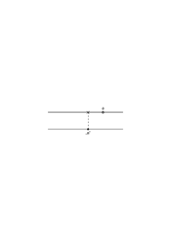

# Ms-102

### [IIr\[1\]](https://cdn.wittgensteinnachlass.com/2000px/webp/Ms-102/IIr.webp)

Nach meinem Tode an meine Mutter zu schicken.

Für Hon. B. Russell

Trinity College _Cambridge_

_England_

### [1v\[1\]](https://cdn.wittgensteinnachlass.com/2000px/webp/Ms-102/1v.webp)

30.10.1914

(Abends) Erhielt soeben liebe Post. Eine sehr liebe Karte von Frege! Eine von Trakl & Ficker! Mama, Klara, Frau Klingenberg. Dies hat mich sehr gefreut. Sehr viel gearbeitet. —.

### [1v\[2\]](https://cdn.wittgensteinnachlass.com/2000px/webp/Ms-102/1v.webp),[2v\[1\]](https://cdn.wittgensteinnachlass.com/2000px/webp/Ms-102/2v.webp)

31.10.1914

Heute früh weiter gegen Krakau. Den ganzen Tag gearbeitet. Habe das Problem _verzweifelt_ gestürmt! Aber ich will eher mein Blut vor dieser Festung lassen ehe ich unverrichteter Dinge abziehe. Die größte Schwierigkeit ist die einmal eroberten Forts zu halten bis man ruhig in ihnen sitzen kann. Und bis nicht die _Stadt_ gefallen ist kann man _nicht_ für immer ruhig in einem der Forts sitzen. —.

Heute nacht habe ich Wache und bin leider schon durch das intensive Arbeiten _sehr_ müde. Meine Arbeit noch immer ohne Erfolg! Nur zu! —. Stehen heute nacht in Szczucin. —.

### [2v\[2\]](https://cdn.wittgensteinnachlass.com/2000px/webp/Ms-102/2v.webp),[3v\[1\]](https://cdn.wittgensteinnachlass.com/2000px/webp/Ms-102/3v.webp)

01.11.1914

Vormitt. weiter gegen Krakau. Während des Wachdienstes heute nacht gearbeitet, auch heute sehr viel und noch immer erfolglos. Bin aber nicht mutlos weil ich _das Hauptproblem_ immer im Auge habe. —. Trakl liegt im Garnisonsspital in Krakau und bittet mich ihn zu besuchen. Wie gerne möchte ich ihn kennen lernen! Hoffentlich treffe ich ihn wenn ich nach Krakau komme! Vielleicht wäre es mir eine große Stärkung. —.

### [3v\[2\]](https://cdn.wittgensteinnachlass.com/2000px/webp/Ms-102/3v.webp)

02.11.1914

Früh weiter gegen Krakau. Bin wieder sinnlicher. Gegen abend wieder am Sand stecken geblieben. Es ist bitter kalt. Es ist wirklich ein Glück daß man sich selbst hat & immer zu sich flüchten kann. Viel gearb. Die Gnade der Arbeit!! —.

### [3v\[3\]](https://cdn.wittgensteinnachlass.com/2000px/webp/Ms-102/3v.webp),[4v\[1\]](https://cdn.wittgensteinnachlass.com/2000px/webp/Ms-102/4v.webp)

03.11.1914

Früh weiter gegen Krakau. Höre daß die Russen wieder vorgerückt sind und 20 km. von Opakowiz stehen; wir stehen 10 km. von dort. —. Was wird jetzt mit mir geschehen wenn ich nahe Krakau komme?!? Fast den ganzen Tag gearbeitet. —. Werden wahrscheinlich heute nacht fahren. Hören Kanonendonner & sehen den Blitz. —! —.

### [4v\[2\]](https://cdn.wittgensteinnachlass.com/2000px/webp/Ms-102/4v.webp),[5v\[1\]](https://cdn.wittgensteinnachlass.com/2000px/webp/Ms-102/5v.webp)

04.11.1914

Ruhige Nacht. Früh weiter. Sehr viel gearb.. Morgen sollen wir in Krakau sein. Höre daß wir wahrscheinlich eine Belagerung von Krakau zu erwarten haben. Da werde ich viel Kraft brauchen um den Geist zu bewahren. ——. Häng nur nicht von der äußeren Welt ab dann brauchst du dich vor dem was in ihr geschieht nicht zu fürchten. Heute nacht Wachdienst. Es ist leichter von Dingen als von Menschen unabhängig zu sein. Aber auch das muß man können! —.

### [5v\[2\]](https://cdn.wittgensteinnachlass.com/2000px/webp/Ms-102/5v.webp),[6v\[1\]](https://cdn.wittgensteinnachlass.com/2000px/webp/Ms-102/6v.webp)

05.11.1914

Früh weiter nach Krakau wo wir spät abends ankommen sollen. Bin sehr gespannt ob ich Trakl treffen werde. Ich hoffe es sehr. Ich vermisse sehr einen Menschen mit dem ich mich ein wenig ausreden kann. Es wird auch ohne einen solchen gehen müssen. Aber es würde mich sehr stärken. Den ganzen Tag etwas müde & zur Depression geneigt. Nicht sehr viel gearbeitet. In Krakau. Es ist schon zu spät Trakl heute noch zu besuchen. —. Möge der Geist mir Kraft geben. —

### [6v\[2\]](https://cdn.wittgensteinnachlass.com/2000px/webp/Ms-102/6v.webp)

06.11.1914

Früh in die Stadt zum Garnisonsspital. Erfuhr dort daß Trakl vor wenigen Tagen gestorben ist! Dies traf mich _sehr_ stark. Wie traurig, wie traurig!!! Ich schrieb darüber sofort an Ficker. Besorgungen gemacht & dann gegen 6' Uhr aufs Schiff gekommen. Nicht gearbeitet. Der arme Trakl! —! Dein Wille geschehe. —

### [6v\[3\]](https://cdn.wittgensteinnachlass.com/2000px/webp/Ms-102/6v.webp),[7v\[1\]](https://cdn.wittgensteinnachlass.com/2000px/webp/Ms-102/7v.webp)

07.11.1914

Gestern um neun Uhr abends kam plötzlich der Befehl für eine Arbeit an einem anderen Schiff mit dem Scheinwerfer zu leuchten. Also aus dem Bett heraus und bis 3½ früh geleuchtet. Bin in Folge dessen sehr müde. Nachmittag in der Stadt auf Besorgungen. Die Belagerung von Krakau wird jetzt mit aller Bestimmtheit erwartet. Ich will trachten von diesem Schiff wegzukommen. Nicht gearbeitet. Ich sehne mich nach einem anständigen Menschen denn hier bin ich _von Unanständigkeit umringt._ Möge der Geist mich nicht verlassen und in mir beständiger werden. ——.

### [8v\[1\]](https://cdn.wittgensteinnachlass.com/2000px/webp/Ms-102/8v.webp)

08.11.1914

Bin nicht recht zum Arbeiten gestimmt. Lese viel. Heute nacht Wachdienst. Fast nichts gearbeitet. Bin etwas über meine Zukunft besorgt. —.

### [8v\[2\]](https://cdn.wittgensteinnachlass.com/2000px/webp/Ms-102/8v.webp),[9v\[1\]](https://cdn.wittgensteinnachlass.com/2000px/webp/Ms-102/9v.webp),[10v\[1\]](https://cdn.wittgensteinnachlass.com/2000px/webp/Ms-102/10v.webp)

08.11.1914

Belauschte eben ein Gespräch unseres Kommandanten mit einem anderen Offizier: Was für gemeine Stimmen. Die ganze Schlechtigkeit der Welt kreischt & krächzt aus ihnen heraus. Gemeinheit wo ich hinsehe. _Kein_ fühlendes Herz soweit mein Auge reicht!!! —— Erhalte eine _sehr_ liebe Karte von Onkel Paul. So eine Karte sollte mich erfrischen & stärken aber ich bin in den letzten Tagen _deprimierbar!_! Ich habe an nichts eine rechte Freude. Und ich lebe in Angst vor der Zukunft! Weil ich nicht mehr in mir ruhe. Jede Unanständigkeit meiner Umgebung – und solche gibt es immer – verwundet mich im Innersten und ehe eine Wunde verheilt kommt eine frische! Selbst dann wenn – wie jetzt, abends – ich nicht deprimiert bin, fühle ich mich doch nicht so recht frei. Ich habe nur selten & dann ganz vorübergehende Lust zum Arbeiten. Da ich nicht zu einem behaglichen Gefühle kommen kann. Ich fühle mich abhängig von der Welt & muß sie daher auch dann fürchten wenn augenblicklich mir nichts Schlechtes widerfährt. Ich sehe mich selbst, das Ich worin ich sicher ruhen konnte wie ein ersehntes fernes Eiland das von mir gewichen ist. – Die Russen rücken schnell gegen Krakau vor. Die ganze Zivilbevölkerung muß die Stadt verlassen. Es sieht mit unserer Sache sehr schlecht aus! _Gott steh mir bei_!!! Ein wenig gearbeitet.

### [10v\[2\]](https://cdn.wittgensteinnachlass.com/2000px/webp/Ms-102/10v.webp),[11v\[1\]](https://cdn.wittgensteinnachlass.com/2000px/webp/Ms-102/11v.webp)

10.11.1914

Wieder mehr gearbeitet. Und besserer Stimmung. Erfuhr heute daß ich über die Schweiz nach England schreiben könne; gleich morgen werde ich an David & vielleicht an Russell schreiben. Oder vielleicht schon heute. – Ich hoffe jetzt wieder besser arbeiten zu können! —!!

### [11v\[2\]](https://cdn.wittgensteinnachlass.com/2000px/webp/Ms-102/11v.webp),[12v\[1\]](https://cdn.wittgensteinnachlass.com/2000px/webp/Ms-102/12v.webp)

11.11.1914

Netten Brief von Ficker. Ziemlich viel gearbeitet. Wir hörten schon Kanonendonner von den Werken! Habe einen Brief an David abgeschickt. Wie oft ich an ihn denke! Ob er halb so viel an mich denkt? (?) Heute besserer Stimmung. —!

### [12v\[2\]](https://cdn.wittgensteinnachlass.com/2000px/webp/Ms-102/12v.webp),[13v\[1\]](https://cdn.wittgensteinnachlass.com/2000px/webp/Ms-102/13v.webp)

12.11.1914

Nur sich selbst nicht verlieren!!! Sammle dich! Und arbeite nicht zum Zeitvertreib sondern fromm um zu leben! Tue keinem ein Unrecht! — Es wird von einer 6-7 monatlichen Belagerung gesprochen! Alle Geschäfte sind geschlossen & öffnen nur auf ganz kurze Zeit. Je ernster die Lage wird desto roher werden die Unteroffiziere. Denn sie fühlen daß sie jetzt ungestraft ihre ganze Gemeinheit entladen können da jetzt die Offiziere den Kopf verlieren & im guten Sinn keine Kontrolle mehr ausüben. Jedes Wort was man jetzt hört ist eine Grobheit. Denn die Anständigkeit lohnt sich auf keine Weise mehr und die Leute geben daher auch das bißchen preis was sie etwa noch besitzen. Es ist alles tief traurig. Nachmitt. in der Stadt. Ziemlich viel gearbeitet _aber ohne rechte Klarheit des Sehens_! Ob ich noch weiter werde arbeiten können?(!) Ob der Vorhang schon fällt?? Es wäre merkwürdig da ich in mitten eines Problems stecke, in mitten einer Belagerung. —. —!

### [13v\[2\]](https://cdn.wittgensteinnachlass.com/2000px/webp/Ms-102/13v.webp),[14v\[1\]](https://cdn.wittgensteinnachlass.com/2000px/webp/Ms-102/14v.webp),[15v\[1\]](https://cdn.wittgensteinnachlass.com/2000px/webp/Ms-102/15v.webp)

13.11.1914

Den ganzen Vormittag habe ich mich vergebens bemüht zu arbeiten. Das klare Sehen will sich nicht einstellen. Denke viel über mein Leben nach und dies ist auch ein Grund weshalb ich nicht arbeiten kann. Oder ist es umgekehrt? Ich glaube jetzt daß ich mich noch immer nicht genug von den anderen am Schiff abschließe. Ich kann mit ihnen nicht verkehren da mir die gewisse Gemeinheit fehlt die dazu nötig ist. Aber auf ganz unbegreiflicher Weise fällt mir dies Abschließen nicht leicht. Nicht daß ich mich zu irgend einem Menschen im geringsten hingezogen fühlte. Aber die Gewohnheit mit Menschen freundlich zu reden ist so stark! Heute nacht Dienst. Gehe jetzt jeden Abend in ein Kaffeehaus & trinke 2 Gläser Kaffee; & die wohlanständige Atmosphäre tut mir gut. _Wenig_ gearbeitet! —! Gott gebe mir Vernunft & Kraft!!! —.

### [15v\[2\]](https://cdn.wittgensteinnachlass.com/2000px/webp/Ms-102/15v.webp),[16v\[1\]](https://cdn.wittgensteinnachlass.com/2000px/webp/Ms-102/16v.webp)

14.11.1914

Nachts auf der Wache fast die ganze Zeit Vorschriften für mein Leben mir ausgedacht daß es halbwegs erträglich werde. Bin grundlos deprimiert, d.h. es fehlt mir zum mindesten jede Lebensfreude. Und jedes laute Wort das ich höre tut mir weh. Ganz ohne Grund!! — Auch gearbeitet habe ich heute nacht am Posten. — Als eine _Gnade_ muß ich es noch betrachten daß ich in meiner Kammer ruhig sitzen kann & so doch Gelegenheit habe mich etwas zu sammeln. — Sehr wenig gearbeitet. Tagsüber sehr müde, wie jetzt leider oft! Nachmitt. verging die starke Depression aber ich war _zu_ müde zum Arbeiten. Abends wie gewöhnlich aus. —!

### [16v\[2\]](https://cdn.wittgensteinnachlass.com/2000px/webp/Ms-102/16v.webp)

15.11.1914

Lese jetzt in Emersons Essays. Vielleicht werden sie einen guten Einfluß auf mich haben. Ziemlich gearbeitet. —.

### [16v\[3\]](https://cdn.wittgensteinnachlass.com/2000px/webp/Ms-102/16v.webp),[17v\[1\]](https://cdn.wittgensteinnachlass.com/2000px/webp/Ms-102/17v.webp),[18v\[1\]](https://cdn.wittgensteinnachlass.com/2000px/webp/Ms-102/18v.webp)

16.11.1914

Es wird Winter. — Gestern erhielt ich von Ficker eine freundliche Karte. Es ist dann die Rede daß die Schiffsmannschaft von hier wegkommt da die Schiffe über Winter nicht zu verwenden sind.

Was wird dann mit mir werden?? Wir hören starken Geschützdonner von den Werken. Nicht viel gearbeitet. Abends in der Stadt. Wieder keine Klarheit des Sehens obwohl ich ganz offenbar vor der Lösung der tiefsten Fragen stehe daß ich mir fast die Nase daran stoße!!! Mein Geist ist eben jetzt dafür einfach blind! Ich fühle daß ich _an dem Tor **daran**_ stehe kann es aber nicht klar genug sehen um es öffnen zu können. Dies ist ein ungemein merkwürdiger Zustand den ich noch nie so klar empfunden habe als jetzt. —! —!

### [18v\[2\]](https://cdn.wittgensteinnachlass.com/2000px/webp/Ms-102/18v.webp),[19v\[1\]](https://cdn.wittgensteinnachlass.com/2000px/webp/Ms-102/19v.webp),[20v\[1\]](https://cdn.wittgensteinnachlass.com/2000px/webp/Ms-102/20v.webp)

17.11.1914

_Wie schwer_ es ist sich nicht mit den Leuten zu ärgern! _Wie schwer_ es ist zu dulden. Vormitt. alles Mögliche zu verrichten gehabt & nicht zum Arbeiten gekommen. Wenn immer ich bei der Arbeit mit den Leuten hier in Berührung komme wird mir ihre Gemeinheit so fürchterlich daß die Wut droht in mir zu siegen & auszubrechen. _Immer wieder_ nehme ich mir vor ruhig zu dulden & _immer_ wieder breche ich meinen Vorsatz. Und wie dies kommt weiß ich eigentlich selber nicht. Es ist so riesig schwer mit Leuten zu arbeiten & dabei doch _nichts_ mit ihnen zu tun zu haben. Immer wieder muß man zu ihnen reden, sie etwas fragen, sie antworten frech & ungenügend – welcher Kraftaufwand schon, dies hinzunehmen – du brauchst aber die Antwort. Es kommt ein unklarer Befehl, etc., etc., etc. Und die Nerven sind ohnehin schon ruiniert. Da ist es schwer zu leben wenn man nicht versteht es sich ganz leicht zu machen. Nachmitt. faßte mich eine schwere Depression an. Wie ein Stein liegt es auf meiner Brust. Jede Pflicht wird zur unerträglichen Bürde. Gegen Abend legte sich mein Übelbefinden. In meine Seele kehrte etwas Mut zurück. Fast nicht gearbeitet. Untertags, wie jetzt schon oft, war keine Stimmung, erst abends genügende innere Ruhe! Ob das davon kommt daß ich am Abend mich auf den Schlaf freue? – Ja, die heutige Depression war furchtbar!!! —.

### [20v\[2\]](https://cdn.wittgensteinnachlass.com/2000px/webp/Ms-102/20v.webp),[21v\[1\]](https://cdn.wittgensteinnachlass.com/2000px/webp/Ms-102/21v.webp)

18.11.1914

Starker Donner von den Werken. Es heißt daß wir in den nächsten Tagen wieder fahren sollen. Unser Kommandant kommt weg & der Leutnant Molé wieder an seine Stelle. Dies freut mich. Man hört Maschinengewehrfeuer. Den ganzen Tag _heftiger_ Geschützdonner von den Werken. – Ziemlich viel gearbeitet. Guter Stimmung. Trage mich mit dem Plan mich versetzen zu lassen kann aber nicht mit mir in's reine darüber kommen. In meiner Arbeit ist ein Stillstand eingetreten da ich wieder einen bedeutenden Einfall brauchte um vorwärts zu kommen. — ——.

### [22v\[1\]](https://cdn.wittgensteinnachlass.com/2000px/webp/Ms-102/22v.webp)

19.11.1914

Es schneit. Wie jetzt oft, früh in gedrückter Stimmung. Den ganzen Vormittag für's Schiff gearb.. Nachmittag erwartet man den Besuch eines General's. Alles deshalb schon jetzt in Aufregung. Gegen Abend etwas gearbeitet. Wieder heftige Kämpfe um Krakau. —.

### [22v\[2\]](https://cdn.wittgensteinnachlass.com/2000px/webp/Ms-102/22v.webp),[23v\[1\]](https://cdn.wittgensteinnachlass.com/2000px/webp/Ms-102/23v.webp)

20.11.1914

Starke Kanonade. —. Etwas gearbeitet. Heute nacht Wache. Nachmittags beim Augenarzt weil ich beim Wachdienst unter meinen schlechten Augen leide. Werde Brillen bekommen. Meine Zukunft ist noch immer ganz ungewiß. Morgen werde ich vielleicht mit unserem Kommandanten darüber reden was mit mir geschehen soll. —.

### [23v\[2\]](https://cdn.wittgensteinnachlass.com/2000px/webp/Ms-102/23v.webp)

21.11.1914

Anhaltende Kanonade. Große Kälte. Fast ununterbrochener Donner von den Werken. Ziemlich gearbeitet. Aber noch immer kann ich _das eine erlösende Wort_ nicht aussprechen. Ich gehe rund um es herum & ganz nahe aber noch konnte ich es nicht selber erfassen!! Über meine Zukunft immer ein wenig besorgt, weil ich nicht ganz in mir ruhe! — ! ——.

### [23v\[3\]](https://cdn.wittgensteinnachlass.com/2000px/webp/Ms-102/23v.webp),[24v\[1\]](https://cdn.wittgensteinnachlass.com/2000px/webp/Ms-102/24v.webp)

22.11.1914

Grimmige Kälte! Auf der Weichsel schwimmt Eis. Fortwährend Geschützdonner. Keinen rechten Einfall gehabt & recht müde daher wenig gearbeitet. Das erlösende Wort nicht ausgesprochen. Gestern lag es mir einmal ganz auf der Zunge. Dann aber gleitet es wieder zurück —. Bin mittelmäßiger Stimmung. Ich will bald schlafen gehen. ——.

### [24v\[2\]](https://cdn.wittgensteinnachlass.com/2000px/webp/Ms-102/24v.webp),[25v\[1\]](https://cdn.wittgensteinnachlass.com/2000px/webp/Ms-102/25v.webp),[26v\[1\]](https://cdn.wittgensteinnachlass.com/2000px/webp/Ms-102/26v.webp)

23.11.1914

Anhaltender Donner. —. Höre gerade daß ein Telegramm gekommen ist: „Wassertransport eingestellt.”. Also muß sich bald entscheiden was aus uns wird. — Mein Tag vergeht jetzt in Lesen etwas Arbeiten wobei ich natürlich immer bei mir in der Kabine sitze. Jeden 4ten-5ten Tag Wachdienst; hie & da Kartoffelschälen, Kohlen tragen und dergleichen. Außer dem Wachdienst habe ich keine _bestimmte_ Arbeit (der Scheinwerfer wird seit 1½ Monaten fast nicht mehr gebraucht). Ich fühle mich daher unter den Leuten als Faulpelz und auch in meiner vielen freien Zeit komme ich nicht recht zur Ruhe da ich fühle ich sollte für das Schiff arbeiten aber doch nicht weiß was. Das Beste wäre für mich eine regelmäßige Arbeit die ich leicht vollbringen könnte & sicher. Denn eine Arbeit der man nicht gewachsen ist ist das Ärgste. Ich werde heute trachten mit unserem Kommandanten über eine eventuelle Versetzung zu sprechen. Dies ist geschehen & ich darf hoffen daß ich von hier versetzt werden werde. Ziemlich gearbeitet aber immer noch ohne Erfolg. Abends im Bad. ——.

### [26v\[2\]](https://cdn.wittgensteinnachlass.com/2000px/webp/Ms-102/26v.webp),[27v\[1\]](https://cdn.wittgensteinnachlass.com/2000px/webp/Ms-102/27v.webp)

24.11.1914

_Grimmige_ Kälte! Die Weichsel ist mit treibendem Eis ganz bedeckt. Fahren heute in den Hafen ein. Wenn ich nur schon von hier fort wäre! Hier ist eine immerwährende Unruhe & niemand weiß was er tun soll. Die Unteroffiziere werden immer gemeiner & einer steckt darin den anderen an & ermutigt ihn zu immer größerer Frechheit. Es gibt freilich auch Ausnahmen. Heute nacht Wachdienst. Kein Wachdienst. _Viel_ gearbeitet. Immer wieder liegt mir die fehlende Erkenntnis auf der Zunge. Dies ist gut. Ficker sandte mir heute Gedichte des armen Trakl die ich für genial halte ohne sie zu verstehen. Sie taten mir wohl. Gott mit mir! —.

### [27v\[2\]](https://cdn.wittgensteinnachlass.com/2000px/webp/Ms-102/27v.webp),[28v\[1\]](https://cdn.wittgensteinnachlass.com/2000px/webp/Ms-102/28v.webp)

25.11.1914

Stehen seit gestern nachmitt. im Hafen. Die Aborte des Schiffs sind gesperrt! Und man muß weit laufen bis zu einer halboffenen Latrine. Es ist sehr kalt. Die Lebensweise wird immer unerträglicher. Nicht viel gearbeitet. Nur fort von hier! —.

### [28v\[2\]](https://cdn.wittgensteinnachlass.com/2000px/webp/Ms-102/28v.webp),[29v\[1\]](https://cdn.wittgensteinnachlass.com/2000px/webp/Ms-102/29v.webp),[30v\[1\]](https://cdn.wittgensteinnachlass.com/2000px/webp/Ms-102/30v.webp)

26.11.1914

Wenn man fühlt daß man bei einem Problem stockt so darf man nicht mehr darüber nachdenken sonst bleibt man daran kleben. Sondern man muß irgendwo anfangen zu denken wo man ganz gemütlich sitzen kann. Nur nicht drücken! Die harten Probleme müssen sich alle von selbst vor uns auflösen. Starker Kanonendonner.

Was ich auch tue, die Probleme ballen sich wie Gewitterwolken zusammen und ich bin nicht im Stande einen dauernd befriedigenden Standpunkt ihnen gegenüber einzunehmen. Sehr viel gearbeitet aber ohne die Lage irgendwie klären zu können. Vielmehr wo ich immer denke überall treffe ich Fragen die ich nicht beantworten kann. Heute war es mir als sei es nun mit meiner Fruchtbarkeit zu Ende. Der ganze Gegenstand schien wieder in die Ferne zu rücken. Und freilich: meine 3-4 Monate sind um. Und leider ohne ein wirklich großes Resultat! Aber wir werden ja sehen. —. Es heißt jetzt daß wir Winterquartiere beziehen sollen und wenn dies geschieht werde ich vielleicht mit allen Leuten zusammen schlafen müssen; was Gott verhüte!! —

Möchte in jedem Fall die Geistesgegenwart nicht verlieren! Gott mit mir. ——. ———.

### [30v\[2\]](https://cdn.wittgensteinnachlass.com/2000px/webp/Ms-102/30v.webp)

27.11.1914

Heute Wache. ——.

### [30v\[3\]](https://cdn.wittgensteinnachlass.com/2000px/webp/Ms-102/30v.webp),[31v\[1\]](https://cdn.wittgensteinnachlass.com/2000px/webp/Ms-102/31v.webp)

28.11.1914

Gestern sehr viel gearbeitet. Von gestern mittag bis heute mittag im Wachzimmer mit 7 Leuten & am Posten. Fühlte mich – besonders heute sehr unglücklich. Betreibe mit allen Mitteln meine Versetzung. Ich glaube daß ich in der Umgebung dieser rohen & gemeinen Menschen die durch keine Gefahr gezähmt sind elend umkommen _muß_ wenn nicht ein Wunder für mich geschieht das mir viel mehr Kraft & Weisheit gibt als ich jetzt habe! Ja, ein _Wunder_ müßte für mich geschehen wenn ich es überleben soll! Bin in Angst wegen meiner Zukunft. Wenig gearbeitet. Ein Wunder! Ein Wunder! ——.

### [31v\[2\]](https://cdn.wittgensteinnachlass.com/2000px/webp/Ms-102/31v.webp)

29.11.1914

Ziemlich viel gearbeitet. ——.

### [31v\[3\]](https://cdn.wittgensteinnachlass.com/2000px/webp/Ms-102/31v.webp),[32v\[1\]](https://cdn.wittgensteinnachlass.com/2000px/webp/Ms-102/32v.webp),[33v\[1\]](https://cdn.wittgensteinnachlass.com/2000px/webp/Ms-102/33v.webp)

30.11.1914

Früh am Korpskommando. Mit unserem Kommandanten wegen mir gesprochen: Wenn ich versetzt werde so muß ich zurück zum Kader kommen. Im Falle wir Winterquartiere beziehen wird er dafür sorgen daß ich ein eigenes Zimmer kriege. In der nächsten Zeit aber soll der Scheinwerfer wieder gebraucht werden & ich solle doch daher hier bleiben. —— Jetzt abends wie ich aus der Stadt komme ist hier großer Lärm weil ein Schiff von hier wegfahren soll. Es ist auch die Rede davon daß der Scheinwerfer mitkommt. ——. Dies wäre mir recht unangenehm. So können unsere Pläne jeden Augenblick durchkreuzt werden & ich muß einen anderen Halt haben um _doch_ leben zu können. – War heute nachmitt. beim Kader & sprach mit einem Feuerwerker darüber ob es nicht möglich wäre daß ich in die Ballonabteilung käme. Er sagte ich solle hierüber mit einem Feuerwerker Vlcek dieser Abteilung sprechen. Dies werde ich hoffentlich tun können! —. Nicht viel gearbeitet aber nicht ohne Anregung. Wieder etwas sinnlich. Nur dem eigenen Geist leben! und alles Gott überlassen! —.

### [33v\[2\]](https://cdn.wittgensteinnachlass.com/2000px/webp/Ms-102/33v.webp),[34v\[1\]](https://cdn.wittgensteinnachlass.com/2000px/webp/Ms-102/34v.webp),[35v\[1\]](https://cdn.wittgensteinnachlass.com/2000px/webp/Ms-102/35v.webp)

01.12.1914

Also schon Dezember! und noch immer keine Rede von Frieden! Heute nacht heftiger Geschützdonner, man hörte die Geschosse sausen. — Gestern Abend ist ein Schiff die Weichsel hinunter gefahren und jeden Tag hat eine andere Besatzung darauf Wache z.B. morgen _wir_! Wie wird es mir ergehen?! Mit diesen Kameraden & diesen Vorgesetzten! — —. Nachmitt. den Feuerwerker Vlcek suchen gegangen, nicht gefunden. Wurde an die Artilleriestabsabteilung gewiesen. Werde wohl übermorgen nach der Wache dorthin gehen. Sehr wenig gearbeitet. Der Geist beschütze mich was immer geschehe! —.

### [35v\[2\]](https://cdn.wittgensteinnachlass.com/2000px/webp/Ms-102/35v.webp)

02.12.1914

Heute mittag gehen wir auf Wache. Gott sei Dank geht unser Kommandant mit so daß wenigstens _ein_ anständiger Mensch dabei ist. Nachts furchtbarer Donner von den Werken. Und jetzt um 8 Uhr früh fängt er wieder an. Heute nacht müssen wir im Freien schlafen. Ich werde wohl nicht zum Arbeiten kommen; nur Gott nicht vergessen. ——.

### [35v\[3\]](https://cdn.wittgensteinnachlass.com/2000px/webp/Ms-102/35v.webp)

03.12.1914

Nichts gearbeitet aber viel erlebt, bin aber jetzt zu müde es einzutragen. —

### [36v\[1\]](https://cdn.wittgensteinnachlass.com/2000px/webp/Ms-102/36v.webp),[37v\[1\]](https://cdn.wittgensteinnachlass.com/2000px/webp/Ms-102/37v.webp)

04.12.1914

Vorgestern auf der Wacht ereignete sich nichts Besonderes außer daß ich einmal laufend zu Boden fiel und noch heute hinken muß. Von allen Seiten heftigster Kanonendonner. Gewehrfeuer, Brände etc. Gestern abend auf dem Festungskommando wegen meiner Angelegenheit. Ein Oberleutnant als er hörte daß ich Mathematik studiert habe sagte ich solle zu ihm (in eine Fabrik) kommen. Er scheint _sehr_ nett zu sein. Ich willigte ein und wurde heute von diesem Schiff abkommandiert. Ich habe viel Hoffnung. —. Geschützdonner in nächster Nähe. Nachmitt. in der Stadt. Wenig gearbeitet. War den ganzen Tag über etwas müde da ich auch in der letzten Nacht sehr wenig geschlafen habe. Früh zu Bett! —.

### [37v\[2\]](https://cdn.wittgensteinnachlass.com/2000px/webp/Ms-102/37v.webp)

05.12.1914

Morgen oder übermorgen gehe ich von hier weg. Wo ich wohnen werde ist noch nicht bestimmt. In keinem Fall will ich von solchen Sachen abhängen. Nicht viel gearbeitet; doch stehe ich nicht still. Denke _viel_ an den _lieben_ David! Gott behüte ihn! und mich! —.

### [38v\[1\]](https://cdn.wittgensteinnachlass.com/2000px/webp/Ms-102/38v.webp)

06.12.1914

Nachts feuerten die Kanonen ganz in der Nähe daß das Schiff zitterte. Viel gearbeitet & mit Erfolg. Noch nicht erfahren wann ich von dem Schiff wegkomme. Morgen hat dieses Schiff wieder Feldwache & wenn ich nicht morgen abberufen werde so werde ich mitgehen müssen was mir sehr unangenehm ist weil mein Bein noch immer nicht von dem Sturz geheilt ist. Es regnet & die Lehmwege hier sind furchtbar schlecht zu gehen. Der Geist beschütze mich! —.

### [38v\[2\]](https://cdn.wittgensteinnachlass.com/2000px/webp/Ms-102/38v.webp),[39v\[1\]](https://cdn.wittgensteinnachlass.com/2000px/webp/Ms-102/39v.webp)

07.12.1914

Mein Bein schlechter geworden. Werde wohl nicht mit auf Wache gehen. Meine Übersiedelung betreffend ist noch kein Befehl gekommen. Starker Donner in der Nähe. —. Erfahre soeben daß ich morgen von hier abgehen werde. Kann meines Fußes wegen nicht auf Wache gehen. Nicht viel gearbeitet. Mit unserem Kommandanten gesprochen, er war _sehr_ nett. Bin müde. Alles in Gottes Hand. —.

### [39v\[2\]](https://cdn.wittgensteinnachlass.com/2000px/webp/Ms-102/39v.webp),[40v\[1\]](https://cdn.wittgensteinnachlass.com/2000px/webp/Ms-102/40v.webp),[41v\[1\]](https://cdn.wittgensteinnachlass.com/2000px/webp/Ms-102/41v.webp)

08.12.1914

Vormitt. bei der „Marodenvisite” wegen meines Fußes: Muskelzerrung. Nicht viel gearbeitet. Nietzsche Band 8 gekauft & darin gelesen. Bin stark berührt von seiner Feindschaft gegen das Christentum. Denn auch in seinen Schriften ist etwas Wahrheit enthalten. Gewiß, das Christentum ist der einzige _sichere_ Weg zum Glück; aber wie wenn einer dies Glück verschmähte?! Könnte es nicht besser sein, unglücklich, im hoffnungslosen Kampf gegen die äußere Welt zu Grunde zu gehen? Aber ein solches Leben ist sinnlos. Aber warum nicht ein sinnloses Leben führen? Ist es unwürdig? – Wie verträgt es sich mit dem streng solipsistischen Standpunkt? Was muß ich aber tun daß mein Leben mir nicht verloren geht? Ich muß mir seiner immer – des Geistes immer – bewußt sein. —.

### [41v\[2\]](https://cdn.wittgensteinnachlass.com/2000px/webp/Ms-102/41v.webp)

09.12.1914

Vormitt. am Korpskommando & meinen Verpflegszettel geholt. Nicht gearb.. Sehr viel erlebt aber zu müde es einzutragen. ——.

### [41v\[3\]](https://cdn.wittgensteinnachlass.com/2000px/webp/Ms-102/41v.webp),[42v\[1\]](https://cdn.wittgensteinnachlass.com/2000px/webp/Ms-102/42v.webp),[43v\[1\]](https://cdn.wittgensteinnachlass.com/2000px/webp/Ms-102/43v.webp)

10.12.1914

Gestern nachmittag in die Kanzelei zu meinem neuen Chef mußte lange auf ihn warten. Endlich kam er & gab mir sofort eine Arbeit ich mußte eine Liste von Motorwägen in einer Kaserne hier zusammenstellen. Zugleich lud er mich für 8 Uhr abends zu sich in die Wohnung ein: ein Hauptmann sei dort dem er von mir erzählt habe & der mich sehen möchte. Kam zu ihm & fand 4 Offiziere bei ihm mit denen ich nachtmahlte. Der Hauptmann ist ein unendlich sympathischer Mann (auch alle anderen waren riesig liebenswürdig). Wir sprachen bis 10½ & schieden ungemein herzlich. — Heute früh Wohnung gesucht & gefunden. Von 10 bis abends 5 im Bureau, dann meine Sachen vom Schiff hierher in die neue Wohnung getragen: ein ganz nettes nicht kleines Zimmer. Seit 4 Monaten zum ersten Mal allein in einem wirklichen Zimmer!! Ich _genieße_ diesen Luxus: Nicht zum Arbeiten gekommen. Aber es wird jetzt schon werden. Bin sehr müde da ich _sehr_ viel herum gerannt bin. Welche Gnade wieder in einem Bett schlafen zu dürfen! Welche Gnade der Tatsache. —. —.

### [43v\[2\]](https://cdn.wittgensteinnachlass.com/2000px/webp/Ms-102/43v.webp)

11.12.1914

Vormitt. in der Kanzelei & geschrieben. Nicht zum Arbeiten gekommen. Ganzen Tag Kanzlei. Oberleutnant außerordentlich lieb. Nicht zum Arbeiten gekommen.

### [43v\[3\]](https://cdn.wittgensteinnachlass.com/2000px/webp/Ms-102/43v.webp),[44v\[1\]](https://cdn.wittgensteinnachlass.com/2000px/webp/Ms-102/44v.webp)

12.12.1914

Ein wenig gearbeitet. War den ganzen Tag in der Kanzlei hatte aber nicht viel zu tun. Hoffe morgen mehr zu arbeiten. Gebadet. —.

### [44v\[2\]](https://cdn.wittgensteinnachlass.com/2000px/webp/Ms-102/44v.webp)

13.12.1914

Ganzen Tag Kanzelei. _Meine Gedanken sind **lahm**_. Ich habe Muskelschmerzen im Bein & es ist als ob auch mein Gehirn _hinkte_. Doch etwas gearbeitet. Noch immer keine Antwort von David! Ob er meinen Brief erhalten hat? Ob er den Krieg persönlicher auffaßt als ich?! — Lebe nur der Geist! Er ist der sichere Hafen geschützt abseits vom trostlosen unendlichen grauen Meer des Geschehens. —.

### [44v\[3\]](https://cdn.wittgensteinnachlass.com/2000px/webp/Ms-102/44v.webp),[45v\[1\]](https://cdn.wittgensteinnachlass.com/2000px/webp/Ms-102/45v.webp)

14.12.1914

Ganzen Tag Kanzlei. Nicht gearbeitet. Es wird aber schon wieder werden! Liebe Sendung von der Jolles. —.

### [45v\[2\]](https://cdn.wittgensteinnachlass.com/2000px/webp/Ms-102/45v.webp)

15.12.1914

Ganzen Tag Kanzlei. Etwas gearbeitet. Aber meine Gedanken sind so wie in der Eisenbahn oder auf dem Schiff wo man auch in der selben Weise schwerfällig denkt.

### [45v\[3\]](https://cdn.wittgensteinnachlass.com/2000px/webp/Ms-102/45v.webp)

16.12.1914

Ganzen Tag Kanzelei. Hörte daß wir wahrscheinlich bald nach Lodz übersiedeln! Etwas gearbeitet aber ohne wirklichen Animo.

### [45v\[4\]](https://cdn.wittgensteinnachlass.com/2000px/webp/Ms-102/45v.webp)

17.12.1914

Ganzen Tag Kanzlei. Nicht gearbeitet. Mich viel geärgert. — Sehr wenig freie Zeit. ——.

### [46v\[1\]](https://cdn.wittgensteinnachlass.com/2000px/webp/Ms-102/46v.webp)

18.12.1914

Wie gewöhnlich. Nicht gearbeitet.

### [46v\[2\]](https://cdn.wittgensteinnachlass.com/2000px/webp/Ms-102/46v.webp)

19.12.1914

Ein wenig gearbeitet. —.

### [46v\[3\]](https://cdn.wittgensteinnachlass.com/2000px/webp/Ms-102/46v.webp)

20.12.1914

Ein wenig gearbeitet. Bis fast 5 in der Kanzlei dann in die Stadt. Das angenehme Gefühl eines kleinen kalten Laufens den Rücken hinunter wenn man sich bei guter Stimmung seiner Einsamkeit bewußt wird. —.

### [46v\[4\]](https://cdn.wittgensteinnachlass.com/2000px/webp/Ms-102/46v.webp)

21.12.1914

Brief von David!! Ich habe ihn geküßt. Antwortete gleich. Ein wenig gearbeitet. —.

### [46v\[5\]](https://cdn.wittgensteinnachlass.com/2000px/webp/Ms-102/46v.webp),[47v\[1\]](https://cdn.wittgensteinnachlass.com/2000px/webp/Ms-102/47v.webp)

22.12.1914

Nicht gearbeitet. Bis 6 Kanzlei. —.

Ganz wenig gearbeitet. Abends gebadet. ——.

### [47v\[2\]](https://cdn.wittgensteinnachlass.com/2000px/webp/Ms-102/47v.webp)

24.12.1914

Wurde heute zu meiner größten Überraschung zum Militärbeamten – ohne Sterne – befördert. — Nicht gearbeitet. —.

### [47v\[3\]](https://cdn.wittgensteinnachlass.com/2000px/webp/Ms-102/47v.webp)

25.12.1914

In der Offiziersmesse zu Mittag gegessen. Etwas gearbeitet.

### [47v\[4\]](https://cdn.wittgensteinnachlass.com/2000px/webp/Ms-102/47v.webp)

26.12.1914

Fast nicht gearbeitet. Lernte nachmittag einen jungen Menschen kennen der in Lemberg Hochschüler war & jetzt hier Chauffeur ist. Abends mit ihm im Kaffeehaus & mich gut unterhalten. —.

### [47v\[5\]](https://cdn.wittgensteinnachlass.com/2000px/webp/Ms-102/47v.webp)

27.12.1914

Bis 9½ p.m. Kanzlei. Nicht gearbeitet. Bin zum Adjutanten des Oberleutnant Gürth ernannt. ——.

### [48v\[1\]](https://cdn.wittgensteinnachlass.com/2000px/webp/Ms-102/48v.webp)

28.12.1914

Bis 10 p.m. Kanzlei. Nicht gearbeitet. _Sehr viel zu tun_. —.

### [48v\[2\]](https://cdn.wittgensteinnachlass.com/2000px/webp/Ms-102/48v.webp)

29.12.1914

Ein klein wenig gearbeitet. Sonst viel zu tun. Abends Bad.

### [48v\[3\]](https://cdn.wittgensteinnachlass.com/2000px/webp/Ms-102/48v.webp)

30.12.1914

Nicht gearbeitet. Nur sich nicht verlieren. ——.

### [48v\[4\]](https://cdn.wittgensteinnachlass.com/2000px/webp/Ms-102/48v.webp),[49v\[1\]](https://cdn.wittgensteinnachlass.com/2000px/webp/Ms-102/49v.webp)

02.01.1915

Vorgestern nachmittag erfuhr ich plötzlich daß ich mit meinem Kommandanten gleich nach Wien fahren solle. Gestern früh kamen wir hier in Wien an. Begreiflich höchste Überraschung & Freude der Mama. etc. Gestern nichts gearbeitet sondern lediglich mich meiner Familie gewidmet. Heute vormitt. Besorgungen. Jetzt zu Mittag erwarte ich Gürth mit dem ich Dienstliches zu erledigen habe. Notieren will ich mir daß mein moralischer Stand jetzt viel tiefer ist als etwa zu Ostern.

### [49v\[2\]](https://cdn.wittgensteinnachlass.com/2000px/webp/Ms-102/49v.webp)

03.01.1915

Gestern nachmittag mit Gürth in Klosterneuburg. Dann mit Mama zuhause.

### [49v\[3\]](https://cdn.wittgensteinnachlass.com/2000px/webp/Ms-102/49v.webp)

06.01.1915

Wien. Morgen Rückfahrt. Vorvorgestern & vorgestern bei Labor. Gestern mit Gürth in Wienerneustadt am Rückweg in Mödling mit einem Hauptmann Roth gespeist der mir unendlich unsympathisch war. Fuhr deshalb gleich nach Tisch allein mit der Bahn nach Wien.

### [50v\[1\]](https://cdn.wittgensteinnachlass.com/2000px/webp/Ms-102/50v.webp)

10.01.1915

Heute spät abends in Krakau angekommen. Bin müde!

Hatte viele sehr gemütliche Stunden mit Gürth. Bin auf mein zukünftiges Leben sehr neugierig. ——.

### [50v\[2\]](https://cdn.wittgensteinnachlass.com/2000px/webp/Ms-102/50v.webp)

11.01.1915

Karte von Frege erhalten! Ein wenig gearbeitet.

### [50v\[3\]](https://cdn.wittgensteinnachlass.com/2000px/webp/Ms-102/50v.webp)

12.01.1915

Etwas gearbeitet. ——.

### [50v\[4\]](https://cdn.wittgensteinnachlass.com/2000px/webp/Ms-102/50v.webp),[51v\[1\]](https://cdn.wittgensteinnachlass.com/2000px/webp/Ms-102/51v.webp)

13.01.1915

Etwas gearbeitet. Arbeite noch nicht mit großem Animo. Meine Gedanken sind müde. Ich sehe die Sachen nicht frisch sondern alltäglich, ohne Leben. Es ist als ob eine Flamme erloschen wäre & ich muß warten bis sie von selbst wieder zu brennen anfängt. Mein Geist aber ist rege: Ich denke… —.

### [51v\[2\]](https://cdn.wittgensteinnachlass.com/2000px/webp/Ms-102/51v.webp)

14.01.1915

Ein wenig gearbeitet; noch nicht gut. Denke sehr oft an David. Und lange nach einem Brief von ihm.

### [51v\[3\]](https://cdn.wittgensteinnachlass.com/2000px/webp/Ms-102/51v.webp)

15.01.1915

Etwas gearbeitet; mit größerem Animo. Abends gebadet.

### [51v\[4\]](https://cdn.wittgensteinnachlass.com/2000px/webp/Ms-102/51v.webp)

16.01.1915

Mehr gearbeitet & mit Animo. Habe jetzt sehr wenig fürs Detachement zu tun was mir sehr angenehm ist. Noch keine Nachricht von David. In den letzten Wochen sinnlicher. ———.

### [52v\[1\]](https://cdn.wittgensteinnachlass.com/2000px/webp/Ms-102/52v.webp)

17.01.1915

Wieder gearbeitet. —.

### [52v\[2\]](https://cdn.wittgensteinnachlass.com/2000px/webp/Ms-102/52v.webp)

18.01.1915

Fast nichts gearbeitet. Fühlte mich ganz matt & ohne jedes Animo. Es wird aber wohl anders werden. —. ——.

### [52v\[3\]](https://cdn.wittgensteinnachlass.com/2000px/webp/Ms-102/52v.webp)

19.01.1915

Sehr wenig gearbeitet. In dieser Beziehung ganz tot. Nur sich zu nichts zwingen!!! Wann werde ich eine Nachricht von David erhalten?! —.

### [52v\[4\]](https://cdn.wittgensteinnachlass.com/2000px/webp/Ms-102/52v.webp)

20.01.1915

Nichts gearbeitet; aber diese Ruhe ist wie der erquickende Schlaf.

### [52v\[5\]](https://cdn.wittgensteinnachlass.com/2000px/webp/Ms-102/52v.webp),[53v\[1\]](https://cdn.wittgensteinnachlass.com/2000px/webp/Ms-102/53v.webp)

21.01.1915

Etwas gearbeitet. Brief an David abgeschickt. Ging mit ihm direkt zum Zensor an der hiesigen Hauptpost der ein sehr netter Mensch ist.

### [53v\[2\]](https://cdn.wittgensteinnachlass.com/2000px/webp/Ms-102/53v.webp)

22.01.1915

Gearbeitet.

### [53v\[3\]](https://cdn.wittgensteinnachlass.com/2000px/webp/Ms-102/53v.webp)

23.01.1915

Etwas gearbeitet. Komme jetzt durch meine unausgesprochene Stellung in Schwierigkeiten. Nur sich selbst besitzen! —.

### [53v\[4\]](https://cdn.wittgensteinnachlass.com/2000px/webp/Ms-102/53v.webp)

24.01.1915

Etwas gearbeitet. —.

### [53v\[5\]](https://cdn.wittgensteinnachlass.com/2000px/webp/Ms-102/53v.webp),[54v\[1\]](https://cdn.wittgensteinnachlass.com/2000px/webp/Ms-102/54v.webp)

25.01.1915

Brief von Keynes! Nicht sehr lieb. In den letzten Tagen sehr sinnlich. — Ohne Erfolg gearbeitet. Ich bin ganz im Dunkeln darüber wie meine Arbeit weiter gehen wird. _Nur_ durch Wunder kann sie gelingen. Nur dadurch indem _von außerhalb mir_ der Schleier von meinen Augen weggenommen wird. Ich muß mich _ganz_ in mein Schicksal ergeben. Wie es über mich verhängt ist so wird es werden. Ich lebe in der Hand des Schicksals. (Nur nicht klein werden.) Und so kann ich nicht klein werden. —.

### [54v\[2\]](https://cdn.wittgensteinnachlass.com/2000px/webp/Ms-102/54v.webp)

26.01.1915

Liebe Karte von Arne erhalten. Etwas – aber erfolglos – gearbeitet.

### [54v\[3\]](https://cdn.wittgensteinnachlass.com/2000px/webp/Ms-102/54v.webp),[55v\[1\]](https://cdn.wittgensteinnachlass.com/2000px/webp/Ms-102/55v.webp)

27.01.1915

Nicht gearbeitet. Abends mit vielen Offizieren im Kaffee. Die meisten benahmen sich wie Schweine. Selbst ich trank ein ganz klein wenig mehr als nötig.

### [55v\[2\]](https://cdn.wittgensteinnachlass.com/2000px/webp/Ms-102/55v.webp)

28.01.1915

Nicht gearbeitet was mir sehr gesund ist – nämlich der Arbeit. Sehr sinnlich was merkwürdig ist weil ich jetzt nicht wenig Bewegung mache. Schlafe nicht gut.

### [55v\[3\]](https://cdn.wittgensteinnachlass.com/2000px/webp/Ms-102/55v.webp)

29.01.1915

Fast nicht gearbeitet.

### [55v\[4\]](https://cdn.wittgensteinnachlass.com/2000px/webp/Ms-102/55v.webp)

30.01.1915

Nicht gearbeitet. Habe mich viel über meine äußere Stellung aufregen müssen & werde in dieser Sache wahrscheinlich bald einen entscheidenden Schritt tun. ———.

### [55v\[5\]](https://cdn.wittgensteinnachlass.com/2000px/webp/Ms-102/55v.webp)

31.01.1915

Nicht gearbeitet. ——.

### [56v\[1\]](https://cdn.wittgensteinnachlass.com/2000px/webp/Ms-102/56v.webp)

01.02.1915

Nicht gearbeitet. Zu Mittag in der Offiziersmesse des Hauptmannes Scholz wo es sehr gemütlich war. —.

### [56v\[2\]](https://cdn.wittgensteinnachlass.com/2000px/webp/Ms-102/56v.webp)

02.02.1915

Ein klein wenig gearbeitet. —.

### [56v\[3\]](https://cdn.wittgensteinnachlass.com/2000px/webp/Ms-102/56v.webp)

03.02.1915

Nicht gearbeitet. Keine Ideen. Soll jetzt die Aufsicht über unsere Schmiede übernehmen. Wie wird das gehen? Möge der Geist mir beistehen! Es wird sehr schwierig werden aber: nur Mut! —. ——.

### [56v\[4\]](https://cdn.wittgensteinnachlass.com/2000px/webp/Ms-102/56v.webp)

05.02.1915

Nicht gearbeitet. Bin jetzt viel in der Schmiede. —.

### [57v\[1\]](https://cdn.wittgensteinnachlass.com/2000px/webp/Ms-102/57v.webp)

06.02.1915

Lieben Brief von David (vom 14.1.)

### [57v\[2\]](https://cdn.wittgensteinnachlass.com/2000px/webp/Ms-102/57v.webp)

07.02.1915

Nicht gearbeitet. —! —.

### [57v\[3\]](https://cdn.wittgensteinnachlass.com/2000px/webp/Ms-102/57v.webp)

08.02.1915

Von Ficker ein nachgelassenes Werk Trakls erhalten. Wahrscheinlich sehr gut. — Sinnlich. Habe jetzt gar keine Handhabe für meine Arbeit. — ——.

### [57v\[4\]](https://cdn.wittgensteinnachlass.com/2000px/webp/Ms-102/57v.webp)

09.02.1915

Nicht gearbeitet. —. ——.

### [57v\[5\]](https://cdn.wittgensteinnachlass.com/2000px/webp/Ms-102/57v.webp),[58v\[1\]](https://cdn.wittgensteinnachlass.com/2000px/webp/Ms-102/58v.webp)

10.02.1915

Nicht gearbeitet. Netten Brief von Ficker. Widmung von Rilke. Könnte ich nur schon wieder arbeiten!!! Alles andere würde sich finden. Wann wird mir wieder etwas einfallen??! Alles das liegt in Gottes Hand. Wünsche nur und hoffe! Dann verlierst du keine Zeit.— ——.

### [58v\[2\]](https://cdn.wittgensteinnachlass.com/2000px/webp/Ms-102/58v.webp)

11.02.1915

Nicht gearbeitet. — Stehe jetzt mit einem der Offiziere – dem Kadetten Adam – auf sehr gespannten Fuße. Es ist möglich daß es zwischen uns zu einem Duell kommt. Lebe deswegen immer noch gut & nach deinem Gewissen. Der Geist sei mit mir! Jetzt und in jeder Zukunft! ——.

### [58v\[3\]](https://cdn.wittgensteinnachlass.com/2000px/webp/Ms-102/58v.webp),[59v\[1\]](https://cdn.wittgensteinnachlass.com/2000px/webp/Ms-102/59v.webp)

13.02.1915

Nicht gearbeitet. Der Geist sei mit mir. ——.

### [59v\[2\]](https://cdn.wittgensteinnachlass.com/2000px/webp/Ms-102/59v.webp)

15.02.1915

Gestern etwas gearbeitet. Es vergeht ja jetzt kein Tag an dem ich nicht einmal wenn auch nur flüchtig an die Logik denke & dies ist ein gutes Zeichen. Ich ahne alles Mögliche! – Gestern abend bei Hauptmann Scholz wo musiziert wurde (bis 12 p.m.). Sehr gemütlich.

### [59v\[3\]](https://cdn.wittgensteinnachlass.com/2000px/webp/Ms-102/59v.webp),[60v\[1\]](https://cdn.wittgensteinnachlass.com/2000px/webp/Ms-102/60v.webp)

17.02.1915

Gestern & heute etwas gearbeitet. Meine Stellung im Detachement ist jetzt durchaus unbefriedigend, es wird etwas geschehen müssen. — Ich muß mich viel ärgern & kränken und meine innere Kraft vergeuden. Bin wieder sehr sinnlich & onaniere fast jeden Tag: So geht es nicht weiter. —

---

---

### [60v\[2\]](https://cdn.wittgensteinnachlass.com/2000px/webp/Ms-102/60v.webp)

18.02.1915

Fast nicht gearbeitet. Viel über meine Lage nachgedacht. Ich bin auf meine Zukunft in jeder Hinsicht neugierig. —.

### [60v\[3\]](https://cdn.wittgensteinnachlass.com/2000px/webp/Ms-102/60v.webp)

19.02.1915

Neuerliche Unannehmlichkeiten in der Fabrik. Langes Gespräch mit meinem Kommandanten das aber zu nichts Rechtem geführt hat. Fast nicht gearbeitet. Diese Unannehmlichkeiten stören mich im Denken. Das muß anders werden. —. —.

### [60v\[4\]](https://cdn.wittgensteinnachlass.com/2000px/webp/Ms-102/60v.webp),[61v\[1\]](https://cdn.wittgensteinnachlass.com/2000px/webp/Ms-102/61v.webp)

20.02.1915

Feiger Gedanken bängliches Schwanken, ängstliches Zagen, weibliches Klagen, wendet kein Elend, _macht dich nicht frei!_ Nicht gearbeitet. Viel gedacht. ——.

### [61v\[2\]](https://cdn.wittgensteinnachlass.com/2000px/webp/Ms-102/61v.webp)

21.02.1915

Nicht gearbeitet. Besserer Stimmung. Sinnlich. Könnte ich nur schon wieder arbeiten!!! — ! ——.

### [61v\[3\]](https://cdn.wittgensteinnachlass.com/2000px/webp/Ms-102/61v.webp)

22.02.1915

Nicht gearbeitet. Heute nacht riesig viel und lebhaft aber nicht schlecht geträumt. Viel Unannehmlichkeiten mit der Mannschaft. Ärger & Aufregung; Selbstvorwürfe etc. etc.. —. ———.

### [61v\[4\]](https://cdn.wittgensteinnachlass.com/2000px/webp/Ms-102/61v.webp),[62v\[1\]](https://cdn.wittgensteinnachlass.com/2000px/webp/Ms-102/62v.webp)

23.02.1915

Nicht gearbeitet. Meine Schwierigkeiten noch immer nicht geregelt. ——.

### [62v\[2\]](https://cdn.wittgensteinnachlass.com/2000px/webp/Ms-102/62v.webp)

26.02.1915

Nicht gearbeitet! Werde ich je wieder arbeiten?!? Trüber Stimmung. Keine Nachricht von David. Bin ganz verlassen. Denke an Selbstmord. Werde ich je wieder arbeiten??! — ——.

### [62v\[3\]](https://cdn.wittgensteinnachlass.com/2000px/webp/Ms-102/62v.webp),[63v\[1\]](https://cdn.wittgensteinnachlass.com/2000px/webp/Ms-102/63v.webp)

27.02.1915

Nicht gearbeitet. Trübe Stimmung. Sehr sinnlich. Fühle mich vereinsamt. Das Ziel meiner Arbeit scheint mir mehr denn je in unabsehbare Ferne gerückt! Der siegesgewisse und kühn hoffende Mut fehlt mir. Es ist mir als sollte ich nie mehr eine große Entdeckung machen schon lang war ich nicht so von allen guten Geistern verlassen wie jetzt. Verliere nur nicht dich selbst!! —. —.

### [63v\[2\]](https://cdn.wittgensteinnachlass.com/2000px/webp/Ms-102/63v.webp)

28.02.1915

01.03.1915 Nicht gearbeitet. Keine Nachricht von David! Unentschiedener und wechselnder Stimmung.

### [63v\[3\]](https://cdn.wittgensteinnachlass.com/2000px/webp/Ms-102/63v.webp)

02.03.1915

03.03.1915 Nicht gearbeitet. Gestern abend einen momentanen Lichtblick. Keine Nachricht von David! – Abends gemütlich bei Scholz. Sonst im allgemeinen trüber Stimmung.

### [63v\[4\]](https://cdn.wittgensteinnachlass.com/2000px/webp/Ms-102/63v.webp),[64v\[1\]](https://cdn.wittgensteinnachlass.com/2000px/webp/Ms-102/64v.webp)

04.03.1915

Nicht gearbeitet. Bin moralisch matt; sehe aber die enorme Schwierigkeit meiner Lage ein und bisher bin ich mir noch ganz im Unklaren darüber wie sie zu korrigieren ist. —.

### [64v\[2\]](https://cdn.wittgensteinnachlass.com/2000px/webp/Ms-102/64v.webp)

05.03.1915

Sprach heute mit Gürth über meine unwürdige Stellung. Noch keine Entscheidung. Vielleicht gehe ich als Infantrist an die Front. ＝ .

### [64v\[3\]](https://cdn.wittgensteinnachlass.com/2000px/webp/Ms-102/64v.webp)

06.03.1915

＝ . Meine Lage ist noch immer unentschieden. Meine Stimmung stark wechselnd. —.

### [64v\[4\]](https://cdn.wittgensteinnachlass.com/2000px/webp/Ms-102/64v.webp),[65v\[1\]](https://cdn.wittgensteinnachlass.com/2000px/webp/Ms-102/65v.webp)

07.03.1915

＝ . Lage unverändert; unbehaglich. Bin mir noch ganz im Unklaren über eine geeignete Veränderung. Jetzt bricht wieder starker Frost herein! Sehr zur Unzeit! Fühle mich nicht wohl. Bin sozusagen seelisch abgespannt, sehr abgespannt. Was dagegen zu machen ist?? Ich werde von widerlichen Umständen aufgezehrt. Das ganze äußere Leben mit seiner ganzen Gemeinheit stürmt auf mich ein. Und ich bin innerlich haßerfüllt und kann den Geist nicht in mich einlassen. Gott ist die Liebe. – Ich bin wie ein ausgebrannter Ofen voll Schlacke und Unrat. —

---

---

### [65v\[2\]](https://cdn.wittgensteinnachlass.com/2000px/webp/Ms-102/65v.webp),[66v\[1\]](https://cdn.wittgensteinnachlass.com/2000px/webp/Ms-102/66v.webp)

08.03.1915

Lage unentschieden! Unverändert! Depressionen. —

＝ . — —.

### [66v\[2\]](https://cdn.wittgensteinnachlass.com/2000px/webp/Ms-102/66v.webp)

09.03.1915

Lage unentschieden! ＝ . Stimmung wachsam aber schlecht. —

——.

### [66v\[3\]](https://cdn.wittgensteinnachlass.com/2000px/webp/Ms-102/66v.webp)

10.03.1915

_Sehr_ sinnlich. Unentschlossen. Ruhelos im Geist. ＝ .

——.

### [66v\[4\]](https://cdn.wittgensteinnachlass.com/2000px/webp/Ms-102/66v.webp)

11.03.1915

Nicht gearbeitet. Lage unverändert! Nichts als Unannehmlichkeiten. —. ——.

### [66v\[5\]](https://cdn.wittgensteinnachlass.com/2000px/webp/Ms-102/66v.webp)

12.03.1915

Nicht gearbeitet. Viel gedacht. Lage noch unentschieden.

——.

### [67v\[1\]](https://cdn.wittgensteinnachlass.com/2000px/webp/Ms-102/67v.webp)

13.03.1915

Lage im Gleichen. Bin ganz unschlüssig. ＝ . —.

### [67v\[2\]](https://cdn.wittgensteinnachlass.com/2000px/webp/Ms-102/67v.webp)

14.03.1915

Lage unverändert! —

Nicht gearbeitet. Depression. Der Druck auf die Brust. —. ——.

### [67v\[3\]](https://cdn.wittgensteinnachlass.com/2000px/webp/Ms-102/67v.webp)

15.03.1915

Traf einen bekannten Einjährigen & besprach mit ihm meine Angelegenheit & werde morgen weiter darüber sprechen. Jetzt habe ich also meine Noten eingeholt. Und noch immer arbeite ich nicht. Werde ich je wieder arbeiten??!! — ——

### [68v\[1\]](https://cdn.wittgensteinnachlass.com/2000px/webp/Ms-102/68v.webp)

16.03.1915

——.

### [68v\[2\]](https://cdn.wittgensteinnachlass.com/2000px/webp/Ms-102/68v.webp)

18.03.1915

Gestern _lieben_ Brief von David! — Bin in die Fabrik umgezogen. David geantwortet. _Sehr_ sinnlich.

### [68v\[3\]](https://cdn.wittgensteinnachlass.com/2000px/webp/Ms-102/68v.webp)

19.03.1915

Sprach heute mit Gürth über meine Zukunft. Ohne erfreuliches Resultat. _Sehr_ sinnlich. —.

### [68v\[4\]](https://cdn.wittgensteinnachlass.com/2000px/webp/Ms-102/68v.webp)

21.03.1915

Denke daran zu den Kaiserjägern zu gehen da auch Ficker dort ist. Nicht ganz wohl. Nicht gearbeitet. Anhaltend unwohl. ——.

### [68v\[5\]](https://cdn.wittgensteinnachlass.com/2000px/webp/Ms-102/68v.webp)

22.03.1915

Unwohl. Gegen Abend besser.

### [69v\[1\]](https://cdn.wittgensteinnachlass.com/2000px/webp/Ms-102/69v.webp)

23.03.1915

Sehr sinnlich.

### [69v\[2\]](https://cdn.wittgensteinnachlass.com/2000px/webp/Ms-102/69v.webp)

24.03.1915

—. Nicht gearbeitet! Werde ich je wieder arbeiten??!!! —.

### [69v\[3\]](https://cdn.wittgensteinnachlass.com/2000px/webp/Ms-102/69v.webp)

27.03.1915

——. ——

### [69v\[4\]](https://cdn.wittgensteinnachlass.com/2000px/webp/Ms-102/69v.webp)

29.03.1915

Überdrüssig! Von Gemeinheit umgeben. Wie bin ich müde! ——. ——.

### [69v\[5\]](https://cdn.wittgensteinnachlass.com/2000px/webp/Ms-102/69v.webp)

15.03.1915

Wechselnder Stimmung.

### [69v\[6\]](https://cdn.wittgensteinnachlass.com/2000px/webp/Ms-102/69v.webp)

04.04.1915

05.04.1915 Wechselnder Stimmung.

### [69v\[7\]](https://cdn.wittgensteinnachlass.com/2000px/webp/Ms-102/69v.webp),[70v\[1\]](https://cdn.wittgensteinnachlass.com/2000px/webp/Ms-102/70v.webp)

15.04.1915

Es fällt mir nichts Neues mehr ein! (Gürth von hier abkommandiert.) Ich kann auf nichts mehr Neues denken. Und darauf darf es wohl auch gar nicht ankommen.

### [70v\[2\]](https://cdn.wittgensteinnachlass.com/2000px/webp/Ms-102/70v.webp)

16.04.1916

Sehr sinnlich. Onaniere jeden Tag. Lange schon keine Nachricht von David. Ich arbeite. — —

### [70v\[3\]](https://cdn.wittgensteinnachlass.com/2000px/webp/Ms-102/70v.webp)

17.04.1915

Arbeite.

### [70v\[4\]](https://cdn.wittgensteinnachlass.com/2000px/webp/Ms-102/70v.webp)

18.04.1915

Sehr verkühlt!

### [70v\[5\]](https://cdn.wittgensteinnachlass.com/2000px/webp/Ms-102/70v.webp)

22.04.1915

Soll jetzt die Oberaufsicht über die ganze Werkstätte kriegen. Neuerliche Unannehmlichkeiten.

### [70v\[6\]](https://cdn.wittgensteinnachlass.com/2000px/webp/Ms-102/70v.webp)

24.04.1915

Ich arbeite. —.

### [71v\[1\]](https://cdn.wittgensteinnachlass.com/2000px/webp/Ms-102/71v.webp)

26.04.1915

Arbeite. Sonst meine Tätigkeit sehr unzufriedenstellend.

### [71v\[2\]](https://cdn.wittgensteinnachlass.com/2000px/webp/Ms-102/71v.webp)

27.04.1915

Arbeite! In der Fabrik muß ich jetzt meine Zeit verplempern!!! —

### [71v\[3\]](https://cdn.wittgensteinnachlass.com/2000px/webp/Ms-102/71v.webp)

28.04.1915

_Arbeite wieder!_ —.

### [71v\[4\]](https://cdn.wittgensteinnachlass.com/2000px/webp/Ms-102/71v.webp)

29.04.1915

Arbeite. Sonst geht's mir schlecht. Laß dich nur nicht von den gemeinen Menschen bearbeiten.

### [71v\[5\]](https://cdn.wittgensteinnachlass.com/2000px/webp/Ms-102/71v.webp)

30.04.1915

Lieben Brief von David!

### [71v\[6\]](https://cdn.wittgensteinnachlass.com/2000px/webp/Ms-102/71v.webp)

01.05.1915

Die Gnade der Arbeit! —

### [72v\[1\]](https://cdn.wittgensteinnachlass.com/2000px/webp/Ms-102/72v.webp)

05.05.1915

07.05.1915 Noch immer nicht ernannt! Immer wieder wegen meiner unklaren Stellung Unanehmlichkeiten. Wenn das noch lange so geht werde ich von hier wegzukommen trachten.

### [72v\[2\]](https://cdn.wittgensteinnachlass.com/2000px/webp/Ms-102/72v.webp)

08.05.1915

10.05.1915 _Viel_ Aufregung! War nahe am _Weinen_!!!! Fühle mich wie gebrochen & krank! Von Gemeinheit umgeben.

### [72v\[3\]](https://cdn.wittgensteinnachlass.com/2000px/webp/Ms-102/72v.webp)

15.05.1915

Nicht gearbeitet.

### [72v\[4\]](https://cdn.wittgensteinnachlass.com/2000px/webp/Ms-102/72v.webp)

22.05.1915

Lieben Brief von Russell!

### [72v\[5\]](https://cdn.wittgensteinnachlass.com/2000px/webp/Ms-102/72v.webp),[73v\[1\]](https://cdn.wittgensteinnachlass.com/2000px/webp/Ms-102/73v.webp)

24.05.1915

Lernte heute den alten Logiker Dziewicki kennen von dem mir Russell in seinem Brief schrieb. Ein netter alter Mann.

### [73v\[2\]](https://cdn.wittgensteinnachlass.com/2000px/webp/Ms-102/73v.webp)

25.05.1915

08.06.1915 Erneuerte Schwierigkeit wegen meiner Beförderung. Werde wahrscheinlich von hier wegkommen. Vielfach _sehr_ niedergedrückt. Durch die Gemeinheit meiner Umgebung die mich auf's Schändlichste ausnützt. —.

### [73v\[3\]](https://cdn.wittgensteinnachlass.com/2000px/webp/Ms-102/73v.webp)

22.06.1915

Arbeite _sehr_ viel! Trotz _der widerlichsten_ Umstände!

### ([NB](/w-nb/#ms-102-1r.1)) [1r\[1\]](https://cdn.wittgensteinnachlass.com/2000px/webp/Ms-102/1r.webp) {#1r1}

30.10.1914

_Jeder Satz_ kann verneint werden. Und dies zeigt daß für alle Sätze „Wahr” & „Falsch” dasselbe bedeuten. (Dies ist von allerhöchster Wichtigkeit.) (Im Gegensatz zu Russell).

### ([NB](/w-nb/#ms-102-1r.2)) [1r\[2\]](https://cdn.wittgensteinnachlass.com/2000px/webp/Ms-102/1r.webp) {#1r2}

Die Bedeutung des Satzes muß durch _ihn und seine Darstellungs_weise auf ja oder nein fixiert sein.

### ([NB](/w-nb/#ms-102-1r.3)) [1r\[3\]](https://cdn.wittgensteinnachlass.com/2000px/webp/Ms-102/1r.webp) {#1r3}

In der Logik gibt es kein Nebeneinander, kann es keine Klassifikation geben!

### ([NB](/w-nb/#ms-102-1r.4+2r.1)) [1r\[4\]](https://cdn.wittgensteinnachlass.com/2000px/webp/Ms-102/1r.webp),[2r\[1\]](https://cdn.wittgensteinnachlass.com/2000px/webp/Ms-102/2r.webp) {#1r42r1}

31.10.1914

Ein Satz wie „(∃x,φ)․φx” ist gerade so gut zusammengesetzt wie ein elementarer; dies zeigt sich darin daß wir in der Klammer „φ” & „x” _extra_ erwähnen müssen. Beide stehen – unabhängig – in bezeichnenden Beziehungen zur Welt, gerade wie im Falle eines Elementarsatzes „ψ(a)”.

### ([NB](/w-nb/#ms-102-2r.2)) [2r\[2\]](https://cdn.wittgensteinnachlass.com/2000px/webp/Ms-102/2r.webp) {#2r2}

Verhält es sich nicht so: „die logischen Konstanten charakterisieren die Darstellungsweise der Elementarformen des Satzes”?

### ([NB](/w-nb/#ms-102-2r.3)) [2r\[3\]](https://cdn.wittgensteinnachlass.com/2000px/webp/Ms-102/2r.webp) {#2r3}

Die Bedeutung des Satzes muß durch ihn und seine Darstellungsweise auf ja oder nein fixiert sein. Dazu muß sie durch ihn vollständig beschrieben sein.

### ([NB](/w-nb/#ms-102-2r.4+3r.1)) [2r\[4\]](https://cdn.wittgensteinnachlass.com/2000px/webp/Ms-102/2r.webp),[3r\[1\]](https://cdn.wittgensteinnachlass.com/2000px/webp/Ms-102/3r.webp) {#2r43r1}

Die Darstellungsweise bildet _nicht_ ab; nur der Satz ist Bild.

### ([NB](/w-nb/#ms-102-3r.2)) [3r\[2\]](https://cdn.wittgensteinnachlass.com/2000px/webp/Ms-102/3r.webp) {#3r2}

Die Darstellungsweise bestimmt wie die Wirklichkeit mit dem Bild verglichen werden muß.

### ([NB](/w-nb/#ms-102-3r.3)) [3r\[3\]](https://cdn.wittgensteinnachlass.com/2000px/webp/Ms-102/3r.webp) {#3r3}

Vor allem muß die Elementarsatzform abbilden, alle Abbildung geschieht durch diese.

### ([NB](/w-nb/#ms-102-3r.4)) [3r\[4\]](https://cdn.wittgensteinnachlass.com/2000px/webp/Ms-102/3r.webp) {#3r4}

01.11.1914

Sehr nahe liegt die Verwechslung zwischen der darstellenden Beziehung des Satzes zu seiner Bedeutung und der Wahrheitsbeziehung. Jene ist für verschiedene Sätze verschieden, diese ist eine und für alle Sätze die gleiche.

### ([NB](/w-nb/#ms-102-3r.5+4r.1)) [3r\[5\]](https://cdn.wittgensteinnachlass.com/2000px/webp/Ms-102/3r.webp),[4r\[1\]](https://cdn.wittgensteinnachlass.com/2000px/webp/Ms-102/4r.webp) {#3r54r1}

Es scheint als wäre „(x,φ)․φx” die Form einer Tatsache Φa ∙ Ψb ∙ Θc etc. (Ähnlich wäre (∃x).φx die Form von φ(a) wie ich auch wirklich glaubte.)

### ([NB](/w-nb/#ms-102-4r.2)) [4r\[2\]](https://cdn.wittgensteinnachlass.com/2000px/webp/Ms-102/4r.webp) {#4r2}

Und hier muß eben mein Fehler liegen.

### ([NB](/w-nb/#ms-102-4r.3)) [4r\[3\]](https://cdn.wittgensteinnachlass.com/2000px/webp/Ms-102/4r.webp) {#4r3}

Untersuche doch den Elementarsatz: welches ist denn die Form von „φa” & wie verhält sie sich zu „~φ(a)”?

### ([NB](/w-nb/#ms-102-4r.4)) [4r\[4\]](https://cdn.wittgensteinnachlass.com/2000px/webp/Ms-102/4r.webp) {#4r4}

Jener Präzedenzfall auf den man sich immer berufen möchte muß schon im Zeichen selber liegen.

### ([NB](/w-nb/#ms-102-4r.5)) [4r\[5\]](https://cdn.wittgensteinnachlass.com/2000px/webp/Ms-102/4r.webp) {#4r5}

Die logische Form des Satzes muß schon durch die Formen seiner Bestandteile gegeben sein. (Und diese haben nur mit dem _Sinn_ der Sätze nicht mit ihrer Wahr- und Falschheit zu tun.)

### ([NB](/w-nb/#ms-102-5r.1)) [5r\[1\]](https://cdn.wittgensteinnachlass.com/2000px/webp/Ms-102/5r.webp) {#5r1}

In der Form des Subjekts & des Prädikats liegt schon die Möglichkeit des S.-P.-Satzes etc.; aber – wie billig – nichts über seine Wahr- oder Falschheit.

### ([NB](/w-nb/#ms-102-5r.2)) [5r\[2\]](https://cdn.wittgensteinnachlass.com/2000px/webp/Ms-102/5r.webp) {#5r2}

Das Bild hat die Relation zur Wirklichkeit die es nun einmal hat. Und es kommt darauf an: wie soll es darstellen. Dasselbe Bild wird mit der Wirklichkeit übereinstimmen oder nicht übereinstimmen jenachdem wie es darstellen soll.

### ([NB](/w-nb/#ms-102-5r.3+6r.1)) [5r\[3\]](https://cdn.wittgensteinnachlass.com/2000px/webp/Ms-102/5r.webp),[6r\[1\]](https://cdn.wittgensteinnachlass.com/2000px/webp/Ms-102/6r.webp) {#5r36r1}

Analogie zwischen Satz & Beschreibung: _Der Komplex welcher_ mit diesem Zeichen kongruent ist (genau so in der graphischen Darstellung).

### ([NB](/w-nb/#ms-102-6r.2)) [6r\[2\]](https://cdn.wittgensteinnachlass.com/2000px/webp/Ms-102/6r.webp) {#6r2}

Nur kann man eben nicht _sagen_ dieser Komplex ist mit jenem kongruent (oder dergleichen) sondern dies zeigt sich. Und daher nimmt auch die Beschreibung einen anderen Charakter an.

### ([NB](/w-nb/#ms-102-6r.3)) [6r\[3\]](https://cdn.wittgensteinnachlass.com/2000px/webp/Ms-102/6r.webp) {#6r3}

Es muß ja die Abbildungsmethode vollkommen bestimmt sein ehe man überhaupt die Wirklichkeit mit dem Satze vergleichen kann um zu sehen ob er wahr oder falsch ist. Die Vergleichsmethode muß mir gegeben sein ehe ich vergleichen kann.

### ([NB](/w-nb/#ms-102-6r.4+7r.1)) [6r\[4\]](https://cdn.wittgensteinnachlass.com/2000px/webp/Ms-102/6r.webp),[7r\[1\]](https://cdn.wittgensteinnachlass.com/2000px/webp/Ms-102/7r.webp) {#6r47r1}

Ob ein Satz wahr oder falsch ist muß sich zeigen.

Wir müssen aber im Voraus wissen _wie_ es sich zeigen wird.

### ([NB](/w-nb/#ms-102-7r.2)) [7r\[2\]](https://cdn.wittgensteinnachlass.com/2000px/webp/Ms-102/7r.webp) {#7r2}

Daß zwei Leute nicht kämpfen kann man darstellen indem man sie nicht-kämpfend darstellt und auch so indem man sie kämpfend darstellt und sagt das Bild zeige wie es sich nicht verhält. Man _könnte_ mit negativen Tatsachen ebensogut darstellen wie mit positiven –. Wir aber wollen bloß die Prinzipe der Darstellung _überhaupt_ untersuchen.

### ([NB](/w-nb/#ms-102-7r.3+8r.1)) [7r\[3\]](https://cdn.wittgensteinnachlass.com/2000px/webp/Ms-102/7r.webp),[8r\[1\]](https://cdn.wittgensteinnachlass.com/2000px/webp/Ms-102/8r.webp) {#7r38r1}

Der Satz „‚p’ ist wahr” ist gleichbedeutend mit dem logischen Produkt von ‚p’ und einem Satz „‚p’” der den Satz ‚p’ beschreibt und einer Zuordnung der Bestandteile der beiden Sätze. – Die internen Beziehungen von Satz & Bedeutung werden durch die internen Beziehungen zwischen ‚p’ und „‚p’” abgebildet.

### ([NB](/w-nb/#ms-102-8r.2)) [8r\[2\]](https://cdn.wittgensteinnachlass.com/2000px/webp/Ms-102/8r.webp) {#8r2}

Nur sich nicht in Teilfragen verstricken sondern immer dort hinaus flüchten wo man freien Überblick über das ganze _eine_ große Problem hat, wenn auch dieser Überblick noch unklar ist!

### ([NB](/w-nb/#ms-102-8r.3)) [8r\[3\]](https://cdn.wittgensteinnachlass.com/2000px/webp/Ms-102/8r.webp) {#8r3}

„Ein Sachverhalt ist denkbar” („vorstellbar”) heißt: Wir können uns ein Bild von ihm machen.

### ([NB](/w-nb/#ms-102-8r.4+9r.1)) [8r\[4\]](https://cdn.wittgensteinnachlass.com/2000px/webp/Ms-102/8r.webp),[9r\[1\]](https://cdn.wittgensteinnachlass.com/2000px/webp/Ms-102/9r.webp) {#8r49r1}

Der Satz muß einen logischen Ort bestimmen.

Die Existenz dieses logischen Orts ist durch die Existenz der Bestandteile allein verbürgt, durch die Existenz des sinnvollen Satzes.

Wenn auch kein Komplex in dem logischen Ort ist so ist doch Einer: nicht in dem logischen Ort.

### ([NB](/w-nb/#ms-102-9r.2)) [9r\[2\]](https://cdn.wittgensteinnachlass.com/2000px/webp/Ms-102/9r.webp) {#9r2}

02.11.1914

In der Tautologie heben die Bedingungen der Übereinstimmung mit der Welt (die Wahrheitsbedingungen) – die darstellenden Beziehungen – einander auf so daß sie in keiner darstellenden Beziehung zur Wirklichkeit steht (nichts sagt).

### ([NB](/w-nb/#ms-102-9r.3)) [9r\[3\]](https://cdn.wittgensteinnachlass.com/2000px/webp/Ms-102/9r.webp) {#9r3}

a = a ist nicht in demselben Sinne eine Tautologie wie p⊃p.

### ([NB](/w-nb/#ms-102-10r.1)) [10r\[1\]](https://cdn.wittgensteinnachlass.com/2000px/webp/Ms-102/10r.webp) {#10r1}

Daß ein Satz wahr ist besteht nicht darin daß er eine _bestimmte_ Beziehung zur Wirklichkeit hat sondern darin daß er zu ihr eine bestimmte Beziehung wirklich _hat_.

### ([NB](/w-nb/#ms-102-10r.2)) [10r\[2\]](https://cdn.wittgensteinnachlass.com/2000px/webp/Ms-102/10r.webp) {#10r2}

Verhält es sich nicht so: Der falsche Satz hat wie der wahre und unabhängig von seiner Falsch- oder Wahrheit einen Sinn, aber keine Bedeutung? (Ist hier nicht ein besserer Gebrauch des Wortes „Bedeutung”?)

### ([NB](/w-nb/#ms-102-10r.3+11r.1)) [10r\[3\]](https://cdn.wittgensteinnachlass.com/2000px/webp/Ms-102/10r.webp),[11r\[1\]](https://cdn.wittgensteinnachlass.com/2000px/webp/Ms-102/11r.webp) {#10r311r1}

Könnte man sagen: sobald mir Subjekt und Prädikat gegeben sind so ist mir eine Relation gegeben die zwischen einem S.-P. Satz & seiner Bedeutung bestehen oder nicht _bestehen_ wird. Sobald ich nur Subjekt & Prädikat kenne kann ich auch um jene Relation wissen die ja auch für den Fall daß der S.-P. Satz falsch ist eine unumgängliche Voraussetzung ist.

### ([NB](/w-nb/#ms-102-11r.2)) [11r\[2\]](https://cdn.wittgensteinnachlass.com/2000px/webp/Ms-102/11r.webp) {#11r2}

03.11.1914

Damit es den negativen Sachverhalt geben kann muß es das Bild des positiven geben.

### ([NB](/w-nb/#ms-102-11r.3)) [11r\[3\]](https://cdn.wittgensteinnachlass.com/2000px/webp/Ms-102/11r.webp) {#11r3}

Die Kenntnis der darstellenden Relation _darf_ sich ja auch nur auf die Kenntnis der Bestandteile des Sachverhalts gründen!

### ([NB](/w-nb/#ms-102-11r.4+12r.1)) [11r\[4\]](https://cdn.wittgensteinnachlass.com/2000px/webp/Ms-102/11r.webp),[12r\[1\]](https://cdn.wittgensteinnachlass.com/2000px/webp/Ms-102/12r.webp) {#11r412r1}

Könnte man also sagen: Die Kenntnis des S.-P. Satzes & von Subjekt und Prädikat gibt uns die Kenntnis einer internen Relation etc.?

Auch dies ist strenggenommen nicht richtig da wir kein bestimmtes Subjekt oder Prädikat zu kennen brauchen.

### ([NB](/w-nb/#ms-102-12r.2)) [12r\[2\]](https://cdn.wittgensteinnachlass.com/2000px/webp/Ms-102/12r.webp) {#12r2}

_Offenbar_ daß wir den Elementarsatz als das Bild eines Sachverhalts empfinden –, wie geht das zu?

### ([NB](/w-nb/#ms-102-12r.3)) [12r\[3\]](https://cdn.wittgensteinnachlass.com/2000px/webp/Ms-102/12r.webp) {#12r3}

Muß nicht die Möglichkeit der darstellenden Beziehung durch den Satz _selbst_ gegeben sein?

### ([NB](/w-nb/#ms-102-12r.4+13r.1)) [12r\[4\]](https://cdn.wittgensteinnachlass.com/2000px/webp/Ms-102/12r.webp),[13r\[1\]](https://cdn.wittgensteinnachlass.com/2000px/webp/Ms-102/13r.webp) {#12r413r1}

Der Satz _selber_ scheidet das mit ihm Kongruierende von dem nicht Kongruierenden. Zum Beispiel: ist also der Satz gegeben und Kongruenz dann ist der Satz wahr wenn der Sachverhalt mit ihm kongruent _ist_ oder es sind gegeben der Satz und nicht-Kongruenz, dann ist der Satz wahr wenn der Sachverhalt mit ihm nicht kongruent ist.

### ([NB](/w-nb/#ms-102-13r.2+14r.1)) [13r\[2\]](https://cdn.wittgensteinnachlass.com/2000px/webp/Ms-102/13r.webp),[14r\[1\]](https://cdn.wittgensteinnachlass.com/2000px/webp/Ms-102/14r.webp) {#13r214r1}

Wie aber wird uns die Kongruenz oder nicht-Kongruenz, oder dergl., gegeben.

Wie kann mir _mitgeteilt_ werden _wie_ der Satz darstellt. Oder kann mir das überhaupt nicht _gesagt_ werden. Und wenn dem so ist kann ich es „_wissen_”? Wenn es mir gesagt werden sollte so müßte dies durch einen Satz geschehen; der könnte es aber nur zeigen.

### ([NB](/w-nb/#ms-102-14r.2)) [14r\[2\]](https://cdn.wittgensteinnachlass.com/2000px/webp/Ms-102/14r.webp) {#14r2}

Was gesagt werden kann, kann nur durch einen Satz gesagt werden, also kann nichts was zum Verständnis _aller_ Sätze nötig ist gesagt werden.

### ([NB](/w-nb/#ms-102-14r.3+15r.1)) [14r\[3\]](https://cdn.wittgensteinnachlass.com/2000px/webp/Ms-102/14r.webp),[15r\[1\]](https://cdn.wittgensteinnachlass.com/2000px/webp/Ms-102/15r.webp) {#14r315r1}

Jene willkürliche Zuordnung von Zeichen & Bezeichnetem die die Möglichkeit der Sätze bedingt und die ich in den ganz allgemeinen Sätzen vermißte geschieht dort durch die Allgemeinheitsbezeichnung geradeso wie beim Elementarsatz durch Namen (denn die Allgemeinheitsbezeichnung gehört nicht zum _Bild_). Daher empfand man auch immer daß die Allgemeinheit ganz wie ein Argument auftritt.

### ([NB](/w-nb/#ms-102-15r.2)) [15r\[2\]](https://cdn.wittgensteinnachlass.com/2000px/webp/Ms-102/15r.webp) {#15r2}

Verneinen kann man nur einen fertigen Satz. (Ähnliches gilt von allen ab-Funktionen.)

### ([NB](/w-nb/#ms-102-15r.3)) [15r\[3\]](https://cdn.wittgensteinnachlass.com/2000px/webp/Ms-102/15r.webp) {#15r3}

Der Satz ist das logische Bild eines Sachverhaltes.

### ([NB](/w-nb/#ms-102-15r.4)) [15r\[4\]](https://cdn.wittgensteinnachlass.com/2000px/webp/Ms-102/15r.webp) {#15r4}

Die Verneinung bezieht sich auf den _fertigen_ Sinn des verneinten Satzes und nicht auf dessen Darstellungsweise.

### ([NB](/w-nb/#ms-102-15r.5+16r.1)) [15r\[5\]](https://cdn.wittgensteinnachlass.com/2000px/webp/Ms-102/15r.webp),[16r\[1\]](https://cdn.wittgensteinnachlass.com/2000px/webp/Ms-102/16r.webp) {#15r516r1}

Wenn ein Bild auf die vorhin erwähnte Weise darstellt wasnicht-der-Fall-ist so geschieht dies auch nur dadurch daß es _dasjenige_ darstellt was nicht der Fall _ist_.

### ([NB](/w-nb/#ms-102-16r.2)) [16r\[2\]](https://cdn.wittgensteinnachlass.com/2000px/webp/Ms-102/16r.webp) {#16r2}

Denn das Bild sagt gleichsam: „_so_ ist es _nicht_” und auf die Frage „_wie_ ist es nicht?” ist eben die Antwort der positive Satz.

### ([NB](/w-nb/#ms-102-16r.3)) [16r\[3\]](https://cdn.wittgensteinnachlass.com/2000px/webp/Ms-102/16r.webp) {#16r3}

Man könnte sagen: die Verneinung bezieht sich schon auf den logischen Ort den der verneinte Satz bestimmt.

### ([NB](/w-nb/#ms-102-16r.4)) [16r\[4\]](https://cdn.wittgensteinnachlass.com/2000px/webp/Ms-102/16r.webp) {#16r4}

Nur den festen Grund auf dem man einmal gestanden ist nicht verlieren!

### ([NB](/w-nb/#ms-102-16r.5)) [16r\[5\]](https://cdn.wittgensteinnachlass.com/2000px/webp/Ms-102/16r.webp) {#16r5}

Der verneinende Satz bestimmt einen _anderen_ logischen Ort als der verneinte.

### ([NB](/w-nb/#ms-102-17r.1)) [17r\[1\]](https://cdn.wittgensteinnachlass.com/2000px/webp/Ms-102/17r.webp) {#17r1}

Der verneinte Satz zieht nicht nur die Grenzlinie zwischen dem verneinten Gebiet & dem übrigen, sondern er deutet auch schon auf das verneinte Gebiet.

### ([NB](/w-nb/#ms-102-17r.2)) [17r\[2\]](https://cdn.wittgensteinnachlass.com/2000px/webp/Ms-102/17r.webp) {#17r2}

Der verneinende Satz bestimmt seinen logischen Ort mit Hilfe des logischen Ortes des verneinten Satzes. Indem er jenen als den außerhalb diesem liegenden beschreibt.

### ([NB](/w-nb/#ms-102-17r.3)) [17r\[3\]](https://cdn.wittgensteinnachlass.com/2000px/webp/Ms-102/17r.webp) {#17r3}

Der Satz ist wahr, wenn es das gibt was er vorstellt.

### ([NB](/w-nb/#ms-102-17r.4)) [17r\[4\]](https://cdn.wittgensteinnachlass.com/2000px/webp/Ms-102/17r.webp) {#17r4}

04.11.1914

Wie bestimmt der Satz den logischen Ort?

### ([NB](/w-nb/#ms-102-18r.1)) [18r\[1\]](https://cdn.wittgensteinnachlass.com/2000px/webp/Ms-102/18r.webp) {#18r1}

Wie repräsentiert das Bild einen Sachverhalt?

### ([NB](/w-nb/#ms-102-18r.2)) [18r\[2\]](https://cdn.wittgensteinnachlass.com/2000px/webp/Ms-102/18r.webp) {#18r2}

Selbst ist es doch nicht der Sachverhalt, ja dieser braucht gar nicht der Fall zu sein.

### ([NB](/w-nb/#ms-102-18r.3)) [18r\[3\]](https://cdn.wittgensteinnachlass.com/2000px/webp/Ms-102/18r.webp) {#18r3}

Ein Name repräsentiert ein Ding ein anderer ein anderes Ding und selbst sind sie verbunden; so stellt das Ganze – wie ein lebendes Bild – den Sachverhalt vor.

### ([NB](/w-nb/#ms-102-18r.4+19r.1)) [18r\[4\]](https://cdn.wittgensteinnachlass.com/2000px/webp/Ms-102/18r.webp),[19r\[1\]](https://cdn.wittgensteinnachlass.com/2000px/webp/Ms-102/19r.webp) {#18r419r1}

Die logische Verbindung muß natürlich unter den repräsentierten Dingen möglich sein und dies wird immer der Fall sein wenn die Dinge wirklich repräsentiert sind. Wohlgemerkt jene Verbindung ist keine Relation sondern nur das _Bestehen_ einer Relation.

### ([NB](/w-nb/#ms-102-19r.2)) [19r\[2\]](https://cdn.wittgensteinnachlass.com/2000px/webp/Ms-102/19r.webp) {#19r2}

05.11.1914

So stellt der Satz den Sachverhalt gleichsam auf eigene Faust dar.

### ([NB](/w-nb/#ms-102-19r.3)) [19r\[3\]](https://cdn.wittgensteinnachlass.com/2000px/webp/Ms-102/19r.webp) {#19r3}

Wenn ich aber sage: Die Verbindung der Satzbestandteile muß für die repräsentierten Dinge möglich sein: liegt nicht hierin das ganze Problem! Wie kann eine Verbindung zwischen Gegenständen möglich sein, die nicht ist.

### ([NB](/w-nb/#ms-102-19r.4+20r.1)) [19r\[4\]](https://cdn.wittgensteinnachlass.com/2000px/webp/Ms-102/19r.webp),[20r\[1\]](https://cdn.wittgensteinnachlass.com/2000px/webp/Ms-102/20r.webp) {#19r420r1}

Die Verbindung muß möglich sein heißt: der Satz & die Bestandteile des Sachverhalts müssen in einer bestimmten Relation stehen.

### ([NB](/w-nb/#ms-102-20r.2)) [20r\[2\]](https://cdn.wittgensteinnachlass.com/2000px/webp/Ms-102/20r.webp) {#20r2}

Damit also ein Satz einen Sachverhalt darstelle ist nur nötig daß seine Bestandteile die des Sachverhalt repräsentieren und daß jene in einer für diese möglichen Verbindung stehen.

### ([NB](/w-nb/#ms-102-20r.3)) [20r\[3\]](https://cdn.wittgensteinnachlass.com/2000px/webp/Ms-102/20r.webp) {#20r3}

Das Satzzeichen verbürgt die Möglichkeit der Tatsache welche es darstellt (nicht daß diese Tatsache wirklich der Fall ist) das gilt auch für die allgemeinen Sätze.

### ([NB](/w-nb/#ms-102-20r.4+21r.1)) [20r\[4\]](https://cdn.wittgensteinnachlass.com/2000px/webp/Ms-102/20r.webp),[21r\[1\]](https://cdn.wittgensteinnachlass.com/2000px/webp/Ms-102/21r.webp) {#20r421r1}

Denn wenn die positive Tatsache φa gegeben ist dann ist auch die _Möglichkeit_ für (x).φx, ~(∃x).φx, ~φ(a) etc. etc. gegeben. (Alle logischen Konstanten sind bereits im Elementarsatz enthalten.)

### ([NB](/w-nb/#ms-102-21r.2)) [21r\[2\]](https://cdn.wittgensteinnachlass.com/2000px/webp/Ms-102/21r.webp) {#21r2}

So entsteht das Bild. – Um mit dem Bilde einen logischen Ort zu bezeichnen müssen wir zu ihm eine Bezeichnungsweise setzen (die positive, negative, etc.).

### ([NB](/w-nb/#ms-102-21r.3)) [21r\[3\]](https://cdn.wittgensteinnachlass.com/2000px/webp/Ms-102/21r.webp) {#21r3}

Man könnte z.B. mittelst fechtenden Puppen zeigen wie man _nicht_ fechten solle.

### ([NB](/w-nb/#ms-102-21r.4)) [21r\[4\]](https://cdn.wittgensteinnachlass.com/2000px/webp/Ms-102/21r.webp) {#21r4}

06.11.1914

Und der Fall ist hier ganz der gleiche wie bei ~φa obwohl das Bild von dem handelt was nicht geschehen _soll_ statt von dem was nicht geschieht.

### ([NB](/w-nb/#ms-102-21r.5+22r.1)) [21r\[5\]](https://cdn.wittgensteinnachlass.com/2000px/webp/Ms-102/21r.webp),[22r\[1\]](https://cdn.wittgensteinnachlass.com/2000px/webp/Ms-102/22r.webp) {#21r522r1}

Daß man den verneinten Satz wieder verneinen kann zeigt, daß das was verneint wird schon ein Satz und nicht erst die Vorbereitung zu einem Satz ist.

### ([NB](/w-nb/#ms-102-22r.2)) [22r\[2\]](https://cdn.wittgensteinnachlass.com/2000px/webp/Ms-102/22r.webp) {#22r2}

Könnte man sagen?: „Hier ist das Bild, aber ob es stimmt oder nicht kann man nicht sagen ehe man weiß was damit gesagt sein soll.”

### ([NB](/w-nb/#ms-102-22r.3)) [22r\[3\]](https://cdn.wittgensteinnachlass.com/2000px/webp/Ms-102/22r.webp) {#22r3}

Das Bild muß nun wieder seinen Schatten auf die Welt werfen.

### ([NB](/w-nb/#ms-102-22r.4)) [22r\[4\]](https://cdn.wittgensteinnachlass.com/2000px/webp/Ms-102/22r.webp) {#22r4}

07.11.1914

Der räumliche & der logische Ort stimmen darin überein daß beide die Möglichkeit einer Existenz sind.

### ([NB](/w-nb/#ms-102-23r.1)) [23r\[1\]](https://cdn.wittgensteinnachlass.com/2000px/webp/Ms-102/23r.webp) {#23r1}

08.11.1914

Was sich in den Sätzen über Wahrscheinlichkeit durch das Experiment bestätigen läßt kann unmöglich Mathematik sein!

### ([NB](/w-nb/#ms-102-23r.2)) [23r\[2\]](https://cdn.wittgensteinnachlass.com/2000px/webp/Ms-102/23r.webp) {#23r2}

Wahrscheinlichkeitssätze sind Auszüge naturwissenschaftlicher Gesetze.

### ([NB](/w-nb/#ms-102-23r.3)) [23r\[3\]](https://cdn.wittgensteinnachlass.com/2000px/webp/Ms-102/23r.webp) {#23r3}

Sie sind Verallgemeinerungen und drücken eine unvollständige Kenntnis jener Gesetze aus.

### ([NB](/w-nb/#ms-102-23r.4+24r.1)) [23r\[4\]](https://cdn.wittgensteinnachlass.com/2000px/webp/Ms-102/23r.webp),[24r\[1\]](https://cdn.wittgensteinnachlass.com/2000px/webp/Ms-102/24r.webp) {#23r424r1}

Wenn ich z.B. schwarze & weiße Ballen aus einer Urne ziehe so kann ich nicht vor einem Zug sagen ob ich einen weißen oder schwarzen Ballen ziehen werde da ich hierzu die Naturgesetze nicht genau genug kenne aber _das weiß ich doch_ daß im Falle gleich viel schwarze & weiße Ballen vorhanden sind die Zahlen der gezogenen schwarzen sich der der weißen bei fortgesetztem Ziehen nähern wird, _so_ genau kenne ich die Naturgesetze eben _doch_.

### ([NB](/w-nb/#ms-102-24r.2)) [24r\[2\]](https://cdn.wittgensteinnachlass.com/2000px/webp/Ms-102/24r.webp) {#24r2}

09.11.1914

Was ich nun in den Wahrscheinlichkeitssätzen kenne, sind gewisse allgemeine Eigenschaften der unverallgemeinerten naturwissenschaftlichen Sätze wie z.B. ihre Symmetrie in gewissen Beziehungen ihre Asymmetrie in anderen etc..

### ([NB](/w-nb/#ms-102-24r.3)) [24r\[3\]](https://cdn.wittgensteinnachlass.com/2000px/webp/Ms-102/24r.webp) {#24r3}

Vexierbilder & das Sehen von Sachverhalten.

### ([NB](/w-nb/#ms-102-25r.1)) [25r\[1\]](https://cdn.wittgensteinnachlass.com/2000px/webp/Ms-102/25r.webp) {#25r1}

Es war das was ich mein starkes scholastisches Gefühl nennen möchte, was die Ursache meiner besten Entdeckungen war.

### ([NB](/w-nb/#ms-102-25r.2)) [25r\[2\]](https://cdn.wittgensteinnachlass.com/2000px/webp/Ms-102/25r.webp) {#25r2}

„nicht p” & „p” widersprechen einander, beide können nicht wahr sein; aber doch kann ich beide aussprechen, _beide Bilder gibt es_. Sie liegen nebeneinander.

### ([NB](/w-nb/#ms-102-25r.3)) [25r\[3\]](https://cdn.wittgensteinnachlass.com/2000px/webp/Ms-102/25r.webp) {#25r3}

Oder vielmehr „p” & „~p” sind wie ein Bild und die unendliche Ebene außerhalb dieses Bildes (logischer Ort).

Den unendlichen Raum außerhalb kann ich nur mit Hilfe des Bildes herstellen indem ich ihn durch dieses begrenze.

### ([NB](/w-nb/#ms-102-26r.1)) [26r\[1\]](https://cdn.wittgensteinnachlass.com/2000px/webp/Ms-102/26r.webp) {#26r1}

10.11.1914

Wenn ich sage „p ist möglich” heißt das ‚„p” hat einen Sinn’? redet jener Satz von der Sprache so daß also für seinen Sinn die Existenz eines Satzzeichens („p”) wesentlich ist? (Dann wäre er ganz unwichtig.) Aber will er nicht vielmehr das sagen was „p ⌵ ~p” zeigt?

### ([NB](/w-nb/#ms-102-26r.2+27r.1)) [26r\[2\]](https://cdn.wittgensteinnachlass.com/2000px/webp/Ms-102/26r.webp),[27r\[1\]](https://cdn.wittgensteinnachlass.com/2000px/webp/Ms-102/27r.webp) {#26r227r1}

Entspricht nicht mein Studium der Zeichensprache dem Studium der Denkprozesse, welches die Philosophen für die Philosophie der Logik immer für so wesentlich hielten? – Nur verwickelten sie sich immer in unwesentliche psychologische Untersuchungen & eine analoge Gefahr gibt es auch bei meiner Methode.

### ([NB](/w-nb/#ms-102-27r.2)) [27r\[2\]](https://cdn.wittgensteinnachlass.com/2000px/webp/Ms-102/27r.webp) {#27r2}

11.11.1914

Da „a = b” kein Satz; „x = y” keine Funktion ist so ist eine ‚Klasse x̂ (x = x)’ ein Unding und ebenso die sogenannte Nullklasse. (Man hatte übrigens immer schon das Gefühl daß überall da wo man sich in Satzkonstruktionen mit x = x, a = a, etc. half, daß es sich in allen solchen Fällen um ein sich-heraus-schwindeln handelte; so wenn man sagte „a existiert” heißt „(∃x) x = a”.)

_Dies ist falsch: da die Definition der Klassen selbst die Existenz der wirklichen Funktionen verbürgt._

### ([NB](/w-nb/#ms-102-28r.1)) [28r\[1\]](https://cdn.wittgensteinnachlass.com/2000px/webp/Ms-102/28r.webp) {#28r1}

Wenn ich nun eine Funktion von der Nullklasse auszusagen scheine so sage ich daß diese Funktion von allen Funktionen wahr ist welche null sind – und dies kann ich auch dann sagen wenn _keine_ Funktion null ist.

### ([NB](/w-nb/#ms-102-28r.2)) [28r\[2\]](https://cdn.wittgensteinnachlass.com/2000px/webp/Ms-102/28r.webp) {#28r2}

Ist <math class="stacked" display="inline"><mi>x</mi><mspace width="0.3em"/><mtext>≠</mtext><mspace width="0.3em"/><mi>x</mi><mspace width="0.3em"/><mtext>․</mtext><msub><mtext>≡</mtext><mi>x</mi></msub><mtext>․</mtext><mspace width="0.3em"/><mtext>φx</mtext></math> identisch mit (x).~φx? Gewiß!

### ([NB](/w-nb/#ms-102-28r.3)) [28r\[3\]](https://cdn.wittgensteinnachlass.com/2000px/webp/Ms-102/28r.webp) {#28r3}

Der Satz deutet auf die Möglichkeit, daß es sich so & so verhält.

### ([NB](/w-nb/#ms-102-28r.4)) [28r\[4\]](https://cdn.wittgensteinnachlass.com/2000px/webp/Ms-102/28r.webp) {#28r4}

12.11.1914

Die Verneinung ist im selben Sinne _eine Beschreibung_ wie der Elementarsatz selbst.

### ([NB](/w-nb/#ms-102-29r.1)) [29r\[1\]](https://cdn.wittgensteinnachlass.com/2000px/webp/Ms-102/29r.webp) {#29r1}

Man könnte die Wahrheit eines Satzes möglich, die einer Tautologie gewiß und die einer Kontradiktion unmöglich nennen. Hier tritt schon das Anzeichen einer Gradation auf die wir in der Wahrscheinlichkeitsrechnung brauchen.

### ([NB](/w-nb/#ms-102-29r.2)) [29r\[2\]](https://cdn.wittgensteinnachlass.com/2000px/webp/Ms-102/29r.webp) {#29r2}

In der Tautologie bildet der Elementarsatz – selbstverständlich – noch immer ab aber er ist mit der Wirklichkeit so lose verbunden daß dieser unbeschränkte Freiheit hat. Die Kontradiktion wieder setzt solche Schranken daß keine Wirklichkeit in ihnen existieren kann.

### ([NB](/w-nb/#ms-102-30r.1)) [30r\[1\]](https://cdn.wittgensteinnachlass.com/2000px/webp/Ms-102/30r.webp) {#30r1}

Es ist als projizierten die logischen Konstanten das Bild des Elementarsatzes auf die Wirklichkeit – die dann mit dieser Projektion stimmen oder nichtstimmen kann.

Obwohl im einfachen Satz bereits alle logischen Konstanten vorkommen so _muß_ in ihm doch auch sein eigenes Urbild ganz & unzerlegt vorkommen!

### ([NB](/w-nb/#ms-102-30r.2)) [30r\[2\]](https://cdn.wittgensteinnachlass.com/2000px/webp/Ms-102/30r.webp) {#30r2}

Ist also etwa nicht der einfache Satz das Bild sondern vielmehr sein Urbild welches in ihm vorkommen muß.

### ([NB](/w-nb/#ms-102-30r.3+31r.1)) [30r\[3\]](https://cdn.wittgensteinnachlass.com/2000px/webp/Ms-102/30r.webp),[31r\[1\]](https://cdn.wittgensteinnachlass.com/2000px/webp/Ms-102/31r.webp) {#30r331r1}

Dieses Urbild ist dann wirklich kein Satz (hat aber die Gestalt eines Satzes) und _es_ könnte der Fregeschen „Annahme” entsprechen.

### ([NB](/w-nb/#ms-102-31r.2)) [31r\[2\]](https://cdn.wittgensteinnachlass.com/2000px/webp/Ms-102/31r.webp) {#31r2}

Der Satz bestünde dann aus Ur**bildern**, die auf die Welt projiziert wären.

### ([NB](/w-nb/#ms-102-31r.3)) [31r\[3\]](https://cdn.wittgensteinnachlass.com/2000px/webp/Ms-102/31r.webp) {#31r3}

13.11.1914

Bei dieser Arbeit lohnt es sich mehr als bei jeder anderen Fragen die man für gelöst hält immer wieder von neuen Seiten als ungelöst zu betrachten.

### ([NB](/w-nb/#ms-102-31r.4+32r.1)) [31r\[4\]](https://cdn.wittgensteinnachlass.com/2000px/webp/Ms-102/31r.webp),[32r\[1\]](https://cdn.wittgensteinnachlass.com/2000px/webp/Ms-102/32r.webp) {#31r432r1}

14.11.1914

Denke an die Darstellung _negativer_ Tatsachen durch Modelle. Etwa: So & so dürfen zwei Eisenbahnzüge nicht auf den Gleisen stehen. Der Satz, das Bild, das Modell sind – im negativen Sinn – wie ein fester Körper der die Bewegungsfreiheit der anderen beschränkt, im positiven Sinne wie der von fester Substanz begrenzte Raum worin ein Körper Platz hat.

Diese Vorstellung ist _sehr_ deutlich und müßte zur Lösung führen.

### ([NB](/w-nb/#ms-102-32r.2)) [32r\[2\]](https://cdn.wittgensteinnachlass.com/2000px/webp/Ms-102/32r.webp) {#32r2}

15.11.1914

Projektion des Bildes auf die Wirklichkeit

| WirklichkeitModell (Bild)

(Maxwells Methode der mechanischen Modelle)

### ([NB](/w-nb/#ms-102-33r.1)) [33r\[1\]](https://cdn.wittgensteinnachlass.com/2000px/webp/Ms-102/33r.webp) {#33r1}

Nur sich nicht um das kümmern was man einmal geschrieben hat! Nur immer von frischem anfangen zu denken als ob noch gar nichts geschehen wäre!

### ([NB](/w-nb/#ms-102-33r.2)) [33r\[2\]](https://cdn.wittgensteinnachlass.com/2000px/webp/Ms-102/33r.webp) {#33r2}

Jener Schatten welchen das Bild gleichsam auf die Welt wirft: Wie soll ich ihn exakt fassen? Hier ist ein tiefes Geheimnis.

### ([NB](/w-nb/#ms-102-33r.3)) [33r\[3\]](https://cdn.wittgensteinnachlass.com/2000px/webp/Ms-102/33r.webp) {#33r3}

Es ist das Geheimnis der Negation: Es verhält sich nicht so, und doch können wir sagen _wie_ es sich _nicht_ verhält. –

### ([NB](/w-nb/#ms-102-33r.4+34r.1)) [33r\[4\]](https://cdn.wittgensteinnachlass.com/2000px/webp/Ms-102/33r.webp),[34r\[1\]](https://cdn.wittgensteinnachlass.com/2000px/webp/Ms-102/34r.webp) {#33r434r1}

Der Satz ist eben nur die _Beschreibung_ eines Sachverhalts. (Aber das ist alles noch an der Oberfläche.) _Eine_ Einsicht am Ursprung ist mehr wert als noch so viele irgendwo in der Mitte.

### ([NB](/w-nb/#ms-102-34r.2)) [34r\[2\]](https://cdn.wittgensteinnachlass.com/2000px/webp/Ms-102/34r.webp) {#34r2}

16.11.1914

Einführung des Zeichens „0” um die Dezimalnotation möglich zu machen: Die logische Bedeutung dieses Vorgehens.

### ([NB](/w-nb/#ms-102-34r.3)) [34r\[3\]](https://cdn.wittgensteinnachlass.com/2000px/webp/Ms-102/34r.webp) {#34r3}

17.11.1914

Angenommen „φ(a)” ist wahr: Was heißt es zu sagen ~φa ist möglich?

(φa ist selber gleichbedeutend mit ~(~φa).)

### ([NB](/w-nb/#ms-102-34r.4)) [34r\[4\]](https://cdn.wittgensteinnachlass.com/2000px/webp/Ms-102/34r.webp) {#34r4}

18.11.1914

Es handelt sich da immer nur um die Existenz des logischen Ort's.

Was – zum Teufel – ist aber dieser „logische Ort”!?

### ([NB](/w-nb/#ms-102-34r.5+35r.1)) [34r\[5\]](https://cdn.wittgensteinnachlass.com/2000px/webp/Ms-102/34r.webp),[35r\[1\]](https://cdn.wittgensteinnachlass.com/2000px/webp/Ms-102/35r.webp) {#34r535r1}

19.11.1914

Der Satz & die logischen Koordinaten: das ist der logische Ort.

### ([NB](/w-nb/#ms-102-35r.2)) [35r\[2\]](https://cdn.wittgensteinnachlass.com/2000px/webp/Ms-102/35r.webp) {#35r2}

20.11.1914

Die Realität die dem Sinne des Satzes entspricht kann doch nichts anderes sein als seine Bestandteile da wir doch _alles_ andere nicht _wissen_.

### ([NB](/w-nb/#ms-102-35r.3)) [35r\[3\]](https://cdn.wittgensteinnachlass.com/2000px/webp/Ms-102/35r.webp) {#35r3}

Wenn die Realität in noch etwas anderem besteht so kann dies jedenfalls weder bezeichnet noch ausgedrückt werden, denn im ersten Fall wäre es noch ein Bestandteil im zweiten wäre der Ausdruck ein Satz für den wieder dasselbe Problem bestünde wie für den ursprünglichen.

### ([NB](/w-nb/#ms-102-35r.4+36r.1)) [35r\[4\]](https://cdn.wittgensteinnachlass.com/2000px/webp/Ms-102/35r.webp),[36r\[1\]](https://cdn.wittgensteinnachlass.com/2000px/webp/Ms-102/36r.webp) {#35r436r1}

21.11.1914

Was weiß ich eigentlich wenn ich den Sinn von „φa” verstehe aber nicht weiß ob es wahr oder falsch ist? Dann weiß ich doch nicht mehr als φa ⌵ ~φa; und das heißt ich _weiß_ nichts.

### ([NB](/w-nb/#ms-102-36r.2)) [36r\[2\]](https://cdn.wittgensteinnachlass.com/2000px/webp/Ms-102/36r.webp) {#36r2}

Da die Realitäten die dem Sinn des Satzes entsprechen nur seine Bestandteile sind so können sich auch die logischen Koordinaten nur auf jene beziehen.

### ([NB](/w-nb/#ms-102-36r.3)) [36r\[3\]](https://cdn.wittgensteinnachlass.com/2000px/webp/Ms-102/36r.webp) {#36r3}

22.11.1914

An dieser Stelle versuche ich wieder etwas auszudrücken was sich nicht ausdrücken läßt.

### ([NB](/w-nb/#ms-102-36r.4+37r.1)) [36r\[4\]](https://cdn.wittgensteinnachlass.com/2000px/webp/Ms-102/36r.webp),[37r\[1\]](https://cdn.wittgensteinnachlass.com/2000px/webp/Ms-102/37r.webp) {#36r437r1}

23.11.1914

Obwohl der Satz nur auf einen Ort des logischen Raumes deuten darf so muß doch durch ihn _schon_ der ganze logische Raum gegeben sein. – Sonst würden durch Verneinung, Disjunktion etc. immer _neue_ Elemente – und zwar in Koordination – eingeführt was natürlich nicht geschehen darf.

### ([NB](/w-nb/#ms-102-37r.2)) [37r\[2\]](https://cdn.wittgensteinnachlass.com/2000px/webp/Ms-102/37r.webp) {#37r2}

24.11.1914

Satz und Sachverhalt verhalten sich zu einander wie der Meterstab zu der zu messenden Länge.

### ([NB](/w-nb/#ms-102-37r.3+38r.1)) [37r\[3\]](https://cdn.wittgensteinnachlass.com/2000px/webp/Ms-102/37r.webp),[38r\[1\]](https://cdn.wittgensteinnachlass.com/2000px/webp/Ms-102/38r.webp) {#37r338r1}

Daß man aus dem _Satz_ „(x) φx” auf den _Satz_ „φa” schließen kann das zeigt wie die Allgemeinheit auch im _Zeichen_ „(x) φx” vorhanden ist.

Und das gleiche gilt natürlich für die Allgemeinheitsbezeichnung überhaupt.

### ([NB](/w-nb/#ms-102-38r.2)) [38r\[2\]](https://cdn.wittgensteinnachlass.com/2000px/webp/Ms-102/38r.webp) {#38r2}

Im Satze legen wir ein Urbild an die Wirklichkeit an.

### ([NB](/w-nb/#ms-102-38r.3)) [38r\[3\]](https://cdn.wittgensteinnachlass.com/2000px/webp/Ms-102/38r.webp) {#38r3}

(Immer wieder ist es einem bei der Untersuchung der negativen Tatsachen als ob sie die Existenz des Satzzeichens voraussetzten.)

### ([NB](/w-nb/#ms-102-38r.4+39r.1)) [38r\[4\]](https://cdn.wittgensteinnachlass.com/2000px/webp/Ms-102/38r.webp),[39r\[1\]](https://cdn.wittgensteinnachlass.com/2000px/webp/Ms-102/39r.webp) {#38r439r1}

_Muß_ das Zeichen des negativen Satzes mit dem Zeichen des positiven gebildet werden? (Ich glaube, Ja!) Warum sollte man den negativen Satz nicht durch eine negative Tatsache ausdrücken können?! Es ist wie wenn man statt des Meterstabes den Raum außerhalb des Meterstabes als Vergleichsobjekt nähme.

### ([NB](/w-nb/#ms-102-39r.2)) [39r\[2\]](https://cdn.wittgensteinnachlass.com/2000px/webp/Ms-102/39r.webp) {#39r2}

Wie widerspricht eigentlich der _Satz_ „~p” dem _Satze_ „p”? Die internen Relationen der beiden Zeichen müssen Widerspruch bedeuten.

### ([NB](/w-nb/#ms-102-39r.3)) [39r\[3\]](https://cdn.wittgensteinnachlass.com/2000px/webp/Ms-102/39r.webp) {#39r3}

Freilich muß nach jedem negativen Satz gefragt werden können: _Wie_ verhält es sich _nicht_; aber die Antwort hierauf ist ja nur wieder ein Satz.

### ([NB](/w-nb/#ms-102-39r.4)) [39r\[4\]](https://cdn.wittgensteinnachlass.com/2000px/webp/Ms-102/39r.webp) {#39r4}

25.11.1914

Jener negative Tatbestand der als Zeichen dient kann doch wohl bestehen ohne einen Satz der ihn wiederum ausdrückt.

### ([NB](/w-nb/#ms-102-39r.5+40r.1)) [39r\[5\]](https://cdn.wittgensteinnachlass.com/2000px/webp/Ms-102/39r.webp),[40r\[1\]](https://cdn.wittgensteinnachlass.com/2000px/webp/Ms-102/40r.webp) {#39r540r1}

Immer wieder ist es bei der Untersuchung dieser Probleme als wären sie schon gelöst und diese Täuschung kommt daher daß die Probleme oft ganz unseren Blicken entschwinden.

### ([NB](/w-nb/#ms-102-40r.2)) [40r\[2\]](https://cdn.wittgensteinnachlass.com/2000px/webp/Ms-102/40r.webp) {#40r2}

Daß ~φa der Fall ist kann ich durch die Beobachtung von φ(x̂) & a allein ersehen.

### ([NB](/w-nb/#ms-102-40r.3+41r.1)) [40r\[3\]](https://cdn.wittgensteinnachlass.com/2000px/webp/Ms-102/40r.webp),[41r\[1\]](https://cdn.wittgensteinnachlass.com/2000px/webp/Ms-102/41r.webp) {#40r341r1}

Die Frage ist hier: Ist die positive Tatsache primär die negative sekundär, oder sind sie gleichberechtigt. Und wenn so, wie ist es dann mit den Tatsachen p ⌵ q, p ⊃ q etc. sind diese nicht mit ~p gleichberechtigt? Aber _müssen_ denn nicht _alle Tatsachen_ gleichberechtigt sein. Die Frage ist eigentlich die: Gibt es Tatsachen außer den positiven. (Es ist nämlich schwer das was nicht der Fall ist nicht zu verwechseln mit dem was stattdessen der Fall _ist_.)

### ([NB](/w-nb/#ms-102-41r.2)) [41r\[2\]](https://cdn.wittgensteinnachlass.com/2000px/webp/Ms-102/41r.webp) {#41r2}

Es ist ja klar daß alle die ab-Funktionen nur so viele verschiedene Meßmethoden der Wirklichkeit sind. – Und gewiß haben die Meßmethoden durch p und ~p etwas Besonderes allen anderen voraus. –

### ([NB](/w-nb/#ms-102-41r.3+42r.1)) [41r\[3\]](https://cdn.wittgensteinnachlass.com/2000px/webp/Ms-102/41r.webp),[42r\[1\]](https://cdn.wittgensteinnachlass.com/2000px/webp/Ms-102/42r.webp) {#41r342r1}

Es ist der _Dualismus_, positive & negative Tatsachen, der mich nicht zur Ruhe kommen läßt. So einen Dualismus kann es ja nicht geben. Aber wie ihm entgehen?

### ([NB](/w-nb/#ms-102-42r.2)) [42r\[2\]](https://cdn.wittgensteinnachlass.com/2000px/webp/Ms-102/42r.webp) {#42r2}

Alles das würde sich von selbst lösen durch ein Verständnis des Wesens des Satzes!

### ([NB](/w-nb/#ms-102-42r.3)) [42r\[3\]](https://cdn.wittgensteinnachlass.com/2000px/webp/Ms-102/42r.webp) {#42r3}

26.11.1914

Wenn von einem Dinge alle positiven Aussagen gemacht sind, sind doch nicht schon alle negativen auch gemacht! Und darauf kommt alles an!

### ([NB](/w-nb/#ms-102-42r.4)) [42r\[4\]](https://cdn.wittgensteinnachlass.com/2000px/webp/Ms-102/42r.webp) {#42r4}

Der gefürchtete Dualismus von positiv & negativ besteht nicht denn (x).φx etc., etc., sind weder positiv noch negativ.

### ([NB](/w-nb/#ms-102-42r.5+43r.1)) [42r\[5\]](https://cdn.wittgensteinnachlass.com/2000px/webp/Ms-102/42r.webp),[43r\[1\]](https://cdn.wittgensteinnachlass.com/2000px/webp/Ms-102/43r.webp) {#42r543r1}

Wenn schon der positive Satz nicht im negativen vorkommen _muß_, muß nicht in jedem Fall das Urbild des positiven Satzes im negativen vorkommen.

### ([NB](/w-nb/#ms-102-43r.2)) [43r\[2\]](https://cdn.wittgensteinnachlass.com/2000px/webp/Ms-102/43r.webp) {#43r2}

Indem wir – und zwar in jeder möglichen Notation – zwischen ~aRb & ~bRa unterscheiden setzen wir in einer jeden eine bestimmte Zuordnung von Argument & Argumentstelle im negativen Satze voraus; die ja das Urbild des verneinten positiven Satzes ausmacht.

### ([NB](/w-nb/#ms-102-43r.3)) [43r\[3\]](https://cdn.wittgensteinnachlass.com/2000px/webp/Ms-102/43r.webp) {#43r3}

Ist also nicht jene Zuordnung der Bestandteile des Satzes mit welcher noch nichts _gesagt_ ist das eigentliche Bild im Satze?

### ([NB](/w-nb/#ms-102-44r.1)) [44r\[1\]](https://cdn.wittgensteinnachlass.com/2000px/webp/Ms-102/44r.webp) {#44r1}

Ob nicht meine Unklarheit auf dem Unverständnis des Wesens der Relationen beruht?

### ([NB](/w-nb/#ms-102-44r.2)) [44r\[2\]](https://cdn.wittgensteinnachlass.com/2000px/webp/Ms-102/44r.webp) {#44r2}

Kann man denn ein _Bild_ verneinen? Nein. Und darin liegt der Unterschied zwischen Bild & Satz. Das Bild kann als Satz dienen. Dann tritt aber etwas zu ihm hinzu was macht daß es nun etwas _sagt_. Kurz: Ich kann nur verneinen daß das Bild stimmt, aber das _Bild_ kann ich nicht verneinen.

### ([NB](/w-nb/#ms-102-44r.3+45r.1)) [44r\[3\]](https://cdn.wittgensteinnachlass.com/2000px/webp/Ms-102/44r.webp),[45r\[1\]](https://cdn.wittgensteinnachlass.com/2000px/webp/Ms-102/45r.webp) {#44r345r1}

Dadurch daß ich den Bestandteilen des Bildes Gegenstände zuordne, _dadurch_ stellt es nun einen Sachverhalt dar und stimmt nun entweder oder stimmt nicht. (Z.B. stellt ein Bild das Innere eines Zimmers dar etc.)

### ([NB](/w-nb/#ms-102-45r.2+46r.1)) [45r\[2\]](https://cdn.wittgensteinnachlass.com/2000px/webp/Ms-102/45r.webp),[46r\[1\]](https://cdn.wittgensteinnachlass.com/2000px/webp/Ms-102/46r.webp) {#45r246r1}

27.11.1914

„~p” ist wahr wenn p falsch ist. Also, in dem wahren Satz „~p” ist der Teil ein falscher Satz. Wie kann ihn nun der Haken „~” mit der Wirklichkeit zum Stimmen bringen? Wir haben freilich schon gesagt daß es nicht der Haken „~” allein ist sondern alles was den verschiedenen Verneinungszeichen gemeinsam ist. Und was diesen allen gemeinsam ist muß offenbar aus der Bedeutung der Verneinung selbst hervorgehen. Und so muß sich also in dem Negationszeichen doch seine eigene Bedeutung spiegeln.

### ([NB](/w-nb/#ms-102-46r.2)) [46r\[2\]](https://cdn.wittgensteinnachlass.com/2000px/webp/Ms-102/46r.webp) {#46r2}

28.11.1914

Die Negation vereinigt sich mit den ab-Funktionen des elementaren Satzes. Und die logischen Funktionen des Elementarsatzes müssen ebenso wie alle anderen ihre Bedeutung wiederspiegeln.

### ([NB](/w-nb/#ms-102-46r.3)) [46r\[3\]](https://cdn.wittgensteinnachlass.com/2000px/webp/Ms-102/46r.webp) {#46r3}

29.11.1914

Die ab-Funktion bleibt nicht _vor_ dem Elementarsatz stehen sondern sie durchdringt ihn.

### ([NB](/w-nb/#ms-102-46r.4)) [46r\[4\]](https://cdn.wittgensteinnachlass.com/2000px/webp/Ms-102/46r.webp) {#46r4}

Was gezeigt werden _kann_ kann nicht gesagt werden.

### ([NB](/w-nb/#ms-102-46r.5+47r.1)) [46r\[5\]](https://cdn.wittgensteinnachlass.com/2000px/webp/Ms-102/46r.webp),[47r\[1\]](https://cdn.wittgensteinnachlass.com/2000px/webp/Ms-102/47r.webp) {#46r547r1}

Ich glaube man könnte das Gleichheitszeichen ganz aus unserer Notation entfernen und die Gleichheit immer nur durch die Gleichheit der Zeichen (u.u.) andeuten. Es wäre dann freilich φ(a, a) kein spezieller Fall von (x,y)․φ(x,y) und φa keiner von (∃x,y)․φx․φy. Dann aber könnte man statt <math class="stacked" display="inline"><mtext>φx․</mtext><mtext>φy</mtext><msub><mo>⊃</mo><mtext>x,</mtext><mi>y</mi></msub><mspace width="0.3em"/><mi>x</mi><mspace width="0.3em"/><mo>=</mo><mspace width="0.3em"/><mi>y</mi></math> einfach schreiben ~(∃x,y) . φx․φy.

### ([NB](/w-nb/#ms-102-47r.2)) [47r\[2\]](https://cdn.wittgensteinnachlass.com/2000px/webp/Ms-102/47r.webp) {#47r2}

Durch diese Notation verlören auch der Scheinsatz (x)x = a oder ähnliche allen Schein von Berechtigung.

### ([NB](/w-nb/#ms-102-47r.3+48r.1)) [47r\[3\]](https://cdn.wittgensteinnachlass.com/2000px/webp/Ms-102/47r.webp),[48r\[1\]](https://cdn.wittgensteinnachlass.com/2000px/webp/Ms-102/48r.webp) {#47r348r1}

30.11.1914

01.12.1914 Der Satz sagt gleichsam: Dieses Bild kann auf diese Weise keinen (oder kann einen) Sachverhalt darstellen.

### ([NB](/w-nb/#ms-102-48r.2)) [48r\[2\]](https://cdn.wittgensteinnachlass.com/2000px/webp/Ms-102/48r.webp) {#48r2}

02.12.1914

Es kommt eben darauf an das festzusetzen, was den Satz vom bloßen Bild unterscheidet.

### ([NB](/w-nb/#ms-102-48r.3)) [48r\[3\]](https://cdn.wittgensteinnachlass.com/2000px/webp/Ms-102/48r.webp) {#48r3}

04.12.1914

Sehen wir uns z.B. die Gleichung ~ ~p = p an: diese bestimmt mit anderen das Zeichen für p da sie besagt daß es etwas sei was „p” & „~~p” gemein haben. Dadurch erhält jenes Zeichen Eigenschaften die wiederspiegeln daß die doppelte Verneinung eine Bejahung ist.

### ([NB](/w-nb/#ms-102-48r.4)) [48r\[4\]](https://cdn.wittgensteinnachlass.com/2000px/webp/Ms-102/48r.webp) {#48r4}

05.12.1914

Wie sagt „p ․⌵․ ~p” nichts?

### ([NB](/w-nb/#ms-102-48r.5+49r.1+50r.1+51r.1+52r.1+53r.1)) [48r\[5\]](https://cdn.wittgensteinnachlass.com/2000px/webp/Ms-102/48r.webp),[49r\[1\]](https://cdn.wittgensteinnachlass.com/2000px/webp/Ms-102/49r.webp),[50r\[1\]](https://cdn.wittgensteinnachlass.com/2000px/webp/Ms-102/50r.webp),[51r\[1\]](https://cdn.wittgensteinnachlass.com/2000px/webp/Ms-102/51r.webp),[52r\[1\]](https://cdn.wittgensteinnachlass.com/2000px/webp/Ms-102/52r.webp),[53r\[1\]](https://cdn.wittgensteinnachlass.com/2000px/webp/Ms-102/53r.webp) {#48r549r150r151r152r153r1}

06.12.1914

Die Newton'sche Mechanik bringt die Weltbeschreibung auf eine einheitliche Form.

Denken wir uns eine weiße Fläche auf der unregelmäßige schwarze Flecken wären. Wir sagen nun: Was immer für ein Bild hierdurch entsteht immer werde ich seiner Beschreibung beliebig nahe kommen können indem ich die Fläche mit einem entsprechend feinen quadratischen Netzwerk bedecke und nun von jedem Quadrat sage daß es weiß oder schwarz ist. Ich werde auf diese Weise die Beschreibung dieser Fläche auf eine einheitliche Form gebracht haben. Diese Form ist beliebig denn ich hätte mit dem gleichen Erfolge ein dreieckiges oder sechseckiges Netz verwenden können. Es kann sein daß die Beschreibung mit Hilfe eines dreieckigen Netzes einfacher geworden wäre d.h. daß wir die Fläche mit einem gröberen Dreiecksnetz genauer beschreiben könnten als mit einem feineren quadratischen (oder umgekehrt) etc. Den verschiedenen Netzen entsprechen verschiedene Systeme der Weltbeschreibung.

Die Mechanik bestimmt die Form der Weltbeschreibung indem sie sagt: Alle Sätze der Weltbeschreibung müssen aus einer Anzahl gegebener Sätze – den mechanischen Axiomen – auf eine gegebene Art & Weise erhalten werden können. Hierdurch liefert sie die Bausteine zum Bau des wissenschaftlichen Gebäudes und sagt welches Gebäude Du immer aufführen willst jedes mußt Du irgendwie mit diesen & nur diesen Bausteinen zusammenbringen. Wie man mit dem Zahlensystem jede beliebige Anzahl muß hinschreiben können so muß man mit dem System der Mechanik jeden beliebigen Satz der Physik hinschreiben können.

Und hier sehen wir nun die gegenseitige Stellung von Logik & Mechanik.

(Man könnte das Netz auch aus verschiedenartigen Figuren bestehen lassen.)

Daß sich ein Bild wie das vorhin erwähnte durch ein Netz von gegebener Form beschreiben läßt, sagt über das Bild nichts aus (denn dies gilt für jedes solche Bild). Das aber charakterisiert das Bild daß es sich durch ein bestimmtes Netz, von _bestimmter_ Feinheit, beschreiben läßt. So auch sagt es nichts über die Welt aus daß sie sich durch die Newtonsche Mechanik beschreiben läßt; aber wohl daß sie sich so durch jene beschreiben läßt wie dies eben der Fall ist. (Dies habe ich schon seit _langer_ Zeit gefühlt.) – Auch das sagt etwas von der Welt daß sie sich durch die eine Mechanik einfacher beschreiben läßt als durch die andere.

Die Mechanik ist _ein_ Versuch alle Sätze welche wir zur Weltbeschreibung benötigen nach _einem_ Plan zu konstruieren. (Die unsichtbaren Massen Hertz's.)

Die unsichtbaren Massen Hertz's sind _eingestandenermaßen_ Scheingegenstände.

### ([NB](/w-nb/#ms-102-53r.2+54r.1)) [53r\[2\]](https://cdn.wittgensteinnachlass.com/2000px/webp/Ms-102/53r.webp),[54r\[1\]](https://cdn.wittgensteinnachlass.com/2000px/webp/Ms-102/54r.webp) {#53r254r1}

07.12.1914

Die logischen Konstanten des Satzes sind die Bedingungen seiner Wahrheit.

### ([NB](/w-nb/#ms-102-54r.2)) [54r\[2\]](https://cdn.wittgensteinnachlass.com/2000px/webp/Ms-102/54r.webp) {#54r2}

08.12.1914

Hinter unseren Gedanken, wahren & falschen liegt immer wieder ein dunkler Grund, den wir erst später in's Licht ziehen, & als einen Gedanken aussprechen können.

### ([NB](/w-nb/#ms-102-54r.3)) [54r\[3\]](https://cdn.wittgensteinnachlass.com/2000px/webp/Ms-102/54r.webp) {#54r3}

12.12.1914

p . taut. = p d.h. taut. sagt nichts!

### ([NB](/w-nb/#ms-102-54r.4)) [54r\[4\]](https://cdn.wittgensteinnachlass.com/2000px/webp/Ms-102/54r.webp) {#54r4}

13.12.1914

Erschöpft es das Wesen der Negation daß sie eine Operation ist die sich selbst aufhebt? Dann müßte χ die Negation bedeuten wenn χχp = p vorausgesetzt daß χp ≠ p.

### ([NB](/w-nb/#ms-102-54r.5+55r.1)) [54r\[5\]](https://cdn.wittgensteinnachlass.com/2000px/webp/Ms-102/54r.webp),[55r\[1\]](https://cdn.wittgensteinnachlass.com/2000px/webp/Ms-102/55r.webp) {#54r555r1}

Das ist einmal sicher daß nach diesen beiden Gleichungen χ nicht mehr die Bejahung ausdrücken kann! Und zeigt nicht die Fähigkeit des Verschwindens dieser Operationen daß sie logische sind?

### ([NB](/w-nb/#ms-102-55r.2)) [55r\[2\]](https://cdn.wittgensteinnachlass.com/2000px/webp/Ms-102/55r.webp) {#55r2}

14.12.1914

15.12.1914 Es ist offenbar: wir können als Schriftzeichen der ab-Funktionen einführen welche wir wollen das eigentliche Zeichen wird sich automatisch bilden. Und welche Eigenschaften werden sich hiebei von selbst herausbilden?

### ([NB](/w-nb/#ms-102-55r.3)) [55r\[3\]](https://cdn.wittgensteinnachlass.com/2000px/webp/Ms-102/55r.webp) {#55r3}

Das logische Gerüst um das Bild (des Satzes) herum bestimmt den logischen Raum.

### ([NB](/w-nb/#ms-102-55r.4)) [55r\[4\]](https://cdn.wittgensteinnachlass.com/2000px/webp/Ms-102/55r.webp) {#55r4}

16.12.1914

Der Satz muß den ganzen logischen Raum durchgreifen.

### ([NB](/w-nb/#ms-102-56r.1)) [56r\[1\]](https://cdn.wittgensteinnachlass.com/2000px/webp/Ms-102/56r.webp) {#56r1}

17.12.1914

Die ab-Funktionszeichen sind nicht materiell sonst könnten sie nicht verschwinden.

### ([NB](/w-nb/#ms-102-56r.2)) [56r\[2\]](https://cdn.wittgensteinnachlass.com/2000px/webp/Ms-102/56r.webp) {#56r2}

18.12.1914

Am eigentlichen Satzzeichen muß geradesoviel zu unterscheiden sein, als am Sachverhalt zu unterscheiden ist. Darin besteht ihre Identität.

### ([NB](/w-nb/#ms-102-56r.3)) [56r\[3\]](https://cdn.wittgensteinnachlass.com/2000px/webp/Ms-102/56r.webp) {#56r3}

20.12.1914

In „p” ist nicht mehr & nicht weniger zu erkennen als in „~p”.

### ([NB](/w-nb/#ms-102-56r.4)) [56r\[4\]](https://cdn.wittgensteinnachlass.com/2000px/webp/Ms-102/56r.webp) {#56r4}

Wie kann ein Sachverhalt mit „p” übereinstimmen und mit „~p” nicht übereinstimmen.

### ([NB](/w-nb/#ms-102-56r.5+57r.1)) [56r\[5\]](https://cdn.wittgensteinnachlass.com/2000px/webp/Ms-102/56r.webp),[57r\[1\]](https://cdn.wittgensteinnachlass.com/2000px/webp/Ms-102/57r.webp) {#56r557r1}

Man könnte auch so fragen: Wenn ich zum Zweck der Verständigung mit einem Anderen _Die Sprache_ erfinden wollte was für Regeln müßte ich mit ihm über unseren Ausdruck vereinbaren?

### ([NB](/w-nb/#ms-102-57r.2)) [57r\[2\]](https://cdn.wittgensteinnachlass.com/2000px/webp/Ms-102/57r.webp) {#57r2}

23.12.1914

Charakteristisches Beispiel zu meiner Theorie der Bedeutung der physikalischen Naturbeschreibung: die beiden Wärmetheorien; einmal die Wärme als ein Stoff ein andermal als eine Bewegung aufgefaßt.

### ([NB](/w-nb/#ms-102-57r.3+58r.1)) [57r\[3\]](https://cdn.wittgensteinnachlass.com/2000px/webp/Ms-102/57r.webp),[58r\[1\]](https://cdn.wittgensteinnachlass.com/2000px/webp/Ms-102/58r.webp) {#57r358r1}

25.12.1914

Der Satz sagt etwas, ist identisch mit: Er hat ein bestimmtes Verhältnis zur Wirklichkeit, _was immer diese sein mag_. Und, wenn _sie_ gegeben ist und jenes Verhältnis so ist der Sinn des Satzes bekannt. „p ⌵ q” hat ein anderes Verhältnis zur Wirklichkeit als „p.q”, etc.

### ([NB](/w-nb/#ms-102-58r.2)) [58r\[2\]](https://cdn.wittgensteinnachlass.com/2000px/webp/Ms-102/58r.webp) {#58r2}

Die Möglichkeit des Satzes basiert natürlich auf dem Prinzip der _Vertretung_ von Gegenständen durch Zeichen.

### ([NB](/w-nb/#ms-102-58r.3)) [58r\[3\]](https://cdn.wittgensteinnachlass.com/2000px/webp/Ms-102/58r.webp) {#58r3}

Im Satz haben wir also die Vertretung von etwas durch _etwas anderes_.

Aber auch das _gemeinsame_ Bindemittel.

### ([NB](/w-nb/#ms-102-58r.4)) [58r\[4\]](https://cdn.wittgensteinnachlass.com/2000px/webp/Ms-102/58r.webp) {#58r4}

Mein Grundgedanke ist daß die logischen Konstanten nicht vertreten. Daß sich die _Logik_ der Tatsache nicht vertreten _läßt_.

### ([NB](/w-nb/#ms-102-58r.5+59r.1)) [58r\[5\]](https://cdn.wittgensteinnachlass.com/2000px/webp/Ms-102/58r.webp),[59r\[1\]](https://cdn.wittgensteinnachlass.com/2000px/webp/Ms-102/59r.webp) {#58r559r1}

29.12.1914

Im Satze vertritt den Gegenstand der Name.

### ([NB](/w-nb/#ms-102-59r.2)) [59r\[2\]](https://cdn.wittgensteinnachlass.com/2000px/webp/Ms-102/59r.webp) {#59r2}

11.01.1915

Ein Meterstab sagt nicht daß ein zu messendes Objekt einen Meter lang sei.

Auch dann nicht wenn wir wissen daß er zum Messen _eines_ _bestimmten_ Objektes dienen soll.

### ([NB](/w-nb/#ms-102-59r.3)) [59r\[3\]](https://cdn.wittgensteinnachlass.com/2000px/webp/Ms-102/59r.webp) {#59r3}

Könnte man nicht fragen?: was muß zu jenem Meterstab dazukommen damit er etwas über die Länge des Objektes _aussagt_?

### ([NB](/w-nb/#ms-102-59r.4)) [59r\[4\]](https://cdn.wittgensteinnachlass.com/2000px/webp/Ms-102/59r.webp) {#59r4}

(Der Meterstab ohne diesen Zusatz wäre die „Annahme”.)

### ([NB](/w-nb/#ms-102-59r.5+60r.1)) [59r\[5\]](https://cdn.wittgensteinnachlass.com/2000px/webp/Ms-102/59r.webp),[60r\[1\]](https://cdn.wittgensteinnachlass.com/2000px/webp/Ms-102/60r.webp) {#59r560r1}

14.01.1915

15.01.1915 Das Satzzeichen „p ⌵ q” stimmt wenn p der Fall ist, wenn q der Fall ist und wenn beide der Fall sind anderenfalls stimmt es nicht: dies scheint unendlich einfach zu sein; und _so_ einfach wird die Lösung sein.

### ([NB](/w-nb/#ms-102-60r.2)) [60r\[2\]](https://cdn.wittgensteinnachlass.com/2000px/webp/Ms-102/60r.webp) {#60r2}

16.01.1914

Der Satz ist einem hypothetischen Sachverhalt zugeordnet.

### ([NB](/w-nb/#ms-102-60r.3)) [60r\[3\]](https://cdn.wittgensteinnachlass.com/2000px/webp/Ms-102/60r.webp) {#60r3}

Dieser Sachverhalt ist durch seine Beschreibung gegeben.

### ([NB](/w-nb/#ms-102-60r.4)) [60r\[4\]](https://cdn.wittgensteinnachlass.com/2000px/webp/Ms-102/60r.webp) {#60r4}

Der Satz ist die Beschreibung eines Sachverhalts.

### ([NB](/w-nb/#ms-102-60r.5+61r.1)) [60r\[5\]](https://cdn.wittgensteinnachlass.com/2000px/webp/Ms-102/60r.webp),[61r\[1\]](https://cdn.wittgensteinnachlass.com/2000px/webp/Ms-102/61r.webp) {#60r561r1}

Wie die Beschreibung eines Gegenstandes nach seinen externen Eigenschaften, so beschreibt der Satz die Tatsache nach ihren internen Eigenschaften.

### ([NB](/w-nb/#ms-102-61r.2)) [61r\[2\]](https://cdn.wittgensteinnachlass.com/2000px/webp/Ms-102/61r.webp) {#61r2}

Die Beschreibung stimmt, wenn der Gegenstand die besagten Eigenschaften hat: Der Satz stimmt, wenn der Sachverhalt die, durch den Satz aufgegebenen, internen Eigenschaften hat.

### ([NB](/w-nb/#ms-102-61r.3)) [61r\[3\]](https://cdn.wittgensteinnachlass.com/2000px/webp/Ms-102/61r.webp) {#61r3}

17.01.1915

Der Sachverhalt p.q _fällt unter_ den Satz „p⌵q”.

### ([NB](/w-nb/#ms-102-61r.4+62r.1)) [61r\[4\]](https://cdn.wittgensteinnachlass.com/2000px/webp/Ms-102/61r.webp),[62r\[1\]](https://cdn.wittgensteinnachlass.com/2000px/webp/Ms-102/62r.webp) {#61r462r1}

Zu dem Netz-Gleichnis der Physik: Obwohl die Flecke geometrische Figuren sind so kann uns doch selbstverständlich die Geometrie gar nichts über ihre Form & Lage sagen. Das Netz aber ist _rein_ geometrisch alle seine Eigenschaften können a priori angegeben werden.

### ([NB](/w-nb/#ms-102-62r.2)) [62r\[2\]](https://cdn.wittgensteinnachlass.com/2000px/webp/Ms-102/62r.webp) {#62r2}

18.01.1915

Der Vergleich zwischen Satz & Beschreibung ist rein logisch und _muß_ daher weiter geführt werden.

### ([NB](/w-nb/#ms-102-62r.3)) [62r\[3\]](https://cdn.wittgensteinnachlass.com/2000px/webp/Ms-102/62r.webp) {#62r3}

20.01.1915

Wieso ist _Alle_ ein logischer Begriff?

### ([NB](/w-nb/#ms-102-62r.4)) [62r\[4\]](https://cdn.wittgensteinnachlass.com/2000px/webp/Ms-102/62r.webp) {#62r4}

Wieso ist _Alle_ ein Begriff der Form??

### ([NB](/w-nb/#ms-102-62r.5)) [62r\[5\]](https://cdn.wittgensteinnachlass.com/2000px/webp/Ms-102/62r.webp) {#62r5}

Wie kommt es daß _Alle_ in jedem Satz vorkommen kann?

Denn dies ist das Charakteristikum des Formbegriffs!

### ([NB](/w-nb/#ms-102-62r.6+63r.1)) [62r\[6\]](https://cdn.wittgensteinnachlass.com/2000px/webp/Ms-102/62r.webp),[63r\[1\]](https://cdn.wittgensteinnachlass.com/2000px/webp/Ms-102/63r.webp) {#62r663r1}

_Alle scheint_ dem Inhalt des Satzes näher zu stehen als der Form. Alle: Dinge, Alle: Funktionen, Alle: Beziehungen: Es ist als ob Alle ein Binde**glied** zwischen dem Begriff des Dinges, der Funktion etc. und dem einzelnen Ding der einzelnen Funktion sei.

### ([NB](/w-nb/#ms-102-63r.2)) [63r\[2\]](https://cdn.wittgensteinnachlass.com/2000px/webp/Ms-102/63r.webp) {#63r2}

Die Allgemeinheit ist wesentlich mit der Elementar-_Form_ verbunden.

### ([NB](/w-nb/#ms-102-63r.3)) [63r\[3\]](https://cdn.wittgensteinnachlass.com/2000px/webp/Ms-102/63r.webp) {#63r3}

Das erlösende Wort –?!

### ([NB](/w-nb/#ms-102-63r.4)) [63r\[4\]](https://cdn.wittgensteinnachlass.com/2000px/webp/Ms-102/63r.webp) {#63r4}

21.01.1915

Der Übergang von der allgemeinen Betrachtung der Satzform: _Unendlich schwierig_, _fabelhaft_.

### ([NB](/w-nb/#ms-102-63r.5+64r.1)) [63r\[5\]](https://cdn.wittgensteinnachlass.com/2000px/webp/Ms-102/63r.webp),[64r\[1\]](https://cdn.wittgensteinnachlass.com/2000px/webp/Ms-102/64r.webp) {#63r564r1}

22.01.1915

Meine _ganze_ Aufgabe besteht darin, das Wesen des Satzes zu erklären. Das heißt, das Wesen aller Tatsachen anzugeben, deren Bild der Satz _ist_.

### ([NB](/w-nb/#ms-102-64r.2)) [64r\[2\]](https://cdn.wittgensteinnachlass.com/2000px/webp/Ms-102/64r.webp) {#64r2}

Das Wesen alles Seins angeben.

### ([NB](/w-nb/#ms-102-64r.3)) [64r\[3\]](https://cdn.wittgensteinnachlass.com/2000px/webp/Ms-102/64r.webp) {#64r3}

(Und hier bedeutet Sein nicht existieren – dann wäre es unsinnig.)

### ([NB](/w-nb/#ms-102-64r.4)) [64r\[4\]](https://cdn.wittgensteinnachlass.com/2000px/webp/Ms-102/64r.webp) {#64r4}

23.01.1915

Die Verneinung ist eine Operation.

### ([NB](/w-nb/#ms-102-64r.5)) [64r\[5\]](https://cdn.wittgensteinnachlass.com/2000px/webp/Ms-102/64r.webp) {#64r5}

Eine Operation bezeichnet eine Operation.

### ([NB](/w-nb/#ms-102-64r.6)) [64r\[6\]](https://cdn.wittgensteinnachlass.com/2000px/webp/Ms-102/64r.webp) {#64r6}

Das Wort ist eine Sonde, manches reicht tief; manches nur wenig tief.

### ([NB](/w-nb/#ms-102-64r.7+65r.1)) [64r\[7\]](https://cdn.wittgensteinnachlass.com/2000px/webp/Ms-102/64r.webp),[65r\[1\]](https://cdn.wittgensteinnachlass.com/2000px/webp/Ms-102/65r.webp) {#64r765r1}

Eine Operation sagt natürlich nichts aus, nur ihr Resultat, und dies hängt von ihrem Gegenstand ab.

24.01.1915 Die logischen Scheinfunktionen _sind_ Operationen.

### ([NB](/w-nb/#ms-102-65r.2)) [65r\[2\]](https://cdn.wittgensteinnachlass.com/2000px/webp/Ms-102/65r.webp) {#65r2}

Nur Operationen können verschwinden!

### ([NB](/w-nb/#ms-102-65r.3)) [65r\[3\]](https://cdn.wittgensteinnachlass.com/2000px/webp/Ms-102/65r.webp) {#65r3}

Der negative Satz schließt die Wirklichkeit aus.

### ([NB](/w-nb/#ms-102-65r.4)) [65r\[4\]](https://cdn.wittgensteinnachlass.com/2000px/webp/Ms-102/65r.webp) {#65r4}

Wie kann die allumfassende, weltspiegelnde Logik so spezielle Haken & Manipulationen gebrauchen?! Nur indem sich alle diese zusammen zu einem _unendlich_ feinen Netzwerk, zu dem großen Spiegel verknüpfen!

### ([NB](/w-nb/#ms-102-65r.5)) [65r\[5\]](https://cdn.wittgensteinnachlass.com/2000px/webp/Ms-102/65r.webp) {#65r5}

25.01.1915

Man kann auch sagen; ~p ist falsch, wenn p wahr ist.

### ([NB](/w-nb/#ms-102-65r.6+66r.1)) [65r\[6\]](https://cdn.wittgensteinnachlass.com/2000px/webp/Ms-102/65r.webp),[66r\[1\]](https://cdn.wittgensteinnachlass.com/2000px/webp/Ms-102/66r.webp) {#65r666r1}

29.01.1915

Die Sprache ist artikuliert.

### ([NB](/w-nb/#ms-102-66r.2)) [66r\[2\]](https://cdn.wittgensteinnachlass.com/2000px/webp/Ms-102/66r.webp) {#66r2}

07.02.1915

Die musikalischen Themen sind in gewissem Sinne Sätze. Die Kenntnis des Wesens der Logik wird deshalb zur Kenntnis des Wesens der Musik führen.

### ([NB](/w-nb/#ms-102-66r.3)) [66r\[3\]](https://cdn.wittgensteinnachlass.com/2000px/webp/Ms-102/66r.webp) {#66r3}

14.02.1915

Gäbe es mathematische Gegenstände – logische Konstante – so wäre der Satz „ich esse 5 Pflaumen” ein Satz der Mathematik. Und er ist auch kein Satz der angewandten Mathematik.

### ([NB](/w-nb/#ms-102-66r.4)) [66r\[4\]](https://cdn.wittgensteinnachlass.com/2000px/webp/Ms-102/66r.webp) {#66r4}

Der Satz muß seine Bedeutung _vollständig_ beschreiben.

### [66r\[5\]](https://cdn.wittgensteinnachlass.com/2000px/webp/Ms-102/66r.webp),[67r\[1\]](https://cdn.wittgensteinnachlass.com/2000px/webp/Ms-102/67r.webp)

18.02.1915

a R b ~c S d 04.03.1915

### ([NB](/w-nb/#ms-102-67r.2)) [67r\[2\]](https://cdn.wittgensteinnachlass.com/2000px/webp/Ms-102/67r.webp) {#67r2}

Die Melodie ist eine Art Tautologie, sie ist in sich selbst abgeschlossen; sie befriedigt sich selbst.

### ([NB](/w-nb/#ms-102-67r.3)) [67r\[3\]](https://cdn.wittgensteinnachlass.com/2000px/webp/Ms-102/67r.webp) {#67r3}

05.03.1915

Die Menschheit hat immer geahnt, daß es ein Gebiet von Fragen geben muß worin die Antworten – a priori – symmetrisch, und zu einem abgeschlossenen regelmäßigen Gebilde vereint – liegen.

### ([NB](/w-nb/#ms-102-67r.4)) [67r\[4\]](https://cdn.wittgensteinnachlass.com/2000px/webp/Ms-102/67r.webp) {#67r4}

(Je älter ein Wort ist desto tiefer reicht es.)

### ([NB](/w-nb/#ms-102-67r.5+68r.1)) [67r\[5\]](https://cdn.wittgensteinnachlass.com/2000px/webp/Ms-102/67r.webp),[68r\[1\]](https://cdn.wittgensteinnachlass.com/2000px/webp/Ms-102/68r.webp) {#67r568r1}

06.03.1914

Die Probleme der Verneinung, der Disjunktion, von Wahr & Falsch – sind nur Spiegelbilder des einen, großen Problems, in den verschieden gestellten großen und kleinen Spiegeln der Philosophie.

### ([NB](/w-nb/#ms-102-68r.2)) [68r\[2\]](https://cdn.wittgensteinnachlass.com/2000px/webp/Ms-102/68r.webp) {#68r2}

07.03.1915

Wie ~ξ, ~ξ ․⌵․ ~ξ etc. dieselbe Funktion ist so ist auch ~η ⌵ η, η⊃η etc. dieselbe – nämlich die tautologische – Funktion. Wie die anderen so kann auch sie – und vielleicht mit Vorteil – untersucht werden.

### ([NB](/w-nb/#ms-102-68r.3)) [68r\[3\]](https://cdn.wittgensteinnachlass.com/2000px/webp/Ms-102/68r.webp) {#68r3}

08.03.1915

Meine Schwierigkeit ist nur eine – enorme – Schwierigkeit des Ausdrucks.

### ([NB](/w-nb/#ms-102-68r.4)) [68r\[4\]](https://cdn.wittgensteinnachlass.com/2000px/webp/Ms-102/68r.webp) {#68r4}

18.03.1915

Es ist klar daß die genaueste Untersuchung des Satzzeichens nicht ergeben kann was es aussagt – wohl aber was es aussagen _kann_.

### ([NB](/w-nb/#ms-102-69r.1)) [69r\[1\]](https://cdn.wittgensteinnachlass.com/2000px/webp/Ms-102/69r.webp) {#69r1}

27.03.1915

Das Bild kann eine Beschreibung ersetzen.

### ([NB](/w-nb/#ms-102-69r.2)) [69r\[2\]](https://cdn.wittgensteinnachlass.com/2000px/webp/Ms-102/69r.webp) {#69r2}

29.03.1915

Das Kausalitätsgesetz ist kein Gesetz sondern die Form _eines_ Gesetzes.

### ([NB](/w-nb/#ms-102-69r.3)) [69r\[3\]](https://cdn.wittgensteinnachlass.com/2000px/webp/Ms-102/69r.webp) {#69r3}

„Kausalitätsgesetz” das ist ein Gattungsname. Und wie es in der Mechanik – sagen wir – Minimumgesetze gibt – etwa der kleinsten Wirkung – so gibt es in der Physik _ein_ Kausalitätsgesetz, ein Gesetz von der Kausalitätsform.

### ([NB](/w-nb/#ms-102-69r.4+70r.1)) [69r\[4\]](https://cdn.wittgensteinnachlass.com/2000px/webp/Ms-102/69r.webp),[70r\[1\]](https://cdn.wittgensteinnachlass.com/2000px/webp/Ms-102/70r.webp) {#69r470r1}

Wie die Menschen ja auch eine Ahnung davon gehabt haben daß es _ein_ „Gesetz der kleinsten Wirkung” geben müsse ehe sie genau wußten wie es lautete. (Hier wie so oft stellt sich das Aprioristische als etwas rein Logisches heraus.)

### ([NB](/w-nb/#ms-102-70r.2)) [70r\[2\]](https://cdn.wittgensteinnachlass.com/2000px/webp/Ms-102/70r.webp) {#70r2}

03.04.1915

Der Satz ist ein Maß der Welt.

### ([NB](/w-nb/#ms-102-70r.3)) [70r\[3\]](https://cdn.wittgensteinnachlass.com/2000px/webp/Ms-102/70r.webp) {#70r3}

Dies ist das Bild eines Vorgangs und stimmt nicht. Wie kann es dann noch immer das Bild jenes Vorgangs sein?

### ([NB](/w-nb/#ms-102-70r.4+71r.1)) [70r\[4\]](https://cdn.wittgensteinnachlass.com/2000px/webp/Ms-102/70r.webp),[71r\[1\]](https://cdn.wittgensteinnachlass.com/2000px/webp/Ms-102/71r.webp) {#70r471r1}

Daß „a” a vertreten _kann_ & „b” b vertreten _kann_ wenn „a” in der Relation „R” zu „b” steht, darin eben besteht jene gesuchte _potentielle_ interne – Relation.

### ([NB](/w-nb/#ms-102-71r.2)) [71r\[2\]](https://cdn.wittgensteinnachlass.com/2000px/webp/Ms-102/71r.webp) {#71r2}

05.04.1915

Der Satz ist kein Wörtergemisch.

### ([NB](/w-nb/#ms-102-71r.3)) [71r\[3\]](https://cdn.wittgensteinnachlass.com/2000px/webp/Ms-102/71r.webp) {#71r3}

10.04.1915

Auch die Melodie ist kein Tongemisch, wie alle Unmusikalischen glauben.

### ([NB](/w-nb/#ms-102-71r.4)) [71r\[4\]](https://cdn.wittgensteinnachlass.com/2000px/webp/Ms-102/71r.webp) {#71r4}

12.04.1915

Ich _kann_ von dem Wesen des Satzes _nicht_ auf die einzelnen logischen Operationen kommen!!!

### ([NB](/w-nb/#ms-102-71r.5+72r.1)) [71r\[5\]](https://cdn.wittgensteinnachlass.com/2000px/webp/Ms-102/71r.webp),[72r\[1\]](https://cdn.wittgensteinnachlass.com/2000px/webp/Ms-102/72r.webp) {#71r572r1}

15.04.1915

Ich kann eben nicht herausbringen inwiefern der Satz das _Bild_ des Sachverhaltes ist! Beinahe bin ich bereit alle Bemühungen aufzugeben. — ——

### ([NB](/w-nb/#ms-102-72r.2)) [72r\[2\]](https://cdn.wittgensteinnachlass.com/2000px/webp/Ms-102/72r.webp) {#72r2}

16.04.1915

Die Beschreibung ist auch sozusagen eine Operation deren Basis ihre Hilfsmittel und deren Resultat der beschriebene Gegenstand ist.

### ([NB](/w-nb/#ms-102-72r.3)) [72r\[3\]](https://cdn.wittgensteinnachlass.com/2000px/webp/Ms-102/72r.webp) {#72r3}

Das Zeichen „Nicht” ist die Klasse aller verneinender Zeichen.

### ([NB](/w-nb/#ms-102-72r.4)) [72r\[4\]](https://cdn.wittgensteinnachlass.com/2000px/webp/Ms-102/72r.webp) {#72r4}

17.04.1915

Das subjektive Universum.

### ([NB](/w-nb/#ms-102-72r.5+73r.1)) [72r\[5\]](https://cdn.wittgensteinnachlass.com/2000px/webp/Ms-102/72r.webp),[73r\[1\]](https://cdn.wittgensteinnachlass.com/2000px/webp/Ms-102/73r.webp) {#72r573r1}

Statt die logischen Operationen im Satz an dessen Teilsätzen zu vollziehen, können wir diesen auch _Marken_ zuordnen und mit ihnen operieren. Dann ist _einem_ Satzbild ein mit ihm in kompliziertester Weise zusammenhängendes Markensternbild zugeordnet.

<math display="block">
  <mspace width="0.3em"/>
  <mo>(</mo>
  <mfrac linethickness="0">
    <mrow>
      <mtext>aRb</mtext>
    </mrow>
    <mrow>
      <mi>p</mi>
    </mrow>
  </mfrac>
  <mo>,</mo>
  <mfrac linethickness="0">
    <mrow>
      <mtext>cSd</mtext>
    </mrow>
    <mrow>
      <mi>q</mi>
    </mrow>
  </mfrac>
  <mo>,</mo>
  <mfrac linethickness="0">
    <mrow>
      <mtext>φe</mtext>
    </mrow>
    <mrow>
      <mi>r</mi>
    </mrow>
  </mfrac>
  <mo>)</mo>
  <mspace width="0.3em"/>
  <mo>(</mo>
  <mo>(</mo>
  <mi>p</mi>
  <mspace width="0.3em"/>
  <mtext>⌵</mtext>
  <mspace width="0.3em"/>
  <mtext>q)</mtext>
  <mspace width="0.3em"/>
  <mn>.</mn>
  <mspace width="0.3em"/>
  <mi>r</mi>
  <mspace width="0.3em"/>
  <mo>:</mo>
  <mo>⊃</mo>
  <mo>:</mo>
  <mspace width="0.3em"/>
  <mi>q</mi>
  <mspace width="0.3em"/>
  <mn>.</mn>
  <mspace width="0.3em"/>
  <mi>r</mi>
  <mspace width="0.3em"/>
  <mtext>≡</mtext>
  <mspace width="0.3em"/>
  <mi>p</mi>
  <mspace width="0.3em"/>
  <mtext>⌵</mtext>
  <mspace width="0.3em"/>
  <mtext>r)</mtext>
</math>

### ([NB](/w-nb/#ms-102-73r.2)) [73r\[2\]](https://cdn.wittgensteinnachlass.com/2000px/webp/Ms-102/73r.webp) {#73r2}

18.04.1915

Für die Operation der Verneinung ist der Übergang von p auf ~p _nicht_ charakteristisch. (Der _beste Beweis_: sie führt auch von ~p zu p.)

### ([NB](/w-nb/#ms-102-73r.3)) [73r\[3\]](https://cdn.wittgensteinnachlass.com/2000px/webp/Ms-102/73r.webp) {#73r3}

19.04.1915

Was sich in der Sprache spiegelt, kann ich nicht mit ihr ausdrücken.

### ([NB](/w-nb/#ms-102-73r.4+74r.1)) [73r\[4\]](https://cdn.wittgensteinnachlass.com/2000px/webp/Ms-102/73r.webp),[74r\[1\]](https://cdn.wittgensteinnachlass.com/2000px/webp/Ms-102/74r.webp) {#73r474r1}

23.04.1915

Wir glauben nicht a priori an ein Erhaltungsgesetz sondern wir _wissen_ a priori die Möglichkeit seiner logischen Form.

### ([NB](/w-nb/#ms-102-74r.2)) [74r\[2\]](https://cdn.wittgensteinnachlass.com/2000px/webp/Ms-102/74r.webp) {#74r2}

Alle jene a priori gewissen Sätze, wie der Satz vom Grunde von der Kontinuität in der Natur etc. etc., alle diese sind aprioristische Einsichten bezüglich der möglichen Formgebung der Sätze der Wissenschaft.

### ([NB](/w-nb/#ms-102-74r.3+75r.1)) [74r\[3\]](https://cdn.wittgensteinnachlass.com/2000px/webp/Ms-102/74r.webp),[75r\[1\]](https://cdn.wittgensteinnachlass.com/2000px/webp/Ms-102/75r.webp) {#74r375r1}

„Ockhams Devise” ist _natürlich_ keine willkürliche oder durch ihren praktischen Erfolg gerechtfertigte Regel. Sie besagt daß unnötige Zeichen-Einheiten nichts bedeuten.

### ([NB](/w-nb/#ms-102-75r.2)) [75r\[2\]](https://cdn.wittgensteinnachlass.com/2000px/webp/Ms-102/75r.webp) {#75r2}

Es ist klar daß Zeichen, die denselben Zweck erfüllen logisch identisch sind. Das rein Logische _ist_ eben das was _alle_ diese leisten können.

### ([NB](/w-nb/#ms-102-75r.3)) [75r\[3\]](https://cdn.wittgensteinnachlass.com/2000px/webp/Ms-102/75r.webp) {#75r3}

24.04.1915

In der Logik (Mathematik) sind Prozeß & Resultat gleichwertig. (Darum keine Überraschungen.)

### ([NB](/w-nb/#ms-102-75r.4+76r.1)) [75r\[4\]](https://cdn.wittgensteinnachlass.com/2000px/webp/Ms-102/75r.webp),[76r\[1\]](https://cdn.wittgensteinnachlass.com/2000px/webp/Ms-102/76r.webp) {#75r476r1}

25.04.1915

Da die Sprache in _internen_ Relationen zur Welt steht, so bestimmt _sie_ und diese Relationen die logische Möglichkeit der Tatsachen. Haben wir ein bedeutungsvolles Zeichen so muß es in einer bestimmten internen Relation zu einem Gebilde stehen. Zeichen & Relation bestimmen eindeutig die logische Form des Bezeichneten.

### ([NB](/w-nb/#ms-102-76r.2)) [76r\[2\]](https://cdn.wittgensteinnachlass.com/2000px/webp/Ms-102/76r.webp) {#76r2}

Aber kann nicht irgendein sogenanntes Ding mit irgend einem solchen auf ein und dieselbe Weise zugeordnet werden? Es ist z.B. ganz klar daß wir die Wörter der Sprache als miteinander logisch äquivalente Einheiten – empfinden und – gebrauchen.

### ([NB](/w-nb/#ms-102-76r.3)) [76r\[3\]](https://cdn.wittgensteinnachlass.com/2000px/webp/Ms-102/76r.webp) {#76r3}

Es scheint immer als ob es etwas gäbe was man _als Ding betrachten könne_, _andererseits_ wirkliche einfache Dinge.

### ([NB](/w-nb/#ms-102-77r.1)) [77r\[1\]](https://cdn.wittgensteinnachlass.com/2000px/webp/Ms-102/77r.webp) {#77r1}

Es ist klar: Weder ein Bleistiftstrich noch ein Dampfschiff sind einfach. Besteht zwischen diesen beiden wirklich eine logische Äquivalenz?

### ([NB](/w-nb/#ms-102-77r.2)) [77r\[2\]](https://cdn.wittgensteinnachlass.com/2000px/webp/Ms-102/77r.webp) {#77r2}

„Gesetze” wie der Satz vom Grunde etc. handeln vom Netz, nicht von dem was das Netz beschreibt.

### ([NB](/w-nb/#ms-102-77r.3)) [77r\[3\]](https://cdn.wittgensteinnachlass.com/2000px/webp/Ms-102/77r.webp) {#77r3}

26.04.1915

Durch die Allgemeinheit müssen die gebräuchlichen Sätze ihr einfaches Gepräge kriegen.

### ([NB](/w-nb/#ms-102-77r.4)) [77r\[4\]](https://cdn.wittgensteinnachlass.com/2000px/webp/Ms-102/77r.webp) {#77r4}

Wir müssen erkennen, _wie_ die Sprache für sich selbst sorgt.

### ([NB](/w-nb/#ms-102-77r.5+78r.1)) [77r\[5\]](https://cdn.wittgensteinnachlass.com/2000px/webp/Ms-102/77r.webp),[78r\[1\]](https://cdn.wittgensteinnachlass.com/2000px/webp/Ms-102/78r.webp) {#77r578r1}

Der Satz welcher vom „Komplex” handelt steht in interner Beziehung zum Satze welcher von dessen Bestandteil handelt.

### ([NB](/w-nb/#ms-102-78r.2)) [78r\[2\]](https://cdn.wittgensteinnachlass.com/2000px/webp/Ms-102/78r.webp) {#78r2}

27.04.1915

Die Willensfreiheit besteht darin daß zukünftige Ereignisse jetzt nicht _gewußt_ werden _können_. Nur dann könnten wir sie wissen, wenn die Kausalität eine _innere_ Notwendigkeit wäre – wie etwa die des logischen Schlusses. – Der Zusammenhang von Wissen & Gewußtem ist _der_ der logischen Notwendigkeit.

### ([NB](/w-nb/#ms-102-78r.3)) [78r\[3\]](https://cdn.wittgensteinnachlass.com/2000px/webp/Ms-102/78r.webp) {#78r3}

Ich darf mich nicht um die Sprache kümmern brauchen.

### ([NB](/w-nb/#ms-102-78r.4+79r.1)) [78r\[4\]](https://cdn.wittgensteinnachlass.com/2000px/webp/Ms-102/78r.webp),[79r\[1\]](https://cdn.wittgensteinnachlass.com/2000px/webp/Ms-102/79r.webp) {#78r479r1}

Das Nicht-Stimmen ist ähnlich wie die Nicht-Identität.

28.04.1915

### ([NB](/w-nb/#ms-102-79r.2)) [79r\[2\]](https://cdn.wittgensteinnachlass.com/2000px/webp/Ms-102/79r.webp) {#79r2}

Die Operation des Verneinens besteht nicht etwa im Vorsetzen von ~ sondern in der Klasse aller verneinender Operationen.

### ([NB](/w-nb/#ms-102-79r.3)) [79r\[3\]](https://cdn.wittgensteinnachlass.com/2000px/webp/Ms-102/79r.webp) {#79r3}

Was für Eigenschaften hat aber dann eigentlich diese ideale verneinende Operation?

### ([NB](/w-nb/#ms-102-79r.4)) [79r\[4\]](https://cdn.wittgensteinnachlass.com/2000px/webp/Ms-102/79r.webp) {#79r4}

Wie zeigt es sich wenn sich zwei Aussagen miteinander vertragen?

Wenn man in p ⌵ q statt q p setzt so wird die Aussage zu p!

### ([NB](/w-nb/#ms-102-79r.5+80r.1)) [79r\[5\]](https://cdn.wittgensteinnachlass.com/2000px/webp/Ms-102/79r.webp),[80r\[1\]](https://cdn.wittgensteinnachlass.com/2000px/webp/Ms-102/80r.webp) {#79r580r1}

Gehört das Zeichen p.q auch unter diejenigen welche p bejahen? – Ist p eins von den Zeichen für p ⌵ q?

### ([NB](/w-nb/#ms-102-80r.2)) [80r\[2\]](https://cdn.wittgensteinnachlass.com/2000px/webp/Ms-102/80r.webp) {#80r2}

Kann man so sagen?: Alle Zeichen welche p _nicht_ bejahen, _nicht_ von p bejaht werden und p _nicht_ als Tautologie oder Kontradiktion enthalten alle diese Zeichen verneinen p.

### ([NB](/w-nb/#ms-102-80r.3)) [80r\[3\]](https://cdn.wittgensteinnachlass.com/2000px/webp/Ms-102/80r.webp) {#80r3}

29.04.1915

Das heißt: alle Zeichen die von p abhängig sind & die weder p bejahen noch von p bejaht werden.

### ([NB](/w-nb/#ms-102-80r.4+81r.1)) [80r\[4\]](https://cdn.wittgensteinnachlass.com/2000px/webp/Ms-102/80r.webp),[81r\[1\]](https://cdn.wittgensteinnachlass.com/2000px/webp/Ms-102/81r.webp) {#80r481r1}

30.04.1915

Das Vorkommen einer _Operation_ kann _natürlich_ allein nichts besagen!

### ([NB](/w-nb/#ms-102-81r.2)) [81r\[2\]](https://cdn.wittgensteinnachlass.com/2000px/webp/Ms-102/81r.webp) {#81r2}

p wird von allen Sätzen bejaht aus denen es folgt. Jeder Satz der p widerspricht verneint p.

### ([NB](/w-nb/#ms-102-81r.3)) [81r\[3\]](https://cdn.wittgensteinnachlass.com/2000px/webp/Ms-102/81r.webp) {#81r3}

01.05.1915

Daß p․~p eine Kontradiktion ist zeigt daß ~p p widerspricht.

### ([NB](/w-nb/#ms-102-81r.4)) [81r\[4\]](https://cdn.wittgensteinnachlass.com/2000px/webp/Ms-102/81r.webp) {#81r4}

Skeptizismus ist _nicht_ unwiderleglich sondern _offenbar unsinnig_ wenn er bezweifeln will wo nicht gefragt werden kann.

### ([NB](/w-nb/#ms-102-81r.5+82r.1)) [81r\[5\]](https://cdn.wittgensteinnachlass.com/2000px/webp/Ms-102/81r.webp),[82r\[1\]](https://cdn.wittgensteinnachlass.com/2000px/webp/Ms-102/82r.webp) {#81r582r1}

Denn Zweifel kann nur bestehen wo eine Frage besteht; eine Frage kann nur bestehen wo eine Antwort besteht, und diese nur wo etwas _gesagt_ werden _kann_.

### ([NB](/w-nb/#ms-102-82r.2)) [82r\[2\]](https://cdn.wittgensteinnachlass.com/2000px/webp/Ms-102/82r.webp) {#82r2}

Alle Theorien die besagen: „Es _muß_ sich doch so verhalten, sonst könnten wir ja nicht philosophieren” oder „sonst könnten wir doch nicht leben” etc. etc., müssen natürlich verschwinden.

### ([NB](/w-nb/#ms-102-82r.3)) [82r\[3\]](https://cdn.wittgensteinnachlass.com/2000px/webp/Ms-102/82r.webp) {#82r3}

Meine Methode ist es nicht das Harte vom Weichen zu scheiden, sondern die Härte des Weichen zu sehen.

### ([NB](/w-nb/#ms-102-82r.4)) [82r\[4\]](https://cdn.wittgensteinnachlass.com/2000px/webp/Ms-102/82r.webp) {#82r4}

Es ist eine Hauptkunst des Philosophen sich nicht mit Fragen zu beschäftigen, die ihn nichts angehen.

### ([NB](/w-nb/#ms-102-82r.5+83r.1)) [82r\[5\]](https://cdn.wittgensteinnachlass.com/2000px/webp/Ms-102/82r.webp),[83r\[1\]](https://cdn.wittgensteinnachlass.com/2000px/webp/Ms-102/83r.webp) {#82r583r1}

Russells Methode in seiner „Scientific Method in Philosophy” ist geradezu ein Rückschritt von der Methode der Physik.

### ([NB](/w-nb/#ms-102-83r.2)) [83r\[2\]](https://cdn.wittgensteinnachlass.com/2000px/webp/Ms-102/83r.webp) {#83r2}

02.05.1915

Die Klasse aller Zeichen die sowohl p als auch q bejahen ist das Zeichen für p.q. Die Klasse aller Zeichen die entweder p oder q bejahen ist der Satz „p⌵q”.

### ([NB](/w-nb/#ms-102-83r.3)) [83r\[3\]](https://cdn.wittgensteinnachlass.com/2000px/webp/Ms-102/83r.webp) {#83r3}

03.05.1915

Man kann nicht sagen daß sowohl Tautologien als Kontradiktionen _nichts_ sagen in dem Sinne daß sie etwa beide Nullpunkte in der Skala der Sätze wären. Denn zum Mindesten sind sie **entgegenge**setzte Pole.

### ([NB](/w-nb/#ms-102-83r.4+84r.1)) [83r\[4\]](https://cdn.wittgensteinnachlass.com/2000px/webp/Ms-102/83r.webp),[84r\[1\]](https://cdn.wittgensteinnachlass.com/2000px/webp/Ms-102/84r.webp) {#83r484r1}

Kann man sagen: Zwei Sätze sind einander entgegengesetzt wenn es kein Zeichen gibt das sie beide bejaht – was eigentlich heißt: wenn sie kein gemeinsames Glied haben.

### ([NB](/w-nb/#ms-102-84r.2)) [84r\[2\]](https://cdn.wittgensteinnachlass.com/2000px/webp/Ms-102/84r.webp) {#84r2}

Man stellt sich also die Sätze als Klassen von Zeichen vor – die Sätze „p” und „q” haben das Glied „p.q” gemeinsam – und zwei Sätze sind einander entgegengesetzt wenn sie ganz außerhalb einander liegen.

### ([NB](/w-nb/#ms-102-84r.3)) [84r\[3\]](https://cdn.wittgensteinnachlass.com/2000px/webp/Ms-102/84r.webp) {#84r3}

04.05.1915

Das sogenannte Gesetz der Induktion kann jedenfalls kein logisches Gesetz sein, denn es ist offenbar ein Satz.

### ([NB](/w-nb/#ms-102-84r.4+85r.1)) [84r\[4\]](https://cdn.wittgensteinnachlass.com/2000px/webp/Ms-102/84r.webp),[85r\[1\]](https://cdn.wittgensteinnachlass.com/2000px/webp/Ms-102/85r.webp) {#84r485r1}

Die Klasse aller Sätze von der Form F(x) ist der Satz (x) φx.

### ([NB](/w-nb/#ms-102-85r.2)) [85r\[2\]](https://cdn.wittgensteinnachlass.com/2000px/webp/Ms-102/85r.webp) {#85r2}

05.05.1915

Gibt es die allgemeine Satzform?

Ja, wenn darunter die eine „logische Konstante” verstanden ist!

### ([NB](/w-nb/#ms-102-85r.3)) [85r\[3\]](https://cdn.wittgensteinnachlass.com/2000px/webp/Ms-102/85r.webp) {#85r3}

Immer wieder scheint die Frage einen Sinn zu haben: „Gibt es einfache Dinge?” Und doch muß diese Frage unsinnig sein! –

### ([NB](/w-nb/#ms-102-85r.4)) [85r\[4\]](https://cdn.wittgensteinnachlass.com/2000px/webp/Ms-102/85r.webp) {#85r4}

06.05.1915

Man würde sich vergeblich bemühen den Scheinsatz „gibt es einfache Dinge?” in Zeichen der Begriffsschrift auszudrücken.

### ([NB](/w-nb/#ms-102-86r.1)) [86r\[1\]](https://cdn.wittgensteinnachlass.com/2000px/webp/Ms-102/86r.webp) {#86r1}

Es ist doch klar daß ich einen Begriff vom Ding, von der einfachen Zuordnung, vor mir habe wenn ich über diese Sache denke. Wie stelle ich mir aber das Einfache vor? Da kann ich immer nur sagen „‚x’ hat Bedeutung”. – Hier ist ein großes Rätsel!

### ([NB](/w-nb/#ms-102-86r.2)) [86r\[2\]](https://cdn.wittgensteinnachlass.com/2000px/webp/Ms-102/86r.webp) {#86r2}

Als Beispiele des Einfachen denke ich immer an Punkte des Gesichtsbildes. (Wie mir als typisch „zusammengesetzte Gegenstände” immer Teile des Gesichtsbildes vorschweben.)

### ([NB](/w-nb/#ms-102-86r.3)) [86r\[3\]](https://cdn.wittgensteinnachlass.com/2000px/webp/Ms-102/86r.webp) {#86r3}

07.05.1915

Ist räumliche Zusammengesetztheit auch logische Zusammengesetztheit? Es scheint doch, ja!

### ([NB](/w-nb/#ms-102-87r.1)) [87r\[1\]](https://cdn.wittgensteinnachlass.com/2000px/webp/Ms-102/87r.webp) {#87r1}

Aus was besteht aber z.B. ein gleichförmig gefärbter Teil meines Gesichtsbildes? Aus minimum sensibile? Wie sollte man denn den Ort eines jeden solchen bestimmen?

### ([NB](/w-nb/#ms-102-87r.2)) [87r\[2\]](https://cdn.wittgensteinnachlass.com/2000px/webp/Ms-102/87r.webp) {#87r2}

Auch wenn die von uns gebrauchten Sätze alle Verallgemeinerungen enthalten, so müssen in ihnen doch die Urbilder der Bestandteile ihrer Spezialfälle vorkommen. Also bleibt die Frage bestehen wie wir zu jenen kommen.

### ([NB](/w-nb/#ms-102-87r.3+88r.1)) [87r\[3\]](https://cdn.wittgensteinnachlass.com/2000px/webp/Ms-102/87r.webp),[88r\[1\]](https://cdn.wittgensteinnachlass.com/2000px/webp/Ms-102/88r.webp) {#87r388r1}

08.05.1915

Daß es keine Zeichen eines bestimmten Urbilds gibt zeigt nicht daß jenes Urbild nicht vorhanden ist. Die zeichensprachliche Abbildung geschieht nicht so daß ein _Zeichen_ eines Urbilds einen _Gegenstand_ desselben Urbilds vertritt. Das Zeichen und die interne Relation zum Bezeichneten bestimmen das Urbild dieses; wie Grundkoordinaten und Ordinaten die Punkte einer Figur bestimmen.

### ([NB](/w-nb/#ms-102-88r.2)) [88r\[2\]](https://cdn.wittgensteinnachlass.com/2000px/webp/Ms-102/88r.webp) {#88r2}

09.05.1915

Eine Frage: Können wir ohne einfache Gegenstände in der _Logik_ auskommen?

### ([NB](/w-nb/#ms-102-88r.3+89r.1)) [88r\[3\]](https://cdn.wittgensteinnachlass.com/2000px/webp/Ms-102/88r.webp),[89r\[1\]](https://cdn.wittgensteinnachlass.com/2000px/webp/Ms-102/89r.webp) {#88r389r1}

_Offenbar_ sind Sätze möglich welche keine einfachen Zeichen enthalten d.h. keine Zeichen welche unmittelbar eine Bedeutung haben. Und diese sind wirklich _Sätze_ die einen Sinn haben und die Definitionen ihrer Bestandteile brauchen auch nicht bei ihnen zu stehen.

### ([NB](/w-nb/#ms-102-89r.2)) [89r\[2\]](https://cdn.wittgensteinnachlass.com/2000px/webp/Ms-102/89r.webp) {#89r2}

Es ist doch klar daß Bestandteile unserer Sätze durch Definitionen zerlegt werden können, und müssen, wenn wir uns der eigentlichen Struktur des Satzes nähern wollen. _Jedenfalls gibt es also einen Prozeß der Analyse_. Und kann nun nicht gefragt werden ob dieser Prozeß einmal zu einem Ende kommt? Und wenn, ja: Was wird das Ende sein??

### ([NB](/w-nb/#ms-102-89r.3+90r.1)) [89r\[3\]](https://cdn.wittgensteinnachlass.com/2000px/webp/Ms-102/89r.webp),[90r\[1\]](https://cdn.wittgensteinnachlass.com/2000px/webp/Ms-102/90r.webp) {#89r390r1}

Wenn es wahr ist daß jedes definierte Zeichen via seine Definitionen bezeichnet dann muß wohl die Kette der Definitionen einmal ein Ende haben.

### ([NB](/w-nb/#ms-102-90r.2)) [90r\[2\]](https://cdn.wittgensteinnachlass.com/2000px/webp/Ms-102/90r.webp) {#90r2}

Der zerlegte Satz redet von mehr als der unzerlegte.

### ([NB](/w-nb/#ms-102-90r.3)) [90r\[3\]](https://cdn.wittgensteinnachlass.com/2000px/webp/Ms-102/90r.webp) {#90r3}

Zerlegung macht den Satz komplizierter als er war aber kann & darf ihn nicht komplizierter machen als seine Bedeutung von Haus aus war.

### ([NB](/w-nb/#ms-102-90r.4)) [90r\[4\]](https://cdn.wittgensteinnachlass.com/2000px/webp/Ms-102/90r.webp) {#90r4}

Wenn der Satz gerade so komplex ist wie seine Bedeutung, dann ist er _ganz_ zerlegt.

### ([NB](/w-nb/#ms-102-90r.5)) [90r\[5\]](https://cdn.wittgensteinnachlass.com/2000px/webp/Ms-102/90r.webp) {#90r5}

Die Bedeutung unserer Sätze aber ist nicht unendlich kompliziert.

### ([NB](/w-nb/#ms-102-91r.1)) [91r\[1\]](https://cdn.wittgensteinnachlass.com/2000px/webp/Ms-102/91r.webp) {#91r1}

Der Satz ist das Bild der Tatsachen. Ich kann von einer Tatsache verschiedene Bilder entwerfen. (Dazu dienen mir die logischen Operationen.) Aber das für die _Tatsache_ Charakteristische in diesen Bildern wird in allen dasselbe sein und von mir nicht abhängen.

### ([NB](/w-nb/#ms-102-91r.2)) [91r\[2\]](https://cdn.wittgensteinnachlass.com/2000px/webp/Ms-102/91r.webp) {#91r2}

Mit der Zeichenklasse des Satzes „p” ist bereits die Klasse „~p” etc. etc. gegeben. Wie es auch sein muß.

### ([NB](/w-nb/#ms-102-91r.3+92r.1)) [91r\[3\]](https://cdn.wittgensteinnachlass.com/2000px/webp/Ms-102/91r.webp),[92r\[1\]](https://cdn.wittgensteinnachlass.com/2000px/webp/Ms-102/92r.webp) {#91r392r1}

_Aber_, setzt das nicht schon voraus daß uns die Klasse aller Sätze gegeben ist? Und wie kommen wir zu _ihr_?

### ([NB](/w-nb/#ms-102-92r.2)) [92r\[2\]](https://cdn.wittgensteinnachlass.com/2000px/webp/Ms-102/92r.webp) {#92r2}

10.05.1915

11.05.1915 Ist die logische Summe zweier Tautologien eine Tautologie im ersten Sinne? Gibt es wirklich die Dualität: Tautologie – Kontradiktion?

### ([NB](/w-nb/#ms-102-92r.3)) [92r\[3\]](https://cdn.wittgensteinnachlass.com/2000px/webp/Ms-102/92r.webp) {#92r3}

Unser Einfaches _ist_: das Einfachste was wir kennen. – Das Einfachste zu dem unsere Analyse vordringen kann – es braucht nur als Urbild, als Variable in unseren Sätzen zu erscheinen – _dies_ ist das Einfache welches wir meinen und suchen.

### ([NB](/w-nb/#ms-102-93r.1)) [93r\[1\]](https://cdn.wittgensteinnachlass.com/2000px/webp/Ms-102/93r.webp) {#93r1}

12.05.1915

Der allgemeine Begriff der Abbildung und _der_ der Koordinaten.

### ([NB](/w-nb/#ms-102-93r.2)) [93r\[2\]](https://cdn.wittgensteinnachlass.com/2000px/webp/Ms-102/93r.webp) {#93r2}

Angenommen der Ausdruck „~(∃x) x = x” wäre ein Satz nämlich etwa der: „Es gibt keine Dinge” dann müßte es sehr wundernehmen daß wir, um diesen Satz in Symbolen auszudrücken eine Relation ( = ) benützen müssen, von der in ihm eigentlich gar nicht die Rede ist.

### ([NB](/w-nb/#ms-102-93r.3)) [93r\[3\]](https://cdn.wittgensteinnachlass.com/2000px/webp/Ms-102/93r.webp) {#93r3}

13.05.1915

Eine eigentümliche logische Manipulation, die _Personifizierung_ der _Zeit_!

### ([NB](/w-nb/#ms-102-93r.4+94r.1)) [93r\[4\]](https://cdn.wittgensteinnachlass.com/2000px/webp/Ms-102/93r.webp),[94r\[1\]](https://cdn.wittgensteinnachlass.com/2000px/webp/Ms-102/94r.webp) {#93r494r1}

Nur nicht den Knoten zusammenziehen bevor man sicher ist daß man das rechte Ende erwischt hat.

### ([NB](/w-nb/#ms-102-94r.2)) [94r\[2\]](https://cdn.wittgensteinnachlass.com/2000px/webp/Ms-102/94r.webp) {#94r2}

Dürfen wir einen Teil des Raumes als Ding betrachten.

Dies tun wir offenbar in gewissem Sinne immer, wo wir von den räumlichen Dingen reden.

### ([NB](/w-nb/#ms-102-94r.3+95r.1)) [94r\[3\]](https://cdn.wittgensteinnachlass.com/2000px/webp/Ms-102/94r.webp),[95r\[1\]](https://cdn.wittgensteinnachlass.com/2000px/webp/Ms-102/95r.webp) {#94r395r1}

Es scheint nämlich – zum mindesten soweit ich jetzt _sehen_ kann – mit dem Wegschaffen von Namen durch Definitionen nicht getan zu sein: die komplexen räumlichen Gegenstände, zum Beispiel, scheinen mir in irgendeinem Sinn wesentlich Dinge zu sein – ich sehe sie, sozusagen, als Dinge – und ihre Bezeichnung vermittelst Namen scheint mehr zu sein als ein bloß sprachlicher Trick. Die räumlichen zusammengesetzten Gegenstände – z.B. – erscheinen – wie es scheint – wirklich als Dinge.

### ([NB](/w-nb/#ms-102-95r.2)) [95r\[2\]](https://cdn.wittgensteinnachlass.com/2000px/webp/Ms-102/95r.webp) {#95r2}

Aber was bedeutet das alles?

### ([NB](/w-nb/#ms-102-95r.3)) [95r\[3\]](https://cdn.wittgensteinnachlass.com/2000px/webp/Ms-102/95r.webp) {#95r3}

Schon daß wir so ganz instinktiv jene Gegenstände durch Namen bezeichnen. –

### ([NB](/w-nb/#ms-102-95r.4)) [95r\[4\]](https://cdn.wittgensteinnachlass.com/2000px/webp/Ms-102/95r.webp) {#95r4}

14.05.1915

Die Sprache ist ein Teil unseres Organismus, und nicht weniger kompliziert als dieser.

### [96r\[1\]](https://cdn.wittgensteinnachlass.com/2000px/webp/Ms-102/96r.webp)

### ([NB](/w-nb/#ms-102-96r.2)) [96r\[2\]](https://cdn.wittgensteinnachlass.com/2000px/webp/Ms-102/96r.webp) {#96r2}

Das alte Problem von Komplex und Tatsache!

### ([NB](/w-nb/#ms-102-96r.3+97r.1)) [96r\[3\]](https://cdn.wittgensteinnachlass.com/2000px/webp/Ms-102/96r.webp),[97r\[1\]](https://cdn.wittgensteinnachlass.com/2000px/webp/Ms-102/97r.webp) {#96r397r1}

15.05.1915

Die Komplex-Theorie drückt sich in Sätzen aus wie dieser: „Wenn ein Satz wahr ist dann existiert etwas”; es scheint ein Unterschied zu sein zwischen der Tatsache welche der Satz ausdrückt: a steht in der Relation R zu b, und dem Komplex: _a in der Relation R zu b_ welche eben dasjenige ist welches „existiert” wenn jener Satz wahr ist. Es scheint als könnten wir dieses Etwas _bezeichnen_, und zwar mit einem eigentlichen „zusammengesetzten Zeichen”. – Die Gefühle die sich in diesen Sätzen ausdrücken sind ganz natürlich und ungekünstelt; es muß ihnen also eine Wahrheit zu Grunde liegen. Aber welche?

### [97r\[2\]](https://cdn.wittgensteinnachlass.com/2000px/webp/Ms-102/97r.webp)

Was liegt an meinem Leben?

### ([NB](/w-nb/#ms-102-97r.3)) [97r\[3\]](https://cdn.wittgensteinnachlass.com/2000px/webp/Ms-102/97r.webp) {#97r3}

Soviel ist klar, daß ein Komplex nur durch seine Beschreibung gegeben sein kann; und diese stimmen oder nicht stimmen wird.

### ([NB](/w-nb/#ms-102-97r.4)) [97r\[4\]](https://cdn.wittgensteinnachlass.com/2000px/webp/Ms-102/97r.webp) {#97r4}

Der Satz in welchem von einem Komplex die Rede ist, wird, wenn dieser nicht existiert, nicht unsinnig, sondern einfach falsch sein!

### ([NB](/w-nb/#ms-102-97r.5+98r.1)) [97r\[5\]](https://cdn.wittgensteinnachlass.com/2000px/webp/Ms-102/97r.webp),[98r\[1\]](https://cdn.wittgensteinnachlass.com/2000px/webp/Ms-102/98r.webp) {#97r598r1}

16.05.1915

Wenn ich den Raum sehe, sehe ich alle seine Punkte?

### ([NB](/w-nb/#ms-102-98r.2)) [98r\[2\]](https://cdn.wittgensteinnachlass.com/2000px/webp/Ms-102/98r.webp) {#98r2}

Etwas „der Logik Widersprechendes” in der Sprache darstellen kann man ebensowenig, wie in der Geometrie eine den Gesetzen des Raumes widersprechende Figur durch ihre Koordinaten darzustellen, oder etwa die Koordinaten eines Punktes zu geben welcher nicht existiert.

### ([NB](/w-nb/#ms-102-98r.3+99r.1)) [98r\[3\]](https://cdn.wittgensteinnachlass.com/2000px/webp/Ms-102/98r.webp),[99r\[1\]](https://cdn.wittgensteinnachlass.com/2000px/webp/Ms-102/99r.webp) {#98r399r1}

Gäbe es Sätze welche die Existenz von Urbildern besagten dann wären diese unik und eine Art „logische Sätze” und die Anzahl dieser Sätze würde der Logik eine unmögliche Realität geben. Es gäbe Koordination in der Logik.

### ([NB](/w-nb/#ms-102-99r.2)) [99r\[2\]](https://cdn.wittgensteinnachlass.com/2000px/webp/Ms-102/99r.webp) {#99r2}

17.05.1915

18.05.1915 Die Möglichkeit aller Gleichnisse, der ganzen Bildhaftigkeit unserer Ausdrucksweise, ruht in der Logik der Abbildung.

### ([NB](/w-nb/#ms-102-99r.3+100r.1)) [99r\[3\]](https://cdn.wittgensteinnachlass.com/2000px/webp/Ms-102/99r.webp),[100r\[1\]](https://cdn.wittgensteinnachlass.com/2000px/webp/Ms-102/100r.webp) {#99r3100r1}

19.05.1915

Wir können sogar einen in Bewegung begriffenen Körper, _und zwar mit seiner Bewegung zusammen_ als Ding auffassen. So bewegt sich, der um die Erde sich drehende Mond, um die Sonne. Hier scheint es nun klar daß in dieser Verdinglichung nichts als eine logische Manipulation vorliegt – deren Möglichkeit übrigens höchst bedeutungsvoll sein mag.

Oder betrachten wir Verdinglichungen wie: eine Melodie, ein gesprochener Satz. –

### ([NB](/w-nb/#ms-102-100r.2)) [100r\[2\]](https://cdn.wittgensteinnachlass.com/2000px/webp/Ms-102/100r.webp) {#100r2}

Wenn ich sage „‚x’ hat Bedeutung” empfinde ich da: „es ist unmöglich daß „x” etwa dieses Messer oder diesen Brief bedeute”? Durchaus nicht. Im Gegenteil.

### ([NB](/w-nb/#ms-102-100r.3)) [100r\[3\]](https://cdn.wittgensteinnachlass.com/2000px/webp/Ms-102/100r.webp) {#100r3}

20.05.1915

Ein Komplex ist eben ein Ding!

### ([NB](/w-nb/#ms-102-100r.4+101r.1)) [100r\[4\]](https://cdn.wittgensteinnachlass.com/2000px/webp/Ms-102/100r.webp),[101r\[1\]](https://cdn.wittgensteinnachlass.com/2000px/webp/Ms-102/101r.webp) {#100r4101r1}

21.05.1915

Wohl können wir einen Tatbestand räumlich darstellen welcher den Gesetzen der Physik, aber keinen der den Gesetzen der Geometrie zuwiderliefe.

### ([NB](/w-nb/#ms-102-101r.2)) [101r\[2\]](https://cdn.wittgensteinnachlass.com/2000px/webp/Ms-102/101r.webp) {#101r2}

22.05.1915

Die mathematische Notation der unendlichen Reihen wie <math class="stacked" display="inline"><mtext>„</mtext><mn>1</mn><mspace width="0.3em"/><mo>+</mo><mfrac><mrow><mi>x</mi></mrow><mrow><mtext>1!</mtext></mrow></mfrac><mspace width="0.3em"/><mo>+</mo><mfrac><mrow><mtext>x²</mtext></mrow><mrow><mtext>2!</mtext></mrow></mfrac><mspace width="0.3em"/><mo>+</mo><mspace width="0.3em"/><mtext>‥</mtext><mtext>‥</mtext><mtext>”</mtext></math> _mit den Pünktchen_ ist ein Beispiel jener erweiterten Allgemeinheit. Ein Gesetz ist gegeben und die hingeschriebenen Glieder dienen als Illustration.

So könnte man statt (x) fx schreiben „f(x).f(y) ‥‥”.

### ([NB](/w-nb/#ms-102-101r.3)) [101r\[3\]](https://cdn.wittgensteinnachlass.com/2000px/webp/Ms-102/101r.webp) {#101r3}

Räumliche & _zeitliche_ Komplexe.

### ([NB](/w-nb/#ms-102-101r.4)) [101r\[4\]](https://cdn.wittgensteinnachlass.com/2000px/webp/Ms-102/101r.webp) {#101r4}

23.05.1915

_Die Grenzen meiner Sprache_ bedeuten die Grenzen meiner Welt.

### ([NB](/w-nb/#ms-102-101r.5+102r.1)) [101r\[5\]](https://cdn.wittgensteinnachlass.com/2000px/webp/Ms-102/101r.webp),[102r\[1\]](https://cdn.wittgensteinnachlass.com/2000px/webp/Ms-102/102r.webp) {#101r5102r1}

Es gibt wirklich nur eine Weltseele, welche ich vorzüglich _meine_ Seele nenne, und als welche allein ich das erfasse, was ich die Seelen anderer nenne.

### ([NB](/w-nb/#ms-102-102r.2)) [102r\[2\]](https://cdn.wittgensteinnachlass.com/2000px/webp/Ms-102/102r.webp) {#102r2}

Die vorige Bemerkung gibt den Schlüssel zur Entscheidung inwieweit der Solipsismus eine Wahrheit ist.

### ([NB](/w-nb/#ms-102-102r.3)) [102r\[3\]](https://cdn.wittgensteinnachlass.com/2000px/webp/Ms-102/102r.webp) {#102r3}

Schon lange war es mir bewußt daß ich ein Buch schreiben könnte „Was für eine Welt ich vorfand.”.

### ([NB](/w-nb/#ms-102-102r.4+103r.1)) [102r\[4\]](https://cdn.wittgensteinnachlass.com/2000px/webp/Ms-102/102r.webp),[103r\[1\]](https://cdn.wittgensteinnachlass.com/2000px/webp/Ms-102/103r.webp) {#102r4103r1}

Haben wir nicht eben das Gefühl von der einfachen Relation, welches uns immer als Hauptgrund für die Existenz der „einfachen Gegenstände” vorschwebt”, haben wir nicht dieses selbe Gefühl wenn wir an die Relation zwischen Namen & komplexem Gegenstand denken?

### ([NB](/w-nb/#ms-102-103r.2)) [103r\[2\]](https://cdn.wittgensteinnachlass.com/2000px/webp/Ms-102/103r.webp) {#103r2}

Nehmen wir an der komplexe Gegenstand sei dies Buch. Es heiße „A”. Dann zeigt doch das Vorkommen des „A” im Satz das Vorkommen des Buches in der Tatsache an. _Es löst sich eben auch bei der Analyse nicht willkürlich auf, so daß etwa seine Auflösung in jedem Satzgefüge eine gänzlich verschiedene wäre._ –

### ([NB](/w-nb/#ms-102-103r.3+104r.1)) [103r\[3\]](https://cdn.wittgensteinnachlass.com/2000px/webp/Ms-102/103r.webp),[104r\[1\]](https://cdn.wittgensteinnachlass.com/2000px/webp/Ms-102/104r.webp) {#103r3104r1}

Und so wie das Vorkommen eines Ding-Namens in verschiedenen Sätzen so zeigt das Vorkommen des Namens zusammengesetzter Gegenstände die Gemeinsamkeit einer Form und eines Inhalts.

### ([NB](/w-nb/#ms-102-104r.2)) [104r\[2\]](https://cdn.wittgensteinnachlass.com/2000px/webp/Ms-102/104r.webp) {#104r2}

Trotzdem scheint nun der _unendlich_ komplexe Sachverhalt ein Unding zu sein!

### ([NB](/w-nb/#ms-102-104r.3)) [104r\[3\]](https://cdn.wittgensteinnachlass.com/2000px/webp/Ms-102/104r.webp) {#104r3}

Aber auch das scheint sicher, daß wir die Existenz einfacher Gegenstände nicht aus der Existenz bestimmter einfacher Gegenstände schließen, sondern sie vielmehr als Endresultat einer Analyse– sozusagen durch die Beschreibung– durch einen zu ihnen führenden Prozeß, kennen.

### ([NB](/w-nb/#ms-102-104r.4+105r.1)) [104r\[4\]](https://cdn.wittgensteinnachlass.com/2000px/webp/Ms-102/104r.webp),[105r\[1\]](https://cdn.wittgensteinnachlass.com/2000px/webp/Ms-102/105r.webp) {#104r4105r1}

Deswegen, weil eine Redewendung unsinnig ist, kann man sie noch immer gebrauchen – siehe die letzte Bemerkung.

### ([NB](/w-nb/#ms-102-105r.2)) [105r\[2\]](https://cdn.wittgensteinnachlass.com/2000px/webp/Ms-102/105r.webp) {#105r2}

In dem Buch „Die Welt welche ich vorfand” wäre auch über meinen Leib zu berichten und zu sagen welche Glieder meinem Willen unterstehen etc. Dies ist nämlich eine Methode das Subjekt zu isolieren oder vielmehr zu zeigen daß es in einem wichtigen Sinne kein Subjekt gibt: Von ihm allein nämlich könnte in diesem Buche _nicht_ die Rede sein. –

### ([NB](/w-nb/#ms-102-105r.3+106r.1)) [105r\[3\]](https://cdn.wittgensteinnachlass.com/2000px/webp/Ms-102/105r.webp),[106r\[1\]](https://cdn.wittgensteinnachlass.com/2000px/webp/Ms-102/106r.webp) {#105r3106r1}

24.05.1915

Wenn wir auch die einfachen Gegenstände nicht aus der Anschauung kennen; die komplexen Gegenstände _kennen_ wir aus der Anschauung, wir wissen aus der Anschauung daß sie komplex sind. – Und daß sie zuletzt aus einfachen Dingen bestehen müssen? Wir nehmen zum Beispiel aus unserem Gesichtsfeld einen Teil heraus, wir sehen daß er noch immer komplex ist, daß ein Teil von ihm noch immer komplex aber schon einfacher ist, u.s.w..–

### ([NB](/w-nb/#ms-102-106r.2)) [106r\[2\]](https://cdn.wittgensteinnachlass.com/2000px/webp/Ms-102/106r.webp) {#106r2}

Ist es denkbar daß wir – z.B. – _sehen_, daß _alle Punkte einer Fläche gelb sind_, ohne irgend _einen_ Punkt dieser Fläche zu sehen. Fast scheint es so.

### ([NB](/w-nb/#ms-102-106r.3)) [106r\[3\]](https://cdn.wittgensteinnachlass.com/2000px/webp/Ms-102/106r.webp) {#106r3}

Der Entstehung der Probleme: die drückende Spannung die sich einmal in eine Frage zusammenballt, und sich objektiviert.

### ([NB](/w-nb/#ms-102-107r.1)) [107r\[1\]](https://cdn.wittgensteinnachlass.com/2000px/webp/Ms-102/107r.webp) {#107r1}

Wie würden wir, z.B., eine gleichmäßig mit Blau bedeckte Fläche beschreiben?

### ([NB](/w-nb/#ms-102-107r.2)) [107r\[2\]](https://cdn.wittgensteinnachlass.com/2000px/webp/Ms-102/107r.webp) {#107r2}

25.05.1915

Erscheint uns das Gesichtsbild eines minimum visibile wirklich als unteilbar? Was Ausdehnung hat ist teilbar. Gibt es Teile in unserem Gesichtsbild die _keine_ Ausdehnung haben? Etwa die der Fixsterne? –

### ([NB](/w-nb/#ms-102-107r.3+108r.1)) [107r\[3\]](https://cdn.wittgensteinnachlass.com/2000px/webp/Ms-102/107r.webp),[108r\[1\]](https://cdn.wittgensteinnachlass.com/2000px/webp/Ms-102/108r.webp) {#107r3108r1}

Der Trieb zum Mystischen kommt von der Unbefriedigtheit unserer Wünsche durch die Wissenschaft. Wir _fühlen_ daß selbst, wenn alle _möglichen_ wissenschaftlichen Fragen beantwortet sind _unser Problem noch gar nicht_ _berührt ist_. Freilich bleibt dann eben keine Frage mehr; und eben dies ist die Antwort.

### ([NB](/w-nb/#ms-102-108r.2)) [108r\[2\]](https://cdn.wittgensteinnachlass.com/2000px/webp/Ms-102/108r.webp) {#108r2}

Die Tautologie wird von _jedem_ Satze bejaht; die Kontradiktion von jedem verneint. (Man könnte ja an jeden Satz, ohne seinen Sinn zu ändern irgend _eine_ Tautologie mit „und” anhängen und ebenso die Verneinung einer Kontradiktion.)

Und „ohne seinen Sinn zu ändern” heißt: ohne das _Wesentliche_ am Zeichen selbst zu ändern. Denn; man kann das _Zeichen_ nicht ändern ohne seinen Sinn zu ändern.

### ([NB](/w-nb/#ms-102-109r.1)) [109r\[1\]](https://cdn.wittgensteinnachlass.com/2000px/webp/Ms-102/109r.webp) {#109r1}

„aRa” _muß_ Sinn haben wenn „aRb” Sinn hat.

### ([NB](/w-nb/#ms-102-109r.2)) [109r\[2\]](https://cdn.wittgensteinnachlass.com/2000px/webp/Ms-102/109r.webp) {#109r2}

26.05.1915

Wie aber soll ich jetzt das allgemeine Wesen des _Satzes_ erklären? Wir können wohl sagen: alles, was der Fall ist (oder nicht ist) kann durch einen Satz abgebildet werden. Aber hier haben wir den Ausdruck „_der Fall sein_”! Er ist ebenso problematisch.

### ([NB](/w-nb/#ms-102-109r.3)) [109r\[3\]](https://cdn.wittgensteinnachlass.com/2000px/webp/Ms-102/109r.webp) {#109r3}

Das Gegenstück zum Satze bilden die Gegenstände.

### ([NB](/w-nb/#ms-102-109r.4)) [109r\[4\]](https://cdn.wittgensteinnachlass.com/2000px/webp/Ms-102/109r.webp) {#109r4}

Die Gegenstände kann ich nur _nennen_. Zeichen vertreten sie.

### ([NB](/w-nb/#ms-102-110r.1)) [110r\[1\]](https://cdn.wittgensteinnachlass.com/2000px/webp/Ms-102/110r.webp) {#110r1}

27.05.1915

Ich kann nur _von_ ihnen sprechen, sie aussprechen kann ich nicht.

### ([NB](/w-nb/#ms-102-110r.2)) [110r\[2\]](https://cdn.wittgensteinnachlass.com/2000px/webp/Ms-102/110r.webp) {#110r2}

„Aber könnte es nicht etwas geben was durch einen _Satz_ sich nicht ausdrücken läßt (und auch kein Gegenstand ist)?”. Das ließe sich eben dann durch die _Sprache_ nicht ausdrücken; und wir können auch nicht darnach _fragen_.

### ([NB](/w-nb/#ms-102-110r.3+111r.1)) [110r\[3\]](https://cdn.wittgensteinnachlass.com/2000px/webp/Ms-102/110r.webp),[111r\[1\]](https://cdn.wittgensteinnachlass.com/2000px/webp/Ms-102/111r.webp) {#110r3111r1}

Wie wenn es etwas außerhalb den _Tatsachen_ gibt? Was unsere Sätze nicht auszudrücken vermögen? Aber da haben wir ja z.B. die _Dinge_, _und wir fühlen gar kein Verlangen_ sie in Sätzen auszudrücken. Was sich nicht ausdrücken läßt das drücken wir nicht aus –. Und wie wollen wir _fragen_ ob sich _das_ ausdrücken läßt, was sich nicht _ausdrücken_ läßt?

### ([NB](/w-nb/#ms-102-111r.2)) [111r\[2\]](https://cdn.wittgensteinnachlass.com/2000px/webp/Ms-102/111r.webp) {#111r2}

_Gibt es keinen Bereich außerhalb den Tatsachen_?

### ([NB](/w-nb/#ms-102-111r.3)) [111r\[3\]](https://cdn.wittgensteinnachlass.com/2000px/webp/Ms-102/111r.webp) {#111r3}

28.05.1915

„Zusammengesetztes Zeichen” und „Satz” sind _gleichbedeutend_.

### ([NB](/w-nb/#ms-102-111r.4)) [111r\[4\]](https://cdn.wittgensteinnachlass.com/2000px/webp/Ms-102/111r.webp) {#111r4}

Ist es eine Tautologie zu sagen: _die Sprache_ besteht aus _Sätzen_? Es scheint, _ja_.

### ([NB](/w-nb/#ms-102-111r.5+112r.1)) [111r\[5\]](https://cdn.wittgensteinnachlass.com/2000px/webp/Ms-102/111r.webp),[112r\[1\]](https://cdn.wittgensteinnachlass.com/2000px/webp/Ms-102/112r.webp) {#111r5112r1}

29.05.1915

Aber ist die _Sprache_, die _einzige_ Sprache? Warum soll es nicht eine Ausdrucksweise geben mit der ich _über_ die Sprache reden kann, so daß diese mir in Koordination mit etwas Anderem erscheinen kann?

### ([NB](/w-nb/#ms-102-112r.2)) [112r\[2\]](https://cdn.wittgensteinnachlass.com/2000px/webp/Ms-102/112r.webp) {#112r2}

Nehmen wir an die Musik wäre eine solche Ausdrucksweise: Dann ist jedenfalls charakteristisch für die _Wissenschaft_, daß in ihr _keine_ musikalischen Themen vorkommen.

### ([NB](/w-nb/#ms-102-112r.3)) [112r\[3\]](https://cdn.wittgensteinnachlass.com/2000px/webp/Ms-102/112r.webp) {#112r3}

Ich selbst schreibe hier nur _Sätze_ hin. Und warum?

### ([NB](/w-nb/#ms-102-112r.4)) [112r\[4\]](https://cdn.wittgensteinnachlass.com/2000px/webp/Ms-102/112r.webp) {#112r4}

_Wie_ ist die Sprache unik?

### ([NB](/w-nb/#ms-102-112r.5+113r.1)) [112r\[5\]](https://cdn.wittgensteinnachlass.com/2000px/webp/Ms-102/112r.webp),[113r\[1\]](https://cdn.wittgensteinnachlass.com/2000px/webp/Ms-102/113r.webp) {#112r5113r1}

30.05.1915

Die Worte sind wie die Haut auf einem tiefen Wasser.

Es ist klar daß es auf dasselbe hinauskommt zu fragen, was ist ein Satz, wie zu fragen was ist eine Tatsache – oder ein Komplex.

### ([NB](/w-nb/#ms-102-113r.2)) [113r\[2\]](https://cdn.wittgensteinnachlass.com/2000px/webp/Ms-102/113r.webp) {#113r2}

Und warum soll man nicht sagen: „Es gibt Komplexe; man kann sie mit Namen benennen oder durch Sätze abbilden”?

### ([NB](/w-nb/#ms-102-113r.3)) [113r\[3\]](https://cdn.wittgensteinnachlass.com/2000px/webp/Ms-102/113r.webp) {#113r3}

Der Name eines Komplexes fungiert im Satz wie der Name eines Gegenstandes welchen ich nur durch eine _Beschreibung_ kenne. – Als Beschreibung fungiert der ihn abbildende Satz.

### ([NB](/w-nb/#ms-102-114r.1)) [114r\[1\]](https://cdn.wittgensteinnachlass.com/2000px/webp/Ms-102/114r.webp) {#114r1}

Aber wenn es nun einfache Gegenstände gibt, ist es richtig ihre Zeichen und jene anderen „Namen” zu nennen?

### ([NB](/w-nb/#ms-102-114r.2)) [114r\[2\]](https://cdn.wittgensteinnachlass.com/2000px/webp/Ms-102/114r.webp) {#114r2}

Oder ist Name sozusagen ein _logischer_ Begriff?

„Er kennzeichnet die Gemeinsamkeit einer Form und eines Inhalts”. –

Je nach der Verschiedenheit der Struktur des Komplexes bezeichnet sein Name in anderer Art & Weise und unterliegt anderen syntaktischen Gesetzen.

### ([NB](/w-nb/#ms-102-114r.3+115r.1)) [114r\[3\]](https://cdn.wittgensteinnachlass.com/2000px/webp/Ms-102/114r.webp),[115r\[1\]](https://cdn.wittgensteinnachlass.com/2000px/webp/Ms-102/115r.webp) {#114r3115r1}

Der Fehler in dieser Auffassung muß darin liegen, daß sie einerseits komplexe und einfache Gegenstände einander entgegenstellt andererseits aber sie als verwandt behandelt. Und doch: _Bestandteile_ und _Komplex_ scheinen einander verwandt, _und_ entgegengesetzt zu sein! (Wie der Plan einer Stadt und die Karte eines Landes die vor uns in gleicher Größe, und verschiedenen Maßstäben liegen.)

### ([NB](/w-nb/#ms-102-115r.2+116r.1)) [115r\[2\]](https://cdn.wittgensteinnachlass.com/2000px/webp/Ms-102/115r.webp),[116r\[1\]](https://cdn.wittgensteinnachlass.com/2000px/webp/Ms-102/116r.webp) {#115r2116r1}

Woher dies Gefühl!: „Allem was ich sehe, dieser Landschaft, dem Fliegen der Samen in der Luft, all diesem kann ich einen Namen zuordnen; ja, was, wenn nicht dieses, sollten mir Namen benennen”?

### ([NB](/w-nb/#ms-102-116r.2)) [116r\[2\]](https://cdn.wittgensteinnachlass.com/2000px/webp/Ms-102/116r.webp) {#116r2}

Namen kennzeichnen die Gemeinsamkeit _einer_ Form und _eines_ Inhalts. – Sie kennzeichnen erst _mit_ ihrer syntaktischen Verwendung zusammen _eine bestimmte_ logische Form.

### ([NB](/w-nb/#ms-102-116r.3)) [116r\[3\]](https://cdn.wittgensteinnachlass.com/2000px/webp/Ms-102/116r.webp) {#116r3}

31.05.1915

Mit der Weltbeschreibung durch Namen kann man nicht mehr leisten als mit der allgemeinen Weltbeschreibung!!!

### ([NB](/w-nb/#ms-102-116r.4)) [116r\[4\]](https://cdn.wittgensteinnachlass.com/2000px/webp/Ms-102/116r.webp) {#116r4}

Könnte man also ohne Namen auskommen?? Doch wohl nicht.

### ([NB](/w-nb/#ms-102-117r.1)) [117r\[1\]](https://cdn.wittgensteinnachlass.com/2000px/webp/Ms-102/117r.webp) {#117r1}

Die Namen sind notwendig zu einer Aussage, daß _dieses_ Ding _jene_ Eigenschaft besitzt u.s.f.. Sie verknüpfen die Satzform mit ganz bestimmten Gegenständen. Und wenn die allgemeine Weltbeschreibung wie eine Schablone der Welt ist, so nageln sie die Namen so an die Welt daß sie sich überall mit ihr deckt.

### ([NB](/w-nb/#ms-102-117r.2)) [117r\[2\]](https://cdn.wittgensteinnachlass.com/2000px/webp/Ms-102/117r.webp) {#117r2}

01.06.1915

Das große Problem um welches sich alles dreht, was ich schreibe, ist: Ist, a priori, eine Ordnung in der Welt, und wenn, ja, worin besteht sie?

### ([NB](/w-nb/#ms-102-117r.3+118r.1)) [117r\[3\]](https://cdn.wittgensteinnachlass.com/2000px/webp/Ms-102/117r.webp),[118r\[1\]](https://cdn.wittgensteinnachlass.com/2000px/webp/Ms-102/118r.webp) {#117r3118r1}

Du siehst in die Nebelwolke und kannst dir daher einreden das Ziel sei schon nahe.

Aber der Nebel zerrinnt und das Ziel ist noch nicht in Sicht!

### ([NB](/w-nb/#ms-102-118r.2)) [118r\[2\]](https://cdn.wittgensteinnachlass.com/2000px/webp/Ms-102/118r.webp) {#118r2}

02.06.1915

Ich sagte: „Eine Tautologie wird von _jedem_ Satze bejaht”; damit ist aber noch nicht gesagt, warum sie kein _Satz_ ist. Ist denn damit schon gesagt _warum_ ein Satz nicht von p _und_ von ~p bejaht werden kann?!

### ([NB](/w-nb/#ms-102-118r.3)) [118r\[3\]](https://cdn.wittgensteinnachlass.com/2000px/webp/Ms-102/118r.webp) {#118r3}

Meine Theorie bringt nämlich eigentlich nicht heraus daß der Satz zwei Pole haben _muß_.

### ([NB](/w-nb/#ms-102-119r.1)) [119r\[1\]](https://cdn.wittgensteinnachlass.com/2000px/webp/Ms-102/119r.webp) {#119r1}

Ich müßte nämlich jetzt in der Redeweise dieser Theorie einen Ausdruck dafür finden, _wieviel ein Satz sagt._ Und es müßte sich dann eben ergeben daß Tautologien _nichts_ sagen.

### ([NB](/w-nb/#ms-102-119r.2)) [119r\[2\]](https://cdn.wittgensteinnachlass.com/2000px/webp/Ms-102/119r.webp) {#119r2}

Aber wie ist dies Maß Vielsagendheit zu finden?

### ([NB](/w-nb/#ms-102-119r.3)) [119r\[3\]](https://cdn.wittgensteinnachlass.com/2000px/webp/Ms-102/119r.webp) {#119r3}

Es ist jedenfalls vorhanden; und unsere Theorie _muß_ es zum Ausdruck bringen können.

### ([NB](/w-nb/#ms-102-119r.4)) [119r\[4\]](https://cdn.wittgensteinnachlass.com/2000px/webp/Ms-102/119r.webp) {#119r4}

03.06.1915

Man könnte wohl sagen: _Der_ Satz sagt am meisten, aus welchem am meisten folgt.

### ([NB](/w-nb/#ms-102-119r.5+120r.1)) [119r\[5\]](https://cdn.wittgensteinnachlass.com/2000px/webp/Ms-102/119r.webp),[120r\[1\]](https://cdn.wittgensteinnachlass.com/2000px/webp/Ms-102/120r.webp) {#119r5120r1}

Könnte man sagen: „aus welchem die meisten, von einander unabhängigen, Sätze folgen”?

### ([NB](/w-nb/#ms-102-120r.2)) [120r\[2\]](https://cdn.wittgensteinnachlass.com/2000px/webp/Ms-102/120r.webp) {#120r2}

Aber geht es nicht so?: Wenn p aus q folgt, aber nicht q aus p, dann sagt q mehr als p. Nun aber folgt aus einer Tautologie gar nichts. – Sie aber folgt aus jedem Satz. Analoges gilt von ihrem Gegenteil.

### ([NB](/w-nb/#ms-102-120r.3+121r.1)) [120r\[3\]](https://cdn.wittgensteinnachlass.com/2000px/webp/Ms-102/120r.webp),[121r\[1\]](https://cdn.wittgensteinnachlass.com/2000px/webp/Ms-102/121r.webp) {#120r3121r1}

Aber wie! Wäre da die Kontradiktion nicht der vielsagendste Satz? Aus „p․~p” folgt ja nicht nur „p” sondern auch „~p”! Aus ihnen folgt jeder Satz und sie folgen aus keinem!? Aber ich kann doch aus einer Kontradiktion nichts schließen, eben weil sie eine Kontradiktion ist! Aber wenn die Kontradiktion die Klasse _aller Sätze_ ist, so wird die Tautologie das Gemeinsame aller Klassen von Sätzen welche nichts Gemeinsames haben, und verschwindet gänzlich. „p⌵~p” wäre also nur scheinbar ein Zeichen. In Wirklichkeit aber die Auflösung des Satzes.

### ([NB](/w-nb/#ms-102-121r.2+122r.1)) [121r\[2\]](https://cdn.wittgensteinnachlass.com/2000px/webp/Ms-102/121r.webp),[122r\[1\]](https://cdn.wittgensteinnachlass.com/2000px/webp/Ms-102/122r.webp) {#121r2122r1}

Die Tautologie verschwindet sozusagen innerhalb allen Sätzen die Kontradiktion außerhalb allen Sätzen.

### ([NB](/w-nb/#ms-102-122r.2)) [122r\[2\]](https://cdn.wittgensteinnachlass.com/2000px/webp/Ms-102/122r.webp) {#122r2}

– Bei diesen Betrachtungen scheine ich übrigens immer unbewußt vom Elementarsatz auszugehen. –

### ([NB](/w-nb/#ms-102-122r.3)) [122r\[3\]](https://cdn.wittgensteinnachlass.com/2000px/webp/Ms-102/122r.webp) {#122r3}

Die Kontradiktion ist die äußere Grenze der Sätze; kein Satz bejaht sie. Die Tautologie ist ihr substanzloser Mittelpunkt. (Man kann den Mittelpunkt einer Kreisfläche als deren innere Begrenzung auffassen.)

### ([NB](/w-nb/#ms-102-122r.4)) [122r\[4\]](https://cdn.wittgensteinnachlass.com/2000px/webp/Ms-102/122r.webp) {#122r4}

(Das erlösende Wort ist übrigens hier noch nicht gesprochen.)

### ([NB](/w-nb/#ms-102-122r.5+123r.1)) [122r\[5\]](https://cdn.wittgensteinnachlass.com/2000px/webp/Ms-102/122r.webp),[123r\[1\]](https://cdn.wittgensteinnachlass.com/2000px/webp/Ms-102/123r.webp) {#122r5123r1}

Es ist hier nämlich sehr leicht die logische Addition und das logische Produkt miteinander zu verwechseln.

### ([NB](/w-nb/#ms-102-123r.2)) [123r\[2\]](https://cdn.wittgensteinnachlass.com/2000px/webp/Ms-102/123r.webp) {#123r2}

Wir kommen nämlich zu dem scheinbar merkwürdigen Resultat, daß zwei Sätze etwas gemeinsam haben müssen um von einem Satz bejaht werden zu können.

### ([NB](/w-nb/#ms-102-123r.3)) [123r\[3\]](https://cdn.wittgensteinnachlass.com/2000px/webp/Ms-102/123r.webp) {#123r3}

(Die Gehörigkeit zu _einer_ Klasse ist aber auch etwas, was Sätze _gemeinsam_ haben können!)

### ([NB](/w-nb/#ms-102-123r.4)) [123r\[4\]](https://cdn.wittgensteinnachlass.com/2000px/webp/Ms-102/123r.webp) {#123r4}

(Hier liegt noch eine entschiedene und entscheidende Unklarheit in meiner Theorie. Daher ein gewisses Gefühl der Unbefriedigung!)

### ([NB](/w-nb/#ms-102-123r.5+124r.1)) [123r\[5\]](https://cdn.wittgensteinnachlass.com/2000px/webp/Ms-102/123r.webp),[124r\[1\]](https://cdn.wittgensteinnachlass.com/2000px/webp/Ms-102/124r.webp) {#123r5124r1}

04.06.1915

„p.q” hat nur dann Sinn wenn „p⌵q” Sinn hat.

### ([NB](/w-nb/#ms-102-124r.2)) [124r\[2\]](https://cdn.wittgensteinnachlass.com/2000px/webp/Ms-102/124r.webp) {#124r2}

05.06.1915

„p.q” bejaht „p” und „q”. Das heißt aber doch nicht daß „p.q” der gemeinsame Bestandteil von „p” und „q” ist sondern im Gegenteil daß sowohl „p” als auch „q” in „p.q” enthalten sind.

### ([NB](/w-nb/#ms-102-124r.3)) [124r\[3\]](https://cdn.wittgensteinnachlass.com/2000px/webp/Ms-102/124r.webp) {#124r3}

In diesem Sinne hätten p und ~p sogar etwas gemein zum Beispiel Sätze wie ~p⌵q und p⌵q. Das heißt: es gibt allerdings Sätze welche sowohl von „p” als auch von „~p” bejaht werden – z.B. die obigen –; es gibt aber keine die sowohl p als auch ~p bejahen.

### ([NB](/w-nb/#ms-102-124r.4+125r.1)) [124r\[4\]](https://cdn.wittgensteinnachlass.com/2000px/webp/Ms-102/124r.webp),[125r\[1\]](https://cdn.wittgensteinnachlass.com/2000px/webp/Ms-102/125r.webp) {#124r4125r1}

Damit ein Satz wahr sein kann muß er auch falsch sein können.

### ([NB](/w-nb/#ms-102-125r.2)) [125r\[2\]](https://cdn.wittgensteinnachlass.com/2000px/webp/Ms-102/125r.webp) {#125r2}

Warum sagt die Tautologie nichts? Weil in ihr von vornherein jede Möglichkeit zugegeben wird; weil ‥‥․

### ([NB](/w-nb/#ms-102-125r.3)) [125r\[3\]](https://cdn.wittgensteinnachlass.com/2000px/webp/Ms-102/125r.webp) {#125r3}

Es muß sich _im Satz selbst_ zeigen daß er _etwas_ sagt und an der Tautologie daß sie nichts sagt.

### ([NB](/w-nb/#ms-102-125r.4)) [125r\[4\]](https://cdn.wittgensteinnachlass.com/2000px/webp/Ms-102/125r.webp) {#125r4}

p.~ p ist dasjenige – etwa _das Nichts_ – welches p und ~p gemeinsam haben.

### ([NB](/w-nb/#ms-102-125r.5+126r.1)) [125r\[5\]](https://cdn.wittgensteinnachlass.com/2000px/webp/Ms-102/125r.webp),[126r\[1\]](https://cdn.wittgensteinnachlass.com/2000px/webp/Ms-102/126r.webp) {#125r5126r1}

In dem _eigentlichen_ Zeichen für p liegt wirklich schon das Zeichen „p⌵q”. (Denn es ist dann möglich dieses Zeichen _ohne Weiteres_ zu bilden.)

### ([NB](/w-nb/#ms-102-126r.2)) [126r\[2\]](https://cdn.wittgensteinnachlass.com/2000px/webp/Ms-102/126r.webp) {#126r2}

06.06.1915

(Diese Theorie behandelt die Sätze exklusiv, sozusagen als eine eigene Welt und nicht in Verbindung mit dem was sie darstellen.)

### ([NB](/w-nb/#ms-102-126r.3)) [126r\[3\]](https://cdn.wittgensteinnachlass.com/2000px/webp/Ms-102/126r.webp) {#126r3}

Die Verbindung der Bild-Theorie mit der Klassen-Theorie wird erst später ganz einleuchtend werden.

### ([NB](/w-nb/#ms-102-126r.4)) [126r\[4\]](https://cdn.wittgensteinnachlass.com/2000px/webp/Ms-102/126r.webp) {#126r4}

Man kann von einer Tautologie nicht sagen daß sie wahr ist, denn sie ist _wahr gemacht_.

### ([NB](/w-nb/#ms-102-126r.5+127r.1)) [126r\[5\]](https://cdn.wittgensteinnachlass.com/2000px/webp/Ms-102/126r.webp),[127r\[1\]](https://cdn.wittgensteinnachlass.com/2000px/webp/Ms-102/127r.webp) {#126r5127r1}

Sie ist kein Bild der Wirklichkeit insofern als sie nichts _darstellt_. Sie ist das, was alle _Bilder_ – einander widersprechende – gemeinsam haben.

### ([NB](/w-nb/#ms-102-127r.2)) [127r\[2\]](https://cdn.wittgensteinnachlass.com/2000px/webp/Ms-102/127r.webp) {#127r2}

In der Klassen-Theorie ist noch nicht ersichtlich warum der Satz seinen Gegensatz _bedarf_. Warum er ein von dem übrigen Teil des logischen Raumes _abgetrennter_ Teil ist.

### ([NB](/w-nb/#ms-102-127r.3)) [127r\[3\]](https://cdn.wittgensteinnachlass.com/2000px/webp/Ms-102/127r.webp) {#127r3}

Der Satz sagt, es ist: _so_, und nicht: _so_. Er stellt eine Möglichkeit dar und bildet doch schon _ersichtlich_ den Teil eines Ganzen – dessen Züge er trägt – und von welchem er sich abhebt.

### ([NB](/w-nb/#ms-102-127r.4+128r.1)) [127r\[4\]](https://cdn.wittgensteinnachlass.com/2000px/webp/Ms-102/127r.webp),[128r\[1\]](https://cdn.wittgensteinnachlass.com/2000px/webp/Ms-102/128r.webp) {#127r4128r1}

– p․⌵․q․⌵․~p ist auch ein Tautologie. – Es gibt wohl Sätze die sowohl p als auch ~p _zulassen_ aber _keinen_ den sowohl p als auch ~p _bejaht_.

### ([NB](/w-nb/#ms-102-128r.2)) [128r\[2\]](https://cdn.wittgensteinnachlass.com/2000px/webp/Ms-102/128r.webp) {#128r2}

<math class="stacked" display="inline"><mspace width="0.3em"/><mtext>~</mtext><mi>p</mi><msub><mi>p</mi><mtext>•</mtext></msub><mspace width="0.3em"/><mtext>~</mtext><mi>p</mi><mspace width="0.3em"/><mtext>~</mtext><mi>q</mi><msub><mi>q</mi><mtext>•</mtext></msub><mspace width="0.3em"/><mtext>~</mtext><mi>q</mi><mspace width="0.3em"/><mtext>~</mtext><mi>r</mi><msub><mi>r</mi><mtext>•</mtext></msub><mspace width="0.3em"/><mtext>~</mtext><mi>r</mi><mspace width="0.3em"/><mtext>~</mtext><mi>s</mi><msub><mi>s</mi><mtext>•</mtext></msub><mspace width="0.3em"/><mtext>~</mtext><mi>s</mi></math> Die Möglichkeit von „p⌵q” wenn „p” gegeben ist, ist eine Möglichkeit nach einer anderen Dimension als die Unmöglichkeit von „~p”.

### ([NB](/w-nb/#ms-102-128r.3)) [128r\[3\]](https://cdn.wittgensteinnachlass.com/2000px/webp/Ms-102/128r.webp) {#128r3}

„p⌵~p” ist ein _ganz spezieller Fall_ von „p⌵q”.

### ([NB](/w-nb/#ms-102-128r.4)) [128r\[4\]](https://cdn.wittgensteinnachlass.com/2000px/webp/Ms-102/128r.webp) {#128r4}

„p” hat nichts mit „~p⌵q” gemein.

### ([NB](/w-nb/#ms-102-128r.5)) [128r\[5\]](https://cdn.wittgensteinnachlass.com/2000px/webp/Ms-102/128r.webp) {#128r5}

Dadurch daß ich an „p” das „~” hänge, tritt der Satz in eine andere Satzklasse.

### ([NB](/w-nb/#ms-102-129r.1)) [129r\[1\]](https://cdn.wittgensteinnachlass.com/2000px/webp/Ms-102/129r.webp) {#129r1}

Jeder Satz hat nur ein Negativ; ‥‥ Es gibt nur einen Satz der ganz außerhalb von „p” liegt.

### ([NB](/w-nb/#ms-102-129r.2)) [129r\[2\]](https://cdn.wittgensteinnachlass.com/2000px/webp/Ms-102/129r.webp) {#129r2}

Man könnte auch so sagen: Der Satz welcher p und ~p bejaht, wird von allen Sätzen verneint; der Satz welcher p oder ~p bejaht wird von allen Sätzen bejaht.

### ([NB](/w-nb/#ms-102-129r.3)) [129r\[3\]](https://cdn.wittgensteinnachlass.com/2000px/webp/Ms-102/129r.webp) {#129r3}

Mein Fehler muß darin liegen daß ich dasjenige was aus dem Wesen der Verneinung u.a. folgt zu ihrer Definition gebrauchen will. – Die Gemeinsamkeit der Grenze von „p” & „~p” kommt in der von mir versuchten Erklärung der Verneinung gar nicht vor.

### ([NB](/w-nb/#ms-102-130r.1)) [130r\[1\]](https://cdn.wittgensteinnachlass.com/2000px/webp/Ms-102/130r.webp) {#130r1}

07.06.1915

Wenn man z.B. sagen könnte: alle Sätze die p nicht bejahen, bejahen ~p so hätte man damit eine genügende Beschreibung. – Aber so geht es nicht.

### ([NB](/w-nb/#ms-102-130r.2)) [130r\[2\]](https://cdn.wittgensteinnachlass.com/2000px/webp/Ms-102/130r.webp) {#130r2}

Kann man aber nicht sagen „~p” ist dasjenige was nur solche Sätze gemeinsam haben welche „p” nicht bejahen? – Und hieraus folgt ja schon die Unmöglichkeit von „p․~p”. (All dies setzt natürlich schon die Existenz der gesamten _Satzwelt_ voraus, mit Recht?)

### ([NB](/w-nb/#ms-102-130r.3+131r.1)) [130r\[3\]](https://cdn.wittgensteinnachlass.com/2000px/webp/Ms-102/130r.webp),[131r\[1\]](https://cdn.wittgensteinnachlass.com/2000px/webp/Ms-102/131r.webp) {#130r3131r1}

_Es genügt nicht_ darauf hinzuweisen daß ~p außerhalb p liegt! Nur dann wird man alle Eigenschaften von „~p” ableiten können wenn „~p” _wesentlich als das Negativ von p_ eingeführt wird!! Aber wie das tun!?? –

### ([NB](/w-nb/#ms-102-131r.2)) [131r\[2\]](https://cdn.wittgensteinnachlass.com/2000px/webp/Ms-102/131r.webp) {#131r2}

Oder verhält es sich so, daß wir den Satz ~p überhaupt nicht „einführen” können, sondern, er tritt uns als vollendete Tatsache entgegen und wir können nur auf seine einzelnen formellen Eigenschaften hinweisen, wie z.B. daß er nichts mit p gemeinsam hat, daß kein Satz ihn und p enthält etc. etc..?

### ([NB](/w-nb/#ms-102-131r.3+132r.1)) [131r\[3\]](https://cdn.wittgensteinnachlass.com/2000px/webp/Ms-102/131r.webp),[132r\[1\]](https://cdn.wittgensteinnachlass.com/2000px/webp/Ms-102/132r.webp) {#131r3132r1}

08.06.1915

Jeder „mathematische Satz” ist ein in Zeichen dargestellter Modus ponens. (Und es ist klar, daß man den Modus ponens nicht in einem Satz ausdrücken kann.)

### ([NB](/w-nb/#ms-102-132r.2)) [132r\[2\]](https://cdn.wittgensteinnachlass.com/2000px/webp/Ms-102/132r.webp) {#132r2}

Die Gemeinsamkeit der Grenze von p und ~p drückt sich dadurch aus, daß das Negativ eines Satzes nur mit Hilfe eben dieses bestimmt wird. Wir sagen ja eben: das Negativ eines Satzes ist der Satz welcher ‥‥․ und nun folgt die Beziehung von ~p zu p. –

### ([NB](/w-nb/#ms-102-132r.3)) [132r\[3\]](https://cdn.wittgensteinnachlass.com/2000px/webp/Ms-102/132r.webp) {#132r3}

09.06.1915

Man könnte natürlich einfach so sagen: Die Verneinung von p ist der Satz welcher keinen Satz mit p gemeinsam hat.

### ([NB](/w-nb/#ms-102-133r.1)) [133r\[1\]](https://cdn.wittgensteinnachlass.com/2000px/webp/Ms-102/133r.webp) {#133r1}

Der Ausdruck „tertium non datur” ist eigentlich ein Unsinn. (Von einem Dritten ist eben in p⌵~p nicht die Rede!)

### ([NB](/w-nb/#ms-102-133r.2)) [133r\[2\]](https://cdn.wittgensteinnachlass.com/2000px/webp/Ms-102/133r.webp) {#133r2}

Sollten wir das nicht auf unsere Erklärung des Negatives eines Satzes anwenden können?

### ([NB](/w-nb/#ms-102-133r.3)) [133r\[3\]](https://cdn.wittgensteinnachlass.com/2000px/webp/Ms-102/133r.webp) {#133r3}

Können wir nicht sagen: Unter allen Sätzen welche nur von p abhängig sind, gibt es nur solche, welche p bejahen und solche, welche es verneinen.

### ([NB](/w-nb/#ms-102-133r.4+134r.1)) [133r\[4\]](https://cdn.wittgensteinnachlass.com/2000px/webp/Ms-102/133r.webp),[134r\[1\]](https://cdn.wittgensteinnachlass.com/2000px/webp/Ms-102/134r.webp) {#133r4134r1}

Ich kann also sagen das Negativ von p ist die Klasse aller Sätze welche nur von „p” abhängig sind und _“p” nicht bejahen_.

### ([NB](/w-nb/#ms-102-134r.2)) [134r\[2\]](https://cdn.wittgensteinnachlass.com/2000px/webp/Ms-102/134r.webp) {#134r2}

10.06.1915

_“p ∙ q⌵~q” ist von „q” **nicht** abhängig!!_

### ([NB](/w-nb/#ms-102-134r.3)) [134r\[3\]](https://cdn.wittgensteinnachlass.com/2000px/webp/Ms-102/134r.webp) {#134r3}

_Ganze Sätze_, verschwinden!

### ([NB](/w-nb/#ms-102-134r.4)) [134r\[4\]](https://cdn.wittgensteinnachlass.com/2000px/webp/Ms-102/134r.webp) {#134r4}

Schon das, daß „p ∙ q⌵~q” von „q” unabhängig ist obwohl es das Schriftzeichen „q” offenbar enthält, zeigt uns wie Zeichen von der Form η⌵~η scheinbar, aber doch nur _scheinbar_ existieren können.

### ([NB](/w-nb/#ms-102-134r.5)) [134r\[5\]](https://cdn.wittgensteinnachlass.com/2000px/webp/Ms-102/134r.webp) {#134r5}

Dies kommt natürlich daher, daß diese Zusammenstellung „p⌵~p” zwar äußerlich möglich ist, aber nicht den Bedingungen genügt unter welchen ein solcher Komplex _etwas sagt_ also ein Satz ist.

### ([NB](/w-nb/#ms-102-135r.1)) [135r\[1\]](https://cdn.wittgensteinnachlass.com/2000px/webp/Ms-102/135r.webp) {#135r1}

„p ∙ q⌵~q” sagt dasselbe wie „p ∙ r⌵~r” – was immer q und r besagen mag –: Alle Tautologien besagen dasselbe. (Nämlich nichts.)

### ([NB](/w-nb/#ms-102-135r.2)) [135r\[2\]](https://cdn.wittgensteinnachlass.com/2000px/webp/Ms-102/135r.webp) {#135r2}

Aus der letzten Erklärung der Verneinung folgt daß alle von p allein abhängigen Sätze welche p nicht bejahen – und nur solche –, p verneinen. Also sind „p ∙ ~p” und „p⌵~p” keine Sätze, denn, das erste Zeichen bejaht weder noch verneint es p und das zweite müßte beide bejahen.

### ([NB](/w-nb/#ms-102-135r.3+136r.1)) [135r\[3\]](https://cdn.wittgensteinnachlass.com/2000px/webp/Ms-102/135r.webp),[136r\[1\]](https://cdn.wittgensteinnachlass.com/2000px/webp/Ms-102/136r.webp) {#135r3136r1}

Da ich nun aber doch p⌵~p und p․~p hinschreiben kann, zumal in Verbindung mit anderen Sätzen so muß klar gestellt werden welche Rolle diese Scheinsätze nun, besonders in jenen Verbindungen, spielen. Denn sie sind natürlich nicht als ein völlig bedeutungsloses Anhängsel – wie etwa ein bedeutungsloser Name – zu behandeln. Sie gehören vielmehr mit in den Symbolismus – wie die „0” in der Arithmetik.

### ([NB](/w-nb/#ms-102-136r.2)) [136r\[2\]](https://cdn.wittgensteinnachlass.com/2000px/webp/Ms-102/136r.webp) {#136r2}

– Da ist es klar, daß p⌵~p die Rolle eines wahren Satzes spielt, der aber _Zero_ sagt.

### ([NB](/w-nb/#ms-102-136r.3)) [136r\[3\]](https://cdn.wittgensteinnachlass.com/2000px/webp/Ms-102/136r.webp) {#136r3}

Wir sind also wieder bei der Quantität des Sagens:

### ([NB](/w-nb/#ms-102-137r.1)) [137r\[1\]](https://cdn.wittgensteinnachlass.com/2000px/webp/Ms-102/137r.webp) {#137r1}

11.06.1915

Aus allen Sätzen folgt das Gegenteil von „p․~p”, heißt das soviel daß „p․~p” nichts sagt? – Nach meiner früheren Regel müßte die Kontradiktion ja mehr sagen als alle anderen Sätze.

### ([NB](/w-nb/#ms-102-137r.2)) [137r\[2\]](https://cdn.wittgensteinnachlass.com/2000px/webp/Ms-102/137r.webp) {#137r2}

<math display="block">
  <mfrac linethickness="0">
    <mrow>
      <mtext>CKontradicktion</mtext>
      <mspace width="0.3em"/>
      <mtext>├</mtext>
      <mtext>⚬</mtext>
      <mtext>┤</mtext>
      <mspace width="0.3em"/>
      <mtext>Tautologie</mtext>
    </mrow>
    <mrow>
      <mtext>Satz</mtext>
    </mrow>
  </mfrac>
</math>

### ([NB](/w-nb/#ms-102-137r.3)) [137r\[3\]](https://cdn.wittgensteinnachlass.com/2000px/webp/Ms-102/137r.webp) {#137r3}

Wenn ein vielsagender Satz auch falsch ist, so sollte eben das interessant sein, daß er falsch ist. Es ist befremdend daß das Negativ eines vielsagenden Satzes gänzlich nichtssagend sein soll.

### ([NB](/w-nb/#ms-102-137r.4+138r.1)) [137r\[4\]](https://cdn.wittgensteinnachlass.com/2000px/webp/Ms-102/137r.webp),[138r\[1\]](https://cdn.wittgensteinnachlass.com/2000px/webp/Ms-102/138r.webp) {#137r4138r1}

Wir sagten: Wenn p aus q folgt aber nicht q aus p so sagt q mehr als p; wenn nun aber aus p folgt daß q falsch ist nicht aber aus q daß p falsch ist, was dann? Aus p folgt ~q; aus q nicht ~p. —?

### ([NB](/w-nb/#ms-102-138r.2)) [138r\[2\]](https://cdn.wittgensteinnachlass.com/2000px/webp/Ms-102/138r.webp) {#138r2}

12.06.1915

Man könnte eigentlich bei jedem Satz fragen: Was hat es zu bedeuten, wenn er wahr ist, was hat es zu bedeuten wenn er falsch ist. Nun ist p․~p seiner Annahme nach immer nur falsch, und dies hat also nichts zu bedeuten; und wieviel es bedeutet wenn er wahr ist kann man ja gar nicht fragen.

### ([NB](/w-nb/#ms-102-138r.3+139r.1)) [138r\[3\]](https://cdn.wittgensteinnachlass.com/2000px/webp/Ms-102/138r.webp),[139r\[1\]](https://cdn.wittgensteinnachlass.com/2000px/webp/Ms-102/139r.webp) {#138r3139r1}

13.06.1915

Wenn „p․~p” wahr sein _könnte_, so würde es allerdings _sehr_ viel besagen. Aber _die Annahme_ daß es wahr ist kommt eben bei ihm nicht in Betracht da es seiner Annahme nach immer falsch ist.

### ([NB](/w-nb/#ms-102-139r.2)) [139r\[2\]](https://cdn.wittgensteinnachlass.com/2000px/webp/Ms-102/139r.webp) {#139r2}

Eigentümlich: Die Wörter „Wahr” und „Falsch” beziehen sich auf die Beziehung des Satzes zur Welt; daß diese Wörter in ihm selbst zur Darstellung verwendet werden können!

### ([NB](/w-nb/#ms-102-139r.3+140r.1)) [139r\[3\]](https://cdn.wittgensteinnachlass.com/2000px/webp/Ms-102/139r.webp),[140r\[1\]](https://cdn.wittgensteinnachlass.com/2000px/webp/Ms-102/140r.webp) {#139r3140r1}

Wir sagten: Wenn ein Satz nur von p abhängig ist und wenn er „p” bejaht dann verneint er es nicht, und umgekehrt.: _Ist_ _dies das Bild jener gegenseitigen Ausschließung von p und ~p?_ Der Tatsache, daß ~p _das_ ist, was _außerhalb_ p liegt?

### ([NB](/w-nb/#ms-102-140r.2)) [140r\[2\]](https://cdn.wittgensteinnachlass.com/2000px/webp/Ms-102/140r.webp) {#140r2}

_Es scheint doch so!_ Der Satz „~p” ist in demselben Sinne das was außerhalb „p” liegt. – (Vergiß auch nicht daß das Bild sehr komplizierte Koordinaten zur Welt haben kann.)

### ([NB](/w-nb/#ms-102-140r.3)) [140r\[3\]](https://cdn.wittgensteinnachlass.com/2000px/webp/Ms-102/140r.webp) {#140r3}

Man könnte übrigens einfach sagen: „p․~p” sagt im eigentlichen Sinne des Wortes nichts. Weil im vornherein keine Möglichkeit gelassen ist die er _richtig_ darstellen kann.

### ([NB](/w-nb/#ms-102-140r.4+141r.1)) [140r\[4\]](https://cdn.wittgensteinnachlass.com/2000px/webp/Ms-102/140r.webp),[141r\[1\]](https://cdn.wittgensteinnachlass.com/2000px/webp/Ms-102/141r.webp) {#140r4141r1}

Wenn, beiläufig gesprochen, „p folgt aus q” heißt, wenn p wahr ist so muß q wahr sein dann kann man überhaupt nicht sagen daß irgend etwas aus „p․~p” folgt, da es die Hypothese daß „p․~p” wahr sei nicht gibt!!

### ([NB](/w-nb/#ms-102-141r.2)) [141r\[2\]](https://cdn.wittgensteinnachlass.com/2000px/webp/Ms-102/141r.webp) {#141r2}

14.06.1915

Wir sind uns also darüber klar geworden daß Namen für die verschiedensten Formen stehen, und stehen dürfen, und daß nun erst die syntaktische Anwendung die darzustellende Form charakterisiert.

Was ist nun die syntaktische Anwendung von Namen einfacher Gegenstände?

### ([NB](/w-nb/#ms-102-141r.3+142r.1+143r.1)) [141r\[3\]](https://cdn.wittgensteinnachlass.com/2000px/webp/Ms-102/141r.webp),[142r\[1\]](https://cdn.wittgensteinnachlass.com/2000px/webp/Ms-102/142r.webp),[143r\[1\]](https://cdn.wittgensteinnachlass.com/2000px/webp/Ms-102/143r.webp) {#141r3142r1143r1}

Was ist mein Grundgedanke wenn ich von den einfachen Gegenständen rede: Genügen nicht am Ende die „zusammengesetzten Gegenstände” gerade den Anforderungen, die ich scheinbar an jene stelle? Gebe ich diesem Buch einen Namen „N” und rede nun von N, ist nicht das Verhältnis von N zu jenem „zusammengesetzten Gegenstand”, zu jenen Formen und Inhalten _wesentlich_ dasselbe welches ich mir zwischen Namen und einfachem Gegenstand dachte?

Denn wohlgemerkt: wenn auch der Name „N” bei weiterer Analyse verschwindet so deutet er doch _ein Gemeinsames_ an.

### ([NB](/w-nb/#ms-102-143r.2)) [143r\[2\]](https://cdn.wittgensteinnachlass.com/2000px/webp/Ms-102/143r.webp) {#143r2}

Wie steht es aber mit der Bedeutung der Namen außerhalb des Satzzusammenhanges?

### ([NB](/w-nb/#ms-102-143r.3+144r.1)) [143r\[3\]](https://cdn.wittgensteinnachlass.com/2000px/webp/Ms-102/143r.webp),[144r\[1\]](https://cdn.wittgensteinnachlass.com/2000px/webp/Ms-102/144r.webp) {#143r3144r1}

Man könnte aber die Frage auch so vorbringen: Es scheint daß die Idee des _Einfachen_ in der des Komplexen und in der Idee der Analyse bereits enthalten liegt, so zwar daß, wir ganz absehend von irgendwelchen Beispielen einfacher Gegenstände, oder von Sätzen in welchen von solchen die Rede ist; zu dieser Idee kommen und die Existenz der einfachen Gegenstände als eine logische Notwendigkeit – a priori – einsehen.

Es hat also den Anschein, daß sich die Existenz der einfachen Gegenstände zu der der komplexen so verhält wie der Sinn von ~p zum Sinn von p: Der _einfache_ Gegenstand sei im komplexen _präjudiziert_.

### ([NB](/w-nb/#ms-102-144r.2)) [144r\[2\]](https://cdn.wittgensteinnachlass.com/2000px/webp/Ms-102/144r.webp) {#144r2}

15.06.1915

(Dies ist _ja_ nicht zu verwechseln mit der _Tatsache_, daß der _Bestandteil_ im Komplex präjudiziert ist.)

### ([NB](/w-nb/#ms-102-144r.3)) [144r\[3\]](https://cdn.wittgensteinnachlass.com/2000px/webp/Ms-102/144r.webp) {#144r3}

(Eine der schwersten Aufgaben des Philosophen ist es zu finden wo ihn der Schuh drückt.)

### ([NB](/w-nb/#ms-102-145r.1)) [145r\[1\]](https://cdn.wittgensteinnachlass.com/2000px/webp/Ms-102/145r.webp) {#145r1}

Ich empfinde die Möglichkeit dieser Uhr wie sie vor mir liegt einen Namen einfach zuzuordnen. Ich empfinde daß dieser Name auch außerhalb eines Satzes seine Bedeutung haben wird insoweit ich dies _überhaupt je_ empfinde. Und ich empfinde daß jener Name in einem Satze allen Anforderungen an den Namen des einfachen Gegenstandes entsprechen wird.

### ([NB](/w-nb/#ms-102-145r.2+146r.1)) [145r\[2\]](https://cdn.wittgensteinnachlass.com/2000px/webp/Ms-102/145r.webp),[146r\[1\]](https://cdn.wittgensteinnachlass.com/2000px/webp/Ms-102/146r.webp) {#145r2146r1}

Es ist ganz klar daß ich tatsächlich dieser Uhr wie sie hier vor mir liegt und geht einen Namen zuordnen kann und daß dieser Name außerhalb jedes Satzes Bedeutung haben wird in demselben Sinne des Wortes wie ich es überhaupt jemals gemeint habe, und ‥‥․

### ([NB](/w-nb/#ms-102-146r.2)) [146r\[2\]](https://cdn.wittgensteinnachlass.com/2000px/webp/Ms-102/146r.webp) {#146r2}

16.06.1915

Wir wollen jetzt einmal sehen, ob diese Uhr tatsächlich allen Bedingungen entspricht um ein „einfacher Gegenstand” zu sein. –

### ([NB](/w-nb/#ms-102-146r.3)) [146r\[3\]](https://cdn.wittgensteinnachlass.com/2000px/webp/Ms-102/146r.webp) {#146r3}

Die Frage ist eigentlich die: Muß ich, um die syntaktische Behandlungsweise eines Namens zu kennen, die Zusammensetzung seiner Bedeutung kennen?, wenn ja so drückt sich die ganze Zusammensetzung auch schon im unanalysierten Satze aus. ‥‥․ –

### ([NB](/w-nb/#ms-102-147r.1)) [147r\[1\]](https://cdn.wittgensteinnachlass.com/2000px/webp/Ms-102/147r.webp) {#147r1}

(Man versucht oft, zu große Gedankenklüfte zu überspringen und fällt dann mitten hinein.)

### ([NB](/w-nb/#ms-102-147r.2)) [147r\[2\]](https://cdn.wittgensteinnachlass.com/2000px/webp/Ms-102/147r.webp) {#147r2}

Das was uns a priori gegeben scheint ist der Begriff: _Dieses_. – Identisch mit dem Begriff des _Gegenstands_.

### ([NB](/w-nb/#ms-102-147r.3)) [147r\[3\]](https://cdn.wittgensteinnachlass.com/2000px/webp/Ms-102/147r.webp) {#147r3}

Auch Relation und Eigenschaften etc. sind _Gegenstände_.

### ([NB](/w-nb/#ms-102-147r.4+148r.1+149r.1)) [147r\[4\]](https://cdn.wittgensteinnachlass.com/2000px/webp/Ms-102/147r.webp),[148r\[1\]](https://cdn.wittgensteinnachlass.com/2000px/webp/Ms-102/148r.webp),[149r\[1\]](https://cdn.wittgensteinnachlass.com/2000px/webp/Ms-102/149r.webp) {#147r4148r1149r1}

Meine Schwierigkeit besteht doch darin: In allen mir vorkommenden Sätzen kommen Namen vor welche aber bei weiterer Analyse wieder verschwinden müssen. Ich weiß daß eine solche weitere Analyse möglich ist bin aber nicht im Stande sie vollständig durchzuführen. Trotzdem nun weiß ich allem Anscheine nach daß wenn die Analyse vollständig durchgeführt wäre, ihr Resultat ein Satz sein müßte der wieder Namen Relationen etc. enthielte. Kurz es scheint als wüßte ich auf diese Weise nur eine Form von welcher ich kein einziges Beispiel kenne. Ich sehe: die Analyse kann weitergeführt werden und kann mir nun sozusagen nicht vorstellen, daß sie zu etwas Anderem führt als zu den mir bekannten Satzgattungen.

### ([NB](/w-nb/#ms-102-149r.2)) [149r\[2\]](https://cdn.wittgensteinnachlass.com/2000px/webp/Ms-102/149r.webp) {#149r2}

Wenn ich sage diese Uhr ist glänzend und das was ich mit „diese Uhr” meine ändert seine Zusammensetzung im geringsten so ändert sich damit nicht nur der Sinn des Satzes dem Inhalt nach sondern die _Aussage über diese Uhr_ ändert sofort _auch_ ihren Sinn. Die ganze Form des Satzes ändert sich.

### ([NB](/w-nb/#ms-102-149r.3+150r.1)) [149r\[3\]](https://cdn.wittgensteinnachlass.com/2000px/webp/Ms-102/149r.webp),[150r\[1\]](https://cdn.wittgensteinnachlass.com/2000px/webp/Ms-102/150r.webp) {#149r3150r1}

Das heißt die syntaktische Verwendung der Namen charakterisiert vollständig die Form der zusammengesetzten Gegenstände welche sie bezeichnen.

### ([NB](/w-nb/#ms-102-150r.2)) [150r\[2\]](https://cdn.wittgensteinnachlass.com/2000px/webp/Ms-102/150r.webp) {#150r2}

Jeder Satz der einen Sinn hat hat einen _kompletten_ Sinn, und er ist ein Bild der Wirklichkeit so daß, was in ihm noch nicht gesagt ist einfach nicht zu seinem Sinn gehören kann. Wenn der Satz „diese Uhr glänzt” einen Sinn hat so muß es erklärbar sein, _wie dieser_ Satz _diesen_ Sinn hat.

### ([NB](/w-nb/#ms-102-150r.3+151r.1)) [150r\[3\]](https://cdn.wittgensteinnachlass.com/2000px/webp/Ms-102/150r.webp),[151r\[1\]](https://cdn.wittgensteinnachlass.com/2000px/webp/Ms-102/151r.webp) {#150r3151r1}

– Wenn ein Satz uns etwas sagt so muß er wie er da steht ein Bild der Wirklichkeit sein und zwar ein vollständiges – Es wird natürlich auch etwas geben was er _nicht_ sagt – aber _was_ er sagt sagt er vollständig und es muß sich _scharf_ begrenzen lassen.

### ([NB](/w-nb/#ms-102-151r.2)) [151r\[2\]](https://cdn.wittgensteinnachlass.com/2000px/webp/Ms-102/151r.webp) {#151r2}

Ein Satz mag also zwar ein unvollständiges Bild einer gewissen Tatsache sein, aber er ist _immer ein vollständiges Bild_.

### ([NB](/w-nb/#ms-102-151r.3+152r.1)) [151r\[3\]](https://cdn.wittgensteinnachlass.com/2000px/webp/Ms-102/151r.webp),[152r\[1\]](https://cdn.wittgensteinnachlass.com/2000px/webp/Ms-102/152r.webp) {#151r3152r1}

Daraus schiene es nun als ob in gewissem Sinne alle Namen _echte Namen_ wären. Oder wie ich auch sagen könnte als ob alle Gegenstände in gewissem Sinne einfache Gegenstände wären.

### ([NB](/w-nb/#ms-102-152r.2)) [152r\[2\]](https://cdn.wittgensteinnachlass.com/2000px/webp/Ms-102/152r.webp) {#152r2}

17.06.1915

Nehmen wir an jeder räumliche Gegenstand bestehe aus unendlich vielen Punkten, dann ist es klar daß ich diese nicht alle namentlich anführen kann wenn ich von jenem Gegenstand spreche. Hier wäre also ein Fall wo ich zur vollständigen Analyse im alten Sinne gar nicht kommen _kann_; und vielleicht ist gerade dieser der gewöhnliche Fall.

### ([NB](/w-nb/#ms-102-152r.3+153r.1)) [152r\[3\]](https://cdn.wittgensteinnachlass.com/2000px/webp/Ms-102/152r.webp),[153r\[1\]](https://cdn.wittgensteinnachlass.com/2000px/webp/Ms-102/153r.webp) {#152r3153r1}

Das ist doch klar daß die Sätze die die Menschheit ausschließlich benützt daß diese so wie sie stehen einen Sinn haben werden und nicht erst auf eine zukünftige Analyse warten um einen Sinn zu erhalten.

### ([NB](/w-nb/#ms-102-153r.2+154r.1)) [153r\[2\]](https://cdn.wittgensteinnachlass.com/2000px/webp/Ms-102/153r.webp),[154r\[1\]](https://cdn.wittgensteinnachlass.com/2000px/webp/Ms-102/154r.webp) {#153r2154r1}

Nun scheint es aber doch eine legitime Frage: sind – z.B. – räumliche Gegenstände aus einfachen Teilen zusammengesetzt, kommt man bei ihrer Zerlegung auf Teile die nicht mehr zerlegbar sind, oder ist dies nicht der Fall? – Was für eine Art Frage ist aber dies? – _Ist es, **a priori**, klar daß wir bei der Zerlegung auf einfache Bestandteile kommen müssen – liegt dies etwa schon im Begriff der Zerlegung –_, oder ist eine Zerlegbarkeit ad infinitum möglich? – Oder am Ende gar ein Drittes?

### ([NB](/w-nb/#ms-102-154r.2)) [154r\[2\]](https://cdn.wittgensteinnachlass.com/2000px/webp/Ms-102/154r.webp) {#154r2}

Jene Frage ist eine logische und die Zusammengesetztheit der räumlichen Gegenstände ist eine logische denn zu sagen, daß ein Ding ein Teil eines anderen sei ist immer eine Tautologie.

### ([NB](/w-nb/#ms-102-154r.3)) [154r\[3\]](https://cdn.wittgensteinnachlass.com/2000px/webp/Ms-102/154r.webp) {#154r3}

Wie aber, wenn ich etwa sagen wollte daß _ein_ Bestandteil einer Tatsache eine bestimmte Eigenschaft habe? Dann müßte ich sie namentlich anführen und eine logische Summe verwenden.

### ([NB](/w-nb/#ms-102-154r.4+155r.1)) [154r\[4\]](https://cdn.wittgensteinnachlass.com/2000px/webp/Ms-102/154r.webp),[155r\[1\]](https://cdn.wittgensteinnachlass.com/2000px/webp/Ms-102/155r.webp) {#154r4155r1}

Gegen eine unendliche Zerlegbarkeit scheint auch nichts zu sprechen.

### ([NB](/w-nb/#ms-102-155r.2)) [155r\[2\]](https://cdn.wittgensteinnachlass.com/2000px/webp/Ms-102/155r.webp) {#155r2}

_Und immer wieder_ drängt es sich uns auf daß es etwas einfaches Unzerlegbares gibt, ein Element des Seins kurz ein Ding.

### ([NB](/w-nb/#ms-102-155r.3+156r.1)) [155r\[3\]](https://cdn.wittgensteinnachlass.com/2000px/webp/Ms-102/155r.webp),[156r\[1\]](https://cdn.wittgensteinnachlass.com/2000px/webp/Ms-102/156r.webp) {#155r3156r1}

Es geht zwar nicht gegen unser Gefühl daß _wir_ _Sätze_ nicht soweit zerlegen können um die Elemente namentlich anzuführen aber wir fühlen daß die _Welt_ aus Elementen bestehen muß. Und es scheint als sei das identisch mit dem Satz die Welt müsse eben sein was sie ist, sie müsse bestimmt sein. Oder mit anderen Worten was schwankt sind unsere Bestimmungen nicht die Welt. Es scheint als hieße die Dinge leugnen soviel als zu sagen: Die Welt könne sozusagen unbestimmt sein in dem Sinne etwa in welchem unser Wissen unsicher und unbestimmt ist.

### ([NB](/w-nb/#ms-102-156r.2)) [156r\[2\]](https://cdn.wittgensteinnachlass.com/2000px/webp/Ms-102/156r.webp) {#156r2}

Die Welt hat eine feste Struktur.

### ([NB](/w-nb/#ms-102-156r.3)) [156r\[3\]](https://cdn.wittgensteinnachlass.com/2000px/webp/Ms-102/156r.webp) {#156r3}

Ob nicht die Darstellung durch unzerlegbare Namen _nur ein System_ ist?

### ([NB](/w-nb/#ms-102-156r.4+157r.1+158r.1+159r.1+160r.1)) [156r\[4\]](https://cdn.wittgensteinnachlass.com/2000px/webp/Ms-102/156r.webp),[157r\[1\]](https://cdn.wittgensteinnachlass.com/2000px/webp/Ms-102/157r.webp),[158r\[1\]](https://cdn.wittgensteinnachlass.com/2000px/webp/Ms-102/158r.webp),[159r\[1\]](https://cdn.wittgensteinnachlass.com/2000px/webp/Ms-102/159r.webp),[160r\[1\]](https://cdn.wittgensteinnachlass.com/2000px/webp/Ms-102/160r.webp) {#156r4157r1158r1159r1160r1}

Alles was ich will ist ja nur vollständige Zerlegtheit _meines Sinnes!!_ Mit anderen Worten der Satz muß vollkommen artikuliert sein. Alles was sein Sinn mit einem anderen Sinn gemeinsam hat muß im Satz separat enthalten sein. Kommen Verallgemeinerungen vor so müssen die Formen der besonderen Fälle ersichtlich sein. – Und es ist klar daß diese Forderung berechtigt ist sonst kann der Satz überhaupt kein Bild von _irgend etwas_ sein. Denn wenn im Satze Möglichkeiten _offen gelassen werden_ so muß _eben das bestimmt_ sein: _was_ offen gelassen wird. Die Verallgemeinerungen der Form – z.B. – müssen bestimmt sein. Was ich nicht weiß das weiß ich nicht, aber der Satz muß mir zeigen _was_ ich weiß. Und ist dann nicht dies _Bestimmte_ zu dem ich kommen _muß_ gerade einfach in dem Sinn der mir immer vorgeschwebt hat? Es ist sozusagen das Harte. „Zusammengesetzte Gegenstände gibt es nicht” heißt dann also für uns: Im Satz muß klar sein wie der Gegenstand zusammengesetzt ist soweit wir überhaupt von seiner Zusammengesetztheit reden können. – Der Sinn des Satzes muß im Satze in seine _einfachen_ Bestandteile zerlegt erscheinen –. Und diese Teile sind dann wirklich unzerlegbar, denn weiter zerlegte wären eben nicht _diese_. Mit anderen Worten der Satz läßt sich eben dann nicht mehr durch einen _ersetzen_ welcher mehr Bestandteile hat sondern jeder der mehr Bestandteile hat hat auch nicht _diesen_ Sinn. Immer wenn der Sinn des Satzes vollkommen in ihm selbst ausgedrückt ist, ist der Satz in seine einfachen Bestandteile zerlegt – eine weitere Zerlegung ist unmöglich und eine scheinbare überflüssig – und diese sind Gegenstände im ursprünglichen Sinne.

### ([NB](/w-nb/#ms-102-160r.2)) [160r\[2\]](https://cdn.wittgensteinnachlass.com/2000px/webp/Ms-102/160r.webp) {#160r2}

18.06.1915

Ist die Zusammengesetztheit eines Gegenstandes für den Sinn eines Satzes bestimmend, dann muß sie soweit im Satze abgebildet sein als sie seinen Sinn bestimmt. Und soweit die Zusammensetzung für _diesen_ Sinn _nicht_ bestimmend ist, soweit sind die Gegenstände dieses Satzes _einfach_. _Sie können_ nicht weiter zerlegt werden. –

### ([NB](/w-nb/#ms-102-161r.1)) [161r\[1\]](https://cdn.wittgensteinnachlass.com/2000px/webp/Ms-102/161r.webp) {#161r1}

Die Forderung der einfachen Dinge _ist_ die Forderung der Bestimmtheit des Sinnes.

### ([NB](/w-nb/#ms-102-161r.2)) [161r\[2\]](https://cdn.wittgensteinnachlass.com/2000px/webp/Ms-102/161r.webp) {#161r2}

– Denn, rede ich etwa von dieser Uhr und meine damit etwas Komplexes und es kommt auf die Zusammensetzung nicht an so wird im Satz eine Verallgemeinerung auftreten und ihre Grundformen werden, _soweit sie überhaupt gegeben sind_, vollkommen bestimmt sein.

### ([NB](/w-nb/#ms-102-161r.3)) [161r\[3\]](https://cdn.wittgensteinnachlass.com/2000px/webp/Ms-102/161r.webp) {#161r3}

Wenn es einen endlichen Sinn gibt und einen Satz der diesen vollständig ausdrückt dann gibt es auch Namen für einfache Gegenstände.

### ([NB](/w-nb/#ms-102-162r.1)) [162r\[1\]](https://cdn.wittgensteinnachlass.com/2000px/webp/Ms-102/162r.webp) {#162r1}

(Das ist die richtige Designation.)

### ([NB](/w-nb/#ms-102-162r.2+163r.1)) [162r\[2\]](https://cdn.wittgensteinnachlass.com/2000px/webp/Ms-102/162r.webp),[163r\[1\]](https://cdn.wittgensteinnachlass.com/2000px/webp/Ms-102/163r.webp) {#162r2163r1}

Wenn nun aber ein einfacher Name einen unendlichen komplexen Gegenstand bezeichnet? Wir sagen zum Beispiel etwas von einem Fleck unseres Gesichtsbilds aus etwa daß er rechts von einer Linie liege und wir nehmen an daß jeder Fleck unseres Gesichtsbilds unendlich komplex ist. Sagen wir dann von einem Punkt in jenem Fleck daß er rechts von der Linie liege dann folgt dieser Satz aus dem früheren und wenn unendlich viele Punkte in dem Flecken liegen _dann folgen unendlich viele Sätze verschiedenen Inhalts **logisch** aus jenem ersten_! Und dies zeigt schon daß er tatsächlich selbst unendlich komplex war. Nämlich nicht das Satzzeichen allein wohl aber _mit seiner syntaktischen Verwendung_.

### ([NB](/w-nb/#ms-102-163r.2+164r.1)) [163r\[2\]](https://cdn.wittgensteinnachlass.com/2000px/webp/Ms-102/163r.webp),[164r\[1\]](https://cdn.wittgensteinnachlass.com/2000px/webp/Ms-102/164r.webp) {#163r2164r1}

Nun ist es aber natürlich _sehr_ leicht möglich daß in Wirklichkeit _nicht_ unendlich viele verschiedene Sätze aus einem solchen Satz folgen weil unser Gesichtsbild vielleicht – oder wahrscheinlich – _nicht_ aus unendlichen vielen Teilen besteht – sondern jener kontinuierliche Gesichtsraum erst eine nachträgliche Konstruktion ist –; und dann folgt eben nur eine endliche Zahl Sätze aus dem bewußten und er selbst ist in jedem Sinne _endlich_.

### ([NB](/w-nb/#ms-102-164r.2)) [164r\[2\]](https://cdn.wittgensteinnachlass.com/2000px/webp/Ms-102/164r.webp) {#164r2}

Aber beeinträchtigt nun diese _mögliche_ unendliche Zusammengesetztheit des Sinnes, dessen Bestimmtheit?

### ([NB](/w-nb/#ms-102-164r.3+165r.1)) [164r\[3\]](https://cdn.wittgensteinnachlass.com/2000px/webp/Ms-102/164r.webp),[165r\[1\]](https://cdn.wittgensteinnachlass.com/2000px/webp/Ms-102/165r.webp) {#164r3165r1}

Man könnte die Bestimmtheit auch so fordern!: Wenn ein Satz Sinn haben soll so muß vorerst die syntaktische Verwendung jedes seiner Teile festgelegt sein. – Man kann z.B. nicht _erst nachträglich draufkommen_ daß ein Satz aus ihm folgt. Sondern z.B. welche Sätze aus einem Satz folgen muß vollkommen feststehen ehe dieser Satz einen Sinn haben kann!

### ([NB](/w-nb/#ms-102-165r.2+166r.1)) [165r\[2\]](https://cdn.wittgensteinnachlass.com/2000px/webp/Ms-102/165r.webp),[166r\[1\]](https://cdn.wittgensteinnachlass.com/2000px/webp/Ms-102/166r.webp) {#165r2166r1}

Es scheint mir durchaus möglich daß Flächen in unserem Gesichtsbild einfache Gegenstände sind indem wir nämlich keinen einzigen Punkt dieser Fläche separat wahrnehmen, Gesichtsbilder von Sternen scheinen es sogar sicher zu sein. Wenn ich nämlich z.B. sage diese Uhr liegt nicht in der Lade so braucht daraus durchaus nicht _logisch folgen_ daß ein Rad welches in der Uhr ist nicht in der Lade liegt denn _ich wußte_ vielleicht _gar nicht_ daß das Rad in der Uhr war habe daher auch nicht mit „diese Uhr” einen Komplex meinen können in welchem das Rad vorkommt. Und es ist gewiß daß ich – beiläufig gesprochen – nicht alle Teile meines _theoretischen_ Gesichtsbildes sehe. Wer weiß _ob_ ich unendlich viele Punkte sehe!

### ([NB](/w-nb/#ms-102-167r.1)) [167r\[1\]](https://cdn.wittgensteinnachlass.com/2000px/webp/Ms-102/167r.webp) {#167r1}

Nehmen wir nun an wir sähen einen kreisförmigen Fleck: ist die Kreisform seine _Eigenschaft?_ Gewiß nicht. Sie scheint eine strukturelle „Eigenschaft” zu sein. Und wenn ich bemerke daß ein Fleck kreisrund ist, bemerke ich da nicht eine unendlich komplexe strukturelle Eigenschaft? Oder ich bemerke nur daß der Fleck eine endliche Ausdehnung hat, und auch das schon scheint eine unendlich komplexe Struktur _vorauszusetzen_.

### ([NB](/w-nb/#ms-102-168r.1)) [168r\[1\]](https://cdn.wittgensteinnachlass.com/2000px/webp/Ms-102/168r.webp) {#168r1}

Nicht: ein Satz folgt aus einem anderen, sondern die Wahrheit des einen folgt aus der Wahrheit des anderen. (Darum _folgt_ aus „Alle Menschen sind sterblich”, „Wenn Sokrates ein Mensch ist, so ist er sterblich.”)

### ([NB](/w-nb/#ms-102-168r.2)) [168r\[2\]](https://cdn.wittgensteinnachlass.com/2000px/webp/Ms-102/168r.webp) {#168r2}

Es kann aber wohl ein Satz von unendlich vielen Punkten handeln ohne in einem gewissen Sinne unendlich komplex zu sein.

### ([NB](/w-nb/#ms-102-168r.3)) [168r\[3\]](https://cdn.wittgensteinnachlass.com/2000px/webp/Ms-102/168r.webp) {#168r3}

19.06.1915

Wenn wir sehen daß unser Gesichtsbild komplex ist so sehen wir aber auch daß es aus _einfacheren_ Teilen besteht.

### ([NB](/w-nb/#ms-102-168r.4+169r.1)) [168r\[4\]](https://cdn.wittgensteinnachlass.com/2000px/webp/Ms-102/168r.webp),[169r\[1\]](https://cdn.wittgensteinnachlass.com/2000px/webp/Ms-102/169r.webp) {#168r4169r1}

Wir können, ohne eine bestimmte Anwendung im Auge zu haben, von Funktionen der und jener Art reden.

### ([NB](/w-nb/#ms-102-169r.2)) [169r\[2\]](https://cdn.wittgensteinnachlass.com/2000px/webp/Ms-102/169r.webp) {#169r2}

Es schwebt uns nämlich kein Beispiel vor wenn wir Fx und alle anderen variablen Formzeichen benutzen.

### ([NB](/w-nb/#ms-102-169r.3)) [169r\[3\]](https://cdn.wittgensteinnachlass.com/2000px/webp/Ms-102/169r.webp) {#169r3}

Kurz: Wenn wir die Urbilder nur bei Namen anwenden würden so wäre die Möglichkeit daß wir die Existenz der Urbilder aus der Existenz ihrer einzelnen Fälle erkennen würden. Nun aber wenden wir _Variable_ an das heißt wir reden sozusagen von den Urbildern allein ganz abgesehen von irgend welchen einzelnen Fällen.

### ([NB](/w-nb/#ms-102-170r.1)) [170r\[1\]](https://cdn.wittgensteinnachlass.com/2000px/webp/Ms-102/170r.webp) {#170r1}

Wir bilden das Ding, die Relation, die Eigenschaft vermittelst Variablen ab und zeigen so daß wir diese Ideen nicht aus gewissen uns vorkommenden Fällen ableiten sondern sie irgendwie a priori besitzen.

### ([NB](/w-nb/#ms-102-170r.2)) [170r\[2\]](https://cdn.wittgensteinnachlass.com/2000px/webp/Ms-102/170r.webp) {#170r2}

Es fragt sich nämlich: Wenn die einzelnen Formen mir sozusagen in der Erfahrung gegeben sind, dann darf ich doch in der Logik von ihnen nicht Gebrauch machen dann darf ich eigentlich kein x und kein φy schreiben. Aber das kann ich doch gar nicht vermeiden.

### ([NB](/w-nb/#ms-102-171r.1)) [171r\[1\]](https://cdn.wittgensteinnachlass.com/2000px/webp/Ms-102/171r.webp) {#171r1}

Beiläufig gefragt: handelt die Logik von gewissen Gattungen von Funktionen u. dergl.? Und wenn nicht, was bedeuten dann Fx φz _u.s.w._ in der Logik? _Dies müssen dann Zeichen allgemeinerer Bedeutung sein!_

### ([NB](/w-nb/#ms-102-171r.2)) [171r\[2\]](https://cdn.wittgensteinnachlass.com/2000px/webp/Ms-102/171r.webp) {#171r2}

Das Aufstellen einer Art logischen Inventars wie ich mir das früher vorstellte scheint es doch wohl nicht zu geben.

### ([NB](/w-nb/#ms-102-171r.3)) [171r\[3\]](https://cdn.wittgensteinnachlass.com/2000px/webp/Ms-102/171r.webp) {#171r3}

Die Bestandteile des Satzes müssen einfach sein = Der Satz muß vollkommen artikuliert sein.

### ([NB](/w-nb/#ms-102-172r.1)) [172r\[1\]](https://cdn.wittgensteinnachlass.com/2000px/webp/Ms-102/172r.webp) {#172r1}

Nun _scheint_ dies aber den Tatsachen zu widersprechen? –

### ([NB](/w-nb/#ms-102-172r.2)) [172r\[2\]](https://cdn.wittgensteinnachlass.com/2000px/webp/Ms-102/172r.webp) {#172r2}

In der Logik nämlich wollen wir scheinbar Idealbilder artikulierter Sätze vorführen. Aber wie ist das möglich?

### ([NB](/w-nb/#ms-102-172r.3)) [172r\[3\]](https://cdn.wittgensteinnachlass.com/2000px/webp/Ms-102/172r.webp) {#172r3}

Oder können wir einen Satz wie „die Uhr liegt auf dem Tisch” ohne weiteres nach den Regeln der Logik behandeln. Nein; da sagen wir z.B. daß die Zeitangabe in dem Satze verschwiegen ist daß er nur scheinbar ‥‥ etc. etc.

Also ehe wir ihn behandeln können müssen wir ihn wie es scheint auf eine gewisse Art und Weise umgestalten.

### ([NB](/w-nb/#ms-102-173r.1)) [173r\[1\]](https://cdn.wittgensteinnachlass.com/2000px/webp/Ms-102/173r.webp) {#173r1}

Aber dies ist vielleicht nicht maßgebend, denn könnten wir nicht ebensogut unsere gewohnte _logische_ Schreibweise dem speziellen Satz anpassen?

### ([NB](/w-nb/#ms-102-173r.2)) [173r\[2\]](https://cdn.wittgensteinnachlass.com/2000px/webp/Ms-102/173r.webp) {#173r2}

20.06.1915

Ja, darum handelt es sich: Können wir mit Recht die Logik wie sie etwa in den „Principia Mathematica” steht ohne weiteres auf die _gebräuchlichen Sätze_ anwenden?

### ([NB](/w-nb/#ms-102-173r.3)) [173r\[3\]](https://cdn.wittgensteinnachlass.com/2000px/webp/Ms-102/173r.webp) {#173r3}

_Natürlich_ dürfen wir nicht außer acht lassen was in unseren Sätzen durch Endungen, Vorsilben Umlaute etc. etc. _ausgedrückt_ ist.

### ([NB](/w-nb/#ms-102-174r.1)) [174r\[1\]](https://cdn.wittgensteinnachlass.com/2000px/webp/Ms-102/174r.webp) {#174r1}

_Aber wir wenden ja die Mathematik, und zwar mit bestem Erfolge, auf die gewöhnlichen Sätze nämlich auf die der Physik an!!_

### ([NB](/w-nb/#ms-102-174r.2)) [174r\[2\]](https://cdn.wittgensteinnachlass.com/2000px/webp/Ms-102/174r.webp) {#174r2}

Aber wie merkwürdig: in den bekannten Lehrsätzen der mathematischen Physik erscheinen weder Dinge noch Funktionen noch Relationen noch sonst logische Gegenstandsformen!! Statt der Dinge haben wir da Zahlen und die Funktionen & Relationen sind durchweg rein mathematisch!!

### ([NB](/w-nb/#ms-102-174r.3)) [174r\[3\]](https://cdn.wittgensteinnachlass.com/2000px/webp/Ms-102/174r.webp) {#174r3}

Aber es ist doch Tatsache daß diese Sätze auf die solide Wirklichkeit angewandt werden.

### ([NB](/w-nb/#ms-102-175r.1)) [175r\[1\]](https://cdn.wittgensteinnachlass.com/2000px/webp/Ms-102/175r.webp) {#175r1}

Die Variablen in jenen Lehrsätzen stehen durchaus nicht – wie man häufig sagt – für _Längen_, _Gewichte_, Zeiträume etc. sondern sie stehen einfach für Zahlen und weiter nichts.

### ([NB](/w-nb/#ms-102-175r.2)) [175r\[2\]](https://cdn.wittgensteinnachlass.com/2000px/webp/Ms-102/175r.webp) {#175r2}

Wenn ich nun aber die Zahlen anwenden will dann komme ich zu den Relationen den Dingen etc. etc. Ich sage z.B.: diese Länge ist 5 Meter und spreche da von Relationen und Dingen, und zwar in dem _ganz gewöhnlichen_ Sinne.

### ([NB](/w-nb/#ms-102-175r.3)) [175r\[3\]](https://cdn.wittgensteinnachlass.com/2000px/webp/Ms-102/175r.webp) {#175r3}

Wir kommen hier zur Frage nach der Bedeutung der Variablen in den physikalischen Sätzen. Diese sind ja keine Tautologien.

### ([NB](/w-nb/#ms-102-176r.1)) [176r\[1\]](https://cdn.wittgensteinnachlass.com/2000px/webp/Ms-102/176r.webp) {#176r1}

Der physikalische Satz ohne Angabe seiner Anwendung ist offenbar sinnlos. Was hätte es für einen Sinn zu sagen: „k = m ∙ p”? Also handelt der vervollständigte physikalische Satz doch von den Dingen Relationen u.s.w.. (Was eigentlich zu erwarten war.)

### ([NB](/w-nb/#ms-102-176r.2)) [176r\[2\]](https://cdn.wittgensteinnachlass.com/2000px/webp/Ms-102/176r.webp) {#176r2}

Es liegt nun alles darin daß ich die Zahlen auf die gewöhnlichen Dinge etc. anwende, was wieder nicht mehr sagt als daß in unseren ganz gewöhnlichen Sätzen Zahlen vorkommen.

### ([NB](/w-nb/#ms-102-176r.3+177r.1)) [176r\[3\]](https://cdn.wittgensteinnachlass.com/2000px/webp/Ms-102/176r.webp),[177r\[1\]](https://cdn.wittgensteinnachlass.com/2000px/webp/Ms-102/177r.webp) {#176r3177r1}

Die Schwierigkeit ist eigentlich die: daß wenn wir auch einen _ganz bestimmten_ Sinn ausdrücken wollen die Möglichkeit besteht daß wir dieses Ziel verfehlen. Es scheint also sozusagen daß wir keine Garantie haben daß unser Satz wirklich ein Bild der Wirklichkeit ist.

### ([NB](/w-nb/#ms-102-177r.2)) [177r\[2\]](https://cdn.wittgensteinnachlass.com/2000px/webp/Ms-102/177r.webp) {#177r2}

Die Zerlegung der Körper in _materielle Punkte_ wie wir sie in der Physik haben ist weiter nichts als die Analyse in _einfache Bestandteile_.

### ([NB](/w-nb/#ms-102-177r.3+178r.1)) [177r\[3\]](https://cdn.wittgensteinnachlass.com/2000px/webp/Ms-102/177r.webp),[178r\[1\]](https://cdn.wittgensteinnachlass.com/2000px/webp/Ms-102/178r.webp) {#177r3178r1}

Aber sollte es möglich sein daß die von uns gewöhnlich gebrauchten Sätze gleichsam nur einen unvollkommenen Sinn haben (ganz abgesehen von ihrer Wahr- oder Falschheit) und die physikalischen Sätze sich sozusagen dem Stadium nähern wo ein Satz wirklich einen vollkommenen Sinn hat??

### ([NB](/w-nb/#ms-102-178r.2)) [178r\[2\]](https://cdn.wittgensteinnachlass.com/2000px/webp/Ms-102/178r.webp) {#178r2}

Wenn ich sage „das Buch liegt auf dem Tisch” hat dies wirklich einen vollkommen klaren Sinn? (Eine _höchst_ bedeutungsvolle Frage!)

Der Sinn muß doch klar sein denn _etwas_ meinen wir doch mit dem Satz und soviel als wir _sicher_ meinen muß doch klar sein.

### ([NB](/w-nb/#ms-102-178r.3+179r.1)) [178r\[3\]](https://cdn.wittgensteinnachlass.com/2000px/webp/Ms-102/178r.webp),[179r\[1\]](https://cdn.wittgensteinnachlass.com/2000px/webp/Ms-102/179r.webp) {#178r3179r1}

Wenn der Satz „das Buch liegt auf dem Tisch” einen klaren Sinn hat, dann muß ich, was immer auch _der Fall ist_, sagen können ob der Satz wahr oder falsch ist. Es könnten aber sehr wohl _Fälle_ eintreten in welchen ich nicht ohne Weiteres sagen könnte ob das Buch noch „auf dem Tisch liegend” zu nennen ist. Also?

### ([NB](/w-nb/#ms-102-179r.2)) [179r\[2\]](https://cdn.wittgensteinnachlass.com/2000px/webp/Ms-102/179r.webp) {#179r2}

Ist also etwa der Fall der daß ich zwar genau weiß was ich sagen will aber dann im Ausdrucke Fehler mache?

### ([NB](/w-nb/#ms-102-179r.3)) [179r\[3\]](https://cdn.wittgensteinnachlass.com/2000px/webp/Ms-102/179r.webp) {#179r3}

Oder kann diese Unsicherheit _auch_ noch in den Satz eingeschlossen werden?

### ([NB](/w-nb/#ms-102-179r.4+180r.1)) [179r\[4\]](https://cdn.wittgensteinnachlass.com/2000px/webp/Ms-102/179r.webp),[180r\[1\]](https://cdn.wittgensteinnachlass.com/2000px/webp/Ms-102/180r.webp) {#179r4180r1}

Aber es kann auch sein daß der Satz „das Buch liegt auf dem Tisch” meinen Sinn zwar vollkommen darstellt daß ich aber die Worte z.B. darauf-liegen hier in einer _speziellen_ Bedeutung gebrauche und es anderswo eine andere Bedeutung hat. Ich meine mit dem Verbum etwa die ganz spezielle Relation die das Buch jetzt wirklich zu dem Tisch hat.

### ([NB](/w-nb/#ms-102-180r.2)) [180r\[2\]](https://cdn.wittgensteinnachlass.com/2000px/webp/Ms-102/180r.webp) {#180r2}

Sind also im Grunde die Sätze der Physik und die Sätze des gewöhnlichen Lebens gleich scharf und besteht der Unterschied nur in der konsequenteren Anwendung der Zeichen in der Sprache der Wissenschaft??

### ([NB](/w-nb/#ms-102-180r.3)) [180r\[3\]](https://cdn.wittgensteinnachlass.com/2000px/webp/Ms-102/180r.webp) {#180r3}

Kann man davon reden oder nicht daß ein Satz einen mehr oder weniger scharfen Sinn hat??

### ([NB](/w-nb/#ms-102-181r.1)) [181r\[1\]](https://cdn.wittgensteinnachlass.com/2000px/webp/Ms-102/181r.webp) {#181r1}

Es scheint klar daß das was wir _meinen_ immer „_scharf_” sein muß. Unser Ausdruck dessen was wir meinen kann wieder nur richtig oder falsch sein. Und nun können noch die Worte konsequent oder inkonsequent angewendet sein. Eine andere Möglichkeit scheint es nicht zu geben.

### ([NB](/w-nb/#ms-102-181r.2)) [181r\[2\]](https://cdn.wittgensteinnachlass.com/2000px/webp/Ms-102/181r.webp) {#181r2}

Wenn ich z.B. sage „der Tisch ist einen Meter lang” so ist es höchst fraglich was ich damit meine. Aber ich meine wohl der Abstand _dieser_ zwei Punkte ist ein Meter und die Punkte gehören zum Tisch.

### ([NB](/w-nb/#ms-102-182r.1)) [182r\[1\]](https://cdn.wittgensteinnachlass.com/2000px/webp/Ms-102/182r.webp) {#182r1}

Wir sagten die Mathematik würde ja schon mit Erfolg auf gewöhnliche Sätze angewandt aber die Sätze der Physik handeln durchwegs von anderen Gegenständen als denen unserer gewöhnlichen Sprache! Müssen unsere Sätze _so_ präpariert werden um mathematisch behandelt werden zu können? Offenbar ja! Wenn Quantitäten in Frage kommen so würde z.B. ein Ausdruck wie „die Länge dieses Tisches” nicht genügen. Diese Länge müßte definiert werden etwa als Abstand zweier Flächen etc. etc.

### ([NB](/w-nb/#ms-102-182r.2+183r.1)) [182r\[2\]](https://cdn.wittgensteinnachlass.com/2000px/webp/Ms-102/182r.webp),[183r\[1\]](https://cdn.wittgensteinnachlass.com/2000px/webp/Ms-102/183r.webp) {#182r2183r1}

Ja, die mathematischen Wissenschaften unterscheiden sich von den nicht mathematischen dadurch daß jene von Dingen handeln von welchen die gewöhnliche Sprache nicht spricht während diese von den allgemein bekannten Dingen redet. –

### ([NB](/w-nb/#ms-102-183r.2)) [183r\[2\]](https://cdn.wittgensteinnachlass.com/2000px/webp/Ms-102/183r.webp) {#183r2}

21.06.1915

Unsere Schwierigkeit war doch die daß wir immer von einfachen Gegenständen sprachen und nicht einen einzigen anzuführen wußten.

### ([NB](/w-nb/#ms-102-183r.3)) [183r\[3\]](https://cdn.wittgensteinnachlass.com/2000px/webp/Ms-102/183r.webp) {#183r3}

Wenn der Punkt im Raume nicht existiert dann existieren auch seine Koordinaten nicht und wenn die Koordinaten existieren dann existiert auch der Punkt.

So ist es in der Logik.

### ([NB](/w-nb/#ms-102-184r.1)) [184r\[1\]](https://cdn.wittgensteinnachlass.com/2000px/webp/Ms-102/184r.webp) {#184r1}

Das einfache Zeichen ist _wesentlich einfach_. Es fungiert als einfacher Gegenstand. (Was heißt das?) _Seine Zusammensetzung_ wird vollkommen _gleichgültig_. Sie verschwindet uns aus den Augen.

### ([NB](/w-nb/#ms-102-184r.2)) [184r\[2\]](https://cdn.wittgensteinnachlass.com/2000px/webp/Ms-102/184r.webp) {#184r2}

Es scheint immer so, als ob es komplexe Gegenstände gäbe die als einfache fungieren, und dann auch _wirklich_ einfache, wie die materiellen Punkte der Physik, etc..

### ([NB](/w-nb/#ms-102-184r.3+185r.1)) [184r\[3\]](https://cdn.wittgensteinnachlass.com/2000px/webp/Ms-102/184r.webp),[185r\[1\]](https://cdn.wittgensteinnachlass.com/2000px/webp/Ms-102/185r.webp) {#184r3185r1}

Daß ein Name einen komplexen Gegenstand bezeichnet sieht man aus einer Unbestimmtheit in den Sätzen in welchen er vorkommt, die eben von der Allgemeinheit solcher Sätze herrührt. Wir _wissen_ durch diesen Satz ist noch nicht alles bestimmt. Die Allgemeinheitsbezeichnung _enthält_ ja ein Urbild.

### ([NB](/w-nb/#ms-102-185r.2)) [185r\[2\]](https://cdn.wittgensteinnachlass.com/2000px/webp/Ms-102/185r.webp) {#185r2}

Alle unsichtbaren Massen etc. etc. müssen unter die Allgemeinheitsbezeichnung kommen.

### ([NB](/w-nb/#ms-102-185r.3)) [185r\[3\]](https://cdn.wittgensteinnachlass.com/2000px/webp/Ms-102/185r.webp) {#185r3}

Wie ist das wenn sich Sätze der Wahrheit nähern?

### ([NB](/w-nb/#ms-102-185r.4+186r.1)) [185r\[4\]](https://cdn.wittgensteinnachlass.com/2000px/webp/Ms-102/185r.webp),[186r\[1\]](https://cdn.wittgensteinnachlass.com/2000px/webp/Ms-102/186r.webp) {#185r4186r1}

Aber die Logik wie sie etwa in den „Principia Mathematica” steht läßt sich ganz gut auf unsere gewöhnlichen Sätze anwenden z.B. aus „Alle Menschen sind sterblich” und „Sokrates ist ein Mensch” folgt nach dieser Logik „Sokrates ist sterblich” was offenbar richtig ist obwohl ich, ebenso offenbar, nicht weiß welche Struktur das Ding Sokrates oder die Eigenschaft der Sterblichkeit hat. Diese fungieren eben hier als einfache Gegenstände.

### ([NB](/w-nb/#ms-102-186r.2)) [186r\[2\]](https://cdn.wittgensteinnachlass.com/2000px/webp/Ms-102/186r.webp) {#186r2}

Offenbar garantiert schon der Umstand der es möglich macht daß gewisse Formen durch eine Definition in einen Namen projiziert werden; dafür daß dieser Name dann auch wie ein wirklicher behandelt werden kann.

### ([NB](/w-nb/#ms-102-187r.1)) [187r\[1\]](https://cdn.wittgensteinnachlass.com/2000px/webp/Ms-102/187r.webp) {#187r1}

Es ist ja dem klar Sehenden offenbar daß ein Satz wie „Diese Uhr liegt auf dem Tisch” eine Menge Unbestimmtheit enthält trotzdem seine Form äußerlich vollkommen klar und einfach erscheint. Wir _sehen_ also daß diese Einfachheit nur konstruiert ist.

### ([NB](/w-nb/#ms-102-187r.2)) [187r\[2\]](https://cdn.wittgensteinnachlass.com/2000px/webp/Ms-102/187r.webp) {#187r2}

22.06.1915

Es ist also auch _dem unbefangenen_ _Geist_ klar daß der Sinn des Satzes „die Uhr liegt auf dem Tisch” komplizierter ist als der Satz selbst.

### ([NB](/w-nb/#ms-102-187r.3+188r.1)) [187r\[3\]](https://cdn.wittgensteinnachlass.com/2000px/webp/Ms-102/187r.webp),[188r\[1\]](https://cdn.wittgensteinnachlass.com/2000px/webp/Ms-102/188r.webp) {#187r3188r1}

Die Abmachungen unserer Sprache sind außerordentlich kompliziert. Es wird enorm viel zu jedem Satz dazugedacht was nicht gesagt wird. (Diese Abmachungen sind ganz wie die „Conventions” Whiteheads. Sie sind wohl Definitionen mit _einer gewissen Allgemeinheit der Form.)_

### ([NB](/w-nb/#ms-102-188r.2)) [188r\[2\]](https://cdn.wittgensteinnachlass.com/2000px/webp/Ms-102/188r.webp) {#188r2}

Ich will nur die Vagheit der gewöhnlichen Sätze rechtfertigen, denn sie _läßt_ sich rechtfertigen.

### ([NB](/w-nb/#ms-102-188r.3+188v.1)) [188r\[3\]](https://cdn.wittgensteinnachlass.com/2000px/webp/Ms-102/188r.webp),[188v\[1\]](https://cdn.wittgensteinnachlass.com/2000px/webp/Ms-102/188v.webp) {#188r3188v1}

Es ist klar: _Ich weiß_ was ich mit dem vagen Satz _meine_. Nun versteht es aber ein Anderer nicht und sagt: „ja aber wenn du das meinst, hättest du – das und das – dazu setzen müssen”; und nun wird es noch einer nicht verstehen und den Satz noch ausführlicher verlangen. Ich werde dann antworten: Ja _das_ versteht _sich doch von selbst_. Sage ich jemand „die Uhr liegt auf dem Tisch” und nun sagt er „ja aber wenn die Uhr so läge würdest Du da auch noch sagen „sie liegt auf dem Tisch””. Und ich würde unsicher. Das zeigt, daß ich nicht wüßte was ich mit „liegen” _im allgemeinen_ meinte. Wenn man mich so in die Enge triebe um mir zu zeigen daß ich nicht wisse was ich meine, würde ich sagen: „_Ich weiß_ was ich meine; ich meine eben _das_” und würde dabei etwa auf den betreffenden Komplex mit dem Finger zeigen. Und in diesem Komplex habe ich nun tatsächlich die zwei Gegenstände in einer Relation. – Das heißt aber _wirklich_ nur: Die Tatsache läßt sich _irgendwie_ auch durch diese Form abbilden.

### ([NB](/w-nb/#ms-102-188v.2)) [188v\[2\]](https://cdn.wittgensteinnachlass.com/2000px/webp/Ms-102/188v.webp) {#188v2}

Wenn ich dies nun tue und die Gegenstände mit _Namen_ bezeichne, werden sie dadurch einfach? Aber doch ist dieser Satz ein Bild jenes Komplexes.

### ([NB](/w-nb/#ms-102-188v.3)) [188v\[3\]](https://cdn.wittgensteinnachlass.com/2000px/webp/Ms-102/188v.webp) {#188v3}

Dieser Gegenstand ist für _mich einfach!_

### ([NB](/w-nb/#ms-102-189r.1)) [189r\[1\]](https://cdn.wittgensteinnachlass.com/2000px/webp/Ms-102/189r.webp) {#189r1}

Nenne ich z.B. irgend einen Stab „A” eine Kugel „B” so kann ich von A sagen es lehnt an der Wand aber nicht von B. Hier macht sich die interne Natur von A und B bemerkbar.

### ([NB](/w-nb/#ms-102-189r.2)) [189r\[2\]](https://cdn.wittgensteinnachlass.com/2000px/webp/Ms-102/189r.webp) {#189r2}

Wenn ein Name einen Gegenstand bezeichnet so steht er damit in einer Beziehung zu ihm die ganz von der logischen Art des Gegenstandes bedingt ist und diese wieder charakterisiert.

### ([NB](/w-nb/#ms-102-189r.3)) [189r\[3\]](https://cdn.wittgensteinnachlass.com/2000px/webp/Ms-102/189r.webp) {#189r3}

Und das ist klar daß der Gegenstand eine bestimmte logische Art haben muß er ist so zusammengesetzt oder so einfach als er eben ist.

### ([NB](/w-nb/#ms-102-189r.4)) [189r\[4\]](https://cdn.wittgensteinnachlass.com/2000px/webp/Ms-102/189r.webp) {#189r4}

„Die Uhr _sitzt_ auf dem Tisch” ist sinnlos!

### ([NB](/w-nb/#ms-102-189r.5+189v.1)) [189r\[5\]](https://cdn.wittgensteinnachlass.com/2000px/webp/Ms-102/189r.webp),[189v\[1\]](https://cdn.wittgensteinnachlass.com/2000px/webp/Ms-102/189v.webp) {#189r5189v1}

Nur der zusammengesetzte Teil des Satzes kann wahr oder falsch sein.

### ([NB](/w-nb/#ms-102-189v.2)) [189v\[2\]](https://cdn.wittgensteinnachlass.com/2000px/webp/Ms-102/189v.webp) {#189v2}

Der Name faßt seine ganze komplexe Bedeutung in Eins zusammen.