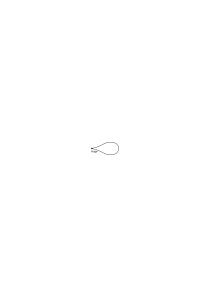
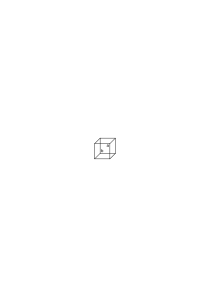
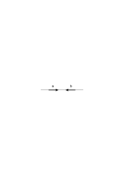

# Ms-104

### [V\[1\]](https://cdn.wittgensteinnachlass.com/2000px/webp/Ms-104/V.webp)

## Logisch-Philosophische Abhandlung

Ludwig Wittgenstein

### [VI\[1\]](https://cdn.wittgensteinnachlass.com/2000px/webp/Ms-104/VI.webp)

_Dem Andenken meines Freundes_

_David H. Pinsent_

_gewidmet_

### [1\[1\]](https://cdn.wittgensteinnachlass.com/2000px/webp/Ms-104/1.webp)

_Motto: ‥․ und alles was man_

_weiß, nicht bloß rauschen und_

_brausen gehört hat, läßt_

_sich in drei Worten sagen._

_Kürnberger_

### [3\[1\]](https://cdn.wittgensteinnachlass.com/2000px/webp/Ms-104/3.webp)

1 Die Welt ist alles was der Fall ist.

### [3\[2\]](https://cdn.wittgensteinnachlass.com/2000px/webp/Ms-104/3.webp)

1˙1 Die Welt ist die Gesamtheit der Tatsachen, nicht der Dinge.

### [3\[3\]](https://cdn.wittgensteinnachlass.com/2000px/webp/Ms-104/3.webp)

2 Was der Fall ist, die Tatsache, ist das Bestehen von Sachverhalten.

### [3\[4\]](https://cdn.wittgensteinnachlass.com/2000px/webp/Ms-104/3.webp)

2˙1 Die Tatsachen begreifen wir in Bildern.

### [3\[5\]](https://cdn.wittgensteinnachlass.com/2000px/webp/Ms-104/3.webp)

2˙2 Das Bild hat mit dem Abgebildeten die logische Form der Abbildung gemein.

### [3\[6\]](https://cdn.wittgensteinnachlass.com/2000px/webp/Ms-104/3.webp)

3 Das logische Bild der Tatsachen ist der Gedanke.

### [3\[7\]](https://cdn.wittgensteinnachlass.com/2000px/webp/Ms-104/3.webp)

3˙1 Der sinnliche Ausdruck des Gedankens ist das Satzzeichen.

### [3\[8\]](https://cdn.wittgensteinnachlass.com/2000px/webp/Ms-104/3.webp)

3˙2 Das Satzzeichen mit der Art und Weise seiner Abbildung ist der Satz.

### [3\[9\]](https://cdn.wittgensteinnachlass.com/2000px/webp/Ms-104/3.webp)

4 Der Gedanke ist der sinnvolle Satz.

### [3\[10\]](https://cdn.wittgensteinnachlass.com/2000px/webp/Ms-104/3.webp)

4˙1 Der Satz stellt das Bestehen und nicht Bestehen der Sachverhalte dar.

### [3\[11\]](https://cdn.wittgensteinnachlass.com/2000px/webp/Ms-104/3.webp)

4˙2 Der Sinn des Satzes ist seine Übereinstimmung, und nicht Übereinstimmung, mit den Möglichkeiten des Bestehens und nicht Bestehens der Sachverhalte.

### [3\[12\]](https://cdn.wittgensteinnachlass.com/2000px/webp/Ms-104/3.webp)

4˙3 Die Wahrheitsmöglichkeiten der Elementarsätze bedeuten die Möglichkeiten des Bestehens und nicht Bestehens der Sachverhalte.

### [3\[13\]](https://cdn.wittgensteinnachlass.com/2000px/webp/Ms-104/3.webp)

4˙4 Der Satz ist der Ausdruck der Übereinstimmung und nicht Übereinstimmung mit den Wahrheitsmöglichkeiten der Elementarsätze.

### [3\[14\]](https://cdn.wittgensteinnachlass.com/2000px/webp/Ms-104/3.webp)

5 Der Satz ist eine Wahrheitsfunktion der Elementarsätze.

### [3\[15\]](https://cdn.wittgensteinnachlass.com/2000px/webp/Ms-104/3.webp)

6 Die allgemeine Form der Wahrheitsfunktion ist: <math class="stacked" display="inline"><mtext>❘</mtext><mtext>N(</mtext><msub><mover><mrow><mi>p</mi></mrow><mo>‾</mo></mover><mi>o</mi></msub><mo>)</mo><mo>,</mo><mspace width="0.3em"/><mtext>ᾱ,</mtext><mspace width="0.3em"/><mtext>N(</mtext><mtext>ᾱ)</mtext><mtext>❘</mtext></math>

### [4\[1\]](https://cdn.wittgensteinnachlass.com/2000px/webp/Ms-104/4.webp)

1˙11 Die Welt ist durch die Tatsachen bestimmt und dadurch, daß es _alle_ Tatsachen sind.

### [4\[2\]](https://cdn.wittgensteinnachlass.com/2000px/webp/Ms-104/4.webp)

_1˙12_

### [4\[3\]](https://cdn.wittgensteinnachlass.com/2000px/webp/Ms-104/4.webp)

1˙13 Die Tatsachen im logischen Raum sind die Welt.

### [4\[4\]](https://cdn.wittgensteinnachlass.com/2000px/webp/Ms-104/4.webp)

2˙01 Der Sachverhalt ist eine Verbindung von Gegenständen, Sachen.

### [4\[5\]](https://cdn.wittgensteinnachlass.com/2000px/webp/Ms-104/4.webp)

2˙02 Der Gegenstand ist einfach.

### [4\[6\]](https://cdn.wittgensteinnachlass.com/2000px/webp/Ms-104/4.webp)

_2˙03-07_

### [4\[7\]](https://cdn.wittgensteinnachlass.com/2000px/webp/Ms-104/4.webp)

⋎ 2˙12 Das Bild ist ein Modell der Wirklichkeit.

### [4\[8\]](https://cdn.wittgensteinnachlass.com/2000px/webp/Ms-104/4.webp)

2˙13 Den Gegenständen entsprechen im Bild die Elemente des Bildes.

### [4\[9\]](https://cdn.wittgensteinnachlass.com/2000px/webp/Ms-104/4.webp)

_2˙14_

### [4\[10\]](https://cdn.wittgensteinnachlass.com/2000px/webp/Ms-104/4.webp)

2˙15 Das Bild ist eine Tatsache.

### [4\[11\]](https://cdn.wittgensteinnachlass.com/2000px/webp/Ms-104/4.webp)

2˙16 Die Tatsache muß, um Bild zu sein, etwas mit dem Abgebildeten gemeinsam haben.

### [4\[12\]](https://cdn.wittgensteinnachlass.com/2000px/webp/Ms-104/4.webp)

2˙161

### [4\[13\]](https://cdn.wittgensteinnachlass.com/2000px/webp/Ms-104/4.webp)

_2˙17-182_

### [4\[14\]](https://cdn.wittgensteinnachlass.com/2000px/webp/Ms-104/4.webp)

2˙21 Das Bild stimmt mit der Wirklichkeit überein oder nicht; es ist richtig oder unrichtig, wahr oder falsch.

### [4\[15\]](https://cdn.wittgensteinnachlass.com/2000px/webp/Ms-104/4.webp)

⋎ 2˙11 Das Bild stellt die Sachlage im logischen Raum, das Bestehen und nicht Bestehen von Sachverhalten, vor.

### [4\[16\]](https://cdn.wittgensteinnachlass.com/2000px/webp/Ms-104/4.webp)

2˙22 Das Bild stellt dar, was es darstellt, unabhängig von seiner Wahr- oder Falschheit, durch die Form der Abbildung.

### [5\[1\]](https://cdn.wittgensteinnachlass.com/2000px/webp/Ms-104/5.webp)

3˙01 Die Gesamtheit der wahren Gedanken sind ein Bild der Welt.

### [5\[2\]](https://cdn.wittgensteinnachlass.com/2000px/webp/Ms-104/5.webp)

_3˙02_

### [5\[3\]](https://cdn.wittgensteinnachlass.com/2000px/webp/Ms-104/5.webp)

3˙11 Das Satzzeichen ist eine Projektion des Gedankens.

### [5\[4\]](https://cdn.wittgensteinnachlass.com/2000px/webp/Ms-104/5.webp)

3˙12 Die Projektionsmethode ist die Art und Weise der Anwendung des Satzzeichens.

### [5\[5\]](https://cdn.wittgensteinnachlass.com/2000px/webp/Ms-104/5.webp)

3˙13 Die Anwendung des Satzzeichens ist das Denken seines Sinns.

### [5\[6\]](https://cdn.wittgensteinnachlass.com/2000px/webp/Ms-104/5.webp)

3˙21 Der Satz ist die Projektion nach ihrer Methode.

### [5\[7\]](https://cdn.wittgensteinnachlass.com/2000px/webp/Ms-104/5.webp)

1˙12 Denn die Gesamtheit der Tatsachen bestimmt was der Fall ist und auch was alles nicht der Fall ist.

### [5\[8\]](https://cdn.wittgensteinnachlass.com/2000px/webp/Ms-104/5.webp)

2˙03 Im Sachverhalt hängen die Gegenstände ineinander wie die Glieder einer Kette.

### [5\[9\]](https://cdn.wittgensteinnachlass.com/2000px/webp/Ms-104/5.webp)

_2˙031_

### [5\[10\]](https://cdn.wittgensteinnachlass.com/2000px/webp/Ms-104/5.webp)

2˙04 Die Gesamtheit der bestehenden Sachverhalte ist die Welt.

### [5\[11\]](https://cdn.wittgensteinnachlass.com/2000px/webp/Ms-104/5.webp)

2˙05 Die Gesamtheit der bestehenden Sachverhalte bestimmt auch, welche Sachverhalte _nicht_ bestehen.

### [5\[12\]](https://cdn.wittgensteinnachlass.com/2000px/webp/Ms-104/5.webp)

2˙06 Das Bestehen und nicht Bestehen von Sachverhalten ist die Wirklichkeit.

### [5\[13\]](https://cdn.wittgensteinnachlass.com/2000px/webp/Ms-104/5.webp)

2˙07 Die gesamte Wirklichkeit ist die Welt.

### [5\[14\]](https://cdn.wittgensteinnachlass.com/2000px/webp/Ms-104/5.webp)

2˙031 Im Sachverhalt verhalten sich die Gegenstände in bestimmter Art und Weise zu einander.

### [5\[15\]](https://cdn.wittgensteinnachlass.com/2000px/webp/Ms-104/5.webp)

_2˙14_ Das Bild besteht darin, daß sich seine Elemente in bestimmter Art und Weise zu einander verhalten.

### [5\[16\]](https://cdn.wittgensteinnachlass.com/2000px/webp/Ms-104/5.webp)

2˙161 In Bild und Abgebildetem muß etwas identisch sein, damit das eine überhaupt ein Bild des anderen sein kann.

### [6\[1\]](https://cdn.wittgensteinnachlass.com/2000px/webp/Ms-104/6.webp)

2˙17 Was das Bild mit der Wirklichkeit gemein haben muß um sie auf seine Art und Weise – richtig oder falsch – abbilden zu können ist seine Form der Abbildung.

### [6\[2\]](https://cdn.wittgensteinnachlass.com/2000px/webp/Ms-104/6.webp)

2˙171 Es gibt verschiedene Formen der Abbildung.

### [6\[3\]](https://cdn.wittgensteinnachlass.com/2000px/webp/Ms-104/6.webp)

2˙18 Was jedes Bild welcher Form immer mit der Wirklichkeit gemein haben muß um sie überhaupt – richtig oder falsch – abbilden zu können ist die logische Form, das ist die Struktur der Wirklichkeit.

### [6\[4\]](https://cdn.wittgensteinnachlass.com/2000px/webp/Ms-104/6.webp)

2˙181 Ist die Form der Abbildung die logische Form so heißt das Bild das logische Bild.

### [6\[5\]](https://cdn.wittgensteinnachlass.com/2000px/webp/Ms-104/6.webp)

2˙182 Jedes Bild ist _auch_ ein logisches. (Dagegen ist z.B. nicht jedes Bild ein räumliches.)

### [6\[6\]](https://cdn.wittgensteinnachlass.com/2000px/webp/Ms-104/6.webp)

2˙201 Das Bild bildet die Wirklichkeit ab, indem es eine Möglichkeit des Bestehens und nicht Bestehens von Sachverhalten darstellt.

### [6\[7\]](https://cdn.wittgensteinnachlass.com/2000px/webp/Ms-104/6.webp)

2˙202 Das Bild stellt eine mögliche Sachlage im logischen Raum dar.

### [6\[8\]](https://cdn.wittgensteinnachlass.com/2000px/webp/Ms-104/6.webp)

2˙203 Das Bild enthält die Möglichkeit der Sachlage, die es darstellt.

### [6\[9\]](https://cdn.wittgensteinnachlass.com/2000px/webp/Ms-104/6.webp)

2˙221 Was das Bild darstellt, ist sein Sinn.

### [6\[10\]](https://cdn.wittgensteinnachlass.com/2000px/webp/Ms-104/6.webp)

2˙222 In seiner Übereinstimmung oder nicht Übereinstimmung seines Sinnes mit der Wirklichkeit besteht seine Wahrheit oder Falschheit.

### [6\[11\]](https://cdn.wittgensteinnachlass.com/2000px/webp/Ms-104/6.webp)

3˙3 Das angewandte, gedachte, Satzzeichen ist der Gedanke.

### [6\[12\]](https://cdn.wittgensteinnachlass.com/2000px/webp/Ms-104/6.webp)

4˙41 Die Übereinstimmung mit den Wahrheitsmöglichkeiten können wir dadurch ausdrücken indem wir ihnen im Schema etwa das Abzeichen „W” („Wahr”) zuordnen.

### [6\[13\]](https://cdn.wittgensteinnachlass.com/2000px/webp/Ms-104/6.webp)

4˙42 Das Fehlen dieses Abzeichens bedeutet die nicht-Übereinstimmung.

### [7\[1\]](https://cdn.wittgensteinnachlass.com/2000px/webp/Ms-104/7.webp)

4˙43 Das Zeichen welches durch die Zuordnung jener Abzeichen und der Wahrheitsmöglichkeiten entsteht ist ein Satzzeichen.

### [7\[2\]](https://cdn.wittgensteinnachlass.com/2000px/webp/Ms-104/7.webp)

4˙431 Also ist z.B. ›‹

ein Satzzeichen.

### [7\[3\]](https://cdn.wittgensteinnachlass.com/2000px/webp/Ms-104/7.webp)

4˙432 Der Deutlichkeit halber schreiben wir dieses Zeichen nun so:

›WWFW‹

Die nach §4˙43 auf diese Weise gebauten Satzzeichen nennen wir Satzzeichen der ersten Art.

### [7\[4\]](https://cdn.wittgensteinnachlass.com/2000px/webp/Ms-104/7.webp)

4˙44 Ist die Reihenfolge der Wahrheitsmöglichkeiten im Schema durch eine Kombinationsregel ein für allemal festgesetzt dann ist die letzte Kolonne allein schon ein Ausdruck der Wahrheitsbedingungen.

### [7\[5\]](https://cdn.wittgensteinnachlass.com/2000px/webp/Ms-104/7.webp)

4˙441 Schreiben wir diese Kolonne als Reihe hin so wird das Zeichen in 4˙432 zu:

„(WWFW) (p,q)” oder „(W,W, ,W) (p,q)”

.

### [7\[6\]](https://cdn.wittgensteinnachlass.com/2000px/webp/Ms-104/7.webp)

3˙02 Der Gedanke enthält die Möglichkeit der Sachlage, die er denkt.

Was denkbar ist, ist auch möglich.

### [7\[7\]](https://cdn.wittgensteinnachlass.com/2000px/webp/Ms-104/7.webp)

3˙111 Es ist eine Projektion der Möglichkeit einer Sachlage.

### [7\[8\]](https://cdn.wittgensteinnachlass.com/2000px/webp/Ms-104/7.webp)

3˙14 Im Satzzeichen entsprechen den Gegenständen der Wirklichkeit die einfachen Zeichen.

### [7\[9\]](https://cdn.wittgensteinnachlass.com/2000px/webp/Ms-104/7.webp)

3˙15 Das Satzzeichen besteht darin, daß sich die einfachen Zeichen in ihm auf bestimmte Art und Weise zu einander verhalten.

### [8\[1\]](https://cdn.wittgensteinnachlass.com/2000px/webp/Ms-104/8.webp)

3˙16 Das Satzzeichen ist eine Tatsache.

### [8\[2\]](https://cdn.wittgensteinnachlass.com/2000px/webp/Ms-104/8.webp)

4˙01 Der Satz ist ein Bild der Wirklichkeit.

### [8\[3\]](https://cdn.wittgensteinnachlass.com/2000px/webp/Ms-104/8.webp)

4˙08 Die Wirklichkeit wird mit dem Satz verglichen.

### [8\[4\]](https://cdn.wittgensteinnachlass.com/2000px/webp/Ms-104/8.webp)

4˙09 Nur dadurch kann der Satz wahr oder falsch sein, indem er ein _Bild_ der Wirklichkeit ist.

### [8\[5\]](https://cdn.wittgensteinnachlass.com/2000px/webp/Ms-104/8.webp)

4˙02 Dies sehen wir daraus, daß wir den Sinn des Satzzeichens verstehen, ohne daß er uns erklärt wurde.

### [8\[6\]](https://cdn.wittgensteinnachlass.com/2000px/webp/Ms-104/8.webp)

4˙03 Die Bedeutungen der einfachen Zeichen, der Wörter, müssen uns erklärt werden damit wir sie verstehen.

### [8\[7\]](https://cdn.wittgensteinnachlass.com/2000px/webp/Ms-104/8.webp)

4˙04 Mit den Sätzen aber verständigen wir uns.

### [8\[8\]](https://cdn.wittgensteinnachlass.com/2000px/webp/Ms-104/8.webp)

4˙05 Es liegt im Wesen des Satzes, daß er uns einen uns _neuen_ Sinn mitteilen kann.

### [8\[9\]](https://cdn.wittgensteinnachlass.com/2000px/webp/Ms-104/8.webp)

4˙06 Der Satz teilt uns eine Sachlage mit, also muß er _wesentlich_ mit dieser Sachlage zusammenhängen.

### [8\[10\]](https://cdn.wittgensteinnachlass.com/2000px/webp/Ms-104/8.webp)

4˙07 Und der Zusammenhang ist eben, daß er ihr logisches Bild ist.

### [8\[11\]](https://cdn.wittgensteinnachlass.com/2000px/webp/Ms-104/8.webp)

3˙141 Das einfache Zeichen bedeutet den Gegenstand. Er ist seine Bedeutung.

### [8\[12\]](https://cdn.wittgensteinnachlass.com/2000px/webp/Ms-104/8.webp)

3˙201 Die im Satze angewandten einfachen Zeichen heißen Namen.

### [8\[13\]](https://cdn.wittgensteinnachlass.com/2000px/webp/Ms-104/8.webp)

4˙11 Der Satz behauptet das Bestehen der Sachlage deren Möglichkeit er darstellt.

### [8\[15\]](https://cdn.wittgensteinnachlass.com/2000px/webp/Ms-104/8.webp)

4˙21 Der einfachste Satz – der Elementarsatz – behauptet das Bestehen eines Sachverhalts.

### [8\[16\]](https://cdn.wittgensteinnachlass.com/2000px/webp/Ms-104/8.webp)

4˙1001 Die Gesamtheit der wahren Sätze ist die Weltbeschreibung.

### [9\[1\]](https://cdn.wittgensteinnachlass.com/2000px/webp/Ms-104/9.webp)

4˙231 Die Angabe aller wahren Elementarsätze beschreibt die Welt vollständig.

### [9\[2\]](https://cdn.wittgensteinnachlass.com/2000px/webp/Ms-104/9.webp)

4˙232 Die Welt ist vollständig beschrieben durch die Angabe aller Elementarsätze plus der Angabe welche von ihnen wahr und welche falsch sind.

### [9\[3\]](https://cdn.wittgensteinnachlass.com/2000px/webp/Ms-104/9.webp)

4˙22 Der Elementarsatz besteht aus Namen. Er ist ein Zusammenhang, eine Verkettung, von Namen.

### [9\[4\]](https://cdn.wittgensteinnachlass.com/2000px/webp/Ms-104/9.webp)

4˙221 Der Name kommt im Satz nur im Zusammenhang des Elementarsatzes vor.

### [9\[5\]](https://cdn.wittgensteinnachlass.com/2000px/webp/Ms-104/9.webp)

4˙222 Ausdrücke wie „a = a”, oder von diesem abgeleitete, welche dem obigen zu widersprechen scheinen sind weder Elementarsätze noch sonst sinnvolle Zeichen wie sich später zeigen wird.

### [9\[6\]](https://cdn.wittgensteinnachlass.com/2000px/webp/Ms-104/9.webp)

4˙23 Ist der Elementarsatz wahr so besteht der Sachverhalt, ist der Elementarsatz falsch, so besteht der Sachverhalt nicht.

### [9\[7\]](https://cdn.wittgensteinnachlass.com/2000px/webp/Ms-104/9.webp)

4˙24 Bezüglich des Bestehens und nicht Bestehens von n Sachverhalten gibt es <math class="stacked" display="inline"><msub><mi>K</mi><mi>n</mi></msub><mspace width="0.3em"/><mo>=</mo><mover><mrow><munder><mrow><mtext>Σ</mtext></mrow><mn>0</mn></munder></mrow><mi>n</mi></mover><mspace width="0.3em"/><mo>(</mo><mfrac linethickness="0"><mrow><mi>n</mi></mrow><mrow><mtext>ν</mtext></mrow></mfrac><mo>)</mo></math> Möglichkeiten.

### [9\[8\]](https://cdn.wittgensteinnachlass.com/2000px/webp/Ms-104/9.webp)

4˙25 Es können alle möglichen Kombinationen der Sachverhalte bestehen, – die anderen nicht bestehen.

### [9\[9\]](https://cdn.wittgensteinnachlass.com/2000px/webp/Ms-104/9.webp)

4˙26 Diesen Kombinationen entsprechen ebensoviele Möglichkeiten der Wahrheit – und Falschheit – von n Elementarsätzen.

### [9\[10\]](https://cdn.wittgensteinnachlass.com/2000px/webp/Ms-104/9.webp),[10\[1\]](https://cdn.wittgensteinnachlass.com/2000px/webp/Ms-104/10.webp)

4˙31 Die Wahrheitsmöglichkeiten können wir durch ein Schema folgender Art darstellen: („p”, „q”, „r” sind Elementarsätze. „W” bedeutet „wahr”, „F” „falsch” die Reihen der „W” und „F” unter der Reihe der Elementarsätze bedeuten in leicht verständlicher Symbolik deren Wahrheitsmöglichkeiten.)

pWFWWFFWF | qWWFWFWFF | rWWWFWFFF | pWFWF | qWWFF | pWF

Wir nennen dies das Schema I.

### [10\[2\]](https://cdn.wittgensteinnachlass.com/2000px/webp/Ms-104/10.webp)

5˙1 Sind alle Sätze Wahrheitsfunktionen (W-Funktionen) von Elementarsätzen so folgt hieraus daß sie auch Wahrheitsfunktionen von einander sind.

### [10\[3\]](https://cdn.wittgensteinnachlass.com/2000px/webp/Ms-104/10.webp)

5˙11 Die Schemata 4˙31 haben auch dann eine Bedeutung, wenn „p” „q” „r” etc. nicht Elementarsätze sind.

### [10\[4\]](https://cdn.wittgensteinnachlass.com/2000px/webp/Ms-104/10.webp)

5˙12 Und es ist leicht zu sehen, daß das Satzzeichen erster Art, auch wenn p, q etc. W-Funktionen von Elementarsätzen sind, _eine_ W-Funktion von Elementarsätzen ausdrückt.

### [10\[5\]](https://cdn.wittgensteinnachlass.com/2000px/webp/Ms-104/10.webp)

5˙001 Jeder Satz läßt sich auffassen als Resultat einer Operation, welche mit einem anderen Satz (der Basis der Operation) vorgenommen wurde und diesen in jenen verwandelt.

### [10\[6\]](https://cdn.wittgensteinnachlass.com/2000px/webp/Ms-104/10.webp)

5˙0011 Analog kann man von Operationen mit mehreren Basen sprechen. „(F)(p)” ist das Resultat der Operation „F( )” auf die Basis p, (FWWF)(p,q) das Resultat einer Operation auf zwei Basen.

### [10\[7\]](https://cdn.wittgensteinnachlass.com/2000px/webp/Ms-104/10.webp)

5˙0014 Fassen wir (F)(p) als Operationsresultat auf, so schreiben wir es „(F)'(p)”; und allgemein eine Operation auf „a” „b” „c” etc. O'(a,b,c, etc.).

### [10\[8\]](https://cdn.wittgensteinnachlass.com/2000px/webp/Ms-104/10.webp),[11\[1\]](https://cdn.wittgensteinnachlass.com/2000px/webp/Ms-104/11.webp)

5˙2 Jede W-Funktion von W-Funktionen ist eine Funktion von Elementarsätzen, ein Satz.

### [11\[2\]](https://cdn.wittgensteinnachlass.com/2000px/webp/Ms-104/11.webp)

5˙0016 Die fortgesetzte Anwendung einer Operation auf ihr eigenes Resultat, oder ihre eigenen Resultate, heißt ihre sukzessive Anwendung. (O'(O'(O'a)) ist das Resultat der (3-maligen) sukzessiven Anwendung von O'ξ auf a.)

### [11\[3\]](https://cdn.wittgensteinnachlass.com/2000px/webp/Ms-104/11.webp)

5˙3 Es läßt sich zeigen, daß jede Wahrheitsfunktion ein Resultat der sukzessiven Anwendung der Operation (W )'(ᾱ) ist.

### [11\[4\]](https://cdn.wittgensteinnachlass.com/2000px/webp/Ms-104/11.webp)

5˙0015 „O' (a,b,c etc.)” ist das Operationsresultat, die Operation selber bezeichne ich mit „O'(ξ,η,ζ etc.)”, wo die griechischen Buchstaben die Argumentstellen anzeigen.

### [11\[5\]](https://cdn.wittgensteinnachlass.com/2000px/webp/Ms-104/11.webp)

3˙202 Nur der Satz hat Sinn, nur im Zusammenhang des Satzes hat ein Name Bedeutung.

### [11\[6\]](https://cdn.wittgensteinnachlass.com/2000px/webp/Ms-104/11.webp)

5˙003 Jeden Klammerausdruck dessen Glieder Sätze sind schreiben wir in der Form „(ᾱ)”. „ᾱ” ist eine Variable, deren Werte die Glieder des Klammerausdruckes sind. Der Strich über dem „α” bedeutet, daß alle Werte von α in der Klammer stehen.

### [11\[7\]](https://cdn.wittgensteinnachlass.com/2000px/webp/Ms-104/11.webp)

5˙004 Welche Werte α annehmen darf, wird festgesetzt.

### [11\[8\]](https://cdn.wittgensteinnachlass.com/2000px/webp/Ms-104/11.webp)

5˙0013 Eine Operation die aus einer Anzahl von Sätzen eine Wahrheitsfunktion dieser Sätze macht, nennen wir „Wahrheitsoperation” (W-Operation).

### [11\[9\]](https://cdn.wittgensteinnachlass.com/2000px/webp/Ms-104/11.webp)

5˙02 Die Wahrheitsfunktionen einer bestimmten Anzahl von Sätzen lassen sich in einem Schema folgender Art hinschreiben:

Wir nennen es das Schema II.

### [11\[10\]](https://cdn.wittgensteinnachlass.com/2000px/webp/Ms-104/11.webp)

5˙01 Den Elementarsatz können wir als Wahrheitsfunktion seiner selbst auffassen.

### [11\[11\]](https://cdn.wittgensteinnachlass.com/2000px/webp/Ms-104/11.webp),[12\[1\]](https://cdn.wittgensteinnachlass.com/2000px/webp/Ms-104/12.webp)

4˙423 Die Wahrheitsmöglichkeiten der Elementarsätze sind die Wahrheitsbedingungen der Sätze.

### [12\[2\]](https://cdn.wittgensteinnachlass.com/2000px/webp/Ms-104/12.webp)

5˙011 Die Elementarsätze sind die Wahrheitsargumente (W-Argumente) des Satzes.

### [12\[3\]](https://cdn.wittgensteinnachlass.com/2000px/webp/Ms-104/12.webp)

5˙03 Diejenigen Wahrheitsmöglichkeiten der W-Argumente, welche den Satz bewahrheiten nenne ich seine Wahrheitsgründe.

### [12\[4\]](https://cdn.wittgensteinnachlass.com/2000px/webp/Ms-104/12.webp)

5˙04 Sind die Wahrheitsgründe einer Anzahl von Sätzen sämtlich auch Wahrheitsgründe eines bestimmten Satzes so sagen wir die Wahrheit dieses Satzes folge aus der Wahrheit der Gesamtheit jener anderen.

### [12\[5\]](https://cdn.wittgensteinnachlass.com/2000px/webp/Ms-104/12.webp)

5˙041 Insbesondere folgt die Wahrheit eines Satzes p aus der Wahrheit eines anderen q wenn alle Wahrheitsgründe des ersten Wahrheitsgründe des zweiten sind.

### [12\[6\]](https://cdn.wittgensteinnachlass.com/2000px/webp/Ms-104/12.webp)

5˙04101 Wir sagen auch die Wahrheitsgründe des einen sind in denen des anderen enthalten, p folge aus q.

### [12\[7\]](https://cdn.wittgensteinnachlass.com/2000px/webp/Ms-104/12.webp)

5˙042 Jeder Satz folgt aus sich selbst.

### [12\[8\]](https://cdn.wittgensteinnachlass.com/2000px/webp/Ms-104/12.webp)

5˙05 Folgt p aus q und q aus p, so sind sie ein und derselbe Satz.

### [12\[9\]](https://cdn.wittgensteinnachlass.com/2000px/webp/Ms-104/12.webp)

5˙06 Folgt ein Satz aus einem anderen, so sagt dieser mehr als jener, jener weniger als dieser.

### [12\[10\]](https://cdn.wittgensteinnachlass.com/2000px/webp/Ms-104/12.webp)

5˙07 Die Tautologie folgt aus allen Sätzen; sie sagt nichts.

### [12\[11\]](https://cdn.wittgensteinnachlass.com/2000px/webp/Ms-104/12.webp)

4˙421 Der Ausdruck der Übereinstimmung und nicht Übereinstimmung mit den Wahrheitsmöglichkeiten der Elementarsätze drückt die Wahrheitsbedingungen des Satzes aus.

### [12\[12\]](https://cdn.wittgensteinnachlass.com/2000px/webp/Ms-104/12.webp)

4˙422 Der Satz ist der Ausdruck seiner Wahrheitsbedingungen.

### [12\[13\]](https://cdn.wittgensteinnachlass.com/2000px/webp/Ms-104/12.webp),[13\[1\]](https://cdn.wittgensteinnachlass.com/2000px/webp/Ms-104/13.webp)

4˙401 Bezüglich der Übereinstimmung und nicht Übereinstimung eines Satzes mit den Wahrheitsmöglichkeiten von n Elementarsätzen gibt es <math class="stacked" display="inline"><msub><mtext><mi>L</mi></mtext><mi>n</mi></msub><mspace width="0.3em"/><mo>=</mo></math> Möglichkeiten.

### [13\[2\]](https://cdn.wittgensteinnachlass.com/2000px/webp/Ms-104/13.webp)

4˙442 WWFW sind also die Wahrheitsbedingungen dieses Satzes.

### [13\[3\]](https://cdn.wittgensteinnachlass.com/2000px/webp/Ms-104/13.webp)

4˙444 Die Gruppen von Wahrheitsbedingungen welche zu den Wahrheitsmöglichkeiten einer Anzahl von Elementarsätzen gehören lassen sich in einer Reihe ordnen.

### [13\[4\]](https://cdn.wittgensteinnachlass.com/2000px/webp/Ms-104/13.webp)

4˙445 Unter den möglichen Gruppen von Wahrheitsbedingungen gibt es zwei extreme Fälle.

### [13\[5\]](https://cdn.wittgensteinnachlass.com/2000px/webp/Ms-104/13.webp)

4˙446 Im einen Fall ist der Satz für sämtliche Wahrheitsmöglichkeiten der Elementarsätze wahr. Wir sagen die Wahrheitsbedingungen sind tautologisch.

Im zweiten Fall ist der Satz für sämtliche Wahrheitsmöglichkeiten falsch; die Wahrheitsbedingungen sind kontradiktorisch.

### [13\[6\]](https://cdn.wittgensteinnachlass.com/2000px/webp/Ms-104/13.webp)

4˙443 Für n Elementarsätze gibt es <math class="stacked" display="inline"><msub><mi>L</mi><mi>n</mi></msub></math> mögliche Gruppen von Wahrheitsbedingungen.

### [13\[7\]](https://cdn.wittgensteinnachlass.com/2000px/webp/Ms-104/13.webp)

5˙3001 Wir nennen diese Operation die Negation der Werte von ᾱ und schreiben kurz statt (W )(ᾱ): N(ᾱ).

### [13\[8\]](https://cdn.wittgensteinnachlass.com/2000px/webp/Ms-104/13.webp)

5˙3002 N(ᾱ) verneint sämtliche Werte von α.

### [13\[9\]](https://cdn.wittgensteinnachlass.com/2000px/webp/Ms-104/13.webp)

5˙31 Hat α nur einen Wert, p, so ist N(ᾱ) das Russellsche ~p, hat es zwei Werte p und q, ~p ∙ ~q.

### [13\[10\]](https://cdn.wittgensteinnachlass.com/2000px/webp/Ms-104/13.webp)

5˙32 Sind die Werte von α sämtliche Werte einer Funktion φ(x) für alle Werte von x so bedeutet „N(ᾱ)” ~(∃x) ∙ φ(x).

### [13\[11\]](https://cdn.wittgensteinnachlass.com/2000px/webp/Ms-104/13.webp)

4˙4011 <math class="stacked" display="inline"><msub><mi>L</mi><mi>n</mi></msub><mspace width="0.3em"/><mo>=</mo><mover><mrow><munder><mrow><mtext>Σ</mtext></mrow><mn>0</mn></munder></mrow><mtext>Kn</mtext></mover><mspace width="0.3em"/><mo>(</mo><mfrac linethickness="0"><mrow><mtext>Kn</mtext></mrow><mrow><mtext>μ</mtext></mrow></mfrac><mo>)</mo></math>

### [13\[12\]](https://cdn.wittgensteinnachlass.com/2000px/webp/Ms-104/13.webp)

2˙032 Die Art und Weise, wie die Gegenstände im Sachverhalt zusammenhängen ist die Struktur des Sachverhaltes.

### [13\[13\]](https://cdn.wittgensteinnachlass.com/2000px/webp/Ms-104/13.webp)

2˙033 Die Struktur der Tatsache besteht aus den Strukturen der Sachverhalte.

### [14\[1\]](https://cdn.wittgensteinnachlass.com/2000px/webp/Ms-104/14.webp)

2˙151 Daß sich die Elemente des Bildes in bestimmter Art und Weise zu einander verhalten, stellt vor daß sich die Sachen so zu einander verhalten.

### [14\[2\]](https://cdn.wittgensteinnachlass.com/2000px/webp/Ms-104/14.webp)

2˙1512 Das Bild ist so mit der Wirklichkeit verknüpft, es reicht bis zu ihr.

### [14\[3\]](https://cdn.wittgensteinnachlass.com/2000px/webp/Ms-104/14.webp)

2˙1513 Es ist wie ein Maßstab an die Wirklichkeit angelegt.

### [14\[4\]](https://cdn.wittgensteinnachlass.com/2000px/webp/Ms-104/14.webp)

2˙172 Das Bild kann jede Wirklichkeit abbilden, deren Form es hat.

Das räumliche Bild alles Räumliche etc.

### [14\[5\]](https://cdn.wittgensteinnachlass.com/2000px/webp/Ms-104/14.webp)

2˙19 Das logische Bild kann die Welt abbilden.

### [14\[6\]](https://cdn.wittgensteinnachlass.com/2000px/webp/Ms-104/14.webp)

2˙15131 Nur die äußersten Punkte der Teilstriche _berühren_ den zu messenden Gegenstand.

### [14\[7\]](https://cdn.wittgensteinnachlass.com/2000px/webp/Ms-104/14.webp)

2˙15101 Dieser Zusammenhang der Elemente des Bildes heißt seine Form der Abbildung.

### [14\[8\]](https://cdn.wittgensteinnachlass.com/2000px/webp/Ms-104/14.webp)

2˙1514 Nach dieser Auffassung gehört also zum Bild auch noch die abbildende Beziehung die es zum Bild macht.

### [14\[9\]](https://cdn.wittgensteinnachlass.com/2000px/webp/Ms-104/14.webp)

2˙1515 Die abbildende Beziehung besteht aus den Zuordnungen der Elemente des Bildes und der Sachen.

### [14\[10\]](https://cdn.wittgensteinnachlass.com/2000px/webp/Ms-104/14.webp)

2˙1516 Diese Zuordnungen sind gleichsam die Fühler der Bildelemente, mit denen das Bild die Wirklichkeit berührt.

### [14\[11\]](https://cdn.wittgensteinnachlass.com/2000px/webp/Ms-104/14.webp)

2˙223 Um zu erkennen, ob das Bild wahr oder falsch ist, müssen wir es mit der Wirklichkeit vergleichen.

### [14\[12\]](https://cdn.wittgensteinnachlass.com/2000px/webp/Ms-104/14.webp)

2˙224 Aus dem Bild allein ist nicht zu erkennen, ob es wahr oder falsch ist.

### [14\[13\]](https://cdn.wittgensteinnachlass.com/2000px/webp/Ms-104/14.webp)

2˙225 Ein a priori wahres Bild gibt es nicht.

### [14\[14\]](https://cdn.wittgensteinnachlass.com/2000px/webp/Ms-104/14.webp)

2˙131 Die Elemente des Bildes vertreten im Bild die Gegenstände.

### [15\[1\]](https://cdn.wittgensteinnachlass.com/2000px/webp/Ms-104/15.webp)

4˙021 Der Satz ist ein Bild der Wirklichkeit; denn ich kenne die von ihm dargestellte Sachlage, wenn ich den Satz verstehe. Und den Satz verstehe ich, ohne daß mir sein Sinn erklärt wurde.

### [15\[2\]](https://cdn.wittgensteinnachlass.com/2000px/webp/Ms-104/15.webp)

4˙023 Der Satz _zeigt_, wie es sich verhält, _wenn_ er wahr ist.

### [15\[3\]](https://cdn.wittgensteinnachlass.com/2000px/webp/Ms-104/15.webp)

4˙024 Und er _sagt_, _daß_ es sich so verhält.

### [15\[4\]](https://cdn.wittgensteinnachlass.com/2000px/webp/Ms-104/15.webp)

4˙022 Der Satz _zeigt_ seinen Sinn.

### [15\[5\]](https://cdn.wittgensteinnachlass.com/2000px/webp/Ms-104/15.webp)

4˙2212 Die Elementarsätze deute ich im Folgenden allgemein durch die Buchstaben p, q, r, s, t, oder (wie Frege) als Funktion ihrer Gegenstände in der Form „φ(x)”, „ψ(x,y)” etc. an.

### [15\[6\]](https://cdn.wittgensteinnachlass.com/2000px/webp/Ms-104/15.webp)

4˙2211 Gegenstandsnamen deute ich im Folgenden durch die Buchstaben x,y,z,u,v,w an.

### [15\[7\]](https://cdn.wittgensteinnachlass.com/2000px/webp/Ms-104/15.webp)

4˙2213 Gebrauche ich zwei Namen in _einer_ und derselben Bedeutung, oder zwei Satzzeichen in _einem_ Sinn, so drücke ich dies aus indem ich zwischen beide das Zeichen „ = ” setze.

### [15\[8\]](https://cdn.wittgensteinnachlass.com/2000px/webp/Ms-104/15.webp)

4˙2214 Ausdrücke von der Form a = b sind also nur Behelfe der Darstellung, sie sagen nichts über die Bedeutung oder den Sinn der Zeichen „a” oder „b” aus.

### [15\[9\]](https://cdn.wittgensteinnachlass.com/2000px/webp/Ms-104/15.webp)

4˙433 Es ist klar daß dem Komplex der Zeichen „F” und „W” kein Gegenstand (oder Komplex von Gegenständen) entspricht, so wenig wie den horizontalen und vertikalen Strichen oder den Klammern. „Logische Gegenstände” gibt es nicht.

### [15\[10\]](https://cdn.wittgensteinnachlass.com/2000px/webp/Ms-104/15.webp)

4˙4331 Analoges gilt natürlich für alle Zeichen die dasselbe ausdrücken wie die Schemata der „W” und „F”.

### [15\[11\]](https://cdn.wittgensteinnachlass.com/2000px/webp/Ms-104/15.webp)

2˙061 Die Sachverhalte sind von einander unabhängig.

### [16\[1\]](https://cdn.wittgensteinnachlass.com/2000px/webp/Ms-104/16.webp)

2˙062 Aus dem Bestehen oder nicht Bestehen des einen kann nicht auf das Bestehen oder nicht Bestehen des anderen geschlossen werden.

### [16\[2\]](https://cdn.wittgensteinnachlass.com/2000px/webp/Ms-104/16.webp)

5˙0412 Folgt p aus q so kann ich aus q auf p schließen, p aus q folgern.

### [16\[3\]](https://cdn.wittgensteinnachlass.com/2000px/webp/Ms-104/16.webp)

5˙043 Aus einem Elementarsatz läßt sich kein anderer folgern.

### [16\[4\]](https://cdn.wittgensteinnachlass.com/2000px/webp/Ms-104/16.webp)

5˙044 Auf keine Weise kann aus dem Bestehen irgend einer Sachlage, auf das Bestehen einer von ihr gänzlich verschiedenen Sachlage geschlossen werden.

### [16\[5\]](https://cdn.wittgensteinnachlass.com/2000px/webp/Ms-104/16.webp)

5˙0441 Einen Kausalnexus der einen solchen Schluß rechtfertigte gibt es nicht.

### [16\[6\]](https://cdn.wittgensteinnachlass.com/2000px/webp/Ms-104/16.webp)

3˙04 Ein a priori richtiger Gedanke wäre ein solcher, dessen Möglichkeit seine Wahrheit bedingte.

### [16\[7\]](https://cdn.wittgensteinnachlass.com/2000px/webp/Ms-104/16.webp)

3˙05 Nur so könnten wir a priori wissen, daß ein Gedanke wahr ist, wenn aus dem Gedanken selbst (ohne Vergleichsobjekt) seine Wahrheit zu erkennen wäre.

### [16\[8\]](https://cdn.wittgensteinnachlass.com/2000px/webp/Ms-104/16.webp)

5˙0411 Daß ein Satz aus einem anderen folgt, ersehen wir aus der Struktur der Sätze.

### [16\[9\]](https://cdn.wittgensteinnachlass.com/2000px/webp/Ms-104/16.webp)

5˙0415 Alles Folgern geschieht a priori.

### [16\[10\]](https://cdn.wittgensteinnachlass.com/2000px/webp/Ms-104/16.webp)

5˙0442 Die Ereignisse der Zukunft _können_ wir nicht _wissen_.

### [16\[11\]](https://cdn.wittgensteinnachlass.com/2000px/webp/Ms-104/16.webp)

5˙0443 Der Glaube an den Kausalnexus ist der Aberglaube.

### [16\[12\]](https://cdn.wittgensteinnachlass.com/2000px/webp/Ms-104/16.webp)

2˙173 Seine Form der Abbildung aber kann das Bild nicht abbilden; es weist sie auf.

### [16\[13\]](https://cdn.wittgensteinnachlass.com/2000px/webp/Ms-104/16.webp),[17\[1\]](https://cdn.wittgensteinnachlass.com/2000px/webp/Ms-104/17.webp)

4˙101 Der Satz kann die gesamte Wirklichkeit darstellen, aber er kann nicht das darstellen, was er mit der Wirklichkeit gemein haben muß um sie darstellen zu können, die logische Form.

### [17\[2\]](https://cdn.wittgensteinnachlass.com/2000px/webp/Ms-104/17.webp)

4˙102 Der Satz kann die logische Form nicht darstellen, sie spiegelt sich in ihm.

### [17\[3\]](https://cdn.wittgensteinnachlass.com/2000px/webp/Ms-104/17.webp)

4˙103 Der Satz stellt die logische Form nicht dar, er weist sie auf; er zeigt sie.

### [17\[4\]](https://cdn.wittgensteinnachlass.com/2000px/webp/Ms-104/17.webp)

2˙174 Das Bild stellt sein Objekt von außerhalb dar, (sein Standpunkt ist seine Form der Darstellung) darum stellt das Bild sein Objekt richtig oder falsch dar.

### [17\[5\]](https://cdn.wittgensteinnachlass.com/2000px/webp/Ms-104/17.webp)

2˙175 Das Bild kann sich aber nicht außerhalb seiner Form der Darstellung stellen.

### [17\[6\]](https://cdn.wittgensteinnachlass.com/2000px/webp/Ms-104/17.webp)

3˙03 Wir können nichts Unlogisches denken, weil wir sonst unlogisch denken müßten.

### [17\[7\]](https://cdn.wittgensteinnachlass.com/2000px/webp/Ms-104/17.webp)

4˙104 Um die logische Form darstellen zu können müßten wir uns mit dem Satz außerhalb der Logik aufstellen können, d.h. außerhalb der Welt.

### [17\[8\]](https://cdn.wittgensteinnachlass.com/2000px/webp/Ms-104/17.webp)

4˙001 Die Gesamtheit der Sätze ist die Sprache.

### [17\[9\]](https://cdn.wittgensteinnachlass.com/2000px/webp/Ms-104/17.webp)

4˙1021 Was sich in der Sprache spiegelt, kann sie nicht darstellen.

### [17\[10\]](https://cdn.wittgensteinnachlass.com/2000px/webp/Ms-104/17.webp)

5˙0413 Die Art des Schlusses ist allein aus den beiden Sätzen zu entnehmen.

### [17\[11\]](https://cdn.wittgensteinnachlass.com/2000px/webp/Ms-104/17.webp)

5˙0414 Nur sie selbst können den Schluß rechtfertigen.

### [17\[12\]](https://cdn.wittgensteinnachlass.com/2000px/webp/Ms-104/17.webp)

5˙04141 „Schlußgesetze” welche – wie bei Frege und Russell – die Schlüsse rechtfertigen sollen sind sinnlos, und wären überflüssig.

### [17\[13\]](https://cdn.wittgensteinnachlass.com/2000px/webp/Ms-104/17.webp)

4˙10011 Die Gesamtheit der wahren Sätze kann man auch die gesamte Naturwissenschaft nennen (oder die Gesamtheit der Naturwissenschaften).

### [18\[1\]](https://cdn.wittgensteinnachlass.com/2000px/webp/Ms-104/18.webp)

4˙10012 Die Philosophie ist keine der Naturwissenschaften.

### [18\[2\]](https://cdn.wittgensteinnachlass.com/2000px/webp/Ms-104/18.webp)

4˙10013 Das Wort „Philosophie” muß etwas bedeuten, das über oder unter, aber nicht _neben_ den Naturwissenschaften steht.

### [18\[3\]](https://cdn.wittgensteinnachlass.com/2000px/webp/Ms-104/18.webp)

4˙10014 Der Zweck der Philosophie ist die logische Klärung der Gedanken.

### [18\[4\]](https://cdn.wittgensteinnachlass.com/2000px/webp/Ms-104/18.webp)

4˙10015 Die Philosophie ist keine Lehre sondern eine Tätigkeit.

### [18\[5\]](https://cdn.wittgensteinnachlass.com/2000px/webp/Ms-104/18.webp)

4˙10016 Das Resultat der Philosophie sind nicht „philosophische Sätze” sondern das Klarwerden von Sätzen.

### [18\[6\]](https://cdn.wittgensteinnachlass.com/2000px/webp/Ms-104/18.webp)

4˙100161 Die Philosophie soll die Gedanken, die sonst, gleichsam, trübe und verschwommen sind, klar machen und scharf abgrenzen.

### [18\[7\]](https://cdn.wittgensteinnachlass.com/2000px/webp/Ms-104/18.webp)

4˙10017 Sie wird so das Denkbare abgrenzen und damit das Undenkbare.

### [18\[8\]](https://cdn.wittgensteinnachlass.com/2000px/webp/Ms-104/18.webp)

4˙100171 Sie wird das Undenkbare von innen, durch das Denkbare, begrenzen.

### [18\[9\]](https://cdn.wittgensteinnachlass.com/2000px/webp/Ms-104/18.webp)

4˙10018 Sie wird das Unsagbare bedeuten, indem sie das Sagbare klar darstellt.

### [18\[10\]](https://cdn.wittgensteinnachlass.com/2000px/webp/Ms-104/18.webp)

5˙32 Gleichheit des Gegenstandes drücke ich durch Gleichheit des Zeichens aus, und nicht mit Hilfe eines Gleichheitszeichens. Verschiedenheit der Gegenstände durch Verschiedenheit der Zeichen.

### [18\[11\]](https://cdn.wittgensteinnachlass.com/2000px/webp/Ms-104/18.webp)

5˙331 Ich schreibe also nicht „F(a,b) ∙ a = b”, sondern „F(a,a)” [oder „F(b,b)”] und nicht „F(a,b) ∙ a ≠ b”, sondern „F(a,b)”.

### [18\[12\]](https://cdn.wittgensteinnachlass.com/2000px/webp/Ms-104/18.webp)

5˙332 Und analog, nicht „(∃x,y) ∙ F(x,y) ∙ x = y”, sondern „(∃x) ∙ F(x,x)” und nicht „(∃x,y) ∙ F(x,y) ∙ x ≠ y”, sondern „(∃x,y) ∙ F(x,y)”.

(Also statt dem Russellschen „(∃x,y) ∙ F(x,y)”: „(∃x,y) ∙ F(x,y)⌵(∃x) ∙ F(x,x)”.)

### [18\[13\]](https://cdn.wittgensteinnachlass.com/2000px/webp/Ms-104/18.webp),[19\[1\]](https://cdn.wittgensteinnachlass.com/2000px/webp/Ms-104/19.webp)

5˙3321 Statt „(x) ∙ Fx⊃x = a” schreiben wir also z.B. „Fa: ~(∃x,y) ∙ Fx ∙ Fy”. Und der Satz „_Nur_ ein x befriedigt F(x̂)” lautet: „(∃x) ∙ Fx: ~(∃x,y) ∙ Fx ∙ Fy”.

### [19\[2\]](https://cdn.wittgensteinnachlass.com/2000px/webp/Ms-104/19.webp)

5˙333 Das Gleichheitszeichen ist also kein wesentlicher Bestandteil der Begriffsschrift.

### [19\[3\]](https://cdn.wittgensteinnachlass.com/2000px/webp/Ms-104/19.webp)

5˙334 Und nun sehen wir daß Scheinsätze wie: „a = a”, „a = b ∙ b = c․⊃․a = c”, „(x) ∙ x = x”, „(∃x) ∙ x = a”, etc. sich in einer richtigen Begriffsschrift gar nicht hinschreiben lassen.

### [19\[4\]](https://cdn.wittgensteinnachlass.com/2000px/webp/Ms-104/19.webp)

5˙3341 Damit erledigen sich auch alle Probleme, die an solche Scheinsätze geknüpft waren.

### [19\[5\]](https://cdn.wittgensteinnachlass.com/2000px/webp/Ms-104/19.webp)

4˙1022 Was sich _in_ der Sprache ausdrückt, können _wir_ nicht durch sie ausdrücken.

### [19\[6\]](https://cdn.wittgensteinnachlass.com/2000px/webp/Ms-104/19.webp)

4˙10221 Die logische Struktur der Sachlage spiegelt sich also im Satz –, wir können sie nicht durch die Sprache ausdrücken – der Satz _zeigt_ sie.

### [19\[7\]](https://cdn.wittgensteinnachlass.com/2000px/webp/Ms-104/19.webp)

4˙102211 So zeigt ein Satz „φ(a)” daß in seinem Sinn der Gegenstand a vorkommt, die Sätze „φb” und „ψb” daß in ihren Sinnen derselbe Gegenstand vorkommt.

### [19\[8\]](https://cdn.wittgensteinnachlass.com/2000px/webp/Ms-104/19.webp)

4˙102212 Zwei Sätze, welche einander widersprechen zeigen dies, ebenso zeigt es sich in den Sätzen, wenn einer aus anderen folgt. u.s.w.

### [19\[9\]](https://cdn.wittgensteinnachlass.com/2000px/webp/Ms-104/19.webp)

4˙10222 Wir können in gewissem Sinne von Eigenschaften-der-Struktur der Tatsachen bezw. von Relationen ihrer Strukturen reden.

### [19\[10\]](https://cdn.wittgensteinnachlass.com/2000px/webp/Ms-104/19.webp)

4˙10223 Nur kann das Bestehen solcher Eigenschaften und Relationen nicht durch Sätze behauptet werden, sondern _es zeigt sich in den Sätzen_ welche die Strukturen darstellen.

### [19\[11\]](https://cdn.wittgensteinnachlass.com/2000px/webp/Ms-104/19.webp),[20\[1\]](https://cdn.wittgensteinnachlass.com/2000px/webp/Ms-104/20.webp)

4˙10224 Das Bestehen einer internen Eigenschaft einer möglichen Sachlage wird nicht _durch_ einen Satz ausgedrückt, sondern es drückt sich _in_ dem sie darstellenden Satz durch eine interne Eigenschaft des Satzes aus.

### [20\[2\]](https://cdn.wittgensteinnachlass.com/2000px/webp/Ms-104/20.webp)

4˙10225 Das Bestehen einer internen Relation zwischen möglichen Sachlagen drückt sich sprachlich durch eine interne Relation zwischen den sie darstellenden Sätzen aus.

### [20\[3\]](https://cdn.wittgensteinnachlass.com/2000px/webp/Ms-104/20.webp)

4˙102231 Statt Eigenschaft der Struktur sagen wir auch „interne Eigenschaft”, statt Relation der Strukturen „interne Relation”.

### [20\[4\]](https://cdn.wittgensteinnachlass.com/2000px/webp/Ms-104/20.webp)

5˙32041 Gewißheit, Möglichkeit, oder Unmöglichkeit einer Sachlage wird nicht durch einen Satz ausgedrückt, sondern dadurch, daß eine Tautologie, ein sinnvoller Satz, oder eine Kontradiktion die Sachlage darstellt.

### [20\[5\]](https://cdn.wittgensteinnachlass.com/2000px/webp/Ms-104/20.webp)

5˙3204 Es ist unrichtig den Satz „(∃x) ∙ φx” – wie Russell dies tut – in Worten durch „φx ist _möglich_” wiederzugeben.

### [20\[6\]](https://cdn.wittgensteinnachlass.com/2000px/webp/Ms-104/20.webp)

5˙005 Die Festsetzung der Werte der Satzvariablen ist die _Angabe_ der _Sätze_, welche die Variable vertritt.

### [20\[7\]](https://cdn.wittgensteinnachlass.com/2000px/webp/Ms-104/20.webp)

5˙00501 Die Festsetzung ist eine Beschreibung dieser Sätze.

### [20\[8\]](https://cdn.wittgensteinnachlass.com/2000px/webp/Ms-104/20.webp)

5˙0051 Die Festsetzung wird also nur von Zeichen nicht von deren Bedeutung handeln.

### [20\[9\]](https://cdn.wittgensteinnachlass.com/2000px/webp/Ms-104/20.webp)

5˙0052 Und nur dies ist der Festsetzung wesentlich, daß sie nur eine Beschreibung von Zeichen ist und nichts über das Bezeichnete aussagt.

### [20\[10\]](https://cdn.wittgensteinnachlass.com/2000px/webp/Ms-104/20.webp)

5˙0053 Wie die Beschreibung der Sätze geschieht ist unwesentlich.

### [20\[11\]](https://cdn.wittgensteinnachlass.com/2000px/webp/Ms-104/20.webp)

5˙0041 Die Festsetzung der Werte _ist_ die Variable.

### [21\[1\]](https://cdn.wittgensteinnachlass.com/2000px/webp/Ms-104/21.webp)

5˙00531 Wir können drei Arten der Beschreibung unterscheiden: 1) Die direkte Aufzählung. 2) Die Angabe einer Funktion F(x,y ....) deren sämtliche Werte die zu beschreibenden Sätze sind. 3) Die Angabe von Zügen welche jene Sätze charakterisieren.

### [21\[2\]](https://cdn.wittgensteinnachlass.com/2000px/webp/Ms-104/21.webp)

4˙102233 Eine interne Eigenschaft einer Tatsache können wir auch einen Zug dieser Tatsache nennen. (In dem Sinn in welchem wir etwa von Gesichtszügen sprechen.)

### [21\[3\]](https://cdn.wittgensteinnachlass.com/2000px/webp/Ms-104/21.webp)

4˙102234 Ein Zug charakterisiert eine Klasse von Tatsachen; wenn sie, und nur sie ihn besitzen.

### [21\[4\]](https://cdn.wittgensteinnachlass.com/2000px/webp/Ms-104/21.webp)

5˙00532 Im ersten Fall können wir statt der Variablen einfach ihre (konstanten) Werte schreiben.

### [21\[5\]](https://cdn.wittgensteinnachlass.com/2000px/webp/Ms-104/21.webp)

5˙00533 Im zweiten Fall ist die Variable ein verallgemeinerter Satz.

### [21\[6\]](https://cdn.wittgensteinnachlass.com/2000px/webp/Ms-104/21.webp)

5˙00534 Im dritten Falle sind die Werte der Variablen alle Sätze welche gewisse _formale_ Eigenschaften besitzen.

### [21\[7\]](https://cdn.wittgensteinnachlass.com/2000px/webp/Ms-104/21.webp)

5˙005341 Diese zweite Art der Verallgemeinerung die man die _formale_ nennen kann ist von Russell und Frege übersehen worden.

### [21\[8\]](https://cdn.wittgensteinnachlass.com/2000px/webp/Ms-104/21.webp)

5˙005342 Alle Sätze – z.B. – der Reihe: aRb,(∃x) ∙ aRx ∙ xRb,(∃x,y) ∙ aRx ∙ xRy ∙ yRb, u.s.w. sind durch eine formale Eigenschaft charakterisiert.

### [21\[9\]](https://cdn.wittgensteinnachlass.com/2000px/webp/Ms-104/21.webp)

5˙00535 Die allgemeine Form dieser Sätze kann _nur_ durch die Form einer Variablen dargestellt werden.

### [21\[10\]](https://cdn.wittgensteinnachlass.com/2000px/webp/Ms-104/21.webp)

5˙005351 Russells Darstellung ist unrichtig, sie enthält einen Circulus vitiosus.

### [21\[11\]](https://cdn.wittgensteinnachlass.com/2000px/webp/Ms-104/21.webp)

4˙1022501 Hier erledigt sich nun die Streitfrage „ob alle Relationen intern oder extern” seien.

### [21\[12\]](https://cdn.wittgensteinnachlass.com/2000px/webp/Ms-104/21.webp),[22\[1\]](https://cdn.wittgensteinnachlass.com/2000px/webp/Ms-104/22.webp)

4˙102253 In dem Sinne in welchem wir von formalen Eigenschaften sprechen, können wir nun auch von formalen Begriffen reden.

### [22\[2\]](https://cdn.wittgensteinnachlass.com/2000px/webp/Ms-104/22.webp)

4˙102254 Ich führe diesen Ausdruck ein um den Grund der Verwechslung der formalen Begriffe mit den eigentlichen Begriffen, welche die ganze alte Logik durchzieht, klar zu machen.

### [22\[3\]](https://cdn.wittgensteinnachlass.com/2000px/webp/Ms-104/22.webp)

4˙102232 Ich führe diese Ausdrücke ein um den Grund der bei den Philosophen sehr verbreiteten Verwechslung zwischen den Relationen der Struktur und den eigentlichen (externen) Relationen zu zeigen.

### [22\[4\]](https://cdn.wittgensteinnachlass.com/2000px/webp/Ms-104/22.webp)

4˙102261 Die formalen Begriffe können ja nicht wie die eigentlichen Begriffe durch eine Funktion dargestellt werden.

### [22\[5\]](https://cdn.wittgensteinnachlass.com/2000px/webp/Ms-104/22.webp)

4˙102262 Denn ihre Merkmale, die formalen Eigenschaften werden ja nicht durch Funktionen ausgedrückt.

### [22\[6\]](https://cdn.wittgensteinnachlass.com/2000px/webp/Ms-104/22.webp)

4˙102263 Der Ausdruck der formalen Eigenschaft ist ein Zug einer Satzstruktur.

### [22\[7\]](https://cdn.wittgensteinnachlass.com/2000px/webp/Ms-104/22.webp)

4˙102265 Und der Ausdruck des formalen Begriffes also eine Satzvariable in welcher nur dieser charakteristische Zug konstant ist.

### [22\[8\]](https://cdn.wittgensteinnachlass.com/2000px/webp/Ms-104/22.webp)

4˙102264 Das Zeichen des Merkmals eines formalen Begriffes ist also der charakteristische Zug aller Sätze deren Sinne unter den Begriff fallen.

### [22\[9\]](https://cdn.wittgensteinnachlass.com/2000px/webp/Ms-104/22.webp)

4˙102271 In ähnlichem Sinne ist jede Variable das Zeichen eines formalen Begriffes.

### [23\[1\]](https://cdn.wittgensteinnachlass.com/2000px/webp/Ms-104/23.webp)

4˙1022721 So ist der variable Name x das eigentliche Zeichen des Scheinbegriffes: „Gegenstand”.

### [23\[2\]](https://cdn.wittgensteinnachlass.com/2000px/webp/Ms-104/23.webp)

4˙1022722 Wo immer das Wort Gegenstand (oder Ding, Sache etc.) richtig gebraucht wird, wird es in der Begriffsschrift durch den variablen Namen ausgedrückt.

### [23\[3\]](https://cdn.wittgensteinnachlass.com/2000px/webp/Ms-104/23.webp)

4˙1022723 Z.B. in dem Satz „es gibt 2 _Gegenstände_, welche ‥‥․” durch „(∃x,y) .....”.

### [23\[4\]](https://cdn.wittgensteinnachlass.com/2000px/webp/Ms-104/23.webp)

4˙1022724 Wo immer es anders also als eigentliches Begriffswort gebraucht wird entstehen unsinnige Scheinsätze.

### [23\[5\]](https://cdn.wittgensteinnachlass.com/2000px/webp/Ms-104/23.webp)

4˙1022725 So kann man z.B. nicht sagen „Es gibt Gegenstände”, wie man etwa sagt „Es gibt Bücher”. Und ebensowenig: „Es gibt 100 Gegenstände.” oder „Es gibt <math class="stacked" display="inline"><msub><mtext>ℵ</mtext><mn>0</mn></msub></math> Gegenstände.”.

### [23\[6\]](https://cdn.wittgensteinnachlass.com/2000px/webp/Ms-104/23.webp)

4˙1022726 Was vom Wort „Gegenstand” gilt, gilt auch entsprechend von den Worten „Komplex”, „Tatsache”, „Funktion”, „Zahl” etc. etc.

### [23\[7\]](https://cdn.wittgensteinnachlass.com/2000px/webp/Ms-104/23.webp)

4˙1022727 Alle diese Wörter bezeichnen im weiteren Sinne _formale_ Begriffe und sie alle werden in der Begriffsschrift durch _Variable_, nicht durch _Funktionen_ oder _Klassen_, dargestellt.

### [23\[8\]](https://cdn.wittgensteinnachlass.com/2000px/webp/Ms-104/23.webp)

4˙1022728 Ausdrücke wie „1 ist eine Zahl”, „es gibt nur eine 0” und alle ähnlichen sind unsinnig.

### [23\[9\]](https://cdn.wittgensteinnachlass.com/2000px/webp/Ms-104/23.webp),[24\[1\]](https://cdn.wittgensteinnachlass.com/2000px/webp/Ms-104/24.webp)

4˙10226 Daß etwas unter einen formalen Begriff als dessen Gegenstand fällt, kann nicht durch einen Satz ausgedrückt werden.

Es zeigt sich an dem Zeichen dieses Gegenstandes selbst.

(Der Name zeigt daß er einen Gegenstand bezeichnet, das Zahlzeichen daß es eine Zahl bezeichnet.)

### [24\[2\]](https://cdn.wittgensteinnachlass.com/2000px/webp/Ms-104/24.webp)

4˙10227 Die Satzvariable bezeichnet also den formalen Begriff und ihre Werte, die Gegenstände welche unter diesen Begriff fallen.

### [24\[3\]](https://cdn.wittgensteinnachlass.com/2000px/webp/Ms-104/24.webp)

4˙102272 Denn jede Variable stellt eine konstante Form dar, welche alle ihre Werte besitzen und die als formale Eigenschaft dieser Werte aufgefaßt werden _kann_.

### [24\[4\]](https://cdn.wittgensteinnachlass.com/2000px/webp/Ms-104/24.webp)

4˙102273 „Gegenstand”, „Komplex”, „Tatsache”, „Zahl”, etc. etc. sind nicht Begriffsnamen – wie Russell glaubte – sondern Variable.

### [24\[5\]](https://cdn.wittgensteinnachlass.com/2000px/webp/Ms-104/24.webp)

4˙22131 Auch die Vertauschbarkeit zweier beliebiger Satzteile drücke ich kurz auf die gleiche Art und Weise aus.

### [24\[6\]](https://cdn.wittgensteinnachlass.com/2000px/webp/Ms-104/24.webp)

4˙102241 Es wäre ebenso unsinnig dem Satz eine formale Eigenschaft zuzusprechen als sie ihm abzusprechen.

### [24\[7\]](https://cdn.wittgensteinnachlass.com/2000px/webp/Ms-104/24.webp)

4˙10227251 Und es ist unsinnig von der „Anzahl aller Gegenstände” zu sprechen.

### [24\[8\]](https://cdn.wittgensteinnachlass.com/2000px/webp/Ms-104/24.webp)

3˙20121 Den Satz sowie jeden Teil eines solchen, nenne ich kurz „Symbol”.

### [24\[9\]](https://cdn.wittgensteinnachlass.com/2000px/webp/Ms-104/24.webp)

3˙20122 Jedes Symbol ist ein Satz oder ein Teil eines Satzes also das was Sätze mit einander gemein haben.

### [24\[10\]](https://cdn.wittgensteinnachlass.com/2000px/webp/Ms-104/24.webp)

3˙22 Der Satz besitzt wesentliche und zufällige Züge.

### [24\[11\]](https://cdn.wittgensteinnachlass.com/2000px/webp/Ms-104/24.webp)

3˙23 Zufällig sind die Züge die von der besonderen Art der Hervorbringung des Satzzeichens herrühren.

Wesentlich diejenigen, welche allein den Satz befähigen seinen Sinn auszudrücken.

### [25\[1\]](https://cdn.wittgensteinnachlass.com/2000px/webp/Ms-104/25.webp)

3˙2016 Jedes Zeichen kann als Satzvariable dargestellt werden.

### [25\[2\]](https://cdn.wittgensteinnachlass.com/2000px/webp/Ms-104/25.webp)

3˙24 Das Wesentliche am Satz ist also das, was allen Sätzen, welche den gleichen Sinn ausdrücken können, gemeinsam ist.

### [25\[3\]](https://cdn.wittgensteinnachlass.com/2000px/webp/Ms-104/25.webp)

3˙213 Im Satz ist also sein Sinn noch nicht enthalten, wohl aber die Möglichkeit ihn auszudrücken.

### [25\[4\]](https://cdn.wittgensteinnachlass.com/2000px/webp/Ms-104/25.webp)

3˙214 Im Satz ist die Form seines Sinnes enthalten, aber nicht dessen Inhalt.

### [25\[5\]](https://cdn.wittgensteinnachlass.com/2000px/webp/Ms-104/25.webp)

3˙211 Zum Satz gehört alles, was zur Projektion gehört; aber nicht das Projizierte.

### [25\[6\]](https://cdn.wittgensteinnachlass.com/2000px/webp/Ms-104/25.webp)

3˙212 Also die Möglichkeit des Projizierten, aber nicht dieses selbst.

### [25\[7\]](https://cdn.wittgensteinnachlass.com/2000px/webp/Ms-104/25.webp)

3˙241 Und ebenso ist allgemein das Wesentliche am Zeichen das, was alle Zeichen, die denselben Zweck erfüllen können gemeinsam haben.

### [25\[8\]](https://cdn.wittgensteinnachlass.com/2000px/webp/Ms-104/25.webp)

3˙2131 „Der Inhalt des Satzes” heißt der Inhalt des sinnvollen Satzes.

### [25\[9\]](https://cdn.wittgensteinnachlass.com/2000px/webp/Ms-104/25.webp)

4˙011 Auf den ersten Blick scheint der Satz – wie er etwa auf dem Papier gedruckt steht – kein Bild der Wirklichkeit zu sein, von der er handelt.

### [25\[10\]](https://cdn.wittgensteinnachlass.com/2000px/webp/Ms-104/25.webp)

4˙0111 Aber auch die Notenschrift scheint auf den ersten Blick kein Bild der Musik zu sein und unsere Lautzeichen- (Buchstaben-) Schrift kein Bild unserer Lautsprache.

### [25\[11\]](https://cdn.wittgensteinnachlass.com/2000px/webp/Ms-104/25.webp)

4˙0112 Und doch erweisen sich diese Zeichensprachen auch im gewöhnlichen Sinne als Bilder dessen was sie darstellen.

### [25\[12\]](https://cdn.wittgensteinnachlass.com/2000px/webp/Ms-104/25.webp),[26\[1\]](https://cdn.wittgensteinnachlass.com/2000px/webp/Ms-104/26.webp)

4˙0113 Und wenn wir in das Wesentliche dieser Bildhaftigkeit eindringen, so sehen wir, daß dieselbe durch _scheinbare_ _Unregelmäßigkeiten_ (wie die Verwendung der # und ♭ in der Notenschrift) _nicht_ gestört wird.

### [26\[2\]](https://cdn.wittgensteinnachlass.com/2000px/webp/Ms-104/26.webp)

4˙0114 Denn auch diese Unregelmäßigkeiten bilden das ab was sie ausdrücken sollen, nur auf eine andere Art und Weise.

### [26\[3\]](https://cdn.wittgensteinnachlass.com/2000px/webp/Ms-104/26.webp)

3˙161 Daß das Satzzeichen eine Tatsache ist, wird durch die gewöhnliche Ausdrucksform der Schrift oder des Druckes verschleiert.

### [26\[4\]](https://cdn.wittgensteinnachlass.com/2000px/webp/Ms-104/26.webp)

3˙162 Denn im gedruckten Satz z.B. sieht das Satzzeichen nicht wesentlich verschieden aus vom Wort.

### [26\[5\]](https://cdn.wittgensteinnachlass.com/2000px/webp/Ms-104/26.webp)

3˙1621 So war es möglich, daß Frege den Satz einen zusammengesetzten Namen nannte.

### [26\[6\]](https://cdn.wittgensteinnachlass.com/2000px/webp/Ms-104/26.webp)

3˙163 Sehr klar wird das Wesen des Satzzeichens, wenn wir es uns, statt aus Schriftzeichen, aus räumlichen Gegenständen (aus Tischen, Stühlen Büchern etc.) zusammensetzen.

### [26\[7\]](https://cdn.wittgensteinnachlass.com/2000px/webp/Ms-104/26.webp)

3˙164 Die gegenseitige räumliche Lage dieser Dinge drückt dann den Sinn des Satzes aus.

### [26\[8\]](https://cdn.wittgensteinnachlass.com/2000px/webp/Ms-104/26.webp)

4˙0115 Um das Wesen des Satzes zu verstehen, denken wir an die Hieroglyphenschrift, die eingestandenermaßen die Tatsachen, welche sie beschreibt, abbildet.

### [26\[9\]](https://cdn.wittgensteinnachlass.com/2000px/webp/Ms-104/26.webp)

4˙0116 Und aus ihr wurde die Buchstabenschrift, ohne das Wesentliche der Abbildung zu verlieren.

### [26\[10\]](https://cdn.wittgensteinnachlass.com/2000px/webp/Ms-104/26.webp)

2˙021 Die Gegenstände bilden die Substanz der Welt.

Darum können sie nicht zusammengesetzt sein.

### [27\[1\]](https://cdn.wittgensteinnachlass.com/2000px/webp/Ms-104/27.webp)

2˙0211 Hätte die Welt keine Substanz so würde, ob ein Satz Sinn hat, davon abhängen, ob ein anderer Satz wahr ist.

### [27\[2\]](https://cdn.wittgensteinnachlass.com/2000px/webp/Ms-104/27.webp)

2˙0212 Es wäre dann unmöglich ein Bild der Welt (wahr oder falsch) zu entwerfen.

### [27\[3\]](https://cdn.wittgensteinnachlass.com/2000px/webp/Ms-104/27.webp)

2˙022 Es ist offenbar, daß auch eine von der wirklichen noch so verschieden gedachte Welt, etwas – eine Form – mit der wirklichen gemein haben muß.

### [27\[4\]](https://cdn.wittgensteinnachlass.com/2000px/webp/Ms-104/27.webp)

2˙023 Diese feste Form besteht eben aus den Gegenständen.

### [27\[5\]](https://cdn.wittgensteinnachlass.com/2000px/webp/Ms-104/27.webp)

2˙0231 Die Substanz der Welt _kann_ nur eine _Form_ und keine materiellen Eigenschaften bestimmen. Denn diese werden erst durch die Sätze dargestellt – erst durch die Konfiguration der Gegenstände gebildet.

### [27\[6\]](https://cdn.wittgensteinnachlass.com/2000px/webp/Ms-104/27.webp)

2˙0232 Beiläufig gesprochen: Die Gegenstände sind farblos.

### [27\[7\]](https://cdn.wittgensteinnachlass.com/2000px/webp/Ms-104/27.webp)

2˙024 Die Substanz ist das, was unabhängig von dem, was der Fall ist, besteht.

### [27\[8\]](https://cdn.wittgensteinnachlass.com/2000px/webp/Ms-104/27.webp)

2˙025 Sie ist Form und Inhalt.

### [27\[9\]](https://cdn.wittgensteinnachlass.com/2000px/webp/Ms-104/27.webp)

2˙0251 Raum und Zeit sind Formen der Gegenstände.

### [27\[10\]](https://cdn.wittgensteinnachlass.com/2000px/webp/Ms-104/27.webp)

2˙0252 Ebenso ist die Farbe (oder Färbigkeit) eine Form der visuellen Gegenstände.

### [27\[11\]](https://cdn.wittgensteinnachlass.com/2000px/webp/Ms-104/27.webp)

2˙026 Nur wenn es Gegenstände gibt, kann es eine feste Form der Welt geben.

### [27\[12\]](https://cdn.wittgensteinnachlass.com/2000px/webp/Ms-104/27.webp)

2˙027 Das Feste, das Bestehende und der Gegenstand sind eins.

### [28\[1\]](https://cdn.wittgensteinnachlass.com/2000px/webp/Ms-104/28.webp)

2˙0271 Der Gegenstand ist das Feste, Bestehende; die Konfiguration ist das Wechselnde, Unbeständige.

### [28\[2\]](https://cdn.wittgensteinnachlass.com/2000px/webp/Ms-104/28.webp)

2˙0272 Die Konfiguration der Gegenstände bildet den Sachverhalt.

---

### [28\[3\]](https://cdn.wittgensteinnachlass.com/2000px/webp/Ms-104/28.webp)

4˙09,1 Beachtet man nicht daß der Satz einen von den Tatsachen unabhängigen Sinn hat, so kann man leicht glauben daß wahr & falsch gleichberechtigte Beziehungen von Zeichen und Bezeichnetem sind.

### [28\[4\]](https://cdn.wittgensteinnachlass.com/2000px/webp/Ms-104/28.webp)

4˙09,11 (Man könnte dann z.B. sagen, daß „p” auf die wahre Art bezeichnet was „~p” auf die falsche Art, etc.)

### [28\[5\]](https://cdn.wittgensteinnachlass.com/2000px/webp/Ms-104/28.webp)

4˙09,2 „Kann man sich nicht mit falschen Sätzen, wie bisher mit wahren verständigen? solange man nur weiß daß sie falsch gemeint sind.”

4˙092 Nein! Denn wahr ist ein Satz wenn es sich so verhält wie wir es durch ihn sagen; und wenn wir mit „q” ~q meinen und es sich so verhält wie wir es meinen so ist „q” in der neuen Auffassung wahr und nicht falsch.

### [28\[6\]](https://cdn.wittgensteinnachlass.com/2000px/webp/Ms-104/28.webp)

4˙0921 Daß aber die Zeichen „q” und „~q” das gleiche sagen können ist wichtig. Denn es zeigt daß dem Zeichen „~” in der Wirklichkeit nichts entspricht.

### [28\[7\]](https://cdn.wittgensteinnachlass.com/2000px/webp/Ms-104/28.webp)

4˙0922 Daß in einem Satz die Verneinung vorkommt ist noch kein Merkmal seines Sinnes. (~~p = p).

### [28\[8\]](https://cdn.wittgensteinnachlass.com/2000px/webp/Ms-104/28.webp)

2˙0601 Das Bestehen von Sachverhalten nennen wir auch eine positive – , das Nichtbestehen eine negative Tatsache.

### [29\[1\]](https://cdn.wittgensteinnachlass.com/2000px/webp/Ms-104/29.webp)

Man kann sagen „~Sokrates” heißt darum nichts, weil es keine Eigenschaft gibt die ~(x) heißt.

### [29\[2\]](https://cdn.wittgensteinnachlass.com/2000px/webp/Ms-104/29.webp)

3˙2012 Es kann nie das gemeinsame Merkmal zweier Gegenstände anzeigen, daß wir sie mit demselben Namen, aber durch zwei verschiedene _Bezeichnungsweisen_ bezeichnen. Denn der Name ist ja willkürlich; man könnte also auch zwei verschiedene Namen wählen, und wo bliebe dann das Gemeinsame in der Bezeichnung.

### [29\[3\]](https://cdn.wittgensteinnachlass.com/2000px/webp/Ms-104/29.webp),[30\[1\]](https://cdn.wittgensteinnachlass.com/2000px/webp/Ms-104/30.webp)

4˙094 Ein Bild zur Erklärung des Wahrheitsbegriffes: Schwarzer Fleck auf weißem Papier. Die Form des Fleckes kann man beschreiben indem man für jeden Punkt der Fläche angibt, ob er weiß oder schwarz ist. Der Tatsache daß ein Punkt schwarz ist entspricht eine positive – der, daß ein Punkt weiß (nicht schwarz) ist eine negative Tatsache. Bezeichne ich einen Punkt der Fläche (einen Fregeschen Wahrheitswert), so entspricht dies der Annahme die zur Beurteilung aufgestellt wird etc. etc.

Um aber sagen zu können ein Punkt sei schwarz oder weiß, muß ich vorerst wissen wann man einen Punkt schwarz und wann man ihn weiß nennt; um sagen zu können „p” ist wahr (oder falsch) muß ich bestimmt haben unter welchen Umständen ich p wahr nenne, und damit bestimme ich den Sinn des Satzes.

Der Punkt an dem das Gleichnis hinkt ist nun der: Wir können auf einen Punkt des Papiers zeigen auch ohne zu wissen was weiß und schwarz ist; einem Satz ohne Sinn aber entspricht gar nichts, denn er bezeichnet kein Ding (Wahrheitswert) dessen Eigenschaften etwa „falsch” oder „wahr” hießen; das Verbum eines Satzes ist nicht „ist wahr” oder „ist falsch” – wie Frege glaubte –, sondern das was „wahr ist” muß das Verbum schon enthalten.

### [30\[2\]](https://cdn.wittgensteinnachlass.com/2000px/webp/Ms-104/30.webp)

5˙222 Daß aus einer Tatsache p unendlich viele _andere_ folgen sollten, nämlich ~~p, ~~~~p, etc. ist doch von vornherein kaum zu glauben.

### [30\[3\]](https://cdn.wittgensteinnachlass.com/2000px/webp/Ms-104/30.webp)

4˙0011 Der Mensch besitzt die Fähigkeit Sprachen zu bauen womit sich jeder Sinn ausdrücken läßt, ohne eine Ahnung davon zu haben wie, und was jedes Wort bedeutet. Wie man spricht ohne zu wissen wie die einzelnen Laute hervorgebracht werden.

### [30\[4\]](https://cdn.wittgensteinnachlass.com/2000px/webp/Ms-104/30.webp)

2˙0201 Jede Aussage über Komplexe läßt sich in eine Aussage über deren Bestandteile und die Sätze zerlegen welche die Komplexe vollständig beschreiben.

### [30\[5\]](https://cdn.wittgensteinnachlass.com/2000px/webp/Ms-104/30.webp)

5˙2201 Daß ⌵, ⊃, etc. nicht Beziehungen im Sinne von Rechts und Links etc. sind, leuchtet dem unbefangenen Geist ein.

### [30\[6\]](https://cdn.wittgensteinnachlass.com/2000px/webp/Ms-104/30.webp)

5˙221 Die Möglichkeit des kreuzweisen Definierens der logischen „Urzeichen” Freges und Russells zeigt schon, daß dies keine Urzeichen sind; und schon erst recht, daß sie keine Relationen bezeichnen.

### [30\[7\]](https://cdn.wittgensteinnachlass.com/2000px/webp/Ms-104/30.webp)

5˙2211 Und es ist offenbar daß das „⊃” welches wir durch „ ∙ ” und „⌵” definieren, identisch ist mit dem durch welches wir „⌵” mit „ ∙ ” definieren und daß dieses „ ∙ ” mit dem ersten identisch ist. U.s.w.

### [30\[8\]](https://cdn.wittgensteinnachlass.com/2000px/webp/Ms-104/30.webp),[31\[1\]](https://cdn.wittgensteinnachlass.com/2000px/webp/Ms-104/31.webp)

4˙102274 Verwandeln wir einen Bestandteil eines Satzes in eine Variable, so gibt es eine Klasse von Sätzen welche sämtlich Werte des so entstandenen variablen Satzes sind. Diese Klasse hängt im allgemeinen noch davon ab, was wir, nach willkürlicher Übereinkunft mit Teilen jenes Satzes meinen. Verwandeln wir aber alle jene Zeichen in Variable, deren Bedeutung willkürlich bestimmt wurde, so gibt es nun noch immer eine solche Klasse. Diese aber ist nun von keiner Übereinkunft abhängig sondern nur noch von der Natur des Satzes. Sie entspricht einem logischen Urbild – einer logischen Form.

### [31\[2\]](https://cdn.wittgensteinnachlass.com/2000px/webp/Ms-104/31.webp)

4˙1022631 Formen kann man nicht dadurch von einander unterscheiden, daß man sagt die eine habe diese, die andere aber jene Eigenschaft; denn dies setzt voraus daß es einen Sinn habe beide Eigenschaften von beiden Formen auszusagen.

### [31\[3\]](https://cdn.wittgensteinnachlass.com/2000px/webp/Ms-104/31.webp)

3˙2011 Namen gleichen Punkten, Sätze Pfeilen, sie haben Sinn.

### [31\[4\]](https://cdn.wittgensteinnachlass.com/2000px/webp/Ms-104/31.webp)

3˙201221 „A” ist der selbe Buchstabe wie „A”. Dies ist für unsere Sprache von großer Wichtigkeit.

### [31\[5\]](https://cdn.wittgensteinnachlass.com/2000px/webp/Ms-104/31.webp)

5˙041021 Wenn ein Gott eine Welt erschafft, worin gewisse Sätze wahr sind, so schafft er damit auch schon eine Welt in welcher alle Folgesätze stimmen. Und ähnlich könnte er keine Welt schaffen worin der Satz p wahr ist ohne seine sämtlichen Gegenstände zu schaffen.

### [31\[6\]](https://cdn.wittgensteinnachlass.com/2000px/webp/Ms-104/31.webp)

4˙4461 Tautologien sind sinnlos. (Ich weiß z.B. nichts über das Wetter wenn ich weiß daß es regnet oder nicht regnet.)

### [31\[7\]](https://cdn.wittgensteinnachlass.com/2000px/webp/Ms-104/31.webp),[32\[1\]](https://cdn.wittgensteinnachlass.com/2000px/webp/Ms-104/32.webp)

4˙025 Einen Satz verstehen heißt, wissen was der Fall ist, wenn er wahr ist.

### [32\[2\]](https://cdn.wittgensteinnachlass.com/2000px/webp/Ms-104/32.webp)

4˙025 Man kann ihn also verstehen ohne zu wissen ob er wahr ist.

### [32\[3\]](https://cdn.wittgensteinnachlass.com/2000px/webp/Ms-104/32.webp)

4˙026 Man versteht ihn, wenn man seine Bestandteile versteht.

### [32\[4\]](https://cdn.wittgensteinnachlass.com/2000px/webp/Ms-104/32.webp)

5˙101 Der Sinn einer Wahrheitsfunktion von p ist eine Funktion des Sinnes von p.

### [32\[5\]](https://cdn.wittgensteinnachlass.com/2000px/webp/Ms-104/32.webp)

5˙231 Wenn man z.B. eine Bejahung durch doppelte Verneinung erzeugen kann, ist dann die Verneinung – in irgend einem Sinn – in der Bejahung enthalten? Verneint ~~p ~p, oder bejaht es p; oder beides?

### [32\[6\]](https://cdn.wittgensteinnachlass.com/2000px/webp/Ms-104/32.webp)

4˙4311 Freges Zeichen „⊢” ist logisch ganz bedeutungslos; es zeigt bei Frege (und Russell) nur an daß diese Autoren die so bezeichneten Sätze für wahr halten. „⊢” gehört daher ebensowenig zum Satzgefüge wie etwa die Nummer des Satzes. Ein Satz kann unmöglich von sich selbst aussagen daß er wahr ist.

### [32\[8\]](https://cdn.wittgensteinnachlass.com/2000px/webp/Ms-104/32.webp),[33\[1\]](https://cdn.wittgensteinnachlass.com/2000px/webp/Ms-104/33.webp)

5˙301 Hat die Logik Grundbegriffe, so müssen sie von einander unabhängig sein. Ist ein Grundbegriff eingeführt so muß er in allen Verbindungen eingeführt sein worin er überhaupt vorkommt. Man kann ihn also nicht zuerst für eine Verbindung, dann nocheinmal für eine andere einführen. Z.B.: Ist die Verneinung eingeführt so müssen wir sie jetzt in Sätzen von der Form ~p ebenso verstehen, wie in Sätzen wie ~(p ⌵ q) (oder (Еx).~φx) u.a.. Wir dürfen sie nicht erst für die eine Klasse von Fällen, dann für die andere einführen denn es bliebe dann zweifelhaft ob ihre Bedeutung in beiden Fällen die gleiche wäre und es wäre kein Grund vorhanden in beiden Fällen die selbe Art der Zeichenverbindung zu benützen.

(Kurz, für die Einführung der Urzeichen gilt mutatis mutandis dasselbe was Frege (Grundgesetze der Arithmetik) für die Einführung von Zeichen durch Definitionen gesagt hat.)

### [33\[2\]](https://cdn.wittgensteinnachlass.com/2000px/webp/Ms-104/33.webp)

4˙4001 Es ist von vornherein wahrscheinlich daß die Einführung der Elementarsätze für das Verständnis aller anderen Satzarten grundlegend ist. Ja das Verständnis der allgemeinen Sätze hängt fühlbar von dem der Elementarsätze ab.

### [33\[3\]](https://cdn.wittgensteinnachlass.com/2000px/webp/Ms-104/33.webp)

3˙1622 Nicht: „das komplexe Zeichen „aRb” sagt, daß a in der Beziehung R zu b steht”, sondern: _daß_ „a” in einer gewissen Beziehung zu „b” steht sagt, _daß_ aRb.

### [33\[4\]](https://cdn.wittgensteinnachlass.com/2000px/webp/Ms-104/33.webp)

4˙00163 Russells Verdienst ist es gezeigt zu haben daß die scheinbare logische Form des Satzes nicht seine wirkliche sein muß.

### [33\[5\]](https://cdn.wittgensteinnachlass.com/2000px/webp/Ms-104/33.webp)

4˙100152 Erkenntnistheorie ist die Philosophie der Psychologie.

### [33\[6\]](https://cdn.wittgensteinnachlass.com/2000px/webp/Ms-104/33.webp)

4˙100153 Die Psychologie ist der Philosophie nicht verwandter als irgend eine andere Naturwissenschaft.

### [33\[7\]](https://cdn.wittgensteinnachlass.com/2000px/webp/Ms-104/33.webp)

4˙100154 Die Philosophie begrenzt das bestreitbare Gebiet der Naturwissenschaft.

### [34\[1\]](https://cdn.wittgensteinnachlass.com/2000px/webp/Ms-104/34.webp)

5˙04442 Wenn daraus daß ein Satz uns einleuchtet nicht _folgt_ daß er wahr ist, so ist das Einleuchten auch keine Rechtfertigung für unseren Glauben an seine Wahrheit.

### [34\[3\]](https://cdn.wittgensteinnachlass.com/2000px/webp/Ms-104/34.webp)

3˙20171 Kein Satz kann etwas über sich selbst aussagen, weil das Satzzeichen nicht in sich selbst enthalten sein kann. (Das ist die ganze „Theory of Types”.)

### [34\[4\]](https://cdn.wittgensteinnachlass.com/2000px/webp/Ms-104/34.webp)

5˙321 Das Eigentümliche der Allgemeinheitsbezeichnung ist erstens, daß sie auf ein logisches Urbild hinweist und zweitens, daß sie Konstante hervorhebt.

---

### [34\[5\]](https://cdn.wittgensteinnachlass.com/2000px/webp/Ms-104/34.webp)

5˙3301 Daß die Identität keine Relation zwischen Gegenständen ist leuchtet ein.

### [34\[6\]](https://cdn.wittgensteinnachlass.com/2000px/webp/Ms-104/34.webp)

5˙3302 Dies wird sehr klar, wenn man z.B. den Satz (x):φ(x)⊃x = a betrachtet. Was dieser Satz sagt ist einfach, daß _nur_ a der Funktion φ genügt und nicht daß nur solche Dinge φ genügen welche eine gewisse Beziehung zu a haben.

Man könnte nun freilich sagen daß eben _nur a_ diese Beziehung zu a habe, aber um dies auszudrücken brauchten wir das Gleichheitszeichen selber.

### [34\[7\]](https://cdn.wittgensteinnachlass.com/2000px/webp/Ms-104/34.webp),[35\[1\]](https://cdn.wittgensteinnachlass.com/2000px/webp/Ms-104/35.webp)

5˙3303 Russells Definition von „ = ” genügt nicht; weil man nach ihr nicht sagen kann, zwei Gegenstände haben alle Eigenschaften gemeinsam. (Selbst wenn dieser Satz nie richtig ist, hat er doch Sinn.)

### [35\[2\]](https://cdn.wittgensteinnachlass.com/2000px/webp/Ms-104/35.webp)

Die gemeinsame Form ist nicht ein gemeinsamer Bestandteil.

### [35\[3\]](https://cdn.wittgensteinnachlass.com/2000px/webp/Ms-104/35.webp)

5˙3021 Alle Zahlen der Logik müssen sich rechtfertigen lassen.

### [35\[4\]](https://cdn.wittgensteinnachlass.com/2000px/webp/Ms-104/35.webp)

5˙012 Es liegt nahe die Argumente von Funktionen mit den Indexen von Namen zu verwechseln. Ich erkenne nämlich sowohl am Argument wie am Index die Bedeutung des sie enthaltenden Zeichens. In Russells „<math class="stacked" display="inline"><msub><mo>+</mo><mi>c</mi></msub></math>” ist z.B. „c” ein Index der darauf hinweist daß das ganze Zeichen das Additionszeichen für Kardinalzahlen ist. Aber dies beruht auf einer willkürlichen Übereinkunft und man könnte statt „<math class="stacked" display="inline"><msub><mo>+</mo><mi>c</mi></msub></math>” auch ein einfaches Zeichen wählen: in „~p” aber ist „p” nicht ein Index sondern ein Argument; der Sinn von „~p” _kann nicht_ verstanden werden ohne daß vorher der Sinn von p verstanden worden wäre. Im Namen „Julius Cäsar” ist „Julius” ein Index. (Der Index ist immer ein Teil einer Beschreibung des Gegenstandes dessen Namen wir ihm anhängen. (_Der_ Cäsar aus dem Geschlecht der Julier.))

### [35\[5\]](https://cdn.wittgensteinnachlass.com/2000px/webp/Ms-104/35.webp)

4˙10227252 Die Frage nach der Existenz einer Form ist immer unsinnig.

### [35\[6\]](https://cdn.wittgensteinnachlass.com/2000px/webp/Ms-104/35.webp)

4˙10227253 Denn kein Satz kann eine solche Frage beantworten.

### [35\[7\]](https://cdn.wittgensteinnachlass.com/2000px/webp/Ms-104/35.webp)

4˙10227254 Man kann also z.B. nicht fragen: „Gibt es unanalysierbare Subjekt-Prädikat Sätze?”. (oder „2-stellige Relationen” oder „Relationen zwischen Relationen” etc.).

### [36\[1\]](https://cdn.wittgensteinnachlass.com/2000px/webp/Ms-104/36.webp)

5˙234 Wenn uns ein Satz gegeben ist, so sind _mit ihm_ auch schon alle seine Wahrheits-Funktionen gegeben.

### [36\[2\]](https://cdn.wittgensteinnachlass.com/2000px/webp/Ms-104/36.webp)

4˙44602 Analytische Sätze sind Tautologien.

### [36\[3\]](https://cdn.wittgensteinnachlass.com/2000px/webp/Ms-104/36.webp)

5˙21 Hier zeigt es sich daß es logische Gegenstände, logische Konstante, nicht gibt.

### [36\[4\]](https://cdn.wittgensteinnachlass.com/2000px/webp/Ms-104/36.webp)

5˙22 Denn: Alle W-Funktionen von W-Funktionen sind identisch, welche eine und die selbe W-Funktion von Elementarsätzen sind.

### [36\[5\]](https://cdn.wittgensteinnachlass.com/2000px/webp/Ms-104/36.webp)

3˙2021 Namen lassen sich nicht definieren, sie sind Urzeichen.

### [36\[6\]](https://cdn.wittgensteinnachlass.com/2000px/webp/Ms-104/36.webp)

4˙10018 Alles was überhaupt gedacht werden kann, kann klar gedacht werden. Alles was sich aussprechen läßt, läßt sich klar aussprechen.

### [36\[7\]](https://cdn.wittgensteinnachlass.com/2000px/webp/Ms-104/36.webp)

4˙0012 Die Umgangssprache ist ein Teil des menschlichen Organismus und nicht weniger kompliziert als dieser.

### [36\[8\]](https://cdn.wittgensteinnachlass.com/2000px/webp/Ms-104/36.webp)

4˙0013 Es ist menschenunmöglich die Sprachlogik aus ihr unmittelbar zu entnehmen.

### [36\[9\]](https://cdn.wittgensteinnachlass.com/2000px/webp/Ms-104/36.webp)

4˙0014 Sie verkleidet den Gedanken.

### [36\[10\]](https://cdn.wittgensteinnachlass.com/2000px/webp/Ms-104/36.webp)

4˙00141 Und zwar so daß man nach der äußeren Form des Kleides nicht auf die Form des bekleideten Gedankens schließen kann; weil die äußere Form des Kleides nach ganz anderen Gesichtspunkten gebaut ist als nach dem, die Form des Körpers erkennen zu lassen.

### [36\[11\]](https://cdn.wittgensteinnachlass.com/2000px/webp/Ms-104/36.webp)

4˙0015 So ist nach dem äußeren Schein der Umgangssprache jede Täuschung und Verwechselung möglich.

### [36\[12\]](https://cdn.wittgensteinnachlass.com/2000px/webp/Ms-104/36.webp),[37\[1\]](https://cdn.wittgensteinnachlass.com/2000px/webp/Ms-104/37.webp)

4˙00151 „Existieren” erscheint als intransitives Verbum wie „gehen”, „er ist” klingt wie „er ißt”, „identisch” ist ein Eigenschaftswort und „Weiß” ein Personenname.

### [37\[2\]](https://cdn.wittgensteinnachlass.com/2000px/webp/Ms-104/37.webp)

4˙0016 Die meisten Sätze und Fragen welche über philosophische Dinge geschrieben worden sind, sind nicht falsch, sondern unsinnig. Wir können daher Fragen dieser Art überhaupt nicht beantworten, sondern nur ihre Unsinnigkeit feststellen. Die meisten Fragen und Sätze der Philosophen beruhen darauf daß wir unsere Sprachlogik nicht verstehen.

### [37\[3\]](https://cdn.wittgensteinnachlass.com/2000px/webp/Ms-104/37.webp)

4˙00161 Sie sind von der Art der Frage ob das Gute mehr oder weniger identisch ist als das Schöne.

### [37\[4\]](https://cdn.wittgensteinnachlass.com/2000px/webp/Ms-104/37.webp)

4˙00162 Alle Philosophie ist „Sprachkritik” (allerdings nicht im Sinne Mauthners).

### [37\[5\]](https://cdn.wittgensteinnachlass.com/2000px/webp/Ms-104/37.webp)

5˙224 Alle Sätze der Logik sagen aber dasselbe. Nämlich nichts.

### [37\[6\]](https://cdn.wittgensteinnachlass.com/2000px/webp/Ms-104/37.webp)

5˙223 Dies ist aber nicht weniger merkwürdig als daß die unendliche Anzahl der Sätze der Logik (der Mathematik) aus einem halben Dutzend „Grundgesetzen” folgen.

### [37\[7\]](https://cdn.wittgensteinnachlass.com/2000px/webp/Ms-104/37.webp)

5˙04102 Folgt p aus q so ist der Sinn von p im Sinne von q enthalten.

### [37\[8\]](https://cdn.wittgensteinnachlass.com/2000px/webp/Ms-104/37.webp)

4˙0923 Die Sätze p und ~p haben entgegengesetzten Sinn aber es entspricht ihnen eine und dieselbe Wirklichkeit.

### [37\[9\]](https://cdn.wittgensteinnachlass.com/2000px/webp/Ms-104/37.webp)

5˙08 Die Kontradiktion ist das Gemeinsame der Sätze, was _kein_ Satz mit einem anderen gemein hat. Die Tautologie ist das Gemeinsame aller Sätze welche nichts mit einander gemein haben.

### [37\[10\]](https://cdn.wittgensteinnachlass.com/2000px/webp/Ms-104/37.webp)

5˙081 Die Kontradiktion verschwindet sozusagen außerhalb, die Tautologie innerhalb aller Sätze.

### [37\[11\]](https://cdn.wittgensteinnachlass.com/2000px/webp/Ms-104/37.webp),[38\[1\]](https://cdn.wittgensteinnachlass.com/2000px/webp/Ms-104/38.webp)

5˙082 Die Kontradiktion ist die äußere Grenze der Sätze, die Tautologie ist ihr substanzloser Mittelpunkt.

### [38\[2\]](https://cdn.wittgensteinnachlass.com/2000px/webp/Ms-104/38.webp)

4˙4481 Tautologie und Kontradiktion sind (sinnlos) nicht unsinnig. Sie gehören zum Symbolismus und zwar ähnlich wie die 0 in die Arithmetik.

### [38\[3\]](https://cdn.wittgensteinnachlass.com/2000px/webp/Ms-104/38.webp)

4˙44601 Im ersten Falle nennen wir den Satz eine Tautologie im zweiten Fall eine Kontradiktion.

### [38\[4\]](https://cdn.wittgensteinnachlass.com/2000px/webp/Ms-104/38.webp)

3˙1601 Nur Tatsachen können einen Sinn ausdrücken, eine Klasse von Namen kann es nicht.

### [38\[5\]](https://cdn.wittgensteinnachlass.com/2000px/webp/Ms-104/38.webp)

3˙1602 Der Satz ist kein Wörtergemisch. (Wie die Melodie kein Gemisch von Tönen.)

### [38\[6\]](https://cdn.wittgensteinnachlass.com/2000px/webp/Ms-104/38.webp)

3˙1603 Der Satz ist artikuliert.

### [38\[7\]](https://cdn.wittgensteinnachlass.com/2000px/webp/Ms-104/38.webp)

5˙23 Die W-Funktionen sind keine materiellen Funktionen.

### [38\[8\]](https://cdn.wittgensteinnachlass.com/2000px/webp/Ms-104/38.webp)

5˙232 Der Satz ~~p handelt nicht von der Verneinung wie von einem Gegenstand; wohl aber ist die Möglichkeit der Verneinung in der Bejahung bereits präjudiziert.

### [38\[9\]](https://cdn.wittgensteinnachlass.com/2000px/webp/Ms-104/38.webp)

5˙302 Wenn man die logischen Urzeichen richtig einführte so hätte man damit auch schon den Sinn aller ihrer Kombinationen eingeführt; also nicht nur „p ⌵ q” sondern auch schon „~(p ⌵ ~q)” etc. etc. Man hätte damit auch schon die Wirkung aller nur möglichen Kombinationen von Klammern eingeführt. Und damit wäre es klar geworden, daß die eigentlichen allgemeinen Urzeichen nicht die „p ⌵ q” (Еx) ∙ φx etc. sind sondern die allgemeinste Form ihrer Kombinationen.

### [39\[1\]](https://cdn.wittgensteinnachlass.com/2000px/webp/Ms-104/39.webp)

5˙3024 Die Benützung der Klammern mit jenen scheinbaren Urzeichen deutet ja schon darauf hin, daß diese nicht die wirklichen Urzeichen sind. Und es wird doch wohl niemand glauben, daß die Klammern eine selbständige Bedeutung haben.

### [39\[2\]](https://cdn.wittgensteinnachlass.com/2000px/webp/Ms-104/39.webp)

5˙3023 Wenn es mehr als ein logisches Urzeichen gibt so muß eine richtige Logik deren Stellung zu einander klar machen und ihr Dasein rechtfertigen. Der Bau der Logik _aus_ ihren Urzeichen muß klar werden.

### [39\[3\]](https://cdn.wittgensteinnachlass.com/2000px/webp/Ms-104/39.webp)

5˙30231 Die Einführung eines neuen Behelfs im Symbolismus der Logik muß immer ein folgenschweres Ereignis sein. Kein neuer Behelf darf in die Logik – sozusagen, mit ganz unschuldiger Miene – in Klammern oder unter dem Striche, eingeführt werden. So kommen in den „Principia Mathematica” von Russell & Whitehead Definitionen und Grundgesetze in Worten vor. Warum hier plötzlich Worte? Dies bedürfte einer langen Rechtfertigung. Sie fehlt und muß fehlen da das Vorgehen tatsächlich unerlaubt ist.

### [39\[4\]](https://cdn.wittgensteinnachlass.com/2000px/webp/Ms-104/39.webp)

5˙013 Die Verwechslung von Argument und Index liegt, wenn ich mich nicht irre, der Theorie Freges von der Bedeutung der Sätze und Funktionen zugrunde. Für Frege waren die Sätze der Logik Namen und deren Argumente die Indexe dieser Namen.

### [39\[5\]](https://cdn.wittgensteinnachlass.com/2000px/webp/Ms-104/39.webp),[40\[1\]](https://cdn.wittgensteinnachlass.com/2000px/webp/Ms-104/40.webp)

5˙3342 Es gibt gewisse Fälle wo man in Versuchung gerät, Ausdrücke von der Form a = a oder p⊃p u. dergl. zu benützen; und zwar geschieht dies, wenn man gerne von dem Urbild Satz, Ding, etc. reden möchte. So hat Russell in den „Principles of Mathematics” den Unsinn „p ist ein Satz” in Symbolen durch „p⊃p” wiedergegeben und als Hypothese vor gewisse Sätze gestellt damit deren Argumentstellen nur von Sätzen besetzt werden könnten.

### [40\[2\]](https://cdn.wittgensteinnachlass.com/2000px/webp/Ms-104/40.webp)

5˙3343 Es ist schon darum Unsinn die Hypothese p⊃p vor einen Satz zu stellen um ihm Argumente der richtigen Form zu sichern, weil die Hypothese für einen Nicht-Satz als Argument nicht falsch sondern unsinnig wird, und weil der Satz selbst durch die unrichtige Gattung von Argumenten unsinnig wird, also sich selbst ebensogut oder so schlecht vor den unrechten Argumenten bewahrt wie die zu diesem Zweck angehängte sinnlose Hypothese.

### [40\[3\]](https://cdn.wittgensteinnachlass.com/2000px/webp/Ms-104/40.webp)

5˙3022 Oder vielmehr es muß sich herausstellen daß es in der Logik keine Zahlen gibt.

### [40\[4\]](https://cdn.wittgensteinnachlass.com/2000px/webp/Ms-104/40.webp)

5˙3304 Beiläufig gesprochen: von _zwei_ Dingen zu sagen sie seien identisch ist ein Unsinn, und von _einem_ zu sagen es sei identisch mit sich selbst, sagt gar nichts.

### [40\[5\]](https://cdn.wittgensteinnachlass.com/2000px/webp/Ms-104/40.webp)

4˙0951 Man könnte sagen: die Verneinung bezieht sich schon auf den logischen Ort, den der verneinte Satz bestimmt. Der verneinende Satz bestimmt einen _anderen_ logischen Ort als der verneinte.

### [40\[6\]](https://cdn.wittgensteinnachlass.com/2000px/webp/Ms-104/40.webp),[41\[1\]](https://cdn.wittgensteinnachlass.com/2000px/webp/Ms-104/41.webp)

4˙0952 Der verneinende Satz bestimmt seinen logischen Ort mit Hilfe des logischen Ortes des verneinten Satzes indem er jenen als außerhalb diesem liegend beschreibt.

### [41\[2\]](https://cdn.wittgensteinnachlass.com/2000px/webp/Ms-104/41.webp)

4˙0953 Daß man den verneinenden Satz wieder verneinen kann zeigt schon, daß das, was verneint wird, schon ein Satz, und nicht erst die Vorbereitung zu einem Satze ist.

### [41\[3\]](https://cdn.wittgensteinnachlass.com/2000px/webp/Ms-104/41.webp)

4˙1031 Was gezeigt werden _kann_, kann nicht gesagt werden.

### [41\[4\]](https://cdn.wittgensteinnachlass.com/2000px/webp/Ms-104/41.webp)

4˙1001531 Entspricht nicht mein Studium der Zeichensprache dem Studium der Denkprozesse, welches die Philosophen für die Philosophie der Logik immer für so wesentlich hielten? Nur verwickelten sie sich meistens in unwesentliche psychologische Untersuchungen und eine analoge Gefahr gibt es auch bei meiner Methode.

### [41\[5\]](https://cdn.wittgensteinnachlass.com/2000px/webp/Ms-104/41.webp)

4˙4322 Der Satz, das Bild, das Modell, sind, im negativen Sinn, wie ein fester Körper der die Bewegungsfreiheit der anderen beschränkt; im positiven Sinne, wie der von fester Substanz begrenzte Raum, worin ein Körper Platz hat.

### [41\[6\]](https://cdn.wittgensteinnachlass.com/2000px/webp/Ms-104/41.webp)

4˙0102 Die Möglichkeit des Satzes basiert auf dem Prinzip der Vertretung von Gegenständen durch Zeichen.

### [41\[7\]](https://cdn.wittgensteinnachlass.com/2000px/webp/Ms-104/41.webp)

4˙0103 Mein Grundgedanke ist, daß die „logischen Konstanten” nicht vertreten. Daß sich die _Logik_ der Tatsachen nicht vertreten läßt.

### [41\[8\]](https://cdn.wittgensteinnachlass.com/2000px/webp/Ms-104/41.webp)

3˙20104 Der Satz, welcher vom Komplex handelt steht in interner Beziehung zum Satze, der von dessen Bestandteil handelt.

### [41\[9\]](https://cdn.wittgensteinnachlass.com/2000px/webp/Ms-104/41.webp),[42\[1\]](https://cdn.wittgensteinnachlass.com/2000px/webp/Ms-104/42.webp)

5˙0444 Die Willensfreiheit besteht darin, daß zukünftige Ereignisse jetzt nicht gewußt werden können. Nur dann könnten wir sie wissen, wenn die Kausalität eine _innere_ Notwendigkeit wäre, wie die, des logischen Schlusses. – Der Zusammenhang von Wissen und Gewußtem ist der, der logischen Notwendigkeit.

### [42\[2\]](https://cdn.wittgensteinnachlass.com/2000px/webp/Ms-104/42.webp)

4˙4484 In der Tautologie bildet der Elementarsatz selbstverständlich noch immer ab, aber er ist mit der Wirklichkeit so lose verbunden daß diese _unbeschränkte_ Freiheit hat. Die Kontradiktion setzt solche Schranken, daß keine Wirklichkeit in ihnen existieren kann.

### [42\[3\]](https://cdn.wittgensteinnachlass.com/2000px/webp/Ms-104/42.webp)

4˙4485 Die Tautologie läßt der Wirklichkeit den ganzen – unendlichen – logischen Raum frei; die Kontradiktion erfüllt den ganzen logischen Raum und läßt der Wirklichkeit keinen Punkt. Keine von beiden kann daher die Wirklichkeit irgendwie bestimmen.

### [42\[4\]](https://cdn.wittgensteinnachlass.com/2000px/webp/Ms-104/42.webp)

4˙44861 Gewiß, möglich, unmöglich: hier haben wir das Anzeichen jener Gradation, die wir in der Wahrscheinlichkeitslehre brauchen.

### [42\[5\]](https://cdn.wittgensteinnachlass.com/2000px/webp/Ms-104/42.webp)

4˙051 Ein Satz muß mit alten Ausdrücken einen neuen Sinn mitteilen.

### [42\[6\]](https://cdn.wittgensteinnachlass.com/2000px/webp/Ms-104/42.webp)

4˙0101 Die Möglichkeit aller Gleichnisse, der ganzen Bildhaftigkeit unserer Ausdrucksweise, ruht in der Logik der Abbildung.

### [42\[7\]](https://cdn.wittgensteinnachlass.com/2000px/webp/Ms-104/42.webp)

3˙001 „Ein Sachverhalt ist denkbar” („vorstellbar”) heißt: Wir können uns ein Bild von ihm machen.

### [42\[8\]](https://cdn.wittgensteinnachlass.com/2000px/webp/Ms-104/42.webp)

3˙031 Man sagte einst daß Gott alles schaffen könne, nur nichts, was den logischen Gesetzten zuwider wäre. Wir könnten nämlich von einer „unlogischen” Welt nicht _sagen_ wie sie aussähe.

### [42\[9\]](https://cdn.wittgensteinnachlass.com/2000px/webp/Ms-104/42.webp),[43\[1\]](https://cdn.wittgensteinnachlass.com/2000px/webp/Ms-104/43.webp)

3˙032 Etwas „der Logik Widersprechendes” in der Sprache darstellen, kann man ebensowenig, wie in der Geometrie „eine den Gesetzen des Raumes widersprechende Figur” durch ihre Koordinaten darstellen, oder die Koordinaten eines „Punktes angeben welcher nicht existiert”.

### [43\[2\]](https://cdn.wittgensteinnachlass.com/2000px/webp/Ms-104/43.webp)

3˙0321 Wohl können wir einen Sachverhalt räumlich darstellen welcher den Gesetzen der Physik, aber keinen, der den Gesetzen der Geometrie zuwiderliefe.

### [43\[3\]](https://cdn.wittgensteinnachlass.com/2000px/webp/Ms-104/43.webp)

Die Realität die dem Sinne des Satzes entspricht, kann nichts anderes sein, als seine Bestandteile; da wir doch alles andere nicht wissen.

### [43\[4\]](https://cdn.wittgensteinnachlass.com/2000px/webp/Ms-104/43.webp)

3˙2101 Der Satz bestimmt einen Ort im logischen Raum. Die Existenz dieses logischen Ortes ist durch die Existenz der Bestandteile allein verbürgt, durch die Existenz des sinnvollen Satzes.

### [43\[5\]](https://cdn.wittgensteinnachlass.com/2000px/webp/Ms-104/43.webp)

3˙2102 Das Satzzeichen und die logischen Koordinaten: das ist der logische Ort.

### [43\[6\]](https://cdn.wittgensteinnachlass.com/2000px/webp/Ms-104/43.webp)

3˙2103 Der geometrische und der logische Ort stimmen darin überein, daß beide die Möglichkeit einer Existenz sind.

### [43\[7\]](https://cdn.wittgensteinnachlass.com/2000px/webp/Ms-104/43.webp)

3˙2104 Obwohl der Satz nur einen Ort des logischen Raumes bestimmen darf, so muß doch durch ihn schon der ganze logische Raum gegeben sein.

(Sonst würden durch Verneinung, Disjunktion, etc. immer neue Elemente – in Koordination – eingeführt.)

### [43\[8\]](https://cdn.wittgensteinnachlass.com/2000px/webp/Ms-104/43.webp)

3˙2141 Das logische Gerüst um das Bild herum bestimmt den logischen Raum.

### [43\[9\]](https://cdn.wittgensteinnachlass.com/2000px/webp/Ms-104/43.webp)

3˙2142 Der Satz durchgreift den ganzen logischen Raum.

### [43\[10\]](https://cdn.wittgensteinnachlass.com/2000px/webp/Ms-104/43.webp),[44\[1\]](https://cdn.wittgensteinnachlass.com/2000px/webp/Ms-104/44.webp)

5˙3344 Ebenso wollte man „Es gibt keine _Dinge_” ausdrücken durch „~(Еx) ∙ x = x”. Aber selbst wenn dies ein Satz wäre, wäre nicht auch wahr, wenn es zwar „Dinge gäbe” aber diese nicht mit sich selbst identisch wären?

### [44\[2\]](https://cdn.wittgensteinnachlass.com/2000px/webp/Ms-104/44.webp)

3˙242 An unseren Notationen ist zwar etwas willkürlich, aber _das_ ist nicht willkürlich: daß, _wenn_ wir etwas willkürlich bestimmt haben, dann etwas anderes der Fall sein _muß_. (Dies hängt von dem _Wesen_ der Notation ab.)

### [44\[3\]](https://cdn.wittgensteinnachlass.com/2000px/webp/Ms-104/44.webp)

3˙2421 Eine besondere Bezeichnungsweise mag unwichtig sein, aber wichtig ist es immer daß diese _eine mögliche_ Bezeichnungsweise ist.

### [44\[4\]](https://cdn.wittgensteinnachlass.com/2000px/webp/Ms-104/44.webp)

3˙24211 Und so verhält es sich in der ganzen Philosophie: das Einzelne erweist sich immer wieder als unwichtig aber die Möglichkeit jedes Einzelnen gibt uns einen Aufschluß über das Wesen der Welt.

### [44\[5\]](https://cdn.wittgensteinnachlass.com/2000px/webp/Ms-104/44.webp)

3˙20101 Die Forderung der einfachen Zeichen ist die Forderung der Bestimmtheit des Sinnes.

### [44\[6\]](https://cdn.wittgensteinnachlass.com/2000px/webp/Ms-104/44.webp)

3˙20102 Die Analyse der Zeichen muß einmal zu einem Ende kommen, weil die Zeichen, wenn sie überhaupt etwas ausdrücken sollen, auf eine ein für allemal fertige Weise bedeuten müssen.

### [44\[7\]](https://cdn.wittgensteinnachlass.com/2000px/webp/Ms-104/44.webp)

3˙20108 Es gibt eine und nur eine vollständige Analyse des Satzes.

### [44\[8\]](https://cdn.wittgensteinnachlass.com/2000px/webp/Ms-104/44.webp)

4˙4483 In der Tautologie heben die Bedingungen der Übereinstimmung mit der Welt – die darstellenden Beziehungen – einander auf, so daß sie in keiner darstellenden Beziehung zur Wirklichkeit steht.

### [45\[1\]](https://cdn.wittgensteinnachlass.com/2000px/webp/Ms-104/45.webp)

4˙4462 Der Satz zeigt was er sagt, die Tautologie und Kontradiktion, daß sie nichts sagen.

### [45\[2\]](https://cdn.wittgensteinnachlass.com/2000px/webp/Ms-104/45.webp)

4˙447 Die Tautologie hat keine Wahrheitsbedingungen denn sie ist bedingungslos wahr und die Kontradiktion ist unter keiner Bedingung wahr.

### [45\[3\]](https://cdn.wittgensteinnachlass.com/2000px/webp/Ms-104/45.webp)

4˙448 Tautologie und Kontradiktion sind sinnlos.

### [45\[4\]](https://cdn.wittgensteinnachlass.com/2000px/webp/Ms-104/45.webp)

4˙44801 (Wie der Punkt von dem zwei Pfeile in entgegengesetzter Richtung auseinander gehen)

### [45\[5\]](https://cdn.wittgensteinnachlass.com/2000px/webp/Ms-104/45.webp)

4˙4482 Tautologie und Kontradiktion sind nicht Bilder der Wirklichkeit. Sie stellen keine mögliche Sachlage dar. Denn jene läßt _jede_ mögliche Sachlage zu, diese _keine_.

### [45\[6\]](https://cdn.wittgensteinnachlass.com/2000px/webp/Ms-104/45.webp)

4˙449 Das logische Produkt einer Tautologie und eines Satzes sagt dasselbe wie der Satz. Also ist jenes Produkt identisch mit dem Satz. Denn man kann das Wesentliche des Zeichens nicht ändern ohne seinen Sinn zu ändern.

### [45\[7\]](https://cdn.wittgensteinnachlass.com/2000px/webp/Ms-104/45.webp)

4˙4321 Die Wahrheitsbedingungen bestimmen den Spielraum der den Tatsachen durch den Satz gelassen wird.

### [45\[8\]](https://cdn.wittgensteinnachlass.com/2000px/webp/Ms-104/45.webp)

4˙4486 Die Wahrheit der Tautologie ist gewiß, des Satzes möglich, der Kontradiktion unmöglich.

### [45\[9\]](https://cdn.wittgensteinnachlass.com/2000px/webp/Ms-104/45.webp)

4˙095 Jeder Satz muß _schon_ Sinn haben; die Bejahung kann ihn ihm nicht geben, denn sie bejaht ja gerade den Sinn. Und dasselbe gilt von der Verneinung, etc.

### [46\[1\]](https://cdn.wittgensteinnachlass.com/2000px/webp/Ms-104/46.webp)

4˙2214 Können wir zwei Namen verstehen, ohne zu wissen ob sie dasselbe Ding oder verschiedene Dinge bezeichnen? – Können wir einen Satz, worin zwei Namen vorkommen verstehen ohne zu wissen, ob sie dasselbe oder verschiedenes bedeuten.

### [46\[2\]](https://cdn.wittgensteinnachlass.com/2000px/webp/Ms-104/46.webp)

4˙22141 Kenne ich etwa die Bedeutung eines englischen und eines gleichbedeutenden deutschen Wortes, so ist es unmöglich, daß ich nicht weiß, daß die beiden gleichbedeutend sind; es ist unmöglich daß ich sie nicht ineinander übersetzen kann.

### [46\[3\]](https://cdn.wittgensteinnachlass.com/2000px/webp/Ms-104/46.webp)

4˙4301 Hiernach scheint es nun möglich zu sein die allgemeinste Satzform anzugeben; d.h. eine Beschreibung der Satzzeichen _irgend einer_ Zeichensprache zu geben, so daß jeder mögliche Sinn durch ein Zeichen auf welches die Beschreibung paßt ausgedrückt werden kann, und daß jedes Zeichen worauf die Beschreibung paßt einen Sinn ausdrücken kann, wenn die Bedeutung der einfachen Zeichen entsprechend gewählt wird.

### [46\[4\]](https://cdn.wittgensteinnachlass.com/2000px/webp/Ms-104/46.webp)

4˙43011 Es ist klar, daß bei der Beschreibung der allgemeinsten Satzform _nur_ ihr Wesentliches beschrieben werden darf, – sonst wäre sie nämlich nicht die allgemeinste.

### [46\[5\]](https://cdn.wittgensteinnachlass.com/2000px/webp/Ms-104/46.webp)

5˙304 Die eine logische Konstante ist das, was _alle_ Sätze, ihrer Natur nach, gemeinsam haben.

### [46\[6\]](https://cdn.wittgensteinnachlass.com/2000px/webp/Ms-104/46.webp),[47\[1\]](https://cdn.wittgensteinnachlass.com/2000px/webp/Ms-104/47.webp)

4˙4303 Die allgemeinste Satzform ist: es verhält sich so und so. Diese Form muß in allen Sätzen auf irgend eine Weise enthalten sein.

### [47\[2\]](https://cdn.wittgensteinnachlass.com/2000px/webp/Ms-104/47.webp)

5˙305 Das aber ist die allgemeine Satzform.

### [47\[3\]](https://cdn.wittgensteinnachlass.com/2000px/webp/Ms-104/47.webp)

5˙306 Die allgemeine Satzform ist das Wesen des Satzes.

### [47\[4\]](https://cdn.wittgensteinnachlass.com/2000px/webp/Ms-104/47.webp)

5˙3061 Das Wesen des Satzes angeben, heißt, das Wesen aller Beschreibung angeben, also das Wesen der Welt.

### [47\[5\]](https://cdn.wittgensteinnachlass.com/2000px/webp/Ms-104/47.webp)

5˙303 Es ist klar, daß alles was sich überhaupt _von vornherein_ über die Form aller Sätze sagen läßt, sich _auf einmal_ sagen lassen muß.

### [47\[6\]](https://cdn.wittgensteinnachlass.com/2000px/webp/Ms-104/47.webp)

4˙0231 Die Wirklichkeit muß durch den Satz auf ja oder nein fixiert sein; dazu muß sie durch ihn vollständig beschreiben werden.

### [47\[7\]](https://cdn.wittgensteinnachlass.com/2000px/webp/Ms-104/47.webp)

4˙0232 Der Satz ist die Beschreibung eines Sachverhalts.

### [47\[8\]](https://cdn.wittgensteinnachlass.com/2000px/webp/Ms-104/47.webp)

4˙02321 Wie die Beschreibung eines Gegenstandes nach seinen externen Eigenschaften so beschreibt der Satz die Wirklichkeit nach ihren internen Eigenschaften.

### [47\[9\]](https://cdn.wittgensteinnachlass.com/2000px/webp/Ms-104/47.webp)

4˙02322 Der Satz konstruiert eine Welt mit Hilfe seines logischen Gerüstes und darum kann man am Satz auch sehen, wie sich alles Logische verhielte, wenn er wahr wäre. Man kann aus einem falschen Satz _Schlüsse ziehen_.

### [47\[10\]](https://cdn.wittgensteinnachlass.com/2000px/webp/Ms-104/47.webp)

5˙30201 Von tiefer Bedeutung ist die scheinbar unwichtige Tatsache, daß die logischen Scheinbeziehungen wie ⌵ und ⊃ der Klammern bedürfen; im Gegensatz zu den wirklichen Beziehungen.

### [48\[1\]](https://cdn.wittgensteinnachlass.com/2000px/webp/Ms-104/48.webp)

5˙30221 Es gibt keine bevorzugten Zahlen.

### [48\[2\]](https://cdn.wittgensteinnachlass.com/2000px/webp/Ms-104/48.webp)

4˙0711 Im Satz wird gleichsam eine Sachlage probeweise zusammengestellt.

### [48\[3\]](https://cdn.wittgensteinnachlass.com/2000px/webp/Ms-104/48.webp)

4˙071 Der Satz sagt nur insoweit etwas aus als er ein Bild ist.

### [48\[4\]](https://cdn.wittgensteinnachlass.com/2000px/webp/Ms-104/48.webp)

4˙0712 Man kann geradezu sagen: statt, dieser Satz hat diesen und diesen Sinn; dieser Satz stellt diese und diese Sachlage dar.

### [48\[5\]](https://cdn.wittgensteinnachlass.com/2000px/webp/Ms-104/48.webp)

4˙072 Nur insoweit ist der Satz ein Bild einer Sachlage als er logisch gegliedert ist.

### [48\[6\]](https://cdn.wittgensteinnachlass.com/2000px/webp/Ms-104/48.webp)

4˙073 Am Satz muß geradesoviel zu unterscheiden sein als an der Sachlage die er darstellt.

### [48\[7\]](https://cdn.wittgensteinnachlass.com/2000px/webp/Ms-104/48.webp)

4˙074 Die beiden müssen die gleiche logische (mathematische) Mannigfaltigkeit besitzen. (Vergl. Hertz' Mechanik)

### [48\[8\]](https://cdn.wittgensteinnachlass.com/2000px/webp/Ms-104/48.webp)

2˙012 In der Logik ist nichts zufällig: Wenn das Ding im Sachverhalt vorkommen kann, so muß die Möglichkeit des Sachverhalts im Ding bereits präjudiziert sein.

### [48\[9\]](https://cdn.wittgensteinnachlass.com/2000px/webp/Ms-104/48.webp)

2˙0121 Mag das Ding noch so selbständig sein, was ja nichts heißt als daß es in allen _möglichen_ Sachlagen vorkommen kann, so ist eben diese Form der Selbständigkeit eine Form des Zusammenhangs mit dem Sachverhalt, eine Form der Unselbständigkeit.

### [48\[10\]](https://cdn.wittgensteinnachlass.com/2000px/webp/Ms-104/48.webp),[49\[1\]](https://cdn.wittgensteinnachlass.com/2000px/webp/Ms-104/49.webp)

2˙0122 Das kommt darauf hinaus, daß, im Falle Namen _in_- und außerhalb des Satzverbandes Bedeutung hätten, es so zu sagen, nicht zu verbürgen wäre, daß sie in beiden Fällen wirklich dasselbe, im selben Sinne des Wortes, bedeuten. Es scheint unmöglich zu sein, daß Worte in zwei verschiedenen Weisen auftreten, allein und im Satz.

### [49\[2\]](https://cdn.wittgensteinnachlass.com/2000px/webp/Ms-104/49.webp)

2˙0123 Es erschiene gleichsam als Zufall wenn dem Ding, das allein für sich besteht, nachträglich eine Sachlage passen würde.

### [49\[3\]](https://cdn.wittgensteinnachlass.com/2000px/webp/Ms-104/49.webp)

2˙013 Wenn ich mir ein Ding _in_ einer Sachlage denken kann, dann kann ich es mir nicht außerhalb der Sachlage denken.

### [49\[4\]](https://cdn.wittgensteinnachlass.com/2000px/webp/Ms-104/49.webp)

2˙014 Jedes Ding ist gleichsam in einem Raume möglicher Sachverhalte. Diesen Raum kann ich mir leer denken, nicht aber das Ding ohne den Raum.

### [49\[5\]](https://cdn.wittgensteinnachlass.com/2000px/webp/Ms-104/49.webp)

2˙011 Es ist dem Ding wesentlich der Bestandteil eines Sachverhalts sein zu können.

### [49\[6\]](https://cdn.wittgensteinnachlass.com/2000px/webp/Ms-104/49.webp)

4˙0261 Wohlgemerkt: Die Übersetzung einer Sprache in eine andere geht nicht so vor sich, daß man jeden _Satz_ der einen in einen der anderen übersetzt, sondern nur die Satzbestandteile werden übersetzt.

### [49\[7\]](https://cdn.wittgensteinnachlass.com/2000px/webp/Ms-104/49.webp)

5˙30222 In der Logik gibt es kein Nebeneinander, kann es keine Klassifikation geben.

### [49\[8\]](https://cdn.wittgensteinnachlass.com/2000px/webp/Ms-104/49.webp)

4˙100141 Ein philosophisches Werk besteht wesentlich aus Erläuterungen.

### [50\[1\]](https://cdn.wittgensteinnachlass.com/2000px/webp/Ms-104/50.webp)

6˙51 Skeptizismus ist _nicht_ unwiderleglich, sondern offenbar unsinnig, wenn er bezweifeln will, wo nicht gefragt werden kann. Denn Zweifel kann nur bestehen, wo eine Frage besteht; eine Frage nur, wo eine Antwort besteht, und diese nur wo etwas _gesagt_ werden _kann_.

### [50\[2\]](https://cdn.wittgensteinnachlass.com/2000px/webp/Ms-104/50.webp)

5˙3101 Muß das Zeichen des negativen Satzes mit dem Zeichen des positiven gebildet werden? Warum sollte man den negativen Satz nicht durch eine negative Tatsache ausdrücken können. (Etwa: Wenn „a” nicht in einer bestimmten Beziehung zu „b” steht, soll das ausdrücken daß nicht aRb der Fall ist.)

### [50\[3\]](https://cdn.wittgensteinnachlass.com/2000px/webp/Ms-104/50.webp)

5˙3102 Aber auch hier ist ja der negative Satz indirekt durch den positiven gebildet.

### [50\[4\]](https://cdn.wittgensteinnachlass.com/2000px/webp/Ms-104/50.webp)

5˙3103 Der positive _Satz_ muß die Existenz des negativen _Satzes_ voraussetzen und umgekehrt.

### [50\[5\]](https://cdn.wittgensteinnachlass.com/2000px/webp/Ms-104/50.webp)

3˙25 Definitionen sind Regeln der Übersetzung von einer Sprache in eine andere.

Jede richtige Zeichensprache muß sich in jede andere nach solchen Regeln übersetzen lassen: _dies_ ist, was sie alle gemeinsam haben.

### [50\[6\]](https://cdn.wittgensteinnachlass.com/2000px/webp/Ms-104/50.webp),[51\[1\]](https://cdn.wittgensteinnachlass.com/2000px/webp/Ms-104/51.webp)

3˙2511 Man kann das Gemeinsame aller Notationen für die Wahrheitsfunktionen so ausdrücken: es ist ihnen gemeinsam daß sie sich alle – z.B. – durch die Notation von ~ξ und ξ⌵η _ersetzen lassen_.

### [51\[2\]](https://cdn.wittgensteinnachlass.com/2000px/webp/Ms-104/51.webp)

3˙2512 Hiermit ist die Art und Weise gekennzeichnet, wie eine spezielle mögliche Notation uns allgemeine Aufschlüsse geben kann.

### [51\[3\]](https://cdn.wittgensteinnachlass.com/2000px/webp/Ms-104/51.webp)

5˙307 Die Beschreibung der allgemeinsten Satzform ist die Beschreibung des einen und einzigen allgemeinen Urzeichens der Logik.

---

### [51\[4\]](https://cdn.wittgensteinnachlass.com/2000px/webp/Ms-104/51.webp)

3˙20211 Jedes definierte Zeichen bezeichnet _über_ jene Zeichen durch welche es definiert wurde. Und die Definitionen weisen den Weg. Zwei Zeichen, ein Urzeichen und ein definiertes Zeichen, können nie auf dieselbe Weise bezeichnen. Namen _kann_ man nicht definieren. Man kann überhaupt kein Zeichen definieren, welches allein, selbständig eine Bedeutung hat.

### [51\[5\]](https://cdn.wittgensteinnachlass.com/2000px/webp/Ms-104/51.webp)

5˙233 Und gäbe es einen Gegenstand der „~” hieße so müßte ~~p etwas anderes sagen als p. Denn der eine Satz würde dann eben von ~ handeln der andere nicht.

### [51\[6\]](https://cdn.wittgensteinnachlass.com/2000px/webp/Ms-104/51.webp)

5˙2331 Dieses Verschwinden der scheinbaren logischen Konstanten tritt auch ein, wenn „~(Еx) ∙ ~φx” dasselbe sagt wie „(x).φx” oder „(Еx) ∙ φx ∙ x = a” dasselbe wie „φa”.

---

### [51\[7\]](https://cdn.wittgensteinnachlass.com/2000px/webp/Ms-104/51.webp)

5˙3031 [] Sind ja schon im Elementarsatz alle logischen Operationen enthalten. Denn φa = (Еx) ∙ φx ∙ x = a.

### [51\[8\]](https://cdn.wittgensteinnachlass.com/2000px/webp/Ms-104/51.webp),[52\[1\]](https://cdn.wittgensteinnachlass.com/2000px/webp/Ms-104/52.webp)

4˙4491 Einer bestimmten logischen Verbindung von Zeichen entspricht eine bestimmte logische Verbindung ihrer Bedeutungen; _jede_ beliebige Verbindung entspricht nur den unverbundenen Zeichen. Das heißt, Sätze die für jede Sachlage wahr sind können überhaupt keine Zeichenverbindungen sein, denn sonst könnten ihnen nur bestimmte Verbindungen von Gegenständen entsprechen.

(Und keiner logischen Verbindung entspricht _keine_ Verbindung der Gegenstände.)

### [52\[2\]](https://cdn.wittgensteinnachlass.com/2000px/webp/Ms-104/52.webp)

5˙04111 Folgt ein Satz aus anderen, so wird dies durch gewisse Beziehungen ausgedrückt, in welchen die Formen jener Sätze zu einander stehen; und zwar brauchen wir sie nicht erst in diese Beziehung zu setzen, indem wir sie in einem Satz mit einander verbinden, sondern diese Beziehungen sind intern und bestehen, sobald, und dadurch daß, jene Satzzeichen bestehen.

### [52\[3\]](https://cdn.wittgensteinnachlass.com/2000px/webp/Ms-104/52.webp)

5˙04112 Wenn wir von p ⌵ q und ~p auf q schließen, so ist hier durch die Bezeichnungsweise die Beziehung der Satzformen von „p ⌵ q” und „~p” verhüllt. Schreiben wir aber statt „p ⌵ q” „p ❘ q ∙ ❘ ∙ p ❘ q” und statt „~p” „p ❘ p” (p ❘ q = weder p noch q) so wird der innere Zusammenhang offenbar.

### [52\[4\]](https://cdn.wittgensteinnachlass.com/2000px/webp/Ms-104/52.webp)

5˙04113 Daß man aus (x) ∙ φx auf φa schließen kann, das zeigt, wie die Allgemeinheit auch im Zeichen „(x) ∙ φx” vorhanden ist.

---

### [52\[5\]](https://cdn.wittgensteinnachlass.com/2000px/webp/Ms-104/52.webp)

5˙3062 Die Logik muß für sich selber sorgen.

### [52\[6\]](https://cdn.wittgensteinnachlass.com/2000px/webp/Ms-104/52.webp),[53\[1\]](https://cdn.wittgensteinnachlass.com/2000px/webp/Ms-104/53.webp)

5˙3063 Ein _mögliches_ Zeichen muß auch bezeichnen können. Alles was in der Logik möglich ist, ist auch erlaubt. (Der Satz „Sokrates ist Plato” ist unsinnig weil wir eine willkürliche Bestimmung nicht getroffen haben, aber nicht darum, weil das Zeichen an und für sich unerlaubt wäre): Wir können uns in gewissem Sinne nicht in der Logik irren.

### [53\[2\]](https://cdn.wittgensteinnachlass.com/2000px/webp/Ms-104/53.webp)

5˙30631 Das Einleuchten, von dem Russell so viel sprach, kann nur dadurch in der Logik entbehrlich werden, daß die Sprache selbst jeden logischen Fehler verhindert. – Die Apriorizität der Logik besteht darin, daß nicht unlogisch gedacht werden kann.

### [53\[3\]](https://cdn.wittgensteinnachlass.com/2000px/webp/Ms-104/53.webp)

5˙3064 Frege sagt: Jeder rechtmäßig gebildete Satz muß einen Sinn haben; und ich sage: jeder mögliche Satz ist rechtmäßig gebildet, und wenn er keinen Sinn hat so kann das nur daran liegen, daß wir einigen seiner Bestandteile keine _Bedeutung_ gegeben haben. Wenn wir auch glauben es getan zu haben.

### [53\[4\]](https://cdn.wittgensteinnachlass.com/2000px/webp/Ms-104/53.webp)

5˙30641 So sagt „Sokrates ist identisch” darum nichts, weil wir dem Wort „identisch” als _Eigenschaftswort keine_ Bedeutung gegeben haben. Denn, wenn es als Gleichheitszeichen auftritt, symbolisiert es auf ganz andere Art und Weise, die bezeichnende Beziehung ist eine andere, also ist auch das Zeichen in beiden Fällen ganz verschieden; die beiden Zeichen haben nur ihren sichtbaren Teil, zufällig, mit einander gemein.

### [53\[5\]](https://cdn.wittgensteinnachlass.com/2000px/webp/Ms-104/53.webp)

3˙2013 Das Zeichen ist der sinnlich wahrnehmbare Teil des Symbols. Zwei verschiedene Symbole können also das Zeichen (Schriftzeichen oder Lautzeichen etc.) mit einander gemein haben – sie bezeichnen dann auf verschiedene Art und Weise.

### [54\[1\]](https://cdn.wittgensteinnachlass.com/2000px/webp/Ms-104/54.webp)

3˙2014 In der Umgangssprache kommt es ungemein häufig vor daß dasselbe Wort auf verschiedene Art und Weise bezeichnen – also verschiedenen Symbolen angehören – kann oder doch daß zwei Wörter die auf verschiedene Art und Weise bezeichnen äußerlich auf gleiche Art und Weise im Satze angewendet werden.

### [54\[2\]](https://cdn.wittgensteinnachlass.com/2000px/webp/Ms-104/54.webp)

3˙20141 So erscheint das Wort „ist” als Kopula, als Gleichheitszeichen und als Ausdruck der Existenz; das Wort „Grün” als Eigenschaftswort und als Personenname; „Identisch” wird wie ein Eigenschaftswort angewandt etc. etc.. Im Satze „Grün ist Grün” (wo „ist” die Kopula bedeutet) haben das erste und das letzte Wort nicht einfach verschiedene Bedeutung sondern es sind _verschiedene Symbole_.

### [54\[3\]](https://cdn.wittgensteinnachlass.com/2000px/webp/Ms-104/54.webp)

3˙20142 So entstehen leicht die fundamentalsten Verwechslungen (deren die ganze Philosophie voll ist).

### [54\[4\]](https://cdn.wittgensteinnachlass.com/2000px/webp/Ms-104/54.webp)

3˙2015 Um solchen Irrtümern zu entgehen, müssen wir eine Zeichensprache verwenden welche sie ausschließt, indem sie nicht das gleiche Zeichen in verschiedenen Symbolen und Zeichen welche auf verschiedene Art bezeichnen nicht äußerlich auf gleiche Art, verwendet. Eine Zeichensprache also, die der _logischen_ Grammatik – der _logischen_ Syntax – gehorcht.

### [54\[5\]](https://cdn.wittgensteinnachlass.com/2000px/webp/Ms-104/54.webp),[55\[1\]](https://cdn.wittgensteinnachlass.com/2000px/webp/Ms-104/55.webp)

3˙20151 Die Begriffsschrift Freges und Russells ist eine solche Sprache, die allerdings – wie sich zeigen wird – noch nicht alle Fehler ausschließt.

### [55\[2\]](https://cdn.wittgensteinnachlass.com/2000px/webp/Ms-104/55.webp)

3˙251 Das was am Symbol bezeichnet, ist das Gemeinsame aller jener Symbole durch welches das erste den Regeln der logischen Syntax zu folge ersetzt werden kann.

### [55\[3\]](https://cdn.wittgensteinnachlass.com/2000px/webp/Ms-104/55.webp)

3˙252 Um das Symbol im Zeichen zu erkennen muß man auf den Gebrauch achten.

### [55\[4\]](https://cdn.wittgensteinnachlass.com/2000px/webp/Ms-104/55.webp)

3˙20152 In der logischen Syntax darf nie die Bedeutung eines Zeichens eine Rolle spielen; sie muß sich aufstellen lassen, ohne daß hiebei von der _Bedeutung_ eines Zeichens die Rede wäre, sie darf _nur_ die Beschreibung der Symbole voraussetzen. – Von dieser Bemerkung sehen wir in Russells „Theory of Types” hinüber: Der Irrtum Russells zeigt sich darin, daß er bei der Aufstellung der Zeichenregeln die Bedeutungen von Zeichen nennen mußte.

### [55\[5\]](https://cdn.wittgensteinnachlass.com/2000px/webp/Ms-104/55.webp)

4˙4221 Frege hat sie daher ganz richtig als Erklärung der Zeichen seiner Begriffsschrift vorausgeschickt. Nur ist die Erklärung des Wahrheitsbegriffes bei Frege falsch: Wären „das Wahre” und „das Falsche” wirklich Gegenstände und die Argumente in ~p etc. dann wäre nach Freges „Bestimmung” der Sinn von ~p keineswegs bestimmt.

### [55\[6\]](https://cdn.wittgensteinnachlass.com/2000px/webp/Ms-104/55.webp)

5˙33411 Alle Probleme, die Russells Axiom of infinity mit sich bringt sind schon hier zu lösen.

### [55\[7\]](https://cdn.wittgensteinnachlass.com/2000px/webp/Ms-104/55.webp)

3˙1604 Tatsachen kann man nicht benennen.

### [55\[8\]](https://cdn.wittgensteinnachlass.com/2000px/webp/Ms-104/55.webp),[56\[1\]](https://cdn.wittgensteinnachlass.com/2000px/webp/Ms-104/56.webp)

5˙3032 Wo Zusammengesetztheit ist, da ist Argument und Funktion, und wo diese sind, sind bereits alle logischen Konstanten.

### [56\[2\]](https://cdn.wittgensteinnachlass.com/2000px/webp/Ms-104/56.webp)

4˙1011 Beiläufig gesprochen: Ein Satz kann nur sagen _wie_ ein Ding ist, nicht _was_ es ist.

### [56\[3\]](https://cdn.wittgensteinnachlass.com/2000px/webp/Ms-104/56.webp)

4˙01121 Offenbar ist, daß wir einen Satz in der Form aRb als Bild empfinden.

### [56\[4\]](https://cdn.wittgensteinnachlass.com/2000px/webp/Ms-104/56.webp)

5˙34 Wir müssen nun die Frage nach allen möglichen Formen der Elementarsätze a priori beantworten.

### [56\[5\]](https://cdn.wittgensteinnachlass.com/2000px/webp/Ms-104/56.webp)

5˙341 Unser Grundsatz ist, daß sich jede Frage die sich überhaupt durch die Logik entscheiden läßt, sich ohne weiteres entscheiden lassen muß. (Und wenn wir in die Lage kommen, ein solches Problem durch Ansehen der Welt beantworten zu müssen so zeigt dies daß wir auf grundfalscher Fährte sind.)

### [56\[6\]](https://cdn.wittgensteinnachlass.com/2000px/webp/Ms-104/56.webp)

5˙4 Der Elementarsatz besteht aus Namen. Da wir aber nicht die Anzahl der Namen von verschiedener Bedeutung zeigen können, so können wir auch nicht die Zusammensetzung des Elementarsatzes zeigen.

### [56\[7\]](https://cdn.wittgensteinnachlass.com/2000px/webp/Ms-104/56.webp)

5˙401 Russell sagte es gäbe einfache Relationen zwischen verschiedenen Anzahlen von Dingen (individuals). Aber zwischen welchen Anzahlen? Und wie soll sich das entscheiden? – Durch die Erfahrung?

### [56\[8\]](https://cdn.wittgensteinnachlass.com/2000px/webp/Ms-104/56.webp)

5˙402 Es muß sich a priori angeben lassen, ob ich z.B. in die Lage kommen kann etwas mit einer 27-stelligen Relation bezeichnen zu müssen.

### [57\[1\]](https://cdn.wittgensteinnachlass.com/2000px/webp/Ms-104/57.webp)

5˙403 Dürfen wir denn aber überhaupt so fragen? Können wir eine Zeichenform aufstellen und nicht wissen ob ihr etwas entsprechen könne?

### [57\[2\]](https://cdn.wittgensteinnachlass.com/2000px/webp/Ms-104/57.webp)

5˙404 Hat die Frage einen Sinn: Was muß _sein_ damit etwas der-Fallsein kann?

### [57\[3\]](https://cdn.wittgensteinnachlass.com/2000px/webp/Ms-104/57.webp)

5˙414 Alle Sätze unserer Umgangssprache sind tatsächlich, so wie sie sind, logisch vollkommen geordnet. – Jenes Einfachste, was wir hier angeben sollen, ist nicht ein Gleichnis der Wahrheit, sondern die volle Wahrheit selbst. (Unsere Probleme sind nicht abstrakt, sondern vielleicht die konkretesten die es gibt.)

### [57\[4\]](https://cdn.wittgensteinnachlass.com/2000px/webp/Ms-104/57.webp)

5˙42 Wir können jene Frage offen lassen: die Sprache wird sie von selbst entscheiden.

### [57\[5\]](https://cdn.wittgensteinnachlass.com/2000px/webp/Ms-104/57.webp)

5˙405 Wo immer man Zeichen nach einem System bilden kann, dort ist das System das logisch Wichtige und nicht die einzelnen Zeichen.

### [57\[6\]](https://cdn.wittgensteinnachlass.com/2000px/webp/Ms-104/57.webp)

5˙41 Ob aber ein Zeichen der Art F(a,b,c ....) analysierbar ist oder nicht, zeigt sich nicht am Zeichen. Sondern wenn es analysierbar ist so zeigt es sich an der bezeichnenden Beziehung. Also daran daß eine analysierende Definition des Zeichens Sinn hat.

### [57\[7\]](https://cdn.wittgensteinnachlass.com/2000px/webp/Ms-104/57.webp),[58\[1\]](https://cdn.wittgensteinnachlass.com/2000px/webp/Ms-104/58.webp)

5˙422 Elementarsätze bezeichnen wir mit <math class="stacked" display="inline"><mtext>„</mtext><msub><mi>p</mi><mn>0</mn></msub><mtext>”</mtext><mo>,</mo><mspace width="0.3em"/><mtext>„</mtext><msub><mi>q</mi><mn>0</mn></msub><mtext>”</mtext><mo>,</mo><mspace width="0.3em"/><mtext>„</mtext><msub><mi>r</mi><mn>0</mn></msub><mtext>”</mtext><mo>,</mo></math> etc. oder mit <math class="stacked" display="inline"><msub><mi>f</mi><mn>0</mn></msub><mo>(</mo><mtext>a)</mtext><mo>,</mo><msub><mi>f</mi><mn>0</mn></msub><mo>(</mo><mtext>a,</mtext><mtext>b)</mtext><mo>,</mo></math> etc. wobei wir es dahingestellt sein lassen ob a = b ist oder nicht.

### [58\[2\]](https://cdn.wittgensteinnachlass.com/2000px/webp/Ms-104/58.webp)

5˙30632 Wir können einem Zeichen nicht den unrechten Sinn geben.

### [58\[3\]](https://cdn.wittgensteinnachlass.com/2000px/webp/Ms-104/58.webp)

5˙342 Die „Erfahrung” die wir zum Verstehen der Logik brauchen ist nicht die daß sich etwas so und so verhält sondern daß etwas ist, aber das ist eben _keine_ Erfahrung.

### [58\[4\]](https://cdn.wittgensteinnachlass.com/2000px/webp/Ms-104/58.webp)

5˙343 Die Logik ist vor jeder Erfahrung – daß etwas _so_ ist.

### [58\[5\]](https://cdn.wittgensteinnachlass.com/2000px/webp/Ms-104/58.webp)

5˙3431 Sie ist vor dem Wie nicht vor dem Was.

### [58\[6\]](https://cdn.wittgensteinnachlass.com/2000px/webp/Ms-104/58.webp)

5˙3432 Und wenn dies nicht so wäre wie könnten wir die Logik anwenden. Man könnte sagen: Wenn es eine Logik gäbe auch wenn es keine Welt gäbe, wie könnte es dann eine Logik geben da es eine Welt gibt.

### [58\[7\]](https://cdn.wittgensteinnachlass.com/2000px/webp/Ms-104/58.webp)

4˙4492 Die Tautologie ist der Grenzfall der Zeichenverbindung nämlich ihre Auflösung.

### [58\[8\]](https://cdn.wittgensteinnachlass.com/2000px/webp/Ms-104/58.webp)

3˙20105 Der Komplex kann nur durch seine Beschreibung gegeben sein, und diese wird stimmen oder nicht stimmen. Der Satz in welchem von einem Komplex die Rede ist, wird, wenn dieser nicht existiert, nicht unsinnig sondern einfach falsch sein.

### [58\[9\]](https://cdn.wittgensteinnachlass.com/2000px/webp/Ms-104/58.webp)

3˙253 Zeichen kennzeichnen die Gemeinsamkeit _einer_ Form und _eines_ Inhalts. – Sie bestimmen erst mit ihrer syntaktischen Verwendung zusammen eine logische Form.

### [58\[10\]](https://cdn.wittgensteinnachlass.com/2000px/webp/Ms-104/58.webp),[59\[1\]](https://cdn.wittgensteinnachlass.com/2000px/webp/Ms-104/59.webp)

3˙20106 Daß ein einfaches Symbol einen Komplex bezeichnet, kann man aus einer Unbestimmtheit in den Sätzen sehen, worin es vorkommt. Wir _wissen_, durch diesen Satz ist noch nicht alles bestimmt. Die Allgemeinheitsbezeichnung _enthält_ ja ein Urbild.

### [59\[2\]](https://cdn.wittgensteinnachlass.com/2000px/webp/Ms-104/59.webp)

3˙2531 Das Zeichen des Komplexes löst sich auch bei der Analyse nicht willkürlich auf, so daß etwa seine Auflösung in jedem Satzgefüge eine andere wäre.

### [59\[3\]](https://cdn.wittgensteinnachlass.com/2000px/webp/Ms-104/59.webp)

3˙20107 Die Zusammenfassung des Symbols eines Komplexes in ein einfaches Symbol kann durch eine Definition ausgedrückt werden.

### [59\[4\]](https://cdn.wittgensteinnachlass.com/2000px/webp/Ms-104/59.webp)

3˙2411 Man könnte also sagen: Der eigentliche Name ist das, was alle Symbole die den Gegenstand bezeichnen können gemeinsam haben. Es würde sich so sukzessive ergeben daß keinerlei Zusammensetzung für den Namen wesentlich ist.

### [59\[5\]](https://cdn.wittgensteinnachlass.com/2000px/webp/Ms-104/59.webp)

3˙20212 Die Bedeutungen von Urzeichen können durch Erläuterungen erklärt werden. Erläuterungen sind Sätze, welche die Urzeichen enthalten. Sie können also nur verstanden werden, wenn die Bedeutungen dieser Zeichen bereits bekannt sind.

### [59\[6\]](https://cdn.wittgensteinnachlass.com/2000px/webp/Ms-104/59.webp)

5˙33412 Das was das Axiom of infinity sagen soll würde sich in der Sprache dadurch ausdrücken daß es unendlich viele Namen mit verschiedener Bedeutung gäbe.

### [59\[7\]](https://cdn.wittgensteinnachlass.com/2000px/webp/Ms-104/59.webp)

5˙335 _Die Grenzen meiner Sprache_ bedeuten die Grenzen meiner Welt.

### [59\[8\]](https://cdn.wittgensteinnachlass.com/2000px/webp/Ms-104/59.webp)

5˙3351 Diese Bemerkung gibt den Schlüssel zur Entscheidung, inwieweit der Solipsismus eine Wahrheit ist.

### [60\[1\]](https://cdn.wittgensteinnachlass.com/2000px/webp/Ms-104/60.webp)

5˙3352 Was der Solipsismus nämlich _meint_ ist ganz richtig nur läßt es sich nicht _sagen_, sondern es zeigt sich.

### [60\[2\]](https://cdn.wittgensteinnachlass.com/2000px/webp/Ms-104/60.webp)

5˙3353 Daß die Welt _meine_ Welt ist das zeigt sich darin daß die Grenzen _der_ Sprache (der Sprache die _allein_ ich verstehe) die Grenzen _meiner_ Welt bedeuten.

### [60\[3\]](https://cdn.wittgensteinnachlass.com/2000px/webp/Ms-104/60.webp)

5˙3354 Das denkende, vorstellende Subjekt gibt es nicht.

### [60\[4\]](https://cdn.wittgensteinnachlass.com/2000px/webp/Ms-104/60.webp)

5˙30633 Ockhams Devise ist natürlich keine willkürliche, oder durch ihren praktischen Erfolg gerechtfertigte, Regel: Sie besagt, daß _unnötige_ Zeicheneinheiten nichts bedeuten.

### [60\[5\]](https://cdn.wittgensteinnachlass.com/2000px/webp/Ms-104/60.webp)

5˙30634 Zeichen die _Einen_ Zweck erfüllen sind logisch äquivalent. Zeichen die _keinen_ Zweck erfüllen logisch bedeutungslos.

### [60\[6\]](https://cdn.wittgensteinnachlass.com/2000px/webp/Ms-104/60.webp)

3˙2521 Wird ein Zeichen _nicht gebraucht_, so ist es bedeutungslos. Das ist der Sinn der Devise Ockhams.

---

### [60\[7\]](https://cdn.wittgensteinnachlass.com/2000px/webp/Ms-104/60.webp)

5˙30224 Die Lösungen der logischen Probleme müssen einfach sein, denn sie setzen den Standard der Einfachheit.

### [60\[8\]](https://cdn.wittgensteinnachlass.com/2000px/webp/Ms-104/60.webp)

3˙20103 Man könnte die Bestimmtheit auch so fordern: Wenn ein Satz Sinn haben soll, so muß vorerst die syntaktische Verwendung jedes seiner Teile festgelegt sein. – Man kann z.B. nicht erst nachträglich daraufkommen, daß ein Satz aus ihm folgt. Sondern, welche Sätze aus ihm folgen muß vollkommen feststehen, ehe dieser Satz einen Sinn haben kann.

### [60\[9\]](https://cdn.wittgensteinnachlass.com/2000px/webp/Ms-104/60.webp)

3˙2513 Die Regeln der logischen Syntax müssen sich von selbst verstehen, wenn man nur weiß wie ein jedes Zeichen bezeichnet.

### [61\[1\]](https://cdn.wittgensteinnachlass.com/2000px/webp/Ms-104/61.webp)

4˙1032 Jetzt verstehen wir auch, warum man immer fühlte, daß wir im Besitz einer richtigen logischen Auffassung wären, wenn nur alles in unserem Symbolismus stimmte.

### [61\[2\]](https://cdn.wittgensteinnachlass.com/2000px/webp/Ms-104/61.webp)

5˙04103 Der Satz bejaht jeden Satz der aus ihm folgt.

### [61\[3\]](https://cdn.wittgensteinnachlass.com/2000px/webp/Ms-104/61.webp)

5˙04104 Zwei Sätze sind einander entgegengesetzt wenn es keinen sinnvollen Satz gibt der sie beide bejaht.

### [61\[4\]](https://cdn.wittgensteinnachlass.com/2000px/webp/Ms-104/61.webp)

5˙04105 Jeder Satz der einem anderen widerspricht verneint ihn.

### [61\[5\]](https://cdn.wittgensteinnachlass.com/2000px/webp/Ms-104/61.webp)

5˙311 Wie kann die allumfassende weltspiegelnde Logik so spezielle Haken und Manipulationen gebrauchen? Nur indem sich alle diese zu einem unendlich feinen Netzwerk zu dem großen Spiegel verknüpfen.

### [61\[6\]](https://cdn.wittgensteinnachlass.com/2000px/webp/Ms-104/61.webp)

5˙312 „~p” ist wahr wenn „p” falsch ist. Also in dem wahren Satz „~p” ist „p” ein falscher Satz. Wie kann ihn nun der Haken „~” mit der Wirklichkeit zum Stimmen bringen?

### [61\[7\]](https://cdn.wittgensteinnachlass.com/2000px/webp/Ms-104/61.webp)

5˙313 Dasjenige was in „~p” verneint ist aber nicht das „~” sondern dasjenige was allen Zeichen dieser Notation welche „p” verneinen gemeinsam ist.

Also die gemeinsame Regel nach welcher ~p, ~~~p, ~p⌵~p, ~p ∙ ~p, etc. etc. (ad inf.) gebildet werden. Und dies Gemeinsame spiegelt die Verneinung wieder.

### [61\[8\]](https://cdn.wittgensteinnachlass.com/2000px/webp/Ms-104/61.webp)

5˙041031 „p ∙ q” ist einer der Sätze welche „p” bejahen und zugleich einer der Sätze welche „q” bejahen.

### [61\[9\]](https://cdn.wittgensteinnachlass.com/2000px/webp/Ms-104/61.webp),[62\[1\]](https://cdn.wittgensteinnachlass.com/2000px/webp/Ms-104/62.webp)

5˙3131 Man könnte sagen: Das Gemeinsame aller Symbole, die sowohl p als auch q bejahen ist der Satz „p ∙ q”. Das Gemeinsame aller Symbole, die entweder p, oder q bejahen ist der Satz „p⌵q”.

### [62\[2\]](https://cdn.wittgensteinnachlass.com/2000px/webp/Ms-104/62.webp)

5˙3132 Und so kann man sagen: Zwei Sätze sind einander entgegengesetzt wenn sie nichts mit einander gemein haben, und: jeder Satz hat nur ein Negativ weil es nur einen Satz gibt der ganz außerhalb ihm liegt.

### [62\[3\]](https://cdn.wittgensteinnachlass.com/2000px/webp/Ms-104/62.webp)

5˙3133 Es zeigt sich so auch in der neuen Notation, daß „q:p⌵~p” dasselbe sagt wie „q”. Daß „p⌵~p” nichts sagt.

### [62\[4\]](https://cdn.wittgensteinnachlass.com/2000px/webp/Ms-104/62.webp)

5˙315 Es muß sich an unseren Satzzeichen zeigen, daß das, was durch „⌵” „ ∙ ” etc. mit einander verbunden ist, Satzzeichen sein müssen.

Und dies ist auch der Fall, denn das Symbol „p” und „q” setzt ja selbst das „⌵”, „~”, etc. voraus. Wenn das Zeichen „p” in „p ⌵ q” nicht für ein komplexes Zeichen steht, dann kann es allein nicht Sinn haben; dann können aber auch die mit „p” gleichsinnigen Zeichen „p ⌵ p”, „p ∙ p” etc. keinen Sinn haben. Wenn aber „p ⌵ p” keinen Sinn hat dann kann auch „p ⌵ q” keinen Sinn haben.

### [62\[5\]](https://cdn.wittgensteinnachlass.com/2000px/webp/Ms-104/62.webp)

5˙323 Man kann die Welt vollständig durch vollkommen verallgemeinerte Sätze beschreiben, d.h. also ohne irgend einen Namen von vornherein einem bestimmten Gegenstand zuzuordnen.

### [63\[1\]](https://cdn.wittgensteinnachlass.com/2000px/webp/Ms-104/63.webp)

5˙324 Um dann auf die gewöhnliche Ausdrucksweise zu kommen muß man einfach nach einem Ausdruck „es gibt ein und nur ein x welches ‥․” sagen: und dies x ist A.

### [63\[2\]](https://cdn.wittgensteinnachlass.com/2000px/webp/Ms-104/63.webp)

5˙325 Ein vollkommen verallgemeinerter Satz ist wie jeder andere Satz zusammengesetzt. (Dies zeigt sich daran daß wir in „(Еx,f) ∙ fx” „f” und „x” getrennt erwähnen müssen.) Beide stehen unabhängig in bezeichnenden Beziehungen zur Welt wie im unverallgemeinerten Satz.

### [63\[3\]](https://cdn.wittgensteinnachlass.com/2000px/webp/Ms-104/63.webp)

5˙3251 Kennzeichen des zusammengesetzten Symbols: es hat etwas mit _anderen_ Zeichen gemeinsam.

### [63\[4\]](https://cdn.wittgensteinnachlass.com/2000px/webp/Ms-104/63.webp)

5˙326 Es verändert ja die Wahr- oder Falschheit _jedes_ Satzes etwas am allgemeinen Bau der Welt. Und der Spielraum welcher ihrem Bau durch die Gesamtheit der Elementarsätze gelassen wird, ist eben derjenige, welchen die ganz allgemeinen Sätze begrenzen.

(Denn wenn ein Elementarsatz wahr ist, so ist damit doch jedenfalls _ein_ Elementarsatz _mehr_ wahr.)

### [63\[5\]](https://cdn.wittgensteinnachlass.com/2000px/webp/Ms-104/63.webp)

5˙322 Die Allgemeinheitsbezeichnung tritt als Argument auf.

### [63\[6\]](https://cdn.wittgensteinnachlass.com/2000px/webp/Ms-104/63.webp)

5˙0012 Verneinung, Disjunktion, logische Multiplikation etc. sind Operationen.

### [63\[7\]](https://cdn.wittgensteinnachlass.com/2000px/webp/Ms-104/63.webp)

5˙002 Das Vorkommen einer Operation im Satz kann natürlich allein nichts besagen.

### [64\[1\]](https://cdn.wittgensteinnachlass.com/2000px/webp/Ms-104/64.webp)

5˙0021 Eine Operation sagt ja nicht aus, nur ihr Resultat und dies hängt von ihrer Basis ab.

### [64\[2\]](https://cdn.wittgensteinnachlass.com/2000px/webp/Ms-104/64.webp)

5˙0022 Nur Operationen können verschwinden. (Wie z.B. die Verneinung in ~~p.)

### [64\[3\]](https://cdn.wittgensteinnachlass.com/2000px/webp/Ms-104/64.webp)

3˙16021 Das musikalische Thema ist ein Satz.

---

### [64\[4\]](https://cdn.wittgensteinnachlass.com/2000px/webp/Ms-104/64.webp)

6˙1 Die Sätze der Logik sind die Tautologien.

### [64\[5\]](https://cdn.wittgensteinnachlass.com/2000px/webp/Ms-104/64.webp)

6˙1001 Die Sätze der Logik sagen also nichts. Sie sind die analytischen Sätze.

### [64\[6\]](https://cdn.wittgensteinnachlass.com/2000px/webp/Ms-104/64.webp)

6˙11 Daß _sie_ Tautologien sind, das _zeigt_ die formalen – logischen – Eigenschaften der Sprache, der Welt.

### [64\[7\]](https://cdn.wittgensteinnachlass.com/2000px/webp/Ms-104/64.webp)

6˙111 Daß ihre Bestandteile _so_ verknüpft eine Tautologie ergeben, das charakterisiert die Logik ihrer Bestandteile.

### [64\[8\]](https://cdn.wittgensteinnachlass.com/2000px/webp/Ms-104/64.webp)

6˙112 Damit Sätze auf bestimme Art und Weise verknüpft eine Tautologie ergeben, dazu müssen sie bestimmte Eigenschaften der Struktur haben. Daß sie _so_ verbunden eine Tautologie ergeben zeigt also daß sie diese Eigenschaften der Struktur besitzen.

### [64\[9\]](https://cdn.wittgensteinnachlass.com/2000px/webp/Ms-104/64.webp)

6˙12 Daraus ergiebt sich daß die logischen Sätze nicht unbedingt notwendig sind da wir ja in einer entsprechenden Notation die strukturellen Eigenschaften der Sätze durch das bloße Ansehen dieser Sätze erkennen können.

### [65\[1\]](https://cdn.wittgensteinnachlass.com/2000px/webp/Ms-104/65.webp)

6˙121 Ergeben z.B. zwei Sätze p und q in der Verbindung p ⊃ q eine Tautologie so ist klar daß dann q aus p folgt. Daß z.B. „q” aus „p ⊃ q ∙ p” folgt ersehen wir aus jenen beiden Sätzen selbst aber wir können es auch _so_ zeigen indem wir sie zu „p ⊃ q ∙ p ․⊃․ q” verbinden und nun zeigen daß dies eine Tautologie ist.

### [65\[2\]](https://cdn.wittgensteinnachlass.com/2000px/webp/Ms-104/65.webp)

6˙1211 Die logischen Sätze demonstrieren die logischen Eigenschaften der Sätze indem sie sie zu nichtssagenden Sätzen verbinden.

### [65\[3\]](https://cdn.wittgensteinnachlass.com/2000px/webp/Ms-104/65.webp)

6˙1212 Diese Methode könnte man auch eine Nullmethode nennen. Im logischen Satz werden Sätze mit einander ins Gleichgewicht gebracht und der Zustand des Gleichgewichts zeigt dann an wie diese Sätze logisch beschaffen sein müssen.

### [65\[4\]](https://cdn.wittgensteinnachlass.com/2000px/webp/Ms-104/65.webp)

6˙122 Im Leben ist es ja nie der logische Satz, den wir brauchen, sondern wir benützen den logischen Satz _nur_ um aus Sätzen welche nicht der Logik angehören auf andere zu schließen die gleichfalls nicht der Logik angehören.

### [65\[5\]](https://cdn.wittgensteinnachlass.com/2000px/webp/Ms-104/65.webp)

6˙1213 Der sinnvolle Satz sagt etwas aus, und sein Beweis zeigt daß es so ist; in der Logik ist jeder Satz die Form eines Beweises.

### [65\[6\]](https://cdn.wittgensteinnachlass.com/2000px/webp/Ms-104/65.webp),[66\[1\]](https://cdn.wittgensteinnachlass.com/2000px/webp/Ms-104/66.webp)

6˙101 Es ist das besondere Merkmal der logischen Sätze daß man am Symbol allein erkennen kann, daß sie wahr sind, und diese Tatsache schließt die ganze Philosophie der Logik in sich. Und so ist es auch eine der wichtigsten Tatsachen daß sich die Wahrheit oder Falschheit der nicht-logischen Sätze _nicht_ am Satz allein erkennen läßt.

### [66\[2\]](https://cdn.wittgensteinnachlass.com/2000px/webp/Ms-104/66.webp)

6˙13 Die Logik ist keine Lehre sondern ein Spiegelbild der Welt.

### [66\[3\]](https://cdn.wittgensteinnachlass.com/2000px/webp/Ms-104/66.webp)

6˙131 Die Logik ist transzendental.

### [66\[4\]](https://cdn.wittgensteinnachlass.com/2000px/webp/Ms-104/66.webp)

6˙1214 Jeder logische Satz ist ein in Zeichen dargestellter Modus ponens. (Und den Modus ponens kann man nicht durch einen Satz ausdrücken.)

### [66\[5\]](https://cdn.wittgensteinnachlass.com/2000px/webp/Ms-104/66.webp)

6˙1003 Die richtige Erklärung der logischen Sätze, muß ihnen eine einzigartige Stellung unter allen Sätzen geben.

### [66\[6\]](https://cdn.wittgensteinnachlass.com/2000px/webp/Ms-104/66.webp)

6˙1002 Theorien die einen Satz der Logik sehr gehaltvoll erscheinen lassen, sind immer falsch. Die Worte „Wahr” und „Falsch” z.B. scheinen zwei Eigenschaften unter anderen Eigenschaften zu bezeichnen, und da scheint es eine sehr merkwürdige Tatsache zu sein daß jeder Satz eine dieser Eigenschaften hat. Das scheint nun nichts weniger als selbstverständlich, ebensowenig selbstverständlich wie etwa der Satz „alle Rosen sind entweder gelb oder rot” klänge, auch wenn er wahr wäre. Ja, jener Satz bekommt nun ganz den Charakter eines naturwissenschaftlichen Satzes, und dies ist das sichere Anzeichen dafür, daß er falsch aufgefaßt wurde.

### [66\[7\]](https://cdn.wittgensteinnachlass.com/2000px/webp/Ms-104/66.webp),[67\[1\]](https://cdn.wittgensteinnachlass.com/2000px/webp/Ms-104/67.webp)

6˙1215 Es wird jetzt auch klar warum die Logik die Lehre von den Formen und vom Schließen genannt wurde.

### [67\[2\]](https://cdn.wittgensteinnachlass.com/2000px/webp/Ms-104/67.webp)

6˙1121 Daß z.B. p und ~p einander widersprechen zeigt sich an der Tautologie „~(p ∙ ~p)”.

### [67\[3\]](https://cdn.wittgensteinnachlass.com/2000px/webp/Ms-104/67.webp)

6˙11211 Es ist jetzt klar daß es nicht, wie Russell meinte, für jede „Type” ein eigenes „Gesetz des Widerspruchs” geben müsse, sondern daß _eines_ genügt, da es auf sich selbst nicht angewendet werden braucht.

### [67\[4\]](https://cdn.wittgensteinnachlass.com/2000px/webp/Ms-104/67.webp)

6˙113 Die logischen Sätze beschreiben das Gerüste der Welt, oder vielmehr, sie stellen es dar. Sie „handeln” von nichts. Sie setzen voraus, daß Namen Bedeutung, und Elementarsätze Sinn haben: und dies ist ihre Verbindung mit der Welt. Es ist klar, daß es etwas über die Welt anzeigen muß, daß gewisse Verbindungen von Symbolen – welche notwendigerweise einen bestimmten Charakter haben – Tautologien sind. Hierin liegt das Entscheidende. Wir sagten, manches an den Zeichen die wir gebrauchen wäre willkürlich, manches nicht. In der Logik drückt nur dieses aus: das heißt aber, in der Logik drücken nicht _wir_ mit Hilfe der Zeichen aus, was wir wollen, sondern in der Logik sagt die Natur der naturnotwendigen Zeichen selbst aus: Wenn wir die logische Syntax irgend einer Zeichensprache kennen, dann sind bereits alle logischen Sätze gegeben.

### [67\[5\]](https://cdn.wittgensteinnachlass.com/2000px/webp/Ms-104/67.webp)

6˙1004 Die Erforschung der Logik bedeutet die Erforschung _aller Gesetzmäßigkeit_. Und außerhalb der Logik ist alles Zufall.

### [68\[1\]](https://cdn.wittgensteinnachlass.com/2000px/webp/Ms-104/68.webp)

6˙102 Dürfen denn die Gesetze der Logik selbst wieder logischen Gesetzen unterstehen?

### [68\[2\]](https://cdn.wittgensteinnachlass.com/2000px/webp/Ms-104/68.webp)

6˙114 Das Anzeichen des logischen Satzes ist nicht die Allgemeingültigkeit. Allgemein sein heißt ja nur: zufälligerweise für alle Dinge gelten.

### [68\[3\]](https://cdn.wittgensteinnachlass.com/2000px/webp/Ms-104/68.webp)

6˙1141 Ein unverallgemeinerter Satz kann ja ebensowohl tautologisch sein als ein verallgemeinerter.

### [68\[4\]](https://cdn.wittgensteinnachlass.com/2000px/webp/Ms-104/68.webp)

6˙12111 Dies wirft ein Licht auf die Frage, warum die logischen Sätze nicht durch die Erfahrung bestätigt werden können ebensowenig wie sie durch die Erfahrung widerlegt werden können. Nicht nur muß ein Satz der Logik durch keine mögliche Erfahrung widerlegt werden können, sondern er darf auch nicht durch eine solche bestätigt werden können.

### [68\[5\]](https://cdn.wittgensteinnachlass.com/2000px/webp/Ms-104/68.webp)

6˙1122 Es ist klar daß man zu demselben Zweck statt der Tautologien auch die Kontradiktionen verwenden könnte.

### [68\[6\]](https://cdn.wittgensteinnachlass.com/2000px/webp/Ms-104/68.webp)

6˙1215 Nun wird klar warum man oft fühlte, als wären die „logischen Wahrheiten” von uns zu „_fordern_”: wir können sie nämlich insofern fordern als wir eine genügende Notation fordern können.

### [68\[7\]](https://cdn.wittgensteinnachlass.com/2000px/webp/Ms-104/68.webp)

6˙1131 Es ist möglich, und zwar auch nach der alten Logik, von vornherein eine Beschreibung aller „wahren” logischen Sätze zu geben.

### [68\[8\]](https://cdn.wittgensteinnachlass.com/2000px/webp/Ms-104/68.webp)

6˙1132 Darum kann es in der Logik auch _nie_ Überraschungen geben.

### [68\[9\]](https://cdn.wittgensteinnachlass.com/2000px/webp/Ms-104/68.webp),[69\[1\]](https://cdn.wittgensteinnachlass.com/2000px/webp/Ms-104/69.webp)

6˙1133 Ob ein Satz der Logik angehört kann man berechnen, indem man die logischen Eigenschaften des _Symbols_ berechnet.

### [69\[2\]](https://cdn.wittgensteinnachlass.com/2000px/webp/Ms-104/69.webp)

6˙1134 Und dies tun wir wenn wir einen logischen Satz „beweisen”. Denn ohne uns um einen Sinn oder Bedeutung zu kümmern bilden wir den logischen Satz aus anderen nach bloßen _Zeichenregeln_.

### [69\[3\]](https://cdn.wittgensteinnachlass.com/2000px/webp/Ms-104/69.webp)

6˙1136 Immer kann man aber die Logik so auffassen daß jeder Satz sein eigener Beweis ist.

### [69\[4\]](https://cdn.wittgensteinnachlass.com/2000px/webp/Ms-104/69.webp)

6˙1142 Die logische Allgemeingültigkeit könnte man wesentlich nennen, im Gegensatz zu jener zufälligen, etwa des Satzes „alle Menschen sind sterblich”. Sätze wie Russells Axiom of reducibility sind nicht logische Sätze, und dies erklärt unser Gefühl, nämlich, daß sie, wenn wahr, so doch nur durch einen günstigen Zufall wahr sein könnten.

### [69\[5\]](https://cdn.wittgensteinnachlass.com/2000px/webp/Ms-104/69.webp)

6˙1143 Es läßt sich eine Welt denken, in der das Axiom of reducibility nicht gilt. Es ist aber klar daß die Logik nichts mit der Frage zu schaffen hat ob unsere Welt wirklich so ist oder nicht.

### [69\[6\]](https://cdn.wittgensteinnachlass.com/2000px/webp/Ms-104/69.webp)

6˙1221 In der Philosophie führt die Frage „wozu gebrauchen wir eigentlich jenes Wort, jenen Satz” immer wieder zu wertvollen Einsichten.

### [69\[7\]](https://cdn.wittgensteinnachlass.com/2000px/webp/Ms-104/69.webp),[70\[1\]](https://cdn.wittgensteinnachlass.com/2000px/webp/Ms-104/70.webp)

6˙11341 Der Beweis der logischen Sätze besteht darin, daß wir sie aus anderen logischen Sätzen durch sukzessive Anwendung gewisser Operationen entstehen lassen die aus den ersten immer wieder Tautologien macht.

(Und zwar _folgen_ aus einer Tautologie nur Tautologien.)

### [70\[2\]](https://cdn.wittgensteinnachlass.com/2000px/webp/Ms-104/70.webp)

6˙11342 Natürlich ist diese Art, zu zeigen, daß Sätze Tautologien sind der Logik durchaus unwesentlich. Schon weil die Sätze von welchen der Beweis ausgeht ja ohne Beweis zeigen müssen daß sie Tautologien sind.

### [70\[3\]](https://cdn.wittgensteinnachlass.com/2000px/webp/Ms-104/70.webp)

6˙1135 Alle Sätze der Logik sind gleichberechtigt es gibt unter ihnen nicht wesentlich Grundgesetze und abgeleitete Sätze. Jede Tautologie zeigt selbst daß sie eine Tautologie ist.

### [70\[4\]](https://cdn.wittgensteinnachlass.com/2000px/webp/Ms-104/70.webp)

6˙11351 Der Beweis in der Logik ist nur ein mechanisches Hilfsmittel zum leichteren Erkennen der Tautologie wo sie kompliziert ist.

### [70\[5\]](https://cdn.wittgensteinnachlass.com/2000px/webp/Ms-104/70.webp)

6˙11352 Es wäre ja auch zu merkwürdig wenn man einen sinnvollen Satz _logisch_ aus anderen beweisen könnte und einen logischen Satz auch. Es ist von vornherein klar daß der logische Beweis eines sinnvollen Satzes und der Beweis _in_ der Logik zwei ganz verschiedene Sachen sein müssen.

### [70\[6\]](https://cdn.wittgensteinnachlass.com/2000px/webp/Ms-104/70.webp)

6˙11343 In der Logik sind Prozeß und Resultat äquivalent (darum keine Überraschung).

---

### [70\[7\]](https://cdn.wittgensteinnachlass.com/2000px/webp/Ms-104/70.webp)

6˙01 Die allgemeine Form der Operation ist: <math class="stacked" display="inline"><mtext>❘</mtext><mover><mrow><mtext>σ</mtext></mrow><mo>‾</mo></mover><mo>,</mo><mspace width="0.3em"/><mtext>ᾱ,</mtext><mspace width="0.3em"/><mi>N</mi><mspace width="0.3em"/><mo>(</mo><mtext>ᾱ)</mtext><mtext>❘</mtext><mtext>'</mtext><mspace width="0.3em"/><mo>(</mo><mover><mrow><mtext>σ</mtext></mrow><mo>‾</mo></mover><mo>)</mo></math>.

### [70\[8\]](https://cdn.wittgensteinnachlass.com/2000px/webp/Ms-104/70.webp)

6˙02 Die allgemeine Form der ganzen Zahl ist: ❘O, α, α + 1❘.

### [71\[2\]](https://cdn.wittgensteinnachlass.com/2000px/webp/Ms-104/71.webp)

6˙4 Alle Sätze sind gleichwertig.

### [71\[3\]](https://cdn.wittgensteinnachlass.com/2000px/webp/Ms-104/71.webp)

7 Wovon man nicht sprechen kann, darüber muß man schweigen.

---

### [71\[4\]](https://cdn.wittgensteinnachlass.com/2000px/webp/Ms-104/71.webp)

6˙12112 Das sogenannte Gesetz der Induktion kann jedenfalls kein logisches Gesetz sein, denn es ist offenbar ein sinnvoller Satz. – Und darum kann es auch kein Gesetz a priori sein.

### [71\[5\]](https://cdn.wittgensteinnachlass.com/2000px/webp/Ms-104/71.webp)

6˙3 Das Kausalitätsgesetz ist kein Gesetz sondern die Form eines Gesetzes.

### [71\[6\]](https://cdn.wittgensteinnachlass.com/2000px/webp/Ms-104/71.webp)

6˙31 „Kausalitätsgesetz”, das ist ein Gattungsname. Und wie es in der Mechanik, sagen wir, Minimum-Gesetze gibt, – etwa der kleinsten Wirkung – so gibt es in der Physik _ein_ Kausalitätsgesetz, _ein_ Gesetz von der Kausalitäts-Form.

### [71\[7\]](https://cdn.wittgensteinnachlass.com/2000px/webp/Ms-104/71.webp)

6˙311 Man hat ja auch davon eine Ahnung gehabt daß es _ein_ „Gesetz der kleinsten Wirkung” geben müsse, ehe man genau wußte wie es lautete.

(Hier wie immer stellt sich das Aprioristische als etwas rein Logisches heraus.)

### [71\[8\]](https://cdn.wittgensteinnachlass.com/2000px/webp/Ms-104/71.webp)

6˙32 Wir _glauben_ nicht a priori an ein Erhaltungsgesetz sondern wir _wissen_ a priori die Möglichkeit seiner logischen Form.

### [71\[9\]](https://cdn.wittgensteinnachlass.com/2000px/webp/Ms-104/71.webp),[72\[1\]](https://cdn.wittgensteinnachlass.com/2000px/webp/Ms-104/72.webp)

6˙33 Alle jene Sätze wie der Satz vom Grunde, von der Kontinuität in der Natur, vom kleinsten Aufwand in der Natur, etc., etc. alle diese sind Einsichten a priori über die mögliche Formgebung der Sätze der Wissenschaft.

### [72\[2\]](https://cdn.wittgensteinnachlass.com/2000px/webp/Ms-104/72.webp),[73\[1\]](https://cdn.wittgensteinnachlass.com/2000px/webp/Ms-104/73.webp)

6˙331 Die Newtonsche Mechanik z.B. bringt die Weltbeschreibung auf eine einheitliche Form. Denken wir uns eine weiße Fläche, auf der unregelmäßige schwarze Flecken wären. Wir sagen nun: Was immer für ein Bild hiedurch entsteht, immer werde ich seiner Beschreibung beliebig nahe kommen können, indem ich die Fläche mit einem entsprechend feinen quadratischen Netzwerk bedecke und nun von jedem Quadrat sage, daß es weiß oder schwarz ist. Ich werde auf diese Weise die Beschreibung der Fläche auf eine einheitliche Form gebracht haben. Diese Form ist beliebig, denn ich hätte mit dem gleichen Erfolge ein Netz mit dreieckigen oder sechseckigen Maschen verwenden können. Es kann sein daß die Beschreibung mit Hilfe eines Dreiecks-Netzes einfacher geworden wäre; das heißt daß wir die Fläche mit einem gröberen Dreiecksnetz genauer beschreiben könnten als mit einem feineren quadratischen (oder umgekehrt) u.s.w.. Den verschiedenen Netzen entsprechen verschiedene Systeme der Weltbeschreibung. Die Mechanik bestimmt eine Form der Weltbeschreibung indem sie sagt: Alle Sätze der Weltbeschreibung müssen aus einer Anzahl gegebener Sätze – den mechanischen Axiomen – auf eine gegebene Art und Weise erhalten werden. Hierdurch liefert sie die Bausteine zum Bau des wissenschaftlichen Gebäudes und sagt: Welches Gebäude immer Du aufführen willst, jedes mußt du irgendwie mit diesen und nur diesen Bausteinen zusammenbringen.

(Wie man mit dem Zahlensystem jede beliebige Anzahl, so muß ich mit dem System der Mechanik jeden beliebigen Satz der Physik hinschreiben können.)

### [73\[2\]](https://cdn.wittgensteinnachlass.com/2000px/webp/Ms-104/73.webp)

6˙34 Und hier sehen wir nun die gegenseitige Stellung von Logik und Mechanik (man könnte das Netz auch aus verschiedenartigen Figuren bestehen lassen). Daß sich ein Bild, wie das vorhin erwähnte durch ein Netz von gegebener Form beschreiben läßt sagt über das Bild _nichts_ aus (denn dies gilt für jedes Bild dieser Art). Das aber charakterisiert das Bild, daß es sich durch ein bestimmtes Netz von _bestimmter_ Feinheit _vollständig_ beschreiben läßt.

So auch sagt es nichts über die Welt aus, daß sie sich durch die Newtonsche Mechanik beschreiben läßt; wohl aber daß sie sich _so_ durch jene beschreiben läßt, wie dies eben der Fall ist. Auch das sagt etwas über die Welt daß sie sich durch die eine Mechanik einfacher beschreiben läßt als durch die andere.

### [73\[3\]](https://cdn.wittgensteinnachlass.com/2000px/webp/Ms-104/73.webp)

6˙341 Die Mechanik ist ein Versuch alle _wahren_ Sätze die wir zur Weltbeschreibung brauchen, nach einem Plane zu konstruieren.

### [74\[1\]](https://cdn.wittgensteinnachlass.com/2000px/webp/Ms-104/74.webp)

6˙35 Obwohl die Flecke in unserem Bild geometrische Figuren sind, so kann doch selbstverständlich die Geometrie gar nichts über ihre tatsächliche Form und Lage sagen. Das Netz aber ist _rein_ geometrisch, alle seine Eigenschaften können a priori angegeben werden.

### [74\[2\]](https://cdn.wittgensteinnachlass.com/2000px/webp/Ms-104/74.webp)

6˙36 Gesetze wie der Satz vom Grunde etc. handeln vom Netz nicht von dem was das Netz beschreibt.

### [74\[3\]](https://cdn.wittgensteinnachlass.com/2000px/webp/Ms-104/74.webp)

6˙001 In der allgemeinen Satzform kommt der Satz im Satz nur als W-Argument vor.

### [74\[4\]](https://cdn.wittgensteinnachlass.com/2000px/webp/Ms-104/74.webp)

6˙002 Nun scheint es aber auf den ersten Blick als könne ein Satz in einem anderen auch auf andere Weise vorkommen.

### [74\[5\]](https://cdn.wittgensteinnachlass.com/2000px/webp/Ms-104/74.webp)

6˙003 Besonders in gewissen psychologischen Satzformen wie „A glaubt, daß p” oder „A denkt p”, etc. Hier scheint es nämlich oberflächlich als stünde der Satz p zu einem Gegenstand A in einer Art Relation – und in der modernen Erkenntnistheorie (Russell, Moore, etc.) sind jene Sätze auch so aufgefaßt worden.

### [74\[6\]](https://cdn.wittgensteinnachlass.com/2000px/webp/Ms-104/74.webp),[75\[1\]](https://cdn.wittgensteinnachlass.com/2000px/webp/Ms-104/75.webp)

6˙004 Es ist aber klar daß „A glaubt, daß”, „A denkt p” „A sagt p” von der Form „‚p’ sagt p” sind; und hier ist es klar daß es sich nicht um eine Zuordnung von einer Tatsache und einem Gegenstand sondern um die Zuordnung von Tatsachen durch Zuordnung ihrer Gegenstände handelt.

### [75\[2\]](https://cdn.wittgensteinnachlass.com/2000px/webp/Ms-104/75.webp)

6˙0041 Dies zeigt auch daß die Seele – das Subjekt etc. – wie sie in der heutigen oberflächlichen Psychologie aufgefaßt wird ein Unding ist.

### [75\[3\]](https://cdn.wittgensteinnachlass.com/2000px/webp/Ms-104/75.webp)

6˙0042 Eine zusammengesetzte Seele wäre nämlich keine Seele mehr.

### [75\[4\]](https://cdn.wittgensteinnachlass.com/2000px/webp/Ms-104/75.webp)

6˙0043 Die richtige Theorie des Urteiles muß zeigen, daß es unmöglich ist einen Unsinn zu urteilen. (Russells Theorie genügt dieser Bedingung nicht.)

### [75\[5\]](https://cdn.wittgensteinnachlass.com/2000px/webp/Ms-104/75.webp)

6˙41 Der Sinn der Welt muß außerhalb ihr liegen. In der Welt ist alles wie es ist und geschieht alles wie es geschieht, es gibt _in_ ihr keinen Wert – und wenn es ihn gäbe so hätte er keinen Wert.

Wenn es einen Wert gibt der Wert hat, so muß er außerhalb alles Geschehens und So-Seins liegen. Denn alles Geschehen und So-Sein ist zufällig.

Was es nicht-zufällig macht, kann nicht _in_ der Welt liegen, denn sonst wäre dies wieder zufällig. Es muß außerhalb der Welt liegen.

### [75\[6\]](https://cdn.wittgensteinnachlass.com/2000px/webp/Ms-104/75.webp)

6˙42 Darum kann es auch keine Sätze der Ethik geben. Sätze können nichts Höheres ausdrücken.

### [75\[7\]](https://cdn.wittgensteinnachlass.com/2000px/webp/Ms-104/75.webp)

6˙43 Es gibt allerdings Unaussprechliches. Dies _zeigt_ sich, es ist das Mystische.

### [75\[8\]](https://cdn.wittgensteinnachlass.com/2000px/webp/Ms-104/75.webp),[76\[1\]](https://cdn.wittgensteinnachlass.com/2000px/webp/Ms-104/76.webp)

6˙5 Zu einer Antwort, die man nicht aussprechen kann, kann man auch die Frage nicht aussprechen. _Das Rätsel_ gibt es nicht.

Wenn sich eine Frage überhaupt stellen läßt so _kann_ sie auch beantwortet werden.

### [76\[2\]](https://cdn.wittgensteinnachlass.com/2000px/webp/Ms-104/76.webp)

6˙52 Wir fühlen daß selbst, wenn alle _möglichen_ wissenschaftlichen Fragen beantwortet sind unsere Lebensprobleme noch gar nicht berührt sind. Freilich bleibt dann eben keine Frage mehr; und eben dies ist die Antwort.

### [76\[3\]](https://cdn.wittgensteinnachlass.com/2000px/webp/Ms-104/76.webp)

5˙33541 Wenn ich ein Buch schriebe „Die Welt, wie ich sie vorfand”, so wäre darin auch über meinen Leib zu berichten und zu sagen, welche Glieder meinem Willen unterstehen etc. dies ist nämlich eine Methode das Subjekt zu isolieren, oder vielmehr, zu zeigen daß es in einem wichtigen Sinne kein Subjekt gibt: von ihm allein nämlich, könnte in diesem Buche _nicht_ die Rede sein. –

### [76\[4\]](https://cdn.wittgensteinnachlass.com/2000px/webp/Ms-104/76.webp)

5˙30225 Die Menschen haben immer geahnt, daß es ein Gebiet von Fragen geben müsse, worin die Antworten – a priori – symmetrisch, und zu einem abgeschlossenen, regelmäßigen Gebilde vereint-liegen.

Ein Gebiet in dem der Satz gilt: simplex sigillum veri.

### [76\[5\]](https://cdn.wittgensteinnachlass.com/2000px/webp/Ms-104/76.webp)

5˙3221 Jener Präzedenzfall auf den man sich immer berufen möchte, muß schon im Symbol selber liegen.

### [76\[6\]](https://cdn.wittgensteinnachlass.com/2000px/webp/Ms-104/76.webp),[77\[1\]](https://cdn.wittgensteinnachlass.com/2000px/webp/Ms-104/77.webp)

4˙0742 Wollten wir das, was wir durch „(x) ∙ fx” ausdrücken, z.B. durch Vorsetzen eines Indexes vor „fx” ausdrücken – etwa so „Alg ∙ fx”, es würde nicht genügen – wir wüßten nicht was verallgemeinert wurde.

Wollten wir es durch einen Index am „x” anzeigen – etwa so <math class="stacked" display="inline"><mtext>„</mtext><mtext>f(</mtext><msub><mi>x</mi><mi>a</mi></msub><mo>)</mo><mtext>”</mtext></math> – es würde auch nicht genügen – wir wüßten nicht den Bereich der Allgemeinheitsbezeichnung.

Wollten wir es durch Einführen einer Marke in die Argumentstellen versuchen – etwa so „(A,A) ∙ F(A,A)” – es würde nicht genügen – wir könnten die Identität der Variablen nicht feststellen. U.s.w.

Alle diese Bezeichnungsweisen genügen nicht, weil sie nicht die notwendige mathematische Mannigfaltigkeit haben.

### [77\[2\]](https://cdn.wittgensteinnachlass.com/2000px/webp/Ms-104/77.webp)

4˙0743 Aus demselben Grund genügt die idealistische Erklärung des Sehens der räumlichen Beziehungen durch die „Raumbrille” nicht, weil sie nicht die Mannigfaltigkeit dieser Beziehungen erklären kann.

### [77\[3\]](https://cdn.wittgensteinnachlass.com/2000px/webp/Ms-104/77.webp)

5˙021 Die Wahrheitsfunktionen lassen sich in Reihen ordnen.

### [77\[4\]](https://cdn.wittgensteinnachlass.com/2000px/webp/Ms-104/77.webp)

5˙022 Das ist die Grundlage der Wahrscheinlichkeitslehre.

### [77\[5\]](https://cdn.wittgensteinnachlass.com/2000px/webp/Ms-104/77.webp)

5˙023 Sei in einem Schema <math class="stacked" display="inline"><mtext>II</mtext><msub><mi>W</mi><mi>r</mi></msub></math> die Anzahl der „W” in der Kolonne des Satzes r; Wrs die Anzahl derjenigen „W” in der Kolonne des Satzes s die in gleichen Reihen mit „W” in der Kolonne von r stehen. Der Satz „r” gibt dann dem Satz s die Wahrscheinlichkeit <math class="stacked" display="inline"><mfrac><mrow><mtext>Wrs</mtext></mrow><mrow><mtext>Wr</mtext></mrow></mfrac></math>.

### [78\[1\]](https://cdn.wittgensteinnachlass.com/2000px/webp/Ms-104/78.webp)

5˙09 Folgt ein Satz aus einem anderen so gibt dieser jenem die Wahrscheinlichkeit 1. Sind zwei Sätze von einander unabhängig, so gibt jeder dem anderen die Wahrscheinlichkeit ½.

### [78\[2\]](https://cdn.wittgensteinnachlass.com/2000px/webp/Ms-104/78.webp)

5˙091 Das Folgen ist ein Grenzfall des Wahrscheinlich gemacht werdens.

### [78\[3\]](https://cdn.wittgensteinnachlass.com/2000px/webp/Ms-104/78.webp)

5˙092 So ist die Wahrscheinlichkeit eine Verallgemeinerung.

### [78\[4\]](https://cdn.wittgensteinnachlass.com/2000px/webp/Ms-104/78.webp)

5˙093 Sie involviert eine allgemeine Beschreibung einer Satzform.

### [78\[5\]](https://cdn.wittgensteinnachlass.com/2000px/webp/Ms-104/78.webp)

5˙0931 Nur in Ermanglung der Gewißheit gebrauchen wir die Wahrscheinlichkeit. Wenn wir zwar eine Tatsache nicht vollkommen kennen aber wohl _etwas_ über ihre Form wissen.

### [78\[6\]](https://cdn.wittgensteinnachlass.com/2000px/webp/Ms-104/78.webp)

5˙0932 Es gibt keine besondere logische Konstante die den Wahrscheinlichkeitssätzen eigen wäre.

### [78\[7\]](https://cdn.wittgensteinnachlass.com/2000px/webp/Ms-104/78.webp)

5˙0933 Der Wahrscheinlichkeitssatz ist gleichsam ein Auszug aus Elementarsätzen.

### [78\[8\]](https://cdn.wittgensteinnachlass.com/2000px/webp/Ms-104/78.webp)

5˙0934 Was sich in den Sätzen über Wahrscheinlichkeit durch das Experiment bestätigen läßt kann nicht Mathematik sein.

### [78\[9\]](https://cdn.wittgensteinnachlass.com/2000px/webp/Ms-104/78.webp)

1˙2 Die Welt zerfällt in Tatsachen.

### [78\[10\]](https://cdn.wittgensteinnachlass.com/2000px/webp/Ms-104/78.webp)

1˙21 Eines kann der Fall sein oder nicht der Fall sein und alles Übrige gleichbleiben.

---

### [78\[11\]](https://cdn.wittgensteinnachlass.com/2000px/webp/Ms-104/78.webp)

4˙43012 Daß es eine allgemeine Satzform gibt, wird dadurch bewiesen, daß es keinen Satz geben darf dessen Form man nicht hätte voraussehen (d.h. konstruieren) können.

### [79\[1\]](https://cdn.wittgensteinnachlass.com/2000px/webp/Ms-104/79.webp)

5˙00 Die Theory of Types wird nun klar.

### [79\[2\]](https://cdn.wittgensteinnachlass.com/2000px/webp/Ms-104/79.webp)

6˙0201 Die Theorie der Klassen ist in der Mathematik ganz überflüssig. Dies hängt damit zusammen daß die Allgemeinheit die wir in der Mathematik brauchen nicht die „zufällige” ist.

### [79\[3\]](https://cdn.wittgensteinnachlass.com/2000px/webp/Ms-104/79.webp)

4˙102252 So ist die Zahlenreihe nicht nach einer externen sondern nach einer internen Relation geordnet.

### [79\[5\]](https://cdn.wittgensteinnachlass.com/2000px/webp/Ms-104/79.webp)

4˙4302 Die allgemeine Satzform ist eine Variable.

### [79\[6\]](https://cdn.wittgensteinnachlass.com/2000px/webp/Ms-104/79.webp)

4˙01122 Hier ist die Bezeichnungsweise offenbar ein Gleichnis des Bezeichneten.

### [79\[7\]](https://cdn.wittgensteinnachlass.com/2000px/webp/Ms-104/79.webp)

3˙201411 Wir reden von _etwas_, aber auch davon, daß _etwas_ geschieht.

### [79\[8\]](https://cdn.wittgensteinnachlass.com/2000px/webp/Ms-104/79.webp)

6˙211 Russell, Whitehead, und Frege haben das Wesentliche der mathematischen Methode mit Gleichungen zu arbeiten nicht verstanden. Auf dieser Methode beruht es, daß jeder mathematische Satz sich von selbst versteht oder unsinnig ist.

### [79\[9\]](https://cdn.wittgensteinnachlass.com/2000px/webp/Ms-104/79.webp)

6˙212 Wir bilden nämlich mittelst der Operationen Ausdrücke und behaupten die Identität ihrer Bedeutung.

### [79\[10\]](https://cdn.wittgensteinnachlass.com/2000px/webp/Ms-104/79.webp)

6˙23 ‥․ Wenn zwei Ausdrücke durch das „ = ” Zeichen verbunden werden so heißt das, sie sind durch einander ersetzbar. Ob dies aber der Fall ist, muß sich an den beiden Ausdrücken selbst zeigen.

### [80\[1\]](https://cdn.wittgensteinnachlass.com/2000px/webp/Ms-104/80.webp)

2˙0141 Das Ding sei der materielle Punkt mit dem unendlichen Raum um sich. Es ist klar daß der materielle Punkt ohne den unendlichen Raum nicht denkbar ist.

### [80\[2\]](https://cdn.wittgensteinnachlass.com/2000px/webp/Ms-104/80.webp)

2˙0142 Der Fleck im Gesichtsfeld muß zwar nicht rot sein aber _eine_ Farbe muß er haben; er hat sozusagen den Farbenraum um sich. Der Ton muß _eine_ Höhe haben der Gegenstand des Tastsinnes _eine_ Härte etc.

### [80\[3\]](https://cdn.wittgensteinnachlass.com/2000px/webp/Ms-104/80.webp)

2˙01411 Der Raumpunkt ist nach dieser Auffassung eine Argumentstelle.

### [80\[4\]](https://cdn.wittgensteinnachlass.com/2000px/webp/Ms-104/80.webp)

5˙3071 Die Anzahl der nötigen Grundoperationen hängt _nur_ von unserer Notation ab.

### [80\[5\]](https://cdn.wittgensteinnachlass.com/2000px/webp/Ms-104/80.webp)

5˙3072 Es handelt sich nur darum ein Zeichensystem von einer bestimmten Anzahl von Dimensionen – von einer bestimmten mathematischen Mannigfaltigkeit – zu bilden.

### [80\[6\]](https://cdn.wittgensteinnachlass.com/2000px/webp/Ms-104/80.webp)

5˙3073 Es ist ja klar daß es sich hier nicht um eine _Anzahl_ _von Grundbegriffen_ handelt die bezeichnet werden müssen, sondern nur um den Ausdruck einer Regel.

### [80\[7\]](https://cdn.wittgensteinnachlass.com/2000px/webp/Ms-104/80.webp)

5˙411 Eine Hierarchie der Formen der Elementarsätze kann es nicht geben.

### [80\[8\]](https://cdn.wittgensteinnachlass.com/2000px/webp/Ms-104/80.webp),[81\[1\]](https://cdn.wittgensteinnachlass.com/2000px/webp/Ms-104/81.webp)

5˙4103 Auch wenn die Welt unendlich komplex wäre, so daß jede Tatsache aus unendlich vielen Sachverhalten bestünde und jeder Sachverhalt aus unendlich vielen Gegenständen zusammengesetzt wäre, auch dann müßte es Gegenstände und Sachverhalte geben.

### [81\[2\]](https://cdn.wittgensteinnachlass.com/2000px/webp/Ms-104/81.webp)

5˙4101 Es ist offenbar daß wir bei der Analyse der Sätze auf Elementarsätze kommen müssen die aus Namen in unmittelbarer Verbindung bestehen.

### [81\[3\]](https://cdn.wittgensteinnachlass.com/2000px/webp/Ms-104/81.webp)

5˙4102 Ein Zeichen des Elementarsatzes ist es, daß kein Elementarsatz mit ihm in Widerspruch stehen kann.

### [81\[4\]](https://cdn.wittgensteinnachlass.com/2000px/webp/Ms-104/81.webp)

3˙2522 Wenn sich alles so verhält als hätte ein Zeichen Bedeutung, dann hat es auch Bedeutung.

### [81\[5\]](https://cdn.wittgensteinnachlass.com/2000px/webp/Ms-104/81.webp)

5˙412 Nur was wir selbst konstruieren, können wir voraussehen.

### [81\[6\]](https://cdn.wittgensteinnachlass.com/2000px/webp/Ms-104/81.webp)

4˙43013 Angenommen uns wären _alle_ einfachen Sätze gegeben. Dann läßt sich einfach fragen, welche Sätze kann ich aus ihnen bilden. Und das sind _alle_ Sätze und _so_ sind sie _begrenzt_.

### [81\[7\]](https://cdn.wittgensteinnachlass.com/2000px/webp/Ms-104/81.webp)

5˙00162 So und nur so ist das Fortschreiten in der Hierarchie von einer Type zur anderen möglich.

### [81\[8\]](https://cdn.wittgensteinnachlass.com/2000px/webp/Ms-104/81.webp)

5˙413 Die empirische Realität ist begrenzt durch die Gesamtheit der Gegenstände.

Die Grenze zeigt sich wieder in der Gesamtheit der Elementarsätze.

Die Hierarchien sind und müssen unabhängig von der Realität sein.

### [81\[9\]](https://cdn.wittgensteinnachlass.com/2000px/webp/Ms-104/81.webp),[82\[1\]](https://cdn.wittgensteinnachlass.com/2000px/webp/Ms-104/82.webp)

6˙371 Der ganzen modernen Weltanschauung liegt die Täuschung zu Grunde, daß die sogenannten Naturgesetze die Erklärungen der Naturerscheinungen seien.

### [82\[2\]](https://cdn.wittgensteinnachlass.com/2000px/webp/Ms-104/82.webp)

6˙372 So bleiben sie bei den Naturgesetzen als bei etwas Unantastbarem stehen, wie die Älteren bei Gott und dem Schicksal. Und sie haben ja beide, recht und unrecht. Die Alten sind allerdings in so fern klarer als sie einen klaren Abschluß anerkennen, während es bei dem neuen System scheinen soll als sei _alles_ erklärt.

### [82\[3\]](https://cdn.wittgensteinnachlass.com/2000px/webp/Ms-104/82.webp)

6˙373 Die Welt ist unabhängig von meinem Willen.

### [82\[4\]](https://cdn.wittgensteinnachlass.com/2000px/webp/Ms-104/82.webp)

6˙374 Auch wenn alles was wir wünschen geschähe, so wäre dies doch nur, so zu sagen, eine Gnade des Schicksals, denn es ist kein _logischer_ Zusammenhang zwischen Willen und Welt der dies verbürgte und den angenommenen physikalischen könnten wir doch nicht selbst wieder wollen.

### [82\[5\]](https://cdn.wittgensteinnachlass.com/2000px/webp/Ms-104/82.webp)

6˙44 Wenn das gute oder böse Wollen die Welt ändert so kann es nur die Grenzen der Welt ändern nicht die Tatsachen; nicht das was durch die Sprache ausgedrückt werden kann, sondern was die Sprache ausdrückt.

### [82\[6\]](https://cdn.wittgensteinnachlass.com/2000px/webp/Ms-104/82.webp)

6˙441 Kurz die Welt muß dann dadurch überhaupt eine andere werden. Sie muß sozusagen als Ganzes abnehmen oder zunehmen.

### [83\[1\]](https://cdn.wittgensteinnachlass.com/2000px/webp/Ms-104/83.webp)

6˙442 Wie auch beim Tod die Welt sich nicht ändert sondern aufhört.

### [83\[2\]](https://cdn.wittgensteinnachlass.com/2000px/webp/Ms-104/83.webp)

6˙521 Die Lösung des Problems des Lebens merkt man am Verschwinden dieses Problems.

### [83\[3\]](https://cdn.wittgensteinnachlass.com/2000px/webp/Ms-104/83.webp)

6˙5211 Ist nicht dies der Grund, warum Menschen, denen der Sinn des Lebens nach langen Zweifeln klar wurde, warum diese dann nicht sagen konnten worin dieser Sinn bestand.

### [83\[4\]](https://cdn.wittgensteinnachlass.com/2000px/webp/Ms-104/83.webp)

6˙4421 Der Tod ist kein Ereignis des Lebens.

### [83\[5\]](https://cdn.wittgensteinnachlass.com/2000px/webp/Ms-104/83.webp)

6˙4422 Wenn man unter Ewigkeit nicht unendliche Zeitdauer sondern Unzeitlichkeit versteht, dann lebt der ewig der in der Gegenwart lebt.

### [83\[6\]](https://cdn.wittgensteinnachlass.com/2000px/webp/Ms-104/83.webp)

5˙3203 Wenn die Elementarsätze gegeben sind, so sind damit auch _alle_ Elementarsätze gegeben.

### [83\[7\]](https://cdn.wittgensteinnachlass.com/2000px/webp/Ms-104/83.webp)

5˙3003 Da sich offenbar leicht ausdrücken läßt, wie mit dieser Operation sich Sätze bilden lassen und wie Sätze nicht zu bilden sind, so muß dies auch irgendwie exakt auszudrücken sein.

### [83\[8\]](https://cdn.wittgensteinnachlass.com/2000px/webp/Ms-104/83.webp)

5˙33531 Die Welt und das Leben sind eins.

### [83\[9\]](https://cdn.wittgensteinnachlass.com/2000px/webp/Ms-104/83.webp)

6˙4221 Ethik und Ästhetik sind eins.

### [83\[10\]](https://cdn.wittgensteinnachlass.com/2000px/webp/Ms-104/83.webp)

6˙421 Es ist klar daß sich die Ethik nicht aussprechen läßt.

### [83\[11\]](https://cdn.wittgensteinnachlass.com/2000px/webp/Ms-104/83.webp)

6˙422 Die Ethik ist transzendental.

### [83\[12\]](https://cdn.wittgensteinnachlass.com/2000px/webp/Ms-104/83.webp)

6˙4411 Die Welt des Glücklichen ist eine andere als die des Unglücklichen.

### [84\[1\]](https://cdn.wittgensteinnachlass.com/2000px/webp/Ms-104/84.webp)

6˙4412 Der erste Gedanke bei der Aufstellung eines ethischen Gesetzes von der Form „Du sollst ‥‥” ist: „Und was dann, wenn ich es nicht tue”? Es ist aber klar daß die Ethik nichts mit Strafe und Lohn im gewöhnlichen Sinn zu tun hat. Also muß diese Frage nach den _Folgen_ einer Handlung belanglos sein. Zum mindesten dürfen diese Folgen nicht Ereignisse sein. Denn etwas muß doch an jener Fragestellung richtig sein. Es muß zwar eine _Art_ von ethischem Lohn und ethischer Strafe geben, aber diese müssen in der Handlung selbst liegen. (Und das ist auch klar, daß der Lohn etwas Angenehmes, die Strafe etwas Unangenehmes sein muß.)

### [84\[2\]](https://cdn.wittgensteinnachlass.com/2000px/webp/Ms-104/84.webp)

Wie sich alles verhält, ist Gott.

Gott ist, wie sich alles verhält.

### [84\[3\]](https://cdn.wittgensteinnachlass.com/2000px/webp/Ms-104/84.webp)

5˙33542 Das Subjekt gehört nicht zur Welt, sondern es ist eine Grenze der Welt.

### [84\[4\]](https://cdn.wittgensteinnachlass.com/2000px/webp/Ms-104/84.webp)

5˙33543 Wo _in_ der Welt ist ein metaphysisches Subjekt zu merken? Du sagst, es verhält sich hier ganz wie bei Auge und Gesichtsfeld. Aber das Auge siehst Du wirklich _nicht_.

Und nichts _am Gesichtsfeld_ läßt darauf schließen daß es von einem Auge gesehen wird.

### [84\[5\]](https://cdn.wittgensteinnachlass.com/2000px/webp/Ms-104/84.webp)

5˙335431 Das Gesichtsfeld hat nämlich nicht etwa eine solche Form:

### [85\[1\]](https://cdn.wittgensteinnachlass.com/2000px/webp/Ms-104/85.webp)

5˙33551 Es gibt also wirklich einen Sinn in welchem in der Philosophie nicht-psychologisch vom Ich die Rede sein kann.

Das Ich tritt in die Philosophie dadurch ein daß „die Welt meine Welt ist”.

### [85\[2\]](https://cdn.wittgensteinnachlass.com/2000px/webp/Ms-104/85.webp)

5˙33544a Das hängt damit zusammen daß kein Teil unserer Erfahrung auch a priori ist.

### [85\[3\]](https://cdn.wittgensteinnachlass.com/2000px/webp/Ms-104/85.webp)

5˙33545 Alles was wir sehen, könnte auch anders sein.

Alles was wir überhaupt beschreiben können, könnte auch anders sein.

### [85\[4\]](https://cdn.wittgensteinnachlass.com/2000px/webp/Ms-104/85.webp)

5˙3355 Hier sieht man daß der Solipsismus streng durchgeführt mit dem reinen Realismus zusammenfällt.

Das Ich des Solipsismus schrumpft zum ausdehnungslosen Punkt zusammen und es bleibt die ihm koordinierte Realität.

### [85\[5\]](https://cdn.wittgensteinnachlass.com/2000px/webp/Ms-104/85.webp)

5˙33532 Ich bin meine Welt (der Mikrokosmos).

### [85\[6\]](https://cdn.wittgensteinnachlass.com/2000px/webp/Ms-104/85.webp)

6˙431 Die Anschauung der Welt sub specie aeterni ist ihre Anschauung als – begrenztes – _Ganzes_.

### [85\[7\]](https://cdn.wittgensteinnachlass.com/2000px/webp/Ms-104/85.webp),[86\[1\]](https://cdn.wittgensteinnachlass.com/2000px/webp/Ms-104/86.webp)

6˙53 Die richtige Methode der Philosophie wäre eigentlich die: Nichts zu sagen als was sich sagen läßt also Sätze der Naturwissenschaft – also etwas was mit Philosophie nichts zu tun hat –, und dann immer, wenn ein anderer etwas Metaphysisches sagen wollte ihm nachweisen, daß er gewissen Zeichen in seinen Sätzen keine Bedeutung gegeben hat.

### [86\[2\]](https://cdn.wittgensteinnachlass.com/2000px/webp/Ms-104/86.webp)

6˙531 Diese Methode wäre für den anderen unbefriedigend – er hätte nicht das Gefühl daß wir ihn Philosophie lehrten – aber sie wäre die einzig streng richtige.

### [86\[3\]](https://cdn.wittgensteinnachlass.com/2000px/webp/Ms-104/86.webp)

6˙54 Meine Sätze erläutern dadurch daß sie der welcher mich versteht am Ende als unsinnig erkennt wenn er durch sie – auf ihnen – über sie hinausgestiegen ist. (Er muß so zu sagen die Leiter wegwerfen nachdem er auf ihr hinaufgestiegen ist.)

### [86\[4\]](https://cdn.wittgensteinnachlass.com/2000px/webp/Ms-104/86.webp)

6˙55 Er muß diese Sätze überwinden dann kommt er auf der richtigen Stufe zur Welt.

### [86\[5\]](https://cdn.wittgensteinnachlass.com/2000px/webp/Ms-104/86.webp)

In dem Sinn in welchem es eine Hierarchie der Sätze gibt kann man wohl auch von einer Hierarchie der Wahrheiten, der Verneinungen etc. sprechen. In dem Sinne aber in welchem es Sätze überhaupt gibt, gibt es nur eine Wahrheit und eine Verneinung.

Die unterste Stufe und die Operation kann die ganze Hierarchie vertreten.

### [86\[6\]](https://cdn.wittgensteinnachlass.com/2000px/webp/Ms-104/86.webp)

6˙432 Das Gefühl der Welt als begrenztes Ganzes ist das Mystische.

### [86\[7\]](https://cdn.wittgensteinnachlass.com/2000px/webp/Ms-104/86.webp)

5˙3202 Wenn die Gegenstände gegeben sind, so sind uns damit auch schon alle Gegenstände gegeben.

### [87\[1\]](https://cdn.wittgensteinnachlass.com/2000px/webp/Ms-104/87.webp)

5˙3201 Ich trenne den Begriff „Alle” von der Wahrheitsfunktion.

Frege und Russell haben die Allgemeinheit in Verbindung mit dem logischen Produkt oder der logischen Summe eingeführt. So wurde es schwer die Sätze (Еx) ∙ φx und (x) ∙ φx , in welchen beide Ideen beschlossen liegen, zu verstehen.

### [87\[3\]](https://cdn.wittgensteinnachlass.com/2000px/webp/Ms-104/87.webp)

5˙30223 In der Logik kann es nicht Allgemeineres und Spezielleres geben.

### [87\[4\]](https://cdn.wittgensteinnachlass.com/2000px/webp/Ms-104/87.webp)

5˙4051 Und wie wäre es auch möglich daß ich es in der Logik mit Formen zu tun hätte, die ich erfinden kann, sondern mit dem muß ich es zu tun haben, was es mir möglich macht sie zu erfinden.

### [87\[5\]](https://cdn.wittgensteinnachlass.com/2000px/webp/Ms-104/87.webp)

5˙314 Ist eine Notation festgelegt so gibt es in ihr eine Regel, nach der alle p verneinenden Sätze gebildet werden, eine Regel nach der alle p bejahenden Sätze gebildet werden, eine Regel nach der alle p oder q bejahenden Sätze gebildet werden u.s.f.. Diese Regeln sind den Symbolen äquivalent und in ihnen spiegelt sich ihr Sinn wieder.

### [87\[6\]](https://cdn.wittgensteinnachlass.com/2000px/webp/Ms-104/87.webp)

2˙0126 Sind alle Gegenstände gegeben so sind damit auch alle _möglichen_ Sachverhalte gegeben.

### [87\[7\]](https://cdn.wittgensteinnachlass.com/2000px/webp/Ms-104/87.webp)

6˙3411 Durch den ganzen logischen Apparat hindurch, sprechen die physikalischen Sätze doch von den Gegenständen der Welt.

### [87\[8\]](https://cdn.wittgensteinnachlass.com/2000px/webp/Ms-104/87.webp),[88\[1\]](https://cdn.wittgensteinnachlass.com/2000px/webp/Ms-104/88.webp)

6˙375 Wie es nur eine _logische_ Notwendigkeit gibt, so gibt es auch nur eine _logische_ Unmöglichkeit.

### [88\[2\]](https://cdn.wittgensteinnachlass.com/2000px/webp/Ms-104/88.webp)

6˙3751 Daß z.B. zwei Farben zugleich an einem Ort des Gesichtsfeldes sind ist unmöglich und zwar logisch unmöglich denn es ist durch die logische Struktur der Farbe bedingt. Denken wir daran wie sich dieser Widerspruch in der Physik darstellt: ungefähr so daß ein Teilchen nicht zu gleicher Zeit zwei Geschwindigkeiten haben kann d.h. daß es nicht zu gleicher Zeit an zwei Orten sein kann d.h. daß Teilchen an verschiedenen Orten zu einer Zeit nicht dasselbe Teilchen sein können.

### [88\[3\]](https://cdn.wittgensteinnachlass.com/2000px/webp/Ms-104/88.webp)

3˙20172 Eine Funktion kann darum nicht ihr eigenes Argument sein weil das Funktionszeichen bereits das Urbild seines Arguments enthält und es sich also nicht selbst enthalten kann.

### [88\[4\]](https://cdn.wittgensteinnachlass.com/2000px/webp/Ms-104/88.webp)

3˙20173 Nehmen wir nämlich an die Funktion F (fξ) könnte ihr eigenes Argument sein, dann gäbe es also einen Satz: „F{F(fξ)}”, und in diesem müßten die äußere Funktion F und die innere F verschiedene Bedeutung haben, denn die innere hat die Form Φ(fξ) die äußere die Form ψ{Φ(fξ)}.

Gemeinsam ist den beiden Funktionen nur der Buchstabe „F”, der aber allein nichts bezeichnet.

### [90\[1\]](https://cdn.wittgensteinnachlass.com/2000px/webp/Ms-104/90.webp)

3˙202111 Obwohl jedes Wort über seine Definitionen bedeutet so heißt das doch nur so viel, daß diese Definitionen nötig sind um in der Zeichensprache darzustellen, wie der Gedanke den das Wort ausdrücken hilft, durch die Sprache vollständig abgebildet wird. Die Definitionen können aber auch verschwiegen werden und das Wort verliert dadurch seine Bedeutung nicht, denn es steht ja trotzdem in derselben Beziehung zu den Gegenständen, die durch die Definition abgebildet wird, nur daß wir diese Beziehung nicht eigens abbilden. Hierdurch wird natürlich die Zeichensprache oft vereinfacht, ihr Verständnis immer erschwert, denn das Maßgebende liegt nun außerhalb der Zeichen in der nicht ausgedrückten Beziehung zu ihren Gegenständen.

### [90\[2\]](https://cdn.wittgensteinnachlass.com/2000px/webp/Ms-104/90.webp)

3˙201731 Dies wird sofort klar wenn wir statt „F{F(fξ)}” schreiben „(Еφ) ∙ F{φη} ∙ φη = Fη”.

### [90\[3\]](https://cdn.wittgensteinnachlass.com/2000px/webp/Ms-104/90.webp)

5˙40421 Was wir nicht denken können, das können wir nicht denken; wir können also auch nicht sagen, was wir nicht denken können.

### [90\[4\]](https://cdn.wittgensteinnachlass.com/2000px/webp/Ms-104/90.webp)

4˙0262 Und das Wörterbuch übersetzt nicht nur Substantiva sondern auch Zeit- und Eigenschafts- und Bindeworte etc.; und es behandelt sie alle gleich.

### [90\[5\]](https://cdn.wittgensteinnachlass.com/2000px/webp/Ms-104/90.webp)

2˙01201 Wenn die Dinge in Tatsachen vorkommen können, so muß dies schon in ihnen liegen.

### [91\[1\]](https://cdn.wittgensteinnachlass.com/2000px/webp/Ms-104/91.webp)

5˙4041 Die Logik erfüllt die Welt; die Grenzen der Welt sind auch ihre Grenzen.

### [91\[2\]](https://cdn.wittgensteinnachlass.com/2000px/webp/Ms-104/91.webp)

5˙4042 Wir können also in der Logik nicht sagen: das und das gibt es in der Welt, jenes nicht.

### [91\[3\]](https://cdn.wittgensteinnachlass.com/2000px/webp/Ms-104/91.webp)

2˙01202 Etwas Logisches kann nicht nur-möglich sein. Die Logik handelt von jeder Möglichkeit und alle Möglichkeiten sind ihre Tatsachen.

### [91\[4\]](https://cdn.wittgensteinnachlass.com/2000px/webp/Ms-104/91.webp)

2˙01203 Wie wir uns räumliche Gegenstände überhaupt nicht außerhalb des Raumes, zeitliche nicht außerhalb der Zeit denken können, so können wir uns _keinen_ Gegenstand außerhalb der _Möglichkeit_ seiner Verbindung mit anderen denken.

### [91\[5\]](https://cdn.wittgensteinnachlass.com/2000px/webp/Ms-104/91.webp)

2˙01204 Wenn ich mir den Gegenstand im Verbande des Sachverhalts denken kann, so kann ich ihn nicht außerhalb der Möglichkeit dieses Verbandes denken.

### [91\[6\]](https://cdn.wittgensteinnachlass.com/2000px/webp/Ms-104/91.webp)

5˙4043 Das würde nämlich scheinbar voraussetzen daß wir gewisse Möglichkeiten ausschließen und dies kann nicht der Fall sein, da sonst die Logik über die Grenzen der Welt hinaus müßte, wenn sie nämlich diese Grenzen auch von der anderen Seite betrachten könnte.

### [91\[7\]](https://cdn.wittgensteinnachlass.com/2000px/webp/Ms-104/91.webp)

4˙43014 Die Sätze sind alles was aus der Gesamtheit aller Elementarsätze folgt. (Natürlich auch daraus daß es die _Gesamtheit aller ist_.)

### [92\[1\]](https://cdn.wittgensteinnachlass.com/2000px/webp/Ms-104/92.webp)

4˙430141 So könnte man in gewissem Sinne sagen daß alle Sätze Verallgemeinerungen aus den Elementarsätzen sind.

### [92\[2\]](https://cdn.wittgensteinnachlass.com/2000px/webp/Ms-104/92.webp)

5˙33546 Es gibt keine Ordnung der Dinge a priori.

### [92\[3\]](https://cdn.wittgensteinnachlass.com/2000px/webp/Ms-104/92.webp)

4˙01141 Die Grammophonplatte, der musikalische Gedanke, die Notenschrift, die Schallwellen, stehen alle in jener abbildenden internen Beziehung zu einander die zwischen Sprache und Welt besteht. Ihnen allen ist der logische Bau gemeinsam.

### [92\[4\]](https://cdn.wittgensteinnachlass.com/2000px/webp/Ms-104/92.webp)

4˙011411 Wie im Märchen die zwei Jünglinge, ihre zwei Pferde und ihre Lilien. Sie sind alle in gewissem Sinne eins.

### [92\[5\]](https://cdn.wittgensteinnachlass.com/2000px/webp/Ms-104/92.webp)

Die logischen Operationszeichen sind Interpunktionen.

### [92\[6\]](https://cdn.wittgensteinnachlass.com/2000px/webp/Ms-104/92.webp)

6˙4423 Die zeitliche Unsterblichkeit der Seele des Menschen, das heißt also ihr ewiges Fortleben auch nach dem Tode ist nicht nur auf keine Weise verbürgt sondern vor allem leistet diese Annahme gar nicht das was man immer mit ihr erreichen wollte. Wird denn dadurch ein Rätsel gelöst daß ich ewig fortlebe? Ist denn dieses ewige Leben dann nicht ebenso rätselhaft wie das gegenwärtige? Die Lösung des Rätsels des Lebens in Raum und Zeit liegt _außerhalb_ von Raum und Zeit. (Nicht Probleme der Naturwissenschaft sind ja zu lösen.)

### [92\[7\]](https://cdn.wittgensteinnachlass.com/2000px/webp/Ms-104/92.webp)

6˙44231 _Wie_ die Welt ist, ist hier vollkommen gleichgültig. Gott offenbart sich nicht _in_ der Welt.

### [93\[1\]](https://cdn.wittgensteinnachlass.com/2000px/webp/Ms-104/93.webp)

6˙44232 Nicht _wie_ die Welt ist, ist das Mystische, sondern daß sie ist.

### [93\[2\]](https://cdn.wittgensteinnachlass.com/2000px/webp/Ms-104/93.webp)

Wie in der darstellenden Geometrie die Regel, welche angibt, wie ich aus der Lage der Projektionen eines Punktes die Lage des Punktes im Raume finde eben das Gesetz der Projektion ausdrückt.

### [93\[3\]](https://cdn.wittgensteinnachlass.com/2000px/webp/Ms-104/93.webp)

5˙005341 Die interne Relation, die die Reihe ordnet ist äquivalent mit der Operation durch die ein Glied aus dem anderen entsteht.

### [93\[4\]](https://cdn.wittgensteinnachlass.com/2000px/webp/Ms-104/93.webp)

6˙012 Der „Zahlbegriff” ist nichts anderes als das Gemeinsame aller Zahlzeichen; er ist die allgemeine Form der Zahl.

Und der Begriff der Zahlengleichheit ist die allgemeine Form aller speziellen Zahlengleichheiten.

### [93\[5\]](https://cdn.wittgensteinnachlass.com/2000px/webp/Ms-104/93.webp)

4˙0721 Auch der Satz „ambulo” ist zusammengesetzt, denn sein Stamm ergiebt mit einer anderen Endung und seine Endung mit einem anderen Stamm einen anderen Sinn.

### [93\[7\]](https://cdn.wittgensteinnachlass.com/2000px/webp/Ms-104/93.webp)

6˙005 Einen Komplex wahrnehmen heißt, wahrnehmen, daß sich seine Bestandteile so und so zu einander verhalten.

### [93\[8\]](https://cdn.wittgensteinnachlass.com/2000px/webp/Ms-104/93.webp)

6˙0051 Dies erklärt wohl auch daß man die Figur

auf zweierlei Art als Würfel sehen kann; und alle ähnlichen Erscheinungen. Denn wir sehen eben wirklich zwei verschiedene Tatsachen. (Sehe ich erst auf die Ecke a und nur flüchtig auf b so erscheint a vorn und umgekehrt.)

### [94\[1\]](https://cdn.wittgensteinnachlass.com/2000px/webp/Ms-104/94.webp)

6˙113501 Es ist klar daß die Anzahl der „logischen Grundgesetze” willkürlich ist denn man könnte die Logik ja aus _einem_ Grundgesetz ableiten indem man einfach z.B. aus Freges Grundgesetzen das logische Produkt bildet.

(Frege hätte vielleicht gesagt daß dieses Grundgesetz nun nicht mehr unmittelbar einleuchte. Aber es ist merkwürdig daß ein so exakter Denker wie Frege sich auf den Grad des Einleuchtens als Kriterium des logischen Satzes berufen hat.)

### [94\[2\]](https://cdn.wittgensteinnachlass.com/2000px/webp/Ms-104/94.webp)

5˙04441 „A weiß, daß p” ist tautologisch wenn p eine Tautologie ist.

### [94\[3\]](https://cdn.wittgensteinnachlass.com/2000px/webp/Ms-104/94.webp)

5˙41011 Es frägt sich hier, wie kommt der Satzverband zustande.

### [94\[4\]](https://cdn.wittgensteinnachlass.com/2000px/webp/Ms-104/94.webp)

5˙09311 Ein Satz kann zwar ein unvollständiges Bild einer gewissen Sachlage sein, aber er ist immer _ein_ vollständiges Bild.

### [94\[5\]](https://cdn.wittgensteinnachlass.com/2000px/webp/Ms-104/94.webp)

5˙33552 Das philosophische Ich ist nicht der Mensch, nicht der menschliche Körper oder die menschliche Seele von der die Psychologie handelt, sondern das metaphysische Subjekt, die Grenze (nicht ein Teil) der Welt.

### [94\[6\]](https://cdn.wittgensteinnachlass.com/2000px/webp/Ms-104/94.webp)

6˙3752 Es ist klar daß das logische Produkt zweier Elementarsätze weder eine Tautologie noch eine Kontradiktion sein kann („A ist grün und A ist rot” ist eine Kontradiktion).

### [94\[7\]](https://cdn.wittgensteinnachlass.com/2000px/webp/Ms-104/94.webp),[95\[1\]](https://cdn.wittgensteinnachlass.com/2000px/webp/Ms-104/95.webp)

2˙0233 Zwei Gegenstände von der gleichen logischen Form sind – abgesehen von ihren externen Eigenschaften – von einander nur dadurch unterschieden daß sie verschieden sind.

### [95\[2\]](https://cdn.wittgensteinnachlass.com/2000px/webp/Ms-104/95.webp)

2˙0124 Wenn ich den Gegenstand kenne so kenne ich auch _sämtliche_ Möglichkeiten seines Vorkommens in Sachverhalten.

Jede solche Möglichkeit muß in der Natur des Gegenstandes liegen.

### [95\[3\]](https://cdn.wittgensteinnachlass.com/2000px/webp/Ms-104/95.webp)

2˙0125 Es kann nicht nachträglich eine neue Möglichkeit gefunden werden.

### [95\[4\]](https://cdn.wittgensteinnachlass.com/2000px/webp/Ms-104/95.webp)

4˙1022331 Eine Eigenschaft ist intern wenn es undenkbar ist, daß ihr Gegenstand sie nicht besitzt.

(Diese blaue Farbe und jene stehen in der internen Relation von heller und dunkler eo ipso. Es ist undenkbar, daß _diese_ beiden Gegenstände nicht in dieser Relation stünden.)

### [95\[5\]](https://cdn.wittgensteinnachlass.com/2000px/webp/Ms-104/95.webp)

3˙201412 Die stillschweigenden Abmachungen zum Verständnis unserer Sprache sind enorm kompliziert; zu jedem Satz wird viel hinzu gedacht, was nicht ausgesprochen wird.

Ist mit „A” ein Mensch gemeint so ist der Satz „A sitzt” zulässig, aber nicht wenn A dieses Buch bezeichnet. – Ist aber ein Satz ganz zerlegt dann müssen, für alles was vom Verständnis seiner Form abhängt die Bedeutungen seiner Teile belanglos sein.

### [95\[6\]](https://cdn.wittgensteinnachlass.com/2000px/webp/Ms-104/95.webp),[96\[1\]](https://cdn.wittgensteinnachlass.com/2000px/webp/Ms-104/96.webp)

4˙102251 Reihen, welche durch _interne_ Relationen geordnet sind nenne ich Formenreihen.

### [96\[2\]](https://cdn.wittgensteinnachlass.com/2000px/webp/Ms-104/96.webp)

6˙37 Einen Zwang nach dem eines geschehen müßte, weil etwas anderes geschehen ist, gibt es nicht. Es gibt nur eine logische Notwendigkeit.

### [96\[3\]](https://cdn.wittgensteinnachlass.com/2000px/webp/Ms-104/96.webp)

3˙2017 Den Satz fasse ich – wie Frege und Russell – als Funktion der in ihm enthaltenen Symbole auf.

### [96\[4\]](https://cdn.wittgensteinnachlass.com/2000px/webp/Ms-104/96.webp)

5˙4011 Eine ausgezeichnete Zahl gibt es nicht.

### [96\[5\]](https://cdn.wittgensteinnachlass.com/2000px/webp/Ms-104/96.webp)

6˙44221 Unser Leben ist eben so endlos wie unser Gesichtsfeld grenzenlos ist.

### [96\[6\]](https://cdn.wittgensteinnachlass.com/2000px/webp/Ms-104/96.webp)

4˙0741 Diese mathematische Mannigfaltigkeit kann man natürlich nicht selbst wieder abbilden, da jedes Bild von ihr diese Mannigfaltigkeit selbst besitzen muß. Aus ihr kann man beim Abbilden nicht heraus.

### [96\[7\]](https://cdn.wittgensteinnachlass.com/2000px/webp/Ms-104/96.webp)

4˙10227281 Es ist ebenso unsinnig zu sagen „Es gibt nur eine 1” als es unsinnig wäre zu sagen: „2 + 2 ist um 3 Uhr gleich 4”.

### [96\[8\]](https://cdn.wittgensteinnachlass.com/2000px/webp/Ms-104/96.webp)

4˙1022729 Die logischen Formen sind zahl**los**.

### [96\[9\]](https://cdn.wittgensteinnachlass.com/2000px/webp/Ms-104/96.webp)

4˙10227291 Darum gibt es in der Logik keine ausgezeichneten Zahlen und darum gibt es keinen philosophischen Monismus, oder Dualismus, etc..

### [96\[10\]](https://cdn.wittgensteinnachlass.com/2000px/webp/Ms-104/96.webp)

2˙01241 Um einen Gegenstand zu kennen brauche ich zwar nicht seine externen, aber ich muß alle seine internen Eigenschaften kennen.

### [96\[11\]](https://cdn.wittgensteinnachlass.com/2000px/webp/Ms-104/96.webp),[97\[1\]](https://cdn.wittgensteinnachlass.com/2000px/webp/Ms-104/97.webp)

2˙02331 Beiläufig gesprochen: Entweder ein Ding hat Eigenschaften die kein anderes hat, dann kann man es ohne weiteres durch eine Beschreibung aus den anderen herausheben und darauf hinweisen; oder aber es gibt mehrere Dinge, die ihre sämtlichen Eigenschaften gemeinsam haben, dann ist es überhaupt unmöglich auf eines zu zeigen.

Denn ist das Ding durch nichts hervorgehoben, so kann ich es nicht hervorheben, denn sonst ist es eben hervorgehoben.

### [97\[2\]](https://cdn.wittgensteinnachlass.com/2000px/webp/Ms-104/97.webp)

5˙421 Die _Anwendung_ der Logik entscheidet darüber, welche Elementarsätze es gibt.

### [97\[3\]](https://cdn.wittgensteinnachlass.com/2000px/webp/Ms-104/97.webp)

5˙4211 Was in der Anwendung liegt, kann die Logik nicht vorausnehmen.

### [97\[4\]](https://cdn.wittgensteinnachlass.com/2000px/webp/Ms-104/97.webp)

5˙4212 Das ist klar: die Logik darf mit ihrer Anwendung nicht kollidieren.

### [97\[5\]](https://cdn.wittgensteinnachlass.com/2000px/webp/Ms-104/97.webp)

5˙4213 Aber die Logik muß sich mit ihrer Anwendung berühren.

### [97\[6\]](https://cdn.wittgensteinnachlass.com/2000px/webp/Ms-104/97.webp)

5˙4214 Also dürfen die Logik und ihre Anwendung einander nicht übergreifen.

### [97\[7\]](https://cdn.wittgensteinnachlass.com/2000px/webp/Ms-104/97.webp)

5˙4012 Die Angabe jeder speziellen Form wäre vollkommen willkürlich.

### [97\[8\]](https://cdn.wittgensteinnachlass.com/2000px/webp/Ms-104/97.webp)

5˙4221 Es ist klar wir haben vom Elementarsatz einen Begriff abgesehen von seiner besonderen logischen Form.

### [97\[9\]](https://cdn.wittgensteinnachlass.com/2000px/webp/Ms-104/97.webp)

5˙4222 Weiß ich aus rein logischen Gründen, – und so ist es – daß es Elementarsätze geben muß, dann muß es auch jeder andere wissen, der die Sätze in ihrer unanalysierten Form sieht.

### [97\[10\]](https://cdn.wittgensteinnachlass.com/2000px/webp/Ms-104/97.webp),[98\[1\]](https://cdn.wittgensteinnachlass.com/2000px/webp/Ms-104/98.webp)

5˙4223 Wenn ich die Elementarsätze nicht a priori angeben kann, dann muß es zu offenbarem Unsinn führen, sie angeben zu wollen.

### [98\[2\]](https://cdn.wittgensteinnachlass.com/2000px/webp/Ms-104/98.webp)

5˙0017 Die Operation kann erst dort auftreten wo ein Satz auf logisch bedeutungsvolle Weise aus einem anderen entsteht, also schon, und erst, wo die logische Konstruktion des Satzes anfängt.

### [98\[3\]](https://cdn.wittgensteinnachlass.com/2000px/webp/Ms-104/98.webp)

6˙3412 Wir dürfen nicht vergessen daß die Weltbeschreibung durch die Mechanik immer die ganz allgemeine ist. Es ist in ihr z.B. nie von _bestimmten_ materiellen Punkten die Rede sondern immer nur von _irgend welchen_.

### [98\[4\]](https://cdn.wittgensteinnachlass.com/2000px/webp/Ms-104/98.webp)

5˙0054 Man muß es der Variablen selber ansehen wofür sie steht. – Es muß eine ganz bestimmte Ähnlichkeit zwischen ihr und ihrem Wert bestehen.

### [98\[5\]](https://cdn.wittgensteinnachlass.com/2000px/webp/Ms-104/98.webp)

6˙361 Wenn es ein Kausalitätsgesetz gäbe, so könnte es lauten: „Es gibt Naturgesetze”.

### [98\[6\]](https://cdn.wittgensteinnachlass.com/2000px/webp/Ms-104/98.webp)

6˙362 Aber freilich kann man das nicht sagen; es zeigt sich.

### [98\[7\]](https://cdn.wittgensteinnachlass.com/2000px/webp/Ms-104/98.webp)

6˙363 In der Ausdrucksweise Hertz's könnte man sagen: nur _gesetzmäßige_ Zusammenhänge sind _denkbar_.

### [98\[8\]](https://cdn.wittgensteinnachlass.com/2000px/webp/Ms-104/98.webp),[99\[1\]](https://cdn.wittgensteinnachlass.com/2000px/webp/Ms-104/99.webp)

6˙3631 Wir können keinen Vorgang mit dem „Ablauf der Zeit” vergleichen – diesen gibt es nicht –, sondern nur mit einem anderen Vorgang (etwa mit dem Gang des Chronometers). Daher ist die Beschreibung des zeitlichen Verlaufs nur so möglich, daß wir uns auf einen anderen Vorgang stützen.

### [99\[2\]](https://cdn.wittgensteinnachlass.com/2000px/webp/Ms-104/99.webp)

6˙3632 Ganz Analoges gilt für den Raum. Wo man z.B. sagt es könne keines von zwei Ereignissen (die sich gegenseitig ausschließen) eintreten, weil _keine Ursache_ vorhanden sei warum das eine eher als das andere eintreten solle, da handelt es sich in Wirklichkeit darum, daß man gar nicht _eines_ der beiden Ereignisse beschreiben kann, wenn nicht irgend eine Asymmetrie vorhanden ist. Und _wenn_ eine solche Asymmetrie vorhanden _ist_, so können wir diese als _Ursache_ des Eintreffens des einen und nicht-Eintreffens des anderen auffassen.

### [99\[3\]](https://cdn.wittgensteinnachlass.com/2000px/webp/Ms-104/99.webp)

6˙36321 Das Kant'sche Problem von der rechten und linken Hand die man nicht zur Deckung bringen kann, besteht schon in der Ebene, ja im eindimensionalen Raum wo die beiden kongruenten Figuren a & b auch nicht zur Deckung gebracht werden können ohne

aus diesem Raum herausbewegt zu werden.

### [99\[4\]](https://cdn.wittgensteinnachlass.com/2000px/webp/Ms-104/99.webp),[100\[1\]](https://cdn.wittgensteinnachlass.com/2000px/webp/Ms-104/100.webp)

6˙36322 Rechte und linke Hand sind tatsächlich vollkommen kongruent. Und daß man sie nicht zur Deckung bringen kann hat damit nichts zu tun.

### [100\[2\]](https://cdn.wittgensteinnachlass.com/2000px/webp/Ms-104/100.webp)

6˙36323 Den rechten Handschuh könnte man an die linke Hand ziehen wenn man ihn im vierdimensionalen Raum umdrehen könnte.

### [100\[3\]](https://cdn.wittgensteinnachlass.com/2000px/webp/Ms-104/100.webp)

6˙364 Was sich beschreiben läßt das kann auch geschehen, und was das Kausalitätsgesetz ausschließen soll, das läßt sich auch nicht beschreiben.

### [100\[4\]](https://cdn.wittgensteinnachlass.com/2000px/webp/Ms-104/100.webp)

6˙231 Die Frage ob man zur Lösung der mathematischen Probleme die Anschauung braucht muß dahin beantwortet werden, daß eben die Sprache hier die nötige Anschauung liefert.

### [100\[5\]](https://cdn.wittgensteinnachlass.com/2000px/webp/Ms-104/100.webp)

6˙232 Es ist eine Eigenschaft der Bejahung daß man sie als doppelte Verneinung auffassen kann.

### [100\[6\]](https://cdn.wittgensteinnachlass.com/2000px/webp/Ms-104/100.webp)

Es ist eine Eigenschaft von 1 + 1 + 1 + 1 daß man es als (1 + 1) + (1 + 1) auffassen kann.

### [100\[7\]](https://cdn.wittgensteinnachlass.com/2000px/webp/Ms-104/100.webp)

6˙013 Der Zahlbegriff ist die variable Zahl.

### [100\[8\]](https://cdn.wittgensteinnachlass.com/2000px/webp/Ms-104/100.webp)

6˙24 Die Methode der Mathematik zu ihren Gleichungen zu kommen ist die Substitutionsmethode.

Denn die Gleichungen drücken die Ersetzbarkeit zweier Ausdrücke aus und wir schreiten von einer Anzahl von Gleichungen zu neuen Gleichungen vor indem wir den Gleichungen entsprechend die einen Ausdrücke durch andere ersetzen.

### [101\[1\]](https://cdn.wittgensteinnachlass.com/2000px/webp/Ms-104/101.webp)

6˙2 Die Mathematik ist eine logische Methode.

### [101\[2\]](https://cdn.wittgensteinnachlass.com/2000px/webp/Ms-104/101.webp)

6˙21 Die Logik der Welt, die die logischen Sätze in den Tautologien zeigen, zeigt die Mathematik in den Gleichungen.

### [101\[3\]](https://cdn.wittgensteinnachlass.com/2000px/webp/Ms-104/101.webp)

6˙22 Die Mathematik ist eine Methode der Logik.

### [101\[4\]](https://cdn.wittgensteinnachlass.com/2000px/webp/Ms-104/101.webp)

6˙365 Der Vorgang der Induktion besteht darin, daß wir das _einfachste_ Gesetz annehmen das mit unseren Erfahrungen in Einklang zu bringen ist.

### [101\[5\]](https://cdn.wittgensteinnachlass.com/2000px/webp/Ms-104/101.webp)

6˙3652 Es ist aber klar daß kein Grund vorhanden ist zu glauben es werde nun auch wirklich der einfachste Fall eintreten.

### [101\[6\]](https://cdn.wittgensteinnachlass.com/2000px/webp/Ms-104/101.webp)

6˙3651 Dies hat aber keinen logischen sondern nur einen psychologischen Grund.

### [101\[7\]](https://cdn.wittgensteinnachlass.com/2000px/webp/Ms-104/101.webp)

6˙36521 Daß die Sonne morgen aufgehen wird ist eine Hypothese; und das heißt, wir _wissen nicht_ ob sie aufgehen wird.

### [101\[8\]](https://cdn.wittgensteinnachlass.com/2000px/webp/Ms-104/101.webp)

In einer Urne seien gleichviel schwarze und weiße Kugeln. Dann kann ich durch das Experiment feststellen, daß sich die Zahlen der gezogenen weißen und schwarzen Kugeln bei fortgesetztem Ziehen einander nähern.

Das ist also kein mathematisches Faktum.

### [101\[9\]](https://cdn.wittgensteinnachlass.com/2000px/webp/Ms-104/101.webp),[102\[1\]](https://cdn.wittgensteinnachlass.com/2000px/webp/Ms-104/102.webp)

4˙1022511 Die Glieder der Formenreihe sind nach einem formalen Gesetz gebildet.

### [102\[2\]](https://cdn.wittgensteinnachlass.com/2000px/webp/Ms-104/102.webp)

5˙005351 Schreiben wir das allgemeine Glied der Formenreihe _so_: <math class="stacked" display="inline"><mtext>❘</mtext><msub><mover><mrow><mi>x</mi></mrow><mo>‾</mo></mover><mn>0</mn></msub><mo>,</mo><mover><mrow><mi>x</mi></mrow><mo>‾</mo></mover><mo>,</mo><mspace width="0.3em"/><mtext>O'</mtext><mspace width="0.3em"/><mo>(</mo><mover><mrow><mi>x</mi></mrow><mo>‾</mo></mover><mo>)</mo><mtext>❘</mtext></math>.

Die <math class="stacked" display="inline"><msub><mover><mrow><mi>x</mi></mrow><mo>‾</mo></mover><mn>0</mn></msub></math> sind die Anfangsglieder der Reihe, die <math class="stacked" display="inline"><mover><mrow><mi>x</mi></mrow><mo>‾</mo></mover></math> beliebige ihrer Glieder und <math class="stacked" display="inline"><mtext>O'</mtext><mo>(</mo><mover><mrow><mi>x</mi></mrow><mo>‾</mo></mover><mo>)</mo></math> dasjenige Glied welches beim Fortschreiten in der Reihe durch die Operation O'(ᾱ) aus den <math class="stacked" display="inline"><mo>(</mo><mover><mrow><mi>x</mi></mrow><mo>‾</mo></mover><mo>)</mo></math> entsteht.

### [102\[3\]](https://cdn.wittgensteinnachlass.com/2000px/webp/Ms-104/102.webp)

6˙011 Ich definiere nun: <math class="stacked" display="inline"><mi>x</mi><mspace width="0.3em"/><mo>=</mo><msup><mi>O</mi><mn>0</mn></msup><mtext>'</mtext><mi>x</mi><mtext>Def.</mtext></math> und

<math class="stacked" display="inline"><mspace width="0.3em"/><mtext>❘</mtext><mtext>x,</mtext><mspace width="0.3em"/><mtext>ξ,</mtext><mspace width="0.3em"/><mtext>O'</mtext><mtext>ξ❘</mtext><mspace width="0.3em"/><mo>=</mo><mspace width="0.3em"/><mtext>❘</mtext><msup><mi>O</mi><mn>0</mn></msup><mtext>'</mtext><mtext>x,</mtext><msup><mi>O</mi><mtext>ν</mtext></msup><mtext>'</mtext><mtext>ξ,</mtext><msup><mi>O</mi><mtext>ν</mtext><mspace width="0.3em"/><mo>+</mo><mspace width="0.3em"/><mn>1</mn></msup><mtext>'</mtext><mspace width="0.3em"/><mtext>ξ❘</mtext></math> und O + 1 = 1 Def.

also schreibe ich statt „x, O'x, O'O'x, O'O'O'x etc.”

„<math class="stacked" display="inline"><msup><mi>O</mi><mn>0</mn></msup><mtext>'</mtext><mtext>x,</mtext><msup><mi>O</mi><mn>1</mn></msup><mtext>'</mtext><mtext>x,</mtext><msup><mi>O</mi><mn>1</mn><mspace width="0.3em"/><mo>+</mo><mspace width="0.3em"/><mn>1</mn></msup><mtext>'</mtext><mtext>x,</mtext><msup><mi>O</mi><mn>1</mn><mspace width="0.3em"/><mo>+</mo><mspace width="0.3em"/><mn>1</mn><mspace width="0.3em"/><mo>+</mo><mspace width="0.3em"/><mn>1</mn></msup><mtext>'</mtext><mtext>x,</mtext><mtext>etc</mtext><mn>.</mn></math>”

1 + 1 = 2 Def. 1 + 1 + 1 = 3 Def. u.s.w.

### [102\[4\]](https://cdn.wittgensteinnachlass.com/2000px/webp/Ms-104/102.webp)

4˙22121 „a = b” heißt also das Zeichen „a” ist durch das Zeichen „b” ersetzbar.

### [102\[5\]](https://cdn.wittgensteinnachlass.com/2000px/webp/Ms-104/102.webp)

4˙22122 Führe ich durch eine Gleichung ein neues Zeichen α ein indem ich sage es solle ein bereits bekanntes Zeichen β ersetzen so schreibe ich die Gleichung – Definition – (nach Russell) in der Form α = β Def.

### [102\[6\]](https://cdn.wittgensteinnachlass.com/2000px/webp/Ms-104/102.webp)

5˙00161 Eine Funktion kann nicht ihr eigenes Argument sein, wohl aber kann das Resultat einer Operation ihre eigene Basis sein.

### [103\[1\]](https://cdn.wittgensteinnachlass.com/2000px/webp/Ms-104/103.webp)

5˙00163 Russell & Whitehead haben die Möglichkeit dieses Fortschreitens nicht zugegeben aber immer wieder von ihr Gebrauch gemacht.

### [103\[2\]](https://cdn.wittgensteinnachlass.com/2000px/webp/Ms-104/103.webp)

2˙014 Die Gegenstände enthalten die Möglichkeit aller Sachlagen.

### [103\[3\]](https://cdn.wittgensteinnachlass.com/2000px/webp/Ms-104/103.webp)

2˙0141 Die Möglichkeit seines Vorkommens in Sachverhalten, ist die Form des Gegenstandes.

### [103\[4\]](https://cdn.wittgensteinnachlass.com/2000px/webp/Ms-104/103.webp)

2˙033 Die Form ist die Möglichkeit der Struktur.

### [103\[5\]](https://cdn.wittgensteinnachlass.com/2000px/webp/Ms-104/103.webp)

2˙151 Die Form der Abbildung ist die Möglichkeit, daß sich die Dinge so zu einander verhalten wie die Elemente des Bildes.

---

### [103\[6\]](https://cdn.wittgensteinnachlass.com/2000px/webp/Ms-104/103.webp)

3˙1 Der Gedanke drückt sich im Satz sinnlich wahrnehmbar aus.

### [103\[7\]](https://cdn.wittgensteinnachlass.com/2000px/webp/Ms-104/103.webp)

3˙11 Wir benützen das sinnlich wahrnehmbare Zeichen (Laut- oder Schriftzeichen etc.) des Satzes als Projektion der möglichen Sachlage.

Die Projektionsmethode ist das Denken des Satzsinnes.

### [103\[8\]](https://cdn.wittgensteinnachlass.com/2000px/webp/Ms-104/103.webp)

3˙12 Das Zeichen, durch welches wir den Gedanken ausdrücken, nenne ich das Satzzeichen. Und der Satz ist das Satzzeichen in seiner projektiven Beziehung zur Welt.

### [103\[9\]](https://cdn.wittgensteinnachlass.com/2000px/webp/Ms-104/103.webp)

3˙203 Der Name bedeutet den Gegenstand. Der Gegenstand ist seine Bedeutung. („A” ist dasselbe Zeichen wie „A”.)

### [103\[10\]](https://cdn.wittgensteinnachlass.com/2000px/webp/Ms-104/103.webp),[104\[1\]](https://cdn.wittgensteinnachlass.com/2000px/webp/Ms-104/104.webp)

3˙2 Im Satze kann der Gedanke so ausgedrückt sein, daß den Gegenständen des Gedankens Elemente des Satzzeichens entsprechen.

### [104\[2\]](https://cdn.wittgensteinnachlass.com/2000px/webp/Ms-104/104.webp)

3˙201 Diese Elemente nenne ich „einfache Zeichen” und den Satz „vollständig analysiert”.

### [104\[3\]](https://cdn.wittgensteinnachlass.com/2000px/webp/Ms-104/104.webp)

3˙21 Der Konfiguration der einfachen Zeichen im Satzzeichen entspricht die Konfiguration der Gegenstände in der Sachlage.

---

### [104\[4\]](https://cdn.wittgensteinnachlass.com/2000px/webp/Ms-104/104.webp)

3˙3 Nur der Satz hat Sinn; nur im Zusammenhange des Satzes hat ein Name Bedeutung.

### [104\[5\]](https://cdn.wittgensteinnachlass.com/2000px/webp/Ms-104/104.webp)

3˙25 Der Name ist durch keine Definition weiter zu zergliedern, er ist ein Urzeichen.

### [104\[6\]](https://cdn.wittgensteinnachlass.com/2000px/webp/Ms-104/104.webp)

3˙251 Jedes definierte Zeichen bezeichnet _über_ jene Zeichen, durch welche es definiert wurde; und die Definitionen weisen den Weg. Zwei Zeichen, ein Urzeichen und ein durch Urzeichen definiertes können nicht auf dieselbe Art und Weise bezeichnen. Namen _kann_ man nicht durch Definitionen auseinanderlegen (kein Zeichen, welches allein, selbständig, eine Bedeutung hat).

### [104\[7\]](https://cdn.wittgensteinnachlass.com/2000px/webp/Ms-104/104.webp)

3˙31 Jeden Teil des Satzes der seinen Sinn charakterisiert nenne ich einen Ausdruck (ein Symbol). (Der Satz selbst ist ein Ausdruck.) Ausdruck ist alles, für den Sinn des Satzes Wesentliche, was Sätze mit einander gemein haben können.

(Jeder Ausdruck läßt sich als variabler Satz – im Grenzfall als Satz – bezeichnen.) Der Ausdruck kennzeichnet eine Form und einen Inhalt.

### [104\[8\]](https://cdn.wittgensteinnachlass.com/2000px/webp/Ms-104/104.webp)

3˙32 Das Zeichen ist das sinnlich Wahrnehmbare am Symbol.

### [105\[1\]](https://cdn.wittgensteinnachlass.com/2000px/webp/Ms-104/105.webp)

3˙321 Zwei verschiedene Symbole können also das Zeichen (Schriftzeichen oder Lautzeichen etc.) mit einander gemein haben – sie bezeichnen dann auf verschiedene Art und Weise.

### [105\[2\]](https://cdn.wittgensteinnachlass.com/2000px/webp/Ms-104/105.webp)

3˙323 In der Umgangssprache kommt es ungemein häufig vor, daß dasselbe Wort auf verschiedene Art und Weise bezeichnet – also verschiedenen Symbolen angehört –, oder doch, daß zwei Wörter, die auf verschiedene Art und Weise bezeichnen, äußerlich in der gleichen Weise im Satze angewandt werden.

So erscheint das Wort „ist” als Kopula, als Gleichheitszeichen und als Ausdruck der Existenz; „existieren” als intransitives Zeitwort wie „gehen”; „identisch” als Eigenschaftswort; wir reden von _Etwas_ aber auch davon, daß _etwas_ geschieht. (Im Satze „Grün ist grün” – wo das erste Wort ein Personenname das letzte ein Eigenschaftswort ist – haben diese Worte nicht einfach verschiedene Bedeutung, sondern es sind _verschiedene Symbole_.)

### [105\[3\]](https://cdn.wittgensteinnachlass.com/2000px/webp/Ms-104/105.webp),[106\[1\]](https://cdn.wittgensteinnachlass.com/2000px/webp/Ms-104/106.webp)

3˙322 Es kann nie das gemeinsame Merkmal zweier Gegenstände anzeigen, daß wir sie mit demselben Zeichen, aber durch zwei verschiedene _Bezeichnungsweisen_ bezeichnen. Denn das Zeichen ist ja willkürlich. Man könnte also auch zwei verschiedene Zeichen wählen, und wo bliebe dann das Gemeinsame in der Bezeichnung.

---

### [106\[2\]](https://cdn.wittgensteinnachlass.com/2000px/webp/Ms-104/106.webp)

4˙24 Die Namen sind die einfachen Symbole, ich deute sie durch einzelne Buchstaben (x,y,z) an.

Den Elementarsatz schreibe ich als Funktion der Namen in der Form: „f(x)”, „g(x,y)”, etc..

Oder ich deute ihn durch die Buchstaben p, q, r an.

---

### [106\[3\]](https://cdn.wittgensteinnachlass.com/2000px/webp/Ms-104/106.webp)

5˙15 Ist Wr die Anzahl der Wahrheitsgründe des Satzes „r”, Wrs die Anzahl der Wahrheitsgründe des Satzes „s”, die zugleich Wahrheitsgründe von „r” sind, dann nennen wir das Verhältnis: <math class="stacked" display="inline"><mfrac><mrow><mtext>Wrs</mtext></mrow><mrow><mtext>Wr</mtext></mrow></mfrac></math> das Maß der _Wahrscheinlichkeit_, welche der Satz „r” dem Satz „s” gibt.

### [106\[4\]](https://cdn.wittgensteinnachlass.com/2000px/webp/Ms-104/106.webp)

5˙152 Sätze, welche keine Wahrheitsgründe mit einander gemein haben, nennen wir von einander unabhängig.

Von einander unabhängige Sätze (z.B. zwei Elementarsätze) geben einander die Wahrscheinlichkeit ½. Folgt p aus q so gibt der Satz „q” dem Satz „p” die Wahrscheinlichkeit 1.

Die Gewißheit des logischen Schlusses ist ein Grenzfall der Wahrscheinlichkeit.

(Anwendung auf Tautologie und Kontradiktion)

### [106\[5\]](https://cdn.wittgensteinnachlass.com/2000px/webp/Ms-104/106.webp),[107\[1\]](https://cdn.wittgensteinnachlass.com/2000px/webp/Ms-104/107.webp)

5˙153 Ein Satz ist an sich weder wahrscheinlich noch unwahrscheinlich. Ein Ereignis trifft ein oder es trifft nicht ein, ein Mittelding gibt es nicht.

### [107\[2\]](https://cdn.wittgensteinnachlass.com/2000px/webp/Ms-104/107.webp)

5˙154 In einer Urne seien gleichviel weiße und schwarze Kugeln (und keine anderen). Ich ziehe eine Kugel nach der anderen und lege sie wieder in die Urne zurück. Dann kann ich durch den Versuch feststellen, daß sich die Zahlen der gezogenen schwarzen und weißen Kugeln bei fortgesetztem Ziehen einander nähern.

_Das_ ist also kein mathematisches Faktum.

Wenn ich nun sage: es ist gleich wahrscheinlich, daß ich eine weiße Kugel wie eine schwarze ziehen werde, so heißt das: alle mir bekannten Umstände (die hypothetisch angenommenen Naturgesetze mitinbegriffen) geben dem Eintreffen des einen Ereignisses nicht _mehr_ Wahrscheinlichkeit als dem Eintreffen des anderen. Das heißt sie geben – wie aus den obigen Erklärungen leicht zu entnehmen ist – jedem die Wahrscheinlichkeit ½.

Was ich durch den Versuch bestätige ist, daß das Eintreffen der beiden Ereignisse von den Umständen, die ich nicht näher kenne unabhängig ist.

### [107\[3\]](https://cdn.wittgensteinnachlass.com/2000px/webp/Ms-104/107.webp),[108\[1\]](https://cdn.wittgensteinnachlass.com/2000px/webp/Ms-104/108.webp)

5˙155 Die Einheit des Wahrscheinlichkeitssatzes ist: Die Umstände – die ich sonst nicht weiter kenne – geben dem Eintreffen eines bestimmten Ereignisses den und den Grad der Wahrscheinlichkeit.

---

### [108\[2\]](https://cdn.wittgensteinnachlass.com/2000px/webp/Ms-104/108.webp)

3˙311 Der Ausdruck setzt die Formen aller Sätze voraus, in welchen er vorkommen kann.

Er ist das gemeinsame, charakteristische Merkmal einer Klasse von Sätzen.

### [108\[3\]](https://cdn.wittgensteinnachlass.com/2000px/webp/Ms-104/108.webp)

3˙312 Er wird also dargestellt durch die allgemeine Form der Sätze, die er charakterisiert.

Und zwar wird in dieser Form der Ausdruck _konstant_ und alles Übrige _variabel_ sein.

### [108\[4\]](https://cdn.wittgensteinnachlass.com/2000px/webp/Ms-104/108.webp)

3˙313 Der Ausdruck wird also durch eine Variable dargestellt, deren Werte die Sätze sind, die den Ausdruck enthalten.

(Im Grenzfall wird die Variable zur Konstanten der Ausdruck zum Satz.)

Ich nenne eine solche Variable „Satzvariable”.

### [108\[5\]](https://cdn.wittgensteinnachlass.com/2000px/webp/Ms-104/108.webp)

3˙314 Der Ausdruck hat nur im Satz Bedeutung. Jede Variable läßt sich als Satzvariable auffassen.

(Auch der variable Name.)

---

### [108\[6\]](https://cdn.wittgensteinnachlass.com/2000px/webp/Ms-104/108.webp)

5˙21 Man kann jeden Satz auffassen als das Resultat einer Operation, die mit einer Anzahl von Sätzen – den Basen der Operation – vorgenommen wurde und aus ihnen jenen Satz bildet.

### [109\[1\]](https://cdn.wittgensteinnachlass.com/2000px/webp/Ms-104/109.webp)

Die Operation ist der Ausdruck einer Relation der Formen ihres Resultats und ihrer Basen.

Die Operation bringt diese Relation zum Ausdruck indem sie zeigt, was man mit dem einen Satz machen mußte um den anderen zu erhalten.

### [109\[2\]](https://cdn.wittgensteinnachlass.com/2000px/webp/Ms-104/109.webp)

5˙232 Die interne Relation, die eine Reihe ordnet, ist äquivalent mit der Operation, durch welche ein Glied aus dem anderen entsteht.

### [109\[3\]](https://cdn.wittgensteinnachlass.com/2000px/webp/Ms-104/109.webp)

Die Operation bringt den Unterschied der Formen zum Ausdruck.

Und das Gemeinsame zwischen den Basen und dem Resultat der Operation sind eben die Basen.

### [109\[4\]](https://cdn.wittgensteinnachlass.com/2000px/webp/Ms-104/109.webp)

Die Operation ist also ein Ausdruck.

Sie wird als Variable dargestellt.

Variabel an ihr sind ihre Basen.

### [109\[5\]](https://cdn.wittgensteinnachlass.com/2000px/webp/Ms-104/109.webp)

Ich deute die Operation allgemein durch ein Zeichen der Form „O'(p, q, ...)” an. „p”, „q”, etc. sind die Basen der Operation O'(ξ, η, ...), O'(p, q, ...) ihr Resultat.

### [109\[6\]](https://cdn.wittgensteinnachlass.com/2000px/webp/Ms-104/109.webp)

Die Wahrheitsfunktionen sind die Resultate von Operationen mit den Elementarsätzen.

### [110\[1\]](https://cdn.wittgensteinnachlass.com/2000px/webp/Ms-104/110.webp)

5˙2 Wir sehen, daß die Strukturen der Sätze in internen Beziehungen zu einander stehen.

### [110\[2\]](https://cdn.wittgensteinnachlass.com/2000px/webp/Ms-104/110.webp)

5˙21 Wir können diese internen Beziehungen dadurch in unserer Ausdrucksweise hervorheben, daß wir einen Satz als Resultat einer Operation darstellen, die ihn aus anderen Sätzen (den Basen der Operation) hervorbringt.

### [110\[3\]](https://cdn.wittgensteinnachlass.com/2000px/webp/Ms-104/110.webp)

5˙22 Die Operation ist der Ausdruck einer Beziehung zwischen den Strukturen ihres Resultats und ihrer Basen.

### [110\[4\]](https://cdn.wittgensteinnachlass.com/2000px/webp/Ms-104/110.webp)

5˙23 Die Operation ist das, was mit dem einen Satz geschehen muß, um aus ihm den anderen zu machen.

### [110\[5\]](https://cdn.wittgensteinnachlass.com/2000px/webp/Ms-104/110.webp)

5˙231 Und das wird natürlich von ihren formalen Eigenschaften, von der internen Ähnlichkeit ihrer Formen abhängen.

### [110\[6\]](https://cdn.wittgensteinnachlass.com/2000px/webp/Ms-104/110.webp)

5˙24 Die Operation zeigt sich in einer Variablen; sie zeigt, wie man von einer Form von Sätzen zu einer anderen gelangen kann.

Sie bringt den Unterschied der Formen zum Ausdruck. (Und das Gemeinsame zwischen den Basen und dem Resultat der Operation sind eben die Basen.)

### [110\[7\]](https://cdn.wittgensteinnachlass.com/2000px/webp/Ms-104/110.webp)

5˙241 Die Operation kennzeichnet keine Form, sondern nur den Unterschied der Formen.

### [110\[8\]](https://cdn.wittgensteinnachlass.com/2000px/webp/Ms-104/110.webp),[111\[1\]](https://cdn.wittgensteinnachlass.com/2000px/webp/Ms-104/111.webp)

5˙25 Das Vorkommen der Operation charakterisiert den Sinn des Satzes nicht.

Die Operation sagt ja nichts aus, nur ihr Resultat; und dies hängt von den Basen der Operation ab.

(Operation und Funktion dürfen nicht mit einander verwechselt werden.)

### [111\[2\]](https://cdn.wittgensteinnachlass.com/2000px/webp/Ms-104/111.webp)

5˙233 Die Operation kann erst dort auftreten, wo ein Satz auf logisch bedeutungsvolle Weise aus einem anderen entsteht. Also dort, wo die logische Konstruktion des Satzes anfängt.

### [111\[3\]](https://cdn.wittgensteinnachlass.com/2000px/webp/Ms-104/111.webp)

5˙251 Eine Funktion kann nicht ihr eigenes Argument sein, wohl aber kann das Resultat einer Operation ihre eigene Basis werden.

### [111\[4\]](https://cdn.wittgensteinnachlass.com/2000px/webp/Ms-104/111.webp)

5˙252 Nur so ist das Fortschreiten von Glied zu Glied in einer Formenreihe (von Type zu Type in den Hierarchien Russells und Whiteheads) möglich.

(Russell und Whitehead haben die Möglichkeit dieses Fortschreitens nicht zugegeben, aber immer wieder von ihr Gebrauch gemacht.)

### [111\[5\]](https://cdn.wittgensteinnachlass.com/2000px/webp/Ms-104/111.webp)

5˙2521 Die fortgesetzte Anwendung einer Operation auf ihr eigenes Resultat nenne ich ihre sukzessive Anwendung. („O'O'O'a” ist das Resultat der dreimaligen sukzessiven Anwendung von „O'ξ” auf „a”.)

### [111\[6\]](https://cdn.wittgensteinnachlass.com/2000px/webp/Ms-104/111.webp),[112\[1\]](https://cdn.wittgensteinnachlass.com/2000px/webp/Ms-104/112.webp)

5˙253 Eine Operation kann die Wirkung einer anderen rückgängig machen. Operationen können einander aufheben.

### [112\[2\]](https://cdn.wittgensteinnachlass.com/2000px/webp/Ms-104/112.webp)

5˙254 Die Operation kann verschwinden (z.B. die Verneinung in „~~p”; ~~p = p).

### [112\[3\]](https://cdn.wittgensteinnachlass.com/2000px/webp/Ms-104/112.webp)

5˙234 Die Wahrheitsfunktionen der Elementarsätze sind Resultate von Operationen, die die Elementarsätze als Basen haben. (Ich nenne diese Operationen Wahrheitsoperationen.)

### [112\[4\]](https://cdn.wittgensteinnachlass.com/2000px/webp/Ms-104/112.webp)

5˙242 Dieselbe Operation, die „q” aus „p” macht, macht aus „q” „r”; etc.

Dies kann nur darin ausgedrückt sein, daß „p”, „q”, „r”, etc. Variable sind, die gewisse formale Relationen allgemein zum Ausdruck bringen.

### [112\[5\]](https://cdn.wittgensteinnachlass.com/2000px/webp/Ms-104/112.webp),[113\[1\]](https://cdn.wittgensteinnachlass.com/2000px/webp/Ms-104/113.webp)

5˙3 Alle Sätze sind Resultate von Wahrheitsoperationen mit den Elementarsätzen.

Die Wahrheitsoperation ist die Art und Weise, wie aus den Elementarsätzen die Wahrheitsfunktion entsteht.

Nach dem Wesen der Wahrheitsoperation wird auf die gleiche Weise, wie aus den Elementarsätzen ihre Wahrheitsfunktion, aus Wahrheitsfunktionen eine neue. Jede Wahrheitsoperation erzeugt aus Wahrheitsfunktionen von Elementarsätzen wieder eine Wahrheitsfunktion von Elementarsätzen, einen Satz. Das Resultat jeder Wahrheitsoperation mit den Resultaten von Wahrheitsoperationen mit Elementarsätzen ist wieder das Resultat einer Wahrheitsoperation mit Elementarsätzen.

Jeder Satz ist das Resultat von Wahrheitsoperationen mit Elementarsätzen.

### [113\[2\]](https://cdn.wittgensteinnachlass.com/2000px/webp/Ms-104/113.webp)

5˙2341 Der Sinn einer Wahrheitsfunktion von p ist eine Funktion des Sinnes von p.

(Die Verneinung verkehrt den Sinn des Satzes.) Verneinung, logische Addition, logische Multiplikation, etc., etc. sind Operationen.

### [113\[3\]](https://cdn.wittgensteinnachlass.com/2000px/webp/Ms-104/113.webp)

In einem ähnlichen Sinn rede ich von der sukzessiven Anwendung _mehrerer_ Operationen auf eine Anzahl von Sätzen.

### [113\[4\]](https://cdn.wittgensteinnachlass.com/2000px/webp/Ms-104/113.webp)

5˙32 Alle Wahrheitsfunktionen sind Resultate der sukzessiven Anwendung einer endlichen Anzahl von Wahrheitsfunktionen auf die Elementarsätze.

### [113\[5\]](https://cdn.wittgensteinnachlass.com/2000px/webp/Ms-104/113.webp),[114\[1\]](https://cdn.wittgensteinnachlass.com/2000px/webp/Ms-104/114.webp)

Hat sich aber die Einführung eines neuen Behelfes an einer Stelle als nötig erwiesen so muß man sich nun sofort fragen: Wo muß dieser Behelf nun _immer_ angewandt werden? Seine Stellung in der Logik muß nun erklärt werden.

### [114\[2\]](https://cdn.wittgensteinnachlass.com/2000px/webp/Ms-104/114.webp),[115\[1\]](https://cdn.wittgensteinnachlass.com/2000px/webp/Ms-104/115.webp)

5˙501 Einen Klammerausdruck, dessen Glieder Sätze sind, deute ich – wenn die Reihenfolge der Glieder in der Klammer gleichgültig ist – durch ein Zeichen der Form <math class="stacked" display="inline"><mtext>„</mtext><mo>(</mo><mover><mrow><mtext>ξ</mtext></mrow><mo>‾</mo></mover><mo>)</mo><mtext>”</mtext></math> an. „ξ” ist eine Variable deren Werte die Glieder des Klammerausdruckes sind; und der Strich über der Variablen deutet an, daß sie ihre sämtlichen Werte in der Klammer vertritt. (Hat also ξ etwa die 3 Werte „P”, „Q”, „R” so ist <math class="stacked" display="inline"><mo>(</mo><mover><mrow><mtext>ξ</mtext></mrow><mo>‾</mo></mover><mo>)</mo><mspace width="0.3em"/><mo>=</mo><mspace width="0.3em"/><mo>(</mo><mtext>P,</mtext><mi>Q</mi><mo>,</mo><mspace width="0.3em"/><mtext>R)</mtext></math>.) Die Werte der Variablen werden festgesetzt.

Die Festsetzung ist die Beschreibung der Sätze, welche die Variable vertritt.

Wie die Beschreibung der Glieder des Klammerausdrucks geschieht ist unwesentlich.

Wir _können_ drei Arten der Beschreibung unterscheiden: 1) Die direkte Aufzählung. In diesem Fall können wir statt der Variablen einfach ihre konstanten Werte setzen. 2) Die Angabe einer Funktion f(x), deren Werte für alle Werte von x die zu beschreibenden Sätze sind. 3) Die Angabe eines formalen Gesetzes, nach welchem jene Sätze gebildet sind. In diesem Falle sind die Glieder des Klammerausdrucks sämtliche Glieder einer Formenreihe.

### [115\[2\]](https://cdn.wittgensteinnachlass.com/2000px/webp/Ms-104/115.webp)

4˙1273 Wollen wir den allgemeinen Satz: „b ist ein Nachfolger von a” in der Begriffsschrift ausdrücken, so brauchen wir hierzu einen Ausdruck für das allgemeine Glied der Formenreihe: aRb, (Еx):aRx ∙ xRb, (Еx,y):aRx ∙ xRy ∙ yRb, ...... Das allgemeine Glied einer Formenreihe kann man nur durch eine Variable ausdrücken, denn der Begriff Glied dieser Formenreihe ist ein formaler Begriff. (Dies haben Frege und Russell übersehen; die Art und Weise wie sie allgemeine Sätze, wie den obigen, ausdrücken wollen, ist daher falsch; sie enthält einen circulus vitiosus.)

Wir können das allgemeine Glied der Formenreihe bestimmen indem wir ihr erstes Glied angeben und die allgemeine Form der Operation welche das folgende Glied aus dem vorhergehenden erzeugt.

### [115\[3\]](https://cdn.wittgensteinnachlass.com/2000px/webp/Ms-104/115.webp)

5˙2522 Das allgemeine Glied einer Formenreihe a, O'a, O'O'a, ..... schreibe ich daher so: „[a, x, O'x]”. Dieser Klammerausdruck ist eine Variable. Das erste Glied des Klammerausdrucks ist der Anfang der Formenreihe, das zweite die Form eines beliebigen Gliedes x der Reihe und das dritte die Form desjenigen Gliedes der Reihe, welches auf x unmittelbar folgt.

### [116\[1\]](https://cdn.wittgensteinnachlass.com/2000px/webp/Ms-104/116.webp)

5˙5 Jede Wahrheitsfunktion ist ein Resultat der sukzessiven Anwendung der Operation (–W) (ξ, ....) auf Elementarsätze.

Diese Operation verneint sämtliche Sätze in der rechten Klammer und ich nenne sie die Negation dieser Sätze.

### [116\[2\]](https://cdn.wittgensteinnachlass.com/2000px/webp/Ms-104/116.webp)

(Die Anzahl der leeren Stellen in der linken Klammer ist durch die Anzahl der Glieder in der rechten bestimmt.)

### [116\[4\]](https://cdn.wittgensteinnachlass.com/2000px/webp/Ms-104/116.webp)

5˙502 Ich schreibe also statt „(–W) (ξ, ....)” „<math class="stacked" display="inline"><mtext>N(</mtext><mover><mrow><mtext>ξ</mtext></mrow><mo>‾</mo></mover><mo>)</mo></math>”. <math class="stacked" display="inline"><mtext>N(</mtext><mover><mrow><mtext>ξ</mtext></mrow><mo>‾</mo></mover><mo>)</mo></math> ist die Negation sämtlicher Werte der Satzvariablen ξ.

### [116\[5\]](https://cdn.wittgensteinnachlass.com/2000px/webp/Ms-104/116.webp)

5˙503 Da sich offenbar leicht ausdrücken läßt, wie mit dieser Operation Sätze gebildet werden können und wie Sätze mit ihr nicht zu bilden sind, so muß dies auch leicht einen exakten Ausdruck finden können.

### [116\[7\]](https://cdn.wittgensteinnachlass.com/2000px/webp/Ms-104/116.webp),[117\[1\]](https://cdn.wittgensteinnachlass.com/2000px/webp/Ms-104/117.webp)

6˙1201 Daß z.B. die Sätze „p” und „~p” in der Verbindung „~(p ∙ ~p)” eine Tautologie ergeben, zeigt daß sie einander widersprechen. Daß die Sätze „p⊃q”, „p” und „q” in der Form „(p⊃q) ∙ (p):⊃:(q)” mit einander

verbunden eine Tautologie ergeben, zeigt daß q aus p und p⊃q folgt. Daß „(x) ∙ fx:⊃:fa” eine Tautologie ist, zeigt daß fa aus (x) ∙ fx folgt. etc. etc..

### [117\[2\]](https://cdn.wittgensteinnachlass.com/2000px/webp/Ms-104/117.webp)

6˙123 Es ist klar: Die logischen Gesetze dürfen nicht selbst wieder logischen Gesetzen unterstehen.

---

### [117\[3\]](https://cdn.wittgensteinnachlass.com/2000px/webp/Ms-104/117.webp)

6˙2331 Der Vorgang des _Rechnens_ vermittelt eben diese Anschauung.

---

Die Rechnung ist kein Experiment.

---

### [117\[4\]](https://cdn.wittgensteinnachlass.com/2000px/webp/Ms-104/117.webp)

Die Sätze der Mathematik sind Gleichungen, also Scheinsätze.

### [117\[5\]](https://cdn.wittgensteinnachlass.com/2000px/webp/Ms-104/117.webp)

6˙21 Der Satz der Mathematik drückt keinen Gedanken aus.

### [117\[6\]](https://cdn.wittgensteinnachlass.com/2000px/webp/Ms-104/117.webp)

Es charakterisiert die logische Form zweier Ausdrücke, daß sie durch einander ersetzbar sind.

### [117\[7\]](https://cdn.wittgensteinnachlass.com/2000px/webp/Ms-104/117.webp),[118\[1\]](https://cdn.wittgensteinnachlass.com/2000px/webp/Ms-104/118.webp)

6˙232 Frege sagt, die beiden Ausdrücke haben dieselbe Bedeutung, aber verschiedenen Sinn.

Das Wesentliche an der Gleichung ist aber, daß sie nicht notwendig ist, um zu zeigen, daß die beiden Ausdrücke die das Gleichheitszeichen verbindet dieselbe Bedeutung haben, da sich dies aus den beiden Ausdrücken selbst ersehen läßt.

### [118\[2\]](https://cdn.wittgensteinnachlass.com/2000px/webp/Ms-104/118.webp)

6˙2321 Und daß die Sätze der Mathematik bewiesen werden können heißt ja nichts anderes, als daß ihre Richtigkeit einzusehen ist, ohne daß das, was sie ausdrücken selbst mit den Tatsachen auf seine Richtigkeit hin verglichen werden muß.

### [118\[3\]](https://cdn.wittgensteinnachlass.com/2000px/webp/Ms-104/118.webp)

6˙2322 Die Identität der Bedeutung zweier Ausdrücke läßt sich nicht _behaupten_. Denn um etwas von ihrer Bedeutung behaupten zu können, muß ich ihre Bedeutung kennen; und indem ich ihre Bedeutung kenne, weiß ich, ob sie dasselbe oder Verschiedenes bedeuten.

### [118\[4\]](https://cdn.wittgensteinnachlass.com/2000px/webp/Ms-104/118.webp)

6˙2323 Die Gleichung kennzeichnet nur den Standpunkt, von welchem ich die beiden Ausdrücke betrachte, nämlich vom Standpunkte ihrer Bedeutungsgleichheit.

### [118\[5\]](https://cdn.wittgensteinnachlass.com/2000px/webp/Ms-104/118.webp),[118\[6\]](https://cdn.wittgensteinnachlass.com/2000px/webp/Ms-104/118.webp)

6˙241 So lautet der Beweis des Satzes 2 × 2 = 4:

Der Begriff der Operation ist äquivalent mit dem Begriff „und so weiter”.

### [119\[1\]](https://cdn.wittgensteinnachlass.com/2000px/webp/Ms-104/119.webp),[120\[1\]](https://cdn.wittgensteinnachlass.com/2000px/webp/Ms-104/120.webp),[121\[1\]](https://cdn.wittgensteinnachlass.com/2000px/webp/Ms-104/121.webp)

Vorwort

Dieses Buch wird vielleicht nur der verstehen, der die Gedanken, die darin ausgedrückt sind – oder doch ähnliche Gedanken – schon selbst einmal gedacht hat. – Es ist also kein Lehrbuch. – Sein Zweck wäre erreicht wenn es Einem, der es mit Verständnis liest Vergnügen bereitete.

Das Buch behandelt die philosophischen Probleme und zeigt – wie ich glaube – daß die Fragestellung dieser Probleme auf dem Mißverständnis unseren Sprachlogik beruht. Man könnte den ganzen Sinn des Buches etwa in die Worte fassen: Was sich überhaupt sagen läßt, läßt sich klar sagen; und wovon man nicht reden kann, darüber muß man schweigen.

Das Buch will also dem Denken eine Grenze ziehen, oder vielmehr – nicht dem Denken sondern dem Ausdruck der Gedanken: Denn, um dem Denken eine Grenze zu ziehen, müßten wir beide Seiten dieser Grenze denken können (wir müßten also denken können, was sich nicht denken läßt).

Die Grenze wird also nur in der Sprache gezogen werden können und was jenseits der Grenze liegt, wird einfach Unsinn sein. Wieweit meine Bestrebungen mit denen anderer Philosophen zusammenfallen, will ich nicht beurteilen. Ja, was ich hier geschrieben habe macht im Einzelnen überhaupt nicht den Anspruch auf Neuheit; und darum gebe ich auch keine Quellen an, weil es mir gleichgültig ist, ob das was ich gedacht habe, vor mir schon ein Anderer gedacht hat.

Nur das will ich erwähnen, daß ich den großartigen Werken Freges und den Arbeiten meines Freundes Herrn Bertrand Russell einen großen Teil der Anregung zu meinen Gedanken schulde. Wenn diese Arbeit einen Wert hat so besteht er in zweierlei. Erstens darin, daß in ihr Gedanken ausgedrückt sind, und dieser Wert wird umso größer sein, je besser die Gedanken ausgedrückt sind. Je mehr der Nagel auf den Kopf getroffen ist. – Hier bin ich mir bewußt weit hinter dem Möglichen zurückgeblieben zu sein. Einfach darum, weil meine Kraft zur Bewältigung der Aufgabe zu gering ist. – Mögen andere kommen und es besser machen. Dagegen scheint mir die _Wahrheit_ der hier mitgeteilten Gedanken unantastbar und definitiv. Ich bin also der Meinung die Probleme im Wesentlichen endgültig gelöst zu haben. Und wenn ich mich hierin nicht irre, so besteht nun der Wert dieser Arbeit zweitens darin, daß sie zeigt, wie wenig damit getan ist, daß diese Probleme gelöst sind.

Meinem Onkel Herrn Paul Wittgenstein und meinem Freund Herrn Bertrand Russell danke ich für die liebevolle Aufmunterung die sie mir haben zuteil werden lassen.

_L.W._