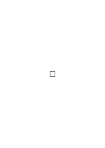
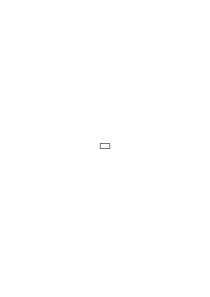
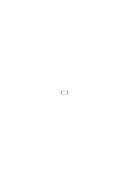
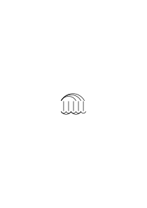
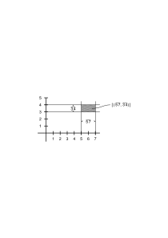
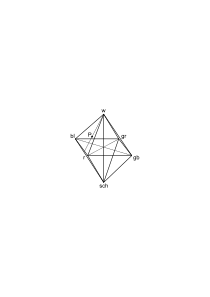
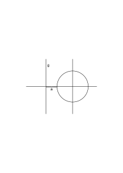
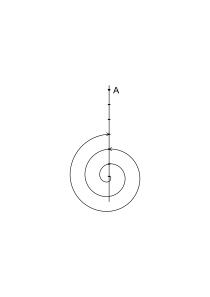

# Ms-105

### [Ir\[1\]](https://cdn.wittgensteinnachlass.com/2000px/webp/Ms-105/Ir.webp)

## I. Band Philosophische Bemerkungen

### [2\[1\]](https://cdn.wittgensteinnachlass.com/2000px/webp/Ms-105/2.webp)

02.02.1929

Wieder in Cambridge. Sehr merkwürdig. Es ist mir manchmal als ob die Zeit zurückgegangen wäre. Ich mache diese Eintragungen zögernd. Ich weiß nicht was mich noch erwartet. Es wird sich eben etwas ergeben! Wenn der Geist mich nicht verläßt. Jetzt schwinge ich sehr unruhig, weiß aber nicht um welche Gleichgewichtslage. Die Zeit hier sollte oder soll in Wirklichkeit eine Vorbereitung auf etwas sein. Ich soll mir über etwas klar werden.

### [2\[2\]](https://cdn.wittgensteinnachlass.com/2000px/webp/Ms-105/2.webp)

04.02.1929

Mein Gehirn ist in keinem günstigen Zustand. Es war immer seine Haupteigenschaft ein Mangel an Extensität & eine ziemlich große Intensität. Nun läßt die Intensität nach und wird nicht durch etwas anderes kompensiert. Ich schreibe nicht alles ein es scheint mir unrecht alles breitzutreten wenn ich es nicht bessern kann oder will.

Alles was ich jetzt in der Philosophie hinschreibe ist mehr oder weniger fades Zeug. Ich halte es aber für möglich daß es besser wird.

### [4\[1\]](https://cdn.wittgensteinnachlass.com/2000px/webp/Ms-105/4.webp)

07.02.1929

Ich bin eine seltsame, mir selbst nicht verständliche, Mischung aus Kälte & Hitze.

Ist es daß ich innerlich kalt bin & mich nur nach Wärme sehne? Nein. Ist es daß ich nur sinnlich heiß bin?

### [4\[2\]](https://cdn.wittgensteinnachlass.com/2000px/webp/Ms-105/4.webp)

15.02.1929

Ich habe sehr genußreiche Diskussionen mit Ramsey über Logik etc. Sie haben etwas von einem kräftigen Sport & sind glaube ich in einem guten Geist geführt. Es ist etwas Erotisches & Ritterliches darin. Ich werde dabei auch zu einem gewissen Mut im Denken erzogen. Es kann mir beinahe nichts Angenehmeres geschehen als wenn mir jemand meine Gedanken gleichsam aus dem Mund nimmt & sie gleichsam im Freien aufrollt. Natürlich ist alles das mit viel Eitelkeit gemischt, aber es ist nicht pure Eitelkeit.

### [4\[3\]](https://cdn.wittgensteinnachlass.com/2000px/webp/Ms-105/4.webp)

Ich gehe in der Wissenschaft nur gern allein spazieren.

### [1\[1\]](https://cdn.wittgensteinnachlass.com/2000px/webp/Ms-105/1.webp)

02.02.1929

Ist ein Raum denkbar der nur alle rationalen aber nicht die irrationalen Punkte enthält?

Und das heißt nur: Sind die irrationalen Zahlen nicht in den rationalen bereits präjudiziert?

### [1\[2\]](https://cdn.wittgensteinnachlass.com/2000px/webp/Ms-105/1.webp)

04.02.1929

Kann ich den Raum in rationalen Zahlen abbilden so kann ich ihn auch in irrationalen Zahlen abbilden. Und ist die eine Abbildung gegeben so ist damit auch schon die andere Art der Abbildung gegeben.

### [1\[3\]](https://cdn.wittgensteinnachlass.com/2000px/webp/Ms-105/1.webp)

Nun frägt es sich: Gibt es eine bevorzugte, etwa besonders unmittelbare, Art der Abbildung? Ich glaube nein!

### [1\[4\]](https://cdn.wittgensteinnachlass.com/2000px/webp/Ms-105/1.webp)

Jede Art der Abbildung ist gleichberechtigt.

### [1\[5\]](https://cdn.wittgensteinnachlass.com/2000px/webp/Ms-105/1.webp)

Wie läßt sich aber eine Entscheidung darüber denken welcher Art die Kontinuität des Gesichtsraumes ist?

### [3\[1\]](https://cdn.wittgensteinnachlass.com/2000px/webp/Ms-105/3.webp)

Es scheint viel dafür zu sprechen daß die Abbildung des Gesichtsraumes durch die Physik wirklich die einfachste ist. D.h. Daß die Physik die wahre Phänomenologie wäre.

Aber dagegen läßt sich etwas einwenden: Die Physik strebt nämlich Wahrheit d.h. richtige Voraussagungen der Ereignisse an während _das_ die Phänomenologie nicht tut sie strebt _Sinn_ nicht _Wahrheit_ an.

### [3\[2\]](https://cdn.wittgensteinnachlass.com/2000px/webp/Ms-105/3.webp)

Aber man kann sagen: Die Physik hat eine Sprache & in dieser Sprache sagt sie Sätze. Diese Sätze können wahr oder falsch sein. Diese Sätze bilden die Physik & ihre Grammatik die Phänomenologie (oder wie man es nennen will).

### [3\[3\]](https://cdn.wittgensteinnachlass.com/2000px/webp/Ms-105/3.webp),[5\[1\]](https://cdn.wittgensteinnachlass.com/2000px/webp/Ms-105/5.webp)

Die Sache schaut aber in Wirklichkeit schwieriger aus durch den Gebrauch der mathematischen Terminologie. Wenn z.B. die Wissenschaft zweifelt ob die beobachteten Erscheinungen durch die Elektronen- oder durch die Quantentheorie richtig zu beschreiben sind, so scheint es auf den ersten Blick, als handelte es sich um eine Entscheidung in der Grammatik.

### [5\[2\]](https://cdn.wittgensteinnachlass.com/2000px/webp/Ms-105/5.webp)

Es gibt eine bestimmte Mannigfaltigkeit des Sinnes & eine _andere_ Mannigfaltigkeit der _Gesetze_.

### [5\[3\]](https://cdn.wittgensteinnachlass.com/2000px/webp/Ms-105/5.webp)

Die Physik unterscheidet sich von der Phänomenologie dadurch daß sie Gesetze feststellen will. Die Phänomenologie stellt nur die Möglichkeiten fest.

### [5\[4\]](https://cdn.wittgensteinnachlass.com/2000px/webp/Ms-105/5.webp)

Dann wäre also die Phänomenologie die Grammatik der Beschreibung derjenigen Tatsachen, auf denen die Physik ihre Theorien aufbaut.

### [5\[5\]](https://cdn.wittgensteinnachlass.com/2000px/webp/Ms-105/5.webp)

Erklären ist mehr als beschreiben. Aber jede Erklärung enthält eine Beschreibung.

### [5\[6\]](https://cdn.wittgensteinnachlass.com/2000px/webp/Ms-105/5.webp)

05.02.1929

Kann man denn das Gesichtsfeld oder einen Teil des Gesichtsfeldes überhaupt beschreiben?

### [5\[7\]](https://cdn.wittgensteinnachlass.com/2000px/webp/Ms-105/5.webp),[7\[1\]](https://cdn.wittgensteinnachlass.com/2000px/webp/Ms-105/7.webp)

Man kann gewiß sagen: Wenn Du in dieses Rohr schaust wirst Du drei leuchtende Punkte in gleichen Abständen sehen. Das ist doch die Beschreibung eines Gesichtsbildes.

### [7\[2\]](https://cdn.wittgensteinnachlass.com/2000px/webp/Ms-105/7.webp)

Irgendwie scheint es mir als wäre jeder einfärbige Fleck im Gesichtsfeld einfach & als wäre seine Zusammengesetztheit aus kleineren Teilen nur eine scheinbare.

### [7\[3\]](https://cdn.wittgensteinnachlass.com/2000px/webp/Ms-105/7.webp)

Man könnte glauben der Gesichtsraum sei aus minima visibilia zusammengesetzt etwa aus lauter kleinen Quadraten die man als unteilbare Flecke sieht. Aber dann ist die Wahl dieser Teile offenbar willkürlich. Ich könnte z.B. nicht sagen wie das Quadratnetz über ein bestimmtes Bild zu legen ist denn wenn man das Netz um weniger als eine Maschenweite verschiebt so sind die minima visibilia zwar in ganz anderen Orten aber das Bild sieht ganz gleich aus.

### [7\[4\]](https://cdn.wittgensteinnachlass.com/2000px/webp/Ms-105/7.webp),[9\[1\]](https://cdn.wittgensteinnachlass.com/2000px/webp/Ms-105/9.webp)

Es scheint als könne man einen einfärbigen Fleck nicht zusammengesetzt sehen außer wenn man ihn sich _nicht_ einfärbig vorstellt. Die Vorstellung einer Trennungslinie macht den Fleck mehrfärbig denn die Trennungslinie muß eine andere Farbe haben als der übrige Fleck.

### [9\[2\]](https://cdn.wittgensteinnachlass.com/2000px/webp/Ms-105/9.webp)

Das würde heißen: Die einfachen Bestandteile des Gesichtsfeldes sind einfärbige Flecke. Wie verhält es sich aber dann mit kontinuierlichen Farbenübergängen?

### [9\[3\]](https://cdn.wittgensteinnachlass.com/2000px/webp/Ms-105/9.webp)

Wie kann man die Gestalt eines Flecks im Gesichtsfeld beschreiben?

### [9\[4\]](https://cdn.wittgensteinnachlass.com/2000px/webp/Ms-105/9.webp)

Kann man im Gesichtsfeld Koordinatengeometrie treiben?

### [9\[5\]](https://cdn.wittgensteinnachlass.com/2000px/webp/Ms-105/9.webp)

06.02.1929

Kann man sagen daß der kleinere Fleck einfacher ist als der größere? Nehmen wir an sie seien einfärbige Kreise, worin soll die größere Einfachheit des kleineren Kreises bestehen?

### [9\[6\]](https://cdn.wittgensteinnachlass.com/2000px/webp/Ms-105/9.webp),[11\[1\]](https://cdn.wittgensteinnachlass.com/2000px/webp/Ms-105/11.webp)

Man könnte sagen der größere kann zwar aus dem kleineren & noch einem Teil bestehen aber nicht vice versa. Aber warum soll ich nicht den kleineren als die Differenz des größeren & des Ringes darstellen.

### [11\[2\]](https://cdn.wittgensteinnachlass.com/2000px/webp/Ms-105/11.webp)

Es scheint mir also: Der kleinere Fleck ist nicht einfacher als der größere.

### [11\[3\]](https://cdn.wittgensteinnachlass.com/2000px/webp/Ms-105/11.webp)

Was ist die allgemeine Form der räumlichen Aussagen?

### [11\[4\]](https://cdn.wittgensteinnachlass.com/2000px/webp/Ms-105/11.webp)

Es scheint mir eine eigentümliche Eigenschaft der räumlichen Aussagen daß man scheinbar den Raum ohne irgend eine Anspielung auf die Zeit nicht beschreiben kann. Ich kann z.B. sagen: „Ich sehe jetzt einen roten Kreis auf blauem Grund”. Das ist ein Satz. Aber ich kann nicht sagen „ein roter Kreis ist auf blauem Grund”.

### [11\[5\]](https://cdn.wittgensteinnachlass.com/2000px/webp/Ms-105/11.webp)

Es ist eigentlich von vornherein wahrscheinlich daß die Zeit in die Betrachtung des Gesichtsraumes nicht nachträglich als ein Anhängsel eintreten kann.

### [11\[6\]](https://cdn.wittgensteinnachlass.com/2000px/webp/Ms-105/11.webp),[13\[1\]](https://cdn.wittgensteinnachlass.com/2000px/webp/Ms-105/13.webp)

Es ist doch sehr seltsam daß man immer wieder versucht ist einen Komplex im Gesichtsfeld, einen Fleck, als Gegenstand anzusprechen.

### [13\[2\]](https://cdn.wittgensteinnachlass.com/2000px/webp/Ms-105/13.webp)

Ein Gegenstand darf sich in gewissem Sinne nicht beschreiben lassen.

### [13\[3\]](https://cdn.wittgensteinnachlass.com/2000px/webp/Ms-105/13.webp)

D.h. die Beschreibung darf ihm keine Eigenschaften zuschreiben deren Fehlen die Existenz des Gegenstandes selbst zunichte machen würde. D.h. die Beschreibung darf nichts aussagen was für die Existenz des Gegenstandes wesentlich wäre.

### [13\[4\]](https://cdn.wittgensteinnachlass.com/2000px/webp/Ms-105/13.webp),[15\[1\]](https://cdn.wittgensteinnachlass.com/2000px/webp/Ms-105/15.webp)

„Der Mord … beschäftigt das Gericht” ist ein Satz in dem offenbar ein Ereignis scheinbar mit einem Namen bezeichnet ist. Es ist das nicht vielleicht ein Fall der Russellschen „Descriptions” sondern der Fall in dem scheinbar von einem komplexen Gegenstand die Rede ist der aber bei richtiger Analyse durch einen Satz (die Beschreibung des Komplexes) dargestellt wird. Hat der Mord gar nicht stattgefunden so bleibt der erste Satz doch sinnvoll. Eine gewisse Analogie mit den Russellschen Beschreibungen ist allerdings vorhanden. Nur daß hier der Komplex quasi von innen her – durch einen Satz – beschrieben wird.

### [15\[2\]](https://cdn.wittgensteinnachlass.com/2000px/webp/Ms-105/15.webp)

Es wäre vielleicht nützlich erst über die Darstellung _irgend eines_ Raumes nachzudenken ehe man zum Gesichtsraum übergeht.

### [15\[3\]](https://cdn.wittgensteinnachlass.com/2000px/webp/Ms-105/15.webp)

Die Frage ist dann etwa: Wie muß man ein System von Axiomen richtig interpretieren damit es zur Darstellung einer Variablen wird?

### [15\[4\]](https://cdn.wittgensteinnachlass.com/2000px/webp/Ms-105/15.webp)

Verhält es sich so daß die „Axiome” in einer gewissen Struktur Tautologien sind & daß diese Struktur eben dadurch bestimmt wird daß gewisse Sätze in ihr Tautologien werden?

### [15\[5\]](https://cdn.wittgensteinnachlass.com/2000px/webp/Ms-105/15.webp),[17\[1\]](https://cdn.wittgensteinnachlass.com/2000px/webp/Ms-105/17.webp)

Man könnte gewiß statt der Logik der Tautologien eine Logik der Gleichungen setzen. D.h. man würde von einem Satz zum folgenden durch _Substitutionen_ gelangen. Und die Regeln nach denen diese Substitutionen vollzogen werden dürfen wären in Gleichungen niedergelegt.

### [17\[2\]](https://cdn.wittgensteinnachlass.com/2000px/webp/Ms-105/17.webp)

Alle Gleichungen – nicht nur die Definitionen – sind Zeichenregeln. Von einigen dieser Zeichenregeln kann man zu den anderen gelangen. Man kann die einen geben & aus ihnen die anderen ableiten.

### [17\[3\]](https://cdn.wittgensteinnachlass.com/2000px/webp/Ms-105/17.webp)

Ist so eine Ableitung ein Schlußverfahren? Warum soll man es nicht so nennen?

### [17\[4\]](https://cdn.wittgensteinnachlass.com/2000px/webp/Ms-105/17.webp),[19\[1\]](https://cdn.wittgensteinnachlass.com/2000px/webp/Ms-105/19.webp)

Wie verhält es sich mit Ungleichungen? Auch sie sind offenbar Zeichenregeln. Kann man Zeichenregeln durch _Sätze_ – die von den Zeichen handeln – ersetzen? Wenn ja, so ist es klar daß ich die ganze Logik auf Zeichenregeln, also in einem übertragenen Sinn auf Gleichungen anwenden kann.

### [19\[2\]](https://cdn.wittgensteinnachlass.com/2000px/webp/Ms-105/19.webp)

Ich werde scheinbar, wider meinen Willen, auf die Arithmetik zurückgeworfen.

### [19\[3\]](https://cdn.wittgensteinnachlass.com/2000px/webp/Ms-105/19.webp)

Die Zahl ist eine Art der Darstellung. Wenn ich sage: auf dem Tisch liegen 4 Bücher so könnte ich dasselbe auch ohne die Hilfe der Zahl 4 ausdrücken etwa mit Hilfe einer _anderen_ Zahl. Die 4 kommt in meine Darstellung dadurch daß ich sie in Form eines Satzes über a, b, c, d ausdrücke.

### [19\[4\]](https://cdn.wittgensteinnachlass.com/2000px/webp/Ms-105/19.webp)

Ein Satz handelt von 4 Dingen wenn er von a, b, c, d handelt.

### [19\[5\]](https://cdn.wittgensteinnachlass.com/2000px/webp/Ms-105/19.webp)

Das charakteristische ist daß das was man zählt durch Substantive bezeichnet wird.

### [19\[6\]](https://cdn.wittgensteinnachlass.com/2000px/webp/Ms-105/19.webp)

Man müßte also den Gebrauch der Substantive in der Sprache allgemein rechtfertigen.

### [19\[7\]](https://cdn.wittgensteinnachlass.com/2000px/webp/Ms-105/19.webp),[21\[1\]](https://cdn.wittgensteinnachlass.com/2000px/webp/Ms-105/21.webp)

Kann das geschehen indem man Substantive als Zeichen von Komplexen einführt? Beiläufig: Wenn ich sage das Liebespaar geht spazieren so sage ich etwas über jeden der beiden Teile aus & außerdem daß sie in einer gewissen Beziehung zu einander stehen. Etwa <math display="inline"><mtext>φ(</mtext><mtext>a)</mtext><mspace width="0.3em"/><mtext>∙</mtext><mspace width="0.3em"/><mtext>φ(</mtext><mtext>b)</mtext><mspace width="0.3em"/><mtext>∙</mtext><mspace width="0.3em"/><mtext>ψ(</mtext><mtext>a,</mtext><mtext>b)</mtext><mspace width="0.3em"/><mo>=</mo><mspace width="0.3em"/><mtext>Φ[</mtext><mspace width="0.3em"/><mo>|</mo><mtext>ψ(</mtext><mtext>a,</mtext><mtext>b)</mtext><mspace width="0.3em"/><mo>|</mo><mo>]</mo><mspace width="0.3em"/><mo>=</mo><mspace width="0.3em"/><mtext>Φ(</mtext><mtext>C)</mtext><mspace width="0.3em"/><mo>|</mo><msup><mrow></mrow><mtext>⏟</mtext></msup><mtext>Komplex</mtext><mspace width="0.3em"/><mo>|</mo></math>.

Hier wäre C ein Substantiv.

### [21\[2\]](https://cdn.wittgensteinnachlass.com/2000px/webp/Ms-105/21.webp)

Stelle ich eine Tatsache durch einen Satz von der Form φ(A,B) dar so könnten wir sagen die Darstellung enthält eine Zweiheit u.s.w.

### [21\[3\]](https://cdn.wittgensteinnachlass.com/2000px/webp/Ms-105/21.webp),[23\[1\]](https://cdn.wittgensteinnachlass.com/2000px/webp/Ms-105/23.webp)

Wie verhält sich diese Theorie zu der Freges & Russells? Der erste Unterschied ist, daß in der Theorie Freges eine Einseinsrelation _konstruiert_ wird das ist unerlaubt & setzt eine falsche Auffassung der Identität voraus. Zweitens wird _eine_ Klasse mit einer bestimmten Anzahl von Gliedern konstruiert & das ist aus dem gleichen Grund unerlaubt. Diese Grundklasse wäre in meiner Theorie die Klasse der Substantiva in einem gewissen Zusammenhang (und zwar in extenso).

### [23\[2\]](https://cdn.wittgensteinnachlass.com/2000px/webp/Ms-105/23.webp)

Anderseits scheint es als könne man meine Theorie so formulieren daß, wie Frege es sagt, die Zahlangabe eine Aussage über einen Begriff ist.

### [23\[3\]](https://cdn.wittgensteinnachlass.com/2000px/webp/Ms-105/23.webp),[25\[1\]](https://cdn.wittgensteinnachlass.com/2000px/webp/Ms-105/25.webp)

Ich sagte einmal es gäbe keine extensionale Unendlichkeit. Ramsey sagt darauf kann man sich nicht vorstellen daß ein Mensch ewig lebt d.h. einfach nie stirbt, und ist das nicht extensionale Unendlichkeit? Ich kann mir doch gewiß denken daß ein Rad sich dreht und _nie_ stehenbleibt. Hier liegt eine merkwürdige Schwierigkeit: Es scheint mir unsinnig zu sagen daß in einem Raum unendlich viele Körper sind gleichsam als etwas Zufälliges. Dagegen kann ich mir ja _intentional_ ein _unendliches Gesetz_ denken (oder eine _unendliche Regel_) durch die immer neues produziert wird – ad infinitum – aber natürlich nur was eine Regel produzieren kann, nämlich Konstruktionen. Und nun scheint es daß die unendlichen Umdrehungen eines Rades Konstruktionen sein können während ich neue Gegenstände nicht konstruieren kann. [Darin wird etwas Wahres & etwas Falsches sein.]

### [25\[2\]](https://cdn.wittgensteinnachlass.com/2000px/webp/Ms-105/25.webp)

Angenommen wir wandern auf einer Geraden in den Euklidischen Raum hinaus & sagen wir begegnen alle 10 m einer eisernen Kugel von gewissem Durchmesser ad inf.; ist das eine Konstruktion? Es scheint ja. Das merkwürdige ist daß man einen solchen unendlichen Komplex von Kugeln auffassen kann als das endlose Wiederkehren derselben Kugel nach einem gewissen Gesetz. Daß aber im selben Augenblick wenn man eine individuelle Verschiedenheit der Kugeln denkt ihre unendliche Anzahl Unsinn zu werden scheint.

### [25\[3\]](https://cdn.wittgensteinnachlass.com/2000px/webp/Ms-105/25.webp)

Ich habe das Gefühl daß die bloß negative Beschreibung des _nicht Aufhörens_ nicht eine positive Unendlichkeit liefern kann.

### [25\[4\]](https://cdn.wittgensteinnachlass.com/2000px/webp/Ms-105/25.webp),[27\[1\]](https://cdn.wittgensteinnachlass.com/2000px/webp/Ms-105/27.webp)

Dieses negative Kennzeichen genügt wohl für die intentionale Unendlichkeit. Hier bedeutet es nur daß eine Operation _ihrem Wesen nach_ auf ihr eigenes Resultat angewandt werden kann.

### [27\[2\]](https://cdn.wittgensteinnachlass.com/2000px/webp/Ms-105/27.webp)

Wenn zwei Gegenstände alle Eigenschaften mit einander gemein haben, wie können sie dann verschiedene Namen haben? Denn daß sie Namen haben ist ja in diesem Sinne auch eine Eigenschaft!

### [27\[3\]](https://cdn.wittgensteinnachlass.com/2000px/webp/Ms-105/27.webp),[29\[1\]](https://cdn.wittgensteinnachlass.com/2000px/webp/Ms-105/29.webp)

Nun kann ich aber doch über die Eigenschaften der Gegenstände unsicher sein. Ich kann also zweifeln ob zwei Gegenstände alle Eigenschaften miteinander gemein haben oder nicht. Wie geht es weiter? Ich würde ihnen etwa zuerst verschiedene Namen geben …? Nein denn wenn ich ihnen auch nur verschiedene Namen geben kann so haben sie damit eo ipso verschiedene Eigenschaften. Das würde aber heißen daß ich von zwei Gegenständen gar nicht sagen kann daß sie nur gleiche Eigenschaften haben, denn dieser Satz würde sich selbst widersprechen. Und doch kann das nicht stimmen. Es würde jedenfalls folgen, daß der Gegenstand a auch „b” heißt & der Gegenstand b auch „a”.

### [29\[2\]](https://cdn.wittgensteinnachlass.com/2000px/webp/Ms-105/29.webp)

Angenommen mein Gesichtsbild besteht aus zwei gleichgroßen roten Kreisen auf blauem Grund: Was ist hier in zweifacher Zahl vorhanden & was einmal? Und was bedeutet diese Frage überhaupt?

### [29\[3\]](https://cdn.wittgensteinnachlass.com/2000px/webp/Ms-105/29.webp)

Man könnte sagen wir haben hier _eine_ Farbe, _eine_ Form aber _zwei_ Örtlichkeiten. Aber kann man denn von Örtlichkeiten reden ohne sie sich erfüllt zu denken also als bloße Möglichkeiten? Ein scheinbarer Ausweg wäre natürlich der, zu sagen, rot, kreisförmig, sind Eigenschaften (externe) von zwei Gegenständen die man etwa Flecken nennen könnte & diese Flecken stehen außerdem in gewissen räumlichen Beziehungen zu einander; aber das ist Unsinn.

### [29\[4\]](https://cdn.wittgensteinnachlass.com/2000px/webp/Ms-105/29.webp),[31\[1\]](https://cdn.wittgensteinnachlass.com/2000px/webp/Ms-105/31.webp)

Es ist offenbar möglich die Identität eines Ortes im Gesichtsfeld festzustellen denn sonst könnte man nicht unterscheiden ob ein Fleck immer im gleichen Ort bleibt oder ob er seinen Ort ändert.

Denken wir uns einen Fleck der verschwindet & wieder auftaucht so können wir doch sagen ob er am gleichen Ort wieder erscheint oder an einem anderen.

(_Physiologisch_ könnte man das so erklären daß die einzelnen Punkte der Retina lokale Merkmale haben.) Man kann also wirklich von gewissen Orten im Gesichtsfeld sprechen & zwar mit demselben Recht wie man von verschiedenen Orten auf der Netzhaut spricht. Wäre ein solcher Raum mit einer Fläche zu vergleichen, die in jedem ihrer Punkte eine andere Krümmung hätte so daß jeder Punkt ein ausgezeichneter Punkt ist?

### [31\[2\]](https://cdn.wittgensteinnachlass.com/2000px/webp/Ms-105/31.webp),[33\[1\]](https://cdn.wittgensteinnachlass.com/2000px/webp/Ms-105/33.webp)

Man kann auch sagen der Gesichtsraum ist ein gerichteter Raum, ein Raum in dem es ein oben & unten und ein rechts & links gibt. Und _dieses_ oben & unten, & rechts & links hat nichts mit der Schwerkraft oder der rechten & linken Hand zu tun. Es würde z.B. auch dann seinen Sinn beibehalten wenn wir unser ganzes Leben lang durch ein Teleskop nach den Sternen sähen.

### [33\[2\]](https://cdn.wittgensteinnachlass.com/2000px/webp/Ms-105/33.webp)

Angenommen wir sähen durch ein Fernrohr nach dem Sternenhimmel dann wäre unser Gesichtsfeld gänzlich dunkel mit einem helleren Kreis & in diesem Kreis wären Lichtpunkte. Nehmen wir ferner an wir hätten unseren Körper nie gesehen sondern immer nur dieses Bild wir könnten also nicht die Lage eines Sterns mit der unseres Kopfes oder unserer Füße vergleichen. Was zeigt mir dann daß mein Raum ein oben & unten etc. hat, oder einfach, daß er gerichtet ist? Ich kann jedenfalls wahrnehmen daß sich das ganze Sternbild im lichten Kreis _dreht_ & das heißt ich kann verschiedene Richtungen des Sternbilds wahrnehmen. Wenn ich ein Buch verkehrt halte so kann ich die Buchstaben nicht oder schwer lesen.

### [33\[3\]](https://cdn.wittgensteinnachlass.com/2000px/webp/Ms-105/33.webp),[35\[1\]](https://cdn.wittgensteinnachlass.com/2000px/webp/Ms-105/35.webp)

Dieser Sachverhalt ist nicht vielleicht dadurch _erklärt_ daß man sagt: Die Retina hat eben ein oben & unten, rechts & links & so ist es leicht verständlich daß es das analoge im Gesichtsfeld gibt. Vielmehr ist eben das nur eine _Darstellung_ des Sachverhalts auf dem Umweg über die Verhältnisse in der Retina.

### [35\[2\]](https://cdn.wittgensteinnachlass.com/2000px/webp/Ms-105/35.webp)

Wir können auch sagen es verhält sich in unserem Gesichtsfeld immer als sähen wir mit allem übrigen ein gerichtetes Koordinatensystem wonach wir alle Richtungen fixieren können. – Aber auch das ist keine richtige Darstellung denn sähen wir wirklich ein solches Koordinatenkreuz (etwa mit Pfeilen) so wären wir tatsächlich im Stande nicht nur die relativen Richtungen der Objekte gegen dieses Kreuz zu fixieren sondern auch die Lage des Kreuzes selbst im Raum gleichsam gegen ein ungesehenes im Wesen dieses Raumes enthaltenes Koordinatensystem.

### [35\[3\]](https://cdn.wittgensteinnachlass.com/2000px/webp/Ms-105/35.webp),[37\[1\]](https://cdn.wittgensteinnachlass.com/2000px/webp/Ms-105/37.webp)

Wie müßte es sich mit unserem Gesichtsfeld verhalten wenn das nicht so wäre? Ich könnte dann natürlich relative Lagen & Lageänderungen sehen aber nicht absolute. D.h. aber z.B. es hätte keinen Sinn von einer Drehung des ganzen Gesichtsfeldes zu reden.

So weit ist es vielleicht noch verständlich. Nehmen wir nun aber an wir sähen in unserem Fernrohr etwa nur einen Stern in einer gewissen Entfernung vom schwarzen Rand. Dieser Stern würde verschwinden & wieder in der gleichen Entfernung vom Rand auftauchen. Dann könnten wir nicht wissen ob er an der gleichen Stelle auftaucht oder an einer anderen. Oder es würden zwei Sterne abwechselnd in gleicher Entfernung vom Rand kommen & verschwinden dann könnten wir nicht sagen ob – oder daß – es der gleiche oder verschiedene Sterne sind.

### [37\[2\]](https://cdn.wittgensteinnachlass.com/2000px/webp/Ms-105/37.webp),[39\[1\]](https://cdn.wittgensteinnachlass.com/2000px/webp/Ms-105/39.webp)

Wir könnten das auch so darstellen: Nehmen wir an daß einmal für ein paar Augenblicke ein gerichtetes Koordinatenkreuz in unserm Gesichtsfeld aufgeflammt sei & dann wieder verschwunden so könnten wir bei genügendem Gedächtnis die Richtung jedes später eintretenden Bildes nach der Erinnerung an das Kreuz fixieren. Gäbe es keine absolute Richtung so wäre das (logisch) unmöglich.

### [39\[2\]](https://cdn.wittgensteinnachlass.com/2000px/webp/Ms-105/39.webp)

Das heißt aber wir haben die Möglichkeit eine mögliche Lage – d.h. also eine Stelle – im Gesichtsfeld zu beschreiben ohne uns auf etwas zu beziehen was sich eben dort befindet. Wir können also z.B. sagen etwas kann oben rechts sein u.s.w.

(Die Analogie mit der gekrümmten Fläche wäre etwa zu sagen: Ein Fleck auf einem Ei kann sich nahe am stumpfen Ende befinden.)

### [39\[3\]](https://cdn.wittgensteinnachlass.com/2000px/webp/Ms-105/39.webp),[41\[1\]](https://cdn.wittgensteinnachlass.com/2000px/webp/Ms-105/41.webp)

Ich kann offenbar das Zeichen V einmal als ein v einmal als ein a, als das Zeichen für größer oder als das Zeichen für kleiner sehen auch wenn ich es durch ein Fernrohr sehe & seine Lage nicht mit der Lage meines Körpers vergleichen kann. Vielleicht wird man sagen daß ich die Lage meines Körpers fühle ohne ihn zu sehen. _Aber_ die Lage im Gefühlsraum (wie ich ihn einmal nennen will) hat mit der Lage im Gesichtsraum nichts zu tun, die beiden sind von einander unabhängig & gäbe es im Gesichtsraum keine absolute Richtung so könnte man die Richtung im Gefühlsraum ihr gar nicht zuordnen.

### [41\[2\]](https://cdn.wittgensteinnachlass.com/2000px/webp/Ms-105/41.webp)

Kann ich nun etwa sagen: Die obere Hälfte meines Gesichtsfeldes ist rot.? Und was bedeutet das? Kann es sagen daß ein Gegenstand (die obere Hälfte) die Eigenschaft rot hat? Man muß sich daran erinnern daß jeder Teil des Gesichtsraumes eine Farbe haben _muß_ & daß jede Farbe einen Teil des Gesichtsraumes einnehmen _muß_. Die Formen _Farbe_ & _Gesichtsraum_ durchdringen einander.

### [41\[3\]](https://cdn.wittgensteinnachlass.com/2000px/webp/Ms-105/41.webp)

Man könnte auch sagen es ist nur _eine_ Form. Welches aber sind die Gegenstände die in dieser Form auftreten.

### [41\[4\]](https://cdn.wittgensteinnachlass.com/2000px/webp/Ms-105/41.webp)

Stehen nicht Farbe & Gesichtsraum zu einander im Verhältnis wie Argument & Funktion? Die Formen von Argument & Funktion müssen einander auch durchdringen.

### [43\[1\]](https://cdn.wittgensteinnachlass.com/2000px/webp/Ms-105/43.webp),[45\[1\]](https://cdn.wittgensteinnachlass.com/2000px/webp/Ms-105/45.webp)

Mit der Zusammengesetztheit der räumlichen Gebilde aus ihren kleineren räumlichen Bestandteilen verhält es sich so: Das größere _geometrische Gebilde_ ist nicht aus kleineren _geometrischen Gebilden_ zusammengesetzt ganz ebensowenig wie man sagen kann daß 5 aus 3 & 2 zusammengesetzt ist oder etwa gar 2 aus 5 & ‒ 3. Denn hier bedingt das größere das kleinere ganz ebenso wie das kleinere das größere. Das Viereck

ist nicht aus den Vierecken

&

zusammengesetzt. Vielmehr bedingt die erste geometrische Figur die beiden anderen und umgekehrt. Hier hätte also Nicod recht wenn er sagt daß die größere Figur nicht die kleineren als Bestandteile enthält. Anders aber ist es im erfüllten Raum die Figur

besteht tatsächlich aus den Bestandteilen

und

obwohl die rein geometrische Figur des großen Quadrats _nicht_ aus den Figuren der beiden Rechtecke besteht. Diese „rein geometrischen Figuren” sind ja nur logische Möglichkeiten. – Man kann nun tatsächlich ein materielles Schachbrett als Einheit – nicht aus seinen Feldern zusammengesetzt – sehen, indem man es als ein großes Viereck sieht & von seinen Feldern absieht. – Sieht man aber von seinen Feldern nicht ab dann ist es ein Komplex & die Felder sind seine Bestandteile die es _konstituieren_ um die Ausdrucksweise Nicods anzuwenden.

### [45\[2\]](https://cdn.wittgensteinnachlass.com/2000px/webp/Ms-105/45.webp)

Was es übrigens heißen soll daß etwas von irgendwelchen Gegenständen _determiniert_ aber nicht _konstituiert_ wird kann ich nicht verstehen. Diese beiden Ausdrücke, wenn sie überhaupt einen Sinn haben, haben denselben Sinn.

### [45\[3\]](https://cdn.wittgensteinnachlass.com/2000px/webp/Ms-105/45.webp)

Man kann die obigen Überlegungen natürlich auch auf die Zeit anwenden.

### [45\[4\]](https://cdn.wittgensteinnachlass.com/2000px/webp/Ms-105/45.webp)

Ein Intellekt der die Bestandteile & ihre Relationen übersieht das Ganze aber nicht ist ein Unding. (siehe Nicod)

### [45\[5\]](https://cdn.wittgensteinnachlass.com/2000px/webp/Ms-105/45.webp),[47\[1\]](https://cdn.wittgensteinnachlass.com/2000px/webp/Ms-105/47.webp),[49\[1\]](https://cdn.wittgensteinnachlass.com/2000px/webp/Ms-105/49.webp)

Wenn jeder Punkt im Gesichtsraum ein ausgezeichneter Punkt ist so hat es allerdings einen Sinn von hier & dort im Gesichtsraum zu sprechen & das scheint mir jetzt die Darstellung der visuellen Sachverhalte einfacher zu gestalten. Aber ist diese Eigenschaft der ausgezeichneten Punkte für den Gesichtsraum wirklich wesentlich, ich meine könnten wir uns nicht einen Gesichtsraum denken in dem man nur gewisse Lagenverhältnisse aber keine absolute Lage wahrnähme. D.h. könnten wir uns so eine Erfahrung ausmalen? Etwa in dem Sinn wie wir uns die Erfahrungen eines Einäugigen vorstellen können –? Ich glaube nicht. Man könnte z.B. eine Drehung des ganzen Gesichtsbildes nicht wahrnehmen oder vielmehr _sie wäre nicht denkbar_. Wie würde etwa der Zeiger einer Uhr aussehen der sich dem Zifferblatt entlang bewegt? (Ich nehme an daß das Zifferblatt wie bei manchen großen Uhren nur Punkte aber keine Ziffern hat.)

Wir würden dann zwar die Bewegung von einem Punkt zum anderen wahrnehmen – wenn sie nicht in _einem_ Ruck geschieht – aber wenn der Zeiger in einem Punkt angelangt wäre so könnten wir seine Lage von der im vorigen Punkt nicht unterscheiden. Ich glaube es zeigt sich, daß das mit unserem Gesichtssinn nicht vorstellbar ist.

### [44\[1\]](https://cdn.wittgensteinnachlass.com/2000px/webp/Ms-105/44.webp)

Wenn ein Elektron durch die geringste Lichtquantität die wir darauf werfen um es zu sehen fortgeschleudert wird so daß wir es nicht sehen so können wir nur sagen _daß wir es nicht sehen_ & eine Theorie die dann dennoch daran festhält daß es da ist – nur nicht gesehen werden kann – ist eine sehr unpraktische Theorie.

### [49\[2\]](https://cdn.wittgensteinnachlass.com/2000px/webp/Ms-105/49.webp)

Ist nun nicht der Begriff der Distanz einfacher zu verstehen? Denken wir uns ein Kraftfeld etwa eine Eisenplatte die in einem Punkt ständig erhitzt wird, & die Wärme nach allen Richtungen leitet so daß ein Temperaturgefälle in radialer Richtung entsteht. In allen Punkten der Fläche könne man mit Thermometern die Temperatur messen. Man könnte dann die Distanz in der Temperaturgeometrie der Fläche definieren als die Temperaturdifferenz irgend zweier Thermometer. Auch unser Gesichtsraum wäre ja so ein Feld.

### [49\[3\]](https://cdn.wittgensteinnachlass.com/2000px/webp/Ms-105/49.webp)

Was bedeutet dann eine Distanz im Euklidischen Raum? Aber hier bin ich, im Gegensatz zum Gesichtsraum, im Bereich der starren Maßstäbe.

### [49\[4\]](https://cdn.wittgensteinnachlass.com/2000px/webp/Ms-105/49.webp),[51\[1\]](https://cdn.wittgensteinnachlass.com/2000px/webp/Ms-105/51.webp)

Es ist nun ein Satz zu sagen: Rot ist hier. Dabei ist „hier” die Bezeichnung eines Ortes im Gesichtsfeld & diese Bezeichnung, bezeichnet auch die Gestalt des roten Flecks denn aus der Lage der Farbe Rot geht diese Gestalt hervor. Wie aber ist diese Lage wirklich zu beschreiben?

### [51\[2\]](https://cdn.wittgensteinnachlass.com/2000px/webp/Ms-105/51.webp)

Der Unterschied zwischen der Geometrie als der Lehre von einem Raum & der mathematischen Geometrie muß derselbe sein wie der zwischen dem Satz zwei Pflaumen & zwei Pflaumen sind vier Pflaumen & dem Satz 2 + 2 = 4. Aber auch das erste dieser Gebilde ist ja kein wirklicher Satz sondern nur eine Andeutung eines Übergangs von einem _Satz_ zu einem anderen _Satz_. Daher können auch die scheinbaren Sätze der Geometrie nicht wirklich Sätze sein sondern angedeutete Übergänge von einem Satz über räumliche Objekte zu einem anderen Satz über räumliche Objekte. So kann ich von dem Satz „A & B liegen zwischen C & D” unmittelbar übergehen zu „A liegt entweder zwischen B & C oder zwischen B & D”. Das Axiom, welches mir diesen Übergang zu gestatten scheint, ist eine Tautologie, oder es ist irgendetwas anderes über seine Form bestimmt, welches es erst zu einem Kriterium für die Formen der beiden Sätze die es verbindet machen kann.

### [53\[1\]](https://cdn.wittgensteinnachlass.com/2000px/webp/Ms-105/53.webp)

Es ist klar, daß es keine Relation des „Sich-Befindens” gibt die zwischen einer Farbe & einem Ort bestünde in dem sie „sich befindet”! Es gibt kein Zwischenglied zwischen Farbe & Raum.

### [53\[2\]](https://cdn.wittgensteinnachlass.com/2000px/webp/Ms-105/53.webp)

Farbe & Raum sättigen einander.

### [53\[3\]](https://cdn.wittgensteinnachlass.com/2000px/webp/Ms-105/53.webp)

Und die Art wie sie einander durchdringen macht das Gesichtsfeld.

### [53\[4\]](https://cdn.wittgensteinnachlass.com/2000px/webp/Ms-105/53.webp)

Könnte man die Axiome der Geometrie als Prinzipe des Übergangs von einem Satz zu einem anderen auffassen? Dann wären sie wirklich als Sätze der Grammatik aufgefaßt die nur solange nötig sind als man die interne Relation zwischen den Gliedern eines Schlusses nicht aus der Struktur der Sätze ersehen kann. Sie sind dann von der Art: Man darf immer von einem Zeichen das so & so aussieht zu einem anderen übergehen das so & so aussieht. (Solche Regeln des Übergangs findet man z.B. bei Frege angegeben.)

### [55\[1\]](https://cdn.wittgensteinnachlass.com/2000px/webp/Ms-105/55.webp)

Wie verhält es sich mit der Widerspruchsfreiheit der Axiome?

### [55\[2\]](https://cdn.wittgensteinnachlass.com/2000px/webp/Ms-105/55.webp)

Man braucht – so kommt es mir vor – um den Raum darzustellen gleichsam ein dehnbares Zeichen. Vielleicht ein Zeichen das eine Interpolation erlaubt analog dem Dezimalsystem. Das Zeichen muß die Mannigfaltigkeit & Eigenschaften des Raumes haben.

### [55\[3\]](https://cdn.wittgensteinnachlass.com/2000px/webp/Ms-105/55.webp)

Ist nicht das Dezimalsystem mit seiner _unendlichen Möglichkeit_ der Interpolation eben dieses Zeichen?

### [55\[4\]](https://cdn.wittgensteinnachlass.com/2000px/webp/Ms-105/55.webp),[57\[1\]](https://cdn.wittgensteinnachlass.com/2000px/webp/Ms-105/57.webp)

Die Regeln über das Zahlensystem – etwa das Dezimalsystem – enthalten alles was an den Zahlen unendlich ist. Daß _diese Regeln_ z.B. die Zahlzeichen nach rechts & links nicht beschränken _darin_ liegt die Unendlichkeit ausgedrückt. Man könnte vielleicht sagen: ja, aber die Zahlzeichen sind doch durch den Gebrauch von Papier & Schreibmaterial & andere Umstände beschränkt. Sehr wohl aber das ist nicht in _den **Regeln**_ über ihren Gebrauch ausgedrückt & nur in diesen liegt ihr eigentliches Wesen ausgesprochen.

### [57\[2\]](https://cdn.wittgensteinnachlass.com/2000px/webp/Ms-105/57.webp)

Welcher Art ist der Satz „zwischen 5 & 8 gibt es eine Primzahl”? Ich würde sagen: „das _zeigt_ sich”. Und das ist richtig; aber kann man nicht die Aufmerksamkeit auf diesen internen Sachverhalt lenken? Man könnte doch sagen: „Untersuche das Intervall von 10 bis 20 auf Primzahlen! Wieviel gibt es?” Wäre das nicht eine klare Aufgabe? Und was wäre ihre Lösung? D.h., wie wäre ihre Lösung richtig auszudrücken oder darzustellen? Was bedeutet der Satz: „Zwischen 10 & 20 gibt es 4 Primzahlen”?

### [57\[3\]](https://cdn.wittgensteinnachlass.com/2000px/webp/Ms-105/57.webp)

Dieser Satz scheint unsere Aufmerksamkeit auf einen gewissen Aspekt der Sache zu lenken.

### [57\[4\]](https://cdn.wittgensteinnachlass.com/2000px/webp/Ms-105/57.webp),[59\[1\]](https://cdn.wittgensteinnachlass.com/2000px/webp/Ms-105/59.webp)

So kann ich z.B. die Zahl 5 so hinschreiben daß man deutlich sieht daß sie nur durch 1 & durch sich selbst teilbar ist: Etwa so:

Dieser Aspekt könnte etwa sagen „5 ist eine Primzahl”; oder: „Seht, 5 ist eine Primzahl!”.

### [59\[2\]](https://cdn.wittgensteinnachlass.com/2000px/webp/Ms-105/59.webp)

Das käme vielleicht auf dasselbe hinaus, was ich schon früher einmal gesagt habe, nämlich, daß der eigentliche mathematische Satz ein Beweis eines sogenannten mathematischen Satzes ist. Der eigentliche mathematische Satz ist der Beweis: d.h. dasjenige was zeigt wie es sich verhält. Ein Beweis heißt mit Recht auch eine Demonstration.

### [59\[3\]](https://cdn.wittgensteinnachlass.com/2000px/webp/Ms-105/59.webp)

Wenn ich jemanden frage „wieviel Primzahlen gibt es zwischen 10 & 20?”, so wird er sagen: „Ich weiß es nicht im Augenblick, aber ich kann es jederzeit feststellen”. Denn es ist ja gleichsam schon irgendwo aufgeschrieben; er muß nur nachsehen. Und wenn er nun das was er dort sieht in den Worten ausdrückt „es gibt 4 Primzahlen etc.”, müssen dann nicht die Worte ebendas spiegeln was er gesehen hat?

### [60\[1\]](https://cdn.wittgensteinnachlass.com/2000px/webp/Ms-105/60.webp)

Man könnte das auch so sagen: der völlig analysierte mathematische Satz ist sein eigener Beweis. Oder auch so: der mathematische Satz ist nur die sofort sichtbare Oberfläche des ganzen Beweiskörpers den sie vorne begrenzt. Der sogenannte mathematische Satz ist – im Gegensatz zu einem eigentlichen Satz – _wesentlich_ das letzte Glied einer Demonstration die ihn als richtig oder unrichtig sichtbar macht.

### [60\[2\]](https://cdn.wittgensteinnachlass.com/2000px/webp/Ms-105/60.webp)

Wie kommt es dann aber, daß man doch allem Anscheine nach einen mathematischen Satz aufstellen kann & fragen „ist der nun richtig oder falsch”? In diesem Falle verlangt man eben nach einer Analyse des gegebenen Ausdrucks.

### [60\[3\]](https://cdn.wittgensteinnachlass.com/2000px/webp/Ms-105/60.webp),[62\[1\]](https://cdn.wittgensteinnachlass.com/2000px/webp/Ms-105/62.webp)

Es scheint nun aber auch Sätze der Mathematik zu geben von denen man sagt, man wisse nicht ob sie sich als richtig oder falsch beweisen lassen oder nicht. Solche Sätze handeln von „allen Zahlen” und das typische an ihnen ist daß in ihnen die Zahlen als eine Kollektion betrachtet werden & nicht als das Resultat vorgegebener Operationen. Es scheint dann als ob die Zahlen auch – gleichsam – zufällige Eigenschaften haben könnten die nicht in ihrem Wesen – in ihrem Bildungsgesetz – liegen & die man daher auch nicht voraussagen kann. [Ganz dasselbe Problem entsteht für den Raum]. Wenn ich z.B. die Dezimalen von π & die Reihe der natürlichen Zahlen vergleiche & frage ob sie nach dem ersten Glied noch jemals übereinstimmen werden: Was soll das heißen, wenn man diese Reihen in extenso auffaßt? _Intentional_ betrachtet kann es heißen: „liegt es im Wesen der beiden Gesetze, daß etc.?”

### [62\[2\]](https://cdn.wittgensteinnachlass.com/2000px/webp/Ms-105/62.webp)

Wie zeigt es sich, daß der Raum keine Kollektion von Punkten sondern die Realisierung eines Gesetzes ist?

### [62\[3\]](https://cdn.wittgensteinnachlass.com/2000px/webp/Ms-105/62.webp),[64\[1\]](https://cdn.wittgensteinnachlass.com/2000px/webp/Ms-105/64.webp)

Es scheint mir daß der Begriff der Distanz in der Struktur des Gesichtsraumes unmittelbar gegeben ist. Wenn das nicht so ist & der Begriff der Distanz nur durch eine Korrelation des distanzlosen Gesichtsraumes und einer anderen distanzhaltigen Struktur mit dem Gesichtsraum assoziiert ist, dann ist der Fall denkbar, daß durch eine Änderung dieser Assoziation z.B. die Strecke a

größer erscheint als die Strecke b obwohl wir den Punkt B noch immer zwischen A & B gewahren.

### [64\[2\]](https://cdn.wittgensteinnachlass.com/2000px/webp/Ms-105/64.webp)

Obwohl uns Punkte im Gesichtsraum nicht gegeben sind so könnten wir doch – und vielleicht ist es das richtige – die Flächen gleichsam als Punktgewebe betrachten. D.h. der Punkt kommt im Zeichen als ein unselbständiger Bestandteil vor der aber die Struktur des Zeichens charakterisiert.

### [64\[3\]](https://cdn.wittgensteinnachlass.com/2000px/webp/Ms-105/64.webp)

Es scheint mir als müsse man erst die ganze Raumstruktur ohne Sätze aufbauen; und dann kann man in ihr alle korrekten Sätze bilden.

### [66\[1\]](https://cdn.wittgensteinnachlass.com/2000px/webp/Ms-105/66.webp)

Man bekommt sicher die richtige Mannigfaltigkeit der Bezeichnungen wenn man sich der analytischen Geometrie bedient.

### [66\[2\]](https://cdn.wittgensteinnachlass.com/2000px/webp/Ms-105/66.webp),[68\[1\]](https://cdn.wittgensteinnachlass.com/2000px/webp/Ms-105/68.webp)

Wenn y = fx die Gleichung irgend einer geschlossenen Kurve ist und y hat zwei Werte für jeden Wert von x so schreibe ich eine beliebige Zahl im Intervall zwischen zwei Werten von y – nämlich <math class="stacked" display="inline"><msub><mi>f</mi><mn>1</mn></msub><mi>x</mi></math> & <math class="stacked" display="inline"><msub><mi>f</mi><mn>2</mn></msub><mi>x</mi></math> – so: „<math class="stacked" display="inline"><mover><mrow><msub><mi>f</mi><mn>1</mn></msub><mtext>x,</mtext><msub><mi>f</mi><mn>2</mn></msub><mi>x</mi></mrow><mo>‾</mo></mover></math>”. Dieses Zeichen ist eine Variable. Ich kann analog auch schreiben „<math class="stacked" display="inline"><mover><mrow><mtext>4,</mtext><mn>5</mn></mrow><mo>‾</mo></mover></math>” d.i. die variable Zahl zwischen 4 & 5. „<math class="stacked" display="inline"><mo>[</mo><mover><mrow><mtext>a,</mtext><mi>b</mi></mrow><mo>‾</mo></mover><mo>]</mo></math>” soll dann die Klasse aller Werte der Variablen <math class="stacked" display="inline"><mover><mrow><mtext>a,</mtext><mi>b</mi></mrow><mo>‾</mo></mover></math> bezeichnen also das Intervall zwischen a & b. Dieses Intervall ist keine Klasse im Sinne Russells, denn es ist nicht durch eine Funktion gegeben & die Zugehörigkeit zum Intervall bestimmt sich nicht danach ob ein gewisser Satz wahr oder falsch ist. Ob etwas ein Glied des Intervalls ist läßt sich vielmehr aus dem _Zeichen_ dieses Etwas erkennen. In gewissem Sinne ist das Intervall also tatsächlich eine „Klasse in extenso”, nämlich keine Intension die sich für eine Extension ausgibt. Ich könnte das Intervall auch eine interne Klasse nennen weil die Zugehörigkeit zum Intervall durch die internen Eigenschaften bestimmt wird.

### [68\[2\]](https://cdn.wittgensteinnachlass.com/2000px/webp/Ms-105/68.webp)

<math class="stacked" display="inline"><mo>(</mo><mtext>x;</mtext><mover><mrow><msub><mi>f</mi><mn>1</mn></msub><mtext>x,</mtext><msub><mi>f</mi><mn>2</mn></msub><mi>x</mi></mrow><mo>‾</mo></mover><mo>)</mo></math> soll dann ein Zahlenpaar sein dessen eine Zahl x, die andere eine der Zahlen des Intervalls <math class="stacked" display="inline"><mover><mrow><msub><mi>f</mi><mn>1</mn></msub><mtext>x,</mtext><msub><mi>f</mi><mn>2</mn></msub><mi>x</mi></mrow><mo>‾</mo></mover></math> ist.

### [68\[3\]](https://cdn.wittgensteinnachlass.com/2000px/webp/Ms-105/68.webp)

Dieses variable Zahlenpaar entspricht dem was man einen Punkt der Fläche nennt.

### [68\[4\]](https://cdn.wittgensteinnachlass.com/2000px/webp/Ms-105/68.webp),[70\[1\]](https://cdn.wittgensteinnachlass.com/2000px/webp/Ms-105/70.webp)

Einem solchen Zahlenpaar ordne ich eine Funktion von x & <math class="stacked" display="inline"><msub><mi>f</mi><mn>1</mn></msub><mtext>x,</mtext><msub><mi>f</mi><mn>2</mn></msub><mi>x</mi></math> zu; das entspräche der Feststellung daß jeder Punkt des Flecks eine Farbe haben soll die von der Lage des Punktes im Fleck abhängt. _Aber_ diese Zuordnung ist noch kein Satz denn ein Punkt kann gar keine Farbe haben. Vielmehr ist diese Zuordnung erst die Vorbereitung zu einem Satz. Der Satz entsteht vielmehr erst dadurch daß ich diese Zuordnung über den Fleck ausdehne.

Statt des Flecks steht der Ausdruck: „<math class="stacked" display="inline"><mo>[</mo><mo>(</mo><mtext>x;</mtext><mover><mrow><msub><mi>f</mi><mn>1</mn></msub><mtext>x,</mtext><msub><mi>f</mi><mn>2</mn></msub><mi>x</mi></mrow><mo>‾</mo></mover><mo>)</mo><mo>]</mo></math>” das ist wieder eine interne Klasse wie das Intervall.

### [70\[2\]](https://cdn.wittgensteinnachlass.com/2000px/webp/Ms-105/70.webp)

„<math class="stacked" display="inline"><mo>[</mo><mo>(</mo><mtext>x;</mtext><mover><mrow><msub><mi>f</mi><mn>1</mn></msub><mtext>x,</mtext><msub><mi>f</mi><mn>2</mn></msub><mi>x</mi></mrow><mo>‾</mo></mover><mo>)</mo><mspace width="0.3em"/><mtext>⬭</mtext><mspace width="0.3em"/><mtext>φ(</mtext><mtext>x;</mtext><mover><mrow><msub><mi>f</mi><mn>1</mn></msub><mtext>x,</mtext><msub><mi>f</mi><mn>2</mn></msub><mi>x</mi></mrow><mo>‾</mo></mover><mo>)</mo><mo>]</mo></math>” ist erst der Satz der die Farbverteilung im Fleck <math class="stacked" display="inline"><mo>[</mo><mo>(</mo><mtext>x;</mtext><mover><mrow><msub><mi>f</mi><mn>1</mn></msub><mtext>x,</mtext><msub><mi>f</mi><mn>2</mn></msub><mi>x</mi></mrow><mo>‾</mo></mover><mo>)</mo><mo>]</mo></math> beschreibt.

Wenn der rechteckige Fleck <math class="stacked" display="inline"><mo>[</mo><mo>(</mo><mover><mrow><mn>57</mn></mrow><mo>‾</mo></mover><mo>,</mo><mover><mrow><mn>34</mn></mrow><mo>‾</mo></mover><mo>)</mo><mo>]</mo></math>, einfärbig ist, etwa die Farbe hat die der Zahl N entspricht, so kann man diese Tatsache durch den Satz ausdrücken: <math class="stacked" display="inline"><mo>[</mo><mo>(</mo><mover><mrow><mn>57</mn></mrow><mo>‾</mo></mover><mo>,</mo><mover><mrow><mn>34</mn></mrow><mo>‾</mo></mover><mspace width="0.3em"/><mtext>⬭</mtext><mspace width="0.3em"/><mtext>N)</mtext><mo>]</mo></math>

### [70\[3\]](https://cdn.wittgensteinnachlass.com/2000px/webp/Ms-105/70.webp)

Wie aber würde es sich in dieser Notation zeigen können, daß ein Fleck nicht zwei Farben zugleich haben kann? Zeigt sich das nicht so ist etwas in der Notation falsch.

### [70\[4\]](https://cdn.wittgensteinnachlass.com/2000px/webp/Ms-105/70.webp),[72\[1\]](https://cdn.wittgensteinnachlass.com/2000px/webp/Ms-105/72.webp)

[Daß ein Punkt in der Ebene durch ein Zahlenpaar, im 3-dimensionalen Raum durch ein Zahlentrippel dargestellt wird zeigt schon daß der dargestellte Gegenstand gar nicht der Punkt sondern das Punktgewebe ist.]

### [72\[2\]](https://cdn.wittgensteinnachlass.com/2000px/webp/Ms-105/72.webp)

Würde uns in der Schwierigkeit zu zeigen, daß nicht zwei Farben zugleich an einem Ort sein können die Erfahrung der Zeit etwas nützen? Angenommen unser Gesichtsbild bliebe immer dasselbe & andere Sinne als den Gesichtssinn hätten wir nicht, würde dann Zeit verrinnen? Man muß scheinbar annehmen: ja; denn der Wechsel schließt auch die _Möglichkeit_ der Ruhe in sich. Obwohl es schwer ist sich zu denken daß Zeit vergeht wenn alles gleichbleibt. Aber schon zu sagen alles _bleibt_ gleich setzt die Zeit voraus.

### [72\[3\]](https://cdn.wittgensteinnachlass.com/2000px/webp/Ms-105/72.webp)

Zu sagen daß eine bestimmte Farbe jetzt an einem Ort ist, heißt diesen Ort _vollständig_ beschreiben.

### [72\[4\]](https://cdn.wittgensteinnachlass.com/2000px/webp/Ms-105/72.webp),[74\[1\]](https://cdn.wittgensteinnachlass.com/2000px/webp/Ms-105/74.webp)

Wenn ich sage auf diesem Tisch liegen 4 Äpfel so will ich damit auch ausschließen daß 5 Äpfel auf ihm liegen. In der Zeichensprache sage ich dann „4 Äpfel & nicht mehr”. Kann ich analog auch verfahren wenn ich ausdrücken will daß nur _eine_ Farbe an einem Ort ist?

### [74\[2\]](https://cdn.wittgensteinnachlass.com/2000px/webp/Ms-105/74.webp)

Denken wir uns die Farbe als dritte Dimension so daß unsere Zeichenebene den Farbkörper, der in der dritten Dimension die Farbenskala durchläuft, in einer bestimmten Farbe schneidet so ist es klar daß die Ebene den Farbkörper nicht an verschiedenen Stellen schneiden kann.

### [74\[3\]](https://cdn.wittgensteinnachlass.com/2000px/webp/Ms-105/74.webp)

Man könnte sagen: Was hat die & die Koordinaten? Eben die Farbe! Aber dann könnte man auch sagen diese Farbe hat diese Koordinaten & eine andere Farbe hat dieselben Koordinaten.

### [74\[4\]](https://cdn.wittgensteinnachlass.com/2000px/webp/Ms-105/74.webp),[76\[1\]](https://cdn.wittgensteinnachlass.com/2000px/webp/Ms-105/76.webp)

Die Bezeichnungsweise die ich oben vorgeschlagen habe könnte man auch verwenden wenn ein Zahlenpaar nicht einen Punkt sondern z.B. eine zur Zeichenebene senkrechte Gerade bezeichnen sollte & man könnte sich auf dieser Geraden verschiedene Farben der Länge nach aufgetragen denken. Und so könnten demselben Punkt mehrere Farben entsprechen.

### [76\[2\]](https://cdn.wittgensteinnachlass.com/2000px/webp/Ms-105/76.webp)

Es verhält sich übrigens mit Farben nicht anders als mit Tönen oder elektrischen Ladungen. Es handelt sich immer um die vollständige Beschreibung eines gewissen Zustandes in einem Punkt oder zur selben Zeit.

### [76\[3\]](https://cdn.wittgensteinnachlass.com/2000px/webp/Ms-105/76.webp)

Könnte es nicht folgendes Schema geben: Die Farbe in einem Punkt ist nicht durch die Zuordnung _einer_ Zahl zu einem Punkt beschrieben sondern durch die Zuordnung _mehrerer_ Zahlen. Eine Mischung dieser Zahlen macht erst die Farbe & um die vollständige Farbe zu beschreiben brauche ich den Satz daß _diese_ Mischung nun die komplette Mischung ist, also nichts mehr dazu kommen kann. Das wäre so wie wenn ich den Geschmack eines Gerichtes beschriebe indem ich die Ingredienzien aufzähle; dann muß ich am Schluß den Zusatz machen daß das nun _alle_ Ingredienzien sind.

### [78\[1\]](https://cdn.wittgensteinnachlass.com/2000px/webp/Ms-105/78.webp)

So könnte man sagen ist auch die Farbe erst dann fertig beschrieben wenn alle ihre Ingredienzien angegeben sind, natürlich also mit dem Zusatz daß es alle sind.

### [78\[2\]](https://cdn.wittgensteinnachlass.com/2000px/webp/Ms-105/78.webp)

Aber wie ist dieser Zusatz zu machen?!!

### [78\[3\]](https://cdn.wittgensteinnachlass.com/2000px/webp/Ms-105/78.webp)

Wenn in Form eines _Satzes_, dann müßte auch die unvollständige Beschreibung der Farbe schon ein Satz sein. Und wenn nicht in Form eines eigenen Satzes sondern nur durch irgend eine Art der Andeutung im ersten Satz, wie kann ich dann bewirken daß ein zweiter Satz von der selben Form dem ersten widerspricht? Zwei Elementarsätze können einander ja nicht widersprechen!

### [78\[4\]](https://cdn.wittgensteinnachlass.com/2000px/webp/Ms-105/78.webp),[80\[1\]](https://cdn.wittgensteinnachlass.com/2000px/webp/Ms-105/80.webp)

Wie verhält es sich aber mit allen scheinbar ähnlichen Aussagen wie: Ein materieller Punkt kann nur _eine_ Geschwindigkeit auf einmal haben, in einem Punkt einer geladenen Oberfläche kann nur _eine_ Spannung zugleich sein, in einem Punkt einer warmen Fläche nur _eine_ Temperatur auf einmal, in einem Punkt eines Dampfkessels nur _ein_ Druck etc. etc.

### [80\[2\]](https://cdn.wittgensteinnachlass.com/2000px/webp/Ms-105/80.webp)

Niemand kann daran zweifeln daß das alles Selbstverständlichkeiten sind & die gegenteiligen Aussagen Widersprüche.

### [80\[3\]](https://cdn.wittgensteinnachlass.com/2000px/webp/Ms-105/80.webp),[82\[1\]](https://cdn.wittgensteinnachlass.com/2000px/webp/Ms-105/82.webp)

Es scheint nun auf den ersten Blick zweierlei unter diesen Tautologien bezw. Kontradiktionen zu geben: Wenn man z.B. sagt ein Partikel könne nur _eine_ Geschwindigkeit haben so kann man statt dessen auch sagen nur _eine Gesamtgeschwindigkeit_. D.h. die Beschreibung der Geschwindigkeit braucht einen _abschließenden_ Zusatz wie oben. Allerdings hat es damit auch eine Schwierigkeit denn wie, nun, wenn die Geschwindigkeiten sich subtrahieren.

Sagt man andererseits daß zwei Partikel nicht zugleich an derselben Stelle des Raumes sein können so scheint das in anderem Sinn selbstverständlich zu sein. Es scheint nämlich als ginge das aus der Definition _**eines** Partikels_ hervor. Dann wäre also die gegenteilige Behauptung nicht ein Widerspruch sondern ein Unsinn.

### [82\[2\]](https://cdn.wittgensteinnachlass.com/2000px/webp/Ms-105/82.webp)

Wie ist es nun im Falle der Farben: Nehmen wir an die Aussage die einem Fleck eine Farbe zuschreibt wäre die Aussage über eine gewisse Schwingungszahl dann könnte man die Sache auch so auffassen daß die Angaben verschiedener Schwingungszahlen einander nicht widersprechen, ebensowenig wie die Sätze: „es liegen 3 Äpfel auf dem Tisch”, „es liegen 5 Äpfel auf dem Tisch”; solange in keinem der Sätze das Wort _nur_ vorkommt. Dem Satz der einem Fleck _auch_ (und nicht _nur_) eine Schwingungszahl zuschriebe, entspräche also keine Farbangabe sondern etwas unbestimmteres, etwa analog einem Grad der Helligkeit.

### [82\[3\]](https://cdn.wittgensteinnachlass.com/2000px/webp/Ms-105/82.webp),[84\[1\]](https://cdn.wittgensteinnachlass.com/2000px/webp/Ms-105/84.webp)

Aber auch diese Erklärung ist ungenügend & zwar aus mehr als _einem_ Grund. Wenn die Farben alle nur verschiedene Stadien derselben Struktur sind dann genügt es nicht daß aus „a ist rot” folgt „a ist nicht grün” sondern man muß auch ersehen daß eine Farbe einer anderen näher liegt als eine dritte, u.s.w..

### [84\[2\]](https://cdn.wittgensteinnachlass.com/2000px/webp/Ms-105/84.webp)

Ginge es so daß man die resultierende Farbe als ein Zusammenwirken _wirklich wahrgenommener_ Farben in verschiedenen Mischungsverhältnissen ansieht? Dann bestünde die Farbbeschreibung eines Flecks in einem logischen Produkt der Sätze über die Elementarfarben & einem abschließenden Satz der sagt daß es _alle_ Elementarfarben sind.

### [84\[3\]](https://cdn.wittgensteinnachlass.com/2000px/webp/Ms-105/84.webp)

Haben aber nicht auch die Elementarfarben _eine_ Struktur? Und wie soll sich die zeigen?

_· ———— ·_

### [84\[4\]](https://cdn.wittgensteinnachlass.com/2000px/webp/Ms-105/84.webp)

Gibt es denn überhaupt Zeit im ersten System? Kann man von einem Ereignis oder vielmehr von einer Tatsache im System der Data sagen „es war”?

### [84\[5\]](https://cdn.wittgensteinnachlass.com/2000px/webp/Ms-105/84.webp),[86\[1\]](https://cdn.wittgensteinnachlass.com/2000px/webp/Ms-105/86.webp)

Wenn ich die Tatsachen des ersten Systems mit den Bildern auf der Leinwand & die Tatsachen im zweiten System mit den Bildern auf dem Filmstreifen vergleiche so gibt es auf dem Filmstreifen ein gegenwärtiges Bild, vergangene & zukünftige Bilder; auf der Leinwand aber ist nur die Gegenwart.

### [86\[2\]](https://cdn.wittgensteinnachlass.com/2000px/webp/Ms-105/86.webp)

Das eine Charakteristische an diesem Gleichnis ist, daß ich darin die Zukunft als präformiert ansehe.

### [86\[3\]](https://cdn.wittgensteinnachlass.com/2000px/webp/Ms-105/86.webp)

Es hat einen Sinn zu sagen die zukünftigen Ereignisse seien präformiert wenn es im _Wesen_ der Zeit liegt, nicht abzureißen. Denn dann kann man sagen: „Etwas wird geschehen, ich weiß nur nicht, was”. Und in der Welt der Physik kann man das sagen.

### [86\[4\]](https://cdn.wittgensteinnachlass.com/2000px/webp/Ms-105/86.webp),[88\[1\]](https://cdn.wittgensteinnachlass.com/2000px/webp/Ms-105/88.webp)

Wie aber in der Welt der Data? Reißt diese Welt nicht wirklich ab?

Kann man von einem Datum sagen es sei früher als ein anderes?

Ich habe eben _gegenwärtige_ Sinnesbilder & _gegenwärtige_ Erinnerungsbilder. Kann ich nicht sagen daß ich aus diesen nur im 2. System die Zeit konstruiere. Man kann aber auch sagen daß ich aus diesen gegenwärtigen Data ein zeitliches 2. System konstruieren _kann_ sagt etwas über das 1. System aus & was es aussagt drücke ich in den Worten aus: Das erste System ist zeitlich geordnet. – Nur darf man nicht vergessen daß diese zeitliche Ordnung ganz anders aussieht als die im 2. System.

### [88\[2\]](https://cdn.wittgensteinnachlass.com/2000px/webp/Ms-105/88.webp)

In der richtigen Darstellung der Farben muß sich nicht nur zeigen daß wenn a rot ist es nicht zugleich grün sein kann, sondern alle jene internen Eigenschaften müssen sich zeigen die wir kennen wenn wir die Farben kennen. Also alles was sich auf die Verwandtschaft der einzelnen Farben zueinander & ihr Verhältnis zu Schwarz & Weiß bezieht.

### [88\[3\]](https://cdn.wittgensteinnachlass.com/2000px/webp/Ms-105/88.webp)

Hier weist die Farbenblindheit auf etwas hin: Es gibt Leute die den Sinn für rot & grün oder für gelb & blau nicht haben. Daraus könnte man schließen daß man Gelb & Blau kennen kann ohne dadurch auf die Möglichkeit von Rot & Grün schließen zu können, daß also diese Farbpaare logisch von einander unabhängig sind.

### [88\[4\]](https://cdn.wittgensteinnachlass.com/2000px/webp/Ms-105/88.webp),[90\[1\]](https://cdn.wittgensteinnachlass.com/2000px/webp/Ms-105/90.webp)

Es scheint einfache Farben zu geben. Einfach als psychologische Erscheinungen. Was ich brauche ist eine psychologische Farbenlehre, keine physikalische & ebensowenig eine physiologische.

### [90\[2\]](https://cdn.wittgensteinnachlass.com/2000px/webp/Ms-105/90.webp)

Und zwar muß es eine _rein_ psychologische Farbenlehre sein in der nur von wirklich Wahrnehmbarem die Rede ist und keine hypothetischen Gegenstände – Wellen, Zellen etc. etc. – vorkommen.

### [90\[3\]](https://cdn.wittgensteinnachlass.com/2000px/webp/Ms-105/90.webp)

Man kann nun _unmittelbar_ Farben als Mischungen von rot, grün, blau, gelb, schwarz, & weiß erkennen. Dabei ist Farbe immer Color nie pigmentum, nie Licht, nie Vorgänge auf oder in der Netzhaut etc.

### [90\[4\]](https://cdn.wittgensteinnachlass.com/2000px/webp/Ms-105/90.webp)

Man kann auch sehen daß die eine Farbe röter ist als die andere oder weißlicher etc. Aber kann ich eine Metrik der Farben finden? Hat es einen Sinn zu sagen daß die eine Farbe etwa in Bezug auf ihren Gehalt an Rot _in der Mitte_ zwischen zwei anderen Farben steht?

### [90\[5\]](https://cdn.wittgensteinnachlass.com/2000px/webp/Ms-105/90.webp),[92\[1\]](https://cdn.wittgensteinnachlass.com/2000px/webp/Ms-105/92.webp)

Es scheint jedenfalls einen Sinn zu haben zu sagen die eine Farbe steht einer anderen in dieser Beziehung näher als einer dritten. Und wenn dem so ist so hat es auch Sinn von der Mitte zwischen zwei Farben zu reden.

Das aber gäbe die Möglichkeit ein Farbintervall in gleiche Teile zu teilen solange allerdings nur bis die Grenze der Unterscheidbarkeit erreicht ist. Hier stoßen wir auf ein Problem das auch in der Ausdehnung des Gesichtsraumes auftritt nämlich des kleinsten sichtbaren Unterschieds. Die Existenz eines kleinsten sichtbaren Unterschieds widerspricht der Kontinuität anderseits müssen sie sich miteinander vereinbaren lassen.

### [92\[2\]](https://cdn.wittgensteinnachlass.com/2000px/webp/Ms-105/92.webp),[94\[1\]](https://cdn.wittgensteinnachlass.com/2000px/webp/Ms-105/94.webp)

Wenn ich eine Reihe von Flecken hab die abwechselnd schwarz & weiß sind wie die Figur zeigt

so werde ich bei weiterer Unterteilung bald zu einer Grenze kommen, wo ich die schwarzen & weißen Flecke nicht mehr unterscheiden kann, wo ich also etwa den Eindruck eines grauen Streifens habe. Heißt das aber nicht daß ich die Strecke in meinem Gesichtsfeld nicht beliebig unterteilen kann; und doch sehe ich keine Diskontinuität und auch das ist ja selbstverständlich weil ich eine Diskontinuität nur sehen könnte wenn ich noch _nicht_ an der Grenze des Unterscheidbaren angelangt wäre. Das schaut sehr paradox aus.

### [94\[2\]](https://cdn.wittgensteinnachlass.com/2000px/webp/Ms-105/94.webp)

Aber wie ist es denn mit der Stätigkeit zwischen den einzelnen Reihen. Wir haben offenbar eine vorletzte Reihe von unterscheidbaren Flecken & dann die letzte einfarbig graue Reihe; ist es denn dieser letzten Reihe anzusehen daß sie wirklich durch Unterteilung der vorletzten entstanden ist? Offenbar nicht. Andererseits: Ist es aber der sogenannten vorletzten Reihe anzusehen daß sie nicht mehr sichtbar unterteilt werden kann? Es scheint mir, ebensowenig! Dann gäbe es also doch keine letzte sichtbar unterteilte Reihe! Wenn ich die Strecke nicht mehr sichtbar unterteilen kann, so kann ich aber auch nicht den _Versuch_ dieser Unterteilung machen. Kann also auch nicht das Mißlingen eines solchen Versuches sehen. (Es ist hier wie mit der Grenzenlosigkeit des Gesichtsraums.) Dasselbe würde natürlich auch von den Farbenunterschieden gelten.

### [96\[1\]](https://cdn.wittgensteinnachlass.com/2000px/webp/Ms-105/96.webp)

Die Kontinuität in unserem Gesichtsfeld besteht darin, daß wir keine Diskontinuität sehen.

### [96\[2\]](https://cdn.wittgensteinnachlass.com/2000px/webp/Ms-105/96.webp)

Wenn die Welt der Data zeitlos ist, wie kann man dann überhaupt über sie reden.

### [96\[3\]](https://cdn.wittgensteinnachlass.com/2000px/webp/Ms-105/96.webp)

Wenn die Erinnerung _kein_ Sehen in die Vergangenheit ist wie wissen wir dann überhaupt daß sie mit Beziehung auf die Vergangenheit zu deuten ist? Wir könnten uns dann einer Begebenheit erinnern & zweifeln ob wir in unserem Erinnerungsbild ein Bild der Vergangenheit oder der Zukunft haben.

Man kann natürlich sagen: ich sehe nicht die Vergangenheit sondern nur ein _Bild_ der Vergangenheit. Aber woher _weiß_ ich daß es ein Bild der _Vergangenheit_ ist, wenn dies nicht im Wesen des Erinnerungsbildes liegt. Haben wir etwa durch die Erfahrung gelernt diese Bilder als Bilder der Vergangenheit zu deuten? Aber was hieße hier überhaupt „Vergangenheit”?!

### [96\[4\]](https://cdn.wittgensteinnachlass.com/2000px/webp/Ms-105/96.webp),[98\[1\]](https://cdn.wittgensteinnachlass.com/2000px/webp/Ms-105/98.webp)

Nun widerstreitet es aber allen Begriffen der physikalischen Zeit daß ich in die Vergangenheit wahrnehmen sollte & das scheint wieder nichts anderes zu bedeuten, als daß der Zeitbegriff im 1. System von dem in der Physik _radikal_ verschieden sein muß.

### [98\[2\]](https://cdn.wittgensteinnachlass.com/2000px/webp/Ms-105/98.webp)

Wenn man fragt: „Welches Erlebnis liegt dem Zeitbegriff, der Annahme einer Zeit, zu Grunde?” Wie muß man antworten? – Es ist die Erinnerung, wenn es eine punktartige Gegenwart gibt; oder es ist eine kontinuierliche Wahrnehmung deren einer Endpunkt die Gegenwart ist & die man in einem weiteren Sinne auch Erinnerung nennen kann.

### [98\[3\]](https://cdn.wittgensteinnachlass.com/2000px/webp/Ms-105/98.webp)

Jeder Punkt auf der Oberfläche des Oktoeders stellt eine Farbe dar z.B. P ein weißliches Blaurot welches näher dem Rot als dem Blau ist.

### [98\[4\]](https://cdn.wittgensteinnachlass.com/2000px/webp/Ms-105/98.webp),[100\[1\]](https://cdn.wittgensteinnachlass.com/2000px/webp/Ms-105/100.webp)

Eine räumliche Distanz kann durch eine Zahl dargestellt werden. (Dieser Satz handelt nicht von starren Maßstäben.) Er muß sich unmittelbar aus der Struktur des Gesichtsraums ergeben. Ich könnte dann statt die räumliche Relation zweier Flecke a & b „a R b” zu schreiben, sie a N b schreiben, wo N eine Zahl ist, also eine _dehnbare_ Relation.

### [100\[2\]](https://cdn.wittgensteinnachlass.com/2000px/webp/Ms-105/100.webp)

Wie soll die Tatsache korrekt ausgedrückt werden daß φ( ) von _ebensovielen_ Gegenständen befriedigt wird wie ψ( )?

### [100\[3\]](https://cdn.wittgensteinnachlass.com/2000px/webp/Ms-105/100.webp)

a c

b d

(x = a ∙ b = y) ⌵ (x = c ∙ d = y) Dies ist natürlich _keine_ 1→1 Relation zwischen den beiden Klassen aber es ist der Ausdruck einer Regel nach der die _Zeichen_ der Gegenstände einander zugeordnet werden können.

### [100\[4\]](https://cdn.wittgensteinnachlass.com/2000px/webp/Ms-105/100.webp)

Wie kommt es, daß man Äpfel & Schuhe zählen kann, und auch Zahlen?!

### [100\[5\]](https://cdn.wittgensteinnachlass.com/2000px/webp/Ms-105/100.webp)

Die Zahl ist ein Schema.

### [100\[6\]](https://cdn.wittgensteinnachlass.com/2000px/webp/Ms-105/100.webp),[102\[1\]](https://cdn.wittgensteinnachlass.com/2000px/webp/Ms-105/102.webp)

Wenn ich von der „Zahl der Bücher auf diesem Tisch” rede, so meine ich ein gewisses Schema von der Art ∣∣∣∣ … oder (0, ξ, ξ + 1), das sich auf den Umfang dieses Begriffes anwenden läßt. Unter dem Schema verstehe ich natürlich nicht die 4 Striche sondern dasjenige was ihnen mit allen Viererklassen gemeinsam ist, was ich aber nicht ohne eine solche darstellen kann.

### [102\[2\]](https://cdn.wittgensteinnachlass.com/2000px/webp/Ms-105/102.webp)

a b c d

e f g h

Wenn ich zwei Viererklassen habe so könnte ich sagen: Daß diese Klasse gleichzahlig ist kann ich zeigen weil es möglich ist die Namen in Paare zusammen zu fassen die eine 1–1 Relation zwischen den Klassen etablieren. Ich kann also etwa schreiben a e, b f, e g, d h. Diese Möglichkeit der Zusammenfassung der Namen beweist natürlich etwas über die Klassen (nämlich ihre Gleichzahligkeit). Und genau dasselbe beweist auch die mögliche Zusammenfassung durch Identitäten (a = x ∙ y = e etc.).

### [102\[3\]](https://cdn.wittgensteinnachlass.com/2000px/webp/Ms-105/102.webp),[104\[1\]](https://cdn.wittgensteinnachlass.com/2000px/webp/Ms-105/104.webp)

(∃x,y,z) ∙ φx ∙ φy ∙ φz : ~(∃x,y,z,u) φx ∙ φy ∙ φz ∙ φu

Wie müßte ich es nun anfangen die allgemeine Form solcher Sätze zu schreiben?! Diese Frage hat offenbar einen guten Sinn. Denn wenn ich nur ein paar solche Sätze hinschreibe so versteht jeder was das _Wesentliche_ dieser Sätze sein soll.

### [104\[2\]](https://cdn.wittgensteinnachlass.com/2000px/webp/Ms-105/104.webp)

Ich müßte offenbar eine Beschreibung dieses Wesentlichen des Zeichens geben.

Ich könnte etwa sagen in der rechten Klammer kommen alle Buchstaben der linken Klammer vor und noch _einer_ mehr. Aber ist so eine Beschreibung erlaubt? Merkwürdigerweise glaube ich, ja. Setzt nicht jeder Symbolismus solche Beschreibungen voraus? Ich könnte auch ein Zeichen konstruieren:

(∃x y z) φx ∙ φy ∙ φz : ~ (∃x y z u) φx φy φz φu

Oder ich könnte die Regel geben:

Der Ausdruck (∃…) φ… ∙ ~(∃…) φ… ist eine Variable deren Werte der folgenden Beschreibung genügen: …. Hier kann man auch von einer 1-1 Relation Gebrauch machen als Kriterium dafür daß in der rechten Klammer alle Buchstaben der linken stehen.

### [104\[3\]](https://cdn.wittgensteinnachlass.com/2000px/webp/Ms-105/104.webp),[106\[1\]](https://cdn.wittgensteinnachlass.com/2000px/webp/Ms-105/106.webp)

Die Beschreibung der Zeichen der Werte der Variablen ist immer nur eine _äußerliche_ Beschreibung. Sie ist die Beschreibung des Zeichens & nicht des Symbols.

### [106\[2\]](https://cdn.wittgensteinnachlass.com/2000px/webp/Ms-105/106.webp)

Ich glaube das einzige was bei einer solchen Beschreibung des Zeichens unbedingt erforderlich ist, ist daß man von einem jeden Zeichen muß sagen können ob es einen Wert der Variablen darstellt oder nicht.

### [106\[3\]](https://cdn.wittgensteinnachlass.com/2000px/webp/Ms-105/106.webp)

Ich sagte daß jeder Symbolismus solche Beschreibungen voraussetzt. Wenn etwa Russell das Zeichen (∃x etc.) einführt so kann er nicht alle Zeichen

(∃x) etc., (∃x,y) etc., (∃x,y,z) etc. ad infinitum einführen sondern er gibt _eine_ Regel die wir verstehen müssen, eine syntaktische Regel.

### [106\[4\]](https://cdn.wittgensteinnachlass.com/2000px/webp/Ms-105/106.webp)

Ich führte keinen neuen Grundbegriff ein wenn ich die Variable (∃…) φ… ∙ ~(∃…) φ… konzipierte. Die Werte dieser Variablen sind ja wohlbekannt.

### [106\[5\]](https://cdn.wittgensteinnachlass.com/2000px/webp/Ms-105/106.webp),[109\[1\]](https://cdn.wittgensteinnachlass.com/2000px/webp/Ms-105/109.webp)

Können Unklarheiten & Widersprüche in der Beschreibung der Variablen vorkommen? Und wie sind sie zu vermeiden. Muß man hier so vorgehen wie Frege? Hier scheinen noch Schwierigkeiten zu liegen.

### [109\[2\]](https://cdn.wittgensteinnachlass.com/2000px/webp/Ms-105/109.webp)

(∃x,y) φx ∙ φy ∙ ~(∃x,y,z) φx ∙ φy ∙ φz ≝ {ξ,ζ}φ(ξ)

Diese Definition bedarf zu ihrem Verständnis wieder einer Erklärung, denn die interne Beziehung zwischen den beiden Seiten ist nicht unmittelbar klar. (Wir wissen nicht _worauf es in diesen Zeichen ankommt_.)

### [109\[3\]](https://cdn.wittgensteinnachlass.com/2000px/webp/Ms-105/109.webp)

Könnte man diese Beschreibungen nicht mit Hilfe von Operationen geben?

### [109\[4\]](https://cdn.wittgensteinnachlass.com/2000px/webp/Ms-105/109.webp)

Ein einfacherer Fall: <math class="stacked" display="inline"><mtext>φa</mtext><mspace width="0.3em"/><mtext>∙</mtext><mspace width="0.3em"/><mtext>φb</mtext><mspace width="0.3em"/><mtext>≝</mtext><msub><mi>P</mi><mtext>a,</mtext><mi>b</mi></msub><mo>(</mo><mtext>φ)</mtext></math> <math class="stacked" display="inline"><mtext>φa</mtext><mspace width="0.3em"/><mtext>∙</mtext><mspace width="0.3em"/><mtext>φb</mtext><mspace width="0.3em"/><mtext>∙</mtext><mspace width="0.3em"/><mtext>φc</mtext><mspace width="0.3em"/><mtext>≝</mtext><msub><mi>P</mi><mtext>a,</mtext><mtext>b,</mtext><mi>c</mi></msub><mo>(</mo><mtext>φ)</mtext></math> <math class="stacked" display="inline"><mtext>φa</mtext><mspace width="0.3em"/><mtext>∙</mtext><mspace width="0.3em"/><mtext>φb</mtext><mspace width="0.3em"/><mtext>∙</mtext><mspace width="0.3em"/><mtext>φc</mtext><mspace width="0.3em"/><mtext>∙</mtext><mspace width="0.3em"/><mtext>φd</mtext><mspace width="0.3em"/><mtext>≝</mtext><msub><mi>P</mi><mtext>a,</mtext><mtext>b,</mtext><mtext>c,</mtext><mi>d</mi></msub><mo>(</mo><mtext>φ)</mtext></math>

Nun will ich allgemein das variable Produkt <math class="stacked" display="inline"><msub><mi>P</mi><mtext>…</mtext></msub><mo>(</mo><mtext>φ)</mtext></math> definieren! Wie soll ich das machen?

Man könnte eine Operation hinschreiben:

<math display="block">
  <mo>[</mo>
  <mtext>φa</mtext>
  <mspace width="0.3em"/>
  <mtext>∙</mtext>
  <mspace width="0.3em"/>
  <mtext>φb</mtext>
  <mspace width="0.3em"/>
  <mo>=</mo>
  <msub>
    <mi>P</mi>
    <mtext>a,</mtext>
    <mi>b</mi>
  </msub>
  <mo>(</mo>
  <mtext>φ)</mtext>
  <mo>;</mo>
  <mspace width="0.3em"/>
  <mtext>–</mtext>
  <mspace width="0.3em"/>
  <mo>=</mo>
  <mspace width="0.3em"/>
  <mtext>P_</mtext>
  <mo>(</mo>
  <mtext>φ)</mtext>
  <mo>,</mo>
  <mspace width="0.3em"/>
  <mtext>–</mtext>
  <mspace width="0.3em"/>
  <mtext>∙</mtext>
  <mspace width="0.3em"/>
  <mtext>φη</mtext>
  <mspace width="0.3em"/>
  <mo>=</mo>
  <msub>
    <mi>P</mi>
    <mo>_</mo>
    <mo>,</mo>
    <mtext>η</mtext>
  </msub>
  <mo>(</mo>
  <mtext>φ)</mtext>
  <mo>]</mo>
</math>

### [109\[5\]](https://cdn.wittgensteinnachlass.com/2000px/webp/Ms-105/109.webp),[111\[1\]](https://cdn.wittgensteinnachlass.com/2000px/webp/Ms-105/111.webp)

Diese Operation ist offenbar nur eine _äußere_ Beschreibung der Zeichen. Das Wesen der Sache muß ich dann – gleichsam – von selbst verstehen. Denn die Operation gibt es mir nicht. Sie behandelt nämlich die Zeichen als ob sie sinnlos wären. Ich könnte ebensogut hinschreiben

[∃,–,–0] & dies würde die Reihe ∃,∃0,∃00 etc. darstellen die gar nichts heißt.

### [111\[2\]](https://cdn.wittgensteinnachlass.com/2000px/webp/Ms-105/111.webp)

Ist das aber in Ordnung?

### [111\[3\]](https://cdn.wittgensteinnachlass.com/2000px/webp/Ms-105/111.webp)

Die Glieder der Operationsreihe haben ja Bedeutung & ihre interne Verwandtschaft ist keine äußerliche Angelegenheit der Zeichen sondern eine Verwandtschaft der Bedeutungen. Dieser Verwandtschaft muß also eine Verwandtschaft der _Symbole_ & nicht nur der Zeichen entsprechen. Muß nicht offenbar der Übergang von einem Zeichen zum nächsten ein _sinnvoller_ Übergang sein?

### [111\[4\]](https://cdn.wittgensteinnachlass.com/2000px/webp/Ms-105/111.webp)

Wie ist es mit der Operation die die Reihe

(∃x) φx, (∃x,y) φx ∙ φy, etc. hervorbringt? Sie wäre:

[(∃x) ∙ φx, (–)–, (–,ξ)– ∙ φξ]

### [111\[5\]](https://cdn.wittgensteinnachlass.com/2000px/webp/Ms-105/111.webp),[113\[1\]](https://cdn.wittgensteinnachlass.com/2000px/webp/Ms-105/113.webp)

Aber hier ist eine Schwierigkeit darin daß ich nicht ausgedrückt habe daß das hinzukommende ξ von allen früheren Zeichen verschieden sein muß. Ist das nicht eine fundamentale Schwierigkeit?

### [113\[2\]](https://cdn.wittgensteinnachlass.com/2000px/webp/Ms-105/113.webp)

Definitionen:

(∃x,y) φx ∙ φy ≝ (∃α,α)φα

(∃x,y,z) φx ∙ φy ∙ φz ≝ (∃α,α,α)φα.

allgemein:

[(∃x,y) φx ∙ φy = (∃α,α)φα, (∃–) ∙ – = (∃–)φα, (∃–ξ) ∙ – ∙ φξ = (∃–,α)φα]. Dann wäre die allgemeine Form von

(∃α)φα, (∃α,α)φα, etc.:

[(∃α)φα, (∃–) ∙ φα, (∃–,α) ∙ φα]

(∃α)φα ∙ ~(∃α,α) ∙ φα = (Nα)φα

(∃α,α)φα ∙ ~(∃ααα)φα = (Nα,α)φα

[(∃α)φα ∙ ~(∃α,α) ∙ φα = (Nα)φα, (∃–)φα ∙ ~(∃–)φα = (N–)φα, (∃–,α)φα ∙ ~(∃–,α)φα = N(–,α)φα].

So wäre das Zeichen N(…)φα einzuführen.

### [113\[3\]](https://cdn.wittgensteinnachlass.com/2000px/webp/Ms-105/113.webp)

Die Allgemeine Form der Zahlenaussage wäre dann:

[(Nα)φα, (N–)φα, (N–,α)φα]

### [113\[4\]](https://cdn.wittgensteinnachlass.com/2000px/webp/Ms-105/113.webp),[115\[1\]](https://cdn.wittgensteinnachlass.com/2000px/webp/Ms-105/115.webp)

Erinnern wir uns: In der Arithmetik kommt die Zahl allein ohne den Begriff vor zu dem sie gehört. Dann ist sie aber doch ein unvollständiges Zeichen. Aber so kommt sie ja auch nie in einem _Satz_ vor, im Satz ist sie immer mit einem Begriff verbunden. Kein Satz handelt von der Zahl 4. In der Arithmetik aber wo die Zahlen für sich vorkommen stehen sie aber auch _nicht in Sätzen_.

### [115\[2\]](https://cdn.wittgensteinnachlass.com/2000px/webp/Ms-105/115.webp)

Das Zahlzeichen ist ein Schema & ist in der Arithmetik aus seinem Zusammenhang gerissen.

[(Nα)φα, (N–)φα, (N–,α)φα] ≝ (α,–,–,α)φα

Dann könnte man die Funktion „(α,–,–,α)( )” die allgemeine Form der Zahl nennen. Die leere Klammer deutet an daß es sich um das Gemeinsame aller Zahlen**aussagen** handelt.

### [115\[3\]](https://cdn.wittgensteinnachlass.com/2000px/webp/Ms-105/115.webp)

Die Zahlen sind Bilder der Begriffsumfänge.

### [115\[4\]](https://cdn.wittgensteinnachlass.com/2000px/webp/Ms-105/115.webp),[117\[1\]](https://cdn.wittgensteinnachlass.com/2000px/webp/Ms-105/117.webp)

Man kann fragen hat denn die Zahl wesentlich etwas mit einem Begriff zu tun? Ich glaube das kommt darauf hinaus zu fragen ob es einen Sinn hat von einer Anzahl von Gegenständen zu reden die nicht unter einen Begriff gebracht sind. Heißt es z.B. etwas zu sagen:

„a und b und c sind 3 Gegenstände”? Ich glaube, offenbar, nein! Es ist allerdings ein Gefühl vorhanden das uns sagt: Wozu von Begriffen reden; die Zahl hängt ja nur vom _Umfang_ des Begriffes ab und wenn der einmal bestimmt ist, so kann der Begriff so zu sagen abtreten. Der Begriff ist nur eine Methode um einen bestimmten Umfang zu bestimmen, der Umfang aber ist selbständig und in seinem Wesen unabhängig vom Begriff; denn es kommt ja auch nicht darauf an durch welchen Begriff wir den Umfang bestimmt haben. Das ist das Argument für die extensionale Auffassung. Dagegen kann man zuerst sagen: Wenn der Begriff wirklich nur ein Hilfsmittel ist um zum Umfang zu gelangen, dann hat der Begriff in der Arithmetik nichts zu suchen; dann muß man eben die Klasse gänzlich von dem zufällig mit ihr verknüpften Begriff scheiden. Im umgekehrten Fall aber ist der vom Begriff unabhängige Umfang nur eine Chimaire & dann ist es besser von ihm überhaupt nicht zu reden sondern nur vom Begriff.

### [119\[1\]](https://cdn.wittgensteinnachlass.com/2000px/webp/Ms-105/119.webp)

φa ∙ φb ∙ φc ∙ φd ≝ (a,b,c,d) ∙ {φ( )} Könnte ich nun nicht das unvollständige Zeichen (a,b,c,d) ∙ { } den Umfang des Begriffes ξ nennen für den (a,b,c,d) ∙ {ξ( )} wahr wird?

### [119\[2\]](https://cdn.wittgensteinnachlass.com/2000px/webp/Ms-105/119.webp)

Die Zahl (αααα) wäre dann das allgemeine Schema des Umfangs (a,b,c,d) ∙ { }.

### [119\[3\]](https://cdn.wittgensteinnachlass.com/2000px/webp/Ms-105/119.webp)

Man könnte nun den Begriffsumfang wie einen Gegenstand betrachten dessen Name ja auch nur im Satzzusammenhang Sinn hat. „a und b und c und d” hat allerdings keinen Sinn, das ist kein Satz. Aber „a” ist ja auch kein Satz.

### [119\[4\]](https://cdn.wittgensteinnachlass.com/2000px/webp/Ms-105/119.webp),[121\[1\]](https://cdn.wittgensteinnachlass.com/2000px/webp/Ms-105/121.webp)

Hat es nun aber einen Sinn eine beliebige Form eines Begriffsumfangs hinzuschreiben etwa (a,g,i,u) ∙ { }, wo die Buchstaben in der Klammer Namen von bestimmten Gegenständen sein sollen, wenn ich gar nicht weiß ob diese Gegenstände „unter einen Hut zu bringen” sind? Kann man darauf nicht antworten: Daß ein Name Bedeutung hat setzt voraus daß er in einem Satz Sinn hat; d.h. die Namen könnte man eigentlich schreiben ξ(a), ξ(i), ξ(u) etc. wo ξ eine variable Funktion ist. Dann aber muß auch das Zeichen für den Begriffsumfang immer zulässig sein.

### [121\[2\]](https://cdn.wittgensteinnachlass.com/2000px/webp/Ms-105/121.webp)

Folgt nun daraus nicht daß, wenn ich aus den Schemata für die Begriffsumfänge, den Zahlen, nach irgendwelchen Regeln neue solche Schemata bilde, daß diesem Übergang von der einen Zahl zur anderen auch ein möglicher Übergang in den Begriffsumfängen entsprechen muß da ich ja in meinen Zeichen gerade mit dem _Wesentlichen_ operiere.

### [121\[3\]](https://cdn.wittgensteinnachlass.com/2000px/webp/Ms-105/121.webp)

Wie muß nun z.B. die Regel für die Bildung der Summe zweier Zahlen lauten?

### [121\[4\]](https://cdn.wittgensteinnachlass.com/2000px/webp/Ms-105/121.webp)

Wenn ich zwei Umfänge u1, u2 habe so ist es offenbar daß das Zeichen (u1, u2){ } einen Sinn hat, _merkwürdigerweise_ ohne daß ich irgend eine Konvention über die Addition von Begriffsumfängen vorher festgesetzt habe.

### [121\[5\]](https://cdn.wittgensteinnachlass.com/2000px/webp/Ms-105/121.webp),[123\[1\]](https://cdn.wittgensteinnachlass.com/2000px/webp/Ms-105/123.webp)

Ich habe einen instinktiven Wunsch nur mit den Begriffsumfängen zu operieren & von den Funktionen keine Notiz in der Arithmetik zu nehmen. Ich möchte es den Operationen mit den Zahlen dann selbst überlassen etwas zu bedeuten.

### [123\[2\]](https://cdn.wittgensteinnachlass.com/2000px/webp/Ms-105/123.webp)

Jede Zahl kann man auffassen als aus mehreren anderen bestehend. [dieser Satz schaut dümmer aus als er ist.]

### [123\[3\]](https://cdn.wittgensteinnachlass.com/2000px/webp/Ms-105/123.webp)

(Die russische Rechenmaschine)

### [123\[4\]](https://cdn.wittgensteinnachlass.com/2000px/webp/Ms-105/123.webp)

Es scheint mir nämlich daß die Zerlegung einer Zahl in ihre Summanden eine unmittelbar einleuchtende Operation ist & nicht einer Einführung auf dem Umweg über Operationen mit Wahrheitsfunktionen bedarf. Es scheint mir also als ob man direkt sagen könnte „Siehst Du, ∣∣∣∣ besteht aus ∣∣ und ∣∣”.

### [123\[5\]](https://cdn.wittgensteinnachlass.com/2000px/webp/Ms-105/123.webp),[125\[1\]](https://cdn.wittgensteinnachlass.com/2000px/webp/Ms-105/125.webp)

Kann ich denn aus beliebigen Dingen einen Umfang bilden, ist es denn sicher daß es eine Funktion gibt deren Umfang er ist? Sätze die mit solchen beliebigen Umfängen gebildet werden, werden im allgemeinen nicht wahr sein aber es sind immer Sätze. Denn wenn es auch nicht wahr ist daß die Gegenstände a,b,c den Umfang irgendeiner Funktion bilden so hat doch der Satz (a,b,c){φ( )} Sinn.

### [125\[2\]](https://cdn.wittgensteinnachlass.com/2000px/webp/Ms-105/125.webp)

Die Definition des Begriffsumfangs die ich oben gegeben habe stimmt übrigens gar nicht, sie müßte etwa lauten:

φa ∙ φb ∙ φc ∙ ~(∃x,y,z,u) ∙ φx ∙ φy ∙ φz ∙ φu = (a,b,c){φ( )}

### [125\[3\]](https://cdn.wittgensteinnachlass.com/2000px/webp/Ms-105/125.webp)

Es hat gewiß Sinn von jedem Begriff zu sagen daß er z.B. 4 Gegenstände umfaßt auch wenn er nicht 4 Gegenstände umfaßt.

Insofern muß jedes Umfangszeichen erlaubt sein.

### [125\[4\]](https://cdn.wittgensteinnachlass.com/2000px/webp/Ms-105/125.webp)

Wenn nun z.B. zwei Umfänge ganz außerhalb einander liegen so zeigt sich das in ihren Zeichen & wir brauchen ja dürfen zu dieser Konstatierung nicht auf die Begriffe zurückgehen da wir eben nicht wissen ob es solche Begriffe überhaupt gibt.

### [125\[5\]](https://cdn.wittgensteinnachlass.com/2000px/webp/Ms-105/125.webp),[127\[1\]](https://cdn.wittgensteinnachlass.com/2000px/webp/Ms-105/127.webp)

Zwischen den Begriffsumfängen werden vielmehr interne Relationen bestehen die man erweiterte Identitäten nennen könnte. Man könnte etwa schreiben

<math class="stacked" display="inline"><mo>(</mo><mtext>a,</mtext><mtext>b,</mtext><mtext>c)</mtext><msup><mi>a</mi><mspace width="0.3em"/><mo>=</mo></msup><mspace width="0.3em"/><mo>(</mo><mtext>a,</mtext><mtext>e,</mtext><mtext>f)</mtext><mtext>d.</mtext><mtext>h.</mtext></math>, die beiden Umfänge sind in bezug auf a identisch.

### [127\[2\]](https://cdn.wittgensteinnachlass.com/2000px/webp/Ms-105/127.webp)

Brauche ich jetzt nicht Zeichen für die allgemeine Form der Umfänge: die ein Glied gemeinsam haben, die kein Glied gemeinsam haben, von denen der eine den anderen ganz enthält, etc.?

### [127\[3\]](https://cdn.wittgensteinnachlass.com/2000px/webp/Ms-105/127.webp)

Die Summe zweier Umfänge ist doch ein Umfang der die beiden anderen enthält und sonst kein Glied. Wie soll das ausgedrückt werden?

### [127\[4\]](https://cdn.wittgensteinnachlass.com/2000px/webp/Ms-105/127.webp)

Dann brauche ich eine Art Definition die besagt daß ein gewisses Zeichen als Wert einer gewissen Variablen gebraucht wird. Etwa nε(α,–,– ∙ α) was etwa besagt daß ich „n” als Zahlzeichen verwenden werde.

### [127\[5\]](https://cdn.wittgensteinnachlass.com/2000px/webp/Ms-105/127.webp)

Könnte man etwa festsetzen daß Umfänge die ganz außerhalb einander liegen einfach durch verschiedene Buchstaben benannt werden sollen; dagegen solche die gemeinsame Glieder haben durch gemeinsame Indexe als solche bezeichnet werden sollen.

### [129\[1\]](https://cdn.wittgensteinnachlass.com/2000px/webp/Ms-105/129.webp)

<math class="stacked" display="inline"><msub><mi>u</mi><mn>1</mn></msub><mspace width="0.3em"/><mo>=</mo><mspace width="0.3em"/><mo>(</mo><mtext>a…</mtext><mo>)</mo></math> würde heißen <math class="stacked" display="inline"><msub><mi>u</mi><mn>1</mn></msub></math> enthält a

<math class="stacked" display="inline"><msub><mi>u</mi><mn>1</mn></msub><mspace width="0.3em"/><mo>=</mo><mspace width="0.3em"/><mo>(</mo><msub><mi>u</mi><mn>2</mn></msub><mtext>…</mtext><mo>)</mo></math> <math class="stacked" display="inline"><msub><mi>u</mi><mn>1</mn></msub></math> enthält <math class="stacked" display="inline"><msub><mi>u</mi><mn>2</mn></msub></math>

<math class="stacked" display="inline"><msub><mi>u</mi><mn>1</mn></msub><mspace width="0.3em"/><mo>=</mo><mspace width="0.3em"/><mo>(</mo><msub><mi>u</mi><mn>2</mn></msub><mo>,</mo><msub><mi>u</mi><mn>3</mn></msub><mo>,</mo><mtext>…</mtext><mo>)</mo></math> <math class="stacked" display="inline"><msub><mi>u</mi><mn>1</mn></msub></math> enthält <math class="stacked" display="inline"><msub><mi>u</mi><mn>2</mn></msub></math> & <math class="stacked" display="inline"><msub><mi>u</mi><mn>3</mn></msub></math>

<math class="stacked" display="inline"><msub><mi>u</mi><mn>1</mn></msub><mspace width="0.3em"/><mo>=</mo><mspace width="0.3em"/><mo>(</mo><msub><mi>u</mi><mn>2</mn></msub><mo>,</mo><msub><mi>u</mi><mn>3</mn></msub><mo>)</mo></math> <math class="stacked" display="inline"><msub><mi>u</mi><mn>1</mn></msub></math> ist die Summe aus <math class="stacked" display="inline"><msub><mi>u</mi><mn>2</mn></msub></math> & <math class="stacked" display="inline"><msub><mi>u</mi><mn>3</mn></msub></math> etc.

### [129\[2\]](https://cdn.wittgensteinnachlass.com/2000px/webp/Ms-105/129.webp)

(αααα) = ((ααα))(α))

αααααα = ((αα)(αα)(αα)) = ααα × αα

(n) = α × n

(n,n) = αα × n

– – – – – –

[(n) = α × n, (–) = – × n, (–,n) = –α × n] Das gäbe die Definition der Multiplikation.

[(n) = 1 × n, (–) = – × n,(–,n) = –, 1 × n] = m ∙ n

### [129\[3\]](https://cdn.wittgensteinnachlass.com/2000px/webp/Ms-105/129.webp)

Es ist merkwürdig daß man im Fall der Tautologien & Kontradiktionen wirklich von Sinn & Bedeutung im Sinne Freges reden könnte.

### [129\[4\]](https://cdn.wittgensteinnachlass.com/2000px/webp/Ms-105/129.webp),[131\[1\]](https://cdn.wittgensteinnachlass.com/2000px/webp/Ms-105/131.webp)

Wenn man die Bedeutung der Tautologie ihre Eigenschaft eine Tautologie zu sein nennt dann kann man den Sinn der Tautologie die Art & Weise nennen wie hier die Tautologie zustande kommt. Das gleiche für die Kontradiktion.

### [131\[2\]](https://cdn.wittgensteinnachlass.com/2000px/webp/Ms-105/131.webp)

Wenn man wie Ramsey vorschlägt das Zeichen „ = ” so erklärt daß

ξ = ξ ≝ Tautologie, ξ = η ≝ Kontradiktion

ist, dann kann man sagen daß hier die Tautologie & die Kontradiktion keinen „Sinn” haben.

### [131\[3\]](https://cdn.wittgensteinnachlass.com/2000px/webp/Ms-105/131.webp)

Wenn also die Tautologie dadurch etwas zeigt daß gerade _dieser_ Sinn diese Bedeutung ergiebt, so zeigt die Tautologie bei Ramsey nichts, denn sie ist Tautologie ex definitione.

### [131\[4\]](https://cdn.wittgensteinnachlass.com/2000px/webp/Ms-105/131.webp)

Ramsey schlägt vor den Satz daß unendlich viele Gegenstände eine Funktion befriedigen dadurch auszudrücken daß er alle Sätze verneint von der Form:

~(∃x) φx

(∃x) φx ∙ ~(∃xy) φx ∙ φy

(∃xy) φx ∙ φy ∙ ~(∃xyz) φx ∙ φy ∙ φz

etc.

Aber nehmen wir nun an daß es nur 3 Gegenstände gibt d.h. daß nur 3 Namen Bedeutung haben. Dann können wir den vierten Satz der Reihe gar nicht mehr hinschreiben denn es hat dann keinen Sinn zu schreiben

~(∃x y z u) φx φy φz φu

### [6\[1\]](https://cdn.wittgensteinnachlass.com/2000px/webp/Ms-105/6.webp)

---

### [6\[2\]](https://cdn.wittgensteinnachlass.com/2000px/webp/Ms-105/6.webp)

Wie muß aber nun eine zweckmäßige Notation der mathematischen Allgemeinheit aussehen?

### [6\[3\]](https://cdn.wittgensteinnachlass.com/2000px/webp/Ms-105/6.webp)

Und da erhebt sich noch eine wichtige Frage: Kann die mathematische Allgemeinheit überhaupt anders auftreten als in _unmittelbarer_ Verbindung mit dem Gleichheitszeichen? D.h. kann es Sätze geben von der Art <math class="stacked" display="inline"><mo>(</mo><mtext>x)</mtext><mspace width="0.3em"/><mtext>∙</mtext><mspace width="0.3em"/><mo>(</mo><mo>∃</mo><mi>y</mi><mo>)</mo><msub><mi>f</mi><mn>1</mn></msub><mo>(</mo><mtext>x,</mtext><mtext>y)</mtext><mspace width="0.3em"/><mtext>⌵</mtext><msub><mi>f</mi><mn>2</mn></msub><mo>(</mo><mtext>x,</mtext><mtext>y)</mtext></math> wo der Bereich der Allgemeinheit notwendig über die Disjunktion ausgedehnt werden müßte und der Satz nicht in eine Wahrheitsfunktion allgemeiner Gleichungen aufzulösen wäre?

### [6\[4\]](https://cdn.wittgensteinnachlass.com/2000px/webp/Ms-105/6.webp),[8\[1\]](https://cdn.wittgensteinnachlass.com/2000px/webp/Ms-105/8.webp)

Das scheint hier unmöglich zu sein.

x + y = 2 (x + y)² = 2(x² + y²)

x ‒ y = 3 x = y

Haben wir hier nicht schon solche Fälle?!

(∃x,y)x + y = 2 & x ‒ y = 3

(x,y):x = y ․≡․ (x + y)² = 2(x² + y²)

(x):x² + 3x + 2 = 0 ․≡․ x = ‒ 2 ⌵ x = ‒ 1

Diese Sätze könnten einen beinahe glauben machen, man hätte es doch mit der gewöhnlichen Allgemeinheit & den Wahrheitsfunktionen zu tun, wenn es nicht klar wäre daß ihre Verifikation auf _internem_ Weg geschieht. Z.B. durch Ausrechnung der Gleichung x² + 3x + 2 = 0 etc. So leitet uns der Schein dieser Notation immer irre.

### [8\[2\]](https://cdn.wittgensteinnachlass.com/2000px/webp/Ms-105/8.webp)

(n):n = 2 ․⊃․ (∃x,y,z) x² + y² = z²

Freilich sagt (∃x,y,z) nur, daß es beweisbar ist, daß x² + y² = z² Lösungen hat & bezieht sich _nicht_ auf die Angabe bestimmter Zahlen, noch kann es durch diese Angabe bewiesen werden!

### [8\[3\]](https://cdn.wittgensteinnachlass.com/2000px/webp/Ms-105/8.webp)

(Ich ahne daß es möglich sein wird ohne Wahrheitsfunktionen auszukommen)

### [8\[4\]](https://cdn.wittgensteinnachlass.com/2000px/webp/Ms-105/8.webp)

Der Fermatsche Satz ist <math class="stacked" display="inline"><mo>(</mo><mtext>n)</mtext><mo>:</mo><mspace width="0.3em"/><mi>n</mi><mspace width="0.3em"/><mtext>≠</mtext><mspace width="0.3em"/><mn>2</mn><mspace width="0.3em"/><mtext>⌵</mtext><mspace width="0.3em"/><mi>n</mi><mspace width="0.3em"/><mtext>≠</mtext><mspace width="0.3em"/><mn>1</mn><mspace width="0.3em"/><mo>⊃</mo><mspace width="0.3em"/><mtext>~</mtext><mo>(</mo><mo>∃</mo><mtext>x,</mtext><mtext>y,</mtext><mtext>z)</mtext><msup><mi>x</mi><mi>n</mi></msup><mspace width="0.3em"/><mo>+</mo><msup><mi>y</mi><mi>n</mi></msup><mspace width="0.3em"/><mo>=</mo><msup><mi>z</mi><mi>n</mi></msup></math> oder <math class="stacked" display="inline"><mo>(</mo><mtext>n)</mtext><mo>:</mo><mo>(</mo><mo>∃</mo><mtext>x,</mtext><mtext>y,</mtext><mtext>z)</mtext><msup><mi>x</mi><mi>n</mi></msup><mspace width="0.3em"/><mo>+</mo><msup><mi>y</mi><mi>n</mi></msup><mspace width="0.3em"/><mo>=</mo><msup><mi>z</mi><mi>n</mi></msup><mspace width="0.3em"/><mtext>∙</mtext><mspace width="0.3em"/><mi>x</mi><mspace width="0.3em"/><mtext>≠</mtext><mspace width="0.3em"/><mn>0</mn><mspace width="0.3em"/><mtext>∙</mtext><mspace width="0.3em"/><mi>y</mi><mspace width="0.3em"/><mtext>≠</mtext><mspace width="0.3em"/><mn>0</mn><mspace width="0.3em"/><mtext>∙</mtext><mspace width="0.3em"/><mi>z</mi><mspace width="0.3em"/><mtext>≠</mtext><mspace width="0.3em"/><mn>0</mn><mspace width="0.3em"/><mtext>․</mtext><mtext>≡</mtext><mtext>․</mtext><mspace width="0.3em"/><mi>n</mi><mspace width="0.3em"/><mo>=</mo><mspace width="0.3em"/><mn>1</mn><mspace width="0.3em"/><mtext>⌵</mtext><mspace width="0.3em"/><mi>n</mi><mspace width="0.3em"/><mo>=</mo><mspace width="0.3em"/><mn>2</mn></math>

### [8\[5\]](https://cdn.wittgensteinnachlass.com/2000px/webp/Ms-105/8.webp)

Was aber wird nun aus meiner Auffassung der Variablen als allg. Konstante & Unbekannte?

### [8\[6\]](https://cdn.wittgensteinnachlass.com/2000px/webp/Ms-105/8.webp),[10\[1\]](https://cdn.wittgensteinnachlass.com/2000px/webp/Ms-105/10.webp)

Es ist klar daß ich die Konstruktion der mathematischen Satzzeichen dadurch erklären muß, daß ich angebe wie die so gebildeten Sätze verifiziert werden sollen. Denn jedes Zeichen deutet eine Methode der Verifikation an.

### [10\[2\]](https://cdn.wittgensteinnachlass.com/2000px/webp/Ms-105/10.webp)

So habe ich oben auch die Zeichen „(∃x)” und „(x)” behandelt. Nur treten jetzt die Wahrheitsfunktionen hinzu.

### [10\[3\]](https://cdn.wittgensteinnachlass.com/2000px/webp/Ms-105/10.webp)

Kommen wir hier zu dieser Transformation von „(x)(∃y)y = 2x” in „(x)(∃2x)” die ich einmal angedeutet habe? (Die Möglichkeit der Verwandlung eines Relativsatzes in ein Attribut in der Allgemeinheit der Mathematik.)

### [10\[4\]](https://cdn.wittgensteinnachlass.com/2000px/webp/Ms-105/10.webp)

(x): x² = 4 ․≡․ x = + 2 ⌵ x = ‒ 2 heißt: „rechne ‚(?)² = 4’ aus (d.h. _nicht_ probieren) und du erhältst +2 und ‒ 2” (und zeigt hier nicht das „und” daß die Wahrheitsfunktion in diesen Sätzen nicht wesentlich vorkommt?)

### [10\[5\]](https://cdn.wittgensteinnachlass.com/2000px/webp/Ms-105/10.webp)

ξ definiert durch die Gleichung Unbekanntex² = 4, hat die Werte 2 und ‒ 2

ξ[(?)² = 4] = ξ[ + 2, ‒ 2]

### [10\[6\]](https://cdn.wittgensteinnachlass.com/2000px/webp/Ms-105/10.webp),[12\[1\]](https://cdn.wittgensteinnachlass.com/2000px/webp/Ms-105/12.webp)

(Ramsey versteht den Wert den ich auf eine bestimmte Notation lege ebensowenig, wie den Wert den ich auf ein bestimmtes Wort lege, weil er nicht sieht, daß darin eine ganze Anschauungsweise des Gegenstandes ausgedrückt ist; der Winkel von dem ich die Sache jetzt betrachte. Die Notation ist der letzte Ausdruck der philosophischen Anschauung.)

### [12\[2\]](https://cdn.wittgensteinnachlass.com/2000px/webp/Ms-105/12.webp)

Es muß eine Beziehung zwischen beiden Auffassungen der Variablen geben.

### [12\[3\]](https://cdn.wittgensteinnachlass.com/2000px/webp/Ms-105/12.webp)

(a + b)² = a² + xab + b² ergibt x = 2 (x + b)² = x² + 2xb + b² ergibt x = x | } und beide bedeuten denselben Sachverhalt der auch in (a + b) = a² + 2ab + b² behauptet wird [ist das aber wahr?]

### [12\[4\]](https://cdn.wittgensteinnachlass.com/2000px/webp/Ms-105/12.webp)

Könnte ich statt „(∃x) x² + 3x + 2” auch schreiben ( ‒ 2 ‒ 1)² + ( ‒ 2 ‒ 1) ∙ 3 + 2 = 0 (wobei <math class="stacked" display="inline"><mo>(</mo><mfrac linethickness="0"><mrow><mtext>‒</mtext><mspace width="0.3em"/><mn>2</mn></mrow><mrow><mtext>‒</mtext><mspace width="0.3em"/><mn>1</mn></mrow></mfrac><mo>)</mo></math> als das Resultat der Ausrechnung aufgefaßt wird)?

### [12\[5\]](https://cdn.wittgensteinnachlass.com/2000px/webp/Ms-105/12.webp)

Ich sehe noch kein System in allen diesen Fragen.

### [12\[6\]](https://cdn.wittgensteinnachlass.com/2000px/webp/Ms-105/12.webp),[14\[1\]](https://cdn.wittgensteinnachlass.com/2000px/webp/Ms-105/14.webp)

Ich könnte den Fermatschen Satz so schreiben: „Die Gleichung <math class="stacked" display="inline"><msup><mi>x</mi><mi>n</mi></msup><mspace width="0.3em"/><mo>+</mo><msup><mi>y</mi><mi>n</mi></msup><mspace width="0.3em"/><mo>=</mo><msup><mi>z</mi><mi>n</mi></msup></math> _ergibt_ die Lösung:

{ | x = 0, y = 0, z = 0, n = n x = r, y = s, z = r + s, n = 1 x = r² ‒ s², y = 2rs, z = r² + s², n = 2 (der Gegensatz davon ist „<math class="stacked" display="inline"><msup><mi>x</mi><mi>n</mi></msup><mspace width="0.3em"/><mo>+</mo><msup><mi>y</mi><mi>n</mi></msup><mspace width="0.3em"/><mo>=</mo><msup><mi>z</mi><mi>n</mi></msup></math> _ergibt_ diese Lösungen nicht”; und natürlich gilt der Satz vom ausgeschlossenen Dritten.)

### [14\[2\]](https://cdn.wittgensteinnachlass.com/2000px/webp/Ms-105/14.webp)

Kann man aber nicht sagen: Wie aber, wenn eben diese Frage unentscheidbar wäre? Ja, wie, wenn in einem Falle die Frage, ob fa = φa der Fall ist, unentscheidbar wäre? Etwa angenommen es hätte uns jemand den Satz <math class="stacked" display="inline"><msup><mi>e</mi><mtext>2πi</mtext></msup><mspace width="0.3em"/><mo>=</mo><mspace width="0.3em"/><mn>1</mn></math> hinterlassen ohne Beweis & wir zerbrächen uns die Köpfe ob es so ist oder nicht; und jemand sagte: „aber vielleicht ist das unentscheidbar”!

### [14\[3\]](https://cdn.wittgensteinnachlass.com/2000px/webp/Ms-105/14.webp)

Es ist klar, ich kann nur dort den allgemeinen Satz (mit den allg. Konstanten) hinschreiben wo er dem Satz 25² = 625 analog ist, und das ist, wo ich die Rechnungsregeln für a & b ebenso kenne wie die Rechnungsregeln für 6, 2, & 5. Das illustriert ganz, was es heißt, daß a & b hier konstante sind: Konstante Formen nämlich.

### [14\[4\]](https://cdn.wittgensteinnachlass.com/2000px/webp/Ms-105/14.webp)

Aber was heißt es denn, die Rechnungsregeln zu kennen?!

### [16\[1\]](https://cdn.wittgensteinnachlass.com/2000px/webp/Ms-105/16.webp)

Ist es so: Ich kann das Wort „ergibt” nicht anwenden, solange ich keine Methode der Lösung kenne, weil _ergibt_ eine Struktur bedeutet die ich nicht ohne sie zu kennen bezeichnen kann. Weil die Struktur _dargestellt_ werden muß.

### [16\[2\]](https://cdn.wittgensteinnachlass.com/2000px/webp/Ms-105/16.webp)

Ich habe die intensive Auffassung _noch immer_ nicht ganz durchgeführt!

### [16\[3\]](https://cdn.wittgensteinnachlass.com/2000px/webp/Ms-105/16.webp)

Jeder Satz ist die Anweisung auf eine Verifikation.

### [16\[4\]](https://cdn.wittgensteinnachlass.com/2000px/webp/Ms-105/16.webp)

Wonach _darf_ ich denn in der Mathematik fragen?

### [16\[5\]](https://cdn.wittgensteinnachlass.com/2000px/webp/Ms-105/16.webp)

Ich darf doch, bei aller Bescheidenheit, _in irgend einem Sinne_ nach dem Verhältnis der Grundregeln zu einem – scheinbar – mathematischen Satz fragen. Hat diese Frage keinen Sinn so hat _keine_ Frage in der Mathematik Sinn.

### [16\[6\]](https://cdn.wittgensteinnachlass.com/2000px/webp/Ms-105/16.webp),[18\[1\]](https://cdn.wittgensteinnachlass.com/2000px/webp/Ms-105/18.webp)

Wenn ich das Wort „ergibt” wesentlich intensional auffasse so heißt der Satz „die Gleichung G ergibt die Lösung a” so lange nichts, als das Wort „ergibt” nicht für eine bestimmte Methode steht. Denn gerade die ist es ja, die ich bezeichnen will.

### [18\[2\]](https://cdn.wittgensteinnachlass.com/2000px/webp/Ms-105/18.webp)

Ich habe hier nichts anderes als den alten Fall, daß ich nicht sagen kann zwei Komplexe stünden in einer Relation ohne die Relation logisch abzubilden.

### [18\[3\]](https://cdn.wittgensteinnachlass.com/2000px/webp/Ms-105/18.webp)

„Die Gleichung ergibt a” heißt: Wenn ich die Gleichung nach gewissen Regeln transformiere erhalte ich a, so wie die Gleichung 25 × 25 = 620 besagt, daß ich 620 erhalte wenn ich auf 25 × 25 die Multiplikationsregeln anwende. Aber diese Regeln müssen mir schon gegeben sein, ehe das Wort „ergibt” Bedeutung hat & ehe die Frage einen Sinn hat, ob die Gleichung a ergibt.

### [18\[4\]](https://cdn.wittgensteinnachlass.com/2000px/webp/Ms-105/18.webp)

Der Fermatsche Satz hat also keinen _Sinn_ solange ich nach der Auflösung der Gleichung durch Kardinalzahlen nicht _suchen_ kann.

### [20\[1\]](https://cdn.wittgensteinnachlass.com/2000px/webp/Ms-105/20.webp)

Und „suchen” muß immer heißen: systematisch suchen. Es ist kein Suchen, wenn ich im unendlichen Raum nach einem Goldring umherirre.

### [20\[2\]](https://cdn.wittgensteinnachlass.com/2000px/webp/Ms-105/20.webp)

An unserer Schwierigkeit ist größtenteils die falsche Auffassung der Variablen schuld, nämlich die Auffassung als _verträte_ sie _Zahlen_ (die extensive Auffassung), während sie nichts vertritt sondern ist was sie ist. Verträte sie Zahlen dann brauchte allerdings nur 5³ + 7³ = 9³ Sinn haben & der Sinn der allgemeinen Sätze über die Form <math class="stacked" display="inline"><msup><mi>x</mi><mi>n</mi></msup><mspace width="0.3em"/><mo>+</mo><msup><mi>y</mi><mi>n</mi></msup><mspace width="0.3em"/><mo>=</mo><msup><mi>z</mi><mi>n</mi></msup></math> folgte daraus. Aber da die Variable autonom ist, so hat der Satz mit ihr erst dann Sinn, wenn er nach seinen eigenen Prinzipien kontrollierbar ist wie 5³ + 7³ = 9³ nach den seinen.

### [20\[3\]](https://cdn.wittgensteinnachlass.com/2000px/webp/Ms-105/20.webp)

Das Wort „Variable” ist zu ersetzen durch das Wort „Zahlform”. Und diese Form ist ebenso konstant, wie die Zahl 4.

### [20\[4\]](https://cdn.wittgensteinnachlass.com/2000px/webp/Ms-105/20.webp),[22\[1\]](https://cdn.wittgensteinnachlass.com/2000px/webp/Ms-105/22.webp)

Auch die Frage „Ist 5 + 7 = 13?” könnten wir nicht aufwerfen, wenn nicht 5, 7 & 13 in _einem_ System hingeschrieben wären (oder, was auf dasselbe hinausläuft, wenn sie nicht in verschiedenen in einander übersetzbaren Systemen hingeschrieben sind).

### [22\[2\]](https://cdn.wittgensteinnachlass.com/2000px/webp/Ms-105/22.webp)

Es wäre dann so wie mit Brouwers Pendelzahl von der man nicht entscheiden kann ob sie größer oder kleiner als 0 ist. Das heißt aber natürlich, daß man _diese Frage nicht aufwerfen kann_. Denn „wo sich nicht suchen läßt, da läßt sich auch nicht fragen”.

### [22\[3\]](https://cdn.wittgensteinnachlass.com/2000px/webp/Ms-105/22.webp)

Es genügt also nicht zu sagen p ist beweisbar, sondern es muß heißen: beweisbar nach einem bestimmten System.

### [22\[4\]](https://cdn.wittgensteinnachlass.com/2000px/webp/Ms-105/22.webp)

Und zwar behauptet der Satz _nicht_ p sei beweisbar nach dem System S sondern nach _seinem_ System, dem System von p. Daß p dem System S angehört, das läßt sich nicht behaupten, das muß sich zeigen.

### [22\[5\]](https://cdn.wittgensteinnachlass.com/2000px/webp/Ms-105/22.webp),[24\[1\]](https://cdn.wittgensteinnachlass.com/2000px/webp/Ms-105/24.webp)

Man kann nicht sagen p gehört zum System S; man kann nicht fragen, zu welchem System p gehört; man kann nicht das System von p suchen. p verstehen, heißt, sein System verstehen. Tritt p scheinbar von einem System in das andere über, so hat in Wirklichkeit p seinen Sinn gewechselt.

### [24\[2\]](https://cdn.wittgensteinnachlass.com/2000px/webp/Ms-105/24.webp)

Ich brauche kaum zu sagen daß dort, wo der Satz des ausgeschlossenen Dritten nicht gilt, auch kein anderer Satz der Logik gilt, weil wir es dort nicht mit Sätzen der Mathematik zu tun haben. (dagegen Weyl & Brouwer)

### [24\[3\]](https://cdn.wittgensteinnachlass.com/2000px/webp/Ms-105/24.webp)

Würde denn aus dem Allen nicht das Paradoxe folgen: daß es in der Mathematik keine schweren Probleme gibt, weil was schwer ist, kein Problem ist?

### [24\[4\]](https://cdn.wittgensteinnachlass.com/2000px/webp/Ms-105/24.webp),[26\[1\]](https://cdn.wittgensteinnachlass.com/2000px/webp/Ms-105/26.webp)

Ganz so ist es aber nicht: Die schwierigen Probleme der Mathematik sind die, für deren Lösung wir noch kein _geschriebenes_ System besitzen. Der _suchende_ Mathematiker hat dann ein System in irgendwelchen psychischen Symbolen, Vorstellungen, „im Kopf” & trachtet es aufs Papier zu bringen. Hat er das getan so ist das Übrige leichter. Hat er aber _kein_ System weder in geschriebenen noch in ungeschriebenen Symbolen, dann kann er auch nicht nach einer Lösung _suchen_, sondern höchstens herumtappen. – Nun kann man allerdings auch durch planloses Tasten etwas finden. Dann hat man es aber nicht gesucht & das Verfahren, logisch betrachtet, war synthetisch; während Suchen ein analytischer Prozeß ist.

### [26\[2\]](https://cdn.wittgensteinnachlass.com/2000px/webp/Ms-105/26.webp)

Was man anfassen kann ist ein Problem.

### [26\[3\]](https://cdn.wittgensteinnachlass.com/2000px/webp/Ms-105/26.webp)

Nur wo ein Problem sein kann, kann etwas behauptet werden!

### [26\[4\]](https://cdn.wittgensteinnachlass.com/2000px/webp/Ms-105/26.webp),[28\[1\]](https://cdn.wittgensteinnachlass.com/2000px/webp/Ms-105/28.webp)

Kenne ich die Regeln der elementaren Trigonometrie so kann ich den Satz sin 2α = 2 sin α cos α kontrollieren aber nicht den Satz <math class="stacked" display="inline"><mtext>sin</mtext><mspace width="0.3em"/><mi>x</mi><mspace width="0.3em"/><mo>=</mo><mspace width="0.3em"/><mn>1</mn><mspace width="0.3em"/><mtext>‒</mtext><mfrac><mrow><mtext>x³</mtext></mrow><mrow><mtext>3!</mtext></mrow></mfrac><mspace width="0.3em"/><mo>+</mo><mspace width="0.3em"/><mtext>…</mtext></math> Das heißt aber, daß der sin der elementaren Trigonometrie & der der höheren _verschiedene_ Begriffe sind. Wenn wir sie gleich benennen so hat das allerdings den guten Grund daß der zweite Begriff die Mannigfaltigkeit des ersten in sich schließt; aber für das System der elementaren Trigonometrie hat der zweite Satz _keinen Sinn_ & die Frage ob <math class="stacked" display="inline"><mtext>sin</mtext><mspace width="0.3em"/><mi>x</mi><mspace width="0.3em"/><mo>=</mo><mspace width="0.3em"/><mn>1</mn><mspace width="0.3em"/><mtext>‒</mtext><mfrac><mrow><mtext>x³</mtext></mrow><mrow><mn>3</mn></mrow></mfrac><mspace width="0.3em"/><mo>+</mo><mspace width="0.3em"/><mtext>…</mtext></math> ist hier natürlich auch sinnlos.

### [28\[2\]](https://cdn.wittgensteinnachlass.com/2000px/webp/Ms-105/28.webp)

Die beiden Sätze stehen gleichsam auf zwei verschiedenen Ebenen. In der ersten kann ich mich herum bewegen so viel ich will, ich werde nie zu dem Satz der höheren Trigonometrie kommen.

### [28\[3\]](https://cdn.wittgensteinnachlass.com/2000px/webp/Ms-105/28.webp)

Ist es nun eine richtige Frage, ob die Dreiteilung des Winkels möglich ist? Und welcher Art ist der Satz & sein Beweis daß sie mit Zirkel & Lineal nicht möglich ist?

### [28\[4\]](https://cdn.wittgensteinnachlass.com/2000px/webp/Ms-105/28.webp)

Man könnte sagen: Da sie nicht möglich ist konnte man auch nie nach ihr suchen.

### [28\[5\]](https://cdn.wittgensteinnachlass.com/2000px/webp/Ms-105/28.webp)

Solange ich nicht das große System _sehe_, das beide umfaßt, kann ich das höhere Problem nicht zu lösen trachten.

### [28\[6\]](https://cdn.wittgensteinnachlass.com/2000px/webp/Ms-105/28.webp),[30\[1\]](https://cdn.wittgensteinnachlass.com/2000px/webp/Ms-105/30.webp)

Ich kann erst dann fragen ob der Winkel mit Lineal & Zirkel dreigeteilt werden kann, wenn ich das System „Lineal & Zirkel” in ein größeres eingebettet sehe, worin das Problem lösbar ist; oder vielmehr worin das Problem ein Problem ist, worin diese Frage einen Sinn hat. Das zeigt sich auch darin, daß man zum Beweis der Unmöglichkeit aus dem Euklidischen System heraustreten _muß_.

### [30\[2\]](https://cdn.wittgensteinnachlass.com/2000px/webp/Ms-105/30.webp)

Ein System ist sozusagen eine Welt.

### [30\[3\]](https://cdn.wittgensteinnachlass.com/2000px/webp/Ms-105/30.webp)

Oder auch: Jedes höhere System ist eine Welt von mehr Dimensionen als das niedere.

### [30\[4\]](https://cdn.wittgensteinnachlass.com/2000px/webp/Ms-105/30.webp)

Ein System kann man also nicht suchen. Wohl aber den Ausdruck für ein System das mir in ungeschriebenen Symbolen gegeben ist.

### [30\[5\]](https://cdn.wittgensteinnachlass.com/2000px/webp/Ms-105/30.webp),[32\[1\]](https://cdn.wittgensteinnachlass.com/2000px/webp/Ms-105/32.webp)

Der Schüler dem das Rüstzeug der elementaren Trigonometrie zur Verfügung stünde & von dem die Überprüfung der Gleichung <math class="stacked" display="inline"><mtext>sin</mtext><mspace width="0.3em"/><mi>x</mi><mspace width="0.3em"/><mo>=</mo><mspace width="0.3em"/><mn>1</mn><mspace width="0.3em"/><mo>+</mo><mfrac><mrow><mtext>x³</mtext></mrow><mrow><mtext>3!</mtext></mrow></mfrac><mspace width="0.3em"/><mtext>…</mtext></math> verlangt würde, fände das, was er zur Bewältigung dieser Aufgabe braucht eben nicht in geschriebenen Symbolen vor. Wenn der Lehrer dennoch die Lösung von ihm erwartet, so setzt er voraus, daß die Mannigfaltigkeit der Syntax die diese Lösung voraussetzt, irgendwie in anderer Form im Kopf des Schülers vorhanden ist. Und zwar so, daß der Schüler den Symbolismus der elementaren Trigonometrie als einen Teil jenes ungeschriebenen sieht & nun den Rest aus dem ungeschriebenen in einen geschriebenen übersetzt.

### [32\[2\]](https://cdn.wittgensteinnachlass.com/2000px/webp/Ms-105/32.webp)

Das System von Regeln welche einen Kalkül bestimmen, bestimmt damit auch die „Bedeutung” seiner Zeichen. Richtiger ausgedrückt: Die Form & die syntaktischen Regeln sind äquivalent. Ändere ich also die Regeln – ergänze ich sie etwa scheinbar – so ändere ich die Form, die Bedeutung.

### [32\[3\]](https://cdn.wittgensteinnachlass.com/2000px/webp/Ms-105/32.webp),[34\[1\]](https://cdn.wittgensteinnachlass.com/2000px/webp/Ms-105/34.webp)

Die Grenzen meiner Welt kann ich nicht ziehen, wohl aber Grenzen innerhalb meiner Welt. Ich kann nicht fragen, ob der Satz p zum System S gehört, wohl aber ob er zum Teil s von S gehört. Ich kann also dem Problem der 3-Teilung des Winkels im großen System seinen Platz bestimmen, aber nicht im Euklidischen System danach fragen ob es lösbar ist. In welcher _Sprache_ sollte ich denn danach fragen? In der Euklidischen? Und ebensowenig kann ich in der Euklidischen Sprache nach der Möglichkeit der 2-Teilung des Winkels im Euklidischen System fragen. Denn das würde in dieser Sprache auf eine Frage nach der Möglichkeit schlechtweg hinauslaufen & diese Frage ist immer unsinnig.

### [34\[2\]](https://cdn.wittgensteinnachlass.com/2000px/webp/Ms-105/34.webp)

Hier liegt aber nichts vor was wir als eine Hierarchie von Typen bezeichnen dürften.

### [34\[3\]](https://cdn.wittgensteinnachlass.com/2000px/webp/Ms-105/34.webp)

Man kann in der Mathematik nicht allgemein von Systemen sondern nur _in_ Systemen reden. Sie sind gerade das, wovon man nicht reden kann. Also auch das, was man nicht suchen kann.

### [34\[4\]](https://cdn.wittgensteinnachlass.com/2000px/webp/Ms-105/34.webp)

Der Schüler der den Apparat zur Beantwortung der zweiten Frage nicht hat, kann sie nicht nur, nicht beantworten, sondern, _er kann sie auch nicht verstehen_.

### [34\[5\]](https://cdn.wittgensteinnachlass.com/2000px/webp/Ms-105/34.webp)

Das wäre ähnlich wie die Aufgabe die der Fürst im Märchen dem Schmied stellt ihm einen Klamank zu bringen.

### [34\[6\]](https://cdn.wittgensteinnachlass.com/2000px/webp/Ms-105/34.webp),[36\[1\]](https://cdn.wittgensteinnachlass.com/2000px/webp/Ms-105/36.webp)

_Jeder_ rechtmäßige Satz der Mathematik muß, wie der Satz 12 × 13 = 137, an sein Problem die Leiter anlegen – die ich dann hinaufsteigen kann, wenn ich will. Das gilt von Sätzen aller Art der Allgemeinheit. (N.B. Eine Leiter mit „unendlich vielen” Sprossen gibt es nicht.)

### [36\[2\]](https://cdn.wittgensteinnachlass.com/2000px/webp/Ms-105/36.webp)

Man könnte auch sagen: „(a + b)² = a² + 2ab + b²” sagt daß die Lösung der Gleichung nach a + b a = a & b = b ergibt. x² + 2x + 3 = 0 sagt, daß die Lösung bestimmte Zahlen ergibt, wenn es nicht nur eine Frage ist.

### [36\[3\]](https://cdn.wittgensteinnachlass.com/2000px/webp/Ms-105/36.webp)

Wir könnten nicht nur „nicht wissen ob”, sondern es hätte _keinen Sinn_ in diesem Zusammenhang vom Gleichen oder von verschiedenen Orten zu reden. Und da es in Wirklichkeit Sinn hat so hat unser Gesichtsfeld nicht diese Struktur. Es ist eben das eigentliche Kriterium der Struktur, welche Sätze in ihr Sinn haben – nicht welche wahr sind. Das zu suchen ist die Methode der Philosophie.

### [36\[4\]](https://cdn.wittgensteinnachlass.com/2000px/webp/Ms-105/36.webp)

Daß es einen Prozeß der Lösung gibt kann man nicht behaupten. Denn gäbe es den nicht, so wäre die Gleichung als allgemeiner Satz unsinnig. Man kann alles behaupten, was sich durch die Tat kontrollieren läßt.

### [38\[1\]](https://cdn.wittgensteinnachlass.com/2000px/webp/Ms-105/38.webp)

Es handelt sich um die _Möglichkeit_ der Kontrolle.

### [38\[2\]](https://cdn.wittgensteinnachlass.com/2000px/webp/Ms-105/38.webp)

Eine Gleichung wie x² = 2x, als Aufgabe gestellt, ist keine Behauptung. Lies sie als Behauptung, dann sieht man es. Wenn Einer dem ich sie als Aufgabe hinschriebe, sie im Tonfall der Behauptung läse, würde ich sagen: „nein, so meine ich es nicht”.

### [38\[3\]](https://cdn.wittgensteinnachlass.com/2000px/webp/Ms-105/38.webp)

<math class="stacked" class="stacked" display="inline"><mspace width="0.3em"/><mtext>x²</mtext><mspace width="0.3em"/><mo>+</mo><mtext>2x</mtext><mi>b</mi><mspace width="0.3em"/><mo>+</mo><mn>3</mn><mi>c</mi><mspace width="0.3em"/><mo>=</mo><mspace width="0.3em"/><mtext>0,</mtext><mspace width="0.3em"/><mi>x</mi><mspace width="0.3em"/><mo>=</mo><mspace width="0.3em"/><mtext>‒</mtext><mfrac><mrow><mi>b</mi></mrow><mrow><mn>2</mn></mrow></mfrac><mspace width="0.3em"/><mo>±</mo><mo>√</mo><mover><mrow><math display="inline"><mfrac><mrow><mtext>b²</mtext></mrow><mrow><mn>4</mn></mrow></mfrac></math><mspace width="0.3em"/><mtext>‒</mtext><mspace width="0.3em"/><mi>c</mi></mrow><mo>‾</mo></mover></math>

Die beiden Gleichungen so geschrieben geben offenbar die _volle_ Antwort auf die Frage die in der ersten ausgedrückt ist.

### [38\[4\]](https://cdn.wittgensteinnachlass.com/2000px/webp/Ms-105/38.webp),[40\[1\]](https://cdn.wittgensteinnachlass.com/2000px/webp/Ms-105/40.webp)

Wenn in der Logik eine Frage 1.) allgemein & 2.) im Besonderen beantwortet werden kann, dann muß sich die besondere Beantwortung immer als ein Sonderfall der allgemeinen ausweisen; oder anders: der allgemeine Fall muß immer schon den besonderen als Möglichkeit in sich tragen. Ein Fall hiervon ist die Berechnung des Limes mit δ & υ, die das Zahlensystem der besonderen Ausrechnung in sich tragen muß. Die allgemeine & die besondere Form müssen auf bestimmte Weise in einander übersetzbar sein.

### [40\[2\]](https://cdn.wittgensteinnachlass.com/2000px/webp/Ms-105/40.webp)

Wenn ich (∃x) x² = 2x schreibe & (∃x) nicht extensiv verstehe, so kann es nur behaupten: „Wenn ich die Regeln der Lösung anwende, so komme ich zu einer bestimmten Zahl im Gegensatz zu dem Falle, wo ich zu einer Identität oder einer verbotenen Gleichung komme”.

### [40\[3\]](https://cdn.wittgensteinnachlass.com/2000px/webp/Ms-105/40.webp)

Wie ist die rein technische Verifikation von (x): x² = 2x ⊃ x = 0 ⌵ x = 2? Ich rechne x aus einer Gleichung aus, setze den Wert überall ein & muß dann einen wahren Satz erhalten.

### [40\[4\]](https://cdn.wittgensteinnachlass.com/2000px/webp/Ms-105/40.webp)

Ergibt also die bloße Transformation von „x² = 2x” den Satz „x = 0 ⌵ x = 2”?

### [40\[5\]](https://cdn.wittgensteinnachlass.com/2000px/webp/Ms-105/40.webp)

Gibt „x² = + 4”, „x = + 2 ⌵ x = ‒ 2”? D.h. sind die Wahrheitsfunktionen nötig? Oder auch: Liefert die Transformation nach den Regeln die beiden Gleichungen in der Verknüpfung „x = + 2 ⌵ x = ‒ 2”?

### [42\[1\]](https://cdn.wittgensteinnachlass.com/2000px/webp/Ms-105/42.webp)

Was aber will das „(x)” in „(x): x² = 2x ⊃ x = 0 ⌵ x = 2”?

(Es wäre lächerlich es extensiv aufzufassen.) Ist es eine allg. Konstante? Jedenfalls keine Unbekannte.

Daß der Satz der bei der Ausrechnung herauskommt wahr ist, läßt sich wieder rein technisch durch Ersetzungsregeln – a = a … W, a ≠ a … F oder dergl. – zeigen. Dann ist also auch hier das x eine allg. Konstante.

### [42\[2\]](https://cdn.wittgensteinnachlass.com/2000px/webp/Ms-105/42.webp)

Aber was ist denn die Verifikation von (∃x)x² = 2x? Ich meine die spezifische Verifikation _dieses_ Satzes, im _Gegensatz_ zur Verifikation von „(x): x² = 2x ⊃ x = 2 ⌵ x = 0”.

Denn muß nicht der andere Satz – d.h. der andere Sinn – auch _anders_ verifiziert werden? Etwa, der allgemeinere, allgemeiner.

### [42\[3\]](https://cdn.wittgensteinnachlass.com/2000px/webp/Ms-105/42.webp)

„p ⌵ ~p” darf ich nur dann sagen wenn ich „p” verstehe; so darf ich sagen „5 × 5 = 11 ⌵ 5 × 5 ≠ 11” & die Allgemeinheit des Satzes macht gar keinen Unterschied. Ich könnte Zahlengleichungen & Buchstabengleichungen dahin zusammenfassen: Die Transformation der linken Seite nach den Regeln liefert die rechte Seite oder nicht.

### [44\[2\]](https://cdn.wittgensteinnachlass.com/2000px/webp/Ms-105/44.webp)

Dazu müssen aber die beiden Seiten der Gleichung (N.B.: der _allgemeinen_) – sozusagen – _kommensurabel_ sein.

### [44\[3\]](https://cdn.wittgensteinnachlass.com/2000px/webp/Ms-105/44.webp)

Weil die Zahlengleichung <math class="stacked" display="inline"><msub><mi>f</mi><mn>1</mn></msub><mn>5</mn><mspace width="0.3em"/><mo>=</mo><msub><mi>f</mi><mn>2</mn></msub><mn>3</mn></math> kommensurable Seiten hat, folgt _nicht_, daß <math class="stacked" display="inline"><msub><mi>f</mi><mn>1</mn></msub><mi>a</mi><mspace width="0.3em"/><mo>=</mo><msub><mi>f</mi><mn>2</mn></msub><mi>b</mi></math> kommensurable Seiten haben muß. Denn für a & b gelten andere Rechnungsregeln als für 3 & 5.

### [44\[4\]](https://cdn.wittgensteinnachlass.com/2000px/webp/Ms-105/44.webp)

Die Klassifikationen die Philosophen & Psychologen machen sind so wie wenn man Wolken nach ihrer Gestalt klassifizieren wollte.

### [44\[5\]](https://cdn.wittgensteinnachlass.com/2000px/webp/Ms-105/44.webp),[46\[1\]](https://cdn.wittgensteinnachlass.com/2000px/webp/Ms-105/46.webp)

Die Aufgabe der Philosophie ist, das erlösende Wort zu finden.

### [46\[2\]](https://cdn.wittgensteinnachlass.com/2000px/webp/Ms-105/46.webp)

Meine Art des Philosophierens ist mir selbst immer noch, & immer wieder, neu, & daher muß ich mich so oft wiederholen. Einer anderen Generation wird sie in Fleisch & Blut übergegangen sein & sie wird die Wiederholungen langweilig finden. Für mich sind sie notwendig. – Diese Methode ist im Wesentlichen der Übergang von der Frage nach der _Wahrheit_ zur Frage nach dem _Sinn_.

### [46\[3\]](https://cdn.wittgensteinnachlass.com/2000px/webp/Ms-105/46.webp)

„<math class="stacked" display="inline"><mo>(</mo><mo>∃</mo><mtext>x)</mtext><mo>:</mo><msup><mi>x</mi><mi>n</mi></msup><mspace width="0.3em"/><mo>+</mo><msub><mi>a</mi><mn>1</mn></msub><mtext>xⁿ⁻</mtext><mtext>¹</mtext><mspace width="0.3em"/><mo>+</mo><mspace width="0.3em"/><mtext>…</mtext><msub><mi>a</mi><mi>n</mi></msub><mspace width="0.3em"/><mo>=</mo><mspace width="0.3em"/><mn>0</mn></math>” Wenn ich das nicht extensiv auffasse, was sagt es? (Ein mathematischer Satz sagt immer das, was sein Beweis beweist. D.h. er sagt nie mehr, als sein Beweis beweist.)

### [46\[4\]](https://cdn.wittgensteinnachlass.com/2000px/webp/Ms-105/46.webp)

Wenn ein Satz Sinn hat, muß auch sein Gegenteil Sinn haben.

### [46\[5\]](https://cdn.wittgensteinnachlass.com/2000px/webp/Ms-105/46.webp),[48\[1\]](https://cdn.wittgensteinnachlass.com/2000px/webp/Ms-105/48.webp)

Daß die Frage Sinn hat „_wieviele_ Lösungen hat eine Gleichung” ist klar. [Die Antwort ist übrigens eine Zahlangabe, die man für ein Beispiel eines mathematischen Satzes höherer Type halten könnte; aber hier zeigt sich gerade, daß es das nicht gibt]

### [48\[2\]](https://cdn.wittgensteinnachlass.com/2000px/webp/Ms-105/48.webp)

Der Satz „(x) x² + 2xy + y² = (x + y)²” hat Sinn & ist wahr, der Satz (x) x² = 2x hat Sinn & ist falsch. (Wenn ich ihn sehe kann ich sagen: „so? das werden wir gleich sehen, ob das wahr ist, dazu braucht man nur …” & nun kontrolliere ich ihn.) Der Satz (∃x) x² = 2x hat Sinn & ist wahr. Was aber ist ein dem zweiten Fall entsprechender Satz mit „(∃x)” der Sinn hat & falsch ist? Etwa (∃x) x² = 2x ∙ x = 1?

### [48\[3\]](https://cdn.wittgensteinnachlass.com/2000px/webp/Ms-105/48.webp)

Aber wie ist es denn: Im letzten Falle kann ich allerdings sagen: Wir werden gleich sehen ob das wahr ist. Aber im vorhergehenden scheint das gar nicht zu gehen. Aber im letzten konnte ich ja statt „(∃x)” ebensogut „(x)” schreiben. Es geht wenn z.B. in „(∃)x” „x” nur reelle Zahlen umfaßt. Das würde aber sagen, daß „(∃x) x² = 2x” sinnlos ist, wenn „x” die uneingeschränkte Zahlform ist. Hätte ich eine Methode Gleichungen die eine Lösung haben von solchen zu scheiden die keine haben dann hätte mit Bezug auf diese Methode der Ausdruck „(∃x) x² = 2x” Sinn.

### [50\[1\]](https://cdn.wittgensteinnachlass.com/2000px/webp/Ms-105/50.webp)

Ich kann fragen „welche Lösung hat die Gleichung x² = 2x”, aber ich kann nicht fragen „hat sie eine Lösung”. Denn, wie würde das aussehen, wenn sie keine hätte? (Nicht _extensiv_!) Erst wenn ich weiß was der Fall ist wenn ein Satz falsch ist, hat er einen Sinn. – Wenn nun aber jener andere Fall etwa der der Gleichung „(∃x) x² ‒ 2x ‒ x(x ‒ 2) = 0” wäre? Dann hätte der Satz (∃x) x² = 2x allerdings Sinn & sein Beweis wäre daß die Regeln es nicht gestatten die Seiten gegeneinander zu kürzen.

### [50\[2\]](https://cdn.wittgensteinnachlass.com/2000px/webp/Ms-105/50.webp)

Was aber beweisen die Beweise daß jede Gleichung nten Grades eine Lösung hat? Welche Fragen beantwortet dieser Beweis? Ich kann ja nicht ins Blaue hineinfragen!

### [50\[3\]](https://cdn.wittgensteinnachlass.com/2000px/webp/Ms-105/50.webp)

Auf die Frage „gibt es eine Lösung der Gleichung <math class="stacked" display="inline"><msup><mi>x</mi><mi>n</mi></msup><mspace width="0.3em"/><mo>+</mo><msub><mi>a</mi><mn>1</mn></msub><mtext>xⁿ⁻</mtext><mtext>¹</mtext><mspace width="0.3em"/><mtext>…</mtext><msub><mi>a</mi><mi>n</mi></msub><mspace width="0.3em"/><mo>=</mo><mspace width="0.3em"/><mn>0</mn></math> ?” kann man immer fragen „Im Gegensatz wozu?”.

### [50\[4\]](https://cdn.wittgensteinnachlass.com/2000px/webp/Ms-105/50.webp)

Wenn jene Beweise tun, was sie vorgeben dann müssen sie die Gleichungen der Form <math class="stacked" display="inline"><msup><mi>x</mi><mi>n</mi></msup><mspace width="0.3em"/><mo>+</mo><msub><mi>a</mi><mn>1</mn></msub><mtext>xⁿ⁻</mtext><mtext>¹</mtext></math> etc. auffassen als einen Teil eines größeren Systems in dem der Gegensatz des zu beweisenden Sinn hat.

### [52\[1\]](https://cdn.wittgensteinnachlass.com/2000px/webp/Ms-105/52.webp)

5 × 25 = 625

Worin besteht hier das System, das mir die Kommensurabilität zeigt?

### [52\[2\]](https://cdn.wittgensteinnachlass.com/2000px/webp/Ms-105/52.webp)

Doch wohl darin daß mir die Multiplikation zweier in dieser Form hingeschriebener Zahlen nach der Regel immer wieder eine Zahl in derselben Form liefert & eine Regel für zwei Zahlzeichen dieser Form entscheidet ob sie dieselbe oder verschiedene Zahlen bezeichnen.

### [52\[3\]](https://cdn.wittgensteinnachlass.com/2000px/webp/Ms-105/52.webp)

Man könnte diese Auffassung auch so charakterisieren: Es ist unmöglich Entdeckungen neuartiger Regeln zu machen, die von einer uns bekannten Form gelten. Sind es neue Regeln so ist es nicht die alte Form. Das Gebäude der Regeln muß _vollständig_ sein, wenn wir überhaupt mit einem Begriff arbeiten wollen. – _Man kann keine Entdeckungen in der Syntax machen._ – Denn erst diese Gruppe von Regeln _bestimmt_ den Sinn unserer Zeichen & jede Änderung (z.B. Ergänzung) der Regeln bedeutet eine Änderung des Sinnes.

### [52\[4\]](https://cdn.wittgensteinnachlass.com/2000px/webp/Ms-105/52.webp),[54\[1\]](https://cdn.wittgensteinnachlass.com/2000px/webp/Ms-105/54.webp)

Ebenso wie man die Merkmale eines Begriffes nicht ändern kann ohne _ihn_ zu ändern. (Frege)

### [54\[2\]](https://cdn.wittgensteinnachlass.com/2000px/webp/Ms-105/54.webp)

Ein System ist eine Formenreihe & die Operationen die sukzessive ihre Glieder erzeugen, sind eben in den Regeln beschrieben.

### [54\[3\]](https://cdn.wittgensteinnachlass.com/2000px/webp/Ms-105/54.webp)

Der Gegensatz zu „es ist notwendig daß p für alle Zahlen gilt” ist allerdings „es ist nicht notwendig, daß …” und nicht „es ist notwendig, daß nicht …”. Aber nun denkt man: wenn es nicht _notwendig_ ist daß es für alle Zahlen gilt, so ist es doch möglich. Aber hier liegt der Fehler, denn man sieht nicht daß man in die extensive Auffassung geraten ist: Der Satz „es ist möglich – wenn auch nicht notwendig – daß p für alle Zahlen gilt” ist unsinnig. Denn „_notwendig_” & „_alle_” gehören in der Mathematik zusammen. (Solange man diese Ausdrucksweise nicht überhaupt durch eine weniger irreführende ersetzt.)

### [54\[4\]](https://cdn.wittgensteinnachlass.com/2000px/webp/Ms-105/54.webp)

Was kann denn (x) x² ≠ ‒ 1 bedeuten? Es kann doch nicht sagen, daß sämtliche Quadrate ungleich ‒ 1 sind.

### [56\[1\]](https://cdn.wittgensteinnachlass.com/2000px/webp/Ms-105/56.webp)

Kann es uns aber nicht eine Anleitung geben & sagen „wenn du auf ein Quadrat stößt so ist es nicht gleich ‒ 1”?

### [56\[2\]](https://cdn.wittgensteinnachlass.com/2000px/webp/Ms-105/56.webp)

Aber ist nicht eben das die Weise wie die Variable (ich meine die allg. Konstante) mit den Zahlen in Zusammenhang steht?

### [56\[3\]](https://cdn.wittgensteinnachlass.com/2000px/webp/Ms-105/56.webp)

Ist also x² ≠ ‒ 1 das Gegenstück zu einer Definition? In sofern, ja, als es eine _Form_ verbietet. Aber ist dann die Schreibweise richtig?

### [56\[4\]](https://cdn.wittgensteinnachlass.com/2000px/webp/Ms-105/56.webp)

Der Unterschied in den Auffassungen der Variablen tritt hervor wo eine Variable einer Zahl gleichgesetzt wird.

### [56\[5\]](https://cdn.wittgensteinnachlass.com/2000px/webp/Ms-105/56.webp)

(x + y)² liefert x² + 2xy + y² aber x kann doch nie 1 liefern!

### [56\[6\]](https://cdn.wittgensteinnachlass.com/2000px/webp/Ms-105/56.webp)

Dient die Variable in „x² = 2x ∙ x = 2” nur zur Verknüpfung? (Als ‚links’)”

### [56\[7\]](https://cdn.wittgensteinnachlass.com/2000px/webp/Ms-105/56.webp)

Man könnte auch so fragen: Wie habe ich die _Beschreibung_ „die Lösung der Gleichung x² = 2x” in mathem. Symbolen auszudrücken?

So?: <math class="stacked" class="stacked" display="inline"><mspace width="0.3em"/><mtext>‒</mtext><mfrac><mrow><mi>a</mi></mrow><mrow><mn>2</mn></mrow></mfrac><mspace width="0.3em"/><mo>±</mo><mo>√</mo><mover><mrow><math display="inline"><mfrac><mrow><mtext>a²</mtext></mrow><mrow><mn>4</mn></mrow></mfrac></math><mspace width="0.3em"/><mtext>‒</mtext><mspace width="0.3em"/><mi>b</mi></mrow><mo>‾</mo></mover><mspace width="0.3em"/><mo>[</mo><mtext>x²</mtext><mspace width="0.3em"/><mtext>‒</mtext><mspace width="0.3em"/><mtext>2x</mtext><mspace width="0.3em"/><mo>+</mo><mspace width="0.3em"/><mn>0</mn><mspace width="0.3em"/><mo>=</mo><mspace width="0.3em"/><mtext>0]</mtext></math>

### [58\[1\]](https://cdn.wittgensteinnachlass.com/2000px/webp/Ms-105/58.webp),[61\[1\]](https://cdn.wittgensteinnachlass.com/2000px/webp/Ms-105/61.webp)

Meine Schwierigkeit ist die: Wenn ich im Gebiet der reellen, rationalen, oder ganzen Zahlen Gleichungen nach den Regeln löse so komme ich in gewissen Fällen auf scheinbaren Unsinn. Wenn das nun eintritt: Soll ich sagen, es ist damit bewiesen daß die ursprüngliche Gleichung unsinnig war? So daß ich also erst nach beendeter Anwendung der Regeln sehen könnte ob sie unsinnig war oder Sinn hatte?! Muß es nicht vielmehr so heißen: Das Resultat der scheinbar unsinnigen Gleichung zeigt doch etwas über die allgemeine Form & bringt die verbotene Gleichung mit solchen die eine normale Lösung haben sehr wohl in Verbindung. Die Lösung zeigt doch immer die Distanz der abnormalen zur normalen Lösung. Wenn z.B. √‒1 herauskommt so weiß ich daß <math display="inline"><msqrt><mrow><mtext>‒</mtext><mn>1</mn></mrow></msqrt><mspace width="0.3em"/><mo>+</mo><mspace width="0.3em"/><mn>1</mn></math> schon eine normale Wurzel wäre. Die Kontinuität, die Verbindung mit der normalen Lösung ist nicht abgebrochen. Würde das bedeuten, daß im Begriff der reellen Zahlen wie wir ihn durch unseren Symbolismus & seine Regeln darstellen der Begriff der imaginären bereits präsupponiert ist? Das käme etwa darauf hinaus von der Geraden g zu sagen sie ist vom Schnitt mit dem Kreis um a entfernt, statt einfach zu sagen sie schneidet ihn nicht.

### [61\[2\]](https://cdn.wittgensteinnachlass.com/2000px/webp/Ms-105/61.webp)

Man könnte sagen, „sie schneidet ihn um einen gewissen Betrag nicht” & würde dadurch die Kontinuität mit dem normalen Schnitt darstellen. „Sie verfehlt ihn um einen bestimmten Betrag”.

### [61\[3\]](https://cdn.wittgensteinnachlass.com/2000px/webp/Ms-105/61.webp)

Ich kann aber auch so sagen: Da ich aus ‒ 1 nicht die Wurzel ziehen kann, so darf ich auf die Gleichung x² = ‒ 1 nicht die Regel anwenden, die mich sonst von x² = a zu x = √a bringt. _Ich stocke_ also bei x² = ‒ 1.

### [61\[4\]](https://cdn.wittgensteinnachlass.com/2000px/webp/Ms-105/61.webp)

Wenn ich also schreibe ~(∃x) x² + 2x + 2 = 0, so könnte das behaupten, daß ich bei der Auflösung der Gleichung zu einer Stockung kommen werde.

### [63\[1\]](https://cdn.wittgensteinnachlass.com/2000px/webp/Ms-105/63.webp)

x² ‒ 3x ‒ x(x ‒ 3) = 0 x² ‒ 3x ‒ 2 = 0 | Die linke Seite ist wirklich = 0 Hier ist sie's nicht.

### [63\[2\]](https://cdn.wittgensteinnachlass.com/2000px/webp/Ms-105/63.webp)

x² + 3x + 2 = 0 x = ‒ 1 | } Das ist wieder wie ein allgemeiner Satz & hier ist die Variable ein Glied. Denn schließlich könnte ich ja auch so schreiben: { ‒ 1}² + 3{ ‒ 1} + 2 = 0. Und hier könnten die geschweiften Klammern offenbar alles andeuten was oben die Variable ausgedrückt hat.

### [63\[3\]](https://cdn.wittgensteinnachlass.com/2000px/webp/Ms-105/63.webp)

Kann man die Vorhersage daß die Gleichung nicht zu einer Stockung führt durch Gleichungen ausdrücken?

### [63\[4\]](https://cdn.wittgensteinnachlass.com/2000px/webp/Ms-105/63.webp),[65\[1\]](https://cdn.wittgensteinnachlass.com/2000px/webp/Ms-105/65.webp),[67\[1\]](https://cdn.wittgensteinnachlass.com/2000px/webp/Ms-105/67.webp)

5 > 4 heißt die Gleichung 4 + x = 5 führt zu keiner Stockung. Wenn ich nun frage „ja wie kann ich es denn wissen, wenn etwas eine Stockung ist” so müßte man mir ein allgemeines Kriterium geben, das mir in jedem speziellen Fall entscheiden hilft, ob ich weiter operieren kann (die Regeln geben diese Kriterien). So ein Kriterium in einem besonderen Fall wäre es, zu sagen, „es darf nicht das Zeichen <math display="inline"><mo>√</mo><mspace width="0.3em"/><mtext>‒</mtext><mspace width="0.3em"/><mn>1</mn></math> gebildet werden, du mußt vor diesem Zeichen halt machen”. Wie aber kann ich das _allgemeine_ Kriterium dafür geben daß ich die größere Zahl nicht von der kleineren abziehen darf? Das geht doch selbstverständlich nur mit Hilfe von Variablen. (Mit Rekursion) Es heißt dann „eine Zahl ist immer größer als eine andere wenn sie so & so aussieht”; oder „wenn die Differenz so & so aussieht dann mache halt.” Dieses „so & so” muß aber mit Hilfe der Variablen beschrieben werden. Und was ist das nun für eine Variable? Vor allem ist eines wesentlich; die Gleichung oder Ungleichung in der sie vorkommt kann nicht eine sein die man beweisen kann. Denn die Variable darf sich nicht wegheben, sonst könnte ich die Regel nicht im besondern Fall anwenden. Sie entspricht der Definition die auch eine Variable derselben Art enthält. x ∙ x = x² Def. Das kann man nun wirklich als die Vorschrift auffassen für _alle_ Ausdrücke „x ∙ x” _die einem unterkommen_ den entsprechenden Ausdruck „x²” zu setzen. Hier ist die unendliche _Möglichkeit_ im Endlichen fixiert. In der Definition deute ich nur die unendliche Möglichkeit an. [ 1 + 1 = 2 Def. hier dasselbe wie oben]

### [67\[2\]](https://cdn.wittgensteinnachlass.com/2000px/webp/Ms-105/67.webp)

Das „(∃x)” bezieht sich immer auf die Ausrechnung einer Gleichung & auf das was dabei herauskommen soll.

### [67\[3\]](https://cdn.wittgensteinnachlass.com/2000px/webp/Ms-105/67.webp)

Wie ist es mit dem Satz: „die Gleichung x² + 3x + 2 = 0 ergibt eine Quadratzahl als Lösung”? (oder eine gerade Zahl etc. etc.)

### [67\[5\]](https://cdn.wittgensteinnachlass.com/2000px/webp/Ms-105/67.webp)

Es scheint mir daß es unerlaubt ist zu sagen: _wenn eine 3 kommt_, ersetze sie durch eine 5.

### [67\[6\]](https://cdn.wittgensteinnachlass.com/2000px/webp/Ms-105/67.webp)

π' ist von π verschieden, wenn der Zusatz 3→5 überhaupt einen Sinn hat. Hat er keinen Sinn, dann & nur dann können sie gleich sein.

### [67\[7\]](https://cdn.wittgensteinnachlass.com/2000px/webp/Ms-105/67.webp)

Es ist gut daß ich mich nicht beeinflussen lasse!

### [67\[8\]](https://cdn.wittgensteinnachlass.com/2000px/webp/Ms-105/67.webp)

Wie wäre es wenn man diese Ersetzung 3→5 schon in die ersten Rechnungsregeln einführte, gleichsam in den Samen von π & √2?

### [69\[1\]](https://cdn.wittgensteinnachlass.com/2000px/webp/Ms-105/69.webp)

Etwas sagt mir daß der Zusatz das π überhaupt nicht tangiert, aber wieso nicht?

### [69\[2\]](https://cdn.wittgensteinnachlass.com/2000px/webp/Ms-105/69.webp)

Oder ist die Wahrheit, daß <math class="stacked" display="inline"><munder><mrow><msqrt><mrow><mn>2</mn></mrow></msqrt></mrow><mstyle mathsize="small"><mtext>5→</mtext><mn>3</mn></mstyle></munder></math> eine irrationale Zahl eines anderen Systems ist & ich die beiden Systeme vorderhand nicht vergleichen kann. Das heißt aber, daß ich im System der Multiplikation, Division etc. von <math class="stacked" display="inline"><munder><mrow><msqrt><mrow><mn>2</mn></mrow></msqrt></mrow><mstyle mathsize="small"><mtext>5→</mtext><mn>3</mn></mstyle></munder></math> überhaupt nicht reden kann! Allgemein könnte man sagen: Nicht jedes Gesetz bestimmt eine reelle Zahl die ich in meinen Rechnungen gebrauchen kann. Sie muß zu unserem Rechnungssystem gehören, sonst weiß ich nichts über ihre Lage in unserem System. Denn sie hat in ihm _keine_ Lage.

### [69\[3\]](https://cdn.wittgensteinnachlass.com/2000px/webp/Ms-105/69.webp)

Die Ersetzung 3→5 gehörte sozusagen in die Grundlagen einer Arithmetik, nicht als Annex an ein spezielles Gesetz.

### [69\[4\]](https://cdn.wittgensteinnachlass.com/2000px/webp/Ms-105/69.webp),[71\[1\]](https://cdn.wittgensteinnachlass.com/2000px/webp/Ms-105/71.webp)

Es kommt mir so vor als könnte man in einer korrekten intensionalen Bezeichnungsweise für das Gesetz einer reellen Zahl den Zusatz 3→5 gar nicht anbringen; oder aber in einem Sinne, daß er immer das Gesetz wesentlich verändern würde.

### [71\[2\]](https://cdn.wittgensteinnachlass.com/2000px/webp/Ms-105/71.webp)

Die Schwierigkeit ist die, daß das Übrige am Gesetz der √2 auch nicht wesentlich von der Art des Zusatzes verschieden zu sein scheint, daß es also auch in irgend einem Sinne auf Abenteuer ins Unendliche auszugehen scheint & es scheint mir als müsse ich dies Abenteuernde von dem Übrigen trennen können.

### [71\[3\]](https://cdn.wittgensteinnachlass.com/2000px/webp/Ms-105/71.webp)

Es scheint nämlich, daß derjenige Teil vom Gesetz der √2 der sich auf das Rechnen mit einzelnen Ziffern bezieht unwesentlich ist. Denn bei diesem Rechnen kommt es allerdings auch vor daß ich sage „wenn eine ‚3’ da & da vorkommt, so wende diese & diese Regel an”.

### [71\[4\]](https://cdn.wittgensteinnachlass.com/2000px/webp/Ms-105/71.webp)

Ist es, daß alle _diese_ Regeln in _einem_ System vereint sind?

### [71\[5\]](https://cdn.wittgensteinnachlass.com/2000px/webp/Ms-105/71.webp)

Und daß man ein Gesetz nicht mehr beeinflussen kann wenn es einmal aufgewachsen ist, sondern nur im Keim?

### [73\[1\]](https://cdn.wittgensteinnachlass.com/2000px/webp/Ms-105/73.webp)

Die unendliche Möglichkeit allein macht das arithmetische Gesetz nicht, sonst wäre die Vorschrift Ziffern zu würfeln auch ein arithmetisches Gesetz.

### [73\[2\]](https://cdn.wittgensteinnachlass.com/2000px/webp/Ms-105/73.webp)

Das Gesetz muß – glaube ich – aus dem Nährboden des Systems hervorwachsen.

### [73\[3\]](https://cdn.wittgensteinnachlass.com/2000px/webp/Ms-105/73.webp)

Läßt sich, was ich meine, auch so zeigen: Den Vorgang der Entwicklung von √2 kann ich, wenn sich mein Zahlensystem ändert, jederzeit in das neue System übersetzen, dagegen nicht den Zusatz 3→5.

### [73\[4\]](https://cdn.wittgensteinnachlass.com/2000px/webp/Ms-105/73.webp)

Es gibt keine Zahl außerhalb eines Systems

### [73\[5\]](https://cdn.wittgensteinnachlass.com/2000px/webp/Ms-105/73.webp)

Nicht jede unendliche Vorschrift ist eine reelle Zahl!

### [73\[6\]](https://cdn.wittgensteinnachlass.com/2000px/webp/Ms-105/73.webp)

Ein gutes Gleichnis erfrischt den Verstand.

### [73\[7\]](https://cdn.wittgensteinnachlass.com/2000px/webp/Ms-105/73.webp)

Was ist das Verhältnis von „a + (b + c) = (a + b) + c” zur Definition a + (ξ + 1) = (a + ξ) + 1?

### [73\[8\]](https://cdn.wittgensteinnachlass.com/2000px/webp/Ms-105/73.webp),[75\[1\]](https://cdn.wittgensteinnachlass.com/2000px/webp/Ms-105/75.webp)

Durch die Wirklichkeit ist mir das Rechnen mit Kardinalzahlen vorgeschrieben.

### [75\[2\]](https://cdn.wittgensteinnachlass.com/2000px/webp/Ms-105/75.webp)

„a + (b + c) = (a + b) + c” kann als Grundregel eines Systems aufgefaßt werden, als solche kann man es nur vorschreiben aber nicht _behaupten_, oder verneinen [also kein Gesetz des ausgeschlossenen Dritten]. Nun kann ich den Satz aber scheinbar auch als Resultat eines Beweises ansehen. Hat dieser Beweis eine Frage beantwortet & welche? Hat er eine Behauptung als wahr erwiesen & also ihr Gegenteil als falsch? Da scheint es nun aber, daß ich den Satz in dem Sinne, in dem er Grundregel eines Systems ist, gar nicht beweisen kann. Ich beweise vielmehr etwas _über_ ihn.

### [75\[3\]](https://cdn.wittgensteinnachlass.com/2000px/webp/Ms-105/75.webp)

Und wirklich ich _beweise_ nur aus a + (b + c) = (a + b) + c, a + (b + (c + 1)) = (a + b) + (c + 1) und das ist nun allerdings für die Anwendung des Satzes von großer Bedeutung. Aber der Beweis umfaßt die Anwendung auch nicht.

### [75\[4\]](https://cdn.wittgensteinnachlass.com/2000px/webp/Ms-105/75.webp),[77\[1\]](https://cdn.wittgensteinnachlass.com/2000px/webp/Ms-105/77.webp)

Ramsey meinte daß das was ich das Erkennen des Systems nenne, weiter nichts ist, als die – vielleicht unbewußte – Anwendung eines allgemeinen mathematischen Satzes. So, wenn ich wisse daß sich die Frage nach der Richtigkeit von sin 3α = 5 cos α entscheidbar sei folgere ich das eben nur aus dem Gesetz für sin α + β etc. Aber das ist nicht wahr, sondern ich folgere es daraus, daß es so ein Gesetz gibt, nicht daraus wie es lautet.

### [77\[2\]](https://cdn.wittgensteinnachlass.com/2000px/webp/Ms-105/77.webp)

Wir dürfen nicht die unendliche Möglichkeit der Anwendung mit dem verwechseln, was wirklich bewiesen ist. Die unendliche Möglichkeit der Anwendung ist _nicht_ bewiesen!

### [77\[3\]](https://cdn.wittgensteinnachlass.com/2000px/webp/Ms-105/77.webp)

Jener Skolemsche Beweis durch Rekursion ist eigentlich ein Existenzbeweis. Existenzbeweis ist der Beweis, daß ich ein System anwenden kann. Aber welche Form hat so ein Beweis?

### [77\[4\]](https://cdn.wittgensteinnachlass.com/2000px/webp/Ms-105/77.webp)

Das was am Beweis durch Rekursion auffällt, ist vor allem, daß das nicht herauskommt, was er zu beweisen vorgibt.

### [79\[1\]](https://cdn.wittgensteinnachlass.com/2000px/webp/Ms-105/79.webp)

Der Beweis zeigt, daß aus der Form 1) „a + (b + c) = (a + b) + c” mittels der Regel 2) „a + (b + 1) ≝ (a + b) + 1” die Form „a + (b + c(c + 1)) = (a + b) + (c + 1)” folgt. Oder, was dasselbe heißt, die Form „a + (b + (c + 1))” läßt sich mit Hilfe der Regeln 1) und 2) in „(a + b) + (c + 1)” überführen. Das ist die ganze Wirklichkeit des Beweises. Alles andere & die ganze gewöhnliche Interpretation liegt in der Möglichkeit seiner Anwendung.

### [79\[2\]](https://cdn.wittgensteinnachlass.com/2000px/webp/Ms-105/79.webp)

[Das erinnert an den Gedankengang über „Grün ε Grün”]

### [79\[3\]](https://cdn.wittgensteinnachlass.com/2000px/webp/Ms-105/79.webp)

Und der gewöhnliche Fehler liegt darin die Extension seiner Anwendung mit dem zu verwechseln was er eigentlich enthält.

### [79\[4\]](https://cdn.wittgensteinnachlass.com/2000px/webp/Ms-105/79.webp)

Eine Definition kann ich natürlich nicht verneinen. Sie hat daher auch keinen Sinn. Sie ist eine Regel nach der ich vorgehen kann (oder vorzugehen habe).

### [79\[5\]](https://cdn.wittgensteinnachlass.com/2000px/webp/Ms-105/79.webp)

Die Grundregeln eines Systems kann ich nicht negieren – außer als Folgen ihrer selbst.

### [81\[1\]](https://cdn.wittgensteinnachlass.com/2000px/webp/Ms-105/81.webp)

Die Anzahlen sind eine in der Wirklichkeit durch die Dinge gegebene Form, so wie die Rationalzahlen durch Ausdehnungen etc. Ich meine durch wirkliche Formen. So sind die Komplexen Zahlen durch wirkliche Mannigfaltigkeiten gegeben. [Die Symbole sind ja wirklich.]

### [81\[2\]](https://cdn.wittgensteinnachlass.com/2000px/webp/Ms-105/81.webp)

Kann man das Kommutative Gesetz als Definition auffassen? Ich glaube ja, weil die Reihenfolge bei der _Ausrechnung_ der Addition keine Rolle spielt. Wir können z.B. nicht 5 + 6 & dann 6 + 5 zusammenzählen und nun schauen ob das Gleiche herauskommt. Dagegen ist es anders mit dem assoziativen Gesetz.

### [81\[3\]](https://cdn.wittgensteinnachlass.com/2000px/webp/Ms-105/81.webp)

Das „c” im Skolemschen Beweis hat _im_ Beweis noch keine Bedeutung, es steht für 1, oder was sich etwa aus dem Beweis noch ergeben mag & _nach_ dem Beweis sind wir berechtigt es als irgend eine Zahl aufzufassen. Aber etwas muß es doch schon im Beweis geheißen haben. Wenn 1, warum schrieben wir dann nicht „1” statt „c”? Und wenn etwas anderes, was?

### [83\[1\]](https://cdn.wittgensteinnachlass.com/2000px/webp/Ms-105/83.webp)

Was uns am Beweis interessieren soll, ist gar nicht sein Schlußsatz, sondern, daß dieser aus den Regeln 1) & 2) folgt & ferner, daß dieser Satz als Spezialfall die Regel 1 enthält. [Reductio ad absurdum]

### [83\[2\]](https://cdn.wittgensteinnachlass.com/2000px/webp/Ms-105/83.webp)

Der Skolemsche Beweis verbindet die Buchstabenregel 2) mit einer Regel über das Zähl-Zeichen „1” also mit dem Zahlenrechnen.

### [83\[3\]](https://cdn.wittgensteinnachlass.com/2000px/webp/Ms-105/83.webp)

_Er_ berechtigt mich nicht zur Behauptung a + (b + (c + d)) = (a + b) + (c + d), wohl aber – & das ist sein Zweck – zur Anwendung der Regel 2) auf jede beliebige Zahl.

### [83\[4\]](https://cdn.wittgensteinnachlass.com/2000px/webp/Ms-105/83.webp)

Nehmen wir nun an, ich will den Satz auf 5, 6, 7, anwenden, so sagt mir der Beweis, daß ich das bestimmt darf. Wenn ich nämlich diese Ziffern in der Form (1 + 1 + 1…) schreibe, so kann ich erkennen, daß der Satz ein Glied jener Satzreihe ist, die mir der letzte Satz der Skolemschen Beweiskette darstellt. Dieses Erkennen ist wieder nicht beweisbar sondern intuitiv

### [85\[1\]](https://cdn.wittgensteinnachlass.com/2000px/webp/Ms-105/85.webp)

„Every symbol is what it is & not an other symbol”.

### [85\[2\]](https://cdn.wittgensteinnachlass.com/2000px/webp/Ms-105/85.webp)

Es ist schwer einem Kurzsichtigen einen Weg zu beschreiben. Weil man ihm nicht sagen kann „schau auf den Kirchturm dort 10 Meilen von uns und geh in dieser Richtung.”

### [85\[3\]](https://cdn.wittgensteinnachlass.com/2000px/webp/Ms-105/85.webp)

Kann es keinen Beweis geben, der bloß zeigt, daß jede Multiplikation im Dezimalsystem nach den Regeln eine Zahl des Dezimalsystems liefern muß? (So daß also das Erkennen des gleichen Systems doch auf der Erkenntnis der Wahrheit eines mathematischen Satzes beruhen würde)

### [85\[4\]](https://cdn.wittgensteinnachlass.com/2000px/webp/Ms-105/85.webp),[87\[1\]](https://cdn.wittgensteinnachlass.com/2000px/webp/Ms-105/87.webp)

Er müßte analog sein einem Beweis dafür, daß durch Addition von Formen 1 + 1 + 1… immer wieder Ziffern dieser Form entstehen. Kann man das nun beweisen? Der Beweis liegt offenbar in der Regel der Addition solcher Ausdrücke, d.h. in der Definition & in nichts anderem. Man könnte ja auf die Frage auf welche dieser Beweis die Antwort geben soll auch sagen: Ja was soll die Addition _denn_ ergeben? (Oder aber die Multiplikation)

### [87\[2\]](https://cdn.wittgensteinnachlass.com/2000px/webp/Ms-105/87.webp)

Ein rekurrierender Beweis ist nur eine allgemeine Anweisung auf beliebige spezielle Beweise. Ein Wegweiser der alle Sätze einer bestimmten Form auf einem bestimmten Wege heimweist. Er sagt zum Satz 2 + (3 + 4) = (2 + 3) + 4 „geh in _dieser_ Richtung (durchlaufe diese Spirale) dann kommst Du nach Hause.”

### [87\[3\]](https://cdn.wittgensteinnachlass.com/2000px/webp/Ms-105/87.webp)

In wiefern kann man nun so eine Anweisung auf Beweise, den Beweis eines allgemeinen Satzes nennen? (Ist das nicht, als wollte man fragen „in wiefern kann man einen Wegweiser einen Weg nennen”?)

Aber er rechtfertigt doch die Anwendung von a + (b + c) = (a + b) + c auf Zahlen. Muß es also nicht doch einen legitimen Übergang von dem Beweisschema zu diesem Ausdruck geben?

### [87\[4\]](https://cdn.wittgensteinnachlass.com/2000px/webp/Ms-105/87.webp)

Was ist „(a + b) + c = a + (b + c)”, eine allgemeine Regel fürs Zahlenrechnen oder eine Regel zum Rechnen in der Algebra?

### [89\[1\]](https://cdn.wittgensteinnachlass.com/2000px/webp/Ms-105/89.webp)

Ich kenne einen Beweis mit endloser Möglichkeit, der z.B. mit „a + (b + 1) = (a + b) + 1” anfängt & weiterläuft über „a + (b + 2) = (a + b) + 2” etc. etc. Der „rekurrierende Beweis” ist die allgemeine Form des Fortschreitens in dieser Reihe. Aber er muß doch selbst etwas beweisen denn er erspart mir tatsächlich den Beweis eines jeden Satzes von der Form „3 + (4 + 7) = (3 + 4) + 7”. Aber wie konnte er denn diesen Satz beweisen? Er weist offenbar jener Reihe von Sätzen entlang.

↘ a + (b + (ξ + d)) = (a + (b + ξ)) + d ↘ a + (b + ((ξ + d) + d)) = (a + (b + (ξ + d))) + d ↘ | = = | ↙ ((a + b) + ξ) + d = (a + b) + (ξ + d) ↙ ((a + b) + (ξ + d)) + d) = (a + b) + ((ξ + d) + d)↙

das ist ein Stück der Spirale aus der Mitte heraus.

ξ hält den Platz offen für das was erst bei der Entwicklung entsteht.

### [89\[2\]](https://cdn.wittgensteinnachlass.com/2000px/webp/Ms-105/89.webp),[91\[1\]](https://cdn.wittgensteinnachlass.com/2000px/webp/Ms-105/91.webp)

Wenn ich diese Reihe ansehe, kann mir auffallen, daß sie mit der Definition a + (b + 1) = (a + b) + 1 verwandt ist; daß, wenn ich für „c” „1” und für „d” „1” setze die beiden Systeme gleich werden.

### [91\[2\]](https://cdn.wittgensteinnachlass.com/2000px/webp/Ms-105/91.webp)

Im Beweis ist jedenfalls das zu Beweisende nicht das Ende der _Gleichungskette_.

### [91\[3\]](https://cdn.wittgensteinnachlass.com/2000px/webp/Ms-105/91.webp)

Der Beweis zeigt die Spiralform des Gesetzes.

### [91\[4\]](https://cdn.wittgensteinnachlass.com/2000px/webp/Ms-105/91.webp)

Aber nicht so daß sie als Resultat der Schlußkette herauskommt.

### [91\[5\]](https://cdn.wittgensteinnachlass.com/2000px/webp/Ms-105/91.webp)

Wir könnten uns den Beweis ganz gut auch populär mit 1 ausgeführt denken und etwa Pünktchen danach um anzudeuten worauf wir sehen sollen. _Er wäre nicht wesentlich weniger streng_. [hier wird nämlich die Andersartigkeit des Beweises noch deutlicher.] Denken wir uns ihn so. _Wie_ rechtfertigt er dann den Satz a + (b + c) = (a + b) + c?

### [91\[6\]](https://cdn.wittgensteinnachlass.com/2000px/webp/Ms-105/91.webp)

Wenn der Beweis das Stück einer Spirale zeigt, so ist der algebraische Satz ein Kreis.

### [91\[7\]](https://cdn.wittgensteinnachlass.com/2000px/webp/Ms-105/91.webp),[93\[1\]](https://cdn.wittgensteinnachlass.com/2000px/webp/Ms-105/93.webp)

Wenn man den Beweis ansieht als einen von der Art der Ableitung von (x + y)² = x² + 2xy + y², so beweist er den Satz „a + (b + (c + 1)) = (a + b) + (c + 1)” (unter der Annahme von a + (b + c) = (a + b) + c also des Satzes, den ich eigentlich beweisen wollte) Und rechtfertigt – unter dieser Voraussetzung – Spezialfälle wie 3 + (5 + (4 + 1)) = (3 + 5) + (4 + 1). Er hat dann auch eine Allgemeinheit. Aber nicht die gewünschte. Diese Allgemeinheit liegt vielmehr nicht in den Buchstaben sondern ebensogut in bestimmten Zahlen & besteht darin, daß man den Beweis wiederholen kann.

### [93\[2\]](https://cdn.wittgensteinnachlass.com/2000px/webp/Ms-105/93.webp)

Wie kann ich aber durch das Zeichen „fa” das anzeigen, was ich im Übergang von f(1) auf f(2) sehe? (nämlich die Möglichkeit der Wiederholung)

### [93\[3\]](https://cdn.wittgensteinnachlass.com/2000px/webp/Ms-105/93.webp)

Wie zeigt es sich denn in der Anwendung des Satzes a + (b + c) = (a + b) + c daß er für alle Zahlen gilt? Ist nicht dieser Satz die einfachste Anwendung des assoziativen Gesetzes & nicht das Gesetz selbst?

### [93\[4\]](https://cdn.wittgensteinnachlass.com/2000px/webp/Ms-105/93.webp)

Daß a + (b + 1) = (a + b) + 1 ein Spezialfall von a + (b + c) = (a + b) + c ist, kann ich auch nicht beweisen, sondern muß es sehen. [Auch keine Regel kann mir da helfen, denn ich muß doch wieder wissen, welches ein Spezialfall der allgemeinen Regel ist]

### [95\[1\]](https://cdn.wittgensteinnachlass.com/2000px/webp/Ms-105/95.webp)

Das ist die unüberbrückbare Kluft zwischen Regel & Anwendung oder Gesetz & Spezialfall.

### [95\[2\]](https://cdn.wittgensteinnachlass.com/2000px/webp/Ms-105/95.webp)

Der Beweis zeigt vielmehr daß ich die Regeln a + (b + c) = (a + b) + c in jedem Fall von Zahlen beweisen kann.

### [95\[3\]](https://cdn.wittgensteinnachlass.com/2000px/webp/Ms-105/95.webp)

Spielen sonst nicht die Formeln der Algebra diese merkwürdige Doppelrolle als Zeichenregel & Satz auf den die Regel angewandt wird? (Frege)

### [95\[4\]](https://cdn.wittgensteinnachlass.com/2000px/webp/Ms-105/95.webp),[97\[1\]](https://cdn.wittgensteinnachlass.com/2000px/webp/Ms-105/97.webp)

a + (b + c) = (a + b) + c ist eine Definition, eine Regel für das algebraische Rechnen. Sie ist _so gewählt_, daß dieses Rechnen mit dem Zahlenrechnen übereinstimmt. Sie erlaubt denselben Übergang im algebraischen Rechnen der, wie sich im rekursiven Beweis zeigt, für Kardinalzahlen gilt. a + (b + c) = (a + b) + c ist also nicht das Resultat dieses Beweises sondern läuft mit ihm quasi parallel. Das was wir aus jenem Beweis entnehmen, kann man überhaupt nicht in einem Satz darstellen & ebendadurch allerdings auch nicht verneinen.

### [97\[2\]](https://cdn.wittgensteinnachlass.com/2000px/webp/Ms-105/97.webp)

Wie ist es aber mit einer Definition wie a + (b + 1) = (a + b) + 1 Def. Dies ist nicht als Regel zum algebraischen Rechnen gemeint sondern als Hilfsmittel zur Erklärung von arithmetischen Ausdrücken. Sie stellt eine _Operation_ dar, die ich auf jedes beliebige Zahlenpaar anwenden _kann_.

### [97\[3\]](https://cdn.wittgensteinnachlass.com/2000px/webp/Ms-105/97.webp)

Wie ist es mit dem gemischten Vorkommen von Buchstaben & Ziffern in den algebraischen Sätzen? Das kann von zweierlei Art sein: a + 1 = b oder 2 ∙ a = b. im letzteren Fall kann man die Ziffer wegschaffen & schreiben a + a = b. Aber sin n ∙ π = 0? Hier steht n für irgend eine Zahl & der Satz kann rekursiv bewiesen werden. Ich kann ihn aber auch als algebraische Regel auffassen die man mit dem, was sich im Gebiet der Zahlen zeigt in Übereinstimmung gebracht hat.

### [97\[4\]](https://cdn.wittgensteinnachlass.com/2000px/webp/Ms-105/97.webp),[99\[1\]](https://cdn.wittgensteinnachlass.com/2000px/webp/Ms-105/99.webp)

Der richtige Ausdruck des assoziativen Gesetzes ist kein Satz sondern gerade sein „Beweis”, der allerdings das Gesetz nicht behauptet sondern zeigt. Und hier wird es klar, daß man dieses Gesetz nun nicht verneinen kann, weil es gar nicht in Form eines Satzes auftritt. Die einzelnen Gleichungen des Beweises könnte man freilich verneinen aber dadurch wäre das Gesetz nicht verneint. Dieses _entgeht_ der Bejahung & der Verneinung.

### [99\[2\]](https://cdn.wittgensteinnachlass.com/2000px/webp/Ms-105/99.webp)

Wenn die Gleichung x² + 2x + 2 = 0 nach den algebraischen Regeln x = ‒ 1 ± √‒1 ergibt so ist das ganz in Ordnung solange wir nicht wollen daß die Regeln für x im Einklang sind mit den Regeln für die reellen Zahlen. In diesem Falle bedeutet das Ergebnis der algebraischen Ausrechnung, daß die Gleichung keine Lösung hat.

### [99\[3\]](https://cdn.wittgensteinnachlass.com/2000px/webp/Ms-105/99.webp)

(∃reellx) x² ‒ 2x + 2 = 0 behauptet eine Eigenschaft von der Lösung dieser Gleichung nach den algebraischen Regeln. Die Lösung nach diesen Regeln ist in jedem Fall 1 ± i.

### [99\[4\]](https://cdn.wittgensteinnachlass.com/2000px/webp/Ms-105/99.webp),[101\[1\]](https://cdn.wittgensteinnachlass.com/2000px/webp/Ms-105/101.webp)

Was heißt es aber, von einem Zeichen der Algebra zu behaupten es sei reell? Es sei denn, daß damit ausgedrückt ist, es gelten für diese Variable jetzt andere Regeln. Und diese Regel könnte nun darin bestehen, daß man den Satz (∃x) x² + ax + b = 0 als falsch anzusehen hat wenn <math class="stacked" display="inline"><mfrac><mrow><mtext>a²</mtext></mrow><mrow><mn>4</mn></mrow></mfrac><mspace width="0.3em"/><mtext><</mtext><mspace width="0.3em"/><mi>b</mi></math> ist.

### [101\[2\]](https://cdn.wittgensteinnachlass.com/2000px/webp/Ms-105/101.webp)

Man spricht von einem Problem die Lösungsformel einer Gleichung zu finden.

### [101\[3\]](https://cdn.wittgensteinnachlass.com/2000px/webp/Ms-105/101.webp)

Wenn der Beweis, daß jede Gleichung eine Wurzel hat ein rekursiver Beweis ist, so heißt das, daß der Hauptsatz der Algebra kein eigentlicher mathematischer _Satz_ ist.

### [101\[4\]](https://cdn.wittgensteinnachlass.com/2000px/webp/Ms-105/101.webp)

Wissen daß man etwas beweisen kann, ist, es bewiesen haben.

### [103\[1\]](https://cdn.wittgensteinnachlass.com/2000px/webp/Ms-105/103.webp),[105\[1\]](https://cdn.wittgensteinnachlass.com/2000px/webp/Ms-105/105.webp)

7 + (8 + 9) = (7 + 8) + 9 Wie weiß ich daß das so ist ohne es besonders bewiesen zu haben? Und weiß ich es _ebensogut_, als hätte ich es vollständig abgeleitet? Ja! – Dann ist es also wirklich bewiesen. Und zwar kann es dann nicht noch _besser_ bewiesen werden; etwa dadurch, daß ich die Ableitung bis zu diesem Satz selbst führe. Ich muß also nach Durchlaufung einer Spiralwindung sagen können „halt! ich brauche nicht mehr, ich sehe schon wie es weiter geht” & alles höher Steigen müßte dann einfach überflüssig sein & nicht doch die Sache deutlicher machen. Wenn ich alle Windungen der Spirale bis zu meinem Punkt zeichne so kann ich also nicht besser sehen daß sie zu ihm führt, als wenn ich nur _eine_ Windung zeichne. Ist das aber so? Ich glaube, ja. Nur zeigen beide dasselbe in verschiedener Form. Ich kann sozusagen der vollständig gezeichneten Spirale stupid folgen & komme zu meinem Punkt, während ich die eine gezeichnete Windung auf bestimmte Weise interpretieren muß, um aus ihr zu entnehmen, daß sie verlängert zum Punkt A führt. D.h.: aus dem vollständig durchgerechneten Beweis für 6 + (7 + 8) = (6 + 7) + 8 kann ich dasselbe entnehmen, wie aus dem der nur eine „Windung” beschreibt, nur auf andere Weise. Und jedenfalls ist die _eine_ Windung _zusammen mit den Zahlformen_ der gegebenen Gleichung ein vollständiger Beweis dieser Gleichung. Es ist, wie wenn ich sage: „Du willst zum Punkt A kommen? Ja, _den_ kannst Du mit _dieser_ Spirale erreichen.”

### [105\[2\]](https://cdn.wittgensteinnachlass.com/2000px/webp/Ms-105/105.webp)

Welches ist das System von Vorschriften denen reelle Zahlen entsprechen? Oder: Welche Art von ziffernerzeugenden Vorschriften _sind_ reelle Zahlen?

### [105\[3\]](https://cdn.wittgensteinnachlass.com/2000px/webp/Ms-105/105.webp)

Ich habe 14 Tage lang nichts gearbeitet. Nun wollen wir sehen ob es wieder gehen wird. Ich bin noch nicht zur Ruhe gekommen. Und meine Gedanken _flattern_ um den Gegenstand herum.

### [108\[1\]](https://cdn.wittgensteinnachlass.com/2000px/webp/Ms-105/108.webp)

Die phänomenologische Sprache beschreibt genau das Gleiche wie die gewöhnliche, physikalische. Sie muß sich nur auf das beschränken was verifizierbar ist.

### [108\[2\]](https://cdn.wittgensteinnachlass.com/2000px/webp/Ms-105/108.webp)

Ist das überhaupt möglich?

### [108\[3\]](https://cdn.wittgensteinnachlass.com/2000px/webp/Ms-105/108.webp)

Vergessen wir nicht daß die physikalische Sprache auch wieder nur die primäre Welt beschreibt & nicht etwa eine hypothetische Welt. Die Hypothese ist nur eine Annahme über die praktischste Art der Darstellung.

### [108\[4\]](https://cdn.wittgensteinnachlass.com/2000px/webp/Ms-105/108.webp)

Ist nun dieses Hypothetische jeder Darstellung der Welt wesentlich?

### [108\[5\]](https://cdn.wittgensteinnachlass.com/2000px/webp/Ms-105/108.webp),[110\[1\]](https://cdn.wittgensteinnachlass.com/2000px/webp/Ms-105/110.webp)

Angenommen ich hätte ein so gutes Gedächtnis daß ich mich meiner sämtlichen Sinneseindrücke erinnern könnte. Dann spricht nichts dagegen daß ich sie beschriebe. Es wäre das eine Lebensbeschreibung. Und warum sollte ich nicht alles Hypothetische aus dieser Beschreibung fortlassen können?

### [110\[2\]](https://cdn.wittgensteinnachlass.com/2000px/webp/Ms-105/110.webp)

Ich könnte ja z.B. die Gesichtsbilder plastisch darstellen etwa im verkleinerten Maßstab durch Gipsfiguren die ich nur soweit ausführe als ich sie wirklich gesehen habe und den Rest etwa durch eine Färbung oder Ausführungsart als unwesentlich bezeichne.

### [110\[3\]](https://cdn.wittgensteinnachlass.com/2000px/webp/Ms-105/110.webp)

Soweit ginge die Sache vollkommen gut. Aber wie ist es mit der Zeit die ich zu dieser Darstellung brauche? Ich nehme an ich wäre im Stande diese Sprache so schnell zu „schreiben” – die Darstellung zu erzeugen – als meine Erinnerung geht. Nehmen wir aber an ich läse diese Beschreibung dann wieder durch, ist sie jetzt nicht doch hypothetisch? Und warum nicht?

### [110\[4\]](https://cdn.wittgensteinnachlass.com/2000px/webp/Ms-105/110.webp),[112\[1\]](https://cdn.wittgensteinnachlass.com/2000px/webp/Ms-105/112.webp)

Denken wir uns so eine Darstellung: Die Körper die ich scheinbar sehe werden durch einen Mechanismus so bewegt daß sie zwei Augen die an einer bestimmten Stelle des Modells angebracht sind die darzustellenden Gesichtsbilder geben müßten. Aus der Lage der Augen im Modell & aus der Lage & Bewegung der Körper ist dann das beschriebene Gesichtsbild bestimmt. Es wäre etwa denkbar den Mechanismus durch Drehen einer Kurbel zu betreiben & die Beschreibung so „herunterzulesen”.

### [112\[2\]](https://cdn.wittgensteinnachlass.com/2000px/webp/Ms-105/112.webp)

Ist es nicht klar, daß das die unmittelbarste Beschreibung wäre die sich denken läßt? D.h. daß alles was noch unmittelbarer sein wollte aufhören müßte eine Beschreibung zu sein?

### [112\[3\]](https://cdn.wittgensteinnachlass.com/2000px/webp/Ms-105/112.webp),[114\[1\]](https://cdn.wittgensteinnachlass.com/2000px/webp/Ms-105/114.webp)

Es käme dann statt einer Beschreibung jener unartikulierte Laut heraus mit dem manche Autoren die Philosophie gern anfangen möchten [„Ich habe, um mein Wissen wissend, bewußt etwas”] Man kann eben nicht vor dem Anfang anfangen.

### [114\[2\]](https://cdn.wittgensteinnachlass.com/2000px/webp/Ms-105/114.webp)

Die Sprache selbst gehört zum zweiten System. Wenn ich eine Sprache beschreibe, beschreibe ich wesentlich etwas physikalisches. Wie kann aber eine physikalische Sprache das Phänomen beschreiben?

### [114\[3\]](https://cdn.wittgensteinnachlass.com/2000px/webp/Ms-105/114.webp)

Ist es nicht so: das Phänomen (specious present) enthält die Zeit, ist aber nicht in der Zeit? Seine Form ist die Zeit aber es hat keinen Platz in der Zeit.

### [114\[4\]](https://cdn.wittgensteinnachlass.com/2000px/webp/Ms-105/114.webp)

Während die Sprache zeitlich abläuft.

### [114\[5\]](https://cdn.wittgensteinnachlass.com/2000px/webp/Ms-105/114.webp)

Was wir unter dem Wort „Sprache” verstehen läuft in der homogenen physikalischen Zeit ab. (Wie das durch den Vergleich mit dem Mechanismus vollkommen klar wird)

### [114\[6\]](https://cdn.wittgensteinnachlass.com/2000px/webp/Ms-105/114.webp)

Was diesem Mechanismus in der primären Welt entspricht nur das könnte die primäre Sprache sein.

### [116\[1\]](https://cdn.wittgensteinnachlass.com/2000px/webp/Ms-105/116.webp)

Die Anwendung der Russellschen & Fregeschen Theorie der Zahlen setzt voraus daß man Aussagefunktionen der Art „x = a ⌵ x = b ⌵ x = c” etc. konstruieren kann. Diese Konstruktion kommt darauf hinaus Umfänge extensiv zu gebrauchen, denn einen anderen Sinn kann die Einführung der Identität nicht geben. – – – –

### [116\[2\]](https://cdn.wittgensteinnachlass.com/2000px/webp/Ms-105/116.webp)

Es ist als käme ich mit der phänomenologischen Sprache in einen verzauberten Sumpf wo alles erfaßbare verschwindet.

### [116\[3\]](https://cdn.wittgensteinnachlass.com/2000px/webp/Ms-105/116.webp)

Angenommen die Welt bestünde aus einem gleichbleibenden Gesichtsfeld wäre es dann nicht möglich sie zu beschreiben. Z.B. in der Mitte eines roten Gesichtsfeldes ist ein blauer kreisförmiger Fleck.

### [116\[4\]](https://cdn.wittgensteinnachlass.com/2000px/webp/Ms-105/116.webp),[118\[1\]](https://cdn.wittgensteinnachlass.com/2000px/webp/Ms-105/118.webp)

Obwohl auch hier, das, was beim Lesen des Satzes vorsichgeht nicht im Satz beschrieben sein kann. Aber von welcher Wichtigkeit kann denn diese Beschreibung des gegenwärtigen Phänomens sein? Es scheint als wäre die Beschäftigung mit dieser Frage geradezu kindisch & wir in eine Sackgasse hineingeraten. Und doch ist es eine bedeutungsvolle Sackgasse, denn in sie lockt es Alle zu gehen; als wäre dort die letzte Lösung des philosophischen Problems zu suchen.

### [118\[2\]](https://cdn.wittgensteinnachlass.com/2000px/webp/Ms-105/118.webp),[120\[1\]](https://cdn.wittgensteinnachlass.com/2000px/webp/Ms-105/120.webp)

Anderseits ist es klar daß wir eine Ausdrucksweise brauchen in der wir die Phänomene des Gesichtsraums – z.B. – als solche isoliert darstellen können. „Ich sehe eine Lampe auf dem Tisch stehen” sagt, wie es in unserer gewöhnlichen Sprache verstanden werden muß mehr als die Beschreibung des Gesichtsraumes. Eine richtige Beschreibung wäre zwar: „Es scheint mir als sähe ich eine Lampe auf einem Tisch stehen” Aber diese Ausdrucksform ist irreleitend weil sie es erscheinen läßt als würde nichts wirkliches beschrieben sondern etwas was seinem Wesen nach nicht klar sei. Während doch das „es scheint” nur besagt daß etwas als besonderer Fall einer allgemeinen Regel beschrieben wird & das Ungewisse ist nur ob weitere Ereignisse sich als besondere Fälle derselben Regel beschreiben lassen werden. Auf dem Film scheint eine Sinuslinie zu sein von der wir einzelne Stücke sehen. D.h. Was wir sehen läßt sich durch eine Sinuslinie auf dem Film & bestimmte Unterbrechungen des Lichtstrahls beschreiben. Um den Kreis K scheint ein konzentrischer Kreis

gezeichnet & abcdef als Tangenten an ihn gezogen worden zu sein.

### [120\[2\]](https://cdn.wittgensteinnachlass.com/2000px/webp/Ms-105/120.webp),[122\[1\]](https://cdn.wittgensteinnachlass.com/2000px/webp/Ms-105/122.webp)

Die Verifikation der Sprache – also der Akt durch den sie ihren Sinn erhält – geht allerdings in der Gegenwart vor sich.

### [122\[2\]](https://cdn.wittgensteinnachlass.com/2000px/webp/Ms-105/122.webp)

Aus dem vorigen geht hervor – was übrigens selbstverständlich ist – daß die phänomenologische Sprache das selbe darstellt wie unsere gewöhnliche physikalische Ausdrucksweise & nur den Vorteil hat, daß man mit ihr manches kürzer & mit geringerer Gefahr des Mißverständnisses ausdrücken kann.

### [122\[3\]](https://cdn.wittgensteinnachlass.com/2000px/webp/Ms-105/122.webp)

Es könnte z.B. einmal praktisch sein meinen Händen & denen anderer Leute Eigennamen zu geben um beim Reden von ihnen nicht immer von ihrer Beziehung zu einem Menschen reden zu müssen welche für die Hände selbst unwesentlich ist & weil die gewöhnliche Ausdrucksweise den Anschein erwecken könnte als wäre die Beziehung zum Besitzer der Hand etwas was im Wesen der Hand selbst liegt.

### [122\[4\]](https://cdn.wittgensteinnachlass.com/2000px/webp/Ms-105/122.webp),[124\[1\]](https://cdn.wittgensteinnachlass.com/2000px/webp/Ms-105/124.webp)

Der Gesichtsraum hat wesentlich keinen Besitzer.

### [124\[2\]](https://cdn.wittgensteinnachlass.com/2000px/webp/Ms-105/124.webp)

Nehmen wir nun an ich sehe immer einen bestimmten Gegenstand mit allen anderen im Gesichtsraum – nämlich meine Nase – Ein Anderer sieht diesen Gegenstand natürlich nicht auf gleiche Weise. Heißt das nicht doch daß der Gesichtsraum von dem ich rede _mir gehört_? Daß er also subjektiv ist. Nein. Er ist hier nur subjektiv aufgefaßt worden; und ihm ist ein objektiver Raum entgegengestellt der aber nur eine Konstruktion ist mit dem Gesichtsraum als Basis. In der – sekundären – Sprache des „objektiven” – physikalischen – Raumes heißt der Gesichtsraum subjektiv, oder heißt das subjektiv was in dieser Sprache dem Gesichtsraum unmittelbar entspricht. So als würde man sagen: In der Sprache der reellen Zahlen heißt das was in ihrem Reich den Kardinalzahlen unmittelbar entspricht, die „positiven ganzen Zahlen”.

### [124\[3\]](https://cdn.wittgensteinnachlass.com/2000px/webp/Ms-105/124.webp),[126\[1\]](https://cdn.wittgensteinnachlass.com/2000px/webp/Ms-105/126.webp)

In dem vorhin beschriebenen Modell müssen die beiden Augen die die Gegenstände sehen oder ihr Ort nicht angegeben sein. Das ist nur _eine_ Art der Darstellung. Es geht z.B. ebensogut wenn der Teil der Gegenstände der „gesehen” ist durch einen Anstrich angedeutet ist. Natürlich kann man aus den Grenzen dieses Anstrichs immer die Lage zweier Augen bestimmen, aber das entspricht nur der Übersetzung einer Ausdrucksweise in eine andere.

### [126\[2\]](https://cdn.wittgensteinnachlass.com/2000px/webp/Ms-105/126.webp)

Das Wesentliche ist, daß die Darstellung des Gesichtsraumes ein Objekt darstellt & keine Andeutung eines Subjekts enthält.

### [126\[3\]](https://cdn.wittgensteinnachlass.com/2000px/webp/Ms-105/126.webp),[128\[1\]](https://cdn.wittgensteinnachlass.com/2000px/webp/Ms-105/128.webp)

Angenommen alle Teile meines Körpers könnten entfernt werden bis auf einen Augapfel; dieser würde unbeweglich irgendwo befestigt & behielte die Fähigkeit zu sehen. Wie würde mir die Welt erscheinen? Ich könnte keinen Teil meiner selbst wahrnehmen & angenommen daß mein Augapfel für mich durchsichtig wäre, könnte ich mich auch im Spiegel nicht sehen. Eine Frage ist nun könnte ich mich durch mein Gesichtsbild lokalisieren? Mich lokalisieren heißt hier natürlich nur eine bestimmte Struktur des Gesichtsraumes feststellen.

### [128\[2\]](https://cdn.wittgensteinnachlass.com/2000px/webp/Ms-105/128.webp)

Zwingt mich nun irgend etwas zu der Deutung daß der Baum den ich durch mein Fenster sehe größer ist als das Fenster. Wenn ich einen Sinn für die Entfernung der Objekte von meinem Auge habe so ist das eine berechtigte Deutung. Aber auch dann ist es doch eine Darstellung in einem anderen Raum als dem Gesichtsraum, denn was dem Baum im Gesichtsraum entspricht ist doch offenbar kleiner als das was dem Fenster entspricht. Oder muß ich sagen: ja das kommt eben darauf an wie man die Wörter „größer” & „kleiner” anwendet.

### [128\[3\]](https://cdn.wittgensteinnachlass.com/2000px/webp/Ms-105/128.webp)

So ist es auch: ich kann im Gesichtsraum die Wörter „größer” & „kleiner” in beiden Arten gebrauchen. Und in einem Sinn ist der Gesichtsbaum kleiner im anderen größer als das Gesichtsfenster.

### [130\[1\]](https://cdn.wittgensteinnachlass.com/2000px/webp/Ms-105/130.webp)

Angenommen mein Augapfel sei hier hinter dem Fenster befestigt so daß _ich_ das meiste durchs Fenster sehen würde. Dann würde dieses Fenster die Rolle eines Teils meines Körpers übernehmen können. Was nah am Fenster ist, ist mir nahe. (Ich nehme an daß ich mit meinem Auge 3-dimensional sehe) Außerdem nehme ich an daß ich meinen Augapfel im Spiegel zu sehen in Stande bin und etwa an den Bäumen draußen ähnliche Augäpfel wahrnehme.

### [130\[2\]](https://cdn.wittgensteinnachlass.com/2000px/webp/Ms-105/130.webp)

Wie kann ich nun erkennen oder zu der Annahme kommen daß ich die Welt durch die Pupille meines Augapfels sehe? Doch nicht wesentlich anders als dazu daß ich sie durch das Fenster oder etwa durch ein Loch in einem Brett hinter dem unmittelbar mein Auge liegt, sehe.

### [130\[3\]](https://cdn.wittgensteinnachlass.com/2000px/webp/Ms-105/130.webp),[132\[1\]](https://cdn.wittgensteinnachlass.com/2000px/webp/Ms-105/132.webp)

Ja wenn mein Auge frei an der Spitze eines Astes säße so könnte man mir seine Lage dadurch recht klar machen daß man einen Fingerring immer näher heranbrächte bis ich endlich alles durch ihn sähe. Ja man könnte auch die alte Umgebung meines Auges: Jochbogen, Nase, etc. heranbringen & ich wüßte wo alles hingehört.

### [132\[2\]](https://cdn.wittgensteinnachlass.com/2000px/webp/Ms-105/132.webp)

Heißt das alles nun aber daß das Gesichtsbild doch wesentlich ein Subjekt enthält oder voraussetzt?

### [132\[3\]](https://cdn.wittgensteinnachlass.com/2000px/webp/Ms-105/132.webp)

Oder ist es nicht vielmehr so daß jene Versuche mir nur rein geometrische Aufschlüsse geben.

### [132\[4\]](https://cdn.wittgensteinnachlass.com/2000px/webp/Ms-105/132.webp)

D.h., Aufschlüsse die immer wieder nur das Objekt betreffen. Objektive Auskünfte über die Realität.

### [132\[5\]](https://cdn.wittgensteinnachlass.com/2000px/webp/Ms-105/132.webp),[133\[1\]](https://cdn.wittgensteinnachlass.com/2000px/webp/Ms-105/133.webp)

Im Gesichtsraum ist nicht ein Auge welches mir gehört & Augen die anderen gehören. Nur der Raum selbst ist unsymmetrisch, die Gegenstände in ihm sind gleichberechtigt. Im physikalischen Raum aber stellt sich dies so dar, daß eines unter den an gleichberechtigten Stellen liegenden Augen ausgezeichnet wird & _mein_ Auge heißt.

---

### [133\[2\]](https://cdn.wittgensteinnachlass.com/2000px/webp/Ms-105/133.webp)

Ich will wissen was hinter mir vorgeht & drehe mich um. Wäre ich daran verhindert, würde nicht die Vorstellung bleiben daß sich der Raum um mich herum ausdehnt? Gewiß. Und daß ich die Gegenstände die jetzt hinter mir sind dadurch zu sehen kriege daß ich mich umdrehe. _Also_ ist es die Möglichkeit des mich-Umdrehens die mir zu jener Raumvorstellung verhilft. Der resultierende Raum um mich herum ist also ein gemischter Sehraum & Muskelgefühlsraum.

---

### [133\[3\]](https://cdn.wittgensteinnachlass.com/2000px/webp/Ms-105/133.webp)

Ohne das Gefühl der Fähigkeit „mich umzudrehen” wäre meine Raumvorstellung eine _wesentlich_ andere.

---

### [133\[4\]](https://cdn.wittgensteinnachlass.com/2000px/webp/Ms-105/133.webp)

So hätte das freisitzende unbewegliche Auge nicht die Vorstellung eines es umgebenden Raumes.

---

### [133\[5\]](https://cdn.wittgensteinnachlass.com/2000px/webp/Ms-105/133.webp),[134\[1\]](https://cdn.wittgensteinnachlass.com/2000px/webp/Ms-105/134.webp)

Ist es nicht möglich daß wir mit einem Auge deshalb räumlich sehen weil unser Gehirn etc. dasjenige Gesichtsbild hervorruft was es durch den fortwährenden Gebrauch von zwei Augen immer wieder zu sehen gezwungen wird. Es ist sogar ganz offenbar so wie der Fall

zeigt.

---

### [134\[2\]](https://cdn.wittgensteinnachlass.com/2000px/webp/Ms-105/134.webp)

Die unmittelbare Erfahrung kann keinen Widerspruch enthalten. Ist sie jenseits von allem Sprechen & Widersprechen dann kann auch kein Erklärungsbedürfnis auftreten, das Gefühl daß sich der Vorgang erklären lassen muß weil sonst etwas nicht stimmen würde.

### [134\[3\]](https://cdn.wittgensteinnachlass.com/2000px/webp/Ms-105/134.webp),[BCr\[1\]](https://cdn.wittgensteinnachlass.com/2000px/webp/Ms-105/BCr.webp)

Wie ist es denn wenn man die Augen schließt: Man hört doch nicht auf zu sehen. Was man aber hier sieht enthält doch gewiß keine Beziehung zu einem Auge. Und mit dem Traumbild ist es das Gleiche. Aber auch im normalen Sehen ist es klar, daß die Ausnahmsstellung meines Körpers im Gesichtsraum nur von anderen Gefühlen herrührt die in meinem Körper lokalisiert sind und nicht von etwas rein Visuellem.