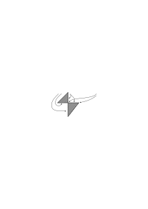
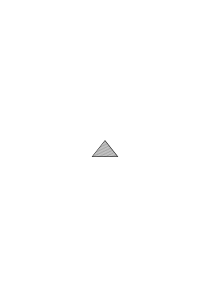
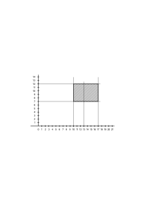
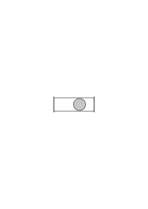
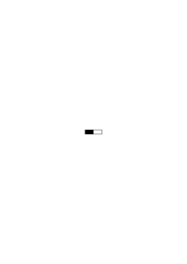
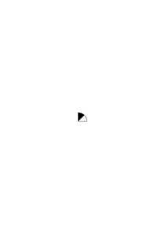
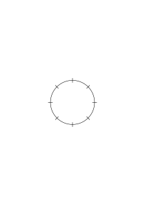
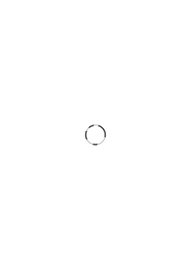
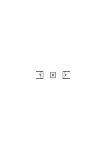
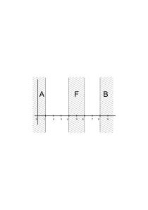

# Ms-106

2 published remarks, VB

### [Ir\[1\]](https://cdn.wittgensteinnachlass.com/2000px/webp/Ms-106/Ir.webp)

## II. Band.

### [2\[1\]](https://cdn.wittgensteinnachlass.com/2000px/webp/Ms-106/2.webp)

<math display="block">
  <mo>(</mo>
  <mo>∃</mo>
  <mtext>φ)</mtext>
  <mo>:</mo>
  <mspace width="0.3em"/>
  <mi>f</mi>
  <mo>(</mo>
  <mi>x</mi>
  <mo>)</mo>
  <msub>
    <mo>⊃</mo>
    <mi>x</mi>
  </msub>
  <mspace width="0.3em"/>
  <mo>(</mo>
  <mo>∃</mo>
  <mtext>y)</mtext>
  <mspace width="0.3em"/>
  <mtext>∙</mtext>
  <mspace width="0.3em"/>
  <mi>g</mi>
  <mo>(</mo>
  <mi>y</mi>
  <mo>)</mo>
  <mspace width="0.3em"/>
  <mtext>∙</mtext>
  <mspace width="0.3em"/>
  <mtext>φ(</mtext>
  <mtext>xy)</mtext>
  <mspace width="0.3em"/>
  <mtext>∙</mtext>
  <mspace width="0.3em"/>
  <mtext>∙</mtext>
  <mi>g</mi>
  <mo>(</mo>
  <mi>x</mi>
  <mo>)</mo>
  <msub>
    <mo>⊃</mo>
    <mi>x</mi>
  </msub>
  <mspace width="0.3em"/>
  <mo>(</mo>
  <mo>∃</mo>
  <mtext>y)</mtext>
  <mspace width="0.3em"/>
  <mtext>∙</mtext>
  <mspace width="0.3em"/>
  <mi>f</mi>
  <mo>(</mo>
  <mi>y</mi>
  <mo>)</mo>
  <mspace width="0.3em"/>
  <mtext>∙</mtext>
  <mspace width="0.3em"/>
  <mtext>φ(</mtext>
  <mtext>yx)</mtext>
</math>

& <math class="stacked" display="inline"><mspace width="0.3em"/><mtext>φ(</mtext><mtext>x,</mtext><mtext>y)</mtext><msub><mo>⊃</mo><mtext>xy</mtext></msub><mspace width="0.3em"/><mtext>~</mtext><mo>(</mo><mo>∃</mo><mtext>z)</mtext><mspace width="0.3em"/><mtext>∙</mtext><mspace width="0.3em"/><mtext>φ(</mtext><mtext>xz)</mtext><mtext>⌵</mtext><mtext>φ(</mtext><mtext>z,</mtext><mtext>y)</mtext><mspace width="0.3em"/><mtext>∙</mtext><mspace width="0.3em"/><mtext>∙</mtext><mspace width="0.3em"/><mo>(</mo><mtext>x)</mtext><mtext>~</mtext><mtext>φ(</mtext><mtext>xx)</mtext></math>

### [2\[2\]](https://cdn.wittgensteinnachlass.com/2000px/webp/Ms-106/2.webp)

fa ⊃ ga ∙ (a ≠ a ∙ a ≠ a) ⌵ gb ∙ (a ≠ a ∙ b ≠ b) ⌵ …

fb ⊃ ga ∙ (b ≠ b ∙ a ≠ a) ⌵ gb ∙ (b ≠ b ∙ b ≠ b) ⌵ …

fc ⊃ – – – – – – – –

– – – – – – – – – – &

& ga ⊃ fa(a ≠ a ∙ a ≠ a) ⌵ fb(b ≠ b ∙ a ≠ a) ⌵ … ⌵

⌵ <math class="stacked" display="inline"><mtext>fa</mtext><mspace width="0.3em"/><mo>⊃</mo><mspace width="0.3em"/><mtext>ga</mtext><mspace width="0.3em"/><mtext>∙</mtext><mspace width="0.3em"/><mo>(</mo><mi>a</mi><mspace width="0.3em"/><mo>=</mo><mover><mrow><mi>a</mi><mspace width="0.3em"/><mtext>∙</mtext><mspace width="0.3em"/><mi>b</mi></mrow><mo>‾</mo></mover><mspace width="0.3em"/><mo>=</mo><mspace width="0.3em"/><mtext>a)</mtext><mspace width="0.3em"/><mtext>⌵</mtext><mspace width="0.3em"/><mtext>gb</mtext><mspace width="0.3em"/><mtext>∙</mtext><mspace width="0.3em"/><mo>(</mo><mi>a</mi><mspace width="0.3em"/><mo>=</mo><mover><mrow><mi>a</mi><mspace width="0.3em"/><mtext>∙</mtext><mspace width="0.3em"/><mi>b</mi></mrow><mo>‾</mo></mover><mspace width="0.3em"/><mo>=</mo><mspace width="0.3em"/><mtext>b)</mtext><mspace width="0.3em"/><mtext>⌵</mtext><mspace width="0.3em"/><mtext>gc</mtext><mspace width="0.3em"/><mtext>∙</mtext><mspace width="0.3em"/><mo>(</mo><mi>a</mi><mspace width="0.3em"/><mo>=</mo><mover><mrow><mi>a</mi><mspace width="0.3em"/><mtext>∙</mtext><mspace width="0.3em"/><mi>b</mi></mrow><mo>‾</mo></mover><mspace width="0.3em"/><mo>=</mo><mspace width="0.3em"/><mtext>c)</mtext><mspace width="0.3em"/><mtext>⌵</mtext><mtext>–</mtext><mspace width="0.3em"/><mtext>–</mtext><mspace width="0.3em"/><mtext>–</mtext></math>

<math display="block">
  <mtext>fb</mtext>
  <mspace width="0.3em"/>
  <mo>⊃</mo>
  <mspace width="0.3em"/>
  <mtext>ga</mtext>
  <mspace width="0.3em"/>
  <mtext>∙</mtext>
  <mspace width="0.3em"/>
  <mo>(</mo>
  <mi>b</mi>
  <mspace width="0.3em"/>
  <mo>=</mo>
  <mover>
    <mrow>
      <mi>a</mi>
      <mspace width="0.3em"/>
      <mtext>∙</mtext>
      <mspace width="0.3em"/>
      <mi>b</mi>
    </mrow>
    <mo>‾</mo>
  </mover>
  <mspace width="0.3em"/>
  <mo>=</mo>
  <mspace width="0.3em"/>
  <mtext>a)</mtext>
  <mspace width="0.3em"/>
  <mtext>⌵</mtext>
  <mspace width="0.3em"/>
  <mtext>gb</mtext>
  <mspace width="0.3em"/>
  <mtext>∙</mtext>
  <mspace width="0.3em"/>
  <mo>(</mo>
  <mi>b</mi>
  <mspace width="0.3em"/>
  <mo>=</mo>
  <mspace width="0.3em"/>
  <mi>a</mi>
  <mspace width="0.3em"/>
  <mtext>∙</mtext>
  <mspace width="0.3em"/>
  <mi>b</mi>
  <mspace width="0.3em"/>
  <mo>=</mo>
  <mspace width="0.3em"/>
  <mtext>b)</mtext>
  <mspace width="0.3em"/>
  <mtext>⌵</mtext>
  <mspace width="0.3em"/>
  <mtext>–</mtext>
  <mspace width="0.3em"/>
  <mtext>–</mtext>
  <mspace width="0.3em"/>
  <mtext>–</mtext>
</math>

fc ⊃ – – – – – –

– – – – –

g – – – – – – ⌵

⌵ fa ⊃ ga ∙ (a = a ∙ b = a ․⌵․ a = c ∙ d = a) ⌵ gb ∙ (a = a ∙ b = b ․⌵․ – – –

⌵ – – –

### [4\[1\]](https://cdn.wittgensteinnachlass.com/2000px/webp/Ms-106/4.webp)

Ich möchte wissen ob diese Arbeit die richtige für mich ist.

### [4\[2\]](https://cdn.wittgensteinnachlass.com/2000px/webp/Ms-106/4.webp)

Ich bin dabei interessiert aber nicht begeistert.

### [4\[3\]](https://cdn.wittgensteinnachlass.com/2000px/webp/Ms-106/4.webp)

Es ist merkwürdig welche Erleichterung es mir ist manches in einer geheimen Schrift nieder zu schreiben was ich nicht gerne lesbar schreiben möchte.

### [4\[4\]](https://cdn.wittgensteinnachlass.com/2000px/webp/Ms-106/4.webp)

Irgendwie sehe ich meine gegenwärtige Arbeit als provisorisch an. – Als ein Mittel zum Zweck.

### [1\[1\]](https://cdn.wittgensteinnachlass.com/2000px/webp/Ms-106/1.webp)

Durch die Verneinung aller Sätze jener Reihe komme ich also nicht zum Unendlichen.

### [1\[2\]](https://cdn.wittgensteinnachlass.com/2000px/webp/Ms-106/1.webp)

In wiefern setzt eine Notation für das Unendliche den unendlichen Raum oder die unendliche Zeit voraus?

### [1\[3\]](https://cdn.wittgensteinnachlass.com/2000px/webp/Ms-106/1.webp)

Ein unendlich großes Stück Papier wird natürlich nicht vorausgesetzt. Wohl aber seine Möglichkeit?

### [1\[4\]](https://cdn.wittgensteinnachlass.com/2000px/webp/Ms-106/1.webp)

Wie ist es mit der Unendlichkeit des Raumes; setzt sie unendlich viele Gegenstände voraus? Ich glaube nein. Worin besteht aber diese potentielle Unendlichkeit?

### [1\[5\]](https://cdn.wittgensteinnachlass.com/2000px/webp/Ms-106/1.webp),[3\[1\]](https://cdn.wittgensteinnachlass.com/2000px/webp/Ms-106/3.webp)

Wir können uns doch eine Notation denken die statt im Raum, in der Zeit fortschreitet. Etwa die Rede. Auch hier können wir uns doch offenbar das Unendliche dargestellt denken. Und dabei machen wir doch gewiß keine _Hypothese_ über die Zeit. Sie erscheint uns essentiell als _unendliche_ Möglichkeit. Und zwar offenbar unendlich nach dem was wir über ihre Struktur wissen.

### [3\[2\]](https://cdn.wittgensteinnachlass.com/2000px/webp/Ms-106/3.webp)

Müssen wir gleichsam in unserem Kopf die Möglichkeit der unendlichen Notation haben? Was denken wir wenn wir Grenzenlosigkeit denken?

### [3\[3\]](https://cdn.wittgensteinnachlass.com/2000px/webp/Ms-106/3.webp)

Es ist doch gewiß unmöglich, daß die Mathematik von einer Hypothese über den physikalischen Raum abhängen sollte! Und der _Gesichtsraum_ ist doch in diesem Sinne nicht unendlich. Und wenn es sich nicht um die Wirklichkeit sondern nur um die Möglichkeit der Hypothese vom unendlichen Raum handelt so muß doch diese Möglichkeit irgendwo vorgebildet sein.

### [3\[4\]](https://cdn.wittgensteinnachlass.com/2000px/webp/Ms-106/3.webp),[5\[1\]](https://cdn.wittgensteinnachlass.com/2000px/webp/Ms-106/5.webp)

<math class="stacked" display="inline"><mi>u</mi><mspace width="0.3em"/><mtext>≡</mtext><mspace width="0.3em"/><mi>f</mi><mspace width="0.3em"/><mtext>∙</mtext><mspace width="0.3em"/><mi>v</mi><mspace width="0.3em"/><mtext>≡</mtext><mspace width="0.3em"/><mi>g</mi><msub><mo>⊃</mo><mtext>u,</mtext><mspace width="0.3em"/><mi>v</mi></msub><mspace width="0.3em"/><mo>(</mo><mo>∃</mo><mtext>R)</mtext><mtext>uRv</mtext></math> In dieser Summe sind erst eine Reihe von Gliedern in denen u oder v nicht auf f bezw. g passen; in diesem Falle kann die rechte Seite t oder c sein, die Implikation stimmt immer, weil die linke Seite falsch ist. Endlich kommt der Fall wo u auf g und v auf f paßt & nun ist die linke Seite entweder t dann ist der Satz richtig oder c dann ist er falsch. Was aber heißt es daß u auf f paßt? Ist das ein Satz? – Dieser Satz würde etwa ausgedrückt durch: <math class="stacked" display="inline"><mi>x</mi><mspace width="0.3em"/><mo>=</mo><mspace width="0.3em"/><mi>a</mi><mspace width="0.3em"/><mtext>⌵</mtext><mspace width="0.3em"/><mi>x</mi><mspace width="0.3em"/><mo>=</mo><mspace width="0.3em"/><mi>b</mi><mspace width="0.3em"/><mtext>⌵</mtext><mspace width="0.3em"/><mi>x</mi><mspace width="0.3em"/><mo>=</mo><mspace width="0.3em"/><mi>c</mi><msub><mtext>≡</mtext><mi>x</mi></msub><mspace width="0.3em"/><mtext>fx</mtext></math> das heißt aber soviel wie fa ≡ t ∙ fb ≡ t ∙ fc ≡ t ∙ fd ≡ cont. …

### [5\[2\]](https://cdn.wittgensteinnachlass.com/2000px/webp/Ms-106/5.webp),[7\[1\]](https://cdn.wittgensteinnachlass.com/2000px/webp/Ms-106/7.webp)

Die alte Schreibweise war fa ∙ fb ∙ fc ∙ ~(∃xyzu) ∙ fx ∙ fy ∙ fz ∙ fu,

die neue Schreibweise wäre fa ≡ t ∙ fb ≡ t ∙ fc ≡ t ∙ fd ≡ cont. fe ≡ cont. etc. das heißt aber einfach: fa ∙ fb ∙ fc ∙ ~ fd ∙ ~ fe etc.

fa ∙ fb ∙ ~fc ∙ ~fd … ∙ ge ∙ gh ∙ ~gi ∙ ~gl ⊃ ⊃ (∃R) (a,b) R (e,h)

D.h. f & g sind ähnlich wenn ihnen ähnliche Extensionen passen. – Wie aber zeigt man die Ähnlichkeit der Extensionen? So: Ich stelle eine Regel auf nach der ich je zwei Extensionen auf ihre Ähnlichkeit prüfen kann, durch eine Zuordnung die ich an den Zeichen tatsächlich vollziehe. Diese Zuordnung ist nach einer gewissen Regel gebaut & diese Regel muß die formale Reihe enthalten, oder sagen wir die _allgemeine Form_ dieser Zuordnung also die _variable Zuordnung_.

### [7\[2\]](https://cdn.wittgensteinnachlass.com/2000px/webp/Ms-106/7.webp),[9\[1\]](https://cdn.wittgensteinnachlass.com/2000px/webp/Ms-106/9.webp)

In der Erklärung der Zuordnung R welche 1→1 sein soll kommen Umfänge u & v vor, dies sind die Werte einer Formenreihe, dargestellt durch die Werte, etwa, zweier variabler Funktionen φ & ψ welche eine Formenreihe durchlaufen. Die allgemeine Form der obigen Zuordnung kommt dadurch zu Stande, daß u & v die Werte einer vorausbestimmten _allgemeinen Form_ durchlaufen. Unter diesen Werten passen einige in die 1-1 Relation andere nicht. Die passenden werden von den nicht passenden geschieden indem durch die Zuordnung mit Hilfe des „ = ” die nicht zuordenbaren durch ein c & die anderen durch ein t charakterisiert werden. Ich habe die Umfänge

a b c [x = a ⌵ x = b ⌵ x = c]

und

d e f [x = d ⌵ x = e ⌵ x = f]

und nun probiere ich Zuordnungen von einer bestimmten allgemeinen Form

nämlich x = r ∙ y = s dann x = r ∙ y = s ⌵ x = u ∙ y = v dann x = r ∙ y = s ⌵ x = u ∙ y = v ⌵ x = t ∙ y = w etc.

Das Passen einer solchen Zuordnung zeigt sich dadurch, daß die Kombinationen der allgemeinen Umfangsformen & der allgemeinen Relationsform in gewissen Fällen ein t in anderen ein c ergeben. Aber um diese Formen überhaupt allgemein kombinieren zu können, braucht es schon

ein allgemeines Gesetz, aber dieses allgemeine Gesetz besagt einfach daß man die Variable alle Werte durchlaufen lassen muß. Diese Werte sind gleichsam Links durch die gewisse Knopflöcher zusammengehalten, gekuppelt werden.

### [11\[1\]](https://cdn.wittgensteinnachlass.com/2000px/webp/Ms-106/11.webp)

a ⬯ ⬯ d | b ⬯ ⬯ e | c ⬯ ⬯ f

Das sind die Knopflöcher; die Relation ist dann eine Klasse von Links die auf jedem Knopf eine Aufschrift tragen. „Passen” heißt, daß die Aufschrift auf dem Knopf mit dem auf dem Knopfloch übereinstimmt; und umgekehrt. Die Vorschrift lautet knöpfe alle Links in die Löcher; versuche sie in einer gewissen Reihenfolge damit keine Kombination unversucht bleibt; paßt dann eine Klasse von Knöpfen dann sind die Klassen der Knopflöcher ähnlich. Die _allgemeine Form_ tritt dann erstens in der allgemeinen Form der Klasse von Knöpfen auf & zweitens in der Fixierung der Reihenfolge der Versuche.

### [11\[2\]](https://cdn.wittgensteinnachlass.com/2000px/webp/Ms-106/11.webp)

Ist die Unendlichkeit nur eine Unbestimmtheit?

### [11\[3\]](https://cdn.wittgensteinnachlass.com/2000px/webp/Ms-106/11.webp),[13\[1\]](https://cdn.wittgensteinnachlass.com/2000px/webp/Ms-106/13.webp)

<math display="block">
  <mi>f</mi>
  <mspace width="0.3em"/>
  <mtext>≡</mtext>
  <mspace width="0.3em"/>
  <mi>u</mi>
  <mspace width="0.3em"/>
  <mtext>∙</mtext>
  <mspace width="0.3em"/>
  <mi>g</mi>
  <mspace width="0.3em"/>
  <mtext>≡</mtext>
  <mspace width="0.3em"/>
  <mi>v</mi>
  <msub>
    <mo>⊃</mo>
    <mtext>u,</mtext>
    <mspace width="0.3em"/>
    <mi>v</mi>
  </msub>
  <mspace width="0.3em"/>
  <mo>(</mo>
  <mo>∃</mo>
  <mtext>R)</mtext>
  <mtext>uRv</mtext>
</math>

fa ∙ ~fb ∙ ~fc … ∙ gr ∙ ~gs ∙ ~gt … ⊃ – – –

fa ∙ fb ∙ ~fc ∙ ~ … ∙ gr ∙ gs ∙ ~gt ∙ ~ … ⊃ – – –

– – – – – Es werden hier zwar alle R für jede Zeile probiert aber die linke Seite bestimmt schon, welches R allein paßt. Die anderen sind gleichsam Abfall. Es kommt auf dasselbe hinaus ob ich gleich das passende R konstruiere; – bezw. sage daß keines paßt – oder ob ich alle konstruiere & das passende auszeichne; ein Kriterium für das passende habe.

Wenn man probiert, macht man eben alles auf bestimmte Weise von der linken Formenreihe abhängig.

### [13\[2\]](https://cdn.wittgensteinnachlass.com/2000px/webp/Ms-106/13.webp)

Wir können uns ja auch eine logische Summe denken:

[Hier bedeutet (Е…) es gibt _nur_] (Еx) φx ∙ (Еx) ψx ⌵

⌵ (Еxy) φx ∙ φy ∙ (Еxy)ψx ∙ ψy

⌵ (Еx,y,z) φx ∙ φy ∙ φz ∙ (Еxyz)ψx ∙ ψy ∙ ψz ⌵

⌵ (Еxyzu) etc.

Und das könnte man schreiben: (Еn)nφ ∙ nψ

und hier enthält das n die Formenreihe oder ist die variable Form.

### [13\[3\]](https://cdn.wittgensteinnachlass.com/2000px/webp/Ms-106/13.webp),[15\[1\]](https://cdn.wittgensteinnachlass.com/2000px/webp/Ms-106/15.webp)

Wir können also um die Verwendung der variablen Form nicht herumkommen. Sie wird in der von Ramsey vorgeschlagenen Notation zwar auf gewisse Arten von Formenreihen eingeschränkt aber sie muß auch dort auftreten & macht alle Gebilde in denen sie vorkommt zu Formenreihen.

### [15\[2\]](https://cdn.wittgensteinnachlass.com/2000px/webp/Ms-106/15.webp)

(Was zu verstehen ist muß auch auszudrücken sein.)

### [15\[3\]](https://cdn.wittgensteinnachlass.com/2000px/webp/Ms-106/15.webp)

(a,b,c,d) Wer das Zeichen richtig versteht, der weiß daß es auch so: ((a,b), (c,d)) aufgefaßt werden kann.

### [15\[4\]](https://cdn.wittgensteinnachlass.com/2000px/webp/Ms-106/15.webp)

Was heißt das: φa ∙ φb ∙ φc = (φa ∙ φb) ∙ φc

Die beiden Ausdrücke sind doch _derselbe_ Satz. Wenn man sie verschieden schreibt so kann das nur andeuten wollen daß φa ∙ φb ∙ φc aus φa ∙ φb und φc erhalten werden kann.

### [15\[5\]](https://cdn.wittgensteinnachlass.com/2000px/webp/Ms-106/15.webp),[17\[1\]](https://cdn.wittgensteinnachlass.com/2000px/webp/Ms-106/17.webp)

Wie verwendet man eigentlich „2 + 2 = 4”? Kann ich daraus schließen, daß, wenn ich 2 Äpfel in der einen Hand und 2 Äpfel in der andern Hand halte, daß ich dann 4 Äpfel in beiden habe? – Ich glaube, nein. Sondern erst wenn ich weiß daß ich zwei Äpfel und noch zwei andere in beiden Händen habe kann ich statt dessen nach der Gleichung sagen ich habe 4 Äpfel in den Händen. Das ist ein sehr wichtiger Punkt!

### [17\[2\]](https://cdn.wittgensteinnachlass.com/2000px/webp/Ms-106/17.webp)

Ich habe immer noch nicht das Assoziationsgesetz für die Addition bewiesen. Und darin scheint eine Schwierigkeit zu liegen weil es so fundamental ist. – Es kommt darauf an ob man die Zahl als _Summe_ von Einheiten auffaßt oder als ein Schema in dem die Einheiten nicht durch Addition verbunden sind. Also als 1 + 1 + 1 + 1… oder ∣∣∣∣…. Oder ist das „ + ” nur wie ein Beistrich. Ich möchte daß es unmittelbar einleuchtet daß man in 1 + 1 + 1 + 1 + 1 jede beliebige Gruppe als Zahl auffassen kann. Ja, wenn das nicht unmittelbar zu sehen ist, wie kann ich es deutlicher machen; d.h. wie sieht das aus was dann im Beweis einleuchtet. Das hängt damit zusammen daß ich die Anzahl aus der 1 durch Addition entstehen lasse was vielleicht nicht wesentlich ist; könnte man nicht eine Form (∣∣∣∣…) beschreiben ohne sie als Glied einer bestimmten Reihe aufzufassen. Ich könnte ein Zeichen „(∣∣∣∣)” auch beschreiben indem ich sage es ist eine Reihe vertikaler Striche zwischen Klammern.

### [19\[1\]](https://cdn.wittgensteinnachlass.com/2000px/webp/Ms-106/19.webp),[21\[1\]](https://cdn.wittgensteinnachlass.com/2000px/webp/Ms-106/21.webp)

Wenn die Zahl durch Addition erzeugt wird so entsteht eigentlich ein Gebilde:

((((1) + 1) + 1) + 1) + 1 etc. also ein Ausdruck der Klammern haben müßte. Das ist aber nicht was ich will, ein Ausdruck „∣∣∣∣∣” soll keinerlei Klammern voraussetzen. Dann wird er aber durch eine Operation (❘, –, – ❘) wirklich rein äußerlich beschrieben, denn wenn die Operation „ ‒ ❘” d.h. das Hinzusetzen einer neuen Einheit an sich sinnvoll sein soll, dann muß die neue Einheit zu der ganzen schon bestehenden Zahl addiert werden & dann haben wir eben einen Klammerausdruck. Aber hier gibt es doch noch eine andere Auffassung: Die Operation zeigt die Relation von ∣∣∣ zu ∣∣∣∣ etc., sie führt von einem zum andern & diese interne Relation hat doch gewiß Bedeutung. Wohl; nur ist dann die Operation nicht einfach die der Addition. Wir könnten uns ja zuerst durch Addition eine Reihe 1, ((1) + 1), (((1) + 1) + 1), etc. erzeugt denken und dann die Klammern weglassen. Aber auch das heißt nichts denn wo das Zeichen „ + ” steht muß zu _irgend einer_ Zahl addiert werden. Und das hieße daß es ein amorphes Zeichen 1 + 1 + 1 + 1 wie ich es mir dachte nicht geben kann; mit anderen Worten daß man das „ + ”-Zeichen nicht als Beistrich gebrauchen darf.

### [21\[2\]](https://cdn.wittgensteinnachlass.com/2000px/webp/Ms-106/21.webp)

Wie würde man zeigen daß n + m = m + n ist:

man würde zeigen daß wenn man die Summe als ein Zeichen ∣∣∣∣… schreibt beidemal dasselbe Zeichen entsteht. Wie soll man aber soetwas allgemein zeigen. Es ist sehr einfach in jedem einzelnen Fall.

### [21\[3\]](https://cdn.wittgensteinnachlass.com/2000px/webp/Ms-106/21.webp)

Wenn „m”, „n”, „o” für Zeichen von der Form (❘,—,— ❘) stehen dann ist es unmittelbar klar daß (m n o) auch für so ein Zeichen steht.

### [21\[4\]](https://cdn.wittgensteinnachlass.com/2000px/webp/Ms-106/21.webp)

Ist es nicht ferner klar daß (m n) und (n m) dasselbe Zeichen sind?

### [21\[5\]](https://cdn.wittgensteinnachlass.com/2000px/webp/Ms-106/21.webp),[23\[1\]](https://cdn.wittgensteinnachlass.com/2000px/webp/Ms-106/23.webp)

Eine fundamentale Frage: Wie kann ich wissen daß

„∣∣∣∣∣∣∣∣” und „∣∣∣∣∣∣∣∣” _dasselbe Zeichen_ sind? Es genügt doch nicht daß sie _ähnlich_ ausschauen? Denn es ist nicht die ungefähre Gleichheit der Gestalt was die Identität der Zeichen ausmachen darf sondern gerade eben die Zahlengleichheit. – Ich bin nicht sicher ob das nicht eine Notation von der ∣∣∣∣-Art unmöglich macht. Möglich wäre immer eine Notation: a b c d e wo zu sagen wäre daß die Reihenfolge der Buchstaben keine Rolle spielt. Die Buchstaben wären nur dazu da um eine Zuordnung zu ermöglichen. Aber wie sollte ich dann sehen daß a b c = e f g ist. Brauche ich da nicht eine Zuordnung durch die Identität oder ein analoges Mittel? Wie könnte ich aber dann sicher sein daß 1 + 1 + 1 = 3 und 1 + 1 + 1 + 1 = 4 ist, denn hier kann ich auch nur die Einsen abzählen. Man könnte sagen 1 + 1 + 1 etc. ist nicht _ein_ Zeichen sondern ein bestimmter sinnvoller Komplex von Zeichen. Aber als das muß ich dann eben auch ∣∣∣∣ etc. auffassen.

### [23\[2\]](https://cdn.wittgensteinnachlass.com/2000px/webp/Ms-106/23.webp)

Wird diese Frage akut wenn ich statt einer bestimmten Anzahl von Strichen etwa einen Buchstaben setze?

### [23\[3\]](https://cdn.wittgensteinnachlass.com/2000px/webp/Ms-106/23.webp),[25\[1\]](https://cdn.wittgensteinnachlass.com/2000px/webp/Ms-106/25.webp)

Ich würde sagen: Natürlich ist m n o die gleiche Zahl wie o n m weil es doch _nur_ auf die _Anzahl_ der Striche ankommt also nur auf das Vorkommen der gleichen Zahlen m, n und o. Aber woher weiß ich, daß eben die _Anzahl_ dieselbe sein wird. – Angenommen ich habe den „m”, „n” und „o” bestimmte ∣∣∣-Zeichen zugeordnet. Und nun ändere ich die Reihenfolge von „m”, „n”, „o”, wer sagt daß das Zeichen nun nicht anders aussieht aber _es **hat** die gleiche Zahl darzustellen_ es _hat **eben**_ als diese Zahl von Strichen aufgefaßt zu werden; und diese Auffassung ist von vornherein bestimmt.

### [25\[2\]](https://cdn.wittgensteinnachlass.com/2000px/webp/Ms-106/25.webp)

Wenn „a b c d” vier bedeutet so muß zu diesem Zeichen noch hinzukommen daß das was an ihm bezeichnet das Gemeinsame aller Zeichen ist die sich – durch 1–1 Zuordnung – in einander übersetzen (übertragen) lassen. Das hängt auch damit zusammen, daß wenn die Zahl ein Schema ist mit ihr auch ein Mittel gegeben sein muß zu sehen von welchem Umfang sie ein Schema ist.

Denn wenn ∣∣∣∣ eine Zahl darstellt und ich habe einen Umfang a b c d, wie weiß ich daß jenes Schema zu diesem Umfang gehört?

### [25\[3\]](https://cdn.wittgensteinnachlass.com/2000px/webp/Ms-106/25.webp),[27\[1\]](https://cdn.wittgensteinnachlass.com/2000px/webp/Ms-106/27.webp)

Man könnte vorschlagen die Zahl 4 zu schreiben x y z u und wenn ich dann einen Umfang a b c d habe dann setze ich um zu zeigen daß die Zahl auf den Umfang paßt x = a, y = b, z = c, u = d.

<math display="block">
  <mo>(</mo>
  <msub>
    <mo>)</mo>
    <mi>x</mi>
  </msub>
  <mo>(</mo>
  <msub>
    <mo>)</mo>
    <mi>y</mi>
  </msub>
  <mo>(</mo>
  <msub>
    <mo>)</mo>
    <mi>z</mi>
  </msub>
  <mspace width="0.3em"/>
  <mtext>x→</mtext>
  <mi>a</mi>
  <mspace width="0.3em"/>
  <mtext>y→</mtext>
  <mi>b</mi>
  <mi>z</mi>
  <mtext>→</mtext>
  <mi>c</mi>
</math>

ax | by | cx | dy | ez | | | | ax | by | cz | dx | ey | | | | | ❘| | | ❘|| | | ❘||| | | ❘|||| | | ❘||||| | | ❘||||||

### [27\[2\]](https://cdn.wittgensteinnachlass.com/2000px/webp/Ms-106/27.webp)

Kann man sagen: Das Zeichen (∣∣∣∣∣) hat wesentliche & unwesentliche Züge; so ist z.B. die Länge der Striche unwesentlich. Nun enthält dieses Zeichen z.B. die Zeichen ∣∣∣ und ∣∣ und da ist es wieder unwesentlich ob ich die ersten 3 Striche als ∣∣∣ auffasse oder etwa die ersten zwei und den letzten: <math display="inline"><mtext>∣</mtext><mtext>∣</mtext><mtext>∣</mtext><mtext>∣</mtext><mtext>∣</mtext></math> etc. etc.

### [27\[3\]](https://cdn.wittgensteinnachlass.com/2000px/webp/Ms-106/27.webp)

Ist nun die Gleichung m n = n m eine Definition oder ein „Lehrsatz”?

Ich glaube eine Definition. D.h. sie erklärt den Gebrauch der Zeichenverbindung m n und n m.

### [27\[4\]](https://cdn.wittgensteinnachlass.com/2000px/webp/Ms-106/27.webp),[29\[1\]](https://cdn.wittgensteinnachlass.com/2000px/webp/Ms-106/29.webp)

Die Zeichen ∣∣∣∣ etc. müssen in Sätzen gebraucht werden können wie die andern Zahlzeichen. 2 + 2 = 4 erlaubt weiter nichts als die Substitution von 4 statt 2 + 2. Z.B. im Satz: Ich habe 2 + 2 Äpfel in der Hand. (Alles andere tut die Logik.)

### [29\[2\]](https://cdn.wittgensteinnachlass.com/2000px/webp/Ms-106/29.webp)

Angenommen ich sage jemandem: „Ich habe ∣∣∣∣∣∣∣ Äpfel”. Kann er wenn er das Zahlzeichen versteht darauf hin noch fragen: „Stehen die ersten 4 Striche dieses Zeichens auch für 4 Äpfel & kann ich also aus dem Zeichen entnehmen daß Du auch 4 Äpfel hast?” – Mir scheint das versteht sich dann von selbst.

### [29\[3\]](https://cdn.wittgensteinnachlass.com/2000px/webp/Ms-106/29.webp)

Man könnte auch sagen m n = n m ist weder eine Definition noch ein „Lehrsatz” sondern eine „Identität”; d.h. die beiden Zeichen rechts & links vom Gleichheitszeichen sind von vornherein in keiner wesentlichen Beziehung verschieden. Etwa wie wenn ich schreiben würde a = a, wo das eine a zufälligerweise größer ist als das andere.

### [29\[4\]](https://cdn.wittgensteinnachlass.com/2000px/webp/Ms-106/29.webp),[31\[1\]](https://cdn.wittgensteinnachlass.com/2000px/webp/Ms-106/31.webp)

Ist die primäre Zeit unendlich? D.h. ist sie eine unendliche Möglichkeit? Auch wenn sie nur so weit erfüllt ist als die Erinnerung reicht so sagt das keineswegs daß sie endlich ist. Sie ist in demselben Sinne unendlich in dem der 3-dimensionale Gesichtsraum es ist auch wenn ich tatsächlich nur bis zu den Wänden meines Zimmers sehen kann. Denn was ich sehe präsupponiert die Möglichkeit eines Sehens in größere Entfernung. Das heißt ich könnte, was ich sehe korrekt nur durch eine unendliche Form darstellen.

### [31\[2\]](https://cdn.wittgensteinnachlass.com/2000px/webp/Ms-106/31.webp)

Kann man denn die Idee der unendlichen Reihe auf jedes beliebige Gebiet anwenden? Etwa auf Töne? kann ich mir einen unendlich hohen oder einen unendlich tiefen Ton denken? Oder vielmehr kann ich mir denken daß die Tonleiter nach oben & unten beliebig weit verlängert werden könnte.

### [31\[3\]](https://cdn.wittgensteinnachlass.com/2000px/webp/Ms-106/31.webp)

Ist es _möglich_ sich die Zeit mit einem Ende zu denken; oder mit zwei Enden? Kann ich mir nicht den Tod als Ende _meiner_ Zeit denken? Oder müßte ich sagen daß mein primäres Leben eine Insel in der Zeit ist?

### [31\[4\]](https://cdn.wittgensteinnachlass.com/2000px/webp/Ms-106/31.webp),[33\[1\]](https://cdn.wittgensteinnachlass.com/2000px/webp/Ms-106/33.webp),[35\[1\]](https://cdn.wittgensteinnachlass.com/2000px/webp/Ms-106/35.webp)

Was bedeutet das „und so weiter in inf.” welches in einem Zeichen (1,–,– + 1) enthalten ist? Was setzt es voraus? Offenbar daß ich die angegebene Operation mit _jedem_ Resultat der Operation ausführen _kann_. D.h. daß mich nichts hindert, – z.B. – zu jedem Ausdruck eine weitere „1” zu setzen. Das heißt daß immer die logische Möglichkeit besteht (nicht daß ich es wirklich ausführen kann). Irgendwie scheint nun diese Möglichkeit im Zeichen für die Operation selbst gegeben zu sein. Ich würde etwa sagen: Du siehst ja daß ich eine 1 vor _etwas_ setzen kann (was es auch sei). – Dabei denke ich mir die Reihe der schon geschriebenen Einsen nach links geschoben so daß ich nur ihr rechtes Ende vor mir habe zu dem ich die weitere „1” hinzusetze. Die linken Einsen könnten auch verschwinden & der ganze Vorgang in die Zeit verlegt werden. Dann hätte ich das Gefühl: Das Grundlegende ist daß sich nichts ändert wenn ich in einem späteren Zeitpunkt stehe: Die Zeit ist homogen. Wenn ich in einem früheren Zeitpunkt eine „1” hinzufügen konnte, warum soll ich es in einem späteren nicht können? Der spätere ist ja ganz genau ebenso. Solange Zeit Zeit ist kann ich es tun. (Wenn darin die Unendlichkeit der Zeit besteht – und so scheint es – dann setzt allerdings die Notation die Unendlichkeit der Zeit voraus.) Man könnte sagen: „Die Zeit ist durchaus homogen”. Aber auch das ist irreführend, denn kann ich mir etwas anderes auch nur denken?

### [35\[2\]](https://cdn.wittgensteinnachlass.com/2000px/webp/Ms-106/35.webp)

Was jetzt geschehen kann, hätte auch früher geschehen können: wird immer in der Zukunft geschehen können, wenn die Zeit bleibt wie sie ist. Aber _das_ hängt nicht von einer zukünftigen Erfahrung ab. Die Möglichkeit aller Zukunft hat die Zeit _jetzt_ in sich. Aber das alles heißt schon daß die Zeit nicht im Sinne der primitiven Auffassung der unendlichen Menge unendlich ist. Und dasselbe gilt vom Raum. Wenn ich sage daß ich mir einen Zylinder unendlich verlängert denken kann so liegt das schon in seinem Wesen. Wieder im Wesen der Homogenität des Zylinders & des Raumes in dem er ist, – und der eine setzt ja den anderen voraus, – und diese Homogenität ist in dem endlichen Stück das ich sehe.

### [37\[1\]](https://cdn.wittgensteinnachlass.com/2000px/webp/Ms-106/37.webp)

Heißt das nun aber etwas dergleichen daß es unendlich viele Dinge gibt? – Heißt es nicht vielmehr daß es Gegenstände von unendlicher Form gibt? Ist es also so daß unendlich nie die Anzahl sondern immer die Form ist. Und daß ich von unendlicher Anzahl immer nur in einem konstruierten Sinne reden kann, wie ich es tue wenn ich sage daß die Zahl der Punkte im Raume oder in einer Strecke unendlich ist, wobei Punkte ja gar nicht die Gegenstände sind. Wie aber wenn die Variable Zeit in meinen Sätzen vorkommt – etwa wenn ich sage „zu _irgend einer Zeit_ wird das & das geschehen”? – Ist hier die Zeit nicht eine Variable die unendlich viele Werte annehmen kann? Haben wir dasselbe nicht in der variablen Zahl? Wenn ich sage: „auf dem Tisch liegt _eine Zahl_ Äpfel” kann hier nicht die variable Zahl unendlich viele Werte annehmen.

### [37\[2\]](https://cdn.wittgensteinnachlass.com/2000px/webp/Ms-106/37.webp),[39\[1\]](https://cdn.wittgensteinnachlass.com/2000px/webp/Ms-106/39.webp)

Das rollt ein anderes Problem auf: Wie ist ein Ausdruck (∃ξ)φξ oder (ξ)φξ zu verstehen wenn ξ eine variable Form ist die wesentlich unendlich viele Werte annehmen kann? <math class="stacked" display="inline"><mtext>~</mtext><mspace width="0.3em"/><mo>(</mo><mn>1</mn><mspace width="0.3em"/><mtext>≠</mtext><mtext>Nr'</mtext><mspace width="0.3em"/><mtext>φ</mtext><mspace width="0.3em"/><mtext>∙</mtext><mspace width="0.3em"/><mtext>︸</mtext><msub><mi>p</mi><mn>1</mn></msub><mspace width="0.3em"/><mo>|</mo><mn>2</mn><mspace width="0.3em"/><mtext>≠</mtext><mtext>Nr</mtext><mtext>'</mtext><mspace width="0.3em"/><mtext>φ</mtext><mspace width="0.3em"/><mtext>∙</mtext><mspace width="0.3em"/><mtext>︸</mtext><msub><mi>p</mi><mn>2</mn></msub><mspace width="0.3em"/><mo>|</mo><mn>3</mn><mspace width="0.3em"/><mtext>≠</mtext><mtext>Nr'</mtext><mspace width="0.3em"/><mtext>φ</mtext><mspace width="0.3em"/><mtext>∙</mtext><mspace width="0.3em"/><mtext>︸</mtext><msub><mi>p</mi><mn>3</mn></msub><mspace width="0.3em"/><mo>|</mo><mtext>ad</mtext><mspace width="0.3em"/><mtext>inf</mtext><mn>.</mn><mo>)</mo></math>

<math class="stacked" display="inline"><msub><mi>p</mi><mn>1</mn></msub><mi>W</mi><mi>F</mi><mi>W</mi><mtext>–</mtext><mspace width="0.3em"/><mtext>–</mtext><mspace width="0.3em"/><mtext>–</mtext><mi>F</mi><mi>F</mi><mtext>–</mtext><mspace width="0.3em"/><mtext>–</mtext><mspace width="0.3em"/><mtext>–</mtext><mi>W</mi><mi>W</mi><mtext>–</mtext><mspace width="0.3em"/><mtext>–</mtext><mspace width="0.3em"/><mtext>–</mtext><mspace width="0.3em"/><mtext>–</mtext><mspace width="0.3em"/><mtext>–</mtext><mspace width="0.3em"/><mtext>–</mtext><mi>F</mi><mspace width="0.3em"/><mo>|</mo><msub><mi>p</mi><mn>2</mn></msub><mi>W</mi><mi>W</mi><mi>F</mi><mtext>–</mtext><mspace width="0.3em"/><mtext>–</mtext><mspace width="0.3em"/><mtext>–</mtext><mi>F</mi><mi>W</mi><mtext>–</mtext><mspace width="0.3em"/><mtext>–</mtext><mspace width="0.3em"/><mtext>–</mtext><mi>F</mi><mi>F</mi><mtext>–</mtext><mspace width="0.3em"/><mtext>–</mtext><mspace width="0.3em"/><mtext>–</mtext><mspace width="0.3em"/><mtext>–</mtext><mspace width="0.3em"/><mtext>–</mtext><mspace width="0.3em"/><mtext>–</mtext><mi>F</mi><mspace width="0.3em"/><mo>|</mo><msub><mi>p</mi><mn>3</mn></msub><mi>W</mi><mi>W</mi><mi>W</mi><mtext>–</mtext><mspace width="0.3em"/><mtext>–</mtext><mspace width="0.3em"/><mtext>–</mtext><mi>W</mi><mi>F</mi><mtext>–</mtext><mspace width="0.3em"/><mtext>–</mtext><mspace width="0.3em"/><mtext>–</mtext><mi>F</mi><mi>W</mi><mtext>–</mtext><mspace width="0.3em"/><mtext>–</mtext><mspace width="0.3em"/><mtext>–</mtext><mspace width="0.3em"/><mtext>–</mtext><mspace width="0.3em"/><mtext>–</mtext><mspace width="0.3em"/><mtext>–</mtext><mi>F</mi><mspace width="0.3em"/><mo>|</mo><msub><mi>p</mi><mn>4</mn></msub><mi>W</mi><mi>W</mi><mi>W</mi><mtext>–</mtext><mspace width="0.3em"/><mtext>–</mtext><mspace width="0.3em"/><mtext>–</mtext><mi>W</mi><mi>W</mi><mtext>–</mtext><mspace width="0.3em"/><mtext>–</mtext><mspace width="0.3em"/><mtext>–</mtext><mi>W</mi><mi>F</mi><mtext>–</mtext><mspace width="0.3em"/><mtext>–</mtext><mspace width="0.3em"/><mtext>–</mtext><mspace width="0.3em"/><mtext>–</mtext><mspace width="0.3em"/><mtext>–</mtext><mspace width="0.3em"/><mtext>–</mtext><mi>F</mi><mspace width="0.3em"/><mo>|</mo><mtext>ad</mtext><mspace width="0.3em"/><mtext>inf.</mtext><mspace width="0.3em"/><mtext>–</mtext><mspace width="0.3em"/><mtext>–</mtext><mspace width="0.3em"/><mtext>–</mtext><mtext>–</mtext><mspace width="0.3em"/><mtext>–</mtext><mspace width="0.3em"/><mtext>–</mtext><mtext>–</mtext><mspace width="0.3em"/><mtext>–</mtext><mspace width="0.3em"/><mtext>–</mtext><mtext>–</mtext><mspace width="0.3em"/><mtext>–</mtext><mspace width="0.3em"/><mtext>–</mtext><mspace width="0.3em"/><mtext>–</mtext><mspace width="0.3em"/><mtext>–</mtext><mspace width="0.3em"/><mtext>–</mtext><mtext>–</mtext><mspace width="0.3em"/><mtext>–</mtext><mspace width="0.3em"/><mtext>–</mtext><mtext>–</mtext><mspace width="0.3em"/><mtext>–</mtext><mspace width="0.3em"/><mtext>–</mtext><mtext>–</mtext><mspace width="0.3em"/><mtext>–</mtext><mspace width="0.3em"/><mtext>–</mtext><mtext>–</mtext><mspace width="0.3em"/><mtext>–</mtext><mspace width="0.3em"/><mtext>–</mtext><mtext>–</mtext><mspace width="0.3em"/><mtext>–</mtext><mspace width="0.3em"/><mtext>–</mtext><mtext>–</mtext><mspace width="0.3em"/><mtext>–</mtext><mspace width="0.3em"/><mtext>–</mtext><mtext>–</mtext><mspace width="0.3em"/><mtext>–</mtext><mspace width="0.3em"/><mtext>–</mtext><mspace width="0.3em"/><mo>|</mo><mi>F</mi><mi>W</mi><mi>W</mi><mtext>"</mtext><mtext>"</mtext><mtext>"</mtext><mtext>"</mtext><mtext>"</mtext><mtext>"</mtext><mtext>"</mtext><mspace width="0.3em"/><mtext>"</mtext><mtext>"</mtext><mtext>"</mtext></math> Es ist klar, daß ich die Wahrheitsfunktion nur andeuten & nicht hinschreiben _kann_. Aber was heißt das? Ich kann allerdings die Regel der Kombinationen beschreiben und die Regel der Zuordnung von W & F in der letzten Kolonne.

Diese Beschreibung ermöglicht es das Anschreiben _beliebig weit_ fortzusetzen. Sie erlaubt nicht das Hinschreiben aller Glieder aber sie erlaubt es die Regel der Bildung einer bestimmten Wahrheitsfunktion eindeutig klar zu machen. Irgendwie scheint hier eine andere Art der Allgemeinheit enthalten zu sein als im Falle _endlicher_ logischer Produkte, Summen etc. Ist denn die Beschreibung einer Wahrheitsfunktion eine Wahrheitsfunktion?

### [38\[1\]](https://cdn.wittgensteinnachlass.com/2000px/webp/Ms-106/38.webp)

Brauche ich nicht für meinen Symbolismus eine Formel zum Anschreiben von Permutationen? Eine Formel, die die Regel des Permutierens ausdrückt?

### [39\[2\]](https://cdn.wittgensteinnachlass.com/2000px/webp/Ms-106/39.webp),[41\[1\]](https://cdn.wittgensteinnachlass.com/2000px/webp/Ms-106/41.webp)

Aber <math class="stacked" display="inline"><msub><mi>p</mi><mn>1</mn></msub><mspace width="0.3em"/><mtext>∙</mtext><msub><mi>p</mi><mn>2</mn></msub><mspace width="0.3em"/><mtext>∙</mtext><msub><mi>p</mi><mn>3</mn></msub><mspace width="0.3em"/><mtext>∙</mtext><msub><mi>p</mi><mn>4</mn></msub><mtext>…</mtext><mtext>ad</mtext><mspace width="0.3em"/><mtext>inf</mtext><mn>.</mn></math> heißt doch: Wie weit ich auch gehen mag so sind alle Sätze pn wahr. Und ist das keine echte Wahrheitsfunktion. Der Witz ist ja eben daß ich die letzte Kolumne des Schemas anschreiben könnte oder doch _eindeutig_ andeuten könnte ohne alle Reihen anschreiben zu müssen, und zu können.

### [41\[2\]](https://cdn.wittgensteinnachlass.com/2000px/webp/Ms-106/41.webp)

Aber tatsächlich _brauche_ ich hier nicht unendliche Reihen zu benützen, da der Satz (∃x) φx dasselbe sagt.

### [41\[3\]](https://cdn.wittgensteinnachlass.com/2000px/webp/Ms-106/41.webp)

Gibt es nicht für die Zeit ein analoges Mittel die Variable mit unendlich vielen Werten zu vermeiden. Es wäre das, nicht zu sagen „das & das wird _einmal_ geschehen”, sondern „es wird geschehen” oder „es geschieht”. Daß es _einmal_ geschieht versteht sich von selbst in demselben Sinne wie, daß eine _Anzahl_ Äpfel auf dem Tisch liegt wenn Äpfel auf dem Tisch liegen.

### [41\[4\]](https://cdn.wittgensteinnachlass.com/2000px/webp/Ms-106/41.webp),[43\[1\]](https://cdn.wittgensteinnachlass.com/2000px/webp/Ms-106/43.webp)

Darf ich aber überhaupt in _Sätzen_ einen Ausdruck (n)n = m' gebrauchen? Denn wenn ich es darf dann sagt (n)n = m'φ daß φ von unendlich vielen Gegenständen befriedigt wird. Wo ist hier der Fehler? Es hieße alle Sätze von der Form (∃xy…) etc. sind wahr. Aber kann man das richtig ausdrücken?

### [43\[2\]](https://cdn.wittgensteinnachlass.com/2000px/webp/Ms-106/43.webp)

Der Raum besteht nicht aus unendlich vielen Dingen sondern er ist die Form die jeden einer endlichen Anzahl räumlicher Gegenstände umgibt.

### [43\[3\]](https://cdn.wittgensteinnachlass.com/2000px/webp/Ms-106/43.webp)

Man kann Linien & Punkte tatsächlich sehen nämlich Grenzlinien & Eckpunkte

Ein räumlicher Gegenstand ist eine Farbe.

### [43\[4\]](https://cdn.wittgensteinnachlass.com/2000px/webp/Ms-106/43.webp),[45\[1\]](https://cdn.wittgensteinnachlass.com/2000px/webp/Ms-106/45.webp)

Eine Entfernung kann durch eine Zahl ausgedrückt werden aber durch jede beliebige Zahl. Es nützt aber nichts wenn ich etwa eine Strecke statt mit einer bestimmten Zahl mit einem Buchstaben n bezeichne denn eine andere Strecke kann ich dann doch nicht mit n bezeichnen sondern sie ist dann <math class="stacked" display="inline"><mfrac><mrow><mi>n</mi></mrow><mrow><mn>2</mn></mrow></mfrac></math> oder 3n etc. etc. so daß ich mich doch wieder auf eine Grundstrecke beziehe ob ich sie nun n oder 1 nenne. Andererseits kann ich doch statt n 1n schreiben & warum soll ich irgend einen Rangunterschied unter den Zahlen anerkennen. Aber das ist klar daß es dann willkürlich ist welche meiner Strecken ich z.B. 27n nenne. Wozu dann überhaupt das n?

### [45\[2\]](https://cdn.wittgensteinnachlass.com/2000px/webp/Ms-106/45.webp)

Man könnte aber auch sagen: die Einheitsstrecke gehört zum Symbolismus. Sie gehört zur Projektionsmethode. Ihre Länge ist willkürlich aber _sie_ enthält das spezifisch räumliche Element. Wenn ich also eine Strecke 3 nenne so bezeichnet hier die 3 mit Hilfe der im Symbolismus vorausgesetzten Einheitsstrecke.

### [45\[3\]](https://cdn.wittgensteinnachlass.com/2000px/webp/Ms-106/45.webp)

Dasselbe kann man auch auf die Zeit anwenden.

### [45\[4\]](https://cdn.wittgensteinnachlass.com/2000px/webp/Ms-106/45.webp),[47\[1\]](https://cdn.wittgensteinnachlass.com/2000px/webp/Ms-106/47.webp)

Wie die Ziffer ∣∣∣∣∣ voraussetzt daß ich 5 Striche nebeneinander machen kann so setzt der Begriff (❘,–,–❘) voraus daß ich ohne Ende mit der Operation fortfahren kann. Insofern also setzt die Notation der unendlichen Reihe die unendliche Form voraus ebenso wie die Notation der einzelnen – endlichen – Zahlen eine Form voraussetzt in der sie möglich ist. Was bedeuten aber Anzahlen die größer sind als die Anzahl der existierenden Dinge. – Ich glaube es sind die Anzahlen von Kombinationen dieser Dinge.

### [47\[2\]](https://cdn.wittgensteinnachlass.com/2000px/webp/Ms-106/47.webp)

Wenn ich mir eine unendliche färbige Ebene denke so habe ich damit nicht unendlich viele Gegenstände, sondern die unendliche Ebene ist ein Gegenstand & die einfachen Farben sind Gegenstände.

### [47\[3\]](https://cdn.wittgensteinnachlass.com/2000px/webp/Ms-106/47.webp)

Die richtige Ansicht muß am Ende die _natürliche_ sein; und was wir sehen sind nie unendlich viele Dinge sondern immer eine Anzahl Dinge die das Charakteristische unendlich vieler verschiedener Möglichkeiten haben.

### [47\[4\]](https://cdn.wittgensteinnachlass.com/2000px/webp/Ms-106/47.webp),[49\[1\]](https://cdn.wittgensteinnachlass.com/2000px/webp/Ms-106/49.webp)

Ist es derselbe Satz zu sagen daß das Quadrat rot ist und zu sagen: das rechte Rechteck ist rot und das linke Rechteck ist rot?? Wenn es derselbe Satz ist ist dann nicht jeder dieser Sätze unendlich komplex? Ist nicht der einzige Ausweg hier anzunehmen daß ein Ausdruck „das Quadrat ist rot” noch kein Satz ist wenn nicht gesagt ist daß die übrige Ebene (oder der übrige Raum) _irgend eine_ Farbe hat. Das heißt es müßte der übrige Raum als scheinbare Variable in den Satz eintreten. Aber auch das hat einen Haken. Wie sollen dann überhaupt die Elementarsätze lauten?!

### [49\[2\]](https://cdn.wittgensteinnachlass.com/2000px/webp/Ms-106/49.webp)

Wenn etwas in meinen Fundamenten falsch ist so könnte es nur so sein daß es Elementarsätze wesentlich überhaupt nicht gibt & daß die Analyse ein _System_ von ins Unendliche zerlegbaren Sätzen ergiebt. Genügt dieses _System_ nicht der Forderung der Bestimmtheit der Analyse welche ich stelle?

### [49\[3\]](https://cdn.wittgensteinnachlass.com/2000px/webp/Ms-106/49.webp),[51\[1\]](https://cdn.wittgensteinnachlass.com/2000px/webp/Ms-106/51.webp)

Kann man sagen: Wenn man im Gesichtsfeld eine Figur

sieht – etwa rot – so kann man sie nicht dadurch beschreiben daß man etwa eine Hälfte des Dreiecks in einem Satz die andere Hälfte in einem anderen Satz beschreibt? Das heißt: kann man sagen daß es in gewissem Sinne eine Hälfte _dieses_ Dreiecks gar nicht gibt? Das würde heißen, daß man von dem Dreieck überhaupt nur _reden_ kann wenn seine Grenzlinien die Grenzen zweier Farben sind.

### [51\[2\]](https://cdn.wittgensteinnachlass.com/2000px/webp/Ms-106/51.webp)

Kann es nicht eine Zerlegbarkeit geben nach dem System daß anb = amb ∙ aob wobei n = o + m. Das wäre eine unendliche Zerlegbarkeit. Was sind aber n,m,o sind es drei verschiedene Gegenstände? Drei Formen desselben Gegenstandes? Und was heißt das?

<math class="stacked" display="inline"><mtext>Die</mtext><mspace width="0.3em"/><mtext>dehnbare</mtext><mspace width="0.3em"/><mtext>Relation</mtext><mo>_</mo><mo>_</mo><mo>_</mo><mo>_</mo><mo>_</mo><mo>_</mo><mo>_</mo><mo>_</mo><mo>_</mo><mo>_</mo><mo>_</mo><mo>_</mo><mo>_</mo><mo>_</mo><mo>_</mo><mo>_</mo><mo>_</mo><mo>_</mo><mo>_</mo><msub><mrow></mrow><mtext>ad</mtext><mspace width="0.3em"/><mtext>inf.</mtext></msub><mtext>←</mtext><mspace width="0.3em"/><mi>o</mi><mspace width="0.3em"/><mi>o</mi><mspace width="0.3em"/><mi>o</mi><mspace width="0.3em"/><mi>o</mi><mspace width="0.3em"/><mi>o</mi><mspace width="0.3em"/><mi>o</mi><mspace width="0.3em"/><mi>o</mi><mspace width="0.3em"/><mi>o</mi><mspace width="0.3em"/><mi>o</mi><mspace width="0.3em"/><mi>o</mi><mspace width="0.3em"/><mi>o</mi><mspace width="0.3em"/><mi>o</mi><msub><mtext>→</mtext><mtext>ad</mtext><mspace width="0.3em"/><mtext>inf.</mtext></msub><mtext>¯</mtext><mtext>¯</mtext><mtext>¯</mtext><mtext>¯</mtext><mtext>¯</mtext><mtext>¯</mtext><mtext>¯</mtext><mtext>¯</mtext><mtext>¯</mtext><mtext>¯</mtext><mtext>¯</mtext><mtext>¯</mtext><mtext>¯</mtext><mtext>¯</mtext><mtext>¯</mtext><mtext>¯</mtext><mtext>¯</mtext><mtext>¯</mtext><mtext>¯</mtext><mspace width="0.3em"/><mo>|</mo><mtext>⚫</mtext><mi>a</mi><mspace width="0.3em"/><mo>|</mo><mspace width="0.3em"/><mo>|</mo><mspace width="0.3em"/><mo>|</mo><mspace width="0.3em"/><mo>|</mo><mspace width="0.3em"/><mo>|</mo><mspace width="0.3em"/><mo>|</mo><mspace width="0.3em"/><mo>|</mo><mspace width="0.3em"/><mo>|</mo><mspace width="0.3em"/><mo>|</mo><mspace width="0.3em"/><mo>|</mo><mspace width="0.3em"/><mo>|</mo><mspace width="0.3em"/><mo>|</mo><mspace width="0.3em"/><mo>|</mo><mspace width="0.3em"/><mo>|</mo><mspace width="0.3em"/><mo>|</mo><mtext>⚫</mtext><mi>b</mi></math> So ist es nicht. Aber man kann es anders darstellen: φ(n) = φm ∙ φo wo n = o + m wo m & o verschiedene Ausdehnungen desselben Gegenstandes bedeuten. Was aber ist dann die obige Gleichung, ist sie eine Definition, eine Tautologie??

### [51\[3\]](https://cdn.wittgensteinnachlass.com/2000px/webp/Ms-106/51.webp),[53\[1\]](https://cdn.wittgensteinnachlass.com/2000px/webp/Ms-106/53.webp)

Wenn „rot ist an diesem Ort” ein Satz p ist und „rot ist an jenem Ort” ein Satz q, dann ist p ∙ q der _selbe_ Satz wie „rot ist an diesem & jenem Ort” & dieser Satz ist offenbar von genau derselben Form & Zusammengesetztheit wie q oder p allein; denn zwei Orte geben _einen_ Ort. – Daraus würde die unendliche Zusammengesetztheit der räumlichen Sätze folgen. – Es gäbe keine Elementarsätze & ein Satz der allem Anscheine nach einfach aus zwei Symbolen (Namen) zusammengesetzt ist, also einen Sachverhalt beschreibt wäre _identisch_ mit einem der zwei solche Sachverhalte beschreibt. Zwei Sachverhalte ergäben _einen_ Sachverhalt.

Wenn ich den Satz daß das Rechteck rot ist in der Form schreiben darf

„[10–17, 7–12] rot”

so ist es seltsam, daß hier der Ort als ein Gegenstand erscheint.

### [53\[2\]](https://cdn.wittgensteinnachlass.com/2000px/webp/Ms-106/53.webp),[55\[1\]](https://cdn.wittgensteinnachlass.com/2000px/webp/Ms-106/55.webp)

Man könnte den Satz aber auch anders auffassen: Der einzige Gegenstand von dem die Rede ist, wäre rot das sich _irgendwo_ befinden _muß_, und die eine seiner unendlichen räumlichen Möglichkeiten wäre als Tatsache angegeben. Diese Tatsache wäre unendlich zusammengesetzt was sich dadurch zeigt daß unendlich viele _verschiedene_ Tatsachen aus der _einen logisch folgen_.

### [55\[2\]](https://cdn.wittgensteinnachlass.com/2000px/webp/Ms-106/55.webp)

Man könnte dagegen einwenden, daß man einen Teil des Gesichtsfeldes überhaupt nicht abgesondert vom Ganzen beschreiben kann da er _allein_ gar nicht denkbar ist. Aber die Form (die logische Form) des Flecks setzt tatsächlich den ganzen Raum voraus. Und wenn nur das ganze Gesichtsfeld beschrieben werden darf, warum dann nicht nur der ganze Strom des Gesichtserlebnisses denn ein Gesichtsbild _kann nur_ in der Zeit existieren.

### [55\[3\]](https://cdn.wittgensteinnachlass.com/2000px/webp/Ms-106/55.webp)

Wenn man sagt daß man Tatsachen die sehr kleine Flecke betreffen nicht sehen kann, so kann man antworten daß man auch solche Tatsachen sieht wenn auch nur als Teil solcher die größere Flecke betreffen. Daß wir eine Fläche _kontinuierlich_ sehen können sagt alles.

### [55\[4\]](https://cdn.wittgensteinnachlass.com/2000px/webp/Ms-106/55.webp),[57\[1\]](https://cdn.wittgensteinnachlass.com/2000px/webp/Ms-106/57.webp)

Es ist kein Zweifel daß die Möglichkeiten der Gesichtswelt unendlich sind.

### [57\[2\]](https://cdn.wittgensteinnachlass.com/2000px/webp/Ms-106/57.webp)

Der räumliche Satz sagt in gewissem Sinne etwas Einfaches. – Er ist aber unendlich teilbar.

### [57\[3\]](https://cdn.wittgensteinnachlass.com/2000px/webp/Ms-106/57.webp)

Es wird in ihm gleichsam ein unendliches Gewebe mit _einem_ Blick erfaßt.

### [57\[4\]](https://cdn.wittgensteinnachlass.com/2000px/webp/Ms-106/57.webp)

Was aber ist dann die allgemeine Satzform? Sie ist die allgemeine Form der Zusammengesetztheit. –

### [57\[5\]](https://cdn.wittgensteinnachlass.com/2000px/webp/Ms-106/57.webp)

Man würde glauben daß ein Satz, aus dem unendlich viele folgen, unendlich viel sagen muß. Aber die unendliche Teilbarkeit drückt sich durch eine Regel aus, nicht dadurch daß das Zeichen unendlich komplex ist. – Anderseits ist die unendlich komplexe Regel nur ein Ersatz für ein unendlich komplexes Zeichen. (Etwa ein gemaltes Bild.)

### [57\[6\]](https://cdn.wittgensteinnachlass.com/2000px/webp/Ms-106/57.webp),[59\[1\]](https://cdn.wittgensteinnachlass.com/2000px/webp/Ms-106/59.webp)

Was wird aber aus der allgemeinen Satzform? Kann es eine solche überhaupt noch geben, d.h., kann man sie anschreiben? – Oder hieße das einen Satz von etwas unterscheiden was kein Satz ist? Und das wäre sinnlos.

### [59\[2\]](https://cdn.wittgensteinnachlass.com/2000px/webp/Ms-106/59.webp)

Die allgemeine Satzform kann nichts sein als die allgemeine Form der Wahrheitsfunktionen.

### [59\[3\]](https://cdn.wittgensteinnachlass.com/2000px/webp/Ms-106/59.webp)

φ(2–5) = φ(2–3˙15) ∙ φ(3˙15–4˙2) ∙ φ(4˙2–5) = φ(2–2˙6) ∙ φ(2˙6–5) = etc. etc.

Das Symbol ist das, was alle solchen Produkte gemeinsam haben. Die Regel nach der alle gebildet werden.

### [59\[4\]](https://cdn.wittgensteinnachlass.com/2000px/webp/Ms-106/59.webp)

Wenn diese Anschauung richtig ist, so gibt es keine Elementarsätze. Die Sätze φ(n–m) sind zwar analysierbar, aber nur wieder in Sätze von derselben Form

### [59\[5\]](https://cdn.wittgensteinnachlass.com/2000px/webp/Ms-106/59.webp),[61\[1\]](https://cdn.wittgensteinnachlass.com/2000px/webp/Ms-106/61.webp)

Wenn aus _einem_ Satz unendlich viele folgen so ist jener Satz nicht aus diesen aufgebaut. D.h. _ihr_ Verständnis ist nicht nötig um ihn zu verstehen. Ich möchte so sagen: Zu sagen daß _unendlich_ viele Sätze aus _einem_ folgen besagt die unbegrenzte Möglichkeit solcher Folgesätze nicht ihre Wirklichkeit. Ich meine damit, es besagt daß es _keine_ Anzahl solcher Grund-Sätze gibt. Und das ist ja klar: Es gibt dann nicht unendlich viele sondern _keine_ Elementarsätze.

### [61\[2\]](https://cdn.wittgensteinnachlass.com/2000px/webp/Ms-106/61.webp)

Daher kann der Satz nur verstanden werden, wenn man den zusammengesetzten Satz versteht, denn _er_ liegt dann allem zu Grunde.

### [61\[3\]](https://cdn.wittgensteinnachlass.com/2000px/webp/Ms-106/61.webp)

Diese Ansicht hat verschiedene Schwierigkeiten. Wenn ich sage das kleine Quadrat im

großen ist rot was immer das übrige für eine Farbe haben mag so kann ich mir doch das kleine Quadrat gar nicht vorstellen wenn es nicht von etwas andersfärbigem begrenzt ist. Ich kann mir natürlich eine Art bewegliches Netz etwa aus schwarzen Linien denken das ich vorübergehend auf die Figur lege um sie zu beschreiben & das ich dann wieder wegnehmen kann. Aber ich müßte doch die schwarzen Linien auf dem Bild sehen um von seinen Teilen reden zu können!

### [63\[1\]](https://cdn.wittgensteinnachlass.com/2000px/webp/Ms-106/63.webp)

Das hängt damit zusammen daß Linien immer die Grenzen zweier Farben sind. Wie aber wenn es _Striche_ im Gesichtsraum geben kann die keine Dicke haben? Wenn es solche Striche gibt also auch ausdehnungslose Pünktchen (Sterne) dann muß es möglich sein eine beliebige Anzahl solcher Striche zu ziehen ohne das im übrigen etwa weiße Gesichtsfeld einzuengen. Ein Fixsternnebel ist in diesem Fall undenkbar.

### [63\[2\]](https://cdn.wittgensteinnachlass.com/2000px/webp/Ms-106/63.webp)

Aber das würde wieder zu der Ansicht führen daß man nur das ganze Gesichtsfeld auf einmal beschreiben kann ohne Variable zu benützen.

### [63\[3\]](https://cdn.wittgensteinnachlass.com/2000px/webp/Ms-106/63.webp)

φ(4–5) ∙ φ(6–7) = φ((4–5)(6–7)) kann man zwei getrennte Flecke nicht auch als _einen_ auffassen?

### [63\[4\]](https://cdn.wittgensteinnachlass.com/2000px/webp/Ms-106/63.webp),[65\[1\]](https://cdn.wittgensteinnachlass.com/2000px/webp/Ms-106/65.webp)

Wenn es unrichtig ist daß φ(m–o) ∙ φ(o–n) = φ(m–n) weil die Teilflecke in einem ganz einfärbigen Fleck nicht vorhanden sind, dann müssen zwei Sätze φ(m–o) und φ(o–n) was immer ihre Analyse ist einander widersprechen. Aber auch das ist nur möglich wenn sie zusammengesetzt sind & zwar so daß in dem Satz der einen Fleck beschreibt auch gesagt ist daß seine Umgebung die & die Farbe nicht hat.

### [65\[2\]](https://cdn.wittgensteinnachlass.com/2000px/webp/Ms-106/65.webp),[67\[1\]](https://cdn.wittgensteinnachlass.com/2000px/webp/Ms-106/67.webp)

Es scheint mir auch noch eine Möglichkeit zu sein, daß einander widersprechende Farbkomplexe die Zeit definieren und daß man ihre Gleichzeitigkeit gar nicht behaupten _kann_. „Gleichzeitig” würde etwa bedeuten „in _einem_ Gesichtsfeld” wenn man aber nur ganze Gesichtsbilder beschreibt so kann man nicht aussagen daß verschiedene Gesichtsbilder dasselbe Gesichtsbild sind. – Man könnte dann sozusagen die Gesichtsereignisse ruhig in die Schachtel der Zeit legen ohne zu fürchten daß sie einander widerstreben werden denn was nicht gleichzeitig sein kann ordnet sich von selbst _nach_ einander. Es ist da freilich eine Schwierigkeit denn damit ist natürlich die Zeit**ordnung** noch nicht gegeben. – Und wenn ich nun wirklich in Sätzen eine Zeitordnung beschreibe so müßte es in der Syntax dieser Sätze liegen daß ich nie zwei verschiedenen Gesichtsbildern den gleichen Zeitpunkt zuweisen kann.

### [67\[2\]](https://cdn.wittgensteinnachlass.com/2000px/webp/Ms-106/67.webp)

Ob es einen Sinn hat zu sagen „dieser Teil einer roten Fläche (der durch seine sichtbare Grenze abgegrenzt ist) ist rot” hängt – scheint es mir – davon ab ob es einen absoluten Ort gibt. Denn wenn im Gesichtsraum von einem absoluten Ort die Rede sein kann, dann kann ich auch diesem absoluten Ort eine Farbe zuschreiben, wenn seine Umgebung gleichfärbig ist. Ich sehe etwa ein gleichförmig gelbes Gesichtsfeld & sage: „Die Mitte meines Gesichtsfeldes ist gelb”. Kann ich dann aber eine _Form_ auf diese Weise beschreiben? Es scheint, nein.

### [67\[3\]](https://cdn.wittgensteinnachlass.com/2000px/webp/Ms-106/67.webp)

Wenn ich das Gesichtsbild nicht vollständig beschreibe sondern nur einen Teil so ist es offenbar daß in der Tatsache gleichsam eine Lücke ist. Es ist offenbar etwas ausgelassen.

### [67\[4\]](https://cdn.wittgensteinnachlass.com/2000px/webp/Ms-106/67.webp),[69\[1\]](https://cdn.wittgensteinnachlass.com/2000px/webp/Ms-106/69.webp)

Wenn ich ein Bild dieses Gesichtsbildes malte so würde ich die Leinwand an gewissen Stellen durchschauen lassen. Aber die Leinwand hat ja auch eine Farbe & füllt den Raum aus. _Nichts_ könnte ich nicht an der Stelle lassen wo etwas fehlt. Meine Beschreibung muß also unbedingt den ganzen Gesichtsraum ja selbst seine Färbigkeit enthalten auch wenn sie nicht sagt welche Farbe an jedem Ort ist. D.h. Sie muß doch sagen daß eine Farbe an jedem Ort ist.

### [69\[2\]](https://cdn.wittgensteinnachlass.com/2000px/webp/Ms-106/69.webp)

Heißt das nicht, daß die Beschreibung den Raum soweit sie ihn nicht mit Konstanten erfüllt, mit Variablen erfüllen muß.

### [69\[3\]](https://cdn.wittgensteinnachlass.com/2000px/webp/Ms-106/69.webp),[71\[1\]](https://cdn.wittgensteinnachlass.com/2000px/webp/Ms-106/71.webp)

Die Mannigfaltigkeit der räumlichen Beschreibung ist dadurch von vornherein gegeben, daß die Beschreibung die richtige Mannigfaltigkeit hat wenn sie vermag alle denkbaren Konfigurationen zu beschreiben.

Wenn man also mit Sätzen von der Art φ(m-n) den Raum in allen seinen Möglichkeiten beschreiben kann dann ist die Beschreibung in Ordnung und man braucht nicht mehr.

### [71\[2\]](https://cdn.wittgensteinnachlass.com/2000px/webp/Ms-106/71.webp),[73\[1\]](https://cdn.wittgensteinnachlass.com/2000px/webp/Ms-106/73.webp)

Der erste Gedanke ist, daß es unverträglich ist daß zwei Farben an _einem_ Ort sein sollten. Der nächste ist, daß zwei Farben an _einem_ Ort sich nur zu einer resultierenden Farbe ergänzen. Der dritte aber ist der Einwand: Wie verhält es sich mit Komplementärfarben? Wie ergänzen sich rot & grün? Etwa zu schwarz? Aber sehe ich denn grün in der schwarzen Farbe? – Aber sogar abgesehen davon: Wie ist es mit den Mischfarben z.B. von rot & blau: Diese enthalten teils mehr teils weniger rot; was heißt das? Was es bedeutet daß etwas _rot **ist**_ ist klar, aber daß es mehr oder weniger rot _enthält_? – Und verschiedene Grade von rot sind mit einander unverträglich. Das könnte man sich etwa so erklärt denken daß irgendwelche kleine Quantitäten von rot addiert einen gewissen Grad von rot ergeben. Was heißt es aber dann zu sagen daß etwa 5 solche Quantitäten von rot vorhanden sind? Das kann natürlich nicht ein logisches Produkt sein daß die Quantität № 1 vorhanden ist und die Quantität № 2 bis 5, denn wie würden sich diese von einander unterscheiden? Es kann also der Satz daß der Grad 5 von rot vorhanden ist nicht so zerlegt werden. Und ich kann also auch keinen abschließenden Satz haben daß das ganze rot ist welches in dieser Farbe vorhanden ist; denn es hat keinen Sinn zu sagen daß kein rot mehr dazukommt da ich nicht durch das logische _und_ Quantitäten von rot addieren konnte. Es heißt auch nichts zu sagen daß ein Stab der 3 Meter lang ist auch 2 m lang ist weil er 2 + 1 Meter lang ist denn man kann nicht sagen er ist 2 m lang und er ist 1 m lang. Die Länge von 3 m ist etwas Neues. Und doch kann ich wenn ich zwei verschieden rote Blau sehe sagen: es gibt ein noch röteres Blau als das rötere dieser beiden. D.h. ich kann aus dem gegebenen das nicht gegebene konstruieren.

### [73\[2\]](https://cdn.wittgensteinnachlass.com/2000px/webp/Ms-106/73.webp),[75\[1\]](https://cdn.wittgensteinnachlass.com/2000px/webp/Ms-106/75.webp)

Das läßt es erscheinen als könnte innerhalb des Elementarsatzes eine Konstruktion möglich sein. D.h. als gäbe es eine logische Konstruktion die nicht mit Hilfe der Wahrheitsfunktionen arbeitet.

### [75\[2\]](https://cdn.wittgensteinnachlass.com/2000px/webp/Ms-106/75.webp)

Das habe ich ja auch mit meinen Relationen die durch Zahlen ausgedrückt werden sagen wollen.

### [75\[3\]](https://cdn.wittgensteinnachlass.com/2000px/webp/Ms-106/75.webp)

Nun aber scheint es außerdem daß diese Konstruktionen eine Wirkung auf das logische Folgen eines Satzes aus einem anderen haben! Denn wenn verschiedene Grade einander ausschließen so folgt aus dem Vorhandensein des einen daß der andere nicht vorhanden ist. Dann können zwei Elementarsätze einander widersprechen!

### [75\[4\]](https://cdn.wittgensteinnachlass.com/2000px/webp/Ms-106/75.webp)

Wie ist es möglich daß φ(a) und φ(b) einander widersprechen, wie es doch der Fall zu sein scheint? Z.B. wenn ich sage: „hier ist rot” und „hier ist grün”.

### [77\[1\]](https://cdn.wittgensteinnachlass.com/2000px/webp/Ms-106/77.webp)

Es hängt das mit der Idee der _vollständigen Beschreibung_ zusammen: „Der Fleck ist grün” beschreibt den Fleck vollständig und es ist für eine andere Farbe kein Platz mehr.

### [77\[2\]](https://cdn.wittgensteinnachlass.com/2000px/webp/Ms-106/77.webp)

Es hilft auch nichts daß rot & grün in der Zeitdimension gleichsam an einander vorbei können; denn wie, wenn ich sage, daß während eines gewissen Zeitraums ein Fleck rot & daß er grün ist? (Merkwürdigerweise habe ich dann immer das Gefühl daß er schwarz ist.)

### [77\[3\]](https://cdn.wittgensteinnachlass.com/2000px/webp/Ms-106/77.webp),[79\[1\]](https://cdn.wittgensteinnachlass.com/2000px/webp/Ms-106/79.webp)

Wenn ich – z.B. – sage ein Fleck ist zugleich hellrot & dunkelrot so denke ich dabei daß der eine Ton den anderen deckt. Hat es aber dann noch einen Sinn zu sagen der Fleck habe den unsichtbaren, verdeckten Farbton? Hat es gar einen Sinn zu sagen eine vollkommen schwarze Fläche sei weiß man sähe nur das weiß nicht weil es vom schwarz gedeckt sei? Und warum deckt das schwarz das weiß und nicht weiß das schwarz? Und warum deckt nicht das helle rot das dunkle rot? Etc. Wenn ein Fleck eine sichtbare & eine unsichtbare Farbe hat, so hat er diese Farben jedenfalls in ganz verschiedenem Sinne.

### [79\[2\]](https://cdn.wittgensteinnachlass.com/2000px/webp/Ms-106/79.webp)

Wenn φ(r) und φ(g) einander widersprechen so liegt das daran daß r & g das φ vollständig ausfüllen und nicht beide darin sein können. Das aber zeigt sich in unseren Zeichen nicht. Es muß sich aber zeigen wenn wir nicht das Zeichen sondern das Symbol betrachten. Denn da dieses die Form der Gegenstände einbegreift, so muß sich dort, in dieser Form, die Unmöglichkeit von φr ∙ φg zeigen.

### [79\[3\]](https://cdn.wittgensteinnachlass.com/2000px/webp/Ms-106/79.webp),[81\[1\]](https://cdn.wittgensteinnachlass.com/2000px/webp/Ms-106/81.webp)

Und doch muß sich dieser Widerspruch ganz im Symbolismus zeigen lassen denn wenn ich von einem Fleck sage daß er grün & rot ist so ist er ja eines dieser beiden sicher nicht & der Widerspruch muß im _Sinn_ der beiden Sätze liegen.

### [81\[2\]](https://cdn.wittgensteinnachlass.com/2000px/webp/Ms-106/81.webp)

Man könnte nun sagen zuerst: man muß es den Sätzen ansehen wenn sie einander widersprechen denn ich muß ihnen ihren Sinn ansehen – den ich ja aus ihnen entnehmen soll. Dann: aber kann es nicht an der speziellen Bedeutung eines Zeichens liegen, denn die Bedeutung der Zeichen gehört ja mit zum bloßen _Verständnis_ des Satzes (noch ehe die Wahr- oder Falschheit bekannt ist). – Aber den Gegenstand – die Bedeutung – kann ich ja in Wirklichkeit nicht an einer Stelle probieren – an die er vielleicht nicht paßt. Ich muß es ihm ansehen daß er dort nicht hinpaßt. Ich muß es dem grün ansehen daß es nicht sein kann wo das rot ist. (Oder vielmehr ich muß es beiden ansehen daß sie nicht an den gleichen Ort gehen, oder _gingen_.)

### [81\[3\]](https://cdn.wittgensteinnachlass.com/2000px/webp/Ms-106/81.webp),[83\[1\]](https://cdn.wittgensteinnachlass.com/2000px/webp/Ms-106/83.webp)

Daß zwei Farben nicht zu gleicher Zeit an den gleichen Ort gehen muß in ihrer Form & der Form des Raumes liegen.

### [83\[2\]](https://cdn.wittgensteinnachlass.com/2000px/webp/Ms-106/83.webp)

Aber die Symbole enthalten ja die Form der Farbe & des Raumes und wenn etwa ein Buchstabe einmal eine Farbe, ein andermal einen Laut bezeichnet so ist er beidemal ein _anderes_ Symbol – & das zeigt sich darin daß andere Regeln der Syntax für ihn gelten.

### [83\[3\]](https://cdn.wittgensteinnachlass.com/2000px/webp/Ms-106/83.webp)

ag und ar widersprechen einander obwohl – oder vielmehr, weil – beide Sätze an sich Sinn haben. Und es kann nur ag ∙ ar sein was unmöglich ist.

<math display="inline"><mtext>ag</mtext><mtext><s>W</s></mtext><mi>W</mi><mi>F</mi><mi>F</mi><mspace width="0.3em"/><mo>|</mo><mtext>ar</mtext><mtext><s>W</s></mtext><mi>F</mi><mi>W</mi><mi>F</mi><mspace width="0.3em"/><mo>|</mo><mtext><s>W</s></mtext><mi>F</mi><mi>F</mi><mi>F</mi></math> Die erste Reihe ist nur unmöglich weil „ag” & „ar” nicht zusammen wahr sein können.

### [83\[4\]](https://cdn.wittgensteinnachlass.com/2000px/webp/Ms-106/83.webp),[85\[1\]](https://cdn.wittgensteinnachlass.com/2000px/webp/Ms-106/85.webp)

Ist aber nun „ag ∙ ~ar” eine Tautologie? Wir müßten dies so schreiben: <math display="inline"><mtext>ag</mtext><mtext><s>W</s></mtext><mi>W</mi><mi>F</mi><mi>F</mi><mspace width="0.3em"/><mo>|</mo><mtext>ar</mtext><mtext><s>W</s></mtext><mi>F</mi><mi>W</mi><mi>F</mi><mspace width="0.3em"/><mo>|</mo><mtext><s>F</s></mtext><mi>W</mi><mi>F</mi><mi>F</mi></math> aber ag⊃~ar :

<math display="inline"><mtext>ag</mtext><mtext><s>W</s></mtext><mi>W</mi><mi>F</mi><mi>F</mi><mspace width="0.3em"/><mo>|</mo><mtext>ar</mtext><mtext><s>W</s></mtext><mi>F</mi><mi>W</mi><mi>F</mi><mspace width="0.3em"/><mo>|</mo><mtext><s>F</s></mtext><mi>W</mi><mi>W</mi><mi>W</mi></math> dieser Satz wird also durch den Wegfall der ersten Linie zur Tautologie.

### [85\[2\]](https://cdn.wittgensteinnachlass.com/2000px/webp/Ms-106/85.webp)

Das heißt natürlich nicht daß das Folgern nun nicht nur formell sondern auch materiell geschehen könnte. – Sinn folgt aus Sinn und daher Form aus Form.

### [85\[3\]](https://cdn.wittgensteinnachlass.com/2000px/webp/Ms-106/85.webp)

Wie soll es symbolisiert werden daß zwei Argumente einer Funktion einander ausschließen? Hier scheint etwas im Symbolismus für „und” zu fehlen.

### [85\[4\]](https://cdn.wittgensteinnachlass.com/2000px/webp/Ms-106/85.webp),[87\[1\]](https://cdn.wittgensteinnachlass.com/2000px/webp/Ms-106/87.webp)

Rot & Grün _gehen_ nicht zusammen an denselben Ort, heißt nicht sie sind tatsächlich nie beisammen sondern man kann es auch nicht einmal sagen, daß sie beisammen sind, also auch nicht, daß sie nie beisammen sind.

Das würde aber heißen daß ich zwei gewisse Sätze zwar anschreiben darf, aber nicht ihr logisches Produkt.

### [87\[2\]](https://cdn.wittgensteinnachlass.com/2000px/webp/Ms-106/87.webp)

Man könnte zwar sagen: ich darf das logische Produkt wohl anschreiben aber es ist eine Kontradiktion. Aber das heißt nichts. Wenn p & q einander ausschließen und ich schreibe „<math display="inline"><mi>p</mi><mtext><s>W</s></mtext><mi>W</mi><mi>F</mi><mi>F</mi><mspace width="0.3em"/><mo>|</mo><mi>q</mi><mtext><s>W</s></mtext><mi>F</mi><mi>W</mi><mi>F</mi><mspace width="0.3em"/><mo>|</mo><mtext><s>W</s></mtext><mi>F</mi><mi>F</mi><mi>F</mi></math>” so muß ich die eine Reihe einfach durchstreichen; d.h. als unmöglich betrachten. Ich will sagen: ich muß die _ganze_ obere Reihe durchstreichen und nicht nur das W in der rechten Kolonne.

### [87\[3\]](https://cdn.wittgensteinnachlass.com/2000px/webp/Ms-106/87.webp)

Man kann aber auch so sagen: Wenn ich das Produkt zweier Sätze bilden kann, so können sie nicht die Sinne haben „a ist rot” und „a ist grün”.

### [87\[4\]](https://cdn.wittgensteinnachlass.com/2000px/webp/Ms-106/87.webp)

D.h. wenn die Bedeutung von „ ∙ ” gewahrt bleibt so hindert das den Eintritt dieser beiden Sätze als Argumente.

### [89\[1\]](https://cdn.wittgensteinnachlass.com/2000px/webp/Ms-106/89.webp)

Entweder das „und” oder die Sätze!

### [89\[2\]](https://cdn.wittgensteinnachlass.com/2000px/webp/Ms-106/89.webp)

Ich kann die Sätze schon im Produkt anschreiben aber dann sagen sie etwas anderes (oder nichts, wenn man den Zeichen keine Bedeutung gegeben hat).

### [89\[3\]](https://cdn.wittgensteinnachlass.com/2000px/webp/Ms-106/89.webp)

Die beiden Sätze kollidieren im Gegenstand.

### [89\[4\]](https://cdn.wittgensteinnachlass.com/2000px/webp/Ms-106/89.webp)

Zu dem obigen kann ich auch sagen: ich muß dann die ganze oberste Linie ausstreichen weil nicht nur das rechte W sondern auch das Paar unter „p” & „q” unmöglich ist. Habe ich z.B. die Form „<math display="inline"><mi>p</mi><mtext><s>W</s></mtext><mi>W</mi><mi>F</mi><mi>F</mi><mspace width="0.3em"/><mo>|</mo><mi>q</mi><mtext><s>W</s></mtext><mi>F</mi><mi>W</mi><mi>F</mi><mspace width="0.3em"/><mo>|</mo><mtext><s>F</s></mtext><mi>W</mi><mi>W</mi><mi>W</mi></math>” so muß ich dennoch die obere Linie streichen.

### [89\[5\]](https://cdn.wittgensteinnachlass.com/2000px/webp/Ms-106/89.webp),[91\[1\]](https://cdn.wittgensteinnachlass.com/2000px/webp/Ms-106/91.webp)

Wenn aber schon „p ∙ q” unsinnig sein soll, hat es denn auch keinen Sinn „p⌵q” zu sagen? Es scheint doch offenbar Sinn zu haben zu sagen „a ist entweder grün oder rot”. Und das wäre: <math display="inline"><mi>p</mi><mtext><s>W</s></mtext><mi>W</mi><mi>F</mi><mi>F</mi><mspace width="0.3em"/><mo>|</mo><mi>q</mi><mtext><s>W</s></mtext><mi>F</mi><mi>W</mi><mi>F</mi><mspace width="0.3em"/><mo>|</mo><mtext><s>W</s></mtext><mi>W</mi><mi>W</mi><mi>F</mi></math> Ist aber „p⌵q” nicht unsinnig, so kann auch „p ∙ q” nicht unsinnig sein.

### [91\[2\]](https://cdn.wittgensteinnachlass.com/2000px/webp/Ms-106/91.webp),[93\[1\]](https://cdn.wittgensteinnachlass.com/2000px/webp/Ms-106/93.webp)

Der Satz p ∙ q ist nicht Unsinn weil ja nicht _alle_ Wahrheitsmöglichkeiten wegfallen, wenn sie auch alle abgewiesen werden. Man kann aber sagen daß hier das „und” eine andere Bedeutung hat, denn im allgemeinen bedeutet „ξ ∙ η”

ξWWFF | ηWFWF | WFFF dagegen hier: ξWFF | ηFWF | FFF Und analoges gilt für p⌵q etc.

φa | φ(ab) φ(aξ) φ(ξb) φ(ξξ) | φb φa | φa φb φξ | φb Gibt es für alle Sätze die ich logisch verbinden kann einen _Raum_ in dem sie „zusammengehen, oder nicht”? Wenn ich z.B. sage, ich sehe rot & höre einen Laut so gehen diese Beiden in der _Zeit_ mit einander zusammen. Sie ordnen sich in der Zeit, ich meine, sie legen sich in der Zeit nebeneinander. D.h. sie liegen beide in der Zeit & stören einander nicht.

### [93\[2\]](https://cdn.wittgensteinnachlass.com/2000px/webp/Ms-106/93.webp)

Es ist dann fast als lägen die Sinne mancher Sätze so weit im logischen Raum entfernt daß sie einander nicht stören können, während andere auf denselben Platz Anspruch erheben.

### [93\[3\]](https://cdn.wittgensteinnachlass.com/2000px/webp/Ms-106/93.webp),[95\[1\]](https://cdn.wittgensteinnachlass.com/2000px/webp/Ms-106/95.webp)

Wenn ich ein gelbliches Rot sehe so sehe ich darin nicht das Gelb welches ich sehe wenn ich reines Gelb sehe. Wenn ich sagen kann ich sehe in diesem Rot ein Gelb so hat hier das Wort Gelb eine andere Bedeutung als wenn ich sage, ich sehe gelb. Ich kann offenbar nicht gelb & rot zu gleicher Zeit an _einem_ Ort in der Weise sehen wie ich sie an verschiedenen Orten sehe.

### [95\[2\]](https://cdn.wittgensteinnachlass.com/2000px/webp/Ms-106/95.webp)

Der gelbliche Stich ist nicht die Farbe Gelb.

### [95\[3\]](https://cdn.wittgensteinnachlass.com/2000px/webp/Ms-106/95.webp)

Könnte man also alle Farbtöne aus „Farbstichen” als dem Ursprünglichen zusammensetzen?

### [95\[4\]](https://cdn.wittgensteinnachlass.com/2000px/webp/Ms-106/95.webp)

Ich kann gelb & rot nicht eigentlich _mischen_ d.h. nicht wirklich zugleich sehen. Denn wenn ich hier gelb sehen will so muß das Rot von diesem Platz weg, und umgekehrt.

### [95\[5\]](https://cdn.wittgensteinnachlass.com/2000px/webp/Ms-106/95.webp),[97\[1\]](https://cdn.wittgensteinnachlass.com/2000px/webp/Ms-106/97.webp)

Es ist wie gesagt klar daß der Satz daß eine Farbe 5 Stiche gelb enthält nicht sagen kann sie enthält den Stich № 1 & sie enthält den Stich № 2 etc. sondern die Addition der Stiche muß innerhalb des Elementarsatzes erfolgen. Wie aber wenn diese Stiche Gegenstände sind die sich in gewisser Weise aneinander reihen wie Glieder einer Kette und in einem Satz ist nun von 5 solchen Gliedern die Rede, in einem anderen Satz von dreien. Wohl, aber diese beiden Sätze müssen einander ausschließen ohne doch zerlegbar zu sein. Müssen denn aber φ(5)und φ(6) einander ausschließen. Kann ich nicht sagen φ(n) heißt nicht die Farbe enthält _nur_ n Stiche sondern sie enthält _auch_ n Stiche? Sie enthält _nur_ n Stiche würde durch den Satz φ(n) ∙ ~φ(n + 1) ausgedrückt. Aber auch dann sind die Elementarsätze von einander abhängig weil aus φ(n) doch jedenfalls φ(n ‒ 1) folgt und φ(5) ~φ(4) widerspricht. Der Satz der einen bestimmten Grad einer Eigenschaft behauptet widerspricht in der einen Auffassung (nur) jeder anderen Angabe des Grades, und folgt in der anderen Auffassung (auch) aus der Angabe jedes höheren Grades.

### [97\[2\]](https://cdn.wittgensteinnachlass.com/2000px/webp/Ms-106/97.webp)

Auch eine Auffassung die sich eines Produktes aRx ∙ xRy ∙ yRb bedient genügt nicht denn ich muß die Dinge x, y, etc. unterscheiden können sonst ergeben sie keine Distanz.

### [97\[3\]](https://cdn.wittgensteinnachlass.com/2000px/webp/Ms-106/97.webp),[99\[1\]](https://cdn.wittgensteinnachlass.com/2000px/webp/Ms-106/99.webp)

Wenn sich zwei Elementarsätze ausschließen so zeigt sich das darin daß sie im Produkt nicht ihre ursprünglichen Sinne annehmen können. (Die Logik sorgt natürlich auch hier für sich selber.)

### [99\[2\]](https://cdn.wittgensteinnachlass.com/2000px/webp/Ms-106/99.webp)

Eine Mischfarbe oder besser eine Zwischenfarbe von blau & rot ist dies durch eine interne Relation zu den Strukturen von Rot & Blau aber diese interne Relation ist _elementar_. D.h. sie besteht nicht darin daß der Satz a ist blaurot ein logisches Produkt von a ist blau & a ist rot darstellt.

### [99\[3\]](https://cdn.wittgensteinnachlass.com/2000px/webp/Ms-106/99.webp)

Wenn das so ist so sagt der Satz „a hat eine Farbe mit bläulichem Stich”, „Es gibt ein bläulich-ξ welches die Farbe von a ist”; d.h. bläulich-ξ ist dann die Variable Farbe mit bläulichem Stich.

### [99\[4\]](https://cdn.wittgensteinnachlass.com/2000px/webp/Ms-106/99.webp),[101\[1\]](https://cdn.wittgensteinnachlass.com/2000px/webp/Ms-106/101.webp)

Ist es aber dann nicht merkwürdig daß wir die Nähe einer Farbe zu einer anderen sehen können. – Ich sehe daß dieses Braun _fast_ Gelb ist. Ich würde sagen dieses bläulichrot kriegt man wenn man reines Rot nimmt und _ganz wenig_ Blau dazu mischt.

### [101\[2\]](https://cdn.wittgensteinnachlass.com/2000px/webp/Ms-106/101.webp)

Und dieses „ganz wenig” und „fast” muß sich in der Satzform ausdrücken.

### [101\[3\]](https://cdn.wittgensteinnachlass.com/2000px/webp/Ms-106/101.webp)

Angenommen für den Augenblick daß jeder Farbton sich als Mischfarbe von vier Farben herstellen ließe so könnte man die Beschreibung eines Fleckes P etwa durch einen Satz σ(n bl,m r,o gb,p gr) geben wo n, m, o, p Zahlen wären die irgendwie das Mischungsverhältnis der Farben angäben. Aber dieser Satz wäre _nicht_ zerlegbar in

σ(n bl) ∙ σ(m r) etc. sondern reines blau müßte dann etwa dargestellt werden durch

σ(n bl,0 r,0 gb,0 gr). Daraus daß a blaurot ist folgt ja wirklich nicht daß a blau ist, sondern das Gegenteil.

### [101\[4\]](https://cdn.wittgensteinnachlass.com/2000px/webp/Ms-106/101.webp)

Man könnte sagen die Farben haben zu einander eine _elementare Verwandtschaft_. Es ist mir klar daß diese Verwandtschaft nur mittelst der Zahlen in der Elementarform darzustellen ist.

### [101\[5\]](https://cdn.wittgensteinnachlass.com/2000px/webp/Ms-106/101.webp),[103\[1\]](https://cdn.wittgensteinnachlass.com/2000px/webp/Ms-106/103.webp)

Das „Mult. ax.” bei Russell hat seinen Ursprung darin daß er von den konstruierten Klassen der Arithmetik wie von Umfängen realer Begriffe spricht. Die Existenz einer Konstruktion kann nie zweifelhaft sein.

Hier zeigt sich klar das Verwirrende weil Irreführende der üblichen Ausdrucksweise in der Mengenlehre. Wenn ich eine Konstruktion immer zu _beschreiben_ scheine statt sie zu _geben_ so können Zweifel auftreten ob es eine Konstruktion gibt die einer bestimmten Beschreibung genügt.

### [103\[2\]](https://cdn.wittgensteinnachlass.com/2000px/webp/Ms-106/103.webp),[105\[1\]](https://cdn.wittgensteinnachlass.com/2000px/webp/Ms-106/105.webp)

Worin liegt der Unterschied zwischen der Zahlangabe über den Umfang eines Begriffs und der Zahlangabe über den Umfang einer Variablen? Die Erste ist ein Satz die zweite keiner. Denn die Zahlangabe über eine Variable kann ich aus dieser selbst ableiten. (Sie muß sich zeigen.) Kann ich aber nicht eine Variable dadurch geben daß ich sage ihre Werte sollen alle Gegenstände sein die eine bestimmte – materielle – Funktion befriedigen? Dann ist die Variable keine Form! Und dann hängt der Sinn eines Satzes davon ab ob ein anderer wahr oder falsch ist.

### [105\[2\]](https://cdn.wittgensteinnachlass.com/2000px/webp/Ms-106/105.webp)

Die Zahlangabe über eine Variable besteht in einer Transformation der Variablen, die die Anzahl ihrer Werte sichtbar macht.

### [105\[3\]](https://cdn.wittgensteinnachlass.com/2000px/webp/Ms-106/105.webp)

Hat es einen Sinn eine Variable so zu bestimmen daß sie nur _einen_ Wert annehmen darf & dieser Wert irgend eine Zahl sein kann?

### [105\[4\]](https://cdn.wittgensteinnachlass.com/2000px/webp/Ms-106/105.webp)

Eine unendliche Extension kann nur durch eine Variable gegeben werden.

### [105\[5\]](https://cdn.wittgensteinnachlass.com/2000px/webp/Ms-106/105.webp)

Denken wir uns ein Experiment in dem auf einer photographischen Platte Lichtpunkte erscheinen. Das Gesetz ihres Eintreffens wollen wir bestimmen und nun ergibt es sich daß ihre Distanzen der Reihe der Primzahlen entsprechen!

### [105\[6\]](https://cdn.wittgensteinnachlass.com/2000px/webp/Ms-106/105.webp)

Wie wird der Satz 2 + 2 = 4 wirklich gebraucht? Wo kommt denn „2 + 2” vor daß man es durch „4” ersetzen will?

### [107\[1\]](https://cdn.wittgensteinnachlass.com/2000px/webp/Ms-106/107.webp)

[In der logischen Theorie der Farbe kann es gut sein, sich an den Unterschied zu erinnern von 2 + 2 = 4 und

φa ∙ φa = φa [Frege]]

### [107\[2\]](https://cdn.wittgensteinnachlass.com/2000px/webp/Ms-106/107.webp)

Gibt es denn wirklich ein Stadium wo ich weiß daß ich 2 + 2 Äpfel habe noch ehe ich die Ersetzung von „2 + 2” durch „4” vollzogen habe?

<math display="block">
  <mo>(</mo>
  <mo>∃</mo>
  <mtext>3)</mtext>
  <mspace width="0.3em"/>
  <mtext>φ(</mtext>
  <mspace width="0.3em"/>
  <mo>)</mo>
  <mo>,</mo>
  <mspace width="0.3em"/>
  <mo>(</mo>
  <mo>∃</mo>
  <mtext>4)</mtext>
  <mspace width="0.3em"/>
  <mtext>ψ(</mtext>
  <mspace width="0.3em"/>
  <mo>)</mo>
  <mspace width="0.3em"/>
  <mtext>↘</mtext>
  <mspace width="0.3em"/>
  <mtext>↙</mtext>
  <mspace width="0.3em"/>
  <mo>(</mo>
  <mo>∃</mo>
  <mn>3</mn>
  <mspace width="0.3em"/>
  <mo>+</mo>
  <mspace width="0.3em"/>
  <mtext>4)</mtext>
  <mspace width="0.3em"/>
  <mtext>φ(</mtext>
  <mspace width="0.3em"/>
  <mo>)</mo>
  <mspace width="0.3em"/>
  <mtext>⌵</mtext>
  <mspace width="0.3em"/>
  <mtext>ψ(</mtext>
  <mspace width="0.3em"/>
  <mo>)</mo>
</math>

### [107\[3\]](https://cdn.wittgensteinnachlass.com/2000px/webp/Ms-106/107.webp)

Man könnte sagen: Ich muß mir nur erst ausrechnen wieviel 3 + 4 ist.

### [107\[4\]](https://cdn.wittgensteinnachlass.com/2000px/webp/Ms-106/107.webp),[109\[1\]](https://cdn.wittgensteinnachlass.com/2000px/webp/Ms-106/109.webp),[111\[1\]](https://cdn.wittgensteinnachlass.com/2000px/webp/Ms-106/111.webp)

Denken wir uns zwei Ebenen, auf der Ebene I seien Figuren, die wir auf die Ebene II durch irgend welche Projektionsmethoden abbilden wollen. Wir haben dann die Möglichkeit eine Projektionsmethode (etwa die der orthogonalen Projektion) festzulegen & dann die Bilder auf der 2. Ebene dieser Methode der Abbildung entsprechend zu deuten. Wir können aber auch einen ganz anderen Weg einschlagen. Wir bestimmen etwa aus irgend welchen Gründen daß die Bilder in der 2. Ebene sämtlich Kreise sein sollen; was immer die Figuren in der 1. Ebene sein mögen. D.h. verschiedene Figuren der 1. Ebene werden durch verschiedene Projektionsmethoden in die Ebene 2 abgebildet. Um dann die Kreise in II als Bilder zu verstehen, werde ich zu jedem Kreis sagen müssen welche Projektionsmethode zu ihm gehört. Die bloße Tatsache aber, daß sich eine Figur in II als Kreis darstellt, wird noch gar nichts sagen. – So geht es mit der Wirklichkeit wenn wir sie in SubjektPrädikat-Sätze abbilden. Daß wir Subjekt-Prädikat-Sätze gebrauchen ist nur eine Angelegenheit unserer Zeichengebung; die Subjekt-Prädikat-Form ist an sich noch keine Logische Form und sie ist Ausdrucksmittel unzähliger grundverschiedener logischer Formen wie die Kreise auf der Ebene II. Sätze: „Die Uhr ist rund”, „der Mann ist groß”, „der Fleck ist rot”, „das Bild ist schön”, haben in ihrer Form nichts Gemeinsames.

### [111\[2\]](https://cdn.wittgensteinnachlass.com/2000px/webp/Ms-106/111.webp)

Wenn meine Theorie richtig ist daß Gegenstände von der Mannigfaltigkeit der reellen Zahlen in Elementarsätzen vorkommen, so weist das auf eine allgemeinere Auffassung der Zahlen hin – als die Freges & Russells – wie ich sie selbst schon hatte. Ich sagte damals, daß die Zahl aus dem Begriff des Kalküls hervorgehe und daran ist gewiß etwas.

### [111\[3\]](https://cdn.wittgensteinnachlass.com/2000px/webp/Ms-106/111.webp),[111a\[1\]](https://cdn.wittgensteinnachlass.com/2000px/webp/Ms-106/111a.webp),[112\[1\]](https://cdn.wittgensteinnachlass.com/2000px/webp/Ms-106/112.webp)

Eine Schwierigkeit der Fregeschen Theorie ist nämlich natürlich die Allgemeinheit der Worte „Begriff” & „Gegenstand”. Denn da man Tische & Töne & Schwingungen & Gedanken & Gerichtsverhandlungen zählen kann so ist es schwer die alle unter einen Hut zu bringen. Begriff & Gegenstand, das ist aber Prädikat & Subjekt. Und wir haben gerade gesagt daß Subjekt-Prädikat nicht _eine_ logische Form ist.

### [112\[2\]](https://cdn.wittgensteinnachlass.com/2000px/webp/Ms-106/112.webp)

Man könnte nun zuerst zeigen daß sich jeder Satz als Subjekt-Prädikat-Satz darstellen lassen muß, denn wenn ich einen unter seinen Gegenständen herausgreife so kann ich _den_ das Subjekt nennen & alles übrige das Prädikat. (Das heißt ich kann ihn in der Art „f(x)” schreiben.)

### [112\[3\]](https://cdn.wittgensteinnachlass.com/2000px/webp/Ms-106/112.webp)

Aber selbst das würde für die Anwendung der Kardinalzahlen noch nicht allgemein genug sein denn ich kann ja eben Komplexe zählen (Ereignisse etc.).

### [112\[4\]](https://cdn.wittgensteinnachlass.com/2000px/webp/Ms-106/112.webp)

Das heißt allerdings nur daß es eben einen Subjekt-Prädikat-Satz gibt in dem das Subjekt irgend ein Komplex von Gegenständen ist.

### [114\[1\]](https://cdn.wittgensteinnachlass.com/2000px/webp/Ms-106/114.webp)

Es wäre nun etwa die Frage ob alles Subjekt werden kann oder doch nur bestimmte Formen. – Aber können wir nicht irgend welche Züge die Komplexe mit einander gemein haben zählen, zu Subjekten machen?

### [114\[2\]](https://cdn.wittgensteinnachlass.com/2000px/webp/Ms-106/114.webp)

Kann also ein Subjekt-Prädikat-Satz nicht allgemein so gebildet werden: Einen beliebigen Satz schreibe ich in der Form „F(A)” indem ich unter „F(ξ)” eine beliebige Variable verstehe die aus ihm gebildet werden kann, unter „φ(A)” diejenige andere Variable die die erste zum Satz „F(A)” ergänzt.

### [114\[3\]](https://cdn.wittgensteinnachlass.com/2000px/webp/Ms-106/114.webp)

Und hier ist es Sinngemäßes die einseitige Schreibweise aufzugeben & „FA” oder „AB” zu schreiben wo nun beide Zeichen gleichberechtigt sind.

### [114\[4\]](https://cdn.wittgensteinnachlass.com/2000px/webp/Ms-106/114.webp)

Aber wie ist es: kann ich ebensowohl die Eigenschaften zählen die _ein_ Gegenstand hat wie die Gegenstände die _eine_ Eigenschaft haben?

### [116\[1\]](https://cdn.wittgensteinnachlass.com/2000px/webp/Ms-106/116.webp)

Es scheint da ein gewisser Unterschied zu sein. Denn in das Prädikat können wie es scheint durch logische Multiplikation oder Addition alle beliebigen Sätze eintreten nicht aber in das Subjekt. f(a) ∙ p

### [116\[2\]](https://cdn.wittgensteinnachlass.com/2000px/webp/Ms-106/116.webp)

Anderseits kann ich nicht ein Subjekt eben so allgemein gestalten wenn ich etwas aussage von einem _Vorgang_ oder von einer _Tatsache_? (Etwa: „Mich freut (die Tatsache daß etc.)”)

### [116\[3\]](https://cdn.wittgensteinnachlass.com/2000px/webp/Ms-106/116.webp)

Eine Sprache die zum Teil aus geschriebenen Zeichen bestünde zum Teil aber daraus daß man diese Zeichen in bestimmter Art durch den Raum bewegen würde.

### [116\[4\]](https://cdn.wittgensteinnachlass.com/2000px/webp/Ms-106/116.webp)

Hat es einen Sinn zu sagen: „An einem Ort ist zu einer Zeit nur _eine_ Farbe”? Das ist offenbar eine Tautologie wenn man den Sinn von „und” entsprechend bestimmt; anderenfalls ist es Unsinn.

### [116\[5\]](https://cdn.wittgensteinnachlass.com/2000px/webp/Ms-106/116.webp),[118\[1\]](https://cdn.wittgensteinnachlass.com/2000px/webp/Ms-106/118.webp)

Ist die allgemeinste Situation die: Ich habe eine Satzvariable & zähle die Werte die sie zu einem wahren Satz machen. Oder mit anderen Worten ich zähle die wahren Werte der Variablen.

### [118\[2\]](https://cdn.wittgensteinnachlass.com/2000px/webp/Ms-106/118.webp)

(Ich könnte dann auch sagen: ich zähle immer die wahren Sätze einer bestimmten Form.)

### [118\[3\]](https://cdn.wittgensteinnachlass.com/2000px/webp/Ms-106/118.webp)

Statt zu sagen „es gibt zwei Gegenstände die diese Eigenschaft haben” sollte man eigentlich sagen „es gibt zwei die diese Eigenschaft besitzen”. (Daß es Gegenstände sind ist selbstverständlich.)

### [118\[4\]](https://cdn.wittgensteinnachlass.com/2000px/webp/Ms-106/118.webp),[120\[1\]](https://cdn.wittgensteinnachlass.com/2000px/webp/Ms-106/120.webp)

Ich kann sagen: Wo immer ich eine Satzvariable habe kann ich einen Subjekt-Prädikat-Satz bilden.

Wo ich aber die Subjekt-Prädikat-Darstellung habe habe ich auch die Anzahl im Fregeschen Sinne.

So allgemein gebrauchen wir sie wirklich in unserer Sprache indem wir Prädikate bilden, Begriffe, wie ich sie vorhin aufgezählt habe.

### [120\[2\]](https://cdn.wittgensteinnachlass.com/2000px/webp/Ms-106/120.webp)

Wie ich seinerzeit meine Theorie der Zahlen schrieb, stieß mich die Fregesche Theorie ab, weil sie mir zu speziell erschien. Dieser Fehler verschwindet wenn man den Subjekt-Prädikat-Satz in seiner vollen Allgemeinheit faßt.

### [120\[3\]](https://cdn.wittgensteinnachlass.com/2000px/webp/Ms-106/120.webp)

(Dennoch bleibt mir ein Unbehagen das verschwinden würde wenn ich einer anderen Theorie habhaft werden könnte die sich _nicht des_ Subjekt-Prädikat-Begriffes bedienen würde.)

### [120\[4\]](https://cdn.wittgensteinnachlass.com/2000px/webp/Ms-106/120.webp)

Ich möchte gleichsam die Arithmetik gesondert von der Logik behandeln & nur an einem Punkt andeuten wie die Arithmetik in der Logik anzuwenden ist.

### [120\[5\]](https://cdn.wittgensteinnachlass.com/2000px/webp/Ms-106/120.webp),[122\[1\]](https://cdn.wittgensteinnachlass.com/2000px/webp/Ms-106/122.webp)

Es ist klar daß man, wenn man die Fregesche Theorie streng nimmt nicht sagen kann

„a, b & c sind 3 Gegenstände”. Denn (∃xyz) ∙ x = a ∙ y = b ∙ z = c ist ja eine Ausflucht. Man hätte ihn etwa so ausdrücken können: Wann immer a, b, c eine Funktion befriedigen, wird sie von 3 Gegenständen befriedigt, etwa:

<math class="stacked" display="inline"><mtext>φa</mtext><mspace width="0.3em"/><mtext>∙</mtext><mspace width="0.3em"/><mtext>φb</mtext><mspace width="0.3em"/><mtext>∙</mtext><mtext>φ</mtext><mi>c</mi><msub><mo>⊃</mo><mtext>φ</mtext></msub><mspace width="0.3em"/><mo>(</mo><mo>∃</mo><mtext>xyz)</mtext><mspace width="0.3em"/><mtext>∙</mtext><mspace width="0.3em"/><mtext>φx</mtext><mspace width="0.3em"/><mtext>∙</mtext><mspace width="0.3em"/><mtext>φy</mtext><mspace width="0.3em"/><mtext>∙</mtext><mspace width="0.3em"/><mtext>φz</mtext></math>.

### [122\[2\]](https://cdn.wittgensteinnachlass.com/2000px/webp/Ms-106/122.webp)

Ich glaube man muß die Arithmetik abseits von der Logik betreiben d.h. ich glaube wir dürfen uns nicht in der Arithmetik auf die Logik berufen.

### [122\[3\]](https://cdn.wittgensteinnachlass.com/2000px/webp/Ms-106/122.webp)

Es ist nämlich klar daß wenn man einmal mit der Arithmetik angefangen hat, man sich den Teufel um Funktionen & Gegenstände schert, vorgeht als ob man von nichts wüßte. Ja auch wenn man sich entschlossen hat nur mit Extensionen zu arbeiten bleibt noch das sonderbare daß man auch auf die Form von Gegenständen keinerlei Rücksicht nimmt.

### [122\[4\]](https://cdn.wittgensteinnachlass.com/2000px/webp/Ms-106/122.webp),[124\[1\]](https://cdn.wittgensteinnachlass.com/2000px/webp/Ms-106/124.webp)

Was tun wir wenn wir zur Begründung der Arithmetik nur Funktionen von der Art x = a, x = a ⌵ x = b, x = a ⌵ x = b ⌵ x = c, etc., x = a ∙ y = b, x = a ∙ y = b ⌵ x = c ∙ y = d etc. verwenden. Solche Funktionen könnte man praktisch auch so schreiben:

(a b c)x u.s.w. bzw. (ab, cd, ef)xy

und dann abgekürzt

„φx” und „Rxy” wo eben „φ” für

„(a b c)” oder dergl. steht & „R” für

„(ab, cd, ef)”. Die Definition wäre dann die daß (a b c)x für die Argumente a, b, c Tautologie & für alle anderen Kontradiktion wird.

### [124\[2\]](https://cdn.wittgensteinnachlass.com/2000px/webp/Ms-106/124.webp)

Eine solche Funktion wäre dann ein Prüfstein mit dem man Sätze auf ihre Brauchbarkeit prüfen würde indem man in sie eine konstruierte Funktion statt einer wirklichen einsetzt & sieht ob t oder c herauskommt.

### [124\[3\]](https://cdn.wittgensteinnachlass.com/2000px/webp/Ms-106/124.webp)

<math class="stacked" display="inline"><mo>(</mo><mo>∃</mo><mtext>x)</mtext><mspace width="0.3em"/><mtext>φx</mtext><mspace width="0.3em"/><mtext>∙</mtext><mspace width="0.3em"/><mo>(</mo><mo>∃</mo><mtext>x)</mtext><mspace width="0.3em"/><mtext>ψx</mtext><mspace width="0.3em"/><mtext>∙</mtext><mtext>~</mtext><mo>(</mo><mo>∃</mo><mtext>x)</mtext><mspace width="0.3em"/><mtext>φx</mtext><mspace width="0.3em"/><mtext>∙</mtext><mspace width="0.3em"/><mtext>ψx</mtext><msub><mo>⊃</mo><mtext>φψ</mtext></msub><mo>(</mo><mo>∃</mo><mtext>x,</mtext><mtext>y)</mtext><mspace width="0.3em"/><mtext>φx</mtext><mspace width="0.3em"/><mtext>∙</mtext><mspace width="0.3em"/><mtext>ψy</mtext></math>.

Ist das auch eine Anwendung von 1 + 1 = 2? Wenn ich hier statt „(∃xy)” „(∃2x)” schreiben will so geht es nicht.

### [124\[4\]](https://cdn.wittgensteinnachlass.com/2000px/webp/Ms-106/124.webp),[126\[1\]](https://cdn.wittgensteinnachlass.com/2000px/webp/Ms-106/126.webp)

Kann man 1 + 1 = 2 als Lehrsatz oder auch als Definition der 2 auffassen? D.h. ist das Gleichheitszeichen hier dasselbe wie in einer Definition?

### [126\[2\]](https://cdn.wittgensteinnachlass.com/2000px/webp/Ms-106/126.webp)

p ∙ q ≝ ~(~p⌵~q) daraus muß doch z.B. folgen

~(p ∙ q) = ~p⌵~q etc.

### [126\[3\]](https://cdn.wittgensteinnachlass.com/2000px/webp/Ms-106/126.webp)

Welche Beziehung besteht denn zwischen „≝” und jenem Gleichheitszeichen das Taut. & Cont. ergiebt? Ist für dieses Gleichheitszeichen „p ∙ q = ~(~p⌵~q)” eine Tautologie? Man könnte sagen: „p ∙ q = p ∙ q” ist Taut. & da man das eine Zeichen „p ∙ q” hier der Definition entsprechend durch ~(~p ∙ ~q) ersetzen darf so ist auch der obere Ausdruck Taut..

### [126\[4\]](https://cdn.wittgensteinnachlass.com/2000px/webp/Ms-106/126.webp),[128\[1\]](https://cdn.wittgensteinnachlass.com/2000px/webp/Ms-106/128.webp)

Man dürfte also die Erklärung von ( ) = ( ) nicht so schreiben:

ξ = ξ ≝ Taut.

ξ = η ≝ Cont.

sondern man müßte sagen: Wenn & _nur_ wenn „ξ” & „η” den Zeichenregeln zu Folge die gleiche Bedeutung haben dann ist „ξ = η” Taut.; wenn „ξ” & „η” den Zeichenregeln zu Folge nicht dieselbe Bedeutung haben dann ist „ξ = η” Cont.. Es wird vielleicht zweckmäßig sein das so erklärte Gleichheitszeichen anders zu schreiben etwa „ξ↔η” zum Unterschied von „ξ = η” welches eine Zeichenregel darstellt & besagt daß wir ξ durch η ersetzen dürfen. Das nämlich kann ich aus ξ↔η nicht ersehen sondern nur daraus daß ξ↔η eine Tautologie ist aber auch das weiß ich ja erst wenn ich schon die Ersetzungsregeln kenne.

### [128\[2\]](https://cdn.wittgensteinnachlass.com/2000px/webp/Ms-106/128.webp)

Daraus scheint hervorzugehen daß man das ↔ in der Mathematik statt des = _nicht_ brauchen kann.

### [128\[3\]](https://cdn.wittgensteinnachlass.com/2000px/webp/Ms-106/128.webp)

<math display="block">
  <mo>(</mo>
  <mo>∃</mo>
  <mtext>x)</mtext>
  <mspace width="0.3em"/>
  <mtext>φx</mtext>
  <mspace width="0.3em"/>
  <mtext>≝</mtext>
  <mspace width="0.3em"/>
  <mo>(</mo>
  <mo>∃</mo>
  <mn>1</mn>
  <msub>
    <mo>)</mo>
    <mi>x</mi>
  </msub>
  <mtext>φ(</mtext>
  <mtext>x)</mtext>
</math>

<math display="block">
  <mo>(</mo>
  <mo>∃</mo>
  <mtext>x,</mtext>
  <mtext>y)</mtext>
  <mspace width="0.3em"/>
  <mtext>φx</mtext>
  <mspace width="0.3em"/>
  <mtext>∙</mtext>
  <mspace width="0.3em"/>
  <mtext>φy</mtext>
  <mspace width="0.3em"/>
  <mtext>≝</mtext>
  <mspace width="0.3em"/>
  <mo>(</mo>
  <mo>∃</mo>
  <mn>1</mn>
  <mspace width="0.3em"/>
  <mo>+</mo>
  <mspace width="0.3em"/>
  <mn>1</mn>
  <msub>
    <mo>)</mo>
    <mi>x</mi>
  </msub>
  <mtext>φ(</mtext>
  <mtext>x)</mtext>
</math>

<math display="block">
  <mo>(</mo>
  <mo>∃</mo>
  <mtext>x,</mtext>
  <mtext>y,</mtext>
  <mtext>z)</mtext>
  <mspace width="0.3em"/>
  <mtext>φx</mtext>
  <mspace width="0.3em"/>
  <mtext>∙</mtext>
  <mspace width="0.3em"/>
  <mtext>φy</mtext>
  <mspace width="0.3em"/>
  <mtext>∙</mtext>
  <mspace width="0.3em"/>
  <mtext>φz</mtext>
  <mspace width="0.3em"/>
  <mtext>≝</mtext>
  <mspace width="0.3em"/>
  <mo>(</mo>
  <mo>∃</mo>
  <mn>1</mn>
  <mspace width="0.3em"/>
  <mo>+</mo>
  <mspace width="0.3em"/>
  <mn>1</mn>
  <mspace width="0.3em"/>
  <mo>+</mo>
  <mspace width="0.3em"/>
  <mn>1</mn>
  <mspace width="0.3em"/>
  <mo>+</mo>
  <mspace width="0.3em"/>
  <mn>1</mn>
  <msub>
    <mo>)</mo>
    <mi>x</mi>
  </msub>
  <mtext>φ(</mtext>
  <mtext>x)</mtext>
</math>

_u.s.w._

ferners:

<math display="block">
  <mo>(</mo>
  <mo>∃</mo>
  <mi>n</mi>
  <msub>
    <mo>)</mo>
    <mi>x</mi>
  </msub>
  <mtext>φ(</mtext>
  <mtext>x)</mtext>
  <mspace width="0.3em"/>
  <mtext>∙</mtext>
  <mspace width="0.3em"/>
  <mtext>~</mtext>
  <mo>(</mo>
  <mo>∃</mo>
  <mi>n</mi>
  <mspace width="0.3em"/>
  <mo>+</mo>
  <mspace width="0.3em"/>
  <mn>1</mn>
  <msub>
    <mo>)</mo>
    <mi>x</mi>
  </msub>
  <mtext>φ(</mtext>
  <mtext>x)</mtext>
  <mspace width="0.3em"/>
  <mtext>≝</mtext>
  <mspace width="0.3em"/>
  <mo>(</mo>
  <mi>n</mi>
  <msub>
    <mo>)</mo>
    <mi>x</mi>
  </msub>
  <mtext>φx</mtext>
</math>

### [128\[4\]](https://cdn.wittgensteinnachlass.com/2000px/webp/Ms-106/128.webp),[130\[1\]](https://cdn.wittgensteinnachlass.com/2000px/webp/Ms-106/130.webp)

Dann kann man z.B. schreiben:

<math class="stacked" display="inline"><mo>(</mo><mn>3</mn><msub><mo>)</mo><mi>x</mi></msub><mtext>φx</mtext><mspace width="0.3em"/><mtext>∙</mtext><mspace width="0.3em"/><mo>(</mo><mn>4</mn><msub><mo>)</mo><mi>x</mi></msub><mtext>ψx</mtext><mspace width="0.3em"/><mtext>∙</mtext><mspace width="0.3em"/><mtext>~</mtext><mo>(</mo><mo>∃</mo><mtext>x)</mtext><mspace width="0.3em"/><mtext>φx</mtext><mspace width="0.3em"/><mtext>∙</mtext><mspace width="0.3em"/><mtext>ψx</mtext><msub><mo>⊃</mo><mtext>φψ</mtext></msub><mo>(</mo><mn>3</mn><mspace width="0.3em"/><mo>+</mo><mspace width="0.3em"/><mn>4</mn><msub><mo>)</mo><mi>x</mi></msub><mspace width="0.3em"/><mtext>∙</mtext><mspace width="0.3em"/><mtext>φx⌵</mtext><mtext>ψx</mtext></math> Dieser Ausdruck ist nicht dasselbe wie die Ersetzungsregel 3 + 4 = 7.

### [130\[2\]](https://cdn.wittgensteinnachlass.com/2000px/webp/Ms-106/130.webp)

Es wird der Schluß gleichsam nach zwei Regeln nacheinander vollzogen. Nach der ersten bilde ich ein vorläufiges Zeichen „(∃(1 + 1 + 1) + (1 + 1 + 1 + 1))” indem ich einfach die beiden Zahlzeichen von links kopiere & nun erst lasse ich die Klammern fallen & bilde (∃1 + 1 + 1 + 1 + 1 + 1 + 1)

### [130\[3\]](https://cdn.wittgensteinnachlass.com/2000px/webp/Ms-106/130.webp)

Ich kann auch sagen: Das Zeichen „<math class="stacked" display="inline"><mo>(</mo><mn>3</mn><mspace width="0.3em"/><mo>+</mo><mspace width="0.3em"/><mn>4</mn><msub><mo>)</mo><mi>x</mi></msub></math>” etc. gibt eine Anweisung, eine Beschreibung wie es aus den linken Zeichen zu bilden ist.

### [130\[4\]](https://cdn.wittgensteinnachlass.com/2000px/webp/Ms-106/130.webp)

Kommt nun aber die Addition von Kardinalzahlen wirklich nur in diesem einen Fall vor. Ist das ihre _einzige_ Anwendung? Denn in diesem Falle hätte es keinen Sinn die Addition abgesondert von ihrer logischen Anwendung zu behandeln. (Hier denke ich allerdings daran daß die Subjekt-Prädikat-Form keine logische Form bestimmt.)

### [130\[5\]](https://cdn.wittgensteinnachlass.com/2000px/webp/Ms-106/130.webp),[132\[1\]](https://cdn.wittgensteinnachlass.com/2000px/webp/Ms-106/132.webp)

Wenn ich sage 3 Äpfel & noch 3 Äpfel sind 6 Äpfel so ist hier das Wort _noch_ das Entscheidende. Denn daraus daß ich 3 Äpfel auf den Tisch lege & 3 Äpfel auf den Tisch lege folgt nicht daß ich 6 Äpfel auf den Tisch gelegt habe; ich könnte ja beidemale den gleichen Vorgang meinen. Es müssen das andre Mal andere Äpfel gewesen sein.

### [132\[2\]](https://cdn.wittgensteinnachlass.com/2000px/webp/Ms-106/132.webp)

Man könnte auch so fragen: Angenommen ich habe 4 Gegenstände die eine Funktion befriedigen: hat es in jedem Fall einen Sinn zu sagen diese 4 Gegenstände seien 2 + 2 Gegenstände? Ich weiß ja nicht ob es Funktionen gibt die 2 & 2 von ihnen unter einen (je einen) Hut bringen! Hat es einen Sinn von irgend 4 Gegenständen zu sagen sie bestünden aus 2 Gegenständen & 2 Gegenständen?

### [132\[3\]](https://cdn.wittgensteinnachlass.com/2000px/webp/Ms-106/132.webp),[134\[1\]](https://cdn.wittgensteinnachlass.com/2000px/webp/Ms-106/134.webp)

Immer wieder die alten Fragen. Die Schreibweise die ich oben verwendete „<math class="stacked" display="inline"><mo>(</mo><mn>3</mn><mspace width="0.3em"/><mo>+</mo><mspace width="0.3em"/><mn>4</mn><msub><mo>)</mo><mi>x</mi></msub></math> etc.” enthält bereits die Annahme daß es einen Sinn hat 7 immer als 3 + 4 aufzufassen denn auf der rechten Seite von „<math class="stacked" display="inline"><msub><mo>⊃</mo><mtext>φψ</mtext></msub></math>” habe ich sozusagen schon vergessen woher diese 3 & 4 rühren. Anderseits im Zeichen „1 + 1 + 1 + 1 + 1 + 1 + 1” kann ich doch auf jeden Fall 3 & 4 unterscheiden.

### [134\[2\]](https://cdn.wittgensteinnachlass.com/2000px/webp/Ms-106/134.webp)

Liegt hier vielleicht die Auflösung; wie wäre es wenn ich ein Zeichen für die 7 hätte worin ich 3 & 4 nicht absondern könnte?? Ist ein solches Zeichen denkbar?

### [134\[3\]](https://cdn.wittgensteinnachlass.com/2000px/webp/Ms-106/134.webp)

Immer wieder scheint es möglich Extensionen wie Gegenstandsformen zu behandeln.

### [134\[4\]](https://cdn.wittgensteinnachlass.com/2000px/webp/Ms-106/134.webp)

Und es ist natürlich immer die Frage ob Extensionen je ohne eine reale Funktion gebraucht werden!

### [134\[5\]](https://cdn.wittgensteinnachlass.com/2000px/webp/Ms-106/134.webp),[136\[1\]](https://cdn.wittgensteinnachlass.com/2000px/webp/Ms-106/136.webp)

Hat es einen Sinn zu sagen daß eine Relation 2 Gegenstände mit einander verbindet auch wenn diese im übrigen unter keinen Begriff fallen. Aber ja: denn man kann die Klasse aller x bilden x̂(xRb ⌵ aRx). Aber nein denn diese Klasse brauchte nicht nur 2 Glieder zu haben. Und ich meine auch nicht den Fall wenn R nur a & b verbindet & kein anderes Paar; ich will nur sagen daß in jedem Komplex ξRη R zwei Gegenstände verbindet (oder wie man sagt, daß R eine zweistellige Relation ist).

### [136\[2\]](https://cdn.wittgensteinnachlass.com/2000px/webp/Ms-106/136.webp)

Ich will davon gar nicht reden daß man Zahlen zählen soll die doch gewiß nicht unter einen realen Begriff fallen. – Aber es hat gewiß einen Sinn vom 5ten Satz in der Reihe „(∃x) ∙ aRx ∙ xRb”, „(∃x,y) ∙ aRx ∙ xRy ∙ yRb”, etc. zu sprechen. (Das war es auch was mich dazu bestimmt hat, die Ordinalzahlen für allgemeiner zu halten als die Kardinalzahlen.)

### [136\[3\]](https://cdn.wittgensteinnachlass.com/2000px/webp/Ms-106/136.webp)

Wie ist es mit dem Satz „(∃xyz) ∙ aRx ∙ xRy ∙ yRz ∙ zRb ․⌵․ aRy ∙ yRx ∙ xRz ∙ zRb ․⌵․ etc.” [es folgen alle Kombinationen]? Kann ich ihn nicht verständlich in der Form schreiben: „<math class="stacked" display="inline"><mo>(</mo><mo>∃</mo><mn>3</mn><msub><mo>)</mo><mi>x</mi></msub><mtext>aRxRb</mtext></math>” etwa „zwischen a & b sind (nur) 3 Glieder eingeschaltet”. Hier haben wir den Begriff gebildet „Glied zwischen a & b”.

### [136\[4\]](https://cdn.wittgensteinnachlass.com/2000px/webp/Ms-106/136.webp),[138\[1\]](https://cdn.wittgensteinnachlass.com/2000px/webp/Ms-106/138.webp)

„ξ ist ein Glied zwischen a & b” würde so geschrieben:

„aRξ ∙ ξRb ․⌵․ (∃x) ∙ aRξ ∙ ξRx ∙ xRb ․⌵․ (∃x)aRx ∙ xRξ ∙ ξRb ․⌵․ (∃xy) etc.” Aber mit Hilfe dieser Funktion könnte ich nicht das sagen was ich mit „es gibt 2 Glieder zwischen a & b” meine. Denn schreibe ich zur Abkürzung die obige Funktion so: „aR–ξ–Rb”, so würde der Satz nach dem Muster (∃x,y) φx ∙ φy lauten: (∃xy) ∙ aR–x–Rb ∙ aR–y–Rb. Nennen wir z.B. diese beiden Gegenstände c & d dann ist der Satz auch richtig wenn es wahr ist daß aRc ∙ cRb ∙ aRd ∙ dRb auch das ist offenbar nicht was gemeint war.

### [138\[2\]](https://cdn.wittgensteinnachlass.com/2000px/webp/Ms-106/138.webp)

Es ist klar daß die Kardinalzahl mit „(∃x…)” nicht _mehr_ zu tun hat als mit „(x…)” und statt <math class="stacked" display="inline"><mo>∃</mo><mo>(</mo><mn>3</mn><msub><mo>)</mo><mi>x</mi></msub></math> etc. kann man schreiben ~(3x)~ etc.; d.h. „nicht für _alle_ Trippel ist es wahr daß etc.”

### [138\[3\]](https://cdn.wittgensteinnachlass.com/2000px/webp/Ms-106/138.webp)

Daß sich aber die Kardinalzahl an die Allgemeinheitsbezeichnung überhaupt heftet ist begreiflich.

### [138\[4\]](https://cdn.wittgensteinnachlass.com/2000px/webp/Ms-106/138.webp)

Statt „(∃xyz)” kann ich überall dort „<math class="stacked" display="inline"><mo>(</mo><mo>∃</mo><mn>3</mn><msub><mo>)</mo><mi>x</mi></msub></math>” schreiben wo das was danach kommt im Bezug auf alle drei Argumente dasselbe aussagt.

Π(x,y) ∙ φx ∙ φy Π(2x) ∙ φx <math class="stacked" display="inline"><mtext>Π(</mtext><mn>2</mn><msub><mo>)</mo><mi>x</mi></msub><mtext>φx</mtext></math>

Σ(x,y) ∙ φx ∙ φy Σ(2x) ∙ φx <math class="stacked" display="inline"><mtext>Σ(</mtext><mn>2</mn><msub><mo>)</mo><mi>x</mi></msub><mtext>φx</mtext></math>

### [140\[1\]](https://cdn.wittgensteinnachlass.com/2000px/webp/Ms-106/140.webp)

Was für ein Satz wäre das: „Es gibt eine Farbe so daß ein Ort im Gesichtsraum sie hat.”? Angenommen es gäbe nur 4 Farben ist es nun denkbar daß ein Ort keine Farbe hat? Wenn es Sätze gibt die dem Ort O Farben <math class="stacked" display="inline"><msub><mi>F</mi><mn>1</mn></msub><msub><mi>F</mi><mn>2</mn></msub><msub><mi>F</mi><mn>3</mn></msub><msub><mi>F</mi><mn>4</mn></msub></math> zuschreiben dann muß es natürlich einen sinnvollen Satz geben: <math class="stacked" display="inline"><mtext>~</mtext><mi>O</mi><msub><mi>F</mi><mn>1</mn></msub><mspace width="0.3em"/><mtext>∙</mtext><mspace width="0.3em"/><mtext>~</mtext><mi>O</mi><msub><mi>F</mi><mn>2</mn></msub><mspace width="0.3em"/><mtext>∙</mtext><mtext>~</mtext><mi>O</mi><msub><mi>F</mi><mn>3</mn></msub><mspace width="0.3em"/><mtext>∙</mtext><mspace width="0.3em"/><mtext>~</mtext><mi>O</mi><msub><mi>F</mi><mn>4</mn></msub></math> und auch dieser Satz muß wenn er wahr ist eine _sichtbare_ Sachlage beschreiben. Wenn es also – wie es doch scheint – wahr ist daß jeder Ort in einem gewissen Sinne eine _Farbe_ haben muß, dann muß eine dieser „Farben” die Abwesenheit der anderen sein. Wäre das etwa Schwarz? Wenn das so ist so hat der oben angegebene Satz Sinn.

### [140\[2\]](https://cdn.wittgensteinnachlass.com/2000px/webp/Ms-106/140.webp),[142\[1\]](https://cdn.wittgensteinnachlass.com/2000px/webp/Ms-106/142.webp)

In dem Zeichen <math class="stacked" display="inline"><mo>(</mo><mo>∃</mo><mn>2</mn><msub><mo>)</mo><mi>x</mi></msub><mspace width="0.3em"/><mtext>∙</mtext><mspace width="0.3em"/><mtext>φx</mtext></math> muß es schon liegen daß die _beiden_ Werte von x in ein Produkt φx ∙ φy eingesetzt werden sollen. Ebenso ist es mit einem Zeichen <math class="stacked" display="inline"><mo>(</mo><mo>∃</mo><mn>5</mn><msub><mo>)</mo><mi>x</mi></msub><mtext>aRxRb</mtext></math> – nur daß hier das Zeichen aRxRb eigens für diesen Zweck eingeführt wurde während man es dem Zeichen φx in <math class="stacked" display="inline"><mo>(</mo><mo>∃</mo><mn>2</mn><msub><mo>)</mo><mi>x</mi></msub><mtext>φx</mtext></math> nicht ansieht daß im zerlegten Satz statt „φx” „φx ∙ φy” steht.

### [142\[2\]](https://cdn.wittgensteinnachlass.com/2000px/webp/Ms-106/142.webp)

Wenn man fragt warum man statt „(∃xy)xRy” nicht „(∃2x) …” schreiben kann so kann man antworten daß nur dort wo sich der Satz durch zweimalige sukzessive Anwendung derselben Operation erhalten läßt – also von der Form O²… ist – die 2 berechtigt ist.

### [142\[3\]](https://cdn.wittgensteinnachlass.com/2000px/webp/Ms-106/142.webp),[144\[1\]](https://cdn.wittgensteinnachlass.com/2000px/webp/Ms-106/144.webp)

Man kann auch so sagen: statt „(∃xyz…)…” kann ich immer dann sagen „(∃nx)…” wenn die Funktion von xy etc. so ist daß ich keinen der Gegenstände eigens erwähnen muß. Oder auch daß ich die Gegenstände nicht erst in die Funktion einordnen muß. Daß ich ihnen keine Plätze anweisen muß. Daß sie wie Leute sind die ich in ein Zimmer schiebe & zufrieden bin wenn sie darin sind ohne mich um ihre Plätze im Zimmer zu bekümmern. Die Funktion muß also so sein daß die Gegenstände nicht in einer von mir nicht gemeinten Weise in ihr liegen können. Die Funktion muß so sein daß ich den Gegenständen in ihr nicht ihre Plätze anzuweisen brauche.

### [144\[2\]](https://cdn.wittgensteinnachlass.com/2000px/webp/Ms-106/144.webp)

Wie ist es mit den Sätzen:

(∃x,y,z)xRy ∙ xRz ∙ yRx ∙ yRz ∙ zRx ∙ zRy, (∃x,y,z,u) etc. oder

(∃x,y)xRy⌵yRx

(∃x,y,z)xRy⌵xRz⌵yRx⌵yRz⌵zRx⌵zRy etc. Hier sind alle Argumentstellen gleichberechtigt. (Ich brauche keine Satzordnung zu machen.)

### [144\[3\]](https://cdn.wittgensteinnachlass.com/2000px/webp/Ms-106/144.webp)

Man kann auch so sagen: Auf den Anfang „Es gibt n Dinge” muß immer folgen „so daß jedes …” und nicht „so daß x … y … etc.”.

### [144\[4\]](https://cdn.wittgensteinnachlass.com/2000px/webp/Ms-106/144.webp)

„Es gibt 5 Menschen die einander lieben.” Diesen Satz kann man nicht auf die Form bringen (∃x,y,z,u,v) ∙ φx ∙ φy ∙ φz ∙ φu ∙ φv.

### [144\[5\]](https://cdn.wittgensteinnachlass.com/2000px/webp/Ms-106/144.webp)

Kann man nun sagen daß hier „5” eine andere Bedeutung hat als etwa im Satz „Es gibt 5 gute Menschen”?

### [144\[6\]](https://cdn.wittgensteinnachlass.com/2000px/webp/Ms-106/144.webp),[146\[1\]](https://cdn.wittgensteinnachlass.com/2000px/webp/Ms-106/146.webp)

Kann man vor allem nicht sagen daß diese 5 Menschen die einander lieben 5 gute Menschen sind?

### [146\[2\]](https://cdn.wittgensteinnachlass.com/2000px/webp/Ms-106/146.webp)

Es ist klar daß sich in der _logischen_ Addition allerlei ändert: 2 Menschen die einander lieben + 2 andere Menschen die einander lieben geben nicht 4 Menschen die einander lieben.

### [146\[3\]](https://cdn.wittgensteinnachlass.com/2000px/webp/Ms-106/146.webp)

Kann man 1 + 1 = 2 auch so anwenden? (∃x,y) φx ∙ ψy ⊃ (∃xy)(φx⌵ ψx) ∙ (φy⌵ψy) was man schreiben kann:

<math class="stacked" display="inline"><mo>(</mo><mo>∃</mo><mtext>1x,</mtext><mtext>1y)</mtext><mspace width="0.3em"/><mtext>φx</mtext><mspace width="0.3em"/><mtext>∙</mtext><mspace width="0.3em"/><mtext>ψy</mtext><mspace width="0.3em"/><mo>⊃</mo><mspace width="0.3em"/><mo>(</mo><mo>∃</mo><mn>2</mn><msub><mo>)</mo><mi>x</mi></msub><mtext>φx⌵</mtext><mtext>ψx</mtext></math> Der Witz ist hier der, daß man auf der linken Seite nicht „<math class="stacked" display="inline"><mo>(</mo><mo>∃</mo><mn>2</mn><msub><mo>)</mo><mi>x</mi></msub></math>” schreiben _kann_. Aber könnte man hier nicht auch schreiben:

<math class="stacked" display="inline"><mo>(</mo><mo>∃</mo><mtext>1x,</mtext><mtext>1y)</mtext><mspace width="0.3em"/><mtext>φx</mtext><mspace width="0.3em"/><mtext>∙</mtext><mspace width="0.3em"/><mtext>ψy</mtext><mspace width="0.3em"/><mo>=</mo><mspace width="0.3em"/><mo>(</mo><mo>∃</mo><mn>2</mn><msub><mo>)</mo><mi>x</mi></msub><mtext>φx⌵</mtext><mtext>ψx</mtext></math>?

### [146\[4\]](https://cdn.wittgensteinnachlass.com/2000px/webp/Ms-106/146.webp)

Was wir in der Logik so zu sagen als Anwendung von 2 + 2 = 4 hinschreiben kann nie dasselbe sein wie 2 + 2 gleich 4. Ich habe zwei Kleidungsstücke heißt nicht dasselbe wie ich habe einen Rock & eine Hose obwohl der erste Satz aus dem zweiten folgt.

### [146\[5\]](https://cdn.wittgensteinnachlass.com/2000px/webp/Ms-106/146.webp),[148\[1\]](https://cdn.wittgensteinnachlass.com/2000px/webp/Ms-106/148.webp)

Nur wenn wir mit reinen Extensionen arbeiten, kann das Gleichheitszeichen gelten.

### [148\[2\]](https://cdn.wittgensteinnachlass.com/2000px/webp/Ms-106/148.webp)

Hat die Zerlegung von 4 in 2 + 2 einen Sinn wenn es keine Funktionen gibt die jedes Paar unter einen Hut bringen?

Aber wenn es solche Funktionen gibt dann ist die Zerlegung von 4 in 2 + 2 möglich aber nie in 2 + 3 oder 2 + 1 & 2 + 2 = 4 gibt einfach die Möglichkeit dieser Zerlegung an wenn die übrigen Bedingungen erfüllt sind. 2 + 2 = 4 richtet gleichsam alles für die Zerlegung her (damit sie durchgeführt werden kann, wenn es nötig ist.) Schon das aber würde sagen daß die Gleichung dann auch keine Tautologie sein kann.

### [148\[3\]](https://cdn.wittgensteinnachlass.com/2000px/webp/Ms-106/148.webp)

Wie ist es aber möglich auf die Existenz einer Funktion etwas vorzubereiten wenn ich nicht weiß ob sie existiert? Das scheint doch unmöglich zu sein.

### [148\[4\]](https://cdn.wittgensteinnachlass.com/2000px/webp/Ms-106/148.webp),[150\[1\]](https://cdn.wittgensteinnachlass.com/2000px/webp/Ms-106/150.webp),[152\[1\]](https://cdn.wittgensteinnachlass.com/2000px/webp/Ms-106/152.webp)

Hängt die Arithmetik von der Existenz gewisser realer Funktionen ab dann muß von ihnen in ihr die Rede sein. Nun scheint es aber daß ich doch eine _Vorbereitung_ auf reale Funktionen machen kann nämlich wenn ich im Satz:

<math class="stacked" display="inline"><mo>(</mo><mtext>Е1</mtext><msub><mo>)</mo><mi>x</mi></msub><mtext>φx</mtext><mspace width="0.3em"/><mtext>∙</mtext><mspace width="0.3em"/><mo>(</mo><mtext>Е1</mtext><msub><mo>)</mo><mi>x</mi></msub><mtext>ψx</mtext><mspace width="0.3em"/><mtext>∙</mtext><mspace width="0.3em"/><mtext>~</mtext><mo>(</mo><mo>∃</mo><mtext>x)</mtext><mspace width="0.3em"/><mtext>φx</mtext><mspace width="0.3em"/><mtext>∙</mtext><mspace width="0.3em"/><mtext>ψx</mtext><mspace width="0.3em"/><mtext>․</mtext><msub><mo>⊃</mo><mtext>φψ</mtext></msub><mn>.</mn><mspace width="0.3em"/><mo>(</mo><mtext>Е2</mtext><msub><mo>)</mo><mi>x</mi></msub><mtext>φx⌵</mtext><mtext>ψx</mtext></math> für φ & ψ alle denkbaren Extensionen probiere. Da mir aber die _möglichen_ Extensionen nicht auch Funktionen geben was zeigt mir dann eigentlich dieser Satz mit den eingesetzten Scheinfunktionen? Man könnte ja sagen „er zeigt wie es sich verhält _wenn_ es so & so beschaffene Funktionen gibt”, aber das genügt nicht; er muß _so wie er ist_ etwas zeigen was mit hypothetischen Funktionen nichts zu tun hat. Und zwar muß das was er zeigt doch nur mit dem Wesen der Extension zu tun haben da von der besonderen Eigenschaft irgend einer Funktion nicht die Rede ist. Wenn ich nun unter „φ” & „ψ” Extensionsvariable verstehe – so daß sie also die Reihe (–)x; (a)x, (b)x, …; (ab)x, (ac)x…(bc)x…; (abc)x…… etc. durchlaufen – so ist die Frage, was zeigt nun der Satz über all diese Extensionen & ist alles an ihm notwendig um das zu zeigen. Kann er etwas anderes als etwas Arithmetisches zeigen?

### [152\[2\]](https://cdn.wittgensteinnachlass.com/2000px/webp/Ms-106/152.webp)

Wenn der Satz nun nur noch _arithmetische_ Beziehungen zeigt so – glaube ich – muß auch alles an ihm unwesentlich werden was ihn zum _Satz_ gemacht hat (die logischen Konstanten) und dann muß sich diese arithmetische Beziehung auch einfacher darstellen lassen.

### [152\[3\]](https://cdn.wittgensteinnachlass.com/2000px/webp/Ms-106/152.webp)

Aber es wird sich doch dasjenige zeigen, was man meint wenn man sagt: aus

<math class="stacked" display="inline"><mo>(</mo><mtext>Е1</mtext><msub><mo>)</mo><mi>x</mi></msub><mspace width="0.3em"/><mtext>∙</mtext><mspace width="0.3em"/><mtext>φx</mtext><mspace width="0.3em"/><mtext>∙</mtext><mspace width="0.3em"/><mo>(</mo><mtext>Е1</mtext><msub><mo>)</mo><mi>x</mi></msub><mspace width="0.3em"/><mtext>∙</mtext><mspace width="0.3em"/><mtext>ψx</mtext><mspace width="0.3em"/><mtext>∙</mtext><mspace width="0.3em"/><mtext>~</mtext><mo>(</mo><mo>∃</mo><mtext>x)</mtext><mspace width="0.3em"/><mtext>∙</mtext><mspace width="0.3em"/><mtext>φx</mtext><mspace width="0.3em"/><mtext>∙</mtext><mspace width="0.3em"/><mtext>ψx</mtext></math> folgt <math class="stacked" display="inline"><mo>(</mo><mtext>Е2</mtext><msub><mo>)</mo><mi>x</mi></msub><mtext>φx⌵</mtext><mtext>ψx</mtext></math>.

### [152\[4\]](https://cdn.wittgensteinnachlass.com/2000px/webp/Ms-106/152.webp)

Muß ich aber hier auch – um zu zeigen daß der rechte aus dem linken Satz folgt – φ & ψ ihre sämtlichen denkbaren Extensionen durchlaufen lassen?

### [151\[1\]](https://cdn.wittgensteinnachlass.com/2000px/webp/Ms-106/151.webp)

~(x)~φx ∙ (x,y)~(φx ∙ φy) ∙

~(x)~ψx ∙ (xy)~(ψx ∙ ψy) ∙ (x) ∙ ~(φx ∙ ψx) ⊃

~(x,y) ~[φx⌵ψx ∙ φy⌵ψy] ∙

~(xyz) ~[φx⌵ψx ∙ φy⌵ψy ∙ φz⌵ψz]

### [151\[2\]](https://cdn.wittgensteinnachlass.com/2000px/webp/Ms-106/151.webp)

Schreiben wir einmal die Wahrheitsbedingungen in der W-FNotation für die Sätze auf!

### [153\[1\]](https://cdn.wittgensteinnachlass.com/2000px/webp/Ms-106/153.webp)

Ich muß sogar in solche Regionen tauchen wo ich weiß daß ich Fehler mache die ich schon nach dem Stande meines jetzigen Wissens nicht machen brauchte. Aber ich muß auch noch unter die Wahrheiten kommen die schon feststehen.

### [153\[2\]](https://cdn.wittgensteinnachlass.com/2000px/webp/Ms-106/153.webp)

Ein philosophisches Problem könnte man immer so ausdrücken: kann man _den_ Symbolismus verwenden? Und die verschiedenen Annahmen zu denen man kommt drücken sich daher immer in soviel verschiedenen Symbolismen aus.

### [153\[3\]](https://cdn.wittgensteinnachlass.com/2000px/webp/Ms-106/153.webp)

Insofern könnte man den Philosophen auch Sprachschöpfer nennen.

### [152\[5\]](https://cdn.wittgensteinnachlass.com/2000px/webp/Ms-106/152.webp),[154\[1\]](https://cdn.wittgensteinnachlass.com/2000px/webp/Ms-106/154.webp)

Aber auch hier hätten wir nicht die symmetrische Beziehung der Gleichheit wie in 1 + 1 = 2 (2 = 1 + 1). Das sagt etwa statt „1 + 1” _kann_ ich „2” setzen, statt „2” _kann_ ich „1 + 1” setzen. Übrigens wenn das obere 1 + 1 = 2 sagt wie sieht das aus, was 1 + 1 = 0 + 2 oder

2 + 2 = 1 + 3 zeigt?

### [154\[2\]](https://cdn.wittgensteinnachlass.com/2000px/webp/Ms-106/154.webp)

<math display="block">
  <mo>(</mo>
  <mtext>Е2</mtext>
  <msub>
    <mo>)</mo>
    <mi>x</mi>
  </msub>
  <mtext>φx</mtext>
  <mspace width="0.3em"/>
  <mtext>∙</mtext>
  <mspace width="0.3em"/>
  <mo>(</mo>
  <mtext>Е3</mtext>
  <msub>
    <mo>)</mo>
    <mi>x</mi>
  </msub>
  <mtext>ψx</mtext>
  <mspace width="0.3em"/>
  <mtext>∙</mtext>
  <mspace width="0.3em"/>
  <mtext>~</mtext>
  <mo>(</mo>
  <mo>∃</mo>
  <mtext>x)</mtext>
  <mspace width="0.3em"/>
  <mtext>φx</mtext>
  <mspace width="0.3em"/>
  <mtext>∙</mtext>
  <mspace width="0.3em"/>
  <mtext>ψx</mtext>
  <mspace width="0.3em"/>
  <mtext>․</mtext>
  <msub>
    <mo>⊃</mo>
    <mtext>φψ</mtext>
  </msub>
  <mtext>․</mtext>
  <mspace width="0.3em"/>
  <mo>(</mo>
  <mtext>Е2</mtext>
  <mspace width="0.3em"/>
  <mo>+</mo>
  <mspace width="0.3em"/>
  <mn>3</mn>
  <msub>
    <mo>)</mo>
    <mi>x</mi>
  </msub>
  <mtext>φx⌵</mtext>
  <mtext>ψx</mtext>
</math>

Die Addition mit <math class="stacked" display="inline"><msup><mi>O</mi><mi>n</mi></msup></math> bezieht sich nur auf das letzte Glied des Satzes. (Sie bedeutet: wenn irgend einmal eine Operation nötig sein sollte, dann ergibt sie das Resultat …)

### [154\[3\]](https://cdn.wittgensteinnachlass.com/2000px/webp/Ms-106/154.webp)

Wenn es heißt (∃xyzuv) … so heißt ein Spezialfall davon immer a b c d e & der steht in einer internen Beziehung zu jedem allgemeinen Ausdruck welcher a b oder a b c als Spezialfall hat.

### [154\[4\]](https://cdn.wittgensteinnachlass.com/2000px/webp/Ms-106/154.webp)

(∃xyz) ∙ φ(xyz) kann ich nicht durch <math class="stacked" display="inline"><mo>(</mo><mo>∃</mo><mn>3</mn><msub><mo>)</mo><mi>x</mi></msub><mspace width="0.3em"/><mtext>…</mtext></math> ersetzen obwohl ein Spezialfall φ (abc) lautet & a, b, c 3 sind. Oder sind sie eben nur dann 3, wenn sie gleichberechtigt sind? Man wird wieder auf die Operation 0³ hingewiesen.

### [154\[5\]](https://cdn.wittgensteinnachlass.com/2000px/webp/Ms-106/154.webp),[156\[1\]](https://cdn.wittgensteinnachlass.com/2000px/webp/Ms-106/156.webp)

Statt „(∃xyz) …” kann ich ebensowenig allgemein sagen „<math class="stacked" display="inline"><mo>(</mo><mo>∃</mo><mn>3</mn><msub><mo>)</mo><mi>x</mi></msub><mspace width="0.3em"/><mtext>…</mtext></math>”, wie ich φ(abc) auffassen kann als φ(3). (Also auch bei den Namen geht die Sache nicht so glatt.)

(∃x) φx, (∃xy) φx ∙ φy, (∃xyz) φx ∙ φy ∙ φz, u.s.w.

### [156\[2\]](https://cdn.wittgensteinnachlass.com/2000px/webp/Ms-106/156.webp)

[(∃x) φx, (∃–)–, (∃–y)– ∙ φy] Aber hier habe ich nun die Schwierigkeit daß ich kein Mittel weiß um zu zeigen daß bei jeder folgenden Operation eine Variable benützt werden muß, die noch nicht in der Klammer „(∃ …)” vorkommt. Oder könnte man das so ausdrücken:

<math display="block">
  <mo>[</mo>
  <mo>(</mo>
  <mo>∃</mo>
  <msub>
    <mi>x</mi>
    <mn>1</mn>
  </msub>
  <mo>)</mo>
  <mspace width="0.3em"/>
  <mtext>φ</mtext>
  <msub>
    <mi>x</mi>
    <mn>1</mn>
  </msub>
  <mo>,</mo>
  <mspace width="0.3em"/>
  <mo>(</mo>
  <mo>∃</mo>
  <mtext>–</mtext>
  <msub>
    <mi>x</mi>
    <mn>1</mn>
  </msub>
  <mo>)</mo>
  <mtext>–</mtext>
  <mtext>φ</mtext>
  <msub>
    <mi>x</mi>
    <mtext>–</mtext>
  </msub>
  <mo>,</mo>
  <mspace width="0.3em"/>
  <mo>(</mo>
  <mo>∃</mo>
  <mtext>–</mtext>
  <msub>
    <mi>x</mi>
    <mtext>–</mtext>
  </msub>
  <msub>
    <mi>x</mi>
    <mtext>–</mtext>
    <mn>1</mn>
  </msub>
  <mo>)</mo>
  <mtext>–</mtext>
  <mtext>φ</mtext>
  <msub>
    <mi>x</mi>
    <mtext>–</mtext>
  </msub>
  <mspace width="0.3em"/>
  <mtext>∙</mtext>
  <mspace width="0.3em"/>
  <mtext>φ</mtext>
  <msub>
    <mi>x</mi>
    <mtext>–</mtext>
    <mn>1</mn>
  </msub>
  <mo>]</mo>
</math>

### [156\[3\]](https://cdn.wittgensteinnachlass.com/2000px/webp/Ms-106/156.webp)

Wenn aber ein Satz (∃xy …) φx ∙ φy … das Resultat einer fortgesetzten Operation ist dann könnte ich doch diese Operation ins Unendliche fortsetzen. Aber es ist eben so, daß ich zu dieser Operation immer neues Material brauche, das mir an einem Punkt ausgehen kann.

### [156\[4\]](https://cdn.wittgensteinnachlass.com/2000px/webp/Ms-106/156.webp)

Wenn aber meine Kardinalzahlen sich eben daher schreiben, wie könnten sie dann ins Unendliche führen?

### [158\[1\]](https://cdn.wittgensteinnachlass.com/2000px/webp/Ms-106/158.webp)

Aber hat nicht eben jener bewegliche Index in <math class="stacked" display="inline"><msub><mi>x</mi><mtext>∣</mtext><mtext>∣</mtext><mtext>∣</mtext></msub></math> etc. den Sinn zu zeigen daß ich unendlich viele Zeichen dieser Art bilden kann? (Während mir die Buchstaben einmal ausgingen.)

### [158\[2\]](https://cdn.wittgensteinnachlass.com/2000px/webp/Ms-106/158.webp)

Man könnte ja auch so schreiben:

(∃x,xx,xxx) φx ∙ φxx ∙ φxxx und (∃x,xx)φ(x,xx) xx wäre dann _ein_ Buchstabe außer wenn ein Beistrich dazwischen wäre.

### [158\[3\]](https://cdn.wittgensteinnachlass.com/2000px/webp/Ms-106/158.webp)

Dann hieße es

<math display="block">
  <mspace width="0.3em"/>
  <mo>[</mo>
  <mo>(</mo>
  <mo>∃</mo>
  <mtext>x)</mtext>
  <mspace width="0.3em"/>
  <mtext>φx,</mtext>
  <mspace width="0.3em"/>
  <mo>(</mo>
  <mo>∃</mo>
  <mtext>
    <mi>x</mi>
  </mtext>
  <mo>,</mo>
  <mtext>
    <mi>x</mi>
  </mtext>
  <mtext>x)</mtext>
  <mtext>
    <mtext>φx</mtext>
  </mtext>
  <mspace width="0.3em"/>
  <mtext>∙</mtext>
  <mspace width="0.3em"/>
  <mtext>φ(</mtext>
  <mtext>
    <mi>x</mi>
  </mtext>
  <mtext>x)</mtext>
  <mo>;</mo>
  <mspace width="0.3em"/>
  <mo>(</mo>
  <mo>∃</mo>
  <mspace width="0.3em"/>
  <mtext>–</mtext>
  <mo>,</mo>
  <mspace width="0.3em"/>
  <mo>=</mo>
  <mspace width="0.3em"/>
  <mtext>x)</mtext>
  <mspace width="0.3em"/>
  <mtext>≡</mtext>
  <mspace width="0.3em"/>
  <mtext>∙</mtext>
  <mspace width="0.3em"/>
  <mtext>φ</mtext>
  <mspace width="0.3em"/>
  <mo>(</mo>
  <mspace width="0.3em"/>
  <mo>=</mo>
  <mspace width="0.3em"/>
  <mtext>x)</mtext>
  <mo>;</mo>
  <mspace width="0.3em"/>
  <mo>(</mo>
  <mo>∃</mo>
  <mspace width="0.3em"/>
  <mtext>–</mtext>
  <mo>,</mo>
  <mspace width="0.3em"/>
  <mo>=</mo>
  <mspace width="0.3em"/>
  <mtext>x,</mtext>
  <mspace width="0.3em"/>
  <mo>=</mo>
  <mspace width="0.3em"/>
  <mtext>xx)</mtext>
  <mspace width="0.3em"/>
  <mtext>≡</mtext>
  <mspace width="0.3em"/>
  <mtext>φ(</mtext>
  <mspace width="0.3em"/>
  <mo>=</mo>
  <mspace width="0.3em"/>
  <mtext>x)</mtext>
  <mspace width="0.3em"/>
  <mtext>∙</mtext>
  <mspace width="0.3em"/>
  <mtext>∙</mtext>
  <mspace width="0.3em"/>
  <mtext>φ(</mtext>
  <mspace width="0.3em"/>
  <mo>=</mo>
  <mspace width="0.3em"/>
  <mtext>xx)</mtext>
  <mo>]</mo>
</math>

### [158\[4\]](https://cdn.wittgensteinnachlass.com/2000px/webp/Ms-106/158.webp)

Welche Auffassung immer man von der Zahl hat, so kann man Sätze (∃n) … nur dann als die Zahl definierend auffassen, _wenn n beliebig groß sein kann_.

### [158\[5\]](https://cdn.wittgensteinnachlass.com/2000px/webp/Ms-106/158.webp)

Das Problem ist: Wie kann man Vorbereitungen zum Empfang von etwas eventuell existierendem treffen.

### [158\[6\]](https://cdn.wittgensteinnachlass.com/2000px/webp/Ms-106/158.webp),[160\[1\]](https://cdn.wittgensteinnachlass.com/2000px/webp/Ms-106/160.webp)

Was sind Kombinationen von Gegenständen; kann man sie als Gegenstände zählen?

### [160\[2\]](https://cdn.wittgensteinnachlass.com/2000px/webp/Ms-106/160.webp)

Ich möchte an einer endlichen Anzahl von Gegenständen unendlich weit zählen, aber das scheint unmöglich wenn man wirklich zwei Dinge ansieht.

### [160\[3\]](https://cdn.wittgensteinnachlass.com/2000px/webp/Ms-106/160.webp)

Muß sich die Möglichkeit des Zählens ad infinitum nicht doch auf die Existenz von unendlich vielen Dingen zurückführen lassen.

### [160\[4\]](https://cdn.wittgensteinnachlass.com/2000px/webp/Ms-106/160.webp)

Das infin. ax. ist schon darum ein Unsinn weil die Möglichkeit es auszusprechen unendlich viele Dinge – also was es behaupten will – voraussetzt. Von den logischen Begriffen, z.B. von der Unendlichkeit, kann man sagen daß ihre Essenz ihre Existenz beweist.

### [160\[5\]](https://cdn.wittgensteinnachlass.com/2000px/webp/Ms-106/160.webp)

Der Satz – das infin. ax. – muß eben schon die Unendlichkeit, wenn auch auf dem Wege über Definitionen aufzeigen.

### [160\[6\]](https://cdn.wittgensteinnachlass.com/2000px/webp/Ms-106/160.webp),[162\[1\]](https://cdn.wittgensteinnachlass.com/2000px/webp/Ms-106/162.webp)

Wenn man z.B. den Begriff ℵ0 wie R. erklären will indem man sagt eine Funktion φ sei der Art, daß alle Sätze von der Form

~(∃x) ∙ φx, (Еx) φx, (Еx,y) φx ∙ φy, (Еxyz) φxφyφz, etc. falsch sind dann setzt diese Erklärung schon voraus daß es unendlich viele Sätze jener Form gibt. – Und zwar auch dann wenn wir uns mit der Funktion φ irren sollten & es sich herausstellte daß einer jener Sätze wahr ist.

### [162\[2\]](https://cdn.wittgensteinnachlass.com/2000px/webp/Ms-106/162.webp)

Angenommen ich glaubte es gäbe überhaupt nur eine Funktion & die werde von 4 Gegenständen befriedigt. Später komme ich darauf daß sie noch von einem fünften Ding befriedigt wird; ist jetzt das Zeichen „4” sinnlos geworden?

### [162\[3\]](https://cdn.wittgensteinnachlass.com/2000px/webp/Ms-106/162.webp)

Ich will sagen die Zahlen können nur definiert werden aus Satz**formen**, unabhängig davon welche Sätze wahr oder falsch sind. Daraufhin wollte auch meine Definition durch <math class="stacked" display="inline"><msup><mi>O</mi><mi>n</mi></msup></math> weisen.

### [162\[4\]](https://cdn.wittgensteinnachlass.com/2000px/webp/Ms-106/162.webp),[164\[1\]](https://cdn.wittgensteinnachlass.com/2000px/webp/Ms-106/164.webp)

Wie wäre denn 2 + 2 = 4 einfacher darzustellen (gleichsam mit einer schriftlichen Rechenmaschine) als es auf die Ramseysche Art geschieht? Oder ist hier tatsächlich nichts entbehrlich?

### [164\[2\]](https://cdn.wittgensteinnachlass.com/2000px/webp/Ms-106/164.webp)

(∃xyz)xRy ∙ yRz ∙ xRz ∙ yRx ∙ zRy ∙ zRx ≝ (∃3)ζRη Hat es hier einen Sinn zu sagen daß 3 aus 2 + 1 besteht?

### [164\[3\]](https://cdn.wittgensteinnachlass.com/2000px/webp/Ms-106/164.webp)

Wenn man fragt „sind nicht a b c d 4 Dinge auch wenn keine reale Funktion sie bestimmt” so kann man sagen, daß ich ja nicht einmal in diesem Satz auf sie hinweisen kann ohne sie aus den anderen herauszuheben, also sie zu bestimmen (und d.h. sie durch einen Begriff bestimmen.) Und wenn ich nun von diesen sagen will daß sie aus 2 und 2 bestehen so kann ich doch wieder nicht a & b hervorheben ohne sie von den anderen abgesondert zusammenzufassen! Aber wenn sie nun auf diese Weise durch die Bezeichnung zusammengefaßt sind, wozu brauche ich sie dann noch durch eine reale Funktion zusammenfassen.

### [166\[1\]](https://cdn.wittgensteinnachlass.com/2000px/webp/Ms-106/166.webp)

Wie wäre denn 2 + 2 = 4 einfacher darzustellen, als es auf die R.sche Art geschieht? Oder ist hier tatsächlich nichts entbehrlich? Muß ich wirklich alles so schreiben als ob es sich um wirkliche Tatsachen & Sätze handelte? Genügt nicht eben etwas wie x,y + z,n = x,y,z, n?

### [166\[2\]](https://cdn.wittgensteinnachlass.com/2000px/webp/Ms-106/166.webp)

Die Schwierigkeit in so einer Formel ist nur die, daß sie nicht die Möglichkeit ihrer Anwendung enthält. Sie zeigt nicht wohin sie gehört.

### [166\[3\]](https://cdn.wittgensteinnachlass.com/2000px/webp/Ms-106/166.webp),[168\[1\]](https://cdn.wittgensteinnachlass.com/2000px/webp/Ms-106/168.webp)

Das weist wieder auf die Benutzung der Operation hin. Nun kann man gegen die Form der Operation den Einwand der zu großen Allgemeinheit oder besser Unbestimmtheit machen. Aber muß nicht diese Unbestimmtheit in jeder Theorie der Zahl notwendig vorkommen. Eben aus dem Grund, daß die Zahl eine so allgemeine Anwendung hat. Verwende ich in meiner Definition den Begriff der Funktion, des Gegenstandes, so liegt eben die selbe Unbestimmtheit in diesen Formen. <math class="stacked" display="inline"><mo>(</mo><mtext>Е1</mtext><msub><mo>)</mo><mi>x</mi></msub><mtext>φx</mtext><mspace width="0.3em"/><mtext>∙</mtext><mspace width="0.3em"/><mo>(</mo><mtext>Е1</mtext><msub><mo>)</mo><mi>x</mi></msub><mtext>ψx</mtext><mspace width="0.3em"/><mtext>∙</mtext><mspace width="0.3em"/><mo>(</mo><mtext>x)</mtext><mtext>~</mtext><mo>(</mo><mtext>φx</mtext><mspace width="0.3em"/><mtext>∙</mtext><mtext>ψ</mtext><mtext>x)</mtext><msub><mo>⊃</mo><mtext>φψ</mtext></msub><mo>(</mo><mtext>Е2</mtext><msub><mo>)</mo><mi>x</mi></msub><mspace width="0.3em"/><mtext>φx⌵</mtext><mtext>ψx</mtext></math> Wenn hier φ & ψ die Formen x = a ⌵ x = b, etc., sind dann ist der ganze Satz eine Vorrichtung geworden, die dafür sorgt, daß richtig addiert wird.

(∃x,y) x = a ⌵ x = b ∙ y = a ⌵ y = b ∙ ~(∃xyz) x = a ⌵ x = b ∙ y = a ⌵ y = b ∙ z = a ⌵ z = b

wenn dieser Satz, unseren Bestimmungen gemäß, eine Kontradiktion ist, so ist es, weil ich 2 Dinge nicht 3 Dingen 1 zu 1 zuordnen kann.

### [168\[2\]](https://cdn.wittgensteinnachlass.com/2000px/webp/Ms-106/168.webp)

Im Symbolismus wird tatsächlich zugeordnet, während in der Bedeutung nur von der Möglichkeit der Zuordnung die Rede ist. (Man könnte also die Scheinfunktionen x = a, x = a ⌵ x = b, etc., arithmetische Funktionen nennen. Sie nämlich enthalten das Arithmetische der Sätze. Sie enthalten die Zahlen.)

### [168\[3\]](https://cdn.wittgensteinnachlass.com/2000px/webp/Ms-106/168.webp),[170\[1\]](https://cdn.wittgensteinnachlass.com/2000px/webp/Ms-106/170.webp)

Wenn 1 + 1 = 2 bedeutet daß aus

(<math class="stacked" display="inline"><mtext>Е1</mtext><msub><mo>)</mo><mi>x</mi></msub><mtext>φx</mtext><mspace width="0.3em"/><mtext>∙</mtext><mspace width="0.3em"/><mo>(</mo><mtext>Е1</mtext><msub><mo>)</mo><mi>x</mi></msub><mtext>ψx</mtext><mspace width="0.3em"/><mtext>∙</mtext><mspace width="0.3em"/><mo>(</mo><mtext>x)</mtext><mtext>~</mtext><mo>(</mo><mtext>φx</mtext><mspace width="0.3em"/><mtext>∙</mtext><mspace width="0.3em"/><mtext>ψx)</mtext></math> folgt <math class="stacked" display="inline"><mo>(</mo><mtext>Е2</mtext><msub><mo>)</mo><mi>x</mi></msub><mtext>φx⌵</mtext><mtext>ψx</mtext></math>, was heißt dann 2 = 1 + 1? (Der erste Satz folgt ja nicht aus dem zweiten.) So wie ich es auffasse kann man freilich sowohl 1 + 1 = 2 als auch 2 = 1 + 1 auf den zweiten Satz anwenden.

### [170\[2\]](https://cdn.wittgensteinnachlass.com/2000px/webp/Ms-106/170.webp)

Kann ich nun allgemein schreiben

<math class="stacked" display="inline"><mo>(</mo><mo>∃</mo><mtext>xyz)</mtext><mspace width="0.3em"/><mtext>φx</mtext><mspace width="0.3em"/><mtext>∙</mtext><mspace width="0.3em"/><mtext>φy</mtext><mspace width="0.3em"/><mtext>∙</mtext><mspace width="0.3em"/><mtext>φz</mtext><mspace width="0.3em"/><mo>=</mo><mo>(</mo><mo>∃</mo><mn>3</mn><msub><mo>)</mo><mi>x</mi></msub><mtext>φx</mtext><mspace width="0.3em"/><mo>=</mo><mspace width="0.3em"/><mo>(</mo><mo>∃</mo><mn>2</mn><mspace width="0.3em"/><mo>+</mo><mspace width="0.3em"/><mn>1</mn><msub><mo>)</mo><mi>x</mi></msub><mtext>φx</mtext></math>?

Wie soll ich aber das „+” einführen? Und was bedeutet hier die Zerlegung von 3 in 2 & 1 (Hat sie nicht nur mit Beziehung auf jene Folgerung Sinn?)

### [170\[3\]](https://cdn.wittgensteinnachlass.com/2000px/webp/Ms-106/170.webp)

Ich glaube die Zerlegung hat überall dort Sinn, wo sie anzeigt daß eine interne Beziehung zwischen einem <math class="stacked" display="inline"><mo>(</mo><mo>∃</mo><mn>2</mn><msub><mo>)</mo><mi>x</mi></msub><mspace width="0.3em"/><mtext>…</mtext></math> einem <math class="stacked" display="inline"><mo>(</mo><mo>∃</mo><mn>1</mn><msub><mo>)</mo><mi>x</mi></msub><mspace width="0.3em"/><mtext>…</mtext></math> und dem <math class="stacked" display="inline"><mo>(</mo><mo>∃</mo><mn>3</mn><msub><mo>)</mo><mi>x</mi></msub><mspace width="0.3em"/><mtext>…</mtext></math> besteht. Besteht aber nicht immer eine solche Beziehung zwischen (∃xyz), (∃xy) … & (∃x) …?

### [170\[4\]](https://cdn.wittgensteinnachlass.com/2000px/webp/Ms-106/170.webp),[172\[1\]](https://cdn.wittgensteinnachlass.com/2000px/webp/Ms-106/172.webp)

2 + 1 ist doch einfach eine Regel wie man aus zwei uns bereits bekannten Zeichen ein drittes bildet. <math class="stacked" display="inline"><mo>(</mo><mo>∃</mo><mn>3</mn><mspace width="0.3em"/><mo>+</mo><mspace width="0.3em"/><mn>4</mn><msub><mo>)</mo><mi>x</mi></msub><mspace width="0.3em"/><mtext>…</mtext></math> heißt:

bilde ein Zeichen indem Du etc. …: Es wäre also etwa so: Ich kenne „3” & „4” von den Zeichen „(∃3) …” & „(∃4) …” her und diese Kenntnis verwende ich nun bei der Bildung des Zeichens <math class="stacked" display="inline"><mo>(</mo><mo>∃</mo><mn>3</mn><mspace width="0.3em"/><mo>+</mo><mspace width="0.3em"/><mn>4</mn><msub><mo>)</mo><mi>x</mi></msub><mtext>–</mtext></math>. Daraus würde übrigens schon hervorgehen daß man „3” bezw. „4” nicht durch die Zeichen „<math class="stacked" display="inline"><mo>(</mo><mo>∃</mo><mn>3</mn><msub><mo>)</mo><mi>x</mi></msub></math>”, „<math class="stacked" display="inline"><mo>(</mo><mo>∃</mo><mn>4</mn><msub><mo>)</mo><mi>x</mi></msub></math>” definieren darf weil ja das Zeichen „<math class="stacked" display="inline"><mo>(</mo><mo>∃</mo><mn>3</mn><msub><mo>)</mo><mi>x</mi></msub></math>” im Zeichen „<math class="stacked" display="inline"><mo>(</mo><mo>∃</mo><mn>3</mn><mspace width="0.3em"/><mo>+</mo><mspace width="0.3em"/><mn>4</mn><msub><mo>)</mo><mi>x</mi></msub></math>” nicht vorkommt.

### [172\[2\]](https://cdn.wittgensteinnachlass.com/2000px/webp/Ms-106/172.webp)

Ist nun 2 + 2 = 4 eine Zeichenregel? d.h., bezieht sich das „ = ” auf die Zeichen? Besagt es: Wenn man diese Zeichen _so_ als Symbole gebraucht, so kann man sie durch einander ersetzen. Heißt das soviel wie: „diese Zeichen sind dasselbe Symbol”? Was ist dann „2 + 2 = 5”? Ist es eine falsche Ersetzungsregel? Ich glaube, ja. Es ist klar, wenn ich 2 + 2 = 4 auch so schreiben darf: „‚2 + 2’ kann durch ‚4’ ersetzt werden” dann habe ich 2 + 2 = 4 dadurch mit einem Satz verglichen & darum gibt es nun Analoga zu sämtlichen Anwendungen der Logik auf diesen Satz.

### [172\[3\]](https://cdn.wittgensteinnachlass.com/2000px/webp/Ms-106/172.webp),[174\[1\]](https://cdn.wittgensteinnachlass.com/2000px/webp/Ms-106/174.webp)

Die Gleichungen der Mathematik kann man, so scheint es mir, nur mit sinnvollen Sätzen vergleichen, nicht mit Tautologien. Denn die Gleichung enthält eben dieses aussagende Element – das Gleichheitszeichen – das nicht dazu bestimmt ist etwas zu zeigen. Denn was sich zeigt, das zeigt sich ohne das Gleichheitszeichen. Das Gleichheitszeichen entspricht nicht dem „․⊃․” in „p ∙ (p⊃q) ․⊃․ q” denn das „․⊃․” ist nur _ein_ Bestandteil unter allen anderen die zur Bildung der Tautologie gehören. Es fällt nicht aus dem Zusammenhang heraus sondern gehört zum Satz wie das „ ∙ ” oder „⊃”. Das „ = ” aber ist eine Kopula die allein die Gleichung zu etwas Satzartigem macht. Die Tautologie zeigt etwas, die Gleichung zeigt nichts, sondern weist darauf hin, daß ihre Glieder etwas zeigen.

### [174\[2\]](https://cdn.wittgensteinnachlass.com/2000px/webp/Ms-106/174.webp)

Man könnte meine Auffassung so darstellen: das Wort „unendlich” ist nur in der Ausdrucksweise „ad infinitum” richtig gebraucht.

### [174\[3\]](https://cdn.wittgensteinnachlass.com/2000px/webp/Ms-106/174.webp),[176\[1\]](https://cdn.wittgensteinnachlass.com/2000px/webp/Ms-106/176.webp)

4 + 3 = 6 hat gleichsam eine imaginäre Beziehung zur Wahrheit, es ist darum nicht Unsinn. Denn man kann die Behauptung 4 + 3 = 6 beantworten mit: „Nein, sondern 4 + 2 = 6” & dieses „Nein, sondern” zeigt daß auch das unrichtige _eine_ Beziehung zur Wahrheit hatte.

### [176\[2\]](https://cdn.wittgensteinnachlass.com/2000px/webp/Ms-106/176.webp)

Es muß einen erweiterten Fermatschen Satz geben.

### [176\[3\]](https://cdn.wittgensteinnachlass.com/2000px/webp/Ms-106/176.webp)

Was hat ein Satz wie der Fermatsche mit den Formen von Funktionen & Gegenständen zu tun?!

### [176\[4\]](https://cdn.wittgensteinnachlass.com/2000px/webp/Ms-106/176.webp)

Was bedeutet ein mathematischer Satz von der Art „(∃n)4 + n = 7”? Er wäre eine Disjunktion 4 + 0 = 7 ⌵ 4 + 1 = 7 ⌵ 4 + 2 = 7 ad inf. Was aber bedeutet das? Ich kann einen Satz verstehen der einen Anfang & ein Ende hat. Kann man aber auch einen Satz verstehen der kein Ende hat? Ich verstehe auch daß man eine unendliche Regel geben kann nach der unendlich viele endliche Sätze gebildet werden können. Was aber bedeutet ein endloser Satz?

### [178\[1\]](https://cdn.wittgensteinnachlass.com/2000px/webp/Ms-106/178.webp)

Haben wir hier nicht einen Fall wo die Allgemeinheit nicht auf Produkt oder Disjunktion reduziert werden kann? Was heißt es, wenn ich sage _alle_ (unendlich vielen) Sätze einer bestimmten Form sind wahr? Bedeutet ein endloses logisches Produkt etwas? Ist es nicht eo ipso _unbestimmt_? Aber ist es nicht durch eine Regel bestimmt? Nein, denn die Regel bestimmt nur unendlich viele endliche Produkte aber kein unendliches Produkt, es sei denn daß man hierunter die Regel selbst versteht, dann aber gehören endlich & unendlich verschiedenen Kathegorien an. Die Regel bestimmt nur insofern ein unendliches logisches Produkt als sie sich selbst bestimmt.

### [178\[2\]](https://cdn.wittgensteinnachlass.com/2000px/webp/Ms-106/178.webp),[180\[1\]](https://cdn.wittgensteinnachlass.com/2000px/webp/Ms-106/180.webp)

Kann ich denn aber nicht sagen: „Jede Gleichung von _dieser_ Form ist richtig”? Wenn das aber kein logisches Produkt ist, was ist es dann? Durch welche Fakten wird denn so ein Satz wahr bezw. falsch gemacht? Wahr durch kein Produkt. Falsch durch _eine_ Gleichung die nicht stimmt. Man kann nicht sagen: wenn wirklich alle Gleichungen stimmen ist der Satz in Ordnung. Das scheint Unsinn zu sein. Was macht ihn also wahr? (Denn was ihn wahr macht _das_ sagt er!)

### [180\[2\]](https://cdn.wittgensteinnachlass.com/2000px/webp/Ms-106/180.webp)

Wenn er durch kein endliches Produkt wahr gemacht wird, so heißt das: er wird durch _kein_ Produkt wahr gemacht. Und darum _ist_ er kein logisches Produkt.

### [180\[3\]](https://cdn.wittgensteinnachlass.com/2000px/webp/Ms-106/180.webp)

Ist es aber wahr daß jemals ein Satz (x) φx das gleiche ist wie ein logisches Produkt?

### [180\[4\]](https://cdn.wittgensteinnachlass.com/2000px/webp/Ms-106/180.webp)

Der Satz: „Nur a ist im Zimmer” wäre φa ∙ ~(∃xy) φx ∙ φy oder „es ist niemand im Zimmer”

(x)~φx. d.h. ~φa ∙ ~φb ∙ ~φc etc. etc.

Ist es nun wahr daß ich mit „es ist niemand im Zimmer” meine: „a ist nicht im Zimmer & b ist nicht im Zimmer etc. etc.”? Meine ich also mit (x) ~φx wirklich ~ φa ∙ ~φb ∙ ~φc etc. etc.? Das erste was man darauf sagt ist: Wenn ich „(x)~φx” sage, so denke ich gar nicht an alle Leute die nicht im Zimmer sind.

### [180\[5\]](https://cdn.wittgensteinnachlass.com/2000px/webp/Ms-106/180.webp),[182\[1\]](https://cdn.wittgensteinnachlass.com/2000px/webp/Ms-106/182.webp)

Wenn ich sage: Ich habe nur diese drei Bleistifte, so ist es doch ausgeschlossen daß dieser Satz von allen Bleistiften handelt die es gibt oder auch nur die ich kenne.

### [182\[2\]](https://cdn.wittgensteinnachlass.com/2000px/webp/Ms-106/182.webp)

Oder wenn ich sage: „schon, auf diesem Tisch liegt kein Bleistift” so beinhaltet doch das keine Aufzählung aller Bleistifte die nicht da liegen.

### [182\[3\]](https://cdn.wittgensteinnachlass.com/2000px/webp/Ms-106/182.webp)

Daß auf dieser weißen Fläche kein schwarzer Punkt ist, das sehe ich daran daß sie ganz weiß ist. Aber was heißt das? Heißt es daß _alle_ Punkte weiß sind?

### [182\[4\]](https://cdn.wittgensteinnachlass.com/2000px/webp/Ms-106/182.webp)

Man könnte fragen: Was sagt (x)2x = x + x? Es sagt daß alle Gleichungen von der Form 2x = x + x richtig sind. Aber heißt das etwas? Kann man sagen: Ja ich sehe daß alle Gleichungen dieser Form richtig sind, so kann ich jetzt schreiben „(x)2x = x + x”?

### [182\[5\]](https://cdn.wittgensteinnachlass.com/2000px/webp/Ms-106/182.webp)

Ihre Bedeutung muß aus ihrem Beweis hervorgehen. Was der Beweis beweist das ist die Bedeutung des Satzes (nicht mehr & nicht weniger).

### [184\[1\]](https://cdn.wittgensteinnachlass.com/2000px/webp/Ms-106/184.webp)

Meine Theorie soll darin gipfeln: Es gibt keinen _unendlichen Satz_.

### [184\[3\]](https://cdn.wittgensteinnachlass.com/2000px/webp/Ms-106/184.webp)

Wenn ich also sage (∃x) Chr x so darf das nicht von der Unendlichkeit der Zahlenreihe Gebrauch machen; – denn tatsächlich wenn der Satz stimmt, so wird er eben durch einen richtigen Satz Chr n bewiesen wo n irgend eine endliche Zahl ist. In diesem Satz kann also die unendliche Möglichkeit aber nicht die unendliche Wirklichkeit mitspielen.

### [184\[4\]](https://cdn.wittgensteinnachlass.com/2000px/webp/Ms-106/184.webp)

Die unendliche _Möglichkeit_ ist durch eine Variable vertreten, die eine unbegrenzte _Möglichkeit_ der Besetzung _hat_; und auf andre Art darf das Unendliche nicht im Satz vorkommen.

### [184\[5\]](https://cdn.wittgensteinnachlass.com/2000px/webp/Ms-106/184.webp),[186\[1\]](https://cdn.wittgensteinnachlass.com/2000px/webp/Ms-106/186.webp)

~5 + 4 = 8

~5 + 4 = 8 ∙ ~5 + 5 = 8

~5 + 4 = 8 ∙ ~5 + 5 = 8 ∙ ~5 + 6 = 8

– – – Die unendliche Vorschrift diese endlichen Sätze zu bilden ist ganz klar. – Kann ich nun aber nicht in irgend einem Sinn sagen, daß alle so gebildeten Sätze wahr sind? Und woher weiß ich es denn? Durch einen Beweis mit variablen Zeichen!

### [186\[2\]](https://cdn.wittgensteinnachlass.com/2000px/webp/Ms-106/186.webp)

Ich zeige es für _n_ daher gilt es jetzt für _jede_ Zahl, aber nicht für _alle_ Zahlen. Das ist aber auch nur bei Scheinsätzen möglich, daß man etwas an einer Form demonstriert! Bei wirklichen Sätzen geht das nicht. Und die Demonstration ist ja der Sinn des Satzes.

### [186\[3\]](https://cdn.wittgensteinnachlass.com/2000px/webp/Ms-106/186.webp)

Kann man sagen: alle so gebildeten Sätze sind wahr? Man kann sagen: dieses Bildungsgesetz ergibt _lauter_ wahre Sätze. In Zeichen ist das aber nicht die Behauptung eines logischen Produkts sondern die Behauptung eines variablen Satzes. Und diese Behauptung bedeutet nichts anderes als daß, was ich demonstrieren will, sich schon an der allgemeinen Form demonstrieren läßt.

### [186\[4\]](https://cdn.wittgensteinnachlass.com/2000px/webp/Ms-106/186.webp),[188\[1\]](https://cdn.wittgensteinnachlass.com/2000px/webp/Ms-106/188.webp)

„Ein Satz dieser Form ist wahr” das müßte quasi durch eine andere Art von Variabler ausgedrückt werden. (Es gäbe dann also allgemeine Gleichungen die ausdrückten, daß _eine_ Gleichung dieser Form richtig ist.)

### [188\[2\]](https://cdn.wittgensteinnachlass.com/2000px/webp/Ms-106/188.webp)

Man könnte auch so sagen: Was diese Form hat, ist wahr. Dann wäre der allgemeine Satz nur ein Schema mit dessen Hilfe wir auf bestimmte Sätze schließen könnten.

### [188\[3\]](https://cdn.wittgensteinnachlass.com/2000px/webp/Ms-106/188.webp)

Es ist unmöglich – so zu sagen – einen mathematischen Zufall herzustellen.

### [188\[4\]](https://cdn.wittgensteinnachlass.com/2000px/webp/Ms-106/188.webp),[190\[1\]](https://cdn.wittgensteinnachlass.com/2000px/webp/Ms-106/190.webp)

In der Frage – z.B. – gibt es eine chromatische Zahl könnte man sagen: Findet sich eine solche Zahl, dann ist die Frage beantwortet: es gibt eine chromatische Zahl. Findet sich keine, so ist damit nichts bewiesen. Aber ein Beweis ist doch denkbar daß es keine gibt. Was beweist der aber? Er beweist daß die Annahme n sei eine solche Zahl zu Widersprüchen gegen die Bildungsgesetze der beiden Reihen führt. Es ist also bewiesen _daß **n** keine chromatische Zahl ist._ Ist bewiesen worden daß „für alle Werte von _n_ n keine chromatische Zahl ist”? Nein! Es ist merkwürdig, daß wir hier annehmen etwas bewiesen zu haben was beim Beweise nicht herauskommt! (Wenigstens nicht, wenn wir nicht einen unerlaubten Übergang machen.)

### [189\[1\]](https://cdn.wittgensteinnachlass.com/2000px/webp/Ms-106/189.webp)

Was der Beweis nicht ergiebt

### [190\[2\]](https://cdn.wittgensteinnachlass.com/2000px/webp/Ms-106/190.webp)

Der algebraische Beweis war die allgemeine Form eines Beweises, den ich auf jede Zahl _anwenden_ kann. Wenn ich auf diesen Beweis hin sage, ich habe demonstriert „es gibt keine chromatische Zahl” dann sagt dieser Satz offenbar etwas anderes als „~(∃n) ∙ Chr n”. Und was sagt dann der Satz: „_es gibt eine_ chromatische Zahl”? Er sollte doch das Gegenteil dessen behaupten was jener Beweis demonstriert. Dann aber sagt er nicht „(∃n) ∙ Chr n”.

### [190\[3\]](https://cdn.wittgensteinnachlass.com/2000px/webp/Ms-106/190.webp),[192\[1\]](https://cdn.wittgensteinnachlass.com/2000px/webp/Ms-106/192.webp)

Wenn man den falschen Übergang von dem variablen Satz zum allgemeinen Satz macht (wie Russell & Whitehead es für erlaubt erklärten) dann scheint der Beweis nur _eine_ Erkenntnisquelle des allgemeinen Satzes statt die Analyse seines eigentlichen Sinnes zu sein . Dann könnte man auch sagen: der Satz ist vielleicht richtig obwohl man ihn nicht beweisen kann.

### [192\[2\]](https://cdn.wittgensteinnachlass.com/2000px/webp/Ms-106/192.webp),[194\[1\]](https://cdn.wittgensteinnachlass.com/2000px/webp/Ms-106/194.webp)

Wenn dieser Beweis den Satz liefert Fn ≠ fn, was ist nun hievon das Gegenteil? (doch – in unserem Sinne – nicht Fn = fn) Ich habe hier ja nur eine Form, von der ich bewiesen habe daß sie gewisse Eigenschaften hat. Vermöge dieser Eigenschaften kann ich sie nun in gewisser Weise anwenden, nämlich um in jedem einzelnen Fall zu zeigen, daß die betreffende Zahl nicht chromatisch ist. Jene Form kann ich zwar verneinen aber das gibt nicht den gewünschten Sinn und nun kann ich nur noch den Beweis verneinen. Was heißt das aber? Es heißt natürlich nicht daß er falsch – fehlerhaft – geführt ist, sondern daß er sich nicht führen läßt. Das heißt dann: Aus den Formen um die es sich handelt, geht diese Ungleichheit nicht hervor; die Formen schließen die Gleichheit nicht aus. Aber wer denn sonst? Hängt denn die Entscheidung von noch etwas anderem ab? Kann es also sein, daß die Gleichheit nicht vorhanden ist & die Form sie nicht ausschließt?

### [194\[2\]](https://cdn.wittgensteinnachlass.com/2000px/webp/Ms-106/194.webp)

Denken wir uns dasselbe in einem endlichen Intervall: Ich würde also sagen, im Intervall von 1 bis 10 ist keine chromatische Zahl obwohl die Formen es nicht ausschließen. Ist das nicht Unsinn! – Ist es aber nicht möglich daß die Untersuchung für jede einzelne Zahl, die ja auch eine Untersuchung der Formen ist, der einzige Beweis des tatsächlichen Sachverhaltes ist. Auch dann würde „es gibt keine chromatische Zahl” sagen „Fn ≠ fn ist mit den Formen F & f nicht verträglich”, nur könnte man das nie wissen.

### [194\[3\]](https://cdn.wittgensteinnachlass.com/2000px/webp/Ms-106/194.webp)

Wie stellt sich der Satz dar: „n ist durch m nicht teilbar”?

### [194\[4\]](https://cdn.wittgensteinnachlass.com/2000px/webp/Ms-106/194.webp),[196\[1\]](https://cdn.wittgensteinnachlass.com/2000px/webp/Ms-106/196.webp)

Kann man sagen: Die Division (& Subtraktion) von Kardinalzahlen liefert immer ein Resultat und zwar immer zwei Zahlen. Bei der Division heißen die beiden der Quotient & der Rest. So ist <math class="stacked" display="inline"><mfrac><mrow><mn>14</mn></mrow><mrow><mn>4</mn></mrow></mfrac><mspace width="0.3em"/><mo>=</mo><mspace width="0.3em"/><mo>(</mo><mtext>3;</mtext><mtext>2)</mtext></math>. Das könnte aber nur heißen daß man 3 & 2 in zwei verschiedenen Sinnen als Resultate der Operation <math class="stacked" display="inline"><mfrac><mrow><mn>14</mn></mrow><mrow><mn>4</mn></mrow></mfrac></math> auffaßt. Gleichsam als könnte man schreiben <math class="stacked" display="inline"><mfrac><mrow><mn>14</mn></mrow><mrow><mn>4</mn></mrow></mfrac></math> so daß bei der gleichen Operation so zu sagen aus verschiedenen Öffnungen verschiedene Zahlen fließen. Oder <math class="stacked" display="inline"><mi>Q</mi><mfrac><mrow><mn>14</mn></mrow><mrow><mn>4</mn></mrow></mfrac><mspace width="0.3em"/><mo>=</mo><mspace width="0.3em"/><mn>3</mn></math>, <math class="stacked" display="inline"><mi>R</mi><mfrac><mrow><mn>14</mn></mrow><mrow><mn>4</mn></mrow></mfrac><mspace width="0.3em"/><mo>=</mo><mspace width="0.3em"/><mn>2</mn></math> wo natürlich <math class="stacked" display="inline"><mi>Q</mi><mfrac><mrow><mn>14</mn></mrow><mrow><mn>4</mn></mrow></mfrac></math> & <math class="stacked" display="inline"><mi>R</mi><mfrac><mrow><mn>14</mn></mrow><mrow><mn>4</mn></mrow></mfrac></math> verschiedene Operationen sind die allerdings eine interne Verwandtschaft haben. „<math class="stacked" display="inline"><mi>R</mi><mfrac><mrow><mi>m</mi></mrow><mrow><mi>n</mi></mrow></mfrac><mspace width="0.3em"/><mtext>≠</mtext><mspace width="0.3em"/><mn>0</mn></math>” heißt dann: m ist nicht durch n teilbar &

„<math class="stacked" display="inline"><mi>R</mi><mfrac><mrow><mi>m</mi></mrow><mrow><mi>m</mi><mspace width="0.3em"/><mtext>‒</mtext><mspace width="0.3em"/><mn>1</mn></mrow></mfrac><mspace width="0.3em"/><mtext>≠</mtext><mspace width="0.3em"/><mn>0</mn><mspace width="0.3em"/><mtext>∙</mtext><mspace width="0.3em"/><mi>R</mi><mfrac><mrow><mi>m</mi></mrow><mrow><mi>m</mi><mspace width="0.3em"/><mtext>‒</mtext><mspace width="0.3em"/><mn>2</mn></mrow></mfrac><mspace width="0.3em"/><mtext>≠</mtext><mspace width="0.3em"/><mn>0</mn><mspace width="0.3em"/><mtext>∙</mtext><mspace width="0.3em"/><mtext>…</mtext><mspace width="0.3em"/><mi>R</mi><mfrac><mrow><mi>m</mi></mrow><mrow><mn>2</mn></mrow></mfrac><mspace width="0.3em"/><mtext>≠</mtext><mspace width="0.3em"/><mn>0</mn></math>” heißt: m ist eine Primzahl.

### [196\[2\]](https://cdn.wittgensteinnachlass.com/2000px/webp/Ms-106/196.webp)

Wie ist der Satz zu erklären: „Der rote Kreis liegt zwischen den beiden lotrechten Strichen”? Er scheint von der Form (∃n)Fn zu sein. Und n kann unendlich viele Werte haben.

### [196\[3\]](https://cdn.wittgensteinnachlass.com/2000px/webp/Ms-106/196.webp),[198\[1\]](https://cdn.wittgensteinnachlass.com/2000px/webp/Ms-106/198.webp)

Ist es gar nicht wahr, daß (∃x) φx immer als Disjunktion dargestellt werden kann? Ist das nur in speziellen Fällen möglich. Wie sich ja oft in besonderen Fällen eine Form auf eine andere reduziert. (Etwa q ∙ q – für p = q – auf p).

### [198\[2\]](https://cdn.wittgensteinnachlass.com/2000px/webp/Ms-106/198.webp)

Kann man eben nur sagen: „(∃x) φx ist wahr, wenn irgend ein Satz von der Form „φx” wahr ist”? Und wie wäre es mit „(x) φx” sollte man erklären, daß dieser Satz wahr ist wenn alle Sätze von der Form φx wahr sind?

### [198\[3\]](https://cdn.wittgensteinnachlass.com/2000px/webp/Ms-106/198.webp)

Ist es so daß man die allgemeinen Sätze als die primären betrachten sollte?

### [198\[4\]](https://cdn.wittgensteinnachlass.com/2000px/webp/Ms-106/198.webp)

Es wäre dann das logische Produkt zweier Elementarsätze nur ein Spezialfall eines allgemeinen Satzes; etwa so: <math class="stacked" display="inline"><mi>x</mi><mspace width="0.3em"/><mo>=</mo><mspace width="0.3em"/><mi>a</mi><mspace width="0.3em"/><mtext>∙</mtext><mspace width="0.3em"/><mi>y</mi><mspace width="0.3em"/><mo>=</mo><mspace width="0.3em"/><mi>b</mi><msub><mo>⊃</mo><mtext>xy</mtext></msub><mspace width="0.3em"/><mtext>φx</mtext><mspace width="0.3em"/><mtext>∙</mtext><mspace width="0.3em"/><mtext>φy</mtext></math>?

### [198\[5\]](https://cdn.wittgensteinnachlass.com/2000px/webp/Ms-106/198.webp)

Man könnte sagen „alle Sätze von dieser Form”, aber auch „alle dieser 3 Sätze” oder „alle Sätze von diesen dreien”. Also etwa „alle Sätze von diesen beiden sind wahr”. Wie man ja wirklich sagt „_jeder_ dieser beiden Sätze ist wahr”.

### [198\[6\]](https://cdn.wittgensteinnachlass.com/2000px/webp/Ms-106/198.webp),[200\[1\]](https://cdn.wittgensteinnachlass.com/2000px/webp/Ms-106/200.webp)

Und da hätten wir die vollständige Übereinstimmung. Und ebenso: „_Kein_ Satz dieser Form ist wahr” und „_kein_ Satz von diesen beiden ist wahr”.

### [200\[2\]](https://cdn.wittgensteinnachlass.com/2000px/webp/Ms-106/200.webp)

Wenn ich den Satz Φ(n) beweise so liegt die Allgemeinheit dieses Beweises darin, daß es bei ihm auf die besondere Natur der Zahl _n_ nicht ankommt – daß diese im Beweis keine Rolle spielt. Der Beweis wird sich also – oder kann sich doch – von dem Beweis für Φ(7) unterscheiden.

### [200\[3\]](https://cdn.wittgensteinnachlass.com/2000px/webp/Ms-106/200.webp)

Den mathematischen Satz kann man sich vorstellen als ein Lebewesen das selbst weiß, ob es wahr oder falsch ist. (Zum Unterschied von den eigentlichen Sätzen.)

### [200\[4\]](https://cdn.wittgensteinnachlass.com/2000px/webp/Ms-106/200.webp)

Der mathematische Satz weiß selbst daß er wahr oder daß er falsch ist.

### [200\[5\]](https://cdn.wittgensteinnachlass.com/2000px/webp/Ms-106/200.webp)

Der mathematische Satz weiß es ob er wahr oder falsch ist. Wenn er von allen Zahlen handelt so muß er auch schon alle Zahlen übersehen.

### [200\[6\]](https://cdn.wittgensteinnachlass.com/2000px/webp/Ms-106/200.webp),[202\[1\]](https://cdn.wittgensteinnachlass.com/2000px/webp/Ms-106/202.webp)

Wie der Sinn, so muß auch seine Wahrheit oder Falschheit in ihm liegen. Es ist als wäre die Allgemeinheit eines Satzes wie „(n) ~ chromatisch n” nur eine Anweisung auf die eigentliche, wirkliche, mathematische Allgemeinheit eines Satzes. Gleichsam nur eine Beschreibung der Allgemeinheit, nicht diese selbst. Als bilde der Satz nur auf rein äußerliche Weise ein Zeichen, dem man erst von innen Sinn geben muß.

### [202\[2\]](https://cdn.wittgensteinnachlass.com/2000px/webp/Ms-106/202.webp)

Wir fühlen: Die Allgemeinheit, die die mathematische Behauptung hat ist anders als die Allgemeinheit des Satzes der bewiesen ist.

### [202\[3\]](https://cdn.wittgensteinnachlass.com/2000px/webp/Ms-106/202.webp)

In welchem Verhältnis steht ein Problem der Mathematik zu seiner Beantwortung?

### [202\[4\]](https://cdn.wittgensteinnachlass.com/2000px/webp/Ms-106/202.webp)

Was würde man dazu sagen: Es ist möglich, daß die Zahl 7865 eine chromatische Zahl ist, daß es sich aber nicht beweisen läßt.

### [202\[5\]](https://cdn.wittgensteinnachlass.com/2000px/webp/Ms-106/202.webp),[204\[1\]](https://cdn.wittgensteinnachlass.com/2000px/webp/Ms-106/204.webp)

Die Behauptung daß die Zahl 46 es ist, steht zu ihrem Beweis in demselben Verhältnis, wie jede allgemeine Behauptung zu ihrem Beweis. In der Mathematik nehmen wir einen allgemeinen Beweis für den Beweis einer Allgemeinheit.

### [204\[2\]](https://cdn.wittgensteinnachlass.com/2000px/webp/Ms-106/204.webp)

Man könnte sagen: Ein mathematischer Satz ist der Hinweis auf einen Beweis.

### [204\[3\]](https://cdn.wittgensteinnachlass.com/2000px/webp/Ms-106/204.webp)

Was aber wenn noch kein Beweis vorhanden ist? Dann weist der Satz nach zwei Richtungen ins Leere.

### [204\[4\]](https://cdn.wittgensteinnachlass.com/2000px/webp/Ms-106/204.webp)

(Eine Allgemeinheit kann nicht zugleich empirisch und beweisbar sein.)

### [204\[5\]](https://cdn.wittgensteinnachlass.com/2000px/webp/Ms-106/204.webp)

Wenn ein Satz einen bestimmten Sinn haben soll (und sonst ist er unsinnig) so muß er seinen Sinn ganz erfassen – ganz übersehen; die Allgemeinheit hat nur dann einen Sinn wenn sie – d.h. alle Werte der Variablen – völlig bestimmt ist.

### [204\[6\]](https://cdn.wittgensteinnachlass.com/2000px/webp/Ms-106/204.webp)

Auch der allgemeine mathematische Satz ist eine Gleichung. –

### [204\[7\]](https://cdn.wittgensteinnachlass.com/2000px/webp/Ms-106/204.webp),[206\[1\]](https://cdn.wittgensteinnachlass.com/2000px/webp/Ms-106/206.webp)

Wenn ich sage (n)~chromatisch n so ist es so wie die Gleichung 278 × 596 = 127364. Ich weiß auch hier nicht ob (es) richtig ist.

### [206\[2\]](https://cdn.wittgensteinnachlass.com/2000px/webp/Ms-106/206.webp)

Angenommen es wäre 3667 die erste chromatische Zahl; über das weitere wisse ich nichts; dann hat es ja auch keinen Beweis gegeben daß vor 3667 keine chromatische Zahl war. Und wenn ich nun die erste chromatische Zahl weiter & weiter hinausschiebe, komme ich dann nicht dazu, daß es doch keinen Beweis geben braucht, wenn es _keine_ chromatische Zahl gibt? Aber so kann ich doch nie _alle Zahlen_ fassen. Und fassen muß ich sie um etwas über sie auszusagen. Ich fasse sie aber mit dem Begriff.

### [206\[3\]](https://cdn.wittgensteinnachlass.com/2000px/webp/Ms-106/206.webp),[208\[1\]](https://cdn.wittgensteinnachlass.com/2000px/webp/Ms-106/208.webp)

Wenn ich auf einer endlichen Strecke nur durch Probieren weiterkomme, warum soll es bei einer unendlichen anders sein? Und dann kann ich natürlich nie ans Ziel kommen. Aber wenn ich auf der unendlichen Strecke nur schrittweise weitergehe, so kann ich die unendliche Strecke ja überhaupt nicht erfassen. Ich erfasse sie also auf andere Weise; und wenn ich sie erfaßt habe, so kann der Satz über sie nur so verifiziert werden wie er sie aufgefaßt hat.

### [208\[2\]](https://cdn.wittgensteinnachlass.com/2000px/webp/Ms-106/208.webp)

Er kann jetzt also nicht durch ein endlos gedachtes Schreiten verifiziert werden, denn auch ein solches würde nicht zu einem Ziel gelangen, da ja der Satz ebenso endlos wieder über unseren Schritt hinausschreiten kann. Sondern nur mit _einem_ Schritt wie auch die Gesamtheit der Zahlen nur mit einem Schlage gefaßt werden konnte.

### [208\[3\]](https://cdn.wittgensteinnachlass.com/2000px/webp/Ms-106/208.webp)

Man kann auch sagen: Es gibt keinen Weg zur Unendlichkeit, _auch nicht den endlosen_.

### [208\[4\]](https://cdn.wittgensteinnachlass.com/2000px/webp/Ms-106/208.webp),[210\[1\]](https://cdn.wittgensteinnachlass.com/2000px/webp/Ms-106/210.webp)

Es wäre etwa so: Wir haben eine unendlich lange Baumreihe und ich mache um sie zu inspizieren ihr entlang einen Weg. Sehr gut, so muß dieser Weg endlos sein. Aber wenn er endlos ist so heißt das eben, daß man ihn nicht zu Ende gehen kann. D.h. er bringt mich _nicht_ dazu die Reihe zu über sehen (eingestandenermaßen nicht).

### [210\[2\]](https://cdn.wittgensteinnachlass.com/2000px/webp/Ms-106/210.webp)

Der endlose Weg hat nämlich nicht ein „unendlich fernes” Ende sondern kein Ende.

### [210\[3\]](https://cdn.wittgensteinnachlass.com/2000px/webp/Ms-106/210.webp)

Es ist nicht etwa nur „für uns Menschen” unmöglich alle Zahlen sukzessive zu erfassen sondern es ist unmöglich, es heißt nichts.

### [210\[4\]](https://cdn.wittgensteinnachlass.com/2000px/webp/Ms-106/210.webp)

Man kann auch nicht sagen: „der Satz kann alle Zahlen nicht sukzessive erfassen, so muß er sie durch den Begriff fassen”, als ob das faute de mieux so wäre: „weil er es _so_ nicht kann, muß er es auf die andere Art tun.” Aber so ist es nicht: Ein sukzessives Erfassen ist schon möglich, nur führt es eben _nicht_ zur Gesamtheit. Die Gesamtheit aber _ist nur als Begriff vorhanden_.

### [210\[5\]](https://cdn.wittgensteinnachlass.com/2000px/webp/Ms-106/210.webp),[212\[1\]](https://cdn.wittgensteinnachlass.com/2000px/webp/Ms-106/212.webp)

Auch wenn ich sage „aus (n)Fn folgen _alle Sätze_ Fa”, so muß ich richtig sagen „folgt _jeder Satz_ Fa” (hier ist es richtig einen Unterschied zwischen alle & jeder zu machen – alle gilt für endliche, jeder auch für unendliche Mengen). Jeder beliebige Satz Fa, d.h., jeder der eventuell einmal gebraucht wird, folgt wirklich aus (n)Fa, aber nie alle Sätze Fa, nämlich aufgefaßt als eine unendliche Klasse, als eine unendliche Extension.

### [212\[2\]](https://cdn.wittgensteinnachlass.com/2000px/webp/Ms-106/212.webp)

D.h., wenn jeder Satz Fa aus (n)Fn folgt so heißt das sozusagen: es folgt aus ihm, was eine _gegebene Form hat_. Die Anwendung ist eben immer endlich, wenn sie auch endlos ist. Und beim Schließen wird eben der allgemeine Satz _von Fall zu Fall_ angewendet, wie gesagt, endlos zwar, aber immer endlich. D.h., die Endlosigkeit kommt in der Anwendung nicht zum Ausdruck.

### [212\[3\]](https://cdn.wittgensteinnachlass.com/2000px/webp/Ms-106/212.webp)

Ich kann auch so sagen: Nicht „ich kann die unendliche Reihe nicht zu Ende gehen, oder anschreiben”, sondern: „es gibt keine unendliche Reihe von Zahlen”.

### [212\[4\]](https://cdn.wittgensteinnachlass.com/2000px/webp/Ms-106/212.webp),[214\[1\]](https://cdn.wittgensteinnachlass.com/2000px/webp/Ms-106/214.webp)

Wenn ich also sage: „Alle Zahlen sind achromatisch”, so heißt das: was eine Zahl ist ist achromatisch durch diese Begriffe. Dann muß das aber aus diesen Begriffen hervorgehen. Wie aber im entgegengesetzten Falle: „nicht alle Zahlen sind achromatisch”? Da scheint es zwei Fälle zu geben: Einige nicht, alle nicht.

### [214\[2\]](https://cdn.wittgensteinnachlass.com/2000px/webp/Ms-106/214.webp)

Wir kennen tatsächlich ein Stück der Reihen Fn und fn. Die bisher bekannten Stellen sind achromatisch Daraus folgt natürlich nicht, daß alle Stellen achromatisch sind, aber die wir als achromatisch kennen sind es nicht aus einem Grunde, der für _alle_ Stellen gilt, sondern jede ist es aus einem Grund, der nur für sie gilt – und uns ist heute kein allgemeiner bekannt. Wäre es aber nicht möglich, daß das für alle Stellen gälte, daß nämlich jede aus einem nur für sie geltenden Grunde achromatisch wäre. Das läßt sich gewiß für jede beliebig gegebene Zahl denken. Und hier hätten wir die individuelle Allgemeinheit im Gegensatz zu der, die aus dem Wesen des allgemeinen Begriffs folgt.

### [216\[1\]](https://cdn.wittgensteinnachlass.com/2000px/webp/Ms-106/216.webp)

Ich sage also: Jede Zahl ist achromatisch aber jede nur aus einem Grund, der nur für sie gilt (wie es die achromatischen Zahlen auch dann sind, wenn es chromatische gibt). Aber ist das kein Widerspruch?!

### [216\[2\]](https://cdn.wittgensteinnachlass.com/2000px/webp/Ms-106/216.webp)

Ist die Möglichkeit, daß _jede Zahl_ aus einem _individuellen Grunde_ achromatisch ist?

### [216\[3\]](https://cdn.wittgensteinnachlass.com/2000px/webp/Ms-106/216.webp)

Das heißt also: kann man das überhaupt sagen, hat dieser Satz einen Sinn?

### [216\[4\]](https://cdn.wittgensteinnachlass.com/2000px/webp/Ms-106/216.webp)

Was ist das für ein Satz: „Jeder dieser Leute trägt ein anderes Gewand”? ~(∃xy) φx ∙ φy

### [216\[5\]](https://cdn.wittgensteinnachlass.com/2000px/webp/Ms-106/216.webp)

Und dieser Satz: „Es gibt nur eine endliche Anzahl von achromatischen Zahlen”?

### [216\[6\]](https://cdn.wittgensteinnachlass.com/2000px/webp/Ms-106/216.webp),[218\[1\]](https://cdn.wittgensteinnachlass.com/2000px/webp/Ms-106/218.webp)

Kann man überhaupt sagen: „Es gibt nur 3 Punkte zwischen A & B”? Es scheint offenbar Unsinn zu sein. Wäre es übrigens nicht Unsinn, so könnte man den Satz „es gibt unendlich viele Punkte zwischen A & B” erklären wie es R. tut. Es ist aber Unsinn: Bezeichnet man die Punkte mittelst Zahlen – wie man es machen muß – so zeigt sich sofort daß der _Symbolismus_ unendlich viele Punkte zwischen irgend zweien _voraussetzt_.

### [218\[2\]](https://cdn.wittgensteinnachlass.com/2000px/webp/Ms-106/218.webp)

Das ist natürlich wahr; aber kann man nicht sagen „es gibt unendlich viele _rote_ Punkte zwischen A & B” bezw. „es gibt nur eine endliche Anzahl roter Punkte zwischen A & B”? Ist hier der Unsinn nicht offenbar der, daß Punkte keine Farben haben? Unendlich ist eben – wie oft gesagt – nur die Möglichkeit, und man kann auch wirklich nicht sagen: Dieser rote Fleck _kann_ in diesem weißen Feld an unendlich vielen Stellen vorkommen! Denn das zeigt sich wieder in der Syntax.

### [218\[3\]](https://cdn.wittgensteinnachlass.com/2000px/webp/Ms-106/218.webp),[220\[1\]](https://cdn.wittgensteinnachlass.com/2000px/webp/Ms-106/220.webp)

Ich habe gesagt: Wenn man sagt (n)Fn, so kann das nur heißen: „was ein Fn ist, ist wahr, dem Wesen der Funktion nach”. Im Falle nun ~(n)Fn, und es nicht aus den Begriffen selbst hervorgeht, daß es keine chromatischen Zahlen gibt, so ist es schwer sich von der Versuchung freizumachen die Frage zu stellen: Nun, und kann es nicht doch _tatsächlich_ keine chromatische Zahl geben. „Tatsächlich alle” bedeutet eben bei unendlich vielen nichts.

### [220\[2\]](https://cdn.wittgensteinnachlass.com/2000px/webp/Ms-106/220.webp)

Das gegenwärtige mathem. Problem lautet tatsächlich: sind die uns als achromatisch bekannten Zahlen nur aus ihren individuellen Gründen oder auch aus uns noch unbekannten allgemeinen Gründen achromatisch.

### [220\[3\]](https://cdn.wittgensteinnachlass.com/2000px/webp/Ms-106/220.webp)

Eine Reihe ist nur eine Illustration zu einem Gesetz.

### [220\[4\]](https://cdn.wittgensteinnachlass.com/2000px/webp/Ms-106/220.webp)

Es ist übrigens merkwürdig und wirft ein Licht auf die richtige Analyse der Farbsätze daß einerseits nur eine Fläche färbig sein kann, anderseits die Farbe kontinuierlich sich ändern kann. Die „Farbe in einem Punkt” ist dann nur ein Grenzwert.

### [222\[1\]](https://cdn.wittgensteinnachlass.com/2000px/webp/Ms-106/222.webp)

R. erklärt „es gibt unendlich viele x die φx befriedigen” so: „_Alle_ Sätze (∃1x) φx, (∃2x) φx, (∃3x) φx etc. sind wahr”. D.h., wenn φx für _jede endliche_ Zahl von x wahr ist, dann ist es für unendlich viele x wahr.

### [222\[2\]](https://cdn.wittgensteinnachlass.com/2000px/webp/Ms-106/222.webp)

„Es gibt nur eine endliche Zahl von Werten die φx befriedigen” wäre dann: „Nicht alle Sätze (∃1x) φx, (∃2x) φx etc. sind wahr” oder „es gibt einen Satz ~(∃1x) φx, ~(∃2x) φx … der wahr ist”. „(n):(∃nx) ∙ φx”: So würde so ein Satz nach dieser Auffassung aussehen. Oder z.B. „(∃n) :~(∃nx) φx”. Ich halte das für Unsinn. (So könnte man auch sagen: es gibt unendlich viele Fixsterne.)

### [222\[3\]](https://cdn.wittgensteinnachlass.com/2000px/webp/Ms-106/222.webp)

Wenn ich sage: Jede Zahl ist aus einem individuellen Grunde achromatisch, so setzt das voraus, daß es unendlich viele individuelle Gründe gibt _und_ daß diese etwas in ihrem Wesen Gemeinsames haben, welches mir erlaubt den unendlichen Begriff „individueller Grund” zu bilden.

### [224\[1\]](https://cdn.wittgensteinnachlass.com/2000px/webp/Ms-106/224.webp),[226\[1\]](https://cdn.wittgensteinnachlass.com/2000px/webp/Ms-106/226.webp)

Man kann auch sagen: Jede Zahl hat eine individuelle Wesenheit & daher individuelle Eigenschaften. Aber die Eigenschaften einer Zahl sind mit ihren internen Eigenschaften erschöpft. Eine Zahl ist nichts _mehr_ als die so und so vielte Zahl; eine andere Eigenschaft hat sie nicht. Also ist mit dem Begriff eine Zahl, d.h. eine „so & so vielte Zahl” zu sein, alles erschöpft was alle Zahlen mit einander gemein haben können. Wenn jede Zahl aus einem individuellen Grunde achromatisch ist, so ist das ein genereller Grund, denn _jede Zahl ist mir ja nicht anders gegeben als durch den Begriff (– das Wesen –) der Zahl_. Wenn „die so & so vielte Zahl zu sein” eine begriffsbildende Eigenschaft unter anderen, die die selbe Klasse bestimmen, wäre, dann könnten alle Zahlen eine gemeinsame Eigenschaft zufällig haben, oder nicht haben. Das Wesen eines Hauses ist z.B. nicht damit erschöpft, daß es das so & so vielte in dieser Häuserreihe ist; und daher lassen sich auch an jedem Haus der Reihe Entdeckungen machen die mit der Stellung des Hauses in der Reihe nichts zu tun haben, d.h., nicht durch sie bestimmt sind.

### [226\[2\]](https://cdn.wittgensteinnachlass.com/2000px/webp/Ms-106/226.webp)

Sind aber _alle_ Eigenschaften des Hauses völlig durch seine Stellung bestimmt, so ist etwas was für alle Stellungen gilt, im Begriff der Stellung enthalten.

### [226\[3\]](https://cdn.wittgensteinnachlass.com/2000px/webp/Ms-106/226.webp)

Wie ist es aber wenn es tatsächlich eine chromatische Zahl gibt? dann kann es sich in der allgemeinen Form also nicht zeigen, daß _alle Zahlen_ achromatisch sind; aber was zeigt sich denn dann in ihr? Etwa, daß es eine chromatische gibt, wenn auch noch nicht, welche –? Ich kann es mir nicht denken. – Wenn es eine unendliche Anzahl von chromatischen Zahlen gibt dann muß sich das jedenfalls zeigen und wenn es eine endliche Zahl von chromatischen Zahlen gibt dann muß sich zeigen, daß es nach der letzten dieser Zahlen keine mehr gibt.

### [228\[1\]](https://cdn.wittgensteinnachlass.com/2000px/webp/Ms-106/228.webp)

Alle die Gleichungen n ≠ 0, n ≠ 1, (∃a)n + a = m etc. die eine Zahl(-Art) beschreiben, können durch Definitionen in Variable umgesetzt werden. Der Goldbachsche Satz würde lauten:

<math class="stacked" display="inline"><mo>(</mo><mo>∃</mo><mtext>n)</mtext><mspace width="0.3em"/><mtext>∙</mtext><mspace width="0.3em"/><mtext>2n</mtext><mspace width="0.3em"/><mo>=</mo><mspace width="0.3em"/><mi>p</mi><mspace width="0.3em"/><mtext>∙</mtext><mspace width="0.3em"/><mi>n</mi><mspace width="0.3em"/><mtext>≠</mtext><mspace width="0.3em"/><mn>0</mn><mspace width="0.3em"/><mtext>․</mtext><msub><mo>⊃</mo><mi>p</mi></msub><mo>:</mo><mn>.</mn><mspace width="0.3em"/><mo>(</mo><mo>∃</mo><mtext>r,</mtext><mtext>s)</mtext><mspace width="0.3em"/><mtext>∙</mtext><mspace width="0.3em"/><mi>p</mi><mspace width="0.3em"/><mo>=</mo><mspace width="0.3em"/><mi>r</mi><mspace width="0.3em"/><mo>+</mo><mspace width="0.3em"/><mi>s</mi><mspace width="0.3em"/><mo>:</mo><mspace width="0.3em"/><mi>n</mi><mspace width="0.3em"/><mtext>≠</mtext><mspace width="0.3em"/><mn>0</mn><mspace width="0.3em"/><mtext>∙</mtext><mspace width="0.3em"/><mi>n</mi><mspace width="0.3em"/><mtext>≠</mtext><mspace width="0.3em"/><mn>1</mn><mspace width="0.3em"/><mtext>∙</mtext><mspace width="0.3em"/><mo>(</mo><mo>∃</mo><mtext>a)</mtext><mi>n</mi><mspace width="0.3em"/><mo>+</mo><mspace width="0.3em"/><mi>a</mi><mspace width="0.3em"/><mo>=</mo><mspace width="0.3em"/><mi>r</mi><mspace width="0.3em"/><mtext>∙</mtext><mspace width="0.3em"/><mi>a</mi><mspace width="0.3em"/><mtext>≠</mtext><mspace width="0.3em"/><mn>0</mn><msub><mo>⊃</mo><mi>n</mi></msub><mfrac><mrow><mi>r</mi></mrow><mrow><mi>n</mi></mrow></mfrac><mi>R</mi><mspace width="0.3em"/><mtext>≠</mtext><mspace width="0.3em"/><mn>0</mn><mspace width="0.3em"/><mo>:</mo><mspace width="0.3em"/><mi>n</mi><mspace width="0.3em"/><mtext>≠</mtext><mspace width="0.3em"/><mn>0</mn><mspace width="0.3em"/><mtext>∙</mtext><mspace width="0.3em"/><mi>n</mi><mspace width="0.3em"/><mtext>≠</mtext><mspace width="0.3em"/><mn>1</mn><mspace width="0.3em"/><mtext>∙</mtext><mspace width="0.3em"/><mo>(</mo><mo>∃</mo><mtext>a)</mtext><mi>n</mi><mspace width="0.3em"/><mo>+</mo><mspace width="0.3em"/><mi>a</mi><mspace width="0.3em"/><mo>=</mo><mspace width="0.3em"/><mi>s</mi><mspace width="0.3em"/><mtext>∙</mtext><mspace width="0.3em"/><mi>a</mi><mspace width="0.3em"/><mtext>≠</mtext><mspace width="0.3em"/><mn>0</mn><msub><mo>⊃</mo><mi>n</mi></msub><mfrac><mrow><mi>s</mi></mrow><mrow><mi>n</mi></mrow></mfrac><mi>R</mi><mspace width="0.3em"/><mtext>≠</mtext><mspace width="0.3em"/><mn>0</mn></math> Man darf ihn aber auch schreiben

<math display="block">
  <mo>(</mo>
  <msub>
    <mi>x</mi>
    <mi>g</mi>
  </msub>
  <mo>)</mo>
  <mo>:</mo>
  <mspace width="0.3em"/>
  <mo>(</mo>
  <mo>∃</mo>
  <msub>
    <mi>y</mi>
    <mi>p</mi>
  </msub>
  <mo>,</mo>
  <msub>
    <mi>z</mi>
    <mi>p</mi>
  </msub>
  <mo>)</mo>
  <mspace width="0.3em"/>
  <mtext>∙</mtext>
  <msub>
    <mi>x</mi>
    <mi>g</mi>
  </msub>
  <mspace width="0.3em"/>
  <mo>=</mo>
  <msub>
    <mi>y</mi>
    <mi>p</mi>
  </msub>
  <mspace width="0.3em"/>
  <mo>+</mo>
  <msub>
    <mi>z</mi>
    <mi>p</mi>
  </msub>
</math>

indem man definiert:

<math class="stacked" display="inline"><mo>(</mo><mo>∃</mo><mtext>n)</mtext><mspace width="0.3em"/><mi>p</mi><mspace width="0.3em"/><mo>=</mo><mspace width="0.3em"/><mtext>2n</mtext><mspace width="0.3em"/><mtext>∙</mtext><mspace width="0.3em"/><mi>n</mi><mspace width="0.3em"/><mtext>≠</mtext><mspace width="0.3em"/><mn>0</mn><msub><mo>⊃</mo><mi>p</mi></msub><mspace width="0.3em"/><mtext>Fp</mtext><mspace width="0.3em"/><mtext>≝</mtext><mspace width="0.3em"/><mo>(</mo><msub><mi>p</mi><mi>g</mi></msub><mo>)</mo><mi>F</mi><msub><mi>p</mi><mi>g</mi></msub></math> und

<math display="block">
  <mo>(</mo>
  <mo>∃</mo>
  <mtext>r,</mtext>
  <mtext>s)</mtext>
  <mspace width="0.3em"/>
  <mtext>∙</mtext>
  <mspace width="0.3em"/>
  <mtext>F(</mtext>
  <mtext>r,</mtext>
  <mtext>s)</mtext>
  <mspace width="0.3em"/>
  <mtext>∙</mtext>
  <mtext>etc.</mtext>
  <mtext>etc.</mtext>
  <mspace width="0.3em"/>
  <mtext>≝</mtext>
  <mspace width="0.3em"/>
  <mo>(</mo>
  <mo>∃</mo>
  <msub>
    <mi>r</mi>
    <mi>p</mi>
  </msub>
  <mo>,</mo>
  <msub>
    <mi>s</mi>
    <mi>p</mi>
  </msub>
  <mo>)</mo>
  <mspace width="0.3em"/>
  <mtext>∙</mtext>
  <mspace width="0.3em"/>
  <mtext>F(</mtext>
  <msub>
    <mi>r</mi>
    <mi>p</mi>
  </msub>
  <mo>,</mo>
  <msub>
    <mi>s</mi>
    <mi>p</mi>
  </msub>
  <mo>)</mo>
</math>

Das entspricht der Verwandlung eines Relativsatzes in ein Attribut. Statt „es gibt Zahlen die prim sind und in der Beziehung F stehen” sage ich „es gibt Primzahlen die etc.” und statt „alle Zahlen welche gerade sind …” sage ich „alle geraden Zahlen …”.

### [228\[2\]](https://cdn.wittgensteinnachlass.com/2000px/webp/Ms-106/228.webp),[230\[1\]](https://cdn.wittgensteinnachlass.com/2000px/webp/Ms-106/230.webp)

Wie ist die Addition von Strecken zu erklären? Ist es so daß die Addition der geometrischen Strecken der arithmetischen Addition entspricht & die Addition färbiger Strecken nur eine Anwendung ist von der in der Mathematik nicht die Rede ist?

### [230\[2\]](https://cdn.wittgensteinnachlass.com/2000px/webp/Ms-106/230.webp)

Den Beweis daß es keine größte Primzahl gibt kann man nach meiner Weise progressiv erbringen.

### [230\[3\]](https://cdn.wittgensteinnachlass.com/2000px/webp/Ms-106/230.webp)

Woher bezieht das mult. ax. seine Wahrscheinlichkeit? Doch daher daß man im Fall einer endlichen Klasse von Klassen eine Selektion tatsächlich herstellen kann. Wie ist es aber bei unendlich vielen Teilklassen? Es ist offenbar daß ich hier nur das Gesetz der Bildung einer Selektion nennen kann.

### [230\[4\]](https://cdn.wittgensteinnachlass.com/2000px/webp/Ms-106/230.webp)

Aus einer endlichen Klasse von Klassen kann ich nun etwas wie eine _willkürliche_ Selektion bilden. Ist das bei einer unendlichen Klasse von Klassen _denkbar_? Es scheint mir _unsinnig_ zu sein.

### [230\[5\]](https://cdn.wittgensteinnachlass.com/2000px/webp/Ms-106/230.webp),[232\[1\]](https://cdn.wittgensteinnachlass.com/2000px/webp/Ms-106/232.webp)

Denken wir uns ein endloses Leben & der es lebt wählt nach einander aus den Brüchen zwischen 1 & 2, 2 & 3, 3 & 4, u.s.w. ad inf. einen beliebigen Bruch aus. Erhalten wir so eine Selektion aus allen jenen Intervallen? Nein, denn er wird _nicht_ fertig. Kann ich aber nicht sagen daß doch alle jene Intervalle darankommen müssen, weil ich keins nennen kann das er nicht einmal erreichen würde? Aber daraus daß er _jedes_ Intervall _einmal_ erreichen wird folgt nicht, daß er alle _einmal_ erreicht haben wird.

### [232\[2\]](https://cdn.wittgensteinnachlass.com/2000px/webp/Ms-106/232.webp)

Sagen wir so: Folgt daraus daß er jedes einmal erreicht haben wird, daß er alle einmal erreicht haben wird? Gewiß nicht.

### [232\[3\]](https://cdn.wittgensteinnachlass.com/2000px/webp/Ms-106/232.webp)

Aber haben wir nun nicht doch die Beschreibung eines Vorgangs durch den ohne Ende Selektionen erzeugt werden & heißt das nicht eben, daß eine unendliche Selektion gebildet wird? Aber hier ist eben das Unendliche nur in der Vorschrift enthalten.

### [234\[1\]](https://cdn.wittgensteinnachlass.com/2000px/webp/Ms-106/234.webp)

Ich kann aus jeder beliebig gegebenen Zahl (d.h. also jeder endlichen Zahl) von Klassen eine Selektion bilden und ich kann eine Regel angeben nach der aus jeder beliebigen Zahl von Klassen eine Selektion gewählt werden kann. Diese Regel enthält dann das „ad inf.” so wie jene Regel, die die Bildung der unendlichen Klasse von Klassen bestimmt. Und so wie die unendliche Klasse von Klassen nichts ist als die Regel der Bildung der unendlich vielen endlichen Klassen einer bestimmten Art, so ist die unendliche Selektion aus ihnen nichts anderes als die Regel der Bildung der unendlich vielen endlichen Selektionen.

### [233\[4\]](https://cdn.wittgensteinnachlass.com/2000px/webp/Ms-106/233.webp)

Ich soll Herz für Herz geben, und Herzlosigkeit zurückweisen!

### [234\[2\]](https://cdn.wittgensteinnachlass.com/2000px/webp/Ms-106/234.webp),[236\[1\]](https://cdn.wittgensteinnachlass.com/2000px/webp/Ms-106/236.webp)

Es hat offenbar einen Sinn zu sagen daß ein Mensch der endlos lebte mit einem 10-flächigen Würfel Π würfeln könnte. Das unendliche Ereignis ist da durch ein Gesetz gegeben. Kann ich das aber nicht so modifizieren daß er nun zwar endlos würfelt aber _nicht_ π würfelt. Gewiß.

### [236\[2\]](https://cdn.wittgensteinnachlass.com/2000px/webp/Ms-106/236.webp)

Und zu dem ersten Satz muß man sagen: π würfeln heißt nur daß jeder Wurf mit dem Gesetz von π übereinstimmt denn π ist ja kein Dezimalbruch sondern nur das Gesetz nach dem unendlich viele Dezimalbrüche gebildet werden können.

### [236\[3\]](https://cdn.wittgensteinnachlass.com/2000px/webp/Ms-106/236.webp)

Inwiefern ist die (endlose) Zeit eine Möglichkeit & keine Realität? – Denn man könnte gegen mich einwenden daß doch die Zeit ebenso eine Realität sein muß wie etwa die Farbe.

### [236\[4\]](https://cdn.wittgensteinnachlass.com/2000px/webp/Ms-106/236.webp),[238\[1\]](https://cdn.wittgensteinnachlass.com/2000px/webp/Ms-106/238.webp)

Aber ist nicht die Farbe allein auch nur eine Möglichkeit solange sie nicht zu einer bestimmten Zeit an einem bestimmten Ort besteht? Die leere unendliche Zeit ist nur die Möglichkeit von Tatsachen die erst die Realitäten sind. Aber ist nicht die unendliche _Vergangenheit_ erfüllt zu denken & gibt das nicht eine unendliche Realität. Und _wenn_ es eine unendliche Realität gibt dann gibt es auch den Zufall im Unendlichen. Also _z.B._ auch die unendliche Dezimalzahl die durch kein Gesetz gegeben ist. Damit steht & fällt alles in der R.schen Auffassung.

### [238\[2\]](https://cdn.wittgensteinnachlass.com/2000px/webp/Ms-106/238.webp)

Daß wir die Zeit nicht als unendliche Realität sondern intentional unendlich auffassen zeigt sich so, indem wir uns einerseits einen unendlichen Zeitraum nicht denken können, aber doch sehen daß kein Tag der letzte sein kann, die Zeit also kein Ende haben kann.

### [238\[3\]](https://cdn.wittgensteinnachlass.com/2000px/webp/Ms-106/238.webp)

Man könnte sagen: Die Unendlichkeit liegt in der Natur der Zeit, sie ist nicht ihre zufällige Ausdehnung.

### [238\[4\]](https://cdn.wittgensteinnachlass.com/2000px/webp/Ms-106/238.webp)

Wir kennen ja die Zeit nur – gleichsam – von dem Stück Zeit her was vor unseren Augen liegt. Es wäre sonderbar wenn wir so ihre unendliche Ausdehnung erfassen könnten (in dem Sinn nämlich wie wir sie erfassen würden wenn wir selbst unendlich lang ihr Zeitgenosse wären).

### [238\[5\]](https://cdn.wittgensteinnachlass.com/2000px/webp/Ms-106/238.webp),[240\[1\]](https://cdn.wittgensteinnachlass.com/2000px/webp/Ms-106/240.webp)

Es geht uns mit der Zeit tatsächlich wie mit dem Raum. Die erfüllte Zeit die wir kennen ist begrenzt (endlich). Die Unendlichkeit ist eine innere Qualität der Zeitform.

### [240\[2\]](https://cdn.wittgensteinnachlass.com/2000px/webp/Ms-106/240.webp)

Es erscheint mir etwa so: Ich könnte sagen: Wenn man Stücke von dieser Form ▽ seitlich aneinanderreiht<math class="stacked" display="inline"><msub><msup><mtext>▽</mtext></msup><mtext>◁</mtext></msub></math> so kann man nur eine endliche Anzahl mal damit fortfahren weil man zu einem Ende kommt. Dagegen kann man Stücke dieser Form ▭ unbegrenzt aneinander reihen. Und das liegt in beiden Fällen an der Form des einzelnen Stückes selbst. (Die Analogie stimmt freilich nicht genau, aber etwas an ihr scheint mir richtig.)

### [239\[2\]](https://cdn.wittgensteinnachlass.com/2000px/webp/Ms-106/239.webp)

Das einzige was ich habe das mich für die Philosophie befähigt ist, ein sehr _gesunder_ Verstand. Er ist so gesund wie der eines ganz ungebildeten Menschen.

### [240\[3\]](https://cdn.wittgensteinnachlass.com/2000px/webp/Ms-106/240.webp)

Was ist eine regellose unendliche Dezimalzahl? Kann man eine unendliche Ziffernfolge statt durch ein Gesetz auch durch eine nicht mathematische – also äußere – Beschreibung geben? (Sehr seltsam daß es eine doppelte Art des Erfassens geben soll.)

### [240\[4\]](https://cdn.wittgensteinnachlass.com/2000px/webp/Ms-106/240.webp),[242\[1\]](https://cdn.wittgensteinnachlass.com/2000px/webp/Ms-106/242.webp)

„Die Zahl die herauskommt, wenn der Mann endlos würfelt” scheint unsinnig zu sein weil keine unendliche Zahl herauskommt.

### [242\[2\]](https://cdn.wittgensteinnachlass.com/2000px/webp/Ms-106/242.webp)

Aber ist wirklich nicht eine unendliche Baumreihe denkbar? Oder eine unendliche Reihe roter Kreise in gleichen Abständen?

### [242\[3\]](https://cdn.wittgensteinnachlass.com/2000px/webp/Ms-106/242.webp)

Wenn ich eine Reihe von Dingen beschreibe die kein Ende hat so beschreibe ich doch eine Realität & zwar eine _andere_ als die von endenden Reihen.

### [242\[4\]](https://cdn.wittgensteinnachlass.com/2000px/webp/Ms-106/242.webp)

Habe ich z.B. eine Baumreihe und sie hört nicht hier (an einer bestimmten Stelle) auf, warum soll sie je aufhören? – Und doch kann ich sie mir nicht wirklich ohne Ende denken.

### [242\[5\]](https://cdn.wittgensteinnachlass.com/2000px/webp/Ms-106/242.webp)

Warum ist aber ein endloses Leben eher denkbar als eine endlose räumliche Reihe? Irgendwie darum, weil wir das endlose Leben eben nie als abgeschlossen empfinden, während die unendliche räumliche Reihe als Ganzes schon vorhanden seine müßte.

### [244\[1\]](https://cdn.wittgensteinnachlass.com/2000px/webp/Ms-106/244.webp)

Wie wäre es aber mit einem unendlichen Leben das aus einer anfanglosen Vergangenheit bis jetzt gedauert hätte. Können wir uns das denken? Ich kann es mir nicht denken. Aber ist denn das nicht die sichere allgemein anerkannte Tatsache daß die Welt _unendlich alt_ ist? Und gibt es da überhaupt einen Ausweg?

### [244\[2\]](https://cdn.wittgensteinnachlass.com/2000px/webp/Ms-106/244.webp)

Ich könnte es nur dann verstehen, wenn ich mir die Zeit eingebettet denke in einen anderen Raum & sie so als _Ganzes_ auffassen könnte. (Wenn also die Zeit doch endlich wäre.)

### [244\[3\]](https://cdn.wittgensteinnachlass.com/2000px/webp/Ms-106/244.webp)

Es ist noch schwerer sich eine anfanglose als eine endlose Realität zu denken.

### [244\[4\]](https://cdn.wittgensteinnachlass.com/2000px/webp/Ms-106/244.webp),[246\[1\]](https://cdn.wittgensteinnachlass.com/2000px/webp/Ms-106/246.webp)

Stellen wir uns einen Mann vor der seit unendlicher Zeit lebt und der uns sagt: „jetzt schreibe ich die letzte Ziffer von π hin nämlich die 3˙”. Er hat an jedem Tag seines Lebens eine Ziffer hingeschrieben und hat niemals damit angefangen; jetzt ist er fertig geworden. Das scheint völliger Unsinn und eine Ad-absurdum-Führung des Begriffs einer unendlichen _Totalität_.

### [246\[2\]](https://cdn.wittgensteinnachlass.com/2000px/webp/Ms-106/246.webp),[248\[1\]](https://cdn.wittgensteinnachlass.com/2000px/webp/Ms-106/248.webp)

Denken wir uns eine unendliche Baumreihe, alle verschieden hoch zwischen 3 m & 4 m. Wenn ein Gesetz gegeben ist nach welchem die Höhe wechselt so ist die Reihe durch das Gesetz bestimmt & vorstellbar. (Ich nehme an die Bäume unterschieden sich durch nichts als ihre Höhe.) Wie aber wenn die Höhe regellos wechselt dann – muß man sagen – gibt es nur eine unendlich lange eine endlose Beschreibung. Aber das ist doch keine Beschreibung! Ich kann mir denken daß es unendlich viele Beschreibungen der unendlich vielen endlichen Strecken der unendlichen Baumreihe gibt aber dann muß ich diese unendlich vielen Beschreibungen durch ein Gesetz kennen dem sie der Reihe nach gehorchen. Oder wenn es kein solches Gesetz gibt brauche ich wieder eine unendliche Beschreibung dieser Beschreibungen und das würde mich wieder zu nichts führen.

### [248\[2\]](https://cdn.wittgensteinnachlass.com/2000px/webp/Ms-106/248.webp)

Nun könnte ich ja sagen: Es ist mir das Gesetz bekannt daß jeder Baum eine andere Höhe haben muß als alle vorhergehenden. Das ist allerdings ein Gesetz aber es bestimmt die Reihe noch nicht. Wenn ich nun annehme daß es eine regellose Reihe geben kann, so ist das eine Reihe über die mir ihrem Wesen nach nichts anderes bekannt sein kann als daß ich sie nicht kennen kann. Oder besser daß sie nicht gekannt werden kann. Denn ist es etwa ein Fall wo „der menschliche Intellekt nicht ausreicht” aber ein höherer es leisten könnte? Und wie kommt der menschliche Verstand dann überhaupt zu jener Frage in jene Gasse die er nicht zu Ende gehen kann?

### [248\[3\]](https://cdn.wittgensteinnachlass.com/2000px/webp/Ms-106/248.webp)

An der Endlosigkeit ist eben nur die Endlosigkeit unendlich.

### [248\[4\]](https://cdn.wittgensteinnachlass.com/2000px/webp/Ms-106/248.webp),[250\[1\]](https://cdn.wittgensteinnachlass.com/2000px/webp/Ms-106/250.webp)

Wenn ein Mensch endlos würfelt so liegt das Unendliche dieser Realität darin, daß er nie aufhört, nicht in einem _Resultat_ dieses Würfelns. Ist nicht das klar: „ich kann auf die Weise eine endlose Reihe endlicher Zahlen bekommen”? Aber definiert diese Reihe eine Zahl?

### [250\[2\]](https://cdn.wittgensteinnachlass.com/2000px/webp/Ms-106/250.webp)

Denken wir uns, wir würfelten mit einem zweiseitigen Würfel also etwa mit einer Münze. Ich will nun durch fortgesetztes Würfeln einen Punkt der Strecke <math class="stacked" display="inline"><mover><mrow><mtext>AB</mtext></mrow><mo>‾</mo></mover></math> bestimmen

indem ich immer diejenige Halbierung vornehme die der Wurf vorschreibt; wenn etwa Kopf bedeutet daß ich das rechte, Adler daß ich das linke Stück halbieren soll.

### [250\[3\]](https://cdn.wittgensteinnachlass.com/2000px/webp/Ms-106/250.webp)

Beschreibt es nun die Lage eines Punktes der Strecke wenn ich sage „es ist der, dem sich bei endlosem Würfeln die Halbierung unbegrenzt nähert”?

### [250\[4\]](https://cdn.wittgensteinnachlass.com/2000px/webp/Ms-106/250.webp),[252\[1\]](https://cdn.wittgensteinnachlass.com/2000px/webp/Ms-106/252.webp)

Kann es eine Variable geben, die man die allgemeine Satzform nennen kann? Darf diese Variable ihrerseits wieder in Sätzen vorkommen? Es ist klar daß sie dort steht wo in unserer gewöhnlichen Sprache das Wort „Satz” steht. Wenn dieses Wort überhaupt Berechtigung haben soll, so muß es in Sätzen vorkommen dürfen.

### [252\[2\]](https://cdn.wittgensteinnachlass.com/2000px/webp/Ms-106/252.webp)

Wenn wir den Begriff Satz bilden, wovon wollen wir die Sätze unterscheiden?

### [252\[3\]](https://cdn.wittgensteinnachlass.com/2000px/webp/Ms-106/252.webp)

Ist es nicht so daß wir den Satz nur äußerlich allgemein beschreiben können.

### [252\[4\]](https://cdn.wittgensteinnachlass.com/2000px/webp/Ms-106/252.webp)

Ebenso wenn wir fragen: Gibt es eine allgemeine Form des Gesetzes? Im Gegensatz wozu? (as opposed to what)

Die Gesetze müssen ja den ganzen logischen Raum füllen ich kann sie also nicht mehr begrenzen.

### [252\[5\]](https://cdn.wittgensteinnachlass.com/2000px/webp/Ms-106/252.webp)

Wie aber wenn wir sagen: Wir haben doch einen allgemeinen Begriff vom Gesetz?

### [252\[6\]](https://cdn.wittgensteinnachlass.com/2000px/webp/Ms-106/252.webp),[254\[1\]](https://cdn.wittgensteinnachlass.com/2000px/webp/Ms-106/254.webp)

Kann man so sagen: Es ist schon möglich die allgemeine Form des Satzes als Variable zu bilden, aber in einem Satz _kann_ man sie nicht gebrauchen, da sie im Satz eo ipso nicht alle Sätze zu Werten haben kann, wenn der Satz überhaupt einen Sinn haben soll.

### [254\[2\]](https://cdn.wittgensteinnachlass.com/2000px/webp/Ms-106/254.webp)

Die allgemeine Satzform ist auch eines jener Mittel der Philosophie das abgetan ist, sobald sie ihre Demonstration daran beendigt hat.

### [254\[3\]](https://cdn.wittgensteinnachlass.com/2000px/webp/Ms-106/254.webp)

Wie ist es mit einer Dezimalzahl: 0˙ | 10 | 21 | 31 | 40 | 51 | 60 | 71 | 80 | 90 | 100 | 111… die an allen Primstellen die Ziffer 1 hat & im übrigen 0? Wenn es ein Gesetz gibt, das den Verlauf der Primzahlen beschreibt ist alles gut. Muß es ein solches Gesetz geben? Kann es nicht sehr wohl auch so sein, daß der Grund warum eine Primzahl hier und nirgend anders ist alle ihr vorhergehenden Anzahlen voraussetzt. So würde dieser Grund also immer komplizierter wenn wir in den Reihen fortschreiten & diese Komplikation würde mit den Primzahlen unendlich wachsen.

### [254\[4\]](https://cdn.wittgensteinnachlass.com/2000px/webp/Ms-106/254.webp),[256\[1\]](https://cdn.wittgensteinnachlass.com/2000px/webp/Ms-106/256.webp)

Ist es das, was damit gemeint wäre, daß ein Gesetz vorhanden sein kann, aber ein unendlich kompliziertes? Aber das ist doch gar kein Gesetz, denn es hat ja kein Ende ist also kein Ganzes. Es könnte nur ein Gesetz geben nach dem jene ersten Gesetze wachsen.

### [256\[2\]](https://cdn.wittgensteinnachlass.com/2000px/webp/Ms-106/256.webp)

Denken wir uns das Problem so: Welche Zahlen sind unteilbar durch die ersten zwei, drei, vier Kardinalzahlen u.s.f.. Die Antwort auf eine solche Frage gäbe zugleich die n-te Primzahl. In jeder dieser Reihen gäbe es eine immer komplizierter werdende Symmetrie.

### [256\[3\]](https://cdn.wittgensteinnachlass.com/2000px/webp/Ms-106/256.webp)

Das führt mich zu den „individuellen Gründen”: Es ist klar daß jede Zahl Eigenschaften hat die nur sie & keine andere hat: D.h. jede Zahl hat eine individuelle Eigenschaft. – Denken wir uns nun eine Zahl die eine individuelle Eigenschaft der Zahl _n_ ausdrückt d.h. die das Resultat der Individualität von _n_ ist.

– – – –

### [256\[4\]](https://cdn.wittgensteinnachlass.com/2000px/webp/Ms-106/256.webp)

Kann man sagen: Daß 6 ‒ 4 gerade 2 ist konnte man nicht voraussehen sondern man kann es nur sehen wenn man dahin kommt.

### [256\[5\]](https://cdn.wittgensteinnachlass.com/2000px/webp/Ms-106/256.webp),[258\[1\]](https://cdn.wittgensteinnachlass.com/2000px/webp/Ms-106/258.webp)

Was geschähe wenn man mit dem Sieb die Primzahlen konstruiert & ihre Reihe als die primäre nimmt & die Reihe der natürlichen Zahlen als die sekundäre! Es ist von fundamentaler Bedeutung ob beide Auffassungen gleichberechtigt sind oder nicht.

### [258\[2\]](https://cdn.wittgensteinnachlass.com/2000px/webp/Ms-106/258.webp)

Ist es so, daß wir zufällig die Grundoperation +1 gewählt haben & sich aus der nun manches ergeben kann, manches nicht? So daß manches nur daraus hervorgeht, daß die Zahl selbst, also die ganze Reihe der Operationen gegeben sein müßte die die Zahl erzeugen.

### [258\[3\]](https://cdn.wittgensteinnachlass.com/2000px/webp/Ms-106/258.webp)

Jede Reihe relativer Primzahlen hat freilich ihr Gesetz. Aber wenn das ein unikes individuelles Gesetz ist – – –

### [258\[4\]](https://cdn.wittgensteinnachlass.com/2000px/webp/Ms-106/258.webp)

Wie kann ich erfahren was 19 × 17 ist, als indem ich es ausrechne?

### [258\[5\]](https://cdn.wittgensteinnachlass.com/2000px/webp/Ms-106/258.webp),[260\[1\]](https://cdn.wittgensteinnachlass.com/2000px/webp/Ms-106/260.webp)

Das Sieb scheint ein Verfahren nur die eigentlich individuellen Eigenschaften der Zahlen darzustellen. Wir erhalten für jede Zahl ein immer komplizierteres Muster (pattern) – – – Es wäre etwa so: Die individuelle Eigenschaft einer Zahl sind alle ihre Eigenschaften zusammengenommen. Wenn also ein Resultat von allen Eigenschaften einer Zahl abhängt, so daß keine durch die einer anderen Zahl ersetzt werden kann, – – –

### [260\[2\]](https://cdn.wittgensteinnachlass.com/2000px/webp/Ms-106/260.webp)

Ich will immer sagen: „_zufällig unendlich_” heißt nichts.

### [260\[3\]](https://cdn.wittgensteinnachlass.com/2000px/webp/Ms-106/260.webp)

Das Problem ist gerade, daß die Primzahlen doch alle sozusagen vorausbestimmt sein müssen (d.h. wir rechnen sie nur sukzessive aus, aber es sind alle schon bestimmt, „Gott kennt sie alle”) & doch die Möglichkeit zu sein scheint, daß sie nicht durch ein Gesetz vorausbestimmbar sind.

### [260\[4\]](https://cdn.wittgensteinnachlass.com/2000px/webp/Ms-106/260.webp)

Soviel scheint mir allerdings klar – & das ist die Hauptsache – daß es nicht die Dualität: Gesetz & unendliche Reihe die ihm folgt, gibt. D.h. nicht etwas in der Logik wie Beschreibung & Wirklichkeit.

### [260\[5\]](https://cdn.wittgensteinnachlass.com/2000px/webp/Ms-106/260.webp),[262\[1\]](https://cdn.wittgensteinnachlass.com/2000px/webp/Ms-106/262.webp)

Die Verteilung der Primzahlen wäre dann einmal etwas in der Logik was ein Gott wissen könnte & wir nicht. D.h. es gäbe etwas in der Logik was wir nicht wissen könnten was aber gewußt werden kann! (Das ist es was ich nicht glauben kann.)

### [262\[2\]](https://cdn.wittgensteinnachlass.com/2000px/webp/Ms-106/262.webp)

Folgt die Idee der Primzahlen nicht allein aus der der natürlichen Zahlen, sondern tritt noch ein fremder Begriff dazu? So daß dadurch zu erklären ist, daß sich die Primzahlen nicht reduzieren lassen. Dann gäbe es also mehrere unabhängige Quellen der Arithmetik. (unmöglich)

### [262\[3\]](https://cdn.wittgensteinnachlass.com/2000px/webp/Ms-106/262.webp),[264\[1\]](https://cdn.wittgensteinnachlass.com/2000px/webp/Ms-106/264.webp)

Ich kann aber doch zu jeder Primzahl die nächste durch einen endlichen Prozeß erhalten! Ich kann also auch jede beliebige Stelle jener Dezimalzahl bestimmen. Wie unterscheidet sich dieser Vorgang wesentlich von dem bei den anderen irrationalen Zahlen, etwa π? Im Falle π weiß ich doch auch nicht die nächste Stelle ehe ich nicht die Bildungsregel angewandt habe. Ist es also bloß die Form dieser Regel die den Unterschied macht? Es scheint auf den ersten Blick als hätte diese Regel etwas Unbestimmtes. Aber was ist denn unbestimmt? Sie liefert doch eindeutige Resultate. Das „Unbestimmte” liegt im Probieren, aber was ist daran unbestimmt? Wäre dieses Probieren eines auf gut Glück ins Unendliche, was also auch keine Entscheidung liefern müßte, dann wäre es allerdings unbestimmt. (Wie im Fall der chromatischen Zahl.)

### [264\[2\]](https://cdn.wittgensteinnachlass.com/2000px/webp/Ms-106/264.webp)

Obwohl so die Methode bestimmt d.h. sicher ist, so scheint es uns doch als könnten wir ein Gesetz kennen, das uns _bestimmteren_ Aufschluß über die Lage der Primzahlen gäbe.

### [264\[3\]](https://cdn.wittgensteinnachlass.com/2000px/webp/Ms-106/264.webp)

Und da nun das Gesetz ein andersgeartetes ist als etwa das Gesetz von e oder π, bestimmt – oder ist – es einfach eine andere Art von irrationaler Zahl?

### [264\[4\]](https://cdn.wittgensteinnachlass.com/2000px/webp/Ms-106/264.webp),[266\[1\]](https://cdn.wittgensteinnachlass.com/2000px/webp/Ms-106/266.webp)

Entspricht das Probieren in diesem Fall nicht dem welches im Zahlenrechnen etwa bei jeder Division vorkommt? Unterschied zwischen Multiplikation & Division.

### [266\[2\]](https://cdn.wittgensteinnachlass.com/2000px/webp/Ms-106/266.webp)

Gibt es ein Gesetz nach dem man alle Gesetze bilden kann? Jedenfalls keines das man nun wieder gebrauchen kann. Es wird eine Variable sein mit der man keinen allgemeinen Satz bilden kann. Wozu dient sie dann? Man könnte sagen: „um uns den Weg zu weisen”. Aber brauchen wir diesen Wegweiser; tun das nicht schon die Gesetze selbst?!

### [266\[3\]](https://cdn.wittgensteinnachlass.com/2000px/webp/Ms-106/266.webp),[268\[1\]](https://cdn.wittgensteinnachlass.com/2000px/webp/Ms-106/268.webp)

Durch eine Methode analog der des Diagonalverfahrens kann man zeigen daß es kein Gesetz geben kann, nach dem _alle_ Gesetze irrationaler Zahlen gebildet werden können. Nun kann man aber sagen: wir haben doch einen allgemeinen Begriff des Gesetzes (wir erkennen ein Gesetz wenn wir eins sehen) und das Fortschreiten in der Hierarchie der Gesetze kann doch nicht – so zu sagen – dem Zufall überlassen bleiben! So ist es auch nicht; es liegt diesem Fortschreiten freilich ein Gesetz zugrunde, nur läßt es sich nicht ausdrücken, sondern es muß sich zeigen. Es liegt in den Elementen mit denen wir arbeiten beschlossen & wirkt sich im Fortschreiten von Stufe zu Stufe aus. – Es ist gegeben, damit, daß die Elemente gegeben sind, sie sind sein Ausdruck.

### [268\[2\]](https://cdn.wittgensteinnachlass.com/2000px/webp/Ms-106/268.webp)

Ist das Probieren über ein endliches Intervall nicht eine vollwertige Rechenoperation? Ich könnte ⤾n die kleinste der Zahlen n! ‒ 1, n! ‒ 2, n! ‒ 3 … n + 1, nennen für die einer der Ausdrücke<math class="stacked" display="inline"><mfrac><mrow><mtext>n!</mtext><mspace width="0.3em"/><mtext>‒</mtext><mspace width="0.3em"/><mn>1</mn></mrow><mrow><mtext>n!</mtext><mspace width="0.3em"/><mtext>‒</mtext><mspace width="0.3em"/><mn>1</mn></mrow></mfrac><mspace width="0.3em"/><mtext>R,</mtext><mfrac><mrow><mtext>n!</mtext><mspace width="0.3em"/><mtext>‒</mtext><mspace width="0.3em"/><mn>1</mn></mrow><mrow><mtext>n!</mtext><mspace width="0.3em"/><mtext>‒</mtext><mspace width="0.3em"/><mn>2</mn></mrow></mfrac><mspace width="0.3em"/><mtext>R,</mtext><mfrac><mrow><mtext>n!</mtext><mspace width="0.3em"/><mtext>‒</mtext><mspace width="0.3em"/><mn>1</mn></mrow><mrow><mtext>n!</mtext><mspace width="0.3em"/><mtext>‒</mtext><mspace width="0.3em"/><mn>3</mn></mrow></mfrac><mspace width="0.3em"/><mtext>R,</mtext><mspace width="0.3em"/><mtext>–</mtext><mspace width="0.3em"/><mtext>–</mtext><mspace width="0.3em"/><mtext>–</mtext><mfrac><mrow><mtext>n!</mtext><mspace width="0.3em"/><mtext>‒</mtext><mspace width="0.3em"/><mn>1</mn></mrow><mrow><mtext>n!</mtext><mspace width="0.3em"/><mo>+</mo><mspace width="0.3em"/><mn>1</mn></mrow></mfrac><mspace width="0.3em"/><mi>R</mi></math> 0 wird. Es ist nur nötig daß ⤾n für alle _n_ einer von vornherein definierbaren Form eine Bedeutung hat & das ist der Fall.

### [268\[3\]](https://cdn.wittgensteinnachlass.com/2000px/webp/Ms-106/268.webp)

Eine Gleichung ist ihr Resultat.

### [268\[4\]](https://cdn.wittgensteinnachlass.com/2000px/webp/Ms-106/268.webp)

In der Logik kann ein Ausdruck für nicht mehr garantieren als für sich selbst.

### [268\[5\]](https://cdn.wittgensteinnachlass.com/2000px/webp/Ms-106/268.webp),[270\[1\]](https://cdn.wittgensteinnachlass.com/2000px/webp/Ms-106/270.webp)

Die Gleichung kann nur für sich selber haften. Eine Gleichung ist ähnlich wie eine rationale Zahl eine Operation, ein unvollständiges Zeichen. Erst wenn man das Richtige mit ihr ausführt gibt es eine Zahl. – – – Meine Frage ist nämlich, hat es einen Sinn zu sagen: „Ich habe so viele Schuhe als eine Wurzel der Gleichung x³ + 2x ‒ 3 = 0 beträgt”? selbst dann wenn die Lösung eine positive ganze Zahl ergeben sollte? Nach meiner Auffassung hätten wir hier nämlich eine Notation der man nicht unmittelbar ansehen kann, ob sie unsinnig ist oder nicht.

### [270\[2\]](https://cdn.wittgensteinnachlass.com/2000px/webp/Ms-106/270.webp)

Ist das aber nicht derselbe Fall als wenn ich sagte „ich habe 8 : 4 Schuhe”? Denn so lange ich 8 : 4 nicht ausgerechnet habe, weiß ich nicht ob eine _ganze Zahl_ herauskommt, ob der Satz also einen Sinn hat.

### [270\[3\]](https://cdn.wittgensteinnachlass.com/2000px/webp/Ms-106/270.webp)

Daß der Satz im gegebenen Fall unsinnig & nicht falsch wird (auch keine Kontradiktion) ist klar, denn „ich habe n Schuhe & n² = 2” heißt offenbar dasselbe wie „ich habe √2 Schuhe”.

### [272\[1\]](https://cdn.wittgensteinnachlass.com/2000px/webp/Ms-106/272.webp)

Nun könnte man sagen: Wenn auch die Gleichung, z.B. x² = m, nicht wesentlich Kardinalzahlen liefert, so kann man doch mancher der Wurzeln die gleichnamige Kardinalzahl zuordnen & diese als die durch die Gleichung beschriebene Zahl betrachten.

### [272\[2\]](https://cdn.wittgensteinnachlass.com/2000px/webp/Ms-106/272.webp)

Wenn man den Ausdruck „die Wurzel der Gleichung fx = 0” im Russellschen Sinne als eine Beschreibung ansieht, dann müßte ein Satz der von „der Wurzel der Gleichung x + 2 = 6” handelt einen anderen Sinn haben als einer der das gleiche von 4 aussagt.

### [272\[3\]](https://cdn.wittgensteinnachlass.com/2000px/webp/Ms-106/272.webp)

Auch eine Gleichung die nach einer bestimmten Auffassung für x eine Kardinalzahl liefert, kann man als Spezialfall einer Klasse von Gleichungen auffassen die reelle Zahlen liefern & dann bestimmt auch die erste keine Kardinalzahl.

### [272\[4\]](https://cdn.wittgensteinnachlass.com/2000px/webp/Ms-106/272.webp),[274\[1\]](https://cdn.wittgensteinnachlass.com/2000px/webp/Ms-106/274.webp)

Ich kann einen Satz nicht gebrauchen ehe ich weiß ob er Sinn hat, ob er ein Satz ist. Und das weiß ich im obigen Fall einer ungelösten Gleichung nicht, denn ich weiß nicht ob den Wurzeln Kardinalzahlen in der festgesetzten Weise entsprechen.

### [274\[2\]](https://cdn.wittgensteinnachlass.com/2000px/webp/Ms-106/274.webp)

Aber das kann ich doch – oder es läßt sich doch – feststellen wenn man nur die Zeichen ansieht. Aber auf gut Glück darf ich die Gleichung nicht in den Satz nehmen sondern nur wenn ich weiß daß sie eine Kardinalzahl bestimmt denn dann ist sie einfach eine andere Schreibweise für diese Kardinalzahl.

Sonst aber ist es ebenso wie wenn ich auf gut Glück Zeichen durcheinander würfelte & es dem Zufall überlasse ob sie einen Sinn ergeben oder nicht.

### [274\[3\]](https://cdn.wittgensteinnachlass.com/2000px/webp/Ms-106/274.webp)

Gleichungen sind eine Art von Zahlen.

### [274\[4\]](https://cdn.wittgensteinnachlass.com/2000px/webp/Ms-106/274.webp)

Es wäre nun eine fundamentale Frage, _muß_ ein Gesetz welches mir eine unendliche Klasse von Zahlen liefert, mir immer eine erste Zahl liefern? Ich glaube bestimmt, ja.

### [274\[5\]](https://cdn.wittgensteinnachlass.com/2000px/webp/Ms-106/274.webp),[276\[1\]](https://cdn.wittgensteinnachlass.com/2000px/webp/Ms-106/276.webp)

Wäre es auch denkbar daß eine unendliche Klasse von Zahlen anders gegeben ist? Aber wie wüßte man dann, daß sie unendlich ist? Die gewöhnliche Auffassung ist etwa die, daß zwar die reellen Zahlen eine andere Mannigfaltigkeit haben als die rationalen, man aber beide Reihen zuerst nebeneinander hinschreiben kann und die der reellen Zahlen die andere irgendwo hinter sich läßt & unendlich weiterläuft.

### [276\[2\]](https://cdn.wittgensteinnachlass.com/2000px/webp/Ms-106/276.webp)

Meine Auffassung aber ist: Man kann überhaupt nur endliche Reihen nebeneinander legen & mit einander so vergleichen; nach diesen endlichen Stücken Punkte zu setzen (als Zeichen daß die Reihe ins unendliche fortläuft) hat keinen Sinn. Ferner kann man ein Gesetz mit einem Gesetz vergleichen, aber nicht ein Gesetz mit keinem Gesetz.

### [276\[3\]](https://cdn.wittgensteinnachlass.com/2000px/webp/Ms-106/276.webp)

Was soll es aber dann heißen zu sagen daß sich jede Menge wohl ordnen läßt?

### [276\[4\]](https://cdn.wittgensteinnachlass.com/2000px/webp/Ms-106/276.webp)

Wenn der Begriff des Endlosen gegeben ist durch das „und so weiter ad inf.”, dann kann die endlose Menge nur durch eine Operation gegeben sein & die muß eine Basis haben; damit ist die Menge wohlgeordnet.

### [278\[1\]](https://cdn.wittgensteinnachlass.com/2000px/webp/Ms-106/278.webp)

Wie verhält es sich in meiner Theorie mit <math class="stacked" display="inline"><mtext>0˙</mtext><mover><mrow><mn>9</mn></mrow><mtext>˙</mtext></mover></math>? Ist nicht <math class="stacked" display="inline"><mtext>0˙</mtext><mover><mrow><mn>9</mn></mrow><mtext>˙</mtext></mover></math> ein Gesetz und ein anderes als <math class="stacked" display="inline"><mtext>1˙</mtext><mover><mrow><mn>0</mn></mrow><mtext>˙</mtext></mover></math>. Wie kommt dann die Gleichheit zu Stande?

### [278\[2\]](https://cdn.wittgensteinnachlass.com/2000px/webp/Ms-106/278.webp)

Man würde doch glauben zwei Gesetze sind identisch nur wenn sie fortlaufend die gleichen Resultate ergeben. Diese aber ergeben

0˙9, 0˙99, etc.

1˙0, 1˙00, etc. die einander nie gleich sind.

### [278\[3\]](https://cdn.wittgensteinnachlass.com/2000px/webp/Ms-106/278.webp)

Das würde darauf hindeuten daß die ins Unendliche fortgesetzte Operation so zu sagen ein schließliches Resultat hat.

### [278\[4\]](https://cdn.wittgensteinnachlass.com/2000px/webp/Ms-106/278.webp)

Dann müßte aber doch dieses Resultat eben in dem Gesetz beschlossen liegen & man müßte dann sagen können, daß zwar die vorläufigen Resultate der Gesetze einander nicht gleich sind, die Gesetze selbst aber in irgend einem Sinn. Aber auch das ist Unsinn!

### [278\[5\]](https://cdn.wittgensteinnachlass.com/2000px/webp/Ms-106/278.webp),[280\[1\]](https://cdn.wittgensteinnachlass.com/2000px/webp/Ms-106/280.webp)

[„Das was mich interessiert ist eben nicht das Gesetz sondern seine Unendlichkeit.] Nicht seine endlichen Resultate sondern ihr unendlich ferner Grenzwert auf den sie deuten.” (hier hätten wir das „eigentlich Unendliche”.) Aber gerade das Gesetz muß ja auf diesen Grenzwert deuten! Aber doch scheint das meiner Auffassung zu widersprechen, daß das Gesetz die irrationale Zahl ist. Es ist freilich wahr daß eine unendliche Operation kein schließliches Resultat hervorbringen kann, aber wie ist es mit einem _Grenzwert_ dem sich die Resultate unbegrenzt nähern! In gewissem Sinn muß freilich das Gesetz mit dem Grenzwert äquivalent sein, aber nicht in jedem. Aber was kann dieser Grenzwert selber sein, außer eine rationale Zahl? Oder wieder ein Gesetz?

### [280\[2\]](https://cdn.wittgensteinnachlass.com/2000px/webp/Ms-106/280.webp)

Nur das endlose ist dehnbar (vergleiche damit die „unbestimmte Zahl” _einige_.

### [280\[3\]](https://cdn.wittgensteinnachlass.com/2000px/webp/Ms-106/280.webp)

Ich sagte: „die Zahl π _ist_ das Gesetz wonach alle sogenannten Näherungswerte von π gebildet sind”.

### [280\[4\]](https://cdn.wittgensteinnachlass.com/2000px/webp/Ms-106/280.webp),[282\[1\]](https://cdn.wittgensteinnachlass.com/2000px/webp/Ms-106/282.webp)

Nicht jedes Gesetz das unendlich viele Rationalzahlen sukzessive liefert, bestimmt einen endlosen Dezimalbruch. Es liefert z.B. eines die Brüche 0˙1, 0˙2, 0˙1, 0˙2 u.s.f. Allerdings läßt sich ein solches Gesetz immer so modifizieren, daß es die Brüche 0˙1, 0˙12, 0˙121 etc. ergiebt.

### [282\[2\]](https://cdn.wittgensteinnachlass.com/2000px/webp/Ms-106/282.webp)

Es ist freilich eine Reihe von Beweisen denkbar deren Komplikation ins Unendliche wächst. Aber doch nicht _ohne Gesetz_ ins Unendliche wächst.

### [282\[3\]](https://cdn.wittgensteinnachlass.com/2000px/webp/Ms-106/282.webp)

Ich kann jetzt den Intuitionismus besser verstehen: Jede Zahl hat ihre individuellen Eigenschaften. Nun sind diese freilich durch die Stellung in der Reihe der Operation 1 + 1 etc. bestimmt, aber jede solche Stellung ist doch eine individuelle Stellung & zwar hat sie dieselbe Individualität wie die Zahl selbst die an ihr steht. Wir kommen also aus den unendlich vielen Individualitäten nicht heraus. Heißt das ich habe weiter nichts getan als die allgemeine Zahlform statt einfach „n”, „1 × n” zu schreiben?

### [282\[4\]](https://cdn.wittgensteinnachlass.com/2000px/webp/Ms-106/282.webp),[284\[1\]](https://cdn.wittgensteinnachlass.com/2000px/webp/Ms-106/284.webp)

Und warum sollte auch die Reihe [1,–,– + 1] fundamentaler sein als [2,–,– + 2]? Das Fundamentale ist in beiden nicht die besondere Operation sondern der Begriff der Reihe. Oder sollen wir sagen: das Fundamentale ist der Begriff der Wiederholung der Operation!? Denn wir haben doch einen allgemeinen Begriff der Zahl, einen Begriff ihrer unbegrenzten Möglichkeit. Und das ist doch nicht möglich, daß es in der Logik einen Begriff und eigene individuelle unter ihn fallende Gegenstände gibt die der Begriff nicht völlig bestimmt.

### [284\[2\]](https://cdn.wittgensteinnachlass.com/2000px/webp/Ms-106/284.webp)

Schon daß mit dem logischen Begriff [1,–,– + 1] die Existenz seiner Gegenstände schon gegeben ist, zeigt daß er sie bestimmt.

### [284\[3\]](https://cdn.wittgensteinnachlass.com/2000px/webp/Ms-106/284.webp)

Das ist übrigens ganz klar: Jede Zahl hat ihre nicht reduzierbare Individualität. Und wenn ich irgend eine Eigenschaft einer Zahl beweisen will, muß ich sie immer selbst irgendwie hineinbringen.

### [284\[4\]](https://cdn.wittgensteinnachlass.com/2000px/webp/Ms-106/284.webp),[286\[1\]](https://cdn.wittgensteinnachlass.com/2000px/webp/Ms-106/286.webp)

Man kann insofern sagen, daß die Eigenschaften einer bestimmten Zahl nicht **voraus**zusehen sind. Man sieht sie erst, wenn man dort ist. Man könnte sagen: Kann ich nicht etwas über die Zahl 3¹⁰ beweisen obwohl ich sie nicht anschreiben kann? Wohl, aber 3¹⁰ ist schon die Zahl, nur auf andere Weise angeschrieben.

### [286\[2\]](https://cdn.wittgensteinnachlass.com/2000px/webp/Ms-106/286.webp)

Wie ist die Operation [1,–,– + 1] von irgend einer anderen unterschieden, die uns auch durch alle Kardinalzahlen führt?

### [286\[3\]](https://cdn.wittgensteinnachlass.com/2000px/webp/Ms-106/286.webp)

Das Fundamentale ist nur die Wiederholung einer Operation.

### [286\[4\]](https://cdn.wittgensteinnachlass.com/2000px/webp/Ms-106/286.webp)

Jedes Stadium dieser Wiederholung hat seine Individualität.

### [286\[5\]](https://cdn.wittgensteinnachlass.com/2000px/webp/Ms-106/286.webp),[288\[1\]](https://cdn.wittgensteinnachlass.com/2000px/webp/Ms-106/288.webp)

Nun ist es nicht etwa so, daß ich durch die Operation von einer Individualität zur anderen fortschreite. So daß die Operation das Mittel wäre, um von einer zur anderen zu kommen. Etwa das Vehikel das bei jeder Zahl anhält, die man nun betrachten kann. Sondern die 3-malige Operation + 1 erzeugt & _ist_ die Zahl 3. „Ein unendlich kompliziertes Gesetz” heißt, kein Gesetz. Wie könnte man wissen daß es unendlich kompliziert ist? Nur so, indem es gleichsam unendlich viele Näherungswerte zu diesem Gesetz gäbe. Aber bedingt das nicht daß sie sich wirklich einem Ziel _nähern_? Oder kann man die unendlich vielen Beschreibungen von Strecken der Primzahlenreihe solche Näherungswerte des Gesetzes nennen? Nein, denn keine Beschreibung einer endlichen Strecke bringt uns dem Ziel einer Gesamtbeschreibung näher.

### [288\[2\]](https://cdn.wittgensteinnachlass.com/2000px/webp/Ms-106/288.webp)

Wie unterscheidet sich denn ein unendlich kompliziertes Gesetz in diesem Sinne, von gar keinem Gesetz?! Das Gesetz würde dann höchstens lauten „es ist alles wie es ist”.

### [288\[3\]](https://cdn.wittgensteinnachlass.com/2000px/webp/Ms-106/288.webp),[290\[1\]](https://cdn.wittgensteinnachlass.com/2000px/webp/Ms-106/290.webp)

Jede neuauftauchende Zahl bringt Eigenschaften, oder eine Kombination von Eigenschaften, wie sie vor ihr nicht da war. (Z.B. die Eigenschaft größer zu sein als die ihr unmittelbar vorhergehende).

<math display="block">
  <msub>
    <mi>Z</mi>
    <mi>n</mi>
  </msub>
  <mspace width="0.3em"/>
  <mo>=</mo>
  <mspace width="0.3em"/>
  <mtext>f(</mtext>
  <mtext>1,</mtext>
  <mtext>2,</mtext>
  <mtext>3…</mtext>
  <mtext>n)</mtext>
</math>

<math class="stacked" display="inline"><msub><mi>Z</mi><mi>n</mi><mspace width="0.3em"/><mo>+</mo><mspace width="0.3em"/><mn>1</mn></msub><mspace width="0.3em"/><mo>=</mo><msub><mi>f</mi><mn>1</mn></msub><mo>(</mo><mtext>f(</mtext><mtext>1,</mtext><mtext>2…</mtext><mtext>n)</mtext><mo>,</mo><mi>n</mi><mspace width="0.3em"/><mo>+</mo><mspace width="0.3em"/><mtext>1)</mtext></math>; <math class="stacked" display="inline"><msub><mi>Z</mi><mi>n</mi><mspace width="0.3em"/><mo>+</mo><mspace width="0.3em"/><mn>2</mn></msub><mspace width="0.3em"/><mo>=</mo><msub><mi>f</mi><mn>2</mn></msub><mo>(</mo><msub><mi>f</mi><mn>1</mn></msub><mo>(</mo><mtext>f(</mtext><mtext>1,</mtext><mtext>2…</mtext><mtext>n)</mtext><mo>,</mo><mi>n</mi><mspace width="0.3em"/><mo>+</mo><mspace width="0.3em"/><mtext>1)</mtext><mo>,</mo><mi>n</mi><mspace width="0.3em"/><mo>+</mo><mspace width="0.3em"/><mtext>2)</mtext></math> etc. Die Funktion f ist solcher Art daß sie alle Beziehungen von n zu sämtlichen Vorgängern enthält, also etwas was bei keiner anderen Zahl vorhanden war. Die Funktion <math class="stacked" display="inline"><msub><mi>f</mi><mn>1</mn></msub></math> enthält wohl f, aber sie unterscheidet sich durch das Hinzutreten des n + 1; wie aber das n + 1 die Funktion modifiziert, das hängt von seinen Beziehungen zu sämtlichen vorhergehenden Zahlen ab, also wird diese Modifikation immer eine noch nie dagewesene sein.

### [290\[2\]](https://cdn.wittgensteinnachlass.com/2000px/webp/Ms-106/290.webp)

Die Verhältnisse der einzelnen konkreten Zahlen zu einander wirken wie Tatsachen.

### [290\[3\]](https://cdn.wittgensteinnachlass.com/2000px/webp/Ms-106/290.webp)

Das Gesetzlose, Individuelle tritt im Sieb zum Vorschein.

### [290\[4\]](https://cdn.wittgensteinnachlass.com/2000px/webp/Ms-106/290.webp)

Die Zahl 5 wirkt nicht als die 5te Zahl im Vergleich mit der 4ten, sondern als 5, die einzig ist.

### [290\[5\]](https://cdn.wittgensteinnachlass.com/2000px/webp/Ms-106/290.webp),[292\[1\]](https://cdn.wittgensteinnachlass.com/2000px/webp/Ms-106/292.webp)

Hätten wir hier den Fall eines unendlich komplizierten Gesetzes? Nein, sondern es ist hier kein angebbares Gesetz also kein Gesetz. Wir sind auf das sogenannte Probieren angewiesen. Geht uns dabei etwas ab? Ist es ein Fall wo wir etwas scheinbar nur ungefähr oder ungenau beschreiben können aber nicht genau, ein Fall den es in der Logik nicht geben kann? Ist es der Fall der unendlichen Baumreihe von der nichts gesagt werden _kann_, als daß alle Bäume verschieden hoch zwischen 3 & 4 m sind?

### [292\[2\]](https://cdn.wittgensteinnachlass.com/2000px/webp/Ms-106/292.webp)

Wie wäre es wenn ich mit Hilfe der chromatischen Zahl eine irrationale Zahl bilden würde die, etwa, überall 0 und nur an den chromatischen Stellen 1 hätte? Hier kann ich doch auch sukzessive jede beliebige Zahl von Stellen bilden. Ich weiß nur nicht ob diese Zahl überhaupt eine irrationale Zahl ist.

### [292\[3\]](https://cdn.wittgensteinnachlass.com/2000px/webp/Ms-106/292.webp)

Wie ist in einem Gesetz die unendliche Mannigfaltigkeit gegeben?

f(n) f(0 + →1)

wir hätten dann

f(1), f(1 + 1), f(1 + 1 + 1), …

Das Unendliche liegt hier in einer _Vorschrift_.

### [292\[4\]](https://cdn.wittgensteinnachlass.com/2000px/webp/Ms-106/292.webp),[294\[1\]](https://cdn.wittgensteinnachlass.com/2000px/webp/Ms-106/294.webp)

Man könnte auch sagen: Das Unendliche ist hier gleichmäßig, amorph; die Struktur liefert die im Endlichen bezeichnete Operation.

### [294\[2\]](https://cdn.wittgensteinnachlass.com/2000px/webp/Ms-106/294.webp)

(Ähnlichkeit mit (∃x) φx etc.)

### [294\[3\]](https://cdn.wittgensteinnachlass.com/2000px/webp/Ms-106/294.webp)

Es wird zu einer endlichen Operation die unendliche Möglichkeit gesetzt. Aber das stimmt nicht eigentlich, die Operation enthält schon ihre unendliche Möglichkeit. (Wie

im Gegensatz zu

)

### [294\[4\]](https://cdn.wittgensteinnachlass.com/2000px/webp/Ms-106/294.webp)

Wenn wir auch nicht einen unendlichen Dezimalbruch anschreiben können, könnten wir nicht einen unendlichen Dezimalbruch vorfinden? Etwa gegeben durch die unendlich vielen Himmelskörper in einer Sehrichtung?

### [294\[5\]](https://cdn.wittgensteinnachlass.com/2000px/webp/Ms-106/294.webp)

„Wir kennen die Unendlichkeit aus der Beschreibung”. Nun dann gilt eben nur diese Beschreibung & nichts sonst.

### [294\[6\]](https://cdn.wittgensteinnachlass.com/2000px/webp/Ms-106/294.webp)

Die Überlegungen der Mathematiker über das Unendliche sind doch lauter endliche Überlegungen.

### [296\[1\]](https://cdn.wittgensteinnachlass.com/2000px/webp/Ms-106/296.webp)

Das Kontinuum ist ganz unvorstellbar, mit diskreten Begriffen.

### [296\[2\]](https://cdn.wittgensteinnachlass.com/2000px/webp/Ms-106/296.webp)

(Ich glaube der Begriff des Endlosen liefert die notwendige Dehnbarkeit.) (∞ + n = ∞)

### [296\[3\]](https://cdn.wittgensteinnachlass.com/2000px/webp/Ms-106/296.webp)

[Man kann die Subtraktion der Kardinalzahlen auch symmetrisch auffassen; statt zu sagen 3 ‒ 4 ist sinnlos, kann man erklären 3 ‒ 4 = 4 ‒ 3 = 1.]

### [296\[4\]](https://cdn.wittgensteinnachlass.com/2000px/webp/Ms-106/296.webp)

Ich kann den Punkt π genau (ein für allemal), & auch durch endlose Approximation erhalten. (Die Dualität!) Der Punkt π kann doch nur dem _Gesetz_ der Annäherung entsprechen!

### [296\[5\]](https://cdn.wittgensteinnachlass.com/2000px/webp/Ms-106/296.webp)

Bestimmt nun jeder nicht rationale Schnitt ein Gesetz der Annäherung?

### [296\[6\]](https://cdn.wittgensteinnachlass.com/2000px/webp/Ms-106/296.webp)

Ist es also denkbar daß es zwei Klassen von irrationalen Zahlen gibt: die eine durch Gesetze bestimmt, also alle die wir je kennen können, & eine durch keine Gesetze bestimmte, also die Gesamtheit derer die wir nicht kennen können!

### [6\[1\]](https://cdn.wittgensteinnachlass.com/2000px/webp/Ms-106/6.webp)

[→ ]

### [6\[2\]](https://cdn.wittgensteinnachlass.com/2000px/webp/Ms-106/6.webp)

Angenommen ich schneide dort, wo keine rationale Zahl ist. Dann _muß_ es doch Näherungswerte zu diesem Schnitt geben. Aber was heißt hier „näher”? _Näher_ wem? Vorläufig habe ich ja im Gebiet der Zahlen nichts, dem ich mich nähern kann. Wohl aber auf der geometrischen Strecke. Hier ist es klar daß ich jedem nicht rationalen Schnitt beliebig nahe kommen kann. – Und es ist auch klar, daß dieser Prozeß kein Ende nimmt & ich durch die räumliche Tatsache unzweideutig weiter geführt werde.

### [6\[3\]](https://cdn.wittgensteinnachlass.com/2000px/webp/Ms-106/6.webp)

Wieder ist es nur die unendliche Möglichkeit, aber jetzt ist das Gesetz auf andere Weise gegeben.

### [6\[4\]](https://cdn.wittgensteinnachlass.com/2000px/webp/Ms-106/6.webp)

So kann ich mich jedem Punkt einer Strecke durch fortgesetzte Bisektion unbegrenzt nähern & mit unendlich feinen Augen & Werkzeugen wäre _jeder_ Schritt der Bisektion bestimmt. (Die unendliche Schärfe der Augen gibt keinen Circulus vitiosus.)

### [6\[5\]](https://cdn.wittgensteinnachlass.com/2000px/webp/Ms-106/6.webp)

Könnte man nun eine auf diese Weise bestimmte Ziffernfolge _einen unendlichen_ Dezimalbruch nennen? D.h., bestimmt dieses geometrische Verfahren nun _eine Zahl_?

### [8\[1\]](https://cdn.wittgensteinnachlass.com/2000px/webp/Ms-106/8.webp)

Das geometrische Verfahren enthält darum keinen Circulus vitiosus, weil in ihm nur die unendliche Möglichkeit vorausgesetzt wird, keine unendliche Wirklichkeit.

(Linien & Punkte sind durch die Grenzlinien von Farbflächen gegeben.)

### [8\[2\]](https://cdn.wittgensteinnachlass.com/2000px/webp/Ms-106/8.webp)

Inwiefern kann man sagen, daß ich dadurch die rationalen Zahlen wirklich in zwei Klassen geteilt habe? Tatsächlich kommt ja diese Teilung nie zustande. Aber ich habe ein _Verfahren_, mit dem ich mich dieser Teilung unbegrenzt nähere? Ich habe ein unbegrenztes Verfahren dessen Resultate als solche mich nicht zum Ziele führen, dessen grenzenlose Möglichkeit aber eben das Ziel ist. Worin besteht aber diese Grenzenlosigkeit? Haben wir hier nicht wieder bloß eine Operation & das ad inf.? Gewiß. Aber die Operation ist keine arithmetische!

### [8\[3\]](https://cdn.wittgensteinnachlass.com/2000px/webp/Ms-106/8.webp)

(Und jenen Punkt der mir als Hilfsmittel meiner endlosen Konstruktion dient, kann ich arithmetisch gar nicht geben.)

### [8\[4\]](https://cdn.wittgensteinnachlass.com/2000px/webp/Ms-106/8.webp),[10\[1\]](https://cdn.wittgensteinnachlass.com/2000px/webp/Ms-106/10.webp)

Hier würden nun viele sagen: Daß die Methode eine geometrische war, macht nichts, es ist eben nur die resultierende _Extension_ der Zahlen, die unser Ziel ist. Aber habe ich denn die?

### [10\[2\]](https://cdn.wittgensteinnachlass.com/2000px/webp/Ms-106/10.webp)

Hat die Frage einen Sinn: Wenn ein bestimmter Punkt & mit ihm ein endloses Verfahren gegeben ist, gibt es ein arithmetisches Verfahren, das dieselbe Extension erzeugt wie der Punkt?

### [10\[3\]](https://cdn.wittgensteinnachlass.com/2000px/webp/Ms-106/10.webp)

Hat es aber auch nur einen Sinn zu sagen, daß ein gewisser – nicht rationaler – Punkt keine Irrationalzahl bestimmt? Doch, das scheint einen Sinn zu haben. Denn der Punkt bestimmt doch alle Näherungszahlen voraus, sie sind mit ihm in einem gewissen Sinne _alle_ gegeben.

### [10\[4\]](https://cdn.wittgensteinnachlass.com/2000px/webp/Ms-106/10.webp)

(Die unendliche Möglichkeit des Wissens.)

### [10\[5\]](https://cdn.wittgensteinnachlass.com/2000px/webp/Ms-106/10.webp)

Die unendliche Möglichkeit der Werte für einen bestimmten Punkt ist eine ganz bestimmte & ich kann fragen ob es dieselbe ist, wie die eines arithmetischen Gesetzes.

### [10\[6\]](https://cdn.wittgensteinnachlass.com/2000px/webp/Ms-106/10.webp),[12\[1\]](https://cdn.wittgensteinnachlass.com/2000px/webp/Ms-106/12.webp)

Kann ich die Strecke & den Prozeß der Bisektion als einen arithmetischen Symbolismus auffassen & also den Vorgang als einen rechnerischen?

### [12\[2\]](https://cdn.wittgensteinnachlass.com/2000px/webp/Ms-106/12.webp)

Das käme auf die Frage hinaus: ist das Rechnen mit räumlichen Strecken dem Rechnen mit den gewöhnlichen Symbolen der Arithmetik gleichwertig?

### [12\[3\]](https://cdn.wittgensteinnachlass.com/2000px/webp/Ms-106/12.webp)

Man kann dagegen einwenden, daß wir kein Mittel haben um die Gleichheit zweier Strecken genau festzustellen. Aus irgend einem Grunde scheint mir das kein Einwand zu sein & analog der Tatsache, daß wir uns beim gewöhnlichen Rechnen durch Übersehen einer Ziffer irren können.

### [12\[4\]](https://cdn.wittgensteinnachlass.com/2000px/webp/Ms-106/12.webp)

In der Tat können wir doch das Resultat einer räumlichen Konstruktion rechnerisch erhalten. Und dabei berechnen wir natürlich auch nur das Resultat einer idealen Konstruktion.

### [12\[5\]](https://cdn.wittgensteinnachlass.com/2000px/webp/Ms-106/12.webp)

Unsere wirkliche Konstruktion mit Zirkel & Lineal ist selbst ein Symbol für die ideale.

### [12\[6\]](https://cdn.wittgensteinnachlass.com/2000px/webp/Ms-106/12.webp),[14\[1\]](https://cdn.wittgensteinnachlass.com/2000px/webp/Ms-106/14.webp)

Beweise die dasselbe beweisen sind in einander übersetzbar & insofern derselbe Beweis. Das gilt nur für solche Beweise nicht wie etwa: „Daß er zuhause ist sehe ich aus zwei Tatsachen; erstens hängt sein Rock im Vorzimmer & zweitens höre ich ihn pfeifen”. Hier haben wir zwei unabhängige Quellen der Erkenntnis. Der Beweis bedarf eben von außen kommender Gründe, während ein Beweis der Mathematik die Analyse des mathematischen Satzes ist.

### [14\[2\]](https://cdn.wittgensteinnachlass.com/2000px/webp/Ms-106/14.webp)

Hat ein geometrischer Beweis eine andere Art der Anschaulichkeit als der arithmetische? Es handelt sich nur darum, daß der Beweis kein Experiment werden darf.

### [14\[3\]](https://cdn.wittgensteinnachlass.com/2000px/webp/Ms-106/14.webp)

Ist er das nicht, so ist er in der Mathematik erlaubt.

[Das ist nun allerdings sehr merkwürdig.]

### [14\[4\]](https://cdn.wittgensteinnachlass.com/2000px/webp/Ms-106/14.webp)

Was ist das Analoge zu dem geometrischen Prozeß in der Arithmetik? Es muß der umgekehrte Vorgang sein, der einen Punkt durch ein Gesetz zu bestimmen (statt das Gesetz durch einen Punkt).

### [14\[5\]](https://cdn.wittgensteinnachlass.com/2000px/webp/Ms-106/14.webp),[16\[1\]](https://cdn.wittgensteinnachlass.com/2000px/webp/Ms-106/16.webp)

Und zwar entspräche es dem endlosen Vorgang des Wählens zwischen 0 & 1 in einem unendlichen Dezimalbruch <math class="stacked" display="inline"><mtext>0˙</mtext><mfrac linethickness="0"><mrow><mtext>00000…</mtext></mrow><mrow><mtext>11111…</mtext></mrow></mfrac></math> ad inf..

Das Gesetz hieße hier, „du mußt einmal nach dem anderen ad inf. 0 oder 1 setzen, jedes gibt ein Gesetz, jedes ein anderes”.

### [16\[2\]](https://cdn.wittgensteinnachlass.com/2000px/webp/Ms-106/16.webp)

Das heißt aber nicht daß _dadurch_ ein Gesetz gegeben wäre, daß ich sage: „Wirf für jeden Fall Kopf oder Adler”. Dadurch müßte ich freilich einen Spezialfall jenes Gesetzes erhalten, wüßte aber von vornherein nicht welchen. Durch die Vorschrift zu würfeln ist kein Gesetz der Folge beschrieben.

### [16\[3\]](https://cdn.wittgensteinnachlass.com/2000px/webp/Ms-106/16.webp)

Das Gesetz 0˙0 oder 1, 0 oder 1, ad inf. ist quasi ein Gesetz eines höheren Grades von Allgemeinheit.

### [16\[4\]](https://cdn.wittgensteinnachlass.com/2000px/webp/Ms-106/16.webp)

Wohl, aber welches sind die Spezialfälle _dieses_ Gesetzes? (Es sind keine endlichen Auswahlen.) Es müssen Gesetze sein. Oder unendliche Extensionen? Für die habe ich keine Zeichen.

### [16\[5\]](https://cdn.wittgensteinnachlass.com/2000px/webp/Ms-106/16.webp),[18\[1\]](https://cdn.wittgensteinnachlass.com/2000px/webp/Ms-106/18.webp)

Man könnte fragen: Aber wie unterscheidet sich denn das geometrische Verfahren vom Würfeln? Sind sie nicht wesentlich dasselbe, nämlich quasi eine physikalische Methode? Nein, denn die Vorschrift des Würfelns bestimmt selbst keine Zahlenfolge; die Lage des Punktes ist schon das Äquivalent einer bestimmten unendlichen Zahlenfolge.

### [18\[2\]](https://cdn.wittgensteinnachlass.com/2000px/webp/Ms-106/18.webp)

Das was am Vorgang des Würfelns arithmetisch ist, ist nicht das tatsächliche Resultat, sondern die unendliche Unentschiedenheit. Aber die _bestimmt_ eben keine Zahl.

### [18\[3\]](https://cdn.wittgensteinnachlass.com/2000px/webp/Ms-106/18.webp)

<math class="stacked" display="inline"><mtext>1˙</mtext><mover><mrow><mn>0</mn></mrow><mtext>˙</mtext></mover></math> ist kein unendlicher Dezimalbruch sondern nur <math class="stacked" display="inline"><mtext>0˙</mtext><mover><mrow><mn>0</mn></mrow><mtext>˙</mtext></mover></math> das der 0 entspricht. <math class="stacked" display="inline"><mtext>1˙</mtext><mover><mrow><mn>0</mn></mrow><mtext>˙</mtext></mover></math> ist <math class="stacked" display="inline"><mn>1</mn><mspace width="0.3em"/><mo>+</mo><mtext>0˙</mtext><mover><mrow><mn>0</mn></mrow><mtext>˙</mtext></mover></math> d.h. 1 + 0 = 1. <math class="stacked" display="inline"><mtext>0˙</mtext><mover><mrow><mn>9</mn></mrow><mtext>˙</mtext></mover></math> _entspricht_ der 1 wie <math class="stacked" display="inline"><mtext>0˙</mtext><mover><mrow><mn>0</mn></mrow><mtext>˙</mtext></mover></math> der 0.

### [18\[4\]](https://cdn.wittgensteinnachlass.com/2000px/webp/Ms-106/18.webp)

Inwiefern ist ein Beweis durch reductio ad absurdum eine Analyse des zu beweisenden Satzes? Der Beweis des Satzes p nimmt ~p an & zeigt was daraus folgt und daß das etwas Unmögliches ist. So analysiert er ~p und damit p.

### [18\[5\]](https://cdn.wittgensteinnachlass.com/2000px/webp/Ms-106/18.webp),[20\[1\]](https://cdn.wittgensteinnachlass.com/2000px/webp/Ms-106/20.webp)

Der Punkt bestimmt sämtliche vorzunehmende Operationen voraus. (Wenn zwei Leute unabhängig die Operationen vornehmen, so müssen sie immer zu den selben kommen.)

Nach meiner gegenwärtigen Auffassung ist der Prozeß nicht umzukehren, weil man zwar erst das Gesetz haben kann & danach so viele Näherungswerte bestimmen kann als man will, aber keine Zahl von Näherungswerten ein unendliches Gesetz gibt.

### [20\[2\]](https://cdn.wittgensteinnachlass.com/2000px/webp/Ms-106/20.webp)

Im Ausdruck <math class="stacked" display="inline"><mtext>0˙</mtext><mfrac linethickness="0"><mrow><mn>00</mn></mrow><mrow><mn>11</mn></mrow></mfrac><mtext>…</mtext></math> kann daher das Wesentliche auch nicht die Reihe von Brüchen sein, denn die führt zu nichts; sondern nur das Gesetz als allgemeiner Ausdruck von speziellen unendlichen Gesetzen (nicht von speziellen endlichen Reihen). Es ist daher irreführend ihn „<math class="stacked" display="inline"><mtext>0˙</mtext><mfrac linethickness="0"><mrow><mn>00</mn></mrow><mrow><mn>11</mn></mrow></mfrac><mtext>…</mtext></math> ad inf.” zu schreiben. Der Ausdruck darf nicht das variable Resultat eines Gesetzes bezeichnen sondern ein variables Gesetz.

### [20\[3\]](https://cdn.wittgensteinnachlass.com/2000px/webp/Ms-106/20.webp),[22\[1\]](https://cdn.wittgensteinnachlass.com/2000px/webp/Ms-106/22.webp)

Wenn ich ein Gesetz so andeute „0˙001001001…ad inf.”, so ist nicht die endliche Reihe als Spezimen des Stücks eines Unendlichen, was ich zeigen will, sondern die aus ihm entnehmbare Art der Gesetzmäßigkeit. Aus <math class="stacked" display="inline"><mtext>0˙</mtext><mfrac linethickness="0"><mrow><mn>00</mn></mrow><mrow><mn>11</mn></mrow></mfrac><mtext>…</mtext></math> entnehme ich aber eben _kein_ Gesetz sondern gerade einen Mangel von Gesetzen. Es sei denn etwa, das Gesetz, daß nur „0” & „1” & keine anderen Zeichen die Resultate der speziellen Gesetze darstellen. Das Oberste Gesetz wäre dann durch die allgemeine Form des Resultats der speziellen Gesetze gegeben. Es hieße: Die Gesetze sind solcher Art, daß ihre sukzessiven Resultate immer ein Ansehen dieser Form haben.

### [22\[2\]](https://cdn.wittgensteinnachlass.com/2000px/webp/Ms-106/22.webp)

Hier rede ich immer von Gesetzen sage aber nicht ein einziges mal was ein Gesetz ist. Formen von der Art <math class="stacked" display="inline"><mtext>0˙</mtext><mfrac linethickness="0"><mrow><mn>000</mn></mrow><mrow><mn>111</mn></mrow></mfrac><mtext>…</mtext></math> könnte es ja geben, wenn es nicht ein einziges Gesetz gäbe! Das Einzige was an dem Symbol die Existenz eines Gesetzes voraussetzt, ist das Wort „ad inf.”, das ich hier dazusagen muß, im Fall eines besonderen Gesetzes nicht, denn da liegt es in der bestimmten Operation.

### [22\[3\]](https://cdn.wittgensteinnachlass.com/2000px/webp/Ms-106/22.webp)

Ich hätte also auch schreiben können „<math class="stacked" display="inline"><mtext>0˙</mtext><mfrac linethickness="0"><mrow><mn>0</mn></mrow><mrow><mn>1</mn></mrow></mfrac><mtext>→</mtext></math> nach _irgend einem_ Gesetz ad inf.”.

### [22\[4\]](https://cdn.wittgensteinnachlass.com/2000px/webp/Ms-106/22.webp),[24\[1\]](https://cdn.wittgensteinnachlass.com/2000px/webp/Ms-106/24.webp)

Wenn, nach der extensiven Auffassung, alle Brüche 0˙1, 0˙101, 0˙1010… gegeben sind, ist dann auch der unendliche Bruch 0˙1010… ad inf. gegeben? _Jedes_ beliebige Stück dieser Reihe von 0˙ an bis wohin immer man es nimmt, ist aber endlich.

### [24\[2\]](https://cdn.wittgensteinnachlass.com/2000px/webp/Ms-106/24.webp)

Die Kombinationsregeln von 0 und 1 ergeben die Gesamtheit _aller_ endlicher Brüche. Das wäre eine unendliche Extension, in dieser müßte sich auch die unendliche Extension der Brüche 0˙1, 0˙10, 0˙101 etc. ad inf. vorfinden & überhaupt alle Irrationalzahlen.

### [24\[3\]](https://cdn.wittgensteinnachlass.com/2000px/webp/Ms-106/24.webp)

Das führt zur Frage: Was ist eine Kombination? Und was sind die 6 Kombinationen zu 2en von 1, 2, 3, 4: 12, 13, 14, 23, 24, 34? Sind sie in jenen vier Ziffern schon vorhanden? Nein, es sind _neue_ Zeichen nach einer Regel mit alten Charakteren gebildet.

### [24\[4\]](https://cdn.wittgensteinnachlass.com/2000px/webp/Ms-106/24.webp)

Nun ist die Irrationalzahl in jeder Auffassung eine unendliche Kombination von Rationalzahlen.

### [24\[5\]](https://cdn.wittgensteinnachlass.com/2000px/webp/Ms-106/24.webp)

Ist die kombinierte Form „34” gegeben wenn 3 & 4 gegeben sind? Nein, die Form ist gegeben wenn sie gegeben wird; mit 3 & 4 ist ihre Möglichkeit gegeben, wie die Möglichkeit anderer Formen.

### [24\[6\]](https://cdn.wittgensteinnachlass.com/2000px/webp/Ms-106/24.webp),[26\[1\]](https://cdn.wittgensteinnachlass.com/2000px/webp/Ms-106/26.webp)

Nun möchte ich, so, wie ich von _irgend einem_ Schnitt-Punkt spreche, von _irgend einer_ unendlichen Kombination von Rationalzahlen sprechen können.

### [26\[2\]](https://cdn.wittgensteinnachlass.com/2000px/webp/Ms-106/26.webp)

Wenn es eine unendliche Extension gibt, dann sind mit allen rationalen Zahlen auch schon alle irrationalen gegeben. (Wie mit einer Anzahl von Elementen ihre Kombinationen.) Ist diese Auffassung aber nicht auch meine.

### [26\[3\]](https://cdn.wittgensteinnachlass.com/2000px/webp/Ms-106/26.webp)

Ist meine unendliche Möglichkeit nicht in irgend einem Sinne eine unendliche Extension?

### [26\[4\]](https://cdn.wittgensteinnachlass.com/2000px/webp/Ms-106/26.webp)

Ist nicht mit dem Schnittpunkt eine Kombination gegeben? Eine unendliche Extension?

### [26\[5\]](https://cdn.wittgensteinnachlass.com/2000px/webp/Ms-106/26.webp),[28\[1\]](https://cdn.wittgensteinnachlass.com/2000px/webp/Ms-106/28.webp)

Man sollte glauben, wenn der Punkt eine unendliche Kombination bestimmt, daß dann die unendliche Kombination den Punkt bestimmt & man könnte sagen: „Wähle in <math class="stacked" display="inline"><mtext>0˙</mtext><mfrac linethickness="0"><mrow><mn>000</mn></mrow><mrow><mn>111</mn></mrow></mfrac><mtext>…</mtext></math> zwischen 0 & 1 und tu es ohne Ende”; aber nun nicht „dann wirst du zum Punkt gelangen” sondern „das _endlose_ Wählen entspricht dem Punkt.”

### [28\[2\]](https://cdn.wittgensteinnachlass.com/2000px/webp/Ms-106/28.webp)

Ist nun nicht aber die unendliche Möglichkeit eben durch das Symbol „<math class="stacked" display="inline"><mspace width="0.3em"/><mo>|</mo><mfrac linethickness="0"><mrow><mn>0</mn></mrow><mrow><mi>B</mi></mrow></mfrac><mtext>˙</mtext><mo>|</mo><mo>[</mo><mtext>01o]</mtext><mo>|</mo><mspace width="0.3em"/><mtext>→</mtext></math>” angezeigt, weil hier die eine Operation nämlich die des Dazusetzens von „<math class="stacked" display="inline"><mfrac linethickness="0"><mrow><mn>0</mn></mrow><mrow><mn>1</mn></mrow></mfrac></math>” tatsächlich eine endlose ist & die des Wählens so zu sagen in die Unendlichkeit mitnimmt.

### [28\[3\]](https://cdn.wittgensteinnachlass.com/2000px/webp/Ms-106/28.webp)

Aber ich kann doch nicht endlos wählen! Aber kann man nicht sagen: Alles was notwendig ist, ist den Vorgang des Wählens nie als abgeschlossen zu betrachten.

### [28\[4\]](https://cdn.wittgensteinnachlass.com/2000px/webp/Ms-106/28.webp)

Dadurch würde aber die Notation „0˙101…” mit den _Pünktchen_ gerechtfertigt & diese würden nur besagen: „das ist nur ein Näherungswert, der Bruch ist nie abgeschlossen”.

### [28\[5\]](https://cdn.wittgensteinnachlass.com/2000px/webp/Ms-106/28.webp)

Das heißt es gibt zwar kein endloses Wählen, aber ein nie abgeschlossenes Wählen.

### [28\[6\]](https://cdn.wittgensteinnachlass.com/2000px/webp/Ms-106/28.webp),[30\[1\]](https://cdn.wittgensteinnachlass.com/2000px/webp/Ms-106/30.webp)

Wie verhält sich aber dieser allgemeine Begriff zu einem besonderen Gesetz, das an jedem Punkt die Wahl entscheidet?

### [30\[2\]](https://cdn.wittgensteinnachlass.com/2000px/webp/Ms-106/30.webp)

Dieser Begriff ist doch nicht die allgemeine Form des Gesetzes! Eher wäre er die allgemeine Form des Resultats eines Gesetzes.

### [30\[3\]](https://cdn.wittgensteinnachlass.com/2000px/webp/Ms-106/30.webp)

Das hängt mit der Frage zusammen: Ist das Gesetz das durch die Lage des Schnittes ausgedrückt ist ein arithmetisch gültiges?

### [30\[4\]](https://cdn.wittgensteinnachlass.com/2000px/webp/Ms-106/30.webp)

Die Änderung meines Standpunktes wäre dann etwa so beschrieben, daß ich früher „0˙0101…” verwarf weil ich es als die Andeutung eines wesentlich nicht darstellbaren „unendlichen Dezimalbruchs” ansah, während ich dieses Zeichen jetzt als gewöhnlichen endlichen Dezimalbruch auffasse mit dem Zusatz daß dieser Bruch nur ein Näherungswert in einer endlosen Reihe sei.

### [30\[5\]](https://cdn.wittgensteinnachlass.com/2000px/webp/Ms-106/30.webp)

Ich bewege mich fortwährend im Kreis um das Problem herum. Scheinbar ohne ihm näher zu kommen.

### [32\[1\]](https://cdn.wittgensteinnachlass.com/2000px/webp/Ms-106/32.webp)

Es kann nicht so sein daß eine sinnvolle Beschreibung einmal eine Zahl beschreibt & einmal keine. Sie ist entweder unsinnig oder sie beschreibt eine Zahl. Sie hat entweder für jede Substitution Sinn dann haben wir einen Zahlbegriff der so weit ist wie die Beschreibung, oder sie liefert nicht für jede Substitution eine Zahl, dann ist sie für diese Substitutionen unsinnig. – Es ist ja nicht so, daß die Beschreibung eine Zahl von außen beschreibt, sondern sie stellt eine Zahl dar, sie konstruiert eine Zahl.

### [32\[2\]](https://cdn.wittgensteinnachlass.com/2000px/webp/Ms-106/32.webp)

Unendlichkeit kann nicht einfach Unbestimmtheit bedeuten. Wenn ich in einem Sack eine mir unbekannte Anzahl Äpfel habe, so kann ich auch eine Vorschrift geben nach der sie gezählt werden sollen & zwar eine Vorschrift mit unbestimmtem Ende. Aber heißt das, daß diese Vorschrift in irgend einem Sinne unendlich ist? Und wenn ich sage daß die Zahl der Punkte zwischen zwei gegebenen unendlich ist, meine ich, daß sie unbestimmt ist?

### [34\[1\]](https://cdn.wittgensteinnachlass.com/2000px/webp/Ms-106/34.webp)

Das unendlich Große ist in keinem anderen Fall als die unendliche Teilbarkeit!

### [34\[2\]](https://cdn.wittgensteinnachlass.com/2000px/webp/Ms-106/34.webp)

Das unendlich Teilbare kann man sich doch offenbar denken.

### [34\[3\]](https://cdn.wittgensteinnachlass.com/2000px/webp/Ms-106/34.webp)

Kann man sagen daß, wenn es nur eine endliche Anzahl von Dingen gibt, daß dann die unendliche Zahlenreihe dennoch auf eine endliche Anzahl angewendet wird nur auf eine andere Art als auf eine unendliche Mannigfaltigkeit?

### [34\[4\]](https://cdn.wittgensteinnachlass.com/2000px/webp/Ms-106/34.webp)

Etwa so daß die endliche Anzahl immer wieder von vorn gezählt wird unendlich mal. Aber setzt das nicht eben die unendliche Zeit voraus? Und ist denn dann die Vorschrift [α, –, –α] unendlich? Aber hier wird eben nur eine unendliche Möglichkeit vorausgesetzt.

### [34\[5\]](https://cdn.wittgensteinnachlass.com/2000px/webp/Ms-106/34.webp),[36\[1\]](https://cdn.wittgensteinnachlass.com/2000px/webp/Ms-106/36.webp)

Wenn unsere Zeichen α alle nur in den bezeichneten Punkten des Kreises liegen dürften so würde das der unendlichen Regel gar nichts anhaben. Unsere Vorschrift [α,–,–α] wäre dennoch unendlich. Die Unendlichkeit der Zeit aber auch des Raumes scheint in erster Linie eine Unendlichkeit der inneren Struktur, nicht der Ausdehnung zu sein.

### [36\[2\]](https://cdn.wittgensteinnachlass.com/2000px/webp/Ms-106/36.webp)

Ist die Mathematik ein System von Definitionen von denen man einige als gegeben annehmen & die anderen dann ableiten kann?

### [36\[3\]](https://cdn.wittgensteinnachlass.com/2000px/webp/Ms-106/36.webp)

Alle Paradoxe des Unendlichen müssen sich restlos lösen. D.h. Was heute paradox ist, ist es durch eine falsche verfehlte Auffassung des Unendlichen.

### [36\[4\]](https://cdn.wittgensteinnachlass.com/2000px/webp/Ms-106/36.webp)

Die Mathematiker are constantly going out of their depth.

### [36\[5\]](https://cdn.wittgensteinnachlass.com/2000px/webp/Ms-106/36.webp)

Es gibt kein unendliches logisches Produkt. Darum ist ein Satz der sagt „für alle Kardinalzahlen gilt …” ein Satz über die Form der Kardinalzahl. (Ein intensionaler Satz.)

### [36\[6\]](https://cdn.wittgensteinnachlass.com/2000px/webp/Ms-106/36.webp)

Der Begriff des Maximums einer Funktion hat offenbar einen guten Sinn & kann nicht von Spekulationen über Typen etc. abhängen.

### [38\[2\]](https://cdn.wittgensteinnachlass.com/2000px/webp/Ms-106/38.webp)

Das Maximum einer Funktion scheint mir einer intensionalen Erklärung fähig. Der höchste Punkt einer Kurve ist zwar höher als ein beliebig herausgegriffener anderer Punkt aber ich finde ihn nicht dadurch daß ich die Punkte der Kurve einzeln durchgehe & sehe ob einer noch höher ist. (Berechnung des Maximums nicht mengentheoretischer Wege sondern f '(x) = 0.)

### [38\[3\]](https://cdn.wittgensteinnachlass.com/2000px/webp/Ms-106/38.webp),[40\[1\]](https://cdn.wittgensteinnachlass.com/2000px/webp/Ms-106/40.webp)

Hier ist es wieder die Grammatik die wie immer im Bereich des Unendlichen uns einen Streich spielt. Wir sagen der höchste Punkt der Kurve, das kann aber nicht heißen der höchste Punkt unter allen Punkten der Kurve in dem Sinn in dem man vom größten dieser drei Äpfel redet. Denn wir haben ja nicht alle Punkte der Kurve vor uns ja dieser Ausdruck ist unsinnig. Es ist derselbe Fehler unserer Syntax der die Sätze der Apfel läßt sich in zwei Teile teilen als die gleiche Form darstellt wie eine Strecke ist unbegrenzt teilbar. So daß man scheinbar in beiden Fällen sagen kann „nehmen wir an die mögliche Teilung sei ausgeführt”. In Wahrheit haben aber die Ausdrücke „in zwei teilbar” und „unbegrenzt teilbar” eine ganz verschiedene Form.

Es ist das natürlich derselbe Fall wie daß man mit dem Worte „unendlich” wie mit einem Zahlwort operiert; weil beide in der Umgangssprache auf die Frage wieviel zur Antwort kommen.

### [40\[2\]](https://cdn.wittgensteinnachlass.com/2000px/webp/Ms-106/40.webp)

Die Kurve ist da unabhängig von einzelnen ihrer Punkte. Das drückt sich auch dadurch aus, daß ich den höchsten Punkt _konstruieren_ kann.

D.h. ihn aus einem Gesetz erhalte & nicht durch Untersuchung einzelner Punkte.

### [40\[3\]](https://cdn.wittgensteinnachlass.com/2000px/webp/Ms-106/40.webp),[42\[1\]](https://cdn.wittgensteinnachlass.com/2000px/webp/Ms-106/42.webp)

Was ist ein Aggregat von Punkten?

Können wir nicht doch ein unendliches Aggregat als solches gleichsam von außen beschreiben? = Indem wir – allgemein – sagen daß jedes Element einen Nachfolger hat, der nicht es selbst oder einer seiner Vorgänger ist? Ist damit nicht eine wirkliche Unendlichkeit beschrieben ob dieser nun etwas entspricht oder nicht. Wenn ich etwa sagte jeder Mensch hat einen Sohn. Folgt daraus nicht, daß es unendlich viele Menschen gibt?

Und wie ist hier die Unendlichkeit gefaßt? Denn scheinbar ist sie durch lauter endliche Begriffe dargestellt. Oder kommt hier die Unendlichkeit dadurch in meinen Satz daß ich sagen muß, daß kein Sohn der _Vorfahre_ seines Vaters sein kann. Wie ist der Satz a ist der Vorfahre von b darzustellen? aRb ⌵ (∃x)aRx ∙ xRb ⌵ (∃xy) aRx ∙ xRy ∙ yRb

⌵ etc.

Steht am Ende dieser Reihe nicht das „ad inf.” dann beschreibt auch der Satz keine unendliche Reihe.

### [42\[2\]](https://cdn.wittgensteinnachlass.com/2000px/webp/Ms-106/42.webp)

Aber eine unendliche logische Summe ist ein Unsinn.

### [42\[3\]](https://cdn.wittgensteinnachlass.com/2000px/webp/Ms-106/42.webp),[44\[1\]](https://cdn.wittgensteinnachlass.com/2000px/webp/Ms-106/44.webp)

Hat es einen Sinn eine allgemeine Beschreibung des Resultats zu geben, das ein unendliches Gesetz liefert?

### [44\[2\]](https://cdn.wittgensteinnachlass.com/2000px/webp/Ms-106/44.webp)

Aber liefert es denn ein Resultat, das für seine Unendlichkeit charakteristisch ist?

### [44\[3\]](https://cdn.wittgensteinnachlass.com/2000px/webp/Ms-106/44.webp)

Es kann natürlich nur das sein, daß kein Dezimalbruch der letzte ist.

### [44\[4\]](https://cdn.wittgensteinnachlass.com/2000px/webp/Ms-106/44.webp)

Was sagt die allgemeine Beschreibung, daß jede Vorschrift eine unendliche Reihe von Dezimalbrüchen liefert?

### [44\[5\]](https://cdn.wittgensteinnachlass.com/2000px/webp/Ms-106/44.webp)

Es liegt natürlich im Wesen jeder dieser Vorschriften daß sie das tut.

### [44\[6\]](https://cdn.wittgensteinnachlass.com/2000px/webp/Ms-106/44.webp)

Der Begriff „alle Vorschriften die eine endlose Reihe liefern” scheint etwas zu bedeuten. Denn ich kann von einer solchen Vorschrift mit ganz bestimmter Bedeutung sagen: Diese ist eine unendliche Vorschrift, die andere nicht.

### [44\[7\]](https://cdn.wittgensteinnachlass.com/2000px/webp/Ms-106/44.webp),[46\[1\]](https://cdn.wittgensteinnachlass.com/2000px/webp/Ms-106/46.webp)

Man könnte so sagen: „Was wird die Irrationalzahl sein? Sie ist einfach die allgemeine Form des unendlichen Dezimalbruchs.” Aber den gibt es ja nicht. Sie ist die allgemeine Form der Zahl für die es nur, unendlich viele, Näherungswerte gibt. Die allgemeine Form der Zahl für die es unendlich viele Näherungswerte gibt.

### [46\[2\]](https://cdn.wittgensteinnachlass.com/2000px/webp/Ms-106/46.webp)

Man könnte auch so sagen: „Dieser Dezimalbruch zu klein & jeder andere mit der gleichen Stellenzahl zu groß; dasselbe gilt, wieviel Stellen immer ich ihm zusetze.”

### [46\[3\]](https://cdn.wittgensteinnachlass.com/2000px/webp/Ms-106/46.webp)

Aber ist das nicht nur Schmus? ist es praktisch brauchbar?

### [46\[4\]](https://cdn.wittgensteinnachlass.com/2000px/webp/Ms-106/46.webp)

Wir könnten alle irrationalen Zahlen durch ein System unendlicher Bifurkationen darstellen. Durch einen Baum dessen Stamm sich in 2 Äste spaltet von denen jeder in 2 Zweige und so weiter ad inf..

### [46\[5\]](https://cdn.wittgensteinnachlass.com/2000px/webp/Ms-106/46.webp),[48\[1\]](https://cdn.wittgensteinnachlass.com/2000px/webp/Ms-106/48.webp)

Es ist ja auch die Dedekindsche Definition einer unendlichen Menge eine solche die das Unendliche beschreiben will ohne es darzustellen.

### [48\[2\]](https://cdn.wittgensteinnachlass.com/2000px/webp/Ms-106/48.webp)

Es ist wie wenn man eine Krankheit durch ihre äußeren Symptome beschreibt von denen man weiß daß sie immer mit der Krankheit zusammen auftreten. Nur gibt es eben in diesem Fall eine Verbindung die nicht formaler Natur ist.

### [48\[3\]](https://cdn.wittgensteinnachlass.com/2000px/webp/Ms-106/48.webp)

Wenn es möglich ist zu sagen daß unendlich viele Werte eine Funktion befriedigen, muß es dann nicht auch möglich sein einen unendlichen Dezimalbruch zu beschreiben (wenn ich ihn auch nie anschreiben kann)? Etwa durch die Notation „<math class="stacked" display="inline"><mo>(</mo><mtext>ν)</mtext><mspace width="0.3em"/><mtext>∙</mtext><mspace width="0.3em"/><mtext>~</mtext><mo>(</mo><mtext>Еν</mtext><msub><mo>)</mo><mi>x</mi></msub><mspace width="0.3em"/><mtext>∙</mtext><mspace width="0.3em"/><mtext>φx</mtext></math>” Ich kann jetzt nicht sehen daß das unsinnig ist obwohl ich mißtraue.

### [48\[4\]](https://cdn.wittgensteinnachlass.com/2000px/webp/Ms-106/48.webp),[50\[1\]](https://cdn.wittgensteinnachlass.com/2000px/webp/Ms-106/50.webp)

Ich hätte gesagt: „Die unendliche Ausdehnung des Raumes besteht darin, daß in ihm _jede_ endlich ausgedehnte Materie möglich ist”; nicht „daß in ihm eine unendlich ausgedehnte Materie möglich ist.” Alle Paradoxe des Unendlichen lösen sich wenn man einsieht daß im Bereich der unendlichen Zahlenreihe nur die intensionale Allgemeinheit Sinn hat.

### [50\[2\]](https://cdn.wittgensteinnachlass.com/2000px/webp/Ms-106/50.webp)

Ergibt sich eine Notation wie die obige nicht wenn wir diejenige Allgemeinheitsbezeichnung einführen die Russell zwar nicht anwendet die aber – z.B. – zur richtigen Erklärung von <math class="stacked" display="inline"><msub><mi>R</mi><mtext>*</mtext></msub></math> nötig ist. Dazu wird nämlich eine Notation

„<math class="stacked" display="inline"><mo>(</mo><mo>∃</mo><mtext>ν)</mtext><mspace width="0.3em"/><mtext>∙</mtext><msup><mi>O</mi><mtext>ν</mtext></msup><mi>B</mi></math>” gebraucht.

### [50\[3\]](https://cdn.wittgensteinnachlass.com/2000px/webp/Ms-106/50.webp)

<math class="stacked" display="inline"><mo>(</mo><mtext>ν)</mtext><mspace width="0.3em"/><mtext>∙</mtext><mspace width="0.3em"/><mo>(</mo><mo>∃</mo><mtext>ν</mtext><msub><mo>)</mo><mi>x</mi></msub><mspace width="0.3em"/><mtext>φx</mtext></math> : „Sie können davon _jede_ Anzahl haben”.

### [50\[4\]](https://cdn.wittgensteinnachlass.com/2000px/webp/Ms-106/50.webp)

Für _jede_ Stellenzahl gibt es einen Näherungswert von π.

### [50\[5\]](https://cdn.wittgensteinnachlass.com/2000px/webp/Ms-106/50.webp),[52\[1\]](https://cdn.wittgensteinnachlass.com/2000px/webp/Ms-106/52.webp)

Wenn ich von allen Punkten der Strecke bezw. von allen Irrationalzahlen soll reden können, warum dann nicht von allen Vorschriften; denn ich könnte doch eben die Gesamtheit der Vorschriften durch die Gesamtheit der irrationalen Zahlen definieren? Der Witz scheint der zu sein daß alle Punkte tatsächlich allen unendlichen Kombinationen entsprechen.

### [52\[2\]](https://cdn.wittgensteinnachlass.com/2000px/webp/Ms-106/52.webp)

Nehmen wir an es wäre eine ausgelassen, dann gäbe es zwei Möglichkeiten, entweder die ausgelassene Kombination unterscheidet sich von einer vorhandenen in einer endlichen Anzahl von Stellen, dann ist der Punkt der ihr entspricht nur eine rationale Strecke von dem anderen entfernt. Oder sie unterscheidet sich von einer vorhandenen durch eine unendliche Stellenzahl. [Dann gibt es unendlich viele Näherungswerte.]

### [52\[3\]](https://cdn.wittgensteinnachlass.com/2000px/webp/Ms-106/52.webp)

Die Frage wäre: welches Kriterium gibt es dafür daß die irrationalen Zahlen _komplett_ sind?

### [52\[4\]](https://cdn.wittgensteinnachlass.com/2000px/webp/Ms-106/52.webp)

Sehen wir uns eine irrationale Zahl an: sie läuft entlang einer Reihe rationaler Näherungswerte. Wann verläßt sie diese Reihe? Niemals. Aber sie kommt allerdings auch niemals zu einem Ende.

### [54\[1\]](https://cdn.wittgensteinnachlass.com/2000px/webp/Ms-106/54.webp)

Angenommen wir hätten die Gesamtheit aller irrationalen Zahlen mit Ausnahme einer einzigen. Wie würde uns diese eine abgehen? Und wie würde sie nun – wenn sie dazukäme – die Lücke füllen? – Angenommen es wäre π. Wenn die irrationale Zahl durch die Gesamtheit ihrer Näherungswerte gegeben ist, so gäbe es bis zu _jedem_ beliebigen Punkt eine Reihe die mit der von π übereinstimmt. Allerdings kommt für jede solche Reihe ein Punkt der Trennung. Aber dieser Punkt kann beliebig weit „draußen” liegen. So daß ich zu jeder Reihe die π begleitet eine finden kann die es weiter begleitet. Wenn ich also die Gesamtheit aller irrationalen Zahlen habe außer π und nun π einsetze so kann ich keinen Punkt angeben an dem π nun wirklich nötig wird es hat an _jedem_ Punkt einen Begleiter der es von Anfang an begleitet.

### [54\[2\]](https://cdn.wittgensteinnachlass.com/2000px/webp/Ms-106/54.webp),[56\[1\]](https://cdn.wittgensteinnachlass.com/2000px/webp/Ms-106/56.webp)

Das zeigt klar daß die irrationale Zahl nicht die Extension eines unendlichen Dezimalbruchs sondern ein Gesetz ist.

### [56\[2\]](https://cdn.wittgensteinnachlass.com/2000px/webp/Ms-106/56.webp)

Daraus scheint irgendwie hervorzugehen – was mir sehr einleuchtet – daß die Unendlichkeit der Länge keine Größe der Länge ist.

### [56\[3\]](https://cdn.wittgensteinnachlass.com/2000px/webp/Ms-106/56.webp)

Auf die obige Frage müßte man antworten „π wenn es eine Extension wäre würde uns niemals abgehen”. D.h. wir könnten niemals eine Lücke bemerken. Wenn man uns fragen würde „aber hast Du auch einen unendlichen Dezimalbruch – der _m_ an der rten Stelle hat & n an der sten” etc. etc. so könnten wir ihm immer dienen.

### [56\[4\]](https://cdn.wittgensteinnachlass.com/2000px/webp/Ms-106/56.webp),[58\[1\]](https://cdn.wittgensteinnachlass.com/2000px/webp/Ms-106/58.webp)

Nehmen wir nun an wir hätten alle irrationalen Zahlen gegeben die sich durch Gesetze darstellen lassen das seien aber nicht alle & und nun wird mir ein Schnitt gegeben der eine in dieser ersten Klasse nicht enthaltene Zahl darstellt: Wie kann ich erkennen daß das der Fall ist? Es ist unmöglich, denn wieweit ich auch mit meinen Werten fortschreite, immer wird sich ein entsprechender Bruch finden.

### [58\[2\]](https://cdn.wittgensteinnachlass.com/2000px/webp/Ms-106/58.webp)

Man kann also nicht sagen daß die gesetzmäßig fortschreitenden unendlichen Dezimalbrüche noch ergänzungsbedürftig sind durch eine unendliche Menge ungeordneter unendlicher Dezimalbrüche die „unter den Tisch fielen” wenn wir uns auf die _gesetzmäßig erzeugten_ _beschränken würden_. Wo ist so ein ungesetzmäßig erzeugter unendlicher Bruch? Und wie können wir ihn vermissen. Wo ist die Lücke die er auszufüllen hätte?

### [58\[3\]](https://cdn.wittgensteinnachlass.com/2000px/webp/Ms-106/58.webp)

Wenn man sagt „die Menge aller transzendenten Zahlen ist größer als die der algebraischen”, so ist das ein Unsinn sie ist von anderer Natur. Sie ist nicht „nicht mehr” abzählbar, sondern einfach nicht abzählbar!

### [VB](/w-vb/#ms-106-58.4+60.1) [58\[4\]](https://cdn.wittgensteinnachlass.com/2000px/webp/Ms-106/58.webp),[60\[1\]](https://cdn.wittgensteinnachlass.com/2000px/webp/Ms-106/60.webp) {#584601}

In keiner religiösen Konfession ist soviel durch den Mißbrauch metaphorischer Ausdrücke gesündigt worden wie in der Mathematik.

### [60\[2\]](https://cdn.wittgensteinnachlass.com/2000px/webp/Ms-106/60.webp)

Das Diagonalverfahren zeigt die Art der unendlichen Möglichkeit.

### [60\[3\]](https://cdn.wittgensteinnachlass.com/2000px/webp/Ms-106/60.webp)

Von zwei unendlichen Dezimalbrüchen kann man insofern sagen daß sie gleich lang sind als einer nicht aufhört während der andere noch weiterläuft.

### [60\[4\]](https://cdn.wittgensteinnachlass.com/2000px/webp/Ms-106/60.webp)

Wenn von vornherein nur die Gesetze ins Unendliche reichen, so könnte die Frage ob die Gesamtheit der Gesetze die Gesamtheit der unendlichen Dezimalbrüche erschöpft gar keinen Sinn haben.

### [60\[5\]](https://cdn.wittgensteinnachlass.com/2000px/webp/Ms-106/60.webp),[62\[1\]](https://cdn.wittgensteinnachlass.com/2000px/webp/Ms-106/62.webp)

Nun scheint es aber eine Frage zu geben, ob alle Gesetze die ich durch die geometrische Methode geben kann einem Gesetz der Arithmetik entsprechen. (Umgekehrt ist es klar daß jedes Gesetz das mir fortlaufend Ziffern liefert, geometrisch einem Punkt entspricht.) Es ist klar daß die Zahlenfolge die ein Punkt liefert der konstruiert werden kann einem arithmetischen Gesetz entspricht & die durch einen zufälligen Schnitt gegebenen können uns unter den arithmetisch bestimmten jedenfalls nicht fehlen.

### [62\[2\]](https://cdn.wittgensteinnachlass.com/2000px/webp/Ms-106/62.webp)

Wir haben offenbar einen _Begriff_ von dieser geometrischen Methode ohne auch nur ein einziges Beispiel wirklich ausführen zu können. Warum kann man dann diesen Begriff nicht beschreiben? Er wird dargestellt durch das Kontinuum das uns eine räumliche Strecke repräsentiert.

### [62\[3\]](https://cdn.wittgensteinnachlass.com/2000px/webp/Ms-106/62.webp)

Die Frage wäre dann eigentlich: läßt sich das Kontinuum beschreiben? Wie es Cantor und andere versucht haben.

### [62\[4\]](https://cdn.wittgensteinnachlass.com/2000px/webp/Ms-106/62.webp)

Eine Form kann nicht beschrieben sondern nur dargestellt werden.

### [64\[1\]](https://cdn.wittgensteinnachlass.com/2000px/webp/Ms-106/64.webp)

Ich kann die Idee einer unendlichen Kombination noch immer nicht verstehen & daher auch nicht, was es heißt daß _alle_ möglichen Kombinationen gebildet sind.

### [64\[2\]](https://cdn.wittgensteinnachlass.com/2000px/webp/Ms-106/64.webp)

Wie ist es wenn man die verschiedenen Gesetze durch die Menge der endlichen Kombinationen so zu sagen kontrolliert.

### [64\[3\]](https://cdn.wittgensteinnachlass.com/2000px/webp/Ms-106/64.webp)

Die Resultate eines Gesetzes durchlaufen die endlichen Kombinationen & die Gesetze sind daher was ihre Extensionen anlangt komplett wenn _alle_ endlichen Kombinationen durchlaufen werden.

### [64\[4\]](https://cdn.wittgensteinnachlass.com/2000px/webp/Ms-106/64.webp)

Man kann auch nicht sagen: Zwei Gesetze sind dann identisch wenn sie in jeder Stufe das gleiche Resultat ergeben. Sondern sie sind identisch wenn sie wesentlich das gleiche Resultat ergeben d.h. wenn sie identisch sind.

---

### [64\[5\]](https://cdn.wittgensteinnachlass.com/2000px/webp/Ms-106/64.webp),[66\[1\]](https://cdn.wittgensteinnachlass.com/2000px/webp/Ms-106/66.webp)

Aber kann man eine Form so behandeln? kann man, heißt das, eine Form beschreiben ohne sie aufzufassen? Wenn eine amorphe Theorie der unendlichen Aggregate möglich ist, so muß sie nur das Amorphe an diesen Aggregaten beschreiben & darstellen. Sie müßte dann wirklich die Gesetze als bloße unwesentliche Mittel der Darstellung eines Aggregats auffassen & von diesem Unwesentlichen abstrahieren & nur auf das Wesentliche schauen. Aber worauf? Ist es möglich im Gesetz vom Gesetz zu abstrahieren & die Extension als Wesentliches dargestellt zu sehen?

### [66\[2\]](https://cdn.wittgensteinnachlass.com/2000px/webp/Ms-106/66.webp)

Daß es ein Gesetz ist, wäre dann aber nicht das Wesentliche am Symbol. Sondern daß es eine unendliche Extension bestimmt. (Aber gerade die gibt das Gesetz nicht.)

### [66\[3\]](https://cdn.wittgensteinnachlass.com/2000px/webp/Ms-106/66.webp)

Verhilft uns die geometrische Methode des Schnittpunktes zur Idee einer unendlichen Kombination, die wir ohne sie nicht hätten?

### [66\[4\]](https://cdn.wittgensteinnachlass.com/2000px/webp/Ms-106/66.webp),[68\[1\]](https://cdn.wittgensteinnachlass.com/2000px/webp/Ms-106/68.webp)

Eines ist doch klar, daß das Resultat der Schnittmethode ein arithmetisches ist. Dann muß also entweder die Vorschrift eine arithmetische sein oder, wenn nicht, dann ist die Extension der konstruierten Zahlen losgelöst von dieser Vorschrift ein arithmetischer Begriff. D.h. Wenn die Schnittmethode nicht zur Arithmetik gehört dann gibt es also ein Verfahren an einer unendlichen Zahlenreihe entlang zu kommen, das an sich unwesentlich ist & was nur zeigen würde daß es diese Extension gibt. Hier hätten wir eine Zahlenfolge die als solche ohne Zweifel von einem nicht arithmetischen & daher für diese Folge nicht wesentlichen Gesetze hervorgebracht wäre. Das Verfahren würde uns diese Folge darbieten & sich dann, so zu sagen, zurückziehen.

### [68\[2\]](https://cdn.wittgensteinnachlass.com/2000px/webp/Ms-106/68.webp),[70\[1\]](https://cdn.wittgensteinnachlass.com/2000px/webp/Ms-106/70.webp)

Wir wären dann in jedem Fall aus dem Wasser. Entweder ist die geometrische Methode eine arithmetische, dann darf sie in der Arithmetik benützt werden um die irrationale Zahl zu definieren oder sie ist keine arithmetische, dann liefert sie uns eine unendliche Extension & diese sind Gegenstände der Arithmetik. Man würde dann sagen: Irrationale Zahlen sind uns entweder durch arithmetische Gesetze _gegeben_ oder nicht; daß es solche gibt die uns nicht durch arithmetische Gesetze gegeben sind sehen wir z.B. dadurch, daß eine geometrische Methode Extensionen liefert die durch kein arithmetisches Gesetz gegeben sind.

### [70\[2\]](https://cdn.wittgensteinnachlass.com/2000px/webp/Ms-106/70.webp)

Das geometrische Verfahren wäre dann wirklich nur eine unwesentliche Konstruktion (Gerüst) um zu den Zahlen einer existierenden Extension zu gelangen. [gleichsam wie wenn man auf eine Leiter steigt um etwas zu erlangen.]

### [70\[3\]](https://cdn.wittgensteinnachlass.com/2000px/webp/Ms-106/70.webp),[72\[1\]](https://cdn.wittgensteinnachlass.com/2000px/webp/Ms-106/72.webp)

Kann ich [aber] zweifelhaft sein ob alle Punkte einer Strecke wirklich durch arithmetische Vorschriften dargestellt werden können? Kann ich denn je einen Punkt finden für den ich zeigen kann daß das nicht der Fall ist? Ist er durch eine Konstruktion gegeben, dann kann ich diese in eine arithmetische Vorschrift übersetzen & ist er durch Zufall gegeben dann gibt es soweit ich auch die Annäherung fortsetze immer einen arithmetisch bestimmten Dezimalbruch der sie begleitet.

### [72\[2\]](https://cdn.wittgensteinnachlass.com/2000px/webp/Ms-106/72.webp)

Es ist klar daß ein Punkt einer Vorschrift entspricht!

### [72\[3\]](https://cdn.wittgensteinnachlass.com/2000px/webp/Ms-106/72.webp)

Wie verhält es sich mit den Typen der Vorschriften & hat es einen Sinn von allen Vorschriften, also von allen Punkten zu reden?

### [72\[4\]](https://cdn.wittgensteinnachlass.com/2000px/webp/Ms-106/72.webp)

In irgend einem Sinne kann es nicht irrationale Zahlen verschiedener Typen geben.

### [72\[5\]](https://cdn.wittgensteinnachlass.com/2000px/webp/Ms-106/72.webp)

Dabei ist mein Gefühl folgendes: _Wie immer_ die Vorschrift lauten mag, stets bekomme ich doch weiter nichts als eine endlose Reihe rationaler Zahlen. Man kann auch so sagen: Wie immer die Vorschrift lautet, wenn ich sie in die geometrische Notation übertrage ist alles von der gleichen Type.

### [72\[6\]](https://cdn.wittgensteinnachlass.com/2000px/webp/Ms-106/72.webp),[74\[1\]](https://cdn.wittgensteinnachlass.com/2000px/webp/Ms-106/74.webp)

Ich kann zu keiner extensionalen Auffassung der unendlichen Mengen gelangen. Beim Approximieren durch fortgesetzte Zweiteilung nähert man sich _jedem_ Punkt durch _rationale_ Zahlen. Es gibt keinen Punkt dem man sich nur mit irrationalen Zahlen einer bestimmten Type nähern könnte. Ist das nicht ein axiom of reducibility?

### [74\[2\]](https://cdn.wittgensteinnachlass.com/2000px/webp/Ms-106/74.webp)

Das Unendliche wird zu einer Spottgeburt wenn man nicht die unendliche Möglichkeit gibt.

### [74\[3\]](https://cdn.wittgensteinnachlass.com/2000px/webp/Ms-106/74.webp)

Wenn die Form <math class="stacked" display="inline"><mtext>0˙</mtext><mfrac linethickness="0"><mrow><mn>0</mn></mrow><mrow><mn>1</mn></mrow></mfrac><mtext>→</mtext></math> gegeben wird & ich sage nun „gib uns ein Beispiel”: was muß als Beispiel gegeben werden, ein Gesetz oder ein beliebiger Bruch mit Pünktchen 0˙100110…? Und warum nicht gleich 0˙…? – Aber das ist kein Beispiel mehr sondern wieder die allgemeine Form.

### [74\[4\]](https://cdn.wittgensteinnachlass.com/2000px/webp/Ms-106/74.webp),[76\[1\]](https://cdn.wittgensteinnachlass.com/2000px/webp/Ms-106/76.webp)

Heißt nicht die allgemeine Form eines Gesetzes „hier wähle auf jeder Stufe den Schritt der eine bestimmte Bedingung erfüllt”. Nun ist aber die allgemeine Form der Bedingung nur die Bedingungslosigkeit, aber jeder spezielle Fall kann nur eine Bedingung sein die die Wahl ad inf. reguliert.

### [76\[2\]](https://cdn.wittgensteinnachlass.com/2000px/webp/Ms-106/76.webp)

<math display="block">
  <mtext>0˙</mtext>
  <mn>465</mn>
  <mspace width="0.3em"/>
  <mtext>‒</mtext>
  <mspace width="0.3em"/>
  <mtext>0˙</mtext>
  <mn>464</mn>
  <mover>
    <mrow>
      <mtext>0˙</mtext>
      <mn>001</mn>
    </mrow>
    <mo>‾</mo>
  </mover>
  <mspace width="0.3em"/>
  <mo>|</mo>
  <mspace width="0.3em"/>
  <mo>|</mo>
  <mtext>0˙</mtext>
  <mn>4648</mn>
  <mspace width="0.3em"/>
  <mtext>‒</mtext>
  <mspace width="0.3em"/>
  <mtext>0˙</mtext>
  <mn>4647</mn>
  <mover>
    <mrow>
      <mtext>0˙</mtext>
      <mn>0001</mn>
    </mrow>
    <mo>‾</mo>
  </mover>
  <mspace width="0.3em"/>
  <mo>|</mo>
  <mspace width="0.3em"/>
  <mo>|</mo>
  <mtext>0˙</mtext>
  <mn>464</mn>
  <mn>7</mn>
  <mn>3</mn>
  <mspace width="0.3em"/>
  <mtext>‒</mtext>
  <mspace width="0.3em"/>
  <mtext>0˙</mtext>
  <mn>46472</mn>
  <mover>
    <mrow>
      <mtext>0˙</mtext>
      <mn>00001</mn>
    </mrow>
    <mo>‾</mo>
  </mover>
  <mspace width="0.3em"/>
  <mo>|</mo>
  <mspace width="0.3em"/>
  <mo>|</mo>
  <mspace width="0.3em"/>
  <mtext>→</mtext>
  <mtext>etc.</mtext>
  <mtext>ad</mtext>
  <mspace width="0.3em"/>
  <mtext>inf.</mtext>
</math>

Die Differenz kann unbegrenzt kleiner werden.

### [76\[3\]](https://cdn.wittgensteinnachlass.com/2000px/webp/Ms-106/76.webp)

Muß nicht ein Näherungswert ein Näherungswert _von etwas_ sein?

### [76\[4\]](https://cdn.wittgensteinnachlass.com/2000px/webp/Ms-106/76.webp)

Ich könnte so fragen: Angenommen ich wüßte nichts von der Existenz irrationaler Gesetze & nichts von Punkten; könnte mir dann eine Notation „3˙14159 …” einen Begriff der Irrationalzahl geben?

### [76\[5\]](https://cdn.wittgensteinnachlass.com/2000px/webp/Ms-106/76.webp)

Was würde ich dieser Notation ansehen? Vor allem daß sie unbegrenzt ist. Das heißt aber nichts anderes als daß es unendlich viele (endliche) Dezimalbrüche gibt. Ferners daß, wenn mir eine Zahl 3˙141592 gegeben ist 3˙14159 ihr näher kommt als 3˙1415.

### [76\[6\]](https://cdn.wittgensteinnachlass.com/2000px/webp/Ms-106/76.webp),[78\[1\]](https://cdn.wittgensteinnachlass.com/2000px/webp/Ms-106/78.webp)

Das Wesentliche der Irrationalzahl gibt sie mir nicht. [Die Funktion die die Primzahlen bestimmt könnte man irrational nennen.]

### [78\[2\]](https://cdn.wittgensteinnachlass.com/2000px/webp/Ms-106/78.webp)

Wenn man nach Dedekind die Rationalzahlen in zwei Klassen teilt, wie kann man denn das wirklich machen ohne ein Gesetz. Ich kann doch nicht die Rationalzahlen jeder Seite aufzählen. Geometrisch geht es freilich leicht.

### [78\[3\]](https://cdn.wittgensteinnachlass.com/2000px/webp/Ms-106/78.webp)

Es muß eine Notation geben die alle für die Arithmetik wesentlichen Eigenschaften der geometrischen Notation hat & nicht ihre unwesentlichen.

### [78\[4\]](https://cdn.wittgensteinnachlass.com/2000px/webp/Ms-106/78.webp)

Liegt nicht alles daran daß man glaubt im Kontinuum der Strecke eine unendliche Menge von Punkten vor sich zu haben? Während man nur die unendliche Möglichkeit der Lagen von Punkten hat.

### [78\[5\]](https://cdn.wittgensteinnachlass.com/2000px/webp/Ms-106/78.webp)

(Aber jetzt stürmen 100 Fragen auf uns ein!)

### [80\[1\]](https://cdn.wittgensteinnachlass.com/2000px/webp/Ms-106/80.webp)

Wenn der Punkt eine Extension bestimmt, dann ist diese Extension auch ohne den Punkt da. D.h. Der Punkt wäre nur eine Methode für uns um die Extension zu erhalten (Nur ein Vehikel das uns ihr entlang führt).

### [80\[2\]](https://cdn.wittgensteinnachlass.com/2000px/webp/Ms-106/80.webp)

Einerseits fühle ich daß die Folge der rationalen Zahlen die dem Punkt entspricht auch vorhanden sein muß, wenn ich sie nicht ausdrücklich bilde. Anderseits kann ich nicht verstehen wie eine Extension auf eine Art gegeben sein kann die ihr nicht wesentlich ist, so daß sie auch losgelöst von dieser Art des Gegebenseins Sinn hat.

### [80\[3\]](https://cdn.wittgensteinnachlass.com/2000px/webp/Ms-106/80.webp),[82\[1\]](https://cdn.wittgensteinnachlass.com/2000px/webp/Ms-106/82.webp)

Was da ist, ist aber nur der Punkt. Und der ist eine Methode zur unendlichen Erzeugung einer Extension. Die fertige unendliche Extension ist nie da denn sie ist ein Unding. Der Punkt gibt unendlich viele – endliche – Extensionen. Aber nicht eine unendliche Extension. Das Unendliche ist ein Pfeil nicht eine Strecke! Könnte man sagen: Jeder Dezimalbruch 0˙abc… ist eine Allgemeinheitsbezeichnung für „_ein_ bestimmter Punkt zwischen 0˙abc und 0˙ab(c + 1)” (dem ich mich beliebig nähern den ich aber nicht bezeichnen kann)? „0˙abc…” bedeutet ein Punkt im Intervall 0˙abc – 0˙ab(c + 1). Aber was bedeutet hier das Wort Punkt? – Nur das würde mir helfen wenn die irrationale Zahl das Intervall selbst wäre. Aber das ist sie nicht denn sonst wären zwei irrationale Zahlen einander im strengen Sinne gleich wenn sie in ihrem Laufe das gleiche Intervall bestimmen.

### [82\[2\]](https://cdn.wittgensteinnachlass.com/2000px/webp/Ms-106/82.webp),[84\[1\]](https://cdn.wittgensteinnachlass.com/2000px/webp/Ms-106/84.webp)

Kann man den Prozeß der Bisektion nicht irgendwie in einem beweglichen Maßstab darstellen so daß der Prozeß an den unendlichen Raum & nicht an eine Strecke gebunden ist?

Das käme darauf hinaus die Strecke immer wieder mit einem stärkeren Vergrößerungsglas anzuschauen um noch weiter messen zu können, & das ist natürlich möglich. Wie ist es mit Vorschriften die sich auf die Totalität von Zahlen beziehen? Kann ich sagen, das tun sie nur scheinbar; tatsächlich beziehn sie sich nur auf die Gesamtheit der rationalen Zahlen?

### [84\[2\]](https://cdn.wittgensteinnachlass.com/2000px/webp/Ms-106/84.webp)

Der Begriff „max fx” könnte eine illegitime Beschreibung sein nicht eine von der Art einer Gleichung die erlaubt ist.

### [84\[3\]](https://cdn.wittgensteinnachlass.com/2000px/webp/Ms-106/84.webp),[86\[1\]](https://cdn.wittgensteinnachlass.com/2000px/webp/Ms-106/86.webp)

Die Theorie der Aggregate sucht das Unendliche auf eine allgemeinere Art zu fassen als die Theorie der Vorschriften etc. Sie sagt daß das wirklich Unendliche mit dem arithmetischen Symbolismus überhaupt nicht zu fassen ist & daß es also nur beschrieben & nicht erfaßt werden kann. Die Beschreibung würde es etwa so erfassen wie man eine Menge Dinge, die man nicht alle in den Händen halten kann in einer Kiste verpackt trägt. Sie sind dann unsichtbar & doch wissen wir daß wir sie tragen (sozusagen indirekt). Die Theorie der Aggregate kauft gleichsam die Katze im Sack. Soll sich's das Unendliche in dieser Kiste einrichten wie es will. Darauf beruht auch die Idee daß man logische Formen mit der Sprache beschreiben kann. In so einer Beschreibung werden die Strukturen & etwa zuordnende Relationen etc. in verpacktem Zustand präsentiert & so sieht es allerdings aus als könnte man von einer Struktur reden ohne sie in dem Satz selber wiederzugeben. Derart verpackte also ihrer Struktur nach unkenntliche Begriffe dürfen wir allerdings verwenden aber sie (setzen immer) Definitionen (voraus) die eben die Begriffe solchermaßen verpacken & gehn wir nun rückwärts durch diese Definitionen so werden die Begriffe wieder ausgepackt & sind so in ihrer Struktur vorhanden.

### [86\[2\]](https://cdn.wittgensteinnachlass.com/2000px/webp/Ms-106/86.webp)

So macht es Russell mit <math class="stacked" display="inline"><msub><mi>R</mi><mtext>*</mtext></msub></math>, er wickelt den Begriff ein so daß seine Form verschwindet.

### [86\[3\]](https://cdn.wittgensteinnachlass.com/2000px/webp/Ms-106/86.webp)

Der Sinn dieser Methode ist alles amorph zu machen und so zu behandeln.

### [88\[1\]](https://cdn.wittgensteinnachlass.com/2000px/webp/Ms-106/88.webp)

Kann man sagen: die Extension eines Gesetzes ist die gleiche wie die eines anderen oder verschieden von ihr. Nein! Man kann sagen das eine Gesetz liefert in einem bestimmten Bereich andere Resultate als das andere und man kann natürlich sagen das eine Gesetz ist verschieden von dem anderen. Man kann auch von einem Gesetz reden das nur Dualbrüche liefert wenn damit eine – interne – Eigenschaft dieses Gesetzes gegeben wird.

### [88\[2\]](https://cdn.wittgensteinnachlass.com/2000px/webp/Ms-106/88.webp)

Ich glaube es kann nicht Vorschriften verschiedener Typen geben. Bei allen kommt es nur darauf an daß sie Vorschriften sind. Und ihre Resultate sind jedenfalls alle von der gleichen Type.

### [88\[3\]](https://cdn.wittgensteinnachlass.com/2000px/webp/Ms-106/88.webp)

Wir können so zu sagen alles über die Type vergessen wenn die Vorschrift nur verständlich ist.

### [88\[4\]](https://cdn.wittgensteinnachlass.com/2000px/webp/Ms-106/88.webp),[90\[1\]](https://cdn.wittgensteinnachlass.com/2000px/webp/Ms-106/90.webp)

Es ist schon möglich daß ich bei der Bestimmung eines Maximums auf eine neue Vorschrift stoße, aber diese hat nichts Wesentliches mit der Bestimmung des Maximums zu tun; sie bezieht sich nicht ausdrücklich auf eine Gesamtheit von reellen Zahlen.

### [90\[2\]](https://cdn.wittgensteinnachlass.com/2000px/webp/Ms-106/90.webp)

Es würde alles auf eine Revision des Allgemeinheitsbegriffes im Gebiete der Zahlen weisen.

### [90\[3\]](https://cdn.wittgensteinnachlass.com/2000px/webp/Ms-106/90.webp)

Es scheint jetzt doch daß die Allgemeinheitsbezeichnung für Zahlen keinen Sinn hat. Ich meine: Man kann nicht sagen (n)φn weil eben alle natürlichen Zahlen kein begrenzter Begriff ist. Dann darf man aber auch nicht sagen daß aus einer Aussage über das Wesen der Zahl eine allgemeine Aussage folgt.

### [90\[4\]](https://cdn.wittgensteinnachlass.com/2000px/webp/Ms-106/90.webp),[92\[1\]](https://cdn.wittgensteinnachlass.com/2000px/webp/Ms-106/92.webp)

Dann aber scheint es mir als könne man die Allgemeinheit – alle etc. – in der Mathematik überhaupt nicht verwenden. Alle Zahlen gibt es nicht eben weil unendlich viele da sind. Und weil es sich hier nicht um das amorphe „alle” handelt wie im Satz „alle Äpfel sind reif” wo die Menge durch eine äußere Beschreibung gegeben ist sondern um die Gesamtheit von Strukturen die eben als solche gegeben werden müssen.

### [92\[2\]](https://cdn.wittgensteinnachlass.com/2000px/webp/Ms-106/92.webp)

Es geht so zu sagen die Logik nichts an wieviel Äpfel vorhanden sind wenn von _allen_ Äpfeln geredet wird. Dagegen ist es anders bei den Zahlen für die sie einzeln verantwortlich ist.

### [92\[3\]](https://cdn.wittgensteinnachlass.com/2000px/webp/Ms-106/92.webp)

Die Allgemeinheit der Mathematik ist immer nur die des variablen Satzes.

### [92\[4\]](https://cdn.wittgensteinnachlass.com/2000px/webp/Ms-106/92.webp),[94\[1\]](https://cdn.wittgensteinnachlass.com/2000px/webp/Ms-106/94.webp)

Hier scheint ein wesentliches „es gibt” vorzuliegen.

Oder kann man sagen: Die variable Kurve schneidet die Gerade in _einem_ variablen Punkt?

Es heißt nicht „unter _allen_ Punkten gibt es nur einen worin sie die Gerade schneidet”, sondern es ist nur von _Einem_ Punkt die Rede. Sozusagen von einem der die Gerade entlang läuft, aber nicht von einem unter allen Punkten der Geraden. (Die Gerade _besteht_ nicht aus Punkten.)

### [94\[2\]](https://cdn.wittgensteinnachlass.com/2000px/webp/Ms-106/94.webp)

Und wie ist die Kollision dieses „es gibt” & der variablen Allgemeinheit?

### [94\[3\]](https://cdn.wittgensteinnachlass.com/2000px/webp/Ms-106/94.webp)

Dem „für alle n gilt dem Wesen der Zahl nach …” muß ein „es gibt _wesentlich_ ein …” entsprechen.

### [94\[4\]](https://cdn.wittgensteinnachlass.com/2000px/webp/Ms-106/94.webp)

Gibt es also zwei verschiedene Bedeutungen des Wortes „alle”? Eines das die Gesamtheit der Gegenstände einer Form bedeutet & eines das die Form selbst bedeutet?

### [94\[5\]](https://cdn.wittgensteinnachlass.com/2000px/webp/Ms-106/94.webp)

Gewiß entstehen die hauptsächlichsten Fehler in der Begründung der Mathematik dadurch daß man ihre Sätze als Sätze behandelt & deren logische Bestandteile mit denen eigentlicher Sätze verwechselt.

### [94\[6\]](https://cdn.wittgensteinnachlass.com/2000px/webp/Ms-106/94.webp),[96\[1\]](https://cdn.wittgensteinnachlass.com/2000px/webp/Ms-106/96.webp)

Was heißt es: „Fn gilt für _alle_ Zahlen _ihrem Wesen nach_”? Das ist ein Pleonasmus. Wenn man von _allen_ Zahlen etwas aussagt so vergißt man dabei – sozusagen absichtlich – daß, was wir sagen, allgemein zu beweisen ist. Man tut so als brauche man noch die allgemeine Behauptung, als handle es sich um eine empirische Tatsache.

### [96\[2\]](https://cdn.wittgensteinnachlass.com/2000px/webp/Ms-106/96.webp)

Es ist nicht möglich daß eine Extension einer Intension logisch äquivalent sein soll. Es kann nur _eines_ geben.

### [96\[3\]](https://cdn.wittgensteinnachlass.com/2000px/webp/Ms-106/96.webp)

Wenn „(n) ∙ φn” sagt „es ist allgemein bewiesen daß φξ” dann sagt „~(n)φn” nicht „es ist bewiesen daß φξ für einen Wert von ξ falsch ist.”

### [96\[4\]](https://cdn.wittgensteinnachlass.com/2000px/webp/Ms-106/96.webp)

Ist es aber richtig daß „(n)φn” sagt „es ist allgemein φξ bewiesen”?

### [96\[5\]](https://cdn.wittgensteinnachlass.com/2000px/webp/Ms-106/96.webp)

Sagt „2 × 2 = 4” daß 2 × 2 = 4 bewiesen ist?

### [96\[6\]](https://cdn.wittgensteinnachlass.com/2000px/webp/Ms-106/96.webp)

Die Frage ist: Kann jeder Satz der Mathematik als sein eigener Beweis gelten? Das heißt: Ist der mathematische Beweis eines mathematischen Satzes nichts anderes als eine Analyse des Satzes?

### [96\[7\]](https://cdn.wittgensteinnachlass.com/2000px/webp/Ms-106/96.webp),[98\[1\]](https://cdn.wittgensteinnachlass.com/2000px/webp/Ms-106/98.webp)

Man kann sich eine Notation denken, in der jeder Satz als Resultat gewisser Operationen – Übergänge – auf der Basis bestimmter „Axiome” dargestellt wird. (Etwa analog der Darstellung einer chemischen Verbindung durch den chemischen Namen „Trimetylamido …” etc. etc.)

### [98\[2\]](https://cdn.wittgensteinnachlass.com/2000px/webp/Ms-106/98.webp)

Aus den Anweisungen die Russell & Whitehead den Sätzen der Principia Mathematica voransetzen ließen sich durch einige Modifikationen eine solche Notation herstellen.

### [98\[3\]](https://cdn.wittgensteinnachlass.com/2000px/webp/Ms-106/98.webp)

) Der mathematische Satz verhält sich dann zu seinem Beweis wie die eine oberste Fläche eines Körpers zu diesem selbst. Man könnte vom Beweiskörper des Satzes sprechen.

### [98\[4\]](https://cdn.wittgensteinnachlass.com/2000px/webp/Ms-106/98.webp)

Nur unter der Voraussetzung daß ein Körper hinter der Fläche steht hat der Satz für uns Bedeutung.

### [98\[5\]](https://cdn.wittgensteinnachlass.com/2000px/webp/Ms-106/98.webp)

Man sagt auch: der mathematische Satz ist (nur) das letzte Glied einer Beweiskette.

### [100\[1\]](https://cdn.wittgensteinnachlass.com/2000px/webp/Ms-106/100.webp)

Ein allgemeiner mathematischer Satz der nichts über das _Wesen_ der Zahl aussagt – & sich daher auch nicht beweisen läßt – ist ein Unding.

### [100\[2\]](https://cdn.wittgensteinnachlass.com/2000px/webp/Ms-106/100.webp)

Gewiß (∃n) φn ist wesentlich verschieden von (∃x)fx. Der Unterschied ist daß (∃x) … amorph ist während (∃n) … eine Struktur hat.

### [100\[3\]](https://cdn.wittgensteinnachlass.com/2000px/webp/Ms-106/100.webp)

Wahrheit & Falschheit mathematischer Sätze beziehen sich immer auf Richtigkeit & Unrichtigkeit von Gleichungen.

### [100\[4\]](https://cdn.wittgensteinnachlass.com/2000px/webp/Ms-106/100.webp)

Etwa die Behauptung es gibt nach n keine Primzahl entspricht einer falschen Gleichung.

### [100\[5\]](https://cdn.wittgensteinnachlass.com/2000px/webp/Ms-106/100.webp)

Sagen die Intuitionisten nicht einfach daß das Gegenteil des Satzes „der Beweis von A ist möglich” nicht lautet „der Beweis von ~A ist möglich” sondern „der Beweis von A ist nicht möglich”?

### [100\[6\]](https://cdn.wittgensteinnachlass.com/2000px/webp/Ms-106/100.webp),[102\[1\]](https://cdn.wittgensteinnachlass.com/2000px/webp/Ms-106/102.webp)

Bedeutet der Satz „(n)Fn” „Es liegt im Wesen der Zahl daß Fn” dann ist sein Gegenteil nicht „Es liegt im Wesen der Zahl daß ~Fn” sondern „Es liegt nicht im Wesen der Zahl daß Fn”.

### [102\[2\]](https://cdn.wittgensteinnachlass.com/2000px/webp/Ms-106/102.webp)

Wie beweise ich einen Satz „(n) ∙ φn”? Durch einen variablen Beweis. Aus dem variablen Satz φn schließe ich erst auf (n) ∙ φn. – Wie beweise ich ~(n) ∙ φn? Durch Angabe eines Falles ~φa. Daraus schließe ich erst ~(n) ∙ φn. Nun scheinen die letzten Sätze eine vollständige Disjunktion zu geben, aber nicht die, die eigentlich bewiesen sind.

### [102\[3\]](https://cdn.wittgensteinnachlass.com/2000px/webp/Ms-106/102.webp)

Das „es gibt” der Mathematik bezieht sich nicht auf _alle_ sondern wieder auf die Form. (Es gibt eine Lösung der Gleichung x² + 5x + 7 = 0.)

### [102\[4\]](https://cdn.wittgensteinnachlass.com/2000px/webp/Ms-106/102.webp),[104\[1\]](https://cdn.wittgensteinnachlass.com/2000px/webp/Ms-106/104.webp)

Die Beschreibung der Phänomene mittels der Hypothese der Körperwelt ist unumgänglich durch ihre Einfachheit verglichen mit der unfaßbar komplizierten phänomenologischen Beschreibung. Wenn ich verschiedene zerstreute Stücke

einer Kreislinie sehe, so ist ihre genaue direkte Beschreibung vielleicht unmöglich aber die Angabe daß es die Stücke eines Kreises sind – den ich aus nicht weiter untersuchten Gründen nicht ganz sehe – ist einfach.

### [104\[2\]](https://cdn.wittgensteinnachlass.com/2000px/webp/Ms-106/104.webp)

Diese Beschreibung führt immer irgend einen Parameter ein dessen Untersuchung wir für unsere Zwecke unterlassen dürfen.

### [104\[3\]](https://cdn.wittgensteinnachlass.com/2000px/webp/Ms-106/104.webp)

Wie lautet der Satz? 25 × 25 = 625 oder <math class="stacked" display="inline"><munder><mrow><mn>25</mn><mspace width="0.3em"/><mo>×</mo><mspace width="0.3em"/><mn>25</mn></mrow><mo>_</mo></munder><mspace width="0.3em"/><mn>50</mn><mspace width="0.3em"/><mn>125</mn><mover><mrow><mn>625</mn></mrow><mo>‾</mo></mover><mtext>?</mtext></math> Der eine scheint zu sagen, was der andere zeigt. Was kommt heraus wenn wir jeden verneinen. Im ersten Falle ist das nichts besonderes. Im zweiten könnte es nur heißen „hier ist irgendwo ein Rechenfehler”. Oder kann ich die zweite Form in ein logisches Produkt von Gleichungen auflösen, so daß die Verneinung des Ganzen die Verneinung dieses logischen Produktes – oder einzelner seiner Bestandteile – wäre? Wie ist es denn mit 2 × 3 = 6? Kann das auch auf verschiedene Arten hingeschrieben werden? Etwa <math class="stacked" display="inline"><mfrac linethickness="0"><mrow><mtext>∣</mtext><mtext>∣</mtext><mtext>∣</mtext></mrow><mrow><mtext>∣</mtext><mtext>∣</mtext><mtext>∣</mtext></mrow></mfrac><mo>=</mo><mspace width="0.3em"/><mtext>∣</mtext><mtext>∣</mtext><mtext>∣</mtext><mtext>∣</mtext><mtext>∣</mtext><mtext>∣</mtext></math>? Wie ist es mit 6 = 6 & ~(6 = 6)?

### [104\[4\]](https://cdn.wittgensteinnachlass.com/2000px/webp/Ms-106/104.webp),[106\[1\]](https://cdn.wittgensteinnachlass.com/2000px/webp/Ms-106/106.webp)

<math display="inline"><mi>I</mi><mtext>II</mtext><mspace width="0.3em"/><mo>|</mo><mspace width="0.3em"/><mo>|</mo><mspace width="0.3em"/><mi>a</mi><mspace width="0.3em"/><mo>=</mo><mspace width="0.3em"/><mi>b</mi><mspace width="0.3em"/><mi>b</mi><mspace width="0.3em"/><mo>=</mo><mspace width="0.3em"/><mi>c</mi><mspace width="0.3em"/><mo>|</mo><mspace width="0.3em"/><mo>|</mo><mtext><mo>}</mo></mtext><mspace width="0.3em"/><mi>a</mi><mspace width="0.3em"/><mo>=</mo><mspace width="0.3em"/><mi>c</mi></math> Wenn hier I & II die Prämissen sind, lautet dann das Resultat a = c oder a = b = c?

### [106\[2\]](https://cdn.wittgensteinnachlass.com/2000px/webp/Ms-106/106.webp)

„Alle dem Wesen nach” das ist was die reale Variable ausdrückt & das Einzige, was man in der Mathematik brauchen kann. Richtiger: „Dem Wesen nach alle” und das Gegenteil davon ist nicht „Nicht dem Wesen nach alle” sondern „Dem Wesen nach nicht alle”.

### [106\[3\]](https://cdn.wittgensteinnachlass.com/2000px/webp/Ms-106/106.webp)

Ist die Variable dieselbe in den Gleichungen (x + y)² = x² + y² + 2xy und x² + 3x + 2 = 0? Und wie ist es mit x² + ax + b = 0? oder x² + xy + z = 0?

### [106\[4\]](https://cdn.wittgensteinnachlass.com/2000px/webp/Ms-106/106.webp)

( ‒ 2 ‒ 1)² + 3( ‒ 2 ‒ 1) + 2 = 0. Die Gleichung ist eine Frage, aber kann man sie nicht auch auffassen als die Behauptung (∃n ∙ (n² + 3n + 2 = 0)?

### [106\[5\]](https://cdn.wittgensteinnachlass.com/2000px/webp/Ms-106/106.webp)

Was heißt „es gibt wesentlich” anderes als „es läßt sich konstruieren”?

### [106\[6\]](https://cdn.wittgensteinnachlass.com/2000px/webp/Ms-106/106.webp),[108\[1\]](https://cdn.wittgensteinnachlass.com/2000px/webp/Ms-106/108.webp)

Mir scheint immer wieder: Die Allgemeinheitsbezeichnung in der Arithmetik setzt nur fort was mit dem Gleichheitszeichen angefangen ist. So wie die Gleichung 5 × 12 = 60 zu sagen scheint was sich in den Ausdrücken rechts & links _zeigt_ – wenn man sie versteht – so scheint (x) ∙ x² = x ∙ x allgemein zu behaupten was sich im Ausdruck x² = x ∙ x allgemein zeigt.

### [108\[2\]](https://cdn.wittgensteinnachlass.com/2000px/webp/Ms-106/108.webp)

Es ist aber auch so: (x + y)² = x² + y² + 2xy ist eine _komplette_ & richtige Gleichung. x² + 3x + 2 = 0 dagegen ist es nicht. Es ist nicht _wesentlich richtig_ wie das obere.

### [108\[3\]](https://cdn.wittgensteinnachlass.com/2000px/webp/Ms-106/108.webp)

(x + y)² = x² + y² + 2xy ist in demselben Sinne richtig wie 2 × 2 = 4. Und 2 + n = 1 (wo n eine Kardinalzahl ist) ebenso falsch wie 2 + 3 = 1 & 2 + n ≠ 1 richtig wie das obere.

### [108\[4\]](https://cdn.wittgensteinnachlass.com/2000px/webp/Ms-106/108.webp)

Man kann auch so sagen: x² = x ∙ x ist richtig und x² = x + x ist richtig aber in einem anderen Sinne. Das ist es eben was man anzeigen will indem man schreibt (x)x² = x ∙ x dagegen (∃x)x² = x + x. Die beiden Gleichungen, heißt das, prätendieren nicht das Gleiche.

### [108\[5\]](https://cdn.wittgensteinnachlass.com/2000px/webp/Ms-106/108.webp),[110\[1\]](https://cdn.wittgensteinnachlass.com/2000px/webp/Ms-106/110.webp)

Und was sie prätendieren ist gerade was wir mit den Zeichen (∃ …) u.a. anzeigen wollen. Aber zu diesen Zeichen gehört doch auch das Gleichheitszeichen. „5 × 7 = 32” sagt „5 × 7 prätendiert gleich 32 zu sein”: (mit Recht oder Unrecht?) x² + y² + 2xy = (x + y)² prätendiert eine allgemeine Gleichung zu sein.

### [110\[2\]](https://cdn.wittgensteinnachlass.com/2000px/webp/Ms-106/110.webp)

Was bedeutet dann aber „~(x) (x² = 2x)”? Wir müssen uns erinnern daß hier das Zeichen „(x) …” oder „(∃x) …” immer etwas über die angebliche interne Relation zwischen den beiden Seiten der Gleichung aussagt!

### [110\[3\]](https://cdn.wittgensteinnachlass.com/2000px/webp/Ms-106/110.webp)

(Ist es _so_, wie sich in der Arithmetik immer die Wahrheitsfunktion mit dem Gleichheitszeichen – der Kopula – verbinden?)

### [110\[4\]](https://cdn.wittgensteinnachlass.com/2000px/webp/Ms-106/110.webp)

Es handelt sich hier eben um _interne_ Allgemeinheit im Gegensatz zur _externen_ der nicht arithmetischen Sprache.

### [110\[5\]](https://cdn.wittgensteinnachlass.com/2000px/webp/Ms-106/110.webp),[113\[1\]](https://cdn.wittgensteinnachlass.com/2000px/webp/Ms-106/113.webp)

Was einen an der bloß internen Allgemeinheit zweifelhaft macht ist die Tatsache daß sie durch das Vorkommen eines einzelnen Falles (also von etwas Extensionalem) widerlegt werden kann. Aber wie ist hier die Kollision zwischen dem allgemeinen & dem speziellen Satz? Der besondere Fall widerlegt den allgemeinen Satz von innen heraus nicht auf externe Weise. Er wendet sich gegen den internen Beweis des Satzes und widerlegt ihn nicht wie die Existenz eines einäugigen Menschen den Satz „alle Menschen haben zwei Augen” widerlegt.

### [113\[2\]](https://cdn.wittgensteinnachlass.com/2000px/webp/Ms-106/113.webp)

Gegen den Einwand: „Wenn ich die Zahlenreihe durchlaufe so komme ich entweder einmal zu der Zahl von der gewünschten Eigenschaft oder nie” ist nur zu antworten daß es keinen Sinn hat zu sagen, man kommt _einmal_ zu der Zahl und _ebensowenig_, man kommt _nie_ dahin. Wohl ist es richtig zu sagen, die Zahl 101 ist jene Zahl oder sie ist es nicht. Aber von _allen_ Zahlen kann man nicht reden, weil es nicht _alle_ Zahlen gibt.

### [113\[3\]](https://cdn.wittgensteinnachlass.com/2000px/webp/Ms-106/113.webp),[115\[1\]](https://cdn.wittgensteinnachlass.com/2000px/webp/Ms-106/115.webp)

Die ganze Frage über die Allgemeinheit in der Mathematik kehrt wieder in der Frage: Wie verhält sich die Gleichung 5 × 6 = 30 zu ihrem Beweis.

### [115\[2\]](https://cdn.wittgensteinnachlass.com/2000px/webp/Ms-106/115.webp)

Wie ist es dann aber mit einer richtigen – nicht amorphen – Erklärung des <math class="stacked" display="inline"><msub><mi>R</mi><mtext>*</mtext></msub></math>? Hier brauche ich doch „(n) …”. In diesem Falle scheint dieser Ausdruck erlaubt zu sein. Ist er es also nur dort nicht wo wir es nicht mit eigentlichen Sätzen sondern mit Gleichungen zu tun haben?

### [115\[3\]](https://cdn.wittgensteinnachlass.com/2000px/webp/Ms-106/115.webp)

Schließlich sagt ja „(∃x) φx” auch „es gibt eine Anzahl von x die φx genügen” und doch darf der Ausdruck (∃x) φx nicht die Gesamtheit der Zahlen voraussetzen.

### [115\[4\]](https://cdn.wittgensteinnachlass.com/2000px/webp/Ms-106/115.webp)

Auch Ramseys Erklärung der Unendlichkeit ist aus ebendiesem Grunde unsinnig, denn „(n): (∃nx) ∙ φx” würde die tatsächliche Unendlichkeit als gegeben voraussetzen & nicht bloß die unbegrenzte Möglichkeit des Fortschreitens.

### [115\[5\]](https://cdn.wittgensteinnachlass.com/2000px/webp/Ms-106/115.webp),[117\[1\]](https://cdn.wittgensteinnachlass.com/2000px/webp/Ms-106/117.webp)

Merkwürdigerweise scheint mir nun auch der allgemeine Begriff der ancestral relation unsinnig zu sein. Es scheint mir, als müsse das variable n immer zwischen zwei Grenzen eingeschlossen sein.

### [117\[2\]](https://cdn.wittgensteinnachlass.com/2000px/webp/Ms-106/117.webp)

Aber ist es undenkbar, daß ich weiß, daß jemand mein Ahne ist aber _gar keinen_ Begriff davon habe der wievielte, so daß die Zahl der Zwischenglieder _unbeschränkt_ wäre?

### [117\[3\]](https://cdn.wittgensteinnachlass.com/2000px/webp/Ms-106/117.webp)

Auch ist es wieder, als wäre zwar ein (∃n) … denkbar aber nicht das (n) …. Aber ganz so kann es auch nicht sein.

### [117\[4\]](https://cdn.wittgensteinnachlass.com/2000px/webp/Ms-106/117.webp)

Es ist nämlich so daß die Negation des (∃n) … bedeuten muß daß es _keinen Gegenstand_ gibt, der die Bedingung erfüllt, aber nicht, daß es unter allen Zahlen keine gibt für die der Satz wahr ist.

### [117\[5\]](https://cdn.wittgensteinnachlass.com/2000px/webp/Ms-106/117.webp)

Wenn „(∃n)aRnRb” bedeutet daß es Verbindungsglieder zwischen a & b gibt, dann muß „~(∃n)~aRnRb” bedeuten „es gibt keine Dinge die nicht Zwischenglieder zwischen a & b sind”. D.h. „alle Dinge sind Zwischenglieder” aber es heißt nicht: unendlich viele Dinge sind Zwischenglieder.

### [119\[1\]](https://cdn.wittgensteinnachlass.com/2000px/webp/Ms-106/119.webp)

Gegen den Ausdruck „es gibt n Zwischenglieder” kann man einwenden, daß es natürlich _eine Anzahl_ (Zwischenglieder) gibt wenn es überhaupt welche gibt. D.h. der Ausdruck ist ebenso falsch wie etwa „(∃nx) φx” statt einfach „(∃x) φx”.

### [119\[2\]](https://cdn.wittgensteinnachlass.com/2000px/webp/Ms-106/119.webp)

Wenn man statt „(∃x) φx” „(∃nx) φx” schreiben dürfte so dürfte man statt „~(∃x)~φx” also statt „(x) φx” schreiben „(nx) φx” & das setzt voraus daß es unendlich viele Gegenstände gibt. Es muß also das (∃nx) … wenn es überhaupt Berechtigung hat, hier nicht bedeuten „es gibt eine unter allen Zahlen die …”. D.h. Es darf sich nicht auf eine Extension aller Zahlen beziehen.

### [119\[3\]](https://cdn.wittgensteinnachlass.com/2000px/webp/Ms-106/119.webp)

Wie ist es mit <math class="stacked" display="inline"><mo>(</mo><mo>∃</mo><mtext>n)</mtext><mspace width="0.3em"/><mtext>∙</mtext><msup><mi>O</mi><mi>n</mi></msup><mtext>'</mtext><mi>B</mi></math>?

### [119\[4\]](https://cdn.wittgensteinnachlass.com/2000px/webp/Ms-106/119.webp),[121\[1\]](https://cdn.wittgensteinnachlass.com/2000px/webp/Ms-106/121.webp)

Irgendwie ist es schon darum unsinnig zu sagen „(∃n)aRnRb”, weil _n_ hier allen Charakter verliert, da es jeder Individualität beraubt ist.

### [121\[2\]](https://cdn.wittgensteinnachlass.com/2000px/webp/Ms-106/121.webp)

Es hat eben keinen Sinn hier den Begriff der Zahl zu erwähnen.

### [121\[3\]](https://cdn.wittgensteinnachlass.com/2000px/webp/Ms-106/121.webp)

Es sollte also etwa heißen „(∃x)aRxRb”, aber hier steht das x sozusagen im Plural, da, im Falle mehrere Glieder die Verbindung zwischen a & b herstellen, nicht jedes sie herstellt sondern nur alle zusammen.

### [121\[4\]](https://cdn.wittgensteinnachlass.com/2000px/webp/Ms-106/121.webp)

Aber muß man den Satz überhaupt in dieser Weise schreiben? „(∃K)aRKRb” K ist eine Klasse von Gegenständen in extenso.

### [121\[5\]](https://cdn.wittgensteinnachlass.com/2000px/webp/Ms-106/121.webp)

Wie lautet aber der Satz „φ wird von ebensovielen Gegenständen befriedigt wie ψ”? Man würde meinen: „(∃n): (Еnx) φx ∙ (Еnx) ψx”.

### [121\[6\]](https://cdn.wittgensteinnachlass.com/2000px/webp/Ms-106/121.webp),[123\[1\]](https://cdn.wittgensteinnachlass.com/2000px/webp/Ms-106/123.webp)

Seltsamerweise könnte man diese Notation stehen lassen, wenn unter n nur alle Zahlen von 1 bis zur Anzahl aller Gegenstände verstanden werden. Der Satz muß unsinnig werden, wenn n eine gewisse Grenze überschreitet, die aber nur durch den Sinn des x gegeben sein kann.

### [123\[2\]](https://cdn.wittgensteinnachlass.com/2000px/webp/Ms-106/123.webp)

Ich brauche sozusagen materielle Zahlen.

### [123\[3\]](https://cdn.wittgensteinnachlass.com/2000px/webp/Ms-106/123.webp)

Aber sorgt nicht der Ausdruck „(∃n): (Еnx) etc.” für sich selbst? Denn das „(∃n)” hat doch nur in Verbindung mit einer Allgemeinheitsbezeichnung wie „(Еnx)” Sinn & diese Verbindung sorgt eben dafür, daß „(∃n)” nicht in einer unsinnigen Weise aufgefaßt wird.

### [123\[4\]](https://cdn.wittgensteinnachlass.com/2000px/webp/Ms-106/123.webp)

Das ganze Problem des Verständnisses der Allgemeinheitsbezeichnung in der Mathematik geht zurück auf das Verständnis der _Gleichungen_.

### [123\[5\]](https://cdn.wittgensteinnachlass.com/2000px/webp/Ms-106/123.webp),[125\[1\]](https://cdn.wittgensteinnachlass.com/2000px/webp/Ms-106/125.webp)

Die allgemeine Gleichung ist nicht mehr & nicht weniger ein Urteil als die besondere (dies richtet sich gegen Weyl).

Die Allgemeinheitsbezeichnung in der Mathematik steht auf genau der gleichen Stufe wie das Gleichheitszeichen. „x² + y² + 2xy” kann man durch „(x + y)²” ersetzen aber nicht „x² + 3x + 2” durch „0”.

### [125\[2\]](https://cdn.wittgensteinnachlass.com/2000px/webp/Ms-106/125.webp)

Das Problem ob jede Gleichung eine Wurzel hat kann man so auffassen: Angenommen daß man noch nicht den Begriff der komplexen Zahl hat, dann ist die Gleichung die keine reelle Wurzel hat _falsch_ wie die Gleichung 2 × 2 = 5. Oder aber man erweitert den Begriff der Wurzel & gibt damit der Unbekannten und der Gleichung einen anderen Sinn in dem sie nun richtig ist. Vor der Einführung der negativen Zahlen ist die Gleichung 2 + x = 1 falsch.

### [125\[3\]](https://cdn.wittgensteinnachlass.com/2000px/webp/Ms-106/125.webp),[127\[1\]](https://cdn.wittgensteinnachlass.com/2000px/webp/Ms-106/127.webp)

Ist das aber richtig? Ist die Gleichung x² = ‒ 1 für ein x das nur reelle Werte annimmt falsch oder unsinnig? Man könnte glauben die Gleichung wird z.B. für x = 5 unsinnig dagegen für x = 5 + 0i falsch. Welcher Fall wenn irgend einer wäre aber dann dem entgegengesetzt daß eine Gleichung wesentlich allgemein gilt. Und was heißt „eine Gleichung ist unsinnig”? Darf denn die Syntax eine Gleichung ausschließen?

Der Unterschied zwischen den beiden Gleichungen x² = x ∙ x und x² = 2x ist _nicht_ einer der Extension ihrer Richtigkeit.

### [127\[2\]](https://cdn.wittgensteinnachlass.com/2000px/webp/Ms-106/127.webp)

Eine Gleichung ist analog einer Behauptung. Sie entspricht der Behauptung, daß ein Ausdruck durch einen anderen ersetzt werden kann ohne den Sinn des Satzes zu ändern worin er vorkommt.

### [127\[3\]](https://cdn.wittgensteinnachlass.com/2000px/webp/Ms-106/127.webp)

Hat es einen Sinn zu sagen (∃x)2x = x + x vorausgesetzt daß ich die Schreibweise annehme: (x)2x = x + x? Davon scheint etwas abzuhängen. Oder richtiger: Ist hier (∃x) φx mit (x) φx vereinbar?

### [127\[4\]](https://cdn.wittgensteinnachlass.com/2000px/webp/Ms-106/127.webp)

In den Sätzen der Arithmetik (im Gegensatz zu den eigentlichen Sätzen) kann man wirklich „(x)” lesen „…ist notwendig” und „(∃x)” „…ist möglich”.

### [127\[5\]](https://cdn.wittgensteinnachlass.com/2000px/webp/Ms-106/127.webp)

Es scheint doch daß die Allgemeinheitsbezeichnung in der Arithmetik etwas anderes bedeutet als im Fall wirklicher Sätze: aber wo macht sich der Unterschied bemerkbar?

### [127\[6\]](https://cdn.wittgensteinnachlass.com/2000px/webp/Ms-106/127.webp),[129\[1\]](https://cdn.wittgensteinnachlass.com/2000px/webp/Ms-106/129.webp)

Es gibt bei mir natürlich keinen Übergang von der Variablen zur Allgemeinheitsbezeichnung sondern diese zeigt nur wie die Variable gemeint ist und muß sie also immer begleiten.

### [129\[2\]](https://cdn.wittgensteinnachlass.com/2000px/webp/Ms-106/129.webp)

Wenn man sagt (wie Brouwer) daß es im Falle <math class="stacked" display="inline"><mo>(</mo><mtext>x)</mtext><msub><mi>f</mi><mn>1</mn></msub><mi>x</mi><mspace width="0.3em"/><mo>=</mo><msub><mi>f</mi><mn>2</mn></msub><mi>x</mi></math> außer dem ja & nein noch den Fall der Unentscheidbarkeit gibt, so heißt das, daß „(x) …” extensiv gemeint ist & man von dem Falle reden kann, wenn alle _x_ eine Eigenschaft zufälligerweise besitzen. In Wahrheit aber läßt sich von diesem Falle überhaupt nicht reden & das „(x)” in der Arithmetik sich nicht extensiv auffassen.

### [129\[3\]](https://cdn.wittgensteinnachlass.com/2000px/webp/Ms-106/129.webp)

Wenn man einen Satz der Mathematik eine Anweisung auf einen Beweis nennt, dann ist natürlich auch <math class="stacked" display="inline"><mo>(</mo><mo>∃</mo><mtext>n)</mtext><msub><mi>f</mi><mn>1</mn></msub><mi>n</mi><mspace width="0.3em"/><mo>=</mo><msub><mi>f</mi><mn>2</mn></msub><mi>n</mi></math> nur eine Anweisung & zwar ist es die Anweisung auf den Beweis irgend eines Satzes von der Form <math class="stacked" display="inline"><msub><mi>f</mi><mn>1</mn></msub><mi>n</mi><mspace width="0.3em"/><mo>=</mo><msub><mi>f</mi><mn>2</mn></msub><mi>n</mi></math>. Und das scheint die wesentliche Frage zu sein: „Auf welchen Beweis ist dieser Satz eine Anweisung?” Das verstehen heißt ihn verstehen.

### [129\[4\]](https://cdn.wittgensteinnachlass.com/2000px/webp/Ms-106/129.webp),[131\[1\]](https://cdn.wittgensteinnachlass.com/2000px/webp/Ms-106/131.webp)

Wie beantwortet man die Frage ob x ∙ x = x + x ist? Nicht indem man alle Zahlen probiert sondern indem man die arithmetischen Operationen anwendet & „die Gleichung auflöst” & findet daß <math class="stacked" display="inline"><mi>x</mi><mspace width="0.3em"/><mo>=</mo><mspace width="0.3em"/><mo>{</mo><mfrac linethickness="0"><mrow><mn>0</mn></mrow><mrow><mn>2</mn></mrow></mfrac></math>. Damit ist der Beweis erbracht daß die _Auffassung_ (x) x ∙ x = x + x falsch ist & die Auffassung (∃x) x ∙ x = x + x richtig. Dazu hätte man allerdings auch durch Probieren kommen können. Wichtig ist aber, daß wenn man nicht in der Reihenfolge der Zahlen probiert man nie zu einer bestimmten Zahl kommen muß.

### [131\[2\]](https://cdn.wittgensteinnachlass.com/2000px/webp/Ms-106/131.webp)

Kann man die Gleichung x² = 2x überhaupt so auffassen daß man sie (x) ∙ x² = 2x schreibt? Liegt hier nicht schon wieder die extensive Auffassung vor, wenn wir diesen Ausdruck als falsch (statt unsinnig) bezeichnen?

### [131\[3\]](https://cdn.wittgensteinnachlass.com/2000px/webp/Ms-106/131.webp),[132\[1\]](https://cdn.wittgensteinnachlass.com/2000px/webp/Ms-106/132.webp)

„(x)x² = x + x²” scheint falsch zu sein weil die Untersuchung der Gleichung ergibt daß <math class="stacked" display="inline"><mi>x</mi><mspace width="0.3em"/><mo>=</mo><mspace width="0.3em"/><mo>{</mo><mfrac linethickness="0"><mrow><mn>0</mn></mrow><mrow><mn>2</mn></mrow></mfrac></math> & nicht daß sich beide Seiten (ganz) wegheben. Der Versuch – z.B. – 3 einzusetzen ergibt auch das allgemeine Resultat – (∃x)x² ≠ 2x – und muß darum, soweit sein Resultat sich mit dem der allgemeinen Auflösung deckt sich selbst mit der allgemeinen Methode decken.

### [133\[2\]](https://cdn.wittgensteinnachlass.com/2000px/webp/Ms-106/133.webp)

<math class="stacked" display="inline"><mo>(</mo><mtext>x)</mtext><msub><mi>f</mi><mn>1</mn></msub><mi>x</mi><mspace width="0.3em"/><mo>=</mo><msub><mi>f</mi><mn>2</mn></msub><mi>x</mi></math>. Darf man sagen „es gibt im Fall <math class="stacked" display="inline"><msub><mi>f</mi><mn>1</mn></msub><mi>x</mi><mspace width="0.3em"/><mo>=</mo><msub><mi>f</mi><mn>2</mn></msub><mi>x</mi></math> keinen speziellen Beweis eines Satzes von der Form <math class="stacked" display="inline"><msub><mi>f</mi><mn>1</mn></msub><mi>x</mi><mspace width="0.3em"/><mtext>≠</mtext><msub><mi>f</mi><mn>2</mn></msub><mi>x</mi></math>”? Nein! In diesem Sinne wäre nämlich <math class="stacked" display="inline"><mtext>~</mtext><mo>(</mo><mo>∃</mo><mtext>x)</mtext><msub><mi>f</mi><mn>1</mn></msub><mi>x</mi><mspace width="0.3em"/><mtext>≠</mtext><msub><mi>f</mi><mn>2</mn></msub><mi>x</mi></math> nicht die Anweisung auf einen Beweis.

### [133\[3\]](https://cdn.wittgensteinnachlass.com/2000px/webp/Ms-106/133.webp)

Gilt nun der Satz des ausgeschlossenen Dritten in der Form daß entweder <math class="stacked" display="inline"><msub><mi>f</mi><mn>1</mn></msub><mi>x</mi></math> & <math class="stacked" display="inline"><msub><mi>f</mi><mn>2</mn></msub><mi>x</mi></math> wesentlich gleich sind oder daß es einen Fall der Ungleichheit gibt? Oder gibt es hier ein Drittes?

### [133\[4\]](https://cdn.wittgensteinnachlass.com/2000px/webp/Ms-106/133.webp)

Das ist mir klar, daß die extensive Allgemeinheit in der Arithmetik _nichts_ zu suchen hat. Und daß, wo immer die Allgemeinheitsbezeichnung in ihr vorkommt sie eine interne Allgemeinheit bezeichnet.

### [133\[5\]](https://cdn.wittgensteinnachlass.com/2000px/webp/Ms-106/133.webp)

Diese interne Allgemeinheit ist auch die beweisbare.

### [133\[6\]](https://cdn.wittgensteinnachlass.com/2000px/webp/Ms-106/133.webp),[135\[1\]](https://cdn.wittgensteinnachlass.com/2000px/webp/Ms-106/135.webp)

Was heißt denn eigentlich „<math class="stacked" display="inline"><mo>(</mo><mo>∃</mo><mtext>n)</mtext><msub><mi>f</mi><mn>1</mn></msub><mi>n</mi><mspace width="0.3em"/><mo>=</mo><msub><mi>f</mi><mn>2</mn></msub><mi>n</mi></math>”? (∃n)n² = 2n? Und hier muß ich noch einmal fragen, ist es richtig zu schreiben „(∃n)2n = n + n”? Denn, wenn in der Arithmetik „(∃n)” eine bestimmte Auffassung der Gleichung bezeichnet, dann ist „(∃n)2n = n + n” falsch weil „(x) ∙ 2n = n + n” der Fall ist. Was bedeutet (∃n)n² = 2n _wenn wir die extensive Auffassung ausschließen_? Wenn ich sage es bedeutet: „unter den Zahlen gibt es eine die die Funktion befriedigt”, so müßte ich dazusetzen „im Gegensatz zu dem Fall wo es unter allen Zahlen keine gibt, die etc.”, und das ist Unsinn. Ich meine vielmehr: „im Gegensatz zu dem Fall, wenn die Funktion wesentlich unbefriedigbar ist.” Aber auch das tut's nicht. Kann (∃n)n² = 2n einen anderen Sinn haben als den daß n² = 2n eine Gleichung ist die bestimmte Wurzeln hat, im Gegensatz zu einer „Identität” wie 2n = n + n?

### [135\[2\]](https://cdn.wittgensteinnachlass.com/2000px/webp/Ms-106/135.webp)

Wie ist es aber mit einem Ausdruck: „(x): (∃y) ∙ y = 2x”?

### [135\[3\]](https://cdn.wittgensteinnachlass.com/2000px/webp/Ms-106/135.webp),[137\[1\]](https://cdn.wittgensteinnachlass.com/2000px/webp/Ms-106/137.webp)

(∃n)n² = 2n muß heißen, n² = 2n definiert gewisse Zahlen, was 2n = n + n nicht tut. D.h. es wäre (∃n)Fn nicht mit (n)Fn verträglich & ein radikaler Unterschied gegen die Syntax der Allgemeinheitsbezeichnung außerhalb der Arithmetik statuiert.

### [137\[2\]](https://cdn.wittgensteinnachlass.com/2000px/webp/Ms-106/137.webp)

Aber kann ich denn nicht von einer Gleichung sagen: „Ich weiß, sie stimmt für einige – ich erinnere mich nicht mehr, welche – Substitutionen nicht; ob sie aber allgemein nicht stimmt, weiß ich nicht”? Hat das nicht einen guten Sinn & ist es nicht mit der Allgemeinheit der Ungleichung verträglich?

### [137\[3\]](https://cdn.wittgensteinnachlass.com/2000px/webp/Ms-106/137.webp)

Soll ich darauf antworten: „Wenn man weiß, daß die Ungleichung für einige Substitutionen stimmt, so kann das nie heißen „für einige (beliebige) unter der unendlichen Reihe der Zahlen”, sondern ich weiß immer auch daß diese Zahl zwischen 1 & 107 liegt oder sonst welchen Grenzen”?

### [137\[4\]](https://cdn.wittgensteinnachlass.com/2000px/webp/Ms-106/137.webp)

Kann ich wissen daß _eine_ Zahl der Gleichung genügt ohne daß irgend ein endlicher Bereich für ihr Vorkommen in der unendlichen Reihe abgegrenzt ist? Nein!

### [139\[1\]](https://cdn.wittgensteinnachlass.com/2000px/webp/Ms-106/139.webp)

Eine Gleichung ist eine syntaktische Regel.

### [139\[2\]](https://cdn.wittgensteinnachlass.com/2000px/webp/Ms-106/139.webp)

Erklärt das nicht, daß wir in der Mathematik nicht prinzipiell unbeantwortbare Fragen haben können? Denn wenn die Regeln der Syntax nicht verständlich sind, dann taugen sie nichts. Und ebenso erklärt es daß nicht eine Unendlichkeit in diese Regeln eingehen kann, die unser Fassungsvermögen übersteigt. Und es macht auch die Versuche der Formalisten begreiflich die in der Mathematik ein Spiel mit Zeichen sehen.

### [139\[3\]](https://cdn.wittgensteinnachlass.com/2000px/webp/Ms-106/139.webp)

Ich glaube es ist richtig daß ~(∃x) x² = ‒ 1 (für reelles x) weil x² = ‒ 1 eine allgemeine unmögliche Gleichung ist & daher ebensowenig unter die lösbaren Gleichungen fällt wie die wesentlich allgemein richtigen, wie x² = x ∙ x.

### [139\[4\]](https://cdn.wittgensteinnachlass.com/2000px/webp/Ms-106/139.webp)

Die Frage ist: wie beweisen wir daß x² = ‒ 1 keine reelle Wurzel hat? Doch dadurch daß das Quadrat einer reellen Zahl wesentlich positiv ist.

### [141\[1\]](https://cdn.wittgensteinnachlass.com/2000px/webp/Ms-106/141.webp)

Da im Bereich der reellen Zahlen „√‒1” unsinnig ist so hat die Gleichung x² = ‒ 1 in diesem Bereich _keine_ Lösung.

### [141\[2\]](https://cdn.wittgensteinnachlass.com/2000px/webp/Ms-106/141.webp)

Was entscheidet nun aber die Frage, ob die Gleichung x² = ‒ 1 (für reelles x) falsch oder unsinnig ist?

### [141\[3\]](https://cdn.wittgensteinnachlass.com/2000px/webp/Ms-106/141.webp)

Ist sie dadurch entschieden, daß wenn einer sagte „ich habe die Lösung der Gleichung, x ist 5!” wir antworten können: „x² ist 25 und 25 ≠ ‒ 1!”. Sagt das, daß die Gleichung x² = ‒ 1 falsch ist?

### [141\[4\]](https://cdn.wittgensteinnachlass.com/2000px/webp/Ms-106/141.webp)

Eine Gleichung müßte man unsinnig nennen, wenn nichts über ihre Richtigkeit oder Unrichtigkeit entschieden werden kann, wenn sie also keine Gleichung ist (sin + = × x).

### [141\[5\]](https://cdn.wittgensteinnachlass.com/2000px/webp/Ms-106/141.webp)

Das eigentlich Unendliche in der Mathematik könnte nur dort _gebraucht_ werden, wo in der Wirklichkeit sinnvoll von unendlichen Mengen die Rede wäre. Also etwa wenn es Sinn hat zu sagen, daß, oder zu fragen ob – es unendlich viele Fixsterne gibt.

### [143\[1\]](https://cdn.wittgensteinnachlass.com/2000px/webp/Ms-106/143.webp)

Was ist nun gegen die Dedekindsche Erklärung der Unendlichkeit einer Menge einzuwenden?

### [143\[2\]](https://cdn.wittgensteinnachlass.com/2000px/webp/Ms-106/143.webp)

(Es ist kaum zu glauben, daß man sich eine Menge die der Dedekindschen Bedingung der Unendlichkeit entspricht, hat als wirklich vorstellen können.)

### [143\[3\]](https://cdn.wittgensteinnachlass.com/2000px/webp/Ms-106/143.webp)

Die Behandlung des Begriffes endlos als Zahl ist so wie wenn man eine Richtung als Länge behandeln wollte & erklärte eigentlich ist die Richtung auch eine Art Länge.

### [143\[4\]](https://cdn.wittgensteinnachlass.com/2000px/webp/Ms-106/143.webp),[145\[1\]](https://cdn.wittgensteinnachlass.com/2000px/webp/Ms-106/145.webp)

Ordnet die Beziehung m = 2n die Klasse aller Zahlen einer ihrer Teilklassen zu? Nein! Sie ordnet jeder beliebigen Zahl eine andere zu & wir bekommen auf diese Weise unendlich viele Klassenpaare deren eine Klasse der anderen zugeordnet ist die aber _nie_ im Verhältnis von Klasse & Subklasse stehen. Noch ist dieser unendliche Prozeß selbst in irgendeinem Sinne ein solches Klassenpaar.

Wir haben es bei dem Aberglauben daß m = 2n eine Klasse ihrer Teilklasse zuordnet wieder nur mit zweideutiger Grammatik zu tun.

### [145\[2\]](https://cdn.wittgensteinnachlass.com/2000px/webp/Ms-106/145.webp)

Und zwar hängt alles an der Syntax der Wirklichkeit & Möglichkeit. m = 2n enthält die _Möglichkeit der Zuordnung jeder Zahl_ zu einer anderen _aber es ordnet nicht alle Zahlen anderen zu_.

### [145\[3\]](https://cdn.wittgensteinnachlass.com/2000px/webp/Ms-106/145.webp)

Wenn zwei Pfeile in derselben Richtung zeigen, ist es nicht absurd diese Richtungen gleich _lang_ zu nennen, weil, was in der Richtung des einen Pfeiles liegt auch in der des anderen liegt.

### [145\[4\]](https://cdn.wittgensteinnachlass.com/2000px/webp/Ms-106/145.webp)

Die Allgemeinheit in der Arithmetik ist eine Richtung, ein Pfeil, der der Operationsreihe entlang weist. Und zwar kann man sagen, der Pfeil weist ins Unendliche; aber heißt das, daß es ein Etwas, das Unendliche, gibt auf das er – wie auf ein Ding – hinweist? Wenn man es so auffaßt, muß das natürlich zu endlosem Unsinn führen.

### [145\[5\]](https://cdn.wittgensteinnachlass.com/2000px/webp/Ms-106/145.webp)

Der Pfeil bezeichnet gleichsam die Möglichkeit der Lage in seiner Richtung.

### [147\[1\]](https://cdn.wittgensteinnachlass.com/2000px/webp/Ms-106/147.webp)

Das Wort Möglichkeit ist natürlich irreführend denn was möglich ist, wird man sagen, soll eben nun wirklich werden. Auch denkt man dabei immer an zeitliche Prozesse & schließt daraus, daß die Mathematik nichts mit der Zeit zu tun hat, daß die Möglichkeit in ihr (bereits) Wirklichkeit ist.

### [147\[2\]](https://cdn.wittgensteinnachlass.com/2000px/webp/Ms-106/147.webp)

(In Wahrheit ist es aber umgekehrt & was in der Mathematik Möglichkeit genannt wird ist eben dasselbe was es auch in der Zeit ist.)

### [147\[3\]](https://cdn.wittgensteinnachlass.com/2000px/webp/Ms-106/147.webp)

m = 2n weist der Zahlenreihe entlang & wenn wir dazusetzen „ins Unendliche”, so heißt das nichts anderes, als daß es nicht auf einen Gegenstand in bestimmter Entfernung weist.

### [147\[4\]](https://cdn.wittgensteinnachlass.com/2000px/webp/Ms-106/147.webp)

Es kommt alles auf eine Untersuchung des Begriffes der Möglichkeit hinaus.

### [147\[5\]](https://cdn.wittgensteinnachlass.com/2000px/webp/Ms-106/147.webp),[149\[1\]](https://cdn.wittgensteinnachlass.com/2000px/webp/Ms-106/149.webp)

Die unendliche Zahlenreihe selbst ist nur eine solche Möglichkeit – wie klar aus dem einzigen Symbol für sie „(1, ξ, ξ + 1)” hervorgeht. Dieses Symbol selbst ist ein Pfeil und es ist die erste „1” die Feder des Pfeiles & ξ + 1 seine Spitze & das Charakteristische, daß wie die Länge eines Pfeiles unwesentlich ist hier das variable ξ anzeigt daß es gleichgültig ist in welcher Entfernung von der Feder die Pfeilspitze liegt.

### [149\[2\]](https://cdn.wittgensteinnachlass.com/2000px/webp/Ms-106/149.webp)

Es ist möglich von Dingen zu reden, die in der Richtung des Pfeiles liegen, aber unsinnig von allen möglichen Lagen der Dinge in der Pfeilrichtung als einem Äquivalent dieser Richtung selbst zu reden.

### [149\[3\]](https://cdn.wittgensteinnachlass.com/2000px/webp/Ms-106/149.webp)

Wenn ein Scheinwerfer Licht in den unendlichen Raum wirft, so beleuchtet er allerdings alles was in seiner Richtung liegt aber man kann nicht sagen er beleuchtet die Unendlichkeit.

### [149\[4\]](https://cdn.wittgensteinnachlass.com/2000px/webp/Ms-106/149.webp)

Ist hier (im Symbolismus der Arithmetik) nicht die Möglichkeit tatsächlich die, die allgemeine Gleichung auf einen besonderen Fall anzuwenden? D.h. diese Möglichkeit der Anwendung in Symbolen ist das eigentliche Symbol der mathematischen Möglichkeit.

### [155\[1\]](https://cdn.wittgensteinnachlass.com/2000px/webp/Ms-106/155.webp)

Die Mengenlehre ist darum falsch, weil sie scheinbar einen Symbolismus voraussetzt den es nicht gibt statt dessen den es gibt (der allein möglich ist). Sie baut auf einem fiktiven Symbolismus auf also auf Unsinn.

### [155\[2\]](https://cdn.wittgensteinnachlass.com/2000px/webp/Ms-106/155.webp)

Der Pfeil ist alles was im Symbolismus gegeben ist. Die Mengenlehre nimmt an es wäre eine dem Pfeil äquivalente Klasse von Symbolen gegeben, was aber nicht der Fall ist (und man kann nie einen Symbolismus hypothetisch annehmen). Und auf dieser Annahme baut sie weiter.

### [155\[3\]](https://cdn.wittgensteinnachlass.com/2000px/webp/Ms-106/155.webp)

Das ist sehr klar im Falle der unendlichen Dezimalbrüche.

### [155\[4\]](https://cdn.wittgensteinnachlass.com/2000px/webp/Ms-106/155.webp),[157\[1\]](https://cdn.wittgensteinnachlass.com/2000px/webp/Ms-106/157.webp)

Man kann es auch so sagen: Es hat einen Sinn zu sagen, daß in einer Richtung unendlich viele Dinge liegen können, aber keinen Sinn daß unendlich viele Dinge dort liegen. Und das steht im Gegensatz zu der gewöhnlichen Art der Anwendung des Wortes „können”. Denn hat es Sinn zu sagen, daß ein Buch auf diesem Tisch liegen kann, so hat es auch Sinn zu sagen, daß es da liegt. Aber hier führt uns die Sprache irre. Das „unendlich viele” ist sozusagen adverbial gebraucht & so aufzufassen.

### [157\[2\]](https://cdn.wittgensteinnachlass.com/2000px/webp/Ms-106/157.webp)

Das unendlich viele ist eine Art des Könnens: Das Können hat keine Grenze.

### [157\[3\]](https://cdn.wittgensteinnachlass.com/2000px/webp/Ms-106/157.webp)

Das heißt die Sätze „in dieser Richtung können 3 Dinge liegen” und „in dieser Richtung können unendlich viele Dinge liegen” sind nur scheinbar gleichgebaut; in Wirklichkeit aber verschiedener Struktur. Und zwar spielt das „unendlich viele” im zweiten Satz nicht die Rolle der „3” im ersten Satz.

### [157\[4\]](https://cdn.wittgensteinnachlass.com/2000px/webp/Ms-106/157.webp)

Die zweite Art des Könnens, der Möglichkeit, ist eben die mathematische die nur durch den Pfeil (1, ξ, ξ + 1) dargestellt wird.

### [157\[5\]](https://cdn.wittgensteinnachlass.com/2000px/webp/Ms-106/157.webp)

Ein Mensch _kann-unendlich-lang_ leben, aber er kann nicht _unendlich-lang-leben_.

### [157\[6\]](https://cdn.wittgensteinnachlass.com/2000px/webp/Ms-106/157.webp),[159\[1\]](https://cdn.wittgensteinnachlass.com/2000px/webp/Ms-106/159.webp)

Es ist auch nur durch die Vieldeutigkeit unserer Sprache, daß es scheint als kämen die Zahlwörter & das Wort „unendlich” auf die gleiche Frage zur Antwort. Während in Wirklichkeit die Fragen auf die jene Wörter antworten grundverschieden sind.

### [159\[2\]](https://cdn.wittgensteinnachlass.com/2000px/webp/Ms-106/159.webp)

(Die gewöhnliche Auffassung kommt wirklich darauf hinaus, daß der Mangel einer Grenze auch eine Grenze ist. Wenn sie auch nicht so klar ausgedrückt wird.)

### [159\[3\]](https://cdn.wittgensteinnachlass.com/2000px/webp/Ms-106/159.webp)

Es gibt keine logische Hypothese.

### [159\[4\]](https://cdn.wittgensteinnachlass.com/2000px/webp/Ms-106/159.webp)

Die eine Frage lautet „wieviele Dinge _gibt es_ die einer Bedingung genügen?” die andere „wieviele Sachverhalte einer bestimmten Art _kann es geben_?”. Auf die eine antwortet ein Satz auf die andere die Möglichkeit einer Form.

### [159\[5\]](https://cdn.wittgensteinnachlass.com/2000px/webp/Ms-106/159.webp)

Die unendliche Zahlenreihe ist nur die unendliche Möglichkeit von endlichen Zahlenreihen. Es ist sinnlos von der _ganzen_ unendlichen Zahlenreihe zu reden, als wäre auch sie eine Extension.

### [159\[6\]](https://cdn.wittgensteinnachlass.com/2000px/webp/Ms-106/159.webp),[161\[1\]](https://cdn.wittgensteinnachlass.com/2000px/webp/Ms-106/161.webp)

Immer wieder macht einen der Gedanke irre „aber kann es eine Möglichkeit geben, ohne daß es eine ihr entsprechende Tatsächlichkeit gibt?”

### [161\[2\]](https://cdn.wittgensteinnachlass.com/2000px/webp/Ms-106/161.webp)

Die Möglichkeit wird durch die Möglichkeit wiedergegeben. In den Zeichen selbst liegt nur die Möglichkeit & nicht die Wirklichkeit der Wiederholung.

### [161\[3\]](https://cdn.wittgensteinnachlass.com/2000px/webp/Ms-106/161.webp)

Man möchte sagen, daß die Unendlichkeit des Raumes wenn sie sich auf eine Möglichkeit bezieht, sich auf eine sozusagen wirkliche Möglichkeit bezieht. Wie würden wir sie sonst wahrnehmen.

### [161\[4\]](https://cdn.wittgensteinnachlass.com/2000px/webp/Ms-106/161.webp)

Heißt es nicht: Die Tatsachen sind endlich, die unendliche Möglichkeit der Tatsachen liegt in den Gegenständen. Darum wird sie gezeigt, nicht beschrieben.

### [161\[5\]](https://cdn.wittgensteinnachlass.com/2000px/webp/Ms-106/161.webp)

Und dem entspricht, daß die Zahlen – die ja die Tatsachen beschreiben – endlich sind, dagegen ihre Möglichkeit die der _Möglichkeit_ der Tatsachen entspricht unendlich ist. Sie drückt sich, wie gesagt, in den Möglichkeiten des Symbolismus aus.

### [163\[1\]](https://cdn.wittgensteinnachlass.com/2000px/webp/Ms-106/163.webp)

Das Gefühl ist: In der Mathematik kann es nicht Wirklichkeit & Möglichkeit geben. Alles ist auf _einer_ Stufe. Und zwar in gewissem Sinne wirklich.

### [163\[2\]](https://cdn.wittgensteinnachlass.com/2000px/webp/Ms-106/163.webp)

Und das ist richtig. Denn was die Mathematik mit ihren Zeichen ausdrückt ist alles auf _einer_ Stufe; d.h.: sie redet nicht, einmal von ihrer Wirklichkeit, & einmal von ihrer Möglichkeit. Sondern sie darf gar nicht versuchen von ihrer Möglichkeit zu reden. Wohl aber liegt in ihren Zeichen eine Möglichkeit, dieselbe nämlich die in den eigentlichen Sätzen liegt in denen die Mathematik angewandt wird. Und wenn sie versucht (wie in der Mengenlehre) ihre Möglichkeiten _auszusprechen_, d.h., wenn sie sie mit ihrer Wirklichkeit verwechselt, dann darf man sie in ihre Grenzen zurückweisen.

### [163\[3\]](https://cdn.wittgensteinnachlass.com/2000px/webp/Ms-106/163.webp)

<math class="stacked" display="inline"><mo>(</mo><mo>∃</mo><mtext>n)</mtext><mo>:</mo><mspace width="0.3em"/><mo>(</mo><mtext>Еnx)</mtext><mspace width="0.3em"/><mtext>φx</mtext><mspace width="0.3em"/><mtext>∙</mtext><mspace width="0.3em"/><mo>(</mo><mtext>Еnx)</mtext><mspace width="0.3em"/><mtext>ψx:</mtext><mspace width="0.3em"/><mtext>φx</mtext><msub><mo>⊃</mo><mi>x</mi></msub><mspace width="0.3em"/><mtext>ψx</mtext><mspace width="0.3em"/><mo>:</mo><mn>.</mn><mspace width="0.3em"/><mo>⊃</mo><mspace width="0.3em"/><mtext>ψx</mtext><msub><mo>⊃</mo><mi>x</mi></msub><mspace width="0.3em"/><mtext>φx</mtext></math> Dieser Satz kann offenbar durch Rekursion bewiesen werden.

### [165\[1\]](https://cdn.wittgensteinnachlass.com/2000px/webp/Ms-106/165.webp)

Um diesen Beweis soll man aber herumkommen durch Einführung einer Relation _R_ die die Klassen einander 1→1 zuordnet.

### [165\[2\]](https://cdn.wittgensteinnachlass.com/2000px/webp/Ms-106/165.webp)

(∃n): (Еnx) φx ∙ (Еnx) ψx

<math display="block">
  <mo>(</mo>
  <mo>∃</mo>
  <mtext>R)</mtext>
  <mo>:</mo>
  <mn>.</mn>
  <mspace width="0.3em"/>
  <mtext>φx</mtext>
  <msub>
    <mo>⊃</mo>
    <mi>x</mi>
  </msub>
  <mspace width="0.3em"/>
  <mo>(</mo>
  <mtext>Е1y)</mtext>
  <mtext>xRy</mtext>
  <mspace width="0.3em"/>
  <mtext>∙</mtext>
  <mspace width="0.3em"/>
  <mtext>ψy:</mtext>
  <mtext>ψ</mtext>
  <mi>x</mi>
  <msub>
    <mo>⊃</mo>
    <mi>x</mi>
  </msub>
  <mspace width="0.3em"/>
  <mo>(</mo>
  <mtext>Е1y)</mtext>
  <mtext>yRx</mtext>
  <mspace width="0.3em"/>
  <mtext>∙</mtext>
  <mspace width="0.3em"/>
  <mtext>φy</mtext>
</math>

Wie kommt es, daß es hier scheinbar zwei Darstellungsformen der Zahlengleichheit gibt, die eine amorph, die andere nicht?

Die eine Darstellung läßt die einzelnen Möglichkeiten der Zahlengleichheit erkennen, die andere verhüllt sie.

### [165\[3\]](https://cdn.wittgensteinnachlass.com/2000px/webp/Ms-106/165.webp),[167\[1\]](https://cdn.wittgensteinnachlass.com/2000px/webp/Ms-106/167.webp)

„Der höchste Punkt einer Kurve” bedeutet nicht „der höchste Punkt unter allen Punkten der Kurve” – die sehen wir ja nicht, sondern es ist ein bestimmter Punkt den die Kurve erzeugt. Ebenso ist das Maximum einer Funktion nicht der größte Wert unter allen Werten (das ist Unsinn, außer im Fall endlich vieler diskreter Punkte) sondern ein, durch ein Gesetz & eine Bedingung erzeugter Punkt; der allerdings höher liegt als _jeder andere beliebig_ herausgegriffene Punkt (Möglichkeit nicht Wirklichkeit). Ebenso ist der Schnittpunkt zweier Linien nicht das gemeinsame Glied zweier Klassen von Punkten sondern der Durchschnitt zweier Gesetze. Wie es auch in der analytischen Geometrie klar zu Tage liegt.

### [167\[2\]](https://cdn.wittgensteinnachlass.com/2000px/webp/Ms-106/167.webp)

Der Satz, der nach Dedekind sagt daß eine Klasse F unendlich ist, ist allerdings nur falsch – nicht unsinnig – wenn nur endlich viele Dinge die Funktion F befriedigen, aber er ist unsinnig wenn es nur eine endliche Anzahl von Dingen gibt. Und dadurch ist diese Auffassung des Unendlichen vernichtet.

### [167\[3\]](https://cdn.wittgensteinnachlass.com/2000px/webp/Ms-106/167.webp),[169\[1\]](https://cdn.wittgensteinnachlass.com/2000px/webp/Ms-106/169.webp)

„Jedes Ding hat einen & nur einen Vorgänger. a hat keinen Nachkommen. Alle Dinge außer a haben einen & nur einen Nachkommen.” Diese Sätze scheinen eine unendliche Reihe zu beschreiben (& daher auch zu sagen daß es unendlich viele Dinge gibt. Aber dies letztere wäre Voraussetzung dafür, daß die Sätze Sinn hätten.) Sie scheinen eine _Struktur amorph_ zu beschreiben. Wir können nach diesen Sätzen eine Struktur aufzeichnen die sie eindeutig beschreiben. Aber wo ist diese Struktur in ihnen zu finden? – Der Satz muß, wenn es nur endlich viele Dinge gibt zu einem Widerspruch führen. Wie kommt der zu Stande? Jedenfalls wenn wir von dem allgemeinen Satz auf seine Spezialfälle schließen. Wenn „a” „b” „c” die Namen aller Dinge sind dann folgt aus den obigen Sätzen ein Satz wie:

aRb ∙ bRc : cRa ⌵ cRb : ~cRa ∙ ~cRb, eine Kontradiktion.

### [169\[2\]](https://cdn.wittgensteinnachlass.com/2000px/webp/Ms-106/169.webp)

Der allgemeine Satz gibt Papiergeld aus & wir wissen nicht ob Deckung dafür vorhanden ist.

### [169\[3\]](https://cdn.wittgensteinnachlass.com/2000px/webp/Ms-106/169.webp)

Kann man aber nicht die obigen Sätze einfach als Sätze der Physik auffassen, die eine wissenschaftliche Hypothese darstellen? Dann müßten sie unanfechtbar sein. Wie wäre es wenn die Physiologie eine Tierart fände in der _jedes_ Individuum von _einem_ früheren herzurühren scheint, & das als Hypothese ausspricht.

### [169\[4\]](https://cdn.wittgensteinnachlass.com/2000px/webp/Ms-106/169.webp),[171\[1\]](https://cdn.wittgensteinnachlass.com/2000px/webp/Ms-106/171.webp)

Werden wir da durch den Schein irregeführt als wären die Stücke der Materie – also hier etwa die Individuen der Tiergattung – die einfachen Gegenstände? D.h. ist das was man sich ins Unendliche vermehrt denken kann nicht die Kombinationen der Dinge nach ihren unendlichen Möglichkeiten aber nie die Dinge selbst?

### [171\[2\]](https://cdn.wittgensteinnachlass.com/2000px/webp/Ms-106/171.webp)

Die Dinge selbst sind vielleicht die vier Grundfarben, der Raum, die Zeit, & solches Gegebene mehr.

### [171\[3\]](https://cdn.wittgensteinnachlass.com/2000px/webp/Ms-106/171.webp)

Dann aber könnte die Wissenschaft nie eine Hypothese der obigen Art aufstellen.

### [171\[4\]](https://cdn.wittgensteinnachlass.com/2000px/webp/Ms-106/171.webp),[173\[1\]](https://cdn.wittgensteinnachlass.com/2000px/webp/Ms-106/173.webp)

Wie ist es also etwa mit einer Reihe von Fixsternen in der _jeder_ einen Vorgänger (in einer bestimmten Richtung des Raumes) hat? Und diese Hypothese käme auf dasselbe hinaus wie die eines endlosen Lebens. Diese scheint mir sinnvoll zu sein & zwar darum weil sie nicht der Einsicht widerspricht, daß man keine Hypothese über die Zahl der Gegenstände (_Elemente der Tatsachen_) machen kann. Ihre Analyse setzt nur die unendlichen Möglichkeiten des Raumes & der Zeit voraus & eine _endliche_ Anzahl von Erfahrungselementen! Denken wir nur an die Beschreibung einer unendlichen Reihe von Kreisen in einer Reihe durch Zahlangaben in Bezug auf ein Koordinatensystem. Aber gerade hier scheinen wir mit dem Wirklich-Unendlichen konfrontiert zu werden!

### [173\[2\]](https://cdn.wittgensteinnachlass.com/2000px/webp/Ms-106/173.webp)

Wieder ist es so daß die unendliche _Möglichkeit_ jener Reihe & die unendliche _Möglichkeit_ des Lebens in der Sprache durch deren Möglichkeit ausgedrückt sind.

### [173\[3\]](https://cdn.wittgensteinnachlass.com/2000px/webp/Ms-106/173.webp)

Wenn ich sage _einmal_ wird die Welt untergehen so sagt das gar nichts wenn dabei die Zeit unbegrenzt offen gelassen ist. Denn mit dieser Angabe ist es verträglich daß sie an jedem angebbaren Tag noch existiert. – _Unendlich_ ist die _Möglichkeit_ der Zahlen in Sätzen von der Form „in n Tagen wird die Welt untergehen”.

### [173\[4\]](https://cdn.wittgensteinnachlass.com/2000px/webp/Ms-106/173.webp),[175\[1\]](https://cdn.wittgensteinnachlass.com/2000px/webp/Ms-106/175.webp)

Angenommen die Hypothese wäre: es gibt im Raum eine unendliche Reihe roter Kugeln die in Abständen von 1 m hintereinander liegen. Welcher _denkbaren_ Erfahrung könnte diese Hypothese entsprechen? Ich denke etwa daß ich dieser Reihe entlangreise & täglich an einer gewissen Anzahl n von roten Kugeln vorbeikomme. Dann sollte meine Erfahrung darin bestehen, daß ich an _jedem_ zukünftigen Tag, _den es geben kann_ n neue Kugeln sehe. Wann aber werde ich diese Erfahrung gemacht haben? Niemals!

### [175\[2\]](https://cdn.wittgensteinnachlass.com/2000px/webp/Ms-106/175.webp)

Auf den Einwand: „wenn es aber doch unendlich viele Dinge gibt”, kann man nur antworten: „es gibt sie aber nicht!” Und was uns glauben macht, daß es sie vielleicht gibt ist nur, daß wir die Dinge der Physik mit den Elementen der Erkenntnis verwechseln.

### [175\[3\]](https://cdn.wittgensteinnachlass.com/2000px/webp/Ms-106/175.webp)

Man kann nur darum nicht sagen, daß es unendlich viele Dinge gibt, weil es sie nicht gibt. Gäbe es sie so könnte man es auch ausdrücken!

### [175\[4\]](https://cdn.wittgensteinnachlass.com/2000px/webp/Ms-106/175.webp),[177\[1\]](https://cdn.wittgensteinnachlass.com/2000px/webp/Ms-106/177.webp)

Wir können darum auch nicht einen hypothetischen unendlichen Gesichtsraum annehmen in dem eine unendliche Reihe von roten Flecken sichtbar ist. Was wir uns im physikalischen Raum denken, ist nicht das _Primäre_, das wir nur mehr oder weniger erkennen können; sondern was vom physikalischen Raum wir erkennen können, das zeigt uns wie weit das Primäre geht & wie wir den physikalischen Raum zu _deuten_ haben.

### [177\[2\]](https://cdn.wittgensteinnachlass.com/2000px/webp/Ms-106/177.webp)

Wenn man sagt, daß das Eintreffen eines Ereignisses von dem nur bekannt ist daß es einmal in der unendlichen Zukunft eintreten wird gänzlich unbekannt ist so ist das – glaube ich – ganz analog dem was die Gleichsetzung von <math class="stacked" display="inline"><mtext>0˙</mtext><mover><mrow><mn>9</mn></mrow><mtext>˙</mtext></mover></math> & 1 bedeutet.

### [177\[3\]](https://cdn.wittgensteinnachlass.com/2000px/webp/Ms-106/177.webp),[179\[1\]](https://cdn.wittgensteinnachlass.com/2000px/webp/Ms-106/179.webp)

Wie ist aber die Analyse eines Satzes von der Form: „der rote Fleck _a_ liegt irgendwo zwischen _**b**_ & _**c**_”? Hier heißt es nicht „dem Fleck _a_

entspricht eine der unendlich vielen Zahlen zwischen den Zahlen von b & von c”. (es handelt sich nicht um eine Disjunktion.) Es ist klar, daß die unendliche Möglichkeit der Lagen von a zwischen b & c in dem Satz nicht ausgesprochen wird. Wie auch in dem Satze „ich habe ihn im Zimmer eingesperrt” nicht irgendwie die unendlich vielen Möglichkeiten der Stellung des Eingesperrten im Zimmer eine Rolle spielt.

### [179\[2\]](https://cdn.wittgensteinnachlass.com/2000px/webp/Ms-106/179.webp)

Wie sind die Sätze zu analysieren: „Der Stab ist zwischen 3 & 4 m lang” und „Der Stab ist länger als 3 m”?

### [179\[3\]](https://cdn.wittgensteinnachlass.com/2000px/webp/Ms-106/179.webp)

Wie lautet die Analyse des Satzes „4 > 3”? Ich dachte früher „(∃n) ∙ 3 + n = 4”; und so ist es auch nur daß das (∃n) hier natürlich nicht extensiv zu verstehen ist, sondern bedeutet daß die Gleichung 3 + n = 4 (wo n eine positive ganzzahlige Variable ist) lösbar ist.

### [179\[4\]](https://cdn.wittgensteinnachlass.com/2000px/webp/Ms-106/179.webp),[181\[1\]](https://cdn.wittgensteinnachlass.com/2000px/webp/Ms-106/181.webp)

Ist L4 so ist es klar daß die Länge des Stabes zwischen 2 & 5 liegt. Und die Form Ln muß doch in jedem Fall bestehen. Gibt es eine Variable 2 < n < 5 so muß ich aber auch schreiben können L(2 < n < 5) und _diese_ Form hat nun die unendlichen Möglichkeiten, die ich nicht explizit werden lassen darf. Die Schwierigkeit aber ist daß aus L4 folgen muß daß L(2 < n < 5)! Es scheint doch klar, daß man den Satz durch (∃2 < n < 5) ∙ Ln ausdrücken kann & ebenso klar ist daß das (∃2 < n < 5) hier keine Disjunktion bedeutet.

### [181\[2\]](https://cdn.wittgensteinnachlass.com/2000px/webp/Ms-106/181.webp)

Angenommen in einem Spiel lautete eine Spielregel: „Man schreibe einen Bruch auf der zwischen 0 & 1 liegt”. Ist diese Regel nicht verständlich? Braucht hier eine Grenze gegeben zu werden? Und wie wäre es mit der Regel: „Man schreibe eine Zahl auf größer als 100”? Beide scheinen ganz & gar verständlich!

### [181\[3\]](https://cdn.wittgensteinnachlass.com/2000px/webp/Ms-106/181.webp)

Es ist ganz als enthielten alle diese Sätze keine Allgemeinheitsbezeichnung sondern eine echte Variable!

### [181\[4\]](https://cdn.wittgensteinnachlass.com/2000px/webp/Ms-106/181.webp)

Es ist auch als wäre in den Sätzen eine echte, nicht weiter auflösbare, Ungenauigkeit.

### [181\[5\]](https://cdn.wittgensteinnachlass.com/2000px/webp/Ms-106/181.webp),[183\[1\]](https://cdn.wittgensteinnachlass.com/2000px/webp/Ms-106/183.webp)

Was ich hier meine hängt unmittelbar damit zusammen daß die Wahrheitsmöglichkeiten der Gradangaben anders sind als die unabhängiger Sätze. Aber daraus folgt doch nur daß das (∃n) hier die ausschließende Disjunktion bedeuten muß (p⌵q ∙ ~(p ∙ q)). Was würde das heißen: ~(∃2 < n < 5)~Ln? Es ist offenbar Unsinn.

### [183\[2\]](https://cdn.wittgensteinnachlass.com/2000px/webp/Ms-106/183.webp)

Ich möchte sagen: Der Satz sagt nicht „es gibt einen Punkt zwischen 2 & 5 in dem der Stab endet”, sondern „_der Endpunkt des Stabes_ liegt zwischen 2 & 5”.

### [183\[3\]](https://cdn.wittgensteinnachlass.com/2000px/webp/Ms-106/183.webp)

„Es gibt eine Zahl zwischen 3 & 4, die die Länge des Stabes bezeichnet”. Wie sieht man denn daß das wahr ist? (Es entspricht hier etwas dem Beweis in der Mathematik.)

### [183\[4\]](https://cdn.wittgensteinnachlass.com/2000px/webp/Ms-106/183.webp)

Der Ausdruck „es gibt eine Zahl zwischen 3 & 4, die die Länge bezeichnet” ist darum verdächtig weil er unsinnig wird, wenn man das „zwischen 3 & 4” wegläßt. Freilich gibt es eine _Zahl_! Was sonst! Die Länge des Stabes ist zwischen 3 & 4 (denn die Länge eines Stabes ist eben eine Zahl.)

### [183\[5\]](https://cdn.wittgensteinnachlass.com/2000px/webp/Ms-106/183.webp)

„Die rotgeschriebene Zahl (n) ist größer als 3”.

### [183\[6\]](https://cdn.wittgensteinnachlass.com/2000px/webp/Ms-106/183.webp),[185\[1\]](https://cdn.wittgensteinnachlass.com/2000px/webp/Ms-106/185.webp)

Der Satz, daß einmal – in der unendlichen Zukunft das Ereignis A eintreten wird, ist mit jeder Erfahrung vereinbar. Das heißt, dieser Satz sagt nichts. Aber ist er dann nicht wenigstens auf der Stufe einer Tautologie?

### [185\[2\]](https://cdn.wittgensteinnachlass.com/2000px/webp/Ms-106/185.webp)

Gebe ich einem Punkt gewisse Koordinaten so ist seine Lage bestimmt. Gebe ich ihm nur x & y so hab ich nichts gesagt, nichts bestimmt; gebe ich ihm aber 3 < x < 5 etc. so bestimme ich etwas & lasse etwas offen.

### [185\[4\]](https://cdn.wittgensteinnachlass.com/2000px/webp/Ms-106/185.webp)

Alles was nötig ist, ist daß die unendliche Möglichkeit nirgends explizit vorkommt.

### [185\[5\]](https://cdn.wittgensteinnachlass.com/2000px/webp/Ms-106/185.webp),[187\[1\]](https://cdn.wittgensteinnachlass.com/2000px/webp/Ms-106/187.webp)

Aber wird diese Möglichkeit nicht nur dort explicit wo man von (∃x) auf (x) übergehen kann? Ist nicht dort wo dieser Übergang nicht möglich ist, dadurch alles in Ordnung gebracht?

---

### [187\[2\]](https://cdn.wittgensteinnachlass.com/2000px/webp/Ms-106/187.webp)

Wie erkläre ich das „_alle_” in „alle Punkte dieser Strecke sind schwarz”? D.h. z.B. alle Zahlen von 0 bis 1˙5 bezeichnen schwarze Punkte.

### [187\[3\]](https://cdn.wittgensteinnachlass.com/2000px/webp/Ms-106/187.webp)

Es gibt einen wesentlichen Unterschied zwischen (∃x) & (∃n); (∃n) φn ist in gewissem Sinne ungenauer, beiläufiger als z.B. φ4. Während man nicht sagen kann daß (∃x)fx ungenauer ist als fa (wenn sich hinter diesem nicht wieder eine Zahlangabe verbirgt).

### [187\[4\]](https://cdn.wittgensteinnachlass.com/2000px/webp/Ms-106/187.webp)

(Alle diese Probleme hängen – glaube ich – irgendwie mit dem Problem der Wahrscheinlichkeit zusammen.)

### [187\[5\]](https://cdn.wittgensteinnachlass.com/2000px/webp/Ms-106/187.webp)

Es gibt in der gewöhnlichen Allgemeinheit nichts Analoges zu den Begriffen _zwischen_ & _größer als_.

### [189\[2\]](https://cdn.wittgensteinnachlass.com/2000px/webp/Ms-106/189.webp)

Es hat Sinn zu sagen daß F zwischen 1 & 8 ist weil diesen Zahlen Farbgrenzen im Gesichtsfeld entsprechen. Hat es aber auch Sinn zu sagen _F_ liegt, z.B., zwischen 3 & 7 wenn diesen Zahlen nichts im Gesichtsfeld entspricht? Ich glaube nicht!

### [191\[1\]](https://cdn.wittgensteinnachlass.com/2000px/webp/Ms-106/191.webp)

Auch in der Teilung des Gesichtsfeldes gibt es nur eine endliche Wirklichkeit, wenn auch unendliche Möglichkeit.

### [191\[2\]](https://cdn.wittgensteinnachlass.com/2000px/webp/Ms-106/191.webp)

Die Frage ist: kann ich in einem Satz eine Bestimmung offen lassen _ohne_ zugleich genau anzugeben, was die offengelassenen Möglichkeiten sind?

### [191\[3\]](https://cdn.wittgensteinnachlass.com/2000px/webp/Ms-106/191.webp)

Ich sagte oben, daß die Angabe, ein bestimmtes Ereignis werde _einmal_ (ohne nähere Bestimmung) eintreten, nichts sagt, weil sie mit jeder Erfahrung in Einklang zu bringen sei. Aber ist das wahr? Ist sie denn mit der Erfahrung verträglich daß das Ereignis schon geschehen ist?

### [191\[4\]](https://cdn.wittgensteinnachlass.com/2000px/webp/Ms-106/191.webp)

Ist nicht jene Angabe, wenn man sie nur als Angabe einer _Richtung_ (als Pfeil) & weiter nichts auffaßt ganz in Ordnung?

### [191\[5\]](https://cdn.wittgensteinnachlass.com/2000px/webp/Ms-106/191.webp),[193\[1\]](https://cdn.wittgensteinnachlass.com/2000px/webp/Ms-106/193.webp)

Und muß das nicht analog dem Fall (∃n) ∙ (Еnx) φx geschehen – wo die unendliche Möglichkeit der Zahlen durch die Wirklichkeit der Gegenstände fixiert wird?

### [193\[2\]](https://cdn.wittgensteinnachlass.com/2000px/webp/Ms-106/193.webp)

Das heißt: ist es nicht ganz in Ordnung „(∃3 < n < 4)” zu schreiben, solange nur was danach kommt die Grenzen der endlichen Wirklichkeit bestimmt?

### [193\[3\]](https://cdn.wittgensteinnachlass.com/2000px/webp/Ms-106/193.webp),[195\[1\]](https://cdn.wittgensteinnachlass.com/2000px/webp/Ms-106/195.webp)

Erstens: Wenn es im Spiel heißt „schreibe eine Zahl auf zwischen 3 & 4”, so ist die Wirklichkeit begrenzt durch die physische Möglichkeit. Wenn es aber heißt: der Fleck _F_ liegt zwischen A & B so ist hier die Möglichkeit im Endlichen fixiert durch die Unmöglichkeit im Gesichtsraum zwischen gewissen Bruchteilen zu unterscheiden. Wäre diese Unmöglichkeit nicht vorhanden, so hätten wir eben eine unendliche Realität.

Wir müssen uns nämlich daran erinnern, daß es falsch ist zu sagen, es gäbe zwar im Gesichtsraum die unendliche Teilung (ich sage nicht „Teilbarkeit”) wir könnten sie nur nicht unterscheiden. Sondern was wir nicht unterscheiden das gibt es in der primären Welt nicht.

### [195\[2\]](https://cdn.wittgensteinnachlass.com/2000px/webp/Ms-106/195.webp)

Wenn es also heißt „(∃1 < n < 2)L n” so wäre es _unsinnig_ als einen möglichen Wert von n einen Bruch anzunehmen der nicht im Gesichtsfeld zu unterscheiden ist.

### [195\[3\]](https://cdn.wittgensteinnachlass.com/2000px/webp/Ms-106/195.webp)

Es erklärt sich warum diese Allgemeinheitsbezeichnung die Bedeutung einer Variablen zu haben scheint. Sie ist im Grunde keine Allgemeinheitsbezeichnung – sondern eine Variable – denn _sie_ bestimmt nicht eine Allgemeinheit von Werten die in Disjunktion stehen sondern sie hält so zu sagen nur den Raum für Werte frei die eine andere Instanz bestimmt.

### [195\[4\]](https://cdn.wittgensteinnachlass.com/2000px/webp/Ms-106/195.webp),[197\[1\]](https://cdn.wittgensteinnachlass.com/2000px/webp/Ms-106/197.webp)

Der Einwand ist: Aber wenn ich immer nur endlich viele Dinge, Teilungen, Farben, etc., sehe, dann gibt es eben überhaupt keine Unendlichkeit; in keinem Sinne. Das Gefühl ist hier: wenn ich immer nur so wenige sehe, so gibt es überhaupt nicht mehr. Wie wenn der Fall der wäre: Wenn ich nur 4 sehe so gibt es eben nicht 100. Aber die Unendlichkeit hat nicht den Platz einer Zahl. Es ist ganz richtig: Wenn ich nur 4 sehe so gibt es nicht 100 & auch nicht 5. Aber es gibt die unendliche Möglichkeit, die von einer kleinen Zahl ebenso wenig ausgefüllt wird wie von einer großen. Und zwar tatsächlich darum weil sie selbst _keine_ Größe ist.

### [197\[2\]](https://cdn.wittgensteinnachlass.com/2000px/webp/Ms-106/197.webp),[199\[1\]](https://cdn.wittgensteinnachlass.com/2000px/webp/Ms-106/199.webp)

Wir wissen natürlich alle, was es heißt, daß es eine unendliche Möglichkeit & eine endliche Wirklichkeit gibt, denn wir sagen, die Zeit & der physikalische Raum seien unendlich aber wir könnten immer nur endliche Stücke von ihnen sehen oder durchleben. Aber woher weiß ich dann überhaupt etwas vom Unendlichen? Ich muß also in irgend einem Sinne zweierlei Erfahrungen haben: Eine des Endlichen, die es nicht übersteigen kann [diese Idee des Übersteigens an sich ist schon unsinnig] & eine des Unendlichen. Und so ist es auch. Die Erfahrung als Erleben der Tatsachen gibt mir das Endliche; die Gegenstände _enthalten_ das unendliche. Natürlich nicht als eine mit der endlichen Erfahrung konkurrierende Größe sondern intensional. Nicht als ob ich den Raum sähe, der beinahe ganz leer ist und nur mit einer ganz kleinen endlichen Erfahrung in ihm. Sondern ich sehe im Raum die Möglichkeit für jede endliche Erfahrung. D.h. keine Erfahrung kann für ihn zu groß sein, oder ihn gerade ausfüllen. Und zwar nicht etwa weil wir alle Erfahrungen ihrer Größe nach kennen & wissen daß der Raum größer ist als sie sondern wir verstehen daß das im Wesen des Raumes liegt. – Dieses unendliche Wesen des Raumes erkennen wir im kleinsten Stück.

### [199\[2\]](https://cdn.wittgensteinnachlass.com/2000px/webp/Ms-106/199.webp)

Das Unsinnige ist schon, daß man so oft denkt als wäre eine große Zahl dem Unendlichen doch näher als eine kleine.

### [199\[3\]](https://cdn.wittgensteinnachlass.com/2000px/webp/Ms-106/199.webp),[201\[1\]](https://cdn.wittgensteinnachlass.com/2000px/webp/Ms-106/201.webp)

Das Unendliche – wie gesagt – konkurriert mit dem Endlichen nicht. Es ist das, was wesentlich kein endliches ausschließt. In diesem Satze haben wir das Wort „kein” und das darf wieder nicht als Ausdruck einer unendlichen Konjunktion verstanden werden, sondern „wesentlich kein” gehört zusammen. Es ist kein Wunder daß ich die Unendlichkeit immer wieder nur durch sich selbst erklären kann d.h. _nicht erklären_ kann.

### [201\[2\]](https://cdn.wittgensteinnachlass.com/2000px/webp/Ms-106/201.webp)

Der Raum hat keine Ausdehnung nur die räumlichen Gegenstände sind ausgedehnt, aber die Unendlichkeit ist eine Eigenschaft des Raumes. (Das schon zeigt, daß sie keine unendliche Ausdehnung ist) Und dasselbe gilt von der Zeit u.a.

### [201\[3\]](https://cdn.wittgensteinnachlass.com/2000px/webp/Ms-106/201.webp),[203\[1\]](https://cdn.wittgensteinnachlass.com/2000px/webp/Ms-106/203.webp)

Wie ist es mit der unendlichen Teilbarkeit?

Denken wir daran, daß es einen Sinn hat, zu sagen, daß _jede_ endliche Zahl von Teilen denkbar ist aber keine unendliche; daß aber eben darin die unendliche Teilbarkeit besteht! Hier aber heißt nun „jede” nicht, daß die _Gesamtheit aller_ Teilungen denkbar ist (die ist es nicht denn die gibt es nicht), sondern die _Variable_: „Teilbarkeit” (d.i. den Begriff der Teilbarkeit) gibt es, die der wirklichen Teilbarkeit _keine Grenzen zieht_; und darin besteht ihre Unendlichkeit.

### [203\[2\]](https://cdn.wittgensteinnachlass.com/2000px/webp/Ms-106/203.webp),[205\[1\]](https://cdn.wittgensteinnachlass.com/2000px/webp/Ms-106/205.webp)

Wie aber konstruieren wir eine unendliche Hypothese, etwa die unendlich vieler Fixsterne (daß sie _schließlich_ nur einer endlichen Realität entsprechen kann, ist klar) –? Sie kann wieder nur durch ein Gesetz gegeben sein. Denken wir an die unendliche Reihe roter Kugeln. – Denken wir an einen unendlichen Filmstreifen! (Er gäbe die Möglichkeit für alles Endliche was auf der Leinwand geschieht) Er ist der typische Fall einer unendlichen Hypothese. Es ist uns klar daß ihm keine Erfahrung _entspricht_. Er existiert nur im „zweiten System” also in der Sprache; wie aber ist er hier ausgedrückt? (Wenn sich ein Mensch einen unendlichen Streifen _vorstellen_ kann, dann gibt es die unendliche Realität für ihn & auch das „eigentlich Unendliche” in der Mathematik). Er ist ausgedrückt durch einen Satz der Art (ν) ∙ (Еνx) ∙ φx. Alles was sich auf die unendliche Möglichkeit bezieht also alle unendlichen Aussagen über den Film sind im Ausdruck der ersten Klammer wiedergegeben & die Wirklichkeit die diese Möglichkeit einschränkt in der zweiten Klammer.

### [205\[2\]](https://cdn.wittgensteinnachlass.com/2000px/webp/Ms-106/205.webp)

Was hilft uns die unendliche Teilbarkeit einer Strecke, wenn sie wesentlich in jedem Fall endlich eingeschränkt wird.

### [205\[3\]](https://cdn.wittgensteinnachlass.com/2000px/webp/Ms-106/205.webp)

Denken wir uns nur das schwarz-weiß gestreifte Feld mit den dünnsten Streifen, die wir noch sehen können. Sind diese für uns die unteilbaren einfachen Elemente des Gesichtsfeldes? Nein! Wir erkennen sie als teilbar, aber nicht geteilt.

### [205\[4\]](https://cdn.wittgensteinnachlass.com/2000px/webp/Ms-106/205.webp)

Was aber hat dann die Teilbarkeit mit dem Geteiltsein zu tun, wenn etwas teilbar sein kann was _nie_ geteilt _ist_?

### [205\[5\]](https://cdn.wittgensteinnachlass.com/2000px/webp/Ms-106/205.webp),[207\[1\]](https://cdn.wittgensteinnachlass.com/2000px/webp/Ms-106/207.webp)

Ja was heißt in dem primären Gegebenen überhaupt Teil**barkeit**? Wie kann man hier zwischen Möglichkeit & Wirklichkeit unterscheiden.

### [207\[2\]](https://cdn.wittgensteinnachlass.com/2000px/webp/Ms-106/207.webp)

Erinnere Dich daran daß „die Strecke a ist teilbar” kein Satz ist, sondern Unsinn, denn, daß sie teilbar ist zeigt die Form ihres Symbols.

### [207\[3\]](https://cdn.wittgensteinnachlass.com/2000px/webp/Ms-106/207.webp)

Und bedeutet nun die „unbegrenzte Teilbarkeit” weiter nichts als daß aus dem Symbol für den Raum allein nichts über eine Grenze der Teilbarkeit zu ersehen ist?

### [207\[4\]](https://cdn.wittgensteinnachlass.com/2000px/webp/Ms-106/207.webp),[209\[1\]](https://cdn.wittgensteinnachlass.com/2000px/webp/Ms-106/209.webp)

Es muß falsch sein, wie ich es tue von der _Einschränkung_ der unendlichen Möglichkeit auf das Endliche zu reden. Denn so scheint es als wäre eine unendliche Wirklichkeit denkbar – wenn auch nicht vorhanden, also doch wieder, als handelte es sich um eine mögliche unendliche Extension und eine wirkliche endliche. Als wäre die unendliche Möglichkeit die Möglichkeit einer unendlichen Anzahl. Und das zeigt wieder, daß wir es mit zwei verschiedenen Bedeutungen des Wortes „_möglich_” zu tun haben wenn ich sage „die Strecke kann in 3 Teile geteilt werden” & andererseits „die Strecke ist unendlich teilbar”. (Darauf weist auch der obere Satz, der bezweifelt, ob es im Gesichtsraum wirklich & möglich gibt) Was besagt es daß ein Fleck im Gesichtsraum in 3 Teile geteilt werden _kann_? Es kann doch nur heißen, daß ein Satz, welcher einen derart geteilten Fleck beschreibt Sinn hat. (Wenn es sich nicht um eine Verwechslung der Teilbarkeit physischer Objekte mit der eines Flecks im Gesichtsraum handelt) Dagegen bedeutet die unendliche – oder besser _unbegrenzte_ – Teilbarkeit nicht, daß es einen Satz gibt der eine in unendlich viele Teile geteilte Strecke beschreibt, denn diesen Satz gibt es nicht. Diese Möglichkeit wird also nicht (wie die obere) durch eine Wirklichkeit der Zeichen angezeigt sondern durch eine Möglichkeit _anderer_ Art der Zeichen selbst.

### [209\[2\]](https://cdn.wittgensteinnachlass.com/2000px/webp/Ms-106/209.webp)

Wenn man sagt: der Raum ist unendlich teilbar, so heißt das eigentlich: der Raum besteht nicht aus einzelnen Dingen (Teilen).

### [209\[3\]](https://cdn.wittgensteinnachlass.com/2000px/webp/Ms-106/209.webp),[211\[1\]](https://cdn.wittgensteinnachlass.com/2000px/webp/Ms-106/211.webp)

Die unendliche Teilbarkeit bedeutet in gewissem Sinne, daß der Raum unteilbar ist. Daß eine Teilung _ihn_ nicht tangiert. Daß er damit nichts zu tun hat: _Er_ besteht nicht aus Teilen. Er sagt, gleichsam zur Wirklichkeit: Du kannst in mir machen was Du willst. (Du kannst in mir so oft geteilt sein als du willst & kannst.) Der Raum gibt der Wirklichkeit eine unendliche Gelegenheit der Teilung.

### [211\[2\]](https://cdn.wittgensteinnachlass.com/2000px/webp/Ms-106/211.webp)

Und darum steht in der ersten Klammer bloß _ein_ Buchstabe. Offenbar nur eine Gelegenheit, nichts anderes.

### [211\[3\]](https://cdn.wittgensteinnachlass.com/2000px/webp/Ms-106/211.webp)

Wir denken viel zu wenig daran, daß das Zeichen wirklich nicht mehr bedeuten kann, als es ist.

### [211\[4\]](https://cdn.wittgensteinnachlass.com/2000px/webp/Ms-106/211.webp)

Die unendliche Möglichkeit im Symbol bezieht sich – d.h. deutet – nur auf das Wesen der endlichen Extension & läßt eben dadurch ihre Größe offen.

### [211\[5\]](https://cdn.wittgensteinnachlass.com/2000px/webp/Ms-106/211.webp),[213\[1\]](https://cdn.wittgensteinnachlass.com/2000px/webp/Ms-106/213.webp)

Wenn ich sage: „Wenn wir eine unendliche Extension kennten, so wäre es in Ordnung über das eigentlich Unendliche zu reden”, ist wirklich so, wie wenn ich sage „Wenn es den Sinn Abrakadabra gibt, dann ist es in Ordnung von abrakadabrischen Sinneswahrnehmungen zu reden”.

### [213\[2\]](https://cdn.wittgensteinnachlass.com/2000px/webp/Ms-106/213.webp)

Nun könnte man aber fragen: Ist jenes Zeichen mit der unendlichen Möglichkeit wirklich notwendig; ginge es nicht mit der Disjunktion der kleinst-sichtbaren Teile? Nein. Denn mit den Zeichen für die diskreten Teile wäre die Kontinuität nicht darzustellen. – Und wie ist es mit der unendlichen Möglichkeit der Zukunft? Warum muß sie in den Sätzen über zeitliche Dinge zum Ausdruck kommen? Weil wie lange immer ich die Zukunft annehme, eine längere muß angenommen werden _können_. Die Möglichkeit des Endlichen ist eben _ohne_ Ende.

### [213\[3\]](https://cdn.wittgensteinnachlass.com/2000px/webp/Ms-106/213.webp)

Wir sehen einen kontinuierlichen Farbübergang & eine kontinuierliche Bewegung, aber dann sehen wir eben _keine_ Teile, _keine_ Sprünge (nicht unendlich viele).

### [215\[1\]](https://cdn.wittgensteinnachlass.com/2000px/webp/Ms-106/215.webp)

Die obere Erklärung der unendlichen Teilbarkeit trifft nicht das Wesentliche. Das ist vielmehr, daß auch die kleinst-sichtbaren Teile teilbar (wenn auch nicht geteilt) sind, und dies besteht – wie gesagt – darin, daß ein Satz der ein kleinst-sichtbares Stück als geteilt – etwa halbiert – beschreibt, _Sinn_ hat.

### [215\[2\]](https://cdn.wittgensteinnachlass.com/2000px/webp/Ms-106/215.webp)

Die gänzliche Verschiedenheit von (x)fx & (n) 2n = n + n kommt mir noch nicht genügend zum Bewußtsein.

### [215\[3\]](https://cdn.wittgensteinnachlass.com/2000px/webp/Ms-106/215.webp)

So lange wir _nicht_ feststellen können ob <math class="stacked" display="inline"><msqrt><mrow><mn>2</mn></mrow></msqrt><mspace width="0.3em"/><mo>=</mo><munder><mrow><msqrt><mrow><mn>2</mn></mrow></msqrt></mrow><mstyle mathsize="small"><mtext>555→</mtext><mn>333</mn></mstyle></munder></math>, so lange dürfen wir das neue Zeichen nicht benützen. Oder ob <math class="stacked" display="inline"><munder><mrow><msqrt><mrow><mn>2</mn></mrow></msqrt></mrow><mstyle mathsize="small"><mtext>5→</mtext><mn>3</mn></mstyle></munder><mspace width="0.3em"/><mo>=</mo><msqrt><mrow><mn>2</mn></mrow></msqrt><mspace width="0.3em"/><mo>+</mo><mspace width="0.3em"/><mi>n</mi></math> (wo n die Differenz von √2 & <math class="stacked" display="inline"><munder><mrow><msqrt><mrow><mn>2</mn></mrow></msqrt></mrow><mstyle mathsize="small"><mtext>5→</mtext><mn>3</mn></mstyle></munder></math> bis zu dem weitest errechneten Punkt ist.) Zu sagen, es könnte aber vielleicht bewiesen werden, daß die Frage, ob <math class="stacked" display="inline"><munder><mrow><msqrt><mrow><mn>2</mn></mrow></msqrt></mrow><mstyle mathsize="small"><mtext>5→</mtext><mn>3</mn></mstyle></munder><mspace width="0.3em"/><mo>=</mo><msqrt><mrow><mn>2</mn></mrow></msqrt><mspace width="0.3em"/><mo>+</mo><mspace width="0.3em"/><mi>n</mi></math> oder nicht, unentscheidbar sei, ist Unsinn! Der Beweis könnte nur zeigen, daß die Entscheidung nicht aus gewissen gegebenen Prämissen folgt.

### [215\[4\]](https://cdn.wittgensteinnachlass.com/2000px/webp/Ms-106/215.webp),[217\[1\]](https://cdn.wittgensteinnachlass.com/2000px/webp/Ms-106/217.webp)

Welches sind aber die Prämissen der Mathematik? Doch wohl die Definitionen (denn die sogenannten logischen Grundgesetze sind keine Prämissen sondern Schlußweisen).

### [217\[2\]](https://cdn.wittgensteinnachlass.com/2000px/webp/Ms-106/217.webp)

Was bedeutet es nun, wenn eine Gleichung aus den Definitionen mit Hilfe der zugelassenen Übergänge nicht folgte? Es könnte nur bedeuten, daß die Definitionen ohne Übergänge unzureichend sind, oder jene Gleichung unsinnig. Denn daß eine Frage der Mathematik unentscheidbar sei, könnte zweierlei bedeuten: Entweder, daß unsere gegenwärtigen Mittel zur Entscheidung nicht ausreichen, obschon die Frage tatsächlich eine Antwort _hat_: dann sind die Mittel schuld; und wir könnten mit jeder Entscheidung einen Sinn verbinden, wenn wir auch noch nicht wissen welche fallen wird. Wir könnten wenigstens zufälligerweise das Richtige treffen. – Oder die Frage ist unentscheidbar in dem Sinne, daß ich die Entscheidung, auch wenn sie mir gegeben würde, nicht _verstehen_ kann, weil es keine Einsicht _gibt_ die sie vermittelt; dann bediene ich mich einer Sprache die ich nicht verstehe & die ist unsinnig.

### [219\[1\]](https://cdn.wittgensteinnachlass.com/2000px/webp/Ms-106/219.webp)

Daß ein mathematischer Satz beweisbar ist, heißt ja nichts andres als daß es möglich ist _einzusehen_ daß es so ist (direkt oder indirekt). Das einzusehen kann nur unmöglich sein, wenn nichts einzusehen da ist. Die Notion prinzipiell unentscheidbarer mathematischer Fragen beruht nur auf der Idee der unendlichen Extensionen.

### [219\[2\]](https://cdn.wittgensteinnachlass.com/2000px/webp/Ms-106/219.webp)

Man könnte auch sagen „der mathematische Satz ist eine Anweisung auf eine Einsicht”. Die Annahme daß ihm keine Einsicht entspricht würde ihn zu einem vollkommenen Unsinn machen.

### [219\[3\]](https://cdn.wittgensteinnachlass.com/2000px/webp/Ms-106/219.webp)

Wir können eine Gleichung nicht _verstehen_ wenn wir die Verbindung ihrer beiden Seiten nicht einsehen.

### [219\[4\]](https://cdn.wittgensteinnachlass.com/2000px/webp/Ms-106/219.webp),[221\[1\]](https://cdn.wittgensteinnachlass.com/2000px/webp/Ms-106/221.webp)

Die Unentscheidbarkeit setzt voraus daß zwischen den beiden Seiten sozusagen eine unterirdische Verbindung besteht; daß die Brücke nicht in Symbolen geschlagen werden kann. Aber dennoch besteht: denn sonst wäre die Gleichung sinnlos. – Denn die Gleichung deutet eine Brücke an die zwischen den Symbolen geschlagen werden _kann_.

### [221\[2\]](https://cdn.wittgensteinnachlass.com/2000px/webp/Ms-106/221.webp)

Eine Verbindung zwischen Symbolen die besteht sich aber nicht durch symbolische Übergänge darstellen läßt, ist ein Gedanke der sich nicht denken läßt. Ist die Verbindung da so muß sie sich einsehen lassen.

### [221\[3\]](https://cdn.wittgensteinnachlass.com/2000px/webp/Ms-106/221.webp)

Denn sie _besteht_ wie die Verbindung von Teilen des Gesichtsraumes. Sie ist keine _kausale_ Verkettung. Der Übergang ist nicht durch eine dunkle Spekulation hergestellt von anderer Art als das was er verbindet (wie ein dunkler Gang zwischen zwei lichten Orten).

### [221\[4\]](https://cdn.wittgensteinnachlass.com/2000px/webp/Ms-106/221.webp)

Wäre freilich die Mathematik die Erfahrungswissenschaft von den unendlichen Extensionen die man nie ganz kennen kann, so wäre sehr wohl eine prinzipiell unentscheidbare Frage denkbar.

### [223\[1\]](https://cdn.wittgensteinnachlass.com/2000px/webp/Ms-106/223.webp)

Wie ist es aber mit den Definitionen die Variable enthalten, ist der Definitionsgleichung auch das „(n)” vorzusetzen?

### [223\[2\]](https://cdn.wittgensteinnachlass.com/2000px/webp/Ms-106/223.webp)

Ich glaube: Entweder überall oder nirgends.

### [223\[3\]](https://cdn.wittgensteinnachlass.com/2000px/webp/Ms-106/223.webp)

Es scheint mir die Frage ist auf zwei verschiedene Arten zu beantworten: Wenn die Gleichung 2 ∙ n ≝ n + n mir sagen soll daß ich statt des Zeichens „2n” in jedem Zusammenhange das Zeichen „n + n” setzen darf, dann ist _n_ in dieser Definition _keine_ Variable, sondern der Buchstabe „n”, der ebensowenig variabel ist wie das Zeichen „a” oder „4”. Die Definition ist dann keine allgemeine sondern eine besondere wie 1 + 1 ≝ 2. Es geht daher aus ihr auch nicht eine besondere Gleichung – etwa – 2 ∙ 5 = 5 + 5 hervor. Oder aber die Definition ist so gemeint, daß aus ihr – z.B. – 2 ∙ 5 = 5 + 5 folgt, dann muß sie „(n) 2 ∙ n ≝ n + n” geschrieben werden.

### [223\[4\]](https://cdn.wittgensteinnachlass.com/2000px/webp/Ms-106/223.webp),[225\[1\]](https://cdn.wittgensteinnachlass.com/2000px/webp/Ms-106/225.webp)

Nun scheint in einer Definition etwas gegen das „(n)” zu sprechen. Und zwar ist es, daß die Definition _ein_ Akt ist. Auch ist es unrichtig daß das Definitionszeichen „Def” das sie als einen Akt stempelt unter einem anderen Zeichen stehen sollte. Vielmehr muß es heißen „(n) ∙ 2n = n + n Def” [wo „Def” den ganzen Bereich hat; & nun gehört dieses Zeichen allerdings nicht mehr _bloß_ zum Gleichheitszeichen. Vielleicht wäre es also richtiger zu schreiben „<math class="stacked" display="inline"><mtext>2x</mtext><mspace width="0.3em"/><mo>=</mo><msub><mi>x</mi></msub><mspace width="0.3em"/><mi>x</mi><mspace width="0.3em"/><mo>+</mo><mspace width="0.3em"/><mi>x</mi><mtext>Def</mtext><mn>.</mn></math>”.] Aber hier tritt eben das Wesen des intensionalen „(n)” zu Tage. (n) 2n = n + n heißt:

„2n = n + n _ohne_ Festsetzung über den Wert von ‚n’”. Die _Allgemeinheit_ besteht hier in der _Unabhängigkeit_ von jeder _besonderen_ Festsetzung.

### [225\[2\]](https://cdn.wittgensteinnachlass.com/2000px/webp/Ms-106/225.webp)

f(a) ist eine Stufe zu (x) ∙ fx aber φ4 ist keine Stufe zu (n)φn. (Wahrscheinlichkeit)

### [225\[3\]](https://cdn.wittgensteinnachlass.com/2000px/webp/Ms-106/225.webp)

(∃x) ∙ x² = 2x (x) ∙ x² ≠ 2x

Diese beiden sollen einander ausschließen.

<math class="stacked" display="inline"><mtext>~</mtext><mo>(</mo><mo>∃</mo><mtext>x)</mtext><mspace width="0.3em"/><mtext>∙</mtext><mspace width="0.3em"/><mi>x</mi><mspace width="0.3em"/><mo>=</mo><mspace width="0.3em"/><mtext>‒</mtext><mfrac><mrow><mn>1</mn></mrow><mrow><mi>x</mi></mrow></mfrac></math> <math class="stacked" display="inline"><mo>(</mo><mtext>x)</mtext><mspace width="0.3em"/><mtext>∙</mtext><mspace width="0.3em"/><mi>x</mi><mspace width="0.3em"/><mtext>≠</mtext><mspace width="0.3em"/><mtext>‒</mtext><mfrac><mrow><mn>1</mn></mrow><mrow><mi>x</mi></mrow></mfrac></math>

Diese beiden sollen dasselbe sagen.

Worin besteht ihr Beweis & welchem der beiden Ausdrücke bringt er uns näher?

### [227\[1\]](https://cdn.wittgensteinnachlass.com/2000px/webp/Ms-106/227.webp)

Die Allgemeinheit einer Ungleichung wird nicht auf die selbe Weise bewiesen, wie die Allgemeinheit einer Gleichung. Der Beweis einer allgemeinen Ungleichung ist daß ihre Lösung keine Zahl ergibt. (Vergl. dagegen Weyl.)

### [227\[2\]](https://cdn.wittgensteinnachlass.com/2000px/webp/Ms-106/227.webp)

Es ist nicht so daß der Beweis des einen Satzes eine Betrachtung des Wesens der Zahl, der Beweis des anderen das Aufzeigen einer Zahl ist. Sondern der Beweis des ersten ist, daß sich die Seiten der Gleichung wegheben oder daß die Gleichung gelöst werden kann, der Beweis des anderen, daß die Lösung ins Leere führt.

### [227\[3\]](https://cdn.wittgensteinnachlass.com/2000px/webp/Ms-106/227.webp)

(∃x) x² = 2x und (x) ∙ x² ≠ 2x sind wirklich Gegensätze. Das heißt (∃x) x² = 2x und ~(x) ∙ x² ≠ 2x sagen das Gleiche. Sie werden beide durch den gleichen Sachverhalt wahr gemacht d.h. es entspricht ihnen der selbe Beweis.

### [227\[4\]](https://cdn.wittgensteinnachlass.com/2000px/webp/Ms-106/227.webp),[229\[1\]](https://cdn.wittgensteinnachlass.com/2000px/webp/Ms-106/229.webp)

(∃x) x² = 2x und (x) ∙ x² ≠ 2x _sind_ Gegensätze. Aber dann natürlich nicht wenn man den einen extensiv, den anderen, faute de mieux, intensional auffaßt. Sondern nur wenn man sie beide als mathematische Sätze d.h. beide intensional auffaßt.

### [229\[2\]](https://cdn.wittgensteinnachlass.com/2000px/webp/Ms-106/229.webp)

Ist es nicht eine unmißverständliche & eindeutige Vorschrift zu sagen: „Schreibe die Ziffern von π an wo aber in π eine „7” steht, ersetze sie durch 5”? Und von dieser Zahl π' wüßte ich nun nicht ob sie gleich oder kleiner als π ist. Aber es muß sich doch beweisen lassen. Es muß entweder ein Gesetz geben, nach welchem eine „7” nicht in π auftreten kann oder eines nach welchem dies unendlich oft vorkommt, oder eines nach welchem es nach einer bestimmten Stelle nicht mehr vorkommt. Jedesmal ist es etwas was im Wesen einer Variablen liegt & nicht in der Extension. (Auch hier ist der Gegensatz den Weyl zu sehen meint nicht vorhanden.)

### [229\[3\]](https://cdn.wittgensteinnachlass.com/2000px/webp/Ms-106/229.webp)

Der „Satz vom ausgeschlossenen Dritten” gilt.

### [229\[4\]](https://cdn.wittgensteinnachlass.com/2000px/webp/Ms-106/229.webp),[231\[1\]](https://cdn.wittgensteinnachlass.com/2000px/webp/Ms-106/231.webp)

Nun könnte man aber fragen: Ist es überhaupt eine Charakteristik eines Gesetzes daß in seiner Entwicklung eine „7” auftritt? Diese Feststellung ist ja Unsinn. Wohl aber hat es Sinn von einem Gesetz zu sprechen das vom Auftreten der „7” in π handelt.

### [231\[2\]](https://cdn.wittgensteinnachlass.com/2000px/webp/Ms-106/231.webp)

Und wie ist es mit dem Auftreten von tausend „7” nach einander?

### [231\[3\]](https://cdn.wittgensteinnachlass.com/2000px/webp/Ms-106/231.webp)

Wie ist es nun aber daß man dennoch die obere Vorschrift verstehen & nach ihr handeln kann? [Das hängt damit zusammen, daß eine Vorschrift die sich auf's Unendliche bezieht etwas von einer Tautologie hat. Ich meine, daß sie in einem gewissen Sinne sinnlos aber nicht unsinnig ist. D.h., der Zusatz zum Bildungsgesetz von π „man ersetze ‚7’ durch ‚5’” kann schlimmsten Falls diesem Gesetz nichts hinzufügen aber er macht es nicht unsinnig.]

### [231\[4\]](https://cdn.wittgensteinnachlass.com/2000px/webp/Ms-106/231.webp),[233\[1\]](https://cdn.wittgensteinnachlass.com/2000px/webp/Ms-106/233.webp)

Die Frage wäre aber eigentlich die: Ist dieser Zusatz zum Gesetz von π nur darum verständlich, weil es einen Beweis dafür geben muß in welchem Verhältnis das neue Gesetz zum ursprünglichen steht, wenn ich auch den Beweis nicht kenne. Oder hat mein Verständnis der neuen Vorschrift nichts mit der Existenz eines solchen Beweises zu tun.

### [233\[2\]](https://cdn.wittgensteinnachlass.com/2000px/webp/Ms-106/233.webp)

Der Beweis ist eine Demonstration.

### [233\[3\]](https://cdn.wittgensteinnachlass.com/2000px/webp/Ms-106/233.webp)

Es scheint mir, als könnte man eine Vorschrift auf zweierlei Weise auffassen: extensiv & intensional. Extensiv kann ich nur ein endliches Stück verstehen. –

### [233\[5\]](https://cdn.wittgensteinnachlass.com/2000px/webp/Ms-106/233.webp)

Was ist das Wesen einer Vorschrift?

Daß sie die Möglichkeit zeigt einen Schritt weiter zu machen.

### [233\[6\]](https://cdn.wittgensteinnachlass.com/2000px/webp/Ms-106/233.webp)

Denken wir uns diese Vorschrift: Der Bruch soll verlaufen wie π aber abbrechen wenn er zu drei „7” kommt.

### [233\[7\]](https://cdn.wittgensteinnachlass.com/2000px/webp/Ms-106/233.webp),[235\[1\]](https://cdn.wittgensteinnachlass.com/2000px/webp/Ms-106/235.webp),[237\[1\]](https://cdn.wittgensteinnachlass.com/2000px/webp/Ms-106/237.webp),[239\[1\]](https://cdn.wittgensteinnachlass.com/2000px/webp/Ms-106/239.webp)

Die Form π' ist ganz in Ordnung & es macht nichts wenn wir nicht wissen ob es dieselbe Zahl wie π ist oder nicht. Wenn die Vorschrift überhaupt einen Sinn haben soll so muß sich das zeigen lassen. Denn extensiv ins Unendliche kann die Vorschrift nicht greifen. Und es spricht auch nicht gegen sie daß sie uns verständlich ist noch ehe wir wissen ob π' = π oder nicht. Wir sehen vielmehr gleich, daß sie so abgefaßt ist daß das nicht unmittelbar zu erkennen ist. Wenn sie aber als unendliche Vorschrift Sinn haben soll, so muß sie ins Unendliche schauen & das kann sie nur intensional. Die Vorschrift kann nicht sagen: Wenn _je_ eine 7 kommen sollte dann ersetze sie durch 5. Die Vorschrift sieht nur auf den Schritt, der vor ihr liegt und unsere Vorschrift bestimmt _offenbar_ nicht ob dieser Schritt der von π ist oder nicht. – Die Frage ob die beiden Vorschriften π & π' identisch sind oder nicht hat extensiv aufgefaßt überhaupt keinen Sinn; intensional aber muß sie sich entscheiden lassen wenn die zweite Vorschrift als unendliche Vorschrift einen Sinn haben soll. Denn als endliche Vorschrift hat es allerdings Sinn zu sagen: schreibe 100 Stellen von π an & wenn Du auf eine „7” triffst, ersetze sie durch „5”. Es ist aber natürlich unsinnig zu sagen: schreibe π an & ersetze „7” durch „5”. Man könnte es auch so sagen: Es ist natürlich unsinnig zu sagen: Ersetze in der Extension von π alle „7” durch „5”, dann kriegst Du π'! Fragen wir ob π = π', so läßt sich das allerdings durch eine differierende Stelle in der Extension zeigen, aber es gehört zur Frage der Identität ob _nach_ dieser Stelle die beiden nun übereinstimmen oder nicht, & diese Frage ist, extensiv aufgefaßt, ins unendliche hinaus unbeantwortbar & daher unsinnig. [D.h., was ja selbstverständlich ist: Das Verhältnis von π & π' ist extensiv nicht zu erfassen & es ist daher unsinnig in dieser Auffassung danach zu fragen.] Faßt man π & π' als Vorschriften zur Bildung einer endlichen Zahl von Stellen auf dann wird die Frage ob π = π' ist, durch diese Stellen entschieden und in dieser Auffassung sind sie tatsächlich im strengen Sinne identisch wenn sich keine Abweichung ergibt. Sie sind daher auch in jedem einzelnen Fall der Anwendung identisch wenn sie in diesem Fall übereinstimmen. In jedem einzelnen Fall ist daher der Zusatz (7→5) auch einfach extensiv zu verstehen. Faßt man aber π & π' als unendliche Gesetze auf, so kann sich der Zusatz nicht länger mehr wesentlich auf die Extension beziehen (wie er es ursprünglich tut). Denn so könnte er sich nur auf eine endliche Extension beziehen, dann aber kann er niemals die neue reelle Zahl bestimmen. Extensiv betrachtet läßt der Zusatz die neue Zahl wesentlich unbestimmt wie jede extensive Bestimmung die unendliche Reihe unbestimmt lassen muß. – Die reelle Zahl _ist_ die Vorschrift: Dann muß ich aber alle Eigenschaften dieser Zahl aus ihrer Vorschrift entnehmen können, sie müssen Eigenschaften dieser Vorschrift sein. Bezieht sich die Vorschrift auf die Extension so ist das nicht möglich, sie darf sich daher nicht auf die Extension beziehen.

### [241\[1\]](https://cdn.wittgensteinnachlass.com/2000px/webp/Ms-106/241.webp)

Als praktische Anweisung zur Bildung von Näherungswerten von π (oder π') ist die Vorschrift immer im Endlichen festgehalten. Sie läßt sich hier extensiv auffassen & andererseits bestimmt sie so auch keine reelle Zahl.

### [241\[2\]](https://cdn.wittgensteinnachlass.com/2000px/webp/Ms-106/241.webp)

Und das scheint die Lösung zu geben: Als praktische Vorschrift läßt sich π' extensiv verstehen & ist für jeden einzelnen Schritt der Anwendung bestimmt. Aber so verstanden reicht die Vorschrift nur, soweit die Anwendung reicht. – Als Vorschrift, abgesehen von der Ausdehnung ihrer Anwendung, als Vorschrift die für „_jeden_” Fall gilt muß sie in sich ruhen. Sie muß alles in sich tragen.

### [241\[3\]](https://cdn.wittgensteinnachlass.com/2000px/webp/Ms-106/241.webp)

Die Vorschrift π' hat eine unendliche Möglichkeit in sich. Ich kann keinen wesentlichen Unterschied zwischen π' & π sehen. Es ist auch nur die Verwandtschaft mit π die uns eine Frage aufdrängt wie „ist π' = π?”. –

### [241\[4\]](https://cdn.wittgensteinnachlass.com/2000px/webp/Ms-106/241.webp),[243\[1\]](https://cdn.wittgensteinnachlass.com/2000px/webp/Ms-106/243.webp)

Aber π' ist nur in der Ordnung, weil es nicht auf Abenteuer ausgeht. Sondern in sich wesentlich bestimmt ist.

### [243\[2\]](https://cdn.wittgensteinnachlass.com/2000px/webp/Ms-106/243.webp)

Das Verständnis der Vorschrift & ihrer praktischen Ausführung hilft uns immer nur über endliche Strecken. Um eine reelle Zahl zu bestimmen, muß sie _in sich_ vollkommen verständlich sein. D.h., es darf nicht wesentlich unentschieden sein ob ein Teil von ihr zu entbehren wäre.

### [243\[3\]](https://cdn.wittgensteinnachlass.com/2000px/webp/Ms-106/243.webp),[245\[1\]](https://cdn.wittgensteinnachlass.com/2000px/webp/Ms-106/245.webp),[247\[1\]](https://cdn.wittgensteinnachlass.com/2000px/webp/Ms-106/247.webp)

Denn dann ist sie eben nicht klar gegeben, denn eine Extension, die ihr äquivalent wäre, gibt es nicht & in sich ist sie unbestimmt. π' ginge dann auf Abenteuer aus in den unendlichen Raum.

Wäre die Vorschrift π' aus sich heraus nicht völlig in ihren Eigenschaften zu verstehen, also z.B. auch die Frage ob π' = π nicht entscheidbar, so müßte das daher kommen, daß diese Vorschrift aus heterogenen Teilen zusammengesetzt wäre; dann wäre sie etwa von derselben Art wie die Vorschrift die Ziffern eines Dezimalbruchs durch Würfeln zu erhalten. Wenn Brouwer die Anwendung des Satzes vom ausgeschlossenen Dritten bekämpft so hat er recht, soweit es sich um ein Vorgehn handelt, das den Beweisen empirischer Tatsachen analog ist. Ich kann in der Mathematik nie etwas auf _die_ Art beweisen: Ich habe zwei Äpfel auf dem Tisch liegen gesehen jetzt ist nur einer da also hat er einen Apfel gegessen.

Man kann nämlich nicht mit der Ausschließung gewisser Möglichkeiten eine neue beweisen die nicht mit der Ausschließung der anderen äquivalent wäre. D.h., ~p sagt nur immer ~p aber nie q. Es gibt nur ein kontradiktorisches Gegenteil das durch reductio ad absurdum der einen Möglichkeit bewiesen wird, aber nicht ein konträres Gegenteil, keine echte Alternative. So daß aus ~~p ein neues synthetisches Urteil gewonnen würde. Wären uns Aggregate der Mathematik synthetisch gegeben dann könnte man durch Ausschließung eines Teils das nicht ausgeschlossene bezeichnen & hier wäre nun der nicht ausgeschlossene Teil der Ausschließung des anderen nicht äquivalent. Wenn q aus ~p _folgt_ dann sagt q dasselbe oder weniger als ~p.

### [247\[2\]](https://cdn.wittgensteinnachlass.com/2000px/webp/Ms-106/247.webp)

In der Logik kann man um keine Schwierigkeit herumkommen. (Diese Methode erinnert an das Daumenfangen.)

### [247\[3\]](https://cdn.wittgensteinnachlass.com/2000px/webp/Ms-106/247.webp)

Schau auf die Struktur trachte nicht um sie herum zu kommen.

### [247\[4\]](https://cdn.wittgensteinnachlass.com/2000px/webp/Ms-106/247.webp)

Alles ist so ernst wie man es nimmt. Und alles ist so wichtig wie man es auffaßt. (Das ist das Geheimnis aller Kunst.)

### [VB](/w-vb/#ms-106-247.5) [247\[5\]](https://cdn.wittgensteinnachlass.com/2000px/webp/Ms-106/247.webp) {#2475}

Der menschliche Blick hat es an sich daß er die Dinge kostbar machen kann, allerdings werden sie dann auch teurer.

### [247\[6\]](https://cdn.wittgensteinnachlass.com/2000px/webp/Ms-106/247.webp),[249\[1\]](https://cdn.wittgensteinnachlass.com/2000px/webp/Ms-106/249.webp)

Brouwer hat Recht, wenn er sagt daß die Eigenschaften seiner Pendelzahl sich nicht mit dem Satz vom ausgeschlossenen Dritten vertragen. Nur ist damit keine Besonderheit der Sätze von den unendlichen Aggregaten aufgedeckt. Dem liegt vielmehr zu Grunde, daß die Logik zur Voraussetzung hat, daß es nicht a priori – also logisch – unmöglich sein darf zu erkennen, ob ein Satz wahr oder falsch ist. Ist nämlich die Frage nach der Wahr- oder Falschheit eines Satzes a priori unentscheidbar, dann verliert der Satz dadurch seinen Sinn & eben dadurch verlieren für ihn die Sätze der Logik ihre Geltung.

### [249\[2\]](https://cdn.wittgensteinnachlass.com/2000px/webp/Ms-106/249.webp)

Wie überhaupt die ganze Betrachtungsweise daß ein Satz weil er für ein Gebiet in der Mathematik gilt nicht notwendig auch für ein anderes gelten müsse in der Mathematik gar nicht am Platz, ihrem Wesen ganz entgegen ist. Obwohl die Autoren gerade das für besonders subtil halten & entgegen den Vorurteilen.

### [249\[3\]](https://cdn.wittgensteinnachlass.com/2000px/webp/Ms-106/249.webp),[251\[1\]](https://cdn.wittgensteinnachlass.com/2000px/webp/Ms-106/251.webp)

Die Mathematik ist ganz durch die perniziöse mengentheoretische Ausdrucksweise verseucht. _Ein_ Beispiel dafür ist daß man sagt die Gerade bestehe aus Punkten. Die Gerade ist ein Gesetz & und besteht aus gar nichts. Die Gerade als farbiger Strich im visuellen Raum kann aus kürzeren farbigen Strichen bestehen (aber natürlich nicht aus Punkten). – Und dann wundert man sich z.B. darüber, daß „zwischen den überall dicht liegenden rationalen Punkten” noch die irrationalen Platz haben! Was zeigt eine Konstruktion wie die des Punktes √2? Zeigt sie diesen Punkt wie er doch noch zwischen allen rationalen Punkten Platz hat? Sie zeigt einfach, daß der durch die Konstruktion _erzeugte_ Punkt _nicht rational_ ist. Und was entspricht dieser Konstruktion & diesem Punkt in der Arithmetik? Etwa eine Zahl, die sich _doch_ noch zwischen die rationalen Zahlen hineinzwängt? Ein Gesetz das nicht vom Wesen der rationalen Zahl ist.

### [251\[2\]](https://cdn.wittgensteinnachlass.com/2000px/webp/Ms-106/251.webp)

Die Erklärung des Dedekindschen Schnittes tut so als wäre sie anschaulich, wenn nämlich gesagt wird: Es gibt nur 3 Fälle entweder hat R ein letztes Glied & L kein erstes oder etc.. In Wahrheit läßt sich keiner dieser Fälle denken (oder vorstellen).

### [251\[3\]](https://cdn.wittgensteinnachlass.com/2000px/webp/Ms-106/251.webp),[253\[1\]](https://cdn.wittgensteinnachlass.com/2000px/webp/Ms-106/253.webp)

Wenn man als Eigenschaft der Ober- & Unterklasse im Dedekindschen Schnitt x² < 2 und x² > 2 nimmt, warum nicht gleich x < √2 und x > √2? Man glaubt durch die erste Fassung einer Schwierigkeit ausgewichen zu sein. Wenn wir logisch vorgehen so müssen wir die rationalen Zahlen einteilen in solche deren Quadrat größer als 2 ist & solche deren Quadrat _nicht_ größer als 2 ist. (Denn, daß, was nicht größer ist entweder gleich oder kleiner ist sagt die Logik nicht, sondern das sehen wir erst durch Inspektion eines Zahlenverhältnisses.) Gut, ich schneide also: Rechts vom Strich liegen alle Zahlen mit größeren Quadraten, links alle anderen. Aber wer sagt denn, daß das so ist? Das setzt ja eben die Kenntnis der Struktur von x² und 2 voraus. Die Einführung der √2 durch den Dedekindschen Schnitt ist bloßer Schein, der dadurch zustande kommt, daß der „Schnitt” eine räumliche Illustration ist der uns die Struktur vor Augen führt, die wir klassentheoretisch – amorph – nicht erfassen können.

### [253\[2\]](https://cdn.wittgensteinnachlass.com/2000px/webp/Ms-106/253.webp),[255\[1\]](https://cdn.wittgensteinnachlass.com/2000px/webp/Ms-106/255.webp)

Ich glaube die Mathematik hat im vorigen Jahrhundert eine ganz besonders instinktlose Zeit gehabt an der sie noch lange leiden wird. Ich glaube diese Instinktlosigkeit hängt mit dem Niedergang der Künste zusammen, sie entspringt der selben Ursache.

### [255\[2\]](https://cdn.wittgensteinnachlass.com/2000px/webp/Ms-106/255.webp)

<math class="stacked" display="inline"><msqrt><mrow><mn>2</mn></mrow></msqrt><mspace width="0.3em"/><mtext>1˙</mtext><mn>00</mn><mspace width="0.3em"/><mtext>0˙</mtext><mn>0400</mn><mspace width="0.3em"/><mtext>0˙</mtext><mn>0</mn><mn>1</mn><mn>19</mn><mn>0</mn><mspace width="0.3em"/><mtext>0˙</mtext><mn>000</mn><mn>6</mn><mn>04</mn><mspace width="0.3em"/><mo>|</mo><mspace width="0.3em"/><mo>|</mo><mspace width="0.3em"/><mo>=</mo><mspace width="0.3em"/><mo>|</mo><mspace width="0.3em"/><mo>|</mo><munder><mrow><mtext>1˙</mtext><mn>414</mn></mrow><mo>_</mo></munder><mspace width="0.3em"/><mn>24</mn><mspace width="0.3em"/><mn>281</mn><mspace width="0.3em"/><mn>2824</mn></math> Was bedeutet es nun zu sagen, daß dieser Rest so klein werden kann als ich will also kleiner als jede gegebene Zahl δ?

### [255\[3\]](https://cdn.wittgensteinnachlass.com/2000px/webp/Ms-106/255.webp)

Das führt zur Frage: wie sehe ich daß eine gegebene Zahl kleiner ist als eine andere gegebene etwa daß 4 kleiner ist als 5 oder 36 als 42? Das Größenverhältnis für die Ziffern 0 bis 9 muß festgelegt werden. Das weitere bestimmt eine Regel.

### [255\[4\]](https://cdn.wittgensteinnachlass.com/2000px/webp/Ms-106/255.webp)

m > n kann ich allerdings definieren (∃x) n + x = m, aber ob nun x = m ‒ n eine Zahl ergibt, weiß ich nur wenn ich die Subtraktionsregel kenne & diese vertritt hier die Regel der Bestimmung von größer & kleiner. Diese Regel heißt, so formuliert: m ist größer als n wenn m ‒ n nach der Subtraktionsregel eine Zahl ergibt.

### [255\[5\]](https://cdn.wittgensteinnachlass.com/2000px/webp/Ms-106/255.webp),[257\[1\]](https://cdn.wittgensteinnachlass.com/2000px/webp/Ms-106/257.webp)

„Wir können so viele Punkte zwischen A & B finden als wir nur wollen”. Das ist wahr: Wir _können_. Oder vielmehr wir können sie nicht finden – als wären _alle_ da – sondern wir können so viele erzeugen als wir wollen.

### [257\[2\]](https://cdn.wittgensteinnachlass.com/2000px/webp/Ms-106/257.webp)

Warum ist die Philosophie so kompliziert? Sie sollte doch _ganz_ einfach sein? Die Philosophie löst die Knoten in unserem Denken auf die wir unsinniger Weise hinein gemacht haben; dazu muß sie aber ebenso komplizierte Bewegungen machen wie diese Knoten sind. Obwohl also das _Resultat_ der Philosophie einfach ist kann es nicht ihre Methode sein dazu zu gelangen. In der Wissenschaft ist ein Resultat so einfach oder so kompliziert wie die Methode durch die wir dazu gelangen. Die Kompliziertheit der Philosophie ist nicht die ihrer Materie sondern die unseres verknoteten Verstandes.

### [257\[3\]](https://cdn.wittgensteinnachlass.com/2000px/webp/Ms-106/257.webp)

<math class="stacked" display="inline"><mo>(</mo><mtext>n)</mtext><mspace width="0.3em"/><mtext>∙</mtext><mspace width="0.3em"/><mo>(</mo><mo>∃</mo><mtext>m)</mtext><mspace width="0.3em"/><mi>m</mi><mspace width="0.3em"/><mo>=</mo><mfrac><mrow><mi>n</mi></mrow><mrow><mn>2</mn></mrow></mfrac></math> <math class="stacked" display="inline"><mo>(</mo><mtext>n)</mtext><mspace width="0.3em"/><mtext>∙</mtext><mspace width="0.3em"/><mo>(</mo><mo>∃</mo><mfrac><mrow><mi>n</mi></mrow><mrow><mn>2</mn></mrow></mfrac><mo>)</mo></math>

### [259\[1\]](https://cdn.wittgensteinnachlass.com/2000px/webp/Ms-106/259.webp)

<msub><mrow></mrow><mtext>ν</mtext></msub>√2 müssen wir zuerst einführen. Diese trägt die unendliche Möglichkeit des ν in sich.

### [259\[2\]](https://cdn.wittgensteinnachlass.com/2000px/webp/Ms-106/259.webp)

Wir müssen für jede Zahl einen Klassennamen je nach dem Wert ihrer höchsten Stelle einführen. Jede Zahl schreibe ich [ν + 1ν]

<math display="inline"><mtext><mo>[</mo></mtext><mtext>ν</mtext><mspace width="0.3em"/><mo>+</mo><mspace width="0.3em"/><mn>1</mn><mtext>ν</mtext><mtext><mo>]</mo></mtext><mspace width="0.3em"/><mtext>∙</mtext><mtext><mo>[</mo></mtext><mtext>μ</mtext><mspace width="0.3em"/><mo>+</mo><mspace width="0.3em"/><mn>1</mn><mtext>μ</mtext><mtext><mo>]</mo></mtext><mspace width="0.3em"/><mo>=</mo><mtext><mo>[</mo></mtext><mtext>ν</mtext><mspace width="0.3em"/><mo>+</mo><mspace width="0.3em"/><mtext>μ</mtext><mspace width="0.3em"/><mo>+</mo><mspace width="0.3em"/><mn>2</mn><mtext>ν</mtext><mspace width="0.3em"/><mo>+</mo><mspace width="0.3em"/><mtext>μ</mtext><mtext><mo>]</mo></mtext><mtext><mo>[</mo></mtext><mtext>ν</mtext><mspace width="0.3em"/><mo>+</mo><mspace width="0.3em"/><mn>1</mn><mtext>ν</mtext><mtext><mo>]</mo></mtext><mspace width="0.3em"/><mo>:</mo><mtext><mo>[</mo></mtext><mtext>μ</mtext><mspace width="0.3em"/><mo>+</mo><mspace width="0.3em"/><mn>1</mn><mtext>μ</mtext><mtext><mo>]</mo></mtext><mspace width="0.3em"/><mo>=</mo><mtext><mo>[</mo></mtext><mtext>ν</mtext><mspace width="0.3em"/><mtext>‒</mtext><mspace width="0.3em"/><mtext>μ</mtext><mspace width="0.3em"/><mo>+</mo><mspace width="0.3em"/><mn>1</mn><mtext>ν</mtext><mspace width="0.3em"/><mtext>‒</mtext><mspace width="0.3em"/><mtext>μ</mtext><mspace width="0.3em"/><mtext>‒</mtext><mspace width="0.3em"/><mn>1</mn><mtext><mo>]</mo></mtext><mtext><mo>[</mo></mtext><mtext>ν</mtext><mspace width="0.3em"/><mo>+</mo><mspace width="0.3em"/><mn>1</mn><mtext>ν</mtext><mtext><mo>]</mo></mtext><mtext>ⁿ</mtext><mspace width="0.3em"/><mo>=</mo><mtext><mo>[</mo></mtext><mtext>μν</mtext><mspace width="0.3em"/><mo>+</mo><mspace width="0.3em"/><mi>n</mi><mtext>nν</mtext><mtext><mo>]</mo></mtext><mspace width="0.3em"/><mo>(</mo><mtext>n,</mtext><mspace width="0.3em"/><mtext>ν,</mtext><mspace width="0.3em"/><mtext>μ)</mtext><mspace width="0.3em"/><mtext>∙</mtext><mspace width="0.3em"/><mo>(</mo><mo>∃</mo><mtext>x,</mtext><mtext>r)</mtext><mtext><mo>[</mo></mtext><mtext>ν</mtext><mspace width="0.3em"/><mo>+</mo><mspace width="0.3em"/><mn>1</mn><mtext>ν</mtext><mtext><mo>]</mo></mtext><mtext>ⁿ</mtext><mspace width="0.3em"/><mtext>∙</mtext><mtext><mo>[</mo></mtext><mi>x</mi><mspace width="0.3em"/><mo>+</mo><mspace width="0.3em"/><mi>r</mi><mi>x</mi><mtext><mo>]</mo></mtext><mspace width="0.3em"/><mo>=</mo><mtext><mo>[</mo></mtext><mtext>μ</mtext><mspace width="0.3em"/><mo>+</mo><mspace width="0.3em"/><mn>1</mn><mtext>μ</mtext><mtext><mo>]</mo></mtext></math> d.h. nicht anders als daß die Gleichung nach x zu lösen ist.

<math class="stacked" display="inline"><mtext><mo>[</mo></mtext><mi>x</mi><mspace width="0.3em"/><mo>+</mo><mspace width="0.3em"/><mi>r</mi><mi>x</mi><mtext><mo>]</mo></mtext><mspace width="0.3em"/><mo>=</mo><mtext><mo>[</mo></mtext><mtext>μ</mtext><mspace width="0.3em"/><mo>+</mo><mspace width="0.3em"/><mn>1</mn><mspace width="0.3em"/><mtext>‒</mtext><mspace width="0.3em"/><mtext>nν</mtext><mtext>μ</mtext><mspace width="0.3em"/><mtext>‒</mtext><mspace width="0.3em"/><mtext>nν</mtext><mspace width="0.3em"/><mtext>‒</mtext><mspace width="0.3em"/><mi>n</mi><mtext><mo>]</mo></mtext><mspace width="0.3em"/><mo>=</mo><mtext><mo>[</mo></mtext><mtext>μ</mtext><mspace width="0.3em"/><mtext>‒</mtext><mspace width="0.3em"/><mtext>nν</mtext><mspace width="0.3em"/><mo>+</mo><mspace width="0.3em"/><mn>1</mn><mtext>μ</mtext><mspace width="0.3em"/><mtext>‒</mtext><mspace width="0.3em"/><mtext>nν</mtext><mspace width="0.3em"/><mtext>‒</mtext><mspace width="0.3em"/><mi>n</mi><mtext><mo>]</mo></mtext><mi>r</mi><mspace width="0.3em"/><mo>=</mo><mspace width="0.3em"/><mtext>‒</mtext><mspace width="0.3em"/><mi>n</mi><mspace width="0.3em"/><mtext>‒</mtext><mspace width="0.3em"/><mn>1</mn><mi>x</mi><mspace width="0.3em"/><mo>=</mo><mspace width="0.3em"/><mtext>μ</mtext><mspace width="0.3em"/><mtext>‒</mtext><mspace width="0.3em"/><mtext>nν</mtext><mspace width="0.3em"/><mtext>‒</mtext><mspace width="0.3em"/><mi>n</mi><mspace width="0.3em"/><mo>(</mo><mtext>ν)</mtext><mspace width="0.3em"/><mo>(</mo><mo>∃</mo><mtext>δ)</mtext><mspace width="0.3em"/><mo>:</mo><mspace width="0.3em"/><mo>|</mo><mo>(</mo><mi>x</mi><mspace width="0.3em"/><mo>+</mo><mspace width="0.3em"/><mtext>δ)</mtext><mtext>ⁿ</mtext><mspace width="0.3em"/><mtext>‒</mtext><mspace width="0.3em"/><mtext>xⁿ|</mtext><mspace width="0.3em"/><mtext><</mtext><mtext>ν</mtext><mspace width="0.3em"/><mo>(</mo><mtext>ν)</mtext><mspace width="0.3em"/><mo>(</mo><mo>∃</mo><mtext>δ)</mtext><mspace width="0.3em"/><mo>(</mo><mi>n</mi><mn>1</mn><mo>)</mo><msup><mi>x</mi><mi>n</mi><mspace width="0.3em"/><mtext>‒</mtext><mspace width="0.3em"/><mn>1</mn></msup><mtext>δ</mtext><mspace width="0.3em"/><mo>+</mo><mspace width="0.3em"/><mo>(</mo><mi>n</mi><mn>2</mn><mo>)</mo><msup><mi>x</mi><mi>n</mi><mspace width="0.3em"/><mtext>‒</mtext><mspace width="0.3em"/><mn>2</mn></msup><mtext>δ²</mtext><mspace width="0.3em"/><mtext>–</mtext><mspace width="0.3em"/><mtext>–</mtext><mspace width="0.3em"/><mtext>–</mtext><mspace width="0.3em"/><mtext>δⁿ</mtext><mspace width="0.3em"/><mtext><</mtext><mspace width="0.3em"/><mtext>ν</mtext><mtext><mo>[</mo></mtext><mtext>ρ</mtext><mspace width="0.3em"/><mo>+</mo><mspace width="0.3em"/><mn>1</mn><mtext>ρ</mtext><mtext><mo>]</mo></mtext><mtext><mo>[</mo></mtext><mtext>δ</mtext><mspace width="0.3em"/><mo>+</mo><mspace width="0.3em"/><mn>1</mn><mtext>δ</mtext><mtext><mo>]</mo></mtext><mspace width="0.3em"/><mo>+</mo><mtext><mo>[</mo></mtext><mtext>ρ'</mtext><mspace width="0.3em"/><mo>+</mo><mspace width="0.3em"/><mn>1</mn><mtext>ρ'</mtext><mtext><mo>]</mo></mtext><mtext><mo>[</mo></mtext><mtext>δ</mtext><mspace width="0.3em"/><mo>+</mo><mspace width="0.3em"/><mn>1</mn><mtext>δ</mtext><mtext><mo>]</mo></mtext><mtext>²</mtext><mspace width="0.3em"/><mo>+</mo><mspace width="0.3em"/><mtext>–</mtext><mspace width="0.3em"/><mtext>–</mtext><mspace width="0.3em"/><mtext>–</mtext><mspace width="0.3em"/><mtext><</mtext><mtext><mo>[</mo></mtext><mtext>ν</mtext><mspace width="0.3em"/><mo>+</mo><mspace width="0.3em"/><mn>1</mn><mtext>ν</mtext><mtext><mo>]</mo></mtext><mtext><mo>[</mo></mtext><mtext>δ</mtext><mspace width="0.3em"/><mo>+</mo><mspace width="0.3em"/><mtext>ρ'</mtext><mspace width="0.3em"/><mo>+</mo><mspace width="0.3em"/><mn>2</mn><mtext>δ</mtext><mspace width="0.3em"/><mo>+</mo><mspace width="0.3em"/><mtext>ρ'</mtext><mtext><mo>]</mo></mtext><mspace width="0.3em"/><mo>+</mo><mtext><mo>[</mo></mtext><mtext>2δ</mtext><mspace width="0.3em"/><mo>+</mo><mspace width="0.3em"/><mtext>ρ'</mtext><mtext>'</mtext><mspace width="0.3em"/><mo>+</mo><mspace width="0.3em"/><mn>3</mn><mtext>2δ</mtext><mspace width="0.3em"/><mo>+</mo><mspace width="0.3em"/><mtext>ρ'</mtext><mtext>'</mtext><mtext><mo>]</mo></mtext><mspace width="0.3em"/><mtext>–</mtext><mspace width="0.3em"/><mtext>–</mtext><mspace width="0.3em"/><mtext>–</mtext><mtext><mo>[</mo></mtext><mtext>nδ</mtext><msup><mtext>ρ</mtext><mo>(</mo><mtext>n)</mtext></msup><mspace width="0.3em"/><mo>+</mo><mspace width="0.3em"/><mi>n</mi><mspace width="0.3em"/><mtext>‒</mtext><mspace width="0.3em"/><mn>1</mn><mtext>nδ</mtext><mspace width="0.3em"/><mo>+</mo><msup><mtext>ρ</mtext><mo>(</mo><mtext>n)</mtext></msup><mtext><mo>]</mo></mtext><mspace width="0.3em"/><mo>=</mo><mspace width="0.3em"/><mo>=</mo><mtext><mo>[</mo></mtext><mfrac><mrow><mi>n</mi></mrow><mrow><mn>2</mn></mrow></mfrac><mspace width="0.3em"/><mo>(</mo><mi>n</mi><mspace width="0.3em"/><mo>+</mo><mspace width="0.3em"/><mtext>1)</mtext><mspace width="0.3em"/><mtext>δ</mtext><mspace width="0.3em"/><mo>+</mo><mspace width="0.3em"/><mtext>Σρ</mtext><mspace width="0.3em"/><mo>+</mo><mspace width="0.3em"/><mi>s</mi><mtext>kδ</mtext><mspace width="0.3em"/><mo>+</mo><msup><mtext>ρ</mtext><mi>k</mi></msup><mtext><mo>]</mo></mtext><mspace width="0.3em"/><mtext><</mtext><mtext><mo>[</mo></mtext><mtext>ν</mtext><mspace width="0.3em"/><mo>+</mo><mspace width="0.3em"/><mn>1</mn><mtext>ν</mtext><mtext><mo>]</mo></mtext></math> daraus ergibt sich δ.

### [261\[1\]](https://cdn.wittgensteinnachlass.com/2000px/webp/Ms-106/261.webp)

Ich muß das Gesetz bestimmen, das es gibt, zwischen der Zahl ν in<math class="stacked" display="inline"><msub><mtext>ν</mtext></msub><msqrt><mrow><mn>2</mn></mrow></msqrt></math> & der Stufe des νten Restes <math class="stacked" display="inline"><msub><mi>R</mi><mtext>ν</mtext></msub></math>, damit ist alles bestimmt was ich brauche.

<math display="block">
  <msub>
    <mi>R</mi>
    <mtext>ν</mtext>
  </msub>
  <mspace width="0.3em"/>
  <mo>=</mo>
  <mo>[</mo>
  <mn>2</mn>
  <mspace width="0.3em"/>
  <mtext>∙</mtext>
  <msub>
    <mi>Z</mi>
    <mtext>ν</mtext>
  </msub>
  <mspace width="0.3em"/>
  <mn>1</mn>
  <msup>
    <mn>0</mn>
    <mn>1</mn>
    <mspace width="0.3em"/>
    <mtext>‒</mtext>
    <mspace width="0.3em"/>
    <mtext>ν</mtext>
  </msup>
  <mspace width="0.3em"/>
  <mo>+</mo>
  <mspace width="0.3em"/>
  <mn>1</mn>
  <msup>
    <mn>0</mn>
    <mn>2</mn>
    <mspace width="0.3em"/>
    <mtext>‒</mtext>
    <mspace width="0.3em"/>
    <mtext>2ν</mtext>
  </msup>
  <mn>2</mn>
  <mspace width="0.3em"/>
  <mtext>∙</mtext>
  <msub>
    <mi>Z</mi>
    <mtext>ν</mtext>
    <mspace width="0.3em"/>
    <mo>+</mo>
    <mspace width="0.3em"/>
    <mn>1</mn>
  </msub>
  <mspace width="0.3em"/>
  <mn>1</mn>
  <msup>
    <mn>0</mn>
    <mspace width="0.3em"/>
    <mtext>‒</mtext>
    <mspace width="0.3em"/>
    <mtext>ν</mtext>
  </msup>
  <mspace width="0.3em"/>
  <mo>+</mo>
  <mspace width="0.3em"/>
  <mn>1</mn>
  <msup>
    <mn>0</mn>
    <mspace width="0.3em"/>
    <mtext>‒</mtext>
    <mspace width="0.3em"/>
    <mtext>2ν</mtext>
  </msup>
  <mo>]</mo>
  <mspace width="0.3em"/>
  <mo>=</mo>
  <mo>[</mo>
  <mn>2</mn>
  <mspace width="0.3em"/>
  <mtext>‒</mtext>
  <mspace width="0.3em"/>
  <mtext>ν</mtext>
  <mspace width="0.3em"/>
  <mtext>‒</mtext>
  <mspace width="0.3em"/>
  <mtext>ν</mtext>
  <mo>]</mo>
</math>

### [261\[2\]](https://cdn.wittgensteinnachlass.com/2000px/webp/Ms-106/261.webp)

„Wie funktioniert diese Gleichung?”

### [261\[3\]](https://cdn.wittgensteinnachlass.com/2000px/webp/Ms-106/261.webp)

Die Zahlen müssen wesentlich in einem Zahlensystem hingeschrieben werden. Das bedingt ihr Wesen. D.h. es muß wesentlich eine Leiter auch in unserem Symbolismus geben. [ν + 1ν] stellt den Zwischenraum zwischen zwei Leitersprossen dar.

### [261\[4\]](https://cdn.wittgensteinnachlass.com/2000px/webp/Ms-106/261.webp)

Alle Beweise der Stetigkeit einer Funktion müssen sich auf eine Leiter – ein Zahlensystem – beziehen.

### [261\[5\]](https://cdn.wittgensteinnachlass.com/2000px/webp/Ms-106/261.webp)

Denn wenn ich sage „für jedes ν gibt es ein δ das die Funktion kleiner macht als ν” so muß ich mich auf ein allgemeines arithmetisches Kriterium beziehen das anzeigt wann φ(δ) kleiner ist als ν.

### [263\[1\]](https://cdn.wittgensteinnachlass.com/2000px/webp/Ms-106/263.webp)

Es ist unmöglich, daß, was bei der Ausrechnung der Funktion wesentlich zu Tage tritt, nämlich die Zahlenleiter, in der allgemeinen Betrachtung verschwinden dürfte.

### [263\[2\]](https://cdn.wittgensteinnachlass.com/2000px/webp/Ms-106/263.webp)

Wenn das Zahlensystem zum Wesen der Zahl gehört dann kann es die allgemeine Betrachtung nicht ausschalten.

### [263\[3\]](https://cdn.wittgensteinnachlass.com/2000px/webp/Ms-106/263.webp)

Und wenn also die Notation des Zahlensystems das Wesen der Zahl spiegelt so muß dieses Wesentliche auch in die allgemeine Notation eingehen. Damit erhält die allgemeine Notation die Struktur der Zahlen.

### [263\[4\]](https://cdn.wittgensteinnachlass.com/2000px/webp/Ms-106/263.webp)

Wenn ich wesentlich keine Zahl hinschreiben kann ohne ein Zahlensystem so muß sich das (auch) in der allgemeinen Behandlung der Zahl wieder zeigen.

### [263\[5\]](https://cdn.wittgensteinnachlass.com/2000px/webp/Ms-106/263.webp),[265\[1\]](https://cdn.wittgensteinnachlass.com/2000px/webp/Ms-106/265.webp)

Das Zahlensystem ist nicht etwas minderwertiges – wie eine russische Rechenmaschine – das nur für Volksschüler Interesse hat während die höhere allgemeine Betrachtung davon absehen kann.

### [265\[2\]](https://cdn.wittgensteinnachlass.com/2000px/webp/Ms-106/265.webp)

(n) fn ≠ φn ⌵ (∃n) φn = φn. Diese Disjunktion ist ganz in der Ordnung wenn ihre Glieder Sinn haben & das ist der Fall wenn eines von ihnen Sinn hat. Die Frage ist nur: hat es Sinn irgend eines der beiden Glieder hinzuschreiben?

### [265\[3\]](https://cdn.wittgensteinnachlass.com/2000px/webp/Ms-106/265.webp)

Gewiß _wenn_ <math display="inline"><mo>(</mo><mo>∃</mo><mtext>n)</mtext><mspace width="0.3em"/><mo>|</mo><mi>p</mi><mspace width="0.3em"/><mtext>︷</mtext><mtext>fn</mtext><mspace width="0.3em"/><mo>=</mo><mspace width="0.3em"/><mtext>φn</mtext></math> heißt „p kann für einen Fall bewiesen werden”, dann lautet der Satz vom ausgeschlossenen Dritten:

p kann bewiesen werden oder p kann nicht bewiesen werden.

### [265\[4\]](https://cdn.wittgensteinnachlass.com/2000px/webp/Ms-106/265.webp)

Man muß zwischen dem Beweis & der allgemeinen Methode des Beweises unterscheiden. Ich habe nicht bewiesen ob 347 × 256 = 3826 aber ich habe eine allgemeine Methode die gewiß zum Ziele führt.

### [265\[5\]](https://cdn.wittgensteinnachlass.com/2000px/webp/Ms-106/265.webp)

Worin besteht das Kriterium des _Sinnes_ eines mathematischen Satzes?

### [267\[1\]](https://cdn.wittgensteinnachlass.com/2000px/webp/Ms-106/267.webp)

Was ist ein Beweis der Beweisbarkeit? Er ist ein anderer als der Beweis des Satzes. Und ist etwa der Beweis der Beweis**bar**keit der Beweis daß der Satz Sinn hat? Dann aber müßte dieser Beweis auf _ganz anderen_ Prinzipien beruhen als der Beweis des Satzes. _Es kann keine Hierarchie der Beweise geben_!

### [267\[2\]](https://cdn.wittgensteinnachlass.com/2000px/webp/Ms-106/267.webp)

Anderseits kann es in keinem wesentlichen Sinne eine Metamathematik geben. Alles muß in einer Type (oder also in keiner Type) liegen.

### [267\[3\]](https://cdn.wittgensteinnachlass.com/2000px/webp/Ms-106/267.webp)

Kurzsichtige Philosophie.

### [267\[4\]](https://cdn.wittgensteinnachlass.com/2000px/webp/Ms-106/267.webp)

5³ + 4³ ≠ 3³

x³ + y³ ≠ z³ Diese Form gibt jedenfalls eine unendliche Möglichkeit des Probierens. Aber doch _nur_ die Möglichkeit!

### [267\[5\]](https://cdn.wittgensteinnachlass.com/2000px/webp/Ms-106/267.webp),[269\[1\]](https://cdn.wittgensteinnachlass.com/2000px/webp/Ms-106/269.webp)

Denken wir uns den Satz: „Für alle rationale Zifferntrippel die _ich_ in <math class="stacked" display="inline"><msup><mi>x</mi><mi>n</mi></msup><mspace width="0.3em"/><mo>+</mo><msup><mi>y</mi><mi>n</mi></msup><mspace width="0.3em"/><mo>=</mo><mspace width="0.3em"/><mn>1</mn></math> probieren kann, wird die Gleichung falsch”. Das ist ein sinnvoller Satz und _er_ ist im Endlichen festgehalten.

### [269\[2\]](https://cdn.wittgensteinnachlass.com/2000px/webp/Ms-106/269.webp)

Es ist schwer sich von der extensiven Auffassung ganz frei zu machen: So denkt man immer: „Ja aber es muß doch eine interne Beziehung zwischen x³ + y³ und z³ bestehen, da doch die Extension, wenn ich sie nur kennte das Resultat einer solchen Beziehung darstellen müßte”. Etwa: „Es müssen doch entweder _wesentlich alle_ n die Eigenschaft haben oder nicht da doch _alle_ n die Eigenschaft haben oder nicht, wenn ich das auch nicht wissen kann.”

### [269\[3\]](https://cdn.wittgensteinnachlass.com/2000px/webp/Ms-106/269.webp)

Kann man also sagen: „Es liegt gar kein Grund vor irgend eine allgemeine Beziehung zwischen <math class="stacked" display="inline"><msup><mi>x</mi><mi>n</mi></msup><mspace width="0.3em"/><mo>+</mo><msup><mi>y</mi><mi>n</mi></msup></math> und <math class="stacked" display="inline"><msup><mi>z</mi><mi>n</mi></msup></math> anzunehmen, wenn man nicht extensionale Nebengedanken hat.”?

### [269\[4\]](https://cdn.wittgensteinnachlass.com/2000px/webp/Ms-106/269.webp)

Und zwar wäre es so: Es _ist_ ein Grund vorhanden, warum _jede_ Zahlenklasse die ich _einsetze_ die Gleichung _sinnvoll_ machen soll. Der Grund liegt in der unendlichen Möglichkeit der Form <math class="stacked" display="inline"><msup><mi>x</mi><mi>n</mi></msup><mspace width="0.3em"/><mo>+</mo><msup><mi>y</mi><mi>n</mi></msup><mspace width="0.3em"/><mo>=</mo><msup><mi>z</mi><mi>n</mi></msup></math>.

### [271\[1\]](https://cdn.wittgensteinnachlass.com/2000px/webp/Ms-106/271.webp)

Den Satz vom ausgeschlossenen Dritten müßte man nun etwa so formulieren: Im Falle fx = φx ergeben die Regeln entweder daß sich fx & φx wegheben oder die Regeln ergeben das nicht. Im zweiten Falle nun sagt das etwas über die Form fx = φx oder nicht? Ich würde sagen, natürlich ja.

### [271\[2\]](https://cdn.wittgensteinnachlass.com/2000px/webp/Ms-106/271.webp)

Wie aber wenn das nicht entscheidbar wäre & zwar etwa darum nicht, weil die Anwendung der Regeln eine unendliche Möglichkeit hat & es nicht zu sagen ist, ob diese Anwendung _einmal_ dieses Resultat ergeben wird?

### [271\[3\]](https://cdn.wittgensteinnachlass.com/2000px/webp/Ms-106/271.webp)

In diesem Falle hätte natürlich auch die Frage keinen Sinn, ob fx = φx allgemein aus den Regeln hervorgeht oder nicht.

### [271\[4\]](https://cdn.wittgensteinnachlass.com/2000px/webp/Ms-106/271.webp)

„Beweis durch Rekursion” das ist eine sehr irreführende Redeweise als liefe man bei diesem Beweise tatsächlich irgend ein Stück zurück! Während doch nur die _Möglichkeit_ des Laufens eine Rolle spielt.

### [271\[5\]](https://cdn.wittgensteinnachlass.com/2000px/webp/Ms-106/271.webp),[273\[1\]](https://cdn.wittgensteinnachlass.com/2000px/webp/Ms-106/273.webp)

Wenn man den Menschen lehrt einen Schritt zu machen, so gibt man ihm damit die Möglichkeit irgend eine Strecke zu gehen.

### [273\[2\]](https://cdn.wittgensteinnachlass.com/2000px/webp/Ms-106/273.webp)

Ist es nun möglich zu zeigen, daß die Grundregeln für einen Satz relevant sind (d.h. ihn oder sein Gegenteil beweisen) ohne sie wirklich bis an ihn heranzubringen. D.h., wissen wir es erst wenn wir dort sind, oder ist es möglich es schon früher zu wissen. Und ist dafür die Möglichkeit der Überprüfung von 136 × 47 = 17843 ein Beweis? Es hat offenbar einen Sinn zu sagen: „Ich weiß wie man das überprüft” noch ehe man es überprüft hat.

### [273\[3\]](https://cdn.wittgensteinnachlass.com/2000px/webp/Ms-106/273.webp)

Ist es ein Axiom daß 2 ≠ 3? oder n ≠ n + 1? D.h. weiter nichts als: braucht man in den Anfängen der Mathematik außer den Definitionen noch andere syntaktische Regeln? Denn etwas anderes können die „Axiome” natürlich nicht sein.

### [273\[4\]](https://cdn.wittgensteinnachlass.com/2000px/webp/Ms-106/273.webp),[275\[1\]](https://cdn.wittgensteinnachlass.com/2000px/webp/Ms-106/275.webp)

Man könnte auch fragen: wie geht denn jener Prozeß vor sich, wenn wir noch gar keine Ahnung haben wie ein gewisser Satz zu beweisen ist & nun doch fragen: „läßt es sich beweisen, oder nicht”, und nach dem Beweis für ihn ausschauen. Wenn wir „versuchen ihn zu beweisen”, was tun wir da? Ist es wesentlich ein Suchen ohne jedes innere System, also eigentlich _kein Suchen_, oder kann irgend ein Plan vorhanden sein? Die Antwort auf diese Frage ist ein Fingerzeig in der Frage ob der noch unbewiesene – oder noch unbeweisbare – Satz sinnlos ist oder nicht. Denn in einem sehr bedeutungsvollen Sinn muß jeder sinnvolle Satz durch seinen Sinn uns anweisen, wie wir uns davon überzeugen sollen ob er wahr oder falsch ist. „Jeder Satz sagt, was der Fall ist, wenn er wahr ist”. Und dieses „was der Fall ist” muß sich beim mathematischen Satz auf die Art & Weise seines Beweises beziehen. Dagegen nämlich kann man nicht den _Sinn_ den man nicht kennt logisch planvoll suchen. Der Sinn müßte einem so zu sagen geoffenbart werden und zwar von außen, – da er aus dem Satzzeichen allein nicht zu entnehmen ist – im Gegensatz zur Wahrheit die uns der Satz selbst suchen & mit ihm vergleichen lehrt.

### [277\[1\]](https://cdn.wittgensteinnachlass.com/2000px/webp/Ms-106/277.webp)

Das kommt darauf hinaus zu fragen: Ist durch den allgemeinen mathematischen Satz etwas bis auf ja & nein festgelegt? [nämlich eben ein Sinn]

### [277\[2\]](https://cdn.wittgensteinnachlass.com/2000px/webp/Ms-106/277.webp)

Wo man fragen kann, kann man auch suchen, und wo man nicht suchen kann, kann man auch nicht fragen. Und natürlich auch nicht antworten.

### [277\[3\]](https://cdn.wittgensteinnachlass.com/2000px/webp/Ms-106/277.webp)

Meine Erklärung darf nicht das mathematische Problem aus der Welt schaffen. D.h. es ist nicht so, daß ein mathematischer Satz erst dann gewiß einen Sinn hat wenn er (oder sein Gegenteil) bewiesen worden ist. (In diesem Falle hätte nämlich sein Gegenteil nie Sinn (Weyl)) Anderseits könnte es sein daß gewisse scheinbare Probleme den Charakter des Problems – der Frage nach ja & nein – verlieren.

### [277\[4\]](https://cdn.wittgensteinnachlass.com/2000px/webp/Ms-106/277.webp),[279\[1\]](https://cdn.wittgensteinnachlass.com/2000px/webp/Ms-106/279.webp)

Ist es so daß ich zu jedem Schritt eines Beweises eine frische Intuition brauche? Das hängt mit der Frage der Individualität der Zahlen zusammen. Es wäre etwa so: Angenommen eine gewisse allgemeine Regel, in der also eine Variable vorkommt, so muß ich immer von neuem erkennen daß diese Regel _hier_ angewendet werden kann. Kein Akt der Voraussicht kann mir diesen Akt der _Einsicht_ ersparen. Denn tatsächlich ist die Form auf die die Regel angewandt wird bei jedem Schritte eine andere. –

### [279\[2\]](https://cdn.wittgensteinnachlass.com/2000px/webp/Ms-106/279.webp)

Der Beweis der Relevanz wäre ein Beweis der noch nicht den Satz ergeben würde sondern … und eben das könnte so einen Beweis möglich machen. Er würde die Leiter nicht hinaufsteigen denn _dazu muß_ man jede Stufe nehmen; sondern nur zeigen, daß die Leiter in dieser Richtung führt. D.h.: Es gibt keinen Ersatz für das Durchlaufen aller Stufen, & was dem äquivalent ist muß wieder dieselbe Mannigfaltigkeit haben. (In der Logik gibt es kein Surrogat.) Es ist auch ein Pfeil kein Surrogat des Durchschreitens aller Stufen bis zum bestimmten Ziel. Das hängt auch mit der Unmöglichkeit einer Hierarchie von Beweisen zusammen.

### [279\[3\]](https://cdn.wittgensteinnachlass.com/2000px/webp/Ms-106/279.webp),[281\[1\]](https://cdn.wittgensteinnachlass.com/2000px/webp/Ms-106/281.webp)

Würde nicht der Gedanke einer Hierarchie besagen, daß der bloßen Fragestellung schon ein Beweis vorhergehen muß, nämlich ein Beweis des Sinnes. Dann aber, sage ich, muß der Beweis des Sinnes _radikal_ verschiedener Natur vom Beweis der Wahrheit sein, sonst setzt dieser Beweis wieder einen voraus & wir kommen in einen endlosen Regreß.

### [281\[2\]](https://cdn.wittgensteinnachlass.com/2000px/webp/Ms-106/281.webp)

Hat die Frage nach der Relevanz einen Sinn? Wenn ja, so muß man immer sagen können, die Grundgesetze sind für diesen Satz relevant oder nicht & dann muß sich diese Frage immer entscheiden lassen. Läßt sich aber diese Frage entscheiden, so ist damit schon eine Frage der _ersten_ Type entschieden. Und läßt sie sich nicht entscheiden dann ist sie überhaupt sinnlos.

### [281\[3\]](https://cdn.wittgensteinnachlass.com/2000px/webp/Ms-106/281.webp)

Ich reiße mich solange von der Wahrheit los als ich nur auf ihr stehe & nicht an ihr festgewachsen bin.

### [281\[4\]](https://cdn.wittgensteinnachlass.com/2000px/webp/Ms-106/281.webp)

Jeder Beweis scheinbar höherer Type ist in Wirklichkeit ein Beweis im Problem der ersten Stufe.

### [281\[5\]](https://cdn.wittgensteinnachlass.com/2000px/webp/Ms-106/281.webp),[283\[1\]](https://cdn.wittgensteinnachlass.com/2000px/webp/Ms-106/283.webp)

Wenn die Grundlagen vollständig sind, so kann die Frage „sind sie für diesen Satz relevant” nur bedeuten „ist dies überhaupt ein mathematischer Satz oder nicht”. (Denn er gehört entweder selber zu den Grundlagen oder sie müssen für ihn relevant sein.)

### [283\[2\]](https://cdn.wittgensteinnachlass.com/2000px/webp/Ms-106/283.webp)

Man könnte sagen: in der Mathematik läßt sich nichts voraussehen & was sich scheinbar voraussehen läßt (Rekursion) läßt sich in Wirklichkeit einfach _sehen_. Kann ich etwas sehen ehe ich dort bin, dann kann das Sehen _nichts_ mit dem Dortsein zu tun haben, dann ist das Gesehene eben nicht erst dorten.

### [283\[3\]](https://cdn.wittgensteinnachlass.com/2000px/webp/Ms-106/283.webp)

Kann man sagen: „Ich kann (in der Mathematik) zwar syntaktische Regeln (d.h. allgemeine Gleichungen) _herleiten_ aber ich kann nicht fragen, ob etwas eine solche Regel ist, oder sagen, daß _es_ oder sein Gegenteil, eine sein muß”? Dann kann ich aber auch nicht _behaupten_ daß etwas eine solche Regel ist.

### [283\[4\]](https://cdn.wittgensteinnachlass.com/2000px/webp/Ms-106/283.webp)

Was uns, abgesehen vom angeblichen Beweis Fermats dazu treibt uns mit der Formel <math class="stacked" display="inline"><msup><mi>x</mi><mi>n</mi></msup><mspace width="0.3em"/><mo>+</mo><msup><mi>y</mi><mi>n</mi></msup><mspace width="0.3em"/><mo>=</mo><msup><mi>z</mi><mi>n</mi></msup></math> zu beschäftigen ist die Tatsache daß man nie auf Kardinalzahlen gestoßen ist, die der Gleichung genügen; aber das gibt dem allgemeinen Satz _keinerlei_ Stütze (Wahrscheinlichkeit) & ist also kein guter Grund zur Beschäftigung mit dieser Formel. Wohl aber kann man sie einfach als Schreibweise einer bestimmten allgemeinen Form ansehen & sich fragen ob sich die Syntax in _irgend_ einer Weise mit dieser Form beschäftigt.

### [285\[1\]](https://cdn.wittgensteinnachlass.com/2000px/webp/Ms-106/285.webp)

Ich sagte: Wo man nicht suchen kann, da kann man auch nicht fragen & das heißt: wo es keine logische _Methode_ des Findens gibt, da kann auch die Frage keinen Sinn haben.

### [285\[2\]](https://cdn.wittgensteinnachlass.com/2000px/webp/Ms-106/285.webp)

Whatever one can tackle is a problem (so mathematics is all right.)

### [285\[3\]](https://cdn.wittgensteinnachlass.com/2000px/webp/Ms-106/285.webp)

Die Mathematik geht wesentlich synthetisch vor.

### [285\[4\]](https://cdn.wittgensteinnachlass.com/2000px/webp/Ms-106/285.webp)

Nur wo eine Methode der Lösung ist, ist ein Problem (das heißt natürlich nicht „nur wo die Lösung gefunden ist, ist ein Problem”).

### [285\[5\]](https://cdn.wittgensteinnachlass.com/2000px/webp/Ms-106/285.webp)

D.h. Dort wo die Lösung nur von einer Art Offenbarung erwartet werden kann, ist auch kein Problem. Einer Offenbarung entspricht keine Frage.

### [285\[6\]](https://cdn.wittgensteinnachlass.com/2000px/webp/Ms-106/285.webp)

Das ist so, wie wenn man nach den Erfahrungen eines Sinnes fragen wollte den man noch nicht hat. Uns einen neuen Sinn geben das nenne ich Offenbarung. Man kann auch nicht nach einem neuen Sinn (Sinneswahrnehmung) _suchen_.

### [287\[1\]](https://cdn.wittgensteinnachlass.com/2000px/webp/Ms-106/287.webp)

Wenn man die variable Form eines arithmetischen Satzes „Urteilsabstrakt” nennt (Weyl), dann ist der allgemeine mathematische Satz _kein_ Urteilsabstrakt sondern ein Urteil. –

### [287\[2\]](https://cdn.wittgensteinnachlass.com/2000px/webp/Ms-106/287.webp)

Die Schwierigkeit ist: Ist nicht mindestens „<math class="stacked" display="inline"><mtext>~</mtext><mo>(</mo><mtext>x,</mtext><mi>y</mi><mo>,</mo><mtext>z,</mtext><mtext>n)</mtext><msup><mi>x</mi><mi>n</mi></msup><mspace width="0.3em"/><mo>+</mo><msup><mi>y</mi><mi>n</mi></msup><mspace width="0.3em"/><mo>=</mo><msup><mi>z</mi><mi>n</mi></msup></math>” richtig? Oder ist dies auch unsinnig? Und wenn das unsinnig ist, wo hat dann diese Form überhaupt Sinn?

### [287\[3\]](https://cdn.wittgensteinnachlass.com/2000px/webp/Ms-106/287.webp)

Die Frage taucht wieder auf: Inwiefern kann man einen mathem. Satz _behaupten_? _Das_ hieße nämlich nichts, daß ich ihn nur dann behaupten kann wenn er richtig ist! – Sondern behaupten können muß ich auf den Sinn hin, nicht auf die Wahrheit hin. Es scheint mir, wie schon gesagt, klar zu sein, daß ich den allgemeinen Satz so sehr oder so wenig behaupten kann, wie die Gleichung 3 × 3 = 9 oder auch 3 × 3 = 11.

### [287\[4\]](https://cdn.wittgensteinnachlass.com/2000px/webp/Ms-106/287.webp)

Ich habe noch zu wenig betont daß 25 × 25 = 625 auf _genau_ derselben Stufe & von _genau derselben Art_ ist wie x² + y² + 2xy = (x + y)².

### [287\[5\]](https://cdn.wittgensteinnachlass.com/2000px/webp/Ms-106/287.webp)

Könnte man nun sagen: „Es wäre allerdings _falsch_ zu schreiben <math class="stacked" display="inline"><mo>(</mo><mtext>x,</mtext><mtext>y,</mtext><mtext>n)</mtext><msup><mi>x</mi><mi>n</mi></msup><mspace width="0.3em"/><mo>+</mo><msup><mi>y</mi><mi>n</mi></msup><mspace width="0.3em"/><mo>=</mo><mspace width="0.3em"/><mo>(</mo><mi>x</mi><mspace width="0.3em"/><mo>+</mo><mspace width="0.3em"/><mi>y</mi><msup><mo>)</mo><mi>n</mi></msup></math> & daher richtig daß <math class="stacked" display="inline"><mtext>~</mtext><mo>(</mo><mtext>x,</mtext><mtext>y,</mtext><mtext>n)</mtext><msup><mi>x</mi><mi>n</mi></msup><mspace width="0.3em"/><mo>+</mo><msup><mi>y</mi><mi>n</mi></msup><mspace width="0.3em"/><mo>=</mo><mspace width="0.3em"/><mo>(</mo><mi>x</mi><mspace width="0.3em"/><mo>+</mo><mspace width="0.3em"/><mi>y</mi><msup><mo>)</mo><mi>n</mi></msup></math>, dagegen <math class="stacked" display="inline"><mo>(</mo><mtext>x,</mtext><mtext>y,</mtext><mtext>z,</mtext><mspace width="0.3em"/><mtext>n)</mtext><mspace width="0.3em"/><mtext>∙</mtext><msup><mi>x</mi><mi>n</mi></msup><mspace width="0.3em"/><mo>+</mo><msup><mi>y</mi><mi>n</mi></msup><mspace width="0.3em"/><mo>=</mo><msup><mi>z</mi><mi>n</mi></msup></math> unsinnig & ebenso – daher – sein Gegenteil”?

Wie ist es dann mit dem Satz „(x,y) ∙ x = y” & seinem Gegenteil ~ …?

### [289\[1\]](https://cdn.wittgensteinnachlass.com/2000px/webp/Ms-106/289.webp)

Oder ist es so: <math class="stacked" display="inline"><mtext>~</mtext><mo>(</mo><mtext>x,</mtext><mtext>y,</mtext><mi>z</mi><mo>,</mo><mtext>n)</mtext><msup><mi>x</mi><mi>n</mi></msup><mspace width="0.3em"/><mo>+</mo><msup><mi>y</mi><mi>n</mi></msup><mspace width="0.3em"/><mo>=</mo><msup><mi>z</mi><mi>n</mi></msup></math> ist allerdings richtig _aber nicht_ etwa, weil ich Fälle kenne in denen <math class="stacked" display="inline"><msup><mi>x</mi><mi>n</mi></msup><mspace width="0.3em"/><mo>+</mo><msup><mi>y</mi><mi>n</mi></msup><mspace width="0.3em"/><mtext>≠</mtext><msup><mi>z</mi><mi>n</mi></msup></math>, sondern weil aus den allgemeinen Regeln folgt, daß das keine allgemeine Regel sein kann.

### [289\[2\]](https://cdn.wittgensteinnachlass.com/2000px/webp/Ms-106/289.webp)

Die obere Analogie zwischen 25² = 625 & (x + y)² = x² + y² + 2xy ist, glaube ich, _äußerst_ lehrreich! Denn sie ist doch vollkommen; & was entspricht denn im ersten Falle einem Satz mit „(∃n) …”?

### [289\[3\]](https://cdn.wittgensteinnachlass.com/2000px/webp/Ms-106/289.webp)

Was entspricht in den allgemeinen Sätzen dem Satz 25² ≠ 620? Es wäre: ~(x,y) ∙ (x + y)² = x² + y², das heißt in Worten: „(x + y)² = x² + y²” ist keine Regel, oder genauer: Die beiden Seiten dieser Gleichung – verstanden, wie es das Zeichen „(x)” anzeigt – sind einander nicht gleich.

### [289\[4\]](https://cdn.wittgensteinnachlass.com/2000px/webp/Ms-106/289.webp)

Dieses Zeichen „(x)” sagt aber gerade das Gegenteil dessen, was es in den nicht mathematischen Fällen sagt – es ist daher sehr schlecht es hier anzuwenden – es sagt nämlich gerade, daß wir die Variable in dem Satz als _Konstante_ auffassen sollen. Man könnte den obigen Satz wiedergeben: „Es ist nicht richtig – wenn man x und y als Konstante auffaßt – daß (x + y)² = x² + y²”.

### [291\[1\]](https://cdn.wittgensteinnachlass.com/2000px/webp/Ms-106/291.webp)

Aber kann ich denn dann den Satz nicht ebenso gut in der Form schreiben „(x) ∙ (x + y)² ≠ x² + y²”? Denn was kann dieser Satz dann anderes sagen? – Aber wie soll man dann den (falschen) Satz schreiben den man gewöhnlich unter diesem Zeichen versteht? Was entspricht diesem in den Zahlengleichungen?

### [291\[2\]](https://cdn.wittgensteinnachlass.com/2000px/webp/Ms-106/291.webp)

Es ist beinahe unglaublich wie ein Problem durch die falschen Ausdrucksweisen die Generation auf Generation rundherum stellt gänzlich, auf Meilen, blockiert wird, so daß es beinahe unmöglich wird dazuzukommen.

### [291\[3\]](https://cdn.wittgensteinnachlass.com/2000px/webp/Ms-106/291.webp)

Vor allem ist klar, daß im Falle „(x,y) ∙ (x + y)² ≠ x² + y²” in der gewöhnlichen Auffassung des Satzes die Variablen nicht wie Konstante, also nicht wie in „~(x,y) ∙ (x + y)² = x² + y²” aufgefaßt werden. _Woraus hervorgeht, daß im ersten Satze die Schreibweise „(x,y)” schlecht gewählt ist._

### [291\[4\]](https://cdn.wittgensteinnachlass.com/2000px/webp/Ms-106/291.webp)

Außer als „allgemeine Konstante” kann ich dann die Variable als „Unbekannte” auffassen. (Man könnte sie hier durch ein Fragezeichen ersetzen.)

### [291\[5\]](https://cdn.wittgensteinnachlass.com/2000px/webp/Ms-106/291.webp)

Ich fasse also im Satze „~(x,y) ∙ (x + y)² = x² + y²” die Variable _grundverschieden_ auf, von der Variablen in „<math class="stacked" display="inline"><mo>(</mo><mi>x</mi><mo>,</mo><mtext>y,</mtext><mtext>z,</mtext><mtext>n)</mtext><msup><mi>x</mi><mi>n</mi></msup><mspace width="0.3em"/><mo>+</mo><msup><mi>y</mi><mi>n</mi></msup><mspace width="0.3em"/><mtext>≠</mtext><msup><mi>z</mi><mi>n</mi></msup></math>”.

### [293\[1\]](https://cdn.wittgensteinnachlass.com/2000px/webp/Ms-106/293.webp)

<math class="stacked" display="inline"><mo>(</mo><mtext>x,</mtext><mtext>y,</mtext><mi>z</mi><mo>,</mo><mspace width="0.3em"/><mtext>n)</mtext><msup><mi>x</mi><mi>n</mi></msup><mspace width="0.3em"/><mo>+</mo><msup><mi>y</mi><mi>n</mi></msup><mspace width="0.3em"/><mtext>≠</mtext><msup><mi>z</mi><mi>n</mi></msup></math> behauptet eigentlich eine bestimmte Lösung der Gleichung xⁿ⁺² + yⁿ⁺² = zⁿ⁺², nämlich die: x = y = z = 0. Und in dieser Gleichung ist das n als Konstante aufgefaßt & x,y,z als Unbekannte. Oder besser: der Satz behauptet vor allem, daß diese Gleichung eine bestimmte _allgemeine_ Lösung hat. D.h. er behauptet daß die mathematischen Regeln den Satz xⁿ⁺² + yⁿ⁺² = zⁿ⁺² eindeutig in x = y = z = 0 transformieren werden. Vor allem: Ist das die Behauptung einer Gleichung?

### [293\[2\]](https://cdn.wittgensteinnachlass.com/2000px/webp/Ms-106/293.webp)

Wie aber, wenn ich den Wert 0 von x,y,z ausschließe? Nun dann ist der Beweis der Ungleichung eben daß x = y = z = 0 ein Widerspruch gegen die Begrenzung der Variablen ist, oder etwas äquivalentes.

### [293\[3\]](https://cdn.wittgensteinnachlass.com/2000px/webp/Ms-106/293.webp)

Was ist nun aber die richtige Schreibweise? Denn die hergebrachte führt zu offenbarem Unsinn. Das Gegenteil des Fermatschen Satzes soll sein „(∃x,y,z, n + 2) xⁿ⁺² + yⁿ⁺² = zⁿ⁺²” dieses Zeichen dürfte nun nichts anderes sagen als „die mathematischen Regeln führen nicht zur Lösung x = y = z = 0”: denn _das_ ist der Gegensatz zum Fermatschen.

### [293\[4\]](https://cdn.wittgensteinnachlass.com/2000px/webp/Ms-106/293.webp),[295\[1\]](https://cdn.wittgensteinnachlass.com/2000px/webp/Ms-106/295.webp)

Was das Verständnis erschwert ist die falsche Auffassung als wäre die _allgemeine_ Lösung nur ein – nebensächliches – Hilfsmittel zum Erhalten von Zahlen die die Gleichung befriedigen. Während sie an sich ein Aufschluß über das Wesen der Gleichung ist. Sie ist – wieder – kein nebensächliches Hilfsmittel zum Finden einer _Extension_ sondern Selbstzweck.

### [295\[2\]](https://cdn.wittgensteinnachlass.com/2000px/webp/Ms-106/295.webp)

Und wie ist es allgemein mit fx = φx? Was man „(x) fx = φx” oder „~(∃x) fx ≠ φx” schreibt bedeutet fx = φx (x als allgemeine Konstante aufgefaßt). Das Gegenteil davon also „~(x) fx = φx” oder „(∃x) fx = φx” bedeutet nur daß „fx” und „φx” nicht durch einander ersetzbar sind. „(x) fx ≠ φx” bedeutet, daß die Gleichung eine Lösung _hat_ die den Annahmen über die Grenzen von x widersprechen. Und das Gegenteil davon „~(x) fx ≠ φx” oder „(∃x) fx = φx” bedeutet daß das nicht der Fall ist. Wenn das richtig ist so zeigt es sich, daß die Notation mit „(x)” & „(∃x)” hier gänzlich ungenügend ist. Es ist hier z.B. der Fall daß fx = φx eine Lösung hat überhaupt nicht bezeichnet, denn ich kann ihn nicht „(∃x) fx = φx” nennen solange das der Gegensatz von (x) ∙ fx ≠ φx sein soll.

### [295\[3\]](https://cdn.wittgensteinnachlass.com/2000px/webp/Ms-106/295.webp)

Ist nun ein Ausweg der: „Die Behauptung, daß die mathem. Regeln die Lösung x = 0 herbeiführen werden ist nicht die Behauptung einer Gleichung”?

### [295\[4\]](https://cdn.wittgensteinnachlass.com/2000px/webp/Ms-106/295.webp)

Aber welche Form hat der mathem. Satz: „Die Gleichung x² ‒ 3x + 2 = 0 hat die Lösungen ‒ 2 und 0 und sonst keine”? Aber ist das nicht eben der Satz „(x) ∙ x² ‒ 3x + 2 ≠ 0[x ≠ { ‒ 2 ‒ 1]”?

### [295\[5\]](https://cdn.wittgensteinnachlass.com/2000px/webp/Ms-106/295.webp),[297\[1\]](https://cdn.wittgensteinnachlass.com/2000px/webp/Ms-106/297.webp)

Ist 625 = 620 auf einer anderen Stufe als 25² = 620 & ist 625 = ‒ 620 auf einer anderen Stufe als 625 = 620 & als 25² = ‒ 625? Und wohin gehört x² = ‒ 1? Man könnte sagen, es gehört in die Kathegorie der _unmittelbar_ durch eine Regel verbotenen Gleichungen (im Gegensatz zu denen, die erst durch die Anwendung von erlaubten Transformationen auf solche führen). Wie ist aber x hier als Variable aufgefaßt? Jedenfalls nicht als allg. Konstante. Aber als „Unbekannte”?

### [297\[2\]](https://cdn.wittgensteinnachlass.com/2000px/webp/Ms-106/297.webp)

Die Frage für ( )² = ‒ 1 ist: Erlauben die Regeln eine solche Form?

### [297\[3\]](https://cdn.wittgensteinnachlass.com/2000px/webp/Ms-106/297.webp)

Welche Fragen kann man bezüglich einer Form z.B. fx = φx stellen? – Ist fx = φx [x als allg. Konstante], oder nicht? Führen die Regeln zu einer Lösung der Gleichung [x als Unbekannte] oder nicht? Verbieten die Regeln die Form fx = φx [x als leere Stelle aufgefaßt], oder nicht? _Keiner_ dieser Fälle darf sich empirisch, also extensiv, prüfen lassen.

### [297\[4\]](https://cdn.wittgensteinnachlass.com/2000px/webp/Ms-106/297.webp)

Auch die zwei letzten nicht, denn daß z.B. „x² = 4” erlaubt sehe ich aus 7² = 4 nicht weniger als aus 2² = 4, und daß x² = ‒ 4 verboten ist zeigt mir 2² ≠ ‒ 4 nicht anders als 8² = ‒ 4. D.h., ich sehe hier im Einzelfall doch wieder nur die (allgemeine) Regel.

### [297\[5\]](https://cdn.wittgensteinnachlass.com/2000px/webp/Ms-106/297.webp),[298\[1\]](https://cdn.wittgensteinnachlass.com/2000px/webp/Ms-106/298.webp)

Die Frage: „wird die Gleichung von irgendwelchen Zahlen befriedigt” hat keinen Sinn, ebensowenig wie der Satz „sie wird von Zahlen befriedigt” & ebensowenig, natürlich, wie die Behauptung „sie wird von allen Zahlen – oder von keiner Zahl – befriedigt”.

### [298\[2\]](https://cdn.wittgensteinnachlass.com/2000px/webp/Ms-106/298.webp)

Das Wichtige ist, daß ich auch dann, wenn mir 3² + 4² = 5² gegeben ist, _nicht_ sagen darf „<math class="stacked" display="inline"><mo>(</mo><mo>∃</mo><mtext>x,</mtext><mtext>y,</mtext><mtext>z,</mtext><mtext>u)</mtext><msup><mi>x</mi><mi>n</mi></msup><mspace width="0.3em"/><mo>+</mo><msup><mi>y</mi><mi>n</mi></msup><mspace width="0.3em"/><mo>=</mo><msup><mi>z</mi><mi>n</mi></msup></math>”, denn extensiv heißt es nichts & intensional ist es dadurch nicht bewiesen. Sondern ich darf dann eben nur sagen 3² + 4² = 5².

### [298\[3\]](https://cdn.wittgensteinnachlass.com/2000px/webp/Ms-106/298.webp)

Sind nicht die Auffassungen der Variablen als allg. Konstante & als leere Stelle identisch?

### [298\[4\]](https://cdn.wittgensteinnachlass.com/2000px/webp/Ms-106/298.webp)

x als allg. Konstante fa = φa (x) ∙ fx = φx : ~(∃x) fx ≠ φx | | | | ~(fa = φa) ~(x) fx = φx (∃x) fx ≠ φx

### [298\[5\]](https://cdn.wittgensteinnachlass.com/2000px/webp/Ms-106/298.webp)

Die Regeln führen nicht zu einer Lösung (x) fx ≠ φx ~(∃x) fx = φx Die Regeln führen zu einer verbotenen Gleichung | Die Regeln führen zu einer Lösung ~(x) fx ≠ φx (∃x) fx = φx Die Regeln verbieten die Gleichung nicht.

### [298\[6\]](https://cdn.wittgensteinnachlass.com/2000px/webp/Ms-106/298.webp)

Es zeigt sich daß die gewöhnliche Notation ganz irreführend ist.

### [298\[7\]](https://cdn.wittgensteinnachlass.com/2000px/webp/Ms-106/298.webp)

Die Regel „n ≠ n + 1” sagt nicht: „n und n + 1 sind nicht das selbe Symbol”, wo n als allg. Konstante aufgefaßt wäre, sondern sie verbieten die Form n̂ = n̂ + 1.