# Ms-107

### [Ir\[1\]](https://cdn.wittgensteinnachlass.com/2000px/webp/Ms-107/Ir.webp)

## Philosophische Betrachtungen

### [1\[1\]](https://cdn.wittgensteinnachlass.com/2000px/webp/Ms-107/1.webp)

Es ist nicht notwendig ausschaltende Experimente (etwa Gedankenexperimente zu machen). Der Gesichtsraum so wie er ist hat seine selbständige Realität. Er selbst enthält kein Subjekt. Er ist autonom.

### [1\[2\]](https://cdn.wittgensteinnachlass.com/2000px/webp/Ms-107/1.webp)

Er läßt sich unmittelbar beschreiben (aber wir sind weit davon entfernt eine Ausdrucksweise zu kennen die ihn beschreibt). Die gewöhnliche physikalische Sprache bezieht sich auf ihn in einer _sehr_ komplizierten & uns instinktiv bekannten Weise.

### [1\[3\]](https://cdn.wittgensteinnachlass.com/2000px/webp/Ms-107/1.webp)

Der entscheidende Moment für eine Sprache ist ihre Anwendung. Das Denken mit ihrer Hilfe.

### [1\[4\]](https://cdn.wittgensteinnachlass.com/2000px/webp/Ms-107/1.webp),[2\[1\]](https://cdn.wittgensteinnachlass.com/2000px/webp/Ms-107/2.webp)

Die Betrachtungsweise die gleichsam in einen Talkessel hinunterführt aus dem kein Weg in die freie Landschaft führt ist die Betrachtung der Gegenwart als des einzig Realen. Diese Gegenwart in ständigem Fluß oder vielmehr in ständiger Veränderung begriffen läßt sich nicht fassen. Sie verschwindet ehe wir daran denken können sie zu erfassen. In diesem Kessel bleiben wir in einem Wirbel von Gedanken verzaubert stecken. Der Fehler muß sein daß wir versuchen die fliehende Gegenwart mit der wissenschaftlichen Methode zu erfassen. Das muß so sein als wollten wir die Festigkeit eines Balkens losgelöst von ihm erfassen. Sie gleichsam aus ihm herausdestillieren.

### [2\[2\]](https://cdn.wittgensteinnachlass.com/2000px/webp/Ms-107/2.webp)

Dieses Unmögliche zu versuchen, davor muß uns die Erkenntnis retten daß wir Unsinn reden wenn wir versuchen unsere Sprache in diesem Unternehmen zu verwenden.

### [2\[3\]](https://cdn.wittgensteinnachlass.com/2000px/webp/Ms-107/2.webp)

Wir befinden uns mit unserer Sprache sozusagen nicht im Bereich des projizierten Bildes sondern im Bereich des Films. Und wenn ich zu dem Vorgang auf der Leinwand Musik machen will, muß das was sie hervorruft sich wieder in der Sphäre des Films abspielen.

### [2\[4\]](https://cdn.wittgensteinnachlass.com/2000px/webp/Ms-107/2.webp)

Was ich nicht denken darf, kann die Sprache nicht ausdrücken. Das ist unsere Beruhigung.

### [2\[5\]](https://cdn.wittgensteinnachlass.com/2000px/webp/Ms-107/2.webp)

Wenn man aber sagt: Der Philosoph muß aber eben in diesen Kessel hinuntersteigen & die reine Realität selbst erfassen & ans Tageslicht ziehen so lautet die Antwort daß er dabei die Sprache hinten lassen müßte und daher unverrichteter Dinge wieder heraufkommt.

### [3\[1\]](https://cdn.wittgensteinnachlass.com/2000px/webp/Ms-107/3.webp)

Und doch kann es eine phänomenologische Sprache geben. (Wo muß diese Halt machen?)

### [3\[2\]](https://cdn.wittgensteinnachlass.com/2000px/webp/Ms-107/3.webp)

Wenn wir uns diese Sprache vorstellen wollen so ist es charakteristisch daß wir gleich anfangen uns die Welt einfacher vorzustellen als sie ist. Aber das spricht nicht gegen sondern _für_ die Möglichkeit dieser Sprache denn wir gehen einen bestimmten Weg um zu ihr zu kommen.

### [3\[3\]](https://cdn.wittgensteinnachlass.com/2000px/webp/Ms-107/3.webp)

Oder ist es so: Unsere gewöhnliche Sprache ist auch phänomenologisch, nur erlaubt sie es begreiflicherweise nicht die Sinnesgebiete deren gesamte Mannigfaltigkeit die ihre ist zu trennen. Ihr Raum ist der kombinierte Gesichts-, Tast- & Muskelgefühlsraum darum kann ich mich in diesem Raum „umdrehen” und schauen „was hinter mir vorgeht” etc.

### [3\[4\]](https://cdn.wittgensteinnachlass.com/2000px/webp/Ms-107/3.webp)

Es ist offenbar möglich den Gesichtsraum zu beschreiben. Denn ist das was gewöhnlich in ihm vorgeht zu kompliziert so sagt _das_ schon daß die Beschreibung prinzipiell möglich ist. Und es ist leicht sich Vorgänge in diesem Raum zu denken die einfach genug sind um sich leicht beschreiben zu lassen.

### [3\[5\]](https://cdn.wittgensteinnachlass.com/2000px/webp/Ms-107/3.webp),[4\[1\]](https://cdn.wittgensteinnachlass.com/2000px/webp/Ms-107/4.webp)

Schon das Wort Gesichtsraum ist für unseren Zweck ungeeignet, denn es enthält eine Anspielung auf ein Sinnesorgan die für den Raum ebensowenig wesentlich ist als es für ein Buch wesentlich ist daß es einem bestimmten Menschen gehört & es könnte sehr irreführend sein wenn es in unserer Sprache so eingerichtet wäre daß wir in ihr kein Buch bezeichnen könnten außer durch seine Beziehung zu einem Besitzer. Es könnte zur Ansicht führen daß ein Buch nur mit Beziehung auf einen Menschen existieren kann.

### [4\[2\]](https://cdn.wittgensteinnachlass.com/2000px/webp/Ms-107/4.webp)

Wenn nun die phänomenologische Sprache den Gesichtsraum & was in ihm vorgeht von allem Anderen trennt, was macht sie mit der Zeit? Ist die Zeit der „visuellen” Phänomene die Zeit unserer gewöhnlichen physikalischen Ausdrucksweise?

### [4\[3\]](https://cdn.wittgensteinnachlass.com/2000px/webp/Ms-107/4.webp),[5\[1\]](https://cdn.wittgensteinnachlass.com/2000px/webp/Ms-107/5.webp)

Es ist klar daß wir im Stande sind Zeiträume als gleich zu erkennen. Ich könnte mir z.B. die Vorgänge im Gesichtsraum begleitet denken vom Ticken eines Metronoms oder vom Aufblitzen eines Lichtes in gleichen Zeitabständen. Ich denke mir der Einfachheit halber die Veränderungen in meinem Gesichtsraum ruckweise & etwa zeitlich mit den Schlägen des Metronoms zusammenfallend. Ich kann dann eine Beschreibung dieser Vorgänge geben (in der die Schläge durch Zahlen bezeichnet sind).

### [5\[2\]](https://cdn.wittgensteinnachlass.com/2000px/webp/Ms-107/5.webp)

War es nun nicht mein Vorhaben nur Verifizierbares zu beschreiben? Sollte es nicht eben der Unterschied dieser Beschreibung von einer gewöhnlichen sein daß sie alles Hypothetische vermeidet? Und ist das gelungen?

### [5\[3\]](https://cdn.wittgensteinnachlass.com/2000px/webp/Ms-107/5.webp)

Ich glaube in gewissem Sinne ja & in einem anderen nicht. – Angenommen diese Beschreibung sei eine Vorhersage & sie soll nun verifiziert werden. Ich weiß sie etwa auswendig & vergleiche sie nun mit dem was wirklich vorgeht. Hier ist alles Hypothetische vermieden bis auf das was in der Voraussetzung liegt die Beschreibung sei mir unabhängig von dem gegeben was mir von ihr gerade gegenwärtig ist. Das ganze ist ein Sprechfilm & das gesprochene Wort was mit den Vorgängen auf der Leinwand geht ist ebenso fliehend wie diese Vorgänge & nicht das gleiche wie der Tonstreifen. Der Tonstreifen begleitet nicht das Spiel auf der Leinwand.

### [5\[4\]](https://cdn.wittgensteinnachlass.com/2000px/webp/Ms-107/5.webp),[6\[1\]](https://cdn.wittgensteinnachlass.com/2000px/webp/Ms-107/6.webp)

Hat es nun einen Sinn zu sagen ich hätte ja durch einen Kobold betrogen werden können & was ich für die Beschreibung hielt war gar nicht die Beschreibung sondern Irrtum meines Gedächtnisses? Nein, das darf keinen Sinn haben. Ein Irrtum der prinzipiell nicht entdeckt werden kann ist kein Irrtum. Und das heißt nichts anderes, als daß die Zeit meines Gedächtnisses in diesem Fall eben die Zeit ist die ich beschreibe. Sie ist nicht dieselbe wie die der gewöhnlichen Auffassung. Für diese gibt es alle möglichen Quellen etwa die Erzählungen anderer Leute etc. Aber es handelt sich auch hier wieder darum die eine Zeit zu isolieren.

### [6\[2\]](https://cdn.wittgensteinnachlass.com/2000px/webp/Ms-107/6.webp)

Wenn in drei Röhren je eine schwarze eine rote & eine gelbe Flüssigkeit strömt & sich diese an einem Punkt zu einer braunen vereinigen so hat diese resultierende Flüssigkeit nun einen eigenen Strömungszustand ich aber will nur sagen daß jede der einfach gefärbten Flüssigkeiten auch einen Strömungszustand hat & will ihn untersuchen wo die drei noch nicht zusammengeflossen sind.

### [6\[3\]](https://cdn.wittgensteinnachlass.com/2000px/webp/Ms-107/6.webp)

Denn es könnte sogar scheinen als untergrabe die Betrachtung der bloßen Gegenwart auch die Sicherheit der Mathematik oder Logik.

### [6\[4\]](https://cdn.wittgensteinnachlass.com/2000px/webp/Ms-107/6.webp),[7\[1\]](https://cdn.wittgensteinnachlass.com/2000px/webp/Ms-107/7.webp)

Natürlich ist auch das Wort „Gegenwart” hier nicht am Platz. Denn inwiefern kann man von der Realität sagen sie sei gegenwärtig? Doch nur wenn man sie schon wieder in eine ihr fremde Zeit einbettet. An und für sich ist sie nicht gegenwärtig. Im Gegenteil, sie enthält vielmehr eine Zeit.

### [7\[2\]](https://cdn.wittgensteinnachlass.com/2000px/webp/Ms-107/7.webp)

Wenn Mathematik das ist, was in einem Buch steht, dann kann sie nur die Sicherheit haben die sie als das hat was in einem Buch stehen kann. Ist sie aber das was gedacht wird dann hat sie die Sicherheit auf die es uns ankommt. (Dieser Satz scheint verrückt zu sein, ist es aber nicht.)

### [7\[3\]](https://cdn.wittgensteinnachlass.com/2000px/webp/Ms-107/7.webp)

Ich glaube – wie ich schon früher andeuten wollte – wenn man die extensionale Auffassung der Klassen durchführt muß man zu der Auffassung kommen daß die Zahl ein Charakteristikum einer Satzform ist, also zu meiner Auffassung.

### [7\[4\]](https://cdn.wittgensteinnachlass.com/2000px/webp/Ms-107/7.webp)

Umgekehrt könnte man sagen daß meine Theorie der Anzahlen eine extensionale Klassentheorie aufstellt.

### [7\[5\]](https://cdn.wittgensteinnachlass.com/2000px/webp/Ms-107/7.webp),[8\[1\]](https://cdn.wittgensteinnachlass.com/2000px/webp/Ms-107/8.webp)

Es ist klar daß man in der Theorie der Zahlen wie Frege & Russell sie entwickeln alle Funktionen von vornherein durch Scheinfunktionen wie „x = a ⌵ x = b ⌵ x = c” etc. ersetzen kann. Denn ohne diese kann man _doch_ nicht auskommen. Sie stellen in Wirklichkeit Extensionen dar gleichsam „Magazine” oder „Füllungen” die man an der rechten Stelle in den Satz einschiebt, wenn man die Extension in ihm braucht. Der Satz 2 + 2 = 4 gilt für diese Füllung.

### [8\[2\]](https://cdn.wittgensteinnachlass.com/2000px/webp/Ms-107/8.webp)

Das sagt man wohl: Wenn 2 Bücher auf dem Tisch liegen & ich lege noch zwei hin, so liegen 4 Bücher auf ihm: _denn_ 2 + 2 = 4.

### [8\[3\]](https://cdn.wittgensteinnachlass.com/2000px/webp/Ms-107/8.webp)

Die zwei Bücher die ich zuerst auf den Tisch gelegt habe & die zwei späteren geben zusammen vier Bücher (die jetzt auf dem Tisch liegen). In diesen 4 Büchern kann ich die Gruppen von je zwei unterscheiden.

### [8\[4\]](https://cdn.wittgensteinnachlass.com/2000px/webp/Ms-107/8.webp)

Wenn ich den Satz schreibe „(Еxyz)φ( ) ∙ (Еx,y)ψ( ) ∙ Ind. ․⊃․ (Еxyzuv)φ( )⌵ψ( )” so muß ich, um die Extension der rechten Klammer richtig hinschreiben zu können, sie in zwei Teilen schreiben, die den beiden linken Extensionen 1–1 zugeordnet sind. Ich bekomme also hier (und im einfacheren Fall ist es natürlich dasselbe) zuerst den Satz (Е3x) φx ∙ (Е2x) ψx ∙ Ind. ․⊃․ (Е3 + 2x) φx⌵ψx.

### [8\[5\]](https://cdn.wittgensteinnachlass.com/2000px/webp/Ms-107/8.webp)

Auch so wird es klar wenn ich im obereren Beispiel zuerst 468 Bücher & dann noch 673 hinlege. Dann ist das was zuerst klar ist, daß auf dem Tisch 468 + 673 Bücher liegen. Der arithmetische Satz – 468 + 673 = 1141 – ist noch gar nicht erwähnt. Freilich die Summe ist in dem Satz gebildet – – –.

### [8\[6\]](https://cdn.wittgensteinnachlass.com/2000px/webp/Ms-107/8.webp),[9\[1\]](https://cdn.wittgensteinnachlass.com/2000px/webp/Ms-107/9.webp)

(Е2x) φx ∙ (Е2x) ψx ∙ Ind ․⊃․ (Е4x) φx⌵ψx … A. Dieser Satz sagt – natürlich – nicht, daß 2 + 2 = 4 sondern daß der Ausdruck eine Tautologie ist zeigt es. φ & ψ müssen unintegrierte Variable sein.

### [9\[2\]](https://cdn.wittgensteinnachlass.com/2000px/webp/Ms-107/9.webp)

Wenn ich zwei Gegenstände habe so kann ich diese freilich, wenigstens hypothetisch, unter einen Hut bringen, aber das charakteristische an dem Begriffsumfang ist doch die Klasse, & der Begriff der sie umfaßt, war doch nur ein Notbehelf ein Vorwand.

### [9\[3\]](https://cdn.wittgensteinnachlass.com/2000px/webp/Ms-107/9.webp)

Wenn φa ∙ φb ∙ ψc ∙ ψd dann kann ich sagen daß 4 Dinge φ⌵ψ genügen, aber wenn es keinen Begriff gibt unter den nur 2 Dinge fallen dann stimmt natürlich auch der Satz: (Е2x) φx ∙ (Е2x) ψx ∙ Ind. ․⊃․ (Е6x) φx⌵ψx. Das zeigt daß diese Satzform gar nicht gibt, was ich mit 2 + 2 = 4 meine. Ich brauche vielmehr etwas, was anzeigt, daß aus (Е2x) φx ∙ (Е2x) ψx ∙ Ind., (Е4x) φx⌵ ψx folgt. Das zeigt aber z.B. die Tautologie die bei der Verknüpfung durch ⊃ entsteht.

### [9\[4\]](https://cdn.wittgensteinnachlass.com/2000px/webp/Ms-107/9.webp)

Ich habe zwei Tische mit je 4 Füßen. Für 8 Löcher in der Erde brauche ich 8 Pflöcke, dazu werde ich die Tischfüße verwenden. Ich habe 2 mal 4 Füße, sind 8. Ich kann mich darin nicht irren; darum kann ich meine Erkenntnis auch nicht in einem Satz ausdrücken. Ich habe die Strukturen mittels der Zahlen verglichen.

### [9\[5\]](https://cdn.wittgensteinnachlass.com/2000px/webp/Ms-107/9.webp),[10\[1\]](https://cdn.wittgensteinnachlass.com/2000px/webp/Ms-107/10.webp)

4 + 4 = 8 ist wesentlich was ich ausrechne, wenn ich [4 4 8] rechne.

### [10\[2\]](https://cdn.wittgensteinnachlass.com/2000px/webp/Ms-107/10.webp)

Wenn im Satz A ein Fehler ist, kann ich ihn nur durch Vergleichen der Extensionen in den Klammern auffinden & richtigstellen. Oder ich zähle die beiden linken Zahlen zusammen & schreibe das Resultat in die rechte Klammer. Jedenfalls muß ich irgendwie die Summe hinschreiben.

### [10\[3\]](https://cdn.wittgensteinnachlass.com/2000px/webp/Ms-107/10.webp)

(Еnx) φx ∙ (Еmx) ψx ∙ Ind. ․⊃․ (Еn + mx) φx⌵ψx

(Е∣∣∣∣x)φx ∙ (Е∣∣∣∣∣∣x)ψx ∙ Ind. ․⊃․ (Е∣∣∣∣,∣∣∣∣∣∣x)φx⌵ψx

ebenso richtig ist aber natürlich

(Е∣∣∣∣x) φx ∙ (Е∣∣∣∣∣∣x) ψx ∙ Ind. ․⊃․ (Е∣∣∣,∣∣∣∣∣∣∣x) φx⌵ψx

hier muß n + m stehen.

### [10\[4\]](https://cdn.wittgensteinnachlass.com/2000px/webp/Ms-107/10.webp)

Ist denn diese Form die einzige Anwendung einer Summation?

### [10\[5\]](https://cdn.wittgensteinnachlass.com/2000px/webp/Ms-107/10.webp)

Es ist entweder _die_ Anwendung oder eine unter unendlich vielen.

### [10\[6\]](https://cdn.wittgensteinnachlass.com/2000px/webp/Ms-107/10.webp)

Wenn man die Addition als einen Vorgang in der Satzform ansieht, was ist die allgemeinste Art ihres Vorkommens?

### [10\[7\]](https://cdn.wittgensteinnachlass.com/2000px/webp/Ms-107/10.webp)

Es war immer mein Widerstand gegen die Fregesche Auffassung, daß sie mir zu speziell schien. Und das kommt darauf hinaus, daß nicht jede Zahlangabe die Angabe über eine eigentliche Funktion ist.

### [10\[8\]](https://cdn.wittgensteinnachlass.com/2000px/webp/Ms-107/10.webp),[11\[1\]](https://cdn.wittgensteinnachlass.com/2000px/webp/Ms-107/11.webp)

„Es gibt 4 Menschen in diesem Zimmer”, „In meinem Gesichtsfeld sind 4 rote Kreise”. Damit „x ist ein roter Kreis” Sinn hat muß x schon die logische Form eines Farbflecks im Gesichtsfeld sein. (Und Analoges gilt für den ersten Satz). Es kommt mir vor als sei diese Theorie der Zahl noch ein Überbleibsel der Subjekt-Prädikat Theorie der Sätze, (oder soll ich nur sagen: es hänge sie mit dieser unmittelbar zusammen.)

### [11\[2\]](https://cdn.wittgensteinnachlass.com/2000px/webp/Ms-107/11.webp)

Ich fühle so: In unserer gewöhnlichen Sprache ist allerdings jede Zahlangabe die Aussage über einen Begriff, d.h. über ein Prädikat, aber ich glaube daß sich mit dieser Prädikatform die verschiedensten logischen Strukturen verkleiden & daß es nur durch ein erkünsteltes Verfahren der Darstellung so scheinen kann, als handle es sich hier um Begriffe.

### [11\[3\]](https://cdn.wittgensteinnachlass.com/2000px/webp/Ms-107/11.webp)

Nicht einmal eine gewisse Allgemeinheit ist der Zahlangabe wesentlich. Wenn ich z.B. sage „ich sehe drei gleichgroße Kreise in gleichen Abständen angeordnet”.

### [11\[4\]](https://cdn.wittgensteinnachlass.com/2000px/webp/Ms-107/11.webp),[12\[1\]](https://cdn.wittgensteinnachlass.com/2000px/webp/Ms-107/12.webp)

Wenn ich eine richtige Beschreibung des Gesichtsfeldes gebe in dem 3 rote Kreise auf blauem Grund stehen, so wird da gewiß nicht der Ausdruck vorkommen „(Еx,y,z): x ε kreisförmig & rot ∙ y ε kreisförmig & rot etc.”

### [12\[2\]](https://cdn.wittgensteinnachlass.com/2000px/webp/Ms-107/12.webp)

Das Charakteristische ist, daß ich in der Satzform F(n) eine Zahl nach der anderen muß für _n_ einsetzen können & der Satz muß jedesmal einen durch diese Einsetzung allein vollkommen bestimmten Sinn erhalten.

### [12\[3\]](https://cdn.wittgensteinnachlass.com/2000px/webp/Ms-107/12.webp)

Freilich könnte man so schreiben: Es gibt drei Kreise, die die Eigenschaft haben rot zu sein. Aber hier tritt der Unterschied zu Tage zwischen den uneigentlichen Gegenständen, Farbflecken im Gesichtsfeld, Tönen, etc. etc. und den Elementen der Erkenntnis, den eigentlichen Gegenständen. Es fällt auf, daß der Satz von den drei Kreisen nicht die Allgemeinheit oder Unbestimmtheit hat die ein Satz der Form (Еxyz) φx ∙ φy ∙ φz besitzt. In diesem Fall kann man nämlich sagen: Ich weiß zwar daß 3 Dinge die Eigenschaft φ haben, weiß aber nicht _welche_. Im Fall von den 3 Kreisen kann man das nicht sagen. „Es sind jetzt drei rote Kreise von der & der Größe & Lage in meinem Gesichtsfeld” bestimmt die Tatsache vollständig & es wäre unsinnig zu sagen, ich wisse noch nicht _welche_ Kreise es sind.

### [13\[1\]](https://cdn.wittgensteinnachlass.com/2000px/webp/Ms-107/13.webp)

Denken wir an „Gegenstände” wie ein Blitzschlag, das gleichzeitige Eintreffen zweier Ereignisse, die Schnittpunkte einer Geraden mit einem Kreis etc. für alle diese Fälle sind die 3 Kreise im Gesichtsfeld ein Beispiel.

### [13\[2\]](https://cdn.wittgensteinnachlass.com/2000px/webp/Ms-107/13.webp)

Man kann natürlich die Subjekt-Prädikat- oder was dasselbe ist die Argument-Funktion-Form als eine Norm der Darstellung auffassen & dann ist es allerdings wichtig & charakteristisch, daß sich in jedem Fall wenn wir Zahlen anwenden die Zahl als Eigenschaft eines Prädikates darstellen läßt. Nur müssen wir uns darüber im klaren sein, daß wir es nun nicht mit Gegenständen & Begriffen zu tun haben, als den Ergebnissen einer Zerlegung, sondern mit Normen, in die wir den Satz gepreßt haben. Und es hat freilich eine Bedeutung daß er sich auf diese Norm hat bringen lassen. Aber das in-eine-Norm-Pressen ist das Gegenteil einer Analyse. Wie man, um den natürlichen Wuchs des Apfelbaums zu studieren nicht den Spalierbaum anschaut, außer um zu sehen, wie sich _dieser_ Baum unter _diesem_ Zwang verhält.

### [13\[3\]](https://cdn.wittgensteinnachlass.com/2000px/webp/Ms-107/13.webp),[14\[1\]](https://cdn.wittgensteinnachlass.com/2000px/webp/Ms-107/14.webp)

Daß man das Zusammentreffen von Gerichtsverhandlungen mit Mondesfinsternissen zählen kann, sagt allerdings, daß wir _einen_ Begriff der logischen Form haben, aber es zeigt natürlich nicht daß wir im Besitze einer logischen Analyse dieser Vorgänge sind. Das würde sagen, daß die Fregesche Theorie der Zahl solange anwendbar wäre, als wir nicht eine Analyse der Sätze beabsichtigen. Diese Theorie erklärt den Zahlbegriff für die Ausdrucksform der Umgangssprache.

### [14\[2\]](https://cdn.wittgensteinnachlass.com/2000px/webp/Ms-107/14.webp)

Frege hätte allerdings gesagt (ich erinnere mich an eine Unterredung) daß das Zusammentreffen einer Mondesfinsternis & einer Gerichtsverhandlung ein Gegenstand sei. Und was ist dagegen einzuwenden? Nur daß wir das Wort „Gegenstand” dann in zweideutiger Weise verwenden & so die Resultate der logischen Analyse verwirren.

### [14\[3\]](https://cdn.wittgensteinnachlass.com/2000px/webp/Ms-107/14.webp)

Es handelt sich nämlich darum, welche Bedeutung die Variablen in dem Zeichen „(∃x) φx” annehmen sollen. Ob man also einen Satz zuläßt „(∃x) ∙ x ist eine Gerichtsverhandlung etc.”; und das kann man ohneweiters, wenn man nicht dadurch Verwirrung anrichtet, daß man dieselbe Form in der Analyse der Sätze gebraucht.

### [14\[4\]](https://cdn.wittgensteinnachlass.com/2000px/webp/Ms-107/14.webp)

Und da man zum Sprechen von Gerichtsverhandlungen ja die Zeichen „(∃x) etc.” nicht braucht & die Analyse dieser Dinge jedenfalls ein ganz anderes Bild ergeben wird so wird es wohl besser sein die Zeichen „(∃x) etc.” für die logische Analyse vorzubehalten.

### [14\[5\]](https://cdn.wittgensteinnachlass.com/2000px/webp/Ms-107/14.webp),[15\[1\]](https://cdn.wittgensteinnachlass.com/2000px/webp/Ms-107/15.webp)

Die Russellsche Theorie der Addition ist: Wenn 2 Gegenstände unter einen Begriff fallen & 2 andere unter einen andern Begriff, dann fallen dadurch 4 Gegenstände unter die Summe der beiden Begriffe. Ich sage hier: „dann fallen 2 + 2 Gegenstände unter die Summe der Begriffe”. Und 2 + 2 ist 4 oder 4 gleich 2 + 2, gleichgültig ob ich es mit der Summe zweier Begriffe zu tun habe oder nicht. Ich meine: vier Gegenstände tragen schon die Möglichkeit der Zerlegung in 2 & 2 in sich ob diese durch die Grenzen gewisser Begriffe geschieht oder nicht.

### [15\[2\]](https://cdn.wittgensteinnachlass.com/2000px/webp/Ms-107/15.webp)

Das heißt: Wenn 4 Äpfel auf dem Tisch liegen so liegen immer 2 & 2 Äpfel auf dem Tisch.

### [15\[3\]](https://cdn.wittgensteinnachlass.com/2000px/webp/Ms-107/15.webp)

Das heißt aber eigentlich: Ich kann Gegenstände auch dann zusammenfassen wenn von einem zusammenfassenden Begriff nicht die Rede ist, allein durch ihre Individualität.

### [15\[4\]](https://cdn.wittgensteinnachlass.com/2000px/webp/Ms-107/15.webp)

Der Begriff der Unabhängigkeit im Satz A. Was bedeutet er in einem Fall <math display="inline"><mspace width="0.3em"/><mtext>⚪</mtext><mspace width="0.3em"/><mtext>⚫</mtext><mspace width="0.3em"/><mtext>⚪</mtext><mspace width="0.3em"/><mtext>⚫</mtext><mspace width="0.3em"/><mtext>⚪</mtext></math>.

### [15\[5\]](https://cdn.wittgensteinnachlass.com/2000px/webp/Ms-107/15.webp)

Identität & Unterscheidbarkeit.

### [15\[6\]](https://cdn.wittgensteinnachlass.com/2000px/webp/Ms-107/15.webp),[16\[1\]](https://cdn.wittgensteinnachlass.com/2000px/webp/Ms-107/16.webp)

Ich sehe drei Gesichtskreise in bestimmter Lage; ich schließe die Augen, öffne sie wieder & sehe drei ebensogroße Kreise in anderen Lagen. Hat es einen Sinn zu fragen, ob es dieselben sind & welcher welcher ist? Gewiß nicht. Aber jetzt _während_ ich sie sehe, kann ich sie identifizieren. [Sogar wenn sie sich vor meinen Augen bewegen kann ich die Kreise in neuen Lagen mit denen in den früheren identifizieren.] Wenn ich ihnen Eigennamen gebe & schließe die Augen & öffne sie wieder & sehe daß sie in der gleichen Lage sind so kann ich jedem wieder seinen Namen geben. (Man kann die Überlegung auch durchführen, wenn sie durch Bewegung ihre Plätze vertauscht haben.) Jedenfalls benenne ich immer (direkt oder indirekt) einen _Platz_.

### [16\[2\]](https://cdn.wittgensteinnachlass.com/2000px/webp/Ms-107/16.webp)

Die Frage ist ob alle Zahlangaben wesentlich von der Form (∃nx) φx sind. Ich sage daß sie von der Form <math class="stacked" display="inline"><msup><mi>O</mi><mi>n</mi></msup><mtext>'</mtext><mi>B</mi></math> sind & daß das die allgemeine Form ist. Als ein entscheidendes Beispiel habe ich den Fall von den drei Kreisen im Gesichtsfeld genommen. Das Charakteristische an der Form (∃ …) … ist, daß ihr eine Disjunktion entspricht. Und es ist klar, daß der Satz „im Gesichtsbild befinden sich drei Kreise” keine Disjunktion beinhaltet. Besonders ist das klar, wenn im Satz noch die Lage der Kreise so bestimmt ist, daß die Anzahl der Kreise sie selbst bestimmt. Und das führt uns nun auf natürliche Weise zu den Relationszahlen.

### [16\[3\]](https://cdn.wittgensteinnachlass.com/2000px/webp/Ms-107/16.webp),[17\[1\]](https://cdn.wittgensteinnachlass.com/2000px/webp/Ms-107/17.webp)

Wenn ich sage „in diesem Zimmer sind 4 Menschen”, so scheint allerdings eine Disjunktion hinein zu spielen, da nicht gesagt ist _welche_ Menschen. Aber das ist ganz unwesentlich. Wir könnten uns denken, daß alle Menschen einander gleich wären abgesehen vom Ort an dem sie sich befinden (daß es sich also bei ihnen um Menschlichkeit an einem bestimmten räumlichen Ort handelte) & dann fiele jede Unbestimmtheit weg.

### [17\[2\]](https://cdn.wittgensteinnachlass.com/2000px/webp/Ms-107/17.webp)

Wenn man auch im Wald geht & nur lang genug geht, kommt man endlich doch ins Freie.

### [17\[3\]](https://cdn.wittgensteinnachlass.com/2000px/webp/Ms-107/17.webp)

Von den Dingen a, b, c, d haben nur 3 die Eigenschaft φ. Das kann durch die Disjunktion ausgedrückt werden:

φa ∙ φb ∙ φc ⌵ φa ∙ φb ∙ φd ⌵ φa ∙ φc ∙ φd ⌵ φb ∙ φc ∙ φd.

Offenbar auch ein Fall wo eine Zahlangabe sich nicht auf einen Begriff bezieht. (Obwohl man es mittels des „ = ” auch so erscheinen lassen kann.)

### [17\[4\]](https://cdn.wittgensteinnachlass.com/2000px/webp/Ms-107/17.webp)

Wenn ich sage: Wenn 4 Äpfel auf dem Tisch liegen so liegen 2 + 2 Äpfel auf ihm, so heißt das nur daß mit den 4 Äpfeln schon die Möglichkeit gegeben ist sie zu 2 & 2 zusammenzufassen & ich brauche nicht auf die wirkliche Zusammenfassung durch einen Begriff zu warten. Diese „_Möglichkeit_” bezieht sich auf den Sinn, nicht auf die Wahrheit eines Satzes. 2 + 2 = 4 kann heißen „wo immer ich 4 Gegenstände habe, besteht die Möglichkeit sie zu 2 & 2 zusammenzufassen.”

### [17\[5\]](https://cdn.wittgensteinnachlass.com/2000px/webp/Ms-107/17.webp),[18\[1\]](https://cdn.wittgensteinnachlass.com/2000px/webp/Ms-107/18.webp)

In meinem Gehirn ist jetzt schon seit Tagen trübe Witterung, der Himmel andauernd bewölkt wie während einer Landregenzeit wenn es augenblicklich nicht regnet aber wieder regnen wird. Hie & da einige unbedeutende kurze Lücken blauen Himmels & ein paar vorübergehende Sonnenblicke die nicht zählen.

### [18\[2\]](https://cdn.wittgensteinnachlass.com/2000px/webp/Ms-107/18.webp)

Wenn Dinge gezählt werden, so können sie es nur in der Allgemeinheit & abgesehen von ihrer Individualität. Und wenn in einem Satz von n Dingen die Rede ist, so muß die Funktion in Bezug auf diese n Dinge symmetrisch sein; d.h. sie müssen in ihr alle gleichberechtigte Plätze einnehmen.

### [18\[3\]](https://cdn.wittgensteinnachlass.com/2000px/webp/Ms-107/18.webp)

Ist denn nicht „(∃2x) φx ∙ (∃2x) ψx ∙ Ind. ․⊃․ (∃4x) φx⌵ψx” auch eine Anwendung von 2 + 2 = 4, ebenso wie (Е2x) φx etc. etc.

### [18\[4\]](https://cdn.wittgensteinnachlass.com/2000px/webp/Ms-107/18.webp)

Wenn 2 Leute einander lieben & 2 Leute einander hassen & niemand einen liebt & zugleich einen haßt, dann gibt es mindestens 4 Leute die einen unter ihnen lieben oder hassen.

### [18\[5\]](https://cdn.wittgensteinnachlass.com/2000px/webp/Ms-107/18.webp)

(Zwei doppelte Verneinungen geben eine vierfache Verneinung.)

### [18\[6\]](https://cdn.wittgensteinnachlass.com/2000px/webp/Ms-107/18.webp)

Wenn man schreibt (Е∣∣∣∣∣) etc. ∙ (Е∣∣∣∣∣∣∣) etc. ⊃ (Е∣∣∣∣∣∣∣∣∣∣∣∣) etc. so kann man im Zweifel sein wie ich denn das Zahlzeichen in der rechten Klammer erhalten habe, wenn man nicht weiß, daß es durch Addition der beiden linken Zahlzeichen entstanden ist. Ich glaube das macht klar daß dieser Ausdruck nur eine Anwendung von 5 + 7 = 12 aber nicht diese Gleichung selbst darstellt.

### [18\[7\]](https://cdn.wittgensteinnachlass.com/2000px/webp/Ms-107/18.webp),[19\[1\]](https://cdn.wittgensteinnachlass.com/2000px/webp/Ms-107/19.webp)

Wenn man fragt: Was heißt denn dann aber „5 + 7 = 12” – was für ein Sinn oder Zweck bleibt dann noch für diesen Ausdruck – so ist die Antwort: „5 + 7 = 12” ist eine Zeichenregel die angibt welches Zeichen (12) entsteht, wenn man eine bestimmte Operation (die Addition) auf zwei andere bestimmte Zeichen (5 & 7) anwendet. Der Inhalt von 5 + 7 = 12 ist (wenn einer es nicht wüßte) genau das, was den Kindern Schwierigkeiten macht wenn sie diesen Satz im Rechenunterricht lernen.

### [19\[2\]](https://cdn.wittgensteinnachlass.com/2000px/webp/Ms-107/19.webp)

Man kann sagen, daß dieser Inhalt & diese Schwierigkeit von unserer besonderen Notation herrühren, & daß dies alles verschwindet, wenn man ∣∣∣∣∣ + ∣∣∣∣∣∣∣ = ∣∣∣∣∣∣∣∣∣∣∣∣ schreibt, oder wenn man auch das „+” wegläßt & gar schriebe ∣∣∣∣∣∣∣∣∣∣∣∣ = ∣∣∣∣∣∣∣∣∣∣∣∣ wobei die ganze Gleichung überflüssig würde. Und man kann weiter sagen, daß dahingegen die Tautologie A nicht überflüssig wird & also wohl der eigentliche arithmetische Satz ist. ∣∣∣∣∣∣∣∣∣∣∣∣ = ∣∣∣∣∣∣∣∣∣∣∣∣ ist aber nur eine sehr unpraktische Notation da man in ihr nicht erkennt wo in der linken Seite die Zäsur ist.

### [19\[3\]](https://cdn.wittgensteinnachlass.com/2000px/webp/Ms-107/19.webp)

„5 + 7 = 12” deutet auf eine Relation von Strukturen; und zwar der drei Strukturen 5, 7, 12; die drei müssen also auch in dem Satz erscheinen.

### [19\[4\]](https://cdn.wittgensteinnachlass.com/2000px/webp/Ms-107/19.webp),[20\[1\]](https://cdn.wittgensteinnachlass.com/2000px/webp/Ms-107/20.webp)

Man kann ganz von der speziellen Beschaffenheit des Satzes A absehen & bloß auf das Verhältnis, die Beziehung, der Zahlzeichen in ihm achten. Das zeigt, daß diese Beziehung unabhängig von diesem Satz besteht. Nämlich von den anderen Zügen seiner Struktur die ihn zur Tautologie machen.

### [20\[2\]](https://cdn.wittgensteinnachlass.com/2000px/webp/Ms-107/20.webp)

Denn wenn ich ihn als Tautologie betrachte so nehme ich ja bloß Eigenschaften seiner Struktur wahr & das Additionstheorem kann ich nun _in_ ihm wahrnehmen ohne auf andere dem Satz wesentliche Charaktere zu achten. Das Additionstheorem ist also in ihm (unter anderem) zu erkennen, nicht _durch_ ihn. Diese Überlegung wäre natürlich unsinnig wenn es sich hier um den _Sinn_ eines Satzes handelte & nicht um das strukturelle Arbeiten einer Tautologie.

### [20\[3\]](https://cdn.wittgensteinnachlass.com/2000px/webp/Ms-107/20.webp),[21\[1\]](https://cdn.wittgensteinnachlass.com/2000px/webp/Ms-107/21.webp)

Darauf könnte man sagen: Was ich am Zeichen A wahrnehme & die Beziehung der Zahlzeichen nenne, ist wieder nur das Zusammenfassen von Begriffsumfängen: Ich vereinige die 5 ersten Striche der rechten Klammer, die in einer 1–1 Beziehung zu den 5 in der einen linken Klammer stehen und die folgenden 7 Striche der rechten Klammer die in einer 1–1 Beziehung zu den 7 in der anderen linken Klammer stehen zu 12 Strichen die das eine oder das andere tun. Aber auch wenn ich diesen Gedankenprozeß durchginge so bliebe das als fundamentale Einsicht, daß sich die 5 Striche & die 7 _gerade zu 12_ vereinigen (also etwa zu derselben Struktur wie auch 4 & 4 & 4.). – Was uns das lehrt ist immer nur die Einsicht in die Beziehung der Strukturen und nicht irgend ein Satz oder eine Überlegung der Logik. Und zwar ist für diese Einsicht alles an der Tautologie außer den Zahlstrukturen nur Beiwerk; nur auf diese kommt es für den arithmetischen Satz an. (Alles andere gehört zur _Anwendung_ des arithmetischen Satzes.)

### [21\[2\]](https://cdn.wittgensteinnachlass.com/2000px/webp/Ms-107/21.webp)

Ich will also sagen: das Arithmetische ist nicht der Anlaß, 5 & 7 zusammenzugeben sondern der Vorgang & was dabei herauskommt.

### [21\[3\]](https://cdn.wittgensteinnachlass.com/2000px/webp/Ms-107/21.webp)

Ich nenne also die Zahlen geradezu Strukturen. Aber mit Recht?

### [21\[4\]](https://cdn.wittgensteinnachlass.com/2000px/webp/Ms-107/21.webp)

Angenommen ich schriebe den Satz A hin, setzte aber in der rechten Klammer die falsche Anzahl von Strichen, so könnte & würde man auf diesen Fehler nur durch Vergleichung der Strukturen, nicht durch die Anwendung von logischen Lehrsätzen kommen.

### [21\[5\]](https://cdn.wittgensteinnachlass.com/2000px/webp/Ms-107/21.webp)

Ja wenn man frägt: woher weißt Du denn daß gerade diese Zahl von Strichen in der rechten Klammer die richtige ist, so kann ich es nur durch eine Vergleichung der Strukturen rechtfertigen.

### [21\[6\]](https://cdn.wittgensteinnachlass.com/2000px/webp/Ms-107/21.webp)

Es würde sich also herausstellen, daß, was Frege den Pfeffernuß-Standpunkt in der Arithmetik nannte, doch einer Rechtfertigung fähig wäre.

### [22\[1\]](https://cdn.wittgensteinnachlass.com/2000px/webp/Ms-107/22.webp)

Und jetzt zeigt sich auch – glaube ich – klar die Beziehung zwischen der extensiven Auffassung der Klassen & der Auffassung der Zahl als Merkmal einer logischen Struktur: Eine Extension ist eine Charakteristik des Sinnes eines Satzes.

### [22\[2\]](https://cdn.wittgensteinnachlass.com/2000px/webp/Ms-107/22.webp)

Was den Satz A zur Tautologie macht ist eben das richtige Verhältnis der Zahlstrukturen in den Klammern, also gerade das was der arithmetische Satz zum Ausdruck bringt.

### [22\[3\]](https://cdn.wittgensteinnachlass.com/2000px/webp/Ms-107/22.webp)

Nur so kann man eine Ansicht bekämpfen, daß man sich ganz in sie hineinversetzt.

### [22\[4\]](https://cdn.wittgensteinnachlass.com/2000px/webp/Ms-107/22.webp)

∣∣∣ + ∣∣∣∣∣ = ∣∣∣∣∣∣∣∣ ist (das allgemeine) Schema, das z.B. bei der Bildung der Tautologie A benützt wird. Es kann nichts anderes sein als ein allgemeines Schema dessen Anwendung der Übergang von einem Satz zum anderen ist. (der wieder in der Tautologie seinen Ausdruck hat)

### [22\[5\]](https://cdn.wittgensteinnachlass.com/2000px/webp/Ms-107/22.webp)

Wenn nun der Übergang in A die einzige Anwendung dieses arithmetischen Schemas wäre, könnte oder müßte man es da nicht eben durch die Tautologie ersetzen, oder definieren?

### [22\[6\]](https://cdn.wittgensteinnachlass.com/2000px/webp/Ms-107/22.webp),[23\[1\]](https://cdn.wittgensteinnachlass.com/2000px/webp/Ms-107/23.webp)

D.h.: Wie wäre es wenn A die allgemeinste Form der Anwendung des arithmetischen Schemas wäre? Wäre A die einzige – also _wesentlich_ die einzige – Anwendung des Schemas, dann könnte das Schema ganz von selbst nichts anderes bedeuten als eben die Tautologie.

### [23\[2\]](https://cdn.wittgensteinnachlass.com/2000px/webp/Ms-107/23.webp)

Oder: Dann müßte das Schema selbst die Tautologie sein, & die Tautologie nichts anderes als das Schema.

### [23\[3\]](https://cdn.wittgensteinnachlass.com/2000px/webp/Ms-107/23.webp)

Man könnte nun sagen: Die Logik handelt von den Sätzen & darum muß sie die Arithmetik, an ihrer Wurzel, erfassen wo sie aus dem Wesen des Satzes hervorgeht & sich auf ihn bezieht. Wenn nun eben A diesen Zusammenhang der Arithmetik & des Satzes darstellte?

### [23\[4\]](https://cdn.wittgensteinnachlass.com/2000px/webp/Ms-107/23.webp)

– Dann könnte man auch nicht mehr sagen, A sei eine Anwendung des Schemas, sondern A wäre das Schema, nur gleichsam nicht das Werkzeug allein sondern das Werkzeug mit seinem Griff, _ohne den es ja doch nicht zu brauchen [im Sinne von gebrauchen] ist_. –

### [23\[5\]](https://cdn.wittgensteinnachlass.com/2000px/webp/Ms-107/23.webp)

Das was A außer dem Schema enthält, darf dann nur das sein, was zur Applikation des arithmetischen Schemas notwendig ist.

### [23\[6\]](https://cdn.wittgensteinnachlass.com/2000px/webp/Ms-107/23.webp)

– Notwendig ist aber gar nichts, denn wir verstehen & wenden die arithmetischen Sätze sehr wohl an ohne irgend einen Zusatz zu ihnen. –

### [24\[1\]](https://cdn.wittgensteinnachlass.com/2000px/webp/Ms-107/24.webp)

Dazu gehört aber vor allem nicht die Bildung einer Tautologie, wie wir in jener Tautologie selbst sehr gut sehen, denn sonst müßten wir, um sie als Tautologie zu erkennen wieder eine andere als Tautologie erkennen und so fort.

### [24\[2\]](https://cdn.wittgensteinnachlass.com/2000px/webp/Ms-107/24.webp)

Die arithmetischen Strukturverhältnisse kann ich vielmehr bloß, an den detachierten Sätzen – einfach – erkennen.

### [24\[3\]](https://cdn.wittgensteinnachlass.com/2000px/webp/Ms-107/24.webp)

Die arithmetischen Sätze dienen wie Multiplikationstabellen und dergleichen, oder auch wie Definitionen auf deren beiden Seiten nicht ganze Sätze stehen zur _Anwendung_ auf die Sätze. Und auf etwas anderes kann ich sie ja sowieso nicht anwenden. [Ich brauche also nicht erst irgend welche Beschreibung ihrer Anwendung.]

### [24\[4\]](https://cdn.wittgensteinnachlass.com/2000px/webp/Ms-107/24.webp)

Wenn ich sage: ich sehe hier 3 rote Kreise & jetzt kommen noch 3 andere hinzu; ist es da nötig eine Untersuchung anzustellen, ob die 3 neuen wirklich alle _andere_ Kreise sind als die ersten 3? Daß es andere 3 sind ist ohne weiteres klar, so klar nämlich als es ist, daß ein Ort ein anderer ist als ein anderer.

### [24\[5\]](https://cdn.wittgensteinnachlass.com/2000px/webp/Ms-107/24.webp)

Der Vorgang entspricht eher einem solchen Schema (∃xyz) ∙ φ( ) ∙ (∃u, v, w) ∙ φ( ) ․⊃․ (∃xyzuvw) ∙ φ( ) wo x,y,z,u,v,w etwa die Orte des Raumes bezeichnen würden.

### [25\[1\]](https://cdn.wittgensteinnachlass.com/2000px/webp/Ms-107/25.webp)

Oder es waren bis jetzt 3 Kreise, jetzt sind es plötzlich 5: Also müssen 2 dazugekommen sein, denn 3 + 2 = 5.

### [25\[2\]](https://cdn.wittgensteinnachlass.com/2000px/webp/Ms-107/25.webp)

Keine Untersuchung der Begriffe, nur die direkte Einsicht kann vermitteln daß 3 + 2 = 5. Das ist es, was sich in uns auflehnt gegen die Annahme daß A der Satz 3 + 4 = 7 sein könnte. Denn das, wodurch wir diesen Ausdruck als Tautologie erkennen, kann sich selbst nicht aus einer Betrachtung von Begriffen ergeben, sondern muß unmittelbar sichtbar sein.

### [25\[3\]](https://cdn.wittgensteinnachlass.com/2000px/webp/Ms-107/25.webp)

Und wenn wir sagen, die Zahlen seien Strukturen, so meinen wir, sie müssen immer von der Art dessen sein, wodurch wir sie darstellen.

### [25\[4\]](https://cdn.wittgensteinnachlass.com/2000px/webp/Ms-107/25.webp)

„Wenn ich 2 Äpfel in der einen Hand habe & 2 in der anderen & keinen in beiden Händen zugleich, dann habe ich 4 Äpfel in beiden Händen”; warum denn? Doch nur weil ∣∣ + ∣∣ = ∣∣∣∣. In jenem Satz ist dieses Schema enthalten & unmittelbar zu erkennen & nur das macht ihn richtig zur Tautologie. Was dieses Schema in dem Satz darstellt (und in jedem in dem es vorkommt) ist das was „zwei & zwei gleich vier” sagt.

### [25\[5\]](https://cdn.wittgensteinnachlass.com/2000px/webp/Ms-107/25.webp),[26\[1\]](https://cdn.wittgensteinnachlass.com/2000px/webp/Ms-107/26.webp)

Und eben in der Tautologie ist der arithmetische Satz gar nicht durch das Drum & Dran der Begriffe zu erkennen, sondern – ganz abgesehen von den Begriffen – durch die reinen Zahlenschemata.

### [26\[2\]](https://cdn.wittgensteinnachlass.com/2000px/webp/Ms-107/26.webp)

Ich meine: Die Zahlen sind das was ich in meiner Sprache durch die Zahlenschemata darstelle. D.h. ich nehme (sozusagen) als das mir Bekannte die Zahlenschemata der Sprache & sage: die Zahlen sind das was diese darstellen. Das entspricht dem, was ich seinerzeit meinte als ich sagte: die Zahlen treten mit dem Kalkül in die Logik ein.

### [26\[3\]](https://cdn.wittgensteinnachlass.com/2000px/webp/Ms-107/26.webp)

Wenn wir sagen: 3 Menschen sind in diesem Zimmer, so heißt das: ein x, y & z sind in diesem Zimmer, & das ist das Schema der 3. (Damit meine ich nicht daß das Zeichen (∃x,y,z) … in diesem Satz vorkommt). Unter Zahl verstehen wir einen Zug der Struktur der Sachverhalte (im allgemeinen Sinn dieses Wortes).

### [26\[4\]](https://cdn.wittgensteinnachlass.com/2000px/webp/Ms-107/26.webp)

(∃❘x) φx ∙ (∃❘x) ψx ∙ Ind. ․⊃․ (∃∣∣x) φx⌵ψx

Als das Primäre erkennen wir hier die Beziehung der Strukturen ∣ + ∣ = ∣∣. Ohne diese Erkenntnis können wir die Wahrheit des Satzes nicht erkennen.

### [26\[5\]](https://cdn.wittgensteinnachlass.com/2000px/webp/Ms-107/26.webp)

Es handelt sich darum daß im rechten Satz von ∣∣ Dingen die Rede ist & daß diese Struktur aus einem Ding & einem anderen Ding besteht, und das ist in der Form „x, y” ausgedrückt & zu erkennen.

### [26\[6\]](https://cdn.wittgensteinnachlass.com/2000px/webp/Ms-107/26.webp),[27\[1\]](https://cdn.wittgensteinnachlass.com/2000px/webp/Ms-107/27.webp)

Ohne diese Erkenntnis wäre der dem Schema 1 + 1 = 3 entsprechende Satz unwiderlegbar.

### [27\[2\]](https://cdn.wittgensteinnachlass.com/2000px/webp/Ms-107/27.webp)

Wo für ein Maßphänomen des Gesichtsraumes überhaupt das Bedürfnis nach einer Erklärung vorhanden ist, d.h. die Möglichkeit einer Erklärung, dort muß sie also auch gegeben werden können, & ohne Widersprüche.

### [27\[3\]](https://cdn.wittgensteinnachlass.com/2000px/webp/Ms-107/27.webp)

Wo man fragt: „Wie kommt es aber, daß das möglich ist” da zeigt schon die Möglichkeit dieser Frage, daß etwas erklärt werden kann & das muß dann natürlich widerspruchsfrei erklärt werden. Nur dort wo keine Erklärung möglich, aber daher auch nicht Bedürfnis sein kann, – dort kann von einem Widerspruch überhaupt nicht die Rede sein.

### [27\[4\]](https://cdn.wittgensteinnachlass.com/2000px/webp/Ms-107/27.webp)

├────────┤ a

├────┤ b

Kann man sehen daß b halb so lang ist wie a ohne b geteilt zu sehen?

├────────┤ a

├──┤ b

├─────┤ c

Oder daß b kleiner als die Hälfte von a, & c größer als die Hälfte ist.

### [27\[5\]](https://cdn.wittgensteinnachlass.com/2000px/webp/Ms-107/27.webp)

Wir brauchen beim Denken gewiß oft statt Worten Vorstellungsbilder der Größen.

### [27\[6\]](https://cdn.wittgensteinnachlass.com/2000px/webp/Ms-107/27.webp)

Folgt aus |a ︷ ︸ b| „a ist weiß” „b ist weiß”? Nein, denn „b ist weiß” hat nur Sinn, wenn b durch Farbgrenzen gegeben ist.

### [27\[7\]](https://cdn.wittgensteinnachlass.com/2000px/webp/Ms-107/27.webp),[28\[1\]](https://cdn.wittgensteinnachlass.com/2000px/webp/Ms-107/28.webp)

Wie ist es, wenn man an ein Objekt des Gesichtsraumes einen Maßstab _zeitweilig_ anlegt. Ist es auch dann gemessen wenn der Maßstab nicht da ist? Ja, wenn die Identität des gemessenen mit dem nicht gemessenen überhaupt mit Sinn festgestellt werden kann.

### [28\[2\]](https://cdn.wittgensteinnachlass.com/2000px/webp/Ms-107/28.webp)

_Wenn_ ich sagen kann: „_diese_ Strecke _habe_ ich gemessen & sie war dreimal so lang als _jene_”, dann hat es einen Sinn & ist richtig zu sagen daß die Strecken auch jetzt im selben Verhältnis zu einander stehen.

### [28\[3\]](https://cdn.wittgensteinnachlass.com/2000px/webp/Ms-107/28.webp)

A❘

B❘

C❘

C❘

B❘

A❘ Aus „CC zwischen BB” folgt „CC zwischen AA”, aber nur, wenn die Teilung wirklich durch Farbgrenzen gegeben ist.

### [28\[4\]](https://cdn.wittgensteinnachlass.com/2000px/webp/Ms-107/28.webp),[29\[1\]](https://cdn.wittgensteinnachlass.com/2000px/webp/Ms-107/29.webp)

Es ist offenbar möglich daß mir die Strecken a & b gleichlang erscheinen daß mir auch die Strecken c & d gleichlang erscheinen daß aber ihre Zählung ergibt daß ich 25 c & 24 d habe. Hier haben wir die Frage: wie kann das möglich sein? Ist es hier richtig zu sagen: Es ist eben so, & wir sehen nur daß der Gesichtsraum nicht den Regeln – etwa – des euklidischen Raumes folgt. Das würde heißen, daß die Frage „wie kann das möglich sein?” unsinnig & also unberechtigt wäre. Hier läge also gar nichts Paradoxes sondern wir hätten das nur einfach hinzunehmen. – Ist es aber _denkbar_ daß a gleich b & die c gleich den d erscheinen & von den c & d _übersehbare_ ungleiche Zahlen vorhanden sind?

Daß also hier auch a = b & c = d zu sein scheint? Oder soll ich nun sagen daß eben doch auch im Gesichtsraum etwas anders _scheinen_ kann als es _ist_? Gewiß nicht! Oder daß n mal eine Strecke & n + 1 mal dieselbe Strecke im Gesichtsraum eben das gleiche ergeben können? Ebensowenig! Es sei denn, daß es überhaupt keinen Sinn hat von Strecken im _Gesichtsraum_ auszusagen, daß sie gleich _sind_. Daß es also auch für den Gesichtsraum allein keinen Sinn hätte von einem „Scheinen” zu reden & dieser Ausdruck nicht nur das Verhältnis zweier unabhängiger Erfahrungen beträfe. Daß es also ein _absolutes_ Scheinen gäbe. Also vielleicht auch eine _absolute_ Verschwommenheit, oder eine _absolute_ Unklarheit. (Während meine Auffassung ist daß etwas nur gegen etwas von uns als Ziel der Klarheit Gesetztes verschwommen oder unklar sein kann; also relativ.)

### [29\[2\]](https://cdn.wittgensteinnachlass.com/2000px/webp/Ms-107/29.webp),[30\[1\]](https://cdn.wittgensteinnachlass.com/2000px/webp/Ms-107/30.webp)

Kann ich mich denn – im ersten Fall – wenn ich die Zahl nicht „mit einem Blick” erfassen kann nicht beim Bestimmen dieser Zahl irren? Oder: besteht dann a & b überhaupt aus einer Zahl von Teilen – im gewöhnlichen Sinn – wenn ich diese Zahl nicht in a & b _sehe_? Es scheint mir nämlich als ob ich allerdings auch nicht das Recht hätte etwa zu _schließen_ daß von den c & d die gleiche Anzahl vorhanden sein müssen. Und zwar auch dann nicht wenn die Zählung wirklich die gleiche Zahl ergibt! Ich meine: Auch dann nicht wenn es _nie_ vorkäme daß bei gleichem a & b etc. die Zählung verschiedene Resultate liefert. (Das zeigt übrigens _wie_ schwer es ist das wirklich Gesehene zu beschreiben.) Angenommen aber wir hätten das Recht von einer Zahl von Teilen – wohlgemerkt, immer im rein gesehenen – zu reden, auch wenn wir die Anzahl nicht unmittelbar sehen; dann käme die Frage: kann ich denn sicher sein daß das was ich zähle wirklich die Zahl ist die ich sehe, oder vielmehr, deren visuelles Resultat ich sehe. Könnte ich sicher sein daß nicht in einem Moment die Anzahl der Teile von 24 auf 25 wechselt ohne daß ich es wahrnehme?

### [30\[2\]](https://cdn.wittgensteinnachlass.com/2000px/webp/Ms-107/30.webp)

Wenn ich a = b & c = d sehe & ein Anderer zählt die Teile & findet gleich viel so werde ich das jedenfalls nicht als meinem Gesehenen widersprechend empfinden. Es ist mir aber auch bekannt daß ich das Gleiche sehen kann wenn in a 25 c & in b 24 d sind. Daraus kann ich schließen daß ich das Mehr oder Weniger eines Teils nicht bemerke & also auch nicht bemerken kann wenn die Anzahl der Teile in d zwischen 24 & 25 wechselt.

### [30\[3\]](https://cdn.wittgensteinnachlass.com/2000px/webp/Ms-107/30.webp),[31\[1\]](https://cdn.wittgensteinnachlass.com/2000px/webp/Ms-107/31.webp)

Wenn man aber nicht sagen kann, daß in a & b eine bestimmte Anzahl von Teilen ist, wie soll ich das Gesichtsbild dann beschreiben? Es zeigt sich – glaube ich – hier, daß das Gesichtsbild viel komplizierter ist, als es auf den ersten Blick zu sein scheint. Was es so viel komplizierter macht ist z.B. der Faktor der die Bewegung des Auges erzeugt.

### [31\[2\]](https://cdn.wittgensteinnachlass.com/2000px/webp/Ms-107/31.webp)

Wenn ich etwa das auf einen Blick Gesehene statt durch die Wortsprache, durch ein gemaltes Bild beschreiben sollte so dürfte ich nicht alle Teile c & d wirklich malen!

Statt dessen müßte ich an manchen Stellen etwas „Verschwommenes” also etwa eine graue Partie malen.

### [31\[3\]](https://cdn.wittgensteinnachlass.com/2000px/webp/Ms-107/31.webp)

„Verschwommen” & „Unklar” sind relative Ausdrücke. Wenn es oft gar nicht so scheint so kommt es daher daß wir die gegebenen Phänomene noch zu wenig in ihrer wirklichen Beschaffenheit erkennen, sie uns primitiver denken als sie sind. So ist es z.B. möglich daß kein wie immer geartetes färbiges Bild im Stande ist den Eindruck der „Verschwommenheit” richtig darzustellen. Daraus folgt aber nicht daß eben das Gesichtsbild an und für sich verschwommen ist & darum nicht durch ein wie immer geartetes definites Bild dargestellt werden kann. Sondern es würde das nur darauf hin deuten daß – etwa durch die Bewegung der Augen – ein Faktor in das Gesichtsfeld eintritt den das gemalte Bild allerdings nicht wiedergeben kann, der aber an sich so „bestimmt” ist wie jeder andere. Man könnte dann sagen, das wirklich Gegebene sei relativ zu dem gemalten Bild noch immer unbestimmt oder verschwommen, aber eben nur weil wir das gemalte Bild dann willkürlich zum Standard für das Gegebene setzen, das eine größere Mannigfaltigkeit hat als die malerische Darstellung.

### [32\[1\]](https://cdn.wittgensteinnachlass.com/2000px/webp/Ms-107/32.webp)

Wenn wir vom Fluktuieren des Gesichtsbildes absehen (wenn das geht) so müßte die malerische Darstellung zeigen, was wir wirklich sehen.

### [32\[2\]](https://cdn.wittgensteinnachlass.com/2000px/webp/Ms-107/32.webp)

Wenn wir wirklich 24 & 25 Teile in a & b _sähen_ dann könnten wir a & b nicht als gleich sehen! Ist dies falsch so muß folgendes möglich sein: Es müßte möglich sein unmittelbar zwischen den Fällen zu unterscheiden wenn a & b beide gleich 24 sind & wenn a 24 & b 25 ist, aber es wäre nur möglich die Zahlen der Teile zu unterscheiden, nicht aber die resultierende Länge von a & b.

### [32\[3\]](https://cdn.wittgensteinnachlass.com/2000px/webp/Ms-107/32.webp)

Es scheint im Gesichtsraum etwas zu geben das man mit den Worten beschreiben könnte: Ich sehe nicht daß es nicht so ist, ohne aber dabei zu sehen daß es so ist.

### [32\[4\]](https://cdn.wittgensteinnachlass.com/2000px/webp/Ms-107/32.webp)

Man könnte das einfacher auch so sagen: Es müßte dann möglich sein unmittelbar zu sehen daß eine Strecke aus 24 Teilen die andere aus 25 ebensogroßen Teilen zusammengesetzt ist ohne daß es möglich wäre zwischen den resultierenden Längen zu unterscheiden. – Ich glaube daß das Wort „gleich” auch für den Gesichtsraum eine Bedeutung hat, die dies zum Widerspruch stempelt.

### [32\[5\]](https://cdn.wittgensteinnachlass.com/2000px/webp/Ms-107/32.webp),[33\[1\]](https://cdn.wittgensteinnachlass.com/2000px/webp/Ms-107/33.webp)

Erkenne ich zwei Strecken des Gesichtsraums dadurch als gleich daß ich sie nicht als ungleich erkenne? Das ist eine sehr weittragende Frage. Könnte ich nicht nacheinander zwei Eindrücke haben: im einen eine Strecke die sichtbar in 5 Teile, das andere mal eine Strecke die ebenso in 6 Teile geteilt wäre & ich könnte doch nicht sagen daß ich die Teile oder die ganzen Strecken als verschieden lang gesehen habe. Würde ich gefragt: „waren die Strecken verschieden lang oder gleich lang”, so könnte ich nicht antworten „ich habe sie verschieden lang gesehen” denn es ist mir, sozusagen, kein Längenunterschied „aufgefallen”. Und doch könnte ich – glaube ich – nicht sagen ich habe sie als gleich lang gesehen. Anderseits könnte ich aber doch nicht sagen: „ich weiß nicht ob sie gleich oder verschieden waren” (außer das Gedächtnis hätte mich verlassen) denn das heißt nichts solange ich nur vom unmittelbar Gegebenen rede. Die Frage nach gleich oder ungleich wäre also unsinnig, oder es müßte hier noch ein Drittes geben.

### [33\[2\]](https://cdn.wittgensteinnachlass.com/2000px/webp/Ms-107/33.webp)

Ich glaube es müßte sich doch um irgend ein Auslassen des Gedächtnisses oder etwas ähnliches handeln, so daß man sagen könnte: Ich konnte die Längen nicht vergleichen.

### [33\[3\]](https://cdn.wittgensteinnachlass.com/2000px/webp/Ms-107/33.webp)

Was würde es heißen „eine Strecke ist teilbar”? Doch nur: „ich kann sie mir mit einer geteilten gleich lang vorstellen”.

### [33\[4\]](https://cdn.wittgensteinnachlass.com/2000px/webp/Ms-107/33.webp),[34\[1\]](https://cdn.wittgensteinnachlass.com/2000px/webp/Ms-107/34.webp)

Es kommt drauf an gewisse Widersprüche zu erklären wenn wir auf den Gesichtsraum die Schlußweisen des Euklidischen Raumes anwenden.

Ich meine: Es ist möglich im Gesichtsraum einer Konstruktion (also einer Schlußkette) zu folgen deren sämtliche Schritte (Übergänge) wir einsehen, deren Resultat aber unseren geometrischen Begriffen widerspricht.

### [34\[2\]](https://cdn.wittgensteinnachlass.com/2000px/webp/Ms-107/34.webp)

Ich glaube nun das kommt immer daher daß wir die Konstruktion nur gliedweise aber nicht als Eines sehen können. Diese Erklärung wäre also daß es gar keine visuelle Konstruktion gibt die aus diesen einzelnen visuellen Stücken zusammengesetzt wäre. Das wäre etwa so wie wenn ich jemandem einen (kleinen) Ausschnitt einer großen Kugelfläche zeigte und ihn fragte ob er den darauf sichtbaren größten Kreis als Gerade anerkennt & wenn er das getan hätte so drehte ich die Kugel und würde ihm zeigen daß er wieder zur selben Stelle des Kreises zurück käme. Ich habe ihm aber auf diese Weise doch nicht bewiesen daß etwa eine Gerade des Gesichtsraumes in sich selbst zurückläuft.

### [34\[3\]](https://cdn.wittgensteinnachlass.com/2000px/webp/Ms-107/34.webp)

Diese Erklärung wäre also: das sind visuelle _Stücke_ die sich aber nicht zu einem visuellen Ganzen zusammensetzen, oder jedenfalls nicht zu dem Ganzen dessen letztes Resultat ich am Schluß zu sehen glaube.

### [34\[4\]](https://cdn.wittgensteinnachlass.com/2000px/webp/Ms-107/34.webp),[35\[1\]](https://cdn.wittgensteinnachlass.com/2000px/webp/Ms-107/35.webp)

Die einfachste Konstruktion dieser Art wäre ja die obere zweier gleich langer Strecken in deren einer ein Stück n mal abzutragen geht & in der anderen n + 1 mal. Die Schritte der Konstruktion wären das Fortschreiten von einem Teilstück zum anderen & das Konstatieren der Gleichheit dieser Stücke. Hier könnte man erklären, daß ich durch dies Fortschreiten nicht wirklich das ursprüngliche Gesichtsfeld mit den gleichlangen Strecken untersuche. Sondern sich der Untersuchung etwas anderes vorschiebt das dann zu dem verblüffenden Resultat führt.

### [35\[2\]](https://cdn.wittgensteinnachlass.com/2000px/webp/Ms-107/35.webp)

Gegen diese Erklärung gibt es aber einen Einwand. Man könnte sagen: Wir haben Dir ja als Du die einzelnen Teile prüftest nicht einen Teil der Konstruktion zugehalten. Du konntest also sehen ob sich inzwischen am Übrigen etwas geändert, verschoben, hat. Ist das nicht geschehen so konntest Du ja doch sehen daß alles mit rechten Dingen zuging.

### [35\[3\]](https://cdn.wittgensteinnachlass.com/2000px/webp/Ms-107/35.webp)

Der Satz „der Fleck F liegt zwischen den Grenzen g1 & g2” ist keine Disjunktion, wäre er eine Disjunktion so müßte er eine unendliche sein denn wäre er eine endliche dann müßte es immer Angaben von besonderen Lagen des Flecks F zwischen den beiden Grenzen geben die doch nicht in der Disjunktion enthalten sind.

### [35\[4\]](https://cdn.wittgensteinnachlass.com/2000px/webp/Ms-107/35.webp)

Und das Entsprechende gilt von einem Satz der zeigt daß F rechts von einem Strich liegt.

### [35\[5\]](https://cdn.wittgensteinnachlass.com/2000px/webp/Ms-107/35.webp),[36\[1\]](https://cdn.wittgensteinnachlass.com/2000px/webp/Ms-107/36.webp)

Das hängt alles damit zusammen daß es keine unsichtbaren Teile im Gesichtsraum gibt.

Denn gäbe es die so müßte es doch unendlich viele geben oder aber es gäbe auch keine unendliche Möglichkeit dort.

### [36\[2\]](https://cdn.wittgensteinnachlass.com/2000px/webp/Ms-107/36.webp)

Von der Teil**bar**keit im Gesichtsraum zu reden _hat_ einen Sinn denn es muß sich in einer Beschreibung ein ungeteiltes Stück durch ein geteiltes ersetzen lassen. Und dann ist es klar was nach dem was ich früher ausgeführt habe die unendliche Teilbarkeit dieses Raumes bedeutet.

### [36\[3\]](https://cdn.wittgensteinnachlass.com/2000px/webp/Ms-107/36.webp)

<math class="stacked" display="inline"><munder><mrow><msqrt><mrow><mn>2</mn></mrow></msqrt></mrow><mstyle mathsize="small"><mtext>5→</mtext><mn>3</mn></mstyle></munder></math> Man möchte sagen, die einzelnen Ziffern sind immer nur die Resultate, die Rinde des fertigen Baums. Das worauf es ankommt, oder woraus noch etwas neues wachsen kann, ist im Inneren des Stammes, wo die Triebkräfte sind. Eine Änderung des Äußeren ändert den Baum überhaupt nicht. Um ihn zu ändern muß man in den noch lebenden Stamm gehen.

### [36\[4\]](https://cdn.wittgensteinnachlass.com/2000px/webp/Ms-107/36.webp)

Es ist also so als wären die Ziffern tote Exkretionen des lebenden Wesens der Wurzel. Wie wenn eine Schnecke durch ihren Lebensprozeß Kalk absondert & ihr Haus weiterbaut.

### [36\[5\]](https://cdn.wittgensteinnachlass.com/2000px/webp/Ms-107/36.webp)

Wo ist aber dieses eigentliche Wesen der Wurzel 2 zu finden? Ich dachte wohl, in dem was alle Vorgänge des Wurzelziehens aus 2 in den verschiedenen Zahlensystemen mit einander gemein haben.

### [36\[6\]](https://cdn.wittgensteinnachlass.com/2000px/webp/Ms-107/36.webp),[37\[1\]](https://cdn.wittgensteinnachlass.com/2000px/webp/Ms-107/37.webp)

Wenn Einer heute eine Dekoration an der Fassade eines Hauses anbringt so ist das – wenn es nicht pure Gedankenlosigkeit ist – so wie wenn ein Erwachsener auf der Gasse zu schreien & zu weinen anfinge. Es könnte natürlich auch geschehen, aber doch nur in einem ganz außerordentlichen Fall (oder wenn er geisteskrank ist). Einem Kinde ist das natürlich & erlaubt, beim Erwachsenen geht es nicht mehr. Und unser Zeitalter ist im Vergleich zum 18ten Jahrhundert wie ein Erwachsener im Vergleich zu einem Kinde. Vielleicht ist es einem um die schöne Jugend leid, aber man hat das Alter das man hat & jedes Lebensalter hat seine Aufgabe & sein Pathos & seinen adäquaten Ausdruck. (Dieser Vergleich ließe sich sehr weit führen.)

### [37\[2\]](https://cdn.wittgensteinnachlass.com/2000px/webp/Ms-107/37.webp)

√2 Die Ziffernfolge ist etwas äußerliches & nur dann von Bedeutung, wenn sie in einem gewissen System der Ausdruck des Wesens der Wurzel ist. Stört man dieses System so ist der Ziffernfolge jeder Wert als reelle Zahl genommen, oder es ist damit einfach ein anderes System zum Ausdruck derselben reellen Zahl angeordnet.

### [37\[3\]](https://cdn.wittgensteinnachlass.com/2000px/webp/Ms-107/37.webp),[38\[1\]](https://cdn.wittgensteinnachlass.com/2000px/webp/Ms-107/38.webp)

Die Ziffernregeln müssen erst da sein, dann drückt sich in ihnen – z.B. – eine Wurzel aus. Aber dieser Ausdruck der Ziffernfolge ist nur dadurch von Bedeutung daß er der Ausdruck einer reellen Zahl ist. Wenn man ihn nachträglich ändert, so hat man damit nur den Ausdruck gestört, aber nicht eine neue Zahl gewonnen. Das Zahlensystem ist die ursprünglich gegebene Sprache, in der sich das Gesetz der reellen Zahl ausdrückt. Es ist die Sprache, die Ausdrucksform die das Gesetz vorfindet. (Wie wenn ein Magnet Eisenfeilspäne vorfindet & sie nach den Kraftlinien ordnet.)

### [38\[2\]](https://cdn.wittgensteinnachlass.com/2000px/webp/Ms-107/38.webp)

Die Ziffernregeln gehören an den Anfang als Vorbereitung zum Ausdruck. Zum Bau des Systems in dem sich das Gesetz auslebt.

### [38\[3\]](https://cdn.wittgensteinnachlass.com/2000px/webp/Ms-107/38.webp)

Das Substrat muß einmal fertig sein, d.h. die Ausdrucksform allgemein festgelegt, erst dann kann man mit ihr sprechen & das Gesprochene mit einander vergleichen.

### [38\[4\]](https://cdn.wittgensteinnachlass.com/2000px/webp/Ms-107/38.webp)

Und zwar ist es gleichgültig welche Ausdrucksform man wählt, wenn sie nur _einheitlich_ ist.

### [38\[5\]](https://cdn.wittgensteinnachlass.com/2000px/webp/Ms-107/38.webp)

Zerstört man nachträglich die Einheitlichkeit, so hat man damit nicht etwas Neuem den Ausdruck gegeben, sondern nur die Möglichkeit der Verständigung zerstört.

### [38\[6\]](https://cdn.wittgensteinnachlass.com/2000px/webp/Ms-107/38.webp)

Ich würde also sagen: Wenn <math class="stacked" display="inline"><mover><mrow><msqrt><mrow><mn>2</mn></mrow></msqrt></mrow><mstyle mathsize="small"><mtext>5→</mtext><mn>3</mn></mstyle></mover></math> überhaupt etwas ist, dann dasselbe wie die √2, nur ein anderer Ausdruck; der Ausdruck in einem anderen System.

### [38\[7\]](https://cdn.wittgensteinnachlass.com/2000px/webp/Ms-107/38.webp)

Die Operation 25 × 25 hat ein Resultat, die Operation √2 dagegen _keines_, wohl aber – etwa –<math class="stacked" display="inline"><msub><mn>4</mn></msub><msqrt><mrow><mn>2</mn></mrow></msqrt></math>.

### [39\[1\]](https://cdn.wittgensteinnachlass.com/2000px/webp/Ms-107/39.webp)

<math class="stacked" display="inline"><mover><mrow><munder><mrow><msqrt><mrow><mn>2</mn></mrow></msqrt></mrow><mstyle mathsize="small"><mn>4</mn></mstyle></munder></mrow><mstyle mathsize="small"><mtext>5→</mtext><mn>3</mn></mstyle></mover></math> hat daher einen guten Sinn.

### [39\[2\]](https://cdn.wittgensteinnachlass.com/2000px/webp/Ms-107/39.webp)

Es _kann_ doch die reelle Zahl nicht das äußerliche Spiel des Ziffernbildens sein, auch nicht die allgemeine Vorschrift, nach der Ziffern zu bestimmen sind. Sondern nur die Vorschrift arbeitend in einem bedeutungsvollen Substrat.

### [39\[3\]](https://cdn.wittgensteinnachlass.com/2000px/webp/Ms-107/39.webp)

(Man kann in das Land der Psychologie nicht einmarschieren, mit der uneroberten feindlichen Festung der Arithmetik im Rücken.)

### [39\[4\]](https://cdn.wittgensteinnachlass.com/2000px/webp/Ms-107/39.webp)

Man könnte es dann auch ganz naiv so sagen: Was <math class="stacked" display="inline"><mover><mrow><munder><mrow><msqrt><mrow><mn>2</mn></mrow></msqrt></mrow><mstyle mathsize="small"><mn>4</mn></mstyle></munder></mrow><mstyle mathsize="small"><mtext>5→</mtext><mn>3</mn></mstyle></mover></math> heißt verstehe ich, nicht aber <math class="stacked" display="inline"><mover><mrow><msqrt><mrow><mn>2</mn></mrow></msqrt></mrow><mstyle mathsize="small"><mtext>5→</mtext><mn>3</mn></mstyle></mover></math>, weil ja die √2 gar keine Stellen hat, ich also auch keine durch andere ersetzen kann.

### [39\[5\]](https://cdn.wittgensteinnachlass.com/2000px/webp/Ms-107/39.webp)

Wie aber wenn nun <math class="stacked" display="inline"><mover><mrow><munder><mrow><msqrt><mrow><mn>2</mn></mrow></msqrt></mrow><mstyle mathsize="small"><mi>n</mi></mstyle></munder></mrow><mstyle mathsize="small"><mtext>5→</mtext><mn>3</mn></mstyle></mover></math> immer mit <math class="stacked" display="inline"><mn>5</mn><mspace width="0.2em"/><mfrac><mrow><mn>6</mn></mrow><mrow><mn>8</mn></mrow></mfrac></math> übereinstimmt, so daß ich eben auch <math class="stacked" display="inline"><mn>5</mn><mspace width="0.2em"/><mfrac><mrow><mn>6</mn></mrow><mrow><mn>8</mn></mrow></mfrac></math> an seiner Statt schreiben könnte? Dann wäre ja der gute Sinn von <math class="stacked" display="inline"><mover><mrow><msqrt><mrow><mn>2</mn></mrow></msqrt></mrow><mstyle mathsize="small"><mtext>5→</mtext><mn>3</mn></mstyle></mover></math> bewiesen. Und ist das undenkbar? – Wie wäre aber die Gleichung <math class="stacked" display="inline"><mn>5</mn><mspace width="0.2em"/><mfrac><mrow><mn>6</mn></mrow><mrow><mn>8</mn></mrow></mfrac><mspace width="0.3em"/><mo>=</mo><mover><mrow><msqrt><mrow><mn>2</mn></mrow></msqrt></mrow><mstyle mathsize="small"><mtext>5→</mtext><mn>3</mn></mstyle></mover></math> zu beweisen, also aufzufassen? Doch natürlich nicht durch den Vergleich der Extensionen. Der Vergleich ist überhaupt nur möglich wenn sich „5→3” nicht auf die Extension bezieht.

### [39\[6\]](https://cdn.wittgensteinnachlass.com/2000px/webp/Ms-107/39.webp)

Wie ist es mit [5→3 1 7]? [6→3 1 6] = ⅓ ‒ 0˙2.

### [39\[7\]](https://cdn.wittgensteinnachlass.com/2000px/webp/Ms-107/39.webp),[40\[1\]](https://cdn.wittgensteinnachlass.com/2000px/webp/Ms-107/40.webp)

Wenn man schreibt <math class="stacked" display="inline"><mtext>⅓</mtext><mspace width="0.3em"/><mo>=</mo><mspace width="0.3em"/><mtext>0˙</mtext><mover><mrow><mn>3</mn></mrow><mtext>˙</mtext></mover></math> so setzt man ⅓ geradezu einer Regel über eine Extension gleich.

### [40\[2\]](https://cdn.wittgensteinnachlass.com/2000px/webp/Ms-107/40.webp)

Hier ist es als wäre diese Regel nur ein _anderer_ Ausdruck der Zahl ⅓. Ein Ausdruck nach einem ganz anderen System. Aber doch steht wieder Regel für Regel.

### [40\[3\]](https://cdn.wittgensteinnachlass.com/2000px/webp/Ms-107/40.webp)

Und ebenso kann ich statt ⅐ schreiben <math class="stacked" display="inline"><mtext>0˙</mtext><mn>14285</mn><mover><mrow><mn>7</mn></mrow><mtext>˙</mtext></mover></math> & also statt [5→3 1 7]: <math class="stacked" display="inline"><mtext>0˙</mtext><mn>1483</mn><mover><mrow><mn>7</mn></mrow><mtext>˙</mtext></mover></math> und das ist wieder ein gemeiner Bruch.

### [40\[4\]](https://cdn.wittgensteinnachlass.com/2000px/webp/Ms-107/40.webp)

Freilich <math class="stacked" display="inline"><mtext>0˙</mtext><mn>14283</mn><mover><mrow><mn>7</mn></mrow><mtext>˙</mtext></mover></math> ist keine unendliche Extension sondern wieder eine unendliche Regel mit der eine Extension gebildet werden kann. Aber es ist eine solche Regel die das „5→3”, sozusagen, verdauen kann.

### [40\[5\]](https://cdn.wittgensteinnachlass.com/2000px/webp/Ms-107/40.webp)

0˙1010010001… Wenn eine Irrationalzahl durch so ein Gesetz gegeben ist, dann hat es Sinn dem Gesetz etwa den Zusatz „1→5” zu machen.

### [40\[6\]](https://cdn.wittgensteinnachlass.com/2000px/webp/Ms-107/40.webp)

<math class="stacked" display="inline"><mover><mrow><msqrt><mrow><mn>2</mn></mrow></msqrt></mrow><mstyle mathsize="small"><mtext>5→</mtext><mn>3</mn></mstyle></mover></math> ist ein Gesetz aus einem anderen System als √2.

### [40\[7\]](https://cdn.wittgensteinnachlass.com/2000px/webp/Ms-107/40.webp)

Dem Gesetz 0˙101001… greift der Zusatz „1→5” sozusagen ins Herz. Es ist im Gesetz von einer 1 die Rede & die wird durch 5 ersetzt.

### [40\[8\]](https://cdn.wittgensteinnachlass.com/2000px/webp/Ms-107/40.webp),[41\[1\]](https://cdn.wittgensteinnachlass.com/2000px/webp/Ms-107/41.webp)

Die Regel <math class="stacked" display="inline"><mover><mrow><msqrt><mrow><mn>2</mn></mrow></msqrt></mrow><mstyle mathsize="small"><mtext>5→</mtext><mn>3</mn></mstyle></mover></math> ist ganz gut für einen der die Wurzel wirklich entwickelt. Und das Argument für diese Zahl ist auch immer, daß, wer sie entwickelt genau versteht was er zu schreiben hat. Aber das ist kein Argument dafür daß <math class="stacked" display="inline"><mover><mrow><msqrt><mrow><mn>2</mn></mrow></msqrt></mrow><mstyle mathsize="small"><mtext>5→</mtext><mn>3</mn></mstyle></mover></math> eine reelle Zahl ist.

Die Vorschrift Ziffern zu reihen ist ganz unmißverständlich nur gibt dies noch keine reelle Zahl.

### [41\[2\]](https://cdn.wittgensteinnachlass.com/2000px/webp/Ms-107/41.webp)

Merkwürdigerweise macht die reelle Zahl das System aus, in dem sie ist. Ähnlich dem Fall des Verneinungszeichens ~ das nur in einem ganzen System von Wahrheitsfunktionen wirklich verneint.

### [41\[3\]](https://cdn.wittgensteinnachlass.com/2000px/webp/Ms-107/41.webp)

Könnte man etwa so sagen, die <math class="stacked" display="inline"><mover><mrow><msqrt><mrow><mn>2</mn></mrow></msqrt></mrow><mstyle mathsize="small"><mtext>5→</mtext><mn>3</mn></mstyle></mover></math> mißt nicht ehe sie in einem System ist.

### [41\[4\]](https://cdn.wittgensteinnachlass.com/2000px/webp/Ms-107/41.webp)

Ist es so: man kann eine einzelne Zahl ebensowenig einführen, wie eine einzelne Wahrheitsfunktion.

### [41\[5\]](https://cdn.wittgensteinnachlass.com/2000px/webp/Ms-107/41.webp)

Es ist als ob man zur Durchführung der Regel <math class="stacked" display="inline"><mover><mrow><msqrt><mrow><mn>2</mn></mrow></msqrt></mrow><mstyle mathsize="small"><mtext>5→</mtext><mn>3</mn></mstyle></mover></math> einen Menschen brauchte. Quasi: Die Regel, um eine arithmetische Angelegenheit zu sein, muß _sich selbst_ verstehen. Die Regel <math class="stacked" display="inline"><mover><mrow><msqrt><mrow><mn>2</mn></mrow></msqrt></mrow><mstyle mathsize="small"><mtext>5→</mtext><mn>3</mn></mstyle></mover></math> tut das nicht, sie ist aus zwei heterogenen Bestandteilen zusammengesetzt. Der Mensch, der sie versteht vereinigt diese Bestandteile mit einander.

### [41\[6\]](https://cdn.wittgensteinnachlass.com/2000px/webp/Ms-107/41.webp)

Heißt das, daß der Regel <math class="stacked" display="inline"><mover><mrow><msqrt><mrow><mn>2</mn></mrow></msqrt></mrow><mstyle mathsize="small"><mtext>5→</mtext><mn>3</mn></mstyle></mover></math> etwas abgeht, nämlich die Verbindung des Systems der Wurzel mit dem System der Ziffernfolge?

### [41\[7\]](https://cdn.wittgensteinnachlass.com/2000px/webp/Ms-107/41.webp),[42\[1\]](https://cdn.wittgensteinnachlass.com/2000px/webp/Ms-107/42.webp)

Kann man sagen: Die Wurzel besteht in einem System von Addition, Subtraktion Multiplikation & Division. Die Regeln die man einem gibt der Wurzelziehen soll lauten immer: Jetzt multipliziere dann subtrahiere etc. Dabei wird das Einmaleins vorausgesetzt, das die Regeln über die einzelnen Ziffern gibt.

### [42\[2\]](https://cdn.wittgensteinnachlass.com/2000px/webp/Ms-107/42.webp)

Das Wurzelziehen ist ein System von Multiplikationen, Divisionen etc. & es ist darin nichts von einem System der Ziffernfolge in der Dezimalbruchentwicklung angedeutet.

### [42\[3\]](https://cdn.wittgensteinnachlass.com/2000px/webp/Ms-107/42.webp)

<math class="stacked" display="inline"><mover><mrow><msqrt><mrow><mn>2</mn></mrow></msqrt></mrow><mstyle mathsize="small"><mtext>5→</mtext><mn>3</mn></mstyle></mover></math> ist zweifellos eine Regel um eine Folge rationaler Zahlen zu bekommen, aber es ist nicht _eine_ Zahl.

### [42\[4\]](https://cdn.wittgensteinnachlass.com/2000px/webp/Ms-107/42.webp)

Man würde von der Regel <math class="stacked" display="inline"><mover><mrow><msqrt><mrow><mn>2</mn></mrow></msqrt></mrow><mstyle mathsize="small"><mtext>5→</mtext><mn>3</mn></mstyle></mover></math> ebensowenig je sagen, sie sei eine Grenze der die Werte der Reihe zustreben, wie man es von der Vorschrift zu würfeln sagen würde.

### [42\[5\]](https://cdn.wittgensteinnachlass.com/2000px/webp/Ms-107/42.webp)

Wie weit muß man die √2 entwickeln um sie einigermaßen zu kennen? Das heißt natürlich nichts. Wir kennen sie also schon ohne sie überhaupt zu entwickeln. Dann aber bedeutet <math class="stacked" display="inline"><mover><mrow><msqrt><mrow><mn>2</mn></mrow></msqrt></mrow><mstyle mathsize="small"><mtext>5→</mtext><mn>3</mn></mstyle></mover></math> überhaupt nichts.

### [42\[6\]](https://cdn.wittgensteinnachlass.com/2000px/webp/Ms-107/42.webp),[43\[1\]](https://cdn.wittgensteinnachlass.com/2000px/webp/Ms-107/43.webp)

Die Idee der √2 ist die: Wir suchen eine rationale Zahl, die mit sich selbst multipliziert 2 ergibt. Die gibt es nicht. Aber es gibt welche die der 2 auf diese Weise nahe kommen & immer solche die der 2 näher kommen. Es gibt ein Verfahren das mir erlaubt der 2 unbegrenzt näher zu kommen. Dieses Verfahren ist auch etwas & ich nenne es eine reelle Zahl.

### [43\[2\]](https://cdn.wittgensteinnachlass.com/2000px/webp/Ms-107/43.webp)

Es drückt sich dadurch aus daß es immer weiter rechts liegende Dezimalstellen eine Dezimalbruches liefert

<math class="stacked" display="inline"><mfrac linethickness="0"><mrow><mn>66</mn><mspace width="0.3em"/><mtext>→</mtext><mspace width="0.3em"/><mn>55</mn><mspace width="0.3em"/><mtext>⌵</mtext><mspace width="0.3em"/><mn>7</mn><mspace width="0.3em"/><mtext>→</mtext><mspace width="0.3em"/><mn>8</mn></mrow><mrow><msqrt><mrow><mn>2</mn></mrow></msqrt></mrow></mfrac></math>.

### [43\[3\]](https://cdn.wittgensteinnachlass.com/2000px/webp/Ms-107/43.webp)

Nur was an der Ziffernfolge vorauszusehen ist, ist für die reelle Zahl wesentlich.

### [43\[4\]](https://cdn.wittgensteinnachlass.com/2000px/webp/Ms-107/43.webp)

Wenn es auf die Extension ankäme so könnte ich nicht mit π rechnen, weil ich nicht weiß ob an der 1000ten Stelle eine 5 steht oder nicht.

### [43\[5\]](https://cdn.wittgensteinnachlass.com/2000px/webp/Ms-107/43.webp)

π ist zwar das was in ganz bestimmter Weise die unendliche Möglichkeit für eine Extension gibt, aber sonst hat es nichts mit dieser Extension zu tun.

### [43\[6\]](https://cdn.wittgensteinnachlass.com/2000px/webp/Ms-107/43.webp)

Aber gibt nicht <math class="stacked" display="inline"><mfrac linethickness="0"><mrow><mtext>7→</mtext><mn>3</mn></mrow><mrow><mtext>π</mtext></mrow></mfrac></math> auch eine solche unendliche Möglichkeit? Die darin besteht daß die Entwicklung nicht zu einem Ende kommt.

### [43\[7\]](https://cdn.wittgensteinnachlass.com/2000px/webp/Ms-107/43.webp),[44\[1\]](https://cdn.wittgensteinnachlass.com/2000px/webp/Ms-107/44.webp)

Wie ist es mit der Regel die √2 bis zu 777777 fortzusetzen & dort den Bruch abzubrechen. <math class="stacked" display="inline"><munder><mrow><msqrt><mrow><mn>2</mn></mrow></msqrt></mrow><mstyle mathsize="small"><mn>7777777</mn><mspace width="0.3em"/><mo>=</mo><mspace width="0.3em"/><mn>0</mn></mstyle></munder></math> kann also vielleicht eine rationale Zahl bedeuten. Bei dieser Unbestimmtheit ist klar, daß man diesen Bruch wohl entwickeln kann. Ist das nicht ein Beweis daß dieses Gesetz keine reelle Zahl ist? Oder entspricht es einer gewöhnlichen Wurzel von der ich nicht weiß ob sie ausgeht oder nicht? Ich glaube nicht! Benützen wir hier die Arithmetik nicht wie ein Würfelspiel?

### [44\[2\]](https://cdn.wittgensteinnachlass.com/2000px/webp/Ms-107/44.webp)

Offenbar ist das was uns an √2, π, etc. interessiert immer ihr Wesen im Zusammenhang mit der übrigen Mathematik, nicht die einzelnen Stadien der Entwicklung. Was schon darum eine höchst undankbare Arbeit wäre, weil die Entwicklung ja _doch_ kein Ende hat.

### [44\[3\]](https://cdn.wittgensteinnachlass.com/2000px/webp/Ms-107/44.webp)

Wenn man e definiert als <math class="stacked" display="inline"><mn>1</mn><mspace width="0.3em"/><mo>+</mo><mfrac><mrow><mn>1</mn></mrow><mrow><mtext>1!</mtext></mrow></mfrac><mspace width="0.3em"/><mo>+</mo><mfrac><mrow><mn>1</mn></mrow><mrow><mtext>2!</mtext></mrow></mfrac><mspace width="0.3em"/><mo>+</mo><mspace width="0.3em"/><mtext>…</mtext></math>, was bedeutet das? Ich kann doch nur das Gesetz dadurch geben wollen. Alles andere geht doch nicht. e ist nicht <math class="stacked" display="inline"><mi>n</mi><mspace width="0.3em"/><mo>=</mo><mspace width="0.3em"/><mtext>∞</mtext><mtext>Σ</mtext><mi>n</mi><mspace width="0.3em"/><mo>=</mo><mspace width="0.3em"/><mn>1</mn><mfrac><mrow><mn>1</mn></mrow><mrow><mo>(</mo><mi>n</mi><mspace width="0.3em"/><mtext>‒</mtext><mspace width="0.3em"/><mtext>1)</mtext><mo>!</mo></mrow></mfrac></math> sondern <math class="stacked" display="inline"><mi>n</mi><mspace width="0.3em"/><mo>=</mo><mspace width="0.3em"/><mi>n</mi><mtext>Σ</mtext><mi>n</mi><mspace width="0.3em"/><mo>=</mo><mspace width="0.3em"/><mn>1</mn><mfrac><mrow><mn>1</mn></mrow><mrow><mo>(</mo><mi>n</mi><mspace width="0.3em"/><mtext>‒</mtext><mspace width="0.3em"/><mtext>1)</mtext><mo>!</mo></mrow></mfrac><mspace width="0.3em"/><mo>[</mo><mi>e</mi><mn>4</mn><mspace width="0.3em"/><mo>=</mo><mspace width="0.3em"/><mtext>2˙</mtext><mn>6</mn><mover><mrow><mn>6</mn></mrow><mtext>˙</mtext></mover><mo>]</mo></math>.

### [44\[4\]](https://cdn.wittgensteinnachlass.com/2000px/webp/Ms-107/44.webp)

Ein allgemeiner Satz ist nicht nur ein _allgemeiner_ Satz. Allgemein ist er nur mit Bezug auf seine Spezialfälle, aber er ist ein besonderer & in sich fertiger Satz. Und so ist die allgemeine Form eine besondere _Form_. (every symbol is what it is etc.)

### [44\[5\]](https://cdn.wittgensteinnachlass.com/2000px/webp/Ms-107/44.webp)

Das hängt damit zusammen was ich weiter oben über die Auffassung der algebraischen Sätze gesagt habe.

### [44\[6\]](https://cdn.wittgensteinnachlass.com/2000px/webp/Ms-107/44.webp),[45\[1\]](https://cdn.wittgensteinnachlass.com/2000px/webp/Ms-107/45.webp)

Solange ich annehmen kann daß <math class="stacked" display="inline"><mfrac linethickness="0"><mrow><mtext>7→</mtext><mn>3</mn></mrow><mrow><mtext>π</mtext></mrow></mfrac><mspace width="0.3em"/><mo>=</mo><mspace width="0.3em"/><mtext>π</mtext></math> ist, könnte ich immerhin glauben daß π' wenigstens einen von π verschiedenen Sinn hat, wenn auch vielleicht dieselbe Bedeutung Dann wäre π' nur eine Beschreibung. Aber in der Logik gibt es nicht Beschreibung & Gegenstand. Ist π' gleich π dann ist es wesentlich gleich π & dann muß die Andeutung die in ihm liegt, es könne von π verschieden sein unsinnig sein.

### [45\[2\]](https://cdn.wittgensteinnachlass.com/2000px/webp/Ms-107/45.webp)

Die Regel <math class="stacked" display="inline"><mfrac linethickness="0"><mrow><mtext>7→</mtext><mn>3</mn></mrow><mrow><mtext>π</mtext></mrow></mfrac></math> wirkt nur soweit man <math class="stacked" display="inline"><mfrac linethickness="0"><mrow><mtext>7→</mtext><mn>3</mn></mrow><mrow><mtext>π</mtext></mrow></mfrac></math> entwickelt.

### [45\[3\]](https://cdn.wittgensteinnachlass.com/2000px/webp/Ms-107/45.webp)

Die Unbegrenztheit der Regel <math class="stacked" display="inline"><mfrac linethickness="0"><mrow><mtext>7→</mtext><mn>3</mn></mrow><mrow><mtext>π</mtext></mrow></mfrac></math> muß eine scheinbare sein.

### [45\[4\]](https://cdn.wittgensteinnachlass.com/2000px/webp/Ms-107/45.webp)

Ist sie nicht von der Art: „<math class="stacked" display="inline"><msup><mtext>~</mtext><mtext>2n</mtext></msup><mi>p</mi><mspace width="0.3em"/><mtext>≝</mtext><mi>p</mi></math>”?

### [45\[5\]](https://cdn.wittgensteinnachlass.com/2000px/webp/Ms-107/45.webp)

Es scheint mir als würde erst die unendliche _Anwendung_ der Regel π' (also ein Widersinn) die Irrationalzahl hervorbringen.

### [45\[6\]](https://cdn.wittgensteinnachlass.com/2000px/webp/Ms-107/45.webp)

Was ist der Unterschied zwischen <math class="stacked" display="inline"><mfrac linethickness="0"><mrow><mtext>7→</mtext><mn>3</mn></mrow><mrow><mtext>π</mtext></mrow></mfrac></math> & <math class="stacked" display="inline"><mtext>0˙</mtext><mn>1853</mn><mover><mrow><mn>7</mn></mrow><mtext>˙</mtext></mover></math>? Oder [1 7 7→3], wenn der Weg bekannt ist, den gemeinen Bruch in einen periodischen Dezimalbruch zu verwandeln?

### [45\[7\]](https://cdn.wittgensteinnachlass.com/2000px/webp/Ms-107/45.webp)

Ist es nicht offenbar der, daß hier von der 7 die zu ersetzen ist im Gesetz selbst die Rede ist, während in <math class="stacked" display="inline"><mfrac linethickness="0"><mrow><mtext>7→</mtext><mn>3</mn></mrow><mrow><mtext>π</mtext></mrow></mfrac></math> etwas Fremdes zuhilfe genommen werden muß. Und was ist das?

### [45\[8\]](https://cdn.wittgensteinnachlass.com/2000px/webp/Ms-107/45.webp)

Der Zusatz 7→3 enthält zwar eine unendliche Möglichkeit, aber es ist scheinbar nicht die, die wir zur Definierung einer reellen Zahl brauchten.

### [45\[9\]](https://cdn.wittgensteinnachlass.com/2000px/webp/Ms-107/45.webp),[46\[1\]](https://cdn.wittgensteinnachlass.com/2000px/webp/Ms-107/46.webp)

Oder kann man sagen: Das 7→3 bezieht sich in π' auf eine _Möglichkeit_ statt, wie es sein müßte, auf eine Wirklichkeit des Gesetzes. _Im Gesetz_ muß alles wirklich sein.

### [46\[2\]](https://cdn.wittgensteinnachlass.com/2000px/webp/Ms-107/46.webp)

Ist es also das „wenn” im Gesetz von π' woran man Anstoß nehmen muß? Kann man sagen: „Im Gesetz darf es kein „wenn” geben, da in ihm alles bekannt sein muß”?

### [46\[3\]](https://cdn.wittgensteinnachlass.com/2000px/webp/Ms-107/46.webp)

Wenn das aber ein richtiger Einwand ist, so hindert er jedenfalls die Anwendung einer Regel, in der das „wenn” vorkommt nicht. Und es entsteht daher die Frage in wiefern ist die Anwendbarkeit der Regel kein Kriterium dafür, daß sie eine reelle Zahl definiert.

### [46\[4\]](https://cdn.wittgensteinnachlass.com/2000px/webp/Ms-107/46.webp)

Man könnte sagen; mein Tun bei der Anwendung der Regel muß ganz, von vornherein, von der Regel bestimmt sein & nicht außerdem noch von einem Faktor abhängen, der sich erst bei der Anwendung – quasi nebenbei – ergeben wird.

### [46\[5\]](https://cdn.wittgensteinnachlass.com/2000px/webp/Ms-107/46.webp)

Oder man könnte sagen, die Regel <math class="stacked" display="inline"><mfrac linethickness="0"><mrow><mtext>7→</mtext><mn>3</mn></mrow><mrow><mtext>π</mtext></mrow></mfrac></math> ist allerdings zuzulassen, aber sie bestimmt, ex definitione, nicht _eine_ reelle Zahl sondern läßt Möglichkeiten offen.

### [46\[6\]](https://cdn.wittgensteinnachlass.com/2000px/webp/Ms-107/46.webp)

Daß man nach ihr unzweideutig eine rationale Zahl nach der anderen bilden kann sagt nicht, daß das Gesetz in sich bestimmt war, denn gerade die Entscheidungen die hier der Anwendung des Gesetzes vorbehalten waren hätten vom Gesetz vorausgenommen werden müssen.

### [47\[1\]](https://cdn.wittgensteinnachlass.com/2000px/webp/Ms-107/47.webp)

Daß man das Gesetz anwenden kann gilt auch von dem Gesetz die Ziffern zu würfeln.

### [47\[2\]](https://cdn.wittgensteinnachlass.com/2000px/webp/Ms-107/47.webp)

Und das was π' davon unterscheidet kann nur die arithmetische Bestimmtheit sein. Besteht die aber nicht darin, daß wir wissen, es muß ein Gesetz geben nach dem die Ziffern 7 in π auftreten, wenn wir dieses Gesetz auch noch nicht kennen?

### [47\[3\]](https://cdn.wittgensteinnachlass.com/2000px/webp/Ms-107/47.webp)

Man könnte also auch so sagen: <math class="stacked" display="inline"><mfrac linethickness="0"><mrow><mtext>7→</mtext><mn>3</mn></mrow><mrow><mtext>π</mtext></mrow></mfrac></math> spielt auf ein noch unbekanntes Gesetz an. ([1 7 7→3] nicht)

### [47\[4\]](https://cdn.wittgensteinnachlass.com/2000px/webp/Ms-107/47.webp)

Könnte man nun aber nicht sagen: Es [π'] enthält die Beschreibung eines Gesetzes: nämlich „das Gesetz nach welchem 7 in der Entwicklung von π vorkommt”. Oder hätte diese Anspielung nur dann einen Sinn, wenn wir wissen, wie wir dieses Gesetz erhalten können. (Lösung eines mathematischen Problems)

### [47\[5\]](https://cdn.wittgensteinnachlass.com/2000px/webp/Ms-107/47.webp)

Aber dieses Gesetz ist doch in der uns bekannten Vorschrift des Wurzelziehens implicite enthalten! Kann ich es nicht als gegeben annehmen?

### [47\[6\]](https://cdn.wittgensteinnachlass.com/2000px/webp/Ms-107/47.webp)

Dann kann ich eben dieses Gesetz ex confesso nicht aus dieser Vorschrift herauslesen & daher ist das Gesetz in ihr in einer mir nicht lesbaren Sprache enthalten. Ich verstehe also in diesem Sinne auch <math class="stacked" display="inline"><mfrac linethickness="0"><mrow><mtext>7→</mtext><mn>3</mn></mrow><mrow><mtext>π</mtext></mrow></mfrac></math> nicht.

### [47\[7\]](https://cdn.wittgensteinnachlass.com/2000px/webp/Ms-107/47.webp),[48\[1\]](https://cdn.wittgensteinnachlass.com/2000px/webp/Ms-107/48.webp)

Wie ist es denn aber mit der Lösbarkeit des Problems dieses Gesetz zu finden? Ist denn das nicht nur insoweit ein Problem als die Methode seiner Lösung _bekannt_ ist?

### [48\[2\]](https://cdn.wittgensteinnachlass.com/2000px/webp/Ms-107/48.webp)

Und ist sie bekannt so bekommt eben π' _dadurch_ seinen Sinn & wenn unbekannt, so können wir von dem Gesetz was wir noch nicht kennen nicht reden, & π' verliert allen Sinn. Denn liegt kein Gesetz vor, so wird das π' der Vorschrift des Würfelns analog.

### [48\[3\]](https://cdn.wittgensteinnachlass.com/2000px/webp/Ms-107/48.webp)

Die Regel ist ein Mechanismus zur Erzeugung von Ziffern. Dieser Mechanismus funktioniert ebensogut, wenn in ihm ein „wenn” enthalten ist wie z.B. in <math class="stacked" display="inline"><mfrac linethickness="0"><mrow><mtext>7→</mtext><mn>3</mn></mrow><mrow><mtext>π</mtext></mrow></mfrac></math>.

### [48\[4\]](https://cdn.wittgensteinnachlass.com/2000px/webp/Ms-107/48.webp)

Aber die Regel kann eben noch nicht die reelle Zahl ausmachen.

### [48\[5\]](https://cdn.wittgensteinnachlass.com/2000px/webp/Ms-107/48.webp)

Die Zahl ist gerade _das_, was die Regel voraussieht. Was sie nicht voraussehen kann, kann nicht zur Zahl gehören.

### [48\[6\]](https://cdn.wittgensteinnachlass.com/2000px/webp/Ms-107/48.webp)

Nun kann aber der Zusatz „7→3” nichts voraussehen.

### [48\[7\]](https://cdn.wittgensteinnachlass.com/2000px/webp/Ms-107/48.webp)

Es wäre eine sehr weit ausgreifende Regel von der Art π' denkbar: Etwa: „wenn in der Entwicklung von π „44” vorkommt ist es durch „23” zu ersetzen, wenn „775” vorkommt ist es durch 424 zu ersetzen, wenn 9 - - 9 vorkommt ist es durch 5 zu ersetzen u.s.f.” Der Mechanismus dieser Regel würde klaglos funktionieren; aber wie repräsentiert er _eine_ Zahl?!

### [49\[1\]](https://cdn.wittgensteinnachlass.com/2000px/webp/Ms-107/49.webp)

Die Ersetzungen in der Extension muten einen immer wie Spielerei an. – Und zwar darum weil sie den Kern nicht treffen.

### [49\[2\]](https://cdn.wittgensteinnachlass.com/2000px/webp/Ms-107/49.webp)

Wenn die Regel lautet: „mache einen Schritt nach den Regeln von √2 & falls bei diesem Schritt 3 herauskommt so ersetze es durch 7”, so möchte ich fragen: „Ja warum soll ich es noch durch 7 ersetzen; und wie oft kann ich denn das überhaupt machen.”

### [49\[3\]](https://cdn.wittgensteinnachlass.com/2000px/webp/Ms-107/49.webp)

Man kann in den Aufbau der reellen Zahl nicht nachträglich eine Operation hineinbringen, die in ihren Grundlagen nicht vorhanden ist.

### [49\[4\]](https://cdn.wittgensteinnachlass.com/2000px/webp/Ms-107/49.webp)

Die reelle Zahl lebt in dem Substrat der Operationen aus dem sie geboren ist.

### [49\[5\]](https://cdn.wittgensteinnachlass.com/2000px/webp/Ms-107/49.webp)

Was ist die eigentliche Zahl „√2”. Doch nicht einer ihrer „Näherungswerte”, denn welcher? – Aber auch nicht die Regel ihrer Entwicklung im Dezimalsystem, oder sonst einem System. Das Wesentliche ist offenbar nur, was das Zeichen „√2” selbst sagt: das Gesetz einer Reihe deren Gliederquadrat sich unbegrenzt 2 nähert.

### [49\[6\]](https://cdn.wittgensteinnachlass.com/2000px/webp/Ms-107/49.webp)

Man könnte auch sagen: „√2” heißt die _Approximationsmethode_ eines x² an 2.

### [49\[7\]](https://cdn.wittgensteinnachlass.com/2000px/webp/Ms-107/49.webp),[50\[1\]](https://cdn.wittgensteinnachlass.com/2000px/webp/Ms-107/50.webp)

Nur ein Weg nähert sich einem Ziel, nicht Orte. Und nur ein Gesetz nähert sich einem Wert.

### [50\[2\]](https://cdn.wittgensteinnachlass.com/2000px/webp/Ms-107/50.webp)

Die Annäherung von x² an 2 nennen wir die Annäherung von x an √2.

### [50\[3\]](https://cdn.wittgensteinnachlass.com/2000px/webp/Ms-107/50.webp)

Das Rad des x² hat den Anschlag, nicht das Rad des x. Wenn das Rad x² bei 2 anschlägt steht x bei √2. (nennen wir die Stellung des x „√2”.) Wenn das Rad x bei 0 anschlägt steht <math class="stacked" class="stacked" display="inline"><mspace width="0.3em"/><mo>(</mo><mn>1</mn><mspace width="0.3em"/><mo>+</mo><mspace width="0.3em"/><mi>x</mi><msup><mo>)</mo><math display="inline"><mfrac><mrow><mn>1</mn></mrow><mrow><mi>x</mi></mrow></mfrac></math></msup></math> bei e.

### [50\[4\]](https://cdn.wittgensteinnachlass.com/2000px/webp/Ms-107/50.webp)

Der Weg, das Gesetz, der unbegrenzten Annäherung von x² an 2 ist die √2.

### [50\[5\]](https://cdn.wittgensteinnachlass.com/2000px/webp/Ms-107/50.webp)

Die √2 ist die Methode des Quadratwurzelziehens aus 2.

### [50\[6\]](https://cdn.wittgensteinnachlass.com/2000px/webp/Ms-107/50.webp)

<math display="inline"><mo>[</mo><mtext>π</mtext><mspace width="0.3em"/><mtext>→</mtext><msqrt><mrow><mn>2</mn></mrow></msqrt><mspace width="0.3em"/><mtext>→</mtext><mo>]</mo></math> Der Quotient zweier Gesetze von Zahlfolgen ist ein Gesetz einer Zahlfolge.

### [50\[7\]](https://cdn.wittgensteinnachlass.com/2000px/webp/Ms-107/50.webp)

Man glaubt, daß π', wenn auch vielleicht die gleiche Bedeutung wie π, doch einen eigenen Sinn hat. Und daß es den auch hat, wenn man seine Beziehung zu anderen reellen Zahlen noch nicht kennt, wie etwa …. So ist es aber nicht. Denn ehe ein Gesetz der 7 in π gegeben ist, stellt π' keine Zahl dar.

### [50\[8\]](https://cdn.wittgensteinnachlass.com/2000px/webp/Ms-107/50.webp)

Die Extension der √2 ist nur insofern von Interesse, als sie aus dem Prozeß des **Wurzel**ziehens hervorgeht.

### [50\[9\]](https://cdn.wittgensteinnachlass.com/2000px/webp/Ms-107/50.webp),[51\[1\]](https://cdn.wittgensteinnachlass.com/2000px/webp/Ms-107/51.webp)

Das Ersetzen von 7 durch 3 hat ja, abgesehen von den rationalen Zahlen keine arithmetische Bedeutung.

### [51\[2\]](https://cdn.wittgensteinnachlass.com/2000px/webp/Ms-107/51.webp)

Die Ersetzung von 7 durch 3 – in π etwa – ist von keiner allgemeinen arithmetischen Bedeutung.

### [51\[3\]](https://cdn.wittgensteinnachlass.com/2000px/webp/Ms-107/51.webp)

Es ist aber doch ein arithmetischer Mechanismus der <math class="stacked" display="inline"><mfrac linethickness="0"><mrow><mtext>7→</mtext><mn>3</mn></mrow><mrow><mtext>π</mtext></mrow></mfrac></math> erzeugt. – Und ich könnte nur sagen: „aber ich verstehe ihn nicht”.

### [51\[4\]](https://cdn.wittgensteinnachlass.com/2000px/webp/Ms-107/51.webp)

Wenn ich sage „arithmetischer Mechanismus”, so meine ich: Das Auftreten der 7 in π hängt nur vom Wesen des π & des Dezimalsystems ab.

### [51\[5\]](https://cdn.wittgensteinnachlass.com/2000px/webp/Ms-107/51.webp)

Was hat es aber zu bedeuten, daß ich über das Auftreten von 7 in π nichts zu sagen weiß, daß ich es wie ein unvorhersehbares zufälliges Ereignis ansehe.

### [51\[6\]](https://cdn.wittgensteinnachlass.com/2000px/webp/Ms-107/51.webp)

Und diese Unbekanntheit muß sich im Sinn von <math class="stacked" display="inline"><mfrac linethickness="0"><mrow><mtext>7→</mtext><mn>3</mn></mrow><mrow><mtext>π</mtext></mrow></mfrac></math> spiegeln. D.h. in dem was ich mit <math class="stacked" display="inline"><mfrac linethickness="0"><mrow><mtext>7→</mtext><mn>3</mn></mrow><mrow><mtext>π</mtext></mrow></mfrac></math> meinen kann; da mir doch das Bindeglied zwischen π & dem Auftreten der 7 in seiner Entwicklung fehlt.

### [51\[7\]](https://cdn.wittgensteinnachlass.com/2000px/webp/Ms-107/51.webp)

Was mich also hindert <math class="stacked" display="inline"><mfrac linethickness="0"><mrow><mtext>7→</mtext><mn>3</mn></mrow><mrow><mtext>π</mtext></mrow></mfrac></math> als eine reelle Zahl zu betrachten ist ein ungelöstes mathematisches Problem. Nämlich das des Zusammenhangs des Gesetzes von π mit dem Auftreten der Ziffer 7 in der dezimalen Darstellung.

### [51\[8\]](https://cdn.wittgensteinnachlass.com/2000px/webp/Ms-107/51.webp),[52\[1\]](https://cdn.wittgensteinnachlass.com/2000px/webp/Ms-107/52.webp)

Wir sprechen nämlich hier von einem Gesetz „welches bestehen muß, das wir aber nicht kennen”. Sind wir dazu berechtigt? Wir meinen mit diesem Gesetz eine Art Vorausbestimmung, weiter nichts. (So glaube ich wenigstens).

### [52\[2\]](https://cdn.wittgensteinnachlass.com/2000px/webp/Ms-107/52.webp)

Das Einzige was diesem Gesetz fehlt ist, daß es mit anderen Gesetzen, etwa dem von π, nicht vergleichbar ist; und das liegt in seinem Bau selbst & nicht erst in einer Folge seiner Anwendung.

### [52\[3\]](https://cdn.wittgensteinnachlass.com/2000px/webp/Ms-107/52.webp)

Wir haben das Gefühl, als ob in diesem Gesetz ein unverdauter, ein unverstandener, Bestandteil ist.

### [52\[4\]](https://cdn.wittgensteinnachlass.com/2000px/webp/Ms-107/52.webp)

Wir haben multiplizieren & dividieren gelernt & wir können die Ziffernfolgen die dabei herauskommen auch mit dem 7→3 anknüpfen. Aber es fehlt uns der _eine_ einheitliche Weg der von dem Wesen der arithmetischen Operationen über die Regeln des dezimalen Systems zu der resultierenden Ziffernfolge führt.

### [52\[5\]](https://cdn.wittgensteinnachlass.com/2000px/webp/Ms-107/52.webp)

Angenommen es erfände jemand eine neue arithmetische Operation die die normale Multiplikation wäre nur mit der Abänderung, daß er im Produkt statt jeder 7 eine 3 setzte. Dann hätte auch diese Operation × ' das Unverstandene an sich, solange das Auftreten der 7 im Produkt nicht allgemein durch ein Gesetz verstanden wäre.

### [52\[6\]](https://cdn.wittgensteinnachlass.com/2000px/webp/Ms-107/52.webp),[53\[1\]](https://cdn.wittgensteinnachlass.com/2000px/webp/Ms-107/53.webp)

Ist eine Multiplikation 637 × 548 angeschrieben, so ist zwar schon vorausbestimmt ob sie die gleiche ist wie 637 ×' 548 aber ich kann es nicht vorhersagen.

### [53\[2\]](https://cdn.wittgensteinnachlass.com/2000px/webp/Ms-107/53.webp)

Wenn es uns klar ist, daß wir aus der Betrachtung der Extension nichts Entscheidendes über die reelle Zahl erfahren können, wie sollen wir dann <math class="stacked" display="inline"><mfrac linethickness="0"><mrow><mtext>7→</mtext><mn>3</mn></mrow><mrow><mtext>π</mtext></mrow></mfrac></math> als Gesetz, mit anderen Gesetzen in Beziehung bringen?!

### [53\[3\]](https://cdn.wittgensteinnachlass.com/2000px/webp/Ms-107/53.webp)

Es ist das als sollte ich einen Weg gehen der aus einzelnen Stücken besteht die zwar zusammenhängen, deren relative Richtungen mir aber verhüllt wären.

### [53\[4\]](https://cdn.wittgensteinnachlass.com/2000px/webp/Ms-107/53.webp)

Es darf nicht so sein, daß ich zwar im Besitze eines richtigen Ausdrucks bin, ihn aber nicht verstehe. Sondern dann muß doch im Ausdruck etwas nicht in Ordnung sein.

### [53\[5\]](https://cdn.wittgensteinnachlass.com/2000px/webp/Ms-107/53.webp)

Es fehlt in diesem Gesetz etwas. Die Verbindung zwischen dem Gesetz von π & dem Zusatz über die Ziffern der Extension.

### [53\[6\]](https://cdn.wittgensteinnachlass.com/2000px/webp/Ms-107/53.webp)

Nun kann man aber fragen: „Warum soll ich noch eine solche Verbindung im Gesetz ausdrücken, wenn sie sowieso besteht?”

### [53\[7\]](https://cdn.wittgensteinnachlass.com/2000px/webp/Ms-107/53.webp)

Hier wäre eben das Merkwürdige, daß mein Symbolismus etwas ausdrückte was ich nicht verstehe. (Das gibt es aber nicht.)

### [53\[8\]](https://cdn.wittgensteinnachlass.com/2000px/webp/Ms-107/53.webp),[54\[1\]](https://cdn.wittgensteinnachlass.com/2000px/webp/Ms-107/54.webp)

Man könnte auch so sagen: Die Regeln schließen bündig aneinander & führen eindeutig zu diesem Ende, aber ich kann den ganzen Weg nicht als _ein_ Gesetz sehen.

### [54\[2\]](https://cdn.wittgensteinnachlass.com/2000px/webp/Ms-107/54.webp)

<math class="stacked" display="inline"><mfrac linethickness="0"><mrow><mtext>7→</mtext><mn>3</mn></mrow><mrow><mtext>π</mtext></mrow></mfrac></math> setzt eine Verbindung voraus, der Verbindungsgang aber ist dunkel – – –

### [54\[3\]](https://cdn.wittgensteinnachlass.com/2000px/webp/Ms-107/54.webp)

Kann man sagen daß „7→3” einen anderen Sinn annähme, wenn die Verbindung zwischen π & 7→3 hergestellt wäre?

### [54\[4\]](https://cdn.wittgensteinnachlass.com/2000px/webp/Ms-107/54.webp)

<math class="stacked" display="inline"><mfrac linethickness="0"><mrow><mtext>7→</mtext><mn>3</mn></mrow><mrow><mtext>π</mtext></mrow></mfrac></math> könnte man auffassen als die Andeutung einer Operation die mit π auszuführen ist. Aber es wäre eine uns unbekannte Operation. D.h. es ist nicht so, daß mir nur das Resultat einstweilen unbekannt ist & ich es eben ausrechnen muß wie in [7→3 1 273]. Sondern es ist mir ganz unbekannt was mit π geschieht.

### [54\[5\]](https://cdn.wittgensteinnachlass.com/2000px/webp/Ms-107/54.webp)

Wenn <math class="stacked" display="inline"><mfrac linethickness="0"><mrow><mtext>7→</mtext><mn>3</mn></mrow><mrow><mtext>π</mtext></mrow></mfrac></math> nur ein anderes System ist, das aber an & für sich auch in Ordnung ist, dann muß man mehrere untereinander vergleichbare Zahlen _dieses_ Systems finden können, & die verschiedenen Systeme stünden gleichberechtigt nebeneinander.

### [54\[6\]](https://cdn.wittgensteinnachlass.com/2000px/webp/Ms-107/54.webp)

<math class="stacked" display="inline"><mfrac linethickness="0"><mrow><mtext>7→</mtext><mn>3</mn></mrow><mrow><mtext>π</mtext></mrow></mfrac></math> ist eine ganz uninteressante Vorschrift um Dezimalbrüche zu erzeugen. Unbedingt uninteressant weil wir das Gesetz nicht kennen wonach die Ziffern in diesem Prozeß erzeugt werden.

### [54\[7\]](https://cdn.wittgensteinnachlass.com/2000px/webp/Ms-107/54.webp),[55\[1\]](https://cdn.wittgensteinnachlass.com/2000px/webp/Ms-107/55.webp)

π' hat darum keine arithmetische Bedeutung weil es ganz außer allem Zusammenhang mit den übrigen Gesetzen ist. In der Arithmetik kann nichts isoliert sein.

### [55\[2\]](https://cdn.wittgensteinnachlass.com/2000px/webp/Ms-107/55.webp)

Da es auf die Extension nicht ankommt, so muß sich das Gesetz π' wenn es eine reelle Zahl bedeutet, so ausdrücken lassen, daß die Ersetzung nicht mehr in der Extension geschieht.

### [55\[3\]](https://cdn.wittgensteinnachlass.com/2000px/webp/Ms-107/55.webp)

Auch wenn mir die Bildungsvorschriften der √2 nicht bereits bekannt wären & ich mir <math class="stacked" display="inline"><mover><mrow><msqrt><mrow><mn>2</mn></mrow></msqrt></mrow><mstyle mathsize="small"><mtext>7→</mtext><mn>3</mn></mstyle></mover></math> als die primäre Vorschrift denke, würde ich doch fragen: was hat diese merkwürdige Zeremonie der Ersetzung der 7 durch 3 für einen Witz? Ist am Ende die 7 Tabu, daß man sie nicht hinschreiben darf? Denn das Ersetzen der 7 durch 3 fügt ja dem Gesetz gar nichts hinzu & ist in diesem System gar keine arithmetische Operation.

### [55\[4\]](https://cdn.wittgensteinnachlass.com/2000px/webp/Ms-107/55.webp)

Ja es ist mir als wäre das ganz gleich wie die Ersetzung der 7 durch <math display="inline"><mtext>꩜</mtext></math> (ein neues Zeichen).

### [55\[5\]](https://cdn.wittgensteinnachlass.com/2000px/webp/Ms-107/55.webp)

Ich möchte sagen: Das Gesetz π' ist mit der Bildung der Stellenzahl von π schon abgeschlossen, die Ersetzung fügt ihm _nichts_ hinzu. Es sei denn daß man es als ein Operieren mit π auffaßt & das wäre nur möglich, wenn man das Gesetz kennte, wonach π durch die Ersetzung modifiziert wird (vergleiche [1 7 7→3]).

### [55\[6\]](https://cdn.wittgensteinnachlass.com/2000px/webp/Ms-107/55.webp),[56\[1\]](https://cdn.wittgensteinnachlass.com/2000px/webp/Ms-107/56.webp)

Könnte man das auch so ausdrücken: „π, √2, etc. sind Grenzwerte von Funktionen für gewisse Werte ihrer Argumente. π' ist das nicht, wenigstens nicht in der Auffassung die wir davon haben können.”?

### [56\[2\]](https://cdn.wittgensteinnachlass.com/2000px/webp/Ms-107/56.webp)

Daß sie Grenzwerte, oder Grenzprozesse, sind würde auch ihr System beschreiben. Und wäre ihre arithmetische Bedeutung.

### [56\[3\]](https://cdn.wittgensteinnachlass.com/2000px/webp/Ms-107/56.webp)

Was ist das Wesen eines Grenzprozesses?

### [56\[4\]](https://cdn.wittgensteinnachlass.com/2000px/webp/Ms-107/56.webp)

Die Ersetzung fügt dem Prozeß der Annäherung an den Grenzwert nichts hinzu.

### [56\[5\]](https://cdn.wittgensteinnachlass.com/2000px/webp/Ms-107/56.webp)

Kann man sagen: „der Grenzwert muß auf ein bestimmtes Ziel lossteuern. Und zwar ist dieses Ziel im Falle der √2 z.B., nicht x = √2 sondern x² = 2”?

### [56\[6\]](https://cdn.wittgensteinnachlass.com/2000px/webp/Ms-107/56.webp)

Hat es nun einen Sinn zu sagen, die Näherungswerte der Zahl 0˙1010010001 … streben einem Ziel zu?

### [56\[7\]](https://cdn.wittgensteinnachlass.com/2000px/webp/Ms-107/56.webp)

Ist das alles was nötig ist, daß die in einander geschachtelten Intervalle immer kleiner werden? Und entspräche nicht π' auch dieser Bedingung?!

### [56\[8\]](https://cdn.wittgensteinnachlass.com/2000px/webp/Ms-107/56.webp)

Ich glaube ja, wenn die Schachtelung durch ein Gesetz ins Unendliche hinaus bestimmt ist.

### [56\[9\]](https://cdn.wittgensteinnachlass.com/2000px/webp/Ms-107/56.webp)

Geometrisch gesprochen: Es genügt nicht daß man den Punkt durch Verkleinerung seines Aufenthaltsorts – angeblich – mehr & mehr bestimmt, sondern man muß _ihn_ konstruieren können.

### [57\[1\]](https://cdn.wittgensteinnachlass.com/2000px/webp/Ms-107/57.webp)

Fortgesetztes Würfeln schränkt zwar den möglichen Aufenthalt des Punktes unbegrenzt ein aber es bestimmt keinen Punkt.

### [57\[2\]](https://cdn.wittgensteinnachlass.com/2000px/webp/Ms-107/57.webp)

Der Punkt ist nach _jedem_ Wurf noch unendlich unbestimmt.

### [57\[3\]](https://cdn.wittgensteinnachlass.com/2000px/webp/Ms-107/57.webp)

Der Zusatz „7→3” bleibt immer im Endlichen.

### [57\[4\]](https://cdn.wittgensteinnachlass.com/2000px/webp/Ms-107/57.webp)

Freilich auch im Verlauf des normalen Wurzelziehens müssen immer wieder die gerade passenden Regeln des Einmaleins angewendet werden & man hat ihre Anwendung auch nicht vorhergesehen. Aber es ist auch von ihnen & ihrer Anwendung im Prinzip der √2 nicht die Rede.

### [57\[5\]](https://cdn.wittgensteinnachlass.com/2000px/webp/Ms-107/57.webp)

Inwiefern entspricht dem <math class="stacked" display="inline"><mi>n</mi><mspace width="0.3em"/><mo>=</mo><mspace width="0.3em"/><mi>n</mi><mtext>Σ</mtext><mi>n</mi><mspace width="0.3em"/><mo>=</mo><mspace width="0.3em"/><mn>1</mn><mfrac><mrow><mn>1</mn></mrow><mrow><mtext>10n2</mtext><mspace width="0.3em"/><mo>(</mo><mi>n</mi><mspace width="0.3em"/><mo>+</mo><mspace width="0.3em"/><mtext>1)</mtext></mrow></mfrac></math> _eine_ Zahl & nicht bloß eine systematische Folge von Zahlen? Inwiefern kann man von einer Zahl reden, der sich der Wert der Funktion asymptotisch nähert?

### [57\[6\]](https://cdn.wittgensteinnachlass.com/2000px/webp/Ms-107/57.webp)

Als „größer als Σ etc.” definiere ich alles was nach einem bestimmten Gesetz größere Resultate liefert.

### [57\[7\]](https://cdn.wittgensteinnachlass.com/2000px/webp/Ms-107/57.webp)

(Zahl ist nur das wofür ich „größer”, „kleiner”, etc. definiert habe.)

### [57\[8\]](https://cdn.wittgensteinnachlass.com/2000px/webp/Ms-107/57.webp),[58\[1\]](https://cdn.wittgensteinnachlass.com/2000px/webp/Ms-107/58.webp)

Die Zahl muß messen. Und zwar nicht nur: Werte ihrer Entwicklung müssen messen. Denn von _allen_ Werten kann nicht geredet werden, und daß rationale Zahlen (die ich nach irgend einer Vorschrift gebildet habe) messen ist selbstverständlich.

### [58\[2\]](https://cdn.wittgensteinnachlass.com/2000px/webp/Ms-107/58.webp)

Was ich meine, könnte man so ausdrücken, daß zu einer reellen Zahl eine Konstruktion & nicht bloß eine Approximation denkbar sein muß. – Die Konstruktion entspricht der Einheit des Gesetzes.

### [58\[3\]](https://cdn.wittgensteinnachlass.com/2000px/webp/Ms-107/58.webp)

In irgend einem Sinne scheint es mir nun daß dem <math class="stacked" class="stacked" display="inline"><mi>n</mi><mspace width="0.3em"/><mo>=</mo><mspace width="0.3em"/><mtext>∞</mtext><mtext>Σ</mtext><mi>n</mi><mspace width="0.3em"/><mo>=</mo><mspace width="0.3em"/><mn>1</mn><mspace width="0.3em"/><mn>10</mn><msup><mspace width="0.3em"/><mtext>‒</mtext><math display="inline"><mfrac><mrow><mi>n</mi></mrow><mrow><mn>2</mn></mrow></mfrac></math><mspace width="0.3em"/><mo>(</mo><mi>n</mi><mspace width="0.3em"/><mo>+</mo><mspace width="0.3em"/><mtext>1)</mtext></msup></math> eine Konstruktion entsprechen müßte, dem <math class="stacked" display="inline"><mfrac linethickness="0"><mrow><mtext>7→</mtext><mn>3</mn></mrow><mrow><mtext>π</mtext></mrow></mfrac></math> aber keine entsprechen kann, weil es keine _in sich_ verständliche Regel ist.

### [58\[4\]](https://cdn.wittgensteinnachlass.com/2000px/webp/Ms-107/58.webp)

Was weiß man von den Stellen von <math class="stacked" display="inline"><mfrac linethickness="0"><mrow><mtext>7→</mtext><mn>3</mn></mrow><mrow><mtext>π</mtext></mrow></mfrac></math> die nicht entwickelt worden sind? Bloß, daß sie _entweder_ dem Gesetz von π entsprechen _oder_ 3 sind. Und ein Gesetz, das uns sagt wann das eine & wann das andere eintritt haben wir ja nicht.

### [58\[5\]](https://cdn.wittgensteinnachlass.com/2000px/webp/Ms-107/58.webp)

Ich meine: Von Stellen der Entwicklung von π, weiß ich, daß sie dem Gesetz der Zahl π entsprechen (das scheint nicht viel zu sein). Von den Stellen von π' dagegen – – – –

### [58\[6\]](https://cdn.wittgensteinnachlass.com/2000px/webp/Ms-107/58.webp)

Wie ist es aber mit <math display="inline"><mtext>3˙</mtext><mn>14159</mn><mtext>❘</mtext><mtext>❘</mtext><mtext>❘</mtext><mspace width="0.3em"/><mtext>3˙</mtext><mn>452</mn><mspace width="0.3em"/><mo>|</mo><mtext>…</mtext><mtext>etc.</mtext></math>? Es scheint mir auf derselben Stufe zu stehen wie <math class="stacked" display="inline"><mfrac linethickness="0"><mrow><mtext>7→</mtext><mn>3</mn></mrow><mrow><mtext>π</mtext></mrow></mfrac></math>. – Wenn ich es aber beim Wurzelziehen zur Regel mache nur jede zweite Ziffer des Resultats anzuschreiben! √2' = 1˙12 …. Ist das nun eine Zahl? Oder, was auf dasselbe hinausläuft: Ist das ein Gesetz?

### [59\[1\]](https://cdn.wittgensteinnachlass.com/2000px/webp/Ms-107/59.webp)

Es ist leicht sich eine Unmenge unendlicher Vorschriften auszudenken. Aber sind das alles reelle Zahlen?

### [59\[2\]](https://cdn.wittgensteinnachlass.com/2000px/webp/Ms-107/59.webp)

Aber ein Gesetz das Brüche liefert wie 0˙101001 etc. ist doch gewiß ein Gegenstand von arithmetischem Interesse.

### [59\[3\]](https://cdn.wittgensteinnachlass.com/2000px/webp/Ms-107/59.webp)

Könnte man nicht von einem Stab sagen er habe die Länge 0˙101001 etc. D.h. er ist länger als 0˙1 & kürzer als 0˙2, & länger als 0˙101 aber kürzer als 0˙102 etc. Was heißt aber dieses „etc.”?

### [59\[4\]](https://cdn.wittgensteinnachlass.com/2000px/webp/Ms-107/59.webp)

Kann ich aber dasselbe nicht von <math class="stacked" display="inline"><mfrac linethickness="0"><mrow><mtext>7→</mtext><mn>3</mn></mrow><mrow><mtext>π</mtext></mrow></mfrac></math> sagen? Es scheint als müßte ich hier tatsächlich immer jede Stufe bilden, während ich früher in die Unendlichkeit schauen konnte.

### [59\[5\]](https://cdn.wittgensteinnachlass.com/2000px/webp/Ms-107/59.webp)

Wo aber eigentlich der Unterschied liegt, sehe ich nicht!

### [59\[6\]](https://cdn.wittgensteinnachlass.com/2000px/webp/Ms-107/59.webp)

Wäre <math class="stacked" display="inline"><mtext>0˙</mtext><mover><mrow><mn>3</mn></mrow><mtext>˙</mtext></mover></math> eine Zahl, wenn ich nicht wüßte, daß es ein gemeiner Bruch ist?

### [59\[7\]](https://cdn.wittgensteinnachlass.com/2000px/webp/Ms-107/59.webp)

Macht es nicht das zur Zahl, daß es das Gesetz gibt nach dem sich rationale Zahlen einer bestimmten Grenze nähern? D.h. dem Eintreffen eines bestimmten Ereignisses. Nämlich dem, mit 3 multipliziert 1 zu geben.

### [59\[8\]](https://cdn.wittgensteinnachlass.com/2000px/webp/Ms-107/59.webp)

Ich kann noch Räder anhängen so viel ich will, ich muß nur an einem den Anschlag anbringen.

### [60\[1\]](https://cdn.wittgensteinnachlass.com/2000px/webp/Ms-107/60.webp)

10 : 3 = 0˙310 Daß sich der Kreis schließt ist was ich eigentlich sehe & durch <math class="stacked" display="inline"><mover><mrow><mn>3</mn></mrow><mtext>˙</mtext></mover></math> ausdrücke. <math class="stacked" display="inline"><mover><mrow><mn>3</mn></mrow><mtext>˙</mtext></mover></math> heißt nicht „es kommen lauter 3er”, sondern „es muß immer wieder eine 3 kommen”.

### [60\[2\]](https://cdn.wittgensteinnachlass.com/2000px/webp/Ms-107/60.webp)

Es ist klar daß ein Gesetz G wie <math class="stacked" class="stacked" display="inline"><mi>n</mi><mspace width="0.3em"/><mo>=</mo><mspace width="0.3em"/><mi>n</mi><mtext>Σ</mtext><mi>n</mi><mspace width="0.3em"/><mo>=</mo><mspace width="0.3em"/><mn>1</mn><mspace width="0.3em"/><mn>10</mn><msup><mspace width="0.3em"/><mtext>‒</mtext><math display="inline"><mfrac><mrow><mi>n</mi></mrow><mrow><mn>2</mn></mrow></mfrac></math><mspace width="0.3em"/><mo>(</mo><mi>n</mi><mspace width="0.3em"/><mo>+</mo><mspace width="0.3em"/><mtext>1)</mtext></msup></math> alle Eigenschaften einer Zahl hat: Von jeder rationalen Zahl kann ich sagen ob sie größer oder kleiner ist wie G. Ich kann mich G durch irgendeinen Prozeß unbeschränkt nähern.

### [60\[3\]](https://cdn.wittgensteinnachlass.com/2000px/webp/Ms-107/60.webp)

Aber das kann ich auch im Falle π'. Aber das kann ich auch für die durch Würfeln bestimmte Zahl tun. Ich sehe eben in <math class="stacked" display="inline"><mfrac linethickness="0"><mrow><mtext>7→</mtext><mn>3</mn></mrow><mrow><mtext>π</mtext></mrow></mfrac></math> kein Gesetz sondern nur ad hoc konstruierte (wie gewürfelte) Zahlen.

### [60\[4\]](https://cdn.wittgensteinnachlass.com/2000px/webp/Ms-107/60.webp)

Hat denn π' nicht einen bestimmten Ort in der Zahlenreihe?

### [60\[5\]](https://cdn.wittgensteinnachlass.com/2000px/webp/Ms-107/60.webp)

Freilich ich könnte sagen, es hat nur ein bestimmtes Intervall, den genauen Ort kann ich nicht angeben. Aber kann ich denn den Ort von e anders angeben? Der Mangel einer Konstruktion! Wenn ich es auch nicht graphisch konstruieren kann, so ist scheinbar das Gesetz selber eine Konstruktion in einem anderen Raum in dem e nun doch genau zu bestimmen d.h. also zu bestimmen ist.

### [60\[6\]](https://cdn.wittgensteinnachlass.com/2000px/webp/Ms-107/60.webp)

Wie √2 & √3 auch verglichen werden können ohne daß man sie entwickelt.

### [61\[1\]](https://cdn.wittgensteinnachlass.com/2000px/webp/Ms-107/61.webp)

[Vielleicht gibt es noch eine andere Auffassung von den reellen Zahlen, als die hier verfolgte, aber diese ist immer eine mögliche & wichtige Auffassung, von der aus sich Alles rechtfertigen lassen muß.]

### [61\[2\]](https://cdn.wittgensteinnachlass.com/2000px/webp/Ms-107/61.webp)

Angenommen die √10 ergäbe, so weit wir sie auch entwickelt haben die gleichen Stellen wie π. Hätten wir keine Möglichkeit zu entscheiden, welches größer ist, oder ob sie einander gleich sind?

### [61\[3\]](https://cdn.wittgensteinnachlass.com/2000px/webp/Ms-107/61.webp)

Ich möchte eigentlich sagen, es müßte ein System von quasi algebraischen Zahlen existieren, in dem ich die Entwicklungen überhaupt nicht brauche um diese Zahlen mit einander zu vergleichen & mit ihnen zu rechnen. Dieses System rechnet nur mit den Gesetzen selbst (also algebraischen Ausdrücken) & in ihm haben – z.B. – π & e ihren bestimmten Ort (Punkt).

### [61\[4\]](https://cdn.wittgensteinnachlass.com/2000px/webp/Ms-107/61.webp)

Um π mit einer Rationalzahl zu vergleichen, muß ich eine _bestimmte_ Stellenzahl ausrechnen. Das ist eine klare Rechenoperation, die ich vornehmen muß um das Resultat zu erhalten. (Und nicht eine Entwicklung schlechtweg, sozusagen, ins Blaue).

### [61\[5\]](https://cdn.wittgensteinnachlass.com/2000px/webp/Ms-107/61.webp),[62\[1\]](https://cdn.wittgensteinnachlass.com/2000px/webp/Ms-107/62.webp)

Wie ist es aber mit dem Vergleich von π & e; da scheint es zwei verschiedene Methoden zu geben; eine die sich der Extension bedient & eine intensionale. Die beiden müßten aber nebeneinander bestehen & was die eine ergibt, kann die andere nicht auch ergeben (ich meine, die beiden können nicht konkurrieren). Wenn ich z.B. <math class="stacked" display="inline"><mfrac linethickness="0"><mrow><mtext>π</mtext></mrow><mrow><mn>4</mn></mrow></mfrac></math> & <math class="stacked" display="inline"><mfrac linethickness="0"><mrow><mi>e</mi></mrow><mrow><mn>4</mn></mrow></mfrac></math> vergleiche, so kann mir _das_ keine andere Methode als eben der Vergleich dieser Extensionen tun. Andererseits kann ich nicht sagen: „π ist größer als e, wenn _es eine Extension gibt_ in der <math class="stacked" display="inline"><mfrac linethickness="0"><mrow><mtext>π</mtext></mrow><mrow><mi>n</mi></mrow></mfrac></math> größer als <math class="stacked" display="inline"><mfrac linethickness="0"><mrow><mi>e</mi></mrow><mrow><mi>n</mi></mrow></mfrac></math> ist”. Nur dieser Satz ist eigentlich unerlaubt.

### [62\[2\]](https://cdn.wittgensteinnachlass.com/2000px/webp/Ms-107/62.webp)

Muß aber nicht der Größenvergleich zweier „Gesetze” am Schluß auf dem Vergleich von Zahlen basieren? Wie etwa der Vergleich von √2 & √3 schließlich auf den Vergleich von 2 & 3 hinauskommt.

### [62\[3\]](https://cdn.wittgensteinnachlass.com/2000px/webp/Ms-107/62.webp)

<math class="stacked" display="inline"><mfrac linethickness="0"><mrow><mi>e</mi></mrow><mrow><mn>4</mn></mrow></mfrac></math> gehört zu e, aber nicht <math class="stacked" display="inline"><mfrac linethickness="0"><mrow><mi>e</mi></mrow><mrow><mi>n</mi></mrow></mfrac></math>.

### [62\[4\]](https://cdn.wittgensteinnachlass.com/2000px/webp/Ms-107/62.webp)

Denn ich könnte ja sagen: gewiß basiert der Größenvergleich der Gesetze auf dem Größenvergleich der Zahlen, aber nur der Zahlen die in den Gesetzen selber vorkommen. (weil die Gesetze autonom sind). Aber gehört eben nicht <math class="stacked" display="inline"><mfrac linethickness="0"><mrow><mi>e</mi></mrow><mrow><mn>4</mn></mrow></mfrac></math> auch zu e? Es ist doch eine bestimmte mit den Zahlen des e-Gesetzes zusammenhängende Zahl & ebenso e100, aber nicht <math class="stacked" display="inline"><mfrac linethickness="0"><mrow><mi>e</mi></mrow><mrow><mi>n</mi></mrow></mfrac></math>.

### [62\[5\]](https://cdn.wittgensteinnachlass.com/2000px/webp/Ms-107/62.webp)

Im Falle der √2 & √3 sieht man das klar.

### [62\[6\]](https://cdn.wittgensteinnachlass.com/2000px/webp/Ms-107/62.webp)

Meine ich aber mit dem bestimmten Punkt von e & π im System wirklich einen Punkt in einer Größenskala & nicht einen Punkt in einem mehrdimensionalen System wohin schon die Definition die Zahl stellt?

### [62\[7\]](https://cdn.wittgensteinnachlass.com/2000px/webp/Ms-107/62.webp),[63\[1\]](https://cdn.wittgensteinnachlass.com/2000px/webp/Ms-107/63.webp)

Eine reelle Zahl _liefert_ Extensionen, sie ist keine Extension. Die reelle Zahl ist: ein arithmetisches Gesetz, welches endlos die Stellen eines Dezimalbruchs liefert.

### [63\[2\]](https://cdn.wittgensteinnachlass.com/2000px/webp/Ms-107/63.webp)

Dieses Gesetz hat seinen Ort im arithmetischen Raum. Oder man könnte auch sagen: im algebraischen Raum.

### [63\[3\]](https://cdn.wittgensteinnachlass.com/2000px/webp/Ms-107/63.webp)

Während <math class="stacked" display="inline"><mfrac linethickness="0"><mrow><mtext>7→</mtext><mn>3</mn></mrow><mrow><mtext>π</mtext></mrow></mfrac></math> sich nicht der arithmetischen Ausdrucksweise bedient & dem Gesetz darum keinen Platz in diesem Raum anweist.

### [63\[4\]](https://cdn.wittgensteinnachlass.com/2000px/webp/Ms-107/63.webp)

Es fehlt quasi das arithmetische Lebewesen, das diese Exkretionen produziert.

### [63\[5\]](https://cdn.wittgensteinnachlass.com/2000px/webp/Ms-107/63.webp)

Die Unvergleichbarkeit der Größen von π & <math class="stacked" display="inline"><mfrac linethickness="0"><mrow><mtext>7→</mtext><mn>3</mn></mrow><mrow><mtext>π</mtext></mrow></mfrac></math> hängt mit dieser Heimatlosigkeit von <math class="stacked" display="inline"><mfrac linethickness="0"><mrow><mtext>7→</mtext><mn>3</mn></mrow><mrow><mtext>π</mtext></mrow></mfrac></math> zusammen.

### [63\[6\]](https://cdn.wittgensteinnachlass.com/2000px/webp/Ms-107/63.webp)

Man kann nicht sagen: zwei reelle Zahlen sind identisch wenn sie in allen Stellen übereinstimmen. Man kann nicht sagen: sie sind verschieden, wenn sie an einer Stelle ihrer Entwicklung nicht übereinstimmen. Man kann ebensowenig sagen, die eine sei größer als die andere, wenn ihre erste nicht übereinstimmende Stelle größer sei als die entsprechende der anderen.

### [63\[7\]](https://cdn.wittgensteinnachlass.com/2000px/webp/Ms-107/63.webp),[64\[1\]](https://cdn.wittgensteinnachlass.com/2000px/webp/Ms-107/64.webp)

Gewiß, wenn a & b an der 4ten Stelle zum erstenmal nicht übereinstimmen so kann man sagen, daß sie darum ungleich sind. Diese 4te Stelle gehört eben zu den beiden Zahlen; aber nicht die nte unbestimmte im unendlichen Verlauf.

### [64\[2\]](https://cdn.wittgensteinnachlass.com/2000px/webp/Ms-107/64.webp)

Man kann daher die Verschiedenheit von π & e wohl daran erkennen daß ihre _erste_ Stelle verschieden ist. Aber man kann nicht sagen, sie wären gleich, wenn alle ihre Stellen gleich wären.

### [64\[3\]](https://cdn.wittgensteinnachlass.com/2000px/webp/Ms-107/64.webp)

Die Frage, ob zwei Gesetze identisch sind, kann man nur dann stellen, wenn man eine Methode besitzt sie zu entscheiden.

### [64\[4\]](https://cdn.wittgensteinnachlass.com/2000px/webp/Ms-107/64.webp)

Stimmen die Extensionen zweier Gesetze bis auf weiteres überein & kann ich die Gesetze als solche nicht vergleichen, so sind die definierten Zahlen, wenn ich ein Recht habe von solchen Zahlen zu reden, unvergleichbar & die Frage, welche größer ist, oder ob sie einander gleich sind, ist unsinnig. Ja eine Gleichung, die die beiden einander gleichsetzt muß unsinnig sein! Und das gibt zu denken. Und es ist wahr: wir können nichts damit meinen, sie einander gleich zu setzen, wenn zwischen ihnen keine innere Verbindung besteht; wenn sie verschiedenen Systemen angehören. (Und die Extension kann uns nicht helfen.)

### [64\[5\]](https://cdn.wittgensteinnachlass.com/2000px/webp/Ms-107/64.webp)

Aber sind das denn wirklich zwei _Zahlen_, die mit einander unvergleichbar sind?

### [64\[6\]](https://cdn.wittgensteinnachlass.com/2000px/webp/Ms-107/64.webp)

Widerspricht das nicht der einfachen Vorstellung von der Zahlengeraden?

### [64\[7\]](https://cdn.wittgensteinnachlass.com/2000px/webp/Ms-107/64.webp)

(Ein Gefühl sträubt sich gegen diese Annahme).

### [65\[1\]](https://cdn.wittgensteinnachlass.com/2000px/webp/Ms-107/65.webp)

Ich glaube: alle reellen Zahlen müssen mit einander vergleichbar sein.

### [65\[2\]](https://cdn.wittgensteinnachlass.com/2000px/webp/Ms-107/65.webp)

Wenn man π' eine Zahl nennt, so wäre sie mit π unvergleichbar aber mit e vergleichbar!

### [65\[3\]](https://cdn.wittgensteinnachlass.com/2000px/webp/Ms-107/65.webp)

Hier ist das Merkwürdige, daß ich zwar schreiben kann <math class="stacked" display="inline"><mfrac linethickness="0"><mrow><mtext>π</mtext></mrow><mrow><mn>10</mn></mrow></mfrac><mspace width="0.3em"/><mo>=</mo><mo>[</mo><mn>7</mn><mspace width="0.3em"/><mtext>→</mtext><mspace width="0.3em"/><mtext>3π10]</mtext></math>, daß aber daraus natürlich nicht <math class="stacked" display="inline"><mtext>π</mtext><mspace width="0.3em"/><mo>=</mo><mfrac linethickness="0"><mrow><mn>7</mn><mspace width="0.3em"/><mtext>→</mtext><mspace width="0.3em"/><mn>3</mn></mrow><mrow><mtext>π</mtext></mrow></mfrac></math> folgt; aber aus <math class="stacked" display="inline"><mfrac linethickness="0"><mrow><mtext>π</mtext></mrow><mrow><mn>3</mn></mrow></mfrac><mspace width="0.3em"/><mtext>≠</mtext><mo>[</mo><mn>4</mn><mspace width="0.3em"/><mtext>→</mtext><mspace width="0.3em"/><mtext>3π3]</mtext></math> zu folgen scheint daß <math class="stacked" display="inline"><mtext>π</mtext><mspace width="0.3em"/><mtext>≠</mtext><mfrac linethickness="0"><mrow><mn>4</mn><mspace width="0.3em"/><mtext>→</mtext><mspace width="0.3em"/><mn>3</mn></mrow><mrow><mtext>π</mtext></mrow></mfrac></math>.

### [65\[4\]](https://cdn.wittgensteinnachlass.com/2000px/webp/Ms-107/65.webp)

Aus den Extensionen könnte ich nie herauskriegen, ob die verschiedenen reellen Zahlen nicht bloß um einen rationalen Betrag von einander verschieden sind.

### [65\[5\]](https://cdn.wittgensteinnachlass.com/2000px/webp/Ms-107/65.webp)

Ich könnte also sagen π & π' seien zwar insofern nicht unvergleichbar als man sagen könnte sie stimmen in den ersten 100 Stellen mit einander überein, andererseits aber so unvergleichbar daß wir sie nicht sinnvoll in einer Gleichung mit einander verbinden können. Dann aber scheint es mir, als könne die Übereinstimmung in 100 Stellen keine der reellen Zahl irgendwie wesentliche Übereinstimmung sein. Und wie ist es dann mit der Nicht-Übereinstimmung von Stellen? Wesentlich _ist_, daß diese nur eine rationale Differenz bedeutet!

### [65\[6\]](https://cdn.wittgensteinnachlass.com/2000px/webp/Ms-107/65.webp),[66\[1\]](https://cdn.wittgensteinnachlass.com/2000px/webp/Ms-107/66.webp)

Und könnte man die Bedeutung einer rationalen Differenz zwischen reellen Zahlen nicht dadurch ganz aus der Welt schaffen, daß man sie mit einem nicht bestimmten rationalen Summanden versieht? So daß man schriebe π + ℓ und e + ℓ etc.

### [66\[2\]](https://cdn.wittgensteinnachlass.com/2000px/webp/Ms-107/66.webp)

Auf der Zahlengeraden verhielte es sich so: Ich könnte für π' nicht einen Punkt angeben sondern nur ein Intervall dessen einer Grenzpunkt π wäre. Ist das aber nicht für e dasselbe, da man e auch nicht graphisch konstruieren kann. Ich glaube nein. Denn den Punkt e kann ich doch irgendwo annehmen, vielleicht fälschlich; den Punkt π' aber kann ich auch nicht annehmen da ich vor allem nicht weiß ob er mit dem Punkt π zusammenfällt oder nicht.

### [66\[3\]](https://cdn.wittgensteinnachlass.com/2000px/webp/Ms-107/66.webp)

Könnte man aber nicht auch umgekehrt π' als das ursprüngliche & also den zuerst angenommenen Punkt betrachten & dann über die Berechtigung von π im Zweifel sein.

### [66\[4\]](https://cdn.wittgensteinnachlass.com/2000px/webp/Ms-107/66.webp)

Was ihre Extensionen betrifft, sind sie natürlich gleichberechtigt. Im übrigen aber nicht.

### [66\[5\]](https://cdn.wittgensteinnachlass.com/2000px/webp/Ms-107/66.webp)

Ist die Operation 7→3 × mit × gleichberechtigt?

### [66\[6\]](https://cdn.wittgensteinnachlass.com/2000px/webp/Ms-107/66.webp)

Oder kann man sagen, daß in 7→3 × etwas wesentlich Unverstandenes enthalten ist. Kann man sagen, daß der Operation 7→3 × kein arithmetischer Sinn zukommt?

### [67\[1\]](https://cdn.wittgensteinnachlass.com/2000px/webp/Ms-107/67.webp)

Eine Operation kann man auffassen als ein allgemeines Gesetz das zwischen je drei Zahlen besteht – oder nicht besteht.

### [67\[2\]](https://cdn.wittgensteinnachlass.com/2000px/webp/Ms-107/67.webp)

Wenn es so ist wie es mir scheint, daß nämlich eine Operation wie 7→3 × nicht mit den arithmetischen Operationen gleichberechtigt ist dann ist der Einwand klar, den man gegen <math class="stacked" display="inline"><mfrac linethickness="0"><mrow><mtext>7→</mtext><mn>3</mn></mrow><mrow><mtext>π</mtext></mrow></mfrac></math> zu machen hat.

### [67\[3\]](https://cdn.wittgensteinnachlass.com/2000px/webp/Ms-107/67.webp)

Ich kenne die Gesetze nicht denen 7→3 × gehorcht. Ich weiß z.B. nicht unter welchen Bedingungen <math class="stacked" display="inline"><mspace width="0.3em"/><mi>a</mi><mfrac linethickness="0"><mrow><mtext>7→</mtext><mn>3</mn></mrow><mrow><mo>×</mo></mrow></mfrac><mspace width="0.3em"/><mi>b</mi><mspace width="0.3em"/><mo>=</mo><mspace width="0.3em"/><mi>a</mi><mspace width="0.3em"/><mo>×</mo><mspace width="0.3em"/><mi>b</mi></math> ist. Diese Unkenntnis der Gesetze scheint das Entscheidende zu sein. Sie macht es zum Beispiel unmöglich, das 7→3 × jemals _anzuwenden_.

### [67\[4\]](https://cdn.wittgensteinnachlass.com/2000px/webp/Ms-107/67.webp)

Das hängt natürlich alles damit zusammen, daß 7→3 × nicht im arithmetischen System eingegliedert ist.

### [67\[5\]](https://cdn.wittgensteinnachlass.com/2000px/webp/Ms-107/67.webp)

Was heißt es, eine Operation der Arithmetik verstehen?

### [67\[6\]](https://cdn.wittgensteinnachlass.com/2000px/webp/Ms-107/67.webp)

Heißt nicht, sie verstehen, sie anwenden können?

### [67\[7\]](https://cdn.wittgensteinnachlass.com/2000px/webp/Ms-107/67.webp)

Ist es nicht so: Solange man mit Strichen rechnet kann man eine Operation nicht ausführen, ohne sie zu verstehen & wenn ich im Stande wäre 7→3 × in eine Operation zu übersetzen, die das Dezimalsystem in keiner Weise mehr voraussetzt & mit Strichen arbeitet, dann wäre 7→3 × eine verstandene mit den anderen arithmetischen gleichberechtigte Operation.

### [68\[1\]](https://cdn.wittgensteinnachlass.com/2000px/webp/Ms-107/68.webp)

Es ist klar daß, wenn ich <math class="stacked" display="inline"><mfrac linethickness="0"><mrow><mtext>7→</mtext><mn>3</mn></mrow><mrow><mtext>π</mtext></mrow></mfrac></math> anwenden könnte, alle Zweifel über die Berechtigung behoben wären. Denn die Möglichkeit der Anwendung ist das eigentliche Kriterium für die arithmetische Wirklichkeit.

### [68\[2\]](https://cdn.wittgensteinnachlass.com/2000px/webp/Ms-107/68.webp)

Das Rechnen mit Strichen ist zugleich auch eine Anwendung der Rechnung. Das hört in dieser direkten Weise im Dezimalsystem auf.

### [68\[3\]](https://cdn.wittgensteinnachlass.com/2000px/webp/Ms-107/68.webp)

Wir ersetzen ja nicht in der Zahl 3˙14159 5 durch 3 sondern in _π_, dadurch wird es arithmetisch unverständlich.

### [68\[4\]](https://cdn.wittgensteinnachlass.com/2000px/webp/Ms-107/68.webp)

Was _bedeutet_ das Ersetzen der 3 (nicht _einer_ 3) in der Entwicklung von π. Denn was bedeutet das Auftreten der 3 in der Entwicklung von π. Das weiß ich nicht. Es ist für mich etwas ganz zufälliges, das in einer anderen Notation wegfällt & das ich nie mit dem Wesen von π in Verbindung gebracht habe & nicht in Verbindung zu bringen weiß.

### [68\[5\]](https://cdn.wittgensteinnachlass.com/2000px/webp/Ms-107/68.webp)

Die Entwicklung von π ist zugleich ein Ausdruck des Wesens von π _und des Wesens des Dezimalsystems_.

### [68\[6\]](https://cdn.wittgensteinnachlass.com/2000px/webp/Ms-107/68.webp)

Der Ausdruck <math class="stacked" display="inline"><mfrac linethickness="0"><mrow><mtext>7→</mtext><mn>3</mn></mrow><mrow><mtext>π</mtext></mrow></mfrac></math> setzt eine Verbindung dieser beiden voraus (er bezieht sich auf beide). Diese ist nicht hergestellt worden.

### [68\[7\]](https://cdn.wittgensteinnachlass.com/2000px/webp/Ms-107/68.webp),[69\[1\]](https://cdn.wittgensteinnachlass.com/2000px/webp/Ms-107/69.webp)

Die arithmetischen Operationen gebrauchen das Dezimalsystem nur als Mittel zum Zweck; die Operationsregeln sind also solcher Art, daß sie sich in die Sprache jedes anderen Zahlensystems übersetzen lassen & keines von ihnen zu ihrem _Gegenstand_ haben.

### [69\[2\]](https://cdn.wittgensteinnachlass.com/2000px/webp/Ms-107/69.webp)

Die Entwicklung von π ist zwar ein Ausdruck sowohl des Wesens von π als auch der Dezimalnotation, aber unser Interesse gehört, für gewöhnlich, ausschließlich dem für π Wesentlichen & um das andere kümmern wir uns nicht. Das ist ein Diener, den wir nur als Werkzeug betrachten & nicht als selbstberechtigtes Wesen. Betrachten wir ihn aber nun als Teil der Gesellschaft, so hat sich die Gesellschaft damit verändert.

### [69\[3\]](https://cdn.wittgensteinnachlass.com/2000px/webp/Ms-107/69.webp)

Eine allgemeine Operationsregel hat ihre Allgemeinheit durch die Allgemeinheit der Veränderung die sie an den Zahlen hervorbringt. Darum taugt <math class="stacked" display="inline"><mfrac linethickness="0"><mrow><mtext>7→</mtext><mn>3</mn></mrow><mrow><mtext>π</mtext></mrow></mfrac></math> nicht als allgemeine Operationsregel, weil das Resultat von <math class="stacked" display="inline"><mspace width="0.3em"/><mi>a</mi><mfrac linethickness="0"><mrow><mtext>7→</mtext><mn>3</mn></mrow><mrow><mo>×</mo></mrow></mfrac><mspace width="0.3em"/><mi>b</mi></math> nicht bloß vom Wesen der Zahlen a & b abhängt sondern außerdem das Dezimalsystem hineinspielt. Nun würde es freilich nichts machen wenn dieses System als eine weitere Konstante der Operation zu Grunde läge <math class="stacked" display="inline"><mo>[</mo><mtext>Σ</mtext><mfrac><mrow><mn>1</mn></mrow><mrow><mtext>10ⁿ</mtext></mrow></mfrac><mo>]</mo></math> & es läßt sich wohl eine Operation finden die dem 7→3 × entspricht & die dann nicht nur a & b sondern auch das Dezimalsystem zu ihrem _Gegenstand_ hat. Diese Operation wird in einem Zahlensystem geschrieben sein, welches sich als Diener zurückzieht & _von dem_ in der Operation nicht die Rede ist.

### [70\[1\]](https://cdn.wittgensteinnachlass.com/2000px/webp/Ms-107/70.webp)

Genau so macht <math class="stacked" display="inline"><mfrac linethickness="0"><mrow><mtext>7→</mtext><mn>3</mn></mrow><mrow><mtext>π</mtext></mrow></mfrac></math> das Dezimalsystem zu seinem Gegenstand (oder müßte es machen wenn es richtig wäre) daher genügt jetzt nicht mehr, daß man die Regel bei der Bildung der Extension anwenden kann. Denn diese Anwendung ist jetzt nicht mehr das Zeichen daß die Regel in Ordnung ist, denn sie ist gar nicht der Ausdruck des arithmetischen Gesetzes sondern ändert nur äußerlich an der Sprache.

### [70\[2\]](https://cdn.wittgensteinnachlass.com/2000px/webp/Ms-107/70.webp)

Das Dezimalsystem dient in π nur dem Ausdruck der Entwicklung. Soll es zum Gegenstand der Betrachtung werden, so muß das (explicite & ) dort geschehen wo das Wesen (des Gesetzes) der reellen Zahl entwickelt wird, nicht im Ausdruck der Extension.

### [70\[3\]](https://cdn.wittgensteinnachlass.com/2000px/webp/Ms-107/70.webp)

Wenn es also nicht mehr Diener sein soll, dann muß es sich in aller Form zu den Anderen an die Tafel setzen & muß daher das bedienen lassen, denn beides zugleich kann es nicht tun.

### [70\[4\]](https://cdn.wittgensteinnachlass.com/2000px/webp/Ms-107/70.webp)

Laß nur die Natur sprechen & über der Natur kenne nur _ein_ höheres, aber nicht das was die anderen denken könnten.

### [70\[5\]](https://cdn.wittgensteinnachlass.com/2000px/webp/Ms-107/70.webp),[71\[1\]](https://cdn.wittgensteinnachlass.com/2000px/webp/Ms-107/71.webp)

Es ist so: Die Zahl π ist im Dezimalsystem dargestellt. Eine Modifikation dieses Gesetzes kann man nicht dadurch erzeugen, daß man an den spezifischen Ausdruck des Dezimalsystems anknüpft. Was man so beeinflußt, ist gar nicht das Gesetz sondern sein zufälliger Ausdruck. Diese Beeinflussung dringt ja gar nicht bis zum Gesetz. Sie steht ja abgesondert von ihm auf der anderen Seite. Es ist wie wenn man ein Lebewesen beeinflussen wollte indem man auf die bereits abgeschiedene Sekretion einwirkt.

### [71\[2\]](https://cdn.wittgensteinnachlass.com/2000px/webp/Ms-107/71.webp)

Daß an der dritten Stelle von π eine 4 steht, war bis jetzt bloß ein dem Dezimalsystem charakteristischer Zug der Darstellung dieses Gesetzes. Daher ist von dieser 4 im Gesetz von π auch keine Rede.

### [71\[3\]](https://cdn.wittgensteinnachlass.com/2000px/webp/Ms-107/71.webp)

Ersetze ich diese 4 durch 5 so habe ich dadurch π um 0˙01 vermehrt & wenn an der 12ten Stelle wieder eine 4 steht so vermehre ich π durch die Ersetzung um <math class="stacked" display="inline"><mn>1</mn><msup><mn>0</mn><mspace width="0.3em"/><mtext>‒</mtext><mspace width="0.3em"/><mn>12</mn></msup></math>; & da ich kein Gesetz des Vorkommens der 4 kenne, so kenne ich auch keine allgemeine Operation durch welche ich π modifiziere, wenn ich die 4er durch 5er ersetze.

### [71\[4\]](https://cdn.wittgensteinnachlass.com/2000px/webp/Ms-107/71.webp)

Denn diese Vierer sind nicht ein Produkt des π allein, sondern des π mit der besonderen Methode der Darstellung. Darum ist die Regel 4→5π nicht der Ausdruck eines neuen arithmetischen Gesetzes, sondern wäre es erst, wenn _im Gesetz_ der Zusammenhang des Auftretens der 4 mit dem Gesetz von π dargestellt wäre.

### [71\[5\]](https://cdn.wittgensteinnachlass.com/2000px/webp/Ms-107/71.webp)

Wären wir im Besitze eines solchen Gesetzes π' so könnten wir allerdings sagen, daß in der Entwickelung von π' an Stelle der 4 in π die 5 tritt, in demselben Sinne aber in dem wir sagen können daß die Entwickelung von ⅓ aus der Entwickelung von ⅑ entsteht, wenn wir die 1 durch 3 ersetzen. (Das heißt aber nur statt <math class="stacked" display="inline"><mtext>0˙</mtext><mover><mrow><mn>1</mn></mrow><mtext>˙</mtext></mover></math> <math class="stacked" display="inline"><mtext>0˙</mtext><mover><mrow><mn>3</mn></mrow><mtext>˙</mtext></mover></math> schreiben)

### [71\[6\]](https://cdn.wittgensteinnachlass.com/2000px/webp/Ms-107/71.webp),[72\[1\]](https://cdn.wittgensteinnachlass.com/2000px/webp/Ms-107/72.webp)

Wie ist es aber mit einem Gesetz <math class="stacked" display="inline"><mi>p</mi><mspace width="0.3em"/><mo>=</mo><mspace width="0.3em"/><mi>p</mi><mtext>Σ</mtext><mi>p</mi><mspace width="0.3em"/><mo>=</mo><mspace width="0.3em"/><mn>1</mn><mfrac><mrow><mn>1</mn></mrow><mrow><mtext>10p</mtext></mrow></mfrac></math> wo p die Reihe der Primzahlen durchläuft oder wenn p die Reihe der ganzen Zahlen durchläuft mit Ausnahme deren für die der Fermatsche Satz <math class="stacked" display="inline"><msup><mi>x</mi><mi>f</mi></msup><mspace width="0.3em"/><mo>+</mo><msup><mi>y</mi><mi>f</mi></msup><mspace width="0.3em"/><mo>=</mo><msup><mi>z</mi><mi>f</mi></msup></math> nicht gilt.

Bestimmen diese Vorschriften reelle Zahlen?

### [72\[2\]](https://cdn.wittgensteinnachlass.com/2000px/webp/Ms-107/72.webp)

Die Tragödie besteht darin daß sich der Baum nicht biegt sondern bricht. Die Tragödie ist etwas unjüdisches. Mendelssohn ist wohl der untragischste Komponist. Das tragische Festhalten, das trotzige Festhalten an einer tragischen Situation in der Liebe erscheint mir immer meinem Ideal ganz fremd. Ist mein Ideal darum schwächlich? Ich kann _& soll es nicht beurteilen_. Ist es schwächlich so ist es schlecht. Ich glaube ich habe im Grunde ein sanftes & ruhiges Ideal. Aber Gott behüte mein Ideal vor der Schwäche & Süßlichkeit!

### [72\[3\]](https://cdn.wittgensteinnachlass.com/2000px/webp/Ms-107/72.webp)

Im ersten Fall habe ich eine Unsicherheit obwohl ich mir nicht klarmachen kann warum. Im zweiten Fall kann ich mir nicht denken daß dieses Gesetz eine Zahl bestimmen soll.

### [72\[4\]](https://cdn.wittgensteinnachlass.com/2000px/webp/Ms-107/72.webp)

Und zwar muß es wieder so sein, daß ich einen wesentlichen Teil des Gesetzes nicht verstehe. Angenommen, übrigens, die x,y,z, durchliefen nur die ersten 100 ganzen Zahlen so daß ich gewiß für jedes p die Möglichkeit hätte den Satz zu prüfen.

### [72\[5\]](https://cdn.wittgensteinnachlass.com/2000px/webp/Ms-107/72.webp)

Steht er denn dann nicht ganz auf der Stufe des ersten Beispiels?

### [72\[6\]](https://cdn.wittgensteinnachlass.com/2000px/webp/Ms-107/72.webp),[73\[1\]](https://cdn.wittgensteinnachlass.com/2000px/webp/Ms-107/73.webp)

Es ist so als möchte ich sagen: das wäre doch gar zu billig, – wenn man auf solche Weise reelle Zahlen konstruieren könnte! Das Schema <math display="inline"><mo>[</mo><mi>a</mi><mspace width="0.3em"/><mn>1</mn><mspace width="0.3em"/><mtext>10¹]</mtext><mspace width="0.3em"/><mo>+</mo><mo>[</mo><mn>0</mn><mspace width="0.3em"/><mn>2</mn><mspace width="0.3em"/><mtext>10²]</mtext><mspace width="0.3em"/><mo>+</mo><mo>[</mo><mi>a</mi><mspace width="0.3em"/><mn>3</mn><mspace width="0.3em"/><mtext>10³]</mtext><mspace width="0.3em"/><mtext>…</mtext></math> ist uns gegeben & nun benützen wir eine beliebige endlose Vorschrift & lassen sie die <math class="stacked" display="inline"><msub><mi>a</mi><mn>1</mn></msub><mo>,</mo><msub><mi>a</mi><mn>2</mn></msub><mo>,</mo><msub><mi>a</mi><mn>3</mn></msub></math> etc. bestimmen.

### [73\[2\]](https://cdn.wittgensteinnachlass.com/2000px/webp/Ms-107/73.webp)

Man könnte so sagen: Die Vorschrift ist ganz klar. _Kann ich sie aber irgendwo brauchen_? und ist es gescheit sie eine Zahl zu nennen?

### [73\[3\]](https://cdn.wittgensteinnachlass.com/2000px/webp/Ms-107/73.webp)

Oder ist hier doch das Wesentliche der Unterschied zwischen n = nΣn = 1 etc. und n = ∞Σn = 1 etc. Ich will _doch_ daß die Zahl das ist, dem sich der Prozeß nähert, nicht der Prozeß selbst. Oder soll ich sagen: „Es liegt eben _im_ Prozeß, daß er sich einer Grenze nähert; das kann man nicht äußerlich ausdrücken.”

### [73\[4\]](https://cdn.wittgensteinnachlass.com/2000px/webp/Ms-107/73.webp)

Die Zahl muß an & für sich messen. Das scheint mir quasi ihr Amt.

### [73\[5\]](https://cdn.wittgensteinnachlass.com/2000px/webp/Ms-107/73.webp)

Tut sie das nicht, überläßt sie das den rationalen Zahlen, so brauchen wir sie nicht.

### [73\[6\]](https://cdn.wittgensteinnachlass.com/2000px/webp/Ms-107/73.webp)

(Die Schreibweise n = nΣn = 1 etc. (statt n = ∞Σn = 1 etc.) entspricht der Auffassung, nach der ich – im Gegensatz zu <math class="stacked" display="inline"><mfrac linethickness="0"><mrow><mtext>π</mtext></mrow><mrow><mn>3</mn></mrow></mfrac></math>,<math class="stacked" display="inline"><mfrac linethickness="0"><mrow><mtext>π</mtext></mrow><mrow><mn>4</mn></mrow></mfrac></math> – <math class="stacked" display="inline"><mfrac linethickness="0"><mrow><mtext>π</mtext></mrow><mrow><mi>n</mi></mrow></mfrac></math> schreibe, & nicht <math class="stacked" display="inline"><mfrac linethickness="0"><mrow><mtext>π</mtext></mrow><mrow><mtext>∞</mtext></mrow></mfrac></math>.)

### [73\[7\]](https://cdn.wittgensteinnachlass.com/2000px/webp/Ms-107/73.webp)

Wie kommt es denn, daß das Gesetz <math class="stacked" display="inline"><mi>p</mi><mspace width="0.3em"/><mo>=</mo><mspace width="0.3em"/><mi>p</mi><mtext>Σ</mtext><mi>p</mi><mspace width="0.3em"/><mo>=</mo><mspace width="0.3em"/><mn>1</mn><mfrac><mrow><mn>1</mn></mrow><mrow><mtext>10p</mtext></mrow></mfrac></math> eventuell auch einen abbrechenden Dezimalbruch beschreibt?! Also gar keine reelle Zahl.

### [73\[8\]](https://cdn.wittgensteinnachlass.com/2000px/webp/Ms-107/73.webp),[74\[1\]](https://cdn.wittgensteinnachlass.com/2000px/webp/Ms-107/74.webp)

Wenn <math class="stacked" display="inline"><mi>n</mi><mspace width="0.3em"/><mo>=</mo><mspace width="0.3em"/><mtext>∞</mtext><mtext>Σ</mtext><mi>n</mi><mspace width="0.3em"/><mo>=</mo><mspace width="0.3em"/><mn>1</mn><mfrac><mrow><mn>1</mn></mrow><mrow><mtext>10n</mtext></mrow></mfrac></math> erlaubt ist dann ist auch <math class="stacked" class="stacked" display="inline"><mi>n</mi><mspace width="0.3em"/><mo>=</mo><mspace width="0.3em"/><mtext>∞</mtext><mtext>Σ</mtext><mi>n</mi><mspace width="0.3em"/><mo>=</mo><mspace width="0.3em"/><mn>1</mn><mspace width="0.3em"/><mn>10</mn><msup><mspace width="0.3em"/><mtext>‒</mtext><math display="inline"><mfrac><mrow><mi>n</mi></mrow><mrow><mn>2</mn></mrow></mfrac></math><mspace width="0.3em"/><mo>(</mo><mi>n</mi><mspace width="0.3em"/><mo>+</mo><mspace width="0.3em"/><mtext>1)</mtext></msup></math> erlaubt & dann muß auch <math class="stacked" display="inline"><mi>p</mi><mspace width="0.3em"/><mo>=</mo><mspace width="0.3em"/><mtext>∞</mtext><mtext>Σ</mtext><mi>p</mi><mspace width="0.3em"/><mo>=</mo><mspace width="0.3em"/><mn>1</mn><mspace width="0.3em"/><mn>1</mn><msup><mn>0</mn><mspace width="0.3em"/><mtext>‒</mtext><mspace width="0.3em"/><mi>p</mi></msup></math> erlaubt sein. Denn der letzte Fall unterscheidet sich nur insofern von den vorhergehenden, daß wir für die nte Primzahl keinen Ausdruck <math class="stacked" display="inline"><msub><mi>p</mi><mi>n</mi></msub><mspace width="0.3em"/><mo>=</mo><mspace width="0.3em"/><mtext>f(</mtext><mtext>n)</mtext></math> kennen; und kann das hier wesentlich sein?

### [74\[2\]](https://cdn.wittgensteinnachlass.com/2000px/webp/Ms-107/74.webp)

Es ist merkwürdig daß ich seit so vielen Jahren fast nie mehr das leiseste Bedürfnis empfunden habe Tagebuchaufzeichnungen zu machen. In der allerersten Zeit in Berlin als ich damit anfing auf Zettel Gedanken über mich aufzuschreiben, da war es ein Bedürfnis. Es war ein für mich wichtiger Schritt. Später entsprang es zum Teil dem Nachahmungstrieb (ich hatte Kellers Tagebücher gelesen) zum Teil dem Bedürfnis doch etwas von mir niederzulegen. Es war also zum großen Teil Eitelkeit. Zum Teil freilich auch wieder der Ersatz für einen Menschen dem ich mich anvertrauen konnte. Später mischte sich dazu auch die Nachahmung der Pepysschen Tagebücher.

Freilich ist es, wie immer, schwer, hier gerecht zu sein, denn es war Natürliches & eitle Bestrebungen stark vermischt.

### [74\[3\]](https://cdn.wittgensteinnachlass.com/2000px/webp/Ms-107/74.webp)

Wie überhaupt wenig Reines, Unantastbares in meinem Leben gefunden wird. Es ist wie ein goldarmes Erz.

### [74\[4\]](https://cdn.wittgensteinnachlass.com/2000px/webp/Ms-107/74.webp),[75\[1\]](https://cdn.wittgensteinnachlass.com/2000px/webp/Ms-107/75.webp)

Soweit das Tagebuchschreiben nicht selber leben ist, ist es in meinem Fall schlecht. Denn es wird für mich, wie alles was ich mache beinahe sicher zum Anlaß der Eitelkeit & je weniger Zeit ich habe mich auf eitle Weise selber zu bespiegeln, desto besser. Das Leben zerstreut, verblast am besten diesen Rauch & er ist auch wenn er bloß vorübergehend gedacht wird harmloser.

### [75\[2\]](https://cdn.wittgensteinnachlass.com/2000px/webp/Ms-107/75.webp)

Wesentlich ist auf was sich die Eitelkeit bezieht. Zerstörend wirkt sie erst wenn sie sich auf das Höchste bezieht.

### [75\[3\]](https://cdn.wittgensteinnachlass.com/2000px/webp/Ms-107/75.webp)

Ich muß aus meinem Tagebuch, wenn es in Ordnung sein soll quasi _eben_ ins Freie – in das Leben – treten & weder wie aus einem Kellerloch ans Licht steigen, noch wie von einem höheren Ort wieder auf die Erde herunterspringen müssen.

### [75\[4\]](https://cdn.wittgensteinnachlass.com/2000px/webp/Ms-107/75.webp)

Was sich nicht schreiben läßt, läßt sich nicht schreiben.

### [75\[5\]](https://cdn.wittgensteinnachlass.com/2000px/webp/Ms-107/75.webp)

Während ich diese Notizen hierherein von einem Zettel abschrieb mußte ich mir immer wieder sagen daß es besser wäre sie nicht zu schreiben weil sich die ganze Zeit die Eitelkeit regte. Ich freute mich es geschrieben zu haben und zwar in einer dummen Weise & konnte mir selbst nicht klar machen was mich erfreute aber es war nicht das Harmlose. Ich bin jetzt wie ein Kind das das Lachen verbeißt & dem man nun sagt „so lach doch heraus! aber warum lachst du denn?”

### [75\[6\]](https://cdn.wittgensteinnachlass.com/2000px/webp/Ms-107/75.webp),[76\[1\]](https://cdn.wittgensteinnachlass.com/2000px/webp/Ms-107/76.webp)

Wo Wärme ist da kann die Eitelkeit nicht gut gedeihen.

### [76\[2\]](https://cdn.wittgensteinnachlass.com/2000px/webp/Ms-107/76.webp)

Was die Anderen von mir halten beschäftigt mich immer außerordentlich viel. Es ist mir sehr oft darum zu tun einen guten Eindruck zu machen. D.h. ich denke sehr häufig über den Eindruck den ich auf andere mache & es ist mir angenehm wenn ich denke daß er gut ist & unangenehm im anderen Fall.

### [76\[3\]](https://cdn.wittgensteinnachlass.com/2000px/webp/Ms-107/76.webp)

<math class="stacked" display="inline"><mi>n</mi><mspace width="0.3em"/><mo>=</mo><mspace width="0.3em"/><mtext>∞</mtext><mtext>Σ</mtext><mi>n</mi><mspace width="0.3em"/><mo>=</mo><mspace width="0.3em"/><mn>1</mn><mfrac><mrow><mn>1</mn></mrow><mrow><mtext>10n</mtext></mrow></mfrac></math> Ich kenne einzelne endliche Summen aber keine unendliche. Wie kommt _die Zahl_ in den Eigentümlichkeiten dieser Summen zu Tage? Wie konnte man auf die Idee kommen in diesen Sachverhalten eine Zahl zu sehen?

### [76\[4\]](https://cdn.wittgensteinnachlass.com/2000px/webp/Ms-107/76.webp)

<math class="stacked" display="inline"><mtext>⅒</mtext><mo>,</mo><mtext>⅒</mtext><mspace width="0.3em"/><mo>+</mo><mfrac><mrow><mn>1</mn></mrow><mrow><mn>100</mn></mrow></mfrac><mo>,</mo><mtext>⅒</mtext><mspace width="0.3em"/><mo>+</mo><mfrac><mrow><mn>1</mn></mrow><mrow><mn>100</mn></mrow></mfrac><mspace width="0.3em"/><mo>+</mo><mfrac><mrow><mn>1</mn></mrow><mrow><mn>1000</mn></mrow></mfrac></math> etc. Ich möchte meine Auffassung dieser Reihe als einer reellen Zahl vergessen & mich noch einmal von dem Gegebenen dahinbringen lassen darin eine Zahl zu sehen.

### [76\[5\]](https://cdn.wittgensteinnachlass.com/2000px/webp/Ms-107/76.webp)

Der _nachträgliche_ Beweis der Konvergenz kann nicht die Auffassung als Zahl rechtfertigen.

### [76\[6\]](https://cdn.wittgensteinnachlass.com/2000px/webp/Ms-107/76.webp)

Wo sich die Konvergenz _zeigt_, da müßte die Zahl zu suchen sein.

### [76\[7\]](https://cdn.wittgensteinnachlass.com/2000px/webp/Ms-107/76.webp),[77\[1\]](https://cdn.wittgensteinnachlass.com/2000px/webp/Ms-107/77.webp)

Ich will zeigen, daß, was immer ich hinter den Hundertsteln anhänge nie auch nur um ein Hundertstel die Zahl vergrößern kann. Denn dazu brauchte ich <math class="stacked" display="inline"><mfrac><mrow><mn>1</mn></mrow><mrow><mn>100</mn></mrow></mfrac></math> & das meiste was ich dahinter schreiben kann sind <math class="stacked" display="inline"><mfrac><mrow><mn>9</mn></mrow><mrow><mn>1000</mn></mrow></mfrac></math> es fehlt also noch <math class="stacked" display="inline"><mfrac><mrow><mn>1</mn></mrow><mrow><mn>1000</mn></mrow></mfrac></math>, aber das meiste was ich hinter die Tausendstel schreiben kann ist <math class="stacked" display="inline"><mfrac><mrow><mn>9</mn></mrow><mrow><mn>10000</mn></mrow></mfrac></math>, es fehlt also noch <math class="stacked" display="inline"><mfrac><mrow><mn>1</mn></mrow><mrow><mn>10000</mn></mrow></mfrac></math>, aber das meiste u.s.w.. Es fehlt also _immer_ noch etwas. Und das ist ein Beweis durch Induktion (Spiralbewegung) in dem wir _sehen_ daß das immer so weiter geht.

### [77\[2\]](https://cdn.wittgensteinnachlass.com/2000px/webp/Ms-107/77.webp)

Ein Lob beschäftigt mich lange & nachhaltig & ein Tadel auch. Immer wieder vergegenwärtige ich mir die angenehme Situation & koste sie aus. So ist es; aber ich möchte mich nicht schlecht machen. Mein Leben ist doch oft sehr schön, das heißt: ich bin oft sehr froh dabei.

### [77\[3\]](https://cdn.wittgensteinnachlass.com/2000px/webp/Ms-107/77.webp)

Das was wir _sehen_ ist eine Induktion.

### [77\[4\]](https://cdn.wittgensteinnachlass.com/2000px/webp/Ms-107/77.webp)

Ich glaube es wird klar werden, daß man diese Spirale als Punkt auf der Zahlengeraden auffaßt. Man könnte sagen: _kein_ Intervall das ich ihr als Äquivalent geben möchte wäre klein genug.

### [77\[5\]](https://cdn.wittgensteinnachlass.com/2000px/webp/Ms-107/77.webp)

Es gibt keinen kleinsten Abstand zweier Spiralen _nach_ welchem sie in einander verliefen, nicht mehr getrennt wären.

### [77\[6\]](https://cdn.wittgensteinnachlass.com/2000px/webp/Ms-107/77.webp)

Die Ineinanderschachtelung ist ein Vorgang der Induktion & daher kann man sie als Punkt auffassen.

### [77\[7\]](https://cdn.wittgensteinnachlass.com/2000px/webp/Ms-107/77.webp),[78\[1\]](https://cdn.wittgensteinnachlass.com/2000px/webp/Ms-107/78.webp)

<math class="stacked" display="inline"><mfrac><mrow><mn>1</mn></mrow><mrow><mtext>10¹</mtext></mrow></mfrac><mspace width="0.3em"/><mo>+</mo><mfrac><mrow><mn>1</mn></mrow><mrow><mtext>10²</mtext></mrow></mfrac><mspace width="0.3em"/><mo>+</mo><mfrac><mrow><mn>1</mn></mrow><mrow><mtext>10³</mtext></mrow></mfrac><mspace width="0.3em"/><mo>+</mo><mfrac><mrow><mn>1</mn></mrow><mrow><mtext>10⁵</mtext></mrow></mfrac><mspace width="0.3em"/><mo>+</mo><mfrac><mrow><mn>1</mn></mrow><mrow><mtext>10⁷</mtext></mrow></mfrac></math> Ist mir hier die Spirale wirklich _ganz gegeben_? Ich meine: Ist mir die Spiralwindung mit allen ihren Zügen wirklich _gegeben_?

### [78\[2\]](https://cdn.wittgensteinnachlass.com/2000px/webp/Ms-107/78.webp)

Denn die Spirale muß sich ja von jetzt an selbst überlassen bleiben.

### [78\[3\]](https://cdn.wittgensteinnachlass.com/2000px/webp/Ms-107/78.webp)

Es darf kein weiteres Problem geben: was wohl mit ihr geschehen wird.

### [78\[4\]](https://cdn.wittgensteinnachlass.com/2000px/webp/Ms-107/78.webp)

Und _so_ weiter.

### [78\[5\]](https://cdn.wittgensteinnachlass.com/2000px/webp/Ms-107/78.webp)

Wie ist es mit einer Wurzel von der ich noch nicht weiß ob sie aufgeht oder nicht.

### [78\[6\]](https://cdn.wittgensteinnachlass.com/2000px/webp/Ms-107/78.webp)

<math class="stacked" display="inline"><mo>(</mo><mfrac><mrow><mi>a</mi></mrow><mrow><mi>b</mi></mrow></mfrac><mo>)</mo><mtext>²</mtext><mspace width="0.3em"/><mo>=</mo><mspace width="0.3em"/><mn>2</mn></math> <math class="stacked" class="stacked" display="inline"><munder><mrow><mi>a</mi><mspace width="0.3em"/><mtext>˙</mtext><msup><mtext><s>b</s></mtext><mn>0</mn></msup><msup><mtext><s>c</s></mtext><mn>0</mn></msup><msup><mtext><s>d</s></mtext><mn>0</mn></msup><mspace width="0.3em"/><mo>×</mo><mspace width="0.3em"/><mi>a</mi><mspace width="0.3em"/><mtext>˙</mtext><msup><mtext><s>b</s></mtext><mn>0</mn></msup><msup><mtext><s>c</s></mtext><mn>0</mn></msup><msup><mtext><s>d</s></mtext><mn>0</mn></msup></mrow><mo>_</mo></munder><mtext>a²</mtext><mtext>⊙</mtext><mtext>⊙</mtext><msup><mtext><s>r</s></mtext><mn>0</mn></msup><mspace width="0.3em"/><mtext>∙</mtext><mtext>⊙</mtext><mtext>⊙</mtext><mspace width="0.3em"/><mtext>∙</mtext><msup><mtext><s>s</s></mtext><mn>0</mn></msup><mtext>⊙</mtext><mtext>⊙</mtext><mtext>⊙</mtext><mtext>⊙</mtext><msup><mtext><s>t</s></mtext><mn>0</mn></msup><mtext>⊙</mtext><mtext>⊙</mtext><mtext>⊙</mtext><mtext>⊙</mtext><mtext>⊙</mtext><msup><mtext><s>u</s></mtext><mn>0</mn></msup><mover><mrow><math display="inline"><mfrac linethickness="0"><mrow><mtext>2˙</mtext><mtext>000000∣</mtext><mtext>∣</mtext><mtext>∣</mtext><mtext>∣</mtext><mtext>∣</mtext><mtext>∣</mtext><mtext>∣</mtext></mrow><mrow><mi>n</mi></mrow></mfrac></math></mrow><mo>‾</mo></mover></math> Weiß ich nicht ob die Wurzel aufgeht so führt mich doch ein seiner Länge nach voraussehbarer Prozeß zu der Einsicht.

### [78\[7\]](https://cdn.wittgensteinnachlass.com/2000px/webp/Ms-107/78.webp)

Das eigentliche Wesen der reellen Zahl muß die Induktion sein. Was ich an der reellen Zahl sehen muß, ihr Zeichen, ist die Induktion.

### [78\[8\]](https://cdn.wittgensteinnachlass.com/2000px/webp/Ms-107/78.webp)

Das So von dem man sagen kann „und so weiter”.

### [78\[9\]](https://cdn.wittgensteinnachlass.com/2000px/webp/Ms-107/78.webp)

In jener Vorschrift die die Fermatsche Formel gebraucht liegt allerdings ein _So_, das uns immer weiter führt; aber die Bildung der Zahlen scheint mit von diesem So losgelöst zu sein.

### [78\[10\]](https://cdn.wittgensteinnachlass.com/2000px/webp/Ms-107/78.webp),[79\[1\]](https://cdn.wittgensteinnachlass.com/2000px/webp/Ms-107/79.webp)

Die mathematischen Lehrbücher sind darum so elend, weil sie nie Einwürfe voraussehen die der Denkende machen möchte. Das kommt daher daß die Autoren die Beweise selbst nicht _wirklich_ verstehen, sondern sie selbst empfinden den Beweis nur als eine Methode bei der tatsächlich, unleugbar, _das_ herauskommt & nicht als einen Weg, den sie, das Ziel im Auge, auf das Ziel zugehen. Insofern sind allerdings die schlechten Lehrbücher nur ein Zeichen des schlechten Publikums. So roh der Verstand des Schülers, so roh kann die Erklärung des Lehrers sein.

### [79\[2\]](https://cdn.wittgensteinnachlass.com/2000px/webp/Ms-107/79.webp)

Kann es also eine reelle Zahl geben von der wir nicht wissen, ob sie in <math class="stacked" display="inline"><mover><mrow><mn>1</mn></mrow><mtext>˙</mtext></mover></math> übergeht? wir sehen etwa an der Entwicklung, daß, so weit wir gehen lauter Einser kommen, & wir haben keinen Beweis dafür, daß das nicht gesetzmäßig so weitergeht. Angenommen die Zahl heißt 0˙00111 etc. so können wir nicht wissen ob sie <math class="stacked" display="inline"><mtext>⅑</mtext><mspace width="0.3em"/><mtext>‒</mtext><mfrac><mrow><mn>11</mn></mrow><mrow><mn>100</mn></mrow></mfrac></math> ist oder nicht. Ja wir können danach nicht einmal fragen.

### [79\[3\]](https://cdn.wittgensteinnachlass.com/2000px/webp/Ms-107/79.webp)

Es würde aus dem allem hervorgehen, daß man bei der reellen Zahl ohne weiteres, – d.h., ohne eine bestimmte Stufe ihrer Entwicklung zu geben, nicht von _größer_ & _kleiner_ reden kann.

### [79\[4\]](https://cdn.wittgensteinnachlass.com/2000px/webp/Ms-107/79.webp),[80\[1\]](https://cdn.wittgensteinnachlass.com/2000px/webp/Ms-107/80.webp)

Das hat damit zu tun, daß es für die reellen Zahlen keine einheitliche Notation gibt, im Gegensatz zu den rationalen Zahlen. Solange man an die unendliche Extension glaubt, kann man sagen: _das_ Zeichen für eine reelle Zahl ist ein unendlicher Dezimalbruch. Das können wir aber nicht mehr sagen.

### [80\[2\]](https://cdn.wittgensteinnachlass.com/2000px/webp/Ms-107/80.webp)

Ohne weiteres könnten wir nur die einzelnen Stufen der reellen Zahlen vergleichen, dagegen – – –

### [80\[3\]](https://cdn.wittgensteinnachlass.com/2000px/webp/Ms-107/80.webp)

Ist es möglich zu beweisen daß a größer ist als b ohne beweisen zu können an welcher Stelle der Unterschied zu Tage treten wird? Ich glaube nicht!

### [80\[4\]](https://cdn.wittgensteinnachlass.com/2000px/webp/Ms-107/80.webp)

Was für eine Beziehung hat der Beweis daß a größer als b ist zu dem Unterschied, der sich in den Extensionen zeigt?

### [80\[5\]](https://cdn.wittgensteinnachlass.com/2000px/webp/Ms-107/80.webp)

Wenn der Beweis daß √3 > √2, der auf 3 > 2 basiert, auf der gleichen Stufe steht mit dem, der zeigt daß<math class="stacked" display="inline"><msub><mn>2</mn></msub><msqrt><mrow><mn>3</mn></mrow></msqrt><mspace width="0.3em"/><mo>=</mo><mspace width="0.3em"/><mtext>1˙</mtext><mn>7</mn></math> und<math class="stacked" display="inline"><msub><mn>2</mn></msub><msqrt><mrow><mn>2</mn></mrow></msqrt><mspace width="0.3em"/><mo>=</mo><mspace width="0.3em"/><mtext>1˙</mtext><mn>4</mn></math>, dann müßte das Fehlen eines Beweises der ersten Art auf der gleichen Stufe stehen, wie das Fehlen eines Beweises der zweiten Art.

### [80\[6\]](https://cdn.wittgensteinnachlass.com/2000px/webp/Ms-107/80.webp)

Ja, hat man ein Recht auf<math class="stacked" display="inline"><msub><mn>2</mn></msub><msqrt><mrow><mn>3</mn></mrow></msqrt><mspace width="0.3em"/><mtext>></mtext><msub><mn>2</mn></msub><msqrt><mrow><mn>2</mn></mrow></msqrt></math> hin zu sagen „√3 > √2” ? Jedenfalls darf doch das kein Übergang von f(a) auf (∃x) ∙ f(x) sein.

### [80\[7\]](https://cdn.wittgensteinnachlass.com/2000px/webp/Ms-107/80.webp)

Wenn man von<math class="stacked" display="inline"><msub><mn>2</mn></msub><msqrt><mrow><mn>3</mn></mrow></msqrt><mspace width="0.3em"/><mtext>></mtext><msub><mn>2</mn></msub><msqrt><mrow><mn>2</mn></mrow></msqrt></math> auf √3 > √2 schließt, dann nicht so, wie von einem besonderen Satz auf den allgemeineren, sondern von einem besonderen auf einen besonderen.

### [80\[8\]](https://cdn.wittgensteinnachlass.com/2000px/webp/Ms-107/80.webp)

Kann man die Lagen der Spiralen vergleichen ohne von einzelnen Gängen zu reden?

### [80\[9\]](https://cdn.wittgensteinnachlass.com/2000px/webp/Ms-107/80.webp),[81\[1\]](https://cdn.wittgensteinnachlass.com/2000px/webp/Ms-107/81.webp)

Ist die Spirale das Gesetz, wie kann man dann von höher & tiefer reden? Und die „Gesamtheit aller” Gänge ist sie nicht. Muß man dann nicht von einzelnen Gängen reden?

### [81\[2\]](https://cdn.wittgensteinnachlass.com/2000px/webp/Ms-107/81.webp)

Es wäre beinahe ein Argument zu sagen: Wenn es in den Gesetzen ein größer & kleiner gibt & in den Stadien der Extension, dann gäbe es einen doppelten Größenvergleich der Zahlen. Den kann es nicht geben, also kann es in den Gesetzen kein größer & kleiner geben.

### [81\[3\]](https://cdn.wittgensteinnachlass.com/2000px/webp/Ms-107/81.webp)

Wenn wir π, √2, √5 geometrisch konstruieren, also nicht näherungsweise erzeugen, so erhalten wir ein unzweifelhaftes größer & kleiner.

### [81\[4\]](https://cdn.wittgensteinnachlass.com/2000px/webp/Ms-107/81.webp)

Ein guter Einwand hilft vorwärts, ein flacher Einwand, selbst wenn er Recht hat, wirkt ermattend. Ramseys Einwände sind von dieser Art. Der Einwand faßt die Sache nicht an ihrer Wurzel, wo das Leben ist, sondern schon so weit außen wo sich nichts mehr rektifizieren läßt selbst wenn es falsch ist. Ein guter Einwand hilft unmittelbar zur Lösung, ein flacher muß erst überwunden werden & kann dann von weiter unten herauf (wie eine überwundene abgestorbene Stelle) zur Seite liegen gelassen werden. (Wie wenn sich der Baum an der vernarbten Stelle vorbeikrümmt um weiter zu wachsen.)

### [82\[1\]](https://cdn.wittgensteinnachlass.com/2000px/webp/Ms-107/82.webp)

Die Spirale wenn ihr Gesetz einmal gegeben ist läuft automatisch einem Ziele zu.

### [82\[2\]](https://cdn.wittgensteinnachlass.com/2000px/webp/Ms-107/82.webp)

Ist das aber wahr? Sie läuft automatisch weiter. Aber läuft sie gegen ein Ziel?

### [82\[3\]](https://cdn.wittgensteinnachlass.com/2000px/webp/Ms-107/82.webp)

Läuft sie gegen ein Ziel so muß dieses Ziel in ihr liegen; & sie muß mit dem Ziel äquivalent sein. Dann müßte sie aber mit jedem anderen Ziel vergleichbar sein!

### [82\[4\]](https://cdn.wittgensteinnachlass.com/2000px/webp/Ms-107/82.webp)

Die Frage ist: Gibt es für jede reelle Zahl ein Analogon zu der Schwierigkeit, die im Falle der Zahl F (die die Fermatsche Formel benützt) existiert, oder liegt hier eine spezifische Schwierigkeit dieser Art von Gesetzen vor? Wenn das der Fall wäre, so könnten wir die unbrauchbaren Gesetze ausscheiden.

### [82\[5\]](https://cdn.wittgensteinnachlass.com/2000px/webp/Ms-107/82.webp)

Es scheint mir ja dem Gesetze F das Ziel zu fehlen.

### [82\[6\]](https://cdn.wittgensteinnachlass.com/2000px/webp/Ms-107/82.webp)

(Ein neues Wort ist wie ein frischer Same der in den Boden der Diskussion geworfen wird.)

### [82\[7\]](https://cdn.wittgensteinnachlass.com/2000px/webp/Ms-107/82.webp)

Wenn das Gesetz nicht selber das Ziel ist, die Entwicklung kann es ihm nicht geben.

### [82\[8\]](https://cdn.wittgensteinnachlass.com/2000px/webp/Ms-107/82.webp)

Jeden Morgen muß man wieder durch das tote Gerölle dringen um zum lebendigen, warmen Kern zu kommen.

### [82\[9\]](https://cdn.wittgensteinnachlass.com/2000px/webp/Ms-107/82.webp),[83\[1\]](https://cdn.wittgensteinnachlass.com/2000px/webp/Ms-107/83.webp)

Eine graphische Illustration fixiert die Phantasie in falscher Weise, so daß sie sich nicht völlig der Rede hingeben kann.

### [83\[2\]](https://cdn.wittgensteinnachlass.com/2000px/webp/Ms-107/83.webp)

Es wäre eine gute Frage für die Scholastiker gewesen: „Kann Gott alle Stellen von π kennen?” Die Antwort lautet, wie in allen solchen Fällen: Die Frage heißt nichts.

### [83\[3\]](https://cdn.wittgensteinnachlass.com/2000px/webp/Ms-107/83.webp)

Ich sage: der sogenannte „Fermatsche Satz” ist kein _Satz_. (auch nicht im Sinne der Arithmetik). Ihm entspräche vielmehr ein Induktionsbeweis. Wenn es nun aber eine Zahl F gibt 0˙11000 etc. & jener Beweis gelingt, dann wäre doch damit bewiesen, daß F = 0˙11 & das ist doch nun ein Satz! Oder: Es ist dann ein Satz wenn das Gesetz F eine Zahl ist.

### [83\[4\]](https://cdn.wittgensteinnachlass.com/2000px/webp/Ms-107/83.webp)

Gelingt jener Beweis so kann ich scheinbar schreiben F = 0˙11; ist er nicht gelungen, so ist es unsinnig auch nur zu fragen ob, oder zu vermuten daß F gleich 0˙11 ist. (!)

### [83\[5\]](https://cdn.wittgensteinnachlass.com/2000px/webp/Ms-107/83.webp)

Wie wäre es denn mit einer Zahl <math class="stacked" display="inline"><mi>n</mi><mspace width="0.3em"/><mo>=</mo><mspace width="0.3em"/><mi>n</mi><mtext>Σ</mtext><mi>n</mi><mspace width="0.3em"/><mo>=</mo><mspace width="0.3em"/><mn>1</mn><mfrac><mrow><mn>1</mn></mrow><mrow><mtext>10n</mtext></mrow></mfrac></math> wo n alle jene ganzen Zahlen durchläuft für die n × 5 = 5 × n ist? Man wird natürlich sagen: diese Zahl ist also <math class="stacked" display="inline"><mtext>0˙</mtext><mover><mrow><mn>1</mn></mrow><mtext>˙</mtext></mover></math>; aber stimmt das?

### [83\[6\]](https://cdn.wittgensteinnachlass.com/2000px/webp/Ms-107/83.webp)

Ein Beweis beweist was er beweist, & nichts weiter .

### [83\[7\]](https://cdn.wittgensteinnachlass.com/2000px/webp/Ms-107/83.webp)

Es ist schwer sich die Naivität der Untersuchung zu erhalten.

### [83\[8\]](https://cdn.wittgensteinnachlass.com/2000px/webp/Ms-107/83.webp),[84\[1\]](https://cdn.wittgensteinnachlass.com/2000px/webp/Ms-107/84.webp)

Ich glaube: die Induktion, die ein Intervall ins andere schachtelt, kann ich wo ich sie sehe, nicht anders als eine Zahl nennen. Begegne ich ihr aber wirklich im Falle von F?

### [84\[2\]](https://cdn.wittgensteinnachlass.com/2000px/webp/Ms-107/84.webp)

Ich kann mir nicht denken, daß, wenn ich der Induktion begegne, ich sie nicht sofort als Zahl ansprechen sollte.

### [84\[3\]](https://cdn.wittgensteinnachlass.com/2000px/webp/Ms-107/84.webp)

Wenn mir das Intervall zweier Zahlen gegeben ist & ich kann zwei Zahlen erzeugen, deren Intervall im ersten liegt & ich sehe daß das so weiter geht ohne Grenze, dann werde ich diesen Prozeß eine Zahl nennen.

### [84\[4\]](https://cdn.wittgensteinnachlass.com/2000px/webp/Ms-107/84.webp)

Die Zahl F will die Spirale <math class="stacked" display="inline"><mi>n</mi><mspace width="0.3em"/><mo>=</mo><mspace width="0.3em"/><mi>n</mi><mtext>Σ</mtext><mi>n</mi><mspace width="0.3em"/><mo>=</mo><mspace width="0.3em"/><mn>1</mn><mfrac><mrow><mn>1</mn></mrow><mrow><mtext>10n</mtext></mrow></mfrac></math> benutzen & nun nach einem Prinzip Gänge dieser Spirale auswählen. Aber dieses Prinzip gehört nicht zur Spirale.

### [84\[5\]](https://cdn.wittgensteinnachlass.com/2000px/webp/Ms-107/84.webp)

Der Beweis daß keine Primzahl die letzte ist, nützt mir hier nichts als ein äußeres Hilfsmittel, sondern er liefert mir jenen endlichen Prozeß der mir aus einer Zahl die nächste erzeugt. Er gibt mir den Prozeß der Induktion den ich brauche.

### [84\[6\]](https://cdn.wittgensteinnachlass.com/2000px/webp/Ms-107/84.webp)

Wenn ich mir Windungen der Spirale <math class="stacked" display="inline"><mfrac><mrow><mn>1</mn></mrow><mrow><mtext>10⁰</mtext></mrow></mfrac><mo>,</mo><mfrac><mrow><mn>1</mn></mrow><mrow><mtext>10⁰</mtext></mrow></mfrac><mspace width="0.3em"/><mo>+</mo><mfrac><mrow><mn>1</mn></mrow><mrow><mtext>10¹</mtext></mrow></mfrac><mo>,</mo><mfrac><mrow><mn>1</mn></mrow><mrow><mtext>10⁰</mtext></mrow></mfrac><mspace width="0.3em"/><mo>+</mo><mfrac><mrow><mn>1</mn></mrow><mrow><mtext>10¹</mtext></mrow></mfrac><mspace width="0.3em"/><mo>+</mo><mfrac><mrow><mn>1</mn></mrow><mrow><mtext>10²</mtext></mrow></mfrac></math>, etc. aufgeschrieben denke, so macht F zu jeder Windung eine Bemerkung, es bestätigt sie oder streicht sie aus; & zwar in einer Auswahl _deren Gesetz wir nicht kennen_.

### [84\[7\]](https://cdn.wittgensteinnachlass.com/2000px/webp/Ms-107/84.webp),[85\[1\]](https://cdn.wittgensteinnachlass.com/2000px/webp/Ms-107/85.webp)

So entsteht auch das Paradox, daß es unsinnig wird zu fragen ob F = 0˙11 ist. Denn die Annahme von F beruht ja doch auf der Annahme eines Gesetzes, eines unendlichen Gesetzes, wonach sich die Zahlen in der Fermatschen Formel verhalten. – Was bedeutet uns aber die Unendlichkeit des Gesetzes? Nur die Induktion. Und wo liegt die hier? In der unendlichen Möglichkeit des Exponenten n in <math class="stacked" display="inline"><msup><mi>x</mi><mi>n</mi></msup><mspace width="0.3em"/><mo>+</mo><msup><mi>y</mi><mi>n</mi></msup><mspace width="0.3em"/><mo>=</mo><msup><mi>z</mi><mi>n</mi></msup></math>, also in der unendlichen Möglichkeit der Versuche. Die hat aber für uns keinen anderen Wert als die unendliche Möglichkeit des Würfelns, da wir kein Gesetz kennen, dem die _Resultate_ dieser Versuche entsprechen.

### [85\[2\]](https://cdn.wittgensteinnachlass.com/2000px/webp/Ms-107/85.webp)

Man könnte freilich sagen: ist es denn mit π anders, dort kenne ich ja auch kein Gesetz– dem die Ziffern der Entwicklung folgen – wie hier. Aber so ist es nicht: Für π kenne ich ein Gesetz der Ziffernfolge nicht, weil diese ein Ausdruck der Interferenz des Gesetzes von π & der Dezimalnotation ist; dagegen bin ich im Stande das Gesetz von π so darzustellen, daß es von allem ihm Unwesentlichen befreit & mir _durchaus_ bekannt ist. (Das Gesetz ist _die_ Windung der Spirale & diese Windung _muß_ mir _vollkommen_ bekannt sein, & weiter nichts.)

### [85\[3\]](https://cdn.wittgensteinnachlass.com/2000px/webp/Ms-107/85.webp),[86\[1\]](https://cdn.wittgensteinnachlass.com/2000px/webp/Ms-107/86.webp)

Wenn der Fall des F dem π analog wäre so müßte ich im Stande sein, das Gesetz von F von der „unwesentlichen” (hier aber wesentlichen) Ziffernfolge im Dezimalsystem zu befreien & es in einer anderen Notation hinzuschreiben, wo nur das Wesentliche, aber alles Wesentliche, eines Übergangs (in der Spirale) dargestellt wäre. (Wie wenn ich e durch <math class="stacked" display="inline"><mn>1</mn><mspace width="0.3em"/><mo>+</mo><mfrac><mrow><mn>1</mn></mrow><mrow><mtext>1!</mtext></mrow></mfrac><mspace width="0.3em"/><mo>+</mo><mfrac><mrow><mn>1</mn></mrow><mrow><mtext>2!</mtext></mrow></mfrac><mspace width="0.3em"/><mtext>…</mtext></math> darstelle.) Wenn ich nicht weiß ob F <math class="stacked" display="inline"><mtext>0˙</mtext><mn>11</mn><mover><mrow><mn>0</mn></mrow><mtext>˙</mtext></mover></math> ist, so kommt das eben daher daß ich nicht weiß ob die F-Spirale die gleiche Windung hat wie die <math class="stacked" display="inline"><mover><mrow><mn>0</mn></mrow><mtext>˙</mtext></mover><mo>-</mo><mtext>Spirale</mtext></math>.

### [86\[2\]](https://cdn.wittgensteinnachlass.com/2000px/webp/Ms-107/86.webp)

Es kann sein daß die Ziffernfolge von π irgendwo mit der von e übereinstimmt, ohne daß ich es weiß, aber das ist im unwesentlichen System; in der wesentlichen Darstellung müßte sich die Übereinstimmung zeigen, wenn eine da wäre.

### [86\[3\]](https://cdn.wittgensteinnachlass.com/2000px/webp/Ms-107/86.webp)

Hinkt aber nicht das Gleichnis von der Spirale, denn zwei Spiralen können doch zum gleichen Punkt konvergieren? Aber woraus kann man denn das erfahren, daß sie zu _einem_ Punkte hinziehen; doch auch nur aus ihrem Gesetz. Doch nicht aus ihrer Extension.

### [86\[4\]](https://cdn.wittgensteinnachlass.com/2000px/webp/Ms-107/86.webp)

Wenn das Gesetz, die Spiralwindung, eine Zahl ist, dann muß sie ihrer Lage nach (auf der Zahlengeraden) mit allen anderen vergleichbar sein.

### [86\[5\]](https://cdn.wittgensteinnachlass.com/2000px/webp/Ms-107/86.webp)

Ich bestimme ja die Lage nur nach dem Gesetz.

### [86\[6\]](https://cdn.wittgensteinnachlass.com/2000px/webp/Ms-107/86.webp)

Nun könnte man aber sagen: Die Lage bestimmt sich wohl einzig nach dem Gesetz aber eben nur sukzessive.

### [86\[7\]](https://cdn.wittgensteinnachlass.com/2000px/webp/Ms-107/86.webp)

(Schwer den Knäuel aller möglichen Gedanken zu entwirren.)

### [86\[8\]](https://cdn.wittgensteinnachlass.com/2000px/webp/Ms-107/86.webp),[87\[1\]](https://cdn.wittgensteinnachlass.com/2000px/webp/Ms-107/87.webp)

Denn aus 3 > 2 kann ich zwar √3 > √2 schließen, aber nicht, daß √3 größer ist als 1˙5. Ist also a > b (für reelle Zahlen) nur eine kurze Ausdrucksweise für: „die bereits entwickelte Extension von a ist größer als die entsprechende von b”?

### [87\[2\]](https://cdn.wittgensteinnachlass.com/2000px/webp/Ms-107/87.webp)

Oder darf die Entwicklung nur zum Vergleich mit den rationalen Zahlen nötig sein? (mit den endlichen Dezimalbrüchen & Bruchentwicklungen aller Systeme).

### [87\[3\]](https://cdn.wittgensteinnachlass.com/2000px/webp/Ms-107/87.webp)

Denn wie ist es mit der Gleichheit der reellen Zahlen, wenn ich die allgemeine Bedeutung von größer & kleiner aufgebe?

### [87\[4\]](https://cdn.wittgensteinnachlass.com/2000px/webp/Ms-107/87.webp)

Wenn es kein größer & kleiner der reellen Zahlen gäbe, außer im Hinblick auf die bereits entwickelte Extension, dann darf ich in gewissen Fällen auch das Gleichheitszeichen nicht zwischen reelle Zahlen stellen. Und das heißt, daß Gleichheit oder Ungleichheit nicht eruierbar sind & das wieder, daß die Ausdrücke der Gesetze verschiedenen Systemen angehören. Sie müssen aber doch alle dem System der Arithmetik angehören.

### [87\[5\]](https://cdn.wittgensteinnachlass.com/2000px/webp/Ms-107/87.webp)

11.09.1929

Keine gewaltsame Lösung ist mir wirklich natürlich. Jede hinterläßt einen Stachel in mir. Sie ist mir nicht natürlich.

### [87\[6\]](https://cdn.wittgensteinnachlass.com/2000px/webp/Ms-107/87.webp)

Angenommen, z.B. ich hätte ein Gesetz das mir bis jetzt die Primzahlen richtig geliefert hätte (ohne daß ich wüßte warum) & ich würde dieses Gesetz in der Form <math class="stacked" display="inline"><mover><mrow><munder><mrow><mtext>Σ</mtext></mrow><mi>p</mi><mspace width="0.3em"/><mo>=</mo><mspace width="0.3em"/><mn>1</mn></munder></mrow><mi>p</mi><mspace width="0.3em"/><mo>=</mo><mspace width="0.3em"/><mi>p</mi></mover><mspace width="0.3em"/><mn>1</mn><msup><mn>0</mn><mspace width="0.3em"/><mtext>‒</mtext><mspace width="0.3em"/><mi>p</mi></msup></math> benützen. (Es würde mir nun die selbe Extension liefern wie P, ich wüßte aber nicht ob das so weiterginge.)

### [88\[1\]](https://cdn.wittgensteinnachlass.com/2000px/webp/Ms-107/88.webp)

Die Gesetze als solche gehörten dann verschiedenen Systemen an & wären nicht vergleichbar. Ist es aber dann nicht so, daß sie nur zufällig in einer Zahlenreihe auf denselben Grund & Boden zu kommen scheinen?

### [88\[2\]](https://cdn.wittgensteinnachlass.com/2000px/webp/Ms-107/88.webp)

Ich kann nicht einem beliebigen arithmetischen Ereignis, das ich in seiner Allgemeinheit gar nicht voraussehen kann Ziffern zuordnen. Das ist dann keine arithmetische Erzeugungsweise. {Es ist ein Riß in dieser Erzeugungsweise.}

### [88\[3\]](https://cdn.wittgensteinnachlass.com/2000px/webp/Ms-107/88.webp)

Sei nur immer: erst natürlich, dann anständig. Alles andere ist grauenhaft. Und wie oft bin ich es aber.

### [88\[4\]](https://cdn.wittgensteinnachlass.com/2000px/webp/Ms-107/88.webp)

Nur was ich sehe, ist ein Gesetz, nicht was ich _beschreibe_.

### [88\[5\]](https://cdn.wittgensteinnachlass.com/2000px/webp/Ms-107/88.webp)

Ich glaube, nur das hindert mich, mehr in meinen Zeichen auszudrücken als ich verstehen kann.

### [88\[6\]](https://cdn.wittgensteinnachlass.com/2000px/webp/Ms-107/88.webp),[89\[1\]](https://cdn.wittgensteinnachlass.com/2000px/webp/Ms-107/89.webp)

Es tritt uns hier immer wieder etwas entgegen was man arithmetisches Experiment nennen könnte. Was herauskommt ist zwar durch das Gegebene bestimmt, aber ich kann nicht erkennen _wie_ es dadurch bestimmt ist. (Ähnlich, wie es – z.B. – mit dem Auftreten der 7 in π geht). So kommen auch die Primzahlen bei der Methode sie zu suchen heraus als Resultate eines Experiments. Ich kann mich zwar davon überzeugen, daß 7 eine Primzahl ist, aber ich sehe es ihr, sozusagen, nicht an. Ich sehe den Zusammenhang nicht zwischen ihr (als solcher) & der Bedingung der sie entspricht – Ich habe sie nur gefunden & nicht erzeugt.

### [89\[2\]](https://cdn.wittgensteinnachlass.com/2000px/webp/Ms-107/89.webp)

Ich sehe wohl ein Gesetz in der Vorschrift die mich lehrt die Primzahlen zu finden, aber nicht in den Zahlen die dabei herauskommen. Es ist also nicht wie in, <math class="stacked" display="inline"><mo>+</mo><mfrac><mrow><mn>1</mn></mrow><mrow><mtext>1!</mtext></mrow></mfrac><mo>,</mo><mspace width="0.3em"/><mtext>‒</mtext><mfrac><mrow><mn>1</mn></mrow><mrow><mtext>3!</mtext></mrow></mfrac><mo>,</mo><mspace width="0.3em"/><mo>+</mo><mfrac><mrow><mn>1</mn></mrow><mrow><mtext>5!</mtext></mrow></mfrac></math>, etc. wo ich ein Gesetz _in den Zahlen_ sehe.

### [89\[3\]](https://cdn.wittgensteinnachlass.com/2000px/webp/Ms-107/89.webp)

Nur ein solches Gesetz läßt keine Zweifel zu.

### [89\[4\]](https://cdn.wittgensteinnachlass.com/2000px/webp/Ms-107/89.webp)

Bei √2 scheint mir so ein Ausdruck aber gar nicht notwendig zu sein! Es ist als ob hier die 2 dafür sorgte, daß das Gesetz eine Zahl bestimmt. Es ist mir klar daß die √2 ein _arithmetisches_ Gesetz ist.

### [89\[5\]](https://cdn.wittgensteinnachlass.com/2000px/webp/Ms-107/89.webp)

Ich möchte sagen: Gesetze der Arithmetik _müssen_ mit einander vergleichbar sein.

### [89\[6\]](https://cdn.wittgensteinnachlass.com/2000px/webp/Ms-107/89.webp)

Aber sieht man es denn den Reihen <math class="stacked" display="inline"><mfrac><mrow><mn>9</mn></mrow><mrow><mn>10</mn></mrow></mfrac><mo>,</mo><mfrac><mrow><mn>9</mn></mrow><mrow><mn>100</mn></mrow></mfrac><mo>,</mo><mfrac><mrow><mn>9</mn></mrow><mrow><mn>1000</mn></mrow></mfrac><mo>;</mo><mtext>½</mtext><mo>,</mo><mtext>¼</mtext><mo>,</mo><mtext>⅛</mtext></math>, etc. an, daß ihre Summen dem gleichen Wert zustreben?

### [89\[7\]](https://cdn.wittgensteinnachlass.com/2000px/webp/Ms-107/89.webp),[90\[1\]](https://cdn.wittgensteinnachlass.com/2000px/webp/Ms-107/90.webp)

Ich möchte eine Darstellung der reellen Zahl sehen, die mir die Zahl, in einer Induktion, zeigt, so daß ich hier das einzig maßgebende eindeutige Zeichen vor mir habe. Ein Zweifel, ob ein anderes Gesetz die selbe Zahl liefert, kann dann nicht auftreten, weil nur dieses – sichtbare – Gesetz diese Zahl darstellt. Ist diese Forderung aber gerechtfertigt?

### [90\[2\]](https://cdn.wittgensteinnachlass.com/2000px/webp/Ms-107/90.webp)

Ist das Gesetz der √2 so ein Gesetz?

### [90\[3\]](https://cdn.wittgensteinnachlass.com/2000px/webp/Ms-107/90.webp)

Das mathematische Experiment muß ausgeschaltet werden.

### [90\[4\]](https://cdn.wittgensteinnachlass.com/2000px/webp/Ms-107/90.webp)

_Nicht_, was bei der Anwendung des Gesetzes herauskommt, sondern das Gesetz selber muß die Zahl sein. Nicht was aus einem Gesetz hervorwächst & worin man kein Gesetz mehr sieht.

### [90\[5\]](https://cdn.wittgensteinnachlass.com/2000px/webp/Ms-107/90.webp)

Wenn die Extension eines Gesetzes auf 100 Stellen mit der der √2 übereinstimmt, so gibt uns das gar keinen Grund zu irgend einer Vermutung.

### [90\[6\]](https://cdn.wittgensteinnachlass.com/2000px/webp/Ms-107/90.webp)

Anderseits könnte ich lange 17 × 17 gebrauchen & die Zahl 289, ohne zu wissen, daß es dieselbe Zahl ist. Aber ich muß eine Methode kennen um es jederzeit festzustellen.

### [90\[7\]](https://cdn.wittgensteinnachlass.com/2000px/webp/Ms-107/90.webp)

Ich könnte mir nicht den Fall denken, daß in der Arithmetik eine Operation existiert, deren Resultat mit dem der anderen arithmetischen Operationen unvergleichbar wäre.

### [90\[8\]](https://cdn.wittgensteinnachlass.com/2000px/webp/Ms-107/90.webp)

Könnte man die Reihe ½, ⅓, ¼, etc. 0 nennen & 1, 2, 3, 4, etc. die Zahl ‚∞’?

### [91\[1\]](https://cdn.wittgensteinnachlass.com/2000px/webp/Ms-107/91.webp)

Ist es eine arithmetische Operation, die nächste Primzahl nach n bestimmen? Es geht natürlich auf rein arithmetischem Wege vor sich, aber– – –

### [91\[2\]](https://cdn.wittgensteinnachlass.com/2000px/webp/Ms-107/91.webp)

Ich muß ein Stück der Reihe anschreiben können, so daß man das Gesetz _erkennt_.

### [91\[3\]](https://cdn.wittgensteinnachlass.com/2000px/webp/Ms-107/91.webp)

D.h. In diesem Angeschriebenen darf keine _Beschreibung_ vorkommen, sondern alles muß dargestellt sein.

### [91\[4\]](https://cdn.wittgensteinnachlass.com/2000px/webp/Ms-107/91.webp)

Wo zeigt sich die Zahl zum erstenmal klar?

### [91\[5\]](https://cdn.wittgensteinnachlass.com/2000px/webp/Ms-107/91.webp)

Die Näherungswerte müssen selbst eine _offenbare_ Reihe bilden.

### [91\[6\]](https://cdn.wittgensteinnachlass.com/2000px/webp/Ms-107/91.webp)

D.h., die Näherungswerte selbst müssen sich in einem Gesetz bewegen.

### [91\[7\]](https://cdn.wittgensteinnachlass.com/2000px/webp/Ms-107/91.webp)

(Wenn sich der Faden der Schrift verschiebt, wird sie unleserlich.)

### [91\[8\]](https://cdn.wittgensteinnachlass.com/2000px/webp/Ms-107/91.webp)

Das ist alles sehr zwingend, aber ist es wahr, daß die reelle Zahl ein arithmetischer Induktionsvorgang ist?

### [91\[9\]](https://cdn.wittgensteinnachlass.com/2000px/webp/Ms-107/91.webp)

Der Vorgang des Wurzelziehens aus 2 im Dezimalsystem z.B., ist auch ein _arithmetisches Experiment_; aber das heißt eben daß dieser Vorgang der Wurzel 2 nicht völlig wesentlich ist, & es müßte eine Darstellung geben, in der das Gesetz rein zu erkennen ist.

### [92\[1\]](https://cdn.wittgensteinnachlass.com/2000px/webp/Ms-107/92.webp)

Kann man denn sagen, daß, wenn ich nicht die geometrische Darstellung von π & √2 kennte, mir diese Zahlen nur näherungsweise bekannt wären? Ich glaube, nein!

### [92\[2\]](https://cdn.wittgensteinnachlass.com/2000px/webp/Ms-107/92.webp)

Wenn zwei verschiedene Entwicklungen – etwa in zwei verschiedenen Zahlensystemen – beide die √2 darstellen, so nennen wir sie gewiß gleich. Das heißt, daß wir das Gesetz der √2 als das Wesen einer reellen Zahl betrachten.

### [92\[3\]](https://cdn.wittgensteinnachlass.com/2000px/webp/Ms-107/92.webp)

Wir sagen: nur _eine_ Zahl ist die Wurzel 2.

### [92\[4\]](https://cdn.wittgensteinnachlass.com/2000px/webp/Ms-107/92.webp)

Der Begriff der Wurzel 2 scheint uns ein unmittelbarer Zahlbegriff zu sein.

### [92\[5\]](https://cdn.wittgensteinnachlass.com/2000px/webp/Ms-107/92.webp)

Worauf basiert die Identität zweier reeller Zahlen?

### [92\[6\]](https://cdn.wittgensteinnachlass.com/2000px/webp/Ms-107/92.webp)

Auf der Identität im Gesetz? oder auf einem Induktionsbeweis der die Extensionen mit einander verknüpft?

### [92\[7\]](https://cdn.wittgensteinnachlass.com/2000px/webp/Ms-107/92.webp)

Ich muß diesen Induktionsbeweis als bindend anerkennen.

### [92\[8\]](https://cdn.wittgensteinnachlass.com/2000px/webp/Ms-107/92.webp)

Wie kann ihm aber ein Satz, eine Gleichung entsprechen?

### [92\[9\]](https://cdn.wittgensteinnachlass.com/2000px/webp/Ms-107/92.webp)

Die Gleichung zwischen reellen Zahlen verhält sich also zu ihrem Beweis wie eine algebraische Gleichung zu dem Induktionsbeweis, dem sie entspricht.

### [93\[1\]](https://cdn.wittgensteinnachlass.com/2000px/webp/Ms-107/93.webp)

Was ist aber das Verhältnis einer algebraischen Gleichung zu „ihrem” Induktionsbeweis?

### [93\[2\]](https://cdn.wittgensteinnachlass.com/2000px/webp/Ms-107/93.webp)

In dem Beweis ist etwas zu sehen & das wird in dem algebraischen Satz als gegeben angenommen; d.h. der Satz wird so gewählt, daß dem gegebenen arithmetischen Rechnung getragen wird.

### [93\[3\]](https://cdn.wittgensteinnachlass.com/2000px/webp/Ms-107/93.webp)

Damit das möglich ist, muß zwischen Beweis & Satz eine eindeutige symbolische Entsprechung bestehen.

### [93\[4\]](https://cdn.wittgensteinnachlass.com/2000px/webp/Ms-107/93.webp)

Es ist doch offenbar eine Entsprechung zwischen dem algebraischen Satz – etwa a + (b + c) = (a + b) + c – & dem Induktionsbeweis in der Arithmetik den man gewöhnlich als _seinen_ Beweis ansieht. Es ist eine klare _formelle_ Entsprechung.

### [93\[5\]](https://cdn.wittgensteinnachlass.com/2000px/webp/Ms-107/93.webp)

Der algebraische Satz ist ein Bekenntnis. Zu dem, was sich im „Induktionsbeweis” zeigt.

### [93\[6\]](https://cdn.wittgensteinnachlass.com/2000px/webp/Ms-107/93.webp)

Das hängt mit der Frage zusammen, ob man 2 = 2 verneinen kann wie 2 × 35 = 70, & warum man eine Definition nicht verneinen kann.

### [93\[7\]](https://cdn.wittgensteinnachlass.com/2000px/webp/Ms-107/93.webp),[94\[1\]](https://cdn.wittgensteinnachlass.com/2000px/webp/Ms-107/94.webp)

Ich sollte also sagen, daß die Gleichungen die unmittelbar auf Induktionsbeweise folgen nicht in dem Sinn mathematische Sätze sind, wie die anderen, die auf diesen aufgebaut sind.

### [94\[2\]](https://cdn.wittgensteinnachlass.com/2000px/webp/Ms-107/94.webp)

– – –zu der wir uns unmittelbar bekennen(?)

### [94\[3\]](https://cdn.wittgensteinnachlass.com/2000px/webp/Ms-107/94.webp)

Verhält sich die Gleichung zwischen bestimmten Stufen einer reellen Zahl zur Gleichung zwischen den reellen Zahlen selbst, wie der spezielle arithmetische Satz zum allgemeinen? D.h. _ist_ der Beweis der Gleichheit der reellen Zahlen wirklich ein Induktionsbeweis?

### [94\[4\]](https://cdn.wittgensteinnachlass.com/2000px/webp/Ms-107/94.webp)

Welcher Art ist die Gleichung <math class="stacked" display="inline"><mfrac linethickness="0"><mrow><mtext>π</mtext></mrow><mrow><mn>4</mn></mrow></mfrac><mo>=</mo><mspace width="0.3em"/><mtext>3˙</mtext><mn>141</mn></math>? Von der Art <math class="stacked" display="inline"><mfrac linethickness="0"><mrow><mtext>x²</mtext></mrow><mrow><mn>4</mn></mrow></mfrac><mo>=</mo><mspace width="0.3em"/><mn>16</mn></math>?

### [94\[5\]](https://cdn.wittgensteinnachlass.com/2000px/webp/Ms-107/94.webp)

<math class="stacked" display="inline"><mover><mrow><munder><mrow><mtext>Σ</mtext></mrow><mi>n</mi><mspace width="0.3em"/><mo>=</mo><mspace width="0.3em"/><mn>1</mn></munder></mrow><mi>n</mi><mspace width="0.3em"/><mo>=</mo><mspace width="0.3em"/><mi>n</mi></mover><mspace width="0.3em"/><mn>1</mn><msup><mn>0</mn><mspace width="0.3em"/><mtext>‒</mtext><mspace width="0.3em"/><mi>n</mi></msup></math> durchläuft die Kardinalzahlen für die n ∙ 5 = 5 ∙ n. Dafür gibt es einen **Induktions**beweis. (Und wie geht es nun weiter?) Und wenn alles jetzt so ist, wie man gewöhnlich annimmt, so ist damit bewiesen, daß die Definierte Zahl <math class="stacked" display="inline"><mspace width="0.3em"/><mo>=</mo><mspace width="0.3em"/><mtext>0˙</mtext><mover><mrow><mn>1</mn></mrow><mtext>˙</mtext></mover></math> ist.

### [94\[6\]](https://cdn.wittgensteinnachlass.com/2000px/webp/Ms-107/94.webp)

<math class="stacked" display="inline"><msub><mi>f</mi><mn>1</mn></msub><mi>n</mi><mspace width="0.3em"/><mo>=</mo><msub><mi>f</mi><mn>2</mn></msub><mi>n</mi></math> dafür gibt es zweierlei Art von Beweisen. Zu Grunde liegt allem aber ein Beweis durch Induktion.

### [94\[7\]](https://cdn.wittgensteinnachlass.com/2000px/webp/Ms-107/94.webp)

Heißt das aber nicht, daß es strenggenommen keine Gleichungen zwischen reellen Zahlen gibt? Statt dessen tritt die gesehene Induktion.

### [94\[8\]](https://cdn.wittgensteinnachlass.com/2000px/webp/Ms-107/94.webp),[95\[1\]](https://cdn.wittgensteinnachlass.com/2000px/webp/Ms-107/95.webp)

Der algebraische Satz gewinnt immer nur arithmetische Bedeutung wenn wir statt der Buchstaben Ziffern in ihn einsetzen & dann immer nur _spezielle_ arithmetische Bedeutung.

### [95\[2\]](https://cdn.wittgensteinnachlass.com/2000px/webp/Ms-107/95.webp)

Seine Allgemeinheit liegt nicht in ihm selbst sondern in der Möglichkeit seiner richtigen Anwendung. Und für die muß er immer wieder auf die Induktion verweisen.

### [95\[3\]](https://cdn.wittgensteinnachlass.com/2000px/webp/Ms-107/95.webp)

Seine Allgemeinheit ist wieder das was ich sehe wenn ich erkenne daß die Substitution von Zahlen einen der durch Induktion bewiesenen Sätze liefert.

### [95\[4\]](https://cdn.wittgensteinnachlass.com/2000px/webp/Ms-107/95.webp)

D.h. Er sagt seine Allgemeinheit nicht, er spricht sie nicht aus, sondern sie zeigt sich in der formellen Beziehung zu dem Resultat der Substitution, die sich als Glied der Induktionsreihe erweist.

### [95\[5\]](https://cdn.wittgensteinnachlass.com/2000px/webp/Ms-107/95.webp)

Es scheint mir man dürfte wohl Sätze wie 2 ≠ 5 gebrauchen, wenn sie auch sehr überflüssig wären. 2 = 2 ist sinnlos weil seine Anwendung keinen sichtbaren Erfolg hat. (die Substitution von 2 für 2.)

### [95\[6\]](https://cdn.wittgensteinnachlass.com/2000px/webp/Ms-107/95.webp)

Sind die reellen Zahlen Induktionen so ist die Gleichung zwischen zwei reellen Zahlen eine Gleichung zwischen zwei Induktionsvorgängen.

### [95\[7\]](https://cdn.wittgensteinnachlass.com/2000px/webp/Ms-107/95.webp)

Oder soll man sagen?: Die Gleichung zwischen reellen Zahlen gehört nicht der Arithmetik sondern schon der Algebra an.

### [95\[8\]](https://cdn.wittgensteinnachlass.com/2000px/webp/Ms-107/95.webp),[96\[1\]](https://cdn.wittgensteinnachlass.com/2000px/webp/Ms-107/96.webp)

<math class="stacked" display="inline"><mfrac linethickness="0"><mrow><mtext>π'</mtext></mrow><mrow><mi>n</mi></mrow></mfrac><mspace width="0.3em"/><mo>=</mo><mfrac linethickness="0"><mrow><mtext>π</mtext></mrow><mrow><mi>n</mi></mrow></mfrac><mn>.</mn></math> Der Beweis ist entweder ein algebraischer & stützt sich auf algebraische Definitionen, oder er fängt mit <math class="stacked" display="inline"><mfrac linethickness="0"><mrow><mtext>π'</mtext></mrow><mrow><mn>1</mn></mrow></mfrac></math>=<math class="stacked" display="inline"><mfrac linethickness="0"><mrow><mtext>π</mtext></mrow><mrow><mn>1</mn></mrow></mfrac></math> an & zeigt eine Induktion. Auch der algebraische Beweis verweist für seine arithmetische Brauchbarkeit auf einen Induktionsbeweis.

### [96\[2\]](https://cdn.wittgensteinnachlass.com/2000px/webp/Ms-107/96.webp)

Was läßt sich durch eine Gleichung ausdrücken & was nicht?

### [96\[3\]](https://cdn.wittgensteinnachlass.com/2000px/webp/Ms-107/96.webp)

Eine Gleichung ist entweder der Ausdruck eines Übereinkommens (Definition) oder einer Einsicht. Wenn einer Einsicht so der Einsicht daß rechts & links dasselbe steht wenn man unsere Übereinkommen bedenkt. (Etwas anderes kann eine Gleichung nicht sein.)

### [96\[4\]](https://cdn.wittgensteinnachlass.com/2000px/webp/Ms-107/96.webp)

Auch die Definition kann man als den Ausdruck einer Einsicht auffassen wenn man die Übereinkunft deren Ausdruck sie gewöhnlich ist als stillschweigend gemacht denkt.

### [96\[5\]](https://cdn.wittgensteinnachlass.com/2000px/webp/Ms-107/96.webp)

Eine Gleichung kann also sagen „von nun an soll dieses Zeichen _das_ bedeuten”. Wenn aber das nicht dann kann sie nur bedeuten daß die beiden Seiten _im Grunde_ dasselbe Symbol sind.

### [96\[6\]](https://cdn.wittgensteinnachlass.com/2000px/webp/Ms-107/96.webp)

<math class="stacked" display="inline"><mtext>½</mtext><mo>,</mo><mtext>¼</mtext><mo>,</mo><mtext>⅛</mtext><mtext>⅓</mtext><mo>,</mo><mtext>⅑</mtext><mo>,</mo><mfrac><mrow><mn>1</mn></mrow><mrow><mn>27</mn></mrow></mfrac></math> Warum haben diese Reihen den gleichen Grenzwert 0? Das läßt sich beweisen, mit Hilfe einer Zahlenleiter. Und zwar <math class="stacked" display="inline"><mfrac><mrow><mn>1</mn></mrow><mrow><mtext>3x</mtext></mrow></mfrac><mspace width="0.3em"/><mtext><</mtext><mfrac><mrow><mn>1</mn></mrow><mrow><mtext>10n</mtext></mrow></mfrac></math>, <math class="stacked" display="inline"><msup><mn>3</mn><mi>x</mi></msup><mspace width="0.3em"/><mtext>></mtext><mspace width="0.3em"/><mn>1</mn><msup><mn>0</mn><mi>n</mi></msup></math>, x = 3n

### [96\[7\]](https://cdn.wittgensteinnachlass.com/2000px/webp/Ms-107/96.webp),[97\[1\]](https://cdn.wittgensteinnachlass.com/2000px/webp/Ms-107/97.webp)

<math class="stacked" display="inline"><mo>(</mo><mo>∃</mo><mtext>x)</mtext><msup><mi>a</mi><mi>x</mi></msup><mspace width="0.3em"/><mtext>></mtext><mspace width="0.3em"/><mi>A</mi></math> wie wird das bewiesen? Durch Induktion? <math class="stacked" display="inline"><mo>(</mo><mn>1</mn><msup><mn>0</mn><mi>n</mi></msup><msup><mo>)</mo><mi>x</mi></msup><mspace width="0.3em"/><mtext>></mtext><mo>(</mo><mn>10</mn><msup><mo>)</mo><mi>m</mi></msup></math>, <math class="stacked" display="inline"><mn>1</mn><msup><mn>0</mn><mi>n</mi><mspace width="0.3em"/><mtext>∙</mtext><mspace width="0.3em"/><mi>x</mi></msup><mspace width="0.3em"/><mtext>></mtext><mn>1</mn><msup><mn>0</mn><mi>m</mi></msup></math>, n ∙ x > m, <math class="stacked" display="inline"><mn>1</mn><msup><mn>0</mn><mtext>ν</mtext></msup><mspace width="0.3em"/><mtext>∙</mtext><mn>1</mn><msup><mn>0</mn><mtext>ξ</mtext></msup><mspace width="0.3em"/><mtext>></mtext><mn>1</mn><msup><mn>0</mn><mtext>μ</mtext></msup></math>, <math class="stacked" display="inline"><mn>1</mn><msup><mn>0</mn><mtext>ν</mtext><mspace width="0.3em"/><mo>+</mo><mspace width="0.3em"/><mtext>ξ</mtext></msup><mspace width="0.3em"/><mtext>></mtext><mn>1</mn><msup><mn>0</mn><mtext>μ</mtext></msup></math>, ν + ξ > μ ξ > μ ‒ ν {(μ ‒ ν) + 1} > μ ‒ ν Wie ist es mit a + 1 > a? Auch das braucht, wenn es als allgemeiner Satz aufgefaßt wird, eine Induktion. Denn wie sollte man sonst die Allgemeinheit der Zahlen fassen?

### [97\[2\]](https://cdn.wittgensteinnachlass.com/2000px/webp/Ms-107/97.webp)

Ich muß das Verhältnis des Induktionsbeweises zum algebraischen Satz näher beleuchten.

### [97\[3\]](https://cdn.wittgensteinnachlass.com/2000px/webp/Ms-107/97.webp)

Ich habe gesagt, das Resultat des Induktionsbeweises sei keine Gleichung & könne sich durch keine Gleichung wiedergeben lassen.

### [97\[4\]](https://cdn.wittgensteinnachlass.com/2000px/webp/Ms-107/97.webp)

√2 = √1+1 dazu gehört kein _algebraischer_ Beweis.

### [97\[5\]](https://cdn.wittgensteinnachlass.com/2000px/webp/Ms-107/97.webp)

Wie ist der Beweis daß a + (1 + 1) = a + 2? Ist hier Induktion nötig? Gewiß, wenn man den Satz nicht als einen _besonderen algebraischen_, sondern als einen _allgemeinen arithmetischen_ auffaßt.

### [97\[6\]](https://cdn.wittgensteinnachlass.com/2000px/webp/Ms-107/97.webp)

Wie ist es aber dann mit a = a? Aufgefaßt als allgemeiner arithmetischer Satz.

### [97\[7\]](https://cdn.wittgensteinnachlass.com/2000px/webp/Ms-107/97.webp)

Die _Allgemeinheit_ in der Arithmetik wird durch die Induktion dargestellt. Die Induktion ist der Ausdruck für die arithmetische Allgemeinheit.

### [97\[8\]](https://cdn.wittgensteinnachlass.com/2000px/webp/Ms-107/97.webp)

Mit dem vollen philosophischen Rucksack kann ich nur langsam den Berg der Mathematik steigen.

### [98\[1\]](https://cdn.wittgensteinnachlass.com/2000px/webp/Ms-107/98.webp)

Wenn ich, wie bei √3 & √2, sehen kann daß die eine Zahl größer ist als die andere, so muß ich auch die Stufe der Entwicklung angeben können in der das zum Ausdruck kommt.

### [98\[2\]](https://cdn.wittgensteinnachlass.com/2000px/webp/Ms-107/98.webp)

Die Kinder lernen in der Schule wohl 2 × 2 = 4 aber nicht 2 = 2.

### [98\[3\]](https://cdn.wittgensteinnachlass.com/2000px/webp/Ms-107/98.webp)

Bei den reellen Zahlen scheint es uns passieren zu können, daß wir zwei Zeichen benützen & nachher erst daraufkommen, daß sie das Gleiche bedeuten. Aber das darf nicht sein.

### [98\[4\]](https://cdn.wittgensteinnachlass.com/2000px/webp/Ms-107/98.webp)

Ist das so, wie im Falle 25 × 25 = 625? Oder muß ich _eine_ Standardnotation der reellen Zahlen haben, in der es keinen Zweifel über die Identität geben kann?

### [98\[5\]](https://cdn.wittgensteinnachlass.com/2000px/webp/Ms-107/98.webp)

Oder ist es nicht so: Ich muß nur – wie im Fall 25 × 25 = 625 – eine Methode (also eine endliche) kennen die Identität oder Diversität festzustellen.

### [98\[6\]](https://cdn.wittgensteinnachlass.com/2000px/webp/Ms-107/98.webp)

Hat π ≠ e einen Sinn? Oder nur <math class="stacked" display="inline"><mfrac linethickness="0"><mrow><mtext>π</mtext></mrow><mrow><mn>1</mn></mrow></mfrac></math>≠<math class="stacked" display="inline"><mfrac linethickness="0"><mrow><mi>e</mi></mrow><mrow><mn>1</mn></mrow></mfrac></math>, <math class="stacked" display="inline"><mfrac linethickness="0"><mrow><mtext>π</mtext></mrow><mrow><mn>2</mn></mrow></mfrac></math>≠<math class="stacked" display="inline"><mfrac linethickness="0"><mrow><mi>e</mi></mrow><mrow><mn>2</mn></mrow></mfrac></math> u.s.w.?

### [98\[7\]](https://cdn.wittgensteinnachlass.com/2000px/webp/Ms-107/98.webp)

Was bedeutet es zwei reelle Zahlen einander gleich zu setzen? Es kann eine algebraische Gleichung sein oder eine arithmetische. Es soll aber etwas Arithmetisches bedeuten.

### [98\[8\]](https://cdn.wittgensteinnachlass.com/2000px/webp/Ms-107/98.webp)

Mendelssohn ist nicht eine Spitze sondern eine Hochebene. Das Englische an ihm.

### [99\[1\]](https://cdn.wittgensteinnachlass.com/2000px/webp/Ms-107/99.webp)

Warum soll man nicht doch sagen, daß der algebraische Satz eben das sagt, was durch die Induktion bewiesen ist? Weil diese Behauptung zu logischen Unbegreiflichkeiten führt deren Auflösung nur die Trennung des algebraischen vom arithmetischen gibt.

### [99\[2\]](https://cdn.wittgensteinnachlass.com/2000px/webp/Ms-107/99.webp)

Kann man also sagen?: Eine arithmetische Gleichung zwischen reellen Zahlen gibt es nicht?

### [99\[3\]](https://cdn.wittgensteinnachlass.com/2000px/webp/Ms-107/99.webp)

Oder gibt es die arithmetische Gleichung (nicht so eine wie √5 = √3+2) doch, weil die reellen Zahlen selbst Induktionen sind? Ist das was mir widerstrebte sie Funktionen zu nennen?

### [99\[4\]](https://cdn.wittgensteinnachlass.com/2000px/webp/Ms-107/99.webp)

Erinnern wir uns daß<math class="stacked" display="inline"><msub><mi>n</mi></msub><msqrt><mrow><mn>2</mn></mrow></msqrt></math> für ein bestimmtes _n_ bei verschiedenen Systemen der Darstellung verschieden ist. Es konnte sein:<msub><mn>1</mn></msub>√2 = 1,<math class="stacked" display="inline"><msub><mn>2</mn></msub><msqrt><mrow><mn>2</mn></mrow></msqrt><mspace width="0.3em"/><mo>=</mo><mspace width="0.3em"/><mtext>1˙</mtext><mn>4</mn></math>,<math class="stacked" display="inline"><msub><mn>3</mn></msub><msqrt><mrow><mn>2</mn></mrow></msqrt><mspace width="0.3em"/><mo>=</mo><mspace width="0.3em"/><mtext>1˙</mtext><mn>41</mn></math> etc. oder<math class="stacked" display="inline"><msub><mn>1</mn></msub><msqrt><mrow><mn>2</mn></mrow></msqrt><mspace width="0.3em"/><mo>=</mo><mspace width="0.3em"/><mtext>1,</mtext><msub><mn>2</mn></msub><msqrt><mrow><mn>2</mn></mrow></msqrt><mspace width="0.3em"/><mo>=</mo><mspace width="0.3em"/><mn>1</mn><mspace width="0.3em"/><mo>+</mo><mfrac><mrow><mn>1</mn></mrow><mrow><mn>2</mn></mrow></mfrac><mo>,</mo><msub><mn>3</mn></msub><msqrt><mrow><mn>2</mn></mrow></msqrt><mspace width="0.3em"/><mo>=</mo><mspace width="0.3em"/><mn>1</mn><mspace width="0.3em"/><mo>+</mo><mfrac><mrow><mn>1</mn></mrow><mrow><mn>2</mn><mspace width="0.3em"/><mo>+</mo><mspace width="0.3em"/><mn>12</mn></mrow></mfrac></math> etc., etc. Freilich die verschiedenen Stufenleitern müssen in einander übersetzbar sein. D.h. ich muß sagen können wo die nte Stufe des einen Systems im anderen liegt.

### [99\[5\]](https://cdn.wittgensteinnachlass.com/2000px/webp/Ms-107/99.webp)

Ich glaube man kann nicht sagen a > b ohne zu wissen an welcher Stelle die beiden differieren.

### [99\[6\]](https://cdn.wittgensteinnachlass.com/2000px/webp/Ms-107/99.webp),[100\[1\]](https://cdn.wittgensteinnachlass.com/2000px/webp/Ms-107/100.webp)

Ist es so?: Es gibt nur _besondere_ arithmetische Gleichungen. Die Allgemeinheit in der Arithmetik drückt sich nicht durch eine Gleichung aus sondern durch eine Induktionsbeziehung zwischen Gleichungen.

### [100\[2\]](https://cdn.wittgensteinnachlass.com/2000px/webp/Ms-107/100.webp)

Niemand kann einen Gedanken für mich denken, wie mir niemand als ich den Hut aufsetzen kann.

### [100\[3\]](https://cdn.wittgensteinnachlass.com/2000px/webp/Ms-107/100.webp)

<math class="stacked" display="inline"><mfrac linethickness="0"><mrow><mtext>lim</mtext></mrow><mrow><mi>n</mi><mspace width="0.3em"/><mtext>→</mtext><mspace width="0.3em"/><mtext>∞</mtext></mrow></mfrac><mover><mrow><munder><mrow><mtext>Σ</mtext></mrow><mi>n</mi><mspace width="0.3em"/><mo>=</mo><mspace width="0.3em"/><mn>1</mn></munder></mrow><mi>n</mi><mspace width="0.3em"/><mo>=</mo><mspace width="0.3em"/><mi>u</mi></mover><mfrac><mrow><mn>9</mn></mrow><mrow><mtext>10ⁿ</mtext></mrow></mfrac><mspace width="0.3em"/><mo>=</mo><mfrac linethickness="0"><mrow><mtext>lim</mtext></mrow><mrow><mi>n</mi><mspace width="0.3em"/><mtext>→</mtext><mspace width="0.3em"/><mtext>∞</mtext></mrow></mfrac><mover><mrow><munder><mrow><mtext>Σ</mtext></mrow><mi>n</mi><mspace width="0.3em"/><mo>=</mo><mspace width="0.3em"/><mn>1</mn></munder></mrow><mi>n</mi><mspace width="0.3em"/><mo>=</mo><mspace width="0.3em"/><mi>u</mi></mover><mfrac><mrow><mn>1</mn></mrow><mrow><mtext>2ⁿ</mtext></mrow></mfrac></math> wie ist diese Gleichung richtig auszudrücken? (Denn sie ist ja eigentlich eine Gleichung zwischen reellen Zahlen.)

### [100\[4\]](https://cdn.wittgensteinnachlass.com/2000px/webp/Ms-107/100.webp)

In mir sträubt sich ein Freudscher Widerstand gegen das Finden der Wahrheit & wenn ich einen Satz ungern hinschreibe, mit der Empfindung, daß er dumm oder mir zuwider ist, so ist das meistens gerade der Satz, der einen wichtigen Beitrag in der Richtung der Wahrheit enthält. Wenn ich mich quasi geniere etwas niederzuschreiben so ist es meist etwas sehr Wichtiges.

### [100\[5\]](https://cdn.wittgensteinnachlass.com/2000px/webp/Ms-107/100.webp)

<math class="stacked" display="inline"><mfrac linethickness="0"><mrow><mtext>lim</mtext></mrow><mrow><mi>n</mi><mspace width="0.3em"/><mtext>→</mtext><mspace width="0.3em"/><mtext>∞</mtext></mrow></mfrac><mspace width="0.3em"/><mo>(</mo><mover><mrow><munder><mrow><mtext>Σ</mtext></mrow><mi>n</mi><mspace width="0.3em"/><mo>=</mo><mspace width="0.3em"/><mn>1</mn></munder></mrow><mi>n</mi><mspace width="0.3em"/><mo>=</mo><mspace width="0.3em"/><mi>u</mi></mover><mfrac><mrow><mn>9</mn></mrow><mrow><mtext>10ⁿ</mtext></mrow></mfrac><mspace width="0.3em"/><mtext>‒</mtext><mover><mrow><munder><mrow><mtext>Σ</mtext></mrow><mi>n</mi><mspace width="0.3em"/><mo>=</mo><mspace width="0.3em"/><mn>1</mn></munder></mrow><mi>n</mi><mspace width="0.3em"/><mo>=</mo><mspace width="0.3em"/><mi>u</mi></mover><mfrac><mrow><mn>1</mn></mrow><mrow><mtext>2ⁿ</mtext></mrow></mfrac><mo>)</mo><mspace width="0.3em"/><mo>=</mo><mspace width="0.3em"/><mn>0</mn><mspace width="0.3em"/><mo>=</mo><mfrac linethickness="0"><mrow><mtext>lim</mtext></mrow><mrow><mi>n</mi><mspace width="0.3em"/><mtext>→</mtext><mspace width="0.3em"/><mtext>∞</mtext></mrow></mfrac><mspace width="0.3em"/><mo>(</mo><mo>(</mo><mn>1</mn><mspace width="0.3em"/><mtext>‒</mtext><mfrac><mrow><mn>1</mn></mrow><mrow><mtext>10ⁿ</mtext></mrow></mfrac><mo>)</mo><mspace width="0.3em"/><mtext>‒</mtext><mspace width="0.3em"/><mo>(</mo><mn>1</mn><mspace width="0.3em"/><mtext>‒</mtext><mfrac><mrow><mn>1</mn></mrow><mrow><mtext>2ⁿ</mtext></mrow></mfrac><mo>)</mo><mo>)</mo><mspace width="0.3em"/><mo>=</mo><mfrac linethickness="0"><mrow><mtext>lim</mtext></mrow><mrow><mi>n</mi><mspace width="0.3em"/><mtext>→</mtext><mspace width="0.3em"/><mtext>∞</mtext></mrow></mfrac><mspace width="0.3em"/><mo>(</mo><mfrac><mrow><mn>1</mn></mrow><mrow><mtext>2ⁿ</mtext></mrow></mfrac><mspace width="0.3em"/><mtext>‒</mtext><mfrac><mrow><mn>1</mn></mrow><mrow><mtext>10ⁿ</mtext></mrow></mfrac><mo>)</mo><mspace width="0.3em"/><mo>=</mo><mspace width="0.3em"/><mo>=</mo><mfrac linethickness="0"><mrow><mtext>lim</mtext></mrow><mrow><mi>n</mi><mspace width="0.3em"/><mtext>→</mtext><mspace width="0.3em"/><mtext>∞</mtext></mrow></mfrac><mfrac><mrow><mn>1</mn></mrow><mrow><mtext>2ⁿ</mtext></mrow></mfrac><mspace width="0.3em"/><mtext>‒</mtext><mfrac linethickness="0"><mrow><mtext>lim</mtext></mrow><mrow><mi>n</mi><mspace width="0.3em"/><mtext>→</mtext><mspace width="0.3em"/><mtext>∞</mtext></mrow></mfrac><mfrac><mrow><mn>1</mn></mrow><mrow><mtext>10ⁿ</mtext></mrow></mfrac></math> <math class="stacked" display="inline"><mtext>lim</mtext><mtext>n→</mtext><mtext>∞</mtext><mfrac><mrow><mn>1</mn></mrow><mrow><mtext>2n</mtext></mrow></mfrac><mspace width="0.3em"/><mo>=</mo><mspace width="0.3em"/><mtext>0:</mtext></math> Wie ist das zu verstehen? (Es wird sich am Schluß nicht als Gleichung darstellen.)

### [100\[6\]](https://cdn.wittgensteinnachlass.com/2000px/webp/Ms-107/100.webp),[101\[1\]](https://cdn.wittgensteinnachlass.com/2000px/webp/Ms-107/101.webp)

<math class="stacked" display="inline"><mfrac><mrow><mn>1</mn></mrow><mrow><mtext>2μ</mtext></mrow></mfrac><mspace width="0.3em"/><mtext><</mtext><mfrac><mrow><mn>1</mn></mrow><mrow><mtext>10ν</mtext></mrow></mfrac></math> für jedes ν kann ich ein μ finden d.h. die Ungleichung ist allgemein nach μ lösbar. Und diese Lös**barkeit** wird sich nicht durch eine Gleichung ausdrücken lassen.

### [101\[2\]](https://cdn.wittgensteinnachlass.com/2000px/webp/Ms-107/101.webp)

Aus der Ungleichung wird: <math class="stacked" display="inline"><msup><mn>2</mn><mtext>μ</mtext></msup><mspace width="0.3em"/><mtext>></mtext><mn>1</mn><msup><mn>0</mn><mtext>ν</mtext></msup></math> & μ = 4ν; damit ist <math class="stacked" display="inline"><mtext>lim</mtext><mtext>n→</mtext><mtext>∞</mtext><mfrac><mrow><mn>1</mn></mrow><mrow><mtext>2n</mtext></mrow></mfrac></math> bewiesen, aber _wie_ ist es damit bewiesen?! (Ein Beweis beweist was er beweist, etc.)

<math class="stacked" display="inline"><mfrac><mrow><mn>1</mn></mrow><mrow><mtext>14ν</mtext></mrow></mfrac><mspace width="0.3em"/><mtext><</mtext><mfrac><mrow><mn>1</mn></mrow><mrow><mtext>10ν</mtext></mrow></mfrac></math> <math class="stacked" display="inline"><mo>(</mo><mfrac linethickness="0"><mrow><mtext>ν</mtext></mrow><mrow><mn>1</mn></mrow></mfrac><mo>)</mo><mn>1</mn><msup><mn>0</mn><mtext>ν</mtext><mspace width="0.3em"/><mtext>‒</mtext><mspace width="0.3em"/><mn>1</mn></msup><mspace width="0.3em"/><mtext>∙</mtext><mspace width="0.3em"/><mn>6</mn><mspace width="0.3em"/><mo>+</mo><mspace width="0.3em"/><mtext>…</mtext><mspace width="0.3em"/><mtext>></mtext><mspace width="0.3em"/><mn>0</mn></math> wie ist das zu beweisen?

<math display="block">
  <mfrac>
    <mrow>
      <mn>1</mn>
    </mrow>
    <mrow>
      <mtext>16ν</mtext>
    </mrow>
  </mfrac>
  <mspace width="0.3em"/>
  <mtext>
    <</mtext>
      <mfrac>
        <mrow>
          <mn>1</mn>
        </mrow>
        <mrow>
          <mtext>10ν</mtext>
        </mrow>
      </mfrac>
    </math>

<math display="block">
  <mn>1</mn>
  <msup>
    <mn>6</mn>
    <mtext>ν</mtext>
  </msup>
  <mspace width="0.3em"/>
  <mtext>></mtext>
  <mn>1</mn>
  <msup>
    <mn>0</mn>
    <mtext>ν</mtext>
  </msup>
</math>

<math class="stacked" display="inline"><mn>1</mn><msup><mn>6</mn><mtext>ν</mtext></msup><mspace width="0.3em"/><mo>=</mo><mo>(</mo><mn>10</mn><mspace width="0.3em"/><mo>+</mo><mspace width="0.3em"/><mn>6</mn><msup><mo>)</mo><mtext>ν</mtext></msup><mspace width="0.3em"/><mo>=</mo><mn>1</mn><msup><mn>0</mn><mtext>ν</mtext></msup><mspace width="0.3em"/><mo>+</mo><mspace width="0.3em"/><mo>(</mo><mtext>ν</mtext><mn>1</mn><mo>)</mo><mn>1</mn><msup><mn>0</mn><mtext>ν</mtext><mspace width="0.3em"/><mtext>‒</mtext><mspace width="0.3em"/><mn>1</mn></msup><mspace width="0.3em"/><mtext>∙</mtext><mspace width="0.3em"/><mn>6</mn></math> etc.

Ist, z.B., <math class="stacked" display="inline"><msup><mn>2</mn><mi>n</mi></msup><mspace width="0.3em"/><mtext>></mtext><mspace width="0.3em"/><mn>0</mn></math> durch Induktion zu beweisen? <math class="stacked" display="inline"><mn>2</mn><mspace width="0.3em"/><mtext>></mtext><mspace width="0.3em"/><mtext>1,</mtext><mspace width="0.3em"/><mo>:</mo><mn>.</mn><mtext>2ⁿ⁺</mtext><mtext>¹</mtext><mspace width="0.3em"/><mtext>></mtext><msup><mn>2</mn><mi>n</mi></msup><mo>,</mo><mtext>2¹</mtext><mspace width="0.3em"/><mtext>></mtext><mspace width="0.3em"/><mn>0</mn></math> daher ist <math class="stacked" display="inline"><msup><mn>2</mn><mn>1</mn><mspace width="0.3em"/><mo>+</mo><mspace width="0.3em"/><mn>1</mn></msup><mspace width="0.3em"/><mtext>></mtext><mtext>2¹</mtext><mspace width="0.3em"/><mtext>></mtext><mspace width="0.3em"/><mn>0</mn></math> u.s.w. und das ist die Induktion.

### [101\[3\]](https://cdn.wittgensteinnachlass.com/2000px/webp/Ms-107/101.webp)

Die Gleichung zwischen reellen Zahlen ist eine Gleichung zwischen _Grenzwerten_ & die gehört der Algebra an. In der Arithmetik entspricht ihr keine Gleichung.

### [101\[4\]](https://cdn.wittgensteinnachlass.com/2000px/webp/Ms-107/101.webp)

Welches ist also dann die richtige arithmetische Darstellung? Kann sie verneint werden?

### [101\[5\]](https://cdn.wittgensteinnachlass.com/2000px/webp/Ms-107/101.webp)

Die Vermutung F = 0˙11 hat genau so wenig Sinn, wie die Vermutung, der Fermatsche Satz werde stimmen.

### [101\[6\]](https://cdn.wittgensteinnachlass.com/2000px/webp/Ms-107/101.webp)

<math class="stacked" display="inline"><mfrac linethickness="0"><mrow><mtext>lim</mtext></mrow><mrow><mi>n</mi><mspace width="0.3em"/><mtext>→</mtext><mspace width="0.3em"/><mtext>∞</mtext></mrow></mfrac><mfrac><mrow><mn>1</mn></mrow><mrow><mtext>2ⁿ</mtext></mrow></mfrac><mspace width="0.3em"/><mo>=</mo><mspace width="0.3em"/><mn>0</mn></math>: warum ist das keine arithmetische Gleichung? Und sollte man diesen Satz nicht verneinen können?

### [101\[7\]](https://cdn.wittgensteinnachlass.com/2000px/webp/Ms-107/101.webp)

Kann man a + (b + c) = (a + b) + c verneinen? Und welchen Sinn hat das?

### [102\[1\]](https://cdn.wittgensteinnachlass.com/2000px/webp/Ms-107/102.webp)

Wie kann ich die Schreibweise „lim” vermeiden?

### [102\[2\]](https://cdn.wittgensteinnachlass.com/2000px/webp/Ms-107/102.webp)

<math class="stacked" display="inline"><mo>(</mo><mtext>ν)</mtext><mo>(</mo><mo>∃</mo><mtext>μ)</mtext><mfrac><mrow><mn>1</mn></mrow><mrow><mtext>2μ</mtext></mrow></mfrac><mspace width="0.3em"/><mtext><</mtext><mfrac><mrow><mn>1</mn></mrow><mrow><mtext>10ν</mtext></mrow></mfrac></math>; wie wird hier die Allgemeinheitsbezeichnung vermieden oder richtig verstanden? <math class="stacked" display="inline"><mfrac><mrow><mn>1</mn></mrow><mrow><mtext>2μ</mtext></mrow></mfrac><mspace width="0.3em"/><mtext><</mtext><mfrac><mrow><mn>1</mn></mrow><mrow><mtext>10ν</mtext></mrow></mfrac><mo>,</mo><mfrac><mrow><mn>1</mn></mrow><mrow><mtext>24ν</mtext></mrow></mfrac><mspace width="0.3em"/><mtext><</mtext><mfrac><mrow><mn>1</mn></mrow><mrow><mtext>10ν</mtext></mrow></mfrac></math> etc.

### [102\[3\]](https://cdn.wittgensteinnachlass.com/2000px/webp/Ms-107/102.webp)

„<math class="stacked" display="inline"><mfrac linethickness="0"><mrow><mtext>lim</mtext></mrow><mrow><mi>n</mi><mspace width="0.3em"/><mtext>→</mtext><mspace width="0.3em"/><mtext>∞</mtext></mrow></mfrac><mfrac><mrow><mn>1</mn></mrow><mrow><mtext>2ⁿ</mtext></mrow></mfrac><mspace width="0.3em"/><mo>=</mo><mspace width="0.3em"/><mn>0</mn></math>” entspricht schon einer arithmetischen Tatsache aber nicht einer, die eine arithmetische Gleichung richtig macht.

<math display="block">
  <mspace width="0.3em"/>
  <mtext>~</mtext>
  <mspace width="0.3em"/>
  <mo>(</mo>
  <mfrac>
    <mrow>
      <mn>1</mn>
    </mrow>
    <mrow>
      <mtext>24ν</mtext>
    </mrow>
  </mfrac>
  <mspace width="0.3em"/>
  <mtext>
    <</mtext>
      <mfrac>
        <mrow>
          <mn>1</mn>
        </mrow>
        <mrow>
          <mtext>1010ν</mtext>
        </mrow>
      </mfrac>
      <mo>)</mo>
      <mspace width="0.3em"/>
      <mtext>~</mtext>
      <mspace width="0.3em"/>
      <mo>(</mo>
      <mn>1</mn>
      <msup>
        <mn>6</mn>
        <mtext>ν</mtext>
      </msup>
      <mspace width="0.3em"/>
      <mtext>
        <</mtext>
          <mspace width="0.3em"/>
          <mn>1</mn>
          <msup>
            <mn>0</mn>
            <mtext>ν</mtext>
          </msup>
          <mo>)</mo>
          <mspace width="0.3em"/>
          <mo>|</mo>
          <mspace width="0.3em"/>
          <mo>|</mo>
          <mo>{</mo>
          <mspace width="0.3em"/>
          <mo>|</mo>
          <mn>1</mn>
          <msup>
            <mn>6</mn>
            <mn>1</mn>
          </msup>
          <mspace width="0.3em"/>
          <mtext>></mtext>
          <mspace width="0.3em"/>
          <mn>1</mn>
          <msup>
            <mn>0</mn>
            <mn>1</mn>
          </msup>
          <mspace width="0.3em"/>
          <mn>1</mn>
          <msup>
            <mn>6</mn>
            <mi>n</mi>
          </msup>
          <mspace width="0.3em"/>
          <mtext>></mtext>
          <mspace width="0.3em"/>
          <mn>1</mn>
          <msup>
            <mn>0</mn>
            <mi>n</mi>
          </msup>
          <mspace width="0.3em"/>
          <mn>1</mn>
          <msup>
            <mn>6</mn>
            <mi>n</mi>
          </msup>
          <mspace width="0.3em"/>
          <mo>×</mo>
          <mspace width="0.3em"/>
          <mn>16</mn>
          <mspace width="0.3em"/>
          <mtext>></mtext>
          <mspace width="0.3em"/>
          <mn>1</mn>
          <msup>
            <mn>0</mn>
            <mi>n</mi>
          </msup>
          <mspace width="0.3em"/>
          <mo>×</mo>
          <mspace width="0.3em"/>
          <mn>10</mn>
          <mspace width="0.3em"/>
          <mo>|</mo>
          <mspace width="0.3em"/>
          <mo>|</mo>
          <mtext>
            <mo>}</mo>
          </mtext>
          <mspace width="0.3em"/>
          <mtext>Beweis</mtext>
        </math>

das kann nur eine algebraische Regel sein.

### [102\[4\]](https://cdn.wittgensteinnachlass.com/2000px/webp/Ms-107/102.webp)

25 × 25 = 625 ist das nicht auch eine Art algebraischer Regel?

### [102\[5\]](https://cdn.wittgensteinnachlass.com/2000px/webp/Ms-107/102.webp)

_Zeigt_ sich das nicht _auch_, was man mit einer Gleichung darstellt & doch schreibe ich eine Gleichung hin & kann sie verneinen.

### [102\[6\]](https://cdn.wittgensteinnachlass.com/2000px/webp/Ms-107/102.webp)

Die alten Lichter löschen aus & man muß sich in einem dunkeln Gange weitertasten.

### [102\[7\]](https://cdn.wittgensteinnachlass.com/2000px/webp/Ms-107/102.webp)

Ich möchte sagen „∣∣∣ = ∣∣∣” ist keine Gleichung & vielleicht auch „∣∣∣ + ∣∣ = ∣∣∣∣∣” nicht, wohl aber 3 + 2 = 5. Oder vielmehr ∣∣∣ + ∣∣ = ∣∣∣∣∣ doch, weil hier schon eine Übereinkunft nötig ist.

### [102\[8\]](https://cdn.wittgensteinnachlass.com/2000px/webp/Ms-107/102.webp)

_Muß_ nicht jede rechte Gleichung eine willkürliche Übereinkunft voraussetzen?

### [103\[1\]](https://cdn.wittgensteinnachlass.com/2000px/webp/Ms-107/103.webp)

„a = b” sagt „a” kann ich durch „b” ersetzen. Und diese Ersetzung geschieht in Übereinstimmung mit einem gegebenen formalen Gesetz. In Anerkennung eines formalen Gesetzes.

### [103\[2\]](https://cdn.wittgensteinnachlass.com/2000px/webp/Ms-107/103.webp)

Was tatsächlich gebraucht wird, kann meine Betrachtung nicht als falsch hinstellen, sondern sie kann nur verschiedene Arten des Gebrauchs unterscheiden.

### [103\[3\]](https://cdn.wittgensteinnachlass.com/2000px/webp/Ms-107/103.webp)

Soll ich sagen?: Bei den reellen Zahlen _ist_ es eben nicht anders: mit den rationalen Zahlen müssen sie sich vergleichen lassen, aber unter einander muß es nicht sein.

### [103\[4\]](https://cdn.wittgensteinnachlass.com/2000px/webp/Ms-107/103.webp)

Hat es also keinen Sinn auch dann, wenn der Fermatsche Satz bewiesen ist zu sagen daß <math class="stacked" display="inline"><mi>F</mi><mspace width="0.3em"/><mo>=</mo><mspace width="0.3em"/><mtext>0˙</mtext><mn>11</mn><mover><mrow><mn>0</mn></mrow><mtext>˙</mtext></mover></math>? {Wenn ich etwa in der Zeitung davon läse}

### [103\[5\]](https://cdn.wittgensteinnachlass.com/2000px/webp/Ms-107/103.webp)

Es scheint offenbar einen Sinn zu haben. Wenn der Fermatsche Satz als richtig bewiesen ist, so deuten wir eben auf diesen Beweis mit der Gleichung <math class="stacked" display="inline"><mi>F</mi><mspace width="0.3em"/><mo>=</mo><mspace width="0.3em"/><mtext>0˙</mtext><mn>11</mn><mover><mrow><mn>0</mn></mrow><mtext>˙</mtext></mover></math>. Oder hat <math class="stacked" display="inline"><mi>F</mi><mspace width="0.3em"/><mo>=</mo><mspace width="0.3em"/><mtext>0˙</mtext><mn>11</mn><mover><mrow><mn>0</mn></mrow><mtext>˙</mtext></mover></math> einen Sinn, aber nicht F = 0˙11?

### [103\[6\]](https://cdn.wittgensteinnachlass.com/2000px/webp/Ms-107/103.webp)

10 : 3 = 0˙310 Bezieht sich denn nicht die Gleichung <math class="stacked" display="inline"><mtext>⅓</mtext><mspace width="0.3em"/><mo>=</mo><mspace width="0.3em"/><mtext>0˙</mtext><mover><mrow><mn>3</mn></mrow><mtext>˙</mtext></mover></math> auch auf eine Induktion?

Hier haben wir doch auch den „Beweis” daß <math class="stacked" display="inline"><mtext>⅓</mtext><mspace width="0.3em"/><mo>=</mo><mspace width="0.3em"/><mtext>0˙</mtext><mover><mrow><mn>3</mn></mrow><mtext>˙</mtext></mover></math> ist.

### [103\[7\]](https://cdn.wittgensteinnachlass.com/2000px/webp/Ms-107/103.webp)

Ein mathematisches Problem ist nur, was man in der Schule als Aufgabe geben kann.

### [104\[1\]](https://cdn.wittgensteinnachlass.com/2000px/webp/Ms-107/104.webp)

Aber kann ich das nicht als Aufgabe stellen?

### [104\[2\]](https://cdn.wittgensteinnachlass.com/2000px/webp/Ms-107/104.webp)

Oder muß ich so sagen: [1 3 1] = 0˙3, [1 3 2] = 0˙33 u.s.w. das sind die Resultate, die ich bei der Division erhalte & die durch Gleichungen ausdrückbar sind. <math class="stacked" display="inline"><mtext>⅓</mtext><mspace width="0.3em"/><mo>=</mo><mspace width="0.3em"/><mtext>0˙</mtext><mover><mrow><mn>3</mn></mrow><mtext>˙</mtext></mover></math>, aber erhalte ich auf ganz andere Weise.

### [104\[3\]](https://cdn.wittgensteinnachlass.com/2000px/webp/Ms-107/104.webp)

Ich könnte auch das sagen: Ich sehe nicht daß bei der Division je <math class="stacked" display="inline"><mtext>0˙</mtext><mover><mrow><mn>3</mn></mrow><mtext>˙</mtext></mover></math> herauskommt.

### [104\[4\]](https://cdn.wittgensteinnachlass.com/2000px/webp/Ms-107/104.webp)

<math class="stacked" display="inline"><mtext>⅓</mtext><mspace width="0.3em"/><mo>=</mo><mspace width="0.3em"/><mtext>0˙</mtext><mover><mrow><mn>3</mn></mrow><mtext>˙</mtext></mover></math> wäre also in irgend einem Sinne eine algebraische Gleichung.

### [104\[5\]](https://cdn.wittgensteinnachlass.com/2000px/webp/Ms-107/104.webp)

Die Gleichung <math class="stacked" display="inline"><mi>F</mi><mspace width="0.3em"/><mo>=</mo><mspace width="0.3em"/><mtext>0˙</mtext><mn>11</mn><mover><mrow><mn>0</mn></mrow><mtext>˙</mtext></mover></math> hat jetzt keinerlei Sinn. Extensiv hat sie keinen & intensional auch keinen. Denn wenn ich frage ist <math class="stacked" display="inline"><mtext>⅐</mtext><mspace width="0.3em"/><mo>=</mo><mspace width="0.3em"/><mtext>0˙</mtext><mover><mrow><mn>3</mn></mrow><mtext>˙</mtext></mover></math> so kenne ich eine Methode das festzustellen. Wenn ich aber frage, ist <math class="stacked" display="inline"><mi>F</mi><mspace width="0.3em"/><mo>=</mo><mspace width="0.3em"/><mtext>0˙</mtext><mn>11</mn><mover><mrow><mn>0</mn></mrow><mtext>˙</mtext></mover></math> so weiß ich keine. Das muß aber heißen daß F mit <math class="stacked" display="inline"><mtext>0˙</mtext><mn>11</mn><mover><mrow><mn>0</mn></mrow><mtext>˙</mtext></mover></math> noch in gar keinem Zusammenhang steht.

### [104\[6\]](https://cdn.wittgensteinnachlass.com/2000px/webp/Ms-107/104.webp)

Heißt das denn aber nicht, daß _es_ nie in einen solchen Zusammenhang kommen kann. (Sondern nur etwas anderes was im Ausdruck damit verwechselt werden kann.)

### [104\[7\]](https://cdn.wittgensteinnachlass.com/2000px/webp/Ms-107/104.webp)

Das würde heißen es gibt zwischen den reellen Zahlen abgesehen von ihren rationalen Werten, nur dann eine Gleichung, wenn die Gesetze demselben System angehören.

### [105\[1\]](https://cdn.wittgensteinnachlass.com/2000px/webp/Ms-107/105.webp)

Die Induktion ist eine arithmetische Tatsache _& ich kann mich nach ihr richten_. Darin besteht nämlich ihre weitere Anwendung.

### [105\[2\]](https://cdn.wittgensteinnachlass.com/2000px/webp/Ms-107/105.webp)

<math class="stacked" display="inline"><mfrac linethickness="0"><mrow><mtext>lim</mtext></mrow><mrow><mtext>n→</mtext><mtext>∞</mtext></mrow></mfrac></math><math class="stacked" display="inline"><mfrac linethickness="0"><mrow><mi>e</mi></mrow><mrow><mi>n</mi></mrow></mfrac></math> Man könnte sagen, _das_ ist der eigentliche Ausdruck für die reelle Zahl. Aber ist dieser Ausdruck _allein_ nicht ganz sinnlos?

### [105\[3\]](https://cdn.wittgensteinnachlass.com/2000px/webp/Ms-107/105.webp)

<math class="stacked" display="inline"><mfrac linethickness="0"><mrow><mi>e</mi></mrow><mrow><mi>n</mi></mrow></mfrac></math> nähert sich ja keinem Wert. Wohl aber <math class="stacked" display="inline"><mi>F</mi><mspace width="0.3em"/><mo>(</mo><mfrac linethickness="0"><mrow><mi>e</mi></mrow><mrow><mi>n</mi></mrow></mfrac><mo>)</mo></math> (Anschlag)

### [105\[4\]](https://cdn.wittgensteinnachlass.com/2000px/webp/Ms-107/105.webp)

Soll ich nicht sagen: Das, was sich nach einer Regel mit jeder rationalen Zahl vergleichen läßt, nenne ich eine Zahl.

### [105\[5\]](https://cdn.wittgensteinnachlass.com/2000px/webp/Ms-107/105.webp)

Wie ist es aber mit dem Vergleich von F & ⅑?

### [105\[6\]](https://cdn.wittgensteinnachlass.com/2000px/webp/Ms-107/105.webp)

Der Vergleich mit den endlichen Dezimalbrüchen ist einfach, aber wie verhält es sich mit den periodischen?

### [105\[7\]](https://cdn.wittgensteinnachlass.com/2000px/webp/Ms-107/105.webp)

Das scheint eine gute Regel zu sein, daß ich das eine Zahl nenne, was mit jeder beliebigen rationalen Zahl vergleichbar ist. D.h. wofür sich feststellen läßt ob es größer, kleiner oder gleich ist als die rationale Zahl.

### [105\[8\]](https://cdn.wittgensteinnachlass.com/2000px/webp/Ms-107/105.webp),[106\[1\]](https://cdn.wittgensteinnachlass.com/2000px/webp/Ms-107/106.webp)

D.h. es hat Sinn nach Analogie ein Gebilde Zahl zu nennen, welches zu den rationalen Zahlen Beziehungen hat, die denen von größer, kleiner & gleich analog (von der gleichen Multiplizität) sind.

### [106\[2\]](https://cdn.wittgensteinnachlass.com/2000px/webp/Ms-107/106.webp)

Entspricht das Gebilde unmittelbar einer der rationalen Zahlen, so muß sich das zeigen.

### [106\[3\]](https://cdn.wittgensteinnachlass.com/2000px/webp/Ms-107/106.webp)

Ich _kann_ F mit <math class="stacked" display="inline"><mfrac><mrow><mn>11</mn></mrow><mrow><mn>100</mn></mrow></mfrac></math> nicht vergleichen also ist es keine Zahl.

### [106\[4\]](https://cdn.wittgensteinnachlass.com/2000px/webp/Ms-107/106.webp)

Das zeigt nämlich, daß F gar keine Spirale ist. Denn der Witz der Spirale ist, daß ich an jedem Punkt mit ihr oben oder unten muß vorbeikommen können.

### [106\[5\]](https://cdn.wittgensteinnachlass.com/2000px/webp/Ms-107/106.webp)

[] Wenn die reelle Zahl eine rationale Zahl a ist so muß der Vergleich ihres Gesetzes mit a das ergeben. D.h., das Gesetz muß so beschaffen sein, daß es gleichsam in die rationale Zahl einschnappt, wenn es an die entsprechende Stelle (dieser Zahl) kommt.

### [106\[6\]](https://cdn.wittgensteinnachlass.com/2000px/webp/Ms-107/106.webp)

Es ginge zum Beispiel nicht an, daß man nicht sicher sein könnte, ob √25 wirklich bei 5 aufhört (oder ob vielleicht noch etwas nachkommt.)

### [106\[7\]](https://cdn.wittgensteinnachlass.com/2000px/webp/Ms-107/106.webp)

Man könnte das auch so sagen: Das Gesetz müsse so sein, daß sich jede rationale Zahl darin einsetzen & probieren läßt.

### [106\[8\]](https://cdn.wittgensteinnachlass.com/2000px/webp/Ms-107/106.webp),[107\[1\]](https://cdn.wittgensteinnachlass.com/2000px/webp/Ms-107/107.webp)

Wie ist es aber dann mit der Zahl P = 0˙1110101000 etc. Angenommen einer behauptete sie würde periodisch & es hätte auch an irgend einer Stelle den Anschein, dann müßte ich die angenommene Zahl unmittelbar im Gesetz probieren können, wie ich unmittelbar durch Multiplikation sehen kann, ob <math class="stacked" display="inline"><mtext>1˙</mtext><mn>41</mn><mover><mrow><mn>4</mn></mrow><mtext>˙</mtext></mover></math> die √2 ist. Das ist aber doch nicht möglich.

### [107\[2\]](https://cdn.wittgensteinnachlass.com/2000px/webp/Ms-107/107.webp)

Hängt das damit zusammen daß P – wie ich gesagt habe – das Ergebnis eines arithmetischen Experiments ist? Ich glaube schon, sehe aber nicht, wie.

### [107\[3\]](https://cdn.wittgensteinnachlass.com/2000px/webp/Ms-107/107.webp)

Die Regel P genügt zwar der Bedingung der Konvergenz, d.h. sie bestimmt ineinander geschachtelte Intervalle. – – –

### [107\[4\]](https://cdn.wittgensteinnachlass.com/2000px/webp/Ms-107/107.webp)

Die sichtbare Induktion: das Zeichen der reellen Zahl.

### [107\[5\]](https://cdn.wittgensteinnachlass.com/2000px/webp/Ms-107/107.webp)

Es ist, wie wenn man eine Nadel einfädeln wollte & einige Fasern gehen immer daneben & man versucht immer von Neuem, bis endlich Alles durch das Öhr geht & man den Faden durchziehen kann.

### [107\[6\]](https://cdn.wittgensteinnachlass.com/2000px/webp/Ms-107/107.webp)

F ist eine Spirale im Gebiete einer Ausdrucksform der Zahlen, aber nicht im Gebiete der Zahlen.

### [107\[7\]](https://cdn.wittgensteinnachlass.com/2000px/webp/Ms-107/107.webp)

Das Charakteristische für das arithmetische Experiment ist, daß etwas daran undurchsichtig ist.

### [108\[1\]](https://cdn.wittgensteinnachlass.com/2000px/webp/Ms-107/108.webp)

√2 scheint diese letzte Durchsichtigkeit auch nicht zu haben, aber hat sie doch.

### [108\[2\]](https://cdn.wittgensteinnachlass.com/2000px/webp/Ms-107/108.webp)

Ist das nicht einfach darum weil die Regel heißt: „um zu wissen ob eine Zahl größer oder kleiner als √2 ist multipliziere sie mit sich selbst & ist das Quadrat größer als 2, etc. etc.”?

### [108\[3\]](https://cdn.wittgensteinnachlass.com/2000px/webp/Ms-107/108.webp)

Wie konstatiere ich ob e größer, kleiner oder gleich einer gegebenen Zahl ist? Wenn es ein abbrechender Dezimalbruch ist, ist die Sache ja klar, aber wie ist es mit einem im Dezimalsystem periodischen, mit dem die Entwicklung von e bis auf weiteres übereinstimmt? Sind das nicht die Grundfragen die bei der Definition einer reellen Zahl beantwortet werden müssen. Es ist schwer im Gesetz e die _Zahl_ zu sehen. Wo ist sie?

### [108\[4\]](https://cdn.wittgensteinnachlass.com/2000px/webp/Ms-107/108.webp)

Die Unmöglichkeit des Vergleichs besteht auch dann, wenn wir den periodischen Dezimalbruch in ein System übersetzen, worin er nicht periodisch ist, denn dann läuft der andere in Nullen weiter & wir wissen nicht ob noch etwas kommt. Und das deutet darauf hin, daß dieser ganze Vergleich auf einer falschen Basis steht.

### [108\[5\]](https://cdn.wittgensteinnachlass.com/2000px/webp/Ms-107/108.webp)

Der Beweis der zeigt, daß etwas die einer Zahl nötigen Eigenschaften hat, muß diese Zahl _zeigen_. D.h. er ist eben das, was die Zahl aufzeigt.

### [109\[1\]](https://cdn.wittgensteinnachlass.com/2000px/webp/Ms-107/109.webp)

Das Gesetz <math class="stacked" display="inline"><mtext>1,</mtext><mspace width="0.3em"/><mn>1</mn><mspace width="0.3em"/><mo>+</mo><mfrac><mrow><mn>1</mn></mrow><mrow><mtext>1!</mtext></mrow></mfrac><mo>,</mo><mspace width="0.3em"/><mn>1</mn><mspace width="0.3em"/><mo>+</mo><mfrac><mrow><mn>1</mn></mrow><mrow><mtext>1!</mtext></mrow></mfrac><mspace width="0.3em"/><mo>+</mo><mfrac><mrow><mn>1</mn></mrow><mrow><mtext>2!</mtext></mrow></mfrac><mo>,</mo><mspace width="0.3em"/><mtext>…</mtext></math> macht es klar, daß es ineinandergeschachtelte Intervalle bestimmt.

### [109\[2\]](https://cdn.wittgensteinnachlass.com/2000px/webp/Ms-107/109.webp)

Ich habe gefragt „wie soll ich ein Gesetz das eine endlose Ineinanderschachtelung darstellt anders nennen als Zahl?” Und wenn ich das nun auf F anwende? – Aber warum bezeichne ich eine solche Ineinanderschachtelung als Zahl? Weil sie zu den Zahlen dasselbe Verhältnis hat wie eine Zahl. – Weil man mit Sinn sagen kann, daß jede Zahl rechts oder links von dieser Schachtelung liegt.

### [109\[3\]](https://cdn.wittgensteinnachlass.com/2000px/webp/Ms-107/109.webp)

Ist F nicht auch eine unendliche Einschränkung eines Intervalls?

Wie kann ich wissen, daß oder ob, sich die Spirale nicht um diesen Punkt zusammenziehen wird? Im Fall √2 weiß ich es.

### [109\[4\]](https://cdn.wittgensteinnachlass.com/2000px/webp/Ms-107/109.webp)

Kann ich nun eine solche Spirale auch eine Zahl nennen? Eine Spirale die, for all I know, an einem rationalen Punkt stehenbleiben kann. Aber das kann es auch nicht sein. Es ist das Fehlen einer _Methode_ des Vergleichs mit den Rationalzahlen.

### [109\[5\]](https://cdn.wittgensteinnachlass.com/2000px/webp/Ms-107/109.webp),[110\[1\]](https://cdn.wittgensteinnachlass.com/2000px/webp/Ms-107/110.webp)

Denn das Entwickeln der Extension ist keine solche Methode, da ich nie wissen kann, ob, oder wann, es zu einer Entscheidung führen wird.

### [110\[2\]](https://cdn.wittgensteinnachlass.com/2000px/webp/Ms-107/110.webp)

Es ist keine Methode ins Unbestimmte hinein zu entwickeln, wenn auch dieses Entwickeln zu einem Resultat des Vergleichs führt. Dagegen ist es eine Methode _a_ zu quadrieren & zu sehen ob das Quadrat größer oder kleiner als 2 ist.

### [110\[3\]](https://cdn.wittgensteinnachlass.com/2000px/webp/Ms-107/110.webp)

Könnte man sagen?: Die _allgemeine Methode_ des Vergleichs mit den Rationalzahlen das ist die (reelle) Zahl.

### [110\[4\]](https://cdn.wittgensteinnachlass.com/2000px/webp/Ms-107/110.webp)

Dann ist die gesicherte Stellung der √2 klar die mir früher aufgefallen ist.

### [110\[5\]](https://cdn.wittgensteinnachlass.com/2000px/webp/Ms-107/110.webp)

Und diese allgemeine Methode muß auch einer Spirale entsprechen, nur nicht jeder die aus Zahlen aufgebaut ist.

### [110\[6\]](https://cdn.wittgensteinnachlass.com/2000px/webp/Ms-107/110.webp)

Die Frage muß Sinn haben: „kann diese Zahl π sein?”

### [110\[7\]](https://cdn.wittgensteinnachlass.com/2000px/webp/Ms-107/110.webp)

Ramsey fehlt es an Ursprünglichkeit, er ist nicht im Stande etwas wie neu zu sehen, als träfe er es zum ersten mal & hätte noch nicht abgemacht wie man es behandeln muß.

### [110\[8\]](https://cdn.wittgensteinnachlass.com/2000px/webp/Ms-107/110.webp),[111\[1\]](https://cdn.wittgensteinnachlass.com/2000px/webp/Ms-107/111.webp),[112\[1\]](https://cdn.wittgensteinnachlass.com/2000px/webp/Ms-107/112.webp),[113\[1\]](https://cdn.wittgensteinnachlass.com/2000px/webp/Ms-107/113.webp)

Von F könnte ich sagen: man kann es ja ohnehin mit den meisten Zahlen vergleichen. Macht es dann etwas daß ich es mit gewissen nicht vergleichen kann? Mit welchen kann ich es denn nicht vergleichen? Das Gesetz von F bestimmt nur immer die einzelnen Stellen von F, aber nicht die Größe von F als Zahl– – – Kann ich nicht so sagen: das Gesetz von F bestimmt keine Zahl sondern das Intervall <math class="stacked" display="inline"><mn>0</mn><mspace width="0.3em"/><mtext>–</mtext><mspace width="0.3em"/><mtext>0˙</mtext><mover><mrow><mn>1</mn></mrow><mtext>˙</mtext></mover></math>, denn es gibt mir keine Methode um festzustellen, daß es eine bestimmte Zahl dieses Intervalls nicht ist. Keine Methode, die nicht versagen kann. D.h. es kann immer geschehen, daß die Methode die Frage unentschieden läßt. Es stimmt nicht: F ist nicht das Intervall <math class="stacked" display="inline"><mn>0</mn><mspace width="0.3em"/><mtext>–</mtext><mspace width="0.3em"/><mtext>0˙</mtext><mover><mrow><mn>1</mn></mrow><mtext>˙</mtext></mover></math>, denn eine gewisse Entscheidung kann ich auch innerhalb dieses Intervalls treffen, aber eine Zahl in diesem Intervall ist es nicht, denn die Entscheidungen, die dazu nötig wären können wir nicht fällen. Könnte man also sagen?: F ist wohl ein arithmetisches Gebilde, nur keine Zahl (auch kein Intervall) D.h. Ich kann F nicht einem Punkt vergleichen & auch keiner Strecke. Gibt es ein geometrisches Gebilde dem es entspricht? Oder ist es: ein Intervall von dem ich jetzt weiß daß es zwischen 0˙11 & … liegt? Aber auch das ist nicht richtig, denn nicht das Gesetz hat mich gelehrt, daß es zwischen – & – liegt. Vom Gesetz weiß ich das also nicht. D.h. ich kenne wohl ein Intervall inklusive ˙11 – exkl. 0˙1100000001, aber das ist nicht durch das Gesetz gegeben. Das Gesetz d.h. die Vergleichsmethode sagt nur daß ich entweder die Antworten „kleiner, größer oder gleich” – oder – „größer”, (aber nicht gleich) erhalten werde. Ähnlich wenn ich in einen finsteren Raum gehe & sage: ich kann nur konstatieren ob er niedriger als ich oder gleich – oder – höher ist. Und hier könnte man sagen: die Höhe kannst Du also nicht konstatieren; _was ist es also_ das Du konstatieren kannst. Der Vergleich hinkt nur darum, weil ich ja im Fall des Anstoßens doch die Höhe bestimmen kann, während ich im Falle des F prinzipiell nicht fragen kann „ist es dieser Punkt”. Ich kenne keine Methode um zu bestimmen, ob es dieser Punkt ist, also ist es (nicht dieser Punkt &) kein Punkt. Wenn die Frage nach dem Vergleich von F mit einer Rationalzahl keinen Sinn hat, weil alle Entwicklung uns die Antwort noch nicht gegeben hat, dann hat diese Frage auch keinen Sinn, ehe man auf's Geratewohl die Sache durch die Extension zu entscheiden versucht hat. Wenn es jetzt keinen Sinn hat zu fragen „ist F = 0˙11”, dann hatte es auch keinen Sinn, ehe man 100 Stellen der Extension untersucht hatte, also auch ehe man nur eine untersucht hatte. Dann hätte es aber überhaupt keinen Sinn in diesem Fall zu fragen ob die Zahl irgend _einer_ Rationalzahl gleich ist. Solange man nämlich keine Methode besitzt, die es unbedingt entscheidet.

Soviel weiß ich bis jetzt von der „Zahl”. Die gegebene Rationalzahl ist entweder gleich, kleiner, oder größer als das bisher errechnete Intervall. Im ersten Fall bildet der Punkt die untere Grenze des Intervalls, im zweiten liegt er unter-, im dritten oberhalb des Intervalls. In keinem ist vom Vergleich der Lage zweier Punkte die Rede. Könnte man aber das Gesetz nicht so auffassen, daß es wohl vergleichbar aber immer ungleich jeder rationalen Zahl ist, indem man den Fall, wenn die rationale Zahl die untere Grenze des Intervalls ist auch als ein Größersein der reellen Zahl auffaßt? Kann ich nicht die untere Grenze auch als nicht zum Intervall gehörig auffassen?

### [113\[2\]](https://cdn.wittgensteinnachlass.com/2000px/webp/Ms-107/113.webp)

Wie aber wenn ein Induktionsbeweis für F gelingt? Der Induktionsbeweis von F (z.B.) zeigt (einfach) daß das Gesetz von F und dem von <math class="stacked" display="inline"><mtext>0˙</mtext><mn>11</mn><mover><mrow><mn>0</mn></mrow><mtext>˙</mtext></mover></math> identisch ist. Wird es also nicht mit Recht durch eine Gleichung ausgedrückt? Die Gleichung ist nicht durch den Beweis bewiesen, sondern ist nur ein anderer Ausdruck, eine andere Schreibweise für den Beweis.

### [113\[3\]](https://cdn.wittgensteinnachlass.com/2000px/webp/Ms-107/113.webp),[114\[1\]](https://cdn.wittgensteinnachlass.com/2000px/webp/Ms-107/114.webp)

Ich kann immer feststellen ob eine Zahl größer, oder kleiner ist als – z.B. – <math class="stacked" display="inline"><mfrac linethickness="0"><mrow><mi>F</mi></mrow><mrow><mn>3</mn></mrow></mfrac></math> aber nicht als F.

### [114\[2\]](https://cdn.wittgensteinnachlass.com/2000px/webp/Ms-107/114.webp)

Du mußt erst auf die Wanderschaft gehen & dann kannst du in die Heimat zurückkehren & dann wirst du sie anders verstehen.

### [114\[3\]](https://cdn.wittgensteinnachlass.com/2000px/webp/Ms-107/114.webp)

Der rekurrierende Beweis von F beweist nicht _daß_ F = 0˙11 ist, sondern er liefert die Zahl <math class="stacked" display="inline"><mtext>0˙</mtext><mn>11</mn><mover><mrow><mn>0</mn></mrow><mtext>˙</mtext></mover></math>.

### [114\[4\]](https://cdn.wittgensteinnachlass.com/2000px/webp/Ms-107/114.webp)

Die Aufgabe der Philosophie ist es, das erlösende Wort zu finden.

### [114\[5\]](https://cdn.wittgensteinnachlass.com/2000px/webp/Ms-107/114.webp)

Das erlösende Wort ist die Lösung eines philosophischen Problems.

### [114\[6\]](https://cdn.wittgensteinnachlass.com/2000px/webp/Ms-107/114.webp)

Ich „mache mich patent”.

### [114\[7\]](https://cdn.wittgensteinnachlass.com/2000px/webp/Ms-107/114.webp)

<math class="stacked" display="inline"><mtext>0˙</mtext><mover><mrow><mn>3</mn></mrow><mtext>˙</mtext></mover></math> ist nicht im selben Sinne ein Resultat von 1 : 3wie etwa 0˙25 von 1 : 4; es deutet auf eine andere arithmetische Tatsache hin.

### [114\[8\]](https://cdn.wittgensteinnachlass.com/2000px/webp/Ms-107/114.webp)

Angenommen die Division lieferte fortdauernd die gleiche Ziffer 3 ohne daß man aber in ihr die Notwendigkeit dazu sehen würde, hätte es dann einen Sinn, die Vermutung auszusprechen, daß das Resultat <math class="stacked" display="inline"><mtext>0˙</mtext><mover><mrow><mn>3</mn></mrow><mtext>˙</mtext></mover></math> sein werde?

### [114\[9\]](https://cdn.wittgensteinnachlass.com/2000px/webp/Ms-107/114.webp)

D.h. bezeichnet <math class="stacked" display="inline"><mtext>0˙</mtext><mover><mrow><mn>3</mn></mrow><mtext>˙</mtext></mover></math> nicht eben nur eine gesehene Induktion & nicht – eine Extension.

### [114\[10\]](https://cdn.wittgensteinnachlass.com/2000px/webp/Ms-107/114.webp),[115\[1\]](https://cdn.wittgensteinnachlass.com/2000px/webp/Ms-107/115.webp)

Dann aber gibt es keine Vermutung daß eine Division <math class="stacked" display="inline"><mtext>0˙</mtext><mover><mrow><mn>3</mn></mrow><mtext>˙</mtext></mover></math> ergibt, sondern nur ein Sehen des Gesetzes <math class="stacked" display="inline"><mtext>0˙</mtext><mover><mrow><mn>3</mn></mrow><mtext>˙</mtext></mover></math>.

### [115\[2\]](https://cdn.wittgensteinnachlass.com/2000px/webp/Ms-107/115.webp)

Ich habe noch nicht ein ganz gutes Gewissen.

### [115\[3\]](https://cdn.wittgensteinnachlass.com/2000px/webp/Ms-107/115.webp)

Wie kann es aber dann eine Vermutung geben, daß etwa an der dritten Stelle einer Zahl 4 herauskommen wird?

### [115\[4\]](https://cdn.wittgensteinnachlass.com/2000px/webp/Ms-107/115.webp)

Kann ich vermuten daß ∣∣ + ∣∣ = ∣∣∣∣?

### [115\[5\]](https://cdn.wittgensteinnachlass.com/2000px/webp/Ms-107/115.webp)

Kann ich nur vermuten, was sich in meiner Notation nicht unmittelbar zeigt?

### [115\[6\]](https://cdn.wittgensteinnachlass.com/2000px/webp/Ms-107/115.webp)

Auf die Frage „ist 25 × 25 gleich 625” erfolgt die Antwort „ich muß es ausrechnen”.

### [115\[7\]](https://cdn.wittgensteinnachlass.com/2000px/webp/Ms-107/115.webp)

Nur dort kann man in der Mathematik fragen (oder vermuten) wo die Antwort lautet „ich muß es ausrechnen”. (Ist das so?)

### [115\[8\]](https://cdn.wittgensteinnachlass.com/2000px/webp/Ms-107/115.webp)

Kann ich das denn eben nicht auch bei <math class="stacked" display="inline"><mtext>⅓</mtext><mspace width="0.3em"/><mo>=</mo><mspace width="0.3em"/><mtext>0˙</mtext><mover><mrow><mn>3</mn></mrow><mtext>˙</mtext></mover></math> sagen, wenn auch das Resultat keine Extension sondern eben die Entstehung jener Induktionsbeziehung ist?

### [115\[9\]](https://cdn.wittgensteinnachlass.com/2000px/webp/Ms-107/115.webp)

Wohl aber müssen wir dazu von dieser Induktionsbeziehung eine klare Vorstellung haben; wenn wir sie erwarten wollen.

### [115\[10\]](https://cdn.wittgensteinnachlass.com/2000px/webp/Ms-107/115.webp)

Das heißt, wir können doch auch hier nicht ins Blaue vermuten oder erwarten.

### [115\[11\]](https://cdn.wittgensteinnachlass.com/2000px/webp/Ms-107/115.webp),[116\[1\]](https://cdn.wittgensteinnachlass.com/2000px/webp/Ms-107/116.webp)

Das was die „mathematische Frage” mit der eigentlichen Frage gemein hat ist eben die Beantwortbarkeit.

### [116\[2\]](https://cdn.wittgensteinnachlass.com/2000px/webp/Ms-107/116.webp)

Wenn das <math class="stacked" display="inline"><mover><mrow><mn>3</mn></mrow><mtext>˙</mtext></mover></math> in <math class="stacked" display="inline"><mtext>⅓</mtext><mspace width="0.3em"/><mo>=</mo><mspace width="0.3em"/><mtext>0˙</mtext><mover><mrow><mn>3</mn></mrow><mtext>˙</mtext></mover></math> auf eine bestimmte Methode hindeutet so bedeutet (das) <math class="stacked" display="inline"><mtext>0˙</mtext><mn>11</mn><mover><mrow><mn>0</mn></mrow><mtext>˙</mtext></mover></math> in Verbindung mit F nichts, da hier keine Methode vorliegt.

### [116\[3\]](https://cdn.wittgensteinnachlass.com/2000px/webp/Ms-107/116.webp)

Wer ein Kind mit Verständnis schreien hört, der wird wissen, daß andere seelische Kräfte, furchtbare, darin schlummern als man gewöhnlich annimmt. Tiefe Wut & Schmerz & Zerstörungssucht.

### [116\[4\]](https://cdn.wittgensteinnachlass.com/2000px/webp/Ms-107/116.webp)

Das arithmetische Experiment kann nichts arithmetisch Interessantes sein. Es muß immer die Nebensache einer Hauptsache sein. Das Unwesentliche an einem Wesentlichen.

### [116\[5\]](https://cdn.wittgensteinnachlass.com/2000px/webp/Ms-107/116.webp)

Was, in der Arithmetik, nicht offenbar gesetzmäßig ist, ist uninteressant.

### [116\[6\]](https://cdn.wittgensteinnachlass.com/2000px/webp/Ms-107/116.webp)

F ist keine Zahl, einerseits, weil sie an sich uninteressant ist, andererseits, weil sie sich nicht mit den Zahlen vergleichen läßt, aber beides muß Eines sein.

### [116\[7\]](https://cdn.wittgensteinnachlass.com/2000px/webp/Ms-107/116.webp)

F ist sozusagen nicht wesentlich eine Zahl.

### [116\[8\]](https://cdn.wittgensteinnachlass.com/2000px/webp/Ms-107/116.webp),[117\[1\]](https://cdn.wittgensteinnachlass.com/2000px/webp/Ms-107/117.webp)

Du machst dieses Experiment mit der _Zahlenreihe_ & nur _das_ bringt eine Gesetzmäßigkeit hinein. Das Experiment selbst fällt aus der Gesetzmäßigkeit heraus. In einer gesetzmäßigen Spirale werden at random Gänge ausgelassen.

### [117\[2\]](https://cdn.wittgensteinnachlass.com/2000px/webp/Ms-107/117.webp)

Ein Gesetz das ich nicht kenne ist kein Gesetz.

### [117\[3\]](https://cdn.wittgensteinnachlass.com/2000px/webp/Ms-107/117.webp)

Wenn ich die Reihe der Kardinalzahlen zur Bildung eines Zahlengesetzes gebrauchen kann, warum dann nicht die Reihe der Primzahlen oder der F-Zahlen? Es fehlt diesen Zahlenreihen etwas. Eine Gesetzmäßigkeit. (die die Reihe der ungeraden Zahlen – z.B. – hat).

### [117\[4\]](https://cdn.wittgensteinnachlass.com/2000px/webp/Ms-107/117.webp)

Der Gedanke schwirrt ober mir wie eine Fliege, aber ich kann ihn noch nicht erhaschen. Und ich fürchte er möchte mir wegfliegen, ehe ich ihn habe fassen können.

### [117\[5\]](https://cdn.wittgensteinnachlass.com/2000px/webp/Ms-107/117.webp)

Es ist schon ein Gesetz da (& dabei auch ein arithmetisches Interesse) aber das bezieht sich nicht unmittelbar auf die Zahl. Die Zahl ist gleichsam ein ungesetzmäßiges Nebenprodukt des Gesetzes. Wie wenn einer eine Straße entlang geht in gesetzmäßigem Schritt & nun bei jedem Schritt würfelt & je nach dem Ausfall des Würfelns einen Pflock in die Erde steckte, oder nicht; dann würden diese Pflöcke nicht gesetzmäßig stehen.

### [117\[6\]](https://cdn.wittgensteinnachlass.com/2000px/webp/Ms-107/117.webp),[118\[1\]](https://cdn.wittgensteinnachlass.com/2000px/webp/Ms-107/118.webp)

Oder vielmehr, das Gesetz worin sie stehen würden wäre nur das des Schreitens & kein anderes.

### [118\[2\]](https://cdn.wittgensteinnachlass.com/2000px/webp/Ms-107/118.webp)

Die Ziffern & was die Zahl ausmacht die F + P liefert, sind gewissermaßen nur der Abfall von einem Gesetz nicht ein Ausdruck des Gesetzes selbst.

### [118\[3\]](https://cdn.wittgensteinnachlass.com/2000px/webp/Ms-107/118.webp)

Sie geben regellose Beiträge zur Bildung einer Zahl. Wie kann da ein arithmetisches Gebilde entstehen!

### [118\[4\]](https://cdn.wittgensteinnachlass.com/2000px/webp/Ms-107/118.webp)

Denn weil Regel nur ist, was ich als Regel sehe, so kann nichts Arithmetisches entstehen ohne daß ich es verstehe.

### [118\[5\]](https://cdn.wittgensteinnachlass.com/2000px/webp/Ms-107/118.webp)

Wenn ich nach den Primzahlen in den Zwischenräumen n, (n! + 1) ‒ n, etc. suche, so ist dies Suchen einem Gesetz unterworfen, es folgt einem Gesetz, aber nicht das Resultat.

### [118\[6\]](https://cdn.wittgensteinnachlass.com/2000px/webp/Ms-107/118.webp)

Das Untersuchen der Zahlen nach F folgt einem Gesetz, aber nicht die Resultate.

### [118\[7\]](https://cdn.wittgensteinnachlass.com/2000px/webp/Ms-107/118.webp)

Der Gesetzmäßigkeit dieses Suchens entspricht also in gewissem Sinne das Gesetz der Zahl <math class="stacked" display="inline"><mfrac linethickness="0"><mrow><mtext>lim</mtext></mrow><mrow><mi>n</mi><mspace width="0.3em"/><mtext>→</mtext><mspace width="0.3em"/><mtext>∞</mtext></mrow></mfrac><mover><mrow><munder><mrow><mtext>Σ</mtext></mrow><mi>n</mi><mspace width="0.3em"/><mo>=</mo><mspace width="0.3em"/><mn>1</mn></munder></mrow><mi>n</mi><mspace width="0.3em"/><mo>=</mo><mspace width="0.3em"/><mi>n</mi></mover><mfrac><mrow><mn>1</mn></mrow><mrow><mtext>10ⁿ</mtext></mrow></mfrac><mspace width="0.3em"/><mo>=</mo><mspace width="0.3em"/><mtext>0˙</mtext><mover><mrow><mn>1</mn></mrow><mtext>˙</mtext></mover></math>. Aber alles andere ist Zufall. Ebensolcher – und in eben dem Sinn – Zufall wie, daß an der dritten Stelle von π eine 4 steht. (Denn auch das ist in einem anderen Sinne _kein_ Zufall.)

### [118\[8\]](https://cdn.wittgensteinnachlass.com/2000px/webp/Ms-107/118.webp),[119\[1\]](https://cdn.wittgensteinnachlass.com/2000px/webp/Ms-107/119.webp)

Ein Gesetz das wir nicht kennen, können wir nicht ausdrücken (das ist das Gute). Daher kann aus unverstandenen Beiträgen kein verstandenes _Ganzes_ kommen.

### [119\[2\]](https://cdn.wittgensteinnachlass.com/2000px/webp/Ms-107/119.webp)

Man möchte auch so sagen: die Zahlenanlagen F & P können nie ein _Ganzes_ werden.

### [119\[3\]](https://cdn.wittgensteinnachlass.com/2000px/webp/Ms-107/119.webp)

Die Zahl als Resultat eines arithmetischen Experiments, also das Experiment als die _Beschreibung_ einer Zahl ist ein Unding.

### [119\[4\]](https://cdn.wittgensteinnachlass.com/2000px/webp/Ms-107/119.webp)

Das Experiment wäre die Beschreibung, nicht die _Darstellung_ einer Zahl.

### [119\[5\]](https://cdn.wittgensteinnachlass.com/2000px/webp/Ms-107/119.webp)

Es ist merkwürdig, daß in der Arithmetik alles zufällig bleibt, bis es als Gesetz dargestellt wird; aber es bleibt eben _einzeln_; & erst das Gesetz ist ein Gesetz, ist allgemein.

### [119\[6\]](https://cdn.wittgensteinnachlass.com/2000px/webp/Ms-107/119.webp)

Das Gesetz F ist ein Gesetz des Probierens. Aber was hat das mit einer reellen Zahl zu tun?

### [119\[7\]](https://cdn.wittgensteinnachlass.com/2000px/webp/Ms-107/119.webp)

Im Fall des Menschen der regelmäßig schreitet & dabei regellos Pflöcke einschlägt, bleibt das Regelmäßige das Schreiten.

### [119\[8\]](https://cdn.wittgensteinnachlass.com/2000px/webp/Ms-107/119.webp)

Das Gesetz von F heißt: probiere die Kardinalzahlen der Reihe nach in <math class="stacked" display="inline"><msup><mi>x</mi><mi>n</mi></msup><mspace width="0.3em"/><mo>+</mo><msup><mi>y</mi><mi>n</mi></msup><mspace width="0.3em"/><mo>=</mo><msup><mi>z</mi><mi>n</mi></msup></math> (das Analoge für P). Aber die Resultate dieser Versuche haben mit dem Gesetz nichts zu tun.

### [119\[9\]](https://cdn.wittgensteinnachlass.com/2000px/webp/Ms-107/119.webp),[120\[1\]](https://cdn.wittgensteinnachlass.com/2000px/webp/Ms-107/120.webp)

Das Gesetz führt die beiden Dedekindschen Klassen zusammen. Es zeigt daß sie nicht (irgendeinmal) durch ein festes Intervall getrennt werden. Daß sie kein Intervall definieren.

### [120\[2\]](https://cdn.wittgensteinnachlass.com/2000px/webp/Ms-107/120.webp)

Die kleine Wahrheit schwirrt um mich herum, jetzt sehe ich sie hier für einen Augenblick, jetzt dort.

### [120\[3\]](https://cdn.wittgensteinnachlass.com/2000px/webp/Ms-107/120.webp)

Das sind die Erfordernisse zu einer reellen Zahl, die ich in √2 sehe. – – –

### [120\[4\]](https://cdn.wittgensteinnachlass.com/2000px/webp/Ms-107/120.webp)

Die Notation der rationalen Zahlen ist so, & muß so sein, daß man zwei (solche) Zahlen (in ihr) unmittelbar vergleichen kann – – –

### [120\[5\]](https://cdn.wittgensteinnachlass.com/2000px/webp/Ms-107/120.webp)

Mendelssohn ist wie ein Mensch, der nur lustig ist, wenn alles ohnehin lustig ist, oder gut wenn alle um ihn gut sind, & nicht eigentlich wie ein Baum der fest steht, wie er steht, was immer um ihn vorgehen mag. Ich selber bin auch so ähnlich & neige dazu es zu sein.

### [120\[6\]](https://cdn.wittgensteinnachlass.com/2000px/webp/Ms-107/120.webp)

Ein Kleid muß dem Körper schöntun.

### [120\[7\]](https://cdn.wittgensteinnachlass.com/2000px/webp/Ms-107/120.webp)

Daß der Vergleich durch bloße Entwicklung unmöglich ist sieht man klar, versuche F mit <math class="stacked" display="inline"><mtext>0˙</mtext><mn>10</mn><mover><mrow><mn>9</mn></mrow><mtext>˙</mtext></mover></math> zu vergleichen.

### [120\[8\]](https://cdn.wittgensteinnachlass.com/2000px/webp/Ms-107/120.webp)

Nebensächlich kann aber die Entwicklung auch nicht sein. Ein nebensächliches Organ – – –

### [120\[9\]](https://cdn.wittgensteinnachlass.com/2000px/webp/Ms-107/120.webp),[121\[1\]](https://cdn.wittgensteinnachlass.com/2000px/webp/Ms-107/121.webp)

Wenn man sagt √2 ist beiläufig 1˙414 so heißt das, es liegt zwischen 1˙414 & 1˙415 & F liegt zwischen 0˙11 & 0˙11000001.

### [121\[2\]](https://cdn.wittgensteinnachlass.com/2000px/webp/Ms-107/121.webp)

Kann man also sagen: Die Möglichkeit der Entwicklung genügt für den Vergleich allein noch nicht?

### [121\[3\]](https://cdn.wittgensteinnachlass.com/2000px/webp/Ms-107/121.webp)

Die Möglichkeit der Entwicklung im Dezimalsystem folgt zwar unmittelbar aus dem Wesen der reellen Zahl, denn die sukzessiven Stufen dieser Entwicklung sind ein Ausdruck des sich zusammenziehenden Intervalls. Aber die Dezimalentwicklung ist im allgemeinen nicht der wesentliche (sichtbare) Ausdruck dieses Vorgangs (d.h. es gibt keine reelle Zahl ohne Entwicklung, aber wohl eine Entwicklung ohne reelle Zahl).

### [121\[4\]](https://cdn.wittgensteinnachlass.com/2000px/webp/Ms-107/121.webp)

Das heißt, daß es immer eine Entwicklung der reellen Zahl gibt die der _wesentliche_ Ausdruck ihres Gesetzes ist. Dieser Ausdruck _zeigt_ die sich einander ohne Grenze nähernden Zahlen.

### [121\[5\]](https://cdn.wittgensteinnachlass.com/2000px/webp/Ms-107/121.webp)

Aber warum soll ich nicht das Untersuchen der ersten 100 Kardinalzahlen auf F hin auch eine arithmetische Operation nennen, deren Resultat wie die Zahlen die bei <math class="stacked" display="inline"><mfrac><mrow><mi>g</mi><msqrt><mrow><mn>2</mn></mrow></msqrt><mspace width="0.3em"/><mo>×</mo><mspace width="0.3em"/><mtext>102n</mtext></mrow><mrow><mtext>10ⁿ</mtext></mrow></mfrac></math> herauskommen selbst das Gesetz nicht ausdrücken?

### [121\[6\]](https://cdn.wittgensteinnachlass.com/2000px/webp/Ms-107/121.webp),[122\[1\]](https://cdn.wittgensteinnachlass.com/2000px/webp/Ms-107/122.webp)

Ich habe eine Methode um Zahlen zu erzeugen, deren Quadrat sich unbegrenzt der 2 nähert (das liegt alles schon in der Methode drin). Diese Methode stellt mir eine unendliche Reihe solcher Zahlen (durch Iteration) dar. Den Zahlen selbst (im Dezimalsystem) hingeschrieben, sehe ich das Gesetz nicht an.

### [122\[2\]](https://cdn.wittgensteinnachlass.com/2000px/webp/Ms-107/122.webp)

Ich fasse z.B. <math class="stacked" display="inline"><mfrac><mrow><mi>g</mi><msqrt><mrow><mn>200</mn></mrow></msqrt></mrow><mrow><mn>10</mn></mrow></mfrac></math> als Zahl auf (nur anders hingeschrieben). Und warum geht das mit der Operation von F nicht?

### [122\[3\]](https://cdn.wittgensteinnachlass.com/2000px/webp/Ms-107/122.webp)

Die Methode gibt mir ein sich zusammenziehendes Intervall, & gegeben eine Rationalzahl, so kann ich sofort bestimmen wie sie im Vergleich zu diesem Zusammenziehungsprozeß liegt.

### [122\[4\]](https://cdn.wittgensteinnachlass.com/2000px/webp/Ms-107/122.webp)

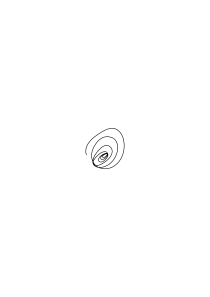

Der Prozeß würde erst wenn er zu Ende ist eine Zahl bestimmen, da er aber ins Unendliche läuft & nie fertig wird so bestimmt er _keine_ Zahl.

### [122\[5\]](https://cdn.wittgensteinnachlass.com/2000px/webp/Ms-107/122.webp)

Ich habe einen Prozeß der eine Zahl ist & gebe eine rationale Zahl & frage, ist das die Zahl die Du meinst? Ist es möglich, daß ich es dann nicht weiß?

### [122\[6\]](https://cdn.wittgensteinnachlass.com/2000px/webp/Ms-107/122.webp)

Soll ich sagen?: Wäre die rationale Zahl im richtigen System hingeschrieben, wo wüßte ich es?

### [122\[7\]](https://cdn.wittgensteinnachlass.com/2000px/webp/Ms-107/122.webp)

Der Prozeß muß unendlich vorausschauen sonst bestimmt er keine Zahl. Es darf kein „ich weiß es noch nicht” geben. Denn es gibt kein _noch_ (im Unendlichen).

### [123\[1\]](https://cdn.wittgensteinnachlass.com/2000px/webp/Ms-107/123.webp)

Jede rationale Zahl muß in einem sichtbaren Verhältnis zu dem Gesetz, das eine Zahl ist, stehen.

### [123\[2\]](https://cdn.wittgensteinnachlass.com/2000px/webp/Ms-107/123.webp)

Beim Gesetz der √2 ist das der Fall. Gegeben eine Zahl, so kann ich sie sofort mit dem Gesetz vergleichen.

### [123\[3\]](https://cdn.wittgensteinnachlass.com/2000px/webp/Ms-107/123.webp)

Aber es gibt doch auch bei F eine Entwicklung. Die erste Antwort ist: ja, aber keine wesentliche. Keine uns verständliche, keine uns als Zahl verständliche.

### [123\[4\]](https://cdn.wittgensteinnachlass.com/2000px/webp/Ms-107/123.webp)

Wäre es eine uns als Zahl verständliche Entwicklung, so müßte ich eine gegebene Zahl, wenn es die Zahl dieser Entwicklung ist, als solche erkennen.

### [123\[5\]](https://cdn.wittgensteinnachlass.com/2000px/webp/Ms-107/123.webp)

Die Entwicklung kann unmittelbar im Dezimalsystem ihrem Gesetz nach verständlich sein (z.B. 0˙1010010001 etc.) oder auch nicht; dann muß sie es in einer anderen Ausdrucksform sein.

### [123\[6\]](https://cdn.wittgensteinnachlass.com/2000px/webp/Ms-107/123.webp)

Die eigentliche Entwicklung ist eben die Methode des Vergleichs mit den Rationalzahlen.

### [123\[7\]](https://cdn.wittgensteinnachlass.com/2000px/webp/Ms-107/123.webp)

Die eigentliche Entwicklung der Zahl ist die, die den unmittelbaren Vergleich mit den Rationalzahlen erlaubt.

### [123\[8\]](https://cdn.wittgensteinnachlass.com/2000px/webp/Ms-107/123.webp),[124\[1\]](https://cdn.wittgensteinnachlass.com/2000px/webp/Ms-107/124.webp)

Man könnte also sagen, F hat gar keine wirkliche Entwicklung.

### [124\[2\]](https://cdn.wittgensteinnachlass.com/2000px/webp/Ms-107/124.webp)

Das Gesetz muß zu jeder Rationalzahl eine natürliche Beziehung haben.

### [124\[3\]](https://cdn.wittgensteinnachlass.com/2000px/webp/Ms-107/124.webp)

Es ist klar, die reelle Zahl kann nur das sein, was wir abgesehen von der Extension besitzen & verstehen. (Also etwas wie eine Funktion.)

### [124\[4\]](https://cdn.wittgensteinnachlass.com/2000px/webp/Ms-107/124.webp)

Gegeben ist das Gesetz, & die rationale Zahl ruft aus dem Gesetz den Vergleich hervor.

### [124\[5\]](https://cdn.wittgensteinnachlass.com/2000px/webp/Ms-107/124.webp)

Wenn man dem Gesetz eine Rationalzahl in die Nähe bringt, so muß es darauf in einer bestimmten Weise reagieren.

### [124\[6\]](https://cdn.wittgensteinnachlass.com/2000px/webp/Ms-107/124.webp)

Auf die Frage „ist es die” muß es antworten.

### [124\[7\]](https://cdn.wittgensteinnachlass.com/2000px/webp/Ms-107/124.webp)

Es muß zu einer Rationalzahl in einem _bestimmten_ Verhältnis stehen.

### [124\[8\]](https://cdn.wittgensteinnachlass.com/2000px/webp/Ms-107/124.webp)

Ich möchte so sagen: Die Eigentliche Entwicklung ist das, was der Vergleich mit einer rationalen Zahl aus dem Gesetz hervorruft.

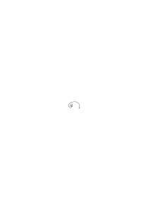

### [124\[9\]](https://cdn.wittgensteinnachlass.com/2000px/webp/Ms-107/124.webp)

Aber ist nicht der Prozeß des Wurzelziehens ein anderer als der des Kontrollierens ob die √2 größer oder kleiner ist als eine gegebene Zahl? In welchem Verhältnis steht er aber zu dem ersten.

### [124\[10\]](https://cdn.wittgensteinnachlass.com/2000px/webp/Ms-107/124.webp),[125\[1\]](https://cdn.wittgensteinnachlass.com/2000px/webp/Ms-107/125.webp)

Das Gesetz muß eine wesentliche Beziehung zu einer Größe haben.

### [125\[2\]](https://cdn.wittgensteinnachlass.com/2000px/webp/Ms-107/125.webp)

Ich tue dasselbe wie einer der sich eine Physiognomie unaufhörlich wieder & wieder vorstellt & ausmalt um das rechte Wort für sie zu finden.

### [125\[3\]](https://cdn.wittgensteinnachlass.com/2000px/webp/Ms-107/125.webp)

F: zeigt man ihm eine Zahl (<math class="stacked" display="inline"><mtext>0˙</mtext><mn>11</mn><mover><mrow><mn>0</mn></mrow><mtext>˙</mtext></mover></math>) (so ist er ratlos) so weiß er nicht ob es die Zahl ist oder nicht.

### [125\[4\]](https://cdn.wittgensteinnachlass.com/2000px/webp/Ms-107/125.webp)

Man kann nicht sagen: F stellt wohl eine Größe vor, ich weiß nur nicht welche! Sondern, wenn ich es nicht weiß, dann stellt sie auch keine vor.

### [125\[5\]](https://cdn.wittgensteinnachlass.com/2000px/webp/Ms-107/125.webp)

Ich kann natürlich auch hier das Intervall immer kleiner machen, aber das genügt nicht, ich muß es auf Kommando kleiner machen können.

### [125\[6\]](https://cdn.wittgensteinnachlass.com/2000px/webp/Ms-107/125.webp)

Das Zusammenziehen des Intervalls dient ja dem Vergleich dadurch, daß dadurch jede Zahl rechts oder links zu liegen kommt. Das geht nur dann, wenn der Vergleich mit einer gegebenen Rationalzahl das Gesetz zwingt sich im Vergleich zu dieser Zahl auszusprechen.

### [125\[7\]](https://cdn.wittgensteinnachlass.com/2000px/webp/Ms-107/125.webp)

Die reelle Zahl ist eine Regel, die für jede rationale Zahl angibt ob sie kleiner oder größer ist als die erstere.

### [125\[8\]](https://cdn.wittgensteinnachlass.com/2000px/webp/Ms-107/125.webp),[126\[1\]](https://cdn.wittgensteinnachlass.com/2000px/webp/Ms-107/126.webp)

√2˙25 so muß man 1˙5 schreiben um es mit √2 vergleichen zu können.

### [126\[2\]](https://cdn.wittgensteinnachlass.com/2000px/webp/Ms-107/126.webp)

Es geht nur dann wenn das Gesetz auf eine Rationalzahl quasi automatisch durch eine Zusammenziehung des Intervalls reagiert, die die Stellung des Gesetzes zur gegebenen Zahl zeigt

### [126\[3\]](https://cdn.wittgensteinnachlass.com/2000px/webp/Ms-107/126.webp)

Die Größe 0˙11 hat eben gar kein Verhältnis zum Gesetz F. (dagegen hat die Größe 1˙5 ein Verhältnis zu √2, & wenn man es in der Form √2˙25 schreibt, so zeigt sich dieses Verhältnis).

### [126\[4\]](https://cdn.wittgensteinnachlass.com/2000px/webp/Ms-107/126.webp)

Es handelt sich nicht um ein Verhältnis zu einer bestimmten Stufe der Entwicklung, sondern zum Gesetz als unendlichem Gesetz.

### [126\[5\]](https://cdn.wittgensteinnachlass.com/2000px/webp/Ms-107/126.webp)

Das Verhältnis zum _Gesetz_ zeigt sich eben an der allgemeinen Notwendigkeit der Reaktion des Gesetzes auf eine gegebene Zahl (im Sinne des Vergleichs).

### [126\[6\]](https://cdn.wittgensteinnachlass.com/2000px/webp/Ms-107/126.webp)

x⁵ + y⁵ = z⁵ das ist gar nicht der Ausdruck einer Zahl, so wenig wie die Beschreibung „die dritte Stelle in der Dezimalentwicklung von π”.

### [126\[7\]](https://cdn.wittgensteinnachlass.com/2000px/webp/Ms-107/126.webp)

Kann ich sagen: wir sehen keinen Zusammenhang zwischen einer Zahlengröße & der Formel F (außer dem des Würfelns mit der gewürfelten Zahl).

### [127\[1\]](https://cdn.wittgensteinnachlass.com/2000px/webp/Ms-107/127.webp)

Es ist nicht so daß x¹ + y¹ = z¹, x² + y² = z², x³ + y³ = z³ etc. nur andere Formen der Bezeichnung von Zahlen sind, die in dieser Form in sichtbarem gesetzmäßigem Verhältnis stehen, wenn schon die aus ihnen erhaltenen Dezimalausdrücke es nicht tun. Es ist nicht wie im Fall <math class="stacked" display="inline"><mfrac><mrow><mn>1</mn></mrow><mrow><mn>2</mn></mrow></mfrac><mo>,</mo><mfrac><mrow><mn>1</mn></mrow><mrow><mn>2</mn><mspace width="0.3em"/><mo>+</mo><mspace width="0.3em"/><mn>12</mn></mrow></mfrac><mo>,</mo><mfrac><mrow><mn>1</mn></mrow><mrow><mn>2</mn><mspace width="0.3em"/><mo>+</mo><mspace width="0.3em"/><mn>12</mn><mspace width="0.3em"/><mo>+</mo><mspace width="0.3em"/><mn>12</mn></mrow></mfrac><mo>,</mo></math> etc. wo man das Gesetz sieht, das man in der Dezimalentwicklung nicht sieht. Denn die Ausdrücke <math class="stacked" display="inline"><mfrac><mrow><mn>1</mn></mrow><mrow><mn>2</mn></mrow></mfrac><mo>,</mo><mfrac><mrow><mn>1</mn></mrow><mrow><mn>2</mn><mspace width="0.3em"/><mo>+</mo><mspace width="0.3em"/><mn>12</mn></mrow></mfrac><mo>,</mo></math> etc. sind bereits Zahlen & nur der Zusammenhang dieser Ausdrücke mit den Dezimalbrüchen ist eine Zufälligkeit. Die Ausdrücke <math class="stacked" display="inline"><msup><mi>x</mi><mi>n</mi></msup><mspace width="0.3em"/><mo>+</mo><msup><mi>y</mi><mi>n</mi></msup><mspace width="0.3em"/><mo>=</mo><msup><mi>z</mi><mi>n</mi></msup></math> aber sind keine Zahlen & durch Zufälle mit Zahlen überhaupt verknüpft.

### [127\[2\]](https://cdn.wittgensteinnachlass.com/2000px/webp/Ms-107/127.webp)

[Das arithmetische Rätsel, Rätselfrage]

### [127\[3\]](https://cdn.wittgensteinnachlass.com/2000px/webp/Ms-107/127.webp)

Hier handelt es sich um den Unterschied einer arithmetischen Operation die uns eine Zahl liefert von einem arithmetisch unverstandenen Prozeß der uns Ziffern liefert.

### [127\[4\]](https://cdn.wittgensteinnachlass.com/2000px/webp/Ms-107/127.webp)

Was ist der Unterschied zwischen einer arithmetischen Operation & einer Pseudooperation?

### [127\[5\]](https://cdn.wittgensteinnachlass.com/2000px/webp/Ms-107/127.webp)

Die Pseudooperation stellt nicht den Zusammenhang der Basen mit dem Resultat dar.

### [127\[6\]](https://cdn.wittgensteinnachlass.com/2000px/webp/Ms-107/127.webp)

Es ist ein Zusammenhang aber ich habe ihn nicht bezeichnet.

### [128\[1\]](https://cdn.wittgensteinnachlass.com/2000px/webp/Ms-107/128.webp)

Fx soll eine Operation mit der Basis x sein, und zwar soll Fx = x sein wenn sich unter den ersten 100 Kardinalzahlen ein Zahlentrippel abc findet für welches <math class="stacked" display="inline"><msup><mi>a</mi><mi>x</mi></msup><mspace width="0.3em"/><mo>+</mo><msup><mi>b</mi><mi>x</mi></msup><mspace width="0.3em"/><mo>=</mo><msup><mi>c</mi><mi>x</mi></msup></math> ist & sonst Fx = ∞. Das ist eine vollkommen klare Vorschrift, die ich für jede beliebige Zahl x anwenden kann. Aber ist Fx nun eine arithmetische Operation? – Warum ist es keine arithmetische Operation?

### [128\[2\]](https://cdn.wittgensteinnachlass.com/2000px/webp/Ms-107/128.webp)

Das ist eine ungemein wichtige Frage.

### [128\[3\]](https://cdn.wittgensteinnachlass.com/2000px/webp/Ms-107/128.webp)

Man könnte sagen: man kann nicht eine neue Operation an der Oberfläche der Arithmetik einführen, sondern sie muß die ganze Arithmetik durchdringen. (Wie man nicht in die Logik etwas neben die Wahrheitsfunktionen stellen kann was nur so dasteht ohne sie zu durchdringen & zu _einem_ Gewebe mit ihnen zu werden.)

### [128\[4\]](https://cdn.wittgensteinnachlass.com/2000px/webp/Ms-107/128.webp)

Das heißt natürlich nichts, als daß die Arithmetik _ein_ Wesen ist, dem sich nichts anhängen läßt, außer ein Kleid.

### [128\[5\]](https://cdn.wittgensteinnachlass.com/2000px/webp/Ms-107/128.webp)

Funktionsbegriff Dirichlet & …

### [128\[6\]](https://cdn.wittgensteinnachlass.com/2000px/webp/Ms-107/128.webp)

Beiläufig sieht es so aus daß eine arithmetische Operation eine interne Relation zwischen Zahlen darstellt die in diesen allein sichtbar ist.

### [128\[7\]](https://cdn.wittgensteinnachlass.com/2000px/webp/Ms-107/128.webp),[129\[1\]](https://cdn.wittgensteinnachlass.com/2000px/webp/Ms-107/129.webp)

Beiläufig gesehen stellt eine arithmetische Operation eine interne Relation zwischen Zahlen unmittelbar sichtbar dar.

### [129\[2\]](https://cdn.wittgensteinnachlass.com/2000px/webp/Ms-107/129.webp)

Wie wäre es mit so einer Operation: xχy, man bildet das Produkt von x und y; ist es größer als 100 so ist das Resultat gleich der größeren der beiden Zahlen, ist es gleich oder kleiner als 100 so ist das Resultat 0?

### [129\[3\]](https://cdn.wittgensteinnachlass.com/2000px/webp/Ms-107/129.webp)

12 χ 10 = 12 Die Operation ist arithmetisch nicht verständlich.

### [129\[4\]](https://cdn.wittgensteinnachlass.com/2000px/webp/Ms-107/129.webp)

Um eine Operation zu verstehen muß man sie allgemein verstehen. Allgemein d.h. für alle möglichen Zahlen & das heißt eine Induktion verstehen. (Skolems Definitionen durch Rekursion)

### [129\[5\]](https://cdn.wittgensteinnachlass.com/2000px/webp/Ms-107/129.webp)

Es kommt darauf an _wer_ träumt.

### [129\[6\]](https://cdn.wittgensteinnachlass.com/2000px/webp/Ms-107/129.webp)

Allgemeine Definition der Zahl durch eine allgemeine Form der logischen Operation überflüssig.

### [129\[7\]](https://cdn.wittgensteinnachlass.com/2000px/webp/Ms-107/129.webp)

„Sei anständig – & träumst du dann noch dann werden deine Träume ein Ausdruck der Anständigkeit & durch sie verklärt sein.”

### [129\[8\]](https://cdn.wittgensteinnachlass.com/2000px/webp/Ms-107/129.webp)

Ist ein arithmetisches Experiment noch möglich wo eine Definition durch Rekursion statthat?

### [129\[9\]](https://cdn.wittgensteinnachlass.com/2000px/webp/Ms-107/129.webp),[130\[1\]](https://cdn.wittgensteinnachlass.com/2000px/webp/Ms-107/130.webp)

Ich glaube: offenbar nein; weil durch die Rekursion jede Stufe arithmetisch verständlich wird. Und zwar wird rekurriert, nicht wieder auf eine Allgemeinheit, sondern auf einen bestimmten arithmetischen Fall.

### [130\[2\]](https://cdn.wittgensteinnachlass.com/2000px/webp/Ms-107/130.webp)

Die allgemeine Form einer Kardinalzahl ((((1) + 1) + 1) + 1)

### [130\[3\]](https://cdn.wittgensteinnachlass.com/2000px/webp/Ms-107/130.webp)

Die rekurrierende Definition vermittelt das Verständnis dadurch daß sie auf _einem bestimmten_ Fall, der keine Allgemeinheit voraussetzt, aufbaut.

### [130\[4\]](https://cdn.wittgensteinnachlass.com/2000px/webp/Ms-107/130.webp)

Wohl kann ich im Fall χ, F, P die Vorschrift der Untersuchung der Zahlen rekursiv erklären, aber nicht ihr Resultat.

### [130\[5\]](https://cdn.wittgensteinnachlass.com/2000px/webp/Ms-107/130.webp)

Ich kann das Resultat nicht aufbauen.

### [130\[6\]](https://cdn.wittgensteinnachlass.com/2000px/webp/Ms-107/130.webp)

Mein Ideal ist eine gewisse Kühle. Ein Tempel der den Leidenschaften als Umgebung dient ohne in sie hineinzureden.

### [130\[7\]](https://cdn.wittgensteinnachlass.com/2000px/webp/Ms-107/130.webp)

Wie weiß ich denn daß es ein a gibt, so daß <math class="stacked" display="inline"><mtext>a²</mtext><mspace width="0.3em"/><mtext><</mtext><mspace width="0.3em"/><mn>2</mn><mspace width="0.3em"/><mtext><</mtext><mspace width="0.3em"/><mtext>a²</mtext><mspace width="0.3em"/><mo>+</mo><mfrac><mrow><mtext>2a</mtext></mrow><mrow><mtext>10n</mtext></mrow></mfrac><mspace width="0.3em"/><mo>+</mo><mfrac><mrow><mn>1</mn></mrow><mrow><mtext>10²n</mtext></mrow></mfrac></math>? Weil ich ein a _konstruieren_ kann so daß a² = 1˙999– ist.

### [130\[8\]](https://cdn.wittgensteinnachlass.com/2000px/webp/Ms-107/130.webp)

Wie weiß ich daß es ein a gibt für das a² = 1˙999– ist?

### [130\[9\]](https://cdn.wittgensteinnachlass.com/2000px/webp/Ms-107/130.webp)

Wenn wir sehen wollen, was bewiesen worden ist, dürfen wir auf nichts anderes schauen als auf den Beweis.

### [131\[1\]](https://cdn.wittgensteinnachlass.com/2000px/webp/Ms-107/131.webp)

Wenn ich sage <math class="stacked" display="inline"><msub><mo>(</mo><mi>n</mi></msub><msqrt><mrow><mn>2</mn></mrow></msqrt><mo>)</mo><mtext>²</mtext></math> nähert sich der 2 & erreicht also _einmal_ die Zahlen 1˙9, 1˙99, 1˙999, so ist das unsinnig, wenn ich nicht angeben kann, binnen wieviel Schritten diese Werte erreicht werden, denn „_einmal_” heißt nichts.

### [131\[2\]](https://cdn.wittgensteinnachlass.com/2000px/webp/Ms-107/131.webp)

x² = 1˙999– d.h.: (∃x)x² = 1˙999–

### [131\[3\]](https://cdn.wittgensteinnachlass.com/2000px/webp/Ms-107/131.webp)

<math display="block">
  <mo>(</mo>
  <mo>∃</mo>
  <mtext>x)</mtext>
  <mspace width="0.3em"/>
  <mn>2</mn>
  <mspace width="0.3em"/>
  <mtext>></mtext>
  <mspace width="0.3em"/>
  <mtext>x²</mtext>
  <mspace width="0.3em"/>
  <mtext>></mtext>
  <mspace width="0.3em"/>
  <mn>2</mn>
  <mspace width="0.3em"/>
  <mtext>‒</mtext>
  <mfrac>
    <mrow>
      <mn>1</mn>
    </mrow>
    <mrow>
      <mtext>10n</mtext>
    </mrow>
  </mfrac>
</math>

Nur durch Induktion kann sich das ergeben

_{_ | | 1² < 2 < (1 + <math class="stacked" display="inline"><mfrac><mrow><mn>1</mn></mrow><mrow><mtext>10⁰</mtext></mrow></mfrac></math>)² A² < 2 < (A + <math class="stacked" display="inline"><mfrac><mrow><mn>1</mn></mrow><mrow><mtext>10⁰</mtext></mrow></mfrac></math>)² (A + <math class="stacked" display="inline"><mfrac><mrow><mi>a</mi></mrow><mrow><mtext>10n</mtext><mspace width="0.3em"/><mo>+</mo><mspace width="0.3em"/><mn>1</mn></mrow></mfrac></math>)² < 2 < (A + <math class="stacked" display="inline"><mfrac><mrow><mi>a</mi><mspace width="0.3em"/><mo>+</mo><mspace width="0.3em"/><mn>1</mn></mrow><mrow><mtext>10n</mtext><mspace width="0.3em"/><mo>+</mo><mspace width="0.3em"/><mn>1</mn></mrow></mfrac></math>)² | | A² (A + <math class="stacked" display="inline"><mfrac><mrow><mn>1</mn></mrow><mrow><mtext>10n</mtext><mspace width="0.3em"/><mo>+</mo><mspace width="0.3em"/><mn>1</mn></mrow></mfrac></math>)² (A + <math class="stacked" display="inline"><mfrac><mrow><mn>1</mn></mrow><mrow><mtext>10n</mtext></mrow></mfrac></math>)² ︸ ︸ ︸ 0 ≤ a ≤ 9

A² < (A + <math class="stacked" display="inline"><mfrac><mrow><mn>1</mn></mrow><mrow><mtext>10n</mtext><mspace width="0.3em"/><mo>+</mo><mspace width="0.3em"/><mn>1</mn></mrow></mfrac></math>)² < (A + <math class="stacked" display="inline"><mfrac><mrow><mn>2</mn></mrow><mrow><mtext>10n</mtext><mspace width="0.3em"/><mo>+</mo><mspace width="0.3em"/><mn>1</mn></mrow></mfrac></math>)² < (A + <math class="stacked" display="inline"><mfrac><mrow><mn>3</mn></mrow><mrow><mtext>10n</mtext><mspace width="0.3em"/><mo>+</mo><mspace width="0.3em"/><mn>1</mn></mrow></mfrac></math>)² – – – < (A + <math class="stacked" display="inline"><mfrac><mrow><mn>1</mn></mrow><mrow><mtext>10n</mtext></mrow></mfrac></math>)²

### [131\[4\]](https://cdn.wittgensteinnachlass.com/2000px/webp/Ms-107/131.webp)

<math display="block">
  <mn>1</mn>
  <mspace width="0.3em"/>
  <mo>+</mo>
  <mfrac>
    <mrow>
      <mn>1</mn>
    </mrow>
    <mrow>
      <mtext>1!</mtext>
    </mrow>
  </mfrac>
  <mspace width="0.3em"/>
  <mo>+</mo>
  <mfrac>
    <mrow>
      <mn>1</mn>
    </mrow>
    <mrow>
      <mtext>2!</mtext>
    </mrow>
  </mfrac>
  <mspace width="0.3em"/>
  <mo>+</mo>
  <mfrac>
    <mrow>
      <mn>1</mn>
    </mrow>
    <mrow>
      <mtext>3!</mtext>
    </mrow>
  </mfrac>
  <mspace width="0.3em"/>
  <mtext>…</mtext>
</math>

### [131\[5\]](https://cdn.wittgensteinnachlass.com/2000px/webp/Ms-107/131.webp)

<math class="stacked" display="inline"><mn>1</mn><mspace width="0.3em"/><mn>1</mn><mspace width="0.3em"/><mtext>0˙</mtext><mn>5</mn><mspace width="0.3em"/><mtext>0˙</mtext><mn>1</mn><mover><mrow><mn>6</mn></mrow><mtext>˙</mtext></mover><mspace width="0.3em"/><mtext>0˙</mtext><mn>041</mn><mover><mrow><mn>6</mn></mrow><mtext>˙</mtext></mover></math> Nach wieviel Schritten bleibt eine Dezimalstelle stehen?

### [131\[6\]](https://cdn.wittgensteinnachlass.com/2000px/webp/Ms-107/131.webp)

<math display="inline"><mo>[</mo><mtext>0˙</mtext><mtext>998|</mtext><mtext>99|</mtext><mtext>9|</mtext><mo>]</mo><mo>[</mo><mtext>998|</mtext><mtext>899|</mtext><mtext>989|</mtext><mtext>998|</mtext><mtext>99|</mtext><mtext>9|</mtext><mo>]</mo><mo>[</mo><mtext>998|</mtext><mtext>899|</mtext><mtext>989|</mtext><mtext>998|</mtext><mtext>899|</mtext><mtext>989|</mtext><mtext>998|</mtext><mtext>99|</mtext><mtext>9|</mtext><mspace width="0.3em"/><mo>]</mo></math> Die Wirkung der Addition zerschellt immer an der 8. Der Rest einer Kolumne kann nie über die nächste hinauswirken.

### [131\[7\]](https://cdn.wittgensteinnachlass.com/2000px/webp/Ms-107/131.webp),[132\[1\]](https://cdn.wittgensteinnachlass.com/2000px/webp/Ms-107/132.webp)

Wieviele 0en können in e nacheinander auftreten? Bleibt nach n + r Schritten die nte Dezimalstelle stehen und geht ihr eine 0 vorher so muß die zugleich mit der nten Stelle stehenbleiben denn eine 0 kann aus einer anderen Ziffer nur werden wenn sich auch die nächste Stelle noch ändert. So ist die Zahl der 0en beschränkt.

### [132\[2\]](https://cdn.wittgensteinnachlass.com/2000px/webp/Ms-107/132.webp)

Man kann & muß zeigen daß die Dezimalstellen nach einer _bestimmten_ Anzahl von Schritten stehenbleiben.

### [132\[3\]](https://cdn.wittgensteinnachlass.com/2000px/webp/Ms-107/132.webp)

Es ist mir wie wenn man auf einem Alpenweg gehend eine Alm sieht aber man ist noch nicht dorten, sondern um hinzukommen muß man noch eine halbe Stunde im Wald gehen & dann erst kommt man dorthin, wo man scheinbar ohnehin schon war, nämlich mit den Blicken. So komme ich immer wieder in Gegenden der Logik die ich schon oft genau, aber nicht von nächster Nähe gesehen habe.

### [132\[4\]](https://cdn.wittgensteinnachlass.com/2000px/webp/Ms-107/132.webp)

Man muß immer die Größenordnung bestimmen können. Angenommen es spricht nichts dagegen (in meiner Notation) daß in e an einer bestimmten Stelle 100 3er nacheinander stehen so spricht etwas dagegen daß 10¹⁰⁰ 3er nacheinander auftreten.

### [132\[5\]](https://cdn.wittgensteinnachlass.com/2000px/webp/Ms-107/132.webp)

Im Dezimalsystem muß vieles offen bleiben was im Dualsystem bestimmt ist.

### [132\[6\]](https://cdn.wittgensteinnachlass.com/2000px/webp/Ms-107/132.webp),[133\[1\]](https://cdn.wittgensteinnachlass.com/2000px/webp/Ms-107/133.webp)

Es ist nicht nur notwendig sagen zu können ob eine gegebene rationale Zahl die reelle Zahl ist, sondern auch, wie nahe sie ihr möglicherweise kommen kann. Das heißt es genügt nicht sagen zu können, daß die Spirale durch diesen Punkt nicht geht & unterhalb an ihm vorbei, sondern wir müssen auch Grenzen wissen innerhalb derer der Abstand von dem Punkt liegt. Wir müssen eine Größenordnung des Abstandes kennen.

### [133\[2\]](https://cdn.wittgensteinnachlass.com/2000px/webp/Ms-107/133.webp)

Die Entwicklung im Dezimalsystem gibt mir diese nicht, da ich nicht wissen kann wieviele 9er, zum Beispiel, einer entwickelten Stelle folgen werden.

### [133\[3\]](https://cdn.wittgensteinnachlass.com/2000px/webp/Ms-107/133.webp)

Die Frage „ist e <math class="stacked" display="inline"><mtext>2˙</mtext><mn>7</mn><mover><mrow><mn>3</mn></mrow><mtext>˙</mtext></mover></math>” ist unsinnig, denn sie fragt nicht nach einer Extension sondern nach einem Gesetz, nämlich nach einer Induktion von der wir aber hier keine Vorstellung haben. Für die Division kann man diese Frage stellen, nur darum weil wir die Induktionsform kennen die wir <math class="stacked" display="inline"><mover><mrow><mn>3</mn></mrow><mtext>˙</mtext></mover></math> nennen.

### [133\[4\]](https://cdn.wittgensteinnachlass.com/2000px/webp/Ms-107/133.webp)

Wie nahe kann e diesem Bruch kommen & wie nahe kann es ihm nicht kommen.

### [133\[5\]](https://cdn.wittgensteinnachlass.com/2000px/webp/Ms-107/133.webp)

{Nur eine endliche Frage kann offenbleiben.}

### [133\[6\]](https://cdn.wittgensteinnachlass.com/2000px/webp/Ms-107/133.webp)

In einem gewissen, jetzt leicht verständlichen Sinne, kann ich e mit ⅓ aber nicht mit <math class="stacked" display="inline"><mtext>0˙</mtext><mover><mrow><mn>3</mn></mrow><mtext>˙</mtext></mover></math> vergleichen.

### [133\[7\]](https://cdn.wittgensteinnachlass.com/2000px/webp/Ms-107/133.webp),[134\[1\]](https://cdn.wittgensteinnachlass.com/2000px/webp/Ms-107/134.webp)

Die Frage „bleiben die Dezimalstellen von e einmal stehen” & die Antwort „sie bleiben einmal stehen” sind beide Unsinn. Die Frage heißt: Nach wieviel Schritten müssen die Stellen stehenbleiben.

### [134\[2\]](https://cdn.wittgensteinnachlass.com/2000px/webp/Ms-107/134.webp)

Irgendwo muß ich in der Dezimalentwicklung von e stehen bleiben & wo immer ich stehen bleibe ist das Entwickelte vereinbar damit daß e eine Rationalzahl ist.

### [134\[3\]](https://cdn.wittgensteinnachlass.com/2000px/webp/Ms-107/134.webp)

Kann man sagen?: „e ist nicht diese Zahl” heißt nichts, sondern man muß sagen, es ist mindestens um dieses Intervall von ihr entfernt.

### [134\[4\]](https://cdn.wittgensteinnachlass.com/2000px/webp/Ms-107/134.webp)

Ich glaube, so ist es. Das hieße aber, sie könnte auch gar nicht beantwortet werden, ohne daß zugleich ein Begriff über den Abstand gegeben würde.

### [134\[5\]](https://cdn.wittgensteinnachlass.com/2000px/webp/Ms-107/134.webp)

Gleichung zwischen Induktionsvorgängen.

### [134\[6\]](https://cdn.wittgensteinnachlass.com/2000px/webp/Ms-107/134.webp)

Wie werden sie bewiesen? Das muß dazu führen, was sie sind.

### [134\[7\]](https://cdn.wittgensteinnachlass.com/2000px/webp/Ms-107/134.webp)

Ist es nicht ungefähr so: Eine „Gleichung zwischen zwei Induktionen” ist eine Induktion mit einer Gleichung?

### [134\[8\]](https://cdn.wittgensteinnachlass.com/2000px/webp/Ms-107/134.webp)

Die Allgemeinheit einer Gleichung, nicht die Gleichung zwischen Allgemeinheiten.

### [134\[9\]](https://cdn.wittgensteinnachlass.com/2000px/webp/Ms-107/134.webp),[135\[1\]](https://cdn.wittgensteinnachlass.com/2000px/webp/Ms-107/135.webp)

Es gäbe dann zweierlei Gleichungen zwischen Induktionen. Eine, die eigentlich nur eine Gleichung zwischen homologen Gliedern der beiden Induktionen ist & etwas anderes was nicht eine Gleichung sondern quasi die „Induktion einer Gleichung” wäre.

### [135\[2\]](https://cdn.wittgensteinnachlass.com/2000px/webp/Ms-107/135.webp)

a = a

### [135\[3\]](https://cdn.wittgensteinnachlass.com/2000px/webp/Ms-107/135.webp)

Es muß sich ja damit ganz analog verhalten, wie mit dem größer & kleiner dem Vergleich der reellen Zahl mit einer Rationalzahl. Das < in √2 < 1˙5 ist auch nicht dasselbe wie das in 1 < 1˙5 & muß erst erklärt werden & ebenso das √2 ≠ e.

### [135\[4\]](https://cdn.wittgensteinnachlass.com/2000px/webp/Ms-107/135.webp)

Die Gleichung zwischen reellen Zahlen ist wohl arithmetisch, aber sie ist eine andere Beziehung als die Gleichung zwischen rationalen Zahlen.

### [135\[5\]](https://cdn.wittgensteinnachlass.com/2000px/webp/Ms-107/135.webp)

Das Subjekt der Gleichung.

### [135\[6\]](https://cdn.wittgensteinnachlass.com/2000px/webp/Ms-107/135.webp)

Die Induktionsprozesse zweier gleicher reeller Zahlen müssen, in dasselbe System gebracht, das identische Gesetz ergeben.

### [135\[7\]](https://cdn.wittgensteinnachlass.com/2000px/webp/Ms-107/135.webp)

Die reelle Zahl ist in einem anderen Sinne Subjekt einer Gleichung als die rationale Zahl. („Ich höre die Musik” & „Ich höre das Klavier”)

### [135\[8\]](https://cdn.wittgensteinnachlass.com/2000px/webp/Ms-107/135.webp),[136\[1\]](https://cdn.wittgensteinnachlass.com/2000px/webp/Ms-107/136.webp)

Kann denn eine Gleichung etwas anderes heißen als: – ist durch – ersetzbar? Gewiß nicht! Aber ersetzbar nach welchen Regeln?!

### [136\[2\]](https://cdn.wittgensteinnachlass.com/2000px/webp/Ms-107/136.webp)

Die Induktion beweist nicht eine Gleichung sondern ich fasse sie _in_ eine Gleichung.

### [136\[3\]](https://cdn.wittgensteinnachlass.com/2000px/webp/Ms-107/136.webp)

<math class="stacked" display="inline"><mfrac linethickness="0"><mrow><mtext>lim</mtext></mrow><mrow><mi>n</mi><mspace width="0.3em"/><mtext>→</mtext><mspace width="0.3em"/><mtext>∞</mtext></mrow></mfrac><mfrac><mrow><mn>1</mn></mrow><mrow><mtext>2ⁿ</mtext></mrow></mfrac><mspace width="0.3em"/><mo>=</mo><mspace width="0.3em"/><mn>0</mn></math> bezeichnet keinen Beweis sondern _bezieht_ sich nur auf einen Beweis wie <math class="stacked" display="inline"><mtext>⅓</mtext><mspace width="0.3em"/><mo>=</mo><mspace width="0.3em"/><mtext>0˙</mtext><mover><mrow><mn>3</mn></mrow><mtext>˙</mtext></mover></math>, es kann auch falsch sein, man kann danach fragen.

### [136\[4\]](https://cdn.wittgensteinnachlass.com/2000px/webp/Ms-107/136.webp)

„Unbeschränkt” heißt, es übersteigt jede Schranke.

### [136\[5\]](https://cdn.wittgensteinnachlass.com/2000px/webp/Ms-107/136.webp)

Wir müssen auf den Ursprung zurückgehen.

### [136\[6\]](https://cdn.wittgensteinnachlass.com/2000px/webp/Ms-107/136.webp)

_Die Allgemeinheit_ der allgemeinen arithm. Sätze kann ich nicht verneinen.

### [136\[7\]](https://cdn.wittgensteinnachlass.com/2000px/webp/Ms-107/136.webp)

Ist es nicht sie allein, die ich im algebraischen Satz nicht wiederspiegeln kann?

### [136\[8\]](https://cdn.wittgensteinnachlass.com/2000px/webp/Ms-107/136.webp)

Wenn ich sage: „das Ziel der Induktion ist 0” so ist es, wie wenn ich einen Satz auf die Subjekt-Prädikat-Form bringe der sie ursprünglich nicht hat.

### [136\[9\]](https://cdn.wittgensteinnachlass.com/2000px/webp/Ms-107/136.webp)

Die arithm. Tatsache an der Allgemeinheit ist die Induktion.

### [136\[10\]](https://cdn.wittgensteinnachlass.com/2000px/webp/Ms-107/136.webp),[137\[1\]](https://cdn.wittgensteinnachlass.com/2000px/webp/Ms-107/137.webp)

Bedeutet ein Ausdruck <math class="stacked" display="inline"><mfrac linethickness="0"><mrow><mtext>lim</mtext></mrow><mrow><mi>a</mi><mspace width="0.3em"/><mtext>→</mtext><mspace width="0.3em"/><mi>r</mi></mrow></mfrac><mspace width="0.3em"/><mtext>fa</mtext><mspace width="0.3em"/><mo>=</mo><mspace width="0.3em"/><mi>b</mi></math> eine allgemeine Ungleichung, so muß es eine _allgemeine_ Regel der Übersetzung geben mit der ich die Gleichung verstehen (verdolmetschen) kann.

### [137\[2\]](https://cdn.wittgensteinnachlass.com/2000px/webp/Ms-107/137.webp)

Daß es diese allgemeine Regel gibt verbürgt die Rechtmäßigkeit des Gebrauchs der Gleichungsform.

### [137\[3\]](https://cdn.wittgensteinnachlass.com/2000px/webp/Ms-107/137.webp)

<math class="stacked" display="inline"><mfrac linethickness="0"><mrow><mtext>lim</mtext></mrow><mrow><mi>a</mi><mspace width="0.3em"/><mtext>→</mtext><mspace width="0.3em"/><mi>r</mi></mrow></mfrac><mspace width="0.3em"/><mtext>fa</mtext></math> _scheint_ eine Beschreibung zu sein, ist aber eine Konstruktion, wie alles was in der Mathematik eine Beschreibung zu sein scheint. (_Die_ Lösung der Gleichung x² = 2.)

### [137\[4\]](https://cdn.wittgensteinnachlass.com/2000px/webp/Ms-107/137.webp)

<math class="stacked" display="inline"><mtext>⅓</mtext><mspace width="0.3em"/><mo>=</mo><mspace width="0.3em"/><mtext>0˙</mtext><mover><mrow><mn>3</mn></mrow><mtext>˙</mtext></mover><mspace width="0.3em"/><mo>+</mo><mfrac><mrow><mtext>0˙</mtext><mn>1</mn></mrow><mrow><mn>3</mn></mrow></mfrac></math>, das ist eine gewöhnliche Gleichung; und nun sehe ich in dieser Gleichung einen (induktiven) Zug, und drücke diesen wieder in einer Gleichung <math class="stacked" display="inline"><mtext>⅓</mtext><mspace width="0.3em"/><mo>=</mo><mspace width="0.3em"/><mtext>0˙</mtext><mover><mrow><mn>3</mn></mrow><mtext>˙</mtext></mover></math> aus. So steht die neue Gleichung sozusagen nicht auf derselbe Stufe wie die erste.

### [137\[5\]](https://cdn.wittgensteinnachlass.com/2000px/webp/Ms-107/137.webp)

Man muß also sagen, daß ⅓ nicht in dem selben Sinne gleich <math class="stacked" display="inline"><mover><mrow><mn>3</mn></mrow><mtext>˙</mtext></mover></math> ist, wie es gleich <math class="stacked" display="inline"><mtext>0˙</mtext><mover><mrow><mn>3</mn></mrow><mtext>˙</mtext></mover><mspace width="0.3em"/><mo>+</mo><mfrac><mrow><mtext>0˙</mtext><mn>1</mn></mrow><mrow><mn>3</mn></mrow></mfrac></math> ist.

### [137\[6\]](https://cdn.wittgensteinnachlass.com/2000px/webp/Ms-107/137.webp)

Eine Gleichung läßt sich nur beweisen, indem man sie auf _Gleichungen_ zurückführt.

### [137\[7\]](https://cdn.wittgensteinnachlass.com/2000px/webp/Ms-107/137.webp)

Die letzten Gleichungen in diesem Prozeß sind Definitionen.

### [137\[8\]](https://cdn.wittgensteinnachlass.com/2000px/webp/Ms-107/137.webp)

Ist eine Gleichung nicht auf andere Gleichungen zurückführbar, so ist sie eine Definition.

### [138\[1\]](https://cdn.wittgensteinnachlass.com/2000px/webp/Ms-107/138.webp)

Eine Induktion kann eine Gleichung nicht rechtfertigen.

### [138\[2\]](https://cdn.wittgensteinnachlass.com/2000px/webp/Ms-107/138.webp)

Daher kann sich z.B. die Einführung der Notation <math class="stacked" display="inline"><mover><mrow><mn>3</mn></mrow><mtext>˙</mtext></mover></math> nicht auf die Induktion beziehen, deren Zeichen sie zu sein scheint. Es muß ähnlich sein, wie das Verhältnis von „a + (b + c) = (a + b) + c” zu seinem Induktionsbeweis.

### [138\[3\]](https://cdn.wittgensteinnachlass.com/2000px/webp/Ms-107/138.webp)

Oder vielmehr er bezieht sich wohl auf die bloßen Tatsachen der Induktion aber nicht auf die Allgemeinheit, die ihr eigentlicher Sinn ist.

### [138\[4\]](https://cdn.wittgensteinnachlass.com/2000px/webp/Ms-107/138.webp)

Ich könnte etwa so erklären: wenn <math class="stacked" display="inline"><mfrac><mrow><mi>n</mi></mrow><mrow><mi>m</mi></mrow></mfrac><mspace width="0.3em"/><mo>=</mo><mspace width="0.3em"/><mtext>0˙</mtext><mi>r</mi><mspace width="0.3em"/><mo>+</mo><mo>[</mo><mtext>0˙</mtext><mspace width="0.3em"/><mi>n</mi><mspace width="0.3em"/><mtext>m]</mtext></math> so schreibe ich <math class="stacked" display="inline"><mfrac><mrow><mi>n</mi></mrow><mrow><mi>m</mi></mrow></mfrac><mspace width="0.3em"/><mo>=</mo><mspace width="0.3em"/><mtext>0˙</mtext><mover><mrow><mi>r</mi></mrow><mtext>˙</mtext></mover></math>, & hier – – –

<math display="block">
  <mn>1</mn>
  <mspace width="0.3em"/>
  <mo>+</mo>
  <mfrac>
    <mrow>
      <mn>1</mn>
    </mrow>
    <mrow>
      <mtext>1!</mtext>
    </mrow>
  </mfrac>
  <mspace width="0.3em"/>
  <mo>+</mo>
  <mfrac>
    <mrow>
      <mn>1</mn>
    </mrow>
    <mrow>
      <mtext>2!</mtext>
    </mrow>
  </mfrac>
  <mspace width="0.3em"/>
  <mo>+</mo>
  <mfrac>
    <mrow>
      <mn>1</mn>
    </mrow>
    <mrow>
      <mtext>3!</mtext>
    </mrow>
  </mfrac>
  <mspace width="0.3em"/>
  <mtext>…</mtext>
  <mspace width="0.3em"/>
  <mtext>≠</mtext>
  <mspace width="0.3em"/>
  <mn>1</mn>
  <mspace width="0.3em"/>
  <mtext>‒</mtext>
  <mtext>⅓</mtext>
  <mspace width="0.3em"/>
  <mo>+</mo>
  <mtext>⅕</mtext>
  <mspace width="0.3em"/>
  <mtext>‒</mtext>
  <mfrac>
    <mrow>
      <mn>1</mn>
    </mrow>
    <mrow>
      <mn>7</mn>
    </mrow>
  </mfrac>
  <mspace width="0.3em"/>
  <mo>+</mo>
  <mtext>⅑</mtext>
  <mspace width="0.3em"/>
  <mtext>…</mtext>
</math>

Was würde das heißen? „Sie nähern sich demselben Ziel”

<math display="block">
  <msup>
    <mn>2</mn>
    <mtext>∣</mtext>
    <mtext>∣</mtext>
    <mtext>∣</mtext>
    <mtext>∣</mtext>
  </msup>
  <mspace width="0.3em"/>
  <mtext>∙</mtext>
  <mspace width="0.3em"/>
  <mn>3</mn>
  <mo>√</mo>
  <mspace width="0.3em"/>
  <mo>{</mo>
  <mspace width="0.3em"/>
  <mn>2</mn>
  <mspace width="0.3em"/>
  <mtext>‒</mtext>
  <mo>√</mo>
  <mover>
    <mrow>
      <mn>2</mn>
      <mspace width="0.3em"/>
      <mo>+</mo>
      <msqrt>
        <mrow>
          <mn>2</mn>
        </mrow>
      </msqrt>
    </mrow>
    <mo>‾</mo>
  </mover>
  <mover>
    <mrow>
      <mspace width="0.3em"/>
      <mo>+</mo>
      <msqrt>
        <mrow>
          <mn>2</mn>
        </mrow>
      </msqrt>
    </mrow>
    <mo>‾</mo>
  </mover>
  <mover>
    <mrow>
      <mspace width="0.3em"/>
      <mo>+</mo>
      <msqrt>
        <mrow>
          <mn>2</mn>
        </mrow>
      </msqrt>
    </mrow>
    <mo>‾</mo>
  </mover>
  <mover>
    <mrow>
      <mspace width="0.3em"/>
      <mo>+</mo>
      <msqrt>
        <mrow>
          <mn>3</mn>
        </mrow>
      </msqrt>
    </mrow>
    <mo>‾</mo>
  </mover>
  <mspace width="0.3em"/>
  <mo>}</mo>
  <mspace width="0.3em"/>
  <mo>=</mo>
  <mspace width="0.3em"/>
  <mn>4</mn>
  <mspace width="0.3em"/>
  <mtext>‒</mtext>
  <mfrac>
    <mrow>
      <mn>4</mn>
    </mrow>
    <mrow>
      <mn>3</mn>
    </mrow>
  </mfrac>
  <mspace width="0.3em"/>
  <mo>+</mo>
  <mfrac>
    <mrow>
      <mn>4</mn>
    </mrow>
    <mrow>
      <mn>5</mn>
    </mrow>
  </mfrac>
  <mspace width="0.3em"/>
  <mtext>‒</mtext>
  <mfrac>
    <mrow>
      <mn>4</mn>
    </mrow>
    <mrow>
      <mn>7</mn>
    </mrow>
  </mfrac>
  <mspace width="0.3em"/>
  <mtext>…</mtext>
</math>

### [138\[5\]](https://cdn.wittgensteinnachlass.com/2000px/webp/Ms-107/138.webp)

<math class="stacked" display="inline"><msub><mi>a</mi><mn>1</mn></msub><mspace width="0.3em"/><mo>+</mo><msub><mi>a</mi><mn>2</mn></msub><mspace width="0.3em"/><mo>+</mo><msub><mi>a</mi><mn>3</mn></msub><mspace width="0.3em"/><mo>+</mo><msub><mi>a</mi><mn>4</mn></msub><mspace width="0.3em"/><mo>+</mo><mspace width="0.3em"/><mtext>–</mtext><mspace width="0.3em"/><mtext>–</mtext><mspace width="0.3em"/><mtext>–</mtext><mspace width="0.3em"/><mo>=</mo><msub><mi>b</mi><mn>1</mn></msub><mspace width="0.3em"/><mo>+</mo><msub><mi>b</mi><mn>2</mn></msub><mspace width="0.3em"/><mo>+</mo><msub><mi>b</mi><mn>3</mn></msub><mspace width="0.3em"/><mo>+</mo><msub><mi>b</mi><mn>4</mn></msub><mspace width="0.3em"/><mo>+</mo><mspace width="0.3em"/><mtext>–</mtext><mspace width="0.3em"/><mtext>–</mtext><mspace width="0.3em"/><mtext>–</mtext></math> Wenn die Reihe eine gewisse Länge erreicht, so muß die Ähnlichkeit schon zu merken sein.

### [138\[6\]](https://cdn.wittgensteinnachlass.com/2000px/webp/Ms-107/138.webp)

Nach N Stellen müssen die Dezimalentwicklungen bis zur nten Stelle bleibend übereinstimmen. n = f(N)

<math display="block">
  <mfrac linethickness="0">
    <mrow>
      <mtext>lim</mtext>
    </mrow>
    <mrow>
      <mi>N</mi>
      <mspace width="0.3em"/>
      <mtext>→</mtext>
      <mspace width="0.3em"/>
      <mtext>∞</mtext>
    </mrow>
  </mfrac>
  <mspace width="0.3em"/>
  <mtext>f(</mtext>
  <mtext>N)</mtext>
  <mspace width="0.3em"/>
  <mo>=</mo>
  <mspace width="0.3em"/>
  <mtext>∞</mtext>
</math>

### [139\[1\]](https://cdn.wittgensteinnachlass.com/2000px/webp/Ms-107/139.webp)

<math class="stacked" display="inline"><msup><mn>2</mn><mtext>∣</mtext><mtext>∣</mtext><mtext>∣</mtext><mtext>∣</mtext></msup><mspace width="0.3em"/><mtext>∙</mtext><mspace width="0.3em"/><mn>3</mn><mspace width="0.3em"/><mtext>∙</mtext><mo>√</mo><mover><mrow><mn>2</mn><mspace width="0.3em"/><mtext>‒</mtext><msqrt><mrow><mn>2</mn></mrow></msqrt></mrow><mo>‾</mo></mover><mover><mrow><mspace width="0.3em"/><mo>+</mo><msqrt><mrow><mn>2</mn></mrow></msqrt></mrow><mo>‾</mo></mover><mover><mrow><mspace width="0.3em"/><mo>+</mo><mspace width="0.3em"/><mtext>…</mtext></mrow><mo>‾</mo></mover><msqrt><mrow><mn>3</mn></mrow></msqrt></math> & <math class="stacked" display="inline"><mn>4</mn><mspace width="0.3em"/><mtext>‒</mtext><mfrac><mrow><mn>4</mn></mrow><mrow><mn>3</mn></mrow></mfrac><mspace width="0.3em"/><mo>+</mo><mfrac><mrow><mn>4</mn></mrow><mrow><mn>5</mn></mrow></mfrac><mspace width="0.3em"/><mtext>‒</mtext><mspace width="0.3em"/><mtext>…</mtext></math> sind verschiedene Spiralen, aber es läßt sich aus beiden, in bestimmter Weise, die gleiche [grobe] Spirale ableiten.

### [139\[2\]](https://cdn.wittgensteinnachlass.com/2000px/webp/Ms-107/139.webp)

Und auch hier wieder muß _eine_ Spiralwindung alles zeigen.

<math display="block">
  <mo>(</mo>
  <mtext>4)</mtext>
  <mspace width="0.3em"/>
  <mtext>‒</mtext>
  <mspace width="0.3em"/>
  <mo>(</mo>
  <mfrac>
    <mrow>
      <mn>4</mn>
    </mrow>
    <mrow>
      <mn>3</mn>
    </mrow>
  </mfrac>
  <mo>)</mo>
  <mspace width="0.3em"/>
  <mo>+</mo>
  <mspace width="0.3em"/>
  <mo>(</mo>
  <mfrac>
    <mrow>
      <mn>4</mn>
    </mrow>
    <mrow>
      <mn>5</mn>
    </mrow>
  </mfrac>
  <mo>)</mo>
  <mspace width="0.3em"/>
  <mtext>‒</mtext>
  <mspace width="0.3em"/>
  <mo>(</mo>
  <mfrac>
    <mrow>
      <mn>4</mn>
    </mrow>
    <mrow>
      <mn>7</mn>
    </mrow>
  </mfrac>
  <mo>)</mo>
  <mspace width="0.3em"/>
  <mo>+</mo>
  <mspace width="0.3em"/>
  <mo>(</mo>
  <mfrac>
    <mrow>
      <mn>4</mn>
    </mrow>
    <mrow>
      <mn>9</mn>
    </mrow>
  </mfrac>
  <mo>)</mo>
  <mspace width="0.3em"/>
  <mtext>‒</mtext>
  <mspace width="0.3em"/>
  <mtext>…</mtext>
  <mspace width="0.3em"/>
  <mo>=</mo>
  <mspace width="0.3em"/>
  <mo>(</mo>
  <mn>4</mn>
  <mspace width="0.3em"/>
  <mtext>‒</mtext>
  <mfrac>
    <mrow>
      <mn>4</mn>
    </mrow>
    <mrow>
      <mn>3</mn>
    </mrow>
  </mfrac>
  <mo>)</mo>
  <mspace width="0.3em"/>
  <mo>+</mo>
  <mspace width="0.3em"/>
  <mo>(</mo>
  <mfrac>
    <mrow>
      <mn>4</mn>
    </mrow>
    <mrow>
      <mn>5</mn>
    </mrow>
  </mfrac>
  <mspace width="0.3em"/>
  <mtext>‒</mtext>
  <mfrac>
    <mrow>
      <mn>4</mn>
    </mrow>
    <mrow>
      <mn>7</mn>
    </mrow>
  </mfrac>
  <mo>)</mo>
  <mspace width="0.3em"/>
  <mo>+</mo>
  <mspace width="0.3em"/>
  <mo>(</mo>
  <mfrac>
    <mrow>
      <mn>4</mn>
    </mrow>
    <mrow>
      <mn>9</mn>
    </mrow>
  </mfrac>
  <mspace width="0.3em"/>
  <mtext>‒</mtext>
  <mfrac>
    <mrow>
      <mn>4</mn>
    </mrow>
    <mrow>
      <mn>11</mn>
    </mrow>
  </mfrac>
  <mo>)</mo>
  <mspace width="0.3em"/>
  <mo>+</mo>
  <mspace width="0.3em"/>
  <mtext>…</mtext>
  <mspace width="0.3em"/>
  <mo>=</mo>
  <mspace width="0.3em"/>
  <mo>(</mo>
  <mn>4</mn>
  <mspace width="0.3em"/>
  <mtext>‒</mtext>
  <mfrac>
    <mrow>
      <mn>4</mn>
    </mrow>
    <mrow>
      <mn>3</mn>
    </mrow>
  </mfrac>
  <mspace width="0.3em"/>
  <mo>+</mo>
  <mfrac>
    <mrow>
      <mn>4</mn>
    </mrow>
    <mrow>
      <mn>5</mn>
    </mrow>
  </mfrac>
  <mo>)</mo>
  <mspace width="0.3em"/>
  <mo>+</mo>
  <mspace width="0.3em"/>
  <mo>(</mo>
  <mtext>…</mtext>
  <mo>)</mo>
</math>

### [139\[3\]](https://cdn.wittgensteinnachlass.com/2000px/webp/Ms-107/139.webp)

Immer brauchen wir Gleichungen die etwas anderes bedeuten, als was sie unmittelbar ausdrücken – Nämlich, daß das so weiter geht –.

### [139\[4\]](https://cdn.wittgensteinnachlass.com/2000px/webp/Ms-107/139.webp)

So wird die Gleichung die uns ausdrückt, daß A = B ist eine gewöhnliche Gleichung sein, der wir aber etwas ansehen (was ihr nicht jeder ansehen muß, der sie doch versteht).

### [139\[5\]](https://cdn.wittgensteinnachlass.com/2000px/webp/Ms-107/139.webp)

So wie die Gleichung die ausdrückt daß <math class="stacked" display="inline"><mtext>⅓</mtext><mspace width="0.3em"/><mo>=</mo><mspace width="0.3em"/><mtext>0˙</mtext><mover><mrow><mn>3</mn></mrow><mtext>˙</mtext></mover></math>, <math class="stacked" display="inline"><mtext>⅓</mtext><mspace width="0.3em"/><mo>=</mo><mspace width="0.3em"/><mtext>0˙</mtext><mover><mrow><mn>3</mn></mrow><mtext>˙</mtext></mover><mspace width="0.3em"/><mo>+</mo><mfrac><mrow><mtext>0˙</mtext><mn>1</mn></mrow><mrow><mn>3</mn></mrow></mfrac></math> lautet.

### [139\[6\]](https://cdn.wittgensteinnachlass.com/2000px/webp/Ms-107/139.webp)

Durch Gleichungen kann ich mich nicht über Gleichungen erheben, ich kann nicht aus Gleichungen herauskommen. Das ist einer meiner Grundgedanken, der ungemein schwer ganz zu erfassen ist.

### [139\[7\]](https://cdn.wittgensteinnachlass.com/2000px/webp/Ms-107/139.webp),[140\[1\]](https://cdn.wittgensteinnachlass.com/2000px/webp/Ms-107/140.webp)

Nun könnte man aber sagen: allerdings läßt sich die Allgemeinheit in gewöhnlichen arithmetischen Gleichungen erkennen, aber das Wichtige ist, daß ich gar keine vollständige arithmetische Gleichung dazu brauche, sondern Ziffern durch Buchstaben, also Schemata, ersetzen kann (wenn auch nicht muß). Und eben das ist es, was die Allgemeinheit deutlich zeigt.

### [140\[2\]](https://cdn.wittgensteinnachlass.com/2000px/webp/Ms-107/140.webp)

2 × ∞ = ∞ Die Regeln für das Zeichen ∞ werden in Übereinstimmung mit diesen Induktionen festgelegt. Mit den Induktionen die als Beweise der Sätze über ∞ gelten.

### [140\[3\]](https://cdn.wittgensteinnachlass.com/2000px/webp/Ms-107/140.webp)

Es muß also eine gewisse formelle Entsprechung zwischen den Sätzen & jenen Induktionen bestehen.

### [140\[4\]](https://cdn.wittgensteinnachlass.com/2000px/webp/Ms-107/140.webp)

<math class="stacked" display="inline"><mspace width="0.3em"/><mi>L</mi><mfrac linethickness="0"><mrow><mtext>lim</mtext></mrow><mrow><mi>n</mi><mspace width="0.3em"/><mtext>→</mtext><mspace width="0.3em"/><mtext>∞</mtext></mrow></mfrac><mfrac><mrow><mn>1</mn></mrow><mrow><mtext>2ⁿ</mtext></mrow></mfrac><mspace width="0.3em"/><mo>=</mo><mfrac linethickness="0"><mrow><mn>0</mn></mrow><mrow><mtext>0˙</mtext><mn>000</mn></mrow></mfrac></math> Wenn man n um h vermehrt so entstehen um h' 0en mehr hinter dem Dezimalpunkt; _und so geht es weiter_.

<math display="block">
  <mspace width="0.3em"/>
  <mn>0</mn>
  <mspace width="0.3em"/>
  <mo>=</mo>
  <mfrac linethickness="0">
    <mrow>
      <mtext>lim</mtext>
    </mrow>
    <mrow>
      <mi>n</mi>
      <mspace width="0.3em"/>
      <mtext>→</mtext>
      <mspace width="0.3em"/>
      <mtext>∞</mtext>
    </mrow>
  </mfrac>
  <mfrac>
    <mrow>
      <mn>1</mn>
    </mrow>
    <mrow>
      <mtext>2ⁿ</mtext>
    </mrow>
  </mfrac>
</math>

### [140\[5\]](https://cdn.wittgensteinnachlass.com/2000px/webp/Ms-107/140.webp)

L betont die 0 als Ziel des Näherungsprozesses; die Weise wie man sich ihr nähert scheint ganz belanglos zu sein.

### [140\[6\]](https://cdn.wittgensteinnachlass.com/2000px/webp/Ms-107/140.webp),[141\[1\]](https://cdn.wittgensteinnachlass.com/2000px/webp/Ms-107/141.webp)

Es müßte allerdings die Methode der Vermehrung von n & der Näherung an die 0 von selbst aus der Rechnung (heraus)fallen da ja _doch_ jede solche Methode in jede andere übersetzbar ist.

### [141\[2\]](https://cdn.wittgensteinnachlass.com/2000px/webp/Ms-107/141.webp)

Es müßte doch die Allgemeinheit auf die sich L bezieht (irgendwie) in seiner Anwendung zu Tage treten. (Aber wie?)

### [141\[3\]](https://cdn.wittgensteinnachlass.com/2000px/webp/Ms-107/141.webp),[142\[1\]](https://cdn.wittgensteinnachlass.com/2000px/webp/Ms-107/142.webp)

Die Rechenregeln mit dem „lim” müssen so sein, daß die abgeleiteten lim-Ausdrücke wieder nach einer bestimmten Art der Zuordnung Induktionen zugeordnet sind.

lim↑Ind | → | lim↓Ind

„lim” ist eine algebraische Bezeichnung.

<math class="stacked" display="inline"><mfrac><mrow><mn>1</mn></mrow><mrow><mn>1</mn><mspace width="0.3em"/><mo>+</mo><mspace width="0.3em"/><mn>1</mn><mspace width="0.3em"/><mo>+</mo><mspace width="0.3em"/><mn>1</mn><mspace width="0.3em"/><mo>+</mo><mspace width="0.3em"/><mtext>…</mtext></mrow></mfrac><mspace width="0.3em"/><mo>=</mo><mspace width="0.3em"/><mn>0</mn><mfrac linethickness="0"><mrow><mtext>lim</mtext></mrow><mrow><mi>n</mi><mspace width="0.3em"/><mtext>→</mtext><mspace width="0.3em"/><mtext>∞</mtext></mrow></mfrac><mfrac><mrow><mn>1</mn></mrow><mrow><mtext>2ⁿ</mtext></mrow></mfrac><mspace width="0.3em"/><mo>=</mo><mfrac><mrow><mn>1</mn></mrow><mrow><mn>2</mn><mspace width="0.3em"/><mo>×</mo><mspace width="0.3em"/><mn>2</mn><mspace width="0.3em"/><mo>×</mo><mspace width="0.3em"/><mn>2</mn><mspace width="0.3em"/><mo>×</mo><mspace width="0.3em"/><mtext>…</mtext></mrow></mfrac><mspace width="0.3em"/><mo>=</mo><mspace width="0.3em"/><mn>0</mn><mfrac><mrow><mn>1</mn></mrow><mrow><mn>2</mn><mspace width="0.3em"/><mo>×</mo><mspace width="0.3em"/><mn>2</mn><mspace width="0.3em"/><mo>×</mo><mspace width="0.3em"/><mn>2</mn><mspace width="0.3em"/><mo>×</mo><mspace width="0.3em"/><mn>2</mn><mspace width="0.3em"/><mtext>…</mtext></mrow></mfrac><mspace width="0.3em"/><mo>=</mo><mspace width="0.3em"/><mtext>0˙</mtext><mn>0000</mn><mspace width="0.3em"/><mtext>…</mtext><mfrac><mrow><mn>1</mn></mrow><mrow><mn>2</mn><mspace width="0.3em"/><mo>×</mo><mspace width="0.3em"/><mn>2</mn><mspace width="0.3em"/><mo>×</mo><mspace width="0.3em"/><mn>2</mn><mspace width="0.3em"/><mo>×</mo><mspace width="0.3em"/><mtext>…</mtext></mrow></mfrac><mspace width="0.3em"/><mo>=</mo><mfrac><mrow><mn>1</mn></mrow><mrow><mn>101</mn><mspace width="0.3em"/><mo>+</mo><mspace width="0.3em"/><mn>1</mn><mspace width="0.3em"/><mo>+</mo><mspace width="0.3em"/><mn>1</mn><mspace width="0.3em"/><mo>+</mo><mspace width="0.3em"/><mtext>…</mtext></mrow></mfrac><mfrac><mrow><mn>1</mn></mrow><mrow><mn>101</mn><mspace width="0.3em"/><mo>+</mo><mspace width="0.3em"/><mn>1</mn><mspace width="0.3em"/><mo>+</mo><mspace width="0.3em"/><mn>1</mn><mspace width="0.3em"/><mo>+</mo><mspace width="0.3em"/><mtext>…</mtext></mrow></mfrac><mspace width="0.3em"/><mtext>≝</mtext><mspace width="0.3em"/><mn>0</mn><mfrac><mrow><mn>1</mn></mrow><mrow><mn>2</mn><mspace width="0.3em"/><mo>×</mo><mspace width="0.3em"/><mn>2</mn><mspace width="0.3em"/><mo>×</mo><mspace width="0.3em"/><mn>2</mn><mspace width="0.3em"/><mo>×</mo><mspace width="0.3em"/><mtext>…</mtext></mrow></mfrac><mspace width="0.3em"/><mo>=</mo><mspace width="0.3em"/><mn>0</mn></math> ist _ganz_ analog dem 0˙3 = ⅓,

<math display="block">
  <mfrac>
    <mrow>
      <mn>1</mn>
    </mrow>
    <mrow>
      <mn>2</mn>
      <mspace width="0.3em"/>
      <mi>x</mi>
      <mspace width="0.3em"/>
      <mo>(</mo>
      <mn>2</mn>
      <mspace width="0.3em"/>
      <mo>×</mo>
      <mspace width="0.3em"/>
      <mn>2</mn>
      <mspace width="0.3em"/>
      <mo>×</mo>
      <mspace width="0.3em"/>
      <mn>2</mn>
      <mspace width="0.3em"/>
      <mo>×</mo>
      <mspace width="0.3em"/>
      <mtext>2)</mtext>
    </mrow>
  </mfrac>
  <mspace width="0.3em"/>
  <mo>=</mo>
  <mfrac>
    <mrow>
      <mtext>0˙</mtext>
      <mn>5</mn>
    </mrow>
    <mrow>
      <mn>16</mn>
    </mrow>
  </mfrac>
  <mspace width="0.3em"/>
  <mo>=</mo>
  <mspace width="0.3em"/>
  <mtext>0˙</mtext>
  <mn>03125</mn>
</math>

Man _sieht_ daß durch eine Multiplikation des Nenners mit 2⁴ _immer_ mindestens _eine_ Null mehr hinter dem Dezimalpunkt entsteht.

<math display="block">
  <mfrac>
    <mrow>
      <mn>1</mn>
    </mrow>
    <mrow>
      <mn>1</mn>
      <mspace width="0.3em"/>
      <mo>×</mo>
      <mspace width="0.3em"/>
      <mn>10</mn>
    </mrow>
  </mfrac>
  <mspace width="0.3em"/>
  <mo>=</mo>
  <mspace width="0.3em"/>
  <mtext>0˙</mtext>
  <mn>1</mn>
</math>

Und hier sehe ich noch deutlicher wie jede weitere Multiplikation des Nenners mit 10 die 1 nach rechts verschiebt.

### [142\[2\]](https://cdn.wittgensteinnachlass.com/2000px/webp/Ms-107/142.webp)

<math class="stacked" display="inline"><mtext><mo>{</mo></mtext><mspace width="0.3em"/><mo>|</mo><mspace width="0.3em"/><mo>|</mo><mfrac><mrow><mn>1</mn></mrow><mrow><mtext>10¹</mtext></mrow></mfrac><mspace width="0.3em"/><mo>=</mo><mspace width="0.3em"/><mtext>0˙</mtext><mn>1</mn><mfrac><mrow><mn>1</mn></mrow><mrow><mtext>10ⁿ</mtext></mrow></mfrac><mspace width="0.3em"/><mo>=</mo><mspace width="0.3em"/><mtext>0˙</mtext><mtext>ξ1</mtext><mfrac><mrow><mn>1</mn></mrow><mrow><mtext>10n</mtext><mspace width="0.3em"/><mo>+</mo><mspace width="0.3em"/><mn>1</mn></mrow></mfrac><mspace width="0.3em"/><mo>=</mo><mspace width="0.3em"/><mtext>0˙</mtext><mtext>ξ01</mtext></math> Mit welchem Recht drücke ich, was sich hier zeigt, durch die Formel aus: <math class="stacked" display="inline"><mfrac linethickness="0"><mrow><mtext>lim</mtext></mrow><mrow><mi>n</mi><mspace width="0.3em"/><mtext>→</mtext><mspace width="0.3em"/><mtext>∞</mtext></mrow></mfrac><mfrac><mrow><mn>1</mn></mrow><mrow><mtext>10ⁿ</mtext></mrow></mfrac><mspace width="0.3em"/><mo>=</mo><mspace width="0.3em"/><mn>0</mn></math>?

Diese Frage ist irreführend.

### [142\[3\]](https://cdn.wittgensteinnachlass.com/2000px/webp/Ms-107/142.webp)

<math display="block">
  <mfrac>
    <mrow>
      <mn>1</mn>
    </mrow>
    <mrow>
      <mn>1</mn>
      <mspace width="0.3em"/>
      <mo>×</mo>
      <mspace width="0.3em"/>
      <mn>10</mn>
    </mrow>
  </mfrac>
  <mspace width="0.3em"/>
  <mo>=</mo>
  <mspace width="0.3em"/>
  <mtext>0˙</mtext>
  <mfrac>
    <mrow>
      <mn>1</mn>
    </mrow>
    <mrow>
      <mn>1</mn>
    </mrow>
  </mfrac>
</math>

Die Allgemeinheit muß wieder in der _Anwendung_ von <math class="stacked" display="inline"><mfrac linethickness="0"><mrow><mtext>lim</mtext></mrow><mrow><mi>n</mi><mspace width="0.3em"/><mtext>→</mtext><mspace width="0.3em"/><mtext>∞</mtext></mrow></mfrac><mfrac><mrow><mn>1</mn></mrow><mrow><mtext>10ⁿ</mtext></mrow></mfrac><mspace width="0.3em"/><mo>=</mo><mspace width="0.3em"/><mn>0</mn></math> liegen. Eine solche Anwendung ist daß <math class="stacked" display="inline"><mfrac><mrow><mn>1</mn></mrow><mrow><mtext>10⁶</mtext></mrow></mfrac><mspace width="0.3em"/><mtext><</mtext><mfrac><mrow><mn>1</mn></mrow><mrow><mtext>10⁵</mtext></mrow></mfrac></math>. Und die Definitionen müssen immer wieder zu Gleichungen führen deren Anwendung arithmetisch richtig ist.

### [142\[4\]](https://cdn.wittgensteinnachlass.com/2000px/webp/Ms-107/142.webp)

Verhältnis des algebraischen Satzes zur arithmetischen Induktion:

### [142\[5\]](https://cdn.wittgensteinnachlass.com/2000px/webp/Ms-107/142.webp),[143\[1\]](https://cdn.wittgensteinnachlass.com/2000px/webp/Ms-107/143.webp)

Was das unmittelbare Datum zu einem Satz der gewöhnlichen Sprache ist den es verifiziert, das ist die gesehene arithmetische Beziehung der Strukturen zu der Gleichung die sie verifiziert. Es ist das Eigentliche, kein Ausdruck eines Anderen der sich auch durch einen anderen Ausdruck ersetzen läßt. D.h., nicht ein Symptom von etwas Anderem, sondern die Sache selbst. Denn so (nämlich falsch) wird es gewöhnlich aufgefaßt. Man sagt die Induktion ist ein Zeichen, daß das & das für alle Zahlen gilt. Aber die Induktion ist kein Zeichen für irgend etwas Anderes als sich selbst. Gäbe es außer der Induktion noch etwas wofür _sie_ nur ein Zeichen ist so müßte dieses Etwas einen spezifischen Ausdruck haben der nichts anderes wäre als der vollständige Ausdruck dieses Etwas.

### [143\[2\]](https://cdn.wittgensteinnachlass.com/2000px/webp/Ms-107/143.webp)

Und diese Auffassung geht dann weiter dahin daß die algebraische Gleichung das erzählt was wir in der arithmetischen Induktion sehen. Dazu müßte sie die selbe Mannigfaltigkeit haben wie das was sie beschreibt.

### [143\[3\]](https://cdn.wittgensteinnachlass.com/2000px/webp/Ms-107/143.webp)

Die Anwendung des algebraischen Satzes wird nicht durch diesen gerechtfertigt, sondern durch den Induktionsbeweis.

### [143\[4\]](https://cdn.wittgensteinnachlass.com/2000px/webp/Ms-107/143.webp)

Wie ein Satz verifiziert wird, das sagt er. Vergleiche die Allgemeinheit der eigentlichen Sätze, mit der Allgemeinheit in der Arithmetik. Sie wird anders verifiziert & ist darum eine andere.

### [143\[5\]](https://cdn.wittgensteinnachlass.com/2000px/webp/Ms-107/143.webp)

Die Verifikation ist nicht _ein_ Anzeichen der Wahrheit sondern _der_ Sinn des Satzes.

### [143\[6\]](https://cdn.wittgensteinnachlass.com/2000px/webp/Ms-107/143.webp)

(Einstein: Wie eine Größe gemessen wird, das ist sie.)

### [143\[7\]](https://cdn.wittgensteinnachlass.com/2000px/webp/Ms-107/143.webp),[144\[1\]](https://cdn.wittgensteinnachlass.com/2000px/webp/Ms-107/144.webp)

Eigentlich hat ja schon Russell durch seine Theorie der Deskriptionen gezeigt, daß man sich nicht eine Kenntnis (der Dinge) von hinten herum erschleichen kann & daß es nur _scheinen_ kann, als wüßten wir von den Dingen mehr als sie uns auf geradem Weg geoffenbart haben. Aber er hat durch das Wort „indirect knowledge” wieder alles verhüllt.

### [144\[2\]](https://cdn.wittgensteinnachlass.com/2000px/webp/Ms-107/144.webp)

Der Satz ist eines & seine Anwendung ist ein Anderes. In seiner Anwendung kommt _er_ nicht vor. Außer insofern, als das Schema in seiner angewandten Form vorhanden ist.

### [144\[3\]](https://cdn.wittgensteinnachlass.com/2000px/webp/Ms-107/144.webp)

Das algebraische Schema erhält seinen Sinn durch die Art seiner Anwendung. Diese muß also immer hinter ihm stehen. Daher aber der Induktionsbeweis, denn der rechtfertigt die Anwendung.

### [144\[4\]](https://cdn.wittgensteinnachlass.com/2000px/webp/Ms-107/144.webp)

Der algebraische Satz ist so gut eine Gleichung, wie 2 × 2 = 4, sie wird nur anders angewendet. Ihre Beziehung zur Arithmetik ist anders. Sie handelt von der Ersetzbarkeit anderer Redeteile.

### [144\[5\]](https://cdn.wittgensteinnachlass.com/2000px/webp/Ms-107/144.webp),[145\[1\]](https://cdn.wittgensteinnachlass.com/2000px/webp/Ms-107/145.webp)

D.h., die algebraische Gleichung, also die Gleichung zwischen reellen Zahlen ist _wohl_ eine arithmetische Gleichung, denn es steht etwas Arithmetisches hinter ihr. Es steht nur anders hinter _ihr_ als hinter 1 + 1 = 2.

### [145\[2\]](https://cdn.wittgensteinnachlass.com/2000px/webp/Ms-107/145.webp)

Die Induktion beweist den algebraischen Satz nicht; weil nur eine Gleichung eine Gleichung beweisen kann. Aber sie rechtfertigt die Aufstellung der algebraischen Gleichungen vom Standpunkte der Anwendung auf die Arithmetik.

### [145\[3\]](https://cdn.wittgensteinnachlass.com/2000px/webp/Ms-107/145.webp)

D.h. Sie erhalten durch die Induktion erst ihren Sinn, nicht ihre Wahrheit.

### [145\[4\]](https://cdn.wittgensteinnachlass.com/2000px/webp/Ms-107/145.webp)

Daher ist das, was nicht mehr auf andere Gleichungen zurückführbar ist & nur durch die Induktion zu rechtfertigen, eine _Festsetzung_.

### [145\[5\]](https://cdn.wittgensteinnachlass.com/2000px/webp/Ms-107/145.webp)

Was damit zusammenhängt, daß ich mich bei der Anwendung dieses algebraischen Satzes, nicht auf ihn, sondern doch nur wieder auf die Induktion berufen kann.

### [145\[6\]](https://cdn.wittgensteinnachlass.com/2000px/webp/Ms-107/145.webp)

Daher lassen sich diese letzten Gleichungen nicht verneinen. D.h. ihrer Verneinung entspricht kein arithmetischer Inhalt.

### [145\[7\]](https://cdn.wittgensteinnachlass.com/2000px/webp/Ms-107/145.webp),[146\[1\]](https://cdn.wittgensteinnachlass.com/2000px/webp/Ms-107/146.webp)

Durch sie wird das algebraische System erst auf Zahlen anwendbar. Sie sind daher wohl in einem bestimmten Sinne der Ausdruck von etwas Arithmetischem, aber quasi der Ausdruck einer arithmetischen _Existenz_.

### [146\[2\]](https://cdn.wittgensteinnachlass.com/2000px/webp/Ms-107/146.webp)

Sie machen die Algebra erst zu einem Ausdruck von etwas Arithmetischem. Aber nicht von dem, was berechnet werden kann.

### [146\[3\]](https://cdn.wittgensteinnachlass.com/2000px/webp/Ms-107/146.webp)

Sie machen die Algebra erst zu einem Kleid für die Arithmetik. – Und sind daher insofern willkürlich, als uns ja niemand zwingt, die Algebra dazu zu machen. Sie passen die Algebra der Arithmetik an.

### [146\[4\]](https://cdn.wittgensteinnachlass.com/2000px/webp/Ms-107/146.webp)

Und wenn sie das Kleid anhat, dann kann sie sich mit ihm bewegen.

### [146\[5\]](https://cdn.wittgensteinnachlass.com/2000px/webp/Ms-107/146.webp)

Es sind also Festsetzungen & als solche nicht der Ausdruck des Ausrechenbaren (sonst wären sie ja beweisbar also nicht Festsetzungen) sondern – – –

### [146\[7\]](https://cdn.wittgensteinnachlass.com/2000px/webp/Ms-107/146.webp)

Sie sind nicht der Ausdruck von etwas Ausrechenbarem & insofern Festsetzungen.

### [146\[8\]](https://cdn.wittgensteinnachlass.com/2000px/webp/Ms-107/146.webp),[147\[1\]](https://cdn.wittgensteinnachlass.com/2000px/webp/Ms-107/147.webp)

Kann der, der diese Festsetzungen sieht, durch sie etwas in der Arithmetik lernen? Und was? Kann ich einen arithmetischen Sachverhalt lernen, und welchen? Sie ist mehr wie ein Name, als, wie ein Satz.

### [147\[2\]](https://cdn.wittgensteinnachlass.com/2000px/webp/Ms-107/147.webp)

Man kann daraus nichts lernen, sondern nur sagen „Ah, darauf beziehst Du Dich!”. „Also Arithmetik willst Du treiben”.

### [147\[3\]](https://cdn.wittgensteinnachlass.com/2000px/webp/Ms-107/147.webp)

Aber wie ist es dann mit den abgeleiteten algebraischen Gleichungen?

### [147\[4\]](https://cdn.wittgensteinnachlass.com/2000px/webp/Ms-107/147.webp)

Bedenken wir aber daß der algebraische Satz z.B. a + (b + c) = (a + b) + c nicht von a, b, c handelt wie 2 + 2 = 4 von 2 & 4. a b c stehen doch von vornherein in Vertretung anderer Zeichen da. Ist a + b = b + a bewiesen oder festgesetzt so gilt damit auch c + d = d + c als bewiesen oder festgelegt. Aber auch (a + b) + (c + d) = (c + d) + (a + b)?

### [147\[5\]](https://cdn.wittgensteinnachlass.com/2000px/webp/Ms-107/147.webp)

Das liegt daran, wie die Zeichen der Algebra symbolisieren. – Man würde beiläufig erklären: „Ich meine mit a & b nicht bloß a & b sondern alle Zeichen die auf die & die Weise gebildet sind”. Aber braucht man um diese Definition exakt zu machen nicht eine Induktion?

### [147\[6\]](https://cdn.wittgensteinnachlass.com/2000px/webp/Ms-107/147.webp)

Kann man also sagen: Die Zeichen der Algebra bezeichnen via einer Induktion?

### [147\[7\]](https://cdn.wittgensteinnachlass.com/2000px/webp/Ms-107/147.webp),[148\[1\]](https://cdn.wittgensteinnachlass.com/2000px/webp/Ms-107/148.webp)

Angenommen wir fassen a, b, c als Vertreter von Werten der Formenreihe (1, ξ, ξ + 1) auf & beweisen den Satz für diese Werte durch Induktion. Ist dann nicht der algebraische Satz bewiesen?

### [148\[2\]](https://cdn.wittgensteinnachlass.com/2000px/webp/Ms-107/148.webp)

Nein. Er entspricht einem Beweis aber er ist nicht bewiesen. Der „Beweis” ist die arithmetische Tatsache, die der algebraische Satz bezeichnet.

### [148\[3\]](https://cdn.wittgensteinnachlass.com/2000px/webp/Ms-107/148.webp)

Beweisen kann man nur den Satz nach dessen Wahrheit man fragen kann: „Ist es so oder anders?” „Ich werde Dir beweisen daß es _so_ ist.”

### [148\[4\]](https://cdn.wittgensteinnachlass.com/2000px/webp/Ms-107/148.webp)

(Der Beweis der Mathematik ist die Ausrechnung.)

### [148\[5\]](https://cdn.wittgensteinnachlass.com/2000px/webp/Ms-107/148.webp)

Wenn der Satz „a + (b + c) = (a + b) + c” einer Induktion entspricht dann entspricht seinem Gegenteil gar nichts.

### [148\[6\]](https://cdn.wittgensteinnachlass.com/2000px/webp/Ms-107/148.webp)

Die Induktion verhält sich zum algebraischen Satz nicht wie der Beweis zum Bewiesenen sondern wie das Bezeichnete zum Zeichen.

### [148\[7\]](https://cdn.wittgensteinnachlass.com/2000px/webp/Ms-107/148.webp)

Das System von algebraischen Sätzen entspricht einem _System_ von Induktionen.

### [148\[8\]](https://cdn.wittgensteinnachlass.com/2000px/webp/Ms-107/148.webp),[149\[1\]](https://cdn.wittgensteinnachlass.com/2000px/webp/Ms-107/149.webp)

Fragen kann man nur von einem Standpunkt von dem aus noch eine Frage möglich ist. Von wo aus ein Zweifel möglich ist. Ist „25 × 25 = 615?” (Von welchem Standpunkt aus kann man das fragen?)

### [149\[2\]](https://cdn.wittgensteinnachlass.com/2000px/webp/Ms-107/149.webp)

Wollte man fragen „ist a + (b + c) = (a + b) + c?”, so müßte es sein weil ich mich nicht mehr (daran) erinnere ob es _so_ geheißen hat oder etwa „a + (b + c) = (a + b) ‒ c”.

### [149\[3\]](https://cdn.wittgensteinnachlass.com/2000px/webp/Ms-107/149.webp)

Wollte man das fragen so würde uns die Induktion eigentlich nicht darauf antworten sondern das beschämende Gefühl daß wir ja nur durch die Induktion auf den Gedanken dieser Gleichung gekommen sind.

### [149\[4\]](https://cdn.wittgensteinnachlass.com/2000px/webp/Ms-107/149.webp)

Wenn wir fragen „ist a + (b + c) = (a + b) + c?” was können wir meinen? Rein algebraisch aufgefaßt heißt die Frage nichts, denn die Antwort wäre „wie Du willst, wie Du es bestimmst”. „Gilt das für alle Zahlen?” kann die Frage auch nicht heißen, sie kann danach fragen was die Induktion sagt, die sagt uns aber gar nichts.

### [149\[5\]](https://cdn.wittgensteinnachlass.com/2000px/webp/Ms-107/149.webp)

„Ist es so wie die Induktion es sagt?” (was immer sie sagt).

### [149\[6\]](https://cdn.wittgensteinnachlass.com/2000px/webp/Ms-107/149.webp),[150\[1\]](https://cdn.wittgensteinnachlass.com/2000px/webp/Ms-107/150.webp)

Wie kann man den Satz a + (b + c) = (a + b) + c in der Algebra anwenden? D.h. wie kann man ihn _als allgemeine_ Vorschrift anwenden? Wie kann ich aus ihm (c + d) + (r + t) = ((c + d) + r) + t folgern? Wie ist die Allgemeinheit von der diese Folgerung im speziellen Fall ist in dem Satz enthalten? – Denn ich muß ihn doch allgemein verstanden haben um von ihm diese Anwendung zu machen.

### [150\[2\]](https://cdn.wittgensteinnachlass.com/2000px/webp/Ms-107/150.webp)

Die Anwendung des algebraischen Satzes ist gar nicht _allgemein_, sondern – natürlich – immer eine spezielle.

### [150\[3\]](https://cdn.wittgensteinnachlass.com/2000px/webp/Ms-107/150.webp)

Die Bestimmung über die Werte der Variablen im allgemeinen Satz müssen nur so sein, daß man für jeden Ausdruck erkennt, ob er ein zugelassener Wert ist oder nicht.

### [150\[4\]](https://cdn.wittgensteinnachlass.com/2000px/webp/Ms-107/150.webp)

Wenn die Induktion der Beweis von A ist, dann entspricht der Verneinung von A die Verneinung der Induktion, aber die kann man nicht verneinen.

### [150\[5\]](https://cdn.wittgensteinnachlass.com/2000px/webp/Ms-107/150.webp)

Man kann nicht nach dem Ersten fragen, was jede Frage überhaupt erst möglich macht.

### [150\[6\]](https://cdn.wittgensteinnachlass.com/2000px/webp/Ms-107/150.webp)

Nicht nach dem was das System erst gründet.

### [150\[7\]](https://cdn.wittgensteinnachlass.com/2000px/webp/Ms-107/150.webp)

Daß so etwas vorhanden sein muß, ist klar.

### [150\[8\]](https://cdn.wittgensteinnachlass.com/2000px/webp/Ms-107/150.webp),[151\[1\]](https://cdn.wittgensteinnachlass.com/2000px/webp/Ms-107/151.webp)

Und es ist auch einleuchtend, daß sich dieses Erste in der Algebra als Rechnungsregel darstellen muß, mit deren Hilfe man dann die anderen Sätze prüft. Eine Gleichung zwischen reellen Zahlen ist entweder eine Festsetzung, oder aus Festsetzungen durch Substitution abgeleitet.

### [151\[2\]](https://cdn.wittgensteinnachlass.com/2000px/webp/Ms-107/151.webp)

Suchen kann man nur in einem _Raum_. Denn nur im Raum hat man eine Beziehung zum dort, wo man nicht ist.

### [151\[3\]](https://cdn.wittgensteinnachlass.com/2000px/webp/Ms-107/151.webp)

<math class="stacked" display="inline"><msup><mn>2</mn><mtext>∣</mtext><mtext>∣</mtext><mtext>∣</mtext><mtext>∣</mtext><mspace width="0.3em"/><mtext>…</mtext></msup><mspace width="0.3em"/><mtext>∙</mtext><mspace width="0.3em"/><mn>3</mn><mo>√</mo><mover><mrow><mn>2</mn><mspace width="0.3em"/><mtext>‒</mtext><msqrt><mrow><mn>2</mn></mrow></msqrt></mrow><mo>‾</mo></mover><mover><mrow><mspace width="0.3em"/><mo>+</mo><msqrt><mrow><mn>2</mn></mrow></msqrt></mrow><mo>‾</mo></mover><mover><mrow><mspace width="0.3em"/><mo>+</mo><mspace width="0.3em"/><mtext>…</mtext></mrow><mo>‾</mo></mover><msqrt><mrow><mn>3</mn></mrow></msqrt></math> = <math class="stacked" display="inline"><mn>4</mn><mspace width="0.3em"/><mtext>‒</mtext><mfrac><mrow><mn>4</mn></mrow><mrow><mn>3</mn></mrow></mfrac><mspace width="0.3em"/><mo>+</mo><mfrac><mrow><mn>4</mn></mrow><mrow><mn>5</mn></mrow></mfrac><mspace width="0.3em"/><mtext>‒</mtext><mfrac><mrow><mn>4</mn></mrow><mrow><mn>7</mn></mrow></mfrac><mspace width="0.3em"/><mo>+</mo><mspace width="0.3em"/><mtext>…</mtext></math>

Was damit gemeint ist, drückt sich in einer Induktion aus, oder auch in einer Gleichung eines algebraischen Systems die dieser Induktion entspricht.

### [151\[4\]](https://cdn.wittgensteinnachlass.com/2000px/webp/Ms-107/151.webp)

Ich habe immer gesagt: von _allen_ Zahlen könne man nicht reden, weil es _alle_ Zahlen nicht gibt. Aber das ist nur der Ausdruck eines Gefühls. Eigentlich müßte man sagen „von _allen_” Zahlen ist in der Arithmetik nie die Rede & wenn man trotzdem so spricht so dichtet man – so zu sagen – zu den arithmetischen Fakten etwas – Unsinniges – hinzu. (Was man zur _Logik_ hinzudichtet muß natürlich _unsinnig_ sein)

### [151\[5\]](https://cdn.wittgensteinnachlass.com/2000px/webp/Ms-107/151.webp)

Den Sinn eines Satzes verstehen heißt wissen wie die Entscheidung herbeizuführen ist ob er wahr oder falsch ist.

### [151\[6\]](https://cdn.wittgensteinnachlass.com/2000px/webp/Ms-107/151.webp),[152\[1\]](https://cdn.wittgensteinnachlass.com/2000px/webp/Ms-107/152.webp)

Das Wesen dessen was wir Willen nennen hängt unmittelbar mit der Kontinuität des Gegebenen zusammen. Man muß von dort wo man ist dorthin finden wo die Entscheidung liegt.

### [152\[2\]](https://cdn.wittgensteinnachlass.com/2000px/webp/Ms-107/152.webp)

Das Wesen des Willens hat etwas mit dem Wesen des Verstehens eines Befehls zu tun.

### [152\[3\]](https://cdn.wittgensteinnachlass.com/2000px/webp/Ms-107/152.webp)

Ich muß wissen welcher Blick die Frage entscheidet.

### [152\[4\]](https://cdn.wittgensteinnachlass.com/2000px/webp/Ms-107/152.webp)

Falsch suchen kann man nicht, man _kann_ nicht mit dem Tastsinn einen Gesichtseindruck suchen.

### [152\[5\]](https://cdn.wittgensteinnachlass.com/2000px/webp/Ms-107/152.webp)

Wert & Unwert. Die Gewichte, die auf den Schalen einer Waage liegen, in der ihnen zukommenden Gleichgewichtslage & laut ihre Überzeugung von ihrem Gewicht äußern.

### [152\[6\]](https://cdn.wittgensteinnachlass.com/2000px/webp/Ms-107/152.webp)

Man kann ein Bild nicht mit der Wirklichkeit vergleichen wenn man es nicht als Maßstab an sie anlegen kann.

### [152\[7\]](https://cdn.wittgensteinnachlass.com/2000px/webp/Ms-107/152.webp)

Man muß den Satz mit der Wirklichkeit zur Deckung bringen können.

### [152\[8\]](https://cdn.wittgensteinnachlass.com/2000px/webp/Ms-107/152.webp)

Die angeschaute Wirklichkeit tritt an Stelle des Bildes.

### [152\[9\]](https://cdn.wittgensteinnachlass.com/2000px/webp/Ms-107/152.webp),[153\[1\]](https://cdn.wittgensteinnachlass.com/2000px/webp/Ms-107/153.webp)

Soll ich konstatieren ob zwei Punkte eine gewisse Entfernung haben so muß ich die Entfernung ins Auge fassen _die_ sie haben.

### [153\[2\]](https://cdn.wittgensteinnachlass.com/2000px/webp/Ms-107/153.webp)

Ich muß die Wirklichkeit ja tatsächlich mit dem Satz _vergleichen_ können.

### [153\[3\]](https://cdn.wittgensteinnachlass.com/2000px/webp/Ms-107/153.webp)

„Blau & Weiß liegt nebeneinander”, das ist scheinbar ein Satz, scheinbar auch ein Bild!

### [153\[4\]](https://cdn.wittgensteinnachlass.com/2000px/webp/Ms-107/153.webp),[154\[1\]](https://cdn.wittgensteinnachlass.com/2000px/webp/Ms-107/154.webp)

06.10.1929

Unfähig zu denken. Die Gedanken fiebertraumartig, reiterierend. Dasselbe Thema, musikalisch oder rein gedanklich oder visuell bleibt lange immer mit sehr deutlicher meist eher unangenehmer Gefühlsbelegung. „Das Thema verfolgt mich”. Heute morgen träumte ich: ich hätte jemand vor langer Zeit beauftragt mir ein Wasserrad zu machen und nun will ich es ja gar nicht mehr haben aber er arbeitet daran herum. Die Welle lag da und schlecht sie war ringsherum eingeschnitten um etwa die Schaufeln hineinzustecken (wie beim Rotor einer Turbine). Er erklärte mir was das für eine langwierige Arbeit sei & ich dachte, hätte ich doch ein oberschlächtiges Rad bestellt, das wäre doch einfach zu machen. Mich peinigte das Gefühl daß der Mann zu dumm sei um ihm etwas zu erklären oder es besser zu machen & daß ich ihn so weiter wursteln lassen müsse. Ich dachte ich muß mit Menschen leben denen ich mich nicht verständlich machen kann. – Das ist ein Gedanke den ich tatsächlich oft habe. Zugleich mit dem Gefühl der eigenen Schuld. Die Situation des Mannes der sinnlos und schlecht an dem Wasserrad herumarbeitet war meine eigene wie ich in Manchester aussichtslos Versuche im Hinblick auf die Konstruktion einer Gasturbine machte.

### [154\[2\]](https://cdn.wittgensteinnachlass.com/2000px/webp/Ms-107/154.webp),[155\[1\]](https://cdn.wittgensteinnachlass.com/2000px/webp/Ms-107/155.webp)

Ich bin verstimmt weil es mit meiner Arbeit nicht weiter geht. Gedankenmatt. Schone dich nicht! Ich blicke in einen Abgrund, wenn ich bedenke wie sehr ich von der Natur abhängig bin. Wie sehr ich nur von Gnaden der Natur lebe. Wenn mein Talent ausläßt, in Unannehmlichkeit oder Gefahr. Immer wieder sehe ich wie wenig ich dem Leben gewachsen bin, nämlich wo ich es sein _sollte_. Fühle mich jetzt sehr fremd hier. Ganz auf mich verwiesen. Das könnte gut für mich sein, wenn ich es richtig zu nützen wüßte. Es ist ein merkwürdiger Gedanke wie gut die anderen Menschen mit mir sind & wie schlecht ich doch bin. So viele Menschen sind lieb & gut gegen mich & ich bilde mir beinahe manchmal etwas darauf ein & dabei fühle ich doch daß ich es nicht verdiene. Es ist mir dann als müßte ich mich doch beim jüngsten Gericht von diesen guten Menschen trennen weil sie in den Himmel gingen und ich in die Hölle. Wenn ich nicht arbeiten kann, so bin ich wie ein geschrecktes oder verprügeltes Kind. Ich bin ohne jedes Selbstbewußtsein, ohne jeden Halt. Ich fühle daß ich ohne Daseinsberechtigung bin.

### [155\[2\]](https://cdn.wittgensteinnachlass.com/2000px/webp/Ms-107/155.webp)

07.10.1929

Der Satz ist nicht einfach ein Bild, sondern ein Portrait.

### [155\[3\]](https://cdn.wittgensteinnachlass.com/2000px/webp/Ms-107/155.webp)

Daß man Bilder machen kann, die keine Portraits sind, hängt das damit zusammen, daß die Welt zeitlich ist?

### [155\[4\]](https://cdn.wittgensteinnachlass.com/2000px/webp/Ms-107/155.webp)

ab cd ef df „af” af

### [155\[5\]](https://cdn.wittgensteinnachlass.com/2000px/webp/Ms-107/155.webp)

Mein Hauptgedanke ist, daß man den Satz mit der Wirklichkeit _vergleicht_.

### [155\[6\]](https://cdn.wittgensteinnachlass.com/2000px/webp/Ms-107/155.webp),[156\[1\]](https://cdn.wittgensteinnachlass.com/2000px/webp/Ms-107/156.webp)

08.10.1929

Kann noch immer nicht ordentlich, oder gar nicht, arbeiten. Die philosophische Gegend meines Gehirns liegt noch immer im Dunkeln. Und erst wenn da wieder das Licht angezündet wird geht die Arbeit wieder an.

### [156\[2\]](https://cdn.wittgensteinnachlass.com/2000px/webp/Ms-107/156.webp)

Was heißt es, den Nachdruck _erklären_ den wir auf etwas legen?

### [156\[3\]](https://cdn.wittgensteinnachlass.com/2000px/webp/Ms-107/156.webp)

Kann man sagen: Der Nachdruck drückt etwas aus was nur er ausdrücken kann & was ohne ihn nicht ausgedrückt werden kann.

### [156\[4\]](https://cdn.wittgensteinnachlass.com/2000px/webp/Ms-107/156.webp)

Hatte ein Gespräch mit Moore das mir gut getan hat. (über Ethik)

### [156\[5\]](https://cdn.wittgensteinnachlass.com/2000px/webp/Ms-107/156.webp)

09.10.1929

Emphasis can only be replaced by emphasis, not by what is emphasized.

### [156\[6\]](https://cdn.wittgensteinnachlass.com/2000px/webp/Ms-107/156.webp)

Das Problem der Wahrheit eines Satzes entschlüpft mir.

### [156\[7\]](https://cdn.wittgensteinnachlass.com/2000px/webp/Ms-107/156.webp)

Ich bin mir bewußt daß die herrlichsten Probleme in meiner nächsten Nähe liegen. Aber ich sehe sie nicht oder kann sie nicht fassen.

### [156\[8\]](https://cdn.wittgensteinnachlass.com/2000px/webp/Ms-107/156.webp)

(Wenn ich Aufzeichnungen mache, denke ich meistens (in eitler Weise) daran was einer denken würde, oder wird, der sie läse.)

### [156\[9\]](https://cdn.wittgensteinnachlass.com/2000px/webp/Ms-107/156.webp),[157\[1\]](https://cdn.wittgensteinnachlass.com/2000px/webp/Ms-107/157.webp)

10.10.1929

Ich denke oft darüber, ob mein Kulturideal ein neues, d.h. ein zeitgemäßes oder eines aus der Zeit Schumanns ist. Zum mindesten scheint es mir eine Fortsetzung dieses Ideals zu sein und zwar nicht die Fortsetzung die es damals tatsächlich erhalten hat. Also unter Ausschluß der zweiten Hälfte des 19. Jahrhunderts. Ich muß sagen, daß das rein instinktmäßig so geworden ist & nicht als Resultat einer Überlegung.

### [157\[2\]](https://cdn.wittgensteinnachlass.com/2000px/webp/Ms-107/157.webp)

Man kann auch nicht verneinen, daß man Magenschmerzen hat, ohne die Möglichkeit unmittelbar vor sich zu haben.

### [157\[3\]](https://cdn.wittgensteinnachlass.com/2000px/webp/Ms-107/157.webp)

Was heißt es aber hier „die Möglichkeit vor sich haben”? Primitiv vorgestellt wäre es etwa so daß mir der Magen M in irgend einer Verbindung gegeben wäre & die Schmerzen S in einer anderen & ich nun sehen würde daß M & S nicht mit einander verbunden sind. Aber so verhält es sich natürlich nicht. Ich kann ja auch sagen: Ich sehe einen roten Fleck ohne irgend etwas Rotes zu sehen. Vielmehr liegt die Möglichkeit des Roten in dem Sehen irgend einer Farbe, also im Sehen als solchem.

### [157\[4\]](https://cdn.wittgensteinnachlass.com/2000px/webp/Ms-107/157.webp),[158\[1\]](https://cdn.wittgensteinnachlass.com/2000px/webp/Ms-107/158.webp)

Es ist nur wesentlich daß ich den Raum vor mir habe in dem der Magen liegt & den worin die Schmerzen liegen.

### [158\[2\]](https://cdn.wittgensteinnachlass.com/2000px/webp/Ms-107/158.webp)

Wie es einen Sinn hat zu sagen die Farbe R ist am Ort P wenn ich überhaupt den Gesichtsraum mit dem Farbenraum „vor mir” habe. Aber diese beiden Räume sind nicht gleichberechtigt. Denn ich kann im Gesichtsraum _suchen_ aber nicht im Farbenraum. Ich kann auf meinem Anzug nach einem weißen Fleck suchen aber nicht auf der Farbenskala nach einem Ort auf meinem Anzug.

### [158\[3\]](https://cdn.wittgensteinnachlass.com/2000px/webp/Ms-107/158.webp)

Aber ist das ein wesentlicher Unterschied? Ist es nicht auch möglich auf der Farbenskala nach etwas zu suchen. Angenommen ich hätte einen Apparat um die Farben des Regenbogens auf einem Streifen nach & nach zu erzeugen. Kann ich dann nicht nach dem Ort suchen an dem ein bestimmtes Orange auftreten wird?

### [158\[4\]](https://cdn.wittgensteinnachlass.com/2000px/webp/Ms-107/158.webp)

Wenn mir ein kontinuierliches Spektrum gegeben ist & der Satz „rot ist an der Stelle S”, kann ich dann um den Satz zu prüfen nicht ebensogut im Spektrum nach rot suchen & sehen ob es an der Stelle S steht wie die Stelle S suchen & sehen ob dort rot steht?

### [158\[5\]](https://cdn.wittgensteinnachlass.com/2000px/webp/Ms-107/158.webp),[159\[1\]](https://cdn.wittgensteinnachlass.com/2000px/webp/Ms-107/159.webp)

Ich fühle heute eine so besondere Armut an Problemen um mich; ein sicheres Zeichen daß _vor mir_ die wichtigsten & härtesten Probleme liegen.

### [159\[2\]](https://cdn.wittgensteinnachlass.com/2000px/webp/Ms-107/159.webp)

11.10.1929

Das Unmittelbare ist in ständigem Fluß begriffen. (Es hat tatsächlich die Form eines Stroms.)

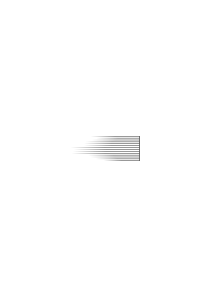

### [159\[3\]](https://cdn.wittgensteinnachlass.com/2000px/webp/Ms-107/159.webp)

Es ist ganz klar, daß wenn man hier das Letzte sagen will man eben auf die Grenze der Sprache kommen muß, die es ausdrückt.

### [159\[4\]](https://cdn.wittgensteinnachlass.com/2000px/webp/Ms-107/159.webp),[160\[1\]](https://cdn.wittgensteinnachlass.com/2000px/webp/Ms-107/160.webp)

Der schlechte Mensch braucht die Empfindung eines Drucks, nur der gute kann auch frei von jedem Druck leben. Und wehe wenn man dem schlechten (wie z.B. mir) den Druck fortnimmt, dann spürt er sofort daß etwas nicht in Ordnung ist. Denn er weiß daß vollkommene innere Freiheit nur aus vollkommen reinem Gewissen hervorgehen dürfte. Es wäre dann wie wenn man eine Waage im Gleichgewicht sähe deren Schalen ungleich belastet sind. Dann muß man sagen diese Waage hat nicht eingespielt sondern sie steckt. – Damit will ich nicht sagen daß der Druck unter dem ich mich befinden muß immer ein furchtbarer sein muß. Es kann der Druck der Arbeit sein (der zugleich süß ist).

### [160\[2\]](https://cdn.wittgensteinnachlass.com/2000px/webp/Ms-107/160.webp)

Die ärgsten philosophischen Irrtümer entstehen immer wenn man unsere gewöhnliche – physikalische – Sprache im Gebiet des unmittelbar Gegebenen anwenden will. Wenn man z.B. frägt „existiert der Kasten noch wenn ich ihn nicht anschaue?” so wäre die einzig richtige Antwort „gewiß, wenn ihn niemand weggetragen oder zerstört hat”. Natürlich wäre der Philosoph von dieser Antwort nicht befriedigt aber sie würde ganz richtig seine Fragestellung ad absurdum führen.

### [160\[3\]](https://cdn.wittgensteinnachlass.com/2000px/webp/Ms-107/160.webp)

Alle unsere Redeformen sind aus der normalen physikalischen Sprache hergenommen & in der Erkenntnistheorie oder Phänomenologie nicht zu gebrauchen ohne schiefe Lichter auf den Gegenstand zu werfen.

### [160\[4\]](https://cdn.wittgensteinnachlass.com/2000px/webp/Ms-107/160.webp)

Die bloße Redensart „ich nehme x wahr” ist schon aus der physikalischen Ausdrucksweise genommen & x soll hier ein physikalischer Gegenstand – z.B. ein Körper – sein. Es ist schon falsch diese Redeweise in der Phänomenologie zu verwenden wo dann x ein Datum bedeuten muß. Denn nun kann auch „ich” & „nehme wahr” nicht den Sinn haben wie oben.

### [161\[1\]](https://cdn.wittgensteinnachlass.com/2000px/webp/Ms-107/161.webp)

Wenn man z.B. sagt man sieht nie einen wirklichen Kreis sondern immer nur angenäherte Kreise, so hat das einen guten, einwandfreien, Sinn wenn es heißt daß man an einem Körper der kreisförmig aussieht durch genaue Messung oder durch Anschauen mit dem Mikroskop noch immer Ungenauigkeiten entdecken kann. Wir verlieren diesen (einwandfreien) Sinn aber wenn wir statt des kreisförmigen Körpers das unmittelbar Gegebene, den Fleck, oder wie man es nennen will, setzen.

### [161\[2\]](https://cdn.wittgensteinnachlass.com/2000px/webp/Ms-107/161.webp)

_Wenn_ ein Kreis überhaupt das ist, was wir sehen – sehen, in demselben Sinn in dem wir den blauen Fleck sehen – dann müssen wir _ihn_ sehen können & nicht bloß etwas ihm Ähnliches.

### [161\[3\]](https://cdn.wittgensteinnachlass.com/2000px/webp/Ms-107/161.webp)

Gott, halte mein Ideal zurecht!

### [161\[4\]](https://cdn.wittgensteinnachlass.com/2000px/webp/Ms-107/161.webp)

Das sind die gefährlichen Verschiebungen des Sinnes „ich höre die Musik”, „ich höre das Klavier”, „ich höre ihn Klavier spielen”.

### [161\[5\]](https://cdn.wittgensteinnachlass.com/2000px/webp/Ms-107/161.webp),[162\[1\]](https://cdn.wittgensteinnachlass.com/2000px/webp/Ms-107/162.webp)

Wenn ich keinen genauen Kreis sehen kann so kann ich in diesem Sinne auch keinen angenäherten sehen. – Sondern dann ist der Euklidische Kreis – wie auch der euklidische angenäherte Kreis – in diesem Sinn gar nicht Gegenstand meiner Wahrnehmung sondern etwa nur eine andere logische Konstruktion die aus den Gegenständen eines ganz anderen Raumes als des unmittelbaren Sehraums gewonnen werden können.

### [162\[2\]](https://cdn.wittgensteinnachlass.com/2000px/webp/Ms-107/162.webp)

Aber auch diese Ausdrucksweise ist irreführend & man muß vielmehr sagen daß wir den Euklidischen Kreis in einem anderen Sinne sehen. Daß also zwischen dem Euklidischen Kreis und dem Wahrgenommenen eine andere Projektionsart besteht als man naiverweise annehmen würde.

### [162\[3\]](https://cdn.wittgensteinnachlass.com/2000px/webp/Ms-107/162.webp)

Ungenauigkeit wird durch Ungenauigkeit wiedergegeben.

### [162\[4\]](https://cdn.wittgensteinnachlass.com/2000px/webp/Ms-107/162.webp)

Wenn ich sage man kann ein 10000-Eck nicht von einem Kreis unterscheiden so muß mir hier das 10000-Eck durch seine Konstruktion, durch seine Entstehung, gegeben sein. Denn wie wüßte ich sonst daß es „tatsächlich” ein 10000-Eck ist, und nicht ein Kreis.

### [162\[5\]](https://cdn.wittgensteinnachlass.com/2000px/webp/Ms-107/162.webp)

12.10.1929

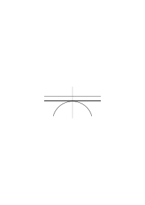

Im Gesichtsraum gibt es keine Messung.

### [162\[6\]](https://cdn.wittgensteinnachlass.com/2000px/webp/Ms-107/162.webp),[163\[1\]](https://cdn.wittgensteinnachlass.com/2000px/webp/Ms-107/163.webp)

Es handelt sich mir nie darum was „auf dem Papier wirklich gezeichnet ist” sondern bloß um das was wir sehen. Und nun frägt es sich z.B. kann man eine Spitze sehen; gibt es im Gesichtsraum die Möglichkeit einer Spitze (durch welche Mittel der Zeichnung diese Wirkung immer hervorgebracht sein mag)?

### [163\[2\]](https://cdn.wittgensteinnachlass.com/2000px/webp/Ms-107/163.webp)

Es scheint mir seltsamerweise als wäre die Spitze ebenso möglich wie eine gerade Strecke oder ein Kreis aber auch mit diesen Begriffen ist es nicht so einfach bewandt als man ursprünglich annimmt.

### [163\[3\]](https://cdn.wittgensteinnachlass.com/2000px/webp/Ms-107/163.webp)

Man könnte z.B. im Gesichtsraum sehr wohl definieren: „Gerade ist, was nicht krumm ist”. Und „Kreis ist eine Linie konstanter Krümmung”.

### [163\[4\]](https://cdn.wittgensteinnachlass.com/2000px/webp/Ms-107/163.webp)

(Eine Linie ist die Grenze zweier Farben. Ein Punkt die Stelle wo drei Farben einander treffen.)

### [163\[5\]](https://cdn.wittgensteinnachlass.com/2000px/webp/Ms-107/163.webp)

Wir brauchten neue Begriffe & wir nehmen immer wieder die der physikalischen Sprache. Das Wort „Genauigkeit” ist eines jener kritischen Wörter. In der gewöhnlichen Sprache bezieht es sich auf einen _Vergleich_ & da ist es ganz verständlich. Wo ein gewisser Grad der Ungenauigkeit vorhanden ist dort _kann_ auch vollkommene Genauigkeit sein. Was soll es aber heißen wenn ich sage ich kann nie einen genauen Kreis sehen & dieses Wort jetzt nicht relativ, also absolut, gebrauche?

### [164\[1\]](https://cdn.wittgensteinnachlass.com/2000px/webp/Ms-107/164.webp)

Die Worte „ich sehe” in „ich sehe einen Fleck” & „ich sehe eine Linie” haben also verschiedene Bedeutung.

### [164\[2\]](https://cdn.wittgensteinnachlass.com/2000px/webp/Ms-107/164.webp)

Angenommen ich muß sagen „ich sehe nie eine ganz scharfe Linie” so ist die Frage „ist eine scharfe denkbar?”. Ist es richtig zu sagen „ich sehe keine scharfe Linie”, dann _ist_ eine scharfe denkbar.

### [164\[3\]](https://cdn.wittgensteinnachlass.com/2000px/webp/Ms-107/164.webp)

Hat es Sinn zu sagen „ich sehe nie einen genauen Kreis” dann heißt das: ein genauer Kreis ist im Gesichtsraum denkbar. Ist ein genauer Kreis im Gesichtsfeld undenkbar dann muß der Satz „ich sehe nie einen genauen Kreis im Gesichtsfeld” von der Art des Satzes sein „ich sehe nie das hohe c im Gesichtsfeld”.

### [164\[4\]](https://cdn.wittgensteinnachlass.com/2000px/webp/Ms-107/164.webp),[165\[1\]](https://cdn.wittgensteinnachlass.com/2000px/webp/Ms-107/165.webp)

Meine Erklärung von Kreis

und Geraden setzt voraus daß es einen Sinn hat von jedem Linienstück zu sagen daß es entweder krumm oder gerade sei. Wenn ich aber ein kurzes Stück einer Kurve ansehe so kann ich nicht sehen daß es gekrümmt ist. Und also scheint es als könne ein Stück einer Kurve gerade sein. Denken wir uns einen Kreis in 100 Teile geteilt. Die Teile seien so klein genommen daß man ihre Krümmung nicht sieht. Wird nun der Kreis als 100-Eck erscheinen oder doch als Kreis & zugleich aus 100 nicht gekrümmten Stücken zusammengesetzt?

### [165\[2\]](https://cdn.wittgensteinnachlass.com/2000px/webp/Ms-107/165.webp)

Wenn das letzte dann ist hier gerade nicht das Gegenteil von krumm.

### [165\[3\]](https://cdn.wittgensteinnachlass.com/2000px/webp/Ms-107/165.webp)

Immer wieder brauchte man einen Ausdruck wie „ich sehe _nicht_ daß diese Linie von einem Kreis abweicht aber ich kann nicht sagen daß ich den Kreis sehe”. Und doch kann man das nicht sagen wenn man den Gesichtsraum _absolut_ betrachtet. Aber es zeigt daß unsere Ausdrucksweise _ganz_ unzulänglich ist.

### [165\[4\]](https://cdn.wittgensteinnachlass.com/2000px/webp/Ms-107/165.webp)

Man könnte denken daß das richtige Abbild des Gesichtsraums eine euklidische Zeichenebene mit ihren ideal feinen Konstruktionen wäre die man zittern läßt so daß alle Konstruktionen um ein gewisses verschwimmen (und zwar zittert die Ebene nach allen in ihr liegenden Richtungen gleichmäßig.)

### [165\[5\]](https://cdn.wittgensteinnachlass.com/2000px/webp/Ms-107/165.webp)

Ja man könnte auch so sagen: Sie soll genau so stark zittern daß wir es noch nicht merken dann ist ihre physikalische Geometrie ein Bild unserer phänomenologischen.

### [165\[6\]](https://cdn.wittgensteinnachlass.com/2000px/webp/Ms-107/165.webp)

Die große Frage aber ist: kann man die „Verschwommenheit” des Phänomens in eine Ungenauigkeit der Zeichnung übersetzen? Es scheint mir, nein.

### [166\[1\]](https://cdn.wittgensteinnachlass.com/2000px/webp/Ms-107/166.webp)

Es ist z.B. unmöglich die Ungenauigkeit des unmittelbar Gesehenen auf der Zeichnung durch dicke Striche & Punkte darzustellen. Genau so wie man die uralte Erinnerung an ein Bild nicht durch dieses Bild in blassen Farben gemalt darstellen kann. Die Blässe der Erinnerung ist etwas ganz anderes als die Blässe des gesehenen Farbentons & die Unklarheit des Sehens von anderer _Art_ als die Verschwommenheit einer unscharfen Zeichnung. (Ja die unscharfe Zeichnung wird mit eben der Unklarheit gesehen die man durch ihre Unschärfe darstellen wollte.)

### [166\[2\]](https://cdn.wittgensteinnachlass.com/2000px/webp/Ms-107/166.webp)

Im Geistigen so wie im Physikalischen ist nicht die Geschwindigkeit ein Zeichen der Kraft sondern die Beschleunigung! Man kann in seiner Jugend durch Kraft eine große Geschwindigkeit erlangt haben. Aber die ist später kein Beweis von Kraft sondern nur von gewesener Kraft. Daß ich heute schnell weiterkomme ist kein Beweis dafür daß ich heute etwas tauge. (Der Beweis dessen könnte sogar dadurch geliefert werden daß ich mich heute verzögere.)

### [166\[3\]](https://cdn.wittgensteinnachlass.com/2000px/webp/Ms-107/166.webp)

Der Wind ist in Ordnung solange er seine Stelle kennt & nicht versucht die Rolle eines Baumes zu spielen

### [167\[1\]](https://cdn.wittgensteinnachlass.com/2000px/webp/Ms-107/167.webp)

Man kann die Sache aber auch anders auffassen: Der dicke Strich auf dem Papier ist zwar _nicht_ was ich sehe wenn ich den dünnen Strich anschaue aber er kann in der Euklidischen Geometrie die gleichen logischen Eigenschaften haben die das unmittelbar gegebene Korrelat des dünnen Striches hat: Es kann dennoch sein daß die euklidische Geometrie des dicken Striches tatsächlich die Geometrie des Gesichtsfeldes ist.

### [167\[2\]](https://cdn.wittgensteinnachlass.com/2000px/webp/Ms-107/167.webp)

Es wäre also – etwa – so: Ein „Kreis” im Gesichtsfeld – ein Gesichtskreis, wäre nicht durch eine sondern durch zwei Gleichungen bestimmt. Sein logisches, _nicht sein anschauliches_ Bild auf der Zeichenebene wäre ein Streifen zwischen zwei konzentrischen Kreisen.

### [167\[3\]](https://cdn.wittgensteinnachlass.com/2000px/webp/Ms-107/167.webp)

Wenn im Kino eine Erinnerung oder ein Traum dargestellt werden soll so gibt man den Bildern einen bläulichen Ton. Aber die Erinnerungsbilder haben keinen bläulichen Ton also sind die bläulichen Projektionen nicht korrekte _anschauliche_ Bilder der Träume sondern Bilder in einem nicht unmittelbar visuellen Sinn.

### [167\[4\]](https://cdn.wittgensteinnachlass.com/2000px/webp/Ms-107/167.webp)

Damit ist aber nicht gesagt ob die Geometrie des dicken Striches wirklich die des Gesichtsfeldes ist. Vielmehr ist sie es gewiß nicht.

### [168\[1\]](https://cdn.wittgensteinnachlass.com/2000px/webp/Ms-107/168.webp)

Eine Strecke im Gesichtsfeld muß weder grade noch krumm sein; natürlich heißt die dritte Möglichkeit _nicht_ „_zweifelhaft_” (das ist Unsinn) sondern man müßte ein anderes Wort dafür gebrauchen, oder vielmehr die ganze Ausdrucksweise mit „gerade” & „krumm” durch eine andere ersetzen.

### [168\[2\]](https://cdn.wittgensteinnachlass.com/2000px/webp/Ms-107/168.webp)

Daß der Gesichtsraum nicht euklidisch ist zeigt schon das Vorkommen zweier verschiedener Arten von Linien & Punkten: Die Fixsterne sehen wir als Punkte d.h. wir können nicht die Kontur eines Fixsterns sehen & der Schnitt zweier Farbengrenzen ist in anderem Sinne auch ein Punkt, Analoges von den Linien. Ich kann eine leuchtende Linie ohne Licht sehen denn anderen Falls müßte ich ihren Durchschnitt als Viereck erkennen können oder doch die vier Durchschnittspunkte der Konturen erkennen.

### [168\[3\]](https://cdn.wittgensteinnachlass.com/2000px/webp/Ms-107/168.webp),[169\[1\]](https://cdn.wittgensteinnachlass.com/2000px/webp/Ms-107/169.webp)

Das alles hängt mit dem Problem zusammen „wieviel Sandkörner geben einen Haufen”. Man könnte sagen: ein Haufen ist jede Gruppe von mehr als 100 Körnern & weniger als 10 Körner sind kein Haufen: das muß aber so verstanden werden daß nicht vielleicht 100 & 10 Grenzen sind die dem Begriff Haufen wesentlich sind. Und das ist dasselbe Problem wie das, anzugeben bei welchem der vertikalen

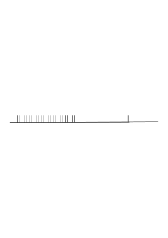

Striche man zuerst einen Längenunterschied gegen den Ersten bemerkt.

### [169\[2\]](https://cdn.wittgensteinnachlass.com/2000px/webp/Ms-107/169.webp)

Soll ich also einen Gesichtskreis so beschreiben indem ich sage: Er liegt zwischen den Gleichungen g1 & g2. Und zwar wäre damit nicht gesagt daß g1 & g2 _die_ engsten Grenzen sind – denn die gibt es nicht sondern es sind nur überhaupt irgendwelche Grenzen zwischen denen der Kreis liegt.

### [169\[3\]](https://cdn.wittgensteinnachlass.com/2000px/webp/Ms-107/169.webp)

Ein Gesichtskreis & eine Gesichtsgerade können ein Stück mit einander gemein haben – – –

### [169\[4\]](https://cdn.wittgensteinnachlass.com/2000px/webp/Ms-107/169.webp)

Wie ist es wenn man sich die Geometrie des Gesichtsfelds abgebildet denkt durch eine Zeichnung in der statt der Linien Streifen stehen deren Dunkelheit nach außen in das Weiß des Papiers verläuft und nach innen zu einem Maximum zunimmt so aber daß dieses Maximum nur entlang einer geometrischen Linie erreicht wird.

### [169\[5\]](https://cdn.wittgensteinnachlass.com/2000px/webp/Ms-107/169.webp),[170\[1\]](https://cdn.wittgensteinnachlass.com/2000px/webp/Ms-107/170.webp)

Hier hätte man wirklich gleichsam die Verschwommenheit durch Verschwommenheit dargestellt. Denn wenn wir einen solchen Streifen ansehen – etwa einen Zylinder dessen dunkelste Erzeugende wir als die dargestellte Gerade auffassen – so sehen wir das Maximum der Dunkelheit weder als eine „scharfe” Gerade noch als einen gleichmäßig dunkeln Streifen von gewisser Breite!

### [170\[2\]](https://cdn.wittgensteinnachlass.com/2000px/webp/Ms-107/170.webp)

Angenommen ein Planet entfernt sich von uns immer mehr & mehr bis wir ihn schließlich wie einen Fixstern als „Punkt” sehen; wie vollzieht sich der Übergang vom kreisförmigen Fleck der eine Kontur hat zu einem, konturlosen, Lichtpunkt.

### [170\[3\]](https://cdn.wittgensteinnachlass.com/2000px/webp/Ms-107/170.webp)

Wenn ich einen gezeichneten Kreis mit einer Tangente anschaue so wäre nicht das merkwürdig daß ich niemals einen vollkommenen Kreis & eine vollkommene Gerade einander berühren sehe, interessant ist es erst, wenn ich das sehe & dann die Gerade ein Stück weit mit dem Kreis zusammenläuft.

### [170\[4\]](https://cdn.wittgensteinnachlass.com/2000px/webp/Ms-107/170.webp)

Ich bin innerlich sehr unruhig. Teils habe ich die Sucht in Gesellschaft zu kommen. Teils bewegen sich die Ideen ruhelos in meinem Kopf herum (teils durch Eitelkeit getrieben).

### [170\[5\]](https://cdn.wittgensteinnachlass.com/2000px/webp/Ms-107/170.webp),[171\[1\]](https://cdn.wittgensteinnachlass.com/2000px/webp/Ms-107/171.webp)

Denn erst das würde sagen, daß der Gesichtskreis & die Gesichtsgerade sich wesentlich von Kreis & Gerade der euklidischen Geometrie unterscheiden; nicht aber das Erste, daß man nie einen vollkommenen Kreis & eine vollkommene Gerade einander hat berühren sehen.

### [171\[2\]](https://cdn.wittgensteinnachlass.com/2000px/webp/Ms-107/171.webp)

Das Rätsel vor dem ich jetzt stehe zeigt sich in 100facher Form in der Sinneswelt. Ganz einfach in dem Fall des Kreisstückes das zugleich nicht gekrümmt & als Teil eines Kreises erscheint

.

Das Problem der „Unbestimmtheit” der Sinnesdaten.

### [171\[3\]](https://cdn.wittgensteinnachlass.com/2000px/webp/Ms-107/171.webp)

Es ist die Frage _kann_ man ein Tausendeck vom Durchmesser 1 dm sehen – oder kann man es nur nicht zeichnen & hat es darum noch nie gesehen. Es scheint mir klar daß man es nicht sehen _kann_.

### [171\[4\]](https://cdn.wittgensteinnachlass.com/2000px/webp/Ms-107/171.webp)

Es scheint für die _Geometrie_ des Gesichtsfelds ein solches Tausendeck nicht zu geben, oder, es ist _identisch_ mit dem Kreis. Wenn ich das Tausendeck ansehe so erscheint es mir zugleich als Tausendeck & als Kreis. Es fehlt dem Tausendeck nichts zum Tausendeck & dem Kreis nichts zum Kreis. – – Dann ist es aber begreiflich daß der Geraden nichts zur Geraden fehlt & doch die Seite eines Vielecks weit mit dem Kreis zusammengeht.

### [171\[5\]](https://cdn.wittgensteinnachlass.com/2000px/webp/Ms-107/171.webp),[172\[1\]](https://cdn.wittgensteinnachlass.com/2000px/webp/Ms-107/172.webp)

Es gibt ein Argument für die nicht unendliche Teilbarkeit des Gesichtsraums & das liegt darin daß es möglich ist den Schnittpunkt zweier dünner Striche zu sehen ohne seine 4 Ecken zu sehen. Es scheint

so möglich einen Fleck aus unteil**baren** Teilen zusammenzusetzen.

### [172\[2\]](https://cdn.wittgensteinnachlass.com/2000px/webp/Ms-107/172.webp)

Bin voll von dummen eitlen Gedanken. Faul & zerstreuungssüchtig.

### [172\[3\]](https://cdn.wittgensteinnachlass.com/2000px/webp/Ms-107/172.webp)

15.10.1929

D.h., das was dem Gesichtskreis in der euklidischen Geometrie entspricht ist nicht ein Kreis sondern eine Klasse von Figuren unter denen auch der Kreis ist, aber etwas auch das 100-Eck etc. Das Merkmal dieser Klasse könnte etwa sein daß es alle die Figuren sind die innerhalb eines Streifens liegen der durch Vibration eines Kreises entsteht.

### [172\[4\]](https://cdn.wittgensteinnachlass.com/2000px/webp/Ms-107/172.webp)

Aber auch das ist falsch: denn warum soll ich gerade den Streifen nehmen der durch Vibration eines Kreises & nicht den der durch Vibration des 100-Ecks entsteht?

### [172\[5\]](https://cdn.wittgensteinnachlass.com/2000px/webp/Ms-107/172.webp)

Und hier stoße ich auf die Hauptschwierigkeit denn es scheint als wäre auch die exakte _Begrenzung_ der Unexaktheit unmöglich.

### [172\[6\]](https://cdn.wittgensteinnachlass.com/2000px/webp/Ms-107/172.webp)

Die Begrenzung ist nämlich willkürlich denn wie unterscheidet sich das was dem vibrierenden Kreis entspricht von dem was dem vibrierenden 100-Eck entspricht.

### [172\[7\]](https://cdn.wittgensteinnachlass.com/2000px/webp/Ms-107/172.webp),[173\[1\]](https://cdn.wittgensteinnachlass.com/2000px/webp/Ms-107/173.webp)

Etwas zieht zu folgender Erklärung hin:

Alles was innerhalb a a ist erscheint als der Gesichtskreis K alles was außerhalb bb ist erscheint nicht als K. Das wäre dann der Fall des Wortes „Haufen”. Es wäre eine unbestimmte Zone offen gelassen & die Grenzen a & b sind für den definierten Begriff nicht wesentlich.

### [173\[2\]](https://cdn.wittgensteinnachlass.com/2000px/webp/Ms-107/173.webp)

(Wenn ich die Augen schließe & ein Nachbild eines gesehenen Gegenstandes z.B. des Fensters sehe so bereitet mir das Anschauen dieses Nachbilds eine seltsame Freude. Es ist als wäre ich ganz in _meiner_ Welt.)

### [173\[3\]](https://cdn.wittgensteinnachlass.com/2000px/webp/Ms-107/173.webp)

Die Grenzen a & b sind sozusagen doch nur die Mauern der _Vorhöfe_. Sie sind willkürlich dort gezogen wo man noch etwas Festes ziehen kann. – Wie wenn man einen Sumpf durch eine Mauer abgrenzt, die Mauer ist aber nicht _die_ Grenze des Sumpfes sondern sie steht nur um ihn auf festem Erdreich. Sie ist ein Zeichen dafür daß innerhalb ihrer ein Sumpf ist aber nicht daß der Sumpf genau so groß ist wie die von ihr begrenzte Fläche. (Keep on the safe side.)

### [173\[4\]](https://cdn.wittgensteinnachlass.com/2000px/webp/Ms-107/173.webp),[174\[1\]](https://cdn.wittgensteinnachlass.com/2000px/webp/Ms-107/174.webp)

Ist nun nicht die Korrelation zwischen Gesichtsraum & euklidischem Raum die: Welche euklidische Figur immer ich dem Betrachter zeige so muß er unterscheiden können ob sie der Gesichtskreis K ist oder nicht. D.h. ich werde durch ständiges Verkleinern des Intervalls zwischen den vorgewiesenen Figuren das unbestimmte Intervall beliebig verkleinern können mich „einer Grenze zwischen dem was ich als K und dem was ich nicht als k sehe beliebig nähern” können. Andererseits aber werde ich eine solche Grenze als Linie im euklidischen Raum nie ziehen können denn könnte ich sie ziehen so müßte sie selbst zu einer der beiden Klassen gehören und die letzte dieser Klasse sein dann müßte ich also doch eine euklidische Linie sehen können.

### [174\[2\]](https://cdn.wittgensteinnachlass.com/2000px/webp/Ms-107/174.webp)

Die Axiome der Geometrie dürfen keine Wahrheiten enthalten.

### [174\[3\]](https://cdn.wittgensteinnachlass.com/2000px/webp/Ms-107/174.webp)

17.10.1929

Die reelle Zahl ist mir der Fiktion einer unendlichen Spirale vergleichbar, Gebilde wie F, P, oder π' dagegen nur mit endlichen Stücken einer Spirale. Denn daß ich nicht feststellen kann wie sie an einem Punkt vorbeikommt heißt eben daß es absurd ist sie mit einer ganzen Spirale zu vergleichen, denn bei der würde ich sehen wie sie den Punkt liegen läßt.

### [174\[4\]](https://cdn.wittgensteinnachlass.com/2000px/webp/Ms-107/174.webp),[175\[1\]](https://cdn.wittgensteinnachlass.com/2000px/webp/Ms-107/175.webp)

Im Hintergrunde der Gedanken ist nämlich dann immer noch die Idee daß ich zwar die Spirale nicht ganz kenne & daher nicht weiß wie sie an dieser Stelle geht aber daß das was ich nicht kenne doch so oder so tatsächlich der Fall ist.

### [175\[2\]](https://cdn.wittgensteinnachlass.com/2000px/webp/Ms-107/175.webp)

Wahrscheinlichkeit & Galtonsche Photographie.

### [175\[3\]](https://cdn.wittgensteinnachlass.com/2000px/webp/Ms-107/175.webp)

Die Galtonsche Photographie ist das Bild einer Wahrscheinlichkeit

### [175\[4\]](https://cdn.wittgensteinnachlass.com/2000px/webp/Ms-107/175.webp)

18.10.1929

Die Fragen über die Wahrscheinlichkeit hängen auf irgend eine Weise mit denen über die „Unbestimmtheit” der Sinnesdaten zusammen.

### [175\[5\]](https://cdn.wittgensteinnachlass.com/2000px/webp/Ms-107/175.webp)

Wenn ich sage „in dieser Klasse fehlen jeden Tag durchschnittlich 5 Schüler”, was heißt das. Wie wird es verifiziert; denn „wie ein Satz verifiziert wird, das sagt er”. (Es ist natürlich ganz klar was es heißt „_dieses Jahr haben_ durchschnittlich 5 gefehlt”)

### [175\[6\]](https://cdn.wittgensteinnachlass.com/2000px/webp/Ms-107/175.webp)

20.10.1929

Das Gesetz der Wahrscheinlichkeit ist das Naturgesetz was man sieht wenn man blinzelt.

### [175\[7\]](https://cdn.wittgensteinnachlass.com/2000px/webp/Ms-107/175.webp)

Wir müssen den Begriff der Wahrscheinlichkeit von Metaphysischem Beiwerk freimachen (ähnlich wie es mit dem Begriff der Kraft geschehen ist). Das wird dann dazu führen die Bedeutung dieses Beiwerks zu verstehen.

### [175\[8\]](https://cdn.wittgensteinnachlass.com/2000px/webp/Ms-107/175.webp),[176\[1\]](https://cdn.wittgensteinnachlass.com/2000px/webp/Ms-107/176.webp)

22.10.1929

Habe schwere Probleme in mir und bin so unklar daß ich nichts rechtes niederschreiben könnte. Soll in den zwei nächsten Termen Vorlesungen halten! Bin zweifelhaft wie es gehen wird. Hauptsache wäre, daß jetzt meine Arbeit gut vorwärts ginge.

### [176\[2\]](https://cdn.wittgensteinnachlass.com/2000px/webp/Ms-107/176.webp)

Die Annahme daß eine phänomenologische Sprache möglich wäre & die eigentlich erst das sagen würde was wir in der Philosophie ausdrücken müssen ist – glaube ich – absurd. Wir müssen mit unserer gewöhnlichen Sprache auskommen & sie nur richtig verstehen. D.h. wir dürfen uns nicht von ihr verleiten lassen Unsinn zu reden.

### [176\[3\]](https://cdn.wittgensteinnachlass.com/2000px/webp/Ms-107/176.webp)

Ich meine: was ich Zeichen nenne muß das sein was man in der Grammatik Zeichen nennt, etwas auf dem Film nicht auf der Leinwand.

### [176\[4\]](https://cdn.wittgensteinnachlass.com/2000px/webp/Ms-107/176.webp)

23.10.1929

„Ich kann nicht wissen, ob” hat nur dann Sinn wenn ich wissen _kann_, nicht, wenn es undenkbar ist. – „Ich kann nie wissen, ob das was ich vor mir sehe wirklich ein Sessel ist”.

### [176\[5\]](https://cdn.wittgensteinnachlass.com/2000px/webp/Ms-107/176.webp)

24.10.1929

Wenn wir an die Zukunft der Welt denken so meinen wir immer den Ort wo sie sein wird wenn sie so weiter läuft wie wir sie jetzt laufen sehen und denken nicht daß sie nicht gerade läuft sondern in einer Kurve & ihre Richtung sich konstant ändert.

### [177\[1\]](https://cdn.wittgensteinnachlass.com/2000px/webp/Ms-107/177.webp)

Wenn ich sage: „was ich hier vor mir stehen sehe ist ein paar Schuhe” & das ist überhaupt ein Satz, dann muß es eine Möglichkeit geben mit Sicherheit herauszufinden ob es so ist oder nicht. Gäbe es diese Möglichkeit nicht so könnte ich einem Kind die Sprache gar nicht beibringen denn ich dürfte dann nicht sagen „siehst Du _das_ sind Schuhe” sondern nur, „das scheinen Schuhe zu sein”.

### [177\[2\]](https://cdn.wittgensteinnachlass.com/2000px/webp/Ms-107/177.webp)

Wo Täuschung _möglich_ ist, dort ist auch Sehen der Wahrheit möglich.

### [177\[3\]](https://cdn.wittgensteinnachlass.com/2000px/webp/Ms-107/177.webp)

In allen philosophischen Theorien finden wir Worte deren Sinn uns von den Phänomenen des täglichen Lebens her wohl bekannt ist in einem ultraphysischen Sinn, also falsch, angewandt.

### [177\[4\]](https://cdn.wittgensteinnachlass.com/2000px/webp/Ms-107/177.webp)

Wie ist es in diesem Sinne mit dem Ausdruck „ich bin sicher daß”.

### [177\[5\]](https://cdn.wittgensteinnachlass.com/2000px/webp/Ms-107/177.webp)

25.10.1929

Jeder Satz ist ein leeres Spiel von Strichen oder Lauten ohne die Beziehung zur Wirklichkeit & die einzige Beziehung ist die Art seiner Verifikation.

### [177\[6\]](https://cdn.wittgensteinnachlass.com/2000px/webp/Ms-107/177.webp)

26.10.1929

Alles Wesentliche ist, daß die Zeichen sich in wie immer komplizierter Weise am Schluß doch auf die unmittelbare Erfahrung beziehen & nicht auf ein Mittelglied (ein Ding an sich).

### [178\[1\]](https://cdn.wittgensteinnachlass.com/2000px/webp/Ms-107/178.webp)

28.10.1929

Kann seit einer Woche nicht mehr recht arbeiten. Die Gedanken konzentrieren sich nicht auf die logischen Probleme. Ich bin nicht in die Stimmung gekommen wo ich mich unter den philosophischen Problemen zu Hause fühle.

### [178\[2\]](https://cdn.wittgensteinnachlass.com/2000px/webp/Ms-107/178.webp)

29.10.1929

Wir verstehen die 4 an der 3ten Dezimalstelle von √2 nicht aber wir _brauchen_ sie auch nicht zu verstehen. Denn dieses Unverständnis wird durch den weiteren (einheitlichen) Gebrauch des Dezimalsystems(, sozusagen, ) aufgehoben.

### [178\[3\]](https://cdn.wittgensteinnachlass.com/2000px/webp/Ms-107/178.webp)

Das Dezimalsystem tritt ja endlich als Ganzes zurück & dann bleibt in der Rechnung nur was der √2 wesentlich ist.

### [178\[4\]](https://cdn.wittgensteinnachlass.com/2000px/webp/Ms-107/178.webp)

30.10.1929

Um die Rationalzahlen mit √2 zu vergleichen muß ich sie (erst) quadrieren. – Sie nehmen dann die Form √a an & √a ist hier eine arithmetische Operation. In diesem System hingeschrieben sind sie direkt mit √2 vergleichbar & es ist mir als wäre hier die „Spirale” der irrationalen Zahl zu einem Punkt zusammengeschrumpft.

### [178\[5\]](https://cdn.wittgensteinnachlass.com/2000px/webp/Ms-107/178.webp)

Ist also die Wurzel 2 der Beweis daß sie sich in einem Zahlensystem ziehen läßt?

### [179\[1\]](https://cdn.wittgensteinnachlass.com/2000px/webp/Ms-107/179.webp)

Konnte heute etwas mehr philosophieren. Gott sei Dank.

### [179\[2\]](https://cdn.wittgensteinnachlass.com/2000px/webp/Ms-107/179.webp)

31.10.1929

Das Wort „anders”. Wenn es _anders_ ist, kann es nicht _so_ sein.

### [179\[3\]](https://cdn.wittgensteinnachlass.com/2000px/webp/Ms-107/179.webp)

Ich bin ein schwaches Vieh. Kein Wunder wenn aus mir nichts wird.

### [179\[4\]](https://cdn.wittgensteinnachlass.com/2000px/webp/Ms-107/179.webp)

01.11.1929

Ich träume vor mich hin.

### [179\[5\]](https://cdn.wittgensteinnachlass.com/2000px/webp/Ms-107/179.webp)

Ein formales Gesetz muß ich am Ende _sehen_.

### [179\[6\]](https://cdn.wittgensteinnachlass.com/2000px/webp/Ms-107/179.webp)

02.11.1929

Wenn ich gezeigt habe daß ein Terminus „a” in der philosophischen Ausdrucksweise überflüssig ist & mir nun vorgehalten wird ich hätte damit noch immer nicht bewiesen daß es so etwas wie _a_ nicht gäbe, so heißt das nichts; das onus probandi ist auf Seiten dessen der den Term gebraucht. _Der_ hat zu zeigen, in wiefern der Term notwendig ist, d.h. welche Bedeutung er hat.

### [179\[7\]](https://cdn.wittgensteinnachlass.com/2000px/webp/Ms-107/179.webp)

„𝔭↣ 4” soll bedeuten: die 4te Primzahl. Kann 𝔭↣ 4 als arithmetische Operation aufgefaßt werden mit der Basis 4? So daß also 𝔭↣ 4 = 5 eine arithmetische Gleichung ist wie 4² = 16? Oder ist es so daß man 𝔭↣ 4 „nur suchen, aber nicht aufbauen” kann?

### [180\[1\]](https://cdn.wittgensteinnachlass.com/2000px/webp/Ms-107/180.webp)

Jede Rechnung der Mathematik ist eine Anwendung ihrer selbst & hat nur als solche Sinn. _Darum_ ist es nicht nötig bei der Begründung der Mathematik von der allgemeinen Form der logischen Operation zu reden.

### [180\[2\]](https://cdn.wittgensteinnachlass.com/2000px/webp/Ms-107/180.webp)

03.11.1929

_Reelle_ Zahl ist das was mit den Rationalzahlen vergleichbar ist.

### [180\[3\]](https://cdn.wittgensteinnachlass.com/2000px/webp/Ms-107/180.webp)

Aber wie zeigt es sich allgemein daß Etwas mit den Rationalzahlen vergleichbar ist? Was ist, so zu sagen, die allgemeine Form der Vergleichbarkeit?

### [180\[4\]](https://cdn.wittgensteinnachlass.com/2000px/webp/Ms-107/180.webp)

Wenn ich sage ich nenne irrationale Zahl nur was mit den rationalen Zahlen vergleichbar ist so will ich damit nicht die Festsetzung einer bloßen Benennung überschätzen. Ich will sagen daß es gerade das ist was unter dem Namen „irrationale Zahl” gemeint oder gesucht worden ist.

### [180\[5\]](https://cdn.wittgensteinnachlass.com/2000px/webp/Ms-107/180.webp),[181\[1\]](https://cdn.wittgensteinnachlass.com/2000px/webp/Ms-107/181.webp)

Ja die Art wie die irrationalen Zahlen in den Lehrbüchern eingeführt werden klingt immer so als sollte gesagt werden seht ihr es ist da keine rationale Zahl, aber es ist doch eine Zahl da. Aber warum nennen wir denn das was da _ist_ doch „eine Zahl”? Und die Antwort muß sein: „weil es in bestimmter Weise mit den Rationalzahlen vergleichbar ist”.

### [181\[2\]](https://cdn.wittgensteinnachlass.com/2000px/webp/Ms-107/181.webp)

05.11.1929

<math display="inline"><mn>2</mn><mspace width="0.3em"/><mo>+</mo><mspace width="0.3em"/><mn>3</mn><mspace width="0.3em"/><mo>+</mo><mspace width="0.3em"/><mn>4</mn><mn>5</mn><mn>9</mn><mspace width="0.3em"/><mo>|</mo><mspace width="0.3em"/><mo>|</mo><mn>2</mn><mspace width="0.3em"/><mo>+</mo><mspace width="0.3em"/><mn>4</mn><mspace width="0.3em"/><mo>+</mo><mspace width="0.3em"/><mn>3</mn><mn>6</mn><mn>9</mn><mspace width="0.3em"/><mo>|</mo><mspace width="0.3em"/><mo>|</mo><mn>4</mn><mspace width="0.3em"/><mo>+</mo><mspace width="0.3em"/><mn>3</mn><mspace width="0.3em"/><mo>+</mo><mspace width="0.3em"/><mn>2</mn><mn>7</mn><mn>9</mn></math> „Siehst Du, es kommt tatsächlich immer das selbe heraus” möchte man sagen. So aufgefaßt haben wir ein Experiment gemacht. Wir haben die Regeln des Eins & Eins angewendet & denen sieht man es nicht unmittelbar an daß sie in den drei Fällen zum gleichen Resultat führen. Man wundert sich gleichsam, daß die Ziffern losgelöst von ihren Definitionen so richtig funktionieren. Oder vielmehr: daß die Ziffernregeln so richtig funktionieren (wenn sie nicht von den Definitionen kontrolliert werden). Das hängt (seltsamer Weise) mit der innern Widerspruchslosigkeit der Geometrie zusammen. Man kann nämlich sagen daß die Ziffernregeln die Definitionen immer voraussetzen. Aber in welchem Sinne? Was heißt es daß ein Zeichen ein anderes voraussetzt was augenblicklich gar nicht da ist? Es setzt seine Möglichkeit voraus; die Möglichkeit im Zeichenraum (im grammatischen Raum).

### [181\[3\]](https://cdn.wittgensteinnachlass.com/2000px/webp/Ms-107/181.webp)

Wenn die Rationalzahl mit der ich meine reelle Zahl vergleichen will im Dezimalsystem gegeben ist dann muß mir zur Durchführung des Vergleichs eine Beziehung zwischen dem Gesetz der reellen Zahl & der Dezimalnotation gegeben sein.

### [182\[1\]](https://cdn.wittgensteinnachlass.com/2000px/webp/Ms-107/182.webp)

1˙4 ist das die Wurzel 2? _Nein, denn_ es ist die Wurzel aus 1˙96. D.h. ich kann es sofort als einen Näherungswert von √2 hinschreiben; und natürlich sehen ob es ein oberer oder unterer Näherungswert ist.

### [182\[2\]](https://cdn.wittgensteinnachlass.com/2000px/webp/Ms-107/182.webp)

Was ist ein Näherungswert? (Alle rationalen Zahlen sind doch entweder ober- oder unterhalb der Irrationalzahl?) Näherungswert ist eine Rationalzahl so hingeschrieben daß wir sie mit der Irrationalzahl vergleichen können.

### [182\[3\]](https://cdn.wittgensteinnachlass.com/2000px/webp/Ms-107/182.webp)

Analog dem Oberen: „Ist 3˙14 … der Umfang des Einheitskreises? Nein, denn es ist der Umfang des …-Eck's.”

### [182\[4\]](https://cdn.wittgensteinnachlass.com/2000px/webp/Ms-107/182.webp)

Die Dezimalentwicklung ist dann eine Methode des Vergleichs mit Rationalzahlen, wenn es von vornherein bestimmt ist wieviele Stellen ich entwickeln muß um eine Entscheidung herbeizuführen.

### [182\[5\]](https://cdn.wittgensteinnachlass.com/2000px/webp/Ms-107/182.webp)

Es muß dazu gezeigt werden daß die Entwicklung in jedem Zahlensystem endlos ist. Und der Vergleich wird in einem System durchgeführt worin die Rationalzahl nicht periodisch ist.

### [182\[6\]](https://cdn.wittgensteinnachlass.com/2000px/webp/Ms-107/182.webp),[183\[1\]](https://cdn.wittgensteinnachlass.com/2000px/webp/Ms-107/183.webp)

Wenn man die Bedeutung eines Ausdrucks wissen will: denke was man einem Kind sagt dem man ihn erklären will.

### [183\[2\]](https://cdn.wittgensteinnachlass.com/2000px/webp/Ms-107/183.webp)

Könnte es bei den Berechnungen eines Ingenieurs herauskommen daß – sagen wir – gewisse Maschinenteile wesentlich die Längen haben müssen die der Reihe der Primzahlen entsprechen?

### [183\[3\]](https://cdn.wittgensteinnachlass.com/2000px/webp/Ms-107/183.webp)

06.11.1929

Was ich ganz vorne in diesem Band über das Wesen der arithmetischen Gleichung gesagt habe & darüber daß eine Gleichung nicht durch eine Tautologie zu ersetzen ist, erklärt – glaube ich – was Kant meinte wenn er darauf dringt 5 + 7 = 12 sei kein analytischer Satz sondern _synthetisch_ a priori.

### [183\[4\]](https://cdn.wittgensteinnachlass.com/2000px/webp/Ms-107/183.webp)

07.11.1929

Kann man mit Hilfe der Primzahlen eine Irrationalzahl bauen? Die Antwort ist immer: Soweit man die Primzahlen voraussehen kann, ja, & weiter nicht. Wenn es voraussehbar ist daß in _diesem_ Intervall eine Primzahl stehen muß, dann ist dieses Intervall das Voraussehbare & Konstruierbare & es kann daher, glaube ich, in der Konstruktion einer Irrationalzahl eine Rolle spielen.

### [183\[5\]](https://cdn.wittgensteinnachlass.com/2000px/webp/Ms-107/183.webp),[184\[1\]](https://cdn.wittgensteinnachlass.com/2000px/webp/Ms-107/184.webp)

Der Fehler (Zirkel) in der Dedekindschen Erklärung des Unendlichkeitsbegriffs liegt in der Anwendung des Begriffs _alle_ in der formalen Implikation. Es scheint nämlich eine formale Implikation zu geben die – wenn man so sagen dürfte – unabhängig davon gilt ob unter ihre Begriffe eine endliche oder unendliche Zahl von Gegenständen fällt. Sie sagt einfach: Wenn das Eine von einem Gegenstand gilt so gilt auch das Andre. Sie sieht die Gesamtheit der Gegenstände gar nicht an sondern sagt nur etwas von dem Gegenstand aus der ihr gerade vorgelegt wird & _ihre Anwendung_ ist endlich oder unendlich, je nachdem. Wie könnten wir aber einen solchen Satz wissen? – Wie wird er verifiziert?! Was dem, was wir meinen, wirklich entspricht ist (glaube ich) gar kein Satz sondern _der Schluß_ von φx auf ψx, wenn dieser Schluß gestattet ist – aber der wird nicht durch einen Satz ausgedrückt.

### [184\[2\]](https://cdn.wittgensteinnachlass.com/2000px/webp/Ms-107/184.webp)

Aber die Primzahl ist doch auch, wenn sie einmal gefunden ist, vollständig & eindeutig konstruiert! Ja, aber diese Konstruktion haben wir nicht vorausgesehen. Sie ist für uns sozusagen einzeln dastehend & nicht _eine_ Stufe der Anwendung eines Gesetzes.

### [184\[3\]](https://cdn.wittgensteinnachlass.com/2000px/webp/Ms-107/184.webp)

Primzahl zu sein ist quasi eine _Eigenschaft_ einer Zahl, nicht ein Teil ihres Wesens.

### [184\[4\]](https://cdn.wittgensteinnachlass.com/2000px/webp/Ms-107/184.webp),[185\[1\]](https://cdn.wittgensteinnachlass.com/2000px/webp/Ms-107/185.webp)

Ich glaube, das gute Österreichische (Grillparzer, Lenau, Bruckner, Labor) ist besonders schwer zu verstehen. Es ist in gewissem Sinne _subtiler_ als alles andere, und seine Wahrheit ist nie auf Seiten der Wahrscheinlichkeit.

### [185\[2\]](https://cdn.wittgensteinnachlass.com/2000px/webp/Ms-107/185.webp)

Könnte es einen mathematischen Ausdruck dafür geben: „n ist eine Primzahl oder sie ist durch kleinere Zahlen teilbar.”?

### [185\[3\]](https://cdn.wittgensteinnachlass.com/2000px/webp/Ms-107/185.webp)

Dann könnte man sagen: „3 ist eine Primzahl oder durch 2 teilbar; 4 ist eine Primzahl oder durch 2 oder 3 oder 2 & 3 teilbar, und so weiter”.

### [185\[4\]](https://cdn.wittgensteinnachlass.com/2000px/webp/Ms-107/185.webp)

Ich glaube wir stoßen hier auf das Problem des Gebrauchs der Wahrheitsfunktionen in der Mathematik. Und der Darstellung eines „logischen” Schlusses in der Mathematik!

### [185\[5\]](https://cdn.wittgensteinnachlass.com/2000px/webp/Ms-107/185.webp)

Wie stellt es sich dar daß 3 durch 2 nicht teilbar ist? Etwa so 3 ≠ 1 × 2 ∙ 3 ≠ 2 × 2 & daß 3 eine Primzahl ist durch:

3 ≠ 1 × 1 ∙ 3 ≠ 1 × 2 ∙ 3 ≠ 1 × 3

analog 5εPr. ≝ 1 × 1 ≠ 5 ∙ 1 × 2 ≠ 5 ∙ 1 × 3 ≠ 5 ∙ 1 × 4 ≠ 5 ∙ 2 × 3 ≠ 5 ∙ 2 × 4 ≠ 5 ∙ 2 × 2 ≠ 5 ∙ 3 × 3 ≠ 5 ∙ 3 × 4 ≠ 5 ∙ 4 × 4 ≠ 5

### [185\[6\]](https://cdn.wittgensteinnachlass.com/2000px/webp/Ms-107/185.webp)

Oder könnte man auch so schreiben: 3εPr. ≝ 1 × 1 = 1 ∙ 1 × 2 = 2 ∙ 2 × 2 = 4 oder sagt hier die rechte Seite zu viel? Nicht, wenn ich sie richtig auffasse.

### [185\[7\]](https://cdn.wittgensteinnachlass.com/2000px/webp/Ms-107/185.webp),[186\[1\]](https://cdn.wittgensteinnachlass.com/2000px/webp/Ms-107/186.webp)

Was _weiß_ ich wenn ich eine Mathematische Ungleichung weiß? D.h. Ist es möglich nur eine Ungleichung zu wissen, ohne ein _positives_ Wissen?

### [186\[2\]](https://cdn.wittgensteinnachlass.com/2000px/webp/Ms-107/186.webp)

Wenn wir bewiesen haben daß eine der Zahlen von n + 1 bis n! ‒ 1 eine Primzahl sein muß, so haben wir eine Disjunktion bewiesen & diese kann in der Konstruktion einer reellen Zahl eine Rolle spielen, nicht aber die spezielle Primzahl unter den Gliedern der Disjunktion die wir durch Probieren gefunden haben.

### [186\[3\]](https://cdn.wittgensteinnachlass.com/2000px/webp/Ms-107/186.webp)

08.11.1929

„(3 × 4) ‒ 1 ist nicht durch 3 teilbar”: was ist das für ein Satz? Und was ist sein arithmetischer Ausdruck? Es müßte eine Schreibweise für die Unteilbarkeit _normiert_ werden & <math class="stacked" display="inline"><mfrac><mrow><mn>11</mn></mrow><mrow><mn>3</mn></mrow></mfrac><mspace width="0.3em"/><mo>=</mo><mspace width="0.3em"/><mn>3</mn><mspace width="0.3em"/><mo>+</mo><mfrac><mrow><mn>2</mn></mrow><mrow><mn>3</mn></mrow></mfrac></math> wäre dann etwa der Ausdruck dafür daß 11 durch 3 nicht teilbar ist.

### [186\[4\]](https://cdn.wittgensteinnachlass.com/2000px/webp/Ms-107/186.webp)

Es handelt sich in der Philosophie immer um die Anwendung einer Reihe äußerst einfacher Grundsätze die jedes Kind weiß und die – enorme – Schwierigkeit ist nur sie in der Verwirrung die unsere Sprache schafft anzuwenden. Es handelt sich nie um die neuesten Ergebnisse der Experimente mit exotischen Fischen oder der Mathematik. Die Schwierigkeit aber die einfachen Grundsätze anzuwenden macht einen an diesen Grundsätzen selbst irre.

### [186\[5\]](https://cdn.wittgensteinnachlass.com/2000px/webp/Ms-107/186.webp),[187\[1\]](https://cdn.wittgensteinnachlass.com/2000px/webp/Ms-107/187.webp)

Daß 3 eine Primzahl ist, könnte ausgedrückt werden durch 2 × 2 = 4. Oder: 5εPr. ≝ 2 × 2 = 5 ‒ 1 ∙ 2 × 3 = 5 + 1.

### [187\[2\]](https://cdn.wittgensteinnachlass.com/2000px/webp/Ms-107/187.webp)

Daß ∣∣ × ∣∣ _nicht_ ∣∣∣∣∣∣∣∣ ist sieht man, ohne die letzte Zahl tatsächlich auszuzählen.

### [187\[3\]](https://cdn.wittgensteinnachlass.com/2000px/webp/Ms-107/187.webp)

Ich sehe die Verwendung des Satzes vom ausgeschlossenen Dritten in einem Mathematischen Beweis mit Mißtrauen an.

### [187\[4\]](https://cdn.wittgensteinnachlass.com/2000px/webp/Ms-107/187.webp)

Es ist klar daß wir alles in unserem Beweis (daß keine Primzahl die höchste ist) aus der Form (2 × 3 × 4 × 5) ‒ 1 entnehmen.

### [187\[5\]](https://cdn.wittgensteinnachlass.com/2000px/webp/Ms-107/187.webp)

Wie weiß ich daß „9 durch 4 _nicht_ teilbar” ist? Daraus daß 2 × 4 = 8 & 3 × 4 = 12 ist?

### [187\[6\]](https://cdn.wittgensteinnachlass.com/2000px/webp/Ms-107/187.webp)

Was ist das für ein Schluß von 2 × 2 = 4 auf 2 × 2 ≠ 5? Oder sehe ich einfach in demselben Faktum beide zugleich?

### [187\[7\]](https://cdn.wittgensteinnachlass.com/2000px/webp/Ms-107/187.webp)

Wie überzeuge ich mich davon ob 719 durch 13 teilbar ist? Wie überzeuge ich mich davon daß es nicht durch 13 teilbar ist? Wie davon daß 2 + 3 nicht 4 ist?

### [187\[8\]](https://cdn.wittgensteinnachlass.com/2000px/webp/Ms-107/187.webp),[188\[1\]](https://cdn.wittgensteinnachlass.com/2000px/webp/Ms-107/188.webp)

Hat es einen _Sinn_ zu sagen daß zwei Menschen denselben Körper haben? Das ist eine ungemein wichtige & interessante Frage. Wenn es keinen _Sinn_ hat so ist damit – glaube ich – gesagt daß nur unsere Körper das Individualisierende Prinzip sind. Es ist offenbar vorstellbar daß ich einen Schmerz in der Hand eines anderen Körpers als meines sogenannten eigenen spüre. Wie aber wenn nun mein alter Körper ganz unempfindlich & unbeweglich würde & ich nur mehr die Schmerzen etc. im anderen Körper empfände?

### [188\[2\]](https://cdn.wittgensteinnachlass.com/2000px/webp/Ms-107/188.webp)

09.11.1929

Daß die Negation in der Arithmetik etwas anderes bedeutet als in der übrigen Sprache scheint klar. Wenn ich sage 7 ist durch 3 nicht teilbar so kann ich davon auch kein Bild machen, ich kann mir nicht vorstellen wie es wäre wenn 7 durch 3 teilbar wäre. Das alles folgt natürlich daraus daß mathematische Gleichungen keine Sätze sind.

### [188\[3\]](https://cdn.wittgensteinnachlass.com/2000px/webp/Ms-107/188.webp)

Was ist aber die korrekte Darstellung von 8 ist durch 2 teilbar? Ist es:

„2 × 2 = 8 ⌵ 2 × 3 = 8 ⌵ 2 × 4 = 8 ⌵ 2 × 5 = 8 ⌵ 2 × 6 = 8 ⌵ 2 × 7 = 8”?

### [188\[4\]](https://cdn.wittgensteinnachlass.com/2000px/webp/Ms-107/188.webp),[189\[1\]](https://cdn.wittgensteinnachlass.com/2000px/webp/Ms-107/189.webp)

10.11.1929

Es ist z.B. klar wie man den Begriff Rot auf einen Gegenstand anwenden kann der in Wirklichkeit nicht rot etwa blau, ist; aber es ist nicht so klar wie man die Idee der Teilbarkeit durch 3 auf eine Zahl anwenden kann die nun einmal nicht durch 3 teilbar ist. Eben weil die Teilbarkeit zum Wesen der Zahl selbst gehört. „7 ist durch 3 nicht teilbar” scheint darin analog dem Satz: die Farbe A hat nicht eine gewisse Helligkeit. (Hätte sie sie, so wäre es nicht die Farbe A.) Dagegen kann man natürlich sagen die Farbe dieses Rockes hat nicht die & die Helligkeit. Und ähnlich scheint es verständlicher zu sein wenn man sagt: „die Zahl welche bei dieser Operation herauskommt ist durch 3 nicht teilbar”, oder „eine der Zahlen zwischen a & b ist nicht durch 3 teilbar”. Eine andere Deutung ist natürlich daß die Zahl aus einem Vielfachen von 3 & einem Rest besteht der kleiner als 3 ist. Also etwa: 5 ist durch 2 nicht teilbar ≝ (2 × 1) + 1 = 5 ⌵ (2 × 2) + 1 = 5 ⌵ (2 × 3) + 1 = 5 ⌵ (2 × 4) + 1 = 5. Aber auch das befriedigt alles nicht.

### [189\[2\]](https://cdn.wittgensteinnachlass.com/2000px/webp/Ms-107/189.webp)

Es ist sehr seltsam daß man zur Darstellung der Mathematik auch falsche Gleichungen sollte gebrauchen müssen. Denn darauf läuft das alles hinaus. Ist die Negation oder Disjunktion im gewöhnlichen Sinne in der Arithmetik notwendig dann sind falsche Gleichungen ein wesentlicher Bestandteil ihrer Darstellung.

### [189\[3\]](https://cdn.wittgensteinnachlass.com/2000px/webp/Ms-107/189.webp)

Wenn 2 × 2 = 4 eine _richtige_ Gleichung ist weil mich die Anwendung gewisser Operationen zu ihr führt so heißt 2 × 2 = 5 ist falsch daß mich die Anwendung dieser Operationen _nicht_ dazu führt.

### [189\[4\]](https://cdn.wittgensteinnachlass.com/2000px/webp/Ms-107/189.webp),[190\[1\]](https://cdn.wittgensteinnachlass.com/2000px/webp/Ms-107/190.webp)

Dies wirft ein Licht darauf inwiefern die Arithmetik nichts ist als ihre eigene Anwendung.

### [190\[2\]](https://cdn.wittgensteinnachlass.com/2000px/webp/Ms-107/190.webp)

Aber dieses „weil sie mich nicht dazu führt” kann ich doch immer ersetzen durch „weil sie mich _auf etwas anderes führt_”!

### [190\[3\]](https://cdn.wittgensteinnachlass.com/2000px/webp/Ms-107/190.webp)

Aber der Begriff des _anderen_ enthält doch das Äquivalent der Negation. Denn ist 2 × 2 ≠ 5 dasselbe wie 2 × 2 = 4 so müssen alle negativen Sätze 2 × 2 ≠ 5, 2 × 2 ≠ 6, etc. gleichbedeutend sein.

### [190\[4\]](https://cdn.wittgensteinnachlass.com/2000px/webp/Ms-107/190.webp)

Nun scheint aber unser Interesse an der Negation in der Arithmetik auf eigentümliche Weise beschränkt zu sein. (Und zwar scheint es mir so als sei eine gewisse Allgemeinheit nötig um uns die Negation interessant zu machen)

### [190\[5\]](https://cdn.wittgensteinnachlass.com/2000px/webp/Ms-107/190.webp)

Den Satz 2 × 3 ≠ 7 sagen wir in der Schule wenn uns ein Kind geantwortet hat 2 × 3 = 7.

### [190\[6\]](https://cdn.wittgensteinnachlass.com/2000px/webp/Ms-107/190.webp),[191\[1\]](https://cdn.wittgensteinnachlass.com/2000px/webp/Ms-107/191.webp)

Damit hängt es zusammen daß es mich interessieren kann daß 145 durch 5 teilbar ist, wenn ich aber nun statt dieses Satzes die ganze Disjunktion 2 × 5 = 145 ⌵ 3 × 5 = 145 u.s.w. u.s.w. hinschreibe so erscheint sie läppisch. Das ist aber wohl nur darum so weil ich die meisten Glieder der Disjunktion _ohne weiteres_ als falsch erkenne. Schriebe ich nur diejenigen Glieder hin die mir prima facie nicht ausgeschlossen erscheinen so wäre der Satz in Ordnung.

### [191\[2\]](https://cdn.wittgensteinnachlass.com/2000px/webp/Ms-107/191.webp)

Das ist von größerer Bedeutung als es vielleicht scheint. Wir können nämlich durch irgendwelche Regeln eine Reihe von Gliedern dieser Disjunktionen von vornherein ausschalten & das ist sehr merkwürdig. (So könnte man z.B. sagen in der Disjunktion 2 × 5 = 145 ⌵ 3 × 5 = 145 etc., lasse ich gleich einmal die Glieder weg in denen der Multiplikator von 5 einstellig ist & die in denen er 3stellig ist.) Aber wieweit darf ich diese Ausschließung treiben?

### [191\[3\]](https://cdn.wittgensteinnachlass.com/2000px/webp/Ms-107/191.webp)

Übrigens ist das nicht eben durch die Methode bestimmt durch welche wir für gewöhnlich die Teilbarkeit einer Zahl bestimmen nämlich die gewöhnliche Division. Hier schalten wir eine große Zahl von Möglichkeiten von vornherein durch gewisse Regeln aus. Z.B. wenn ich zu rechnen beginne 267 : 7 = 3.

### [191\[4\]](https://cdn.wittgensteinnachlass.com/2000px/webp/Ms-107/191.webp)

Man kann aber die **Un**teilbarkeit _augenfällig_ darstellen (z.B. im „Sieb”). Man _sieht_ wie alle teilbaren Zahlen ober- oder unterhalb der betrachteten Zahl liegen.

Die Negation in der Arithmetik wird hier durch die Negation im Raum das „wo anders” dargestellt.

### [192\[1\]](https://cdn.wittgensteinnachlass.com/2000px/webp/Ms-107/192.webp)

Wenn es uns interessiert daß 8 durch 2 teilbar ist so muß es uns nicht interessieren daß 2 × 4 = 8 sondern uns interessiert das was dieser Fall mit 2 × 3 = 6, 2 × 5 = 10 etc. gemein hat, das ist _das_ was durch eine Induktion ausgedrückt ist.

### [192\[2\]](https://cdn.wittgensteinnachlass.com/2000px/webp/Ms-107/192.webp)

Und wenn uns interessiert, daß 7 durch keine ihr vorhergehende Zahl teilbar ist so interessiert uns auch hier nicht einfach 2 × 3 = 6 ∙ 2 × 4 = 8 ∙ 3 × 3 = 9 (was ja zeigt daß 7 eine Primzahl ist) sondern wieder das Allgemeine was eine Induktion zeigt.

### [192\[3\]](https://cdn.wittgensteinnachlass.com/2000px/webp/Ms-107/192.webp)

D.h. Wenn ich die Unteilbarkeit einer Zahl durch eine andere beobachte so beobachte ich damit wesentlich ein _negatives_ Merkmal.

### [192\[4\]](https://cdn.wittgensteinnachlass.com/2000px/webp/Ms-107/192.webp)

Ich meine also positiv & negativ sind nicht einfach relativ sondern es gibt ein absolut Positives (& daher auch ein absolut Negatives).

### [192\[5\]](https://cdn.wittgensteinnachlass.com/2000px/webp/Ms-107/192.webp)

Wenn etwas gut ist, so ist es auch göttlich. Damit ist seltsamerweise meine Ethik zusammengefaßt.

### [192\[6\]](https://cdn.wittgensteinnachlass.com/2000px/webp/Ms-107/192.webp)

Nur das Übernatürliche kann das Übernatürliche ausdrücken.

### [192\[7\]](https://cdn.wittgensteinnachlass.com/2000px/webp/Ms-107/192.webp),[193\[1\]](https://cdn.wittgensteinnachlass.com/2000px/webp/Ms-107/193.webp)

15.11.1929

Der Allgemeine Satz [Ich sehe einen Kreis auf rotem Grund] scheint einfach ein Satz zu sein der Möglichkeiten offenläßt. Gleichsam ein unvollständiges Bild. Ein Porträt in dem z.B. die Augen nicht gemalt wurden. Was aber hätte diese Allgemeinheit mit der Gesamtheit von Gegenständen zu tun?

### [193\[2\]](https://cdn.wittgensteinnachlass.com/2000px/webp/Ms-107/193.webp)

Es muß unvollständige Elementarsätze geben von deren Anwendung der Begriff der Allgemeinheit herrührt.

### [193\[3\]](https://cdn.wittgensteinnachlass.com/2000px/webp/Ms-107/193.webp)

Dieses inkomplette Bild ist wenn wir es mit der Wirklichkeit vergleichen entweder richtig oder falsch. Jenachdem die Wirklichkeit mit dem was aus dem Bild zu ersehen ist, übereinstimmt oder nicht.

### [193\[4\]](https://cdn.wittgensteinnachlass.com/2000px/webp/Ms-107/193.webp)

Die Theorie der Wahrscheinlichkeit hängt hiermit so zusammen daß die allgemeinere d.i. unvollständigere Beschreibung wahrscheinlicher zutrifft als die vollständigere.

### [193\[5\]](https://cdn.wittgensteinnachlass.com/2000px/webp/Ms-107/193.webp)

Die Allgemeinheit in diesem Sinne tritt also in die Lehre von den Elementarsätzen ein & nicht in die Lehre von den Wahrheitsfunktionen.

### [193\[6\]](https://cdn.wittgensteinnachlass.com/2000px/webp/Ms-107/193.webp),[194\[1\]](https://cdn.wittgensteinnachlass.com/2000px/webp/Ms-107/194.webp)

Angenommen mein unvollständiges Bild ist: Ein roter Kreis steht auf einem andersfarbigen Hintergrund von der Farbe x. Es ist klar daß dieses Bild im positiven Sinne als Satz verwendet werden kann, aber auch im negativen. Im negativen Sinne sagt es was Russell durch ~(∃x) φx ausdrückt.

### [194\[2\]](https://cdn.wittgensteinnachlass.com/2000px/webp/Ms-107/194.webp)

Gibt es nun in meiner Auffassung auch ein Analogon zu Russells (∃x)~φx? Das hieße: Es gibt ein x wofür es nicht wahr ist daß ein roter Kreis auf dem Hintergrund von dieser Farbe steht. Oder mit anderen Worten: Es gibt eine Farbe des Hintergrunds auf der kein roter Kreis steht. Und das ist hier Unsinn!

### [194\[3\]](https://cdn.wittgensteinnachlass.com/2000px/webp/Ms-107/194.webp)

Wie ist es aber mit dem Satz „es gibt eine rote Kugel die nicht in dem Kasten ist.” Oder „es gibt einen roten Kreis der nicht in dem Quadrat ist”. Das ist wieder die allgemeine Beschreibung eines Gesichtsbildes.

### [194\[4\]](https://cdn.wittgensteinnachlass.com/2000px/webp/Ms-107/194.webp),[195\[1\]](https://cdn.wittgensteinnachlass.com/2000px/webp/Ms-107/195.webp)

Hier scheint nun die Negation in anderer Weise gebraucht zu sein. Denn es scheint freilich als könnte ich den Satz „dieser Kreis ist nicht im Viereck” so ausdrücken daß das „nicht” _vor_ den Satz zu stehen kommt. Aber das scheint eine Täuschung zu sein. Wenn man mit dem Wort „dieser Kreis” meint „der Kreis auf den ich zeige” so stimmt es allerdings denn dann sagt der Satz

„es ist nicht wahr daß ich auf einen Kreis zeige der im Viereck ist”, er sagt aber nicht _daß ich auf einen Kreis zeige der außerhalb des Vierecks ist_.

### [195\[2\]](https://cdn.wittgensteinnachlass.com/2000px/webp/Ms-107/195.webp)

Die Negation ist hier gleichsam eine materielle Negation.

### [195\[3\]](https://cdn.wittgensteinnachlass.com/2000px/webp/Ms-107/195.webp)

Das hängt damit zusammen daß es Unsinn ist einem Kreis einen Namen zu geben. Ich kann nämlich nicht sagen „der Kreis _A_ ist nicht im Viereck”. Denn das hätte nur dann einen Sinn wenn es einen Sinn hätte zu sagen „der Kreis A ist im Viereck” auch wenn er nicht darin ist.

### [195\[4\]](https://cdn.wittgensteinnachlass.com/2000px/webp/Ms-107/195.webp)

Mit der logischen Negation will ich eine bestimmte Beschreibung als falsch ausschließen. Welche Beschreibung schließe ich aber in diesem Sinn aus wenn ich sage: Es gibt einen blauen Kreis der nicht im Viereck ist.

### [195\[5\]](https://cdn.wittgensteinnachlass.com/2000px/webp/Ms-107/195.webp)

(Neue Perspektiven öffnen sich.)

### [195\[6\]](https://cdn.wittgensteinnachlass.com/2000px/webp/Ms-107/195.webp),[196\[1\]](https://cdn.wittgensteinnachlass.com/2000px/webp/Ms-107/196.webp)

Wenn sich die Allgemeinheit mit den Wahrheitsfunktionen nicht mehr zu einem homogenen Ganzen verbindet, dann kann keine Negation _unter_ einer Allgemeinheitsbezeichnung stehen. Freilich könnte ich sagen: „Es gibt einen roten Kreis außerhalb des Vierecks” heißt „es ist nicht wahr daß alle roten Kreise im Viereck sind”. Aber welche _alle_?

### [196\[2\]](https://cdn.wittgensteinnachlass.com/2000px/webp/Ms-107/196.webp)

Alle Kreise sind im Quadrat kann nur entweder heißen „eine gewisse Anzahl von Kreisen ist im Quadrat” oder „es ist kein Kreis außerhalb”. Der Satz “es ist kein Kreis außerhalb” ist aber wieder die Verneinung einer Allgemeinheit & nicht die Verallgemeinerung einer Verneinung.

### [196\[3\]](https://cdn.wittgensteinnachlass.com/2000px/webp/Ms-107/196.webp)

Der Satz die Hypothese ist mit der Wirklichkeit gekuppelt & mehr oder weniger lose. Im extremen Fall besteht keine Verbindung mehr, die Wirklichkeit kann tun was sie will ohne mit dem Satz in Konflikt zu kommen: dann ist der Satz die Hypothese sinnlos!

### [196\[4\]](https://cdn.wittgensteinnachlass.com/2000px/webp/Ms-107/196.webp)

Man kann die Menschen nicht zum Guten führen; man kann sie nur irgendwohin führen; das Gute liegt außerhalb des Tatsachenraumes.

### [196\[5\]](https://cdn.wittgensteinnachlass.com/2000px/webp/Ms-107/196.webp),[197\[1\]](https://cdn.wittgensteinnachlass.com/2000px/webp/Ms-107/197.webp)

16.11.1929

Wenn man die Gedanken über Wahrscheinlichkeit & ihre Anwendung betrachtet so ist es immer als vermischten sich a priori & a posteriori, als könnte derselbe Sachverhalt durch Erfahrung (gefunden oder) bestätigt werden dessen Bestehen a priori einleuchtet. Das zeigt natürlich daß in unseren Gedanken etwas nicht in Ordnung ist und zwar vermengen wir scheinbar immer das angenommene Naturgesetz mit der Erfahrung.

### [197\[2\]](https://cdn.wittgensteinnachlass.com/2000px/webp/Ms-107/197.webp)

Es scheint nämlich immer als stimmte unsere Erfahrung (etwa beim Mischen) mit der a priori berechneten Wahrscheinlichkeit überein. Aber das ist Unsinn. Wenn die Erfahrung mit der Berechnung übereinstimmt so heißt das, es wird durch die Erfahrung meine Berechnung gerechtfertigt & natürlich nicht das an ihr was a priori ist sondern die Grundlagen die a posteriori sind. Das aber müssen gewisse Naturgesetze sein die ich zur Grundlage meiner Berechnungen nehme _& diese werden bestätigt nicht die Wahrscheinlichkeitsrechnung_.

### [197\[3\]](https://cdn.wittgensteinnachlass.com/2000px/webp/Ms-107/197.webp)

Die Wahrscheinlichkeitsrechnung kann das Naturgesetz nur auf eine andere Form bringen. Sie transformiert das Naturgesetz. Sie ist das Medium durch welches wir das Naturgesetz betrachten, und anwenden.

### [197\[4\]](https://cdn.wittgensteinnachlass.com/2000px/webp/Ms-107/197.webp),[198\[1\]](https://cdn.wittgensteinnachlass.com/2000px/webp/Ms-107/198.webp)

Wenn ich z.B. würfle so kann ich scheinbar a priori vorhersagen daß die Ziffer 1 durchschnittlich in sechs Würfen einmal vorkommen wird & kann das dann durch die Erfahrung bestätigen. Aber durch das Experiment bestätige ich nicht die Rechnung sondern das angenommene Naturgesetz das mir die Wahrscheinlichkeitsrechnung in verschiedenen Formen darbieten kann. Ich kontrolliere durch das Medium der Wahrscheinlichkeitsrechnung hindurch das Naturgesetz das der Rechnung zu Grunde liegt. Dieses Naturgesetz stellt sich in unserem Falle so dar daß die Wahrscheinlichkeit daß die einzelnen Flächen oben zu liegen kommen für alle sechs Flächen die gleiche ist. Dieses Gesetz ist es was wir überprüfen.

### [198\[2\]](https://cdn.wittgensteinnachlass.com/2000px/webp/Ms-107/198.webp)

Dies ist natürlich nur dann ein Naturgesetz wenn es durch einen bestimmten Versuch bestätigt & auch durch einen bestimmten Versuch widerlegt werden kann. Das ist in der gewöhnlichen Auffassung nicht der Fall, denn wenn _jedes_ Ereignis durch irgend ein Zeitintervall gerechtfertigt werden kann, so kann _jede beliebige_ Erfahrung mit dem Gesetz in Übereinstimmung gebracht werden. Das heißt aber, das Gesetz läuft leer: Es ist sinnlos.

### [198\[3\]](https://cdn.wittgensteinnachlass.com/2000px/webp/Ms-107/198.webp),[199\[1\]](https://cdn.wittgensteinnachlass.com/2000px/webp/Ms-107/199.webp)

Gewisse mögliche Ereignisse müssen dem Gesetz wenn es überhaupt eines sein soll widersprechen & treten diese ein so müssen sie durch ein anderes Gesetz erklärt werden (be accounted for).

### [199\[2\]](https://cdn.wittgensteinnachlass.com/2000px/webp/Ms-107/199.webp)

19.11.1929

Warum nenne ich Zahnschmerzen „_meine_ Zahnschmerzen”?

### [199\[3\]](https://cdn.wittgensteinnachlass.com/2000px/webp/Ms-107/199.webp)

Wenn ich von dem Anderen sage, er habe Zahnschmerzen so meine ich mit „Zahnschmerzen” gleichsam einen Abstrakt von dem was ich gewöhnlich „_meine_ Zahnschmerzen” nenne.

### [199\[4\]](https://cdn.wittgensteinnachlass.com/2000px/webp/Ms-107/199.webp)

20.11.1929

Man wettet immer auf eine Möglichkeit unter der Annahme der Uniformität der Naturgeschehnisse.

### [199\[5\]](https://cdn.wittgensteinnachlass.com/2000px/webp/Ms-107/199.webp)

Wenn man sagt die Moleküle eines Gases bewegen sich nach den Gesetzen der Wahrscheinlichkeit so macht das den Eindruck, als bewegten sie sich nach irgend welchen Gesetzen a priori. Das ist natürlich Unsinn. Die Gesetze der Wahrscheinlichkeit d.i. die, die der Rechnung zu _Grunde_ liegen sind hypothetische Annahmen die dann von der Rechnung ausgeschrotet & in anderer Form von der Erfahrung bestätigt – oder widerlegt – werden.

### [199\[6\]](https://cdn.wittgensteinnachlass.com/2000px/webp/Ms-107/199.webp),[200\[1\]](https://cdn.wittgensteinnachlass.com/2000px/webp/Ms-107/200.webp)

Wenn man das ansieht was man die aprioristische Wahrscheinlichkeit nennt & dann ihre Bestätigung durch die relative Häufigkeit von Ereignissen so fällt einem vor allem das auf, daß die Wahrscheinlichkeit a priori die etwas Glattes ist die relative Häufigkeit bedingen soll die etwas Ungleichmäßiges ist. Wenn die beiden Heubündel gleichgroß & in gleicher Entfernung sind so würde das erklären daß der Esel zwischen beiden untätig stehen bleibt, aber es ist keine Erklärung dafür, daß er ungefähr ebensooft von dem einen als von dem anderen frißt. _Das_ bedarf _anderer_ Naturgesetze zu seiner Erklärung. – Die Tatsache daß der Würfel homogen & genau gleichseitig ist & daß die mir bekannten Naturgesetze nichts über das Resultat eines Wurfes sagen, genügt nicht, um auf eine ungefähr gleichmäßige Verteilung der Ziffern 1 bis 6 in den Wurfresultaten zu schließen. Vielmehr liegt in der Voraussage daß eine solche Verteilung der Fall sein wird, eine Annahme über jene Naturgesetze die ich _nicht_ genau kenne. Eben die Annahme daß _sie_ eine solche Verteilung hervorbringen werden.

### [200\[2\]](https://cdn.wittgensteinnachlass.com/2000px/webp/Ms-107/200.webp),[201\[1\]](https://cdn.wittgensteinnachlass.com/2000px/webp/Ms-107/201.webp)

Zur Erklärung des Satzes „er hat Zahnschmerzen” sagt man etwa: „ganz einfach, ich weiß was es heißt daß _ich_ Zahnschmerzen habe” & wenn ich sage daß er Zahnschmerzen hat, so meine ich daß er „jetzt das hat was ich damals hatte”. Aber was bedeutet „er” und was bedeutet „Zahnschmerzen _haben_”. Ist das eine Relation die die Zahnschmerzen damals zu mir hatten & jetzt zu ihm. Dann wäre ich mir also jetzt auch der Zahnschmerzen bewußt und dessen daß er sie jetzt hat, wie ich eine Geldbörse jetzt in seiner Hand sehen kann die ich früher in meiner gesehen habe. Hat es einen Sinn zu sagen „ich habe Schmerzen, ich merke sie aber nicht”? denn in diesem Satz könnte ich dann allerdings statt „ich habe” „er hat” einsetzen. Und umgekehrt wenn die Sätze „er hat Schmerzen” & „ich habe Schmerzen” auf der gleichen logischen Stufe stehen so muß ich im Satz „er hat Schmerzen die ich nicht fühle” statt „er hat” „ich habe” setzen können. – Ich könnte auch so sagen: Nur insofern ich Schmerzen haben kann die ich nicht fühle, kann er Schmerzen haben die ich nicht fühle. Es könnte dann noch immer der Fall sein daß ich tatsächlich die Schmerzen die ich habe immer fühle aber es muß einen Sinn haben das zu verneinen.

### [201\[2\]](https://cdn.wittgensteinnachlass.com/2000px/webp/Ms-107/201.webp),[202\[1\]](https://cdn.wittgensteinnachlass.com/2000px/webp/Ms-107/202.webp)

Es ist nicht möglich etwas zu glauben was man sich nicht irgendwie verifiziert denken kann. Wenn ich sage, ich glaube daß jemand traurig ist, so sehe ich gleichsam sein Benehmen durch das Medium der Traurigkeit, unter dem Gesichtspunkt der Traurigkeit.

### [202\[2\]](https://cdn.wittgensteinnachlass.com/2000px/webp/Ms-107/202.webp)

Könnte man aber sagen: „mir scheint ich bin traurig, ich lasse den Kopf so hängen”?

### [202\[3\]](https://cdn.wittgensteinnachlass.com/2000px/webp/Ms-107/202.webp)

Der Gott der seinen Platz in der Welt also in der Sprache fände wäre ein Götze.

### [202\[4\]](https://cdn.wittgensteinnachlass.com/2000px/webp/Ms-107/202.webp)

21.11.1929

Was immer ich als sublim bezeichnen möchte, man kann es auch trivial ansehen.

### [202\[5\]](https://cdn.wittgensteinnachlass.com/2000px/webp/Ms-107/202.webp),[203\[1\]](https://cdn.wittgensteinnachlass.com/2000px/webp/Ms-107/203.webp)

Angenommen wir hätten einen Apparat um unsere Sehtätigkeit völlig auszuschalten, so daß wir den Gesichtssinn verlieren könnten, & angenommen ich hätte ihn auf solche Weise ausgeschaltet: könnte ich in diesem Zustand sagen „ich sehe nicht einen gelben Fleck auf rotem Grund”? Könnte diese Rede für mich Sinn haben? Schaue ich etwa in ein Kaleidoskop & es fragt mich jemand „ist der Gelbe Fleck noch an dieser Stelle?” so weiß ich daß ich hinschauen muß um es herauszufinden (& nicht etwa _horchen_ muß ob er da ist). Ich habe eine bestimmte Methode um es herauszubringen. – Wenn mich jemand fragt „regnet es draußen?” und ich antworte „nein” so kann er sagen „wie weißt Du daß es nicht regnet, Du hast ja nicht nachgeschaut”.

### [203\[2\]](https://cdn.wittgensteinnachlass.com/2000px/webp/Ms-107/203.webp)

Ich will sagen: Einer Frage, entspricht unmittelbar: eine _Methode_ des Findens.

### [203\[3\]](https://cdn.wittgensteinnachlass.com/2000px/webp/Ms-107/203.webp)

Oder man könnte sagen: Eine Frage _bezeichnet_ eine Methode des Suchens.

### [203\[4\]](https://cdn.wittgensteinnachlass.com/2000px/webp/Ms-107/203.webp)

Hier trifft man auf das Problem des Wiedererkennens. Wenn ich sage „ich habe jetzt keine Zahnschmerzen werde aber bald welche haben” so setzt das voraus daß ich das Gefühl der Zahnschmerzen als solches wiedererkenne wenn es eintritt.

### [203\[5\]](https://cdn.wittgensteinnachlass.com/2000px/webp/Ms-107/203.webp)

Man könnte das Problem auch so fassen: Mit dem Wort Schmerz meine ich etwas was jetzt nicht existiert. Ist dann das Wort Schmerz nicht Unsinn, es sei denn daß es im Russellschen Sinne eine Beschreibung ist mit Hilfe von Termen die jetzt existieren?

### [203\[6\]](https://cdn.wittgensteinnachlass.com/2000px/webp/Ms-107/203.webp)

Wenn ich sage „ich habe jetzt keine Schmerzen”, so beschreibe ich damit offenbar meinen gegenwärtigen Zustand. Und also bezeichnet „keine-Schmerzen” diesen Zustand, dagegen „Schmerzen” einen anderen Zustand & die formale Beziehung der beiden Ausdrücke bedeutet eine formale Beziehung der Zustände.

### [203\[7\]](https://cdn.wittgensteinnachlass.com/2000px/webp/Ms-107/203.webp),[204\[1\]](https://cdn.wittgensteinnachlass.com/2000px/webp/Ms-107/204.webp)

„Ich habe keine Schmerzen” heißt: Wenn ich den Satz „ich habe Schmerzen” mit der Wirklichkeit vergleiche so zeigt es sich daß er falsch ist. – – Ich muß ihn also mit dem was tatsächlich der Fall ist vergleichen können. Und diese Möglichkeit des Vergleichs – obwohl er nicht stimmt – ist es was wir mit dem Ausdruck meinen das was der Fall ist müsse sich im gleichen Raum abspielen wie das verneinte; es müsse _nur anders_ sein.

### [204\[2\]](https://cdn.wittgensteinnachlass.com/2000px/webp/Ms-107/204.webp)

22.11.1929

Man kann durch Induktion zeigen daß wenn man von einer Zahl sukzessive 3 subtrahiert bis es nicht mehr geht nur entweder 0, oder 1 oder 2 als Rest bleiben können. Die Fälle der ersten Klasse nennt man die in denen die Division aufgeht.

### [204\[3\]](https://cdn.wittgensteinnachlass.com/2000px/webp/Ms-107/204.webp)

24.11.1929

Das Suchen nach einem Gesetz der Verteilung der Primzahlen ist einfach das Bestreben das negative Kriterium der Primzahl durch ein positives zu ersetzen. Oder richtiger das unbestimmte durch ein bestimmtes.

### [204\[4\]](https://cdn.wittgensteinnachlass.com/2000px/webp/Ms-107/204.webp),[205\[1\]](https://cdn.wittgensteinnachlass.com/2000px/webp/Ms-107/205.webp)

Ich glaube die Negation ist hier nicht was sie in der Logik ist sondern eine Unbestimmtheit. Denn wie erkenne, verifiziere, ich das Negative? Durch ein Unbestimmtes aber Positives.

### [205\[2\]](https://cdn.wittgensteinnachlass.com/2000px/webp/Ms-107/205.webp)

25.11.1929

Alles was nötig ist damit unsere Sätze (über die Wirklichkeit) Sinn haben ist, daß unsere Erfahrung _in irgend einem Sinne_ mit ihnen eher übereinstimmt oder eher nicht übereinstimmt. Das heißt die unmittelbare Erfahrung muß nur irgend etwas an ihnen, irgend _eine_ Fassette bewahrheiten. Und dieses Bild ist ja unmittelbar aus der Wirklichkeit genommen, denn wir sagen „hier ist ein Sessel” wenn wir nur _eine_ Seite von ihm sehen.

### [205\[3\]](https://cdn.wittgensteinnachlass.com/2000px/webp/Ms-107/205.webp)

Es ist sehr schwer über die Beziehung der Sprache zur Wirklichkeit zu reden ohne Unsinn zu reden oder zu wenig zu sagen.

### [205\[4\]](https://cdn.wittgensteinnachlass.com/2000px/webp/Ms-107/205.webp)

Die phänomenologische Sprache oder „primäre Sprache” wie ich sie nannte schwebt mir jetzt nicht als Ziel vor; ich halte sie jetzt nicht mehr für möglich. Alles was möglich & nötig ist, ist das Wesentliche _unserer_ Sprache von ihrem Unwesentlichen zu sondern.

### [205\[5\]](https://cdn.wittgensteinnachlass.com/2000px/webp/Ms-107/205.webp),[206\[1\]](https://cdn.wittgensteinnachlass.com/2000px/webp/Ms-107/206.webp)

D.h. Wenn man quasi die Klasse der Sprachen beschreibt die ihren Zweck erfüllen dann hat man damit ihr Wesentliches gezeigt und damit die unmittelbare Erfahrung unmittelbar dargestellt. Jedesmal wenn ich sage die & die Darstellung könnte man auch durch diese andere ersetzen machen wir einen Schritt weiter zu dem Ziele das Wesen des Dargestellten zu erfassen.

### [206\[2\]](https://cdn.wittgensteinnachlass.com/2000px/webp/Ms-107/206.webp)

Eine Erkenntnis dessen was an unserer Sprache wesentlich & was an ihr zur Darstellung unwesentlich ist, eine Erkenntnis welche Teile unserer Sprache leerlaufende Räder sind kommt auf die Konstruktion einer phänomenologischen Sprache hinaus.

### [206\[3\]](https://cdn.wittgensteinnachlass.com/2000px/webp/Ms-107/206.webp),[207\[1\]](https://cdn.wittgensteinnachlass.com/2000px/webp/Ms-107/207.webp)

Was heißt es ~(5 × 5 = 30)? – Es kommt mir vor als dürfte man es nicht _so_ schreiben, sondern 5 × 5 ≠ 30; und zwar, weil ich nichts negieren, sondern eine, wenn auch unbestimmte, Beziehung zwischen 5 × 5 und 30 feststellen will (also etwas Positives). Man könnte allerdings sagen: „wohl, aber diese Beziehung ist doch jedenfalls unverträglich mit 5 × 5 = 30”. – Und so ist die Beziehung der Unteilbarkeit zur Beziehung der Teilbarkeit! Es ist ganz klar, daß wenn ich die Teilbarkeit ausschließe, das in diesem logischen System äquivalent ist mit dem Feststellen der Beziehung der Unteilbarkeit. – Und ist das nicht derselbe Fall wie der einer Zahl die kleiner als 5 ist wenn sie _nicht_ gleich oder größer ist?

### [207\[2\]](https://cdn.wittgensteinnachlass.com/2000px/webp/Ms-107/207.webp)

Es sträubt sich nun etwas gegen die Anwendung des Satzes vom ausgeschlossenen Dritten in der Mathematik. Freilich ist schon der Name dieses Satzes irreleitend. Denn er klingt immer als handle es sich in ihm um einen Fall ähnlich dem: „ein Frosch ist entweder braun oder grün, ein Drittes gibt es nicht”.

### [207\[3\]](https://cdn.wittgensteinnachlass.com/2000px/webp/Ms-107/207.webp)

Es ist auch ein Gedanke der immer wiederkehrt daß man zwar nicht sagen kann „5 ist nicht teilbar” weil man den Begriff der Teilbarkeit auf 5 gar nicht anwenden kann, aber von den nicht teilbaren Zahlen, _im allgemeinen_, reden kann als den Zahlen die außerhalb der Klasse der teilbaren Zahlen ist. Oder: Man kann nicht sagen daß 5 nicht teilbar ist, aber daß 5 nicht eine der teilbaren Zahlen ist; 5 ist außerhalb der teilbaren Zahlen.

### [207\[4\]](https://cdn.wittgensteinnachlass.com/2000px/webp/Ms-107/207.webp),[208\[1\]](https://cdn.wittgensteinnachlass.com/2000px/webp/Ms-107/208.webp)

26.11.1929

Wenn ich sage: „Alle meine Geschwister sind in dieser Gesellschaft” ist das derselbe Satz wie „P., M, G, H, sind in der Gesellschaft”? Nein, denn man könnte mich daraufhin noch fragen „und sind das _alle_ Deine Geschwister?”. Ich brauche also noch den Satz „P, M, G, H, sind _alle_ meine Geschwister”. Dieser Satz heißt nun vor allem _nicht_ daß alle anderen Menschen aufgezählt nicht meine Geschwister sind. Denn wie wüßte ich hier wo diese Aufzählung zu Ende ist? & ich brauchte nun einen weiteren Satz daß A, B, C, etc. _alle_ Menschen sind. Und das ist noch immer ein _Satz_ & nicht von der Art „A, B, C, etc. sind _alle_ Gegenstände”. Den Satz „A, B, C sind _alle_ Menschen” könnte man auch etwa so interpretieren: Nur in den Fällen A, B, C etc., haben sich die Moleküle so vereinigt um die Form eines Menschen zu geben. Und dieser Satz ist von der Art „die Moleküle haben sich nur in _n_ Fällen zu Gruppen dieser Art

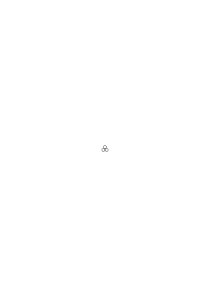

vereinigt.” Und hier gibt es nun zwei Fälle: Entweder die „Moleküle” sind die Elemente & unterscheidbar so daß sie Eigennamen haben können & das ist der Fall den ich in meinem Buch angenommen habe dann ist das Faktum durch ein logisches Produkt von Gliedern, sagen wir, von der Form R(x,y,z) ausgedrückt & hier gibt es nun keinen Satz mehr der sagt daß diese Gegenstände _alle_ Gegenstände sind. Oder die Moleküle sind in irgend einem Sinne Materie in einem bestimmten Teil des Raumes zu einer bestimmten Zeit dann ist die Beschreibung des Faktums analog der des Gesichtsbildes in dem sich, sagen wir, vier Gruppen von roten Kreisen

befinden.

### [208\[2\]](https://cdn.wittgensteinnachlass.com/2000px/webp/Ms-107/208.webp),[209\[1\]](https://cdn.wittgensteinnachlass.com/2000px/webp/Ms-107/209.webp)

27.11.1929

Man kann erst dann gut philosophieren, wenn der Krampf des Denkens gelöst ist. D.h. wenn die unnötige & hinderliche Spannung des Gehirns aufgehört hat.

### [209\[2\]](https://cdn.wittgensteinnachlass.com/2000px/webp/Ms-107/209.webp)

Arithmetik redet nicht von Zahlen, sondern sie arbeitet mit Zahlen.

### [209\[3\]](https://cdn.wittgensteinnachlass.com/2000px/webp/Ms-107/209.webp)

Wie sind die Zahlen richtig einzuführen, & braucht man sie „einzuführen”?

### [209\[4\]](https://cdn.wittgensteinnachlass.com/2000px/webp/Ms-107/209.webp)

Der Kalkül setzt den Kalkül voraus.

### [209\[5\]](https://cdn.wittgensteinnachlass.com/2000px/webp/Ms-107/209.webp)

Sind denn nicht die Zahlen eine logische Eigentümlichkeit des Raumes & der Zeit?

### [209\[6\]](https://cdn.wittgensteinnachlass.com/2000px/webp/Ms-107/209.webp)

Der Kalkül selbst besteht nur im Raum & der Zeit.

### [209\[7\]](https://cdn.wittgensteinnachlass.com/2000px/webp/Ms-107/209.webp)

Was man mit einem Satze meinen _kann_, das _darf_ man auch mit ihm meinen. Wenn Leute sagen mit dem Satz „hier steht ein Sessel” meine ich nicht bloß, was die unmittelbare Erfahrung mir zeigt sondern noch etwas darüber hinaus, so kann man nur antworten: Was ihr meinen könnt muß mit irgend einer Art von Erfahrung zusammenhängen, & was immer ihr meinen _könnt_ ist unantastbar.

### [209\[8\]](https://cdn.wittgensteinnachlass.com/2000px/webp/Ms-107/209.webp),[210\[1\]](https://cdn.wittgensteinnachlass.com/2000px/webp/Ms-107/210.webp)

Wenn es wahr wäre daß die Zahlen in keiner wesentlich anderen Verbindung vorkommen als in (∃x,y,z) dann wäre die 3 einfach so zu definieren (∃xyz)… ≝ (∃xxx)… ≝ (∃3x)… & analog alle Ziffern & dem entsprechend die variable Zahl.

### [210\[2\]](https://cdn.wittgensteinnachlass.com/2000px/webp/Ms-107/210.webp)

(Е243x) φx ∙ (Е183x) ∙ ψx ∙ Indep. ⊃ (Е243 + 183x) φx ⌵ ψx Wie weiß ich daß das so ist, wenn ich nicht den Begriff der Addition in Verbindung mit dieser Anwendung eingeführt habe? Ich kann zu diesem Satz nur durch Induktion kommen. D.h. Dem allgemeinen Satz (vielmehr der Tautologie) <math class="stacked" display="inline"><mo>(</mo><mtext>Еnx)</mtext><mspace width="0.3em"/><mtext>φx</mtext><mspace width="0.3em"/><mtext>∙</mtext><mspace width="0.3em"/><mo>(</mo><mtext>Еmx)</mtext><mspace width="0.3em"/><mtext>ψx</mtext><mspace width="0.3em"/><mtext>∙</mtext><mtext>Indep.</mtext><mspace width="0.3em"/><mo>⊃</mo><mspace width="0.3em"/><mo>(</mo><mtext>Еn</mtext><mspace width="0.3em"/><mo>+</mo><mspace width="0.3em"/><mi>m</mi><msub><mo>)</mo><mi>x</mi></msub><mtext>φx</mtext><mspace width="0.3em"/><mtext>⌵</mtext><mspace width="0.3em"/><mtext>ψx</mtext></math> entspricht eine Induktion (Spirale) & diese Induktion ist der Beweis des oberen Satzes „(Е243x) φx etc.” noch ehe wir 243 + 183 wirklich ausgerechnet, & versucht haben ob das eine Tautologie ergibt.

### [210\[3\]](https://cdn.wittgensteinnachlass.com/2000px/webp/Ms-107/210.webp),[211\[1\]](https://cdn.wittgensteinnachlass.com/2000px/webp/Ms-107/211.webp)

Wenn uns vorgehalten wird daß die Sprache alles mit Hilfe von Substantiven, Adjektiven & Verben ausdrücken kann so müssen wir sagen daß es dann jedenfalls nötig ist zwischen ganz verschiedenen Arten von Substantiven etc. zu unterscheiden da verschiedene grammatikalische Regeln von ihnen gelten. Dies zeigt sich darin daß es nicht erlaubt ist sie für einander einzusetzen. Es zeigt sich dadurch daß ihr substantivischer Charakter nur eine Äußerlichkeit war & daß wir es wirklich mit ganz verschiedenen Wortgattungen zu tun haben. Die Wortgattung wird erst durch _alle_ grammatischen Regeln bestimmt die von einem Wort gelten. Und so betrachtet hat unsere Sprache eine Unmenge verschiedener Wortarten.

### [211\[2\]](https://cdn.wittgensteinnachlass.com/2000px/webp/Ms-107/211.webp)

Ich sagte: Wenn es wahr wäre daß die Zahlen nur – d.h. prinzipiell nur – in Verbindung (∃nx) φx vorkämen, so wären sie durch diese Verbindung einzuführen. Das ist nun nicht wahr aber etwas anderes & doch analoges ist der Fall. D.h. die Zahlen kommen in irgend einer charakteristischen Verbindung in unseren Sätzen vor & in dieser Verbindung sind sie einzuführen.

### [211\[3\]](https://cdn.wittgensteinnachlass.com/2000px/webp/Ms-107/211.webp)

Es ist jetzt z.B. klar daß der Satz in dem Weißen Quadrat sind 3 schwarze Kreise nicht von der Art (∃x,y,z) φx ∙ φy ∙ φz ist. Und der Irrtum daß es doch der Fall ist, ist von der gleichen Art wie der welcher verschiedene Arten von Subjekt-Prädikat Sätzen nicht unterscheidet.

### [211\[4\]](https://cdn.wittgensteinnachlass.com/2000px/webp/Ms-107/211.webp),[212\[1\]](https://cdn.wittgensteinnachlass.com/2000px/webp/Ms-107/212.webp)

Tatsächlich hängt die Fregesche (& Russellsche) Theorie der Zahlen mit der Subjekt-Prädikat Theorie der Sätze zusammen denn Begriff & Gegenstand sind Prädikat & Subjekt. Und in demselben Sinn in dem man _vorläufig_ von Subjekt & Prädikat reden kann wobei man aber im Auge behalten muß daß man den Satz noch nicht analysiert hat, in demselben Sinn kann man die Zahlen in der Verbindung (∃nx) φx einführen, wobei aber klar sein muß daß das keine Analyse des Satzes darstellt & außerdem irreleitend ist weil das Zeichen (∃ …) … die Möglichkeit zu sinnlosen Konstruktionen gibt (äußere & innere Verneinung)

### [212\[2\]](https://cdn.wittgensteinnachlass.com/2000px/webp/Ms-107/212.webp),[213\[1\]](https://cdn.wittgensteinnachlass.com/2000px/webp/Ms-107/213.webp)

28.11.1929

Sobald man exakte Begriffe der Messung auf die unmittelbare Erfahrung anwenden will stößt man auf eine eigentümliche Verschwommenheit in dieser Erfahrung. D.h. aber nur eine Verschwommenheit relativ zu jenen Maßbegriffen. Und es scheint mir nun daß diese Verschwommenheit nicht etwas Vorläufiges ist das genauere Erkenntnis später eliminieren wird, sondern eine charakteristische logische Eigentümlichkeit. Wenn ich z.B. sage ich sehe jetzt einen roten Kreis auf blauem Grund & erinnere mich einen vor ein paar Minuten gesehen zu haben der gleichgroß oder vielleicht etwas kleiner war & ein wenig lichter so ist _diese_ Erfahrung nicht exakter zu beschreiben. Die Wörter „ungefähr”, „beiläufig”, etc. haben freilich nur relativen Sinn aber sie sind doch _nötig_ & sie charakterisieren die Natur unserer Erfahrung; nicht als an sich beiläufig oder verschwommen aber doch als beiläufig & verschwommen in Relation zu den Mitteln unserer Darstellung.

### [213\[2\]](https://cdn.wittgensteinnachlass.com/2000px/webp/Ms-107/213.webp)

In der Philosophie kommt es immer wieder vor daß unsere Glieder in eine ihnen unnatürliche Stellung kommen wir aber die natürliche nicht finden können & uns einreden dies sei die natürliche & wir müssen uns nur an sie gewöhnen. Aber nur so ist ein Fortschritt zu hoffen daß wir uns nicht an sie gewöhnen sondern unablässig trachten die natürliche zu suchen & die Erleichterung die dann eintritt wenn wir sie gefunden haben sagt augenblicklich daß sie es ist.

### [213\[3\]](https://cdn.wittgensteinnachlass.com/2000px/webp/Ms-107/213.webp)

Die philosophische Aufgabe mit Beziehung auf den Gesichtsraum besteht eben – wie immer – nur darin falsche philosophische Theorien über ihn zurückzuweisen.

### [213\[4\]](https://cdn.wittgensteinnachlass.com/2000px/webp/Ms-107/213.webp)

Die Geometrie des Gesichtsraums ist die Syntax der Sätze die von den Gegenständen im Gesichtsraum handeln.

### [213\[5\]](https://cdn.wittgensteinnachlass.com/2000px/webp/Ms-107/213.webp)

Die Axiome – z.B. – der Euklidischen Geometrie sind verkappte Regeln einer Syntax. Das wird sehr klar wenn man zusieht was ihnen in der analytischen Geometrie entspricht.

### [214\[1\]](https://cdn.wittgensteinnachlass.com/2000px/webp/Ms-107/214.webp)

29.11.1929

Man könnte sich die Konstruktionen der Euklidischen Geometrie alle tatsächlich ausgeführt denken, etwa indem man als Gerade die Kanten & als Ebenen die Oberflächen von Körpern benützt. Das Axiom – z.B. – daß durch je 2 Punkte sich eine Gerade ziehen läßt hat hier den klaren Sinn daß zwar nicht durch je zwei beliebige Punkte eine Gerade gezogen _ist_ aber daß es _möglich_ ist eine zu ziehen und das heißt nur daß der Satz „eine Gerade geht durch diese Punkte” _Sinn_ hat. D.h. die Euklidische Geometrie ist die Syntax der Aussagen über _Gegenstände_ im Euklidischen Raum. Und diese Gegenstände sind nicht Geraden, Ebenen & Punkte sondern _Körper_.

### [214\[2\]](https://cdn.wittgensteinnachlass.com/2000px/webp/Ms-107/214.webp),[215\[1\]](https://cdn.wittgensteinnachlass.com/2000px/webp/Ms-107/215.webp)

Wenn man einem Körper einen Namen gibt so kann man nicht in demselben Sinne seiner Farbe, seiner Gestalt, seiner Lage, seiner Oberfläche Namen geben. Und umgekehrt. „A” ist der Name einer Gestalt nicht einer Gruppe von Graphitteilchen. Die verschiedenen Arten des Gebrauchs von Namen entsprechen ganz den verschiedenen Gebrauchsweisen des hinweisenden Fürworts. Wenn ich sage „das ist ein Sessel”, „das ist der Ort wo er gestanden ist”, „das ist die Farbe die er hatte” so ist das Wort „_das_” in soviel verschiedener Art & Weise gebraucht. (Ich kann nicht im gleichen Sinn auf einen Ort, eine Farbe etc. hinweisen)

### [215\[2\]](https://cdn.wittgensteinnachlass.com/2000px/webp/Ms-107/215.webp)

Zu sagen, die Punkte die dieses Experiment liefert liegen durchschnittlich auf dieser Linie, z.B., einer Geraden heißt etwas ähnliches wie aus einer gewissen Entfernung angesehen erscheinen sie in einer Geraden zu liegen.

### [215\[3\]](https://cdn.wittgensteinnachlass.com/2000px/webp/Ms-107/215.webp)

Wenn ich behaupte „das ist die Regel”, so hat das nur solange Sinn als ich bestimmt habe wieviel Ausnahmen von der Regel ich maximal zulasse ohne die Regel umzustoßen.

### [215\[4\]](https://cdn.wittgensteinnachlass.com/2000px/webp/Ms-107/215.webp)

Ich kann von einer Linie

sagen der allgemeine Eindruck ist der einer Geraden aber nicht von der Linie

obwohl es möglich wäre dieses Stück im Laufe eines langen Linienstückes zu sehen in dem sich seine Abweichung von der Geraden verlieren würde. Ich meine: Nur von dem wirklich gesehenen Stück hat es Sinn zu sagen es mache den allgemeinen Eindruck einer Geraden & nicht von einem hypothetisch angenommenen.

### [215\[5\]](https://cdn.wittgensteinnachlass.com/2000px/webp/Ms-107/215.webp),[216\[1\]](https://cdn.wittgensteinnachlass.com/2000px/webp/Ms-107/216.webp)

Von Sinnesdaten in dem Sinne dieses Wortes in dem es undenkbar ist daß der Andere sie hat, kann man eben aus diesem Grunde auch nicht sagen daß der Andere sie nicht hat. Und aus ebendiesem Grunde ist es sinnlos zu sagen daß _ich_ im Gegensatz zum Anderen sie _habe_.

### [216\[2\]](https://cdn.wittgensteinnachlass.com/2000px/webp/Ms-107/216.webp)

Dies weist einfach darauf hin daß mit dem Begriff der Sinnesdaten etwas nicht in Ordnung ist.

### [216\[3\]](https://cdn.wittgensteinnachlass.com/2000px/webp/Ms-107/216.webp)

Man sagt „Deine Zahnschmerzen _kann_ ich nicht fühlen”; meint man damit nur daß man die Zahnschmerzen des anderen tatsächlich bis jetzt nie gespürt hat? Und nicht vielmehr daß es logisch unmöglich ist?

### [216\[4\]](https://cdn.wittgensteinnachlass.com/2000px/webp/Ms-107/216.webp),[217\[1\]](https://cdn.wittgensteinnachlass.com/2000px/webp/Ms-107/217.webp)

Der Begriff der Zahnschmerzen als eines Gefühlsdatums ist allerdings auf den Zahn des Anderen ebenso anwendbar wie auf den meinen aber nur in dem Sinne in dem es ganz wohl möglich wäre in dem Zahn in eines anderen Menschen Mund Schmerzen zu empfinden. Im Einklang mit der gegenwärtigen Ausdrucksweise würde man aber diese Tatsache nicht durch die Worte „Ich fühle seinen Zahnschmerz” ausdrücken sondern durch „Ich habe in seinem Zahn Schmerzen”. – Man kann nun sagen: Freilich hast Du nicht seinen Zahnschmerz denn es ist auch dann sehr wohl möglich daß er sagt „ich fühle in diesem Zahn nichts”. Und sollte ich in diesem Fall sagen „Du lügst, ich fühle wie Dein Zahn schmerzt”?

### [217\[2\]](https://cdn.wittgensteinnachlass.com/2000px/webp/Ms-107/217.webp),[218\[1\]](https://cdn.wittgensteinnachlass.com/2000px/webp/Ms-107/218.webp)

Wie unterscheiden sich _seine_ Zahnschmerzen von den _meinen_? Wenn das Wort „Zahnschmerzen” dieselbe Bedeutung hat in „ich habe Zahnschmerzen” & „er hat Zahnschmerzen”, was heißt es dann zu sagen daß er nicht dieselben Zahnschmerzen haben kann wie ich? Wie können sich denn Zahnschmerzen von einander unterscheiden? Durch Stärke & ähnliche Charakteristika & durch die Lokation. Wenn diese aber in beiden Fällen die gleichen sind! Wenn man aber einwendet, ihr Unterschied sei eben der daß in einem Fall _ich_ sie habe im anderen Fall _er_; dann ist also die besitzende Person ein Charakteristikum der Zahnschmerzen selbst; aber was ist dann mit dem Satz „ich habe Zahnschmerzen” (oder dem anderen) ausgesagt? Gar nichts! Wenn das Wort „Zahnschmerzen” in beiden Fällen die gleiche Bedeutung hat, dann muß man die Zahnschmerzen der beiden mit einander vergleichen können & wenn sie in Stärke etc. mit einander übereinstimmen so sind sie die gleichen Zahnschmerzen wie zwei Anzüge die _gleiche_ Farbe haben wenn sie in bezug auf Helligkeit, Sättigung etc. mit einander übereinstimmen. Ebenso ist es Unsinn zu sagen daß zwei Menschen nicht das gleiche Sinnesdatum besitzen können, wenn mit „Sinnesdatum” wirklich das _Primäre_ gemeint ist.

### [218\[2\]](https://cdn.wittgensteinnachlass.com/2000px/webp/Ms-107/218.webp)

Was heißt bei einem Häufigkeitsexperiment „in the long run”?

### [218\[3\]](https://cdn.wittgensteinnachlass.com/2000px/webp/Ms-107/218.webp)

30.11.1929

Ein Experiment muß einen Anfang & ein Ende haben!

### [218\[4\]](https://cdn.wittgensteinnachlass.com/2000px/webp/Ms-107/218.webp)

Geometrie ist die Syntax der Sätze von den räumlichen Gegenständen.

### [218\[5\]](https://cdn.wittgensteinnachlass.com/2000px/webp/Ms-107/218.webp)

Das Experiment des Würfelns dauert eine gewisse Zeit & unsere Erwartungen von der Zukunft können sich nur auf Tendenzen gründen, die wir in den Ergebnissen dieses Experiments wahrnehmen. D.h. das Experiment kann nur die Erwartung begründen daß es nun _so_ weiter gehen wird wie es das Experiment gezeigt hat aber wir können nicht erwarten daß das Experiment, wenn fortgesetzt nun Ergebnisse liefern wird die mehr als die des wirklich ausgeführten Experiments mit einer vorgefaßten Meinung über den Verlauf übereinstimmen.

### [218\[6\]](https://cdn.wittgensteinnachlass.com/2000px/webp/Ms-107/218.webp),[219\[1\]](https://cdn.wittgensteinnachlass.com/2000px/webp/Ms-107/219.webp)

Wenn ich also z.B., Kopf & Adler werfe & in den Ergebnissen des Experiments selbst keine Tendenz der Kopf- & Adler-Zahlen finde sich weiter einander zu nähern so gibt das Experiment mir keinen Grund zur Annahme daß die Fortsetzung eine solche Annäherung zeigen wird. Ja, die Erwartung dieser Annäherung muß sich _selbst_ auf einen bestimmten Zeitpunkt beziehen, denn ich kann nicht erwarten, daß etwas _einmal_ eintreten wird ohne jede endliche Zeitbestimmung.

### [219\[2\]](https://cdn.wittgensteinnachlass.com/2000px/webp/Ms-107/219.webp)

Ich kann nicht sagen:

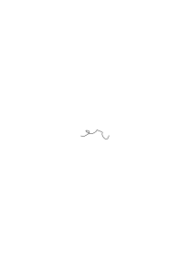

schaut gerade aus denn es kann das Stück einer Linie sein die mir als Ganzes den Eindruck der Gerade macht.

### [219\[3\]](https://cdn.wittgensteinnachlass.com/2000px/webp/Ms-107/219.webp)

Nicht nur kümmert sich die Erkenntnistheorie nicht um die Wahr- & Falschheit der eigentlichen Sätze, sondern es ist sogar eine philosophische Methode gerade die Sätze ins Auge zu fassen deren Inhalt uns physikalisch als der aller Unmöglichste erscheint (z.B. daß Einer im Zahn eines Anderen Schmerzen hat). Sie betont damit, quasi, daß ihr Reich alles auch nur Denkbare umfaßt.

### [219\[4\]](https://cdn.wittgensteinnachlass.com/2000px/webp/Ms-107/219.webp),[220\[1\]](https://cdn.wittgensteinnachlass.com/2000px/webp/Ms-107/220.webp),[221\[1\]](https://cdn.wittgensteinnachlass.com/2000px/webp/Ms-107/221.webp),[222\[1\]](https://cdn.wittgensteinnachlass.com/2000px/webp/Ms-107/222.webp)

01.12.1929

Ein seltsamer Traum. Heute gegen Morgen träumte mir: Ich sehe in einer Illustrierten Zeitschrift eine Photographie von _Vertsagt_ der ein viel besprochener Tagesheld ist. Das Bild stellt ihn in seinem Auto dar. Es ist von seinen Schandtaten die Rede; Hänsel steht bei mir und noch jemand anderer ähnlich meinem Bruder Kurt. Dieser sagt daß Vertsag ein Jude sei aber die Erziehung eines reichen schottischen Lords genossen habe jetzt ist er Arbeiterführer. Seinen Namen habe er nicht geändert weil das dort nicht Sitte sei. Es ist mir neu daß Vertsagt den ich mit der Betonung auf der ersten Silbe ausspreche ein Jude ist & ich erkenne daß ja sein Name einfach verzagt heißt. Es fällt mir nicht auf daß es mit „ts” geschrieben ist was ich ein wenig fetter als das übrige gedruckt sehe. Ich denke: muß denn hinter jeder Unanständigkeit ein Jude stecken. Nun bin ich und Hänsel auf der Terrasse eines Hauses etwa des großen Blockhauses auf der Hochreit & auf der Straße kommt in seinem Automobil Vertsag er hat ein böses Gesicht ein wenig rötlich blondes Haar & einen solchen Schnauzbart (er sieht nicht jüdisch aus). Er feuert nach rückwärts mit einem Maschinengewehr auf einen Radfahrer der hinter ihm fährt & sich vor Schmerzen krümmt & der unbarmherzig durch viele Schüsse zu Tode getroffen wird. Vertsag ist vorbei & nun kommt ein junges Mädchen ärmlich aussehend auf einem Rade daher & auch sie empfängt die Schüsse von dem weiterfahrenden Vertsag. Und diese Schüsse die ihre Brust treffen machen ein brodelndes Geräusch wie ein Kessel in dem sehr wenig Wasser ist über einer Flamme. Ich hatte Mitleid mit dem Mädchen und dachte: nur in Österreich kann es geschehen daß dieses Mädchen kein hilfreiches Mitleid findet und die Leute zusehen wie sie leidet und umgebracht wird. Ich selbst fürchte mich auch davor ihr zu helfen weil ich die Schüsse Vertsag's fürchte. Ich nähere mich ihr, suche aber Deckung hinter einer Planke. Dann erwache ich. Ich muß nachtragen daß in dem Gespräch mit Hänsel erst in Anwesenheit des anderen dann nachdem er uns verlassen hat ich mich geniere und nicht sagen will daß ich ja selbst von Juden abstamme oder daß der Fall Vertsag's ja auch mein Fall ist. Nach dem Erwachen komme ich darauf daß ja „verzagt” nicht mit „ts” geschrieben wird glaube aber sonderbarerweise daß es mit „Pf” geschrieben wird „pferzagt”. Ich habe den Traum gleich nach dem Erwachen notiert. Die Gegend die in dem Traum etwa der Gegend hinter der Hochreiter Kapelle entspricht (die Seite gegen den Windhag) stelle ich mir im Traum als einen steilen bewaldeten Abhang und eine Straße im Tal vor wie ich es in einem anderen Traum gesehen habe. Ähnlich einem Stück der Straße von Gloggnitz nach Schlagl. Als ich das arme Mädchen bedauere sehe ich undeutlich ein altes Weib welches sie bedauert aber sie nicht zu sich nimmt und ihr hilft. Das Blockhaus auf der Hochreit ist auch nicht deutlich wohl aber die Straße und was auf ihr vorgeht. Ich glaube ich hatte eine Idee daß der Name wie ich ihn im Traume ausspreche „Vért-sagt” ungarisch ist. Der Name hatte für mich etwas _Böses_, Boshaftes, und sehr Männliches.

### [222\[2\]](https://cdn.wittgensteinnachlass.com/2000px/webp/Ms-107/222.webp)

Der Strom des Lebens, oder der Strom der Welt, fließt dahin [„alles fließt”] & unsere Sätze werden sozusagen nur durch Augenblicke verifiziert.

### [222\[3\]](https://cdn.wittgensteinnachlass.com/2000px/webp/Ms-107/222.webp),[223\[1\]](https://cdn.wittgensteinnachlass.com/2000px/webp/Ms-107/223.webp)

Unsere Sätze werden nur von der Gegenwart verifiziert. Sie müßten also so gemacht sein, daß sie von ihr verifiziert werden können. Sie müssen das Zeug haben um von ihr verifiziert werden zu können. Dann haben sie also in irgend einer Weise die Kommensurabilität mit der Gegenwart & diese können sie nicht haben _trotz_ ihrer raum-zeitlichen Natur sondern diese muß sich zu jener verhalten wie die Körperlichkeit eines Maßstabes & seine Ausgedehntheit mittelst der er mißt. In welchem Falle man auch nicht sagen kann: „ja, der Maßstab mißt die Länge trotz seiner Körperlichkeit, freilich ein Maßstab der nur Länge hätte wäre das Ideal, wäre quasi der _reine_ Maßstab”. Nein, wenn ein Körper Länge hat, so kann es keine Länge ohne einen Körper geben. – Und wenn ich auch verstehe daß in einem bestimmten Sinn nur die Länge des Maßstabes mißt, so bleibt doch was ich in die Tasche stecke der Maßstab, der Körper, & ist nicht die Länge.

### [223\[2\]](https://cdn.wittgensteinnachlass.com/2000px/webp/Ms-107/223.webp)

Sicher, wenn die Physik ihre Hypothesen ändert so geschieht es nur weil sie mit irgendwelchen _Beobachtungen_ nicht übereinstimmen. Und wenn sie mit den Beobachtungen übereinstimmen dann ist das alles was die Physik von ihnen verlangt; also auch alles was sie leisten.

### [223\[3\]](https://cdn.wittgensteinnachlass.com/2000px/webp/Ms-107/223.webp)

Die Anschauungen neuerer Physiker (Eddington) stimmen ganz mit der meinen überein wenn sie sagen daß die Zeichen in ihren Gleichungen keine „Bedeutungen” mehr haben & daß die Physik zu keinen solchen Bedeutungen gelangen kann sondern bei den Zeichen stehen bleiben muß. Sie sehen nämlich nicht daß diese Zeichen insofern Bedeutung haben & nur in**so**fern Bedeutung haben, als ihnen das unmittelbar beobachtete Phänomen (etwa Lichtpunkte) entspricht oder nicht entspricht.

### [223\[4\]](https://cdn.wittgensteinnachlass.com/2000px/webp/Ms-107/223.webp)

Das Phänomen ist nicht Symptom für etwas anderes sondern ist die Realität.

### [223\[5\]](https://cdn.wittgensteinnachlass.com/2000px/webp/Ms-107/223.webp),[224\[1\]](https://cdn.wittgensteinnachlass.com/2000px/webp/Ms-107/224.webp)

Das Phänomen ist nicht Symptom für etwas anderes was den Satz erst wahr oder falsch macht sondern ist selbst das was ihn verifiziert.

### [224\[2\]](https://cdn.wittgensteinnachlass.com/2000px/webp/Ms-107/224.webp)

02.12.1929

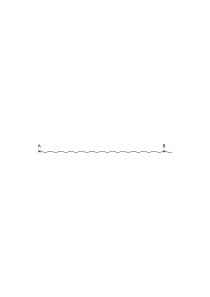

Die Gleichung dieser Linie kann man darstellen als Gleichung einer Geraden A-B mit einem variablen Parameter dessen Verlauf die _Abweichungen_ von der Geraden ausdrückt. Es ist nicht wesentlich daß diese Abweichungen „gering” seien. Sie können so groß sein, daß die Linie einer Geraden nicht ähnlich sieht. Die „Gerade mit Abweichungen” ist _nur eine Form_ der Beschreibung. Sie macht es mir möglich einen bestimmten Teil der Beschreibung zu vernachlässigen – wenn ich will. Die Form der Regel mit Ausnahmen.

### [224\[3\]](https://cdn.wittgensteinnachlass.com/2000px/webp/Ms-107/224.webp)

Alle „begründete” Erwartung ist Erwartung daß eine bis jetzt beobachtete Regel weiter gelten wird. Die Regel aber muß beobachtet worden sein & kann nicht selbst wieder nur erwartet werden.

### [224\[4\]](https://cdn.wittgensteinnachlass.com/2000px/webp/Ms-107/224.webp)

Die Theorie der Wahrscheinlichkeit hat es nur in **so**fern mit dem Zustand der Erwartung zu tun wie etwa die Logik mit dem Denken.

### [224\[5\]](https://cdn.wittgensteinnachlass.com/2000px/webp/Ms-107/224.webp)

Die Wahrscheinlichkeit hat es vielmehr mit der Form & einem (gewissen) Standard der Erwartung zu tun.

### [225\[1\]](https://cdn.wittgensteinnachlass.com/2000px/webp/Ms-107/225.webp)

Es handelt sich um die Erwartung daß die zukünftige Erfahrung einem Gesetz entsprechen wird, dem die bisherige Erfahrung entsprochen hat.

### [225\[2\]](https://cdn.wittgensteinnachlass.com/2000px/webp/Ms-107/225.webp)

Es ist wahrscheinlich daß ein Ereignis eintrifft, heißt: _es spricht etwas dafür_, daß es eintrifft.

### [225\[3\]](https://cdn.wittgensteinnachlass.com/2000px/webp/Ms-107/225.webp)

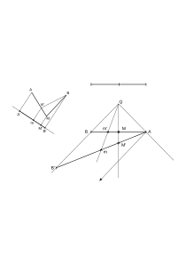

### [225\[4\]](https://cdn.wittgensteinnachlass.com/2000px/webp/Ms-107/225.webp),[226\[1\]](https://cdn.wittgensteinnachlass.com/2000px/webp/Ms-107/226.webp)

Von der Lichtquelle Q wird ein Lichtstrahl ausgesendet der die Scheibe AB trifft & dort einen Lichtpunkt erzeugt & dann die Scheibe AB' trifft & auf ihr einen Lichtpunkt erzeugt. Wir haben keinen Grund anzunehmen daß der Punkt auf AB rechts oder links von _M_ aber auch keinen Grund anzunehmen daß der Punkt auf AB' rechts oder links von _m_ ist, das gibt scheinbar widersprechende Wahrscheinlichkeiten. Aber angenommen ich habe eine Annahme über die Wahrscheinlichkeit gemacht daß der Punkt auf AB in AM liegt, wie wird diese Annahme verifiziert? Doch durch einen Häufigkeitsversuch. Angenommen dieser bestätigt die eine Auffassung so ist sie damit als die richtige erkannt und erweist sich so als eine _physikalische_ Hypothese. Die geometrische Konstruktion zeigt nur daß die Gleichheit der Strecken AM & BM _kein_ Grund zur Annahme gleicher Wahrscheinlichkeit war.

### [226\[2\]](https://cdn.wittgensteinnachlass.com/2000px/webp/Ms-107/226.webp)

Den Goldbachschen Satz _glauben_ hieße einen Beweis für ihn zu haben glauben denn ihn quasi in extenso glauben kann man nicht weil das nichts heißt & eine Induktion der er entspricht kann man sich nicht vorstellen bis man sie hat.

### [226\[3\]](https://cdn.wittgensteinnachlass.com/2000px/webp/Ms-107/226.webp)

03.12.1929

Der Widerspruch des Kretischen Lügners könnte auch so hervorgerufen werden daß man den Satz hinschreibt:

_„Dieser Satz ist falsch.”_

Das Hinweisende Fürwort spielt hier die Rolle des „Ich” in „Ich lüge”. Der fundamentale Fehler liegt wie in der früheren Philosophie der Logik darin daß man annimmt ein Wort könne auf seinen Gegenstand gleichsam anspielen (aus der Entfernung auf ihn hindeuten) ohne ihn vertreten zu müssen.

### [226\[4\]](https://cdn.wittgensteinnachlass.com/2000px/webp/Ms-107/226.webp),[227\[1\]](https://cdn.wittgensteinnachlass.com/2000px/webp/Ms-107/227.webp)

Ein Satz der von allen Sätzen oder allen Funktionen handelt ist von vornherein eine Unmöglichkeit: was durch einen solchen ausgedrückt werden sollte, müßte durch eine Induktion gezeigt werden (z.B. daß _alle_ Sätze ~p, ~~~p, ~~~~~p etc. dasselbe sagen). Diese Induktion ist selbst kein Satz & deshalb ist ein circulus vitiosus ausgeschlossen.

### [227\[2\]](https://cdn.wittgensteinnachlass.com/2000px/webp/Ms-107/227.webp),[228\[1\]](https://cdn.wittgensteinnachlass.com/2000px/webp/Ms-107/228.webp)

Widerspricht folgende Tatsache nicht meiner Auffassung von der Wahrscheinlichkeit: Es ist offenbar denkbar daß jemand der täglich würfelt – sagen wir – eine Woche lang nur Einser wirft & zwar nicht darum weil die Würfel schlecht sind sondern einfach weil sich die Bewegungen seiner Hand, die Lage des Würfels im Becher, die Reibung an der Tischfläche so zusammenfinden daß sich immer dieses Resultat ergiebt. Der Mann hat den Würfel untersucht, auch gefunden daß er wenn ihn andere werfen die normalen Ergebnisse liefert. Hat dieser Mann einen Grund zu denken, daß hier ein Naturgesetz waltet das ihn immer Einser werfen läßt, hat er Grund zu glauben daß das nun wohl so weiter gehen wird oder hat er Grund anzunehmen daß diese Regelmäßigkeit nicht lange mehr dauern kann? D.h.: hat er Grund das Spiel aufzugeben da es sich gezeigt hat daß er nur Einser werfen kann oder weiterzuspielen da es nur umso wahrscheinlicher ist daß er jetzt eine höhere Zahl werfen wird? In Wirklichkeit wird dieser Mann sich weigern es als ein Naturgesetz anzuerkennen daß er nur Einser werfen kann. Zum mindesten wird es lange andauern müssen, ehe er diese Möglichkeit in Betracht zieht. Aber warum? Ich glaube, weil soviel frühere Erfahrung im Leben gegen ein solches Naturgesetz spricht die alle – sozusagen – erst überwunden werden muß ehe wir eine ganz neue Betrachtungsweise akzeptieren.

### [228\[2\]](https://cdn.wittgensteinnachlass.com/2000px/webp/Ms-107/228.webp)

04.12.1929

Die Wahrscheinlichkeitsrechnung sagt daß _alles einmal_ vorkommen wird & das sagt gar nichts.

### [228\[3\]](https://cdn.wittgensteinnachlass.com/2000px/webp/Ms-107/228.webp)

Wenn wir aus der relativen Häufigkeit eines Ereignisses auf seine relative in der Zukunft Schlüsse ziehen, so können wir das natürlich nur nach der bisher tatsächlich beobachteten Häufigkeit tun. Und nicht nach einer, die wir aus der beobachteten durch irgend einen Prozeß der Wahrscheinlichkeitsrechnung erhalten haben. Denn die berechnete Wahrscheinlichkeit stimmt _mit jeder beliebigen_ tatsächlich beobachteten Häufigkeit überein da sie die Zeit offen läßt.

### [228\[4\]](https://cdn.wittgensteinnachlass.com/2000px/webp/Ms-107/228.webp),[229\[1\]](https://cdn.wittgensteinnachlass.com/2000px/webp/Ms-107/229.webp)

Wenn sich der Spieler oder die Versicherungsgesellschaft nach der Wahrscheinlichkeit richten so richten sie sich nicht nach der Wahrscheinlichkeitsrechnung, denn nach dieser allein kann man sich nicht richten, da, _was immer_ geschieht, mit ihr in Übereinstimmung zu bringen ist; sondern die Versicherungsgesellschaft richtet sich nach einer tatsächlich beobachteten Häufigkeit. Und zwar ist das natürlich eine absolute Häufigkeit.

### [229\[2\]](https://cdn.wittgensteinnachlass.com/2000px/webp/Ms-107/229.webp)

10.01.1930

### [229\[3\]](https://cdn.wittgensteinnachlass.com/2000px/webp/Ms-107/229.webp)

Wenn man sagt: nur im Satzzusammenhang hat ein Wort Bedeutung, so heißt das daß ein Wort seine Funktion als Wort nur im Satz hat & das läßt sich ebensowenig sagen wie, daß ein Sessel seine Aufgabe nur im Raum erfüllt. Oder vielleicht besser: Wie ein Zahnrad nur im Eingriff in andere Zähne seine Funktion ausübt.

### [229\[4\]](https://cdn.wittgensteinnachlass.com/2000px/webp/Ms-107/229.webp),[230\[1\]](https://cdn.wittgensteinnachlass.com/2000px/webp/Ms-107/230.webp)

Ich sagte neulich zu Arvid mit dem ich im Kino einen uralten Film gesehen hatte: Ein jetziger Film verhielte sich zum alten wie ein heutiges Automobil zu einem von vor 25 Jahren. Er wirkt ebenso lächerlich & ungeschickt wie dieses & die Verbesserung des Films entspricht einer technischen Verbesserung wie der des Automobils. Sie entspricht nicht der Verbesserung – wenn man das so nennen darf – eines Kunststils. Ganz ähnlich müßte es auch in der modernen Tanzmusik gehen. Ein Jazztanz müßte sich verbessern lassen wie ein Film. Das was alle diese Entwicklung von dem Werden eines _Stils_ unterscheidet ist die Unbeteiligung des Geistes.

### [230\[2\]](https://cdn.wittgensteinnachlass.com/2000px/webp/Ms-107/230.webp)

11.01.1930

Der Unterschied zwischen einem guten & einem schlechten Architekten besteht heute darin, daß dieser jeder Versuchung erliegt während der rechte ihr standhält.

### [230\[3\]](https://cdn.wittgensteinnachlass.com/2000px/webp/Ms-107/230.webp)

Ich habe einmal, & vielleicht mit Recht, gesagt: Aus der früheren Kultur wird ein Trümmerhaufen & am Schluß ein Aschenhaufen werden; aber es werden Geister über der Asche schweben.

### [230\[4\]](https://cdn.wittgensteinnachlass.com/2000px/webp/Ms-107/230.webp),[231\[1\]](https://cdn.wittgensteinnachlass.com/2000px/webp/Ms-107/231.webp)

Ich verstehe jedenfalls den Satz „dieses Buch ist blau” in einem Sinn in welchem ich den Satz „dieses Buch ist abracadabra” nicht verstehe. Und dieses Verstehen hat nichts mit eventuellen zukünftigen Ereignissen zu tun.

### [231\[2\]](https://cdn.wittgensteinnachlass.com/2000px/webp/Ms-107/231.webp)

Ich kann in einer Farbe eine Spur von „Grün” entdecken. Das wird mich etwa veranlassen beim Nachmischen der Farbe einen Tropfen Grün beizusetzen.

### [231\[3\]](https://cdn.wittgensteinnachlass.com/2000px/webp/Ms-107/231.webp)

Die Farbe Grün & das Wort „Grün” sind für mich so verbunden wie ein Ding & seine Etikette. Ich brauche sie nur aus der Lade herauszunehmen, so sind sie da.

### [231\[4\]](https://cdn.wittgensteinnachlass.com/2000px/webp/Ms-107/231.webp)

Die Sprache muß von der Mannigfaltigkeit eines Stellwerks sein, das die Handlungen veranlaßt, die ihren Sätzen entsprechen.

### [231\[5\]](https://cdn.wittgensteinnachlass.com/2000px/webp/Ms-107/231.webp)

Merkwürdigerweise hat das Problem des _Verstehens_ der Sprache mit dem Problem des Willens zu tun. (Das habe ich schon einmal ausgesprochen) Einen Befehl zu verstehen noch ehe man ihn ausführt hat eine Verwandtschaft damit eine Handlung zu wollen ehe man sie ausführt.

### [231\[6\]](https://cdn.wittgensteinnachlass.com/2000px/webp/Ms-107/231.webp)

Der Apotheker der ein Rezept versteht.

### [231\[7\]](https://cdn.wittgensteinnachlass.com/2000px/webp/Ms-107/231.webp)

12.01.1930

Meine Schwierigkeit ist wieder eine der Beziehungen des I. & II. Systems.

### [231\[8\]](https://cdn.wittgensteinnachlass.com/2000px/webp/Ms-107/231.webp),[232\[1\]](https://cdn.wittgensteinnachlass.com/2000px/webp/Ms-107/232.webp)

Wie in einem Stellwerk mit Handgriffen die verschiedensten Dinge ausgeführt werden so mit den Wörtern der Sprache die Handgriffen entsprechen. Ein Handgriff ist der Handgriff einer Kurbel & diese kann kontinuierlich verstellt werden; einer gehört zu einem Schalter & kann nur entweder umgelegt oder aufgestellt werden, ein dritter gehört zu einem Schalter der drei oder mehr Stellungen zuläßt, ein vierter ist der Handgriff einer Pumpe & wirkt nur wenn er auf & ab bewegt wird etc.; aber alle sind Handgriffe, werden mit der Hand angefaßt.

### [232\[2\]](https://cdn.wittgensteinnachlass.com/2000px/webp/Ms-107/232.webp)

Wenn ich sage „dieses Buch ist nicht grün” so weiß ich, in irgend einem Sinn, wie es wäre wenn das Buch grün wäre. Ist es nun nicht gleichgültig wie der psychische Akt dieses Wissens beschaffen ist solange ich mit Recht in irgend einem Sinn von ihm reden kann?

### [232\[3\]](https://cdn.wittgensteinnachlass.com/2000px/webp/Ms-107/232.webp)

Wenn ich von den Wörtern & ihrer Syntax rede so geschieht es „im II.” _und ebenso_ muß es sein wenn ich von den symbolisierenden Beziehungen von Sätzen & Tatsachen rede. D.h. wir reden hier wieder von etwas in der Zeit ausgebreitetem & nicht momentanem.

### [232\[4\]](https://cdn.wittgensteinnachlass.com/2000px/webp/Ms-107/232.webp),[233\[1\]](https://cdn.wittgensteinnachlass.com/2000px/webp/Ms-107/233.webp)

13.01.1930

Worte gleichen in gewisser Beziehung dem Papiergeld: Anweisungen auf …. Anweisung, etwa, auf eine Handlung.

### [233\[2\]](https://cdn.wittgensteinnachlass.com/2000px/webp/Ms-107/233.webp)

Ein Wort hat nur im Satzverband Bedeutung das ist wie wenn man sagen würde ein Stab ist erst im Gebrauch ein Hebel. Erst die Anwendung macht ihn zum Hebel.

### [233\[3\]](https://cdn.wittgensteinnachlass.com/2000px/webp/Ms-107/233.webp)

Jede Vorschrift kann als Beschreibung, jede Beschreibung als Vorschrift aufgefaßt werden.

### [233\[4\]](https://cdn.wittgensteinnachlass.com/2000px/webp/Ms-107/233.webp)

Alles das hat mit den Fragen der Möglichkeit zu tun die nie zur Wirklichkeit wird.

### [233\[5\]](https://cdn.wittgensteinnachlass.com/2000px/webp/Ms-107/233.webp)

Daß dieses Papier schwarz sein könnte wird dadurch gezeigt daß der Satz „es ist schwarz” falsch ist.

### [233\[6\]](https://cdn.wittgensteinnachlass.com/2000px/webp/Ms-107/233.webp)

Muß ich mich aber nicht daran erinnern können wie schwarz aussieht um das mit Sinn sagen zu können?

### [233\[7\]](https://cdn.wittgensteinnachlass.com/2000px/webp/Ms-107/233.webp)

In der Zeit ausgedehnt betrachtet ist die Anwendung der Wörter leicht zu verstehen dagegen finde ich es unendlich schwierig den Sinn im Moment der Anwendung zu verstehen.

### [233\[8\]](https://cdn.wittgensteinnachlass.com/2000px/webp/Ms-107/233.webp),[234\[1\]](https://cdn.wittgensteinnachlass.com/2000px/webp/Ms-107/234.webp)

Was heißt es z.B. einen Satz als _ein_ Glied eines Satzsystems zu verstehen? (Es ist als sollte ich sagen: die Anwendung eines Wortes geht nicht in einem Moment vor sich.) (Sowenig, wie die eines Hebels?)

### [234\[2\]](https://cdn.wittgensteinnachlass.com/2000px/webp/Ms-107/234.webp)

Es wäre etwa wie ein Schaltwerk dessen Hebel – sagen wir – vier Stellungen einnehmen kann: Nun kann er die freilich nur nacheinander einnehmen & das braucht Zeit; und angenommen er käme nicht dazu mehr als eine Stellung einzunehmen weil das Schaltwerk danach zerstört würde: War es nicht dennoch ein Schaltwerk mit _vier_ Stellungen? Waren nicht vier Stellungen möglich?

### [234\[3\]](https://cdn.wittgensteinnachlass.com/2000px/webp/Ms-107/234.webp)

Wer es gesehen hätte, hätte gesehen wie kompliziert es ist & seine Komplikation erklärt sich nur durch den beabsichtigten Gebrauch zu dem es tatsächlich nicht gekommen ist. So möchte ich bei der Sprache sagen: Wozu alle diese Ansätze, sie haben nur dann eine Bedeutung wenn sie Verwendung finden.

### [234\[4\]](https://cdn.wittgensteinnachlass.com/2000px/webp/Ms-107/234.webp)

Kann man sagen: der Sinn des Satzes ist sein Zweck? [Oder von einem Wort „its meaning is its purpose”.]

### [234\[5\]](https://cdn.wittgensteinnachlass.com/2000px/webp/Ms-107/234.webp)

Die Logik kann aber nicht die Naturgeschichte des Gebrauchs eines Worts angehen.

### [234\[6\]](https://cdn.wittgensteinnachlass.com/2000px/webp/Ms-107/234.webp),[235\[1\]](https://cdn.wittgensteinnachlass.com/2000px/webp/Ms-107/235.webp)

In wiefern kann der Gebrauch einer Form eines Wortes die Existenz der anderen Form voraussetzen? So würde etwa „dunkel” „dunkler” voraussetzen und umgekehrt; oder „weiß” „weißlich” und umgekehrt etc.

### [235\[2\]](https://cdn.wittgensteinnachlass.com/2000px/webp/Ms-107/235.webp)

„Die Syntax lehrt uns nichts Neues”.

### [235\[3\]](https://cdn.wittgensteinnachlass.com/2000px/webp/Ms-107/235.webp)

14.01.1930

Es gibt eine Art der Philosophie, – man könnte sie psychologistische Philosophie nennen aber den eigentlich guten Namen für sie habe ich noch nicht gefunden – die immer von Assoziationen & dem gleichzeitigen oder ungefähr gleichzeitigen Auftreten von Ereignissen A, B & C spricht, von den ähnlichen Bestandteilen zweier Ereignisse die zur Folge haben daß uns das Ganze einfällt wenn ein Teil vor unsere Augen tritt. Eine typische philosophische Sackgasse. Die Mischung von angestrebter Exaktheit & tatsächlicher Irrelevanz.

### [235\[4\]](https://cdn.wittgensteinnachlass.com/2000px/webp/Ms-107/235.webp)

Wenn ich ein Ereignis erwarte & es kommt dasjenige welches meine Erwartung erfüllt, hat es dann einen Sinn zu fragen, ob das wirklich das Ereignis ist welches ich erwartet habe. D.h. wie würde ein Satz der das behauptet verifiziert werden?

### [235\[5\]](https://cdn.wittgensteinnachlass.com/2000px/webp/Ms-107/235.webp),[236\[1\]](https://cdn.wittgensteinnachlass.com/2000px/webp/Ms-107/236.webp)

Es ist klar daß die _einzige_ Quelle meines Wissens hier der Vergleich des _Ausdrucks_ meiner Erwartung mit dem eingetroffenen Ereignis ist.

### [236\[2\]](https://cdn.wittgensteinnachlass.com/2000px/webp/Ms-107/236.webp)

Wie weiß ich daß die Farbe dieses Papiers die ich „weiß” nenne dieselbe ist wie die die ich gestern hier gesehen habe? Dadurch daß ich sie wiedererkenne & dieses Wiedererkennen ist meine einzige Quelle für dieses Wissen. Dann _bedeutet_ „daß sie dieselbe ist” daß ich sie wiedererkenne!

### [236\[3\]](https://cdn.wittgensteinnachlass.com/2000px/webp/Ms-107/236.webp)

Man kann dann auch nicht fragen ob sie wohl die gleiche ist & ich mich nicht vielleicht täusche; ob sie die gleiche _ist_ & nicht etwa nur _scheint_.

### [236\[4\]](https://cdn.wittgensteinnachlass.com/2000px/webp/Ms-107/236.webp)

Es wäre freilich auch möglich zu sagen die Farbe ist die gleiche weil die chemische Untersuchung keine Änderung ergibt. Wenn sie mir also nicht die gleiche erscheint so täusche ich mich. Aber dann muß doch wieder etwas unmittelbar wiedererkannt werden. Und die „Farbe” die ich unmittelbar wiedererkennen kann & die ich durch chemische Untersuchung feststelle sind zwei verschiedene Dinge.

### [236\[5\]](https://cdn.wittgensteinnachlass.com/2000px/webp/Ms-107/236.webp)

Aus derselben Quelle fließt nur _Eines_.

### [237\[1\]](https://cdn.wittgensteinnachlass.com/2000px/webp/Ms-107/237.webp)

Was heißt es: „ich könnte Himmelblau wiedererkennen wenn es mir jetzt gezeigt würde”?

### [237\[2\]](https://cdn.wittgensteinnachlass.com/2000px/webp/Ms-107/237.webp)

Die Farbe Rot die ich vor mir sehe ist nicht nur nicht die Farbe die ich mit „weiß” meine sondern sie steht für mich zu diesem Wort in der Beziehung – quasi – einer bestimmten Distanz.

### [237\[3\]](https://cdn.wittgensteinnachlass.com/2000px/webp/Ms-107/237.webp)

D.h. ich erkenne das rot nicht nur als nicht-weiß sondern als in einer bestimmten Entfernung von weiß.

### [237\[4\]](https://cdn.wittgensteinnachlass.com/2000px/webp/Ms-107/237.webp),[238\[1\]](https://cdn.wittgensteinnachlass.com/2000px/webp/Ms-107/238.webp)

Ist es ein Einwand gegen meine Auffassung daß wir oft halb oder gar ganz automatisch sprechen? Wenn mich jemand fragt „ist der Vorhang in diesem Zimmer grün” & ich schaue hin & sage „nein, rot”, so ist es natürlich nicht nötig daß ich grün halluziniere & es etwa mit dem Vorhang vergleiche. Ja das Ansehen des Vorhangs kann jene Antwort sehr wohl automatisch hervorbringen. Und doch interessiert diese Antwort die Logik dagegen interessiert sie kein Pfiff den ich etwa auch beim Sehen von rot automatisch hervorbringe. Ist es nicht so daß sich die Logik für diese Antwort nur als einen Teil eines Sprachsystems interessiert? Des Systems in dem unsere Bücher geschrieben sind? Kann man sagen daß die Logik die Sprache in extenso betrachtet? Also so wie die Grammatik! Kann man denn sagen daß die Logik mit jener Äußerung wenn sie bloß automatisch war eben nichts zu tun hat? Soll sich denn die Logik darum kümmern ob der Satz auch wirklich gründlich _gedacht_ war? Und welches Kriterium hätte man dafür? Doch nicht gar das lebhafte Spiel der Vorstellungen, das das Aussprechen des Satzes begleitet! Es ist klar wir sind hier in einem Gebiet das uns gar nichts angeht & aus dem wir schleunigst retirieren sollen.

### [238\[2\]](https://cdn.wittgensteinnachlass.com/2000px/webp/Ms-107/238.webp)

(In der Logik hilft oft eine psychologische Bemerkung über den Zustand des Untersuchenden.)

### [238\[3\]](https://cdn.wittgensteinnachlass.com/2000px/webp/Ms-107/238.webp),[239\[1\]](https://cdn.wittgensteinnachlass.com/2000px/webp/Ms-107/239.webp)

15.01.1930

Solange man sich unter der Seele ein _Ding_ einen _Körper_ vorstellt der in unserem Kopfe ist solange ist diese Hypothese _nicht_ gefährlich. Nicht in der Unvollkommenheit und Rohheit unserer Modelle liegt die Gefahr sondern in ihrer Unklarheit (Undeutlichkeit). Die Gefahr beginnt wenn wir merken daß das alte Modell nicht genügt es nun aber nicht ändern sondern nur gleichsam sublimieren. Solange ich sage der Gedanke ist in meinem Kopf, ist alles in Ordnung; gefährlich wird es wenn wir sagen der Gedanke ist nicht in meinem Kopfe aber in meinem Geist.

### [239\[2\]](https://cdn.wittgensteinnachlass.com/2000px/webp/Ms-107/239.webp)

Was ist das Kriterium dafür, daß Einer ein Wort versteht? Ist es nicht das, daß er es anwenden kann? Aber diese Anwendung geschieht doch im Laufe der Zeit!

### [239\[3\]](https://cdn.wittgensteinnachlass.com/2000px/webp/Ms-107/239.webp)

Wenn ich sage „nein, der Vorhang ist nicht grün” so habe ich doch nur _eine_ Gebrauchsart des Wortes Grün im Sinn, jedenfalls nicht alle möglichen.

### [239\[4\]](https://cdn.wittgensteinnachlass.com/2000px/webp/Ms-107/239.webp)

Hier kommen wir zu der scheinbar trivialen Frage was die Logik unter einem Wort versteht ob den Tintenstrich, die Lautfolge, ob es nötig ist daß jemand damit einen Sinn verbindet oder verbunden hat etc. etc. – – Und hier muß offenbar die roheste Auffassung die einzig richtige sein.

### [239\[5\]](https://cdn.wittgensteinnachlass.com/2000px/webp/Ms-107/239.webp),[240\[1\]](https://cdn.wittgensteinnachlass.com/2000px/webp/Ms-107/240.webp)

Ich werde also wieder von „_Büchern_” reden; hier haben wir Worte; sollte einmal irgendwo ein Kratzer vorkommen der aussieht wie ein Wort, so werde ich sagen: das ist kein Wort es schaut nur so aus, es war offenbar nicht beabsichtigt. Man kann das nur vom Standpunkt des gesunden Menschenverstandes behandeln. (Es ist merkwürdig, daß eben darin ein Wandel der Auffassung liegt.)

### [240\[2\]](https://cdn.wittgensteinnachlass.com/2000px/webp/Ms-107/240.webp)

Ich glaube nicht daß die Logik anders von Sätzen reden kann, als wir für gewöhnlich tun wenn wir sagen „hier steht ein Satz aufgeschrieben” oder „nein das sieht nur aus wie ein Satz ist aber keiner” etc. etc.

### [240\[3\]](https://cdn.wittgensteinnachlass.com/2000px/webp/Ms-107/240.webp)

Wenn man – wie ich vor langer Zeit vorgeschlagen habe – Sätze aus Dingen wie Sessel, Tische etc., statt aus gedruckten Wörtern zusammenstellt, so wird es besonders klar in welchem Sinne „Worte nur im Satzzusammenhang Bedeutung haben”.

### [240\[4\]](https://cdn.wittgensteinnachlass.com/2000px/webp/Ms-107/240.webp)

Die Frage „was ist ein Wort” ist ganz analog der „was ist eine Schachfigur”.

### [240\[5\]](https://cdn.wittgensteinnachlass.com/2000px/webp/Ms-107/240.webp)

(Der Rot-Grün-Blinde hat ein anderes Farbensystem als der nicht Farbenblinde.)

### [240\[6\]](https://cdn.wittgensteinnachlass.com/2000px/webp/Ms-107/240.webp),[241\[1\]](https://cdn.wittgensteinnachlass.com/2000px/webp/Ms-107/241.webp)

Zweifellos: Ich vergleiche den Satz mit der Wirklichkeit. Jemand sagt mir diese Wand ist weiß ich schaue hin & sage nein.

### [241\[2\]](https://cdn.wittgensteinnachlass.com/2000px/webp/Ms-107/241.webp)

Ich sehe nach ob der Satz wahr ist heißt doch immer ich halte ihn mit der Wirklichkeit zusammen.

### [241\[3\]](https://cdn.wittgensteinnachlass.com/2000px/webp/Ms-107/241.webp)

Angenommen es wäre etwas Weißes in der Nähe & wenn ich den Satz höre schaue ich auf das Weiße & vergleiche es mit der Wand: dann hat mich der Satz zu _diesem_ Vergleich veranlaßt.

### [241\[4\]](https://cdn.wittgensteinnachlass.com/2000px/webp/Ms-107/241.webp)

Ist denn nicht Übereinstimmung & Nicht-Übereinstimmung das Primäre so wie das Wiedererkennen das Primäre und die Identität das Sekundäre ist. Wenn wir den Satz verifiziert sehen, an welche andere Instanz können wir dann noch appellieren um zu wissen ob er nun wirklich wahr ist?!

### [241\[5\]](https://cdn.wittgensteinnachlass.com/2000px/webp/Ms-107/241.webp)

Hieße das nicht daß den Satz die Möglichkeit der Übereinstimmung zum Bild macht. Und das heißt daß wir beim Satz etwas Übereinstimmung nennen was eine ähnliche Multiplizität hat mit dem was wir zwischen einem Bild & dem Abgebildeten Übereinstimmung nennen.

### [241\[6\]](https://cdn.wittgensteinnachlass.com/2000px/webp/Ms-107/241.webp),[242\[1\]](https://cdn.wittgensteinnachlass.com/2000px/webp/Ms-107/242.webp)

Die Übereinstimmung von Satz & Wirklichkeit ist der Übereinstimmung zwischen Bild & Abgebildetem nur insofern ähnlich wie der Übereinstimmung zwischen einem Erinnerungsbild & dem gegenwärtigen Gegenstand.

### [242\[2\]](https://cdn.wittgensteinnachlass.com/2000px/webp/Ms-107/242.webp)

16.01.1930

Die Lücken die der Organismus des Kunstwerks aufweist will man mit Stroh ausstopfen, um aber das Gewissen zu beruhigen nimmt man das _beste_ Stroh.

### [242\[3\]](https://cdn.wittgensteinnachlass.com/2000px/webp/Ms-107/242.webp)

Man kann eben das Wiedererkennen wie das Gedächtnis auf zwei verschiedene Weisen auffassen: als Quelle des Begriffs der Vergangenheit & Gleichheit oder als Kontrolle dessen was vergangen ist & der Gleichheit.

### [242\[4\]](https://cdn.wittgensteinnachlass.com/2000px/webp/Ms-107/242.webp)

Wenn ich zwei Farbenflecke nebeneinander sehe & sage, sie sind von der gleichen Farbe, & wenn ich sage dieser Fleck hat die selbe Farbe wie der den ich vorhin gesehen habe so heißt hier die Aussage der Gleichheit etwas anderes weil sie auf andere Weise verifiziert wird.

### [242\[5\]](https://cdn.wittgensteinnachlass.com/2000px/webp/Ms-107/242.webp)

Man kann sagen: das ist nicht die Farbe _die ich meine_.

### [242\[6\]](https://cdn.wittgensteinnachlass.com/2000px/webp/Ms-107/242.webp)

Zu wissen, daß es die selbe Farbe _war_ ist etwas anderes als zu wissen daß es die selbe Farbe ist.

### [242\[7\]](https://cdn.wittgensteinnachlass.com/2000px/webp/Ms-107/242.webp),[243\[1\]](https://cdn.wittgensteinnachlass.com/2000px/webp/Ms-107/243.webp)

„Die erste Lade unten, links; die öffnest Du; hinten liegt eine grüne Schachtel, die machst Du auf etc.”

### [243\[2\]](https://cdn.wittgensteinnachlass.com/2000px/webp/Ms-107/243.webp)

Nach einer Beschreibung kann man einen Plan zeichnen. Man kann die Beschreibung in den Plan übersetzen. Die Regeln dieser Übersetzung sind nicht wesentlich anders als die Regeln der Übersetzung aus einer Wortsprache in eine andere.

### [243\[3\]](https://cdn.wittgensteinnachlass.com/2000px/webp/Ms-107/243.webp)

Die Sprache der Notenschrift eine Anweisung für das Spielen eines Instruments. Aber das Problem ist gerade: wie ist eine Anweisung möglich? (hierin liegt auch das Problem des Wollens eingeschlossen). Wie kann sich die Anweisung auf ihren Gegenstand beziehen, denn der ist erst da wenn er da ist & kann sich nicht vertreten lassen. Wenn ich _sage_ wofür das Zeichen eine Anweisung ist so sage ich eben bloß etwas, ich gebe eine weitere Anweisung. Ist das nun anders oder ebenso wenn ich eine Sprache mit wirklichen Bildern einführe? Ist es nicht so: In irgend einer Beziehung unterscheidet sich doch das Bild vom Abgebildeten sonst wäre es eben dieses selbst & hier muß dann das Element der Vertretung eintreten.

### [243\[4\]](https://cdn.wittgensteinnachlass.com/2000px/webp/Ms-107/243.webp),[244\[1\]](https://cdn.wittgensteinnachlass.com/2000px/webp/Ms-107/244.webp)

Das Problem der Vertretung. Denn wenn ich wünsche daß p der Fall ist so ist ja nicht p der Fall & in dem Sachverhalt des Wünschens muß p vertreten sein, wie ja im Ausdruck des Wunsches.

### [244\[2\]](https://cdn.wittgensteinnachlass.com/2000px/webp/Ms-107/244.webp)

17.01.1930

Auf die Frage worauf ist p eine Anweisung bleibt mir nichts übrig als es zu _sagen_ d.h. ein weiteres Zeichen zu geben.

### [244\[3\]](https://cdn.wittgensteinnachlass.com/2000px/webp/Ms-107/244.webp)

Aber kann man nicht dadurch sogar eine Anweisung geben daß man eine Handlung vormacht? Gewiß & nun muß man dem Anderen mitteilen „jetzt mache es nach”. Man hat vielleicht auch hierfür schon Beispiele gehabt, aber dann muß man ihm sagen daß jetzt das geschehen soll, was früher geschehen ist.

### [244\[4\]](https://cdn.wittgensteinnachlass.com/2000px/webp/Ms-107/244.webp)

Das heißt doch: einmal kommt der Sprung vom Zeichen zum Bezeichneten.

### [244\[5\]](https://cdn.wittgensteinnachlass.com/2000px/webp/Ms-107/244.webp)

Der Sinn einer Frage ist die Methode ihrer Beantwortung: Was ist danach der Sinn der Frage „meinen zwei Menschen wirklich das selbe mit dem Wort ‚weiß’?”?

### [244\[6\]](https://cdn.wittgensteinnachlass.com/2000px/webp/Ms-107/244.webp)

Sage mir _wie_ Du suchst & ich werde Dir sagen _was_ Du suchst.

### [244\[7\]](https://cdn.wittgensteinnachlass.com/2000px/webp/Ms-107/244.webp),[245\[1\]](https://cdn.wittgensteinnachlass.com/2000px/webp/Ms-107/245.webp)

Ich sage jemandem „dreh Deinen Kopf um & sag mir was für eine Farbe Du siehst”; er dreht ihn darauf nicht um und ich frage „hast Du mich verstanden?”; er sagt „ja aber ich kann (oder will) mich nicht umdrehen”. Wie kann ich wissen ob er mich verstanden hat? Was erkenne ich als Test dafür an? Ich werde ihn auffordern das was ich von ihm verlangt habe irgendwie zu beschreiben, vielleicht aufzuzeichnen & _nur_ so kann ich mich davon überzeugen.

### [245\[2\]](https://cdn.wittgensteinnachlass.com/2000px/webp/Ms-107/245.webp)

Wie ist es aber mit mir selbst wenn die Aufforderung an mich gerichtet ist? Wenn ich die Aufforderung verstehe & ihr nicht Folge leiste so kann das Verstehen nur in einem Vorgang bestehen, der die Ausführung _vertritt_; also in einem _anderen_ Vorgang als dem der Ausführung.

### [245\[3\]](https://cdn.wittgensteinnachlass.com/2000px/webp/Ms-107/245.webp)

Ich will – glaube ich – sagen daß die Annahme der vertretende Vorgang sei ein Bild mir nicht hilft da auch dadurch der Übergang vom _Bild_ zum Dargestellten nicht wegfällt.

### [245\[4\]](https://cdn.wittgensteinnachlass.com/2000px/webp/Ms-107/245.webp)

Wieder ist es unsere Sprache die es uns so schwer macht klar zu sehen.

### [245\[5\]](https://cdn.wittgensteinnachlass.com/2000px/webp/Ms-107/245.webp)

Wie weiß ich daß die Farbe dieses Papiers „weiß” heißt? Ich erinnere mich diese Farbe früher gesehen zu haben & sie immer so benannt zu haben.

### [245\[6\]](https://cdn.wittgensteinnachlass.com/2000px/webp/Ms-107/245.webp),[246\[1\]](https://cdn.wittgensteinnachlass.com/2000px/webp/Ms-107/246.webp)

Den Satz „in dem weißen Feld ist ein roter Kreis” verstehen könnte man so erklären daß es hieße, ihn in eine gemalte Sprache übersetzen können. Was heißt aber hier „können” ist der Beweis des Verständnisses nicht erst dann erbracht wenn die Übersetzung ausgeführt wurde?

### [246\[2\]](https://cdn.wittgensteinnachlass.com/2000px/webp/Ms-107/246.webp)

Worin sonst besteht diese _Fähigkeit_, die Übersetzung auszuführen? Wenn ich sage „Ich könnte Dir die Farbe die ich meine zeigen, wenn ich jetzt einen Farbenkasten bei der Hand hätte” so führe ich hier offenbar eine Ersatzhandlung aus. Aber doch wieder eine **Ersatz**handlung.

### [246\[3\]](https://cdn.wittgensteinnachlass.com/2000px/webp/Ms-107/246.webp)

Oder verwechsle ich hier Istes & IItes System. D.h. ist was ich gesagt habe nicht als würde man sagen: „das Gedächtnis zeigt uns nicht die Vergangenheit wie sie wirklich war sondern nur einen Ersatz.”? Denn das wäre ja Unsinn. Handelt es sich hier um eine Analogie zwischen Erwartung & Gedächtnis?

### [246\[4\]](https://cdn.wittgensteinnachlass.com/2000px/webp/Ms-107/246.webp)

Wenn ich erwarte daß die Türglocke läuten wird & nun läutet sie wirklich so gibt es keine Frage ob nun wirklich das geschehen ist was ich erwartet habe.

### [246\[5\]](https://cdn.wittgensteinnachlass.com/2000px/webp/Ms-107/246.webp),[247\[1\]](https://cdn.wittgensteinnachlass.com/2000px/webp/Ms-107/247.webp)

18.01.1930

Wenn man z.B. fragen würde: Erwarte ich denn die Zukunft wie sie wirklich ist oder nur etwas der Zukunft Ähnliches. Das wäre Unsinn. Oder wenn man sagen würde „wir können nie sicher sein, daß wir wirklich _das_ erwartet haben”.

### [247\[2\]](https://cdn.wittgensteinnachlass.com/2000px/webp/Ms-107/247.webp)

Die gröbste Betrachtungsweise ist die beste.

### [247\[3\]](https://cdn.wittgensteinnachlass.com/2000px/webp/Ms-107/247.webp)

Es ist wahrscheinlich daß _meine ganze (bisherige) Auffassung der Sätze_ gleichsam um einen kleinen Winkel gedreht werden muß um zu stimmen.

### [247\[4\]](https://cdn.wittgensteinnachlass.com/2000px/webp/Ms-107/247.webp)

19.01.1930

Die _Vereinbarung_ von Signalen enthält immer eine Allgemeinheit, sonst ist die Vereinbarung unnötig. Es ist eine Vereinbarung die im besonderen Fall verstanden zu werden hat.

### [247\[5\]](https://cdn.wittgensteinnachlass.com/2000px/webp/Ms-107/247.webp)

20.01.1930

Heute meine erste reguläre Vorlesung gehalten: so, so. Ich glaube, das nächste mal wird es besser werden. – wenn nichts Unvorhergesehenes eintritt.

### [247\[6\]](https://cdn.wittgensteinnachlass.com/2000px/webp/Ms-107/247.webp),[248\[1\]](https://cdn.wittgensteinnachlass.com/2000px/webp/Ms-107/248.webp)

Die Sätze d.h. was wir gewöhnlich so nennen, die Sätze unseres täglichen Gebrauches verhalten sich wie es mir scheint anders als was die Logik unter Sätzen versteht wenn es so etwas überhaupt gibt. Und zwar wegen ihres hypothetischen Charakters. Die Ereignisse scheinen sie nicht in meinem ursprünglichen Sinne zu verifizieren oder zu falsifizieren sondern es ist gleichsam immer noch eine Tür offen gelassen. Die Verifikation & ihr Gegenteil sind nicht definitiv.

### [248\[2\]](https://cdn.wittgensteinnachlass.com/2000px/webp/Ms-107/248.webp)

Wäre es nun möglich daß alles was ich sicher zu wissen glaube etwa daß ich Eltern gehabt habe, daß ich Geschwister habe, daß ich in England bin, daß das alles sich als falsch erweisen sollte? D.h. könnte ich jemals eine Evidenz als genügend anerkennen um das zu zeigen? Und könnte es dann eine noch größere Evidenz geben daß die erste Evidenz getrogen hat?

### [248\[3\]](https://cdn.wittgensteinnachlass.com/2000px/webp/Ms-107/248.webp)

Wenn ich sage „dort steht ein Sessel”, so hat dieser Satz Bezug auf eine Reihe von Erwartungen. Ich glaube ich werde dorthin gehen können, den Sessel befühlen & mich auf ihn setzen können, ich glaube er ist aus Holz & ich erwarte von ihm eine gewisse Härte, Brennbarkeit etc. etc.. Wenn gewisse dieser Erwartungen getäuscht werden so werde ich dies als Beweis dafür ansehen daß dort kein Sessel gestanden ist.

### [248\[4\]](https://cdn.wittgensteinnachlass.com/2000px/webp/Ms-107/248.webp),[249\[1\]](https://cdn.wittgensteinnachlass.com/2000px/webp/Ms-107/249.webp)

Hier sieht man den Zugang zu der pragmatistischen Auffassung von Wahr & Falsch. Der Satz ist solange wahr solang er sich als nützlich erweist. Jeder Satz den wir im gewöhnlichen Leben äußern scheint den Charakter einer Hypothese zu haben.

### [249\[2\]](https://cdn.wittgensteinnachlass.com/2000px/webp/Ms-107/249.webp)

Die Hypothese ist ein logisches Gebilde. D.h. ein Symbol wofür gewisse Regeln der Darstellung gelten.

### [249\[3\]](https://cdn.wittgensteinnachlass.com/2000px/webp/Ms-107/249.webp)

Das Reden von Sinnesdaten & der unmittelbaren Erfahrung, hat den Sinn, daß wir eine nicht-hypothetische Darstellung suchen.

### [249\[4\]](https://cdn.wittgensteinnachlass.com/2000px/webp/Ms-107/249.webp)

Nun scheint es aber daß die _Darstellung_ überhaupt ihren Wert verliert wenn man das hypothetische Element in ihr fallen läßt, weil dann der Satz nicht mehr auf die Zukunft deutet sondern quasi selbstzufrieden ist & daher wertlos.

### [249\[5\]](https://cdn.wittgensteinnachlass.com/2000px/webp/Ms-107/249.webp)

Die Erfahrung sagt gleichsam „schön ist es auch anderswo & hier bin ich sowieso”. Und mit dem Perspektiv der Erwartung schauen wir in die Zukunft.

### [249\[6\]](https://cdn.wittgensteinnachlass.com/2000px/webp/Ms-107/249.webp)

Es hat keinen Sinn von Sätzen zu reden die als Instrumente keinen Wert haben.

### [249\[7\]](https://cdn.wittgensteinnachlass.com/2000px/webp/Ms-107/249.webp)

Der Sinn eines Satzes ist sein Zweck.

### [249\[8\]](https://cdn.wittgensteinnachlass.com/2000px/webp/Ms-107/249.webp),[250\[1\]](https://cdn.wittgensteinnachlass.com/2000px/webp/Ms-107/250.webp)

Wenn ich jemandem sage „dort steht ein Sessel” so will ich in ihm gewisse Erwartungen hervorrufen & Handlungsweisen.

### [250\[2\]](https://cdn.wittgensteinnachlass.com/2000px/webp/Ms-107/250.webp)

Es ist hier furchtbar schwer sich nicht in Fragen zu verirren die die Logik nichts angehen. Oder vielmehr es ist furchtbar schwer sich aus diesem Dickicht von Fragen herauszufinden & es als Ganzes von außen zu betrachten.

### [250\[3\]](https://cdn.wittgensteinnachlass.com/2000px/webp/Ms-107/250.webp)

Wie wäre es statt von der Verifikation einer Hypothese von Bestätigungen der Hypothese zu reden?

### [250\[4\]](https://cdn.wittgensteinnachlass.com/2000px/webp/Ms-107/250.webp)

„Siehst Du diesen Zeiger sich bewegen; wenn er bei 10 angelangt sein wird, wirst Du einen Schmerz im Kopf fühlen”. Ist so ein Satz nicht verifizierbar? Oder: „Der rote Kreis den Du jetzt siehst wird jetzt nach & nach in ein Viereck übergehen”. Auch das scheint doch direkt verifizierbar zu sein.

### [250\[5\]](https://cdn.wittgensteinnachlass.com/2000px/webp/Ms-107/250.webp)

21.01.1930

Wenn eine Hypothese nicht definitiv verifiziert werden kann so kann sie überhaupt nicht verifiziert werden & es gibt für sie nicht Wahr- & Falschheit.

### [250\[6\]](https://cdn.wittgensteinnachlass.com/2000px/webp/Ms-107/250.webp),[251\[1\]](https://cdn.wittgensteinnachlass.com/2000px/webp/Ms-107/251.webp)

Es scheint nun daß wenn die Hypothese nicht durch Erfahrung verifizierbar ist sie auch nicht durch Erfahrung bestätigt werden kann.

### [251\[2\]](https://cdn.wittgensteinnachlass.com/2000px/webp/Ms-107/251.webp)

Wenn eine Hypothese aller Erfahrung zum Trotz aufrechterhalten werden kann dann kann auch keine Erfahrung sie bestätigen.

### [251\[3\]](https://cdn.wittgensteinnachlass.com/2000px/webp/Ms-107/251.webp)

Oder ist es so daß wir sagen: Meine Erfahrung spricht dafür daß _diese_ Hypothese sie & die zukünftige Erfahrung _einfach_ wird darstellen können. Zeigt es sich daß eine andere Hypothese das Erfahrungsmaterial einfacher darstellt so wähle ich die einfachere Methode. Die Wahl der Darstellung ist ein Vorgang der auf der sogenannten Induktion [nicht der mathematischen] beruht.

### [251\[4\]](https://cdn.wittgensteinnachlass.com/2000px/webp/Ms-107/251.webp)

So könnte man den Verlauf einer Erfahrung der sich in dem Verlauf einer Kurve darstellt durch verschiedene Kurven darzustellen versuchen jenachdem wieviel uns von dem tatsächlichen Verlauf bekannt ist.

### [251\[5\]](https://cdn.wittgensteinnachlass.com/2000px/webp/Ms-107/251.webp)

Die Linie — ist der tatsächliche Verlauf soweit er überhaupt beobachtet wurde. Die Linien – – –, – ∙ – ∙ –, – ∙ ∙ – ∙ ∙ –, stellen Darstellungsversuche dar denen ein mehr oder weniger großes Stück des ganzen Beobachtungsmaterials zu Grunde liegt.

### [251\[6\]](https://cdn.wittgensteinnachlass.com/2000px/webp/Ms-107/251.webp),[252\[1\]](https://cdn.wittgensteinnachlass.com/2000px/webp/Ms-107/252.webp)

Wenn ich sage daß die Hypothese daß hier vor mir auf dem Boden ein Paar Schuhe stehen meine bisherige Erfahrung auf die einfachste Weise beschreibt & wie ich annehme auch meine zukünftige so beschreiben wird, so ist damit gesagt daß eine ganz bestimmte Klasse von Erfahrungen diese Hypothese stützt andere ihr nicht günstig sind. Es wäre dann von einer eigentlichen Verifikation nicht die Rede sondern etwa davon daß gewisse Erfahrungen in den Rahmen der Hypothese fallen andere außerhalb dieses Rahmens liegen.

### [252\[2\]](https://cdn.wittgensteinnachlass.com/2000px/webp/Ms-107/252.webp)

Man gibt die Hypothese nur um einen, immer höheren, Preis auf.

### [252\[3\]](https://cdn.wittgensteinnachlass.com/2000px/webp/Ms-107/252.webp)

Die Induktion ist ein Vorgang nach einem ökonomischen Prinzip.

### [252\[4\]](https://cdn.wittgensteinnachlass.com/2000px/webp/Ms-107/252.webp)

Die Hypothese ist mit der Realität, gleichsam, in einem loseren Zusammenhang als dem der Verifikation.

### [252\[5\]](https://cdn.wittgensteinnachlass.com/2000px/webp/Ms-107/252.webp)

Der Sinn der Hypothese wäre dann nicht die Art wie sie verifiziert wird, sondern die Art wie sie bestätigt werden kann.

### [252\[6\]](https://cdn.wittgensteinnachlass.com/2000px/webp/Ms-107/252.webp)

Die Frage der Einfachheit der Darstellung durch eine bestimmte angenommene Hypothese hängt – glaube ich – unmittelbar mit der Frage der Wahrscheinlichkeit zusammen.

### [253\[1\]](https://cdn.wittgensteinnachlass.com/2000px/webp/Ms-107/253.webp)

22.01.1930

Eine Hypothese könnte man offenbar durch Bilder erklären. Ich meine man könnte z.B. die Hypothese „hier liegt ein Buch” durch Bilder erklären die das Buch im Grundriß, Aufriß, & verschiedenen Schnitten zeigen.

### [253\[2\]](https://cdn.wittgensteinnachlass.com/2000px/webp/Ms-107/253.webp)

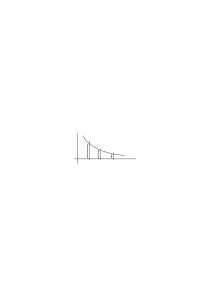

Eine solche Darstellung gibt ein _Gesetz_. Wie die Gleichung einer Kurve ein Gesetz gibt nach der die Ordinatenabschnitte aufzufinden sind wenn man in verschiedenen Abszissen schneidet.

### [253\[3\]](https://cdn.wittgensteinnachlass.com/2000px/webp/Ms-107/253.webp)

Die fallweisen Verifikationen entsprechen dann solchen wirklich ausgeführten Schnitten.

### [253\[4\]](https://cdn.wittgensteinnachlass.com/2000px/webp/Ms-107/253.webp)

Wenn unsere Erfahrungen die Punkte auf einer Geraden ergeben so ist der Satz daß diese Erfahrungen die verschiedenen Ansichten einer Geraden sind, eine Hypothese.

### [253\[5\]](https://cdn.wittgensteinnachlass.com/2000px/webp/Ms-107/253.webp)

Die Hypothese ist eine Art der Darstellung dieser Realität denn eine neue Erfahrung kann mit ihr übereinstimmen oder nicht übereinstimmen beziehungsweise eine Änderung der Hypothese nötig machen.

### [253\[6\]](https://cdn.wittgensteinnachlass.com/2000px/webp/Ms-107/253.webp),[254\[1\]](https://cdn.wittgensteinnachlass.com/2000px/webp/Ms-107/254.webp)

Das Wesen einer Hypothese ist, glaube ich, daß sie eine Erwartung erzeugt indem sie eine zukünftige Bestätigung zuläßt. D.h. es ist das Wesen einer Hypothese daß ihre Bestätigung nie abgeschlossen ist.

### [254\[2\]](https://cdn.wittgensteinnachlass.com/2000px/webp/Ms-107/254.webp)

23.01.1930

Wenn ich sage daß eine Hypothese nicht definitiv verifizierbar ist so ist damit _nicht_ gemeint, daß es eine für sie definitive Verifikation gibt der man sich immer mehr nähern kann ohne sie je zu erreichen. Das ist Unsinn & einer in den man oft verfällt. Sondern eine Hypothese hat zur Realität eben eine andere formelle Relation als die der Verifikation.

### [254\[3\]](https://cdn.wittgensteinnachlass.com/2000px/webp/Ms-107/254.webp)

Daher sind hier natürlich auch die Worte „wahr” & „falsch” nicht anzuwenden, oder haben eine andere Bedeutung.

### [254\[4\]](https://cdn.wittgensteinnachlass.com/2000px/webp/Ms-107/254.webp)

Die Natur des Glaubens an die Gleichförmigkeit des Geschehens wird _vielleicht_ am klarsten im Falle in dem wir Furcht vor dem erwarteten Ereignis empfinden. Nichts könnte mich dazu bewegen meine Hand in die Flamme zu stecken, obwohl ich mich doch _nur in der Vergangenheit_ verbrannt habe.

### [254\[5\]](https://cdn.wittgensteinnachlass.com/2000px/webp/Ms-107/254.webp),[255\[1\]](https://cdn.wittgensteinnachlass.com/2000px/webp/Ms-107/255.webp)

24.01.1930

Wenn jemand meine Augen sieht so sehe ich seine Augen; wenn aber jemand meine Füße sieht so sehe ich darum nicht notwendig seine Füße & so ist es mit der Liebe & Gegenliebe: Wenn ich jemandes Geist liebe so liebt er auch den meinen aber mit dem Übrigen ist es nicht so.

### [255\[2\]](https://cdn.wittgensteinnachlass.com/2000px/webp/Ms-107/255.webp)

Eine Hypothese ist ein Gesetz in dem Sinne in welchem die Gleichung einer Kurve ein Gesetz ist das erlaubt für eine gegebene Abszisse die dazugehörige Ordinate zu finden.

### [255\[3\]](https://cdn.wittgensteinnachlass.com/2000px/webp/Ms-107/255.webp)

Wenn die Physik einen Körper von bestimmter Form im physikalischen Raum beschreibt, so muß sie wenn auch unausgesprochen die Möglichkeit der Verifikation annehmen. Die Stellen müssen vorgesehen sein wo die Hypothese mit der unmittelbaren Erfahrung zusammenhängt.

### [255\[4\]](https://cdn.wittgensteinnachlass.com/2000px/webp/Ms-107/255.webp)

Drücken wir z.B. den Satz daß eine Kugel sich in einer bestimmten Entfernung von unseren Augen befindet mit Hilfe eines Koordinatensystems & der Kugelgleichung aus so hat diese Beschreibung eine größere Mannigfaltigkeit als die der Verifikation durch das Auge. Die Mannigfaltigkeit entspricht nicht _einer_ Verifikation sondern einem _Gesetz_ welchem Verifikationen gehorchen.

### [255\[5\]](https://cdn.wittgensteinnachlass.com/2000px/webp/Ms-107/255.webp),[256\[1\]](https://cdn.wittgensteinnachlass.com/2000px/webp/Ms-107/256.webp)

26.01.1930

Wenn ich erwarte daß jemand zu dieser Türe hereinkommen wird so drückt sich diese Erwartung wenigstens teilweise dadurch aus daß ich auf die Türe schaue. Ich will sagen daß die Erwartung wenn sie sich auch nicht auf die erwartete Tatsache bezieht, denn diese tritt ja vielleicht nicht ein, sich doch irgendwie auf den Raum bezieht in welchem die Tatsache erwartet wird.

### [256\[2\]](https://cdn.wittgensteinnachlass.com/2000px/webp/Ms-107/256.webp)

Wenn ich z.B. das Erscheinen eines roten Lichtes an dieser Wand zu einer bestimmten Zeit erwarte & es kommt nicht wohl aber ein bestimmter Lärm so ist der Lärm nicht an der Stelle wo das Licht erwartet war.

### [256\[3\]](https://cdn.wittgensteinnachlass.com/2000px/webp/Ms-107/256.webp)

Wenn ich jemandem sage daß _morgen_ schönes Wetter sein wird so dokumentiert er sein Verständnis indem er nicht _jetzt_ versucht den Satz zu verifizieren.

### [256\[4\]](https://cdn.wittgensteinnachlass.com/2000px/webp/Ms-107/256.webp)

Die Erwartung hängt mit dem Suchen zusammen. Das Suchen setzt voraus daß ich weiß wonach ich suche ohne daß, was ich suche, wirklich existieren muß.

### [256\[5\]](https://cdn.wittgensteinnachlass.com/2000px/webp/Ms-107/256.webp),[257\[1\]](https://cdn.wittgensteinnachlass.com/2000px/webp/Ms-107/257.webp)

Ich hätte das früher so ausgedrückt, daß das Suchen die Elemente des Komplexes voraussetzt nicht aber _die_ Kombination nach der ich suche. Und das ist kein schlechtes Gleichnis. Denn sprachlich drückt sich das so aus daß der Sinn eines Satzes nur die grammatisch richtige Anwendung gewisser Wörter voraussetzt.

### [257\[2\]](https://cdn.wittgensteinnachlass.com/2000px/webp/Ms-107/257.webp)

Ich sage zu jemandem „schau in das Zimmer ob A darin ist” er sieht nach & sagt „nein das Zimmer ist leer”. Dann sage ich später „schau ob B im Zimmer ist” & er schaut nach & sagt „nein, das Zimmer ist leer”. Beide male hat er dasselbe gesehen aber die enttäuschte Erwartung war jedesmal eine andere.

### [257\[3\]](https://cdn.wittgensteinnachlass.com/2000px/webp/Ms-107/257.webp)

Wie weiß ich daß ich _das_ gefunden habe was ich früher gesucht habe? (daß das eingetroffen ist, was ich erwartet habe, etc.)

### [257\[4\]](https://cdn.wittgensteinnachlass.com/2000px/webp/Ms-107/257.webp)

Ich kann die frühere Erwartung nicht mit dem eintreffenden Ereignis zusammenhalten!

### [257\[5\]](https://cdn.wittgensteinnachlass.com/2000px/webp/Ms-107/257.webp)

Sondern die Erwartung leitet bis zum Ereignis hin. Das Ereignis ersetzt sie. Es nimmt ihren Platz. Und das ist die Grundtatsache die ich nur momentan nicht recht denken kann.

### [257\[6\]](https://cdn.wittgensteinnachlass.com/2000px/webp/Ms-107/257.webp)

Das Ereignis welches die Erwartung ersetzt das ist ihre Antwort.

### [257\[7\]](https://cdn.wittgensteinnachlass.com/2000px/webp/Ms-107/257.webp),[258\[1\]](https://cdn.wittgensteinnachlass.com/2000px/webp/Ms-107/258.webp)

Dazu ist es aber nötig daß _ein_ Ereignis sie ersetzen muß und das heißt ja daß die Erwartung im gleichen Raum sein muß wie das Erwartete.

Ich rede hier von einer Erwartung nur als von etwas was unbedingt entweder erfüllt oder enttäuscht werden muß, also nicht eine Erwartung ins Blaue.

### [258\[2\]](https://cdn.wittgensteinnachlass.com/2000px/webp/Ms-107/258.webp)

Das Ereignis das die Erwartung ersetzt beantwortet sie d.h. im Ersetzen besteht die Beantwortung _es kann also keine Frage geben ob das nun wirklich die Antwort ist_. Eine solche Frage hieße den _Sinn_ eines Satzes in Frage stellen.

### [258\[3\]](https://cdn.wittgensteinnachlass.com/2000px/webp/Ms-107/258.webp)

Daß ich _das_ gefunden habe was ich früher gesucht habe kann man auf keine Weise beweisen außer dadurch daß der Fund das Suchen ersetzt. Denn auch jede Annäherung an den tatsächlichen Fund durch Bilder dessen was ich suche geschieht je nur durch das _Ersetzen_ eines Symbols, durch ein Bild & ehe das Ersetzen stattgefunden hatte war der Ersatz nicht da & nachdem es stattgefunden hatte ist das Bild an die Stelle des Symbols getreten.

### [258\[4\]](https://cdn.wittgensteinnachlass.com/2000px/webp/Ms-107/258.webp)

Die Möglichkeit, heißt das, ist nicht eine Art halbe Wirklichkeit.

### [259\[1\]](https://cdn.wittgensteinnachlass.com/2000px/webp/Ms-107/259.webp),[260\[1\]](https://cdn.wittgensteinnachlass.com/2000px/webp/Ms-107/260.webp)

27.01.1930

„Ich erwarte einen roten Fleck zu sehen” beschreibt – etwa – _meinen gegenwärtigen Geisteszustand_. „Ich sehe einen roten Fleck” beschreibt das erwartete Ereignis ein ganz anderes Ereignis als das erste. Könnte man nun nicht fragen ob das Wort rot im ersten Fall nicht eine andere Bedeutung hat als im zweiten? Hat es nicht den Anschein als wäre der erste Satz eine _Beschreibung_ meines Geisteszustandes mit Zuhilfenahme eines fremden unwesentlichen Ereignisses. Etwa so: Ich befinde mich jetzt in einem erwartenden Zustand den ich durch die Angabe charakterisiere daß er durch das Ereignis „ich sehe einen roten Fleck” befriedigt wird. Also wie wenn ich sagte ich habe Hunger & weiß aus Erfahrung daß ihn der Genuß einer bestimmten Speise stillen wird oder würde. So ist es nun aber mit der Erwartung nicht! Die Erwartung ist nicht extern durch die Angabe des Erwarteten beschrieben, wie der Hunger durch die Angabe der ihn stillenden Speise – diese kann ja doch schließlich nur vermutet werden. Sondern die Beschreibung der Erwartung durch das was sie erwartet ist eine interne Beschreibung. _So_ wird eben das Wort „rot” gebraucht daß es in allen diesen Sätzen fungiert „ich erwarte einen roten Fleck zu sehen”

„ich erinnere mich an einen roten Fleck”

„ich fürchte mich vor einem roten Fleck”

etc.

### [260\[2\]](https://cdn.wittgensteinnachlass.com/2000px/webp/Ms-107/260.webp)

Das muß natürlich innig mit der Funktion der Sprache zusammenhängen.

### [260\[3\]](https://cdn.wittgensteinnachlass.com/2000px/webp/Ms-107/260.webp)

Wenn ich sage „das ist das selbe Ereignis welches ich erwartet habe” & „das ist dasselbe Ereignis was auch an jenem Ort stattgefunden hat” so bedeutet hier das Wort „dasselbe” jedesmal etwas anderes. (Man würde auch normalerweise nicht sagen „das ist dasselbe was ich erwartet habe” sondern „das ist das was ich erwartet habe”.)

### [260\[4\]](https://cdn.wittgensteinnachlass.com/2000px/webp/Ms-107/260.webp)

Könnten wir uns aber überhaupt eine Sprache denken in der die Erwartung daß p eintreffen wird nicht mit Zuhilfenahme von p beschrieben würde? Ist das nicht _ebenso_ unmöglich wie eine Sprache die ~p ohne Zuhilfenahme von „p” ausdrückte? Ich glaube so ist es.

### [260\[5\]](https://cdn.wittgensteinnachlass.com/2000px/webp/Ms-107/260.webp),[261\[1\]](https://cdn.wittgensteinnachlass.com/2000px/webp/Ms-107/261.webp)

Ist es nicht einfach darum, weil sich die _Erwartung_ desselben Symbols bedient wie der Gedanke an ihre Erfüllung? Denn wenn wir in Zeichen denken so erwarten & wünschen wir auch in Zeichen. Und beinahe könnte man sagen daß Einer auf deutsch hoffen & auf englisch fürchten könnte (oder umgekehrt).

### [261\[2\]](https://cdn.wittgensteinnachlass.com/2000px/webp/Ms-107/261.webp)

Alle diese Vorgänge scheinen mir die Interpretation von Zeichen zu sein.

### [261\[3\]](https://cdn.wittgensteinnachlass.com/2000px/webp/Ms-107/261.webp)

28.01.1930

Ein anderer psychischer Vorgang der in unsere Gruppe gehört und mit allen diesen Dingen zusammenhängt ist die _Absicht_. Man könnte sagen die Sprache ist wie ein Stellwerk das mit einer bestimmten _Absicht_ gehandhabt oder zu einem bestimmten _Zweck_ gebaut ist.

### [261\[4\]](https://cdn.wittgensteinnachlass.com/2000px/webp/Ms-107/261.webp)

Wenn eine Vorrichtung als Bremse wirken _soll_ tatsächlich aber aus irgend welchen Ursachen den Gang der Maschine beschleunigt, so ist die Absicht der die Vorrichtung dienen sollte aus ihr allein nicht zu ersehen. Wenn man dann etwa sagt „das ist der Bremshebel, er funktioniert aber nicht” so spricht man von der Absicht. Ebenso ist es, wenn man eine verdorbene Uhr doch eine Uhr nennt.

### [261\[5\]](https://cdn.wittgensteinnachlass.com/2000px/webp/Ms-107/261.webp),[262\[1\]](https://cdn.wittgensteinnachlass.com/2000px/webp/Ms-107/262.webp)

Die psychologischen – trivialen – Erörterungen über Erwartung, Assoziation etc. lassen immer das eigentlich Merkwürdige aus & man merkt ihnen an daß sie herumreden ohne den vitalen Punkt zu berühren. Wir sagen: die Uhr ist dazu da um … .

### [262\[2\]](https://cdn.wittgensteinnachlass.com/2000px/webp/Ms-107/262.webp)

Die Erwartung, der Gedanke, der Wunsch etc. daß _p_ eintreffen wird nenne ich erst dann so wenn diese Vorgänge, die Multiplizität haben die sich in _p_ ausdrückt, erst dann also, wenn sie _artikuliert_ sind. Dann aber sind sie das was ich die Interpretation von Zeichen nenne.

### [262\[3\]](https://cdn.wittgensteinnachlass.com/2000px/webp/Ms-107/262.webp)

Gedanken nenne ich erst den artikulierten Vorgang man könnte also sagen „erst das was einen artikulierten Ausdruck hat.”

### [262\[4\]](https://cdn.wittgensteinnachlass.com/2000px/webp/Ms-107/262.webp)

Wenn ich etwas nicht in Worten erwarte so erwarte ich es in anderen Zeichen.

### [262\[5\]](https://cdn.wittgensteinnachlass.com/2000px/webp/Ms-107/262.webp)

Die Speichelabsonderung im Mund – auch wenn sie noch so genau gemessen ist – ist _nicht_ das was ich die Erwartung nenne.

### [262\[6\]](https://cdn.wittgensteinnachlass.com/2000px/webp/Ms-107/262.webp),[263\[1\]](https://cdn.wittgensteinnachlass.com/2000px/webp/Ms-107/263.webp)

Vielleicht muß man sagen daß der Ausdruck „Interpretation von Symbolen” irreführend ist & man sollte statt dessen sagen „der Gebrauch von Symbolen”. Denn „Interpretation” klingt so als würde man nun dem Wort „rot” die Farbe rot zuordnen (wenn sie gar nicht da ist) u.s.w. Und es entsteht wieder die Frage: Was ist der Zusammenhang zwischen Zeichen & Welt. Könnte ich nach etwas suchen wenn nicht der Raum da wäre worin ich es suche?!

Wo knüpft das Zeichen an die Welt an?

### [263\[2\]](https://cdn.wittgensteinnachlass.com/2000px/webp/Ms-107/263.webp)

Etwas suchen ist gewiß ein Ausdruck der Erwartung. Das heißt: _Wie_ man sucht drückt irgendwie aus, was man erwartet.

### [263\[3\]](https://cdn.wittgensteinnachlass.com/2000px/webp/Ms-107/263.webp)

Die Idee wäre also, daß das was die Erwartung mit der Realität gemeinsam hat ist, daß sie sich auf einen anderen Punkt _im selben_ Raum bezieht. (Raum ganz allgemein verstanden)

### [263\[4\]](https://cdn.wittgensteinnachlass.com/2000px/webp/Ms-107/263.webp)

Ich erwarte mir einen roten Fleck zu sehen dann _kann_ ich sagen: Was diese Erwartung bestätigen wird werde ich einen roten Fleck nennen.

### [263\[5\]](https://cdn.wittgensteinnachlass.com/2000px/webp/Ms-107/263.webp)

Ich sehe einen Fleck näher & näher an die Stelle gehen wo ich ihn erwarte.

### [263\[6\]](https://cdn.wittgensteinnachlass.com/2000px/webp/Ms-107/263.webp)

Wenn ich sage „ich erinnere mich an eine Farbe” – etwa die Farbe eines bestimmten Buches – so könnte man es als den Beweis dessen ansehen, daß ich im Stande wäre, diese Farbe wieder zu mischen oder zu erkennen oder von anderen Farben zu sagen sie seien mehr oder weniger weit von der erinnerten entfernt.

### [264\[1\]](https://cdn.wittgensteinnachlass.com/2000px/webp/Ms-107/264.webp)

Die Möglichkeit der Erwartung einer Farbe scheint ganz wesentlich mit der Möglichkeit der Erinnerung zusammenzuhängen.

### [264\[2\]](https://cdn.wittgensteinnachlass.com/2000px/webp/Ms-107/264.webp)

Die Erwartung bereitet sozusagen einen Maßstab vor, womit das eintretende Ereignis gemessen wird & zwar so daß es unbedingt damit gemessen werden kann ob es nun mit dem erwarteten Teilstrich zusammenfällt oder nicht.

### [264\[3\]](https://cdn.wittgensteinnachlass.com/2000px/webp/Ms-107/264.webp)

Es ist etwa wie wenn ich die Höhe eines Menschen nach dem Augenmaß schätze & sage „ich glaube er wird 176 hoch sein” & gehe daran einen Maßstab an ihn anzulegen. Wenn ich auch nicht weiß wie hoch er ist so weiß ich doch daß seine Höhe mit einem Maßstab & nicht mit einer Waage gemessen wird.

### [264\[4\]](https://cdn.wittgensteinnachlass.com/2000px/webp/Ms-107/264.webp)

Wenn ich rot erwarte, so _bereite_ ich mich auf rot _vor_. Ich kann eine Schachtel vorbereiten in die ein Stück Holz passen soll das ich bekommen soll & zwar darum weil das Stück Holz wie immer es sein mag Volumen haben muß .

### [264\[5\]](https://cdn.wittgensteinnachlass.com/2000px/webp/Ms-107/264.webp),[265\[1\]](https://cdn.wittgensteinnachlass.com/2000px/webp/Ms-107/265.webp)

Wäre der Akt der Erwartung nicht mit der Realität verknüpft so könnte man einen Unsinn erwarten.

### [265\[2\]](https://cdn.wittgensteinnachlass.com/2000px/webp/Ms-107/265.webp)

Die Erwartung von p & das Eintreffen von p entsprechen etwa der Hohlform & der Vollform eines Körpers. p entspricht dabei der Gestalt des Volumens & die verschiedenen Arten wie diese Gestalt gegeben ist dem Unterschied von Erwartung & Eintreffen.

### [265\[3\]](https://cdn.wittgensteinnachlass.com/2000px/webp/Ms-107/265.webp)

29.01.1930

Wenn ich sage „ich kann Dir das jeden Moment aufzeichnen” so setzt das voraus, daß ich im selben Raum _bin_ in dem jene Tätigkeit vor sich geht.

### [265\[5\]](https://cdn.wittgensteinnachlass.com/2000px/webp/Ms-107/265.webp)

Unsere Erwartung antizipiert das Ereignis. Sie macht in diesem Sinne ein Modell des Ereignisses. Wir können aber nur ein Modell von einer Tatsache in _der_ Welt machen in der wir leben. D.h. das Modell muß in seinem Wesen die Beziehung auf die Welt haben in der wir leben & zwar gleichgültig ob es richtig oder falsch ist.

### [265\[6\]](https://cdn.wittgensteinnachlass.com/2000px/webp/Ms-107/265.webp),[266\[1\]](https://cdn.wittgensteinnachlass.com/2000px/webp/Ms-107/266.webp)

Das Modell muß zur Wirklichkeit die Beziehung einer Landkarte zur Landschaft haben.

### [266\[2\]](https://cdn.wittgensteinnachlass.com/2000px/webp/Ms-107/266.webp)

30.01.1930

Erdichtete Erzählung, gelesenes & gespieltes Theaterstück.

Eine erdichtete Erzählung die nicht in der Zeit & im Ort lokiert ist, ist offenbar auf derselben Stufe wie eine falsche die nach Zeit & Ort bestimmt ist. (Märchen, _Sage_)

### [266\[3\]](https://cdn.wittgensteinnachlass.com/2000px/webp/Ms-107/266.webp)

Wenn ich sage die Darstellung muß von meiner Welt handeln so kann man nicht sagen „weil ich sie sonst nicht verifizieren kann” sondern, weil sie sonst von vornherein keinen Sinn für mich hat.

### [266\[4\]](https://cdn.wittgensteinnachlass.com/2000px/webp/Ms-107/266.webp)

(Es ist oft nicht erlaubt in der Philosophie gleich Sinn zu reden, sondern man muß oft zuerst den Unsinn sagen weil man gerade _ihn_ überwinden soll.)

### [266\[5\]](https://cdn.wittgensteinnachlass.com/2000px/webp/Ms-107/266.webp)

In der Erwartung ist der Teil der dem Suchen im Raum entspricht das Lenken der Aufmerksamkeit.

### [266\[6\]](https://cdn.wittgensteinnachlass.com/2000px/webp/Ms-107/266.webp)

Ich kann die Augen schließen & denken ist dieser & dieser Gegenstand jetzt links oder rechts von mir.

### [266\[7\]](https://cdn.wittgensteinnachlass.com/2000px/webp/Ms-107/266.webp),[267\[1\]](https://cdn.wittgensteinnachlass.com/2000px/webp/Ms-107/267.webp)

Das seltsame an der Erwartung ist ja daß wir wissen, daß es eine Erwartung ist. Denn diese Situation ist z.B. nicht denkbar: Ich habe irgend ein Vorstellungsbild vor mir & sage „jetzt weiß ich nicht, ist das eine Erwartung oder eine Erinnerung oder nur ein Bild ohne jede Beziehung zur Wirklichkeit.” Und _das_ zeigt eigentlich daß die Erwartung mit der Wirklichkeit unmittelbar zusammenhängt. Denn man könnte natürlich nicht sagen daß auch die Zukunft von der die Erwartung spricht – ich meine der Begriff der Zukunft nur die wirkliche Zukunft vertritt!

### [267\[2\]](https://cdn.wittgensteinnachlass.com/2000px/webp/Ms-107/267.webp)

Denn ich erwarte ebenso wirklich wie ich _warte_.

### [267\[3\]](https://cdn.wittgensteinnachlass.com/2000px/webp/Ms-107/267.webp)

Könnte man auch sagen: Man kann die Erwartung nicht beschreiben, wenn man die gegenwärtige Realität nicht beschreiben kann. Oder man kann die Erwartung nicht beschreiben, wenn man nicht eine _vergleichende_ Beschreibung von Erwartung & Gegenwart geben kann in der Form: „Jetzt sehe ich hier einen roten Kreis & erwarte mir später dort ein blaues Viereck”. Das heißt der Sprachmaßstab muß an dem Punkt der Gegenwart angelegt werden & deutet dann über ihn hinaus – etwa in der Richtung der Erwartung.

### [267\[4\]](https://cdn.wittgensteinnachlass.com/2000px/webp/Ms-107/267.webp),[268\[1\]](https://cdn.wittgensteinnachlass.com/2000px/webp/Ms-107/268.webp)

(Wie man manchmal eine Musik nur im inneren Ohr reproduzieren kann aber sie nicht pfeifen weil das Pfeifen schon die innere Stimme übertönt, so ist manchmal die Stimme eines philosophischen Gedankens so leise daß sie vom Lärm des gesprochenen Wortes schon übertönt wird & nicht mehr gehört werden kann wenn man gefragt wird & reden soll.)

### [268\[2\]](https://cdn.wittgensteinnachlass.com/2000px/webp/Ms-107/268.webp)

Inwiefern ist keinen Apfel in der Hand zu haben verschieden von der Tatsache keine Birne in der Hand zu haben? Und ich will sagen das ist dieselbe Frage wie: In wiefern unterscheidet sich die Tatsache nicht 6 Fuß hoch zu sein von der nicht 7 Fuß hoch zu sein.

### [268\[3\]](https://cdn.wittgensteinnachlass.com/2000px/webp/Ms-107/268.webp)

Es hat nur dann einen Sinn die Länge eines Objektes anzugeben wenn ich eine Methode besitze dieses Objekt zu finden – denn sonst kann ich den Maßstab nicht anlegen.

### [268\[4\]](https://cdn.wittgensteinnachlass.com/2000px/webp/Ms-107/268.webp)

Das was ich seinerzeit Gegenstände genannt habe, das Einfache, ist einfach das was ich bezeichnen kann ohne fürchten zu müssen daß es vielleicht nicht existiert. D.h. das wofür es Existenz oder nicht-Existenz nicht gibt & das heißt das, wovon wir reden können, was immer _der Fall ist_.

### [269\[1\]](https://cdn.wittgensteinnachlass.com/2000px/webp/Ms-107/269.webp)

Der visuelle Tisch ist nicht aus Elektronen zusammengesetzt.

### [269\[2\]](https://cdn.wittgensteinnachlass.com/2000px/webp/Ms-107/269.webp)

31.01.1930

Unsinnige Befehle wie: „Bewege diesen Tisch durch Fernwirkung”, „Halte deinen Kopf & deine Augen still & schau rückwärts”.

### [269\[3\]](https://cdn.wittgensteinnachlass.com/2000px/webp/Ms-107/269.webp)

Ich erwarte daß A zur Tür hereinkommt, aber wie wenn es einen Doppelgänger gibt?

### [269\[4\]](https://cdn.wittgensteinnachlass.com/2000px/webp/Ms-107/269.webp)

Zwei Doppelgänger in einem Zimmer die beide das selbe von sich behaupten & mit einander _übereinstimmen_ denn wenn der eine von sich etwas sagt etwa „Ich habe …”, sagt der andere „ganz richtig ich habe …”.

### [269\[5\]](https://cdn.wittgensteinnachlass.com/2000px/webp/Ms-107/269.webp)

Wie, wenn mir jemand sagte „ich erwarte 3 Schläge an die Tür” & ich antwortete: „Wie weißt Du daß es _Schläge gibt_?” Wäre das nicht ganz analog der Frage „wie weißt Du daß es 6 Fuß gibt” (wenn einer etwa gesagt hätte ich glaube daß … 6 Fuß hoch ist).

### [269\[6\]](https://cdn.wittgensteinnachlass.com/2000px/webp/Ms-107/269.webp),[270\[1\]](https://cdn.wittgensteinnachlass.com/2000px/webp/Ms-107/270.webp)

Ist absolute Stille zu verwechseln mit innerer Taubheit ich meine der Unbekanntheit mit dem Begriff des Tones? Wenn das der Fall wäre so könnte man den Mangel des Gehörsinnes nicht von dem Mangel eines anderen Sinnes unterscheiden. Ist das aber nicht genau dieselbe Frage wie die: Ist der Mann der jetzt nichts rotes um sich sieht in derselben Lage wie der der unfähig ist rot zu sehen? Man kann natürlich sagen: Der eine kann sich rot doch vorstellen aber das vorgestellte rot ist ja nicht dasselbe wie das gesehene.

### [270\[2\]](https://cdn.wittgensteinnachlass.com/2000px/webp/Ms-107/270.webp)

Man kann nur einwenden der Maßstab mit der Marke in einer bestimmen Höhe kann sagen daß etwas diese Höhe hat, aber nicht _was_ sie hat.

### [270\[3\]](https://cdn.wittgensteinnachlass.com/2000px/webp/Ms-107/270.webp)

Ich würde nun etwa antworten daß alles was ich tun kann ist zu sagen daß etwas was von mir 3 m entfernt ist 2 m hoch ist.

### [270\[4\]](https://cdn.wittgensteinnachlass.com/2000px/webp/Ms-107/270.webp)

Die zwei Hypothesen daß andere Menschen Zahnschmerzen haben & die daß andere Menschen sich genauso benehmen wie ich aber keine Zahnschmerzen haben sind dem Sinne nach identisch. D.h. ich würde z.B. wenn ich die zweite Ausdrucksform gelernt hätte in bedauerndem Tonfall von Menschen reden die keine Zahnschmerzen haben sich aber so benehmen wie ich wenn ich welche habe.

### [270\[5\]](https://cdn.wittgensteinnachlass.com/2000px/webp/Ms-107/270.webp),[271\[1\]](https://cdn.wittgensteinnachlass.com/2000px/webp/Ms-107/271.webp)

Ein Satz so aufgefaßt daß er unkontrollierbar wahr & falsch sein kann ist von der Realität gänzlich detachiert & wirkt nicht mehr als Satz.

### [271\[2\]](https://cdn.wittgensteinnachlass.com/2000px/webp/Ms-107/271.webp)

Der Satz „A hat Zahnschmerzen” bezieht sich zweifellos auf meine Erfahrung von Zahnschmerzen.

### [271\[3\]](https://cdn.wittgensteinnachlass.com/2000px/webp/Ms-107/271.webp)

Kann ich mir Schmerzen in der Spitze meines Nagels denken oder in meinen Haaren? Sind diese Schmerzen nicht ebenso & ebensowenig vorstellbar wie die an irgend einer Stelle des Körpers wo ich gerade keine Schmerzen habe & mich auch an keine erinnere?

### [271\[4\]](https://cdn.wittgensteinnachlass.com/2000px/webp/Ms-107/271.webp)

Hier ist die Logik unserer Sprache so schwer zu erfassen: Unsere Sprache gebraucht den Ausdruck „meine Schmerzen” & „seine Schmerzen” und auch die Ausdrücke „ich habe (oder fühle) Schmerzen” und „er hat (oder fühlt) Schmerzen”. Ein Ausdruck „ich fühle meine Schmerzen” oder „ich fühle seine Schmerzen” ist Unsinn. Und darauf scheint mir am Ende die ganze Kontroverse über den Behaviourism zu beruhen.

### [271\[5\]](https://cdn.wittgensteinnachlass.com/2000px/webp/Ms-107/271.webp)

Wenn ich jemanden der Zahnschmerzen hat bemitleide so setze ich mich in Gedanken an seine Stelle. Aber ich setze _mich_ an seine Stelle.

### [271\[6\]](https://cdn.wittgensteinnachlass.com/2000px/webp/Ms-107/271.webp),[272\[1\]](https://cdn.wittgensteinnachlass.com/2000px/webp/Ms-107/272.webp)

Das ist alles dieselbe Frage wie kann ich mir Sinnesdaten denken die ich nicht sehe oder sonst habe. Und auch hier kommt es einfach darauf an wie ich das Wort Sinnesdaten gebrauche. Die Frage ist ob es Sinn hat zu sagen: „Nur A kann den Satz „A hat Schmerzen” verifizieren, ich nicht”. Wie aber wäre es wenn dieser Satz falsch wäre, wenn _ich_ also den Satz verifizieren könnte kann es etwas anderes heißen als daß dann ich Schmerzen fühlen müßte. Aber wäre das eine Verifikation. Vergessen wir nicht: es ist Unsinn zu sagen _ich_ müßte _meine_ oder _seine_ Schmerzen fühlen. Man könnte auch so fragen: Was in meiner Erfahrung rechtfertigt das ‚meine’ in „ich fühle _meine_ Schmerzen”. Wo ist die Multiplizität des Gefühls die dieses Wort rechtfertigt & es kann nur dann gerechtfertigt sein wenn an seine Stelle auch ein anderes treten kann.

### [272\[2\]](https://cdn.wittgensteinnachlass.com/2000px/webp/Ms-107/272.webp)

01.02.1930

Wenn man sagt die Substanz ist unzerstörbar so _meint_ man es ist sinnlos in irgend einem Zusammenhang – bejahend oder verneinend von dem „Zerstören der Substanz” zu reden.

### [272\[3\]](https://cdn.wittgensteinnachlass.com/2000px/webp/Ms-107/272.webp)

Die Anwendung, Applikation, des Maßstabes setzt keine bestimmte Länge des zu messenden Objektes voraus.

### [272\[4\]](https://cdn.wittgensteinnachlass.com/2000px/webp/Ms-107/272.webp),[273\[1\]](https://cdn.wittgensteinnachlass.com/2000px/webp/Ms-107/273.webp)

Ich kann daher messen lernen im Allgemeinen ohne es an _jedem_ meßbaren Objekt auszuführen. (Das ist nicht einfach eine Analogie, sondern tatsächlich ein Beispiel.) Alles was ich brauche ist: ich muß sicher sein können daß ich meinen Maßstab anlegen kann. Wenn ich also sage „noch 3 Schritte & ich werde rot sehen” so setzt das voraus daß ich den Längen- & den Farben-Maßstab jedenfalls anlegen kann.

### [273\[2\]](https://cdn.wittgensteinnachlass.com/2000px/webp/Ms-107/273.webp)

Willkürlichkeit des sprachlichen Ausdrucks: könnte man sagen: das Kind muß das Sprechen einer bestimmten Sprache zwar lernen aber nicht das Denken, d.h. es würde von selber denken auch ohne irgend eine Sprache zu lernen? Ich meine aber wenn es denkt, so macht es sich eben Bilder & diese sind in einem gewissen Sinne willkürlich insofern nämlich als andere Bilder denselben Dienst geleistet hätten. Und andererseits ist ja die Sprache auch natürlich entstanden d.h. es muß wohl einen ersten Menschen gegeben haben der einen bestimmten Gedanken zum erstenmal in gesprochenen Worten ausgedrückt hat. Und übrigens ist das ganz gleichgültig weil jedes Kind das die Sprache lernt sie nur in dieser Weise lernt daß es anfängt in ihr zu denken. Plötzlich anfängt; ich meine: es gibt kein Vorstadium in welchem das Kind die Sprache zwar schon gebraucht sozusagen zur Verständigung gebraucht aber doch nicht in ihr denkt.

### [274\[1\]](https://cdn.wittgensteinnachlass.com/2000px/webp/Ms-107/274.webp)

Gewiß geht das Denken der gewöhnlichen Menschen in einer Mischung von Symbolen vor sich in der vielleicht die eigentlich sprachlichen nur einen geringen Teil bilden.

### [274\[2\]](https://cdn.wittgensteinnachlass.com/2000px/webp/Ms-107/274.webp)

Wenn ich nur etwas schwarzes sehe & sage es ist nicht rot, wie weiß ich daß ich nicht Unsinn rede, d.h. daß es rot sein kann, daß es rot gibt? Wenn nicht rot eben ein anderer Teilstrich auf dem Maßstab ist auf dem auch schwarz einer ist. Was ist der Unterschied zwischen „das ist nicht rot” & „das ist nicht abrakadabra”? Ich muß offenbar wissen daß „schwarz” welches den tatsächlichen Zustand beschreibt (oder beschreiben hilft) das ist an dessen Stelle in der Beschreibung „rot” steht. Aber was heißt das? Wie weiß ich daß es nicht „weich” ist an dessen Stelle „rot” stand? Kann man etwa sagen daß rot weniger verschieden von schwarz ist als von weich?! Das wäre natürlich Unsinn.

### [274\[3\]](https://cdn.wittgensteinnachlass.com/2000px/webp/Ms-107/274.webp),[275\[1\]](https://cdn.wittgensteinnachlass.com/2000px/webp/Ms-107/275.webp)

„Ich habe Zahnschmerzen” ist im Falle ich den Satz gebrauche ein Zeichen ganz anderer Art als es für mich im Munde eines Anderen ist; & zwar darum weil es im Munde eines Anderen für mich so lange sinnlos ist als ich nicht weiß welcher Mund es ausgesprochen hat. Das Satzzeichen besteht in diesem Falle nicht im Laut allein sondern in der Tatsache daß dieser Mund den Laut hervorbringt. Während im Falle ich es sage oder denke das Zeichen der Laut allein ist.

### [275\[2\]](https://cdn.wittgensteinnachlass.com/2000px/webp/Ms-107/275.webp)

In wiefern kann man die Farben mit den Punkten einer Skala vergleichen?

### [275\[3\]](https://cdn.wittgensteinnachlass.com/2000px/webp/Ms-107/275.webp)

Kann man sagen daß die Richtung die von schwarz zu rot führt eine andere ist als die in welcher man von schwarz nach blau gehen muß?

### [275\[4\]](https://cdn.wittgensteinnachlass.com/2000px/webp/Ms-107/275.webp)

Denn wenn mir schwarz gegeben ist & ich rot erwarte so ist es anders als wenn mir schwarz gegeben ist & ich blau erwarte. Und wenn der Vergleich mit dem Maßstab stimmt so muß mir das Wort blau sozusagen die Richtung angeben in der ich von schwarz zu blau gelange; sozusagen die Methode wie ich zu blau gelange.

### [275\[5\]](https://cdn.wittgensteinnachlass.com/2000px/webp/Ms-107/275.webp)

Könnte man nicht auch so sagen: der Satz muß den Ort von Blau konstruieren den Punkt an den die Tatsache gelangen muß wenn das & das blau ist.

### [275\[6\]](https://cdn.wittgensteinnachlass.com/2000px/webp/Ms-107/275.webp)

Mit dieser Sache hängt es doch zusammen, daß ich sagen kann diese Farbe kommt meiner Erwartung näher als die andere.

### [276\[1\]](https://cdn.wittgensteinnachlass.com/2000px/webp/Ms-107/276.webp)

Wie drücken sich aber diese verschiedenen Richtungen in der Grammatik aus?

### [276\[2\]](https://cdn.wittgensteinnachlass.com/2000px/webp/Ms-107/276.webp)

Ist das nicht derselbe Fall wie der: Ich sehe ein grau & sage „ich erwarte daß dieses grau dunkler werden wird”. Wie zeigt die Grammatik den Unterschied zwischen „heller” & „dunkler”. Oder: wie kann ich an dem grau den Maßstab der von weiß nach schwarz führt in einer bestimmten Richtung anbringen.

### [276\[3\]](https://cdn.wittgensteinnachlass.com/2000px/webp/Ms-107/276.webp)

Es ist doch als wäre das grau nur _ein_ Punkt & wie kann ich in dem die zwei _Richtungen_ sehen. Und das sollte ich doch irgendwie können um dann in diesen Richtungen an einen bestimmten Punkt gelangen zu können.

### [276\[4\]](https://cdn.wittgensteinnachlass.com/2000px/webp/Ms-107/276.webp)

02.02.1930

Thermometer & Uhr als Sprache.

### [276\[5\]](https://cdn.wittgensteinnachlass.com/2000px/webp/Ms-107/276.webp)

Das Gefühl ist als müßte ~p um p zu verneinen es erst in gewissem Sinne wahr machen. Man fragt „nicht _was_?” „_Was_ ist nicht der Fall”. Dieses muß dargestellt werden kann aber doch nicht so dargestellt werden daß p wirklich wahr gemacht wird.

### [276\[6\]](https://cdn.wittgensteinnachlass.com/2000px/webp/Ms-107/276.webp)

Der Rot-Grün-Blinde hat ein anderes Farbensystem als der Normale.

### [276\[7\]](https://cdn.wittgensteinnachlass.com/2000px/webp/Ms-107/276.webp),[277\[1\]](https://cdn.wittgensteinnachlass.com/2000px/webp/Ms-107/277.webp)

Der Rot-Grün-Blinde wäre ähnlich einem Menschen der nicht die Möglichkeit hat den Kopf zu drehen & der daher eine andere Art Raum hätte da es für ihn nur den Gesichtsraum allein gäbe & also z.B. kein „hinten”. Das würde natürlich nicht heißen daß für ihn der Euklidische Raum eine Grenze hätte! sondern er käme – wenigstens was das Sehen von Dingen betrifft – nicht zum Begriff des Euklidischen Raums.

### [277\[2\]](https://cdn.wittgensteinnachlass.com/2000px/webp/Ms-107/277.webp)

Heißt nun die Frage etwas: „kann der der Rot & Grün nicht kennt wirklich das sehen was wir (oder ich) „blau” & „gelb” nennen?”? Diese Frage muß natürlich ebenso unsinnig sein wie die, ob der andere Normalsehende wirklich dasselbe sieht wie ich.

### [277\[3\]](https://cdn.wittgensteinnachlass.com/2000px/webp/Ms-107/277.webp)

Das Grau muß bereits im Raum von dunkler & heller vorgestellt sein wenn ich davon reden will daß es dunkler oder heller werden kann.

### [277\[4\]](https://cdn.wittgensteinnachlass.com/2000px/webp/Ms-107/277.webp),[278\[1\]](https://cdn.wittgensteinnachlass.com/2000px/webp/Ms-107/278.webp)

Man könnte also vielleicht auch so sagen: Der Maßstab muß schon angelegt sein ich kann ihn nicht – willkürlich – anlegen, ich kann nur einen Teilstrich darauf hervorheben. Das kommt auf folgendes hinaus: Wenn es um mich her vollkommen still ist so kann ich an diese Stille den Gehörsraum nicht willkürlich anbringen oder nicht anbringen. D.h. es ist für mich entweder still im Gegensatz zu einem Laut oder das Wort still hat keine Bedeutung für mich. D.h. ich kann nicht _wählen_ zwischen _innerem_ Gehör & innerer Taubheit. Und ebenso kann ich, wenn ich grau sehe nicht zwischen normalem innerem Sehen, partieller oder vollkommener Farbenblindheit _wählen_.

### [278\[2\]](https://cdn.wittgensteinnachlass.com/2000px/webp/Ms-107/278.webp)

Die Philosophen die glauben daß man im Denken die Erfahrung gleichsam ausdehnen kann sollen daran denken daß man durchs Telefon die Rede aber nicht die Masern übertragen kann.

### [278\[3\]](https://cdn.wittgensteinnachlass.com/2000px/webp/Ms-107/278.webp)

Ich kann auch nicht die Zeit als begrenzt empfinden wenn ich will, oder das Gesichtsfeld als homogen etc.

### [278\[4\]](https://cdn.wittgensteinnachlass.com/2000px/webp/Ms-107/278.webp)

Wäre es möglich eine _neue_ Farbe zu entdecken?! (Denn der Farbenblinde ist ja in derselben Lage wie wir, seine Farben bilden ein ebenso komplettes System wie die unseren; er sieht keine Lücke wo die übrigen Farben noch hineingehörten.)

### [278\[5\]](https://cdn.wittgensteinnachlass.com/2000px/webp/Ms-107/278.webp),[279\[1\]](https://cdn.wittgensteinnachlass.com/2000px/webp/Ms-107/279.webp)

Das Wort „Rot” entspricht einem Punkt (Ort) im Farbenraum ob nun dort etwas ist oder nicht. Aber das ist auch nicht einwandfrei ausgedrückt, denn dem Farbenraum muß ein _grammatischer Raum_ entsprechen. Und einzelne Wörter etwa „rot”, „gelb”, „grün” etc. geben _keinen Raum_.

### [279\[2\]](https://cdn.wittgensteinnachlass.com/2000px/webp/Ms-107/279.webp)

Der Farbenraum wird z.B. _beiläufig_ dargestellt durch das Oktoeder mit den reinen Farben an den Eckpunkten. Und diese Darstellung ist eine grammatische keine psychologische. Zu sagen daß unter den & den Umständen – etwa – ein rotes Nachbild sichtbar wird ist dagegen Psychologie (_das_ kann sein, oder auch nicht, das andere ist a priori. Das eine kann durch Experimente festgestellt werden, das andere nicht)

### [279\[3\]](https://cdn.wittgensteinnachlass.com/2000px/webp/Ms-107/279.webp)

Daß der Maßstab im selben Raum sein muß und ist wie das gemessene Objekt ist verständlich. Aber inwiefern sind _die Worte_ im selben Raum wie das Objekt dessen Längen in Worten beschrieben wird oder im selben Raum wie die Farbe etc.? Es klingt absurd.

### [279\[4\]](https://cdn.wittgensteinnachlass.com/2000px/webp/Ms-107/279.webp)

Die schwarze Farbe kann heller aber nicht lauter werden. Das heißt daß sie im Hell-Dunkel-Raum & nicht im Laut-Leise-Raum ist. – Aber der Gegenstand hört doch eben auf schwarz zu sein wenn er heller wird. Aber er war dann schwarz & wie ich eine Bewegung sehen kann (im gewöhnlichen Sinn) ebenso kann ich auch eine Farbbewegung sehen.

### [279\[5\]](https://cdn.wittgensteinnachlass.com/2000px/webp/Ms-107/279.webp),[280\[1\]](https://cdn.wittgensteinnachlass.com/2000px/webp/Ms-107/280.webp)

Der Befehl muß ja auch an der gegenwärtigen Lage anpacken. Als ich die Sprache konstruierte die sich bei der Darstellung des Sachverhaltes im Raum eines Koordinatensystems bedient da habe ich doch damit einen Bestandteil in die Sprache eingeführt dessen sie sich sonst nicht bedient. Dieses Mittel ist gewiß erlaubt. Und es zeigt den Zusammenhang zwischen Sprache & Realität. Das geschriebene Zeichen ohne das Koordinatensystem ist sinnlos. Muß nun nicht etwas ähnliches zur Darstellung der Farben verwendet werden?

### [280\[2\]](https://cdn.wittgensteinnachlass.com/2000px/webp/Ms-107/280.webp)

Wenn ich sage etwas ist 3 Fuß lang so setzt das voraus daß ich die Fußlänge irgendwie gegeben habe. Sie ist tatsächlich durch eine Beschreibung gegeben. Dort & dort liegt ein Stab dessen Länge ist 1 Fuß. Das „Dort & dort” beschreibt indirekt eine Methode um an den Ort zu gelangen; tut es das nicht so ist die Ortsangabe sinnlos. Die Ortsangabe „London” hat nur Sinn wenn es möglich ist London zu _suchen_.

### [280\[3\]](https://cdn.wittgensteinnachlass.com/2000px/webp/Ms-107/280.webp)

Ein Befehl ist nur dann vollständig wenn er Sinn hat was immer der Fall sein mag. Man könnte auch sagen: dann ist er vollständig analysiert.

### [280\[4\]](https://cdn.wittgensteinnachlass.com/2000px/webp/Ms-107/280.webp),[281\[1\]](https://cdn.wittgensteinnachlass.com/2000px/webp/Ms-107/281.webp)

Ich werde jede Tatsache deren Bestehen Voraussetzung für den Sinn eines Satzes ist als _zur Sprache_ gehörig rechnen.

### [281\[2\]](https://cdn.wittgensteinnachlass.com/2000px/webp/Ms-107/281.webp)

Die Werkzeichnung ein sprachliches Ausdrucksmittel.

### [281\[3\]](https://cdn.wittgensteinnachlass.com/2000px/webp/Ms-107/281.webp)

Unsere gewöhnliche Sprache hat kein Mittel um einen bestimmten Farbton etwa das Blau meiner Bettdecke zu beschreiben. Sie ist also unfähig ein Bild dieser Farbe zu erzeugen.

### [281\[4\]](https://cdn.wittgensteinnachlass.com/2000px/webp/Ms-107/281.webp)

Wie kann man die Erinnerung an die Gegenwart anlegen? Denn wo die Wortsprache nicht genügt dort genügt doch häufig die Sprache des Gedächtnisses.

### [281\[5\]](https://cdn.wittgensteinnachlass.com/2000px/webp/Ms-107/281.webp)

Die Erinnerung & die Wirklichkeit müssen in _einem_ Raum sein. Ich kann auch sagen: die Vorstellung & die Wirklichkeit sind in einem Raum.

### [281\[6\]](https://cdn.wittgensteinnachlass.com/2000px/webp/Ms-107/281.webp)

Wenn ich jemandem mitteilen will welche Farbe ein Stoff haben soll so schicke ich ein Muster & offenbar gehört dieses Muster zur Sprache & ebenso gehört dazu das Gedächtnis oder die Vorstellung einer Farbe die ich durch ein Wort erwecke.

### [281\[7\]](https://cdn.wittgensteinnachlass.com/2000px/webp/Ms-107/281.webp),[282\[1\]](https://cdn.wittgensteinnachlass.com/2000px/webp/Ms-107/282.webp)

Wenn ich zwei mir gegenwärtige Farbmuster miteinander vergleiche & wenn ich ein Farbmuster mit meiner Vorstellung eines Musters vergleiche so ist das ähnlich wie wenn ich die Längen zweier aneinanderliegender Stäbe vergleiche & andrerseits die Längen zweier von einander entfernter Stäbe. Ich kann dann etwa sagen sie sind gleich hoch wenn ich den Blick eben von der einen Spitze zur anderen wenden kann.

### [282\[2\]](https://cdn.wittgensteinnachlass.com/2000px/webp/Ms-107/282.webp)

03.02.1930

Ich habe tatsächlich nie gesehen daß ein schwarzer Fleck nach & nach immer heller wird bis er weiß ist & dann immer rötlicher bis er rot ist aber ich weiß daß es möglich ist weil ich es mir vorstellen kann. D.h. ich operiere mit meinen Vorstellungen im Raume der Farben & tue mit ihnen was mit den Farben möglich wäre. Und meine Worte nehmen ihren Sinn daher daß sie mehr oder weniger vollständig die Operationen der Vorstellungen wiederspiegeln. Etwa wie die Notenschrift die zur Beschreibung eines gespielten Stückes verwendet werden kann aber z.B. die Stärke jedes einzelnen Tones _nicht_ wiedergibt.

### [282\[3\]](https://cdn.wittgensteinnachlass.com/2000px/webp/Ms-107/282.webp)

Die Grammatik gibt der Sprache den nötigen Freiheitsgrad.

### [282\[4\]](https://cdn.wittgensteinnachlass.com/2000px/webp/Ms-107/282.webp)

Das Farbenoktoeder ist Grammatik denn es sagt daß wir von einem rötlichen blau aber nicht von einem rötlichen Grün reden können etc.

### [283\[1\]](https://cdn.wittgensteinnachlass.com/2000px/webp/Ms-107/283.webp)

04.02.1930

Eine Hypothese ist ein Gesetz zur Bildung von Sätzen. Man könnte auch sagen: eine Hypothese ist ein Gesetz zur Bildung von Erwartungen.

### [283\[2\]](https://cdn.wittgensteinnachlass.com/2000px/webp/Ms-107/283.webp)

Ein Satz ist sozusagen ein Schnitt durch eine Hypothese in einem bestimmten Ort.

### [283\[3\]](https://cdn.wittgensteinnachlass.com/2000px/webp/Ms-107/283.webp)

Die Wahrscheinlichkeit einer Hypothese hat ihr Maß darin wieviel Evidenz nötig ist um es vorteilhaft zu machen, sie umzustoßen.

### [283\[4\]](https://cdn.wittgensteinnachlass.com/2000px/webp/Ms-107/283.webp)

Nur in diesem Sinne kann man sagen daß wiederholte gleichförmige Erfahrung in der Vergangenheit das Andauern dieser Gleichförmigkeit in der Zukunft wahrscheinlich macht.

### [283\[5\]](https://cdn.wittgensteinnachlass.com/2000px/webp/Ms-107/283.webp)

Wenn ich nun in diesem Sinne sage: ich nehme an daß morgen die Sonne wieder aufgehen wird weil das Gegenteil zu unwahrscheinlich ist so meine ich hier mit „wahrscheinlich” oder „unwahrscheinlich” etwas ganz anderes als mit diesen Worten im Satz „es ist gleich wahrscheinlich daß ich Kopf oder Adler werfe” gemeint ist. Die beiden Bedeutungen des Wortes „wahrscheinlich” hängen zwar mit einander zusammen aber sie sind nicht identisch.

### [283\[6\]](https://cdn.wittgensteinnachlass.com/2000px/webp/Ms-107/283.webp),[284\[1\]](https://cdn.wittgensteinnachlass.com/2000px/webp/Ms-107/284.webp)

Hypothese nenne ich jeden Satz der nicht einer definitiven Verifikation fähig ist.

### [284\[2\]](https://cdn.wittgensteinnachlass.com/2000px/webp/Ms-107/284.webp)

05.02.1930

Es ist das Wesentliche daß ich die Erwartung nicht nur mit dem muß vergleichen können, was als die endgültige Antwort (Verifikation oder Falsifikation) betrachtet wird, sondern auch mit dem gegenwärtigen Stand der Dinge. Nur das macht die Erwartung zum Bild. D.h.: sie muß _jetzt_ Sinn haben.

### [284\[3\]](https://cdn.wittgensteinnachlass.com/2000px/webp/Ms-107/284.webp)

Zu sagen ich sehe – etwa – eine Kugel heißt nichts anderes als ich habe einen Anblick wie ihn eine Kugel gewährt aber das heißt nur daß ich nach einem bestimmten Gesetz dem der Kugel Anblicke konstruieren kann & daß dies ein solcher ist.

### [284\[4\]](https://cdn.wittgensteinnachlass.com/2000px/webp/Ms-107/284.webp)

Mitteilung eines Gedankens.

### [284\[5\]](https://cdn.wittgensteinnachlass.com/2000px/webp/Ms-107/284.webp)

06.02.1930

In der Sprache einer Hypothese kann man nicht aus dieser Hypothese heraus.

### [284\[6\]](https://cdn.wittgensteinnachlass.com/2000px/webp/Ms-107/284.webp)

Welche seltsame, unsinnige Frage: „Haben mehrere Menschen die gleichen Zahnschmerzen?” !

### [284\[7\]](https://cdn.wittgensteinnachlass.com/2000px/webp/Ms-107/284.webp),[285\[1\]](https://cdn.wittgensteinnachlass.com/2000px/webp/Ms-107/285.webp)

Was Mach ein Gedankenexperiment nennt ist natürlich gar kein Experiment. Im Grunde ist es eine grammatische Betrachtung.

### [285\[2\]](https://cdn.wittgensteinnachlass.com/2000px/webp/Ms-107/285.webp)

Angenommen ich hätte stechende Schmerzen im rechten Knie & bei jedem Stich zuckt mein rechtes Bein. Zugleich sehe ich einen anderen Menschen dessen Bein in gleicher Weise zuckt & der über stechende Schmerzen klagt & zu gleicher Zeit fängt mein linkes Bein ebenso an zu zucken obwohl ich im linken Knie keine Schmerzen fühle. Nun sage ich: mein Gegenüber hat offenbar in seinem Knie dieselben Schmerzen wie ich in meinem rechten Knie. Wie ist es aber mit meinem linken Knie, ist es nicht in genau dem gleichen Fall wie das Knie des Anderen?

### [285\[3\]](https://cdn.wittgensteinnachlass.com/2000px/webp/Ms-107/285.webp)

Wenn ich sage „A hat Zahnschmerzen” so gebrauche ich die Vorstellung des Schmerzgefühls in derselben Weise wie etwa den Begriff des Fließens wenn ich vom Fließen des elektrischen Stromes rede.

### [285\[4\]](https://cdn.wittgensteinnachlass.com/2000px/webp/Ms-107/285.webp)

Wenn wir plötzlich vom Nebenzimmer in einer uns unbekannten Stimme den Satz „ich habe Zahnschmerzen” hören, so verstehen wir ihn nicht.

### [285\[5\]](https://cdn.wittgensteinnachlass.com/2000px/webp/Ms-107/285.webp),[286\[1\]](https://cdn.wittgensteinnachlass.com/2000px/webp/Ms-107/286.webp)

Ich sammle gleichsam sinnvolle Sätze über Zahnschmerzen. Das ist der charakteristische Vorgang einer grammatischen Untersuchung. Ich sammle nicht wahre sondern sinnvolle Sätze & darum ist diese Betrachtung keine psychologische. (Man möchte sie oft eine Metapsychologie nennen)

### [286\[2\]](https://cdn.wittgensteinnachlass.com/2000px/webp/Ms-107/286.webp)

Man könnte sagen: Die Philosophie sammelt fortwährend ein Material von Sätzen ohne sich um ihre Wahr- oder Falschheit zu kümmern, nur im Falle der Logik & Mathematik hat sie es nur mit den „wahren” Sätzen zu tun.

### [286\[3\]](https://cdn.wittgensteinnachlass.com/2000px/webp/Ms-107/286.webp)

Die Erfahrung des Zahnschmerzgefühls ist nicht die daß eine Person Ich etwas hat.

### [286\[4\]](https://cdn.wittgensteinnachlass.com/2000px/webp/Ms-107/286.webp)

In den Schmerzen unterscheide ich eine Intensität einen Ort etc. aber keinen Besitzer.

### [286\[5\]](https://cdn.wittgensteinnachlass.com/2000px/webp/Ms-107/286.webp)

Wie wären etwa Schmerzen die gerade niemand _hat_? Schmerzen die niemandem gehören?

### [286\[6\]](https://cdn.wittgensteinnachlass.com/2000px/webp/Ms-107/286.webp)

Die Schmerzen werden als etwas dargestellt das man wahrnehmen kann im Sinne in dem man eine Zündholzschachtel wahrnimmt. Das Unangenehme sind dann freilich nicht die Schmerzen sondern nur das Wahrnehmen der Schmerzen.

### [286\[7\]](https://cdn.wittgensteinnachlass.com/2000px/webp/Ms-107/286.webp),[287\[1\]](https://cdn.wittgensteinnachlass.com/2000px/webp/Ms-107/287.webp)

Wenn ich einen Anderen bedaure weil er Schmerzen hat so stelle ich mir wohl die Schmerzen vor, aber ich stelle mir vor daß _ich_ sie habe.

### [287\[2\]](https://cdn.wittgensteinnachlass.com/2000px/webp/Ms-107/287.webp)

Eine Zündholzschachtel die der Andere hat kann ich mir vorstellen aber nicht Schmerzen die der Andere hat, also Schmerzen die ich nicht spüre.

### [287\[3\]](https://cdn.wittgensteinnachlass.com/2000px/webp/Ms-107/287.webp)

Soll ich mir auch die Schmerzen eines auf dem Tisch liegenden Zahnes denken können oder die Schmerzen eines Teetopfes? Soll man etwa sagen: es ist nur nicht wahr daß der Teetopf Schmerzen hat aber ich kann es mir denken?!

### [287\[4\]](https://cdn.wittgensteinnachlass.com/2000px/webp/Ms-107/287.webp)

07.02.1930

Ist aber nicht doch ein Unterschied zwischen den Annahmen daß die Anderen Schmerzen haben und daß sie keine haben & sich nur so benehmen wie ich, wenn ich welche habe?

### [287\[5\]](https://cdn.wittgensteinnachlass.com/2000px/webp/Ms-107/287.webp)

Nach meinem Prinzip müssen die beiden Annahmen dem Sinne nach identisch sein, wenn alle _mögliche_ Erfahrung die die eine bestätigt auch die andere bestätigt. Wenn also keine Entscheidung zwischen beiden durch die Erfahrung denkbar ist.

### [287\[6\]](https://cdn.wittgensteinnachlass.com/2000px/webp/Ms-107/287.webp),[288\[1\]](https://cdn.wittgensteinnachlass.com/2000px/webp/Ms-107/288.webp)

Zu sagen daß sie keine Schmerzen haben setzt aber voraus daß es Sinn hat zu sagen daß sie Schmerzen haben. Ich glaube es ist klar daß man in dem selben Sinne sagt daß andere Menschen Schmerzen haben in welchem man sagt daß ein Stuhl keine hat.

### [288\[2\]](https://cdn.wittgensteinnachlass.com/2000px/webp/Ms-107/288.webp)

Wie wäre es wenn ich zwei Körper hätte d.h. wenn mein Körper aus zwei getrennten Leibern bestünde?

Hier sieht man – glaube ich – wieder wie das Ich nicht auf der selben Stufe mit den Anderen steht, denn wenn die anderen je zwei Körper hätten so könnte ich es nicht erkennen.

### [288\[3\]](https://cdn.wittgensteinnachlass.com/2000px/webp/Ms-107/288.webp)

Kann ich mir denn die Erfahrung mit zwei Leibern denken? Die Gesichtserfahrung gewiß nicht.

### [288\[4\]](https://cdn.wittgensteinnachlass.com/2000px/webp/Ms-107/288.webp),[289\[1\]](https://cdn.wittgensteinnachlass.com/2000px/webp/Ms-107/289.webp)

Das Phänomen des Schmerzgefühls in einem Zahn welches ich kenne ist in der Ausdrucksweise der gewöhnlichen Sprache dargestellt durch „_ich habe_ in dem & dem Zahn Schmerzen”. Nicht durch einen Ausdruck von der Art „an diesem Ort ist ein Schmerzgefühl” Das _ganze_ Feld dieser Erfahrung wird in dieser Sprache durch Ausdrücke von der Form „ich habe …” beschrieben. Die Sätze von der Form „N hat Zahnschmerzen” sind für ein ganz anderes Feld reserviert. Wir können dabei nicht überrascht sein wenn in den Sätzen „N hat Zahnschmerzen” nichts mehr auf jene Art mit der Erfahrung Zusammenhängendes gefunden wird.

### [289\[2\]](https://cdn.wittgensteinnachlass.com/2000px/webp/Ms-107/289.webp)

08.02.1930

Eine falsche Auffassung des Funktionierens der Sprache zerstört natürlich die _ganze_ Logik & alles was mit ihr zusammenhängt & bringt nicht an irgend einer Stelle nur eine kleine Störung hervor.

### [289\[3\]](https://cdn.wittgensteinnachlass.com/2000px/webp/Ms-107/289.webp)

Wenn man das Element der Intention aus der Sprache entfernt so bricht damit ihre ganze Funktion zusammen.

### [289\[4\]](https://cdn.wittgensteinnachlass.com/2000px/webp/Ms-107/289.webp)

Das Wesentliche an der Intention, an der Absicht ist das Bild. Das Bild des Beabsichtigten.

### [289\[5\]](https://cdn.wittgensteinnachlass.com/2000px/webp/Ms-107/289.webp)

Es kann scheinen als brächte man mit der Absicht ein unkontrollierbares sozusagen metaphysisches Element in unsere Betrachtung. Der wesentliche Unterschied der Bild-Auffassung von der Auffassung Russells, Ogden & Richards' ist aber daß jene das Wiedererkennen als das Erkennen einer internen Relation sieht während diese das Wiedererkennen für eine externe Relation hält.

### [289\[6\]](https://cdn.wittgensteinnachlass.com/2000px/webp/Ms-107/289.webp),[290\[1\]](https://cdn.wittgensteinnachlass.com/2000px/webp/Ms-107/290.webp)

D.h. Für mich sind in der Tatsache daß ein Gedanke wahr ist nur zwei Dinge involviert nämlich der Gedanke & die Tatsache; für Russell dagegen drei nämlich, Gedanke, Tatsache& ein drittes Ereignis welches wenn es geschieht eben das Wiedererkennen ist. Dieses dritte Ereignis, gleichsam die Stillung des Hungers (die zwei anderen sind der Hunger & das Essen einer bestimmten Speise), dieses dritte Ereignis könnte z.B. das Auftreten eines Gefühls der Freude sein. Es ist hier ganz gleichgültig wie wir dieses dritte Ereignis beschreiben; für das Wesen der Theorie ist das ohne Bedeutung.

### [290\[2\]](https://cdn.wittgensteinnachlass.com/2000px/webp/Ms-107/290.webp)

Die Kausalität zwischen Sprache & Handlung ist eine externe Relation während wir eine interne Relation brauchen.

### [290\[3\]](https://cdn.wittgensteinnachlass.com/2000px/webp/Ms-107/290.webp)

Ich glaube Russells Theorie käme auf folgendes hinaus: Wenn ich jemandem einen Befehl gebe & was er darauf tut mir Freude macht so hat er den Befehl ausgeführt. (Wenn ich einen Apfel essen wollte & mir einer einen Schlag auf den Magen versetzt so daß mir die Lust zu essen vergeht dann war es dieser Schlag den ich ursprünglich wünschte.)

### [290\[4\]](https://cdn.wittgensteinnachlass.com/2000px/webp/Ms-107/290.webp)

Die Schwierigkeit der Darstellung ist hier daß wenn man falsche Annahmen über das Funktionieren der Sprache macht & mit dem so funktionierenden etwas darstellen will nicht etwas Falsches sondern Unsinn herauskommt.

### [290\[5\]](https://cdn.wittgensteinnachlass.com/2000px/webp/Ms-107/290.webp),[291\[1\]](https://cdn.wittgensteinnachlass.com/2000px/webp/Ms-107/291.webp)

So könnte ich natürlich nach der Russellschen Theorie es gar nicht ausdrücken daß der Befehl ausgeführt ist _wenn_ was geschieht mir Freude macht weil ich ja auch die Freude wiedererkennen muß und dazu ein weiteres Phänomen eintreten muß was ich wieder nicht von vornherein beschreiben kann.

### [291\[2\]](https://cdn.wittgensteinnachlass.com/2000px/webp/Ms-107/291.webp)

Wenn man nun sagt: Bilder kämen zwar vor aber sie seien nicht das regelmäßige; wie seltsam wenn sie nun aber einmal da sind und nun ein Widerstreit der beiden Kriterien von wahr & falsch entstünde. Zu wessen Gunsten sollte entschieden werden?

### [291\[3\]](https://cdn.wittgensteinnachlass.com/2000px/webp/Ms-107/291.webp)

Es wäre dann natürlich kein Unterschied zwischen einem Befehl & seinem Gegenbefehl denn beide könnten auf die gleiche Weise befolgt werden.

### [291\[4\]](https://cdn.wittgensteinnachlass.com/2000px/webp/Ms-107/291.webp)

Wenn beim ersten Lernen der Sprache gleichsam die Verbindungen zwischen der Sprache & den Handlungen hergestellt werden – also die Verbindungen zwischen den Hebeln & der Maschine – so ist die Frage können diese Verbindungen vielleicht reißen, wenn nicht dann muß ich jede Handlung als die richtige hinnehmen, wenn ja, welches Kriterium habe ich dafür daß sie gerissen ist? Denn welche Mittel habe ich die ursprüngliche Abmachung mit der späteren Handlung zu _vergleichen_?

### [291\[5\]](https://cdn.wittgensteinnachlass.com/2000px/webp/Ms-107/291.webp),[292\[1\]](https://cdn.wittgensteinnachlass.com/2000px/webp/Ms-107/292.webp)

Das Vergleichen ist es was in der Russellschen Theorie nicht vorkommt. Und das Vergleichen besteht nicht darin bei der Konfrontierung der Darstellung mit dem Dargestellten ein Phänomen zu erleben das – wie gesagt – selbst von vornherein nicht beschreibbar war.

### [292\[2\]](https://cdn.wittgensteinnachlass.com/2000px/webp/Ms-107/292.webp)

Könnte aber nicht das Wiedererkennen in folgendem bestehen: Wenn der Satz verifiziert ist dann heißt das daß er, sagen wir, in roten Lettern in meinem Geiste erscheint. Oder so: wenn der Satz p verifiziert ist dann sage ich _automatisch_ „ja p”.

### [292\[3\]](https://cdn.wittgensteinnachlass.com/2000px/webp/Ms-107/292.webp)

(Ob der Satz wahr oder falsch ist wird durch die Erfahrung entschieden aber nicht sein Sinn.)

### [292\[4\]](https://cdn.wittgensteinnachlass.com/2000px/webp/Ms-107/292.webp)

Das „ja p” bestimmt also nachträglich den Sinn von p. Denn ein Streit darüber ob das p ursprünglich so _gemeint_ war ist hier ja unmöglich. Wie ist es nun aber mit dem Satz „er hat ‚ja p’ gesagt”. Da das Aussprechen von „ja p” ein Phänomen für sich ist so muß ich es nun als das gleiche wiedererkennen. – – — – — – –

### [292\[5\]](https://cdn.wittgensteinnachlass.com/2000px/webp/Ms-107/292.webp),[293\[1\]](https://cdn.wittgensteinnachlass.com/2000px/webp/Ms-107/293.webp)

Wie ist das Bild gemeint? Die Intention liegt nie im Bild selbst denn wie immer das Bild beschaffen ist, immer kann es auf verschiedene Weise gemeint sein. Das sagt aber nicht daß, wie das Bild gemeint ist, sich erst zeigen wird wenn eine bestimmte Reaktion eingetreten sein wird, denn die Intention drückt sich schon jetzt darin aus wie ich das Bild _jetzt_ mit der Wirklichkeit vergleiche.

### [293\[2\]](https://cdn.wittgensteinnachlass.com/2000px/webp/Ms-107/293.webp)

Wie wäre es wenn Einer Schach spielte & wenn er matt gesetzt wäre sagte „siehst Du ich habe gewonnen denn _das_ Ziel wollte ich erreichen”. Wir würden sagen dieser Mensch wollte eben nicht Schach spielen sondern ein anderes Spiel während Russell sagen müßte der hat im Schach gewonnen der mit den Figuren spielt & mit dem Ausgang zufrieden ist.

### [293\[3\]](https://cdn.wittgensteinnachlass.com/2000px/webp/Ms-107/293.webp)

Ich erwarte mir daß der Stab _im selben Sinne_ 2 m hoch sein wird in dem er jetzt 1 m 99 cm hoch ist.

### [293\[4\]](https://cdn.wittgensteinnachlass.com/2000px/webp/Ms-107/293.webp)

Die Erfüllung der Erwartung besteht nicht darin daß ein Drittes geschieht _das man außer als eben „die Erfüllung der Erwartung” auch noch anders beschreiben könnte_, also z.B. als ein Gefühl der Befriedigung oder der Freude oder wie immer.

### [293\[5\]](https://cdn.wittgensteinnachlass.com/2000px/webp/Ms-107/293.webp),[294\[1\]](https://cdn.wittgensteinnachlass.com/2000px/webp/Ms-107/294.webp)

Denn die Erwartung daß p der Fall sein wird muß das gleiche sein wie die Erwartung der Erfüllung dieser Erwartung, dagegen wäre, wenn ich unrecht habe, die Erwartung daß p eintreffen wird verschieden von der Erwartung daß die Erfüllung dieser Erwartung eintreffen wird. Ist es nicht so, daß meine Theorie ganz darin ausgedrückt ist daß der Sachverhalt der die Erwartung von p befriedigt durch den Satz p dargestellt wird? Also nicht durch die Beschreibung eines _ganz_ anderen Ereignisses.

### [294\[2\]](https://cdn.wittgensteinnachlass.com/2000px/webp/Ms-107/294.webp)

11.02.1930

Äußere und innere Verbindung.

### [294\[3\]](https://cdn.wittgensteinnachlass.com/2000px/webp/Ms-107/294.webp)

Ich möchte sagen: wenn es nur die äußere Verbindung gäbe so ließe sich gar keine Verbindung beschreiben, denn wir beschreiben die äußere Verbindung nur mit Hilfe der inneren. Wenn diese fehlt so fehlt der Halt den wir brauchen um irgend etwas vermuten zu können. Wie wir nichts mit den Händen bewegen können wenn wir nicht mit den Füßen feststehen.

### [294\[4\]](https://cdn.wittgensteinnachlass.com/2000px/webp/Ms-107/294.webp)

Die Kausalität beruht auf einer beobachteten Gleichförmigkeit. Nun ist zwar nicht gesagt daß eine bisher beobachtete Gleichförmigkeit immer so weiter gehn wird aber, daß die Ereignisse bisher gleichförmig waren muß feststehen, _das_ kann nicht wieder das unsichere Resultat einer empirischen Reihe sein, die selbst auch wieder nicht gegeben ist sondern von einer ebenso unsicheren abhängt u.s.f. ad inf.

### [294\[5\]](https://cdn.wittgensteinnachlass.com/2000px/webp/Ms-107/294.webp),[295\[1\]](https://cdn.wittgensteinnachlass.com/2000px/webp/Ms-107/295.webp)

Wenn ich sage „ich erwarte 2 Menschen” & es kommt nur _einer_ & das befriedigt meine Erwartung so kann man mir sagen: Du hast doch zwei erwartet, wo sind die?

### [295\[2\]](https://cdn.wittgensteinnachlass.com/2000px/webp/Ms-107/295.webp)

Ich habe Influenza und mein Kopf arbeitet noch schlechter als gewöhnlich.

### [295\[3\]](https://cdn.wittgensteinnachlass.com/2000px/webp/Ms-107/295.webp)

Die Gleichzahligkeit ist eine externe Relation der Begriffe aber eine interne Relation der Komplexe. So wie die Relation heller eine interne Relation zweier Farbtöne aber eine externe zweier Stoffe ist.

### [295\[4\]](https://cdn.wittgensteinnachlass.com/2000px/webp/Ms-107/295.webp)

Zu sagen, daß ich so viele Löffel habe daß sie 1 zu 1 auf ein Dutzend Schalen verteilt werden _können_, was heißt es?

### [295\[5\]](https://cdn.wittgensteinnachlass.com/2000px/webp/Ms-107/295.webp)

12.02.1930

Entweder setzt dieser Satz voraus daß ich 12 Löffel habe, dann kann ich nicht sagen daß sie den 12 Schalen zugeordnet werden können denn das Gegenteil wäre unmöglich, oder aber der Satz setzt nicht voraus daß ich 12 Löffel habe dann sagt er, daß ich 12 Löffel haben _kann_ & das ist selbstverständlich & läßt sich wieder nicht sagen.

### [295\[6\]](https://cdn.wittgensteinnachlass.com/2000px/webp/Ms-107/295.webp),[296\[1\]](https://cdn.wittgensteinnachlass.com/2000px/webp/Ms-107/296.webp)

Man könnte auch so fragen: Sagt jener Satz _weniger_ als daß ich 12 Löffel habe? Sagt er etwas woraus erst mit Hilfe eines weiteren Satzes folgt daß ich 12 Löffel habe? Wenn p aus q allein folgt so sagt q bereits p. Ein scheinbarer gedanklicher Prozeß der den Übergang macht gilt nicht.

### [296\[2\]](https://cdn.wittgensteinnachlass.com/2000px/webp/Ms-107/296.webp)

14.02.1930

Das Symbol für eine Klasse ist eine Liste.

### [296\[3\]](https://cdn.wittgensteinnachlass.com/2000px/webp/Ms-107/296.webp)

Kann ich wissen daß auf diesem Tisch gleich viel Äpfel & Birnen liegen & nicht wissen wieviel? Und was heißt es nicht zu wissen wieviel? Und wie kann ich es herausfinden? Wohl durch zählen.

<math display="block">
  <mtext>
    <s>❘❘❘❘❘❘❘❘❘❘❘❘❘❘❘❘❘❘❘❘</s>
  </mtext>
</math>

Es ist offenbar daß man die Gleichzahligkeit durch Zuordnung erkennen kann ohne die Klassen zu zählen.

### [296\[4\]](https://cdn.wittgensteinnachlass.com/2000px/webp/Ms-107/296.webp)

In Russells Theorie kann nur die _wirkliche_ Zuordnung die „Ähnlichkeit” zweier Klassen zeigen. Nicht die _Möglichkeit_ der Zuordnung, denn diese besteht eben in der Gleichheit der Zahlen. Die Möglichkeit muß ja eine _interne_ Relation der Begriffsumfänge sein diese interne Relation aber ist eben nur durch die Gleichheit der beiden Zahlen gegeben.

### [296\[5\]](https://cdn.wittgensteinnachlass.com/2000px/webp/Ms-107/296.webp)

Die Kardinalzahl eine interne Errungenschaft einer Liste.

### [297\[1\]](https://cdn.wittgensteinnachlass.com/2000px/webp/Ms-107/297.webp)

15.02.1930

Wir sondern die Evidenz für das Eintreffen eines physikalischen Ereignisses nach den verschiedenen Arten solcher Evidenz in gehörte, gesehene, gemessene etc. & sehen daß in jeder dieser einzeln ein formelles Element der Ordnung ist welches wir Raum nennen können.

### [297\[2\]](https://cdn.wittgensteinnachlass.com/2000px/webp/Ms-107/297.webp)

Welcher Art ist die _Unmöglichkeit_ der 1–1 Zuordnung von – z.B. – 3 Kreisen und 2 Kreuzen?

Man könnte auch fragen – & es wäre offenbar dieselbe Art Frage – welcher Art ist die Unmöglichkeit der Zeichnerischen Zuordnung durch parallele Geraden wenn die Anordnung die gegebene ist?

### [297\[3\]](https://cdn.wittgensteinnachlass.com/2000px/webp/Ms-107/297.webp)

Daß die 1–1 Zuordnung möglich ist zeigt sich darin daß ein sinnvoller Satz sie – wahr oder falsch – als bestehend behauptet. Und daß die obige Zuordnung nicht möglich ist zeigt sich darin daß wir sie nicht beschreiben können.

### [297\[4\]](https://cdn.wittgensteinnachlass.com/2000px/webp/Ms-107/297.webp),[298\[1\]](https://cdn.wittgensteinnachlass.com/2000px/webp/Ms-107/298.webp)

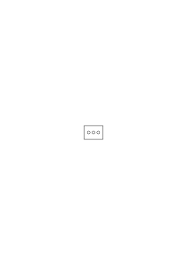

Die ganze Schwierigkeit ist die selbe wie die daß wir sagen können es sind 2 Kreise in diesem Viereck obwohl in Wirklichkeit ihrer 3 sind & das ist nur falsch. Ich kann aber nicht sagen diese Gruppe von Kreisen besteht aus 2 Kreisen & ebensowenig sie besteht aus 3 Kreisen weil ich da eine _interne_ Eigenschaft aussagen würde.

### [298\[2\]](https://cdn.wittgensteinnachlass.com/2000px/webp/Ms-107/298.webp)

Von einer Extension zu sagen sie habe diese & diese Zahl ist Unsinn, denn die Zahl ist eine _interne_ Eigenschaft der Extension. Wohl aber kann man die Zahl von dem Begriff aussagen der die Extension unter einen Hut bringt (ebenso nämlich wie man sagen kann daß diese Extension dem Begriff genügt).

### [298\[3\]](https://cdn.wittgensteinnachlass.com/2000px/webp/Ms-107/298.webp),[299\[1\]](https://cdn.wittgensteinnachlass.com/2000px/webp/Ms-107/299.webp),[300\[1\]](https://cdn.wittgensteinnachlass.com/2000px/webp/Ms-107/300.webp)

„Der Begriff ein mögliches Prädikat”. Was ist z.B. das Subjekt von dem ich aussage daß es eine Versammlung oder ein Gewitter ist? Freilich ich kann sagen: _was ich hier sehe_ ist eine Versammlung & kein Auflauf. Wenn ich aber sage „die Versammlung verlief stürmisch.”, sage ich hier daß ein gewisser Vorgang der _die Eigenschaft_ hat eine Versammlung zu sein stürmisch verlaufen ist? Aber selbst wenn es so ist, so muß doch dasjenige wovon ich sagen kann daß es eine Versammlung ist anderer Natur sein als das wovon ich etwa sagen könnte daß es eine Lampe ist. Oder ist der Satz daß eine Versammlung eine Lampe ist wirklich nur falsch?! Höchstens insofern als etwa das Gesichtsbild einer Lampe & das Gesichtsbild einer Versammlung der gleichen Kategorie angehören man sich also vorstellen kann daß einer eine Versammlung sieht & sie für eine Lampe hält. Jedenfalls ist das wovon man z.B. sagen kann es sei ein Musikstück anderer Form als das wovon man sagen kann es sei ein Stück blauer Himmel. Was ist denn das Subjekt zum Prädikat „weißer Kreis”? Man kann natürlich sagen „ich habe _Etwas_ gesehen das war kein grünes Viereck sondern ein weißer Kreis”. Und hier ist das Etwas das Subjekt & heißt offenbar soviel wie Fleck im Gesichtsfeld. Ist es nun eine Analyse wenn ich sage der Satz „der weiße Kreis ist über dem roten Viereck” heißt: etwas was ein weißer Kreis ist ist über etwas was ein rotes Viereck ist? Ich würde glauben daß die Sachlage vollständig durch die Angaben weißer Kreis, rotes Viereck & die Lagen beschrieben ist & irgendwelche Subjekte deren Prädikate jene Begriffe wären nicht hineinkommen. Freilich kann man sagen „_dies_ ist über _dem_” & _dies_ ist ein weißer Kreis & _das_ ein rotes Viereck. Aber die Worte „dies” & „das” werden ebenso wie die Prädikate in kategorisch verschiedenem Sinne gebraucht. Denn wenn ich sage „dies ist die Farbe rot”, „dies ist ein Kreis”, „dies ist der Ton _c_” so habe ich das Wort „dies” in drei ganz verschiedenen Weisen gebraucht, was daraus hervorgeht daß es etwas anderes ist auf einen Körper, auf eine Farbe, oder gar auf einen Ton zu _zeigen_. (Und hier ist das Wort zeigen ebenso mehrdeutig wie früher das Wort „dies”.)

### [300\[2\]](https://cdn.wittgensteinnachlass.com/2000px/webp/Ms-107/300.webp)

Welcher Art ist der Satz „das ist eine Uhr & kein Schrittzähler”? Es ist keine Definition. „Das ist kein genauer Kreis.” Kann ich nicht statt dessen sagen „ich sehe hier keinen genauen Kreis”? Und kann ich nicht das „hier” weglassen. Ist es da nicht wie mit dem Koordinatensystem das in den Symbolismus eintritt?! Ich glaube sicher.

### [300\[3\]](https://cdn.wittgensteinnachlass.com/2000px/webp/Ms-107/300.webp)

Ich kann nicht zeigend sagen _das_ ist über _dem_ denn mit dem Zeigen habe ich die Lage schon gezeigt. Wohl aber kann ich auf ein Koordinatensystem zeigen & die Aussage darauf beziehen.

### [300\[4\]](https://cdn.wittgensteinnachlass.com/2000px/webp/Ms-107/300.webp)

Was kann man alles zählen?

### [300\[5\]](https://cdn.wittgensteinnachlass.com/2000px/webp/Ms-107/300.webp)

Das Charakteristische der Sätze von der Art „dies ist …” ist nur daß in das Symbol irgendwie die Realität außerhalb des sogenannten Zeichensystems eintritt.

### [300\[6\]](https://cdn.wittgensteinnachlass.com/2000px/webp/Ms-107/300.webp)

Kardinalzahlen darf ich nur die in einer bestimmten Weise notierten Satzbestandteile nennen. So kommt also im Satz (∃x,y) φx ∙ ψy die 2 _nicht_ vor sondern erst in (∃2x) ∙ φx.