# Ms-108

### [III\[1\]](https://cdn.wittgensteinnachlass.com/2000px/webp/Ms-108/III.webp)

## IV. Philosophische Bemerkungen.

### [1\[1\]](https://cdn.wittgensteinnachlass.com/2000px/webp/Ms-108/1.webp)

13.12.1929

Was zum Wesen der Welt gehört kann die Sprache nicht sagen. Daher kann sie nicht _sagen_, daß alles fließt. Nur was wir uns auch anders vorstellen könnten, kann die Sprache sagen.

### [1\[2\]](https://cdn.wittgensteinnachlass.com/2000px/webp/Ms-108/1.webp)

Daß alles fließt muß in der Anwendung der Sprache ausgedrückt sein, und zwar nicht in _einer_ Anwendungsart, im Gegensatz zu einer anderen, sondern in _der_ Anwendung. In dem was wir überhaupt die Anwendung der Sprache nennen.

### [1\[3\]](https://cdn.wittgensteinnachlass.com/2000px/webp/Ms-108/1.webp)

Unter Anwendung meine ich das was die Lautverbindungen oder Striche auf dem Papier etc. überhaupt zu einer Sprache macht. In dem Sinn in dem es die Anwendung ist die den Stab mit Strichen zu einem _Maßstab_ machen. Das _Anlegen_ der Sprache an die Wirklichkeit.

### [1\[4\]](https://cdn.wittgensteinnachlass.com/2000px/webp/Ms-108/1.webp)

Und dieses Anlegen der Sprache ist die Verifikation der Sätze.

### [1\[5\]](https://cdn.wittgensteinnachlass.com/2000px/webp/Ms-108/1.webp),[2\[1\]](https://cdn.wittgensteinnachlass.com/2000px/webp/Ms-108/2.webp)

Wir sind in Versuchung zu sagen: „Nur die Erfahrung des gegenwärtigen Augenblicks hat Realität”. Und da muß die erste Antwort sein: „Im Gegensatz wozu?” Soll das heißen daß es z.B. meine Mutter nicht gegeben hat? Und daß ich heute früh nicht aufgestanden bin? (Denn dann wäre es bedenklich.) Aber das meinen wir nicht. Heißt es daß ein Ereignis dessen ich mich in diesem Augenblick nicht erinnere, nicht stattgefunden hat? Auch nicht! Jener Satz, daß nur die gegenwärtige Erfahrung Realität hat scheint die letzte Konsequenz des Solipsismus zu enthalten. Und in einem Sinne ist das auch so; nur kann er ebensowenig sagen, wie der Solipsismus. – Denn was zum Wesen der Welt gehört läßt sich eben nicht _sagen_. Und die Philosophie wenn sie etwas sagen könnte müßte das Wesen der Welt beschreiben. Das Wesen der Sprache aber ist ein Bild des Wesens der Welt & die Philosophie als Verwalterin der Grammatik kann tatsächlich das Wesen der Welt erfassen nur nicht in Sätzen der Sprache sondern in Regeln für diese Sprache die unsinnige Zeichenverbindungen ausschließen.

### [2\[2\]](https://cdn.wittgensteinnachlass.com/2000px/webp/Ms-108/2.webp),[3\[1\]](https://cdn.wittgensteinnachlass.com/2000px/webp/Ms-108/3.webp)

Wenn man sagt die _gegenwärtige_ Erfahrung nur hat Realität so muß hier schon das Wort „gegenwärtig” überflüssig sein wie in anderen Verbindungen das Wort „Ich”. Denn es kann nicht heißen _gegenwärtig_ im Gegensatz zu vergangen & zukünftig. – Es muß mit dem Wort etwas anderes gemeint sein etwas was nicht _in_ einem Raum ist sondern selbst ein Raum (für sich). D.h. nicht angrenzend an Anderes (daher abgrenzbar davon). Also etwas was die Sprache nicht mit Recht herausheben kann.

### [3\[2\]](https://cdn.wittgensteinnachlass.com/2000px/webp/Ms-108/3.webp)

Wenn jener Satz einen guten Sinn hat so muß _er_ dazu dienen leer laufende Räder an unserem Symbolismus auszuschalten. Er müßte dann sagen: wir meinen eigentlich nur _das_, alles andere ist überflüssiges Beiwerk. Und dieses Bestreben hat Sinn denn es lassen sich aus unserer Sprache leer laufende Räder entfernen; aber nicht allzuviele.

### [3\[3\]](https://cdn.wittgensteinnachlass.com/2000px/webp/Ms-108/3.webp),[4\[1\]](https://cdn.wittgensteinnachlass.com/2000px/webp/Ms-108/4.webp)

Die Gegenwart von der wir hier reden ist nicht das Bild des Filmstreifens das gerade jetzt im Objektiv der Laterne steht, im Gegensatz zu den Bildern vor & nach diesem die noch nicht oder schon früher dort waren sondern das Bild auf der Leinwand das mit Unrecht gegenwärtig genannt würde weil gegenwärtig hier nicht zum Unterschied von vergangen & zukünftig gebraucht wird. Es ist also ein bedeutungsloses Beiwort.

### [4\[2\]](https://cdn.wittgensteinnachlass.com/2000px/webp/Ms-108/4.webp),[5\[1\]](https://cdn.wittgensteinnachlass.com/2000px/webp/Ms-108/5.webp)

Es gibt allerdings sehr interessante ganz allgemeine Sätze von großer Wichtigkeit, wirkliche Sätze die also auch eine wirkliche Erfahrung beschreiben, die also auch hätte anders sein können aber nun einmal _so_ ist. Z.B. daß ich nur _einen_ Körper habe.

Daß meine Empfindlichkeit nie über diesen Körper hinausreicht (außer in Fällen wo einem ein Glied z.B. ein Arm amputiert wurde & er doch Schmerzen in den Fingern spürt). Das sind merkwürdige & interessante Tatsachen. Nicht in diese Kathegorie gehört es aber wenn man sagt daß ich die Zukunft nicht erinnern kann. Denn das heißt nichts & ist wie sein Gegenteil eine Undenkbarkeit. Daß ich immer, wenn ich wach bin, aus meinen _Augen_ sehe ist dagegen eine merkwürdige & interessante Tatsache. Ebenso ist es wichtig daß sich mein Gesichtsbild beinahe immer verändert. „Ich” bedeutet offenbar meinen Körper denn _ich_ bin in diesem Zimmer; & „ich” ist wesentlich etwas was an einem Ort ist & an einem Ort desselben Raums in dem auch die anderen Körper sind.

### [5\[2\]](https://cdn.wittgensteinnachlass.com/2000px/webp/Ms-108/5.webp)

„Realismus”, „Idealismus”, etc. sind schon von vornherein metaphysische Namen. D.h. sie deuten darauf hin daß ihre Anhänger glauben etwas Bestimmtes über das Wesen der Welt aussagen zu können.

### [5\[3\]](https://cdn.wittgensteinnachlass.com/2000px/webp/Ms-108/5.webp),[6\[1\]](https://cdn.wittgensteinnachlass.com/2000px/webp/Ms-108/6.webp),[7\[1\]](https://cdn.wittgensteinnachlass.com/2000px/webp/Ms-108/7.webp)

Wer den Satz nur die gegenwärtige Erfahrung sei real bestreiten will (was ebenso falsch ist wie ihn zu behaupten) wird etwa fragen ob denn ein Satz wie „Julius Cäsar ging über die Alpen” nur meinen gegenwärtigen Geisteszustand der sich mit dieser Sache beschäftigt, beschreibt. Und die Antwort ist natürlich: Nein! Er beschreibt ein Ereignis das wie wir glauben vor ca. 2000 Jahren geschehen ist. Wenn nämlich das Wort „beschreibt” so aufgefaßt wird wie in dem Satz „der Satz ‚ich schreibe’ _beschreibt_ was ich gegenwärtig tue”. Der Name Julius Cäsar bezeichnet eine Person, klar! Aber was sagt denn das alles? Ich scheine mich ja um die eigentliche philosophische Antwort drücken zu wollen! Sätze die von Personen handeln d.h. Personennamen enthalten können eben auf sehr verschiedene Arten verifiziert werden. Der Satz über Cäsar sagt doch offenbar das was ich glaube wenn ich ihn glaube. Und wenn ich wissen will was ich glaube so ist es am besten zu fragen _warum_ ich es glaube. Denn die Antwort auf dieses Warum wird sich erst auf verschiedene kausale Verbindungen berufen d.h. auf Verbindungen die eine frühere Erfahrung als bestehend erwiesen hat aber endlich wird aus dem Grund warum ich etwas glaube (das was ich glaube.) – Daß es denkbar ist die Leiche Cäsars noch zu finden hängt unmittelbar mit dem Sinn der Sätze über C. zusammen. – Aber auch daß es möglich ist eine Schrift zu finden aus der hervorgeht daß so ein Mann nie gelebt hat & seine Existenz zu bestimmten Zwecken erdichtet worden ist. Die Sätze über J. C. müssen also einen solchen Sinn haben, daß das möglich ist. Wenn ich den Satz sage: „ich sehe einen roten Fleck über einen grünen dahinziehen” so gibt es hier nicht die Möglichkeiten des Falles „Cäsar zog über die Alpen” & das ist es was ich meine wenn ich sage daß der Satz über Cäsar auf eine indirektere Art Sinn hat als der erste.

### [7\[2\]](https://cdn.wittgensteinnachlass.com/2000px/webp/Ms-108/7.webp)

Alles was, wenn es geschähe, einen Glauben mit Recht bestärken würde bestimmt logisch die Natur dieses Glaubens. D.h. es zeigt etwas über das logische Wesen dieses Glaubens.

### [7\[3\]](https://cdn.wittgensteinnachlass.com/2000px/webp/Ms-108/7.webp)

Der Satz über Julius Cäsar ist eben ein Gerüst (wie der über jede andere Person) das die verschiedensten Verifikationen zuläßt allerdings nicht alle die es im Falle anderer z.B. lebender Personen zuläßt.

### [7\[4\]](https://cdn.wittgensteinnachlass.com/2000px/webp/Ms-108/7.webp)

Ist nicht alles was ich meine daß es zwischen dem Satz & seiner Verifikation nicht noch ein Mittelglied gibt, das diese Verifikation vermittelt?

### [7\[5\]](https://cdn.wittgensteinnachlass.com/2000px/webp/Ms-108/7.webp),[8\[1\]](https://cdn.wittgensteinnachlass.com/2000px/webp/Ms-108/8.webp)

14.12.1929

Auch unsere gewöhnliche Sprache muß ja für alle Fälle der Unsicherheit vorsorgen (provide for) & wenn wir gegen sie philosophisch etwas einzuwenden haben, so kann es nur aus dem Grund sein weil sie in gewissen Fällen zu Mißdeutungen Anlaß gibt.

### [8\[2\]](https://cdn.wittgensteinnachlass.com/2000px/webp/Ms-108/8.webp)

Eine der am meisten irreführenden Darstellungsweisen unserer Sprache ist der Gebrauch des Wortes „Ich” besonders dort wo sie damit das unmittelbare Erlebnis darstellt wie in „Ich sehe einen roten Fleck”.

### [8\[3\]](https://cdn.wittgensteinnachlass.com/2000px/webp/Ms-108/8.webp)

Es wäre nun lehrreich diese Ausdrucksweise durch eine andere zu ersetzen in der das unmittelbare Erlebnis nicht mit Hilfe des persönlichen Fürworts dargestellt würde weil man daraus sehen könnte daß jene Darstellung den Tatsachen nicht wesentlich ist. Nicht daß die neue Darstellung in irgend einem Sinne richtiger wäre als die alte sondern sie würde nur den Dienst tun klar zu zeigen was das logisch Wesentliche der Darstellung ist.

### [8\[4\]](https://cdn.wittgensteinnachlass.com/2000px/webp/Ms-108/8.webp),[9\[1\]](https://cdn.wittgensteinnachlass.com/2000px/webp/Ms-108/9.webp),[10\[1\]](https://cdn.wittgensteinnachlass.com/2000px/webp/Ms-108/10.webp)

Man könnte folgende Darstellung adoptieren: Wenn ich L. W. Zahnschmerzen habe so wird das durch den Satz „Es gibt Zahnschmerzen” ausgedrückt. Ist aber das der Fall was jetzt durch den Satz „A hat Zahnschmerzen” ausgedrückt wird so wird gesagt: „A benimmt sich wie L.W. wenn es Zahnschmerzen gibt.” Analog wird gesagt „Es denkt” & „A benimmt sich wie L.W. wenn es denkt”. (Man könnte sich eine orientalische Despotie denken in der die Sprache so gebildet ist daß der Despot ihr Zentrum ist & sein Name an Stelle des L.W. steht.) Es ist klar daß diese Ausdrucksweise was ihre Eindeutigkeit & Verständlichkeit anbelangt mit der unseren gleichwertig ist. Es ist aber ebenso klar daß diese Sprache jeden Beliebigen als Zentrum haben kann. Von allen den Sprachen nun die verschiedene Menschen zum Zentrum haben & die ich alle verstehe, hat die welche mich zum Zentrum hat eine Sonderstellung. Sie ist besonders adäquat. Wie kann ich das ausdrücken? D.h., wie kann ich ihren Vorzug korrekt in Worten darstellen? Das ist nicht möglich. Denn tu ich's in der Sprache die mich zum Zentrum hat dann ist die Ausnahmsstellung der Beschreibung dieser Sprache in ihren eigenen Termini kein Wunder, & in der Ausdrucksweise einer anderen Sprache nimmt meine Sprache durchaus keine Sonderstellung ein. – Die Sonderstellung liegt in der Anwendung & wenn ich diese Anwendung beschreibe so kommt dadurch die Sonderstellung wieder nicht zum Ausdruck weil die Beschreibung von der Sprache abhängt in der sie gegeben wird. Und welche Beschreibung nun das meint was ich im Sinne habe hängt wieder von ihrer Anwendung ab.

Nur die Anwendung unterscheidet wirklich zwischen den Sprachen, aber von ihr abgesehen sind alle Sprachen gleichwertig. – Alle diese Sprachen stellen doch nur ein Einziges Unvergleichliches dar & _können_ nichts anderes darstellen. [Die beiden Betrachtungsweisen müssen zu Demselben führen: Die eine daß das Dargestellte nicht eines unter mehreren ist, daß es keines Gegensatzes fähig ist; die andere daß ich den Vorzug _meiner_ Sprache nicht aussprechen kann.]

### [10\[2\]](https://cdn.wittgensteinnachlass.com/2000px/webp/Ms-108/10.webp)

15.12.1929

Die mathematische Frage muß so exakt sein wie der mathematische Satz.

### [10\[3\]](https://cdn.wittgensteinnachlass.com/2000px/webp/Ms-108/10.webp)

16.12.1929

Die Frage „Wie kann man das wissen” ist eine logische Frage, keine psychologische.

### [10\[4\]](https://cdn.wittgensteinnachlass.com/2000px/webp/Ms-108/10.webp)

Wenn ich wissen will was <math class="stacked" display="inline"><mn>1</mn><mspace width="0.3em"/><mo>:</mo><mspace width="0.3em"/><mn>3</mn><mspace width="0.3em"/><mo>=</mo><mspace width="0.3em"/><mtext>0˙</mtext><mover><mrow><mn>3</mn></mrow><mtext>˙</mtext></mover></math> heißt so ist es eine relevante Frage: „Wie kann ich das wissen?” Denn auf dieses „Wie” kommt der Beweis zur Antwort _& mehr als dieser zeigt weiß ich ja nicht_.

### [11\[1\]](https://cdn.wittgensteinnachlass.com/2000px/webp/Ms-108/11.webp)

Es ist klar daß jede Multiplikation im Dezimalsystem eine Lösung hat & daß man also jede arithmetische Gleichung von der Form a × b = c beweisen oder ihr Gegenteil beweisen kann. Wie sieht nun ein Beweis dieser Beweisbarkeit aus? Er ist offenbar weiter nichts als eine Klärung des Symbolismus & das Aufzeigen einer Induktion die erkennen läßt, welcher Art die Sätze sind zu denen die Leiter führt.

### [11\[2\]](https://cdn.wittgensteinnachlass.com/2000px/webp/Ms-108/11.webp)

Angenommen nun ich habe zwei (klare) Systeme so kann man nicht nach einem System fragen, das sie beide umfaßt. Denn nicht nur kann ich dieses System _jetzt_ nicht suchen, sondern auch im Falle sich einmal eines zeigt das zwei den ersten analoge Systeme umfaßt, sehe ich daß ich es nie hätte suchen können.

### [11\[3\]](https://cdn.wittgensteinnachlass.com/2000px/webp/Ms-108/11.webp)

(Es gibt eben in der Mathematik nur schwarz & weiß, & nicht das grau woraus noch das eine oder das andere werden kann.)

### [11\[4\]](https://cdn.wittgensteinnachlass.com/2000px/webp/Ms-108/11.webp)

Suchen kann man nur in einem System: also gibt es unbedingt etwas was man _nicht_ suchen kann.

### [11\[5\]](https://cdn.wittgensteinnachlass.com/2000px/webp/Ms-108/11.webp),[12\[1\]](https://cdn.wittgensteinnachlass.com/2000px/webp/Ms-108/12.webp)

Welcher Art ist z.B. die Entdeckung Scheffers daß man die Wahrheitsfunktionen alle auf p ❘ q zurückführen kann? Oder die Entdeckung der Methode die Kubikwurzel zu ziehen? Wie ist es wenn man in der Mathematik einen Trick anwenden muß? (Wie beim Lösen einer Gleichung oder beim Integrieren.) Hier ist es wie beim Lösen eines Knotens. Ich kann auf gut Glück den einen oder anderen Weg probieren, & es kann sein daß sich der Knoten noch mehr verknüpft, oder daß er sich löst. (Jedenfalls ist jede Operation eine erlaubte Operation & führt irgendwohin.)

### [12\[2\]](https://cdn.wittgensteinnachlass.com/2000px/webp/Ms-108/12.webp)

Ich will sagen, daß das Finden eines Systems zur Lösung von Problemen die man früher nur einzeln durch separate Methoden lösen konnte nicht bloß die Auffindung eines bequemeren Vehikels ist sondern einer ganz neuen Sache die man früher überhaupt nicht hatte. Die einheitliche Methode ist eben nicht nur die Methode, der Herstellung eines Gegenstands, der der gleiche ist auf welche Art immer er hergestellt wurde. Die Methode ist kein Vehikel das uns an einen Ort führt der eigentlich unser Ziel ist, wie immer wir ihn auch erreichen.

### [12\[3\]](https://cdn.wittgensteinnachlass.com/2000px/webp/Ms-108/12.webp),[13\[1\]](https://cdn.wittgensteinnachlass.com/2000px/webp/Ms-108/13.webp)

Das heißt: ich glaube, man kann in der Mathematik keinen _Weg_ finden der nicht eben ein Ziel ist. Man kann nicht sagen: alle diese Resultate hatte ich schon ich finde jetzt nur noch einen besseren Weg der zu allen hinführt. Sondern dieser Weg ist ein neuer Ort den man bisher noch nicht hatte. Der neue Weg macht ein neues System aus.

### [13\[2\]](https://cdn.wittgensteinnachlass.com/2000px/webp/Ms-108/13.webp)

Soll das nicht heißen daß man in der Mathematik nichts Neues über einen Gegenstand erfahren kann, weil es dann ein neuer Gegenstand ist?

### [13\[3\]](https://cdn.wittgensteinnachlass.com/2000px/webp/Ms-108/13.webp),[14\[1\]](https://cdn.wittgensteinnachlass.com/2000px/webp/Ms-108/14.webp)

Das kommt auch darauf hinaus: Wenn ich einen Satz z.B. der Zahlentheorie höre aber seinen Beweis nicht kenne so verstehe ich auch den Satz nicht. Das klingt sehr paradox. Ich verstehe – heißt das – also den Satz nicht daß es unendlich viele Primzahlen gibt, ehe ich seinen sogenannten Beweis nicht kenne. Wenn ich den Beweis kennenlerne so lerne ich also etwas _ganz_ Neues kennen nicht nur den Weg zu einem mir schon bekannten Ziel. Dann ist es aber unbegreiflich daß ich wenn der Beweis geliefert ist zugebe daß es der Beweis eben _dieses_ Satzes ist oder die Induktion die mit diesem Satz gemeint ist. Ich will sagen daß ein mathematischer Satz nicht die Prosa ist sondern der exakte Ausdruck.

### [14\[2\]](https://cdn.wittgensteinnachlass.com/2000px/webp/Ms-108/14.webp)

17.12.1929

Heißt das nicht auch: Man kann denselben mathematischen Satz nicht einmal so & einmal anders beweisen? – Es kann nicht zwei unabhängige Beweise eines mathematischen Satzes geben.

### [14\[3\]](https://cdn.wittgensteinnachlass.com/2000px/webp/Ms-108/14.webp)

Das Knoten-Auflösen in der Mathematik: Kann man versuchen einen Knoten aufzulösen von dem einmal bewiesen wird daß er nicht auflösbar ist? Die Auflösung der Gleichung dritten Grades ist gelungen, die Dreiteilung des Winkels mit Lineal & Zirkel _konnte_ nicht gelingen; an beiden hat man sich versucht lang ehe man die Lösung der einen Aufgabe & die Unlösbarkeit der anderen wußte.

### [14\[4\]](https://cdn.wittgensteinnachlass.com/2000px/webp/Ms-108/14.webp),[15\[1\]](https://cdn.wittgensteinnachlass.com/2000px/webp/Ms-108/15.webp)

Denken wir uns einen scheinbaren Knoten der in Wirklichkeit aus vielen in sich zurücklaufenden Fadenstücken besteht & etwa auch aus einigen nicht geschlossenen. Ich stelle nun jemandem die Aufgabe den Knoten aufzulösen. Sieht er den Verlauf der Schnurstücke klar so wird er sagen das ist kein Knoten & man kann ihn daher nicht auflösen. Sieht er nur ein Gewirr von Schnüren so wird er vielleicht versuchen es zu lösen indem er aufs Geratewohl an verschiedenen Enden zieht, oder wirklich einige Transformationen vornimmt die daraus entspringen daß er ja wirklich einige Teile des Knotens klar sieht wenn auch nicht seine ganze Struktur.

### [15\[2\]](https://cdn.wittgensteinnachlass.com/2000px/webp/Ms-108/15.webp)

Ich würde nun sagen von einem eigentlichen Versuch der Lösung kann man nur _insoweit_ sprechen, als die Struktur des Knotens klar gesehen ist. Sofern sie nicht klar gesehen wird, ist alles ein Tappen im Dunklen denn es kann ja sein daß was mir als Knoten erscheint gar kein Knoten ist; der beste Beweis dafür daß ich wirklich keine Methode hatte nach einer Lösung zu suchen. Dieser Prozeß ist nicht mit dem zu vergleichen wenn ich z.B. in einem Zimmer methodisch nach einem Gegenstand suche & eben dadurch herausfinde daß er gar nicht im Zimmer ist. Denn hier suche ich nach einem möglichen Sachverhalt & nicht nach einem unmöglichen.

### [15\[3\]](https://cdn.wittgensteinnachlass.com/2000px/webp/Ms-108/15.webp),[16\[1\]](https://cdn.wittgensteinnachlass.com/2000px/webp/Ms-108/16.webp)

Ich will aber nun sagen daß das Gleichnis mit dem Knoten hinkt da ich einen Knoten haben & ihn immer besser kennen lernen kann während ich sagen will daß ich in der Mathematik nicht etwas mir schon in meinen Zeichen Gegebenes immer besser kennen lernen kann sondern immer _Neues_ kennen lerne & bezeichne. Ich sehe nicht ein wie die Zeichen die wir uns selbst gemacht haben um Gewisses auszudrücken uns Probleme aufgeben sollten.

### [16\[2\]](https://cdn.wittgensteinnachlass.com/2000px/webp/Ms-108/16.webp)

Es ist eher so als ob ein Knoten oder Knäuel uns nach & nach gezeigt würde & wir uns (immer) fortlaufend Bilder von ihm machten soweit wir ihn sehen. Was von dem Knoten uns noch nicht geoffenbart ist davon haben wir keine Ahnung & können darüber in keiner Weise Konjekturen anstellen (indem wir etwa die Bilder des bekannten Teils einer Untersuchung unterziehen).

### [16\[3\]](https://cdn.wittgensteinnachlass.com/2000px/webp/Ms-108/16.webp),[17\[1\]](https://cdn.wittgensteinnachlass.com/2000px/webp/Ms-108/17.webp)

Was hat man denn damals gefunden als man fand daß es unendlich viele Primzahlen gibt? Was hat man denn gefunden wie man eingesehen hat daß es unendlich viele Kardinalzahlen gibt?! – Ist es nicht ganz analog der Erkenntnis – wenn es eine ist – daß der euklidische Raum unendlich ist, nachdem wir schon längst Sätze über die Gegenstände in diesem Raum gebildet haben. Was bedeutet denn eine Untersuchung des Raumes. – Denn jede mathematische Untersuchung ist quasi eine Untersuchung des Raumes. Daß man die _Dinge_ im Raum untersuchen kann ist klar. Aber den Raum! (Geometrie & Grammatik entsprechen einander immer.) Erinnern wir uns daß in der Mathematik die Zeichen selbst Mathematik _machen_ nicht Mathematik beschreiben. Die mathematischen Zeichen sind ja wie die Kugeln einer Rechenmaschine. Und die Kugeln sind im Raum & eine Untersuchung an der Rechenmaschine ist eine Untersuchung des Raumes.

### [17\[2\]](https://cdn.wittgensteinnachlass.com/2000px/webp/Ms-108/17.webp)

Ich habe mich früher darüber gewundert daß unsere Zeichen uns Probleme stellen sollten oder daß wir mit ihnen Entdeckungen über etwas sollten machen können was wir selbst mit ihnen bezeichnet haben. Aber wir können an ihnen Entdeckungen machen weil sie nicht bloße Zeichen sind sondern die Gegenstände unserer Rechnung.

### [17\[3\]](https://cdn.wittgensteinnachlass.com/2000px/webp/Ms-108/17.webp)

Man kann Mathematik nicht schreiben sondern nur machen.

### [18\[1\]](https://cdn.wittgensteinnachlass.com/2000px/webp/Ms-108/18.webp)

(Eben darum kann man aber in der Mathematik nicht mit diesen Zeichen „schmusen”.)

### [18\[2\]](https://cdn.wittgensteinnachlass.com/2000px/webp/Ms-108/18.webp)

Ich mache nicht an etwas Anderem eine Entdeckung & drücke es dann in ihnen aus (beschreibe es) sondern ich mache die Entdeckung an ihnen.

### [18\[3\]](https://cdn.wittgensteinnachlass.com/2000px/webp/Ms-108/18.webp)

Was nicht vorhergesehen wurde war nicht vorherseh**bar**; denn man hatte das System nicht in welchem es vorhergesehen werden konnte. (Und vorhergesehen worden wäre.)

### [18\[4\]](https://cdn.wittgensteinnachlass.com/2000px/webp/Ms-108/18.webp)

18.12.1929

Es drängt sich immer wieder die Idee auf als wäre die Mathematik eine Art naturwissenschaftlicher Untersuchung.

### [18\[5\]](https://cdn.wittgensteinnachlass.com/2000px/webp/Ms-108/18.webp)

Als könnte man sagen „wir hatten diesen Zusammenhang früher nicht, jetzt kennen wir ihn”, oder „wir sehen hier noch keinen Zusammenhang aber suchen einen”.

### [18\[6\]](https://cdn.wittgensteinnachlass.com/2000px/webp/Ms-108/18.webp)

Angenommen ich wollte ein regelmäßiges 5-Eck konstruieren, wüßte aber nicht, wie, & würde nun herumprobieren & käme endlich, durch Zufall, auf die richtige Konstruktion: haben wir hier nicht wirklich den Fall des Knotens der durch Probieren aufgelöst wurde?

### [19\[1\]](https://cdn.wittgensteinnachlass.com/2000px/webp/Ms-108/19.webp)

Soll ich sagen: Nein, denn wenn ich diese Konstruktion nicht verstehe so ist sie für mich noch gar nicht die 5-Eck Konstruktion.

### [19\[2\]](https://cdn.wittgensteinnachlass.com/2000px/webp/Ms-108/19.webp)

Ich kann auf dem Papier mit Strichen & Buchstaben experimentieren aber nicht mit dem Sinn der Zeichen.

### [19\[3\]](https://cdn.wittgensteinnachlass.com/2000px/webp/Ms-108/19.webp)

Ich kann schon durch Zufall die Auflösung der Gleichungen 2ten Grades hinschreiben aber nicht sie durch Zufall verstehen.

### [19\[4\]](https://cdn.wittgensteinnachlass.com/2000px/webp/Ms-108/19.webp)

In dem was ich verstehe verschwindet dann die Art wie ich dazugekommen bin. Ich verstehe dann was ich verstehe. D.h., der Zufall kann sich nur auf ein Äußerliches beziehen wie etwa wenn man sagt: „das habe ich herausgefunden nachdem ich starken Kaffee getrunken hatte”. Der Kaffee ist in meiner Entdeckung nicht mehr enthalten.

### [19\[5\]](https://cdn.wittgensteinnachlass.com/2000px/webp/Ms-108/19.webp)

Die Entdeckung des Zusammenhangs zweier Systeme war nicht in einem Raum mit jenen beiden Systemen & wäre sie in demselben Raum gewesen, so wäre es keine Entdeckung gewesen (sondern die Lösung einer Schulaufgabe).

### [20\[1\]](https://cdn.wittgensteinnachlass.com/2000px/webp/Ms-108/20.webp)

Wo jetzt ein Zusammenhang bekannt ist der früher nicht bekannt war dort war früher nicht eine offene Stelle eine Unvollständigkeit die jetzt ausgefüllt ist. – (Man konnte damals nicht sagen „soweit kenne ich die Sache, von hier an ist sie mir nicht mehr bekannt”).

### [20\[2\]](https://cdn.wittgensteinnachlass.com/2000px/webp/Ms-108/20.webp)

Ich habe also gesagt: Die Mathematik hat keine offenen Stellen. Das widerspricht der gewöhnlichen Auffassung.

### [20\[3\]](https://cdn.wittgensteinnachlass.com/2000px/webp/Ms-108/20.webp)

Es ist begreiflich, daß ich die Entdeckung machen kann daß etwas im Raume da steht wo ich es nicht erwartet habe; aber wie kann ich Entdeckungen über den Raum selbst machen? Und ein Beweis aus der Zahlentheorie & die Konstruktion des 5-Ecks scheinen Entdeckungen über den Raum zu sein.

### [20\[4\]](https://cdn.wittgensteinnachlass.com/2000px/webp/Ms-108/20.webp)

In der Mathematik gibt es kein „noch nicht” und kein „bis auf Weiteres”. (Außer in dem trivialen Sinne, daß man noch nicht 1000-stellige Zahlen mit einander multipliziert hat.)

### [20\[5\]](https://cdn.wittgensteinnachlass.com/2000px/webp/Ms-108/20.webp),[21\[1\]](https://cdn.wittgensteinnachlass.com/2000px/webp/Ms-108/21.webp)

19.12.1929

Die Induktion hat manches mit der Multiplizität einer (natürlich endlichen) Klasse gemeinsam. Anderseits ist sie doch keine & nun nennt man sie eine unendliche Klasse. –

### [21\[2\]](https://cdn.wittgensteinnachlass.com/2000px/webp/Ms-108/21.webp)

Wenn ich, z.B., sage „wenn ich eine Windung kenne, so kenne ich die ganze Spirale” so bedeutet das eigentlich: Wenn ich das Gesetz der Spirale kenne so ist das in vieler Beziehung analog dem Fall in dem ich eine Gesamtheit von Windungen kenne – natürlich aber eine „endliche” Gesamtheit denn etwas anderes gibt es ja nicht –. Man kann nun nicht sagen: ja einer endlichen Gesamtheit ist es in vieler Hinsicht analog aber doch nicht ganz analog dagegen einer unendlichen ganz, sondern daß die Induktion einer Gesamtheit sich nicht _ganz_ analog benimmt, ist eben alles was wir sagen können.

### [21\[3\]](https://cdn.wittgensteinnachlass.com/2000px/webp/Ms-108/21.webp),[22\[1\]](https://cdn.wittgensteinnachlass.com/2000px/webp/Ms-108/22.webp)

Die Mathematik kann nicht unvollständig sein; wie ein _Sinn_ nicht unvollständig sein kann. Was ich verstehen kann muß ich ganz verstehen. Das hängt damit zusammen daß meine Sprache so wie sie ist in Ordnung ist & daß die logische Analyse um zu vollkommener Klarheit zu gelangen nichts zu dem vorhandenen Sinn meiner Sätze dazufügen muß. So daß der unklarst scheinende Satz nach der Analyse seinen bisherigen Inhalt unberührt behält & nur seine Grammatik geklärt wird.

### [22\[2\]](https://cdn.wittgensteinnachlass.com/2000px/webp/Ms-108/22.webp)

Muß es aber denn nicht eine Frage sein ob es eine endliche Zahl aller Primzahlen gibt oder nicht? Wenn man einmal überhaupt zu diesem Begriff gekommen ist. Denn es scheint doch daß ich wenn mir der Begriff Primzahl gegeben ist unmittelbar fragen kann „wie viele Primzahlen gibt es?”. Wie ich wenn mir der Begriff Mensch in diesem Zimmer gegeben ist ohne weiteres die Frage bilden kann „wie viele Menschen sind in diesem Zimmer?”.

### [22\[3\]](https://cdn.wittgensteinnachlass.com/2000px/webp/Ms-108/22.webp)

Wenn diese Analogie mich irre leitet so kann es nur dadurch sein, daß der „Begriff Primzahl” mir in ganz anderer Weise gegeben ist als ein eigentlicher Begriff. Denn wie ist denn der strenge Ausdruck für den Satz „7 ist eine Primzahl”? Offenbar ist es nur der daß die Division der 7 durch kleinere Zahlen einen Rest ergibt. Einen anderen (außer einen analogen) Ausdruck kann es dafür nicht geben da wir Mathematik nicht beschreiben sondern nur treiben können. (Und schon das vernichtet jede „Mengenlehre”.)

### [22\[4\]](https://cdn.wittgensteinnachlass.com/2000px/webp/Ms-108/22.webp),[23\[1\]](https://cdn.wittgensteinnachlass.com/2000px/webp/Ms-108/23.webp)

Wenn ich also einmal die allgemeine Form der Primzahl hinschreiben kann, d.h. einen Ausdruck in dem überhaupt etwas der „Zahl der Primzahlen” Analoges enthalten ist, dann ist auch keine Frage mehr „wieviel” Primzahlen es gibt & vorher kann ich diese Frage auch nicht stellen. Denn ich kann nicht fragen „hört die Reihe der Primzahlen _einmal_ auf?”, und auch nicht „kommt nach der 7 noch _jemals_ eine Primzahl?”

### [23\[2\]](https://cdn.wittgensteinnachlass.com/2000px/webp/Ms-108/23.webp)

Denn da wir in der gewöhnlichen Sprache das Wort Primzahl haben konnten noch ehe der strenge Ausdruck vorhanden war der quasi eine Zahlangabe zuläßt so konnte man auch vorher schon die Frage fälschlich bilden, wie viele Primzahlen es gäbe. Dadurch gewinnt es den Anschein als sei das Problem früher schon vorhanden gewesen & jetzt gelöst worden. Die Wortsprache schien diese Frage nach wie vor zuzulassen & das erzeugte den Schein als sei ein echtes Problem vorhanden gewesen & eine echte Lösung ((des Problems) erfolgt. In der exakten Sprache dagegen hatte man ursprünglich nichts, wovon man nach der Anzahl hätte fragen können & später einen Ausdruck an dem man die Mannigfaltigkeit unmittelbar ablesen konnte.

### [23\[3\]](https://cdn.wittgensteinnachlass.com/2000px/webp/Ms-108/23.webp),[24\[1\]](https://cdn.wittgensteinnachlass.com/2000px/webp/Ms-108/24.webp)

Ich will also sagen: Nur in unserer Wortsprache (die hier zu einem Mißverständnis der logischen Form führt) gibt es in der Mathematik „noch ungelöste” Probleme & das Problem der endlichen „Lösbarkeit aller mathematischen Fragen”.

### [24\[2\]](https://cdn.wittgensteinnachlass.com/2000px/webp/Ms-108/24.webp)

Mein Leben ist sehr seltsam! Ich weiß nicht wie hell oder wie finster es ist. Es ist gleichsam halb hell, halb dunkel. Respi erklärte mir vor ein paar Tagen, daß sie mich nicht mehr küssen werde weil ihr Gefühl für mich nicht derart sei daß es dieses Zeichen rechtfertige. Ich bin nun davon schmerzlich getroffen und dabei doch fröhlich. Denn es kommt doch eigentlich darauf an daß mich der Geist nicht verläßt. Denn wenn der Geist mich nicht verläßt, dann ist nichts was geschieht schmutzig & kleinlich. Ich aber muß viel auf den Zehenspitzen stehen wenn ich nicht untergehen will.

### [24\[3\]](https://cdn.wittgensteinnachlass.com/2000px/webp/Ms-108/24.webp)

Es scheint mir daß die Idee der Widerspruchsfreiheit in den Axiomen der Mathematik die jetzt so viel in den Köpfen der Mathematiker herumspukt auf einem Mißverständnis beruht.

### [24\[4\]](https://cdn.wittgensteinnachlass.com/2000px/webp/Ms-108/24.webp),[25\[1\]](https://cdn.wittgensteinnachlass.com/2000px/webp/Ms-108/25.webp)

Das hängt (auch) damit zusammen daß die Mathematiker die Axiome nicht für das halten was sie sind, nämlich für Sätze der Syntax.

### [25\[2\]](https://cdn.wittgensteinnachlass.com/2000px/webp/Ms-108/25.webp)

Wenn in der Syntax ein Widerspruch ist so heißt das, daß wir unseren Zeichen keine feste Bedeutung gegeben haben da eine Zeichenverbindung sowohl erlaubt als auch verboten ist.

### [25\[3\]](https://cdn.wittgensteinnachlass.com/2000px/webp/Ms-108/25.webp)

20.12.1929

Eine Frage nach der Beweisbarkeit gibt es nicht und in **so**fern auch keinen Beweis der Beweisbarkeit. Der sogenannte Beweis der Beweisbarkeit ist eine Induktion deren Erkenntnis die Erkenntnis eines neuen Systems ist.

### [25\[4\]](https://cdn.wittgensteinnachlass.com/2000px/webp/Ms-108/25.webp),[26\[1\]](https://cdn.wittgensteinnachlass.com/2000px/webp/Ms-108/26.webp)

Wie ist es mit dem Satz „die Winkelsumme im Dreieck ist 180˚”? Dem sieht man es jedenfalls nicht an daß er ein Satz der Syntax ist.

Der Satz „Gegenwinkel sind gleich” heißt ich werde, wenn sie sich bei der Messung nicht als gleich erweisen die Messung für falsch erklären. Und „die Winkelsumme im ▵ ist 180˚” heißt, ich werde wenn sie sich bei einer Messung nicht als 180˚ erweist einen Messungsfehler annehmen. Der Satz ist also ein Postulat über die Art & Weise der Beschreibung der Tatsachen. Also ein Satz der Syntax.

### [26\[2\]](https://cdn.wittgensteinnachlass.com/2000px/webp/Ms-108/26.webp)

Ein Beweis der Widerspruchsfreiheit kann nicht wesentlich sein für die Anwendung der Axiome.

### [26\[3\]](https://cdn.wittgensteinnachlass.com/2000px/webp/Ms-108/26.webp)

Ein Postulat gibt es nur für die Ausdrucksweise. Die „Axiome” sind Postulate der Ausdrucksweise.

### [26\[4\]](https://cdn.wittgensteinnachlass.com/2000px/webp/Ms-108/26.webp)

Wenn ich jemand die Anweisung gebe „gehen Sie geradeaus dann biegen Sie in die erste Gasse links die N-Gasse ein” & die N-Gasse ist die zweite Gasse & nicht die erste so ist meine Anweisung widerspruchsvoll. Ein solcher Widerspruch ist auch in den Postulaten der Geometrie denkbar wenn ich z.B. zu den euklidischen Axiomen noch das weitere Axiom setze, daß die Winkelsumme im ▵ 200˚ sein soll. Der Russellsche Widerspruch & alle analogen sind _nicht_ von dieser Art. Was nun aber ein solcher Widerspruch der ersten Art bedeutet müßte man am besten in der Arithmetik sehen, denn hier macht es die Form der Gleichung klarer daß wir es mit Zeichenregeln zu tun haben.

### [26\[5\]](https://cdn.wittgensteinnachlass.com/2000px/webp/Ms-108/26.webp),[27\[1\]](https://cdn.wittgensteinnachlass.com/2000px/webp/Ms-108/27.webp)

21.12.1929

Wie kommt es daß ich überhaupt sagen will, daß alles fließt?

Will ich damit nur sagen daß meine unmittelbare Erfahrung in stetigem Wechsel begriffen ist, was nicht so sein müßte (& ich daher sagen kann). Oder will ich ausdrücken daß sie in stetigem Wechsel begriffen sein _kann_, selbst wenn sie es nicht wäre?

### [27\[2\]](https://cdn.wittgensteinnachlass.com/2000px/webp/Ms-108/27.webp)

Was ich eigentlich zu meinen scheine ist daß die Gegenwart unaufhörlich entschwindet & gleichsam nicht zu fassen ist. (Aber das kann man natürlich nicht sagen.) Daß ich das sagen _will_, muß auf irgend einem Mißverständnis beruhen. Dieses die Gegenwart einfangen _Wollen_ muß auf einem Mißverständnis beruhen. Und zwar darauf daß man auf die unmittelbare Erfahrung eine Kathegorie anwenden will die nur in der Sprache der physikalischen Welt anzuwenden ist.

### [27\[3\]](https://cdn.wittgensteinnachlass.com/2000px/webp/Ms-108/27.webp)

Was wir hier betrachten ist eigentlich die Möglichkeit der Bewegung. Also die logische Form der Bewegung.

### [27\[4\]](https://cdn.wittgensteinnachlass.com/2000px/webp/Ms-108/27.webp),[28\[1\]](https://cdn.wittgensteinnachlass.com/2000px/webp/Ms-108/28.webp)

Dabei kommt es uns vor als wäre die Erinnerung eine etwas sekundäre Art der Erfahrung im Vergleich zur Erfahrung des Gegenwärtigen. Wir sagen „daran können wir uns _nur_ erinnern”! Als wäre in einem primären Sinn die Erinnerung ein etwas schwaches & unsicheres Bild dessen was wir ursprünglich in voller Deutlichkeit vor uns hatten.

### [28\[2\]](https://cdn.wittgensteinnachlass.com/2000px/webp/Ms-108/28.webp)

In der physikalischen Sprache stimmt das: ich sage „ich kann mich _nur undeutlich_ an dieses Haus erinnern.“

### [28\[3\]](https://cdn.wittgensteinnachlass.com/2000px/webp/Ms-108/28.webp)

Und warum es nicht dabei sein Bewenden haben lassen? Denn diese Ausdrucksweise sagt ja doch alles was wir sagen wollen & was sich sagen läßt. Aber wir wollen sagen daß es sich auch noch _anders_ sagen läßt; & das ist wichtig.

### [28\[4\]](https://cdn.wittgensteinnachlass.com/2000px/webp/Ms-108/28.webp)

Kann man sagen, daß in dieser anderen Ausdrucksweise der Nachdruck gleichsam auf etwas anderes gelegt wird. Die Worte „scheinen”, „Irrtum”, etc. haben nämlich eine gewisse Gefühlsbetonung die den Phänomenen nicht wesentlich ist. Sie hängen irgendwie mit dem Willen & nicht bloß mit der Erkenntnis zusammen.

### [28\[5\]](https://cdn.wittgensteinnachlass.com/2000px/webp/Ms-108/28.webp),[29\[1\]](https://cdn.wittgensteinnachlass.com/2000px/webp/Ms-108/29.webp)

Wir reden zum Beispiel von einer Optischen Täuschung & verbinden mit diesem Ausdruck die Idee eines Fehlers obwohl ja nicht wesentlich ein Fehler vorliegt & wäre im Leben für gewöhnlich das Aussehen wichtiger als die Resultate der Messung so würde auch die Sprache zu diesen Phänomenen eine andere Einstellung zeigen. Wenn es sich z.B. meistens um architektonische Probleme handelte.

### [29\[2\]](https://cdn.wittgensteinnachlass.com/2000px/webp/Ms-108/29.webp)

Es gibt nicht wie ich früher glaubte – eine primäre Sprache im Gegensatz zu unserer gewöhnlichen der „sekundären”. Aber in **so**fern könnte man im Gegensatz zu unserer Sprache von einer primären reden als in dieser keine Bevorzugung gewisser Phänomene vor anderen ausgedrückt sein dürfte; sie müßte so zu sagen absolut _sachlich_ sein.

### [29\[3\]](https://cdn.wittgensteinnachlass.com/2000px/webp/Ms-108/29.webp),[30\[1\]](https://cdn.wittgensteinnachlass.com/2000px/webp/Ms-108/30.webp)

Wie funktioniert der indirekte Beweis z.B. in der Geometrie. Das Seltsamste an ihm ist daß man sich manchmal bemüht für ihn eine _ungeometrische_ Zeichnung zu machen (das exakte Analogon zu einem unlogischen Satz ). Aber natürlich rührt das nur von einer falschen Auffassung des Beweises her. Es ist z.B. komisch wenn man sagt „angenommen die Gerade g hatte vom Punkt P an zwei Fortsetzungen”. Aber so etwas braucht

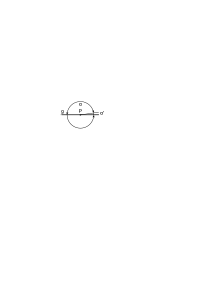

man ja gar nicht annehmen. Die Beweise in der Geometrie, in der Mathematik, können im eigentlichen Sinn nicht indirekt sein weil man nicht das Gegenteil von einem geometrischen Satz annehmen kann solange man nämlich an einer bestimmten Geometrie festhält. Jener Beweis zeigt einfach daß die Bogenstücke α und α + α' sich einander umsomehr & ohne Grenze nähern je mehr sich α' der 0 nähert.

### [30\[2\]](https://cdn.wittgensteinnachlass.com/2000px/webp/Ms-108/30.webp)

22.12.1929

Ist die Zeit in der die Erlebnisse des Gesichtsraums vor sich gehen ohne Tonerlebnisse denkbar? Es scheint ja! & doch wie seltsam daß etwas eine Form sollte haben können die auch ohne eben _diesen_ Inhalt denkbar wäre. Oder lernt der dem das Gehör geschenkt würde, damit auch eine neue Zeit kennen? Die hergebrachten Fragen taugen zur logischen Untersuchung der Phänomene nicht. Diese schaffen sich ihre eigenen Fragen oder vielmehr, geben ihre eigenen Antworten.

### [30\[3\]](https://cdn.wittgensteinnachlass.com/2000px/webp/Ms-108/30.webp)

Wie weit wird die Logik durch die Unsicherheit über die Analyse der Elementarsätze unsicher? – Was steht fest?

### [30\[4\]](https://cdn.wittgensteinnachlass.com/2000px/webp/Ms-108/30.webp)

Was ist der Unterschied zwischen der logischen Multiplizität einer Erklärung der Erscheinungen durch die Naturwissenschaft & der logischen Multiplizität einer Beschreibung?

### [30\[5\]](https://cdn.wittgensteinnachlass.com/2000px/webp/Ms-108/30.webp),[31\[1\]](https://cdn.wittgensteinnachlass.com/2000px/webp/Ms-108/31.webp)

Wäre z.B. ein gleichmäßig tickendes Geräusch in der Physik darzustellen so würde dazu die Multiplizität des Bildes <math display="inline"><mspace width="0.3em"/><mtext>├</mtext><mtext>─</mtext><mtext>─</mtext><mtext>─</mtext><mtext>┼</mtext><mtext>─</mtext><mtext>─</mtext><mtext>─</mtext><mtext>┼</mtext><mtext>─</mtext><mtext>─</mtext><mtext>─</mtext><mtext>┼</mtext><mtext>─</mtext><mtext>─</mtext><mtext>─</mtext><mtext>┼</mtext><mtext>─</mtext><mtext>─</mtext><mtext>─</mtext><mtext>┼</mtext><mspace width="0.3em"/><mtext>→</mtext></math> genügen, aber hier handelt es sich nicht um die logische Multiplizität des Tones sondern um die der regelmäßig beobachteten Erscheinung. Und so stellt die Relativitätstheorie nicht etwa die logische Mannigfaltigkeit der Phänomene selbst dar sondern die Mannigfaltigkeit der beobachteten Regelmäßigkeiten.

### [31\[2\]](https://cdn.wittgensteinnachlass.com/2000px/webp/Ms-108/31.webp)

23.12.1929

Es ist so: die grammatischen Regeln über „und”, „nicht”, „oder” etc. sind eben nicht damit erschöpft was ich in der Abhandlung gesagt habe sondern es gibt Regeln über die Wahrheitsfunktionen die auch von dem elementaren Teil des Satzes handeln.

### [31\[3\]](https://cdn.wittgensteinnachlass.com/2000px/webp/Ms-108/31.webp)

Unserer Grammatik fehlt es vor allem an _Übersichtlichkeit_.

### [31\[4\]](https://cdn.wittgensteinnachlass.com/2000px/webp/Ms-108/31.webp),[32\[1\]](https://cdn.wittgensteinnachlass.com/2000px/webp/Ms-108/32.webp)

Wenn ich sage „die obere Strecke <math display="inline"><mtext>├</mtext><mtext>─</mtext><mtext>─</mtext><mtext>─</mtext><mtext>─</mtext><mtext>─</mtext><mtext>┤</mtext><mtext>├</mtext><mtext>─</mtext><mtext>─</mtext><mtext>─</mtext><mtext>─</mtext><mtext>─</mtext><mtext>┤</mtext></math> ist so lang wie die untere” & mit diesem Satz das meine was sonst der Satz „die obere Strecke erscheint mir so lang wie die untere” sagt, dann hat in dem Satz das Wort „gleich” eine ganz andere Bedeutung wie im gleichlautenden Satz für den die Verifikation die Übertragung der Länge mit dem Zirkel ist. Darum kann ich zum Beispiel im zweiten Fall von einem Verbessern der Vergleichsmethoden reden, aber nicht im ersten Falle. Der Gebrauch des selben Wortes „gleich” in ganz verschiedenen Bedeutungen ist sehr verwirrend. Er ist der typische Fall daß Worte & Redewendungen die sich ursprünglich auf die „Dinge” der physikalischen Ausdrucksweise, die „Körper im Raum”, beziehen auf die Teile unseres Gesichtsfeldes angewendet werden wobei sie ihre Bedeutung gänzlich wechseln müssen & die Aussagen ihren Sinn verlieren die früher einen hatten & andere einen Sinn gewinnen die in der ersten Ausdrucksart keinen hatten. Wenn auch eine gewisse Analogie bestehen bleibt, eben die, die uns verführt den gleichen Ausdruck zu gebrauchen.

### [32\[2\]](https://cdn.wittgensteinnachlass.com/2000px/webp/Ms-108/32.webp)

Es ist merkwürdig, daß wir das Gefühl daß das Phänomen uns entschlüpft, den ständigen Fluß der Erscheinung, im gewöhnlichen Leben nie spüren, sondern erst wenn wir philosophieren. Das deutet darauf hin daß es sich hier um einen Gedanken handelt der uns durch eine falsche Verwendung unserer (gewöhnlichen) Sprache suggeriert wird.

### [32\[3\]](https://cdn.wittgensteinnachlass.com/2000px/webp/Ms-108/32.webp),[33\[1\]](https://cdn.wittgensteinnachlass.com/2000px/webp/Ms-108/33.webp)

Das Gefühl ist nämlich daß die Gegenwart in die Vergangenheit schwindet ohne daß wir es hindern können. Und hier bedienen wir uns doch offenbar des Bildes eines Streifens der sich unaufhörlich an uns vorbei bewegt & den wir nicht aufhalten können. Aber es ist natürlich ebenso klar daß das Bild mißbraucht ist. Daß man nicht sagen kann „die Zeit fließt” wenn man mit „Zeit” die Möglichkeit der Veränderung meint.

### [33\[2\]](https://cdn.wittgensteinnachlass.com/2000px/webp/Ms-108/33.webp),[34\[1\]](https://cdn.wittgensteinnachlass.com/2000px/webp/Ms-108/34.webp)

Vielleicht beruht diese ganze Schwierigkeit auf der Übertragung des Zeitbegriffs der physikalischen Zeit auf den Verlauf der unmittelbaren Erlebnisse. Es ist eine Verwechselung der Zeit des Filmstreifens mit der Zeit des Leinwandbildes. Denn „die Zeit” hat eine andere Bedeutung wenn wir das Gedächtnis als die Quelle der Zeit auffassen und wenn wir es als ein aufbewahrtes Bild des vergangenen Ereignisses auffassen. Wenn wir das Gedächtnis als ein Bild auffassen dann ist es ein Bild eines physikalischen Ereignisses. Das Bild verblaßt & ich merke sein Verblassen wenn ich es mit anderen Zeugnissen des Vergangenen vergleiche. Hier ist das Gedächtnis nicht Quelle der Zeit sondern mehr oder weniger gute Aufbewahrerin dessen was „wirklich” gewesen ist & dieses war eben etwas wovon wir auch andere Kunde haben können, ein physikalisches Ereignis. Ganz anders ist es wenn wir nun das Gedächtnis als Quelle der Zeit betrachten. Es ist hier kein Bild & kann auch nicht verblassen – in dem Sinne wie ein Bild verblaßt so daß es seinen Gegenstand immer weniger & weniger getreu darstellt. Beide Ausdrucksweisen sind in Ordnung & gleichberechtigt aber nicht mit einander vermischbar. Es ist ja klar daß die Ausdrucksweise vom Gedächtnis als einem Bild nur ein Bild ist; genau so wie die Ausdrucksweise die die Vorstellungen „Bilder der Gegenstände in unserem Geiste” (oder dergleichen) nennt. Was ein Bild ist das wissen wir, aber die Vorstellungen sind doch gar keine Bilder. Denn sonst kann ich das Bild sehen & den Gegenstand dessen Bild es ist aber hier ist es offenbar ganz anders. Wir haben eben ein Gleichnis gebraucht & nun tyrannisiert uns das Gleichnis. In der Sprache dieses Gleichnisses kann ich mich nicht außerhalb des Gleichnisses bewegen. Es muß zu Unsinn führen, wenn man mit der Sprache dieses Gleichnisses über das Gedächtnis als Quelle unserer Erkenntnis, als Verifikation unserer Sätze, reden will. Man kann von Gegenwärtigen, Vergangenen & Zukünftigen Ereignissen in der physikalischen Welt reden aber nicht von gegenwärtigen, vergangenen & zukünftigen Vorstellungen wenn man als Vorstellung nicht doch wieder eine Art physikalischen Gegenstand (etwa jetzt ein physikalisches Bild statt des Körpers) bezeichnet sondern gerade eben das Gegenwärtige. Man kann also den Zeitbegriff, d.h. die Regeln der Syntax wie sie von den physikalischen Substantiven gelten, nicht in der Welt der Vorstellung anwenden d.h. nicht dort wo man sich einer radikal anderen Ausdrucksweise bedient.

### [35\[1\]](https://cdn.wittgensteinnachlass.com/2000px/webp/Ms-108/35.webp)

24.12.1929

Die neue Auffassung der Elementarsätze bringt es mit sich daß ein Satz der Wahrheit mehr oder weniger _nahe_ sein kann. (Da Rot näher an Orange als an Blau ist & 2 m näher an 201 cm als an 3 m.)

### [35\[2\]](https://cdn.wittgensteinnachlass.com/2000px/webp/Ms-108/35.webp)

Die Sätze werden in diesem Falle noch ähnlicher Maßstäben, als ich früher geglaubt habe. – Das Stimmen _eines_ Maßes schließt automatisch alle anderen aus. Ich sage automatisch: Wie alle Teilstriche auf _einem_ Stab sind so gehören die Sätze die den Teilstrichen entsprechen zusammen & man kann nicht mit einem von ihnen messen ohne zugleich auch mit allen anderen zu messen. – Ich lege nicht den Satz als Maßstab an die Wirklichkeit an sondern das _System_ von Sätzen.

### [35\[3\]](https://cdn.wittgensteinnachlass.com/2000px/webp/Ms-108/35.webp)

Man könnte nun die Regel aufstellen daß derselbe Maßstab in einem Satz nur **ein**mal angelegt werden darf. Oder daß die Teile die verschiedenen Applizierungen des selben Maßstabs entsprechen zusammengefaßt werden müssen.

### [35\[4\]](https://cdn.wittgensteinnachlass.com/2000px/webp/Ms-108/35.webp)

Hat nun z.B. die Frage einen Sinn „gibt es Sätze die einzeln, in keinem System, stehen?”?

### [36\[1\]](https://cdn.wittgensteinnachlass.com/2000px/webp/Ms-108/36.webp)

Ich glaube die Frage kann keinen Sinn haben. Angenommen es gäbe keinen solchen Satz wie könnte man ihn dann auch nur denken? Also kann man auch nicht nach ihm fragen, auch nicht wenn es ihn gibt.

### [36\[2\]](https://cdn.wittgensteinnachlass.com/2000px/webp/Ms-108/36.webp)

25.12.1929

Wenn ich etwas über Verifikation & Grammatik sage so bin ich mir so klar darüber wie über den Sinn des Satzes „draußen regnet es”; nicht klarer. Aber klarer kann ich auch über nichts sein.

### [36\[3\]](https://cdn.wittgensteinnachlass.com/2000px/webp/Ms-108/36.webp),[37\[1\]](https://cdn.wittgensteinnachlass.com/2000px/webp/Ms-108/37.webp)

„Ich habe keine Magenschmerzen” ist vergleichbar dem Satz „diese Äpfel kosten _nichts_”. Sie kosten nämlich kein _Geld_ aber nicht keinen Schnee oder keine Mühe. Der Nullpunkt ist der Nullpunkt auf _einer_ Skala. Und da mir kein Punkt des Maßstabes gegeben sein kann ohne den Maßstab, so auch nicht sein Nullpunkt. „Ich habe keine Schmerzen” bezeichnet doch nicht einen Zustand in dem von Schmerzen nicht die Rede ist. Sondern es ist von Schmerzen die Rede. Der Satz setzt die Fähigkeit voraus Schmerzen zu fühlen & das kann keine „physiologische Fähigkeit” sein – denn wie wüßte man sonst wozu es die Fähigkeit ist – sondern eine logische Möglichkeit. – Ich beschreibe meinen gegenwärtigen Zustand durch die Allusion auf etwas was nicht der Fall ist. Wenn diese Hinweisung zu der Beschreibung nötig ist (& nicht bloß eine Verzierung) so muß in meinem gegenwärtigen Zustand etwas liegen was diese Hinweisung nötig macht. Ich vergleiche diesen Zustand mit einem Anderen also muß er mit ihm vergleichbar sein. Er muß auch im Schmerzraum liegen wenn auch an einer anderen Stelle. – Sonst würde mein Satz etwa heißen mein gegenwärtiger Zustand hat mit einem schmerzhaften _nichts zu tun_; etwa wie ich sagen würde die Farbe dieser Rose hat mit der Eroberung Galliens durch Cäsar nichts zu tun. D.h. es ist kein Zusammenhang vorhanden. Aber ich meine gerade daß zwischen meinem jetzigen Zustand & einem schmerzhaften ein Zusammenhang besteht.

### [37\[2\]](https://cdn.wittgensteinnachlass.com/2000px/webp/Ms-108/37.webp)

Ich beschreibe einen Sachverhalt doch nicht dadurch daß ich das erwähne was mit ihm nichts zu tun hat & konstatiere daß es mit ihm nichts zu tun hat. Das wäre keine negative Beschreibung.

### [37\[3\]](https://cdn.wittgensteinnachlass.com/2000px/webp/Ms-108/37.webp)

„Der Sinn liegt in der Wiedererkennbarkeit” aber dies ist eine logische Möglichkeit. Ich muß mich mit meinen Gedanken in dem Raum befinden in dem das zu Erwartende liegt.

### [37\[4\]](https://cdn.wittgensteinnachlass.com/2000px/webp/Ms-108/37.webp),[38\[1\]](https://cdn.wittgensteinnachlass.com/2000px/webp/Ms-108/38.webp)

Die Wahrheit hat einen Granitgrund, bis zu dem kann man kommen & weiter (ohnehin) nicht.

### [38\[2\]](https://cdn.wittgensteinnachlass.com/2000px/webp/Ms-108/38.webp)

Ich bin ein Schwein & dabei bin ich doch nicht unglücklich. Ich bin in der Gefahr noch seichter zu werden. Möge Gott es verhüten!

### [38\[3\]](https://cdn.wittgensteinnachlass.com/2000px/webp/Ms-108/38.webp)

26.12.1929

Wir können von zwei verschiedenen unendlichen Möglichkeiten sprechen aber hier hat das Wort verschieden einen anderen Sinn als im Falle verschiedener endlicher Möglichkeiten. Und das zeigt sich auch daran daß diese Verschiedenheit eine andere Multiplizität hat.

### [38\[4\]](https://cdn.wittgensteinnachlass.com/2000px/webp/Ms-108/38.webp)

Es hat einen klaren & einfachen Sinn zu sagen daß zwei (natürlich endliche) Dezimalbrüche verschieden sind. Es hat einen ganz anderen (quasi abgeleiteten) Sinn zu sagen die unendlichen Möglichkeiten der beiden seien verschieden. Und diese Verschiedenheit hat eine andere Multiplizität als jene.

### [38\[5\]](https://cdn.wittgensteinnachlass.com/2000px/webp/Ms-108/38.webp),[39\[1\]](https://cdn.wittgensteinnachlass.com/2000px/webp/Ms-108/39.webp)

Was heißt der Satz „A ist mein Ahne”? D.h.: wie kann ich wissen daß jemand mein Ahne ist? Wenn dadurch daß ich ihn unter meinen Ahnen suche so heißt das unter einer endlichen Anzahl. Oder die Verifikation wäre daß er eine bestimmte Eigenschaft hat die man bei meinem Vater, Großvater etc. wahrgenommen hat dann sagt der Satz auch nicht mehr als: A hat diese Eigenschaft. Wie wäre es aber wenn unsre Ahnen mit einer bestimmten Anzahl von Strichen auf der Stirn zur Welt gekommen wären so daß etwa mein Vater einen hat mein Großvater zwei u.s.f.? Dann hieße „A ist mein Ahne” doch: er hat irgend eine Anzahl Striche auf der Stirn. Die _scheinbare_ vollständige Allgemeinheit heißt aber hier wieder nichts denn entweder weiß ich nun daß A – sagen wir – 25 Striche auf der Stirn hat oder ich weiß, daß er zwischen n & m Striche hat. Denn daß die Striche die er hat _eine Anzahl_ sind, kann man nicht _sagen_ (das wäre nur ein Satz der Grammatik über das betreffende Zahlwort).

### [39\[2\]](https://cdn.wittgensteinnachlass.com/2000px/webp/Ms-108/39.webp)

Es ist z.B. wichtig daß in dem Satz „ein roter Fleck befindet sich nahe an der Grenze des Gesichtsfeldes” das „nahe an” eine andere Bedeutung hat als in einem Satz „der rote Fleck im Gesichtsfeld befindet sich nahe an dem braunen Fleck”. Das Wort Grenze in dem vorigen Satz hat ferners eine andere Bedeutung – & ist eine andere Wortart – als in dem Satz „die Grenze zwischen Rot & Blau im Gesichtsfeld ist ein Kreis”.

### [39\[3\]](https://cdn.wittgensteinnachlass.com/2000px/webp/Ms-108/39.webp),[40\[1\]](https://cdn.wittgensteinnachlass.com/2000px/webp/Ms-108/40.webp)

Welchen Sinn hat es zu sagen: unser Gesichtsbild ist an den Rändern undeutlicher als gegen die Mitte? Wenn wir hier nämlich nicht davon reden daß wir die _physikalischen Gegenstände_ in der Mitte des Gesichtsfeldes deutlicher sehen. –

Eines der klarsten Beispiele der Verwechslung zwischen physikalischer & phänomenologischer Sprache ist das Bild welches Mach von seinem Gesichtsfeld entworfen hat & worin die sogenannte Verschwommenheit der Gebilde gegen den Rand des Gesichtsfeldes durch eine Verschwommenheit (in ganz anderem Sinne) der Zeichnung wiedergegeben wurde. Nein, ein sichtbares Bild des Gesichtsbildes kann man nicht machen. Kann ich also sagen, daß die Farbflecken in der Nähe des Randes des Gesichtsfeldes keine scharfen Konturen mehr haben: Sind denn Konturen dort _denkbar_? Wie aber ist so eine Frage überhaupt möglich? Ich glaube es ist klar daß jene Undeutlichkeit eine interne Eigenschaft des Gesichtsraumes ist.

Hat, z.B., das Wort „Farbe” im Grunde eine andere Bedeutung wenn es sich auf Gebilde in der Randnähe bezieht? Was kann die Untersuchung über den Gesichtsraum zu Tage fördern? Die Grenzenlosigkeit des Gesichtsraums ist ohne jene „Verschwommenheit” nicht denkbar.

### [40\[2\]](https://cdn.wittgensteinnachlass.com/2000px/webp/Ms-108/40.webp),[41\[1\]](https://cdn.wittgensteinnachlass.com/2000px/webp/Ms-108/41.webp)

Es fragt sich: Welche Unterschiede gibt es im Gesichtsraum? Kann man darüber aus der Koordination, z.B., des Tastraums mit dem Gesichtsraum etwas erfahren? Indem man etwa angibt welche Veränderungen in dem einen Raum keiner Veränderung im anderen entsprechen?

### [41\[2\]](https://cdn.wittgensteinnachlass.com/2000px/webp/Ms-108/41.webp)

Die Tatsache daß man ein physikalisches 100-Eck als Kreis sieht, es nicht von einem physikalischen Kreis unterscheiden kann, sagt gar nichts über die _Möglichkeit_ ein 100-Eck zu sehen.

### [41\[3\]](https://cdn.wittgensteinnachlass.com/2000px/webp/Ms-108/41.webp)

Daß es mir nicht gelingt einen physikalischen Körper zu finden, der das Gesichtsbild eines Hundertecks gibt ist nicht von logischer Bedeutung. Es fragt sich: Hat es _Sinn_ von einem Gesichtshunderteck zu reden. Oder: Hat es Sinn von zugleich _gesehenen_ dreißig Strichen nebeneinander ∣∣∣∣∣∣∣∣∣∣∣∣∣∣∣∣∣∣∣∣∣∣∣∣∣∣∣∣∣∣ zu reden. Ich glaube, nein!

### [41\[4\]](https://cdn.wittgensteinnachlass.com/2000px/webp/Ms-108/41.webp)

Der Vorgang ist gar nicht so daß man zuerst ein 3-Eck, dann ein 4-Eck, 5-Eck etc. bis z.B. zum 50-Eck sieht & dann der Kreis kommt; sondern man sieht ein 3-Eck ein 4-Eck etc. bis vielleicht zum 8-Eck dann sieht man nur mehr Viel-Ecke mit mehr oder weniger langen Seiten. Die Seiten werden kleiner dann beginnt ein Fluktuieren zum Kreis hin & dann kommt der Kreis.

### [41\[5\]](https://cdn.wittgensteinnachlass.com/2000px/webp/Ms-108/41.webp),[42\[1\]](https://cdn.wittgensteinnachlass.com/2000px/webp/Ms-108/42.webp)

Daß eine physikalische Gerade als Tangente an einen Kreis gezogen das Gesichtsbild einer geraden Linie gibt die ein Stück weit mit der gekrümmten zusammenläuft beweist auch nicht daß unser Sehraum nicht euklidisch ist denn es könnte sehr wohl ein anderes physikalisches Gebilde etwa

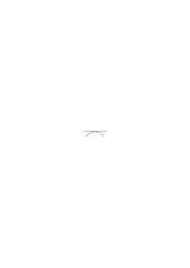

das der euklidischen Tangente entsprechende Bild erzeugen. Tatsächlich aber ist ein solches Bild undenkbar.

### [42\[2\]](https://cdn.wittgensteinnachlass.com/2000px/webp/Ms-108/42.webp)

27.12.1929

Was heißt der Satz: „wir sehen nie einen genauen Kreis”? Was ist das Kriterium der Genauigkeit? Könnte ich nicht auch sehr wohl sagen „ich sehe vielleicht einen genauen Kreis kann es aber nie wissen”? Das alles hat nur dann Sinn wenn man festgelegt hat in welchem Fall man eine Messung genauer nennt als eine andere. Der Begriff des Kreises setzt nun – glaube ich – einen Begriff der „größeren Genauigkeit” voraus der eine unendliche Möglichkeit der Steigerung hat. Und man kann sagen der Begriff des Kreises _ist_ der Begriff der unendlichen Steigerungsmöglichkeit der Genauigkeit. Diese unendliche Steigerungsfähigkeit wäre ein Postulat der Ausdrucksweise. Es muß dann natürlich in jedem Fall klar sein was ich als eine Vergrößerung der Genauigkeit auffassen würde.

### [42\[3\]](https://cdn.wittgensteinnachlass.com/2000px/webp/Ms-108/42.webp),[43\[1\]](https://cdn.wittgensteinnachlass.com/2000px/webp/Ms-108/43.webp)

Das heißt natürlich nichts, zu sagen, der Kreis sei nur ein Ideal dem sich die Wirklichkeiten nur nähern könnten. Das ist ein falsches Gleichnis. Denn nähern kann man sich nur einer Sache die vorhanden ist und ist uns der Kreis in irgend einer Form gegeben so daß wir uns ihm nähern können dann wäre eben jene Form das für uns Wichtige und die Annäherung einer anderen Form an sie nebensächlich. Es kann aber auch so sein daß wir eine unendliche Möglichkeit selbst den Kreis nennen. Es verhält sich dann mit dem Kreis wie mit einer irrationalen Zahl.

### [43\[2\]](https://cdn.wittgensteinnachlass.com/2000px/webp/Ms-108/43.webp)

Es scheint mir der Applikation der euklidischen Geometrie wesentlich daß wir von einem _ungenauen_ Kreis, einer _ungenauen_ Kugel etc. sprechen. Und auch daß diese Ungenauigkeit einer Verkleinerung logisch unbegrenzt fähig sein muß. Um also die Anwendung der euklidischen Geometrie zu verstehen muß man wissen was das Wort „_ungenau_” heißt. – Denn etwas anderes ist uns nicht gegeben als das Resultat unserer Messung & der Begriff der Ungenauigkeit. Diese beiden zusammen müssen der euklidischen Geometrie entsprechen.

### [43\[3\]](https://cdn.wittgensteinnachlass.com/2000px/webp/Ms-108/43.webp)

Ist nun die Ungenauigkeit der Messung der gleiche Begriff wie die Ungenauigkeit des Gesichtsbildes? Ich glaube: gewiß nicht.

### [43\[4\]](https://cdn.wittgensteinnachlass.com/2000px/webp/Ms-108/43.webp),[44\[1\]](https://cdn.wittgensteinnachlass.com/2000px/webp/Ms-108/44.webp),[45\[1\]](https://cdn.wittgensteinnachlass.com/2000px/webp/Ms-108/45.webp)

Wenn die Aussage, daß wir nie einen genauen Kreis _sehen_ bedeuten soll daß wir z.B. keine Gerade sehen die den Kreis in einem Punkt berührt (d.h. daß nichts in unserem Sehraum die Multiplizität der einen Kreis berührenden Gerade hat) dann ist zu _dieser_ Ungenauigkeit nicht ein beliebig hoher Grad der Genauigkeit denkbar. Das Wort Gleichheit hat eine andere Bedeutung wenn wir es auf Strecken im Sehraum anwenden als die es auf den physikalischen Raum angewendet hat. Die Gleichheit im Sehraum hat eine andere Multiplizität als die Gleichheit im physikalischen Raum, _darum_ können im Sehraum

g1 & g2 Gerade (Sehgerade) sein & die Strecken <math class="stacked" display="inline"><msub><mi>a</mi><mn>1</mn></msub><mspace width="0.3em"/><mo>=</mo><msub><mi>a</mi><mn>2</mn></msub></math>, <math class="stacked" display="inline"><msub><mi>a</mi><mn>2</mn></msub><mspace width="0.3em"/><mo>=</mo><msub><mi>a</mi><mn>3</mn></msub></math> etc. aber _nicht_ <math class="stacked" display="inline"><msub><mi>a</mi><mn>1</mn></msub><mspace width="0.3em"/><mo>=</mo><msub><mi>a</mi><mn>5</mn></msub></math> sein. Ebenso hat der Kreis & die Gerade im Gesichtsraum eine andere Multiplizität als Kreis & Gerade im physikalischen Raum denn ein kurzes Stück eines gesehenen Kreises kann gerade sein; „Kreis” & „Gerade” eben im Sinne der Gesichtsgeometrie angewandt. Die Gewöhnliche Sprache hilft sich hier mit dem Worte „scheint” oder „erscheint”. Sie sagt <math class="stacked" display="inline"><msub><mi>a</mi><mn>1</mn></msub></math> & <math class="stacked" display="inline"><msub><mi>a</mi><mn>2</mn></msub></math> scheinen gleich zu sein während zwischen a1 & a5 dieser Schein schon nicht mehr besteht. Aber sie benutzt das Wort Schein zweideutig. Denn seine Bedeutung hängt davon ab, was diesem Schein nun als das Sein gegenübergestellt wird. In einem Fall ist es das Resultat einer Messung im anderen eine weitere Erscheinung. In diesen Fällen ist also die Bedeutung des Wortes „scheinen” eine verschiedene.

### [45\[2\]](https://cdn.wittgensteinnachlass.com/2000px/webp/Ms-108/45.webp),[46\[1\]](https://cdn.wittgensteinnachlass.com/2000px/webp/Ms-108/46.webp)

28.12.1929

Es ist jetzt an der Zeit (einmal) Kritik am Worte „Sinnesdatum” zu üben.

Sinnesdatum ist die Erscheinung dieses Baumes ob nun „wirklich ein Baum dasteht” oder eine Attrappe, ein Spiegelbild, eine Halluzination etc.. Sinnesdatum ist die Erscheinung des Baumes und was wir sagen wollen ist, daß diese sprachliche Darstellung, nur _eine_ Beschreibung aber nicht _die_ wesentliche ist. Genau so, wie man von dem Ausdruck „_mein_ Gesichtsbild” sagen kann daß es nur _eine_ Form der _Beschreibung_ aber nicht etwa die einzig mögliche & richtige ist. Die Ausdrucksform „die Erscheinung dieses Baumes” enthält nämlich die Anschauung als bestünde ein innerer Zusammenhang dessen was wir diese Erscheinung nennen mit der „Existenz eines Baumes” & zwar entweder durch eine wahre Erkenntnis oder einen Irrtum. D.h. wenn von der „Erscheinung eines Baumes” die Rede ist so hielten wir entweder etwas für einen Baum was einer ist oder etwas was keiner ist. Dieser Zusammenhang aber besteht nicht. Manche (& insbesondere die Idealisten) möchten der Sprache vorwerfen daß sie das Sekundäre als primär & das Primäre als sekundär darstellt. Aber das ist nur in diesen unwesentlichen & mit der Erkenntnis nicht zusammenhängenden Wertungen der Fall („nur” die Erscheinung). Davon abgesehen enthält die gewöhnliche Sprache keine Entscheidung über primär & sekundär. Es ist nicht einzusehen in wiefern der Ausdruck „die Erscheinung eines Baumes” etwas dem Ausdruck „Baum” Sekundäres darstellt. Der Ausdruck „nur ein Bild” geht auf die Vorstellung zurück daß wir das Bild eines Apfels nicht essen können.

### [46\[2\]](https://cdn.wittgensteinnachlass.com/2000px/webp/Ms-108/46.webp),[47\[1\]](https://cdn.wittgensteinnachlass.com/2000px/webp/Ms-108/47.webp)

Die Wahrheit über sich selbst kann man in dem verschiedensten Geiste schreiben. Im anständigsten & unanständigsten. Und danach ist es sehr wünschenswert oder sehr unrichtig daß sie geschrieben werde. Ja es gibt unter den wahrhaften Autobiographien die man schreiben könnte alle Stufen vom Höchsten zum Niedrigen. Ich zum Beispiel kann meine Biographie nicht höher schreiben als ich bin. Und durch die bloße Tatsache daß ich sie schreibe hebe ich mich nicht _notwendigerweise_ ich _kann_ mich dadurch sogar schmutziger machen als ich schon war.

Etwas in mir spricht dafür meine Biographie zu schreiben und zwar möchte ich mein Leben einmal klar ausbreiten um es klar vor mir zu haben & auch für andere. Nicht so sehr um darüber Gericht zu halten als um jedenfalls Klarheit & Wahrheit zu schaffen. Heute Nachmittag hörte ich Koder der mir vorspielte. Ich redete ihm ins Gewissen, er solle das Klavierspiel ernst nehmen, sein Spiel war mir nicht ernst genug. Dann ging ich zu Helene & pfiff mit ihrer Begleitung Schubertlieder & meine Gedanken waren nie wirklich konzentriert ich dachte immer an mich selbst & konnte mich nicht wirklich einfühlen oder der Sache hingeben. Es war nie wirklicher _Ernst_. Ich tat immer irgendetwas aber es war nie oder beinahe nie das Richtige. Ich sagte mir vor daß die Sache ernst sei aber es flog alles an mir vorüber. Ich fühlte daß ich ein Schwein bin weil ich auch Echtes mit Unechtem mische. Möchte mir Gott Reinheit & Wahrheit schicken.

### [47\[2\]](https://cdn.wittgensteinnachlass.com/2000px/webp/Ms-108/47.webp),[48\[1\]](https://cdn.wittgensteinnachlass.com/2000px/webp/Ms-108/48.webp)

Daß uns nichts auffällt wenn wir uns umsehen, im Raum herumgehen, unseren eigenen Körper fühlen etc. etc. das zeigt wie natürlich uns eben diese Dinge sind. Wir nehmen nicht wahr daß wir den Raum perspektivisch sehen oder daß das Gesichtsbild gegen den Rand zu in irgend einem Sinne verschwommen ist. Es fällt uns nie auf & kann uns nie auffallen, weil es _die_ Art der Wahrnehmung ist. Wir denken nie darüber nach & es ist unmöglich weil es zu der Form unserer Welt keinen Gegensatz gibt.

### [48\[2\]](https://cdn.wittgensteinnachlass.com/2000px/webp/Ms-108/48.webp)

Ich wollte sagen es ist merkwürdig daß die, die nur den Dingen nicht unseren Vorstellungen Realität zuschreiben sich in der Vorstellungswelt so selbstverständlich bewegen und sich nie aus ihr heraussehnen.

### [48\[3\]](https://cdn.wittgensteinnachlass.com/2000px/webp/Ms-108/48.webp)

D.h. wie selbstverständlich ist doch das Gegebene. Es müßte mit allen Teufeln zugehen wenn das das kleine aus einem Winkel aufgenommene Bildchen wäre.

### [48\[4\]](https://cdn.wittgensteinnachlass.com/2000px/webp/Ms-108/48.webp)

29.12.1929

Dieses selbstverständliche, _das Leben_, soll etwas Zufälliges, Nebensächliches sein; dagegen etwas worüber ich mir normalerweise nie den Kopf zerbreche das Eigentliche!

### [48\[5\]](https://cdn.wittgensteinnachlass.com/2000px/webp/Ms-108/48.webp)

D.h. Das, worüber hinaus man nicht gehen kann, noch gehen will, soll nicht die Welt sein!

### [48\[6\]](https://cdn.wittgensteinnachlass.com/2000px/webp/Ms-108/48.webp),[49\[1\]](https://cdn.wittgensteinnachlass.com/2000px/webp/Ms-108/49.webp)

30.12.1929

Immer wieder ist es der Versuch die Welt in der Sprache abzugrenzen & hervorzuheben – was aber nicht geht. Die Selbstverständlichkeit der Welt drückt sich eben darin aus daß die Sprache nur sie bedeutet, & nur sie bedeuten kann.

### [49\[2\]](https://cdn.wittgensteinnachlass.com/2000px/webp/Ms-108/49.webp)

Denn da die Sprache die Art ihres Bedeutens erst von ihrer Bedeutung, von der Welt, erhält, so ist keine Sprache denkbar, die nicht diese Welt darstellt.

### [49\[3\]](https://cdn.wittgensteinnachlass.com/2000px/webp/Ms-108/49.webp)

Wir können unser altes Prinzip auf die Sätze, die eine Wahrscheinlichkeit aussagen, anwenden & sagen daß wir ihren Sinn erkennen werden wenn wir bedenken was sie verifiziert.

### [49\[4\]](https://cdn.wittgensteinnachlass.com/2000px/webp/Ms-108/49.webp)

Wenn ich sage „das wird wahrscheinlich eintreffen”; wird dieser Satz durch das Eintreffen verifiziert oder durch das Nichteintreffen falsifiziert? Ich glaube, offenbar nein. Dann sagt er auch nichts darüber aus. Denn wenn ein Streit darüber entstünde ob es wahrscheinlich ist oder nicht so würden immer nur Argumente aus der Vergangenheit herangezogen werden. _Und auch dann nur_, wenn es bereits bekannt wäre, was eingetroffen ist.

### [49\[5\]](https://cdn.wittgensteinnachlass.com/2000px/webp/Ms-108/49.webp),[50\[1\]](https://cdn.wittgensteinnachlass.com/2000px/webp/Ms-108/50.webp)

(Ich mache damit keine Aussage über den Zustand der Erwartung in welchem ich mich befinde denn sonst wäre die Aussage von der Art _der_ „ich habe Kopfschmerzen” & man könnte dann nur Teilnahme äußern aber ein Streit könnte darüber nicht entstehen.)

### [50\[2\]](https://cdn.wittgensteinnachlass.com/2000px/webp/Ms-108/50.webp)

31.12.1929

Um den Sinn einer Frage zu verstehen, bedenken wir: Wie sieht denn die Antwort auf diese Frage aus?

### [50\[3\]](https://cdn.wittgensteinnachlass.com/2000px/webp/Ms-108/50.webp)

Auf die Frage „ist A mein Ahne” kann ich mir nur die Antworten denken „A findet sich in meiner Ahnengalerie” oder „A findet sich nicht in meiner Ahnengalerie”. (Wo ich unter Ahnengalerie die Gesamtheit aller Arten von Nachrichten über meine Vorfahren verstehe.) Dann konnte aber auch die Frage nur dasselbe heißen wie die: „findet sich A in meiner Ahnengalerie?”. (Eine Ahnengalerie hat ein Ende: das ist ein Satz der Syntax.) Wenn mir ein Gott offenbarte, A sei mein Ahne, aber nicht welcher, so könnte auch diese Offenbarung für mich nur den Sinn haben, ich werde A unter meinen Ahnen finden wenn ich nur lang genug suche _da ich aber die Zahl **N** von Ahnen_ durchsuchen werde so muß die Offenbarung bedeuten A sei unter jenen _N_ Ahnen.

### [50\[4\]](https://cdn.wittgensteinnachlass.com/2000px/webp/Ms-108/50.webp),[51\[1\]](https://cdn.wittgensteinnachlass.com/2000px/webp/Ms-108/51.webp)

Frage ich wie viele 9er folgen unmittelbar nacheinander auf 3˙1415 in der Entwicklung von π & soll sich die Frage auf die Extension beziehen, so lautet die Antwort entweder daß man bei der Entwicklung der Extension bis zur letzt entwickelten (Nten) Stelle über die 9er-Reihe hinausgekommen ist, oder, daß bis zur Nten Stelle 9er auf einander folgen. Dann aber konnte auch die Frage keinen anderen Sinn haben als den „sind die ersten N–5 Stellen von π lauter 9er oder nicht?” Das ist aber freilich nicht die Frage die uns interessiert.

### [51\[2\]](https://cdn.wittgensteinnachlass.com/2000px/webp/Ms-108/51.webp)

Wenn ich nicht weiß wieviele 9er auf 3˙1415 folgen können so kann ich also keine Distanz angeben die kleiner ist als der Unterschied zwischen π und 3˙1416 & das heißt, glaube ich, daß π nicht einem Punkt auf der Zahlengeraden entspricht denn entspricht es einem Punkt dann muß sich eine Strecke angeben lassen die kleiner ist als die Strecke von diesem Punkt zum Punkt 3˙1416.

### [51\[3\]](https://cdn.wittgensteinnachlass.com/2000px/webp/Ms-108/51.webp),[52\[1\]](https://cdn.wittgensteinnachlass.com/2000px/webp/Ms-108/52.webp)

Wie seltsam wenn sich die Logik mit einer „idealen” Sprache befaßte & nicht mit _unserer_. Denn was sollte diese ideale Sprache ausdrücken? Doch wohl das was wir jetzt in unserer gewöhnlichen Sprache ausdrücken dann muß die Logik also diese untersuchen. Oder etwas anderes: aber wie soll ich dann überhaupt wissen was das ist. – Die logische Analyse ist die Analyse von etwas was wir haben nicht von etwas was wir nicht haben. Sie ist also die Analyse der Sätze _wie sie sind_. (Es wäre seltsam wenn die menschliche Gesellschaft bis jetzt gesprochen hätte ohne einen richtigen Satz zustande zu bringen.)

### [52\[2\]](https://cdn.wittgensteinnachlass.com/2000px/webp/Ms-108/52.webp)

01.01.1930

Der Begriff des „Elementarsatzes” verliert jetzt überhaupt seine Bedeutung.

### [52\[3\]](https://cdn.wittgensteinnachlass.com/2000px/webp/Ms-108/52.webp)

Die Regeln über _und_, _oder_, _nicht_, etc. die ich durch die W-F-W-Notation dargestellt habe sind _ein Teil_ der Grammatik über diese Wörter, aber nicht _die ganze_.

### [52\[4\]](https://cdn.wittgensteinnachlass.com/2000px/webp/Ms-108/52.webp)

Man kann, glaube ich, die Sätze im Allgemeinen mit _den_ Sätzen vergleichen die eine färbige Fläche beschreiben indem sie die Farbengrenzen vermittelst eines Koordinatensystems beschreiben & dann nach irgend einer Art die Farben zu beiden Seiten dieser Grenzen bezeichnen. Vielleicht ist es richtiger nur ein bestimmtes ebenes Flächenstück oder eine Kugelfläche als Raum zu nehmen & auf dieser die Farbenverteilung zu beschreiben.

### [52\[5\]](https://cdn.wittgensteinnachlass.com/2000px/webp/Ms-108/52.webp)

Der Begriff der unabhängigen Koordinaten der Beschreibung!

### [52\[6\]](https://cdn.wittgensteinnachlass.com/2000px/webp/Ms-108/52.webp)

Die Sätze die z.B. durch „und” verbunden werden sind nicht von einander unabhängig sondern sie bilden _Ein_ Bild & lassen sich auf ihre Vereinbarkeit oder Unvereinbarkeit prüfen.

### [53\[1\]](https://cdn.wittgensteinnachlass.com/2000px/webp/Ms-108/53.webp)

In meiner alten Auffassung der Elementarsätze gab es keine Bestimmung des Wertes einer Koordinate; obwohl meine Bemerkung daß ein farbiger Körper in einem Farbenraum ist etc. mich direkt hätte dahin bringen können.

### [53\[2\]](https://cdn.wittgensteinnachlass.com/2000px/webp/Ms-108/53.webp)

Eine Koordinate der Wirklichkeit darf nur **ein**mal bestimmt werden.

### [53\[3\]](https://cdn.wittgensteinnachlass.com/2000px/webp/Ms-108/53.webp)

02.01.1930

Wenn ich den allgemeinen Standpunkt darstellen wollte, würde ich sagen: „Man darf eben über eine Sache nicht einmal das eine und einmal das andere sagen”. Diese Sache aber wäre die Koordinate der ich _einen_ Wert geben kann & nicht mehr.

### [53\[4\]](https://cdn.wittgensteinnachlass.com/2000px/webp/Ms-108/53.webp)

Es stellt die Sache falsch dar wenn man sagt man dürfe einem Gegenstand nicht zwei Attribute beilegen die miteinander unvereinbar sind. Denn so scheint es, als müsse man in jedem Falle erst untersuchen ob zwei Bestimmungen mit einander vereinbar seien oder nicht. Die Wahrheit ist (eben) daß _zwei_ Bestimmungen derselben Koordinate, unmöglich sind.

### [53\[5\]](https://cdn.wittgensteinnachlass.com/2000px/webp/Ms-108/53.webp)

Unsere Erkenntnis ist eben, daß wir es mit Maßstäben & nicht quasi mit isolierten Teilstrichen zu tun haben.

### [53\[6\]](https://cdn.wittgensteinnachlass.com/2000px/webp/Ms-108/53.webp),[54\[1\]](https://cdn.wittgensteinnachlass.com/2000px/webp/Ms-108/54.webp)

Jede Aussage bestünde dann gleichsam im Einrichten einer Anzahl von Maßstäben und das Einstellen eines Maßstabes auf zwei Teilstriche ist _unmöglich_.

### [54\[2\]](https://cdn.wittgensteinnachlass.com/2000px/webp/Ms-108/54.webp)

Das wäre z.B. die Angabe daß ein farbiger Kreis von der Farbe NN & dem Radius … an der Stelle … liegt. Man könnte an die Signale im Schiff denken „Stop, volle Fahrt etc.”

### [54\[3\]](https://cdn.wittgensteinnachlass.com/2000px/webp/Ms-108/54.webp)

Es müssen übrigens nicht Maßstäbe sein denn eine Scheibe mit den Signalen „frei” & „besetzt” kann man keinen Maßstab nennen. Es kann auch eine Scheibe sein halb schwarz halb weiß.

### [54\[4\]](https://cdn.wittgensteinnachlass.com/2000px/webp/Ms-108/54.webp)

Was _nicht so_ sein kann, kann anders sein.

### [54\[5\]](https://cdn.wittgensteinnachlass.com/2000px/webp/Ms-108/54.webp)

Auch Sätze die durch „und” mit einander verbunden sind schließen sich _innerlich_ zusammen.

### [54\[6\]](https://cdn.wittgensteinnachlass.com/2000px/webp/Ms-108/54.webp)

Daß alle Sätze die Zeit in irgend einer Weise enthalten scheint uns zufällig im Vergleich dazu daß auf alle Sätze die Wahrheitsfunktionen anwendbar sind. Das scheint mit ihrem Wesen als Sätzen zusammenzuhängen das andere mit dem Wesen der vorgefundenen Realität.

### [54\[7\]](https://cdn.wittgensteinnachlass.com/2000px/webp/Ms-108/54.webp),[55\[1\]](https://cdn.wittgensteinnachlass.com/2000px/webp/Ms-108/55.webp)

Wahr-Falsch & die Wahrheitsfunktionen hängen mit der Darstellung der Wirklichkeit durch Sätze zusammen. Wenn einer sagte: ja woher weißt Du daß die ganze Wirklichkeit durch Sätze darstellbar ist so ist die Antwort: Ich weiß nur daß sie durch Sätze darstellbar ist soweit sie durch Sätze darstellbar ist und eine Grenze ziehen zwischen einem Teil der & einem Teil der nicht so darstellbar ist kann ich in der Sprache nicht. Sprache _heißt_ die Gesamtheit der Sätze.

### [55\[2\]](https://cdn.wittgensteinnachlass.com/2000px/webp/Ms-108/55.webp)

Man könnte sagen: Satz ist das worauf sich die Wahrheitsfunktionen anwenden lassen. – Die Wahrheitsfunktionen sind der _Sprache_ wesentlich.

### [55\[3\]](https://cdn.wittgensteinnachlass.com/2000px/webp/Ms-108/55.webp)

Aus „die Rose ist nicht gelb” folgt nicht daß sie rot ist, aber daraus daß sie rot ist folgt daß sie nicht gelb ist: also kann man sagen daß der positive Satz mehr sagt als der negative. (Wenn das eben nichts weiteres bedeuten soll.)

### [55\[4\]](https://cdn.wittgensteinnachlass.com/2000px/webp/Ms-108/55.webp)

Die Syntax verbietet eine Bildung wie „A ist grün und A ist rot” (das erste Gefühl ist als geschähe damit diesem Satz quasi ein Unrecht; als wäre er dadurch in den Rechten des Satzes verkürzt.) Aber für „A ist grün” ist der Satz „A ist rot” sozusagen gar kein _anderer_ Satz – & das ist es eigentlich was die Syntax festhält – sondern eine andere Form desselben Satzes.

### [55\[5\]](https://cdn.wittgensteinnachlass.com/2000px/webp/Ms-108/55.webp),[56\[1\]](https://cdn.wittgensteinnachlass.com/2000px/webp/Ms-108/56.webp)

Die Syntax zieht dadurch Sätze zusammen die _eine_ Bestimmung sind.

### [56\[2\]](https://cdn.wittgensteinnachlass.com/2000px/webp/Ms-108/56.webp)

03.01.1930

Wenn ich sage ich habe heute Nacht _nicht_ geträumt, so muß ich doch wissen wo nach dem Traum zu suchen wäre. (d.h. der Satz „ich habe geträumt” darf auf die Situation angewendet nur falsch aber nicht unsinnig sein.)

### [56\[3\]](https://cdn.wittgensteinnachlass.com/2000px/webp/Ms-108/56.webp)

Ich drücke die gegenwärtige Situation durch eine Stellung – die negative – der Signalscheibe „Träume – keine Träume” aus. Ich muß sie aber trotz ihrer negativen Stellung von anderen Signalscheiben unterscheiden können. Ich muß wissen daß ich _diese_ Signalscheibe in der Hand habe.

### [56\[4\]](https://cdn.wittgensteinnachlass.com/2000px/webp/Ms-108/56.webp)

Man könnte nun fragen: heißt das, daß Du doch in der Nacht irgend etwas gespürt hast sozusagen die Andeutung eines Traums die Dir die Stelle zum Bewußtsein bringt an der ein Traum gestanden wäre? Oder wenn ich sage „ich habe keine Schmerzen im Arm” heißt das, daß ich eine Art schattenhaftes Gefühl dort habe was die Stelle andeutet in die der Schmerz eintreten würde? Doch offenbar, nein!

### [56\[5\]](https://cdn.wittgensteinnachlass.com/2000px/webp/Ms-108/56.webp),[57\[1\]](https://cdn.wittgensteinnachlass.com/2000px/webp/Ms-108/57.webp)

In wiefern enthält der gegenwärtige schmerzlose Zustand die Möglichkeit der Schmerzen?

### [57\[2\]](https://cdn.wittgensteinnachlass.com/2000px/webp/Ms-108/57.webp)

Es ist etwas anderes ob auf die Frage „hast du im Arm Schmerzen” die Antwort kommt „nein” oder „ich verstehe die Frage nicht”.

### [57\[3\]](https://cdn.wittgensteinnachlass.com/2000px/webp/Ms-108/57.webp)

Wenn einer sagt: „damit das Wort Schmerzen Bedeutung habe, ist es notwendig, daß man Schmerzen erkennt wenn sie auftreten”, so kann man antworten: „es ist eben so wesentlich daß man das Fehlen von Schmerzen erkennt”.

### [57\[4\]](https://cdn.wittgensteinnachlass.com/2000px/webp/Ms-108/57.webp)

Man könnte sagen: ja, aber der positive Sachverhalt ist der primäre. Das Problem hängt damit zusammen daß das Wort „Schmerzen” nur im Satz Bedeutung hat & daß der Zustand der Schmerzen nicht durch das Wort „Schmerzen” sondern durch den _Satz_ „ich habe Schmerzen” wiedergegeben wird.

### [57\[5\]](https://cdn.wittgensteinnachlass.com/2000px/webp/Ms-108/57.webp)

„Schmerzen” heißt so zu sagen der ganze Maßstab & nicht einer seiner Teilstriche. Daß er auf einem bestimmten Teilstrich steht ist nur durch einen _Satz_ auszudrücken.

### [57\[6\]](https://cdn.wittgensteinnachlass.com/2000px/webp/Ms-108/57.webp),[58\[1\]](https://cdn.wittgensteinnachlass.com/2000px/webp/Ms-108/58.webp)

Wenn das Messer nicht auf dem Buch liegt so liegt auch kein Schatten des Messers auf dem Buch, aber die Multiplizität ist vorhanden die die Möglichkeit gibt & im Satz ist sie benutzt & als Wirklichkeit dargestellt. Es kann sich mit Magenschmerzen & Träumen etc. nicht anders verhalten als mit der Lage von Gegenständen im Raum.

### [58\[2\]](https://cdn.wittgensteinnachlass.com/2000px/webp/Ms-108/58.webp)

Was wäre das für eine Frage: Könnte denn alles _nicht_ der Fall sein & nichts der _Fall_ sein? Könnte man sich einen Zustand einer Welt denken in dem mit Wahrheit nur negative Sätze zu sagen wären? Ist das nicht offenbar alles Unsinn? Gibt es denn wesentlich negative & positive Zustände?

### [58\[3\]](https://cdn.wittgensteinnachlass.com/2000px/webp/Ms-108/58.webp)

Wenn man die Sätze als Vorschriften auffaßt um Modelle zu bilden, wird ihre Bildhaftigkeit noch deutlicher.

### [58\[4\]](https://cdn.wittgensteinnachlass.com/2000px/webp/Ms-108/58.webp)

Denn damit das Wort meine Hand lenken kann _muß_ es die Mannigfaltigkeit der gewünschten Tätigkeit haben.

### [58\[5\]](https://cdn.wittgensteinnachlass.com/2000px/webp/Ms-108/58.webp),[59\[1\]](https://cdn.wittgensteinnachlass.com/2000px/webp/Ms-108/59.webp)

Und das muß auch das Wesen des negativen Satzes erklären. So könnte einer z.B. das Verständnis des Satzes „das Buch ist nicht rot” dadurch zeigen daß er bei der Anfertigung eines Modells die rote Farbe wegwirft. Das & Ähnliches würde auch zeigen wie der negative Satz die Mannigfaltigkeit des verneinten Satzes hat & nicht _der_ Sätze die etwa an dessen Statt wahr sein können.

### [59\[2\]](https://cdn.wittgensteinnachlass.com/2000px/webp/Ms-108/59.webp)

Was heißt es zu sagen „ich sehe zwar kein Rot um mich, aber wenn Du mir einen Farbenkasten gibst so kann ich es Dir darin zeigen”? Wie kann man _wissen_ daß man es zeigen kann wenn …; daß man es also erkennen kann wenn man es sieht.

### [59\[3\]](https://cdn.wittgensteinnachlass.com/2000px/webp/Ms-108/59.webp)

Was hier gemeint ist kann zweierlei Art sein: Es könnte die Erwartung ausgesprochen sein daß ich es erkennen werde wenn es mir gezeigt wird in dem Sinne wie ich erwarte Kopfschmerzen zu bekommen wenn ich einen Schlag auf den Kopf erhalte; das ist dann so zu sagen eine physikalische Erwartung mit derselben Basis wie alle Erwartungen die sich auf das Eintreffen physikalischer Ereignisse beziehen. Oder aber es handelt sich gar nicht um die Erwartung eines physikalischen Ereignisses & daher kann dann auch mein Satz durch das eventuelle Ausbleiben dieses Ereignisses nicht falsifiziert werden. Sondern der Satz sagt gleichsam daß ich ein Urbild besitze mit dem ich die Farbe jederzeit vergleichen könnte (und diese Möglichkeit ist eine logische Möglichkeit).

### [59\[4\]](https://cdn.wittgensteinnachlass.com/2000px/webp/Ms-108/59.webp),[60\[1\]](https://cdn.wittgensteinnachlass.com/2000px/webp/Ms-108/60.webp)

Nach der ersten Auffassung: wenn ich nun beim Anblick einer bestimmten Farbe wirklich ein Wiedererkennungszeichen von mir gebe wie weiß ich daß es die Farbe ist die ich _gemeint_ hatte?

### [60\[2\]](https://cdn.wittgensteinnachlass.com/2000px/webp/Ms-108/60.webp)

In welcher Form aber kann ich denn das Urbild der Farbe in mir tragen? Ich kann z.B. sagen „nein _die_ Farbe ist es nicht, aber beinahe, die Farbe, die ich meine ist noch etwas dunkler”. Ich kenne in irgend einem Sinne den Platz der Farbe die ich meine & ich erkenne eine Näherung an diesen Platz als solche.

### [60\[3\]](https://cdn.wittgensteinnachlass.com/2000px/webp/Ms-108/60.webp)

Die Sätze unserer Grammatik haben immer die Art physikalischer Sätze & nicht die „primären” & vom Unmittelbaren handelnden Sätze.

### [60\[4\]](https://cdn.wittgensteinnachlass.com/2000px/webp/Ms-108/60.webp)

04.01.1930

Der negative Satz zieht dieselbe Grenze wie der positive, deutet sie nur anders.

### [60\[5\]](https://cdn.wittgensteinnachlass.com/2000px/webp/Ms-108/60.webp)

„Ist das Blatt blau” „nein es ist nicht blau”: Ich schalte also das Blau aus. Aber wie kann ich durch Worte Blau ausschalten? Das ist dasselbe Problem wie: wie kann ich durch diese Worte jemanden veranlassen eine bestimmte Farbe zu wählen (oder auszuschließen)?

### [60\[6\]](https://cdn.wittgensteinnachlass.com/2000px/webp/Ms-108/60.webp),[61\[1\]](https://cdn.wittgensteinnachlass.com/2000px/webp/Ms-108/61.webp)

Der Zusammenhang des Wortes „blau” mit der blauen Farbe kann kein anderer sein als der eines Wortes mit einem anderen.

### [61\[2\]](https://cdn.wittgensteinnachlass.com/2000px/webp/Ms-108/61.webp)

Man könnte sich ein zu dem Worte „blau” gehöriges blaues Täfelchen denken das ebensowenig immer an Ort & Stelle ist wie etwa die Negation eines Satzes wenn dieser Satz zur Stelle ist.

### [61\[3\]](https://cdn.wittgensteinnachlass.com/2000px/webp/Ms-108/61.webp)

Zum Verständnis des Satzes „das Blatt ist nicht blau” gehört es auch daß ich im Stande bin ein farbiges Bild des Blattes zu machen, wie es nicht ist.

### [61\[4\]](https://cdn.wittgensteinnachlass.com/2000px/webp/Ms-108/61.webp)

Man könnte auf zwei verschiedene Weisen darauf kommen daß ein Anderer nicht die selbe Sprache besitzt wie man selbst. Entweder indem man ihn eine Äußerung machen hörte die in meiner Sprache ungrammatisch ist oder dadurch daß er einen Satz behauptet der in meiner Sprache ein falscher wäre. Er könnte im einen Fall etwa sagen „a & b sind im gleichen Grade identisch” im anderen Fall „der Himmel ist wolkenlos & rot”.

### [61\[5\]](https://cdn.wittgensteinnachlass.com/2000px/webp/Ms-108/61.webp),[62\[1\]](https://cdn.wittgensteinnachlass.com/2000px/webp/Ms-108/62.webp)

Eine naive Auffassung der Bedeutung eines Worts ist es daß man sich beim Hören oder Lesen des Wortes dessen Bedeutung „vorstellt”. Und für dieses Vorstellen gilt auch wirklich die gleiche Frage wie für das Bedeuten eines Wortes. Denn wenn man sich z.B. die Farbe Himmelblau vorstellt & das Wiedererkennen & Suchen der Farbe soll sich auf diese Vorstellung gründen so muß man doch sagen daß die Vorstellung von der Farbe (im gewöhnlichen Sinne wenigstens) doch nicht identisch ist mit der wirklich gesehenen Farbe & wie kann nun ein Vergleich vor sich gehen? Oder geht er gar nicht zwischen der Farbe & der Vorstellung von ihr vor sich, sondern zwischen etwas aus der gesehenen Farbe Abgeleitetem & der Vorstellung?

### [62\[2\]](https://cdn.wittgensteinnachlass.com/2000px/webp/Ms-108/62.webp)

Wenn ich sage „diese Tischplatte ist nicht blau” so muß ich _den Weg zum_ Blau sehen. Darin besteht (eben) die Möglichkeit Blau wiederzuerkennen. Ich habe auch gesagt: „Ich muß wissen wie es wäre, wenn sie blau wäre”.

### [62\[3\]](https://cdn.wittgensteinnachlass.com/2000px/webp/Ms-108/62.webp)

Was heißt es aber: wissen wie es wäre?

### [62\[4\]](https://cdn.wittgensteinnachlass.com/2000px/webp/Ms-108/62.webp),[63\[1\]](https://cdn.wittgensteinnachlass.com/2000px/webp/Ms-108/63.webp)

Kann das heißen: Wiedererkennen, wenn es einem begegnet? Aber wie weiß ich, daß ich Blau wiedererkennen werde, wenn ich es zu sehen kriege. Vielleicht geschieht das erst nach zehn Jahren & dann bin ich verrückt geworden. Ist also dieses „Wissen wie es wäre” eigentlich nur eine Vermutung. Und ob der Satz einen Sinn hat läßt sich dann auch nur vermuten. Aber so ist es doch nicht!

### [63\[2\]](https://cdn.wittgensteinnachlass.com/2000px/webp/Ms-108/63.webp)

Kann man nicht zeigen daß man ein Wort versteht, dadurch daß man die Regeln der Syntax angibt die sich darauf beziehen oder – was auf dasselbe hinausläuft – indem man sinnvolle Sätze angibt, in denen das Wort vorkommt (sie mögen wahr oder falsch sein).

### [63\[3\]](https://cdn.wittgensteinnachlass.com/2000px/webp/Ms-108/63.webp)

Wenn ich den Satz „der Tisch ist blau” verstehe, ob ich nun etwas Blaues vor mir sehe oder nicht, so muß ich wissen ob, z.B., blau ein gewisser Grad von Helligkeit von rot ist oder ob blau ein bestimmter süßer Geschmack ist, etc.

### [63\[4\]](https://cdn.wittgensteinnachlass.com/2000px/webp/Ms-108/63.webp)

Ich will wissen was es heißt, einen Satz zu verstehen: Wie verifiziert man denn diese Aussage?

### [63\[5\]](https://cdn.wittgensteinnachlass.com/2000px/webp/Ms-108/63.webp)

05.01.1930

Doch nicht indem man später wirklich einmal – etwa – blau wiedererkennt!

### [63\[6\]](https://cdn.wittgensteinnachlass.com/2000px/webp/Ms-108/63.webp)

Weiß ich, daß ich einen Satz verstehe, nicht durch Introspektion? Ist hier nachträgliche Verifikation denkbar?

### [63\[7\]](https://cdn.wittgensteinnachlass.com/2000px/webp/Ms-108/63.webp)

Ganz falsch kann doch die naive Theorie des _sich eine Vorstellung Machens_ nicht sein.

### [63\[8\]](https://cdn.wittgensteinnachlass.com/2000px/webp/Ms-108/63.webp),[64\[1\]](https://cdn.wittgensteinnachlass.com/2000px/webp/Ms-108/64.webp)

Die Sackgasse ist die (eigentliche) Gefahr des Philosophierens. Das ist die Gefahr über Etwas nachzudenken was einen nichts angeht.

### [64\[2\]](https://cdn.wittgensteinnachlass.com/2000px/webp/Ms-108/64.webp)

Ich weiß ich dokumentiere mein Verständnis des Satzes „A ist blau” dadurch daß ich auf einen blauen Gegenstand zeige oder auf einen bläulichen & ihn bläulich nenne oder auf zwei Gegenstände & sage „dieser ist bläulicher als der andere”. Aber _besteht_ mein Verständnis eben darin? Ist es hier auch so daß das „Verstehen” gleichsam Facetten hat von denen im besonderen Fall nur ein paar zur Anwendung kommen? Und wäre es so auch mit der Grammatik, d.h. mit den syntaktischen Regeln?

### [64\[3\]](https://cdn.wittgensteinnachlass.com/2000px/webp/Ms-108/64.webp)

Ich sehe Etwas & daß mir dabei die Beschreibung „der Tisch ist weiß” einfällt, ist nicht weniger merkwürdig als daß ich auf die Beschreibung komme: der Tisch ist nicht blau.

### [64\[4\]](https://cdn.wittgensteinnachlass.com/2000px/webp/Ms-108/64.webp)

16.02.1930

In wiefern hängt der Begriff der Kardinalzahl mit dem Begriff von Subjekt & Prädikat zusammen?

### [64\[5\]](https://cdn.wittgensteinnachlass.com/2000px/webp/Ms-108/64.webp),[65\[1\]](https://cdn.wittgensteinnachlass.com/2000px/webp/Ms-108/65.webp)

Russell & Frege fassen den Begriff gleichsam als Eigenschaft eines Ding's auf. Aber es ist sehr unnatürlich die Worte Mensch, Baum, Abhandlung, Kreis als Eigenschaften eines Substrats aufzufassen.

### [65\[2\]](https://cdn.wittgensteinnachlass.com/2000px/webp/Ms-108/65.webp)

Das principium individuationis muß die Eigenschaft _haben_. Muß ihr _Träger_ sein.

### [65\[3\]](https://cdn.wittgensteinnachlass.com/2000px/webp/Ms-108/65.webp)

Wenn ein Tisch braun angestrichen ist so ist es leicht sich das Holz als den Träger der Eigenschaft braun zu denken & man kann sich das vorstellen was bleibt wenn die Farbe wechselt. Ja auch im Falle _eines_ bestimmten Kreises der einmal rot einmal blau erscheint. Es ist also leicht sich vorzustellen _was_ rot ist aber schwer, was kreisförmig ist. Was _bleibt_ hier wenn Form & Farbe wechseln? Denn die Lage ist ein Teil der Form & es ist willkürlich wenn ich festsetze der Mittelpunkt soll fest bleiben & die Form sich nur durch den Radius ändern.

### [65\[4\]](https://cdn.wittgensteinnachlass.com/2000px/webp/Ms-108/65.webp),[66\[1\]](https://cdn.wittgensteinnachlass.com/2000px/webp/Ms-108/66.webp)

Wir werden uns wieder an die gewöhnliche Sprache halten müssen und die sagt daß ein _Fleck_ kreisförmig ist. Es ist klar daß hier das Wort Träger der Eigenschaft eine ganz falsche – unmögliche – Vorstellung gibt. – Wenn ich einen Klumpen Ton habe so kann ich mir den als Träger einer Form denken & daher, ungefähr, kommt auch diese Vorstellung.

### [66\[2\]](https://cdn.wittgensteinnachlass.com/2000px/webp/Ms-108/66.webp)

„Der Fleck ändert seine Form” & „der Tonklumpen ändert seine Form” sind eben grundverschiedene Satzformen.

### [66\[3\]](https://cdn.wittgensteinnachlass.com/2000px/webp/Ms-108/66.webp)

Ziffern werden oft als Namen gebraucht.

### [66\[4\]](https://cdn.wittgensteinnachlass.com/2000px/webp/Ms-108/66.webp)

Wenn ich mit der Hand auf Etwas zeige & sage „dies ist rot”, „dies ist hart”, „dies ist Holz”, „dies ist ein Sessel” so bedeutet „dies” offenbar jedesmal etwas anderes.

### [66\[5\]](https://cdn.wittgensteinnachlass.com/2000px/webp/Ms-108/66.webp)

Man kann sagen „miß nach ob _das_ ein Kreis ist” oder „sieh nach ob _das_ was dort liegt ein Hut ist”. Man kann auch sagen „miß nach ob _das_ ein Kreis ist oder eine Ellipse” aber nicht „… ob das ein Kreis ist oder ein Hut” auch nicht „sieh nach ob das ein Hut ist oder rot.”.

### [66\[6\]](https://cdn.wittgensteinnachlass.com/2000px/webp/Ms-108/66.webp)

Wenn ich auf eine Linie zeige & sage „das ist ein Kreis” so kann man einwenden daß wenn es kein Kreis wäre es nicht mehr _das_ wäre. Das heißt: Was ich mit dem Wort „das” meine muß unabhängig von dem sein was davon ausgesagt wird.

### [66\[7\]](https://cdn.wittgensteinnachlass.com/2000px/webp/Ms-108/66.webp)

„War _das_ Donner oder ein Schuß” Man kann aber in diesem Falle nicht fragen „war das ein Lärm”.

### [67\[1\]](https://cdn.wittgensteinnachlass.com/2000px/webp/Ms-108/67.webp)

Wie aber wenn ich sage „ich sehe hier 3 Linien”? Das heißt doch nicht 3 Dinge die Linien sind.

### [67\[2\]](https://cdn.wittgensteinnachlass.com/2000px/webp/Ms-108/67.webp)

„In diesem Bild sind 5 verschiedene Farben.” Wie ist dieser Satz zu erklären?

### [67\[3\]](https://cdn.wittgensteinnachlass.com/2000px/webp/Ms-108/67.webp)

17.02.1930

Beiläufig gesprochen ist die Gleichung eines Kreises das Zeichen für den Begriff Kreis wenn keine bestimmten Werte für die Mittelpunktskoordinaten & den Radius eingesetzt sind oder auch wenn diese nur als in gewissen Intervallen liegend gegeben sind. Der Gegenstand der unter den Begriff fällt ist dann der nach Lage & Größe bestimmt gegebene Kreis.

### [67\[4\]](https://cdn.wittgensteinnachlass.com/2000px/webp/Ms-108/67.webp)

In der Aussage in diesem Feld sind 3 Kreise bezieht sich die 3 offenbar auf „in diesem Feld sind ξ Kreise” & der Begriff Kreis muß da wie oben gegeben sein. Man könnte aber auch sagen die 3 bezieht sich auf „Kreise in diesem Feld”. Es ist offenbar daß ich die Beschreibung so machen kann daß sie einer notwendigen Ergänzung durch eine Zahl bedarf.

### [67\[5\]](https://cdn.wittgensteinnachlass.com/2000px/webp/Ms-108/67.webp)

Das was ich zähle ist das Vorkommen einer gewissen Charakteristik.

### [67\[6\]](https://cdn.wittgensteinnachlass.com/2000px/webp/Ms-108/67.webp),[68\[1\]](https://cdn.wittgensteinnachlass.com/2000px/webp/Ms-108/68.webp)

18.02.1930

Worin unterscheiden sich zwei gleich große rote Kreise? Diese Frage klingt so als wären sie ja doch ungefähr Eines & nur durch eine Kleinigkeit unterschieden.

### [68\[2\]](https://cdn.wittgensteinnachlass.com/2000px/webp/Ms-108/68.webp)

In der Darstellungsart durch Gleichungen drückt sich das Gemeinsame durch die Form der Gleichung aus & die Verschiedenheit durch die Verschiedenheit der Mittelpunktskoordinaten.

### [68\[3\]](https://cdn.wittgensteinnachlass.com/2000px/webp/Ms-108/68.webp)

So ist es als ob hier die Mittelpunktskoordinaten das wären was den unter den Begriff fallenden Gegenständen entspräche.

### [68\[4\]](https://cdn.wittgensteinnachlass.com/2000px/webp/Ms-108/68.webp)

Könnte man denn nicht statt „dies ist ein Kreis” sagen „dieser Punkt ist Mittelpunkt eines Kreises”? Denn Mittelpunkt eines Kreises zu sein ist eine externe Eigenschaft des Punktes.

### [68\[5\]](https://cdn.wittgensteinnachlass.com/2000px/webp/Ms-108/68.webp)

In Wahrheit ist ja das Zahlenpaar das die Mittelpunktskoordinaten darstellt nicht irgend ein Ding ebensowenig wie der Mittelpunkt sondern das Zahlenpaar charakterisiert eben dasjenige am Symbol was die „Verschiedenheit” der Kreise ausmacht.

### [68\[6\]](https://cdn.wittgensteinnachlass.com/2000px/webp/Ms-108/68.webp)

Drei Kreise werden dargestellt durch die Kreisgleichung & drei Zahlenpaare (oder Zahlentrippel).

### [69\[1\]](https://cdn.wittgensteinnachlass.com/2000px/webp/Ms-108/69.webp)

Ist es eine Zahlangabe von der Art „es sind 6 Menschen in diesem Zimmer” wenn wir sagen 3 Elemente lassen 6 Permutationen zu? Gewiß nicht.

### [69\[2\]](https://cdn.wittgensteinnachlass.com/2000px/webp/Ms-108/69.webp)

Schon das „sie lassen zu” zeigt daß es sich hier um etwas anderes handelt. Was heißt es „6 Permutationen _sind möglich_”?

### [69\[3\]](https://cdn.wittgensteinnachlass.com/2000px/webp/Ms-108/69.webp)

Wenn man wissen will was ein Satz bedeutet so kann man immer fragen „wie weiß ich das”. Weiß ich daß es 6 Permutationen von 3 Elementen gibt auf die gleiche Weise wie, daß 6 Personen im Zimmer sind? Nein. Darum ist jener Satz von anderer _Art_ als dieser.

### [69\[4\]](https://cdn.wittgensteinnachlass.com/2000px/webp/Ms-108/69.webp)

Eine andere ebenso nützliche Frage ist „wie wird dieser Satz in praxi wirklich angewandt” & da wird jener Satz der Kombinationslehre natürlich als Schlußgesetz angewandt zum Übergang von einem Satz zum anderen deren jeder eine Wirklichkeit keine _Möglichkeit_, beschreibt.

### [69\[5\]](https://cdn.wittgensteinnachlass.com/2000px/webp/Ms-108/69.webp)

19.02.1930

Man kann wohl überhaupt sagen daß die Verwendung der scheinbaren Sätze über Möglichkeiten– & Unmöglichkeiten – immer der Übergang von einem wirklichen Satz zum anderen ist.

### [69\[6\]](https://cdn.wittgensteinnachlass.com/2000px/webp/Ms-108/69.webp),[70\[1\]](https://cdn.wittgensteinnachlass.com/2000px/webp/Ms-108/70.webp)

So kann ich zum Beispiel aus dem Satz „ich bezeichne sieben Felder durch Permutationen von a, b, c,” schließen daß zum mindesten eine mit Wiederholung unter ihnen ist. – Und aus dem Satz „ich verteile 5 Löffel auf 4 Tassen” folgt daß eine Tasse 2 Löffel kriegt, u.s.w..

### [70\[2\]](https://cdn.wittgensteinnachlass.com/2000px/webp/Ms-108/70.webp)

Wenn jemand mit uns über die Anzahl der Menschen in diesem Zimmer nicht übereinstimmt & behauptet es seien 7 während wir nur 6 sehen so können wir ihn verstehen, obwohl wir nicht mit ihm übereinstimmen; behauptet er aber für ihn gäbe es 5 reine Farben dann verstehen wir ihn nicht oder wir müssen annehmen daß wir einander gänzlich mißverstehen. Diese Zahl wird im Wörterbuch & der Grammatik abgegrenzt & nicht innerhalb der Sprache.

### [70\[3\]](https://cdn.wittgensteinnachlass.com/2000px/webp/Ms-108/70.webp),[71\[1\]](https://cdn.wittgensteinnachlass.com/2000px/webp/Ms-108/71.webp)

Was braucht es zu einer Beschreibung daß – sagen wir – ein Buch an einem bestimmten Ort ist. Die interne Beschreibung des Buches d.i. des Begriffes & die Beschreibung seiner Lage & die wäre durch Angabe der Koordinaten dreier Punkte möglich. Der Satz „ein solches Buch ist _hier_” würde dann heißen es hat _diese_ 3 Trippel von Bestimmungskoordinaten. Denn die Angabe des hier darf eben nicht präjudizieren _was_ hier ist. Ist es nun aber nicht dasselbe ob ich sage „_dies_ ist ein Buch” & „hier ist ein Buch”? Der Satz würde dann etwa darauf hinauskommen zu sagen „das sind drei (bestimmte) Eckpunkte eines solchen Buches.”

### [71\[2\]](https://cdn.wittgensteinnachlass.com/2000px/webp/Ms-108/71.webp)

Man kann ähnlich auch sagen „dieser Kreis ist die Projektion einer Kugel” oder „dies ist die Erscheinung eines Menschen”.

### [71\[3\]](https://cdn.wittgensteinnachlass.com/2000px/webp/Ms-108/71.webp)

Wenn ich also den Satz „in diesem Feld sind 3 Kreise” in der Form (∃x,y,z) φx ∙ φy ∙ φz schreibe so scheint es mir als müßten die x, y, z, Zahlentrippel sein von denen φ( ) sagt daß sie Mittelpunktskoordinaten & Radius eines Kreises seien.

### [71\[4\]](https://cdn.wittgensteinnachlass.com/2000px/webp/Ms-108/71.webp)

Alles was ich sage kommt darauf hinaus daß φ(x) eine _externe_ Beschreibung von x sein muß.

### [71\[5\]](https://cdn.wittgensteinnachlass.com/2000px/webp/Ms-108/71.webp)

Wenn ich nun in diesem Sinne im dreidimensionalen Raum sage „hier ist ein Kreis” & ein andermal „hier ist eine Kugel”, sind die beiden _hier_ von gleicher Art? Beide könnten doch die drei Koordinaten des betreffenden Mittelpunkts sein. Aber die Lage des Kreises im 3-dimensionalen Raum ist ja durch seine Mittelpunktskoordinaten nicht bestimmt.

### [71\[6\]](https://cdn.wittgensteinnachlass.com/2000px/webp/Ms-108/71.webp),[72\[1\]](https://cdn.wittgensteinnachlass.com/2000px/webp/Ms-108/72.webp)

Wenn ich recht habe so gibt es keinen Begriff „reine Farbe”; der Satz „A hat eine reine Farbe” heißt einfach „A ist rot oder gelb oder blau oder grün”. „Dieser Hut gehört entweder A oder B oder C” ist nicht derselbe wie „dieser Hut gehört einem Menschen in diesem Zimmer” selbst wenn tatsächlich nur A, B & C im Zimmer sind denn das muß erst dazu gesagt werden. Auf dieser Fläche sind zwei reine Farben _heißt_: auf dieser Fläche sind rot & gelb oder rot & blau oder rot & grün oder gelb & blau oder etc. Wenn ich nun nicht sagen kann „es gibt 4 reine Farben” so sind die reinen Farben & die Zahl 4 doch irgendwie mit einander verbunden & das muß sich auch irgendwie ausdrücken. – Z.B. wenn ich sage „auf dieser Fläche sehe ich vier Farben: gelb, blau, rot, grün.”

### [72\[2\]](https://cdn.wittgensteinnachlass.com/2000px/webp/Ms-108/72.webp),[73\[1\]](https://cdn.wittgensteinnachlass.com/2000px/webp/Ms-108/73.webp)

Ganz analog muß es sich nun mit den Permutationen verhalten. Die Permutationen (ohne Wiederholung) von AB _sind_ AB, BA. Sie sind nicht die Extension eines Begriffs sondern sie allein sind der Begriff. Dann kann man aber von ihnen nicht sagen daß ihrer 2 sind. Und doch tut man das scheinbar in der Kombinatorik. Es ist mir als handle es sich da um eine ähnliche Zuordnung wie die zwischen der Algebra & den Induktionen der Arithmetik. Oder ist die Verbindung die von Geometrie & Arithmetik? Der Satz das es 2 Permutationen von AB gibt ist wirklich ganz analog dem, daß die Gerade den Kreis in 2 Punkten schneidet. Oder daß eine Gleichung 2ten Grades 2 Wurzeln hat.

### [73\[2\]](https://cdn.wittgensteinnachlass.com/2000px/webp/Ms-108/73.webp),[74\[1\]](https://cdn.wittgensteinnachlass.com/2000px/webp/Ms-108/74.webp)

Wenn man sagt AB lasse 2 Permutationen zu so klingt das als mache man eine _allgemeine_ Aussage analog der „in dem Zimmer sind 2 Menschen”, wobei über die Menschen noch nichts weiter gesagt ist & bekannt sein braucht. Das ist aber im Fall AB nicht so. Ich kann AB, BA nicht allgemeiner beschreiben und daher kann der Satz es seien 2 Permutationen möglich nicht weniger sagen als es sind die Permutationen AB & BA möglich. Zu sagen es sind 6 Permutationen von 3 Elementen möglich kann nicht weniger, d.h. etwas allgemeineres sagen als das Schema

a b c

a c b

b a c

b c a

c a b

c b a

zeigt. Denn es ist _unmöglich_ die Zahl der möglichen Permutationen zu kennen ohne diese selbst zu kennen. Und wäre das nicht so, so könnte die Kombinatorik nicht zu ihren allgemeinen Formeln kommen. Das Gesetz welches wir in der Bildung der Permutationen erkennen ist durch die Gleichung p = n! dargestellt. Ich glaube, in dem selben Sinne wie der Kreis durch die Kreisgleichung. – Ich kann freilich die Zahl 2 den Permutationen AB , BA zuordnen sowie die 6 den ausgeführten Permutationen von ABC, aber das gibt mir nicht den Satz der Kombinationslehre. – Das was ich in AB, BA sehe, ist eine interne Relation die sich daher nicht beschreiben läßt. D.h. das läßt sich nicht beschreiben was diese Klasse von Permutationen komplett macht. – Zählen kann ich nur was tatsächlich da ist, nicht Möglichkeiten. – Ich kann aber z.B. berechnen wieviele Zeilen ein Mensch schreiben muß wenn er in jede Zeile eine Permutation von 3 Elementen setzt & solange permutiert bis er ohne Wiederholung nicht weiter kann. Und das heißt er braucht 6 Zeilen um auf diese Weise die Permutationen a b c, a c b etc. etc. hinzuschreiben denn dies sind eben „_die_ Permutationen von a, b, c”. Es hat aber keinen Sinn zu sagen dies seien alle Permutationen von a b c.

### [74\[2\]](https://cdn.wittgensteinnachlass.com/2000px/webp/Ms-108/74.webp)

Ist nicht Harmonielehre wenigstens teilweise Phänomenologie also Grammatik?

### [74\[3\]](https://cdn.wittgensteinnachlass.com/2000px/webp/Ms-108/74.webp)

20.02.1930

Eine Kombinationsrechenmaschine ist denkbar ganz analog der Russischen.

### [74\[4\]](https://cdn.wittgensteinnachlass.com/2000px/webp/Ms-108/74.webp)

Es ist klar daß es eine Mathematische Frage gibt „wieviele Permutationen von – z.B. – 4 Elementen gibt es”, eine Frage von genau derselben Art wie die „wieviel ist 25 × 18”. Denn es gibt eine allgemeine Methode zur Lösung beider. Aber die Frage gibt es auch nur mit Bezug auf diese Methode.

### [75\[1\]](https://cdn.wittgensteinnachlass.com/2000px/webp/Ms-108/75.webp)

Der Satz es gibt 6 Permutationen von 3 Elementen ist identisch mit dem Permutationsschema & darum gibt es hier keinen Satz „es gibt 7 Permutationen von 3 Elementen”, denn dem entspricht kein solches Schema.

### [75\[2\]](https://cdn.wittgensteinnachlass.com/2000px/webp/Ms-108/75.webp)

Man könnte die Zahl 6 in diesem Falle auch als eine andere Art von Anzahl die Permutationszahl von a, b, c auffassen. Das Permutieren als eine andere Art des Zählens.

### [75\[3\]](https://cdn.wittgensteinnachlass.com/2000px/webp/Ms-108/75.webp)

Man kann auch sagen der Satz „es gibt 6 Permutationen von 3 Elementen” verhält sich genau so zum Satz „es sind 6 Leute im Zimmer” wie der Satz 3 + 3 = 6 den man auch in der Form „es gibt 6 Einheiten in 3 + 3” aussprechen könnte. Und wie ich in dem einen Fall die Reihen im Permutationsschema zähle so kann ich im anderen die Striche in <math class="stacked" display="inline"><mfrac linethickness="0"><mrow><mtext>∣</mtext><mtext>∣</mtext><mtext>∣</mtext></mrow><mrow><mtext>∣</mtext><mtext>∣</mtext><mtext>∣</mtext></mrow></mfrac></math> zählen.

### [75\[4\]](https://cdn.wittgensteinnachlass.com/2000px/webp/Ms-108/75.webp)

Wie ich 4 × 3 = 12 durch das Schema beweisen kann o o o o o o o o o o o o so kann ich 3! = 6 durch das Permutationsschema beweisen.

### [75\[5\]](https://cdn.wittgensteinnachlass.com/2000px/webp/Ms-108/75.webp),[76\[1\]](https://cdn.wittgensteinnachlass.com/2000px/webp/Ms-108/76.webp)

In wiefern kann man sagen daß Grau _im selben Sinne_ eine Mischung von Schwarz & Weiß ist in dem Orange eine Mischung von Rot & Gelb ist. Und nicht in dem Sinne zwischen Schwarz & Weiß liegt in dem Rot zwischen Blaurot & Orange liegt. Stellt man die Farben durch einen

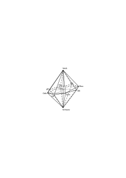

Doppelkegel dar statt eines Oktaeders so gibt es auf dem Farbenkreis nur ein _zwischen_ & Rot erscheint auf ihm in dem selben Sinne zwischen Purpur & Orange in welchem Purpur zwischen Blau & Rot liegt. Und wenn das wirklich alles ist was man sagen kann dann genügt die Darstellung durch den Doppelkegel oder mindestens die durch eine doppelte 8-seitige Pyramide.

### [76\[2\]](https://cdn.wittgensteinnachlass.com/2000px/webp/Ms-108/76.webp)

Nun scheint es merkwürdigerweise von vornherein klar zu sein daß man nicht in dem selben Sinne sagen kann Rot habe einen orangen Stich wie Orange hat einen rötlichen Stich. Das heißt es scheint klar zu sein daß die Ausdrücke „ξ besteht aus x & y” & „ξ ist das gemeinsame Bestandteil von x & y” hier nicht vertauschbar sind. Wären sie vertauschbar so genügt die Relation „zwischen” zur Darstellung.

### [76\[3\]](https://cdn.wittgensteinnachlass.com/2000px/webp/Ms-108/76.webp)

Die Ausdrücke „gemeinsamer Bestandteil von” & „Gemisch von” haben überhaupt nur dann verschiedene Bedeutung wenn der eine dort verwendet werden kann wo der andere nicht verwendet werden kann.

### [77\[1\]](https://cdn.wittgensteinnachlass.com/2000px/webp/Ms-108/77.webp)

Nun sagt es nichts zu unserer Untersuchung daß wenn ich ein blaues & grünes Pigment mische ich ein blaugrünes erhalte wenn ich aber ein blaugrünes & blaurotes mische kein blaues herauskommt.

### [77\[2\]](https://cdn.wittgensteinnachlass.com/2000px/webp/Ms-108/77.webp)

Gelbrot & Blaurot enthalten einen gemeinsamen Bestandteil in einem Sinne in welchem Rot & Blau keinen enthalten. Oder kann ich sagen sie _haben beide etwas vom_ Violett ganz ebenso wie Orange & Violett beide etwas vom Rot haben?!

### [77\[3\]](https://cdn.wittgensteinnachlass.com/2000px/webp/Ms-108/77.webp)

Hat das Grau etwas vom Schwarz in dem selben Sinne wie das Schwarz vom Grau?! Offenbar nein denn ich kann über Grau von Weiß nach Schwarz gelangen aber nicht über Schwarz von Grau nach Weiß.

### [77\[4\]](https://cdn.wittgensteinnachlass.com/2000px/webp/Ms-108/77.webp)

Man könnte auch so fragen: ist es ein sprachlicher Zufall daß man Blau nicht Orange-Violett nennt?

### [77\[5\]](https://cdn.wittgensteinnachlass.com/2000px/webp/Ms-108/77.webp)

Ich möchte sagen, daß Blau nicht in demselben Sinne eine Farbe ist wie Blaurot. Wie drückt sich das aber aus?

### [77\[6\]](https://cdn.wittgensteinnachlass.com/2000px/webp/Ms-108/77.webp),[78\[1\]](https://cdn.wittgensteinnachlass.com/2000px/webp/Ms-108/78.webp)

Könnte man etwa so fragen: Wenn ich mir vier Farben A, B, C, D merke oder Muster von ihnen mit mir herumtrüge, A wäre ein Blaugrün, B ein Blaurot, C ein Gelbgrün & D ein Gelbrot, – könnte ich nun nicht alle Farben & Farbenmischungen mit diesen vier ebensogut darstellen wie mit den sogenannten reinen Farben?

### [78\[2\]](https://cdn.wittgensteinnachlass.com/2000px/webp/Ms-108/78.webp)

Wenn ich mit meiner Auffassung recht habe so ist es kein Satz „Rot ist eine reine Farbe” & was damit angezeigt werden soll keiner experimentellen Entscheidung fähig. Es ist dann nicht denkbar daß mir einmal Rot ein andermal Blaurot rein erscheinen sollte.

### [78\[3\]](https://cdn.wittgensteinnachlass.com/2000px/webp/Ms-108/78.webp)

Die Frage ist ob für die interne Relation zweier Farben nur die Wege maßgebend sind nach welchen sie in einander übergeführt werden können.

### [78\[4\]](https://cdn.wittgensteinnachlass.com/2000px/webp/Ms-108/78.webp)

Die Bemerkung die ich oben über die Mischung von Pigmenten machte gibt einen Fingerzeig in welcher Weise die Reinheit einer Farbe definiert werden könnte als eine externe Eigenschaft also so wie ich sie nicht meine.

### [78\[5\]](https://cdn.wittgensteinnachlass.com/2000px/webp/Ms-108/78.webp),[79\[1\]](https://cdn.wittgensteinnachlass.com/2000px/webp/Ms-108/79.webp)

21.02.1930

Es scheint außer dem Übergang von Farbe zu Farbe auf dem Farbenkreis noch einen bestimmten anderen zu geben den wir vor uns haben wenn wir kleine Flecke der einen Farbe mit kleinen Flecken der anderen untermischt sehen. Ich meine hier natürlich einen _gesehenen_ Übergang. Und diese Art des Übergangs gibt dem Wort Mischung eine neue Bedeutung die mit der Relation „Zwischen” auf dem Farbenkreis nicht zusammenfällt.

### [79\[2\]](https://cdn.wittgensteinnachlass.com/2000px/webp/Ms-108/79.webp)

Man könnte es so beschreiben: Einen Orangefarbigen Fleck kann ich mir entstanden denken durch Untermischen kleiner roter & gelber Flecke dagegen einen Roten nicht durch Untermischen von Violetten & Orangefarbigen. – In diesem Sinn ist Grau eine Mischung von Schwarz & Weiß & Rosa eine von Rot & Weiß aber Weiß nicht eine Mischung von Rosa & einem weißlichen Grün. Nun meine ich aber nicht daß es durch ein Experiment der Mischung festgestellt wird daß gewisse Farben so aus anderen entstehen. Ich könnte das Experiment etwa mit einer rotierenden Farbenscheibe anstellen. Es kann dann gelingen oder nicht gelingen aber das zeigt nur ob der betreffende visuelle Vorgang auf diese physikalische Weise hervorzurufen ist oder nicht, es zeigt aber nicht, ob er möglich ist. Genau so wie die physikalische Unterteilung einer Fläche nicht die visuelle Teilbarkeit beweisen oder widerlegen kann. Denn angenommen ich sehe eine physikalische Unterteilung nicht mehr als visuelle Unterteilung sehe aber die nicht geteilte Fläche im betrunkenen Zustande geteilt, war dann die visuelle Fläche nicht teilbar?

### [80\[1\]](https://cdn.wittgensteinnachlass.com/2000px/webp/Ms-108/80.webp)

Gesichtsraum & Retina. Es ist wie wenn man eine Kugel orthogonal auf eine Ebene projiziert etwa in der Art wie die beiden Halbkugeln der Erde in einem Atlas dargestellt werden & nun könnte einer glauben daß was auf der Ebene außerhalb der beiden Kugelprojektionen vor sich geht immerhin noch einer möglichen Ausdehnung dessen entspricht was sich auf der Kugel befindet. Hier wird eben ein _kompletter Raum_ auf einen _Teil_ eines anderen Raumes projiziert; und analog ist es mit den Grenzen der Sprache im Wörterbuch.

### [80\[2\]](https://cdn.wittgensteinnachlass.com/2000px/webp/Ms-108/80.webp)

Man könnte sagen Violett & Orange löschen einander bei der Mischung teilweise aus nicht aber Rot & Gelb.

### [80\[3\]](https://cdn.wittgensteinnachlass.com/2000px/webp/Ms-108/80.webp)

Orange ist jedenfalls ein Gemisch von Rot & Gelb in einem Sinne in dem Gelb kein Gemisch von Rot & Grün ist obwohl ja Gelb im Kreis zwischen Rot & Grün liegt. Und wenn das offenbar Unsinn wäre so frägt es sich an welcher Stelle es anfängt Sinn zu werden; d.h. Wenn ich nun im Kreis von Rot & Grün aus dem Gelb näher rücke & Gelb ein Gemisch der betreffenden beiden Farben nenne.

### [80\[4\]](https://cdn.wittgensteinnachlass.com/2000px/webp/Ms-108/80.webp),[81\[1\]](https://cdn.wittgensteinnachlass.com/2000px/webp/Ms-108/81.webp)

Ich erkenne nämlich im Gelb wohl die Verwandtschaft zu Rot & Grün – nämlich die Möglichkeit zum Rötlich-Gelb & Grünlich-Gelb – & dabei erkenne ich doch nicht Grün & Rot als Bestandteile von Gelb in dem Sinne in dem ich Rot & Gelb als Bestandteile von Orange erkenne. Oder auch Gelb liegt nicht in dem Sinne zwischen Grün & Rot wie Grau zwischen Schwarz & Weiß wohl aber liegt in diesem Sinn Orange zwischen Gelb & Rot.

### [81\[2\]](https://cdn.wittgensteinnachlass.com/2000px/webp/Ms-108/81.webp)

Ich will sagen daß Rot nur in dem Sinn zwischen Violett & Orange ist wie Weiß zwischen Rosa & Grünlichweiß. Aber ist in diesem Sinn nicht jede Farbe zwischen jeden zwei anderen oder doch zwischen solchen zweien zu denen man auf unabhängigen Wegen von der dritten gelangen kann. Kann man sagen in diesem Sinne liegt eine Farbe nur in einem gegebenen kontinuierlichen Übergang zwischen zwei anderen. Also etwa Blau zwischen Rot & Schwarz.

### [81\[3\]](https://cdn.wittgensteinnachlass.com/2000px/webp/Ms-108/81.webp),[82\[1\]](https://cdn.wittgensteinnachlass.com/2000px/webp/Ms-108/82.webp)

Ist es also so: zu sagen ein Fleck habe eine Mischfarbe von Orange & Violett schreibt ihm eine andere Farbe zu als zu sagen der Fleck habe die Farbe die Orange & Violett mit einander gemein haben?

Aber das geht auch nicht; denn in dem Sinn in welchem Orange eine Mischung von Rot & Gelb ist gibt es gar keine Mischung von Orange & Violett. Wenn ich mir die Mischung zwischen einem Blaugrün & einem Gelbgrün denke so sehe ich daß sie ohne weiteres nicht geschehen kann sondern erst ein Bestandteil gleichsam getötet werden muß ehe die Vereinigung vor sich gehen kann. Das ist zwischen Rot & Gelb nicht der Fall. Ich sehe dabei keinen kontinuierlichen Übergang – über Grün – in der Fantasie vor mir sondern es sind nur die diskreten Farbtöne beteiligt.

### [82\[2\]](https://cdn.wittgensteinnachlass.com/2000px/webp/Ms-108/82.webp)

In Blaugrün & Gelbgrün sehe ich die unverträglichen Bestandteile nicht aber in Blau & Grün.

### [82\[3\]](https://cdn.wittgensteinnachlass.com/2000px/webp/Ms-108/82.webp)

22.02.1930

Die Grenzenlosigkeit des Gesichtsraumes ist am klarsten wenn wir nichts sehen, bei vollständiger Dunkelheit.

### [82\[4\]](https://cdn.wittgensteinnachlass.com/2000px/webp/Ms-108/82.webp),[83\[1\]](https://cdn.wittgensteinnachlass.com/2000px/webp/Ms-108/83.webp)

Die Bedeutung des Ausdrucks Mischung der Farben A & B muß mir allgemein bekannt sein da seine Anwendung nicht auf eine endliche Anzahl von Paaren beschränkt ist. Zeigt man mir also z.B. irgend ein Orange & Weiß & sagt die Farbe eines Flecks sei eine Mischung dieser beiden, so muß ich das verstehen & ich kann es verstehen. Wenn man mir sagt die Farbe eines Flecks liege zwischen Violett & Rot so verstehe ich das & kann mir ein rötlicheres Violett als das gegebene denken. Sagt man mir nun die Farbe liege zwischen diesem Violett & einem Orange – wobei mir kein bestimmter kontinuierlicher Übergang in Gestalt eines gemalten Farbenkreises vorliegt – so kann ich mir höchstens denken es sei auch hier ein rötlicheres Violett gemeint es könnte aber auch ein rötlicheres Orange gemeint sein denn eine Farbe die abgesehen von einem gegebenen Farbenkreis _in der Mitte_ zwischen den beiden Farben liegt gibt es nicht & aus eben diesem Grunde kann ich auch nicht sagen an welchem Punkte das Orange welches die eine Grenze bildet, schon zu nahe dem Gelb liegt nur noch mit dem Violett gemischt werden zu können ich kann eben nicht erkennen welches Orange in einem Farbenkreis 45˚ vom Violett entfernt liegt. Das Dazwischenliegen der Mischfarbe ist eben hier kein anderes als das des Gelb zwischen Rot & Grün.

### [83\[2\]](https://cdn.wittgensteinnachlass.com/2000px/webp/Ms-108/83.webp)

Der Induktionsbeweis wäre wenn er ein Beweis wäre ein Beweis der Allgemeinheit nicht ein Beweis einer gewissen Eigenschaft aller – Zahlen z.B.

### [83\[3\]](https://cdn.wittgensteinnachlass.com/2000px/webp/Ms-108/83.webp),[84\[1\]](https://cdn.wittgensteinnachlass.com/2000px/webp/Ms-108/84.webp)

Wenn ich im gewöhnlichen Sinn sage Rot & Gelb geben Orange so ist hier nicht von einer _Quantität_ der Bestandteile die Rede. Wenn daher ein Orange gegeben ist so kann ich nicht sagen daß noch _mehr_ rot es zu einem röteren Orange gemacht hätte (Ich rede ja nicht von Pigmenten) obwohl es natürlich einen Sinn hat von einem röteren Orange zu sprechen. Es hat aber z.B. keinen Sinn zu sagen dies Orange & dies Violett enthalten gleich viel rot. Und wieviel Rot enthielte _Rot_?

### [84\[2\]](https://cdn.wittgensteinnachlass.com/2000px/webp/Ms-108/84.webp),[85\[1\]](https://cdn.wittgensteinnachlass.com/2000px/webp/Ms-108/85.webp)

Der Vergleich den man fälschlicherweise zu machen geneigt ist, ist der der Farbenreihe mit einem System von zwei Gewichten an einem Maßstab durch deren Vermehrung oder Verschiebung ich den Schwerpunkt des Systems beliebig verschieben kann.

Es ist nun Unsinn zu glauben daß wenn ich die Schale A auf Violett halte & B in das Feld rot-gelb hinein verschiebe S sich gegen rot hin bewegen wird. Und wie ist es mit den Gewichten die ich auf die Schalen lege: heißt es denn etwas zu sagen _mehr_ von _diesem_ Rot? Wenn ich nicht von Pigmenten spreche. Das kann nur dann etwas heißen wenn ich unter reinem Rot eine bestimmte vorher angenommene Anzahl von Einheiten verstehe. Dann aber bedeutet die volle Anzahl dieser Einheiten nichts als daß die Wagschale auf _rot_ steht. Es ist also mit den Verhältniszahlen wieder nur ein Ort der Wagschale aber nicht ein Ort & ein Gewicht angegeben.

### [85\[2\]](https://cdn.wittgensteinnachlass.com/2000px/webp/Ms-108/85.webp)

Solange ich nun im Farbenkreis mit meinen beiden Grenzfarben – z.B. – im Gebiete Blau-Rot stehe & die rötere Farbe gegen rot verschiebe so kann ich sagen daß die Resultante auch gegen rot wandert. Überschreite ich aber mit der einen Grenzfarbe das Rot & bewege mich gegen Gelb, so wird die Resultierende nun nicht röter! Die Mischung eines gelblichen Rot mit einem Violett macht das Violett nicht röter als die Mischung von reinem rot & dem Violett. Daß das eine Rot nun gelber geworden ist nimmt ja vom Rot etwas weg & gibt nicht Rot dazu.

### [85\[3\]](https://cdn.wittgensteinnachlass.com/2000px/webp/Ms-108/85.webp)

Man könnte das auch so beschreiben: habe ich einen Farbtopf mit violettem Pigment & einen mit Orange & nun vergrößere ich die Menge des der Mischung zugesetzten Orange so wird zwar die Farbe der Mischung nach & nach aus dem Violett ins Orange übergehen aber nicht über das reine Rot.

### [85\[4\]](https://cdn.wittgensteinnachlass.com/2000px/webp/Ms-108/85.webp),[86\[1\]](https://cdn.wittgensteinnachlass.com/2000px/webp/Ms-108/86.webp)

Ich kann von zwei verschiedenen Tönen von Orange sagen daß ich von keinem Grund habe zu sagen er liege näher an Rot als an gelb. – Ein „in der Mitte” gibt es eben hier nicht. – Dagegen kann ich nicht zwei verschiedene Rot sehen & im Zweifel sein ob eines & welches von ihnen das reine Rot ist. Das reine Rot ist eben ein Punkt das Mittel zwischen Gelb & Rot aber nicht.

### [86\[2\]](https://cdn.wittgensteinnachlass.com/2000px/webp/Ms-108/86.webp)

Es ist freilich wahr daß man von einem Orange sagen kann es sei beinahe gelb, also es liege „näher am Gelb als am Rot” & Analoges von einem beinahe roten Orange. Daraus folgt aber nicht – wie ich einmal glaubte – daß es nun auch eine Mitte im Sinne eines Punktes zwischen Rot & Gelb geben müsse. Es ist eben hier ganz wie mit der Geometrie des Gesichtsraums verglichen mit der Euklidischen. Es ist hier eine andere Art von Quantitäten als die welche durch unsere rationalen Zahlen dargestellt werden. Die Begriffe näher & weiter sind eben hier überhaupt nicht zu brauchen oder sind irreführend wenn wir diese Worte anwenden.

### [86\[3\]](https://cdn.wittgensteinnachlass.com/2000px/webp/Ms-108/86.webp),[87\[1\]](https://cdn.wittgensteinnachlass.com/2000px/webp/Ms-108/87.webp)

Auch so: Von einer Farbe zu sagen sie liege zwischen Rot & Blau bestimmt sie nicht eindeutig. Die reinen Farben aber müßte ich _eindeutig_ durch die Angabe bestimmen sie liegen zwischen gewissen Mischfarben. Also bedeutet hier das Wort „inzwischen liegen” etwas _anderes_ als im ersten Fall. D.h.: wenn der Ausdruck „inzwischen liegen” einmal die Mischung zweier einfacher Farben, ein andermal den gemeinsamen einfachen Bestandteil zweier Mischfarben bezeichnet so ist die Multiplizität seiner Anwendung in jedem Falle eine andere. Und das ist _kein_ Gradunterschied sondern ein Ausdruck dafür daß es sich um zwei ganz verschiedene Kathegorien handelt.

### [87\[2\]](https://cdn.wittgensteinnachlass.com/2000px/webp/Ms-108/87.webp)

Wir sagen eine Farbe kann nicht zwischen Grüngelb & Blaurot liegen in dem selben Sinne wie zwischen Rot & Gelb aber das können wir nur sagen weil wir in diesem Falle den Winkel von 45˚ unterscheiden können; weil wir _Punkte_ Gelb, Rot sehen. Aber eben diese Unterscheidung gibt es im anderen Fall – wo die Mischfarben als das Primäre genommen werden – nicht. Hier könnten wir also sozusagen nie sicher sein ob die Mischung noch möglich ist oder nicht. Freilich könnte ich beliebige Mischfarben wählen & bestimmen daß sie einen Winkel von 45˚ einschließen das wäre aber ganz willkürlich wogegen es nicht willkürlich ist wenn wir sagen daß es keine Mischung von Blaurot & Grüngelb im ersten Sinne gibt.

### [87\[3\]](https://cdn.wittgensteinnachlass.com/2000px/webp/Ms-108/87.webp),[88\[1\]](https://cdn.wittgensteinnachlass.com/2000px/webp/Ms-108/88.webp)

23.02.1930

Es ist ebenso unsinnig zu sagen eine Farbe sei ein Orange-Violett wie eine Farbe sie ein rötliches Grün. Hier gibt die Grammatik also den „Winkel von 45˚” & nun glaubt man fälschlich man brauche ihn nur zu halbieren & den nächsten Abschnitt ebenso um einen anderen Abschnitt von 45˚ zu kriegen. Aber hier bricht eben das _Gleichnis_ des Winkels zusammen.

### [88\[2\]](https://cdn.wittgensteinnachlass.com/2000px/webp/Ms-108/88.webp)

Man kann freilich auch alle Farbtöne in einer Linie anordnen etwa mit den Grenzen Schwarz & Weiß wie das geschehen ist aber dann muß man eben durch Regeln gewisse Übergänge ausschließen & endlich muß das Bild auf der Geraden die gleiche Art des Topologischen Zusammenhangs bekommen wie auf dem Oktoeder. Es ist dies ganz analog wie das Verhältnis der gewöhnlichen Sprache zu einer „logisch geklärten” Ausdrucksweise. Beide sind einander vollkommen äquivalent nur drückt die eine die Regeln der Grammatik schon durch die äußere Erscheinung aus.

### [88\[3\]](https://cdn.wittgensteinnachlass.com/2000px/webp/Ms-108/88.webp),[89\[1\]](https://cdn.wittgensteinnachlass.com/2000px/webp/Ms-108/89.webp)

Der Satz ist vollkommen logisch analysiert dessen Grammatik vollkommen klargelegt ist. Er mag in welcher Ausdrucksweise immer hingeschrieben oder ausgesprochen sein.

### [89\[2\]](https://cdn.wittgensteinnachlass.com/2000px/webp/Ms-108/89.webp)

Die Oktoederdarstellung ist eine _übersichtliche_ Darstellung der grammatischen Regeln.

### [89\[3\]](https://cdn.wittgensteinnachlass.com/2000px/webp/Ms-108/89.webp)

Zu sehen daß _reine_ Farbe nicht eine Eigenschaft – externe Eigenschaft – einer Farbe ist heißt sehen daß ich mir nicht _denken_ könnte daß – etwa – Violett diese Eigenschaft hat oder daß das reine Blau sie nicht hat.

### [89\[4\]](https://cdn.wittgensteinnachlass.com/2000px/webp/Ms-108/89.webp)

Ebendasselbe ist der Fall wenn wir sagen ein Ton sei im Einklang mit einem anderen. Es ist Unsinn (nicht falsch) zu sagen die Terz von C sei im Einklang mit C.

### [89\[5\]](https://cdn.wittgensteinnachlass.com/2000px/webp/Ms-108/89.webp)

Wenn ich die Regelmäßigkeit einer Figur sehe die ich früher nicht bemerkt habe so sehe ich jetzt eine andere Figur. So kann ich ∣∣∣∣∣∣ als Spezialfall von ∣∣ ∣∣

∣∣ oder von ∣∣∣

∣∣∣ oder von ∣ ∣∣∣∣

❘ sehen etc. Das zeigt bloß daß was wir sehen nicht so einfach ist als es scheint.

### [89\[6\]](https://cdn.wittgensteinnachlass.com/2000px/webp/Ms-108/89.webp),[90\[1\]](https://cdn.wittgensteinnachlass.com/2000px/webp/Ms-108/90.webp)

Wenn man frägt ob die Tonleiter eine unendliche Möglichkeit der Fortsetzung in sich trägt so ist die Antwort nicht dadurch gegeben daß man Luftschwingungen die eine gewisse Schwingungszahl überschreiten nicht mehr als Töne wahrnimmt denn es könnte ja die Möglichkeit bestehen höhere Tonempfindungen auf andere Art & Weise hervorzurufen. Die Endlichkeit der Tonleiter kann vielmehr nur aus ihren internen Eigenschaften hervorgehen. Etwa so indem man es einem Ton _selber_ anerkennt daß er der Abschluß ist daß also dieser letzte Ton oder die letzten Töne innere Eigenschaften zeigen die die mittleren nicht haben.

So wie dünne Linien in unserem Gesichtsfeld interne Eigenschaften zeigen die die dickeren nicht haben so daß es eine Linie in unserem Gesichtsfeld gibt die keine Farbgrenze ist sondern selbst Farbe hat & doch in einem bestimmten Sinne keine Breite so daß bei ihrem Schnitt mit einer anderen ebensolchen nicht vier Punkte

A, B, C, D gesehen werden.

### [90\[2\]](https://cdn.wittgensteinnachlass.com/2000px/webp/Ms-108/90.webp),[91\[1\]](https://cdn.wittgensteinnachlass.com/2000px/webp/Ms-108/91.webp)

Eine Kirchentonart verstehen heißt nicht sich an die Tonfolge gewöhnen in dem Sinne in dem ich mich an einen Geruch gewöhnen kann & ihn nach einiger Zeit nicht mehr unangenehm empfinde. Sondern es heißt etwas Neues hören was ich früher noch nicht gehört habe etwa in der Art – ja ganz analog – wie es wäre Zehn Striche ∣∣∣∣∣∣∣∣∣∣ die ich früher nur als 2 mal 5 Striche habe sehen können plötzlich als ein charakteristisches Ganzes sehen zu können. Oder die Zeichnung eines Würfels die ich nur als flaches Ornament habe sehen können auf einmal räumlich zu sehen.

### [91\[2\]](https://cdn.wittgensteinnachlass.com/2000px/webp/Ms-108/91.webp)

24.02.1930

Wenn mir zwei nahe aneinander liegende – etwa – rötliche Farbtöne gegeben sind so ist es unmöglich darüber zu zweifeln, ob beide zwischen rot & blau, beide zwischen rot & gelb oder der eine zwischen rot & blau der andere zwischen rot & gelb gelegen ist. Und mit dieser Entscheidung haben wir auch entschieden ob beide sich mit blau, mit gelb oder der eine sich mit blau der andere mit gelb mischen & das gilt wie nahe immer man die Farbtöne einander bringt solange wir die Pigmente überhaupt unterscheiden können.

### [91\[3\]](https://cdn.wittgensteinnachlass.com/2000px/webp/Ms-108/91.webp)

Die Harmonielehre ist nicht Geschmacksache.

### [91\[4\]](https://cdn.wittgensteinnachlass.com/2000px/webp/Ms-108/91.webp)

Vergleich zwischen einer Mathematischen Expedition & einer Polarexpedition. Diesen Vergleich anzustellen hat Sinn & ist sehr nützlich.

### [91\[5\]](https://cdn.wittgensteinnachlass.com/2000px/webp/Ms-108/91.webp),[92\[1\]](https://cdn.wittgensteinnachlass.com/2000px/webp/Ms-108/92.webp)

Wie seltsam wäre es wenn eine geographische Expedition nicht sicher wüßte ob sie ein Ziel also auch ob sie überhaupt einen Weg hat. Das können wir uns nicht denken, es gibt Unsinn. Aber in der Mathematischen Expedition verhält es sich gerade so. Also wird es vielleicht am besten sein den Vergleich ganz fallen zu lassen.

### [92\[2\]](https://cdn.wittgensteinnachlass.com/2000px/webp/Ms-108/92.webp)

Es wäre wie eine Expedition die _des Raumes_ nicht sicher wäre!

### [92\[3\]](https://cdn.wittgensteinnachlass.com/2000px/webp/Ms-108/92.webp)

25.02.1930

Wie kann es in der Mathematik Vermutungen geben? Oder vielmehr: Welcher Natur ist das was in der Mathematik wie eine Vermutung aussieht? Wenn ich also etwa Vermutungen über die Verteilung der Primzahlen anstelle.

### [92\[4\]](https://cdn.wittgensteinnachlass.com/2000px/webp/Ms-108/92.webp)

Ich könnte mir z.B. denken daß jemand in meiner Gegenwart Primzahlen der Reihe nach hinschriebe, ich wüßte nicht daß es die Primzahlen sind – ich könnte etwa glauben, es seien Zahlen wie sie ihm eben einfielen – & nun versuchte ich irgend ein Gesetz in ihnen zu finden. Ich könnte nun geradezu eine Hypothese über diese Zahlenfolge aufstellen wie über jede andere die ein physikalisches Experiment ergiebt. In welchem Sinne habe ich nun hiedurch eine Hypothese über die Verteilung der Primzahlen aufgestellt?

### [93\[1\]](https://cdn.wittgensteinnachlass.com/2000px/webp/Ms-108/93.webp)

Man könnte sagen eine Hypothese in der Mathematik hat den Wert daß sie die Gedanken an einen bestimmten Gegenstand – ich meine ein bestimmtes Gebiet – heftet & man könnte sagen „wir werden gewiß etwas Interessantes über diese Dinge herausfinden ”.

### [93\[2\]](https://cdn.wittgensteinnachlass.com/2000px/webp/Ms-108/93.webp)

Das Unglück ist daß unsere Sprache so grundverschiedene Dinge mit jedem der Worte „Frage”, „Problem”, „Untersuchung”, „Entdeckung” bezeichnet. Ebenso mit den Worten „Schluß”, „Satz”, „Beweis”.

### [93\[3\]](https://cdn.wittgensteinnachlass.com/2000px/webp/Ms-108/93.webp)

Es fragt sich wieder welche Art der Verifikation lasse ich für meine Hypothese gelten? Oder kann ich vorläufig – faute de mieux – die empirische gelten lassen solange ich noch keinen „strengen Beweis” habe? Nein. Solange ein solcher Beweis nicht besteht besteht gar keine Verbindung zwischen meiner Hypothese & dem „Begriff” der Primzahl.

### [93\[4\]](https://cdn.wittgensteinnachlass.com/2000px/webp/Ms-108/93.webp)

Der Begriff der Primzahl ist das allgemeine Gesetz wonach ich prüfe ob eine Zahl eine Primzahl ist oder nicht.

### [93\[5\]](https://cdn.wittgensteinnachlass.com/2000px/webp/Ms-108/93.webp),[94\[1\]](https://cdn.wittgensteinnachlass.com/2000px/webp/Ms-108/94.webp)

Erst der sogenannte Beweis verbindet die Hypothese überhaupt mit den Primzahlen _als solchen_. Und das zeigt sich daran daß – wie gesagt – bis dahin die Hypothese als eine rein physikalische aufgefaßt werden kann. – Ist andererseits der Beweis geliefert so beweist er gar nicht was vermutet worden war denn in die Unendlichkeit hinein kann ich nicht vermuten. Ich kann nur vermuten was bestätigt werden kann, aber durch die Erfahrung kann nur eine endliche Zahl von Vermutungen bestätigt werden & den Beweis kann man nicht vermuten solange man ihn nicht hat & dann auch nicht.

### [94\[2\]](https://cdn.wittgensteinnachlass.com/2000px/webp/Ms-108/94.webp)

Was ist der analytische Ausdruck für das Parallelenaxiom?

### [94\[3\]](https://cdn.wittgensteinnachlass.com/2000px/webp/Ms-108/94.webp)

Wie hängen die Gleichungen der Analysis mit den Resultaten von Messungen im Raum zusammen. Ich glaube so daß sie – die Gleichungen – bestimmen was als genaue Messung, was als Fehler gelten soll.

### [94\[4\]](https://cdn.wittgensteinnachlass.com/2000px/webp/Ms-108/94.webp),[95\[1\]](https://cdn.wittgensteinnachlass.com/2000px/webp/Ms-108/95.webp)

26.02.1930

Jede Hypothese ist eine heuristische Methode. Und in dieser Lage ist, glaube ich, auch die euklidische oder eine andere Geometrie auf den Raum der physikalischen Messungen angewandt. Ganz anders verhält es sich mit dem was man die Geometrie des Gesichtsraumes nennen kann.

### [95\[2\]](https://cdn.wittgensteinnachlass.com/2000px/webp/Ms-108/95.webp)

Man könnte beinahe von einer externen & einer internen Geometrie reden. Das was im Gesichtsraum angeordnet ist steht in dieser _Art_ von Ordnung a priori, d.h. seiner logischen Natur nach & die Geometrie ist hier einfach Grammatik. Was der Physiker in der Geometrie des physikalischen Raumes in Beziehung zu einander setzt sind Instrumentablesungen die ihrer _internen_ Natur nach nicht anders sind ob wir in einem geraden oder sphärischen physikalischen Raum leben. D.h. Nicht eine Untersuchung der logischen Eigenschaften dieser Ablesungen führt den Physiker zu einer Annahme über die Art des physikalischen Raumes sondern die abgelesenen Tatsachen.

### [95\[3\]](https://cdn.wittgensteinnachlass.com/2000px/webp/Ms-108/95.webp)

Die Geometrie der Physik hat es in diesem Sinn nicht mit der Möglichkeit sondern mit den Tatsachen zu tun. Sie wird von Tatsachen bestätigt, in dem Sinne, nämlich, in dem ein _Teil_ einer Hypothese bestätigt wird.

### [95\[4\]](https://cdn.wittgensteinnachlass.com/2000px/webp/Ms-108/95.webp)

Vergleich des Arbeitens an der Rechenmaschine mit dem Messen geometrischer Gebilde.

### [95\[5\]](https://cdn.wittgensteinnachlass.com/2000px/webp/Ms-108/95.webp),[96\[1\]](https://cdn.wittgensteinnachlass.com/2000px/webp/Ms-108/96.webp)

Machen wir bei dieser Messung ein Experiment oder verhält es sich so, wie im Falle der Rechenmaschine, daß wir nur interne Relationen feststellen & das physikalische Resultat unserer Operationen nichts beweist?

### [96\[2\]](https://cdn.wittgensteinnachlass.com/2000px/webp/Ms-108/96.webp)

Im Gesichtsraum gibt es natürlich kein geometrisches Experiment.

### [96\[3\]](https://cdn.wittgensteinnachlass.com/2000px/webp/Ms-108/96.webp)

Ich glaube daß hier einer der Hauptpunkte des Mißverständnisses über das a priori & a posteriori der Geometrie liegt.

### [96\[4\]](https://cdn.wittgensteinnachlass.com/2000px/webp/Ms-108/96.webp)

Die Frage ist die in welchem Sinne die Resultate von Messungen uns etwas über _dasjenige_ sagen können was wir auch sehen.

### [96\[5\]](https://cdn.wittgensteinnachlass.com/2000px/webp/Ms-108/96.webp)

27.02.1930

Es ist merkwürdig daß all dies mit der Frage der unendlichen Möglichkeit unmittelbar zusammenhängt.

### [96\[6\]](https://cdn.wittgensteinnachlass.com/2000px/webp/Ms-108/96.webp)

Das was die Physik ihren Raum nennt ist eine Hypothese – zum Unterschied von dem was wir unseren Gesichts- oder unseren Bewegungsraum nennen.

### [96\[7\]](https://cdn.wittgensteinnachlass.com/2000px/webp/Ms-108/96.webp)

Was bedeutet das Euklidische Axiom daß alle rechten Winkel untereinander gleich sind?

### [96\[8\]](https://cdn.wittgensteinnachlass.com/2000px/webp/Ms-108/96.webp),[97\[1\]](https://cdn.wittgensteinnachlass.com/2000px/webp/Ms-108/97.webp)

Das Paradox daß alles was ich in der Logik tun kann ist, Vereinbarungen betreffs der _Zeichen_ zu machen. Aber diese Konventionen mache ich zum Zweck einer Darstellung.

### [97\[2\]](https://cdn.wittgensteinnachlass.com/2000px/webp/Ms-108/97.webp)

28.02.1930

Wie könnte ein Satz einen Sachverhalt darstellen dem die bloße Form des Gedankens widerspricht?

### [97\[3\]](https://cdn.wittgensteinnachlass.com/2000px/webp/Ms-108/97.webp)

Es ist außerordentlich schwer in allen Unsinn einzudringen den Menschen annehmen können.

### [97\[4\]](https://cdn.wittgensteinnachlass.com/2000px/webp/Ms-108/97.webp)

Um etwas über die Farben – z.B. – sagen zu können muß ich gewisse Regeln einhalten. Diese Regeln sind daher ein Bild des Zweckes zu welchem sie aufgestellt wurden.

### [97\[5\]](https://cdn.wittgensteinnachlass.com/2000px/webp/Ms-108/97.webp)

Die Regeln passen die Sprache diesem Zweck an.

### [97\[6\]](https://cdn.wittgensteinnachlass.com/2000px/webp/Ms-108/97.webp),[98\[1\]](https://cdn.wittgensteinnachlass.com/2000px/webp/Ms-108/98.webp)

Ich könnte die Grammatischen Konventionen zuerst machen ohne daß einer wüßte daß ich eine Sprache konstruiere oder wie ich die Sprache anzuwenden gedenke. Wie ich sie dann anwende kann ich ihm nur dadurch begreiflich machen daß ich sie vor ihm _anwende_, wenn ich sie nicht in eine ihm bekannte Sprache übersetze. Oder ich kann die Untersuchung in einer ihm bekannten Sprache also einer deren Anwendung er kennt anstellen & dann werden die grammatischen Regeln nur das enthalten was er ohnehin befolgt wenn er die Sprache in seiner Weise anwendet. Man könnte in diesem Falle sagen daß ich nicht eigentlich Konventionen mache sondern konstatiere was die richtige Anwendung der betreffenden Zeichen ist. Aber ich kann auch sagen, daß ich bloß Konventionen mache aber eben dadurch die Anwendung der Sprache fixiere.

### [98\[2\]](https://cdn.wittgensteinnachlass.com/2000px/webp/Ms-108/98.webp)

Indem ich die Konventionen mache portraitiere ich freilich gleichsam die logische Form eines bestimmten Anwendungsgebietes meiner Sprache aber dennoch sind es Konventionen. Und ich könnte sie anders machen, freilich könnte ich dann die Sprache nicht _so_ anwenden wie im ersten Fall.

### [98\[3\]](https://cdn.wittgensteinnachlass.com/2000px/webp/Ms-108/98.webp),[99\[1\]](https://cdn.wittgensteinnachlass.com/2000px/webp/Ms-108/99.webp)

Könnte ich den Zweck dieser Konventionen dadurch beschreiben daß ich sagte ich mußte sie machen weil etwa die Farben gewisse Eigenschaften haben so wären damit die grammatischen Konventionen überflüssig denn dann könnte ich eben das sagen was die Konventionen gerade ausschließen. Umgekehrt wenn die Konventionen nötig wären also gewisse Kombinationen der Wörter als unsinnig ausgeschlossen werden mußten dann kann ich eben darum nicht eine Eigenschaft der Farben angeben die die Konventionen nötig machte denn dann wäre es denkbar daß die Farben diese Eigenschaft nicht hätten & das könnte nur entgegen den Konventionen ausgedrückt werden.

### [99\[2\]](https://cdn.wittgensteinnachlass.com/2000px/webp/Ms-108/99.webp)

Daß es unsinnig ist von einer Farbe zu sagen sie sei eine Terz höher als eine andere kann nicht bewiesen werden. Ich kann nur sagen „wer diese Worte in der Bedeutung verwendet wie ich es tue der kann mit dieser Kombination keinen Sinn verbinden, hat sie für ihn einen Sinn so versteht er etwas anderes unter den Worten als ich.”

### [99\[3\]](https://cdn.wittgensteinnachlass.com/2000px/webp/Ms-108/99.webp)

Die Wörter „Farbe”, „Ton”, „Zahl”, etc. können in den Kapitelüberschriften der Grammatik erscheinen. In den Kapiteln müssen sie nicht vorkommen sondern da wird die Struktur gegeben.

### [99\[4\]](https://cdn.wittgensteinnachlass.com/2000px/webp/Ms-108/99.webp),[100\[1\]](https://cdn.wittgensteinnachlass.com/2000px/webp/Ms-108/100.webp)

01.03.1930

Wenn es einen Sinn hätte zu sagen „rot ist eine Farbe” dann gäbe es einen Satz „es gibt eine Farbe”. Und wie wenn es nun keine gäbe, wie könnten wir dann sagen daß es keine gäbe? Wer aber unter „Farbe” etwas ganz anderes versteht als ich, kann das sagen dann aber besteht für ihn die selbe Schwierigkeit eine Stufe hinter meiner. Er wird das gleiche Problem für das Wort „Ding” zu lösen haben.

### [100\[2\]](https://cdn.wittgensteinnachlass.com/2000px/webp/Ms-108/100.webp)

Die Möglichkeit der Erklärung dieser Dinge beruht immer darauf daß der Andere die Sprache so gebraucht wie ich. Behauptet er daß eine Zusammenstellung von Wörtern für ihn Sinn hat die für mich keinen besitzt so kann ich nur annehmen daß er die Wörter hier in anderer Bedeutung gebraucht als ich oder gedankenlos redet.

### [100\[3\]](https://cdn.wittgensteinnachlass.com/2000px/webp/Ms-108/100.webp)

02.03.1930

Kann jemand glauben es habe Sinn zu sagen: „Das ist kein Lärm, sondern eine Farbe”?

### [100\[4\]](https://cdn.wittgensteinnachlass.com/2000px/webp/Ms-108/100.webp)

Anderseits kann man freilich sagen: „Was mich nervös macht ist nicht der Lärm sondern die Farbe” & hier könnte es scheinen als ob eine Variable eine Farbe & einen Lärm als Wert annähme.

### [100\[5\]](https://cdn.wittgensteinnachlass.com/2000px/webp/Ms-108/100.webp)

„Laute & Farben können als sprachliche Ausdrucksmittel dienen.”

### [100\[6\]](https://cdn.wittgensteinnachlass.com/2000px/webp/Ms-108/100.webp),[101\[1\]](https://cdn.wittgensteinnachlass.com/2000px/webp/Ms-108/101.webp)

Im Gesichtsraum gibt es absolute Lage & daher auch absolute Bewegung. Man denke sich das Bild zweier Sterne in stockfinsterer Nacht in der ich _nichts_ sehen kann als diese & diese bewegen sich im Kreise umeinander.

### [101\[2\]](https://cdn.wittgensteinnachlass.com/2000px/webp/Ms-108/101.webp)

Es ist klar daß jener Satz von der Art ist: „Wenn Du einen Schuß hörst oder mich winken siehst laufe davon.” Denn dieser Art ist die Vereinbarung auf der die Funktion der gehörten oder gesehenen Sprache beruht.

### [101\[3\]](https://cdn.wittgensteinnachlass.com/2000px/webp/Ms-108/101.webp)

Wenn das Kind lernt „Blau ist eine Farbe Rot ist eine Farbe, Grün, Gelb, Orange, das sind alles Farben” so lernt es nichts Neues über die Farben sondern es lernt die Bedeutung einer Variablen in den Sätzen „das Bild hat schöne Farben” etc.. Jener Satz gibt ihm die Werte einer Variablen.

### [101\[4\]](https://cdn.wittgensteinnachlass.com/2000px/webp/Ms-108/101.webp)

Es gibt offenbar eine Methode ein gerades Lineal anzufertigen. Diese Methode schließt ein Ideal ein, ich meine ein Näherungsverfahren mit unbegrenzter _Möglichkeit_, denn eben dieses Verfahren _ist_ das Ideal. Oder vielmehr: Nur wenn es ein Näherungsverfahren mit unbegrenzter Möglichkeit ist kann (nicht muß) die Geometrie dieses Verfahrens die euklidische sein.

### [101\[5\]](https://cdn.wittgensteinnachlass.com/2000px/webp/Ms-108/101.webp)

Unendliche Teilbarkeit & Vergrößerung eines Teils durch die Lupe.

### [101\[6\]](https://cdn.wittgensteinnachlass.com/2000px/webp/Ms-108/101.webp),[102\[1\]](https://cdn.wittgensteinnachlass.com/2000px/webp/Ms-108/102.webp)

Die unendliche Teilbarkeit hat natürlich nichts mit der Existenz von Elektronen etc. zu tun.

### [102\[2\]](https://cdn.wittgensteinnachlass.com/2000px/webp/Ms-108/102.webp)

Russell, Eddington etc. wollen alle Hohe Priester der Irreligiosität sein.

### [102\[3\]](https://cdn.wittgensteinnachlass.com/2000px/webp/Ms-108/102.webp)

Wie ist eine „formally certified proposition” möglich? Es wäre ein Satz dem man ansieht ob er wahr oder falsch ist. „Grün ist eine Farbe” wäre so ein Satz. Aber wie kann man durch Hinsehen auf den Satz oder den Gedanken herausfinden daß er wahr ist? Der Gedanke ist doch etwas ganz anderes als der Sachverhalt den der Satz behauptet. Durch Hinsehen auf den Satz kann ich nur eines über die Natur ersehen was er aber nicht behauptet & das ist die Möglichkeit dessen was er behauptet.

### [102\[4\]](https://cdn.wittgensteinnachlass.com/2000px/webp/Ms-108/102.webp)

Die Grammatik zeigt es nicht selbst daß sie zu einem bestimmten Zweck gemacht ist. Sie könnte allein betrachtet eine bloße Sammlung von Spielregeln sein. Ihre Anwendung liegt außer ihr.

### [102\[5\]](https://cdn.wittgensteinnachlass.com/2000px/webp/Ms-108/102.webp)

Eine Erklärung wenn sie wirken soll darf das Problem nicht verschmieren.

### [103\[1\]](https://cdn.wittgensteinnachlass.com/2000px/webp/Ms-108/103.webp),[104\[1\]](https://cdn.wittgensteinnachlass.com/2000px/webp/Ms-108/104.webp)

Wenn ich einem Menschen die Bedeutung eines Wortes A erkläre indem ich sage „dies ist A” & auf etwas hinzeige so kann dieser Ausdruck in zweierlei Weise gemeint sein. Entweder er ist selber schon ein Satz & kann dann erst verstanden werden wenn die Bedeutung von A bereits bekannt ist. D.h. ich kann es nur dem Schicksal überlassen ob der Andere den Satz nun so auffaßt wie ich ihn meine oder nicht. Oder der Satz ist eine Definition. Ich hätte jemandem etwa gesagt „A ist krank” er wüßte aber nicht wen ich mit A meine & nun zeigte ich auf einen Menschen & sagte „dies ist A”. Nun ist der Ausdruck eine Definition aber diese kann nur verstanden werden wenn die Art des Gegenstandes bereits durch den grammatisch verstandenen Satz „A ist krank” bekannt war. Das heißt aber daß jede Art des Verständlichmachens einer Sprache schon eine Sprache voraussetzt. Und die Benützung der Sprache in einem gewissen Sinne nicht zu lehren ist. D.h. nicht durch die Sprache zu lehren wie man etwa Klavierspielen durch die Sprache lernen kann. – Das heißt ja nichts anderes als: Ich kann mit der Sprache nicht aus der Sprache heraus.

### [104\[2\]](https://cdn.wittgensteinnachlass.com/2000px/webp/Ms-108/104.webp)

03.03.1930

Die Grammatik ist eine „Theory of logical types”.

### [104\[3\]](https://cdn.wittgensteinnachlass.com/2000px/webp/Ms-108/104.webp)

04.03.1930

Ich nenne die Regel der Darstellung keine Konvention, die sich durch Sätze rechtfertigen läßt, Sätze welche das Dargestellte beschreiben & zeigen daß die Darstellung adäquat ist. Die Konventionen der Grammatik lassen sich nicht durch eine Beschreibung des Dargestellten rechtfertigen. Jede solche Beschreibung setzt schon die Regeln der Grammatik voraus. D.h. was in der zu rechtfertigenden Grammatik als Unsinn gilt kann in der Grammatik der rechtfertigenden Sätze auch nicht als Sinn gelten und umgekehrt.

### [104\[4\]](https://cdn.wittgensteinnachlass.com/2000px/webp/Ms-108/104.webp)

05.03.1930

Man kann nicht die Möglichkeit der Evidenz mit der Sprache überschreiten.

### [104\[5\]](https://cdn.wittgensteinnachlass.com/2000px/webp/Ms-108/104.webp)

06.03.1930

Man ist in der Philosophie immer in der Gefahr eine Mythologie des Symbolismus zu geben oder der Psychologie. Statt einfach zu sagen was jeder weiß & zugeben muß.

### [104\[6\]](https://cdn.wittgensteinnachlass.com/2000px/webp/Ms-108/104.webp),[105\[1\]](https://cdn.wittgensteinnachlass.com/2000px/webp/Ms-108/105.webp)

07.03.1930

Was für eine Art Satz ist: „auf diesem Streifen sind alle Schattierungen von Grau zwischen Schwarz & Weiß zu sehen”?

Hier scheint es auf den ersten Blick daß von unendlich vielen Schattierungen die Rede ist. Ja wir haben hier scheinbar das Paradox daß wir zwar nur endlich viele Schattierungen von einander unterscheiden können & der Unterschied zwischen ihnen natürlich nicht ein unendlich kleiner ist & wir dennoch einen kontinuierlichen Übergang sehen.

### [105\[2\]](https://cdn.wittgensteinnachlass.com/2000px/webp/Ms-108/105.webp)

09.03.1930

Weyls Widerspruch „heterologisch”:

~Φ(„Φ”) ≝ „Φ” ist heterologisch ≝ F(„Φ”)

<math display="block">
  <mspace width="0.3em"/>
  <mo>=</mo>
  <mspace width="0.3em"/>
  <mtext>F(</mtext>
  <mtext>“</mtext>
  <mtext>F”</mtext>
  <mo>)</mo>
  <mspace width="0.3em"/>
  <mo>=</mo>
  <mspace width="0.3em"/>
  <mtext>~</mtext>
  <mspace width="0.3em"/>
  <mtext>F(</mtext>
  <mtext>“</mtext>
  <mtext>F”</mtext>
  <mo>)</mo>
  <mspace width="0.3em"/>
  <mo>=</mo>
  <mspace width="0.3em"/>
  <mtext>~</mtext>
  <mspace width="0.3em"/>
  <mo>[</mo>
  <mspace width="0.3em"/>
  <mtext>~</mtext>
  <mo>(</mo>
  <mfrac linethickness="0">
    <mrow>
      <mtext>^</mtext>
      <mtext>Φ</mtext>
    </mrow>
    <mrow>
      <mtext>~</mtext>
      <mtext>^</mtext>
      <mtext>Φ(</mtext>
      <mtext>„</mtext>
      <mtext>^</mtext>
      <mtext>Φ”</mtext>
      <mo>)</mo>
    </mrow>
  </mfrac>
  <mo>)</mo>
  <mspace width="0.3em"/>
  <mo>|</mo>
  <mo>(</mo>
  <mtext>„</mtext>
  <mfrac linethickness="0">
    <mrow>
      <mtext>^</mtext>
      <mtext>Φ</mtext>
    </mrow>
    <mrow>
      <mtext>~</mtext>
      <mtext>^</mtext>
      <mtext>Φ</mtext>
      <mspace width="0.3em"/>
      <mo>(</mo>
      <mtext>„</mtext>
      <mtext>^</mtext>
      <mtext>Φ”</mtext>
      <mo>)</mo>
    </mrow>
  </mfrac>
  <mspace width="0.3em"/>
  <mtext>”</mtext>
  <mo>)</mo>
</math>

### [105\[3\]](https://cdn.wittgensteinnachlass.com/2000px/webp/Ms-108/105.webp)

Der menschliche Bewegungsraum ist unendlich wie die Zeit.

### [105\[4\]](https://cdn.wittgensteinnachlass.com/2000px/webp/Ms-108/105.webp)

Die Methode des Messens, z.B. des räumlichen Messens, verhält sich zu einer bestimmten Messung genau so wie der Sinn eines Satzes zu seiner Wahr- oder Falschheit.

### [105\[5\]](https://cdn.wittgensteinnachlass.com/2000px/webp/Ms-108/105.webp)

Die Geometrie in dem _einen_ Sinn ist eine Methodologie des Messens.

### [105\[6\]](https://cdn.wittgensteinnachlass.com/2000px/webp/Ms-108/105.webp)

„Alle Helligkeitsgrade unter diesem tun meinen Augen nicht weh”. Das heißt ich habe beobachtet daß die bisherigen Erfahrungen einem formellen Gesetz entsprechen.

### [106\[1\]](https://cdn.wittgensteinnachlass.com/2000px/webp/Ms-108/106.webp)

Auf die Frage ob die Philosophen bisher immer wirklichen Unsinn geredet haben könnte man antworten nein, sie haben nur nicht gemerkt daß sie ein Wort in ganz verschiedenen Bedeutungen gebrauchen. In diesem Sinne ist es nicht unbedingt Unsinn zu sagen ein Ding sei so identisch wie das andere denn wer das mit Überzeugung sagt meint in diesem Augenblick etwas mit dem Wort „identisch” (vielleicht groß) aber er weiß nicht daß er hier das Wort in anderer Bedeutung gebraucht als es in 2 + 2 = 4 gebraucht ist.

### [106\[2\]](https://cdn.wittgensteinnachlass.com/2000px/webp/Ms-108/106.webp)

10.03.1930

Welcher Art war Scheffers Entdeckung daß p ⌵ q & ~ p sich durch p ❘ q ausdrücken lassen?

### [106\[3\]](https://cdn.wittgensteinnachlass.com/2000px/webp/Ms-108/106.webp)

Man hatte keine Methode nach p ❘ q zu suchen & wenn man heute eine fände so könnte das keinen Unterschied machen.

### [106\[4\]](https://cdn.wittgensteinnachlass.com/2000px/webp/Ms-108/106.webp)

Was war es was wir vor der Entdeckung nicht wußten? Es war nichts was wir nicht wußten sondern etwas was wir nicht kannten.

### [106\[5\]](https://cdn.wittgensteinnachlass.com/2000px/webp/Ms-108/106.webp),[107\[1\]](https://cdn.wittgensteinnachlass.com/2000px/webp/Ms-108/107.webp)

Das sieht man sehr deutlich wenn man sich den Einspruch erhoben denkt p ❘ p sei gar nicht das was ~p sagt. Die Antwort ist natürlich daß es sich nur darum handelt daß das System p ❘ q etc. die nötige Multiplizität hat. Scheffer hat also ein symbolisches System gefunden das die nötige Multiplizität hat. Ist es ein Suchen, wenn ich das System Scheffers nicht kenne & sage ich möchte ein System mit nur _einer_ logischen Konstanten konstruieren. Nein! Die Systeme sind ja gar nicht in einem Raum so daß ich sagen könnte: Es gibt Systeme mit 3 & 2 logischen Konstanten nun suche ich die Zahl der Konstanten _in derselben Weise_ zu vermindern. Es gibt hier keine _selbe Weise_!

### [107\[2\]](https://cdn.wittgensteinnachlass.com/2000px/webp/Ms-108/107.webp)

Man kann nicht ein gegebenes Grau als eines von den unendlich vielen grauen Tönen zwischen Schwarz & Weiß auffassen.

### [107\[3\]](https://cdn.wittgensteinnachlass.com/2000px/webp/Ms-108/107.webp),[108\[1\]](https://cdn.wittgensteinnachlass.com/2000px/webp/Ms-108/108.webp)

Aber den kontinuierlichen Übergang – z.B. von Weiß nach Schwarz – nimmt man ja tatsächlich wahr. Handelt es sich auch hier nur um eine unendliche _Möglichkeit_? Ist nicht die Kontinuität selbst eine Art unendlicher Wirklichkeit. Aber haben wir hier nicht denselben Fall wie den des Kreises aufgefaßt als ein ∞-Eck? Hier ist der Kreis ein Grenzwert. Und sehen wir nicht den kontinuierlichen Übergang von Schwarz nach Weiß auch als den Grenzwert einer Folge diskontinuierlicher Übergänge an?

### [108\[2\]](https://cdn.wittgensteinnachlass.com/2000px/webp/Ms-108/108.webp),[109\[1\]](https://cdn.wittgensteinnachlass.com/2000px/webp/Ms-108/109.webp)

11.03.1930

Man kann ein bestimmtes Grau ebensowenig als eines der unendlich vielen Grau etc. auffassen wie man eine

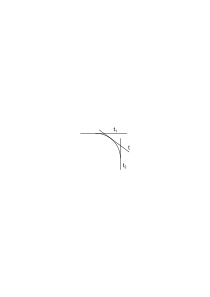

Tangente t als eines der unendlich vielen Übergangsstadien von t1 nach t2 auffassen kann. Wenn ich etwa ein Lineal sich von t1 nach t2 am Kreis abrollen sehe so sehe ich – wenn es sich kontinuierlich bewegt – keine einzige der Zwischenlagen in dem Sinne in welchem ich t sehe wenn die Tangente ruht; oder aber ich sehe nur eine endliche Anzahl von Zwischenlagen. Wenn ich aber in so einem Fall scheinbar von einem allgemeinen Satz auf einen Spezialfall schließe so ist die Quelle dieses allgemeinen Satzes nie die Erfahrung & der Satz wirklich kein Satz. Wenn ich z.B. sage: „ich habe das Lineal sich von t1 nach t2 bewegen sehen _also_ muß ich es auch in t gesehen haben” so haben wir hier keinen richtigen logischen Schluß: Wenn ich nämlich damit sagen will das Lineal muß mir in der Lage t _erschienen_ sein – wenn ich also von der Lage im Gesichtsraum rede so folgt das aus dem Vordersatz durchaus nicht. Rede ich aber vom physischen Lineal so ist es natürlich (sehr leicht) möglich daß das Lineal die Lage t übersprungen hat & das Phänomen im Gesichtsraum dennoch kontinuierlich war.

### [109\[2\]](https://cdn.wittgensteinnachlass.com/2000px/webp/Ms-108/109.webp),[110\[1\]](https://cdn.wittgensteinnachlass.com/2000px/webp/Ms-108/110.webp)

Man kann einen Teil einer Hypothese vergleichen mit der Bewegung eines Teils eines Getriebes einer Bewegung die man festlegen kann ohne dadurch die bezweckte Bewegung zu präjudizieren. Wohl aber hat man dann das übrige Getriebe auf eine bestimmte Art einzurichten daß es die gewünschte Bewegung hervorbringt. Ich denke an ein Differentialgetriebe.

Habe ich die Entscheidung getroffen daß von einem gewissen Teil meiner Hypothese nicht abgewichen werden soll was immer die zu beschreibende Erfahrung sei so habe ich eine Darstellungsweise festgelegt & jener Teil der Hypothese ist nun ein Postulat. Ein Postulat muß von solcher Art sein daß keine denkbare Erfahrung es widerlegen kann, wenn es auch äußerst unbequem sein mag an dem Postulat festzuhalten. In dem Maße wie man hier von einer größeren oder geringeren Bequemlichkeit reden kann gibt es eine größere oder geringere Wahrscheinlichkeit des Postulats.

### [110\[2\]](https://cdn.wittgensteinnachlass.com/2000px/webp/Ms-108/110.webp)

12.03.1930

Von einem Maß dieser Wahrscheinlichkeit zu reden ist nun vorderhand sinnlos. Es verhält sich hier ähnlich wie im Falle etwa zweier Zahlenarten wo wir mit einem gewissen Recht sagen können die eine sei der anderen ähnlicher als einer dritten ein zahlenmäßiges Maß der Ähnlichkeit aber nicht existiert. Man könnte sich natürlich auch in solchen Fällen ein Maß konstruiert denken indem man etwa die Postulate oder Axiome zählt die beide Systeme gemeinsam haben etc. etc..

### [110\[3\]](https://cdn.wittgensteinnachlass.com/2000px/webp/Ms-108/110.webp),[111\[1\]](https://cdn.wittgensteinnachlass.com/2000px/webp/Ms-108/111.webp)

Ich gebe jemandem die Information & nur diese: Du wirst um diese & diese Zeit auf der Strecke AB einen Lichtpunkt erscheinen sehen.

Hat nun die Frage einen Sinn „ist es wahrscheinlicher daß dieser Punkt im Intervall AC erscheint als in CB”? Ich glaube offenbar nein. Ich kann freilich bestimmen daß die Wahrscheinlichkeit daß das Ereignis in CB eintritt sich zu der daß es in AC eintritt verhalten soll wie <math class="stacked" display="inline"><mfrac><mrow><mtext>CB</mtext></mrow><mrow><mtext>AC</mtext></mrow></mfrac></math> aber das ist eine Bestimmung zu der ich empirische Gründe haben kann aber a priori ist darüber nichts zu sagen. Die beobachtete Verteilung von Ereignissen kann mich zu dieser Annahme führen. Die Wahrscheinlichkeit wo unendlich viele Möglichkeiten in Betracht kommen muß natürlich als Limes betrachtet werden. Teile ich nämlich die Strecke AB in beliebig viele beliebig ungleiche Teile & betrachte die Wahrscheinlichkeiten daß das Ereignis in irgend einem dieser Teile stattfindet als unter einander gleich so haben wir sofort den einfachen Fall des Würfels vor uns. Und nun kann ich ein Gesetz – willkürlich – aufstellen wonach Teile gleicher Wahrscheinlichkeit gebildet werden sollen. Zum Beispiel das Gesetz daß gleiche Länge der Teile gleiche Wahrscheinlichkeit bedingt. Aber auch jedes andere Gesetz ist gleichermaßen erlaubt. Könnte ich nicht auch im Fall des Würfels etwa 5 Flächen zusammennehmen als eine Möglichkeit & sie der 6ten als der zweiten Möglichkeit gegenüberstellen? Und was außer der Erfahrung kann mich hindern diese beiden Möglichkeiten als gleich wahrscheinlich zu betrachten?

### [111\[2\]](https://cdn.wittgensteinnachlass.com/2000px/webp/Ms-108/111.webp),[112\[1\]](https://cdn.wittgensteinnachlass.com/2000px/webp/Ms-108/112.webp)

Wenn man glaubt sich einen 4-dimensionalen Raum vorstellen zu können, warum nicht auch 4-dimensionale Farben das sind Farben die außer dem Grad der Sättigung dem Farbton & der Lichtstärke noch eine vierte Bestimmung zulassen?

### [112\[2\]](https://cdn.wittgensteinnachlass.com/2000px/webp/Ms-108/112.webp)

Denken wir uns das Würfeln mit einer Kugel (statt eines Würfels) deren Oberfläche in gleiche oder ungleiche Teile verschiedener Färbung geteilt ist. Kann ich hier a priori sagen daß gleichen Teilen der Kugelfläche gleiche Wahrscheinlichkeiten entsprechen?

### [112\[3\]](https://cdn.wittgensteinnachlass.com/2000px/webp/Ms-108/112.webp),[113\[1\]](https://cdn.wittgensteinnachlass.com/2000px/webp/Ms-108/113.webp)

13.03.1930

Denken wir uns etwa einen roten Ball geworfen der nur eine ganz kleine grüne Kalotte hat. Ist es in diesem Fall nicht viel wahrscheinlicher daß er auf dem roten Teil auffällt als auf den grünen? – Wie würde man aber diesen Satz begründen? Wohl dadurch daß der Ball wenn man ihn wirft viel öfter auf die rote als auf die grüne Fläche auffällt. Aber das hat nichts mit der Logik zu tun. – Man könnte die rote & grüne Fläche & die Ereignisse die auf ihnen stattfinden immer auf solche Art auf eine Fläche projizieren daß die Projektion der grünen Fläche gleich oder auch größer wäre als die der roten, so daß die Ereignisse in dieser Projektion betrachtet ein ganz anderes Wahrscheinlichkeitsverhältnis zu haben scheinen als auf der ursprünglichen Fläche. Wenn ich z.B. die Ereignisse in einem geeigneten gekrümmten Spiegel sich abbilden lasse & mir nun denke was ich für das wahrscheinlichere Ereignis gehalten hätte wenn ich nur das Bild im Spiegel sehe.

### [113\[2\]](https://cdn.wittgensteinnachlass.com/2000px/webp/Ms-108/113.webp)

Dasjenige was der Spiegel _nicht_ verändern kann ist die Anzahl bestimmt umrissener Möglichkeiten. Wenn ich also auf meinem Ball n Farbflecke habe so zeigt der Spiegel auch n, und habe ich _bestimmt_ daß diese als gleich wahrscheinlich gelten sollen so kann ich diese Bestimmung auch für das Spiegelbild aufrecht erhalten.

### [113\[3\]](https://cdn.wittgensteinnachlass.com/2000px/webp/Ms-108/113.webp)

Um mich noch deutlicher zu machen: wenn ich das Experiment im Hohlspiegel ausführe d.h. die _Beobachtungen_ im Hohlspiegel mache so wird es vielleicht scheinen als fiele der Ball öfter auf die kleine Fläche als auf die viel größere & es ist klar daß keinem der Experimente im Hohlspiegel & außerhalb ein Vorzug gebührt.

### [113\[4\]](https://cdn.wittgensteinnachlass.com/2000px/webp/Ms-108/113.webp),[114\[1\]](https://cdn.wittgensteinnachlass.com/2000px/webp/Ms-108/114.webp)

Was heißt es nun aber eigentlich zu bestimmen zwei Möglichkeiten hätten die gleiche Wahrscheinlichkeit?

### [114\[2\]](https://cdn.wittgensteinnachlass.com/2000px/webp/Ms-108/114.webp)

Heißt es nicht daß erstens die uns bekannten Naturgesetze keine der beiden Möglichkeiten bevorzugen & zweitens die relativen Häufigkeiten der Ereignisse in beiden Fällen sich unter gewissen Umständen einander nähern.

### [114\[3\]](https://cdn.wittgensteinnachlass.com/2000px/webp/Ms-108/114.webp)

20.03.1930

Manche Theorien der Russellschen & Fregeschen Logik machen den Fehler den man machen würde wenn man sagte ein gemaltes Bild könne man auch als Spiegel benutzen wenn auch nur für eine einzige Stellung wo dann übersehen wird daß das Wesentliche beim Spiegel gerade das ist daß man aus ihm auf der Stellung des Körpers vor dem Spiegel schließen kann während man im Fall des gemalten Bildes erst wissen muß daß die Stellungen übereinstimmen ehe man das Bild als Spiegelbild auffassen kann.

### [114\[4\]](https://cdn.wittgensteinnachlass.com/2000px/webp/Ms-108/114.webp),[115\[1\]](https://cdn.wittgensteinnachlass.com/2000px/webp/Ms-108/115.webp)

21.03.1930

Die Einführung der Kardinalzahl. Sind es dieselben Zahlen mit denen ich die Pferde in einem Stall & die verschiedenen Tierarten im Stall zähle? Mit denen ich die Striche auf der Zeile & die Arten von Gruppen (nach den verschiedenen Strichzahlen) zähle? ∣∣∣ ∣∣∣ ∣∣∣∣ ∣∣∣∣∣ ∣∣ ∣∣∣∣ ∣∣ Daß ich Menschen & Menschenrassen zählen kann ist das Merkwürdige, Farbflecke & Farben. Ob es im gleichen Sinne Kardinalzahlen sind hängt doch davon ab ob die gleichen syntaktischen Regeln für sie gelten. Daß in einem Zimmer kein Mensch ist, ist denkbar aber nicht daß ein Mensch _keiner_ Rasse darin ist. Wenn das ein wesentlicher Unterschied ist, muß er sich natürlich durch die ganze Arithmetik ziehen.

### [115\[2\]](https://cdn.wittgensteinnachlass.com/2000px/webp/Ms-108/115.webp)

Die Arithmetik ist die Grammatik der Zahlen. Zahlenarten können sich nur durch die sich auf sie beziehenden arithmetischen Regeln unterscheiden.

### [115\[3\]](https://cdn.wittgensteinnachlass.com/2000px/webp/Ms-108/115.webp)

Man empfindet immer eine Scheu die Arithmetik zu begründen indem man etwas über ihre Anwendung ausspricht. Sie scheint uns fest genug in sich selbst begründet zu sein. Und das kommt natürlich alles daher daß die Arithmetik ihre eigene Anwendung ist.

### [115\[4\]](https://cdn.wittgensteinnachlass.com/2000px/webp/Ms-108/115.webp),[116\[1\]](https://cdn.wittgensteinnachlass.com/2000px/webp/Ms-108/116.webp)

Die Gefahr die darin liegt Dinge einfacher sehen zu wollen als sie in Wirklichkeit sind wird heute oft sehr überschätzt. Diese Gefahr besteht aber tatsächlich im höchsten Grade in der phänomenologischen Untersuchung der Sinneseindrücke. Diese werden immer für _viel_ einfacher gehalten als sie (in Wirklichkeit) sind.

### [116\[2\]](https://cdn.wittgensteinnachlass.com/2000px/webp/Ms-108/116.webp)

Die Kardinalzahl ist auf die Subjekt-Prädikat-Form anzuwenden, aber nicht auf jede Abart dieser Form. Und soweit sie anwendbar ist charakterisiert sie eben die Subjekt-Prädikat-Form.

### [116\[3\]](https://cdn.wittgensteinnachlass.com/2000px/webp/Ms-108/116.webp)

Einerseits kommt es mir vor kann man die Arithmetik ganz selbständig entwickeln & ihre Anwendung sorgt für sich selbst, denn wo immer sie anwendbar ist dort darf man sie auch anwenden. Anderseits kann eine nebulose Einführung des Zahlbegriffes mit Hilfe einer allgemeinen Operationsform – wie ich es machte – nicht nötig sein.

### [116\[4\]](https://cdn.wittgensteinnachlass.com/2000px/webp/Ms-108/116.webp)

Ich möchte die Arithmetik zurechtlegen daß sie angewendet werden kann, wenn man sie braucht.

### [116\[5\]](https://cdn.wittgensteinnachlass.com/2000px/webp/Ms-108/116.webp),[117\[1\]](https://cdn.wittgensteinnachlass.com/2000px/webp/Ms-108/117.webp)

22.03.1930

Das ist der Grund warum sich die Auffassung der Arithmetik als eines Spiels so hartnäckig erhält.

### [117\[2\]](https://cdn.wittgensteinnachlass.com/2000px/webp/Ms-108/117.webp)

Man könnte sagen: die Arithmetik ist eine Art Geometrie; d.h. was in der Geometrie die Konstruktionen auf dem Papier sind sind in der Arithmetik die Rechnungen (auf dem Papier). Man könnte sagen, sie ist eine allgemeinere Geometrie.

### [117\[3\]](https://cdn.wittgensteinnachlass.com/2000px/webp/Ms-108/117.webp)

Und kann ich nicht sagen daß in diesem Sinne auch das Schachspiel (oder jedes andere) eine Art Geometrie ist? Dann muß aber eine _Anwendung_ des Schachspiels ganz analog der der Arithmetik ausgedacht werden können.

### [117\[4\]](https://cdn.wittgensteinnachlass.com/2000px/webp/Ms-108/117.webp)

Man könnte sagen: Wozu die Anwendung der Arithmetik einschränken, sie sorgt für sich selbst.

### [117\[5\]](https://cdn.wittgensteinnachlass.com/2000px/webp/Ms-108/117.webp)

Das wäre also so wie man sagen könnte: Ich kann ein Messer herstellen ohne Rücksicht darauf welche Klasse von Stoffen sich damit werden schneiden lassen; das wird sich dann schon zeigen.

### [117\[6\]](https://cdn.wittgensteinnachlass.com/2000px/webp/Ms-108/117.webp),[118\[1\]](https://cdn.wittgensteinnachlass.com/2000px/webp/Ms-108/118.webp)

Gegen die Abgrenzung des Anwendungsgebiets spricht nämlich das Gefühl daß wir die Arithmetik verstehen können ohne ein solches Gebiet im Auge zu haben. Oder sagen wir so der Instinkt sträubt sich gegen alles was nicht bloß eine Analyse der schon vorhandenen Gedanken ist.

### [118\[2\]](https://cdn.wittgensteinnachlass.com/2000px/webp/Ms-108/118.webp)

23.03.1930

Kritik der Fregeschen Theorie der Kardinalzahlen. Sie muß mit der Kritik der Begriffe „Begriff” & „Gegenstand” anfangen.

### [118\[3\]](https://cdn.wittgensteinnachlass.com/2000px/webp/Ms-108/118.webp)

24.03.1930

Ich zähle z.B. die Bäume im Garten. Baum im Garten gilt als (eine) Eigenschaft. Aber was ist das Ding, das diese Eigenschaft hat? Angenommen sie seien irgendwelche Örter im Raum; dann zähle ich also die Örter. Auch wenn ich Baum einen Stock nenne der im Frühjahr ausschlägt so kann ich den Träger des Prädikats als eine Art Ort auffassen.

### [118\[4\]](https://cdn.wittgensteinnachlass.com/2000px/webp/Ms-108/118.webp)

Hier könnte es scheinen als ob die Zahlangabe irgend eine Verallgemeinerung oder Unbestimmtheit enthielte. Wie ist es aber mit einem Satz wie: Die Strecke AB ist in 2 , (3, 4, 5 etc.) gleiche Teile geteilt? Hier ist keine Unbestimmtheit vorhanden.

### [118\[5\]](https://cdn.wittgensteinnachlass.com/2000px/webp/Ms-108/118.webp),[119\[1\]](https://cdn.wittgensteinnachlass.com/2000px/webp/Ms-108/119.webp)

Es handelt sich immer darum ob & wie es möglich ist die allgemeinste Form der Anwendung der Arithmetik darzustellen. Und hier ist eben das Seltsame daß das in gewissem Sinne nicht nötig zu sein scheint. Und wenn es wirklich nicht nötig ist dann ist es auch unmöglich.

### [119\[2\]](https://cdn.wittgensteinnachlass.com/2000px/webp/Ms-108/119.webp)

Es scheint nämlich die allgemeine Form ihrer Anwendung dadurch dargestellt zu sein, daß _nichts_ über sie ausgesagt wird. (Und ist das eine mögliche Darstellung so ist es auch _die_ richtige.)

### [119\[3\]](https://cdn.wittgensteinnachlass.com/2000px/webp/Ms-108/119.webp)

Das Charakteristische an der Zahlangabe ist daß man für die eine Zahl jede andere einsetzen kann und der Satz immer sinnvoll bleiben muß. Das Charakteristische ist eben die unendliche Reihe von Sätzen.

### [119\[4\]](https://cdn.wittgensteinnachlass.com/2000px/webp/Ms-108/119.webp)

Der Sinn der Bemerkung, daß die Arithmetik eine Art Geometrie sei ist eben daß die arithmetischen Konstruktionen autonom sind wie die geometrischen & daher sozusagen ihre Anwendbarkeit selbst garantieren. Denn auch von der Geometrie muß man sagen können sie sei ihre eigene Anwendung.

### [119\[5\]](https://cdn.wittgensteinnachlass.com/2000px/webp/Ms-108/119.webp),[120\[1\]](https://cdn.wittgensteinnachlass.com/2000px/webp/Ms-108/120.webp)

Was heißt es: man kann eine gerade Strecke beliebig verlängern? Gibt es hier nicht ein „und so weiter ad inf.” das ganz verschieden ist von dem der mathematischen Induktion? Nach dem Bisherigen bestünde der Ausdruck für die Möglichkeit des Verlängerns im Sinn der Beschreibung des verlängerten Stückes oder des Verlängerns. Hier scheint es sich nun zunächst gar nicht um Zahlen zu handeln. Ich kann mir denken daß der Bleistift der die Strecke zeichnet seine Bewegung fortsetzt & nun immer so weiter geht. Ist es aber auch denkbar daß keine Möglichkeit besteht diesen Vorgang mit einem zählbaren Vorgang zu begleiten? Ich glaube nicht.

### [120\[2\]](https://cdn.wittgensteinnachlass.com/2000px/webp/Ms-108/120.webp),[121\[1\]](https://cdn.wittgensteinnachlass.com/2000px/webp/Ms-108/121.webp)

Allgemeinheit der Euklidischen Beweise. Man sagt die Demonstration wird an _einem_ Dreieck durchgeführt, der Beweis gilt aber für alle Dreiecke – oder für jedes beliebige Dreieck. Erstens ist es sonderbar daß was für ein Dreieck gilt darum für alle anderen gelten sollte. Es wäre doch nicht möglich daß ein Arzt einen Menschen untersucht & nun schließt, daß was er bei diesem konstatiert auch für alle anderen wahr sein muß. Und wenn ich nun die Winkel in einem Dreieck messe & addiere so kann ich auch wirklich nicht schließen daß sie bei jedem anderen Dreieck ebensogroß sein wird. Es ist ja klar daß der euklidische Beweis nichts über eine Gesamtheit von Dreiecken aussagen kann. Ein Beweis kann nicht über sich selbst hinausgehen. Die Konstruktion des Beweises ist aber wieder kein Experiment & wäre sie es so könnte das Resultat nichts für andere Fälle beweisen. Es ist darum auch gar nicht nötig die Konstruktion mit Papier & Bleistift wirklich auszuführen sondern die Beschreibung der Konstruktion muß genügen um aus ihr alles Wesentliche zu ersehen. (Die Beschreibung eines Experiments genügt nicht um aus ihr das Resultat des Experiments zu entnehmen sondern das Experiment muß wirklich ausgeführt werden.) Die Konstruktion im Euklidischen Beweis ist genau analog dem Beweise daß 2 + 2 = 4 mittels der russischen Rechenmaschine.

### [121\[2\]](https://cdn.wittgensteinnachlass.com/2000px/webp/Ms-108/121.webp)

Und ist dies nicht auch die Art der Allgemeinheit der Tautologien der Logik die für p q r etc. demonstriert werden?

### [121\[3\]](https://cdn.wittgensteinnachlass.com/2000px/webp/Ms-108/121.webp),[122\[1\]](https://cdn.wittgensteinnachlass.com/2000px/webp/Ms-108/122.webp)

Das Wesentliche ist in allen diesen Fällen, daß, was demonstriert wird, nicht durch einen Satz ausgedrückt werden kann.

### [122\[2\]](https://cdn.wittgensteinnachlass.com/2000px/webp/Ms-108/122.webp)

Die Euklidische Geometrie setzt _keine Meßmethode_ der Winkel & Strecken voraus sie sagt ebensowenig unter welchen Umständen zwei Winkel als gleich zu gelten haben wie die Wahrscheinlichkeitsrechnung wann zwei Wahrscheinlichkeiten gleich gelten sollen. Ist dann eine bestimmte Meßmethode angenommen etwa eine mit eisernen Maßstäben dann frägt es sich ob die Resultate der so ausgeführten Messungen euklidische Resultate liefern.

### [122\[3\]](https://cdn.wittgensteinnachlass.com/2000px/webp/Ms-108/122.webp)

Die Geometrie sagt also etwa: Wenn diese beiden Winkel als gleich gelten dann gelten auch jene als gleich.

### [122\[4\]](https://cdn.wittgensteinnachlass.com/2000px/webp/Ms-108/122.webp),[123\[1\]](https://cdn.wittgensteinnachlass.com/2000px/webp/Ms-108/123.webp)

Unterscheidet sich der Fall des allgemeinen Satzes ein roter Kreis befindet sich im Quadrat wesentlich von einer allgemeinen Aussage der Zahlengleichheit etwa „ich habe ebensoviele Röcke als Hosen”? Und ist dieser Satz nicht wieder ganz analog dem „in diesem Zimmer stehen _eine_ Anzahl Sessel”? Freilich im gewöhnlichen Leben braucht man mit der Disjunktion der Anzahlen überhaupt nicht sehr weit gehen. Aber wie weit immer man gehen möchte einmal muß man halt machen. Die Frage ist hier immer: wie weiß ich denn so einen Satz? Kann ich ihn je als unendliche Disjunktion wissen? Auch wenn der erste Fall so verstanden wird daß wir die Lage & Größe des Kreises durch Messung feststellen können, auch dann kann der allgemeine Satz nie als Disjunktion verstanden werden (oder wenn, dann eben als endliche). Denn was ist denn das Kriterium dafür (für den allgemeinen Satz) daß der Kreis im Quadrat ist? Entweder überhaupt nichts, was mit einer Mehrheit von Lagen (bezw. Größen) zu tun hat oder aber (natürlich) etwas was mit einer endlichen Anzahl solcher Lagen zu tun hat.

### [123\[2\]](https://cdn.wittgensteinnachlass.com/2000px/webp/Ms-108/123.webp)

Zeichenregeln z.B. Definitionen kann man zwar als Sätze die von Zeichen handeln auffassen, aber man _muß_ sie gar nicht als Sätze auffassen. Sie sind Hilfsmittel der Sprache. Hilfsmittel anderer Art als die Sätze der Sprache.

### [123\[3\]](https://cdn.wittgensteinnachlass.com/2000px/webp/Ms-108/123.webp),[124\[1\]](https://cdn.wittgensteinnachlass.com/2000px/webp/Ms-108/124.webp)

Die Frage „wieviele Lösungen hat diese Gleichung” ist das in-Bereitschaft-Halten der allgemeinen Methode zu ihrer Lösung. Und das ist überhaupt was eine Frage in der Mathematik ist: Das Bereithalten einer allgemeinen Methode.

### [124\[2\]](https://cdn.wittgensteinnachlass.com/2000px/webp/Ms-108/124.webp)

Das ist eine arithmetische Konstruktion & in _etwas_ erweitertem Sinn auch eine geometrische (Konstruktion).

### [124\[3\]](https://cdn.wittgensteinnachlass.com/2000px/webp/Ms-108/124.webp)

Angenommen mit dieser Rechnung wollte ich folgende Aufgabe lösen: Wenn ich 11 Äpfel habe & Leute mit je 3 Äpfeln beteilen will wieviel Leute kann ich beteilen?

Die Rechnung liefert mir die Antwort 3. Angenommen nun ich vollzöge alle Handlungen des Beteilens & am Ende hätten 4 Personen je 3 Äpfel in der Hand. Würde ich nun sagen die Ausrechnung hat ein falsches Resultat ergeben? Natürlich nicht. Und das heißt ja nur, daß die Ausrechnung kein Experiment war.

### [124\[4\]](https://cdn.wittgensteinnachlass.com/2000px/webp/Ms-108/124.webp),[125\[1\]](https://cdn.wittgensteinnachlass.com/2000px/webp/Ms-108/125.webp)

Es könnte scheinen als berechtigte uns die mathematische Ausrechnung zu einer Vorhersagung etwa daß ich 3 Personen werde beteilen können & 2 Äpfel übrig bleiben werden. So ist es aber nicht. Zu dieser Vorhersagung berechtigt uns eine physikalische Hypothese die außerhalb der Rechnung steht. Die Rechnung ist nur eine Betrachtung der logischen Formen, der Strukturen & kann an sich nichts neues liefern.

### [125\[2\]](https://cdn.wittgensteinnachlass.com/2000px/webp/Ms-108/125.webp)

So verschieden Striche & Gerichtsverhandlungen sind, so kann man doch Gerichtsverhandlungen durch Striche in einem Kalender darstellen. Und kann die einen statt den anderen zählen. Seltsamerweise ist es nicht so wenn ich etwa Hutgrößen zählen will. Hier drei Hutgrößen durch drei Striche zu repräsentieren wäre nicht natürlich. Nicht ebenso wie wenn ich eine Maßzahl – 3 m – durch drei Striche darstellen wollte? Oder vielmehr: man kann das ja tun nur stellt dann „∣∣∣” auf eine andere Weise dar.

### [125\[3\]](https://cdn.wittgensteinnachlass.com/2000px/webp/Ms-108/125.webp)

Wenn drei Striche auf dem Papier das Zeichen für die 3 sind dann kann man sagen die 3 ist so anzuwenden wie sich 3 Striche anwenden lassen.

### [125\[4\]](https://cdn.wittgensteinnachlass.com/2000px/webp/Ms-108/125.webp),[126\[1\]](https://cdn.wittgensteinnachlass.com/2000px/webp/Ms-108/126.webp)

Der Buchstabe π steht für ein Gesetz. Das Zeichen <math class="stacked" display="inline"><mfrac linethickness="0"><mrow><mn>7</mn><mspace width="0.3em"/><mtext>→</mtext><mspace width="0.3em"/><mn>3</mn></mrow><mrow><mtext>π</mtext></mrow></mfrac></math> heißt nichts, wenn in dem Gesetz des π von keiner 7 die Rede ist, die man durch eine 3 ersetzen kann. Analoges gilt für<math class="stacked" display="inline"><msub><mtext>3→</mtext><mn>5</mn></msub><msqrt><mrow><mn>2</mn></mrow></msqrt></math>. (Dagegen könnte<math class="stacked" display="inline"><msub><mtext>2→</mtext><mn>5</mn></msub><msqrt><mrow><mn>2</mn></mrow></msqrt></math> bedeuten √5.)

### [126\[2\]](https://cdn.wittgensteinnachlass.com/2000px/webp/Ms-108/126.webp)

Der Begriff „Primzahl” ist die allgemeine Form der Untersuchung einer Zahl auf die betreffende Eigenschaft hin; der Begriff „teilbar” die allgemeine Form der Untersuchung auf die Teilbarkeit u.s.f.

### [126\[3\]](https://cdn.wittgensteinnachlass.com/2000px/webp/Ms-108/126.webp)

Ist es nicht klar daß es bestimmter sein muß zu sagen 26 durch 5 geben den Rest 1 als zu sagen es sei durch 5 nicht teilbar. D.h. ist es damit nicht klar daß ich in gewissem Sinne unbestimmte Sätze in der Arithmetik haben kann?

### [126\[4\]](https://cdn.wittgensteinnachlass.com/2000px/webp/Ms-108/126.webp)

Daß 26 durch 5 nicht teilbar ist kann man ja daraus erkennen daß 26 an der Einerstelle keine 5 hat und hier haben wir wieder einen unbestimmten Satz.

### [126\[5\]](https://cdn.wittgensteinnachlass.com/2000px/webp/Ms-108/126.webp),[127\[1\]](https://cdn.wittgensteinnachlass.com/2000px/webp/Ms-108/127.webp)

Aber haben wir hier nicht was ich früher einmal sagte daß nämlich die Negation oder die Ungleichungen in der Arithmetik nur in einer gewissen Allgemeinheit auftreten können, denn zu sagen daß 26 an der Einerstelle keine 5 hat scheint doch blödsinnig, nicht aber, zu sagen, es stehe hier eine Zahl die nicht 5 als Einerstelle hat.

### [127\[2\]](https://cdn.wittgensteinnachlass.com/2000px/webp/Ms-108/127.webp)

Eine Ungleichung wie eine Gleichung muß entweder das Resultat einer Ausrechnung oder eine Festsetzung sein.

5 ≠ 6 ist eine Festsetzung.

### [127\[3\]](https://cdn.wittgensteinnachlass.com/2000px/webp/Ms-108/127.webp)

So wie die Gleichungen als Zeichenregeln im Gegensatze zu Sätzen aufgefaßt werden können so muß es auch bei den Ungleichungen geschehen können.

### [127\[4\]](https://cdn.wittgensteinnachlass.com/2000px/webp/Ms-108/127.webp)

Wie kann man denn eine Ungleichung gebrauchen? Das führt zu dem Gedanken daß es in der Logik auch die interne Beziehung des nicht Folgens gibt & es kann wichtig sein zu erkennen daß ein Satz aus einem anderen _nicht_ folgt.

### [127\[5\]](https://cdn.wittgensteinnachlass.com/2000px/webp/Ms-108/127.webp)

Die Verneinung der Gleichung ist so ähnlich & so verschieden von der Verneinung eines Satzes wie die Bejahung der Gleichung der Bejahung eines Satzes.

### [128\[1\]](https://cdn.wittgensteinnachlass.com/2000px/webp/Ms-108/128.webp)

Es ist ganz klar daß die Negation in der Arithmetik gänzlich verschieden ist von der eigentlichen Negation von Sätzen.

### [128\[2\]](https://cdn.wittgensteinnachlass.com/2000px/webp/Ms-108/128.webp)

Ich glaube sie entspricht immer einer gewissen Disjunktion von Fällen. Und es ist ja klar daß dort wo sie wesentlich – aus den logischen Verhältnissen heraus – einer Disjunktion entspricht oder einer Ausschließung eines Teils einer logischen Reihe zugunsten eines anderen – daß sie dort eine ganz andere Bedeutung haben muß. Sie muß ja eins sein mit jenen logischen Formen und also nur scheinbar eine Negation.

### [128\[3\]](https://cdn.wittgensteinnachlass.com/2000px/webp/Ms-108/128.webp)

Wenn „nicht-gleich”, größer oder kleiner bedeutet so kann das für das „nicht” nicht, so zu sagen, ein Zufall sein.

### [128\[4\]](https://cdn.wittgensteinnachlass.com/2000px/webp/Ms-108/128.webp)

Ein mathematischer _Satz_ kann nur, entweder eine Festsetzung sein, oder ein nach einer bestimmten Methode aus Festsetzungen errechnetes Resultat. Und das muß für „9 ist durch 3 teilbar” oder „9 ist durch 3 nicht teilbar” gelten.

### [129\[1\]](https://cdn.wittgensteinnachlass.com/2000px/webp/Ms-108/129.webp)

Wie errechnet man 2 × 2 ≠ 5? Anders als 2 × 2 = 4? Wenn überhaupt dann über „2 × 2 = 4” und mit „4 ≠ 5”.

### [129\[2\]](https://cdn.wittgensteinnachlass.com/2000px/webp/Ms-108/129.webp)

Und wie errechnet man „9 ist durch 3 teilbar”?

### [129\[3\]](https://cdn.wittgensteinnachlass.com/2000px/webp/Ms-108/129.webp)

Man könnte es als eine Disjunktion auffassen & dann erst rechnen 9 : 3 = 3 und dann statt dieses bestimmten Satzes die Disjunktion nach einer Schlußregel ableiten.

### [129\[4\]](https://cdn.wittgensteinnachlass.com/2000px/webp/Ms-108/129.webp)

etc. ad inf. hier haben wir eine Induktion. Aber welcher Art ist sie?

### [129\[5\]](https://cdn.wittgensteinnachlass.com/2000px/webp/Ms-108/129.webp)

Hilft uns hier nicht meine Bemerkung daß die Negation in der Arithmetik immer nur in Verbindung mit der Allgemeinheit von Wichtigkeit ist: Die Allgemeinheit wird aber durch eine Induktion ausgedrückt.

### [129\[6\]](https://cdn.wittgensteinnachlass.com/2000px/webp/Ms-108/129.webp)

Es ist mir klar daß die Arithmetik nicht falsche Gleichungen zu ihrem Aufbau braucht, aber es scheint mir daß man wohl sagen kann zwischen 11 & 17 liegt eine Primzahl ohne sich dabei auf falsche Gleichungen zu beziehen.

### [130\[1\]](https://cdn.wittgensteinnachlass.com/2000px/webp/Ms-108/130.webp)

Und dadurch wird es möglich daß Negation & Disjunktion die im Einzelfall (besonderen Fall) als überflüssige Unbestimmtheiten wirken im allgemeinen „Satz”, d.h. in der Induktion der Arithmetik wesentlich werden.

### [130\[2\]](https://cdn.wittgensteinnachlass.com/2000px/webp/Ms-108/130.webp)

Die Division liefert ein Zahlenpaar. Ist ein Grund einer der beiden Zahlen den Vorzug zu geben? Das heißt in sofern nichts als man nicht statt 13/5 schreiben könnte (2,3) sondern nur <math class="stacked" display="inline"><mn>2</mn><mspace width="0.3em"/><mo>+</mo><mfrac><mrow><mn>3</mn></mrow><mrow><mn>5</mn></mrow></mfrac></math>.

### [130\[3\]](https://cdn.wittgensteinnachlass.com/2000px/webp/Ms-108/130.webp)

So wie 8 × 8 = 62 eine Vorhersage ist es werde bei der Multiplikation 60 herauskommen, so ist „60 ist durch 8 teilbar” die Vorhersage es werde sich bei der Division der Rest 0 ergeben. Beides kann man unmittelbar prüfen, es gibt eine Methode, & also sollte es hier auch Frage & Behauptung geben können.

<math class="stacked" display="inline"><mi>R</mi><mfrac><mrow><mn>75</mn></mrow><mrow><mn>5</mn></mrow></mfrac><mspace width="0.3em"/><mo>=</mo><mspace width="0.3em"/><mn>0</mn></math>, <math class="stacked" display="inline"><mi>R</mi><mfrac><mrow><mn>76</mn></mrow><mrow><mn>5</mn></mrow></mfrac><mspace width="0.3em"/><mtext>≠</mtext><mspace width="0.3em"/><mn>0</mn></math>

### [130\[4\]](https://cdn.wittgensteinnachlass.com/2000px/webp/Ms-108/130.webp)

Eine Ungleichung kann so gut auf ihre Richtigkeit geprüft werden, wie eine Gleichung.

### [130\[5\]](https://cdn.wittgensteinnachlass.com/2000px/webp/Ms-108/130.webp),[131\[1\]](https://cdn.wittgensteinnachlass.com/2000px/webp/Ms-108/131.webp)

Ist nicht eine Ungleichung eine völlig verständliche Zeichenregel, wie eine Gleichung? Die eine erlaubt eine Ersetzung die andere verbietet eine Ersetzung. √ = ²√, √ ≠ ∛

### [131\[2\]](https://cdn.wittgensteinnachlass.com/2000px/webp/Ms-108/131.webp)

Ist es nun aber nicht so, daß was nicht ausdrücklich erlaubt ist, verboten ist?

### [131\[3\]](https://cdn.wittgensteinnachlass.com/2000px/webp/Ms-108/131.webp)

Es kann sicher von Bedeutung (im praktischen Leben) sein daß 3 × 3 nicht 10 ist (etwa bei einer Verteilung) aber warum schreiben wir nie 3 × 3 ≠ 10. Wenn wir den Schluß im gewöhnlichen Leben wirklich ausführen so sagen wir „3 × 3 ist aber 9 & darum kann ich die Sachen nicht so verteilen”. Zu sagen „3 × 3 ist aber nicht 10” wäre (beinahe) ironisch; aber warum sollte ich es nicht so ausdrücken, wenn mir nämlich am Resultat von 3 × 3 nichts liegt sondern nur daran daß ich die vorgeschlagene Verteilung _nicht_ ausführen kann.

### [131\[4\]](https://cdn.wittgensteinnachlass.com/2000px/webp/Ms-108/131.webp),[132\[1\]](https://cdn.wittgensteinnachlass.com/2000px/webp/Ms-108/132.webp)

Wesentlich ist vielleicht nur daß man einsieht daß, was sich durch Ungleichungen ausdrückt _wesentlich_ verschieden ist von dem durch Gleichungen Ausgedrückten. Und so kann man ein Gesetz das die Stellen eines Dezimalbruchs liefert & mit Ungleichungen arbeitet gar nicht unmittelbar mit einem vergleichen welches mit Gleichungen arbeitet. Wir haben hier ganz verschiedene Methoden vor uns.

### [132\[2\]](https://cdn.wittgensteinnachlass.com/2000px/webp/Ms-108/132.webp)

D.h. man kann nicht in der Arithmetik Gleichungen & etwas Anderes (etwa Ungleichungen) ohne weiteres auf _eine_ Stufe stellen als wären es etwa verschiedene Tiergattungen. Sondern die beiden Methoden werden dann kathegorisch verschieden sein &, mit einander unvergleichbare, Gebilde definieren.

### [132\[3\]](https://cdn.wittgensteinnachlass.com/2000px/webp/Ms-108/132.webp)

Die Negation in der Arithmetik kann nicht das Gleiche sein wie die Negation von Sätzen denn sonst müßte ich mir in 2 × 2 ≠ 5 ein Bild machen wie es wäre wenn 2 × 2 = 5 wäre.

### [132\[4\]](https://cdn.wittgensteinnachlass.com/2000px/webp/Ms-108/132.webp)

„ = 5”, „durch 5 teilbar”, „nicht durch 5 teilbar”, „prim” könnte man arithmetische Prädikate nennen & sagen: Die arithmetischen Prädikate entsprechen immer der Anwendung einer bestimmten allgemein definierten Methode. Man kann ein Prädikat auch so definieren (ξ × 3 = 25) ≝ F(ξ).

### [132\[5\]](https://cdn.wittgensteinnachlass.com/2000px/webp/Ms-108/132.webp),[133\[1\]](https://cdn.wittgensteinnachlass.com/2000px/webp/Ms-108/133.webp)

Arithmetische Prädikate, die im besonderen Fall unwichtig sind – weil die bestimmte Form die unbestimmte überflüssig macht – werden im allgemeinen _Gesetz_ d.h. in der Induktion bedeutungsvoll. Denn hier werden sie nicht durch eine bestimmtere Form – sozusagen – überholt. Oder vielmehr: sie sind im allgemeinen Gesetz gar nicht unbestimmt.

### [133\[2\]](https://cdn.wittgensteinnachlass.com/2000px/webp/Ms-108/133.webp)

3 × 3 = 9 ⌵ 3 × 3 = 10 Warum ist das trivial?

### [133\[3\]](https://cdn.wittgensteinnachlass.com/2000px/webp/Ms-108/133.webp)

Man könnte sagen „es sind wohl verschiedene Hutgrößen aber ich stelle sie ja auch durch drei verschiedene Striche dar”. Aber hier hat das Wort „verschieden” zwei verschiedene Bedeutungen.

### [133\[4\]](https://cdn.wittgensteinnachlass.com/2000px/webp/Ms-108/133.webp)

Wovon drei Striche ein Bild sind, als dessen Bild können sie dienen.

### [133\[5\]](https://cdn.wittgensteinnachlass.com/2000px/webp/Ms-108/133.webp)

Das worauf sich die Reihe der Kardinalzahlen bezieht sind nie Gegenstände im Sinne von Elementen der Erkenntnis, sondern Gebilde, räumliche & zeitliche, wie die Striche auf meinem Papier die sie vertreten.

### [133\[6\]](https://cdn.wittgensteinnachlass.com/2000px/webp/Ms-108/133.webp)

25.04.1930

Nach den Osterferien wieder in Cambridge angekommen. In Wien oft mit der Marguerite. Ostersonntag mit ihr in Neuwaldegg. Wir haben uns viel geküßt drei Stunden lang und es war sehr schön.

### [134\[1\]](https://cdn.wittgensteinnachlass.com/2000px/webp/Ms-108/134.webp)

Die Methoden der neueren mathematischen Logiker erinnern – glaube ich – an die Methode der gegenwärtigen Experimentalpsychologen. In beiden wird zwar etwas Bestimmtes gearbeitet nur irren sich beide in Bezug auf die Bedeutung & Tragweite ihrer Arbeit. Die Tests der Intelligenz, Geistesgegenwart etc. prüfen schon etwas aber nicht das was wir Geistesgegenwart, Intelligenz etc. nennen & die Beweise der Widerspruchsfreiheit zeigen wohl etwas aber nichts Wichtiges. So glaube ich wenigstens. Sie krabbeln immer an der Oberfläche der Fragen herum & sehen das eigentlich Wesentliche überhaupt nicht. Ist die eigentliche Arbeit aber geleistet dann werden viele jener äußerlichen Spiele obsolet oder müssen doch erst gänzlich umgedeutet werden. (Auch hier ist wieder viel Technik & kein Geist.)

### [134\[2\]](https://cdn.wittgensteinnachlass.com/2000px/webp/Ms-108/134.webp),[135\[1\]](https://cdn.wittgensteinnachlass.com/2000px/webp/Ms-108/135.webp)

27.04.1930

Wenn man sagt der Fleck A ist irgendwo zwischen den Grenzen B & C, ist es denn nicht

offenbar möglich eine Anzahl von Stellungen des A zwischen B & C zu beschreiben oder abzubilden, so daß ich die Sukzession aller dieser Stellungen als kontinuierlichen Übergang sehe? Und ist dann nicht die Disjunktion aller dieser N Stellungen eben der Satz daß sich A irgendwo zwischen B & C befindet? Aber wie verhält es sich mit diesen N Bildern? Es ist klar, daß ein Bild & das unmittelbar folgende visuell nicht unterscheidbar sein dürfen sonst ist der Übergang visuell diskontinuierlich.

### [135\[2\]](https://cdn.wittgensteinnachlass.com/2000px/webp/Ms-108/135.webp)

28.04.1930

In unserer Notation oder Ausdrucksweise drückt sich auch aus welche Ähnlichkeiten – & welche Verschiedenheiten – wir besonders betont wissen wollen. So nennt man einmal alles Räume was eine ähnliche Struktur hat wie der Raum & will immer darauf hinweisen. Und dann wieder will man nur diese Analogie weil sie zu Konfusionen führt fliehen & die Verschiedenheit der „Räume” betonen & nun bezeichnet man die frühere Ausdrucksweise als irreführend & gebraucht selbst eine andere ebenso irreführende – wenn man sie nämlich nicht _ganz_ versteht.

### [135\[3\]](https://cdn.wittgensteinnachlass.com/2000px/webp/Ms-108/135.webp),[136\[1\]](https://cdn.wittgensteinnachlass.com/2000px/webp/Ms-108/136.webp)

Der kleinste sichtbare Unterschied wäre einer der in _sich selbst_ das Kriterium des kleinsten trüge. Denn im Fall des Flecks A zwischen B & C unterscheiden wir eben einige Lagen & andere unterscheiden wir _nicht_. Was wir aber brauchten wäre sozusagen ein infinitesimaler Unterschied also ein Unterschied der es in sich selbst trüge der kleinste zu sein.

### [136\[2\]](https://cdn.wittgensteinnachlass.com/2000px/webp/Ms-108/136.webp)

Zu jeder Wahrheit die mir jemand entgegenhält muß ich immer sagen „ich habe nichts dagegen! analysiere sie nur gründlich dann muß ich mit dir übereinstimmen”.

### [136\[3\]](https://cdn.wittgensteinnachlass.com/2000px/webp/Ms-108/136.webp)

Der Raum besteht offenbar _nicht_ aus diskreten Teilen. Denn sonst müßte man unmittelbar sagen können, aus welchen. Der Raum ist aber offenbar homogen.

### [136\[4\]](https://cdn.wittgensteinnachlass.com/2000px/webp/Ms-108/136.webp)

Es ist merkwürdig daß ich mich scheue statt des Beispiels vom Kreis im Viereck das viel einfachere zu behandeln „das Viereck ist irgendwo geteilt”.

Man sollte glauben dies würde einfach mit Hilfe einer variablen Zahl dargestellt.

### [136\[5\]](https://cdn.wittgensteinnachlass.com/2000px/webp/Ms-108/136.webp),[137\[1\]](https://cdn.wittgensteinnachlass.com/2000px/webp/Ms-108/137.webp)

29.04.1930

Gehe geradeaus so wirst Du, ehe Du zur anderen Wand kommst, mit der Hand an etwas stoßen. Dieser Art sind jene allgemeinen Sätze. Schau dem Tisch entlang so wirst Du einen Strich sehen. Man gibt quasi eine Methode die ich aber nicht „allgemein” nennen möchte weil sie in keinem Sinn sich auf eine Gesamtheit bezieht. Ja im Falle man eine Bewegung macht ist es besonders klar. Wenn ich sage „Wischen Sie den Tisch ab” so meine ich nicht „Wischen Sie jeden Punkt ab”.

### [137\[2\]](https://cdn.wittgensteinnachlass.com/2000px/webp/Ms-108/137.webp)

Es will einem vorkommen als wäre es gar keine Allgemeinheit sondern etwas wie ein spezielles Symptom einer Allgemeinheit. Etwa wie wenn ich sage: „Wenn Du mein Fenster erleuchtet siehst, so bin ich zu Hause”. Eine Allgemeinheit liegt dann darin daß ich irgendwo in meinem Zimmer sein kann; das erleuchtete Fenster hat aber nicht die Multiplizität einer Allgemeinheit & bezieht sich daher auch nicht auf eine Gesamtheit sondern auf das Substrat, welches als Substrat einer Gesamtheit dienen kann.

### [137\[3\]](https://cdn.wittgensteinnachlass.com/2000px/webp/Ms-108/137.webp)

Die Möglichkeit welcher Art immer sie ist muß die Logik voraussehen (d.h. es gibt keine logische Überraschung). Und im Raum besteht eben diese Möglichkeit nicht aus einer Anzahl diskreter Möglichkeiten.

### [137\[4\]](https://cdn.wittgensteinnachlass.com/2000px/webp/Ms-108/137.webp)

30.04.1930

Der Raum ist sozusagen _eine_ Möglichkeit. Er besteht nicht aus mehreren Möglichkeiten.

### [138\[1\]](https://cdn.wittgensteinnachlass.com/2000px/webp/Ms-108/138.webp)

Wenn ich also höre das Buch liegt – irgendwo – auf dem Tisch & finde es nun in einer bestimmten Stellung so kann ich nicht überrascht sein & sagen „Ah, ich habe nicht gewußt daß es diese Stellung gibt” & doch hatte ich diese besondere Stellung nicht vorhergesehen d.h. als besondere Möglichkeit vorher ins Auge gefaßt.

### [138\[2\]](https://cdn.wittgensteinnachlass.com/2000px/webp/Ms-108/138.webp)

Was ist nun aber der Unterschied zwischen dem Fall „das Buch liegt irgendwo auf dem Tisch” & _dem_ „das Ereignis wird irgend einmal in Zukunft eintreten”? Offenbar der daß wir im einen Fall eine sichere Methode kennen zu verifizieren ob das Buch auf dem Tisch liegt im anderen Fall eine analoge Methode nicht existiert. Wenn etwa ein bestimmtes Ereignis bei einer der unendlich vielen Bisektionen einer Strecke eintreten sollte oder besser wenn es eintreten sollte wenn wir die Strecke in _einem_ Punkt (ohne nähere Bestimmung) schneiden & an diesem Punkt eine Minute verweilen so ist diese Angabe ebenso sinnlos wie die über die unendliche Zukunft.

### [138\[3\]](https://cdn.wittgensteinnachlass.com/2000px/webp/Ms-108/138.webp)

(Nonsense is just nonsense.)

### [138\[4\]](https://cdn.wittgensteinnachlass.com/2000px/webp/Ms-108/138.webp),[139\[1\]](https://cdn.wittgensteinnachlass.com/2000px/webp/Ms-108/139.webp)

Wenn einer gegen eine Euklidische Demonstration mit Lineal & Zirkel einwenden würde „ja, das sehe ich schon daß es in diesem Falle stimmt aber die Frage ist ob es in allen anderen Fällen stimmt”, so müßten wir ihm antworten: „es stimmt ja gar nicht in _diesem_ Fall”. – Und es wäre wie schon gesagt dasselbe als wollte einer zu der Demonstration daß p⊃q ∙ p ․⊃․ q tautologisch ist, sagen „ja, für die Buchstaben p & q stimmt es allerdings, aber gilt es allgemein?”.

### [139\[2\]](https://cdn.wittgensteinnachlass.com/2000px/webp/Ms-108/139.webp)

Man möchte hier immer sagen „es _kommt_ nicht auf die Buchstaben, oder die genaue Form des Dreiecks, _an_”. Aber was bedeutet das?

### [139\[3\]](https://cdn.wittgensteinnachlass.com/2000px/webp/Ms-108/139.webp)

01.05.1930

Was heißt es „von allem Unwesentlichen absehen”?

### [139\[4\]](https://cdn.wittgensteinnachlass.com/2000px/webp/Ms-108/139.webp)

In der Demonstration – z.B. – daß Scheitelwinkel gleich sind

α + β = β + γ :. α = γ könnte man sich die Figur in fortwährender Bewegung denken indem die beiden Geraden scherenartig auf & zu gingen & man könnte die Demonstration an dieser bewegten Figur geradesogut ausführen als an der ruhigen. Ich will damit übrigens nicht sagen daß die so bewegte Figur das allgemeinere Zeichen ist.

### [139\[5\]](https://cdn.wittgensteinnachlass.com/2000px/webp/Ms-108/139.webp),[140\[1\]](https://cdn.wittgensteinnachlass.com/2000px/webp/Ms-108/140.webp)

Wenn man jemandem der es noch nicht versucht hat sagt „versuche die Ohren zu bewegen” so wird er zuerst etwas in der Nähe der Ohren bewegen was er schon früher bewegt hat & dann werden sich entweder auf einmal seine Ohren bewegen oder nicht. Man könnte nun von diesem Vorgang sagen er versucht die Ohren zu bewegen. Aber wenn das ein Versuch genannt werden kann so ist es einer in einem ganz anderen Sinn als der die Ohren (oder etwa die Hände) zu bewegen wenn wir zwar wohl wissen wie es zu machen ist aber sie jemand hält so daß wir sie schwer oder nicht bewegen können. Der Versuch im ersten Sinne entspricht einem Versuch „ein mathematisches Problem zu lösen” wozu es keine Methode gibt. Man kann sich immer um das scheinbare Problem bemühen. Wenn man mir sagt versuche durch den bloßen Willen den Krug dort am andern Ende des Zimmers zu bewegen so werde ich ihn anschauen & irgendwelche seltsame Bewegungen mit meinen Gesichtsmuskeln machen, also selbst in diesem Falle scheint es ein Versuchen zu geben.

### [140\[2\]](https://cdn.wittgensteinnachlass.com/2000px/webp/Ms-108/140.webp),[141\[1\]](https://cdn.wittgensteinnachlass.com/2000px/webp/Ms-108/141.webp)

Angenommen es hätte einer den pythagoräischen Lehrsatz zwar nicht bewiesen wäre aber durch Messungen der Katheten & Hypotenusenquadrate auf die „Vermutung” dieses Satzes geführt worden. Und nun fände er den Beweis & sagt er habe nun bewiesen was er früher vermutet hatte: so ist doch wenigstens das eine merkwürdige Frage: An welchem Punkt des Beweises kommt denn nun das heraus was er früher durch die einzelnen Versuche bestätigt fand, denn der Beweis ist doch wesensverschieden von der früheren Methode. – Wo berühren sich diese beiden Methoden, da sie angeblich in irgend einem Sinne das gleiche ergeben. D.h.: Wenn der Beweis & die Versuche nur verschiedene Ansichten desselben (der selben Allgemeinheit) sind. (Ich sagte „aus der gleichen Quelle fließt nur Eines” & man könnte sagen es wäre doch zu verflucht sonderbar wenn aus _so_ verschiedenen Quellen das selbe fließen sollte. Der Gedanke daß aus verschiedenen Quellen dasselbe fließen kann ist uns von der Physik d.h. von den Hypothesen her so geläufig. Dort schließen wir fortwährend von Symptomen auf die Krankheit & wissen daß die verschiedensten Symptome, Symptome desselben sein können.)

### [141\[2\]](https://cdn.wittgensteinnachlass.com/2000px/webp/Ms-108/141.webp)

Wie konnte man nach der Statistik _das_ vermuten was dann der Beweis zeigte?

### [141\[3\]](https://cdn.wittgensteinnachlass.com/2000px/webp/Ms-108/141.webp),[142\[1\]](https://cdn.wittgensteinnachlass.com/2000px/webp/Ms-108/142.webp)

Der Beweis des pythagoräischen Lehrsatzes ist ein allgemeiner Beweis & nicht ein Beweis der Allgemeinheit.

### [142\[2\]](https://cdn.wittgensteinnachlass.com/2000px/webp/Ms-108/142.webp)

Gäbe es eine Vermutung daß der Satz für _alle_ Fälle wahr sein wird so könnte das so Vermutete niemals bewiesen, sondern nur durch unendliche Erfahrung bestätigt werden.

### [142\[3\]](https://cdn.wittgensteinnachlass.com/2000px/webp/Ms-108/142.webp)

03.05.1930

Denken wir daran was es heißt, etwas im Gedächtnis zu _suchen_. Hier liegt gewiß _etwas wie_ ein Suchen im eigentlichen Sinn vor. Versuchen eine Erscheinung hervorzurufen, aber, heißt nicht sie _suchen_. Angenommen ich taste meine Hand nach einer schmerzhaften Stelle ab so suche ich wohl im Tastraum aber nicht im Schmerzraum. D.h. was ich eventuell finde ist eigentlich eine Stelle & nicht der Schmerz. D.h. Wenn die Erfahrung auch ergeben hat daß Drücken einen Schmerz hervorruft so ist doch das Drücken kein Suchen nach einem Schmerz. Sowenig wie das Drehen einer Elektrisiermaschine das Suchen nach einem Funken ist.

### [142\[4\]](https://cdn.wittgensteinnachlass.com/2000px/webp/Ms-108/142.webp)

Wo soll aus dem Beweis dieselbe Allgemeinheit hervorspringen die die früheren Versuche wahrscheinlich machten?

### [143\[1\]](https://cdn.wittgensteinnachlass.com/2000px/webp/Ms-108/143.webp)

Ich hatte die Allgemeinheit vermutet ohne den Beweis zu vermuten (nehme ich an) & nun beweist der Beweis gerade die Allgemeinheit die ich vermutete!?

### [143\[2\]](https://cdn.wittgensteinnachlass.com/2000px/webp/Ms-108/143.webp)

Was heißt das: _jedes_ Dreieck hat eine Basis & eine Spitze, man kann also in _jedem_ Dreieck durch die Spitze eine Parallele zur Basis ziehen u.s.w.? Hier ist die Allgemeinheit der Grammatik.

### [143\[3\]](https://cdn.wittgensteinnachlass.com/2000px/webp/Ms-108/143.webp)

Kann ich sagen: die grammatische Regel hat einfach eine andere Art der Allgemeinheit als ein Satz.

### [143\[4\]](https://cdn.wittgensteinnachlass.com/2000px/webp/Ms-108/143.webp)

04.05.1930

In irgend einem Sinn liegt die Allgemeinheit einer Regel erst in der Anwendung. Oder vielmehr: in ihrer Anwendbarkeit. In der Möglichkeit ihrer Anwendung, denn jede einzelne Anwendung ist nicht-allgemein.

### [143\[5\]](https://cdn.wittgensteinnachlass.com/2000px/webp/Ms-108/143.webp),[144\[1\]](https://cdn.wittgensteinnachlass.com/2000px/webp/Ms-108/144.webp)

Ja wir sprechen, vom Kreis, seinem Durchmesser etc. etc. wie von einem Begriff dessen Eigenschaften wir beschreiben gleichgültig welche Gegenstände unter diesen Begriff fallen. – Dabei ist aber Kreis gar kein Prädikat im ursprünglichen Sinne. Und überhaupt ist die Geometrie der Ort wo die Begriffe der verschiedensten Gebiete mit einander vermischt werden.

### [144\[2\]](https://cdn.wittgensteinnachlass.com/2000px/webp/Ms-108/144.webp)

Die Allgemeinheit der Geometrie scheint immer wieder die zu sein daß von einem Begriff die Rede ist und wir uns nicht um die Gegenstände kümmern die unter diesen Begriff fallen. Aber so kann es natürlich nicht sein, sondern wir folgen hier – wie so oft – einer falschen Analogie.

### [144\[3\]](https://cdn.wittgensteinnachlass.com/2000px/webp/Ms-108/144.webp)

Welcher Art ist eine allgemeine Anweisung zu einer gewissen euklidischen Konstruktion? Sie hat ihre Wirkung, erfüllt ihren Zweck, erst wenn man sie anwendet & dann stellt sie sich einem gleichsam zur Verfügung indem die Variablen in ihr nun Werte annehmen.

### [144\[4\]](https://cdn.wittgensteinnachlass.com/2000px/webp/Ms-108/144.webp)

Man könnte so fragen: Ist etwa ein allgemeiner geometrischer Satz unendlich komplex da unendlich viele spezielle Anwendungen aus ihm folgen? Nun, er ist es offenbar nicht.

### [144\[5\]](https://cdn.wittgensteinnachlass.com/2000px/webp/Ms-108/144.webp)

Ich möchte immer sagen: die Allgemeinheit der Geometrie ist nur dadurch möglich, daß sie nicht aus Sätzen besteht.

### [144\[6\]](https://cdn.wittgensteinnachlass.com/2000px/webp/Ms-108/144.webp),[145\[1\]](https://cdn.wittgensteinnachlass.com/2000px/webp/Ms-108/145.webp)

Man kann ein Brotmesser nicht allgemein nennen weil sich kleine & große Stücke damit zerschneiden lassen.

### [145\[2\]](https://cdn.wittgensteinnachlass.com/2000px/webp/Ms-108/145.webp)

Wenn Du eine Strecke halbieren willst, so nimm sie in den Zirkel „etc.” Und nun zeichnet man eine Figur in der dies alles an _einer_ Strecke wirklich vollzogen ist & nimmt an daß der Andere es nun danach an jeder beliebigen Strecke wird vollziehen können. Die Regel setzt natürlich die unendliche Möglichkeit des Raumes voraus, aber nicht „eine unendliche Anzahl” von Möglichkeiten.

### [145\[3\]](https://cdn.wittgensteinnachlass.com/2000px/webp/Ms-108/145.webp)

Stellen wir uns einen Menschen vor der so eine allgemeine Vorschrift benützt er schaut auf die Vorschrift, dann auf sein Papier: Ich soll die Strecke in den Zirkel nehmen, – jetzt einen Kreis schlagen, – etc., etc. Aber in der Vorschrift steht ja gar nichts von _dieser_ Strecke. Aber so faßt der sie auf, der sie verwendet.

### [145\[4\]](https://cdn.wittgensteinnachlass.com/2000px/webp/Ms-108/145.webp)

Der Vorschrift zur Halbierung entspricht eine Vorrichtung zur Halbierung & in dieser wäre ein Teil etwa ein verstellbarer Schlitten der sich der zu teilenden Strecke anpassen würde. Und hier hätten wir das Analogon zur Allgemeinheit des Brotmessers.

### [145\[5\]](https://cdn.wittgensteinnachlass.com/2000px/webp/Ms-108/145.webp),[146\[1\]](https://cdn.wittgensteinnachlass.com/2000px/webp/Ms-108/146.webp)

Kann man etwa die Zeichnung

als _eine_ Stellung eines beweglichen Mechanismus auffassen der sozusagen die eigentliche Beweiskonstruktion wäre? (Man denke sich etwa in A eine Kurbel & AB & AC als elastische Schnüre etc.)

### [146\[2\]](https://cdn.wittgensteinnachlass.com/2000px/webp/Ms-108/146.webp)

(Kann man von einem dehnbaren Beweis reden?)

### [146\[3\]](https://cdn.wittgensteinnachlass.com/2000px/webp/Ms-108/146.webp)

Kann man sagen die Figur dient nur zur Demonstration einer gewissen Multiplizität – – –

### [146\[4\]](https://cdn.wittgensteinnachlass.com/2000px/webp/Ms-108/146.webp)

Könnte man sagen die Figur kann durch bestimmte Arten von Zerrspiegeln betrachtet werden und behält durch sie gesehen ihre beweisende Kraft. Sie wird von vornherein so verstanden daß sie durch alle diese Zerrspiegel betrachtet werden kann. Nur das allen diesen Bildern Gemeinsame welches sie verkörpert ist das eigentliche Symbol.

### [146\[5\]](https://cdn.wittgensteinnachlass.com/2000px/webp/Ms-108/146.webp)

Man könnte nun freilich – fälschlich – die Figur als den Begriff & ihre verschiedenen Bilder als die unter ihn fallenden Gegenstände auffassen.

### [146\[6\]](https://cdn.wittgensteinnachlass.com/2000px/webp/Ms-108/146.webp)

06.05.1930

Der Beweis kann nichts prophezeien. D.h. er kann nichts Wirkliches prophezeien.

### [146\[7\]](https://cdn.wittgensteinnachlass.com/2000px/webp/Ms-108/146.webp)

Wir erkennen oft im verzerrtesten Schatten die Figur die ihn wirft.

### [147\[1\]](https://cdn.wittgensteinnachlass.com/2000px/webp/Ms-108/147.webp)

Die Figur ist ein Zeichen & nicht das Bezeichnete oder ein ungenaues Bild des Bezeichneten.

### [147\[2\]](https://cdn.wittgensteinnachlass.com/2000px/webp/Ms-108/147.webp)

Es ist schwer in der Philosophie nicht zu übertreiben.

### [147\[3\]](https://cdn.wittgensteinnachlass.com/2000px/webp/Ms-108/147.webp)

„Dies ist hier” ist Unsinn.

### [147\[4\]](https://cdn.wittgensteinnachlass.com/2000px/webp/Ms-108/147.webp)

Wir könnten sehr wohl alle unsere gegenwärtigen Zahlen kennen aber nicht die Null & hätten kein Mittel sie zu finden; ihr entspräche keine Lücke in unserem System sondern wir hätten ein anderes System.

### [147\[5\]](https://cdn.wittgensteinnachlass.com/2000px/webp/Ms-108/147.webp)

Worin besteht die Allgemeinheit eines geometrischen Beweises? Die allgemeine Wirkung einer Figur?

Die in den Raum ausstrahlt. Dies Sehen, daß es gar nicht die spezielle Figur ist, auf die es ankommt.

### [147\[6\]](https://cdn.wittgensteinnachlass.com/2000px/webp/Ms-108/147.webp),[148\[1\]](https://cdn.wittgensteinnachlass.com/2000px/webp/Ms-108/148.webp)

Man könnte glauben daß sich die Allgemeingültigkeit der Figur durch Sätze rechtfertigen läßt wie: Jedes solche Dreieck muß doch gleiche Seiten haben weil die Radien in einem Kreis sind & darum müssen bei jedem diese Winkel gleich sein etc. etc. Aber das ist wirklich _keine_ Rechtfertigung. Denn was bedeuten hier Worte wie „_jedes_”, etc.? Wir haben es hier nur scheinbar mit logischen Schlüssen zu tun.

### [148\[2\]](https://cdn.wittgensteinnachlass.com/2000px/webp/Ms-108/148.webp)

(Dann folgt immer wieder der Gedanke – den ich freilich nie für eine Lösung sondern immer nur für einen Schein gehalten habe – daß der Beweis ja gar nicht von einem Zentriwinkel, einem Kreis etc. handelt sondern von Kreisförmigkeit, dem Begriff Zentriwinkel etc. etc.. Freilich ist auch an diesem Schein _etwas_ Wahres dran.)

### [148\[3\]](https://cdn.wittgensteinnachlass.com/2000px/webp/Ms-108/148.webp)

Ich würde sagen die Alchimisten haben nicht die Goldmacherkunst _gesucht_.

### [148\[4\]](https://cdn.wittgensteinnachlass.com/2000px/webp/Ms-108/148.webp)

Die fragliche Allgemeinheit tritt, natürlich, schon in die Definition des Kreises als Ort aller Punkte etc. ein.

### [148\[5\]](https://cdn.wittgensteinnachlass.com/2000px/webp/Ms-108/148.webp),[149\[1\]](https://cdn.wittgensteinnachlass.com/2000px/webp/Ms-108/149.webp)

Es muß sich da natürlich um die Definition einer Variablen handeln für die ein gewisses Gebiet von Werten bestimmt wird aber freilich nicht als Klasse von Werten. – Wenn ich also die vermeintliche Schlußkette mit dem Satz anfange „alle Radien eines Kreises sind gleich lang” so wäre das schon falsch d.h. ein unsinniger Anfang. Wenn ich den Kreis etwa durch die Gleichung r = konstant definiere so muß die unendliche Möglichkeit der r nach der Lage des Radius natürlich in der Bedeutung dieser Definition beschlossen liegen; aber nicht in Form einer Klasse möglicher Werte sondern wenn es sich um eine zahlenmäßige Geometrie handelt, durch das Gesetz der Bildung rationaler Zahlen, und soweit es sich um eine Gesichtsgeometrie handelt, durch die jedem Radius anhaftende unendliche sichtbare Möglichkeit.

### [149\[2\]](https://cdn.wittgensteinnachlass.com/2000px/webp/Ms-108/149.webp)

Die irrationalen Werte kommen nur so in Betracht daß sie sich durch Reihen rationaler Zahlen darstellen lassen.

### [149\[3\]](https://cdn.wittgensteinnachlass.com/2000px/webp/Ms-108/149.webp),[150\[1\]](https://cdn.wittgensteinnachlass.com/2000px/webp/Ms-108/150.webp)

Ich sagte früher einmal man könnte sich eine euklidische Demonstration auch an einer bewegten Figur ausgeführt denken. Es ist aber nicht wesentlich daß sie bewegt sondern daß sie beweglich ist. (d.h. variabel) D.h. ich muß in ihr den Repräsentanten der unendlichen räumlichen Möglichkeit sehen.

### [150\[2\]](https://cdn.wittgensteinnachlass.com/2000px/webp/Ms-108/150.webp)

Wenn ich einen mathematischen Satz & einen Beweis für ihn kenne & später lerne ich noch einen weiteren Beweis dieses Satzes kennen so habe ich damit ein neues System kennen gelernt.

### [150\[3\]](https://cdn.wittgensteinnachlass.com/2000px/webp/Ms-108/150.webp)

Angenommen jemand untersuchte gerade Zahlen auf das Stimmen des Goldbachschen Satzes hin. Er würde nun die Vermutung aussprechen – & die läßt sich aussprechen– daß, wenn er mit dieser Untersuchung fortfährt, er so lange er lebt keinen widersprechenden Fall antreffen werde. Angenommen es werde nun ein Beweis des Satzes gefunden, beweist der dann auch die Vermutung des Mannes? Wie ist das möglich?

### [150\[4\]](https://cdn.wittgensteinnachlass.com/2000px/webp/Ms-108/150.webp)

07.05.1930

Kann man antworten: Alles was der Beweis des Goldbachschen Satzes prophezeien wird ist, daß dies Resultat richtig sein wird nicht daß es herauskommen wird. (Aber das erste ‚wird’ ist hier unsinnig denn die Verben in der Mathematik haben keine Zukunft.)

### [150\[5\]](https://cdn.wittgensteinnachlass.com/2000px/webp/Ms-108/150.webp),[151\[1\]](https://cdn.wittgensteinnachlass.com/2000px/webp/Ms-108/151.webp)

Es sagt mir jemand „ich habe Ausdrücke von der Form (a + b) + c und a + (b + c) ausgerechnet & gefunden daß sie dasselbe ergeben” und ich antworte: „das wirst Du immer finden, _wenn Du nämlich richtig rechnest_”. Dieser Nachsatz aber nimmt der Antwort 08.05.1930 jeden Charakter einer Vorhersage.

### [151\[2\]](https://cdn.wittgensteinnachlass.com/2000px/webp/Ms-108/151.webp)

Kann jemand _glauben_ daß 25 × 25 = 625 ist? Was heißt es das zu glauben?

### [151\[3\]](https://cdn.wittgensteinnachlass.com/2000px/webp/Ms-108/151.webp)

Könnte man sagen, daß die Arithmetischen oder Geometrischen Probleme immer so ausschauen, oder fälschlich so aufgefaßt werden können als bezögen sie sich auf Gegenstände im Raum, während sie sich auf den Raum selbst beziehen?

### [151\[4\]](https://cdn.wittgensteinnachlass.com/2000px/webp/Ms-108/151.webp)

So glaubt man, das Problem der 3-Teilung des Winkels beziehe sich auf die tatsächliche 3-Teilung eines bestimmten Winkels oder gar aller Winkel. Während es _kein_ Problem ist & das was man als Lösung des Problems anspricht eine Demonstration des Raumes ist.

### [151\[5\]](https://cdn.wittgensteinnachlass.com/2000px/webp/Ms-108/151.webp)

Ist es nicht so: Glauben daß der Goldbachsche Satz immer ad inf. – stimmen wird ist Unsinn; glauben daß er 1000000 mal stimmen wird ist auf der selben Stufe wie glauben daß er einmal stimmen wird & das ist auf derselben Stufe, wie zu glauben daß 25 × 25 625 ergeben wird.

### [152\[1\]](https://cdn.wittgensteinnachlass.com/2000px/webp/Ms-108/152.webp)

So seltsam es klingt so ist es möglich die Primzahlen bis – sagen wir – zur 7 zu kennen & daher ein endliches System von Primzahlen zu besitzen. Das was wir die Erkenntnis nennen daß es unendlich viele gibt ist in Wahrheit die Erkenntnis eines neuen & mit dem anderen gleichberechtigten Systems.

### [152\[2\]](https://cdn.wittgensteinnachlass.com/2000px/webp/Ms-108/152.webp)

(Was ich auch immer schreibe, es sind Fragmente, aber der Verstehende wird daraus ein geschlossenes Weltbild entnehmen.)

### [152\[3\]](https://cdn.wittgensteinnachlass.com/2000px/webp/Ms-108/152.webp)

Glauben, daß 25 × 25 625 ist, kann man nur insofern als man auch glauben kann daß 25 × 25 = 620 ist. Und es ist natürlich unmöglich sich von diesem Sachverhalt – oder von jenem – ein Bild zu machen.

### [152\[4\]](https://cdn.wittgensteinnachlass.com/2000px/webp/Ms-108/152.webp)

Wenn wilde Völker ein Zahlensystem haben in dem auf 5 ein Ausdruck analog unserem „viele” folgt & sie beim Angeben einer Zahl zuerst auf Finger einer Hand dann auf ihre Haare zeigen so haben diese Leute ein ebenso komplettes Zahlensystem wie wir.

### [152\[5\]](https://cdn.wittgensteinnachlass.com/2000px/webp/Ms-108/152.webp),[153\[1\]](https://cdn.wittgensteinnachlass.com/2000px/webp/Ms-108/153.webp)

Zu fragen ob es denkbar wäre daß andere Leute einen Raum hätten der mit den Wänden dieses Zimmers aufhört ist darum Unsinn, weil diese _und jede_ Frage schon eine bestimmte räumliche Auffassung der Wand enthält.

### [153\[2\]](https://cdn.wittgensteinnachlass.com/2000px/webp/Ms-108/153.webp)

Ich kann diese Fragen in _keiner_ Sprache stellen weil jede schon eine bestimmte räumliche Auffassung voraussetzt.

### [153\[3\]](https://cdn.wittgensteinnachlass.com/2000px/webp/Ms-108/153.webp)

09.05.1930

Der Bereich einer Variablen muß durch die Grammatik bestimmt sein. D.h. er muß völlig durch die Zeichen & Zeichenregeln bestimmt sein. Mag man auch noch so viel über die Anwendung des Zeichensystems offen lassen, es muß in sich abgeschlossen sein.

### [153\[4\]](https://cdn.wittgensteinnachlass.com/2000px/webp/Ms-108/153.webp),[154\[1\]](https://cdn.wittgensteinnachlass.com/2000px/webp/Ms-108/154.webp)

Man könnte sagen der Bereich der Allgemeinheit muß in sofern bestimmt sein als man in jedem Einzelfalle muß entscheiden können ob er ein solcher Fall ist oder nicht. Aber das heißt nicht daß ich dann durch eine besondere Disposition meiner Seele oder besondere äußere Umstände im Stande sein muß die Entscheidung zu treffen, sondern das _Vermögen_ von dem wir hier reden ist eine logische Möglichkeit. Es muß _jetzt_, wenn ich den allgemeinen Satz ausspreche, klar sein was als besonderer Fall dieser Allgemeinheit zu gelten hat, der Raum der Allgemeinheit muß gesehen werden.

### [154\[2\]](https://cdn.wittgensteinnachlass.com/2000px/webp/Ms-108/154.webp)

Die Allgemeinheit die man meint ist oft eine die der Unbestimmtheit der Art (etwa) der Schachfiguren entspricht. Wenn man die Regeln des Schachspiels angibt so ist gar nicht gesagt mit welcher Art von Figuren das Spiel ausgeführt wird & die aller verschiedensten Arten sind hier denkbar von den hölzernen Figuren auf einem Brett zu den geschriebenen Zeichen auf dem Papier. Und es ist wichtig einzusehen daß keine von beiden die primären sind. Denn das Schachspiel hätte ebensogut gleich in den geschriebenen Zeichen erfunden werden können.

### [154\[3\]](https://cdn.wittgensteinnachlass.com/2000px/webp/Ms-108/154.webp)

10.05.1930

Welcher Art ist die Entdeckung, daß ~p ∙ ~p = ~p, daß ~p ein Sonderfall von ~p ∙ ~q ist? Gibt es nicht in demselben Sinne eine Entdeckung daß ~~p = p, ~~~p = ~p etc. ist? Ich finde einen „Zusammenhang” heraus.

### [154\[4\]](https://cdn.wittgensteinnachlass.com/2000px/webp/Ms-108/154.webp),[155\[1\]](https://cdn.wittgensteinnachlass.com/2000px/webp/Ms-108/155.webp)

11.05.1930

Scheffers Entdeckung ist natürlich nicht die der Definition ~p ∙ ~q = p ❘ q. Diese Definition hätte Russell sehr wohl haben können ohne doch damit das Scheffersche System zu besitzen & andererseits hätte Scheffer auch ohne diese Definition sein System begründen können. Sein System ist ganz in den Zeichen ~p ∙ ~p für ~p & ~(~p ∙ ~q) ∙ ~(~p ∙ ~q) für p⌵q enthalten & p ❘ q gestattet natürlich nur eine _Abkürzung_. Ja man kann sagen daß einer sehr wohl hätte das Zeichen ~(~p ∙ ~q) ∙ ~(~p ∙ ~q) für p⌵q kennen können aber das System p ❘ q ∙ ❘ ∙ p ❘ q in ihm nicht erkannt hätte. Ja es scheint daher, _so absurd es klingt_, daß man die Definition p ❘ q ∙ ❘ ∙ p ❘ q = p⌵q kennen könnte ohne daraufzukommen daß man in dem „ ❘ ” & „ ∙ ❘ ∙ ” die gleiche Operation vor sich hat.

### [155\[2\]](https://cdn.wittgensteinnachlass.com/2000px/webp/Ms-108/155.webp)

Raum nenne ich das, dessen man beim Suchen _gewiß_ sein kann.

### [155\[3\]](https://cdn.wittgensteinnachlass.com/2000px/webp/Ms-108/155.webp)

Machen wir die Sache noch klarer durch die Annahme der beiden Fregeschen Urzeichen „~” und „ ∙ ” so bleibt hier die Entdeckung bestehen wenn auch die Definitionen geschrieben werden ~p ∙ ~p = ~p und ~(~p ∙ ~p) ∙ ~(~q ∙ ~q) = p ∙ q. Hier hat sich an den Urzeichen scheinbar gar nichts geändert.

### [155\[4\]](https://cdn.wittgensteinnachlass.com/2000px/webp/Ms-108/155.webp),[156\[1\]](https://cdn.wittgensteinnachlass.com/2000px/webp/Ms-108/156.webp)

Man könnte sich jemand vorstellen, dem diese Definitionen gezeigt würden & der fragte „was ist denn damit gewonnen”; weil er das neue System in ihnen nicht sähe. Man könnte sich auch denken daß jemand die ganze Fregesche oder Russellsche Logik schon in diesem System hingeschrieben hätte & doch wie Frege „~” und „ ∙ ” seine Urzeichen nennte, weil er das andere System in seinen Sätzen nicht sähe.

### [156\[2\]](https://cdn.wittgensteinnachlass.com/2000px/webp/Ms-108/156.webp)

Käme dann Einer & gäbe die Definition ~p ∙ ~q = p ❘ q so hätte er freilich nur eine an sich unwesentliche Abkürzung eingeführt aber sie wäre der Ausdruck einer Entdeckung in dem Sinne daß sie einen bestimmten neuen Aspekt _betont_. (Russell hat richtig darauf hingewiesen daß die Bedeutung von Definitionen oft auf diesem Betonen beruht.)

### [156\[3\]](https://cdn.wittgensteinnachlass.com/2000px/webp/Ms-108/156.webp)

(Beinahe wie die Namengebung Mrs John Robinson ein bestimmtes Verhältnis von Mann & Frau betont.)

### [156\[4\]](https://cdn.wittgensteinnachlass.com/2000px/webp/Ms-108/156.webp)

Es ist ein Unterschied ob man auf die Dampfmaschine als die Maschine katexochen schaut (wie man es einmal getan hat) oder als _eine_ Maschine– unter vielen andern. – Und man sieht ein anderes System wenn man 12 Striche nur als das System

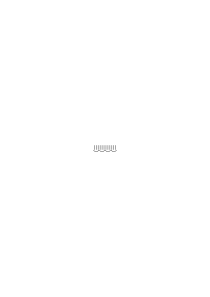

betrachten kann (also kennt) oder dieses System als eins von den vielen möglichen sieht.

### [156\[5\]](https://cdn.wittgensteinnachlass.com/2000px/webp/Ms-108/156.webp)

Die Mathematik „abrunden” kann man so wenig wie man sagen kann „runden wir die 4 primären Farben auf 5 oder 10 ab” oder runden wir die 8 Töne einer Oktave auf 10 ab (oder auf).

### [157\[1\]](https://cdn.wittgensteinnachlass.com/2000px/webp/Ms-108/157.webp)

Ich gebrauche das Wort Raum als Möglichkeit der Bewegung.

### [157\[2\]](https://cdn.wittgensteinnachlass.com/2000px/webp/Ms-108/157.webp)

Ich habe einmal in der Diskussion gesagt zwei Systeme seien derselbe Raum wenn sie in einander übersetzbar seien. Aber wie ist es etwa mit zwei Systemen von Tautologien wovon das eine in der Fregeschen Art mit „~” und „ ∙ ” das andere im System ~ξ ∙ ~η hingeschrieben ist. Diese beiden sind freilich in einander übersetzbar aber erst wenn man _in dem ersten das zweite sieht_. Man könnte das vielleicht auf die Lösung jeder algebraischen Aufgabe anwenden. Z.B. die Art & Weise der Lösung einer Gleichung x² + ax + b = 0 ist in ihr schon zu sehen – man könnte sich alle Transformationen in sie hineinprojiziert denken. – Aber das heißt die Lösung ist in ihr zu sehen – wenn man sie in ihr sieht dann sieht man aber _etwas anderes_ als wenn man die Lösung nicht in ihr sieht.

### [157\[3\]](https://cdn.wittgensteinnachlass.com/2000px/webp/Ms-108/157.webp),[158\[1\]](https://cdn.wittgensteinnachlass.com/2000px/webp/Ms-108/158.webp)

12.05.1930

Man könnte meine Meinung auch in den Worten ausdrücken: Man kann keine Verbindung von Teilen der Mathematik oder Logik herausfinden die schon vorhanden war ohne daß man es wußte. Sondern kannte man die Verbindung noch nicht so war sie nicht vorhanden. Und das System in dem sie vorhanden ist, ist ein neues System.

### [158\[2\]](https://cdn.wittgensteinnachlass.com/2000px/webp/Ms-108/158.webp),[159\[1\]](https://cdn.wittgensteinnachlass.com/2000px/webp/Ms-108/159.webp)

Man könnte so sagen: Wenn ich etwas suche – ich meine, den Nordpol oder ein Haus in London – so kann ich das was ich suche _vollständig_ beschreiben ehe ich es gefunden habe (oder gefunden habe daß es nicht da ist) & diese Beschreibung wird in jedem Fall logisch einwandfrei sein. Während ich im Fall des „Suchens” in der Mathematik wo es nicht _in_ einem System geschieht, das was ich suche nicht beschreiben kann, oder nur scheinbar, denn könnte ich es in allen Einzelheiten beschreiben so hätte ich es eben schon & ehe es _vollständig_ beschrieben ist kann ich nicht sicher sein ob _das_ was ich suche logisch einwandfrei ist, sich also überhaupt beschreiben läßt; d.h. diese unvollkommene Beschreibung läßt gerade das aus was notwendig wäre damit etwas gesucht werden könnte. Sie ist also nur eine Scheinbeschreibung des „Gesuchten”. Irregeführt wird man hier leicht durch die Rechtmäßigkeit einer unvollkommenen Beschreibung im Falle des Suchens eines wirklichen Gegenstandes & hier spielt wieder eine Unklarheit über Beschreibung & Gegenstand hinein. Wenn man sagt ich gehe auf den Nordpol & erwarte mir dort eine Flagge zu finden so hieße das in der Russellschen Auffassung: ich erwarte mir Etwas (ein x) zu finden das eine Flagge – etwa von dieser & dieser Farbe & Größe – ist. Und es scheint dann als bezöge sich die Erwartung (& das Suchen) auch hier nur auf eine (Beschreibung) & nicht auf den Gegenstand selbst den ich erst dann direkt kenne (knowledge by acquaintance) wenn ich ihn vor mir habe (während ich früher nur indirekt mit ihm bekannt bin). Aber das ist Unsinn. Was immer ich dort wahrnehmen kann – soweit es eine Bestätigung meiner Erwartung ist – kann ich auch schon vorher beschreiben & „beschreiben” heißt hier nicht etwas darüber aussagen sondern es aussprechen. D.h.: was ich suche muß ich _vollständig_ beschreiben _können_.

### [159\[2\]](https://cdn.wittgensteinnachlass.com/2000px/webp/Ms-108/159.webp)

13.05.1930

Die Frage ist kann man sagen daß die Mathematik heute gleichsam ausgezackt – oder ausgefranst – ist & daß man sie deshalb wird abrunden können. Ich glaube man kann das erstere nicht sagen, ebensowenig wie man sagen kann die Realität sei struppig weil es 4 Primäre Farben, 7 Töne in einer Oktav, 3 Dimensionen im Sehraum etc. gäbe.

### [159\[3\]](https://cdn.wittgensteinnachlass.com/2000px/webp/Ms-108/159.webp),[160\[1\]](https://cdn.wittgensteinnachlass.com/2000px/webp/Ms-108/160.webp)

Die Lösung der Gleichung x² + ax + b = 0 wird entdeckt indem man einen bestimmten Aspekt dieser Gleichung findet.

### [160\[2\]](https://cdn.wittgensteinnachlass.com/2000px/webp/Ms-108/160.webp)

Wenn man die Lösbarkeit beweist so muß in diesem Beweis irgendwie der Begriff Lösung vorhanden sein. (In dem Mechanismus des Beweises muß irgend etwas diesem Begriff entsprechen.) Aber dieser Begriff ist nicht durch eine äußere Beschreibung zu repräsentieren sondern nur wirklich darzustellen.

### [160\[3\]](https://cdn.wittgensteinnachlass.com/2000px/webp/Ms-108/160.webp)

Wo der neue Zusammenhang gefunden wurde dort sah man früher keine Lücke. Und wo man doch eine zu sehen glaubte, war man im Irrtum.

### [160\[4\]](https://cdn.wittgensteinnachlass.com/2000px/webp/Ms-108/160.webp)

(Ich kämpfe immer wieder – ob erfolgreich das weiß ich nicht – gegen die Tendenz in meinem eigenen Geiste an, in der Philosophie Regeln aufzustellen, (zu konstruieren), Annahmen (Hypothesen) zu machen statt nur zu sehen was da ist.)

### [160\[5\]](https://cdn.wittgensteinnachlass.com/2000px/webp/Ms-108/160.webp)

(Es ist äußerst anstrengend den Blick anzuspannen & die Physiognomie eines Gedankens in die Ferne, durch einen Nebel, zu sehen.)

### [160\[6\]](https://cdn.wittgensteinnachlass.com/2000px/webp/Ms-108/160.webp)

Philosophie könnte man auch das nennen was _vor_ allen neuen Entdeckungen & Erfindungen möglich ist.

### [161\[1\]](https://cdn.wittgensteinnachlass.com/2000px/webp/Ms-108/161.webp)

Ich will immer wieder zeigen daß die Logik is all right as it is.

### [161\[2\]](https://cdn.wittgensteinnachlass.com/2000px/webp/Ms-108/161.webp)

Das muß sich auch darauf beziehen daß ich keine Erklärung der Variablen „Satz” geben kann. Es ist klar daß dieser logische Begriff, diese Variable, von der Ordnung des Begriffs „Realität” oder „Welt” sein muß.

### [161\[3\]](https://cdn.wittgensteinnachlass.com/2000px/webp/Ms-108/161.webp),[162\[1\]](https://cdn.wittgensteinnachlass.com/2000px/webp/Ms-108/162.webp)

Die Allgemeinheit der Variablen in der Logik ist die Allgemeinheit der Demonstration. Sie besteht darin, daß die Tatsache daß p⊃p eine Tautologie ist an einem beliebigen _speziellen_ Fall _allgemeingültig demonstriert_ wird. D.h. aus der Demonstration des besonderen Falles ersehe ich tatsächlich ( wie immer sie gemeint war) alles was ich in der Logik brauche. D.h. die Demonstration erhält nicht dadurch ihre Allgemeinheit daß sie so gemeint ist sondern indem sie tatsächlich allgemein (d.h. allgemein gültig) demonstriert. D.h. die Allgemeinheit besteht hier in der Allgemeinheit der Anwendung. Und diese ist da so zu sagen ob man es will oder nicht – einfach durch die innere Relation des Einzelfalles zum Paradigma. – Man könnte dann sagen eine Demonstration demonstriert so allgemein als sie anwendbar ist. D.h. sie demonstriert allgemein durch den Raum in dem sie ist.

### [162\[2\]](https://cdn.wittgensteinnachlass.com/2000px/webp/Ms-108/162.webp)

14.05.1930

Es ist klar daß die Entdeckung des Schefferschen Systems in ~p ∙ ~p = ~p und ~(~p ∙ ~p) ∙ ~(~q ∙ ~q) = p ∙ q der Entdeckung entspricht das <math class="stacked" display="inline"><mtext>x²</mtext><mspace width="0.3em"/><mo>+</mo><mtext>ax</mtext><mspace width="0.3em"/><mo>+</mo><mfrac><mrow><mtext>a²</mtext></mrow><mrow><mn>4</mn></mrow></mfrac></math> ein Spezialfall von a² + 2ab + b² ist.

### [162\[3\]](https://cdn.wittgensteinnachlass.com/2000px/webp/Ms-108/162.webp)

Daß etwas so angesehen werden kann sieht man erst, wenn es so angesehen ist. Daß ein Aspekt möglich ist sieht man erst wenn er wirklich da ist.

### [162\[4\]](https://cdn.wittgensteinnachlass.com/2000px/webp/Ms-108/162.webp)

Man könnte eine Trigonometrie aufbauen nach dem Modell der elementaren Trigonometrie aber unabhängig von der Vorstellung der Dreiecke die aber nichts von den trigonometrischen Reihen wüßte sondern nur die Multiplizität der elementaren hätte.

### [162\[5\]](https://cdn.wittgensteinnachlass.com/2000px/webp/Ms-108/162.webp)

Die Dirichletsche Auffassung der Funktion ist nur dort möglich wo sie nicht ein unendliches Gesetz durch eine Liste ausdrücken will, denn eine unendliche Liste gibt es nicht.

### [162\[6\]](https://cdn.wittgensteinnachlass.com/2000px/webp/Ms-108/162.webp),[163\[1\]](https://cdn.wittgensteinnachlass.com/2000px/webp/Ms-108/163.webp)

Wenn die menschliche Kriegsführung dem Schachspiel ähnlicher wäre als sie tatsächlich ist so könnte man versuchen eine Schlacht auf dem Schachbrett darzustellen & mathematische Probleme die die Möglichkeiten der Schlacht betreffen auf dem Schachbrett zu lösen. Freilich nur mathematische Probleme, denn Experimente über den Vorgang der Schlacht könnte man mit den Schachfiguren nicht vornehmen da sie sich anders verhalten als die Menschen. Wenn also das Problem gelöst würde etwa von einer bestimmten Position ausgehend den Anderen in N Zügen matt zu setzen, so wäre das die Lösung eines mathematischen Problems des Krieges.

### [163\[2\]](https://cdn.wittgensteinnachlass.com/2000px/webp/Ms-108/163.webp)

Es ist nichts Allgemeines in der Demonstration, sie ist durchaus besonders, aber ihre Anwendungsmöglichkeit enthält die Allgemeinheit.

### [163\[3\]](https://cdn.wittgensteinnachlass.com/2000px/webp/Ms-108/163.webp)

Die Anwendungsmöglichkeit strahlt durch den Raum & trifft den Körper den man in diesen Raum bringt. Man könnte die Lichtstrahlen allgemein nennen, weil sie jeden beliebigen Körper beleuchten der sich ihnen in den Weg stellt. Aber die Lichtquelle allgemein zu nennen wäre absurd.

### [163\[4\]](https://cdn.wittgensteinnachlass.com/2000px/webp/Ms-108/163.webp),[164\[1\]](https://cdn.wittgensteinnachlass.com/2000px/webp/Ms-108/164.webp)

15.05.1930

Wenn der Grund etwas zu glauben nicht eine Verifikation sondern eine äußere Beziehung wäre so müßte man weiter fragen „und warum ist _das_ ein Grund gerade für _diesen_ Glauben”. Und so ginge es weiter. (Z.B. „warum nehmen wir das Gedächtnis als Grund für den Glauben, daß etwas in der Vergangenheit geschehen ist”.)

### [164\[2\]](https://cdn.wittgensteinnachlass.com/2000px/webp/Ms-108/164.webp)

Die Allgemeinheit der Interpretation einer Demonstration besteht darin – und nur darin – daß wir uns für die internen Verhältnisse der Demonstration interessieren & nicht für den physikalischen Vorgang (das Experiment) in ihr.

### [164\[3\]](https://cdn.wittgensteinnachlass.com/2000px/webp/Ms-108/164.webp)

Die Zahlenart die man verwendet wo man _sinnvoll_ unendlich weiter zählen kann & die man verwendet wo das nicht möglich ist sind von einander verschieden.

### [164\[4\]](https://cdn.wittgensteinnachlass.com/2000px/webp/Ms-108/164.webp)

_Das_ sind 3 Kreise kann ich nur sagen wenn das „das” eine Bedeutung hat die die 3 Kreise noch nicht präjudiziert.

### [164\[5\]](https://cdn.wittgensteinnachlass.com/2000px/webp/Ms-108/164.webp)

Die Allgemeinheit einer Demonstration ist der Bereich ihrer Wirkung.

### [164\[6\]](https://cdn.wittgensteinnachlass.com/2000px/webp/Ms-108/164.webp),[165\[1\]](https://cdn.wittgensteinnachlass.com/2000px/webp/Ms-108/165.webp)

Eine Demonstration demonstriert alles was sie demonstriert. Ihr Bereich hängt nicht davon ab wie sie _gemeint_ ist sondern von ihr. Wie ein Scheinwerfer sein Licht so weit schickt als er es schickt wieweit immer man es zu schicken meint.

### [165\[2\]](https://cdn.wittgensteinnachlass.com/2000px/webp/Ms-108/165.webp)

Das ist der Unterschied zwischen der Demonstration & einem Satz. In der Demonstration wird ja nichts gesagt sondern etwas gezeigt. Und was der Bereich ihrer Anwendung ist, hängt also von ihr und ihrem Raum ab aber nicht von uns.

### [165\[3\]](https://cdn.wittgensteinnachlass.com/2000px/webp/Ms-108/165.webp)

Man könnte nämlich sagen: Die Demonstration ist doch gar nicht allgemein sondern durchaus besonders. Aber sie demonstriert ja eben etwas & das gilt so allgemein als es gilt. (Das ist ja das Gute, daß wo immer auch Anspielungen & Andeutungen etwas gelten mögen, in der Demonstration nur das zählt was da ist. Sie ist in der Beziehung wie ein Experiment.)

### [165\[4\]](https://cdn.wittgensteinnachlass.com/2000px/webp/Ms-108/165.webp)

Es gibt z.B. Euklid die Anweisung zur Halbierung einer Strecke indem er die Methode (an einem Beispiel) demonstriert. Nun, diese Anweisung gilt soweit man sie anwenden kann. Und könnte man sie in einem Fall nicht anwenden so nützte es ihr nichts daß sie für diesen Fall gemeint war.

### [166\[1\]](https://cdn.wittgensteinnachlass.com/2000px/webp/Ms-108/166.webp)

Drei kann man nur durch das Modell der Drei darstellen.

### [166\[2\]](https://cdn.wittgensteinnachlass.com/2000px/webp/Ms-108/166.webp)

17.05.1930

Die Allgemeinheit der Demonstration ist nur der Raum um diese Demonstration. Die Anwendung auf einen besonderen Fall ist ein neuer Körper in diesem Raum.

### [166\[3\]](https://cdn.wittgensteinnachlass.com/2000px/webp/Ms-108/166.webp)

18.05.1930

Es ist ein Unterschied ob ein System auf ersten Prinzipien _ruht_ oder ob es bloß von ihnen ausgehend entwickelt wird. Es ist ein Unterschied ob es wie ein Haus auf seinen untersten Mauern ruht oder ob es wie etwa ein Himmelskörper im Raum frei schwebt & wir bloß unten zu bauen angefangen haben obwohl wir es auch irgend wo anders hätten tun können.

### [166\[4\]](https://cdn.wittgensteinnachlass.com/2000px/webp/Ms-108/166.webp)

Die Logik & die Mathematik _ruht_ nicht auf Axiomen; sowenig eine Gruppe auf den sie definierenden Elementen & Operationen beruht. Hierin liegt der Fehler das Einleuchten die self evidence der Grundgesetze als ein Kriterium der Richtigkeit in der Logik zu betrachten. Ein Fundament das auf nichts steht ist ein schlechtes Fundament.

### [166\[5\]](https://cdn.wittgensteinnachlass.com/2000px/webp/Ms-108/166.webp),[167\[1\]](https://cdn.wittgensteinnachlass.com/2000px/webp/Ms-108/167.webp)

Abgesehen von der Allgemeinheit der Demonstration, welcher Art ist denn die Allgemeinheit eines Axioms?

(Man könnte natürlich auch sagen „die Allgemeinheit des ganzen Systems”.)

### [167\[2\]](https://cdn.wittgensteinnachlass.com/2000px/webp/Ms-108/167.webp)

Diese Frage scheint mir zur eigentlichen Verwendung der Geometrie vorzudringen.

### [167\[3\]](https://cdn.wittgensteinnachlass.com/2000px/webp/Ms-108/167.webp)

Was für eine Art der Allgemeinheit ist es, wenn wir sagen „zwischen _je zwei_ Punkten läßt sich eine Gerade ziehen”?

### [167\[4\]](https://cdn.wittgensteinnachlass.com/2000px/webp/Ms-108/167.webp)

Die Allgemeinheit der grammatischen Regel bezieht sich auf den Gebrauch von Worten.

### [167\[5\]](https://cdn.wittgensteinnachlass.com/2000px/webp/Ms-108/167.webp)

Ich muß mir vorstellen können, was ein Punkt ist.

### [167\[6\]](https://cdn.wittgensteinnachlass.com/2000px/webp/Ms-108/167.webp)

Es hat Sinn von zwei Punkten zu sagen daß sie durch eine Gerade verbunden seien. Aber heißt das „es hat Sinn von zwei Dingen, die Punkte sind zu sagen etc.”?

### [167\[7\]](https://cdn.wittgensteinnachlass.com/2000px/webp/Ms-108/167.webp),[168\[1\]](https://cdn.wittgensteinnachlass.com/2000px/webp/Ms-108/168.webp)

Wie weiß ich dann, daß ein Zeichen A einen Punkt bezeichnet? Etwa indem ich sehe daß A in bestimmter Weise mit anderen Zeichen verknüpft werden darf. Aber wie weiß ich daß diese anderen Geraden bezeichnen etc.? Dadurch daß sie mit A so verknüpft werden dürfen? Sie können doch nicht gegenseitig ihre Bedeutung bestimmen. Das grammatische System (Spiel) ist eben autonom & seine Anwendung ist in ihm nicht gegeben.

### [168\[2\]](https://cdn.wittgensteinnachlass.com/2000px/webp/Ms-108/168.webp)

Das System wird aber z.B. charakterisiert durch die Aussage, daß keine Anzahl von Namen (für Punkte z.B.) als komplett betrachtet werden darf.

### [168\[3\]](https://cdn.wittgensteinnachlass.com/2000px/webp/Ms-108/168.webp)

Die Geometrie anders als als reine Grammatik muß angewendet sein & dann muß es wirkliche Punkte & Geraden etc. geben, der Satz daß eine Gerade zwei Punkte verbindet muß dann eben einen wirklichen Sinn haben.

### [168\[4\]](https://cdn.wittgensteinnachlass.com/2000px/webp/Ms-108/168.webp)

Und es heißt der geometrische Satz dann auch nicht alle Punktpaare _sind_ durch eine Gerade verbunden sondern _können_ durch eine Gerade verbunden werden. Und hier braucht man dann das Wort „_je zwei_ Punkte” & nicht _alle_ Punktpaare und deutet damit den Unterschied von einer anderen Art der Allgemeinheit an.

### [168\[5\]](https://cdn.wittgensteinnachlass.com/2000px/webp/Ms-108/168.webp)

Die Grammatik kann ihre Regeln nicht auf gut Glück allgemein aussprechen (d.h. sie offenlassen).

### [169\[1\]](https://cdn.wittgensteinnachlass.com/2000px/webp/Ms-108/169.webp)

19.05.1930

Denken wir uns ein Dame-Spiel in dem es erlaubt wäre ein beliebig großes Brett zu verwenden ich meine ein Brett mit einer beliebig großen Anzahl von Feldern (also 64, 81, 100, etc.). Das heißt natürlich nicht „es ist erlaubt ein Brett mit unendlich vielen Feldern zu verwenden” (das ist Stiefel). Wir könnten dieses Spiel nicht gut ein unendliches nennen.

### [169\[2\]](https://cdn.wittgensteinnachlass.com/2000px/webp/Ms-108/169.webp)

Die Möglichkeit entspricht immer einer Erlaubnis in den grammatischen Spielregeln. Dem was man unendliche Möglichkeit nennt entspricht etwas, was man eine unendliche Erlaubnis nennen könnte. Und das ist natürlich nicht die Erlaubnis etwas Unendliches zu tun.

### [169\[3\]](https://cdn.wittgensteinnachlass.com/2000px/webp/Ms-108/169.webp)

Die Unendliche Möglichkeit Namen zu bilden liegt nicht nur in der unendlichen Möglichkeit von Zeichen der Form <math class="stacked" display="inline"><msub><mi>x</mi><mtext>❘</mtext></msub></math>, <math class="stacked" display="inline"><msub><mi>x</mi><mtext>∣</mtext><mtext>∣</mtext></msub></math>, <math class="stacked" display="inline"><msub><mi>x</mi><mtext>∣</mtext><mtext>∣</mtext><mtext>∣</mtext></msub></math>, <math class="stacked" display="inline"><msub><mi>x</mi><mtext>∣</mtext><mtext>∣</mtext><mtext>∣</mtext><mtext>∣</mtext></msub></math> etc. sondern z.B. auch in der Unendlichen Möglichkeit des Raumes die Figur des Zeichens abzuändern.

### [169\[4\]](https://cdn.wittgensteinnachlass.com/2000px/webp/Ms-108/169.webp)

Verschiedene Arten von Figuren wie Läufer, Rössel, etc. entsprechen verschiedenen Wortarten.

### [170\[1\]](https://cdn.wittgensteinnachlass.com/2000px/webp/Ms-108/170.webp)

20.05.1930

Ich komme hier auf jene Methode der Zeichenerklärung über die sich Frege so lustig gemacht hat. Man könnte nämlich die Wörter „Rössel”, „Läufer”, etc. dadurch erklären daß man die Regeln angibt die von diesen Figuren handeln.

### [170\[2\]](https://cdn.wittgensteinnachlass.com/2000px/webp/Ms-108/170.webp),[171\[1\]](https://cdn.wittgensteinnachlass.com/2000px/webp/Ms-108/171.webp)

Genau dasselbe gilt in jeder Geometrie von den Ausdrücken „Punkt” und „Gerade” etc. Was ein Punkt ist & was eine Gerade sieht man nur daran welche Plätze das eine & das andere in dem System von Regeln einnimmt. Denken wir uns etwa ein System von Buchstaben von solcher Art daß alle erlaubten Zeichen Gruppen von drei Buchstaben sind & zwar derart daß ein Buchstabe der an einer Außenstelle stehen darf nicht in der Mittelstelle stehen darf und umgekehrt. Diese Regel würde zwischen zwei „Wortarten” unterscheiden und wir könnten das dadurch zum Ausdruck bringen daß wir für die Außenglieder große, für die Innenglieder kleine Buchstaben verwenden. – Andererseits aber hat die Unterscheidung zweier Wortarten keinerlei Sinn wenn sie _nicht_ auf die obige Art syntaktisch unterschieden sind d.h. wenn sie nicht auch ohne die verschiedene Art der Bezeichnung bloß durch die vor ihnen geltenden Regeln als verschieden zu erkennen wären. (Zwei Rössel könnten einander in keiner Hinsicht ähnlich sehen & wären wenn man die für sie geltenden Spielregeln kennt doch als solche gekennzeichnet.) Damit hängt es unmittelbar zusammen daß das Einführen neuer Gattungsnamen in die Philosophie der Logik uns um kein Haar weiterbringt solange nicht die syntaktischen Regeln gegeben sind die den Unterschied machen.

### [171\[2\]](https://cdn.wittgensteinnachlass.com/2000px/webp/Ms-108/171.webp)

21.05.1930

Wenn ich eine Klasse wirklicher Dinge gezählt habe & nun die 1 zu 1 Zuordnung einer anderen Klasse zu ihr sehe, kann ich allerdings schließen daß auch die andere die zuerst erhaltene Anzahl haben wird; aber dies ist eine Hypothese wie das Resultat der ersten Zählung.

### [171\[3\]](https://cdn.wittgensteinnachlass.com/2000px/webp/Ms-108/171.webp)

Ich kann in der Zuordnung die Zahlengleichheit sehen, aber sie nicht aus ihr schließen.

### [171\[4\]](https://cdn.wittgensteinnachlass.com/2000px/webp/Ms-108/171.webp),[172\[1\]](https://cdn.wittgensteinnachlass.com/2000px/webp/Ms-108/172.webp)

Es gibt nicht zwei Wortarten die ich grammatisch (ganz) gleich behandeln kann die aber doch zwei Wortarten sind. Sondern die Regeln die von ihnen handeln machen die Wortarten aus: Dieselben Regeln, dieselbe Wortart. Das hängt damit zusammen, daß, wenn sich ein Zeichen ganz so benimmt wie ein anderes, die beiden dasselbe Zeichen sind.

### [172\[2\]](https://cdn.wittgensteinnachlass.com/2000px/webp/Ms-108/172.webp)

22.05.1930

Die Dirichletsche Erklärung der Funktion ist der erste Schritt in der Mengenlehre. Aber die Wahrheit ist eben daß eine Funktion die man durch eine Tabelle definiert & eine die man durch einen unendlichen Prozeß definiert wesentlich verschiedene Dinge gibt, denn eine unendliche Tabelle wie eine unendliche Liste ist ein Unding.

### [172\[3\]](https://cdn.wittgensteinnachlass.com/2000px/webp/Ms-108/172.webp)

„Ist es denkbar daß 2 Dinge alle ihre Eigenschaften mit einander gemein haben?” Wenn es nicht denkbar ist, so ist auch das Gegenteil nicht denkbar.

### [172\[4\]](https://cdn.wittgensteinnachlass.com/2000px/webp/Ms-108/172.webp)

„Unendlich” spielt in Wirklichkeit (unbewußt) die Rolle von „sehr groß”!

### [172\[5\]](https://cdn.wittgensteinnachlass.com/2000px/webp/Ms-108/172.webp)

((1) + 1) I≝ 2, ((((1) + 1) + 1) + 1) II≝ 4, a + (b + 1) III≝ (a + b) + 1,

2 + 2 I≝ ((1) + 1) + ((1) + 1) III≝ (((1) + 1) + 1) + 1 II≝ 4 :. 2 + 2 = 4 Dasjenige was 2 + 2 = 4 bedeutungsvoll macht das also was macht daß 2 + 2 = 4 richtig & 2 + 2 = 5 falsch ist und nicht zwei gleichberechtigte Festsetzungen, ist die Beweisbarkeit von 2 + 2 = 4 und nur sie. Daß also ((1) + 1) + ((1) + 1) = (((1) + 1) + 1) + 1 zu dem allgemeinen System a + (b + 1) = (a + b) + 1 gehört.

### [173\[1\]](https://cdn.wittgensteinnachlass.com/2000px/webp/Ms-108/173.webp)

Ohne diese Beweisbarkeit wäre 2 + 2 = 4 eine willkürliche Zeichenregel & von richtig oder falsch bei ihr nicht die Rede. Die Demonstrabilität macht die Gleichung zu etwas was sich mit einem Satz vergleichen läßt.

### [173\[2\]](https://cdn.wittgensteinnachlass.com/2000px/webp/Ms-108/173.webp)

23.05.1930

„a + (b + 1) = (a + b) + 1” eine Definition zu nennen ist eigentlich schon ein Fehler. Denn es ist eine Zeichenregel ganz anderer Art als z.B. (1) + 1 = 2.

### [173\[3\]](https://cdn.wittgensteinnachlass.com/2000px/webp/Ms-108/173.webp)

Man könnte nun fragen: Welche Bedeutung hat 2 + 2 = 4 ist es nicht eine Zeichenregel? Wenn ja, so ist es willkürlich. Die Antwort ist, daß die Bedeutung von 2 + 2 = 4 nicht in ihm selbst sondern in seiner Beweisbarkeit, d.h. in seiner Beziehung zu anderen Zeichenregeln liegt, also in seiner Zugehörigkeit zu einem System. Das heißt also daß jener Beweis ebenso interne Beziehungen zwischen 2 & 4 aufzeigt wie der Beweis daß p⊃q ∙ p ․⊃․ q eine Tautologie ist interne Beziehungen zwischen p⊃q ∙ p und q zeigt.

### [173\[4\]](https://cdn.wittgensteinnachlass.com/2000px/webp/Ms-108/173.webp)

Wenn „a + (b + 1) = (a + b) + 1” die allgemeine Regel ist, dann kann ich 2 + 2 durch 4 ersetzen; das liegt in der logischen Struktur der Welt.

### [174\[1\]](https://cdn.wittgensteinnachlass.com/2000px/webp/Ms-108/174.webp)

25.05.1930

Das Wort Zahl ist nichts wenn dahinter nicht die variable Zahlform (ausgedrückt in grammatischen Regeln (Zeichenregeln)) steht.

### [174\[2\]](https://cdn.wittgensteinnachlass.com/2000px/webp/Ms-108/174.webp)

Eine Gleichung gewinnt erst in einem Kalkül mathematische Bedeutung.

### [174\[3\]](https://cdn.wittgensteinnachlass.com/2000px/webp/Ms-108/174.webp)

So ist „<math class="stacked" display="inline"><mfrac linethickness="0"><mrow><mtext>lim</mtext></mrow><mrow><mi>n</mi><mspace width="0.3em"/><mtext>→</mtext><mspace width="0.3em"/><mtext>∞</mtext></mrow></mfrac><mfrac><mrow><mn>1</mn></mrow><mrow><mi>n</mi></mrow></mfrac><mspace width="0.3em"/><mo>=</mo><mspace width="0.3em"/><mn>0</mn></math>” eine willkürliche Ersetzungsregel solange der Ausdruck lim etc. nicht in einem Limes-Kalkül steht. Die Verbindung dieses Kalküls mit den induktiven Eigenschaften von <math class="stacked" display="inline"><mfrac><mrow><mn>1</mn></mrow><mrow><mi>n</mi></mrow></mfrac></math>, z.B., besteht darin daß der Kalkül die gleichen Übergänge von Gleichung zu Gleichung erlaubt die von Induktionsprozeß zu Induktionsprozeß möglich sind.

### [174\[4\]](https://cdn.wittgensteinnachlass.com/2000px/webp/Ms-108/174.webp),[175\[1\]](https://cdn.wittgensteinnachlass.com/2000px/webp/Ms-108/175.webp)

<math class="stacked" display="inline"><mspace width="0.3em"/><mn>0</mn><msup><mtext>˙</mtext><mn>000</mn></msup><mspace width="0.3em"/><mtext>0˙</mtext><msup><mn>1</mn><mn>00</mn></msup><mspace width="0.3em"/><mtext>0˙</mtext><mn>0</mn><msup><mn>1</mn><mn>0</mn></msup><mspace width="0.3em"/><mtext>0˙</mtext><mn>110</mn><mspace width="0.3em"/><mtext>0˙</mtext><mn>001</mn><mspace width="0.3em"/><mtext>0˙</mtext><mn>101</mn><mspace width="0.3em"/><mtext>0˙</mtext><mn>011</mn><mspace width="0.3em"/><mtext>0˙</mtext><mn>111</mn><mtext>etc.</mtext><mspace width="0.3em"/><mo>|</mo><mspace width="0.3em"/><mo>|</mo><mspace width="0.3em"/><mo>|</mo><mspace width="0.3em"/><mo>|</mo><mi>a</mi></math> Ich verstehe die Regel dieser Bildung aber wie kann ich sie in exakte Form fassen. Da ich sie verstehe so muß sie sich auch in exakte Form fassen lassen.

Dazu brauche ich die allgemeine Form eines Gliedes wie _a_ und diese Form muß mit der des ersten solchen Gliedes so zugeordnet werden daß man sieht wie das erste Glied ein Fall des allgemeinen Gliedes ist. Und es muß auch gezeigt werden wie der Nachfolger des allgemeinen Gliedes ein allgemeines Glied ist. <math class="stacked" display="inline"><mtext><mo>[</mo></mtext><mtext>0,</mtext><mspace width="0.3em"/><mtext>ξ,</mtext><mfrac linethickness="0"><mrow><mtext>ξ0</mtext></mrow><mrow><mtext>ξ1</mtext></mrow></mfrac><mtext><mo>]</mo></mtext><mspace width="0.3em"/><mo>|</mo><mspace width="0.3em"/><mo>|</mo><mtext>0,</mtext><mspace width="0.3em"/><mo>|</mo><mspace width="0.3em"/><mo>|</mo><mspace width="0.3em"/><mtext>00,</mtext><mspace width="0.3em"/><mn>01</mn><mspace width="0.3em"/><mo>|</mo><mspace width="0.3em"/><mo>|</mo><mspace width="0.3em"/><mtext>000,</mtext><mspace width="0.3em"/><mn>010</mn><mspace width="0.3em"/><mn>001</mn><mspace width="0.3em"/><mn>011</mn><mspace width="0.3em"/><mo>|</mo><mspace width="0.3em"/><mo>|</mo><mspace width="0.3em"/><mtext>0000,</mtext><mspace width="0.3em"/><mn>0100</mn><mspace width="0.3em"/><mn>0010</mn><mspace width="0.3em"/><mn>0110</mn><mspace width="0.3em"/><mn>0001</mn><mspace width="0.3em"/><mn>0101</mn><mspace width="0.3em"/><mn>0011</mn><mspace width="0.3em"/><mn>0111</mn><mspace width="0.3em"/><mo>|</mo><mspace width="0.3em"/><mo>|</mo><mtext>etc.</mtext></math> Aber zu diesem Zeichen muß eine Beschreibung oder Gebrauchsanweisung kommen. Und die Schwierigkeit ist gerade die in exakter, das heißt wohl, unzweideutiger Form zu geben.

### [175\[2\]](https://cdn.wittgensteinnachlass.com/2000px/webp/Ms-108/175.webp)

Beschreibung einer solchen Bildungsregel durch die Wortsprache – – –

### [175\[3\]](https://cdn.wittgensteinnachlass.com/2000px/webp/Ms-108/175.webp)

Man brauchte jedenfalls einen Ausdruck für: Alle Permutationen mit n Wiederholungen von 0 und 1.

### [175\[4\]](https://cdn.wittgensteinnachlass.com/2000px/webp/Ms-108/175.webp),[176\[1\]](https://cdn.wittgensteinnachlass.com/2000px/webp/Ms-108/176.webp)

Würde ich alle jene Induktionsregeln nicht verstehen so könnte ich nicht mit Dezimalen rechnen. Aber sie exakt auszusprechen ist sehr schwer. – Oder es setzt eine komplizierte Technik voraus. Welcher Art diese Technik sein soll um strengen Anforderungen zu genügen & ob es hier überhaupt ein unstreng gibt weiß ich nicht. Ich vermute beinahe, daß wenn man nur die Interne Relation der Glieder der Formenreihe sieht alles in Ordnung ist & daß es gar keine Methode gibt einen so zu sagen zu zwingen die interne Relation zu sehen. Vielleicht ist es auch so daß man sie zuerst in bestimmten Fällen sehen muß & auf dieses Sehen dann die Ausdrücke für andere Formenreihen aufbauen kann.

### [176\[2\]](https://cdn.wittgensteinnachlass.com/2000px/webp/Ms-108/176.webp)

26.05.1930

Der Begriff „irrationale Zahl” ist ein gefährlicher Scheinbegriff.

### [176\[3\]](https://cdn.wittgensteinnachlass.com/2000px/webp/Ms-108/176.webp)

Ein Schnitt ist ein _Prinzip_ der Teilung in größer & kleiner.

### [176\[4\]](https://cdn.wittgensteinnachlass.com/2000px/webp/Ms-108/176.webp)

Und zwar braucht die irrationale Zahl eine _andere_ Definition von größer & kleiner als die rationale. Die ganzen Kunstgriffe bei der Einführung der irrationalen Zahlen sollen dieses Neue verhüllen. D.h. die Einführung der √2 ist die Einführung einer neuen mathematischen Welt & es soll immer so ausschauen als wäre sie in der früheren doch schon irgendwie enthalten gewesen.

### [176\[5\]](https://cdn.wittgensteinnachlass.com/2000px/webp/Ms-108/176.webp)

„~p” schließt einfach p aus. Was dann _statt_ p der Fall ist folgt aus dem Wesen der Welt.

### [176\[6\]](https://cdn.wittgensteinnachlass.com/2000px/webp/Ms-108/176.webp),[177\[1\]](https://cdn.wittgensteinnachlass.com/2000px/webp/Ms-108/177.webp),[178\[1\]](https://cdn.wittgensteinnachlass.com/2000px/webp/Ms-108/178.webp)

12.06.1930

Zur Frage nach der Existenz der Sinnesdaten. Man sagt wenn etwas rot scheint so muß _etwas_ rot gewesen _sein_, wenn etwas kurze Zeit zu dauern _schien_ so muß _etwas_ kurze Zeit gedauert haben etc. Man könnte nämlich fragen: Wenn etwas rot schien woher wissen wir denn daß es gerade _rot_ schien. Handelt es sich da um eine erfahrungsmäßige Zuordnung dieses Scheins & dieser Wirklichkeit. Wenn etwas „die Eigenschaft φ zu haben schien” woher wissen wir daß es _diese_ Eigenschaft zu haben schien – – –. Was für ein Zusammenhang besteht zwischen es scheint so & es ist so.

Vor allem kann der Schein recht haben oder unrecht. – Er ist auch in einem Sinne _erfahrungsgemäß_ mit der Wirklichkeit verbunden. Man sagt „das scheint Typhus zu sein” & das heißt diese Symptome sind erfahrungsgemäß mit jenen Erscheinungen verbunden. Wenn ich sage „das scheint rot zu sein” & dann „ja es ist wirklich rot” so habe ich für die zweite Entscheidung einen Test angewandt der unabhängig von der ersten Erscheinung war. Wenn etwas rot _schien_ so war dieser Schein. Und wenn in diesem Schein auch nichts in demselben Sinne rot _ist_ in dem jenes Andere rot ist wenn der Schein recht hätte, so gab es doch in dem Schein etwas dem Rotsein _Entsprechendes_. – Wenn es scheint als wäre ein physikalischer Gegenstand braun & rund so muß darum natürlich nicht etwas im physikalischen Sinne braun & rund sein aber es ist etwas Entsprechendes der Fall. In wiefern kann man aber von etwas Entsprechendem reden?

– – –

### [178\[2\]](https://cdn.wittgensteinnachlass.com/2000px/webp/Ms-108/178.webp)

„Satz” ist so allgemein wie z.B. auch „Ereignis”. Wie kann man „ein Ereignis” von dem abgrenzen was kein Ereignis ist? Ebenso allgemein ist aber auch „Experiment” das vielleicht zuerst spezieller zu sein scheint (und natürlich auch „Handlung” & „tun”).

### [178\[3\]](https://cdn.wittgensteinnachlass.com/2000px/webp/Ms-108/178.webp),[179\[1\]](https://cdn.wittgensteinnachlass.com/2000px/webp/Ms-108/179.webp)

Man kann natürlich auch nicht sagen Satz sei dasjenige wovon man wahr & falsch aussagen könne denn das würde nur dann etwas bestimmen wenn diese Worte in einer bestimmten Weise gemeint sind das aber können sie nur im Zusammenhang sein. Und eben im Zusammenhang mit einem Satz. Alles was man machen kann ist hier wie in allen diesen Fällen das grammatische Spiel bestimmen, seine Regeln angeben & es dabei bewenden lassen.

Hier handelt es sich um die Regeln für ⌵, ~, etc.

### [179\[2\]](https://cdn.wittgensteinnachlass.com/2000px/webp/Ms-108/179.webp)

„Da geschah ein Ereignis …”: das heißt nicht „ein Ereignis” im Gegensatz zu etwas anderem.

### [179\[3\]](https://cdn.wittgensteinnachlass.com/2000px/webp/Ms-108/179.webp)

In der Mengenlehre müßte man das was Kalkül ist trennen von dem was _Lehre_ sein will (und natürlich nicht sein kann). Man muß also die Spielregeln von unwesentlichen Aussagen über die Schachfiguren trennen.

### [179\[4\]](https://cdn.wittgensteinnachlass.com/2000px/webp/Ms-108/179.webp),[180\[1\]](https://cdn.wittgensteinnachlass.com/2000px/webp/Ms-108/180.webp)

Es ist immer mit recht „höchst verdächtig” wenn Beweise in der Mathematik allgemeiner geführt werden als es der bekannten Anwendung des Beweises entspricht.

Es liegt hier immer der Fehler vor, der in der Mathematik allgemeine Begriffe & besondere Fälle sieht. In der Mengenlehre treffen wir auf Schritt & Tritt diese verdächtige Allgemeinheit. Man möchte immer sagen: „Kommen wir zur Sache!” Jene allgemeinen Betrachtungen haben stets nur Sinn wenn man einen bestimmten Anwendungsbereich im Auge hat. Es gibt eben in der Mathematik keine Allgemeinheit deren Anwendung auf spezielle Fälle sich noch nicht voraussehen ließe. Man empfindet darum die allgemeinen Betrachtungen der Mengenlehre (wenn man sie nicht als Kalkül ansieht) immer als Schmus & ist ganz erstaunt wenn einem eine Anwendung dieser Betrachtungen gezeigt wird.

Man empfindet, es geht da etwas nicht ganz mit rechten Dinge zu.

### [180\[2\]](https://cdn.wittgensteinnachlass.com/2000px/webp/Ms-108/180.webp)

15.06.1930

Es mag nach dem Vielen was ich schon darüber gesagt habe trivial klingen wenn ich jetzt sage daß der Fehler in der mengentheoretischen Betrachtungsweise immer wieder darin liegt Gesetze & Aufzählungen (Listen) als wesentlich Eins zu betrachten & sie aneinander zu reihen; da, wo das eine nicht ausreicht, das andere seinen Platz ausfüllt. (So macht es die Dirichletsche Auffassung der Funktionen.)

### [180\[3\]](https://cdn.wittgensteinnachlass.com/2000px/webp/Ms-108/180.webp),[181\[1\]](https://cdn.wittgensteinnachlass.com/2000px/webp/Ms-108/181.webp)

Wendet man meine Betrachtung auf das Cantorsche Diagonalverfahren an so ergibt sich:

Eine unendliche Menge von Dezimalbrüchen

0˙a11 a21 a31 a41 ……

0˙a12 a22 a3242 ……

0˙a13 a23 a33 a43 ……

– – – –

– – – –

kann nur ein Gesetz bedeuten nach dem Gesetze gebildet werden und das heißt eigentlich eine Funktion von zwei Veränderlichen. F(x,y) ist die allgemeine Form dieser Dezimalbrüche. F(x,n) ist der n-te von ihnen & F(m,n) seine m-te Stelle. Der Dezimalbruch nach der Diagonale genommen ist F(x,x) und verändert lautet er etwa F(x,x) + 1 (dazu müßte festgesetzt werden, daß 0 + 1 = 1, 1 + 1 = 2, … q + 1 = 0 etc. ist).

Und nun zeigt ein Induktionsbeweis daß F(x,x) + 1 eine andere Entwicklung hat als jedes beliebige F(x,y). Wo aber ist hier das höhere Unendliche? (oder gar das „eigentlich Unendliche”?)

### [181\[2\]](https://cdn.wittgensteinnachlass.com/2000px/webp/Ms-108/181.webp)

Die Schwierigkeit liegt auch hier wieder in der Bildung mathematischer Scheinbegriffe. Wenn man z.B. sagt man kann die Kardinalzahlen ihrer Größe nach in eine Folge ordnen aber nicht die rationalen Zahlen so ist darin unbewußt die Voraussetzung enthalten als hätte der Begriff des Ordnens der Größe nach für _die rationalen Zahlen_ doch einen Sinn & als erwiese sich dieses Ordnen nun beim Versuch als unmöglich (was voraussetzt daß der _Versuch_ denkbar ist). – So denkt man ist es möglich zu versuchen _die reellen Zahlen_ (als wäre es ein Begriff wie etwa Apfel auf diesem Tisch) in eine Reihe zu ordnen & es erwiese sich nun als undurchführbar.

### [182\[1\]](https://cdn.wittgensteinnachlass.com/2000px/webp/Ms-108/182.webp)

Wenn der Mengenkalkül sich in seiner Ausdrucksweise so viel als möglich an die Ausdrucksweise des Kalküls der Kardinalzahlen anlehnt so ist das wohl in mancher Hinsicht belehrend weil es auf gewisse formale Ähnlichkeiten hinweist aber auch irreführend wenn er, gleichsam, etwas noch ein Messer nennt das weder Griff noch Klinge mehr hat. (Lichtenberg)

### [182\[2\]](https://cdn.wittgensteinnachlass.com/2000px/webp/Ms-108/182.webp)

Es ist das als wollte man Tarotkarten so viel als möglich den Schachfiguren nachahmen wodurch aber das Tarot dem Schach um kein Haar ähnlicher wird. Es sind eben _nur_ die Regeln die hier „Bedeutung haben”; nicht die Figuren.

### [182\[3\]](https://cdn.wittgensteinnachlass.com/2000px/webp/Ms-108/182.webp)

Dem periodischen Dezimalbruch der ja ein Gesetz ist kann man nur nicht-periodische Gesetze entgegenstellen & nicht nicht-periodische Extensionen.

### [182\[4\]](https://cdn.wittgensteinnachlass.com/2000px/webp/Ms-108/182.webp)

Wie kommt es daß aus ~ (a ≧ b) folgt a < b?

### [182\[5\]](https://cdn.wittgensteinnachlass.com/2000px/webp/Ms-108/182.webp),[183\[1\]](https://cdn.wittgensteinnachlass.com/2000px/webp/Ms-108/183.webp)

Was heißt es: Er ist nicht größer als ich. Daß der Satz nicht alle Größen über der meinen verneint ist selbstverständlich. Ich glaube man kann ihn nur durch den Satz „er ist größer als ich” verstehen.

### [183\[2\]](https://cdn.wittgensteinnachlass.com/2000px/webp/Ms-108/183.webp)

16.06.1930

Wie beweist man daß 2 × 2 nicht 5 ist? ist es ein anderer Beweis als der, daß 2 × 2 = 4? Denn da der Sinn des mathematischen Satzes in seiner Beweisbarkeit liegt & der Art wie er zu beweisen ist, so muß sich auch der Sinn des negativen Satzes so finden.

### [183\[3\]](https://cdn.wittgensteinnachlass.com/2000px/webp/Ms-108/183.webp)

Wenn ich sage zeichne einen Strich irgendwo zwischen diesen beiden ❘❘ so gebe ich damit keinen unendlich komplizierten Befehl. Andererseits muß der Befehl voraussehen was er als seine Erfüllung gelten lassen wird.

### [183\[4\]](https://cdn.wittgensteinnachlass.com/2000px/webp/Ms-108/183.webp)

Die rein kausale Rechenschaft die man sich von der Funktion der Sprache geben will – also ohne Rücksicht auf die Intention – hat ihr ganz Entsprechendes in einer Beschreibung – etwa – des Funktionierens der Automobile. – Oder auch bei der Betrachtung der speziellen Sprache der Werkzeichnung deren sich der Ingenieur bedient um sich dem Arbeiter verständlich zu machen.

### [183\[5\]](https://cdn.wittgensteinnachlass.com/2000px/webp/Ms-108/183.webp),[184\[1\]](https://cdn.wittgensteinnachlass.com/2000px/webp/Ms-108/184.webp)

17.06.1930

Die Intention muß natürlich auch ein Phänomen sein. D.h. Wenn man alle Phänomene in Betracht zieht & die Intention würde sich in ihnen nicht zeigen so wäre sie auch nicht da.

### [184\[2\]](https://cdn.wittgensteinnachlass.com/2000px/webp/Ms-108/184.webp),[185\[1\]](https://cdn.wittgensteinnachlass.com/2000px/webp/Ms-108/185.webp),[186\[1\]](https://cdn.wittgensteinnachlass.com/2000px/webp/Ms-108/186.webp),[187\[1\]](https://cdn.wittgensteinnachlass.com/2000px/webp/Ms-108/187.webp),[187\[2\]](https://cdn.wittgensteinnachlass.com/2000px/webp/Ms-108/187.webp),[188\[1\]](https://cdn.wittgensteinnachlass.com/2000px/webp/Ms-108/188.webp),[189\[1\]](https://cdn.wittgensteinnachlass.com/2000px/webp/Ms-108/189.webp)

Angenommen das Anziehen des Bremshebels bewirkt manchmal das Abbremsen der Maschine & manchmal nicht. So ist daraus allein nicht zu schließen daß er als Bremshebel gedacht war. Wenn nun eine bestimmte Person immer dann wenn der Hebel nicht als Bremshebel wirkt, ärgerlich wird –. So wäre damit auch nicht das gezeigt was ich zeigen will. Ja man könnte dann sagen daß der Hebel einmal die Bremse, einmal den Ärger betätigt. – Wie drückt es sich nämlich aus, daß die Person _darüber_ ärgerlich wird, daß der Hebel die Bremse nicht betätigt hat?

(Dieses _über etwas ärgerlich sein_ ist nämlich scheinbar von ganz derselben Art wie etwas fürchten, etwas wünschen etwas erwarten etc.) Das „über etwas ärgerlich sein” verhält sich nämlich zu dem worüber man ärgerlich ist nicht wie die Wirkung zur Ursache also nicht wie das sich durch etwas den Magen verdorben haben zu der Speise mit der man sich etwa den Magen verdorben hat. Man kann darüber im Zweifel sein woran man sich den Magen verdorben hat & die Speise die etwa die Ursache ist tritt in die Magenschmerzen nicht als ein Bestandteil dieser Schmerzen ein dagegen kann man in einem gewissen Sinne nicht zweifelhaft sein worüber man sich ärgert, wovor man sich fürchtet, was man glaubt. (Es heißt nicht „ich weiß nicht, – ich glaube heute; aber ich weiß nicht woran!”) – Und hier haben wir natürlich das alte Problem daß nämlich der Gedanke daß das & das der Fall ist nicht voraussetzt daß es der Fall ist. Daß aber andererseits doch etwas von der Tatsache für den Gedanken selbst Voraussetzung sein muß. „Ich kann nicht denken daß etwas rot ist wenn rot gar nicht existiert”. Die Antwort darauf ist daß die Gedanken in demselben Raum sein müssen wie das Zweifelhafte wenn auch an einer anderen Stelle; daß die gegenwärtige Realität auf die der Gedankenmaßstab aufgestellt wird den Sinn – nicht verbürgt – sondern ausmacht. Der Sinn kann ebensowenig erst verbürgt werden müssen wie es nachträglich bewiesen werden kann daß π nicht rational ist; denn ohne Sinn kein Gedanke. – Darin & nur darin besteht auch die (prästabilierte) Harmonie zwischen Welt & Gedanke. Die Intention ist nun aber von genau derselben Art wie – z.B. – der Ärger. Und da scheint es irgendwie als würde man die Intention von außen betrachtet nie als _Intention_ erkennen; als müßte man sie selbst intendieren um sie als Meinung zu verstehen. Das hieße aber sie nicht als Phänomen, nicht als Tatsache, zu betrachten! Das ist natürlich wieder das vorige Problem denn der Witz ist daß man es dem Gedanken (als selbständige Tatsache betrachtet) ansehen muß daß er der Gedanke ist, daß so & so der Fall ist. Kann man es ihm nicht ansehen (sowenig wie den Magenschmerzen woher sie rühren) dann hat er kein logisches Interesse oder vielmehr, dann gibt es keine Logik. – Das kommt auch darauf hinaus daß man den Gedanken mit der Realität muß unmittelbar vergleichen können & es nicht erst einer Erfahrung bedürfen kann daß diesem Gedanken diese Realität entspricht. (Darum unterscheiden sich auch Gedanken nach ihrem Inhalt aber Magenschmerzen nicht nach dem was sie hervorgerufen hat.) Meine Auffassung scheint unsinnig wenn man sie so ausdrückt: Man soll sehen können worüber Einer denkt wenn man ihm den Kopf aufmacht; wie ist denn das möglich, die Gegenstände über die er denkt sind ja gar nicht in seinem Kopf (ebensowenig wie in seinen Gedanken)!

Man muß nämlich die Gedanken, Intentionen (etc.) von außen betrachtet als solche verstehen _ohne_ (noch) über die Bedeutung von etwas unterrichtet zu werden. Denn auch die Relation des Bedeutens wird ja dann als ein Phänomen gesehen & ich kann dann nicht wieder auf eine Bedeutung des Phänomens hinweisen müssen da ja dieses Bedeuten wieder in den Phänomenen inbegriffen ist.) 18.06.1930 Wenn man den Gedanken betrachtet so kann also von einem Verstehen keine Rede mehr sein, denn, sieht man ihn, so muß man ihn als den Gedanken dieses Inhalts erkennen, es ist nichts zu deuten. – Aber so ist es ja wirklich, wenn wir denken; da wird nicht gedeutet. – Und man könnte sagen: der Denkende sieht den Gedanken tatsächlich von außen an & nicht von innen; alles was man sieht, sieht man von außen an; d.h. alles was man erlebt, ist Phänomen. – Man kann die Erwartung mit der _Gegenwart_ unmittelbar vergleichen; – das gibt die Lösung. Und das kann man auch vom Wunsch ja auch vom Ärger sagen. Und das heißt, daß, wenn ich mich ärgere, daß jemand etwas in Paris getan hat, ich es damit vergleichen kann daß ich jetzt in Wien in meinem Zimmer sitze. Aber damit ist auch noch nicht alles gesagt. – Die Sprache wird _verstanden_ der Gedanke _nicht_. (Das Verstehen der Sprache ist das Denken, das Verstehen der Sprache aber wird nicht noch einmal verstanden.) – Die kausale Erklärung des Bedeutens & Verstehens lautet im Wesentlichen so: einen Befehl verstehen heißt, man würde ihn ausführen wenn ein gewisser Riegel zurückgezogen [das Gegenteil von Vorschieben] würde. – Es würde jemandem befohlen einen Arm zu heben & man sagt: den Befehl verstehen heißt den Arm zu heben. Das ist klar wenn auch gegen unseren Sprachgebrauch (wir nennen das „den Befehl befolgen”). Nun sagt man aber: Den Befehl verstehen heißt entweder den Arm heben oder wenn das nicht etwas bestimmtes Anderes tun – etwa das Bein heben. Nun heißt das aber nicht „Verstehen” im ersten Sinn denn der Befehl war nicht „den Arm oder das Bein zu heben”. Der Befehl bezieht sich also (nach wie vor) auf eine Handlung die _nicht_ geschehen ist. Mit anderen Worten es bleibt der Unterschied bestehen zwischen dem Verstehen & dem Befolgen des Befehls. Und weiter: ein unverstandener Befehl ist gar kein Befehl. – Dieses Verstehen des Befehls kann nicht irgend eine Handlung sein (etwa den Fuß heben) sondern sie muß das Wesen des Befehls selbst enthalten.

### [189\[2\]](https://cdn.wittgensteinnachlass.com/2000px/webp/Ms-108/189.webp)

18.06.1930

[Kann man eine Farbe oder gar einen Ton vergessen?]

### [189\[3\]](https://cdn.wittgensteinnachlass.com/2000px/webp/Ms-108/189.webp),[190\[1\]](https://cdn.wittgensteinnachlass.com/2000px/webp/Ms-108/190.webp)

Sage ich jemandem „gehe 3 Schritte” & er versteht den Befehl, so kann er ihn mir etwa durch eine erklären. Er sagt etwa: Wenn hier der Weg ist & A der Anfang, so

willst Du daß ich nach B dann nach C & D kommen soll; oder dergleichen. Und dabei ist es klar daß er in gewissem Sinne nur einer Sache Ausdruck verliehen hat, die er schon früher – als er den Befehl hörte & verstand – wußte. Er könnte nun so fortfahren & den Befehl noch näher erklären etwa mit einem Diagramm

und immer würde er doch nur hervorbringen was ihm schon früher klar war. Er übersetzt nur von einer Sprache in eine andere. Und wenn er nun endlich den Befehl (selbst) ausführte zum Zeichen daß er ihn verstanden hat – würde er da nicht wieder bloß übersetzen?

### [190\[2\]](https://cdn.wittgensteinnachlass.com/2000px/webp/Ms-108/190.webp)

[Ich sehe undeutlich eine Verbindung zwischen dem Problem des Solipsismus oder Idealismus & dem der Bezeichnungsweise eines Satzes. Wird etwa das Ich in diesen Fällen durch den Satz ersetzt & das Verhältnis des Ich zur Wirklichkeit durch das Verhältnis von Satz & Wirklichkeit?]

### [190\[3\]](https://cdn.wittgensteinnachlass.com/2000px/webp/Ms-108/190.webp)

20.06.1930

Zwischen dem Befehl & seiner Ausführung muß eine Kontinuität bestehen. Die Ausführung muß, sozusagen, nur die Endfläche des Befehls (Befehlskörpers) sein.

### [190\[4\]](https://cdn.wittgensteinnachlass.com/2000px/webp/Ms-108/190.webp)

21.06.1930

„Er hat den Befehl nicht _ganz_ ausgeführt”, daran müßte man die kausale Theorie der Bedeutung widerlegen können.

### [190\[5\]](https://cdn.wittgensteinnachlass.com/2000px/webp/Ms-108/190.webp)

Der Befehl muß eine Art des Vergleichs eines Satzes mit der Realität sein.

### [190\[6\]](https://cdn.wittgensteinnachlass.com/2000px/webp/Ms-108/190.webp),[191\[1\]](https://cdn.wittgensteinnachlass.com/2000px/webp/Ms-108/191.webp)

Ich denke um mir das Wesen des Verstehens klar zu machen immer an eine Figur & eine Projektion die man von ihr macht.

Die Projektionsmethode kann nur durch den Vergleich des Bildes mit der Realität festgehalten sein die eben da ist.

### [191\[2\]](https://cdn.wittgensteinnachlass.com/2000px/webp/Ms-108/191.webp)

Aber da scheint es ja als müsse man den Satz mit der Realität _in einem bestimmten Sinne_ vergleichen – also nicht nur vergleichen. Als müßte also die Realität in gewissen Fällen durch die Vergleichung einen Vorwurf empfinden oder dergleichen. Wenn sich etwas einem _Ziele_ nähert so liegt in dem Wort „Ziel” hier das was ich meine. (Die Intention.)

### [191\[3\]](https://cdn.wittgensteinnachlass.com/2000px/webp/Ms-108/191.webp)

Jeder Mensch sieht daß

die obere Strecke größer ist & die untere kleiner; aber er sieht nicht darin daß die untere Strecke so groß _sein oder werden sollte_ wie die obere. Und wie kann ein Bild, welcher Art immer, das ausdrücken?

### [191\[4\]](https://cdn.wittgensteinnachlass.com/2000px/webp/Ms-108/191.webp),[192\[1\]](https://cdn.wittgensteinnachlass.com/2000px/webp/Ms-108/192.webp)

Das heißt, der Satz (Befehl) wird nicht einfach mit der Wirklichkeit zusammengestellt, sondern er wird mit einer _bestimmten Tendenz_ mit ihr verglichen. Aber worin liegt diese Tendenz? (Ist das so ähnlich wie wenn man Magenschmerzen beschriebe & es früge einer „ich verstehe das aber woran liegt da das Unangenehme”.)

### [192\[2\]](https://cdn.wittgensteinnachlass.com/2000px/webp/Ms-108/192.webp)

Der Satz – der Befehl – setzt die Wirklichkeit quasi fort indem er an die Realität anknüpft & eine Veränderung darstellt. Es ist als hätte man eine Puppe die meinen Körper in seiner gegenwärtigen Lage vorstellt & mit der nun die Veränderungen vorgenommen werden – in effigie – die meinem Körper zugedacht sind.

### [192\[3\]](https://cdn.wittgensteinnachlass.com/2000px/webp/Ms-108/192.webp)

Somit wäre das Problem wieder das welcher Natur die stellvertretende Beziehung ist wenn man etwa sagt „diese Puppe sollst Du sein etc.”.

### [192\[4\]](https://cdn.wittgensteinnachlass.com/2000px/webp/Ms-108/192.webp)

Ich fühle daß ich auch hier wieder zur Antwort auf die Grenzen der Sprache stoßen werde. Weiß aber noch nicht wie.

### [192\[5\]](https://cdn.wittgensteinnachlass.com/2000px/webp/Ms-108/192.webp),[193\[1\]](https://cdn.wittgensteinnachlass.com/2000px/webp/Ms-108/193.webp)

Was heißt es: Ich kann mir vorstellen daß dieser Punkt sich hier

• | | | | | | | | | | | | | | | | ❘ |

hin bewegt? Die seltsame Täuschung der man unterliegt daß im Satze die Gegenstände das tun, was der Satz sagt muß sich aufhellen.

### [193\[2\]](https://cdn.wittgensteinnachlass.com/2000px/webp/Ms-108/193.webp)

Es ist als ob im Befehl bereits ein Schatten der Ausführung läge. Aber ein Schatten eben _dieser_ Ausführung. _Du_ gehst im Befehl dort & dort hin. – Sonst wäre es aber eben ein _anderer_ Befehl.

### [193\[3\]](https://cdn.wittgensteinnachlass.com/2000px/webp/Ms-108/193.webp)

Ich weiß daß ich logisches Gift in mich hineintrinken muß – um es überwinden zu können. So sage ich mir jetzt eigentlich immer daß doch die Tatsache im Befehl im Satz schon liegen muß obwohl ich weiß daß sie nicht in ihm liegt aber dieser _Schein_ muß angegangen werden.

### [193\[4\]](https://cdn.wittgensteinnachlass.com/2000px/webp/Ms-108/193.webp)

28.06.1930

Der Satz ist ein Vergleichsobjekt – aber wie geht der Vergleich vor sich?

### [193\[5\]](https://cdn.wittgensteinnachlass.com/2000px/webp/Ms-108/193.webp),[194\[1\]](https://cdn.wittgensteinnachlass.com/2000px/webp/Ms-108/194.webp)

Irgendwie ist meine Schwierigkeit darin gelöst daß ich mich andauernd _in der Sprache_ bewege. aus ihr nicht herauskann. Wenn ich über das Vergleichen rede so _rede_ ich über das Vergleichen; etc. (So, wenn ich sage „einen Satz verstehen heißt, wissen was der Fall ist, wenn er wahr ist”, das ist eben auch nur gesagt.) Und hier kommt man auf etwas worin sich alles ausdrücken dürfte nämlich auf den Ausdruck „der Satz … ist wahr”. Darin wird alles beschlossen liegen daß „‚p’ ist wahr” nichts sagt als: p.

### [194\[2\]](https://cdn.wittgensteinnachlass.com/2000px/webp/Ms-108/194.webp)

Ich kann den alten philosophischen Problemen keine Lösungen geben aber ich kann ihnen Grenzen setzen.

### [194\[3\]](https://cdn.wittgensteinnachlass.com/2000px/webp/Ms-108/194.webp)

Zu Grunde liegt allen meinen Betrachtungen (das Gefühl) die Einsicht, daß der Gedanke einen inneren Zusammenhang mit der Welt hat & keinen äußeren.

Daß man also das _meint_, was man sagt. Heißt das aber nicht nur, daß man sich in der Sprache nicht aus der Sprache, oder in den Gedanken nicht aus den Gedanken herausbewegen kann?

### [194\[4\]](https://cdn.wittgensteinnachlass.com/2000px/webp/Ms-108/194.webp),[195\[1\]](https://cdn.wittgensteinnachlass.com/2000px/webp/Ms-108/195.webp)

Kann der Zusammenhang zwischen dem „Meinen daß p der Fall ist” & dem Geschehen von p noch anders ausgedrückt werden als in der Internen Beziehung eben dieser Ausdrücke? (Ich glaube es nicht.)

### [195\[2\]](https://cdn.wittgensteinnachlass.com/2000px/webp/Ms-108/195.webp)

In dem Worte „etwas _meinen_” liegt das ganze Problem beschlossen.

### [195\[3\]](https://cdn.wittgensteinnachlass.com/2000px/webp/Ms-108/195.webp)

Man fühlt das _Stellvertretende_ an dem Gedanken.

### [195\[4\]](https://cdn.wittgensteinnachlass.com/2000px/webp/Ms-108/195.webp)

„Ich dachte, Du würdest zu mir kommen”. An diesem Satz muß sich alles zeigen lassen was man an _exakteren_ Sätzen zeigen will.

### [195\[5\]](https://cdn.wittgensteinnachlass.com/2000px/webp/Ms-108/195.webp)

In der Sprache wird alles _ausgetragen_.

### [195\[6\]](https://cdn.wittgensteinnachlass.com/2000px/webp/Ms-108/195.webp)

Wenn man sagt „ich dachte Du würdest heute kommen & habe schon die Vorbereitungen getroffen” so stehen diese Vorbereitungen mit dem Gedanken in irgend einer Kontinuität.

### [195\[7\]](https://cdn.wittgensteinnachlass.com/2000px/webp/Ms-108/195.webp)

Wenn ich jemand einen Stuhl hinschiebe _damit_ er sich setzt ist hier auch der Gedanke & die Handlung eine Kette.

### [195\[8\]](https://cdn.wittgensteinnachlass.com/2000px/webp/Ms-108/195.webp),[196\[1\]](https://cdn.wittgensteinnachlass.com/2000px/webp/Ms-108/196.webp)

Aber die nächste Verwandtschaft von Sprache & Wirklichkeit ist doch die daß wenn p eintritt „p” bewahrheitet ist. Aber das kann man nicht ausdrücken.

### [196\[2\]](https://cdn.wittgensteinnachlass.com/2000px/webp/Ms-108/196.webp)

Der Gedanke „daß es sich so verhält” (p) wird durch die Tatsache daß es sich so verhält (p) wahrgemacht. Daß sich der Zusammenhang zwischen Gedanken & Welt so nicht darstellen läßt (denn diese Darstellung sagt gar nichts) muß die Antwort auf meine Probleme sein.

### [196\[3\]](https://cdn.wittgensteinnachlass.com/2000px/webp/Ms-108/196.webp)

29.06.1930

Es ist, natürlich, auch nicht so daß das was den Gedanken „daß p der Fall ist” verifiziert – befriedigt – eben p genannt wird. Wie wenn man sagen würde: ich habe Lust auf einen Apfel & was immer diese Lust befriedigt werde ich eben einen Apfel nennen.

### [196\[4\]](https://cdn.wittgensteinnachlass.com/2000px/webp/Ms-108/196.webp)

Denn ich _rede_ ja jetzt von der Befriedigung des Gedankens (der Erwartung) noch ehe der Gedanke befriedigt ist.

### [196\[5\]](https://cdn.wittgensteinnachlass.com/2000px/webp/Ms-108/196.webp),[197\[1\]](https://cdn.wittgensteinnachlass.com/2000px/webp/Ms-108/197.webp)

Man könnte nämlich denken: Wie ist es: der Gedanke & die Tatsache sind verschieden; aber wir nennen den Gedanken den daß die Tatsache der Fall ist oder die Tatsache die die den Gedanken wahrmacht. Ist da das eine Beschreibung mit Hilfe des Anderen? Wird der Gedanke mittels der Tatsache die ihn wahr macht _beschrieben_, also einer äußeren Eigenschaft nach beschrieben, wie wenn ich von jemandem sage er ist mein Onkel? Oder die Tatsache ebenso durch den Gedanken?

### [197\[2\]](https://cdn.wittgensteinnachlass.com/2000px/webp/Ms-108/197.webp)

Wenn man den Ausdruck „der Gedanke, daß … der Fall ist” als _Beschreibung_ erklärt so ist damit wieder nichts erklärt, weil es sich fragt: wie ist eine solche Beschreibung möglich, sie setzt selber wieder das Wesen des Gedankens voraus denn sie enthält die Beziehung auf eine Tatsache die nicht geschehen ist also gerade das was problematisch war.

### [197\[3\]](https://cdn.wittgensteinnachlass.com/2000px/webp/Ms-108/197.webp)

Es ist – glaube ich – offenbar daß unsere Schwierigkeit eben darin beruht „über den Gedanken zu denken”. Hier stoßen wir auf eine Unmöglichkeit & diesen Stoß klar zu machen das ist die Lösung.

### [197\[4\]](https://cdn.wittgensteinnachlass.com/2000px/webp/Ms-108/197.webp),[198\[1\]](https://cdn.wittgensteinnachlass.com/2000px/webp/Ms-108/198.webp)

Meine Ansicht ist, daß der Gedanke wesentlich das ist was durch den Satz ausgedrückt ist wobei ausgedrückt nicht heißt hervorgerufen ein Schnupfen wird durch ein kaltes Bad hervorgerufen aber nicht durch das kalte Bad ausgedrückt. Daß der Gedanke ganz _Maß_ ist wie der Maßstab; ich meine wie alles am Maßstab unwesentlich ist außer dem Längenmaß.

### [198\[2\]](https://cdn.wittgensteinnachlass.com/2000px/webp/Ms-108/198.webp)

Der Gedanke ist ein Symbol.

### [198\[3\]](https://cdn.wittgensteinnachlass.com/2000px/webp/Ms-108/198.webp)

„Ich, der jetzt hier sitzt werde morgen …” Das Eintreten der Realität (Ich, etc.) in das Symbol, muß der eigentliche Zusammenhang des Satzes mit der Wirklichkeit sein.

### [198\[4\]](https://cdn.wittgensteinnachlass.com/2000px/webp/Ms-108/198.webp)

Der (gegenwärtige) Gedanke enthält _alle_ Realität die gegenwärtig vorhanden ist. (Und mehr _kann_ er ja nicht haben.)

### [198\[5\]](https://cdn.wittgensteinnachlass.com/2000px/webp/Ms-108/198.webp),[199\[1\]](https://cdn.wittgensteinnachlass.com/2000px/webp/Ms-108/199.webp)

Es ist sehr merkwürdig – für den der dafür Augen hat– daß in einem Buch über Differentialrechnung in den Erklärungen mengentheoretische Ausdrücke & Symbole vorkommen, die im Kalkül gänzlich verschwinden. Das erinnert an die ersten Erklärungen in den Lehrbüchern der Physik in denen vom Kausalitätsgesetz & Ähnlichem die Rede ist was, wenn wir einmal zur Sache kommen, nicht mehr erwähnt wird.

### [199\[2\]](https://cdn.wittgensteinnachlass.com/2000px/webp/Ms-108/199.webp)

Das Symbol – ich meine das, was als Symbol gebraucht wird – mit der Wirklichkeit zu vergleichen ist einfach. Die Schwierigkeit besteht darin es mit der symbolisierenden Beziehung zusammen als Gedanke mit der Wirklichkeit zu vergleichen.

### [199\[3\]](https://cdn.wittgensteinnachlass.com/2000px/webp/Ms-108/199.webp)

Kann das interpretierte Symbol etwas anderes sein als das auf die gegenwärtige Realität angewandte?

### [199\[4\]](https://cdn.wittgensteinnachlass.com/2000px/webp/Ms-108/199.webp)

Die Kausalitäts-Erklärung der Bedeutung nützt darum nichts weil in ihr wieder hypothetisch von einem Sachverhalt die Rede ist, was ja gerade das Problematische ist.

### [199\[5\]](https://cdn.wittgensteinnachlass.com/2000px/webp/Ms-108/199.webp)

Der Wunsch, die Erwartung, der Gedanke, der Glaube, die Befürchtung, – – – etwa, daß er hereinkommen wird lassen mich alle zur Türe schauen. –

### [199\[6\]](https://cdn.wittgensteinnachlass.com/2000px/webp/Ms-108/199.webp),[200\[1\]](https://cdn.wittgensteinnachlass.com/2000px/webp/Ms-108/200.webp)

Ich erwarte daß die Tür aufgehen wird: sie bleibt geschlossen. Nur die geschlossene Tür ist Realität das Aufgehen ist nur im Symbol vorhanden. Aber jetzt die Anwendung des Aufgehens auf diese (geschlossene) Tür! Es scheint als könne ich die Anwendung nicht ausdrücken sondern sie nur machen.

### [200\[2\]](https://cdn.wittgensteinnachlass.com/2000px/webp/Ms-108/200.webp)

Die vorige Aufzählung ist etwas irreführend weil sich Erwartung, Wunsch, Befürchtung auf die Zukunft beziehen ich hätte dazusetzen müssen: der Gedanke daß etwas so _ist_, die Beschreibung daß etwas so _ist_ (vielleicht) die Zufriedenheit damit daß etwas so ist. Das Problem beginnt nicht erst, wo das angelegte Maß nicht mit dem Objekt stimmt sondern auch dort wo es stimmt mit der bloßen _Anwendung_ des Bildes oder Satzes.

### [200\[3\]](https://cdn.wittgensteinnachlass.com/2000px/webp/Ms-108/200.webp)

Ich bin froh darüber daß Du kommst heißt nicht ich bin froh weil Du kommst. (Im letzteren Falle wäre es eine Vermutung daß ich _deshalb_ so guter Stimmung bin.)

### [200\[4\]](https://cdn.wittgensteinnachlass.com/2000px/webp/Ms-108/200.webp),[201\[1\]](https://cdn.wittgensteinnachlass.com/2000px/webp/Ms-108/201.webp)

Wenn ich sage: die Worte „bedeuten” gar nichts, ich will damit nur eine bestimmte Wirkung hervorbringen so ist eben die Frage: Was heißt es _eine bestimmte Wirkung_ hervorbringen; das ist ja eben die Anwendung der Sprache die ich nicht verstehe.

### [201\[2\]](https://cdn.wittgensteinnachlass.com/2000px/webp/Ms-108/201.webp)

Es ist nämlich die Intention die man erklären will & die kann man nicht mit sich selbst erklären.

### [201\[3\]](https://cdn.wittgensteinnachlass.com/2000px/webp/Ms-108/201.webp)

Das Denken ist das Gebrauchen von Symbolen.

### [201\[4\]](https://cdn.wittgensteinnachlass.com/2000px/webp/Ms-108/201.webp)

„Ein Satz bedeutet, sagt, gar nichts; er bewirkt nur etwas; wie z.B. ein Eisenbahnsignal, das man auch durch eine automatische Vorrichtung ersetzen könnte.”

### [201\[5\]](https://cdn.wittgensteinnachlass.com/2000px/webp/Ms-108/201.webp)

„Ich denke daß die Tür zu ist” und „ich bin froh, daß die Tür zu ist” sind auf _einer_ Stufe. (Und das letztere ist das viel bessere Beispiel.)

### [201\[6\]](https://cdn.wittgensteinnachlass.com/2000px/webp/Ms-108/201.webp),[202\[1\]](https://cdn.wittgensteinnachlass.com/2000px/webp/Ms-108/202.webp)

Ich schaue auf die geschlossene Tür & stelle mir vor wie sie sich öffnet. Wie kann ich mir vorstellen daß _sie_ sich öffnet? Ist das analog wie: „ich stelle mir vor daß _dort_ ein roter Fleck erscheint”? – Ich messe nach (schaue nach) ob der Stuhl einen Meter hoch ist. Wenn ich mir vorstelle daß dort ein roter Fleck erscheint, dann kommt der Ort „dort” _wirklich_ in dem Vorgang vor (& nicht, etwa, nur ein Bild des Ortes).

### [202\[2\]](https://cdn.wittgensteinnachlass.com/2000px/webp/Ms-108/202.webp)

Man würde etwa sagen: der Gedanke knüpft an die Realität an.

### [202\[3\]](https://cdn.wittgensteinnachlass.com/2000px/webp/Ms-108/202.webp),[203\[1\]](https://cdn.wittgensteinnachlass.com/2000px/webp/Ms-108/203.webp)

Ich sehe auf die geschlossene Tür hin & stelle mir vor sie ginge auf. Meine Phantasievorstellung (oder mein Gedanke) sind von der Realität verschieden. Wenn ich aber nun an die Tür eine andere etwa aus Papier anbrächte & die öffnete während die eigentliche geschlossen bliebe so könnte dieser Vorgang nicht den Vorgang in der Phantasie ersetzen. Es sei denn daß ich nun wieder diese papierene Tür als Stellvertreterin der anderen _interpretiere_. Man sollte aber doch glauben daß die papierene Tür & die Phantasietür von außen betrachtet (also überhaupt) auf der gleichen Stufe ständen. Aber es ist nicht so. Und mit der Interpretation kommt wieder jenes rätselhafte Element hinein. Ist es aber nicht einfach die Anknüpfung an die wirkliche Tür die der papierenen fehlt & auch der Phantasietür wenn die Phantasie nicht an die wirkliche Tür anknüpft?

### [203\[2\]](https://cdn.wittgensteinnachlass.com/2000px/webp/Ms-108/203.webp)

Es ist doch ein Unterschied, ob ich daran denke was _ich_ heute nachmittag machen werde oder, was ein anderer im übrigen ganz gleich aussehender Mensch machen wird.

### [203\[3\]](https://cdn.wittgensteinnachlass.com/2000px/webp/Ms-108/203.webp)

Man kann sich vorstellen es sei etwas der Fall was nicht ist: sehr merkwürdig! Denn, daß die Vorstellung mit der Wirklichkeit nicht übereinstimmt ist nicht merkwürdig daß sie sie aber dann repräsentiert ist merkwürdig.

### [203\[4\]](https://cdn.wittgensteinnachlass.com/2000px/webp/Ms-108/203.webp),[204\[1\]](https://cdn.wittgensteinnachlass.com/2000px/webp/Ms-108/204.webp)

Ich bin seinerzeit auf die Bildtheorie der Sprache durch eine Zeitungsnotiz gebracht worden worin gesagt war daß in Paris bei einer Gerichtsverhandlung über ein Straßenunglück dieses Straßenunglück durch Puppen & kleine Omnibusse vorgeführt wurde. Wie unterscheidet sich nun so eine Vorführung von einem Spielen mit Puppen etc.? (Natürlich durch die Bedeutung) aber worin liegt die? (Die einen würden sagen: durch seine Wirkung die allein ist seine Bedeutung.)

### [204\[2\]](https://cdn.wittgensteinnachlass.com/2000px/webp/Ms-108/204.webp)

Der Gedanke ist ein Stück Wirklichkeit. Und wie kann ein Stück Wirklichkeit einem anderen wesentlich vorzuziehen sein. Außer in einer Beziehung zu sich selbst. Eben so daß man über alles denken könnte aber über das Denken nicht.

### [204\[3\]](https://cdn.wittgensteinnachlass.com/2000px/webp/Ms-108/204.webp)

Warum kommt mir mein Gedanke ein so exzeptionelles Stück Wirklichkeit vor? Doch nicht weil ich ihn „von innen” kenne, das heißt ja nichts; sondern offenbar weil ich alles in Gedanken ausmache & über das Denken auch nur wieder _denken_ könnte.

### [204\[4\]](https://cdn.wittgensteinnachlass.com/2000px/webp/Ms-108/204.webp)

Das hieße die Gedanken sind nur in Bezug auf sich selbst in einer exzeptionellen Stellung.

### [204\[5\]](https://cdn.wittgensteinnachlass.com/2000px/webp/Ms-108/204.webp),[206\[1\]](https://cdn.wittgensteinnachlass.com/2000px/webp/Ms-108/206.webp)

Das Gefühl über den Gedanken ist etwa: Wenn ich das _meine_ (meine, daß, das & das der Fall ist) so meine ich wirklich daß das & das der Fall ist. Ich meine die Tatsache & nichts Anderes, Drittes. (Das scheint mir das ganze Gefühl zusammenzufassen.) Aber das sagt doch nur daß ich meine was ich meine, das heißt, daß der Ausdruck des Inhalts des Gedankens der Ausdruck des Gedankens ist oder daß die Sprache das was sie ausdrückt wieder nur durch ihren Ausdruck angeben kann („p” ist wahr = p).

### [205\[2\]](https://cdn.wittgensteinnachlass.com/2000px/webp/Ms-108/205.webp)

Am Vorgang des Meinens daß diese Tür aufgehen wird kann nicht mehr sein als der der das meint damit erlebt (es handelt sich ja hier nicht darum in den Kopf eines Menschen während eines psychischen Prozesses zu sehen). Aber dieser Vorgang des Meinens hat keine Beschreibung durch die Sprache als den Ausdruck dessen was man meint.

### [205\[3\]](https://cdn.wittgensteinnachlass.com/2000px/webp/Ms-108/205.webp)

Was geschieht wenn ich den tatsächlichen Zustand der Tür beschreibe „die Tür ist jetzt zu”. Wenn ich also Worte der gesehenen Wirklichkeit zuordne? Man möchte sagen daß man die Worte der Wirklichkeit nach einer Regel zuordnet aber das ist nicht wahr denn die Regel würde lauten sag „p” wenn p der Fall ist.

### [205\[4\]](https://cdn.wittgensteinnachlass.com/2000px/webp/Ms-108/205.webp),[206\[1\]](https://cdn.wittgensteinnachlass.com/2000px/webp/Ms-108/206.webp)

Wir wollen ja nicht beschreiben was während des Denkens, sondern was im Denken vorgeht.

### [206\[2\]](https://cdn.wittgensteinnachlass.com/2000px/webp/Ms-108/206.webp)

Warum beschäftigen wir uns denn gerade mit dem Denken & nicht mit der Verdauung? Es ist aber auch nicht so daß wir nun einmal denken & eben über das Denken denken wollen; denn wir verdauen nun einmal, aber weiter geht es nicht analog.

### [206\[3\]](https://cdn.wittgensteinnachlass.com/2000px/webp/Ms-108/206.webp)

Aber auch das Interesse steht der Philosophie nicht frei gegenüber, denn sie hat es auch mit dem Wesen des Interesses zu tun.

### [206\[4\]](https://cdn.wittgensteinnachlass.com/2000px/webp/Ms-108/206.webp)

Vergessen wir auch nicht daß der Unterschied zwischen einer Hypothese, einem Satz, einem mathematischen Gesetz etc. in die Frage nach dem Wesen des Gedankens & des Interesses hineinspielt.

### [206\[5\]](https://cdn.wittgensteinnachlass.com/2000px/webp/Ms-108/206.webp),[207\[1\]](https://cdn.wittgensteinnachlass.com/2000px/webp/Ms-108/207.webp)

Auch die Zusammengesetztheit des Satzes ist problematisch. Diesem Gedanken der wesentlichen Zusammengesetztheit liegt vielmehr die Anknüpfung an eine bestimmte Realität zu Grunde. Ich denke dabei daran daß ein Wort, etwa „Löwe” nichts besagt. Wohl aber sagt es etwas wenn ich in einer bestimmten Situation eines Löwen ansichtig werde & ausrufe „ein Löwe!”. Freilich kann man sagen das ist nur ein elliptischer Satz für „hier ist ein Löwe”. Aber dieses „hier ist ein” besorgt eben nur die Anknüpfung an die bestimmte Realität. – Nun könnte man freilich sagen diese Anknüpfung an die bestimmte Realität macht eben eine Zusammensetzung aus aber das scheint nicht ganz richtig zu sein.

### [207\[2\]](https://cdn.wittgensteinnachlass.com/2000px/webp/Ms-108/207.webp)

Wenn einer die Lösung des Problems des Lebens gefunden zu haben glaubt & sich sagen wollte jetzt ist alles ganz leicht so brauchte er sich zu seiner Widerlegung nur sagen daß es eine Zeit gegeben hat wo diese „Lösung” nicht gefunden war; aber auch zu _der_ Zeit mußte man leben können & im Hinblick auf sie erscheint die gefundene Lösung wie ein Zufall. Und so geht es uns in der Logik. Wenn es eine „Lösung der logischen (philosophischen) Probleme” gäbe so müßten wir uns nur vorhalten daß sie ja einmal nicht gelöst waren (und auch da mußte man leben & denken können) – – –

### [208\[1\]](https://cdn.wittgensteinnachlass.com/2000px/webp/Ms-108/208.webp)

Es ist ein wesentlicher Unterschied zwischen Sätzen wie „das ist ein Löwe”, „die Sonne ist größer als die Erde” die alle ein „dieser”, „hier”, „jetzt” enthalten & also an die Realität unmittelbar anknüpfen & Sätzen wie „Menschen haben zwei Hände” etc. Denn wenn zufällig keine Menschen in meiner Umgebung wären wie wollte ich diesen Satz kontrollieren?

### [208\[2\]](https://cdn.wittgensteinnachlass.com/2000px/webp/Ms-108/208.webp)

Das Wesentliche am Gedanken ist daß er nicht als Mittel zum Zweck als ein Instrument wirkt das man durch ein anderes ersetzen könnte, sondern als Unvergleichliches, Autonomes.

### [208\[3\]](https://cdn.wittgensteinnachlass.com/2000px/webp/Ms-108/208.webp)

Darum kann man sich keine Gedankenprothese denken.

### [208\[4\]](https://cdn.wittgensteinnachlass.com/2000px/webp/Ms-108/208.webp)

Aber heißt das was? Ich kann ja zwar den Magen durch eine Prothese ersetzen aber nicht die Magenschmerzen. Und kann man nicht vom Magenschmerz dasselbe sagen wie vom Gedanken?

### [208\[5\]](https://cdn.wittgensteinnachlass.com/2000px/webp/Ms-108/208.webp)

Das Gefühl an das ich jetzt alle meine Betrachtungen knüpfe ist das von der Einzigkeit der Gedanken.

### [208\[6\]](https://cdn.wittgensteinnachlass.com/2000px/webp/Ms-108/208.webp),[209\[1\]](https://cdn.wittgensteinnachlass.com/2000px/webp/Ms-108/209.webp)

Es wäre auch denkbar daß kein Befehl je befolgt würde & es würden doch die Befehle ihren Sinn beibehalten.

### [209\[2\]](https://cdn.wittgensteinnachlass.com/2000px/webp/Ms-108/209.webp)

Wer denkt läßt Bilder an seinem Geist vorüberziehen.

### [209\[3\]](https://cdn.wittgensteinnachlass.com/2000px/webp/Ms-108/209.webp)

Wenn ich sage „ich freue mich, daß er lebt” & er aber in Wirklichkeit nicht lebt war dann mein Satz falsch? Wie ist es mit dem Satz: „ich freue mich, daß ich keine Schmerzen habe”?

### [209\[4\]](https://cdn.wittgensteinnachlass.com/2000px/webp/Ms-108/209.webp)

Wenn man sich _die Welt_ anders vorstellen will als sie ist so muß man ein Gesetz der Ersetzung der tatsächlichen durch die vorgestellte annehmen, denn sonst würde die wirkliche nicht durch die andere in der Vorstellung ersetzt.

### [209\[5\]](https://cdn.wittgensteinnachlass.com/2000px/webp/Ms-108/209.webp)

„Nehmen wir an Du wärst so hoch …” hier muß die Bedeutung des Du im Symbol vorkommen.

### [209\[6\]](https://cdn.wittgensteinnachlass.com/2000px/webp/Ms-108/209.webp)

Auch die Verneinung enthält eine Art Allgemeinheit.

### [209\[7\]](https://cdn.wittgensteinnachlass.com/2000px/webp/Ms-108/209.webp)

Aber freilich muß auch die Bejahung sie enthalten, und nur einen anderen Gebrauch von ihr machen.

### [210\[1\]](https://cdn.wittgensteinnachlass.com/2000px/webp/Ms-108/210.webp)

Die dem Satze zu Grunde liegende Realität verstehen & die grammatischen Regeln heißt bereits ihn verstehen. Es heißt auch schon „Wissen was der Fall ist, wenn er wahr ist”. – Insofern ist dieser Ausdruck irreleitend da er glauben macht es sei noch eine Synthese im Verständnis die das was der Satz sagt in irgend einem Sinn zur Wirklichkeit machen würde.

### [210\[2\]](https://cdn.wittgensteinnachlass.com/2000px/webp/Ms-108/210.webp)

[„Ist ein 6ter Sinn denkbar?” Eindringen des Totenkopfes in den Bienenstock.]

### [210\[3\]](https://cdn.wittgensteinnachlass.com/2000px/webp/Ms-108/210.webp)

Ich kann einen Apparat beschreiben in dem ein Rad mit einem bestimmten Einschnitt ist & wenn der Bolzen sich an dieser Stelle befindet & das Rad in diese Stellung kommt dann schnappt er ein. Kann man aber das selbe auch mit dem Satz machen: Der Satz ist so gebaut daß wenn nun die Realität so ist dann schnappt sie ein. Ich müßte also den Gedanken beschreiben können & dann die Realität die so gebaut ist daß sie mit ihm übereinstimmt. Aber das heißt doch gar nichts.

### [210\[4\]](https://cdn.wittgensteinnachlass.com/2000px/webp/Ms-108/210.webp),[211\[1\]](https://cdn.wittgensteinnachlass.com/2000px/webp/Ms-108/211.webp)

08.07.1930

Wenn ich mir erwarte daß der weiße Kreis zu einer gewissen Zeit auch grau wird wie der rechte Kreis so glaubt man doch hier in der Erwartung die Tatsache ganz vor sich zu haben. Man sagt: „ich weiß _genau_, was ich mir erwarte”. Aber das gibt man doch zu, daß ein Unterschied ist zwischen der Erwartung & ihrer Erfüllung. Aber kann man sagen daß wenn dann die Erfüllung eintritt doch etwas eingetreten ist was sich nicht hat voraussehen lassen (oder, nicht vorausgesehen wurde)? Natürlich, nein! Was sich nicht hat voraussehen lassen von dem können wir eben nicht reden.

### [211\[2\]](https://cdn.wittgensteinnachlass.com/2000px/webp/Ms-108/211.webp)

Man kann auch nicht sagen „daß auch die lebhafteste Vorstellung doch nicht an die Wirklichkeit herankommt” denn damit wäre es also doch denkbar daß sie herankäme – wenn es auch nie einträte –.

### [211\[3\]](https://cdn.wittgensteinnachlass.com/2000px/webp/Ms-108/211.webp),[212\[1\]](https://cdn.wittgensteinnachlass.com/2000px/webp/Ms-108/212.webp)

Es ist immer so als wäre die Erwartung (der Gedanke) ein Maßstab der die Höhe auf die es bei ihm einzig ankommt mit dem zu messenden Objekt _gemein_ hat oder wenn man sagt: Beschreibe einen Hohlzylinder & einen Vollzylinder die genau zusammenpassen. Soweit sie zusammenpassen haben sie eine Form mit einander _gemein_.

Und die Beschreibung beschreibt also insoweit _das Gleiche_.

### [212\[2\]](https://cdn.wittgensteinnachlass.com/2000px/webp/Ms-108/212.webp)

Man kann das erwarten woran man sich auch erinnern kann.

### [212\[3\]](https://cdn.wittgensteinnachlass.com/2000px/webp/Ms-108/212.webp)

Man erwartet ja gerade das was im Zeichen in der Erwartung _nicht_ gegeben ist.

### [212\[4\]](https://cdn.wittgensteinnachlass.com/2000px/webp/Ms-108/212.webp)

Die Erwartung & die Tatsache die die Erwartung befriedigt passen offenbar irgendwie zusammen. Man soll nun eine Erwartung beschreiben & eine Tatsache die zusammenpassen damit man sieht worin diese Übereinstimmung besteht. Da denkt man sofort an das Passen einer Vollform in eine entsprechende Hohlform. Aber wenn man nun hier die beiden beschreiben will so sieht man daß soweit sie passen eine Beschreibung für beide gilt.

### [212\[5\]](https://cdn.wittgensteinnachlass.com/2000px/webp/Ms-108/212.webp),[213\[1\]](https://cdn.wittgensteinnachlass.com/2000px/webp/Ms-108/213.webp)

Angenommen selbst, meine erwartende Vorstellung könnte den erwarteten Fleck so auf die Fläche projizieren daß sich die Erfüllung der Erwartung dadurch zeigte daß das Ereignis sich gänzlich mit der Erwartung _deckte_, auch dann wäre eben gerade dieses in der Erwartung selbst _nicht_ vorhanden gewesen & käme bei der Erfüllung neu hinzu. Es scheint nämlich als ob das was zur Erwartung kommt wenn sie erfüllt wird nur die Wirklichkeit ist die zur Möglichkeit tritt also quasi – etwas Amorphes – ein Koeffizient – & nichts was nicht schon in der Erwartung vorgebildet gewesen wäre.

### [213\[2\]](https://cdn.wittgensteinnachlass.com/2000px/webp/Ms-108/213.webp)

Die Vollform unterscheidet sich ja auch nur durch einen Index, durch etwas Amorphes, von der Hohlform.

### [213\[3\]](https://cdn.wittgensteinnachlass.com/2000px/webp/Ms-108/213.webp)

‚Ich erwarte mir daß er kommt, & er kommt.’ Man möchte sagen: Mehr von ihm konnte ja die Erwartung nicht wiedergeben als was sie dann an (dem Ereignis) befriedigt hat. Aber das ist natürlich auch nicht richtig. Denn es ist nicht so als bestünde das Ereignis gleichsam aus Qualitäten die zum Teil schon die Erwartung des Ereignisses hatte zum Teil noch nicht. Man könnte sagen die _einzige_ Qualität die der Erwartung noch abgeht ist die Wirklichkeit aber das wäre auch falsch.

### [213\[4\]](https://cdn.wittgensteinnachlass.com/2000px/webp/Ms-108/213.webp),[214\[1\]](https://cdn.wittgensteinnachlass.com/2000px/webp/Ms-108/214.webp)

Das Merkwürdige ist ja darin ausgedrückt daß wenn das der Fleck ist den ich erwartet habe er sich nicht von dem unterscheidet den ich erwartet habe. Wenn man also fragt: „Wie unterscheidet sich denn der Fleck von dem den Du erwartet hast, denn in Deiner Erwartung war doch der wirkliche Fleck nicht vorhanden, denn sonst hättest Du ihn nicht mehr erwarten können” so ist die Antwort dennoch: der Fleck _ist_ der, den ich erwartet habe.

### [214\[2\]](https://cdn.wittgensteinnachlass.com/2000px/webp/Ms-108/214.webp)

Erwartung & Erfüllung verhalten sich wie Hohlform & Vollform.

### [214\[3\]](https://cdn.wittgensteinnachlass.com/2000px/webp/Ms-108/214.webp)

„Ich erwarte mir daß dieser Fleck gleich diesem wird so daß man ihn gar nicht mehr von ihm unterscheiden kann”; hier scheint doch _alles_ was die Erfüllung bringt vorausgesehen zu sein. Aber natürlich nicht mehr als in jedem anderen Fall. Und warum nicht gleich das Beispiel nehmen: „Ich erwarte daß dieser Fleck gleich bleiben wird”.

### [214\[4\]](https://cdn.wittgensteinnachlass.com/2000px/webp/Ms-108/214.webp)

Die Erwartung der Befriedigung der Erwartung daß p eintreffen wird ist die Erwartung daß p eintreffen wird. Der Gedanke an den Inhalt des Gedankens p ist der Gedanke p. Und das enthält die Wahrheit über alle die Fragen die in dieser Sache aufgeworfen werden.

### [215\[1\]](https://cdn.wittgensteinnachlass.com/2000px/webp/Ms-108/215.webp)

Die Antwort auf jede philosophische Frage ist eine Selbstverständlichkeit. Es ist nur schwer _die_ Selbstverständlichkeit zu finden die gerade das erledigt was mich jetzt beunruhigt.

### [215\[2\]](https://cdn.wittgensteinnachlass.com/2000px/webp/Ms-108/215.webp)

Die Wahrheit eines Satzes kann man immer nur behaupten; sie liegt nie in ihm so daß er nur das Zeichen wäre das auf etwas Vorhandenes hinweist.

### [215\[3\]](https://cdn.wittgensteinnachlass.com/2000px/webp/Ms-108/215.webp)

Man denke sich den Satz „in unserem Gesichtsfeld gibt es keine Lücke”. (Untersuche ihn auf das was damit gemeint sein kann.)

### [215\[4\]](https://cdn.wittgensteinnachlass.com/2000px/webp/Ms-108/215.webp)

„Ich dachte, Du würdest kommen; und du bist gekommen”; hier hat der Satz „Du bist gekommen” durchaus keine einfachere, realere, Beziehung zur Wirklichkeit als der Satz „Du würdest kommen”. Es ist nicht so als ob der erste doch der Name einer Tatsache wäre während der zweite nur eine probeweise Zusammenstellung der Begriffe ist.

### [215\[5\]](https://cdn.wittgensteinnachlass.com/2000px/webp/Ms-108/215.webp),[216\[1\]](https://cdn.wittgensteinnachlass.com/2000px/webp/Ms-108/216.webp)

Es ist – glaube ich – wichtig zu erkennen daß wenn ich etwa glaube daß jemand zu mir kommen wird mein Dauerzustand nichts mit dem Betreffenden & den übrigen Elementen des Gedankens zu tun hat d.h. sie nicht _enthält_. Das gleiche gilt aber für Erwartung Wunsch, etc. etc. Wenn ich jemand erwarte so denke ich nicht während dieser ganzen Zeit daß er kommen wird oder dergleichen. Ja selbst wenn ich es gerade denke so ist ja dieser Vorgang kein amorpher wie etwa der des Schmerzes sondern besteht nur darin daß ich etwa jetzt gerade den Satz sage „er wird kommen”. Man kann nicht _amorph_ sehen daß etwas der Fall ist, glauben daß etwas der Fall ist, wünschen, befürchten denken etc.

### [216\[2\]](https://cdn.wittgensteinnachlass.com/2000px/webp/Ms-108/216.webp)

Das Amorphe ist das was nicht Symbol ist & wofür die Betrachtungen der Kausalitätstheorie & des Behaviourism gelten.

### [216\[3\]](https://cdn.wittgensteinnachlass.com/2000px/webp/Ms-108/216.webp)

Wenn ich beschreibe, so abkonterfeie ich die Wirklichkeit; aber nicht nach Regeln. Es läßt sich keine Regel geben nach der eine Beschreibung die Wirklichkeit beschreibt denn diese Regel würde sich selbst voraussetzen.

### [216\[4\]](https://cdn.wittgensteinnachlass.com/2000px/webp/Ms-108/216.webp)

19.07.1930

Der Gedanke, soweit man überhaupt von ihm reden kann, muß etwas ganz Hausbackenes sein.

### [216\[5\]](https://cdn.wittgensteinnachlass.com/2000px/webp/Ms-108/216.webp),[217\[1\]](https://cdn.wittgensteinnachlass.com/2000px/webp/Ms-108/217.webp)

(Man pflegt sich ihn als etwas Ätherisches noch Unerforschtes zu denken; als handle es sich um etwas dessen Außenseite bloß wir kennen dessen Wesen aber noch unerforscht ist etwa wie das unseres Gehirns.)

### [217\[2\]](https://cdn.wittgensteinnachlass.com/2000px/webp/Ms-108/217.webp)

Der Gedanke hat aber nur eine Außenseite & kein Innen. Und ihn analysieren heißt nicht in ihn dringen.

### [217\[3\]](https://cdn.wittgensteinnachlass.com/2000px/webp/Ms-108/217.webp)

Ein amorpher Gedanke ist so undenkbar, wie ein amorphes Schachspiel.

### [217\[4\]](https://cdn.wittgensteinnachlass.com/2000px/webp/Ms-108/217.webp)

Das was den Gedanken für uns zum Gedanken macht kann nicht etwas _Menschliches_ sein, etwas das mit dem Bau & Wesen des Menschen zu tun hätte, sondern etwas – rein Logisches – was unabhängig von der Naturgeschichte eines Lebewesens besteht.

### [217\[5\]](https://cdn.wittgensteinnachlass.com/2000px/webp/Ms-108/217.webp)

Eine Gedankenprothese ist darum nicht möglich weil der Gedanke für uns nichts Menschliches ist. Wir könnten die Rechenmaschine als eine Prothese statt der 10 Finger ansehen aber die _Rechnung_ ist nichts spezifisch Menschliches & für sie gibt es keinen Ersatz.

### [217\[6\]](https://cdn.wittgensteinnachlass.com/2000px/webp/Ms-108/217.webp),[218\[1\]](https://cdn.wittgensteinnachlass.com/2000px/webp/Ms-108/218.webp)

Das Denken ist ein Bilden von Bildern auf verschiedene Art & Weisen. Ihre Auffassung als Bilder aber die das Wesentliche ist, ist nicht durch das Herstellen einer äußeren Verbindung zu denken denn das wäre doch wieder nur das Herstellen von Zwischengliedern sondern muß wie die Beziehung von Hohlform & Vollform etwas in der Existenz des Gedankens Gelegenes sein.

### [218\[2\]](https://cdn.wittgensteinnachlass.com/2000px/webp/Ms-108/218.webp)

Es ist sicher zwischen unseren Fantasien & wirklichen Erlebnissen besteht eine Ähnlichkeit. Aber Gedanken sind sie erst wenn sie mit der Wirklichkeit verknüpft sind & als Bilder von ihr aufgefaßt. Andrerseits braucht der Gedanke gar nicht jene Ähnlichkeit mit der Wirklichkeit zu haben (Er muß nur logisches Bild sein.)

### [218\[3\]](https://cdn.wittgensteinnachlass.com/2000px/webp/Ms-108/218.webp),[219\[1\]](https://cdn.wittgensteinnachlass.com/2000px/webp/Ms-108/219.webp)

Wenn mir heute geträumt hat daß A mich besucht & A besucht mich nun wirklich so war deswegen jene Traumphantasie keine Erwartung & die Tatsache daß A mich besuchte keine Erfüllung der Erwartung. Es fehlt die Intention. Kann aber die Intention eine externe Relation sein?! Da die Intention macht daß dieser Vorgang ein Bild ist & nun bewahrheitet oder nicht bewahrheitet wird & da das das eigentliche Wesen der Intention ausmacht so kann die Intention keine Relation des Bildes zu etwas anderem sein.

### [219\[2\]](https://cdn.wittgensteinnachlass.com/2000px/webp/Ms-108/219.webp)

Ich sehe vor mir wie der Gedanke – gemeinte Satz – bis an die Wirklichkeit heranreicht d.h. ihre Form schon vorbildet. Wie der Maßstab oder etwa zwei Striche dieses Stabes mit denen nun die Wirklichkeit insbesondere verglichen wird.

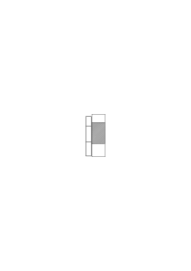

Man könnte sagen die Intention ist die Projektionsmethode.

### [219\[3\]](https://cdn.wittgensteinnachlass.com/2000px/webp/Ms-108/219.webp)

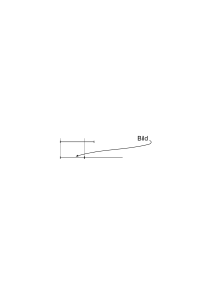

Das Bild (im engeren Sinne) genügt nicht denn es ist mit ihm nicht gegeben wie es mit der Wirklichkeit verglichen werden soll. Es muß die Projektionsmethode dabei sein; dann aber reicht ja das Bild bis in den Ort hinein wo der Gegenstand des Bildes ist.

### [219\[4\]](https://cdn.wittgensteinnachlass.com/2000px/webp/Ms-108/219.webp),[220\[1\]](https://cdn.wittgensteinnachlass.com/2000px/webp/Ms-108/220.webp)

Es drückt sich jedenfalls in der Sprache keine Mehrdeutigkeit der Erwartung oder des Wunsches etc. aus so daß also eine Erwartung durch Verschiedenes befriedigt werden könnte. Und das muß sich so rechtfertigen daß das komplette Bild d.h. der komplette Gedanke nicht mehr vielerlei Deutung zuläßt sondern eindeutig ist nämlich seine Deutung schon enthält. Seine Deutung schon enthalten kann aber nur heißen die Form der Wirklichkeit schon vorzuzeichnen. Aber auch dieses „Vorzeichnen” könnte falsch aufgefaßt werden, denn – könnte einer sagen – kann ich nicht das vorzeichnen

und das meinen. Ja aber wenn ich sage „& das meinen” so ist doch dieses „das” selbst irgendwie gemeint. Und was, wenn ich sage: „ganz richtig, ich habe eben mit dem großen das kleine gemeint.”

– Ich kann eben gar nicht reden ohne es schon irgendwie zu meinen. Darum muß sozusagen die Meinung aus der Betrachtung herausfallen. Denn wenn ich sagen will wie etwas gemeint ist so meine ich ja das selbst auch irgendwie.

### [220\[2\]](https://cdn.wittgensteinnachlass.com/2000px/webp/Ms-108/220.webp)

Kann ich also festsetzen daß die Länge im Maßstab 1:1 gemeint ist?

### [220\[3\]](https://cdn.wittgensteinnachlass.com/2000px/webp/Ms-108/220.webp),[221\[1\]](https://cdn.wittgensteinnachlass.com/2000px/webp/Ms-108/221.webp)

Aber wenn sie auch nicht so gemeint ist so gibt es doch immer eine Länge die dann im Maßstab 1 : 1 gemeint wäre. – So ist es also genug wenn das Bild nur bis an das Dargestellte heranreicht so daß es unmittelbar mit der Wirklichkeit vergleichbar wird.

### [221\[2\]](https://cdn.wittgensteinnachlass.com/2000px/webp/Ms-108/221.webp)

<math display="inline"><mtext><mi>b</mi></mtext><mtext>├</mtext><mtext>─</mtext><mtext>─</mtext><mtext>─</mtext><mtext>─</mtext><mtext>─</mtext><mtext>─</mtext><mtext>─</mtext><mtext>─</mtext><mtext>─</mtext><mtext>─</mtext><mtext>┤</mtext><mtext>├</mtext><mtext>─</mtext><mtext>─</mtext><mtext>─</mtext><mtext>─</mtext><mtext>─</mtext><mtext>┤</mtext><mtext><mi>a</mi></mtext></math> a wächst & ich warte bis es so groß sein wird wie b. Meinte ich b in einem vergrößerten Maßstab so daß es eben die Länge von a bedeutete so wäre meine Erwartung bereits befriedigt, das ist aber nicht der Fall.

### [221\[3\]](https://cdn.wittgensteinnachlass.com/2000px/webp/Ms-108/221.webp)

Bedenken wir daß die Erwartung in der Wirklichkeit von a & b gar nicht vorhanden ist sondern nur in Symbolen existiert & zwar muß hier ein Symbol für b & eines für a vorhanden sein & sie müssen _beide_ schon irgendwie gemeint sein. Und kann denn nicht durch eine Regel ausgedrückt sein daß sie beide auf die gleiche Weise gemeint sind?

<math display="inline"><mtext><mi>b</mi></mtext><mtext>├</mtext><mtext>─</mtext><mtext>─</mtext><mtext>─</mtext><mtext>─</mtext><mtext>─</mtext><mtext>─</mtext><mtext>─</mtext><mtext>─</mtext><mtext>┤</mtext><mi>a</mi><mspace width="0.3em"/><mtext>├</mtext><mtext><s>|</s></mtext><mtext>┤</mtext><mspace width="0.3em"/><mtext>︸</mtext><mtext>a'</mtext></math> a' ist das Bild von a wie es aussehen wird wenn es so groß wie b geworden ist.

### [221\[4\]](https://cdn.wittgensteinnachlass.com/2000px/webp/Ms-108/221.webp)

Aus dem Meinen kann ich nicht heraus darum kann ich nicht sagen, wie etwas gemeint ist. Dann aber muß eben das Wort meinen sinnlos sein, so muß es sich herausstellen.

### [222\[1\]](https://cdn.wittgensteinnachlass.com/2000px/webp/Ms-108/222.webp)

20.07.1930

Es ist in der Erwartung _alles_ für das Eintreffen des Ereignisses hergerichtet.

### [222\[2\]](https://cdn.wittgensteinnachlass.com/2000px/webp/Ms-108/222.webp)

Von den Teilstrichen des Maßstabes gelten nur die Punkte die sie mit dem zu messenden Körper gemein haben.

### [222\[3\]](https://cdn.wittgensteinnachlass.com/2000px/webp/Ms-108/222.webp)

Es muß _alles_ hergerichtet sein, darin besteht die Eindeutigkeit der Erwartung.

### [222\[4\]](https://cdn.wittgensteinnachlass.com/2000px/webp/Ms-108/222.webp)

Oder sie besteht eigentlich darin daß man von ihr auch nicht _reden_ kann.

### [222\[5\]](https://cdn.wittgensteinnachlass.com/2000px/webp/Ms-108/222.webp)

Es sagt einer „ich wünsche ein rotes Stück Papier zu sehen”, man zeigt ihm Stücke von verschiedener Farbe, Weiß, Grün, endlich ein rotes; er sagt „_das_ habe ich gemeint”. Wie konnte er denn das Rot _meinen_ ohne es zu sehen? – Denn wenn er auch eine Vorstellung hatte so war sie doch nicht das was er dann zu sehen bekam (sonst hätte er ja nichts erwartet) also mußte er diese Vorstellung auch erst irgendwie _meinen_. – Ist es nun nicht so: daß er die Vorstellung auch mit dem gegenwärtigen – nicht erwarteten – Gesichtseindruck vergleichen kann & vergleicht & dabei die Interpretation dieser Vorstellung so zu sagen festlegt.

### [223\[1\]](https://cdn.wittgensteinnachlass.com/2000px/webp/Ms-108/223.webp)

In dem selben Sinne in dem er jetzt 1 m groß ist wird er später 1˙5 m hoch sein.

### [223\[2\]](https://cdn.wittgensteinnachlass.com/2000px/webp/Ms-108/223.webp)

Ich denke mir es würde jemand, etwa ein kleiner Bub gefeiert & man stellt durch ein lebendes Bild dar was er einmal als Mann machen wird. Sieht man die Vorstellung & den Buben so weiß man noch nicht was das Ganze bedeutet. Man muß wissen wie die Vorstellung _gemeint_ ist. Das weiß man aber wenn man sie mit dem gegenwärtigen Stand, dem Knaben wie er jetzt ist, vergleichen kann. Wenn ich sagen kann daß er jetzt noch nicht so groß ist so habe ich schon das Bild als Bild seiner Zukunft aufgefaßt. Wie aber bringt man dem der die Vorstellung sieht sie aber nicht versteht die Absicht bei? Indem man sie ihm _sagt_!

### [223\[3\]](https://cdn.wittgensteinnachlass.com/2000px/webp/Ms-108/223.webp)

Kann man sagen: Von der Intention kann nur soweit die Rede sein als man nach ihr fragen & sie erklären kann.

### [223\[4\]](https://cdn.wittgensteinnachlass.com/2000px/webp/Ms-108/223.webp)

Also sie in Worten ausdrückt und also den Zeichen noch weitere Zeichen hinzufügt. Man könnte sich nun etwa über dem lebenden Bild eine Schrift denken die es erklärt.

### [224\[1\]](https://cdn.wittgensteinnachlass.com/2000px/webp/Ms-108/224.webp)

Die Meinung des Zeichens kann man nur erklären indem man Zeichen gebraucht also dem ersten Zeichen weitere hinzufügt. Dieses Zeichen kann man wieder nur durch Zeichen erklären etc. Also soweit das keine Erklärung der Intention ist gibt's keine. (nämlich keine Erklärung, aber auch keine Intention.)

### [224\[2\]](https://cdn.wittgensteinnachlass.com/2000px/webp/Ms-108/224.webp)

Gewiß, wenn man jemandem erklären will wie etwas gemeint war so muß man Worte gebrauchen, – die selbst irgendwie gemeint sind. So setzt man zur Landkarte den Maßstab, aber nun ist eben das Ganze _ein_ Zeichen …

### [224\[3\]](https://cdn.wittgensteinnachlass.com/2000px/webp/Ms-108/224.webp)

21.07.1930

Das Charakteristische am Gedanken, was ihn für uns so einzig macht ist, daß wir dabei nicht das Gefühl einer Deutung haben.

### [224\[4\]](https://cdn.wittgensteinnachlass.com/2000px/webp/Ms-108/224.webp)

Ja, es ist offenbar daß sich die Erwartung eben mit demselben, derselben Wirklichkeit, abgibt wie die Tatsache die sie erfüllt. Und das ist was sie uns wirklich macht.

### [224\[5\]](https://cdn.wittgensteinnachlass.com/2000px/webp/Ms-108/224.webp)

Wir schauen erwartend zu derselben, wirklichen, Tür zu der die erwartete Person eintreten soll.

### [225\[1\]](https://cdn.wittgensteinnachlass.com/2000px/webp/Ms-108/225.webp)

(Immer vergißt man, wie einfach & natürlich alles ist.)

### [225\[2\]](https://cdn.wittgensteinnachlass.com/2000px/webp/Ms-108/225.webp)

Ich sage „schau dorthin, dort wird etwas Schwarzes sichtbar werden wie ein Vogelkopf”. Er schaut hin & ich sage „siehst Du, da ist es”. Er sagt „_ich habe mir etwas Größeres erwartet_”. Wie hat er das gemacht? Er war auf etwas Größeres _eingestellt_. Oder „ich habe mir etwas Dunkleres erwartet”. Er war auf etwas Dunkleres eingestellt.

### [225\[3\]](https://cdn.wittgensteinnachlass.com/2000px/webp/Ms-108/225.webp)

Ich erwarte mir einen gelben Fleck zu sehen & nun sage ich „ja, so habe ich mir ihn vorgestellt, das habe ich mir erwartet”. Und nun fragte mich einer „woher weißt Du daß Du Dir _das_ erwartet hast, Du hast es ja nicht gesehen?”. Es ist offenbar daß diese Frage nichts heißt (& daß darin die Lösung meines Problems liegt).

### [225\[4\]](https://cdn.wittgensteinnachlass.com/2000px/webp/Ms-108/225.webp),[226\[1\]](https://cdn.wittgensteinnachlass.com/2000px/webp/Ms-108/226.webp)

Wenn das dasselbe Gelb sein kann welches ich mir vorgestellt habe (so daß es dafür nicht noch ein äußeres Kriterium etwa eine Reaktion gibt) dann mußte sich die Erwartung auf das beziehen was der Vorstellung & der Wirklichkeit gemeinsam ist denn die Vorstellung bleibt als Vorstellung von der Wirklichkeit verschieden. Es muß dann das Gemeinsame wie die Länge zweier Streifen sein die verschieden sind, der eine rechts der andre links, aber die Länge gemein haben.

### [226\[2\]](https://cdn.wittgensteinnachlass.com/2000px/webp/Ms-108/226.webp)

Und darum kann man nicht fragen „woher weißt Du daß sie in der Länge übereinstimmen”, wie man etwa frägt „woher weißt Du daß diese beiden Dinge das gleiche Gewicht haben”.

### [226\[3\]](https://cdn.wittgensteinnachlass.com/2000px/webp/Ms-108/226.webp)

Die Sache wird dadurch nicht anders daß die Vorstellung ambig ist & also der Wirklichkeit einen Spielraum läßt. Denn dann ist eben die unsinnige Frage: „wie weißt Du daß dieses Gelb in den Spielraum fällt”. Das entspricht dann diesem Bild:

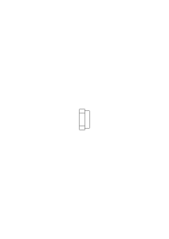

### [226\[4\]](https://cdn.wittgensteinnachlass.com/2000px/webp/Ms-108/226.webp),[227\[1\]](https://cdn.wittgensteinnachlass.com/2000px/webp/Ms-108/227.webp)

Es beschäftigen uns Fragen verschiedener Art etwa „wie groß ist das spezifische Gewicht dieses Körpers”, „wird es heute schön bleiben” „wer wird als nächster zur Tür hereinkommen” etc. Aber unter unseren Fragen finden sich welche von besonderer Art. Wir haben hier ein anderes Erlebnis. Die Fragen scheinen fundamentaler zu sein als die anderen. Und nun sage ich: wenn wir dieses Erlebnis haben dann sind wir an der Grenze der Sprache angelangt.

### [227\[2\]](https://cdn.wittgensteinnachlass.com/2000px/webp/Ms-108/227.webp)

Man könnte sagen die Erwartung ist kein Bild sie bedient sich nur eines Bildes. Ich erwarte etwa daß meine Uhr jetzt auf ½ 7 zeigen wird & drücke dies durch ein Bild der Zeigerstellung 🕢 aus. Dieses Bild kann ich nun mit der wirklichen Stellung vergleichen; die Erwartung aber nicht. Die ist einfach eingetroffen oder nicht eingetroffen; während man von der Zeichnung nicht sagen kann sie sei eingetroffen. Denn dazu gehört erst die _Deutung_ der Zeichnung.

### [227\[3\]](https://cdn.wittgensteinnachlass.com/2000px/webp/Ms-108/227.webp)

Ich habe etwas vorausgesagt, es tritt nun erst ein und ich sage nun einfach „_es_ ist eingetroffen” & das beschreibt schon den Tatbestand vollkommen. Er ist also auch jetzt nur soweit beschrieben als man ihn auch hat beschreiben können bevor er (noch) eingetreten war.

### [227\[4\]](https://cdn.wittgensteinnachlass.com/2000px/webp/Ms-108/227.webp)

Wenn ich einfach sagen kann „es ist eingetroffen”, so kann ich andererseits nicht beschreiben wie ein Tatbestand sein muß um eine bestimmte Erwartung zu befriedigen. (Und hierin liegt wieder die ganze Lösung, wenn ich sie auch noch immer nicht klar aussprechen kann.)

### [227\[5\]](https://cdn.wittgensteinnachlass.com/2000px/webp/Ms-108/227.webp),[228\[1\]](https://cdn.wittgensteinnachlass.com/2000px/webp/Ms-108/228.webp)

Die Erwartung verhält sich eben zu ihrer Befriedigung nicht wie der Hunger zu seiner Befriedigung. Ich kann sehr wohl den Hunger beschreiben & das was ihn stillt & sagen daß es ihn stillt.

### [228\[2\]](https://cdn.wittgensteinnachlass.com/2000px/webp/Ms-108/228.webp)

Die Erwartung ist keine Phantasie, denn wenn ich erwarte daß dort ein lichter Punkt erscheinen werde so muß das _dort_ der Ort sein wo der Punkt _wirklich_ erscheinen wird wenn er erscheinen wird.

### [228\[3\]](https://cdn.wittgensteinnachlass.com/2000px/webp/Ms-108/228.webp)

Sowohl vorschauend in der Erwartung als auch rückschauend bei der Erfüllung & in der Erinnerung an die Erwartung sind Erwartung & Erfüllung im selben Raum. Und die Erwartung ist auch ursprünglich schon die Erwartung der Erfüllung & die Erfüllung nur die Bejahung der Erwartung.

### [228\[4\]](https://cdn.wittgensteinnachlass.com/2000px/webp/Ms-108/228.webp)

Könnte man vielleicht sagen „rot” hat zwei verschiedene Bedeutungen wenn man einen wirklichen Farbfleck rot nennt & andrerseits einen vorgestellten Fleck? Nein. Rot ist was beiden gemeinsam ist.

### [228\[5\]](https://cdn.wittgensteinnachlass.com/2000px/webp/Ms-108/228.webp),[229\[1\]](https://cdn.wittgensteinnachlass.com/2000px/webp/Ms-108/229.webp)

Die Erwartung kann nur _logisch_ auf das Erwartete weisen. Denn jedes Bild bleibt immer deutungsbedürftig & die Deutung kann nur eine logische Beziehung herstellen. Denn jede materielle Beziehung die wir dem Bild hinzufügen führt uns nicht zur Intention & läßt das Bild weiterhin deutungsbedürftig. – Das einzige worin die Wirklichkeit mit dem Bild ohne Notwendigkeit einer Deutung übereinstimmen kann oder nicht ist die logische Form. Denn nur da ist es auch möglich zu bezweifeln ob, & zu zeigen daß nicht, Übereinstimmung zwischen der Erwartung & einer Tatsache besteht.

### [229\[2\]](https://cdn.wittgensteinnachlass.com/2000px/webp/Ms-108/229.webp)

Das hängt auch damit zusammen daß die Erwartung, der Gedanke der Beweis der Möglichkeit der Tatsache sein muß. Wie eben der Meterstab an dieser Stelle der „Beweis” dafür ist daß etwas 1 m lang sein _kann_.

### [229\[3\]](https://cdn.wittgensteinnachlass.com/2000px/webp/Ms-108/229.webp)

„Wenn die Erwartung noch mehrdeutig ist, so können wir jedenfalls von dieser Mehrdeutigkeit nicht mehr reden.” Denn soweit die Wirklichkeit zu beschreiben ist soweit beschreibt sie die Erwartung & soweit die Wirklichkeit vorherzusehen ist sieht sie die Erwartung voraus.

### [229\[4\]](https://cdn.wittgensteinnachlass.com/2000px/webp/Ms-108/229.webp)

Man kann nur insoweit fragen, ob das wirklich die Erfahrung sei die die frühere Erwartung befriedigt als man es kontrollieren kann. Aber man kann es nur kontrollieren soweit die logische Multiplizität in Frage ist. Also ist auch nicht mehr notwendig als daß der Gedanke auf der Wirklichkeit fuße & auf ihr sein Gebäude errichte.

### [230\[1\]](https://cdn.wittgensteinnachlass.com/2000px/webp/Ms-108/230.webp)

22.07.1930

Unterscheidet sich etwa ein vorgestellter Ton von dem gleichen wirklich gehörten durch die Klangfarbe?

### [230\[2\]](https://cdn.wittgensteinnachlass.com/2000px/webp/Ms-108/230.webp)

Die Schwierigkeit ist , zu verstehen daß die Tatsache in der Erwartung _ganz_ vorgebildet ist.

### [230\[3\]](https://cdn.wittgensteinnachlass.com/2000px/webp/Ms-108/230.webp)

Im Maßstab der neben dem wachsenden Gegenstand steht ist die Höhe auch vorgebildet aber nicht, daß dieser Gegenstand sie erreichen wird.

### [230\[4\]](https://cdn.wittgensteinnachlass.com/2000px/webp/Ms-108/230.webp)

Es ist als ob der Gedanke ein Schatten des Ereignisses wäre; aber so daß dann die Frage ob dieses Ereignis wirklich dasjenige ist dessen Schatten wir vor uns hatten unsinnig ist.

D.h. die Relation von Schatten & Tatsache kann keine äußere sein.

### [230\[5\]](https://cdn.wittgensteinnachlass.com/2000px/webp/Ms-108/230.webp)

Und muß das nicht eine falsche Darstellung sein? Denn kann es denn in der Welt der Tatsachen solche geben die die Schatten der anderen sind? Gewiß nicht. Aber ich sage ja selbst, daß der „Schatten” nicht etwas ist was auf eine äußere Art mit der Tatsache zusammenhängt & das heißt, daß in diesem Vergleich ein _logischer_ Fehler ist.

### [230\[6\]](https://cdn.wittgensteinnachlass.com/2000px/webp/Ms-108/230.webp),[231\[1\]](https://cdn.wittgensteinnachlass.com/2000px/webp/Ms-108/231.webp)

Wenn ich Einem einen Befehl gebe & er hört ihn & handelt nun so kann ich aus der Handlung allein nicht ersehen wie er den Befehl interpretiert hat (denn ich weiß nicht ob er den Befehl befolgen will oder nicht). Die Interpretation aber wäre selbst wieder eine Handlung; aber worin bestünde die?

### [231\[2\]](https://cdn.wittgensteinnachlass.com/2000px/webp/Ms-108/231.webp)

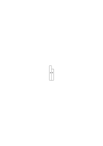

Wenn ich sage „b ist nicht so lang wie a” so scheint das jenen Schatten voraus zu setzen der Tatsache daß b so lang wie a ist. Wenn ich aber sage „b ist kleiner als a” so scheint das diesen Schatten nicht zu enthalten und doch sagt es auch (wenn auch mehr als das) was der erste Satz sagt.

### [231\[3\]](https://cdn.wittgensteinnachlass.com/2000px/webp/Ms-108/231.webp)

Man könnte also sagen: „b ist so lang wie a” hat Sinn, weil b kürzer als a ist. (Oder „dieses Buch ist blau” hat Sinn weil es in Wirklichkeit rot ist.)

### [231\[4\]](https://cdn.wittgensteinnachlass.com/2000px/webp/Ms-108/231.webp),[232\[1\]](https://cdn.wittgensteinnachlass.com/2000px/webp/Ms-108/232.webp)

Etwas spricht für die Auffassung, daß die Interpretation des Bildes im Gebrauch liegt den man vom Bild macht. Nehmen wir an das Verstehen des Befehls bestünde darin daß man eine bestimmte Tätigkeit halluziniert & das Bild dieser Halluzination nun mit der wirklichen Handlung vergleicht indem man es gleichsam auf den Raum in dem diese vorsichgeht auflegt. Der Befehl hätte etwa gelautet vom Punkt A aus nach rechts eine

Gerade zu ziehen; ich sehe nun die zu ziehende Gerade vor mir – und zwar natürlich von dem wirklichen Punkt A ausgehend – & kann sie nun entweder nachziehen oder nicht. Denken wir uns den Fall sogar so: ich halluzinierte den Bleistift der sich in einer Geraden nach rechts bewegt & kann ihm nun mit dem wirklichen Bleistift entweder folgen (den wirklichen mit dem halluzinierten zur Deckung bringen) oder nicht.

### [232\[2\]](https://cdn.wittgensteinnachlass.com/2000px/webp/Ms-108/232.webp)

(Es ist eine besondere Methode der Philosophie die in den Wissenschaften nicht erlaubt ist, den günstigsten Fall anzunehmen.) (Am ähnlichsten ist diese Methode noch der in der Mathematik einen extremen Fall anzunehmen in welchem das & das doch bestimmt eintrifft. (Argument a fortiori?))

### [232\[3\]](https://cdn.wittgensteinnachlass.com/2000px/webp/Ms-108/232.webp)

Nun dürfte man aber nicht wieder fragen „ja woher weiß man denn daß man dieser Halluzination zu folgen hat, daß sie als Befehl aufzufassen ist es so zu machen” denn das müßte jetzt darin liegen daß man etwa ein bestimmtes Gefühl der Befriedigung hat wenn man ihr folgt & nicht wenn man ihr nicht folgt.

### [232\[4\]](https://cdn.wittgensteinnachlass.com/2000px/webp/Ms-108/232.webp)

Der Gedanke wäre also ein Bild das eine bestimmte Wirkung hätte.

### [232\[5\]](https://cdn.wittgensteinnachlass.com/2000px/webp/Ms-108/232.webp),[233\[1\]](https://cdn.wittgensteinnachlass.com/2000px/webp/Ms-108/233.webp)

Man könnte fragen: woher weiß ich daß das mein Bleistift ist dessen Halluzination ich hier sehe denn alles was ich erkennen kann ist ein Bild das meinem Bleistift gleichsieht & daß es nun mein Bleistift sein _soll_ ist wieder _Interpretation_. Aber die Antwort würde lauten: die Interpretation besteht nur darin ob ich mir jenes Bild _zum Beispiel nehme_ oder nicht. Dieses ZumBeispiel-Nehmen – eine bestimmte Reaktion auf den Abstand zwischen dem Bild & einer bestimmten Wirklichkeit – ist das Auffassen des Bildes als Befehl. Es ist so wie wenn man einen Vorwurf spürt weil man es jemandem nicht gleichtut. Der Gedanke ist also in einem gewissen Sinne ein Vorbild der Wirklichkeit.

### [233\[2\]](https://cdn.wittgensteinnachlass.com/2000px/webp/Ms-108/233.webp)

23.07.1930

Nehmen wir wieder den „günstigsten” Fall an, nehmen wir an, ich halluziniere bei der Erwartung (zwar, wie kann ich halluzinieren daß er in 5 Minuten hereinkommen _wird_?)

### [233\[3\]](https://cdn.wittgensteinnachlass.com/2000px/webp/Ms-108/233.webp)

Was heißt denn das Wort „dreiundzwanzig” zu verstehen als seine Syntax zu verstehen, damit operieren können?

### [233\[4\]](https://cdn.wittgensteinnachlass.com/2000px/webp/Ms-108/233.webp),[234\[1\]](https://cdn.wittgensteinnachlass.com/2000px/webp/Ms-108/234.webp)

Erwartung, Befehl etc. kann man sich immer an einer Landkarte deutlich machen & an ihrem Gebrauch. Die Landkarte ist das Bild das interpretiert wird. Denken wir uns wir haben den Befehl nach einer Straße auf der Landkarte zu gehen; oder die Landkarte ist das Bild unserer Erwartung indem sie zeigt daß wir in einer Stunde dort & dort hin kommen.

### [234\[2\]](https://cdn.wittgensteinnachlass.com/2000px/webp/Ms-108/234.webp)

Man denke sich man gebe jemandem den Befehl eine bestimmte Handlung auszuführen etwa dieser Linie mit dem Bleistift

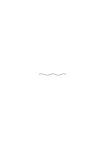

nachzufahren. Die Sache wird deutlicher wenn man sich den Befehl jemandem unserer Wortsprache Unkundigen mit Zeichen gegeben denkt. Man wird dann die Handlung vormachen und nun ihm den Bleistift geben & ihn stupfen & etwa seine Hand ein kleines Stückchen führen (oder dergleichen). Das wird der Befehl sein. Nun wird man freilich sagen: das ist bloß der Ausdruck des Befehls & nicht was wir eigentlich meinen, was wir meinen ist: …, & nun wird man mir _andere Zeichen_ für das geben „was gemeint ist”. – Aber wenn man nun den Befehl ausführte & auf die Ausführung als nachträgliche Erklärung des Befehls wiese? Oder ist in dem Falle auch die Erfüllung nur ein Zeichen?

### [234\[3\]](https://cdn.wittgensteinnachlass.com/2000px/webp/Ms-108/234.webp),[235\[1\]](https://cdn.wittgensteinnachlass.com/2000px/webp/Ms-108/235.webp)

Man könnte sagen: Den Befehl verstehen heißt ihn ausführen oder sich ihm widersetzen. (Etwa ähnlich wie man sagen könnte die Schwerkraft äußert sich entweder darin, daß sie einen Körper beschleunigt oder wenn meine Hand das nicht zuläßt durch den Druck den der Körper auf meine Hand ausübt.)

### [235\[2\]](https://cdn.wittgensteinnachlass.com/2000px/webp/Ms-108/235.webp)

Das Zeichen der Widersetzlichkeit kann etwa ein Schütteln des Kopfes sein; so daß, wenn er sich nach der Linie a

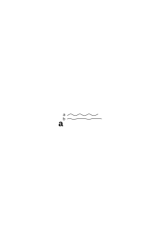

bewegt & den Kopf nicht schüttelt das bedeutet er habe den Befehl so verstanden er solle sich auf a bewegen & führe ihn aus. Wenn er a entlang geht & dabei den Kopf schüttelt so hieße das er habe den Befehl anders aufgefaßt & wolle sich ihm durch seine Handlung widersetzen etc. etc.

### [235\[3\]](https://cdn.wittgensteinnachlass.com/2000px/webp/Ms-108/235.webp)

Es habe jemand Einem einen solchen Befehl durch Zeichen gegeben & ich frage ihn „hast Du denn diesen Befehl verstanden” & er sagt mir darauf „ja, er wollte daß ich …” & wiederholt mir den Befehl in einer anderen Sprache. So komme ich aus den Zeichen nicht heraus.

### [235\[4\]](https://cdn.wittgensteinnachlass.com/2000px/webp/Ms-108/235.webp),[236\[1\]](https://cdn.wittgensteinnachlass.com/2000px/webp/Ms-108/236.webp)

24.07.1930

Wenn man das Beispiel von dem durch Gebärden mitgeteilten Befehl betrachtet möchte man einerseits immer sagen ja dieses Beispiel ist eben unvollkommen, die angenommene Gebärdensprache zu roh darum kann sie den beabsichtigten Sinn nicht vollständig ausdrücken – aber tatsächlich ist sie so gut wie jede denkbare andere & erfüllt ihren Zweck so vollständig wie es überhaupt denkbar ist. (Es ist eine der wichtigsten Einsichten daß es keine Verbesserung der Logik gibt.)

### [236\[2\]](https://cdn.wittgensteinnachlass.com/2000px/webp/Ms-108/236.webp)

Wenn ich also jemandem einen Befehl gebe, so kann ich weiter nichts tun als ihm ein Beispiel geben. Der Befehl muß sich dann von dem Befehl jeder anderen Handlung unterscheiden & das heißt der Befehl muß die gleiche Multiplizität zulassen (die gleiche Geometrie) wie die Handlungen. Mehr aber kann er nicht tun.

### [236\[3\]](https://cdn.wittgensteinnachlass.com/2000px/webp/Ms-108/236.webp)

Es ist sehr trivial wenn ich sage, daß ich in der Erwartung eines Flecks die Erwartung eines kreisförmigen von der eines elliptischen muß unterscheiden können & es überhaupt soviele Unterschiede in der Erwartung geben muß wie in den Erfüllungen der Erwartung. (Der Hunger & der Apfel der ihn befriedigt haben nicht die gleiche Multiplizität.)

### [236\[4\]](https://cdn.wittgensteinnachlass.com/2000px/webp/Ms-108/236.webp)

Der Befehl steht aber doch nicht selbständig da ich _will_ doch etwas mit dem Befehl. Ja was? Nun, daß er das & das tut. Ganz richtig aber hier habe ich eben den Befehl nur in anderer Weise wiederholt.

### [237\[1\]](https://cdn.wittgensteinnachlass.com/2000px/webp/Ms-108/237.webp)

Der Sinn ist eben nicht etwas worauf man deuten kann wie etwa auf mich als Bedeutung meines Namens sondern Eigentum des Satzes der ihn hat. Der Satz hat ihn in sich.

### [237\[2\]](https://cdn.wittgensteinnachlass.com/2000px/webp/Ms-108/237.webp)

Angenommen der Befehl würde darin bestehen einen Gegenstand nach einer Werkzeichnung zu machen. Dann projiziere ich bei der Ausführung des Befehls diese Zeichnung – den Ausdruck des Befehls – in die Wirklichkeit. Ich _verwende_ also die Zeichnung als Bild.

### [237\[3\]](https://cdn.wittgensteinnachlass.com/2000px/webp/Ms-108/237.webp)

Worin besteht aber dieses „als Bild verwenden”? Wenn ich z.B. einer Vorlage nachzeichne, ist es da dasselbe ob ich absichtlich oder unabsichtlich etwas der Vorlage Ähnliches zeichne? Und wenn ich mich nun verzeichne ist damit die Absicht die Vorlage zu kopieren fallen gelassen? – Und doch kann diese Absicht nur darin bestehen daß sie mit der ausgeführten Zeichnung ein genaues Bild der Vorlage oder eigentlich die Vorlage selbst ergibt. Die Absicht muß die Ausführung zu der Vorlage ergänzen. Aber ist es dann nicht so daß Beflissenheit oder Widerwille die Ausführung oder NichtAusführung zum Verständnis des Befehls ergänzen müssen?

### [238\[1\]](https://cdn.wittgensteinnachlass.com/2000px/webp/Ms-108/238.webp)

Eine geometrische Figur zusammen mit ihrer Projektionsmethode auf eine bestimmte Ebene bestimmt nicht etwa erst eine Figur in dieser Ebene sondern _enthält_ bereits diese Figur.

### [238\[2\]](https://cdn.wittgensteinnachlass.com/2000px/webp/Ms-108/238.webp)

Die orthogonale Projektion von s auf b grenzt auf b schon das Stück s' ab. Damit ist freilich nicht gesagt daß dieses Stück nun auf b eine besondere Farbe hat also auch durch die Farbe begrenzt ist. Besser mit Kreisen auf

zwei parallelen Ebenen vorzustellen. Die Projektion des schwarzen Kreises auf die untere Ebene begrenzt auf dieser schon einen Kreis, dadurch ist er aber noch kein Farbkreis. (In diesem Satz liegt Richtiges & Falsches.)

### [238\[3\]](https://cdn.wittgensteinnachlass.com/2000px/webp/Ms-108/238.webp)

Wenn ich nun erwarte daß auf der unteren Ebene ein Kreis erscheinen wird von dem gesagt wird daß er die orthogonale Projektion des oberen & von gleicher Farbe ist –.

### [238\[4\]](https://cdn.wittgensteinnachlass.com/2000px/webp/Ms-108/238.webp)

(Die Philosophie wird am Schluß aus äußerst trivialen Sätzen, Bemerkungen, bestehen; es ist nur ungeheuer schwer dazu zu gelangen sie zu verstehen. D.h. sie als die Philosophie zu verstehen.)

### [239\[1\]](https://cdn.wittgensteinnachlass.com/2000px/webp/Ms-108/239.webp)

(Die ganzen Anstrengungen die ich jetzt mache, dienen nur dazu um gewisse triviale Sätze zu verstehen d.h. sie in allen ihren Konsequenzen zu verstehen.)

### [239\[2\]](https://cdn.wittgensteinnachlass.com/2000px/webp/Ms-108/239.webp)

– – – so gebe ich weiter nichts als eine Projektionsmethode. (Eine Projektionsmethode ist eine allgemeine Regel-Allgemeinheit.) Die Projektionsmethode kann ich von anderen Gebilden kennen. Ich kenne sie aber doch nur so daß eine Figur die orthogonale Projektion einer anderen ist aber doch nicht so daß keine Figur die Projektion einer Figur ist. Ich nehme mir vor die Erscheinungen auf der unteren Ebene in bestimmter Weise zu beurteilen. Dann muß in diesem _Vorsatz_ schon die Projektion stecken.

### [239\[3\]](https://cdn.wittgensteinnachlass.com/2000px/webp/Ms-108/239.webp)

Heißt das nicht: Die Erwartung muß die weiße Ebene zu einem schwarzen Kreis ergänzen.

### [239\[4\]](https://cdn.wittgensteinnachlass.com/2000px/webp/Ms-108/239.webp)

Was heißt es, eine Strecke _darauf hin untersuchen_ ob sie die orthogonale Projektion einer anderen sei?

### [239\[5\]](https://cdn.wittgensteinnachlass.com/2000px/webp/Ms-108/239.webp),[240\[1\]](https://cdn.wittgensteinnachlass.com/2000px/webp/Ms-108/240.webp)

Es kann nur heißen eben die Striche zu ziehen die man in einem solchen Fall zieht. – Wie ist es aber mit der Untersuchung ob die untere Farbe die gleiche ist wie die obere. Oder kann man sagen: auch da stelle ich mich in bestimmter Weise ein so wie ich etwa Linien ziehe um feststellen zu können ob die untere Figur die Projektion der oberen ist. Ich glaube so ist es. Das ist alles ein Einstellen, aber mehr kann ich nun nicht tun. Und dieses Einstellen ist nicht das Einstellen auf etwas anderes d.h. nicht mit Beziehung auf etwas was noch nicht da ist sondern es ist autonom, sozusagen das Aufrichten eines Maßstabes, was immer geschehen mag.

### [240\[2\]](https://cdn.wittgensteinnachlass.com/2000px/webp/Ms-108/240.webp)

Des Rätsels Lösung muß in der festgesetzten Art & Weise liegen wie die Erscheinung dann beschrieben wird wenn sie kommt.

### [240\[3\]](https://cdn.wittgensteinnachlass.com/2000px/webp/Ms-108/240.webp)

25.07.1930

Es ist ungemein schwer den eigentlichen Punkt der Schwierigkeit mit Worten zu erreichen.

### [240\[4\]](https://cdn.wittgensteinnachlass.com/2000px/webp/Ms-108/240.webp),[241\[1\]](https://cdn.wittgensteinnachlass.com/2000px/webp/Ms-108/241.webp)

Denken wir uns die Einstellung durch einen Zeiger wie den gelben Zeiger beim Anäroidbarometer und etwa ein solches Barometer & eine Uhr. Auf beiden

Zifferblättern stelle ich den freien Zeiger ein & drücke dadurch die Erwartung aus daß, wenn der Uhrzeiger bei a' anlangt der andere auf a stehen wird. (Es ist kein Zweifel daß das ein vollkommener Ausdruck der Erwartung des Gedankens ist.)

Bleibt nun die Uhr etwa stehen so daß ihr Zeiger a' nicht erreicht, dann gilt das Ganze nicht, ebenso wenn etwa der Zeiger des Barometers plötzlich verschwände. Dann wäre eben kein Zeichen da. Ist es aber da dann hat das Barometer so zu sagen keine andre Wahl als auf a zu stehen oder nicht auf a zu stehen & dann ist der Gedanke verifiziert worden oder er ist falsifiziert worden.

### [241\[2\]](https://cdn.wittgensteinnachlass.com/2000px/webp/Ms-108/241.webp)

Wo haben wir aber in diesem Satzzeichen Worte oder etwas was den Worten entspricht? Es „bedeutet” offenbar a' den Uhrzeiger & a den Barometerzeiger.

### [241\[3\]](https://cdn.wittgensteinnachlass.com/2000px/webp/Ms-108/241.webp)

Ich bleibe in den Zeichen, bis ich in ihrer Anwendung aus ihnen heraus trete. Dann weist mein Benehmen meine Handlung die logische Verwandtschaft mit den Zeichen auf die ein solches Zeichen mit seiner Übersetzung aufweist.

### [241\[4\]](https://cdn.wittgensteinnachlass.com/2000px/webp/Ms-108/241.webp)

Was ich immer sagen will ist daß der Gedanke nichts Menschliches ist. Daß er auch nicht ein bestimmtes Gefühl ist das man eben nur fühlen aber nicht etwa auch _sehen_ kann. Man kann z.B. Zahnschmerzen nicht gleichsam herausstellen & ansehen.

### [241\[5\]](https://cdn.wittgensteinnachlass.com/2000px/webp/Ms-108/241.webp),[242\[1\]](https://cdn.wittgensteinnachlass.com/2000px/webp/Ms-108/242.webp)

Natürlich kann man nicht sagen die Zahnschmerzen kenne man von innen indem man sie fühlt & könne sie nicht von außen betrachten. Denn die Zahnschmerzen haben (eben) kein innen & außen.)

### [242\[2\]](https://cdn.wittgensteinnachlass.com/2000px/webp/Ms-108/242.webp)

Die heute gewöhnliche Auffassung ist die, daß das Denken – durch den Kopf oder die Seele besorgt – ein Privilegium eben des Kopfes oder der Seele ist (wie etwa die natürliche Verdauung des Magens). Und das ist sie auch als naturgeschichtlicher Akt betrachtet wie auch die Verdauung in diesem Sinn dem Magen eigentümlich ist– aber vom Standpunkt des Chemikers betrachtet ist die Verdauung ein Prozeß der dem Tierischen Magen nicht eignet &ganz unabhängig davon ist wo er tatsächlich stattfindet. – So hat es der Logiker nicht mit einem spezifisch menschlichen Prozeß zu tun.

### [242\[3\]](https://cdn.wittgensteinnachlass.com/2000px/webp/Ms-108/242.webp)

Die Logik ist eine Geometrie des Denkens.

### [242\[4\]](https://cdn.wittgensteinnachlass.com/2000px/webp/Ms-108/242.webp)

Was am Denken menschlich ist, mit dem hat die Logik nichts zu tun.

### [242\[5\]](https://cdn.wittgensteinnachlass.com/2000px/webp/Ms-108/242.webp),[243\[1\]](https://cdn.wittgensteinnachlass.com/2000px/webp/Ms-108/243.webp)

Man könnte freilich sagen daß die Uhr & das Barometer mit den verstellbaren Zeigern nur der Ausdruck eines Gedankens aber nicht der Gedanke selbst sind, aber dann sind sie doch Teile, Werkzeuge, eines Gedankens & was immer der Gedanke selbst ist, so ist er ein anderer Vorgang als der, welcher ihn verifiziert & er hat mit diesem Vorgang nur soviel gemein als jene Vorrichtungen der Uhr & des Barometers(.) – Darum kann – und muß – man in der Logik auch mit dem „Ausdruck” der Gedanken operieren & auf das andere keine Rücksicht nehmen.

### [243\[2\]](https://cdn.wittgensteinnachlass.com/2000px/webp/Ms-108/243.webp)

Man könnte nun (und zwar in gewissem Sinne mit Recht) sagen, daß jene Uhr & das Barometer noch gar nichts von der Erwartung enthalten, daß man dazu ein weiteres Bild brauchte & zwar eine andere Uhr & ein Barometer die den Vorgang den man von den ersten erwartet sozusagen vormachen. Aber nun brauchte man ein weiteres _Paar_ Uhren etc. um nun die Verbindung jener Uhren & Barometer vorzumachen etc.

### [243\[3\]](https://cdn.wittgensteinnachlass.com/2000px/webp/Ms-108/243.webp)

Das Gleiche geschieht im Fall der beiden Ebenen, wenn ich hier erwarte auf der unteren

einen Fleck zu sehen der die senkrechte Projektion des Oberen ist. Hier kann ich auch die Projektionsmethode noch darstellen indem ich etwa einen Glaszylinder zwischen die Ebenen stelle. Dadurch bin ich aber der Erwartung oder dem Gedanken nicht näher gekommen.

### [243\[4\]](https://cdn.wittgensteinnachlass.com/2000px/webp/Ms-108/243.webp),[244\[1\]](https://cdn.wittgensteinnachlass.com/2000px/webp/Ms-108/244.webp)

Der Gedanke ist das wonach man die Tatsache müßte herstellen können, wie der Befehl das ist, wonach man die Handlung tun kann. Nehmen wir an der Befehl wäre auf der unteren Ebene einen Kreis wie den oberen hervorzubringen. Inwiefern bestimmt denn der Befehl die Ausführung? Inwieweit kann man, wenn man von der Reaktion des Befehlenden absieht, bloß durch den Vergleich des Befehls mit der Ausführung erkennen daß der Befehl richtig ausgeführt wurde. Und soweit man es kann vergleicht man eben zwei verschiedene Vorgänge & kann höchstens aus der verschiedenen Mannigfaltigkeit einen Schluß auf einen begangenen Fehler ziehen; aber in keiner anderen Weise.

### [244\[2\]](https://cdn.wittgensteinnachlass.com/2000px/webp/Ms-108/244.webp)

Noch einmal: was ist das Kriterium dafür daß der Befehl richtig ausgeführt wurde? Was ist das Kriterium, nämlich auch für den Befehlenden? Wie kann er wissen daß der Befehl nicht richtig ausgeführt wurde. Angenommen er ist mit der Ausführung befriedigt & sagt nun: „von dieser Befriedigung lasse ich mich aber nicht täuschen denn ich weiß daß doch nicht das geschehen ist was ich wollte”. Er muß sich dann in irgend einem Sinne daran erinnern wie er den Befehl gemeint hatte – – –

### [244\[3\]](https://cdn.wittgensteinnachlass.com/2000px/webp/Ms-108/244.webp),[245\[1\]](https://cdn.wittgensteinnachlass.com/2000px/webp/Ms-108/245.webp)

Angenommen die Erwartung bestünde darin daß man den Fleck den man erwartet halluziniert; man braucht aber dazu in irgend einer Weise eine gewisse Kraft & an dem Kraftaufwand merkt man – er ist sozusagen ein Maß dafür – wie weit der wirkliche Zustand nach von dem erwarteten entfernt ist; bis dann etwa die Erwartung eintrifft & man nun keine Kraft mehr braucht das Erwartete (wirklich) zu sehen. Das wäre dann etwa so: Ich erwarte mir daß ein Körper den ich in der Hand trage beginnen wird frei zu schweben & spüre am Gewicht das ich zu tragen habe & an der Abnahme dieses Gewichts den Abstand von der Erfüllung meiner Erwartung. Aber die Kraft die ich dazu brauche um die Halluzination aufrecht zu erhalten oder den Körper zu tragen sind ein Drittes & nicht das reine Maß der Entfernung des wirklichen vom erwarteten Zustand.

### [245\[2\]](https://cdn.wittgensteinnachlass.com/2000px/webp/Ms-108/245.webp)

Wenn er sagt daß er den Befehl nicht _so_ gemeint hatte so muß es in seiner Sprache eine Möglichkeit geben den Vorgang zu beschreiben der tatsächlich stattgefunden hatte & im Gegensatz dazu den Vorgang den er gewünscht hatte. – – –

### [245\[3\]](https://cdn.wittgensteinnachlass.com/2000px/webp/Ms-108/245.webp)

Ich meine: Wenn er mit der Ausführung des Befehls nicht einverstanden ist dann muß er sagen können worin der Fehler liegt. Kann er das aber überhaupt sagen d.h. mir verständlich machen, so muß er sich in seiner Beschreibung auf die Weise beziehen wie _ich_ ihn verstehe. Er muß mir eben wieder Zeichen geben. – – –

### [245\[4\]](https://cdn.wittgensteinnachlass.com/2000px/webp/Ms-108/245.webp),[246\[1\]](https://cdn.wittgensteinnachlass.com/2000px/webp/Ms-108/246.webp)

Er befiehlt mir „setze hier die gleiche Farbe hin wie dort”, ich setze eine Farbe hin & er sagt „ja das ist gut” & ich sage nun „was, das hast Du mit der ‚gleichen Farbe’ gemeint?” Und er sagt „ja das habe ich mit ‚gleicher Farbe’ gemeint”. Kann ich ihm nun nachweisen daß er das nicht gemeint hat? Ja, kann er im Zweifel darüber sein ob er das gemeint hat; und das heißt: hat er eine Methode herauszufinden was er früher gemeint hat & etwa seine jetzige Auffassung mit der früheren zu vergleichen? Gewiß nicht.

### [246\[2\]](https://cdn.wittgensteinnachlass.com/2000px/webp/Ms-108/246.webp)

Auf „so hab ich's nicht gemeint” folgt immer die Frage „wie denn?” & darauf besteht die Antwort in weiteren Zeichen des alten Zeichensystems.

### [246\[3\]](https://cdn.wittgensteinnachlass.com/2000px/webp/Ms-108/246.webp)

Will ich damit nicht sagen: Man kann die Auffassung der _Sprache_ durch Zeichen nicht ändern sondern nur wieder in der Sprache weiterreden.

### [246\[4\]](https://cdn.wittgensteinnachlass.com/2000px/webp/Ms-108/246.webp)

Darum darf man aber von der Auffassung der _Sprache_ überhaupt nicht reden. Denn man kann nicht von verschiedenen Auffassungen der Sprache reden.

### [246\[5\]](https://cdn.wittgensteinnachlass.com/2000px/webp/Ms-108/246.webp)

Das führt zu der Frage: Was geschieht wenn ich etwa eine Farbe die ich vor mir habe benenne, etwa sage „das ist rot” oder „diese Farbe ist rot”?

### [246\[6\]](https://cdn.wittgensteinnachlass.com/2000px/webp/Ms-108/246.webp)

Das was ich meine muß das sein, was ich sagen kann.

### [247\[1\]](https://cdn.wittgensteinnachlass.com/2000px/webp/Ms-108/247.webp)

Auf die Frage „was meinst Du” muß zur Antwort kommen: p; und nicht „ich meine das, was ich mit „p” meine”.

### [247\[2\]](https://cdn.wittgensteinnachlass.com/2000px/webp/Ms-108/247.webp)

D.h. die Meinung, soweit sie nicht erklärt werden kann ist ein Nichts. (Und die Meinung ist der Sinn des Satzes.)

### [247\[3\]](https://cdn.wittgensteinnachlass.com/2000px/webp/Ms-108/247.webp)

Die _Vorstellung_ von dem erwarteten schwarzen Fleck ist auch nur ein Zeichen, denn der erwartete schwarze Fleck ist sie nicht.

### [247\[4\]](https://cdn.wittgensteinnachlass.com/2000px/webp/Ms-108/247.webp)

Und man kann nicht in der Vorstellung die Vorstellung des schwarzen Flecks mit dem schwarzen Fleck der nicht da ist vergleichen.

### [247\[5\]](https://cdn.wittgensteinnachlass.com/2000px/webp/Ms-108/247.webp)

Die Ergebnisse der Philosophie sind die Entdeckung irgend eines schlichten Unsinns und Beulen die sich der Verstand beim Anrennen an die Grenze der Sprache geholt hat. Sie, die Beulen, lassen uns den Wert jener Entdeckung verstehen.

### [247\[6\]](https://cdn.wittgensteinnachlass.com/2000px/webp/Ms-108/247.webp)

26.07.1930

Man kann nicht sagen die Bedeutung des Wortes „rot” hänge davon ab daß es irgendwo etwas rotes gäbe wenn ich es auch jetzt nicht vor mir habe. Denn wenn ich also keine Evidenz für das Existieren eines solchen roten Gegenstands habe dann existiert er eben vielleicht nicht & in diesem Falle hat das Wort auch keine Bedeutung.

### [248\[1\]](https://cdn.wittgensteinnachlass.com/2000px/webp/Ms-108/248.webp)

Was sich nicht ausdrücken läßt, darüber läßt sich auch nicht reden.

### [248\[2\]](https://cdn.wittgensteinnachlass.com/2000px/webp/Ms-108/248.webp)

(Was ich mache ist nicht so sehr das Forschen nach einer Entdeckung als vielmehr Denkübungen, d.h. Übungen eine bestimmte Denkbewegung zu machen, so wie man Rumpfübungen macht um endlich eine gewisse schwierige Bewegung ausführen zu können.)

### [248\[3\]](https://cdn.wittgensteinnachlass.com/2000px/webp/Ms-108/248.webp)

Soweit sich nicht erklären läßt in wiefern ein Befehl nicht richtig ausgeführt wurde, ist auch nichts zu erklären da.

### [248\[4\]](https://cdn.wittgensteinnachlass.com/2000px/webp/Ms-108/248.webp)

Ich habe gesagt, daß in der Erwartung bereits die Tatsache irgendwie vorgebildet sei, aber so schiene es als könnte man sagen „siehst Du, nur diese Tatsache paßt auf diese Erwartung”. „Ich weiß was der Fall ist, wenn die Erwartung in Erfüllung geht”. Nun – wenn Du es weißt – was ist denn der Fall? Und die Antwort darauf ist ein neuerlicher Ausdruck der Erwartung.

### [248\[5\]](https://cdn.wittgensteinnachlass.com/2000px/webp/Ms-108/248.webp)

Das heißt: Wissen was der Fall ist wenn der Satz wahr ist heißt einen _anderen_ Ausdruck besitzen den man dem ersten Satz gleichsetzt.

### [248\[6\]](https://cdn.wittgensteinnachlass.com/2000px/webp/Ms-108/248.webp),[249\[1\]](https://cdn.wittgensteinnachlass.com/2000px/webp/Ms-108/249.webp)

Man sagt mir: „Du wirst hier einen hellen Kreis sehen” & ich sage „oh, ich weiß was das bedeutet”– das heißt, ich habe eine Vorstellung in die ich den Satz übersetze. Aber diese Vorstellung nimmt die Erfüllung der Erwartung ebensowenig voraus wie jener erste Satz. Und kommt nun die Erfüllung endlich oder die Nichterfüllung so läßt sie sich sowenig vorausnehmen als die Zeit in der sie eintritt.

### [249\[2\]](https://cdn.wittgensteinnachlass.com/2000px/webp/Ms-108/249.webp)

Kann man aber nicht doch sagen daß ein erwarteter Vorgang den ich durch eine Zeichnung oder ein farbiges Bild darstelle durch dieses Bild mehr vorausgenommen wurde als durch den bloßen Satz durch den ich ihn beschreibe? Wie aber wenn der Vorgang nicht eintritt? – – –

### [249\[3\]](https://cdn.wittgensteinnachlass.com/2000px/webp/Ms-108/249.webp)

Die Erwartung ist freilich nicht das Bild, sondern die Attitude die ich zu dem Bild einnehme, & diese macht den Unterschied zwischen Erwartung, Furcht, Hoffnung, Glauben, Unglauben.

### [249\[4\]](https://cdn.wittgensteinnachlass.com/2000px/webp/Ms-108/249.webp),[250\[1\]](https://cdn.wittgensteinnachlass.com/2000px/webp/Ms-108/250.webp)

Wenn ich dem Satz, dem Ausdruck der Erwartung, ein anderes Bild zuordne als Erklärung seines Sinnes so kann ich es ihm immer erst zuordnen bis es da ist. Wenn ich nun sage „ ich weiß was das heißt, ich kann es Dir aufzeichnen” so bedeutet dieses _Vermögen_ etwas darzustellen nichts anderes als daß schon eine Darstellung „im Kopf” vorhanden ist. Denn es würde sich fragen: Ist dieses Können so aufzufassen daß es erst durch die Ausführung bewiesen wird. Dann war das „ich kann” nur eine Vermutung. Oder ist es eine Sicherheit kann es also auch nicht dadurch widerlegt werden, daß ich verhindert werde es auszuführen dann mußte das Vermögen jedenfalls schon die Multiplizität des Ausführens haben & dann heißt es daß schon ein Bild vorhanden ist & die Attitude dazu die die Absicht ausmacht es auf bestimmte Weise wiederzugeben.

### [250\[2\]](https://cdn.wittgensteinnachlass.com/2000px/webp/Ms-108/250.webp)

Denn der Wunsch oder Wille etwas zu tun ist ja von derselben Art wie Erwartung, Glaube, etc.

### [250\[3\]](https://cdn.wittgensteinnachlass.com/2000px/webp/Ms-108/250.webp)

Im Fall des Wunsches ist es besonders deutlich; denn daß, wenn ich den Arm zu heben wünsche ich ihn dadurch in keiner Weise gehoben habe, ist klar. Anderseits müssen die Elemente des Gewünschten im Wunsch vorhanden sein, wenn es dieser Wunsch sein soll. Denn wenn es zweifelhaft ist ob ein Wunsch in Erfüllung geht, so kann es nicht zweifelhaft sein welcher Wunsch es ist d.h. was gewünscht wird.

### [250\[4\]](https://cdn.wittgensteinnachlass.com/2000px/webp/Ms-108/250.webp)

Man könnte sagen der Satz liegt auf der Lauer, & nun kann das factum nur entweder geschehen oder nicht geschehen.

Wie ist es aber mit dem Nichtgeschehen, setzt das nicht doch in irgend einem Sinn das Geschehen voraus?

### [251\[1\]](https://cdn.wittgensteinnachlass.com/2000px/webp/Ms-108/251.webp)

Das ja oder nein muß eine Eigentümlichkeit unserer Welt sein die ich daher nicht als Eigentümlichkeit darstellen kann. Wenn ich nämlich sage „das Ereignis könne nun nur geschehen oder nicht geschehen” so sage ich ja gar nichts.

### [251\[2\]](https://cdn.wittgensteinnachlass.com/2000px/webp/Ms-108/251.webp)

„Ich weiß wie das ist, wenn es geschieht & das soll nun _nicht_ der Fall sein, es soll gleichsam ausgeschaltet sein.” Aber wer den Satz versteht muß ja schon ja & nein verstehen denn er kann ja nicht wissen ob der Satz wahr ist oder nicht. Worin besteht denn die Möglichkeit daß der Zeiger sich in die Stellung des Stabes _a_ stellt? Darin daß _a_ ja selbst diese Stellung hat daß _a_ im gleichen Raum mit dem Zeiger ist. Ist aber dieser gleiche Raum unabhängig von einer Darstellung, von einem Bild?

### [251\[3\]](https://cdn.wittgensteinnachlass.com/2000px/webp/Ms-108/251.webp)

27.07.1930

Überraschung, Enttäuschung. Man sagt „ich dachte mir der Zeiger würde schon da sein, & nun ist er noch nicht da”. Man hatte sich ein Bild gemacht, das ist klar. – – – Aber in wiefern ist dieses Bild ein Bild eben _dieses_ Zeigers? Ein Porträt. Ein Porträt eines Menschen den es nicht gibt ist ein Unding. Zum Porträt _gehört_ also der Mensch den es darstellt.

„Das soll er sein” darin liegt das ganze Problem der Darstellung.

### [252\[1\]](https://cdn.wittgensteinnachlass.com/2000px/webp/Ms-108/252.webp)

Es ist aber doch möglich eine allgemeine Regel der Übersetzung zu geben _ehe_ die Übersetzung ausgeführt ist. Und diese Regel scheint eine Projektionsmethode darzustellen d.h. die projizierende Relation zu geben ehe noch beide Glieder dieser Relation vorhanden sind. Wie ist das möglich?!

In der Kenntnis dieser Projektionsmethode besteht auch das Projizieren-Können das Aufzeichnen-Können etc. Wie kann man aber Jemand eine Projektionsmethode lehren? doch nur indem man ihm _Projektionen_ zeigt. Und wie ist denn die Anweisung eine Projektion zu machen, wenn man sagt „zieh die & die Striche etc.”? hier wird in der Sprache ein Bild gemacht von den Strichen daher aber auch von dem Projizierten. Wenn man z.B. jemandem durch ein Bild zeigen will wie er die Strecke a auf b senkrecht projizieren soll & man

zeichnet nun a'

als Vertreter von a & zieht die entsprechenden Striche so zeichnet man damit auch die Projektion von a' auf b'.

### [252\[2\]](https://cdn.wittgensteinnachlass.com/2000px/webp/Ms-108/252.webp),[253\[1\]](https://cdn.wittgensteinnachlass.com/2000px/webp/Ms-108/253.webp)

Ich rede aber doch von der Anwendung dieser Projektionsmethode auf _a_. Ist auch sie wieder nur ein Bild das erst angewendet werden muß? – Gewiß, wenn ich die Anwendung erkläre kann ich wieder nur von ihr ein Bild machen. –

### [253\[2\]](https://cdn.wittgensteinnachlass.com/2000px/webp/Ms-108/253.webp)

Aber wenn ich sie anwenden will, so weiß ich doch schon was ich will! (Es ist da immer so als ob etwas schon gemacht wäre, noch ehe es gemacht ist.)

### [253\[3\]](https://cdn.wittgensteinnachlass.com/2000px/webp/Ms-108/253.webp)

Man könnte ohne die Sache im mindesten zu verändern sich alles sehr vereinfacht denken. Der Befehl, die Erwartung etc. wäre immer einen dünnen Strich den der Befehl, die Erwartung, etc., zieht dicker nachzuziehen. Die Wirklichkeit des dünnen Bildes ist (dann) die Möglichkeit des dicken Striches.

### [253\[4\]](https://cdn.wittgensteinnachlass.com/2000px/webp/Ms-108/253.webp)

Wenn ich aber so die Vorstellung die bei der Erwartung etc. im Spiel ist durch ein wirklich gesehenes Bild ersetzen will so geschieht etwa folgendes: Ich sollte einen dicken schwarzen Strich ziehen & habe als Bild einen dünnen gezogen. Aber die Vorstellung geht noch weiter & sagt sie weiß auch schon daß der Strich dick sein soll. So ziehe ich einen dicken aber etwas blasseren Strich, aber die Vorstellung sagt sie weiß auch schon daß er nicht grau sondern schwarz gehört. (Ziehe ich aber den dicken schwarzen Strich so ist das kein Bild mehr.)

### [254\[1\]](https://cdn.wittgensteinnachlass.com/2000px/webp/Ms-108/254.webp)

Die Vorstellung ist also nicht durch ein gesehenes Bild ersetzbar. – Oder soll ich sagen sie ist es nur dort nicht wo man eben mit der Vorstellung denkt! – Ist es so? _das_ Bild ist das Bild des Gedankens das auf eine bestimmte Art gebraucht wird. – Von dem Bild kann man dann nicht sagen daß ein andres Bild dem Gedanken („dem was gemeint ist”) näher kommt. Das heißt: das auf bestimmte Weise verwendete Bild ist der Gedanke, die Erwartung ist das was gemeint ist. Durch ein anderes Bild ersetzen kann man dieses nicht & das andere wird uns quasi als fremd, außenstehend, erscheinen. – Dieses Bild das „Gedachte” kann ein „Vorstellungsbild” aber auch ein Schriftbild oder Lautbild sein. Das ist was geschieht wenn man jemand fragt „wie meinst Du diese Zeichnung” & er sagt „ich meine daß …” & nun sagt er es mit Worten & drückt damit was er meint für sich selbst besser aus als durch das andere Bild.

### [254\[2\]](https://cdn.wittgensteinnachlass.com/2000px/webp/Ms-108/254.webp)

Ich glaube, auf die Kausalitätstheorie der Bedeutung kann man einfach antworten, daß wir wenn einer einen Stoß erhält & umfliegt, das Umfallen nicht die Bedeutung des Stoßes _nennen_.

### [254\[3\]](https://cdn.wittgensteinnachlass.com/2000px/webp/Ms-108/254.webp),[255\[1\]](https://cdn.wittgensteinnachlass.com/2000px/webp/Ms-108/255.webp)

Die Beschäftigung mit dem Bild erscheint als Spielerei wenn sie sich nicht mit der uns interessierenden Wirklichkeit befaßt. Wenn ich hoffe daß er zur Tür hereinkommen wird, so beschäftige ich mich mit _dieser_ Tür, etwa mit dem Boden auf den er treten wird. Und das übrige was die Phantasie tut ist nicht Spiel sondern eine Art Vorbereitung eine Tätigkeit (sozusagen eine Arbeit) die die Form des Bildes in sich trägt. Etwa so (nur nicht unbedingt so explicit) wie wenn ich seinen Weg mit einem Teppich belegen & an einer bestimmten Stelle einen Stuhl herrichten wollte.

### [255\[2\]](https://cdn.wittgensteinnachlass.com/2000px/webp/Ms-108/255.webp)

Könnte man nicht so sagen: die Vorbereitungen können verschiedener Art sein: wenn mir jemand etwa etwas in den Mund stecken möchte so öffne ich den Mund entsprechend der Größe des Stückes (das ist eine Art) & außerdem sondert etwa mein Mund Speichel ab (das ist die andere Art). Die erste ist ein Bild des Bissens den ich schlucken will, die andere keines.

### [255\[3\]](https://cdn.wittgensteinnachlass.com/2000px/webp/Ms-108/255.webp),[256\[1\]](https://cdn.wittgensteinnachlass.com/2000px/webp/Ms-108/256.webp)

Das Denken macht Pläne. Es zeichnet Pläne einfacher oder auch sehr komplizierter Art. Nun sagt man aber: das ist doch nicht alles, man will doch etwas mit diesen Plänen, sie bedeuten doch etwas d.h. sie sind doch mit einer Absicht gezeichnet. Ja, aber hier gibt es zwei Möglichkeiten: entweder diese Absicht ist ein Gefühl oder dergleichen dann interessiert sie uns nicht, oder aber sie ist Teil der _Sache_ dann gehört sie zum _Bild_. Die Logik ist immer sachlich.

### [256\[2\]](https://cdn.wittgensteinnachlass.com/2000px/webp/Ms-108/256.webp)

Wenn man bedenkt daß jeder Gedanke – jeder Satz – einen Plan entwirft dann sieht man klar wo die Kausalitätstheorie das Wesentliche übersieht.

### [256\[3\]](https://cdn.wittgensteinnachlass.com/2000px/webp/Ms-108/256.webp)

Wissen was das Zeichen heißt, heißt es interpretieren. Es auslegen. Das Auslegen heißt nach dem Zeichen handeln. Ehe die Handlung getan war konnte man nur ein Bild haben das ihr Bild wird wenn sie getan ist.

### [256\[4\]](https://cdn.wittgensteinnachlass.com/2000px/webp/Ms-108/256.webp)

Ist es denn nicht so, daß, ehe die Handlung getan ist, ehe das Bild interpretiert ist, nichts eine andere Interpretation verhindert. Ein Bild ist es erst wenn ich es interpretiere – oder interpretiert habe. (Das Typische am Gedanken ist nur daß ich ihn interpretiere so unterscheidet er sich von anderen Ursachen meiner Handlungen.)

### [256\[5\]](https://cdn.wittgensteinnachlass.com/2000px/webp/Ms-108/256.webp),[257\[1\]](https://cdn.wittgensteinnachlass.com/2000px/webp/Ms-108/257.webp)

Wenn der Befehl z.B. darin besteht einen gewissen Weg zu machen so kann ich ihn mit Hilfe einer Karte (eines Plans) ausdrücken. Daher kann der Befehl auch lauten einen _oder_ den anderen Weg zu gehen & etwa gewisse Wege _nicht_ zu gehen. Das wird dann auch im Bild seinen Ausdruck finden

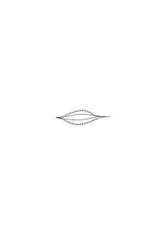

indem etwa die ausgeschlossenen Wege durchstrichen werden. Der Befehl könnte aber auch so aussehen

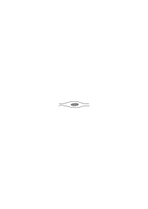

& das würde etwa bedeuten man dürfe _überall_ zwischen den beiden Linien gehen außer über das schraffierte Feld.

### [257\[2\]](https://cdn.wittgensteinnachlass.com/2000px/webp/Ms-108/257.webp)

Wenn nun tatsächlich ein Weg zwischen zwei Orten abgesperrt wird & etliche andere offen gelassen werden ist in diesen Tatsachen schon eine Verneinung & eine Disjunktion enthalten?

### [257\[3\]](https://cdn.wittgensteinnachlass.com/2000px/webp/Ms-108/257.webp)

Wie ist es aber wenn ich einen Befehl auf eine bestimmte Weise interpretiere & ihm zuwiderhandle. Worin liegt es daß meine Handlung nicht meine Interpretation des Befehls ist sondern ein Entgegenhandeln? Wird dadurch nicht meine frühere Auffassung über den Haufen geworfen? Ich kann sagen wenn der Handelnde es nicht sagte so könnte man nie wissen daß es ein Entgegenhandeln ist. Und wenn er es nun sagt so verstehen wir es nur durch unsere Interpretation der Verneinung.

### [257\[4\]](https://cdn.wittgensteinnachlass.com/2000px/webp/Ms-108/257.webp),[258\[1\]](https://cdn.wittgensteinnachlass.com/2000px/webp/Ms-108/258.webp)

Man würde glauben, wenn ich dem Befehl _so wie ich ihn verstehe_ zuwiderhandeln kann, dann muß meine Handlung dem Ausdruck meiner Auffassung unmittelbar widerstreiten. – Oder ist es nur die Interpretation meiner Handlung die der Interpretation des Befehls (sozusagen auf gleicher Ebene) widerspricht?

### [258\[2\]](https://cdn.wittgensteinnachlass.com/2000px/webp/Ms-108/258.webp)

Überhaupt, ich habe immer vom Bild oder sogar von der Halluzination gesprochen, aber wie kann man denn halluzinieren daß einer entweder auf einem Weg oder auf den anderen geht oder daß er auf irgend einem Weg innerhalb gewisser Grenzen geht??

### [258\[3\]](https://cdn.wittgensteinnachlass.com/2000px/webp/Ms-108/258.webp)

Disjunktion, Negation etc. scheinen in der Einstellung zu einem Bild zu liegen. Sie entspricht der elektrischen Schaltung durch die etwa eine Klingel mit Schaltern verbunden sein kann.

### [258\[4\]](https://cdn.wittgensteinnachlass.com/2000px/webp/Ms-108/258.webp),[259\[1\]](https://cdn.wittgensteinnachlass.com/2000px/webp/Ms-108/259.webp)

Denken wir uns folgende Einstellungen:

1.) die Glocke läutet nur dann wenn ich den Zeiger a dem Zeiger b gleichrichte 2.) die Glocke läutet nur dann nicht wenn ich a dem b gleichrichte 3) die Glocke läutet nur wenn a entweder dem b oder auch dem c gleichgerichtet ist 4) die Glocke läutet in allen anderen Zeigerstellungen von a außer wenn er mit b oder c gleichgerichtet ist 5) die Glocke läutet nur dann wenn sowohl b als c mit a gleichgerichtet sind 6) die Glocke läutet nur wenn b mit a gleichgerichtet, c mit a aber nicht gleichgerichtet ist. etc. Das Glockenzeichen bedeutet Zustimmung (oder auch das Umgekehrte). Man könnte so eine Schaltung auch an dem Modell der erlaubten & verbotenen Wege anbringen. Dieses Modell wäre dann der Ausdruck eines Befehls. Könnte man es aber mit Recht ein Bild nennen?

### [259\[2\]](https://cdn.wittgensteinnachlass.com/2000px/webp/Ms-108/259.webp)

Eine Meinung (d.h. ein Sinn) die man nicht erklären kann geht uns nichts an denn ihr kann man auch nicht zuwiderhandeln.

### [259\[3\]](https://cdn.wittgensteinnachlass.com/2000px/webp/Ms-108/259.webp)

28.07.1930

Dem Kind lernt man das „nicht” durch Absperren, dadurch daß man es verhindert etwas zu tun.

### [259\[4\]](https://cdn.wittgensteinnachlass.com/2000px/webp/Ms-108/259.webp)

Wie kann man denn _gegen ein Bild_ handeln?

### [259\[5\]](https://cdn.wittgensteinnachlass.com/2000px/webp/Ms-108/259.webp)

„In dieses Gebiet gehe ich nicht” beschreibt eine bestimmte Tatsache. Wenn die Aufschrift „Verbotener Weg” eine negative Aufschrift ist, läßt sie sich durch eine positive ersetzen?

### [259\[6\]](https://cdn.wittgensteinnachlass.com/2000px/webp/Ms-108/259.webp)

Wenn die Interpretation ein Bild ist so sind zwei entgegengesetzte Interpretationen entgegengesetzte Bilder.

### [259\[7\]](https://cdn.wittgensteinnachlass.com/2000px/webp/Ms-108/259.webp),[260\[1\]](https://cdn.wittgensteinnachlass.com/2000px/webp/Ms-108/260.webp)

In Wahrheit muß aber im Verbot immer das beschrieben werden was verboten ist. Ist eine Bewegung verboten so muß _eben diese_ Bewegung beschrieben werden, also eben das was ausgeschlossen werden soll, & die Beschreibung dessen was zugelassen ist wird nur dann das Verbot ersetzen (können) wenn diese Beschreibung das Ausgeschlossene _mitbeschreibt_.

### [260\[2\]](https://cdn.wittgensteinnachlass.com/2000px/webp/Ms-108/260.webp)

(Immer suche ich nach dem Punkt an dem man sagen kann „ja, so ist einmal unsere Welt”. – Die Philosophie will das Wesen der Welt beschreiben, wenn sie aber danach sucht, nach Sätzen sucht die es beschreiben, so kommt sie im entscheidenden Augenblick nicht zu _philosophischen_ Sätzen sondern an die Grenze der Sprache.)

### [260\[3\]](https://cdn.wittgensteinnachlass.com/2000px/webp/Ms-108/260.webp)

(Man muß sich in der Philosophie immer gleichsam dümmer stellen als man ist, um an keiner Schwierigkeit vorbeizugehen.)

### [260\[4\]](https://cdn.wittgensteinnachlass.com/2000px/webp/Ms-108/260.webp)

Gibt es einen Beweis dafür daß einer einen Befehl verstanden hat & ihm bewußt entgegenhandelt? – Ich frage jemand „hast Du den Befehl verstanden” er sagt ja & gibt mir „Proben” seines Verständnisses & handelt nun dem Befehl entgegen. Können nun die Proben (auch) so gedeutet werden daß der Befehl wie er verstanden auch befolgt wurde? Schließt man hier nicht nach Amorphem z.B. dem Gesichtsausdruck welche Deutung zu machen ist? (In diesen Fragen ist irgendwo ein Behaviourism am Platz. Vielleicht nur in sofern als man _alles_ von außen betrachtet).

### [260\[5\]](https://cdn.wittgensteinnachlass.com/2000px/webp/Ms-108/260.webp),[261\[1\]](https://cdn.wittgensteinnachlass.com/2000px/webp/Ms-108/261.webp)

In dem „Verstehen was jemand meint” muß man das spezifisch menschliche Verhalten alles das was psychologisch & physiologisch interessant ist von dem trennen können was sachlich, logisch ist. D.h. man muß es als Ganzes von außen betrachten können & nun das psychologische Drum & Dran von dem scheiden können was zur Sache gehört.

### [261\[2\]](https://cdn.wittgensteinnachlass.com/2000px/webp/Ms-108/261.webp)

D.h. das Verstehen ist für uns nicht wesentlich ein _innerer_ Prozeß, denn soweit er es wäre ginge er uns nichts an.

### [261\[3\]](https://cdn.wittgensteinnachlass.com/2000px/webp/Ms-108/261.webp)

Fürchten daß etwas geschieht heißt wünschen daß es nicht geschieht. Wenn also einer fürchtet daß etwas geschieht, der andere wünscht daß es geschieht so wünschen sie beide das Entgegengesetzte.

### [261\[4\]](https://cdn.wittgensteinnachlass.com/2000px/webp/Ms-108/261.webp),[262\[1\]](https://cdn.wittgensteinnachlass.com/2000px/webp/Ms-108/262.webp)

Was ist der Unterschied zwischen: Wünschen, daß etwas geschieht & Wünschen daß dasselbe _nicht_ geschieht. Wollte man es bildlich darstellen man würde mit dem Bild der Handlung etwas vornehmen, es durchstreichen, in bestimmter Weise einrahmen & dergleichen. Aber das erscheint uns als eine _rohe_ Methode des Ausdrucks, aber– ich glaube – daß _jede_ wesentlich ebenso sein muß; in der Wortsprache setze ich das Zeichen „nicht” vor den Satz. Wie gesagt das scheint ein ungeschickter Behelf & man meint vielleicht im _Denken_ geschieht es schon anders. Ich glaube aber, im Denken Erwarten, Wünschen, geschieht es ganz ebenso. Sonst würde ja auch die Diskrepanz zwischen dem Denken & dem Sprechen – in dem wir ja doch denken – unerträglich sein.

### [262\[2\]](https://cdn.wittgensteinnachlass.com/2000px/webp/Ms-108/262.webp)

Nocheinmal: der Ausdruck der Verneinung den wir gebrauchen wenn wir uns irgendeiner Sprache bedienen erscheint uns _primitiv_; als gäbe es einen richtigeren der mir nur in den rohen Verhältnissen dieser Sprache nicht zur Verfügung steht.

### [262\[3\]](https://cdn.wittgensteinnachlass.com/2000px/webp/Ms-108/262.webp)

Man könnte sagen der verneinte Satz stellt ein Hindernis dar das verhindert daß das geschieht was er verneint. Ich meine ein Hindernis welches ein Bild dessen ist was es verhindert. Wenn ich jemanden z.B. daran verhindern will seinen Arm in eine bestimmte Lage zu bringen & tue das indem ich dort wo der Arm nicht liegen darf ein Stück Holz befestige so ist das Stück Holz ein Bild der verbotenen Lage. Bewirke ich aber dasselbe indem ich ihm einen lähmenden Trank eingebe so ist der Trank kein Bild seiner Wirkung. (Kausalitätstheorie)

### [262\[4\]](https://cdn.wittgensteinnachlass.com/2000px/webp/Ms-108/262.webp),[263\[1\]](https://cdn.wittgensteinnachlass.com/2000px/webp/Ms-108/263.webp)

Ist nicht alles damit gesagt daß die Erwartung, der Gedanke, daß hier ein roter Kreis erscheinen wird anders ist als die, daß hier ein grüner Kreis erscheinen wird & anders als die, daß dort eine Ellipse erscheinen wird & anders als die daß dort keine Ellipse erscheinen wird? Wenn ich aber sage daß der Gedanke daß hier ein grüner Fleck erscheinen wird anders ist als der daß hier ein roter Fleck erscheinen wird so beschreibe ich damit nicht am Ende eine Erfahrungstatsache etwa wie daß der Magen eines Rehs anders ist als der eines Hirschen. – Denn die Erwartung ist damit intern beschrieben daß sie die Erwartung ist daß hier ein grüner Fleck erscheinen wird. „Intern beschrieben” ist aber hier gewiß irreführend. ‒ ‒

### [263\[2\]](https://cdn.wittgensteinnachlass.com/2000px/webp/Ms-108/263.webp)

Jenes Primitive der Ausdrucksform das uns bei der Verneinung aufgefallen ist haben wir schon früher begegnet; wenn man nämlich etwa einem Menschen begreiflich machen will daß er einen gewissen Weg gehn soll so kann man ihm den Weg aufzeichnen & hierin mit immer weiter gehender Genauigkeit verfahren. Die Andeutung jedoch die ihm verständlich machen soll daß _er_ den Weg gehen soll ist wieder von der primitiven Art die man gerne verbessern möchte.

### [263\[3\]](https://cdn.wittgensteinnachlass.com/2000px/webp/Ms-108/263.webp)

(Es ist die Art der Philosophie daß sie das als merkwürdig hervorhebt was sonst als trivial unbeachtet bleibt.)

### [263\[4\]](https://cdn.wittgensteinnachlass.com/2000px/webp/Ms-108/263.webp),[264\[1\]](https://cdn.wittgensteinnachlass.com/2000px/webp/Ms-108/264.webp)

Was ist der Unterschied zwischen einem unwillkürlichen Kopieren einer Zeichnung – bei der ich etwa den kopierenden Bleistift anschaue & immer wieder draufkomme daß er sich so bewegt wie die Linien jener Zeichnung laufen– und einem absichtlichen Kopieren bei der ich der Zeichnung _nachzeichne_. Ich lasse hier die Vorlage meine Hand gleichsam führen. – Und wie ist es denn wenn ich etwa wirklich an der Hand irgendwohin geführt werde. Ich gehe dann & richte meine Schritte so ein, daß eine gewisse Spannung in meiner Hand oder meinem Arm nicht entsteht (oder doch immer wieder beseitigt wird). Ist diese Spannung aber ein Bild der Diskrepanz der Bewegungen des Führers & der meinen? Ist es nicht bloß Erfahrungssache daß eine gewisse Bewegung die Druckempfindung ausschaltet. Wie ist es nun mit dem der sich von einem Befehl _leiten_ läßt. Ist nicht das einem Befehl Nachhandeln oder auch ihm nachgehn indem man ihn interpretiert – ganz verschieden von dem Vergleichen eines Befehls mit einer fertigen Handlung oder einer fertigen Interpretation?

### [264\[2\]](https://cdn.wittgensteinnachlass.com/2000px/webp/Ms-108/264.webp)

29.07.1930

Ich verleibe beim Denken sozusagen ein Bild meinem Leben ein.

### [264\[3\]](https://cdn.wittgensteinnachlass.com/2000px/webp/Ms-108/264.webp)

Das Bild was ich meinem Leben einverleibe ist das Gedachte, jedes andere erscheint uns als außenstehend.

### [264\[4\]](https://cdn.wittgensteinnachlass.com/2000px/webp/Ms-108/264.webp),[265\[1\]](https://cdn.wittgensteinnachlass.com/2000px/webp/Ms-108/265.webp)

Ich möchte immer etwas sagen wie: Es besteht von vornherein die Abmachung daß die Sprache das was die Erwartung befriedigt mit der Bejahung des Satzes der die Erwartung ausdrückt beschreiben wird. ‒ ‒

Ich möchte sagen: die Sprache drückt nur so das aus, was der Erwartung mit der Welt gemeinsam ist. – Oder vielmehr: ‒ ‒

### [265\[2\]](https://cdn.wittgensteinnachlass.com/2000px/webp/Ms-108/265.webp)

Es ist meine Stellungnahme zu dem Bild, die es zum Repräsentanten macht.

### [265\[3\]](https://cdn.wittgensteinnachlass.com/2000px/webp/Ms-108/265.webp)

Ich erwarte mir daß, wenn ich jetzt die Uhr aus der Tasche ziehen werde es 3 Uhr sein wird. Diese Erwartung _schließt_ ein unbestimmtes Bild des Zifferblattes & der Zeigerstellung _ein_; sie enthält eine Einstellung zu meiner wirklichen Uhr ‒ ‒ Und wenn ich nun die Uhr wirklich ansehe, – und die Zeiger stehen auf 3 so werde ich sagen die Zeiger stehen (wirklich) auf 3 – aber das heißt doch gar nichts, und diese Unmöglichkeit, die Bedingung der Übereinstimmung von sinnvollem Satz – Gedanken – & Wirklichkeit durch die Sprache auszudrücken ist des Rätsels Lösung.

### [265\[4\]](https://cdn.wittgensteinnachlass.com/2000px/webp/Ms-108/265.webp)

Bedenke, daß zwischen dem Satz der die Erwartung ausdrückt & dem der sie – etwa als einmal gewesen – beschreibt ein Unterschied ist.

### [265\[5\]](https://cdn.wittgensteinnachlass.com/2000px/webp/Ms-108/265.webp)

Es könnte gesagt werden: Wie kann man denn das Ereignis erwarten, es ist ja noch gar nicht da?

### [265\[6\]](https://cdn.wittgensteinnachlass.com/2000px/webp/Ms-108/265.webp),[266\[1\]](https://cdn.wittgensteinnachlass.com/2000px/webp/Ms-108/266.webp)

„Ja _das_ habe ich mir erwartet”. Wie konntest Du Dir's denn erwarten, es war ja noch gar nicht da. (das enthält die ganze Schwierigkeit dieser Sache & auch ihre Lösung.)

### [266\[2\]](https://cdn.wittgensteinnachlass.com/2000px/webp/Ms-108/266.webp)

Und „das habe ich mir erwartet”, heißt wirklich, _das_ habe ich mir erwartet & _nicht_, etwas ganz gleiches (oder ähnliches) habe ich mir erwartet.

### [266\[3\]](https://cdn.wittgensteinnachlass.com/2000px/webp/Ms-108/266.webp)

„Das habe ich mir erwartet” könnte man auch übersetzen durch: _darauf_ war ich eingestellt.

### [266\[4\]](https://cdn.wittgensteinnachlass.com/2000px/webp/Ms-108/266.webp)

Das Gefühl, das sich in den oberen Sätzen ausspricht ist: ich kann doch keinen Dieb ergreifen, wenn es ihn noch gar nicht gibt; wie kann ich mich auf einen Sessel setzen der nicht vorhanden ist. Und das zeigt, natürlich, nur daß wir hier eine falsche Analogie sehen. d.h. glauben eine Analogie zu sehen, wo keine da ist.

### [266\[5\]](https://cdn.wittgensteinnachlass.com/2000px/webp/Ms-108/266.webp)

Wie kann man darauf vorbereitet sein daß Etwas geschehen wird? Ich möchte sagen nur dadurch daß die Sprache auf jeden Fall vorbereitet ist da entweder p geschehen wird oder nicht geschehen wird. Das ist eine sachliche, logische, Eigenschaft der Sprache.

### [266\[6\]](https://cdn.wittgensteinnachlass.com/2000px/webp/Ms-108/266.webp)

Gut, ich sage: Wenn ich meine Uhr herausziehe wird sie mir jetzt entweder dieses Bild 🕤 bieten oder nicht. Aber wie kann ich es ausdrücken daß ich mich für eine dieser Annahmen entscheide? Jeder Gedanke ist der Ausdruck eines Gedankens.

### [267\[1\]](https://cdn.wittgensteinnachlass.com/2000px/webp/Ms-108/267.webp)

Man kann eine Lehre auf das Maß eines Körpers einstellen, vorbereiten. Dann liegt in dieser Einstellung zwar das eingestellte Maß aber in keiner Weise, daß ein bestimmter Körper es hat. Ja vor allem liegt darin keine Annahme darüber ob der Körper dieses Maß hat, oder nicht hat.

### [267\[2\]](https://cdn.wittgensteinnachlass.com/2000px/webp/Ms-108/267.webp)

Ich will sagen: Auch wenn die Erwartung mit dem Sehen eines genauen optischen Bildes des Erwarteten verbunden ist, wenn ich also bei der Erwartung, daß die Uhr auf ½ 10 steht ein Bild meiner Uhr mit den Zeigern auf ½ 10 vor mir sehe so daß ich die Uhr mit dem Bild vergleichen könnte so ist doch dieses Bild nicht die Erwartung daß die Uhr so steht. – Denn warum sollte es sonst nicht die Erwartung sein daß die Uhr _nicht so_ steht, denn das _so_ muß auch diese Erwartung enthalten.

### [267\[3\]](https://cdn.wittgensteinnachlass.com/2000px/webp/Ms-108/267.webp)

Wenn ich erwarte daß jemand zu mir in's Zimmer kommen wird & ich richte einen Sessel zurecht & zwei Teeschalen, ist dann ein Zweifel ob ich erwarte daß er kommen oder daß er nicht kommen werde?

### [267\[4\]](https://cdn.wittgensteinnachlass.com/2000px/webp/Ms-108/267.webp)

30.07.1930

(Es schadet gar nichts in der Philosophie Unsinn zu reden, wenn man sich nur tief genug mit dem Unsinn einläßt.)

### [267\[5\]](https://cdn.wittgensteinnachlass.com/2000px/webp/Ms-108/267.webp),[268\[1\]](https://cdn.wittgensteinnachlass.com/2000px/webp/Ms-108/268.webp)

(Wenn ich vernagelt bin so bin ich für viele vernagelt & wenn ich das Tor aufreiße, dann reiß ich es für viele auf.)

### [268\[2\]](https://cdn.wittgensteinnachlass.com/2000px/webp/Ms-108/268.webp)

Wenn ich erwarte daß es ¼ 11 ist so bin ich – irgendwie – auf ¼ 11 eingestellt (auf der Uhr meiner Gedanken) das ist noch begreiflich.

Nun schau ich aber auf die Uhr & sehe es ist nicht ¼ 11. Worin besteht das, daß es _nicht_ ¼ 11 ist? Ich kann doch nicht die wirkliche Zeigerstellung mit einer vergleichen die eben nicht vorhanden ist.

### [268\[3\]](https://cdn.wittgensteinnachlass.com/2000px/webp/Ms-108/268.webp)

In Wirklichkeit beschreibe ich aber durch „es ist nicht ¼ 11” den Tatbestand nur allgemeiner, als durch „es ist <math class="stacked" display="inline"><mfrac><mrow><mn>3</mn></mrow><mrow><mn>4</mn></mrow></mfrac></math> 11”. Ich verwende etwa einmal ein Bild

und ein andermal eines

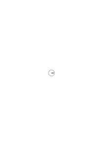,

oder

.

### [268\[4\]](https://cdn.wittgensteinnachlass.com/2000px/webp/Ms-108/268.webp)

Entgegengesetzt sind die _Bilder_

und

.

Aber auch

und

.

### [268\[5\]](https://cdn.wittgensteinnachlass.com/2000px/webp/Ms-108/268.webp)

Meine ganzen Überlegungen gehen immer dahin, zu zeigen, daß es nichts _nützt_ sich das Denken als ein Halluzinieren vorzustellen. D.h. daß es _überflüssig_ ist, die Schwierigkeit aber bestehen läßt. Denn auch die Halluzination, _kein_ Bild, kann die Kluft zwischen dem Bild & der Wirklichkeit überbrücken, & das eine nicht eher als das andere.

### [268\[6\]](https://cdn.wittgensteinnachlass.com/2000px/webp/Ms-108/268.webp)

In dem normalen Gesichtsbild des Mondes sind die Krater nicht zu klein als daß man sie sehen könnte, sondern nicht vorhanden.

### [269\[1\]](https://cdn.wittgensteinnachlass.com/2000px/webp/Ms-108/269.webp)

Es ist übrigens merkwürdig daß wir uns bei dem Gedanken daß es jetzt ½ 3 sein dürfte die Zeigerstellung meist gar nicht genau oder überhaupt nicht vorstellen sondern das Bild in der Sprache gleichsam in einem Werkzeugkasten haben aus dem wir wissen, das Werkzeug jederzeit herausnehmen & gebrauchen zu können wenn wir es brauchen sollten. – Dieser Werkzeugkasten scheint mir die Grammatik mit ihren Regeln zu sein.

### [269\[2\]](https://cdn.wittgensteinnachlass.com/2000px/webp/Ms-108/269.webp)

Ich möchte immer sagen: Wenn ich glaube daß es ½ 3 ist so ist doch das keine Spielerei (mit Bildern) sondern etwas Ernstes was für mein Leben Folgen haben kann, es muß _also_ eine Stellungnahme von mir zu diesem Bild sein! Denn ich handle ja auch auf diesen Glauben hin. – Er ist etwas Ernstes, nichts Überflüssiges (möchte ich sagen).

### [269\[3\]](https://cdn.wittgensteinnachlass.com/2000px/webp/Ms-108/269.webp)

Kann man sagen: Das Denken ist ein Instrument des Handelns.

### [269\[4\]](https://cdn.wittgensteinnachlass.com/2000px/webp/Ms-108/269.webp)

Es ist so wie wenn ich mir im Werkzeugkasten der Sprache Werkzeuge zum künftigen Gebrauch herrichtete. Ein Werkzeug ist ja auch bis zu einem gewissen Grade das Abbild seines Gebrauches.

### [269\[5\]](https://cdn.wittgensteinnachlass.com/2000px/webp/Ms-108/269.webp)

Ich suche immer nach dieser Unmöglichkeit des Ausdrückens die den eigentlichen Grund des Problems macht.

### [270\[1\]](https://cdn.wittgensteinnachlass.com/2000px/webp/Ms-108/270.webp)

Wie kann ich wissen daß ich mir _das_ erwartet habe als dadurch daß es meine Erwartung jetzt befriedigt, meiner Erwartung jetzt entspricht.

### [270\[2\]](https://cdn.wittgensteinnachlass.com/2000px/webp/Ms-108/270.webp)

Es ist ein Schritt nötig der dem der Relativitätstheorie ähnlich ist.

### [270\[3\]](https://cdn.wittgensteinnachlass.com/2000px/webp/Ms-108/270.webp)

Kann man sagen die Erwartung ist eine vorbereitende, erwartende, Handlung. – Es wirft mir jemand einen Ball, ich strecke die Hände aus & richte sie zum Erfassen des Balls. Aber sagen wir ich hätte mich verstellt, ich hatte erwartet daß er nicht werfen würde wollte aber so machen als würde ich es erwarten. Worin besteht dann mein Erwarten daß er nicht werfen wird, wenn meine Handlung die gegenteilige Erwartung ausdrückt? Sie mußte doch auch in etwas bestehen was ich tat. Ich war also doch irgendwie nicht drauf vorbereitet daß der Ball kam.

### [270\[4\]](https://cdn.wittgensteinnachlass.com/2000px/webp/Ms-108/270.webp)

Ich bin darauf vorbereitet einen roten Fleck zu sehen – diese Vorbereitung ist sozusagen etwas _Praktisches_ ähnlich, wenn ich meine Muskeln zum Halten eines Gewichts vorbereite. (Und ich möchte sagen: ich kann nicht mit der Sprache die der Ausdruck jener Vorbereitung ist über die Möglichkeiten dieser Vorbereitung hinaus.)

### [270\[5\]](https://cdn.wittgensteinnachlass.com/2000px/webp/Ms-108/270.webp),[271\[1\]](https://cdn.wittgensteinnachlass.com/2000px/webp/Ms-108/271.webp)

Wenn die Vorbereitung zum Essen eines Apfels darin besteht daß ich Speichel absondere so heißt das Erhalten des Apfels in der Sprache der Speicheldrüsen einfach Befriedigung, Rechtfertigung der Speichelabsonderung. Ich will damit sagen: In der Sprache der Speicheldrüsen gibt es dann kein rund & süß & weich sondern nur das was _sie_ von dem Apfel erfassen.

### [271\[2\]](https://cdn.wittgensteinnachlass.com/2000px/webp/Ms-108/271.webp)

Mein ganzer Gedanke ist immer daß wenn einer die Erwartung sehen könnte er ersehen müßte was erwartet wurde.

### [271\[3\]](https://cdn.wittgensteinnachlass.com/2000px/webp/Ms-108/271.webp)

[Meine Gedanken schieben sich durcheinander, der eine verdrängt den andern, schiebt sich vor etc. wie viele Krebse in einer Schüssel.]

### [271\[4\]](https://cdn.wittgensteinnachlass.com/2000px/webp/Ms-108/271.webp)

Die Vorbereitung ist quasi selbst die Sprache & kann nicht über sich selbst hinaus. (In dem nicht über sich selbst Hinauskönnen liegt die Ähnlichkeit meiner Betrachtungen & jener der Relativitätstheorie.)

### [271\[5\]](https://cdn.wittgensteinnachlass.com/2000px/webp/Ms-108/271.webp)

Man könnte sagen, ob eine Erwartung in Erfüllung gegangen ist kontrolliere ich so: Wenn die Erwartung durch den Satz ausgedrückt war daß p der Fall sein werde & der eingetretene Tatbestand wird durch den Satz „p” beschrieben dann ist die Erwartung in Erfüllung gegangen.

### [271\[6\]](https://cdn.wittgensteinnachlass.com/2000px/webp/Ms-108/271.webp),[272\[1\]](https://cdn.wittgensteinnachlass.com/2000px/webp/Ms-108/272.webp)

Wenn ich früher gesagt habe es kommt darauf an ob _dieses_ Bild erwartet wird d.h. ob wir gerade dieses Bild „verwenden” („benutzen”), so könnte ich jetzt sagen es kommt darauf an ob gerade _dieses_ Bild unsere Sprache ist.

### [272\[2\]](https://cdn.wittgensteinnachlass.com/2000px/webp/Ms-108/272.webp)

Die Sprache als _Ausdruck_ der Erwartung ist das Vorbereitete.

### [272\[3\]](https://cdn.wittgensteinnachlass.com/2000px/webp/Ms-108/272.webp)

Die Sprache kann nur sagen: Ich habe früher zur Vorbereitung den Satz „p” verwendet & verwende zur Beschreibung wieder den Satz „p”.

### [272\[4\]](https://cdn.wittgensteinnachlass.com/2000px/webp/Ms-108/272.webp),[273\[1\]](https://cdn.wittgensteinnachlass.com/2000px/webp/Ms-108/273.webp)

Das Merkwürdige in diesem Fall ist ja, daß in der Erwartung das Ereignis _ganz_ vorgebildet ist so daß, wenn es eintritt zu der Erwartung nur _ja_ gesagt werden braucht. Daß man sagen kann, _das_ habe ich mir erwartet, & am _Wirklichen_ gar nichts Überraschendes ist. – Und die Erklärung scheint immer zu sein daß die Sprache von der Wirklichkeit nicht mehr fassen könne als sie schon in der Erwartung ausdrückt. D.h. daß die Sprache von der Wirklichkeit nicht mehr sieht als was selbst versteht, & das hat sie schon in der Erwartung gesagt. Denn die Sprache hat die Erwartung nicht beschrieben, sie hat sie ausgedrückt. Sie hat nicht zuerst die Erwartung beschrieben & dann eine Tatsache die auf irgend eine Weise zu der Erwartung paßt (wie wenn man einen Tisch beschriebe & dann eine Blumenvase die zu ihm paßt.)

Sondern sie _war_ die Erwartung (denn der Ausdruck des Gedankens ist der Gedanke; der Gedanke ist der Ausdruck des Gedankens) & ist jetzt erfüllt.

### [273\[2\]](https://cdn.wittgensteinnachlass.com/2000px/webp/Ms-108/273.webp)

Die Sprache hat ja schon in der Erwartung alles gesagt was sie sagen konnte. Sie hat ja nicht einen Zustand einer Einstellung beschrieben sondern _sich_ eingestellt. Und dann beschreibt sie wieder nicht den Zustand der Erfüllung sondern bejaht sich selbst.

### [273\[3\]](https://cdn.wittgensteinnachlass.com/2000px/webp/Ms-108/273.webp)

31.07.1930

„_Davor_ hatte ich mich gefürchtet.” – „Das hattest Du gefürchtet?” – „Ja, genau so hatte ich es mir vorgestellt”. Man sagt aber auch „Ja, _das_ hatte ich gemeint”. Und da hatte man sich's gar nicht vorgestellt, & das Bild lag viel weiter zurück (von der Wirklichkeit entfernt); und doch hatte man _es_ gemeint.

### [273\[4\]](https://cdn.wittgensteinnachlass.com/2000px/webp/Ms-108/273.webp),[274\[1\]](https://cdn.wittgensteinnachlass.com/2000px/webp/Ms-108/274.webp)

Ich hatte mich vor etwas gefürchtet etwa gefürchtet es werde ein bestimmter Mensch mir entgegenkommen mit einem bestimmten Gesichtsausdruck. Er kommt nun; so kann ich Züge wahrnehmen die ich in meiner Furcht vorausgesehen hatte, ferner Züge die ich mir etwas anders gedacht hatte. Er kommt nicht in dem Anzug den ich erwartet habe, kommt schneller als ich erwartet hatte, sein Gesicht ist etwas milder als es meiner Erwartung entspräche. – Ich vergleiche also, was mir entgegenkommt, mit dem, was mir in der Erwartung gegeben war. In meiner Erwartung waren _nicht alle_ Details die die Wirklichkeit hat, & _einige_ waren _anders_.

(So sehr ist die Erwartung ein Bild.)

### [274\[2\]](https://cdn.wittgensteinnachlass.com/2000px/webp/Ms-108/274.webp)

Es fragt sich: Liegt es schon im Wesen der Vorbereitung daß sie eine **Vor**bereitung ist? eine Vorbereitung auf Etwas?

### [274\[3\]](https://cdn.wittgensteinnachlass.com/2000px/webp/Ms-108/274.webp)

Ich habe das Gefühl: nur die Stellungnahme zu dem Bild kann es uns zur Wirklichkeit machen, d.h. kann es mit der Wirklichkeit so verbinden, gleichsam wie eine Lasche die die Überleitung von dem Bild zur Wirklichkeit herstellt, die beiden in der

rechten Lage zueinander haltend dadurch daß beide für sie das selbe bedeuten. Die Furcht verbindet das Bild mit den Schrecken der Wirklichkeit.

### [274\[4\]](https://cdn.wittgensteinnachlass.com/2000px/webp/Ms-108/274.webp)

An sich ist nichts eine Vorbereitung auf etwas Anderes.

### [274\[5\]](https://cdn.wittgensteinnachlass.com/2000px/webp/Ms-108/274.webp)

„Ich dachte mir, er würde jetzt kommen.” – „Ja, Du hast gesagt, ‚er wird gleich kommen’, aber woher weiß ich, daß Du das damit gemeint hast?”.

### [274\[6\]](https://cdn.wittgensteinnachlass.com/2000px/webp/Ms-108/274.webp),[275\[1\]](https://cdn.wittgensteinnachlass.com/2000px/webp/Ms-108/275.webp)

Das Porträt ist nur ein dem N. ähnliches Bild (oder auch das nicht) es hat aber nichts in sich (wenn noch so ähnlich) was es zum Bildnis _dieses_ Menschen d.h. zum beabsichtigten Bildnis machen würde. (Ja, das Bild was dem Einen täuschend ähnlich ist kann natürlich in Wirklichkeit das schlechte Porträt eines Andern sein.)

### [275\[2\]](https://cdn.wittgensteinnachlass.com/2000px/webp/Ms-108/275.webp)

Als Porträt ist ein Bild _gemeint_ & wenn es & sein Gegenstand auch gänzlich unabhängig von einem Menschen existieren könnten, als Bildnis _gemeint_ kann es nur von einem Menschen sein. D.h. für das Bild & seine Ähnlichkeit ist es ganz gleichgültig ob es jemand gemalt, gesehen, es ähnlich gefunden hat, wenn man es aber ein Porträt nennt so muß jemand da sein der es als Porträt meint. Das hängt unmittelbar mit dem zusammen was ich früher über das einem Befehl nach Handeln & das Interpretieren eines Zeichens sagte. (Dieses Meinen ist die Stellungnahme von der ich oben geredet habe.)

### [275\[3\]](https://cdn.wittgensteinnachlass.com/2000px/webp/Ms-108/275.webp)

Nun kann man doch fragen: „Wie zeigt sich denn das, daß er das Bild als Porträt des N. meint?” – „Nun indem er's sagt.” – „Aber wie zeigt es sich denn daß er das mit dem meint was er sagt?” – „Gar nicht!”.

### [275\[4\]](https://cdn.wittgensteinnachlass.com/2000px/webp/Ms-108/275.webp),[276\[1\]](https://cdn.wittgensteinnachlass.com/2000px/webp/Ms-108/276.webp)

Das hängt mit der Frage zusammen: Kann mir die Abweichung eines Bildes von einem Gegenstand unangenehm sein so daß die unangenehme Empfindung nicht _kausal_, also erfahrungsgemäß mit der Abweichung zusammenhängt, sondern das unangenehme Gefühl die Abweichung _enthält_, so daß man aus einer Analyse dieser Empfindung ihre Ursache – oder besser, ihre Grundlage – feststellen könnte? Oder ist diese Empfindung sozusagen als Zeiger anzusehen dessen Ausschlag als Maß für die Spannung zwischen Bild & Gegenstand gedeutet wird?

### [276\[2\]](https://cdn.wittgensteinnachlass.com/2000px/webp/Ms-108/276.webp)

Keine Untersuchung des Bildes kann je ergeben wessen Porträt es ist (d.h. wen es darstellen _soll_.).

### [276\[3\]](https://cdn.wittgensteinnachlass.com/2000px/webp/Ms-108/276.webp)

Der Meinende schweißt das Bild mit seinem Gegenstand zusammen; nicht, indem er es ändert, noch ähnlicher macht, – denn dadurch bliebe das Bild das Bild, & immer noch vom Gegenstand getrennt.

### [276\[4\]](https://cdn.wittgensteinnachlass.com/2000px/webp/Ms-108/276.webp)

Was ich also das „Meinen” nenne hat mit dem Bild _nichts zu tun_.

### [276\[5\]](https://cdn.wittgensteinnachlass.com/2000px/webp/Ms-108/276.webp)

Ich glaube es verhält sich so: Die Frage, wie etwas gemeint ist– das Reden von einer Meinung, einem Sinn– hat nur insofern Sinn als sie beantwortet werden kann. Beantwortet aber kann sie nur durch die Sprache werden.

### [276\[6\]](https://cdn.wittgensteinnachlass.com/2000px/webp/Ms-108/276.webp)

Kann ich denn ohne Sprache erwarten? Wenn aber nicht, wie weiß _ich_ was der Satz für mich für einen Sinn hat, wenn diese Frage überhaupt etwas heißt?

### [277\[1\]](https://cdn.wittgensteinnachlass.com/2000px/webp/Ms-108/277.webp)

Denken nenne ich das was sich durch eine Sprache ausdrücken läßt. Dann muß es in diese Sprache aus einer _anderen_ übersetzt werden. Ich will sagen: alles Denken muß dann in Zeichen vorsichgehen.

### [277\[2\]](https://cdn.wittgensteinnachlass.com/2000px/webp/Ms-108/277.webp)

Wenn man aber sagt: „Wie soll ich wissen was er meint ich sehe ja nur seine Zeichen” so sage ich: „Wie soll _er_ wissen was er meint, er hat ja auch nur seine Zeichen”.

### [277\[3\]](https://cdn.wittgensteinnachlass.com/2000px/webp/Ms-108/277.webp)

Die Frage „_wie_ ist das gemeint”, hat nur Sinn wenn es heißt „es ist _so_ gemeint”. Dieses „so” ist ein sprachlicher Ausdruck.

### [277\[4\]](https://cdn.wittgensteinnachlass.com/2000px/webp/Ms-108/277.webp)

Die Sprache kann man nur durch die Sprache erklären, darum kann man _die Sprache_ nicht erklären.

### [277\[5\]](https://cdn.wittgensteinnachlass.com/2000px/webp/Ms-108/277.webp)

Das Ziel der Philosophie ist es eine Mauer dort zu errichten wo die Sprache ohnehin aufhört.

### [277\[6\]](https://cdn.wittgensteinnachlass.com/2000px/webp/Ms-108/277.webp)

Man kann es auch so sagen: Wenn man sich nur in einem Sprachsystem ausdrückt & also was ein Satz meint nur durch Sätze dieses Systems erklärt, so fällt am Schluß die Meinung ganz aus der Sprache, also aus der Betrachtung, heraus & es bleibt die Sprache das einzige was wir betrachten können.

### [277\[7\]](https://cdn.wittgensteinnachlass.com/2000px/webp/Ms-108/277.webp),[278\[1\]](https://cdn.wittgensteinnachlass.com/2000px/webp/Ms-108/278.webp)

Wenn wir jemandem den Sinn eines Satzes erklären so übersetzen wir ihn in eine unmißverständlichere Sprache. Wenn mir nun jemand einen Satz erklärt indem er etwa zeichnet, mit den Fingern deutet etc. & ich sage nun endlich: „ah, jetzt weiß ich, was er meint” was habe ich dann schließlich erfaßt als eine Zeichensprache die, in meinem Werkzeugkasten ist.

### [278\[2\]](https://cdn.wittgensteinnachlass.com/2000px/webp/Ms-108/278.webp)

Wenn mir jemand einen komplizierten Befehl durch eine Zeichensprache gibt, – ich verstehe ihn erst nicht, dann plötzlich verstehe ich „ah _das_ will er”, was habe ich da erfaßt (got hold of). Etwa die Vorstellung von einer Handlung; aber sie wäre ja auch nur Zeichen, wenn ich sie nicht benützen könnte. Oder, ich habe keine Vorstellung, sondern Zeichen eines Systems die ich bereits benützen kann.

### [278\[3\]](https://cdn.wittgensteinnachlass.com/2000px/webp/Ms-108/278.webp)

Man hat nicht den Gedanken, & _daneben_ die Sprache. –

### [278\[4\]](https://cdn.wittgensteinnachlass.com/2000px/webp/Ms-108/278.webp)

Es ist also nicht so, daß man für den Andern die Zeichen, für sich selbst aber einen stummen Gedanken hat.

### [278\[5\]](https://cdn.wittgensteinnachlass.com/2000px/webp/Ms-108/278.webp)

Der Gedanke ist _immer_ eine Konstruktion.

### [278\[6\]](https://cdn.wittgensteinnachlass.com/2000px/webp/Ms-108/278.webp)

Die Verneinung muß mit zu der Konstruktion gehören. Und zwar muß zum Beispiel in jedem Symbolismus ~~p = p sein.

### [279\[1\]](https://cdn.wittgensteinnachlass.com/2000px/webp/Ms-108/279.webp)

Man könnte so sagen, am _Gedanken_ ist nichts privat. – Er kann von Jedem eingesehen werden.

### [279\[2\]](https://cdn.wittgensteinnachlass.com/2000px/webp/Ms-108/279.webp)

Die Wahrheitsfunktionen gehören zum Wesen des Satzes, & können darum nicht durch Sätze erklärt werden.

### [279\[3\]](https://cdn.wittgensteinnachlass.com/2000px/webp/Ms-108/279.webp)

Man hat nicht den Zeichenausdruck & daneben, für sich selbst, den (gleichsam dunkeln) Gedanken. Dann wäre es doch auch zu merkwürdig daß man den Gedanken durch die Worte sollte wiedergeben können.

### [279\[4\]](https://cdn.wittgensteinnachlass.com/2000px/webp/Ms-108/279.webp)

D.h.: wenn der Gedanke nicht schon artikuliert wäre, wie könnte der Ausdruck durch die Sprache ihn artikulieren. Der artikulierte Gedanke aber ist in allem Wesentlichen ein Satz.

### [279\[5\]](https://cdn.wittgensteinnachlass.com/2000px/webp/Ms-108/279.webp)

01.08.1930

~p schließt p aus; was es dann _zuläßt_ hängt von der Natur des p ab.

### [279\[6\]](https://cdn.wittgensteinnachlass.com/2000px/webp/Ms-108/279.webp)

Nur einen _Satz_ kann man verneinen, – wenn man also ein Zeichen mit den gleichen formellen Regeln wie das der Verneinung in Verbindung mit Gleichungen verwendet, so wird zwar die Versuchung naheliegen es Verneinung zu nennen aber von Verneinung im ersten Sinn ist hier keine Rede.

### [280\[1\]](https://cdn.wittgensteinnachlass.com/2000px/webp/Ms-108/280.webp)

In der Mathematik ist _alles_ Algorithmus, _nichts_ Bedeutung, auch dort wo es so scheint weil wir mit _Worten über_ die mathematischen Dinge zu sprechen scheinen. Vielmehr bilden wir dann eben mit diesen Worten einen Algorithmus.

### [280\[2\]](https://cdn.wittgensteinnachlass.com/2000px/webp/Ms-108/280.webp)

Der einzige Beweis, daß zwei Beweise dasselbe beweisen, ist, daß sie in einander überführbar sind.

### [280\[3\]](https://cdn.wittgensteinnachlass.com/2000px/webp/Ms-108/280.webp)

Ein Beweis beweist nur was er beweist; das heißt es ist durch keine Auslegung mehr aus ihm herauszukriegen als was in ihm selbst steht.

### [280\[4\]](https://cdn.wittgensteinnachlass.com/2000px/webp/Ms-108/280.webp)

Zwei Beweise die dasselbe beweisen müssen sich ja begegnen. Wie zwei Wege die zum selben Ort führen. Verfolgen wir sie und sehen zu wie diese Begegnung geschieht.

### [280\[5\]](https://cdn.wittgensteinnachlass.com/2000px/webp/Ms-108/280.webp)

Kann man aus der Ungleichung

<math display="block">
  <mn>1</mn>
  <mspace width="0.3em"/>
  <mo>+</mo>
  <mtext>½</mtext>
  <mspace width="0.3em"/>
  <mo>+</mo>
  <mtext>⅓</mtext>
  <mspace width="0.3em"/>
  <mo>+</mo>
  <mtext>¼</mtext>
  <mspace width="0.3em"/>
  <mo>+</mo>
  <mspace width="0.3em"/>
  <mtext>…</mtext>
  <mspace width="0.3em"/>
  <mtext>≠</mtext>
  <mspace width="0.3em"/>
  <mo>(</mo>
  <mn>1</mn>
  <mspace width="0.3em"/>
  <mo>+</mo>
  <mtext>½</mtext>
  <mspace width="0.3em"/>
  <mo>+</mo>
  <mfrac>
    <mrow>
      <mn>1</mn>
    </mrow>
    <mrow>
      <mtext>2²</mtext>
    </mrow>
  </mfrac>
  <mspace width="0.3em"/>
  <mo>+</mo>
  <mfrac>
    <mrow>
      <mn>1</mn>
    </mrow>
    <mrow>
      <mtext>2³</mtext>
    </mrow>
  </mfrac>
  <mspace width="0.3em"/>
  <mo>+</mo>
  <mspace width="0.3em"/>
  <mtext>…</mtext>
  <mo>)</mo>
  <mspace width="0.3em"/>
  <mtext>∙</mtext>
  <mspace width="0.3em"/>
  <mo>(</mo>
  <mn>1</mn>
  <mspace width="0.3em"/>
  <mo>+</mo>
  <mtext>⅓</mtext>
  <mspace width="0.3em"/>
  <mo>+</mo>
  <mfrac>
    <mrow>
      <mn>1</mn>
    </mrow>
    <mrow>
      <mtext>3²</mtext>
    </mrow>
  </mfrac>
  <mspace width="0.3em"/>
  <mo>+</mo>
  <mfrac>
    <mrow>
      <mn>1</mn>
    </mrow>
    <mrow>
      <mtext>3³</mtext>
    </mrow>
  </mfrac>
  <mspace width="0.3em"/>
  <mo>+</mo>
  <mspace width="0.3em"/>
  <mtext>…</mtext>
  <mo>)</mo>
</math>

eine Zahl _v_ konstruieren, die jedenfalls in den Kombinationen der rechten Seite noch fehlt? Der Eulersche Beweis dafür daß es „unendlich viele Primzahlen gibt” soll ja doch ein Existenzbeweis sein & wie ist der ohne Konstruktion möglich?

### [280\[6\]](https://cdn.wittgensteinnachlass.com/2000px/webp/Ms-108/280.webp),[281\[1\]](https://cdn.wittgensteinnachlass.com/2000px/webp/Ms-108/281.webp),[282\[1\]](https://cdn.wittgensteinnachlass.com/2000px/webp/Ms-108/282.webp)

02.08.1930

<math display="block">
  <mtext>~</mtext>
  <mspace width="0.3em"/>
  <mn>1</mn>
  <mspace width="0.3em"/>
  <mo>+</mo>
  <mtext>½</mtext>
  <mspace width="0.3em"/>
  <mo>+</mo>
  <mtext>⅓</mtext>
  <mspace width="0.3em"/>
  <mo>+</mo>
  <mspace width="0.3em"/>
  <mtext>…</mtext>
  <mspace width="0.3em"/>
  <mo>=</mo>
  <mspace width="0.3em"/>
  <mo>(</mo>
  <mn>1</mn>
  <mspace width="0.3em"/>
  <mo>+</mo>
  <mtext>½</mtext>
  <mspace width="0.3em"/>
  <mo>+</mo>
  <mfrac>
    <mrow>
      <mn>1</mn>
    </mrow>
    <mrow>
      <mtext>2²</mtext>
    </mrow>
  </mfrac>
  <mspace width="0.3em"/>
  <mo>+</mo>
  <mspace width="0.3em"/>
  <mtext>…</mtext>
  <mo>)</mo>
  <mspace width="0.3em"/>
  <mtext>∙</mtext>
  <mspace width="0.3em"/>
  <mo>(</mo>
  <mn>1</mn>
  <mspace width="0.3em"/>
  <mo>+</mo>
  <mtext>⅓</mtext>
  <mspace width="0.3em"/>
  <mo>+</mo>
  <mfrac>
    <mrow>
      <mn>1</mn>
    </mrow>
    <mrow>
      <mtext>3²</mtext>
    </mrow>
  </mfrac>
  <mspace width="0.3em"/>
  <mo>+</mo>
  <mspace width="0.3em"/>
  <mtext>…</mtext>
  <mo>)</mo>
</math>

Das Argument läuft so: Das rechte Produkt ist eine Reihe von Brüchen <math class="stacked" display="inline"><mfrac><mrow><mn>1</mn></mrow><mrow><mi>n</mi></mrow></mfrac></math> in deren Nenner alle Kombinationen <math class="stacked" display="inline"><msup><mn>2</mn><mtext>ν</mtext></msup><msup><mn>3</mn><mtext>μ</mtext></msup></math> vorkommen; wären das alle Zahlen, so müßte diese Reihe die gleiche sein wie die 1 + ½ + ⅓ + … und dann müßten auch die Summen gleich sein. Die linke ist aber ∞ & die rechte nur eine endliche Zahl <math class="stacked" display="inline"><mfrac><mrow><mn>2</mn></mrow><mrow><mn>1</mn></mrow></mfrac><mspace width="0.3em"/><mtext>∙</mtext><mfrac><mrow><mn>3</mn></mrow><mrow><mn>2</mn></mrow></mfrac><mspace width="0.3em"/><mo>=</mo><mn>3</mn></math>, also fehlen in der rechten Reihe unendlich viele Brüche, d.h. _es gibt_ in der rechten Reihe Brüche die in der linken nicht vorkommen. Und nun handelt es sich darum: ist dieses Argument richtig? Wenn es sich hier um endliche Reihen handelte, so wäre alles _klar_. Denn dann könnte man aus der Methode der Summation eben herausfinden, welche Glieder der linken Reihe auf die rechte Reihe fehlen. Man könnte nur fragen: wie kommt es, daß die rechte Reihe ∞ gibt, was muß sie außer den Gliedern der linken enthalten, daß es so wird? Ja es frägt sich: hat eine Gleichung wie die obere 1 + ½ + ⅓ + … = 3 überhaupt einen Sinn? Ich kann ja aus ihr nicht herausfinden _welche_ Glieder links zu viel sind. Wie wissen wir, daß alle Glieder der rechten auch in der linken Seite vorkommen? im Fall endlicher Reihen kann ich es erst sagen, wenn ich mich Glied für Glied davon überzeugt habe; – und dann sehe ich zugleich welche übrig bleiben. – Es fehlt uns hier die Verbindung zwischen dem Resultat der Summe & den Gliedern, die einzige die den Beweis erbringen könnte. – Am klarsten wird alles, wenn man sich die Sache mit einer endlichen Gleichung ausgeführt denkt.

1 + ½ + ⅓ + ¼ + ⅕ + ⅙ ≠ (1 + ½) ∙ (1 + ⅓) = 1 + ½ + ⅓ + ⅙

Wir haben nämlich hier wieder das Merkwürdige, was man etwa einen Indizienbeweis in der Mathematik nennen könnte – der ewig unerlaubt ist. Oder, einen Beweis durch _Symptome_. Das Ergebnis der Summation ist ein Symptom dessen (oder wird als eines aufgefaßt), daß rechts Glieder sind, die links fehlen. Die Verbindung des Symptoms mit dem was man beweisen möchte, ist eine _lose_. D.h. es ist eine Brücke nicht geschlagen, aber man gibt sich damit zufrieden, daß man das andere Ufer _sieht_. Alle Glieder der rechten Seite kommen in der linken Seite vor, aber die Summe links gibt ∞ & die rechte nur einen endlichen Wert – _also müssen_ … aber in der Mathematik _muß_ gar nichts, außer was _ist_. Die Brücke muß geschlagen werden. In der Mathematik gibt es kein Symptom; das kann es nur im psychologischen Sinne für den Mathematiker geben. Man könnte auch so sagen: Es kann sich in der Mathematik nicht auf etwas schließen lassen, was sich nicht _sehen_ läßt.

---

### [282\[2\]](https://cdn.wittgensteinnachlass.com/2000px/webp/Ms-108/282.webp)

(Die Mathematiker haben von Strenge überhaupt keinen Begriff.)

### [282\[3\]](https://cdn.wittgensteinnachlass.com/2000px/webp/Ms-108/282.webp),[283\[1\]](https://cdn.wittgensteinnachlass.com/2000px/webp/Ms-108/283.webp)

Das ganze lose Wesen jener Beweisführung beruht wohl auf der Verwechselung der Summe & des Grenzwerts der Summe. Das sieht man klar, _wie weit immer_ man die rechte Reihe fortsetzt, immer kann man die linke auch soweit bringen, daß sie alle Glieder der rechten einschließt. (dabei bleibt noch _offen_ ob die dann auch noch andre Glieder enthält.)

### [283\[2\]](https://cdn.wittgensteinnachlass.com/2000px/webp/Ms-108/283.webp)

Man könnte auch so fragen: Wenn man nur diesen Beweis hatte, was konnte man nun daraufhin wagen? Wenn wir etwa die Primzahlen bis N gefunden hätten, könnten wir nun daraufhin ins Unendliche auf die Suche nach einer weiteren Primzahl gehen – da uns der Beweis verbürgt, daß wir eine finden werden? Das ist doch Unsinn. – Denn das „wenn wir nur lange genug suchen” heißt gar nichts. (Bezieht sich auf Existenzbeweise im allgemeinen.)

### [283\[3\]](https://cdn.wittgensteinnachlass.com/2000px/webp/Ms-108/283.webp)

Konnte ich auf diesen Beweis hin weitere Primzahlen links hinzufügen? Gewiß nicht, denn ich weiß ja gar nicht, wie ich welche finden kann & d.h.: ich habe ja gar keinen Begriff der Primzahl, der Beweis hat mir keinen gegeben. Ich könnte nur beliebige Zahlen (bezw. Reihen) hinzufügen. Es frägt sich ob durch Hinzufügung des Beweises von der eindeutigen Zerlegbarkeit jener Beweis beweiskräftig wird.

### [284\[1\]](https://cdn.wittgensteinnachlass.com/2000px/webp/Ms-108/284.webp)

2 & 3 tun's nicht, welche Zahl soll ich als nächste wählen?

### [284\[2\]](https://cdn.wittgensteinnachlass.com/2000px/webp/Ms-108/284.webp)

(Die Mathematik ist angesogen von falschen Deutungen.)

### [284\[3\]](https://cdn.wittgensteinnachlass.com/2000px/webp/Ms-108/284.webp)

(Es _muß_ noch eine Primzahl kommen, heißt in der Mathematik nichts. Das hängt unmittelbar damit zusammen, daß es „in der Logik nichts Allgemeineres & Spezielleres gibt”.)

### [284\[4\]](https://cdn.wittgensteinnachlass.com/2000px/webp/Ms-108/284.webp)

„Wenn die Zahlen alle Kombinationen von 2 & 3 wären so müßte <math class="stacked" display="inline"><mspace width="0.3em"/><mo>(</mo><mfrac linethickness="0"><mrow><mtext>lim</mtext></mrow><mrow><mi>n</mi><mspace width="0.3em"/><mtext>→</mtext><mspace width="0.3em"/><mtext>∞</mtext></mrow></mfrac><mover><mrow><munder><mrow><mtext>Σ</mtext></mrow><mtext>ν</mtext><mspace width="0.3em"/><mo>=</mo><mspace width="0.3em"/><mn>0</mn></munder></mrow><mtext>ν</mtext><mspace width="0.3em"/><mo>=</mo><mspace width="0.3em"/><mi>n</mi></mover><mfrac><mrow><mn>1</mn></mrow><mrow><mtext>2ν</mtext></mrow></mfrac><mo>)</mo><mspace width="0.3em"/><mtext>∙</mtext><mspace width="0.3em"/><mo>(</mo><mfrac linethickness="0"><mrow><mtext>lim</mtext></mrow><mrow><mi>n</mi><mspace width="0.3em"/><mtext>→</mtext><mspace width="0.3em"/><mtext>∞</mtext></mrow></mfrac><mover><mrow><munder><mrow><mtext>Σ</mtext></mrow><mtext>ν</mtext><mspace width="0.3em"/><mo>=</mo><mspace width="0.3em"/><mn>0</mn></munder></mrow><mtext>ν</mtext><mspace width="0.3em"/><mo>=</mo><mspace width="0.3em"/><mi>n</mi></mover><mfrac><mrow><mn>1</mn></mrow><mrow><mtext>3ν</mtext></mrow></mfrac><mo>)</mo></math> den <math class="stacked" display="inline"><mfrac linethickness="0"><mrow><mtext>lim</mtext></mrow><mrow><mi>m</mi><mspace width="0.3em"/><mtext>→</mtext><mspace width="0.3em"/><mtext>∞</mtext></mrow></mfrac><mover><mrow><munder><mrow><mtext>Σ</mtext></mrow><mi>n</mi><mspace width="0.3em"/><mo>=</mo><mspace width="0.3em"/><mn>1</mn></munder></mrow><mi>n</mi><mspace width="0.3em"/><mo>=</mo><mspace width="0.3em"/><mi>m</mi></mover><mfrac><mrow><mn>1</mn></mrow><mrow><mi>n</mi></mrow></mfrac></math> ergeben, – sie ergibt ihn aber nicht …” Was folgt daraus? (Satz des ausgeschlossenen Dritten) Daraus folgt nichts, als daß die Grenzwerte der Summen verschieden sind, also nichts (neues)). Nun könnte man aber untersuchen woran das liegt. Dabei wird man vielleicht auf Zahlen stoßen, die durch <math class="stacked" display="inline"><msup><mn>2</mn><mtext>ν</mtext></msup><mspace width="0.3em"/><mtext>∙</mtext><msup><mn>3</mn><mtext>μ</mtext></msup></math> nicht darstellbar sind, also auf größere Primzahlen, nie aber wird man sehen, daß _keine_ Anzahl solcher ursprünglicher Zahlen zur Darstellung aller Zahlen genügt.

### [284\[5\]](https://cdn.wittgensteinnachlass.com/2000px/webp/Ms-108/284.webp),[285\[1\]](https://cdn.wittgensteinnachlass.com/2000px/webp/Ms-108/285.webp)

03.08.1930

Es handelt sich darum: Wie kommt es daß dieser scheinbare Existenzbeweis keine Existenz aufzeigt? Daß er uns scheinbar einen leeren Schein als Anweisung ausstellt. –

### [285\[2\]](https://cdn.wittgensteinnachlass.com/2000px/webp/Ms-108/285.webp)

<math display="block">
  <mspace width="0.3em"/>
  <mn>1</mn>
  <mspace width="0.3em"/>
  <mo>+</mo>
  <mfrac>
    <mrow>
      <mn>1</mn>
    </mrow>
    <mrow>
      <mn>2</mn>
    </mrow>
  </mfrac>
  <mspace width="0.3em"/>
  <mo>+</mo>
  <mfrac>
    <mrow>
      <mn>1</mn>
    </mrow>
    <mrow>
      <mn>3</mn>
    </mrow>
  </mfrac>
  <mspace width="0.3em"/>
  <mo>+</mo>
  <mspace width="0.3em"/>
  <mtext>…</mtext>
  <mspace width="0.3em"/>
  <mtext>≠</mtext>
  <mspace width="0.3em"/>
  <mn>1</mn>
  <mspace width="0.3em"/>
  <mo>+</mo>
  <mfrac>
    <mrow>
      <mn>1</mn>
    </mrow>
    <mrow>
      <mn>2</mn>
    </mrow>
  </mfrac>
  <mspace width="0.3em"/>
  <mo>+</mo>
  <mfrac>
    <mrow>
      <mn>1</mn>
    </mrow>
    <mrow>
      <mtext>2²</mtext>
    </mrow>
  </mfrac>
  <mspace width="0.3em"/>
  <mo>+</mo>
  <mfrac>
    <mrow>
      <mn>1</mn>
    </mrow>
    <mrow>
      <mtext>2³</mtext>
    </mrow>
  </mfrac>
  <mspace width="0.3em"/>
  <mo>+</mo>
  <mspace width="0.3em"/>
  <mtext>…</mtext>
</math>

Wieviel Glieder der Form <math class="stacked" display="inline"><mfrac><mrow><mn>1</mn></mrow><mrow><mtext>2ν</mtext></mrow></mfrac></math> ich auch zusammennehmen mag, nie ergibt es mehr als 2, während die ersten 4 Glieder der linken Reihe schon mehr als 2 ergeben. (_Hierin_ muß also schon der Beweis liegen.) Und hierin liegt er auch & zugleich die Konstruktion einer Zahl die keine Potenz von 2 ist, denn die Regel heißt nun: finde den Abschnitt der Reihe, der jedenfalls 2 übertrifft, dieser muß eine Zahl enthalten die keine Potenz von 2 ist.

### [285\[3\]](https://cdn.wittgensteinnachlass.com/2000px/webp/Ms-108/285.webp)

<math class="stacked" display="inline"><mo>(</mo><mn>1</mn><mspace width="0.3em"/><mo>+</mo><mtext>½</mtext><mspace width="0.3em"/><mo>+</mo><mfrac><mrow><mn>1</mn></mrow><mrow><mtext>2²</mtext></mrow></mfrac><mspace width="0.3em"/><mo>+</mo><mspace width="0.3em"/><mtext>…</mtext><mo>)</mo><mspace width="0.3em"/><mtext>∙</mtext><mspace width="0.3em"/><mo>(</mo><mn>1</mn><mspace width="0.3em"/><mo>+</mo><mtext>⅓</mtext><mspace width="0.3em"/><mo>+</mo><mfrac><mrow><mn>1</mn></mrow><mrow><mtext>3²</mtext></mrow></mfrac><mspace width="0.3em"/><mo>+</mo><mspace width="0.3em"/><mtext>…</mtext><mo>)</mo><mspace width="0.3em"/><mtext>∙</mtext><mspace width="0.3em"/><mtext>…</mtext><mspace width="0.3em"/><mo>(</mo><mn>1</mn><mspace width="0.3em"/><mo>+</mo><mfrac><mrow><mn>1</mn></mrow><mrow><mi>n</mi></mrow></mfrac><mspace width="0.3em"/><mo>+</mo><mfrac><mrow><mn>1</mn></mrow><mrow><mtext>n²</mtext></mrow></mfrac><mspace width="0.3em"/><mo>+</mo><mspace width="0.3em"/><mtext>…</mtext><mo>)</mo><mspace width="0.3em"/><mo>=</mo><mspace width="0.3em"/><mi>n</mi></math>. Wenn ich nun die Summe 1 + ½ + ⅓ + … so weit ausdehne bis sie n überschreitet, dann muß dieser Teil ein Glied enthalten, das in der rechten Reihe nicht gefunden werden kann, denn enthielte die rechte Reihe alle diese Glieder, dann müßte sie eine größere & keine kleinere Summe ergeben.

### [285\[4\]](https://cdn.wittgensteinnachlass.com/2000px/webp/Ms-108/285.webp)

Wie ist es nun, wenn ein Existenzbeweis zeigt, daß eine Zahl der gewünschten Eigenschaft in einem bestimmten Intervall vorkommt, ein anderer aber zeigt, daß sich eine in einem kleineren Intervall finden muß? Beweisen diese beiden nun dasselbe, nämlich die Existenz? Nein.

### [285\[5\]](https://cdn.wittgensteinnachlass.com/2000px/webp/Ms-108/285.webp),[286\[1\]](https://cdn.wittgensteinnachlass.com/2000px/webp/Ms-108/286.webp),[287\[1\]](https://cdn.wittgensteinnachlass.com/2000px/webp/Ms-108/287.webp)

05.08.1930

Die Bedingung unter der ein Teil der Reihe 1 + ½ + ⅓ + …, etwa <math class="stacked" display="inline"><mfrac><mrow><mn>1</mn></mrow><mrow><mi>n</mi></mrow></mfrac><mspace width="0.3em"/><mo>+</mo><mfrac><mrow><mn>1</mn></mrow><mrow><mi>n</mi><mspace width="0.3em"/><mo>+</mo><mspace width="0.3em"/><mn>1</mn></mrow></mfrac><mspace width="0.3em"/><mo>+</mo><mfrac><mrow><mn>1</mn></mrow><mrow><mi>n</mi><mspace width="0.3em"/><mo>+</mo><mspace width="0.3em"/><mn>2</mn></mrow></mfrac><mspace width="0.3em"/><mo>+</mo><mspace width="0.3em"/><mtext>…</mtext><mspace width="0.3em"/><mo>+</mo><mfrac><mrow><mn>1</mn></mrow><mrow><mi>n</mi><mspace width="0.3em"/><mo>+</mo><mspace width="0.3em"/><mtext>ν</mtext></mrow></mfrac></math>, gleich oder größer als 1 wird ist folgende:

Es soll also werden:

<math display="block">
  <mfrac>
    <mrow>
      <mn>1</mn>
    </mrow>
    <mrow>
      <mi>n</mi>
    </mrow>
  </mfrac>
  <mspace width="0.3em"/>
  <mo>+</mo>
  <mfrac>
    <mrow>
      <mn>1</mn>
    </mrow>
    <mrow>
      <mi>n</mi>
      <mspace width="0.3em"/>
      <mo>+</mo>
      <mspace width="0.3em"/>
      <mn>1</mn>
    </mrow>
  </mfrac>
  <mspace width="0.3em"/>
  <mo>+</mo>
  <mfrac>
    <mrow>
      <mn>1</mn>
    </mrow>
    <mrow>
      <mi>n</mi>
      <mspace width="0.3em"/>
      <mo>+</mo>
      <mspace width="0.3em"/>
      <mn>2</mn>
    </mrow>
  </mfrac>
  <mspace width="0.3em"/>
  <mo>+</mo>
  <mspace width="0.3em"/>
  <mtext>…</mtext>
  <mspace width="0.3em"/>
  <mo>+</mo>
  <mfrac>
    <mrow>
      <mn>1</mn>
    </mrow>
    <mrow>
      <mi>n</mi>
      <mspace width="0.3em"/>
      <mo>+</mo>
      <mspace width="0.3em"/>
      <mtext>ν</mtext>
    </mrow>
  </mfrac>
  <mspace width="0.3em"/>
  <mtext>≧</mtext>
  <mspace width="0.3em"/>
  <mn>1</mn>
</math>

Formen wir die linke Seite um in:

<math class="stacked" display="inline"><mfrac><mrow><mn>1</mn><mspace width="0.3em"/><mo>+</mo><mspace width="0.3em"/><mtext>nn</mtext><mspace width="0.3em"/><mo>+</mo><mspace width="0.3em"/><mn>1</mn><mspace width="0.3em"/><mo>+</mo><mspace width="0.3em"/><mtext>nn</mtext><mspace width="0.3em"/><mo>+</mo><mspace width="0.3em"/><mn>2</mn><mspace width="0.3em"/><mo>+</mo><mspace width="0.3em"/><mtext>…</mtext><mspace width="0.3em"/><mo>+</mo><mspace width="0.3em"/><mtext>nn</mtext><mspace width="0.3em"/><mo>+</mo><mspace width="0.3em"/><mtext>ν</mtext></mrow><mrow><mi>n</mi></mrow></mfrac><mspace width="0.3em"/><mo>=</mo><mfrac><mrow><mn>1</mn><mspace width="0.3em"/><mo>+</mo><mspace width="0.3em"/><mo>(</mo><mn>1</mn><mspace width="0.3em"/><mtext>‒</mtext><mspace width="0.3em"/><mtext>1n</mtext><mspace width="0.3em"/><mo>+</mo><mspace width="0.3em"/><mtext>1)</mtext><mspace width="0.3em"/><mo>+</mo><mspace width="0.3em"/><mo>(</mo><mn>1</mn><mspace width="0.3em"/><mtext>‒</mtext><mspace width="0.3em"/><mtext>2n</mtext><mspace width="0.3em"/><mo>+</mo><mspace width="0.3em"/><mtext>2)</mtext><mspace width="0.3em"/><mo>+</mo><mspace width="0.3em"/><mtext>…</mtext><mspace width="0.3em"/><mo>(</mo><mn>1</mn><mspace width="0.3em"/><mtext>‒</mtext><mspace width="0.3em"/><mi>n</mi><mspace width="0.3em"/><mtext>‒</mtext><mspace width="0.3em"/><mtext>1n</mtext><mspace width="0.3em"/><mo>+</mo><mspace width="0.3em"/><mo>(</mo><mi>n</mi><mspace width="0.3em"/><mtext>‒</mtext><mspace width="0.3em"/><mtext>1)</mtext><mo>)</mo><mspace width="0.3em"/><mo>+</mo><mspace width="0.3em"/><mtext>n2n</mtext><mspace width="0.3em"/><mo>+</mo><mspace width="0.3em"/><mtext>n2n</mtext><mspace width="0.3em"/><mo>+</mo><mspace width="0.3em"/><mn>1</mn><mspace width="0.3em"/><mo>+</mo><mspace width="0.3em"/><mtext>n2n</mtext><mspace width="0.3em"/><mo>+</mo><mspace width="0.3em"/><mn>2</mn><mspace width="0.3em"/><mo>+</mo><mspace width="0.3em"/><mtext>…</mtext><mspace width="0.3em"/><mo>+</mo><mspace width="0.3em"/><mtext>nn</mtext><mspace width="0.3em"/><mo>+</mo><mspace width="0.3em"/><mtext>ν</mtext></mrow><mrow><mi>n</mi></mrow></mfrac><mspace width="0.3em"/><mtext>⇒</mtext><mspace width="0.3em"/><mtext>⇒</mtext><mfrac><mrow><mi>n</mi><mspace width="0.3em"/><mtext>‒</mtext><mspace width="0.3em"/><mtext>12n</mtext><mspace width="0.3em"/><mtext>∙</mtext><mspace width="0.3em"/><mo>(</mo><mi>n</mi><mspace width="0.3em"/><mtext>‒</mtext><mspace width="0.3em"/><mtext>1)</mtext><mspace width="0.3em"/><mtext>∙</mtext><mspace width="0.3em"/><mtext>1n</mtext><mspace width="0.3em"/><mo>+</mo><mspace width="0.3em"/><mn>1</mn><mspace width="0.3em"/><mo>+</mo><mspace width="0.3em"/><mo>(</mo><mtext>ν</mtext><mspace width="0.3em"/><mtext>‒</mtext><mspace width="0.3em"/><mi>n</mi><mspace width="0.3em"/><mo>+</mo><mspace width="0.3em"/><mtext>1)</mtext><mspace width="0.3em"/><mtext>nn</mtext><mspace width="0.3em"/><mo>+</mo><mspace width="0.3em"/><mtext>ν</mtext></mrow><mrow><mi>n</mi></mrow></mfrac><mspace width="0.3em"/><mo>=</mo><mspace width="0.3em"/><mn>1</mn><mspace width="0.3em"/><mtext>‒</mtext><mfrac><mrow><mi>n</mi><mspace width="0.3em"/><mtext>‒</mtext><mspace width="0.3em"/><mn>1</mn></mrow><mrow><mtext>2n</mtext><mspace width="0.3em"/><mo>+</mo><mspace width="0.3em"/><mn>2</mn></mrow></mfrac><mspace width="0.3em"/><mo>+</mo><mfrac><mrow><mtext>ν</mtext><mspace width="0.3em"/><mtext>‒</mtext><mspace width="0.3em"/><mi>n</mi><mspace width="0.3em"/><mo>+</mo><mspace width="0.3em"/><mn>1</mn></mrow><mrow><mi>n</mi><mspace width="0.3em"/><mo>+</mo><mspace width="0.3em"/><mtext>ν</mtext></mrow></mfrac><mspace width="0.3em"/><mtext>≧</mtext><mspace width="0.3em"/><mn>1</mn><mspace width="0.3em"/><mtext>∴</mtext><mspace width="0.3em"/><mtext>2nν</mtext><mspace width="0.3em"/><mo>+</mo><mspace width="0.3em"/><mtext>2ν</mtext><mspace width="0.3em"/><mtext>‒</mtext><mspace width="0.3em"/><mtext>2n²</mtext><mspace width="0.3em"/><mtext>‒</mtext><mspace width="0.3em"/><mtext>2n</mtext><mspace width="0.3em"/><mo>+</mo><mspace width="0.3em"/><mtext>2n</mtext><mspace width="0.3em"/><mo>+</mo><mspace width="0.3em"/><mn>2</mn><mspace width="0.3em"/><mtext>‒</mtext><mspace width="0.3em"/><mtext>n²</mtext><mspace width="0.3em"/><mtext>‒</mtext><mspace width="0.3em"/><mtext>nν</mtext><mspace width="0.3em"/><mo>+</mo><mspace width="0.3em"/><mi>n</mi><mspace width="0.3em"/><mo>+</mo><mspace width="0.3em"/><mtext>ν</mtext><mspace width="0.3em"/><mtext>≧</mtext><mspace width="0.3em"/><mn>0</mn><mspace width="0.3em"/><mtext>nν</mtext><mspace width="0.3em"/><mo>+</mo><mspace width="0.3em"/><mtext>3ν</mtext><mspace width="0.3em"/><mtext>‒</mtext><mspace width="0.3em"/><mtext>3n²</mtext><mspace width="0.3em"/><mo>+</mo><mspace width="0.3em"/><mn>2</mn><mspace width="0.3em"/><mo>+</mo><mspace width="0.3em"/><mi>n</mi><mspace width="0.3em"/><mtext>≧</mtext><mspace width="0.3em"/><mn>0</mn><mtext>ν</mtext><mspace width="0.3em"/><mtext>≧</mtext><mfrac><mrow><mtext>3n²</mtext><mspace width="0.3em"/><mtext>‒</mtext><mspace width="0.3em"/><mo>(</mo><mi>n</mi><mspace width="0.3em"/><mo>+</mo><mspace width="0.3em"/><mtext>2)</mtext></mrow><mrow><mi>n</mi><mspace width="0.3em"/><mo>+</mo><mspace width="0.3em"/><mn>3</mn></mrow></mfrac><mtext></mtext><mspace width="0.3em"/><mo>|</mo><mspace width="0.3em"/><mtext><</mtext><mspace width="0.3em"/><mtext>3n</mtext><mspace width="0.3em"/><mtext>‒</mtext><mspace width="0.3em"/><mn>1</mn></math> Also ist eine hinreichende Bedingung daß <math class="stacked" display="inline"><mfrac><mrow><mn>1</mn></mrow><mrow><mi>n</mi></mrow></mfrac><mspace width="0.3em"/><mo>+</mo><mfrac><mrow><mn>1</mn></mrow><mrow><mi>n</mi><mspace width="0.3em"/><mo>+</mo><mspace width="0.3em"/><mn>1</mn></mrow></mfrac><mspace width="0.3em"/><mo>+</mo><mspace width="0.3em"/><mtext>…</mtext><mspace width="0.3em"/><mo>+</mo><mfrac><mrow><mn>1</mn></mrow><mrow><mi>n</mi><mspace width="0.3em"/><mo>+</mo><mspace width="0.3em"/><mtext>ν</mtext></mrow></mfrac><mspace width="0.3em"/><mtext>≧</mtext><mspace width="0.3em"/><mn>1</mn></math>, die, daß ν ≧ 3n ‒ 1. Denke ich mir nun vom Anfang der Reihe 1 + ½ + ⅓ + … solche Abschnitte aneinandergereiht die ≧ 1 sind so geht der erste dieser Abschnitte von <math class="stacked" display="inline"><mtext>der</mtext><mspace width="0.3em"/><mtext>zweite</mtext><mspace width="0.3em"/><mtext>von</mtext><mtext>der</mtext><mspace width="0.3em"/><mtext>dritte</mtext><mspace width="0.3em"/><mtext>von</mtext><mspace width="0.3em"/><mtext>der</mtext><mspace width="0.3em"/><mtext>m-</mtext><mtext>te</mtext><mspace width="0.3em"/><mo>|</mo><mspace width="0.3em"/><mn>1</mn><mspace width="0.3em"/><mn>4</mn><mspace width="0.3em"/><mn>16</mn><mspace width="0.3em"/><mo>|</mo><mspace width="0.3em"/><mtext>bis</mtext><mspace width="0.3em"/><mtext>bis</mtext><mtext>bis</mtext><mspace width="0.3em"/><mtext>bis</mtext><mspace width="0.3em"/><mo>|</mo><mspace width="0.3em"/><mtext>3,</mtext><mspace width="0.3em"/><mtext>15,</mtext><mspace width="0.3em"/><mn>63</mn><mo>,</mo><msup><mn>4</mn><mi>m</mi></msup><mspace width="0.3em"/><mtext>‒</mtext><mspace width="0.3em"/><mn>1</mn></math> Die Summe 1 + ½ + ⅓ + … bis zum <math class="stacked" display="inline"><msup><mn>4</mn><mi>m</mi></msup><mtext>ten</mtext></math> Gliede ausgedehnt überschreitet also gewiß _m_. Also ist

<math display="block">
  <mn>1</mn>
  <mspace width="0.3em"/>
  <mo>+</mo>
  <mtext>½</mtext>
  <mspace width="0.3em"/>
  <mo>+</mo>
  <mtext>⅓</mtext>
  <mspace width="0.3em"/>
  <mo>+</mo>
  <mspace width="0.3em"/>
  <mtext>…</mtext>
  <mfrac>
    <mrow>
      <mn>1</mn>
    </mrow>
    <mrow>
      <mtext>4m</mtext>
    </mrow>
  </mfrac>
  <mspace width="0.3em"/>
  <mtext>></mtext>
  <mspace width="0.3em"/>
  <mo>(</mo>
  <mn>1</mn>
  <mspace width="0.3em"/>
  <mo>+</mo>
  <mtext>½</mtext>
  <mspace width="0.3em"/>
  <mo>+</mo>
  <mfrac>
    <mrow>
      <mn>1</mn>
    </mrow>
    <mrow>
      <mtext>2²</mtext>
    </mrow>
  </mfrac>
  <mspace width="0.3em"/>
  <mo>+</mo>
  <mspace width="0.3em"/>
  <mtext>…</mtext>
  <mo>)</mo>
  <mspace width="0.3em"/>
  <mtext>∙</mtext>
  <mspace width="0.3em"/>
  <mo>(</mo>
  <mn>1</mn>
  <mspace width="0.3em"/>
  <mo>+</mo>
  <mtext>⅓</mtext>
  <mspace width="0.3em"/>
  <mo>+</mo>
  <mfrac>
    <mrow>
      <mn>1</mn>
    </mrow>
    <mrow>
      <mtext>3²</mtext>
    </mrow>
  </mfrac>
  <mspace width="0.3em"/>
  <mo>+</mo>
  <mspace width="0.3em"/>
  <mtext>…</mtext>
  <mo>)</mo>
  <mspace width="0.3em"/>
  <mtext>∙</mtext>
  <mspace width="0.3em"/>
  <mtext>…</mtext>
  <mspace width="0.3em"/>
  <mo>(</mo>
  <mn>1</mn>
  <mspace width="0.3em"/>
  <mo>+</mo>
  <mfrac>
    <mrow>
      <mn>1</mn>
    </mrow>
    <mrow>
      <mi>m</mi>
    </mrow>
  </mfrac>
  <mspace width="0.3em"/>
  <mo>+</mo>
  <mfrac>
    <mrow>
      <mn>1</mn>
    </mrow>
    <mrow>
      <mtext>m²</mtext>
    </mrow>
  </mfrac>
  <mspace width="0.3em"/>
  <mo>+</mo>
  <mspace width="0.3em"/>
  <mtext>…</mtext>
  <mo>)</mo>
</math>

Also muß unter den ersten <math class="stacked" display="inline"><msup><mn>4</mn><mi>m</mi></msup></math> ganzen Zahlen mindestens eine sein, die durch keine der ersten m Zahlen teilbar ist.

### [287\[2\]](https://cdn.wittgensteinnachlass.com/2000px/webp/Ms-108/287.webp)

06.08.1930

Wenn ich denke, so mache ich fortwährend Pläne. Ich zeichne quasi fortwährend Vorgänge auf (d.h. ich mache Bilder von Vorgängen) & ich könnte mir denken daß ich mit dem Bleistift zeichnend, denke. (Wenn man mit jemandem über eine Zeiteinteilung redet so geschieht es oft daß man die Uhr zieht nicht um zu sehen wieviel Uhr es ist sondern um sich Bilder der überdachten Einteilung machen zu können.)

### [287\[3\]](https://cdn.wittgensteinnachlass.com/2000px/webp/Ms-108/287.webp),[288\[1\]](https://cdn.wittgensteinnachlass.com/2000px/webp/Ms-108/288.webp)

Wie kann man wissen daß, was der andere sagt (schreibt, etc.) so & so gemeint ist doch nur daraus daß er es uns wieder sagt – also andere Zeichen gibt – oder wir „schließen es aus seinem Benehmen”. Wie weiß ich aber wie das was ich sage gemeint ist? Heißt denn diese Frage etwas? Diesem „_wie_ es gemeint ist” muß doch ein _so_ entsprechen & worin bestünde dieses _so_. Denn durch andere Zeichen kann ich _mir_ es doch nicht deutlicher machen. Diese Frage heißt also offenbar nichts. Es gibt keinen Sinn losgelöst vom Satz auf den ich zeigen könnte um zwischen ihm & dem Satz eine Korrelation herzustellen. Das könnte einen nun fast zur Kausalitätstheorie bringen denn man könnte sagen: wenn es also nur das Arbeiten mit dem Satz ist was ihm Sinn gibt so ist es also seine Wirkung; – Hat er Wirkung so hat er Sinn & wenn nicht, so ist er unsinnig. Und doch ist das ganz falsch. Es wird dadurch der Satz etwa mit einer Säure verglichen & es wäre blödsinnig zu sagen „die Säure hat Sinn, wenn sie wirkt, etc.” Oder soll ich sagen: Der Satz hat Sinn wenn er wirkt aber sein Sinn ist nicht seine Wirkung; denn um seine Wirkung – so aufgefaßt – zu beschreiben, brauche ich ja eben ihn, den Satz.

### [288\[2\]](https://cdn.wittgensteinnachlass.com/2000px/webp/Ms-108/288.webp)

Man könnte sagen: auf den Satz „dieser Satz hat Sinn” kann man nicht wesentlich fragen „welchen?” So wie man ja auch wirklich auf den Satz „diese Worte sind ein Satz” nicht fragen kann „welcher?”.

### [288\[3\]](https://cdn.wittgensteinnachlass.com/2000px/webp/Ms-108/288.webp)

Könnte man sagen: Ich deute den Satz heißt: ich ziehe ihn in irgend einer Form (in mir) nach. Ich deute ihn wenn ich in irgend einer Form _nach ihm handle_.

### [288\[4\]](https://cdn.wittgensteinnachlass.com/2000px/webp/Ms-108/288.webp),[289\[1\]](https://cdn.wittgensteinnachlass.com/2000px/webp/Ms-108/289.webp)

„Der Satz hat Sinn” ist eine unglückliche Redewendung. Und wenn man von „dem Sinn dieses Satzes” redet, so scheint es immer als handle es sich um einen außerhalb des Satzes stehenden Besitz des Satzes wie wenn man sagt „der Hut dieses Menschen” (wo der Hut auch losgelöst von einem Menschen zu denken ist). Wohl aber ist „der Sinn dieses Satzes” analog dem „Sinn eines Pfeiles”.

### [289\[2\]](https://cdn.wittgensteinnachlass.com/2000px/webp/Ms-108/289.webp)

Ich glaube es ist nicht richtig zu sagen „der Satz ist zusammengesetzt” sondern er kann auch unzusammengesetzt sein wenigstens im wörtlichen Sinne; – seine „Zusammensetzung” besteht eigentlich darin, daß er ein besonderer Fall einer allgemeinen Regel der Bildung von Zeichen ist. Denn man kann zwar „ambulo” aus der Stammsilbe & der Endung zusammengesetzt ansehen aber wie wäre es wenn diese Form bloß durch die Stammsilbe allein gebildet würde?

### [289\[3\]](https://cdn.wittgensteinnachlass.com/2000px/webp/Ms-108/289.webp)

Wie man von dem Sinn eines Satzes in gewisser Weise nicht reden kann, so auch nicht von dem Ausdruck des Gedankens, Wunsches, des Befehls etc., denn auf die Frage „welcher Wunsch ist durch diesen Satz ausgedrückt” muß nur ein Ausdruck des Wunsches zur Antwort kommen.

### [289\[4\]](https://cdn.wittgensteinnachlass.com/2000px/webp/Ms-108/289.webp),[290\[1\]](https://cdn.wittgensteinnachlass.com/2000px/webp/Ms-108/290.webp)

Man möchte aber fragen, was ist nun der Mechanismus dieses ausgedrückten Wunsches?

### [290\[2\]](https://cdn.wittgensteinnachlass.com/2000px/webp/Ms-108/290.webp)

Was ich oben gesagt habe gilt auch von dem Wort „dieser Satz teilt mir etwas (bestimmtes) mit”. Was denn?! (darauf muß wieder ein Satz kommen.)

### [290\[3\]](https://cdn.wittgensteinnachlass.com/2000px/webp/Ms-108/290.webp)

Ist es nicht klar, daß die einzige Bedingung dessen, daß ein Satz Sinn hat, ist, daß seine Worte Bedeutung haben, & das heißt wieder nichts anderes als daß die äußeren Wortzeichen mit bestimmten Vorstellungen oder anderen Vorgängen verbunden sind & das wieder daß _die Zeichen_ von bestimmter Natur sind.

Weiter können wir nicht kommen & nicht kommen wollen. – Ja, wir kommen über die Zeichen nicht hinaus & wollen aber nie über sie hinauskommen, – wenn man hier unter Zeichen das Ganze versteht, was beim Denken des Schrift- oder anderen Zeichens vor sich geht.

### [290\[4\]](https://cdn.wittgensteinnachlass.com/2000px/webp/Ms-108/290.webp),[291\[1\]](https://cdn.wittgensteinnachlass.com/2000px/webp/Ms-108/291.webp)

Und hier muß man – glaube ich – eben sagen, daß die Verneinung, Disjunktion etc. im Gedanken ebenso „primitiv” ist, wie in unserer Zeichensprache. Wie vermöchte man auch _in_ ihr die Verneinung zu denken wenn sie nur wie ein schlecht passendes Kleid der Verneinung wäre. Oder – würde man erwarten – man müßte doch fühlen, wie einen der Ausdruck überall drückt. (quasi wie ein harter nicht wirklich passender Schuh.)

### [291\[2\]](https://cdn.wittgensteinnachlass.com/2000px/webp/Ms-108/291.webp)

Gibt es einen Existenzbeweis für Primzahlen & einen der die Existenz unendlich vieler Primzahlen beweist? und in welchem Verhältnis stehen diese zu einander?

### [291\[3\]](https://cdn.wittgensteinnachlass.com/2000px/webp/Ms-108/291.webp)

07.08.1930

Durch die _Methode des Multiplizierens_ (etwa im Dezimalsystem, aber gleichgültig in welchem System) ist die Existenz von Produkten, von teilbaren Zahlen bewiesen.

### [291\[4\]](https://cdn.wittgensteinnachlass.com/2000px/webp/Ms-108/291.webp)

08.08.1930

Wenn n & m relativ prim sind & n die größere & <math class="stacked" display="inline"><mi>n</mi><mspace width="0.3em"/><mo>=</mo><msub><mi>a</mi><mn>0</mn></msub><mspace width="0.3em"/><mi>m</mi><mspace width="0.3em"/><mo>+</mo><msub><mi>r</mi><mn>0</mn></msub></math>, dann können die Fälle eintreten daß

<math class="stacked" display="inline"><mi>m</mi><mspace width="0.3em"/><mo>=</mo><msub><mi>a</mi><mn>1</mn></msub><msub><mi>r</mi><mn>0</mn></msub></math> und <math class="stacked" display="inline"><msub><mi>r</mi><mn>0</mn></msub><mspace width="0.3em"/><mo>=</mo><mspace width="0.3em"/><mn>1</mn></math> oder daß <math class="stacked" display="inline"><mi>m</mi><mspace width="0.3em"/><mo>=</mo><msub><mi>a</mi><mn>1</mn></msub><msub><mi>r</mi><mn>0</mn></msub><mspace width="0.3em"/><mo>+</mo><msub><mi>r</mi><mn>1</mn></msub></math> und <math class="stacked" display="inline"><msub><mi>r</mi><mn>0</mn></msub><mspace width="0.3em"/><mo>=</mo><msub><mi>a</mi><mn>2</mn></msub><msub><mi>r</mi><mn>1</mn></msub></math>, & <math class="stacked" display="inline"><msub><mi>r</mi><mn>1</mn></msub><mspace width="0.3em"/><mo>=</mo><mspace width="0.3em"/><mn>1</mn></math>

oder <math class="stacked" display="inline"><mi>m</mi><mspace width="0.3em"/><mo>=</mo><msub><mi>a</mi><mn>1</mn></msub><msub><mi>r</mi><mn>0</mn></msub><mspace width="0.3em"/><mo>+</mo><msub><mi>r</mi><mn>1</mn></msub><msub><mi>r</mi><mn>0</mn></msub><mspace width="0.3em"/><mo>=</mo><msub><mi>a</mi><mn>2</mn></msub><msub><mi>r</mi><mn>1</mn></msub><mspace width="0.3em"/><mo>+</mo><msub><mi>r</mi><mn>2</mn></msub><msub><mi>r</mi><mn>1</mn></msub><mspace width="0.3em"/><mo>=</mo><msub><mi>a</mi><mn>3</mn></msub><msub><mi>r</mi><mn>2</mn></msub></math> & <math class="stacked" display="inline"><msub><mi>r</mi><mn>2</mn></msub><mspace width="0.3em"/><mo>=</mo><mspace width="0.3em"/><mn>1</mn></math>

oder <math class="stacked" display="inline"><mi>m</mi><mspace width="0.3em"/><mo>=</mo><msub><mi>a</mi><mn>1</mn></msub><msub><mi>r</mi><mn>0</mn></msub><mspace width="0.3em"/><mo>+</mo><msub><mi>r</mi><mn>1</mn></msub><msub><mi>r</mi><mn>0</mn></msub><mspace width="0.3em"/><mo>=</mo><msub><mi>a</mi><mn>2</mn></msub><msub><mi>r</mi><mn>1</mn></msub><mspace width="0.3em"/><mo>+</mo><msub><mi>r</mi><mn>2</mn></msub><msub><mi>r</mi><mn>1</mn></msub><mspace width="0.3em"/><mo>=</mo><msub><mi>a</mi><mn>3</mn></msub><msub><mi>r</mi><mn>2</mn></msub><mspace width="0.3em"/><mo>+</mo><msub><mi>r</mi><mn>3</mn></msub><msub><mi>r</mi><mn>2</mn></msub><mspace width="0.3em"/><mo>=</mo><msub><mi>a</mi><mn>4</mn></msub><msub><mi>r</mi><mn>3</mn></msub><msub><mi>r</mi><mn>3</mn></msub><mspace width="0.3em"/><mo>=</mo><mspace width="0.3em"/><mn>1</mn></math>

oder <math class="stacked" display="inline"><mi>m</mi><mspace width="0.3em"/><mo>=</mo><msub><mi>a</mi><mn>1</mn></msub><msub><mi>r</mi><mn>0</mn></msub><mspace width="0.3em"/><mo>+</mo><msub><mi>r</mi><mn>1</mn></msub><msub><mi>r</mi><mn>0</mn></msub><mspace width="0.3em"/><mo>=</mo><msub><mi>a</mi><mn>2</mn></msub><msub><mi>r</mi><mn>1</mn></msub><mspace width="0.3em"/><mo>+</mo><msub><mi>r</mi><mn>2</mn></msub><msub><mi>r</mi><mn>1</mn></msub><mspace width="0.3em"/><mo>=</mo><msub><mi>a</mi><mn>3</mn></msub><msub><mi>r</mi><mn>2</mn></msub><mspace width="0.3em"/><mo>+</mo><msub><mi>r</mi><mn>3</mn></msub><msub><mi>r</mi><mn>2</mn></msub><mspace width="0.3em"/><mo>=</mo><msub><mi>a</mi><mn>4</mn></msub><msub><mi>r</mi><mn>3</mn></msub><mspace width="0.3em"/><mo>+</mo><msub><mi>r</mi><mn>4</mn></msub><msub><mi>r</mi><mn>3</mn></msub><mspace width="0.3em"/><mo>=</mo><msub><mi>a</mi><mn>5</mn></msub><msub><mi>r</mi><mn>4</mn></msub></math> u.s.w. | <math class="stacked" display="inline"><msub><mi>m</mi><mo>(</mo><mtext>0)</mtext></msub><mspace width="0.3em"/><mo>=</mo><msub><mi>a</mi><mn>1</mn></msub></math> also <math class="stacked" display="inline"><msub><mi>m</mi><mo>(</mo><mtext>1)</mtext></msub><mspace width="0.3em"/><mo>=</mo><msub><mi>a</mi><mn>1</mn></msub><msub><mi>a</mi><mn>2</mn></msub><mspace width="0.3em"/><mo>+</mo><mspace width="0.3em"/><mn>1</mn></math>

<math display="block">
  <msub>
    <mi>m</mi>
    <mo>(</mo>
    <mtext>2)</mtext>
  </msub>
  <mspace width="0.3em"/>
  <mo>=</mo>
  <msub>
    <mi>a</mi>
    <mn>1</mn>
  </msub>
  <msub>
    <mi>a</mi>
    <mn>2</mn>
  </msub>
  <msub>
    <mi>a</mi>
    <mn>3</mn>
  </msub>
  <mspace width="0.3em"/>
  <mo>+</mo>
  <msub>
    <mi>a</mi>
    <mn>1</mn>
  </msub>
  <mspace width="0.3em"/>
  <mo>+</mo>
  <msub>
    <mi>a</mi>
    <mn>3</mn>
  </msub>
  <msub>
    <mi>m</mi>
    <mo>(</mo>
    <mtext>3)</mtext>
  </msub>
  <mspace width="0.3em"/>
  <mo>=</mo>
  <msub>
    <mi>a</mi>
    <mn>1</mn>
  </msub>
  <msub>
    <mi>a</mi>
    <mn>2</mn>
  </msub>
  <msub>
    <mi>a</mi>
    <mn>3</mn>
  </msub>
  <msub>
    <mi>a</mi>
    <mn>4</mn>
  </msub>
  <mspace width="0.3em"/>
  <mo>+</mo>
  <msub>
    <mi>a</mi>
    <mn>1</mn>
  </msub>
  <msub>
    <mi>a</mi>
    <mn>2</mn>
  </msub>
  <mspace width="0.3em"/>
  <mo>+</mo>
  <msub>
    <mi>a</mi>
    <mn>1</mn>
  </msub>
  <msub>
    <mi>a</mi>
    <mn>4</mn>
  </msub>
  <mspace width="0.3em"/>
  <mo>+</mo>
  <msub>
    <mi>a</mi>
    <mn>3</mn>
  </msub>
  <msub>
    <mi>a</mi>
    <mn>4</mn>
  </msub>
  <mspace width="0.3em"/>
  <mo>+</mo>
  <mspace width="0.3em"/>
  <mn>1</mn>
</math>

<math display="block">
  <msub>
    <mi>m</mi>
    <mo>(</mo>
    <mtext>4)</mtext>
  </msub>
  <mspace width="0.3em"/>
  <mo>=</mo>
  <msub>
    <mi>a</mi>
    <mn>1</mn>
  </msub>
  <msub>
    <mi>a</mi>
    <mn>2</mn>
  </msub>
  <msub>
    <mi>a</mi>
    <mn>3</mn>
  </msub>
  <msub>
    <mi>a</mi>
    <mn>4</mn>
  </msub>
  <msub>
    <mi>a</mi>
    <mn>5</mn>
  </msub>
  <mspace width="0.3em"/>
  <mo>+</mo>
  <msub>
    <mi>a</mi>
    <mn>1</mn>
  </msub>
  <msub>
    <mi>a</mi>
    <mn>2</mn>
  </msub>
  <msub>
    <mi>a</mi>
    <mn>3</mn>
  </msub>
  <mspace width="0.3em"/>
  <mo>+</mo>
  <msub>
    <mi>a</mi>
    <mn>1</mn>
  </msub>
  <msub>
    <mi>a</mi>
    <mn>2</mn>
  </msub>
  <msub>
    <mi>a</mi>
    <mn>5</mn>
  </msub>
  <mspace width="0.3em"/>
  <mo>+</mo>
  <msub>
    <mi>a</mi>
    <mn>1</mn>
  </msub>
  <msub>
    <mi>a</mi>
    <mn>4</mn>
  </msub>
  <msub>
    <mi>a</mi>
    <mn>5</mn>
  </msub>
  <mspace width="0.3em"/>
  <mo>+</mo>
  <msub>
    <mi>a</mi>
    <mn>3</mn>
  </msub>
  <msub>
    <mi>a</mi>
    <mn>4</mn>
  </msub>
  <msub>
    <mi>a</mi>
    <mn>5</mn>
  </msub>
  <mspace width="0.3em"/>
  <mo>+</mo>
  <msub>
    <mi>a</mi>
    <mn>1</mn>
  </msub>
  <mspace width="0.3em"/>
  <mo>+</mo>
  <msub>
    <mi>a</mi>
    <mn>3</mn>
  </msub>
  <mspace width="0.3em"/>
  <mo>+</mo>
  <msub>
    <mi>a</mi>
    <mn>5</mn>
  </msub>
</math>

### [292\[1\]](https://cdn.wittgensteinnachlass.com/2000px/webp/Ms-108/292.webp),[293\[1\]](https://cdn.wittgensteinnachlass.com/2000px/webp/Ms-108/293.webp)

Fügt man nun _n_ zusammen zu 1n, 2n, 3n etc. so sieht man daß gegenüber einem Vielfachen von m solange ein Rest bleibt bis man zu m ∙ n kommt, wo immer der euklidische Algorithmus endet (d.h. welche der Formeln immer für m anwendbar ist). Im ersten Fall z.B. wenn

<math class="stacked" display="inline"><mi>m</mi><mspace width="0.3em"/><mo>=</mo><msub><mi>a</mi><mn>1</mn></msub><msub><mi>a</mi><mn>2</mn></msub><mspace width="0.3em"/><mo>+</mo><mspace width="0.3em"/><mn>1</mn></math>:

<math display="block">
  <mtext>1n</mtext>
  <mspace width="0.3em"/>
  <mo>=</mo>
  <msub>
    <mi>a</mi>
    <mn>0</mn>
  </msub>
  <mi>m</mi>
  <mspace width="0.3em"/>
  <mo>+</mo>
  <msub>
    <mi>a</mi>
    <mn>2</mn>
  </msub>
</math>

<math display="block">
  <mtext>2n</mtext>
  <mspace width="0.3em"/>
  <mo>=</mo>
  <mspace width="0.3em"/>
  <mn>2</mn>
  <msub>
    <mi>a</mi>
    <mn>0</mn>
  </msub>
  <mi>m</mi>
  <mspace width="0.3em"/>
  <mo>+</mo>
  <mspace width="0.3em"/>
  <mn>2</mn>
  <msub>
    <mi>a</mi>
    <mn>2</mn>
  </msub>
</math>

– – –

<math display="block">
  <mtext>νn</mtext>
  <mspace width="0.3em"/>
  <mo>=</mo>
  <mtext>ν</mtext>
  <msub>
    <mi>a</mi>
    <mn>0</mn>
  </msub>
  <mi>m</mi>
  <mspace width="0.3em"/>
  <mo>+</mo>
  <mspace width="0.3em"/>
  <mtext>ν</mtext>
  <msub>
    <mi>a</mi>
    <mn>2</mn>
  </msub>
</math>

der Rest <math class="stacked" display="inline"><mtext>ν</mtext><msub><mi>a</mi><mn>2</mn></msub></math> bleibt jedenfalls solange kleiner als m bis <math class="stacked" display="inline"><mtext>ν</mtext><mspace width="0.3em"/><mo>=</mo><msub><mi>a</mi><mn>1</mn></msub></math> wird; dann ist <math class="stacked" display="inline"><msub><mi>a</mi><mn>1</mn></msub><mi>n</mi><mspace width="0.3em"/><mo>=</mo><msub><mi>a</mi><mn>1</mn></msub><msub><mi>a</mi><mn>0</mn></msub><mi>m</mi><mspace width="0.3em"/><mo>+</mo><msub><mi>a</mi><mn>1</mn></msub><msub><mi>a</mi><mn>2</mn></msub></math>. Noch immer ist der Rest < m; aber nun wird <math class="stacked" display="inline"><mo>(</mo><msub><mi>a</mi><mn>1</mn></msub><mspace width="0.3em"/><mo>+</mo><mspace width="0.3em"/><mtext>1)</mtext><mi>n</mi><mspace width="0.3em"/><mo>=</mo><mspace width="0.3em"/><mo>(</mo><msub><mi>a</mi><mn>1</mn></msub><mspace width="0.3em"/><mo>+</mo><mspace width="0.3em"/><mtext>1)</mtext><msub><mi>a</mi><mn>0</mn></msub><mi>m</mi><mspace width="0.3em"/><mo>+</mo><mspace width="0.3em"/><mo>(</mo><msub><mi>a</mi><mn>1</mn></msub><mspace width="0.3em"/><mo>+</mo><mspace width="0.3em"/><mtext>1)</mtext><mspace width="0.3em"/><mn>.</mn><msub><mi>a</mi><mn>2</mn></msub><mspace width="0.3em"/><mo>=</mo><mspace width="0.3em"/><mtext>–</mtext><mspace width="0.3em"/><mtext>–</mtext><mspace width="0.3em"/><mtext>–</mtext><mtext>–</mtext><mspace width="0.3em"/><mtext>–</mtext><mspace width="0.3em"/><mtext>–</mtext><mspace width="0.3em"/><mo>+</mo><msub><mi>a</mi><mn>1</mn></msub><msub><mi>a</mi><mn>2</mn></msub><mspace width="0.3em"/><mo>+</mo><msub><mi>a</mi><mn>2</mn></msub><mspace width="0.3em"/><mo>=</mo><mspace width="0.3em"/><mtext>–</mtext><mspace width="0.3em"/><mtext>–</mtext><mspace width="0.3em"/><mtext>–</mtext><mspace width="0.3em"/><mo>+</mo><mspace width="0.3em"/><mo>|</mo><msub><mi>a</mi><mn>1</mn></msub><msub><mi>a</mi><mn>2</mn></msub><mspace width="0.3em"/><mo>+</mo><mspace width="0.3em"/><mn>1</mn><mspace width="0.3em"/><mtext>︸</mtext><mi>m</mi><mspace width="0.3em"/><mo>|</mo><mspace width="0.3em"/><mo>+</mo><msub><mi>a</mi><mn>2</mn></msub><mspace width="0.3em"/><mtext>‒</mtext><mspace width="0.3em"/><mn>1</mn></math>.

<math class="stacked" display="inline"><msub><mi>a</mi><mn>2</mn></msub><mspace width="0.3em"/><mtext>‒</mtext><mspace width="0.3em"/><mn>1</mn></math> ist jedenfalls kleiner als m & der Rest verschwindet nur wenn <math class="stacked" display="inline"><msub><mi>a</mi><mn>2</mn></msub><mspace width="0.3em"/><mo>=</mo><mspace width="0.3em"/><mn>1</mn></math> ist. Dann aber ist <math class="stacked" display="inline"><mi>m</mi><mspace width="0.3em"/><mo>=</mo><msub><mi>a</mi><mn>1</mn></msub><mspace width="0.3em"/><mo>+</mo><mspace width="0.3em"/><mn>1</mn></math> also der Faktor <math class="stacked" display="inline"><msub><mi>a</mi><mn>1</mn></msub><mspace width="0.3em"/><mo>+</mo><mspace width="0.3em"/><mn>1</mn><mspace width="0.3em"/><mo>=</mo><mspace width="0.3em"/><mi>m</mi></math>. Ist aber <math class="stacked" display="inline"><msub><mi>a</mi><mn>2</mn></msub><mspace width="0.3em"/><mtext>></mtext><mspace width="0.3em"/><mn>1</mn></math> so geht die Sache weiter & es folgen nun

<math display="block">
  <mo>(</mo>
  <msub>
    <mi>a</mi>
    <mn>1</mn>
  </msub>
  <mspace width="0.3em"/>
  <mo>+</mo>
  <mspace width="0.3em"/>
  <mtext>2)</mtext>
  <mi>n</mi>
  <mspace width="0.3em"/>
  <mo>=</mo>
  <mspace width="0.3em"/>
  <mtext>–</mtext>
  <mspace width="0.3em"/>
  <mtext>–</mtext>
  <mspace width="0.3em"/>
  <mtext>–</mtext>
  <mspace width="0.3em"/>
  <mo>+</mo>
  <mspace width="0.3em"/>
  <mn>2</mn>
  <msub>
    <mi>a</mi>
    <mn>2</mn>
  </msub>
  <mspace width="0.3em"/>
  <mtext>‒</mtext>
  <mspace width="0.3em"/>
  <mn>1</mn>
</math>

– – –

<math class="stacked" display="inline"><mo>(</mo><msub><mi>a</mi><mn>1</mn></msub><mspace width="0.3em"/><mo>+</mo><mspace width="0.3em"/><mtext>ν)</mtext><mi>n</mi><mspace width="0.3em"/><mo>=</mo><mspace width="0.3em"/><mtext>–</mtext><mspace width="0.3em"/><mtext>–</mtext><mspace width="0.3em"/><mtext>–</mtext><mspace width="0.3em"/><mo>+</mo><mspace width="0.3em"/><mtext>ν</mtext><msub><mi>a</mi><mn>2</mn></msub><mspace width="0.3em"/><mtext>‒</mtext><mspace width="0.3em"/><mn>1</mn></math>.

Dieser Rest ist gewiß kleiner als m bis

<math class="stacked" display="inline"><mo>(</mo><mn>2</mn><msub><mi>a</mi><mn>1</mn></msub><mo>)</mo><mi>n</mi><mspace width="0.3em"/><mo>=</mo><mspace width="0.3em"/><mtext>–</mtext><mspace width="0.3em"/><mtext>–</mtext><mspace width="0.3em"/><mtext>–</mtext><mspace width="0.3em"/><mo>+</mo><msub><mi>a</mi><mn>1</mn></msub><msub><mi>a</mi><mn>2</mn></msub><mspace width="0.3em"/><mtext>‒</mtext><mspace width="0.3em"/><mn>1</mn></math> & auch hier noch. Aber

<math class="stacked" display="inline"><mo>(</mo><mn>2</mn><msub><mi>a</mi><mn>1</mn></msub><mspace width="0.3em"/><mo>+</mo><mspace width="0.3em"/><mtext>1)</mtext><mi>n</mi><mspace width="0.3em"/><mo>=</mo><mspace width="0.3em"/><mtext>–</mtext><mspace width="0.3em"/><mtext>–</mtext><mspace width="0.3em"/><mtext>–</mtext><mspace width="0.3em"/><mo>+</mo><mspace width="0.3em"/><mo>(</mo><msub><mi>a</mi><mn>1</mn></msub><mspace width="0.3em"/><mo>+</mo><mspace width="0.3em"/><mtext>1)</mtext><msub><mi>a</mi><mn>2</mn></msub><mspace width="0.3em"/><mtext>‒</mtext><mspace width="0.3em"/><mn>1</mn><mspace width="0.3em"/><mo>=</mo><msub><mi>a</mi><mn>1</mn></msub><msub><mi>a</mi><mn>2</mn></msub><mspace width="0.3em"/><mo>+</mo><msub><mi>a</mi><mn>2</mn></msub><mspace width="0.3em"/><mtext>‒</mtext><mspace width="0.3em"/><mn>1</mn><mspace width="0.3em"/><mo>=</mo><mspace width="0.3em"/><mo>|</mo><msub><mi>a</mi><mn>1</mn></msub><msub><mi>a</mi><mn>2</mn></msub><mspace width="0.3em"/><mo>+</mo><mspace width="0.3em"/><mn>1</mn><mspace width="0.3em"/><mtext>︸</mtext><mi>m</mi><mspace width="0.3em"/><mo>|</mo><mspace width="0.3em"/><mo>+</mo><mspace width="0.3em"/><mo>(</mo><msub><mi>a</mi><mn>2</mn></msub><mspace width="0.3em"/><mtext>‒</mtext><mspace width="0.3em"/><mtext>2)</mtext></math> & hier geht

der Prozeß wieder nur dann auf wenn <math class="stacked" display="inline"><msub><mi>a</mi><mn>2</mn></msub><mspace width="0.3em"/><mo>=</mo><mspace width="0.3em"/><mn>2</mn></math>, dann aber ist <math class="stacked" display="inline"><mi>m</mi><mspace width="0.3em"/><mo>=</mo><mspace width="0.3em"/><mn>2</mn><msub><mi>a</mi><mn>1</mn></msub><mspace width="0.3em"/><mo>+</mo><mspace width="0.3em"/><mn>1</mn></math> also wieder gleich dem Faktor von n. – Ebenso geht es weiter bis

<math class="stacked" display="inline"><mo>(</mo><mn>3</mn><msub><mi>a</mi><mn>1</mn></msub><mo>)</mo><mi>n</mi><mspace width="0.3em"/><mo>=</mo><mspace width="0.3em"/><mtext>–</mtext><mspace width="0.3em"/><mtext>–</mtext><mspace width="0.3em"/><mtext>–</mtext><mspace width="0.3em"/><mo>+</mo><msub><mi>a</mi><mn>1</mn></msub><msub><mi>a</mi><mn>2</mn></msub><mspace width="0.3em"/><mtext>‒</mtext><mspace width="0.3em"/><mn>2</mn></math> und

<math class="stacked" display="inline"><mo>(</mo><mn>3</mn><msub><mi>a</mi><mn>1</mn></msub><mspace width="0.3em"/><mo>+</mo><mspace width="0.3em"/><mtext>1)</mtext><mi>n</mi><mspace width="0.3em"/><mo>=</mo><mspace width="0.3em"/><mtext>–</mtext><mspace width="0.3em"/><mtext>–</mtext><mspace width="0.3em"/><mtext>–</mtext><mspace width="0.3em"/><mo>+</mo><mspace width="0.3em"/><mi>m</mi><mspace width="0.3em"/><mo>+</mo><mspace width="0.3em"/><mo>(</mo><msub><mi>a</mi><mn>2</mn></msub><mspace width="0.3em"/><mtext>‒</mtext><mspace width="0.3em"/><mtext>3)</mtext></math> solang bis

<math class="stacked" display="inline"><mo>(</mo><msub><mi>a</mi><mn>2</mn></msub><msub><mi>a</mi><mn>1</mn></msub><mspace width="0.3em"/><mo>+</mo><mspace width="0.3em"/><mtext>1)</mtext><mi>n</mi><mspace width="0.3em"/><mo>=</mo><mspace width="0.3em"/><mtext>–</mtext><mspace width="0.3em"/><mtext>–</mtext><mspace width="0.3em"/><mtext>–</mtext><mspace width="0.3em"/><mo>+</mo><mspace width="0.3em"/><mo>(</mo><msub><mi>a</mi><mn>2</mn></msub><mspace width="0.3em"/><mtext>‒</mtext><msub><mi>a</mi><mn>2</mn></msub><mo>)</mo><mspace width="0.3em"/><mo>=</mo><mspace width="0.3em"/><mi>m</mi><mspace width="0.3em"/><mtext>∙</mtext><mspace width="0.3em"/><mi>n</mi></math>. Ähnlich geht es, wenn <math class="stacked" display="inline"><mi>m</mi><mspace width="0.3em"/><mo>=</mo><msub><mi>a</mi><mn>1</mn></msub><msub><mi>a</mi><mn>2</mn></msub><msub><mi>a</mi><mn>3</mn></msub><mspace width="0.3em"/><mo>+</mo><msub><mi>a</mi><mn>1</mn></msub><mspace width="0.3em"/><mo>+</mo><msub><mi>a</mi><mn>3</mn></msub></math>, etc. etc.

### [293\[2\]](https://cdn.wittgensteinnachlass.com/2000px/webp/Ms-108/293.webp)

Hat man „intuitiv” das Bildungsgesetz einer Reihe z.B. der Reihen der _m_ verstanden so daß man also im Stande ist ein beliebiges <math class="stacked" display="inline"><msub><mi>m</mi><mo>(</mo><mtext>v)</mtext></msub></math> zu bilden so hat man das Bildungsgesetz _ganz_ verstanden, also so gut wie es etwa irgend eine algebraische Darstellung vermitteln könnte. D.h. man kann es durch eine solche Darstellung nicht mehr besser verstehen. Und diese Darstellung ist daher _insofern_ auch nicht _strenger_. Obwohl sie natürlich einprägsamer sein kann.

### [293\[3\]](https://cdn.wittgensteinnachlass.com/2000px/webp/Ms-108/293.webp)

Wenn man bedenkt daß die Gleichung 2 × 2 = 4 ein Beweis des Satzes ist „es gibt gerade Zahlen” so sieht man wie lose hier das Wort Beweis gebraucht ist. Aus der Gleichung 2 + 2 = 4 soll der Satz „es gibt gerade Zahlen” hervorgehen?! – Und was ist der Beweis der Existenz von Primzahlen? – Die Methode der Zerlegung in Primfaktoren. Aber in dieser Methode wird ja _überhaupt nicht geredet_, auch nicht von „Primzahlen”.

### [293\[4\]](https://cdn.wittgensteinnachlass.com/2000px/webp/Ms-108/293.webp),[294\[1\]](https://cdn.wittgensteinnachlass.com/2000px/webp/Ms-108/294.webp)

25 + 46 ≠ 78 ist eine richtige Ungleichung, sie wird bestätigt, wenn man die Summe 25 + 46 = 71 bildet. Man könnte die Ungleichung durch eine induktive Disjunktion darstellen 25 + 46 = 1 ․⌵․ 25 + 46 = 2 ․⌵․ … ․⌵․ 25 + 46 = 77 ․⌵․ 25 + 46 = 79 ․⌵․ …

### [294\[1\]](https://cdn.wittgensteinnachlass.com/2000px/webp/Ms-108/294.webp)

Es ist ein korrekter Beweis für 3 + 4 = 7

wenn einmal die natürliche Ziffernreihe aufgestellt ist: ⎨ | 1 1 | 2 2 | 3 3 | 4 1 | 5 2 | 6 3 | 7 4. Denn _wenn_ die natürliche Ziffernfolge fixiert ist & die Art & Weise der Zuordnung, so ist es nur mehr eine _arithmetische_ Angelegenheit wohin etwa die 4 in der unteren Reihe trifft.

### [294\[2\]](https://cdn.wittgensteinnachlass.com/2000px/webp/Ms-108/294.webp)

Ein Beweis in der Mathematik ist allgemein wenn er allgemein anwendbar ist. Eine andere Allgemeinheit kann nicht im Namen der Strenge gefordert werden. _Jeder_ Beweis stützt sich auf _bestimmte_ Zeichen, auf eine bestimmte Zeichengebung. Es kann nur die eine Art der Allgemeinheit eleganter erscheinen als die andere.

### [294\[3\]](https://cdn.wittgensteinnachlass.com/2000px/webp/Ms-108/294.webp)

(Die Eleganz eines mathematischen Beweises kann nur den einen Sinn haben gewisse Analogien besonders stark zu Tage treten zu lassen, wenn das gerade erwünscht ist, sonst entspringt sie dem Stumpfsinn & hat nur die eine Wirkung das zu verhüllen was klar & offenbar sein sollte. Das stumpfsinnige Streben nach Eleganz ist eine Hauptursache warum die Mathematiker ihre eigenen Operationen nicht verstehen, oder entspringt die Verständnislosigkeit & jenes Streben einer gemeinsamen Quelle.)

### [294\[4\]](https://cdn.wittgensteinnachlass.com/2000px/webp/Ms-108/294.webp),[295\[1\]](https://cdn.wittgensteinnachlass.com/2000px/webp/Ms-108/295.webp)

Das was die Gleichung (oder Ungleichung) vom Satz unterscheidet ist ihre Beweisbarkeit. Ein Satz läßt sich – in dem Sinne – nicht beweisen denn wenn gezeigt wird daß er aus anderen Sätzen folgt so ist er damit nicht bewiesen. Die Gleichung gilt aber nicht bedingungsweise, wenn gewisse Prämissen wahr sind & ihre Ableitung aus scheinbaren Prämissen ist darum ganz unwesentlich. Das woraus sie hervorgeht sind vielmehr Festsetzungen der Zeichensprache, also Bedingungen des Sinns nicht der Wahrheit.

### [295\[2\]](https://cdn.wittgensteinnachlass.com/2000px/webp/Ms-108/295.webp)

Nichts ist verhängnisvoller für das philosophische Verständnis als die Auffassung von Beweis & Erfahrung als zweier verschiedener, also doch vergleichbarer Verifikationsmethoden.

### [295\[3\]](https://cdn.wittgensteinnachlass.com/2000px/webp/Ms-108/295.webp)

Eine Ungleichung ist so wohl eine syntaktische Regel wie eine Gleichung. Die Analogie der Wahrheitsfunktionen in Verbindung mit Gleichungen mit denen der Sätze ist eine vollständige – d.h. die geltenden Regeln sind in beiden Fällen dieselben – nur daß eben die Gleichungen keine Sätze sind. (Wir haben ja in den Wahrheitsfunktionen auf Hypothesen angewendet ein weiteres Beispiel von Analogie.)

### [295\[4\]](https://cdn.wittgensteinnachlass.com/2000px/webp/Ms-108/295.webp),[296\[1\]](https://cdn.wittgensteinnachlass.com/2000px/webp/Ms-108/296.webp)

Inwiefern kann man aber das Bild <math display="inline"><mn>1</mn><mspace width="0.3em"/><mo>|</mo><mn>2</mn><mspace width="0.3em"/><mo>|</mo><mn>3</mn><mspace width="0.3em"/><mo>|</mo><mn>4</mn><mn>1</mn><mspace width="0.3em"/><mo>|</mo><mn>5</mn><mn>2</mn><mspace width="0.3em"/><mo>|</mo><mn>6</mn><mn>3</mn><mspace width="0.3em"/><mo>|</mo><mn>7</mn><mn>4</mn></math> den Beweis von 3 + 4 = 7 nennen? (da doch aus dem Bild die Formel in keinem Sinne hervorgeht.) Offenbar nur durch eine allgemeine Regel die Gleichungen mit solchen Bildern verknüpft. Denn wenn ich die Gleichung 2 + 5 = 9 aufstelle so kann man sagen „wir werden gleich sehen ob das so ist” & nun stellt man den _entsprechenden_ Kalkül an & sieht ob die Gleichung stimmt (und genau dasselbe gilt natürlich von den Ungleichungen). Aber der entsprechende Kalkül entspricht eben nur auf Grund einer allgemeinen Regel.

### [296\[2\]](https://cdn.wittgensteinnachlass.com/2000px/webp/Ms-108/296.webp)

Ist es überhaupt denkbar daß diese Regel keine allgemeine (ist), sondern nur für einen bestimmten Fall aufgestellt ist? Ich glaube nicht. Was hätte es für einen Sinn, d.h. was würde es bedeuten, die Formel 3 + 4 = 7 mit dem Bild <math display="inline"><mn>1</mn><mspace width="0.3em"/><mo>|</mo><mn>2</mn><mspace width="0.3em"/><mo>|</mo><mn>3</mn><mspace width="0.3em"/><mo>|</mo><mn>4</mn><mn>1</mn><mspace width="0.3em"/><mo>|</mo><mn>5</mn><mn>2</mn><mspace width="0.3em"/><mo>|</mo><mn>6</mn><mn>3</mn><mspace width="0.3em"/><mo>|</mo><mn>7</mn><mn>4</mn></math> zu „begründen” wenn der Grund nicht eine allgemeine Regel wäre. Eine einzelne Regel gibt eben keinen „Grund” ab.

### [296\[3\]](https://cdn.wittgensteinnachlass.com/2000px/webp/Ms-108/296.webp),[297\[1\]](https://cdn.wittgensteinnachlass.com/2000px/webp/Ms-108/297.webp)

In dem Additionsschema <math display="inline"><mn>1</mn><mspace width="0.3em"/><mo>|</mo><mn>2</mn><mspace width="0.3em"/><mo>|</mo><mn>3</mn><mspace width="0.3em"/><mo>|</mo><mn>4</mn><mn>1</mn><mspace width="0.3em"/><mo>|</mo><mn>5</mn><mn>2</mn><mspace width="0.3em"/><mo>|</mo><mn>6</mn><mn>3</mn><mspace width="0.3em"/><mo>|</mo><mn>7</mn><mn>4</mn></math> sind die Ziffern _Ordnungsziffern_. Sie bezeichnen also einfach eine bestimmte Stelle, die soundsovielte Stelle. Man könnte das deutlicher machen durch die Schreibung <math display="inline"><mtext>①</mtext><mspace width="0.3em"/><mo>|</mo><mtext>②</mtext><mspace width="0.3em"/><mo>|</mo><mtext>③</mtext><mspace width="0.3em"/><mo>|</mo><mtext>④</mtext><mtext>①</mtext><mspace width="0.3em"/><mo>|</mo><mtext>⑤</mtext><mtext>②</mtext><mspace width="0.3em"/><mo>|</mo><mtext>⑥</mtext><mtext>③</mtext><mspace width="0.3em"/><mo>|</mo><mtext>⑦</mtext><mtext>④</mtext></math>. Es ist klar daß man mit diesem Algorithmus auch multiplizieren subtrahieren & dividieren kann, _und daß alles die volle Strenge hat_. (Übrigens ist ja diese Rechenmethode die des Rechenschiebers.)

### [297\[2\]](https://cdn.wittgensteinnachlass.com/2000px/webp/Ms-108/297.webp)

Das Wort „Gasthaus” über dem Tor eines Hauses zeigt an daß _dort_ ein Gasthaus ist. Es muß der besondere Fall einer allgemeinen Regel vorliegen damit wir das Wort als Mitteilung, also als Satz, verstehen. Das zeigt uns wie weit „Zusammensetzung” ein Charakteristikum des Satzes ist.

### [297\[3\]](https://cdn.wittgensteinnachlass.com/2000px/webp/Ms-108/297.webp),[298\[1\]](https://cdn.wittgensteinnachlass.com/2000px/webp/Ms-108/298.webp)

„2 + 2 ≠ 5” ist eine Zeichenregel & daran sieht man schon wie hier die Verneinung etwas anderes bedeutet da doch bei einer Festsetzung jedenfalls von wahr & falsch nicht die Rede ist. Ich sagte früher einmal daß die Verneinung in 2 + 2 ≠ 5 nicht die Bedeutung der Verneinung eines Satzes haben könne, weil das Verneinte 2 + 2 = 5 doch kein Bild eines nicht bestehenden logischen Sachverhalts sein könne. Aber Bejahung & Verneinung stehen auf _einer_ Stufe, & könnte man 2 + 2 = 4 bejahen dann kann man es auch verneinen & dann kann man auch 2 + 2 = 5 bejahen. In Wahrheit, glaube ich, ist 2 + 2 = 5 eine Zeichenregel wie jede andere weder richtig noch falsch; & nur unverträglich mit unserer allgemeinen Regel der Darstellung &, wenn diese angenommen ist, nur in diesem Sinne falsch. – Darum ist sie auch kein Bild – davon wie es wäre wenn 2 + 2 = 5 wäre. Das Bild des Logischen Sachverhaltes – aber auch nicht das Bild sondern die Sache selbst – gibt (nur) der Beweis.

### [298\[2\]](https://cdn.wittgensteinnachlass.com/2000px/webp/Ms-108/298.webp)

09.08.1930

Zum Beweis eines mathematischen Satzes lenken wir die Aufmerksamkeit auf ein Bild, aber der Beweis wird noch nicht verstanden; plötzlich heißt es: „jetzt _sehe ich es ein_”. Man hat erst jetzt _das_ gesehen worauf es ankam. (siehe p ❘ p․ ❘ ․q ❘ q etc.)

### [298\[3\]](https://cdn.wittgensteinnachlass.com/2000px/webp/Ms-108/298.webp)

Ist es nicht klar: die Sätze der reinen Mathematik können in ihrer Anwendung nur Zeichenregeln sein. (Nur Bedingungen des Sinn's.)

### [298\[4\]](https://cdn.wittgensteinnachlass.com/2000px/webp/Ms-108/298.webp),[299\[1\]](https://cdn.wittgensteinnachlass.com/2000px/webp/Ms-108/299.webp)

Auch 3 + 4 < 9 ist keine Mitteilung – wie etwa daß eine gewisse Strecke länger ist als 9 Meter (ein Haus höher als 9 m). – Es ist nach dem was wir unter 3, 4 & 9 verstehen _selbstverständlich_ (d.h. beweisbar). Wir sehen es aber damit immer noch so wie den Fall des Hauses an nur daß es sich etwa dort um etwas weniger Selbstverständliches handelt. Aber er ist überhaupt mit dem des Satzes unvergleichbar. – Wenn ich zuerst sagte „es ist selbstverständlich” so heißt das, es ist hier nicht von einem Satz die Rede, sondern von einer Zeichenregel, die übrigens aus einer allgemeinen Regel folgt. Immer wieder drängt es uns zum Vergleich von 3 + 4 < 9 mit einem Satz „wenn man diese beiden Stäbe aneinanderlegt so reicht es noch nicht bis dahinauf”. Und das ist selbst auf den Fall der Strecken a, b, c anzuwenden. Aber <math display="inline"><mtext><mo>[</mo><mtext>c]</mtext></mtext><mspace width="0.3em"/><mn>1</mn><mspace width="0.3em"/><mn>2</mn><mspace width="0.3em"/><mn>3</mn><mspace width="0.3em"/><mn>4</mn><mspace width="0.3em"/><mn>5</mn><mspace width="0.3em"/><mn>6</mn><mspace width="0.3em"/><mn>7</mn><mspace width="0.3em"/><mn>8</mn><mspace width="0.3em"/><mn>9</mn><mspace width="0.3em"/><mn>1</mn><mspace width="0.3em"/><mn>2</mn><mspace width="0.3em"/><mn>3</mn><mspace width="0.3em"/><mn>1</mn><mspace width="0.3em"/><mn>2</mn><mspace width="0.3em"/><mn>3</mn><mspace width="0.3em"/><mn>4</mn><mo>[</mo><mtext>a]</mtext><mo>[</mo><mtext>b]</mtext></math> dieser Satz über die Strecken a, b, & c ist eben nicht der arithmetische. Dieser ist vielmehr entweder der Ausdruck einer bloßen Willkür, – daß wir das Zeichen „9” in der oberen Reihe erst an eine so späte Stelle gesetzt haben, oder, wenn dies so angenommen ist, selbstverständlich.

Wäre 3 + 4 < 9 nicht eine willkürliche Festsetzung oder die Folge aus einer Festsetzung so ginge es die Arithmetik nichts an. – Warum man es manchmal gern eine Tautologie nennen möchte (die es in meinem Sinne nicht ist) ist eben weil man sagen möchte „ja wenn Du das festsetzt, dann ist es ja selbstverständlich”. [Ich schreibe Paraphrasen auf logische Erkenntnisse.]

### [299\[2\]](https://cdn.wittgensteinnachlass.com/2000px/webp/Ms-108/299.webp),[300\[1\]](https://cdn.wittgensteinnachlass.com/2000px/webp/Ms-108/300.webp)

Der arithmetische Satz sagt nämlich nicht daß man in _einer_ Ziffernreihe durch Anlegen von 1 2 3 & 1 2 3 4 nicht bis zum Zeichen „9” kommt, sondern es steht dafür daß es in der Reihe 1 2 3 4 5 6 7 8 9 nicht geschieht. Diese Reihe ist im arithmetischen Satz präsupponiert & er ist daher keine Beschreibung von außen dieser Reihe. – Man könnte es auch so sagen: Es ist ein Satz: „der Stab a & der Stab b sind aneinandergereiht kürzer als der Stab c; oder der Stab a ist 3 m lang, b 4 m & c 9 m.” (Aber von den Längen kann ich nicht sagen, daß die Länge des längeren Stabes länger ist als die des kürzeren.) – Diese Längen sind etwas was ich von den Stäben mit Recht oder Unrecht aussage um zu zeigen daß sie, die Stäbe in gewissen Verhältnissen zu einander stehen, aber dazu muß der Sinn dieser Längenangaben (schon) fixiert sein & kann nicht erst durch einen Satz noch behauptet werden. Oder: Die Angabe daß a 3 m, b 4 m, c 9 m lang ist, _ist_ eben die durch welche ich zeige daß, c länger ist als a & b zusammen. Ein Satz der sagte daß 3 m + 4 m kleiner ist als 9 m entspräche einem Satz der sagte daß länger länger ist als kürzer. (oder „groß > klein”.) Ein solcher Ausdruck entspräche vielmehr dem was festzusetzen ist ehe überhaupt etwas gesagt werden kann. 3 + 4 < 9 gehört eben auch zum „Spiel” & ist eine Stellung der Figuren die nur mit den allgemeinen Regeln übereinstimmen kann oder nicht. Länger & kürzer sind eben eine externe Eigenschaft der Stäbe aber eine _interne_ der Längen. (Sie durch einen Satz auszudrücken hieße etwa die Bedeutung eines Wortes durch einen Satz in dem das Wort vorkommt aussprechen zu wollen.)