# Ms-109

### [III\[1\]](https://cdn.wittgensteinnachlass.com/2000px/webp/Ms-109/III.webp)

## Bemerkungen V.

### [1\[1\]](https://cdn.wittgensteinnachlass.com/2000px/webp/Ms-109/1.webp)

11.08.1930

2 × 3 ≠ 5 ist eine grammatische Regel wie 2 + 3 = 5.

### [1\[2\]](https://cdn.wittgensteinnachlass.com/2000px/webp/Ms-109/1.webp)

Ist das Funktionieren von „~p” damit erklärt, daß man sagt: ‚~p’ ist wahr wenn ‚p’ nicht wahr ist?

### [1\[3\]](https://cdn.wittgensteinnachlass.com/2000px/webp/Ms-109/1.webp)

12.08.1930

Was sollte diese „Erklärung” für ein Satz sein? Sie ist doch keine grammatische Regel. Ist es nicht sehr charakteristisch daß die Erklärung ausgedrückt (wie in der WF-Notation) einfach zum Zeichen gehört & nur eine Handhabe für den Angriff grammatischer Regeln – Spielregeln – wird? Das „W” & „F” verfolgte eine Tendenz aber sie ist vereitelt, dadurch, daß nun doch wieder alles zum Zeichen gehört. WF ist nur mehr eine Anspielung & nicht mehr. Und zwar nur eine Anspielung auf eine andere _Notation_ nicht auf eine Erklärung. – Es ist ja selbstverständlich: es kann nicht eine Erklärung der Notation _&_ die Notation geben. Denn die Erklärung wird sofort zur Notation & mehr als diese kann sie auch nicht enthalten.

### [1\[4\]](https://cdn.wittgensteinnachlass.com/2000px/webp/Ms-109/1.webp),[2\[1\]](https://cdn.wittgensteinnachlass.com/2000px/webp/Ms-109/2.webp),[3\[1\]](https://cdn.wittgensteinnachlass.com/2000px/webp/Ms-109/3.webp)

Denn wenn ich erkläre „‚~p’ ist wahr wenn ‚p’ nicht wahr ist”, so setzt das voraus daß ich verstehe was es heißt ‚p’ sei nicht wahr. Dann habe ich aber nichts getan als zu definieren

~p ≝ ‚p’ ist nicht wahr

und daran ändert sich natürlich nichts wenn ich schreibe

~p ≝ ‚p’ ist falsch.

Es kommt nämlich wesentlich darauf an daß es nicht möglich ist das Zeichen p auf der rechten Seite der Definition auszulassen bezw. durch ein anderes zu ersetzen (es sei denn wieder durch eine Definition). Solange das nicht möglich ist kann & muß man auch die Rechte Seite als Funktion auffassen von p, nämlich

‚( )’ ist falsch,

oder wie Russell schreiben würde: ‚ξ̂’ ist falsch. Das hängt auch damit zusammen daß ja der Tintenstrich nicht _falsch_ ist. (Wie auch das Bild nicht, es sei denn, daß es als Porträt aufgefaßt wird.) Das ‚p’ auf der rechten Seite muß nämlich eine Anspielung auf p, _als Satz aufgefaßt_, sein, & ist nicht der Name des Tintenstrichs „p”.

Wenn ich also auch dem Schriftzug „p” den Namen A gebe & daher schreibe

~p ≝ A ist falsch

so hat das nur einen Sinn, d.h. die rechte Seite kann nur verstanden werden, wenn A für uns als **Satz**zeichen steht. Dann aber ist nichts gewonnen, zum mindesten keine _Erklärung_ der Negation.

### [3\[2\]](https://cdn.wittgensteinnachlass.com/2000px/webp/Ms-109/3.webp)

Und dasselbe muß der Fall sein wenn man erklärt, „(x)fx” sei wahr wenn f( ) für alle Substitutionen wahr ist. Man muß auch dazu schon den logischen Mechanismus der Verallgemeinerung verstehen. Es ist nicht so daß man erst ahnungslos ist & die Verallgemeinerung nun durch die Erklärung erst zum Funktionieren gebracht wird. Wie wenn man in eine Maschine ein Rad einsetzt & sie dann erst funktioniert (oder die Maschine erst in zwei getrennten Teilen da ist & sie nun erst durch das Zusammensetzen als diese Maschine funktionieren).

### [3\[3\]](https://cdn.wittgensteinnachlass.com/2000px/webp/Ms-109/3.webp),[4\[1\]](https://cdn.wittgensteinnachlass.com/2000px/webp/Ms-109/4.webp)

13.08.1930

Wenn man die allgemeinen Sätze von der Art ‚der Kreis befindet sich im Quadrat’ betrachtet, so kommt es einem immer wieder so vor als sei die Angabe der Lage im Quadrat _nicht eine nähere Bestimmung_ zur Angabe der Kreis liege _**im** Quadrat_ (wenigstens nicht, so weit der Gesichtsraum in Betracht kommt) als sei vielmehr das „im Quadrat” eine komplette Bestimmung die an sich nicht mehr näher zu bestimmen sei. Sowie eine Angabe der Farbe eine Angabe der Härte eines Materials nicht näher bestimmt. – So ist nun das Verhältnis der Angaben über den Kreis natürlich nicht & doch hat das Gefühl einen Grund.

### [4\[2\]](https://cdn.wittgensteinnachlass.com/2000px/webp/Ms-109/4.webp)

Man möchte also sagen: mit „der Kreis ist im Quadrat” ist, in einer Beziehung, alles gesagt; an verschiedene mögliche Lagen im Quadrat braucht dabei gar nicht gedacht zu werden.

### [4\[3\]](https://cdn.wittgensteinnachlass.com/2000px/webp/Ms-109/4.webp)

„Ich habe (ja) nur gesagt, daß der Kreis _im Quadrat_ sein wird, ob er in der Mitte oder weiter in einer Ecke sein werde habe ich nicht gesagt”. – – –

### [4\[4\]](https://cdn.wittgensteinnachlass.com/2000px/webp/Ms-109/4.webp)

„Er ist im Zimmer, ich höre ihn auf & ab gehen.” Hier ist es deutlich, daß das im Zimmer sein eine, komplette, Bestimmung für sich ist zu der die Angabe des Orts im Zimmer nicht als eine nähere Bestimmung hinzutritt sondern als eine neue fremde Bestimmung.

### [4\[5\]](https://cdn.wittgensteinnachlass.com/2000px/webp/Ms-109/4.webp)

In den grammatischen Regeln für die Termini des allgemeinen Satzes muß es liegen welche Mannigfaltigkeit er für mögliche Spezialfälle vorhersieht. Was in den Regeln nicht liegt, ist nicht vorhergesehen.

### [5\[1\]](https://cdn.wittgensteinnachlass.com/2000px/webp/Ms-109/5.webp)

Alle diese Bilder könnten verschiedene Verzerrungen desselben Sachverhalts sein. (Man denke sich die beiden weißen Streifen und den schwarzen Streifen in der Mitte dehnbar.)

### [5\[2\]](https://cdn.wittgensteinnachlass.com/2000px/webp/Ms-109/5.webp)

Ist es unmöglich, daß aus einem Satz unendlich viele Sätze folgen, in dem Sinn nämlich, daß nach einer Regel immer neue Sätze aus dem einen gebildet werden könnten ad infinitum?

### [5\[3\]](https://cdn.wittgensteinnachlass.com/2000px/webp/Ms-109/5.webp)

Angenommen die ersten 1000 Sätze dieser Reihe schrieben wir in Konjunktion an. Müßte der Sinn dieses Produktes dem Sinne des ursprünglichen Satzes nicht näher kommen als das Produkt der ersten 100 Sätze? Müßte man nicht eine immer bessere Annäherung an den ersten Satz bekommen je mehr man das Produkt ausdehnte & würde das nicht zeigen daß aus dem Satz nicht unendlich viele andere folgen können da ich schon nicht mehr im Stande bin das Produkt aus 10¹⁰ Gliedern zu verstehen & doch den Satz verstanden habe dem das Produkt aus 10¹⁰⁰ Gliedern noch näher kommt als das mit 10¹⁰ Gliedern.?

### [5\[4\]](https://cdn.wittgensteinnachlass.com/2000px/webp/Ms-109/5.webp),[6\[1\]](https://cdn.wittgensteinnachlass.com/2000px/webp/Ms-109/6.webp)

Man denkt sich wohl, der allgemeine Satz ist eine abgekürzte Ausdrucksweise des Produkts. Aber was ist am Produkt abzukürzen, es enthält ja nichts Überflüssiges.

### [6\[2\]](https://cdn.wittgensteinnachlass.com/2000px/webp/Ms-109/6.webp)

Denn im Satz müssen die Sätze die aus ihm folgen mitgedacht sein; – also müssen in jenem Satz jedenfalls die ersten 10000 Sätze mitgedacht sein. (Hier ist noch eine Undeutlichkeit in der Theorie des Folgens.)

### [6\[3\]](https://cdn.wittgensteinnachlass.com/2000px/webp/Ms-109/6.webp)

14.08.1930

p folgt aus q heißt offenbar daß q ∙ ~p kein möglicher Satz sein kann sondern eine Kontradiktion ist. – Ist q ∙ ~p ein sinnvoller Satz dann _folgt_ p nicht aus q.

### [6\[4\]](https://cdn.wittgensteinnachlass.com/2000px/webp/Ms-109/6.webp)

Wenn p aus q folgt so ist q ∙ p = q.

### [6\[5\]](https://cdn.wittgensteinnachlass.com/2000px/webp/Ms-109/6.webp)

Wie verhält es sich nun mit dem Satz: die Fläche ist von A bis B weiß?

Aus ihm folgt doch daß sie auch von A' bis B' weiß ist. Es braucht sich da ja nicht um sichtbares Weiß zu handeln; und der Schluß von dem ersten Satz auf den zweiten wird jedenfalls immer wieder ausgeführt. Es sagt mir einer „ich habe die Fläche von A bis B damit bestrichen” & ich sage darauf „also ist sie jedenfalls von A' bis B' damit angestrichen”.

### [7\[1\]](https://cdn.wittgensteinnachlass.com/2000px/webp/Ms-109/7.webp)

Wenn aber aus jenem F(AB) F(A'B') folgt dann muß in F(AB) schon von A' & B' die Rede sein. – „A'”, „B'” müssen also Symbole sein, die aus „A” & „B” konstruiert werden können wie etwa die Unterteilungen eines Maßstabes aus seinen Endpunkten.

### [7\[2\]](https://cdn.wittgensteinnachlass.com/2000px/webp/Ms-109/7.webp)

Ist denn in (x)fx von a die Rede, da fa aus (x)fx folgt? In _dem_ Sinne des allgemeinen Satzes, dessen Verifikation in einer Aufzählung besteht, ja.

### [7\[3\]](https://cdn.wittgensteinnachlass.com/2000px/webp/Ms-109/7.webp)

Ist es nicht vielmehr so daß aus „der Streifen von A bis B ist weiß” folgt „der

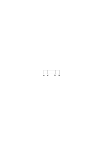

Streifen A'B' ist weiß”, wenn in dem Streifen AB eben die Striche A' und B' gezogen waren. Unendlich ist nur die Möglichkeit dieser Art Figuren.

### [7\[4\]](https://cdn.wittgensteinnachlass.com/2000px/webp/Ms-109/7.webp),[8\[1\]](https://cdn.wittgensteinnachlass.com/2000px/webp/Ms-109/8.webp)

Was aus einem Gedanken folgt muß in ihm mitgedacht werden. Denn an einem Gedanken ist nichts dran was wir noch nicht wissen während wir ihn denken. Er ist keine Maschine deren Untersuchung Ungeahntes zu Tage fördern kann oder eine Maschine die etwas leisten kann was man ihr zuerst nicht ansieht. D.h. er wirkt eben _logisch_ überhaupt nicht als Maschine. Als Gedanke liegt in ihm nicht mehr, als hineingelegt wurde. Als Maschine d.h. kausal wäre ihm alles zuzutrauen, logisch ergibt er nur was wir mit ihm gemeint haben. Wenn ich sage das Viereck

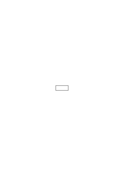

ist ganz weiß so denke ich nicht an zehn kleinere in ihm enthaltene Rechtecke die weiß sind & an _alle_ in ihm enthaltenen Rechtecke oder Flecken kann ich nicht denken weil das (ein) Unsinn ist. Ebenso denke ich im Satz „er ist im Zimmer” nicht an 100 mögliche Stellungen die er einnehmen kann & gewiß nicht an _alle_.

### [8\[2\]](https://cdn.wittgensteinnachlass.com/2000px/webp/Ms-109/8.webp)

(Eine unendliche Wirklichkeit wäre eine Kardinalzahl die alle anderen Kardinalzahlen übersteigt.)

### [8\[3\]](https://cdn.wittgensteinnachlass.com/2000px/webp/Ms-109/8.webp),[9\[1\]](https://cdn.wittgensteinnachlass.com/2000px/webp/Ms-109/9.webp)

Ein Gedanke aus dem unendlich viele andere folgen ist ein Gedanke der mit unendlich vielen anderen unverträglich wäre. Warum aber soll ein Gedanke nicht seinem Wesen nach mit unendlich vielen anderen unverträglich sein, d.h. daß sich nach einer Regel ad inf. Sätze bilden ließen die ihrem Wesen nach mit jenem ersten unverträglich wären. – Jener Gedanke müßte also geradezu zum Inhalt haben daß alle nach einer bestimmten Regel ad inf. gebildeten Sätze wahr sind. Aber wie soll er das denken? Denn er kann sich dann nur auf die Regel beziehen da er ihre Erzeugnisse nicht in extenso betrachten kann & dadurch ist wieder die Unendlichkeit dahin.

### [9\[2\]](https://cdn.wittgensteinnachlass.com/2000px/webp/Ms-109/9.webp)

„Wo immer, innerhalb dieses Kreises, Du die Scheibe triffst, hast Du gewonnen”.

„Ich denke, Du wirst die Scheibe irgendwo innerhalb dieses Kreises treffen.” Was den ersten Satz betrifft, könnte man fragen: woher weißt Du das? Hast Du _alle_ möglichen Orte ausprobiert? Und die Antwort müßte dann lauten: das ist ja kein Satz, sondern eine allgemeine _Festsetzung_. „Wo immer Du die Scheibe treffen wirst, wirst Du zufrieden sein”. „Woher weißt Du das?” – Das ist eine Hypothese.

### [9\[3\]](https://cdn.wittgensteinnachlass.com/2000px/webp/Ms-109/9.webp),[10\[1\]](https://cdn.wittgensteinnachlass.com/2000px/webp/Ms-109/10.webp)

15.08.1930

Auf den ersten Blick gibt es zwei Arten der Deduktion: in der einen ist in der Prämisse von dem die Rede wovon die Konklusion handelt in der anderen nicht. Von der ersten Art ist der Schluß von p ∙ q auf q. Von der anderen der Schluß: der ganze Stab ist weiß also ist auch das mittlere Drittel weiß. In dieser Konklusion wird von Grenzen gesprochen von denen im ersten Satz nicht die Rede war. (Das ist verdächtig.) Oder wenn ich sage: „Wo immer in diesem Kreise Du die Scheibe triffst, wirst Du den Preis gewinnen” & dann „Du hast sie hier getroffen also …” so war dieser Ort im ersten Satz nicht vorausgesehen. Das heißt das Loch in diesem Ort hat zu der Scheibe wie ich sie früher gesehen habe eine bestimmte interne Beziehung & darin besteht es daß das Loch hier unter die vorausgesehene allgemeine Möglichkeit fällt. Aber es selbst war nicht vorausgesehen, es kam in dem ersten Bild nicht vor. Oder mußte doch nicht darin vorkommen. Denn selbst angenommen ich hätte dabei an 1000 bestimmte Möglichkeiten gedacht so hätte es zum mindesten passieren können daß die ausgelassen wurde die später eintraf. Und wäre das Voraussehen dieser Möglichkeit wesentlich gewesen, so hätte die Prämisse durch das Übersehen dieser einen Möglichkeit den unrechten Sinn bekommen & die Konklusion würde nun nicht aus ihr folgen. Andererseits wird dem Satz „Wohin immer Du in diesem Kreis triffst …” nichts hinzugefügt wenn man sagt: „Wohin immer Du in diesem Kreis triffst & wenn Du insbesondere den schwarzen

Punkt triffst …”. Aber, war der schwarze Punkt schon da als man den ersten Satz aussprach so war er natürlich mitgemeint; war er aber nicht da so hat sich durch ihn eben der Sinn des Satzes geändert.

### [11\[1\]](https://cdn.wittgensteinnachlass.com/2000px/webp/Ms-109/11.webp)

„Dieses Rechteck ist weiß, also ist auch die hinein verlegte Figur weiß.”

### [11\[2\]](https://cdn.wittgensteinnachlass.com/2000px/webp/Ms-109/11.webp)

Das folgt nicht denn vielleicht ist sie dann innen schwarz, wenn wir sie hineinverlegen.

### [11\[3\]](https://cdn.wittgensteinnachlass.com/2000px/webp/Ms-109/11.webp)

„Das Ganze ist weiß, folglich ist auch ein Teil der durch eine solche Grenzlinie charakteristisch ist, weiß.” „Das Ganze war weiß, also _war_ auch jener Teil davon weiß, auch wenn ich ihn damals nicht (durch eine Linie) begrenzt darin wahrgenommen habe.” Hatte denn das Rechteck keine rechte & linke Hälfte ehe ich sie als solche wahrgenommen hatte? Und doch muß man das sagen.

### [11\[4\]](https://cdn.wittgensteinnachlass.com/2000px/webp/Ms-109/11.webp)

Der Schluß heißt auch nicht so: „Wo immer auf der Scheibe der Schuß hintrifft, hast Du den Preis gewonnen. Du hast auf der Scheibe **da**hin getroffen also hast Du den Preis gewonnen”. Denn wo ist dieses _da_? Wie ist es außer dem Schuß bezeichnet, etwa durch einen Kreis? Und war der auch schon früher auf der Scheibe. Wenn nicht so hat die Scheibe sich ja verändert, wenn aber ja, dann war jener Kreis ohnehin ausdrücklich als eine Möglichkeit des Treffens vorgesehen. Es muß vielmehr heißen „Du hast die Scheibe getroffen also …”.

### [11\[5\]](https://cdn.wittgensteinnachlass.com/2000px/webp/Ms-109/11.webp),[12\[1\]](https://cdn.wittgensteinnachlass.com/2000px/webp/Ms-109/12.webp)

Hat es nun nicht einen Sinn zu sagen: Aber wenn man die Scheibe trifft, muß man sie _irgendwo_ treffen.? Oder auch: Wo immer er die Fläche trifft so wird es keine Überraschung sein so daß man sagen würde „das habe ich mir nicht erwartet, ich habe gar nicht gewußt daß es diesen Ort gibt”. Das heißt aber doch es kann keine geometrische Überraschung sein.

### [12\[2\]](https://cdn.wittgensteinnachlass.com/2000px/webp/Ms-109/12.webp)

Wenn p aus q folgt, so muß p in q vorausgesehen gewesen sein.

### [12\[3\]](https://cdn.wittgensteinnachlass.com/2000px/webp/Ms-109/12.webp)

Zu einem früheren Satz ist zu sagen daß das _da_ nicht notwendig durch ein Zeichen auf der Scheibe angegeben sein muß & daß es auf jeden Fall ein Näher dem Mittelpunkt oder dem Rand, ein Rechts oben oder Links unten gibt. Wie immer die Scheibe getroffen wird stets _muß_ so eine Beschreibung möglich sein. (Aber von diesen Beschreibungen gibt es auch nicht „unendlich viele”.)

### [12\[4\]](https://cdn.wittgensteinnachlass.com/2000px/webp/Ms-109/12.webp),[13\[1\]](https://cdn.wittgensteinnachlass.com/2000px/webp/Ms-109/13.webp)

16.08.1930

Wenn man ein Beispiel braucht dafür daß unendlich viele Sätze aus _einem_ folgen so wäre vielleicht das einfachste das, daß aus „a ist rot” die Negation aller Sätze folgt die _a_ eine andere Farbe zuschreiben. Diese negativen Sätze werden gewiß in dem einen nicht mitgedacht. Man könnte natürlich sagen: wir unterscheiden doch nicht unendlich viele Farbtöne; aber die Frage ist: hat die Anzahl der Farbtöne die wir unterscheiden überhaupt etwas mit der Komplexität jenes ersten Satzes zu tun; ist er mehr oder weniger kompliziert jenachdem wir mehr oder weniger Farbtöne unterscheiden? Müßte man nun nicht so sagen: Ein Satz folgt erst aus ihm, wenn er da ist. Erst wenn wir 10 Sätze gebildet haben die aus dem ersten folgen, folgen sie aus ihm.

### [13\[2\]](https://cdn.wittgensteinnachlass.com/2000px/webp/Ms-109/13.webp)

Statt Farben hätte ich Längen nehmen können. Aus „ich bin 170 cm hoch” folgt „ich bin nicht 171 cm hoch”, nicht 172, etc. ad inf.

### [13\[3\]](https://cdn.wittgensteinnachlass.com/2000px/webp/Ms-109/13.webp)

Was soll es aber dann heißen zu sagen: wenn ein Satz aus dem anderen folgt, so muß der erste im zweiten mitgedacht sein, da es doch nicht nötig ist im Satz „ich bin 170 cm hoch” auch nur einen einzigen der anderen mitzudenken. Hier muß ein Unsinn vorliegen.

### [13\[4\]](https://cdn.wittgensteinnachlass.com/2000px/webp/Ms-109/13.webp)

Ich möchte sagen ein Satz folgt erst dann aus dem anderen wenn er mit ihm konfrontiert wird. Jenes u.s.w. ad inf. bezieht sich nur auf die Möglichkeit der Bildung von Sätzen die aus dem ersten folgen, ergibt aber keine Zahl solcher Sätze.

### [13\[5\]](https://cdn.wittgensteinnachlass.com/2000px/webp/Ms-109/13.webp),[14\[1\]](https://cdn.wittgensteinnachlass.com/2000px/webp/Ms-109/14.webp)

Könnte ich also einfach sagen: Unendlich viele Sätze folgen _darum_ nicht aus einem Satz weil es unmöglich ist unendlich viele Sätze hinzuschreiben (d.h. ein Unsinn ist, das zu sagen.)

### [14\[2\]](https://cdn.wittgensteinnachlass.com/2000px/webp/Ms-109/14.webp)

Eines ist wohl klar, es kann der Satz der aus p folgt der Grammatik des p nicht fremd sein. Der Satz könnte nicht überrascht sein daß der andere aus ihm folgt.

### [14\[3\]](https://cdn.wittgensteinnachlass.com/2000px/webp/Ms-109/14.webp)

„Wenn aus <math class="stacked" display="inline"><msub><mi>F</mi><mn>1</mn></msub><mo>(</mo><mtext>a)</mtext></math> [ = a hat die Farbe <math class="stacked" display="inline"><msub><mi>F</mi><mn>1</mn></msub></math>] folgt <math class="stacked" display="inline"><mtext>~</mtext><msub><mi>F</mi><mn>2</mn></msub><mo>(</mo><mtext>a)</mtext></math> so mußte in der Grammatik des ersten Satzes auch schon die Möglichkeit des zweiten vorausgesehen sein (wie könnten wir denn sonst <math class="stacked" display="inline"><msub><mi>F</mi><mn>1</mn></msub></math> & <math class="stacked" display="inline"><msub><mi>F</mi><mn>2</mn></msub></math> Farben nennen).”

### [14\[4\]](https://cdn.wittgensteinnachlass.com/2000px/webp/Ms-109/14.webp)

„Wenn der zweite Satz dem ersten sozusagen unerwartet gekommen wäre so könnte er nie aus ihm folgen.”

### [14\[5\]](https://cdn.wittgensteinnachlass.com/2000px/webp/Ms-109/14.webp)

„Der erste Satz muß den anderen als seine Folge erkennen. Oder vielmehr es muß dann beide _eine_ Grammatik vereinigen & diese muß dieselbe sein wie ehe dem Schließen.”

### [14\[6\]](https://cdn.wittgensteinnachlass.com/2000px/webp/Ms-109/14.webp),[15\[1\]](https://cdn.wittgensteinnachlass.com/2000px/webp/Ms-109/15.webp)

(Es ist sehr schwer hier keine Märchen von den symbolischen Vorgängen zu erzählen, wie an anderer Stelle keine Märchen über die psychologischen Vorgänge⋎ denn alles ist ja einfach & allbekannt (und nichts Neues zu erfinden). Das ist ja eigentlich das Unerhörte an der Logik daß ihre außerordentliche Schwierigkeit darauf beruht daß nichts zu konstruieren sondern alles schon da & bekannt ist.)

### [15\[2\]](https://cdn.wittgensteinnachlass.com/2000px/webp/Ms-109/15.webp)

„Welchen Satz p nicht als seine Folge erkennt, der ist nicht seine Folge.”

### [15\[3\]](https://cdn.wittgensteinnachlass.com/2000px/webp/Ms-109/15.webp)

D.h. aus der kompletten Grammatik des Satzes p muß auch hervorgehen welcher Satz aus ihm folgt, & würde nun ein neuer Satz gefunden der aus p folgt so würde damit der Sinn von p geändert werden.

### [15\[4\]](https://cdn.wittgensteinnachlass.com/2000px/webp/Ms-109/15.webp)

Wenn z.B. aus „a ist grün” folgt „a ist nicht rot” so muß „a ist grün” den zweiten Satz als seinen Verwandten anerkennen.

### [15\[5\]](https://cdn.wittgensteinnachlass.com/2000px/webp/Ms-109/15.webp)

Die Grammatik ist nicht unendlich kompliziert, weil sie die endlose Bildung von Zahlzeichen zuläßt.

### [15\[6\]](https://cdn.wittgensteinnachlass.com/2000px/webp/Ms-109/15.webp),[16\[1\]](https://cdn.wittgensteinnachlass.com/2000px/webp/Ms-109/16.webp)

Ist es nicht einfach so: Aus der Grammatik des Satzes – & aus ihr allein, muß es folgen ob ein Satz aus ihm folgt. Keine Einsicht in einen neuen Sinn kann das ergeben; – sondern nur die Einsicht in den alten. – Es ist nicht möglich einen neuen Satz zu finden der aus jenem folgt, den man nicht hätte bilden können (wenn auch ohne zu wissen ob er wahr oder falsch sei) als jener gebildet wurde. Entdeckte man einen neuen Sinn & folgte dieser aus jenem ersten Satz so hätte dieser Satz damit seinen Sinn geändert.

### [16\[2\]](https://cdn.wittgensteinnachlass.com/2000px/webp/Ms-109/16.webp)

Man überlege, welchen Grund hat man ein neues Phänomen _Farbe_ zu nennen wenn es sich nicht in unser bisheriges Farbenschema einfügt.

### [16\[3\]](https://cdn.wittgensteinnachlass.com/2000px/webp/Ms-109/16.webp)

Das was man ursprünglich Satz nennt ist eine gewisse Leier die von verschiedenster Art sein kann, d.h. die verschiedenartigsten Funktionen erfüllen kann. 2 + 2 = 4, Ich sehe einen gelben Fleck in einer blauen Umgebung, Vor mir liegt ein Buch auf dem Tisch, Jedes Ding ist sich selbst gleich, etc., gelten als Sätze.

### [16\[4\]](https://cdn.wittgensteinnachlass.com/2000px/webp/Ms-109/16.webp)

Hypothesen nenne ich solche Sätze für welche es gilt daß man sich immer irren kann.

### [16\[5\]](https://cdn.wittgensteinnachlass.com/2000px/webp/Ms-109/16.webp)

17.08.1930

Was in der Philosophie sagbar ist muß immer hausbackener werden; & das einzige nicht Hausbackene ist die Grenze der Sprache.

### [16\[6\]](https://cdn.wittgensteinnachlass.com/2000px/webp/Ms-109/16.webp),[17\[1\]](https://cdn.wittgensteinnachlass.com/2000px/webp/Ms-109/17.webp)

Denn immer wieder denkt man: ja wie soll ich dieses Letzte aussprechen?

Aber das Letzte soll ich eben nicht aussprechen, sondern das ist die Mauer an die wir stoßen.

### [17\[2\]](https://cdn.wittgensteinnachlass.com/2000px/webp/Ms-109/17.webp)

Ich sage jemandem: es liegt hier ein gelbes Buch vor mir. Aber das kann ich nicht bestimmt wissen. Was ich dagegen bestimmt wissen kann, kann ich das mitteilen? – Sind nicht die Sätze im engeren Sinne _nur_ Schnitte von Hypothesen & selbständig existenzunfähig?

### [17\[3\]](https://cdn.wittgensteinnachlass.com/2000px/webp/Ms-109/17.webp)

Ich möchte sagen: die alte Logik hat viel mehr Konvention & Physik in sich als man geglaubt hat. Wenn das Substantiv der Name eines _Körpers_ ist das Verbum etwa zur Bezeichnung einer Bewegung, das Adjektiv der Eigenschaft eines Körpers dient, dann sieht man wohl wie voraussetzungsvoll diese Logik ist & kann annehmen daß diese ursprünglichen Voraussetzungen auch noch tiefer in die Anwendung dieser Worte, in die Logik der Sätze reicht.

### [17\[4\]](https://cdn.wittgensteinnachlass.com/2000px/webp/Ms-109/17.webp),[18\[1\]](https://cdn.wittgensteinnachlass.com/2000px/webp/Ms-109/18.webp)

Das Kreuzworträtsel wäre die beste Illustration dafür, wie man eine Annahme aus einem Grunde halten kann, der seinerseits wieder einen Grund hat, der einen Grund hat etc., etc., daß es unmöglich wird eine einzelne Entscheidung zu rechtfertigen bis alles beisammen ist. Denn ich glaube daß hier ein a steht weil es ein Wort mit 3 Buchstaben gibt das … lautet; aber dieses halte ich für das richtige weil am Ende ein r steht & es ein Wort mit 5 Buchstaben gibt dessen 4ter ein r ist; aber dieses Wort wähle ich wieder, weil u.s.w..

### [18\[2\]](https://cdn.wittgensteinnachlass.com/2000px/webp/Ms-109/18.webp)

Angenommen ein Kreuzworträtsel hätte zwei Lösungen die allen Bedingungen entsprächen, wäre davon eine _die_ Lösung? Das hat eine Bedeutung in der Theorie der Grammatik.

### [18\[3\]](https://cdn.wittgensteinnachlass.com/2000px/webp/Ms-109/18.webp)

Man könnte glauben daß es günstig ist in der Logik recht „bestimmte” Sätze zu Beispielen zu nehmen. In Wahrheit aber muß ein Satz wie „dieser Anzug ist mir etwas zu groß” oder „ich sehe meinem Vater ähnlich” für uns ebensogut taugen. – Beispiele taugen für uns nur dann nicht, wenn sie einer anderen _Art_ von Sätzen angehören, als der die wir betrachten wollen. Vague Sätze würden uns also dann nicht taugen wenn wir sie für eine eigene logische Art von Sätzen hielten & sie augenblicklich nicht betrachten wollten. (Aber dann müßten wir sie ja doch einmal betrachten.)

### [19\[1\]](https://cdn.wittgensteinnachlass.com/2000px/webp/Ms-109/19.webp)

Die Aristotelische Logik ist ein Spiel, das sich auf Sätze anwenden _läßt_.

### [19\[2\]](https://cdn.wittgensteinnachlass.com/2000px/webp/Ms-109/19.webp)

Alles was man verlangen kann, ist, das Spiel _komplett_ kennen zu lernen. (Die Anwendung ist dann zu tun nicht zu sagen.)

### [19\[3\]](https://cdn.wittgensteinnachlass.com/2000px/webp/Ms-109/19.webp)

Immer ist hier das Gleichnis gut von der Laterna magica mit dem Film & den vereinzelten Bildern auf der Leinwand; oder von dem Körper der sich dreht & blitzartig hie & da beleuchtet wird. Denn das ist ja eigentlich gar kein Gleichnis sondern es verhält sich in der Logik der Hypothesen wirklich so.

### [19\[4\]](https://cdn.wittgensteinnachlass.com/2000px/webp/Ms-109/19.webp)

18.08.1930

Es werden immer Fassetten der Hypothese verifiziert.

### [19\[5\]](https://cdn.wittgensteinnachlass.com/2000px/webp/Ms-109/19.webp)

Die Erlebnisse d.h. die primären Ereignisse sind mit der Hypothese _vereinbar_. (The hypothesis _accounts_ for them.) Man könnte etwa sagen: die Hypothese _erklärt_ sie.

### [19\[6\]](https://cdn.wittgensteinnachlass.com/2000px/webp/Ms-109/19.webp),[20\[1\]](https://cdn.wittgensteinnachlass.com/2000px/webp/Ms-109/20.webp)

Ist es nun nicht etwa so daß _das_ was die Hypothese erklärt selbst nur wieder durch eine Hypothese ausdrückbar ist. D.h. natürlich, gibt es überhaupt primäre Sätze; die als endgültig verifizierbar sind & nicht die Fassetten einer Hypothese sind? (Das ist etwa als würde man fragen „gibt es Flächen die nicht Oberflächen von Körpern sind?”.)

### [20\[2\]](https://cdn.wittgensteinnachlass.com/2000px/webp/Ms-109/20.webp)

Am ehesten ließe sich das im Verlauf eines Experiments sehen, wenn man die unmittelbaren Erfahrungen beschreiben wollte, die im Experiment den Ausschlag geben. Denn es kommt doch am Ende darauf hinaus daß man einen Zeiger auf einem Teilstrich sieht, oder einen Lichtpunkt in einem Fernrohr, etc. Gibt es nun nicht Sätze die dieses rein „Subjektive” (was natürlich nicht _subjektiv_ ist) beschreiben, – jene Haken woran alles endlich angehängt ist? Aber können solche Sätze zur Mitteilung dienen? Wären es nicht Sätze die dem Sprechenden als primäre, dem Angesprochenen aber als Hypothesen gälten?

### [20\[3\]](https://cdn.wittgensteinnachlass.com/2000px/webp/Ms-109/20.webp)

19.08.1930

Es kann jedenfalls kein Unterschied sein zwischen einer Hypothese als Ausdruck einer unmittelbaren Erfahrung gebraucht & einem Satz im engeren Sinne.

### [20\[4\]](https://cdn.wittgensteinnachlass.com/2000px/webp/Ms-109/20.webp),[21\[1\]](https://cdn.wittgensteinnachlass.com/2000px/webp/Ms-109/21.webp)

Merkwürdig ist dann aber die Bedeutung der Wahrheitsfunktionen angewandt auf Hypothesen statt primären Sätzen: Der Unterschied entspräche, natürlich, dem der Bedeutungen des Wortes Wahr (& Falsch) in jenen beiden Fällen.

### [21\[2\]](https://cdn.wittgensteinnachlass.com/2000px/webp/Ms-109/21.webp)

20.08.1930

Es gibt jedenfalls einen Unterschied zwischen Sätzen von denen man sagt es ist wahrscheinlich der Fall & solchen von denen man es nicht mit Sinn sagen kann.

### [21\[3\]](https://cdn.wittgensteinnachlass.com/2000px/webp/Ms-109/21.webp)

Es ist ein Unterschied zwischen einem Satz wie „hier liegt eine Kugel vor mir” & „es schaut so aus als läge eine Kugel vor mir”. – Das zeigt sich auch so: man kann sagen „es scheint eine Kugel vor mir zu liegen” aber es ist sinnlos: „es scheint eine Kugel hier liegen zu scheinen”. Wie man auch sagen kann „hier liegt wahrscheinlich eine Kugel” aber nicht „wahrscheinlich scheint mir hier eine Kugel zu liegen”. Man würde in so einem Fall sagen „ob es _scheint_, mußt Du doch wissen”.

### [21\[4\]](https://cdn.wittgensteinnachlass.com/2000px/webp/Ms-109/21.webp),[22\[1\]](https://cdn.wittgensteinnachlass.com/2000px/webp/Ms-109/22.webp),[23\[1\]](https://cdn.wittgensteinnachlass.com/2000px/webp/Ms-109/23.webp)

Man möchte etwa auch sagen: „Ich weiß schon _etwas_, nämlich, was ich _sehe_; ich weiß nur nicht, ob es eine Kugel ist”. Hat es denn aber einen Sinn zu sagen „ich weiß, was ich sehe”? – Angenommen ich sehe einen gelben Kreis, könnte man dann nicht sagen: Wenn das nicht schon wieder eine Hypothese ist (da es ja einen physiologischen Vorgang behauptet) dann hat es überhaupt keinen Sinn. Denn damit es ein Satz ist, müssen Kreis, gelb, etc. schon vorgefaßte Begriffe sein. – Man könnte fragen: wie kann ich wissen, daß das Gesichtsbild mit diesen Begriffen übereinstimmt – es sei denn daß ich jetzt diese Worte als Beschreibung dieses Gesichtsbilds bestimme, dann ist freilich kein Wunder daß sie stimmen. Aber ist es denn willkürlich ob ich ja oder nein antworte wenn mich jemand fragt: „siehst Du dort ein Licht”? Andrerseits ist es doch klar daß ich apodiktisch sagen kann „nein, ich sehe keins” oder „ja, ich sehe eins”. Es wäre doch offenbar unsinnig zu sagen „Wahrscheinlich sehe ich ein Licht”. (Es sei denn daß es sich wieder um ein physikalisches Faktum handelt wonach aber nicht gefragt wurde.) Man würde doch antworten: „Du mußt doch _wissen_ ob Du ein Licht siehst oder nicht”. („Du mußt doch wissen, ob es Dir so _scheint_.”) Und nun ist es wohl auch Unsinn zu sagen, die Übereinstimmung (oder Nicht-Übereinstimmung) zwischen Satz & Welt sei willkürlich durch eine Zuordnung geschaffen. Denn, wie ist diese Zuordnung auszudrücken? Sie besteht darin, daß der Satz „p” sagt, es sei _gerade das_ der Fall. Aber wie ist dieses „gerade das” ausgedrückt? Wenn durch einen andern Satz so gewinnen wir nichts dabei; wenn aber durch die Realität, dann muß diese schon in bestimmter Weise – artikuliert – aufgefaßt sein. Das heißt: man kann nicht auf einen Satz & auf eine Realität deuten & sagen: „_das_ entspricht _dem_”. Sondern dem Satz entspricht nur wieder das schon artikulierte.

### [23\[2\]](https://cdn.wittgensteinnachlass.com/2000px/webp/Ms-109/23.webp),[24\[1\]](https://cdn.wittgensteinnachlass.com/2000px/webp/Ms-109/24.webp),[25\[1\]](https://cdn.wittgensteinnachlass.com/2000px/webp/Ms-109/25.webp)

Was hat es nun mit der allgemeinen Regel auf sich die das Wort „Gemischtwarenhandlung” auf einem Haus zum _Satz_ macht? Das ist klar: wir verstehen dieses Wort wenn es in einem (gewöhnlichen) Satz vorkommt; wenn ich es dagegen allein auf einen Zettel auf meinem Schreibtisch schreibe, so sagt es nichts, & man könnte etwa wenn man es so sieht, fragen: nun, was ist's damit?

Es ist dann eben ein einzelnes Rad das wir zwar als Teil eines Mechanismus kennen, das aber hier, außerhalb jedes Verbandes, keinen Zweck erfüllt. Jenes Wort auf dem Haus aber erfüllt den Zweck einer Mitteilung. In welchem Verbande steht es nun? – Man könnte sagen das Charakteristische eines Zeichens ist, daß es sich von vornherein muß lernen lassen, wie der Eisenbahner die Eisenbahnsignale lernt. Was er da lernt ist eben die „allgemeine Regel”. Ich will also sagen: Er lernt dabei nicht nur Wörter einer Sprache, sondern auch eine Grammatik. Wäre z.B. „halt” eines dieser Wörter, so genügte es allein gar nicht denn es bedarf einer Regel zu wissen _welcher_ Zug nun halten soll. Das Schiffssignal „Stop” ist auch ein einwörtiger Satz; wo ist hier der _Satzzusammenhang_? Oder soll man so sagen: Das Wort „Stop” hat nur im Schiff Sinn nicht wenn ich es allein auf irgend einen Zettel schreibe; Wenn andrerseits das Wort an seinem Ort durch kein anderes zu ersetzen wäre, so wäre es wiederum sinnlos.

Das Schild „Bass & Ale” zeichnet mir _gewisse_ Häuser aus vor anderen welche es nicht tragen. Und selbst wenn es auf allen Häusern angebracht wäre als Zeichen daß tatsächlich überall diese Getränke zu haben sind so müßte es doch denkbar d.h. in unserer Grammatik vorgesehen sein, daß ein Haus es nicht trüge. Denn gehörte es als selbstverständlich zu einem Haus dann könnte es nichts ausdrücken.

### [25\[2\]](https://cdn.wittgensteinnachlass.com/2000px/webp/Ms-109/25.webp)

Hätte das Wort außer allem Zusammenhang Sinn, dann genügte es daß es im Wörterbuch steht; d.h. es brauchte sonst nirgends erwähnt zu werden. Es würde so zu sagen genügen daß man es ein für allemal weiß. (Man könnte dann sagen „wozu steht das Wort da? Ich weiß es ja ohnehin schon.”) – Dieses Wort sollte aber wahr & falsch sein können, dann nur ein für allemal das eine oder das andere; es müßte dann sozusagen von der Natur des Satzes 2 + 2 = 4 sein.

### [25\[3\]](https://cdn.wittgensteinnachlass.com/2000px/webp/Ms-109/25.webp)

21.08.1930

In dem, was den Satz mit der gegebenen Tatsache verbindet ist nichts Hypothetisches.

### [25\[4\]](https://cdn.wittgensteinnachlass.com/2000px/webp/Ms-109/25.webp),[26\[1\]](https://cdn.wittgensteinnachlass.com/2000px/webp/Ms-109/26.webp)

Es ist doch klar daß eine Hypothese von der Wirklichkeit – ich meine von der unmittelbaren Erfahrung – einmal mit ja, einmal mit nein beantwortet wird (wobei freilich das „ja” & „nein” hier nur Bestätigung & Fehler der Bestätigung ausdrücken) & daß man dieser Bejahung & Verneinung Ausdruck verleihen kann.

### [26\[2\]](https://cdn.wittgensteinnachlass.com/2000px/webp/Ms-109/26.webp)

Die Hypothese wird, mit _der_ Fassette an die Realität angelegt, zum Satz.

### [26\[3\]](https://cdn.wittgensteinnachlass.com/2000px/webp/Ms-109/26.webp)

Wie ist es mit den Sätzen die in Dichtungen vorkommen. Hier kann doch gewiß von einer Verifikation nicht geredet werden & doch haben diese Sätze Sinn. Sie verhalten sich zu den Sätzen für die es Verifikation gibt wie ein Genre-Bild zu einem Portrait. Und dieses Gleichnis dürfte wirklich die Sache richtig darstellen.

### [26\[4\]](https://cdn.wittgensteinnachlass.com/2000px/webp/Ms-109/26.webp)

Entsprechen diese Sätze etwa dem was Frege und Meinong Annahmen nannten?

### [26\[5\]](https://cdn.wittgensteinnachlass.com/2000px/webp/Ms-109/26.webp)

Denn in jenen erdichteten Sätzen haben doch die Wörter Bedeutung wie in den anderen, rot, blau, rechts, links, Kopf, Fuß, bedeuten dasselbe wie sonst. D.h. es ist eine Verbindung mit der Wirklichkeit vorhanden. In _einem_ Sinne wenigstens; – aber es fehlt die Verbindung mit dem Jetzt & Hier. (Erinnern wir uns aber, wie die Bedeutung eines Wortes fixiert ist.)

### [26\[6\]](https://cdn.wittgensteinnachlass.com/2000px/webp/Ms-109/26.webp),[27\[1\]](https://cdn.wittgensteinnachlass.com/2000px/webp/Ms-109/27.webp)

Wenn ich ein Bild anschaue so sagt es mir etwas auch wenn ich keinen Augenblick glaube (mir einbilde) die Menschen seien wirklich oder es habe wirkliche Menschen gegeben wovon dies ein verkleinertes Bild sei. „Es sagt mir etwas” kann aber hier nur heißen es bringt eine gewisse Einstellung in mir hervor.

### [27\[2\]](https://cdn.wittgensteinnachlass.com/2000px/webp/Ms-109/27.webp)

Meine Stellung gegen das Bild ist auch keine hypothetische so daß ich mir etwa sagte „Wenn es solche Menschen gäbe, dann …”.

### [27\[3\]](https://cdn.wittgensteinnachlass.com/2000px/webp/Ms-109/27.webp)

Und ist es nicht unsinnig zu sagen „das Wort ‚Rot’ bedeutet in der Dichtung was es auch sonst bedeutet”? Was bedeutet es denn? Darf man denn sagen „es bedeutet dieses” & auf einen roten Gegenstand zeigen? Ist hier nicht nur eine Anwendung dieses Wortes zu sehen. Läßt sich denn das vergleichen mit dem Fall wenn jemand sagt „das ist der Ludwig”. Und doch kann ich jemandem der wüßte daß „rot” eine Farbe bezeichnet aber nicht wüßte welche das Wort auf jene Art erklären. „‚rot’ bedeutet hier was es sonst bedeutet” könnte nur heißen: es bedeutet dieselbe _Farbe_. Denn ehe man nicht die Wortart des Wortes „rot” versteht, versteht man auch nicht die Erklärung „_das_ ist rot”.

### [28\[1\]](https://cdn.wittgensteinnachlass.com/2000px/webp/Ms-109/28.webp)

Ist der Satz ein Bild so kann ihn nicht erst die Meinung dazu machen. Die Meinung macht ihn nur zum Porträt.

### [VB](/w-vb/#ms-109-28.2+29.1+30.1) [28\[2\]](https://cdn.wittgensteinnachlass.com/2000px/webp/Ms-109/28.webp),[29\[1\]](https://cdn.wittgensteinnachlass.com/2000px/webp/Ms-109/29.webp),[30\[1\]](https://cdn.wittgensteinnachlass.com/2000px/webp/Ms-109/30.webp) {#282291301}

22.08.1930

Engelmann sagte mir, wenn er zu Hause in seiner Lade voll von seinen Manuskripten krame so kämen sie ihm so wunderschön vor daß er denke sie wären es wert den anderen Menschen gegeben zu werden. (Das sei auch der Fall wenn er Briefe seiner verstorbenen Verwandten durchsehe.) Wenn er sich aber eine Auswahl davon herausgegeben denkt so verliere die Sache jeden Reiz & Wert & werde unmöglich. Ich sagte wir hätten hier einen Fall ähnlich folgendem: Es könnte nichts merkwürdiger sein als einen Menschen bei irgend einer ganz einfachen alltäglichen Tätigkeit wenn er sich unbeobachtet glaubt zu sehen. Denken wir uns ein Theater, der Vorhang ginge auf & wir sähen einen Menschen allein in seinem Zimmer auf & ab gehen, sich eine Zigarette anzünden, sich niedersetzen u.s.f. so daß wir plötzlich von außen einen Menschen sähen wie man sich sonst nie sehen kann; wenn wir quasi ein Kapitel einer Biographie mit eigenen Augen sähen, – das müßte unheimlich & wunderbar zugleich sein. Wunderbarer als irgend etwas was ein Dichter auf der Bühne spielen oder sprechen lassen könnte. Wir würden das Leben selbst sehen. – Aber das sehen wir ja alle Tage & es macht uns nicht den mindesten Eindruck! Ja, aber wir sehen es nicht in _der_ Perspektive. – So wenn E. seine Schriften ansieht & sie herrlich findet (die er doch einzeln nicht veröffentlichen möchte) so sieht er sein Leben, als ein Kunstwerk Gottes, & als das ist es allerdings betrachtenswert, jedes Leben & Alles. Doch kann nur der Künstler das Einzelne so darstellen daß es uns als Kunstwerk erscheint; jene Manuskripte verlieren _mit Recht_ ihren Wert wenn man sie einzeln & überhaupt wenn man sie un**voreingenommen**, das heißt ohne schon vorher begeistert zu sein, betrachtet. Das Kunstwerk zwingt uns – sozusagen – zu der richtigen Perspektive, ohne die Kunst aber ist der Gegenstand ein Stück Natur wie jedes andre & daß _wir_ es durch die Begeisterung erheben können das berechtigt niemand es uns vorzusetzen. (Ich muß immer an eine jener faden Naturaufnahmen denken die der, der sie aufgenommen interessant findet weil er dort selbst war, etwas erlebt hat, der dritte aber mit berechtigter Kälte betrachtet; wenn es überhaupt gerechtfertigt ist ein Ding mit Kälte zu betrachten. Nun scheint mir aber, gibt es außer der Arbeit des Künstlers noch eine andere, die Welt sub specie äterni einzufangen. Es ist – glaube ich – der Weg des Gedankens der gleichsam über die Welt hinfliegt & sie so läßt wie sie ist, – sie von oben im Fluge betrachtend.

### [30\[2\]](https://cdn.wittgensteinnachlass.com/2000px/webp/Ms-109/30.webp)

Daß die Sprache ein Bild hervorbringt zeigt sich schon darin, daß Bilder – im gewöhnlichen Sinn des Wortes – sich ihr natürlich einfügen. Die Illustration in einem Buch ist dem Buch nichts Fremdes, sondern gesellt sich ihm zu wie ein verwandter Behelf einem anderen, – wie etwa eine Reibahle dem Bohrer.

### [30\[3\]](https://cdn.wittgensteinnachlass.com/2000px/webp/Ms-109/30.webp)

Wenn einen die Häßlichkeit eines Menschen abstößt so kann sie einen im Bild (im gemalten) gleichfalls abstoßen, aber auch in der Beschreibung, durch Worte.

### [30\[4\]](https://cdn.wittgensteinnachlass.com/2000px/webp/Ms-109/30.webp),[31\[1\]](https://cdn.wittgensteinnachlass.com/2000px/webp/Ms-109/31.webp)

Wenn einer fragt was bedeutet das Wort „rot” & ich antworte „dieses” & zeige auf einen roten Gegenstand so ist klar daß das Wort auch dann seine Bedeutung gehabt hätte, wenn der rote Gegenstand nicht bei der Hand gewesen (wäre), ja wenn nichts Rotes auffindbar gewesen wäre. Er gehörte also nicht zu _jenem_ Zeichen & wenn auf ihn zur Erklärung gedeutet wird so hilft er, ein neues Zeichen bilden. Der rote Gegenstand tritt mit dem Wort zu einem _Zeichen_ zusammen.

### [31\[2\]](https://cdn.wittgensteinnachlass.com/2000px/webp/Ms-109/31.webp)

Das ist selbstverständlich: wir können Namen von Personen erdichten aber nicht Namen, etwa, von Farben.

### [31\[3\]](https://cdn.wittgensteinnachlass.com/2000px/webp/Ms-109/31.webp)

Wir haben in der Dichtung bloß das Spiel der Gedanken & Vorstellungen. Soweit die Wirklichkeit in dieses Spiel eingreift greift sie als Zeichen ein.

### [31\[4\]](https://cdn.wittgensteinnachlass.com/2000px/webp/Ms-109/31.webp)

Die Übereinstimmung der Gedanken als solche mit der Wirklichkeit ist nicht auszudrücken. Nimmt man das Wort Übereinstimmung im Sinne der … eines wahren Satzes mit der Wirklichkeit dann stimmt die Sache nicht weil es auch falsche Gedanken gibt. Ein anderer Sinn aber ist durch die Sprache nicht wiederzugeben. Wie alles Metaphysische ist die (prästabilierte) Harmonie zwischen Gedanken & Wirklichkeit durch die Grenze der Sprache uns gegeben.

### [32\[1\]](https://cdn.wittgensteinnachlass.com/2000px/webp/Ms-109/32.webp)

Das Alltäglichste, der Satz, ist Objekt unserer Untersuchung. (Der Satz, wie ihn jeder spricht.)

### [32\[2\]](https://cdn.wittgensteinnachlass.com/2000px/webp/Ms-109/32.webp)

Der Satz „Ich will nach Wien fahren” hat Sinn auch wenn Wien ohne daß ich davon erfahren hätte von einem Erdbeben zerstört worden sein sollte. Der Satz „ich freue mich den N.N. zu sehen” hat Sinn auch wenn dieser Mensch nicht mehr leben sollte, ja selbst wenn er nie gelebt hätte. Hier handelt es sich um Hypothesen.

### [32\[3\]](https://cdn.wittgensteinnachlass.com/2000px/webp/Ms-109/32.webp)

Die Grammatik konstituiert einen Mechanismus; denn indem sie gewisse Verbindungen erlaubt & andere verbietet, tut sie dasselbe was die Lager, Führungen (& überhaupt alle Teile) des Mechanismus tun: sie lassen bestimmte Bewegungen zu & bestimmen so die Bewegung (der Teile).

### [32\[4\]](https://cdn.wittgensteinnachlass.com/2000px/webp/Ms-109/32.webp)

Der Satz im engeren Sinne verhält sich zur Hypothese wie eine Projektion eines Körpers zum Körper.

### [32\[5\]](https://cdn.wittgensteinnachlass.com/2000px/webp/Ms-109/32.webp),[33\[1\]](https://cdn.wittgensteinnachlass.com/2000px/webp/Ms-109/33.webp)

Ob der Körper den ich sehe eine Kugel ist kann zweifelhaft sein, aber daß er von hier etwa eine Kugel zu sein scheint, kann nicht zweifelhaft sein. – Der Mechanismus der Hypothese würde nicht funktionieren, wenn der Schein auch noch zweifelhaft wäre; wenn also auch nicht eine Facette der Hypothese unzweifelhaft verifiziert würde. Wenn es hier Zweifel gäbe, was könnte den Zweifel heben?

Wenn auch diese Verbindung locker wäre so gäbe es auch nicht Bestätigung einer Hypothese, die Hypothese hinge dann gänzlich in der Luft & wäre zwecklos (& damit sinnlos).

### [33\[2\]](https://cdn.wittgensteinnachlass.com/2000px/webp/Ms-109/33.webp)

23.08.1930

Ich habe noch immer nicht die Maschinerie der Hypothese & des Satzes erfaßt.

### [33\[3\]](https://cdn.wittgensteinnachlass.com/2000px/webp/Ms-109/33.webp)

Wenn ich von Etwas sage „das fühlt sich wie eine Schneide an” so bilde ich damit unmittelbar mein Gefühl ab.

### [33\[4\]](https://cdn.wittgensteinnachlass.com/2000px/webp/Ms-109/33.webp),[34\[1\]](https://cdn.wittgensteinnachlass.com/2000px/webp/Ms-109/34.webp)

Es ist eine ungemein wichtige Sache daß ich mich bei dem Gebrauch der Sprache nicht erinnere wie ich sie gelernt habe. Ich sage „hier sehe ich eine schwarze Kugel”. Ich weiß nicht wie ich „schwarz” & „Kugel” gelernt habe. Meine Anwendung der Wörter ist unabhängig von diesem Erlernen. Es ist so als hätte ich die Wörter selbst geprägt. Und nun kommt wieder die alte Frage: Wenn die Grammatik die von den Wörtern handelt für ihre Bedeutung wesentlich ist, muß ich die grammatikalischen Regeln die von einem Wort handeln da alle im Kopf haben, wenn es für mich was bedeuten soll? Oder ist es hier wie im Mechanismus: Das Rad das still steht oder auch sich dreht das Rad in einer Lage weiß nicht welche Bewegung ihm noch erlaubt ist, der Kolben weiß nicht welches Gesetz seiner Bewegung vorgeschrieben ist; & doch wirkt das Rad & der Kolben nur durch jene Gebundenheit.

### [34\[2\]](https://cdn.wittgensteinnachlass.com/2000px/webp/Ms-109/34.webp)

(Die Wahl der Worte ist so wichtig weil es gilt die Physiognomie der Sache genau zu treffen weil nur der genau gerichtete Gedanke auf die richtige Bahn führen kann. Der Wagen muß haargenau auf die Schiene gesetzt werden, damit er richtig weiterrollen kann.)

### [34\[3\]](https://cdn.wittgensteinnachlass.com/2000px/webp/Ms-109/34.webp)

Soll ich also sagen: Die grammatischen Regeln wirken in der Zeit? (Wie jene Führung)

### [34\[4\]](https://cdn.wittgensteinnachlass.com/2000px/webp/Ms-109/34.webp),[35\[1\]](https://cdn.wittgensteinnachlass.com/2000px/webp/Ms-109/35.webp)

Also: Das Wort „Kugel” wirkt nur durch die Art seiner Anwendung. Und es wäre die seltsame Frage denkbar „wie kann ich denn dann gleich wissen was ich mit ‚Kugel’ meine, ich kann doch nicht die ganze Art der Anwendung auf einmal im Kopf haben?”.

### [35\[2\]](https://cdn.wittgensteinnachlass.com/2000px/webp/Ms-109/35.webp)

Und wenn mich jemand fragt „siehst Du dort eine schwarze Kugel”, so muß ich doch diese Anwendung des Wortes vor Augen haben um ihn verstehen & ihm antworten zu können.

### [35\[3\]](https://cdn.wittgensteinnachlass.com/2000px/webp/Ms-109/35.webp)

Nun ist es seltsam, daß ich das Gefühl habe, als trüge ich die grammatischen Regeln auf irgend eine Weise mit mir herum wenn ich das Wort gebrauche. Wie ich nicht überrascht bin daß sich das Rad nur drehen kann & ich seine Bewegungsfreiheit, gleichsam, mit einem Blicke übersehe, wie ich eine Bewegungsfreiheit kenne. So, möchte ich sagen, weiß ich in irgend einem Sinn schon daß hinter der Halbkugel die ich sehe, eine zweite gleich große ist & nicht etwa eine Spitze, ich weiß daß die Kugel von der Seite gesehen auch als Kreis erscheint etc. etc.. Oder kann es mir doch durch das was ich in mir herumtrage ableiten.

### [35\[4\]](https://cdn.wittgensteinnachlass.com/2000px/webp/Ms-109/35.webp),[36\[1\]](https://cdn.wittgensteinnachlass.com/2000px/webp/Ms-109/36.webp)

Das Schließen in schwierigeren Fällen geht tatsächlich so vor sich, indem ich die Regeln anschauen die Prämissen nachschlagen muß & so den sprachlichen Apparat wie eine Maschine gebrauche.

### [36\[2\]](https://cdn.wittgensteinnachlass.com/2000px/webp/Ms-109/36.webp)

Und ist es nicht ähnlich mit dem Schachspiel: in irgend einem Sinne kann man sagen, ich wisse die Regeln des Schachspiels (habe sie im Kopf) die ganze Zeit während ich spiele. Aber ist dieses „sie im Kopf haben” nicht wirklich nur eine Hypothese. Habe ich sie nicht nur in so fern im Kopf als ich sie in jedem besonderen Falle anwende? – Gewiß, dies Wissen ist nur das hypothetische Reservoir woraus das wirklich gesehene Wasser fließt.

### [36\[3\]](https://cdn.wittgensteinnachlass.com/2000px/webp/Ms-109/36.webp)

Das Problem was unmittelbar mit unserem in Beziehung steht ist: Was heißt es „ich _kann_ Schach spielen”? Ist es nicht auf genau derselben Stufe wie „ich kann dieses Buch aufheben”? oder „ich kann lesen”?

### [36\[4\]](https://cdn.wittgensteinnachlass.com/2000px/webp/Ms-109/36.webp)

„Ich weiß, wie ein Bauer ziehen darf” „Ich weiß, wie das Wort ‚Kugel’ gebraucht werden darf.”

### [36\[5\]](https://cdn.wittgensteinnachlass.com/2000px/webp/Ms-109/36.webp),[37\[1\]](https://cdn.wittgensteinnachlass.com/2000px/webp/Ms-109/37.webp)

Wenn ich sage „ich kann dieses Gewicht aufheben” so kann man antworten „das wird sich zeigen, wenn Du es versuchst” & geht es dann nicht so kann man sagen „siehst Du, Du konntest es nicht”, & ich kann darauf _nicht_ antworten „doch, ich konnte es als ich es sagte nur als es zum Aufheben kam, konnte ich es nicht”. D.h.: dieses Können ist nicht ein Erlebnis: ob man es kann _wird sich zeigen_. Anders ist es wenn ich sage „ich verstehe diesen Befehl” dies ist, oder scheint ein Erlebnis zu sein. „Ich muß wissen ob ich ihn (jetzt) verstehe” aber nicht: Ich muß wissen ob ich das Gewicht jetzt heben kann. – – – Wie ist es nun in dieser Beziehung mit dem Satz „ich kann Schachspielen”? Ist das etwas was sich zeigen wird oder kann man sagen „als ich es behauptete, konnte ich Schach spielen nur jetzt kann ich es nicht”. (Ich sehe jetzt von dem Fall ab wo man zur Zeit als man es behauptete eine bestimmte Regel im Kopf hatte die man dann vergaß. Denn (im allgemeinen) wenn ich sage ich kann Schachspielen, denkt man in diesem Augenblick an gar keine der Regeln.) Ist nicht das was mich rechtfertigt nur, daß ich mich erinnere früher Schach gespielt zu haben? Und etwa daß ich wenn aufgefordert zur Probe die Zugregeln der Figuren im Geiste durchfliegen kann.

### [37\[2\]](https://cdn.wittgensteinnachlass.com/2000px/webp/Ms-109/37.webp),[38\[1\]](https://cdn.wittgensteinnachlass.com/2000px/webp/Ms-109/38.webp)

Ist es nicht auch so für den Gebrauch des Wortes „Kugel”? Ich gebrauche das Wort instinktiv. Aufgefordert aber Rechenschaft zu geben ob ich es verstehe rufe ich mir gleichsam zur Probe gewisse Vorstellungen hervor.

### [38\[2\]](https://cdn.wittgensteinnachlass.com/2000px/webp/Ms-109/38.webp)

„Siehst Du ein Reh dort?” „Oh ja, deutlich!” Welch ein komplizierter Gegenstand, wieviele Ansichten sind möglich & doch verstehe ich augenblicklich. Oder kann doch augenblicklich auf die Frage reagieren. Denn ich habe die Sprache _instinktiv_ gebraucht. Als Instrument, wie den Stock mit dem ich etwas beiseite schlage was mich am Gehen hindern will.

### [38\[3\]](https://cdn.wittgensteinnachlass.com/2000px/webp/Ms-109/38.webp)

Was ist aber das Geschäft der logischen Untersuchung, ist es die Wirkungsweise des Nervenmechanismus zu untersuchen, wie, auf welchen Bahnen, der Reflex zustande kommt? Nein. Dann bleibt ihr aber nichts übrig als der Sprache eigene Gesetze zu erforschen denn die sind das Spiegelbild – auf welchem Weg immer – von Gesetzen der Welt.

### [38\[4\]](https://cdn.wittgensteinnachlass.com/2000px/webp/Ms-109/38.webp),[39\[1\]](https://cdn.wittgensteinnachlass.com/2000px/webp/Ms-109/39.webp)

Es droht in dieser Untersuchung immer der psychologische Abgrund. (Den man aber nur dann überwinden kann, wenn man ihn klar ins Auge gefaßt hat.) (Es kann nicht darauf ankommen ob die Sprache instinktiv oder halb destinktiv gebraucht wird. Wir sind hier im Sumpf der graduellen Unterschiede nicht auf dem festen Grund der Logik.)

### [39\[2\]](https://cdn.wittgensteinnachlass.com/2000px/webp/Ms-109/39.webp)

(Wenn ich die Logik paraphrasiere bin ich freilich auch in der Gefahr wie die Katze um den heißen Brei zu gehen.)

### [39\[3\]](https://cdn.wittgensteinnachlass.com/2000px/webp/Ms-109/39.webp)

Könnte man sagen: Es kommt nicht darauf an wieviele Regeln der Anwendung er beim Gebrauch eines Wortes im Kopfe habe, sondern welche Regeln er dir gefragt angibt.

### [39\[4\]](https://cdn.wittgensteinnachlass.com/2000px/webp/Ms-109/39.webp),[40\[1\]](https://cdn.wittgensteinnachlass.com/2000px/webp/Ms-109/40.webp)

Wenn ich sage „sieh dort ist eine Kugel” oder „dort ist ein Kegel” so kann die Ansicht (ein Kreis) auf beides passen & wenn ich sage „ja ich sehe es”, so unterscheide ich doch zwischen den beiden Hypothesen. Wie ich im Schachspiel zwischen einem Bauern & dem König unterscheide auch wenn der gegenwärtige Zug einer ist den beide machen könnten & wenn selbst eine Königsfigur als Bauer fungierte. Das Wort „Kugel” ist mir _bekannt_ & steht in mir für etwas, das heißt, es bringt mich in eine gewisse Stellung zu ihm (wie ein Magnet eine Nadel in seine Richtung bringt).

### [40\[2\]](https://cdn.wittgensteinnachlass.com/2000px/webp/Ms-109/40.webp)

„Siehst Du dort eine Kugel?” „Nein – ach ja, aber man sieht nur ein Stück, das Übrige ist bedeckt”.

### [40\[3\]](https://cdn.wittgensteinnachlass.com/2000px/webp/Ms-109/40.webp)

Dieses „Übersehen der Wirkungsweise” eines Rades ist es nicht darin vorhanden, wenn wir mit einem Wort eine Vorstellung verbinden? Haftet der Vorstellung die etwa das Wort rot in uns erweckt auch jene Unbestimmtheit an, die erst, quasi, geschriebenen Regeln bedarf um ihr einen bestimmten Freiheitsgrad zu geben?

### [40\[4\]](https://cdn.wittgensteinnachlass.com/2000px/webp/Ms-109/40.webp)

Jedenfalls aber machen geschriebene Regeln die Sprache nicht weniger unmittelbar, denn sonst könnten sich geschriebene Regeln – die langen Schlußketten der Mathematik – nicht ohne Bruch in unsere Sprache einfügen.

### [40\[5\]](https://cdn.wittgensteinnachlass.com/2000px/webp/Ms-109/40.webp)

24.08.1930

Das ist klar: die Grammatik ist das Leben des Satzzeichens.

### [40\[6\]](https://cdn.wittgensteinnachlass.com/2000px/webp/Ms-109/40.webp),[41\[1\]](https://cdn.wittgensteinnachlass.com/2000px/webp/Ms-109/41.webp)

Ist es nun nicht so: Würde man die Dinge sich selbst bezeichnen lassen so wären unsinnige Zeichenverbindungen nicht erst zu verbieten sondern unmöglich.

Aber wenn die Vorstellungen Zeichen sind so geschieht eben dasselbe: Etwas Dunkleres als Schwarz kann ich mir nicht vorstellen & keine klingende Farbe etc. – Ich meine die grammatischen Regeln wirken sich erst mit der Zeit aus wenn das Wort in verschiedenen Verbindungen gebraucht wird aber die Grammatik der Vorstellung ist sozusagen zwangsläufig. Aber das ist auch eine schiefe Darstellung. Wenn ich sage „unsinnige Zeichenverbindungen wären nicht zu verbieten”, so meine ich es wäre unmöglich sie zu verbieten weil sie sich nicht beschreiben lassen.

### [41\[2\]](https://cdn.wittgensteinnachlass.com/2000px/webp/Ms-109/41.webp)

Wie weiß ich was der Begriff Kugel alles beinhaltet, – wenn ich das Wort „Kugel” gebrauche, & doch wissen muß was ich damit meine? Da geschieht doch folgendes: für manche der Konsequenzen muß ich mich an die Geometrie (also Grammatik) wenden & andere sind in der Vorstellung (schon) klar.

### [42\[1\]](https://cdn.wittgensteinnachlass.com/2000px/webp/Ms-109/42.webp)

Man könnte fragen: Wie mach ich's denn nur ein Wort immer richtig anzuwenden, schau ich immer in der Grammatik nach? Nein, daß ich etwas meine – was ich meine, hindert mich Unsinn zu sagen; – aber was meine ich denn? Ich sage: ich rede vom Teilen eines Apfels aber nicht vom Teilen der Farbe Rot weil ich beim Teilen eines Apfels mir etwas denken kann, etwas vorstellen, etwas wollen kann beim Ausdruck „Teilen einer Farbe” nicht. Und ist es etwa so daß man bei diesen Worten nur noch keine Wirkung auf andere Menschen beobachtet hat?! – Und auch das ist nicht so unsinnig, es muß aber der Satz immer ein Bild der Wirkung sein um die es sich hier handelt.

### [42\[2\]](https://cdn.wittgensteinnachlass.com/2000px/webp/Ms-109/42.webp)

Wenn das Reden ein Spiel mit Worten ist so läßt sich der Unsinn so leicht spielen wie der Sinn. Aber es geht eben noch etwas anderes (dabei) vor sich; so daß, wenn ich sage „rot ist in die Hälfte geteilt” ich das Spiel eigentlich gar nicht spiele.

### [42\[3\]](https://cdn.wittgensteinnachlass.com/2000px/webp/Ms-109/42.webp),[43\[1\]](https://cdn.wittgensteinnachlass.com/2000px/webp/Ms-109/43.webp)

„Woher weiß ich daß ich Rot nicht teilen kann?” – Die Frage selbst heißt nichts. Ich möchte sagen: Man muß mit der Unterscheidung von Sinn & Unsinn _anfangen_. Vor ihr ist nichts möglich. Denn sonst kann ich überhaupt nicht reden.)

### [43\[2\]](https://cdn.wittgensteinnachlass.com/2000px/webp/Ms-109/43.webp)

[Ich bin jetzt in einer ungeheuren Verwirrung.]

### [43\[3\]](https://cdn.wittgensteinnachlass.com/2000px/webp/Ms-109/43.webp),[44\[1\]](https://cdn.wittgensteinnachlass.com/2000px/webp/Ms-109/44.webp)

Was ich sage kommt eigentlich immer darauf hinaus daß Sprechen & Denken nicht einerlei sind. Andererseits aber was ich hier unter denken verstehe nicht wesentlich ein menschlicher (tierischer) Vorgang ist weil der mich hier nicht interessiert. – Und doch muß der Denkprozeß autonom sein denn er muß alles _in sich enthalten_ was den Gedanken sinnvoll macht. Was _dazugehört_ daß der Satz sinnvoll werde, was zum Satz gehört damit das der Fall ist muß alles innerhalb des Gedankens liegen. Wenn ich sage „ich möchte hier einen roten Kreis sehen” so kann, ob das Sinn hat, nicht davon abhängen ob es einen roten Gegenstand irgendwo gibt & überhaupt kann der Sinn eines Satzes nicht von einer außerhalb des Gedankens liegenden Existenz abhängen.

Damit wäre der Sinn sofort problematisch geworden; & was problematisch ist kann nicht der Sinn sein.

### [44\[2\]](https://cdn.wittgensteinnachlass.com/2000px/webp/Ms-109/44.webp)

Ich will sagen: denk nicht daß das Denken im Kopf vor sich gehen muß (wie die Verdauung im Magen). Das Denken ist für mich nicht ein menschlicher sondern ein sachlicher Prozeß.

### [44\[3\]](https://cdn.wittgensteinnachlass.com/2000px/webp/Ms-109/44.webp)

Nein, was problematisch ist, ist nicht der Gedanke (das ist etwas anderes, nicht der Gedanke.)

### [44\[4\]](https://cdn.wittgensteinnachlass.com/2000px/webp/Ms-109/44.webp)

Aus der Gedankenwelt komme ich in Gedanken nie heraus.

### [44\[5\]](https://cdn.wittgensteinnachlass.com/2000px/webp/Ms-109/44.webp)

Wenn man jemand Naiven fragen würde, was ein Gedanke ist so würde er sagen es ist eine Kette von Vorstellungen von Dingen, & Worten.

### [44\[6\]](https://cdn.wittgensteinnachlass.com/2000px/webp/Ms-109/44.webp)

25.08.1930

Immer in dem Versuch die Sprachgrenze zu finden, bis zu ihr zu reden & sie so zu zeigen, stolpere ich über sie, in den Unsinn hinein.

### [44\[7\]](https://cdn.wittgensteinnachlass.com/2000px/webp/Ms-109/44.webp),[45\[1\]](https://cdn.wittgensteinnachlass.com/2000px/webp/Ms-109/45.webp)

Wodurch unterscheidet sich die Wirkungsweise des Wortes ‚Kugel’ von der des Wortes ‚Kegel’, doch nicht durch die Verschiedenheit ihrer Klang- oder Schriftbilder, doch nur durch die grammatischen Regeln die von ihnen gelten oder durch die verschiedenen Vorstellungen die mit ihnen verknüpft sind.

### [45\[2\]](https://cdn.wittgensteinnachlass.com/2000px/webp/Ms-109/45.webp)

(Fügt sich nicht auch eine Rechnung unseren Gedanken ein?)

### [45\[3\]](https://cdn.wittgensteinnachlass.com/2000px/webp/Ms-109/45.webp)

Wie unterscheidet sich Sinn & Unsinn?

### [45\[4\]](https://cdn.wittgensteinnachlass.com/2000px/webp/Ms-109/45.webp)

Da scheint es als könnte man so etwas sagen wie: Die Wortsprache läßt unsinnige Ausdrücke zu, die Sprache der Vorstellung aber nicht unsinnige Vorstellungen. (Natürlich kann das, so wie es da steht, nichts heißen.) Kann ich nicht antworten: oh doch, ich kann mir unsinnige Vorstellungen machen nämlich solche, mit denen ich nichts denke.

### [45\[5\]](https://cdn.wittgensteinnachlass.com/2000px/webp/Ms-109/45.webp),[46\[1\]](https://cdn.wittgensteinnachlass.com/2000px/webp/Ms-109/46.webp)

Wenn ich mich entschlösse (in meinen Gedanken) „Abrakadabra” statt „rot” zu sagen, wie würde es sich zeigen daß „Abrakadabra” an dem Platz des „rot” steht. Wodurch ist der Platz eines Wortes bestimmt? Angenommen etwa ich wollte auf einmal alle Wörter meiner Sprache durch andere ersetzen wie könnte _ich_ wissen welches Wort an der Stelle welches' steht. Sind es da die Vorstellungen die bleiben & den Platz des Wortes fixieren. So daß an einer Vorstellung quasi ein Haken ist & hänge ich an _den_ ein Wort so ist ihm damit der Platz angewiesen? Ich kann es nicht glauben. Ich kann mir nicht denken daß den Vorstellungen im Denken ein anderer Platz zukommt als den Worten.

### [46\[2\]](https://cdn.wittgensteinnachlass.com/2000px/webp/Ms-109/46.webp)

Die Naive Auffassung würde vielleicht sagen: dieses Wort füllt denselben Platz aus wie jenes frühere wenn ich mit ihm dasselbe meine wie mit dem ersten. Aber damit ich etwas meinen kann, muß es da sein & ist es da so gehört es zum Gedanken (denn es ist eine Bedingung der Existenz dieses Gedankens).

### [46\[3\]](https://cdn.wittgensteinnachlass.com/2000px/webp/Ms-109/46.webp)

Man kann das Wort „existieren” so auffassen daß „rot existiert” bedeutet es gibt ein Ding das rot ist (dies ist ein wirklicher Satz oder doch eine Hypothese) oder man faßt ihn so auf daß damit gemeint ist, der Satz „a ist rot” hat Sinn.

### [46\[4\]](https://cdn.wittgensteinnachlass.com/2000px/webp/Ms-109/46.webp)

Die Frage „habe ich diese Farbe schon einmal gesehn” ist unsinnig wenn ich in einem primären Sinne frage, & nicht das Gedächtnis als _einzigen_ Richter anerkenne. (Das gehört unmittelbar hierher.)

### [46\[5\]](https://cdn.wittgensteinnachlass.com/2000px/webp/Ms-109/46.webp),[47\[1\]](https://cdn.wittgensteinnachlass.com/2000px/webp/Ms-109/47.webp)

Es hängt damit zusammen: Wenn ich mir eine Farbe zu sehen erwarte & es kommt eine & ich sage das ist die, die ich erwartet habe: Läßt sich fragen „woher weißt Du das, die Farbe war ja nicht da wie Du sie erwartet hast”? Im primären Sinn ist das Wiedererkennen nicht einfach das Kriterium der Gleichheit sondern der Ursprung des Begriffs der Gleichheit. Und zwar sowohl das Wiedererkennen der Erinnerung wie das des Erwartens.

### [47\[2\]](https://cdn.wittgensteinnachlass.com/2000px/webp/Ms-109/47.webp)

(In gewissem Sinne verlieren alle Dinge ihre Farbe wenn sie in der Sprache eingefangen werden.)

### [47\[3\]](https://cdn.wittgensteinnachlass.com/2000px/webp/Ms-109/47.webp)

Das Wiedererkennen einer Erwartung in den Tatsachen ist keine Kontrolle der Ähnlichkeit oder Gleichheit sondern das Gleichsein.

### [47\[4\]](https://cdn.wittgensteinnachlass.com/2000px/webp/Ms-109/47.webp)

Wie verträgt sich das aber mit der gesonderten Betrachtung von Erwartung & Ereignis (Gedanken & Tatsachen)?

### [47\[5\]](https://cdn.wittgensteinnachlass.com/2000px/webp/Ms-109/47.webp)

„Das ist die Farbe die ich mir erwartet habe”: da gibt es keine Täuschung. Es gibt keine Täuschung, weil es auch keine _Möglichkeit_ der Entdeckung einer Täuschung gibt.

### [48\[1\]](https://cdn.wittgensteinnachlass.com/2000px/webp/Ms-109/48.webp)

Kann man (denn) die Erwartung mit der eingetroffenen Tatsache _vergleichen_? Man sagt ja die Tatsachen stimmen mit der Erwartung überein oder nicht überein; aber dieses Übereinstimmen bezieht sich nicht auf Eigenschaften der Erwartung (des Vorganges der Erwartung) & Eigenschaften des Ereignisses, vielmehr drückt sich die Übereinstimmung durch eine Übereinstimmung der Zeichen aus. Ich nenne die Farbe eines Flecks „rot” wenn sie die Erwartung er werde rot sein befriedigt. Wir sind hier an einer Grenze der Funktion der Sprache. Dort quasi wo die Sprache die Realität abstrahiert.

### [48\[2\]](https://cdn.wittgensteinnachlass.com/2000px/webp/Ms-109/48.webp)

Es ist aber nicht so als wenn ich sagte: „ich habe Lust auf einen Apfel, was immer also diese Lust beruhigen wird werde ich einen Apfel nennen”. (also etwa auch ein Schlafmittel)

### [48\[3\]](https://cdn.wittgensteinnachlass.com/2000px/webp/Ms-109/48.webp)

Der Zusammenhang zwischen Wiedererkennen & Namengebung erzeugt jene Funktion der Sprache & ihre Grenzen.

### [48\[4\]](https://cdn.wittgensteinnachlass.com/2000px/webp/Ms-109/48.webp),[49\[1\]](https://cdn.wittgensteinnachlass.com/2000px/webp/Ms-109/49.webp)

26.08.1930

Ich sehe ein Buch & sage, es ist rot so drücke ich in dieser Namengebung das Wiedererkennen in der Sprache aus, es ist also nicht durch einen Satz auszudrücken.

### [49\[2\]](https://cdn.wittgensteinnachlass.com/2000px/webp/Ms-109/49.webp)

Es ist irgendwo ein Mißverständnis über die Funktion der Sprache das es uns so schwer macht hier richtig zu sehen. Es dürfte das Mißverständnis sein welches uns dazu führt zu glauben daß die Bedeutung des Wortes „rot” erklärt ist wenn wir auf einen roten Gegenstand zeigen & sagen „das ist rot”. (oder auch „‚rot’ bedeutet _das_”)

### [49\[3\]](https://cdn.wittgensteinnachlass.com/2000px/webp/Ms-109/49.webp)

Es ist falsch den Gedanken ein Bild einer Realität zu nennen denn so ist es als vergliche man den Gedanken mit einer Realität auf ihre Ähnlichkeit. Während eine Ähnlichkeit überhaupt keine Rolle spielt wohl aber eine _Identität_, die eben durch die Art der Namengebung angezeigt wird.

### [49\[4\]](https://cdn.wittgensteinnachlass.com/2000px/webp/Ms-109/49.webp)

Was ich erwarte ist nicht dem ähnlich was die Erwartung erfüllt sondern es _ist das_ was die Erwartung erfüllt.

### [49\[5\]](https://cdn.wittgensteinnachlass.com/2000px/webp/Ms-109/49.webp),[50\[1\]](https://cdn.wittgensteinnachlass.com/2000px/webp/Ms-109/50.webp)

Ich erwarte nicht etwas Ähnliches wie das was dann eintritt sondern dasselbe was eintritt. So heißt es in der Sprache: ich erwarte es & _es_ geschieht.

### [50\[2\]](https://cdn.wittgensteinnachlass.com/2000px/webp/Ms-109/50.webp)

Es hat auch einen Sinn zu sagen es sei nicht das geschehen was ich erwartet habe sondern etwas Ähnliches im Gegensatze aber zu dem Fall wo _das_ geschieht was erwartet wurde. Und das zeigt (zu) _welchem_ Mißbrauch der Sprache wir hier verleitet werden.

### [50\[3\]](https://cdn.wittgensteinnachlass.com/2000px/webp/Ms-109/50.webp)

27.08.1930

Es ist jenes Mißverständnis – glaube ich – das ich oben erwähnt habe.

### [50\[4\]](https://cdn.wittgensteinnachlass.com/2000px/webp/Ms-109/50.webp)

Es ist hier ein ähnliches Mißdeuten der Funktion eines Satzes wie im Falle der Sätze „ich habe Zahnschmerzen” & „er hat Zahnschmerzen”.

### [50\[5\]](https://cdn.wittgensteinnachlass.com/2000px/webp/Ms-109/50.webp),[51\[1\]](https://cdn.wittgensteinnachlass.com/2000px/webp/Ms-109/51.webp)

Wenn man nun sagt: Das Rot das Du Dir vorstellst ist doch gewiß nicht dasselbe (die selbe Sache) wie das, was Du wirklich vor Dir siehst, – wie kannst Du dann sagen ‚das ist das selbe was ich mir vorgestellt habe’? – Zeigt denn das nicht nur, daß was ich ‚dieses Rot’ nenne eben das ist, was meiner Vorstellung & der Wirklichkeit gemein ist? Denn das Vorstellen des Rot ist natürlich anders als das Sehen des Rot aber darum heißt ja auch das eine „vorstellen eines roten Flecks” & das andere „sehen eines roten Flecks”. In beiden (verschiedenen) Ausdrücken aber kommt dasselbe Wort „Rot” vor & so muß dieses Wort nur das bezeichnen was _beiden_ Vorgängen zukommt. Ist es denn nicht dasselbe in den Sätzen „hier ist ein roter Fleck” & „hier ist kein roter Fleck”. In beiden kommt das Wort „rot” vor, _also_ kann dieses Wort nicht das Vorhandensein von etwas Rotem bedeuten. – (Der Satz „das ist rot” ist nur _eine_ Anwendung des Wortes „rot” gleichberechtigt mit allen anderen, wie mit dem Satz „das ist nicht rot”.) (Das Wort „rot” hat eben – wie jedes Wort – nur im Satzzusammenhang eine Funktion. Und ist das Mißverständnis das, in dem Wort allein schon den Sinn eines Satzes zu sehen glauben?)

### [51\[2\]](https://cdn.wittgensteinnachlass.com/2000px/webp/Ms-109/51.webp)

[Das Nachdenken über philosophische Fragen liefert sozusagen das Material, – der Einfall die Synopsis.]

### [51\[3\]](https://cdn.wittgensteinnachlass.com/2000px/webp/Ms-109/51.webp),[52\[1\]](https://cdn.wittgensteinnachlass.com/2000px/webp/Ms-109/52.webp)

Wenn man sagt, ich könne das Wort „rot” nicht sinnvoll gebrauchen wenn ich _nie_ etwas Rotes gesehen hätte so ist das Unsinn wenn es sich hier um den physischen Vorgang des Sehens handeln soll. In irgend einem Sinne könnte man sagen: das Wort „rot” hätte für mich keinen Sinn wenn ich mich nicht erinnerte schon rot gesehn zu haben; aber auch hier brauche ich mich nicht an einen bestimmten Fall zu erinnern wo ich etwas Rotes gesehen habe & so bleibt nur übrig daß ich mir Rot muß vorstellen können. Aber auch diese Vorstellung ist nicht die Halluzination eines roten Gegenstands. Wenn sie es aber wäre!! Und so bleibt – scheint es mir – nur übrig daß ich das Wort im Satz der von der Vorstellung handelt muß sinnvoll anwenden können.

### [52\[2\]](https://cdn.wittgensteinnachlass.com/2000px/webp/Ms-109/52.webp)

Der Vergleich des Satzes mit einem Maßstab kommt uns wieder näher & scheint nun ja weiter nichts darzustellen als das Verhältnis von Gedanken & Wirklichkeit das sich im Satz dadurch darstellt daß der Ausdruck der Erwartung lautet „ich erwarte daß p eintritt” & der Ausdruck der Erfüllung „p ist eingetreten”. p ist – im strengsten Sinne – das Gemeinsame zwischen Maßstab & Gemessenem.

### [52\[3\]](https://cdn.wittgensteinnachlass.com/2000px/webp/Ms-109/52.webp),[53\[1\]](https://cdn.wittgensteinnachlass.com/2000px/webp/Ms-109/53.webp)

Das Gemeinsame zwischen Gedanken & Realität, das sich sprachlich durch gemeinsame Bestandteile des Ausdrucks ausdrückt, läßt sich – eben darum – nicht durch Sätze darstellen (beschreiben). (Hier sind wir wieder an der Sprachgrenze.)

### [53\[2\]](https://cdn.wittgensteinnachlass.com/2000px/webp/Ms-109/53.webp)

Man kann nicht in der Sprache das Wesen der Sprache beschreiben.

### [53\[3\]](https://cdn.wittgensteinnachlass.com/2000px/webp/Ms-109/53.webp)

Wenn das was wir „denken” nennen in einer Art Krabbeln im Kopfe bestünde so könnten wir das natürlich mit der Sprache darstellen wie jeden anderen Vorgang; nur was am Denken unmittelbar durch die Sprache seinen Ausdruck findet, kann die Sprache nicht von außen betrachten.

### [53\[4\]](https://cdn.wittgensteinnachlass.com/2000px/webp/Ms-109/53.webp)

Wie komisch wäre es zu sagen: ein Vorgang sieht anders aus, wenn er geschieht als, wenn er nicht geschieht. Oder: „ein roter Fleck sieht anders aus wenn er da ist, als wenn er nicht da ist, aber die Sprache abstrahiert von diesem _Unterschied_, denn sie spricht von einem roten Fleck ob er da ist oder nicht”.

### [53\[5\]](https://cdn.wittgensteinnachlass.com/2000px/webp/Ms-109/53.webp),[54\[1\]](https://cdn.wittgensteinnachlass.com/2000px/webp/Ms-109/54.webp)

Wie unterscheidet sich das Rot eines Flecks den wir vor uns sehen von dem dieses Flecks wenn wir ihn uns bloß vorstellen? – Aber wie wissen wir denn daß es das Rot _dieses_ Flecks ist wenn es von dem ersten verschieden ist? – Woher wissen wir denn daß es dasselbe Rot ist wenn es verschieden ist? – Dieser Galimathias zeigt daß hier ein Mißbrauch der Sprache vorliegt.

### [54\[2\]](https://cdn.wittgensteinnachlass.com/2000px/webp/Ms-109/54.webp)

Wie ist es möglich daß ich erwarte, & das was ich erwarte kommt?! Wie konnt' ich es erwarten, da es nicht da war?

### [54\[3\]](https://cdn.wittgensteinnachlass.com/2000px/webp/Ms-109/54.webp)

Die Realität ist keine Eigenschaft die dem Erwarteten noch fehlt & die nun hinzutritt wenn es eintritt. – Sie ist auch nicht wie das Tageslicht das den Dingen erst ihre Farbe gibt wenn sie im Dunkeln schon gleichsam farblos vorhanden sind. Alle diese grammatischen Formen stellen den Gegensatz Erwartung & Erfüllung nicht dar. Die Sprache stellt ihn nur so dar, wie sie ihn immer darstellt durch den Gegensatz der Sätze „ich erwarte p” & „p ist eingetroffen”.

### [54\[4\]](https://cdn.wittgensteinnachlass.com/2000px/webp/Ms-109/54.webp),[55\[1\]](https://cdn.wittgensteinnachlass.com/2000px/webp/Ms-109/55.webp)

Wie konnte ich _es_ erwarten, & _es_ kommt dann wirklich; – als ob die Erwartung ein dunkles Transparent wäre & mit der Erfüllung das Licht dahinter angezündet würde. Aber jedes solche Gleichnis ist falsch weil es die Realität als einen beschreibbaren Zusatz zur Erwartung darstellt, was unsinnig ist. (Es ist das im Grunde derselbe Unsinn, wie der, der die vorgestellte Farbe als _matt_ im Vergleich zur wirklichen darstellt.)

### [55\[2\]](https://cdn.wittgensteinnachlass.com/2000px/webp/Ms-109/55.webp)

Du siehst also, möchte ich sagen, an diesen Beispielen, wie die Sprache tatsächlich funktioniert. – Aber auch das stellt die Sache falsch dar, denn es scheint dann daß man sich die Funktion der Sprache anders vorgestellt hat (sie sich anders vorstellen konnte) & nun resignieren muß. Aber es ist richtig zu sagen: Du siehst also, wie die Worte wirklich gebraucht werden.

### [55\[3\]](https://cdn.wittgensteinnachlass.com/2000px/webp/Ms-109/55.webp),[56\[1\]](https://cdn.wittgensteinnachlass.com/2000px/webp/Ms-109/56.webp)

Die ganze Antwort auf mein Problem liegt darin, daß ich nicht fragen kann: „woher weißt Du daß das wirklich _das_ ist, was Du Dir erwartet hast”. – Denn weder kann man es an einem Dritten (einem Gefühl der Befriedigung) erkennen. (sonst müßte zum Voraus durch eine Regel bestimmt sein daß, immer wenn dieses Gefühl eintritt …. Aber das setzt wieder die Möglichkeit einer _Annahme_ voraus.) Noch _erklärt_ es etwas wenn ich sage, ich erkenne das Erwartete wieder. Das ist nur ein hinzugesetztes Wort, das uns nicht hilft.

### [56\[2\]](https://cdn.wittgensteinnachlass.com/2000px/webp/Ms-109/56.webp)

Denn könnte man diese Frage beantworten (hätte die Frage einen Sinn), so enthielte die Antwort eine Beschreibung von Gedanken & Wirklichkeit, & der Bedingung ihrer Übereinstimmung.

### [56\[3\]](https://cdn.wittgensteinnachlass.com/2000px/webp/Ms-109/56.webp)

Man könnte das auch so auffassen: Es ist möglich den Gedanken zu beschreiben & die Tatsache die ihm entspricht; dann zeigt es sich daß der Gedanke in der Sprache (denn nur in ihr kann ich ja darstellen) p lautet & die Tatsache: daß p der Fall ist. Wenn Du willst kannst Du das als die Funktion der Sprache charakterisierend auffassen.

### [56\[4\]](https://cdn.wittgensteinnachlass.com/2000px/webp/Ms-109/56.webp)

Gibt es noch eine andre Art den Gedanken zu beschreiben, als das Zeichen zu geben wodurch gedacht wurde? Nein! – Gäbe es eine andere Art wie würden sich die beiden vertragen? Sie dürften sich ja nicht widersprechen was aber jene gibt müßte diese auch geben.

### [56\[5\]](https://cdn.wittgensteinnachlass.com/2000px/webp/Ms-109/56.webp),[57\[1\]](https://cdn.wittgensteinnachlass.com/2000px/webp/Ms-109/57.webp)

Ist zwischen der Vorstellung eines Erinnerungsbildes & der eines Erwartungsbildes ein Unterschied? Ich kann doch z.B. erwarten die Farbe zu sehen die ich mich erinnere dort & dort gesehen zu haben. Ich erinnere mich z.B. meine Schwester heute in einer bestimmten Stellung gesehn zu haben & kann mir nun vorstellen daß sie morgen wieder in dieser Stellung da & da erscheinen wird. Ändert da das Vorstellungsbild seinen Charakter wenn ich von der Erinnerung zur Erwartung übergehe? Ich glaube, offenbar nicht.

### [57\[2\]](https://cdn.wittgensteinnachlass.com/2000px/webp/Ms-109/57.webp)

Ich habe gesagt es hat keinen Sinn zu fragen „woher weißt Du daß Du Dir gerade das erwartet hast”. (Man würde da wohl antworten: „ich muß doch wissen was ich mir erwartet habe”. Könnte man aber auch so antworten: Ja, ich habe die Erwartung noch vor mir & sie & die Farbe hier sind ganz gleich?

### [57\[3\]](https://cdn.wittgensteinnachlass.com/2000px/webp/Ms-109/57.webp),[58\[1\]](https://cdn.wittgensteinnachlass.com/2000px/webp/Ms-109/58.webp)

Kann man nun sagen: Man kann in Sätzen der Wortsprache oder auch in Vorstellungen denken. Die Worte sind willkürlich dagegen die Vorstellungen nicht also bedient sich hier das Denken zweier radikal verschiedener Mittel? – Wie aber wenn das Denken gemalte Bilder benützt? Ist das nicht noch ein krasserer Fall als der der deutlichsten Vorstellung, & ist dann nicht dennoch kein Vergleich möglich, der a priori die Intention des Bildes bestimmte. Das heißt: Sei die Vorstellung so lebhaft sie wolle sie hat doch nichts vor dem willkürlichen Wortausdruck voraus da ihre Deutung durch sie (die Vorstellung) selbst nicht gegeben ist.

### [58\[2\]](https://cdn.wittgensteinnachlass.com/2000px/webp/Ms-109/58.webp)

Also muß jede Deutung angenommen werden wenn sie kommt solange sie eine Deutung d.h. eine Übersetzung ist.

### [58\[3\]](https://cdn.wittgensteinnachlass.com/2000px/webp/Ms-109/58.webp)

28.08.1930

Die Intention ist nur dadurch auszudrücken indem gezeigt wird was intendiert ist.

### [58\[4\]](https://cdn.wittgensteinnachlass.com/2000px/webp/Ms-109/58.webp)

Das Verhältnis, die Beziehung zwischen Gedanken & Wirklichkeit gibt die Sprache durch die Gemeinsamkeit des Ausdrucks wieder. Anders kann sie dies Verhältnis nicht darstellen. Wir haben hier eine Art Relativitätstheorie der Sprache (vor uns). (Und die Analogie ist keine zufällige. –)

### [58\[5\]](https://cdn.wittgensteinnachlass.com/2000px/webp/Ms-109/58.webp),[59\[1\]](https://cdn.wittgensteinnachlass.com/2000px/webp/Ms-109/59.webp)

(Ein Irrtum schadet nichts, er nützt, wenn er nur tief genug gefaßt ist.) (Drum scheue Dich nicht einen Irrtum immer wieder zu wiederholen & zu approfondieren.)

### [59\[2\]](https://cdn.wittgensteinnachlass.com/2000px/webp/Ms-109/59.webp)

Ich wollte mir die Erwartung & das Ereignis von außen betrachten um zu sehen worin ihre Ähnlichkeit, ihre Gemeinsamkeit, ihre wesentliche Beziehung liegt. Und wenn ich sie nun wirklich betrachte (& die Erwartung als Erwartung nicht nur als Vorstellung) so kann ich nur sagen daß das Ereignis die Erfüllung der Erwartung ist. Aber ich will diese Antwort nicht gelten lassen. Sehe ich die Erwartung als Bild nur, nicht als Portrait an, so ergibt die Betrachtung nur Ähnlichkeit oder Unähnlichkeit & nichts über das Wesen der Erwartung; sehe ich sie aber als Erwartung – und nicht nur als selbständige Vorstellung – an, dann ergibt die Betrachtung nur daß die Erwartung die Erwartung & das Ereignis die Antwort auf die Erwartung ist.

### [59\[3\]](https://cdn.wittgensteinnachlass.com/2000px/webp/Ms-109/59.webp)

Die Erwartung wartet bis zum Moment der Entscheidung. Dann aber berührt sie die Entscheidung. – – – Wie die Rechnung ihr Resultat.

### [59\[4\]](https://cdn.wittgensteinnachlass.com/2000px/webp/Ms-109/59.webp),[60\[1\]](https://cdn.wittgensteinnachlass.com/2000px/webp/Ms-109/60.webp)

Das Zusammenpassen der Erwartung & der Entscheidung drückt sich in der Gemeinsamkeit des Wortausdrucks aus.

### [60\[2\]](https://cdn.wittgensteinnachlass.com/2000px/webp/Ms-109/60.webp)

Das „ja” (oder „nein”) oder die Beschreibung des Ereignisses _deutet_ das Ereignis als Erfüllung der Erwartung.

### [60\[3\]](https://cdn.wittgensteinnachlass.com/2000px/webp/Ms-109/60.webp)

_In der Sprache_ berühren sich Erwartung & Ereignis.

### [60\[4\]](https://cdn.wittgensteinnachlass.com/2000px/webp/Ms-109/60.webp)

Es ist als brächte die Beschreibung am Ereignis die Striche an die sich dann mit denen der Erwartung berühren.

### [60\[5\]](https://cdn.wittgensteinnachlass.com/2000px/webp/Ms-109/60.webp),[61\[1\]](https://cdn.wittgensteinnachlass.com/2000px/webp/Ms-109/61.webp)

„Ich erwarte mir einen Schuß”; er kommt nun. Wie das hast Du Dir erwartet, war also dieser Krach irgendwie schon in Deiner Erwartung? Oder stimmt Deine Erwartung nur in anderer Beziehung mit dem Eingetretenen überein, war der Lärm nicht in Deiner Erwartung enthalten & kam nur als accidens hinzu als die Erwartung erfüllt wurde? Aber nein, wenn der Lärm nicht eingetreten wäre so wäre meine Erwartung nicht erfüllt worden, der Lärm hat sie erfüllt, er kam nicht zu der Erfüllung hinzu wie ein zweiter Gast zu dem einen den ich erwartete.

### [61\[2\]](https://cdn.wittgensteinnachlass.com/2000px/webp/Ms-109/61.webp)

War das am Ereignis was nicht auch in der Erwartung war ein accidens eine Beigabe der Schickung? Aber was war denn dann _nicht_ Beigabe, kam denn irgend etwas vom Schuß schon in meiner Erwartung vor? Und was war denn Beigabe, denn hatte ich mir nicht den ganzen Schuß erwartet?

### [61\[3\]](https://cdn.wittgensteinnachlass.com/2000px/webp/Ms-109/61.webp)

Die Auffassung der Realität als Beigabe zur Erwartung ist der Unsinn, gegen den ich mich unmittelbar wenden darf.

### [61\[4\]](https://cdn.wittgensteinnachlass.com/2000px/webp/Ms-109/61.webp)

Wäre nur das am Ereignis Erfüllung der Erwartung, was schon in der Erwartung war, dann brauchte die Erwartung keine Erfüllung mehr, dann wäre sie ihre eigene Erfüllung. (Ich dränge jetzt das Gleichnis vom Maßstab zurück, obwohl es sich immer wieder als das beste zeigt.)

### [61\[5\]](https://cdn.wittgensteinnachlass.com/2000px/webp/Ms-109/61.webp),[62\[1\]](https://cdn.wittgensteinnachlass.com/2000px/webp/Ms-109/62.webp)

Die Verwechselung die hier vor sich geht hält den Fall „ich habe _es_ erwartet und _es_ ist geschehen” für den „_es_ stand früher draußen & jetzt steht _es_ herinnen”.

### [62\[2\]](https://cdn.wittgensteinnachlass.com/2000px/webp/Ms-109/62.webp)

Wenn man sagt, daß die Erwartung durch den selben Satz ausgedrückt wird wie die Tatsache die sie erfüllt, so scheint es als beschriebe man eine Eigentümlichkeit der Sprache die man sich auch anders denken könnte. Es ist als gäbe man ein Charakteristikum unserer Sprache wie sie nun einmal ist, sich aber auch anders denken ließe. Die Betrachtung macht dann einen psychologischen Eindruck statt eines grundsätzlichen.

### [62\[3\]](https://cdn.wittgensteinnachlass.com/2000px/webp/Ms-109/62.webp)

29.08.1930

Man kann beim Wiedererkennen des Erwarteten quasi nur beschreiben was geschieht ohne einen Grund anzugeben. – Man befindet sich im Zustand der Erwartung & macht Bilder bis das Ereignis eintritt welches man als Entscheidung anerkennt. Daß man es als entscheidend anerkennt zeigt sich, indem man es durch den Satz beschreibt der die Erwartung ausdrückte. – Hier tritt die Frage auf: Welche Beziehung besteht zwischen der Beschreibung & der Tatsache? Welche Beziehung der Beschreibung stelle ich zur Tatsache her? Welche Beziehung zur Tatsache stelle ich her, wenn ich die Beschreibung mache?

### [63\[1\]](https://cdn.wittgensteinnachlass.com/2000px/webp/Ms-109/63.webp)

Ich lenke meine Worte (offenbar) nach den Tatsachen. D.h. ich porträtiere die Tatsachen.

### [63\[2\]](https://cdn.wittgensteinnachlass.com/2000px/webp/Ms-109/63.webp)

Ich schaue in ein Fernrohr & es fragt mich jemand „was siehst Du?”, und ich antworte: „ich sehe vier Sterne die ein Quadrat bilden”. – Wie kam ich zu diesen Worten? – Wie drückt sich aus, daß diese Beschreibung der Tatsache paßt?

### [63\[3\]](https://cdn.wittgensteinnachlass.com/2000px/webp/Ms-109/63.webp),[64\[1\]](https://cdn.wittgensteinnachlass.com/2000px/webp/Ms-109/64.webp)

Nehmen wir den krassesten Fall an: es sei diese Beschreibung in einem Buch – etwa einer Art Fibel – zu lesen neben einem Bild das die vier Sterne in der gleichen Anordnung zeigt wie sie im Fernrohr zu sehen sind. Könnte man sich nun einfach auf die Fibel berufen um zu zeigen daß die Beschreibung stimmt? – Es könnte dann freilich die Beschreibung in der Fibel nicht als _Beschreibung_ aufgefaßt werden, denn sonst wiederholte sich unser Problem dort, sondern die Regel müßte einfach lauten: eine Beschreibung ist richtig wenn der Wortlaut in diesem Buch neben dem entsprechenden Bild gefunden wird. – Ist nun die Schwierigkeit die, daß diese Regel selbst auf diese Art nicht darstellbar ist? Wie weiß ich daß das die richtige Beschreibung ist? Weil sie hier steht. Wie weiß ich aber, daß was hier steht die richtige Beschreibung ist? – Das ist eben Übereinkommen. Aber erinnere ich mich denn immer wenn ich Worte gebrauche an eine Abmachung?

### [64\[2\]](https://cdn.wittgensteinnachlass.com/2000px/webp/Ms-109/64.webp)

Mir hätte jene Beschreibung auch englisch einfallen können; wenn mir aber durch Zufall die chinesischen Worte dafür eingefallen wären, ohne daß ich weiß daß diese Lautverbindungen die chinesischen Zeichen für diesen Fall sind, so wären sie mir unsinnig erschienen; aber nicht mehr, sobald mich jemand soviel Chinesisch gelehrt hätte um in dieser Sprache diesen Satz bilden zu können.

### [64\[3\]](https://cdn.wittgensteinnachlass.com/2000px/webp/Ms-109/64.webp)

Aber um in dieser Sprache diesen Satz bilden zu können dazu genügt es nicht die Lautverbindung zu lernen & zu wissen daß sie in der (chinesischen Fibel) neben jenem Bild steht. Denn das befähigt mich nicht die Tatsache auf Chinesisch zu porträtieren.

### [64\[4\]](https://cdn.wittgensteinnachlass.com/2000px/webp/Ms-109/64.webp),[65\[1\]](https://cdn.wittgensteinnachlass.com/2000px/webp/Ms-109/65.webp)

Ja wenn es mir im Deutschen so geschehen würde daß ich die ganze Sprache vergäße mir aber bei einer bestimmten Gelegenheit plötzlich die Lautverbindung einfiele die man in diesem Falle gebraucht, so würde ich diese Lautverbindung in diesem Falle nicht _verstehen_.

### [65\[2\]](https://cdn.wittgensteinnachlass.com/2000px/webp/Ms-109/65.webp)

Das Porträtieren der Tatsache durch die Sprache ist in dem Ausdruck _be**-**schreiben_ vollständig wiedergegeben. Beschreiben heißt nachschreiben, nachzeichnen.

### [65\[3\]](https://cdn.wittgensteinnachlass.com/2000px/webp/Ms-109/65.webp)

Gibt es nun – im Primären – ein Kriterium dafür daß richtig nachgezeichnet wurde? (Es scheint mir nämlich, als könnte es das nicht geben.) „Wie weißt Du, daß diese Worte, das wiedergeben, was Du siehst?”. – Könnte man denn diese Worte daraufhin rechtfertigen? Und wie, durch eine Beschreibung in Worten? – Ist es nicht klar daß diese Rechtfertigung selbst eine Beschreibung des Sachverhalts in irgend einer Sprache (in der Sprache der Rechtfertigung) sein müßte? Denn sie müßte doch sagen: da sich die Sachen so & so verhalten & die Vereinbarungen so getroffen sind, so war die Beschreibung richtig.

### [65\[4\]](https://cdn.wittgensteinnachlass.com/2000px/webp/Ms-109/65.webp)

Es ist, übrigens, das Gleiche ob ich einen Sachverhalt beschreibe oder einen Wortlaut als Beschreibung deute.

### [65\[5\]](https://cdn.wittgensteinnachlass.com/2000px/webp/Ms-109/65.webp),[66\[1\]](https://cdn.wittgensteinnachlass.com/2000px/webp/Ms-109/66.webp)

Wenn sich die Beschreibung nicht rechtfertigen läßt dann kann also überhaupt von einer Rechtfertigung nicht die Rede sein. Und es führt uns irre so über die Sache zu denken daß eine Rechtfertigung denkbar erscheint. Es wäre also die Konsequenz zu ziehen: Eine Rechtfertigung schien Dir denkbar, also schaust Du die ganze Sache falsch an.

### [66\[2\]](https://cdn.wittgensteinnachlass.com/2000px/webp/Ms-109/66.webp)

Wenn man jemanden fragt „wie weißt Du daß diese Beschreibung wiedergibt was Du siehst” so könnte er etwa antworten „ich meine das mit diesen Worten”. Aber was ist das „_das_”, wenn es nicht selbst wieder artikuliert also schon Sprache ist? Also ist „ich meine das” gar keine Antwort. Die Antwort ist eine Erklärung der Bedeutung der Worte.

### [66\[3\]](https://cdn.wittgensteinnachlass.com/2000px/webp/Ms-109/66.webp),[67\[1\]](https://cdn.wittgensteinnachlass.com/2000px/webp/Ms-109/67.webp)

Wenn ich die Beschreibung nach Regeln bilde, was auch möglich ist, dann übersetze ich sie als eine Sprache aus einer anderen. Und das kann ich natürlich mit Grammatik & Wörterbuch tun & so rechtfertigen. – Aber dann ist die Übertragung von Artikuliertem in Artikuliertes. Und wenn ich sie durch Berufung auf die Grammatik & das Wörterbuch rechtfertige so tue ich nichts als eine Beziehung zwischen Wirklichkeit & Beschreibung (eine projektive Beziehung) festzustellen, von der Intention, aber, meiner Beschreibung ist hiebei keine Rede. (D.h. ich kann eben nur die Ähnlichkeit des Bildes prüfen, nichts weiter.)

### [67\[2\]](https://cdn.wittgensteinnachlass.com/2000px/webp/Ms-109/67.webp)

(Alles liegt jetzt in dem „deuten” beschlossen. Wie das Problem sein Haus wechselt!)

### [67\[3\]](https://cdn.wittgensteinnachlass.com/2000px/webp/Ms-109/67.webp)

Ich sehe diesen Sinn in diese Worte hinein. Ich sehe diesen Sachverhalt in diese Worte hinein.

### [67\[4\]](https://cdn.wittgensteinnachlass.com/2000px/webp/Ms-109/67.webp)

„Sie sagte mir daß sie um 3 Uhr von der Hochreith fortgehn wolle; sie wird den kürzesten Steig gehn, das dauert 40 Minuten, so ist sie um ca. <math class="stacked" display="inline"><mfrac><mrow><mn>3</mn></mrow><mrow><mn>4</mn></mrow></mfrac></math> 4 hier; jetzt ist es ½ 4, ich muß mich also langsam herrichten” – diese Gedankenkette führt zu irgendeiner _Anwendung_ die offenbar ihr Zweck ist. Sie ist ein Operieren mit Bildern zu einem Zweck.

### [67\[5\]](https://cdn.wittgensteinnachlass.com/2000px/webp/Ms-109/67.webp)

30.08.1930

Wenn ich einen vorliegenden Sachverhalt mit den Worten beschreibe: „hier ist ein roter Kreis” geben diese Worte die Tatsache etwa besser wieder als der Satz „hier ist ein grünes Viereck”? Gewiß nicht; aber der Klang der Worte ist es auch nicht der abbildet, nachzeichnet, sondern das Wort in seinen Beziehungen durch die Grammatik ist ein Werkzeug der Abbildung.

### [68\[1\]](https://cdn.wittgensteinnachlass.com/2000px/webp/Ms-109/68.webp)

Die Deutung des Satzes liegt in der Namengebung. Die Namengebung ist unabhängig von der _Hypothese_ daß wir – etwa in unserer Jugend diesen Namen in dieser Anwendung gelernt haben. Das Historische (das immer hypothetisch ist) kann hier nicht hineinspielen. Wir geben den Namen als gäben wir ihn zum ersten mal. – Überhaupt aber liegt in der Idee der Namengebung ein Unsinn, sie ist von der Namengebung an Personen – & etwa manche Dinge – genommen, führt aber zu Unsinn wenn man sie auf Wörter wie „rot”, „grün” etc. anwenden will. Wo ist das, was mit dem Wort „grün” bezeichnet wird? Wie schon oft gesagt wird das Wort „grün” auch dort im Satz gebraucht, wo kein grünes Ding vorhanden ist.

### [68\[2\]](https://cdn.wittgensteinnachlass.com/2000px/webp/Ms-109/68.webp)

Das Artikuliert-Sehen der Tatsache – – Der Wortausdruck verdoppelt das artikulierte Bild.

### [68\[3\]](https://cdn.wittgensteinnachlass.com/2000px/webp/Ms-109/68.webp)

Wie kann man durch Denken die Wahrheit lernen? Wie man ein Gesicht besser sehen lernt wenn man es zeichnet.

### [68\[4\]](https://cdn.wittgensteinnachlass.com/2000px/webp/Ms-109/68.webp)

Was ist das _Geschäft_ des Denkens?

### [68\[5\]](https://cdn.wittgensteinnachlass.com/2000px/webp/Ms-109/68.webp),[69\[1\]](https://cdn.wittgensteinnachlass.com/2000px/webp/Ms-109/69.webp)

Sieht man es nicht an jenem Fall wo in der Gerichtsverhandlung ein Unfall mit Puppen & Modellen dargestellt wird? (Von einer solchen Vorführung mit Modellen kann man zu einer schematischeren mit gewöhnlichen Klötzchen übergehen & von da zu einer Zeichnung & zu einem Schema einiger willkürlicher Zeichen & zu unserer gewöhnlichen Sprache.) Es ist hier offenbar von dieser Wiedergabe eine ernste Anwendung gemacht.

### [69\[2\]](https://cdn.wittgensteinnachlass.com/2000px/webp/Ms-109/69.webp)

Man kann sich nach Gedanken _richten_. – Das kann ihnen nicht zufällig anhaften. Es muß – glaube ich – ihnen wesentlich sein, ja ihr Geschäft sein.

### [69\[3\]](https://cdn.wittgensteinnachlass.com/2000px/webp/Ms-109/69.webp)

Der Satz ist eine _Vorrichtung_, die ihren Zweck erfüllt hat wenn sie sich mit der Wirklichkeit gemessen hat.

### [69\[4\]](https://cdn.wittgensteinnachlass.com/2000px/webp/Ms-109/69.webp)

Denken ist das Benützen von Sätzen.

### [69\[5\]](https://cdn.wittgensteinnachlass.com/2000px/webp/Ms-109/69.webp)

Am Satz mißt man unmittelbar die Wirklichkeit.

### [69\[6\]](https://cdn.wittgensteinnachlass.com/2000px/webp/Ms-109/69.webp)

Die Wirklichkeit die man an ihm mißt ist seine Bedeutung, die Entscheidung über seine Wahr- & Falschheit.

### [69\[7\]](https://cdn.wittgensteinnachlass.com/2000px/webp/Ms-109/69.webp),[70\[1\]](https://cdn.wittgensteinnachlass.com/2000px/webp/Ms-109/70.webp)

Das Denken kann ja keine Spielerei kein Spiel menschlicher Kräfte sein. Und ist es das, so wäre es für uns uninteressant.

### [70\[2\]](https://cdn.wittgensteinnachlass.com/2000px/webp/Ms-109/70.webp)

Nehmen wir an, ich erwarte jemand: ich sehe auf die Uhr, dann zum Fenster hinaus, richte etwas in meinem Zimmer zurecht, schaue wieder hinaus etc. Diese Tätigkeit könnte ich das Erwarten nennen. Denke ich nun die ganze Zeit dabei? (d.h. ist diese Tätigkeit wesentlich eine Denktätigkeit oder von ihr begleitet?) Letzteres bestimmt nicht. Und wenn ich jene Tätigkeiten Denken nennte, welches wären die Worte durch die dieser Gedanke ausgedrückt würde? – Wohl aber werden auch Gedanken während diesem Warten sich einfinden. Ich werde mir _sagen_: „Vielleicht ist er zuhause aufgehalten worden” & dergleichen mehr; vielleicht auch die artikulierte Erwartung „wenn er nur käme”. In allen jenen erwartenden Handlungen ist nichts was uns interessiert (die Erfüllung der Erwartung in diesem Sinn ist nichts anderes als die Stillung des Hungers). Uns interessiert nur das zu einem Zweck gemachte Bild – der _artikulierte_ Gedanke.

### [70\[3\]](https://cdn.wittgensteinnachlass.com/2000px/webp/Ms-109/70.webp),[71\[1\]](https://cdn.wittgensteinnachlass.com/2000px/webp/Ms-109/71.webp)

Ich mache mir das Bild _anläßlich_ einer Sachlage. Ich gebe ihm aber die Beziehung zu seinem Gegenstand wie jedem Nachbild das ich mache ob ich etwas in Ton forme oder abzeichne. Was ist das für eine Beziehung? Ist es nicht dieselbe die entsteht wenn ich etwa die Reihe der Zahlen 3, 7, 2, 5, 1 durch eine Reihe von Quadraten des entsprechenden Flächeninhaltes darstellen will & nun nach einer Regel (Wurzelziehen, Auftragen der Seite, etc.) vorgehe? Wenn ich eine Linie abzeichne, so heißt die Regel etwa ziehe immer parallel zu diesem Linienzug von links nach rechts.

### [71\[2\]](https://cdn.wittgensteinnachlass.com/2000px/webp/Ms-109/71.webp)

Besteht also das Abbilden darin, nach einer solchen Regel vorzugehen? Wie ist aber diese Regel gegeben? – Wie ist mir die Regel bewußt? Was ist ihr Ausdruck?

### [71\[3\]](https://cdn.wittgensteinnachlass.com/2000px/webp/Ms-109/71.webp)

Ich meine hier die Regel als etwas Vorgesetztes (quasi als allgemeines Programm).

### [71\[4\]](https://cdn.wittgensteinnachlass.com/2000px/webp/Ms-109/71.webp),[72\[1\]](https://cdn.wittgensteinnachlass.com/2000px/webp/Ms-109/72.webp)

Nun ist ja der Vorgang des Abbildens tatsächlich damit beschrieben, daß man das Abzubildende & die Regel gibt (also etwa 3, 7, 2, 5, 1 & die allgemeine Vorschrift der Abbildung).

Wenn ich sage der Vorgang des Abbildens sei damit beschrieben so meine ich aber _nur_, seine Multiplizität sei dann gegeben. (die „Intention” der Beschreibung bleibt aus dem Spiel.)

### [72\[2\]](https://cdn.wittgensteinnachlass.com/2000px/webp/Ms-109/72.webp)

Ich wollte den Vorgang des Nachbildens so beschreiben: daß ich meine Hand von dem Abzubildenden führen lasse. Aber dieses Führen ist eben in der Regel der Abbildung ausgedrückt.

### [72\[3\]](https://cdn.wittgensteinnachlass.com/2000px/webp/Ms-109/72.webp)

Das hieße also wir übersetzen die Wirklichkeit mit Hilfe von Regeln in die Sprache. Und das ist, wenn man sich einfache Fälle, sozusagen eine einfachere Welt, konstruiert leicht zu denken. Wenn etwa die Welt aus einem Quadratnetz bestünde worin in gleichmäßigen Zeitabständen verschiedene Gitterpunkte aufleuchteten so wäre dieser Vorgang sehr einfach durch eine Sprache darzustellen die etwa in einer Klammer die Koordinatenpaare der jeweils aufleuchtenden Punkte vereinigt etwa (7, 3; 5, 4; 8, 6) u.s.w..

### [72\[4\]](https://cdn.wittgensteinnachlass.com/2000px/webp/Ms-109/72.webp)

Wäre dann aber die Abbildung nicht, durch diese Regeln, rechtfertigbar? Ja & nein; die Abbildung ist mit den Regeln im Einklang aber nicht durch sie beschrieben.

### [72\[5\]](https://cdn.wittgensteinnachlass.com/2000px/webp/Ms-109/72.webp),[73\[1\]](https://cdn.wittgensteinnachlass.com/2000px/webp/Ms-109/73.webp)

31.08.1930

Wozu denken wir denn, denn dadurch wird es sich auch zeigen, ob das Denken eine wichtige Angelegenheit ist. Da ist es ganz klar, wir denken zu einem Zweck. Der Zweck des Denkens besteht offenbar darin, meine Handlungen danach einzurichten & zwar genau so wie ich sie nach der Berechnung eines Dampfkessels einrichte. (Diese Berechnung ist ja auch ein Denkakt.)

### [73\[2\]](https://cdn.wittgensteinnachlass.com/2000px/webp/Ms-109/73.webp)

Ich mache z.B. einen Plan, einen Kampfplan, Fluchtplan.

### [73\[3\]](https://cdn.wittgensteinnachlass.com/2000px/webp/Ms-109/73.webp)

Der Gedanke ist der angewandte Plan.

### [73\[4\]](https://cdn.wittgensteinnachlass.com/2000px/webp/Ms-109/73.webp)

Und zwar mache ich einen Plan nicht nur um mich anderen verständlich zu machen sondern auch um selbst über die Sache klar zu werden. (D.h. die Sprache ist nicht nur Mittel zur Mitteilung.)

### [73\[5\]](https://cdn.wittgensteinnachlass.com/2000px/webp/Ms-109/73.webp)

Die Verwendung des Plans ist eine Rückübersetzung in unsere Handlungen. Eine Übertragung in unsere Handlungen. (Es ist klar daß da kausale Zusammenhänge gesehen werden, aber es wäre komisch die als das Wesen eines Planes anzugeben.)

### [73\[6\]](https://cdn.wittgensteinnachlass.com/2000px/webp/Ms-109/73.webp),[74\[1\]](https://cdn.wittgensteinnachlass.com/2000px/webp/Ms-109/74.webp)

Dagegen liegt vielleicht der Kausalitätstheorie der Bedeutung der richtige Gedanke zu Grunde, daß die Intention des Planes nicht durch Sätze auszudrücken ist.

### [74\[2\]](https://cdn.wittgensteinnachlass.com/2000px/webp/Ms-109/74.webp)

Daß etwas ein Portrait des A ist besteht ja nicht darin daß es ähnlich ist sondern darin daß es ähnlich sein soll.

Also nicht darin daß eine bestimmte Übersetzungsregel aus der Betrachtung von Bild & Gegenstand abzulesen ist, sondern daß zu dem Bild eine Regel gegeben ist nach der es zu kontrollieren ist.

### [74\[3\]](https://cdn.wittgensteinnachlass.com/2000px/webp/Ms-109/74.webp)

Nehmen wir für einen Augenblick an die Übersetzung aus einer Sprache in eine andere etwa aus dem Englischen ins Deutsche ginge so vor sich daß man mit dem Wörterbuch immer ein englisches in ein ihm eindeutig entsprechendes deutsches Wort übertrüge. Wenn ich nun sage diese Schrift _soll_ die deutsche Übersetzung von jener englischen sein, so gebe ich dem Andern eigentlich damit die deutsche Schrift & das englisch-deutsche Wörterbuch (den Ausdruck der Regel) zur möglichen Kontrolle.

### [74\[4\]](https://cdn.wittgensteinnachlass.com/2000px/webp/Ms-109/74.webp),[75\[1\]](https://cdn.wittgensteinnachlass.com/2000px/webp/Ms-109/75.webp)

Die Kontrolle einer Übersetzung mit Hilfe des Wörterbuches ist eine Tätigkeit die _nicht_ der Verifikation eines Satzes entspricht.

### [75\[2\]](https://cdn.wittgensteinnachlass.com/2000px/webp/Ms-109/75.webp)

Das Kontrollieren einer Übersetzung nach dem Wörterbuch ist genau analog dem Kontrollieren einer Rechnung nach den Rechnungsregeln.

### [75\[3\]](https://cdn.wittgensteinnachlass.com/2000px/webp/Ms-109/75.webp)

Ist also nicht ein Satz der Art „dieses Bild _soll_ den Gegenstand A vorstellen” von der Art der mathematischen Sätze? Etwa der Gleichung 25 × 24 = 230 – – –?

### [75\[4\]](https://cdn.wittgensteinnachlass.com/2000px/webp/Ms-109/75.webp)

Oder wenn ich etwa sage: die Linie

soll ein genaues Abbild der Linie

sein. (Das Verständnis der Abbildungsregel ist vorausgesetzt).

### [75\[5\]](https://cdn.wittgensteinnachlass.com/2000px/webp/Ms-109/75.webp)

Ich glaube, daß dies kein Satz ist sieht man schon daraus, daß darin die Abbildungsregel abgetrennt von den beiden Komplexen gegeben ist die in der internen Beziehung stehen.

### [75\[6\]](https://cdn.wittgensteinnachlass.com/2000px/webp/Ms-109/75.webp),[76\[1\]](https://cdn.wittgensteinnachlass.com/2000px/webp/Ms-109/76.webp)

„Diese Linie _soll_ ein Abbild jener sein” ist eine _Bestimmung_ & kein Satz.

Es händigt einem quasi, Bild, Abgebildetes & Abbildungsregel ein. Hier ist aber die Schwierigkeit daß sie diese Dinge uns stumm einzuhändigen scheint. Wie aber wissen wir dann, was wir mit ihnen anzufangen haben.

### [76\[2\]](https://cdn.wittgensteinnachlass.com/2000px/webp/Ms-109/76.webp)

Und doch scheint der Vorgang keine Worte zuzulassen; denn, was immer dazu gesagt würde, woher wüßten wir was es bedeuten soll?

### [76\[3\]](https://cdn.wittgensteinnachlass.com/2000px/webp/Ms-109/76.webp)

Kein Zusatz würde die Multiplizität der Sache ändern, weil statt dieses Zusatzes kein anderer mit anderem Sinn eingesetzt werden kann. Er ist also so überflüssig (also bedeutungslos) wie etwa das Fregesche „⊢”.

### [76\[4\]](https://cdn.wittgensteinnachlass.com/2000px/webp/Ms-109/76.webp)

Könnte ich nicht sogar zwischen die beiden Linien das Zeichen „ = ”, im mathematischen Sinn, setzen? Kann ich es nicht offenbar eben mit dem Recht hier setzen wie zwischen den englischen & deutschen Satz. Und hier wird die Gleichung buchstäblich nach Regeln aufgelöst, wie jede mathematische.

### [76\[5\]](https://cdn.wittgensteinnachlass.com/2000px/webp/Ms-109/76.webp)

Kann ich nicht sagen: die Definition ist ein Ausdruck der Intention? Und der einzig mögliche –?

### [76\[6\]](https://cdn.wittgensteinnachlass.com/2000px/webp/Ms-109/76.webp),[77\[1\]](https://cdn.wittgensteinnachlass.com/2000px/webp/Ms-109/77.webp)

Wenn ich sage „der Sinn eines Satzes ist dadurch bestimmt, wie er zu verifizieren ist”, was muß ich dann von dem Sinn des Satzes, daß dieser Satz die Übersetzung jenes Gegenstandes sein soll, sagen? Wie ist das denn zu verifizieren?

### [77\[2\]](https://cdn.wittgensteinnachlass.com/2000px/webp/Ms-109/77.webp)

01.09.1930

Was zum Wesen des Satzes gehört kann die Sprache schon darum nicht ausdrücken weil es für jeden Satz das gleiche wäre; und ein Zeichen das in jedem Satz vorkommen muß logisch eine bloße Spielerei wäre. Die Zeichen des Satzes sind ja nicht Talismane oder magische Zeichen die auf den Betrachter einen bestimmten Eindruck hervorrufen sollen.

Gäbe es philosophische Zeichen im Satz so müßte ihre Wirkung eine solche unmittelbare sein.

### [77\[3\]](https://cdn.wittgensteinnachlass.com/2000px/webp/Ms-109/77.webp)

Darum kann die Sprache nur den Plan ausdrücken nicht seine Anwendung. Und die Logik nur den Plan untersuchen.

### [77\[4\]](https://cdn.wittgensteinnachlass.com/2000px/webp/Ms-109/77.webp),[78\[1\]](https://cdn.wittgensteinnachlass.com/2000px/webp/Ms-109/78.webp)

Denken heißt einen Plan machen & mit ihm arbeiten. Aber was macht den Plan zum _Plan_? Was unterscheidet ihn von einem beliebigen Gekritzel? Was ich mit ihm vorhabe. Aber was hast Du mit ihm vor? Es folgt ein weiterer Plan. – Nein, zu dem Plan gehört noch die Regel der Übersetzung, alles Weitere ist Anwendung.

### [78\[2\]](https://cdn.wittgensteinnachlass.com/2000px/webp/Ms-109/78.webp)

Die Sprache duldet keine Verzierungen, keine psychologischen Hilfen.

### [78\[3\]](https://cdn.wittgensteinnachlass.com/2000px/webp/Ms-109/78.webp)

Ihre Anwendung kann die Sprache nicht vorwegnehmen.

### [78\[4\]](https://cdn.wittgensteinnachlass.com/2000px/webp/Ms-109/78.webp)

„Wissen was der Fall ist, wenn der Satz wahr ist” kann nur heißen, die Regel kennen nach der er zu kontrollieren ist. – Aber wie ist es ausgedrückt daß er nach dieser Regel _zu kontrollieren_ ist? Die Regel ist ja dem Satz nur beigegeben, aber wo ist ihre Anwendung auf den Satz dargestellt? Wo aber immer sie dargestellt wäre, da durch ein anderes Bild, & so kämen wir in einen endlosen Regreß (hinein). Aber wie kann man da von Darstellung reden, & wozu diese Darstellung? Wir müssen doch zur Anwendung kommen!

### [78\[5\]](https://cdn.wittgensteinnachlass.com/2000px/webp/Ms-109/78.webp),[79\[1\]](https://cdn.wittgensteinnachlass.com/2000px/webp/Ms-109/79.webp)

Ich mache mir einen Plan um nach ihm zu gehen. Der Punkt

bin ich, wo ich jetzt stehe. So ein Plan ist offenbar ein nützliches Instrument. Und das rechtfertigt eine Untersuchung seiner Wirksamkeit. Aber es ist wahr, das ist noch nicht Alles. Es genügt um den Plan zu verstehen nicht daß ich diese Zeichnung sehe & sehe wo ich stehe & die (eventuelle) Ähnlichkeit der Landschaft mit dem Plan. Ich muß auch wissen was es heißt einem Plan folgen. Das habe ich vielleicht dadurch gelernt daß ich früher wirklich Plänen gefolgt bin. Aber davon kann ich hier nicht die Tatsache brauchen sondern etwas was ich in ihr sehe. Wie ich aus der angefangenen Reihe <math class="stacked" display="inline"><mn>1</mn><mspace width="0.3em"/><mo>+</mo><mfrac><mrow><mn>1</mn></mrow><mrow><mtext>1!</mtext></mrow></mfrac><mspace width="0.3em"/><mo>+</mo><mfrac><mrow><mn>1</mn></mrow><mrow><mtext>3!</mtext></mrow></mfrac><mspace width="0.3em"/><mo>+</mo><mfrac><mrow><mn>1</mn></mrow><mrow><mtext>5!</mtext></mrow></mfrac><mspace width="0.3em"/><mo>+</mo><mspace width="0.3em"/><mtext>…</mtext></math> eine Regel herauslese.

### [79\[2\]](https://cdn.wittgensteinnachlass.com/2000px/webp/Ms-109/79.webp)

Insofern jeder Satz ein Plan ist & man mit einem Plan einen Plan nicht erklären kann, kann man keinen Plan mit einem Satz erklären. Jede Erklärung durch einen Satz liefert – wie gesagt – einen neuen Plan & nie das Wesen des Planes.

### [79\[3\]](https://cdn.wittgensteinnachlass.com/2000px/webp/Ms-109/79.webp)

Man könnte auch so sagen: Der Satz ist ein Instrument des Gedankens, darum kann ich in den Satz nicht den Gedanken fassen.

### [79\[4\]](https://cdn.wittgensteinnachlass.com/2000px/webp/Ms-109/79.webp),[80\[1\]](https://cdn.wittgensteinnachlass.com/2000px/webp/Ms-109/80.webp)

Die Sache ist solange nicht völlig geklärt als noch eine Unbefriedigung über die Grenze des Ausdrucks vorhanden ist & diese nicht vielmehr die Befriedigung bringt. – Denn es handelt sich nicht darum zu resignieren & eine Forderung zurückzuziehen sondern zu erkennen daß die scheinbare Forderung sinnlos war.

### [80\[2\]](https://cdn.wittgensteinnachlass.com/2000px/webp/Ms-109/80.webp)

Einem Plan folgen ist wesentlich dieselbe Tätigkeit wie eine Projektion (Übersetzung) nach einer bestimmten Regel zu kontrollieren.

### [80\[3\]](https://cdn.wittgensteinnachlass.com/2000px/webp/Ms-109/80.webp)

Ich kontrolliere den Plan _nach der Regel_. Ich verbinde durch meine Tätigkeit die Regel mit dem Plan. Wenn ich also sagte, die Regel werde dem Plan sozusagen ohne ein verbindendes Wort beigegeben, so soll es in Wirklichkeit heißen: die Verbindung der Regel mit dem Plan wird durch die Anwendung der Regel auf den Plan gemacht.

### [80\[4\]](https://cdn.wittgensteinnachlass.com/2000px/webp/Ms-109/80.webp),[81\[1\]](https://cdn.wittgensteinnachlass.com/2000px/webp/Ms-109/81.webp)

„Kontrolliere die rechte Zahlenreihe, die Zahlen sollen immer die Quadrate der Zahlen der linken Reihe sein”. Oder: „bilde eine Reihe von Zahlen die die Quadrate der linken Zahlenreihe sind”. Das Wesentliche ist hier, daß die Regel unabhängig von den beiden Reihen gegeben ist. Und genau so kann ich sagen: „sieh nach ob diese Reihe von Figuren die orthogonalen Projektionen jener Figuren sind”. Wenn ich einen Plan mache, oder mich nach ihm richte, immer handle ich so daß mir die Übersetzungsregel, die Projektionsmethode, unabhängig von den (beiden) Gegenbildern vorliegt.

### [81\[2\]](https://cdn.wittgensteinnachlass.com/2000px/webp/Ms-109/81.webp)

Das ist auch das Wesen der Vorlage (Zeichenvorlage) & man kann den Satz als Vorlage auffassen.

### [81\[3\]](https://cdn.wittgensteinnachlass.com/2000px/webp/Ms-109/81.webp)

Der Satz ist als Richter hingestellt & wir fühlen uns vor ihm verantwortlich.

### [81\[4\]](https://cdn.wittgensteinnachlass.com/2000px/webp/Ms-109/81.webp)

02.09.1930

Auf die Frage „was ist mit diesem Plan gemeint” durfte nicht ein anderer Plan zur Antwort kommen sondern etwas was die Beziehung zu dem Anderen offen läßt wie sie ja sein muß da es ja fraglich ist ob sie befriedigt wird oder nicht. Dies was die Beziehung offen läßt ist die Regel der Übersetzung.

### [81\[5\]](https://cdn.wittgensteinnachlass.com/2000px/webp/Ms-109/81.webp)

Und es ist klar daß der Plan zusammen mit der Regel der Übersetzung die nötige Multiplizität gibt; das zeigt sich einfach dadurch, daß ich jemandem zur Kontrolle nur diese beiden Sachen geben brauche.

### [81\[6\]](https://cdn.wittgensteinnachlass.com/2000px/webp/Ms-109/81.webp),[82\[1\]](https://cdn.wittgensteinnachlass.com/2000px/webp/Ms-109/82.webp)

Nun könnte man sagen: Es ist aber nicht genug ihm die beiden Sachen zu geben, Du mußt ihm (doch) auch sagen wie sie anzuwenden sind. Damit aber würde wieder ein neuer Plan erzeugt, der der Erklärung so bedürftig wäre wie der erste.

### [82\[2\]](https://cdn.wittgensteinnachlass.com/2000px/webp/Ms-109/82.webp)

Die Antwort aber scheint zu sein: Du kannst die Sprache (als solche) dem Anderen nicht erklären, d.h. ihn durch einen Satz zwingen sie in einer bestimmten Weise zu gebrauchen. Hier ist quasi die Funktion der Erklärung mißverstanden.

### [82\[3\]](https://cdn.wittgensteinnachlass.com/2000px/webp/Ms-109/82.webp)

Denn, wenn ich den Plan verstehe, so geht das nicht so vor sich daß ich über ihn einen Gedanken denke.

### [82\[4\]](https://cdn.wittgensteinnachlass.com/2000px/webp/Ms-109/82.webp)

(Das Wesen der Erklärung erklären wollen, geht nicht.)

### [82\[5\]](https://cdn.wittgensteinnachlass.com/2000px/webp/Ms-109/82.webp)

Sondern daß ich die Wirklichkeit durch den Plan ansehe.

### [82\[6\]](https://cdn.wittgensteinnachlass.com/2000px/webp/Ms-109/82.webp)

Ich möchte sagen: einen Plan verstehen muß schon heißen ihn anwenden. D.h. ihn als Plan verstehen heißt schon nach ihm handeln, ihm nachhandeln.

### [83\[1\]](https://cdn.wittgensteinnachlass.com/2000px/webp/Ms-109/83.webp)

Der Plan den ich gezeichnet habe, um später nach ihm zu gehen ist für mich nicht irgend eine Zeichnung auf einem Stück Papier. Wie unterscheidet er sich für mich von irgend einem Fetzen Papier?

### [83\[2\]](https://cdn.wittgensteinnachlass.com/2000px/webp/Ms-109/83.webp)

Durch seine Beziehung auf etwas anderes. Aber da das Ereignis dessen Plan er ist nicht stattgefunden haben muß so kann er darauf nicht zeigen, sondern nur auf Gegenstände die vorhanden sind ob dieses Ereignis stattfindet oder nicht. Gegenstände die ihm seinen Sinn gestatten nicht die ihn wahr machen. Aber diese Gegenstände zusammen mit der Zeichnung machen auch nicht einen Plan, denn die Beziehung nach außen die für ihn wesentlich ist richtet sich gerade auf das Eventuelle, das Unbestimmte.

### [83\[3\]](https://cdn.wittgensteinnachlass.com/2000px/webp/Ms-109/83.webp)

Der Plan kann (also) nur seine Fühler ausstrecken bis dorthin wo das Ereignis eintrifft oder nicht eintrifft. Und das _verlangende_ Ausstrecken ist es was wir im Plan als Plan verstehen.

### [83\[4\]](https://cdn.wittgensteinnachlass.com/2000px/webp/Ms-109/83.webp),[84\[1\]](https://cdn.wittgensteinnachlass.com/2000px/webp/Ms-109/84.webp)

Dieses Verlangende besteht darin daß der Plan nicht abgeschlossen ist (keine Tatsache); denn ist er ein abgeschlossener Komplex so hört er auf nach außen zu deuten.

### [84\[2\]](https://cdn.wittgensteinnachlass.com/2000px/webp/Ms-109/84.webp)

Der Plan ist als Plan daher nicht zu beschreiben.

### [84\[3\]](https://cdn.wittgensteinnachlass.com/2000px/webp/Ms-109/84.webp)

[Das muß sich alles hausbacken darstellen lassen.]

### [84\[4\]](https://cdn.wittgensteinnachlass.com/2000px/webp/Ms-109/84.webp)

Der Plan ist als Plan etwas Unbefriedigtes. (Wie der Wunsch, die Erwartung, die Vermutung u.s.f.)

### [84\[5\]](https://cdn.wittgensteinnachlass.com/2000px/webp/Ms-109/84.webp)

Ich möchte manchmal mein Gefühl dem Plan gegenüber als eine Innervation bezeichnen. Aber auch die Innervation an sich ist nicht unbefriedigt, ergänzungsbedürftig.

### [84\[6\]](https://cdn.wittgensteinnachlass.com/2000px/webp/Ms-109/84.webp)

Ich sollte glauben das wird sich so zeigen daß, wenn ich vom Plan rede, ich die Ergänzung irgendwie vornehmen muß.

### [84\[7\]](https://cdn.wittgensteinnachlass.com/2000px/webp/Ms-109/84.webp)

Es ist eben etwas anderes, einen Plan haben & von einem Plan reden.

### [84\[8\]](https://cdn.wittgensteinnachlass.com/2000px/webp/Ms-109/84.webp)

(Die Methode zu philosophieren ist sich wahnsinnig zu machen, & den Wahnsinn wieder zu heilen.)

### [84\[9\]](https://cdn.wittgensteinnachlass.com/2000px/webp/Ms-109/84.webp),[85\[1\]](https://cdn.wittgensteinnachlass.com/2000px/webp/Ms-109/85.webp)

Wenn ich die beiden Gegenbilder & die Regel der Übersetzung gebe so ist diese Situation – sozusagen – entscheidungsschwanger. – Jede Verbindung dieser Dinge die die Unentschiedenheit nicht aufhebt ändert die Lage in nichts Wesentlichem.

### [85\[2\]](https://cdn.wittgensteinnachlass.com/2000px/webp/Ms-109/85.webp)

Ein deutscher Text, ein englischer Text, das englisch-deutsche Wörterbuch. Freilich wenn ich will daß jemand die Texte mittels des Wörterbuches vergleicht so drücke ich ihm die drei Dinge nicht wortlos in die Hand sondern sage etwas dazu aber alles was er zu seiner Tätigkeit braucht, die einzigen Utensilien sind die Texte & das Wörterbuch; was ich dazu sage mag ihn veranlassen es zu tun aber es hilft ihm dabei nicht. Wenn er den Vergleich ausführt so macht er von jenen „verbindenden” Worten keinen Gebrauch.

### [85\[3\]](https://cdn.wittgensteinnachlass.com/2000px/webp/Ms-109/85.webp)

Auch so: Wenn man nach einer Regel einen Tatbestand abbildet so ist _dieser_ dabei die _Vorlage_. Ich brauche keine weitere Vorlage die mir zeigt wie die Abbildung vor sich zu gehen hat, wie also die erste Vorlage zu benutzen ist, denn sonst brauchte ich auch eine Vorlage um mir die Verwendung der zweiten zu zeigen u.s.f. ad infinitum. D.h. eine weitere Vorlage nutzt mich nichts, ich muß ja doch einmal ohne Vorlage handeln.

### [86\[1\]](https://cdn.wittgensteinnachlass.com/2000px/webp/Ms-109/86.webp)

Ich kann meine Tätigkeit dahin verschieben daß ich statt von der einen Vorlage von einer anderen abzeichne, aber das ist auch alles.

### [86\[2\]](https://cdn.wittgensteinnachlass.com/2000px/webp/Ms-109/86.webp)

Ich kann also den Gebrauch _der Vorlage_ an sich an einer Vorlage nicht zeigen. Nicht einen Plan machen der nur zeigen soll wie ein Plan (im allgemeinen) zu gebrauchen sei.

### [86\[3\]](https://cdn.wittgensteinnachlass.com/2000px/webp/Ms-109/86.webp)

Auch verbindet die zweite Vorlage die erste Vorlage mit der Regel nicht, denn es fehlt immer das letzte Glied. Das nur die Anwendung geben kann.

### [86\[4\]](https://cdn.wittgensteinnachlass.com/2000px/webp/Ms-109/86.webp)

Man könnte auch so sagen: Eine Zeichnung ist nicht darum ein Plan weil einer einmal – durch Zufall – so gegangen ist daß sein Weg dem Plan entsprochen hat, sondern weil er dem Plan nach einer bestimmten Regel nachgegangen ist. Übrigens entspräche ja sonst jeder Weg dem Plan (nach irgendeiner Regel). D.h.: Der Plan ist nur Plan nach einer bestimmten Regel. Erst Zeichnung & Regel machen einen Plan.

### [86\[5\]](https://cdn.wittgensteinnachlass.com/2000px/webp/Ms-109/86.webp),[87\[1\]](https://cdn.wittgensteinnachlass.com/2000px/webp/Ms-109/87.webp)

Der Symbolismus kann nichts was er ausdrücken soll nur andeuten. Das aber ist die Schwierigkeit beim Verständnis des Zeichens für die Negation. Der Symbolismus darf für nichts wesentliches (bloß) einen hint geben darf nichts wesentliches bloß andeuten, wie man jemand stupft um ihn an etwas zu erinnern. Aber dieses Stupfen kann doch nur dann verstanden werden wenn die Sache vorher schon ausführlich besprochen wurde. Und so darf uns der Symbolismus nur stupfen wenn uns das nur etwas ins Gedächtnis rufen soll was er uns schon vorher dargestellt hat. (Eine Definition ist so ein Stupfer.)

### [87\[2\]](https://cdn.wittgensteinnachlass.com/2000px/webp/Ms-109/87.webp)

03.09.1930

Wir können den Plan von seiner Negation unterscheiden. Ich meine: Wir haben was den Plan & seine Negation anbelangt sozusagen absolutes Gehör. Sie erscheinen uns nicht nur als entgegengesetzt wenn wir sie mit einander konfrontieren.

### [87\[3\]](https://cdn.wittgensteinnachlass.com/2000px/webp/Ms-109/87.webp),[88\[1\]](https://cdn.wittgensteinnachlass.com/2000px/webp/Ms-109/88.webp)

Heißt das nicht folgendes: Der Satz wird nicht gebildet aus dem Bild, der Projektionsregel & einem vorgesetzten + oder ‒ (ja oder nein) denn sonst könnte man + & ‒ nicht absolut von einander unterscheiden. Ist das aber wahr?

Es gelten doch andere Regeln von + als von ‒ ( ‒ ‒ = + aber + + ≠ ‒ ). D.h. Ja und nein sind nicht einfach entgegengesetzt wie rechts & links, absolut genommen aber dasselbe. Der Satz besteht also nicht aus Bild, Projektionsregel & einer daran angebrachten Scheibe mit einem Pfeil die man entweder nach rechts oder nach links stellen kann.

### [88\[2\]](https://cdn.wittgensteinnachlass.com/2000px/webp/Ms-109/88.webp)

Analoges wie von „ja” & „nein” gilt von „wahr” & „falsch”. Ja & Nein verhalten sich nicht wie rechts & links sondern wie Umkehren zu Lassen-wie-es-ist. D.h. wie Wenden zu Nicht-Wenden, nicht wie Rechtswenden zu Linkswenden.

### [88\[3\]](https://cdn.wittgensteinnachlass.com/2000px/webp/Ms-109/88.webp)

‚p’ ist wahr = p. Man gebraucht das Wort „wahr” in Zusammenhängen wie „was er sagt ist wahr” das aber sagt das selbe wie „er sagt ‚p’, & p”.

### [88\[4\]](https://cdn.wittgensteinnachlass.com/2000px/webp/Ms-109/88.webp),[89\[1\]](https://cdn.wittgensteinnachlass.com/2000px/webp/Ms-109/89.webp)

Da das „ja” anzeigt daß alles so bleibt wie es ist, so kann man es ganz weglassen. Man kann also „ja p” durch „p” ersetzen; dagegen kann man nicht „~p” durch „p” & „p” durch „~p” ersetzen, denn wie wollte man dann die Verneinung wieder verneinen & die Bejahung erhalten?

### [89\[2\]](https://cdn.wittgensteinnachlass.com/2000px/webp/Ms-109/89.webp)

Das Wesen der Verneinung _erklären_ ist so unmöglich als das Wesen des Satzes erklären.

### [89\[3\]](https://cdn.wittgensteinnachlass.com/2000px/webp/Ms-109/89.webp)

Die Erklärung ‚~p’ ist wahr für den Fall wenn ‚p’ falsch ist, wäre identisch mit der Erklärung daß, ‚p⌵~p’ kein sinnvoller Satz sondern eine Tautologie ist.

### [89\[4\]](https://cdn.wittgensteinnachlass.com/2000px/webp/Ms-109/89.webp)

Denken heißt Pläne machen.

### [89\[5\]](https://cdn.wittgensteinnachlass.com/2000px/webp/Ms-109/89.webp)

Ist die Verneinung ein _Zusatz_ zum Plan? d.h. besteht der neue Plan jetzt aus dem Bild, der Projektionsregel _und_ der Verneinung? Oder hat die Verneinung die Projektionsregel geändert?

### [89\[6\]](https://cdn.wittgensteinnachlass.com/2000px/webp/Ms-109/89.webp)

Die Verneinung _verbindet_ sich mit dem verneinten Plan & der verneinte kommt als Plan nicht im neuen Plan vor: d.h., wenn ich ~p glaube so glaube ich dabei nicht zugleich p weil p in ~p vorkommt.

### [89\[7\]](https://cdn.wittgensteinnachlass.com/2000px/webp/Ms-109/89.webp),[90\[1\]](https://cdn.wittgensteinnachlass.com/2000px/webp/Ms-109/90.webp)

Es wäre charakteristisch für eine bestimmte irrige Auffassung, wenn ein Philosoph glaubte einen Satz mit roter Farbe drucken lassen zu müssen da er erst so ganz das ausdrücke was der Autor sagen wolle. (Hier hätten wir die magische Auffassung der Zeichen statt der logischen.)

(Das magische Zeichen würde wirken wie eine Droge, & für sie wäre die Kausalitätstheorie richtig.)

### [90\[2\]](https://cdn.wittgensteinnachlass.com/2000px/webp/Ms-109/90.webp)

Das worauf es ankommt ist die interne Beziehung der Pläne „~p” und „p”.

Es ist klar, wenn ich den Plan ~p habe so habe ich nicht auch den Plan p _insofern_ also kommt der Plan p im Plan ~p nicht vor. Anderseits zeigt das Vorkommen von ‚p’ in ‚~p’ & noch klarer ~(~p) = p den Zusammenhang.

### [90\[3\]](https://cdn.wittgensteinnachlass.com/2000px/webp/Ms-109/90.webp)

p kommt in ~p in (genau) demselben Sinne vor wie ~p in p.

### [90\[4\]](https://cdn.wittgensteinnachlass.com/2000px/webp/Ms-109/90.webp)

Die Worte „vorkommen” etc. sind eben unbestimmt wie alle solche Prosa. Exakt & unzweideutig & unbestreitbar sind nur die grammatischen Regeln die am Schluß zeigen müssen worum es sich handelt.

### [90\[5\]](https://cdn.wittgensteinnachlass.com/2000px/webp/Ms-109/90.webp)

Sie sind der letzte & einzige Ausdruck dafür wie es sich wirklich verhält (d.h. was es logisch für eine Bewandtnis hat.)

### [90\[6\]](https://cdn.wittgensteinnachlass.com/2000px/webp/Ms-109/90.webp),[91\[1\]](https://cdn.wittgensteinnachlass.com/2000px/webp/Ms-109/91.webp)

Ich zeichne einen Plan (wie ich gehen will) & schreibe das Verneinungszeichen dazu; aber das nützt nichts solange man nicht weiß, daß es das Verneinungszeichen ist. Aber wie kann man es denn wissen? Etwa dadurch daß es uns gesagt wird? Aber wie wird es uns denn gesagt? Dabei kann doch nur ein Zeichen für ein anderes gesetzt werden. Denn eine Erklärung der Negation wäre nur wieder ein Zeichen für sie.

### [91\[2\]](https://cdn.wittgensteinnachlass.com/2000px/webp/Ms-109/91.webp)

„Wie ich einen Körper durch seine verschiedenen Ansichten geben kann & er mit diesen äquivalent ist, so offenbart sich die Natur der Negation in den verschiedenen grammatisch erlaubten Anwendungen des Negationszeichens.”

### [91\[3\]](https://cdn.wittgensteinnachlass.com/2000px/webp/Ms-109/91.webp)

„Was hilft es daß als Negationszeichen nur ein Haken vor dem Satz p steht, ich muß ja doch die ganze Negation _denken_.”

### [91\[4\]](https://cdn.wittgensteinnachlass.com/2000px/webp/Ms-109/91.webp)

Eine Projektionsmethode mag einen Punkt in einen Kreis projizieren aber die Komplikation dieser Projektionsmethode wird sich offenbaren wenn man nun alle die Gebilde durchgeht die sie in einander verwandelt.

### [91\[5\]](https://cdn.wittgensteinnachlass.com/2000px/webp/Ms-109/91.webp)

Wenn ich z.B. sage ich gehe nicht diesen Weg so stimmt damit überein daß ich alle jene anderen Wege gehe (& daß ich einen Weg gehe verträgt sich nicht damit daß ich einen anderen gehe) & so zeigt es sich was das ‚nicht’ bedeutet.

### [91\[6\]](https://cdn.wittgensteinnachlass.com/2000px/webp/Ms-109/91.webp),[92\[1\]](https://cdn.wittgensteinnachlass.com/2000px/webp/Ms-109/92.webp)

Aber eines ist doch klar daß das „~” vor den Plan gesetzt ein Zeichen gänzlich anderer Art ist als der Plan selbst oder einer seiner Teile.

### [92\[2\]](https://cdn.wittgensteinnachlass.com/2000px/webp/Ms-109/92.webp)

Und zeigt sich auch diese Verschiedenheit endgültig nur in der Grammatik?

### [92\[3\]](https://cdn.wittgensteinnachlass.com/2000px/webp/Ms-109/92.webp)

Das „nein” wäre ein Stoß um uns zu erinnern „Du, das ist eine Negation”.

### [92\[4\]](https://cdn.wittgensteinnachlass.com/2000px/webp/Ms-109/92.webp)

Das Zeichen „~” deutet an, Du sollst das was folgt negativ auffassen.

### [92\[5\]](https://cdn.wittgensteinnachlass.com/2000px/webp/Ms-109/92.webp)

Es deutet an heißt, daß das nicht der letzte sprachliche Ausdruck ist. Daß das nicht das Bild des Gedankens ist. Daß mehr in der Negation ist als das.

### [92\[6\]](https://cdn.wittgensteinnachlass.com/2000px/webp/Ms-109/92.webp)

Die Erklärung eines Zeichens ist sofort ein Zeichen. Denn sie könnte doch nur darin bestehen, daß sie den Gedanken genauer darstellt als jenes Zeichen.

### [92\[7\]](https://cdn.wittgensteinnachlass.com/2000px/webp/Ms-109/92.webp)

Was ist der Unterschied zwischen dem Schachbrett & einer Schachfigur? Es ist die Anwendung gänzlich anderer Art. (Denke an das einander Aufheben der Operationszeichen ~, ⌵ etc. was sonst nie vorkommt.

### [92\[8\]](https://cdn.wittgensteinnachlass.com/2000px/webp/Ms-109/92.webp),[93\[1\]](https://cdn.wittgensteinnachlass.com/2000px/webp/Ms-109/93.webp)

04.09.1930

Denken wir uns den Plan eines Weges gezeichnet & mit einem Strich durchgestrichen der anzeigen soll daß dieser Plan nicht auszuführen ist. Auf dem Plan sind viele Striche gezogen aber der, der ihn durchstreicht hat eine gänzlich andere Funktion als sie.

### [93\[2\]](https://cdn.wittgensteinnachlass.com/2000px/webp/Ms-109/93.webp)

Das Zeichen hat nur einen Zweck uns etwas mitzuteilen; eine Erklärung des Zeichens kann also nur diese Mitteilung verdeutlichen, (die Erklärung) ist also selbst nur ein Zeichen statt des ersten. Eine Erklärung des Zeichens der Negation muß also selbst nur eine grammatische Auseinanderlegung der Negation sein.

### [93\[3\]](https://cdn.wittgensteinnachlass.com/2000px/webp/Ms-109/93.webp)

Ich will sagen, man kann ein Zeichen in gewissem Sinne nicht erklären. Es muß in den Regeln seiner Anwendung für sich selbst sprechen. Und alles sagen was sich überhaupt (Erklärendes) sagen läßt.

### [93\[4\]](https://cdn.wittgensteinnachlass.com/2000px/webp/Ms-109/93.webp),[94\[1\]](https://cdn.wittgensteinnachlass.com/2000px/webp/Ms-109/94.webp)

Könnte eine Erklärung die nicht zur Grammatik gehört etwas Wesentliches über die Negation etwa sagen so müßten wir gerade dieses Wesentliche im Gebrauch des Zeichens entbehren. – Es würde dann das Sachliche nicht genügen & das Unsachliche enthielte das was zum Verständnis nötig ist.

### [94\[2\]](https://cdn.wittgensteinnachlass.com/2000px/webp/Ms-109/94.webp)

Die Sprache hat nur einen Zweck, ihre Anwendung; – ist diese durch die Grammatik fixiert, so kann es nichts mehr Wesentliches über sie zu sagen geben.

### [94\[3\]](https://cdn.wittgensteinnachlass.com/2000px/webp/Ms-109/94.webp)

Eine Sprache muß dafür sorgen, daß sie verstanden werde; die Erklärung ist ja auch nur Sprache & kann sie besser verstanden werden als die erste dann ist sie eben der bessere Ausdruck.

### [94\[4\]](https://cdn.wittgensteinnachlass.com/2000px/webp/Ms-109/94.webp)

So ist es auch zu begreifen daß die Fregesche Erklärung der Wahrheitsfunktionen von mir nur auf ein Schema gebracht eine neue Notation der Wahrheitsfunktionen ergeben.

### [94\[5\]](https://cdn.wittgensteinnachlass.com/2000px/webp/Ms-109/94.webp)

Vergleich der verschiedenen Arten von Linien auf der Landkarte mit den Wortarten im Satz. Der Unbelehrte sieht eine Menge Linien & weiß nicht, daß sie sehr verschiedene Bedeutungen haben.

### [94\[6\]](https://cdn.wittgensteinnachlass.com/2000px/webp/Ms-109/94.webp),[95\[1\]](https://cdn.wittgensteinnachlass.com/2000px/webp/Ms-109/95.webp)

Das Negationszeichen veranlaßt uns zu etwas. Aber wozu? und wie? Sie _veranlaßt_ uns _nur_ zu etwas, den folgenden Plan anders aufzufassen. – Ist aber diese andere Art der Auffassung auf andere Weise näher zu erklären? Wie ein kurzes Signal, das dann durch einen Satz erklärt werden kann.

### [95\[2\]](https://cdn.wittgensteinnachlass.com/2000px/webp/Ms-109/95.webp)

Man hat das Gefühl, die Negation veranlasse uns nur zu etwas, was aber viel komplexer ist als das Signal.

Und das ist wahr, der Haken ~ vor dem Satz ist es nicht, der uns die Negation erklärt. Der uns _erklärt_ was wir machen sollen. (Er hat _eben_ nicht die nötige Multiplizität.)

### [95\[3\]](https://cdn.wittgensteinnachlass.com/2000px/webp/Ms-109/95.webp)

Denn der Symbolismus muß sich selbst _erklären_.

### [95\[4\]](https://cdn.wittgensteinnachlass.com/2000px/webp/Ms-109/95.webp)

Auf die Frage „was bedeutet das”, muß es eine Antwort geben, oder die Frage ist unsinnig. Da aber zur Antwort immer wieder ein Zeichen kommt so ist sie immer eine Definition & gehört also zur Grammatik.

### [95\[5\]](https://cdn.wittgensteinnachlass.com/2000px/webp/Ms-109/95.webp)

Ich sage, die Verneinung ist nur eine Veranlassung, um etwas viel Komplexeres zu tun; aber was? Läßt sich die Frage nicht beantworten (und das eine Symbol der Negation durch ein anderes zu ersetzen ist keine Antwort) so ist sie unsinnig & dann ist es auch jener erste Satz.

### [96\[1\]](https://cdn.wittgensteinnachlass.com/2000px/webp/Ms-109/96.webp)

Es ist als veranlaßte uns das „~” zu etwas, aber was, das wird scheinbar nicht gesagt. Es ist, als brauchte es nur angedeutet werden, als wüßten wir es schon. Als wäre eine Erklärung jetzt unnötig, da wir die Sache ohnehin schon kennen.

Nun könnte man sogar sagen, die Erklärung liegt in extenso in allen Anwendungen, in den grammatischen Regeln (die übrigens – was das „alle” erklärt – eine induktive Regel enthalten).

### [96\[2\]](https://cdn.wittgensteinnachlass.com/2000px/webp/Ms-109/96.webp)

Das ist doch ganz klar, daß die Regeln das Wesen der Negation wiederspiegeln (da sie für ein Zeichen anderer Bedeutung nicht gelten). Die Frage ist nur, spiegeln sie es ganz wieder, oder lassen sie noch einen Spielraum, so daß das Zeichen wovon diese Regeln gelten zwar manches andere nicht, aber doch noch manches andere darstellen könnte, daß zum mindesten nicht _alles_ gesagt ist. Denn, wohlgemerkt, gesagt muß es werden können, denn sonst ist _alles_ gesagt. Hat die Sprache alles gesagt, was zu sagen war, so hat sie _alles_ gesagt.

### [96\[3\]](https://cdn.wittgensteinnachlass.com/2000px/webp/Ms-109/96.webp),[97\[1\]](https://cdn.wittgensteinnachlass.com/2000px/webp/Ms-109/97.webp)

Gäbe es eine explizitere Ausdrucksweise der Negation, so müßte sie sich doch in die andere abbilden lassen & könnte darum nicht von anderer Multiplizität sein. Es sei denn in dem Falle, daß es ein Gebiet, einen Komplex gäbe der immer nur im Ganzen betrachtet würde, sodaß wir nie über die bloße Andeutung hinausgingen. Aber das widerspricht der Annahme einer möglichen Auseinanderlegung (Erklärung) die ja eben in das Innere dieses Komplexes dringen müßte.

### [97\[2\]](https://cdn.wittgensteinnachlass.com/2000px/webp/Ms-109/97.webp)

Die Grenze der Sprache kann ich eben in der Sprache nicht ziehen.

### [97\[3\]](https://cdn.wittgensteinnachlass.com/2000px/webp/Ms-109/97.webp)

Ich kann eben nicht die ganze Sprache in meine Untersuchung einbegreifen; & dann dennoch außerhalb ihr in der Sprache stehen.

### [97\[4\]](https://cdn.wittgensteinnachlass.com/2000px/webp/Ms-109/97.webp)

Wenn ich die ganze Sprache in meine Untersuchung einbegreife so kann ich nicht außerhalb der Untersuchung in der Sprache Fuß fassen.

### [97\[5\]](https://cdn.wittgensteinnachlass.com/2000px/webp/Ms-109/97.webp)

Wenn unser Symbolismus die ganze Sprache einbegreift dann ist kein Raum mehr in ihr für eine Erklärung des Symbolismus. Hier haben wir die Grenze der Sprache erreicht.

### [97\[6\]](https://cdn.wittgensteinnachlass.com/2000px/webp/Ms-109/97.webp),[98\[1\]](https://cdn.wittgensteinnachlass.com/2000px/webp/Ms-109/98.webp)

05.09.1930

Erinnern wir uns, daß in der Sprache nur die logische Multiplizität _darstellt_, daß aber alles wovon man überhaupt reden kann, muß ausgesprochen werden können.

### [98\[2\]](https://cdn.wittgensteinnachlass.com/2000px/webp/Ms-109/98.webp)

D.h. Es darf nichts geben was die Sprache nur andeutet, der Gedanke aber ausführt. Denn der Gedanke ist selbst nur eine angewandte Sprache.

### [98\[3\]](https://cdn.wittgensteinnachlass.com/2000px/webp/Ms-109/98.webp)

Sprache & Gedanke verhalten sich nicht wie Signal & Ausführung des signalisierten Befehls. Denn in diesem Falle gibt es ja noch eine ausführlichere Erklärung auf die sich das Signal (gleichsam durch Definition) bezieht. Während im Fall Sprache & Gedanke die ausführliche Erklärung ja _selbst zur Sprache gehört_. So daß, wo es überhaupt eine Auseinanderlegung gibt die selbst zur Sprache gehört & wo es in der Sprache keine gibt überhaupt von keiner die Rede sein kann & also auch nicht von einem _Signal_.

### [98\[4\]](https://cdn.wittgensteinnachlass.com/2000px/webp/Ms-109/98.webp),[99\[1\]](https://cdn.wittgensteinnachlass.com/2000px/webp/Ms-109/99.webp)

Nun kommt es aber vor daß die Wortsprache zur Mitteilung nicht genügt. Wenn ich z.B. jemand eine Farbe wie ich sie mir denke mitteilen will so muß ich ihm wenn es ein bestimmter Farbton ist ein Muster dieser Farbe schicken. Aber auch dieses Muster ist nur Bestandteil einer Sprache. (Denke an die Unmöglichkeit einer Zuordnung von Sprache & Wirklichkeit & vergleiche die Frage „sieht er wirklich dasselbe was ich sehe, wenn er das Muster anschaut”.)

### [99\[2\]](https://cdn.wittgensteinnachlass.com/2000px/webp/Ms-109/99.webp)

Der Gedanke ist kein geheimer – & verschwommener – Prozeß von dem wir nur Andeutungen in der Sprache sehen, als wäre die Negation ein Stoß & der Gedanke darauf wie ein unbestimmter Schmerz, von diesem Stoß hervorgerufen aber gänzlich von ihm verschieden.

### [99\[3\]](https://cdn.wittgensteinnachlass.com/2000px/webp/Ms-109/99.webp)

(Nichts ist wichtiger als die falschen Gedanken ganz ans Licht zu ziehen & absolut richtig & handgreiflich darzustellen.)

### [99\[4\]](https://cdn.wittgensteinnachlass.com/2000px/webp/Ms-109/99.webp),[100\[1\]](https://cdn.wittgensteinnachlass.com/2000px/webp/Ms-109/100.webp)

Nun wäre aber die Frage: wie zeigt sich das uns bekannte Spezifische der Negation in den Regeln die vom Negationszeichen gelten. Daß z.B. ein gezeichneter Plan eines Weges ein Bild des Weges ist verstehn wir ohne weiteres, wo sich der gezeichnete Strich nach links biegt, biegt sich auch der Weg nach links etc. etc. Daß aber das Zeichen „nicht” den Plan ausschließt sehen wir nicht. Eher noch wenn wir etwas Ausgeschlossenes mit einem Strich umfahren, gleichsam abzäunen. Aber so könnte man ja das „~” als eine Tafel auffassen „verbotener Weg”. Aber damit verstehen wir es natürlich noch immer nicht als Bild.

### [100\[2\]](https://cdn.wittgensteinnachlass.com/2000px/webp/Ms-109/100.webp)

Man denkt da leicht an die Regel daß ~p ∙ p keinen sinnvollen Satz ergibt. Und in der W-F-Notation ist die Sonderstellung dieser Zeichenkombination besonders klar.

### [100\[3\]](https://cdn.wittgensteinnachlass.com/2000px/webp/Ms-109/100.webp)

Wie ist es aber damit: Wenn ~p ein Bild sein soll, wäre, was es bedeutet nicht am besten dadurch darzustellen daß das _nicht_ der Fall ist was symbolisch p darstellt. Es ist aber klar daß so ein Symbolismus nicht arbeitet. (Das scheint mit eine wichtige Sache zu sein.) Nicht sagen, daß p der Fall ist, heißt nicht: sagen, daß p nicht der Fall ist.

### [100\[4\]](https://cdn.wittgensteinnachlass.com/2000px/webp/Ms-109/100.webp)

Ist es nicht aber doch manchmal so, wenn man zum Beispiel sagt „keine Antwort ist auch eine Antwort”? Oder wenn der Arzt nicht sagt daß die Krankheit gefährlich ist & man daraus schließt er habe gemeint sie sei nicht gefährlich. – Oder wenn man keine Tafel „verbotener Weg” sieht & sagt, das heißt, daß der Weg nicht verboten ist. („Was nicht verboten ist, ist erlaubt.”)

### [101\[1\]](https://cdn.wittgensteinnachlass.com/2000px/webp/Ms-109/101.webp)

Es ist keine Erklärung zu sagen (was ich einmal sagte) ein solcher negativer Symbolismus ginge schon er sei nur darum nicht zu brauchen weil man durch ihn nicht wissen könne _was_ verneint sei. Dann ist er eben kein Symbolismus der Negation wenn er uns nicht das Nötige mitteilt. Und dann fehlt es ihm an etwas Wesentlichem. Es hat ja (auch) seinen Grund warum in gewissen Fällen der negative Symbolismus geht, & keine Antwort auch eine Antwort ist. In diesen Fällen ist eben die Bedeutung des Schweigens eindeutig festgelegt.

### [101\[2\]](https://cdn.wittgensteinnachlass.com/2000px/webp/Ms-109/101.webp)

Das hängt (natürlich) damit zusammen, daß die Wörter unserer Sprache die Worttypen, nicht die Schriftzüge, individueller Wortexemplare, sind. So entspricht der Zeichenverbindung aRb nicht als Gegensatz eine Tatsache daß „a” & „b” nicht zu beiden Seiten von „R” stehen.

### [101\[3\]](https://cdn.wittgensteinnachlass.com/2000px/webp/Ms-109/101.webp)

Im negativen Satz wird das Bild (der Plan) anders gebraucht als im positiven, dadurch daß es ausschließend, hindernd gebraucht wird.

### [101\[4\]](https://cdn.wittgensteinnachlass.com/2000px/webp/Ms-109/101.webp),[102\[1\]](https://cdn.wittgensteinnachlass.com/2000px/webp/Ms-109/102.webp)

Es wird eine andere Art Portrait entworfen, durch ein Bild, was zeigen soll, wie es sich nicht verhält, als durch eins was zeigt wie es sich verhält.

### [102\[2\]](https://cdn.wittgensteinnachlass.com/2000px/webp/Ms-109/102.webp)

Es wäre nun die Frage, kann je ein Porträt der negativen Art das Gleiche porträtieren, wie eins der positiven; d.h., von dem gleichen Sachverhalt wahr oder falsch gemacht werden?

### [102\[3\]](https://cdn.wittgensteinnachlass.com/2000px/webp/Ms-109/102.webp)

Die Farbangabe daß etwas nicht rot ist, ist von anderer Art als die, daß etwas rot (oder blau) ist. D.h. sie ist nicht in demselben Sinn eine Farbangabe.

### [102\[4\]](https://cdn.wittgensteinnachlass.com/2000px/webp/Ms-109/102.webp)

Dagegen _kann_ die Negation eines Satzes eine Angabe gleicher Art sein wie der negierte Satz.

### [102\[5\]](https://cdn.wittgensteinnachlass.com/2000px/webp/Ms-109/102.webp)

Der negative Satz schließt etwas aus & nun kommt es auf das Gebiet an, in dem die Ausschließung geschieht, ob das nicht-Ausgeschlossene von der gleichen Art ist, wie das Ausgeschlossene.

### [102\[6\]](https://cdn.wittgensteinnachlass.com/2000px/webp/Ms-109/102.webp)

(Meine Methode besteht darin immer neue Worte, wie frische Keime in die Untersuchung zu werfen.)

### [102\[7\]](https://cdn.wittgensteinnachlass.com/2000px/webp/Ms-109/102.webp)

Ich kann ein Bild davon zeichnen, wie zwei einander küssen; aber doch nicht davon, wie zwei einander nicht küssen. (d.h. nicht ein Bild, das bloß dies darstellt.)

### [103\[1\]](https://cdn.wittgensteinnachlass.com/2000px/webp/Ms-109/103.webp)

Man kann nicht das kontradiktorische Negative sondern nur das Konträre zeichnen (d.h. positiv darstellen).

### [103\[2\]](https://cdn.wittgensteinnachlass.com/2000px/webp/Ms-109/103.webp)

„Sie küssen einander nicht” heißt nicht, daß davon keine Rede ist, sondern es _ist_ eben davon die Rede & wird (nur) ausgeschlossen.

### [103\[3\]](https://cdn.wittgensteinnachlass.com/2000px/webp/Ms-109/103.webp)

Das Küssen wird hier quasi weggeworfen. Aber könnte man den Zustand dann nicht eben so darstellen, daß eben das Küssen weggeworfen ist, also nicht da ist. Wohl, aber dann muß man den tatsächlichen Zustand etwa in einer allgemeinen Weise darstellen (wenn man nämlich einen bestimmten positiven nicht darstellen will) daß dadurch das Küssen & nur dieses ausgeschlossen ist, & dann ist es eben durch das Dargestellte doch wieder bestimmt.

### [103\[4\]](https://cdn.wittgensteinnachlass.com/2000px/webp/Ms-109/103.webp)

Wenn ich sagen will „er ist nicht in diesem Kreis ◯” so kann ich das freilich so darstellen, daß er irgendwo außerhalb ist, aber dann tritt der Kreis doch wieder in der Darstellung auf.

### [103\[5\]](https://cdn.wittgensteinnachlass.com/2000px/webp/Ms-109/103.webp),[104\[1\]](https://cdn.wittgensteinnachlass.com/2000px/webp/Ms-109/104.webp)

Es ist also klar daß ich im negativen Satz das intakte Bild des positiven Satzes brauche. Wie aber bestimmt mich das „~”, den folgenden Satz ausschließend zu verstehen? Wie zeigt es das? Es müßte sich ja also zeigen, daß p und ~p Gegensätze sind.

### [104\[2\]](https://cdn.wittgensteinnachlass.com/2000px/webp/Ms-109/104.webp)

06.09.1930

Wenn ich die ganze Sprache in meine Untersuchung einbeziehe, dann muß in ihr alles erklärt sein wonach man überhaupt fragen kann, & keine Frage nach einer Erklärung mehr übrigbleiben.

### [104\[3\]](https://cdn.wittgensteinnachlass.com/2000px/webp/Ms-109/104.webp)

In dem Zeichen ~ _kann_ sich die Verneinung nicht zeigen. „nicht” ist eben nur eine Andeutung für die Art, wie der Satz aufzufassen ist. Und die Natur des angedeuteten kann sich nur im Gebrauch der Verneinung zeigen.

### [104\[4\]](https://cdn.wittgensteinnachlass.com/2000px/webp/Ms-109/104.webp)

(Denke daran daß p ∙ ~p kontradiktorisch, p⌵~p tautologisch ist. ~(~p) = p, ~(~(~p)) = ~p etc. etc.)

### [104\[5\]](https://cdn.wittgensteinnachlass.com/2000px/webp/Ms-109/104.webp),[105\[1\]](https://cdn.wittgensteinnachlass.com/2000px/webp/Ms-109/105.webp)

„Ich habe das Stück von A bis B bestrichen

<math display="block">
  <mi>A</mi>
  <mspace width="0.3em"/>
  <mtext>❘</mtext>
  <mspace width="0.3em"/>
  <mo>|</mo>
  <msub>
    <mi>A</mi>
    <mn>1</mn>
  </msub>
  <mspace width="0.3em"/>
  <mtext>❘</mtext>
  <mspace width="0.3em"/>
  <mo>|</mo>
  <mspace width="0.3em"/>
  <mo>|</mo>
  <mspace width="0.3em"/>
  <mo>|</mo>
  <msub>
    <mi>B</mi>
    <mn>1</mn>
  </msub>
  <mspace width="0.3em"/>
  <mtext>❘</mtext>
  <mspace width="0.3em"/>
  <mo>|</mo>
  <mi>B</mi>
  <mspace width="0.3em"/>
  <mtext>❘</mtext>
</math>

also ist das Stück <math class="stacked" display="inline"><msub><mi>A</mi><mn>1</mn></msub><msub><mi>B</mi><mn>1</mn></msub></math> sicher bestrichen”. Hier scheinen unendlich viel Sätze aus einem zu folgen. Es trägt allerdings diese Folgerung den Charakter von etwas Konstruiertem. Als handle es sich nicht eigentlich um (einen) Gedanken sondern um eine kompliziertere Maschine. – Als wären diese Folgerungen vorbestimmt um bestimmte Dienste zu leisten.

### [105\[2\]](https://cdn.wittgensteinnachlass.com/2000px/webp/Ms-109/105.webp)

Wir fragen uns nämlich: Wenn wir denken daß wir das ganze Stück von A bis B bestrichen haben so scheinen wir etwas Einfaches zu denken & gar nicht etwas, woraus dann etwa 1000 Sätze folgen könnten. – Nicht etwas was 1000 Sätze in sich enthielte. – Wir fühlen, wenn diese Sätze aus dem ersten folgen dann durch eine Hypothese & nicht dadurch daß sie wirklich in ihm liegen. Ja der erste Satz als Satz genommen hat etwas Einfaches. Und wenn ich recht habe darf auch nicht _ein_ Satz jener Art aus ihm folgen. Und so ist es auch wenn z.B. vom Gesichtsraum die Rede ist. Eine ohne Teilung gesehene weiße Fläche besteht nicht aus zwei Hälften. Denn beschriebe man sie in der Weise zwei Hälften zu beschreiben, so hätte man nicht die ungeteilte Fläche beschrieben.

### [105\[3\]](https://cdn.wittgensteinnachlass.com/2000px/webp/Ms-109/105.webp)

„Eine ungeteilt gesehene Fläche hat keine Teile.”

### [105\[4\]](https://cdn.wittgensteinnachlass.com/2000px/webp/Ms-109/105.webp),[106\[1\]\]](https://cdn.wittgensteinnachlass.com/2000px/webp/Ms-109/106.webp)

Ich kann nun aber doch vorhersagen: die linke Hälfte dieser weißen Fläche im Gesichtsfeld wird braun werden. Daher mache ich mir ein Bild (irgendwelcher Art) von einer geteilten Fläche deren Enden die Enden der gesehenen repräsentieren.

(Denken wir uns eine Fläche halb weiß halb schwarz & die schwarze Hälfte wird weiß, dann _verschwindet_ die Teilung.)

### [106\[2\]](https://cdn.wittgensteinnachlass.com/2000px/webp/Ms-109/106.webp)

Denken wir uns aber einen Maßstab an die Fläche angelegt so daß wir etwa zuerst das Bild

dann das Bild

und dann

vor uns hätten, dann folgt daraus daß das erste Band durchaus weiß ist durchaus nicht daß im zweiten & dritten alles mit Ausnahme der Teilstriche weiß ist.

### [106\[3\]](https://cdn.wittgensteinnachlass.com/2000px/webp/Ms-109/106.webp),[107\[1\]](https://cdn.wittgensteinnachlass.com/2000px/webp/Ms-109/107.webp)

Die normale Auffassung vom Beispiel des Anstrichs ist dadurch charakterisiert, daß es gleichgültig ist ob wir uns die Striche A' & B' schon vorhanden denken wenn der Stab gestrichen wird oder ob wir das Stück A'B' erst später auf ihm abmessen. – Sind die Striche A' & B' schon ursprünglich hier dann folgt allerdings jener zweite Satz aus dem ersten (dann ist die Komplexität schon in dem ersten Satz offenbar vorhanden) dann folgen aber aus dem ersten Satz nur so viele Sätze als seiner Komplexität entspricht (also nie unendlich viele).

### [107\[2\]](https://cdn.wittgensteinnachlass.com/2000px/webp/Ms-109/107.webp)

Wenn ich sage „in dem Quadrat ist ein schwarzer Fleck” so ist es mir immer als habe ich hier wieder etwas Einfaches vor mir. Als müsse ich nicht an verschiedene mögliche Stellungen & Größen denken. Und doch kann man sagen: wenn ein Fleck in dem Quadrat ist so muß er irgendwo & von irgend einer Gestalt sein. Nun kann aber doch auf keinen Fall davon die Rede sein, daß ich mir _alle_ möglichen Lagen (etc.) eines Flecks zum voraus denke. – In dem ersten Satz scheine ich sie vielmehr sozusagen durch ein Sieb zu fassen so daß „Fleck innerhalb des Quadrats” _einem_ Eindruck zu entsprechen scheint für den das Wo etc. überhaupt noch nicht in Betracht kommt als sei es (gegen allen Anschein) etwas was mit jenem ersten Sachverhalt nur physikalisch nicht logisch verbunden sei.

### [107\[3\]](https://cdn.wittgensteinnachlass.com/2000px/webp/Ms-109/107.webp)

(Je roher die Bilder sind die ich mir mache, desto besser.)

### [107\[4\]](https://cdn.wittgensteinnachlass.com/2000px/webp/Ms-109/107.webp),[108\[1\]](https://cdn.wittgensteinnachlass.com/2000px/webp/Ms-109/108.webp)

Der Ausdruck „Sieb” kommt so in die Untersuchung: Wenn ich etwa eine Landschaft ansehe, durch ein Glas das nur die Unterschiede von Dunkelheit & Helligkeit durchläßt, nicht aber die Farbunterschiede so kann man so ein Glas ein Sieb nennen. Denkt man sich nun das Quadrat durch ein Glas betrachtet das nur den Unterschied Fleck drinnen oder nicht durchließe nicht aber einen Unterschied der Lage des Flecks im Quadrat so könnten wir auch hier von einem Sieb sprechen. Die Frage ist, ist _so_ ein Sieb denkbar?

### [108\[2\]](https://cdn.wittgensteinnachlass.com/2000px/webp/Ms-109/108.webp)

Von einem Sieb aber kann hier, glaube ich, tatsächlich nicht die Rede sein.

### [108\[3\]](https://cdn.wittgensteinnachlass.com/2000px/webp/Ms-109/108.webp)

07.09.1930

Wir müssen wissen was _Erklärung_ heißt. Es ist die ständige Gefahr, dieses Wort in der Logik in einem Sinn verwenden zu wollen, der von der Physik hergenommen ist.

### [108\[4\]](https://cdn.wittgensteinnachlass.com/2000px/webp/Ms-109/108.webp)

Es ist eine Hauptgefahr der Philosophie dieses Wort falsch zu verstehen.

### [108\[5\]](https://cdn.wittgensteinnachlass.com/2000px/webp/Ms-109/108.webp),[109\[1\]](https://cdn.wittgensteinnachlass.com/2000px/webp/Ms-109/109.webp)

Wenn ich sage, der Fleck liegt im Quadrat, so weiß ich – und muß wissen – daß es verschiedene mögliche Lagen für ihn gibt. Aber auch, daß ich nicht eine bestimmte Zahl aller solcher Lagen nennen könnte. Ich weiß von vornherein nicht, wieviele Lagen „ich unterscheiden könnte”. – Und ein Versuch darüber lehrt mich auch nicht das, was ich hier wissen will. Es sei denn, daß er mir Lagen zeigte die ich _an sich_ als benachbarte bezeichnen müßte. Das wäre dann freilich nicht ein experimentelles Resultat. Und da ich jetzt jedenfalls keine benachbarten Lagen kenne, so verschwimmt für mich die Angelegenheit der Teilbarkeit im Dunkeln.

### [109\[2\]](https://cdn.wittgensteinnachlass.com/2000px/webp/Ms-109/109.webp)

Das Dunkel welches über den Möglichkeiten der Lage etc. herrscht, ist die gegenwärtige logische Situation. Sowie trübe Beleuchtung auch eine bestimmte Beleuchtung ist.

### [109\[3\]](https://cdn.wittgensteinnachlass.com/2000px/webp/Ms-109/109.webp)

Es kann doch nicht darauf hinauslaufen, daß zwar nicht unendlich viele Sätze aus einem folgen können, aber wohl einer aus unendlich vielen.

### [109\[4\]](https://cdn.wittgensteinnachlass.com/2000px/webp/Ms-109/109.webp)

Es ist wichtig, daß ich den Sachverhalt: der Kreis ist irgendwo im Quadrat, nicht malen könnte, ohne einen bestimmten Fall zu malen, den ich aber hier nicht meine.

### [109\[5\]](https://cdn.wittgensteinnachlass.com/2000px/webp/Ms-109/109.webp)

Ich möchte den Sachverhalt am liebsten durch einen lockeren Kreis im Quadrat darstellen, oder dadurch, daß ich den Kreis sozusagen ins Quadrat werfe, ohne zu zeigen wo er hineinfällt.

### [110\[1\]](https://cdn.wittgensteinnachlass.com/2000px/webp/Ms-109/110.webp)

Es ist da immer so als könnte man eine logische Form nicht ganz übersehen, da man nicht weiß, wieviel, oder welche, mögliche Lagen es für den Fleck im Viereck gibt. Anderseits weiß man es doch, denn man ist von keiner überrascht, wenn sie auftritt.

### [110\[2\]](https://cdn.wittgensteinnachlass.com/2000px/webp/Ms-109/110.webp)

Aber so wäre es ja mit allem Gesehenen. Wenn ich eine seltsame Blume sehe, wie ich nie eine gesehen habe, so bin ich nicht über ihre _Möglichkeit_ überrascht, & doch überrascht, weil ich mir dergleichen nie vorgestellt hatte.

### [110\[3\]](https://cdn.wittgensteinnachlass.com/2000px/webp/Ms-109/110.webp)

Es ist als sähe man im Speziellen das Allgemeine & vergleiche _das_ mit dem allgemeinen Satz, ohne auf das Spezielle (viel) zu achten (das Spezielle läßt man links liegen). Und doch ist das Allgemeine an ein Spezielles gebunden.

### [110\[4\]](https://cdn.wittgensteinnachlass.com/2000px/webp/Ms-109/110.webp)

Es ist so als artikulierte der allgemeine Gedanke die Wirklichkeit anders.

### [110\[5\]](https://cdn.wittgensteinnachlass.com/2000px/webp/Ms-109/110.webp)

Man könnte sagen, der Satz ist immer ein Sieb (das sondert, das eine durchläßt, das andre zurückhält). Und dann ist eben auch der allgemeine Satz eins.

### [111\[1\]](https://cdn.wittgensteinnachlass.com/2000px/webp/Ms-109/111.webp)

Es ist hier auch etwas falsch an dem Begriff der _bestimmten_ Lage.

### [111\[2\]](https://cdn.wittgensteinnachlass.com/2000px/webp/Ms-109/111.webp)

Bestimmt ist eine Lage, wenn sie bestimmbar ist; durch eine Angabe bestimmt ist.

### [111\[3\]](https://cdn.wittgensteinnachlass.com/2000px/webp/Ms-109/111.webp)

Die bestimmte Lage im Gesichtsraum kann man nur durch graphische Bilder angeben. Und hier kommen wir in das Gebiet der Darstellung durch Nachahmung statt durch eine Zeichensprache. Und hier harren richtige Probleme. Was ist das Wesentliche dessen, was wir nicht durch Worte darstellen können? – Aber fängt denn das nicht schon dort an, wo wir überhaupt die Vorstellung zu Hilfe nehmen müssen? Also überhaupt, wo z.B. von rot & blau gesprochen wird, auch wenn es sich gar nicht um ganz bestimmte Töne dieser Farben handelt.

### [111\[4\]](https://cdn.wittgensteinnachlass.com/2000px/webp/Ms-109/111.webp)

Denn die ganz entsprechenden Fälle liegen ja auch bei dem Kreis im Quadrat vor. Ich brauche z.B. keine Zeichnung um zu verstehen, was es heißt, daß der Fleck in dem linken oberen Viertel des Quadrats liegt. (Man kann auch auf eine bestimmte Erinnerung in der Beschreibung anspielen. „Es schaut aus wie ein …”)

### [112\[1\]](https://cdn.wittgensteinnachlass.com/2000px/webp/Ms-109/112.webp)

„Wenn der Fleck _da_ liegt, so liegt er _in_ dem Viereck”. – – – –

### [112\[2\]](https://cdn.wittgensteinnachlass.com/2000px/webp/Ms-109/112.webp)

In wiefern sieht der allgemeine Gedanke hier jeden besonderen Fall voraus? Ich sage: ich kann keine neue Möglichkeit durch die Erfahrung lernen.

### [112\[3\]](https://cdn.wittgensteinnachlass.com/2000px/webp/Ms-109/112.webp)

(Das Schwere ist, das _System_ der Grammatik zu sehen.)

### [112\[4\]](https://cdn.wittgensteinnachlass.com/2000px/webp/Ms-109/112.webp)

Ich möchte sagen, in dem Satz „ein Fleck liegt im Quadrat” ist von der besonderen Lage überhaupt nicht die Rede. Ich sehe dann in dem Bild

nicht die Lage, ich sehe von ihr ab. So als wären etwa die Abstände von den Quadratseiten dehnbar & zusammenziehbar & als gelte ihre Länge nicht.

### [112\[5\]](https://cdn.wittgensteinnachlass.com/2000px/webp/Ms-109/112.webp),[113\[1\]](https://cdn.wittgensteinnachlass.com/2000px/webp/Ms-109/113.webp)

Wir sehen auf das Bild & sehen von den Abständen des Kreises von den Seiten ab. Sie gelten nicht. „Auf die Lage schaue ich nicht; es kommt auf sie nicht an.” Ich möchte sie förmlich verschwimmen machen. Ja, kann denn nicht der Fleck sich wirklich im Viereck bewegen? Ist das nicht nur ein spezieller Fall von _dem_ im Viereck zu sein? Dann wäre es also doch nicht so daß der Fleck an einer bestimmten Stelle im Viereck sein muß wenn er überhaupt darin ist.

### [113\[2\]](https://cdn.wittgensteinnachlass.com/2000px/webp/Ms-109/113.webp)

Ich will sagen daß es eine Beziehung des Flecks zum Rand zu geben scheint die unabhängig von dem Abstand ist. – Gleichsam als gäbe es eine Geometrie in der es keinen Abstand gibt wohl aber ein Innen & Außen. So gesehen sind allerdings auch die Bilder

und

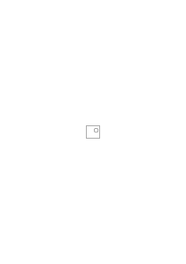

gleich.

### [113\[3\]](https://cdn.wittgensteinnachlass.com/2000px/webp/Ms-109/113.webp)

Wenn einer nicht verstünde was der Satz „ein Kreis ist im Quadrat” sagt, so würde man es ihm etwa so erklären: es ist entweder so

oder so

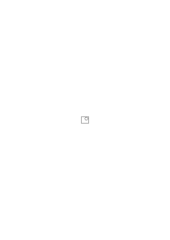

oder so

etc., & würde so ein paar Stellungen des Kreises zeigen. Aber natürlich darf diese Erklärung nur als das Zeigen einer Regel aufgefaßt werden, ähnlich den ersten Gliedern einer formalen Reihe.

### [113\[4\]](https://cdn.wittgensteinnachlass.com/2000px/webp/Ms-109/113.webp)

(Ich glaube aber daß in meiner ganzen Auffassung von der Allgemeinheit noch etwas falsch ist.)

### [113\[5\]](https://cdn.wittgensteinnachlass.com/2000px/webp/Ms-109/113.webp),[114\[1\]](https://cdn.wittgensteinnachlass.com/2000px/webp/Ms-109/114.webp)

Der Satz „der Fleck ist im Quadrat” hält gleichsam _selbst_ den Fleck bloß im Quadrat, das heißt, beschränkt die Freiheit des Flecks nur auf diese Weise & gibt ihm sonst Freiheit. Der Satz bildet dann einen Rahmen der die Freiheit des Flecks begrenzt & ihn innerhalb frei läßt, das heißt mit seiner Lage _nichts zu schaffen hat_. – Dazu muß aber der Satz (gleichsam eine Kiste in der der Kreis – im übrigen frei – eingesperrt ist) die logische Natur dieses Rahmens haben & das hat er denn ich könnte jemandem den Satz erklären & dann jene Möglichkeiten auseinandersetzen & zwar (ganz) unabhängig davon ob ein solcher Satz wahr ist oder nicht also unabhängig von einer Tatsache.

### [114\[2\]](https://cdn.wittgensteinnachlass.com/2000px/webp/Ms-109/114.webp)

Kann man aber nun sagen, daß der Satz aus unendlich vielen folgt? – D.h. daß quasi unendlich viele um ihn herum wären deren gemeinsamer Bestandteil er ist?

### [114\[3\]](https://cdn.wittgensteinnachlass.com/2000px/webp/Ms-109/114.webp)

08.09.1930

(Von dem Sehen eines Gedankens in der Ferne bis zum völlig klaren Erkennen dieses Gedankens ist es nicht so weit als es zuerst scheint.)

### [114\[4\]](https://cdn.wittgensteinnachlass.com/2000px/webp/Ms-109/114.webp),[115\[1\]](https://cdn.wittgensteinnachlass.com/2000px/webp/Ms-109/115.webp)

Daß der Satz die Wirklichkeit in einer Beziehung _frei_ läßt, heißt, daß er auf sie in dieser Beziehung (d.h. sie auf seine Wahrheit) _keinen_ Einfluß nimmt. Er von ihr in dieser Beziehung nichts weiß. Der Satz hält die Wirklichkeit an einer Leine & solange diese nicht beansprucht wird da die Wirklichkeit sich innerhalb ihres Radius bewegt geht es den Satz nichts an.

### [115\[2\]](https://cdn.wittgensteinnachlass.com/2000px/webp/Ms-109/115.webp)

Es scheint mir alles gesagt zu sein damit, daß der Satz „der Fleck befindet sich im Viereck” verstanden wird. Und damit, daß was aus ihm folgt (& woraus er folgt) dadurch bestimmt ist daß er verstanden wird; _nicht_ durch den Umstand ob er wahr oder falsch ist.

### [115\[3\]](https://cdn.wittgensteinnachlass.com/2000px/webp/Ms-109/115.webp)

D.h. daraus daß er verstanden wird einen bestimmten Sinn hat schöpfe ich die Zuversicht, daß es für ihn bestimmte eben seinen Sinn bestimmende Regeln der Grammatik gibt & daß die Unbestimmtheit die in ihm liegt doch einen bestimmten (seiner Natur nach bestimmten) Spielraum definiert. – Daß seine Folgesätze, & die aus denen er folgt, durch was er bedeutet, nicht durch die Tatsachen bestimmt sind, das ist es eigentlich was ich meine wenn ich sage es gäbe darin keine Überraschungen. Denn, wo es keine Überraschungen gibt, das ist die Grammatik – das Spiel – & ein Bild

das ich etwa von einer zu erwartenden Situation mache gehört zu den _Zeichen_, steht also unter der Herrschaft der Grammatik.

### [115\[4\]](https://cdn.wittgensteinnachlass.com/2000px/webp/Ms-109/115.webp),[116\[1\]](https://cdn.wittgensteinnachlass.com/2000px/webp/Ms-109/116.webp)

Das hängt nun mit der Bedeutung der „_bestimmten Lage_” des Flecks im Viereck zusammen. Wenn wir von einer Bestimmung durch Messung nicht reden können dann ist das Zeichen (Bild) die _alleinige_ Bestimmung & daher autonom (in gewissem Sinne).

### [116\[2\]](https://cdn.wittgensteinnachlass.com/2000px/webp/Ms-109/116.webp)

Man kann dieses Bild nicht anders bestimmen als durch sich selbst. Darum ist es nicht vielleicht eine ungenaue Bestimmung sondern eine exakte.

### [116\[3\]](https://cdn.wittgensteinnachlass.com/2000px/webp/Ms-109/116.webp)

Es ist natürlich nicht „Stellung des Kreises in diesem Quadrat” ein Begriff & die besondere Stellung ein Gegenstand der unter ihn fällt.

### [116\[4\]](https://cdn.wittgensteinnachlass.com/2000px/webp/Ms-109/116.webp)

Ein Gedanke nähert sich erstaunlich schnell von der großen Entfernung in der er zuerst auftaucht zur unmittelbaren Nähe in der wir ihn deutlich gewahren.

### [116\[5\]](https://cdn.wittgensteinnachlass.com/2000px/webp/Ms-109/116.webp)

So daß Gegenstände gefunden werden von denen man sich überzeugt, daß sie auch Stellungen des Kreises im Quadrat sind von denen man aber früher nichts gewußt hat.

### [116\[6\]](https://cdn.wittgensteinnachlass.com/2000px/webp/Ms-109/116.webp),[117\[1\]](https://cdn.wittgensteinnachlass.com/2000px/webp/Ms-109/117.webp)

D.h. ‚Stellung des Kreises im Quadrat’ kann kein amorpher Begriff sein. Ich weiß auch daß, wenn zwei Stellungen verschieden sind die eine über, unter, rechts oder links von der andern sein muß. Daß es eine Stellung in der Mitte des Quadrats gibt & eine rechts, links, etc. von der Mitte aber z.B. keine gesehene Stellung in der der Kreis von der Mitte der unteren Kante nur ein 23stel seines Durchmessers entfernt ist.

### [117\[2\]](https://cdn.wittgensteinnachlass.com/2000px/webp/Ms-109/117.webp)

Die Mittelstellung des Kreises & andere ausgezeichnete Stellungen sind übrigens ganz analog den primären Farben in der Farbenskala. (Dieses Gleichnis könnte man mit Vorteil fortsetzen.)

### [117\[3\]](https://cdn.wittgensteinnachlass.com/2000px/webp/Ms-109/117.webp)

Wie ist es aber mit diesem Schluß: „Wenn ein diesem Kreis gleichgroßer in das Dreieck hineingeht dann geht auch _jeder_ kleinere hinein.”? Ich kann

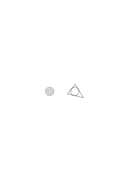

nämlich noch nicht einsehn warum es nicht möglich sein sollte daß unendlich viele Sätze nach einer Regel aus einem folgen sollten _in dem selben Sinne nämlich_ in dem ein Satz aus unendlich vielen folgen kann. Obwohl etwas sagt daß es so ist, aber die Formulierung ist nicht richtig.

### [117\[4\]](https://cdn.wittgensteinnachlass.com/2000px/webp/Ms-109/117.webp),[118\[1\]](https://cdn.wittgensteinnachlass.com/2000px/webp/Ms-109/118.webp)

Denn wenn daraus daß der Kreis sich im Quadrat _da_ befindet, folgt daß er im Quadrat ist; folgt dann nicht auch daß er in jedem Quadrat ist das man das erste umschließend zieht? Oder muß ich sagen so ein Satz folgt nur wenn ein das erste umschließendes Quadrat _da_ ist. So daß nur die Möglichkeit der aus dem ersten auf diese Weise folgenden Sätze unendlich ist aber nicht von unendlich vielen solchen Sätzen geredet werden kann.

### [118\[2\]](https://cdn.wittgensteinnachlass.com/2000px/webp/Ms-109/118.webp)

„Er folgt aus unendlich vielen Sätzen” würde heißen: man kann die Reihe der Sätze aus denen er folgt ins Unendliche fortsetzen. Statt „ins unendliche” müßte man aber sagen „man kann sie unendlich fortsetzen”. Aber auch das trifft nicht ganz meine Schwierigkeit. Denn in mir wehrt sich nicht bloß etwas dagegen daß unendlich viele Sätze aus einem folgen sondern auch daß 1000 Sätze aus einem so einfachen Satz folgen. Ich habe es hier überhaupt nicht mit der Schwierigkeit der Auffassung des Unendlichen zu tun die wie ich glaube leicht zu überwinden ist sondern, mit einer ganz anderen.

### [118\[3\]](https://cdn.wittgensteinnachlass.com/2000px/webp/Ms-109/118.webp),[119\[1\]](https://cdn.wittgensteinnachlass.com/2000px/webp/Ms-109/119.webp)

Und da ist nun allerdings klar daß aus 1000 Sätzen von der Form „der Kreis ist an _der_ Stelle im Quadrat” folgt „der Kreis ist im Quadrat”; mindestens wenn es auch nur aus _einem_ solchen Satz folgt.

Und andrerseits: Folgt aus „_dieser_ Kreis hat im Quadrat Platz” auch nur _ein_ Satz der Art „dieser kleinere Kreis hat darin Platz” so ist nicht einzusehen warum nicht 1000 solcher Sätze aus dem einen folgen sollen. Und somit ist das Problem an eine andere Stelle gerückt.

### [119\[2\]](https://cdn.wittgensteinnachlass.com/2000px/webp/Ms-109/119.webp)

09.09.1930

Frägt es sich nicht, ob ich den Sinn eines Satzes ins Unendliche verdünnen kann? Das heißt beliebig verdünnen kann. Man kann von Verdünnung & Konzentration des Sinnes reden.

### [119\[3\]](https://cdn.wittgensteinnachlass.com/2000px/webp/Ms-109/119.webp)

Freilich kann man unendlich verdünnen (das geht ja schon mit der Disjunktion etc.) aber eben nur auf diese Weise folgen beliebig viele Sätze aus _einem_, & durch die bloße Verdünnung erfahren wir nichts Neues. – – –

### [119\[4\]](https://cdn.wittgensteinnachlass.com/2000px/webp/Ms-109/119.webp),[120\[1\]](https://cdn.wittgensteinnachlass.com/2000px/webp/Ms-109/120.webp)

Können wir uns eine Sprache denken, die nur mit primären Sätzen arbeitet, und nicht mit Hypothesen? (Könnte man sich etwa menschliche Wesen denken, die Hypothesen nicht kennen, aber eine Sprache besitzen?)

### [120\[2\]](https://cdn.wittgensteinnachlass.com/2000px/webp/Ms-109/120.webp)

Aber heißt denn das etwas, wir bilden doch die Hypothesen nicht aus einem neuen Erkenntnismaterial, sondern aus den Sätzen & die Sätze ohne die Möglichkeit der Hypothesen sind so undenkbar wie das Multiplizieren ohne die Möglichkeit des Wurzelziehens.

### [120\[3\]](https://cdn.wittgensteinnachlass.com/2000px/webp/Ms-109/120.webp)

Hängt das Wesen der Hypothese vom Zeitbegriff ab? D.h. gäbe es ohne Zeit keine Hypothesen & was heißt diese Frage überhaupt?

### [120\[4\]](https://cdn.wittgensteinnachlass.com/2000px/webp/Ms-109/120.webp)

Wie drückt es sich aus, daß die Zeit zur Phänomenologie gehört nicht aber die Wahrheitsfunktionen? Und wie drückt es sich aus was wir fühlen, daß nämlich die Wahrheitsfunktionen fundamentaler sind als das Phänomenologische? Denn, ich glaube, nur in der Grammatik muß sich auch das ausdrücken.

### [120\[5\]](https://cdn.wittgensteinnachlass.com/2000px/webp/Ms-109/120.webp)

10.09.1930

Daß die Hypothese dem Satz kein neues Material hinzufügt, sieht man auch daraus daß eine Hypothese durch den Ausdruck „es scheint” (oder einen ihm entsprechenden) zum Satz wird.

### [120\[6\]](https://cdn.wittgensteinnachlass.com/2000px/webp/Ms-109/120.webp),[121\[1\]](https://cdn.wittgensteinnachlass.com/2000px/webp/Ms-109/121.webp)

Die Grammatik wenn sie in der Form eines Buches uns vorläge bestünde nicht aus einer Reihe bloß nebengeordneter Kapitel sondern würde eine andere Struktur zeigen. Und in dieser müßte man – wenn ich recht habe – auch den Unterschied zwischen Phänomenologischem & Nicht-Phänomenologischem sehen. Es wäre da etwa ein Kapitel über die Farben worin der Gebrauch der Farbwörter geregelt wäre; aber dem vergleichbar wäre nicht was über die Wörter nicht, oder etc. (die „logischen Konstanten”) in der Grammatik gesagt würde. Es würde z.B. aus den Regeln hervorgehen daß diese letzteren Wörter in jedem Satz anzuwenden seien (nicht aber die Farbwörter). Und dieses „jedem” hätte nicht den Charakter einer erfahrungsmäßigen Allgemeinheit; sondern der inappellablen Allgemeinheit einer obersten Spielregel. Es scheint mir ähnlich wie das Schachspiel wohl ohne gewisse Figuren zu spielen (oder doch fortzusetzen) ist aber nie ohne das Schachbrett.

### [121\[2\]](https://cdn.wittgensteinnachlass.com/2000px/webp/Ms-109/121.webp),[122\[1\]](https://cdn.wittgensteinnachlass.com/2000px/webp/Ms-109/122.webp)

Kann sich der Wesensunterschied zwischen „logischen & phänomenologischen Konstanten” auch allein in der Grammatik zeigen? Ist hier nicht doch eine Theorie nötig? Etwa eine die zwischen zweierlei Arten von Grammatik unterscheidet? (Ich möchte sagen: aus den Regeln des Schachspiels ergibt sich nicht nur der Unterschied zwischen Rössel & Läufer sondern auch der Unterschied zwischen den Schachfiguren & dem Schachbrett.) Und bedenke: die Theorie sollte über die Negation & die Farbe Rot etwas sagen das ihren Unterschied klar machte? Oder soll sie bloß sagen daß hier verschiedene Arten der Interpretation von Zeichen vorlägen? Das wäre dann etwas, was mit Hilfe von verschiedenen Indexen auszudrücken wäre & wir kämen hier nur zu einer Fortführung der Grammatik.

### [122\[2\]](https://cdn.wittgensteinnachlass.com/2000px/webp/Ms-109/122.webp)

Ich will immer zeigen daß alles was in der Logik business ist, in der Grammatik gesagt werden muß.

### [122\[3\]](https://cdn.wittgensteinnachlass.com/2000px/webp/Ms-109/122.webp)

Wie etwa der Fortgang eines Geschäftes aus den Geschäftsbüchern muß ganz & gar herausgelesen werden können. So daß man auf die Geschäftsbücher deutend muß sagen können: Hier! hier muß sich alles zeigen; und was sich hier nicht zeigt gilt nicht. Denn am Ende muß hier alles herauskommen.

### [123\[1\]](https://cdn.wittgensteinnachlass.com/2000px/webp/Ms-109/123.webp)

Alles wirklich Geschäftliche – heißt das – muß sich in der Grammatik abwickeln.

### [123\[2\]](https://cdn.wittgensteinnachlass.com/2000px/webp/Ms-109/123.webp)

(Eine Modedummheit der heutigen populären Physik ist es zu sagen daß der Raum etwa eines Eisenwürfels nicht wie der Laie glaubt ganz oder beinahe ganz von Materie erfüllt sei sondern daß er vielmehr beinahe leer sei da die Elektronen im Vergleich zu ihren Abständen von einander winzig klein seien. In Wahrheit aber wäre die Ansicht des Laien natürlich gerechtfertigt _wie klein immer_ man die Elektronen annimmt denn dem Erfülltsein des Raumes mit Materie im gewöhnlichen Sinn, dem erfahrungsmäßigen Erfülltsein, entspricht in der physikalischen Hypothese gar nicht das Erfülltsein mit Elektronenmasse sondern _die Häufigkeit_ der Elektronen.)

### [123\[3\]](https://cdn.wittgensteinnachlass.com/2000px/webp/Ms-109/123.webp),[124\[1\]](https://cdn.wittgensteinnachlass.com/2000px/webp/Ms-109/124.webp),[125\[1\]](https://cdn.wittgensteinnachlass.com/2000px/webp/Ms-109/125.webp)

Was ich die ‚Ansicht dieses Gegenstandes von hier’ nenne gehört auch noch zur Hypothese _d.h._ zur Darstellung. D.h. der Körper mit seinen verschiedenen Ansichten von den verschiedenen Stellen des Raumes oder mit der Regel wie diese zu konstruieren sind ist alles die Hypothese. D.h. die Hypothese ist ein System von Zeichen & steht ganz, & komplett, außerhalb der Erfahrung. Sie ist gleichsam ein vielflächiger Körper dessen jede Fläche einer Erfahrung entsprechen _kann_. Man könnte sich auch ein Polygon denken dessen jede Seite ein Maß wäre für gewisse Strecken die rund

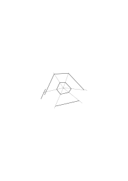

um das Polygon liegen & deren richtiges oder falsches Abbild das Polygon ist.

Das beste Gleichnis für jede Hypothese & selbst ein Beispiel ist ein Körper mit seinen, nach einer bestimmten Regel konstruierten Ansichten aus den verschiedenen Punkten des Raumes.

Die Punkte A muß man sich durch ein Koordinatensystem bestimmt denken.

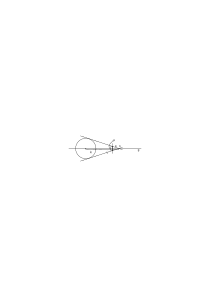

p = <math class="stacked" display="inline"><mfrac><mrow><mn>2</mn><mspace width="0.3em"/><mi>a</mi><mspace width="0.3em"/><mi>R</mi></mrow><mrow><msqrt><mrow><mtext>L²</mtext></mrow></msqrt><mspace width="0.3em"/><mo>+</mo><mspace width="0.3em"/><mn>2</mn><mspace width="0.3em"/><mi>R</mi><mspace width="0.3em"/><mi>L</mi></mrow></mfrac></math>

a = 1, 2 R = D <math class="stacked" display="inline"><mi>p</mi><mspace width="0.3em"/><mo>=</mo><mfrac><mrow><mi>D</mi></mrow><mrow><msqrt><mrow><mtext>L²</mtext></mrow></msqrt><mspace width="0.3em"/><mo>+</mo><mspace width="0.3em"/><mi>D</mi><mspace width="0.3em"/><mi>L</mi></mrow></mfrac></math> ist die Ansicht des Kreises von A aus. Zu sagen in der Entfernung L von A sei ein Kreis, heißt dann, die Ansicht p ändere sich, wenn man sich auf der Geraden g bewegt, der Gleichung entsprechend.

### [125\[2\]](https://cdn.wittgensteinnachlass.com/2000px/webp/Ms-109/125.webp)

11.09.1930

Man denkt gar nicht, wie merkwürdig das 3-dimensionale Sehen ist. Wie sonderbar etwa ein Bild, eine Photographie aussähe, wenn wir im Stande wären, sie als Verteilung grauer, weißer & schwarzer Flecken in einer ebenen Fläche zu sehen.

Was wir sehen, würde dann ganz sinnlos wirken. Ebenso wenn wir mit einem Auge flächenhaft sehen könnten.

Es ist z.B. gar nicht klar, was geschieht, wenn wir mit zwei Augen die Gegenstände _plastischer_ sehen als mit einem. Denn sie wirken auch mit einem gesehen schon plastisch. Und der Unterschied zwischen Relief & Rundplastik ist auch keine richtige Analogie.

### [125\[3\]](https://cdn.wittgensteinnachlass.com/2000px/webp/Ms-109/125.webp)

Es scheint mir daß die Hypothese nicht notwendigerweise etwas mit der _Zeit_ zu tun haben muß, außer insofern als alle Sätze etwa Zeitliches behandeln.

### [125\[4\]](https://cdn.wittgensteinnachlass.com/2000px/webp/Ms-109/125.webp),[126\[1\]](https://cdn.wittgensteinnachlass.com/2000px/webp/Ms-109/126.webp)

Aber ist _das_ wahr? Und wenn, was ist das für eine Allgemeinheit? Warum ist dann die Zeit in der Logik nicht fundamental wie die Wahrheitsfunktionen? – Ist es denn wahr daß die Zeit in alle Sätze eintritt? – Da will es mir scheinen als ob sie nur in einer bestimmten Gruppe von Sätzen wirklich erwähnt würde. Tritt sie überall ein wo (überhaupt) von einer Veränderung geredet wird? Und tritt sie etwa darum _überall_ ein, weil jeder Sachverhalt die Möglichkeit der Veränderung besitzt. Tritt sie nicht darum überall ein, weil wir jeden Sachverhalt _erwarten_ können? Weil also alles zukünftig der Fall sein, oder früher der Fall gewesen sein kann? Das heißt: jeder Sachverhalt ist ein Ereignis.

### [126\[2\]](https://cdn.wittgensteinnachlass.com/2000px/webp/Ms-109/126.webp)

Nun scheint aber doch, wenn ich etwa sage „der Himmel ist blau” & von allem Hypothetischen darin absehe, die Zeit hier wenigstens nicht explizit vorzukommen.

### [126\[3\]](https://cdn.wittgensteinnachlass.com/2000px/webp/Ms-109/126.webp)

„Wahr” & „Falsch” sind tatsächlich nur Wörter einer bestimmten Notation der Wahrheitsfunktionen.

### [126\[4\]](https://cdn.wittgensteinnachlass.com/2000px/webp/Ms-109/126.webp)

(Wenn ein Problem lebhaft auftaucht, so ist immer schon viel gewonnen.)

### [126\[5\]](https://cdn.wittgensteinnachlass.com/2000px/webp/Ms-109/126.webp),[127\[1\]](https://cdn.wittgensteinnachlass.com/2000px/webp/Ms-109/127.webp)

Ich sage „wenn ich von allem Hypothetischen absehe” denn daß die Zeit in der Hypothese eine Rolle spielt ist sicher aber – so scheint mir – nicht so interessant.

### [127\[2\]](https://cdn.wittgensteinnachlass.com/2000px/webp/Ms-109/127.webp)

Ich glaube, ich könnte auch so fragen: Kann man tatsächlich jeden Satz sinnvoll ins Futurum & Perfektum setzen? (Die mathematischen Sätze natürlich nicht.)

### [127\[3\]](https://cdn.wittgensteinnachlass.com/2000px/webp/Ms-109/127.webp)

Und wenn das der Fall ist, wie kommt es, daß es uns beinahe wie eine Zufälligkeit erscheint, verglichen mit den Regeln über die Negation & Disjunktion?

### [127\[4\]](https://cdn.wittgensteinnachlass.com/2000px/webp/Ms-109/127.webp),[128\[1\]](https://cdn.wittgensteinnachlass.com/2000px/webp/Ms-109/128.webp)

Negation & Disjunktion möchten wir sagen hat mit dem Wesen des Satzes zu tun die Zeit aber nicht sondern mit seinem Inhalt. Wie aber kann es sich in der Grammatik zeigen daß Etwas mit dem Wesen des Satzes zusammenhängt & etwas anderes nicht, wenn sie beide gleich allgemein sind? Oder sollte ich sagen die geringere Allgemeinheit wäre auf seiten der Zeit da die mathematischen Sätze negiert & disjungiert werden können aber nicht zeitlich sind. Ein Zusammenhang ist wohl da wenn auch diese Form die Sache darzustellen irreführend ist. Es kommt mir so vor als wäre die Gegenwart wie sie in dem Satz „der Himmel ist Blau” steht keine Form der Zeit . Als ob also die Gegenwart in _diesem_ Sinne unzeitlich wäre.

### [128\[2\]](https://cdn.wittgensteinnachlass.com/2000px/webp/Ms-109/128.webp)

Aber es ist merkwürdig daß es _in der Grammatik_ eine wesentliche & eine unwesentliche Allgemeinheit geben sollte. Eine phänomenologische & eine logische. Aber wie unterscheiden sich die von einander.

### [128\[3\]](https://cdn.wittgensteinnachlass.com/2000px/webp/Ms-109/128.webp)

Wie unterscheidet die Grammatik zwischen Satzform & Inhalt? Denn dies sollen ja grammatikalische Unterschiede sein. Wie sollte man sie beschreiben können, wenn sie die Grammatik nicht zeigt? Was hat es mit dem Schema „_Es verhält sich so & so” für eine Bewandtnis_? – Hier deutet „Es verhält sich” die Satzform an & „so & so” steht für den Inhalt. – Man könnte auch sagen daß „es verhält sich” ist die Handhabe für den Angriff der Wahrheitsfunktionen.

### [128\[4\]](https://cdn.wittgensteinnachlass.com/2000px/webp/Ms-109/128.webp),[129\[1\]](https://cdn.wittgensteinnachlass.com/2000px/webp/Ms-109/129.webp)

Meine Theorie kommt darauf hinaus, daß man die Sprache in gewisser Beziehung nicht erklären kann.

### [129\[2\]](https://cdn.wittgensteinnachlass.com/2000px/webp/Ms-109/129.webp)

„Es verhält sich” ist also nur ein Ausdruck aus einer Notation der Wahrheitsfunktionen. Ein Ausdruck, der uns zeigt welcher Teil der Grammatik hier in Funktion tritt.

### [129\[3\]](https://cdn.wittgensteinnachlass.com/2000px/webp/Ms-109/129.webp)

Die Grammatik ist das Geschäftsbuch der Sprache; woraus alles zu ersehen sein muß, was nicht Gefühle sondern harte Tatsachen (betrifft).

### [129\[4\]](https://cdn.wittgensteinnachlass.com/2000px/webp/Ms-109/129.webp)

Ich will also eigentlich sagen: Es gibt nicht Grammatik & Interpretation der Zeichen. Sondern soweit von einer Interpretation, also von einer Erklärung der Zeichen, die Rede sein kann, soweit muß sie die Grammatik selbst besorgen. Denn ich brauchte nur zu fragen: Soll die Interpretation durch Sätze erfolgen? Und in welchem Verhältnis sollen diese Sätze zu der Sprache stehen die sie schaffen?

### [129\[5\]](https://cdn.wittgensteinnachlass.com/2000px/webp/Ms-109/129.webp),[130\[1\]](https://cdn.wittgensteinnachlass.com/2000px/webp/Ms-109/130.webp)

Jene zweifache Art der Allgemeinheit wäre so seltsam, wie wenn von zwei Regeln eines Spiels die beide gleich ausnahmslos gelten die eine als die fundamentalere angesprochen würde. Als könnte man also fragen, ob der König oder das Schachbrett für das Schachspiel essentieller wäre. Welches von beiden das wesentlichere, welches das zufälligere wäre.

### [130\[2\]](https://cdn.wittgensteinnachlass.com/2000px/webp/Ms-109/130.webp)

Man könnte auch so fragen: Ist ein nicht negierbarer Satz schwerer zu denken als ein zeitloser? – Ist es leichter das Phänomenologische anders zu denken als das Logische? Oder ist das Hindernis das eine zu denken ein andres als das Hindernis das andre zu denken? Aber gibt es denn einen für uns zählenden Unterschied zwischen Unsinn & Unsinn?

### [130\[3\]](https://cdn.wittgensteinnachlass.com/2000px/webp/Ms-109/130.webp)

12.09.1930

Wie ist das richtig in Worten wiederzugeben was ich deutlich als den Unterschied zwischen inhaltlicher & formaler Logik im Satz empfinde. (das sind noch immer nicht die richtigen Ausdrücke.) Der Unterschied zwischen der Logik des Inhalts & der Logik der Satzform überhaupt. Das Eine erscheint gleichsam bunt das Andre matt. Das eine handelt von dem was das Bild darstellt das andre ist wie der Rahmen des Bildes ein Charakteristikum der Bildform.

### [130\[4\]](https://cdn.wittgensteinnachlass.com/2000px/webp/Ms-109/130.webp),[131\[1\]](https://cdn.wittgensteinnachlass.com/2000px/webp/Ms-109/131.webp)

Es ist nämlich als könnte man sagen, die Zeit habe zwar mit dem Wesen _des Satzes_ nichts zu tun, dennoch aber käme die Zeit in _jedem_ Satz vor. Und wieder muß man fragen was ist das für eine Allgemeinheit? Wie kann ich wissen daß die Zeit in jedem Satz vorkommt, es sei denn daß sie zum Wesen des Satzes gehört? Ich möchte darauf antworten: sie gehört zum Wesen der Wirklichkeit nicht zum Wesen des Satzes (d.h. der Darstellung durch Sätze.)

### [131\[2\]](https://cdn.wittgensteinnachlass.com/2000px/webp/Ms-109/131.webp)

Nun ist es aber merkwürdig, daß die Zeit von der ich hier rede nicht die im physikalischen Sinne ist. Es handelt sich hier nicht um eine Zeitmessung. Und es ist verdächtig daß etwas was mit einer solchen Messung nichts zu tun hat, in den Sätzen eine ähnliche Rolle spielen soll, wie die physikalische Zeit in den Hypothesen der Physik.

### [131\[3\]](https://cdn.wittgensteinnachlass.com/2000px/webp/Ms-109/131.webp)

Auch unbegreiflich ist es, daß die Zeit wenn sie zum _Wesen_ der Wirklichkeit gehört, nicht offenbar zum Wesen des Satzes gehören soll.

### [131\[4\]](https://cdn.wittgensteinnachlass.com/2000px/webp/Ms-109/131.webp)

Das schaut so aus als könnten wir doch aus unserer Welt heraus, wenn auch nicht aus der Logik der Satzform so doch aus der phänomenologischen Begrenzung.

### [131\[5\]](https://cdn.wittgensteinnachlass.com/2000px/webp/Ms-109/131.webp),[132\[1\]](https://cdn.wittgensteinnachlass.com/2000px/webp/Ms-109/132.webp)

Zum mindesten scheint eine Frage berechtigt: Wenn ich die Grammatik aufgeschrieben hätte & die verschiedenen Kapitel über die Farbwörter etc. etc. der Reihe nach dastünden wie Regeln über alle die Figuren des Schachspiels, wie wüßte ich dann daß dies nun _alle_ Kapitel sind? Und wenn sich nun in allen vorhandenen Kapiteln eine gemeinsame Eigentümlichkeit findet, so haben wir es hier scheinbar mit einer logischen Allgemeinheit aber keiner wesentlichen d.h. voraussehbaren Allgemeinheit zu tun. Man kann aber doch nicht sagen daß die Tatsache, daß das Schachspiel mit 16 Figuren gespielt wird ihm weniger wesentlich ist, als daß es auf dem Schachbrett gespielt wird.

### [132\[2\]](https://cdn.wittgensteinnachlass.com/2000px/webp/Ms-109/132.webp)

Es ist offenbar, daß der Charakter des Zeitlichen in der Bedeutung der Wörter „früher” „später” etc. liegt. In der Reihe die so gebildet wird. Und es frägt sich ob wir jedes Erlebnis als Glied der Reihe erleben. – Auch die Dauer scheint mir nicht in jedes Erlebnis unmittelbar hineinzuspielen.

### [132\[3\]](https://cdn.wittgensteinnachlass.com/2000px/webp/Ms-109/132.webp),[133\[1\]](https://cdn.wittgensteinnachlass.com/2000px/webp/Ms-109/133.webp)

Man könnte sagen, es handle sich um die Wörter „früher” & „später” einerseits & „nicht” & „oder” andrerseits. Und was wir sehen wäre, daß nicht notwendigerweise überall wo diese Worte anwendbar sind auch jene es sein müßten.

### [133\[2\]](https://cdn.wittgensteinnachlass.com/2000px/webp/Ms-109/133.webp)

Denn wie offenbart sich die Zeitlichkeit der Tatsachen, wie drückt sie sich aus, als dadurch, daß gewisse Wendungen in den Sätzen vorkommen müssen. D.h.: Wie drückt sich die Zeitlichkeit der Tatsachen aus, als grammatisch?!

### [133\[3\]](https://cdn.wittgensteinnachlass.com/2000px/webp/Ms-109/133.webp)

Die Sprache kann nicht durch eine Erklärung gelehrt werden.

### [133\[4\]](https://cdn.wittgensteinnachlass.com/2000px/webp/Ms-109/133.webp)

Da Zeit & Wahrheitsfunktionen so verschieden schmecken & da sie ihr Wesen allein & ganz in der Grammatik offenbaren, so muß die Grammatik den verschiedenen Geschmack erklären.

### [133\[5\]](https://cdn.wittgensteinnachlass.com/2000px/webp/Ms-109/133.webp)

Das eine schmeckt nach Inhalt, das andre nach Darstellungsform.

### [133\[6\]](https://cdn.wittgensteinnachlass.com/2000px/webp/Ms-109/133.webp)

Sie schmecken so verschieden, wie der Plan & der Strich durch den Plan.

### [133\[7\]](https://cdn.wittgensteinnachlass.com/2000px/webp/Ms-109/133.webp)

Ich glaube daß das gegenseitig sich Aufheben von Wahrheitsfunktionen ihr _wesentliches_ Merkmal ist.

### [133\[8\]](https://cdn.wittgensteinnachlass.com/2000px/webp/Ms-109/133.webp),[134\[1\]](https://cdn.wittgensteinnachlass.com/2000px/webp/Ms-109/134.webp)

Aber noch eines: Es spielt doch die Wirklichkeit außerhalb des Zeichens in dem Symbol mit & denken wir daran ob nicht hier der Unterschied zwischen Inhalt & Wahrheitsfunktion liegt. Denn alles was zum Sinn gehört, gehört zum Symbol.

### [134\[2\]](https://cdn.wittgensteinnachlass.com/2000px/webp/Ms-109/134.webp)

Wenn man sagt, Satz sei alles was wahr oder falsch sein könne so heißt das _dasselbe_ wie: Satz ist alles was sich verneinen läßt.

### [134\[3\]](https://cdn.wittgensteinnachlass.com/2000px/webp/Ms-109/134.webp)

Die Möglichkeit der Wahrheitsfunktion ist dasjenige was wir als Wesen des Satzes auffassen. Die Wahrheitsfunktion ist der Repräsentant der **Satz**form. – – – Ich will sagen, wenn wir von dem sprechen was der Satzform als solcher wesentlich ist, so meinen wir die Wahrheitsfunktion.

### [134\[4\]](https://cdn.wittgensteinnachlass.com/2000px/webp/Ms-109/134.webp)

13.09.1930

Wenn ich sage „ich gehe jetzt dort hin”, so kommt in dem Symbol manches vor was in dem Zeichen allein nicht liegt. Der Satz, wenn ich ihn etwa, von unbekannter Hand auf einen Zettel geschrieben irgendwo vorfinde, sagt gar nichts; das Wort „ich”, das Wort „jetzt” & „dorthin” sind allein ohne die Gegenwart der sprechenden Person, der gegenwärtigen Situation & der im Raum gezeigten Richtung bedeutungslos.

### [134\[5\]](https://cdn.wittgensteinnachlass.com/2000px/webp/Ms-109/134.webp),[135\[1\]](https://cdn.wittgensteinnachlass.com/2000px/webp/Ms-109/135.webp)

„Jetzt”, „früher”, „hier”, „dort”, „ich”, „du”, „dieses” sind solche Wörter zur Anknüpfung an die Wirklichkeit. „Aber die Wirklichkeit die solcherweise zum Symbol gehört fällt in den Bereich der Grammatik.”

### [135\[2\]](https://cdn.wittgensteinnachlass.com/2000px/webp/Ms-109/135.webp)

Wenn ich sage daß ein Satz, der Mengenlehre etwa, in Ordnung ist aber eine neue Interpretation erhalten muß, so heißt das nur dieser Teil der Mengenlehre bleibt in sich unangetastet, muß aber in eine andere grammatische Umgebung gerückt werden.

### [135\[3\]](https://cdn.wittgensteinnachlass.com/2000px/webp/Ms-109/135.webp)

Ich sage jemandem „geh dort hin”, er hört die Worte, versteht sie aber nicht, da ich ihn nicht beim Sprechen angeschaut habe. Das gleicht einem Plan ohne Orientierungsregel.

### [135\[4\]](https://cdn.wittgensteinnachlass.com/2000px/webp/Ms-109/135.webp)

Nun könnte man fragen: Gehört die Windrose noch zum Plan?

Oder vielmehr: Gehört die Regel nach der die Windrose angewandt wird, noch zum Plan? Und es ist klar daß ich diese Regel durch eine andere Orientierungsregel ersetzen kann in der von der Windrose nicht die Rede ist sondern statt dessen etwa von einem Weg auf dem Plan & was ihm in der Gegend entspricht.

### [135\[5\]](https://cdn.wittgensteinnachlass.com/2000px/webp/Ms-109/135.webp),[136\[1\]](https://cdn.wittgensteinnachlass.com/2000px/webp/Ms-109/136.webp)

Statt den Worten „Geh dorthin” könnte es ja auch heißen „Ludwig, geh dorthin” & dann wüßte ich etwa, wer gemeint sei. Der Personenname entspricht dann der Windrose die aber auch ohne Regel zu ihrer Anwendung nichts nutz ist. Denn „Ost” & „West” bezw. „Sonne” sind Namen ganz wie jener Personenname.

### [136\[2\]](https://cdn.wittgensteinnachlass.com/2000px/webp/Ms-109/136.webp)

Statt dem Worte „dieses” kann also in meinen Sätzen ein Name fungieren statt „jetzt” eine Zeitangabe, statt „dort” der Name einer Richtung. Und es ist dann dieser Name ebenso sehr und so wenig dem Mißverstehen ausgesetzt wie etwa das Zeigen mit dem Finger, was ja auch gedeutet werden muß und seine eigene Deutung nicht schon in sich trägt. (D.h. auch nur ein _Zeichen_ ist.) Und andrerseits muß sich die Zeitangabe um Bedeutung zu haben auf eine vorhandene Uhr beziehen, der Personenname auf eine vorhandene Person; oder es muß doch die Methode gegeben sein herauszufinden ob diese Person vorhanden ist & dazu muß wieder an die wirkliche Welt angeknüpft sein.

### [136\[3\]](https://cdn.wittgensteinnachlass.com/2000px/webp/Ms-109/136.webp)

Aber ich sagte ja schon daß der Plan mit der Wirklichkeit durch eine Übersetzungsregel verbunden sein müsse.

### [136\[4\]](https://cdn.wittgensteinnachlass.com/2000px/webp/Ms-109/136.webp),[137\[1\]](https://cdn.wittgensteinnachlass.com/2000px/webp/Ms-109/137.webp)

Wie ein Zeichen eben jetzt angewendet wird, so bedeutet es; man kann also diese Anwendung nicht antizipieren.

### [137\[2\]](https://cdn.wittgensteinnachlass.com/2000px/webp/Ms-109/137.webp)

Ich will sagen man kann zwar, z.B. durch Deuten, einen Gegenstand, etwa eine Uhr, in den Plan einbeziehen & damit gehört er nun etwa als wesentlicher Bestandteil zum Plan, aber damit gehört er jetzt zum Bild, die Deutung dieses Bildes ist aber damit nicht vollzogen.

### [137\[3\]](https://cdn.wittgensteinnachlass.com/2000px/webp/Ms-109/137.webp)

Ich sage „ich kann dieses Thema singen”, ich versuche es & bleibe stecken. Konnte ich's dann singen als ich sagte ich könne es singen, so daß ich also auf jeden Fall recht hatte das zu sagen, oder hat mein Stocken bewiesen, daß ich unrecht hatte? Das kommt drauf an. etc.etc.

### [137\[4\]](https://cdn.wittgensteinnachlass.com/2000px/webp/Ms-109/137.webp)

Denken wir uns nun z.B. daß ich so durch Deuten eine Person in einen Plan einbeziehe indem ich etwa sage „Du wirst diesen Weg gehen” & ihm einen Plan einhändige. Dann spielt jedenfalls der Betreffende eine ganz andre Rolle in dem Plan als die Striche, Punkte etc. des Plans.

### [137\[5\]](https://cdn.wittgensteinnachlass.com/2000px/webp/Ms-109/137.webp),[138\[1\]](https://cdn.wittgensteinnachlass.com/2000px/webp/Ms-109/138.webp)

Wenn (in einem Satz „ich will, daß Du dorthin gehst”) der Sprechende, der Angesprochene & der Pfeil der die Richtung weist zum Symbolismus gehören, so spielen sie in ihm jedenfalls eine ganz andere Rolle, als die Wörter.

### [138\[2\]](https://cdn.wittgensteinnachlass.com/2000px/webp/Ms-109/138.webp)

Wenn aber die Grammatik den ganzen Symbolismus umfassen soll, wie zeigt sich in ihr die Ergänzungsbedürftigkeit der Wörter „ich”, „du”, „dieses” etc. durch Gegenstände der Realität?

### [138\[3\]](https://cdn.wittgensteinnachlass.com/2000px/webp/Ms-109/138.webp)

Denn, daß jener Satz ohne eine solche Ergänzung nichts sagt, muß die _Grammatik_ sagen. Wenn sie das vollständige Geschäftsbuch der Sprache sein soll (wie ich es nenne.)

### [138\[4\]](https://cdn.wittgensteinnachlass.com/2000px/webp/Ms-109/138.webp)

Wenn ich z.B. sage „der Kreis hat im Viereck die Stellung

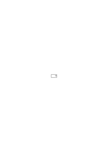”;

spielt hier die Zeichnung die selbe Rolle, wie dort der Pfeil? Oder: Spielt im gezeichneten Plan dasjenige, was er mit dem wirklichen Weg gemeinsam hat, dieselbe Rolle, wie der Mensch dem ich ihn zur Ausführung einhändige, im Befehl?

### [138\[5\]](https://cdn.wittgensteinnachlass.com/2000px/webp/Ms-109/138.webp)

„Die Kinder müßten, um das Rechnen der Volksschule zu verstehen große Philosophen sein, in Ermanglung dessen brauchen sie die Übung.”

### [138\[6\]](https://cdn.wittgensteinnachlass.com/2000px/webp/Ms-109/138.webp),[139\[1\]](https://cdn.wittgensteinnachlass.com/2000px/webp/Ms-109/139.webp)

Könnte ich so sagen: Das Zeichen hat verschiedenerlei mit der Wirklichkeit gemein, unter anderem, räumliche Eigenschaften, Richtungen, Farben, aber auch Körper bezw. Farbflecken.

### [139\[2\]](https://cdn.wittgensteinnachlass.com/2000px/webp/Ms-109/139.webp)

Wie erklärt die Grammatik das Wort „jetzt”? Doch wohl durch die Regeln, die sie für seinen Gebrauch angibt.

Das gleiche für das Wort „ich”.

### [139\[3\]](https://cdn.wittgensteinnachlass.com/2000px/webp/Ms-109/139.webp)

Besteht hier eine Analogie mit dem über das Wort „nicht” Gesagten? Und wie unterscheiden sich die beiden Fälle?

### [139\[4\]](https://cdn.wittgensteinnachlass.com/2000px/webp/Ms-109/139.webp)

Die Sprache ist nicht durch Erklärung lehrbar, – wohl aber wird sie durch das Beispiel gelehrt & das ist wichtig. Erinnern wir uns immer daran, wie das Wesen einer Formenreihe durch die Angabe einiger ihrer Glieder gezeigt wird.

### [139\[5\]](https://cdn.wittgensteinnachlass.com/2000px/webp/Ms-109/139.webp)

14.09.1930

Die Grammatik erklärt die Bedeutung der Wörter soweit sie zu erklären ist. Und zu erklären ist sie soweit, als nach ihr zu fragen ist, & nach ihr fragen kann man soweit, als sie zu erklären ist.

### [139\[6\]](https://cdn.wittgensteinnachlass.com/2000px/webp/Ms-109/139.webp)

Welches ist die Bedeutung eines Wortes? Der Ausdruck „das Wort hat Bedeutung” ist verständlich. Die Einheit des Ausdrucks ist dann „Bedeutung haben” & die Frage „_Was_ bedeutet es”, „welche Bedeutung hat es”, muß dann keinen Sinn haben.

### [140\[1\]](https://cdn.wittgensteinnachlass.com/2000px/webp/Ms-109/140.webp)

Wie erklärt man die Bedeutung des Wortes „jetzt”? – dann das ist doch was die Philosophie tun will.

### [140\[2\]](https://cdn.wittgensteinnachlass.com/2000px/webp/Ms-109/140.webp)

Die Bedeutung kann nur das sein was wir in der Erklärung eines Wortes erklären.

### [140\[3\]](https://cdn.wittgensteinnachlass.com/2000px/webp/Ms-109/140.webp)

Man hat immer die falsche Vorstellung als handelte es sich bei der Bedeutung eines Wortes um einen Gegenstand d.h. ein Ding, in dem Sinn in dem das Schwert Nothung die Bedeutung des Wortes „Nothung” war. Aber auch hier stimmt etwas nicht, denn ich kann doch sagen „Nothung existiert nicht mehr” & ist etwa hier ‚Nothung’ bedeutungslos eben weil das Schwert nicht mehr existiert? – – –

### [140\[4\]](https://cdn.wittgensteinnachlass.com/2000px/webp/Ms-109/140.webp)

Ich könnte mir denken daß einer um das Wort „jetzt” zu erklären auf den gegenwärtigen Stand der Zeiger einer Uhr zeigt. Sowie er zur Erklärung des Ausdrucks „in fünf Minuten” auf die Ziffer der Uhr zeigen kann wo der Zeiger sich in 5 Minuten befinden wird.

Es ist klar daß dadurch nur die Uhr in unsere Zeichensprache hineinbezogen wird.

### [141\[1\]](https://cdn.wittgensteinnachlass.com/2000px/webp/Ms-109/141.webp)

Das Wort „jetzt” wirkt gleichsam als Schlag eines Zeitmessers. Es gibt durch sein Ertönen eine Zeit an.

Man kann es ja auch wirklich durch ein anderes Zeitzeichen ersetzen. Wenn man z.B. sagt: tu das wenn ich in die Hände klatsche. Das Klatschen ist dann ein Zeitzeichen wie der Pfeil ein Richtungszeichen ist wenn ich sage „ich gehe dort → hin”.

### [141\[2\]](https://cdn.wittgensteinnachlass.com/2000px/webp/Ms-109/141.webp)

Wenn mir z.B. die Rede die ein Anderer gestern gesprochen hat mitgeteilt wird: „es geschieht jetzt das & das”, so muß ich verstehen daß der Satz wenn ich ihn höre nicht so verifiziert werden kann wie er zu verifizieren war wenn ihn sein Sprecher jetzt sprechen würde. Ähnlich, wenn ich gestern sagte „heute geschieht es”, so heißt das soviel wie wenn ich heute sage „gestern ist es geschehen”.

### [141\[3\]](https://cdn.wittgensteinnachlass.com/2000px/webp/Ms-109/141.webp)

Ich muß aber zwischen dem strengen Teil der Erklärung eines Worts unterscheiden und dem Schwefel der auf eine unbestimmte Art erläuternd wirkt.

### [141\[4\]](https://cdn.wittgensteinnachlass.com/2000px/webp/Ms-109/141.webp),[142\[1\]](https://cdn.wittgensteinnachlass.com/2000px/webp/Ms-109/142.webp)

Wenn ich etwa von zwei kreisförmigen Flecken auf diesem Papier reden wollte etwa über die Veränderung in ihrer Farbe, dann könnte ich die beiden A & B nennen & zum Zeichen dafür wie ich sie benenne die Namen über die Kreise schreiben. Ist es nun aber eine Erklärung

wenn ich sage der Name bezeichnet den Kreis der unter ihm steht? Es ist eine Erklärung, denn man könnte in gewissen Fällen zweifelhaft sein ob der Name zu dem unter ihm befindlichen oder zu einem ober ihm befindlichen Kreis gehört. Aber ist damit erklärt, was es heißt daß ein Name _zu einem Kreis gehört_?

### [142\[2\]](https://cdn.wittgensteinnachlass.com/2000px/webp/Ms-109/142.webp)

15.09.1930

Zur Grammatik gehört nur das nicht, was die Wahrheit & Falschheit eines Satzes ausmacht. Nur darum kümmert sich die Grammatik nicht. Zur Grammatik gehören alle Bedingungen des Vergleichs des Satzes mit den Tatsachen. Das heißt, alle Bedingungen des Verständnisses. (Alle Bedingungen des Sinnes.)

### [142\[3\]](https://cdn.wittgensteinnachlass.com/2000px/webp/Ms-109/142.webp)

Statt die Namen A & B über ihre Kreise zu schreiben hätten wir auch auf die Kreise deuten und sagen können „das ist A, das ist B” & dieser Satz lautet richtiger „das heißt ‚A’, das heißt ‚B’”.

### [142\[4\]](https://cdn.wittgensteinnachlass.com/2000px/webp/Ms-109/142.webp),[143\[1\]](https://cdn.wittgensteinnachlass.com/2000px/webp/Ms-109/143.webp)

Wenn man nun sagt „der heißt Ludwig”, so muß uns die Grammatik sagen daß diese Wortfolge keinen Sinn hat, wenn sie nicht durch ein Zeigen ergänzt wird. Die Formel „darf ich Ihnen Herrn N. vorstellen” sagt nichts wenn man nicht wirklich jemanden vorstellt.

### [143\[2\]](https://cdn.wittgensteinnachlass.com/2000px/webp/Ms-109/143.webp)

Gehört das Vorstellen (in diesem Sinne) der Dinge wirklich zur Grammatik?

### [143\[3\]](https://cdn.wittgensteinnachlass.com/2000px/webp/Ms-109/143.webp)

Wenn ich in einer Gesellschaft von einem Herrn N. reden höre den ich nicht kenne, er sei mit seiner Frau auf Reisen etc. etc., so sind doch diese Sätze für mich nicht völliger Unsinn wenn mir N auch nie vorgestellt wurde.

### [143\[4\]](https://cdn.wittgensteinnachlass.com/2000px/webp/Ms-109/143.webp)

Wenn der Kreis A schon verschwunden ist so kann man noch immer von ihm reden.

### [143\[5\]](https://cdn.wittgensteinnachlass.com/2000px/webp/Ms-109/143.webp)

Ist nicht auch dies ein Satz: ich zeige zuerst auf einen Kreis dann auf den anderen & sage dabei „– – – größer als – – –”? Und fungieren da nicht eben jene Dinge als Zeichen, die ich bei dem Vorstellen in die Namen übersetze? Oder wenn ich auf zwei Menschen deute & sage: „↖ gescheiter als ↗”. In diesem Sinn könnte ich auch auf die gegenwärtige Zeigerstellung einer Uhr zeigen und sagen „er kommt ↗” & meinen „er kommt jetzt”.

### [144\[1\]](https://cdn.wittgensteinnachlass.com/2000px/webp/Ms-109/144.webp)

Von den Kreisen A & B kann ich noch reden wenn sie schon nicht mehr existieren – dagegen muß das Zeichen (alles was zum Zeichen gehört) des Satzes den ich ausspreche existieren.

Ich glaube daß die Zeichen „A” & „B” eine andere Bedeutung haben wenn die Kreise zu denen sie gehörten nicht mehr existieren, sie stehen dann für Beschreibungen & wenn dann jemand fragt was bedeutet A? so kann ich nicht antworten „diesen Kreis” sondern muß sagen: „hier war einmal ein Kreis der war der Kreis A”. D.h. die Bedeutung von „A” & „B” ist dann eine andere als da ich statt „A ist größer als B” sagen konnte „↑ ist größer als ↑”. Da habe ich offenbar die Kreise als Teil des Symbolismus gebraucht. Denn der Satz „↑ größer als ↑” ist nicht nur sinnlos wenn ich dabei nicht wirklich zeige, sondern auch wenn nichts da ist worauf ich zeige.

### [144\[2\]](https://cdn.wittgensteinnachlass.com/2000px/webp/Ms-109/144.webp)

Wie schaut die Erklärung eines Zeichens aus? Das müßte doch eine für die Sprache außerordentlich wichtige Form sein, sei dieser Behelf ein Satz oder nicht.

### [145\[1\]](https://cdn.wittgensteinnachlass.com/2000px/webp/Ms-109/145.webp)

Denke an das Kollationieren des Satzes mittels der Wirklichkeit. Hier wird sie Schritt für Schritt mit dem Satz verglichen, in ihn übersetzt.

### [145\[2\]](https://cdn.wittgensteinnachlass.com/2000px/webp/Ms-109/145.webp)

Denken wir uns aber eine Sprache in der ich „A ist größer als B” nicht nur so ausdrücke „↑ ist größer als ↑” sondern in der ich auch statt des Wortes ‚größer’ eine Geste mache die die Bedeutung des Wortes zeigt. – Wie könnte ich nun so eine Sprache erklären? (Wie könnte ich die Zeichen so einer Sprache erklären?)

### [145\[3\]](https://cdn.wittgensteinnachlass.com/2000px/webp/Ms-109/145.webp)

Ich glaube: Wenn es eine Erklärung für die Bedeutung eines Wortes gibt, so muß diese Erklärung statt des Wortes treten können. Man könnte sich ja die Wörter des Satzes „A ißt zwei Äpfel” durch Zeigen erklärt denken; auf die Frage „wer ist A” zeigt man auf einen Menschen & sagt „dieser ist A”; auf die Frage „was ist essen” macht man es vor & sagt „das heißt essen” & das Analoge für ‚zwei’ & ‚Äpfel’. Und nun könnte man den Satz durch eine Bilder- & Gebärdensprache aussprechen. Aber hätten wir nun die Dinge statt der Zeichen gesetzt? Mit Menschen deren Sprache man nicht versteht, verständigt man sich ja manchmal durch eine solche Gebärdensprache.

### [146\[1\]](https://cdn.wittgensteinnachlass.com/2000px/webp/Ms-109/146.webp)

Vergessen wir nicht: der Satz „das heißt A” zusamt der zeigenden Gebärde, muß auch gedeutet werden. Die bloße Frage worauf dieser Satz zur Antwort kommt kann nicht gestellt werden, wenn man das Wesen, die Methode, der Sprache nicht schon versteht.

### [146\[2\]](https://cdn.wittgensteinnachlass.com/2000px/webp/Ms-109/146.webp)

„Das läßt sich nicht beschreiben” – – – –

### [146\[3\]](https://cdn.wittgensteinnachlass.com/2000px/webp/Ms-109/146.webp)

Ich sage „das ist rot” um das Wort ‚rot’ zu erklären, aber wer erklärt mir diesen Satz mit der ihn begleitenden Gebärde?

### [146\[4\]](https://cdn.wittgensteinnachlass.com/2000px/webp/Ms-109/146.webp)

Die Erklärungen müßten eigentlich lauten: „diese Farbe heißt ‚rot’”, „dieser Mensch heißt ‚Paul’”, „diese Tätigkeit heißt ‚essen’” (statt „das heißt ‚rot’”, „das heißt ‚Mensch’” etc.); und wenn diese Sätze einen Sinn haben sollen so müssen die Ausdrücke ‚diese Farbe’, ‚diese Tätigkeit’, etc. bereits verstanden werden und könnten wie gesagt (mit der zeigenden Hand) statt der Namen verwendet werden.

### [146\[5\]](https://cdn.wittgensteinnachlass.com/2000px/webp/Ms-109/146.webp),[147\[1\]](https://cdn.wittgensteinnachlass.com/2000px/webp/Ms-109/147.webp)

Ich möchte sagen: wenn das Verstehen der Sprache ohne fortwährendes gleichzeitiges Verstehen von Erklärungen möglich ist, so ist die Erklärung am verstehen der Sprache nur historisch (also nur hypothetisch, unwesentlich) beteiligt. Ist die Erklärung nötig, so ist daran doch nur ihr Resultat wichtig & wenn sich das nicht zur Erklärung verhält wie ein mathematischer Satz zu seinem Beweis, so daß es ohne die Erklärung nicht bestehen kann, so ist die Erklärung kein _wesentliches_ Hilfsmittel des Verständnisses.

### [147\[2\]](https://cdn.wittgensteinnachlass.com/2000px/webp/Ms-109/147.webp)

Müßte man aber nicht eigentlich sagen: „‚rot’ ↗” denn wir müssen ja schon wissen was für eine Wortart ‚rot’ ist.

### [147\[3\]](https://cdn.wittgensteinnachlass.com/2000px/webp/Ms-109/147.webp)

Wenn aber diese Erklärung dem Verständnis wesentlich ist, wie kann ich dann in Abwesenheit der Erklärung, in Abwesenheit von etwas Rotem das Wort ‚rot’ gebrauchen & verstehen. Denn das Verständnis muß in sich komplett sein & unabhängig davon wie es einmal erreicht wurde. Denn ‚rot’ kommt ebenso im Satz vor „das ist nicht rot”, wie „das ist rot” & warum kann man was das Wort bedeutet, nur dort zeigen, wo etwas die Farbe _hat_ & nicht, wo etwas die Farbe nicht hat?

### [147\[4\]](https://cdn.wittgensteinnachlass.com/2000px/webp/Ms-109/147.webp)

Das würde dafür sprechen daß jene _Erklärung_ des Wortes nur eine besondere _Anwendung_ desselben ist. (Aber auch das scheint nicht zu stimmen.) Oder nur eine Übersetzung aus einer besonderen Sprache.

### [148\[1\]](https://cdn.wittgensteinnachlass.com/2000px/webp/Ms-109/148.webp)

16.09.1930

Nehmen wir aber an ich sage Einem „diese Farbenmischung von rot & gelb heißt ‚orange’” (wobei ich ihm die Farbe zeige) erhält er dann nicht durch diese Erklärung eine Bedeutung mit [sozusagen auf den Weg] die nun die Bedeutung des Wortes ‚orange’ ist wann immer er es braucht? Ja, – aber dem steht entgegen daß nun alle Fälle des Auftretens von ‚orange’ verschwinden können & das Wort für ihn doch seine Bedeutung behält – es muß also an der Verbindung (zwischen Gegenstand & Wort) die durch die Erklärung gemacht wurde nur das wesentlich sein, was auch, wenn wir etwas Orangefarbenes nicht wirklich sehen, bestehen bleibt. Das was bestehen bleibt ist, beiläufig gesprochen, eine Vorstellung. Dasjenige was es ermöglicht, daß ich eine wirklich gesehene Farbe mit orange vergleichen kann – sagen kann, daß sie gelblicher, rötlicher etc. ist als orange. Es wäre auch möglich daß ich die Bedeutung des Wortes wiederum vergäße (und das geschieht ja tatsächlich). Andererseits gehört aber, was immer von der Verbindung wesentlich ist zum Bestand des Symbols.

### [148\[2\]](https://cdn.wittgensteinnachlass.com/2000px/webp/Ms-109/148.webp),[149\[1\]](https://cdn.wittgensteinnachlass.com/2000px/webp/Ms-109/149.webp)

Ich meine also: Die Vorstellung die zum Gebrauch des Zeichens _notwendig_, wesentlich, ist, gehört zum Symbol.

### [149\[2\]](https://cdn.wittgensteinnachlass.com/2000px/webp/Ms-109/149.webp)

Es gibt offenbar eine Wirklichkeit die vom Zeichen unabhängig ist das ist die vom Satz zu beurteilende die ihn wahr oder falsch macht. Dann aber gibt es eine (Wirklichkeit) ohne die der Satz nicht wahr oder falsch sein (also) nicht Sinn haben kann. Diese gehört zum Satz und die Grammatik muß von ihr reden. Wenn die Erklärung des Zeichens uns die Bedingung gibt, das Zeichen sinnvoll zu gebrauchen, (und tut sie das nicht so ist sie irrelevant) so gibt sie uns erst das Symbol.

### [149\[3\]](https://cdn.wittgensteinnachlass.com/2000px/webp/Ms-109/149.webp)

(Die gänzliche Unklarheit schaut oft so aus wie der Zustand als wären alle Probleme gelöst, da beiden die Möglichkeit einer klaren Frage fehlt.)

### [149\[4\]](https://cdn.wittgensteinnachlass.com/2000px/webp/Ms-109/149.webp)

Es ist sehr interessant die Allgemeinheitsnotation Russells (& Freges) mit der gewöhnlichen Sprache zu vergleichen. Denn dabei zeigt es sich, daß diese es ist die der Vernunft entspricht.

### [149\[5\]](https://cdn.wittgensteinnachlass.com/2000px/webp/Ms-109/149.webp),[150\[1\]](https://cdn.wittgensteinnachlass.com/2000px/webp/Ms-109/150.webp)

Unsere Sprache sagt „es gibt einen roten Kreis in diesem Viereck” die Russellsche Notation sagt „es gibt ein Ding das ein roter Kreis in diesem Viereck ist”. Diese Ausdrucksform ist offenbar nach dem Modell gebildet: „es gibt eine Substanz die im Dunkeln leuchtet”, „es gibt einen Kreis in diesem Viereck der rot ist”. – Vielleicht ist schon der Ausdruck „es gibt” irreführend „es gibt” heißt eigentlich soviel wie „es findet sich” oder „es gibt unter diesen Kreisen einen …”. Für gewöhnlich sagt man ja „in diesem Viereck _ist_ ein Kreis”. Wenn man also in größter Annäherung an die Russellsche Ausdrucksweise sagt „es gibt einen Ort in diesem Viereck wo ein roter Kreis ist”, so heißt das eigentlich, unter diesen Orten gibt es einen wo etc.

### [150\[2\]](https://cdn.wittgensteinnachlass.com/2000px/webp/Ms-109/150.webp)

17.09.1930

Der Ausdruck „in diesem Viereck gibt es einen Ort” hieße allein natürlich nichts, & daß ein Kreis im Viereck sich an einem Ort befindet sagt ebensowenig.

### [150\[3\]](https://cdn.wittgensteinnachlass.com/2000px/webp/Ms-109/150.webp),[151\[1\]](https://cdn.wittgensteinnachlass.com/2000px/webp/Ms-109/151.webp)

Zu sagen „Es gibt einen Ort im Viereck an dem sich ein Kreis befindet” hat nur dann einen Sinn wenn es heißt: _unter den Orten im Viereck gibt es einen_, an dem sich der Kreis befindet. Und das setzt voraus daß man sich diese Orte als eine Klasse (Gesamtheit) gegeben denkt. Das entspricht aber nicht der Wirklichkeit. – Und eben das ist glaube ich, der Grund warum man von vornherein bei dem Satz „in dem Viereck ist ein Kreis” das Gefühl hat als handle es sich da um eine _einfache_ Relation zwischen Viereck & Kreis. Was ich früher dadurch ausdrückte (indem ich sagte) man sähe in diesem Satz ganz von der Stellung, der Lage, ab. Und lasse den Satz gar nicht auf die Lage des Kreises im Viereck reagieren. Der Satz sei gleichsam eine Kiste die den Kreis nur innerhalb ihrer Wände hält, ihn aber in ihr völlig frei läßt. Daß man aber diese Freiheit einfach _so_ beschreiben kann, durch den Ausdruck „frei in der Kiste”, daß man also nicht erst die verschiedenen Möglichkeiten der Lage in der Kiste angeben muß um die Freiheit die der Kreis hat zu beschreiben, das drückt schon aus was mit der „Einfachheit der Relation” gemeint ist.

### [151\[2\]](https://cdn.wittgensteinnachlass.com/2000px/webp/Ms-109/151.webp)

(Der schwierigste Standpunkt in der Logik ist der des gesunden Menschenverstandes. Denn er verlangt zur Rechtfertigung seiner Meinung die volle Wahrheit & hilft uns nicht durch die geringste Konzession (oder Konstruktion).)

### [151\[3\]](https://cdn.wittgensteinnachlass.com/2000px/webp/Ms-109/151.webp),[152\[1\]](https://cdn.wittgensteinnachlass.com/2000px/webp/Ms-109/152.webp)

Der (richtige) Ausdruck dieser Art Allgemeinheit ist also der der gewöhnlichen Sprache „in dem Viereck ist ein Kreis” welcher die Lage des Kreises einfach _offen_ läßt (_unentschieden_ läßt)

(„unentschieden” ist ein richtiger Ausdruck, weil die Entscheidung einfach _fehlt_). Aber nun frägt es sich: Wie verhalten sich die Wahrheitsfunktionen zu dieser logischen Allgemeinheit. Denn eine Verbindung muß durch das logische Folgen hergestellt sein. D.h. es nützt uns nicht daß wir einfach eine neue Art der Allgemeinheit annehmen, diese muß sich jetzt vor den Wahrheitsfunktionen rechtfertigen.

### [152\[2\]](https://cdn.wittgensteinnachlass.com/2000px/webp/Ms-109/152.webp)

Denn aus der Angabe der Kreis befinde sich an einer bestimmten Stelle im Viereck muß _folgen_ daß er im Quadrat ist. – Das heißt aber daß – z.B. – das logische Produkt des ersten Satzes & der Negation des zweiten eine Kontradiktion sein muß. Oder (was auf dasselbe hinausläuft) I ․⊃․ II muß eine Tautologie sein. Das muß so zu Stande kommen indem die Ortsangabe es in sich enthält ob der Ort außerhalb oder innerhalb des Vierecks liegt. Also liegt es in der Geometrie des betreffenden Raumes.

### [153\[1\]](https://cdn.wittgensteinnachlass.com/2000px/webp/Ms-109/153.webp)

Die Vorschrift daß diese beiden Angaben einander widersprechen sollen, jene Implikation eine Tautologie ergibt liefert eben die hier entsprechende Geometrie.

### [153\[2\]](https://cdn.wittgensteinnachlass.com/2000px/webp/Ms-109/153.webp)

Daß die Tautologie & Kontradiktion nichts sagen, geht nicht etwa aus dem W-F-Schema hervor sondern muß festgesetzt werden. Und die Schemata machen nur die Form der allgemeinen Festsetzung einfach.

### [153\[3\]](https://cdn.wittgensteinnachlass.com/2000px/webp/Ms-109/153.webp)

Und so muß – meine ich – welche Verbindungen unserer allgemeinen Sätze nichts sagen auch von uns einfach festgesetzt werden. Aber da ergibt sich eine Schwierigkeit. Denn wie unterscheiden wir hier Tautologie & Kontradiktion?

### [153\[4\]](https://cdn.wittgensteinnachlass.com/2000px/webp/Ms-109/153.webp)

Ist fa der besondere & fξ der allgemeine Satz so verhält es sich mit den Wahrheitsmöglichkeiten so:

faWFF | fξWWF und aus diesen ergäbe sich freilich alles andere.

### [153\[5\]](https://cdn.wittgensteinnachlass.com/2000px/webp/Ms-109/153.webp),[154\[1\]](https://cdn.wittgensteinnachlass.com/2000px/webp/Ms-109/154.webp)

Wenn die Negation eine aus dem Feld der Möglichkeiten ausschließt, so läßt sie damit das übrige Feld offen (und ist da sofern allgemein). Aber es kann das so geschehen als würde einer im Dunkeln aus einem Haus ausgesperrt. Er weiß dann genau wohin er nicht gehen kann, wovon er ausgeschlossen ist, sieht aber keine Möglichkeiten vor sich wohin er sich wenden könnte.

### [154\[2\]](https://cdn.wittgensteinnachlass.com/2000px/webp/Ms-109/154.webp)

Kann man nun nicht sagen: „A ist rot” gehört zum Feld der durch „A ist nicht grün” zugelassenen Möglichkeiten. „A ist grün” ist ausgeschlossen & damit alles übrige freigegeben. In diesem ganzen übrigen Feld befindet sich auch „A ist rot”.

### [154\[3\]](https://cdn.wittgensteinnachlass.com/2000px/webp/Ms-109/154.webp)

Wie aber soll sich das symbolisch ausdrücken? – daß nämlich ‚A ist rot’ außerhalb von ‚A ist grün’ liegt. Wie zeigt es sich daß „A ist rot” in dem Gebiete von „A ist nicht grün” liegt? Wie anders, als daß eine Wahrheitskombination ausgeschlossen wird?

### [154\[4\]](https://cdn.wittgensteinnachlass.com/2000px/webp/Ms-109/154.webp)

„A ist nicht grün” schließt „A ist rot” als eine Möglichkeit ein.

### [154\[5\]](https://cdn.wittgensteinnachlass.com/2000px/webp/Ms-109/154.webp),[155\[1\]](https://cdn.wittgensteinnachlass.com/2000px/webp/Ms-109/155.webp)

18.09.1930

Es muß sich die Geometrie dieser Sätze zeigen (sie muß in der Sprache aufscheinen). (Es ist ja ein ganz analoger Fall, dem

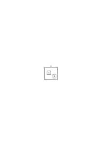

daß ein Fleck der im großen Viereck C ist aber _nicht in A_, in B sein kann.)

### [155\[2\]](https://cdn.wittgensteinnachlass.com/2000px/webp/Ms-109/155.webp)

Daß „A ist grün” & „A ist rot” konträre Sätze sind muß sich in einer ähnlichen (analogen) Weise zeigen, wie, daß „A ist grün” & „A ist nicht grün” kontradiktorische Gegenteile sind.

### [155\[3\]](https://cdn.wittgensteinnachlass.com/2000px/webp/Ms-109/155.webp)

Wie zeigt es sich denn daß „p” und „~p” komplementär sind? – Nämlich so muß es sich auch zeigen, daß „A ist rot” im Komplement von „A ist grün” liegt.

### [155\[4\]](https://cdn.wittgensteinnachlass.com/2000px/webp/Ms-109/155.webp)

Das erste zeigt sich doch offenbar darin, daß p⌵~p tautologisch ist. Und das wieder wird dadurch klargemacht, daß q ∙ (p⌵~p) = q ist. (Und (durch) andre ähnliche Beziehungen.)

### [155\[5\]](https://cdn.wittgensteinnachlass.com/2000px/webp/Ms-109/155.webp),[156\[1\]](https://cdn.wittgensteinnachlass.com/2000px/webp/Ms-109/156.webp)

Wenn man freilich an dieser Erklärung bemängelt, daß ja eben der Sinn des „ ∙ ” noch nicht erklärt ist & wieder einer Erklärung bedarf, so ist – glaube ich – die Antwort, daß es eine andere Erklärung als das vollständige Aufstellen der Regeln nicht gibt. Und gewiß ist der Begriff des „und” nicht weniger erklärungsbedürftig als der der Tautologie. Und sie werden nur alle zusammen erklärt, oder auch nicht erklärt. (Grammatik ein Schachspiel.)

### [156\[2\]](https://cdn.wittgensteinnachlass.com/2000px/webp/Ms-109/156.webp)

Wer übrigens die Negation erklären will, der merkt bald, daß er nur wieder eine Negation in anderer Form vorbringt (er verwendet etwa den „Ausschluß” oder anderen Ausdruck.)

### [156\[3\]](https://cdn.wittgensteinnachlass.com/2000px/webp/Ms-109/156.webp)

q ∙ (a ist rot ․⊃․ ~(a ist grün)) = q

### [156\[4\]](https://cdn.wittgensteinnachlass.com/2000px/webp/Ms-109/156.webp)

Die Erklärung die man erhält wenn man nach dem Wesen des Satzes fragt: Satz sei alles was wahr oder falsch sein könne, ist nicht so ganz unrichtig. Es ist die Form der Wahrheitsfunktion (in welcher Form der Zeichengebung immer ausgedrückt) die das logische Wesen des Satzes ausmacht.

### [156\[5\]](https://cdn.wittgensteinnachlass.com/2000px/webp/Ms-109/156.webp)

Ich sagte daß in dem Satz „in dem Viereck ist ein roter Kreis” von keiner Gesamtheit der Orte an denen ein Kreis sich befinden kann, die Rede sei, so daß es zu diesem „es gibt …” kein „für alle …” gäbe. – Muß ich denn aber nicht sagen, daß aus _jedem_ Satz der eine bestimmte Lage des Flecks im Viereck beschreibt der Satz „in dem Viereck ist ein roter Kreis” folgt? Ist jene Allgemeinheit nicht das Korrelat dieses Existentialsatzes?

### [157\[1\]](https://cdn.wittgensteinnachlass.com/2000px/webp/Ms-109/157.webp)

In Wahrheit gibt es zu dem „in dem Viereck ist …” ein „wo immer im Viereck ein roter Kreis ist …”. „Wenn im Viereck ein roter Kreis ist, dann …” kann man immer auch so ausdrücken „Wo immer im Viereck ein roter Kreis ist, …”.

### [157\[2\]](https://cdn.wittgensteinnachlass.com/2000px/webp/Ms-109/157.webp)

(∃x) ∙ φx ․⊃․ p = (x):φx ․⊃․ p

Aber das zeigt uns auch, wie wir das „wo immer …” aufzufassen haben. Denn auch das „wo immer …” enthält keine Beziehung auf eine Gesamtheit.

### [157\[3\]](https://cdn.wittgensteinnachlass.com/2000px/webp/Ms-109/157.webp)

Die Erklärung über das Zeichen „in dem Viereck gibt es …”, es folge aus jedem Satz, der aussage, der Fleck befinde sich an einer bestimmten Stelle des Vierecks, ist nicht besser, als die, der Satz „in dem Viereck gibt es …” folge aus einem Satz, wenn der aussage der Fleck befinde sich an der & der bestimmten Stelle etc.

### [157\[4\]](https://cdn.wittgensteinnachlass.com/2000px/webp/Ms-109/157.webp)

Wie verhält sich dazu die Erklärung ~p folge immer daraus daß p nicht der Fall ist?

### [157\[5\]](https://cdn.wittgensteinnachlass.com/2000px/webp/Ms-109/157.webp)

Ist es seltsam oder unrichtig, daß in der grammatischen Regel für die uns interessierende Allgemeinheit, diese selbst angewendet werden muß? Ist das nicht vielmehr sogar selbstverständlich?

### [158\[1\]](https://cdn.wittgensteinnachlass.com/2000px/webp/Ms-109/158.webp)

19.09.1930

Jedenfalls ist es unbillig zu verlangen die Allgemeinheit deren Symbolismus erklärt werden soll, solle nicht in dieser Erklärung selbst vorkommen denn erklären laßt _sie_ sich ja ohnehin nicht & irgendwelche Begriffe müssen ja in den Syntaktischen Regeln gebraucht werden.

### [158\[2\]](https://cdn.wittgensteinnachlass.com/2000px/webp/Ms-109/158.webp)

„Wo immer der Fleck im Viereck ist …” heißt „wenn er im Viereck ist …” & hier ist nur die Freiheit (**Un**gebundenheit) im Viereck gemeint, aber keine Menge von Lagen.

### [158\[3\]](https://cdn.wittgensteinnachlass.com/2000px/webp/Ms-109/158.webp)

Es besteht freilich eine logische Ähnlichkeit (formelle Analogie) zwischen dieser Freiheit & der Gesamtheit von Möglichkeiten daher gebraucht man oft in beiden Fällen die selben Worte („alle”, „jeder” etc.).

### [158\[4\]](https://cdn.wittgensteinnachlass.com/2000px/webp/Ms-109/158.webp)

„Wo immer er ist …” heißt, er ist an keinen Ort gebunden. Aber hier ist wieder das „keinen” zweideutig (da es bedeuten könnte: keinen von diesen …) & man sollte etwa sagen „er ist örtlich nicht gebunden”. – Die Multiplizität ist die richtige die der Satz „in dem Viereck ist …” hat. Hätte er in Wirklichkeit eine andere als die scheinbare, so müßte sich das in seiner Anwendung zeigen.

### [158\[5\]](https://cdn.wittgensteinnachlass.com/2000px/webp/Ms-109/158.webp),[159\[1\]](https://cdn.wittgensteinnachlass.com/2000px/webp/Ms-109/159.webp)

Wenn ich sagte, der Satz sei zusammengesetzt so meinte ich damit, der Satz könne in gewissem Sinn nicht einfach sein. Aber warum, & inwiefern kann er nicht einfach sein?

### [159\[2\]](https://cdn.wittgensteinnachlass.com/2000px/webp/Ms-109/159.webp)

Wäre er einfach d.h. ein für allemal unveränderlich vorhanden, _so brauchte man ihn überhaupt nicht_.

### [159\[3\]](https://cdn.wittgensteinnachlass.com/2000px/webp/Ms-109/159.webp)

Und zwar genau so wie ein Zeichen, das in allen Sätzen vorkäme, überflüssig ist.

### [159\[4\]](https://cdn.wittgensteinnachlass.com/2000px/webp/Ms-109/159.webp)

Die Methode der Philosophie ist, auf _alle_ Stimmen zu hören & sie alle miteinander zu versöhnen (reconcile).

### [159\[5\]](https://cdn.wittgensteinnachlass.com/2000px/webp/Ms-109/159.webp)

Das Zeichen hat nur einen Zweck, wenn ich mit ihm operieren kann. Und dann muß es in verschiedenen Zusammenhängen vorkommen können.

### [159\[6\]](https://cdn.wittgensteinnachlass.com/2000px/webp/Ms-109/159.webp)

Das Wesentliche, der Sinn (d.h. Zweck), des Satzes ist ja, daß ich die einzelnen Zeichen durch eine Übersetzungsregel erklären kann, aber der Satz sich selbst erklärt.

### [159\[7\]](https://cdn.wittgensteinnachlass.com/2000px/webp/Ms-109/159.webp)

Die Bildung von Wortzeichen ist nur präliminar.

### [159\[8\]](https://cdn.wittgensteinnachlass.com/2000px/webp/Ms-109/159.webp),[160\[1\]](https://cdn.wittgensteinnachlass.com/2000px/webp/Ms-109/160.webp)

D.h. sie ist an sich wertlos & ihr Zweck ist erst die Bildung einer Kombination aus ihnen. Denken wir uns jemand sagte „dieses Holzstückchen soll der A sein, dieses soll der B sein”; und hörte auf. So würden wir fragen: was ist es nun mit ihnen, warum hast Du A & B durch die Hölzer repräsentiert? Denn das kann doch nur die Vorbereitung dazu sein, daß Du etwas über sie sagen willst.

### [160\[2\]](https://cdn.wittgensteinnachlass.com/2000px/webp/Ms-109/160.webp)

Wie gesagt: das Satzzeichen repräsentiert nicht. – Es stellt dar.

### [160\[3\]](https://cdn.wittgensteinnachlass.com/2000px/webp/Ms-109/160.webp)

Wäre der Satz einfach, was soll ich mit ihm anfangen? Nehmen wir an ich wollte jemandem die Mitteilung machen: _a_. Aber damit er sie versteht, müßte ich ihm die die Bedeutung von a erklären; dann wüßte er aber auch schon alles, was ich ihm mit „a” sagen könnte. Es muß Eines sein die Sprache zu lernen, & ein Anderes eine Mitteilung in der Sprache zu erhalten. Hier aber, wenn der Satz einfach wäre, wäre es (nur) eines. Dann bedürfte es aber der Sprache gar nicht.

### [160\[4\]](https://cdn.wittgensteinnachlass.com/2000px/webp/Ms-109/160.webp)

Denn sage ich jemandem ein Zeichen, so versteht er es nicht. Es muß ihm erklärt werden. Wozu es ihm aber dann überhaupt geben? (Anders ist es, wenn man es zum zukünftigen Gebrauch erklärt.)

### [161\[1\]](https://cdn.wittgensteinnachlass.com/2000px/webp/Ms-109/161.webp)

07.10.1930

Es gibt keine Metamathematik.

### [161\[2\]](https://cdn.wittgensteinnachlass.com/2000px/webp/Ms-109/161.webp)

Der Unterschied zwischen etwas Allgemeinem, das man wissen könne, & dem Besonderen das man aber nicht wisse, oder zwischen der Beschreibung des Gegenstands die man kenne & dem Gegenstand den man nicht gesehen hat ist auch ein Stück das man von der physikalischen Beschreibung der Welt in die Logik hinüber genommen hat. Daß unsere Vernunft Fragen erkennen kann, aber deren Antworten nicht, gehört auch hierher.

### [161\[3\]](https://cdn.wittgensteinnachlass.com/2000px/webp/Ms-109/161.webp)

Bemerkung „lies …”. Erklärung der Aussprache dieser Zeichen durch die Aussprache jener. Aber nicht eine Erklärung der Aussprache von Zeichen überhaupt, also der Beziehung zwischen Zeichen & Aussprache überhaupt.

### [161\[4\]](https://cdn.wittgensteinnachlass.com/2000px/webp/Ms-109/161.webp)

Hypothese, daß alle Menschen eigentlich nach N. gehen & nur früher oder später; & einige (die meisten) sterben ehe sie hinkommen. Muster einer wissenschaftlichen Hypothese.

### [161\[5\]](https://cdn.wittgensteinnachlass.com/2000px/webp/Ms-109/161.webp),[162\[1\]](https://cdn.wittgensteinnachlass.com/2000px/webp/Ms-109/162.webp)

„The room is 12 foot (oder 12 feet) high.” Bedeutung von Singular & Plural in diesem Fall. (Frege Grundlagen der Arithmetik)

### [162\[2\]](https://cdn.wittgensteinnachlass.com/2000px/webp/Ms-109/162.webp)

13.10.1930

Wenn wir sagen „es hat sehr lang gebraucht …” so ziehen wir oft die Worte in die Länge um die Länge abzubilden & umgekehrt wenn wir sagen „es war ein kurzer Augenblick” so sprechen wir die Wörter kurz & bestimmt aus. Es würde eine sehr komische Wirkung tun wenn wir in diesem Ausdruck die Worte nach der ersten Art ziehen wollten.

### [162\[3\]](https://cdn.wittgensteinnachlass.com/2000px/webp/Ms-109/162.webp)

Es ist schwer die erste Figur nicht körperlich zu sehen, dagegen wird es

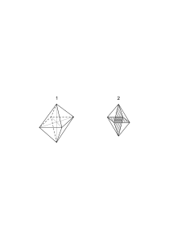

leicht wenn man sie wie Figur 2 schraffiert.

### [162\[4\]](https://cdn.wittgensteinnachlass.com/2000px/webp/Ms-109/162.webp),[163\[1\]](https://cdn.wittgensteinnachlass.com/2000px/webp/Ms-109/163.webp)

16.10.1930

Wenn ich sage „A hat einen grauen Hut” & ich gefragt werde „wer ist A” & antworte „dieser ist der A”, so mache ich damit den Menschen A zu einem Symbol in meinem Satz oder es ist doch _möglich_, daß ich ihn zu einem Bestandteil meines Satzes mache; aber das _muß_ nicht geschehen & der Name kann für eine Beschreibung stehen – die ihren Sinn behält auch wenn der Gegenstand A zerstört wird. Das ist aber merkwürdig & widerspricht einem Gefühl, daß wir, wenn wir den Namen A gebrauchen, uns nicht bewußt sind einmal dessen, daß A für eine Beschreibung steht, das andre mal daß es nur mit dem Körper A zusammen Bedeutung hat. Tritt dieses Problem auch auf wenn es sich z.B. um eine Farbe handelt? Wenn ich etwa sage „das Tuch ist mauve” & auf die Frage „was ist ‚mauve’” auf einen Gegenstand von dieser Farbe zeige. Man könnte dabei sagen „merke dir, das ist mauve” & hat dabei eine ganz bestimmte Art der Wirkung dieses Zeigens im Sinn.

### [163\[2\]](https://cdn.wittgensteinnachlass.com/2000px/webp/Ms-109/163.webp),[164\[1\]](https://cdn.wittgensteinnachlass.com/2000px/webp/Ms-109/164.webp)

Wenn nun der Betreffende (wie es tatsächlich oft geschieht) vergißt welche Farbe man so bezeichnet hat aber nicht vergißt daß bei einer bestimmten Gelegenheit ihm die Bedeutung des Wortes „mauve” erklärt wurde & nun fällt dieses Wort wieder & er weiß nur es ist die Farbe von der bei jener Gelegenheit die Rede war, hat nun das Wort für ihn eine andere Bedeutung als damals wie er wußte wie mauve ausschaut? Ich glaube ja.

### [164\[2\]](https://cdn.wittgensteinnachlass.com/2000px/webp/Ms-109/164.webp)

Das verhält sich aber doch ebenso wenn ich A kennen lerne & vergesse wie er ausschaut & später von ihm reden höre. Und es lassen sich Sätze angeben die für mich sinnlos sind wenn dem Namen a kein visuelles Erinnerungsbild entspricht.

### [164\[3\]](https://cdn.wittgensteinnachlass.com/2000px/webp/Ms-109/164.webp)

17.10.1930

In _einem_ Sinn ist das Schwert Nothung die Bedeutung des Namens „Nothung”. So zwar daß der Name seine Bedeutung verliert wenn dieses Schwert aufhört zu existieren. In dem anderen Sinn in welchem der Name seine Bedeutung nicht verliert, wenn auch das Ding zerstört wird, hat seine Bedeutung _nie_ von der Existenz des Dinges abgehangen, auch nicht in dem Moment da die Erklärung gegeben wurde: „dieses Schwert ist Nothung” denn die Erklärung behält ihren Sinn auch wenn es sich um eine Illusion handelte & in Wirklichkeit gar kein Schwert vorhanden war. Wenn man andrerseits das Wort „rot” durch Hinweisen auf etwas Rotes erklärt, – – –

### [165\[1\]](https://cdn.wittgensteinnachlass.com/2000px/webp/Ms-109/165.webp)

Ich könnte die Bedeutung von „rot” so erklären daß ich sagte: drücke auf deine Augenlider, was du dann siehst ist rot.

### [165\[2\]](https://cdn.wittgensteinnachlass.com/2000px/webp/Ms-109/165.webp)

Aber könnte ich nicht auch die falsche Erinnerung in jemandem wachrufen daß er etwas Rotes gesehen habe oder überhaupt die Vorstellung von rot ohne daß er je rot gesehen hat. Kann ich nicht jedenfalls durch eine Beschreibung – sagen wir – ein Blaugrün in seine Vorstellung bringen wenn er auch noch nie eines wirklich gesehen hat & nur etwa blau & grün?

### [165\[3\]](https://cdn.wittgensteinnachlass.com/2000px/webp/Ms-109/165.webp)

Ich will sagen: Wenn es nicht wesentlich ist daß es etwas Rotes gibt damit das Wort rot Bedeutung habe dann kann es nie wesentlich gewesen sein. Die _Geschichte_ des Erlernens einer Bedeutung kann nie wesentlich sein.

### [165\[4\]](https://cdn.wittgensteinnachlass.com/2000px/webp/Ms-109/165.webp)

22.10.1930

_Die_ Sprache kann nicht durch Unterrichtsbriefe gelernt werden.

(Was wir also so lernen können steht im Gegensatz zur Sprache.)

### [165\[5\]](https://cdn.wittgensteinnachlass.com/2000px/webp/Ms-109/165.webp),[166\[1\]](https://cdn.wittgensteinnachlass.com/2000px/webp/Ms-109/166.webp)

Wir müssen wissen daß jedes Stück altes Eisen das wir auf der Straße finden ein Schlüssel ist & daß es sich sozusagen nur darum handelt sie in der richtigen Reihenfolge zu verwenden um alle Türen des Hauses nacheinander aufsperren zu können.

### [166\[2\]](https://cdn.wittgensteinnachlass.com/2000px/webp/Ms-109/166.webp),[167\[1\]](https://cdn.wittgensteinnachlass.com/2000px/webp/Ms-109/167.webp)

Was heißt es, einen Satz verstehen? Ich glaube das Verständnis was da ist muß sich zeigen lassen & nur so weit es sich zeigen läßt ist es. Die Frage ist eigentlich nicht „was heißt es einen Satz so verstehen wie ihn ein anderer gemeint hat” sondern „was heißt es einen Satz irgendwie zu verstehen” also besser: zu deuten. Wie würde ich zeigen daß ich das Wörterbuch als Übersetzungsregel deute? Doch dadurch daß ich danach eine Übersetzung ausführe. Es ist etwa dies mein Wörterbuch:

abcd | efgh

und ich übersetze danach den Satz bdca in fhge. Nun habe ich – im gewöhnlichen Sinne – gezeigt, daß ich den Gebrauch des Wörterbuchs verstehe & kann sagen daß ich auf gleiche Weise den Satz cdab übersetzen kann wenn ich will. – Wenn also der Satz cdab ein Befehl ist den entsprechenden Satz in der zweiten Sprache hinzuschreiben, so verstehe ich diesen Befehl wie ich etwa den Befehl verstehe ∣∣∣∣∣∣ Schritte zu gehen wenn mir gezeigt wurde wie die entsprechenden Befehle mit den Zahlen ❘, ∣∣, ∣∣∣, ∣∣∣∣, ausgeführt werden. Man kann geradezu sagen: Ich habe dir jetzt gezeigt was f(❘), f(∣∣), f(∣∣∣) & f(∣∣∣∣) heißt, jetzt wirst du verstehen was f(∣∣∣∣∣∣) bedeutet. D.h. man rechnet damit daß ihm von dem Demonstrieren der Ausführung von f(❘), f(∣∣), etc. etwas – quasi ein Eindruck – geblieben ist was er nun auf f(∣∣∣∣∣∣) anwenden wird.

### [167\[2\]](https://cdn.wittgensteinnachlass.com/2000px/webp/Ms-109/167.webp)

Aber natürlich kann das nicht anders sein als wenn ich, z.B. sage „ich will diesen Fleck rot anstreichen”, eine Vorstellung von der Farbe habe & nun „_weiß_” wie diese Vorstellung in die Wirklichkeit zu übersetzen ist. Es ist das Verhältnis der Vorstellung zu der gegenwärtig gesehenen Farbe was das Verstehen der Vorstellung als eines Zeichens möglich macht. Ja dieses Verhältnis muß das Verständnis ausmachen nicht nur möglich machen.

### [168\[1\]](https://cdn.wittgensteinnachlass.com/2000px/webp/Ms-109/168.webp)

Ja das ganze Problem ist schon darin enthalten: Was heißt es zu wissen wie der Fleck aussähe, wenn er meiner Vorstellung entspräche?

### [168\[2\]](https://cdn.wittgensteinnachlass.com/2000px/webp/Ms-109/168.webp)

Dieses Wissen muß ganz & gar in dem liegen was wirklich gegeben ist.

### [168\[3\]](https://cdn.wittgensteinnachlass.com/2000px/webp/Ms-109/168.webp)

Wäre die Vorstellung allein so könnte aus ihr keine Wirklichkeit konstruiert werden.

### [168\[4\]](https://cdn.wittgensteinnachlass.com/2000px/webp/Ms-109/168.webp)

Es handelt sich darum daß ich die Distanz der Vorstellung von dem sehe was ist.

### [168\[5\]](https://cdn.wittgensteinnachlass.com/2000px/webp/Ms-109/168.webp)

Ich muß, scheint es, eine allgemeine Übersetzungsregel in ihrer Allgemeinheit verstehen.

### [168\[6\]](https://cdn.wittgensteinnachlass.com/2000px/webp/Ms-109/168.webp)

Wenn wir einen einfachen Fall vor uns haben so ist es gut zu trachten den einmal zu verstehen; ob er sich nun als das Prototypische aller Fälle erweisen sollte oder nicht.

### [168\[7\]](https://cdn.wittgensteinnachlass.com/2000px/webp/Ms-109/168.webp),[169\[1\]](https://cdn.wittgensteinnachlass.com/2000px/webp/Ms-109/169.webp)

23.10.1930

Was heißt es, eine allgemeine Regel zu verstehen? Man kann die Zahlen ∣∣, ∣∣∣∣, ∣∣∣∣∣∣, sehen ohne eine allgemeine Regel ihrer Bildung zu verstehen & man kann eine allgemeine Regel aus ihnen entnehmen. Der Befehl kann ja wirklich lauten: ∣∣, ∣∣∣∣, ∣∣∣∣∣∣, – setze diese Reihe fort.

### [169\[2\]](https://cdn.wittgensteinnachlass.com/2000px/webp/Ms-109/169.webp)

Die Regel der Interpretation kann nicht ausgedrückt werden, weil jeder Ausdruck einer Interpretation bedarf.

### [169\[3\]](https://cdn.wittgensteinnachlass.com/2000px/webp/Ms-109/169.webp)

Das Wörterbuch gibt die allgemeine Regel der Übersetzung. Aber auch das Wörterbuch muß ja so erst verstanden werden. Gibt es ein Verstehen einer allgemeinen Regel als solcher außer durch ihre Anwendung?

### [169\[4\]](https://cdn.wittgensteinnachlass.com/2000px/webp/Ms-109/169.webp),[170\[1\]](https://cdn.wittgensteinnachlass.com/2000px/webp/Ms-109/170.webp)

Wenn man sagt daß das Übersetzen von einer Zeichensprache in die andere alles ist wodurch ich mein Verstehen dokumentieren kann ja alles worin es besteht so muß man sich – glaube ich – nur gegen einen Vorwurf schützen, den, daß dann die letzte Übersetzung in die Wirklichkeit & damit der Sinn des Satzes unbestimmt bleibt. Dasjenige was man gegen diese Auffassung einwenden möchte ist: Du sagst also daß ich solange nicht wissen kann welche Tat den Befehl befriedigt bis sie nicht getan ist. Aber das sage ich gerade _nicht_. Wir fürchten daß dann der Satz mehrdeutig würde. Aber Mehrdeutigkeit ist etwas (ganz) Anderes. Eine Erwartung ist nicht mehrdeutig weil das was sie erwartet tatsächlich noch nicht eingetroffen ist.

### [170\[2\]](https://cdn.wittgensteinnachlass.com/2000px/webp/Ms-109/170.webp)

Aber wenn ich denkend Zeichen gebrauche so rede ich doch nicht nur sondern meine etwas ganz Bestimmtes! Freilich etwas ganz Bestimmtes im Gegensatz zu dem Fall wo einer redet & nur unbestimmt weiß was die Worte bedeuten. Für beide Fälle kann man Beispiele angeben aber beide treten aus der Sprache nicht heraus.

### [170\[3\]](https://cdn.wittgensteinnachlass.com/2000px/webp/Ms-109/170.webp)

Wenn ich sage ich erwarte mir hier einen roten Kreis so erwarte ich doch etwas ganz bestimmtes, es kann dann doch nicht etwa ebensogut dieser blaue Kreis meine Erwartung befriedigen. Freilich nicht, aber das sagte ich auch nicht & wir sind ja damit doch nicht bis zur Entscheidung unserer Erwartung vorgeschritten sondern haben nur eine Übersetzung abgelehnt.

### [170\[4\]](https://cdn.wittgensteinnachlass.com/2000px/webp/Ms-109/170.webp),[171\[1\]](https://cdn.wittgensteinnachlass.com/2000px/webp/Ms-109/171.webp)

Wenn man nun fragt: Ist also die Tatsache durch die Erwartung auf ja & nein bestimmt oder nicht d.h. ist es bestimmt in welchem Sinne die Erwartung durch ein Ereignis, welches immer eintritt, beantwortet werden wird, so muß man antworten: _ja_! Unbestimmt wäre es etwa im Falle einer Disjunktion im Ausdruck der Erwartung.

### [171\[2\]](https://cdn.wittgensteinnachlass.com/2000px/webp/Ms-109/171.webp)

Wenn ich voraussehe wie es kommen wird, sehe ich da etwa doch nicht voraus wie es kommen wird, weil ich die Voraussicht nicht in die Wirklichkeit projizieren kann die noch nicht vorhanden ist? Im Gegenteil die Möglichkeit meiner Voraussicht beruht gerade darauf daß die zu dieser Voraussicht gehörige Realität nicht auch die Erfüllung (oder ihr Gegenteil) der Voraussicht beinhaltet.

### [171\[3\]](https://cdn.wittgensteinnachlass.com/2000px/webp/Ms-109/171.webp)

Die scheinbare Unbestimmtheit von der ich sprach, ist **ebenso**wenig vorhanden wie die, von der manche Leute reden die daher kommen soll daß wir nicht wissen können ob zwei Menschen die gleiche Farbe sehen wenn sie einen Gegenstand betrachten. Das ist Unsinn denn unter dem Sehen verschiedener Farben meinen wir etwas ganz anderes & es gibt in diesem Sinne Kriterien dafür ob die Beiden die gleiche oder verschiedene Farben sehen.

### [171\[4\]](https://cdn.wittgensteinnachlass.com/2000px/webp/Ms-109/171.webp),[172\[1\]](https://cdn.wittgensteinnachlass.com/2000px/webp/Ms-109/172.webp)

24.10.1930

Könnte ich einen Farbfleck erwarten wenn ich jetzt keine Farbe sähe? Wenn nein, dann ist das Sehen einer Farbe für die Erwartung wesentlich. Und gehört zu ihr.

### [172\[2\]](https://cdn.wittgensteinnachlass.com/2000px/webp/Ms-109/172.webp)

Ist es nur _eine_ Art der Beschreibung eines seelischen Vorgangs zu sagen er sei die Erwartung daß hier ein roter Fleck auftreten wird oder ist es die interne Beschreibung dieses Vorgangs in dem Sinn in welchem der Satz „ein roter Fleck tritt dort auf” die interne Beschreibung der Erfüllung jener Erwartung ist? Ich glaube, – offenbar das Letztere.

### [172\[3\]](https://cdn.wittgensteinnachlass.com/2000px/webp/Ms-109/172.webp)

Der Ausdruck der Erwartung ist die Erwartung.

### [172\[4\]](https://cdn.wittgensteinnachlass.com/2000px/webp/Ms-109/172.webp)

„Meine Erwartung ist so gemacht, daß, was immer kommt mit ihr übereinstimmen muß oder nicht.”

### [172\[5\]](https://cdn.wittgensteinnachlass.com/2000px/webp/Ms-109/172.webp)

25.10.1930

Zum Beweis dessen daß man wirklich weiß was man mit dem Satz „ich erwarte mir hier einen roten Fleck” meint, sagt man etwa: freilich weiß ich was ich mir erwarte, ich sehe den Fleck jetzt deutlich vor mir!

### [173\[1\]](https://cdn.wittgensteinnachlass.com/2000px/webp/Ms-109/173.webp)

Wenn ich gehe so enthält der einzelne Schritt nicht das Ziel wohin mich das Gehen bringen wird.

### [173\[2\]](https://cdn.wittgensteinnachlass.com/2000px/webp/Ms-109/173.webp)

Ich mache Versuche mich, oder meinen Hörer, in's Wasser fallen zu lassen & ihn dann herauszuziehn um so eine Rettung zu demonstrieren. Aber es geht nicht sehr elegant: einmal gelingt es mir nicht recht ihn ins Wasser zu werfen & ich wälze ihn auf der Erde herum ohne ihn ins Wasser zu bringen, & dann wieder habe ich ihn ins Wasser geworfen aber ich bringe ihn nicht mehr heraus & er ist in der Gefahr zu ertrinken.

### [173\[3\]](https://cdn.wittgensteinnachlass.com/2000px/webp/Ms-109/173.webp)

Komme ich an's Ziel so war jeder Schritt ein Schritt zu diesem Ziel.

### [173\[4\]](https://cdn.wittgensteinnachlass.com/2000px/webp/Ms-109/173.webp)

Wie kann man etwas abbilden was nicht da ist!? (Offenbar liegt hier eine Zweideutigkeit in den Worten „etwas” & „da ist”.)

### [173\[5\]](https://cdn.wittgensteinnachlass.com/2000px/webp/Ms-109/173.webp)

In dem Faktum des Verstehens muß das Verstehen (was immer es ist) seinen Ausdruck finden. In dem Vorgang des Verstehens (welcher immer der sei) muß das Verstehen _ausgedrückt_ sein.

### [173\[6\]](https://cdn.wittgensteinnachlass.com/2000px/webp/Ms-109/173.webp),[174\[1\]](https://cdn.wittgensteinnachlass.com/2000px/webp/Ms-109/174.webp)

Man ist (durch falsche Grammatik) versucht zu fragen: wie denkt man den Satz p, wie erwartet man daß das & das eintreffen wird (wie macht man das). Und in dieser falschen Frage liegt wohl die ganze Schwierigkeit in nuce enthalten.

### [174\[2\]](https://cdn.wittgensteinnachlass.com/2000px/webp/Ms-109/174.webp)

Der falsche Vergleich besteht hier darin daß wir uns die Sache wie einen Mechanismus denken dessen Äußeres wir kennen dessen inneres Arbeiten uns aber noch verborgen ist.

### [174\[3\]](https://cdn.wittgensteinnachlass.com/2000px/webp/Ms-109/174.webp)

Es ist eine Haupttätigkeit der Philosophie vor falschen Vergleichen zu warnen. Vor (den) falschen Vergleichen zu warnen die unserer Ausdrucksweise – ohne daß wir uns dessen ganz bewußt sind – zu Grunde liegen. Ich glaube unsere Methode ähnelt hier der der Psychoanalyse die auch Unbewußtes bewußt & dadurch unschädlich machen will & ich glaube daß diese Ähnlichkeit keine rein äußerliche ist.

### [174\[4\]](https://cdn.wittgensteinnachlass.com/2000px/webp/Ms-109/174.webp)

Das Etwas was wir erwarten scheint uns immer wie der Mensch der etwa zur Tür herein kommen soll nicht wie die Tatsache daß er kommen soll.

### [174\[5\]](https://cdn.wittgensteinnachlass.com/2000px/webp/Ms-109/174.webp),[175\[1\]](https://cdn.wittgensteinnachlass.com/2000px/webp/Ms-109/175.webp)

Die Bedeutung eines Zeichens ist das ganze Symbol zu dem das Zeichen gehört. Oder man könnte sagen sie ist der Platz im grammatischen Raum an dem es steht.

### [175\[2\]](https://cdn.wittgensteinnachlass.com/2000px/webp/Ms-109/175.webp)

In irgend einem Sinne kann man sagen: Ein Satzzeichen hat nur im System einer Sprache Sinn.

### [175\[3\]](https://cdn.wittgensteinnachlass.com/2000px/webp/Ms-109/175.webp)

Wenn ich einen Befehl gebe so muß ich in der selben Sprache auch die Tat beschreiben können, die dem Befehl zuwiderläuft.

### [175\[4\]](https://cdn.wittgensteinnachlass.com/2000px/webp/Ms-109/175.webp)

26.10.1930

Wenn jemand den Befehl der in dem Plan

ausgedrückt ist _versteht_ so _muß_ er auch den Befehl

verstehen.

Das heißt es ist unmöglich nur _einen_ Satz einer Sprache zu verstehen.

### [175\[5\]](https://cdn.wittgensteinnachlass.com/2000px/webp/Ms-109/175.webp)

D.h. Ein Satz kann nur als Teil eines Systems verstanden werden.

### [175\[6\]](https://cdn.wittgensteinnachlass.com/2000px/webp/Ms-109/175.webp)

Kann man sagen: Verstehen was der Satz sagt: „hier wird ein roter Kreis erscheinen”, heißt, den gegenwärtigen Zustand in die _selbe_ Sprache übersetzen können (den gegenwärtigen Zustand in der _gleichen_ Sprache beschreiben können)?

### [176\[1\]](https://cdn.wittgensteinnachlass.com/2000px/webp/Ms-109/176.webp)

Man kann einen Satz nicht losgelöst von einer Sprache verstehen.

### [176\[2\]](https://cdn.wittgensteinnachlass.com/2000px/webp/Ms-109/176.webp)

„In der gleichen Sprache ausdrücken” heißt mit dem gleichen Maßstab messen.

### [176\[3\]](https://cdn.wittgensteinnachlass.com/2000px/webp/Ms-109/176.webp)

Wir können nur innerhalb der Sprache vergleichen.

### [176\[4\]](https://cdn.wittgensteinnachlass.com/2000px/webp/Ms-109/176.webp)

Ist es so: denken heißt Anwenden des Planes. Aber die Anwendung kann nicht im Plan liegen.

### [176\[5\]](https://cdn.wittgensteinnachlass.com/2000px/webp/Ms-109/176.webp)

_Gedankenlesen_ kann nur darin bestehen daß wir Zeichen interpretieren also einfach lesen (nur vielleicht _andere_ Zeichen). Oder aber es besteht darin daß einem wenn man des Anderen Hand hält (oder in andrer Art mit ihm in Kontakt steht) Gedanken kommen die durch nachträgliches Fragen als die Gedanken auch des Anderen erkannt werden. Aber da handelt es sich überhaupt um kein Lesen sondern es wäre nur die _Hypothese_ erlaubt daß zwei Leute unter gewissen Umständen das gleiche dächten.

### [177\[1\]](https://cdn.wittgensteinnachlass.com/2000px/webp/Ms-109/177.webp)

Da das Denken ein symbolischer Vorgang ist so kann es uns ganz gleich sein wo sich dieser Vorgang abspielt wenn seine symbolischen Eigenschaften, wenn also das was seinen Zweck ausmacht, gewahrt bleibt. (Wenn wir uns nicht für die psychologische Seite gewisser dieser Vorgänge interessieren.)

### [177\[2\]](https://cdn.wittgensteinnachlass.com/2000px/webp/Ms-109/177.webp)

Ist das Denken ein augenblicklicher Vorgang oder etwa ein andauernder Zustand wovon die Worte, der Satz, nur eine ungeschickte Wiedergabe sind (so daß man etwa sagen könnte, wie von dem Eindruck einer Landschaft: Worte können das gar nicht wiedergeben)? Der Gedanke braucht so lange wie sein Ausdruck. Weil der Ausdruck der Gedanke ist.

### [177\[3\]](https://cdn.wittgensteinnachlass.com/2000px/webp/Ms-109/177.webp)

27.10.1930

Ein Symbol verstehen heißt seine Multiplizität verstehen. Die Multiplizität seiner Anwendung verstehen.

### [177\[4\]](https://cdn.wittgensteinnachlass.com/2000px/webp/Ms-109/177.webp),[178\[1\]](https://cdn.wittgensteinnachlass.com/2000px/webp/Ms-109/178.webp)

28.10.1930

Ich habe einmal gelesen daß ein Franzose – ich glaube M. Briand – gesagt habe, die französische Sprache sei dadurch ausgezeichnet, daß in ihr die Wörter (im Satz) in der Reihenfolge stehen, wie man wirklich denkt. – Das ist ein sehr bedeutungsvoller Ausspruch, obwohl völliger Unsinn. Es bezeichnet nämlich eine bestimmte Auffassung – – –

### [178\[2\]](https://cdn.wittgensteinnachlass.com/2000px/webp/Ms-109/178.webp)

Wenn Bauern mit einander streiten weil der eine dem anderen für die Kühe die er von ihm gekauft hat zuwenig Geld gegeben hat & dieser Streit kommt vor den Richter & wird entschieden, so kann es offenbar dabei nicht drauf ankommen was für eine Vorstellung der Eine oder der Andere beim Hören des Worts Kuh (gehabt) hat. Sondern es wird dabei sozusagen mit Worten gerechnet & auch die Anwendung des Resultats ist eine exakte Übersetzung der Sprache in eine Handlung (etwa das Aufzählen von Geldstücken.)

### [178\[3\]](https://cdn.wittgensteinnachlass.com/2000px/webp/Ms-109/178.webp)

Wenn die Logiker die psychologischen Operationen beschreiben die sie für das Denken & die Interpretation von Sätzen halten so ist es immer ein Wunder wie bei so vaguen Vorgängen etwas so Bestimmtes wie ein Urteil soll herauskommen können.

### [178\[4\]](https://cdn.wittgensteinnachlass.com/2000px/webp/Ms-109/178.webp),[179\[1\]](https://cdn.wittgensteinnachlass.com/2000px/webp/Ms-109/179.webp)

Eine allgemeine Regel verstehen heißt sie in irgend einem Fall _anwenden_. (nicht „anwenden können”) Wenn ich z.B. mein Verständnis für einen erwartenden Satz dadurch ausdrücke, daß ich den gegenwärtigen Zustand in der gleichen Sprache beschreibe so ist das die Anwendung der allgemeinen Regel in _einem_ Fall.

### [179\[2\]](https://cdn.wittgensteinnachlass.com/2000px/webp/Ms-109/179.webp)

Aber hier möchte ich immer sagen: die Anwendung der allgemeinen Regel ist nicht genügend sondern diese Regel muß darin irgendwie betont werden. – Aber das ist falsch.

### [179\[3\]](https://cdn.wittgensteinnachlass.com/2000px/webp/Ms-109/179.webp)

Ist nicht das Verstehen also Anwenden-können eines Satzes auf einer Stufe mit dem Schachspielen-können. In dem Sinne in dem ich auch nicht irren kann wenn ich gefragt werde „kannst du Schach spielen” & ich antworte „ja”, in diesem Sinne muß ich die Regeln im Geiste durchfliegen & sie also irgendwie anwenden; denn in jedem anderen Sinne kann ich mich doch irren & plötzlich daraufkommen daß ich die Regeln für eine Figur vergessen habe & nicht sagen kann „ich konnte Schachspielen als ich sagte daß ich es könne etc.”.

### [180\[1\]](https://cdn.wittgensteinnachlass.com/2000px/webp/Ms-109/180.webp)

Ist aber nicht dadurch der Sinn des Satzes wieder problematisch geworden?

### [180\[2\]](https://cdn.wittgensteinnachlass.com/2000px/webp/Ms-109/180.webp)

Oder darf ich sagen: Der Sinn des Satzes ist **eben**sowenig problematisch wie die Regeln der Grammatik.

### [180\[3\]](https://cdn.wittgensteinnachlass.com/2000px/webp/Ms-109/180.webp)

Man würde sagen: Ich verstehe die Übersetzungsregel meint: ich _kann_ sie anwenden, wenn keine äußeren Hindernisse entgegenstehen. „Ich verstehe die Übersetzungsregel abc | def”

scheint mir auf genau derselben Stufe zu stehen wie die Aussage „ich kann Schachspielen”. Könnte ich ohne bei dieser Aussage an die Regeln über die Bewegung des Turmes gedacht zu haben, & wenn ich nun (beim Versuch) fände daß ich sie vergessen habe, könnte ich nun sagen „ich konnte Schachspielen wie du mich gefragt hast & nur jetzt kann ich es nicht”?

### [180\[4\]](https://cdn.wittgensteinnachlass.com/2000px/webp/Ms-109/180.webp),[181\[1\]](https://cdn.wittgensteinnachlass.com/2000px/webp/Ms-109/181.webp)

Kann ich _wissen_ daß ich die Regeln weiß, wenn ich sie nicht durchfliege? Kann ich wissen daß ich eine Regel wußte als ich gefragt wurde ob ich sie wisse, wenn ich sie mir damals nicht tatsächlich ins Gedächtnis gerufen habe? Ich glaube gewiß nein.

### [181\[2\]](https://cdn.wittgensteinnachlass.com/2000px/webp/Ms-109/181.webp)

Kann ich mich darin nicht irren, wenn ich sage „ich kann multiplizieren” wenn ich mir dabei nicht die Multiplikation irgendwie vorführe & wie verhält es sich dann mit dem Wurzelziehen worüber ich nicht sicher bin & vielleicht, wenn ich es versuche finde daß ich es noch kann oder auch nicht?

### [181\[3\]](https://cdn.wittgensteinnachlass.com/2000px/webp/Ms-109/181.webp)

29.10.1930

Niemand würde fragen ob die Multiplikation zweier Zahlen (etwa nach der gewöhnlichen Art durchgeführt) gleichläuft mit dem Gedanken. Weil jeder die Multiplikation als ein Instrument ansieht. Während man den Gedanken nicht als ein Instrument ansieht.

### [181\[4\]](https://cdn.wittgensteinnachlass.com/2000px/webp/Ms-109/181.webp),[182\[1\]](https://cdn.wittgensteinnachlass.com/2000px/webp/Ms-109/182.webp)

Man unterscheidet zwischen dem bloßen Lesen eines Befehls & dem Lesen des Befehls mit Verständnis. Bei diesem Lesen oder Sehen des Planes geht also noch etwas anderes vor sich. Und zwar wird es – so scheint es mir – von einer Übersetzung begleitet. Oder ist das falsch & soll ich sagen: ich werde nur gewahr daß es ein Plan ist nach dem ich gehen soll, das heißt, ich werde nur des ganzen Symbols gewahr – während im ersten Fall bloß des Zeichens.

### [182\[2\]](https://cdn.wittgensteinnachlass.com/2000px/webp/Ms-109/182.webp)

Die Auffassung des Satzes also des Verstehens & des Gedankens muß gewiß die Möglichkeit des Kalküls rechtfertigen. Und der Kalkül vollzieht sich in der Zeit & ist – sozusagen – ausgebreitet.

### [182\[3\]](https://cdn.wittgensteinnachlass.com/2000px/webp/Ms-109/182.webp)

Ist das Verstehen eines Satzes dem Verstehen eines Schachzuges als solchen nicht analog. Wer das Schachspiel gar nicht kennt & sieht jemand einen Zug machen, der wird ihn nicht verstehen d.h. nicht als Zug eines Spieles verstehen. Und es ist etwas anderes dem Zug mit Verständnis zu folgen, als ihn bloß zu sehen.

### [182\[4\]](https://cdn.wittgensteinnachlass.com/2000px/webp/Ms-109/182.webp)

Kann man sagen ich sehe den Zug im Schachraum?

### [182\[5\]](https://cdn.wittgensteinnachlass.com/2000px/webp/Ms-109/182.webp),[183\[1\]](https://cdn.wittgensteinnachlass.com/2000px/webp/Ms-109/183.webp)

Was ist es aber dann was uns immer das Gefühl gibt, daß das Verstehen eines Satzes das Verstehen von etwas außerhalb ihm Liegendem ist & nicht von der Welt außerhalb des Zeichens wie sie eben ist, sondern von der Welt wie sie das Zeichen – gleichsam – wünscht.

### [183\[2\]](https://cdn.wittgensteinnachlass.com/2000px/webp/Ms-109/183.webp)

Von der Welt als Teil des ganzen Spieles (von dem wir nur _einen_ Zug _sehen_)

### [183\[3\]](https://cdn.wittgensteinnachlass.com/2000px/webp/Ms-109/183.webp)

Wie kann ich mir vornehmen einer allgemeinen Regel zu folgen.

### [183\[4\]](https://cdn.wittgensteinnachlass.com/2000px/webp/Ms-109/183.webp)

Nicht _nur_ soweit als ich die Regel ausdrücken kann?

### [183\[5\]](https://cdn.wittgensteinnachlass.com/2000px/webp/Ms-109/183.webp)

Das hängt (alles) damit zusammen, daß man nicht fragen kann: „ist das wirklich die Farbe die Du sonst rot genannt hast.” Es sei denn man fragt „ist das die Farbe die Du erwartet hast & nicht vielmehr _das_”. Jeder Unterschied muß sich als Unterschied in _einer_ Sprache ausdrücken.

### [183\[6\]](https://cdn.wittgensteinnachlass.com/2000px/webp/Ms-109/183.webp)

Ich kann mir vornehmen _einer_ Regel zu folgen & nicht einer anderen. Dann müssen beide ausgedrückt sein.

### [183\[7\]](https://cdn.wittgensteinnachlass.com/2000px/webp/Ms-109/183.webp)

Nur was kontrollierbar ist kann sich in der Sprache ausdrücken.

### [183\[8\]](https://cdn.wittgensteinnachlass.com/2000px/webp/Ms-109/183.webp),[184\[1\]](https://cdn.wittgensteinnachlass.com/2000px/webp/Ms-109/184.webp)

Man kann freilich dem Gedächtnis durch eine Notiz nachhelfen aber die Deutung der Notiz kann man sich nicht aufheben.

### [184\[2\]](https://cdn.wittgensteinnachlass.com/2000px/webp/Ms-109/184.webp)

Von Verschiedenheit kann man nur (dann) reden, wenn ein Vergleich möglich ist. Und der ist nur in _einer_ Sprache möglich & zwei Sprachen müssen erst in einander übersetzt sein, (auf gleichen Nenner gebracht) ehe ein Vergleich von Ausdrücken möglich ist, dann findet er aber eben in _einer_ Sprache statt.

### [184\[3\]](https://cdn.wittgensteinnachlass.com/2000px/webp/Ms-109/184.webp)

30.10.1930

In der Sprache kann man von _einem_ reden nur im Gegensatz zu etwas _anderem_.

### [184\[4\]](https://cdn.wittgensteinnachlass.com/2000px/webp/Ms-109/184.webp)

Die Regeln des Schachspiels unterscheiden das Schachspiel von einem Spiel das in der selben Sprache andere Regeln hat.

### [184\[5\]](https://cdn.wittgensteinnachlass.com/2000px/webp/Ms-109/184.webp)

Jeder Satz einer Sprache hat nur Sinn im Gegensatz zu anderen Wortzusammenstellungen derselben Sprache.

### [184\[6\]](https://cdn.wittgensteinnachlass.com/2000px/webp/Ms-109/184.webp),[185\[1\]](https://cdn.wittgensteinnachlass.com/2000px/webp/Ms-109/185.webp)

Wir könnten uns zwei Schachspieler denken die, da sie kein Gedächtnis haben, die Regeln des Spiels geschrieben vor sich hätten & sich bei jedem Zuge nach den geschriebenen Regeln richteten.

### [185\[2\]](https://cdn.wittgensteinnachlass.com/2000px/webp/Ms-109/185.webp)

Um einen Plan zu verstehen muß man in gewissem Sinne erst das allgemeine Prinzip der Plandarstellung verstehen & man versteht den Plan im Gegensatz zu anderen die nicht gelten. Wenn ich das nun sage bezieht es sich auf den momentanen Geisteszustand des Betreffenden, der den Plan auffaßt? Doch gewiß nicht – er geht doch nicht alle anderen Möglichkeiten der Darstellung durch so wenig wie der Schachspieler etwa fortwährend die Regeln des Schachspiels rekapituliert (und täte er's so müßte er einmal die eine dann die andre sich vorsagen nicht aber alle auf einmal).

### [185\[3\]](https://cdn.wittgensteinnachlass.com/2000px/webp/Ms-109/185.webp)

Man könnte so fragen: Ist Schachspielenkönnen ein andauernder – quasi amorpher – Geisteszustand, etwa wie Zahnschmerzen?

### [185\[4\]](https://cdn.wittgensteinnachlass.com/2000px/webp/Ms-109/185.webp),[186\[1\]](https://cdn.wittgensteinnachlass.com/2000px/webp/Ms-109/186.webp)

Das Verständnis der Sprache – quasi des Spiels – scheint wie ein Hintergrund auf dem der einzelne Satz erst Bedeutung gewinnt.

### [186\[2\]](https://cdn.wittgensteinnachlass.com/2000px/webp/Ms-109/186.webp)

Die allgemeine Regel erst enthält den Freiheitsgrad, die Beweglichkeit des Mechanismus. Das Bild des Mechanismus in einer seiner Stellungen enthält hievon nichts.

### [186\[3\]](https://cdn.wittgensteinnachlass.com/2000px/webp/Ms-109/186.webp)

Soll ich nun sagen der Freiheitsgrad des Mechanismus kann sich nur mit der Zeit enthüllen? Aber wie kann ich dann je wissen daß er gewisse Bewegungen _nicht_ machen kann, (und daß er gewisse Bewegungen machen kann die er gerade noch nicht gemacht hat). Darauf ist doch die Antwort: Der Freiheitsgrad des Mechanismus kann doch _beschrieben_ werden. Wohl, aber dann ist eben nichts mehr gegeben als was diese Beschreibung gibt. (Die doch selber nur eine Stellung eines Mechanismus ist!)

### [186\[4\]](https://cdn.wittgensteinnachlass.com/2000px/webp/Ms-109/186.webp)

Das Verständnis als eine _Disposition_ der Seele oder des Gehirns geht uns nichts an.

### [186\[5\]](https://cdn.wittgensteinnachlass.com/2000px/webp/Ms-109/186.webp),[187\[1\]](https://cdn.wittgensteinnachlass.com/2000px/webp/Ms-109/187.webp)

Der Ausdruck des Verständnisses der Schachregeln ist doch gewiß das Hersagen dieser Regeln in irgend einer Form. Aber das ist doch nur ein Ausdruck der Kenntnis _dieser_ Regeln im Gegensatz zu anderen – falschen – die in dieser Sprache hätten hergesagt werden können.

### [187\[2\]](https://cdn.wittgensteinnachlass.com/2000px/webp/Ms-109/187.webp)

Aber man könnte fragen: ist denn das Verständnis nicht etwas anderes als der Ausdruck des Verständnisses? Ist es nicht so, daß der Ausdruck des Verständnisses eben ein unvollkommener Ausdruck ist? Das heißt doch wohl ein Ausdruck der wesentlich etwas ausläßt was unausdrückbar ist. Denn sonst könnte ich ja eben einen besseren finden. Also wäre der Ausdruck ein vollkommener _Ausdruck_. – – –

### [187\[3\]](https://cdn.wittgensteinnachlass.com/2000px/webp/Ms-109/187.webp)

Ein Mechanismus offenbart seinen Zweck nach & nach, so wie er ein um das andere mal gebraucht wird. Und so muß es auch mit einem Satz, mit dem Ausdruck eines Gedankens gehen.

### [187\[4\]](https://cdn.wittgensteinnachlass.com/2000px/webp/Ms-109/187.webp),[188\[1\]](https://cdn.wittgensteinnachlass.com/2000px/webp/Ms-109/188.webp)

Wozu denn überhaupt diese ganze Untersuchung, was interessiert mich denn der Gedanke, das Denken etc., warum ist mir dieser Vorgang nicht ganz gleichgültig? Inwiefern ist er mir interessanter als Zahnschmerzen (oder ein anderer seelischer Vorgang)?

### [188\[2\]](https://cdn.wittgensteinnachlass.com/2000px/webp/Ms-109/188.webp)

Wenn man übrigens das Wort seelisch, wie ich soeben, gebraucht so darum weil man sich das Denken notwendig als eine Reihe von Fantasiebildern vorstellt. Wie aber wenn man diese Fantasiebilder durch Wahrnehmungen ersetzt (das Wort „rot”, wo es notwendig ist durch das Vorzeigen eines roten Gegenstandes begleitet). Fantasiebilder sind unserem Denken nicht wesentlich.

### [188\[3\]](https://cdn.wittgensteinnachlass.com/2000px/webp/Ms-109/188.webp)

Welche Beziehung hat die Vorstellung von einer Photographie die ich heute gesehen habe zu der Photographie (dem Gesichtsbild der Photographie)? Ist sie ihr _ähnlich_? Vorausgesetzt daß sie genau mit der Wirklichkeit übereinstimmt (was eben bei einer Vorstellung „übereinstimmen mit der Wirklichkeit” heißt) –. Ich sage: Genau so habe ich mir's vorgestellt. Und jemand antwortet etwa „das ist unmöglich denn das eine war eine Vorstellung & das andere ist keine & hast Du etwa deine Vorstellung für Wirklichkeit gehalten?”

### [189\[1\]](https://cdn.wittgensteinnachlass.com/2000px/webp/Ms-109/189.webp)

„Das ist das Rot das ich meinte”. „Wie konntest Du _es_ meinen, es war ja (früher) gar nicht da.” „Ja, ich wollte daß Du _das_ tust”. Wie konntest Du es wollen da es ja noch gar nicht getan war.

### [189\[2\]](https://cdn.wittgensteinnachlass.com/2000px/webp/Ms-109/189.webp)

(Der Ausdruck „Nicht- …ische – – –” bezeichnet eine Denkbewegung die mit der Konstruktion einer Nicht-Euklidischen Geometrie anfing & damals eine Tat war, verdienstlich & bedeutend, heute aber bei den Mathematikern noch immer Mode & beliebt ist obwohl die Arbeit die diese Denkbewegung leisten sollte, längst getan ist.)

### [189\[3\]](https://cdn.wittgensteinnachlass.com/2000px/webp/Ms-109/189.webp)

Kann man den Vorgang des Vorbeiziehenlassens von Vorstellungen beim Denken durch einen anderen etwa das Schreiben von Zeichen (oder sonst einen) ersetzen der den gleichen Dienst tut, so ist der Zug der Vorstellungen für uns damit gleichgültig geworden. Uns interessiert am Gedanken nur die Anwendung.

### [189\[4\]](https://cdn.wittgensteinnachlass.com/2000px/webp/Ms-109/189.webp),[190\[1\]](https://cdn.wittgensteinnachlass.com/2000px/webp/Ms-109/190.webp)

Wenn wir sagen meine Vorstellung von diesem Bild war der Wirklichkeit ähnlich, so meinen wir daß sie in gewisser Beziehung mit der Wirklichkeit übereingestimmt hat in anderer nicht, aber so daß auch eine völlige Übereinstimmung denkbar wäre (wobei aber die Vorstellung noch immer die Vorstellung bliebe.)

### [190\[2\]](https://cdn.wittgensteinnachlass.com/2000px/webp/Ms-109/190.webp)

Heißt das nun daß ich mir z.B. diese Farbe vorgestellt habe, indem ich eine ganz bestimmte Übersetzungsregel angewendet habe? Und kann ich diese Übersetzungsregel die Projektionsart ändern wenn ich will?

### [190\[3\]](https://cdn.wittgensteinnachlass.com/2000px/webp/Ms-109/190.webp)

Kann man sagen daß die Vorstellung, das was etwa beim Aussprechen eines Satzes vorsichgeht, nur dann ein Gedanke ist wenn sie angewandt wird? Wie ein Mechanismus nur wenn er arbeitet als solcher funktioniert. Aber wir nennen auch eine stehende Uhr, eine Uhr.

### [190\[4\]](https://cdn.wittgensteinnachlass.com/2000px/webp/Ms-109/190.webp)

31.10.1930

Bei einem onomatopoetischen Wort gehört der Klang mit zum Symbol. Es ist als schriebe man das Wort „rot” mit roter das Wort „grün” mit grüner Tinte.

### [190\[5\]](https://cdn.wittgensteinnachlass.com/2000px/webp/Ms-109/190.webp)

Wie wird ein Plan gebraucht, denn das ist die einzige Frage die uns hier angeht & deren Beantwortung zeigen kann worin das Verständnis des Planes besteht, soweit es für uns Interesse hat.

### [191\[1\]](https://cdn.wittgensteinnachlass.com/2000px/webp/Ms-109/191.webp)

01.11.1930

Man kann manchen Satz nur im Zusammenhang mit anderen verstehen. Wenn ich z.B. etwa in einer Novelle lese: „Nachdem er das gesagt hatte, verließ er sie, wie am vorigen Tag”. Wenn man mich fragt ob ich diesen Satz verstehe, wäre es nicht leicht darauf zu antworten. Es ist ein deutscher Satz & insofern verstehe ich ihn. Ich wüßte wie man diesen Satz etwa gebrauchen _könnte_, ich könnte selbst einen Zusammenhang für ihn erfinden. Und doch verstehe ich ihn nicht _so_ wie ich ihn verstünde wenn ich das Buch bis dorthin gelesen hätte.

### [191\[2\]](https://cdn.wittgensteinnachlass.com/2000px/webp/Ms-109/191.webp)

Die Philosophischen Probleme sind wie die Kassenschlösser die durch Einstellen eines bestimmten Wortes oder einer bestimmten Zahl geöffnet werden so daß keine Gewalt das Tor öffnen kann ehe gerade dieses Wort getroffen ist & ist es getroffen, jedes Kind sie öffnen kann.

### [191\[3\]](https://cdn.wittgensteinnachlass.com/2000px/webp/Ms-109/191.webp),[192\[1\]](https://cdn.wittgensteinnachlass.com/2000px/webp/Ms-109/192.webp),[193\[1\]](https://cdn.wittgensteinnachlass.com/2000px/webp/Ms-109/193.webp)

Wenn ich gefragt würde „kannst Du das Alphabet hersagen”, so würde ich antworten, ja. „Bist Du sicher”, „ja”. Wenn ich nun aber im Hersagen stecken bliebe & nicht weiter wüßte, so könnte ich nicht sagen: „als ich sagte ‚ich kann es hersagen’ da konnte ich es hersagen, nur jetzt geht es nicht.” – Nun gibt es aber doch einen Fall in dem ich sagen würde „ja, als ich es sagte, da konnte ich es auch hersagen” & zwar dann wenn ich es mir damals ‚im Geiste’ hergesagt hätte. Ich würde dies auch als Beweis angeben. Das heißt aber daß das Hersagen im Geiste die Fähigkeit zum wirklichen Hersagen – so wie wir hier das Wort Fähigkeit verstehen –, enthält. (Es kann nicht sein daß dieses Hersagen im Geiste nur ein _Symptom_ des wirklichen Hersagenkönnens ist denn sonst wäre die Annahme dieser Fähigkeit wieder nur eine Hypothese.) Anderseits erstreckt sich die Fähigkeit die mit dem Hersagen im Geiste bewiesen ist nicht auf das tatsächliche Hervorbringen der Laute beim eigentlichen Hersagen. D.h. wenn mir dabei die Zunge oder der Atem versagen würde könnte ich nicht sagen auch das hätte ich damals können. Das heißt – glaube ich – ich habe doch nur die Fähigkeit dazu bewiesen, was ich tatsächlich getan habe. Etwas tun _können_ hat ja eben jenen schattenhaften Charakter, d.h. es erscheint wie ein Schatten des wirklichen Tuns gerade wie der Sinn des Satzes als Schatten seiner Verifikation erscheint, oder das Verständnis des Befehles als Schatten seiner Ausführung. Der Befehl „wirft, gleichsam, seinen Schatten schon voraus”, oder im Befehl wirft die Tat ihren Schatten voraus. – Dieser Schatten aber, _was immer_ er sein mag, ist, was er ist, & nicht das Ereignis.

Er ist in sich abgeschlossen & weist nicht weiter als er selbst reicht.

### [193\[2\]](https://cdn.wittgensteinnachlass.com/2000px/webp/Ms-109/193.webp),[194\[1\]](https://cdn.wittgensteinnachlass.com/2000px/webp/Ms-109/194.webp)

Die Idee daß eine Sprache eine Wortfolge haben kann, die der Reihenfolge des Denkens entspricht, im Gegensatz zu einer anderen Sprache, rührt von der Auffassung her daß das Denken vom Ausdruck des Gedankens getrennt vorgeht. Also ein wesentlich anderer Vorgang ist. Nach dieser Auffassung könnte man nun freilich sagen: Die wesentlichen Eigenschaften des Negationszeichens offenbaren sich freilich erst nach & nach im Gebrauch, aber ich _denke_ die Negation auf einmal. Das Zeichen ‚nicht’ ist ja nur ein Hinweis auf den Gedanken ‚nicht’. Es stößt mich nur daß ich das rechte denke. (Es ist nur Signal.)

### [194\[2\]](https://cdn.wittgensteinnachlass.com/2000px/webp/Ms-109/194.webp)

Ja, wenn man einem Philosophie lehrt so kommt man sich genau so vor wie einer der an den Stellgriffen eines Kassenschlosses, herumprobiert, bis vielleicht endlich _alle_ Bedingungen beisammen sind, daß die Tür aufgeht.

### [194\[3\]](https://cdn.wittgensteinnachlass.com/2000px/webp/Ms-109/194.webp)

Was ich oben gesagt habe kommt aber so heraus wie: Etwas können, heißt etwas _anderes_ tun. Aber welche Beziehung muß zwischen den beiden bestehen?

### [194\[4\]](https://cdn.wittgensteinnachlass.com/2000px/webp/Ms-109/194.webp)

Was heißt es ‚einen Satz p verstehen’, ist die gleiche Frage wie: Was macht den Gedanken daß p der Fall ist zu dem Gedanken der gerade dadurch befriedigt wird daß p der Fall ist. Das heißt: was ist die Beziehung – – –?

### [194\[5\]](https://cdn.wittgensteinnachlass.com/2000px/webp/Ms-109/194.webp),[195\[1\]](https://cdn.wittgensteinnachlass.com/2000px/webp/Ms-109/195.webp)

Wenn man fragt: was macht den Schatten dieses Ereignisses gerade zum Schatten _dieses_ Ereignisses oder was macht diesen Schatten zum Schatten dieses Ereignisses so könnte man etwa Ähnlichkeiten des Schattens & des Ereignisses angeben die die beiden verbinden. Aber im Fall Gedanken & Tatsache geht das nicht. Denn die Tatsache macht nur das zur Verifikation des Gedankens, daß man sie als solche aufgefaßt hat, daß man den Gedanken in die Tatsache übersetzt hat. Denn ehe sie geschehen ist konnte man den Gedanken ja nicht in sie übersetzen.

### [195\[2\]](https://cdn.wittgensteinnachlass.com/2000px/webp/Ms-109/195.webp)

Und übersetzt man den Gedanken oder vielmehr den Ausdruck des Gedankens in die Tat dann reicht der Ausdruck plus die Projektionsmethode d.i. der Gedanke allerdings bis zur Tatsache heran und berührt sie wie der Maßstab den Gegenstand.

### [195\[3\]](https://cdn.wittgensteinnachlass.com/2000px/webp/Ms-109/195.webp)

Understanding a symbol means to know how it works.

### [195\[4\]](https://cdn.wittgensteinnachlass.com/2000px/webp/Ms-109/195.webp)

Das Denken scheint in gewissem Sinne weiter zu reichen als jeder beschreibbare Vorgang der nicht die Wahrheit des Gedankens beinhaltet. Aber das was eben weiterreicht ist das Projizieren.

### [195\[5\]](https://cdn.wittgensteinnachlass.com/2000px/webp/Ms-109/195.webp)

Wahr & falsch verhalten sich nicht wie rechts & links.

### [195\[6\]](https://cdn.wittgensteinnachlass.com/2000px/webp/Ms-109/195.webp),[196\[1\]](https://cdn.wittgensteinnachlass.com/2000px/webp/Ms-109/196.webp)

Man könnte sich ein negatives Portrait denken d.i. ein Bild was darstellen _soll_ wie Herr A. _nicht_ ausschaut. (das also ein schlechtes Portrait ist wenn es A ähnlich sieht.)

### [196\[2\]](https://cdn.wittgensteinnachlass.com/2000px/webp/Ms-109/196.webp)

02.11.1930

Eine Sprache die ich nicht verstehe ist keine Sprache. Angenommen nun ich hörte einen chinesischen Satz der mir also nichts sagt & ich wollte ihm Sinn geben (irgend einen). Ich wollte ihn etwa sagen lassen daß ich einen gewissen Weg gehn soll. Könnte ich nun erstens einfach so verfahren daß ich sage, diese Lautfolge soll nun das sagen? Nein, denn die Frage wäre gleich: _wie_ drückt diese Lautfolge das aus. Und die Antwort darauf muß nicht sein daß ich ein chinesisches Wort in ein deutsches übersetzte sondern ich muß nur den Bereich der Möglichkeiten der deutschen Satzbildung in den der anderen Satzbildung übersetzen.

### [196\[3\]](https://cdn.wittgensteinnachlass.com/2000px/webp/Ms-109/196.webp)

„Wie weißt Du, daß Du einen roten Fleck erwartest?” – aber ebensogut könnte man fragen: „wie weißt Du daß das ein roter Fleck _ist_?”

### [196\[4\]](https://cdn.wittgensteinnachlass.com/2000px/webp/Ms-109/196.webp),[197\[1\]](https://cdn.wittgensteinnachlass.com/2000px/webp/Ms-109/197.webp)

Wie weißt Du daß was Du getan hast wirklich war das Alphabet im Geist hersagen? – Aber wie weißt Du daß was Du hersagst nun wirklich das Alphabet _ist_? Das ist natürlich die gleiche Frage wie: Woher weißt Du daß was Du rot nennst wirklich dasselbe ist was der andre so nennt. Und die eine Frage ist ebenso unsinnig wie die andere.

### [197\[2\]](https://cdn.wittgensteinnachlass.com/2000px/webp/Ms-109/197.webp)

Von einem Wiedererkennen sollte man eigentlich nur reden, wo es außer dem Wiedererkennen noch ein Kriterium dafür gibt daß ich es richtig wiedererkannt habe.

### [197\[3\]](https://cdn.wittgensteinnachlass.com/2000px/webp/Ms-109/197.webp)

Ein Mensch dem man eine Photographie des A zeigt & den man fragt findest Du nicht daß ihm die Photographie ähnlich sieht könnte sagen „Keine Spur, sie ist gar nicht ähnlich: das Papier ist viereckig & ganz dünn & er nicht …”.

### [197\[4\]](https://cdn.wittgensteinnachlass.com/2000px/webp/Ms-109/197.webp)

Zu dem Vorigen: „Wie weißt Du daß was Du jetzt hersagst das ist was Du früher im Geist hergesagt hast?” – „Es ist das”, heißt einfach: ich projiziere es in das Symbol das ich früher hervorgebracht habe.

### [197\[5\]](https://cdn.wittgensteinnachlass.com/2000px/webp/Ms-109/197.webp)

(Ich glaube Bergson hat auf etwas Ähnliches hingewiesen.)

### [197\[6\]](https://cdn.wittgensteinnachlass.com/2000px/webp/Ms-109/197.webp),[198\[1\]](https://cdn.wittgensteinnachlass.com/2000px/webp/Ms-109/198.webp)

Vergleichst Du es etwa & sagst: „ja das ist es, das hat die richtige Ähnlichkeit mit dem Symbol”? Aber welches ist die richtige Ähnlichkeit? Hatte ich mir die früher schon vorgesetzt & wie weiß ich daß es nun die ist? Wie konnte ich mir früher vornehmen, wie ich später vergleichen würde da ja das Objekt des Vergleichs noch gar nicht da war?

### [198\[2\]](https://cdn.wittgensteinnachlass.com/2000px/webp/Ms-109/198.webp)

Das ist auch der Punkt wo Russells Kausale Theorie des Symbols abzutun ist. Denn wenn ich sage das Symbol ist das was diesen Effekt hervorruft so fragt es sich eben wie ich von diesem Effekt reden kann wenn er (noch) gar nicht da ist. Und wie ich weiß daß es _der ist den ich gemeint habe_, wenn er kommt.

### [198\[3\]](https://cdn.wittgensteinnachlass.com/2000px/webp/Ms-109/198.webp)

Es ist darum keine Erklärung zu sagen: sehr einfach wir vergleichen die Tatsache mit unserem Erinnerungsbild, weil vergleichen eine bestimmte Vergleichsmethode voraussetzt die nicht gegeben ist.

### [198\[4\]](https://cdn.wittgensteinnachlass.com/2000px/webp/Ms-109/198.webp)

Es wäre richtiger von einem Erkennen oder **An**erkennen der Tatsache als der erwarteten statt von einem **Wieder**erkennen zu reden.

### [198\[5\]](https://cdn.wittgensteinnachlass.com/2000px/webp/Ms-109/198.webp)

Für das Wiedererkennen nämlich kann man Gründe angeben, für das Anerkennen aber nicht.

### [199\[1\]](https://cdn.wittgensteinnachlass.com/2000px/webp/Ms-109/199.webp)

Wir sagen „ein langer, langer Weg” aber nicht „ein kurzer, kurzer Weg”.

### [199\[2\]](https://cdn.wittgensteinnachlass.com/2000px/webp/Ms-109/199.webp)

03.11.1930

Hat mir je jemand die Vorstellung der blauen Farbe gezeigt & gesagt daß sie das ist?

### [199\[3\]](https://cdn.wittgensteinnachlass.com/2000px/webp/Ms-109/199.webp)

Das Fregesche Behauptungszeichen ist am Platze wenn es nichts weiter bezeichnen soll als den Anfang des Satzes. Man könnte sagen „den Anfang der Behauptung”, im Gegensatz zu den Sätzen die in der Behauptung vorkommen können. Das Behauptungszeichen dient dann (genau) demselben Zweck wie der Schlußpunkt des vorhergehenden Satzes, oder etwa der große Anfangsbuchstabe.

### [199\[4\]](https://cdn.wittgensteinnachlass.com/2000px/webp/Ms-109/199.webp)

„Ich denke p” hat dann mit „⊢p” eben _nur_ „p” gemein.

### [199\[5\]](https://cdn.wittgensteinnachlass.com/2000px/webp/Ms-109/199.webp)

04.11.1930

Die Denkbewegung die hier nötig ist, ist wieder die typische Bewegung der Relativitätstheorie. – Wenn ich sage: So arbeitet die Sprache eben, – – –

### [199\[6\]](https://cdn.wittgensteinnachlass.com/2000px/webp/Ms-109/199.webp),[200\[1\]](https://cdn.wittgensteinnachlass.com/2000px/webp/Ms-109/200.webp)

Mechanismus ist wesentlich das dessen Funktionieren man beschreiben kann, das man erklären kann. Also kann man die Sprache _nicht_ mit einem Mechanismus vergleichen. Ein Mechanismus ist die Sprache nur vom psychologischen oder physiologischen Standpunkt (aus) betrachtet. Als Erregerin der Nerven & des Gehirns etc.

### [200\[2\]](https://cdn.wittgensteinnachlass.com/2000px/webp/Ms-109/200.webp)

Im gewöhnlichen Leben, wenn ich jemandem einen Befehl gebe so ist es mir _ganz genug_ ihm Zeichen zu geben. Und ich würde nie sagen: das sind ja nur Worte, & ich muß hinter die Worte dringen ebenso wenn ich jemanden etwas gefragt hätte & er gibt mir eine Antwort (also Zeichen) bin ich zufrieden – das war gerade was ich erwartete – & wende nicht ein: das ist ja eine bloße Antwort. Es ist klar daß nichts anderes erwartet werden konnte & daß die Antwort den Gebrauch der Sprache voraussetze, wie alles was zu sagen ist.

### [VB](/w-vb/#ms-109-200.3+201.1) [200\[3\]](https://cdn.wittgensteinnachlass.com/2000px/webp/Ms-109/200.webp),[201\[1\]](https://cdn.wittgensteinnachlass.com/2000px/webp/Ms-109/201.webp) {#20032011}

05.11.1930

Ich lese in Renan Peuple d'Israel: „La naissance, la maladie, la mort, le délire, la catalepsie, le sommeil, les rêves frappaient infiniment, et, même aujourd'hui, il n'est donné qu'à un petit nombre de voir clairement que ces phénomènes ont leurs causes dans notre organisation.” Im Gegenteil es besteht gar kein Grund sich über diese Dinge zu wundern; weil sie so alltäglich sind. Wenn sich der primitive Mensch über sie wundern _muß_, wieviel mehr der Hund & der Affe. Oder nimmt man an daß die Menschen quasi plötzlich aufgewacht sind & diese Dinge die schon immer da waren plötzlich bemerkten & begreiflicherweise erstaunt waren? – Ja, etwas Ähnliches könnte man sogar annehmen; aber nicht daß sie diese Dinge zum erstenmal wahrnahmen sondern daß sie plötzlich anfingen sich über sie zu wundern. Das aber hat wieder nichts mit ihrer Primitivität zu tun. Es sei denn daß man es primitiv nennt sich nicht über die Dinge zu wundern, dann aber sind gerade die heutigen Menschen & Renan selbst primitiv wenn er glaubt die Erklärung der Wissenschaft könne das Staunen heben. Als ob der Blitz heute alltäglicher oder weniger staunenswert wäre als vor 2000 Jahren. Zum Staunen muß der Mensch – und vielleicht Völker – aufwachen. Die Wissenschaft ist ein Mittel um ihn wieder einzuschläfern.

### [VB](/w-vb/#ms-109-201.2+202.1) [201\[2\]](https://cdn.wittgensteinnachlass.com/2000px/webp/Ms-109/201.webp),[202\[1\]](https://cdn.wittgensteinnachlass.com/2000px/webp/Ms-109/202.webp) {#20122021}

D.h. einfach es ist falsch zu sagen: Natürlich, diese primitiven Völker _mußten_ alle Phänomene anstaunen. Vielleicht aber richtig diese Völker, _haben_ alle Dinge ihrer Umgebung angestaunt. – Daß sie sie anstaunen mußten ist ein primitiver Aberglaube. (Wie der, daß sie sich vor allen Naturkräften fürchten _mußten_ & wir uns natürlich nicht fürchten müssen. Aber die Erfahrung mag lehren daß gewisse primitive Stämme sehr zur Furcht vor den Naturphänomenen neigen. Es ist aber nicht ausgeschlossen daß hochzivilisierte Völker wieder zu eben dieser Furcht neigen werden & ihre Zivilisation & die wissenschaftliche Kenntnis wird sie nicht davor schützen. Freilich ist es wahr, daß der _Geist_ in dem die Wissenschaft heute betrieben wird mit einer solchen Furcht nicht vereinbar ist.)

### [VB](/w-vb/#ms-109-202.2) [202\[2\]](https://cdn.wittgensteinnachlass.com/2000px/webp/Ms-109/202.webp) {#2022}

Wenn Renan vom bon sens précoce der semitischen Rassen spricht (eine Idee die mir vor langer Zeit schon vorgeschwebt ist) so ist das das _Undichterische_, unmittelbar auf's Konkrete Gehende. Das was meine Philosophie bezeichnet. Die Dinge liegen unmittelbar da vor unsern Augen, kein Schleier über ihnen. – Hier trennen sich Religion & Kunst.

### [202\[3\]](https://cdn.wittgensteinnachlass.com/2000px/webp/Ms-109/202.webp),[203\[1\]](https://cdn.wittgensteinnachlass.com/2000px/webp/Ms-109/203.webp)

Die Analyse eines Satzes ist nur durch Definitionen möglich dadurch aber werden wir nur von einem Satzzeichen zu einem anderen zurückgeführt. Wenn man also fragt was hat die Erwartung mit der sie erfüllenden Tatsache gemein so muß es etwas sein was sich in einem Ausdruck der Erwartung zeigt; denn ist es etwas was in diesem Ausdruck nicht enthalten ist sondern von der Erwartung ausgesagt wird, so muß also von der Erfüllung dieses selbe gelten & dann erwarte ich eben nicht nur das was in dem sogenannten Ausdruck der Erwartung gesagt ist sondern noch etwas anderes. Denn konnte ich jene Aussage von dem Erwarteten machen dann hatte es auch Sinn die entgegengesetzte zu machen & dann wäre es möglich daß das eintrifft was der Ausdruck der Erwartung sagt & die Erwartung doch nicht erfüllt wäre. Dann aber war der Ausdruck der Erwartung nicht vollständig.

### [203\[2\]](https://cdn.wittgensteinnachlass.com/2000px/webp/Ms-109/203.webp),[204\[1\]](https://cdn.wittgensteinnachlass.com/2000px/webp/Ms-109/204.webp)

Was immer ich über die Erfüllung der Erwartung sagen mag, was sie zur Erfüllung dieser Erwartung machen soll, zählt sich zur Erwartung, ändert den _Ausdruck_ der Erwartung. D.h. der Ausdruck der Erwartung ist der _vollständige_ Ausdruck der Erwartung. Und nichts kann außer ihm über die Erwartung gesagt werden was ihr logisch wesentlich ist (nur Psychologisches & Physiologisches). Ich hätte sagen sollen „was ihr wesentlich ist” – – –

### [204\[2\]](https://cdn.wittgensteinnachlass.com/2000px/webp/Ms-109/204.webp)

Ich kann nichts von einem Gedanken aussagen was ihn genauer beschreibt als sein Ausdruck.

### [204\[3\]](https://cdn.wittgensteinnachlass.com/2000px/webp/Ms-109/204.webp)

06.11.1930

Zu sagen „ja die Demonstration dieses euklidischen Satzes mit Zirkel & Lineal überzeugt mich schon in diesem Fall, aber wie weiß ich daß er auch in allen anderen Fällen stimmt” ist ganz ebenso als wollte man sagen: Ja, jetzt um 4 Uhr stimmt der Satz aber wie weiß ich ob er zu jeder anderen Zeit stimmt. Wer das sagte zeigte damit daß er die Demonstration, ihr Wesen, ganz falsch verstanden hat. Er hat sie etwa als Experiment verstanden & dann ist allerdings der zweite Einwand (so) gültig, wie der erste.

### [VB](/w-vb/#ms-109-204.4+205.1+206.1) [204\[4\]](https://cdn.wittgensteinnachlass.com/2000px/webp/Ms-109/204.webp),[205\[1\]](https://cdn.wittgensteinnachlass.com/2000px/webp/Ms-109/205.webp),[206\[1\]](https://cdn.wittgensteinnachlass.com/2000px/webp/Ms-109/206.webp) {#204420512061}

Zu einem Vorwort:

Dieses Buch ist für diejenigen geschrieben, die dem Geist in dem es geschrieben ist freundlich gegenüberstehn. Dieser Geist ist, glaube ich, ein anderer als der der großen europäischen & amerikanischen Zivilisation. Der Geist dieser Zivilisation dessen Ausdruck die Industrie, Architektur, Musik, der Faschismus & Sozialismus der Jetztzeit ist, ist ein dem Verfasser fremder & unsympathischer Geist. Dies ist kein Werturteil. Nicht als ob ich nicht wüßte daß was sich heute als Architektur ausgibt nicht Architektur ist & nicht als ob er dem was moderne Musik heißt nicht das größte Mißtrauen entgegenbrächte ohne ihre Sprache zu verstehen, aber das Verschwinden der Künste rechtfertigt kein absprechendes Urteil über eine Menschheit. Denn echte & starke Naturen wenden sich eben in dieser Zeit von dem Gebiet der Künste ab & anderen Dingen zu & der Wert des Einzelnen kommt irgendwie zum Ausdruck. Freilich nicht wie zur Zeit einer großen Kultur. Die Kultur ist gleichsam eine große Organisation die jedem der zu ihr gehört seinen Platz anweist an dem er im Geist des Ganzen arbeiten kann und seine Kraft kann mit gewissem Recht an seinem Erfolg im Sinne des Ganzen gemessen werden.

Zur Zeit der Unkultur aber zersplittern sich die Kräfte und die Kraft des Einzelnen wird durch entgegengesetzte Kräfte & Reibungswiderstände verbraucht & kommt nicht in der Länge des durchlaufenen Weges zum Ausdruck sondern vielleicht nur in der Wärme die er beim Überwinden der Reibungswiderstände erzeugt hat. Aber Energie bleibt Energie & wenn so das Schauspiel das dieses Zeitalter bietet auch nicht das des Werdens eines großen Kulturwerkes ist in dem die Besten dem gleichen großen Ziele zuarbeiten sondern das wenig imposante Schauspiel einer Menge deren Beste nur privaten Zielen nachstreben so dürfen wir nicht vergessen, daß es auf das Schauspiel nicht ankommt. Ist es mir so klar daß das Verschwinden einer Kultur nicht das Verschwinden menschlichen Wertes bedeutet sondern bloß gewisser Ausdrucksmittel dieses Werts so bleibt dennoch die Tatsache bestehen daß ich dem Strom der europäischen Zivilisation ohne Sympathie zusehe, ohne Verständnis für die Ziele wenn sie welche hat. Ich schreibe also eigentlich für Freunde welche in Winkeln der Welt verstreut sind.

### [VB](/w-vb/#ms-109-206.2) [206\[2\]](https://cdn.wittgensteinnachlass.com/2000px/webp/Ms-109/206.webp) {#2062}

Ob ich von dem typischen westlichen Wissenschaftler verstanden oder geschätzt werde ist mir gleichgültig weil er den Geist in dem ich schreibe doch nicht versteht.

### [VB](/w-vb/#ms-109-207.1) [207\[1\]](https://cdn.wittgensteinnachlass.com/2000px/webp/Ms-109/207.webp) {#2071}

Unsere Zivilisation ist durch das Wort Fortschritt charakterisiert. Der Fortschritt ist ihre Form nicht eine ihrer Eigenschaften daß sie fortschreitet. Sie ist typisch aufbauend. Ihre Tätigkeit ist es ein immer komplizierteres Gebilde zu konstruieren. Und auch die Klarheit dient doch nur wieder diesem Zweck & ist nicht Selbstzweck. Mir dagegen ist die Klarheit die Durchsichtigkeit Selbstzweck. Es interessiert mich nicht ein Gebäude aufzuführen sondern die Grundlagen der möglichen Gebäude durchsichtig vor mir zu haben. Mein Ziel ist also ein anderes als das der Wissenschaftler & meine Denkbewegung von der ihrigen verschieden.

### [VB](/w-vb/#ms-109-207.2) [207\[2\]](https://cdn.wittgensteinnachlass.com/2000px/webp/Ms-109/207.webp) {#2072}

Jeder Satz den ich schreibe meint immer schon das Ganze also immer wieder dasselbe & es sind quasi nur Ansichten eines Gegenstandes unter verschiedenen Winkeln betrachtet.

### [VB](/w-vb/#ms-109-207.3+208.1) [207\[3\]](https://cdn.wittgensteinnachlass.com/2000px/webp/Ms-109/207.webp),[208\[1\]](https://cdn.wittgensteinnachlass.com/2000px/webp/Ms-109/208.webp) {#20732081}

Ich könnte sagen: Wenn der Ort zu dem ich gelangen will nur auf einer Leiter zu ersteigen wäre, ich gäbe es auf dahin zu gelangen. Denn dort wo ich wirklich hin muß, dort muß ich eigentlich schon sein. Was auf einer Leiter erreichbar ist interessiert mich nicht.

### [VB](/w-vb/#ms-109-208.2) [208\[2\]](https://cdn.wittgensteinnachlass.com/2000px/webp/Ms-109/208.webp) {#2082}

Die eine Bewegung reiht einen Gedanken an den andern, die andere zielt immer nach demselben Ort.

### [VB](/w-vb/#ms-109-208.3) [208\[3\]](https://cdn.wittgensteinnachlass.com/2000px/webp/Ms-109/208.webp) {#2083}

Die eine Bewegung baut & nimmt Stein auf Stein (in die Hand), die andere greift immer wieder nach dem Selben.

### [VB](/w-vb/#ms-109-208.4+209.1) [208\[4\]](https://cdn.wittgensteinnachlass.com/2000px/webp/Ms-109/208.webp),[209\[1\]](https://cdn.wittgensteinnachlass.com/2000px/webp/Ms-109/209.webp) {#20842091}

07.11.1930

Die Gefahr eines langen Vorworts ist die daß der Geist eines Buches sich in diesem zeigen muß & nicht beschrieben werden kann. Denn ist ein Buch nur für wenige geschrieben so wird sich das eben dadurch zeigen daß nur wenige es verstehen. Das Buch muß automatisch die Scheidung derer bewirken die es verstehen & die es nicht verstehen. Auch das Vorwort ist eben für solche geschrieben, die das Buch verstehen. Es hat keinen Sinn jemandem etwas zu sagen was er nicht versteht, auch wenn man hinzusetzt daß er es nicht verstehen kann. (Das geschieht so oft mit einem Menschen den man liebt.) Willst Du nicht daß gewisse Menschen in ein Zimmer gehen so hänge ein Schloß vor wozu sie keinen Schlüssel haben. Aber es ist sinnlos darüber mit ihnen zu reden, außer Du willst doch daß sie das Zimmer von außen bewundern! Anständigerweise hänge ein Schloß vor die Türe das nur die anzieht die es öffnen können & den andern nicht auffällt. Aber es ist richtig zu sagen daß das Buch meiner Meinung nach mit der fortschreitenden europäischen & amerikanischen Zivilisation nichts zu tun hat. Daß diese Zivilisation vielleicht die notwendige Umgebung dieses Geistes ist aber daß sie verschiedene Ziele haben. Alles Rituelle (quasi Hohepriesterliche) ist streng zu vermeiden weil es sofort fault. Ein Kuß ist freilich auch ein Ritus & er fault nicht; aber eben nur soviel Ritus ist erlaubt als so echt ist wie ein Kuß.

### [VB](/w-vb/#ms-109-209.2) [209\[2\]](https://cdn.wittgensteinnachlass.com/2000px/webp/Ms-109/209.webp) {#2092}

Es ist eine große Versuchung den Geist explicit machen zu wollen.

### [209\[3\]](https://cdn.wittgensteinnachlass.com/2000px/webp/Ms-109/209.webp),[210\[1\]](https://cdn.wittgensteinnachlass.com/2000px/webp/Ms-109/210.webp)

Ausdruck & Beschreibung des Gedankens. Analogie des Gleichheitszeichens in der Mathematik & des Zeichens „:.” beim Übergang von einem Satz zu einem anderen einer Schlußkette.

### [210\[2\]](https://cdn.wittgensteinnachlass.com/2000px/webp/Ms-109/210.webp)

Der Gedanke ist durch seinen Ausdruck vollständig beschrieben. Eine Beschreibung die außerhalb des Ausdrucks des Gedankens liegt geht uns nichts an da sie zur Psychologie oder Physiologie gehört.

### [210\[3\]](https://cdn.wittgensteinnachlass.com/2000px/webp/Ms-109/210.webp)

Denken heißt Sätze gebrauchen aber der Gebrauch der Sätze ist in jeder Erklärung vorausgesetzt. Das Einzige was man an der Sprache erklären kann ist ihre Struktur (die Grammatik). Denn die Anwendung entzieht sich unserer Erklärung. Es sei denn ihre Anwendung zum Hervorbringen gewisser Wirkungen also ihre kausalen Beziehungen. Aber diese interessieren den Psychologen, uns nicht. Insofern haben Ogden & Richards mit ihrer kausalen Ansicht recht nur daß sie den anderen Aspekt nicht sehen.

### [210\[4\]](https://cdn.wittgensteinnachlass.com/2000px/webp/Ms-109/210.webp),[211\[1\]](https://cdn.wittgensteinnachlass.com/2000px/webp/Ms-109/211.webp)

08.11.1930

Der Sündenbock auf den man seine Sünde legt & der damit in die Wüste hinausläuft ist ein falsches Bild wie alle, die philosophische Irrtümer verursachen. Man könnte sagen die Philosophie reinige das Denken von einer (falschen) Mythologie (Paul Ernst Vorwort zu den Grimmschen Märchen).

### [211\[2\]](https://cdn.wittgensteinnachlass.com/2000px/webp/Ms-109/211.webp)

Dieses Buch ist für die geschrieben die dem Geist in dem es geschrieben ist freundlich gegenüberstehen. Dieser Geist ist ein anderer als der des großen Stromes der europäischen & amerikanischen Zivilisation. Dieser äußert sich in einem Fortschritt, im Bauen immer größerer & komplizierterer Strukturen jener andere in einem Streben nach Klarheit & Durchsichtigkeit jeder möglichen Struktur. Dieser will die Peripherie jener das Zentrum der Kugel erfassen. Daher reiht dieser einen Stein an den anderen oder steigt von einer Stufe zur anderen während jener bleibt wo er ist & immer wieder dasselbe zu erfassen trachtet.

### [211\[3\]](https://cdn.wittgensteinnachlass.com/2000px/webp/Ms-109/211.webp)

Dieses Buch ist für solche geschrieben die seinem Geist freundlich gegenüberstehen. Dieser Geist ist ein anderer als der des großen Stromes der europäischen & amerikanischen Zivilisation in dem wir alle stehen.

### [211\[4\]](https://cdn.wittgensteinnachlass.com/2000px/webp/Ms-109/211.webp),[212\[1\]](https://cdn.wittgensteinnachlass.com/2000px/webp/Ms-109/212.webp)

Dieser will die Welt durch ihre Peripherie – in ihrer Mannigfaltigkeit – erfassen, jener in ihrem Zentrum – ihrem Wesen. Daher reiht dieser ein Gebilde an das andere, steigt quasi von Stufe zu Stufe immer weiter, während jener dort bleibt wo er ist & immer dasselbe erfassen will.

### [212\[2\]](https://cdn.wittgensteinnachlass.com/2000px/webp/Ms-109/212.webp)

Ich möchte sagen „dies Buch sei zur Ehre Gottes geschrieben”, aber das wäre heute eine Schmockerei d.h. es würde nicht richtig verstanden werden. Es heißt es ist in gutem Willen geschrieben & soweit es nicht mit gutem Willen also aus Eitelkeit etc. geschrieben ist, soweit möchte der Verfasser es verurteilt wissen. Er kann es nicht weiter von diesen Ingredienzien reinigen als er selbst davon rein ist.

### [VB](/w-vb/#ms-109-212.3) [212\[3\]](https://cdn.wittgensteinnachlass.com/2000px/webp/Ms-109/212.webp) {#2123}

Wo man an die Grenze seiner eigenen Anständigkeit stößt dort entsteht quasi ein Wirbel der Gedanken (&) ein endloser Regreß: man mag _sagen_ was man will, es führt einen nicht weiter.

### [212\[4\]](https://cdn.wittgensteinnachlass.com/2000px/webp/Ms-109/212.webp)

Dies Buch übergebe ich allen denen, die dem Geist in dem es gemeint ist freundlich gegenüberstehen.

### [212\[5\]](https://cdn.wittgensteinnachlass.com/2000px/webp/Ms-109/212.webp),[213\[1\]](https://cdn.wittgensteinnachlass.com/2000px/webp/Ms-109/213.webp)

In meinem früheren Buch ist die Lösung der Probleme noch viel zu wenig hausbacken dargestellt es hat noch zu sehr den Anschein als wären Entdeckungen notwendig um unsere Probleme zu lösen & es ist alles noch zu wenig die Form von grammatischen Selbstverständlichkeiten in gewöhnlicher Sprache gebracht. Es schaut alles noch zu sehr nach Entdeckungen aus.

### [213\[2\]](https://cdn.wittgensteinnachlass.com/2000px/webp/Ms-109/213.webp)

09.11.1930

Wir verwechseln das Wort „grün” mit dem Satz „a ist grün”. (Daher auch unsere Schwierigkeit es im Satz „a ist nicht grün” zu erklären.) [Das ist auch eine jener Selbstverständlichkeiten.] Wie wir in den Schwierigkeiten die ‚Zahnschmerzen’ betreffend das Wort „Zahnschmerzen” verwechseln mit dem Satz „ich habe Zahnschmerzen”. Das heißt wir glauben daß was erst in diesem Satz ausgedrückt ist schon in dem _Wort_ liegt.

### [213\[3\]](https://cdn.wittgensteinnachlass.com/2000px/webp/Ms-109/213.webp)

Wir fragen: Was ist ein Gedanke, welcher Art muß etwas sein um die Funktion des Gedankens verrichten zu können. Und diese Frage ist ganz analog der: Was ist, oder wie funktioniert, eine Nähmaschine. „Wie macht sie das?” Aber die Antwort könnte sein: Schau den Stich an; alles was der Nähmaschine _wesentlich_ ist, ist in ihm zu sehen; alles andere kann so oder anders sein.

### [213\[4\]](https://cdn.wittgensteinnachlass.com/2000px/webp/Ms-109/213.webp),[214\[1\]](https://cdn.wittgensteinnachlass.com/2000px/webp/Ms-109/214.webp)

Wir fragen wie muß der Gedanke beschaffen sein um seine Funktion zu verrichten; aber was ist denn seine Funktion? Wenn sie nicht in ihm selbst liegt (d.h. wenn sie nicht ist zu sein was er ist) so liegt sie in seiner _Wirkung_ aber die interessiert uns nicht.

### [214\[2\]](https://cdn.wittgensteinnachlass.com/2000px/webp/Ms-109/214.webp)

Welcher Art _muß_ die Bewegung der nähenden Hand & Nadel sein damit dieser Stich herauskommt? – Alles kann man ändern – d.h. ist unwesentlich – außer das was dem Stich selbst wesentlich ist. Das was der Stich mit jener ganzen Vorrichtung gemein haben muß.

### [214\[3\]](https://cdn.wittgensteinnachlass.com/2000px/webp/Ms-109/214.webp)

Die _logische_ Erklärung der Nähmaschine könnte also nichts tun als den Stich beschreiben. Und zwar das Geometrische an ihm, während alles andere als unwesentlich dargestellt wird.

### [214\[4\]](https://cdn.wittgensteinnachlass.com/2000px/webp/Ms-109/214.webp)

10.11.1930

Von der Sprache kann man kein Gleichnis machen, nur ein Beispiel geben.

### [214\[5\]](https://cdn.wittgensteinnachlass.com/2000px/webp/Ms-109/214.webp),[215\[1\]](https://cdn.wittgensteinnachlass.com/2000px/webp/Ms-109/215.webp)

Ehe das Kombinationsschloß nicht auf die richtige Kombination eingestellt ist kann keine Kraft die Türe öffnen & ist die richtige Kombination eingestellt so _braucht_ es keine Kraft sie zu öffnen. Es ist schwer für solche Menschen sich daran zu gewöhnen die es immer mit Türen zu tun gehabt haben die sich durch Kraftanstrengung (und im Verhältnis zur angewandten Kraft) öffnen lassen.

### [215\[2\]](https://cdn.wittgensteinnachlass.com/2000px/webp/Ms-109/215.webp)

„Wie arbeitet der Gedanke, wie bedient er sich seines Ausdrucks?”, das ist analog der Frage: „wie arbeitet der Webstuhl, wie bedient er sich der Karten?”.

### [215\[3\]](https://cdn.wittgensteinnachlass.com/2000px/webp/Ms-109/215.webp),[216\[1\]](https://cdn.wittgensteinnachlass.com/2000px/webp/Ms-109/216.webp)

Daraus daß wir das Eine mit den Worten beschreiben „ich glaube, daß p” das Andere mit den Worten „p” sollen wir eben lernen wie die Worte im Satz p gebraucht sind. Es ist klar daß die beiden Sätze ganz verschiedene Tatsachen beschreiben. Die Frage ist werden in beiden Fällen diese Worte in einer anderen Weise gebraucht? So als wäre etwa im zweiten Fall nur von den Worten die Rede & gehörte der Satz p in Anführungszeichen. Aber das ist offenbar nicht der Fall. Das Gefühl ist daß mit dem Satz „ich glaube daß p der Fall ist” der Vorgang des Glaubens nicht beschrieben sei. (daß vom Webstuhl nur die Karten gegeben seien & alles Übrige bloß angedeutet ist.) Daß man die Beschreibung „ich glaube p” durch die Beschreibung eines Mechanismus ersetzen könnte worin dann p d.h. jetzt die Wortfolge von p wie die Karten im Webstuhl nur als _ein_ Bestandteil vorkommen würden. Aber hier ist der Irrtum: Was immer diese Beschreibung enthielte wäre für uns wertlos außer eben der Satz p _mit seiner Grammatik_. Sie ist der eigentliche Mechanismus in dem er eingebettet liegt.

### [216\[2\]](https://cdn.wittgensteinnachlass.com/2000px/webp/Ms-109/216.webp)

Man hat vielleicht das Gefühl: es kann doch nicht im Satz „ich glaube daß p” das ‚p’ dasselbe bedeuten wie in der Behauptung „p” weil ja in der Tatsache des Glaubens daß p die Tatsache daß p nicht enthalten ist. Aber ‚p’ ist ja auch im ersten Satz zusammengesetzt & nicht ein Name.

### [216\[3\]](https://cdn.wittgensteinnachlass.com/2000px/webp/Ms-109/216.webp)

Was heißt der Satz: „N hat nie gelebt”.

### [216\[4\]](https://cdn.wittgensteinnachlass.com/2000px/webp/Ms-109/216.webp),[217\[1\]](https://cdn.wittgensteinnachlass.com/2000px/webp/Ms-109/217.webp)

Man hat das Gefühl daß ich mich im Satz „ich erwarte daß er kommt” der Worte „er kommt” in anderer Weise bediene als in der Behauptung „er kommt”. – Aber wäre es so so könnte ich nie wissen ob die Tatsache jene Erwartung befriedigt.

### [217\[2\]](https://cdn.wittgensteinnachlass.com/2000px/webp/Ms-109/217.webp),[218\[1\]](https://cdn.wittgensteinnachlass.com/2000px/webp/Ms-109/218.webp)

Nun könnte man aber fragen: Wie schaut das aus wenn er kommt? – „Es geht die Tür auf & ein Mann tritt herein der …”. Und wie schaut das aus, wenn ich erwarte daß er kommt? – „Ich gehe auf & ab, sehe auf die Uhr …”. – Aber der eine Vorgang hat ja mit dem anderen nicht die geringste Ähnlichkeit! Wie kann man dann die selben Worte zu ihrer Beschreibung gebrauchen? Aber auf & ab gehen konnte ich ja auch ohne zu erwarten daß er kommen werde, auf die Uhr sehen auch etc. das ist also nicht das Charakteristische des Erwartens daß er kommt. Das Charakteristische aber ist nur eben durch diese Worte gegeben. Und „er” heißt dasselbe wie in der Behauptung „er kommt” & „kommt” heißt dasselbe wie in der Behauptung & ihre Zusammenstellung bedeutet nichts anderes. Natürlich muß die Erwartung mit der Tatsache etwas gemein haben. Aber das ist ja auch dadurch ausgedrückt daß die Sprache beide mit den gleichen Worten beschreibt. Und das zeigt nur daß die Worte für etwas anderes stehen als man gewöhnlich meint. Nämlich nur für eine Multiplizität. Denn etwas anderes hat der Vorgang der Erwartung mit der Tatsache wirklich nicht gemein.

### [218\[2\]](https://cdn.wittgensteinnachlass.com/2000px/webp/Ms-109/218.webp)

Die Worte sind die Eckpunkte bestimmter Strukturen.

### [218\[3\]](https://cdn.wittgensteinnachlass.com/2000px/webp/Ms-109/218.webp)

11.11.1930

„Die Vorstellung die mit dem Wort rot verbunden ist, ist gewiß die welche der Tatsache entspricht daß etwas rot ist, nicht die die der Tatsache entspricht daß etwas blau also _nicht rot_ ist. Statt der Worterklärung „das↗ ist rot” sollte ich sagen „so sieht es aus wenn etwas rot ist”.

Ja, die Vorstellung rot ist die Vorstellung daß etwas rot ist. Und darauf beruht jene Verwechslung von Wort & Satz von der ich früher sprach.”

### [218\[4\]](https://cdn.wittgensteinnachlass.com/2000px/webp/Ms-109/218.webp),[219\[1\]](https://cdn.wittgensteinnachlass.com/2000px/webp/Ms-109/219.webp)

Ich nehme oft die Gräben der Philosophie im Anlauf & Sprung. Wenn dann aber jemand kommt & sagt: wir haben diesen Übergang nicht verstanden, mach uns ihn noch einmal ganz langsam vor – – –.

### [219\[2\]](https://cdn.wittgensteinnachlass.com/2000px/webp/Ms-109/219.webp)

Der Vorgang des Denkens zeichnet die Wirklichkeit nach.

### [219\[3\]](https://cdn.wittgensteinnachlass.com/2000px/webp/Ms-109/219.webp)

Die Kopie aber die der Vorgang des Denkens von der Wirklichkeit macht, hat nur Bedeutung d.h. ist nur dadurch keine unmaßgebliche Zuordnung, daß sie ein Teil eines Systems ist. Ich will sagen: nur dadurch _verpflichtet_ sie zu etwas. Hat sie weitere Konsequenzen.

### [219\[4\]](https://cdn.wittgensteinnachlass.com/2000px/webp/Ms-109/219.webp)

Die Zuordnung des Satzes zur Wirklichkeit hört nur dann auf willkürlich zu sein (ist nur dann eine Beschreibung) wenn der Satz einem Sprachsystem angehört.

### [219\[5\]](https://cdn.wittgensteinnachlass.com/2000px/webp/Ms-109/219.webp)

Daß das Wort kein Satz ist, daß der Satz – wie ich sagte – zusammengesetzt sein muß, heißt nichts anderes als daß der Satz Teil eines grammatischen Systems (Mechanismus) sein muß.

### [219\[6\]](https://cdn.wittgensteinnachlass.com/2000px/webp/Ms-109/219.webp),[220\[1\]](https://cdn.wittgensteinnachlass.com/2000px/webp/Ms-109/220.webp)

Ich kann einen Zustand, eine Tatsache, wohl in einer ganz neuen von mir erfundenen Sprache beschreiben, d.h. ihm eine von mir noch nie gehörte Lautverbindung zuordnen, aber diese Lautverbindung oder Verbindung von neuen Worten ist nur dann ein Satz wenn sie in einem System gedacht ist & im Gegensatz zu anderen Sätzen desselben Systems.

### [220\[2\]](https://cdn.wittgensteinnachlass.com/2000px/webp/Ms-109/220.webp)

Ist es nicht ein schiefer Ausdruck „den Satz in einem System sehen”? – Kann es eine andere Bedeutung haben als die, die Stellung

des Mechanismus als eine, in einem System von Stellungen sehen? Ich glaube nicht.

### [220\[3\]](https://cdn.wittgensteinnachlass.com/2000px/webp/Ms-109/220.webp)

„Mit welchem Recht nenne ich die Farbe dieses Flecks ‚rot’?”

### [220\[4\]](https://cdn.wittgensteinnachlass.com/2000px/webp/Ms-109/220.webp),[221\[1\]](https://cdn.wittgensteinnachlass.com/2000px/webp/Ms-109/221.webp)

Man könnte sagen daß die Beweglichkeit, die Bewegungsfreiheit, eines Mechanismus, wie des obigen, durch eine _allgemeine_ Gleichung ausgedrückt wird x = f(y), die einzusetzenden Werte sind Zahlen (und es genügt anzunehmen daß es Kardinalzahlen sind) & die Zahlen sind uns durch ihr Bildungsgesetz gegeben. Aber sind wir dadurch weitergekommen? Warum sollte der Begriff des „Und-so-weiter” nicht gleich auf die Zeichnung des Mechanismus angewandt werden? Etwa auf die möglichen Stellungen des Kurbelzapfens im Kreis?

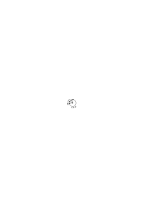

Ja habe ich nicht wirklich nur die Zeichnung des Mechanismus in die Gleichung übersetzt?

### [221\[2\]](https://cdn.wittgensteinnachlass.com/2000px/webp/Ms-109/221.webp)

12.11.1930

Was heißt es ein Gesetz in einer Reihe von Erscheinungen wahrnehmen?

### [221\[3\]](https://cdn.wittgensteinnachlass.com/2000px/webp/Ms-109/221.webp)

Der Ausdruck einer allgemeinen Regel ist auch ein Zeichen das in einem Kalkül gebraucht werden muß (nur anders als andere Zeichen).

### [221\[4\]](https://cdn.wittgensteinnachlass.com/2000px/webp/Ms-109/221.webp)

Die Grammatik besteht aus solchen allgemeinen Regeln. Und es ist nichts zwischen dem Ausdruck einer solchen Regel & dem Resultat ihrer Anwendung.

### [221\[5\]](https://cdn.wittgensteinnachlass.com/2000px/webp/Ms-109/221.webp),[222\[1\]](https://cdn.wittgensteinnachlass.com/2000px/webp/Ms-109/222.webp)

Was geschieht wenn wir die allgemeine Regel die eine Reihe von Fällen beherrscht herausfinden & ausdrücken? Wenn ich etwa die Fälle 11, 24, 39 sehe & sage die Regel sei nn²? Wenn ich aber nun von einer allgemeinen Regel Gebrauch mache, wie kommt sie in diesem Gebrauch vor? Wenn ich z.B. a a c b _nach_ der Regel abc | def in d d f e übersetze – – –?

In welcher Weise mache ich von dem Zeichen der allgemeinen Regel Gebrauch. Da ist es klar daß dieses Zeichen (wieder) nicht magisch wirkt oder wie ein medizinisches Mittel; sondern es hat nur Sinn im Gegensatz zu anderen Zeichen desselben Systems etwa abc | rst. Das muß sich auch zeigen wenn ich mir z.B. etwas notiere & mit Zeichen die gewöhnlich nicht in Gebrauch sind. Ich wollte mir etwa rasch die Zahl der männlichen & weiblichen Hörer im Zimmer notieren & machte dazu für jeden Mann ein Kreuz für jede Frau einen Strich ins Notizbuch; auch diese Notiz ist eine solche nur in einem System, das ich mir geschwind für mich zurechtgelegt habe.

### [222\[2\]](https://cdn.wittgensteinnachlass.com/2000px/webp/Ms-109/222.webp),[223\[1\]](https://cdn.wittgensteinnachlass.com/2000px/webp/Ms-109/223.webp)

Auch jede Erklärung die ich gebe (welcher Art immer) ist eben eine Erklärung die sagt daß es so ist im Gegensatz zu einem anderen Fall, daß es _so_ ist (und nicht anders). Dieses so muß eben in einem Raum von anderen Möglichkeiten sein. Es ist der Fall des Zeigens an einen Ort, wenn man etwa sagt „hier ist ein roter Fleck”. Dieses Zeigen zeigt an einen Ort im Gegensatz zu anderen Orten oder richtiger im Gegensatz zum übrigen Raum. Der Hinweis durch das Zeigen muß als ein Fall in einem System von Hinweisen, oder des Hinweisens, verstanden werden. Aber kann ich ein System als solches verstehen ohne mich in ihm zu bewegen? Andrerseits aber erschöpft doch keine Bewegung die Möglichkeiten des Systems? Brauche ich also wirklich eine Bewegung um das System zu verstehen. Es ist der analoge Fall der Erklärung eines formalen Gesetzes durch die Aufzählung einiger Glieder einer Reihe etwa 1, 8, 27, 64,

### [223\[2\]](https://cdn.wittgensteinnachlass.com/2000px/webp/Ms-109/223.webp)

Natürlich das Zeichen eins Satzsystems bezeichnet es nur im Gegensatz zu anderen Systemen & setzt selbst ein System voraus. (Interne Relation die nur besteht wenn ihre Glieder da sind.)

### [223\[3\]](https://cdn.wittgensteinnachlass.com/2000px/webp/Ms-109/223.webp)

13.11.1930

Ich überlege mir, der wievielte heute ist & sage mir in Gedanken vor: „Montag der 10te Dienstag der 11te Mittwoch der 12te Donnerstag der 13te”; & schreibe die ‚13’. Bei Montag der 10te schwebte mir vor eine Einladung die ich für diesen Tag hatte, weswegen ich mir dieses Datum gemerkt hatte.

### [223\[4\]](https://cdn.wittgensteinnachlass.com/2000px/webp/Ms-109/223.webp),[224\[1\]](https://cdn.wittgensteinnachlass.com/2000px/webp/Ms-109/224.webp)

Das Denken als Ganzes & seine Anwendung geht sozusagen automatisch vor sich. – Wieviele Zwischenstufen ich auch zwischen den Gedanken & die Anwendung setze, immer folgt eine Zwischenstufe der nächsten – und die Anwendung der letzten – ohne Zwischenglied. Und hier haben wir den gleichen Fall, wie wenn wir zwischen Entschluß & Tat durch Zwischenglieder vermitteln wollen.

### [224\[2\]](https://cdn.wittgensteinnachlass.com/2000px/webp/Ms-109/224.webp)

Die Verbindung unseres Hauptproblems mit dem epistemologischen Problem des Wollens ist mir schon früher einmal aufgefallen. Wenn in der Psychologie ein solches hartnäckiges Problem auftritt so ist es nie eine Frage nach der tatsächlichen Erfahrung (eine solche ist immer viel gutmütiger) sondern ein logisches, also eigentlich grammatisches Problem.

### [224\[3\]](https://cdn.wittgensteinnachlass.com/2000px/webp/Ms-109/224.webp)

Warum die grammatischen Probleme so hart & scheinbar unausrottbar sind – weil sie mit den ältesten Denkgewohnheiten d.h. mit den ältesten Bildern, die in unsere Sprache selbst geprägt sind, zusammenhängen.

### [224\[4\]](https://cdn.wittgensteinnachlass.com/2000px/webp/Ms-109/224.webp)

Ich habe eine bestimmte Vorstellung, & dann kommt jemand zur Tür herein. Aber warum nenne ich nun die Vorstellung die ich hatte „die Vorstellung daß dieser Mensch zur Tür hereinkommen werde”? Aber so verwenden wir die Sprache eben.

### [225\[1\]](https://cdn.wittgensteinnachlass.com/2000px/webp/Ms-109/225.webp)

Jede für uns relevante Beschreibung der Erwartung ist zugleich eine Beschreibung des Erwarteten.

### [225\[2\]](https://cdn.wittgensteinnachlass.com/2000px/webp/Ms-109/225.webp)

Aber, wird man sagen, daß ich die Sprache so verwende ist nicht genug sondern ich muß berechtigt sein, sie so zu verwenden. – Aber die Verwendung der Sprache läßt sich nicht rechtfertigen. Denn rechtfertigen, hieße sie durch Sätze rechtfertigen.

### [225\[3\]](https://cdn.wittgensteinnachlass.com/2000px/webp/Ms-109/225.webp)

Woher dann aber das Bedürfnis nach Rechtfertigung? die Unbefriedigung? Es ist jedenfalls das _selbe_ Mißverständnis unserer Sprachlogik, das uns fühlen macht, daß p⌵~p doch noch etwas sagt daß es nicht den ganzen logischen Raum erfüllt, oder wenn, daß man doch diesen Raum abgrenzen kann gegen etwas außer ihm. Ja das Wort „den ganzen” im vorigen Satz enthält schon dasselbe Mißverständnis.

### [225\[4\]](https://cdn.wittgensteinnachlass.com/2000px/webp/Ms-109/225.webp),[226\[1\]](https://cdn.wittgensteinnachlass.com/2000px/webp/Ms-109/226.webp)

Ich nenne es nicht _so weil_ es gewisse Eigenschaften hat. Außer wenn man statt dem So diese Eigenschaften nennen kann (wenn das So durch sie definiert ist). Ja wie ich Etwas nenne ich ganz gleichgültig (weil willkürlich). Bedeutend ist nur daß ich um den gleichen Bestandteil zu charakterisieren das _gleiche_ Wort gebrauche.

### [226\[2\]](https://cdn.wittgensteinnachlass.com/2000px/webp/Ms-109/226.webp)

Und hier ist glaube ich ein Hauptanlaß zum Mißverständnis daß das „Vorkommen von rot” in zwei Tatbeständen zwei ganz verschiedene Bedeutungen hat. In dem einen Fall heißt es daß sowohl da wie dort etwas _rot ist_ – d.h. die Eigenschaft rot hat. In dem andern handelt es sich nicht um eine Gemeinsamkeit der Farbe (die ja durch eine Farbangabe ausgedrückt würde).

### [226\[3\]](https://cdn.wittgensteinnachlass.com/2000px/webp/Ms-109/226.webp)

Diese Gemeinsamkeit ist eben die Harmonie zwischen Welt & Gedanken die nicht zu beschreiben ist.

### [226\[4\]](https://cdn.wittgensteinnachlass.com/2000px/webp/Ms-109/226.webp)

Kann man sagen: Der Mechanismus muß funktionieren, wenn man ihn braucht. Der Freiheitsgrad muß sich erst dann äußern, & natürlich äußert er sich dann nur in _einem_ bestimmten Falle. So aber muß sich der Freiheitsgrad einer grammatischen Konstruktion nur in dem Falle der Anwendung zeigen.

### [226\[5\]](https://cdn.wittgensteinnachlass.com/2000px/webp/Ms-109/226.webp),[227\[1\]](https://cdn.wittgensteinnachlass.com/2000px/webp/Ms-109/227.webp)

Könnte man auch sagen: Wir verwenden die Worte zwar in Übereinstimmung mit den grammatischen Regeln aber nicht im fortwährenden Hinblick auf diese Regeln. Also überhaupt nicht wesentlich im Hinblick auf die Regeln (die Regeln sind natürlich irgendwelche Sätze).

### [227\[2\]](https://cdn.wittgensteinnachlass.com/2000px/webp/Ms-109/227.webp)

Wenn man einen Satz braucht, so muß er schon irgendwie _funktionieren_. Das heißt man gebraucht ihn nicht um einer Tatsache einen Lärm beizuordnen.

### [227\[3\]](https://cdn.wittgensteinnachlass.com/2000px/webp/Ms-109/227.webp)

D.h. der Gedanke muß schon eine Bewegung des Mechanismus darstellen, nicht einfach eine seiner Lagen.

### [227\[4\]](https://cdn.wittgensteinnachlass.com/2000px/webp/Ms-109/227.webp)

Der Gedanke kann kein beliebiger Vorgang sein. Wie könnte sonst über eine Beschreibung ein Streit entbrennen?

### [227\[5\]](https://cdn.wittgensteinnachlass.com/2000px/webp/Ms-109/227.webp),[228\[1\]](https://cdn.wittgensteinnachlass.com/2000px/webp/Ms-109/228.webp)

Jemand sagt „diese Blume hat vier Blätter”; ich sehe hin & sage „ja”. Um die Angabe mit der Wirklichkeit zu vergleichen, mußte ich die Blätter zählen, meine Aufmerksamkeit in _bestimmter_ Weise auf sie richten. Und darin bestand das Deuten des Satzes entsprechend den grammatischen Regeln. Ich mußte die Wirklichkeit artikulieren um sie mit dem Satz zu vergleichen. Dieses Artikulieren kommt im Kollationieren der Wirklichkeit mit dem Satz sehr klar zum Ausdruck.

### [228\[2\]](https://cdn.wittgensteinnachlass.com/2000px/webp/Ms-109/228.webp)

14.11.1930

Das was Einen sagen macht daß reden nicht denken sein kann, ist, daß das Reden als etwas Willkürliches empfunden ist, das Denken nicht. Und darin ist natürlich eine Wahrheit. Nur daß das Reden auf keiner anderen Stufe steht als irgend ein anderer Vorgang der als Symbol verwendet wird.

### [228\[3\]](https://cdn.wittgensteinnachlass.com/2000px/webp/Ms-109/228.webp)

Solange eine Zuordnung zu nichts verpflichtet (commit) ist sie nicht symbolisch.

### [228\[4\]](https://cdn.wittgensteinnachlass.com/2000px/webp/Ms-109/228.webp)

Sind nicht die Worte wie Papiergeld, das nur zwischen zwei wirklichen Werten vermittelt?

### [228\[5\]](https://cdn.wittgensteinnachlass.com/2000px/webp/Ms-109/228.webp)

Aber, I feel I have committed myself, wenn ich sage „ich wünsche hier etwas Braunes”.

### [228\[6\]](https://cdn.wittgensteinnachlass.com/2000px/webp/Ms-109/228.webp)

Ist es so? Indem ich die Wirklichkeit beschreibe mache ich bereits von den Regeln der Grammatik Gebrauch (oder handle gemäß diesen Regeln). Eben weil ich die Wirklichkeit um sie zu beschreiben bereits artikuliert sehen muß. – Ich habe Die Wirklichkeit bereits _in gewisser Weise_ in den Satz übersetzt & also den Gebrauch der Sprache bereits fixiert & bin so also, gleichsam, eine Verpflichtung eingegangen.

### [229\[1\]](https://cdn.wittgensteinnachlass.com/2000px/webp/Ms-109/229.webp)

Aber auch wenn mich jemand fragt „ist dort ein brauner Fleck” & ich antworte „nein, ein blauer Fleck” so war ich bereits verpflichtet so zu sagen. Es war keine willkürliche Zuordnung von Worten zu dem was ich sah.

### [229\[2\]](https://cdn.wittgensteinnachlass.com/2000px/webp/Ms-109/229.webp)

Es wäre doch nicht einen Tatbestand porträtieren wenn ich etwa beliebige Striche auf das Papier kritzelte & sagte „es gibt gewiß eine Projektionsmethode die diesen Tatbestand in diese Zeichnung projiziert”.

### [229\[3\]](https://cdn.wittgensteinnachlass.com/2000px/webp/Ms-109/229.webp)

Ja auch hier (beim Porträtieren) fühle ich mich schon beim ersten Strich verpflichtet – d.h. er ist nicht willkürlich. Jedenfalls aber fängt das _Bild_ erst dort an wo die Verpflichtung anfängt.

### [229\[4\]](https://cdn.wittgensteinnachlass.com/2000px/webp/Ms-109/229.webp)

Heißt, einer Regel folgen, einer ausgedrückten (ausgesprochenen) Regel folgen?

### [229\[5\]](https://cdn.wittgensteinnachlass.com/2000px/webp/Ms-109/229.webp),[230\[1\]](https://cdn.wittgensteinnachlass.com/2000px/webp/Ms-109/230.webp)

Wenn ich absichtlich eine gewisse Form nachzeichne so hat der Vorgang des Kopierens – ich meine der ganze seelische Vorgang – mit der Wirklichkeit an einer bestimmten Stelle diese Form gemein. Sie ist eine Fassette des Vorgangs des Kopierens. Eine Fassette die an dem kopierten Gegenstand anliegt & sich dort mit ihm deckt.

### [230\[2\]](https://cdn.wittgensteinnachlass.com/2000px/webp/Ms-109/230.webp)

Ich kann wenn ich die Figur

kopiere & etwa bei der oberen horizontalen Linie anfange meinen Bleistift von ihr in verschiedener Weise leiten lassen. Ich kann etwa trachten diese Linie ihrer Länge nach wiederzugeben – oder nicht. Dann wird im einen Falle mein Bleistift plötzlich angehalten werden (von dem Modell) & wenn ich übers Ziel schieße so wird eine andere bestimmte Reaktion eintreten die dem tatsächlichen Anhalten hier äquivalent ist. Im andern Fall wenn der Maßstab der Wiedergabe gleichgültig ist wird mein Bleistift auch anhalten aber die begleitenden seelischen Erscheinungen werden verschieden sein. Ich könnte sagen der Körper des gesamten Vorgangs des Kopierens liegt mit einer bestimmten seiner Fassetten an der Vorlage an.

### [230\[3\]](https://cdn.wittgensteinnachlass.com/2000px/webp/Ms-109/230.webp),[231\[1\]](https://cdn.wittgensteinnachlass.com/2000px/webp/Ms-109/231.webp)

Und es hat ja auch der Satz der das Kopieren beschreibt eine Fassette gemeinsam mit dem Satz der die Vorlage beschreibt.

### [231\[2\]](https://cdn.wittgensteinnachlass.com/2000px/webp/Ms-109/231.webp)

Man könnte dann sagen: Wenn auch mein Bleistift die Vorlage nicht trifft, die Absicht trifft sie immer.

### [231\[3\]](https://cdn.wittgensteinnachlass.com/2000px/webp/Ms-109/231.webp)

So könnte ich sagen der Körper des Beschreibens wenn ich etwa sage „hier ist ein brauner Kreis” liegt mit einer seiner Fassetten an dem Beschriebenen an. Dadurch daß ich mit diesen Worten die Tatsache porträtiert, nachgezeichnet, habe. D.h. die Handlung dieses Nachzeichnens liegt mit einer _ganz bestimmten_ ihrer Fassetten an der Vorlage. (Hat diese Fassette mit der Vorlage gemein – oder auch die Vorlage bildet diese Fassette.)

### [231\[4\]](https://cdn.wittgensteinnachlass.com/2000px/webp/Ms-109/231.webp)

Die Regel nach der ich die Vorlage projiziert habe wäre in gewissem Sinne eine Beschreibung des Körpers dieses Kopierens. Denn sie würde beschreiben _wie_ ich meinen Bleistift von der Vorlage habe leiten lassen. Sie wäre gleichsam eine nachträgliche Beschreibung des Mechanismus der zwischen Vorlage & Bild eingeschaltet ist. Und würde die weiteren Bewegungsmöglichkeiten dieses Mechanismus beschreiben.

### [232\[1\]](https://cdn.wittgensteinnachlass.com/2000px/webp/Ms-109/232.webp)

Porträtiert man aber auch etwas wenn man eine Erwartung ausdrückt?

### [232\[2\]](https://cdn.wittgensteinnachlass.com/2000px/webp/Ms-109/232.webp)

15.11.1930

Der Satz „ich erwarte mir hier einen roten Fleck” bildet offenbar etwas von dem gegenwärtigen Zustand & noch etwas anderes ab.

### [232\[3\]](https://cdn.wittgensteinnachlass.com/2000px/webp/Ms-109/232.webp)

Wie wenn ich eine Erinnerung beschreibe? – Ist es nicht _wesentlich_ anders als wenn ich eine Erwartung beschreibe?

### [232\[4\]](https://cdn.wittgensteinnachlass.com/2000px/webp/Ms-109/232.webp)

Die Beschreibung der Erwartung ist in einem Sinne eine negative Beschreibung der Gegenwart. Denn wenn ich mir erwarte daß hier ein roter Fleck erscheinen werde so heißt das jedenfalls, daß jetzt keiner da ist. Ich könnte sagen: was an dieser Beschreibung die Zukunft beschreibt ist ihr Verhältnis zu der Beschreibung der Gegenwart in derselben Sprache. Oder: ist ihr besonderes Verhältnis zur Gegenwart.

### [232\[5\]](https://cdn.wittgensteinnachlass.com/2000px/webp/Ms-109/232.webp),[233\[1\]](https://cdn.wittgensteinnachlass.com/2000px/webp/Ms-109/233.webp)

Wie aber wenn ich sage: „Stell' Dir ein Zimmer vor …” & nun beschreibe ich ein Zimmer & einen Vorgang darin. Ein solcher Satz hat zu einer Behauptung dasselbe Verhältnis wie ein Bild im allgemeinen zu einem Portrait. Wenn ich nun etwa ein holländisches Genrebild ansehe so halte ich die gemalten Menschen darin nicht für wirkliche Menschen, andererseits ist ihre Ähnlichkeit mit Menschen für das Verständnis des Bildes wesentlich.

### [233\[2\]](https://cdn.wittgensteinnachlass.com/2000px/webp/Ms-109/233.webp)

Ein Vexierbild ist ein ausgezeichnetes Beispiel für die verschiedenen Weisen wie wir ein uns vorliegendes Bild sehen können.

### [233\[3\]](https://cdn.wittgensteinnachlass.com/2000px/webp/Ms-109/233.webp)

Heißt „sich rot vorstellen” „sich vorstellen daß etwas (etwa ein Teil meines Gesichtsfeldes) rot ist”? Oder gibt es zwei verschiedene Vorstellungen & die eine daß ein Teil des Gesichtsfelds (oder das Ganze) rot ist; die andre: die Vorstellung der Farbe rot; also die Vorstellung dessen was dem _Wort_ rot entspricht nicht dessen was einem Satz entspricht, der das Wort (rot) enthält?

Und wenn es so etwas gäbe, wie verhielte sich die eine dieser Vorstellungen zur anderen?

### [233\[4\]](https://cdn.wittgensteinnachlass.com/2000px/webp/Ms-109/233.webp),[234\[1\]](https://cdn.wittgensteinnachlass.com/2000px/webp/Ms-109/234.webp)

Ich kann jene Beschreibung eines Zimmers in eine Zeichnung übersetzen. Und das ist ihr wesentlich. Ich kann mir nach einer Beschreibung (d.h. einer Beschreibung folgend) eine Vorstellung machen. Dann übersetze ich offenbar die Beschreibung in die Vorstellung ebenso wie ich die Wirklichkeit in die Beschreibung übertragen konnte.

### [234\[2\]](https://cdn.wittgensteinnachlass.com/2000px/webp/Ms-109/234.webp)

Von Noten spielen.

### [234\[3\]](https://cdn.wittgensteinnachlass.com/2000px/webp/Ms-109/234.webp)

Das Signal gibt im Gegensatz zu seiner Erklärung nicht die volle Multiplizität der Tatsache. Die Erklärung aber kann nicht mehr geben als diese Multiplizität.

### [234\[4\]](https://cdn.wittgensteinnachlass.com/2000px/webp/Ms-109/234.webp)

Ich zeige Jemandem die Noten eines Musikstückes & sage „kannst Du das lesen”. Er durchfliegt es & sagt „ja”. Er hat beim Durchfliegen irgend etwas getan, vielleicht Bewegungen seines Kehlkopfs gemacht oder gewisse Muskeln innerviert & zwar hat er die Notenschrift in ein anderes System von Innervierungen oder Bewegungen übersetzt.

### [234\[5\]](https://cdn.wittgensteinnachlass.com/2000px/webp/Ms-109/234.webp),[235\[1\]](https://cdn.wittgensteinnachlass.com/2000px/webp/Ms-109/235.webp)

Die Regel nach welcher ich übersetze zeigt sich in meiner Übersetzung plus den Reaktionen der Unbefriedigung wo ich nach der Regel falsch übersetzt habe.

### [235\[2\]](https://cdn.wittgensteinnachlass.com/2000px/webp/Ms-109/235.webp)

In wiefern setzt das Verständnis einer Sprache, soweit es durch das Übersetzen in eine andere Sprache (durch das Nachzeichnen dieser Sprache) gezeigt ist, andere Sätze derselben Sprache also grammatische Regeln voraus.

### [235\[3\]](https://cdn.wittgensteinnachlass.com/2000px/webp/Ms-109/235.webp)

Man könnte das auch so sagen: Ist in dem Vorgang der Übersetzung _eines_ Satzes schon die _allgemeine_ Regel der Übersetzung der Sprache dieses Satzes unzweideutig enthalten. (Ist das nicht so als würde man fragen: ist in dieser Bewegung des Mechanismus schon seine ganze Wirkungsweise unzweideutig ausgedrückt?)

### [235\[4\]](https://cdn.wittgensteinnachlass.com/2000px/webp/Ms-109/235.webp),[236\[1\]](https://cdn.wittgensteinnachlass.com/2000px/webp/Ms-109/236.webp)

Denken wir uns den einfachen Fall daß jemand die Strecke <math display="inline"><mspace width="0.3em"/><mtext>├</mtext><mtext>─</mtext><mtext>─</mtext><mtext>─</mtext><mtext>─</mtext><mtext>─</mtext><mtext>─</mtext><mtext>─</mtext><mtext>─</mtext><mtext>┤</mtext></math> absichtlich im Maßstab 1 : 1 kopiert. Ist dann in dem Vorgang des Kopierens schon das Verständnis des Nachzeichnens irgend einer Strecke im Maßstab 1 : 1 enthalten? D.h. ist die Weise in der mein Bleistift von der Strecke geführt wird eben dieses allgemeine Gesetz? Mein Stift wurde von mir quasi ganz voraussetzungslos gehalten & _nur_ von der Länge der Vorlage geführt.

### [236\[2\]](https://cdn.wittgensteinnachlass.com/2000px/webp/Ms-109/236.webp)

Ich würde dann sagen: Wäre die Vorlage länger gewesen so wäre ich mit meinem Bleistift noch weiter gefahren & wenn kürzer weniger weit. Aber war quasi der Geist der sich hierin ausspricht schon im Nachziehen des einen Strichs enthalten.

### [236\[3\]](https://cdn.wittgensteinnachlass.com/2000px/webp/Ms-109/236.webp),[237\[1\]](https://cdn.wittgensteinnachlass.com/2000px/webp/Ms-109/237.webp)

Ich kann mir vornehmen: Ich gehe solange bis ich ihn finde (ich will etwa einen Menschen auf einer Straße treffen.) Und nun gehe ich die Straße entlang & treffe ihn an einem bestimmten Punkt & bleibe stehen. War in dem Vorgang des Gehens, oder irgend einem anderen gleichzeitigen, die Befolgung der allgemeinen Regel die ich mir vorgesetzt hatte enthalten. Oder war der Vorgang nur _in Übereinstimmung_ mit dieser Regel aber auch mit anderen entgegengesetzten Regeln? Aber wenn ich mir die allgemeine Regel vorgenommen hatte, so war schon in dem Festhalten dieses Vorsatzes dasjenige enthalten was das Gehen zu einer Befolgung eben der einen allgemeinen Regel machte. In dem Vorsatz wird die Länge der Strecke absichtlich offen gelassen. Das wollte ich früher mit dem Wort „voraussetzungslos” andeuten.

### [237\[2\]](https://cdn.wittgensteinnachlass.com/2000px/webp/Ms-109/237.webp)

Das kann aber nur heißen: Es ist ein Unterschied zwischen einem Vorsatz & einem anderen. Ich hätte mir auch vornehmen können einen km zu gehen & das war zufällig die Weglänge die ich gehen mußte um jenen Menschen zu treffen. (Hier erklärt sich auch das Wort „Grund”.)

### [237\[3\]](https://cdn.wittgensteinnachlass.com/2000px/webp/Ms-109/237.webp)

Muß nun dieses Vornehmen darin bestehen daß ich _vor_ der Ausführung meiner Handlung einen Satz, den Vorsatz, ausspreche?

### [237\[4\]](https://cdn.wittgensteinnachlass.com/2000px/webp/Ms-109/237.webp)

Ich könnte z.B. eine Linie so ziehen wollen daß sie parallel mit der Linie a wird die etwa übrigens eine

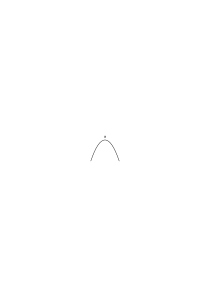

Parabel ist. Aber ich will keine Parabel ziehen sondern ziehe sie nur inzidentell wenn ich parallel zu a fahre. Ich hätte aber auch können eine Parabel ziehen wollen die dann zufällig mit a parallel geworden wäre. Der gesamte Vorgang wäre aber in jedem der beiden Fälle ein andrer gewesen.

### [238\[1\]](https://cdn.wittgensteinnachlass.com/2000px/webp/Ms-109/238.webp)

16.11.1930

Unsere Sprache macht immer wieder neue Knoten in's Denken. Und die Philosophie wird nicht fertig damit, sie aufzulösen.

### [238\[2\]](https://cdn.wittgensteinnachlass.com/2000px/webp/Ms-109/238.webp)

Beabsichtigen ist ein menschlicher psychischer Vorgang.

### [238\[3\]](https://cdn.wittgensteinnachlass.com/2000px/webp/Ms-109/238.webp)

Ich gebe jemandem den Befehl von A eine Linie parallel zu a zu ziehen. Er versucht (beabsichtigt) es zu tun, aber mit dem Erfolg daß die Linie parallel zu b wird. War nun der Vorgang des Kopierens derselbe als hätte er beabsichtigt parallel zu b zu ziehen & seine Absicht ausgeführt? Ich glaube offenbar, nein. Er hat sich von der Linie a führen lassen.

### [238\[4\]](https://cdn.wittgensteinnachlass.com/2000px/webp/Ms-109/238.webp)

Wenn das allgemeine Gesetz der Abbildung sich in der Tätigkeit des Abbildens ausdrückt dann muß es in einem Zug dieser Tätigkeit liegen & das allgemeine Gesetz ein notwendiger Teil der Beschreibung des Vorgangs sein.

### [238\[5\]](https://cdn.wittgensteinnachlass.com/2000px/webp/Ms-109/238.webp)

D.h. Das allgemeine Gesetz der Abbildung muß ein Teil der _besonderen_ Beschreibung _dieses_ Vorgangs der Abbildung sein.

### [238\[6\]](https://cdn.wittgensteinnachlass.com/2000px/webp/Ms-109/238.webp),[239\[1\]](https://cdn.wittgensteinnachlass.com/2000px/webp/Ms-109/239.webp)

Wenn ich meinen Bleistift von dieser Linie (der Vorlage) leiten lasse so ist das als schaltete ich einen bestimmten Mechanismus ein zwischen die Linie & meine Hand. Und dieser Mechanismus ist ein Ausdruck der allgemeinen Regel der Abbildung.

### [239\[2\]](https://cdn.wittgensteinnachlass.com/2000px/webp/Ms-109/239.webp)

Die Allgemeinheit muß darin bestehen daß man etwas offen läßt. Und dieses Offenlassen ist darin ausgedrückt daß ich sage: Ich lasse meinen Bleistift nur von der Linie leiten, _wie immer_ sie geht, gebe ich ihr nach.

### [239\[3\]](https://cdn.wittgensteinnachlass.com/2000px/webp/Ms-109/239.webp)

Die Frage ist nun: wenn ich (nun) auf diese Weise eine Vorlage nachgezeichnet habe ist es dann möglich den Vorgang des Nachzeichnens wie er war auch nach einer anderen allgemeinen Regel richtig zu beschreiben. Oder kann ich so eine Beschreibung zurückweisen mit den Worten: „nein, ich habe mich wirklich nur von _dieser_ (allgemeinen) Regel leiten lassen (und nicht von jener anderen die in diesem Falle allerdings auch dasselbe Resultat ergeben hätte)”.

### [239\[4\]](https://cdn.wittgensteinnachlass.com/2000px/webp/Ms-109/239.webp),[240\[1\]](https://cdn.wittgensteinnachlass.com/2000px/webp/Ms-109/240.webp)

Denken wir uns wir schalteten tatsächlich zwischen Vorlage & Stift eine Kopiermaschine ein (denn schließlich sind wir ja auch eine Kopiermaschine). Hier könnte nun von Absicht nicht die Rede sein & was immer die Kopiermaschine hervorbringt ist die Kopie. Wo ist nun hier die Intention? Sie drückt sich so aus: Wenn z.B. alle Stangen der Maschine steif bleiben so nenne ich das Erzeugnis der Maschine eine richtige Kopie. Biegt sich aber eine Stange dann besteht die Kopie aus dem Erzeugnis plus einer Korrektur die der Biegung entspricht.

### [240\[2\]](https://cdn.wittgensteinnachlass.com/2000px/webp/Ms-109/240.webp)

Ich sagte: Wenn ich mich von einer Vorlage leiten lasse so ist das wie wenn ich einen Mechanismus zwischen mich & die Vorlage einschaltete. Aber wie, wenn dieser Mechanismus nicht funktioniert? Ja, das heißt hier nichts; denn funktioniert er nicht so wird der Fehler des Funktionierens als Korrektur zu dem Erzeugnis gerechnet.

### [240\[3\]](https://cdn.wittgensteinnachlass.com/2000px/webp/Ms-109/240.webp),[241\[1\]](https://cdn.wittgensteinnachlass.com/2000px/webp/Ms-109/241.webp)

Nein ein Mechanismus ist nicht der Ausdruck einer allgemeinen Regel, auch dann nicht wenn seine Bewegungen erfahrungsgemäß mit einer bestimmten Regel übereinstimmen. Es sei denn daß ich den Fall des Nicht-Funktionierens dadurch ausschalte, daß ich bestimme: wie immer er sich bewegt ist, der Definition nach, der Regel gemäß. Die Intention ist eine Betrachtungsform (oder Norm) nach der betrachtet wird, was immer geschieht. Es ist als drückte ich die gemessene Länge aller Menschen dadurch aus daß ich sagte sie seien 6 Fuß hoch + oder ‒ einer bestimmten Größe.

### [241\[2\]](https://cdn.wittgensteinnachlass.com/2000px/webp/Ms-109/241.webp)

Nehmen wir in unserem psychischen Apparat einen Zeiger an dessen Ausschlag die Abweichung der Tätigkeit von der Intention anzeigt, dann ist eben zum Feststellen der Intention nicht nur auf das Resultat zu sehen sondern zugleich auf den Zeiger (der die Korrektur angibt). Befolgt etwa das Resultat eine Regel so ist noch zu schauen ob der Zeiger dabei nicht ausgeschlagen hat & nur dann ist diese Regel ein Ausdruck der Intention.

### [241\[3\]](https://cdn.wittgensteinnachlass.com/2000px/webp/Ms-109/241.webp),[242\[1\]](https://cdn.wittgensteinnachlass.com/2000px/webp/Ms-109/242.webp)

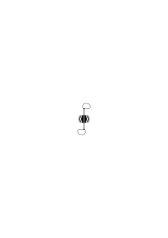

Kopiermaschine.

Wieder: Worin besteht es ein Gesetz zu erkennen. Es gibt doch tatsächlich diesen Vorgang. Ich zeige jemand die Reihe 2x, 4x², 6x⁴, 8x⁸, und er sagt „ja, jetzt weiß ich weiter, ich sehe das Gesetz”. (Vielleicht hat er nach den zwei ersten Gliedern ein anderes Gesetz vermutet & war erstaunt, als ich das dritte Glied hinschrieb; dann sah er ein neues Gesetz.) Ein allgemeines Gesetz sehen heißt, daß in dem was man sieht in irgend einem Sinne etwas offen gelassen ist.

### [242\[2\]](https://cdn.wittgensteinnachlass.com/2000px/webp/Ms-109/242.webp)

Unsere Frage kann dann so gestellt werden: Ist ein Unterschied zwischen zwei Fällen wenn ich die Glieder 2x, 4x² einmal als Glieder der Reihe <math class="stacked" display="inline"><mtext>2n</mtext><msup><mi>x</mi><mi>n</mi></msup></math> ein andermal als Glieder der Reihe <math class="stacked" display="inline"><mspace width="0.3em"/><mtext>2n</mtext><mspace width="0.3em"/><mtext>∙</mtext><msup><mi>x</mi><mo>(</mo><msup><mn>2</mn><mi>n</mi><mspace width="0.3em"/><mtext>‒</mtext><mspace width="0.3em"/><mn>1</mn></msup><mo>)</mo></msup></math> hinschreibe? Offenbar ist da ein Unterschied.

### [242\[3\]](https://cdn.wittgensteinnachlass.com/2000px/webp/Ms-109/242.webp)

Muß nicht die geschriebene allgemeine Regel ein _Bild_ des Vorgangs sein wenn ich etwas nach dieser Regel tue?!

### [242\[4\]](https://cdn.wittgensteinnachlass.com/2000px/webp/Ms-109/242.webp)

17.11.1930

Wie kann mich das Wort „rot” im Satz führen, oder ich zu diesem Wort geführt werden?

### [242\[5\]](https://cdn.wittgensteinnachlass.com/2000px/webp/Ms-109/242.webp)

Ich glaube, es war der Hauptgedanke (oder doch _einer_) meines Buches daß man auch durch das Wort „rot” oder das was an ihnen drum & dran ist _geführt_ werden muß.

### [242\[6\]](https://cdn.wittgensteinnachlass.com/2000px/webp/Ms-109/242.webp),[243\[1\]](https://cdn.wittgensteinnachlass.com/2000px/webp/Ms-109/243.webp)

_Erklärung_ der Vorzeichen in der Notenschrift. Muß nicht in ihr jene Multiplizität nachgeholt werden die dem Zeichen fehlt, die es zum Signal macht? Das Wort Rot ist bloß ein _Signal_. Aber ein Signal wozu. Wo muß das ausgedrückt sein, wenn nicht in seiner Erklärung?

(So sind die musikalischen Vorzeichen Signale.)

### [243\[2\]](https://cdn.wittgensteinnachlass.com/2000px/webp/Ms-109/243.webp)

Man könnte sich denken daß die Bedeutung von ‚rot’ in einem Archiv gleich dem Urmeter in Form eines Täfelchens von den betreffenden Farben festgelegt wäre. (Auch im Fall des Urmeters muß _Etwas_ 1 m lang sein.)

### [243\[3\]](https://cdn.wittgensteinnachlass.com/2000px/webp/Ms-109/243.webp)

Wie könnte man ein Signal je verstehen, ja, wie sich etwas selbst darunter denken & wie sollte es in exakter Weise gebraucht werden der Gegenstand eines Streites sein können wenn es keine Erklärung dafür gebe, kein Kriterium daß es _das_ meint. Soweit darüber geredet (gestritten) werden kann, soweit muß es sich auch entscheiden lassen.

### [243\[4\]](https://cdn.wittgensteinnachlass.com/2000px/webp/Ms-109/243.webp),[244\[1\]](https://cdn.wittgensteinnachlass.com/2000px/webp/Ms-109/244.webp)

Kann man sich auch ein Ur-Nicht denken, wie man sich ein Ur-Rot denken kann? Hätten Russell & Frege die Farbe Rot behandelt, sie hätten sich genötigt gesehen dem Buch ein genaues Muster beizugeben dessen was sie unter ‚rot’ verstehen.

### [244\[2\]](https://cdn.wittgensteinnachlass.com/2000px/webp/Ms-109/244.webp)

18.11.1930

Andrerseits kann doch dieses Ur-Rot nicht nötig sein da wir tatsächlich einen Satz worin das Wort ‚rot’ vorkommt ohne das Muster verstehen. Es wäre das etwa dem Fall vergleichbar wenn man unter einem Meter das Meter des Augenmaßes verstünde. (Wohlgemerkt: das Meter des Augenmaßes ist nicht ein ungenaues Meter sondern etwas _anderes_ als das physikalische Meter.)

### [244\[3\]](https://cdn.wittgensteinnachlass.com/2000px/webp/Ms-109/244.webp),[245\[1\]](https://cdn.wittgensteinnachlass.com/2000px/webp/Ms-109/245.webp)

Angenommen nun aber die Sprache gebrauchte tatsächlich statt des Wortes ‚Rot’ ein rotes Täfelchen auf das man zeigt; diese Ausdrucksweise wäre jedenfalls möglich. Und auch das bedeutet etwas. – Die Frage ist aber: hilft diese Ausdrucksweise uns mehr im Verständnis dessen was gemeint ist & wenn, in wiefern. Denn da wir auch die Wortausdrucksweise verstehen so muß dann außer dem Wort noch das vorhanden sein was das Muster vor dem Wort allein voraus hatte. Denn: Mehr als verständlich kann eine Ausdrucksweise nicht sein & Fleißaufgaben gibt es hier nicht. Beide Ausdrucksweisen müssen einander ganz äquivalent sein nur daß, was hier im sichtbaren Zeichen liegt, dort wo anderes liegen kann.

### [245\[2\]](https://cdn.wittgensteinnachlass.com/2000px/webp/Ms-109/245.webp)

Wenn ich nun mein rotes Täfelchen nicht bei der Hand hätte & zeigte statt darauf auf etwas anderes Rotes; & wie wenn ich nun gerade das Rote dazu nähme wovon ich sagen will daß es rot ist? Wenn ich also etwa auf einen Apfel zeigte & sagte „_Das_ ist _so_”? Oder: „_Hier_ ist _diese_ Farbe”? Warum sagt das nun nichts? Weil es stimmt was immer der Fall ist. Weil ich nicht fragen kann: „im Gegensatz zu – – –?” Das ist natürlich der gleiche Fall wie die Antwort „Ich bin's” auf die Frage „Wer ist da?”.

### [245\[3\]](https://cdn.wittgensteinnachlass.com/2000px/webp/Ms-109/245.webp)

Aber es hat Sinn zu sagen: Hier ist die Farbe die ich meine.

### [245\[4\]](https://cdn.wittgensteinnachlass.com/2000px/webp/Ms-109/245.webp)

Ebensowenig Sinn aber wie zu sagen „hier ist diese Farbe” hat es zu sagen „ich nenne diese Farbe hier ‚rot’ & hier ist rot”.

### [245\[5\]](https://cdn.wittgensteinnachlass.com/2000px/webp/Ms-109/245.webp),[246\[1\]](https://cdn.wittgensteinnachlass.com/2000px/webp/Ms-109/246.webp)

Auf die Aussage „diese Farbe ist hier” wäre die Antwort: „würdest du das nicht in _jedem Fall_ sagen?” Und das zeigt daß hier der Raum fehlt in dem die Aussage gemacht werden muß um Sinn zu haben.

### [246\[2\]](https://cdn.wittgensteinnachlass.com/2000px/webp/Ms-109/246.webp)

23.11.1930

Wenn ich vergessen habe welche Farbe „rot” bedeutet so kann ich nicht wissen ob „rötlich grün” einen Sinn hat.

### [246\[3\]](https://cdn.wittgensteinnachlass.com/2000px/webp/Ms-109/246.webp)

Wenn die Philosophen ein Wort gebrauchen & nach seiner Bedeutung forschen muß man sich immer fragen wird denn dieses Wort in der Sprache die es geschaffen hat je tatsächlich so gebraucht? Man wird dann meistens finden daß es nicht so ist & das Wort gegen seine normale Grammatik gebraucht wird. („Wissen”, „sein”, „Ding”)

### [246\[4\]](https://cdn.wittgensteinnachlass.com/2000px/webp/Ms-109/246.webp),[247\[1\]](https://cdn.wittgensteinnachlass.com/2000px/webp/Ms-109/247.webp)

„Ich würde diese Farbe wiedererkennen, ich erinnere mich noch genau an sie.” Also wird hier das sich an sie erinnern als Bürgschaft für die Möglichkeit des Erkennens genommen. Und das scheint ja auch nur natürlich, ja selbstverständlich. Merkwürdigerweise sträubt sich jetzt etwas in mir gegen die althergebrachte Ansicht. Und zwar ist es das Erinnerungsbild was mir Schwierigkeiten macht. „Würdest Du Deinen Bruder wiedererkennen wenn er jetzt zur Tür hereinträte?” – „Gewiß”. Aber wie kann ich dessen gewiß sein? Und wenn ich ihn nun nicht erkenne wenn er wirklich eintritt, kann ich dann sagen: Ja, als ich es sagte, hätte ich ihn auch erkannt? Der Fall des Nichtwiedererkennens den ich hier meine wäre der, daß einer zur Türe hereinkäme & ich sagen müßte „ich weiß nicht ob das mein Bruder ist” (denn wenn ich sagte „nein, so schaut er nicht aus” so wäre das ja auch ein Wiedererkennen). Es hätte im Fall des Nichtwiedererkennens das Wort gleichsam seine Bedeutung verloren.

### [247\[2\]](https://cdn.wittgensteinnachlass.com/2000px/webp/Ms-109/247.webp)

„Ich weiß wie dieses Wort zu gebrauchen ist”. Was heißt das? Wie kann es niedergelegt werden, wie ein Wort zu gebrauchen ist? Etwa das Wort „rot”. –

### [247\[3\]](https://cdn.wittgensteinnachlass.com/2000px/webp/Ms-109/247.webp),[248\[1\]](https://cdn.wittgensteinnachlass.com/2000px/webp/Ms-109/248.webp)

Vielleicht ist die eigentliche Schwierigkeit die (die zwar Manchem beinahe närrisch erscheinen mag): daß ich das Wort „rot” erkläre indem ich auf etwas Rotes zeige & sage „das ist rot” während doch dieses Rote später meinem Blick entschwindet. Und nun scheinbar _etwas Anderes_ an seine Stelle tritt (die Erinnerung oder wie man es heißen mag).

### [248\[2\]](https://cdn.wittgensteinnachlass.com/2000px/webp/Ms-109/248.webp)

„Also _so_ wird dieses Wort gebraucht!” Aber wie bewahre ich denn dieses _so_ in der Erinnerung?

### [248\[3\]](https://cdn.wittgensteinnachlass.com/2000px/webp/Ms-109/248.webp)

Das Wort „rot” wird via das Erinnerungsbild gebraucht.

### [248\[4\]](https://cdn.wittgensteinnachlass.com/2000px/webp/Ms-109/248.webp)

24.11.1930

Die Erklärung eines Zeichens muß natürlich jede Meinungsverschiedenheit im Bezug auf seine Bedeutung beseitigen können. D.h. sie muß alle Gegensätze der Bedeutung zum Ausdruck bringen. Und nun ist die Frage ist dann noch eine Frage zu entscheiden?

### [248\[5\]](https://cdn.wittgensteinnachlass.com/2000px/webp/Ms-109/248.webp)

Jede Erklärung eines Zeichens kann für das Zeichen (an seiner Statt) substituiert werden.

### [248\[6\]](https://cdn.wittgensteinnachlass.com/2000px/webp/Ms-109/248.webp),[249\[1\]](https://cdn.wittgensteinnachlass.com/2000px/webp/Ms-109/249.webp)

Die Erklärung des Symbols muß die ganze Verantwortung für seine Anwendung tragen.

### [249\[2\]](https://cdn.wittgensteinnachlass.com/2000px/webp/Ms-109/249.webp)

Jede Streitfrage kann entschieden werden, – aber mehr ist auch nicht nötig.

### [249\[3\]](https://cdn.wittgensteinnachlass.com/2000px/webp/Ms-109/249.webp)

Wo eine Meinungsverschiedenheit über die Bedeutung eines Wortes möglich ist muß die Erklärung sie beseitigen.

### [249\[4\]](https://cdn.wittgensteinnachlass.com/2000px/webp/Ms-109/249.webp)

Man könnte das Wesen der Sprache an einem System von Signalen erklären.

### [249\[5\]](https://cdn.wittgensteinnachlass.com/2000px/webp/Ms-109/249.webp)

Z.B. a, b, c, d bedeuten Bewegungen und zwar a = ↑, b = ↓, c = →, d = ←,

also z.B. bccbda heißt <math display="inline"><mo>[</mo><mtext>↓</mtext><mo>]</mo><mo>[</mo><mtext>→</mtext><mo>]</mo><mo>[</mo><mtext>↑</mtext><mo>]</mo><mo>[</mo><mtext>→</mtext><mtext>←</mtext><mo>]</mo><mo>[</mo><mtext>↓</mtext><mo>]</mo></math> etc. Nun, ist der Satz „bccbda” nicht ähnlich jenem Linienzug? Offenbar ja, in gewisser Weise. (Ist es nicht genau die Ähnlichkeit einer Photographie & des photographierten Gegenstandes?)

### [249\[6\]](https://cdn.wittgensteinnachlass.com/2000px/webp/Ms-109/249.webp)

Ist nur die Wahl zwischen vier Bewegungen so genügen 4 Signale.

### [249\[7\]](https://cdn.wittgensteinnachlass.com/2000px/webp/Ms-109/249.webp)

Wenn die Erklärung nur Zeichen für Zeichen setzt, wozu ist sie dann überhaupt nötig? – Sie ist nur nötig wo sie die Multiplizität erhöht.

### [249\[8\]](https://cdn.wittgensteinnachlass.com/2000px/webp/Ms-109/249.webp),[250\[1\]](https://cdn.wittgensteinnachlass.com/2000px/webp/Ms-109/250.webp)

25.11.1930

„Sich nach etwas richten”. Ist dasselbe wie sich von etwas leiten lassen.

### [250\[2\]](https://cdn.wittgensteinnachlass.com/2000px/webp/Ms-109/250.webp)

Kann man etwas in einem wesentlich anderen Sinne „_offen lassen_” als man eine Klammer leer läßt?

### [250\[3\]](https://cdn.wittgensteinnachlass.com/2000px/webp/Ms-109/250.webp)

Ich lasse mich von der Sprache (der Vorlage) führen aber dazu muß ich ihr die Zügel in gewisser Weise in die Hand geben. Und dann erst kann sie mich führen.

### [250\[4\]](https://cdn.wittgensteinnachlass.com/2000px/webp/Ms-109/250.webp)

Die gedruckte Note zwingt auch nicht den Finger auf die Taste zu drücken. Das Notenbild zwingt mich nicht mich in dieser (oder irgend einer) Weise von ihm führen zu lassen. Habe ich mich entschlossen mich auf diese Weise von ihm führen zu lassen, dann führt es mich nun zu diesen & diesen Bewegungen.

### [250\[5\]](https://cdn.wittgensteinnachlass.com/2000px/webp/Ms-109/250.webp)

Aber das sieht so aus als müsse dem Akt der Übersetzung, der Abbildung ein besonderer _allgemeiner_ Entschluß vorhergehen (der Entschluß, mich auf diese Weise leiten zu lassen).

### [251\[1\]](https://cdn.wittgensteinnachlass.com/2000px/webp/Ms-109/251.webp)

Ich übergebe mich der Regel.

### [251\[2\]](https://cdn.wittgensteinnachlass.com/2000px/webp/Ms-109/251.webp)

Ich lasse meine Handlung von der Vorlage bestimmen. Wenn ich z.B. nach Noten spiele.

### [251\[3\]](https://cdn.wittgensteinnachlass.com/2000px/webp/Ms-109/251.webp)

26.11.1930

Wir werden nicht durch die Noten dazu geführt überhaupt Klavier zu spielen sondern _so_ zu spielen (wie wir es tun).

### [251\[4\]](https://cdn.wittgensteinnachlass.com/2000px/webp/Ms-109/251.webp)

D.h. wir werden nicht durch das System von Signalen dazu gebracht uns ihm zu übergeben sondern wir übergeben uns ihm & werden dann ihm entsprechend geführt.

### [251\[5\]](https://cdn.wittgensteinnachlass.com/2000px/webp/Ms-109/251.webp)

So übergeben wir uns auch der Sprache.

### [251\[6\]](https://cdn.wittgensteinnachlass.com/2000px/webp/Ms-109/251.webp)

„Welchen Ton wirst Du spielen?” – „Ich werde mich danach richten, welche Note dort steht”.

### [251\[7\]](https://cdn.wittgensteinnachlass.com/2000px/webp/Ms-109/251.webp),[252\[1\]](https://cdn.wittgensteinnachlass.com/2000px/webp/Ms-109/252.webp)

Mein Gedanke ist daß aus dem einzelnen Fall des Sich-nach-etwas-Richtens die sogenannte allgemeine Regel muß abgelesen werden können. Diese allgemeine Regel ist also nicht etwa eine Hypothese die durch mehr Einzelfälle mit größerer Sicherheit zu bestimmen ist, sondern im Gegenteil muß man schon von einem zweiten Einzelfall sagen können daß er nicht nach der selben Regel gebildet ist wie der erste.

### [252\[2\]](https://cdn.wittgensteinnachlass.com/2000px/webp/Ms-109/252.webp)

Wie man sich bei dem Orakel durch Abzählen der Knöpfe des Rockes oder der Blätter eines Gänseblümchens von der Zahl dieser Blätter leiten läßt.

### [252\[3\]](https://cdn.wittgensteinnachlass.com/2000px/webp/Ms-109/252.webp)

Ich sagte schon früher, wenn dies so ist, so muß in dem Prozeß etwas offen gelassen werden. So muß ich in der Absicht mich nach dem Blumenorakel zu richten es offen lassen wie viele Blätter die Blume tatsächlich haben wird. Der Ausdruck dieser Absicht lautet auch: „Wieviel Blätter immer die Blume haben mag, …”.

### [252\[4\]](https://cdn.wittgensteinnachlass.com/2000px/webp/Ms-109/252.webp),[253\[1\]](https://cdn.wittgensteinnachlass.com/2000px/webp/Ms-109/253.webp)

Kann nun dieses Offen-Lassen von anderer Art sein als das welches wir vor uns haben wenn wir etwa einen Ball gegen eine Wand werfen & dieser Wurf es offen läßt wann der Ball zurückkommen wird weil das von der Entfernung der Wand abhängt die in dem Wurf nicht präjudiziert ist? Oder, ist es nicht dasselbe Offenlassen das uns vorliegt wenn die Druckerpresse es offen läßt welcher Text beim Drucken herauskommen wird weil in ihr nicht präjudiziert ist welcher Satz in sie gelegt werden wird?

### [253\[2\]](https://cdn.wittgensteinnachlass.com/2000px/webp/Ms-109/253.webp)

Es handelt sich in allen diesen Fällen darum einen vorbestimmten Bestandteil des Satzes als Argument & daher alles Übrige als Funktion zu betrachten.

### [253\[3\]](https://cdn.wittgensteinnachlass.com/2000px/webp/Ms-109/253.webp)

Denn das Hypothetische „wenn die Wand weiter weg gewesen wäre, so …” hilft uns nicht. „Wenn die Note auf der nächsten Linie gestanden hätte, so …”. Ich könnte antworten: „Was dann geschehen wäre weiß ich nicht, oder, wenn ich es weiß dann eben nur durch das, was mir _jetzt_ vorliegt”. Denn dieses „wenn die Note auf der anderen Linie gestanden hätte” kann ja nichts ausdrücken als eben die allgemeine Regel die ich aber aus dem gegenwärtigen Fall ersehen muß, wenn ich sie ersehen kann. – Anders ist es, wenn dieses „wenn …” der Ausdruck einer Hypothese ist & dann eben durch die Erfahrung erst bestätigt oder widerlegt werden soll.

### [254\[1\]](https://cdn.wittgensteinnachlass.com/2000px/webp/Ms-109/254.webp)

Ist ein leeres Blatt Papier in irgend einem Sinne allgemein – weil es uns Gelegenheit bietet was immer wir wollen darauf zu schreiben? Ist eine leere Schachtel allgemein? –

### [254\[2\]](https://cdn.wittgensteinnachlass.com/2000px/webp/Ms-109/254.webp)

Aber wenn ich die allgemeine Regel aus dem besonderen Fall ablesen kann, kann ich mehr als den _Ausdruck_ der allgemeinen Regel herauslesen?

### [254\[3\]](https://cdn.wittgensteinnachlass.com/2000px/webp/Ms-109/254.webp)

Wenn ich eine Anzahl Striche auf einem Blatt Papier abzähle, so lasse ich mich von ihrer Anzahl leiten. Und hier haben wir , im Dezimalsystem, & wo etwa weniger als 10 Striche vorhanden sind noch dazu den Fall daß wir zu strukturell unzusammenhängenden Zeichen, den Wörtern 1, 2, 3, 4, 5, etc. _geleitet_ werden. Aber haben wir es da nicht mit einer falschen Verwendung der Analogie des Führens zu tun?

### [254\[4\]](https://cdn.wittgensteinnachlass.com/2000px/webp/Ms-109/254.webp),[255\[1\]](https://cdn.wittgensteinnachlass.com/2000px/webp/Ms-109/255.webp)

Daß ich einen Vorsatz fassen kann, wissen wir. Ich kann sagen: „ich werde diese Striche zählen”. Und das ist ein allgemeiner Vorsatz weil in ihm offen gelassen ist wieviele Striche tatsächlich vorhanden sind. Wenn nun dieser Ausdruck des Vorsatzes etwas heißt dann ist es nicht unbegreiflich daß auch in der Handlung (des Zählens etwa) allein schon liegen kann was in jenem Vorsatz liegt. Ich könnte sagen dieser Vorsatz – welcher Art er immer sein mag – beherrscht in irgend einem Sinn die Handlung.

### [255\[2\]](https://cdn.wittgensteinnachlass.com/2000px/webp/Ms-109/255.webp)

Wie aber wenn ein mechanischer Zähler (eine Maschine) etwas zählt (etwa die Anzahl der km die ein Wagen zurücklegt)? Er läßt sich dann auch leiten & wo ist hier die allgemeine Regel? Wenn sie im Mechanismus zum Ausdruck kommt so ist es nur die Allgemeinheit der leeren Schachtel. Wenn wir das so genau wissen, was immer die Maschine sein mag, wie kann dann die Allgemeinheit eines Denkprozesses eine andre sein?

### [255\[3\]](https://cdn.wittgensteinnachlass.com/2000px/webp/Ms-109/255.webp),[256\[1\]](https://cdn.wittgensteinnachlass.com/2000px/webp/Ms-109/256.webp)

In einer Maschine gibt es das was man einen verstellbaren Anschlag nennt; nach ihm richtet sich die Länge der Bewegung eines Maschinenteiles. Da ist es immer wieder, als ob zwar nicht in der Maschine selbst die Allgemeinheit liegen könnte aber in der _Auffassung_ der Maschine. Und wieder nicht in der Auffassung durch einen Menschen, (einer Tätigkeit eines Menschen) sondern in einem Zeichensystem. Als ob die _Auffassung_ nur niedergelegt sein könnte in der Grammatik eines Zeichensystems.

### [256\[2\]](https://cdn.wittgensteinnachlass.com/2000px/webp/Ms-109/256.webp),[257\[1\]](https://cdn.wittgensteinnachlass.com/2000px/webp/Ms-109/257.webp)

Ich singe oder spiele ein Stück nach Noten; plötzlich komme ich an ein # und nun interpretiere ich das als den Befehl (oder was auf dasselbe hinausläuft – erinnere mich daß das der Befehl ist) einen Halbton höher zu singen. Es ist nicht, daß der Anblick des # mich dazu bringt einen Halbton höher zu singen, in magischer Weise oder wie eine Droge. Was geschieht kann man vielmehr so ausdrücken daß ich handle als richte ich mich nach einer allgemeinen Regel die bestimmt einen Halbton höher zu singen wo immer ein # vor einer Note steht. Und zwar auch dann wenn mir diese allgemeine Regel nicht von Anfang an bekannt war & ich mich erst beim Anblick des # dazu entschieden habe sie zu adoptieren. Ich konnte sie ja gerade dann selbst erfinden & mir vorsetzen & etwa schon bei der nächsten Gelegenheit d.h. beim nächsten # die Regel aufgeben & etwa eine andere festlegen. Aber eben auch dann – will ich sagen – hätte ich beim ersten # nach einer allgemeinen Regel gehandelt.

### [257\[2\]](https://cdn.wittgensteinnachlass.com/2000px/webp/Ms-109/257.webp)

27.11.1930

Wenn ich den Befehl – etwa das Notenbild – als Bild der Ausführung auffasse so ist das Auftreten des # natürlich kein Bild der Tätigkeit die ich in Befolgung des # ausführe, sondern bildhaft wird das Auftreten des # erst dadurch daß, wo immer es auftritt ich diese selbe Tätigkeit wiederhole.

### [257\[3\]](https://cdn.wittgensteinnachlass.com/2000px/webp/Ms-109/257.webp),[258\[1\]](https://cdn.wittgensteinnachlass.com/2000px/webp/Ms-109/258.webp)

Aber natürlich ist auch diese Wiederholung selbst nicht wesentlich, denn es könnte ja das # nur _einmal_ vorkommen & müßte dann doch ebenso wirken wie wenn es zwei- oder 1000 mal vorkäme. Es ist hier wieder die Möglichkeit nicht die Wirklichkeit des Vorkommens um die es sich handelt. Es handelt sich wieder um das Vorkommen des # in einem _Raum_. Denn auch das Nicht-Auftreten des # muß dann Bedeutung haben. D.h. es muß Bedeutung haben solange dieses System von Regeln überhaupt gilt.

### [258\[2\]](https://cdn.wittgensteinnachlass.com/2000px/webp/Ms-109/258.webp)

Man könnte auch so sagen: In einer Sprache kommt keine Willkürlichkeit vor. Jedes Gesetz ist ein allgemeines Gesetz. Wäre das Wesentliche an den Zeichen daß sie mich durch irgendwelche Kräfte zu diesem & jenem veranlassen so brauchte es gar kein System zu geben. Man könnte darauf freilich antworten: Die Sprache ist eben eine bestimmte Art von Drogen die durch Verabredung (Vereinbarung) wirken. Wir aber interessieren uns nur für das Wesen der Verabredung, nicht für ihre erfahrungsmäßigen Folgen. Wir interessieren uns für nichts, was auch anders sein könnte.

### [258\[3\]](https://cdn.wittgensteinnachlass.com/2000px/webp/Ms-109/258.webp),[259\[1\]](https://cdn.wittgensteinnachlass.com/2000px/webp/Ms-109/259.webp)

Wer sich nach einem Zeichen richtet, handelt in Befolgung einer allgemeinen Regel. Und das kann nicht heißen daß er handelt wie er handelt & die allgemeine Regel (quasi) von fern zuschaut.

### [259\[2\]](https://cdn.wittgensteinnachlass.com/2000px/webp/Ms-109/259.webp)

Und hier droht wieder ein Mißverständnis: Es scheint als wäre jetzt wieder ein Mechanismus zu erforschen wie man eine Nähmaschine erforscht wenn man sie öffnet (& das Ineinander Greifen der Teile) untersucht.

Aber darum kann es sich natürlich nicht handeln, denn sonst hätte man ja nur wieder etwas Hypothetisches gewonnen.

### [259\[3\]](https://cdn.wittgensteinnachlass.com/2000px/webp/Ms-109/259.webp)

Es müßte also das allgemeine Gesetz in meiner Handlung bewußt ausgesprochen liegen. Es ist aber doch gar kein Zweifel, daß wir auf Zeichen sehr oft rein automatisch reagieren. Etwa wenn ein geübter Notenleser etwas vom Blatt spielt. Er reagiert dann auf die Zeichen wie eine Maschine (Wir sind hier offenbar in einem Gebiet das uns eigentlich nichts angeht). Wie aber wenn der Klavierspieler danebengreift? –

### [259\[4\]](https://cdn.wittgensteinnachlass.com/2000px/webp/Ms-109/259.webp),[260\[1\]](https://cdn.wittgensteinnachlass.com/2000px/webp/Ms-109/260.webp)

Es ist nur die Absicht die an das Modell heranreicht. Und das ist dadurch ausgedrückt, daß der Ausdruck der Absicht die Beschreibung des Modells & den Ausdruck der Projektionsregel enthält. Was ich tatsächlich spiele ist gleichgültig; die Erfahrung wird es lehren & die Beschreibung des Gespielten muß nichts mit der Beschreibung des Notenbildes gemein haben. Wenn ich dagegen meine Absicht beschreiben will so muß es heißen daß ich dieses Notenbild auf die Weise in Tönen abzubilden beabsichtige. Und nur das kann der Ausdruck dafür sein daß die Absicht an die Vorlage heranreicht & eine allgemeine Regel enthält.

### [260\[2\]](https://cdn.wittgensteinnachlass.com/2000px/webp/Ms-109/260.webp)

Von der Vorlage geführt werden heißt nichts anderes als die Absicht haben die Vorlage auf diese Weise abzubilden. Die einzige Beschreibung dieser Absicht ist ihr Ausdruck.

### [260\[3\]](https://cdn.wittgensteinnachlass.com/2000px/webp/Ms-109/260.webp)

Das allgemeine Gesetz von dem ich hier rede, darf keine Hypothese sein weil feststehen muß & ein hypothetisches Gesetz durch keine Reihe von Erfahrungen endgültig festgestellt werden kann.

### [260\[4\]](https://cdn.wittgensteinnachlass.com/2000px/webp/Ms-109/260.webp),[261\[1\]](https://cdn.wittgensteinnachlass.com/2000px/webp/Ms-109/261.webp)

28.11.1930

Wenn ich einen Apparat machte der nach Noten spielen könnte der also auf das Notenbild (die zurückgeworfenen Lichtstrahlen) in der Weise reagierte, daß er – etwa – die entsprechenden Tasten einer Klaviatur drückte (ein „Pianola” ist ja wesentlich von dieser Art) & wenn dieser Apparat bis jetzt immer klaglos funktioniert hätte, so wäre doch weder er noch sein Funktionieren der Ausdruck einer allgemeinen Regel. Ferner, dieses Funktionieren ist, wie immer er funktioniert, an sich weder richtig noch falsch d.h. weder der Notenvorlage entsprechend noch ihr nicht entsprechend. Kein Mechanismus, welcher Art immer, kann eine solche Regel etablieren. Man kann nur sagen: der Mechanismus arbeitet bis jetzt dieser Regel gemäß (was natürlich heißt daß er auch anderen Regeln _gemäß_ arbeitet). Das Funktionieren des Apparates bis zum gegenwärtigen Zeitpunkt würde gewisse Regeln zu seiner Beschreibung ausschließen aber nie eine Regel eindeutig bestimmen.

### [261\[2\]](https://cdn.wittgensteinnachlass.com/2000px/webp/Ms-109/261.webp),[262\[1\]](https://cdn.wittgensteinnachlass.com/2000px/webp/Ms-109/262.webp)

Das Wort „geistiger (psychischer) Vorgang”, „mental process” ist an vieler Verwirrung schuld. Wenn wir sagen der Gedanke, die Intention sind psychische Vorgänge so stellen wir uns darunter etwas Ähnliches oder Analoges vor wie unter dem Wort chemischer Vorgang oder physiologischer Vorgang. – Und soweit das richtig ist haben wir mit dem Gedanken & der Intention nichts zu tun.

### [262\[2\]](https://cdn.wittgensteinnachlass.com/2000px/webp/Ms-109/262.webp)

Gebrauchen _wir_ das Wort „Gedanke”, „Intention” nicht in ähnlicher Weise wie man das Wort „geometrische Gerade”, „geometrischer Körper” gebraucht was zum Mißverständnis führt als gäbe es außer der wirklichen Geraden (etwa der Kante eines festen Körpers) noch eine andere quasi ätherische Gerade. Im übrigen ist aber die Ausdrucksweise „geometrische Gerade” oft vorteilhaft, wenn man nur ihre Grammatik kennt & so wäre es auch mit dem Wort „Gedanke” etc.

### [262\[3\]](https://cdn.wittgensteinnachlass.com/2000px/webp/Ms-109/262.webp)

Die Intention, wie ich das Wort verstehe, ist nicht eine psychische Maschine die das leisten kann, was eine aus Holz und Eisen nicht leisten kann. Sondern ich brauche das Wort überhaupt nicht zur Bezeichnung einer Art von Mechanismus. Ist es die _Form_ eines Mechanismus? Das Verhältnis eines bestimmten Vorgangs zur _Sprache_.

### [262\[4\]](https://cdn.wittgensteinnachlass.com/2000px/webp/Ms-109/262.webp),[263\[1\]](https://cdn.wittgensteinnachlass.com/2000px/webp/Ms-109/263.webp)

Wenn ich in Wirklichkeit eine Form nachzeichne, so werde ich sie vielleicht zum Teil automatisch kopieren; d.h. das Resultat meines automatischen Handelns wird in Übereinstimmung mit meiner Intention sein. Ja ich könnte die Kopie auch schon fertig vorfinden & alles was nötig wäre, wäre die Kopie als Kopie in Bezug auf eine bestimmte Projektionsregel zu interpretieren. Das müßte etwa durch eine Überprüfung der Übereinstimmung geschehen.

### [263\[2\]](https://cdn.wittgensteinnachlass.com/2000px/webp/Ms-109/263.webp)

Die Intention setzt einen Maßstab, (sets a standard) wonach nun die Tatsache beurteilt werden kann.

### [263\[3\]](https://cdn.wittgensteinnachlass.com/2000px/webp/Ms-109/263.webp)

„So _soll_ diese Maschine funktionieren.”

### [263\[4\]](https://cdn.wittgensteinnachlass.com/2000px/webp/Ms-109/263.webp),[264\[1\]](https://cdn.wittgensteinnachlass.com/2000px/webp/Ms-109/264.webp)

„Wenn man kopiert d.h. überhaupt abbildet, sich von einer Vorlage leiten läßt so ist das Charakteristische daran daß nur die Vorlage mir bewußt wird dagegen nicht die Projektionsart. Ich bin mir bewußt daß mich die Vorlage einmal so einmal so lenkt aber das Wie dieser Übertragung nehme ich sozusagen hin; ich bemerke es weiter nicht. Und zwar weil ich es nicht mit einem Anderen vergleiche. Ich befolge die Projektionsregel aber ich drücke sie nicht aus & sie fällt sozusagen aus der Betrachtung heraus weil sie mit nichts verglichen wird. Wenn ich sie beschreibe so setzt das voraus, daß ich sie mit anderen Regeln vergleiche.”

### [264\[2\]](https://cdn.wittgensteinnachlass.com/2000px/webp/Ms-109/264.webp)

„Ja in gewissem Sinne ist alles was beim Nachbilden der Vorlage geschieht daß diese Vorlage an uns vorüberzieht und wir sie besser oder weniger gut treffen. D.h. es ist das Ende der Kopiermaschine das unserer Vorlage entlangläuft was wir beobachten, die ganze übrige Maschine nehmen wir als gegeben hin. Wir merken sozusagen nur was sich ändert nicht was gleichbleibt. Der Abbildungsweise haben wir durch eine Einstellung die gleichbleibt (ein für alle mal) Rechnung getragen. – Und was wir _spüren_ ist nur das Modell.”

### [264\[3\]](https://cdn.wittgensteinnachlass.com/2000px/webp/Ms-109/264.webp)

„Darum, wenn wir falsch nach Noten singen oder spielen – so verschieden diese Abbildung der Art nach von ihrem Vorbild ist – fühlen wir es als einen Verstoß gegen das _Modell_.”

### [264\[4\]](https://cdn.wittgensteinnachlass.com/2000px/webp/Ms-109/264.webp),[265\[1\]](https://cdn.wittgensteinnachlass.com/2000px/webp/Ms-109/265.webp)

„Die ganze Verbindung zwischen Ton & Note muß gegeben sein. Ihre Verbindung muß fühlbar sein. Das aber was diesen Ton mit dieser Note verbindet ist die allgemeine Regel. – Das was es macht, daß ich einen Ton als Verstoß gegen diese Note empfinden kann. Das heißt natürlich daß etwas vom Ton bis zur Note reichen muß denn wie könnte der Ton sonst gegen sie verstoßen? gleichsam gegen sie stoßen? Die Verbindung ist offenbar dadurch ausgedrückt daß ich aus der Stellung der Note die Lage des Tons muß berechnen, erhalten, können.”

### [265\[2\]](https://cdn.wittgensteinnachlass.com/2000px/webp/Ms-109/265.webp)

Wie, wenn ich die Richtigkeit einer Abbildung kontrollieren will, etwa die Reihe 1, 4, 9, 16 nach der Regel y = x². Hier verwende ich natürlich auch eine Interpretation der allgemeinen Regel aber diese Interpretation fällt aus meiner Kontrolle heraus.

### [265\[3\]](https://cdn.wittgensteinnachlass.com/2000px/webp/Ms-109/265.webp),[266\[1\]](https://cdn.wittgensteinnachlass.com/2000px/webp/Ms-109/266.webp)

29.11.1930

„Wenn ich mich bei der Konstruktion der Reihe 1, 2, 5, 26, 677, nach der Regel <math class="stacked" display="inline"><msub><mi>a</mi><mi>n</mi></msub><mspace width="0.3em"/><mo>=</mo><mspace width="0.3em"/><mi>a</mi><msub><mtext>²</mtext><mi>n</mi><mspace width="0.3em"/><mtext>‒</mtext><mspace width="0.3em"/><mn>1</mn></msub><mspace width="0.3em"/><mo>+</mo><mspace width="0.3em"/><mn>1</mn></math> richte so muß ich natürlich dabei diese Regel deuten. Man könnte glauben daß es das Entstehungsgesetz der Reihe ausdrückt daß ich 677 tatsächlich dadurch erhalten habe, daß ich (26 × 26) + 1 gerechnet habe; aber das ist nicht wahr denn es handelt sich darum daß diese 26 die 26 des vorhergehenden Gliedes ist. Ich mußte mich nach diesem Glied _richten_ (und nicht zufällig die Rechnung mit 26 ausführen.).”

### [266\[2\]](https://cdn.wittgensteinnachlass.com/2000px/webp/Ms-109/266.webp)

Ich könnte sagen das erste Glied 1 macht das nächste auf eine Weise zu 2, & 2 macht das nächste Glied auf die selbe Weise zu 5. Das was von 2 zu 5 _reicht_ ist die Regel.

### [266\[3\]](https://cdn.wittgensteinnachlass.com/2000px/webp/Ms-109/266.webp)

„Nach der Regel sollte dieser Punkt hier sein.” – „Aber wie weißt Du daß, nach der Regel dieser Punkt hier sein sollte?” Dies Frage heißt irgendwie nichts. –

### [266\[4\]](https://cdn.wittgensteinnachlass.com/2000px/webp/Ms-109/266.webp),[267\[1\]](https://cdn.wittgensteinnachlass.com/2000px/webp/Ms-109/267.webp)

„Es ist wichtig daß ich eine Projektionsregel verstehen (sehen) kann, ohne sie in einer allgemeinen Notation vor mir zu haben. Ich kann aus der Reihe <math class="stacked" display="inline"><mfrac><mrow><mn>1</mn></mrow><mrow><mn>1</mn></mrow></mfrac><mfrac><mrow><mn>2</mn></mrow><mrow><mn>4</mn></mrow></mfrac><mfrac><mrow><mn>3</mn></mrow><mrow><mn>9</mn></mrow></mfrac><mfrac><mrow><mn>4</mn></mrow><mrow><mn>16</mn></mrow></mfrac></math> eine allgemeine Regel entnehmen – freilich auch beliebig viele andere _aber doch auch eine_ bestimmte & das heißt daß für mich diese Reihe irgendwie der Ausdruck dieser einen Regel war.” Das was ich in jener Reihe sehe ist etwas wie <math class="stacked" display="inline"><mfrac><mrow><mo>(</mo><mspace width="0.3em"/><mo>)</mo></mrow><mrow><mo>(</mo><mspace width="0.3em"/><mo>)</mo><mtext>²</mtext></mrow></mfrac></math>. Nun ist der Einwand gegen eine solche Erklärung der daß der Freiheitsgrad eines Mechanismus aus der Betrachtung des Mechanismus nicht hervorgeht daß also z.B. die Zeichnung einer Kreuzkopfführung

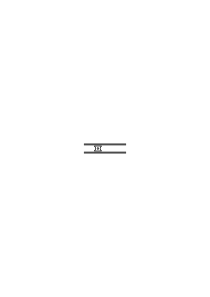

nichts darüber aussagt wie der Mechanismus tatsächlich funktionieren wird. Wenn wir in dieser Zeichnung bereits die Angabe des Freiheitsgrades sehen so geschieht es darum weil wir sie als Ausdruck einer bestimmten Regel auffassen. Aber das Schema <math class="stacked" display="inline"><mfrac><mrow><mo>(</mo><mspace width="0.3em"/><mo>)</mo></mrow><mrow><mo>(</mo><mspace width="0.3em"/><mo>)</mo><mtext>²</mtext></mrow></mfrac></math> ist eben nicht die Darstellung eines Mechanismus.

### [267\[2\]](https://cdn.wittgensteinnachlass.com/2000px/webp/Ms-109/267.webp)

Es ist übrigens klar, daß man nicht versucht wäre die Regel durch <math class="stacked" display="inline"><mfrac><mrow><mo>(</mo><mspace width="0.3em"/><mo>)</mo></mrow><mrow><mo>(</mo><mspace width="0.3em"/><mo>)</mo><mtext>²</mtext></mrow></mfrac></math> auszudrücken, wenn dies nicht eine wirkliche Darstellung der Sachlage wäre.

### [267\[3\]](https://cdn.wittgensteinnachlass.com/2000px/webp/Ms-109/267.webp),[268\[1\]](https://cdn.wittgensteinnachlass.com/2000px/webp/Ms-109/268.webp)

Das was ich bezeichnen will, ist doch etwas was <math class="stacked" display="inline"><mfrac><mrow><mn>1</mn></mrow><mrow><mn>1</mn></mrow></mfrac><mo>,</mo><mfrac><mrow><mn>2</mn></mrow><mrow><mn>4</mn></mrow></mfrac><mo>,</mo><mfrac><mrow><mn>3</mn></mrow><mrow><mn>9</mn></mrow></mfrac><mo>,</mo><mfrac><mrow><mn>4</mn></mrow><mrow><mn>16</mn></mrow></mfrac></math> gemeinsam haben. Aber das was sie gemeinsam haben kann ich unmöglich abgesondert von der Reihe hinschreiben. Es handelt sich ja hier nicht um einen Bestandteil.

### [268\[2\]](https://cdn.wittgensteinnachlass.com/2000px/webp/Ms-109/268.webp)

Der Ausdruck der Regel, obwohl er natürlich ein Bild der Anwendung der Regel sein muß, kann doch in der Anwendung selbst nicht vorkommen oder vielmehr wenn er in der Anwendung der Regel enthalten ist so ist eben die Art wie er enthalten ist bezeichnend & der Ausdruck isoliert kann die Art dieses Vorkommens nicht zeigen.

### [268\[3\]](https://cdn.wittgensteinnachlass.com/2000px/webp/Ms-109/268.webp)

Kann ich sagen: die Absicht sieht in der Abbildung diese Regel befolgt oder nicht befolgt.

### [268\[4\]](https://cdn.wittgensteinnachlass.com/2000px/webp/Ms-109/268.webp)

Es wäre dann so als unterstriche die Intention eine gewisse Funktion, einen gewissen Zug der Beschreibung. Etwa als schriebe man jedes Subjekt eines Satzes mit roter Tinte um dadurch das Prädikat als Funktion hervorzuheben.

### [268\[5\]](https://cdn.wittgensteinnachlass.com/2000px/webp/Ms-109/268.webp)

Die Intention ist nichts als ein Maßstab den wir an das was geschieht anlegen & _nach_ dem wir es beschreiben.

### [269\[1\]](https://cdn.wittgensteinnachlass.com/2000px/webp/Ms-109/269.webp)

Wenn wir z.B. ein Musikstück von Noten lesen so beurteilen wir das Ergebnis nach der Intention die Noten in bestimmter Weise zu übersetzen. Dieses Urteil reagiert in gewisser Weise auf das was sich in der Beschreibung des Ergebnisses als Übereinstimmung oder Abweichung von der beabsichtigten Übertragung darstellt.

### [269\[2\]](https://cdn.wittgensteinnachlass.com/2000px/webp/Ms-109/269.webp)

Wenn es etwa meine Absicht wäre die Ziffern 1, 2, 3, 4, 5 durch ihre Quadrate abzubilden & das Resultat wäre 1, 5, 9, 15, 27 so könnte ich dieses Resultat zunächst schreiben <math class="stacked" display="inline"><mtext>1,</mtext><msup><mn>4</mn><mspace width="0.3em"/><mo>+</mo><mspace width="0.3em"/><mn>1</mn></msup><mo>,</mo><mspace width="0.3em"/><mtext>9,</mtext><mspace width="0.3em"/><mn>1</mn><msup><mn>6</mn><mspace width="0.3em"/><mtext>‒</mtext><mspace width="0.3em"/><mn>1</mn></msup><mo>,</mo><mspace width="0.3em"/><mn>2</mn><msup><mn>5</mn><mspace width="0.3em"/><mo>+</mo><mspace width="0.3em"/><mn>2</mn></msup></math> & meine Reaktion auf das Ergebnis wäre etwa: 0, + 1, 0, ‒ 1, + 2.

### [269\[3\]](https://cdn.wittgensteinnachlass.com/2000px/webp/Ms-109/269.webp)

Wir können wohl eine Maschine zur Illustration der Koordination zweier Vorgänge, der Abbildung des einen in den andern verwenden, aber nur die Maschine _wie sie funktionieren soll_, also die Maschine in ganz bestimmter Weise als Ausdruck aufgefaßt, also als Teil der Sprache.

### [269\[4\]](https://cdn.wittgensteinnachlass.com/2000px/webp/Ms-109/269.webp),[270\[1\]](https://cdn.wittgensteinnachlass.com/2000px/webp/Ms-109/270.webp)

Nur in diesem Sinne bildet z.B. das Pianola die Loch-Schrift auf dem Streifen in das Musikstück ab. Oder der Musterwebstuhl die Sprache der gelochten Karten in das Muster des gewebten Stoffes.

### [270\[2\]](https://cdn.wittgensteinnachlass.com/2000px/webp/Ms-109/270.webp)

30.11.1930

Unter dem Verstehen verstehe ich ein Korrelat zur Erklärung, _nicht_ zu einer – etwa medizinischen – Beeinflussung. Unter Mißverständnis meine ich also wesentlich etwas was sich durch Erklärung beseitigen läßt. Eine andere Nichtübereinstimmung nenne ich nicht Mißverständnis.

### [270\[3\]](https://cdn.wittgensteinnachlass.com/2000px/webp/Ms-109/270.webp)

Die Absicht der Vorlage zu folgen hat die Vorlage im Auge.

### [270\[4\]](https://cdn.wittgensteinnachlass.com/2000px/webp/Ms-109/270.webp)

02.12.1930

Es ist unsinnig zu sagen „ich sehe die Dinge im Gesichtsraum”. Im Gegensatz wozu? Ist es denkbar daß ich sie höre oder daß ein anderer sie sieht?

### [270\[5\]](https://cdn.wittgensteinnachlass.com/2000px/webp/Ms-109/270.webp),[271\[1\]](https://cdn.wittgensteinnachlass.com/2000px/webp/Ms-109/271.webp)

Darum kann ich auch nicht sagen daß der Gegenstand in meinem Gesichtsraum die Ursache dessen ist, daß ich ihn sehe. Darum ist es auch Unsinn zu sagen aus dem Urnebel haben sich die Sonnen, Planeten, die einfachsten Lebewesen & endlich ein Wesen entwickelt was so organisiert ist daß es all diese Dinge sehen & über sie Betrachtungen anstellen kann. Es sei denn, daß man unter diesen Betrachtungen die rein physikalischen Äußerungen im Sinne des behaviourism versteht. In diesem Sinne kann man auch von einer photographischen Kamera sagen daß sie etwas wahrnehme.)

### [271\[2\]](https://cdn.wittgensteinnachlass.com/2000px/webp/Ms-109/271.webp)

Im Gesichtsraum gibt es nichts was wesentlich Subjekt wäre. Und ebenso in meinen Zahnschmerzen nichts was man den Besitzer dieser Schmerzen nennen könnte.

### [271\[3\]](https://cdn.wittgensteinnachlass.com/2000px/webp/Ms-109/271.webp)

Wenn man gefragt würde: was ist der Unterschied zwischen einem Ton & einer Farbe & die Antwort wäre „Töne hören wir dagegen Farben sehen wir” so ist das nur eine durch Erfahrung gerechtfertigte Hypothese, wenn es überhaupt einen Sinn haben soll das zu sagen. Und in diesem Sinn ist es denkbar, daß ich einmal Töne mit den Augen wahrnehmen also sehen werde, & Farben hören. Das Wesentliche der Töne & Farben ist offenbar in der Grammatik der Wörter für Töne & Farben gezeigt.

### [271\[4\]](https://cdn.wittgensteinnachlass.com/2000px/webp/Ms-109/271.webp)

_[→ Fortsetzung Bd. VI]_

### [272\[1\]](https://cdn.wittgensteinnachlass.com/2000px/webp/Ms-109/272.webp)

29.01.1931

Und wenn ich sagte, daß er die Wahrheit auf ja & nein festlegt, so heißt das, daß er nichts festlegt, (oder) nichts was sich sagen läßt.

### [272\[2\]](https://cdn.wittgensteinnachlass.com/2000px/webp/Ms-109/272.webp)

Ich sagte, der Satz wäre wie ein Maßstab an die Wirklichkeit angelegt: Aber der Maßstab ist, wie alle richtigen Gleichnisse des Satzes, ein spezieller Fall des Satzes. Und auch er bestimmt nichts, solange man nicht mit ihm mißt. Aber Messen ist Vergleichen (und muß heißen Übersetzen).

### [272\[3\]](https://cdn.wittgensteinnachlass.com/2000px/webp/Ms-109/272.webp)

Der Maßstab ist auch ein Bild, aber er muß als Bild aufgefaßt werden.

### [272\[4\]](https://cdn.wittgensteinnachlass.com/2000px/webp/Ms-109/272.webp)

Man möchte sagen: Lege den Maßstab an einen Körper an; er sagt nicht, daß der Körper so lang ist. Vielmehr ist er an sich gleichsam tot & leistet nichts von dem was der Gedanke leistet. Es ist, als hätten wir uns eingebildet, das Wesentliche am lebenden Menschen sei die äußere Gestalt & hätten nun eine Holzpuppe von dieser Gestalt hergestellt & sähen mit Enttäuschung den toten Klotz, der auch keine Ähnlichkeit mit dem Leben hat.

### [273\[1\]](https://cdn.wittgensteinnachlass.com/2000px/webp/Ms-109/273.webp)

Ich sage jemandem: „Geh ruf den Peter”. – Wie soll er wissen was ich meine? Es muß ihm erklärt worden sein. Aber doch nur wieder mit Zeichen. Er folgt nun dieser Erklärung.

### [273\[2\]](https://cdn.wittgensteinnachlass.com/2000px/webp/Ms-109/273.webp)

Wenn das Verstehen eine notwendige Vorbereitung des Folgens war, so muß es dem Zeichen etwas hinzugefügt haben; aber etwas was jedenfalls nicht die Ausführung war.

### [273\[3\]](https://cdn.wittgensteinnachlass.com/2000px/webp/Ms-109/273.webp)

Kann man denn, und in welchem Sinne kann man, aus dem Zeichen plus dem Verständnis (also der Interpretation) die Ausführung ableiten, ehe sie geschieht? Alles was man ableitet ist doch nur eine Beschreibung der Ausführung & auch diese Beschreibung war erst da, nachdem man _sie_ abgeleitet hatte.

### [273\[4\]](https://cdn.wittgensteinnachlass.com/2000px/webp/Ms-109/273.webp)

Die _Ausführung_ des Befehls leiten wir von diesem erst ab, wenn wir ihn ausführen.

### [273\[5\]](https://cdn.wittgensteinnachlass.com/2000px/webp/Ms-109/273.webp),[274\[1\]](https://cdn.wittgensteinnachlass.com/2000px/webp/Ms-109/274.webp)

Nun könnte man aber fragen: Warum nenne ich gerade die eine Übertragung des Symbols die Ausführung & nicht auch die anderen Übertragungen. Nun, man könnte auch eine der andern Übertragungen als Ausführung des Befehls auffassen & wenn der Befehlende dies nicht für die gewünschte Übertragung hält so muß er dem Befehl eine weitere Erklärung beifügen also den Befehl selbst verändern & erweitern.

### [274\[2\]](https://cdn.wittgensteinnachlass.com/2000px/webp/Ms-109/274.webp)

Alles was man im voraus weiß, ist, daß, was immer man von diesem Befehl ableiten wird, von ihm abgeleitet sein wird.

### [274\[3\]](https://cdn.wittgensteinnachlass.com/2000px/webp/Ms-109/274.webp)

„Aber ich verstehe doch schon vor der Ausführung, was ich zu machen habe”. – Gewiß. Und zwar was ist es denn?

### [274\[4\]](https://cdn.wittgensteinnachlass.com/2000px/webp/Ms-109/274.webp)

Wenn ich sage „der Satz bestimmt doch schon im vorhinein was ihn wahr machen wird”: Gewiß der Satz ‚p’ bestimmt, daß p der Fall sein muß, um ihn wahr zu machen das ist aber auch alles, was man darüber sagen kann.

### [274\[5\]](https://cdn.wittgensteinnachlass.com/2000px/webp/Ms-109/274.webp),[275\[1\]](https://cdn.wittgensteinnachlass.com/2000px/webp/Ms-109/275.webp)

Wenn gesagt würde, daß der, der den Befehl erhält, eben außer den Worten Vorstellungen erhält, die der Ausführung des Befehls ähnlich sind, (während es die Worte nicht seien) so gehe ich noch weiter & nehme an, daß der Befehl dadurch gegeben wird, daß wir den Andern die Bewegungen die er etwa in 5 Minuten ausführen soll, jetzt durch mechanische Beeinflussung (Führen seiner Hand etc.) ausführen machen; & näher kann ich doch wohl der Ausführung des Befehls im Ausdruck des Befehls nicht kommen. Dann haben wir die Ähnlichkeit der Vorstellung durch eine viel größere Ähnlichkeit ersetzt. Und der Weg vom Symbol zur Wirklichkeit scheint hier sehr verkürzt zu sein. (Ebenso könnte ich, um zu beschreiben, in welcher Stellung ich mich bei der & der Gelegenheit befunden habe, diese Stellung einnehmen.) Es ist damit auch gezeigt, daß das Vorkommen von Phantasiebildern, für den Gedanken ganz unwesentlich ist.

### [276\[1\]](https://cdn.wittgensteinnachlass.com/2000px/webp/Ms-109/276.webp)

(Man muß mit manchem Problem erst vertraut werden, dadurch daß man zu unzähligen Malen daran anläuft. Man lernt dann den Geschmack des Problems kennen.)

### [276\[2\]](https://cdn.wittgensteinnachlass.com/2000px/webp/Ms-109/276.webp)

Ich stoße hier an die Einmaligkeit einer Tatsache & das hängt mit dem Sinn des Satzes „alles fließt” zusammen.

### [276\[3\]](https://cdn.wittgensteinnachlass.com/2000px/webp/Ms-109/276.webp)

Wenn einer den Befehl mißversteht & eine Übertragung die wir nur als Bild der Ausführung auffassen für die Ausführung selbst hält so entspräche doch seine Übertragung auch einem Befehl unserer Sprache & zwar einem der dem Unseren sehr ähnlich sähe. Der Befehl etwa eine bestimmte Bewegung auszuführen & der Befehl diese Bewegung nur zu zeichnen haben eben die Beschreibung dieser Bewegung mit einander gemein. Aber sie unterscheiden sich auch von einander & nur dadurch kann der eine das eine der andere das andere befehlen.

### [277\[1\]](https://cdn.wittgensteinnachlass.com/2000px/webp/Ms-109/277.webp)

Der Befehl kann die Ausführung nur insofern bestimmen als man sie von ihm ableiten kann. –

### [277\[2\]](https://cdn.wittgensteinnachlass.com/2000px/webp/Ms-109/277.webp)

Nur das kann es heißen ‚daß er sie bestimmt’, daß man sie von ihm ableiten kann.

### [277\[3\]](https://cdn.wittgensteinnachlass.com/2000px/webp/Ms-109/277.webp)

Der Befehl xx² | 1 2 3 4 kommt uns unvollständig vor. Es scheint uns als wäre nur etwas angedeutet was nicht ausgesprochen ist.

### [277\[4\]](https://cdn.wittgensteinnachlass.com/2000px/webp/Ms-109/277.webp)

Angedeutet aber ist etwas nur insofern als ein System nicht ausdrücklich oder unvollkommen festgelegt ist. Wir möchten sagen, es sei uns unvollkommen angedeutet oder das Zeichen suggeriere nur undeutlich, was wir zu tun hätten. Es sei etwa in dem Sinn undeutlich wie eine Tafel mit der Aufschrift „Links gehen” deutlicher wird wenn zugleich ein Pfeil die Richtung zeigt.

### [277\[5\]](https://cdn.wittgensteinnachlass.com/2000px/webp/Ms-109/277.webp),[278\[1\]](https://cdn.wittgensteinnachlass.com/2000px/webp/Ms-109/278.webp)

Aber für uns ist der Befehl deutlich der unzweideutig ist; & einen deutlicheren gibt es nicht.

### [278\[2\]](https://cdn.wittgensteinnachlass.com/2000px/webp/Ms-109/278.webp)

Eindeutig aber kann er nur werden, dadurch daß in dem Befehlssystem eine Unterscheidung gemacht wird die wenn sie fehlt eben die Zweideutigkeit hervorruft. (Wenn also das System die richtige Mannigfaltigkeit erhält.)

### [278\[3\]](https://cdn.wittgensteinnachlass.com/2000px/webp/Ms-109/278.webp)

Ich könnte auch sagen: Es scheint uns als ob, wenn wir den Befehl (xx² | 1 2 3 z.B. ) verstehen wir etwas hinzufügen was die Lücke füllt. So daß wir dem der (uns) sagt „aber Du verstehst ihn ja” antworten können: ja, aber nur weil ich noch etwas hinzufüge: die Deutung nämlich.

### [278\[4\]](https://cdn.wittgensteinnachlass.com/2000px/webp/Ms-109/278.webp)

Nun müßte man allerdings darauf sagen: Aber was veranlaßt Dich denn zu gerade _der_ Deutung? Ist es der Befehl, dann war er ja schon eindeutig, da er nur diese Deutung befahl. Oder hast Du die Deutung willkürlich hinzugefügt –, dann hast Du ja auch den Befehl nicht verstanden sondern erst das was Du aus ihm (auf eigene Faust) gemacht hast.

### [279\[1\]](https://cdn.wittgensteinnachlass.com/2000px/webp/Ms-109/279.webp)

(Meine Methode ist in gewissem Sinne eine psychologische.)

### [279\[2\]](https://cdn.wittgensteinnachlass.com/2000px/webp/Ms-109/279.webp)

Was heißt es die Handlung aus dem Befehl ableiten außer eben sie ausführen; denn wie kann mir die Handlung sonst gegeben sein es sei denn durch eine Beschreibung. Dann aber leite ich nur eine Beschreibung von einer anderen ab.

### [279\[3\]](https://cdn.wittgensteinnachlass.com/2000px/webp/Ms-109/279.webp)

Wissen was der Satz besagt kann nur heißen: die Frage beantworten können „was besagt er?”.

### [279\[4\]](https://cdn.wittgensteinnachlass.com/2000px/webp/Ms-109/279.webp)

Den Sinn eines Satzes verstehen kann nur heißen: die Frage „was ist sein Sinn” beantworten können.

### [279\[5\]](https://cdn.wittgensteinnachlass.com/2000px/webp/Ms-109/279.webp)

Denn ist hier „Sinn-Haben” intransitiv gebraucht so daß man also nicht _den_ Sinn eines Satzes von dem eines anderen Satzes unterscheiden kann, dann ist das Sinnhaben eine den Gebrauch des Satzes begleitende Angelegenheit die uns nicht interessiert.

### [279\[6\]](https://cdn.wittgensteinnachlass.com/2000px/webp/Ms-109/279.webp),[280\[1\]](https://cdn.wittgensteinnachlass.com/2000px/webp/Ms-109/280.webp)

Wenn ich aber sage: Ich leite meine Handlung von dem Befehl ab mit Hilfe einer Regel, so hat das nur dann Sinn, wenn ich fragen kann: Mit Hilfe _welcher_ Regel? Und auf diese Frage muß ein Ausdruck der Regel zur Antwort kommen. (Denn es kann sich hier natürlich wieder nur um _eine_ Regel im Gegensatz zu einer anderen handeln.)

### [280\[2\]](https://cdn.wittgensteinnachlass.com/2000px/webp/Ms-109/280.webp)

Wie aber kommt die Regel in dem Handeln nach der Regel vor?

### [280\[3\]](https://cdn.wittgensteinnachlass.com/2000px/webp/Ms-109/280.webp)

Nicht unbedingt so, daß meine Handlung der Regel entspricht. Aber ein Teil des ganzen Vorgangs der Ableitung muß der Regel entsprechen: es muß unsere Absicht sein der Regel zu folgen. – Und man könnte sagen daß das eben darin besteht daß unsere Absicht der Regel folgt.

### [280\[4\]](https://cdn.wittgensteinnachlass.com/2000px/webp/Ms-109/280.webp),[281\[1\]](https://cdn.wittgensteinnachlass.com/2000px/webp/Ms-109/281.webp)

Wie ist aber der Zusammenhang des Gebrauchs der Sprache & der Regeln der Grammatik? Soll ich sagen die Regeln der Grammatik seien die Regeln nach denen (d.h. in Übereinstimmung mit welchen) das Sprechen einer Gruppe von Menschen tatsächlich vor sich geht.

### [281\[2\]](https://cdn.wittgensteinnachlass.com/2000px/webp/Ms-109/281.webp)

30.01.1931

Heißt ‚den Regeln der Grammatik folgen’, in irgend einem Sinne während des Sprechens an diese Regeln denken? Nein. – Heißt es bestimmten Regeln immer gemäß reden? Nein. – Es heißt Regeln folgen. – Aber das tut doch jeder der irgend etwas macht; denn eine Regel wird es schon geben der das entspricht was er tut.

### [281\[3\]](https://cdn.wittgensteinnachlass.com/2000px/webp/Ms-109/281.webp)

Man möchte sagen: „man muß nur etwas mit dem _meinen_ was man sagt, dann ist alles Wesentliche gegeben”. Und ich betrachte also ‚etwas meinen’ & ‚einer Regel folgen’ als gleichbedeutend.

### [281\[4\]](https://cdn.wittgensteinnachlass.com/2000px/webp/Ms-109/281.webp)

Kann ich sagen: Wenn ich etwas _meine_ so habe ich meine Worte nach einer gewissen Regel gewählt?

### [281\[5\]](https://cdn.wittgensteinnachlass.com/2000px/webp/Ms-109/281.webp)

Oder so? Wenn ich etwas meine so habe ich Etwas porträtiert, also nach einer Regel dargestellt.

### [281\[6\]](https://cdn.wittgensteinnachlass.com/2000px/webp/Ms-109/281.webp),[282\[1\]](https://cdn.wittgensteinnachlass.com/2000px/webp/Ms-109/282.webp)

Ist die Grammatik nur die Beschreibung der tatsächlichen Handhabung der Sprache? So daß ihre Sätze eigentlich wie Sätze einer Naturwissenschaft aufgefaßt werden könnten? Das ist aber dann nicht die deskriptive Wissenschaft des Denkens, sondern des Sprechens.

### [282\[2\]](https://cdn.wittgensteinnachlass.com/2000px/webp/Ms-109/282.webp)

Es könnten ja auch die Regeln des Schachspiels als Sätze aus der Naturgeschichte des Menschen aufgefaßt werden. (Wie die Spiele der Tiere in naturgeschichtlichen Büchern beschrieben werden.)

### [282\[3\]](https://cdn.wittgensteinnachlass.com/2000px/webp/Ms-109/282.webp)

„Ich meine aber doch mit diesen Worten etwas”. Gewiß: im Gegensatz zu dem Falle wo ich nichts meine, wo ich etwa Silben ihres (angenehmen oder) komischen Klangs wegen aneinanderreihe.

### [282\[4\]](https://cdn.wittgensteinnachlass.com/2000px/webp/Ms-109/282.webp)

D.h. Einen Satz sinnvoll aussprechen ist ein anderer Vorgang als etwa zu singen lalala.

### [282\[5\]](https://cdn.wittgensteinnachlass.com/2000px/webp/Ms-109/282.webp)

Ich will eigentlich sagen, daß „ich meine etwas mit dem Wort” nur heißt: ich unterscheide doch diesen Fall von dem des sinnlosen Plapperns etc. Und das ist zugegeben. Aber es ist damit noch keine besondere Theorie des Meinens gegeben.

### [282\[6\]](https://cdn.wittgensteinnachlass.com/2000px/webp/Ms-109/282.webp),[283\[1\]](https://cdn.wittgensteinnachlass.com/2000px/webp/Ms-109/283.webp)

Und so geht es in allen solchen Fällen. Wenn etwa jemand sagt: „aber ich meine doch wirklich, daß der Andere Zahnschmerzen hat; nicht daß er sich bloß so benimmt”. Immer muß man antworten: „Gewiß” & zugeben, daß auch wir diese Unterscheidung machen müssen.

### [283\[2\]](https://cdn.wittgensteinnachlass.com/2000px/webp/Ms-109/283.webp)

Der Vorgang ‚einer Regel folgen’ muß durch eine Regel beschrieben werden.

Man könnte sagen, er heißt so, weil er durch eine Regel beschrieben werden muß.

### [283\[3\]](https://cdn.wittgensteinnachlass.com/2000px/webp/Ms-109/283.webp)

Oder auch so: Man könnte aus jedem sinnvollen Satz eine Grammatik ableiten.

### [283\[4\]](https://cdn.wittgensteinnachlass.com/2000px/webp/Ms-109/283.webp)

Aus dem Vorgang der _Übertragung_ von 1, 2, 3, 4, in 1, 4, 9, 16 muß ich eine Regel entnehmen können. – Was heißt das? Doch, daß ich einen Ausdruck einer Regel aus dem Vorgang muß ableiten können; d.h. _einen_ Ausdruck im Gegensatz zu einem anderen.

### [283\[5\]](https://cdn.wittgensteinnachlass.com/2000px/webp/Ms-109/283.webp)

D.h. daß ich in einem _System_ von Regeln eine als die passende werde auswählen können.

### [284\[1\]](https://cdn.wittgensteinnachlass.com/2000px/webp/Ms-109/284.webp)

Wenn ich z.B. sage: „ich glaube, daß er kommen wird” – woher nehme ich diese Worte. Warum wähle ich _sie_. Ist etwas vor diesem Ausdruck da, das ich abbilde.

### [284\[2\]](https://cdn.wittgensteinnachlass.com/2000px/webp/Ms-109/284.webp)

Ich bin mir zwar nicht grammatischer Regeln explicite bewußt, wenn ich die Sprache gebrauche aber ich bin mir bewußt, die Sprache nicht ad hoc zu erfinden. Und erfände ich sie so wäre sie nichts nütze, wenn ich mich nach den erfundenen Regeln nicht wieder richten wollte.

### [284\[3\]](https://cdn.wittgensteinnachlass.com/2000px/webp/Ms-109/284.webp)

D.h. die Sprache funktioniert als Sprache nur durch die Regeln nach denen wir uns in ihrem Gebrauch richten. (Wie das Spiel nur durch Regeln als Spiel funktioniert.)

### [284\[4\]](https://cdn.wittgensteinnachlass.com/2000px/webp/Ms-109/284.webp)

Und zwar, ob ich zu mir oder Andern rede. Denn auch mir teile ich nichts mit, wenn ich Lautgruppen ad hoc mit irgend welchen Fakten assoziiere.

### [284\[5\]](https://cdn.wittgensteinnachlass.com/2000px/webp/Ms-109/284.webp),[285\[1\]](https://cdn.wittgensteinnachlass.com/2000px/webp/Ms-109/285.webp)

Ich muß, wenn ich zu mir rede, schon auf einem gegebenen Sprachklavier spielen.

### [285\[2\]](https://cdn.wittgensteinnachlass.com/2000px/webp/Ms-109/285.webp)

Wenn ich ein Wort in der Sprache gebrauche, so ist es entweder, weil ich es als einen bereits bekannten Ton anschlagen will, oder indem ich festsetzen will, daß ich das Wort in Hinkunft so gebrauchen werde.

### [285\[3\]](https://cdn.wittgensteinnachlass.com/2000px/webp/Ms-109/285.webp)

31.01.1931

‚Ich verstehe diese Worte’ (die ich etwa zu mir selbst sage) ‚ich meine etwas damit’, ‚sie haben einen Sinn’ muß immer dasselbe heißen, wie: ‚sie sind nicht ad hoc erfundene Laute sondern Zeichen aus einem System’.

### [285\[4\]](https://cdn.wittgensteinnachlass.com/2000px/webp/Ms-109/285.webp)

Etwa, wie die Teilstriche auf einem Maßstab nur solche sind, wenn sie ein System bilden.

### [285\[5\]](https://cdn.wittgensteinnachlass.com/2000px/webp/Ms-109/285.webp)

Wir verwenden die Sprache nur ihrer Konsequenz wegen.

### [285\[6\]](https://cdn.wittgensteinnachlass.com/2000px/webp/Ms-109/285.webp)

Man kann sagen: „so wie ich das Wort ‚Liebe’ hier gebrauche, kann ich nicht davon sagen …”

### [286\[1\]](https://cdn.wittgensteinnachlass.com/2000px/webp/Ms-109/286.webp)

Das _Verstehen_ dessen was der Andere sagt kann nur als das Befolgen einer im vorhinein gegebenen Regel beschrieben werden.

### [286\[2\]](https://cdn.wittgensteinnachlass.com/2000px/webp/Ms-109/286.webp)

Denn wenn wir einen Befehl befolgen so deuten wir die Worte nicht willkürlich. D.h. wieder, wir müssen die Unterscheidung anerkennen zwischen dem „Befolgen eines Befehls” & einem „willkürlichen Zuordnen einer Handlung”.

### [286\[3\]](https://cdn.wittgensteinnachlass.com/2000px/webp/Ms-109/286.webp)

Und die Rechtfertigung einer Handlungsweise als Befolgung eines Befehls wäre immer: „so habe ich's gelernt”.

### [286\[4\]](https://cdn.wittgensteinnachlass.com/2000px/webp/Ms-109/286.webp)

Wie aber funktioniert so eine Rechtfertigung: „Man hat mir gesagt, _das_ sei ein Sessel” oder „… das sei rot” etc. Oder auch man hat mir gesagt, wenn es heißt ‚tu p & q’ so soll ich's _so_ machen (wobei ich die Tätigkeit vormache).

### [286\[5\]](https://cdn.wittgensteinnachlass.com/2000px/webp/Ms-109/286.webp)

Das sind aufklärbare Mißverständnisse. „Ist _das_ eine Orange? ich dachte _das_ sei eine.”

### [287\[1\]](https://cdn.wittgensteinnachlass.com/2000px/webp/Ms-109/287.webp)

Kann man sagen: „Ist das rot? ich dachte das sei ein Sessel.”

### [287\[2\]](https://cdn.wittgensteinnachlass.com/2000px/webp/Ms-109/287.webp)

Aber kann man sich nicht einbilden (wenn man etwa nicht deutsch kann) ‚rot’ heiße laut (d.h. werde so gebraucht wie in Wirklichkeit ‚laut’ gebraucht wird). Wie wäre aber die Aufklärung dieses Mißverständnisses? Etwa so: „rot ist eine Farbe, keine Tonstärke”? – Eine solche Erklärung könnte man natürlich geben, aber sie wäre nur dem verständlich der sich bereits ganz in der Grammatik auskennt.

### [287\[3\]](https://cdn.wittgensteinnachlass.com/2000px/webp/Ms-109/287.webp)

Der Satz „Ist das rot? ich dachte das sei ein Sessel” hat nur Sinn wenn das Wort „das” beide Male im gleichen Sinn gebraucht wird & dann muß ich entweder ‚rot’ als Substantiv oder „ein Sessel” als Adjektiv auffassen.

### [287\[4\]](https://cdn.wittgensteinnachlass.com/2000px/webp/Ms-109/287.webp)

Die Rechtfertigung kann nur verstanden werden wenn sie in einer Sprache gegeben wird, die unabhängig von dem Mißverständnis besteht.

### [287\[5\]](https://cdn.wittgensteinnachlass.com/2000px/webp/Ms-109/287.webp),[288\[1\]](https://cdn.wittgensteinnachlass.com/2000px/webp/Ms-109/288.webp)

Man kann ein Mißverständnis nur aufklären wenn die Aufklärung verstanden wird.

### [288\[2\]](https://cdn.wittgensteinnachlass.com/2000px/webp/Ms-109/288.webp)

In der Erklärung „_das_ ist ein Sessel nicht _das_” müssen die beiden Wörter „das” & die dazugehörigen Gebärden verstanden werden & sind dann vollwertige Zeichen. Die Erklärung kann dann auch so gegeben werden: „_das_ heißt ‚Sessel’, nicht _das_” & dies ist ein Satz, wie etwa „der Sessel ist blau, nicht rot”. – Aber freilich wird hier nicht die Sprache erklärt sondern _eine_ Sprache (mit Hilfe einer vorhandenen andern).

### [288\[3\]](https://cdn.wittgensteinnachlass.com/2000px/webp/Ms-109/288.webp)

[Ich könnte als Motto meines Buches wählen: Ein Narr kann mehr fragen, als zehn Weise beantworten können. Eigentlich müßte es hier heißen „zehn Gescheite”.]

### [288\[4\]](https://cdn.wittgensteinnachlass.com/2000px/webp/Ms-109/288.webp)

Ist es so: Grammatik hat nur die Sprache als in der Zeit ausgedehntes Phänomen.

### [288\[5\]](https://cdn.wittgensteinnachlass.com/2000px/webp/Ms-109/288.webp)

Aber der Satz ist doch etwas in Raum oder Zeit, oder in Raum & Zeit, Ausgedehntes.

### [289\[1\]](https://cdn.wittgensteinnachlass.com/2000px/webp/Ms-109/289.webp)

Das Aussprechen eines Satzes wäre kein Porträtieren wenn ich meine Worte nicht aus einem System wählte, so daß man sagen kann, ich wähle _sie_ im Gegensatz zu anderen. Aber die Worte wenn sie nicht in einem grammatischen System stehen sind ja alle gleichwertig & also wäre es dann ganz gleichgültig welche ich wählte ja – man könnte sagen – als Worte würden sie sich (dann) voneinander gar nicht unterscheiden. Man muß die Worte wählen [in demselben Sinne wie] man die Striche wählt mit denen man einen Körper abbildet.

### [289\[2\]](https://cdn.wittgensteinnachlass.com/2000px/webp/Ms-109/289.webp)

01.02.1931

Wer die Notenschrift lernt, lernt nicht alle Musikstücke, sondern die Noten & Regeln & nur dadurch ist ihm die Notenschrift nütze.

### [289\[3\]](https://cdn.wittgensteinnachlass.com/2000px/webp/Ms-109/289.webp)

Aber nicht vielleicht weil sie nur dann ökonomisch ist, sondern weil sie sonst keine Schrift ist.

### [289\[4\]](https://cdn.wittgensteinnachlass.com/2000px/webp/Ms-109/289.webp)

(Die Regel hat die selbe Allgemeinheit wie eine Hypothese.)

### [289\[5\]](https://cdn.wittgensteinnachlass.com/2000px/webp/Ms-109/289.webp),[290\[1\]](https://cdn.wittgensteinnachlass.com/2000px/webp/Ms-109/290.webp)

Wenn man den Hund gelehrt hat, den Zeichenverbindungen von a, b, c, d zu folgen (wobei a = →, b = ↓, c = ←, d = ↑), so mag er das mechanisch tun, aber wenn ich nun wissen will, welches Zeichen ich ihm geben muß um ihn den Linienzug

laufen zu lassen, so muß ich das Zeichen von dem Linienzug nach der Regel ableiten.

### [290\[2\]](https://cdn.wittgensteinnachlass.com/2000px/webp/Ms-109/290.webp)

Die Aufschreibung der Regel nützt mir nur, insofern sie mich an diese Regel im Gegensatz zu anderen erinnert, – verhindert, daß ich etwa denke a bedeute ↓, etc.

### [290\[3\]](https://cdn.wittgensteinnachlass.com/2000px/webp/Ms-109/290.webp)

Wenn ich sage, ich folge einer Regel, so muß darauf die Frage Sinn haben: Welcher Regel? Und die Antwort ist der Ausdruck einer Regel (wie der obige). Mehr aber kann darauf nicht zur Antwort kommen & also kann auch die Frage nach weiter nichts fragen, als dieser Ausdruck beantwortet.

### [290\[4\]](https://cdn.wittgensteinnachlass.com/2000px/webp/Ms-109/290.webp)

Woher aber die Unbefriedigung? Was ist es das wir sagen möchten was sich nicht sagen läßt?

### [290\[5\]](https://cdn.wittgensteinnachlass.com/2000px/webp/Ms-109/290.webp),[291\[1\]](https://cdn.wittgensteinnachlass.com/2000px/webp/Ms-109/291.webp)

Wenn ich, den Regeln folgend statt „→” „a” schreibe, so ist es als wäre hier eine Kausalität im Spiel die nicht hypothetisch, sondern unmittelbar erlebt wäre. (Natürlich ist nichts dergleichen der Fall.)

### [291\[2\]](https://cdn.wittgensteinnachlass.com/2000px/webp/Ms-109/291.webp)

Eines ist klar, daß, wenn ich der Regel (richtig) gefolgt bin das Resultat zu der Vorlage & dem Ausdruck der Regel in einer internen Relation stehen wird, die ich nicht anders ausdrücken kann, als durch die Wiedergabe jener drei Komplexe, weil (so sonderbar das klingt) durch diese Wiedergabe allein schon alles bestimmt ist.

### [291\[3\]](https://cdn.wittgensteinnachlass.com/2000px/webp/Ms-109/291.webp)

„Die interne Relation sehen” kann natürlich auch nichts anderes heißen, als die Komplexe sehen, die in ihr stehen. Vielleicht wendet man ein, daß man die Komplexe auch sehen kann ohne daß einem die interne Relation auffällt. Aber dann sieht man eben etwas Anderes als was man sieht ‚wenn sie einem auffällt’.

Aber sie, die einem auffällt, kann nur etwas sein was sich beschreiben läßt & die interne Relation läßt sich nur durch die Beschreibung der Komplexe zeigen.

### [291\[4\]](https://cdn.wittgensteinnachlass.com/2000px/webp/Ms-109/291.webp),[292\[1\]](https://cdn.wittgensteinnachlass.com/2000px/webp/Ms-109/292.webp)

(Immer wieder die Gedankenbewegung die z.B. Freud macht wenn er sagt, er werde den manifesten Traum das nennen was nach dem Erwachen als solcher erzählt wird.)

### [292\[2\]](https://cdn.wittgensteinnachlass.com/2000px/webp/Ms-109/292.webp)

Wenn ich sage beim Nachbilden einer Vorlage richte ich mich nach ihr gemäß einer Regel, so will ich sagen: im Gegensatz zu dem Fall, wenn ich mich nicht nach einer Vorlage einer Regel gemäß richte. Dann kann dieses Merkmal des Abbildens nur ein äußeres sein wie jedes andere, was einen Vorgang von einem anderen unterscheidet.

### [292\[3\]](https://cdn.wittgensteinnachlass.com/2000px/webp/Ms-109/292.webp)

Eigentlich sind die Worte „gemäß einer Regel” überflüssig. Alles liegt in den Worten „sich nach der Vorlage _richten_”. Die Regel beschreibt nur _eine_ Art des Sich-Richtens im Gegensatz zu einer andern. – Die Worte sind überflüssig, weil man sich nur einer Regel gemäß nach etwas richten kann.

### [292\[4\]](https://cdn.wittgensteinnachlass.com/2000px/webp/Ms-109/292.webp),[293\[1\]](https://cdn.wittgensteinnachlass.com/2000px/webp/Ms-109/293.webp)

Das heißt, das Abbilden kann sich von einem andern Vorgang auch nur so unterscheiden wie eben ein Vorgang vom andern & das heißt daß dieser Unterschied nicht logische Bedeutung haben kann.

### [293\[2\]](https://cdn.wittgensteinnachlass.com/2000px/webp/Ms-109/293.webp)

So wie ich früher einmal gesagt habe: Die Intention kann auch nur ein Phänomen wie jedes andere sein, wenn ich überhaupt von ihr reden darf.

### [293\[3\]](https://cdn.wittgensteinnachlass.com/2000px/webp/Ms-109/293.webp)

Das Wählen der Striche beim Abbilden einer Vorlage ist also allerdings ein anderer Vorgang als etwa das bloße Zeichnen dieser Striche, wenn ich mich „nicht nach der Vorlage richte”, aber der Unterschied ist ein äußerer, beschreibbarer wie der Unterschied zwischen den Zeichengruppen 2,4, | 4,16, | 6,36 | 864 und xx² | 2,4, | 4,16 | 6,36 | 864 & steht mit diesem Unterschied auf gleicher Stufe.

### [293\[4\]](https://cdn.wittgensteinnachlass.com/2000px/webp/Ms-109/293.webp)

Und so steht es also auch mit dem Wählen der Worte, wenn ich etwas mit Worten beschreibe: dieser Vorgang unterscheidet sich von dem des willkürlichen Zuordnens von Worten, aber eben nur äußerlich wie sich die beiden Zeichen im vorigen Satze unterscheiden.

### [294\[1\]](https://cdn.wittgensteinnachlass.com/2000px/webp/Ms-109/294.webp)

Nicht nur sind wir uns beim Sprechen der grammatischen Regeln nicht bewußt, sondern wären wir es so würde es nicht helfen, nichts deutlicher machen.

### [294\[2\]](https://cdn.wittgensteinnachlass.com/2000px/webp/Ms-109/294.webp)

Sich der Regeln bewußt sein kann doch nur heißen einen Ausdruck der Regel vor uns haben.

### [294\[3\]](https://cdn.wittgensteinnachlass.com/2000px/webp/Ms-109/294.webp)

Was, in der Logik, nicht nötig ist, _hilft_ auch nicht. Was nicht nötig ist, ist überflüssig.

### [294\[4\]](https://cdn.wittgensteinnachlass.com/2000px/webp/Ms-109/294.webp)

Ja, wären wir uns immer der grammatischen Regeln beim Sprechen bewußt so würde das meinem Fall nicht auf die Beine helfen.

### [294\[5\]](https://cdn.wittgensteinnachlass.com/2000px/webp/Ms-109/294.webp)

Die gesamte Sprache kann nicht mißverstanden werden. Denn sonst gäbe es zu diesem Mißverständnis wesentlich keine Erklärung.

### [294\[6\]](https://cdn.wittgensteinnachlass.com/2000px/webp/Ms-109/294.webp)

Das heißt eben die ganze Sprache muß für sich selbst sprechen.

### [294\[7\]](https://cdn.wittgensteinnachlass.com/2000px/webp/Ms-109/294.webp),[295\[1\]](https://cdn.wittgensteinnachlass.com/2000px/webp/Ms-109/295.webp)

Warum wir ein Wort – & nicht ein anderes – an dieser Stelle gebrauchen, erfahren wir wenn wir jemand fragen: warum gebrauchst Du hier das Wort A. Die Antwort wird sein: das & das heißt A.

Und das ist eine Regel der Grammatik die die Position des Wortes in der Sprache bestimmt. Und (zum Zeichen daß es sich hier wirklich um Grammatik handelt) wenn A das Wort „und” gewesen wäre so könnte man weiter nichts tun als die Regeln für „und” angeben.

### [295\[2\]](https://cdn.wittgensteinnachlass.com/2000px/webp/Ms-109/295.webp)

Eine Erklärung „_das_ ist rot” oder „_das_ ist süß” gehören auch zur Grammatik (denn sie erklären nur Zeichen durch Zeichen.) Und was uns außer dem Wort „rot” durch diese Erklärung noch bleibt ist nicht in dem Sinne willkürlich wie das Laut- oder Schriftbild „rot”. Denn die Vorstellung eines roten & eines grünen Flecks bilden ein System, während die bloßen Wörter rot & grün keines bilden.

### [295\[3\]](https://cdn.wittgensteinnachlass.com/2000px/webp/Ms-109/295.webp)

Was hat die Vorstellung meines Spaziergangs mit diesem (Spaziergang) gemein? Eben das was dadurch ausgedrückt ist daß ich das eine meinen Spaziergang das andere die Vorstellung von ihm nenne.

### [296\[1\]](https://cdn.wittgensteinnachlass.com/2000px/webp/Ms-109/296.webp)

Was heißt es wenn man sagt: „ich kann mir das Gegenteil davon nicht vorstellen” oder „wie wäre es denn, wenn's anders wäre”; z.B. wenn jemand gesagt hat daß meine Vorstellungen privat seien oder daß nur ich selbst wissen kann ob ich Schmerz empfinde und dergl..

### [296\[2\]](https://cdn.wittgensteinnachlass.com/2000px/webp/Ms-109/296.webp)

Wenn ich mir nicht vorstellen kann wie es anders wäre so kann ich mir auch nicht vorstellen wie es so sein kann. „Ich kann mir nicht vorstellen” heißt nämlich hier nicht was es im Satz „ich kann mir keinen Totenkopf vorstellen” heißt. Ich will damit nicht auf eine mangelnde Vorstellungskraft deuten.

### [296\[3\]](https://cdn.wittgensteinnachlass.com/2000px/webp/Ms-109/296.webp)

Die Vorstellung liefert uns hier die Sprache die jedenfalls die richtige Multiplizität hat. Die Sprache mit der einfacheren Grammatik.

### [296\[4\]](https://cdn.wittgensteinnachlass.com/2000px/webp/Ms-109/296.webp)

Die Rechtfertigung auf die Frage, warum gebrauchst Du hier das Wort blau?: „Weil diese Farbe „blau” heißt”, entspricht genau der Antwort auf die Frage „warum liest Du hier (den Laut) ‚a’”: „weil das Zeichen ‚a’ gelesen wird”. In beiden Fällen berufe ich mich auf eine Regel.

### [297\[1\]](https://cdn.wittgensteinnachlass.com/2000px/webp/Ms-109/297.webp)

02.02.1931

Wozu beschreibe ich denn etwas? (denn daraus soll ja das Wesen der Sprache hervorgehen). Und das scheint sich ja in dem Fall des Hundes, den ich durch Zeichen lenken will, leicht zeigen zu lassen.

### [297\[2\]](https://cdn.wittgensteinnachlass.com/2000px/webp/Ms-109/297.webp)

Worin besteht das Vorgehn nach einer Regel? – kann man das fragen? – Es heißt doch wohl, daß man den allgemeinen Befehl der in der Regel liegt befolgt.

### [297\[3\]](https://cdn.wittgensteinnachlass.com/2000px/webp/Ms-109/297.webp)

Ich gehe nach einer Regel vor heißt: ich gehe so vor, daß das, was herauskommt … Daß das was herauskommt dieser Regel genügt.

### [297\[4\]](https://cdn.wittgensteinnachlass.com/2000px/webp/Ms-109/297.webp)

Nach der Regel vorgehn heißt _so_ vorgehn, & das muß die Regel enthalten.

### [297\[5\]](https://cdn.wittgensteinnachlass.com/2000px/webp/Ms-109/297.webp)

Die allgemeine Regel ist selbst ein Befehl; wie kann sie dann dazu dienen das Wesen des Befehls zu erklären?

### [297\[6\]](https://cdn.wittgensteinnachlass.com/2000px/webp/Ms-109/297.webp)

Ich kann natürlich in dem Fall den ich oben erwähnt habe, ganz leicht beschreiben was ich zu tun habe & warum.

### [298\[1\]](https://cdn.wittgensteinnachlass.com/2000px/webp/Ms-109/298.webp)

03.02.1931

Wenn die Regel heißt „wo Du ein ↑ siehst, schreib ein ‚c’”, so ist damit gegeben, was ich tun soll, soweit es überhaupt gegeben sein kann.

### [298\[2\]](https://cdn.wittgensteinnachlass.com/2000px/webp/Ms-109/298.webp)

Denn mehr bestimmt, als durch eine genaue Beschreibung, kann etwas nicht sein. Denn bestimmen kann nur _heißen_, es beschreiben. Und das ist sehr wichtig.

### [298\[3\]](https://cdn.wittgensteinnachlass.com/2000px/webp/Ms-109/298.webp)

Denn dies scheint die einfache Antwort auf unsere langen Schwierigkeiten zu sein.

### [298\[4\]](https://cdn.wittgensteinnachlass.com/2000px/webp/Ms-109/298.webp)

Alle Schwierigkeit der Philosophie kann nur auf Mißverständnissen beruhen. Eine Entdeckung ist nie nötig, kann nie nötig sein sie aufzulösen. Es ist ein Mißverständnis & kann nur als solches aufgelöst werden. D.h. ohne Gewalt. Denn die Türe geht auf & es ist alles an ihr in Ordnung, Du mußt nur das Schloß verstehen & in der _richtigen_ Weise bewegen.

### [298\[5\]](https://cdn.wittgensteinnachlass.com/2000px/webp/Ms-109/298.webp),[299\[1\]](https://cdn.wittgensteinnachlass.com/2000px/webp/Ms-109/299.webp)

Dann ist eine Handlung nicht bestimmt, wenn die Beschreibung noch etwas offen läßt (so, daß man sagen kann „ich weiß noch nicht ob …”) was also die Beschreibung bestimmen kann. Ist die Beschreibung vollständig, so ist die Handlung bestimmt. Und d.h., es kann der Beschreibung nur _eine_ Handlung entsprechen (nur so können wir das Wort gebrauchen).

### [299\[2\]](https://cdn.wittgensteinnachlass.com/2000px/webp/Ms-109/299.webp)

(Erinnern wir uns an die Argumentation über „Zahnschmerzen”.)

### [299\[3\]](https://cdn.wittgensteinnachlass.com/2000px/webp/Ms-109/299.webp),[300\[1\]](https://cdn.wittgensteinnachlass.com/2000px/webp/Ms-109/300.webp)

Hier ist auch der Zusammenhang mit der Frage: „sieht der Andere wirklich dieselbe Farbe, wenn er blau sieht, wie ich?” Freilich, er sieht blau! Das ist ja eben dieselbe Farbe. – D.h. die Frage ob er als blau dieselbe Farbe sieht ist unsinnig, wenn angenommen ist, daß wir das Recht haben, was er sieht & ich sehe als blau zu bezeichnen. Läßt sich im gewöhnlichen Sinne – d.h. nach der gewöhnlichen Methode – konstatieren, daß er nicht die selbe Farbe sieht, so kann ich nicht sagen, daß wir beide blau sehen. Und läßt es sich konstatieren, daß wir beide blau sehen, dann „sehen wir beide die gleiche Farbe” denn dieser Satz hat ja nur auf diese Proben Bezug.

### [300\[2\]](https://cdn.wittgensteinnachlass.com/2000px/webp/Ms-109/300.webp)

Und so verhält es sich mit der Frage: „ist das was ich jetzt ‚gelb’ nenne gewiß die gleiche Farbe, die ich früher ‚gelb’ genannt habe?” – Gewiß, denn es ist ja gelb. – Aber woher weißt Du das? – Weil ich mich dran erinnere. – Aber kann die Erinnerung nicht täuschen? – Nein. Nicht, wenn ihr Datum gerade das ist wonach ich mich richte. (Übrigens weiß ich nicht ob es noch Sinn hat zu sagen „weil ich mich dran erinnere”; könnte ich nicht ebensogut antworten „weil ich's weiß”?) Es gibt keinen Test dafür daß _das_ blau ist. (d.h. daß ich _diese_ Farbe blau nenne)

### [300\[3\]](https://cdn.wittgensteinnachlass.com/2000px/webp/Ms-109/300.webp)

Wir fragen: „Wie kann der Satz einen Sachverhalt bestimmen?” Aber hat es denn Sinn zu sagen: „Der Satz bestimmt einen Sachverhalt”?

### [300\[4\]](https://cdn.wittgensteinnachlass.com/2000px/webp/Ms-109/300.webp)

Ist das nicht der Sinn des Gleichnisses von der Nähmaschine: Wenn es sich um die kausale Erklärung des Mechanismus handelt, hat die Frage „Wie macht die Nähmaschine das” einen Sinn. Ist das aber nicht was gemeint ist, dann liegt die Antwort …