# Ms-110

28 published remarks, VB, GB I

### [III\[1\]](https://cdn.wittgensteinnachlass.com/2000px/webp/Ms-110/III.webp)

## VI. Philosophische Bemerkungen

### [1\[1\]](https://cdn.wittgensteinnachlass.com/2000px/webp/Ms-110/1.webp)

10.12.1930

Alles was ich in der Sprache tun kann ist _etwas_ sagen: das _eine_ sagen. (Das eine sagen im Raume dessen was ich hätte sagen können.)

### [1\[2\]](https://cdn.wittgensteinnachlass.com/2000px/webp/Ms-110/1.webp)

Man könnte das auch so ausdrücken: Die Sprache arbeitet relativ & nicht absolut.

### [1\[3\]](https://cdn.wittgensteinnachlass.com/2000px/webp/Ms-110/1.webp)

Wenn ein Satz nicht _eine_ mögliche Bildung unter anderen wäre, so hätte er keine Funktion.

### [1\[4\]](https://cdn.wittgensteinnachlass.com/2000px/webp/Ms-110/1.webp)

D.h.: wenn ein Satz nicht das Resultat einer Entscheidung wäre, hätte er nichts zu sagen.

### [1\[5\]](https://cdn.wittgensteinnachlass.com/2000px/webp/Ms-110/1.webp)

Der Beweis der Widerspruchsfreiheit der Axiome über den die Mathematiker heute so einen Sums machen. Ich habe das Gefühl: wenn in den Axiomen eines Systems ein Widerspruch wäre so wäre das gar nicht so ein großes Unglück. Nichts leichter als ihn zu beseitigen.

### [1\[6\]](https://cdn.wittgensteinnachlass.com/2000px/webp/Ms-110/1.webp)

Ein Satz kann eben nur, eines sagen (an _einen_ Ort des Raumes deuten).

### [1\[7\]](https://cdn.wittgensteinnachlass.com/2000px/webp/Ms-110/1.webp),[2\[1\]](https://cdn.wittgensteinnachlass.com/2000px/webp/Ms-110/2.webp)

11.12.1930

Das Erste was wir vom Gedanken aussagen möchten ist, er sei eine Tätigkeit. Ein Vergleich der sich uns sofort aufdrängt ist der mit der Verdauung. Dann sagen wir, daß uns der Prozeß, welcher Art er auch sein mag nicht als typisch menschlicher oder organischer (oder als Vorgang in einem Lebewesen) interessiert. Er interessiert uns nicht als spezifisch physiologischer und auch nicht als spezifisch psychologischer (Vorgang).

### [2\[2\]](https://cdn.wittgensteinnachlass.com/2000px/webp/Ms-110/2.webp)

Das Nächste ist der Vergleich mit dem Chemiker den die Vorgänge im menschlichen Darm auch nicht als solche interessieren sondern als chemische Vorgänge die ebensogut in einer Proberöhre stattfinden können.

### [2\[3\]](https://cdn.wittgensteinnachlass.com/2000px/webp/Ms-110/2.webp),[3\[1\]](https://cdn.wittgensteinnachlass.com/2000px/webp/Ms-110/3.webp)

Wir sagen: Für uns gibt es nicht wesentlich äußere & innere Vorgänge (Jeder Vorgang ist in gewissem Sinne ein äußerer Vorgang). Wir werden das Denken untersuchen von dem Standpunkt, daß es auch von einer Maschine ausgeführt werden könnte. Aber hier befinden wir uns in einer gänzlich falschen Betrachtungsweise. Wir sehen das Denken für einen Vorgang wie das Schreiben an oder das Weben als wäre es das Erzeugen eines Produkts, des Gedankens, wie das Weben das Erzeugen eines Stoffes etc. Und dann läßt sich natürlich sagen daß dieser Vorgang der Erzeugung sich im Wesentlichen auch maschinell muß deuten lassen. Aber hier ist unsere Auffassung ganz falsch. Das Denken interessiert uns nur sofern es uns unmittelbar bewußt (bekannt) ist. Es ist ein Vorgang nur im unmittelbar Gegebenen.

### [3\[2\]](https://cdn.wittgensteinnachlass.com/2000px/webp/Ms-110/3.webp)

Von einem Produkt & etwas das es hervorbringt ist für uns überhaupt keine Rede.

### [3\[3\]](https://cdn.wittgensteinnachlass.com/2000px/webp/Ms-110/3.webp)

Weder der Organismus noch die Maschine ist ein Vergleichsobjekt. Denn uns interessiert nichts was wir noch nicht wissen.

### [3\[4\]](https://cdn.wittgensteinnachlass.com/2000px/webp/Ms-110/3.webp)

Schon die Bezeichnung Tätigkeit für's Denken ist in einer Weise irreführend. Wir sagen: das Reden ist eine Tätigkeit unseres Mundes. Denn wir sehen dabei unseren Mund sich bewegen & fühlen es etc. In diesem Sinne kann man nicht sagen das Denken sei eine Tätigkeit unseres Gehirns.

### [3\[5\]](https://cdn.wittgensteinnachlass.com/2000px/webp/Ms-110/3.webp)

Und kann man sagen das Denken sei eine Tätigkeit des Mundes oder des Kehlkopfs oder der Hände (etwa wenn wir schreibend denken)?

### [3\[6\]](https://cdn.wittgensteinnachlass.com/2000px/webp/Ms-110/3.webp)

Zu sagen Denken sei eben eine Tätigkeit des Geistes wie Sprechen des Mundes ist eine Travestie der Wahrheit.

### [3\[7\]](https://cdn.wittgensteinnachlass.com/2000px/webp/Ms-110/3.webp),[4\[1\]](https://cdn.wittgensteinnachlass.com/2000px/webp/Ms-110/4.webp)

Wir gebrauchen eben ein Bild, wenn wir von der Tätigkeit des Geistes reden.

### [4\[2\]](https://cdn.wittgensteinnachlass.com/2000px/webp/Ms-110/4.webp)

Das Denken ist nicht mit dem Arbeiten eines Mechanismus zu vergleichen den wir von außen sehen in dessen Inneres wir aber blicken müssen um seine Tätigkeit zu verstehen.

### [4\[3\]](https://cdn.wittgensteinnachlass.com/2000px/webp/Ms-110/4.webp)

Das Denken ist nicht mit der Tätigkeit eines Mechanismus zu vergleichen die wir von außen sehen deren Inneres wir aber sehen müßten um sie zu verstehen.

### [4\[4\]](https://cdn.wittgensteinnachlass.com/2000px/webp/Ms-110/4.webp)

Das Denken ist nicht die Tätigkeit eines Mechanismus, der wir von außen zusehen deren Inneres aber erforscht werden muß.

### [4\[5\]](https://cdn.wittgensteinnachlass.com/2000px/webp/Ms-110/4.webp)

Das Denken ist nicht mit der Tätigkeit eines Mechanismus zu vergleichen den wir von außen sehen in dessen Inneres wir aber erst dringen müssen.

### [4\[6\]](https://cdn.wittgensteinnachlass.com/2000px/webp/Ms-110/4.webp)

Denn was uns am Denken nicht bewußt wäre, gehört nicht dazu.

### [4\[7\]](https://cdn.wittgensteinnachlass.com/2000px/webp/Ms-110/4.webp)

Im Denken wird nicht etwas in einem abgeschlossenen Raum verdaut.

### [4\[8\]](https://cdn.wittgensteinnachlass.com/2000px/webp/Ms-110/4.webp)

Das Denken ist ganz dem Zeichnen von Bildern zu vergleichen.

### [4\[9\]](https://cdn.wittgensteinnachlass.com/2000px/webp/Ms-110/4.webp),[5\[1\]](https://cdn.wittgensteinnachlass.com/2000px/webp/Ms-110/5.webp)

Man kann aber auch sagen: Das Denken ist (wesentlich) mit keinem Vorgang zu vergleichen & was wie ein Vergleichsobjekt scheint ist in Wirklichkeit ein Beispiel.

### [5\[2\]](https://cdn.wittgensteinnachlass.com/2000px/webp/Ms-110/5.webp)

12.12.1930

Die Deutung eines Bildes nach der Wirklichkeit ist schon eine _Anwendung_ des Bildes.

### [5\[3\]](https://cdn.wittgensteinnachlass.com/2000px/webp/Ms-110/5.webp)

Die Anwendung des Bildes besteht immer in einer Übersetzung.

### [5\[4\]](https://cdn.wittgensteinnachlass.com/2000px/webp/Ms-110/5.webp)

Der Vorgang der Übersetzung – etwa des Spielens nach Noten – wird durch die Worte beschrieben: Er, der Übersetzende, richtet sich nach den Noten. Ist das nun die eigentliche, rein sachliche Beschreibung des Vorgangs oder ist in sie schon ein Bild (Gleichnis) hineingetragen (gleichsam ein Anthropomorphismus)?

### [5\[5\]](https://cdn.wittgensteinnachlass.com/2000px/webp/Ms-110/5.webp)

Er richtet sich nach den Noten heißt vor allem nicht, daß er „richtig” spielt. Wohl aber beschreibt es seine Absicht.

### [5\[6\]](https://cdn.wittgensteinnachlass.com/2000px/webp/Ms-110/5.webp)

Zu sagen „Er hat die Absicht _dieses_ Stück zu spielen” (wobei man auf die Noten zeigt) hat gar keinen Sinn wenn nicht eine Projektionsregel vorausgesetzt ist. Denn sonst ist jede Folge von Tönen oder keine _dieses Stück_.

### [VB](/w-vb/#ms-110-5.7+6.1) [5\[7\]](https://cdn.wittgensteinnachlass.com/2000px/webp/Ms-110/5.webp),[6\[1\]](https://cdn.wittgensteinnachlass.com/2000px/webp/Ms-110/6.webp) {#5761}

Ich lese in Lessing: (über die Bibel) „Setzt hierzu noch die Einkleidung und den Stil ……, durchaus voll Tautologien, aber solchen, die den Scharfsinn üben, indem sie bald etwas anderes zu sagen scheinen, und doch das nämliche sagen, bald das nämliche zu sagen scheinen, und im Grunde etwas anderes bedeuten oder bedeuten können: …”

### [6\[2\]](https://cdn.wittgensteinnachlass.com/2000px/webp/Ms-110/6.webp)

Bedenke die merkwürdige Projektionsweise durch die die Zeichnung

in ein menschliches Gesicht projiziert wird.

### [6\[3\]](https://cdn.wittgensteinnachlass.com/2000px/webp/Ms-110/6.webp)

Wer liest, macht das was er tut abhängig von dem was da steht. Aber die Abhängigkeit kann nur durch eine Regel ausgedrückt werden.

### [6\[4\]](https://cdn.wittgensteinnachlass.com/2000px/webp/Ms-110/6.webp)

Was hätte übrigens eine allgemeine Regel überhaupt auszudrücken, wenn nicht das?

### [6\[5\]](https://cdn.wittgensteinnachlass.com/2000px/webp/Ms-110/6.webp)

Soweit er was er tut nicht von dem abhängig macht was da steht, soweit liest er nicht; wenn auch das was da steht ihn zu dem veranlaßt was er tut.

### [6\[6\]](https://cdn.wittgensteinnachlass.com/2000px/webp/Ms-110/6.webp)

Der Vorsatz muß so sein daß sein Ausdruck es möglich macht zu überprüfen, ob er ausgeführt wurde. Es muß sich also die richtige Ausführung aus der Vorlage und dem Ausdruck des Vorsatzes ableiten (quasi berechnen) lassen.

### [6\[7\]](https://cdn.wittgensteinnachlass.com/2000px/webp/Ms-110/6.webp),[7\[1\]](https://cdn.wittgensteinnachlass.com/2000px/webp/Ms-110/7.webp)

Wenn ich etwas beschreibe, so muß ich die Beschreibung von dem zu Beschreibendem herunterlesen.

### [7\[2\]](https://cdn.wittgensteinnachlass.com/2000px/webp/Ms-110/7.webp)

Wenn ich die Beschreibung nicht von der Tatsache ablese, so ist sie eine ihr willkürlich zugeordnete Lautverbindung.

### [7\[3\]](https://cdn.wittgensteinnachlass.com/2000px/webp/Ms-110/7.webp)

Wenn man sagt die Sinnesdaten seien „privat”, niemand anderer könne meine Sinnesdaten sehen, hören, fühlen, & meint damit nicht eine Tatsache unserer Erfahrung, so müßte es ein philosophischer Satz sein. Den gibt es aber nicht & was gemeint ist drückt sich darin aus, daß eine Person in die Beschreibung von Sinnesdaten nicht eintritt.

### [7\[4\]](https://cdn.wittgensteinnachlass.com/2000px/webp/Ms-110/7.webp)

Denn, _kann_ ein anderer meine Zahnschmerzen nicht haben so kann _ich_ sie – in diesem Sinne auch nicht haben.

### [7\[5\]](https://cdn.wittgensteinnachlass.com/2000px/webp/Ms-110/7.webp)

In dem Sinne in welchem es nicht erlaubt ist zu sagen der Andere habe diese Schmerzen, ist es auch nicht erlaubt zu sagen ich hätte sie.

### [7\[6\]](https://cdn.wittgensteinnachlass.com/2000px/webp/Ms-110/7.webp)

Was soll es heißen: Er hat _diese_ Schmerzen? außer er hat _solche_ Schmerzen: d.h. von solcher Stärke, Art etc. aber nur in dem Sinne kann auch ich diese Schmerzen haben.

### [7\[7\]](https://cdn.wittgensteinnachlass.com/2000px/webp/Ms-110/7.webp),[8\[1\]](https://cdn.wittgensteinnachlass.com/2000px/webp/Ms-110/8.webp)

Was wesentlich privat ist, oder scheint, hat keinen Besitzer. Das heißt die Subjekt-Objekt-Form ist darauf nicht anwendbar.

### [8\[2\]](https://cdn.wittgensteinnachlass.com/2000px/webp/Ms-110/8.webp)

Die Subjekt-Objekt-Form bezieht sich auf den Leib & die Dinge um ihn, die auf ihn wirken.

### [8\[3\]](https://cdn.wittgensteinnachlass.com/2000px/webp/Ms-110/8.webp)

13.12.1930

Es scheint ein Einwand gegen die Beschreibung des unmittelbar Erfahrenen zu sein: „für wen beschreibe ich's?” Aber wie wenn ich es abzeichne? Und die Beschreibung muß immer ein Nachzeichnen sein. Und soweit (überhaupt) eine Person für das Verstehen in Betracht kommt, steht die meine & die des anderen auf einer Stufe. Es ist doch hier ebenso wie mit den Zahnschmerzen.

### [8\[4\]](https://cdn.wittgensteinnachlass.com/2000px/webp/Ms-110/8.webp)

Beschreiben ist nachbilden & ich muß es nicht notwendigerweise _für_ irgend jemand nachbilden.

### [8\[5\]](https://cdn.wittgensteinnachlass.com/2000px/webp/Ms-110/8.webp)

Wenn ich mich mit der Sprache dem Andern verständlich mache, so muß es sich hier um ein Verstehen im Sinne des behaviourism handeln. Daß er mich verstanden hat ist eine Hypothese, wie, das ich ihn verstanden habe.

### [8\[6\]](https://cdn.wittgensteinnachlass.com/2000px/webp/Ms-110/8.webp)

In der nicht-hypothetischen Beschreibung des Gesehenen, Gehörten – diese Wörter bezeichnen hier grammatische Formen – tritt das Ich nicht auf es ist hier von Subjekt und Objekt nicht die Rede.

### [9\[1\]](https://cdn.wittgensteinnachlass.com/2000px/webp/Ms-110/9.webp)

„Für wen würde ich meine unmittelbare Erfahrung beschreiben? Nicht für mich, denn ich habe sie ja; & nicht für jemand andern, denn der könnte sie nie aus der Beschreibung entnehmen?” – Er kann sie so viel & so wenig aus der Beschreibung entnehmen wie aus einem gemalten Bild. Die Vereinbarungen über die Sprache sind doch mit Hilfe von gemalten Bildern (oder was diesen gleichkommt) getroffen worden. Und, unserer gewöhnlichen Ausdrucksweise nach, entnimmt er doch aus einem gemalten Bild etwas. Und zu fragen, ob er dasselbe entnimmt was wir sehen ist ja Unsinn; ebensolcher Unsinn wie die Frage ob mich mein Gedächtnis nicht täuscht wenn es mir sagt daß das die Farbe ist die ich vor einer Minute in diesem Bild gesehen habe.

### [9\[2\]](https://cdn.wittgensteinnachlass.com/2000px/webp/Ms-110/9.webp)

Es ist eben irreführend zu sagen „das Gedächtnis sagt mir daß dies dieselbe Farbe ist etc.” Sofern es mir etwas sagt, kann es mich auch täuschen (d.h. etwas Falsches sagen). Wenn ich die unmittelbar gegebene Vergangenheit beschreibe so beschreibe ich mein Gedächtnis & nicht etwas was dieses Gedächtnis anzeigt. (Wofür dieses Gedächtnis ein Symptom wäre.)

### [9\[3\]](https://cdn.wittgensteinnachlass.com/2000px/webp/Ms-110/9.webp),[10\[1\]](https://cdn.wittgensteinnachlass.com/2000px/webp/Ms-110/10.webp)

Und „Gedächtnis” bezeichnet hier – wie früher „Gesicht” & und „Gehör” – auch nicht ein psychisches Vermögen, sondern einen bestimmten Teil der logischen Struktur unserer Welt.

### [VB](/w-vb/#ms-110-10.2) [10\[2\]](https://cdn.wittgensteinnachlass.com/2000px/webp/Ms-110/10.webp) {#102}

Wenn ich nicht recht weiß wie ein Buch anfangen so kommt das daher das noch etwas unklar ist. Denn ich möchte mit dem der Philosophie Gegebenen, den geschriebenen & gesprochenen Sätzen, quasi den Büchern anfangen. Und hier begegnet man der Schwierigkeit des „Alles fließt”. Und mit ihr ist vielleicht überhaupt anzufangen.

### [10\[3\]](https://cdn.wittgensteinnachlass.com/2000px/webp/Ms-110/10.webp)

Handelt die Mathematik von Zeichen? Ebensowenig wie das Schachspiel von Holzfiguren handelt.

### [10\[4\]](https://cdn.wittgensteinnachlass.com/2000px/webp/Ms-110/10.webp)

Wenn wir von dem Sinn mathematischer Sätze reden oder wovon sie handeln so gebrauchen wir ein falsches Bild. Es ist nämlich hier auch so als ob unwesentliche willkürliche Zeichen das Wesentliche, eben den Sinn, mit einander gemein hätten.

### [10\[5\]](https://cdn.wittgensteinnachlass.com/2000px/webp/Ms-110/10.webp)

16.12.1930

Weil die Mathematik ein Kalkül ist & daher wesentlich von nichts handelt, gibt es keine Metamathematik.

### [10\[6\]](https://cdn.wittgensteinnachlass.com/2000px/webp/Ms-110/10.webp),[11\[1\]](https://cdn.wittgensteinnachlass.com/2000px/webp/Ms-110/11.webp)

Man kann nur immer Unwesentliches ausdrücken. Wenn ich z.B. die Philosophie mit dem Satz beginnen wollte daß wir eine Sprache zur Darstellung der Tatsachen gebrauchen, so wäre dies wieder unwesentlich, das Wesentliche aber daß eine solche Sprache gebraucht werden _kann_, kann nicht gesagt werden.

### [11\[2\]](https://cdn.wittgensteinnachlass.com/2000px/webp/Ms-110/11.webp)

Irgendetwas sagt mir: eigentlich dürfte ein Widerspruch in den Axiomen eines Systems nicht schaden, als bis er offenbar wird. Man denkt sich einen versteckten Widerspruch wie eine versteckte Krankheit die schadet obwohl (und vielleicht gerade deshalb weil) sie sich uns nicht deutlich zeigt. Zwei Spielregeln aber die einander in einem bestimmten Fall widersprechen sind vollkommen in der Ordnung bis dieser Fall eintritt & dann erst wird es nötig durch eine weitere Regel zwischen ihnen zu entscheiden.

### [11\[3\]](https://cdn.wittgensteinnachlass.com/2000px/webp/Ms-110/11.webp)

17.12.1930

Auch die Logik ist keine Metamathematik, d.h. auch Operationen des logischen Kalküls können keine wesentlichen Wahrheiten _über_ die Mathematik zu Tage fördern. Siehe hierzu das „Entscheidungsproblem” und Ähnliches in der modernen mathematischen Logik.

### [11\[4\]](https://cdn.wittgensteinnachlass.com/2000px/webp/Ms-110/11.webp)

Kein Kalkül kann ein philosophisches Problem entscheiden.

### [VB](/w-vb/#ms-110-11.5) [11\[5\]](https://cdn.wittgensteinnachlass.com/2000px/webp/Ms-110/11.webp) {#115}

25.12.1930

Wer seiner Zeit nur voraus ist, den holt sie einmal ein.

### [11\[6\]](https://cdn.wittgensteinnachlass.com/2000px/webp/Ms-110/11.webp),[12\[1\]](https://cdn.wittgensteinnachlass.com/2000px/webp/Ms-110/12.webp)

27.12.1930

Der Kalkül kann uns nicht prinzipielle Aufschlüsse über die Mathematik geben.

### [12\[2\]](https://cdn.wittgensteinnachlass.com/2000px/webp/Ms-110/12.webp)

Es kann daher auch keine „führenden Probleme” der mathematischen Logik geben, denn das wären solche deren Lösung uns endlich das Recht geben würde Arithmetik zu treiben wie wir es tun.

### [12\[3\]](https://cdn.wittgensteinnachlass.com/2000px/webp/Ms-110/12.webp)

Und dazu können wir nicht auf den Glücksfall der Lösung eines mathematischen Problems warten.

### [VB](/w-vb/#ms-110-12.4) [12\[4\]](https://cdn.wittgensteinnachlass.com/2000px/webp/Ms-110/12.webp) {#124}

12.01.1931

Die Musik scheint manchem eine primitive Kunst zu sein mit ihren wenigen Tönen & Rhythmen. Aber einfach ist nur ihre Oberfläche während der Körper der die Deutung dieses manifesten Inhalts ermöglicht die ganze unendliche Komplexität besitzt die wir in dem Äußeren der anderen Künste angedeutet finden & die die Musik verschweigt. Sie ist in gewissem Sinne die raffinierteste aller Künste.

### [VB](/w-vb/#ms-110-12.5+13.1) [12\[5\]](https://cdn.wittgensteinnachlass.com/2000px/webp/Ms-110/12.webp),[13\[1\]](https://cdn.wittgensteinnachlass.com/2000px/webp/Ms-110/13.webp) {#125131}

16.01.1931

Es gibt Probleme an die ich nie herankomme, die nicht in meiner Linie oder in meiner Welt liegen. Probleme der Abendländischen Gedankenwelt an die Beethoven (& vielleicht teilweise Goethe) herangekommen ist & mit denen er gerungen hat die aber kein Philosoph je angegangen hat (vielleicht ist Nietzsche an ihnen vorbeigekommen). Und vielleicht sind sie für die abendländische Philosophie verloren d.h. es wird niemand da sein der den Fortgang dieser Kultur als Epos empfindet also beschreiben kann. Oder richtiger sie ist eben kein Epos mehr oder doch nur für den der sie von außen betrachtet & vielleicht hat dies Beethoven vorschauend getan (wie Spengler einmal andeutet). Man könnte sagen die Zivilisation muß ihren Epiker voraushaben. Wie man den eigenen Tod nur voraussehen und vorausschauend beschreiben nicht als Gleichzeitiger von ihm berichten kann. Man könnte also sagen: Wenn Du das Epos einer ganzen Kultur geschrieben sehen willst so mußt Du es unter den Werken der Größten dieser Kultur also zu einer Zeit suchen in der das Ende dieser Kultur nur hat **voraus**gesehen werden können, denn später ist niemand mehr da es zu beschreiben. Und so ist es also kein Wunder wenn es nur in der dunklen Sprache der Voraussicht geschrieben ist & für die Wenigsten verständlich.

### [VB](/w-vb/#ms-110-13.2+14.1) [13\[2\]](https://cdn.wittgensteinnachlass.com/2000px/webp/Ms-110/13.webp),[14\[1\]](https://cdn.wittgensteinnachlass.com/2000px/webp/Ms-110/14.webp) {#132141}

Ich aber komme zu diesen Problemen überhaupt nicht. Wenn ich „have done with the world” so habe ich eine amorphe (durchsichtige) Masse geschaffen & die Welt mit ihrer ganzen Vielfältigkeit bleibt wie eine uninteressante Gerümpelkammer links liegen. Oder vielleicht richtiger: das ganze Resultat der ganzen Arbeit ist das Linksliegenlassen der Welt. (Das In-die-Rumpelkammer-werfen der ganzen Welt.)

### [VB](/w-vb/#ms-110-14.2) [14\[2\]](https://cdn.wittgensteinnachlass.com/2000px/webp/Ms-110/14.webp) {#142}

Eine Tragik gibt es in dieser Welt (der meinen) nicht & damit all das Unendliche nicht was eben die Tragik (als Resultat) hervorbringt. Es ist sozusagen alles in dem Äther löslich; es gibt keine Härten. Das heißt die Härte und der Konflikt wird nicht zu etwas Herrlichem sondern zu einem _Fehler_.

### [VB](/w-vb/#ms-110-14.3) [14\[3\]](https://cdn.wittgensteinnachlass.com/2000px/webp/Ms-110/14.webp) {#143}

Der Konflikt löst sich etwa wie die Spannung einer Feder in einem Mechanismus, den man schmilzt (oder in Salpetersäure auflöst). In dieser Lösung gibt es keine Spannungen mehr.

### [14\[4\]](https://cdn.wittgensteinnachlass.com/2000px/webp/Ms-110/14.webp)

Das meiste was sich mir als Ahnungsvolle Gedankenform zeigt kann ich gar nicht ausdrücken & meine Ausdruckskraft erlahmt vielleicht immer mehr & mehr.

### [14\[5\]](https://cdn.wittgensteinnachlass.com/2000px/webp/Ms-110/14.webp),[15\[1\]](https://cdn.wittgensteinnachlass.com/2000px/webp/Ms-110/15.webp)

17.01.1931

Das Verständnis eines Satzes kann nur die Bedingung dafür sein daß wir ihn anwenden können. D.h. es kann nichts sein als diese Bedingung & es muß die Bedingung der Anwendung sein.

### [15\[2\]](https://cdn.wittgensteinnachlass.com/2000px/webp/Ms-110/15.webp)

Wer das Symbol versteht kann nicht mehr kennen als das Symbol, denn mehr ist nicht da.

### [15\[3\]](https://cdn.wittgensteinnachlass.com/2000px/webp/Ms-110/15.webp)

Alles was zum Verständnis des Symbols nötig ist enthält es & was es nicht enthält ist für die Sache überhaupt belanglos. Also muß die Kenntnis des Symbols nicht nur ausreichend sein sondern keine Kenntnis außerdem auch nur eine Hilfe, sondern – wie gesagt – ganz belanglos.

### [15\[4\]](https://cdn.wittgensteinnachlass.com/2000px/webp/Ms-110/15.webp)

Das Verständnis eines Befehls kann nur die Bedingung dessen sein daß ich ihn ausführen kann. Nicht mehr & nicht weniger.

### [15\[5\]](https://cdn.wittgensteinnachlass.com/2000px/webp/Ms-110/15.webp)

Wenn mir das Verstehen des Befehles bei der Ausführung nicht hilft, dann interessiert es mich überhaupt nicht.

### [15\[6\]](https://cdn.wittgensteinnachlass.com/2000px/webp/Ms-110/15.webp)

Das Verstehen des Befehles könnte etwa ein Spiel der Vorstellungen sein, es fragt sich aber ist es zur Behandlung des Befehls wesentlich oder nicht?

### [15\[7\]](https://cdn.wittgensteinnachlass.com/2000px/webp/Ms-110/15.webp),[16\[1\]](https://cdn.wittgensteinnachlass.com/2000px/webp/Ms-110/16.webp)

Wenn z.B. der Befehl gelautet hätte, ich solle aus dem Zimmer gehen, so könnte man glauben der Befehl sei befolgt wenn ich, etwa zur festgesetzten Stunde das Zimmer verließe. Aber das hätte ja auch „rein mechanisch” nicht dem Befehl folgend geschehen können. Es wäre auch nicht genug daß etwa der Befehl auf irgend eine Weise die Ursache davon wäre daß ich das Zimmer verließ. Der Befehl wurde vielmehr nur dann befolgt wenn ich die Befolgung von ihm abgelesen habe. Dazu ist etwa nötig daß ich auf die Uhr sehe & auf die Zeit warte bis der Befehl auszuführen ist (oder vielmehr gehört eben auch das schon zur Ausführung oder doch zur Reaktion auf den Befehl). In Wirklichkeit wird es sich so vollziehen daß ich auf die Uhr sehe dann an etwas anderes denke dann wieder auf die Uhr sehe u.s.w. Was ist also wesentlich? Daß ich es einmal merke ob ich die Zeit eingehalten habe oder nicht. D.h. es muß mir einmal die Übereinstimmung oder Nicht-Übereinstimmung meiner Handlung mit dem Befehl zu Bewußtsein kommen. Wenn (d.h. gerade wenn) das geschieht dann verstehe ich den Befehl.

### [17\[1\]](https://cdn.wittgensteinnachlass.com/2000px/webp/Ms-110/17.webp)

Nocheinmal: Das Verständnis ist eine Bedingung des Befolgens. Nun, was für eine Bedingung der Befolgung gibt es denn? Das Verstehen soll ja das Erfassen des Befehls als solchen sein. Das Erleben des Befehls als Befehl, ohne das ist er für mich ja noch gar kein Befehl. Und ist er es, dann habe ich ihn auch verstanden. Das Verstehen des Befehls muß das Erfassen des Zeichens mit dem sein was das Zeichen zum Zeichen eines Befehls macht.

### [17\[2\]](https://cdn.wittgensteinnachlass.com/2000px/webp/Ms-110/17.webp)

Einen Satz verstehen heißt eine Sprache verstehen.

### [17\[3\]](https://cdn.wittgensteinnachlass.com/2000px/webp/Ms-110/17.webp)

Von einem Verständnis das herbeizuführen wir wesentlich keine Mittel haben, können wir nicht reden.

### [17\[4\]](https://cdn.wittgensteinnachlass.com/2000px/webp/Ms-110/17.webp)

18.01.1931

Wenn wir meinen daß der Gedanke die Tatsache gleichsam in schattenhafter Weise antizipiert so geschieht das eben deshalb weil es der Gedanke ist. Das heißt weil sein Ausdruck die Beschreibung seiner Verifikation enthält.

### [17\[5\]](https://cdn.wittgensteinnachlass.com/2000px/webp/Ms-110/17.webp)

Der Philosoph trachtet das erlösende Wort zu finden; das ist das Wort das uns endlich erlaubt das zu fassen was bis jetzt immer ungreifbar unser Bewußtsein belastet hat.

### [17\[6\]](https://cdn.wittgensteinnachlass.com/2000px/webp/Ms-110/17.webp),[18\[1\]](https://cdn.wittgensteinnachlass.com/2000px/webp/Ms-110/18.webp)

(Es ist wie wenn man ein Haar auf der Zunge liegen hat; man spürt es aber kann es nicht erfassen & darum nicht loswerden.)

### [18\[2\]](https://cdn.wittgensteinnachlass.com/2000px/webp/Ms-110/18.webp)

Der Philosoph liefert uns das Wort womit ich die Sache ausdrücken & unschädlich machen kann.

### [VB](/w-vb/#ms-110-18.3) [18\[3\]](https://cdn.wittgensteinnachlass.com/2000px/webp/Ms-110/18.webp) {#183}

Wenn ich sage daß mein Buch nur für einen kleinen Kreis von Menschen bestimmt ist (wenn man das einen Kreis nennen kann) so will ich damit nicht sagen daß dieser Kreis meiner Auffassung nach die Elite der Menschheit ist aber es ist der Kreis an den ich mich wende (nicht weil sie besser oder schlechter sind als die andern sondern) weil sie mein Kulturkreis sind gleichsam die Menschen meines Vaterlandes im Gegensatz zu den anderen, die mir _fremd_ sind.

### [18\[4\]](https://cdn.wittgensteinnachlass.com/2000px/webp/Ms-110/18.webp)

22.01.1931

Kein psychologischer Vorgang kann besser symbolisieren als Zeichen die auf dem Papier stehen.

### [18\[5\]](https://cdn.wittgensteinnachlass.com/2000px/webp/Ms-110/18.webp)

Der psychologische Vorgang kann auch nicht mehr leisten als die Schriftzeichen auf dem Papier.

### [18\[6\]](https://cdn.wittgensteinnachlass.com/2000px/webp/Ms-110/18.webp)

Denn immer wieder ist man in der Versuchung einen symbolischen Vorgang durch einen besonderen psychischen Vorgang erklären zu wollen, als ob die Psyche in dieser Sache viel mehr tun könnte, als das Zeichen.

### [18\[7\]](https://cdn.wittgensteinnachlass.com/2000px/webp/Ms-110/18.webp),[19\[1\]](https://cdn.wittgensteinnachlass.com/2000px/webp/Ms-110/19.webp)

Es mißleitet uns da die falsche Analogie mit einem Mechanismus der mit anderen Mitteln arbeitet & daher eine besondere Bewegung erklären kann. Wie wenn wir sagen: diese Bewegung kann nicht durch den Eingriff von Zahnrädern allein erklärt werden.

### [19\[2\]](https://cdn.wittgensteinnachlass.com/2000px/webp/Ms-110/19.webp)

Hierher gehört irgendwie: daß es nicht selbstverständlich ist, daß sich das Zeichen durch seine Erklärung _ersetzen_ läßt. Sondern eine merkwürdige, wichtige Einsicht in das Wesen _dieser_ (Art von) Erklärung.

### [19\[3\]](https://cdn.wittgensteinnachlass.com/2000px/webp/Ms-110/19.webp)

Die Beschreibung des Psychischen müßte sich ja doch wieder als Symbol verwenden lassen.

### [19\[4\]](https://cdn.wittgensteinnachlass.com/2000px/webp/Ms-110/19.webp)

Wenn wir die Disposition ein Zeichen „a a d d d c b a” mittels der Regel

„a →

b ↑

c ←

d ↓”

zu übersetzen eben durch

„a →

b ↑

c ←

d ↓”

ausdrücken dann kann in jener Disposition auch nicht wesentlich mehr liegen als in dem Zeichenausdruck für die Regel.

### [19\[5\]](https://cdn.wittgensteinnachlass.com/2000px/webp/Ms-110/19.webp)

Das heißt diese Disposition unterscheidet sich etwa von der den Satz nach

„a ←

b ↗

c ↙

d →”

zu übersetzen wie das erste Regelzeichen vom zweiten.

### [19\[6\]](https://cdn.wittgensteinnachlass.com/2000px/webp/Ms-110/19.webp),[20\[1\]](https://cdn.wittgensteinnachlass.com/2000px/webp/Ms-110/20.webp)

Wenn ich den Satz a a d d d b c nach

a →

b ←

c ↑

d ↓

in <math display="inline"><mo>[</mo><mtext>→</mtext><mtext>↑</mtext><mo>]</mo><mo>[</mo><mtext>→</mtext><mtext>←</mtext><mo>]</mo><mo>[</mo><mtext>↓</mtext><mtext>↓</mtext><mtext>↓</mtext><mo>]</mo></math> übertrage, so richte ich mich nach der Regel im selben Sinn wie wenn ich 1 2 3 4 nach x … x² in 1 4 9 16 übertrage.

### [20\[2\]](https://cdn.wittgensteinnachlass.com/2000px/webp/Ms-110/20.webp)

Im speziellen Fall kommt natürlich die Regel nicht mit Betonung ihrer Allgemeinheit vor wie in f(a) nicht f(x) als etwas Allgemeines vorkommt.

### [20\[3\]](https://cdn.wittgensteinnachlass.com/2000px/webp/Ms-110/20.webp),[21\[1\]](https://cdn.wittgensteinnachlass.com/2000px/webp/Ms-110/21.webp)

Wenn ich nun wie oben übertrage so liegt die Art der Übertragung in der Art wie ich zu dem Resultat der Übertragung gekommen bin. Es ist ja unleugbar daß ich auf verschiedene Weise von 1, 2, 3, 4 zu 1, 4, 9, 16 kommen kann & mehr kann ich nicht behaupten. Wenn ich nun einen Sachverhalt in Worten beschreibe, etwa die Gestalt & Farbe eines Flecks, so schaue ich allerdings dazu auf keine Rechnungsregel wohl aber erhalte ich doch die Worte der Beschreibung in einer ganz bestimmten Weise, verschieden von der, einfach irgend welche Laute auszustoßen oder auch mich auf assoziativem Wege zu solchen Lauten führen zu lassen. Beschreibe ich z.B. einen Fleck mit gewissen Worten so ist es ja denkbar daß ich dazu Worte gebrauche die ich noch nie gehört & nie gebraucht habe. Es wäre wenigstens der Fall denkbar daß meine Umgebung (die etwa ständig bei mir ist) diese Worte nie gehört hat & mich (also) auch nicht versteht daß ich mir aber (wie sich die Leute ausdrücken würden) einbilde, die Dinge hießen so. Dann habe ich eben damit eine Sprache erfunden. Denn wie ich es verstehe heißen die Dinge so wenn ich mir einbilde daß sie so heißen.

### [21\[2\]](https://cdn.wittgensteinnachlass.com/2000px/webp/Ms-110/21.webp)

Einen Satz verstehen heißt eine Sprache verstehen & einen Satz sprechen heißt eine Sprache sprechen.

### [21\[3\]](https://cdn.wittgensteinnachlass.com/2000px/webp/Ms-110/21.webp)

23.01.1931

„Verstehst Du das Wort ‚Tisch’?” – „Ja” – „Was heißt es?” – (mit einer Gebärde) „So eine Sache” – „Verstehst Du das Zeichen ‚So eine Sache’?” „Ja” – „was bedeutet es?” –

### [21\[4\]](https://cdn.wittgensteinnachlass.com/2000px/webp/Ms-110/21.webp)

Die Projektionsmethode ist die Art & und Weise wie wir 1, 4, 9 von 1, 2, 3 ableiten oder <math display="inline"><mo>[</mo><mtext>→</mtext><mo>]</mo><mo>[</mo><mtext>→</mtext><mtext>←</mtext><mo>]</mo><mo>[</mo><mtext>↓</mtext><mtext>↓</mtext><mo>]</mo></math> von a a b b c.

### [21\[5\]](https://cdn.wittgensteinnachlass.com/2000px/webp/Ms-110/21.webp)

Es ist eben ein Unterschied, ob ich von dem einen Zeichen irgendwie beeinflußt das andere hinschreibe, oder es von dem ersten ablese.

### [21\[6\]](https://cdn.wittgensteinnachlass.com/2000px/webp/Ms-110/21.webp)

Und die kausale Beeinflussung ist ja kein bewußter Vorgang.

### [21\[7\]](https://cdn.wittgensteinnachlass.com/2000px/webp/Ms-110/21.webp),[22\[1\]](https://cdn.wittgensteinnachlass.com/2000px/webp/Ms-110/22.webp)

Wenn ich mich aber nun ärgere _weil_ jemand zur Türe hereinkommt, kann ich mich hier im Nexus irren oder erlebe ich ihn wie den Ärger. In einem gewissen Sinne kann ich mich irren denn ich kann mir sagen „ich weiß nicht, warum mich sein Kommen heute so ärgert”. Das heißt über die Ursachen meines Ärgers läßt sich streiten. – Anderseits nicht darüber daß der Gedanke an sein Kommen – wie man sagt – unlustbetont ist.

### [22\[2\]](https://cdn.wittgensteinnachlass.com/2000px/webp/Ms-110/22.webp)

Wie aber in dem Fall: Ich sehe den Menschen & der Haß gegen ihn lodert bei seinem Anblick in mir gegen ihn auf. – Könnte man fragen: wie weiß ich daß ich _ihn_ hasse, daß _er_ die Ursache meines Hasses ist. Und wie weiß ich daß sein Anblick diesen Haß neu erweckt? Auf die erste Frage: „ich hasse ihn” heißt nicht „ich hasse & er ist die Ursache meines Hasses”. Sondern er beziehungsweise sein Gesichtsbild – etc. – kommt in meinem Haß vor ist ein Bestandteil meines Hasses. (Auch hier tut's die Vertretung nicht, denn was garantiert mir dafür daß das Vertretene existiert.) Im zweiten Falle kommt eben unmittelbar seine Erscheinung in meinem Haß vor oder, wenn nicht, dann ist seine Erscheinung wirklich nur die hypothetische Ursache meines Gefühls & ich kann mich darin irren daß sie es ist die das Gefühl hervorruft.

### [22\[3\]](https://cdn.wittgensteinnachlass.com/2000px/webp/Ms-110/22.webp),[23\[1\]](https://cdn.wittgensteinnachlass.com/2000px/webp/Ms-110/23.webp)

Ganz ebenso muß es sich auch mit dem Handeln _nach_ einem Zeichenausdruck verhalten. Der Zeichenausdruck muß in diesem Vorgang involviert sein während er nicht involviert ist, wenn er bloß die Ursache meines Handelns ist.

### [23\[2\]](https://cdn.wittgensteinnachlass.com/2000px/webp/Ms-110/23.webp)

[Ich weiß daß, was ich hier seit vielen Wochen schreibe schlecht ist; aber ich schreibe es in der Hoffnung daß besseres wieder nachkommen möge. Kommt nichts besseres nach, nun so hat es eben der Schluß sein sollen.]

### [23\[3\]](https://cdn.wittgensteinnachlass.com/2000px/webp/Ms-110/23.webp)

Und so ist es auch: aus ihm leite ich mein Handeln ab.

### [23\[4\]](https://cdn.wittgensteinnachlass.com/2000px/webp/Ms-110/23.webp)

Wenn ich nun sage ich leite mein Handeln aus dem Zeichenausdruck _auf eine gewisse Weise_ ab so kann diese Weise im tatsächlichen Vorgang nur so enthalten sein wie eben eine Funktion f(x) in f(a).

### [23\[5\]](https://cdn.wittgensteinnachlass.com/2000px/webp/Ms-110/23.webp)

Wenn der Satz „ich hasse ihn” so aufgefaßt wird: Ich hasse & er ist die Ursache; dann ist die Frage möglich „bist Du sicher daß Du _ihn_ haßt ist es nicht vielleicht ein anderer oder etwas Anderes” und das ist offenbar Unsinn.

### [23\[6\]](https://cdn.wittgensteinnachlass.com/2000px/webp/Ms-110/23.webp)

Übrigens ist der einzige Beweis daß eine Analyse falsch ist, daß sie zu offenbarem Unsinn führt d.h. zu einem Ausdruck der offenbar gegen die Grammatik verstößt die der normalen Art der Anwendung entspricht.

### [23\[7\]](https://cdn.wittgensteinnachlass.com/2000px/webp/Ms-110/23.webp),[24\[1\]](https://cdn.wittgensteinnachlass.com/2000px/webp/Ms-110/24.webp)

Wenn ich an ihn denke: welche Bedingungen müssen erfüllt sein daß das der Fall ist? Welche nicht-hypothetischen Bestimmungen? Wenn ich ihn – z.B. – erwarte: muß er jetzt existieren, muß ich ein Erinnerungsbild von ihm haben? Muß ich ihn einmal gesehen haben? Und in welchem Sinne. Was immer nicht der Fall sein muß, schalten wir aus & was der Fall sein muß macht die Existenz des Gedankens aus.

### [24\[2\]](https://cdn.wittgensteinnachlass.com/2000px/webp/Ms-110/24.webp)

24.01.1931

Wenn ich eine Lautreihe hervorbringe & nun sage ich habe diesen Satz gelesen so kann kein Zweifel darüber bestehen ob ich wirklich diesen Satz gelesen habe oder ob meine Lautreihe anderswie verursacht wurde. D.h. daß ich diesen Satz gelesen habe sagt gar nichts über die Ursache der Entstehung der Lautreihe aus.

### [24\[3\]](https://cdn.wittgensteinnachlass.com/2000px/webp/Ms-110/24.webp)

Es kann nie essentiell für uns sein daß ein Phänomen in der Seele sich abspielt & nicht auf dem Papier für den Andern sichtbar.

### [24\[4\]](https://cdn.wittgensteinnachlass.com/2000px/webp/Ms-110/24.webp),[25\[1\]](https://cdn.wittgensteinnachlass.com/2000px/webp/Ms-110/25.webp)

Man kann sagen daß, ob ich lese oder nur Laute hervorbringe während ein Text vor meinen Augen ist sich nicht durch die Beobachtung von außen entscheiden läßt. Aber das Lesen kann nicht wesentlich eine _innere_ Angelegenheit sein. Das Ableiten der Übersetzung vom Zeichen, wenn es überhaupt ein Vorgang ist, muß auch ein sichtbarer Vorgang sein können. Man muß also z.B. auch den Vorgang dafür nehmen können der sich auf dem Papier abspielt wenn die Glieder der Reihe 1, 4, 9, 16 (als Übersetzung von 1, 2, 3, 4) durch die Gleichungen 1 × 1 = 1, 2 × 2 = 4, 3 × 3 = 9 etc. ausgerechnet erscheinen.

1 × 1 “ 1 | 2 × 2 “ 4 | 3 × 3 “ 9 | 4 × 4 “ 16 Man könnte dann vom Standpunkt des Behaviorismus sagen: Wenn ein Mensch das hinschreibt dann hat er die untere Reihe durch Rechnung gewonnen, schreibt er aber bloß die untere Reihe an dann nicht. Schriebe er aber nun

1 × 1 “ 1 | 2 × 2 “ 5 | 3 × 3 “ 9 | 4 × 4 “ 20 so würden wir sagen, er hat falsch gerechnet weil 2 × 2 nicht 5 ist etc.

### [25\[2\]](https://cdn.wittgensteinnachlass.com/2000px/webp/Ms-110/25.webp)

Man könnte natürlich ebensogut schreiben

x x² | 1 2 3 4 1 4 9 16 | &

diese Darstellung ist ganz gleichwertig mit der ersten oder überhaupt jeder andern, wenn eine Regel festgesetzt ist die sie von einer anderen Darstellung unterscheidet.

### [25\[3\]](https://cdn.wittgensteinnachlass.com/2000px/webp/Ms-110/25.webp),[26\[1\]](https://cdn.wittgensteinnachlass.com/2000px/webp/Ms-110/26.webp)

Das Gefühl welches man bei jeder solchen Darstellung hat, daß sie roh (unbeholfen) ist, leitet irre denn wir sind versucht nach einer „besseren” Darstellung zu suchen. Die gibt es aber gar nicht. Eine ist so gut wie die andere solange die Multiplizität die richtige ist; d.h. solange jedem Unterschied im Dargestellten ein Unterschied in der Darstellung entspricht.

### [26\[2\]](https://cdn.wittgensteinnachlass.com/2000px/webp/Ms-110/26.webp)

Und nun kann aber auch der Gedanke als psychischer Prozeß nicht mehr tun als dieses „rohe” Zeichen.

### [26\[3\]](https://cdn.wittgensteinnachlass.com/2000px/webp/Ms-110/26.webp)

Man kann nicht fragen: Welcher Art sind die geistigen Vorgänge daß sie wahr & falsch sein können was die außergeistigen nicht können. Denn wenn es die „geistigen” können so müssen es auch die anderen können; und umgekehrt.

### [26\[4\]](https://cdn.wittgensteinnachlass.com/2000px/webp/Ms-110/26.webp)

Denn können es die geistigen Vorgänge so muß es auch die Beschreibung können. Denn in ihrer Beschreibung muß es sich zeigen wie es möglich ist.

### [26\[5\]](https://cdn.wittgensteinnachlass.com/2000px/webp/Ms-110/26.webp),[27\[1\]](https://cdn.wittgensteinnachlass.com/2000px/webp/Ms-110/27.webp)

25.01.1931

Wenn man sagt der Gedanke sei eine seelische Tätigkeit oder eine Tätigkeit des Geistes so denkt man den Geist als ein trübes gasförmiges Wesen in dem manches geschehen kann das außerhalb nicht geschehen kann. Und von dem man manches erwarten muß das sonst nicht möglich ist. Es handelt gleichsam die Lehre von Gedanken vom organischen Teil im Gegensatz zum anorganischen des Zeichens.

### [27\[2\]](https://cdn.wittgensteinnachlass.com/2000px/webp/Ms-110/27.webp)

Es ist gleichsam der Gedanke der organische Teil des Symbols das Zeichen der anorganische. Und jener organische Teil kann Dinge leisten die der anorganische nicht könnte.

### [27\[3\]](https://cdn.wittgensteinnachlass.com/2000px/webp/Ms-110/27.webp)

Als geschähe _hinter_ dem Ausdruck noch etwas Wesentliches was sich nicht ausdrücken läßt – auf das sich etwa nur hinweisen läßt – was in dieser Wolke (dem Geist) geschieht & den Gedanken erst zum Gedanken macht. Wir denken hier an einen Vorgang analog dem Vorgang der Verdauung & die Idee ist daß im Inneren des Körpers andere chemische Veränderungen vor sich gehen als wir sie außen produzieren können, daß der organische Teil der Verdauung einen anderen Chemismus hat als was wir außen mit den Nahrungsmitteln vornehmen könnten.

### [27\[4\]](https://cdn.wittgensteinnachlass.com/2000px/webp/Ms-110/27.webp)

Oder: Als bestünde gleichsam der Gedanke aus einem anorganischen Teil (dem Zeichen) und einem organischen, etwa der Interpretation, die wesentlich geistig wäre.

### [28\[1\]](https://cdn.wittgensteinnachlass.com/2000px/webp/Ms-110/28.webp)

26.01.1931

Man kann natürlich nicht sagen: Der Satz ist, was wahr oder falsch ist. (Als würde dadurch noch etwas ausgeschlossen.)

### [28\[2\]](https://cdn.wittgensteinnachlass.com/2000px/webp/Ms-110/28.webp)

Die Intention soweit sie uns etwas angeht kann nichts wesentlich Psychisches sein.

### [28\[3\]](https://cdn.wittgensteinnachlass.com/2000px/webp/Ms-110/28.webp)

Da uns eine Maschinerie des Geistes nichts angeht so müssen wir uns auch einen Maschinenmensch konstruieren können der alles muß leisten können, was für uns wesentlich ist.

### [28\[4\]](https://cdn.wittgensteinnachlass.com/2000px/webp/Ms-110/28.webp)

Immer wieder möchte man nach dem _Zweck_ des Denkens fragen: Wozu denkt man überhaupt, wozu diese Tätigkeit. Aber was für eine Antwort will man darauf erhalten? Wir fühlen daß das Denken nur als Instrument Wert haben kann.

### [28\[5\]](https://cdn.wittgensteinnachlass.com/2000px/webp/Ms-110/28.webp)

.

Ein Schema der Überlegung. Wir ziehen was uns gegeben ist in Betracht & kommen zu einem Resultat.

### [28\[6\]](https://cdn.wittgensteinnachlass.com/2000px/webp/Ms-110/28.webp)

27.01.1931

Von einem Bild zu sagen es ist das Bild dieses Vorgangs ändert das Bild.

### [28\[7\]](https://cdn.wittgensteinnachlass.com/2000px/webp/Ms-110/28.webp)

Das Bild muß endlich für sich selbst sprechen.

### [28\[8\]](https://cdn.wittgensteinnachlass.com/2000px/webp/Ms-110/28.webp),[29\[1\]](https://cdn.wittgensteinnachlass.com/2000px/webp/Ms-110/29.webp)

Ein Zeichen ist doch immer für ein lebendes Wesen da also muß das etwas dem Zeichen wesentliches sein. Gewiß: auch ein Sessel ist immer nur für einen Menschen da aber er läßt sich beschreiben ohne daß wir von seinem Zweck reden. Das Zeichen hat nur einen Zweck in der menschlichen Gesellschaft aber dieser Zweck kümmert uns gar nicht. Ja am Schluß sagen wir überhaupt keine Eigenschaft von den Zeichen aus – denn diese interessieren uns nicht – sondern nur die (allgemeinen) Regeln ihres Gebrauchs. Wer das Schachspiel beschreibt, gibt weder Eigenschaften der Schachfiguren an noch redet er vom Nutzen & Gebrauch des Schachspiels.

### [29\[2\]](https://cdn.wittgensteinnachlass.com/2000px/webp/Ms-110/29.webp)

Wäre der Gedanke sozusagen eine Privatbelustigung & hätte nichts mit der Außenwelt zu tun so wäre er für uns ohne jedes Interesse (wie etwa die Gefühle bei einer Magenverstimmung). Was wir wissen wollen ist: Was hat der Gedanke mit dem zu tun was außer dem Gedanken vorfällt. Denn seine Bedeutung ich meine seine Wichtigkeit bezieht er ja nur daher. Was hat das was ich denke mit dem zu tun was der Fall ist.

### [29\[3\]](https://cdn.wittgensteinnachlass.com/2000px/webp/Ms-110/29.webp),[30\[1\]](https://cdn.wittgensteinnachlass.com/2000px/webp/Ms-110/30.webp)

Wenn ich A kenne & weiß das B sein Sohn ist so weiß ich damit nicht wie B ausschaut. So hilft mir keine äußere Relation die Sache zu kennen, wenn mir ihr Vertreter gegeben ist.

### [30\[2\]](https://cdn.wittgensteinnachlass.com/2000px/webp/Ms-110/30.webp)

Der Gedanke ist von dem was ihn wahr macht verschieden, & verschiedener, als eben nicht dasselbe, kann er nicht sein.

### [30\[3\]](https://cdn.wittgensteinnachlass.com/2000px/webp/Ms-110/30.webp)

28.01.1931

Er hängt nur dadurch mit einem anderen Vorgang zusammen, wenn er angewendet wird, d.i., wenn er übertragen wird.

### [30\[4\]](https://cdn.wittgensteinnachlass.com/2000px/webp/Ms-110/30.webp)

Kann man sagen, die Worte des Satzes (oder die Bestandteile des Gedankens) vertreten nur während der Übertragung?

### [30\[5\]](https://cdn.wittgensteinnachlass.com/2000px/webp/Ms-110/30.webp)

Das was den Gedanken wahr macht, kann nicht vorausbestimmt sein, weil es eben sonst da wäre. „Aber es ist vorausbestimmt, wie es ist, wenn der Gedanke wahr ist.” Aber mehr brauchte es doch nicht, eben die Tatsache, die Verifikation, zu geben. Dieses „der Satz sagt, was der Fall ist, wenn er wahr ist”, sagt eben nichts, denn p zeigt eben daß p der Fall ist, wenn etc. D.h. auf die Frage „was wäre denn der Fall wenn …?” könnte nur p zur Antwort kommen. Das ist aber eine bloße Tautologie.

### [30\[6\]](https://cdn.wittgensteinnachlass.com/2000px/webp/Ms-110/30.webp)

Die Schwierigkeit liegt im Begriff des Bestimmens.

### [30\[7\]](https://cdn.wittgensteinnachlass.com/2000px/webp/Ms-110/30.webp),[31\[1\]](https://cdn.wittgensteinnachlass.com/2000px/webp/Ms-110/31.webp)

Was der Satz eigentlich bestimmen müßte, wäre quasi, daß p oder ~p der Fall sein muß, aber das ist nur scheinbar eine Bestimmung, in Wirklichkeit bestimmt es aber gar nichts. [→ ]

### [31\[2\]](https://cdn.wittgensteinnachlass.com/2000px/webp/Ms-110/31.webp)

03.02.1931

### [31\[3\]](https://cdn.wittgensteinnachlass.com/2000px/webp/Ms-110/31.webp)

Ist das aber nicht was gemeint ist, dann liegt die Antwort in der Beschreibung desjenigen _was_ sie macht.

### [31\[4\]](https://cdn.wittgensteinnachlass.com/2000px/webp/Ms-110/31.webp)

Es ist ungemein schwer die Idee gänzlich los zu werden, daß die Erklärung Verborgenes beleuchten soll.

### [31\[5\]](https://cdn.wittgensteinnachlass.com/2000px/webp/Ms-110/31.webp)

Der Solipsismus könnte durch die Tatsache widerlegt werden, daß das Wort „ich” in der Grammatik keine zentrale Stellung hat, sondern ein Wort ist wie jedes andre Wort.

### [31\[6\]](https://cdn.wittgensteinnachlass.com/2000px/webp/Ms-110/31.webp)

Gäbe es in der Welt wesentlich Subjekt & Objekt dann müßte das Wort ‚ich’ in einer einzigartigen Weise den anderen Worten entgegengestellt sein.

### [31\[7\]](https://cdn.wittgensteinnachlass.com/2000px/webp/Ms-110/31.webp)

Wie im Gesichtsraum so gibt es in der Sprache kein metaphysisches Subjekt.

### [31\[8\]](https://cdn.wittgensteinnachlass.com/2000px/webp/Ms-110/31.webp),[32\[1\]](https://cdn.wittgensteinnachlass.com/2000px/webp/Ms-110/32.webp)

Die Worte „sicher sein daß” kann man nur von einer Hypothese gebrauchen. Es heißt nichts zu sagen „ich bin sicher daß ich Zahnschmerzen habe” außer in einem System in dem es doch möglich ist zu zweifeln ob ich Zahnschmerzen habe. Kann ich denn aber nicht sagen: Ich bin sicher daß ich bald ein Licht sehen werde? (Oder: „daß ich bald Zahnschmerzen kriegen werde”) Und doch war etwas Wahres an der obigen Bemerkung.

### [32\[2\]](https://cdn.wittgensteinnachlass.com/2000px/webp/Ms-110/32.webp)

Was heißt es, sicher zu sein, daß man Zahnschmerzen haben wird. (_Kann_ man nicht sicher sein, dann erlaubt es die Grammatik nicht das Wort in dieser Verbindung zu gebrauchen.

### [32\[3\]](https://cdn.wittgensteinnachlass.com/2000px/webp/Ms-110/32.webp)

04.02.1931

Man kann von einem Satz (im engeren Sinne) nicht sagen daß die Wahrheit eines anderen ihn bestätigt – ohne ihn zu beweisen.

### [32\[4\]](https://cdn.wittgensteinnachlass.com/2000px/webp/Ms-110/32.webp)

Man sagt: „Wenn ich sage daß ich einen Sessel dort sehe so sage ich mehr als ich sicher weiß”. Und nun heißt es meistens: „Aber _eines_ weiß ich doch sicher”. Wenn man aber nun sagen will was das ist, so kommt man in eine gewisse Verlegenheit.

### [32\[5\]](https://cdn.wittgensteinnachlass.com/2000px/webp/Ms-110/32.webp)

„Ich sehe etwas _Braunes_, – das ist sicher”; damit will man eigentlich sagen, daß die braune Farbe gesehen & nicht vielleicht auch nur vermutet ist (wie etwa in dem Fall wo ich es aus gewissen anderen Anzeichen schließe). Und man sagt ja auch einfach: „Etwas Braunes _sehe_ ich.”

### [32\[6\]](https://cdn.wittgensteinnachlass.com/2000px/webp/Ms-110/32.webp)

Wenn mir gesagt wird: „Sieh in dieses Fernrohr & zeichne mir auf, was Du siehst”, so ist was ich zeichne der Ausdruck eines Satzes, nicht einer Hypothese.

### [33\[1\]](https://cdn.wittgensteinnachlass.com/2000px/webp/Ms-110/33.webp)

(Es ist schwer in der Philosophie nichts hinzuzudichten & _nur_ die Wahrheit zu sagen.)

### [33\[2\]](https://cdn.wittgensteinnachlass.com/2000px/webp/Ms-110/33.webp)

Ist es nicht klar daß es nur am Mangel von entsprechendem Übereinkommen liegt, wenn ich daß was ich – z.B. – zeichnerisch darstelle nicht durch Worte wiedergeben kann?

### [33\[3\]](https://cdn.wittgensteinnachlass.com/2000px/webp/Ms-110/33.webp)

Wenn ich sage „hier steht ein Kessel” so ist damit – wie man sagt – „mehr” gemeint als die Beschreibung dessen was ich wahrnehme. Und das kann nur heißen daß dieser Satz nicht wahr sein muß auch wenn die Beschreibung des Gesehenen stimmt. Unter welchen Umständen werde ich nun sagen daß jener Satz nicht wahr war? Offenbar: wenn gewisse andere Sätze nicht wahr sind die in dem ersten mit beinhaltet waren. Aber es ist nicht so als ob nun der erste ein logisches Produkt gewesen wäre.

### [33\[4\]](https://cdn.wittgensteinnachlass.com/2000px/webp/Ms-110/33.webp)

Wenn man fragt „Wie macht der Gedanke das, daß er darstellt?” So könnte die Antwort sein: „Weißt Du es denn (wirklich) nicht? Du siehst es doch wenn du denkst.” Es ist ja nichts verborgen.

### [33\[5\]](https://cdn.wittgensteinnachlass.com/2000px/webp/Ms-110/33.webp)

Wie macht der Satz das? – Weißt Du es denn nicht? Es ist ja nichts versteckt.

### [33\[6\]](https://cdn.wittgensteinnachlass.com/2000px/webp/Ms-110/33.webp),[34\[1\]](https://cdn.wittgensteinnachlass.com/2000px/webp/Ms-110/34.webp)

Daß alles fließt scheint uns am Ausdruck der Wahrheit zu hindern, denn es ist als ob wir sie nicht auffassen könnten da sie uns entgleitet.

### [34\[2\]](https://cdn.wittgensteinnachlass.com/2000px/webp/Ms-110/34.webp)

Aber es hindert uns eben nicht am Ausdruck. – Was es heißt, etwas Entfliehendes in der Beschreibung festhalten zu wollen, wissen wir. Das geschieht etwa, wenn wir das eine vergessen, während wir das andere beschreiben wollen. Aber darum handelt es sich doch hier nicht. Und so ist der Ausdruck „entfliehen” anzuwenden.

### [34\[3\]](https://cdn.wittgensteinnachlass.com/2000px/webp/Ms-110/34.webp)

Wir führen die Worte von ihrer metaphysischen wieder auf ihre richtige Verwendung in der Sprache zurück.

### [34\[4\]](https://cdn.wittgensteinnachlass.com/2000px/webp/Ms-110/34.webp)

Der Mann, der sagte, man könne nicht zweimal in den gleichen Fluß steigen, sagte etwas Falsches; man kann zweimal in den gleichen Fluß steigen.

### [34\[5\]](https://cdn.wittgensteinnachlass.com/2000px/webp/Ms-110/34.webp)

Und so sieht die Lösung aller philosophischen Schwierigkeiten aus. Ihre Antworten müssen wenn sie richtig sind hausbacken & gewöhnlich sein. Aber man muß sie nur im richtigen Geist anschauen dann macht das nichts.

### [34\[6\]](https://cdn.wittgensteinnachlass.com/2000px/webp/Ms-110/34.webp)

Aber auf die Antwort „Du weißt ja, wie es der Satz macht, es ist ja nichts verborgen” möchte man sagen: „ja, aber es fließt alles so rasch vorüber & ich möchte es gleichsam breiter auseinandergelegt sehen”.

### [35\[1\]](https://cdn.wittgensteinnachlass.com/2000px/webp/Ms-110/35.webp)

Aber auch hier irren wir uns. Denn es geschieht dabei auch nichts was uns durch die Geschwindigkeit entgeht.

### [35\[2\]](https://cdn.wittgensteinnachlass.com/2000px/webp/Ms-110/35.webp)

05.02.1931

Warum können wir uns keine Maschine mit einem Gedächtnis denken? Es wurde oft gesagt daß das Gedächtnis darin besteht daß Ereignisse Spuren hinterlassen in denen nun gewisse Vorgänge vor sich gehen müßten. Wie wenn also Wasser sich ein Bett macht & das folgende Wasser in diesem Bett fließen muß; der eine Vorgang fährt für den nächsten das Gleise aus. Geschieht dies nun aber in einer Maschine, wie es wirklich geschieht, so sagt niemand, die Maschine habe Gedächtnis oder habe sich den Vorgang gemerkt.

### [35\[3\]](https://cdn.wittgensteinnachlass.com/2000px/webp/Ms-110/35.webp),[36\[4\]](https://cdn.wittgensteinnachlass.com/2000px/webp/Ms-110/36.webp)

Nun ist das aber ganz so wie wenn man sagt, eine Maschine kann nicht denken, oder kann keine Schmerzen haben. Und hier kommt es drauf an was man darunter versteht „Schmerzen zu haben”. Es ist klar daß ich mir eine Maschine denken kann die sich genau so benimmt (in allen Details) wie ein Mensch der Schmerzen hat. Oder vielmehr: ich kann den Andern eine Maschine nennen die Schmerzen hat, d.h.: den andern _Körper_. Und ebenso natürlich meinen Körper. Dagegen hat das Phänomen der Schmerzen wie es auftritt, wenn ‚ich Schmerzen habe’ mit meinem Körper d.h. mit den Erfahrungen die ich als Existenz meines Körpers zusammenfasse gar nichts zu tun. (Ich kann Zahnschmerzen haben ohne Zähne.) Und hier hat nun die Maschine gar keinen Platz. – Es ist klar, die Maschine kann nur einen physikalischen Körper ersetzen. Und in dem Sinne wie man von einem solchen sagen kann er „habe” Schmerzen kann man es auch von einer Maschine sagen. Oder, wieder, die _Körper_ von denen wir sagen sie hätten Schmerzen, können wir mit Maschinen vergleichen & auch Maschinen nennen.

### [36\[2\]](https://cdn.wittgensteinnachlass.com/2000px/webp/Ms-110/36.webp)

Und ganz ebenso verhält es sich mit dem Denken & dem Gedächtnis.

### [36\[3\]](https://cdn.wittgensteinnachlass.com/2000px/webp/Ms-110/36.webp)

Es ist uns – wie gesagt – als ginge es uns mit dem Gedanken so, wie mit einer Landschaft die wir gesehen haben & beschreiben sollen aber wir erinnern uns ihrer nicht genau genug um sie in allen ihren Zusammenhängen beschreiben zu können. So, glauben wir, können wir das Denken nachträglich nicht beschreiben weil uns alle die vielen feineren Vorgänge dann verloren gegangen sind.

### [36\[4\]](https://cdn.wittgensteinnachlass.com/2000px/webp/Ms-110/36.webp)

Diese feineren Verhäkelungen möchten wir sozusagen unter der Lupe sehen.

### [36\[5\]](https://cdn.wittgensteinnachlass.com/2000px/webp/Ms-110/36.webp)

(Einen unausgebrüteten Gedanken muß man zart behandeln um ihn am Leben zu erhalten. Man darf von ihm noch nichts verlangen & muß ihn im weichen Medium der fortwährenden Unsicherheit betten. Ist er flügge dann verläßt er dieses Nest von selbst.)

### [37\[1\]](https://cdn.wittgensteinnachlass.com/2000px/webp/Ms-110/37.webp)

Alles wesentliche über den Gedanken ist damit gesagt, daß der Gedanke daß p der Fall ist nicht die Tatsache ist daß p der Fall ist. Daß der Gedanke eine _andere_ Tatsache ist. Ferner, daß der Gedanke, das vollständige Symbol, Teil eines Systems von Symbolen, einer Sprache, ist.

### [37\[2\]](https://cdn.wittgensteinnachlass.com/2000px/webp/Ms-110/37.webp)

Wie verhält es sich damit, daß der Gedanke nicht mißverstanden (oder verstanden) werden kann?

### [37\[3\]](https://cdn.wittgensteinnachlass.com/2000px/webp/Ms-110/37.webp)

Wie Frege in Cantors angebliche Definition von „größer”, „kleiner”, „ + ”, „ ‒ ” etc. statt dieser Zeichen neue Wörter einsetzte um zu zeigen daß keine wirkliche Definition vorliege, ebenso könnte man in der ganzen Mathematik statt der geläufigen Wörter insbesondere statt des Wortes „unendlich” & seiner Verwandten ganz neue bisher bedeutungslose Ausdrücke setzen um zu sehen was der Kalkül mit diesen Zeichen wirklich leistet & was er nicht leistet. Wenn die Meinung verbreitet wäre, daß das Schachspiel uns einen Aufschluß über Könige & Türme gebe so würde ich vorschlagen den Figuren neue Formen & andere Namen zu geben um die Einsicht zu erleichtern, daß alles zum Schachspiel Gehörige in seinen Regeln liegen muß.

### [37\[4\]](https://cdn.wittgensteinnachlass.com/2000px/webp/Ms-110/37.webp),[38\[1\]](https://cdn.wittgensteinnachlass.com/2000px/webp/Ms-110/38.webp)

Dem der sagt „aber es steht doch wirklich ein Tisch hier” muß man antworten: „freilich steht ein wirklicher Tisch hier, – im Gegensatz zu einem nachgemachten”. Wenn er aber nun weiterginge & sagte, die Vorstellungen seien _nur_ Bilder der Dinge, so müßte ich (ihm) widersprechen & sagen daß der Vergleich der Vorstellung mit einem Bilde des Körpers gänzlich irreführend sei da es für ein Bild wesentlich sei daß es mit seinem Gegenstand verglichen werden kann.

### [38\[2\]](https://cdn.wittgensteinnachlass.com/2000px/webp/Ms-110/38.webp)

Wenn aber einer sagt: „die Vorstellungen sind das einzig Wirkliche”, so muß ich sagen daß ich hier das Wort „wirklich” nicht verstehe & nicht weiß was für eine Eigenschaft man damit eigentlich den Vorstellungen zuspricht & – etwa – den Körpern abspricht. Ich kann ja nicht begreifen wie man mit Sinn – ob wahr oder falsch – eine Eigenschaft Vorstellungen & physikalischen Körpern zuschreiben kann.

### [38\[3\]](https://cdn.wittgensteinnachlass.com/2000px/webp/Ms-110/38.webp),[39\[1\]](https://cdn.wittgensteinnachlass.com/2000px/webp/Ms-110/39.webp)

Wenn man sagt daß alles fließt so fühlen wir daß wir gehindert sind das Eigentliche, die eigentliche Realität festzuhalten. Der Vorgang auf der Leinwand entschlüpft uns eben weil er ein Vorgang ist. Aber wir beschreiben doch etwas; – & ist das ein anderer Vorgang? Die Beschreibung steht doch offenbar gerade mit dem Bild auf der Leinwand in Zusammenhang. Es muß dem Gefühl unserer Ohnmacht ein falsches Bild zugrunde liegen. Denn was wir beschreiben wollen können das können wir beschreiben.

### [39\[2\]](https://cdn.wittgensteinnachlass.com/2000px/webp/Ms-110/39.webp)

Ist nicht dieses falsche Bild das eines Bilderstreifens der so geschwind vorbeiläuft daß wir keine Zeit haben ein Bild aufzufassen.

### [39\[3\]](https://cdn.wittgensteinnachlass.com/2000px/webp/Ms-110/39.webp)

Wir würden nämlich in diesem Fall geneigt sein dem Bilde nachzulaufen. Aber dazu gibt es ja im Ablauf eines Vorgangs nichts analoges.

### [39\[4\]](https://cdn.wittgensteinnachlass.com/2000px/webp/Ms-110/39.webp)

Wenn das Wort daß man nicht zweimal in den gleichen Fluß steigen kann (nur) heißt daß inzwischen ein anderes Wasser an die Stelle des alten gekommen ist, so kann man aber zweimal den gleichen grünen Fleck sehen & es ist hier nichts was dem Verfließen des Wassers analog wäre.

### [39\[5\]](https://cdn.wittgensteinnachlass.com/2000px/webp/Ms-110/39.webp)

Das Gleichnis vom Fluß der Zeit ist natürlich irreführend & muß uns, wenn wir daran festhalten in Verlegenheiten führen.

### [39\[6\]](https://cdn.wittgensteinnachlass.com/2000px/webp/Ms-110/39.webp)

Daß etwas „ in unserem Geist” vor sich geht soll, glaube ich, andeuten, daß es im physikalischen Raum nicht lokalisierbar ist. Von Magenschmerzen sagt man nicht daß sie in unserem Geist vor sich gehn obwohl der physikalische Magen ja nicht der unmittelbare Ort der Schmerzen ist.

### [39\[7\]](https://cdn.wittgensteinnachlass.com/2000px/webp/Ms-110/39.webp),[40\[1\]](https://cdn.wittgensteinnachlass.com/2000px/webp/Ms-110/40.webp)

Wenn man frägt wo das Denken vorsichgeht so muß man vielleicht antworten: im Gesichtsraum, im Raum gewisser kinästhetischer Empfindungen.

### [40\[2\]](https://cdn.wittgensteinnachlass.com/2000px/webp/Ms-110/40.webp)

Das ist aber falsch denn die Angabe des Raumes ist keine Ortsangabe. (Die Angabe des Raumes ist im letzten Grunde die Angabe einer Geometrie).

### [40\[3\]](https://cdn.wittgensteinnachlass.com/2000px/webp/Ms-110/40.webp)

„Das Denken geht im Kopf vor sich” heißt eigentlich nichts anderes, als, unser Kopf hat etwas mit dem Denken zu tun. Man sagt freilich auch: „ich denke mit der Feder auf dem Papier” & diese Ortsangabe ist mindestens so gut wie die erste.

### [40\[4\]](https://cdn.wittgensteinnachlass.com/2000px/webp/Ms-110/40.webp)

Wenn wir fragen „Wo geht das Denken vor sich” so ist dahinter immer die Vorstellung eines maschinellen Prozesses der in einem geschlossenen Raum vorsichgeht sehr ähnlich wie der Vorgang in der Rechenmaschine.

### [40\[5\]](https://cdn.wittgensteinnachlass.com/2000px/webp/Ms-110/40.webp)

Wenn „einen Satz verstehen” heißt: in gewissem Sinn nach ihm handeln, dann kann das Verstehen nicht die Bedingung dafür sein, daß wir nach ihm handeln.

### [40\[6\]](https://cdn.wittgensteinnachlass.com/2000px/webp/Ms-110/40.webp)

Das Verstehen einer Beschreibung kann man, glaube ich, mit dem Zeichnen eines Bildes nach dieser Beschreibung vergleichen. (Und hier ist wieder das Gleichnis ein besonderer Fall dessen wofür es ein Gleichnis ist.) Und es würde auch in vielen Fällen als der Beweis des Verständnisses aufgefaßt.

### [41\[1\]](https://cdn.wittgensteinnachlass.com/2000px/webp/Ms-110/41.webp)

Was heißt es, ein gemaltes Bild zu verstehen? Auch da gibt es Verständnis und Nichtverstehen.

### [41\[2\]](https://cdn.wittgensteinnachlass.com/2000px/webp/Ms-110/41.webp)

Und auch hier kann verstehen & nicht verstehen verschiedenerlei heißen. – Wir können uns ein Bild denken das eine Anordnung von Gegenständen im 3-dimensionalen Raum darstellen soll, aber wir sind für einen Teil des Bildes unfähig Körper im Raum darin zu sehen sondern sehen nur die gemalte Bildfläche. Wir können dann sagen wir verstehen diese Teile des Bildes nicht. Es kann sein, daß die räumlichen Gegenstände die dargestellt sind uns bekannt d.h. Formen sind die wir aus der Anschauung von Körpern her kennen, es können aber auch Formen auf dem Bild dargestellt sein die wir noch nie gesehen haben. Und da gibt es wieder den Fall wo etwas z.B. wie ein Vogel aussieht nur nicht wie einer dessen Art ich kenne oder aber wo ein räumliches Gebilde dargestellt ist desgleichen ich noch nie gesehen habe. Auch in diesen letzten Fällen kann man von einem Nichtverstehen des Bildes reden aber in einem anderen Sinne als im ersten Fall.

### [41\[3\]](https://cdn.wittgensteinnachlass.com/2000px/webp/Ms-110/41.webp),[42\[1\]](https://cdn.wittgensteinnachlass.com/2000px/webp/Ms-110/42.webp)

Man könnte – analog früheren Erklärungen – sagen: Das Bild verstehen heißt, im Stande sein es plastisch nachzubilden. Aber was heißt „im Stande sein”? Wenn es nicht heißt das Bild tatsächlich so nachzubilden so ist eben diese Nachbildung für das Verständnis nicht nötig & was wesentlich ist muß das Andere sein was mich sagen macht ich sei _im Stande_ das Bild plastisch darzustellen.

### [42\[2\]](https://cdn.wittgensteinnachlass.com/2000px/webp/Ms-110/42.webp)

Aber noch etwas: Angenommen das Bild stellte Menschen dar wäre aber klein & die Menschen darauf etwa einen Zoll lang. Angenommen nun es gäbe Menschen die diese Länge hätten so würden wir _sie_ in dem Bild erkennen & es würde uns nun einen ganz anderen Eindruck machen obwohl doch die Illusion der dreidimensionalen Gegenstände ganz dieselbe wäre. Und doch ist der tatsächliche Eindruck wie er da ist unabhängig davon daß ich tatsächlich einmal Menschen in der gewöhnlichen Größe & nie Zwerge gesehen habe wenn auch dies die Ursache des Eindrucks ist.

### [42\[3\]](https://cdn.wittgensteinnachlass.com/2000px/webp/Ms-110/42.webp)

Dieses Sehen der gemalten Menschen als Menschen (im Gegensatz etwa zu Zwergen) ist ganz analog dem Sehen des Bildes als 3-dimensionalensionales Gebilde. Wir können hier nicht sagen wir sehen immer dasselbe & fassen es nachträglich einmal als das & einmal als jenes auf sondern wir sehen jedesmal etwas Anderes.

### [42\[4\]](https://cdn.wittgensteinnachlass.com/2000px/webp/Ms-110/42.webp),[43\[1\]](https://cdn.wittgensteinnachlass.com/2000px/webp/Ms-110/43.webp)

Und so auch wenn wir einen Satz mit Verständnis und ohne Verständnis lesen. (Erinnere dich daran wie es ist wenn man einen Satz mit falscher Betonung liest ihn dabei nicht versteht & endlich darauf kommt wie er zu lesen ist.)

### [43\[2\]](https://cdn.wittgensteinnachlass.com/2000px/webp/Ms-110/43.webp)

Ich verstehe dieses Bild genau, ich könnte es in Ton kneten. – Ich verstehe diese Beschreibung genau ich könnte eine Zeichnung nach ihr machen.

### [43\[3\]](https://cdn.wittgensteinnachlass.com/2000px/webp/Ms-110/43.webp)

Das Verständnis des Bildes hat es nur mit dem Bild zu tun. Das Verständnis des Satzes nur mit dem Satz.

### [43\[4\]](https://cdn.wittgensteinnachlass.com/2000px/webp/Ms-110/43.webp)

Das Satzzeichen verstehen heißt durch dieses ein Datum zu erhalten das, da es nicht der dargestellte Sachverhalt ist, noch der Satz genannt werden kann.

### [43\[5\]](https://cdn.wittgensteinnachlass.com/2000px/webp/Ms-110/43.webp)

Wenn uns die ostensive Definition Verständnis mitteilt, dann muß hinfort beim Hören des erklärten Worts etwas anderes geschehen als vorher. (Wenn wir es im Satz hören.)

### [43\[6\]](https://cdn.wittgensteinnachlass.com/2000px/webp/Ms-110/43.webp)

07.02.1931

Wie vermittelt die (hinweisende) Definition Verständnis der Sprache?

### [43\[7\]](https://cdn.wittgensteinnachlass.com/2000px/webp/Ms-110/43.webp),[44\[1\]](https://cdn.wittgensteinnachlass.com/2000px/webp/Ms-110/44.webp)

Ich sage „Wähle alle blauen Kugeln aus”; er aber weiß nicht was „blau” heißt. Nun zeige ich & sage „das ist blau”. Nun versteht er mich & kann meinem Befehl folgen. Ich setze ihn in Stand dem Befehl zu folgen. Was geschieht nun aber, wenn er in Zukunft diesen Befehl hört? Ist es nötig daß er sich jener _Erklärung_ d.h. des einmaligen Ereignisses jener Erklärung erinnert? Ist es nötig daß das Vorstellungsbild des blauen Gegenstands oder eines blauen Gegenstands vor seine Seele tritt? Alles das scheint _nicht_ nötig zu sein, obwohl es möglicherweise geschieht. Und doch hat das Wort „blau” jetzt einen anderen Aspekt für ihn als da es ihm noch nicht erklärt war. Es gewinnt gleichsam Tiefe. Er sieht jetzt etwas anderes darin.

### [44\[2\]](https://cdn.wittgensteinnachlass.com/2000px/webp/Ms-110/44.webp)

Er _kann_ dem Befehl folgen heißt nicht daß er ihm folgt, es heißt also etwas anderes; und – ich möchte sagen – die nächste Verwandtschaft die zwei Fakten miteinander haben können ist daß der eine ein Bild des anderen ist.

### [44\[3\]](https://cdn.wittgensteinnachlass.com/2000px/webp/Ms-110/44.webp)

Oder: Es nützt auch nichts wenn „Folgen können” Bestandteile mit „Folgen” gemein hat; denn irgendwo fängt die Verschiedenheit an.

### [44\[4\]](https://cdn.wittgensteinnachlass.com/2000px/webp/Ms-110/44.webp),[45\[1\]](https://cdn.wittgensteinnachlass.com/2000px/webp/Ms-110/45.webp)

Man könnte es aber in gewissen Fällen geradezu als Bedingung des Verstehens setzen daß man den Sinn des Satzes muß zeichnen können. – Wenn ich aber frage: Woher weißt Du, daß Du den Sinn zeichnen kannst? (außer es heißt daß Du ihn gezeichnet _hast_).

### [45\[2\]](https://cdn.wittgensteinnachlass.com/2000px/webp/Ms-110/45.webp)

Also, würde man sagen, wird _ein_ Erlebnis „das Zeichnen” genannt, ein anderes „das Erlebnis zeichnen zu _können_”. – Aber so ist es nicht. Vielmehr besteht das „Es zeichnen können” in dem Verstehen (dessen) was es heißt „es zu zeichnen”.

### [45\[3\]](https://cdn.wittgensteinnachlass.com/2000px/webp/Ms-110/45.webp)

Denken wir an das Verstehen einer Bildergeschichte. Hier wird übrigens das Kriterium des Verstehens darin gesehen daß wir die Geschichte nach den Bildern in Worten erzählen können.

### [45\[4\]](https://cdn.wittgensteinnachlass.com/2000px/webp/Ms-110/45.webp)

Sehen wir uns auch an, was es heißt eine Partitur zu verstehen. Hier allerdings scheint es daß, wer sie mit Verständnis liest sie hierbei schon übersetzt indem er das Musikstück etwa vor sich hinsummt oder entsprechende Bewegungen des Kehlkopfes macht.

### [45\[5\]](https://cdn.wittgensteinnachlass.com/2000px/webp/Ms-110/45.webp)

Welche Wirkung hatte nun die hinweisende Erklärung? Hatte sie sozusagen nur eine automatische Wirkung? Das heißt aber wird sie nun immer wieder benötigt oder hatte sie eine ursächliche Wirkung wie etwa eine Impfung die uns ein für allemal oder doch bis auf weiteres geändert hat.

### [45\[6\]](https://cdn.wittgensteinnachlass.com/2000px/webp/Ms-110/45.webp),[46\[1\]](https://cdn.wittgensteinnachlass.com/2000px/webp/Ms-110/46.webp)

Ist es nicht so, daß, soweit die Definition uns ein für allemal Verständnis gegeben hat, sie unsere Sprache geändert hat & daher nur als Geschichte unseres Verständnisses in Betracht kommt, – oder: für uns darum _nicht_ in Betracht kommt.

### [46\[2\]](https://cdn.wittgensteinnachlass.com/2000px/webp/Ms-110/46.webp)

Die Definition kommt für uns nur dort in Betracht wo sie wieder gebraucht wird.

### [46\[3\]](https://cdn.wittgensteinnachlass.com/2000px/webp/Ms-110/46.webp)

Die Definition wirkt in der Weise: wenn ich den Satz höre „der Himmel war rot” & frage „was ist ‚rot’” & man zeigt mir zur Antwort auf ein rotes Papier & ich verstehe diese Erklärung, hätte ich den Satz verstehen müssen wenn statt des Wortes „rot” auf das Papier gezeigt worden wäre.

### [46\[4\]](https://cdn.wittgensteinnachlass.com/2000px/webp/Ms-110/46.webp)

Ich kann mir denken daß ein geübter Kontrapunktiker eine Partitur z.B. einer Fuge liest ohne sich Klangbilder zu machen & etwa aus dem Ansehen der Noten allein einen Genuß bezieht; ganz analog dem den wir beim Lesen einer Beschreibung haben ohne daß wir uns hiebei die Beschreibung in ein Gesichtsbild übersetzen. Es ist aber auch kein Zweifel daß der Musiker wenn er die Partitur anschaut etwas anderes sieht als etwa ich wenn ich sie ansehe.

### [46\[5\]](https://cdn.wittgensteinnachlass.com/2000px/webp/Ms-110/46.webp),[47\[1\]](https://cdn.wittgensteinnachlass.com/2000px/webp/Ms-110/47.webp)

Wenn wir lesen so steht uns die Anordnung der Worte zur Verfügung & was für Dispositionen, Bilder etc. diese hervorrufen. Sonst nichts. Daraus muß sich das Verständnis rekrutieren.

### [47\[2\]](https://cdn.wittgensteinnachlass.com/2000px/webp/Ms-110/47.webp)

Ich könnte bildlich sagen: ich finde in meinem Geist das Wort rot als Etikett eines roten Vorstellungsbildes (vor). (Bergson)

### [47\[3\]](https://cdn.wittgensteinnachlass.com/2000px/webp/Ms-110/47.webp)

Wenn ich die Zeichen „~” und „ ∙ ” verstehe, so kann ich p ❘ q durch ~p ∙ ~q = p ❘ q Def erklären. Aber ich kann nun im Gebrauch der Form ξ ❘ η so weit kommen daß ich um sie zu verstehen die Übersetzung in ~ξ ∙ ~η nicht mehr vornehmen muß & dann ist die Definition obsolet geworden & damit gezeigt daß sie von vornherein nicht unbedingt nötig gewesen wäre, denn alles was nötig war, war die grammatischen Regeln für ξ ❘ η zu kennen.

### [47\[4\]](https://cdn.wittgensteinnachlass.com/2000px/webp/Ms-110/47.webp)

Ist das nun nicht auch in dem Falle ähnlich wo wir das Wort „blau” durch den Hinweis „das ist blau” erklärten? D.h. brauchen wir da nicht nur in ganz bestimmten Fällen die ostensive Definition während im übrigen die Regeln genügen die für das Wort „blau” gelten?

### [47\[5\]](https://cdn.wittgensteinnachlass.com/2000px/webp/Ms-110/47.webp)

Eine Erklärung kann nicht in die Ferne wirken. Ich meine: sie wirkt nur wo sie angewandt wird. Wenn sie außerdem noch eine „Wirkung” hat, dann nicht als Erklärung.

### [47\[6\]](https://cdn.wittgensteinnachlass.com/2000px/webp/Ms-110/47.webp),[48\[1\]](https://cdn.wittgensteinnachlass.com/2000px/webp/Ms-110/48.webp)

Das Verstehen des Satzes kann nicht wesentlich in dem Abbilden in eine andere Sprache liegen. Es handelt sich vielmehr um die „Möglichkeit” dieses Abbildens & die muß darin liegen wie man den Satz selbst sieht. Wie die Möglichkeit das gemalte Bild plastisch abzubilden darin liegt daß man es plastisch sieht.

### [48\[2\]](https://cdn.wittgensteinnachlass.com/2000px/webp/Ms-110/48.webp)

Wenn das Verständnis darin besteht, daß man den Satz abbilden _kann_, dann gibt es hier die zwei Fälle: Erstens daß ich mich darin irren kann wie in dem Fall wenn ich sage ich kann 50 kg heben & der Versuch ergibt daß ich es nicht kann. Oder zweitens daß der Satz „ich kann …” die Beschreibung einer unmittelbaren Erfahrung ist; daß es also auch nicht gegen die Wahrheit der Aussage spricht, wenn ich aus „äußeren Gründen” an der Ausführung verhindert bin.

### [48\[3\]](https://cdn.wittgensteinnachlass.com/2000px/webp/Ms-110/48.webp)

Das Können ist dann ein _inneres_ Können (wie ich es nennen könnte) das andere ein äußeres.

### [48\[4\]](https://cdn.wittgensteinnachlass.com/2000px/webp/Ms-110/48.webp)

Und mich kann hier nur das innere Können interessieren, das äquivalent ist dem Verständnis über das ich mich nicht täuschen kann, das nicht durch eine künftige Erfahrung bestätigt oder zweifelhaft gemacht werden kann.

### [48\[5\]](https://cdn.wittgensteinnachlass.com/2000px/webp/Ms-110/48.webp)

Man könnte quasi sagen: „Ich könnte das jetzt zeichnen, wenn ich wollte, & keine Hindernisse dazwischen kämen.”

### [49\[1\]](https://cdn.wittgensteinnachlass.com/2000px/webp/Ms-110/49.webp)

Das heißt doch wohl: _eine_ Bedingung ist dafür gegeben. Und diese Bedingung liegt natürlich in dem was mir vorliegt.

### [49\[2\]](https://cdn.wittgensteinnachlass.com/2000px/webp/Ms-110/49.webp)

Dann aber muß der Satz „ich kann diesen Sinn zeichnen” eine Aussage darüber sein daß ich jetzt in ihm eine gewisse Multiplizität sähe also von der Art: ich sehe die Figur

jetzt plastisch.

### [49\[3\]](https://cdn.wittgensteinnachlass.com/2000px/webp/Ms-110/49.webp)

„Ich kann das zeichnen, wenn nichts mich hindert”: welche seltsame Verklausulierung. Heißt das nicht: ich kann, wenn ich kann? Denn es ist ja nicht von der Art: „ich kann diese Arbeit machen wenn ich nicht krank werde”. Denn hier habe ich nur eine äußere Ursache ausgeschaltet & ist das die einzige die ich ausgeschaltet habe so heißt der Satz: ich werde die Arbeit machen wenn ich nicht krank werde. In dem oberen Satz aber habe ich gar nichts vorausgesagt & jedes Hindernis als solches gelten lassen (denn voraus _wissen_ kann ich ja nichts). So daß das „kann” eigentlich jeden Sinn verliert, wenn mit den Worten die das beschreiben _was_ ich kann, nicht die Multiplizität des Erlebten gekennzeichnet werden soll.

### [49\[4\]](https://cdn.wittgensteinnachlass.com/2000px/webp/Ms-110/49.webp)

Das Symbol verstehen kann nur heißen, es kennen.

### [49\[5\]](https://cdn.wittgensteinnachlass.com/2000px/webp/Ms-110/49.webp),[50\[1\]](https://cdn.wittgensteinnachlass.com/2000px/webp/Ms-110/50.webp)

Wir sagen jemanden „_das_ ist grün, vergiß es nicht!”. Nun kommt das Wort „grün” vor & er soll danach handeln. Und nun sucht er sich daran zu erinnern welche Farbe „grün” genannt war. Aber worin besteht dieses Suchen? Nachschauen was grün genannt war. Er drückt etwa auf einen bestimmten Knopf & was dann hervorspringt ist das gesuchte (wenn etwas hervorspringt).

### [50\[2\]](https://cdn.wittgensteinnachlass.com/2000px/webp/Ms-110/50.webp)

Man kann also auch so sagen: Er ist davon abhängig ob sich beim Hören des Wortes „grün” etwas – in bestimmter Weise – meldet.

### [50\[3\]](https://cdn.wittgensteinnachlass.com/2000px/webp/Ms-110/50.webp)

Soweit nun die Definition eben zur Folge hat daß sich etwas meldet, ist sie nicht Definition sondern gleichsam ein mechanisches Hülfsmittel.

### [50\[4\]](https://cdn.wittgensteinnachlass.com/2000px/webp/Ms-110/50.webp)

Die Definition heftet ein Täfelchen mit dem Wort „grün” an ein Grünes.

### [50\[5\]](https://cdn.wittgensteinnachlass.com/2000px/webp/Ms-110/50.webp)

Was heißt es nun eine Definition benutzen? Heißt es unbedingt, auf die geschriebene Definition hinschauen? Heißt es nicht: ihr gemäß das eine für das andere setzen? – Denn ist nicht die Einsetzung auch dann gemäß der Definition, wenn das Zeichen, der Ausdruck, der Definition nicht angesehen oder vorgestellt wurde.

### [50\[6\]](https://cdn.wittgensteinnachlass.com/2000px/webp/Ms-110/50.webp),[51\[1\]](https://cdn.wittgensteinnachlass.com/2000px/webp/Ms-110/51.webp)

Und also wäre das, was ich im vorigen Satz & weiter oben gesagt habe, falsch, & es wäre _doch_ eine regelrechte Benutzung der Definition wenn mir beim Worte „grün” _in der gewissen Weise_ der grüne Fleck einfällt.

### [51\[2\]](https://cdn.wittgensteinnachlass.com/2000px/webp/Ms-110/51.webp)

Heißt ‚verstehen’ schon: übersetzen, dann muß man nicht verstehen um übersetzen zu können.

### [51\[3\]](https://cdn.wittgensteinnachlass.com/2000px/webp/Ms-110/51.webp)

Und da bietet sich uns ein Ausweg an der aber keiner ist, nämlich: daß die erste Übersetzung des Verstehens eine automatische ist während die dem Verstehen folgende eine willkürliche. (Jeder solche falsche Ausweg ist (aber) interessant, denn er böte sich uns nicht an wenn nicht irgend etwas Richtiges an ihm wäre.)

### [51\[4\]](https://cdn.wittgensteinnachlass.com/2000px/webp/Ms-110/51.webp)

Wenn verstehen nicht übersetzen heißt, dann heißt es, das Zeichen im Raume seiner grammatischen Regeln sehen.

### [51\[5\]](https://cdn.wittgensteinnachlass.com/2000px/webp/Ms-110/51.webp)

Man kann der Philosophie keinen größeren Gefallen tun, als wenn man die gewöhnliche & irrige Auffassung paraphrasiert & deutlich hinstellt.

### [51\[6\]](https://cdn.wittgensteinnachlass.com/2000px/webp/Ms-110/51.webp),[52\[1\]](https://cdn.wittgensteinnachlass.com/2000px/webp/Ms-110/52.webp)

Das Schachspiel ist gewiß einzig & allein durch seine Regeln (sein Regelverzeichnis) charakterisiert. Ebenso ist es klar daß einer der eine Partie Schach spielt & jetzt seinen Zug macht etwas anderes tut als der der nicht Schach spielen kann (d.h. das Spiel nicht kennt) & nun eine Figur in die Hand nimmt & sie zufällig der Regel gemäß bewegt.) Anderseits ist es aber ebenso klar daß der Unterschied nicht darin besteht, daß der erste in irgendeiner Form die Regeln des Schachspiels vor sich hersagt oder überdenkt. – Wenn ich nun sage, daß er Schach spielen kann besteht darin daß er die Regeln kennt, ist diese Kenntnis der Regeln in jedem Zuge in irgend einer Form enthalten? In gewissem Sinne, scheint es, Ja! Denn sonst müßte es erst eine zukünftige Erfahrung ergeben ob er wirklich Schach spielt d.h. „er spielt Schach” wäre dann eine Hypothese die übrigens deshalb nur durch die Erfahrung bestätigt aber nicht bewiesen werden könnte. Andrerseits scheint in gewissem Sinne kein Zweifel möglich daß ich Schach spiele & in diesem Sinne muß das also in dem liegen was jetzt bei meinem Zug stattfindet. Es muß also daran liegen daß ich diesen Zug anders sehe (vergleiche

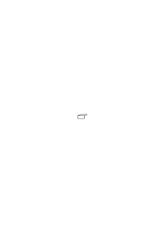

) als der welcher nicht spielt.

### [52\[2\]](https://cdn.wittgensteinnachlass.com/2000px/webp/Ms-110/52.webp)

Genau so muß es gehen wenn ich einen Zug mit den Worten „und” „nicht” etc. vornehme, einen Satz sage worin sie vorkommen.

### [52\[3\]](https://cdn.wittgensteinnachlass.com/2000px/webp/Ms-110/52.webp),[53\[1\]](https://cdn.wittgensteinnachlass.com/2000px/webp/Ms-110/53.webp)

Gefragt was ich mit „und” im Satze „gib mir das Brot _und_ die Butter” meine würde ich mit einer Gebärde antworten & diese Gebärde würde die Bedeutung illustrieren. Wie das grüne Täfelchen „grün” illustriert _& wie die W-F-Notation_ „und” & „nicht” illustriert.

### [53\[2\]](https://cdn.wittgensteinnachlass.com/2000px/webp/Ms-110/53.webp)

Es besteht also das Verstehen eines Zeichens scheinbar darin daß wir in ihm oder mit ihm ein Gebilde von gewisser Multiplizität sehen die der nicht Verstehende nicht sieht.

### [53\[3\]](https://cdn.wittgensteinnachlass.com/2000px/webp/Ms-110/53.webp)

Das heißt es gibt einen Sinn in welchem der Satz „ich spiele Schach” eine Hypothese ist & eine andern in dem es keine ist.

### [53\[4\]](https://cdn.wittgensteinnachlass.com/2000px/webp/Ms-110/53.webp)

Wir können alles was wir wollen von einem behavioristischen (scheußliches Wort) Standpunkte auffassen, da es uns ganz gleich ist _was_ geschieht & wir nur an der Multiplizität dessen was geschieht interessiert sind.

### [53\[5\]](https://cdn.wittgensteinnachlass.com/2000px/webp/Ms-110/53.webp)

Nun könnte man nämlich sagen: Wenn so komplizierte Vorgänge beim Verstehen des Wortes „und” eine Rolle spielen & das Verstehen etwas für uns Wesentliches ist, wie kommt es, daß diese Vorgänge in der symbolischen Logik nie erwähnt werden? Wie kommt es daß von ihnen in der Logik nie die Rede ist noch sein braucht?

### [53\[6\]](https://cdn.wittgensteinnachlass.com/2000px/webp/Ms-110/53.webp),[54\[1\]](https://cdn.wittgensteinnachlass.com/2000px/webp/Ms-110/54.webp)

Das Verständnis wird nicht nur durch die Erklärungen hervorgerufen sondern muß (auch) selbst von der Multiplizität dieser Erklärungen sein.

### [54\[2\]](https://cdn.wittgensteinnachlass.com/2000px/webp/Ms-110/54.webp)

D.h. wir können wieder das System der Erklärungen für das Verständnis nehmen.

### [54\[3\]](https://cdn.wittgensteinnachlass.com/2000px/webp/Ms-110/54.webp)

Man könnte auch so fragen: Wer eine Verneinung versteht, muß der nicht alle Regeln die Verneinung betreffend kennen? Also auch diese. Wenn er sie nun gerade nicht anwendet worin besteht es dann daß er sie kennt? Ist das nur eine Hypothese eine Disposition? Dann interessiert sie uns nicht. Was heißt es aber _alle_ Regeln über die Verneinung kennen?

### [54\[4\]](https://cdn.wittgensteinnachlass.com/2000px/webp/Ms-110/54.webp)

Kann ich sagen: Wenn ich einen Körper im Gesichtsraum wahrnehme so liefert er mir (gewisse) Regeln für das Wort was ihn bezeichnet.

### [54\[5\]](https://cdn.wittgensteinnachlass.com/2000px/webp/Ms-110/54.webp)

Oder soll ich nicht vielmehr sagen: Wenn dieser Körper das Zeichen ist & es ist etwa eine seiner Flächen ein anderes Zeichen so sind damit die Regeln gegeben die die beiden verknüpfen.

### [54\[6\]](https://cdn.wittgensteinnachlass.com/2000px/webp/Ms-110/54.webp)

09.02.1931

Erinnere dich daran wie schwer es Kindern fällt zu glauben (oder einzusehen) daß _ein_ Wort wirklich zwei ganz verschiedene Bedeutungen hat.

### [54\[7\]](https://cdn.wittgensteinnachlass.com/2000px/webp/Ms-110/54.webp),[54\[8\]](https://cdn.wittgensteinnachlass.com/2000px/webp/Ms-110/54.webp)

Ein unartikuliertes Verständnis ist für uns kein Verständnis.

### [55\[1\]](https://cdn.wittgensteinnachlass.com/2000px/webp/Ms-110/55.webp)

Was immer den Satz unartikuliert begleitet interessiert uns nicht.

### [55\[2\]](https://cdn.wittgensteinnachlass.com/2000px/webp/Ms-110/55.webp)

„Geh' in 5 Minuten aus dem Zimmer! hast Du verstanden?” Ja, ich soll in 5 Minuten (auf die Uhr zeigend) aus dem Zimmer gehen (auf die Tür weisend). Ich werde Dir vormachen was ich tun werde. Also, wenn der Zeiger hier steht werde ich es so machen. (Er führt es vor). – Nun wird man sagen hat er dennoch nicht gezeigt daß er es verstanden hatte, und ich sage daß er alles gezeigt hat was da war.

### [55\[3\]](https://cdn.wittgensteinnachlass.com/2000px/webp/Ms-110/55.webp)

Es ist eine Auffassung daß er gleichsam nur unvollkommen zeigen kann ob er verstanden hat. Daß er gleichsam nur immer aus der Ferne darauf deuten auch sich ihm nähern es aber nie mit der Hand berühren kann. Und das letzte immer ungesagt bleibt.

### [55\[4\]](https://cdn.wittgensteinnachlass.com/2000px/webp/Ms-110/55.webp)

Man will sagen: Er versteht es zwar ganz kann es aber nicht ganz zeigen da er sonst schon tun müßte was ja erst in Befolgung des Befehls geschehen darf. So kann er es also nicht zeigen daß er es ganz versteht. D.h. also er weiß immer mehr als er zeigen kann. Aber so ist es nicht. Er weiß nicht mehr als er zeigen kann. Und nur was er zeigen kann das weiß er.

### [55\[5\]](https://cdn.wittgensteinnachlass.com/2000px/webp/Ms-110/55.webp),[56\[1\]](https://cdn.wittgensteinnachlass.com/2000px/webp/Ms-110/56.webp)

Man möchte sagen: Er ist mit seinem Verständnis _bei_ der Tatsache aber die Erklärung kann nie die Ausführung enthalten. Aber das Verständnis enthält nicht die Ausführung sondern ist nur das Symbol das bei der Ausführung übersetzt wird.

### [56\[2\]](https://cdn.wittgensteinnachlass.com/2000px/webp/Ms-110/56.webp)

Unsere Frage durfte nicht lauten „was heißt es einen Satz verstehen”, sondern „was heißt es, ihn _so_ zu verstehen”. Denn die Erklärung entspricht diesem Verständnis (dieser Deutung) & nicht dem Verständnis überhaupt.

### [56\[3\]](https://cdn.wittgensteinnachlass.com/2000px/webp/Ms-110/56.webp)

Wenn ich sage, alles Verständnis entspricht einer Erklärung & es gibt kein Verständnis das nicht erklärt werden könnte, so meine ich mit ‚Verständnis’ das So-Verstehen (im Gegensatz zum anders Verstehen). Aber nicht das Verstehen überhaupt (im Gegensatz zum nicht-verstehen d.h. nicht als Satz auffassen).

### [56\[4\]](https://cdn.wittgensteinnachlass.com/2000px/webp/Ms-110/56.webp)

Dem aber entspricht keine Erklärung.

### [56\[5\]](https://cdn.wittgensteinnachlass.com/2000px/webp/Ms-110/56.webp)

Was heißt es dann aber einen Satz überhaupt (als solchen) zu verstehen?

### [56\[6\]](https://cdn.wittgensteinnachlass.com/2000px/webp/Ms-110/56.webp)

Das Verständnis das nicht die Erklärung geben kann, kann die Sprache nicht geben.

### [56\[7\]](https://cdn.wittgensteinnachlass.com/2000px/webp/Ms-110/56.webp)

Aber wenn es eine Erklärung dieses Verständnisses (d.h. des Vorgangs dieses Verständnisses) gäbe, so müßte es auch eine (sprachliche) Unterweisung darin geben (also eine Erklärung im ersten Sinn).

### [57\[1\]](https://cdn.wittgensteinnachlass.com/2000px/webp/Ms-110/57.webp)

Was ich ‚verstehen’ nenne, wenn ich z.B. in einem Witzblatt eine Bildergeschichte sehe worin ein Radfahrer auf einer Straße fährt ist nicht, daß ich mir nun einen solchen wirklichen Radfahrer in der Phantasie eigens vorstelle, sondern ich gebe mich mit dem zufrieden was ich auf den Bildern sehe, wenn ich es auch anders sehe als einer der keinen Radfahrer je gesehen hat. „Ah ja, da ist ein Radfahrer” sage ich & dokumentiere damit mein Verständnis.

### [57\[2\]](https://cdn.wittgensteinnachlass.com/2000px/webp/Ms-110/57.webp)

10.02.1931

Wir haben gesagt Verständnis entspricht der Erklärung, soweit es aber der Erklärung nicht entspricht, ist es unartikuliert & geht uns deswegen nicht an, oder es ist artikuliert & entspricht dem Satz selbst dessen Verständnis wir beschreiben wollten.

### [57\[3\]](https://cdn.wittgensteinnachlass.com/2000px/webp/Ms-110/57.webp)

Die Frage um die es sich handelt ist eigentlich: Sind die Vorgänge beim Verstehen (Denken) beschrieben, wenn ich sage, daß es gewisse Vorstellungen sind etc.; oder ist außer diesen Vorstellungen, _welcher Art sie auch sein mögen_, noch etwas weiteres _anderer_ Art, was man die Interpretation nennen müßte, vorhanden.

### [57\[4\]](https://cdn.wittgensteinnachlass.com/2000px/webp/Ms-110/57.webp)

Ich müßte aber dann sagen: Denken ist keine abgeschlossene Tatsache, von welcher Art immer. Denn ‚Art’ muß hier logische Art heißen.

### [57\[5\]](https://cdn.wittgensteinnachlass.com/2000px/webp/Ms-110/57.webp),[58\[1\]](https://cdn.wittgensteinnachlass.com/2000px/webp/Ms-110/58.webp)

Denn ist das erste der Fall, so können wir, da uns die besondere psychologische Art der Vorgänge gar nicht interessiert, an ihrer statt irgend welche anderen (etwa die auf einer Schreibtafel) betrachten. Und dann ist der Einwand, daß dieses Tote kein Denken ist. Und wir denken weiter, daß nur das lebende Wesen denkt. Aber damit führen wir unsere Überlegung ad absurdum. Denn wir haben es doch gewiß nicht mit dem Leben oder dem Unterschied zwischen Totem & Lebendem zu tun. Vielmehr handelt sich's offenbar um den Unterschied primär & sekundär. Und um die Idee, daß _etwas_ denkt. Denn es fällt uns gleich der Einwand ein: Eine Maschine kann doch nicht denken. Aber der Gedanke im primären Sinn enthält kein Subjekt. („Es denkt.”)

### [58\[2\]](https://cdn.wittgensteinnachlass.com/2000px/webp/Ms-110/58.webp)

(Einen von der Wahrheit zu überzeugen, genügt es nicht die Wahrheit zu konstatieren, sondern man muß den _Weg_ vom Irrtum zur Wahrheit finden.)

### [58\[3\]](https://cdn.wittgensteinnachlass.com/2000px/webp/Ms-110/58.webp)

(Man muß beim Irrtum ansetzen und ihn in die Wahrheit überführen.)

### [58\[4\]](https://cdn.wittgensteinnachlass.com/2000px/webp/Ms-110/58.webp)

D.h. man muß die Quelle des Irrtums aufdecken, sonst nützt uns das Hören der Wahrheit nichts. Sie kann nicht eindringen solange etwas anderes ihren Platz einnimmt.

### [58\[5\]](https://cdn.wittgensteinnachlass.com/2000px/webp/Ms-110/58.webp),[59\[1\]](https://cdn.wittgensteinnachlass.com/2000px/webp/Ms-110/59.webp)

Ich sage: Das Verstehen bestehe darin, daß ich eine bestimmte _Erfahrung_ habe. – Daß diese Erfahrung aber das Verstehen _dessen_ ist– was ich verstehe – besteht darin, daß diese Erfahrung ein Teil meiner _Sprache_ ist.

### [59\[2\]](https://cdn.wittgensteinnachlass.com/2000px/webp/Ms-110/59.webp)

Daß ein Satz ein Satz ist, besteht nicht darin, daß ich _das_ mit ihm meine, sondern daß ich mit ihm ausdrücke; daß ich _das_ mit ihm meine muß aus _ihm_ hervorgehen.

### [59\[3\]](https://cdn.wittgensteinnachlass.com/2000px/webp/Ms-110/59.webp)

(Da scheinen wir nun auf etwas Transzendentes zu stoßen. Und sind zu einer besonders intensiven Introspektion geneigt.)

### [59\[4\]](https://cdn.wittgensteinnachlass.com/2000px/webp/Ms-110/59.webp)

Könnten wir etwas Sprache nennen, was nicht wirklich angewandt würde? Könnte man von Sprache reden, wenn nie eine gesprochen worden wäre? (Ist denn Sprache ein Begriff wie Zentaur, der besteht, auch wenn es nie ein solches Wesen gegeben hat?)

### [59\[5\]](https://cdn.wittgensteinnachlass.com/2000px/webp/Ms-110/59.webp)

Sprache läßt sich nur mit der Sprache beschreiben, darin liegt die Lösung des Rätsels.

### [59\[6\]](https://cdn.wittgensteinnachlass.com/2000px/webp/Ms-110/59.webp)

Wenn ich sage: „Was Sprache heißt, läßt sich nicht erklären”, so ist das natürlich falsch ausgedrückt. (Denn wäre ein Problem, so wäre auch eine Erklärung.) Vielmehr läßt sich das Phänomen der menschlichen Sprache sehr wohl beschreiben & auch erklären. – – –

### [59\[7\]](https://cdn.wittgensteinnachlass.com/2000px/webp/Ms-110/59.webp)

Die Sprache ist einzig, darum kann sie nicht erklärt werden.

### [59\[8\]](https://cdn.wittgensteinnachlass.com/2000px/webp/Ms-110/59.webp)

Die Sprache muß sich selbst zeigen.

### [60\[1\]](https://cdn.wittgensteinnachlass.com/2000px/webp/Ms-110/60.webp)

Kann man sagen: Wir glauben, daß die Sprache außer sich deutet, weil sie einmal in etwas anderes übersetzt wird? Aber was heißt es, das zu wissen? Wenn ich sage: ich weiß, daß die Worte ‚gehe aus dem Zimmer’ in die Handlung ‚aus dem Zimmer gehen’ übersetzt wird, was weiß ich?

### [60\[2\]](https://cdn.wittgensteinnachlass.com/2000px/webp/Ms-110/60.webp)

Ich unterscheide hier scheinbar zwischen dem Symbol & dem Sinn.

### [60\[3\]](https://cdn.wittgensteinnachlass.com/2000px/webp/Ms-110/60.webp)

Der Sinn wäre eben dieses Wesen auf das man nur mit Symbolen deuten, das man aber nie erreichen kann.

### [60\[4\]](https://cdn.wittgensteinnachlass.com/2000px/webp/Ms-110/60.webp)

(Man wird in dieser Untersuchung immer durch Irrlichter verführt.)

### [60\[5\]](https://cdn.wittgensteinnachlass.com/2000px/webp/Ms-110/60.webp)

Ich sage ihm „geh' aus dem Zimmer” & er geht aus dem Zimmer. Das kann ausgedrückt werden durch: Ich sage „geh …” & er tut es.

### [60\[6\]](https://cdn.wittgensteinnachlass.com/2000px/webp/Ms-110/60.webp)

Es hat nun einen Sinn zu sagen: Ich sage ihm „geh' …” & er übersetzt es in die Tat. Aber daß ich das nun nicht anders erklären kann als durch Wiederholung desselben Satzes, das zeigt die Grenzen der Ausdrucksfähigkeit, die Grenzen der Sprache.

### [60\[7\]](https://cdn.wittgensteinnachlass.com/2000px/webp/Ms-110/60.webp)

Wenn ich sagen würde: ich nenne nur das eine Übersetzung von ‚p’, wenn er p tut, so heißt das natürlich p im Gegensatz zu q.

### [61\[1\]](https://cdn.wittgensteinnachlass.com/2000px/webp/Ms-110/61.webp)

Aber kann es nicht sein, daß wir﹖ ‚p’ & ‚q’ haben, es aber unmöglich ist zu erklären, welche Handlung ich mit ‚p’, welche ich mit ‚q’ meine?

Oder: Ist es nicht möglich, daß wir beide Wörter ‚blau’ & ‚rot’ haben & verschiedenes damit meinen, es aber unmöglich ist zu erklären, welches wir mit dem einen, welches wir mit dem andern meinen? – Nein. Die Erklärung ist äquivalent mit der Bedeutung.

### [VB](/w-vb/#ms-110-61.2) [61\[2\]](https://cdn.wittgensteinnachlass.com/2000px/webp/Ms-110/61.webp) {#612}

Die Grenze der Sprache zeigt sich in der Unmöglichkeit die Tatsache zu beschreiben, die einem Satz entspricht (seine Übersetzung ist) ohne eben den Satz zu wiederholen.

### [VB](/w-vb/#ms-110-61.3) [61\[3\]](https://cdn.wittgensteinnachlass.com/2000px/webp/Ms-110/61.webp) {#613}

(Wir haben es hier mit der Kant'schen Lösung des Problems der Philosophie zu tun.)

### [61\[4\]](https://cdn.wittgensteinnachlass.com/2000px/webp/Ms-110/61.webp)

Man könnte eine wesentliche Frage auch so stellen: Wenn ich jemandem sage „male diesen Kreis rot”, wie entnimmt er aus dem Wort ‚rot’ welche Farbe er zu nehmen hat?

### [61\[5\]](https://cdn.wittgensteinnachlass.com/2000px/webp/Ms-110/61.webp)

Man kann nicht das Zeichen durch Zwischenschaltung von Zeichen erklären.

### [61\[6\]](https://cdn.wittgensteinnachlass.com/2000px/webp/Ms-110/61.webp),[62\[1\]](https://cdn.wittgensteinnachlass.com/2000px/webp/Ms-110/62.webp)

Wie soll er wissen welche Farbe er zu wählen hat, wenn er das Wort ‚rot’ hört? – Sehr einfach: er soll die Farbe nehmen deren Bild ihm beim Hören des Wortes einfällt. – Aber wie soll er wissen, was die ‚Farbe’ ist, ‚deren Bild ihm einfällt’? Braucht es dafür ein weiteres Kriterium? u.s.f.

### [62\[2\]](https://cdn.wittgensteinnachlass.com/2000px/webp/Ms-110/62.webp)

Wie weiß er, welche Farbe er bei dem Wort ‚rot’ zu wählen hat? – Weil es ihm erklärt worden ist. Und soweit diese Erklärung als Erklärung wirkt, hat sie die Multiplizität des Verständnisses.

### [62\[3\]](https://cdn.wittgensteinnachlass.com/2000px/webp/Ms-110/62.webp)

Es gibt kein Kriterium, kein Symptom, dafür, daß diese Farbe Rot ist.

### [62\[4\]](https://cdn.wittgensteinnachlass.com/2000px/webp/Ms-110/62.webp)

Rot ist die Farbe die ich in das Wort ‚rot’ übersetze. Aber was heißt es etwas in das Wort … zu übersetzen?

### [62\[5\]](https://cdn.wittgensteinnachlass.com/2000px/webp/Ms-110/62.webp)

Es heißt sich eine Sprache zurechtlegen wie wir es machen, wenn wir uns etwas notieren wollen, uns etwa eine Methode ausdenken & nun die erste entsprechende Notiz machen. Ich sage mir etwa: Wenn ich M auf der Straße treffe, werde ich mir in meinem Kalender zu diesem Tag ein Kreuz machen: Heute beginne ich nun damit, so bin ich bereits heute dieser Regel gefolgt, d.h., wäre ich ihm heute nicht begegnet sondern erst morgen, so wäre beim heutigen Tag kein Kreuz, wohl aber beim morgigen. (Diese Sprache hat für unsere Betrachtung den Vorteil, daß ich sie erfunden habe & ich allein sie verstehen soll.)

### [62\[6\]](https://cdn.wittgensteinnachlass.com/2000px/webp/Ms-110/62.webp)

11.02.1931

Der Satz, wenn ich ihn verstehe, bekommt für mich Tiefe.

### [63\[1\]](https://cdn.wittgensteinnachlass.com/2000px/webp/Ms-110/63.webp)

Wenn ich sage „zeichne einen Kreis an der Wand”, so zeige ich von mir zur Wand & ist das nicht das Vorbild jenes Nachaußen-Weisens des Satzes?

### [63\[2\]](https://cdn.wittgensteinnachlass.com/2000px/webp/Ms-110/63.webp)

Man würde etwa (so) sagen: Ich sage ja nicht nur „zeichne einen Kreis”, sondern ich wünsche doch, daß der Andre etwas tut. (Gewiß!) Und dieses Tun ist doch etwas anderes als das Sagen & ist eben das Außerhalb worauf ich weise.

### [63\[3\]](https://cdn.wittgensteinnachlass.com/2000px/webp/Ms-110/63.webp)

Jedes Symbol scheint als solches etwas offen zu lassen.

### [63\[4\]](https://cdn.wittgensteinnachlass.com/2000px/webp/Ms-110/63.webp)

(Ich muß immer wieder im Wasser des Zweifels untertauchen.)

### [63\[5\]](https://cdn.wittgensteinnachlass.com/2000px/webp/Ms-110/63.webp)

Aber was läßt denn der Satz „zeichne …” offen? Nun, daß der Andre zeichnet, oder nicht zeichnet.

### [63\[6\]](https://cdn.wittgensteinnachlass.com/2000px/webp/Ms-110/63.webp)

In wiefern kann man den Wunsch ‚unbefriedigt’ nennen? Was ist das Urbild der Unbefriedigung? Ist es der leere Hohlraum (in den etwas hineinpaßt)? Und würde man von einem leeren Raum sagen er sei unbefriedigt? Wäre _das_ nicht auch eine Metapher? Ist es nicht ein gewisses Gefühl, das wir Unbefriedigung nennen? Etwa der Hunger. Aber der Hunger enthält nicht das Bild seiner Befriedigung. Ist also unser Urbild der Unbefriedigung etwa der leere Magen _&_ der Hunger?

### [63\[7\]](https://cdn.wittgensteinnachlass.com/2000px/webp/Ms-110/63.webp),[64\[1\]](https://cdn.wittgensteinnachlass.com/2000px/webp/Ms-110/64.webp)

Ich könnte mir vorstellen: Wenn ich Hunger habe, öffne ich meinen Mund & der offene Mund ist nun (quasi) ein Symbol der Unbefriedigung. – Aber warum ist er allein nicht unbefriedigt noch auch der Hunger allein?

### [64\[2\]](https://cdn.wittgensteinnachlass.com/2000px/webp/Ms-110/64.webp)

Wieder: Der offene Mund ist nur als Teil einer Sprache unbefriedigt. Oder soll ich sagen: Nur als Teil eines Systems das auch die Befriedigung enthält.

### [64\[3\]](https://cdn.wittgensteinnachlass.com/2000px/webp/Ms-110/64.webp)

Die Hohlform ist nur unbefriedigt in dem System in dem auch die entsprechende Vollform vorkommt.

### [64\[4\]](https://cdn.wittgensteinnachlass.com/2000px/webp/Ms-110/64.webp)

Was heißt das aber: „in einem System etc. etc.” wie kann man denn so ein System beschreiben?

### [64\[5\]](https://cdn.wittgensteinnachlass.com/2000px/webp/Ms-110/64.webp)

Das heißt man kann des Wort „unbefriedigt” nicht schlechtweg von einer Tatsache gebrauchen. Es kann aber in einem System eine Tatsache beschreiben helfen. Ich könnte z.B. ausmachen, daß ich den Hohlzylinder den unbefriedigten Zylinder nennen will, den entsprechenden Vollzylinder _seine_ Befriedigung, & daß so eine Notation _möglich_ ist, ist natürlich für das System charakteristisch. Daß man also sagen kann: „Er sagte ‚p ist der Fall’ & _so_ war es”.

### [64\[6\]](https://cdn.wittgensteinnachlass.com/2000px/webp/Ms-110/64.webp),[65\[1\]](https://cdn.wittgensteinnachlass.com/2000px/webp/Ms-110/65.webp)

Ich könnte sagen: Der Wunsch ist nicht befriedigt & zeichnet seine eigene Befriedigung vor. – Ja nur dadurch können wir sagen daß er unbefriedigt ist. – Und gewiß, der Wunsch daß p der Fall sein möge zeigt uns, daß er befriedigt wäre, wenn p der Fall wäre. Und was sonst können wir mit jenem Vorzeichnen meinen.

### [65\[2\]](https://cdn.wittgensteinnachlass.com/2000px/webp/Ms-110/65.webp)

Aber man kann nicht sagen, daß der Wunsch ‚p möge der Fall sein’ durch die Tatsache p befriedigt wird. Denn hat das erste p schon einen Sinn, dann sagt es das schon selber; hat es aber noch keinen, dann war das erste noch kein Wunsch & der Satz kommt einer Zeichenerklärung gleich, die übrigens hier ein Zeichen durch sich selber also nichts erklärt.

### [65\[3\]](https://cdn.wittgensteinnachlass.com/2000px/webp/Ms-110/65.webp)

„Der Wunsch daß er hereinkommt & die Tatsache daß er hereinkommt sind (doch) verschieden”. Aber das kann man nicht sagen. Was man sagen will, zeigt die Sprache.

### [65\[4\]](https://cdn.wittgensteinnachlass.com/2000px/webp/Ms-110/65.webp)

12.02.1931

Rechtmäßiger Gebrauch des Wortes ‚Sprache’: Es bedeutet entweder die Erfahrungstatsache daß Menschen reden (auf gleicher Stufe mit der, daß Hunde bellen) oder es bedeutet: festgesetztes System der Verständigung in den Ausdrücken „die englische Sprache”, „deutsche Sprache”, „Sprache der Neger” etc. ‚Sprache’ als logischer Begriff könnte nur mit ‚Satz’ äquivalent & dann eine Überschrift eines Teiles der Grammatik sein. Soll es aber gar die Überschrift der ganzen Grammatik sein, so ist es überhaupt kein Wort & nicht zu verwenden.

### [66\[1\]](https://cdn.wittgensteinnachlass.com/2000px/webp/Ms-110/66.webp)

Wenn ich sage „die Sprache ist einzig”, so heißt das eben, daß ‚Sprache’ hier kein Wort ist, d.h. sich so nicht anwenden läßt.

### [66\[2\]](https://cdn.wittgensteinnachlass.com/2000px/webp/Ms-110/66.webp)

Was ich zum Beweis meines Verständnisses zeigen kann, kann mein Verständnis auch ganz ausdrücken.

### [66\[3\]](https://cdn.wittgensteinnachlass.com/2000px/webp/Ms-110/66.webp)

Das sieht man, glaube ich, klar, wenn man einen Befehl, etwa in anderer Form, wiederholt um zu zeigen, daß man ihn verstanden hat.

### [66\[4\]](https://cdn.wittgensteinnachlass.com/2000px/webp/Ms-110/66.webp)

Wenn man das Problem des Verständnisses überdenkt, so meint man, immer, es müsse einem doch beim Verstehen zu wenig sein, bloß einer Vorstellung (oder dergleichen) habhaft zu werden. Aber wie will man denn mehr wollen?!

### [66\[5\]](https://cdn.wittgensteinnachlass.com/2000px/webp/Ms-110/66.webp)

Das was einen befriedigt ist freilich nicht die Vorstellung selbst sondern ihre Stellung zu uns.

### [66\[6\]](https://cdn.wittgensteinnachlass.com/2000px/webp/Ms-110/66.webp)

Gleichsam die Richtung in der sie von uns aus liegt.

### [66\[7\]](https://cdn.wittgensteinnachlass.com/2000px/webp/Ms-110/66.webp)

Das Bild das mit dem Verständnis kommt, muß Teil einer Bildersprache sein.

### [66\[8\]](https://cdn.wittgensteinnachlass.com/2000px/webp/Ms-110/66.webp)

Ich erkläre jemandem einen Plan & wie er zu gehen hat & sage, auf eine Stelle des Planes zeigend: „Hier stehen wir; du gehst …” Nun sieht er die Karte anders.

### [66\[9\]](https://cdn.wittgensteinnachlass.com/2000px/webp/Ms-110/66.webp)

Verstehen ist nicht: ein Bild sehen, sondern, ein Bild in einer bestimmten Position.

### [VB](/w-vb/#ms-110-67.1) [67\[1\]](https://cdn.wittgensteinnachlass.com/2000px/webp/Ms-110/67.webp) {#671}

Kann ich sagen, das Drama hat seine eigene Zeit die nicht ein Abschnitt der historischen Zeit ist. D.h. ich kann in ihm von früher und später reden, aber die Frage hat _keinen Sinn_ ob die Ereignisse, etwa, vor oder nach Cäsars Tod geschehen sind.

### [67\[2\]](https://cdn.wittgensteinnachlass.com/2000px/webp/Ms-110/67.webp)

Jemand befiehlt mir: „geh über den Great Court”. Ich verstehe den Befehl & sehe mich im Geiste dabei über den Great Court gehen. Aber wie kann ich das Bild, was ich da sehe ‚mich’ nennen, ‚wie ich über etc.’? Hier bestimmen ja scheinbar die Worte das Bild, nicht das Bild die Worte. Aber es könnte ja statt der Vorstellung auch ein Stich verwendet werden. Ich sage nun, auf das Bild zeigend: „Das ist der Great Court” Damit empfinde ich es anders als wäre es für mich nur das Bild irgend welcher Gebäude. Das besteht darin, daß ich es mit der gegenwärtigen Realität in Zusammenhang bringe. Ich sitze etwa in meinem Zimmer & nun ist es als wäre das Bild & mein Zimmer auf _einem_ Plan.

### [67\[3\]](https://cdn.wittgensteinnachlass.com/2000px/webp/Ms-110/67.webp)

Wer den Auftrag ‚geh dorthin’ versteht, muß dabei seine gegenwärtige Lage verstehen. Ich meine, er muß die gegenwärtige Lage sehen & die Relation der beiden Lagen.

### [67\[4\]](https://cdn.wittgensteinnachlass.com/2000px/webp/Ms-110/67.webp)

Wenn ich mit verbundenen Augen die Richtung verloren habe & man mir nun sagt: geh dort & dort hin, so hat dieser Befehl keinen Sinn für mich.

### [68\[1\]](https://cdn.wittgensteinnachlass.com/2000px/webp/Ms-110/68.webp)

Gibt es nicht einen Raum „der bekannten Gegenstände”? So daß, wenn alles um uns sich fortwährend bewegte – _alle_ Gestalten sich fortwährend auflösten wie Nebelschwaden – wir in einer anderen Art von physikalischem Raum wären?

### [68\[2\]](https://cdn.wittgensteinnachlass.com/2000px/webp/Ms-110/68.webp)

Um das Bild als Bild des Great Court anzuerkennen, muß ich selbst auch darauf sein.

### [68\[3\]](https://cdn.wittgensteinnachlass.com/2000px/webp/Ms-110/68.webp)

(Der Plan kann mich nur leiten, wenn ich auch auf dem Plan bin.)

### [68\[4\]](https://cdn.wittgensteinnachlass.com/2000px/webp/Ms-110/68.webp)

13.02.1931

Aber wie immer, wer den Plan erklärt gibt weitere Zeichen. Und wer ihn versteht faßt sie auf.

### [68\[5\]](https://cdn.wittgensteinnachlass.com/2000px/webp/Ms-110/68.webp)

Das Verstehen des Befehles kann zur Ausführung keine andere Beziehung haben als eben eine Tatsache zu einer völlig anderen.

### [68\[6\]](https://cdn.wittgensteinnachlass.com/2000px/webp/Ms-110/68.webp)

„Dasselbe was ich jetzt getan habe, wollte ich vor fünf Minuten”. Was ich damals getan habe heißt eben „_wollen_ was ich jetzt getan habe”. So wird die Sprache gebraucht.

### [68\[7\]](https://cdn.wittgensteinnachlass.com/2000px/webp/Ms-110/68.webp)

Laß dich doch von der Sprache belehren wie der Ausdruck „das & das wollen” gebraucht wird. (Laß dich doch von der Sprache darüber belehren, wie die Worte „Zahnschmerzen haben” gebraucht werden.)

### [68\[8\]](https://cdn.wittgensteinnachlass.com/2000px/webp/Ms-110/68.webp)

Wenn immer ich etwas Sinnvolles sage, so entpuppt es sich eben als etwas Unwesentliches.

### [69\[1\]](https://cdn.wittgensteinnachlass.com/2000px/webp/Ms-110/69.webp)

Man möchte fragen: Welcher außerordentliche Prozeß muß das Wollen sein, daß ich _das_ wollen kann, was ich erst in fünf Minuten tun werde??

### [69\[2\]](https://cdn.wittgensteinnachlass.com/2000px/webp/Ms-110/69.webp)

(Ich tue ja nichts als das gleiche Gesicht immer wieder & wieder portraitieren.)

### [69\[3\]](https://cdn.wittgensteinnachlass.com/2000px/webp/Ms-110/69.webp)

Die Antwort ist: Wenn Dir das sonderbar vorkommt so vergleichst Du es mit etwas womit es nicht zu vergleichen ist. – Etwa damit: Wie kann ich jetzt dem Mann die Hand geben, der erst in 5 Minuten hereintreten wird? Oder etwa gar: wie kann ich dem die Hand geben, den es vielleicht gar nicht gibt?)

### [69\[4\]](https://cdn.wittgensteinnachlass.com/2000px/webp/Ms-110/69.webp)

Das ‚foreshadowing’ der Tatsache besteht offenbar darin das wir jetzt denken können, daß _das_ eintreffen wird was erst eintreffen _wird_. Oder, wie das irreführend ausgedrückt wird: daß wir an _das_ denken können, was erst eintreffen _wird_.

### [69\[5\]](https://cdn.wittgensteinnachlass.com/2000px/webp/Ms-110/69.webp)

„Wir können jetzt schon an _das_ denken, was erst später eintreffen wird.” Und so wird der Schein erzeugt als wäre eine Sache zugleich hier & nicht hier.

### [69\[6\]](https://cdn.wittgensteinnachlass.com/2000px/webp/Ms-110/69.webp),[70\[1\]](https://cdn.wittgensteinnachlass.com/2000px/webp/Ms-110/70.webp)

„Der Befehl nimmt die Ausführung voraus”. In wiefern nimmt er sie denn voraus? Dadurch, daß er _das_ befiehlt, was später ausgeführt (oder nicht ausgeführt) wird. Oder: Das was wir damit meinen wenn wir sagen der Befehl nimmt die Ausführung voraus ist _dasselbe_ was dadurch ausgedrückt ist, daß der Befehl befiehlt was später geschieht. Aber richtig: „geschieht oder nicht geschieht”. Und das sagt nichts. (Der Befehl kann sein Wesen eben nur _zeigen_.)

### [70\[2\]](https://cdn.wittgensteinnachlass.com/2000px/webp/Ms-110/70.webp)

Nur die Anwendung der Sprache kann zeigen wie sie angewandt ist.

### [70\[3\]](https://cdn.wittgensteinnachlass.com/2000px/webp/Ms-110/70.webp)

„Der Befehl nimmt das voraus”: das klingt sehr außerordentlich & ist ganz gewöhnlich.

### [70\[4\]](https://cdn.wittgensteinnachlass.com/2000px/webp/Ms-110/70.webp)

Ich sage: Hier ist zwar nichts rotes um mich aber wenn hier etwas wäre, so _könnte_ ich es erkennen. – Hier sage ich offenbar etwas über den gegenwärtigen Zustand aus da es nicht von der weiteren Erfahrung abhängt ob ich Recht hatte zu sagen daß ich rot erkennen kann. Im Gegenteil, es läßt sich gar nicht durch eine weitere Erfahrung bestätigen.

### [70\[5\]](https://cdn.wittgensteinnachlass.com/2000px/webp/Ms-110/70.webp)

Man kann auch nicht sagen: Wenn jetzt nichts Rotes um Dich ist so hat doch der Satz der das sagt nur Sinn wenn Du einmal etwas Rotes gesehen hast. Auf die Geschichte meiner Begriffe kommt es nicht an. Hat es Sinn das Wort „rot” zu gebrauchen so hat es Sinn d.h. kann ich es gewissen Regeln gemäß gebrauchen, dann darf ich es gebrauchen.

### [70\[6\]](https://cdn.wittgensteinnachlass.com/2000px/webp/Ms-110/70.webp),[71\[1\]](https://cdn.wittgensteinnachlass.com/2000px/webp/Ms-110/71.webp)

Aber wenn auch mein Wunsch nicht bestimmt, was der Fall sein wird, so bestimmt er doch sozusagen das Thema einer Tatsache ob die nun den Wunsch erfüllt oder nicht.

### [71\[2\]](https://cdn.wittgensteinnachlass.com/2000px/webp/Ms-110/71.webp)

Muß er nun dazu etwas vorauswissen? Nein. p⌵~p sagt wirklich _nichts_.

### [71\[3\]](https://cdn.wittgensteinnachlass.com/2000px/webp/Ms-110/71.webp)

Wir wundern uns – sozusagen – nicht darüber daß einer die Zukunft weiß, sondern darüber daß er überhaupt (richtig oder falsch) prophezeien kann.

### [71\[4\]](https://cdn.wittgensteinnachlass.com/2000px/webp/Ms-110/71.webp)

Es ist als würde die bloße Prophezeiung (gleichgültig ob richtig oder falsch) schon einen Schatten der Zukunft vorausnehmen. – Während sie über die Zukunft nichts weiß, und weniger als nichts nicht wissen kann.

### [71\[5\]](https://cdn.wittgensteinnachlass.com/2000px/webp/Ms-110/71.webp)

(Es ist mir immer als könnte ich nachweisen daß das Wort „Gedanke” unrichtig gebraucht wird. Daß wenn ich den Gedanken unbefriedigt nenne ich das Wort sozusagen als Funktion in einem Satz gebrauchen muß in dem er zusammen mit etwas Anderem befriedigt ist. Ich möchte dann sagen, das Wort wird nicht absolut sondern relativ gebraucht.)

### [71\[6\]](https://cdn.wittgensteinnachlass.com/2000px/webp/Ms-110/71.webp),[72\[1\]](https://cdn.wittgensteinnachlass.com/2000px/webp/Ms-110/72.webp)

Ich sage „ich wollte dieser Tisch wäre so hoch” & zeige dabei mit der Hand eine Höhe an. Nun sagt man: Es kann doch dieser Wunsch nicht (einfach) darin bestehen daß ich diese Höhe mit Sehnsucht betrachte. Ich wünsche doch eben daß _dieser Tisch_ so hoch wäre; also muß doch die Tatsache des Wunsches das Gewünschte ganz & gar bestimmen. Gewiß; und wenn ich sage „ich wünsche dieser Tisch wäre so hoch” so läßt das ja auch gar keinen Zweifel übrig der etwa durch das bloße andeuten der Höhe mit der Hand über dem Tische geblieben wäre. Eben weil die Wortsprache über die genügende Multiplizität verfügt, um einen Zweifel auszuschließen, da wir etwas _Anderes anders_ sagen würden. Dann heißt aber dieses Vorausnehmen der Tatsache nur: er darf keinen Zweifel offenlassen was gemeint ist. Aber wie macht er denn das? Er muß alles enthalten wovon die Rede ist (ist von diesem Tisch die Rede so ist dieser Tisch Teil des Symbols) & die Multiplizität haben um sich von jedem Satz unterscheiden zu können, der etwas anderes sagt.

### [72\[2\]](https://cdn.wittgensteinnachlass.com/2000px/webp/Ms-110/72.webp)

Aber warum soll dann nicht die über dem Tisch erhobene Hand den Wunsch ausdrücken können?

### [72\[3\]](https://cdn.wittgensteinnachlass.com/2000px/webp/Ms-110/72.webp)

Sie kann ihn ausdrücken. Ob sie ihn aber ausdrückt hängt davon ab ob wir ihn dadurch ausgedrückt haben, d.h. ob wir das als Sprache festgesetzt haben. Das Kreuz in meinem Kalender _kann_ ausdrücken daß ich heute eine Vorlesung halten soll wenn ich es dazu bestimme. Durch eine beliebige einmalige Zuordnung dieses Zeichens zu meiner Vorlesung wird es nicht zu diesem Ausdruck.

### [73\[1\]](https://cdn.wittgensteinnachlass.com/2000px/webp/Ms-110/73.webp)

Was ist aber der Vorgang dieses Festsetzens einer Ausdrucksweise.

### [73\[2\]](https://cdn.wittgensteinnachlass.com/2000px/webp/Ms-110/73.webp)

14.02.1931

Ein Ausdruck muß Teil einer Ausdrucksweise sein.

### [73\[3\]](https://cdn.wittgensteinnachlass.com/2000px/webp/Ms-110/73.webp)

Der Ausdruck des Wunsches enthält den Wunsch & ist nicht eine Übersetzung des Wunsches oder ihm irgendwie zugeordnet.

### [73\[4\]](https://cdn.wittgensteinnachlass.com/2000px/webp/Ms-110/73.webp)

D.h.: der Wunsch selbst ist artikuliert.

### [73\[5\]](https://cdn.wittgensteinnachlass.com/2000px/webp/Ms-110/73.webp)

Der Ausdruck des Wunsches ist nicht eine nachträgliche Kundgebung des Wunsches der schon früher unausgedrückt da war. Wir wünschen durch – oder in – diesem Ausdruck wie wir _in_

ein Gesicht sehen.

### [73\[6\]](https://cdn.wittgensteinnachlass.com/2000px/webp/Ms-110/73.webp)

Der Ort des Wortes in der Sprache ist seine Bedeutung.

### [73\[7\]](https://cdn.wittgensteinnachlass.com/2000px/webp/Ms-110/73.webp)

(Das erinnert an James' „man weint nicht weil man traurig ist, sondern man ist traurig weil man weint”. Was natürlich auch eine irreführende Darstellung ist.)

### [73\[8\]](https://cdn.wittgensteinnachlass.com/2000px/webp/Ms-110/73.webp)

Man kann den Wunsch nicht durch etwas anderes ersetzen was nicht ein Wunsch ist; und sich dann wundern daß es nicht ein Wunsch ist.

### [73\[9\]](https://cdn.wittgensteinnachlass.com/2000px/webp/Ms-110/73.webp),[74\[1\]](https://cdn.wittgensteinnachlass.com/2000px/webp/Ms-110/74.webp)

Wenn ich frage: worin besteht es, zu wünschen, der Tisch wäre so hoch & und gebe nun eine Antwort; etwa die es bestehe darin die Hand über den Tisch zu halten etc. etc. so habe ich doch das was ich erklären wollte durch etwas anderes ersetzt. Und wie soll dieses Andere dessen Ausdruck in der Sprache _neben_ dem zu erklärenden besteht das Wünschen erklären?

### [74\[2\]](https://cdn.wittgensteinnachlass.com/2000px/webp/Ms-110/74.webp)

Denn ‚erklären’ kann hier wieder nicht heißen: Verborgenes ans Licht zu ziehen – da hier nichts verborgen ist.

### [74\[3\]](https://cdn.wittgensteinnachlass.com/2000px/webp/Ms-110/74.webp)

Man kann wieder nur die Grammatik des Wortes „wünschen” explizit machen. (Und so des Wortes „denken” etc.)

### [74\[4\]](https://cdn.wittgensteinnachlass.com/2000px/webp/Ms-110/74.webp)

Ein Pfeil zeigt in einer bestimmten Richtung & auch wieder nicht.

### [74\[5\]](https://cdn.wittgensteinnachlass.com/2000px/webp/Ms-110/74.webp)

Man kann nicht absichtlich oder unabsichtlich mit Absicht übersetzen.

### [74\[6\]](https://cdn.wittgensteinnachlass.com/2000px/webp/Ms-110/74.webp)

Wenn die Sprache auf einer Übereinkunft beruht, so muß doch diese Übereinkunft wieder durch Zeichen also Sprache geschlossen sein & daher beruht die gesamte Sprache nicht auf Übereinkunft.

### [74\[7\]](https://cdn.wittgensteinnachlass.com/2000px/webp/Ms-110/74.webp)

Es scheint (nämlich), daß das Wort ‚Wunsch’, ‚Gedanke’ etc. nur manchmal einen Vorgang, eine Tatsache zu bezeichnen gebraucht wird, manchmal aber anders; gleichsam als unvollständiges Symbol durch ein anderes ergänzt.

### [74\[8\]](https://cdn.wittgensteinnachlass.com/2000px/webp/Ms-110/74.webp),[75\[1\]](https://cdn.wittgensteinnachlass.com/2000px/webp/Ms-110/75.webp)

Angenommen ich deute jemandem mit der Hand über dem Tisch an, um wieviel höher er ihn machen soll. „Was meinst Du wenn Du das Zeichen machst?” – Ich meine, daß er den Tisch so hoch machen soll. – Nun scheint es hier etwa als müßte ich eigentlich sagen: Ich meine mit der Gebärde, was ich mit den Worten „ …” meine. Und daß käme darauf hinaus, daß der Sinn immer nur als _der_ Sinn dieses Zeichens beschrieben werden könnte, (daß) wir ihn nie selbst vermitteln können. Als könnte etwa auf die Frage „wer ist der Vater des A” immer nur ein Satz von der Form „er ist der Vater des B” zur Antwort kommen.

### [75\[2\]](https://cdn.wittgensteinnachlass.com/2000px/webp/Ms-110/75.webp)

Wenn aber ein Wort nur in einem bestimmten Zusammenhang gebraucht wird, kann es wegbleiben.

### [75\[3\]](https://cdn.wittgensteinnachlass.com/2000px/webp/Ms-110/75.webp)

Ein komplizierter Befehl kann durch eine einfache Handbewegung gegeben werden, wenn alles andere selbstverständlich ist.

### [75\[4\]](https://cdn.wittgensteinnachlass.com/2000px/webp/Ms-110/75.webp)

Ich sagte: Wer den Befehl

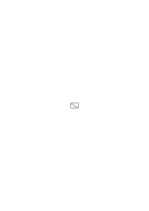

versteht, muß, oder müßte, den Befehl

verstehen. Aber was heißt das „er müßte”. Das muß offenbar eine Beschreibung dessen sein, was beim Verstehen des ersten Befehls vorsichgeht. Es war eine Beschreibung dessen was er in jenem Befehl sieht.

### [75\[5\]](https://cdn.wittgensteinnachlass.com/2000px/webp/Ms-110/75.webp)

Wenn wir unsere Aufmerksamkeit auf eine andere Eigenschaft der Kurve richten so sehen wir etwas anderes.

### [75\[6\]](https://cdn.wittgensteinnachlass.com/2000px/webp/Ms-110/75.webp),[76\[1\]](https://cdn.wittgensteinnachlass.com/2000px/webp/Ms-110/76.webp)

Ich sage, die Hand über den Tisch haltend, „ich wollte, dieser Tisch wäre so hoch”. Nun ist das Merkwürdige: Die Hand über dem Tisch an & für sich drückt gar nichts aus. D.h. sie ist eine Hand über einem Tisch, aber kein Symbol (wie der Pfeil der etwa die Gehrichtung anzeigen soll, an sich nichts ausdrückt.)

### [76\[2\]](https://cdn.wittgensteinnachlass.com/2000px/webp/Ms-110/76.webp)

↦ im Gegensatz zu ↗ ist ein anderes Zeichen als ↦ im Gegensatz zu ⟼.

### [76\[3\]](https://cdn.wittgensteinnachlass.com/2000px/webp/Ms-110/76.webp)

Die grammatische Regel beschreibt auch das Verständnis.

### [76\[4\]](https://cdn.wittgensteinnachlass.com/2000px/webp/Ms-110/76.webp)

Denn die Frage ist: würde er dieses Wort auch gebraucht haben, wenn andere Regeln davon gälten?

### [76\[5\]](https://cdn.wittgensteinnachlass.com/2000px/webp/Ms-110/76.webp)

Und wird er sagen, er habe die Zeichen so verstanden, wenn ich die grammatischen Regeln ändere?

### [76\[6\]](https://cdn.wittgensteinnachlass.com/2000px/webp/Ms-110/76.webp)

(Nur keine Hypothese machen!)

### [76\[7\]](https://cdn.wittgensteinnachlass.com/2000px/webp/Ms-110/76.webp)

Der Knopf im Taschentuch als Zeichen. Inwiefern kann er mich erinnern, etwas zu tun.

### [76\[8\]](https://cdn.wittgensteinnachlass.com/2000px/webp/Ms-110/76.webp)

Die Schachfigur ist nicht das Holzklötzchen, sondern der Schnitt gewisser Regeln. Daher handeln die Regeln nicht von Holz oder Elfenbein. Sowenig wie die Gesetze der euklidischen Geometrie von Graphitteilchen auf Papier.

### [76\[9\]](https://cdn.wittgensteinnachlass.com/2000px/webp/Ms-110/76.webp)

So handeln auch die grammatischen Regeln nicht von Tinte.

### [76\[10\]](https://cdn.wittgensteinnachlass.com/2000px/webp/Ms-110/76.webp)

„Geh so → nicht so ↗” hat nur Sinn, wenn es die Richtung ist, die dem Pfeil hier wesentlich ist, & nicht, etwa nur die Länge.

### [77\[1\]](https://cdn.wittgensteinnachlass.com/2000px/webp/Ms-110/77.webp)

Es wäre unsinnig am Plan der Untergrundbahn auszusetzen er gehöre so:

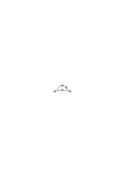

und nicht so:

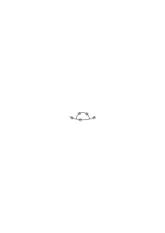.

### [77\[2\]](https://cdn.wittgensteinnachlass.com/2000px/webp/Ms-110/77.webp)

Kann ich nicht sagen: ich meine die Verneinung welche verdoppelt eine Bejahung gibt?

### [77\[3\]](https://cdn.wittgensteinnachlass.com/2000px/webp/Ms-110/77.webp)

Wäre das nicht als würde man sagen: Ich meine die Gerade, deren zwei sich in einem Punkt schneiden.

### [77\[4\]](https://cdn.wittgensteinnachlass.com/2000px/webp/Ms-110/77.webp)

Das heißt: Wenn Du von Rot gesprochen hast, hast Du dann das gemeint wovon man sagen kann es sei hell aber nicht grün, auch wenn du an diese Regel nicht gedacht oder von ihr Gebrauch gemacht hast? – Hast Du das ~ verwendet wofür ~ ~ ~p = ~p ist? auch wenn Du diese Regel nicht verwendet hast? Ist es etwa eine Hypothese, daß es _das_ ~ war? Kann es zweifelhaft sein, ob es dasselbe war & durch die Erfahrung bestätigt werden?

### [77\[5\]](https://cdn.wittgensteinnachlass.com/2000px/webp/Ms-110/77.webp)

Die Geometrie unseres Gesichtsraumes ist uns gegeben, d.h. es bedarf keiner Untersuchung bis jetzt verborgener Tatsachen um sie zu finden. Die Untersuchung ist keine im Sinn einer physikalischen oder psychologischen Untersuchung. Und doch kann man sagen wir kennen diese Geometrie noch nicht.

### [77\[6\]](https://cdn.wittgensteinnachlass.com/2000px/webp/Ms-110/77.webp),[78\[1\]](https://cdn.wittgensteinnachlass.com/2000px/webp/Ms-110/78.webp)

Man kann sagen, diese Geometrie liegt offen vor uns (wie alles Logische – im Gegensatz zur praktischen Geometrie des physikalischen Raumes).

### [78\[2\]](https://cdn.wittgensteinnachlass.com/2000px/webp/Ms-110/78.webp)

Wie ist es möglich daß ich, ohne hieran zu denken, das Blau meinen kann, wovon man nicht sagen kann …?

### [78\[3\]](https://cdn.wittgensteinnachlass.com/2000px/webp/Ms-110/78.webp)

Wenn es die wesentliche Verwendung des Symbols ist übersetzt zu werden, so kann es kein wesentliches Verständnis des Symbols geben, das nicht im Hinblick auf die Übersetzung geschieht.

### [78\[4\]](https://cdn.wittgensteinnachlass.com/2000px/webp/Ms-110/78.webp)

Aber was heißt es „in Hinblick” auf die Übersetzung, wenn diese nicht erfolgt ist?

### [78\[5\]](https://cdn.wittgensteinnachlass.com/2000px/webp/Ms-110/78.webp)

Und wenn wir sagen, das Verständnis des Befehls sei eine andere Übersetzung als die Befolgung, was nützt uns dann diese andere Übersetzung?

### [78\[6\]](https://cdn.wittgensteinnachlass.com/2000px/webp/Ms-110/78.webp)

15.02.1931

Das Element der Betonung in der Wortsprache kümmert uns an & für sich gar nicht, daß es aber verwendet werden _kann_ um den Sinn deutlich zu machen ist für uns sehr wichtig.

### [78\[7\]](https://cdn.wittgensteinnachlass.com/2000px/webp/Ms-110/78.webp)

Was heißt es: verstehen, daß etwas ein Befehl ist, wenn man auch den Befehl selbst noch nicht versteht? („Er meint: ich soll etwas tun, aber was er meint weiß ich nicht.”)

### [78\[8\]](https://cdn.wittgensteinnachlass.com/2000px/webp/Ms-110/78.webp)

Ich verstehe doch einen Befehl als Befehl, d.h. ich sehe in ihm nicht nur ein Gebilde, sondern es hat – sozusagen – einen Einfluß auf mich. Ich reagiere auf einen Befehl (auch ehe ich ihn befolge) anders als etwa auf eine Mitteilung oder Frage.

### [79\[1\]](https://cdn.wittgensteinnachlass.com/2000px/webp/Ms-110/79.webp)

Es kann keine notwendige Zwischenstufe zwischen dem Auffassen eines Befehls & dem Befolgen geben.

### [79\[2\]](https://cdn.wittgensteinnachlass.com/2000px/webp/Ms-110/79.webp)

(Alle Gewohnheiten der Sprache sind gegen Dich. –)

### [79\[3\]](https://cdn.wittgensteinnachlass.com/2000px/webp/Ms-110/79.webp)

Es sagt mir jemand etwas; nun, wie immer er es meint, _ich_ fasse es als einen Befehl auf, ohne ihn aber noch auszuführen. Wie es der Andere meint, ist für uns überhaupt immer ganz gleichgültig. Gegeben sind mir ja nur seine Worte & eventuell seine Gebärden & sein Gesichtsausdruck, welche aber alle auf gleicher Stufe stehen. – D.h., ich muß sie _alle_ deuten.

### [79\[4\]](https://cdn.wittgensteinnachlass.com/2000px/webp/Ms-110/79.webp)

Deuten. – Deuten wir denn etwas, wenn uns jemand einen Befehl gibt. Wir fassen auf was wir sehen; oder: wir sehen, was wir sehen.

### [79\[5\]](https://cdn.wittgensteinnachlass.com/2000px/webp/Ms-110/79.webp)

Es sei denn das wir „deuten” doch nur auf die Worte beziehen & sagen: Wir deuten sie mit Hilfe seiner Gebärde, was dann _nur_ heißt, wir nehmen Worte & Gebärde wahr.

### [79\[6\]](https://cdn.wittgensteinnachlass.com/2000px/webp/Ms-110/79.webp)

Wenn mich jemand fragt: ‚Wieviel Uhr ist es’, so geht in mir dann keine Arbeit des Deutens vor. Sondern ich reagiere unmittelbar auf das, was ich sehe & höre.

### [79\[7\]](https://cdn.wittgensteinnachlass.com/2000px/webp/Ms-110/79.webp)

Philosophie wird nicht in Sätzen sondern in einer Sprache niedergelegt.

### [80\[1\]](https://cdn.wittgensteinnachlass.com/2000px/webp/Ms-110/80.webp)

D.h. ich fasse diese Worte & Mienen nicht als Befehl auf weil ich mich dazu entschließe, sondern weil eben das für mich ein Befehl ist, weil ich _das_ unter einem Befehl verstehe.

### [80\[2\]](https://cdn.wittgensteinnachlass.com/2000px/webp/Ms-110/80.webp)

Ich deute die Worte; wohl; aber deute ich auch die Mienen? _Deute_ ich etwa, einen Gesichtsausdruck als drohend? oder freundlich? –

### [80\[3\]](https://cdn.wittgensteinnachlass.com/2000px/webp/Ms-110/80.webp)

Wenn ich nun den früheren Einwand hier geltend machte & sagte: Es ist nicht genug, daß ich das drohende Gesicht als Gebilde wahrnehme, sondern ich muß es erst deuten.

### [80\[4\]](https://cdn.wittgensteinnachlass.com/2000px/webp/Ms-110/80.webp)

Es zückt jemand das Messer & ich sage: „ich verstehe das als eine Drohung”.

### [80\[5\]](https://cdn.wittgensteinnachlass.com/2000px/webp/Ms-110/80.webp)

Das Subjekt tritt in das Verstehen im primären Sinn sowenig ein, wie in das Sehen des Zeichens.

### [80\[6\]](https://cdn.wittgensteinnachlass.com/2000px/webp/Ms-110/80.webp)

Ich sehe Aufschriften, die mir etwas mitteilen & ich sehe Kratzer an der Wand, die mir nichts mitteilen, obwohl sie mir etwas mitteilen _könnten_ (d.h. in sich so gut die Fähigkeit hätten wie jene Schriften).

### [80\[7\]](https://cdn.wittgensteinnachlass.com/2000px/webp/Ms-110/80.webp)

Ich sehe die einen also anders als die andern (was natürlich durch die Vorgeschichte dieser Eindrücke leicht erklärlich ist). Der Unterschied ist ausgedrückt durch die Worte „der eine teilt mir etwas mit, der andre nicht”.

### [81\[1\]](https://cdn.wittgensteinnachlass.com/2000px/webp/Ms-110/81.webp)

Aber hier ist das ‚etwas’ irreführend, denn es hat nun keinen Sinn zu fragen: „was?”, da darauf eventuell dasselbe Zeichen erfolgen müßte. Ich brauchte also ein intransitives „mitteilen”.

### [81\[2\]](https://cdn.wittgensteinnachlass.com/2000px/webp/Ms-110/81.webp)

Ich sehe eine deutsche Aufschrift & eine chinesische. – Ist die chinesische etwa ungeeignet etwas mitzuteilen? – Ich sage, ich habe Chinesisch nicht gelernt. Aber das Lernen der Sprache fällt als bloße Ursache, Geschichte, aus der Gegenwart heraus. Nur auf seine Wirkungen kommt es an & die sind Phänomene die eben nicht eintreten, wenn ich das Chinesische sehe (warum sie nicht eintreten ist ganz gleichgültig).

### [81\[3\]](https://cdn.wittgensteinnachlass.com/2000px/webp/Ms-110/81.webp)

Das Lernen der Sprache ist in ihrer Benützung nicht _enthalten_. (Wie die Ursache eben nicht in ihrer Wirkung.)

### [81\[4\]](https://cdn.wittgensteinnachlass.com/2000px/webp/Ms-110/81.webp)

Das Zeichen plus seinem Sinn kann man nicht wieder deuten (d.i. den Gedanken kann man nicht deuten). Das Zeichen mit seinem Sinn aber (das Symbol) ist ein Phänomen wie das Zeichen selbst.

### [81\[5\]](https://cdn.wittgensteinnachlass.com/2000px/webp/Ms-110/81.webp)

Das Festsetzen einer Regel ist die Geschichte des der-Regel-Folgens. Es fällt aus letzterem heraus, nicht aber die Regel, die in dem Folgen verkörpert ist (indem das Folgen durch den Ausdruck der Regel beschrieben ist.)

### [82\[1\]](https://cdn.wittgensteinnachlass.com/2000px/webp/Ms-110/82.webp)

Ich kann die Regel selbst _festsetzen_ & mich eine Sprache lehren. Ich gehe spazieren & sage mir: Wo immer ich einen Baum treffe soll mir das das Zeichen sein bei der nächsten Kreuzung links zu gehen, & nun richte ich mich nach den Bäumen in dieser Weise (fasse ihre Stellung als einen Befehl auf.)

### [82\[2\]](https://cdn.wittgensteinnachlass.com/2000px/webp/Ms-110/82.webp)

Das _Fassen_ des Vorsatzes gehört zur Geschichte seiner Ausführung, dagegen ist _er_ in seiner Ausführung enthalten.

### [82\[3\]](https://cdn.wittgensteinnachlass.com/2000px/webp/Ms-110/82.webp)

Mein Gedankengang:

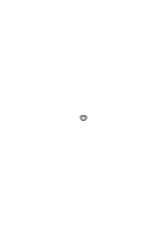

oder

viel Bewegung, die nur wenig vorwärts kommt.

### [82\[4\]](https://cdn.wittgensteinnachlass.com/2000px/webp/Ms-110/82.webp)

„Die Hand zeigt dahin”: Aber in wiefern zeigt sie dahin? einfach weil sie sich in einer Richtung verjüngt? (Zeigt ein Nagel in die Wand?) d.h. ist es dasselbe zu sagen „sie zeigt etc.” oder „sie verjüngt sich in dieser Richtung”?

### [82\[5\]](https://cdn.wittgensteinnachlass.com/2000px/webp/Ms-110/82.webp)

„Aber das Zeichen sagt mir doch was, es gibt mir Information!” Da es mir nichts anderes zeigen kann als sich selbst & die Eindrücke die es verursacht, so kann es mir auch nicht mehr geben. _Das_ was es mir sagt ist nicht etwas außerhalb worauf es zeigt sondern liegt in ihm.

### [82\[6\]](https://cdn.wittgensteinnachlass.com/2000px/webp/Ms-110/82.webp)

Gäbe es etwas worauf es wesentlich zeigt so müßte das als eine Bedingung des Sinnes vorhanden sein & gehörte dann mit zum Symbol.

### [82\[7\]](https://cdn.wittgensteinnachlass.com/2000px/webp/Ms-110/82.webp),[83\[1\]](https://cdn.wittgensteinnachlass.com/2000px/webp/Ms-110/83.webp)

„Das Betreten dieser Brücke ist gefährlich” zeigt nicht auf die Gefahr des Betretens der Brücke. Und sofern es auf die Brücke zeigt, gehört diese mit zum Symbol.

### [83\[2\]](https://cdn.wittgensteinnachlass.com/2000px/webp/Ms-110/83.webp)

Das Mitschwingen der Furcht mit dem Zeichen.

### [83\[3\]](https://cdn.wittgensteinnachlass.com/2000px/webp/Ms-110/83.webp)

Was heißt die Frage: Ist das dasselbe ‚~’ für welches die Regel ~~~p = ~p gilt?

### [83\[4\]](https://cdn.wittgensteinnachlass.com/2000px/webp/Ms-110/83.webp)

„Meinst Du das ‚~’ so, daß ich aus ~p ~~~ p schließen kann?”

### [83\[5\]](https://cdn.wittgensteinnachlass.com/2000px/webp/Ms-110/83.webp)

Wenn für _dieses_ ‚~’ keine Regel gilt, so ist das Zeichen bedeutungslos.

### [83\[6\]](https://cdn.wittgensteinnachlass.com/2000px/webp/Ms-110/83.webp)

„Das Wort ‚ist’ in dem Satz ‚der Himmel ist blau’ ist dasselbe wie das in dem Satz ‚die Rose ist rot’, aber nicht dasselbe wie das ‚ist’ in ‚2 × 2 ist 4’”. Wenn ich das sagen kann, so heißt das schon, das ich die Worte nicht nach dem Klang allein unterscheide, oder identifiziere. Und doch muß ich sie wiedererkennen, denn nur ihre Gemeinsamkeit drückt ja eine Gemeinsamkeit des Sinnes aus.

### [83\[7\]](https://cdn.wittgensteinnachlass.com/2000px/webp/Ms-110/83.webp)

Könnten wir für ‚blau’, ‚rot’, ‚grün’, ‚gelb’ dasselbe Wort verwenden, wie wir es für ‚ = ’ und ‚ε’ tun, wenn auch mit der Gefahr der Verwechslung, aber doch der _Möglichkeit_ zu unterscheiden?

### [83\[8\]](https://cdn.wittgensteinnachlass.com/2000px/webp/Ms-110/83.webp)

Wie Gesetze nur Interesse gewinnen, wenn die Neigung besteht sie zu übertreten, so gewinnen gewisse grammatische Regeln erst dann Interesse, wenn die Philosophen sie übertreten möchten.

### [84\[1\]](https://cdn.wittgensteinnachlass.com/2000px/webp/Ms-110/84.webp)

Daß das deutsche Wort ‚ist’ & das englische ‚is’ dasselbe bedeuten kann man auf zweierlei Art erfahren. Entweder ich habe die eine Sprache unabhängig von der andern gelernt & lerne die andere mit Hilfe (durch Übersetzung) der ersten, lerne also aus dem Wörterbuche ‚is’ heiße ‚ist’. Oder ich habe beide Sprachen unabhängig voneinander so gelernt, wie man in der Kindheit seine Muttersprache lernt & komme dann darauf, daß ‚is’ & ‚ist’ einander entsprechen.

### [84\[2\]](https://cdn.wittgensteinnachlass.com/2000px/webp/Ms-110/84.webp)

Wie weißt Du daß das Wort ‚und’ in diesen beiden Sätzen dasselbe ist?

### [84\[3\]](https://cdn.wittgensteinnachlass.com/2000px/webp/Ms-110/84.webp)

(Diese Fragestellung scheint nicht in Ordnung zu sein.)

### [84\[4\]](https://cdn.wittgensteinnachlass.com/2000px/webp/Ms-110/84.webp)

Man sagt dem Kind: „nein, kein Stück Zucker mehr!” & nimmt es ihm weg. So lernt das Kind die Bedeutung des Wortes ‚kein’.

Hätte man ihm mit denselben Worten ein Stück Zucker gereicht, so hätte es gelernt das Wort anders zu verstehen.

### [84\[5\]](https://cdn.wittgensteinnachlass.com/2000px/webp/Ms-110/84.webp)

16.02.1931

Die Regel beschreibt ihre Anwendung.

### [84\[6\]](https://cdn.wittgensteinnachlass.com/2000px/webp/Ms-110/84.webp)

Ist es denn willkürlich, welche Interpretation wir den Worten geben, die uns gesagt werden? Kommt nicht das Erlebnis der Interpretation mit dem Erlebnis des Hörens der Zeichen, wenn wir ‚die Sprache des Anderen verstehen’?

### [84\[7\]](https://cdn.wittgensteinnachlass.com/2000px/webp/Ms-110/84.webp),[85\[1\]](https://cdn.wittgensteinnachlass.com/2000px/webp/Ms-110/85.webp)

17.02.1931

„Das Gebilde & was es hervorruft kann sich uns doch nur immer selber zeigen, aber nicht von sich, nach außen, weisen. Und das ist, was das Symbol zu tun scheint.

### [85\[2\]](https://cdn.wittgensteinnachlass.com/2000px/webp/Ms-110/85.webp)

Soweit man also das Verständnis als einen Vorgang beschreiben kann, ist es ein Phänomen wie das Sehen des Zeichens selbst. Die Frage aber ist dann, wo finden wir nun jenes von sich in den Raum Weisende was das Symbol zu sein scheint.

### [85\[3\]](https://cdn.wittgensteinnachlass.com/2000px/webp/Ms-110/85.webp)

Denn alle Zeichen, & was sie mit sich bringen, scheint uns wesentlich von gleicher Art zu sein. Es ist, was es ist, ist aber kein Symbol.

### [85\[4\]](https://cdn.wittgensteinnachlass.com/2000px/webp/Ms-110/85.webp)

Als Symbol kann ich die Dinge nur sehen wenn ich sie von einem andern Standpunkt betrachte.

### [85\[5\]](https://cdn.wittgensteinnachlass.com/2000px/webp/Ms-110/85.webp),[86\[1\]](https://cdn.wittgensteinnachlass.com/2000px/webp/Ms-110/86.webp)

Wenn ich z.B. sage

stellt eine Hand vor, oder: ich verstehe es als Hand, so sage ich etwas über den Eindruck den das Zeichen macht. Es ist aber doch keine Hand, noch ist eine wirkliche Hand im Spiele & wenn ich sage es erinnert mich an eine Hand, so heißt das, es ruft Vorstellungen in mir wach in denen eine Hand nicht vorkommt. Heißt das nun also, daß ich diese Vorstellungen etc. auch anders ohne Erwähnung der Hand hätte beschreiben können, und die Anspielung auf die Hand überflüssig war? Aber das ist offenbar dieselbe Frage wie die: wenn ich mir einen roten Fleck an der Wand vorstelle der nicht da ist, so geschieht doch etwas, worin nichts wirklich Rotes & jedenfalls kein roter Fleck an dieser Wand eine Rolle spielt, denn es ist doch keiner da: Kann ich also, was bei diesem Vorstellen geschieht nicht beschreiben ohne der Gegenstände Erwähnung zu tun, die nicht an der Tatsache beteiligt sind, oder doch nur als ein Teil einer indirekten Beschreibung des Gegenstandes von dem eigentlich die Rede ist. – Aber so ist es natürlich nicht. Und diese Ausführung zeigt nur, worin der falsche Gedankengang besteht, den zu machen wir versucht sind.

### [86\[2\]](https://cdn.wittgensteinnachlass.com/2000px/webp/Ms-110/86.webp)

Wenn ich sage: ich stelle mir einen roten Fleck an dieser Wand vor, so ist das allerdings die Beschreibung eines Vorgangs, einer Tatsache, unabhängig von jener andern die der Satz „an dieser Wand ist ein roter Fleck” beschreibt, aber ich kann diese Tatsache nicht anders als durch die Ausdrücke ‚rot’ & ‚Fleck’ etc., ja nur in dieser Zusammenstellung beschreiben (in einer Sprache nämlich in der die Tatsache daß ein roter Fleck an der Wand ist, mit diesen Worten beschrieben wird).

### [86\[3\]](https://cdn.wittgensteinnachlass.com/2000px/webp/Ms-110/86.webp)

Und wenn ich mich _darüber_ wundere, so muß ich mich über jeden sprachlichen Ausdruck wundern.

### [86\[4\]](https://cdn.wittgensteinnachlass.com/2000px/webp/Ms-110/86.webp)

Hier, glaube ich, sieht man, was mißverstehen unserer Sprachlogik bedeutet!

### [86\[5\]](https://cdn.wittgensteinnachlass.com/2000px/webp/Ms-110/86.webp),[87\[1\]](https://cdn.wittgensteinnachlass.com/2000px/webp/Ms-110/87.webp)

Wir sind durch falsche Analogien in die Irre geführt & können uns nicht aus dieser Verstrickung erretten. Das ist der morbus philosophicus.

### [87\[2\]](https://cdn.wittgensteinnachlass.com/2000px/webp/Ms-110/87.webp)

D.h. es ist eben nicht mehr Grund sich über den Ausdruck „ich stelle mir einen roten Fleck an der Wand vor” (oder ich wünsche mir etc.) zu wundern, als über den: an der Wand ist ein roter Fleck, & über die Ähnlichkeit dieses mit dem Satz: auf dem Tisch ist kein roter Fleck. Das Vorkommen des Wortes ‚rot’ bedeutet eben nicht, daß etwas rot ist & die Gemeinsamkeit des Wortes ‚rot’ nicht, daß zwei Gegenstände die Farbe gemeinsam haben (es kann das Gegenteil davon bedeuten wie in den Sätzen „A ist rot” & „B ist nicht rot”.)

### [87\[3\]](https://cdn.wittgensteinnachlass.com/2000px/webp/Ms-110/87.webp)

Nun könnte ich aber doch sagen, der Gedanke, die Vorstellung daß etwas der Fall ist, der Wunsch, ist ein Symbol. – – –

### [87\[4\]](https://cdn.wittgensteinnachlass.com/2000px/webp/Ms-110/87.webp)

Sage ich nicht Etwas symbolisiert darum, weil ich es verstehe? Das ist doch gewiß.

### [87\[5\]](https://cdn.wittgensteinnachlass.com/2000px/webp/Ms-110/87.webp)

Nur durch _völliges_ Absehen vom Psychologischen können wir zu dem für uns Wesentlichen kommen.

### [87\[6\]](https://cdn.wittgensteinnachlass.com/2000px/webp/Ms-110/87.webp),[88\[1\]](https://cdn.wittgensteinnachlass.com/2000px/webp/Ms-110/88.webp)

Ich sehe in den Gängen eines Spitals das Wort „Silence” aufgeschrieben. Dieses Wort hat eine Wirkung auf mich (ich meine das Verstehen) welche das Wort ‚abracadabra’ nicht hat; diese Wirkung wird dadurch hervorgebracht, daß ich des Wortes Bedeutung früher gelernt habe (was uns aber gleichgültig ist). Wenn das chinesische für ‚Silence’ neben diesem Wort steht, so bringt es die Wirkung auf mich nicht hervor, aber auf einen Chinesen, und umgekehrt. Befolge ich nun den Befehl so geschieht erstens etwas, was durch den Satz „ich schweige” ausgedrückt wird, aber darin allein besteht das Folgen nicht, sondern in diese Tatsache tritt auch der Befehl selbst ein & noch ein bestimmter Prozeß, den man den der Übertragung nennen kann, worin dieser besteht ist uns gleichgültig. – – –

### [88\[2\]](https://cdn.wittgensteinnachlass.com/2000px/webp/Ms-110/88.webp)

Ist es nicht so: Im Vorgang des Übertragens des Zeichens hat es den symbolischen Charakter, das was außer sich weist indem es uns sagt, was wir zu tun haben.

### [88\[3\]](https://cdn.wittgensteinnachlass.com/2000px/webp/Ms-110/88.webp)

Wir könnten uns den Marsbewohner denken, der auf der Erde erst nach & nach den Gesichtsausdruck des Menschen als solchen verstehen lernte & den drohenden erst nach gewissen Erfahrungen als solchen empfinden lernt. Er hätte bis dahin diese Gesichtsform angeschaut wie wir die Form eines Steins betrachten.

### [88\[4\]](https://cdn.wittgensteinnachlass.com/2000px/webp/Ms-110/88.webp)

Kann ich so nicht sagen: er _lernt_ erst die befehlende Geste in einer gewissen Satzform verstehen.

### [88\[5\]](https://cdn.wittgensteinnachlass.com/2000px/webp/Ms-110/88.webp)

Wenn mir jemand etwas sagt & ich verstehe es, so geschieht mir dies ebenso, wie, daß ich höre was er sagt.

### [88\[6\]](https://cdn.wittgensteinnachlass.com/2000px/webp/Ms-110/88.webp),[89\[1\]](https://cdn.wittgensteinnachlass.com/2000px/webp/Ms-110/89.webp)

Kann man den Vorgang des Verständnisses eines Befehls mit dem Vorgang der Befolgung vergleichen, um zu zeigen, daß _diese_ Befolgung _diesem_ Verständnis, dieser Auffassung, wirklich entspricht? und inwiefern sie übereinstimmen?

### [89\[2\]](https://cdn.wittgensteinnachlass.com/2000px/webp/Ms-110/89.webp)

Wie beschreibt die Sprache den Vorgang des Verständnisses des Satzes ‚p’. Kann sie es anders als durch den Satz, daß ich ‚p’ verstehe? Und kann sie die Befolgung des Befehls ‚q’ anders beschreiben als indem sie sagt, daß ich ‚q’ befolge? Denn alles was bei diesen Vorgängen dadurch noch nicht beschrieben ist, ist unwesentlich & kann sich so & anders verhalten.

### [89\[3\]](https://cdn.wittgensteinnachlass.com/2000px/webp/Ms-110/89.webp)

Einen Satz verstehen heißt ja erst das sehen, was ihn zu einem Satz macht. (Ehe er verstanden ist, ist er ja ein Muster oder eine Lautreihe.)

### [89\[4\]](https://cdn.wittgensteinnachlass.com/2000px/webp/Ms-110/89.webp)

Einen Satz verstehen heißt, ihn als Satz sehen & seine Befolgung des Befehls kann keine Beschreibung haben als ihn selbst.

### [89\[5\]](https://cdn.wittgensteinnachlass.com/2000px/webp/Ms-110/89.webp),[90\[1\]](https://cdn.wittgensteinnachlass.com/2000px/webp/Ms-110/90.webp)

Drury sagte mir heute, er habe überlegt, daß man sich nicht des Zustandes erinnern könne wo man noch nicht sprechen konnte. – Man könnte natürlich Erinnerungsbilder aus jener Zeit besitzen, aber man kann sich nicht an ein Fühlen des Mangels der Sprache erinnern, da man keinen Begriff der Sprache haben kann, ehe man spricht & freilich auch nachher nicht, weil es einen solchen Begriff nicht gibt. Auch kann man sich nicht an das Bedürfnis nach dem sprachlichen Ausdruck erinnern, denn wo das vorhanden ist, gibt es schon eine Sprache in der man denkt.

### [90\[2\]](https://cdn.wittgensteinnachlass.com/2000px/webp/Ms-110/90.webp)

Warum kann man niemandem befehlen einen Satz zu verstehen?

### [90\[3\]](https://cdn.wittgensteinnachlass.com/2000px/webp/Ms-110/90.webp)

Beim Hören eines Wortes kann ich mir die Erklärung dieses Worts nicht ins Gedächtnis zurückrufen; sie kommt, oder sie kommt nicht.

### [90\[4\]](https://cdn.wittgensteinnachlass.com/2000px/webp/Ms-110/90.webp)

18.02.1931

Da alles offen daliegt, ist auch nichts zu erklären. Denn was etwa nicht offen daliegt interessiert uns nicht.

### [90\[5\]](https://cdn.wittgensteinnachlass.com/2000px/webp/Ms-110/90.webp)

So die Verneinung, – wenn wir sie verstehen, – – – –

### [90\[6\]](https://cdn.wittgensteinnachlass.com/2000px/webp/Ms-110/90.webp)

Die Antwort auf die Frage nach der Erklärung der Negation ist wirklich: verstehst Du sie denn nicht? Nun, wenn Du sie nicht verstehst, was gibt es da noch für eine Erklärung, was hat eine Erklärung da noch zu tun?

### [90\[7\]](https://cdn.wittgensteinnachlass.com/2000px/webp/Ms-110/90.webp)

Wir unterscheiden doch aber Sprache von dem was nicht Sprache ist. Wir sehen Striche & sagen, wir verstehen sie, & andere, & sagen, sie bedeuten nichts (oder uns nichts). Damit ist doch eine allgemeine Erfahrung charakterisiert, die wir nennen könnten: „etwas als Sprache verstehen” – ganz abgesehen davon _was_ wir aus dem gegebenen Gebilde herauslesen.

### [91\[1\]](https://cdn.wittgensteinnachlass.com/2000px/webp/Ms-110/91.webp)

(Blumenorakel) Abzählen der Knöpfe. In diesen Fällen setzen wir auch eine Regel fest & richten uns dann nach ihr. Wir lesen etwas von unseren Knöpfen ab.

### [91\[2\]](https://cdn.wittgensteinnachlass.com/2000px/webp/Ms-110/91.webp)

Wir unterscheiden eine Schrift von dem was keine Schrift ist. Was heißt es, etwas als Schrift sehen? Heißt es mich danach richten?

### [91\[3\]](https://cdn.wittgensteinnachlass.com/2000px/webp/Ms-110/91.webp)

Wenn ich mich nun danach richte – wähle ich die Art wie ich mich danach richte? Nein, denn sonst würde ich mich wenigstens in dieser Beziehung nicht nach dem Zeichen richten. Wie aber wenn ich doch die Art der Interpretation wähle? (Würfeln)

### [91\[4\]](https://cdn.wittgensteinnachlass.com/2000px/webp/Ms-110/91.webp),[92\[1\]](https://cdn.wittgensteinnachlass.com/2000px/webp/Ms-110/92.webp)

Angenommen ich lasse mich (wie ich oben beschrieben habe) von den Bäumen auf meinem Spazierweg leiten: Das setzt doch voraus, daß ich eine Regel festsetze & mich nach der _Festsetzung_ richte, d.h. es hätte keinen Sinn zu sagen, _ich richte mich_ nach den Bäumen, wenn ich die Art der Interpretation erst für jeden einzelnen Fall bestimmen wollte d.h. in diesem Fall wäre es eben keine Interpretation sondern eine ganz überflüssige Zuordnung. Es kann nicht heißen: Hier ist ein Baum, also will ich hier einmal links gehen, sondern: Hier ist ein Baum also muß ich hier etc. …. Das ‚also’ im ersten Satz hat keinen Sinn & es muß hier einfach ‚und’ heißen. Bei der Interpretation aber hat es Sinn. Und das ‚also’ ist natürlich kein kausales, & wir können nicht fragen „bist Du sicher, daß Du _deswegen_ links gehen mußt?”.

### [92\[2\]](https://cdn.wittgensteinnachlass.com/2000px/webp/Ms-110/92.webp)

Ich könnte nun auch sagen „_also_ muß ich nach meiner Festsetzung links gehen”. Aber hier ist das merkwürdige, daß ich nun nicht nocheinmal sage: „und diese Festsetzung ist nach jener anderen (Festsetzung) so zu deuten”, & es wäre ja auch unsinnig, denn diese Regression ist endlos.

### [92\[3\]](https://cdn.wittgensteinnachlass.com/2000px/webp/Ms-110/92.webp)

Das was ich in der [→ letzten Bemerkung] geschrieben habe, war aber doch falsch. Wahr ist es, daß zur Interpretation das _also_ gehört & nicht das _und_. Aber ich könnte etwa sagen daß es nicht nötig war eine Festsetzung zu treffen d.h. die allgemeine Regel vorher auszusprechen (das ist Geschichte), wohl aber einer Festsetzung zu folgen. Und ich könnte sagen, es ist nicht genug einer Regel folgen, denn das geschieht, was immer ich tue, sondern ich muß einer Festsetzung folgen, das ist ein anderer Prozeß.

### [92\[4\]](https://cdn.wittgensteinnachlass.com/2000px/webp/Ms-110/92.webp)

Aber ich will sagen, dieser Prozeß kann nur äußerlich verschieden sein von einem Handeln, das sich nicht nach einer Festsetzung richtet. So verschieden wie auch zwei Arten des Benehmens sein können (oder zwei Zeichengruppen an der Tafel).

### [92\[5\]](https://cdn.wittgensteinnachlass.com/2000px/webp/Ms-110/92.webp)

„Ich habe mich dabei nach dieser Regel gerichtet” beschreibt einen bestimmten (psychischen, physikalischen) Vorgang. Einen andern als der Satz: Die Resultate _folgen_ dieser Regel – – – –

### [93\[1\]](https://cdn.wittgensteinnachlass.com/2000px/webp/Ms-110/93.webp)

Der Festsetzung Folgen muß ein Vorgang sein, aus dem man den Ausdruck der Regel ablesen kann. Es besteht also nicht darin, daß mehrere Vorgänge, Intentionen, einer Regel folgen, denn dann wäre diese Regel wieder ein Erfahrungssatz & natürlich nicht eindeutig durch die Vorgänge bestimmt. Und ich muß die Regel _eindeutig_ aus dem Vorgang ablesen können. Sonst könnte sie ja auch in der Beschreibung des Vorgangs nicht enthalten sein müssen.

### [93\[2\]](https://cdn.wittgensteinnachlass.com/2000px/webp/Ms-110/93.webp)

Wer die allgemeine Regel die er erkennt nun herausschreibt, schreibt mehr auf als er sieht.

7 49 | 5 25 | 3 9 | 4 16 | 2 4 Behaviouristische Deutung:

7, 49, | 5, 25, | 3, 9, | 4 16 Er schreibt die Quadrate der oberen Zahlen.

---

7, 49, | 5, 24, | 3, 18, | 4 16, Er schreibt nicht die Quadrate …

---

<math class="stacked" display="inline"><mtext>7,</mtext><munder><mrow><mn>7</mn><mspace width="0.3em"/><mo>×</mo><mspace width="0.3em"/><mn>7</mn></mrow><mo>_</mo></munder><mn>49</mn><mtext>5,</mtext><munder><mrow><mn>5</mn><mspace width="0.3em"/><mo>×</mo><mspace width="0.3em"/><mn>5</mn></mrow><mo>_</mo></munder><mn>25</mn><mtext>3,</mtext><munder><mrow><mn>3</mn><mspace width="0.3em"/><mo>×</mo><mspace width="0.3em"/><mn>3</mn></mrow><mo>_</mo></munder><mn>9</mn><mtext>4,</mtext><munder><mrow><mn>4</mn><mspace width="0.3em"/><mo>×</mo><mspace width="0.3em"/><mn>4</mn></mrow><mo>_</mo></munder><mn>16</mn></math> Er _will_ die Quadrate anschreiben & tut es.

---

<math class="stacked" display="inline"><mtext>7,</mtext><munder><mrow><mn>7</mn><mspace width="0.3em"/><mo>×</mo><mspace width="0.3em"/><mn>7</mn></mrow><mo>_</mo></munder><mn>49</mn><mtext>5,</mtext><munder><mrow><mn>5</mn><mspace width="0.3em"/><mo>×</mo><mspace width="0.3em"/><mn>5</mn></mrow><mo>_</mo></munder><mn>25</mn><mtext>3,</mtext><mtext>…</mtext><mtext>4,</mtext><mtext>…</mtext></math> Er will die Quadrate nicht anschreiben tut es aber.

---

etc.

### [93\[3\]](https://cdn.wittgensteinnachlass.com/2000px/webp/Ms-110/93.webp)

Der Prozeß des Lernens hat natürlich etwas mit der Anwendung der Sprache gemein. Das was der Ausdruck der allgemeinen Regel mit ihrer Anwendung gemein hat.

### [94\[1\]](https://cdn.wittgensteinnachlass.com/2000px/webp/Ms-110/94.webp)

Der Befehl ist die Beschreibung seiner Ausführung.

### [94\[2\]](https://cdn.wittgensteinnachlass.com/2000px/webp/Ms-110/94.webp)

Haben wir hier nicht das Wesen des Motivs im Gegensatz zur Ursache? Offenbar ja. Der Befehl wird, wenn ich ihn befolge zum Motiv meiner Handlungsweise.

### [94\[3\]](https://cdn.wittgensteinnachlass.com/2000px/webp/Ms-110/94.webp)

Und das Motiv ist nicht hypothetisch. In dem Motiv kann ich mich nicht irren es ist in meiner Handlung enthalten, aber nicht so ihre Ursache.

### [94\[4\]](https://cdn.wittgensteinnachlass.com/2000px/webp/Ms-110/94.webp)

(Ogden & Richards & Russels Theorie der Bedeutung beruht also auf einer Verwechslung, oder Gleichsetzung, von Motiv und Ursache.)

### [94\[5\]](https://cdn.wittgensteinnachlass.com/2000px/webp/Ms-110/94.webp)

19.02.1931

Zu dem früheren Satz: Der Baum muß die Entscheidung treffen.

### [94\[6\]](https://cdn.wittgensteinnachlass.com/2000px/webp/Ms-110/94.webp)

Das Befolgen des Befehls liegt darin, daß ich etwas tue ‒ ‒ Kann ich aber auch sagen, „daß ich das tue, was er befiehlt”? Gibt es ein Kriterium dafür, daß das die Handlung ist, die ihn befolgt?

### [94\[7\]](https://cdn.wittgensteinnachlass.com/2000px/webp/Ms-110/94.webp)

Es gibt kein Kriterium dafür daß das die Handlung ist, die den Befehl befolgt.

### [94\[8\]](https://cdn.wittgensteinnachlass.com/2000px/webp/Ms-110/94.webp)

Das muß natürlich heißen „wir können von so einem Kriterium nicht reden”.

### [94\[9\]](https://cdn.wittgensteinnachlass.com/2000px/webp/Ms-110/94.webp),[95\[1\]](https://cdn.wittgensteinnachlass.com/2000px/webp/Ms-110/95.webp)

Das hängt unmittelbar damit zusammen, daß wir eine Handlung nicht vorausnehmen können. Was wieder nur soviel heißt, als daß es keinen Sinn hat zu sagen, die Handlung zu einer bestimmten Zeit finde zu einer gewissen Zeit statt.

### [95\[2\]](https://cdn.wittgensteinnachlass.com/2000px/webp/Ms-110/95.webp)

Was wir wollen ist doch wohl, die Grammatik des Ausdrucks „der Befehl wird befolgt” klarzulegen.

### [95\[3\]](https://cdn.wittgensteinnachlass.com/2000px/webp/Ms-110/95.webp)

„Ja woher weiß ich aber dann, daß ich den Befehl befolgt habe?” – – –

### [95\[4\]](https://cdn.wittgensteinnachlass.com/2000px/webp/Ms-110/95.webp)

(Ich kann den zentralen grammatischen Fehler nicht finden auf dem alle diese Probleme beruhen.)

### [95\[5\]](https://cdn.wittgensteinnachlass.com/2000px/webp/Ms-110/95.webp)

Es ist das natürlich die selbe Frage wie die: Woher weiß ich, daß dieser Satz diese Tatsache beschreibt?

### [95\[6\]](https://cdn.wittgensteinnachlass.com/2000px/webp/Ms-110/95.webp)

Und ich möchte immer antworten: „weil ich ihn ja von dieser Tatsache heruntergelesen habe”. Und: „ich muß doch wissen, wie ich zu ihm gekommen bin”.

### [95\[7\]](https://cdn.wittgensteinnachlass.com/2000px/webp/Ms-110/95.webp)

Wenn ich ein Kriterium angeben könnte, so muß ich es mit der Sprache angeben & dann müßte ich es nach dem sprachlichen Ausdruck erkennen können; aber zu diesem Erkennen brauchte ich ja selbst wieder das Kriterium.

### [95\[8\]](https://cdn.wittgensteinnachlass.com/2000px/webp/Ms-110/95.webp),[96\[1\]](https://cdn.wittgensteinnachlass.com/2000px/webp/Ms-110/96.webp)

Wenn ich Worte wählen kann, daß sie der Tatsache – in irgend einem Sinne – passen, dann muß ich also schon vorher einen Begriff dieses Passens gehabt haben. Und nun fängt das Problem von neuem an, denn wie weiß ich, daß dieser Sachverhalt dem Begriffe vom Passen entspricht.

### [96\[2\]](https://cdn.wittgensteinnachlass.com/2000px/webp/Ms-110/96.webp)

Aber warum beschreibe ich dann die Tatsache gerade _so_? Was machte Dich _diese_ Worte sagen?

### [96\[3\]](https://cdn.wittgensteinnachlass.com/2000px/webp/Ms-110/96.webp)

Und wenn ich nun sagen würde: „alles was geschieht, ist eben, daß ich auf diese Gegenstände sehe & dann diese Worte gebrauche”, wäre die Antwort: „also besteht das Beschreiben in weiter nichts & ist es immer eine Beschreibung wenn einer …?”. Und darauf müßte ich sagen: „Nein. Nur kann ich den Vorgang nicht anders, oder doch nicht mit einer anderen Multiplizität beschreiben, als, indem ich sage: ‚ich beschreibe was ich sehe’ & _darum_ ist keine Erklärung mehr möglich, weil mein Satz bereits die richtige Multiplizität hat.”

### [96\[4\]](https://cdn.wittgensteinnachlass.com/2000px/webp/Ms-110/96.webp)

Ich könnte auch so fragen: Warum verlangst Du Erklärungen? Wenn diese gegeben sein werden, wirst Du ja doch wieder vor einem Ende stehen. Sie können Dich nicht weiter führen als Du jetzt bist.

### [96\[5\]](https://cdn.wittgensteinnachlass.com/2000px/webp/Ms-110/96.webp)

Denn wenn ich frage: „was bedeutet es denn ‚gemäß einer Regel übersetzen’?” so erwarte ich doch (wohl) eine Antwort: es bedeutet das & das; dann kann ich doch aber weiter fragen „& was bedeutet _das_?”. u.s.w.

### [96\[6\]](https://cdn.wittgensteinnachlass.com/2000px/webp/Ms-110/96.webp)

Wir müssen am Schluß die Sprache ohne Erklärung benützen.

### [97\[1\]](https://cdn.wittgensteinnachlass.com/2000px/webp/Ms-110/97.webp)

Erklären des Nähens oder des Rauchens im Gegensatz zum Erklären des Übersetzens. Dort gibt die Erklärung immer eine Beschreibung die nicht die des unmittelbar Wahrgenommenen ist.

### [97\[2\]](https://cdn.wittgensteinnachlass.com/2000px/webp/Ms-110/97.webp)

20.02.1931

Der Mensch hatte vom Nähen oder Rauchen einen Begriff ehe man's ihm erklärt hatte. Und nach der Erklärung weiß er _mehr_ davon als vorher. Die Erklärung des Denkens die wir fordern _soll_ uns aber nicht mehr darüber sagen als was wir wissen.

### [97\[3\]](https://cdn.wittgensteinnachlass.com/2000px/webp/Ms-110/97.webp)

Deshalb kann er nach der Erklärung des Rauchens fragen. Und die Antwort kann nicht die Beschreibung dessen sein was er unter „Rauchen” versteht, sondern die Beschreibung eines andern Vorgangs.

### [97\[4\]](https://cdn.wittgensteinnachlass.com/2000px/webp/Ms-110/97.webp)

(Ich kann nie sagen: „aus diesen Gründen _muß_ es sich so verhalten”. Denn was nicht offenbar ist, ist für mich nicht vorhanden.)

### [97\[5\]](https://cdn.wittgensteinnachlass.com/2000px/webp/Ms-110/97.webp)

21.02.1931

### [97\[6\]](https://cdn.wittgensteinnachlass.com/2000px/webp/Ms-110/97.webp)

Die Regel „du mußt quadrieren” zu sagen (zu verstehen) ist etwas anderes als die 5 zu quadrieren.

### [97\[7\]](https://cdn.wittgensteinnachlass.com/2000px/webp/Ms-110/97.webp)

„Wenn immer wir etwas sagen, wenn es auch gegen die gebräuchliche Grammatik verstößt, meinen wir etwas damit”; was heißt das?

### [97\[8\]](https://cdn.wittgensteinnachlass.com/2000px/webp/Ms-110/97.webp),[98\[1\]](https://cdn.wittgensteinnachlass.com/2000px/webp/Ms-110/98.webp)

Wenn es etwas heißt, muß es die Beschreibung eines Phänomens sein. Aber welches Phänomens?

### [98\[2\]](https://cdn.wittgensteinnachlass.com/2000px/webp/Ms-110/98.webp)

Dieses Phänomen ist offenbar das des Denkens. –

### [98\[3\]](https://cdn.wittgensteinnachlass.com/2000px/webp/Ms-110/98.webp)

Das Triviale, was ich zu sagen habe ist, daß auf den Satz „ich _sage_ das nicht nur, ich meine etwas damit” & die Frage „was?”, ein weiterer Satz, in irgend welchen Zeichen zur Antwort steht.

### [98\[4\]](https://cdn.wittgensteinnachlass.com/2000px/webp/Ms-110/98.webp)

(Ich kann nur die Schlüssel reichen aufsperren muß jeder selbst.)

### [98\[5\]](https://cdn.wittgensteinnachlass.com/2000px/webp/Ms-110/98.webp)

Ich kann aber doch auch fragen: Wie sieht ein Sonnenuntergang aus? auch wenn ich von allem Hypothetischen absehe.

### [98\[6\]](https://cdn.wittgensteinnachlass.com/2000px/webp/Ms-110/98.webp)

Und so kann ich natürlich auch das Denken beschreiben, denn ich kann ja auch das Reden beschreiben.

### [98\[7\]](https://cdn.wittgensteinnachlass.com/2000px/webp/Ms-110/98.webp)

„Ich sage das nicht nur, ich meine auch etwas damit.” – Wenn man sich überlegt was dabei in uns vorgeht, wenn wir Worte _meinen_ (& nicht nur sagen) so ist es uns, als wäre dann etwas mit diesen Worten gekuppelt, während sie sonst leer liefen. – Als ob sie gleichsam in uns eingriffen.

### [98\[8\]](https://cdn.wittgensteinnachlass.com/2000px/webp/Ms-110/98.webp)

Niemand kann uns unseren Gesichtsraum näher kennen lehren. Aber wir können seine sprachliche Darstellung übersehen lernen.

### [98\[9\]](https://cdn.wittgensteinnachlass.com/2000px/webp/Ms-110/98.webp),[99\[1\]](https://cdn.wittgensteinnachlass.com/2000px/webp/Ms-110/99.webp)

Wenn ich recht habe, so müssen sich philosophische Probleme wirklich restlos lösen lassen, im Gegensatz zu allen andern.

### [99\[2\]](https://cdn.wittgensteinnachlass.com/2000px/webp/Ms-110/99.webp)

Wenn ich sage: Hier sind wir an der Grenze der Sprache, so scheint das immer, als wäre hier eine Resignation nötig, während im Gegenteil volle Befriedigung eintritt da _keine_ Frage übrigbleibt.

### [99\[3\]](https://cdn.wittgensteinnachlass.com/2000px/webp/Ms-110/99.webp)

Die Probleme werden im eigentlichen Sinne aufgelöst – wie eine Substanz im Wasser.

### [99\[4\]](https://cdn.wittgensteinnachlass.com/2000px/webp/Ms-110/99.webp)

Alles was, von Interesse, wir liefern können, ist die Beschreibung der Sprache. – Dazu gehört alles, was wir zur Erklärung ihrer Anwendung sagen können.

### [99\[5\]](https://cdn.wittgensteinnachlass.com/2000px/webp/Ms-110/99.webp)

Die ‚Erklärung des Denkens’ müßte dem der nicht weiß, was Denken ist, es erklären können. Sie müßte also auch den dazu anleiten können, der es früher nicht getan hat. Und das alles mittels Gedankens.

### [99\[6\]](https://cdn.wittgensteinnachlass.com/2000px/webp/Ms-110/99.webp)

Soweit jede Tätigkeit (schreiben, sprechen, nähen, rauchen) beschreibbar, lehrbar, ist, ist Denken keine Tätigkeit. So wenig, wie Sich-Ärgern, das auch so wenig lehrbar ist. (Meine Bemerkung über ‚kein Subjekt im Denken’. Keine Tätigkeit ohne Täter.)

### [99\[7\]](https://cdn.wittgensteinnachlass.com/2000px/webp/Ms-110/99.webp)

Das Interesse an dem Psychologischen des Denkens ist dadurch für uns aufgehoben, daß wir uns nur für die Beziehung des Denkens zu sich selbst interessieren & das Psychologische dadurch wegfällt, sich kürzt.

### [100\[1\]](https://cdn.wittgensteinnachlass.com/2000px/webp/Ms-110/100.webp)

Es ist der Sprache wesentlich, daß das Wort in verschiedenen Sätzen vorkommt, verschiedene Sätze dieses Wort gemein haben. Und daß der Gleichlaut der Worte, wenn verschiedene grammatische Regeln von ihnen gelten auch durch verschieden lautende ersetzt werden könnte, weil dann der Laut eine unbedeutende, äußerliche, Ähnlichkeit ist.

### [100\[2\]](https://cdn.wittgensteinnachlass.com/2000px/webp/Ms-110/100.webp)

Wenn ich nun aber das Wort „ist” betrachte: Wie kann ich hier zwei verschiedene Anwendungsarten unterscheiden, wenn ich nur auf die grammatischen Regeln hinschaue? Denn diese erlauben ja eben die Verwendung des Wortes im Zusammenhang „die Rose ist rot” & „2 × 2 ist 4”. Aus diesen Regeln sehe ich nicht, daß es sich um zwei verschiedene Wörter handelt. – Ich ersehe es aber z.B. wenn ich versuche in beiden Sätzen statt ‚ist’ ‚ist gleich’ zu setzen (oder auch: ‚hat die Eigenschaft’). Aber nur wieder, weil ich für den Ausdruck „ist gleich” die Regel kenne, daß er in „die Rose … rot” nicht eingesetzt werden darf.

### [100\[3\]](https://cdn.wittgensteinnachlass.com/2000px/webp/Ms-110/100.webp)

Überhaupt: wovon gelten die grammatischen Regeln, wenn sie vom Wort ‚ist’ gelten? Vom Laut, den ich dann & da ausspreche? Von dem was allen ‚ist’-Lauten gemeinsam ist? Sie gelten von ‚ist’, wenn es in diesem Sinne gebraucht wird. – „Wenn du es _so_ anwendest, so gebrauchst Du es eben nicht in _diesem_ Sinne”.

### [100\[4\]](https://cdn.wittgensteinnachlass.com/2000px/webp/Ms-110/100.webp),[101\[1\]](https://cdn.wittgensteinnachlass.com/2000px/webp/Ms-110/101.webp)

Die Frage ist nämlich: ist alles was ich hier treibe nicht Mythologie? Dichte ich nicht zu dem Offenbaren dazu? Wenn ich nämlich von dem Vorgang rede der beim Verstehen (verständnisvollen Aussprechen oder Hören) des Satzes vor sich geht.

### [101\[2\]](https://cdn.wittgensteinnachlass.com/2000px/webp/Ms-110/101.webp)

D.h. könnte ich nicht die Sprache als soziale Einrichtung betrachten, die gewissen Regeln unterliegt, weil sie sonst nicht wirksam wäre. Aber hier liegt es: dieses Letztere kann ich nicht sagen; eine Rechtfertigung der Regeln kann ich, auch so, nicht geben. Ich könnte sie nur als ein Spiel, das die Menschen spielen, beschreiben.

### [101\[3\]](https://cdn.wittgensteinnachlass.com/2000px/webp/Ms-110/101.webp)

Wenn ich mich weigere ein Wort, z.B. das Wort ‚ist gleich’ in zwei Zusammenhängen zu gebrauchen, so ist der Grund das, was wir mit den Worten beschreiben „das Wort habe in den beiden Fällen verschiedene Bedeutung”.

### [101\[4\]](https://cdn.wittgensteinnachlass.com/2000px/webp/Ms-110/101.webp)

Kann ich nun aber das was die grammatischen Regeln von einem Worte sagen, auch anders beschreiben, nämlich durch die Beschreibung des Vorgangs der beim Verstehen des Wortes stattfindet?

### [101\[5\]](https://cdn.wittgensteinnachlass.com/2000px/webp/Ms-110/101.webp)

Wenn also die Grammatik – z.B. – die Geometrie der Verneinung ist, kann ich sie durch eine Beschreibung dessen ersetzen, was bei der Verwendung sozusagen hinter dem Wort ‚nicht’ steht?

### [101\[6\]](https://cdn.wittgensteinnachlass.com/2000px/webp/Ms-110/101.webp)

Aber so eine Beschreibung wäre doch – wie gesagt – ein Ersatz des Wortes ‚nicht’, etwa wie

pWF | FW

und könnte die Grammatik nicht ersetzen.

### [102\[1\]](https://cdn.wittgensteinnachlass.com/2000px/webp/Ms-110/102.webp)

In meiner Darstellung schienen doch die grammatischen Regeln die Auseinanderlegung dessen was ich im Gebrauch des Wortes auf einmal erlebe. Sozusagen (nur) Folgen Äußerungen der Eigenschaften, die ich beim Verstehen auf einmal erlebe. Das muß natürlich ein Unsinn sein.

### [102\[2\]](https://cdn.wittgensteinnachlass.com/2000px/webp/Ms-110/102.webp)

Man würde ja geradezu sagen: die Verneinung hat die Eigenschaft, daß sie verdoppelt eine Bejahung ergibt. (Etwa wie: Eisen hat die Eigenschaft, mit Schwefelsäure Eisensulfat zu geben) während die Regel die Verneinung nicht näher beschreibt, sondern konstituiert.

### [102\[3\]](https://cdn.wittgensteinnachlass.com/2000px/webp/Ms-110/102.webp)

Daß wir dieses Wort dieser Regel gemäß gebrauchen, das dafür einsetzen etc., damit dokumentieren wir, wie wir es meinen.

### [102\[4\]](https://cdn.wittgensteinnachlass.com/2000px/webp/Ms-110/102.webp)

Das Wort ‚nicht’ in der grammatischen Regel hat keine Bedeutung, sonst könnte _das_ nicht von ihm ausgesagt werden.

### [102\[5\]](https://cdn.wittgensteinnachlass.com/2000px/webp/Ms-110/102.webp)

Die Negation hat keine andere Eigenschaft, als etwa die in gewissen Sätzen die Wahrheit zu ergeben. Und ebenso hat ein Kreis die Eigenschaft da oder dort zu stehen, diese Farbe zu haben, von einer Geraden _tatsächlich_ geschnitten zu werden; aber nicht, was ihm die Geometrie zuzuschreiben scheint. (Nämlich diese Eigenschaften haben zu können.)

### [103\[1\]](https://cdn.wittgensteinnachlass.com/2000px/webp/Ms-110/103.webp)

Was heißt es: „Dieses Papier ist nicht schwarz & ‚nicht’ ist hier in dem Sinne gebraucht, daß eine dreifache Verneinung eine Verneinung ergibt”? Wie hat sich denn das im Gebrauch geäußert?

### [103\[2\]](https://cdn.wittgensteinnachlass.com/2000px/webp/Ms-110/103.webp)

Oder: „Dieses Papier ist nicht schwarz & zwei von diesen Verneinungen geben eine Bejahung”. Kann ich das sagen?

### [103\[3\]](https://cdn.wittgensteinnachlass.com/2000px/webp/Ms-110/103.webp)

Oder: „Dieses Buch ist rot & die Rose ist rot & die beiden Wörter ‚rot’ haben die gleiche Bedeutung”. (Dieser Satz ist von gleicher Art, wie die oberen Sätze.) Was ist denn das für ein Satz? ein grammatischer? Sagt er etwas über das Buch und die Rose?

### [103\[4\]](https://cdn.wittgensteinnachlass.com/2000px/webp/Ms-110/103.webp)

Ist der Zusatz zum Verständnis des ersten Satzes nicht nötig, so ist er Unsinn, & wenn nötig, dann war das erste noch kein Satz; & dasselbe gilt in den oberen Fällen.

### [103\[5\]](https://cdn.wittgensteinnachlass.com/2000px/webp/Ms-110/103.webp)

„Daß 3 Verneinungen wieder eine Verneinung ergeben muß doch schon in der einen Verneinung die ich jetzt gebrauche liegen”. Aber deute ich hier nicht schon wieder? (d.h. bin ich nicht im Begriffe eine Mythologie zu erfinden?)

### [103\[6\]](https://cdn.wittgensteinnachlass.com/2000px/webp/Ms-110/103.webp)

Aber sind die grammatischen Regeln nicht ausschließlich Regeln des Übergangs von einem Satz zum andern?

### [103\[7\]](https://cdn.wittgensteinnachlass.com/2000px/webp/Ms-110/103.webp)

Inwiefern kann man sagen: „diese Regel gilt von _dieser_ Verneinung”?

### [103\[8\]](https://cdn.wittgensteinnachlass.com/2000px/webp/Ms-110/103.webp),[104\[1\]](https://cdn.wittgensteinnachlass.com/2000px/webp/Ms-110/104.webp)

Heißt es etwas, zu sagen, daß drei _solche_ Verneinungen eine Verneinung ergeben. (Das erinnert immer an „drei solche Pferde können diesen Wagen fortbewegen”.) Aber, wie gesagt, in jenem logischen Satz ist gar nicht von der Verneinung die Rede (von der Verneinung handeln nur Sätze wie: es regnet nicht) sondern nur vom Wort ‚nicht’, & es ist eine Regel über die Ersetzung eines Zeichens durch ein anderes.

### [104\[2\]](https://cdn.wittgensteinnachlass.com/2000px/webp/Ms-110/104.webp)

Aber können wir die Berechtigung dieser Regel nicht einsehen, wenn wir die Verneinung verstehen? Ist sie nicht eine Folge aus dem Wesen der Verneinung? Sie ist nicht eine Folge aber ein Ausdruck dieses Wesens.

### [104\[3\]](https://cdn.wittgensteinnachlass.com/2000px/webp/Ms-110/104.webp)

Was wir sehen, wenn wir einsehen, daß eine doppelte Verneinung etc., muß von der Art dessen sein, was wir im Zeichen

pWF | FW | WF

wahrnehmen.

### [104\[4\]](https://cdn.wittgensteinnachlass.com/2000px/webp/Ms-110/104.webp)

Wenn ich ein dreidimensionales Gebilde, etwa einen Würfel, sehe so sehe ich in gewissem Sinne die Möglichkeit, Würfel gleicher Größe in drei Richtungen an diesen Würfel anzubauen. Die Geometrie sagt mir dann, daß ich dies _könne_. Sehe ich ein Quadrat, so sehe ich diese Möglichkeit nicht. Etc.

### [104\[5\]](https://cdn.wittgensteinnachlass.com/2000px/webp/Ms-110/104.webp)

(Die perspektivische Zeichnung eines Würfels & solcher Würfelgruppen ist ein herrliches Exempel, wie man den dreidimensionalen Raum in die Ebene abbilden kann.)

### [104\[6\]](https://cdn.wittgensteinnachlass.com/2000px/webp/Ms-110/104.webp),[105\[1\]](https://cdn.wittgensteinnachlass.com/2000px/webp/Ms-110/105.webp)

Die Geometrie spricht aber so wenig von Würfeln, wie die Logik von der Verneinung. (Man möchte hier vielleicht einwenden, daß die Geometrie vom Begriff des Würfels & die Logik vom Begriff der Negation handelt. Aber diese Begriffe gibt es nicht.)

### [105\[2\]](https://cdn.wittgensteinnachlass.com/2000px/webp/Ms-110/105.webp)

Man kann einen Würfel – ich meine das Wesentliche des Würfels – nicht beschreiben. Aber kann ich denn nicht beschreiben, wie man z.B. eine Kiste macht? und ist damit nicht eine Beschreibung des Würfels gemacht? Das Wesentliche am Würfel ist damit nicht beschrieben, das steckt vielmehr in der Möglichkeit dieser Beschreibung d.h. darin, daß sie eine Beschreibung ist; nicht darin daß sie zutrifft.

### [105\[3\]](https://cdn.wittgensteinnachlass.com/2000px/webp/Ms-110/105.webp)

Nun kann ich doch aber sagen: „Ich sehe die Figur

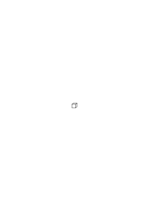

3-dimensional”. Aber dieser Satz entspricht der Beschreibung einer Kiste. Er beschreibt einen bestimmten Würfel nicht die Würfelform. Freilich kann ich das Wort „Würfelform” definieren. D.h. Zeichen geben, durch die es ersetzt werden kann.

### [105\[4\]](https://cdn.wittgensteinnachlass.com/2000px/webp/Ms-110/105.webp)

Man kann eine geometrische Figur nicht beschreiben. Auch die Gleichung beschreibt sie nicht, sondern vertritt sie durch die Regeln die von ihr gelten.

### [105\[5\]](https://cdn.wittgensteinnachlass.com/2000px/webp/Ms-110/105.webp),[106\[1\]](https://cdn.wittgensteinnachlass.com/2000px/webp/Ms-110/106.webp)

Und haben wir hier nicht das Wort Figur so angewendet, wie in unseren Betrachtungen so oft das Wort „Gedanke” oder „Symbol”? Die Art der Anwendung dieses Wortes von welcher ich sagte, es bedeute dann kein Phänomen, sondern sei quasi ein unvollständiges Symbol & entspreche eben einer Funktion.

### [106\[2\]](https://cdn.wittgensteinnachlass.com/2000px/webp/Ms-110/106.webp)

Man kann auch nicht sagen, die Würfelform habe die Eigenschaft, lauter gleiche Seiten zu besitzen. Wohl aber hat ein Holzklotz diese Eigenschaft. (Noch hat „die Eins die Eigenschaft zu sich selbst addiert Zwei zu ergeben”.)

### [106\[3\]](https://cdn.wittgensteinnachlass.com/2000px/webp/Ms-110/106.webp)

Ich sagte doch: Es schien als wären die grammatischen Regeln die Folgen-in-der-Zeit dessen, was wir in einem Augenblick wahrnehmen, wenn wir eine Verneinung verstehen. Und als gebe es also zwei Darstellungen des Wesens der Verneinung: Den Akt (etwa den seelischen Akt) der Verneinung selbst, & seine Spiegelung in dem System der Grammatik.

### [106\[4\]](https://cdn.wittgensteinnachlass.com/2000px/webp/Ms-110/106.webp)

Man ist versucht zu sagen: die Gestalt eines Würfels wird doch sowohl durch die Grammatik des Wortes „Würfel”, als auch durch einen Würfel

dargestellt.

### [106\[5\]](https://cdn.wittgensteinnachlass.com/2000px/webp/Ms-110/106.webp)

In „~p ∙ (~~p = p)” kann der zweite Teil nur eine Spielregel sein.

### [106\[6\]](https://cdn.wittgensteinnachlass.com/2000px/webp/Ms-110/106.webp)

Es hat den Anschein, als könnte man aus der Bedeutung der Negation _schließen_, daß ~~p p heißt.

### [106\[7\]](https://cdn.wittgensteinnachlass.com/2000px/webp/Ms-110/106.webp)

23.02.1931

Als würden aus der Natur der Negation die Regeln über das Negationszeichen _folgen_. So daß, in gewissem Sinne, die Negation zuerst vorhanden ist & dann die Regeln der Grammatik.

### [107\[1\]](https://cdn.wittgensteinnachlass.com/2000px/webp/Ms-110/107.webp)

Es ist also, als hätte das Wesen der Negation einen zweifachen Ausdruck in der Sprache: Dasjenige was ich sehe, wenn ich die Negation verstehe, & die Folgen dieses Wesens in der Grammatik. Anderseits ist es klar, daß die Regeln, wenn sie aus dem Wesen der Negation hervorgehen, nicht wie aus einer Regel, einem Satz, folgen. Und täten sie es, so wäre eben dieser Satz die eigentliche Regel auf die es uns ankäme.

### [107\[2\]](https://cdn.wittgensteinnachlass.com/2000px/webp/Ms-110/107.webp)

Ich will also sagen: die Regeln _folgen_ nicht aus dem Wesen der Negation, sondern sie drücken es aus.

### [107\[3\]](https://cdn.wittgensteinnachlass.com/2000px/webp/Ms-110/107.webp)

Ich kann sozusagen die Regeln über die Negation von ihr ablesen. Aber das scheint eben zu besagen, daß sie schon irgendwoanders, nämlich in der Negation, aufgeschrieben stehen. Das, wovon ich sie ablese muß die gleiche Mannigfaltigkeit haben, wie sie selbst.)

### [107\[4\]](https://cdn.wittgensteinnachlass.com/2000px/webp/Ms-110/107.webp)

Ist das nicht so, wie ich aus einer Figur geometrische Sätze ablesen kann?

### [107\[5\]](https://cdn.wittgensteinnachlass.com/2000px/webp/Ms-110/107.webp)

Statt der Betrachtung der Negation, könnte ich auch die eines Pfeiles setzen → & z.B. sagen: wenn ich ihn zweimal um 180˚ drehe, zeigt er wieder, wohin er jetzt zeigt; welcher Satz dem ~~p = p entspricht. Wie ist es nun hier mit der Darstellung des Wesens dieses Pfeils durch die Sprache? Jener Satz muß doch unmittelbar von diesem Wesen abgeleitet sein & es also darstellen.

### [108\[1\]](https://cdn.wittgensteinnachlass.com/2000px/webp/Ms-110/108.webp)

Oder nehmen wir den Fall eines Quadrats & eines Rechtecks & die Sätze, daß das Quadrat durch eine Vierteldrehung mit sich selbst zur Deckung gebracht werden kann; das Rechteck aber erst durch eine halbe Drehung. Ich habe sie offenbar von dem Quadrat & dem Rechteck abgelesen. Aber was sind das überhaupt für Sätze? Wenn sie von bestimmten quadratischen oder rechteckigen Stücken handelten, wären es Hypothesen. Hier aber sind es geometrische Sätze.

### [108\[2\]](https://cdn.wittgensteinnachlass.com/2000px/webp/Ms-110/108.webp)

Es ist ganz klar, daß dieses Drehen dem Ausschließen eines Teils einer Fläche

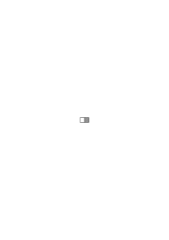

analog ist, & das wieder der Verneinung, & die angeführten Sätze den Regeln über die Verneinung.

### [108\[3\]](https://cdn.wittgensteinnachlass.com/2000px/webp/Ms-110/108.webp)

Wie weiß ich daß ein Wort in diesen Fällen in verschiedenen Bedeutungen angewendet ist?

### [108\[4\]](https://cdn.wittgensteinnachlass.com/2000px/webp/Ms-110/108.webp)

Wie weiß ich, daß ein Wort hier Eigenschaftswort, dort Hauptwort ist?

### [108\[5\]](https://cdn.wittgensteinnachlass.com/2000px/webp/Ms-110/108.webp)

Dadurch, daß kein Gemeinsames verloren geht, wenn ich verschieden lautende Worte statt der gleichlautenden setze.

### [108\[6\]](https://cdn.wittgensteinnachlass.com/2000px/webp/Ms-110/108.webp)

Wie weiß ich, daß ich diese beiden Wörter durch eines ersetzen kann, weil sie nämlich das gleiche bedeuten? D.h., wie weiß ich, daß sie das gleiche bedeuten?

### [108\[7\]](https://cdn.wittgensteinnachlass.com/2000px/webp/Ms-110/108.webp),[109\[1\]](https://cdn.wittgensteinnachlass.com/2000px/webp/Ms-110/109.webp)

Könnte uns die bloße äußere Erfahrung, die Menschen reden zu hören, (wenn es für das Wort ‚ist’ keine Ersatzwörter gäbe) dazu bringen, verschiedene Bedeutungen, verschiedene Wörter ‚ist’, zu unterscheiden? Offenbar nicht, denn jeder Unterschied des Benehmens bildete schon ein anderes Zeichen.

### [109\[2\]](https://cdn.wittgensteinnachlass.com/2000px/webp/Ms-110/109.webp)

24.02.1931

Zu sagen daß eine Vierteldrehung ein Quadrat mit sich selbst zur Deckung bringt, heißt doch offenbar nichts andres als: Das Quadrat ist um zwei zu einander senkrechte Achsen symmetrisch, & das wieder, daß es Sinn hat von den zwei senkrechten Achsen zu reden ob sie vorhanden sind oder nicht. Das ist ein Satz der Grammatik.

### [109\[3\]](https://cdn.wittgensteinnachlass.com/2000px/webp/Ms-110/109.webp)

Die Schwierigkeit ist wieder, daß es scheint, als wäre in einem Satz, der etwa das Wort ‚Quadrat’ enthält schon der Schatten eines anderen Satzes mit diesem Worte enthalten. – Nämlich eben die _Möglichkeit_ jenen anderen Satz zu bilden, die ja, wie ich sagte, im Sinn des Wortes Quadrat liegt.

### [109\[4\]](https://cdn.wittgensteinnachlass.com/2000px/webp/Ms-110/109.webp)

Und doch kann man eben nur sagen, der andere Satz ist nicht mit diesem ausgesprochen, auch nicht schattenhaft. (Und wird vielleicht nie ausgesprochen werden.)

### [109\[5\]](https://cdn.wittgensteinnachlass.com/2000px/webp/Ms-110/109.webp)

Aber er ist doch schon ausgesprochen, wenn ich sage „_er_ kann ausgesprochen werden”.

### [109\[6\]](https://cdn.wittgensteinnachlass.com/2000px/webp/Ms-110/109.webp),[110\[1\]](https://cdn.wittgensteinnachlass.com/2000px/webp/Ms-110/110.webp)

Denken wir daran, daß man ja die Regeln der Grammatik nie auszusprechen brauchte & die Sprache dennoch gebrauchen kann. (Die menschliche Sprache bestand gewiß ehe jemand grammatische Regeln aussprach & ein Kind lernt die Sprache ohne solche, & die wieder haben keine Grammatik. Das heißt natürlich nicht daß ihre Sprache keinen grammatischen Regeln folgt, sie sprechen diese Regeln nur nicht aus.)

### [110\[2\]](https://cdn.wittgensteinnachlass.com/2000px/webp/Ms-110/110.webp)

Die Grammatik ist eine nachträgliche Beschreibung der Sprache.

### [110\[3\]](https://cdn.wittgensteinnachlass.com/2000px/webp/Ms-110/110.webp)

Die Grammatik sagt z.B.: so wird das Wort ‚Quadrat’ gebraucht. Aber das muß doch schon in dem _einen_ Gebrauch dieses Wortes liegen! Was heißt aber: Es _muß_ darin liegen? Heißt es etwas andres, als daß ich auch nach diesem einen Gebrauch die Regeln für das Wort muß angeben können?

### [110\[4\]](https://cdn.wittgensteinnachlass.com/2000px/webp/Ms-110/110.webp)

Daß ich sagen kann: „Nein so _habe_ ich es nicht gebraucht, nicht in dem Sinn, in dem ich sagen könnte – – – –, sondern in dem Sinn – – – – –.

### [110\[5\]](https://cdn.wittgensteinnachlass.com/2000px/webp/Ms-110/110.webp)

Mein Problem könnte man auch so aussprechen: „Wie kann sich jene Erklärung (die ich einmal gelernt habe) auf _dieses_ Wort (das ich eben aussprach) beziehen?”

### [110\[6\]](https://cdn.wittgensteinnachlass.com/2000px/webp/Ms-110/110.webp),[111\[1\]](https://cdn.wittgensteinnachlass.com/2000px/webp/Ms-110/111.webp)

Und meine Meinung ist die, daß die grammatischen Regeln über die Negation, z.B. ~~p = p, zur Erklärung der Bedeutung von ‚~’ gebraucht werden könnten: daß die Regeln eine solche Erklärung wären; & daß daher ihre Wirkung gerade das wäre, was man das Verständnis des Negationszeichens nennt. Und das wäre die Beziehung dieses Verständnisses zu den grammatischen Regeln. (Wobei ‚Wirkung’ nicht kausal zu verstehen ist.)

### [111\[2\]](https://cdn.wittgensteinnachlass.com/2000px/webp/Ms-110/111.webp)

Daß ein Wort nur im Satz Bedeutung hat, heißt nichts, als daß es seine Funktion nur im Satz hat. Einzeln kann es wohl eine Vorstellung erwecken, aber diese ist nicht seine Bedeutung, noch ist es die Funktion eines Wortes eine bestimmte Vorstellung aufzurufen.

### [111\[3\]](https://cdn.wittgensteinnachlass.com/2000px/webp/Ms-110/111.webp)

Kein Satz der Sprache kann uns als Überraschung kommen (wohl aber eine Wahrheit). Das ist es doch, was ich meine, wenn ich sage: Wir können nach dem einen Gebrauch des Wortes die Regeln für das Wort angegeben. Denn das heißt ja seinen Gebrauch in Sätzen zu beschreiben. D.h. eine allgemeine Beschreibung aller möglichen Sätze zu geben.

### [111\[4\]](https://cdn.wittgensteinnachlass.com/2000px/webp/Ms-110/111.webp),[112\[1\]](https://cdn.wittgensteinnachlass.com/2000px/webp/Ms-110/112.webp)

Es könnte nun eingewandt werden daß ich die Bedeutung, z.B., der Worte ‚blau’ & ‚rot’ vertauschen könnte & dadurch zwar Sätze die früher wahr jetzt falsch u.u. würden, aber kein Satz der früher Sinn hatte, jetzt unsinnig würde u. u.. Das ist wahr. Es ist aber dabei nicht bedacht, daß auch Sätze wie „das hat diese Farbe” zu unserer Sprache gehören & die Grammatik mir dann sagen muß daß dieser Satz soviel heißt wie „das ist rot”.

### [112\[2\]](https://cdn.wittgensteinnachlass.com/2000px/webp/Ms-110/112.webp)

Es frägt sich einfach: Was ist das für ein Satz „das Wort ‚ist’ in ‚die Rose ist rot’ ist dasselbe wie in ‚das Buch ist rot’, aber nicht dasselbe wie in ‚2 × 2 ist 4’”? Man kann nicht antworten, es heiße, verschiedene Regeln gelten von den beiden Wörtern, denn damit geht man im Zirkel. Wohl aber heißt es, das Wort ist in seiner verschiedenen Verbindung durch zwei Zeichen ersetzbar, die nicht für einander einzusetzen sind. Ersetze ich dagegen das Wort in den beiden ersten Sätzen durch zwei verschiedene Wörter, so kann ich sie füreinander einsetzen.

### [112\[3\]](https://cdn.wittgensteinnachlass.com/2000px/webp/Ms-110/112.webp)

Nun könnte ich wieder fragen: sind diese Regeln nur eine _Folge_ des _Ersten_: daß im einen Fall die beiden Wörter ‚ist’ die gleiche Bedeutung haben, im andern Fall nicht? Oder ist es so, daß diese Regel eben der sprachliche Ausdruck dafür ist, daß die Wörter das gleiche bedeuten?

### [112\[4\]](https://cdn.wittgensteinnachlass.com/2000px/webp/Ms-110/112.webp),[113\[1\]](https://cdn.wittgensteinnachlass.com/2000px/webp/Ms-110/113.webp)

Ich will es damit vergleichen, daß das Wort ‚ist’ einen anderen Wortkörper hinter sich hat. Daß es beidemale die gleiche Fläche ist, die einem andern Körper angehört, wie wenn ich ein Dreieck im Vordergrund sehe das das einemal die Endfläche eines Prismas das andremal eines Tetraeders ist.

### [113\[2\]](https://cdn.wittgensteinnachlass.com/2000px/webp/Ms-110/113.webp)

Oder denken wir uns diesen Fall: Wir hätten Glaswürfel deren eine Seite rot gefärbt wäre. Wenn wir sie aneinanderreihen, so wird im Raum nur eine ganz bestimmte Anordnung roter Quadrate entstehen können, bedingt durch die Würfelform der Körper. Ich könnte nun die Regel nach der hier rote Quadrate angeordnet sein können auch ohne Erwähnung der Würfel angeben, aber in ihr wäre doch bereits das Wesen der Würfelform präjudiziert. Freilich nicht, daß wir gläserne Würfel haben wohl aber die Geometrie des Würfels.

### [113\[3\]](https://cdn.wittgensteinnachlass.com/2000px/webp/Ms-110/113.webp)

Wenn wir nun aber einen solchen Würfel _sehen_, sind _damit_ wirklich schon alle Gesetze der möglichen Zusammenstellung gegeben?! Also die ganze Geometrie? Kann ich die Geometrie des Würfels von einem Würfel ablesen.

### [113\[4\]](https://cdn.wittgensteinnachlass.com/2000px/webp/Ms-110/113.webp)

Muß ich nicht dazu in ihm schon eine sehr einfach ausgesprochene Regel sehen?

### [113\[5\]](https://cdn.wittgensteinnachlass.com/2000px/webp/Ms-110/113.webp)

Der Würfel ist dann eine Notation der Regel. Und hätten wir eine solche Regel gefunden, so könnten wir sie wirklich nicht besser notieren, als durch die Zeichnung eines Würfels (und daß es hier eine Zeichnung tut, ist wiederum ungemein wichtig.)

### [114\[1\]](https://cdn.wittgensteinnachlass.com/2000px/webp/Ms-110/114.webp)

Und nun ist die Frage: inwiefern kann der Würfel oder die Zeichnung (denn die beiden kommen hier auf dasselbe hinaus) als Notation der geometrischen Regeln dienen?

### [114\[2\]](https://cdn.wittgensteinnachlass.com/2000px/webp/Ms-110/114.webp)

Doch auch nur sofern er einem System angehört: nämlich der Würfel mit der einen roten Endfläche wird etwas anderes notieren, als eine Pyramide mit quadratischer roter Basis, etc. D.h., es wird dasjenige Merkmal der Regeln notiert worin sich z.B. der Würfel von der Pyramide unterscheidet.

### [114\[3\]](https://cdn.wittgensteinnachlass.com/2000px/webp/Ms-110/114.webp)

Und das bringt mich wieder darauf, daß ja jede Erklärung eines Zeichens statt des Zeichens sollte dienen können. D.h. wenn ich ein Zeichen durch Erklärungen gleichsam aufbaue, dann muß das Aufbauen mit dem Resultat des Aufbauens äquivalent sein. (Da es nie auf (verschiedene) Attribute ankommt.)

### [114\[4\]](https://cdn.wittgensteinnachlass.com/2000px/webp/Ms-110/114.webp)

25.02.1931

„Es liegt schon in dem Akt der Negation, daß sie verdoppelt sich selbst aufhebt”. Das was schon ‚darinliegt’ kann man immer nur durch eine Regel ausdrücken, weil man es nicht ausdrücken kann sofern es darin liegt, sondern nur detachiert. Darum ist ‚~’ in ~~p = p keine Negation.

### [114\[5\]](https://cdn.wittgensteinnachlass.com/2000px/webp/Ms-110/114.webp),[115\[1\]](https://cdn.wittgensteinnachlass.com/2000px/webp/Ms-110/115.webp)

Das einzige Korrelat, in der Sprache, zu einer Naturnotwendigkeit ist eine willkürliche Regel. Sie ist das einzige, was man von dieser Notwendigkeit in Sätze abziehen kann.

### [115\[2\]](https://cdn.wittgensteinnachlass.com/2000px/webp/Ms-110/115.webp)

„Ich sage doch diese Worte nicht bloß, sondern ich meine auch etwas mit ihnen”. Wenn ich z.B. sage „Du darfst nicht hereinkommen” so ist es der natürliche Akt, zur Begleitung dieser Worte, mich vor die Tür zu stellen & sie zuzuhalten. Aber es wäre nicht so offenbar naturgemäß wenn ich sie ihm bei diesen Worten öffnen würde. Diese Worte haben, wie sie hier verstanden werden, offenbar etwas mit jenem Akt zu tun. Der Akt ist sozusagen eine Illustration zu ihnen – müßte als Sprache aufgefaßt werden können. Andrerseits ist er aber auch der Akt den ich abgesehen von jedem Symbolismus aus meiner Natur tun will.

### [115\[3\]](https://cdn.wittgensteinnachlass.com/2000px/webp/Ms-110/115.webp)

Der Satz ist eben das Motiv der Handlung.

### [115\[4\]](https://cdn.wittgensteinnachlass.com/2000px/webp/Ms-110/115.webp)

Die Negation im Satz ist wie der _hölzerne_ Würfel. Sie negiert ja _etwas_ & kann nur so bestehen.

### [115\[5\]](https://cdn.wittgensteinnachlass.com/2000px/webp/Ms-110/115.webp)

Die grammatische Regel spiegelt in der Sprache die Weise, wie wir die Negation befolgen.

### [115\[6\]](https://cdn.wittgensteinnachlass.com/2000px/webp/Ms-110/115.webp),[116\[1\]](https://cdn.wittgensteinnachlass.com/2000px/webp/Ms-110/116.webp)

Wie ich einen Befehl befolge zeigt doch wohl, wie ich ihn verstehe. Aber das Band zwischen Befolgung & Befehl ist der unsichtbare (gläserne) Körper des Symbols, der in den Regeln der Sprache sichtbar gemacht wird.

### [116\[2\]](https://cdn.wittgensteinnachlass.com/2000px/webp/Ms-110/116.webp)

Jedes Zeichen der Negation ist gleichwertig jedem andern, denn „pWF | FW” ist ebenso ein Komplex von Strichen, wie das Wort ‚nicht’ & zur Negation wird es nur durch die Art wie es ‚_wirkt_’. Hier aber ist nicht die Wirkung im Sinne der Psychologie (das Wort ‚Wirkung’ also nicht kausal) gemeint, sondern die Form seiner Wirkung.

### [116\[3\]](https://cdn.wittgensteinnachlass.com/2000px/webp/Ms-110/116.webp)

Ich möchte sagen: Nur dynamisch wirkt das Zeichen, nicht statisch. Der Gedanke ist dynamisch.

### [116\[4\]](https://cdn.wittgensteinnachlass.com/2000px/webp/Ms-110/116.webp)

Das heißt doch, nur wenn ich mich danach richte, wirkt das Zeichen als Zeichen. (Geld wirkt nur als Geld wenn ich es für etwas bekomme oder hergebe.)

### [116\[5\]](https://cdn.wittgensteinnachlass.com/2000px/webp/Ms-110/116.webp)

Wenn ich mich nach dem Satz ‚~p’ richte, so ist das, was ich tue natürlich auch durch die Negation charakterisiert. Aber ich kann den Anteil den die Negation an der Bestimmung meiner Handlung hat nicht beschreiben, er ist ja eben durch die Negation ausgedrückt; wohl aber kann ich die internen Eigenschaften der Negation durch die Regeln zeigen die vom Verneinungszeichen gelten.

### [116\[6\]](https://cdn.wittgensteinnachlass.com/2000px/webp/Ms-110/116.webp)

Meine Aufgabe ist es nur alles zu beachten was zwar jeder weiß aber nicht als wesentlich beachtet hat.

### [117\[1\]](https://cdn.wittgensteinnachlass.com/2000px/webp/Ms-110/117.webp)

„Nein so habe ich das Wort … gar nicht gemeint, nicht in dem Sinne in dem man sagen kann …, sondern in dem Sinne von ….”

### [117\[2\]](https://cdn.wittgensteinnachlass.com/2000px/webp/Ms-110/117.webp)

Denke, wie ich die Verneinung eines Satzes in die Tat umsetze. Da muß ich doch eben von den Eigenschaften jenes Körpers Gebrauch machen, der hinter dem Worte ‚nicht’ liegt.

### [117\[3\]](https://cdn.wittgensteinnachlass.com/2000px/webp/Ms-110/117.webp)

Ich könnte etwa sagen, wie sich Würfel zueinander verhalten hängt zwar von ihrem Material ab, aber bei gegebenem Material hängt das Verhalten der Körper von ihrer Gestalt ab.

### [117\[4\]](https://cdn.wittgensteinnachlass.com/2000px/webp/Ms-110/117.webp)

Wenn ich die Verneinung übersetze, so muß ich doch von ihren geometrischen Eigenschaften Gebrauch machen.

### [117\[5\]](https://cdn.wittgensteinnachlass.com/2000px/webp/Ms-110/117.webp)

Denken wir uns den Fall, daß ich auf einem Plan durch Schraffierung einer Stelle andeute, daß diese Stelle nicht zu betreten ist.

### [117\[6\]](https://cdn.wittgensteinnachlass.com/2000px/webp/Ms-110/117.webp)

Ich möchte sagen: die Verneinung hat außer ihren logischen Eigenschaften auch noch physikalische.

### [117\[7\]](https://cdn.wittgensteinnachlass.com/2000px/webp/Ms-110/117.webp)

26.02.1931

Bedenke, daß man auch dem Kind die Negation nur an diversen einzelnen Beispielen beibringt.

### [117\[8\]](https://cdn.wittgensteinnachlass.com/2000px/webp/Ms-110/117.webp),[118\[1\]](https://cdn.wittgensteinnachlass.com/2000px/webp/Ms-110/118.webp)

Jeder der einen Satz liest und versteht sieht die verschiedenen Wortarten in verschiedener Weise obwohl sich ihr Bild & Klang der Art nach nicht unterscheidet. Wir vergessen ganz, daß ‚nicht’ & ‚Tisch’ & ‚grün’ als Laute oder Schriftbilder betrachtet sich nicht wesentlich voneinander unterscheiden & sehen es nur klar in einer uns fremden Sprache.

### [118\[2\]](https://cdn.wittgensteinnachlass.com/2000px/webp/Ms-110/118.webp)

Die Wörter haben offenbar ganz verschiedene Funktionen im Satz. Und diese Funktionen scheinen uns ausgedrückt in den Regeln die von den Wörtern gelten.

### [118\[3\]](https://cdn.wittgensteinnachlass.com/2000px/webp/Ms-110/118.webp)

Man denke nur daran, was es heißt daß sich ein Wort auf diesen Bereich des Satzes _bezieht_!

### [118\[4\]](https://cdn.wittgensteinnachlass.com/2000px/webp/Ms-110/118.webp)

Denken wir an eine Sprache, in der die Negation durch Drehen des Satzbildes um 180˚ ausgedrückt würde! Wäre es hier nicht besonders klar daß das gedrehte Bild an sich nicht _wesentlich_ anders aussähe als jedes andre & also käme das Wesen der Negation nicht zum Ausdruck?

### [118\[5\]](https://cdn.wittgensteinnachlass.com/2000px/webp/Ms-110/118.webp)

Beim Lesen einer schleuderhaften Schrift kann man erkennen, was es heißt etwas in das gegebene Bild hineinsehen.

### [118\[6\]](https://cdn.wittgensteinnachlass.com/2000px/webp/Ms-110/118.webp)

Alles das scheint aber doch nur statisch zu sein, nicht dynamisch.

### [118\[7\]](https://cdn.wittgensteinnachlass.com/2000px/webp/Ms-110/118.webp),[119\[1\]](https://cdn.wittgensteinnachlass.com/2000px/webp/Ms-110/119.webp)

Ein umgestürzter Sessel wird anders wahrgenommen, wenn er als solcher erkannt wird, als, wenn er bloß als Holzkonstruktion ohne Bezug auf eine andre mögliche Lage gesehen wird.

### [119\[2\]](https://cdn.wittgensteinnachlass.com/2000px/webp/Ms-110/119.webp)

Denke an die Vexierbilder. Ein Komplex von Strichen wird auf einmal als das umgekehrte Bild eines Mannes erkannt & gesehen.

### [119\[3\]](https://cdn.wittgensteinnachlass.com/2000px/webp/Ms-110/119.webp)

Wenn man eine Uhr abliest, so sieht man einen Komplex von Strichen, Flecken etc., aber auf ganz bestimmte Weise, wenn man ihn als Uhr & Zeiger betrachten will.

### [119\[4\]](https://cdn.wittgensteinnachlass.com/2000px/webp/Ms-110/119.webp)

Wenn ich etwa sage: „es ist 7 Uhr, da muß ich gehen”, da war es nicht genug, einfach den Komplex von Strichen etc. ‚statisch’ zu sehen.

### [119\[5\]](https://cdn.wittgensteinnachlass.com/2000px/webp/Ms-110/119.webp)

27.02.1931

Was nicht aus der Quelle rinnt, kann nicht im Fluß fließen.

### [119\[6\]](https://cdn.wittgensteinnachlass.com/2000px/webp/Ms-110/119.webp)

Das ‚Nicht’ macht eine abwehrende Geste.

### [119\[7\]](https://cdn.wittgensteinnachlass.com/2000px/webp/Ms-110/119.webp)

Jede ethische Rechtfertigung einer Handlung must appeal to the man vor dem ich sie rechtfertige.

### [119\[8\]](https://cdn.wittgensteinnachlass.com/2000px/webp/Ms-110/119.webp)

Ein Element der Beschreibung kann Beschreibung nicht charakterisieren.

### [119\[9\]](https://cdn.wittgensteinnachlass.com/2000px/webp/Ms-110/119.webp),[120\[1\]](https://cdn.wittgensteinnachlass.com/2000px/webp/Ms-110/120.webp)

Wenn ich dem Befehl folge so verstehe ich ihn _darin_ in gewissem Sinne. Kann ich ihn aber auch verstehen, ohne ihm zu folgen? D.h. ist das Verstehen wesentlich ein Teil des Befolgens? Das Verstehen ist das Verstehen, & das Befolgen ist das Befolgen.

### [120\[2\]](https://cdn.wittgensteinnachlass.com/2000px/webp/Ms-110/120.webp)

Das Verstehen der Verneinung ist das Sehen ihrer abwehrenden Geste.

### [120\[3\]](https://cdn.wittgensteinnachlass.com/2000px/webp/Ms-110/120.webp)

Oder: Das Verstehen der Verneinung ist dasselbe, wie das Verstehen einer abwehrenden Geste. Und was ich oben über ‚statisch’ & ‚dynamisch’ gesagt habe, bezieht sich auch ganz auf diese Geste.

### [120\[4\]](https://cdn.wittgensteinnachlass.com/2000px/webp/Ms-110/120.webp)

Wir können sagen: Ich kann mir denken, daß ich diese Geste wahrnehme & sie nicht ‚abwehrend’ empfinde. Denn die bloße vorgestreckte Hand & der zurückgelehnte Körper ist nicht mehr abwehrend als ein Kegel oder Wasserkrug. Ich möchte sagen: es ist die Wirkung der Bewegung auf mich, die das Abwehrende ausmacht. Aber es ist nicht die Wirkung, denn von der _wüßte_ ich nicht, die Ursache & ein Medikament das dieselbe Wirkung hätte (welche immer sie sein mag) würde ich nicht abwehrend nennen. Es ist, wie ich mich früher ausdrückte, ‚die Art wie ich diese Bewegung sehe’. Aber das wäre wieder statisch. Ich glaube, es ist, daß sich etwas bestimmtes in mir nach dieser Bewegung richtet.

### [120\[5\]](https://cdn.wittgensteinnachlass.com/2000px/webp/Ms-110/120.webp)

Aber was in dieser Behauptung ist nun bloße Hypothese (Mythologie)?

### [120\[6\]](https://cdn.wittgensteinnachlass.com/2000px/webp/Ms-110/120.webp),[121\[1\]](https://cdn.wittgensteinnachlass.com/2000px/webp/Ms-110/121.webp)

Was ist z.B. der logische Gehalt meiner Aussage: „Die ‚abwehrende Geste’ habe an sich nicht mehr Abwehrendes, als irgend eine Bewegung oder Körperform”? Das heißt doch: Die Beschreibung dieser Bewegung allein beschreibt das Abwehren nicht. D.h. es hat Sinn von _dieser_ Bewegung zu sagen, sie sei eine abwehrende Geste.

### [121\[2\]](https://cdn.wittgensteinnachlass.com/2000px/webp/Ms-110/121.webp)

Und nun will ich sagen: Es liegt nicht an der speziellen Bewegung, daß sie an & für sich keine abwehrende Geste ist, sondern eine Bewegung ist an sich überhaupt keine Geste. Es ist natürlich auch nicht, daß sie keine ruhende Attitüde ist sondern Bewegung, denn die Bewegung ist an sich, in meinem Sinn, ebenso ‚statisch’ wie die ruhende Stellung.

### [121\[3\]](https://cdn.wittgensteinnachlass.com/2000px/webp/Ms-110/121.webp)

Die Gebärdensprache ist eine _Sprache_ & wir haben sie nicht – im gewöhnlichen Sinne – gelernt. Das heißt: sie wurde uns nicht (absichtlich,) geflissentlich gelehrt. Und doch haben wir sie gelernt. –

### [121\[4\]](https://cdn.wittgensteinnachlass.com/2000px/webp/Ms-110/121.webp)

Ich kann die abwehrende Geste auch verstehen, wenn sie einem Andern gilt.

### [121\[5\]](https://cdn.wittgensteinnachlass.com/2000px/webp/Ms-110/121.webp)

Chinesische Gesten verstehen wir so wenig, wie chinesische Sätze.

### [121\[6\]](https://cdn.wittgensteinnachlass.com/2000px/webp/Ms-110/121.webp)

(Die Geste muß, um verstanden zu werden, wie jedes Zeichen als Bild, das heißt als Angehöriger eines Systems aufgefaßt werden.)

### [121\[7\]](https://cdn.wittgensteinnachlass.com/2000px/webp/Ms-110/121.webp),[122\[1\]](https://cdn.wittgensteinnachlass.com/2000px/webp/Ms-110/122.webp)

Man könnte sich das Lernen einer Sprache analog dem Fingerhutsuchen vorstellen, wo die gewünschte Bewegung durch ‚heiß, heiß’, ‚kalt, kalt’ herbeigeführt wird. Man könnte sich denken, daß der Lehrende statt dieser Worte auf irgend eine Weise (etwa durch Mienen) angenehme & unangenehme Empfindungen hervorruft, & der Lernende nun dazu gebracht wird, _die_ Bewegung auf den Befehl hin auszuführen, die regelmäßig von der angenehmen Empfindung begleitet wird (oder zu ihr führt). Wir könnten uns denken, daß er auf diese Art abgerichtet wird, auf gewisse Zeichen in bestimmter Art zu reagieren. (Und Abrichten geschieht wirklich so.)

### [122\[2\]](https://cdn.wittgensteinnachlass.com/2000px/webp/Ms-110/122.webp)

Hätten wir nun dadurch den Zeichen folgen gelernt, so verhielte es sich so: Wir würden beobachten, daß wir bei gewissen Bewegungen & Worten des Andern reflexartig gewisse Bewegungen machen & würden dies nachträglich dadurch erklären, daß diese Bewegungen uns seinerzeit zu angenehmen Empfindungen verholfen haben. Diese Erklärung verhielte sich zu unseren Handlungen so, wie die Darwinsche Erklärung des Stirnrunzelns – aus einem gewissen Nutzen den es unsern tierischen Vorfahren gebracht habe – zu dem Akt des Stirnrunzelns, der jetzt keine Beziehung zu diesem Zweck hat. Die Erklärung wäre eine hypothetische & würde die Ursache der Handlung betreffen, nicht das Motiv.

### [122\[3\]](https://cdn.wittgensteinnachlass.com/2000px/webp/Ms-110/122.webp)

Denken wir uns eine Sprache in der jeder Befehl durch eine Vorführung mit Puppen etc. gegeben wird. Hier ist das Folgen viel leichter als ein einer-Regel-Folgen erkennbar. Oder noch einfacher, daß der Befehlende uns alles (selbst) vormacht.

### [123\[1\]](https://cdn.wittgensteinnachlass.com/2000px/webp/Ms-110/123.webp)

(A. I don't agree with you there.

B. Alright, then I won't agree with you either.)

### [123\[2\]](https://cdn.wittgensteinnachlass.com/2000px/webp/Ms-110/123.webp)

28.02.1931

Es ist sehr sonderbar: Das Verstehen einer Geste möchten wir durch ihre Übersetzung in Worte erklären, & das Verstehen von Worten durch diesen entsprechende Gesten.

### [123\[3\]](https://cdn.wittgensteinnachlass.com/2000px/webp/Ms-110/123.webp)

Und wirklich werden wir Worte durch eine Geste & eine Geste durch Worte erklären.

### [123\[4\]](https://cdn.wittgensteinnachlass.com/2000px/webp/Ms-110/123.webp)

Es ist besonders schwer, uns zurückzuhalten, in der Philosophie _hinter_ die Erscheinungen dringen zu wollen.

### [123\[5\]](https://cdn.wittgensteinnachlass.com/2000px/webp/Ms-110/123.webp)

Das Abbilden (Nachahmen) enthält wesentlich eine gewisse Bereitschaft – Empfänglichkeit, die Bereitschaft sich führen zu lassen, sich nach dem Modell zu richten, die Funktion zu sein, zu der das Argument das Modell sein wird. Und wirklich ist der Ausdruck dafür der, daß ich gleichsam x² oder ( )² bin & wenn nun das Modell 5 ist, so ergibt es „von selbst” 5². (Sich für das Modell unbestimmt halten, & von ihm bestimmen lassen.)

### [123\[6\]](https://cdn.wittgensteinnachlass.com/2000px/webp/Ms-110/123.webp)

Wenn ich nun x² war & es kommt die 5 daher, so müßte es nun daraus allein folgen, daß ich zu 5² werde.

### [123\[7\]](https://cdn.wittgensteinnachlass.com/2000px/webp/Ms-110/123.webp),[124\[1\]](https://cdn.wittgensteinnachlass.com/2000px/webp/Ms-110/124.webp)

Und das ist in einem Sinn der Fall & in einem andern nicht. Es ist nicht der Fall in dem Sinn, in dem ich eine Handlung nicht als die Befolgung eines Befehls durch Vergleichen der Handlung mit dem Befehl erweisen kann. Und es ist der Fall in dem Sinn, in dem ich die Handlung durch Kollationieren mit dem Befehl rechtfertigen kann.

### [124\[2\]](https://cdn.wittgensteinnachlass.com/2000px/webp/Ms-110/124.webp)

Ich bin x², nun kommt die 5 daher & ich werde nun 5². Nun kann ich die 5² mittels der 5 und x² in einem Sinne rechtfertigen, in einem andern nicht. Und ich möchte sagen, soweit ich sie nicht rechtfertigen kann, hat es keinen Sinn das Wort „rechtfertigen” zu gebrauchen.

### [124\[3\]](https://cdn.wittgensteinnachlass.com/2000px/webp/Ms-110/124.webp)

Ich kann 5² mittels x² rechtfertigen wenn ich dabei x² einem x³ oder einem anderen Zeichen des Systems entgegenstelle.

### [124\[4\]](https://cdn.wittgensteinnachlass.com/2000px/webp/Ms-110/124.webp)

Der Satz „wenn 6 gekommen wäre, wäre ich 6² geworden”, muß in der allgemeinen Bereitschaft liegen. Also in dem x².

### [124\[5\]](https://cdn.wittgensteinnachlass.com/2000px/webp/Ms-110/124.webp)

Die Schwierigkeit ist offenbar, das nicht zu rechtfertigen versuchen, was keine Rechtfertigung besitzt.

### [124\[6\]](https://cdn.wittgensteinnachlass.com/2000px/webp/Ms-110/124.webp)

Wenn man fragt: „warum schreibst Du 5²?” & ich antworte „es steht doch da, ich soll quadrieren”, so ist das eine Rechtfertigung – & ein _volle_ –. Eine Rechtfertigung verlangen in dem Sinne in dem dies keine ist, ist sinnlos.

### [124\[7\]](https://cdn.wittgensteinnachlass.com/2000px/webp/Ms-110/124.webp),[125\[1\]](https://cdn.wittgensteinnachlass.com/2000px/webp/Ms-110/125.webp)

Wenn das keine Rechtfertigung ist, so gibt es keine. Das ist es, was wir eine Rechtfertigung nennen.

### [125\[2\]](https://cdn.wittgensteinnachlass.com/2000px/webp/Ms-110/125.webp)

Ich hätte jemanden alle möglichen Erklärungen dafür gegeben, was der Befehl „quadriere diese Zahlen” heißt. (Und das sind doch sämtlich Zeichen.) Er quadriere darauf & nun frage ich ihn „warum tust Du _das_ auf diese Erklärungen hin?” Dann hätte es keinen Sinn mir zu antworten: „Du hast mir doch gesagt: (folgt die Wiederholung der Erklärungen)”. Eine andre Art der Antwort ist aber auf diese Frage auch nicht möglich & die Frage heißt eben nichts. Sie müßte sinnvoll lauten: „Warum tust Du _das_ & nicht jenes auf diese Erklärungen hin (ich habe Dir doch gesagt …)”.

### [125\[3\]](https://cdn.wittgensteinnachlass.com/2000px/webp/Ms-110/125.webp)

Wenn man nun fragen würde: Wie lange vor der Anwendung der Regel muß die Disposition „x²” gedauert haben? Eine Sekunde, oder zwei? Diese Frage klingt natürlich, und mit Recht, wie eine Persiflage. Wir fühlen, daß es darauf gar nicht ankommen kann. Aber diese Art (der) Frage taucht immer wieder auf.

### [125\[4\]](https://cdn.wittgensteinnachlass.com/2000px/webp/Ms-110/125.webp)

„Die Weise” wie ich mich nach der Regel richte; wenn dieses Wort überhaupt einen Sinn haben soll, muß das sein, was durch eine weitere Regel über die Anwendung der ersten ausgedrückt ist. Ist eine solche weitere Regel nicht vorhanden, so gibt es keine _Weise_ der Anwendung der ersten, sondern nur ihre Anwendung. Eine Weise ist dies, im Gegensatz zu einer andern Weise.

### [126\[1\]](https://cdn.wittgensteinnachlass.com/2000px/webp/Ms-110/126.webp)

Warum sollte ich mir vor der Ausführung des Quadrierens die Regel wiederholen? Denn, wenn ich _im Stande bin_ sie zu wiederholen dann kann ich sie ja auch gleich anwenden. Den Wortlaut der allgemeinen Regel wiederholen, hätte nur Sinn, wenn ich _sie_ im Gegensatz zu anderen Regeln hervorheben will. Weil das allgemeine Zeichen der Regel ja nicht magisch wirkt, sondern nur insofern Sinn hat als es auf eine Stelle eines Systems zeigt.

### [126\[2\]](https://cdn.wittgensteinnachlass.com/2000px/webp/Ms-110/126.webp)

Die Grammatik beschreibt das System, den Raum, an dessen eine Stelle das Symbol zeigt.

### [126\[3\]](https://cdn.wittgensteinnachlass.com/2000px/webp/Ms-110/126.webp)

Wir müssen in gewissem Sinne wissen, was statt der Regel x² alles stehen könnte, um dieses Zeichen zu verstehen.

### [126\[4\]](https://cdn.wittgensteinnachlass.com/2000px/webp/Ms-110/126.webp)

Könnte man also sagen: Das Zeichen muß, um verstanden zu werden, als Argument in eine Funktion fallen, die eben den Raum charakterisiert in dem dann das Zeichen die Stelle im Gegensatz zu anderen Stellen anzeigt?

### [126\[5\]](https://cdn.wittgensteinnachlass.com/2000px/webp/Ms-110/126.webp)

Darum kann das Zeichen ohne Grammatik nicht existieren.

### [126\[6\]](https://cdn.wittgensteinnachlass.com/2000px/webp/Ms-110/126.webp)

Das Zeichen ohne Grammatik wäre das ‚statische’.

### [126\[7\]](https://cdn.wittgensteinnachlass.com/2000px/webp/Ms-110/126.webp)

Das heißt, ich kann auch eine Geste nicht verstehen, wenn ich sie nicht als eine Möglichkeit in einem bestimmten Raum sehe. Und also gibt es auch eine Grammatik der Gesten (nämlich ihre Geometrie).

### [127\[1\]](https://cdn.wittgensteinnachlass.com/2000px/webp/Ms-110/127.webp)

Wenn ich die Geste des Uhrzeigers verstehen soll, so muß ich sie als den einen Wert einer bestimmten Variablen auffassen. Die Grammatik sagt mir die möglichen Stellungen des Uhrzeigers, d.h. gibt mir diese Variable.

### [127\[2\]](https://cdn.wittgensteinnachlass.com/2000px/webp/Ms-110/127.webp)

Nun, glaube ich, sehen wir auch den Grund, warum uns der Gedanke in gewissem Sinne als ergänzungsbedürftig, unvollständig, erschien.

### [127\[3\]](https://cdn.wittgensteinnachlass.com/2000px/webp/Ms-110/127.webp)

Man kann zu einem Zeichen, etwa dem Pfeil ↗ der eine bestimmte Richtung andeuten soll, die Erklärung hinzusetzen: Im Gegensatz zu ↑ oder ↖. Und obwohl das keine erschöpfende Grammatik ist, so zeigt es doch, daß wir damit eine Erklärung andeuten können, daß, was in dieser Erklärung angedeutet wird, im Verständnis irgendwie sous-entendu ist.

### [127\[4\]](https://cdn.wittgensteinnachlass.com/2000px/webp/Ms-110/127.webp)

01.03.1931

Ich denke: in welcher Richtung wird wohl der Pfeil zeigen; – & nun zeigt er in _dieser_.

### [127\[5\]](https://cdn.wittgensteinnachlass.com/2000px/webp/Ms-110/127.webp)

Der Raum in dem der Pfeil aufgefaßt wird, kann nicht durch ein dem Pfeil in irgendeiner Weise hinzugefügtes, Zeichen charakterisiert werden. Denn die gleiche Unbestimmtheit müßte auch diesem Zeichen eigen sein.

### [127\[6\]](https://cdn.wittgensteinnachlass.com/2000px/webp/Ms-110/127.webp),[128\[1\]](https://cdn.wittgensteinnachlass.com/2000px/webp/Ms-110/128.webp)

Jeder Satz sagt: es ist so, & nicht anders. Darum kann man die Sprache nicht beschreiben.

### [128\[2\]](https://cdn.wittgensteinnachlass.com/2000px/webp/Ms-110/128.webp)

Sieht man das gerade, aufgeknüpfte Stück des Fadens, so ist es schwer zu erkennen, welches Stück des verknoteten Fadens es früher war. Man erkennt in der Lösung nicht mehr die Probleme, die sie gelöst hat.

### [128\[3\]](https://cdn.wittgensteinnachlass.com/2000px/webp/Ms-110/128.webp)

Nicht darin besteht das Abbilden der Strecke a daß ich daneben die gleichlange a' setze, sondern

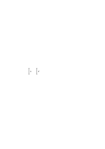

darin, daß a, in die allgemeine Disposition eingesetzt, a' ergibt. Die allgemeine Disposition wird dadurch beschrieben, daß ich sage: wenn a doppelt so lange gewesen _wäre_, _hätte_ ich auch a' doppelt so lange gemacht. (etc.)

### [128\[4\]](https://cdn.wittgensteinnachlass.com/2000px/webp/Ms-110/128.webp)

Wenn man fragt: „Warum muß denn die Sprache Grammatik haben? das muß doch mit ihrer Anwendung zu tun haben”. So müßte ich sagen: Ja, denn wie sollte ich sonst etwas beschreiben, einer Tatsache einen Satz zuordnen, wenn ich nicht in einem bestimmten System das passende wählen könnte, oder – was auf dasselbe hinauskommt – _nach_ einem bestimmten System wählen könnte. Sonst wäre ja die Zuordnung willkürlich. Und umgekehrt, wie sollte ich mich nach einem Zeichen richten, ihm eine Bewegung, Handlung, zuordnen, wenn nicht nach einem System.

### [128\[5\]](https://cdn.wittgensteinnachlass.com/2000px/webp/Ms-110/128.webp),[129\[1\]](https://cdn.wittgensteinnachlass.com/2000px/webp/Ms-110/129.webp)

Wenn ich mich mit der Bewegung des Punktes P von A nach B

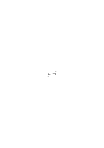

nach dem Pfeil

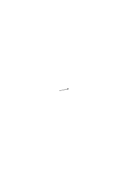

richte so ist das nur dadurch beschrieben, daß ich das System von Pfeilen beschreibe, dem dieser angehört. – Ich könnte nun wohl sagen: Ist das genug? muß ich nicht auch die Regel angeben nach der die Übersetzung geschieht, z.B. hier, daß ich mich parallel zum Pfeil bewegen muß? Aber diese Übersetzungsregel kann ich mir in Gestalt etwa des Zeichens „∣∣” (im Gegensatz etwa zu „∣ –”) dem Pfeile zugesetzt denken; aber dann würde das Zeichen „↗∣∣” auf keiner anderen Stufe stehen wie „↗” & ich könnte doch jetzt nur das System beschreiben dem dieses Zeichen angehört, wenn ich nicht ad infinitum, _also erfolglos_, weitere Zeichen zu dem obigen setzen will.

### [129\[2\]](https://cdn.wittgensteinnachlass.com/2000px/webp/Ms-110/129.webp)

Du sagst hier, daß, was geschieht, wenn ich mich nach einem Zeichen richte, nicht damit beschrieben ist, daß das Zeichen & meine Handlung beschrieben werden; sondern, daß _dazu_ auch noch die Grammatik des Zeichens beschrieben werden muß. Was natürlich nicht dasselbe heißt, wie, daß, der sich nach dem Zeichen Richtende sich des Ausdrucks der grammatischen Regeln bewußt ist. Wohl aber, daß einem andern Ausdruck auch ein anderer Vorgang des Nachbildens entspricht.

### [129\[3\]](https://cdn.wittgensteinnachlass.com/2000px/webp/Ms-110/129.webp)

Das Wort „in Übereinstimmung mit” (dem Pfeil, z.B.) hat keinen Sinn, wenn es sich nicht auf ein System bezieht, dem der Pfeil angehört.

### [129\[4\]](https://cdn.wittgensteinnachlass.com/2000px/webp/Ms-110/129.webp),[130\[1\]](https://cdn.wittgensteinnachlass.com/2000px/webp/Ms-110/130.webp)

02.03.1931

Ein Zeichen wirkt nicht durch sein suggestives Aussehen, sondern durch das System dem es angehört.

### [130\[2\]](https://cdn.wittgensteinnachlass.com/2000px/webp/Ms-110/130.webp)

03.03.1931

Denken wir uns daß das Schachspiel nicht als Brettspiel erfunden worden wäre sondern als ein Spiel das mit Ziffern & Buchstaben auf Papier zu spielen ist & so daß sich niemand dabei ein Quadrat mit 64 Feldern etc. vorgestellt hätte. Nun aber hätte jemand die Entdeckung gemacht, daß dieses Spiel ganz einem entspricht das man auf einem Brett in der & der Weise spielen könnte. Diese Erfindung wäre eine große Erleichterung des Spiels gewesen (Leute denen es früher zu schwer gewesen wäre könnten es nun spielen). Aber es ist klar daß diese neue Illustration der Spielregeln nur ein neuer leichter übersehbarer Symbolismus wäre der übrigens mit dem geschriebenen auf gleicher Stufe stünde. Vergleiche nun damit das Gerede darüber daß die Physik heute nicht mehr mit mechanischen Modellen sondern „nur mit Symbolen” arbeitet.

### [130\[3\]](https://cdn.wittgensteinnachlass.com/2000px/webp/Ms-110/130.webp),[131\[1\]](https://cdn.wittgensteinnachlass.com/2000px/webp/Ms-110/131.webp)

Wenn man fragte: Aber wäre es nicht doch möglich von dem was beim Quadrieren von 5 in x² 55² geschieht Rechenschaft zu geben indem man nur sagt daß ich vom Zeichen x² beeinflußt unter ‚5” 5²’ geschrieben habe; so muß ich fragen: aber woher weiß ich, daß es auf den Einfluß des x² geschehen ist? Das ist doch nur eine Hypothese & eine die mich hier gar nicht interessieren kann. Dann kann ich also nur sagen daß x² dargestanden hat _und_ daß ich 5² unter die 5 geschrieben habe! Und nun ist es klar daß alles was ich erklären will gerade das „_daher_” ist.

### [131\[2\]](https://cdn.wittgensteinnachlass.com/2000px/webp/Ms-110/131.webp)

Und nur dieses Daher erklärt das System, & nur das System erklärt das Daher.

### [131\[3\]](https://cdn.wittgensteinnachlass.com/2000px/webp/Ms-110/131.webp)

Wir stoßen hier immer auf die peinliche Frage ob denn nicht das Anschreiben des 5² (z.B.) mehr oder weniger (oder ganz) automatisch erfolgt sein könne, & fühlen daß das der Fall sein mag & daß es uns gar nichts angeht. Daß wir hier auf ganz irrelevantem Boden sind, wo wir nicht hingehören.

### [131\[4\]](https://cdn.wittgensteinnachlass.com/2000px/webp/Ms-110/131.webp)

Wir möchten nämlich sagen: Soweit das Hinschreiben automatisch erfolgt geht es uns nichts an & es hat keine Deutung eines Zeichens stattgefunden. – Erst wenn ich das was ich hinschreibe, durch ein Zeichen rechtfertige, liegt in dieser Rechtfertigung der Hinweis auf das, was in den Regeln der Grammatik ausgedrückt ist.

### [131\[5\]](https://cdn.wittgensteinnachlass.com/2000px/webp/Ms-110/131.webp)

Das heißt: Wenn immer ich ξ schreibe _weil_ hier η steht setzt dieses Weil eine Regel voraus.

### [131\[6\]](https://cdn.wittgensteinnachlass.com/2000px/webp/Ms-110/131.webp)

Ich kann doch am Schluß nicht mehr sagen als jeder weiß.

### [131\[7\]](https://cdn.wittgensteinnachlass.com/2000px/webp/Ms-110/131.webp),[132\[1\]](https://cdn.wittgensteinnachlass.com/2000px/webp/Ms-110/132.webp)

Ich kann doch nur, auf das aufmerksam machen, was jeder weiß, d.h. sofort als wahr zugibt. (Das Sokratische Erinnern an die Wahrheit.)

### [132\[2\]](https://cdn.wittgensteinnachlass.com/2000px/webp/Ms-110/132.webp)

„Ich schreibe ‚5²’, weil hier ‚x²’ steht”. Was aber, wenn ich sagte: „Ich schreibe ‚+’, weil hier ‚σ’ steht”? Man würde fragen: Schreibst Du denn überall ‚+’ wo ‚<math display="inline"><mtext>σ</mtext></math>’ steht? D.h. man würde nach einer allgemeinen Regel fragen. Und das ‚weil’ im letzten Satz hätte sonst keinen Sinn.

### [132\[3\]](https://cdn.wittgensteinnachlass.com/2000px/webp/Ms-110/132.webp)

Ich meine also, das ‚weil’ (hier) bezieht sich auf eine allgemeine Regel, d.h., es muß sich immer durch eine allgemeine Regel ergänzen lassen.

### [132\[4\]](https://cdn.wittgensteinnachlass.com/2000px/webp/Ms-110/132.webp)

Gehen wir zum Uhrzeiger zurück: Gewiß stellen wir uns den Uhrzeiger nicht in verschiedenen Stellungen vor, wenn wir seine gegenwärtige Stellung ablesen (auch würde uns das nicht helfen). Und vielleicht, wenn wir sagen „es ist 5 Uhr, ich muß gehen” sagen wir dies & gehen automatisch. Aber ich hätte ja auch, wie der Betrunkene, auf die Streichholzschachtel sehen können & sagen „Donnerstag, da muß ich gehen”. Und soweit Ursache und Wirkung in Frage kommen, sehe ich zwischen den beiden Fällen keinen Unterschied.

### [132\[5\]](https://cdn.wittgensteinnachlass.com/2000px/webp/Ms-110/132.webp)

Kann ich aber einfach so sagen: Wo immer so ein ‚weil’ (‚deswegen’, etc.) steht, da _kann_ ich eine allgemeine Regel aussprechen, die den Vorgang beschreibt.

### [132\[6\]](https://cdn.wittgensteinnachlass.com/2000px/webp/Ms-110/132.webp),[133\[1\]](https://cdn.wittgensteinnachlass.com/2000px/webp/Ms-110/133.webp)

Wenn also Einer sagt „5 – da muß ich 5² schreiben”, so muß dazugeschrieben werden können: „weil ich jede Zahl die mir unterkommt quadrieren muß”, & zwar darf dieser Zusatz der Tatsache nichts hinzufügen.

### [133\[2\]](https://cdn.wittgensteinnachlass.com/2000px/webp/Ms-110/133.webp)

Der Pfeil allein zeigt nicht.

### [133\[3\]](https://cdn.wittgensteinnachlass.com/2000px/webp/Ms-110/133.webp)

Es kann keine Diskussion darüber geben, ob diese Regeln oder andere die richtigen für das Wort ‚nicht’ sind. Denn das Wort hat ohne diese Regeln noch keine Bedeutung & wenn wir die Regeln ändern, so hat es nun eine andere Bedeutung (oder keine) & wir können dann ebensogut auch das Wort ändern. Daher sind diese Regeln willkürlich, weil die Regeln erst das Zeichen machen.

### [133\[4\]](https://cdn.wittgensteinnachlass.com/2000px/webp/Ms-110/133.webp)

<math class="stacked" display="inline"><mfrac><mrow><mi>x</mi></mrow><mrow><mi>x</mi><mspace width="0.3em"/><mtext>‒</mtext><mspace width="0.3em"/><mn>1</mn></mrow></mfrac><mfrac linethickness="0"><mrow><mtext>←</mtext></mrow><mrow><mtext>↘</mtext></mrow></mfrac><mo>[</mo><mn>5</mn><mspace width="0.3em"/><mn>5</mn><mspace width="0.3em"/><mtext>4]</mtext></math> Ich habe die durch den Ausdruck <math class="stacked" display="inline"><mfrac><mrow><mi>x</mi></mrow><mrow><mi>x</mi><mspace width="0.3em"/><mtext>‒</mtext><mspace width="0.3em"/><mn>1</mn></mrow></mfrac></math> auf eine Weise erhalten. Diese Weise ist das Konstante in den Fällen <math class="stacked" display="inline"><mo>[</mo><mspace width="0.3em"/><mtext>x²]</mtext><mfrac linethickness="0"><mrow><mtext>←</mtext></mrow><mrow><mtext>↘</mtext></mrow></mfrac><mo>[</mo><mtext>525]</mtext><mo>,</mo><mo>[</mo><mspace width="0.3em"/><mi>x</mi><mspace width="0.3em"/><mo>+</mo><mspace width="0.3em"/><mtext>1]</mtext><mfrac linethickness="0"><mrow><mtext>←</mtext></mrow><mrow><mtext>↘</mtext></mrow></mfrac><mo>[</mo><mtext>56]</mtext><mo>,</mo></math> etc. ist also durch das System der Zeichen f(x) gegeben. Diese Weise kann dadurch ausgedrückt werden, daß ich sage: ich setze in den Ausdruck f(x) für x 5 ein (die Zahl ein, die mir gegeben wird). Bestimmt das nicht schon die Grammatik des Zeichens „<math class="stacked" display="inline"><mfrac><mrow><mi>x</mi></mrow><mrow><mi>x</mi><mspace width="0.3em"/><mtext>‒</mtext><mspace width="0.3em"/><mn>1</mn></mrow></mfrac></math>” etc.?

### [133\[5\]](https://cdn.wittgensteinnachlass.com/2000px/webp/Ms-110/133.webp)

Ich benütze das Zeichen „<math class="stacked" display="inline"><mfrac><mrow><mi>x</mi></mrow><mrow><mi>x</mi><mspace width="0.3em"/><mtext>‒</mtext><mspace width="0.3em"/><mn>1</mn></mrow></mfrac></math>” um von 5 zu <math class="stacked" display="inline"><mfrac><mrow><mn>5</mn></mrow><mrow><mn>4</mn></mrow></mfrac></math> zu gelangen.

### [133\[6\]](https://cdn.wittgensteinnachlass.com/2000px/webp/Ms-110/133.webp),[134\[1\]](https://cdn.wittgensteinnachlass.com/2000px/webp/Ms-110/134.webp)

Die Rechtfertigung, daß ich ‚<math class="stacked" display="inline"><mfrac><mrow><mn>5</mn></mrow><mrow><mn>4</mn></mrow></mfrac></math>’ schreibe, _weil_ da ‚<math class="stacked" display="inline"><mfrac><mrow><mi>x</mi></mrow><mrow><mi>x</mi><mspace width="0.3em"/><mtext>‒</mtext><mspace width="0.3em"/><mn>1</mn></mrow></mfrac></math>’ steht, sagt natürlich nichts andres, als: „ich habe <math class="stacked" display="inline"><mfrac><mrow><mn>5</mn></mrow><mrow><mn>4</mn></mrow></mfrac></math> aus <math class="stacked" display="inline"><mfrac><mrow><mi>x</mi></mrow><mrow><mi>x</mi><mspace width="0.3em"/><mtext>‒</mtext><mspace width="0.3em"/><mn>1</mn></mrow></mfrac></math> gewonnen”. Und hier kann man fragen: „wie?” & die Antwort muß eine Regel sein, die sich nicht nur auf das Zeichen ‚<math class="stacked" display="inline"><mfrac><mrow><mi>x</mi></mrow><mrow><mi>x</mi><mspace width="0.3em"/><mtext>‒</mtext><mspace width="0.3em"/><mn>1</mn></mrow></mfrac></math>’ bezieht, denn man brauchte dieses Zeichen nicht, wenn es allein stünde. Daß ein Zeichen mich _so_ leiten kann, setzt voraus, daß es mich auch anders hätte leiten können.

### [134\[2\]](https://cdn.wittgensteinnachlass.com/2000px/webp/Ms-110/134.webp)

04.03.1931

Das Beobachten dessen, wie die Sprache gebraucht wird liefert uns die Grammatik nicht, denn aus dieser Beobachtung könnte man z.B. schließen, daß das gleiche Wort in den Sätzen ‚die Rose _ist_ rot’ & ‚2 × 2 ist 4’ vorkommt & also die grammatischen Regeln dieses Vorkommen erlauben.

### [134\[3\]](https://cdn.wittgensteinnachlass.com/2000px/webp/Ms-110/134.webp)

Man muß wissen worauf im Zeichen man zu sehen hat. Etwa: auf welcher Ziffer der Zeiger steht, nicht darauf, wie lang er ist.

### [134\[4\]](https://cdn.wittgensteinnachlass.com/2000px/webp/Ms-110/134.webp)

„Geh in der Richtung in der der Zeiger zeigt”.

„Geh soviele Meter in der Sekunde als der Pfeil cm lang ist”.

„Mach so viele Schritte als ich Pfeile zeichne”.

„Zeichne diesen Pfeil nach.” Für jeden dieser Befehle kann der gleiche Pfeil stehen. – – –

### [134\[5\]](https://cdn.wittgensteinnachlass.com/2000px/webp/Ms-110/134.webp)

Ist es so: Den Befehl zum Motiv meiner Handlung nehmen heißt das Gleiche wie: während man handelt wissen, daß man damit den Befehl befolgt oder ihm entgegen handelt?

### [134\[6\]](https://cdn.wittgensteinnachlass.com/2000px/webp/Ms-110/134.webp),[135\[1\]](https://cdn.wittgensteinnachlass.com/2000px/webp/Ms-110/135.webp)

Es heißt offenbar etwas: „wissen, daß man den Befehl befolgt” & darin muß das enthalten sein, was in den grammatischen Regeln ausgedrückt ist.

### [135\[2\]](https://cdn.wittgensteinnachlass.com/2000px/webp/Ms-110/135.webp)

Was ich hier versuche ist, keine Hypothese über die Ingerenz der grammatischen Regeln zu machen, sondern nur zu sagen, was sicher ist.

### [135\[3\]](https://cdn.wittgensteinnachlass.com/2000px/webp/Ms-110/135.webp)

Es zeigt mir jemand zum ersten Mal eine Uhr & will daß ich mich nach ihr richte. Ich frage nun: worauf soll ich bei diesem Ding achten. Und er sagt: Auf die Stellung der Zeiger.

### [135\[4\]](https://cdn.wittgensteinnachlass.com/2000px/webp/Ms-110/135.webp)

Es kommt nicht darauf an, ob ich während meiner Handlung mir bewußt war, daß ich dem Befehl _gemäß_ handle. Aber wenn ich, auch nachträglich, die Handlung mit dem Befehl vergleiche, um sie etwa zu rechtfertigen, muß ich dabei den Befehl verstehen, d.h. dieses Vergleichen hängt vom grammatischen Raum ab, in dem der Befehl existiert der durch die grammatischen Regeln gegeben ist. Denn _dann_ muß ich den Pfeil verschieden verstehen jenachdem er verschieden erklärt wird.

### [135\[5\]](https://cdn.wittgensteinnachlass.com/2000px/webp/Ms-110/135.webp)

„Folge der Richtung des Pfeils” das gibt die ganze Grammatik des Pfeils. Das Wort ‚Richtung’ ist die Variable die den Raum darstellt.

### [135\[6\]](https://cdn.wittgensteinnachlass.com/2000px/webp/Ms-110/135.webp)

Die Grammatik beschreibt, wie die Zeichen verwendet werden. Aber nicht, wie sie einer Reihe von Beobachtungen zufolge verwendet werden, sondern die Verwendung in jedem einzelnen Fall.

### [136\[1\]](https://cdn.wittgensteinnachlass.com/2000px/webp/Ms-110/136.webp)

„Ich muß auf die Länge achten”, „ich muß auf die Richtung achten”, das heißt schon: auf diese Länge im Gegensatz zu anderen, etc.

### [136\[2\]](https://cdn.wittgensteinnachlass.com/2000px/webp/Ms-110/136.webp)

Kann man nun auch, ohne der Richtung des Pfeils zu folgen, auf seine Richtung _achten_? (Denn das heißt so viel wie: kann man verstehen ohne zu übersetzen?)

### [136\[3\]](https://cdn.wittgensteinnachlass.com/2000px/webp/Ms-110/136.webp)

„Folge dem Pfeil” hat gar keinen Sinn, wenn es nicht eine Abkürzung einer bestimmten Erklärung (von mehreren möglichen) ist.

### [136\[4\]](https://cdn.wittgensteinnachlass.com/2000px/webp/Ms-110/136.webp)

Und wenn ich nun das Zeichen ↗ irgendwie auffasse & mich danach richte so muß mir keine solche Erklärung gegenwärtig sein (und wäre sie es, so müßte ich sie ja selbst wieder irgendwie als Zeichen in einem System verstehen & sie würde mir also nichts helfen) aber das was ich tue wird durch eine solche Erklärung beschrieben, es _entspricht_ einer solchen Erklärung. Die aber, da sie selbst ein Zeichen ist mir nicht das Wesen des Zeichens aufbauen helfen kann.

### [136\[5\]](https://cdn.wittgensteinnachlass.com/2000px/webp/Ms-110/136.webp),[137\[1\]](https://cdn.wittgensteinnachlass.com/2000px/webp/Ms-110/137.webp)

05.03.1931

Zeitliches Verhältnis des Befehls „geh zur Tür hinaus” & der Handlung, die ihn befolgt. Denken wir uns den Befehl durch ein Trompetensignal gegeben. Und den Unterschied zwischen dem Befolgen des Befehls „geh zur Tür hinaus” & eines Befehls, der mir etwa jeden Schritt zur Tür vorzeichnet. Offenbar ist der obere Befehl einem Element des andern analog.

### [137\[2\]](https://cdn.wittgensteinnachlass.com/2000px/webp/Ms-110/137.webp)

„Da steht das Wort ‚blau’, also muß ich diese Farbe nehmen”.

### [137\[3\]](https://cdn.wittgensteinnachlass.com/2000px/webp/Ms-110/137.webp)

Käme das Wort ‚blau’ in einer anderen Sprache vor & hieße dort, was auf Deutsch ‚rot’ heißt, so würde ich mich in meinen Handlungen auch danach zu richten haben, ob der Befehl deutsch oder in der andern Sprache gegeben wurde.

### [137\[4\]](https://cdn.wittgensteinnachlass.com/2000px/webp/Ms-110/137.webp)

Wir nehmen das Signal zum Motiv unserer Handlung.

### [137\[5\]](https://cdn.wittgensteinnachlass.com/2000px/webp/Ms-110/137.webp)

<math class="stacked" display="inline"><mo>[</mo><mtext>y]</mtext><mfrac linethickness="0"><mrow><mtext>←</mtext></mrow><mrow><mtext>↘</mtext></mrow></mfrac><mo>[</mo><mtext>525]</mtext></math> Warum schreibst Du 25? – Weil dort ‚y’ steht. – Ja ist das das Signal für 25? – Nein, aber ich habe ‚25’ geschrieben, weil dort ‚y’ steht. – Woher weißt Du dann, daß Du es deswegen geschrieben hast?

### [137\[6\]](https://cdn.wittgensteinnachlass.com/2000px/webp/Ms-110/137.webp)

Denken wir an die Verifikation von Sätzen (nicht die Befolgung von Befehlen). Denn die Rechtfertigung nach der Befolgung ist ja nur eine Verifikation wie jede andre. Aber: ich habe den Befehl p befolgt heißt nichts andres als, der Befehl war p und ich habe p getan.

### [137\[7\]](https://cdn.wittgensteinnachlass.com/2000px/webp/Ms-110/137.webp),[138\[1\]](https://cdn.wittgensteinnachlass.com/2000px/webp/Ms-110/138.webp)

Was heißt es aber: Ich geh zur Tür _weil_ der Befehl gelautet hat „geh zur Tür”? Und wie vergleicht sich dieser Satz mit: ich geh zur Tür obwohl der Befehl gelautet hat „geh zur Tür”. Oder: Ich geh zur Tür aber nicht weil der Befehl lautete „geh zur Tür, sondern …” Oder: ich geh _nicht_ zur Tür weil der Befehl gelautet hat „geh zur Tür”.

### [138\[2\]](https://cdn.wittgensteinnachlass.com/2000px/webp/Ms-110/138.webp)

Heißt „ich habe es getan, weil Du es befohlen hast” dasselbe wie: „Du hast es befohlen & ich habe es gewünscht”?

### [138\[3\]](https://cdn.wittgensteinnachlass.com/2000px/webp/Ms-110/138.webp)

06.03.1931

Nein: Ich sage „ich tue das weil A es mir befiehlt, nicht weil B es befiehlt”.

### [138\[4\]](https://cdn.wittgensteinnachlass.com/2000px/webp/Ms-110/138.webp)

Das ‚ich tue’ kann ich immer durch ein ‚ich wünsche’ übersetzen, weil ich nicht der Herr meiner Handlungen bin.

### [138\[5\]](https://cdn.wittgensteinnachlass.com/2000px/webp/Ms-110/138.webp)

„Ich wünsche, daß sein Wunsch erfüllt wird”. Damit meine ich nicht nur: ich wünsche, was er wünscht, sondern auch ich wünsche seine Befriedigung.

### [138\[6\]](https://cdn.wittgensteinnachlass.com/2000px/webp/Ms-110/138.webp)

07.03.1931

Die grammatischen Regeln haben Bedeutung wo sie gebraucht werden; und nur dort.

### [138\[7\]](https://cdn.wittgensteinnachlass.com/2000px/webp/Ms-110/138.webp)

„Wie kann das Wort ‚nicht’ verneinen?” Ja haben wir denn abgesehen von Verneinung durch ein Zeichen noch einen Begriff von der Verneinung? Doch es fällt uns dabei etwas ein wie: Hindernis, abwehrende Geste, Ausschluß. Aber das alles (ist) doch immer in einem Zeichen verkörpert.

### [138\[8\]](https://cdn.wittgensteinnachlass.com/2000px/webp/Ms-110/138.webp)

Wie soll ich mich nach der Uhr richten? Wie kann ich mich nach diesem Bild

_richten_? Wie nach jedem andern.

### [138\[9\]](https://cdn.wittgensteinnachlass.com/2000px/webp/Ms-110/138.webp)

Die grammatischen Regeln haben nur dort Bedeutung wo ich nicht anders kann als sie gebrauchen.

### [139\[1\]](https://cdn.wittgensteinnachlass.com/2000px/webp/Ms-110/139.webp)

Die Zeigerstellung

könnte mir natürlich auch als unabhängiges Signal erklärt werden, indem mir gesagt würde: „Sieh immer wieder auf die Uhr & wenn sie einmal so ausschaut, dann …”. Das wäre so wie: Wenn Du einmal ein Trompetensignal hörst, dann ….

### [139\[2\]](https://cdn.wittgensteinnachlass.com/2000px/webp/Ms-110/139.webp)

Das heißt übrigens, daß ich nicht von einer _allgemeinen_ Regel für ein Zeichen reden muß, denn die Regel kann lauten: „Wenn Du in einer halben Stunde läuten hörst, dann …” & nur für dieses Mal gelten. Eine Allgemeinheit gibt es freilich auch hier, da ich mich nach dem genauen Zeitpunkt des Signals zu richten habe. Aber auch das kann wegfallen, wenn es heißt: „Wenn es genau in einer halben Stunde läutet, dann komm; wenn es zu dieser Zeit nicht läutet, dann nicht.”

### [139\[3\]](https://cdn.wittgensteinnachlass.com/2000px/webp/Ms-110/139.webp)

Wenn einer fragt „wie kann das Wort ‚nicht’ verneinen”, so könnte man als Antwort fragen: Wie kann der Pfeil ↙ eine Zeit angeben (& er kann's wenn wir in ihm den Stundenzeiger einer Uhr sehen). Aber wie kann der Ausdruck „7 Uhr” eine (Zeit) angeben? Und das Zeichen ‚7’ (wie alle Ziffern von 0 bis 9) ist gerade so ein Signal, von dem man sich wundern kann, daß es eine Zahl bezeichnet.

### [140\[1\]](https://cdn.wittgensteinnachlass.com/2000px/webp/Ms-110/140.webp)

08.03.1931

„Ich muß jetzt gehn”. – „Warum?” – „Weil der Pfeil in dieser ↙ Richtung zeigt.” – „Zeigt Dir also der Pfeil die Richtung die Du zu gehen hast?” – „Nein, er zeigt, daß es 7 Uhr ist & um 7 Uhr muß ich gehen”.

### [140\[2\]](https://cdn.wittgensteinnachlass.com/2000px/webp/Ms-110/140.webp)

Und was ich sagen will, ist, daß ich ursprünglich, als ich sagte „ich muß jetzt gehen weil der Pfeil _so_ zeigt”, mich nach ihm in dem einen & nicht in dem andern Sinne gerichtet habe. Daß also diese Erklärung (daß der Pfeil mir die Zeit & nicht die Bewegungsrichtung anzeigt) eine Beschreibung des früheren Vorgangs ist & nicht eine neue Tatsache, die mit der ersten etwa kausal zusammenhinge.

### [140\[3\]](https://cdn.wittgensteinnachlass.com/2000px/webp/Ms-110/140.webp)

Könnte ich einfach so sagen: Die Bedeutung eines Wortes spielt eine Rolle in seiner Anwendung & die grammatischen Regeln beschreiben seine Bedeutung.

### [140\[4\]](https://cdn.wittgensteinnachlass.com/2000px/webp/Ms-110/140.webp)

Man könnte z.B. ausmachen, im Deutschen statt ‚nicht’ immer ‚not’ zu setzen & dafür statt ‚rot’ ‚nicht’. So daß das Wort ‚nicht’ in der Sprache bliebe. Und doch könnte man nun sagen daß ‚not’ _so_ gebraucht wird, wie früher ‚nicht’ & daß jetzt ‚nicht’ _anders_ gebraucht wird als früher.

### [140\[5\]](https://cdn.wittgensteinnachlass.com/2000px/webp/Ms-110/140.webp),[141\[1\]](https://cdn.wittgensteinnachlass.com/2000px/webp/Ms-110/141.webp)

Man sucht nie tief genug nach dem philosophisch Bedeutsamen, d.h. man steigt nicht tief genug in das Triviale herab.

### [141\[2\]](https://cdn.wittgensteinnachlass.com/2000px/webp/Ms-110/141.webp)

Man könnte auch so sagen: Das Wort muß im Satz seine Bedeutung _haben_. D.h. es muß sie mitführen. Und erst sie macht den Satz zum Satz.

### [141\[3\]](https://cdn.wittgensteinnachlass.com/2000px/webp/Ms-110/141.webp)

Es ist eine andere Versuchung anzunehmen daß beim Aussprechen des Wortes, wenn es mit Bedeutung gebraucht (gedacht) wird, ein sehr komplizierter Prozeß stattfinden müsse, der etwa solange dauert, wie das Aussprechen des Wortes & sehr rasch vor sich geht. Dies ist – natürlich – ebensowenig der Fall, wie, daß man beim Ablesen der Uhr in Gedanken irgendwie einen komplizierteren Vorgang ausführt als der durch die Zeigerstellung gegebene. So ein komplizierterer Vorgang würde uns ja doch nichts helfe. Warum sollte denn der Vorgang gerade komplizierter sein müssen?! Nein. Der Zeiger in diesem Raum gesehen, ist nicht komplizierter; & ‚nicht’ als Verneinung gesehen ist nicht komplizierter. Die Regeln beschreiben nicht einen komplizierten Vorgang der hinter den Zeichen stattfindet.

### [141\[4\]](https://cdn.wittgensteinnachlass.com/2000px/webp/Ms-110/141.webp),[142\[1\]](https://cdn.wittgensteinnachlass.com/2000px/webp/Ms-110/142.webp)

Ist nicht, was ich jetzt versuche, immer wieder, die grammatischen Regeln durch etwas anderes – eine andere Beschreibung – zu ersetzen. Denn wenn sie allein es tun können, dann ist es eben nur allein mit ihnen gesagt.

### [142\[2\]](https://cdn.wittgensteinnachlass.com/2000px/webp/Ms-110/142.webp)

Und ist alles, was ich sagen kann, damit gesagt: Man kann nicht von den grammatischen Regeln sagen, sie seien eine Einrichtung dazu, daß die Sprache ihren Zweck erfüllen könne. Wie man etwa sagt: wenn die Dampfmaschine keine Steuerung hätte so könnte der Kolben nicht hin & hergehen wie er soll. Als könne man sich eine Sprache auch ohne Grammatik denken.

### [142\[3\]](https://cdn.wittgensteinnachlass.com/2000px/webp/Ms-110/142.webp)

Denn wenn ich mich in meiner Handlung nach dem Pfeil richte, so kann ich mich in verschiedener Weise nach ihm richten. Das heißt, wie immer ich mich nach ihm richte, so kann ich dies (etwa nachträglich) als eine Weise im Gegensatz zu einer anderen beschreiben.

### [142\[4\]](https://cdn.wittgensteinnachlass.com/2000px/webp/Ms-110/142.webp),[143\[1\]](https://cdn.wittgensteinnachlass.com/2000px/webp/Ms-110/143.webp)

10.03.1931

Die grammatischen Regeln sind, wie sie nun einmal da sind, Regeln des Gebrauchs der Wörter. Übertreten wir sie, so können wir deswegen die Wörter dennoch mit Sinn gebrauchen. Wozu wären dann die grammatischen Regeln da? Um den Gebrauch der Sprache im ganzen gleichförmiger zu machen? (etwa aus ästhetischen Gründen?) Um den Gebrauch der Sprache als gesellschaftlicher Einrichtung zu ermöglichen? also wie eine Verkehrsordnung damit keine Kollision geschieht? (Aber was macht es uns, wenn eine entsteht?) Die Kollision die nicht geschehen darf, darf nicht entstehen können! D.h. ohne Grammatik ist es nicht eine schlechte Sprache, sondern keine Sprache.

### [143\[2\]](https://cdn.wittgensteinnachlass.com/2000px/webp/Ms-110/143.webp)

Aber die _Notwendigkeit_ der Grammatik kann wieder nicht ausgesprochen werden, sondern nur die Grammatik selbst (beschrieben werden). Sie ist eben nicht vergleichbar einer Verkehrsordnung.

### [143\[3\]](https://cdn.wittgensteinnachlass.com/2000px/webp/Ms-110/143.webp)

Anderseits muß man doch sagen, die Grammatik einer Sprache als _allgemein anerkannte Institution_ ist eine Verkehrsordnung. Denn daß man das Wort „Tisch” _immer_ in dieser Weise gebraucht ist nicht der Sprache als solcher wesentlich, sondern quasi nur eine praktische Einrichtung.

### [143\[4\]](https://cdn.wittgensteinnachlass.com/2000px/webp/Ms-110/143.webp)

Was aber nun der Sprache „als solcher” wesentlich ist, wie kann man das beschreiben? Es ist auch in jener Institution gegeben, nämlich eben darin, daß sie gebraucht werden _kann_. Auch darin daß ich die Grammatik ändern kann.

### [143\[5\]](https://cdn.wittgensteinnachlass.com/2000px/webp/Ms-110/143.webp)

Die Frage ist: Wenn ich ‚nicht’ gebrauche, in wiefern bediene ich mich der grammatischen Regeln?

### [143\[6\]](https://cdn.wittgensteinnachlass.com/2000px/webp/Ms-110/143.webp),[144\[1\]](https://cdn.wittgensteinnachlass.com/2000px/webp/Ms-110/144.webp)

Man könnte auch so fragen: Ist der ganze Satz nur ein unartikuliertes Zeichen in dem ich erst nachträglich Ähnlichkeiten mit anderen Sätzen erkenne?

### [144\[2\]](https://cdn.wittgensteinnachlass.com/2000px/webp/Ms-110/144.webp)

Wenn man einen Satz sagt, so ist es als produziere man einen Organismus. Und die Worte stehen nicht einzeln da, ja sie sind auch nicht etwa verschmolzen, sondern da sie nur Vordergründe sind, so haben sie allein überhaupt keine Berechtigung & das, dessen Vordergründe sie sind ist allein überhaupt nicht denkbar.

### [144\[3\]](https://cdn.wittgensteinnachlass.com/2000px/webp/Ms-110/144.webp)

Sie sind nicht zueinander, was Ziegel & Mörtel zueinander sind; sondern was Festigkeit, Ziegel & Mörtel. Das heißt, sie sind nicht durch Ketten miteinander verbunden sondern wie ein Glied mit dem nächsten.

### [144\[4\]](https://cdn.wittgensteinnachlass.com/2000px/webp/Ms-110/144.webp)

Ich müßte sagen können: Mache eine Sprache & sie muß eine Grammatik haben.

### [144\[5\]](https://cdn.wittgensteinnachlass.com/2000px/webp/Ms-110/144.webp)

11.03.1931

Was immer ich für eine Sprache konstruiere, sie muß sich in eine bestehende übersetzen lassen & dann wird die Grammatik der letzteren für die erstere gelten. Aber damit ist für mich jetzt noch nichts gesagt.

### [144\[6\]](https://cdn.wittgensteinnachlass.com/2000px/webp/Ms-110/144.webp),[145\[1\]](https://cdn.wittgensteinnachlass.com/2000px/webp/Ms-110/145.webp)

Angenommen ich gebrauche das gleiche Wort für rot & hoch. Ich könnte dann scheinbar die grammatischen Regeln für beide zusammenziehen & es wäre dann eben die logische Summe der Zusammenstellungen erlaubt. Denn es wäre nun, wenn wir etwa das Wort „hoch” für beide Fälle gebrauchen, erlaubt zu sagen, daß Blut hoch sei.

### [145\[2\]](https://cdn.wittgensteinnachlass.com/2000px/webp/Ms-110/145.webp)

Ja, man könnte unsere Frage in einer sehr elementaren Form stellen: Warum eine Sprache nicht mit bloß einem Wort möglich ist, da es ja doch vorkommt daß ein Wort (in einer Sprache) mehrere Bedeutungen hat (warum also nicht alle?)

### [145\[3\]](https://cdn.wittgensteinnachlass.com/2000px/webp/Ms-110/145.webp)

Gibt es so etwas wie eine komplette Grammatik, z.B., des Wortes ‚nicht’?

### [145\[4\]](https://cdn.wittgensteinnachlass.com/2000px/webp/Ms-110/145.webp)

13.03.1931

Das eine kann man sicher sagen, daß in dieser Sprache diese Zusammenstellung kein Satz ist. Und daß dadurch kein Sinn verloren geht. Und das sollte schon genug sein.

### [145\[5\]](https://cdn.wittgensteinnachlass.com/2000px/webp/Ms-110/145.webp)

Nun möchte ich sagen: Und die Worte bestimmen allein den Sinn des Satzes. Aber was heißt das eigentlich? Da doch die Worte außerhalb des Satzes keine Bedeutung haben. Ich möchte sagen: Um den Satz zu verstehn braucht es keiner weiteren Abmachung als die Abmachungen welche die Worte betreffen. Das heißt eben um den Satz zu verstehen lernen wir nur Worte verstehen. Aber wir lernen die Worte schon in Sätzen verstehen.

### [146\[1\]](https://cdn.wittgensteinnachlass.com/2000px/webp/Ms-110/146.webp)

Der Satz erklärt sich selbst.

### [146\[2\]](https://cdn.wittgensteinnachlass.com/2000px/webp/Ms-110/146.webp)

Die ‚Abmachung’ als Geschichte der Bedeutung eines Wortes hat für uns kein Interesse. Sie scheint mir aber in einem logischen Sinn in die Funktion eines Wortes einzutreten. Etwa so daß, wenn man ein Wort versteht, man diesem Verständnis immer eine Abmachung zu Grunde liegend denken kann.

### [146\[3\]](https://cdn.wittgensteinnachlass.com/2000px/webp/Ms-110/146.webp)

Alles was ich mit Recht über die Sprache sagen kann ist eben uninteressant.

### [146\[4\]](https://cdn.wittgensteinnachlass.com/2000px/webp/Ms-110/146.webp)

Das Wort ‚Teekanne’ hat Bedeutung, gewiß, im Gegensatz zum Worte Abrakadabra, nämlich in der deutschen Sprache. Aber wir könnten ihm natürlich auch eine Bedeutung geben das wäre ein Akt ganz analog dem wenn ich ein Täfelchen mit der Aufschrift ‚Teekanne’ an eine Teekanne hänge. Aber was habe ich hier anders als eine Teekanne mit einer Tafel auf der Striche gemalt sind? Also wieder nichts logisch interessantes. Die Festsetzung der Bedeutung eines Wortes kann nie (wesentlich) von anderer Art sein.

### [146\[5\]](https://cdn.wittgensteinnachlass.com/2000px/webp/Ms-110/146.webp)

17.03.1931

„Der Pfeil zeigt dorthin”: heißt das einfach er hat dort seine Spitze?

### [146\[6\]](https://cdn.wittgensteinnachlass.com/2000px/webp/Ms-110/146.webp),[147\[1\]](https://cdn.wittgensteinnachlass.com/2000px/webp/Ms-110/147.webp)

Hat es also keinen Sinn zu sagen der Pfeil

A

↑

B

ist so gemeint daß er auf B zeigt? Und das heißt natürlich etwas. Und zwar etwa: „Gib acht, wohin das Schwanzende des Pfeiles zeigt.”

### [147\[2\]](https://cdn.wittgensteinnachlass.com/2000px/webp/Ms-110/147.webp)

Man sagt auch: „_Maßgebend_ ist nur, wohin _dieses_ Ende des Pfeiles zeigt”.

### [147\[3\]](https://cdn.wittgensteinnachlass.com/2000px/webp/Ms-110/147.webp)

Ist alles damit ausgedrückt daß das Wort „sich nach … richten” nur mit einer Variablen gebraucht werden kann? Nämlich: „sich nach der _Richtung_ des Pfeiles richten oder nach seiner _Länge_ oder nach dem Winkel, den diese beiden Geraden einschließen etc.?

### [147\[4\]](https://cdn.wittgensteinnachlass.com/2000px/webp/Ms-110/147.webp)

03.05.1931

Ein gutes Bild: Der Mensch der in den Spiegel sieht um sich zwinkern zu sehen; & was er nun wirklich sieht. (Ungeeignete physikalische Theorien)

### [147\[5\]](https://cdn.wittgensteinnachlass.com/2000px/webp/Ms-110/147.webp)

Man könnte ja glauben, daß das ‚zeigen’ des Pfeils mit einer etwa vorgestellten Bewegung zusammenhängt. Daß man also den Pfeil quasi fliegen sieht. Und das kann tatsächlich der Fall sein. Aber das Symbol ist diese Bewegung, oder der Pfeil in Bewegung, nicht.

### [147\[6\]](https://cdn.wittgensteinnachlass.com/2000px/webp/Ms-110/147.webp)

Der Pfeil zeigt in _dieser_ Richtung, darum gehe ich _so_, wenn er anders zeigen würde etc.

### [147\[7\]](https://cdn.wittgensteinnachlass.com/2000px/webp/Ms-110/147.webp)

Ich folge ihm _wohin_ er geht.

### [147\[8\]](https://cdn.wittgensteinnachlass.com/2000px/webp/Ms-110/147.webp),[148\[1\]](https://cdn.wittgensteinnachlass.com/2000px/webp/Ms-110/148.webp)

Nicht die anderen _Lagen_ kommen in Betracht, sondern nur der Raum (die Möglichkeit jener Lagen). Aber dieser Raum kann doch unmöglich beschrieben werden: ich meine, nicht im Zeichen selbst.

### [148\[2\]](https://cdn.wittgensteinnachlass.com/2000px/webp/Ms-110/148.webp)

Es _kann_ eben nur in der Grammatik, außerhalb des Satzes, beschrieben werden.

### [148\[3\]](https://cdn.wittgensteinnachlass.com/2000px/webp/Ms-110/148.webp)

Wie spielt er aber dann bei der Verwendung des Zeichens eine Rolle? Beim Sehen des Zeichens kann er es nicht, denn, was erkannt wird, kann ich beschreiben & es muß in der Beschreibung wieder aufscheinen.

### [148\[4\]](https://cdn.wittgensteinnachlass.com/2000px/webp/Ms-110/148.webp)

Was nur nachher gesagt werden kann, kann nur nachher gesagt werden. D.h., wenn es von der Verneinung in der Grammatik gesagt werden kann, daß ~~p = p ist, so muß das eben alles sein – – –

### [148\[5\]](https://cdn.wittgensteinnachlass.com/2000px/webp/Ms-110/148.webp)

~~p = p ist ja nicht eine nachträgliche Beschreibung der Verneinung. Von der man fragen könnte, ob sie schon früher gestimmt hat. Das ist die Versuchung, es so anzusehen.

### [148\[6\]](https://cdn.wittgensteinnachlass.com/2000px/webp/Ms-110/148.webp),[149\[1\]](https://cdn.wittgensteinnachlass.com/2000px/webp/Ms-110/149.webp)

„Ich brauche das Wort ‚~’ so, daß ~³p = ~p”, „Ich meine ‚Drehung um 180˚’ in dem Sinne, daß 3 solche Drehungen dasselbe leisten, wie eine”

.

Wie verhält sich nun das Wesen einer halben Drehung zu dieser Regel? (Übrigens genau so, wie das Wesen der Verneinung zu jener.) Die Regel scheint wie ein Spiegelbild des Wesens in der Sprache. (Wie eine Definition)

### [149\[2\]](https://cdn.wittgensteinnachlass.com/2000px/webp/Ms-110/149.webp)

„Wenn Du _das_ damit meinst, dann gilt diese Regel” – wenn Du _was_ damit meinst? Nein, die Regel kann nur ein Ausdruck dessen sein, was gemeint ist.

### [149\[3\]](https://cdn.wittgensteinnachlass.com/2000px/webp/Ms-110/149.webp)

Ganz richtig: wie ich früher einmal bemerkt habe; ich lese die Regel von der Verneinung ab, wie einen Satz der Geometrie von einer Figur.

### [149\[4\]](https://cdn.wittgensteinnachlass.com/2000px/webp/Ms-110/149.webp)

Wenn ich Regeln geben will, dann drückt sich die Bedeutung der Zeichen in ihnen _so_ aus.

### [149\[5\]](https://cdn.wittgensteinnachlass.com/2000px/webp/Ms-110/149.webp)

Und wozu dient mir denn die Regel ~³p = ~p? Wie gebrauche ich sie denn? Dadurch, das ich mit ~³p dasselbe _meine_, wie mit ~p?

### [149\[6\]](https://cdn.wittgensteinnachlass.com/2000px/webp/Ms-110/149.webp)

Wie drückt sich denn im Gebrauch der Wörter aus, daß ich mit ~³p dasselbe meine wie mit ~p?

### [149\[7\]](https://cdn.wittgensteinnachlass.com/2000px/webp/Ms-110/149.webp)

Was heißt es wenn ich sage: „Ich schaue bei den 3 halben Drehungen bloß auf das Resultat, & das ist dasselbe, wie bei einer halben Drehung”?

### [149\[8\]](https://cdn.wittgensteinnachlass.com/2000px/webp/Ms-110/149.webp),[150\[1\]](https://cdn.wittgensteinnachlass.com/2000px/webp/Ms-110/150.webp)

Oder wenn ich sage: „Daß ~³p = ~p ist, zeigt mir nur was an dem Zeichen ‚~³p’ symbolisiert.”?

### [150\[2\]](https://cdn.wittgensteinnachlass.com/2000px/webp/Ms-110/150.webp)

Aber das klingt wieder so, als könnte ich dann das eigentliche Symbol aus allen gleichbedeutenden Zeichen herausheben & brauchte dann keine Grammatik mehr. Aber so ist es nicht.

### [150\[3\]](https://cdn.wittgensteinnachlass.com/2000px/webp/Ms-110/150.webp)

„Ich folge der Richtung des Pfeils ↗ nicht seiner Länge” [Ist hierin nicht schon alles ausgedrückt?]

### [150\[4\]](https://cdn.wittgensteinnachlass.com/2000px/webp/Ms-110/150.webp)

Ist es also so, daß in die Beschreibung des Phänomens des Folgens die Variable eintreten muß?

### [150\[5\]](https://cdn.wittgensteinnachlass.com/2000px/webp/Ms-110/150.webp)

Ich muß mit dem unmittelbar Gegebenen auskommen.

### [150\[6\]](https://cdn.wittgensteinnachlass.com/2000px/webp/Ms-110/150.webp)

„Ich richte mich nach dem Pfeil” muß heißen, daß meine Handlung durch ihn bestimmt ist.

### [150\[7\]](https://cdn.wittgensteinnachlass.com/2000px/webp/Ms-110/150.webp)

Und das heißt doch wieder, daß sie aus dem Pfeil ableitbar ist. Aber ableiten kann man nur aus einem allgemeinen Ausdruck.

### [150\[8\]](https://cdn.wittgensteinnachlass.com/2000px/webp/Ms-110/150.webp)

Alle Probleme verflüchtigen sich in der ursach- & wirkungslosen Welt der Vorstellung.

### [150\[9\]](https://cdn.wittgensteinnachlass.com/2000px/webp/Ms-110/150.webp)

Wir sind nicht im Reich der Erklärungen.

### [151\[1\]](https://cdn.wittgensteinnachlass.com/2000px/webp/Ms-110/151.webp)

Sich nach einem Zeichen richten, heißt, daß das Zeichen in eine variable Disposition eingesetzt, die Handlungsweise ergibt.

### [151\[2\]](https://cdn.wittgensteinnachlass.com/2000px/webp/Ms-110/151.webp)

Zeichen ist nur das, wonach wir uns richten.

### [151\[3\]](https://cdn.wittgensteinnachlass.com/2000px/webp/Ms-110/151.webp)

Das Zeichen ist der Wert einer Variablen.

### [151\[4\]](https://cdn.wittgensteinnachlass.com/2000px/webp/Ms-110/151.webp)

Jeder Satz sagt: es ist _so_ & nicht anders.

### [151\[5\]](https://cdn.wittgensteinnachlass.com/2000px/webp/Ms-110/151.webp)

Jede Erklärung hiervon scheint unmöglich: ich meine jede Beschreibung dieses Vorgangs.

### [151\[6\]](https://cdn.wittgensteinnachlass.com/2000px/webp/Ms-110/151.webp)

Lesen der Karte: Straßen, Flüsse, & andrerseits Jägerhaus, Wirtshaus, Kirche, etc.

### [151\[7\]](https://cdn.wittgensteinnachlass.com/2000px/webp/Ms-110/151.webp)

Wir finden in uns die Bedeutung eines Wortes vor, nicht anders, als wäre sie uns in einer Erklärungstafel (Legende) abc | def gegeben.

### [151\[8\]](https://cdn.wittgensteinnachlass.com/2000px/webp/Ms-110/151.webp)

Das Wort & seine Bedeutung, das nenne ich „Symbol”.

### [151\[9\]](https://cdn.wittgensteinnachlass.com/2000px/webp/Ms-110/151.webp)

„Die doppelte Negation gibt eine Bejahung” das klingt so wie: Kohle und Sauerstoff gibt Kohlensäure. Aber in Wirklichkeit _gibt_ die doppelte Negation nichts, sondern _ist_ etwas.

### [151\[10\]](https://cdn.wittgensteinnachlass.com/2000px/webp/Ms-110/151.webp),[152\[1\]](https://cdn.wittgensteinnachlass.com/2000px/webp/Ms-110/152.webp)

„Wer die Negation versteht, der weiß, daß die doppelte Negation … …”

### [152\[2\]](https://cdn.wittgensteinnachlass.com/2000px/webp/Ms-110/152.webp)

Es täuscht uns da etwas eine Tatsache vor.

### [152\[3\]](https://cdn.wittgensteinnachlass.com/2000px/webp/Ms-110/152.webp)

So als sähen wir ein Ergebnis _des logischen_ Prozesses. Während das Ergebnis nur das des physischen Prozesses ist.

### [152\[4\]](https://cdn.wittgensteinnachlass.com/2000px/webp/Ms-110/152.webp)

Jene Beweismethode der indischen Mathematik „Sieh die Figur an, dann siehst Du …” hängt damit zusammen.

### [152\[5\]](https://cdn.wittgensteinnachlass.com/2000px/webp/Ms-110/152.webp)

Die Beschreibung hat Sinn, die

diese Ordnung von Pfeilen beschreibt.

### [152\[6\]](https://cdn.wittgensteinnachlass.com/2000px/webp/Ms-110/152.webp)

Die Substitution ist auch ein Zug eines Spiels & es kommt darauf an, wie man sie _gebraucht_.

### [152\[7\]](https://cdn.wittgensteinnachlass.com/2000px/webp/Ms-110/152.webp)

Man kann eine Kreisfläche beschreiben, die durch Durchmesser in 8 kongruente Teile geteilt ist, aber es ist sinnlos das von einer elliptischen Fläche zu sagen. Und darin liegt, was die Geometrie in dieser Beziehung von der Kreis- & Ellipsenfläche aussagt.

### [152\[8\]](https://cdn.wittgensteinnachlass.com/2000px/webp/Ms-110/152.webp)

Die Grammatik beschreibt die Sprache als zeitliches Phänomen: Aber ohne Bedeutung, d.h., die Wichtigkeit, kann sie nur durch die Anwendung bekommen.

### [153\[1\]](https://cdn.wittgensteinnachlass.com/2000px/webp/Ms-110/153.webp)

Denke nur an's Schließen, das auch zeitlich vor sich geht.

### [153\[2\]](https://cdn.wittgensteinnachlass.com/2000px/webp/Ms-110/153.webp)

Das „dem Pfeile Folgen” muß auch ein Phänomen sein, denn was sollte es sonst sein.

### [153\[3\]](https://cdn.wittgensteinnachlass.com/2000px/webp/Ms-110/153.webp)

Auch das Kind _lernt_ nur eine Sprache vermittelst einer anderen.

### [153\[4\]](https://cdn.wittgensteinnachlass.com/2000px/webp/Ms-110/153.webp)

Es lernt die Wortsprache durch die Gebärdensprache. Aber das Verständnis dieser müssen die Erwachsenen bei ihm voraussetzen oder abwarten.

### [153\[5\]](https://cdn.wittgensteinnachlass.com/2000px/webp/Ms-110/153.webp)

Niemand denkt daran das Kind die Gebärdensprache zu lehren.

### [153\[6\]](https://cdn.wittgensteinnachlass.com/2000px/webp/Ms-110/153.webp)

Niemand könnte daran denken.

### [153\[7\]](https://cdn.wittgensteinnachlass.com/2000px/webp/Ms-110/153.webp)

↗, _also_ ⋰. Warum liegt hier der Ton auf einer Allgemeinheit, auf dem Einsetzen des Pfeiles in eine allgemeine Formel?

### [153\[8\]](https://cdn.wittgensteinnachlass.com/2000px/webp/Ms-110/153.webp)

Es gibt keine Relation zwischen 5, x², also 25.

### [153\[9\]](https://cdn.wittgensteinnachlass.com/2000px/webp/Ms-110/153.webp),[154\[1\]](https://cdn.wittgensteinnachlass.com/2000px/webp/Ms-110/154.webp)

Ich kollationiere etwa einen Linienzug nach einem andern & sage: ja, _es stimmt_. Was heißt das? In den beiden Linienzügen liegt das Stimmen natürlich nicht. Und überhaupt nie in zwei Tatsachen. Von keiner Tatsache kann man sagen, daß sie mit einer andern übereinstimmt (natürlich auch mit keiner psychischen). Es ist nicht vielleicht eine besondere Eigentümlichkeit gewisser seelischen Vorgänge, daß mit ihnen etwas übereinstimmen kann.

### [154\[2\]](https://cdn.wittgensteinnachlass.com/2000px/webp/Ms-110/154.webp)

Wie verwenden wir das Wort „es stimmt”?

### [154\[3\]](https://cdn.wittgensteinnachlass.com/2000px/webp/Ms-110/154.webp)

Was heißt das: Ich trachte diese Linie parallel jener anderen zu ziehen?

### [154\[4\]](https://cdn.wittgensteinnachlass.com/2000px/webp/Ms-110/154.webp)

(Wenn ich oben sage daß „eine Tatsache mit einer anderen nicht übereinstimmen könne”, so heißt das selbstverständlich, daß es keinen _Sinn_ hat so etwas zu sagen.)

### [154\[5\]](https://cdn.wittgensteinnachlass.com/2000px/webp/Ms-110/154.webp)

Ich kupple die Handlung mit der Vorlage.

### [154\[6\]](https://cdn.wittgensteinnachlass.com/2000px/webp/Ms-110/154.webp)

Inwiefern handeln die Regeln von diesem Wort (in diesem Satz)?

### [154\[7\]](https://cdn.wittgensteinnachlass.com/2000px/webp/Ms-110/154.webp)

Es ist klar, daß das Reden automatisch geschehen kann & uns dann nicht mehr interessiert als irgend eine Bewegung oder ein Geräusch.

### [154\[8\]](https://cdn.wittgensteinnachlass.com/2000px/webp/Ms-110/154.webp)

Ist es so: Die Sprache (das Reden) interessiert uns nur dann, wenn sie etwas portraitiert.

### [154\[9\]](https://cdn.wittgensteinnachlass.com/2000px/webp/Ms-110/154.webp)

Es muß sich ergeben, daß man nach der Wirkungsweise der Sprache nicht fragen kann.

### [154\[10\]](https://cdn.wittgensteinnachlass.com/2000px/webp/Ms-110/154.webp),[155\[1\]](https://cdn.wittgensteinnachlass.com/2000px/webp/Ms-110/155.webp)

Und ich meine das so: daß die Sprache am Ende doch nur Vorlage & Abbild ist.

### [155\[2\]](https://cdn.wittgensteinnachlass.com/2000px/webp/Ms-110/155.webp)

„Deutlicher kann ich diesen Befehl nicht machen.”

### [155\[3\]](https://cdn.wittgensteinnachlass.com/2000px/webp/Ms-110/155.webp)

Meine Anschauung könnte ich so ausdrücken, daß im Satz „geh dort hin” die Worte auch nur die gleiche Funktion haben, wie die Handbewegung.

### [155\[4\]](https://cdn.wittgensteinnachlass.com/2000px/webp/Ms-110/155.webp)

In welchem Sinne sagt man, man kennt die Bedeutung des Wortes A noch ehe man den Befehl in dem es vorkommt befolgt hat? Und inwiefern kann man sagen, man hat die Bedeutung durch die Befolgung des Befehls kennen gelernt? Können die beiden Bedeutungen mit einander in Widerspruch stehen?

### [155\[5\]](https://cdn.wittgensteinnachlass.com/2000px/webp/Ms-110/155.webp)

Das Fundamentale grammatisch ausgedrückt: Wie ist es mit dem Satz „man kann nicht zweimal durch den gleichen Fluß gehen”?

### [155\[6\]](https://cdn.wittgensteinnachlass.com/2000px/webp/Ms-110/155.webp)

Ich wünsche, einen Apfel zu bekommen. In welchem Sinne kann ich sagen, daß ich noch vor der Erfüllung des Wunsches die Bedeutung des Wortes Apfel kenne? Wie äußert sich denn die Kenntnis der Bedeutung? d.h. was versteht man denn unter ihr.

### [155\[7\]](https://cdn.wittgensteinnachlass.com/2000px/webp/Ms-110/155.webp),[156\[1\]](https://cdn.wittgensteinnachlass.com/2000px/webp/Ms-110/156.webp)

Offenbar wird das Verständnis des Wortes durch eine Worterklärung gegeben; welche nicht die Erfüllung des Wunsches ist.

### [156\[2\]](https://cdn.wittgensteinnachlass.com/2000px/webp/Ms-110/156.webp)

Übrigens Eines: Der Satz „ich kann ihn zeichnen, wenn Du mir einen Bleistift gibst”, [als Beweis des Verstehens] wenn er gewiß ist & nicht erst durch die Tat bewiesen wird, wird dann auch von einer Tatsache wahr gemacht, die von jener Tat ganz unabhängig ist, & der Satz ist dann auch richtig wenn die Zeichnung bei gegebener Gelegenheit _nicht_ ausgeführt wird. (Dadurch verliert aber dann jener Satz für uns an Bedeutung.)

### [156\[3\]](https://cdn.wittgensteinnachlass.com/2000px/webp/Ms-110/156.webp)

Jener Satz, wenn er gewiß ist & nicht ‚erst’ durch die Tat bewiesen wird, wird dann durch die Tat überhaupt nicht bewiesen & durch die entgegengesetzte wird nicht sein Gegenteil bewiesen d.h. _er_ ist von dieser Tat einfach unabhängig.

### [156\[4\]](https://cdn.wittgensteinnachlass.com/2000px/webp/Ms-110/156.webp)

Gibt es also für uns in der Sprache nicht Wesentliches & Unwesentliches? Hat also Heraklit nicht wenigstens eine _wesentliche_ Eigenschaft unserer Sprache hervorgehoben?

### [156\[5\]](https://cdn.wittgensteinnachlass.com/2000px/webp/Ms-110/156.webp),[157\[1\]](https://cdn.wittgensteinnachlass.com/2000px/webp/Ms-110/157.webp)

Denken wir uns den Standpunkt eines Forschers: er findet, daß in der Sprache der Erde ein Zeichen benützt wird, das nach diesen & diesen Regeln (etwa nach denen der Negation) gebraucht wird, & fragt sich: Wozu können sie das brauchen? Die Antwort wäre aber: Wenn immer ein Zeichen mit diesen Regeln zu gebrauchen ist.

### [157\[2\]](https://cdn.wittgensteinnachlass.com/2000px/webp/Ms-110/157.webp)

Die Sprache gewinnt _Bedeutung_ durch die Gelegenheit, bei der sie gebraucht wird. Wir verwenden die Sprache ja nicht zum Spaß.

### [157\[3\]](https://cdn.wittgensteinnachlass.com/2000px/webp/Ms-110/157.webp)

Wir können in der alten Ausdrucksweise sagen: das wesentliche am Wort ist seine Bedeutung.

### [157\[4\]](https://cdn.wittgensteinnachlass.com/2000px/webp/Ms-110/157.webp)

„_Der Träger des Namens_ lebt jetzt in Paris.”

### [157\[5\]](https://cdn.wittgensteinnachlass.com/2000px/webp/Ms-110/157.webp)

Das Wort _hat_ eine Bedeutung. Wie ist denn diese Bedeutung fixiert? Anders als durch die Worterklärungen?

### [157\[6\]](https://cdn.wittgensteinnachlass.com/2000px/webp/Ms-110/157.webp)

Ich könnte sagen: Wenn das Wort wirklich auf Etwas deutet, so gehört dieses mit zum Symbol.

### [157\[7\]](https://cdn.wittgensteinnachlass.com/2000px/webp/Ms-110/157.webp)

Es ist wirklich „the meaning of meaning” was wir untersuchen: Oder die Grammatik des Wortes „Bedeutung”.

### [157\[8\]](https://cdn.wittgensteinnachlass.com/2000px/webp/Ms-110/157.webp)

Wir sagen: das Wesentliche am Wort ist seine Bedeutung; wir können das Wort durch ein anderes ersetzen das die gleiche Bedeutung hat. Damit ist gleichsam ein Platz für das Wort fixiert & man kann ein Wort für das andere setzen, wenn man es an den gleichen Platz setzt.

### [157\[9\]](https://cdn.wittgensteinnachlass.com/2000px/webp/Ms-110/157.webp),[158\[1\]](https://cdn.wittgensteinnachlass.com/2000px/webp/Ms-110/158.webp)

Woher weiß ich das zwei Worte die gleiche Bedeutung haben? Doch entweder dadurch, daß es heißt A = B, oder daß sie beide auf die gleiche Art erklärt werden. Das heißt aber, daß sie beide dasselbe Zeichen ersetzen (A = C & B = C). Man könnte aber meinen, es gäbe eine Art der Erklärung (gleichsam durch Anwendung) die nicht die Ersetzung eines Zeichens durch ein anderes wäre! Wie wenn man etwa dem Kind die Negation beibringt, indem man es verhindert Gewisses zu tun. Veranlassen wir es dadurch nicht, Worten einen Sinn beizulegen, ohne daß wir sie durch ein anderes Zeichen ersetzen, also ohne diesen Sinn auf andere Weise auszudrücken. Veranlassen wir es nicht gleichsam, für sich etwas zu tun dem kein äußerer Ausdruck gegeben wird, oder wozu der äußere Ausdruck nur im Verhältnis einer Hindeutung eines Signals steht? Die Bedeutung ließe sich nicht aussprechen, sondern nur auf sie von ferne hinweisen. Aber welchen Sinn hat es dann überhaupt, wenn wir von dieser Bedeutung reden?

### [158\[2\]](https://cdn.wittgensteinnachlass.com/2000px/webp/Ms-110/158.webp)

Denken wir uns einen Zerstreuten der auf den Befehl „rechtsum” sich nach links gedreht hätte & nun, an die Stirne greifend, sagte „ach so – ‚rechts–um’!” & rechtsum machte.

### [158\[3\]](https://cdn.wittgensteinnachlass.com/2000px/webp/Ms-110/158.webp),[159\[1\]](https://cdn.wittgensteinnachlass.com/2000px/webp/Ms-110/159.webp)

„Ich gehe dahin, weil die Kante des Zimmers so läuft”. – „Was heißt das: ‚weil’?!”

### [159\[2\]](https://cdn.wittgensteinnachlass.com/2000px/webp/Ms-110/159.webp)

Ich stampfe mit dem Fuß, da kommt jemand ins Zimmer &, auf meine Frage ‚warum’, sagt er: „ich habe geglaubt, dieser Lärm heißt, ich solle herein kommen”.

### [159\[3\]](https://cdn.wittgensteinnachlass.com/2000px/webp/Ms-110/159.webp)

Welcher Art ist unsere Untersuchung? Untersuche ich die Fälle, die ich als Beispiele anführe auf ihre Wahrscheinlichkeit? oder Tatsächlichkeit? Nein, ich führe nur an was möglich ist, gebe also grammatische Beispiele.

### [159\[4\]](https://cdn.wittgensteinnachlass.com/2000px/webp/Ms-110/159.webp)

Die Untersuchung ob die Bedeutung eines Zeichens seine Wirkung ist, ist auch eine grammatische Untersuchung.

### [159\[5\]](https://cdn.wittgensteinnachlass.com/2000px/webp/Ms-110/159.webp)

Kann Erfahrung (oder Experiment) die Bedeutung eines Wortes bestimmen? Also hat das Experiment ergeben: „dies ist die Bedeutung des Wortes”. Aber hätten wir das nicht schon früher angeben können?

### [159\[6\]](https://cdn.wittgensteinnachlass.com/2000px/webp/Ms-110/159.webp)

Die interne Relation kann man nicht _betonen_, weil sie erst da ist, wenn die Ableitung schon vorüber ist.

### [159\[7\]](https://cdn.wittgensteinnachlass.com/2000px/webp/Ms-110/159.webp)

Die allgemeine Disposition kann nur gegeben sein, wie ein allgemeiner Ausdruck (variabler Ausdruck).

### [160\[1\]](https://cdn.wittgensteinnachlass.com/2000px/webp/Ms-110/160.webp)

Kann man sagen: nur insofern ist ↗ von ↗ abgeleitet, als man es dadurch rechtfertigen kann?

### [160\[2\]](https://cdn.wittgensteinnachlass.com/2000px/webp/Ms-110/160.webp)

Gewiß ich _rechtfertige_ meine Handlung mit dem Paradigma.

### [160\[3\]](https://cdn.wittgensteinnachlass.com/2000px/webp/Ms-110/160.webp)

Das Phänomen der Rechtfertigung x² | 33². Ich rechtfertige das Resultat 3² durch x². So schaut jede Rechtfertigung aus.

### [160\[4\]](https://cdn.wittgensteinnachlass.com/2000px/webp/Ms-110/160.webp)

In gewissem Sinn bringt uns das nicht weiter. Aber es kann uns ja nicht _weiter_, d.h. zu dem Metalogischen, bringen.

### [160\[6\]](https://cdn.wittgensteinnachlass.com/2000px/webp/Ms-110/160.webp)

Inwiefern kann man von dem, der auf das Wort „hinaus!” das Zimmer verläßt, sagen: er habe sich nach diesem Wort gerichtet?!

### [160\[7\]](https://cdn.wittgensteinnachlass.com/2000px/webp/Ms-110/160.webp)

Das Problem äußert sich auch in der Frage: Wie erweist sich ein Mißverständnis? Denn das ist dasselbe wie das Problem: Wie zeigt es sich daß ich richtig verstanden habe? Und das ist: Wie kann ich die Bedeutung erklären? Es fragt sich nun: Kann sich ein Mißverständnis darin äußern, daß, was der Eine bejaht, der Andere verneint?

### [160\[8\]](https://cdn.wittgensteinnachlass.com/2000px/webp/Ms-110/160.webp),[161\[1\]](https://cdn.wittgensteinnachlass.com/2000px/webp/Ms-110/161.webp)

Nein, denn dies ist, wie es ist, eine Meinungsverschiedenheit & kann als solche aufrecht erhalten werden. Bis wir _annehmen_ der Andere habe Recht ….

### [161\[2\]](https://cdn.wittgensteinnachlass.com/2000px/webp/Ms-110/161.webp)

Wenn ich also, um das Wort „lila” zu erklären, auf einen Fleck zeigend sage „dieser Fleck ist lila”, kann diese Erklärung dann auf zwei Arten funktionieren?: einerseits als Definition die den Fleck als Zeichen gebraucht & anderseits als Erläuterung? Und wie das letztere? Ich müßte annehmen daß der Andere die Wahrheit sagt & dasselbe sieht was ich sehe. Der Fall, der wirklich vorkommt ist der: A erzählt dem B in meiner Gegenwart daß ein bestimmter Gegenstand lila ist. Ich höre das, habe den Gegenstand auch gesehen & denke mir: „jetzt weiß ich doch was ‚lila’ heißt”. Das heißt ich habe aus jenen Sätzen eine Worterklärung gezogen. Ich könnte sagen: Wenn das was A dem B erzählt die Wahrheit ist, so muß das Wort ‚lila’ _diese_ Bedeutung haben. Ich kann diese Bedeutung also auch quasi hypothetisch annehmen & sagen: wenn ich das Wort _so_ verstehe, hat A recht.

### [161\[3\]](https://cdn.wittgensteinnachlass.com/2000px/webp/Ms-110/161.webp)

Man sagt: „ja, wenn das Wort _das_ bedeutet, so ist der Satz wahr”.

### [161\[4\]](https://cdn.wittgensteinnachlass.com/2000px/webp/Ms-110/161.webp)

Aber dieses „das” muß doch irgendwie ausgedrückt sein.

### [162\[1\]](https://cdn.wittgensteinnachlass.com/2000px/webp/Ms-110/162.webp)

Nehmen wir an, die Erklärung der Bedeutung war nur eine Andeutung: konnte man da nicht sagen: Ja, wenn diese Andeutung _so_ verstanden wird, dann gibt das Wort in dieser Verbindung einen wahren Satz etc. Aber dann muß nun dieses „so” ausgedrückt sein.

### [162\[2\]](https://cdn.wittgensteinnachlass.com/2000px/webp/Ms-110/162.webp)

Man könnte auch so fragen: Ist die Erklärung etwas Exaktes, oder muß sie nichts Exaktes sein?

### [162\[3\]](https://cdn.wittgensteinnachlass.com/2000px/webp/Ms-110/162.webp)

„In 5 Minuten wird hier ein schwarzer Fleck erscheinen”.

„In 5 Minuten wird hier ein schwarzer <math display="inline"><mtext>Ʉ</mtext></math> erscheinen”. „Verstehst Du das?”

### [162\[4\]](https://cdn.wittgensteinnachlass.com/2000px/webp/Ms-110/162.webp)

„Ein <math display="inline"><mtext>Ʉ</mtext></math> ist das:

”

das muß auch in bestimmter Weise gemeint sein. Das heißt die Zeichenerklärung muß selbst _so & so_ gemeint sein. Wie könnte man hier ein Mißverständnis aufdecken (Verifikation des Verständnisses).

### [162\[5\]](https://cdn.wittgensteinnachlass.com/2000px/webp/Ms-110/162.webp)

Ist wirklich das Charakteristische des Folgens (Geführtwerdens), daß es mit einer allgemeinen Regel operiert?

↗ dann also ⋰. Daß ein _Prinzip_ des Folgens vorhanden ist?

### [162\[6\]](https://cdn.wittgensteinnachlass.com/2000px/webp/Ms-110/162.webp)

Könnte man sagen: Wenn kein Mißverständnis festzustellen ist, dann ist auch kein Unterschied der Bedeutung.

### [162\[7\]](https://cdn.wittgensteinnachlass.com/2000px/webp/Ms-110/162.webp),[163\[1\]](https://cdn.wittgensteinnachlass.com/2000px/webp/Ms-110/163.webp)

Der Fleck

als Zeichen, statt des Wortes „Fleck” hat eben auch seine Grammatik & zwar eine andere als er als Zeichen – etwa – dieser besonderen Gestalt hat. Aber wie ist uns denn die gegenwärtig wenn wir die Zeichenerklärung geben?

### [163\[2\]](https://cdn.wittgensteinnachlass.com/2000px/webp/Ms-110/163.webp)

Nicht „wie kann ich es _so_ verstehen” ist dies Problem, sondern „wie kann ich es überhaupt in einer Weise, sozusagen, auf einmal verstehen”.

### [163\[3\]](https://cdn.wittgensteinnachlass.com/2000px/webp/Ms-110/163.webp)

So seltsam es klingt: die Worte ‚Linie’, ‚Fläche’, ‚Punkt’ sind _so_ verschieden wie eine Linie, eine Fläche & ein Punkt.

### [163\[4\]](https://cdn.wittgensteinnachlass.com/2000px/webp/Ms-110/163.webp)

„Ich habe etwas bestimmtes damit gemeint als ich sagte …”. – „Wann hast Du es gemeint & wie lange hat es gebraucht. Und hast Du bei jedem Wort etwas anderes gemeint oder während des ganzen Satzes dasselbe?” Man sieht klar: hier ist eine Unklarheit in dem Gebrauch des Wortes „meinen”.

### [163\[5\]](https://cdn.wittgensteinnachlass.com/2000px/webp/Ms-110/163.webp)

Übrigens komisch, daß wenn man bei jedem – sagen wir deutschen – Wort etwas meint, eine Zusammenstellung solcher Worte Unsinn sein kann!

### [163\[6\]](https://cdn.wittgensteinnachlass.com/2000px/webp/Ms-110/163.webp)

Wiedererkennen: „Diesen Mann habe ich gestern gesehen”. – „Woher weißt Du das?” – „Ich erinnere mich an sein Gesicht.” – „Woher weißt Du das?” Diese Frage ist nun sinnlos. Das Wiedererkennen des Menschen war hypothetisch – das Erinnern nicht. Aber als nicht-hypothetisch bürgt es auch nicht für etwas anderes sondern nur für sich selbst.

### [164\[1\]](https://cdn.wittgensteinnachlass.com/2000px/webp/Ms-110/164.webp)

Man könnte sagen: Die Bedeutung des Wortes „Tisch” gibt es nicht, nur die Verwendung. Aber auch das ist irreführend.

### [164\[2\]](https://cdn.wittgensteinnachlass.com/2000px/webp/Ms-110/164.webp)

Gibt mir die Erklärung des Wortes die Bedeutung, oder verhilft sie mir nur zur Bedeutung? So daß also diese Bedeutung in der Erklärung nicht niedergelegt wäre, sondern durch sie nur äußerlich bewirkt, wie die Krankheit durch eine Speise.

### [164\[3\]](https://cdn.wittgensteinnachlass.com/2000px/webp/Ms-110/164.webp)

Zu sagen, daß der Satz ein Bild sei, hebt gewisse Züge in der Grammatik des Wortes „Satz” hervor.

### [164\[4\]](https://cdn.wittgensteinnachlass.com/2000px/webp/Ms-110/164.webp)

Woher nehmen die alten philosophischen Probleme ihre Bedeutung?

### [164\[5\]](https://cdn.wittgensteinnachlass.com/2000px/webp/Ms-110/164.webp)

Der Satz der Identität z.B. schien eine fundamentale Bedeutung zu haben. Aber der Satz daß dieser „Satz” ein Unsinn ist, hat diese Bedeutung übernommen.

### [164\[6\]](https://cdn.wittgensteinnachlass.com/2000px/webp/Ms-110/164.webp)

Wie unterscheiden sich dann die Sprachregeln von denen des Benehmens?

### [164\[7\]](https://cdn.wittgensteinnachlass.com/2000px/webp/Ms-110/164.webp)

Wenn man kein Ziel angeben kann, das nicht erreicht würde, wenn diese Regeln anders wären.

### [164\[8\]](https://cdn.wittgensteinnachlass.com/2000px/webp/Ms-110/164.webp)

Bausteine die nach ihren Formen benannt wären – – –

### [164\[9\]](https://cdn.wittgensteinnachlass.com/2000px/webp/Ms-110/164.webp),[165\[1\]](https://cdn.wittgensteinnachlass.com/2000px/webp/Ms-110/165.webp)

Woher die Bedeutung der Sprache? Kann man denn sagen: Ohne Sprache könnten wir uns nicht miteinander verständigen. Nein, das ist ja nicht so wie: ohne Telephon könnten wir nicht von Amerika nach Europa reden. (Es sei denn, daß wir unter „Telephon” jede Vorrichtung verstehen welche etc. etc.)

### [165\[2\]](https://cdn.wittgensteinnachlass.com/2000px/webp/Ms-110/165.webp)

Wir können aber sagen: Ohne Sprache könnten wir die Menschen nicht beeinflussen. Oder nicht trösten. Oder nicht ohne eine Sprache Häuser & Maschinen bauen.

### [165\[3\]](https://cdn.wittgensteinnachlass.com/2000px/webp/Ms-110/165.webp)

Es ist auch richtig zu sagen, ohne den Gebrauch des Mundes oder der Hände können sich Menschen nicht verständigen.

### [165\[4\]](https://cdn.wittgensteinnachlass.com/2000px/webp/Ms-110/165.webp)

Das Paradox ist doch das, daß die willkürliche Regel eine Wichtigkeit für uns hat. Während sonst gerade das Willkürliche uns nicht interessiert (z.B. Spielregeln).

### [165\[5\]](https://cdn.wittgensteinnachlass.com/2000px/webp/Ms-110/165.webp)

Die Lösung kann nur kommen, wenn man den Widerstand der falschen Methode aufgibt.

### [165\[6\]](https://cdn.wittgensteinnachlass.com/2000px/webp/Ms-110/165.webp)

Das Wort von den grammatischen Regeln die willkürlich sind, muß ja auch irreführend sein. Was heißt es denn: „sie lassen sich nicht begründen”? Und was heißt es, zu sagen, die Regeln eines Spiels seien willkürlich, & welche Regeln sind es nicht?

### [165\[7\]](https://cdn.wittgensteinnachlass.com/2000px/webp/Ms-110/165.webp),[166\[1\]](https://cdn.wittgensteinnachlass.com/2000px/webp/Ms-110/166.webp)

Sie können nicht willkürlich in dem Sinne sein, in dem man dies von Regeln aussagt, die auch anders als willkürlich sein könnten.

### [166\[2\]](https://cdn.wittgensteinnachlass.com/2000px/webp/Ms-110/166.webp)

Man würde sagen: Die Regeln nach denen ein Dampfkessel bemessen wird, sind nicht willkürlich im Gegensatz zu denen der Farbe seines Anstrichs.

### [166\[3\]](https://cdn.wittgensteinnachlass.com/2000px/webp/Ms-110/166.webp)

In welchem Sinne kann ich sagen, der Satz sei ein Bild? Wenn ich darüber denke, möchte ich sagen: er muß ein Bild sein, damit er mir zeigen kann, was ich tun soll, damit ich mich nach ihm richten kann. Aber, ist die Antwort, dann willst Du eben bloß sagen, daß Du Dich nach dem Satz richtest in demselben Sinne in dem Du Dich nach einem Bild richtest.

### [166\[4\]](https://cdn.wittgensteinnachlass.com/2000px/webp/Ms-110/166.webp)

Ist jedes Bild ein Satz? Und was heißt es etwa zu sagen daß jedes als ein Satz gebraucht werden kann?

### [166\[5\]](https://cdn.wittgensteinnachlass.com/2000px/webp/Ms-110/166.webp)

Ich kann die Beschreibung des Gartens in ein gemaltes Bild, das Bild in eine Beschreibung übersetzen.

### [166\[6\]](https://cdn.wittgensteinnachlass.com/2000px/webp/Ms-110/166.webp)

Das Wort „viele”.

### [166\[7\]](https://cdn.wittgensteinnachlass.com/2000px/webp/Ms-110/166.webp)

Du brauchst ein Wort, aber es muß sich doch in dem Gebrauch dieses Wortes zeigen, was es bedeutet, denn wie soll es sich sonst zeigen?

### [166\[8\]](https://cdn.wittgensteinnachlass.com/2000px/webp/Ms-110/166.webp),[167\[1\]](https://cdn.wittgensteinnachlass.com/2000px/webp/Ms-110/167.webp)

„Was ein Wort bedeutet, kann man nicht sagen”.

### [167\[2\]](https://cdn.wittgensteinnachlass.com/2000px/webp/Ms-110/167.webp)

Ich kann die ganze Sprache zum voraus beschreiben; ja, in gewissem Sinne auch aussprechen.

### [167\[3\]](https://cdn.wittgensteinnachlass.com/2000px/webp/Ms-110/167.webp)

Kann ich mich nach einem roten Täfelchen im Satz besser richten, als nach dem Wort rot?

### [167\[4\]](https://cdn.wittgensteinnachlass.com/2000px/webp/Ms-110/167.webp)

„Ja, aber das Wort rot hat mir einmal mit Hilfe eines solchen Täfelchens erklärt werden müssen”. Vielleicht, aber das rote Täfelchen ist Dir jetzt eben nicht gegeben. Ja Du hast auch ganz vergessen wie Du eigentlich die Bedeutung des Wortes „rot” gelernt hast & Du gebrauchst es & es tut Dir dieselben Dienste wie das rote Täfelchen (ja bessere).

### [167\[5\]](https://cdn.wittgensteinnachlass.com/2000px/webp/Ms-110/167.webp)

Man sollte also meinen, daß man mit dem Wort ganz dasselbe & ebensogut meinen kann, wie mit dem Täfelchen.

### [167\[6\]](https://cdn.wittgensteinnachlass.com/2000px/webp/Ms-110/167.webp)

Damit ist aber nicht gesagt, daß nicht die Gebärdensprache die sich des roten Gegenstandes bedient uns menschlich natürlicher ist.

### [167\[7\]](https://cdn.wittgensteinnachlass.com/2000px/webp/Ms-110/167.webp)

Kann ich nicht mit „rot” dasselbe meinen, wie mit dem roten Täfelchen, & kann ich nicht mit dem roten Täfelchen auch etwas andres meinen, als was ich jetzt mit „rot” meine?!

### [168\[1\]](https://cdn.wittgensteinnachlass.com/2000px/webp/Ms-110/168.webp)

Wenn die Sprache kein Bild ist & macht uns doch klar, wie es sich in der Wirklichkeit verhält, so ruft sie also Bilder hervor (kausal) deren Bild sie nicht ist, die sie also nicht bestimmt.

### [168\[2\]](https://cdn.wittgensteinnachlass.com/2000px/webp/Ms-110/168.webp)

Nun dann nenne ich jene Bilder die eigentliche Sprache.

### [168\[3\]](https://cdn.wittgensteinnachlass.com/2000px/webp/Ms-110/168.webp)

Dann gibt es aber nicht prinzipiell Sinn & Unsinn unter unseren Zeichen. Denn die Sprache ist sozusagen nicht verantwortlich für das, was sie hervorbringt.

### [168\[4\]](https://cdn.wittgensteinnachlass.com/2000px/webp/Ms-110/168.webp)

Wie verhält es sich mit dem Blinden; kann ihm ein Teil der _Sprache_ nicht erklärt werden? Oder vielmehr, nicht _beschrieben_ werden?

### [168\[5\]](https://cdn.wittgensteinnachlass.com/2000px/webp/Ms-110/168.webp)

Wenn das Wort ‚rot’ ebensogut ist, wie das rote Täfelchen, so sollte man glauben der Blinde könne die Sprache ebenso wohl lernen wie ein Sehender.

### [168\[6\]](https://cdn.wittgensteinnachlass.com/2000px/webp/Ms-110/168.webp)

Könnte ich denn nicht z.B. annehmen daß er etwas Rotes sieht, wenn ich ihm auf den Kopf schlage?

### [168\[7\]](https://cdn.wittgensteinnachlass.com/2000px/webp/Ms-110/168.webp),[169\[1\]](https://cdn.wittgensteinnachlass.com/2000px/webp/Ms-110/169.webp)

Das angenommen, so ist er doch für das praktische Leben blind. D.h. er reagiert nicht wie der normale Mensch. Wenn aber jemand mit den Augen blind wäre, dagegen sich so benähme daß wir sagen müßten, er sieht mit den Handflächen (dieses Benehmen ist leicht auszumalen), so würden wir ihn als Sehenden behandeln & auch die Erklärung des Wortes ‚rot’ mit dem Täfelchen würden wir hier für möglich halten.

### [169\[2\]](https://cdn.wittgensteinnachlass.com/2000px/webp/Ms-110/169.webp)

Nehmen wir aber an, _ich_ wäre blind. Aber was hilft das? Ich kann natürlich annehmen, daß ich mit den Augen nicht mehr sehe. Aber hier bin ich im Reiche der Tatsachen (nicht der Grammatik).

### [169\[3\]](https://cdn.wittgensteinnachlass.com/2000px/webp/Ms-110/169.webp)

Oder muß ich nicht jetzt sagen: Die Gebärdensprache gibt es für den Blinden nicht & sie ist ein wesentlicher Bestandteil unserer Sprache? Nein denn es kann nur heißen daß ich durch meine Gebärden nicht bewirke daß er Gebärden sieht. Vielleicht aber ginge es auf ganz andre Weise.

### [169\[4\]](https://cdn.wittgensteinnachlass.com/2000px/webp/Ms-110/169.webp),[170\[1\]](https://cdn.wittgensteinnachlass.com/2000px/webp/Ms-110/170.webp)

Ist der Blindgeborne in einem wesentlich andern Fall als der Erblindete? Ich kann mir doch vorstellen, daß auch der Blindgeborne ein visuelles Innenleben hat, & wenn einer dazu eine Erklärung verlangt, so will ich sagen, er habe die Eindrücke geerbt. (Natürlich ist das ganz gleichgültig). Nur ist er trotz dieser Annahme für alle praktischen Zwecke ein Blinder. Und ich will damit nur zeigen, daß es sich hier nicht um einen Unterschied der Grammatik, also des Wesentlichen der Welt, handelt, sondern um Tatsachen.

### [170\[2\]](https://cdn.wittgensteinnachlass.com/2000px/webp/Ms-110/170.webp)

_Ich_ könnte dem Blinden die hinweisende Erklärung „das ist rot” nicht geben. Aber in seiner Phantasie könnte er sie sich geben. Aber das würde für praktische Zwecke keinen Unterschied machen.

### [170\[3\]](https://cdn.wittgensteinnachlass.com/2000px/webp/Ms-110/170.webp)

Wir bezeichnen ja in der Geometrie auch sowohl Linien als auch Punkte, wie Flächen & Körper mit Buchstaben.

### [170\[4\]](https://cdn.wittgensteinnachlass.com/2000px/webp/Ms-110/170.webp)

Was heißt es: Ich kann mir vorstellen daß in 5 Minuten ein roter Kreis an dieser Wand erscheinen wird.

### [170\[5\]](https://cdn.wittgensteinnachlass.com/2000px/webp/Ms-110/170.webp)

Daß das Wort nur im Satzverband Bedeutung hat, heißt dasselbe wie, daß Wörter von denen wir sagen, sie haben in unserer Sprache Bedeutung in gewissen Zusammenstellungen _keinen_ Sinn ergeben. D.h. nichts weniger Unsinniges als eine beliebige Zusammenstellung von Lautreihen von denen wir nicht sagen sie hätten Bedeutung.

### [170\[6\]](https://cdn.wittgensteinnachlass.com/2000px/webp/Ms-110/170.webp)

Kann man von einem Verstehen reden, für das es kein exaktes Kriterium gibt?

### [170\[7\]](https://cdn.wittgensteinnachlass.com/2000px/webp/Ms-110/170.webp),[171\[1\]](https://cdn.wittgensteinnachlass.com/2000px/webp/Ms-110/171.webp)

Oder von einer Unterscheidung des Verstehens, oder der Bedeutung, für welche es kein solches Kriterium gibt?

### [171\[2\]](https://cdn.wittgensteinnachlass.com/2000px/webp/Ms-110/171.webp)

Das heißt von einem Unterschied der Bedeutung, der nicht in dem Unterschied zweier Erklärungen gegeben ist? Das heißt aber: nicht endlich in dem Unterschied zweier Zeichen.

### [171\[3\]](https://cdn.wittgensteinnachlass.com/2000px/webp/Ms-110/171.webp)

Oder, was noch sonderbarer wäre: Gibt es _einen_ Unterschied der Bedeutung, der sich erklären läßt & einen, der in einer Erklärung nicht zu Tage tritt?

### [171\[4\]](https://cdn.wittgensteinnachlass.com/2000px/webp/Ms-110/171.webp)

Erfahrung ist nicht etwas, das man durch Bestimmungen von einem Andren abgrenzen kann, was nicht Erfahrung ist; sondern eine logische Form.

### [171\[5\]](https://cdn.wittgensteinnachlass.com/2000px/webp/Ms-110/171.webp)

Wenn man sich die Namengebung durch Etikettierung der Gegenstände denkt, so könnte man eine Farbe nicht in demselben Sinne etikettieren (ihr ein Täfelchen anhängen) wie (etwa) einem Menschen oder der Kreisform.

### [171\[6\]](https://cdn.wittgensteinnachlass.com/2000px/webp/Ms-110/171.webp)

Wenn mir bei den Worten „roter Kreis” die Vorstellung eines roten Kreises vorschwebt: wie verhalten sich die Worte zu dieser Vorstellung?

### [171\[7\]](https://cdn.wittgensteinnachlass.com/2000px/webp/Ms-110/171.webp)

Die Vorstellung, die durch ein Wort erweckt wird, dient im Gedanken nur wieder als Zeichen.

### [172\[1\]](https://cdn.wittgensteinnachlass.com/2000px/webp/Ms-110/172.webp)

Ich kann doch offenbar eine Erwartung einmal in den Worten „ich erwarte einen roten Kreis” ein andermal statt der letzten Worte durch das farbige Bild eines roten Kreises ausdrücken. Aber in diesem Ausdruck entsprechen den beiden Wörtern „rot”& „Kreis” nicht zwei Dinge. Also ist der Ausdruck der zweiten Sprache von _ganz anderer Art_.

### [172\[2\]](https://cdn.wittgensteinnachlass.com/2000px/webp/Ms-110/172.webp)

Zeigt das nicht, daß die Erklärungen „das ist rot”, „das ist ein Kreis” noch nicht alles sind, sondern daß es eine solche Erklärung gibt: „das ist ein roter Kreis”.

### [172\[3\]](https://cdn.wittgensteinnachlass.com/2000px/webp/Ms-110/172.webp)

Es gäbe außer dieser auch eine Sprache, in der roter Kreis durch Nebeneinanderstellen eines Kreises & eines roten Flecks ausgedrückt würde (so wie man etwa 3 Menschen & 3 Bäume mit

,

,

aber auch mit ∣∣∣

,

∣∣∣

bezeichnen könnte.)

### [172\[4\]](https://cdn.wittgensteinnachlass.com/2000px/webp/Ms-110/172.webp)

Wenn ich nun auch zwei Zeichen bei mir habe, den Ausdruck „roter Kreis” & das farbige Bild, oder die Vorstellung, des roten Kreises, so wäre doch die Frage: Wie ist denn dann das eine Wort der Farbe, das andere der Form zugeordnet? Denn man scheint sagen zu können, das eine Wort lenke die Aufmerksamkeit auf die Farbe, das andere auf die Form. Aber was heißt das? Wie kann man diese Wörter in dieses Bild übersetzen?

### [173\[1\]](https://cdn.wittgensteinnachlass.com/2000px/webp/Ms-110/173.webp)

Oder auch: Wenn mir das Wort ‚rot’ eine Farbe ins Gedächtnis ruft, so muß sie doch mit einer Form verbunden sein, wie kann ich denn dann von der Form abstrahieren?

### [173\[2\]](https://cdn.wittgensteinnachlass.com/2000px/webp/Ms-110/173.webp)

Die wichtige Frage ist dabei nie: wie weiß er wovon er abstrahieren soll? sondern: wie ist das überhaupt möglich? oder: was heißt es?

### [173\[3\]](https://cdn.wittgensteinnachlass.com/2000px/webp/Ms-110/173.webp)

Vielleicht wird es klarer, wenn man _die_ beiden Sprachen vergleicht, in deren einer ein rotes Täfelchen & eines mit einem Kreis (etwa einem schwarzen auf weißem Grund) die Worte „roter Kreis” ersetzen; & in der andren statt dessen ein roter Kreis gemalt wird. Wie geht denn hier die Übersetzung vor sich? Er schaut etwa zuerst auf das rote Täfelchen & wählt einen roten Stift, dann auf den Kreis, & macht nun mit diesem Stift einen Kreis. Es würde etwa zuerst gelernt daß das erste Täfelchen immer die Wahl des Bleistiftes bestimmt, das zweite, was wir mit ihm zeichnen sollen. Die beiden Täfelchen gehören also verschiedenen Wortarten an (etwa Hauptwort und Tätigkeitswort). In der zweiten Sprache aber gäbe es nichts, was man hier zwei Wörter nennen könnte.

### [173\[4\]](https://cdn.wittgensteinnachlass.com/2000px/webp/Ms-110/173.webp)

Der Befehl sei: „Stelle Dir einen roten Kreis vor”. Und ich tue es: Wie konnte ich den Worten auf diese Weise folgen?

### [174\[1\]](https://cdn.wittgensteinnachlass.com/2000px/webp/Ms-110/174.webp)

Das ist doch ein Zeichen dafür, daß wir den Worten auch ohne Vorstellungen gehorchen können.

### [174\[2\]](https://cdn.wittgensteinnachlass.com/2000px/webp/Ms-110/174.webp)

Unsere größte Schwierigkeit ist, die Welt zu nehmen, wie sie ist.

### [174\[3\]](https://cdn.wittgensteinnachlass.com/2000px/webp/Ms-110/174.webp)

Wie kann ich es _rechtfertigen_, daß ich mir auf diese Worte hin diese Vorstellung mache?

### [174\[4\]](https://cdn.wittgensteinnachlass.com/2000px/webp/Ms-110/174.webp)

Oder: Wo endet die Rechtfertigung? Denn wo sie endet, verlassen auch wir die Betrachtung.

### [174\[5\]](https://cdn.wittgensteinnachlass.com/2000px/webp/Ms-110/174.webp)

Der Befehl lautet „schreibe ein großes a” & ich schreibe: A ‒ ‒

### [174\[6\]](https://cdn.wittgensteinnachlass.com/2000px/webp/Ms-110/174.webp)

Nicht daß ich A schreibe ist die Tatsache, die uns interessiert; ich hätte ja (durch einen Lapsus) auch B schreiben können; aber daß ich das A nun als großes a anerkenne. Aber besteht diese Anerkennung nicht nur darin, daß ich, was ich getan habe mit dem Satz beschreibe: „ich habe ein großes a geschrieben”?

### [174\[7\]](https://cdn.wittgensteinnachlass.com/2000px/webp/Ms-110/174.webp)

Wie könnte man mit dem Laut a das Schriftzeichen „A” rechtfertigen, oder zeigen daß „E” falsch wäre!

### [174\[8\]](https://cdn.wittgensteinnachlass.com/2000px/webp/Ms-110/174.webp),[175\[1\]](https://cdn.wittgensteinnachlass.com/2000px/webp/Ms-110/175.webp)

„Du hast ja den Befehl gar nicht _befolgt_. Ich habe gesagt ‚schreibe a’ & Du hast ‚A’ geschrieben. Wo liegt da die Befolgung?” Darauf müßte ich antworten: „Nein; es war ein Zusammenhang zwischen den Worten & dem was ich schrieb”.

### [175\[2\]](https://cdn.wittgensteinnachlass.com/2000px/webp/Ms-110/175.webp)

Der „kausale Zusammenhang” ist kein primärer Zusammenhang, es heißt also auch nichts ihn fühlen (oder ähnliches).

### [175\[3\]](https://cdn.wittgensteinnachlass.com/2000px/webp/Ms-110/175.webp)

„Eine Geste kann nur so & so verstanden werden”. Das kann doch nur ein Satz der Grammatik über das Wort ‚verstehen’ sein.

### [175\[4\]](https://cdn.wittgensteinnachlass.com/2000px/webp/Ms-110/175.webp)

Ich sage: „was ich mir vorgestellt habe, war nicht willkürlich (& kausale Bedingtheit ist keine Bedingtheit), sondern es ist bestimmt durch ein Wort”.

### [175\[5\]](https://cdn.wittgensteinnachlass.com/2000px/webp/Ms-110/175.webp)

Diese Abhängigkeit muß sich beschreiben lassen: Weil Du _das_ gesagt hast, habe ich mir _das_ vorgestellt. Das heißt, nur, in dem was da beschrieben wird, _besteht_ die Abhängigkeit.

### [175\[6\]](https://cdn.wittgensteinnachlass.com/2000px/webp/Ms-110/175.webp)

Immer wieder ist der Fehler, in den man zu fallen droht der, der in der Frage ausgedrückt ist „sehen zwei Leute wirklich die selbe Farbe, wenn sie von Rot reden”. (Wobei man nicht das Kriterium der Gleichheit bedenkt.)

### [175\[7\]](https://cdn.wittgensteinnachlass.com/2000px/webp/Ms-110/175.webp)

In wiefern kann ich sagen, daß was ich getan habe Deinem Befehl gemäß war?

### [175\[8\]](https://cdn.wittgensteinnachlass.com/2000px/webp/Ms-110/175.webp),[176\[1\]](https://cdn.wittgensteinnachlass.com/2000px/webp/Ms-110/176.webp)

Die Rechtfertigung muß immer so ausschauen: Du sagtest, so … & ich tat das …. Und fragt man weiter, so müssen Worterklärungen folgen. Und fragt man „warum hast Du A geschrieben, wie ich sagte ‚schreibe ein großes A’?” so kann man sich zur Rechtfertigung nur auf etwas von der Art der Tafel großes a großes b großes c | ABC berufen. Anders kann eine Rechtfertigung nicht aussehen.

### [176\[2\]](https://cdn.wittgensteinnachlass.com/2000px/webp/Ms-110/176.webp)

Wenn wir sagen die Philosophie soll nicht aus Erfahrungssätzen bestehen, so sagen wir schon, daß sie nicht in Sätzen über Raum, Zeit, Substanz, Verneinung etc. bestehen soll.

### [176\[3\]](https://cdn.wittgensteinnachlass.com/2000px/webp/Ms-110/176.webp)

Der Zweck der Grammatik ist nur der Zweck der Sprache. Der Zweck der Grammatik ist der Zweck der Sprache.

### [176\[4\]](https://cdn.wittgensteinnachlass.com/2000px/webp/Ms-110/176.webp)

Die Wichtigkeit der Grammatik ist die Wichtigkeit der Sprache.

### [176\[5\]](https://cdn.wittgensteinnachlass.com/2000px/webp/Ms-110/176.webp)

Die Grammatik beschreibt ja die Bedeutung der Zeichen.

### [176\[6\]](https://cdn.wittgensteinnachlass.com/2000px/webp/Ms-110/176.webp)

Denken wir an die witzige Bedeutung, die wir den grammatischen Spielen Lewis Carrolls geben. – – –

### [176\[7\]](https://cdn.wittgensteinnachlass.com/2000px/webp/Ms-110/176.webp),[177\[1\]](https://cdn.wittgensteinnachlass.com/2000px/webp/Ms-110/177.webp)

Ich könnte fragen: Warum empfinde ich einen grammatischen Witz in gewissem Sinne als tief? (Und das ist natürlich die philosophische Tiefe.)

### [177\[2\]](https://cdn.wittgensteinnachlass.com/2000px/webp/Ms-110/177.webp)

Die Worte, die einer bei gewisser Gelegenheit sagt, sind in sofern nicht willkürlich, als gerade _diese_ in der Sprache, die er sprechen will (oder muß) das meinen was er sagen will, d.h. als gerade für sie diese grammatischen Regeln gelten. Was er aber meint, d.h. die grammatischen Regeln sind insofern nicht willkürlich, als er einen bestimmten Zweck nur so glaubt erreichen zu können.

### [177\[3\]](https://cdn.wittgensteinnachlass.com/2000px/webp/Ms-110/177.webp)

Man könnte auch ein Wort z.B. „rot” wichtig nennen, in sofern als es oft & zu Wichtigem gebraucht wird im Gegensatz etwa zu dem Wort „Pfeifendeckel”. Und die Grammatik des Wortes ‚rot’ ist dann wichtig, weil sie die Bedeutung des Wortes ‚rot’ beschreibt.

### [177\[4\]](https://cdn.wittgensteinnachlass.com/2000px/webp/Ms-110/177.webp)

19.06.1931

### [177\[5\]](https://cdn.wittgensteinnachlass.com/2000px/webp/Ms-110/177.webp)

Ich glaube jetzt daß es richtig wäre ein Buch mit Bemerkungen über die Metaphysik als eine Art der Magie zu beginnen.

### [177\[6\]](https://cdn.wittgensteinnachlass.com/2000px/webp/Ms-110/177.webp)

Worin ich aber weder der Magie das Wort reden, noch mich über sie lustig machen darf.

### [177\[7\]](https://cdn.wittgensteinnachlass.com/2000px/webp/Ms-110/177.webp)

Von der Magie müßte die Tiefe beibehalten werden. –

### [177\[8\]](https://cdn.wittgensteinnachlass.com/2000px/webp/Ms-110/177.webp)

Ja das Ausschalten der Magie hat hier den Charakter der Magie selbst.

### [178\[1\]](https://cdn.wittgensteinnachlass.com/2000px/webp/Ms-110/178.webp)

Denn wenn ich damit anfing von der „_Welt_” zu reden (und nicht von diesem Baum oder Tisch) was wollte ich anderes als etwas Höheres in meine Worte bannen.

### [178\[2\]](https://cdn.wittgensteinnachlass.com/2000px/webp/Ms-110/178.webp)

Frazers Darstellung der magischen & religiösen Anschauungen der Menschen ist unbefriedigend: sie läßt diese Anschauungen als _Irrtümer_ erscheinen.

### [178\[3\]](https://cdn.wittgensteinnachlass.com/2000px/webp/Ms-110/178.webp)

So war also Augustinus im Irrtum wenn er Gott auf jeder Seite der Confessionen anruft? Aber – kann man sagen – wenn er nicht im Irrtum war, so war es doch der buddhistische Heilige – oder welcher immer – dessen Religion ganz andere Anschauungen zum Ausdruck bringt. Aber _keiner_ von ihnen war im Irrtum außer wo er eine Theorie aufstellte.

### [178\[4\]](https://cdn.wittgensteinnachlass.com/2000px/webp/Ms-110/178.webp),[179\[1\]](https://cdn.wittgensteinnachlass.com/2000px/webp/Ms-110/179.webp)

Schon die Idee, den Gebrauch – etwa die Tötung des Priesterkönigs – erklären zu wollen scheint mir verfehlt. Alles was Frazer tut ist, sie Menschen, die so ähnlich denken wie er, plausibel zu machen. Es ist sehr merkwürdig daß alle diese Gebräuche endlich sozusagen als Dummheiten dargestellt werden. Nie wird es aber plausibel daß die Menschen aus purer Dummheit alle diese Dinge tun. Wenn er uns z.B. erklärt der König müsse in seiner Blüte getötet werden, weil nach den Anschauungen der Wilden, sonst seine Seele nicht frisch erhalten würde, so kann man doch nur sagen: wo jener Gebrauch & diese Anschauung zusammengehen dort entspringt nicht der Gebrauch der Anschauung sondern sie sind eben beide da. Es kann schon sein, & kommt heute oft vor, daß ein Mensch einen Gebrauch aufgibt nachdem er einen Irrtum erkannt hat auf den sich dieser Gebrauch stützte. Aber dieser Fall besteht eben nur dort wo es genügt den Menschen auf seinen Irrtum aufmerksam zu machen um ihn von seiner Handlungsweise abzubringen. Aber das ist doch bei den religiösen Gebräuchen eines Volkes nicht der Fall & _darum_ handelt es sich eben um _keinen_ Irrtum.

### [179\[2\]](https://cdn.wittgensteinnachlass.com/2000px/webp/Ms-110/179.webp)

Frazer sagt, es sei sehr schwer den Irrtum in der Magie zu entdecken – und darum halte sie sich so lange – weil z.B. eine Beschwörung die Regen herbeiführen soll früher oder später gewiß als wirksam erscheint. Aber dann ist es eben merkwürdig daß die Menschen nicht früher darauf kommen daß es ohnehin früher oder später regnet.

### [179\[3\]](https://cdn.wittgensteinnachlass.com/2000px/webp/Ms-110/179.webp),[180\[1\]](https://cdn.wittgensteinnachlass.com/2000px/webp/Ms-110/180.webp)

Ich glaube daß das Unternehmen einer Erklärung schon darum verfehlt ist weil man nur richtig zusammenstellen muß, was man _weiß_ & nichts dazusetzen & die Befriedigung die durch die Erklärung angestrebt wird ergibt sich von selbst. Und die Erklärung ist es hier gar nicht die befriedigt. Wenn Frazer anfängt & uns die Geschichte von dem Waldkönig von Nemi erzählt so tut er dies in einem Ton der zeigt daß er fühlt & uns fühlen lassen will daß hier etwas Merkwürdiges & Furchtbares geschieht. Die Frage aber „warum geschieht dies?”, wird eigentlich dadurch beantwortet: weil es furchtbar ist. Das heißt dasselbe was uns bei diesem Vorgang furchtbar, großartig, schaurig tragisch etc. nichts weniger als trivial & bedeutungslos vorkommt, _das_ hat diesen Vorgang ins Leben gerufen.

### [180\[2\]](https://cdn.wittgensteinnachlass.com/2000px/webp/Ms-110/180.webp)

Nur _beschreiben_ kann man hier & sagen: so ist das menschliche Leben.

### [180\[3\]](https://cdn.wittgensteinnachlass.com/2000px/webp/Ms-110/180.webp)

Ein Motto für dieses Buch: „Seht ihr den Mond dort stehn? Er ist nur halb zu sehn & ist doch rund & schön.”

### [180\[4\]](https://cdn.wittgensteinnachlass.com/2000px/webp/Ms-110/180.webp)

Die Erklärung ist im Vergleich mit dem Eindruck, den uns das Beschriebene macht, zu unsicher.

### [180\[5\]](https://cdn.wittgensteinnachlass.com/2000px/webp/Ms-110/180.webp)

Jede Erklärung ist ja eine Hypothese.

### [181\[1\]](https://cdn.wittgensteinnachlass.com/2000px/webp/Ms-110/181.webp)

Wer aber, etwa, von der Liebe beunruhigt ist, dem wird eine hypothetische Erklärung wenig helfen. – Sie wird ihn nicht beruhigen.

### [181\[2\]](https://cdn.wittgensteinnachlass.com/2000px/webp/Ms-110/181.webp)

Das Gedränge der Gedanken, die nicht herauskönnen, weil sich alle vordrängen wollen & so am Ausgang verkeilen.

### [181\[3\]](https://cdn.wittgensteinnachlass.com/2000px/webp/Ms-110/181.webp)

Wenn man mit jener Erzählung vom Priesterkönig von Nemi das Wort „die Majestät des Todes” zusammenstellt, so sieht man, daß die beiden Eins sind. Das Leben des Priesterkönigs stellt das dar was mit jenem Wort gemeint ist.

### [181\[4\]](https://cdn.wittgensteinnachlass.com/2000px/webp/Ms-110/181.webp)

Wer von der Majestät des Todes ergriffen ist, kann dies durch so ein Leben zum Ausdruck bringen. – Dies ist natürlich auch keine Erklärung sondern setzt nur ein Symbol für ein anderes. Oder: eine Zeremonie für eine andere.

### [181\[5\]](https://cdn.wittgensteinnachlass.com/2000px/webp/Ms-110/181.webp)

Einem religiösen Symbol liegt keine _Meinung_ zu Grunde. Und nur der Meinung entspricht der Irrtum.

### [181\[6\]](https://cdn.wittgensteinnachlass.com/2000px/webp/Ms-110/181.webp)

Man möchte sagen: Dieser & dieser Vorgang hat stattgefunden; lach', wenn Du kannst.

### [181\[7\]](https://cdn.wittgensteinnachlass.com/2000px/webp/Ms-110/181.webp),[182\[1\]](https://cdn.wittgensteinnachlass.com/2000px/webp/Ms-110/182.webp)

Die religiösen Handlungen, oder das religiöse Leben des Priesterkönigs ist von keiner andern Art als jede echt religiöse Handlung heute, etwa ein Geständnis der Sünden. Auch dieses läßt sich „erklären” & läßt sich nicht erklären.

### [182\[2\]](https://cdn.wittgensteinnachlass.com/2000px/webp/Ms-110/182.webp)

Eine _Sprache_ erfinden.

### [182\[3\]](https://cdn.wittgensteinnachlass.com/2000px/webp/Ms-110/182.webp)

Weiß ich daß dieser Apfelbaum nicht heuer Birnen tragen wird?

### [182\[4\]](https://cdn.wittgensteinnachlass.com/2000px/webp/Ms-110/182.webp)

20.06.1931

In effigie verbrennen. – Das Bild der Geliebten küssen. Das basiert _natürlich nicht_ auf einem Glauben an eine bestimmte Wirkung auf den Gegenstand den dies Bild darstellt. Es bezweckt eine Befriedigung & erreicht sie auch. Oder vielmehr, es _bezweckt_ gar nichts, wir handeln eben so und fühlen uns danach befriedigt.

### [182\[5\]](https://cdn.wittgensteinnachlass.com/2000px/webp/Ms-110/182.webp)

Man könnte auch den Namen der Geliebten küssen & hier wäre die Stellvertretung durch den Namen klar.

### [182\[6\]](https://cdn.wittgensteinnachlass.com/2000px/webp/Ms-110/182.webp)

Der selbe Wilde der anscheinend um seinen Feind zu töten, dessen Bild durchsticht, baut seine Hütte aus Holz wirklich & schnitzt seinen Pfeil kunstgerecht & nicht in effigie.

### [182\[7\]](https://cdn.wittgensteinnachlass.com/2000px/webp/Ms-110/182.webp)

Die Idee daß man einen leblosen Gegenstand zu sich herwinken kann wie man einen Menschen zu sich herwinkt. Hier ist das Prinzip das der Personifikation.

### [182\[8\]](https://cdn.wittgensteinnachlass.com/2000px/webp/Ms-110/182.webp)

Und immer beruht die Magie auf der Idee des Symbolismus & der Sprache.

### [183\[1\]](https://cdn.wittgensteinnachlass.com/2000px/webp/Ms-110/183.webp)

Die Darstellung eines Wunsches ist eo ipso die Darstellung seiner Erfüllung. Die Magie aber bringt einen Wunsch zur Darstellung; sie äußert einen Wunsch.

### [183\[2\]](https://cdn.wittgensteinnachlass.com/2000px/webp/Ms-110/183.webp)

Die Taufe als Waschung. Ein Irrtum entsteht erst wenn die Magie wissenschaftlich ausgelegt wird.

### [183\[3\]](https://cdn.wittgensteinnachlass.com/2000px/webp/Ms-110/183.webp)

Wenn die Adoption eines Kindes so vor sich geht daß die Mutter es durch ihre Kleider zieht so ist es doch verrückt zu glauben daß hier ein _Irrtum_ vorliegt & sie glaubt das Kind geboren zu haben.

### [183\[4\]](https://cdn.wittgensteinnachlass.com/2000px/webp/Ms-110/183.webp)

Die Magie in Alice in Wonderland beim Trocknen durch Vorlesen des Trockensten was es gibt.

### [183\[5\]](https://cdn.wittgensteinnachlass.com/2000px/webp/Ms-110/183.webp)

Bei der magischen Heilung einer Krankheit _bedeutet_ man ihr sie möge den Patienten verlassen.

### [183\[6\]](https://cdn.wittgensteinnachlass.com/2000px/webp/Ms-110/183.webp)

Man möchte nach der Beschreibung so einer magischen Kur immer sagen: Wenn _das_ die Krankheit nicht versteht, so weiß ich nicht, wie man es ihr sagen soll.

### [183\[7\]](https://cdn.wittgensteinnachlass.com/2000px/webp/Ms-110/183.webp),[184\[1\]](https://cdn.wittgensteinnachlass.com/2000px/webp/Ms-110/184.webp)

Von den magischen Operationen sind die zu unterscheiden die auf einer falschen, zu einfachen, Vorstellung der Dinge & Vorgänge beruhen. Wenn man etwa sagt die Krankheit ziehe von einem Teil des Körpers in den andern oder Vorkehrungen trifft die Krankheit abzuleiten als wäre sie eine Flüssigkeit oder ein Wärmezustand. Man macht sich dann also ein falsches das heißt hier unzutreffendes Bild.

### [184\[2\]](https://cdn.wittgensteinnachlass.com/2000px/webp/Ms-110/184.webp)

Welche Enge des seelischen Lebens bei Frazer! Daher: welche Unmöglichkeit ein anderes Leben zu begreifen als das englische seiner Zeit! Frazer kann sich keinen Priester vorstellen der nicht im Grunde ein englischer parson unserer Zeit ist mit seiner ganzen Dummheit und Flauheit.

### [184\[3\]](https://cdn.wittgensteinnachlass.com/2000px/webp/Ms-110/184.webp)

Warum sollte dem Menschen sein Name nicht heilig sein können. Ist er doch einerseits das wichtigste Instrument das ihm gegeben wird, anderseits wie ein Schmuckstück das ihm bei der Geburt umgehangen wird.

### [184\[4\]](https://cdn.wittgensteinnachlass.com/2000px/webp/Ms-110/184.webp)

Wenn mein Buch je veröffentlicht wird so muß in seiner Vorrede der Vorrede Paul Ernst's zu den Grimmschen Märchen gedacht werden die ich schon in der Log. Phil. Abhandlung als Quelle des Ausdrucks „Mißverstehen der Sprachlogik” hätte erwähnen müssen.

### [184\[5\]](https://cdn.wittgensteinnachlass.com/2000px/webp/Ms-110/184.webp)

Nichts ist so schwierig wie Gerechtigkeit gegen die Tatsachen.

### [184\[6\]](https://cdn.wittgensteinnachlass.com/2000px/webp/Ms-110/184.webp),[185\[1\]](https://cdn.wittgensteinnachlass.com/2000px/webp/Ms-110/185.webp)

Bilder: Die Seele die den Körper verläßt, die in einem Behältnis aufbewahrt ist, der Tod als Mensch oder der Tod eines bestimmten Menschen als ein mit diesem Menschen in irgendeiner Beziehung stehendes Ding.

### [185\[2\]](https://cdn.wittgensteinnachlass.com/2000px/webp/Ms-110/185.webp)

Die Welt & der „Untergang der Welt”.

### [185\[3\]](https://cdn.wittgensteinnachlass.com/2000px/webp/Ms-110/185.webp)

Die Grammatik des Wortes „Sprache”.

### [185\[4\]](https://cdn.wittgensteinnachlass.com/2000px/webp/Ms-110/185.webp)

Nehmen wir an: In den ägyptischen Urkunden wird immer wieder eine Farbe erwähnt die besonders herrlich sei. Wir wissen nicht welche es war. Können uns nur aus Andeutungen denken, daß es ein bestimmtes Braunrot gewesen sein muß. Eines Tages aber findet sich eine braunrote Platte in besonderer Weise (durch Luftabschluß etc. etc.) konserviert & darunter jener Name der Farbe. Nun heißt es: jetzt wissen wir, welche Farbe es war. (Und alle Cambridger Ästheten werden solche Krawatten tragen.)

### [185\[5\]](https://cdn.wittgensteinnachlass.com/2000px/webp/Ms-110/185.webp)

Für uns gibt es keinen Zusammenhang, der sich beschreiben läßt, sondern nur den der sich zeigt.

### [185\[6\]](https://cdn.wittgensteinnachlass.com/2000px/webp/Ms-110/185.webp)

Wie werde ich denn wissen, daß ich ein Wort zweimal in derselben Bedeutung gebraucht habe? Kann ich denn die Bedeutung niederlegen? Oder: nur in sofern ich sie niederlegen kann, kann ich von _ihr_ reden.

### [185\[7\]](https://cdn.wittgensteinnachlass.com/2000px/webp/Ms-110/185.webp)

Was wir Bedeutung nennen muß mit der primitiven Gebärden- (Zeige-)Sprache zusammenhängen.

### [185\[8\]](https://cdn.wittgensteinnachlass.com/2000px/webp/Ms-110/185.webp),[186\[1\]](https://cdn.wittgensteinnachlass.com/2000px/webp/Ms-110/186.webp)

In wiefern kann nun diese hinweisende Erklärung mit den Regeln der Verwendung kollidieren?

### [186\[2\]](https://cdn.wittgensteinnachlass.com/2000px/webp/Ms-110/186.webp)

Denn eigentlich dürfen ja Regeln nicht kollidieren, außer sie widersprechen einander. Denn im Übrigen bestimmen sie ja eine Bedeutung & sind nicht einer verantwortlich so daß sie ihr widersprechen könnten.

### [186\[3\]](https://cdn.wittgensteinnachlass.com/2000px/webp/Ms-110/186.webp)

Wenn Einer von einer idealen Sprache redet, so müßte man fragen: in welcher Beziehung ideal?

### [186\[4\]](https://cdn.wittgensteinnachlass.com/2000px/webp/Ms-110/186.webp)

Man kann keine Sprache lernen, wenn man nicht schon eine versteht.

### [186\[5\]](https://cdn.wittgensteinnachlass.com/2000px/webp/Ms-110/186.webp)

Sprache der Anordnung der Sessel im Zimmer. Ich kann die Leute die mir auf der Straße entgegen kommen als Sprache deuten.

### [186\[6\]](https://cdn.wittgensteinnachlass.com/2000px/webp/Ms-110/186.webp)

Ob Einer der mir einen deutschen Satz sagt ihn wirklich so meint, wie ich ihn verstehe ist nur eine Hypothese. Sicher ist nur, daß ich ihn _so_ deute.

### [186\[7\]](https://cdn.wittgensteinnachlass.com/2000px/webp/Ms-110/186.webp),[187\[1\]](https://cdn.wittgensteinnachlass.com/2000px/webp/Ms-110/187.webp)

Aber was heißt es, ihn so zu deuten? Wie unterscheidet sich diese Deutung von einer andern? Doch wohl durch die Erklärung, die ich von ihr geben kann. Wenn ich etwa sage „in diesem Sinne wird der Satz von _dieser_ Tatsache bewahrheitet, in jenem Sinne von jener”, so habe ich mich durch den Hinweis auf diese & jene Tatsache wieder eines Zeichens bedient. Am Schluß also müssen sich die _Zeichen_ unterscheiden.

### [187\[2\]](https://cdn.wittgensteinnachlass.com/2000px/webp/Ms-110/187.webp)

„wet paint”

### [187\[3\]](https://cdn.wittgensteinnachlass.com/2000px/webp/Ms-110/187.webp)

Was heißt es aber überhaupt eine Tatsache (einen Komplex) deuten, im Gegensatz dazu, daß man ihn überhaupt nicht als Zeichen auffaßt?

### [187\[4\]](https://cdn.wittgensteinnachlass.com/2000px/webp/Ms-110/187.webp)

Beispiel: Man muß manchen Satz öfter lesen um ihn als Satz zu verstehen.

### [187\[5\]](https://cdn.wittgensteinnachlass.com/2000px/webp/Ms-110/187.webp)

Kann man denn etwas Anderes als einen Satz verstehen? Oder: Ist es nicht erst ein Satz, wenn man es versteht. Also: Kann man etwas anders, als _als Satz_ verstehen?

### [187\[6\]](https://cdn.wittgensteinnachlass.com/2000px/webp/Ms-110/187.webp)

Man könnte davon reden „einen Satz zu erleben”. Läßt sich dieses Erlebnis nun beschreiben?

### [187\[7\]](https://cdn.wittgensteinnachlass.com/2000px/webp/Ms-110/187.webp)

Wenn ich einen deutschen Satz höre oder ausspreche, so kommt es ja nicht darauf an, daß mir das Deutsche wohl bekannt ist & auf die Geschichte der Bekanntschaft kommt es nicht an. Aber das Wesentliche des besonderen Erlebnisses ist da, ich erlebe eine Tatsache als Satz.

### [187\[8\]](https://cdn.wittgensteinnachlass.com/2000px/webp/Ms-110/187.webp)

Da ist es wichtig daß es in einem gewissen Sinne keinen halben Satz gibt.

### [187\[9\]](https://cdn.wittgensteinnachlass.com/2000px/webp/Ms-110/187.webp),[188\[1\]](https://cdn.wittgensteinnachlass.com/2000px/webp/Ms-110/188.webp)

Das heißt vom halben Satz gilt, was vom Wort gilt, das es nur im Zusammenhang des Satzes Sinn hat.

### [188\[2\]](https://cdn.wittgensteinnachlass.com/2000px/webp/Ms-110/188.webp)

Das Verstehen fängt aber erst mit dem Satz an.

### [188\[3\]](https://cdn.wittgensteinnachlass.com/2000px/webp/Ms-110/188.webp)

Man kann nicht sagen „dieser Struktur fehlt noch etwas um ein Satz zu sein”. Sondern es fehlt ihr etwas um _dieser_ Satz zu sein.

### [188\[4\]](https://cdn.wittgensteinnachlass.com/2000px/webp/Ms-110/188.webp)

Beispiel: Mr. N.N. out – in. Wo ist hier übrigens das Verbum? muß man es sich etwa immer hinzudenken um zu verstehen? Das wäre, wie wenn jemand glaubte, man brauchte, um eine Richtung aufzeigen immer einen Pfeil & ⚬ ▶ zeige keine an, wenn man sich nicht einen Verbindungsstrich zwischen Ring und Spitze vorstellt.

### [188\[5\]](https://cdn.wittgensteinnachlass.com/2000px/webp/Ms-110/188.webp)

Den Russen welche statt „er ist gut” sagen „er gut” geht nichts verloren & sie denken sich auch kein Verbum dazu.

### [188\[6\]](https://cdn.wittgensteinnachlass.com/2000px/webp/Ms-110/188.webp)

Den kompletten Satz zu charakterisieren ist so unmöglich, wie die komplette Tatsache.

### [188\[7\]](https://cdn.wittgensteinnachlass.com/2000px/webp/Ms-110/188.webp)

Die Philosophie darf den wirklichen Gebrauch der Sprache in keiner Weise antasten, sie kann ihn am Ende also nur beschreiben.

### [188\[8\]](https://cdn.wittgensteinnachlass.com/2000px/webp/Ms-110/188.webp)

Denn sie kann ihn auch nicht begründen.

### [189\[1\]](https://cdn.wittgensteinnachlass.com/2000px/webp/Ms-110/189.webp)

Sie läßt alles wie es ist.

### [189\[2\]](https://cdn.wittgensteinnachlass.com/2000px/webp/Ms-110/189.webp)

Sie läßt auch die Mathematik wie sie ist (jetzt ist) & keine mathem. Entdeckung kann sie weiter bringen.

### [189\[3\]](https://cdn.wittgensteinnachlass.com/2000px/webp/Ms-110/189.webp)

Ein „führendes Problem der mathem. Logik (Ramsey) ist ein Problem der Mathematik _wie jedes andere_.

### [189\[4\]](https://cdn.wittgensteinnachlass.com/2000px/webp/Ms-110/189.webp)

Wie es keine Metaphysik gibt, so gibt es keine Metalogik. Das Wort „verstehen”, der Ausdruck „einen Satz verstehen” ist auch nicht metalogisch, sondern ein Ausdruck wie _jeder_ andre der Sprache.

### [189\[5\]](https://cdn.wittgensteinnachlass.com/2000px/webp/Ms-110/189.webp)

Wie ich oft gesagt habe, führt die Philosophie nicht zu einem Verzicht, da ich mich nicht entbreche etwas zu sagen, sondern eine gewisse Wortverbindung als sinnlos aufgebe. In anderem Sinne aber erfordert die Philosophie dann eine Resignation, aber des Gefühls, nicht des Verstandes. Und das ist es vielleicht, was sie vielen so schwer macht. Es kann schwer sein, einen Ausdruck nicht zu gebrauchen, wie es schwer ist, die Tränen zurückzuhalten, oder einen Ausbruch der Wut.

### [189\[6\]](https://cdn.wittgensteinnachlass.com/2000px/webp/Ms-110/189.webp),[190\[1\]](https://cdn.wittgensteinnachlass.com/2000px/webp/Ms-110/190.webp)

Wenn immer man auf eine Behauptung (gleich, oder nach einer gewissen Überlegung) sagt „of course” (im Sinne: wie könnte es anders sein) ist mit jener Behauptung etwas nicht in der Ordnung. (Wenn es nicht _anders_ sein könnte so kann es auch nicht _so_ sein.)

### [190\[2\]](https://cdn.wittgensteinnachlass.com/2000px/webp/Ms-110/190.webp)

Das Verstehen wird dann wichtig, wenn man es als eine notwendige Bedingung – etwa – des Befolgens eines Befehls auffaßt. Der Befehl werde durch ein Bild der befohlenen Handlung gegeben. „Ja aber ich muß dieses Bild auch verstehen”. – Was heißt das? – „Ich muß wissen, daß ich _das_ tun soll”. Aber da ja das durch das Verstehen des Befehls noch nicht getan ist, so kann doch dieses Wissen nur darin bestehen, daß ich einer _anderen_ Tatsache als der der Befolgung habhaft werde.

### [190\[3\]](https://cdn.wittgensteinnachlass.com/2000px/webp/Ms-110/190.webp)

Man kann ein Gebilde auf verschiedene Art verstehen (als Satz auffassen). Diese Art muß sich in einer Erklärung offenbaren.

### [190\[4\]](https://cdn.wittgensteinnachlass.com/2000px/webp/Ms-110/190.webp)

Ich glaube, wir würden einen tieferen Einblick gewinnen, wenn wir uns über die Replik klar würden: „man kann sich nicht vorstellen, wie es anders sein könnte” („What would it be like, if it were otherwise”).

### [190\[5\]](https://cdn.wittgensteinnachlass.com/2000px/webp/Ms-110/190.webp)

„Einen Satz verstehen heißt: wissen was er sagt.”

### [190\[6\]](https://cdn.wittgensteinnachlass.com/2000px/webp/Ms-110/190.webp)

„Die Gebärde verstehen, heißt wissen was sie bedeutet” („wissen, was er meint”).

### [191\[1\]](https://cdn.wittgensteinnachlass.com/2000px/webp/Ms-110/191.webp)

Das würde heißen „wissen daß sie dies & nicht jenes bedeutet”. Dann aber müßte dieses Verstehen die Multiplizität eines Satzes haben.

### [191\[2\]](https://cdn.wittgensteinnachlass.com/2000px/webp/Ms-110/191.webp)

Nun ist die Frage: muß ich wirklich in so einem Sinne das Zeichen verstehen um etwa danach _handeln zu können_? – Wenn jemand sagt: „gewiß! sonst wüßte ich ja nicht, was ich zu tun habe”, so würde ich antworten: „Aber es gibt ja keinen Übergang vom Wissen zum Tun. Und keine prinzipielle Rechtfertigung dessen, daß es _das_ war was dem Befehl entsprach”.

### [191\[3\]](https://cdn.wittgensteinnachlass.com/2000px/webp/Ms-110/191.webp)

Man kann wohl zur Rechtfertigung sagen: Ich mußte das doch tun; denn Du sagtest „ …” & wenn man weiter gefragt würde „aber warum?” müßte man Worterklärungen von der Art „das ist doch ein Buch” geben, aber das hieße doch immer nur ein Zeichen durch ein anderes ersetzen.

### [191\[4\]](https://cdn.wittgensteinnachlass.com/2000px/webp/Ms-110/191.webp)

Man beachte im vorletzten Satz den Ausdruck „handeln zu _können_” & das Wort „was” in „_was_ ich zu tun habe”.

### [191\[5\]](https://cdn.wittgensteinnachlass.com/2000px/webp/Ms-110/191.webp)

Was heißt dann also der Satz: „Ich muß den Befehl verstehen, ehe ich nach ihm handeln kann”? Denn dieser Satz hat natürlich einen Sinn. Aber gewiß wieder keinen metalogischen.

### [192\[1\]](https://cdn.wittgensteinnachlass.com/2000px/webp/Ms-110/192.webp)

„Aber ich muß doch einen Befehl verstehen um nach ihm handeln zu können”. Hier ist das ‚muß’ verdächtig. Wenn das wirklich ein Muß ist – ich meine – wenn es ein logisches Muß ist, so handelt es sich hier um eine grammatische Anmerkung.

### [192\[2\]](https://cdn.wittgensteinnachlass.com/2000px/webp/Ms-110/192.webp)

Auch wäre da die Frage möglich: Wie lange vor dem Befolgen mußt Du denn den Befehl verstehen?

### [192\[3\]](https://cdn.wittgensteinnachlass.com/2000px/webp/Ms-110/192.webp)

Wie, wenn man sagt: „ich kann den Befehl nicht ausführen, wenn ich ihn nicht deute”? – Das heißt nichts, denn seine Ausführung ist eine Deutung.

### [192\[4\]](https://cdn.wittgensteinnachlass.com/2000px/webp/Ms-110/192.webp)

„Ich kann den Befehl nicht ausführen, weil ich nicht verstehe, was Du meinst. – Ja, jetzt verstehe ich Dich”. Was ging da vor, als ich plötzlich den Andern verstand? Ich konnte mich natürlich irren, & daß ich den Andern verstand war eine Hypothese. Aber es fiel mir plötzlich eine Deutung ein, die mir einleuchtete. Aber war diese Deutung etwas anderes als ein Satz einer Sprache?

### [192\[5\]](https://cdn.wittgensteinnachlass.com/2000px/webp/Ms-110/192.webp)

Es konnten mir auch vor diesem Verstehen mehrere Deutungen vorschweben, für deren eine ich mich endlich entscheide. Aber das Vorschweben der Deutungen war das Vorschweben von Ausdrücken.

### [193\[1\]](https://cdn.wittgensteinnachlass.com/2000px/webp/Ms-110/193.webp)

Statt dem Spiel der Vorstellungen könnten wir immer ein Produzieren physischer Bilder – etwa mit dem Bleistift auf Papier – annehmen, so daß keine „private” Sprache entstünde.

### [193\[2\]](https://cdn.wittgensteinnachlass.com/2000px/webp/Ms-110/193.webp)

„Leg das Buch auf den Tisch. – Hast Du mich verstanden?” – „Ja”. „Leg das Buch auf den Abrakadabra. – Hast Du mich verstanden?” „Nein”. – Nun zeige ich mit erklärender Geste auf den Sessel & sage dabei „Abrakadabra”. „Leg das Buch auf den Abrakadabra. – Hast Du mich jetzt verstanden?” „Ja”. – Was hat sich denn verändert? Wir haben ein anderes Zeichen erhalten.

### [193\[3\]](https://cdn.wittgensteinnachlass.com/2000px/webp/Ms-110/193.webp)

Wenn ich einen philosophischen Fehler rektifiziere & sage man hat sich das immer so vorgestellt aber so ist es nicht, so zeige ich immer auf eine Analogie nach der man sich gerichtet hat, & daß diese Analogie nicht hält.

### [193\[4\]](https://cdn.wittgensteinnachlass.com/2000px/webp/Ms-110/193.webp),[194\[1\]](https://cdn.wittgensteinnachlass.com/2000px/webp/Ms-110/194.webp)

Die Idee die man von dem Verstehen hat, ist etwa, daß man dabei von dem Zeichen näher an die verifizierende Tatsache kommt, etwa durch die Vorstellung. Und wenn man auch nicht wesentlich, d.h. logisch, näher kommt, so ist doch etwas an der Idee richtig, daß das Verstehen in dem Vorstellen der Tatsache besteht. Die Sprache der Vorstellung ist in dem gleichen Sinne wie die Gebärdensprache primitiv.

### [194\[2\]](https://cdn.wittgensteinnachlass.com/2000px/webp/Ms-110/194.webp)

Daher ist auch etwas daran richtig, daß die Unvorstellbarkeit ein Kriterium der Unsinnigkeit ist.

### [194\[3\]](https://cdn.wittgensteinnachlass.com/2000px/webp/Ms-110/194.webp)

Was nennen wir fundamental?

### [194\[4\]](https://cdn.wittgensteinnachlass.com/2000px/webp/Ms-110/194.webp)

Was eine Naturnotwendigkeit?

### [194\[5\]](https://cdn.wittgensteinnachlass.com/2000px/webp/Ms-110/194.webp)

Warum empfinden wir die Untersuchung der Grammatik als fundamental?

### [194\[6\]](https://cdn.wittgensteinnachlass.com/2000px/webp/Ms-110/194.webp)

Das Wort „fundamental” kann auch nichts metalogisches oder philosophisches Bedeuten, wenn es überhaupt eine Bedeutung hat.

### [194\[7\]](https://cdn.wittgensteinnachlass.com/2000px/webp/Ms-110/194.webp)

Wir jagen die Metaphysik aus allen ihren Schlupfwinkeln heraus.

### [194\[8\]](https://cdn.wittgensteinnachlass.com/2000px/webp/Ms-110/194.webp)

Die Untersuchung der Grammatik ist im selben Sinne fundamental, wie wir die Sprache fundamental – etwa ihr eigenes Fundament – nennen können.

### [194\[9\]](https://cdn.wittgensteinnachlass.com/2000px/webp/Ms-110/194.webp),[195\[1\]](https://cdn.wittgensteinnachlass.com/2000px/webp/Ms-110/195.webp)

Unsere grammatische Untersuchung unterscheidet sich ja von der eines Anglisten oder Germanisten etc.; uns interessiert z.B. die Übersetzung von einer Sprache in andre Sprachen. Überhaupt interessieren uns Regeln die der Philologe gar nicht betrachtet. Diesen Unterschied können wir also wohl hervorheben.

### [195\[2\]](https://cdn.wittgensteinnachlass.com/2000px/webp/Ms-110/195.webp)

„Aber das ist ja nur eine äußere Unterscheidung”. Ich glaube, eine andere gibt es nicht.

### [195\[3\]](https://cdn.wittgensteinnachlass.com/2000px/webp/Ms-110/195.webp)

Anderseits wäre es irreführend zu sagen, daß wir das Wesentliche der Grammatik behandeln (er das Zufällige).

### [195\[4\]](https://cdn.wittgensteinnachlass.com/2000px/webp/Ms-110/195.webp)

Eher könnten wir sagen, daß wir doch etwas anderes Grammatik nennen als er. Wie wir eben Wortarten unterscheiden, wo für ihn kein Unterschied (vorhanden) ist.

### [195\[5\]](https://cdn.wittgensteinnachlass.com/2000px/webp/Ms-110/195.webp),[196\[1\]](https://cdn.wittgensteinnachlass.com/2000px/webp/Ms-110/196.webp),[197\[1\]](https://cdn.wittgensteinnachlass.com/2000px/webp/Ms-110/197.webp)

22.06.1931

Wie irreführend die Erklärungen Frazers sind sieht man – glaube ich – daraus, daß man primitive Gebräuche sehr wohl selbst erdichten könnte & es müßte ein Zufall sein wenn sie nicht irgendwo wirklich gefunden würden. Das heißt das Prinzip nach welchem diese Gebräuche geordnet sind ist ein viel allgemeineres als Frazer es erklärt & in unserer eigenen Seele vorhanden, so daß wir uns alle Möglichkeiten selbst ausdenken könnten. – Daß etwa der König eines Stammes für niemanden sichtbar bewahrt wird können wir uns wohl vorstellen, aber auch daß jeder Mann des Stammes ihn sehen soll. Das letztere wird dann gewiß nicht in irgend einer mehr oder weniger zufälligen Weise geschehen dürfen sondern er wird den Leuten _gezeigt_ werden. Vielleicht wird ihn niemand berühren dürfen vielleicht aber jeder berühren _müssen_. Denken wir daran daß nach Schuberts Tod sein Bruder Partituren Schuberts in kleine Stücke zerschnitt & seinen Lieblingsschülern solche Stücke von einigen Takten gab. Diese Handlung als Zeichen der Pietät ist uns _ebenso_ verständlich wie die andere die Partituren unberührt niemandem zugänglich aufzubewahren. Und hätte Schuberts Bruder die Partituren verbrannt so wäre auch das als Zeichen der Pietät verständlich. Das Zeremonielle (heiße oder kalte) im Gegensatz zum Zufälligen (lauen) (haphazard) charakterisiert die Pietät. Ja Frazers Erklärungen wären überhaupt keine Erklärungen wenn sie nicht letzten Endes an eine Neigung in uns selbst appellierten. Das Essen & Trinken ist mit Gefahren verbunden nicht nur für den Wilden sondern auch für uns; nichts natürlicher als daß man sich vor ihnen schützen will; & nun könnten wir uns selbst solche Schutzmaßnahmen ausdenken. – Aber nach welchem Prinzip denken wir sie uns aus? Offenbar danach, daß alle Gefahren der Form nach auf einige sehr einfache reduziert werden die dem Menschen ohne weiteres sichtbar sind. Also nach dem selben Prinzip nach dem die ungebildeten Leute unter uns sagen die Krankheit ziehe sich vom Kopf in die Brust etc. etc.. In diesen einfachen Bildern wird natürlich die Personifikation eine große Rolle spielen, denn daß Menschen (also Geister) dem Menschen gefährlich werden können ist uns bekannt.

### [197\[2\]](https://cdn.wittgensteinnachlass.com/2000px/webp/Ms-110/197.webp)

Daß der Schatten des Menschen der wie ein Mensch ausschaut oder sein Spiegelbild, daß Regen, Gewitter, die Mondphasen, der Jahreszeitwechsel, die Ähnlichkeit und Verschiedenheit der Tiere unter einander & zum Menschen, die Erscheinungen des Todes, der Geburt & des Geschlechtslebens, kurz alles was der Mensch jahraus jahrein um sich wahrnimmt, in mannigfaltigster Weise mit einander verknüpft, in seinem Denken (seiner Philosophie) & seinen Gebräuchen auftreten wird ist selbstverständlich, oder ist eben das was wir wirklich wissen & interessant ist.

### [197\[3\]](https://cdn.wittgensteinnachlass.com/2000px/webp/Ms-110/197.webp),[198\[1\]](https://cdn.wittgensteinnachlass.com/2000px/webp/Ms-110/198.webp)

Wie hätte das Feuer oder die Ähnlichkeit des Feuers mit der Sonne verfehlen können auf den erwachenden Menschengeist einen Eindruck zu machen. Aber nicht vielleicht „weil er sich's nicht erklären kann” (der dumme Aberglaube unserer Zeit) – denn wird es durch eine „Erklärung” weniger eindrucksvoll? –

### [198\[2\]](https://cdn.wittgensteinnachlass.com/2000px/webp/Ms-110/198.webp),[199\[1\]](https://cdn.wittgensteinnachlass.com/2000px/webp/Ms-110/199.webp)

Ich meine nicht daß gerade das _Feuer_ jedem einen Eindruck machen muß. Das Feuer nicht mehr wie jede andere Erscheinung, & die eine Erscheinung Dem, die andere Jenem. Denn keine Erscheinung ist an sich besonders geheimnisvoll aber jede kann es uns werden & das ist eben das Charakteristische am erwachenden Geist des Menschen daß ihm eine Erscheinung bedeutend wird. Man könnte fast sagen der Mensch sei ein zeremonielles Tier. Das ist wohl teils falsch, teils unsinnig, aber es ist auch etwas Richtiges daran. Das heißt man könnte ein Buch über Anthropologie so anfangen: Wenn man das Leben & Benehmen der Menschen auf der Erde betrachtet so sieht man daß sie außer den Handlungen die man tierische nennen könnte der Nahrungsaufnahme etc. etc. etc. auch solche ausführen die einen ganz anderen Charakter tragen & die man rituelle Handlungen nennen könnte. Nun aber ist es Unsinn so fortzufahren daß man als das Charakteristische _dieser_ Handlungen sagt sie seien solche die aus fehlerhaften Anschauungen über die Physik der Dinge entsprängen (so tut es Frazer wenn er sagt Magie sei wesentlich falsche Physik bezw. falsche Medizin, Technik, etc.). Vielmehr ist das Charakteristische der rituellen Handlung gar keine Ansicht, Meinung, ob sie nun richtig oder falsch ist, obgleich eine Meinung – ein Glaube – selbst auch rituell sein kann, zum Ritus gehören kann.

### [199\[2\]](https://cdn.wittgensteinnachlass.com/2000px/webp/Ms-110/199.webp)

Wenn man es für selbstverständlich hält daß sich der Mensch an seiner Phantasie vergnügt so bedenke man daß diese Phantasie nicht wie ein gemaltes Bild oder ein plastisches Modell ist sondern ein kompliziertes Gebilde aus heterogenen Bestandteilen: Wörtern & Bildern. Man wird dann das Operieren mit Schrift- & Lautzeichen nicht mehr in Gegensatz stellen zu dem Operieren mit „Vorstellungsbildern” der Ereignisse.

### [199\[3\]](https://cdn.wittgensteinnachlass.com/2000px/webp/Ms-110/199.webp)

Was tut der, der eine neue Sprache konstruiert (erfindet)? nach welchem Prinzip geht er vor? Denn dieses Prinzip ist der Begriff ‚Sprache’.

### [199\[4\]](https://cdn.wittgensteinnachlass.com/2000px/webp/Ms-110/199.webp),[200\[1\]](https://cdn.wittgensteinnachlass.com/2000px/webp/Ms-110/200.webp)

Eine Sprache erfinden heißt nicht auf Grund von Naturgesetzen (oder im Einklang mit ihnen) eine Vorrichtung zu einem bestimmten Zweck erfinden. Wie es etwa die Erfindung des Benzinmotors oder der Nähmaschine ist. Auch die Erfindung eines Spiels ist nicht in _diesem_ Sinne eine Erfindung aber vergleichbar der Erfindung einer Sprache.

### [200\[2\]](https://cdn.wittgensteinnachlass.com/2000px/webp/Ms-110/200.webp)

Ich brauche nicht zu sagen daß ich nur die Grammatik des Wortes „Sprache” weiter beschreibe indem ich sie mit der Grammatik des Wortes „Erfindung” in Verbindung bringe.

### [VB](/w-vb/#ms-110-200.3) [200\[3\]](https://cdn.wittgensteinnachlass.com/2000px/webp/Ms-110/200.webp) {#2003}

Beiläufig gesprochen hat es in der alten Auffassung – etwa der, der (großen) westlichen Philosophen – zwei Arten von Problemen im wissenschaftlichen Sinne gegeben: wesentliche, große, universelle, & unwesentliche, quasi akzidentelle Probleme. Und dagegen ist unsere Auffassung daß es kein _großes_, wesentliches Problem im Sinne der Wissenschaft gibt.

### [200\[4\]](https://cdn.wittgensteinnachlass.com/2000px/webp/Ms-110/200.webp)

Eine Sprache erfinden, heißt eine Sprache konstruieren. Ihre Regeln aufstellen. Ihre Grammatik verfassen.

### [200\[5\]](https://cdn.wittgensteinnachlass.com/2000px/webp/Ms-110/200.webp)

Erweitert jede erfundene Sprache den Begriff der Sprache?

### [200\[6\]](https://cdn.wittgensteinnachlass.com/2000px/webp/Ms-110/200.webp)

Was für das Wort „Sprache” gilt muß auch für den Ausdruck „System von Regeln” gelten. Also auch für das Wort „Kalkül”.

### [200\[7\]](https://cdn.wittgensteinnachlass.com/2000px/webp/Ms-110/200.webp)

Ist es da übrigens nicht merkwürdig, daß die Mathematiker immer mit der Feder auf dem Papier arbeiten? Und warum z.B. nie mit kontinuierlichen Farbübergängen?

### [200\[8\]](https://cdn.wittgensteinnachlass.com/2000px/webp/Ms-110/200.webp),[201\[1\]](https://cdn.wittgensteinnachlass.com/2000px/webp/Ms-110/201.webp)

Wie bin ich denn zum Begriff ‚Sprache’ gekommen? Doch nur durch die Sprachen die ich gelernt habe. Aber die haben mich in gewissem Sinne über sich hinausgeführt, denn ich wäre jetzt im Stande eine neue Sprache zu konstruieren z.B. Wörter zu erfinden. Also gehört diese Methode der Konstruktion noch zum Begriff der Sprache. Aber nur wenn ich ihn so festlege.

### [201\[2\]](https://cdn.wittgensteinnachlass.com/2000px/webp/Ms-110/201.webp)

Der Begriff: sich einander etwas mitteilen. Wenn ich z.B. sage: ‚Sprache’ werde ich jedes System von Zeichen nennen, das Menschen untereinander vereinbaren um sich miteinander zu verständigen, so könnte man hier schon fragen: Und was schließt Du unter dem Begriff ‚Zeichen’ ein?

### [201\[3\]](https://cdn.wittgensteinnachlass.com/2000px/webp/Ms-110/201.webp)

Immer wieder hat mein „u.s.w.” eine Grenze.

### [201\[4\]](https://cdn.wittgensteinnachlass.com/2000px/webp/Ms-110/201.webp)

Was nenne ich „Handlung”, was „Sinneswahrnehmung”?

### [201\[5\]](https://cdn.wittgensteinnachlass.com/2000px/webp/Ms-110/201.webp)

Die Worte „Welt”, „Erfahrung”, „Sprache”, „Satz” „Kalkül”, „Mathematik” können alle nur für triviale Abgrenzungen stehen wie „essen”, „ruhen”, etc..

### [201\[6\]](https://cdn.wittgensteinnachlass.com/2000px/webp/Ms-110/201.webp)

Denn wenn auch ein solches Wort der Titel unserer Grammatik wäre – etwa das Wort „Grammatik” – so hätte doch dieser Titel nur dieses Buch von andern Büchern zu unterscheiden.

### [201\[7\]](https://cdn.wittgensteinnachlass.com/2000px/webp/Ms-110/201.webp),[202\[1\]](https://cdn.wittgensteinnachlass.com/2000px/webp/Ms-110/202.webp)

Allgemeine Ausführungen über die Welt & die Sprache gibt es nicht.

### [202\[2\]](https://cdn.wittgensteinnachlass.com/2000px/webp/Ms-110/202.webp)

Ich sage einen Satz „Ich sehe einen schwarzen Kreis”; aber auf die Worte kommt es doch nicht an; setzen wir also statt dessen „a b c d e”. Aber nun kann ich nicht ohne weiteres mit diesen Zeichen den oberen Sinn verbinden (es sei denn daß ich „a b c d e” als ein Wort auffasse & dies als Abkürzung des oberen Satzes). Diese Schwierigkeit ist doch aber sonderbar. Ich könnte sie so ausdrücken: Ich bin nicht gewöhnt statt ‚ich’ ‚a’ zu sagen & statt ‚sehe’ ‚b’, etc. Aber damit meine ich nicht, daß ich, wenn ich daran gewöhnt wäre, mit dem Wort ‚a’ sofort das Wort ‚ich’ assoziieren würde; sondern daß ich nicht gewohnt bin ‚a’ an der Stelle von ‚ich’ zu gebrauchen – in der Bedeutung von ‚ich’.

### [202\[3\]](https://cdn.wittgensteinnachlass.com/2000px/webp/Ms-110/202.webp)

Ich halte meine Wange, & jemand fragt, warum ich es tue & ich antworte: „Zahnschmerzen”. Das heißt offenbar dasselbe wie „ich habe Zahnschmerzen”, aber weder stelle ich mir die fehlenden Worte im Geiste vor, noch gehen sie mir im Sinn irgendwie ab. Daher ist es auch möglich daß ich die Worte „ich habe Zahnschmerzen” in dem Sinne ausspreche, als sagte ich nur das letzte Wort oder, als wären die drei nur _ein_ Wort.

### [202\[4\]](https://cdn.wittgensteinnachlass.com/2000px/webp/Ms-110/202.webp),[203\[1\]](https://cdn.wittgensteinnachlass.com/2000px/webp/Ms-110/203.webp)

Ist es etwa so, wie eine Art Baustein wichtig sein kann, weil er viel & zu Wichtigem gebraucht wird, und das Wort ist ein Baustein?

### [203\[2\]](https://cdn.wittgensteinnachlass.com/2000px/webp/Ms-110/203.webp)

Und doch ist noch etwas nicht klar, was sich z.B. in der dreifachen Verwendung des Wortes ‚ist’ zeigt. Denn was heißt es, wenn ich sage, daß im Satz ‚die Rose ist rot’ das ‚ist’ eine andere Bedeutung hat, als in ‚2 × 2 ist 4’? Wenn man sagt es heiße, daß verschiedene Regeln von diesen beiden Wörtern gelten, so muß man zunächst sagen, daß wir hier nur _ein_ Wort haben. Zu sagen aber: von diesem gelten in einem Fall _die_ Regeln im anderen jene, ist Unsinn. Und das hängt wieder mit der Frage zusammen, wie wir uns denn aller Regeln bewußt sind wenn wir ein Wort in einer bestimmten Bedeutung gebrauchen, & doch die Regeln die Bedeutung ausmachen?

### [203\[3\]](https://cdn.wittgensteinnachlass.com/2000px/webp/Ms-110/203.webp)

Es wäre eine Sprache denkbar, in der die Bedeutung von Worten nach bestimmten Regeln abwechselten, etwa: Vormittag heißt das Wort A dies, Nachmittag jenes. Oder eine Sprache in der die Wörter sich täglich änderten, indem an jedem Tag jeder Buchstabe des vorigen Tages durch den nächsten im Alphabet (& z durch a) ersetzt würde.

### [203\[4\]](https://cdn.wittgensteinnachlass.com/2000px/webp/Ms-110/203.webp),[204\[1\]](https://cdn.wittgensteinnachlass.com/2000px/webp/Ms-110/204.webp)

23.06.1931

Man sagt die Seele _verläßt_ den Körper, um ihr dann aber jede Ähnlichkeit mit dem Körper zu nehmen & damit man beileibe nicht denkt es sei irgend ein gasförmiges Ding gemeint sagt man die Seele ist unkörperlich unräumlich; aber mit dem Worte „verläßt” hat man schon alles gesagt. Zeige mir _wie_ Du das Wort „seelisch” gebrauchst, & ich werde sehen ob die Seele „unkörperlich” ist, & was Du unter „Geist” verstehst.

### [204\[2\]](https://cdn.wittgensteinnachlass.com/2000px/webp/Ms-110/204.webp)

Frazer wäre im Stande zu glauben, daß ein Wilder aus Irrtum stirbt. In den Volksschullesebüchern steht, daß Attila seine großen Kriegszüge unternommen hat, weil er glaubte, das Schwert des Donnergottes zu besitzen.

### [204\[3\]](https://cdn.wittgensteinnachlass.com/2000px/webp/Ms-110/204.webp)

Wir müssen die ganze Sprache durchpflügen.

### [204\[4\]](https://cdn.wittgensteinnachlass.com/2000px/webp/Ms-110/204.webp),[205\[1\]](https://cdn.wittgensteinnachlass.com/2000px/webp/Ms-110/205.webp)

Frazer: „… That these observances are dictated by fear of the ghost of the slain seems certain; …” Aber warum gebraucht er denn das Wort „ghost”? Er versteht also sehr wohl diesen Aberglauben da er ihn uns mit einem ihm geläufigen abergläubischen Wort erklärt. Oder vielmehr, er hätte daraus sehen können daß auch in uns etwas für jene Handlungsweisen der Wilden spricht. – Wenn ich, der ich nicht glaube daß es irgendwo menschlich-übermenschliche Wesen gibt die man Götter nennen kann – wenn ich sage: „ich fürchte die Rache der Götter” so zeigt das daß ich damit etwas meinen (kann) oder einer Empfindung Ausdruck geben kann die nichts mit jenem Glauben zu tun hat.

### [205\[2\]](https://cdn.wittgensteinnachlass.com/2000px/webp/Ms-110/205.webp)

Ich möchte sagen: nichts zeigt unsere Verwandtschaft mit jenen Wilden besser als daß Frazer ein ihm & uns so geläufiges Wort wie „ghost” oder „shade” bei der Hand hat um die Ansichten dieser Leute zu beschreiben.

### [205\[3\]](https://cdn.wittgensteinnachlass.com/2000px/webp/Ms-110/205.webp)

(Denn das ist ja etwas anderes als wenn er etwa beschriebe die Wilden bilden sich ein daß ihnen ihr Kopf herunter fällt wenn sie einen Feind erschlagen haben. Hier hätte _unsere Beschreibung_ nichts Abergläubisches oder Magisches an sich.)

### [205\[4\]](https://cdn.wittgensteinnachlass.com/2000px/webp/Ms-110/205.webp)

Ja diese Sonderbarkeit bezieht sich nicht nur auf die Ausdrücke „ghost” & „shade” & es wird viel zu wenig Aufhebens davon gemacht daß wir das Wort „Seele”, „Geist” („Spirit”) zu unserem eigenen gebildeten Vokabular zählen. Dagegen ist es eine Kleinigkeit, daß wir nicht glauben daß unsere Seele ißt & trinkt.

### [205\[5\]](https://cdn.wittgensteinnachlass.com/2000px/webp/Ms-110/205.webp)

Frazer ist viel mehr savage als die meisten seiner savages denn diese werden nicht so weit vom Verständnis einer geistigen Angelegenheit entfernt sein wie ein Engländer des 20ten Jahrhunderts. _Seine_ Erklärungen der primitiven Gebräuche sind viel roher als der Sinn dieser Gebräuche selbst.

### [205\[6\]](https://cdn.wittgensteinnachlass.com/2000px/webp/Ms-110/205.webp)

In unserer Sprache ist eine ganze Mythologie niedergelegt.

### [206\[1\]](https://cdn.wittgensteinnachlass.com/2000px/webp/Ms-110/206.webp)

Austreiben des Todes oder Umbringen des Todes; aber anderseits wird er als Gerippe dargestellt, also selbst in gewissem Sinne tot. „As dead as death”. ‚Nichts ist so tot wie der Tod; nichts so schön wie die Schönheit selbst. Das Bild worunter man sich hier die Realität denkt ist, daß die Schönheit, der Tod, etc. die reine (konzentrierte) Substanz ist, während sie in einem schönen Gegenstand als Beimischung vorhanden ist. – Und erkenne ich hier nicht meine eigenen Betrachtungen über Gegenstand & Komplex?

### [206\[2\]](https://cdn.wittgensteinnachlass.com/2000px/webp/Ms-110/206.webp)

Die primitiven Formen unserer Sprache: Substantiv, Eigenschaftswort & Tätigkeitswort zeigen das einfache Bild auf dessen Form sie alles zu bringen sucht.

### [206\[3\]](https://cdn.wittgensteinnachlass.com/2000px/webp/Ms-110/206.webp)

Erdbeeren suchen & das Gesichtsfeld.

### [206\[4\]](https://cdn.wittgensteinnachlass.com/2000px/webp/Ms-110/206.webp)

Aber wenn so der allgemeine Begriff der Sprache sozusagen zerfließt, zerfließt da nicht auch die Philosophie? Nein, denn ihre Aufgabe ist es nicht eine neue Sprache zu schaffen sondern die zu reinigen, die vorhanden ist.

### [206\[5\]](https://cdn.wittgensteinnachlass.com/2000px/webp/Ms-110/206.webp)

Nun könnte man aber sagen: „Du gibst uns Regeln für den Gebrauch der Sätze; woran sollen wir aber erkennen, daß etwas ein Satz ist?”

### [206\[6\]](https://cdn.wittgensteinnachlass.com/2000px/webp/Ms-110/206.webp),[207\[1\]](https://cdn.wittgensteinnachlass.com/2000px/webp/Ms-110/207.webp)

Ich hätte nicht sagen sollen daß sich die Naturnotwendigkeit charakteristisch durch eine willkürliche Regel ausdrückt. Sondern: Das Naturnotwendige wird nicht wie das Notwendige durch einen notwendigen Satz ausgedrückt, sondern charakteristisch durch eine Regel die einfach beschreibt was ist.

### [207\[2\]](https://cdn.wittgensteinnachlass.com/2000px/webp/Ms-110/207.webp)

Ich möchte sagen: Es muß die ganze Grammatik als eine Veranstaltung äußerlicher Regeln genommen werden, mit allen Regeln für das Ersetzen z.B., & das Wesentliche nur in der Anwendung eben dieses ganzen Gebildes gesehen werden.

### [207\[3\]](https://cdn.wittgensteinnachlass.com/2000px/webp/Ms-110/207.webp)

Die grammatische Regel soll z.B. etwas verbieten, etwa daß das Wort ‚A’ an die Stelle des Wortes ‚B’ gesetzt wird. Wie kann sie denn aber (dann) verbieten, daß das ‚ist’ aus „2 × 2 = 4” an die Stelle des Wortes ‚ist’ in „die Rose ist rot” gesetzt wird? Das ist ja Unsinn.

### [207\[4\]](https://cdn.wittgensteinnachlass.com/2000px/webp/Ms-110/207.webp)

Der rührt von der verderblichen Vorstellung her, als sei hinter dem Wort ein unsichtbarer Schweif von Regeln, so daß es einen Sinn hätte, von _zwei_ Worten zu reden die gleich ausschauen. Es handelt sich um _ein_ Wort, das sich durch zwei Worte ersetzen läßt die nicht füreinander eingesetzt werden dürfen.

### [207\[5\]](https://cdn.wittgensteinnachlass.com/2000px/webp/Ms-110/207.webp)

Denken wir uns die absurde Regel: Es gibt _ein_ Wort ‚A’ das ich in f(ξ) als Argument einsetzen darf & eines das ich nicht einsetzen darf.

### [208\[1\]](https://cdn.wittgensteinnachlass.com/2000px/webp/Ms-110/208.webp)

Die Sprache muß als ganze Institution genommen & betrachtet werden.

### [208\[2\]](https://cdn.wittgensteinnachlass.com/2000px/webp/Ms-110/208.webp)

[Die schlechte Orthographie meiner Jugendjahre bis etwa ins 18te oder 19te hängt mit meinem ganzen übrigen Charakter (der Schwäche im Lernen) zusammen.]

### [208\[3\]](https://cdn.wittgensteinnachlass.com/2000px/webp/Ms-110/208.webp)

Denken wir uns ein Tagebuch mit Signalen geführt. Etwa die Seite in Abschnitte für jede Stunde eingeteilt und nun heißt ‚☓’ ich schlafe, ‚|’ ich stehe auf, ‚Г’ ich schreibe etc..

### [208\[4\]](https://cdn.wittgensteinnachlass.com/2000px/webp/Ms-110/208.webp)

Muß denn nicht die Regel der Sprache – daß also dieses Zeichen _das_ bedeutet – irgendwo niedergelegt sein?

### [208\[5\]](https://cdn.wittgensteinnachlass.com/2000px/webp/Ms-110/208.webp)

Muß denn nicht schon, daß sie niedergelegt werden _kann_ alles besagen?

### [208\[6\]](https://cdn.wittgensteinnachlass.com/2000px/webp/Ms-110/208.webp)

Freilich auch: _Mehr_ als die Regel niederlegen, kann ich nicht.

### [208\[7\]](https://cdn.wittgensteinnachlass.com/2000px/webp/Ms-110/208.webp)

Und warum soll ich, daß ‚☓’ in dieser Zeile steht, nicht ein Bild dessen nennen, daß ich dann schlafen gehe? Freilich, daß es die Multiplizität dessen wiedergeben soll, die in jenen Worten liegt, kann ich nicht verlangen.

### [208\[8\]](https://cdn.wittgensteinnachlass.com/2000px/webp/Ms-110/208.webp)

Das Schlafengehen war ja auch nicht dadurch bestimmt.

### [209\[1\]](https://cdn.wittgensteinnachlass.com/2000px/webp/Ms-110/209.webp)

Wie kann ich denn kontrollieren, daß es immer dasselbe ist, was ich ‚☓’ nenne. Es sei denn, daß ich etwa ein Erinnerungsbild zuziehe. Das aber dann zum Zeichen gehört.

### [209\[2\]](https://cdn.wittgensteinnachlass.com/2000px/webp/Ms-110/209.webp)

Und wenn ich es nur in der Signalsprache beschreibe, so weiß ich auch nur, daß ☓ von Г verschieden ist & sonst nichts.

### [209\[3\]](https://cdn.wittgensteinnachlass.com/2000px/webp/Ms-110/209.webp)

Wenn z.B. Einer fragt: wie weißt Du, daß Du jetzt dasselbe tust, wie vor einer Stunde & ich antworte: ich habe mir's ja aufgeschrieben, hier steht ja ein ‚☓9’!

### [209\[4\]](https://cdn.wittgensteinnachlass.com/2000px/webp/Ms-110/209.webp)

Wenn ich mich in _dieser_ Sprache ausdrücke, so werde ich also mit „Г” immer dasselbe meinen. Es muß einen Sinn haben zu sagen, daß ich beide male dasselbe tue, wenn ich den Befehl „Г” befolge (oder dasselbe getan habe als ich tat was ich durch „Г” bezeichnete).

### [209\[5\]](https://cdn.wittgensteinnachlass.com/2000px/webp/Ms-110/209.webp)

„Ich meine immer dasselbe (damit), wenn ich in mein Tagebuch schreibe ‚es regnet’”. – „Und zwar was?” Darauf müßte nun zur Antwort kommen „nun eben daß es regnet”, oder aber es muß ein anderes Bild gebraucht werden. Es würde entweder auf wirklichen Regen gedeutet, oder auf ein gemaltes Bild des Regens, oder auf eine ‚genauere’ Beschreibung.

### [210\[1\]](https://cdn.wittgensteinnachlass.com/2000px/webp/Ms-110/210.webp)

Daß der Befehl ein Bild ist heißt (nur) daß aus dem Befehl hervorgehen muß, was ich zu tun habe.

### [210\[2\]](https://cdn.wittgensteinnachlass.com/2000px/webp/Ms-110/210.webp)

Oder sagen wir so: Es muß aus dem Befehl hervorgehen, soweit es überhaupt aus etwas hervorgehen kann.

### [210\[3\]](https://cdn.wittgensteinnachlass.com/2000px/webp/Ms-110/210.webp)

(Das ist natürlich alles eine falsche Darstellung. Man kann nicht sagen aus dem Befehl müsse hervorgehen, was ich zu tun habe, denn das hieße: aus dem Befehl muß der Befehl hervorgehen.)

### [210\[4\]](https://cdn.wittgensteinnachlass.com/2000px/webp/Ms-110/210.webp)

Nehmen wir nämlich an, es könnte aus einem Bild klarer hervorgehen, dann müßte Einer etwas tun können, das zwar dem Wortbefehl entgegen, aber dem Bild, das diesen Befehl – nur deutlicher – ausdrückt, nicht entgegen wäre. Das Bild aber müßte aus dem Wortbefehl hervorgehen können, oder doch ein Vergleich zeigen können, daß beide das Gleiche befehlen.

### [210\[5\]](https://cdn.wittgensteinnachlass.com/2000px/webp/Ms-110/210.webp)

Die Handlung kann _ebenso_ wohl durch den Befehl bestimmt werden, wie sie nachträglich beschrieben werden kann. D.h. soweit sie überhaupt beschrieben werden kann; soweit wir (also) von ihr reden können, (sie von anderen Handlungen unterscheiden können) soweit kann sie auch durch die Sprache (den Befehl) vorausbestimmt werden.

### [210\[6\]](https://cdn.wittgensteinnachlass.com/2000px/webp/Ms-110/210.webp),[211\[1\]](https://cdn.wittgensteinnachlass.com/2000px/webp/Ms-110/211.webp)

(Hier führe ich natürlich durch die Worte „soweit sie überhaupt etc.” irre. Denn das hieße ja daß man einen noch erreichbaren Grad der Beschreibung von einem nicht mehr erreichbaren unterscheiden könnte; daß man von einem Grade der Beschreibung reden könnte bis zu dem man gelangen könnte im Gegensatz zu etwas was sich nicht mehr beschreiben ließe. So als wäre am Schluß die Handlung natürlich doch nicht ganz beschrieben.)

### [211\[2\]](https://cdn.wittgensteinnachlass.com/2000px/webp/Ms-110/211.webp)

Soweit die Tatsache die Worte der Beschreibung bestimmen kann, soweit können Worte die Tatsache bestimmen.

### [211\[3\]](https://cdn.wittgensteinnachlass.com/2000px/webp/Ms-110/211.webp)

Ist [accb abc | ABC ein Bild von ACCB?

### [211\[4\]](https://cdn.wittgensteinnachlass.com/2000px/webp/Ms-110/211.webp)

Erinnern wir uns daß auch das gezeichnete Bild ein solches nur durch eine bestimmte Projektionsart ist.

### [211\[5\]](https://cdn.wittgensteinnachlass.com/2000px/webp/Ms-110/211.webp)

Erinnere Dich, wenn Du in einem Projektionssystem etwas Komplexes in etwas Einfaches projizierst, wird doch die komplexe Natur des Projizierten in der weiteren Anwendung der Projektionsregel zu Tage treten.

### [211\[6\]](https://cdn.wittgensteinnachlass.com/2000px/webp/Ms-110/211.webp)

Keine logische Verbindung der Dinge kann der Sprache entgehen, sobald sie alle Verhältnisses will beschreiben können.

### [211\[7\]](https://cdn.wittgensteinnachlass.com/2000px/webp/Ms-110/211.webp),[212\[1\]](https://cdn.wittgensteinnachlass.com/2000px/webp/Ms-110/212.webp)

Wenn man fragt: „ist der Satz ‚geh aus dem Zimmer’ wirklich ein Bild dieser Handlung”, so kann ich entgegen fragen: ist dieser Strich _/_ das Bild dieses Buches? Und doch kann er das sehr wohl sein, es kommt nur auf die Projektionsart an. Sie muß sehr kompliziert sein, wenn der Strich wirklich das Bild des Buches sein soll & das wird sich woanders zeigen; es werden dann sehr einfache Verhältnisse sehr komplizierte Projektionen kriegen.

### [212\[2\]](https://cdn.wittgensteinnachlass.com/2000px/webp/Ms-110/212.webp)

Du mußt Deine Handlung nach den Worten in einer allgemeinen Art rechtfertigen; d.h. nach den Erklärungen, die Du nicht im Hinblick auf diesen Fall erhalten hast, sondern zum Voraus, welcher Fall immer eintreten mag. Die Erklärung der Sprache durfte nicht schon einen bestimmten Tatbestand behaupten oder voraussetzen, sondern mußte, was tatsächlich der Fall ist offenlassen.

### [212\[3\]](https://cdn.wittgensteinnachlass.com/2000px/webp/Ms-110/212.webp)

„Ich komme weil Du geläutet hast.”

### [212\[4\]](https://cdn.wittgensteinnachlass.com/2000px/webp/Ms-110/212.webp)

Wie unterscheidet sich denn blau von rot?

### [212\[5\]](https://cdn.wittgensteinnachlass.com/2000px/webp/Ms-110/212.webp)

Wir meinen doch nicht, daß das eine die, das andere jene Eigenschaften hat. Übrigens sind Eigenschaften von Blau & Rot, daß dieser Körper (oder Ort) blau, jener rot ist.

### [212\[6\]](https://cdn.wittgensteinnachlass.com/2000px/webp/Ms-110/212.webp),[213\[1\]](https://cdn.wittgensteinnachlass.com/2000px/webp/Ms-110/213.webp)

24.06.1931

Auf die Frage „welcher Unterschied ist denn zwischen blau und rot” möchte man antworten: das eine ist blau das andre rot. Aber das heißt natürlich nichts & man denkt hier in Wirklichkeit an den Unterschied der Flächen oder Örter, die diese Farbe haben. Sonst nämlich hat die Frage überhaupt keinen Sinn.

### [213\[2\]](https://cdn.wittgensteinnachlass.com/2000px/webp/Ms-110/213.webp)

Was ich sage heißt also: Rot kann man nicht beschreiben. Aber kann man es denn nicht malerisch darstellen, indem man etwas rot malt?

### [213\[3\]](https://cdn.wittgensteinnachlass.com/2000px/webp/Ms-110/213.webp)

Nein, das ist keine malerische Darstellung der Bedeutung des Wortes ‚rot’ (die gibt es nicht). Das Porträt von rot.

### [213\[4\]](https://cdn.wittgensteinnachlass.com/2000px/webp/Ms-110/213.webp)

Aber jedenfalls ist es doch nicht Zufall, daß man zur Erklärung der Bedeutung des Wortes ‚rot’ naturgemäß auf einen roten Gegenstand zeigt!

### [213\[5\]](https://cdn.wittgensteinnachlass.com/2000px/webp/Ms-110/213.webp)

(Was daran natürlich ist, ist in diesem Satze dargestellt durch das zweimalige Vorkommen des Wortes ‚rot’.)

### [213\[6\]](https://cdn.wittgensteinnachlass.com/2000px/webp/Ms-110/213.webp)

In wiefern hilft die hinweisende Erklärung „_das_ ist ‚rot’” zum Verständnis des Wortes?

### [213\[7\]](https://cdn.wittgensteinnachlass.com/2000px/webp/Ms-110/213.webp)

(Sie ‚_hilft_’ gar nicht, sondern _ist_ eben eine der symbolischen Regeln für den Gebrauch des Wortes ‚rot’.)

### [213\[8\]](https://cdn.wittgensteinnachlass.com/2000px/webp/Ms-110/213.webp)

In welchem Falle sagen wir, daß zwei Menschen einem Wort die gleiche Bedeutung geben? Wie ist die Bedeutung denn fixiert? Doch nur durch Erklärungen der Sprache selbst: d.h. Beschreibungen der Sprache.

### [214\[1\]](https://cdn.wittgensteinnachlass.com/2000px/webp/Ms-110/214.webp)

[Mein Buch soll heißen: Eine Philosophische Betrachtung. (Als Haupt-, nicht als Untertitel)]

### [214\[2\]](https://cdn.wittgensteinnachlass.com/2000px/webp/Ms-110/214.webp)

Muß es nicht _so_ sein, wenn ich recht habe: Aus der Beschreibung der Sprache muß hervorgehen, welche Bedeutung jedes Wort hat?

### [214\[3\]](https://cdn.wittgensteinnachlass.com/2000px/webp/Ms-110/214.webp)

(Und hier ist das Wort „wenn ich recht habe” unrichtig; denn wenn ich wirklich Philosophie betreibe darf ich nicht recht haben müssen. Denn erst wenn ich nur das Selbstverständliche sage ist es Philosophie.)

### [214\[4\]](https://cdn.wittgensteinnachlass.com/2000px/webp/Ms-110/214.webp)

D.h. das Bild des Bildes muß selbst ein Bild im ersten Sinn sein.

### [214\[5\]](https://cdn.wittgensteinnachlass.com/2000px/webp/Ms-110/214.webp)

D.h. das Bild des Bildes muß dieses ersetzen können.

### [214\[6\]](https://cdn.wittgensteinnachlass.com/2000px/webp/Ms-110/214.webp)

Wenn die Beschreibung der Sprache zugleich ihre Bedeutung gibt, dann kann man die Sprache ein Bild der Welt nennen.

### [214\[7\]](https://cdn.wittgensteinnachlass.com/2000px/webp/Ms-110/214.webp)

Die Beschreibung der Sprache muß dasselbe leisten wie die Sprache.

### [214\[8\]](https://cdn.wittgensteinnachlass.com/2000px/webp/Ms-110/214.webp)

Denn dann kann ich wirklich aus dem Satz, der Beschreibung, ersehen, wie es sich in der Wirklichkeit verhält.

### [214\[9\]](https://cdn.wittgensteinnachlass.com/2000px/webp/Ms-110/214.webp),[215\[1\]](https://cdn.wittgensteinnachlass.com/2000px/webp/Ms-110/215.webp)

(Aber nur _das_ nennt man ja „Beschreibung” & nur das nennt man ja „ersehen wie es sich verhält”!)

### [215\[2\]](https://cdn.wittgensteinnachlass.com/2000px/webp/Ms-110/215.webp)

(Und etwas anderes ist es ja nicht, was wir alle damit sagen: daß wir aus der Beschreibung ersehen, wie es sich in Wirklichkeit verhält.)

### [215\[3\]](https://cdn.wittgensteinnachlass.com/2000px/webp/Ms-110/215.webp)

Angenommen wir lassen die Übersetzung in die Gebärdensprache fort; zeigt es sich dann in der Anwendung (ich meine, in den grammatischen Regeln der Anwendung) daß diese Übersetzung möglich ist?

### [215\[4\]](https://cdn.wittgensteinnachlass.com/2000px/webp/Ms-110/215.webp)

Und kann es sich nur zeigen, daß sie _möglich_ ist, oder auch, daß sie notwendig ist?

### [215\[5\]](https://cdn.wittgensteinnachlass.com/2000px/webp/Ms-110/215.webp)

Aber wie könnte das sein? denn dann wären ja die hinweisenden Erklärungen überflüssig; das heißt aber schon implicite in den andern enthalten. Wie kann denn eine Regel eines Spiels überflüssig sein _wenn_ es eben _das_ Spiel sein soll was auch durch _diese_ Regel charakterisiert wird.

### [215\[6\]](https://cdn.wittgensteinnachlass.com/2000px/webp/Ms-110/215.webp),[216\[1\]](https://cdn.wittgensteinnachlass.com/2000px/webp/Ms-110/216.webp)

Der Fehler besteht hier immer wieder darin daß ich vergesse daß erst _alle_ Regeln das Spiel, die Sprache charakterisieren & daß diese Regeln nicht einer Wirklichkeit verantwortlich sind, so daß sie von ihr kontrolliert würden & so daß man von einer Regel bezweifeln könnte daß sie notwendig oder richtig wäre. (Vergleiche das Problem der Widerspruchsfreiheit der Nicht-Euklidischen Geometrie!)

### [216\[2\]](https://cdn.wittgensteinnachlass.com/2000px/webp/Ms-110/216.webp)

Die Grammatik ist keiner Wirklichkeit verantwortlich.

### [216\[3\]](https://cdn.wittgensteinnachlass.com/2000px/webp/Ms-110/216.webp)

(Die Grammatik ist der Wirklichkeit nicht Rechenschaft schuldig.)

### [216\[4\]](https://cdn.wittgensteinnachlass.com/2000px/webp/Ms-110/216.webp)

Wenn sie _notwendig_ ist, so heißt das, daß die Sprache vermittels des roten Täfelchens in irgend einem Sinn notwendig ist; & nicht gleichberechtigt der Wortsprache.

### [216\[5\]](https://cdn.wittgensteinnachlass.com/2000px/webp/Ms-110/216.webp)

Ich kann ein helles Rot ‚A’ nennen & ein dunkles ‚B’, aber es wird sich in der Grammatik dieser Wörter zeigen, daß sie in dem Sinne Verwandtes bedeuten wie eben hellrot & dunkelrot verwandt sind. Es wird z.B. gesagt werden können, daß die Farbe eines Flecks A ist & dann immer dunkler wird, bis sie B ist.

### [216\[6\]](https://cdn.wittgensteinnachlass.com/2000px/webp/Ms-110/216.webp),[217\[1\]](https://cdn.wittgensteinnachlass.com/2000px/webp/Ms-110/217.webp)

(Ein Gleichnis gehört zu unserem Gebäude; aber wir können auch aus ihm keine Folgen ziehen, es führt uns nicht über sich selbst hinaus sondern muß als Gleichnis stehen bleiben. Wir können keine Folgerungen daraus ziehen. So, wenn wir den Satz mit einem Bild vergleichen (wobei ja, was wir unter ‚Bild’ verstehen schon früher in uns festliegen muß) oder wenn ich die Anwendung der Sprache mit der, etwa, des Multiplikationskalküls vergleiche. Die Philosophie stellt eben alles bloß hin & erklärt & folgert nichts.)

### [217\[2\]](https://cdn.wittgensteinnachlass.com/2000px/webp/Ms-110/217.webp)

Woher aber die Sicherheit, daß es sich zeigen muß? Da fehlt mir ein Ausdruck.

### [217\[3\]](https://cdn.wittgensteinnachlass.com/2000px/webp/Ms-110/217.webp)

Denn nur was sich in der Anwendung zeigt ist ja die Bedeutung! Anderseits: Wenn man sagt „es muß sich in der Anwendung zeigen, daß das Wort _diese_ Bedeutung hat”, ist das irreführend. _Welche_ Bedeutung denn? – Und der Ausdruck, der diese Frage beantwortet muß die Anwendung enthalten, die die Bedeutung zeigt.

### [217\[4\]](https://cdn.wittgensteinnachlass.com/2000px/webp/Ms-110/217.webp)

Die Erklärung der Wortbedeutung ist die Erklärung der Anwendung des Wortes.

### [217\[5\]](https://cdn.wittgensteinnachlass.com/2000px/webp/Ms-110/217.webp)

Zu sagen, daß das Wort „rot” mit allen Vorschriften die von ihm gelten, das bedeuten könnte was tatsächlich das Wort „blau” bedeutet; daß also durch diese Regeln die Bedeutung nicht fixiert ist, hat nur einen Sinn, wenn ich die beiden Möglichkeiten der Bedeutung ausdrücken kann & dann sagen, welche die von mir bestimmte ist.

### [218\[1\]](https://cdn.wittgensteinnachlass.com/2000px/webp/Ms-110/218.webp)

(Diese letztere Aussage ist aber eben die Regel die vorher zur Eindeutigkeit gefehlt hat.)

### [218\[2\]](https://cdn.wittgensteinnachlass.com/2000px/webp/Ms-110/218.webp)

Wie, wenn eine Sprache aus lauter einfachen & unabhängigen Signalen bestünde?! Denken wir uns diesen Fall: Es handle sich etwa um die Beschreibung einer Fläche, auf der in schwarz und weiß sich allerlei Figuren zeigen können. Wäre es nun möglich, alle möglichen Figuren durch unabhängige Symbole zu kennzeichnen? (Ich nehme dabei an daß ich nur über, sagen wir, 100000 Figuren reden will.) Wenn ich recht habe, so muß die ganze Geometrie in den Regeln über die Verwendung dieser 100000 Signale wiederkehren. (Und zwar ebenso wie die Arithmetik, wenn wir statt 10 unabhängiger Zahlzeichen eine Billion verwendeten.)

### [218\[3\]](https://cdn.wittgensteinnachlass.com/2000px/webp/Ms-110/218.webp)

Um eine Abhängigkeit auszudrücken, bedarf es einer Abhängigkeit.

### [218\[4\]](https://cdn.wittgensteinnachlass.com/2000px/webp/Ms-110/218.webp),[219\[1\]](https://cdn.wittgensteinnachlass.com/2000px/webp/Ms-110/219.webp)

Wenn man sagt: es muß sich doch in der Regel für die Anwendung zweier Worte zeigen wenn sie Dinge bezeichnen die eine innere Verwandtschaft haben so macht man hier den Fehler zu vergessen daß ich ja von dieser Verwandtschaft der Bedeutungen nur reden kann wenn sie sich in der Erklärung – etwa der hinweisenden – der Bedeutung zeigt. Wenn ich also etwa sage „‚A’ bedeutet _diese_ Farbe, ‚B’ _diese_”, so habe ich, welche Verwandtschaft immer in den Bedeutungen liegt, in die Erklärung gelegt.

### [219\[2\]](https://cdn.wittgensteinnachlass.com/2000px/webp/Ms-110/219.webp)

„Für mich hat aber doch jetzt ‚rot’ & ‚blau’ eine ganz bestimmte Bedeutung”. Wohl, ich bezeuge mir das, indem ich mir bei ‚blau’ etwas vorstelle & bei ‚rot’ etwas. Aber damit übersetze ich schon die Wortsprache in eine andere. Die Grammatik der Wortsprache hat nichts andres zu tun, als die beiden Zeichen verschieden zu machen. Denn etwas anderes konnten wir nicht sagen, als daß blau und rot verschieden sind.

### [219\[3\]](https://cdn.wittgensteinnachlass.com/2000px/webp/Ms-110/219.webp)

Einwand: „Wenn ich nur die Worte hätte, könnte ich mir einmal das, einmal jenes dabei vorstellen”. Aber was ist das Kriterium dafür daß ich mir immer das gleiche vorstelle, oder daß es einmal das, einmal jenes ist?

### [219\[4\]](https://cdn.wittgensteinnachlass.com/2000px/webp/Ms-110/219.webp),[220\[1\]](https://cdn.wittgensteinnachlass.com/2000px/webp/Ms-110/220.webp)

Ich sagte „etwas anderes konnten wir nicht sagen, als daß blau & rot verschieden sind”. Aber dies ist doch nur in der grammatischen Regel niedergelegt daß jene beiden Worte nicht für einander eingesetzt werden dürfen. Was in anderen grammatischen Regeln gesagt ist, ist in dieser nicht gesagt. Und es _gibt_ noch andere die von den Worten ‚blau’ & ‚rot’ handeln (z.B. auch die hinweisenden Regeln „_das_ ist blau” & „_das_ ist rot” in Übereinstimmung mit welchen ich mir auch jene Vorstellungen aufgerufen habe). Das Wesentliche ist nur, daß man nicht sagen kann daß die Bedeutung dieser Worte mit den hervorgerufenen Vorstellungen kommt & vergeht, daß diese Vorstellung die Bedeutung ist. Und daß, sie soweit sie eine Bedeutung bezeugen, in Übereinstimmung mit eben den Regeln sein müssen, die die Bedeutung festlegen.

### [220\[2\]](https://cdn.wittgensteinnachlass.com/2000px/webp/Ms-110/220.webp)

Die Bedeutung muß von vornherein angebbar sein.

### [220\[3\]](https://cdn.wittgensteinnachlass.com/2000px/webp/Ms-110/220.webp)

Ein Wort kann eine Farbe bedeuten, aber auch einen farbigen Fleck. Das heißt aber nicht daß dieser Fleck die Bedeutung des Wortes ist. Daß ich also etwa von der Bedeutung des Wortes sagen kann sie stehe links von einem anderen Fleck oder sie verschwinde etc. Es wäre also wohl besser im ersten Satz statt ‚bedeuten’ ‚bezeichnen’ zu sagen.

### [220\[4\]](https://cdn.wittgensteinnachlass.com/2000px/webp/Ms-110/220.webp),[221\[1\]](https://cdn.wittgensteinnachlass.com/2000px/webp/Ms-110/221.webp)

Der Satz der Tatsache ähnlich! Ähnlichkeit eines geometrischen Gebildes mit seiner Projektion. Offenbare & nicht offenbare Ähnlichkeit.

Projektion von 2 + 3 in 5.

Vorstellung scheinbar auf anderer Stufe wie ein andres Bild.

Beschreibung der Vorstellung ähnlich der Beschreibung der Tatsache. Aber auch Beschreibung des Satzes ähnlich der Beschreibung der Tatsache, wenn wir nämlich das ganze Projektionssystem beschreiben.

Das Zeichen _mit_ seiner Grammatik ist erst, was diese Befolgung rechtfertigt, & daher, dessen Beschreibung die Beschreibung der Tatsache (Befolgung) enthält. Der Satz ist der Tatsache so ähnlich wie „5” dem Ausdruck 2 + 3.

### [221\[2\]](https://cdn.wittgensteinnachlass.com/2000px/webp/Ms-110/221.webp)

Die Anwendung der Sprache geht über diese hinaus, aber nicht die Deutung. Die Deutung vollzieht sich noch im Allgemeinen, als Vorbereitung auf jede Anwendung. Sie geht in der _Sprachlehre_ vor sich & nicht im Gebrauch der Sprache.

### [221\[3\]](https://cdn.wittgensteinnachlass.com/2000px/webp/Ms-110/221.webp)

Es ist schwer sich an kein Gleichnis zu verlieren.

### [221\[4\]](https://cdn.wittgensteinnachlass.com/2000px/webp/Ms-110/221.webp)

Kann man also sagen: Es genügt vollkommen, wenn die Philosophie ihre Bemerkungen über den Ausdruck in der deutschen Sprache macht, über die Sprache des Chemikers etc.? D.h., die Philosophie macht ihre Bemerkungen über den Ausdruck in verschiedenen Sprachen nicht über einen diesen übergeordneten Begriff.

### [221\[5\]](https://cdn.wittgensteinnachlass.com/2000px/webp/Ms-110/221.webp),[222\[1\]](https://cdn.wittgensteinnachlass.com/2000px/webp/Ms-110/222.webp)

Wir reden von den räumlichen & zeitlichen _Phänomen_ der Sprache. Nicht von einem unräumlichen & unzeitlichen Unding. Aber wir reden von ihr so, wie von den Figuren des Schachspiels, indem wir Regeln für sie tabulieren, nicht ihre physikalischen Eigenschaften beschreiben.

### [222\[2\]](https://cdn.wittgensteinnachlass.com/2000px/webp/Ms-110/222.webp)

Der Dogmatismus in der Philosophie entsteht dadurch daß Behauptungen gemacht werden, die nicht von jedem anerkannte grammatische Regeln seines Ausdrucks sind. Es wird so wieder der Anschein erweckt als müßten wir in der Philosophie konstruieren & neue Entdeckungen machen, Zusammenhänge auffinden.

### [222\[3\]](https://cdn.wittgensteinnachlass.com/2000px/webp/Ms-110/222.webp)

In der Logik scheinen wir es (zwar) mit ‚_allen Sätzen_’ zu tun zu haben. Aber wir konstruieren nur einen Kalkül & überlassen die Anwendung sich selbst.

### [222\[4\]](https://cdn.wittgensteinnachlass.com/2000px/webp/Ms-110/222.webp)

Wir arbeiten in der Philosophie mit Sprachen eben denen die wir verwenden, denn die Regeln _ihrer_ Verwendung wollen wir ja feststellen.

### [222\[5\]](https://cdn.wittgensteinnachlass.com/2000px/webp/Ms-110/222.webp)

Wir arbeiten in der Philosophie mit Sprachen, den alltäglichen Gebilden – – –

### [222\[6\]](https://cdn.wittgensteinnachlass.com/2000px/webp/Ms-110/222.webp)

Wir können in der Philosophie auch keine größere _Allgemeinheit_ erreichen, als in dem was wir in Leben und Wissenschaft sagen. (D.h. auch hier lassen wir alles wie es ist.)

### [222\[7\]](https://cdn.wittgensteinnachlass.com/2000px/webp/Ms-110/222.webp)

So ist eine aufsehenerregende Definition der Zahl keine Sache der Philosophie.

### [222\[8\]](https://cdn.wittgensteinnachlass.com/2000px/webp/Ms-110/222.webp),[223\[1\]](https://cdn.wittgensteinnachlass.com/2000px/webp/Ms-110/223.webp)

Die Philosophie hat es mit den bestehenden Sprachen zu tun & nicht vorzugeben, daß sie von einer abstrakten Sprache handeln müsse.

### [223\[2\]](https://cdn.wittgensteinnachlass.com/2000px/webp/Ms-110/223.webp)

25.06.1931

Nachtrag etc.: Ich kann mich doch offenbar von der Farbe führen lassen & zwar, wie ich mich durch Worte nicht führen lassen kann, weil ich nicht für alle Schattierungen Worte habe.

### [223\[3\]](https://cdn.wittgensteinnachlass.com/2000px/webp/Ms-110/223.webp)

Die Bedeutung – etwa – des Wortes „Sessel” ist vielfach verankert.

### [223\[4\]](https://cdn.wittgensteinnachlass.com/2000px/webp/Ms-110/223.webp)

Was immer Beiläufiges beim Aussprechen des Satzes vor sich geht, ich muß mich dann nach ihm richten können. Und dabei wird sich die Bedeutung der Wörter zeigen; aber nicht so, als ob sie nun erst in der Handlung zum Vorschein käme. Denn sie kommt ja nur bei der Handlung zum Vorschein die dem Satz entspricht. Und ob sie ihm entspricht, kann ja wieder nur auf Grund der Bedeutung der Wörter entschieden werden. Sondern bei der _Entscheidung ob_ die Handlung dem Satz entspricht, zeigt sich die Wortbedeutung. D.h. beim Kollationieren der Tatsache gegen den Satz zeigt sich die Bedeutung.

### [223\[5\]](https://cdn.wittgensteinnachlass.com/2000px/webp/Ms-110/223.webp),[224\[1\]](https://cdn.wittgensteinnachlass.com/2000px/webp/Ms-110/224.webp)

Soweit die Bedeutung der Wörter in der Tatsache (Handlung) zum Vorschein kommt, kommt sie schon in der Beschreibung der Tatsache zum Vorschein. (Sie wird also ganz in der Sprache bestimmt.)

In dem, was sich hat voraussehen lassen; worüber man schon vor dem Eintreffen der Tatsache reden konnte.)

### [224\[2\]](https://cdn.wittgensteinnachlass.com/2000px/webp/Ms-110/224.webp)

„Bedeutung” kommt von „deuten”.

### [224\[3\]](https://cdn.wittgensteinnachlass.com/2000px/webp/Ms-110/224.webp)

Aber dieses Kollationieren ist eben unabhängig davon ob der Satz stimmt oder nicht.

### [224\[4\]](https://cdn.wittgensteinnachlass.com/2000px/webp/Ms-110/224.webp)

Nun ist aber dieses Kollationieren, wie auch der Begriff der Bedeutung ein Überbleibsel einer primitiven Anschauung.

### [224\[5\]](https://cdn.wittgensteinnachlass.com/2000px/webp/Ms-110/224.webp)

Wenn ich etwa die wirkliche Sitzordnung an einer Tafel nach einer Aufschreibung kollationiere, so hat es einen guten Sinn bei jedem Namen auf einen bestimmten Menschen zu zeigen. Sollte ich aber etwa die Beschreibung eines Bildes mit dem Bild vergleichen & außer dem Personenverzeichnis sagte die Beschreibung auch daß A den B küßt, so wüßte ich nicht, worauf ich, als Korrelat des Wortes ‚küssen’ zeigen sollte. Oder, wenn etwa stünde „A ist größer als B”, worauf soll ich beim Wort ‚größer’ zeigen? – Ganz offenbar kann ich ja gar nicht auf etwas diesem Wort Entsprechendes in dem Sinne zeigen, wie ich etwa auf die Person A im Bild zeige.

### [224\[6\]](https://cdn.wittgensteinnachlass.com/2000px/webp/Ms-110/224.webp),[225\[1\]](https://cdn.wittgensteinnachlass.com/2000px/webp/Ms-110/225.webp)

Das Wort „ein gewisser” & seine Grammatik. Ein Beispiel wie man Worte häuft um eine Bedeutung zu sichern statt auf die Spielregeln zu achten. (Als wollte man dem Schachkönig ein wirkliches Gesicht anmalen um ihm die richtige Wirkung zu sichern.)

### [225\[2\]](https://cdn.wittgensteinnachlass.com/2000px/webp/Ms-110/225.webp)

Es gibt freilich einen Akt „die Aufmerksamkeit auf die Größe der Personen richten” oder auf ihre Tätigkeit & in diesem Sinn kann man auch das Küssen & die Größenverhältnisse kollationieren. Das zeigt wie der allgemeine Begriff der Bedeutung entstehen konnte. Es geschieht da etwas Analoges wie wenn das Pigment an Stelle der Farbe tritt.

### [225\[3\]](https://cdn.wittgensteinnachlass.com/2000px/webp/Ms-110/225.webp)

Der Satz, das Wort habe nur im Satzverband Bedeutung, muß natürlich auch, korrekt gefaßt, ganz anders lauten. (Natürlich als Regel der Sprache.)

### [225\[4\]](https://cdn.wittgensteinnachlass.com/2000px/webp/Ms-110/225.webp)

Die historische Erklärung, die Erklärung als eine Hypothese der Entwicklung ist nur _eine_ Art der Zusammenfassung der Daten – ihrer Synopsis. Es ist ebensowohl möglich die Daten in ihrer Beziehung zu einander zu sehen & in ein allgemeines Bild zusammenzufassen ohne es in Form einer Hypothese über die zeitliche Entwicklung zu tun.

### [225\[5\]](https://cdn.wittgensteinnachlass.com/2000px/webp/Ms-110/225.webp)

Identifizierung der eigenen Götter mit Göttern andrer Völker. Man überzeugt sich davon daß die Namen die gleiche Bedeutung haben.

### [225\[6\]](https://cdn.wittgensteinnachlass.com/2000px/webp/Ms-110/225.webp),[226\[1\]](https://cdn.wittgensteinnachlass.com/2000px/webp/Ms-110/226.webp)

Die deutsche, & jede, Sprache legt nicht nur Sprachformen fest sondern sagt auch was sie bedeuten sollen, fixiert ihre Bedeutung.

### [226\[2\]](https://cdn.wittgensteinnachlass.com/2000px/webp/Ms-110/226.webp)

29.06.1931

Was ein Satz ist, wird durch die Grammatik bestimmt. D.h. innerhalb der Grammatik. (Dahin zielte auch meine „allgemeine Satzform”.)

### [VB](/w-vb/#ms-110-226.3) [226\[3\]](https://cdn.wittgensteinnachlass.com/2000px/webp/Ms-110/226.webp) {#2263}

(Struktur und Gefühl in der Musik. Die Gefühle begleiten das Auffassen eines Musikstücks wie sie die Vorgänge des Lebens begleiten.)

### [226\[4\]](https://cdn.wittgensteinnachlass.com/2000px/webp/Ms-110/226.webp)

[Die liebliche Temperaturdifferenz der Teile eines menschlichen Körpers.]

### [226\[5\]](https://cdn.wittgensteinnachlass.com/2000px/webp/Ms-110/226.webp)

„Ich kann das Wort ‚gelb’ anwenden” – ist das auf einer anderen Stufe als „ich kann Schach spielen”, oder „ich kann den König im Schachspiel verwenden”?

### [226\[6\]](https://cdn.wittgensteinnachlass.com/2000px/webp/Ms-110/226.webp),[227\[1\]](https://cdn.wittgensteinnachlass.com/2000px/webp/Ms-110/227.webp)

Denken wir wieder an die Intention, Schach zu spielen. Ich setze mich hin & sage „nun wollen wir Schach spielen”. In gewissem Sinne habe ich mir damit vorgenommen, die Regeln des Schachspiels zu befolgen. Aber habe ich diese Regeln alle an mir vorbeipassieren lassen? Nein. – Ich habe z.B. nicht an die Regel des Rochierens gedacht. Nun kommt es aber zum Rochieren. Warum erkenne ich diese Regel als eine Regel des Schachspiels an? Weil sie im Schachbuch steht? Nein. Ich könnte mir ja denken, daß sie, wenn ich nachsehen will, in keinem Buch steht. Weil ich sie mir vorgesetzt hatte? Nein, denn ich hatte nicht an sie gedacht. Es wird also auf andere Weise entschieden, ob eine Regel zum Schachspiel gehört, ob ich also meinem Vorsatz gefolgt bin oder nicht.

### [227\[2\]](https://cdn.wittgensteinnachlass.com/2000px/webp/Ms-110/227.webp)

In der Grammatik des Wortes „Schach” stehen auch die Schachregeln.

### [227\[3\]](https://cdn.wittgensteinnachlass.com/2000px/webp/Ms-110/227.webp)

Wenn ich nun sage: das Schachspiel besteht in den Regeln: wo sind denn diese Regeln vorhanden. Ich erkenne ja die Autorität der Schachbücher nicht an, da ich es für _möglich_ halte, daß sie nicht die Regeln enthalten, die ich meine. Und mein Vorsatz wird ein anderer, wenn ich mir vornehme, die Regeln zu befolgen, welche immer es sein mögen, die ich in einem bestimmten Buche finde.

### [227\[4\]](https://cdn.wittgensteinnachlass.com/2000px/webp/Ms-110/227.webp)

Kann man nun etwa sagen; mein Vorsatz sei der, zu tun, was ich an einer bestimmten Stelle meines Gedächtnisses finde?

### [227\[5\]](https://cdn.wittgensteinnachlass.com/2000px/webp/Ms-110/227.webp)

Das heißt, es wird im Vorsatz ein bestimmtes Kriterium gegeben, wonach dann entschieden wird, ob etwas einer Schachregel gemäß ist. (Quasi der _Begriff_ der Schachregel.)

### [227\[6\]](https://cdn.wittgensteinnachlass.com/2000px/webp/Ms-110/227.webp),[228\[1\]](https://cdn.wittgensteinnachlass.com/2000px/webp/Ms-110/228.webp)

Wenn ich daher sage, ich verstehe das Wort „gelb”, so werde ich auch erst später entscheiden, ob diese Verwendung der ursprünglichen Bedeutung gemäß ist, oder nicht. Denn nach einem Regelverzeichnis kann ich mich auch hier nicht richten. Denn wer weiß, was ich darin finde.

### [228\[2\]](https://cdn.wittgensteinnachlass.com/2000px/webp/Ms-110/228.webp)

Ich kann nichts tun, als Regeln in einem _Buche_ niederlegen.

### [228\[3\]](https://cdn.wittgensteinnachlass.com/2000px/webp/Ms-110/228.webp)

Und das zeigt das Verhältnis, welches meine Tätigkeit zum Unmittelbaren hat.

### [228\[4\]](https://cdn.wittgensteinnachlass.com/2000px/webp/Ms-110/228.webp)

Wenn ich z.B. sage, von der Verneinung gelten diese Regeln, so darf es keinen Sinn haben zu fragen: Woher weißt Du, daß Du noch immer vom Selben (der Verneinung im selben Sinne) sprichst. Denn in diesem Sinne konstituieren die Regeln die Verneinung, wie die Schachregeln das Schach.

### [228\[5\]](https://cdn.wittgensteinnachlass.com/2000px/webp/Ms-110/228.webp)

Wenn ich von ‚der Bedeutung’ des Wortes „Schach” (oder „gelb”) rede, statt das Wort (bloß) zu gebrauchen, so setze ich dabei ein Regelverzeichnis voraus. Wenn ich ein Buch über eine Sprache schreibe so muß das die Regeln enthalten oder in andere Bücher eingreifen, die die Regeln enthalten. (Ich meine „eingreifen” wie ein Zahnrad ins andere.)

### [228\[6\]](https://cdn.wittgensteinnachlass.com/2000px/webp/Ms-110/228.webp)

Über die Sprache sind nicht mehr Skrupel berechtigt als ein Schachspieler über das Schachspiel hat, nämlich keine.

### [228\[7\]](https://cdn.wittgensteinnachlass.com/2000px/webp/Ms-110/228.webp),[229\[1\]](https://cdn.wittgensteinnachlass.com/2000px/webp/Ms-110/229.webp)

Kann man eine Intention haben, ohne sie auszudrücken? Kann man die Absicht haben Schach zu spielen (in dem Sinne, in welchem man apodiktisch sagt „ich hatte die Absicht Schach zu spielen; _ich muß es doch wissen_”) ohne einen Ausdruck dieser Absicht? – Könnte man da nicht fragen: Woher weißt Du, daß das, was Du hattest, _diese_ Absicht war? Ist die Absicht Schach zu spielen etwa wie die Vorliebe für das Spiel oder für eine Person. Wo man auch fragen könnte: Hast Du diese Vorliebe die ganze Zeit oder etc. & die Antwort ist, daß „eine Vorliebe haben” gewisse Handlungen, Gedanken & Gefühle einschließt & andere ausschließt.

### [229\[2\]](https://cdn.wittgensteinnachlass.com/2000px/webp/Ms-110/229.webp)

Muß ich nicht sagen: „Ich weiß, daß ich die Absicht hatte, _denn_ ich habe mir gedacht „jetzt komme ich endlich zum Schachspielen” oder etc. etc.”?

### [229\[3\]](https://cdn.wittgensteinnachlass.com/2000px/webp/Ms-110/229.webp)

Es würde sich mit der Absicht in diesem Sinne auch vollkommen vertragen, daß ich beim ersten Zug darauf käme, daß ich alle Schachregeln vergessen habe, & zwar so, daß ich nicht etwa sagen könnte „ja, als ich den Vorsatz hatte, da hatte ich sie noch gewußt”.

### [229\[4\]](https://cdn.wittgensteinnachlass.com/2000px/webp/Ms-110/229.webp)

Es wäre wichtig, den Fehler allgemein auszudrücken, den ich in allen diesen Betrachtungen zu machen neige. Die falsche Analogie aus der er entspringt.

### [229\[5\]](https://cdn.wittgensteinnachlass.com/2000px/webp/Ms-110/229.webp),[230\[1\]](https://cdn.wittgensteinnachlass.com/2000px/webp/Ms-110/230.webp)

Eine der wichtigsten Aufgaben ist es ja, alle falschen Gedankengänge so charakteristisch auszudrücken, daß der Leser sagt „ja, genau so habe ich es gemeint”. Die Physiognomie jedes Irrtums nachzuzeichnen.

### [230\[2\]](https://cdn.wittgensteinnachlass.com/2000px/webp/Ms-110/230.webp)

Wir können ja auch nur dann den Andern eines Fehlers überführen, wenn er anerkennt, daß dies wirklich der Ausdruck seines Gefühls ist.

### [230\[3\]](https://cdn.wittgensteinnachlass.com/2000px/webp/Ms-110/230.webp)

Nämlich, nur, wenn er ihn als solchen anerkennt, _ist_ er der richtige Ausdruck. (Psychoanalyse)

### [230\[4\]](https://cdn.wittgensteinnachlass.com/2000px/webp/Ms-110/230.webp)

Ich glaube, jener Fehler liegt in der Idee, daß die Bedeutung eines Wortes eine Vorstellung ist, die das Wort begleitet. Und diese Konzeption hat wieder mit der des Bewußtseins zu tun. Dessen, was ich immer „das Primäre” nannte.

### [230\[5\]](https://cdn.wittgensteinnachlass.com/2000px/webp/Ms-110/230.webp)

Wenn ich nämlich über die Sprache – Wort, Satz etc. – rede, muß ich die Sprache des Alltags reden. – Aber gibt es denn eine andere?

### [230\[6\]](https://cdn.wittgensteinnachlass.com/2000px/webp/Ms-110/230.webp)

Ist diese Sprache etwa zu grob, materiell für das, was wir sagen wollen? Und kann es eine andere geben? Und wie merkwürdig, daß wir dann mit der unseren dennoch etwas anfangen können.

### [230\[7\]](https://cdn.wittgensteinnachlass.com/2000px/webp/Ms-110/230.webp),[231\[1\]](https://cdn.wittgensteinnachlass.com/2000px/webp/Ms-110/231.webp)

Es ist doch klar, daß jede Sprache die dasselbe leistet, dieselbe sein müßte. Daß also unsere gewöhnliche nicht schlechter ist, als irgend eine andere.

### [231\[2\]](https://cdn.wittgensteinnachlass.com/2000px/webp/Ms-110/231.webp)

Daß ich beim Erklären der Sprache (in unserem Sinne) schon die volle Sprache (nicht etwa eine vorbereitende, vorläufige) anwenden muß, zeigt schon, daß ich nur Äußerliches über die Sprache sagen kann.

### [231\[3\]](https://cdn.wittgensteinnachlass.com/2000px/webp/Ms-110/231.webp)

Ja, aber wie können uns diese Ausführungen dann befriedigen? – Nun, Deine Fragen waren ja auch schon in dieser Sprache abgefaßt; mußten in dieser Sprache ausgedrückt werden, wenn etwas zu fragen war!

### [231\[4\]](https://cdn.wittgensteinnachlass.com/2000px/webp/Ms-110/231.webp)

Und deine Skrupel sind Mißverständnisse.

### [231\[5\]](https://cdn.wittgensteinnachlass.com/2000px/webp/Ms-110/231.webp)

Deine Fragen beziehen sich auf Wörter, so muß ich von Wörtern reden.

### [VB](/w-vb/#ms-110-231.6) [231\[6\]](https://cdn.wittgensteinnachlass.com/2000px/webp/Ms-110/231.webp) {#2316}

(Der Ernst Labors ist ein sehr später Ernst.)

### [231\[7\]](https://cdn.wittgensteinnachlass.com/2000px/webp/Ms-110/231.webp)

Man sagt: Es kommt doch nicht auf's Wort an, sondern auf seine Bedeutung & denkt dabei immer an die Bedeutung als ob sie nun eine Sache von der Art des Worts wäre, allerdings vom Wort verschieden. Hier ist das Wort, hier die Bedeutung. (Das Geld, & die Kuh die man dafür kaufen kann. Anderseits aber: das Geld, & sein Nutzen.)

### [231\[8\]](https://cdn.wittgensteinnachlass.com/2000px/webp/Ms-110/231.webp),[232\[1\]](https://cdn.wittgensteinnachlass.com/2000px/webp/Ms-110/232.webp)

In der fertigen Grammatik des Wortes „Schach” müssen allerdings alle Schachregeln stehen; d.h. im Laufe der Verwendung dieses Wortes werden die Regeln auftreten können. – –

### [232\[2\]](https://cdn.wittgensteinnachlass.com/2000px/webp/Ms-110/232.webp)

Was er anerkennt, ist die Analogie die ich ihm darbiete, als Quelle seines Gedankens.

### [232\[3\]](https://cdn.wittgensteinnachlass.com/2000px/webp/Ms-110/232.webp)

„Ich wünsche mir schon lange …” Worin besteht das Wünschen & wie verhält es sich zu seinem sprachlichen Ausdruck?

### [232\[4\]](https://cdn.wittgensteinnachlass.com/2000px/webp/Ms-110/232.webp)

Wenn ich sagte in die Grammatik des Wortes „Schach” treten die Regeln des Spiels ein, so hätte ich statt dessen auch sagen können: das Wort „Schach” wird mit Hilfe der Regeln definiert. Seine Bedeutung durch diese Regeln erklärt.

### [232\[5\]](https://cdn.wittgensteinnachlass.com/2000px/webp/Ms-110/232.webp)

(Der Stil meiner Sätze hat – glaube ich – oft den Fehler eines schlechten musikalischen Satzes. Man glaubt diese Stimme zu hören, spielt man sie aber, so fällt sie heraus weil diese Töne anders untergebracht gehörten.)

### [232\[6\]](https://cdn.wittgensteinnachlass.com/2000px/webp/Ms-110/232.webp)

Für den der die Spielregeln vergessen hat, kann aber das Schach nicht auf diese Weise definiert sein, sondern, etwa, als das Brettspiel mit diesen Figuren. – Aber ist das wahr? Er wird doch, wenn ich ihm die Regeln in Erinnerung bringe, sie als die Regeln des Spiels anerkennen das er gemeint hat.

### [233\[1\]](https://cdn.wittgensteinnachlass.com/2000px/webp/Ms-110/233.webp)

Der Spieler der die Intention hatte Schach zu spielen hatte sie schon dadurch daß er zu sich etwa die Worte sagte „jetzt wollen wir Schach spielen”. Ich will sagen daß das Wort „Schach” eben auch (nur) ein Glied in einem Kalkül ist. Wird der Kalkül beschrieben so müssen wir die Regeln tabulieren, wird er aber angewandt, so wird jetzt gemäß der einen, dann gemäß der andern Regel vorgegangen, dabei kann uns ihr Ausdruck vorschweben, oder auch nicht.

### [233\[2\]](https://cdn.wittgensteinnachlass.com/2000px/webp/Ms-110/233.webp)

Muß denn dem, der das Wort „Schach” gebraucht eine Definition des Wortes vorschweben? Gewiß nicht. – Gefragt was er unter „Schach” versteht, wird er erst eine geben. Diese Definition ist selber ein bestimmter Schritt in seinem Kalkül.

### [233\[3\]](https://cdn.wittgensteinnachlass.com/2000px/webp/Ms-110/233.webp)

Wenn ich ihn aber nun fragte: Wie Du das Wort ausgesprochen hast, was hast Du da damit gemeint? Wenn er mir darauf antwortet: „ich habe das Spiel gemeint das wir so oft gespielt haben etc. etc.”, so weiß ich daß ihm diese Erklärung in keiner Weise beim Gebrauch des Worts vorgeschwebt hatte & daß seine Antwort meine Frage nicht in _dem_ Sinne beantwortet daß sie mir sagt was quasi „in ihm vorging” als er dieses Wort sagte.

### [233\[4\]](https://cdn.wittgensteinnachlass.com/2000px/webp/Ms-110/233.webp),[234\[1\]](https://cdn.wittgensteinnachlass.com/2000px/webp/Ms-110/234.webp)

Denn die Frage ist eben ob unter der „Bedeutung in der man ein Wort gebraucht” ein Vorgang verstanden werden soll den wir beim Sprechen oder Hören des Wortes erleben.

### [234\[2\]](https://cdn.wittgensteinnachlass.com/2000px/webp/Ms-110/234.webp)

Die Quelle des Fehlers scheint die Idee vom _Gedanken_ zu sein _der den Satz begleitet_. Oder der seinem Ausdruck vorangeht. Dem Wortausdruck kann natürlich ein andrer Ausdruck vorangehen aber für uns kommt der Unterschied dieser beiden Ausdrücke – oder Gedanken – nicht in Betracht. Und es kann der Gedanke unmittelbar in seiner Wortform gedacht werden.

### [234\[3\]](https://cdn.wittgensteinnachlass.com/2000px/webp/Ms-110/234.webp)

„Er hat diese Worte gesagt, sich aber dabei gar nichts gedacht.” „Doch, ich habe mir etwas dabei gedacht.” – „Und zwar was denn?” – „Nun, das was ich gesagt habe”.

### [234\[4\]](https://cdn.wittgensteinnachlass.com/2000px/webp/Ms-110/234.webp)

Man muß sich aber hüten die Vorstellungen die ein Wort begleiten nebensächliche Begleiterscheinungen – sozusagen Abfallsprodukte – zu nennen. Sie können sehr wesentlich & wichtig sein aber für uns sind sie nur von Interesse insofern sie wieder Glieder eines Kalküls also Symbole sind. Und als solche sind sie den Worten gleichberechtigt sind aber nicht „die Bedeutungen” der Worte.

### [234\[5\]](https://cdn.wittgensteinnachlass.com/2000px/webp/Ms-110/234.webp)

„Dieses Wort hat doch eine ganz bestimme Bedeutung”. Wie ist sie denn ganz bestimmt?

### [235\[1\]](https://cdn.wittgensteinnachlass.com/2000px/webp/Ms-110/235.webp)

Es läßt sich kein Grund angeben, weswegen man denken soll. Es sei denn ein Grund von der Art dessen weswegen man essen soll.

### [235\[2\]](https://cdn.wittgensteinnachlass.com/2000px/webp/Ms-110/235.webp)

Man kann einen Gedanken aus anderen begründen aber nicht das Denken. Das, glaube ich, ist es, was unsere Untersuchung rein beschreibend macht.

### [235\[3\]](https://cdn.wittgensteinnachlass.com/2000px/webp/Ms-110/235.webp)

30.06.1931

Ich glaube, wenn einer sagt „ich weiß doch, was das Wort ‚Gelb’ bedeutet”, so ruft er sich eine Vorstellung auf, oder er meint gar nichts. Oder aber er meint es ganz so, wie man sagt: „ich kann Schach spielen, aber nicht Dame”.

### [235\[4\]](https://cdn.wittgensteinnachlass.com/2000px/webp/Ms-110/235.webp)

Wie, wenn man fragte: Wann _kannst_ Du Schach spielen? Immer? oder während Du es sagst? aber während des ganzen Satzes? – Und wie seltsam, daß Schachspielen-Können so kurze Zeit dauert & eine Schachpartie soviel länger!

### [235\[5\]](https://cdn.wittgensteinnachlass.com/2000px/webp/Ms-110/235.webp)

Beschreibst Du damit eine Disposition?

### [235\[6\]](https://cdn.wittgensteinnachlass.com/2000px/webp/Ms-110/235.webp)

Wenn nun „das Wort ‚gelb’ verstehen” heißt, es anwenden können, so besteht die gleiche Frage: Wann _kannst_ Du es anwenden. Redest Du von einer Disposition? Ist es eine Vermutung?

### [235\[7\]](https://cdn.wittgensteinnachlass.com/2000px/webp/Ms-110/235.webp)

„Ich kann Schach spielen. – Aber in dem Moment habe ich ganz vergessen wie, – aber ich habe es unzählige Male gespielt.”

### [235\[8\]](https://cdn.wittgensteinnachlass.com/2000px/webp/Ms-110/235.webp),[236\[1\]](https://cdn.wittgensteinnachlass.com/2000px/webp/Ms-110/236.webp)

Kannst Du das Alphabet? Bist Du sicher? – Ja! – Ist das damit vereinbar, daß Du versuchen wirst es herzusagen & stecken bleiben wirst? – _Ja_! Das ist doch der gleiche Fall wie: „Kannst Du Deinen Arm heben?” In welchem Falle würde ich dies verneinen müssen, oder bezweifeln? Solche Fälle sind leicht zu denken.

### [236\[2\]](https://cdn.wittgensteinnachlass.com/2000px/webp/Ms-110/236.webp)

Als Bestätigung dessen, daß wir den Arm heben können sehen wir etwa ein Zucken mit den Muskeln an, oder eine kleine Bewegung des Arms. Oder die geforderte Bewegung selbst, jetzt ausgeführt, als Kriterium dafür, daß ich sie gleich darauf ausführen _kann_.

### [236\[3\]](https://cdn.wittgensteinnachlass.com/2000px/webp/Ms-110/236.webp)

Daß ich etwas tun kann, ist entweder eine Hypothese die die Bestätigung durch die Tat erwartet, oder es wird dadurch verifiziert daß ich etwas dieser Tat Verwandtes ausgeführt habe, & sagt daher eben nur dies.

### [236\[4\]](https://cdn.wittgensteinnachlass.com/2000px/webp/Ms-110/236.webp)

Das Können & Verstehen wird scheinbar als Zustand beschrieben wie der Zahnschmerz, & das ist die falsche Analogie unter der ich laboriere.

### [236\[5\]](https://cdn.wittgensteinnachlass.com/2000px/webp/Ms-110/236.webp),[237\[1\]](https://cdn.wittgensteinnachlass.com/2000px/webp/Ms-110/237.webp)

Der Gebrauch des Wortes „Tatsache” & „Tat”. – „Das war eine edle Tat”. – „Aber das ist ja nie geschehen”. – Es liegt nahe das Wort Tat so gebrauchen zu wollen daß es nur dem _wahren_ Satz entspricht. Man redet dann also nicht von einer Tat die nie getan wurde. Aber der Satz „das war eine edle Tat” muß doch einen Sinn behalten auch wenn ich mich darin irre daß geschehen ist was ich die Tat nenne. Und darin liegt bereits alles Wichtige & ich kann nur die Bestimmung treffen daß ich die Wörter Tat, Tatsache (etwa auch Ereignis) nur in einem Satz verwenden werde der, komplett, das Bestehen dieser Tatsache behauptet.

### [237\[2\]](https://cdn.wittgensteinnachlass.com/2000px/webp/Ms-110/237.webp)

(p ∙ q) ⌵ (p·~q) ⌵ (~p ∙ q) ⌵ (~p ∙ ~q): das wird meine Tautologie, & ich würde dann nur sagen, daß sich jeder „Satz der Logik” nach bestimmten Regeln auf diese Form bringen läßt. Das heißt aber dasselbe als: sich von ihr ableiten läßt; & hier wären wir bei der Russellschen Art der Demonstration angelangt & alles was wir dazusetzen ist nur, daß diese Ausgangsform selber kein selbständiger Satz ist & daß dieses & alle anderen „Gesetze der Logik” die Eigenschaft haben p ∙ Log = p, p⌵Log = Log.

### [237\[3\]](https://cdn.wittgensteinnachlass.com/2000px/webp/Ms-110/237.webp)

Eine Absicht haben, etwas tun können, sich etwas wünschen (eine Absicht, eine Fähigkeit, einen Wunsch haben) wird als Tonus behandelt wie sich freuen, freudig sein oder traurig. Nur soweit es sich da um eine Disposition also um eine Eigenschaft etwa des Körpers handelt ist von einem (dauernden) Zustand die Rede.

### [237\[4\]](https://cdn.wittgensteinnachlass.com/2000px/webp/Ms-110/237.webp),[238\[1\]](https://cdn.wittgensteinnachlass.com/2000px/webp/Ms-110/238.webp)

Absurde Fragen, wie „wie lange braucht man dazu Schach spielen zu _können_” sind einerseits absurd weil es Unsinn wäre zu fragen „wie lange braucht man dazu Zahnschmerzen zu haben”, anderseits rechtfertigen sie sich scheinbar weil sie die Dauer aus der Frage „wie lange dauert eine Schachpartie” in die Frage nach der Fähigkeit überträgt.

### [238\[2\]](https://cdn.wittgensteinnachlass.com/2000px/webp/Ms-110/238.webp)

Zu „Tat” & „Tatsache”: Es wäre besser die Einschränkung in dem Gebrauch dieser Wörter fallen zu lassen da sie nur irreführend wirkt & ruhig zu sagen: „diese Tat ist nicht begangen worden”, „diese Tatsache besteht nicht”, „dieses Ereignis ist nicht eingetreten”.

### [238\[3\]](https://cdn.wittgensteinnachlass.com/2000px/webp/Ms-110/238.webp)

Die Angabe der Verifikation eines Satzes ist ein Beitrag zu seiner Grammatik.

### [238\[4\]](https://cdn.wittgensteinnachlass.com/2000px/webp/Ms-110/238.webp)

Wir haben es also in der Logik mit dem Verstehen des Satzes nicht zu tun; denn wir selbst müssen ihn verstehen, daß er für uns ein Satz ist.

### [238\[5\]](https://cdn.wittgensteinnachlass.com/2000px/webp/Ms-110/238.webp)

Es wäre ja auch seltsam, daß die Wissenschaft & die Mathematik die Sätze gebraucht aber von ihrem Verstehen nicht spricht.

### [VB](/w-vb/#ms-110-238.6) [238\[6\]](https://cdn.wittgensteinnachlass.com/2000px/webp/Ms-110/238.webp) {#2386}

(Das Talent ist ein Quell woraus immer wieder neues Wasser fließt. Aber diese Quelle wird wertlos, wenn sie nicht in rechter Weise benutzt wird, nämlich.)

### [238\[7\]](https://cdn.wittgensteinnachlass.com/2000px/webp/Ms-110/238.webp),[239\[1\]](https://cdn.wittgensteinnachlass.com/2000px/webp/Ms-110/239.webp)

Man sieht in dem Verstehen das Eigentliche, im Zeichen das Nebensächliche. – Übrigens, wozu dann das Zeichen überhaupt? – Nur um sich Andern verständlich zu machen? Aber wie ist das überhaupt möglich. – Hier wird das Zeichen als eine Art Medizin behandelt daß im andern die gleichen Magenschmerzen hervorrufen soll, wie ich sie habe.

### [239\[2\]](https://cdn.wittgensteinnachlass.com/2000px/webp/Ms-110/239.webp)

In der Philosophie werden wir durch einen Schein getäuscht. Aber dieser Schein ist auch etwas, & ich muß ihn einmal ganz klar mir vor Augen stellen, ehe ich sagen kann, daß es nur ein Schein ist.

### [239\[3\]](https://cdn.wittgensteinnachlass.com/2000px/webp/Ms-110/239.webp)

In wiefern ist eine rote Tafel ein besseres Zeichen für rot als das Wort ‚rot’?

### [239\[4\]](https://cdn.wittgensteinnachlass.com/2000px/webp/Ms-110/239.webp)

(Versuch', das einmal ohne das Wort ‚rot’, in den Plätzen 1 & 2, zu sagen!)

### [239\[5\]](https://cdn.wittgensteinnachlass.com/2000px/webp/Ms-110/239.webp)

Oder: heißt es etwas, zu sagen, daß das Wort ‚rot’, um ein brauchbares Zeichen zu sein, ein Supplement – etwa im Gedächtnis – braucht? D.h. in wiefern ist es allein nicht Zeichen, & besteht nicht ein Irrtum, wenn wir glauben, daß noch etwas zur Erzeugung dieses Zeichens nötig ist?

### [239\[6\]](https://cdn.wittgensteinnachlass.com/2000px/webp/Ms-110/239.webp)

(Das Wort ‚rot’ ist ein Stein in einem Kalkül & das rote Täfelchen ist auch einer.)

### [239\[7\]](https://cdn.wittgensteinnachlass.com/2000px/webp/Ms-110/239.webp)

Ich möchte sagen, der Schritt den wir bei der Erfüllung des Zeichens machen, kann auch nur beschrieben, nicht bezeichnet werden.

### [239\[8\]](https://cdn.wittgensteinnachlass.com/2000px/webp/Ms-110/239.webp),[240\[1\]](https://cdn.wittgensteinnachlass.com/2000px/webp/Ms-110/240.webp)

Oder will ich sagen: die Identifizierung ist nur durch eine Beschreibung möglich?

### [240\[2\]](https://cdn.wittgensteinnachlass.com/2000px/webp/Ms-110/240.webp)

Das Wahre am Idealismus ist eigentlich, daß der Sinn des Satzes aus seiner Verifikation ganz hervorgeht.

### [240\[3\]](https://cdn.wittgensteinnachlass.com/2000px/webp/Ms-110/240.webp)

Heiß. Die Luft ist von ekelhaften Tieren bevölkert.

### [240\[4\]](https://cdn.wittgensteinnachlass.com/2000px/webp/Ms-110/240.webp),[241\[1\]](https://cdn.wittgensteinnachlass.com/2000px/webp/Ms-110/241.webp)

Wenn der Idealismus sagt, der Baum sei nur meine Vorstellung so ist ihm vorzuhalten daß der Ausdruck „dieser Baum” nicht die selbe Bedeutung hat wie „meine Vorstellung von diesem Baum”. Sagt der Idealismus, meine Vorstellung allein existiert (hat Realität), nicht der Baum so mißbraucht er das Wort „existieren” oder „Realität haben”.

1.) Du scheinst ja hier zu sagen daß die Vorstellung eine Eigenschaft hat die der Baum nicht hat. Aber wie weißt Du das? Hast Du alle Vorstellungen & Bäume daraufhin untersucht? Oder ist das ein Satz a priori, dann soll er in eine grammatische Regel gefaßt werden die sagt, daß man von der Vorstellung etwas Bestimmtes mit Sinn aussagen darf, nicht aber vom Baum. 2.) Was soll es aber heißen von einer Vorstellung Realität auszusagen? Dem Gebrauch entsprechend höchstens, daß diese Vorstellung vorhanden ist. In anderm Sinne – freilich – sagen wir aber auch von einem Baum aus, er existiere (habe Realität) im Gegensatz zu dem Fall etwa daß er bereits umgehauen ist. Und es bleibt nur übrig, daß das Wort „Baum” in der Bedeutung in der man sagen kann „der Baum wird umgehauen & verbrannt” einer anderen grammatischen Kategorie angehört als der Ausdruck „meine Vorstellung vom Baum” etwa im Satz: „meine Vorstellung vom Baum wird immer undeutlicher”. Sagt aber der Realismus die Vorstellungen seien doch „nur die subjektiven Bilder der Dinge” so ist zu sagen daß dem eine falsche Analogie zwischen der Vorstellung von einem Ding & dem Bild des Dinges zu Grunde liegt. Und zwar einfach weil es wohl möglich ist ein Ding zu sehen _&_ sein Bild (etwa nebeneinander) aber nicht ein Ding & die Vorstellung davon. Es handelt sich um die Grammatik des Wortes ‚Vorstellung’ im Gegensatz zur Grammatik der ‚Dinge’.

### [241\[2\]](https://cdn.wittgensteinnachlass.com/2000px/webp/Ms-110/241.webp)

„What's red like?”

### [241\[3\]](https://cdn.wittgensteinnachlass.com/2000px/webp/Ms-110/241.webp)

„Wie ist weiß?” – „Ein Schwan ist weiß”.

### [241\[4\]](https://cdn.wittgensteinnachlass.com/2000px/webp/Ms-110/241.webp)

Ja, was einen Satz erfüllt, kann _in der Sprache_ nur durch einen Satz niedergelegt werden. Und wenn durch ein gemaltes oder plastisches Bild, so ist dieses Bild ein Satz.

### [241\[5\]](https://cdn.wittgensteinnachlass.com/2000px/webp/Ms-110/241.webp)

(Ich will sagen, ich kann mich auch nicht darüber beschweren, daß dieses Zeichen nicht die nötige Multiplizität hat, außer in einer Sprache die sie hat.)

### [241\[6\]](https://cdn.wittgensteinnachlass.com/2000px/webp/Ms-110/241.webp),[242\[1\]](https://cdn.wittgensteinnachlass.com/2000px/webp/Ms-110/242.webp)

Wenn ich die Bedeutung (eines Zeichens) festlegen will, so muß ich sie allgemein, d.i. durch eine Beschreibung, festlegen & nicht gleichsam für den besonderen Fall.

### [242\[2\]](https://cdn.wittgensteinnachlass.com/2000px/webp/Ms-110/242.webp)

Der besondere Fall läßt sich in gewissem Sinne als solcher nicht beschreiben. (Das ist natürlich alles ganz unkorrekt ausgedrückt, aber der richtige Ausdruck dafür ist, was ich suche.)

### [242\[3\]](https://cdn.wittgensteinnachlass.com/2000px/webp/Ms-110/242.webp)

Wenn ich eine Erfahrung mit den Worten beschreibe „vor mir steht ein blauer Kessel”, ist die Rechtfertigung dieser Worte, außer der Erfahrung die in den Worten beschrieben wird, noch eine andere, etwa die Erinnerung, daß ich das Wort ‚blau’ immer für diese Farbe verwendet habe, etc.?

### [242\[4\]](https://cdn.wittgensteinnachlass.com/2000px/webp/Ms-110/242.webp)

Oder umgekehrt: Was, außer dem Befehl rechtfertigt die Handlung die ihm folgt?

### [242\[5\]](https://cdn.wittgensteinnachlass.com/2000px/webp/Ms-110/242.webp)

Es ist beschämend sich als leerer Schlauch zeigen zu müssen, der nur vom Geist aufgeblasen wird.

### [242\[6\]](https://cdn.wittgensteinnachlass.com/2000px/webp/Ms-110/242.webp),[243\[1\]](https://cdn.wittgensteinnachlass.com/2000px/webp/Ms-110/243.webp)

Wenn ich jemanden sage „Wenn ich läute, komm zu mir”, so wird er zuerst, wenn er läuten hört, sich diesen Befehl (das Läuten) in Worte übersetzen & erst den übersetzten befolgen. Nach einiger Zeit aber wird er das Läuten ohne Intervention anderer Zeichen in die Handlung übersetzen. Und so, wenn ich sage „zeige auf einen roten Fleck”, befolgt er diesen Befehl, ohne daß ihm dabei zuerst das Phantasiebild eines roten Flecks als Zeichen für ‚rot’ erscheint.

### [243\[2\]](https://cdn.wittgensteinnachlass.com/2000px/webp/Ms-110/243.webp)

Die Multiplizität hängt davon ab, zwischen welchen Möglichkeiten eine Wahl ist.

### [243\[3\]](https://cdn.wittgensteinnachlass.com/2000px/webp/Ms-110/243.webp)

Wenn er läutet, so komme ich zu ihm, ohne mir erst ein Bild meiner Bewegungen vorzustellen, wonach ich dann handle.

### [243\[4\]](https://cdn.wittgensteinnachlass.com/2000px/webp/Ms-110/243.webp)

(Ich sollte mein Buch vielleicht mit der Analyse eines alltäglichen Satzes, etwa „auf meinem Tisch steht eine Lampe”, anfangen. Von da aus müßte man überall hin gelangen können. Das entspricht auch dem Gefühl, was ich schon vor längerer Zeit hatte, daß ich nämlich mein Buch mit einer Naturbeschreibung d.h. überhaupt mit der Beschreibung einer Situation beginnen sollte. Um aus ihr das Material für alles weitere zu erhalten.)

### [243\[5\]](https://cdn.wittgensteinnachlass.com/2000px/webp/Ms-110/243.webp),[244\[1\]](https://cdn.wittgensteinnachlass.com/2000px/webp/Ms-110/244.webp)

01.07.1931

Wenn er nun heute läutet, so kann (nicht muß) ich mich doch dran erinnern, daß er das auch gestern getan hat & ich auch gestern zu ihm gegangen bin. (Wie ich mich auch erinnern könnte, gestern auf das Läuten hin etwas anderes getan zu haben). Und dann wäre diese Erinnerung auch ein Zeichen dem ich folgen kann. – Der Befehl könnte auch lauten: tu heute, was Du gestern auf das Läuten (hin) getan hast. Und nun kann ich mich nach dem Erinnerungsbild richten; aber jetzt hat es keinen Sinn, eine weitere Anweisung dafür zu verlangen, wie ich mich nach diesem Bild richten soll. Und darin besteht eigentlich, was ich sagen will.

### [244\[2\]](https://cdn.wittgensteinnachlass.com/2000px/webp/Ms-110/244.webp)

Wenn ich sage, jedes Bild braucht noch eine Interpretation, so heißt ‚Interpretation’ die Übersetzung in ein weiteres Bild oder in die Tat.

### [244\[3\]](https://cdn.wittgensteinnachlass.com/2000px/webp/Ms-110/244.webp)

Aber wie stimmt das mit der Behauptung überein, daß der Befehl seine Befolgung bestimmt – wird dem nicht dadurch widersprochen, daß man sagt, der Befehl müsse noch immer interpretiert werden (auch wenn er in Form eines Modells der Tat gegeben wäre)? Nein; bestimmt wird die Tat durch den Befehl nur insofern, als sie aus ihm ableitbar ist wie 5² aus x², x = 5.

### [244\[4\]](https://cdn.wittgensteinnachlass.com/2000px/webp/Ms-110/244.webp)

Du beziehst von dem Befehl die Kenntnis dessen, was Du zu tun hast. Und doch gibt Dir der Befehl nur sich selbst, & seine _Wirkung_ ist gleichgültig.

### [244\[5\]](https://cdn.wittgensteinnachlass.com/2000px/webp/Ms-110/244.webp)

Der Befehl sagt mir, was ich zu tun habe; er kann es mir nur in sich selbst mitteilen.

### [244\[6\]](https://cdn.wittgensteinnachlass.com/2000px/webp/Ms-110/244.webp)

D.h. er muß alles, was wir mit dieser Mitteilung meinen in sich haben.

### [244\[7\]](https://cdn.wittgensteinnachlass.com/2000px/webp/Ms-110/244.webp)

Ich weiß was ich zu tun habe, heißt eben nicht, daß es geschieht.

### [244\[8\]](https://cdn.wittgensteinnachlass.com/2000px/webp/Ms-110/244.webp),[245\[1\]](https://cdn.wittgensteinnachlass.com/2000px/webp/Ms-110/245.webp)

Das wird erst dann seltsam, wenn der Befehl etwa ein Glockenzeichen ist. – Denn in welchem Sinne mir dieses Zeichen mitteilt was ich zu tun habe, außer daß ich es einfach tue _und_ das Zeichen da war – –. Denn es ist auch nicht das, daß ich es erfahrungsgemäß immer tue, wenn das Zeichen gegeben wird.

### [245\[2\]](https://cdn.wittgensteinnachlass.com/2000px/webp/Ms-110/245.webp)

Darum hat es ja auch ohne weiteres _keinen Sinn_ zu sagen: „Ich muß gehen, weil die Glocke geläutet hat”. Sondern dazu muß noch etwas anderes gegeben sein.

### [245\[3\]](https://cdn.wittgensteinnachlass.com/2000px/webp/Ms-110/245.webp)

Normal – abnormal: Wir setzen die Norm fest & betrachten sie dann als etwas a priori Gegebenes. Es ist eine gegebene Form der Darstellung.

### [245\[4\]](https://cdn.wittgensteinnachlass.com/2000px/webp/Ms-110/245.webp)

Dieses andere ist, oder hängt damit zusammen, daß ich es mir – z.B. – vorgenommen habe, auf das Glockensignal so zu handeln. Aber in dem Vornehmen geschah es ja auch nicht, daß ich so handelte & wenn ich auch eine Handlung der selben Art ausführte so führte ich doch meinen Vorsatz nicht aus und meine Handlung war ein weiteres Symbol. Ich meine: Ich rede hier immer von „dieser Handlung” (oder sage, ich habe mir vorgenommen „_so_” zu handeln) aber damit kann ich doch höchstens ein Bild von ihr geben.

### [245\[5\]](https://cdn.wittgensteinnachlass.com/2000px/webp/Ms-110/245.webp),[246\[1\]](https://cdn.wittgensteinnachlass.com/2000px/webp/Ms-110/246.webp)

(Aber auch das ist irreführend ausgedrückt. „Nur ein Bild von ihr”? Nur ein Bild _wessen_? – Hier sehen wir die Sache wieder so als wäre die Tatsache ein Ding, etwa ein Mensch, der sich hier befinden kann, was dem entspricht daß die Tatsache besteht oder abwesend wenn auch existent ist, & das soll nun dem entsprechen daß diese Tatsache nicht besteht. Denn wenn ich sage: ich habe auch hier _nur_ ein Bild von ihr, nicht sie selbst so setzt das natürlich voraus daß es Sinn hat zu sagen ich hätte sie selbst vor mir im Gegensatz zu einem bloßen Bild. Aber das könnte doch nur heißen daß sie jetzt stattfindet & daß das nicht der Fall ist ist ja zugegeben. Der falsche Vergleich läßt es erscheinen daß ich die Tatsache sehen könnte auch wenn sie (noch) nicht eingetreten ist wie ich einen Menschen sehen kann auch wenn er nicht bei mir im Zimmer ist. Und daß die Tatsache in irgend welchem Sinn besteht (intakt ist) auch wenn sie nicht eingetreten ist wie ein Mensch auch in sich existiert auch wenn er nicht hier ist.)

### [246\[2\]](https://cdn.wittgensteinnachlass.com/2000px/webp/Ms-110/246.webp)

D.h. das Vornehmen könnte entweder in Worten, oder Phantasiebildern bestehen oder auch darin daß ich eine Handlung _wie_ die vorgenommene selbst ausführte.

### [246\[3\]](https://cdn.wittgensteinnachlass.com/2000px/webp/Ms-110/246.webp)

Wie unterscheidet sich denn das Vornehmen dieser Handlung vom Vornehmen einer anderen?

### [246\[4\]](https://cdn.wittgensteinnachlass.com/2000px/webp/Ms-110/246.webp)

Wenn ich nun bei einem weiteren Glockenschlag wieder so handle, so ist diese Wiederholung keine hypothetische, sondern ich wiederhole die Handlung _bewußt_. D.h. richte mich nach meiner Erinnerung.

### [246\[5\]](https://cdn.wittgensteinnachlass.com/2000px/webp/Ms-110/246.webp),[247\[1\]](https://cdn.wittgensteinnachlass.com/2000px/webp/Ms-110/247.webp)

Niemand will den Andern gerne verletzt haben; darum tut es jedem so gut, wenn der andere sich nicht verletzt zeigt. Niemand will gerne eine beleidigte Leberwurst vor sich haben. Das merke Dir. Es ist viel leichter dem Beleidiger geduldig – & duldend – aus dem Weg gehen, als ihm freundlich entgegengehn. Dazu gehört auch Mut.

### [247\[2\]](https://cdn.wittgensteinnachlass.com/2000px/webp/Ms-110/247.webp)

Wenn immer ich über die Erfüllung eines Satzes rede, rede ich über sie im Allgemeinen. Ich beschreibe sie in irgendeiner Form. Ja es liegt diese Allgemeinheit schon darin, daß ich die Beschreibung zum Voraus geben kann & jedenfalls unabhängig von dem Eintreten der Tatsache.

### [247\[3\]](https://cdn.wittgensteinnachlass.com/2000px/webp/Ms-110/247.webp)

(Das sind schwere grammatische Erkrankungen die diese Sätze zeigen.)

### [247\[4\]](https://cdn.wittgensteinnachlass.com/2000px/webp/Ms-110/247.webp)

Wenn ich sage „ich rede über die Erfüllung des Satzes _im allgemeinen_, so meine ich, ich rede mit Worten die nicht für diese bestimmte Gelegenheit gemacht sind.

### [247\[5\]](https://cdn.wittgensteinnachlass.com/2000px/webp/Ms-110/247.webp)

Alles ist natürlich schon in den Worten „ich beschreibe die Tatsache” ausgedrückt. Und was ich machen kann ist nur falsche Deutungen von diesem Satz fern zu halten. Falsche Vergleiche die sich zudrängen auszuschließen.

### [247\[6\]](https://cdn.wittgensteinnachlass.com/2000px/webp/Ms-110/247.webp),[248\[1\]](https://cdn.wittgensteinnachlass.com/2000px/webp/Ms-110/248.webp)

Die oberen Sätze z.B. sind nur gut weil sie die Krankheiten der Auffassungen zeigen & soweit sie sie klar zum Ausdruck bringen. Die Heilung aber ist das Aufzeigen des irreführenden Bildes das zu diesen Sätzen führt.

### [248\[2\]](https://cdn.wittgensteinnachlass.com/2000px/webp/Ms-110/248.webp)

Wenn man sagt, daß die Tatsache auf „allgemeine Art” beschrieben wird, so setzen wir diese Art im Geiste einer andern entgegen. (Diese Entgegenstellung nehmen wir aber natürlich von woanders her.) Wir denken uns daß bei der Erfüllung etwas Neues entsteht & nun da ist was früher nicht da war. Das heißt wir denken an einen Gegenstand oder Komplex auf den wir nun zeigen können, beziehungsweise, der sich nun selbst repräsentieren kann, während die Beschreibung nur sein Bild war. Wie wenn ich den Apfel der auf diesem Zweig wachsen wird zum Voraus gemalt hätte, nun aber er selber kommt. Man könnte dann sagen die Beschreibung des Apfels war allgemein d.h. mit Wörtern, Farben etc. bewerkstelligt die schon vor dem Apfel & nicht speziell für ihn da waren. Gleichsam altes Gerümpel im Vergleich mit dem wirklichen Apfel. Vorläufer die alle abdanken müssen wenn der Erwartete selber kommt.

### [248\[3\]](https://cdn.wittgensteinnachlass.com/2000px/webp/Ms-110/248.webp)

Aber _der Erwartete_ ist nicht die Erfüllung sondern: daß er gekommen ist.

### [248\[4\]](https://cdn.wittgensteinnachlass.com/2000px/webp/Ms-110/248.webp)

Dieser Fehler ist tief in unserer Sprache verankert: Wir sagen „ich erwarte ihn” & „ich erwarte sein Kommen” & „ich erwarte daß er kommt”.

### [248\[5\]](https://cdn.wittgensteinnachlass.com/2000px/webp/Ms-110/248.webp),[249\[1\]](https://cdn.wittgensteinnachlass.com/2000px/webp/Ms-110/249.webp)

Die Tatsache wird allgemein beschrieben heißt, sie wird aus alten Bestandteilen zusammengesetzt. _Sie_ wird beschrieben, das ist so, als wäre sie uns außer durch die Beschreibung noch anders gegeben.

### [249\[2\]](https://cdn.wittgensteinnachlass.com/2000px/webp/Ms-110/249.webp)

Hier wird die Tatsache mit einem Haus oder einem sonstigen Komplex gleichgestellt.

### [249\[3\]](https://cdn.wittgensteinnachlass.com/2000px/webp/Ms-110/249.webp)

Noch einmal der Vergleich: der Mensch tritt ein – die Tatsache tritt ein: Als wäre die Tatsache schon vorgebildet vor der Tür der Wirklichkeit & würde nun in diese eintreten wenn sie eintritt.

### [249\[4\]](https://cdn.wittgensteinnachlass.com/2000px/webp/Ms-110/249.webp)

Komplex ≠ Tatsache. Denn von einem Komplex sage ich z.B. er bewege sich von einem Ort zum andern aber nicht von einer Tatsache. Daß aber dieser Komplex sich jetzt dort befindet ist eine Tatsache.

### [249\[5\]](https://cdn.wittgensteinnachlass.com/2000px/webp/Ms-110/249.webp)

Man kann im Deutschen auch sagen „in diesem Zimmer bilden die drei Vasen ein Ornament” oder (wenn auch geschraubt) „in diesem Zimmer besteht die Tatsache daß …”, & das ist gleichbedeutend mit: in diesem Zimmer befindet sich das Ornament (der Komplex) der drei Vasen.

### [249\[6\]](https://cdn.wittgensteinnachlass.com/2000px/webp/Ms-110/249.webp)

„Wenn ein Komplex von Kugeln in diesem Raum liegt” = „wenn Kugeln in diesem Raum in irgend einer Anordnung stehen”.

### [249\[7\]](https://cdn.wittgensteinnachlass.com/2000px/webp/Ms-110/249.webp)

„Dieser Gebäudekomplex wird eingerissen” = „die Gebäude die so beisammen stehen werden eingerissen”.

### [250\[1\]](https://cdn.wittgensteinnachlass.com/2000px/webp/Ms-110/250.webp)

Die Blume, das Haus, das Sternbild nenne ich Komplexe, und zwar von Ziegeln, von Blättern, von Sternen etc. Daß dieses Sternbild hier steht, kann allerdings durch einen Satz beschrieben werden, worin nur von seinen Sternen die Rede ist & das Wort Sternbild oder sein Name nicht vorkommen.

### [250\[2\]](https://cdn.wittgensteinnachlass.com/2000px/webp/Ms-110/250.webp)

Aber das ist auch alles, was man von der Beziehung zwischen Komplex & Tatsache sagen kann. Und Komplex ist ein räumlicher Gegenstand bestehend aus räumlichen Gegenständen. (Wobei der Begriff ‚räumlich’ einiger Ausdehnung fähig ist.)

### [250\[3\]](https://cdn.wittgensteinnachlass.com/2000px/webp/Ms-110/250.webp)

Ein Komplex besteht aus seinen Teilen, den gleichartigen Dingen die ihn bilden. (Dies ist natürlich ein Satz der Grammatik über die Wörter ‚Komplex’, ‚Teil’ & ‚bestehen’.)

### [250\[4\]](https://cdn.wittgensteinnachlass.com/2000px/webp/Ms-110/250.webp)

Zu sagen ein roter Kreis _bestehe aus_ Röte & Kreisförmigkeit oder sei ein Komplex aus diesen Bestandteilen ist ein Mißbrauch dieser Wörter & irreführend (Frege wußte dies). Ebenso irreführend zu sagen, die Tatsache daß dieser Kreis rot ist (daß ich müde bin), sei ein Komplex aus den Bestandteilen Kreis & Röte; (Ich & der Müdigkeit).

### [250\[5\]](https://cdn.wittgensteinnachlass.com/2000px/webp/Ms-110/250.webp)

Auch ist das Haus nicht ein Komplex aus den Ziegeln & ihren räumlichen Beziehungen. D.h. auch das ist gegen den richtigen Gebrauch der Worte.

### [251\[1\]](https://cdn.wittgensteinnachlass.com/2000px/webp/Ms-110/251.webp)

Man kann nun zwar auf eine Konstellation zeigen und sagen: diese Konstellation besteht ganz aus Bestandteilen die ich schon kenne; aber man kann nicht ‚auf eine Tatsache zeigen’ & dies sagen.

### [251\[2\]](https://cdn.wittgensteinnachlass.com/2000px/webp/Ms-110/251.webp)

Ich kann nicht mit dem Finger auf etwas zeigend sagen: „schau Dir diese Tatsache an”. Denn dann würde der Andere mit Recht fragen „welche Tatsache” & als Antwort müßte ein Satz kommen der die Tatsache aussagt & nicht etwa die Bemerkung „nun _diese_ hier”, wie man antworten könnte auf die Frage „welche Blume meinst Du?”.

### [251\[3\]](https://cdn.wittgensteinnachlass.com/2000px/webp/Ms-110/251.webp)

Der Ausdruck „eine Tatsache beschreiben” oder „die Beschreibung einer Tatsache” für die Aussage die das Bestehen der Tatsache behauptet ist auch irreführend, weil das so klingt wie „das Tier beschreiben, das ich gesehen habe”.

### [251\[4\]](https://cdn.wittgensteinnachlass.com/2000px/webp/Ms-110/251.webp)

Man sagt freilich auch „auf eine Tatsache hinweisen” aber das heißt immer „auf die Tatsache hinweisen daß …”. Dagegen heißt „auf eine Blume zeigen (oder hinweisen)” nicht, darauf hinweisen daß diese Blüte auf diesem Stengel sitzt; denn von dieser Blüte & diesem Stengel braucht da gar nicht die Rede zu sein.

### [251\[5\]](https://cdn.wittgensteinnachlass.com/2000px/webp/Ms-110/251.webp)

Ebensowenig kann es heißen auf die Tatsache hinweisen, daß dort diese Blume steht.

### [252\[1\]](https://cdn.wittgensteinnachlass.com/2000px/webp/Ms-110/252.webp)

Auf eine Tatsache hinweisen, heißt etwas behaupten, aussagen. ‚Auf eine Blume hinweisen’ heißt das nicht.

### [252\[2\]](https://cdn.wittgensteinnachlass.com/2000px/webp/Ms-110/252.webp)

Auch die Kette besteht nur aus ihren Gliedern, nicht aus ihnen und ihren räumlichen Beziehungen.

### [252\[3\]](https://cdn.wittgensteinnachlass.com/2000px/webp/Ms-110/252.webp)

Die Tatsache, daß diese Glieder so zusammenhängen _besteht_ aus gar nichts.

### [252\[4\]](https://cdn.wittgensteinnachlass.com/2000px/webp/Ms-110/252.webp)

Die Wurzel dieser Verwechslung ist der verwirrende Gebrauch des Wortes „Gegenstand”.

### [252\[5\]](https://cdn.wittgensteinnachlass.com/2000px/webp/Ms-110/252.webp)

Der Teil kleiner als das Ganze. Das gäbe auf Tatsache & Konstituent angewandt eine Absurdität.

### [252\[6\]](https://cdn.wittgensteinnachlass.com/2000px/webp/Ms-110/252.webp)

Man kann in der Logik die Allgemeinheit nicht weiter ausdehnen als unsere logische Voraussicht reicht. Oder richtiger: als unser logischer Blick reicht.

### [252\[7\]](https://cdn.wittgensteinnachlass.com/2000px/webp/Ms-110/252.webp),[253\[1\]](https://cdn.wittgensteinnachlass.com/2000px/webp/Ms-110/253.webp)

In meiner Autobiographie müßte ich trachten mein Leben ganz wahrheitsgetreu darzustellen & _zu verstehen_. So darf meine unheldenhafte _Natur_ nicht als ein bedauerliches accidens erscheinen, sondern eben als eine wesentliche Eigenschaft (nicht eine Tugend). Wenn ich es durch einen Vergleich klar machen darf: Wenn ein „Straßenköter” seine Biographie schriebe, so bestünde die Gefahr A) daß er entweder seine Natur verleugnen, oder B) einen Grund ausfindig machen würde auf sie stolz zu sein, oder C) die Sache so darstellte als sei diese seine Natur eine nebensächliche Angelegenheit. Im ersten Falle lügt er, im zweiten ahmt er eine nur dem Naturadel natürliche Eigenschaft, den Stolz nach der ein vitium splendidum ist das er ebensowenig wirklich besitzen kann, wie ein krüppelhafter Körper natürliche Grazie. Im dritten Fall macht er gleichsam die sozialdemokratische Geste, die die Bildung über die rohen Eigenschaften des Körpers stellt, aber auch das ist ein Betrug. Er ist was er ist & das ist zugleich wichtig & bedeutsam aber kein Grund zum Stolz anderseits immer Gegenstand der Selbstachtung. Ja ich kann den Adelsstolz des Andern & seine Verachtung meiner Natur anerkennen, denn ich erkenne ja dadurch nur meine Natur an & den andern der zur Umgebung meiner Natur, die Welt, deren Mittelpunkt dieser vielleicht häßliche Gegenstand, meine Person, ist.

### [GB I](/w-gb-1/#ms-110-253.2+254.1) [253\[2\]](https://cdn.wittgensteinnachlass.com/2000px/webp/Ms-110/253.webp),[254\[1\]](https://cdn.wittgensteinnachlass.com/2000px/webp/Ms-110/254.webp) {#25322541}

Ich könnte mir denken, daß ich die Wahl gehabt hätte, ein Wesen der Erde als die Wohnung für meine Seele zu wählen & daß mein Geist dieses unansehnliche (nicht-anziehende) Geschöpf als seinen Sitz & Aussichtspunkt gewählt hätte. Etwa, weil ihm die Ausnahme eines schönen Sitzes zuwider wäre. Dazu müßte freilich der Geist seiner selbst sehr sicher sein.

### [GB I](/w-gb-1/#ms-110-254.2) [254\[2\]](https://cdn.wittgensteinnachlass.com/2000px/webp/Ms-110/254.webp) {#2542}

Man könnte sagen „jeder Aussicht ist ein Reiz abzugewinnen”, aber das wäre falsch. Richtig ist es, zu sagen, jede Aussicht ist bedeutsam für den der sie bedeutsam sieht (das heißt aber nicht, sie anders sieht als sie ist). Ja, in diesem Sinne, ist jede Aussicht gleich bedeutsam.

### [GB I](/w-gb-1/#ms-110-254.3) [254\[3\]](https://cdn.wittgensteinnachlass.com/2000px/webp/Ms-110/254.webp) {#2543}

Ja, es ist wichtig, daß ich auch die Verachtung des Andern für mich mir zu eigen machen muß, als einen wesentlichen & bedeutsamen Teil der Welt von meinem Ort gesehen.

### [254\[4\]](https://cdn.wittgensteinnachlass.com/2000px/webp/Ms-110/254.webp)

(Mein Buch könnte auch heißen: Philosophische Grammatik. Dieser Titel hätte zwar den Geruch eines Lehrbuchtitels aber das macht ja nichts, da das Buch hinter ihm steht.)

### [254\[5\]](https://cdn.wittgensteinnachlass.com/2000px/webp/Ms-110/254.webp)

Nicht: jedes Bild braucht noch eine Interpretation; sondern: jedes Bild ist noch einer Interpretation fähig.

### [254\[6\]](https://cdn.wittgensteinnachlass.com/2000px/webp/Ms-110/254.webp)

Wir müssen alle Erfindungen vernichten & zu dem kommen, was schon immer da war & jeder kennt.

### [254\[7\]](https://cdn.wittgensteinnachlass.com/2000px/webp/Ms-110/254.webp)

Die Irrfahrten tun gut, wenn man zurückkehrt.

### [254\[8\]](https://cdn.wittgensteinnachlass.com/2000px/webp/Ms-110/254.webp),[255\[1\]](https://cdn.wittgensteinnachlass.com/2000px/webp/Ms-110/255.webp)

„Gesetz des ausgeschlossenen Dritten” dieser Ausdruck ist zu vergleichen dem Ausdruck „mit ohne”; wenn man ein Kind fragt „willst Du Deine Semmel mit Butter oder ohne” & es antwortet „bitte mit ohne”. Als ob der Mangel an Butter, der Butter so zugeordnet wäre, wie Schmalz der Butter, so daß auch von einem Dritten die Rede sein könnte, welches ausgeschlossen wird.

### [255\[2\]](https://cdn.wittgensteinnachlass.com/2000px/webp/Ms-110/255.webp)

Man kann nur scheinbar „über jede mögliche Erfahrung hinausgehen”; ja, dieses Wort hat auch nur scheinbar Sinn, weil es nach Analogie sinnvoller Ausdrücke gebildet ist.

### [255\[3\]](https://cdn.wittgensteinnachlass.com/2000px/webp/Ms-110/255.webp)

„Vielseitige Betrachtung der Zahl”.

### [GB I](/w-gb-1/#ms-110-255.4) [255\[4\]](https://cdn.wittgensteinnachlass.com/2000px/webp/Ms-110/255.webp) {#2554}

Wenn es einem Menschen freigestellt wäre in einen Baum eines Waldes geboren zu werden: so gäbe es Solche, die sich den schönsten oder höchsten Baum aussuchen würden, solche die sich den kleinsten wählten & solche die sich einen Durchschnitts- oder minderen Durchschnittsbaum wählen würden, & zwar meine ich nicht aus Philistrosität, sondern aus eben dem Grund, oder der Art von Grund, warum sich der Andre den höchsten gewählt hat. Daß das Gefühl welches wir für unser Leben haben mit dem eines solchen Wesens, das sich seinen Standpunkt in der Welt wählen konnte, vergleichbar ist, liegt, glaube ich, dem Mythus – oder dem Glauben – zu Grunde, wir hätten uns unsern Körper vor der Geburt gewählt.

### [255\[5\]](https://cdn.wittgensteinnachlass.com/2000px/webp/Ms-110/255.webp),[256\[1\]](https://cdn.wittgensteinnachlass.com/2000px/webp/Ms-110/256.webp)

Die „Philosophie des Als Ob” beruht selbst auf dieser Verwechslung zwischen Gleichnis & Wirklichkeit.

### [256\[2\]](https://cdn.wittgensteinnachlass.com/2000px/webp/Ms-110/256.webp)

Die Erfüllung des Satzes ‚p ist der Fall’ ist: daß p der Fall ist. Und weiter nichts.

### [256\[3\]](https://cdn.wittgensteinnachlass.com/2000px/webp/Ms-110/256.webp)

02.07.1931

In den alten Riten haben wir den Gebrauch einer äußerst ausgebildeten Gebärdensprache. Und wenn ich in Frazer lese so möchte ich auf Schritt & Tritt sagen: Alle diese Prozesse diese Wandlungen der Bedeutung haben wir noch in unserer Wortsprache vor uns. Wenn das was sich in der letzten Garbe verbirgt der Kornwolf genannt wird, aber auch diese Garbe selbst, & auch der Mann der sie bindet, so erkennen wir hierin einen uns wohlbekannten sprachlichen Vorgang.

### [256\[4\]](https://cdn.wittgensteinnachlass.com/2000px/webp/Ms-110/256.webp)

Unsere Sprache ist eine Verkörperung alter Mythen. Und der Ritus der alten Mythen war eine Sprache.

### [256\[5\]](https://cdn.wittgensteinnachlass.com/2000px/webp/Ms-110/256.webp)

„Das ist keine Erfahrung, das ist eine Idee.” (Schiller)

### [256\[6\]](https://cdn.wittgensteinnachlass.com/2000px/webp/Ms-110/256.webp),[257\[1\]](https://cdn.wittgensteinnachlass.com/2000px/webp/Ms-110/257.webp)

„Und so deutet das Chor auf ein geheimes Gesetz” möchte man zu der Frazerschen Tatsachensammlung sagen. Dieses Gesetz, diese Idee, _kann_ ich nun durch eine Entwicklungshypothese ausdrücken oder auch, analog dem Schema einer Pflanze durch das Schema einer religiösen Zeremonie oder aber durch die Gruppierung des Tatsachen-Materials allein, in einer „_übersichtlichen_” Darstellung.

### [257\[2\]](https://cdn.wittgensteinnachlass.com/2000px/webp/Ms-110/257.webp)

Der Begriff der übersichtlichen Darstellung ist für uns von grundlegender Bedeutung. Er bezeichnet unsere Darstellungsform, die Art wie wir die Dinge sehen. (Eine Art der ‚Weltanschauung’ wie sie scheinbar für unsere Zeit typisch ist. Spengler)

### [257\[3\]](https://cdn.wittgensteinnachlass.com/2000px/webp/Ms-110/257.webp)

Diese übersichtliche Darstellung vermittelt das Verstehen welches eben darin besteht daß wir die „Zusammenhänge sehen”. Daher die Wichtigkeit der _Zwischenglieder_.

### [257\[4\]](https://cdn.wittgensteinnachlass.com/2000px/webp/Ms-110/257.webp)

Ein hypothetisches Zwischenglied aber soll in diesem Falle nichts tun als die Aufmerksamkeit auf die Ähnlichkeit, den Zusammenhang, der _Tatsachen_ lenken. Wie wenn man eine interne Beziehung der Kreisform zur Ellipse dadurch illustrieren wollte daß man eine Ellipse allmählich in einen Kreis überführt; _aber nicht um zu behaupten daß eine gewisse Ellipse tatsächlich, historisch, aus einem Kreis entstanden wäre_ (Entwicklungshypothese) sondern nur um unser Auge für einen formalen Zusammenhang zu schärfen. Aber auch die Entwicklungshypothese kann ich als weiter nichts sehen als die Einkleidung eines formalen Zusammenhangs.

### [VB](/w-vb/#ms-110-257.5+258.1) [257\[5\]](https://cdn.wittgensteinnachlass.com/2000px/webp/Ms-110/257.webp),[258\[1\]](https://cdn.wittgensteinnachlass.com/2000px/webp/Ms-110/258.webp) {#25752581}

„Was der Gescheite weiß, ist schwer zu wissen.” Hat die Verachtung Goethes für das Experiment im Laboratorium und die Aufforderung in die freie Natur zu gehen & dort zu lernen, hat dies mit dem Gedanken zu tun daß die Hypothese (unrichtig aufgefaßt) schon eine Fälschung der Wahrheit ist? Und mit dem Anfang den ich mir jetzt für mein Buch denke der in einer Naturbeschreibung bestehen könnte?

### [258\[2\]](https://cdn.wittgensteinnachlass.com/2000px/webp/Ms-110/258.webp)

Denn mit den „Hypothesen” sollte es anfangen, nicht mit den „Sätzen”. Und richtiger wäre es nun statt „Hypothese” „Satz” zu sagen & statt des Wortes „Satz” wie ich es jetzt gebraucht habe einen andern Ausdruck zu setzen.

### [258\[3\]](https://cdn.wittgensteinnachlass.com/2000px/webp/Ms-110/258.webp)

Die Hypothese kann so aufgefaßt werden daß sie nicht über die Erfahrung hinausgeht d.h. nicht der Ausdruck der Erwartung künftiger Erfahrung ist. So kann der Satz „es scheint vor mir auf dem Tisch eine Lampe zu stehen” nichts weiter tun als meine Erfahrung (oder, wie man sagt, unmittelbare Erfahrung) zu beschreiben.

### [258\[4\]](https://cdn.wittgensteinnachlass.com/2000px/webp/Ms-110/258.webp)

Wie verhält es sich mit der Genauigkeit dieser Beschreibung. Ist es richtig zu sagen: Mein Gesichtsbild ist so kompliziert, es ist unmöglich es ganz zu beschreiben?? Dies ist eine sehr fundamentale Frage.

### [258\[5\]](https://cdn.wittgensteinnachlass.com/2000px/webp/Ms-110/258.webp),[259\[1\]](https://cdn.wittgensteinnachlass.com/2000px/webp/Ms-110/259.webp)

Das scheint nämlich zu sagen daß man von Etwas sagen könnte es könne nicht beschrieben werden, oder nicht mit den jetzt vorhandenen Mitteln, oder (doch) man wisse nicht, wie es beschreiben. (Die Frage, das Problem, in der Mathematik.)

Wie ist denn das Es gegeben, das ich nicht zu beschreiben weiß? – Mein Gesichtsbild ist ja kein gemaltes Bild oder der Ausschnitt der Natur den ich sehe, daß ich es näher untersuchen könnte. – Ist dieses Es schon artikuliert & die Schwierigkeit nur es in Worten darzustellen, oder soll es noch auf seine Artikulation warten?

### [259\[2\]](https://cdn.wittgensteinnachlass.com/2000px/webp/Ms-110/259.webp)

„Die Blume war von einem Rötlichgelb, welches ich aber nicht genauer (oder, nicht genauer mit Worten) beschreiben kann.” Was heißt das?

### [259\[3\]](https://cdn.wittgensteinnachlass.com/2000px/webp/Ms-110/259.webp)

„Ich sehe es vor mir & könnte es malen.”

### [259\[4\]](https://cdn.wittgensteinnachlass.com/2000px/webp/Ms-110/259.webp)

Wenn man sagt, man könnte diese Farbe nicht mit Worten genau beschreiben, so denkt man (immer) an eine Möglichkeit einer solchen Beschreibung (freilich, denn sonst hätte das Wort „genaue Beschreibung” keinen Sinn) und es schwebt einem dabei der Fall einer Messung vor, die wegen unzureichender Mittel nicht ausgeführt wurde. Es ist mir nichts zur Hand was diese oder eine ähnliche Farbe hätte.

### [259\[5\]](https://cdn.wittgensteinnachlass.com/2000px/webp/Ms-110/259.webp)

Die eigentlichen Grundlagen seiner Forschung fallen dem Menschen gar nicht auf. Es sei denn daß ihm _dies_ einmal aufgefallen ist. (Frazer etc. etc.).

### [259\[6\]](https://cdn.wittgensteinnachlass.com/2000px/webp/Ms-110/259.webp)

Und das heißt, das Auffallendste (Stärkste) fällt ihm nicht auf.

### [259\[7\]](https://cdn.wittgensteinnachlass.com/2000px/webp/Ms-110/259.webp)

Wollte man _Thesen_ in der Philosophie aufstellen, es könnte nie über sie zur Diskussion kommen, weil Alle mit ihnen einverstanden wären.

### [260\[1\]](https://cdn.wittgensteinnachlass.com/2000px/webp/Ms-110/260.webp)

Den Ausdruck „der 3te Juni” empfinden wir nicht als eine Abkürzung von „der 3te Tag des Juni” sondern von „der 3te Junitag”. Das Empfinden eines Ausdrucks als Abkürzung (Veränderung) dieses, nicht jenes Ausdrucks, ist ganz analog dem Sehen von

als eine Variante von

,

nicht von

.

Der Unterschied von eis und f.

### [260\[2\]](https://cdn.wittgensteinnachlass.com/2000px/webp/Ms-110/260.webp)

„Die Spinne schwebt in der Luft – nein, wenn man genauer zusieht, hängt sie an einem „Faden”. Die visuelle Spinne & die physikalische.

### [VB](/w-vb/#ms-110-260.3) [260\[3\]](https://cdn.wittgensteinnachlass.com/2000px/webp/Ms-110/260.webp) {#2603}

Wenn Menschen eine Blume oder ein Tier häßlich finden so stehen sie immer unter dem Eindruck, es sei ein Kunstprodukt. „Es schaut so aus wie …”, heißt es dann. Das wirft ein Licht auf die Bedeutung der Worte „häßlich” und „schön”.

### [260\[4\]](https://cdn.wittgensteinnachlass.com/2000px/webp/Ms-110/260.webp)

Wenn man sagt, man könne das Gesichtsbild nicht ganz beschreiben, so meint man, man kann keine Beschreibung geben, nach der man sich dieses Gesichtsbild genau reproduzieren könnte.

### [260\[5\]](https://cdn.wittgensteinnachlass.com/2000px/webp/Ms-110/260.webp)

Aber was heißt hier „genaue Reproduktion”? Hier liegt selbst wieder ein falsches Bild zugrunde.

### [260\[6\]](https://cdn.wittgensteinnachlass.com/2000px/webp/Ms-110/260.webp)

Was ist das Kriterium der genauen Reproduktion?

### [260\[7\]](https://cdn.wittgensteinnachlass.com/2000px/webp/Ms-110/260.webp),[261\[1\]](https://cdn.wittgensteinnachlass.com/2000px/webp/Ms-110/261.webp)

Wir können von dem Gesichtsbild nicht _weiter_ reden, als unsere Sprache jetzt reicht. Und auch nicht mehr _meinen_ (denken) als unsere Sprache sagt. (Nicht mehr meinen als wir sagen können)

### [261\[2\]](https://cdn.wittgensteinnachlass.com/2000px/webp/Ms-110/261.webp)

Einer der gefährlichsten Vergleiche ist der des Gesichtsfelds mit einer gemalten Fläche (oder, was auf dasselbe hinauskommt, einem farbigen räumlichen Modell).

### [261\[3\]](https://cdn.wittgensteinnachlass.com/2000px/webp/Ms-110/261.webp)

Hiermit hängt es zusammen: Könnte ich denn das Gesichtsbild „mit allen Einzelheiten” wiedererkennen? Oder vielmehr, hat diese Frage überhaupt einen Sinn?

### [261\[4\]](https://cdn.wittgensteinnachlass.com/2000px/webp/Ms-110/261.webp)

Denn als einwandfreiste Darstellung des Gesichtsbildes erscheint uns immer noch ein gemaltes Bild oder Modell. Aber, daß die Frage nach dem „Wiedererkennen in allen Einzelheiten” sinnlos ist, zeigt schon wie inadäquat Bild & Modell sind.

### [261\[5\]](https://cdn.wittgensteinnachlass.com/2000px/webp/Ms-110/261.webp)

„Ich führe Dich einen Weg den ich noch nie gegangen bin”. Problem des Suchens.

### [261\[6\]](https://cdn.wittgensteinnachlass.com/2000px/webp/Ms-110/261.webp)

Wenn ein Tier ursprünglich verehrt, dann für unrein geachtet wird, ist das nicht der Vorgang, wenn wir eine Gewohnheit als Fehler ablegen & dann ängstlich hassen?

### [261\[7\]](https://cdn.wittgensteinnachlass.com/2000px/webp/Ms-110/261.webp)

Man sagt „der Mensch nährt mich”, der mir Nahrung gibt, aber auch „die Nahrung nährt mich”.

### [261\[8\]](https://cdn.wittgensteinnachlass.com/2000px/webp/Ms-110/261.webp)

„Ich habe ihm p zu tun befohlen.” – „Nun & was hat er getan?” – „p” – „Nun dann ist es ja in Ordnung”.

### [262\[1\]](https://cdn.wittgensteinnachlass.com/2000px/webp/Ms-110/262.webp)

„Ich sagte, „geh aus dem Zimmer” & er ging aus dem Zimmer.”

„Ich sagte, „geh aus dem Zimmer” & er ging langsam aus dem Zimmer”.

„Ich sagte, „geh aus dem Zimmer” & er sprang zum Fenster hinaus”.

Hier ist eine Rechtfertigung möglich, auch wo die Beschreibung der Handlung nicht die ist, die der Befehl gibt.

### [262\[2\]](https://cdn.wittgensteinnachlass.com/2000px/webp/Ms-110/262.webp)

Ich kann gewiß sagen: „Tu jetzt, was Du Deiner Erinnerung nach gestern um diese Zeit getan hast”. Und wenn er sich daran erinnert, kann er seiner Erinnerung folgen. Erinnert er sich aber nicht, so hat der Befehl keinen Sinn für ihn.

### [262\[3\]](https://cdn.wittgensteinnachlass.com/2000px/webp/Ms-110/262.webp)

Wäre dieser Befehl also wie der: „Tu, was auf dem Zettel in dieser Lade aufgeschrieben steht”. Wenn in der Lade kein Zettel ist, so ist das kein Befehl.

### [262\[4\]](https://cdn.wittgensteinnachlass.com/2000px/webp/Ms-110/262.webp)

„Sage, was Du mir gestern gesagt hast”.

### [262\[5\]](https://cdn.wittgensteinnachlass.com/2000px/webp/Ms-110/262.webp)

Ist es nicht so: Wenn ich das Signal für eine Tätigkeit setze, so mußte ich mir vornehmen _können_, dieses Signal _so_ zu gebrauchen. Aber damit mußte ich es bereits mit einem andern Symbolismus zusammenbringen.

### [262\[6\]](https://cdn.wittgensteinnachlass.com/2000px/webp/Ms-110/262.webp)

Aber auch wenn dieses Vornehmen so geschah, daß ich sagte, dieses Signal heißt _das_, & führte dabei eine gewisse Tätigkeit aus, so muß die Erinnerung an diese Tätigkeit später mit dem Zeichen zusammenwirken.

### [263\[1\]](https://cdn.wittgensteinnachlass.com/2000px/webp/Ms-110/263.webp)

Der Knopf im Taschentuch. Bedeutet er: „Erinnere Dich an etwas!”? Jedenfalls würden diese Worte denselben Dienst leisten.

### [263\[2\]](https://cdn.wittgensteinnachlass.com/2000px/webp/Ms-110/263.webp)

Ich kann vergessen welche Farbe ein Wort bezeichnet & auch, wie eine bestimmte Farbe (etwa auf Englisch) heißt.

### [263\[3\]](https://cdn.wittgensteinnachlass.com/2000px/webp/Ms-110/263.webp)

Ich werde aufgefordert mir die Farbe Orange vorzustellen & habe vergessen was ‚orange’ heißt. Was geschieht hier? Und was geschieht, wenn ich mich nun wieder daran erinnere? Die Frage ist nämlich: wovon hängt es ab, daß ich der Aufforderung, mir die Farbe A vorzustellen, folgen kann?

### [263\[4\]](https://cdn.wittgensteinnachlass.com/2000px/webp/Ms-110/263.webp)

Noch eine Frage: Kann man von verschiedenen Interpretationen des Gedächtnisbildes sprechen? In welchem Sinne nicht?

### [263\[5\]](https://cdn.wittgensteinnachlass.com/2000px/webp/Ms-110/263.webp)

(Wenn man irgendwo von Vorurteilen gehemmt ist, dann in der Philosophie.)

### [263\[6\]](https://cdn.wittgensteinnachlass.com/2000px/webp/Ms-110/263.webp)

„Male einen roten Streifen”. – „Ich habe vergessen, was ‚rot’ heißt, das Wort sagt mir nichts”.

### [263\[7\]](https://cdn.wittgensteinnachlass.com/2000px/webp/Ms-110/263.webp)

Wenn das Wort ‚rot’, um Bedeutung zu haben, eine Vorstellung hervorrufen muß, die erst das eigentliche Bild ist, warum sollte es da nicht genügen, wenn das Wort, mit einer wirklichen Farbe konfrontiert, ein bestimmtes Gefühl, etwa einer Befriedigung, auslöste?

### [263\[8\]](https://cdn.wittgensteinnachlass.com/2000px/webp/Ms-110/263.webp)

Die Rechtfertigung „Du hast mir gesagt ‚bring etwas Rotes’, das heißt doch ‚rot’” ist _allgemein_ in dem vorigen Sinn.

### [264\[1\]](https://cdn.wittgensteinnachlass.com/2000px/webp/Ms-110/264.webp)

Sagte ich nicht, die Rechtfertigung müßte immer von der Art sein: schwarz … •; also: mach einen schwarzen Kreis … •

### [264\[2\]](https://cdn.wittgensteinnachlass.com/2000px/webp/Ms-110/264.webp)

Könnte denn die Rechtfertigung lauten: „Du hast gesagt ‚bring etwas Rotes’ & dieses hier hat mir daraufhin ein Gefühl der Befriedigung erzeugt, darum habe ich es gebracht”?

### [264\[3\]](https://cdn.wittgensteinnachlass.com/2000px/webp/Ms-110/264.webp)

Müßte man da nicht antworten: Ich habe Dir doch nicht geschafft mir das zu bringen was Dir auf meine Worte hin ein solches Gefühl geben wird!

### [264\[4\]](https://cdn.wittgensteinnachlass.com/2000px/webp/Ms-110/264.webp)

Aber gälte dieser Einwand nun auch, wenn ich geantwortet hätte: „Du hast doch gesagt ich soll etwas Rotes bringen & da habe ich mich erinnert, daß Du _das_ früher ‚rot’ genannt hast”. Ich glaube, hier gälte der Einwand nicht.

### [264\[5\]](https://cdn.wittgensteinnachlass.com/2000px/webp/Ms-110/264.webp)

Ich konnte mich auf jeden Fall zur Rechtfertigung auf eine Tabelle der Farben & ihrer Namen berufen.

### [264\[6\]](https://cdn.wittgensteinnachlass.com/2000px/webp/Ms-110/264.webp)

Es könnte aber auch sein, daß ich mich so einer Tafel widersetze & mich auf mein Gedächtnis (oder ist es etwas Andres?) berufe.

### [264\[7\]](https://cdn.wittgensteinnachlass.com/2000px/webp/Ms-110/264.webp)

Heißt das nun, daß ich in meinem Gedächtnis gleichsam eine andere, anders lautende Tafel habe?! Und was rechtfertigt die Wahl zwischen diesen beiden?

### [264\[8\]](https://cdn.wittgensteinnachlass.com/2000px/webp/Ms-110/264.webp),[265\[1\]](https://cdn.wittgensteinnachlass.com/2000px/webp/Ms-110/265.webp)

Wenn ich jemandem sage „male das Grün deiner Zimmertür nach dem Gedächtnis”, so bestimmt das, was er zu tun hat, nicht eindeutiger, als der Befehl „male das Grün, was Du auf dieser Tafel siehst”.

### [265\[2\]](https://cdn.wittgensteinnachlass.com/2000px/webp/Ms-110/265.webp)

(„Der Wind trägt meine Gedanken weg.” – „Gewicht einer Energiemenge.”)

### [265\[3\]](https://cdn.wittgensteinnachlass.com/2000px/webp/Ms-110/265.webp)

Wenn es bei der Bedeutung des Wortes „rot” auf das Bild ankommt, das mein Gedächtnis beim Klang dieses Wortes automatisch reproduziert, so muß ich mich auf diese Reproduktion gerade so verlassen, als wäre ich determiniert, die Bedeutung durch Nachschlagen in einem Buche zu bestimmen, wobei ich mich diesem Buche quasi auf Gnade & Ungnade ergeben würde.

### [265\[4\]](https://cdn.wittgensteinnachlass.com/2000px/webp/Ms-110/265.webp)

Das würde aber heißen: Die Bedeutung des Wortes ist, was mir in einer bestimmten Weise dabei einfällt.

### [265\[5\]](https://cdn.wittgensteinnachlass.com/2000px/webp/Ms-110/265.webp)

Ich bin dem Gedächtnis ausgeliefert.

### [265\[6\]](https://cdn.wittgensteinnachlass.com/2000px/webp/Ms-110/265.webp)

In irgendeinem Sinn heißt es nichts „eine Farbe wiedererkennen”.

### [265\[7\]](https://cdn.wittgensteinnachlass.com/2000px/webp/Ms-110/265.webp)

Und doch kann ich sagen: „Wo habe ich nur dieses Grün schon gesehen”, oder „diese Farbenzusammenstellung”.

### [265\[8\]](https://cdn.wittgensteinnachlass.com/2000px/webp/Ms-110/265.webp)

Ich möchte sagen: Wiedererkennen läßt sich nur, was sich beschreiben läßt.

### [265\[9\]](https://cdn.wittgensteinnachlass.com/2000px/webp/Ms-110/265.webp)

Und nun _scheint_ „grün” die Beschreibung einer _Farbe_ zu sein!

### [265\[10\]](https://cdn.wittgensteinnachlass.com/2000px/webp/Ms-110/265.webp),[266\[1\]](https://cdn.wittgensteinnachlass.com/2000px/webp/Ms-110/266.webp)

„Bring mir eine gelbe Blume.” Wie rechtfertigst Du, was Du mir bringst?

### [266\[2\]](https://cdn.wittgensteinnachlass.com/2000px/webp/Ms-110/266.webp)

Wenn Du sagst „heißt denn diese Farbe nicht ‚gelb’?”, so bezieht sich Deine Frage nur auf ein spezielles Sprachübereinkommen (ist also trivial).

### [266\[3\]](https://cdn.wittgensteinnachlass.com/2000px/webp/Ms-110/266.webp)

Wenn ich mit einem gelben Täfelchen in der Hand nach einer gelben Blume suche, so ist das analog dem Ausrechnen einer Multiplikation wie 165 × 280; gehe ich aber mit dem Wort „gelb” suchen, so ist es analog einem arithmetischen Satz 2 + 3 = 5, wo nichts eine interne Relation zeigt.

### [266\[4\]](https://cdn.wittgensteinnachlass.com/2000px/webp/Ms-110/266.webp)

Es ist doch offenbar nicht unmöglich, daß Einer die gelbe Blume so mit einem Phantasiebild sucht, wie ein Anderer mit dem färbigen Täfelchen, oder ein Dritter, in irgend einem Sinne, mit dem Bild einer Reaktion, die durch das, was er sucht, hervorgerufen werden soll (Klingel). Womit immer aber er suchen geht (mit welchem Paradigma immer), nichts zwingt ihn das als das Gesuchte anzuerkennen, was er am Schluß wirklich anerkennt, & die Rechtfertigung in Worten, oder andern Zeichen, die er dann von dem Resultat gibt, rechtfertigt wieder nur im Bezug auf eine andere Beschreibung in derselben Sprache.

### [266\[5\]](https://cdn.wittgensteinnachlass.com/2000px/webp/Ms-110/266.webp)

Die Schwierigkeit ist aufzuhören, ‚warum’ zu fragen (ich meine, sich dieser Frage zu enthalten).

### [267\[1\]](https://cdn.wittgensteinnachlass.com/2000px/webp/Ms-110/267.webp)

Es ist offenbar ein Unterschied: ob ich sage „dieser Streifen↑ ist weiß”, oder „die Farbe dieses Streifens werde ich ‚A’ nennen”.

### [267\[2\]](https://cdn.wittgensteinnachlass.com/2000px/webp/Ms-110/267.webp)

Eine ‚Interpretation’ ist doch wohl etwas, was in Worten gegeben wird! Es ist _diese_ Interpretation im Gegensatz zu einer anderen (die anders lautet). – Wenn man also sagt „jeder Satz bedarf noch einer Interpretation” so hieße das: kein Satz kann ohne einen Zusatz verstanden werden, was Unsinn ist. – Sagt man aber jeder Satz sei noch einer Interpretation fähig, so heißt das, daß jedes Zeichen durch weitere Zusätze in Systeme von noch größerer Multiplizität einzureihen ist. Und dies wäre, wenn überhaupt etwas, ein mathematischer Satz; wie er aber da steht ist er, glaube ich, vag & bedeutungslos.

### [267\[3\]](https://cdn.wittgensteinnachlass.com/2000px/webp/Ms-110/267.webp)

Wir können uns denken, daß jemand die Bedeutungen der Farbnamen aus einer Tabelle entnimmt, wo sie bei den entsprechenden Farben stehen, bis er, wie man sagt, die _Tabelle im Kopf hat_.

### [267\[4\]](https://cdn.wittgensteinnachlass.com/2000px/webp/Ms-110/267.webp)

Das heißt doch wohl, daß etwas diese Tabelle jetzt ersetzt hat.

### [267\[5\]](https://cdn.wittgensteinnachlass.com/2000px/webp/Ms-110/267.webp)

Könnte nicht, was ich früher gegen den Gebrauch einer solchen Tabelle eingewendet habe, gegen jede Rechnung eingewendet werden?

### [267\[6\]](https://cdn.wittgensteinnachlass.com/2000px/webp/Ms-110/267.webp)

Wie ist es mit den beiden Sätzen: „dieses Blatt ist rot” & „dieses Blatt hat die Farbe die auf Deutsch ‚rot’ heißt”? Sagen beide _dasselbe_?

### [268\[1\]](https://cdn.wittgensteinnachlass.com/2000px/webp/Ms-110/268.webp)

03.07.1931

Hängt das nicht davon ab, was das Kriterium dafür ist, daß eine Farbe auf Deutsch ‚rot’ heißt?

### [268\[2\]](https://cdn.wittgensteinnachlass.com/2000px/webp/Ms-110/268.webp)

Kann man auch statt „hol mir eine gelbe Blume” sagen: „hol mir eine Blume, deren Farbe Du ‚gelb’ nennst”?

### [268\[3\]](https://cdn.wittgensteinnachlass.com/2000px/webp/Ms-110/268.webp)

Wird der Ausdruck der Beschreibung nur von dem Beschriebenen abgeleitet, oder aus diesem & einer Tabelle oder etwas dem Analogen?

### [268\[4\]](https://cdn.wittgensteinnachlass.com/2000px/webp/Ms-110/268.webp)

Zu dem der dich nicht mag, gut zu sein, erfordert nicht nur viel Gutmütigkeit sondern auch viel _Takt_.

### [268\[5\]](https://cdn.wittgensteinnachlass.com/2000px/webp/Ms-110/268.webp)

Du befiehlst mir „bringe mir eine gelbe Blume”; ich bringe eine & Du fragst: „warum hast Du mir so eine gebracht?”. Dann hat diese Frage nur einen Sinn, wenn sie zu ergänzen ist „und nicht eine von dieser (andern) Art”.

### [268\[6\]](https://cdn.wittgensteinnachlass.com/2000px/webp/Ms-110/268.webp)

D.h. diese Frage bezieht sich schon auf ein System; und die Antwort muß sich auf das gleiche System beziehen.

### [268\[7\]](https://cdn.wittgensteinnachlass.com/2000px/webp/Ms-110/268.webp)

Auf die Frage „warum tust Du _das_ auf meinen Befehl?” kann man fragen: „Was?”

### [268\[8\]](https://cdn.wittgensteinnachlass.com/2000px/webp/Ms-110/268.webp),[269\[1\]](https://cdn.wittgensteinnachlass.com/2000px/webp/Ms-110/269.webp)

Da wäre es nun absurd zu fragen „warum bringst Du mir eine gelbe Blume, wenn ich Dir befohlen habe, mir eine gelbe Blume zu bringen”. Eher könnte man fragen „warum bringst Du eine rote Blume, wenn ich sagte Du sollest eine gelbe bringen” oder „warum bringst Du eine dunkelgelbe auf den Befehl ‚bring eine gelbe’?”.

### [269\[2\]](https://cdn.wittgensteinnachlass.com/2000px/webp/Ms-110/269.webp)

Wie kann man die Handlung von dem Befehl „hole eine gelbe Blume” ableiten? – Wie kann man das Zeichen „5” aus dem Zeichen „2 + 3” ableiten?

### [269\[3\]](https://cdn.wittgensteinnachlass.com/2000px/webp/Ms-110/269.webp)

Wie verhält es sich denn mit der Bezeichnung eines ganz bestimmten Tones von Gelb. Da scheint es doch klar, daß die Wortsprache nicht genügt, jeden solchen Ton zu beschreiben, obwohl sie sagen kann ein rötliches oder grünliches Gelb u.s.w.? Anderseits: Gib diesem Ton einen Namen & er steht auf gleicher Stufe, ist in keiner anderen Lage als das Wort „gelb” oder „rot”.

### [269\[4\]](https://cdn.wittgensteinnachlass.com/2000px/webp/Ms-110/269.webp)

Ist es denn nicht denkbar, daß ein grammatisches System in der Wirklichkeit zwei (oder mehr) Anwendungen hat?

### [269\[5\]](https://cdn.wittgensteinnachlass.com/2000px/webp/Ms-110/269.webp)

Ja, aber wenn wir das überhaupt sagen können, so müssen wir die beiden Anwendungen auch durch eine Beschreibung unterscheiden können.

### [269\[6\]](https://cdn.wittgensteinnachlass.com/2000px/webp/Ms-110/269.webp),[270\[1\]](https://cdn.wittgensteinnachlass.com/2000px/webp/Ms-110/270.webp)

Denken wir an zwei Anwendungen des grammatischen Farbenschemas, so können wir diese beschreiben. Aber das Wesentliche dieser Beschreibung ist, daß sie nur eine neue Multiplizität von Zeichen beschreibt & nicht in irgend einem Sinne mit der Realität anknüpft, in einem Sinne in welchem das Zeichen mehr als ein Zeichen wäre. Woher aber (überhaupt) der Begriff eines solchen Sinnes?

### [270\[2\]](https://cdn.wittgensteinnachlass.com/2000px/webp/Ms-110/270.webp)

Woher die Idee daß wir das Gebiet der Zeichen verlassen könnten?

### [270\[3\]](https://cdn.wittgensteinnachlass.com/2000px/webp/Ms-110/270.webp)

Kommt das nicht daher, daß wir, wie ich sagen möchte, mit gewissen Zeichen ganz vertraut sind? Abgesehen von den Sprachen die wir geläufig sprechen, sind uns viele Gebärden in diesem Sinne vertraut. Aber worin besteht diese Vertrautheit? Ich winke Einem & er kommt zu mir. Nehmen wir aber an, er verstünde diese Sprache nicht so leicht, nach einer Überlegung aber deutete er sie doch (richtig), so hätte er sie in Gedanken in eine Sprache übersetzt die ihm geläufig ist.

### [270\[4\]](https://cdn.wittgensteinnachlass.com/2000px/webp/Ms-110/270.webp)

„Er sagt _mir_ ‚bringe _mir_ eine Blume’.” Wovon die Bedeutung des Worts „mir” bestimmt wird. ‒ ‒

### [270\[5\]](https://cdn.wittgensteinnachlass.com/2000px/webp/Ms-110/270.webp)

Ist nicht der Grund, warum wir glauben, mit der hinweisenden Erklärung das Gebiet der Sprache, des Zeichensystems, zu verlassen, daß wir dieses Heraustreten aus den **Schrift**zeichen mit einer Anwendung der Sprache, etwa einer Beschreibung dessen was ich sehe, verwechseln.

### [270\[6\]](https://cdn.wittgensteinnachlass.com/2000px/webp/Ms-110/270.webp),[271\[1\]](https://cdn.wittgensteinnachlass.com/2000px/webp/Ms-110/271.webp)

Man könnte fragen wollen: Ist es denn aber ein Zufall daß ich zur Erklärung von Zeichen also zur Vervollständigung des Zeichensystems aus den Schrift- oder Lautzeichen heraustreten muß? Trete ich damit nicht eben in das Gebiet, in dem sich dann das zu Beschreibende abspielt? Aber dann ist es seltsam daß ich überhaupt mit den Schriftzeichen etwas anfangen kann. – Man faßt es dann (etwa) so auf, daß die Schriftzeichen bloß die Vertreter jener Dinge sind auf die man zeigt. – Aber wie seltsam _daß so eine Vertretung möglich_ ist. Und es wäre nun das Wichtigste zu verstehen wie denn Schriftzeichen die andern Dinge vertreten _können_. Welche Eigenschaft müssen sie haben, die sie zu dieser Vertretung befähigt. Denn ich kann nicht sagen: statt Milch trinke ich Wasser & esse statt Brot Holz indem ich das Wasser die Milch & Holz das Brot vertreten lasse.

Ich kann nun freilich doch sagen daß das definiendum das definiens vertritt; & hier steht dieses hinter jenem wie die Wählerschaft hinter ihrem Vertreter. Und in diesem Sinne kann man auch sagen daß das in der hinweisenden Definition erklärte Zeichen den Hinweis vertreten kann, da man ja diesen wirklich in einer Gebärdensprache für jenes setzen könnte. Aber doch handelt es sich hier um eine Vertretung im Sinne einer Definition, denn die Gebärdensprache ist eine Sprache wie jede andere. Und das ist vielleicht der Succus dieser Betrachtung. Ich möchte sagen: Von einem Befehl in der Gebärdensprache zu seiner Befolgung ist es ebenso weit wie von diesem Befehl in der Wortsprache.

### [272\[1\]](https://cdn.wittgensteinnachlass.com/2000px/webp/Ms-110/272.webp)

Denn auch die hinweisenden Erklärungen müssen ein für allemal gegeben werden.

### [272\[2\]](https://cdn.wittgensteinnachlass.com/2000px/webp/Ms-110/272.webp)

D.h., auch sie gehören zu dem Grundstock von Erklärungen die den Kalkül vorbereiten & nicht zu seiner Anwendung ad hoc.

### [272\[3\]](https://cdn.wittgensteinnachlass.com/2000px/webp/Ms-110/272.webp)

Denn so sehe ich eine Sprache: daß man sie lernt (ihre Grammatik, ihr Wörterbuch); & sie dann spricht. Oder: daß es eine Lehre gibt die von ihr handelt & Lehren in denen sie gesprochen wird.

### [272\[4\]](https://cdn.wittgensteinnachlass.com/2000px/webp/Ms-110/272.webp)

Die hinweisenden Erklärungen könnten alle in dem Buch der Sprachlehre gegeben werden. Sie gehören alle zur Sprachlehre.

### [272\[5\]](https://cdn.wittgensteinnachlass.com/2000px/webp/Ms-110/272.webp)

Mit einem Draht nach einem Kurzschluß suchen; er ist gefunden wenn es läutet. Aber suche ich dabei auch nach etwas, was der Idee des Klingelns gleich ist? usw. usw.

### [272\[6\]](https://cdn.wittgensteinnachlass.com/2000px/webp/Ms-110/272.webp),[273\[1\]](https://cdn.wittgensteinnachlass.com/2000px/webp/Ms-110/273.webp)

Ich kann doch sagen: „mische Farben nach denen, die ich Dir vormale”, aber nicht: „mische Farben nach den Wörtern, die ich Dir ansage” – wenn diese Wörter mir nicht schon bekannt sind. – Ich kann ebenso sagen „Zeichne die Kurven, die ich Dir vorzeichne”; aber nur in gewissen Fällen: „Zeichne die Kurven, die ich dir ansage”. Ist das aber nicht der Fall, den wir hätten, wenn wir verschiedene komplizierte Wahrheitsfunktionen einerseits mit neuen Namen, anderseits durch die W-F-Notation bezeichnen?

### [273\[2\]](https://cdn.wittgensteinnachlass.com/2000px/webp/Ms-110/273.webp)

„Mische Farben nach den Wörtern, die ich Dir sage” kommt natürlich auf dasselbe hinaus wie: „Mische eine Farbe nach dem Wort ‚A’”.

### [273\[3\]](https://cdn.wittgensteinnachlass.com/2000px/webp/Ms-110/273.webp)

Das heißt doch, eine Farbe, die sich mit dem Wort ‚A’ rechtfertigen läßt. In wiefern läßt sich denn aber eine Farbe durch eine _Farbe_ rechtfertigen?

### [273\[4\]](https://cdn.wittgensteinnachlass.com/2000px/webp/Ms-110/273.webp)

Wir stehen im Kampf mit der Sprache.

### [273\[5\]](https://cdn.wittgensteinnachlass.com/2000px/webp/Ms-110/273.webp)

„Ein Ereignis tritt ein.” „Ein Mensch tritt ein.”

### [273\[6\]](https://cdn.wittgensteinnachlass.com/2000px/webp/Ms-110/273.webp)

Das ganze Problem der Bedeutung der Worte ist darin aufgerollt, daß ich den A suche ehe ich ihn gefunden habe. – Es ist darüber zu sagen, daß ich ihn suchen kann, auch wenn er in gewissem Sinne nicht existiert. Wenn wir sagen, ein Bild ist dazu nötig, wir müssen in irgend einem Sinne ein Bild von ihm herumtragen, so sage ich: vielleicht; aber was hat es für einen Sinn zu sagen es sei ein Bild von _ihm_. Das hat also auch nur einen Sinn, wenn ich ein weiteres Bild von ihm habe, das dem Wort „ihm” entspricht.

### [273\[7\]](https://cdn.wittgensteinnachlass.com/2000px/webp/Ms-110/273.webp)

Die Lösung philosophischer Probleme verglichen mit dem Geschenk im Märchen, das im Zauberberg zauberisch erscheint & wenn man es draußen beim Tag betrachtet nur ein Stück Eisen ist.

### [274\[1\]](https://cdn.wittgensteinnachlass.com/2000px/webp/Ms-110/274.webp)

Man sagt etwa: Wenn ich von der Sonne spreche, muß ich ein Bild der Sonne in mir haben. – Aber wie kann man sagen daß es ein Bild der Sonne ist. Hier wird doch die Sonne wieder erwähnt, im Gegensatz zu ihrem Bilde. Und damit ich sagen kann: „das ist ein Bild der Sonne”, müßte ich ein weiteres Bild der Sonne besitzen. u.s.w. Zu sagen die Erinnerung ist ein Bild dessen was war, hat nur Sinn, wenn ich das, was war, diesem Bild gegenüberstellen kann & die beiden etwa vergleichen. Das ist auch möglich, wenn man unter dem, was war, das Hypothetische versteht, aber nicht, wenn man darunter eben das versteht was in der Erinnerung gegeben ist.

### [274\[2\]](https://cdn.wittgensteinnachlass.com/2000px/webp/Ms-110/274.webp)

Wie seltsam, ich kann ihn suchen, wenn er nicht da ist, aber ich kann nicht auf ihn zeigen, wenn er nicht da ist. Das ist eigentlich das Problem des Suchens & zeigt den irreführenden Vergleich. Man könnte sagen wollen: da muß er doch auch dabei sein, wenn ich _ihn_ suche. – Dann muß er auch dabei sein, wenn ich ihn nicht finde & auch wenn es ihn nicht gibt.

### [274\[3\]](https://cdn.wittgensteinnachlass.com/2000px/webp/Ms-110/274.webp)

_Ihn_ (etwa meinen Stock) suchen, ist eine Art des Suchens & unterscheidet sich davon, daß man etwas andres sucht durch das was man beim Suchen tut (sagt, denkt) nicht durch das, was man findet.

### [274\[4\]](https://cdn.wittgensteinnachlass.com/2000px/webp/Ms-110/274.webp),[275\[1\]](https://cdn.wittgensteinnachlass.com/2000px/webp/Ms-110/275.webp)

Und trage ich beim Suchen ein Bild mit mir oder eine Vorstellung, nun gut. Und sage ich das Bild sei das Bild des Gesuchten, so sagt das nur welchen Platz das Bild im Vorgang des Suchens einnimmt. Und finde ich ihn & sage „da ist er! _den_ habe ich gesucht”, so sind die letzten Worte nicht etwa eine Worterklärung für die Bezeichnung des gesuchten Gegenstandes (etwa für die Worte „mein Stock”) die erst jetzt wo er gefunden ist gegeben werden könnte. – Wie man das was man wünscht nach der Erfüllung des Wunsches nicht besser weiß oder erklären kann als vorher.

### [275\[2\]](https://cdn.wittgensteinnachlass.com/2000px/webp/Ms-110/275.webp)

Man kann den Dieb nicht hängen ehe man ihn hat, wohl aber schon suchen.

### [275\[3\]](https://cdn.wittgensteinnachlass.com/2000px/webp/Ms-110/275.webp)

„Du hast _den_ Menschen (auf ihn zeigen) gesucht? Wie war das möglich, er war doch gar nicht da!”

### [275\[4\]](https://cdn.wittgensteinnachlass.com/2000px/webp/Ms-110/275.webp)

„Ich suche meinen Stock. – Da ist er!” Dies letztere ist keine Erklärung des Ausdrucks „mein Stock”, die für das Verständnis des ersten Satzes wesentlich wäre & die ich daher nicht hätte geben können, ehe mein Stock gefunden war. Vielmehr muß der Satz „Da ist er” wenn er nicht eine Wiederholung der auch früher möglichen Worterklärung ist, ein neuer synthetischer Satz sein.

### [275\[5\]](https://cdn.wittgensteinnachlass.com/2000px/webp/Ms-110/275.webp)

Das Problem entspringt einer Verwechselung eines Wortes oder Ausdrucks mit dem Satz der die Existenz, das Dasein, des Gegenstands behauptet.

### [275\[6\]](https://cdn.wittgensteinnachlass.com/2000px/webp/Ms-110/275.webp),[276\[1\]](https://cdn.wittgensteinnachlass.com/2000px/webp/Ms-110/276.webp)

„_Den_ hast Du gesucht? Du konntest ja nicht einmal wissen, ob er da ist!” (Vergleiche dagegen das Suchen nach der Dreiteilung des Winkels.)

### [276\[2\]](https://cdn.wittgensteinnachlass.com/2000px/webp/Ms-110/276.webp)

Auch haben wir hier die Verwechslung zwischen der Bedeutung & dem Träger eines Wortes. Denn der Gegenstand, auf den ich bei dem Worte „_den_” zeige ist der Träger des Namens, nicht seine Bedeutung.

### [276\[3\]](https://cdn.wittgensteinnachlass.com/2000px/webp/Ms-110/276.webp)

Kurz: ich suche den Träger des Namens, nicht dessen Bedeutung.

Aber andrerseits: Ich suche & hänge den Träger des Namens.

### [276\[4\]](https://cdn.wittgensteinnachlass.com/2000px/webp/Ms-110/276.webp)

Man kann von dem Träger des Namens sagen, daß er (existiert oder) nicht existiert, & das ist natürlich keine Tätigkeit, obwohl man es mit einer verwechseln könnte & sagen, er müsse doch dabei sein, wenn er nicht existiert. (Und das ist von einem Philosophen gewiß schon einmal geschrieben worden.)

### [276\[5\]](https://cdn.wittgensteinnachlass.com/2000px/webp/Ms-110/276.webp)

(„Ich suche ihn.” – „Wie schaut er aus.” – „Ich weiß es nicht, aber ich bin sicher ich werde ihn wiedererkennen, wenn ich ihn sehe.”)

### [276\[6\]](https://cdn.wittgensteinnachlass.com/2000px/webp/Ms-110/276.webp)

04.07.1931

Man könnte nur sagen: Wenn er von der Sonne spricht, muß er ein visuelles Bild (oder Gebilde von der & der Beschaffenheit – rund, gelb, etc.) vor sich sehen. Nicht, daß das wahr ist, aber es hat Sinn, & dieses Bild ist dann ein Teil des Zeichens.

### [276\[7\]](https://cdn.wittgensteinnachlass.com/2000px/webp/Ms-110/276.webp),[277\[1\]](https://cdn.wittgensteinnachlass.com/2000px/webp/Ms-110/277.webp)

Ich gehe die gelbe Blume suchen. Auch wenn mir während des Sehens ein Bild vorschwebt, brauche ich es denn, wenn ich die gelbe Blume – oder eine andere – sehe? – Und wenn ich sage „sobald ich eine gelbe Blume sehe, schnappt, gleichsam, etwas in der Erinnerung ein”: kann ich denn dieses Einschnappen eher voraussehen, erwarten, als die gelbe Blume? Ich wüßte nicht warum. D.h. wenn es in einem bestimmten Fall wirklich so ist, daß ich nicht die gelbe Blume sondern ein anderes (indirektes) Kriterium erwarte, so ist das jedenfalls keine Erklärung des Erwartens.

### [277\[2\]](https://cdn.wittgensteinnachlass.com/2000px/webp/Ms-110/277.webp)

Aber geht nicht mit dem Eintreffen des Erwarteten immer ein Phänomen der Zustimmung (oder Befriedigung) Hand in Hand? Dann frage ich: Ist dieses Phänomen ein anderes als das Eintreten des Erwarteten? Wenn ja, dann weiß ich nicht ob so ein anderes Phänomen die Erfüllung immer begleitet. – Oder ist es dasselbe, wie die Erfüllung? Wenn ich sage: Der, dem die Erwartung erfüllt wird, _muß_ doch nicht sagen „ja, das ist es” (oder dergleichen), so kann man mir antworten: „gewiß, aber er muß doch _wissen_, daß die Erwartung erfüllt ist.” – Ja, soweit das Wissen dazugehört, _daß_ sie erfüllt ist. In diesem Sinne: wüßte er's nicht, so wäre sie nicht erfüllt. – „Wohl, aber, wenn einem eine Erwartung erfüllt wird, so tritt doch immer eine Entspannung auf!” – Woher weißt du das? –

### [277\[3\]](https://cdn.wittgensteinnachlass.com/2000px/webp/Ms-110/277.webp),[278\[1\]](https://cdn.wittgensteinnachlass.com/2000px/webp/Ms-110/278.webp)

Es ist vielleicht am instruktivsten zu denken, daß, wenn wir mit einem gelben Täfelchen die Blume suchen, uns jedenfalls nicht die Relation der Farbengleichheit in einem weiteren Bild gegenwärtig ist. Sondern wir sind mit dem einen ganz zufrieden.

### [278\[2\]](https://cdn.wittgensteinnachlass.com/2000px/webp/Ms-110/278.webp)

(So wie wir nicht für einen Augenblick daran dächten, ein Kind die Gebärdensprache zu lehren.)

### [278\[3\]](https://cdn.wittgensteinnachlass.com/2000px/webp/Ms-110/278.webp)

Wir könnten uns freilich denken, daß der, welcher mir das gelbe Täfelchen zum Suchen der Blume gibt, mir dabei auch das Wort „gleich” erklärte, indem er auf farbengleiche Flecken zeigte. Ja, daß er mir zwei farbengleiche Täfelchen zur Erinnerung an diese Erklärung mitgäbe, oder aber auf einem Zettel den Satz „suche eine diesem Täfelchen gleichfärbige Blume”. Und das Wort gleichfärbig entspräche dann den beiden gleichfärbigen Täfelchen. Aber: Er hatte mir also seinen ersten Auftrag erklärt & diese Erklärung selbst bestand aus Zeichen wie der Auftrag & diese Zeichen konnten also weiter erklärt werden. Jede Erklärung gesellt sich als Zeichen zu den schon vorhandenen & gibt nun eben ein _anderes_ System (eine andere Multiplizität). (_Keine_ Erklärung ist daher absolut wesentlich, macht das Zeichen zu einem Zeichen; & _keine_ ist wesentlich die letzte.)

### [278\[4\]](https://cdn.wittgensteinnachlass.com/2000px/webp/Ms-110/278.webp),[279\[1\]](https://cdn.wittgensteinnachlass.com/2000px/webp/Ms-110/279.webp)

So kann ich die Bedeutung der Zeichen <math display="inline"><mtext>♁</mtext></math> <math display="inline"><mtext>⌂</mtext><mo>,</mo><mspace width="0.3em"/><mtext>⊙</mtext></math> durch die Tabelle <math display="inline"><mtext>♁</mtext><mtext>⌂</mtext><mtext>⊙</mtext><mspace width="0.3em"/><mo>|</mo><mtext>Kirche</mtext><mspace width="0.3em"/><mtext>Haus</mtext><mspace width="0.3em"/><mtext>Stadt</mtext></math> erklären; aber diese Tabelle wieder erklären, indem ich sie so schreibe: <math display="inline"><mtext>♁</mtext><mtext>⌂</mtext><mtext>⊙</mtext><mspace width="0.3em"/><mo>|</mo><mtext>–</mtext><mspace width="0.3em"/><mtext>Kirche</mtext><mspace width="0.3em"/><mtext>–</mtext><mspace width="0.3em"/><mtext>Haus</mtext><mspace width="0.3em"/><mtext>–</mtext><mspace width="0.3em"/><mtext>Stadt</mtext></math> & sie einer anderen: <math display="inline"><mtext>♁</mtext><mtext>⌂</mtext><mtext>⊙</mtext><mspace width="0.3em"/><mo>|</mo><mspace width="0.3em"/><mtext>∖</mtext><mspace width="0.3em"/><mtext>∖</mtext><mspace width="0.3em"/><mtext>∖</mtext><mspace width="0.3em"/><mo>|</mo><mspace width="0.3em"/><mo>|</mo><mspace width="0.3em"/><mtext>Kirche</mtext><mspace width="0.3em"/><mtext>Haus</mtext><mspace width="0.3em"/><mtext>Stadt</mtext></math> entgegenstelle. etc. etc.

### [279\[2\]](https://cdn.wittgensteinnachlass.com/2000px/webp/Ms-110/279.webp)

Aber konnte denn auch die erste Erklärung wegbleiben? Gewiß, wenn die Zeichen <math display="inline"><mtext>♁</mtext></math>, <math display="inline"><mtext>⌂</mtext><mo>,</mo><mspace width="0.3em"/><mtext>⊙</mtext></math> uns (etwa) ursprünglich ebenso beigebracht worden wären wie die Wörter „Kirche”, „Haus”, „Stadt”. Aber diese mußten uns doch erklärt werden! – Soweit sie uns überhaupt „erklärt” wurden, geschah es durch eine Gebärdensprache die uns nicht erklärt wurde. – Aber wäre denn diese Gebärdensprache einer Erklärung fähig gewesen? – Gewiß; z.B. durch eine Wortsprache.

### [279\[3\]](https://cdn.wittgensteinnachlass.com/2000px/webp/Ms-110/279.webp)

Freilich kann man sagen: das gelbe Täfelchen ist in Wirklichkeit auch nicht maßgebend, weil das Gedächtnis als Kontrolle des Täfelchens verwendet wird. Aber erstens ist das nicht wahr, wenn wir uns nach einem ganz bestimmten Farbton richten sollen (dann trauen wir oft dem Täfelchen & nicht dem Gedächtnis) & zweitens: Wie ist es mit der Relation zwischen dem was das Gedächtnis gibt & dem, was ich als ich ihm entsprechend in der Wirklichkeit anerkenne? Trage ich von dieser Relation ein Bild herum?

### [279\[4\]](https://cdn.wittgensteinnachlass.com/2000px/webp/Ms-110/279.webp),[280\[1\]](https://cdn.wittgensteinnachlass.com/2000px/webp/Ms-110/280.webp)

Das Wort „gegeben”. Damit läßt sich viel Unfug anstellen. „Nur die Vorstellungen vom Baum sind mir gegeben, nicht der Baum selbst”. „Was ich mir erwarte ist mir nur durch seine Beschreibung gegeben”. „Das ist mir nur in einer Beschreibung gegeben”. – „Was?!” Das hängt unmittelbar mit der Vorstellung des letzten Satzes zusammen. Denn ich möchte fragen: Wie ist mir denn „das der Erinnerung in der Wirklichkeit Entsprechende” gegeben? Das Gedächtnis ist eben selbst eine Sprache.

### [280\[2\]](https://cdn.wittgensteinnachlass.com/2000px/webp/Ms-110/280.webp)

Die Frage „wie ist mir denn das gegeben” hat Sinn wenn sie nach der Verifikation eines Satzes fragt um seinen Sinn deutlich zu machen. Z.B. können wir sagen die Länge dieses Körpers ist uns durch das Resultat einer Messung mit dem Maßstab gegeben – nicht durch das Augenmaß. Die Antwort auf die Frage „wie ist _es_ mir gegeben” soll also die Bedeutung des „es” klarer machen, ist also eine grammatische Erklärung. (Wie ja vorauszusehen war, daß sie doch gewiß nicht durch einen Versuch zu lösen ist.)

### [280\[3\]](https://cdn.wittgensteinnachlass.com/2000px/webp/Ms-110/280.webp)

Ich habe früher „das was mir das Gedächtnis gibt” dem entgegengestellt, „was ich als das ihm in der Wirklichkeit Entsprechende anerkenne”. Aber das können doch nur zwei Symbole sein & solche die sich in einander übersetzen lassen, wenn sie überhaupt etwas mit einander zu tun haben. Oder ist es die Erinnerung (oder Erwartung) & die Erfüllung der Erwartung?

### [280\[4\]](https://cdn.wittgensteinnachlass.com/2000px/webp/Ms-110/280.webp),[281\[1\]](https://cdn.wittgensteinnachlass.com/2000px/webp/Ms-110/281.webp)

Ich wollte oben sagen, daß das Gedächtnis, auch wenn es zur Kontrolle des Täfelchens verwendet wird, im gleichen Fall ist wie das Täfelchen. Daß nämlich auch hier von einer Interpretation (jener Relation „des im Gedächtnis Gegebenen zu …”) die Rede sein könnte & gefragt werden kann, ob ein Ausdruck dieser Interpretation dem nach dem Gedächtnis Suchenden mitgegeben werden müßte.

### [281\[2\]](https://cdn.wittgensteinnachlass.com/2000px/webp/Ms-110/281.webp)

Könnte ich behaupten, daß mein Gedächtnis immer etwas nachdunkle? Jedenfalls könnte ich sagen: „wähle die Farbe, die Du im Gedächtnis hast” & auch „wähle eine etwas dunklere Farbe, als die Du im Gedächtnis hast”. Von einem Nachdunkeln kann man natürlich nur im Vergleich zu Etwas sprechen & es genügt nicht, zu sagen „nun, mit der Farbe, wie sie wirklich war”, weil hier die besondere Art der Verifikation, d.h. die besondere Grammatik der Worte „wie sie war” noch nicht festgelegt ist, diese Worte (also) noch mehrdeutig sind.

### [281\[3\]](https://cdn.wittgensteinnachlass.com/2000px/webp/Ms-110/281.webp)

Die Frage aber ist: Ist im Fall einer relativen Veränderung der Farbe des Täfelchens zu meinem Gedächtnis (ein gewagter Ausdruck) in irgend einem Sinne unbedingt der Deutung der Vorzug zu geben, das Täfelchen habe sich geändert & ich müsse mich also nach dem Gedächtnis richten? Offenbar nein. Übrigens besagt die ‚Deutung’, das Täfelchen & nicht das Gedächtnisbild habe sich verändert nichts als eine Worterklärung der Wörter „verändern” & „gleichbleiben”.

### [281\[4\]](https://cdn.wittgensteinnachlass.com/2000px/webp/Ms-110/281.webp)

(Über einem Musikstück steht, vom Komponisten drübergeschrieben ♩ = 88, aber um es heute richtig zu spielen muß es ♩ = 94 gespielt werden; welches ist _das vom Komponisten gemeinte Tempo._)

### [281\[5\]](https://cdn.wittgensteinnachlass.com/2000px/webp/Ms-110/281.webp),[282\[1\]](https://cdn.wittgensteinnachlass.com/2000px/webp/Ms-110/282.webp)

Man könnte auch so sagen: Wenn meine Absicht dahin geht, etwas Dunkleres oder Helleres zu malen (oder zu finden) als das Täfelchen mir zeigt, so ist die Relation des Gefundenen zum Paradigma _keine weniger direkte_ als die der Farbengleichheit. Oder: Wenn der Auftrag lautet „bringe mir eine dunklere Blume, als dieses Täfelchen ist”, so spielt bei dem Suchen das Täfelchen keine andre Rolle (wird nicht indirekter angewendet) als in dem früher angenommenen Fall.

### [282\[2\]](https://cdn.wittgensteinnachlass.com/2000px/webp/Ms-110/282.webp)

Und das zeigt auch, daß die Erinnerung noch einer Interpretation fähig ist. Denn, wenn ich sage „die Blume soll die gleiche Farbe haben, wie die, die Du im Gedächtnis hast”, so zeigt das Wort „gleiche” schon, wo die Interpretation ansetzen kann. (Und ich könnte eine Sprache festlegen in der das Weglassen jeder solchen Bestimmung also „die Blume soll die Farbe des Täfelchens haben” eben das bedeutet was jetzt der Satz mit der Bestimmung „dunkler als” sagt.)

### [282\[3\]](https://cdn.wittgensteinnachlass.com/2000px/webp/Ms-110/282.webp)

Alle Erklärung scheint hier aufzuhören. Freilich, wir sind ja gar nicht im Gebiete der Erklärungen.

### [282\[4\]](https://cdn.wittgensteinnachlass.com/2000px/webp/Ms-110/282.webp)

Beim Versteckenspiel erwarte ich, den Fingerhut zu finden. Wenn ich ihn finde, gebe ich ein Zeichen der Befriedigung von mir, oder fühle doch eine Befriedigung. Dieses Phänomen mag ich auch erwartet haben (oder auch nicht), aber diese Erwartung ist nicht die, den Fingerhut zu finden. Ich kann beide Erwartungen haben & sie sind offenbar ganz getrennt.

### [283\[1\]](https://cdn.wittgensteinnachlass.com/2000px/webp/Ms-110/283.webp)

Ich erwarte mir, eine gelbe Blume zu finden, dabei schwebt mir das Bild einer gelben Blume vor. Könnte mir nicht dabei das Bild einer roten Blume vorschweben – also einer nicht-gelben Blume?

### [283\[2\]](https://cdn.wittgensteinnachlass.com/2000px/webp/Ms-110/283.webp)

Es ist nicht so, daß wir eine Unbefriedigung spüren, die dann durch Finden des Fingerhutes aufgehoben wird, & nun sagen: „also war jenes Phänomen die Erwartung des Fingerhutes”. Nein, das erste Phänomen ist die Erwartung des Fingerhutes so sicher, als das zweite das Finden des Fingerhutes ist. Das Wort „Fingerhut” gehört zu der Beschreibung des ersten so notwendig, wie zur Beschreibung des zweiten. Nur verwechseln wir nicht die „die Bedeutung des Wortes ‚Fingerhut’” (den Ort dieses Worts im grammatischen Raume) mit der Tatsache daß ein Fingerhut hier ist.

### [283\[3\]](https://cdn.wittgensteinnachlass.com/2000px/webp/Ms-110/283.webp)

Der Gedanke, daß uns (erst) das Finden zeigt was wir erwartet haben, heißt den Vorgang so beurteilen wie etwa die _Symptome der Erwartung_ bei einem Andern. Ich sehe ihn etwa unruhig auf & ab gehen; da kommt jemand zur Tür herein & er wird ruhig & gibt Zeichen der Befriedigung; & nun sage ich: „er hat offenbar diesen Menschen erwartet”.

### [283\[4\]](https://cdn.wittgensteinnachlass.com/2000px/webp/Ms-110/283.webp),[284\[1\]](https://cdn.wittgensteinnachlass.com/2000px/webp/Ms-110/284.webp)

Die ‚Symptome der Erwartung’ sind nicht der Ausdruck der Erwartung. Und zu glauben, ich wüßte erst nach dem Finden was ich gesucht (nach der Erfüllung was ich gewünscht) habe, läuft auf einen unsinnigen „behaviourism” hinaus.

### [284\[2\]](https://cdn.wittgensteinnachlass.com/2000px/webp/Ms-110/284.webp)

„Ich wünsche mir eine gelbe Blume”. – „Ja, ich gehe & suche Dir eine gelbe Blume. Hier habe ich eine gefunden”. – Gehört die Bedeutung von „gelbe Blume” mehr zum letzten Satz, als zu den zwei vorhergehenden?

### [284\[3\]](https://cdn.wittgensteinnachlass.com/2000px/webp/Ms-110/284.webp)

Um die Worte, die die Erwartung beschreiben zu rechtfertigen, könnte ich nur sagen: Es muß ein Unterschied sein, ob ich eine gelbe Blume erwarte, oder eine rote, oder eine gelbe Frucht, etc.

### [284\[4\]](https://cdn.wittgensteinnachlass.com/2000px/webp/Ms-110/284.webp)

Worin besteht das Suchen einer gelben Blume? Nun, ich gehe umher, sehe mir die Blumen an und – wenn ich eine gelbe Blume sehe, pflücke ich sie etwa.

### [284\[5\]](https://cdn.wittgensteinnachlass.com/2000px/webp/Ms-110/284.webp)

Wir haben uns eben außerhalb (des Bereichs) aller Erklärung gestellt.

### [284\[6\]](https://cdn.wittgensteinnachlass.com/2000px/webp/Ms-110/284.webp)

Wir können nur beschreiben, da uns kausale Zusammenhänge, d.i. die tatsächliche Folge der Vorgänge, nicht interessiert (da wir hierin bereit sind, alles zu glauben). Und die Zusammenhänge, die dann bleiben, sind formelle, die sich nicht beschreiben lassen, sondern sich in der Grammatik ausdrücken.

### [284\[7\]](https://cdn.wittgensteinnachlass.com/2000px/webp/Ms-110/284.webp)

Worin besteht es, sich eine gelbe Blume zu wünschen? Wesentlich darin, daß man in dem, was man sieht, eine gelbe Blume vermißt. Also auch darin, daß man erkennt, was in dem Satz ausgedrückt ist „ich sehe jetzt keine gelbe Blume”.

### [284\[8\]](https://cdn.wittgensteinnachlass.com/2000px/webp/Ms-110/284.webp),[285\[1\]](https://cdn.wittgensteinnachlass.com/2000px/webp/Ms-110/285.webp),[286\[1\]](https://cdn.wittgensteinnachlass.com/2000px/webp/Ms-110/286.webp)

Dieser Satz ist aus der Ansicht hervorgegangen daß der sinnvolle Gebrauch des Ausdrucks „gelbe Blume” zwar nicht das Sehen einer gelben Blume wohl aber die Gegenwärtigkeit des Farbenraumes voraussetzt. Ich will sagen: wenn ich über eine gelbe Blume rede, muß ich zwar keine sehen, aber ich muß _etwas_ sehen & das Wort „gelbe Blume” hat quasi nur in Übereinstimmung oder im Gegensatz zu dem Bedeutung was ich sehe. Seine Bedeutung würde quasi nur von dem aus bestimmt, was ich sehe, entweder als das, was ich sehe, oder als das, was davon in der & der Richtung so & so weit weg liegt. Hier meine ich aber weder Richtung noch Distanz räumlich im gewöhnlichen Sinn sondern es kann die Richtung von Rot nach Blau & die Farben-Distanz von Rot auf ein bestimmtes Blaurot gemeint sein. – Aber auch so stimmt meine Auffassung nicht. Es ist schon richtig daß der Satz „ich wünsche eine gelbe Blume” den Gesichtsraum voraussetzt nämlich nur in sofern als er in unserer Sprache voraussetzt daß der Satz „ich sehe jetzt eine gelbe Blume” & sein Gegenteil Sinn haben muß. Ja es muß auch Sinn haben, oder vielmehr, es hat auch Sinn zu sagen „das Gelb was ich mir wünsche ist grünlicher als das welches ich sehe”. Aber anderseits wird der grammatische Ort des Wortes „gelbe Blume” nicht durch eine Maßangabe bezogen auf das was ich jetzt sehe bestimmt. Obwohl, soweit von einer solchen Entfernung & Richtung die Rede überhaupt sein kann, durch die Beschreibung des gegenwärtigen Gesichtsbildes & des gewünschten diese Entfernung & Richtung im grammatischen Raum gegeben sein muß.

### [286\[2\]](https://cdn.wittgensteinnachlass.com/2000px/webp/Ms-110/286.webp)

Die Bedeutung des Wortes „gelb” ist nicht die Existenz eines gelben Flecks: Das ist es, was ich über das Wort Bedeutung sagen möchte.

### [286\[3\]](https://cdn.wittgensteinnachlass.com/2000px/webp/Ms-110/286.webp)

Wie ist es hiermit: „A” bedeutet die Richtung →, „B” die Richtung ←.

### [286\[4\]](https://cdn.wittgensteinnachlass.com/2000px/webp/Ms-110/286.webp)

Seltsame Aufschrift für ein Buch: „Dieses Buch darf nur in _diesem_ Raum gelesen werden.” (Daran ließe sich Vieles erklären.)

### [286\[5\]](https://cdn.wittgensteinnachlass.com/2000px/webp/Ms-110/286.webp)

Was die Erklärung des Pfeiles betrifft, so ist es klar, daß man sagen kann: „Dieser Pfeil bedeutet nicht, daß Du dorthin (mit der Hand zeigend) gehen sollst, sondern dahin.” – Und ich würde diese Erklärung natürlich verstehen. – „Das müßte man (aber) dazuschreiben”.

### [286\[6\]](https://cdn.wittgensteinnachlass.com/2000px/webp/Ms-110/286.webp),[287\[1\]](https://cdn.wittgensteinnachlass.com/2000px/webp/Ms-110/287.webp)

Jene Aufschrift für ein Bibliotheksbuch & die Bemerkung, die ich einmal wirklich unter einer Zimmerordnung gelesen habe: „Diese Regeln dürfen nicht übertreten werden” sind ebenso _wirkungslos_, wie eine Maschine die mein Vater einmal erfunden hat & deren Wirkungslosigkeit er zuerst nicht sah. Es sollte eine Straßenwalze sein. Der Arbeitszylinder ist im Inneren der Walze befestigt &

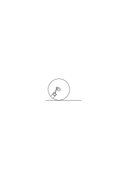

so ist natürlich das ganze ein starres System, dessen Teile sich gegen einander nicht rühren können. Und anderseits kann man es auf der Straße hin & her rollen wie man will & es erlaubt alles. Ich will sagen: was immer man mit der Walze tut, ist dem Innern dieser Walze recht. (Und hier liegt die Analogie.)

### [287\[2\]](https://cdn.wittgensteinnachlass.com/2000px/webp/Ms-110/287.webp)

05.07.1931

Unmittelbare Erfahrung (Sinnes-Datum) ist entweder ein Begriff von trivialer Abgrenzung oder eine Form.

### [287\[3\]](https://cdn.wittgensteinnachlass.com/2000px/webp/Ms-110/287.webp)

Ich könnte der Erklärung des Pfeiles mit der Vorstellung folgen. Das wäre so, als folgte ich ihr mit einer Zeichnung (& hier handelt es sich ja um das „Primäre” der Zeichnung, nicht um das Physikalische. Dann aber scheint die Vorstellung noch eine andere Rolle zu spielen, in der sie scheinbar nicht interpretierbar ist. Nicht interpretierbar, weil schon interpretiert, oder eigentlich, weil schon Zeichen & Interpretation. Aber wie interpretiert man denn Zeichen? Doch durch andre Zeichen.

### [287\[4\]](https://cdn.wittgensteinnachlass.com/2000px/webp/Ms-110/287.webp)

Ich will doch sagen: Die ganze Sprache kann man nicht interpretieren.

### [287\[5\]](https://cdn.wittgensteinnachlass.com/2000px/webp/Ms-110/287.webp)

Eine Interpretation ist immer nur _eine_ im Gegensatz zu einer _andern_. Sie hängt sich an das Zeichen & reiht es in ein weiteres System ein.

### [287\[6\]](https://cdn.wittgensteinnachlass.com/2000px/webp/Ms-110/287.webp),[288\[1\]](https://cdn.wittgensteinnachlass.com/2000px/webp/Ms-110/288.webp)

Ist es nun _notwendig_ zur Interpretation, Erklärung, des Wortes ‚gelb’ auf einen gelben Gegenstand zu zeigen? Könnte man nicht z.B. auf einen blauen zeigen mit den Worten „das ist gelb”, auf einen grünen & sagen „das ist rot” u.s.w. immer den Namen der Komplementärfarbe nennend. Daß dadurch ein Mißverständnis hervorgerufen würde ist zwar klar aber wäre diese Erklärung nicht im gleichen Fall wie etwa die: Es zeigt einer mit dem Finger in eine Richtung & sagt das ist ‚rot’ & erklärt dadurch die Farbe des Gegenstandes der in der entgegengesetzten Richtung liegt. Auch diese Erklärung würde Mißverständnisse hervorrufen wäre aber so einwandfrei wie der Zeiger einer Uhr der so

auf 6 zeigt.

### [288\[2\]](https://cdn.wittgensteinnachlass.com/2000px/webp/Ms-110/288.webp)

Man verwechselt so leicht das gemalte Bild im physikalischen Sinn mit dem entsprechenden Gesichtsbild. Dieses kann sehr wohl statt des Erinnerungsbildes stehen; warum denn nicht. Wenn man fühlt, daß das nicht möglich ist, denkt man an das physikalische Bild.

### [288\[3\]](https://cdn.wittgensteinnachlass.com/2000px/webp/Ms-110/288.webp)

Es ist also richtig: „Ich erinnere mich **da**ran ↗ an das was ich hier vor mir sehe”. Das Bild ist dann in einem gewissen Sinne gegenwärtig & vergangen.

### [288\[4\]](https://cdn.wittgensteinnachlass.com/2000px/webp/Ms-110/288.webp)

Der Vorgang des Vergleiches eines Bildes mit der Wirklichkeit ist also der Erinnerung nicht wesentlich.

### [288\[5\]](https://cdn.wittgensteinnachlass.com/2000px/webp/Ms-110/288.webp)

Wenn man mir sagt „bringe eine gelbe Blume” & ich stelle mir vor, wie ich eine gelbe Blume hole, so habe ich bewiesen, daß ich den Befehl verstanden habe. Aber ebenso, wenn ich ein Bild des Vorgangs malte. – Warum? Wohl, weil das, was ich tue mit Worten des Befehls beschrieben werden muß. Oder soll ich sagen, ich habe tatsächlich einen (dem ersten) verwandten Befehl ausgeführt.

### [289\[1\]](https://cdn.wittgensteinnachlass.com/2000px/webp/Ms-110/289.webp)

Warum sieht man es als einen Beweis dafür an daß ein Satz Sinn hat, daß ich mir, was er sagt vorstellen kann? Weil ich diese Vorstellung mit einem dem ersten verwandten Satz beschreiben müßte. Ich habe ja damit nur den Satz in einem primitiveren Symbolismus wiederholt.

### [289\[2\]](https://cdn.wittgensteinnachlass.com/2000px/webp/Ms-110/289.webp)

Ist aber daher kein Unterschied zwischen Bild & Bild? Symbol & Symbol?

### [289\[3\]](https://cdn.wittgensteinnachlass.com/2000px/webp/Ms-110/289.webp)

”Ich stelle mir vor wie das sein wird.” (Wenn der Sessel weiß gestrichen sein wird.) – Wie kann ich es mir denn Vorstellen, wenn es nicht ist?! Ist denn die Vorstellung eine Zauberei? Nein, die Beschreibung der Vorstellung ist (ja) nicht dieselbe, wie die Beschreibung des erwarteten Ereignisses.

### [289\[4\]](https://cdn.wittgensteinnachlass.com/2000px/webp/Ms-110/289.webp)

„Du sagtest mir ‚geh aus dem Zimmer’, darum tat ich _das_” (und nun zeichnet er den Vorgang auf, oder macht ihn vor). Aber da ist ja scheinbar gar kein Zusammenhang!

### [289\[5\]](https://cdn.wittgensteinnachlass.com/2000px/webp/Ms-110/289.webp)

Wie kann man kalkulieren, daß 3 + 2 = 5 ist?! da doch ‚5’ zu ‚3 + 2’ keine interne Beziehung hat? Es geht auch nur auf einem Weg, der diese Beziehung herstellt.

### [289\[6\]](https://cdn.wittgensteinnachlass.com/2000px/webp/Ms-110/289.webp)

Der Satz ist der Tatsache so ähnlich, wie das Zeichen ‚5’ dem Zeichen ‚3 + 2’. Und das gemalte Bild der Tatsache, wie ‚∣∣∣∣∣’ dem Zeichen ‚∣∣ + ∣∣∣’.

### [289\[7\]](https://cdn.wittgensteinnachlass.com/2000px/webp/Ms-110/289.webp),[290\[1\]](https://cdn.wittgensteinnachlass.com/2000px/webp/Ms-110/290.webp)

Wenn man sagt: Ich stelle mir die Sonne vor, wie sie rasch über den Himmel zieht; so ist doch nicht die Vorstellung damit beschrieben, daß „die Sonne rasch über den Himmel zieht”! Nun könnte ich einerseits fragen: ist nicht, was Du vor Dir siehst eine gelbe Scheibe in Bewegung? aber doch nicht gerade die Sonne. – Andrerseits, wenn ich sage „ich stelle mir die Sonne so & so vor”, so ist das nicht dasselbe, wie wenn ich (etwa kinematographisch) ein solches Bild zu sehn bekäme. Ja es hatte Sinn von diesem Bild zu fragen: „stellt das die Sonne vor?”

### [290\[2\]](https://cdn.wittgensteinnachlass.com/2000px/webp/Ms-110/290.webp)

Nehmen wir an, es gäbe zwei Sonnen I & II am Himmel die gleich aussähen, & nun sagt einer: „ich stelle mir die Sonne I in einer solchen Bewegung vor”. Könnte man ihn da fragen: „Woher weißt du daß es gerade die Sonne I ist”? Der Unterschied kann in nichts liegen, was an der Vorstellung einem gemalten Bild vergleichbar ist.

### [290\[3\]](https://cdn.wittgensteinnachlass.com/2000px/webp/Ms-110/290.webp)

Über das Vorstellen als Beweis des Sinnes: Wenn es Sinn hat zu sagen „ich kann mir vorstellen daß p der Fall ist”, so hat es auch Sinn zu sagen „p ist der Fall”.

### [290\[4\]](https://cdn.wittgensteinnachlass.com/2000px/webp/Ms-110/290.webp)

Die Vorstellung in dem Sinn, in dem ich früher von ihr gesprochen habe, ist wie ein Bild mit der Überschrift „Bildnis des N.N.”.

### [290\[5\]](https://cdn.wittgensteinnachlass.com/2000px/webp/Ms-110/290.webp)

Mein Gehirn wird wohl einmal gleichsam vor Alter erblinden. Aber nicht unbedingt erst, wenn ich viel älter bin als jetzt.

### [290\[6\]](https://cdn.wittgensteinnachlass.com/2000px/webp/Ms-110/290.webp),[291\[1\]](https://cdn.wittgensteinnachlass.com/2000px/webp/Ms-110/291.webp)

Was heißt es denn „entdecken daß ein Satz Sinn hat”? Oder fragen wir so: Wie kann man denn die Unsinnigkeit eines Satzes (etwa: „dieser Körper ist ausgedehnt”) dadurch bekräftigen, daß man sagt: „Ich kann mir nicht vorstellen, wie es anders wäre”? Denn kann ich etwa versuchen, es mir vorzustellen? Heißt es nicht: Zu sagen, daß ich es mir vorstelle, ist sinnlos? Wie hilft mir dann also diese Umformung von einem Unsinn in einen andern? – Und warum sagt man gerade: „ich kann mir nicht vorstellen, wie es _anders_ wäre”? und nicht – was doch auf dasselbe hinauskommt – „ich kann mir nicht vorstellen, wie das wäre”? Man anerkennt scheinbar in dem unsinnigen Satz etwas wie eine Tautologie zum Unterschied von einer Kontradiktion. Aber das ist ja auch falsch. – Man sagt gleichsam: „Ja, es ist ausgedehnt, aber wie könnte es denn anders sein? also wozu es sagen”. Es ist dieselbe Tendenz die uns auf den Satz „dieser Stab hat eine bestimmte Länge” nicht antworten läßt „Unsinn!”, sondern: „Freilich!”. Was ist aber der Grund (zu) dieser Tendenz? Sie könnte auch so beschrieben werden: Wenn wir die beiden Sätze „dieser Stab hat eine Länge” & seine Verneinung „dieser Stab hat keine Länge” hören, so sind wir parteiisch & neigen dem ersten Satz zu (statt beide für Unsinn zu erklären). Der Grund hiervon ist aber eine Verwechslung: Wir sehen den ersten Satz verifiziert (und den zweiten falsifiziert) dadurch, „daß der Stab 4 m hat”. Und man wird sagen: „und 4 m ist doch eine Länge” und vergißt daß man hier einen Satz der Grammatik hat.

### [292\[1\]](https://cdn.wittgensteinnachlass.com/2000px/webp/Ms-110/292.webp)

Wenn man manchmal sagt: man könne das Helle nicht sehen, wenn man nicht das Dunkle sähe; so ist das kein Satz der Physik oder Psychologie – denn hier stimmt es nicht & ich kann sehr wohl eine ganz weiße Fläche sehen & nichts Dunkles daneben – sondern es muß heißen: Es hat keinen Sinn in unserer Sprache von Helligkeit zu reden, wenn es nicht Sinn hat, von etwas Dunklem zu reden.

### [292\[2\]](https://cdn.wittgensteinnachlass.com/2000px/webp/Ms-110/292.webp)

Was heißt es denn „entdecken daß ein Satz keinen Sinn hat”? Und was heißt das: „Wenn ich etwas damit meine muß es doch Sinn haben”? „Wenn ich etwas damit meine …” – wenn ich _was_ damit meine?!

### [292\[3\]](https://cdn.wittgensteinnachlass.com/2000px/webp/Ms-110/292.webp)

Was heißt es: „Wenn ich mir etwas dabei vorstellen kann, muß es doch Sinn haben”? Wenn ich mir _was_ dabei vorstellen kann? Das was ich sage? – Das heißt nichts. – Und ‚Etwas’? Das würde heißen: wenn ich die Worte auf diese Weise benützen kann, dann haben sie Sinn. Oder eigentlich: wenn ich sie zum Kalkulieren benütze, dann haben sie Sinn.

### [292\[4\]](https://cdn.wittgensteinnachlass.com/2000px/webp/Ms-110/292.webp)

(Philosophie versteht niemand: Entweder er versteht nicht was geschrieben ist, oder er versteht es: aber nicht, daß es Philosophie ist.)

### [292\[5\]](https://cdn.wittgensteinnachlass.com/2000px/webp/Ms-110/292.webp),[293\[1\]](https://cdn.wittgensteinnachlass.com/2000px/webp/Ms-110/293.webp)

„Du hast mit der Hand eine Bewegung gemacht; hast Du etwas damit gemeint? – Ich dachte, Du meintest, ich solle zu Dir kommen”.

### [293\[2\]](https://cdn.wittgensteinnachlass.com/2000px/webp/Ms-110/293.webp)

Die Frage ist ob man fragen darf „_was_ hast Du gemeint”. Auf diese Frage (aber) kommt ein Satz zur Antwort. Während, wenn man so nicht fragen darf, das Meinen – sozusagen – amorph ist. Und „ich meine etwas mit dem Satz” ist dann von der selben Form wie „der Satz ist nützlich”, oder „dieser Satz greift in mein Leben ein”.

### [293\[3\]](https://cdn.wittgensteinnachlass.com/2000px/webp/Ms-110/293.webp)

Wenn man nun fragt „hast Du etwas mit dieser Handbewegung gemeint”, so kann die Antwort sein „nein ich hab' gar nichts damit gemeint” oder „ja, ich habe etwas gemeint”. Und in diesem Fall wird man fragen „was?” und die Antwort werden etwa Worte sein.

### [293\[4\]](https://cdn.wittgensteinnachlass.com/2000px/webp/Ms-110/293.webp)

Könnte man aber antworten: „ich habe etwas mit dieser Bewegung gemeint, was ich nur durch diese Bewegung ausdrücken kann”?

### [293\[5\]](https://cdn.wittgensteinnachlass.com/2000px/webp/Ms-110/293.webp)

Ich scheine sagen zu wollen: Verstehen, heißt nur, eine bestimmte Art von Zeichen zu erfassen (zu erhalten).

### [293\[6\]](https://cdn.wittgensteinnachlass.com/2000px/webp/Ms-110/293.webp)

„Nein ich hab' gar nichts mit dieser Bewegung gemeint. Ich hab' sie ganz unwillkürlich gemacht”. Oder aber: „Ja, ich habe etwas gemeint, ich wollte, daß Du kommst”. Aber dann war dieses Wollen daß der Andre kommen soll ein besonderer Vorgang. Das heißt, ich habe jetzt den ganzen Vorgang in den Satz übersetzt „ich wollte, daß Du kommst”. Aber er war nun doch wieder nur ein Zeichen.

### [294\[1\]](https://cdn.wittgensteinnachlass.com/2000px/webp/Ms-110/294.webp)

Auf die Frage „was meinst Du” müßte die Antwort die Erklärung des _Zeichensystems_ sein, zu dem das gegebene Zeichen gehört. – Und durch die Antwort „ich meine, daß Du kommen sollst” ist ja auch nur eben das getan, denn das Zeichen wurde jetzt in einen Satz einer uns bekannten Sprache übersetzt. Und eine Sprache ist uns nur verständlich weil wir sie, ihr System, kennen. Denn alle Erklärung kann nichts tun als uns die Sprache kennen lehren.

### [294\[2\]](https://cdn.wittgensteinnachlass.com/2000px/webp/Ms-110/294.webp)

Aber dieser letzte Satz ist mit Vorsicht aufzufassen. Denn kann man sagen, wir verstünden die Gebärdensprache, weil wir ihr System kennen? Ja & nein.

### [294\[3\]](https://cdn.wittgensteinnachlass.com/2000px/webp/Ms-110/294.webp)

Der Vorgang könnte auch so sein, daß nach der Antwort „ja, ich habe etwas mit der Bewegung gemeint” & der Frage „was?” die Antwort kommt: „Du weißt's schon, Du verstehst mich schon”. Und diese Antwort zeigt am klarsten das Wesen des Verstehens, denn wenn nun der Andere auf einmal versteht, was gemeint war, so sieht er in dem Zeichen jetzt _eines_ im Gegensatz zu anderen. Wenn er es nun deutet so deutet er es _so_ im Gegensatz zu anders.

### [294\[4\]](https://cdn.wittgensteinnachlass.com/2000px/webp/Ms-110/294.webp)

„Ach ja, ich wußte nicht, wohin Du zeigst; daß Du auf _den_ zeigst!”

### [294\[5\]](https://cdn.wittgensteinnachlass.com/2000px/webp/Ms-110/294.webp),[295\[1\]](https://cdn.wittgensteinnachlass.com/2000px/webp/Ms-110/295.webp)

Die Erklärung: „Hast Du mich denn nicht verstanden; ich habe auf _ihn_ gezeigt” erklärt ein System, denn es erklärt aus welchem Gesichtspunkt ich das Zeichen hätte auffassen sollen. „Schau doch, auf wen er zeigt!”

### [295\[2\]](https://cdn.wittgensteinnachlass.com/2000px/webp/Ms-110/295.webp)

Ich bin nun immer zu dem Fehler geneigt zu glauben ein System könnte außerhalb seines Ausdrucks, in der Grammatik etwa, existieren.

### [295\[3\]](https://cdn.wittgensteinnachlass.com/2000px/webp/Ms-110/295.webp)

„Jetzt sehe ich's erst, er zeigt immer auf die Leute die dort vorübergehen”. Er hat ein System verstanden: wie einer dem ich die Ziffern 1, 4, 9, 16 zeige & der sagt „ich versteh' jetzt das System ich kann jetzt selbst weiter schreiben”. Aber was ist diesem Menschen geschehen als er das System plötzlich verstand? Ist es etwas anderes als daß ihm die Variable „x²” oder ein analoges Zeichen eingefallen ist?

### [295\[4\]](https://cdn.wittgensteinnachlass.com/2000px/webp/Ms-110/295.webp)

Man wird vielleicht sagen: ganz richtig es ist ihm die Form x² eingefallen, aber im Gegensatz zu x³ oder <math class="stacked" display="inline"><msup><mi>x</mi><mtext>½</mtext></msup></math>. Aber was heißt es denn „im Gegensatz zu …”? Dieser Gegensatz steht vielleicht in einem Buch, oder kommt durch einen weitern Schritt zu Tage. Kurz die Entwickelung des Systems geschieht in der Zeit (und im Raum des Buches).

### [295\[5\]](https://cdn.wittgensteinnachlass.com/2000px/webp/Ms-110/295.webp)

Was dem Können in „ich kann jetzt selbst weiterschreiben” zu Grunde liegt ist auch nur der Einfall des Variablen-Ausdrucks (also eines _Zeichens_, wieder nur eines Steins im Kalkül welches selbst sich erst in der Zeit entfaltet) & etwa das Ausrechnen „im Kopf” von einigen weiteren Zahlen.

### [295\[6\]](https://cdn.wittgensteinnachlass.com/2000px/webp/Ms-110/295.webp),[296\[1\]](https://cdn.wittgensteinnachlass.com/2000px/webp/Ms-110/296.webp)

Es handelt sich beim Verstehen nicht um einen Akt des momentanen, sozusagen nicht diskursiven, Erfassens der Grammatik. Als könnte man sie gleichsam auf einmal herunterschlucken.

### [296\[2\]](https://cdn.wittgensteinnachlass.com/2000px/webp/Ms-110/296.webp)

Das also, was der macht, der auf einmal die Bewegung des Andern deutet (ich sage nicht „richtig deutet”) ist ein Schritt in einem Kalkül. Er _tut_ ungefähr was er _sagt_ wenn er seinem Verständnis Ausdruck gibt. – Und das ist ja immer unser Erkenntnisprinzip –. Und wenn ich sage „was er macht ist der Schritt eines Kalküls” so heißt das, daß ich diesen Kalkül schon kenne; in dem Sinne in dem ich die deutsche Sprache kenne oder das Einmaleins. Welche ich ja auch nicht so in mir habe als wäre die ganze deutsche Grammatik & die Einmaleins-Sätze zusammengeschoben auf etwas was man nun auf einmal, als Ganzes, erfassen kann.

### [296\[3\]](https://cdn.wittgensteinnachlass.com/2000px/webp/Ms-110/296.webp)

Ich fasse das Verstehen also, in irgendeinem Sinne, behaviouristisch auf.

### [296\[4\]](https://cdn.wittgensteinnachlass.com/2000px/webp/Ms-110/296.webp)

‚Sprache’ nenne ich nur das, wovon sich eine Grammatik schreiben läßt.

### [296\[5\]](https://cdn.wittgensteinnachlass.com/2000px/webp/Ms-110/296.webp)

‚Kalkül’ nur wovon sich ein Regelverzeichnis anlegen läßt.

### [296\[6\]](https://cdn.wittgensteinnachlass.com/2000px/webp/Ms-110/296.webp),[297\[1\]](https://cdn.wittgensteinnachlass.com/2000px/webp/Ms-110/297.webp)

Gewiß, der Vorgang des „Jetzt versteh ich …!” ist ein ganz spezifischer, aber es _ist_ eben auch ein ganz spezifischer Vorgang, wenn wir auf einen bekannten Kalkül stoßen, wenn wir „weiter wissen”. Aber dieses Weiter-Wissen ist eben auch _diskursiv_ (nicht intuitiv). (Und es kommt eben hier heraus, was ich vor langer Zeit aufgeschrieben habe, daß wir nämlich „von Büchern” & derlei Dingen reden müssen & nicht von einem sprachlichen Wolkenkuckucksheim.)

### [297\[2\]](https://cdn.wittgensteinnachlass.com/2000px/webp/Ms-110/297.webp)

Das Behaviouristische an meiner Auffassung besteht nur darin, daß ich keinen Unterschied zwischen ‚außen’ & ‚innen’ mache. Weil mich die Psychologie nichts angeht.

### [GB I](/w-gb-1/#ms-110-297.3) [297\[3\]](https://cdn.wittgensteinnachlass.com/2000px/webp/Ms-110/297.webp) {#2973}

06.07.1931

Ich glaube, das Charakteristische des primitiven Menschen ist es, daß er nicht aus _Meinungen_ handelt (dagegen Frazer). Ich lese unter vielen ähnlichen Beispielen von einem Regen-König in Afrika zu dem die Leute um Regen bitten _wenn die Regenperiode kommt_. Aber das heißt doch daß sie nicht eigentlich meinen er könne Regen machen, sonst würden sie es in den trockenen Perioden des Jahres in der das Land „a parched and arid desert” ist, machen. Denn wenn man annimmt daß die Leute einmal aus Dummheit dieses Amt des Regenkönigs eingesetzt haben so ist es doch gewiß klar daß sie schon vorher die Erfahrung hatten, daß im März der Regen beginnt & sie hätten dann den Regenkönig für den übrigen Teil des Jahres funktionieren lassen. Oder auch so: Gegen morgen, wenn die Sonne aufgehen will werden von den Menschen Riten des Tagwerdens zelebriert aber nicht in der Nacht, sondern da brennen sie einfach Lampen.

### [GB I](/w-gb-1/#ms-110-297.4+298.1) [297\[4\]](https://cdn.wittgensteinnachlass.com/2000px/webp/Ms-110/297.webp),[298\[1\]](https://cdn.wittgensteinnachlass.com/2000px/webp/Ms-110/298.webp) {#29742981}

Wenn ich über etwas wütend bin so schlage ich manchmal mit meinem Stock auf die Erde oder an einen Baum etc. aber ich _glaube_ doch nicht daß die Erde schuld ist oder das Schlagen etwas helfen kann. „Ich lasse meinen Zorn aus.” Und dieser Art sind alle Riten. Solche Handlungen kann man Instinkt -Handlungen nennen. – Und eine historische Erklärung etwa daß ich früher oder meine Vorfahren früher geglaubt haben das Schlagen der Erde helfe etwas sind Spiegelfechtereien denn sie sind überflüssige Annahmen die _nichts_ erklären. Wichtig ist die Ähnlichkeit des Aktes mit einem Akt der Züchtigung aber mehr als diese Ähnlichkeit ist nicht zu konstatieren. Ist ein solches Phänomen einmal mit einem Instinkt den ich selber besitze in Verbindung gebracht so ist eben dies die gewünschte Erklärung; d.h. die welche das besondere puzzlement löst. Und eine Betrachtung über die Geschichte meines Instinkts bewegt sich nun auf andern Bahnen.

### [GB I](/w-gb-1/#ms-110-298.2) [298\[2\]](https://cdn.wittgensteinnachlass.com/2000px/webp/Ms-110/298.webp) {#2982}

Kein geringer Grund d.h. überhaupt kein _Grund_ kann es gewesen sein was gewisse Menschenrassen den Eichbaum verehren ließen, sondern nur das, daß sie & die Eiche in einer Lebensgemeinschaft vereinigt waren also nicht aus Wahl sondern wie der Floh & der Hund in ihrer Entstehung vereinigt. (Entwickelten die Flöhe einen Ritus, er würde sich auf den Hund beziehen.)

### [GB I](/w-gb-1/#ms-110-298.3) [298\[3\]](https://cdn.wittgensteinnachlass.com/2000px/webp/Ms-110/298.webp) {#2983}

Man könnte sagen nicht ihre Vereinigung (von Eiche & Mensch) hat zu diesen Riten die Veranlassung gegeben, sondern vielleicht ihre Trennung.

### [GB I](/w-gb-1/#ms-110-298.4) [298\[4\]](https://cdn.wittgensteinnachlass.com/2000px/webp/Ms-110/298.webp) {#2984}

Denn das Erwachen des Intellekts geht mit einer Trennung von dem ursprünglichen _Boden_ der ursprünglichen Grundlage des Lebens vor sich. (Die Entstehung der _Wahl_.)

### [GB I](/w-gb-1/#ms-110-299.1) [299\[1\]](https://cdn.wittgensteinnachlass.com/2000px/webp/Ms-110/299.webp) {#2991}

(Die Form des erwachenden Geistes ist die Verehrung.)

### [299\[2\]](https://cdn.wittgensteinnachlass.com/2000px/webp/Ms-110/299.webp)

„Ist die Vorstellung nur die Vorstellung, oder ist die Vorstellung von Etwas in der Wirklichkeit?” „Ist die Vorstellung nur die Vorstellung, oder ist die Vorstellung in Beziehung auf die Wirklichkeit?” „Ist die Vorstellung nur die Vorstellung, oder ist sie Vorstellung von Etwas in der Wirklichkeit?”

### [299\[3\]](https://cdn.wittgensteinnachlass.com/2000px/webp/Ms-110/299.webp)

Und von dieser Frage könnte man auch die Beziehung der Vorstellung zum gemalten Bild erfassen.

### [299\[4\]](https://cdn.wittgensteinnachlass.com/2000px/webp/Ms-110/299.webp)

Die Frage könnte aber nicht heißen: „Ist die Vorstellung immer Vorstellung von etwas, was in der Wirklichkeit existiert” – denn das ist sie offenbar nicht immer –; sondern, es müßte heißen: bezieht sich die Vorstellung immer, wahr oder falsch, auf Wirklichkeit. – Denn das kann man von einem gemalten Bild nicht sagen. –

### [299\[5\]](https://cdn.wittgensteinnachlass.com/2000px/webp/Ms-110/299.webp)

Aber warum sollte man dann nicht sagen, daß eine Vorstellung Vorstellung eines Traumes sei?

### [299\[6\]](https://cdn.wittgensteinnachlass.com/2000px/webp/Ms-110/299.webp)

Verhalten sich nicht Vorstellung & Wirklichkeit zu einander wie ein ebenes Bild zum dreidimensionalen Raum? in dem immer etwas existieren _kann_, dessen Projektion das ebene Bild ist? (Also doch wohl wie die Sprache zur Wirklichkeit im Raum.)

### [300\[1\]](https://cdn.wittgensteinnachlass.com/2000px/webp/Ms-110/300.webp)

… quia plus loquitur inquisitio quam inventio … (Augustinus)

### [300\[2\]](https://cdn.wittgensteinnachlass.com/2000px/webp/Ms-110/300.webp)

Manifestissima & usitatissima sunt, & eadem rursus nimis latent, & nova est inventio eorum. (Augustinus)

### [300\[3\]](https://cdn.wittgensteinnachlass.com/2000px/webp/Ms-110/300.webp)

Wenn man sagt, Vorstellungen seien privat, so ist man wieder von einer Analogie irregeleitet.

### [300\[4\]](https://cdn.wittgensteinnachlass.com/2000px/webp/Ms-110/300.webp)

Könnte ich malen, daß es sich so verhält, wenn es keinen Sinn hätte, zu sagen „es verhält sich so”? Aber dieser Ausdruck „malen, daß es sich so verhält” ist selbst problematisch. Er trägt bereits eine Deutung in das Bild hinein.

### [300\[5\]](https://cdn.wittgensteinnachlass.com/2000px/webp/Ms-110/300.webp)

Man wird sagen: der Maler der „Malheurs de Chasse” hat _nicht gemeint_ daß es wirklich so zugeht; hätte er aber seine Bilder lehrhaft (um zu zeigen wie es zugeht) gemeint, so wäre er im Unrecht gewesen.

### [300\[6\]](https://cdn.wittgensteinnachlass.com/2000px/webp/Ms-110/300.webp)

Aber dasselbe gilt doch auch von Erzählungen etwa des Baron Münchhausen. In _dem_ Sinn in welchem man von ihnen sagen kann sie seien nicht wahr kann man es allerdings auch von irgend einem Bild sagen das keine historische Begebenheit darstellen soll.

### [300\[7\]](https://cdn.wittgensteinnachlass.com/2000px/webp/Ms-110/300.webp)

Anderseits kann man von jenen Erzählungen insofern nicht sagen sie seien unwahr als sie gar nicht auf eine Methode der Verifikation deuten. (Ebenso wie ein Genrebild.)