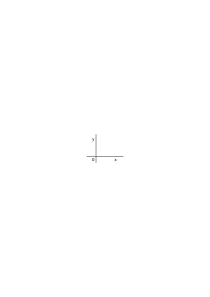
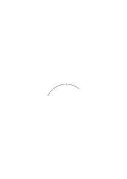
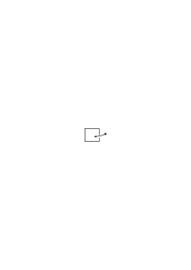
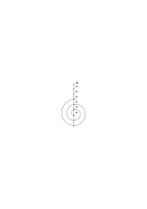
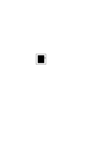
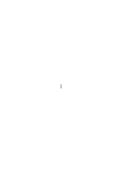
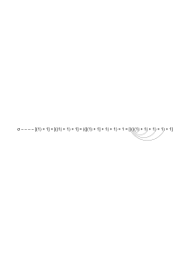
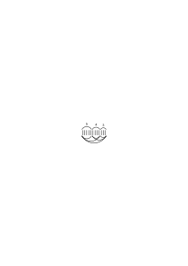

# Ms-111

14 published remarks, VB

### [III\[1\]](https://cdn.wittgensteinnachlass.com/2000px/webp/Ms-111/III.webp)

## VII. Bemerkungen zur Philosophie.

### [1\[1\]](https://cdn.wittgensteinnachlass.com/2000px/webp/Ms-111/1.webp)

07.07.1931

Historisches Drama; kann man es falsch nennen? „Nein, es ist ja nicht als Geschichtsschreibung gemeint”. Worin liegt diese _Meinung_?

### [1\[2\]](https://cdn.wittgensteinnachlass.com/2000px/webp/Ms-111/1.webp)

Denken wir uns den Fall, daß Einer ein Geschichtswerk in aller Form geschrieben hätte, es aber dennoch nicht als Geschichtswerk, sondern als die Erdichtung eines Geschichtswerkes _meinte_. Was würde es heißen, dieses Werk einmal so, einmal so aufzufassen? Worin besteht diese Auffassung? Doch offenbar in etwas _außer_ dem Werk. Quasi in einem _Zusatz_ zu dem Werk. Oder nicht vielmehr in einer bestimmten Verwendung, Wirkung des Werks, in einem Eindruck, den es mir macht? Denn ein Zusatz von Zeichen kann doch wieder einer Auffassung unterliegen.

### [1\[3\]](https://cdn.wittgensteinnachlass.com/2000px/webp/Ms-111/1.webp)

Wir neigen dazu jede Erscheinung nur als ein Symptom der Auffassung, Meinung, gelten zu lassen, aber nicht als diese selbst.

### [1\[4\]](https://cdn.wittgensteinnachlass.com/2000px/webp/Ms-111/1.webp),[2\[1\]](https://cdn.wittgensteinnachlass.com/2000px/webp/Ms-111/2.webp)

Wie sich die Sprache von der Beschreibung der Verifikation entfernt. Man muß wieder entdecken, daß man die Zeit mit der Uhr mißt. – Und erkennt dabei nicht einmal, daß man eine grammatische Entdeckung gemacht hat.

### [VB](/w-vb/#ms-111-2.2) [2\[2\]](https://cdn.wittgensteinnachlass.com/2000px/webp/Ms-111/2.webp) {#2-2}

(Labor ist, wo er gute Musik schreibt absolut unromantisch. Das ist ein sehr merkwürdiges & bedeutsames Zeichen.)

### [2\[3\]](https://cdn.wittgensteinnachlass.com/2000px/webp/Ms-111/2.webp)

Auffassung ist _eine_ im Gegensatz zu einer anderen.

### [2\[4\]](https://cdn.wittgensteinnachlass.com/2000px/webp/Ms-111/2.webp)

„p ist der Fall”. „Es ist _wahr_ daß p der Fall ist”. „Es ist wirklich wahr daß p der Fall ist.” Wenn der Multiplizität nichts hinzugesetzt wird, ist das Hinzugefügte bedeutungs-, zwecklos. Der Zusatz der eine Auffassung ausdrückt, darf also nicht von dieser Art sein.

### [2\[5\]](https://cdn.wittgensteinnachlass.com/2000px/webp/Ms-111/2.webp)

Was ist der Unterschied zwischen der wirklichen Anwendung eines Satzes & der nachgemachten, gespielten?

### [2\[6\]](https://cdn.wittgensteinnachlass.com/2000px/webp/Ms-111/2.webp)

Kann man von ‚Beschreibung’ & ‚Ausdruck’ der Auffassung reden?

### [2\[7\]](https://cdn.wittgensteinnachlass.com/2000px/webp/Ms-111/2.webp)

Das fingierte Porträt. In einem Buch eine Illustration mit der Überschrift: Baron Münchhausen.

### [2\[8\]](https://cdn.wittgensteinnachlass.com/2000px/webp/Ms-111/2.webp),[3\[1\]](https://cdn.wittgensteinnachlass.com/2000px/webp/Ms-111/3.webp)

„Doch solcherlei Verdrüsse pflegen die Denkungskräfte anzuregen.” Wie hilft der Gedanke einem Verdruß ab?

### [3\[2\]](https://cdn.wittgensteinnachlass.com/2000px/webp/Ms-111/3.webp)

„Hast Du das im Ernst oder im Spaß gemeint?” Das „im Ernst meinen” besteht nicht darin, daß zu dem ausgesprochenen Satz im Stillen noch etwas hinzugesetzt wird, etwa die Worte „ich meine das im Ernst”. Von dem _ganzen_ Satz, dem ausgesprochenen mit den dazugedachten Worten, könnte man wieder fragen: wie war er gemeint. Von Ernst oder Spaß kann man das aber nicht fragen. Also ist die Meinung (Auffassung) in diesem Sinne ein bestimmtes Erlebnis, das mit den Zeichen des Satzes Hand in Hand geht, aber an dem Sinn des Satzes nichts ändert, ob es nun so oder anders ist.

### [3\[3\]](https://cdn.wittgensteinnachlass.com/2000px/webp/Ms-111/3.webp)

Wäre der Sinn nicht durch die Zeichen & Regeln bestimmt, so gäbe es keine Verständigung & nichts, was wir Sprache nennen könnten.

### [3\[4\]](https://cdn.wittgensteinnachlass.com/2000px/webp/Ms-111/3.webp)

Wie unterscheidet sich: das (zu) glauben was man sagt, davon daß man es sagt ohne es zu glauben?

### [3\[5\]](https://cdn.wittgensteinnachlass.com/2000px/webp/Ms-111/3.webp),[4\[1\]](https://cdn.wittgensteinnachlass.com/2000px/webp/Ms-111/4.webp)

„Ich habe gesagt, ‚sie ist nicht zuhause’ habe aber _dabei_ gewußt, daß sie zuhause war”. Wie geht dieses Wissen zeitlich mit dem Sagen des Satzes zusammen? Wie eine kontinuierliche Begleitung, ein Orgelpunkt, zu einem Thema? Hast Du es in jedem Augenblick gewußt, & braucht das Wissen keine Zeit? Ein falsches Bild verführt uns.

### [4\[2\]](https://cdn.wittgensteinnachlass.com/2000px/webp/Ms-111/4.webp)

Diese Art der Betrachtung die immer wiederkehrt, nimmt ihre Wichtigkeit daher, daß sie uns über einen falschen Begriff aufklärt den wir vom Unmittelbaren haben.

### [4\[3\]](https://cdn.wittgensteinnachlass.com/2000px/webp/Ms-111/4.webp)

Es hat freilich Sinn, zu sagen: „Während ich ihm das erzählte wußte ich (die ganze Zeit), daß es nicht wahr war”, sowie auch „während ich es erzählte, glaubte ich es auch”. Nur sind die beiden Vorgänge sehr kompliziert & sehen sehr einfach aus; d.h., jeder der beiden Sätze kann viele verschiedene Prozesse beschreiben. Etwa wie wenn ich sage „ich habe mich eine halbe Stunde lang umgezogen”, diesem Satz die mannigfachsten Tätigkeiten nacheinander entsprechen.

### [4\[4\]](https://cdn.wittgensteinnachlass.com/2000px/webp/Ms-111/4.webp),[5\[1\]](https://cdn.wittgensteinnachlass.com/2000px/webp/Ms-111/5.webp)

Wir laborieren nämlich unter dem Irrtum, daß Glauben, Meinen, Wissen, Wünschen, Suchen, Denken etc. _Zustände_ sind & daß daher hinter den symbolischen Prozessen im Denken etwas von anderer Art verborgen sein muß, das den Sinn eines Satzes gleichsam in amorpher Form enthalte, d.h. intuitiv, dem Sehen eines gleichbleibenden Bildes ähnlich, nicht diskursiv, also einer Tätigkeit (wie dem Waschen) vergleichbar.

### [5\[2\]](https://cdn.wittgensteinnachlass.com/2000px/webp/Ms-111/5.webp),[6\[1\]](https://cdn.wittgensteinnachlass.com/2000px/webp/Ms-111/6.webp)

Es ist nämlich die Anschauung aufzugeben, daß, um vom Unmittelbaren zu reden wir von dem Zustand in einem Zeitmoment reden müßten. Diese Anschauung ist darin ausgedrückt, wenn man sagt: „alles, was uns gegeben ist, ist das Gesichtsbild & die Daten der übrigen Sinne, sowie die Erinnerung, in dem gegenwärtigen Augenblick”. Das ist Unsinn; denn was meint man mit dem „gegenwärtigen Augenblick”? Dieser Vorstellung liegt vielmehr schon ein physikalisches Bild zu Grunde, nämlich das, vom Strom der Erlebnisse, den ich nun in einem Punkt quer durchschneide. Es liegt hier eine ähnliche Tendenz & ein ähnlicher Fehler vor, wie beim Idealismus (oder Solipsismus). Woher aber diese Tendenz, „zum Unmittelbaren” kommen zu wollen? Entspringt sie nicht aus dem Bedürfnis, die Verifikation des Satzes verstehen zu wollen, die durch unsere Sprache ganz verschleiert ist.

### [6\[2\]](https://cdn.wittgensteinnachlass.com/2000px/webp/Ms-111/6.webp)

Intuitives Denken, das wäre so, wie eine Schachpartie auf die Form eines dauernden, gleichbleibenden Zustandes gebracht (ebenso undenkbar).

### [6\[3\]](https://cdn.wittgensteinnachlass.com/2000px/webp/Ms-111/6.webp)

Auch jene Tendenz muß durch das Verstehen der Grammatik unserer Sprache deren wir uns in unserem Ausdruck bedienen & der Ursachen unserer Mißverständnisse aufgehoben werden.

### [6\[4\]](https://cdn.wittgensteinnachlass.com/2000px/webp/Ms-111/6.webp)

Auf die Frage „wie hast Du das gemeint”, können eben mehrerlei Antworten kommen:

„Ich hab's im Ernst (Spaß) gemeint”

„Ich wollte damit sagen; daß … (folgt ein Satz)”

„Ich wollte dich nur aufsitzen lassen.”

### [6\[5\]](https://cdn.wittgensteinnachlass.com/2000px/webp/Ms-111/6.webp)

Wie geht das vor sich, wenn man einen Satz ausspricht & dabei den Andern nur aufsitzen lassen will? Man spricht, lächelt, sieht zu was der Andre macht, fühlt eine Spannung. Aber nirgends ist die amorphe Meinung. Diese stellt man sich gleichsam vor, wie den Inhalt eines Tiegels, dessen Aufschrift der Satz ist.

### [6\[6\]](https://cdn.wittgensteinnachlass.com/2000px/webp/Ms-111/6.webp)

„Inhalt des Satzes”.

### [7\[1\]](https://cdn.wittgensteinnachlass.com/2000px/webp/Ms-111/7.webp)

Es stört uns quasi, daß der Gedanke eines Satzes in keinem Moment ganz vorhanden ist. Hier sehen wir, daß wir den Gedanken mit einem Ding vergleichen, welches wir erzeugen & das wir nie als Ganzes besitzen; sondern kaum entsteht ein Teil, so verschwindet ein andrer. Das hat gewissermaßen etwas Unbefriedigendes, weil wir – wieder durch eine Erklärung verführt – uns etwas Anderes erwarten.

### [7\[2\]](https://cdn.wittgensteinnachlass.com/2000px/webp/Ms-111/7.webp)

Im lebendigen Gebrauch der Sprache fühlen wir ja eine solche Unbefriedigung nicht, sondern erst, wenn wir ein bestimmtes Bild auf die Vorgänge anwenden wollen. Aber es ist schwer zu sagen, welches das ist.

### [7\[3\]](https://cdn.wittgensteinnachlass.com/2000px/webp/Ms-111/7.webp),[8\[1\]](https://cdn.wittgensteinnachlass.com/2000px/webp/Ms-111/8.webp)

(Methodologie, wenn sie von der Messung redet, sagt nicht, aus welchem Material etwa wir den Maßstab am vorteilhaftesten herstellen um dies & dies Resultat zu erzielen; obwohl doch das auch zur Methode des Messens gehört. Vielmehr interessiert diese Untersuchung bloß, unter welchen Umständen wir sagen, eine Länge, eine Stromstärke (u.s.w.) sei gemessen. Sie will die, von uns bereits verwendeten, uns geläufigen, Methoden tabulieren, um dadurch die Bedeutung der Worte „Länge”, „Stromstärke”, etc. festzulegen.)

### [8\[2\]](https://cdn.wittgensteinnachlass.com/2000px/webp/Ms-111/8.webp)

Der Zeitmoment von dem ich sage, er sei die Gegenwart, die alles enthält, was mir gegeben ist, gehört selbst zur physikalischen Zeit.

### [8\[3\]](https://cdn.wittgensteinnachlass.com/2000px/webp/Ms-111/8.webp)

Denn wie ist (denn) so ein Moment bestimmt? Etwa durch einen Glockenschlag? Und kann ich denn nun die ganze, mit diesem Schlag gleichzeitige Erfahrung wirklich beschreiben? Wenn man daran denkt, es zu versuchen, wird man sofort gewahr, daß es eine Fiktion ist, wovon wir reden.

### [8\[4\]](https://cdn.wittgensteinnachlass.com/2000px/webp/Ms-111/8.webp)

Wir stellen uns das Erleben wie einen Filmstreifen vor, so daß man sagen kann: dieses Bild, & kein anderes, ist in diesem Augenblick vor der Linse.

### [8\[5\]](https://cdn.wittgensteinnachlass.com/2000px/webp/Ms-111/8.webp),[9\[1\]](https://cdn.wittgensteinnachlass.com/2000px/webp/Ms-111/9.webp)

Aber nur im Film kann man von einem in diesem Moment gegenwärtigen Bild reden; nicht, wenn man aus dem physikalischen Raum & seiner Zeit in den Gesichtsraum & seine Zeit übergeht.

### [9\[2\]](https://cdn.wittgensteinnachlass.com/2000px/webp/Ms-111/9.webp)

Es ist viel seltsamer als man wohl glaubt, daß man im Bereich der gewöhnlichen Sprache auf den Begriff des Lichtstrahls gekommen ist.

### [9\[3\]](https://cdn.wittgensteinnachlass.com/2000px/webp/Ms-111/9.webp)

Schwerlich wäre es geschehen, wenn man nicht manchmal „Lichtstrahlen” im Staub der Luft sähe.

### [9\[4\]](https://cdn.wittgensteinnachlass.com/2000px/webp/Ms-111/9.webp)

Und die Annahme einer Lichtgeschwindigkeit hängt damit zusammen.

### [9\[5\]](https://cdn.wittgensteinnachlass.com/2000px/webp/Ms-111/9.webp)

„Das was ein cm3 Wasser wiegt, hat man ‚1 Gramm’ genannt” – „Ja, was wiegt er denn?” („Bedeutung eines Wortes”)

### [9\[6\]](https://cdn.wittgensteinnachlass.com/2000px/webp/Ms-111/9.webp),[10\[1\]](https://cdn.wittgensteinnachlass.com/2000px/webp/Ms-111/10.webp)

08.07.1931

Wenn das Bild die Krönung Napoleons darstellen soll, so müßte man das nicht darunter schreiben, wenn es in dem Bild enthalten wäre. Wenn es also auch in der bloßen Beschreibung des Bildes mitbeschrieben wäre. Und da könnte man nun den Unterschied zwischen Gedanken & Bild scharf fassen, indem man sagt, daß die Beschreibung des _Gedankens_ im Gegensatz zu der, des bloßen Bildes, auch die Beschreibung der Realität enthalten muß, auf die sich der Gedanke bezieht. Aber hier liegt ein Fehler.

### [10\[2\]](https://cdn.wittgensteinnachlass.com/2000px/webp/Ms-111/10.webp)

Liegt denn der Grund der Verschiedenheit nicht darin, daß das gemalte Bild an sich nicht ein Teil eines viel umfassenderen Bildes – einer Sprache – ist? Durch die Überschrift gliedern wir das Bild in das umfassendere ein. Könnten wir es nicht auch so tun, daß wir es in eine Serie von gemalten Bildern mit demselben Erfolg eingliederten?

### [10\[3\]](https://cdn.wittgensteinnachlass.com/2000px/webp/Ms-111/10.webp)

Das Charakteristische an der Sprache ist, daß alle Erklärungen von vornherein gegeben werden können. D.h., daß man sie alle mußte voraussehen können & keine erst ad hoc gegeben werden muß. (Und das ist es, was die Bildhaftigkeit auszumachen scheint.)

### [10\[4\]](https://cdn.wittgensteinnachlass.com/2000px/webp/Ms-111/10.webp),[11\[1\]](https://cdn.wittgensteinnachlass.com/2000px/webp/Ms-111/11.webp)

Ich könnte mein Problem so darstellen: Wenn ich untersuchen wollte, ob die Krönung Napoléons wirklich so & so stattgefunden hat, so könnte ich mich dabei als einer Urkunde des Bildes bedienen, statt einer Beschreibung. Und es frägt sich nun, ist die ganze Vergleichung der Urkunde mit der Wirklichkeit von der Art, wie der Vergleich der Wirklichkeit mit dem Bild, oder gibt es dabei noch etwas Andres, von andrer Art?

### [11\[2\]](https://cdn.wittgensteinnachlass.com/2000px/webp/Ms-111/11.webp)

Aber womit soll man die Wirklichkeit vergleichen, als mit dem Satz? Und was soll man andres tun, als sie mit ihm zu vergleichen?

### [11\[3\]](https://cdn.wittgensteinnachlass.com/2000px/webp/Ms-111/11.webp)

Oder soll ich sagen: Solange man das Bild mit nichts vergleicht, _kann_ man es mit Allem vergleichen. Wenn wir aber denken, so vergleichen wir das Bild schon mit der Wirklichkeit, denn wir wissen z.B. daß Napoléon jetzt nicht hier ist, wohl aber Herr N.N..

### [11\[4\]](https://cdn.wittgensteinnachlass.com/2000px/webp/Ms-111/11.webp)

Das hängt mit dem Problem von _hier_ & _jetzt_ zusammen.

### [11\[5\]](https://cdn.wittgensteinnachlass.com/2000px/webp/Ms-111/11.webp)

(Die Fähigkeit zur Philosophie besteht in der Fähigkeit von einer Tatsache der Grammatik einen starken & nachhaltigen Eindruck zu empfangen.)

### [11\[6\]](https://cdn.wittgensteinnachlass.com/2000px/webp/Ms-111/11.webp),[12\[1\]](https://cdn.wittgensteinnachlass.com/2000px/webp/Ms-111/12.webp)

In gewissem Sinne ist die Bedeutung der Wörter „hier”, „jetzt” (etc.) die einzige die ich nicht von vornherein festlegen kann. Aber das ist natürlich irreführend ausgedrückt: Die Bedeutung _ist_ festzulegen & festgelegt, wenn die Regeln bezüglich dieser Worte festgelegt sind, & das kann geschehen, ehe sie in einem bestimmten Fall angewandt werden; denn wozu auch sonst _ein_ Wort in verschiedenen Fällen gebrauchen.

### [12\[2\]](https://cdn.wittgensteinnachlass.com/2000px/webp/Ms-111/12.webp)

Die Wörter „hier”, „jetzt”, etc. bezeichnen den Ursprung eines Koordinatensystems:

.

Wie der Buchstabe „O” aber sie beschreiben nicht seine Lage gegenüber den Gegenständen im Raum.

### [12\[3\]](https://cdn.wittgensteinnachlass.com/2000px/webp/Ms-111/12.webp)

Die Bedeutung eines Worts verstehen, heißt, seinen Gebrauch kennen, verstehen.

### [12\[4\]](https://cdn.wittgensteinnachlass.com/2000px/webp/Ms-111/12.webp),[13\[1\]](https://cdn.wittgensteinnachlass.com/2000px/webp/Ms-111/13.webp)

Kann ein logisches Produkt in einem Satz verborgen sein? Und wenn, wie erfährt man das, & was für Methoden haben wir das in ihm Verborgene ans Tageslicht zu ziehen. Haben wir noch keine sicheren Methoden es zu finden, dann können wir auch nicht davon reden daß etwas verborgen ist, oder verborgen sein könnte. Und haben wir eine Methode des Suchens so kann, das logische Produkt etwa, im Satz nur so verborgen sein, wie es etwa die Teilbarkeit durch 3 in der Zahl 753 ist, solange ich das Kriterium noch nicht angewandt habe, oder aber auch die √7 solange ich sie noch nicht ausgerechnet habe. Denn, das verborgene logische Produkt finden ist eine mathematische Aufgabe.

### [13\[2\]](https://cdn.wittgensteinnachlass.com/2000px/webp/Ms-111/13.webp)

Also ist Elementarsatz ein solcher, der sich in dem Kalkül wie ich es jetzt benütze nicht als Wahrheitsfunktion andrer Sätze darstellt.

### [13\[3\]](https://cdn.wittgensteinnachlass.com/2000px/webp/Ms-111/13.webp)

14.07.1931

Unsre Weise von den Wörtern zu reden können wir durch das beleuchten was Sokrates im „Kratylos” sagt. Kratylos: „Bei weitem & ohne Frage ist es vorzüglicher, Sokrates, durch ein ähnliches darzustellen, was jemand darstellen will, als durch das erste beste.” – Sokrates: „Wohlgesprochen, …”.

### [13\[4\]](https://cdn.wittgensteinnachlass.com/2000px/webp/Ms-111/13.webp),[14\[1\]](https://cdn.wittgensteinnachlass.com/2000px/webp/Ms-111/14.webp)

Verbindung von Wort & Sache durch die Erklärung hergestellt. Was ist das für eine Verbindung, welche Art? Was für Arten von Verbindungen gibt es? Eine Verbindung kann funktionieren oder nicht funktionieren: Anwendung auf die Verbindung die die Worterklärung herstellt.

### [14\[2\]](https://cdn.wittgensteinnachlass.com/2000px/webp/Ms-111/14.webp)

Sokrates zu Theaitetos: „Und wer vorstellt, sollte nicht etwas vorstellen?”

Theaitetos: „Notwendig.”

Sokrates: „Und wer etwas vorstellt, nichts Wirkliches?”

Theaitetos: „So scheint es.”

### [14\[3\]](https://cdn.wittgensteinnachlass.com/2000px/webp/Ms-111/14.webp)

Was heißt es: Sich eine Vorstellung machen, die der Wirklichkeit nicht entspricht?

### [14\[4\]](https://cdn.wittgensteinnachlass.com/2000px/webp/Ms-111/14.webp)

Wie unendlich einfach dieses Problem! Und wie seltsam, daß man es überhaupt als Problem kann ansehen wollen.

### [14\[5\]](https://cdn.wittgensteinnachlass.com/2000px/webp/Ms-111/14.webp)

Ich versuche etwas, kann es aber nicht. – Was heißt es aber: „etwas nicht versuchen können”?

### [14\[6\]](https://cdn.wittgensteinnachlass.com/2000px/webp/Ms-111/14.webp)

„Wir können auch nicht einmal _versuchen_, uns ein rundes Viereck vorzustellen.”

### [14\[7\]](https://cdn.wittgensteinnachlass.com/2000px/webp/Ms-111/14.webp),[15\[1\]](https://cdn.wittgensteinnachlass.com/2000px/webp/Ms-111/15.webp)

Man vergleiche das Vorstellen mit dem Malen eines Bildes. Er malt also ein Bild des Menschen wie dieser in Wirklichkeit nicht ist.

### [15\[2\]](https://cdn.wittgensteinnachlass.com/2000px/webp/Ms-111/15.webp)

Sehr einfach. Aber warum nennen wir es das Bild dieses Menschen? Denn, wenn es das nicht ist, ist es (ja) nicht falsch. – Wir nennen es so, weil er selbst es drübergeschrieben hat.

### [15\[3\]](https://cdn.wittgensteinnachlass.com/2000px/webp/Ms-111/15.webp)

Also hat er nichts weiter getan, als jenes Bild zu malen & jenen Namen drüber zu schreiben. Und das tat er wohl auch in der Vorstellung.

### [15\[4\]](https://cdn.wittgensteinnachlass.com/2000px/webp/Ms-111/15.webp)

Augustinus über das Lernen der Sprache.

### [15\[5\]](https://cdn.wittgensteinnachlass.com/2000px/webp/Ms-111/15.webp)

15.07.1931

Plato nennt die Hoffnung eine Rede. (Philebos)

### [15\[6\]](https://cdn.wittgensteinnachlass.com/2000px/webp/Ms-111/15.webp),[16\[1\]](https://cdn.wittgensteinnachlass.com/2000px/webp/Ms-111/16.webp),[17\[1\]](https://cdn.wittgensteinnachlass.com/2000px/webp/Ms-111/17.webp)

Augustinus, wenn er vom Lernen der Sprache redet, redet ausschließlich davon wie wir den Dingen Namen beilegen, oder die Namen der Dinge verstehen. Hier scheint also das Benennen Fundament & Um-und-Auf der Sprache zu sein. (Und was Augustinus sagt ist für uns wichtig weil es die Auffassung eines natürlich-klar denkenden Mannes ist, der von uns zeitlich weit entfernt, gewiß nicht zu unserem besonderen Gedankenkreis gehört.) Diese Auffassung des Fundaments der Sprache ist offenbar äquivalent mit der, die die Erklärungsform „das ist…” als fundamental auffaßt. – Von einem Unterschied der Wörter redet Augustinus nicht, meint also mit ‚Namen’ offenbar Wörter wie „Baum”, „Tisch”, „Brot”, & gewiß die Eigennamen der Personen, dann aber wohl auch „essen”, „gehen”, „hier”, „dort”; kurz, alle Wörter. Gewiß aber denkt er _zunächst an Hauptwörter_ & an die übrigen als etwas, was sich finden wird. (Und Plato sagt, daß der Satz aus Haupt- & Zeitwörtern besteht.) Sie beschreiben eben das Spiel einfacher, als es ist. Dieses Spiel kommt aber wohl in der Wirklichkeit vor. Nehmen wir etwa an ich wolle aus Bausteinen ein Haus bauen, die mir ein Andrer zureichen soll, so könnten wir erst ein Übereinkommen dadurch treffen, daß ich auf einen Stein zeigend sagte „das ist eine Säule”, auf einen andern zeigend „das ist ein Würfel”, – „das ist eine Platte” u.s.w. Und nun bestünde die Anwendung im Ausrufen jener Wörter „Säule”, „Platte” etc. in der Ordnung wie ich sie brauche. Und ganz ähnlich ist ja das Übereinkommen abcd | ↑→↓←, & etwa eines, was mit Farben arbeiten würde.

### [17\[2\]](https://cdn.wittgensteinnachlass.com/2000px/webp/Ms-111/17.webp)

Ich will damit sagen: Augustinus beschreibt wirklich einen Kalkül; nur ist nicht alles was wir Sprache nennen dieser Kalkül.

### [17\[3\]](https://cdn.wittgensteinnachlass.com/2000px/webp/Ms-111/17.webp)

(Und _das_ muß man in einer großen Anzahl von Fällen sagen wo es sich frägt: ist diese Darstellung brauchbar oder unbrauchbar. Die Antwort ist dann: „ja, brauchbar; aber nur **da**für, nicht für das ganze Gebiet das Du darzustellen vorgabst”.)

### [17\[4\]](https://cdn.wittgensteinnachlass.com/2000px/webp/Ms-111/17.webp)

Es ist also so, wie wenn jemand erklärte: „spielen besteht darin, daß man Dinge gewissen Regeln gemäß auf einer Fläche verschiebt‥‥․” und wir ihm antworten: Du denkst da gewiß an die Brettspiele, & auf sie ist Deine Beschreibung auch anwendbar. Aber das sind nicht die einzigen Spiele. Du kannst also deine Erklärung richtigstellen indem Du nur behauptest die Brettspiele gingen so vor sich.

### [18\[1\]](https://cdn.wittgensteinnachlass.com/2000px/webp/Ms-111/18.webp)

(Man könnte also sagen Augustinus stelle das Lernen der Sprache zu einfach dar; aber auch: er stelle eine einfachere Sache dar.)

### [18\[2\]](https://cdn.wittgensteinnachlass.com/2000px/webp/Ms-111/18.webp)

(Wer das Schachspiel einfacher beschreibt (mit einfacheren Regeln) als es ist, beschreibt damit dennoch ein Spiel, aber ein anderes.)

### [18\[3\]](https://cdn.wittgensteinnachlass.com/2000px/webp/Ms-111/18.webp),[19\[1\]](https://cdn.wittgensteinnachlass.com/2000px/webp/Ms-111/19.webp)

Ich wollte eigentlich sagen: Wie Augustinus das Lernen der Sprache beschreibt, kann uns zeigen, woher sich diese Auffassung überhaupt schreibt. (Von welcher primitiven Anschauung.) Man könnte den Fall mit dem einer Schrift vergleichen in der Buchstaben zum Bezeichnen von Lauten benützt würden aber auch etwa zur Bezeichnung der Stärke & Schwäche der Aussprache und als Interpunktionszeichen. Fassen wir dann diese Schrift als eine Sprache zur Beschreibung des Lautbildes auf so könnte man sich denken daß einer diese Schrift beschriebe als entspräche einfach jedem Buchstaben ein Laut & als hätten die Buchstaben nicht auch ganz andere Funktionen. – Und so einer – zu einfachen – Beschreibung der Schrift gleicht Augustin's Beschreibung der Sprache völlig.

### [19\[2\]](https://cdn.wittgensteinnachlass.com/2000px/webp/Ms-111/19.webp)

Man kann z.B. – für andre verständlich – von _Kombinationen von Farben mit Formen_ sprechen (etwa der Farben rot & blau mit den Formen Quadrat & Kreis) ebenso wie von Kombinationen verschiedener Formen oder Körper. Und hier haben wir die Wurzel des irreleitenden Ausdrucks, die Tatsache sei ein Komplex von Gegenständen. Es wird also hier, daß ein Mensch krank ist _verglichen_ mit der Zusammenstellung zweier Dinge wovon das eine der Mensch ist, das andere die Krankheit repräsentiert. Und ich kann nur sagen: hüten wir uns vor diesem Gleichnis, oder davor zu vergessen daß es ein Gleichnis ist. Oder man muß sagen, es verhält sich hier mit dem Wort „Kombination”, oder „Komplex”, wie mit dem Wort „Zahl” das auch in verschiedenen – mehr oder weniger logisch ähnlichen – Weisen (oder wenn man will Bedeutungen) gebraucht wird.

### [19\[3\]](https://cdn.wittgensteinnachlass.com/2000px/webp/Ms-111/19.webp)

Philosophieren ist, falsche Argumente zurückweisen.

### [20\[1\]](https://cdn.wittgensteinnachlass.com/2000px/webp/Ms-111/20.webp)

Sokrates: Wer also vorstellt, was nicht ist, der stellt nichts vor?

Theaitetos: So scheint es.

Sokrates: Wer aber nichts vorstellt, der wird gewiß überhaupt gar nicht vorstellen?

Theaitetos: Offenbar, wie wir sehen. Setzen wir in diesem Argument [_& dem ihm vorhergehenden_] statt „vorstellen” etwa „zerschneiden” so läuft es auf eine Regel der Verwendung dieses Wortes hinaus. Man dürfe nicht sagen: „ich zerschneide etwas was nicht existiert”.

### [20\[2\]](https://cdn.wittgensteinnachlass.com/2000px/webp/Ms-111/20.webp),[21\[1\]](https://cdn.wittgensteinnachlass.com/2000px/webp/Ms-111/21.webp)

Ich kann mir einen Hirsch auf dieser Wiese vorstellen der nicht da ist, aber keinen töten der nicht da ist. – Und sich einen Hirsch vorstellen der nicht da ist heißt, sich vorstellen, daß ein Hirsch da ist obwohl keiner da ist. Einen Hirsch töten aber heißt nicht: töten, daß ein Hirsch da ist (also: verschiedene grammatische Regeln). Wenn aber jemand sagt: „um mir einen Hirsch vorzustellen muß es ihn doch in einem gewissen Sinne geben”, so ist die Antwort: nein, es muß ihn dazu in keinem Sinne _geben_. Und wenn darauf gesagt würde: Aber z.B. die braune Farbe muß es doch geben, damit ich mir sie vorstellen kann, so ist zu sagen: „‚Es gibt die braune Farbe’ heißt überhaupt nichts, außer etwa daß sie da oder dort als Färbung eines Gegenstandes (Flecks) auftritt & das ist nicht nötig damit ich mir einen braunen Hirsch vorstellen kann”.

### [21\[2\]](https://cdn.wittgensteinnachlass.com/2000px/webp/Ms-111/21.webp)

„Der Klang scheint mir von _dort_ zu kommen.” – „Genau aus welcher Richtung?”

### [21\[3\]](https://cdn.wittgensteinnachlass.com/2000px/webp/Ms-111/21.webp)

Euklidischer Haufe & Haufe im Gesichtsfeld.

### [21\[4\]](https://cdn.wittgensteinnachlass.com/2000px/webp/Ms-111/21.webp),[22\[1\]](https://cdn.wittgensteinnachlass.com/2000px/webp/Ms-111/22.webp)

„Er kam _ungefähr_ von dort →.”

„Ungefähr _da_ ist der hellste Punkt des Horizontes.”

„Mach das Brett ungefähr 2 m lang.”

„Das Brett ist ungefähr 2 m lang.”

Muß ich, um das sagen zu können, Grenzen wissen die den Spielraum dieser Länge bestimmen? Offenbar nicht. Genügt es nicht z.B. zu sagen: „der Spielraum ± 1 cm ist ohne weiteres erlaubt; ± 2 cm wäre schon zuviel”? – Es ist doch dem Sinn meines Satzes auch wesentlich, daß ich nicht im Stande bin dem Spielraum „genaue” Grenzen zu geben. Kommt das nicht offenbar daher daß der Raum in dem ich hier arbeite eine andre Metrik hat als der Euklidische? Wenn man nämlich den Spielraum genau durch den Versuch feststellen wollte, indem man die Länge ändert sich den Grenzen des Spielraums nähert & immer fragt ob diese Länge noch angehe oder schon nicht mehr so käme man nach einigen Einschränkungen zu Widersprüchen indem einmal ein Punkt noch als innerhalb der Grenzen liegend bezeichnet würde, ein andermal ein weiter innerhalb gelegener als schon unzulässig erklärt würde, beides etwa mit der Bemerkung die Angaben seien nicht mehr (ganz) sicher.

### [22\[2\]](https://cdn.wittgensteinnachlass.com/2000px/webp/Ms-111/22.webp)

Ist es denn nicht so wie man etwa beim Fleischhauer das Fleisch nur auf Deka genau abwiegt obwohl das anderseits willkürlich ist und nur bestimmt durch die herkömmlichen Messinggewichte. Es genügt hier zu wissen: mehr als <math class="stacked" display="inline"><msub><mi>P</mi><mn>1</mn></msub></math> wiegt es nicht & weniger als <math class="stacked" display="inline"><msub><mi>P</mi><mn>2</mn></msub></math> auch nicht. Man könnte sagen: die Gewichtsangabe besteht hier prinzipiell nicht aus einer Zahlangabe sondern aus der Angabe eines Intervalls, & die Intervalle bilden eine diskontinuierliche Reihe.

### [22\[3\]](https://cdn.wittgensteinnachlass.com/2000px/webp/Ms-111/22.webp),[23\[1\]](https://cdn.wittgensteinnachlass.com/2000px/webp/Ms-111/23.webp)

Man könnte doch sagen: „Halte Dich jedenfalls _innerhalb_ ± 1 cm” damit eine willkürliche Grenze setzend. – Würde nun gesagt: „Gut, aber dies ist doch nicht die wirkliche Grenze des zulässigen Spielraums, welche ist es also?” so wäre etwa die Antwort „ich weiß keine, ich weiß nur daß ± 2 cm schon zu viel wäre”.

### [23\[2\]](https://cdn.wittgensteinnachlass.com/2000px/webp/Ms-111/23.webp)

Träte nun auch bei dem Experiment zur Bestimmung der Grenzen kein Schwanken ein, solange wir tatsächlich das Experiment weiterführen, so müssen wir doch damit einmal aufhören & das Ergebnis wird immer nur sein daß eine gewisse Länge noch erlaubt, eine andere schon unerlaubt ist. Hier führt uns wieder die falsche Vorstellung vom Unendlichen irre, wenn wir den endlosen Prozeß dieser Untersuchung uns abgeschlossen denken & nun von einem Grenzpunkte reden als gäbe es hier ein Gesetz, eine geometrische Konstruktion der der Grenzpunkt entspräche.

### [23\[3\]](https://cdn.wittgensteinnachlass.com/2000px/webp/Ms-111/23.webp),[24\[1\]](https://cdn.wittgensteinnachlass.com/2000px/webp/Ms-111/24.webp)

„Mach mir hier einen Haufen Sand” – „Gut, das nennt er gewiß noch einen Haufen”. Ich konnte dem Befehl Folge leisten also war er in Ordnung. Wie aber ist es mit diesem Befehl: „Mach mir den kleinsten Haufen den Du noch so nennst”? Ich würde sagen: das ist Unsinn; ich kann nur eine vorläufige obere & untere Grenze bestimmen. Aber auch das trifft nicht genau wie es sich wirklich verhält. Vielmehr scheint die Unsicherheit meistens von der Art wie die der Angabe des höchsten Punktes dieser Kurve

.

Wir sind eben nicht im Euklidischen Raum & es gibt nicht im Euklidischen Sinne einen höchsten Punkt. Die Antwort wird heißen: „der höchste Punkt ist ungefähr _da_”, & die Grammatik des Wortes ungefähr – in diesem Zusammenhang – gehört dann zur Geometrie unseres Raumes.

### [24\[2\]](https://cdn.wittgensteinnachlass.com/2000px/webp/Ms-111/24.webp)

„Ich war der Meinung Napoléon sei 1805 gekrönt worden”. – „Warst Du die ganze Zeit ununterbrochen dieser Meinung?”

### [24\[3\]](https://cdn.wittgensteinnachlass.com/2000px/webp/Ms-111/24.webp),[25\[1\]](https://cdn.wittgensteinnachlass.com/2000px/webp/Ms-111/25.webp)

Was hat aber Deine Meinung mit Napoléon zu tun? Welcher Zusammenhang besteht zwischen Deiner Meinung & Napoléon? Es kann, z.B., der sein, daß das Wort „Napoléon” in dem Ausdruck meiner Meinung vorkommt & der Zusammenhang den dieses Wort mit seinem Träger hat. Also etwa, daß er sich so unterschrieben hat, so angeredet wurde etc. etc. etc.

### [25\[2\]](https://cdn.wittgensteinnachlass.com/2000px/webp/Ms-111/25.webp),[26\[1\]](https://cdn.wittgensteinnachlass.com/2000px/webp/Ms-111/26.webp)

„Aber mit dem Wort Napoléon bezeichnest Du doch, während Du es aussprichst, eben diesen Menschen”. – Wie geht denn, Deiner Meinung nach, dieser Akt des Bezeichnens vor sich? Momentan? oder braucht er Zeit? – „Ja aber, wenn man Dich fragt ‚hast Du jetzt (eben) den Mann gemeint der die Schlacht bei Austerlitz gewonnen hat?’ wirst Du doch sagen ‚ja’. Also hast Du diesen Mann gemeint _als Du den Satz in dem sein Name vorkommt aussprachst_!” – Wohl, aber nur etwa in dem Sinne, in welchem ich damals auch wußte, daß 2 + 2 = 4 ist. Nämlich nicht so, als ob zu dieser Zeit ein besonderer Vorgang stattgefunden hätte, den wir dieses ‚Meinen’ nennen könnten; auch wenn vielleicht gewisse Bilder das Aussprechen begleitet haben, die für diese Meinung charakteristisch sind & bei andrer Bedeutung des Wortes Napoléon vielleicht andre gewesen wären. Vielmehr ist die Antwort „ja, ich habe den Sieger von Austerlitz gemeint” ein weiterer Schritt im Kalkül. Täuschend ist an ihm die vergangene Form, die eine Beschreibung dessen zu geben scheint, was „in mir” während des Aussprechens des Satzes vorgegangen war. In Wirklichkeit knüpft das Präteritum nur an den früher ausgesprochenen Satz an.

### [26\[2\]](https://cdn.wittgensteinnachlass.com/2000px/webp/Ms-111/26.webp)

Wie sich der Gedanke zur Rede verhält, kann man am besten verstehen, wenn man bedenkt, ob etwa das Verständnis (der Gedanke), einer Rechnung (etwa einer Multiplikation) als gesonderter Prozeß neben dem Rechnungsvorgang einherläuft.

### [26\[3\]](https://cdn.wittgensteinnachlass.com/2000px/webp/Ms-111/26.webp)

Wenn man das Verstehen, Wissen, etc. als _Zustand_ auffaßt, dann nur hypothetisch im Sinne einer psychischen Disposition, welche auf der selben Stufe steht, wie eine physiologische Disposition.

### [26\[4\]](https://cdn.wittgensteinnachlass.com/2000px/webp/Ms-111/26.webp)

„Dachtest Du denn, als Du den Satz sagtest, daran, daß Napoléon …” – „Ich dachte nur, was ich sagte”.

### [26\[5\]](https://cdn.wittgensteinnachlass.com/2000px/webp/Ms-111/26.webp),[27\[1\]](https://cdn.wittgensteinnachlass.com/2000px/webp/Ms-111/27.webp)

Ich finde bei Plato auf eine Frage wie „was ist Erkenntnis” nicht die vorläufige Antwort: Sehen wir einmal nach, wie dieses Wort gebraucht wird.

### [27\[2\]](https://cdn.wittgensteinnachlass.com/2000px/webp/Ms-111/27.webp)

Etwas wissen, ist von der Art dessen, einen Zettel in einer Lade meines Schreibtisches zu haben, auf dem es aufgeschrieben steht.

### [27\[3\]](https://cdn.wittgensteinnachlass.com/2000px/webp/Ms-111/27.webp)

16.07.1931

Wenn ich sage: „in meine Gedanken tritt die gegenwärtige Situation ein”, so heißt das nicht: die Situation, soweit ich sie beschreiben kann. Denn soweit ich sie beschreiben kann, kann ich sie malen.

### [27\[4\]](https://cdn.wittgensteinnachlass.com/2000px/webp/Ms-111/27.webp)

Hier & Jetzt sind geometrische Begriffe, wie etwa der Mittelpunkt meines Gesichtsfeldes.

### [27\[5\]](https://cdn.wittgensteinnachlass.com/2000px/webp/Ms-111/27.webp)

Hier & Jetzt haben nicht eine größere Multiplizität, als sie zu haben scheinen. Das anzunehmen ist die große Gefahr. Ersetze sie, durch welchen Ausdruck Du willst, immer ist es nur _ein_ Wort – & daher eins so gut wie das andere.

### [27\[6\]](https://cdn.wittgensteinnachlass.com/2000px/webp/Ms-111/27.webp)

„Ich bin jetzt hier.” In welcher Situation hat dies Sinn, in welcher nicht?

### [27\[7\]](https://cdn.wittgensteinnachlass.com/2000px/webp/Ms-111/27.webp),[28\[1\]](https://cdn.wittgensteinnachlass.com/2000px/webp/Ms-111/28.webp)

Denken wir uns einen Brief datiert: „Hier, Jetzt”. Aber ich glaubte, das zeigt, was diese Wörter bedeuten; sie stehen für das _vorgedruckte_ „Ort …, Datum …”.

Unterschied zwischen Sage & Märchen, Märchen (& andere Dichtungen) vom Jetzt & Hier abgeschnitten.

### [28\[2\]](https://cdn.wittgensteinnachlass.com/2000px/webp/Ms-111/28.webp)

Es ist aber ein wichtiger Satz in der Grammatik des Wortes „hier”, daß es keinen Sinn hat „hier” zu schreiben, wo eine Ortsangabe stehen soll; daß ich also auf meinem Sessel kein Täfelchen befestigen soll, mit der Aufschrift „Dieser Stuhl ist immer nur hier zu benützen”.

### [28\[3\]](https://cdn.wittgensteinnachlass.com/2000px/webp/Ms-111/28.webp)

„Dieses ist jetzt hier”.

### [28\[4\]](https://cdn.wittgensteinnachlass.com/2000px/webp/Ms-111/28.webp)

Ich kann natürlich in Bezug auf die Wörter „jetzt” & „hier” etc. nur tun was ich sonst tue, nämlich ihren Gebrauch beschreiben. Und diese Beschreibung muß allgemein sein. D.h. im Vorhinein, _vor_ jedem Gebrauch.

### [28\[5\]](https://cdn.wittgensteinnachlass.com/2000px/webp/Ms-111/28.webp),[29\[1\]](https://cdn.wittgensteinnachlass.com/2000px/webp/Ms-111/29.webp)

Ist ein Raum denkbar, der nur alle rationalen Punkte, aber nicht die irrationalen enthält? Wäre etwa diese Struktur für unsern Raum zu ungenau? Weil wir zu den irrationalen Punkten dann (immer) nur näherungsweise gelangen könnten? Unser Netz wäre also nicht fein genug? Nein. Die Gesetze gingen uns ab, nicht die Extensionen.

### [29\[2\]](https://cdn.wittgensteinnachlass.com/2000px/webp/Ms-111/29.webp)

Ist ein Raum denkbar, der nur alle rationalen aber nicht die irrationalen Punkte enthält? Und das heißt nur: Sind die irrationalen Zahlen nicht in den rationalen präjudiziert? Sowenig wie das Schachspiel im Damespiel. Die irrationalen Zahlen füllen keine Lücke aus die die rationalen offen lassen.

### [29\[3\]](https://cdn.wittgensteinnachlass.com/2000px/webp/Ms-111/29.webp)

Der einfärbige Fleck in der färbigen Ebene ist nicht aus kleineren Teilen zusammengesetzt außer so wie die 10 etwa aus hundert Hundertsteln.

### [29\[4\]](https://cdn.wittgensteinnachlass.com/2000px/webp/Ms-111/29.webp)

Das kleinste sichtbare Stück ist ein Stück der physikalischen Fläche nicht des Gesichtsfeldes. Der Versuch, der das kleinste noch Sichtbare ermittelt, zeigt eine Relation zwischen _zwei_ Erscheinungen.

### [29\[5\]](https://cdn.wittgensteinnachlass.com/2000px/webp/Ms-111/29.webp)

Der Versuch untersucht nicht den Gesichtsraum & man kann den Gesichtsraum nicht untersuchen. Nicht in ihn tiefer eindringen.

### [30\[1\]](https://cdn.wittgensteinnachlass.com/2000px/webp/Ms-111/30.webp)

(Wenn man beschreiben wollte, was auf der Hand liegt, könnte man nicht „untersuchen was auf der Hand liegt”.)

### [30\[2\]](https://cdn.wittgensteinnachlass.com/2000px/webp/Ms-111/30.webp)

Man könnte glauben das Gesichtsfeld sei aus den minima visibilia zusammengesetzt, etwa aus lauter kleinen Quadraten, die man als unteilbare Flecke sieht. Unsinn. Das Gesichtsfeld ist nicht zusammengesetzt wenn wir die Zusammensetzung nicht sehen. Denn bei dem Wort „Zusammensetzung” denken wir doch an die Zusammensetzung eines größeren Flecks aus kleineren. Von kleinsten sichtbaren Teilen des Gesichtsfeldes zu reden ist irreführend; gibt es denn auch Teile des Gesichtsfeldes die wir nicht mehr sehen? Und wenn wir etwa das Bild eines Fixsterns so nennen so könnte das nur heißen daß es keinen Sinn habe hier von ‚kleiner’ zu reden, & nicht, daß tatsächlich kein Fleck im Gesichtsfeld kleiner ist. Also ist der Superlativ „das kleinste …” falsch angewendet.

### [30\[3\]](https://cdn.wittgensteinnachlass.com/2000px/webp/Ms-111/30.webp),[31\[1\]](https://cdn.wittgensteinnachlass.com/2000px/webp/Ms-111/31.webp)

Es scheint, man kann einen einfärbigen Fleck nicht zusammengesetzt sehen, außer, wenn man ihn sich _nicht_ einfärbig vorstellt. Die Vorstellung einer Trennungslinie macht den Fleck mehrfärbig; denn die Trennungslinie muß eine andere Farbe haben, als der übrige Fleck.

### [31\[2\]](https://cdn.wittgensteinnachlass.com/2000px/webp/Ms-111/31.webp)

„Ein Gegenstand läßt sich, in gewissem Sinne, nicht beschreiben” (auch bei Plato: „er kann nicht beschrieben (erklärt) werden, sondern nur benannt”). Mit „Gegenstand” meint man hier „Bedeutung eines nicht weiter definierbaren Wortes”, & mit „Beschreibung” oder „Erklärung” eigentlich „Definition”. Denn daß der Gegenstand ‚von außen beschrieben werden’ kann, daß ihm etwa Eigenschaften beigelegt werden können, wird natürlich nicht geleugnet.

### [31\[3\]](https://cdn.wittgensteinnachlass.com/2000px/webp/Ms-111/31.webp)

Wir denken also bei einem Satz wie dem oberen an einen Kalkül mit undefinierbaren – aber richtig gesagt undefinierten – Zeichen, den Namen, & sagen von ihnen, daß sie nicht erklärt werden können.

### [31\[4\]](https://cdn.wittgensteinnachlass.com/2000px/webp/Ms-111/31.webp),[32\[1\]](https://cdn.wittgensteinnachlass.com/2000px/webp/Ms-111/32.webp)

Folgt der Satz, daß der Kreis zwischen den beiden Geraden liegt, aus dem Satz daß er gerade _hier_ liegt? – Aber wie ist dieses Hier bestimmt? Aus den Worten „der Kreis liegt hier” folgt der erste (Satz) natürlich nicht. Zu dem ‚hier’ gehört ein Bild. Folgt also aus dem Satz „der Kreis liegt _so_ zu den Geraden <math class="stacked" display="inline"><mtext>❘</mtext><msup><mtext>❘</mtext><mi>a</mi></msup><msup><mtext>❘</mtext><mi>b</mi></msup><mspace width="0.3em"/><mtext>❘</mtext></math>: ❘ •❘” der Satz „der Kreis liegt zwischen den Geraden a & b”? Der Kreis wäre etwa jetzt verdeckt so daß man nicht wissen könnte, ob er zwischen den Geraden a & b (die sichtbar sind) liegt (oder nicht) & ich weiß, daß ich das Verdeckende wegnehmen muß, um zu sehen, ob der Satz wahr ist.

### [32\[2\]](https://cdn.wittgensteinnachlass.com/2000px/webp/Ms-111/32.webp)

p ∙ q = p heißt „q folgt aus p”

### [32\[3\]](https://cdn.wittgensteinnachlass.com/2000px/webp/Ms-111/32.webp)

Aber es ist nicht klar, daß es sich in dem oberen Fall um dieses Folgen handelt.

### [32\[4\]](https://cdn.wittgensteinnachlass.com/2000px/webp/Ms-111/32.webp),[33\[1\]](https://cdn.wittgensteinnachlass.com/2000px/webp/Ms-111/33.webp)

Wie ist der Umfang des Begriffs „dazwischenliegen” bestimmt? Denn es soll doch im Vorhinein festgelegt werden, welche Möglichkeiten zu diesem Begriff gehören. Es kann, wie ich sage, keine Überraschung sein daß ich auch _das_ „dazwischenliegen” nenne. Oder: Wie können die Regeln für das Wort „dazwischenliegen” angegeben werden, da ich doch nicht die Fälle des Dazwischenliegens aufzählen kann? Natürlich muß gerade das für die Bedeutung dieses Worts charakteristisch sein.

### [33\[2\]](https://cdn.wittgensteinnachlass.com/2000px/webp/Ms-111/33.webp)

Wir würden das Wort ja auch nicht durch Hinweisen auf _alle besonderen Fälle_ jemandem zu erklären suchen, sondern indem wir auf einen solchen Fall (oder einige) zeigten & in irgendeiner Weise andeuteten, daß der besondere Fall nichts ausmache.

### [33\[3\]](https://cdn.wittgensteinnachlass.com/2000px/webp/Ms-111/33.webp)

Das Aufzählen von Lagen ist nicht nur nicht nötig sondern es kann hier wesentlich von so was keine Rede sein.

### [33\[4\]](https://cdn.wittgensteinnachlass.com/2000px/webp/Ms-111/33.webp)

Wie aber fügt sich dann das Folgen in die Regeln von den Wahrheitsfunktionen ein? Oder geschieht das durch eine _festgesetzte_ Regel der Art p ∙ q = p?

### [33\[5\]](https://cdn.wittgensteinnachlass.com/2000px/webp/Ms-111/33.webp),[34\[1\]](https://cdn.wittgensteinnachlass.com/2000px/webp/Ms-111/34.webp)

Ich werde also ein allgemeines Zeichen der Art „❘ •❘” haben das sich zu dem früher gebrauchten so verhält wie x² + x zu 4˙3² + 4˙3. Und diese beiden Zeichen müssen äußerlich unterscheidbar sein & verschiedene Regeln von ihnen gelten (wie von „x” und „4”). – Eine Regel aber muß sagen, daß 4 aber auch irgend eine andre Zahl für x eintreten darf. Und nun könnte man fragen: wie soll man es ausdrücken daß jede beliebige Zahl für „x” stehen darf, da doch dazu auch schon eine solche Variable nötig wäre.

### [34\[2\]](https://cdn.wittgensteinnachlass.com/2000px/webp/Ms-111/34.webp)

p ⌵ q = q heißt „q folgt aus p”. Das folgt aus p ∙ q = p, denn p ⌵ q ist im allgemeinen = (p ∙ q) ⌵ (p ∙ ~q) ⌵ (~p ∙ q). Wenn aber q aus p folgt, so wird dies = p ⌵ Cont ⌵ (~p ∙ q) = p ⌵ (~p ∙ q) = q.

### [34\[3\]](https://cdn.wittgensteinnachlass.com/2000px/webp/Ms-111/34.webp)

Zu sagen „der Kreis liegt entweder zwischen den beiden Geraden oder _hier_” (wo dieses ‚hier’ ein Ort zwischen den Geraden ist) heißt offenbar nur zu sagen „der Kreis liegt zwischen den beiden Geraden” & der Zusatz „oder hier” erscheint überflüssig. Man wird sagen: in dem ‚irgendwo’ ist das ‚hier’ schon mitinbegriffen. Das ist aber merkwürdig weil es nicht darin genannt ist.

### [34\[4\]](https://cdn.wittgensteinnachlass.com/2000px/webp/Ms-111/34.webp),[35\[1\]](https://cdn.wittgensteinnachlass.com/2000px/webp/Ms-111/35.webp)

Eine bestimmte Schwierigkeit besteht darin, daß die Wörter das nicht zu sagen scheinen, was der Gedanke erfaßt, oder: wenn die Wörter das nicht sagen, was der Gedanke zu erfassen scheint.

### [35\[2\]](https://cdn.wittgensteinnachlass.com/2000px/webp/Ms-111/35.webp)

So, wenn wir sagen „dieser Satz gilt von allen Zahlen” & glauben in dem Gedanken alle Zahlen wie die Äpfel in einer Kiste gefaßt zu haben.

### [35\[3\]](https://cdn.wittgensteinnachlass.com/2000px/webp/Ms-111/35.webp)

Man kann für den Gebrauch der Variablen wohl eine Regel aufstellen & es ist kein Pleonasmus, daß wir dabei diese Art der Variablen gebrauchen. Denn brauchten wir sie nicht, so wäre ja durch die Regeln die Variable definiert. Und wir nehmen ja nicht an daß sie sich definieren lasse, oder: daß sie definiert werden müsse (denn einmal nehmen die Definitionen doch ein Ende).

### [35\[4\]](https://cdn.wittgensteinnachlass.com/2000px/webp/Ms-111/35.webp)

Das heißt (nur), daß – z.B. – die Variable „x²” keine Abkürzung ist (etwa für eine logische Summe) & daß in unseren Gedanken auch nur ein Zeichen dieser Multiplizität vorhanden ist.

### [35\[5\]](https://cdn.wittgensteinnachlass.com/2000px/webp/Ms-111/35.webp),[36\[1\]](https://cdn.wittgensteinnachlass.com/2000px/webp/Ms-111/36.webp)

Nun könnte man aber fragen: Wie kann ich nun im Voraus wissen aus welchen Sätzen dieser allgemeine Satz folgt? Wenn ich diese Sätze nicht angeben kann.

### [36\[2\]](https://cdn.wittgensteinnachlass.com/2000px/webp/Ms-111/36.webp)

Kann man aber sagen: „man kann nicht sagen, aus welchen Sätzen dieser Satz folgt”? Das klingt so wie: man weiß es nicht. Aber so ist es natürlich nicht. Und ich kann ja Sätze sagen, & im vorhinein sagen, aus denen er folgt. – „Nur nicht _alle_”. – Aber das heißt ja eben nichts.

### [36\[3\]](https://cdn.wittgensteinnachlass.com/2000px/webp/Ms-111/36.webp)

Es ist eben nur der allgemeine Satz & besondere Sätze (nicht: die besonderen Sätze). Aber der allgemeine Satz zählt besondere Sätze nicht auf. Aber was charakterisiert ihn denn dann als allgemein & was zeigt, daß er nicht einfach diejenigen besonderen Sätze umschließt, von denen wir in diesem bestimmten Falle sprechen?

### [36\[4\]](https://cdn.wittgensteinnachlass.com/2000px/webp/Ms-111/36.webp)

Er kann nicht durch seine Spezialfälle charakterisiert werden; denn wieviele man auch aufzählt, so könnte er immer mit dem Produkt der angeführten Fälle verwechselt werden. Seine Allgemeinheit liegt also in einer Eigenschaft der Variablen.

### [36\[5\]](https://cdn.wittgensteinnachlass.com/2000px/webp/Ms-111/36.webp),[37\[1\]](https://cdn.wittgensteinnachlass.com/2000px/webp/Ms-111/37.webp)

Wie man die Zeichnung ❘ ⚬❘ als eine Darstellung des „allgemeinen Falls” ansehen kann. Quasi nicht im Maßraum, sondern so daß die Distanzen des Kreises von den Geraden gar nichts ausmachen. Man sieht dann das Bild als Fall eines andern Systems als wenn man es als Darstellung einer besonderen Lage des Kreises zwischen den Geraden sieht. Oder richtiger: Es ist dann Bestandteil eines andren Kalküls. Von der Variablen gelten eben andre Regeln als von ihrem besonderen Wert.

### [37\[2\]](https://cdn.wittgensteinnachlass.com/2000px/webp/Ms-111/37.webp)

Worin besteht aber – z.B. – die unendliche Möglichkeit der Besetzung einer Variablen? Wie kann man sich etwa nach der Regel richten: „an diese Stelle darf keine Zahl gesetzt werden”? Die Allgemeinheit so einer Vorschrift muß von der Art der hypothetischen Allgemeinheit (alle Menschen müssen sterben) sein.

### [37\[3\]](https://cdn.wittgensteinnachlass.com/2000px/webp/Ms-111/37.webp)

Es scheint nämlich als könnte eine Allgemeinheit über eine bestimmte Aufzählung mit einer Art schattenhafter Aufzählung hinausgehen.

### [38\[1\]](https://cdn.wittgensteinnachlass.com/2000px/webp/Ms-111/38.webp)

Denn nehmen wir an ich hätte 7 Fälle aufgezählt & sagte „ihre logische Summe ist aber nicht der allgemeine Satz”, so ist das nicht genug & ich will noch sagen, daß auch keine andere Zahl von Fällen den allgemeinen Satz ergiebt. Aber in diesem Zusatz scheine ich nun wiederum eine Aufzählung, wenn auch nicht wirklich, so doch quasi schattenhaft auszuführen. Aber so ist es nicht denn in dem Zusatz kommen ganz andre Wörter als die Zahlwörter vor.

### [38\[2\]](https://cdn.wittgensteinnachlass.com/2000px/webp/Ms-111/38.webp)

„Wie aber soll ich es verbieten, daß _ein_ Zahlwort dort & dort eingesetzt wird? Ich kann doch nicht vorhersehen welches Zahlwort einer wird einsetzen wollen um es zu verbieten”. – Du kannst es ja verbieten, wenn es kommt. – Aber da sprechen wir ja schon, allgemein, vom Zahlbegriff!

### [38\[3\]](https://cdn.wittgensteinnachlass.com/2000px/webp/Ms-111/38.webp),[39\[1\]](https://cdn.wittgensteinnachlass.com/2000px/webp/Ms-111/39.webp)

Ich müßte sagen: Die Zahlvariable ist ein dem Zahlzeichen verwandtes Zeichen (durch die Regeln die von ihm gelten – wie etwa der Läufer der Königin verwandter ist als dem Rössel). Und in der Verwandtschaft der Regeln muß es auch liegen was wir damit meinen daß das eine ein Spezialfall des andern ist.

### [39\[2\]](https://cdn.wittgensteinnachlass.com/2000px/webp/Ms-111/39.webp)

Aber es gibt nicht etwas, was eine Aufzählung ist & doch keine Aufzählung. Eine Allgemeinheit die quasi nebelhaft aufzählt aber nicht wirklich & bis zu einer bestimmten Grenze.

### [39\[3\]](https://cdn.wittgensteinnachlass.com/2000px/webp/Ms-111/39.webp)

Die Punkte in „1 + 1 + 1 + 1 ....” sind eben auch nur die vier Punkte. Ein Zeichen für das sich gewisse Regeln angeben lassen müssen. (Nämlich dieselben wie für das Zeichen „u.s.w. ad inf.”.) Dieses Zeichen ahmt zwar die Aufzählung in gewisser Weise nach, ist aber keine Aufzählung. Und das heißt wohl daß die Regeln, die von ihm gelten bis zu einem Punkt mit denen die von einer Aufzählung gelten übereinstimmen aber nicht ganz übereinstimmen.

### [39\[4\]](https://cdn.wittgensteinnachlass.com/2000px/webp/Ms-111/39.webp)

Es gibt kein Mittelding zwischen einer bestimmten Aufzählung & der Variablen.

### [39\[5\]](https://cdn.wittgensteinnachlass.com/2000px/webp/Ms-111/39.webp),[40\[1\]](https://cdn.wittgensteinnachlass.com/2000px/webp/Ms-111/40.webp)

Ich habe einmal gesagt, es könne nicht Zahlen geben _und_ den Begriff der Zahl. Und das ist richtig wenn es heißt daß die Variable zur Zahl nicht so steht wie der Begriff Apfel zu einem Apfel (oder der Begriff Schwert zu Nothung). Anderseits _ist die Zahlvariable kein Zahlzeichen_.

### [40\[2\]](https://cdn.wittgensteinnachlass.com/2000px/webp/Ms-111/40.webp)

Ich wollte aber auch sagen daß der Zahlbegriff nicht unabhängig von den Zahlen gegeben sein könnte & das ist nicht wahr. Sondern die Zahlvariable ist in dem Sinne von einzelnen Zahlen unabhängig als es einen Kalkül mit einer Klasse unsrer Zahlzeichen & ohne die allgemeine Zahlvariable wohl gibt. Freilich gelten dann eben nicht alle Regeln von diesen Zahlen die von unsern gelten aber doch entsprechen sie unseren wie die Damesteine im Damespiel denen im Schlagdamespiel.

### [40\[3\]](https://cdn.wittgensteinnachlass.com/2000px/webp/Ms-111/40.webp),[41\[1\]](https://cdn.wittgensteinnachlass.com/2000px/webp/Ms-111/41.webp)

Was aber macht ein Zeichen zum Ausdruck der Unendlichkeit? Was gibt ihm den eigentümlichen Charakter dessen was wir unendlich nennen? Ich glaube, daß es sich ähnlich verhält wie das Zeichen einer enormen Zahl. Denn das Charakteristische des Unendlichen wie man es so auffaßt ist seine enorme Größe.

### [41\[2\]](https://cdn.wittgensteinnachlass.com/2000px/webp/Ms-111/41.webp)

Wenn man etwa fragt „ist das nun die letzte Regel in der Reihe”, so wäre die Antwort: natürlich nicht. – Auch kann man sagen: keine wird die letzte sein. – Aber hier bedient man sich schon einer Variablen, denn dem ‚keine’ entspricht nicht ein logisches Produkt.

### [41\[3\]](https://cdn.wittgensteinnachlass.com/2000px/webp/Ms-111/41.webp)

Soll ich nun sagen: keine ist die letzte, – oder: Es ist sinnlos von einer ‚letzten’ zu sprechen, & auch das Wort ‚keine’ ist in diesem Zusammenhang nicht erlaubt?

### [41\[4\]](https://cdn.wittgensteinnachlass.com/2000px/webp/Ms-111/41.webp)

Die Grammatik des Ausdrucks „u.s.w., ad inf.”

### [41\[5\]](https://cdn.wittgensteinnachlass.com/2000px/webp/Ms-111/41.webp)

Wenn wir etwa die Regeln für Division oder Multiplikation geben, so enthalten die schon die ‚unendliche Allgemeinheit’. Nämlich die Unbeschränktheit & das ‚u.s.w.’. (Und so kann man sich überzeugen, daß alles mit rechten Dingen zugeht.)

### [41\[6\]](https://cdn.wittgensteinnachlass.com/2000px/webp/Ms-111/41.webp),[42\[1\]](https://cdn.wittgensteinnachlass.com/2000px/webp/Ms-111/42.webp)

Schon das Kind in der Schule lernt die Rechenregeln mit dieser unendlichen Allgemeinheit. Wir zeigen ihm einige Multiplikationen & verlangen, daß es dann andere mit größeren Zahlen als denen im Paradigma selbst ausführe.

### [42\[2\]](https://cdn.wittgensteinnachlass.com/2000px/webp/Ms-111/42.webp)

„Wieviel Punkte muß man nach der Reihe setzen um das ‚u.s.w.’ anzudeuten?” Tut es nicht _einer_?

### [42\[3\]](https://cdn.wittgensteinnachlass.com/2000px/webp/Ms-111/42.webp)

Kann man von der Zahlenreihe sagen, sie habe kein Ende? „Aber wie wäre es wenn es anders wäre?” Aber kann ich nicht vom Schachspiel sagen: die Reihe der Schachfiguren habe ein Ende & in einem andern Spiel, sie habe kein Ende, wenn man die Erlaubnis hätte beliebig viele Felder, einer Regel gemäß, mit Steinen zu besetzen.

### [42\[4\]](https://cdn.wittgensteinnachlass.com/2000px/webp/Ms-111/42.webp)

D.h. also: ist es überhaupt ein erlaubter Ausdruck, zu sagen, etwas habe ein Ende, oder keines.

### [42\[5\]](https://cdn.wittgensteinnachlass.com/2000px/webp/Ms-111/42.webp)

Zu sagen „diese Reihe hat kein Ende” heißt natürlich dasselbe wie: „So geht es weiter”.

### [42\[6\]](https://cdn.wittgensteinnachlass.com/2000px/webp/Ms-111/42.webp),[43\[1\]](https://cdn.wittgensteinnachlass.com/2000px/webp/Ms-111/43.webp)

Man hat natürlich nur die Zahlen bis zu einer gewissen höchsten – sagen wir 10¹⁰ – hingeschrieben. Worin besteht nun die _Möglichkeit_ Zahlen hinzuschreiben die man noch nicht hingeschrieben hat? Wie seltsam dieses Gefühl als wären sie doch schon alle irgendwie vorhanden. (Frege sagte eine Konstruktionslinie sei in gewissem Sinne schon vorhanden auch ehe sie gezogen wurde)!

### [43\[2\]](https://cdn.wittgensteinnachlass.com/2000px/webp/Ms-111/43.webp)

Hier ist die Schwierigkeit sich zu wehren gegen den Gedanken, die Möglichkeit sei eine Art schattenhafter Existenz.

### [43\[3\]](https://cdn.wittgensteinnachlass.com/2000px/webp/Ms-111/43.webp)

Mit Gewalt drängt sich hier der Gedanke auf die Allgemeinheit antizipiere die besonderen Fälle doch in schattenhafter Weise. Die Variable sei nur eine Abkürzung für besondere Fälle.

### [43\[4\]](https://cdn.wittgensteinnachlass.com/2000px/webp/Ms-111/43.webp)

In den Regeln für die Variable a kann eine Variable b vorkommen & auch besondere Zahlzeichen; aber auch keine Gesamtheit von Zahlen.

### [43\[5\]](https://cdn.wittgensteinnachlass.com/2000px/webp/Ms-111/43.webp),[44\[1\]](https://cdn.wittgensteinnachlass.com/2000px/webp/Ms-111/44.webp)

Nun scheint es aber als wäre damit etwas aus der Logik _weggeleugnet_: Etwa gerade die Allgemeinheit; oder das was die Punkte andeuten. Das Unfertige (Lockere, Dehnbare) der Reihe. Und natürlich dürfen & können wir nichts wegleugnen. Wo kommt also diese Unbestimmtheit zum Ausdruck? Etwa so: Wenn wir Zahlen anführen die wir statt der Variablen a einsetzen dürfen so sagen wir von keiner es sei die letzte oder höchste.

### [44\[2\]](https://cdn.wittgensteinnachlass.com/2000px/webp/Ms-111/44.webp)

Würde uns aber nun nach der Erklärung einer Rechnungsart jemand fragen: „und ist nun 103 _das_ letzte Zeichen welches ich benützen kann”, was sollen wir antworten? „Nein es ist nicht das letzte” oder „es gibt kein letztes”? – Aber muß ich ihn nicht zurückfragen: „Und wenn es nicht das letzte ist, was käme dann noch?” Und sagte er nun „104”, so müßte ich sagen: Ganz richtig, Du kannst die Reihe selber fortsetzen.

### [44\[3\]](https://cdn.wittgensteinnachlass.com/2000px/webp/Ms-111/44.webp)

Von einem Ende der Möglichkeit kann ich überhaupt nicht reden.

### [44\[4\]](https://cdn.wittgensteinnachlass.com/2000px/webp/Ms-111/44.webp),[45\[1\]](https://cdn.wittgensteinnachlass.com/2000px/webp/Ms-111/45.webp)

(Nur vor dem Geschwätz muß man sich in der Philosophie hüten. Eine Regel aber die praktisch anwendbar ist, ist immer in Ordnung.)

### [45\[2\]](https://cdn.wittgensteinnachlass.com/2000px/webp/Ms-111/45.webp)

Es ist klar daß man einer Regel von der Art ❘a, ξ, ξ + 1❘ folgen kann; ich meine ohne schon von vornherein die Reihe hinschreiben zu können sondern indem man wirklich der Bildungsregel folgt. Es ist ja dann dasselbe wie wenn ich eine Reihe etwa mit der Zahl 1 anfinge & sagte: „nun gib 7 dazu, multipliziere mit 5 & zieh die Wurzel, & diese zusammengesetzte Operation wende immer wieder auf das Resultat an”. (Das wäre ja die Regel <math class="stacked" display="inline"><mtext>❘</mtext><mtext>1,</mtext><mspace width="0.3em"/><mtext>ξ,</mtext><mo>√</mo><mover><mrow><mo>(</mo><mtext>ξ</mtext><mspace width="0.3em"/><mo>+</mo><mspace width="0.3em"/><mtext>7)</mtext><mspace width="0.3em"/><mtext>∙</mtext><mspace width="0.3em"/><mn>5</mn></mrow><mo>‾</mo></mover><mspace width="0.3em"/><mtext>❘</mtext></math>.)

### [45\[3\]](https://cdn.wittgensteinnachlass.com/2000px/webp/Ms-111/45.webp)

Aber was tut der, der diese Regel versteht? Wendet er sie etwa schon in schattenhafter Weise auf alle Zahlen an? –

### [45\[4\]](https://cdn.wittgensteinnachlass.com/2000px/webp/Ms-111/45.webp),[46\[1\]](https://cdn.wittgensteinnachlass.com/2000px/webp/Ms-111/46.webp)

Um nun die Regel etwa 3 mal nach einander anzuwenden, braucht es keine weitere Regel die diese Anwendung regelt (die Verbindung der ersten Regel mit der Zahl 3 herstellt). Sondern, daß wir den Raum für die Anwendung offenlassen ist gerade unser Zeichen für die endlose Allgemeinheit.

### [46\[2\]](https://cdn.wittgensteinnachlass.com/2000px/webp/Ms-111/46.webp)

Schließlich ist ja das Wort „u.s.w.” nichts anderes als das _Wort_ „_u.s.w._” (d.h. wieder als ein Zeichen des Kalküls das nicht mehr tun kann als durch die Regeln zu bedeuten, die von ihm gelten. Das nicht mehr sagen kann als es zeigt.)

### [46\[3\]](https://cdn.wittgensteinnachlass.com/2000px/webp/Ms-111/46.webp)

D.h. es wohnt dem Wort „u.s.w.” keine geheime Kraft inne, durch die nun die Reihe fortgesetzt wird, ohne fortgesetzt zu werden.

### [46\[4\]](https://cdn.wittgensteinnachlass.com/2000px/webp/Ms-111/46.webp)

Das wohl nicht, wird man sagen, aber eben die Bedeutung der unendlichen Fortsetzung.

### [46\[5\]](https://cdn.wittgensteinnachlass.com/2000px/webp/Ms-111/46.webp)

„Kann man sich einen leeren Raum vorstellen?” (Diese Frage gehört merkwürdigerweise hierher.)

### [46\[6\]](https://cdn.wittgensteinnachlass.com/2000px/webp/Ms-111/46.webp)

Es ist einer der tiefstwurzelnden Fehler der Philosophie: die Möglichkeit als ein Schatten der Wirklichkeit. Anderseits aber kann es kein Irrtum sein & ist es auch nicht wenn man den Satz diesen Schatten nennt.

### [46\[7\]](https://cdn.wittgensteinnachlass.com/2000px/webp/Ms-111/46.webp),[47\[1\]](https://cdn.wittgensteinnachlass.com/2000px/webp/Ms-111/47.webp),[48\[1\]](https://cdn.wittgensteinnachlass.com/2000px/webp/Ms-111/48.webp)

Es muß um die unendliche Möglichkeit zu erklären genug sein auf die Züge des Zeichens hinzuweisen die uns eben zur Annahme dieser unendlichen Möglichkeit führen, besser: aus denen wir diese unendliche Möglichkeit ersehen. Das heißt (nur) das Tatsächliche des Zeichens muß genügen & nicht die Möglichkeiten des Zeichens in Betracht kommen die sich nur wieder in einer Beschreibung von Zeichen zeigen könnten. Es muß also in dem Zeichen „❘1, ξ, ξ + 1❘” – dem Ausdruck der Bildungsregel – schon alles enthalten sein. Ich darf mit der unendlichen Möglichkeit nicht wieder ein mythisches Element in die Logik einführen. Beschreibt man den Vorgang der Division 1˙0 : 3 = 0˙31 der zu dem Quotienten 0˙3 & dem Rest 1 führt, so muß in dieser Beschreibung schon die unendliche Möglichkeit der Fortsetzung mit immer dem gleichen Erfolg liegen, denn etwas Anderes ist uns ja nicht gegeben, wenn wir sehen, „daß es immer so weiter gehen muß”. Und wenn wir die „unendliche Möglichkeit der Fortsetzung sehen” so können wir doch nichts sehen was nicht beschrieben ist, wenn wir eben das Zeichen beschreiben, was wir sehen.

### [48\[2\]](https://cdn.wittgensteinnachlass.com/2000px/webp/Ms-111/48.webp)

Die Gefahr ist natürlich hier wieder in einen _Positivismus_ zu verfallen, nämlich einen, der einen eigenen Namen verdient & daher natürlich ein Irrtum sein muß. Denn wir dürfen überhaupt keine Tendenz haben keine besondere Auffassung der Dinge sondern (wir) müssen alles anerkennen, was jeder Mensch darüber je gesagt hat außer soweit er selbst eine besondere Auffassung oder Theorie hatte.

### [48\[3\]](https://cdn.wittgensteinnachlass.com/2000px/webp/Ms-111/48.webp)

Denn das Zeichen „u.s.w.”, oder ein ihm entsprechendes, ist wohl für die Bezeichnung der Endlosigkeit wesentlich. Natürlich durch die Regeln die von einem solchen Zeichen gelten. D.h. wir können wohl das Reihenstück „1, 1 + 1, 1 + 1 + 1” unterscheiden von der Reihe „1, 1 + 1, 1 + 1 + 1, u.s.w.” Und das letzte Zeichen & sein Gebrauch ist so wesentlich für den Kalkül als eines der vorhergehenden.

### [48\[4\]](https://cdn.wittgensteinnachlass.com/2000px/webp/Ms-111/48.webp),[49\[1\]](https://cdn.wittgensteinnachlass.com/2000px/webp/Ms-111/49.webp)

Das was mich nun bedrückt ist, daß das „u.s.w.” scheinbar auch in den Regeln für das Zeichen „u.s.w.” vorkommen muß. Z.B. ist 1, 1 + 1, u.s.w. = 1, 1 + 1, 1 + 1 + 1, u.s.w., u.s.w.

### [49\[2\]](https://cdn.wittgensteinnachlass.com/2000px/webp/Ms-111/49.webp)

Aber haben wir denn hier nicht die alte Erkenntnis daß wir die Sprache nur von außen beschreiben können. Daß wir also nicht erwarten dürfen durch eine Beschreibung der Sprache wesentlich tiefer zu dringen als die Sprache selbst offenbart: Denn die Sprache beschreiben wir mittels der Sprache.

### [49\[3\]](https://cdn.wittgensteinnachlass.com/2000px/webp/Ms-111/49.webp)

Wir könnten sagen: Es ist ja gar kein Anlaß zu fürchten daß wir das Wort „u.s.w.” in einer das Endliche übersteigenden Weise gebrauchen.

### [49\[4\]](https://cdn.wittgensteinnachlass.com/2000px/webp/Ms-111/49.webp)

Übrigens kann der für das „u.s.w.” charakteristische Teil seiner Grammatik nicht in Regeln über die Verbindung von „u.s.w.” mit einzelnen Zahlzeichen (nicht: „_den_ einzelnen Zahlzeichen”) bestehen – denn diese Regeln geben ja wieder ein beliebiges Stück einer Reihe – sondern in Regeln der Verbindung von „u.s.w.” mit „u.s.w.”.

### [49\[5\]](https://cdn.wittgensteinnachlass.com/2000px/webp/Ms-111/49.webp),[50\[1\]](https://cdn.wittgensteinnachlass.com/2000px/webp/Ms-111/50.webp)

Aber hier habe ich schon das Wort „beliebig” gebraucht, & wie drückt es sich aus, daß ein angegebener Teil der Reihe beliebig ist?

### [50\[2\]](https://cdn.wittgensteinnachlass.com/2000px/webp/Ms-111/50.webp)

Das Zeichen „1, 1 + 1, 1 + 1 + 1, …” kann im Wesentlichen nicht deutlicher sein als „❘1, ξ, ξ + 1❘”. (Das ist sehr wichtig.)

### [50\[3\]](https://cdn.wittgensteinnachlass.com/2000px/webp/Ms-111/50.webp)

Was sieht der, der in „1˙0 : 3 = 0˙31 ” erkennt daß es nun periodisch so weiter geht? Kann man denn diese Division nicht sehen ohne dies zu sehen?

### [50\[4\]](https://cdn.wittgensteinnachlass.com/2000px/webp/Ms-111/50.webp)

Von dem Zeichen „<math class="stacked" display="inline"><mtext>0˙</mtext><mover><mrow><mn>3</mn></mrow><mtext>˙</mtext></mover></math>” kann man sagen: _es ist keine Abkürzung_.

### [50\[5\]](https://cdn.wittgensteinnachlass.com/2000px/webp/Ms-111/50.webp)

Ich hatte einmal von der Division gesagt: „ich sehe eben etwas Bestimmtes _in ihr_, wenn ich die Periodizität erkenne.” – Muß ich nun nicht sagen, sie gehört in diesem Fall zu einem andern System als im Falle, wenn ich die Periodizität nicht erkenne?

### [50\[6\]](https://cdn.wittgensteinnachlass.com/2000px/webp/Ms-111/50.webp),[51\[1\]](https://cdn.wittgensteinnachlass.com/2000px/webp/Ms-111/51.webp)

Man könnte fragen „fällt Dir an dieser Division nichts auf?” (die Periodizität.) „Ja, es fällt mir auf, daß das immer so weiter gehen muß”. Wenn ich nun fragen würde: „Was meinst Du mit ‚immer so weiter’” so würde er mir etwa erst ein paar gleiche Schritte aufzählen & dann sagen „u.s.w.”. Dabei ist es klar daß die aufgezählten Schritte beliebig viele sein & daher auch ganz wegfallen konnten so daß als wesentliches Zeichen der Fortsetzung das ‚u.s.w.’ bleibt.

### [51\[2\]](https://cdn.wittgensteinnachlass.com/2000px/webp/Ms-111/51.webp)

Es ist übrigens klar daß es keinen _exakteren_ Beweis der Periodizität dieser Division gibt als das oben ausgeführte Stück.

### [51\[3\]](https://cdn.wittgensteinnachlass.com/2000px/webp/Ms-111/51.webp)

Das was ich an dieser Division sehe befähigt mich z.B. das vierstellige Resultat 0˙3333 auf Verlangen ohne weitere Rechnung anzuschreiben. Und hierin liegt die andere Art der Benützung dieses Zeichens.

### [51\[4\]](https://cdn.wittgensteinnachlass.com/2000px/webp/Ms-111/51.webp),[52\[1\]](https://cdn.wittgensteinnachlass.com/2000px/webp/Ms-111/52.webp)

Es ist als entdeckten wir an gewissen Körpern die vor uns liegen Flächen mit denen sie aneinander gereiht werden können. Oder vielmehr als entdeckten wir daß sie mit den & den Flächen die wir auch schon früher gekannt hatten aneinandergereiht werden können. Es ist das die Art der Lösung vieler Spiele oder Rätselfragen.

### [52\[2\]](https://cdn.wittgensteinnachlass.com/2000px/webp/Ms-111/52.webp)

Der, welcher die Periodizität entdeckt, erfindet einen neuen Kalkül. Die Frage ist, wie unterscheidet sich der Kalkül mit der periodischen Division von dem Kalkül der die Periodizität nicht kennt?

### [52\[3\]](https://cdn.wittgensteinnachlass.com/2000px/webp/Ms-111/52.webp)

(Wir hätten einen Kalkül mit Würfeln betreiben können ohne je auf die Idee zu kommen sie zu Prismen aneinanderzureihen.)

### [52\[4\]](https://cdn.wittgensteinnachlass.com/2000px/webp/Ms-111/52.webp)

Was macht es, daß ich weiß, daß die Definition „a + ((b) + 1) = (a + b) + 1 Def” rekursiv auf alle Zahlen angewandt werden kann? Oder: Wie zeigt sich die Periodizität dieser Definition?

### [52\[5\]](https://cdn.wittgensteinnachlass.com/2000px/webp/Ms-111/52.webp)

Ich könnte übrigens sagen, daß sich das Zeichen „1, 1 + 1, 1 + 1 + 1, u.s.w.” vom Zeichen „1, 1 + 1, 1 + 1 + 1” durch die Anwendung unterscheidet. Daß sie verschiedenen Kalkülen angehören.

### [52\[6\]](https://cdn.wittgensteinnachlass.com/2000px/webp/Ms-111/52.webp),[53\[1\]](https://cdn.wittgensteinnachlass.com/2000px/webp/Ms-111/53.webp)

Die Schwierigkeit fängt schon da an, wenn ich sagen soll, daß an Stelle der Buchstaben, Zeichen von der Form 1, (1) + 1, ((1) + 1) + 1, u.s.w. zugelassen werden. (Schon die willkürliche Länge der Aufzählung ist unangenehm.)

### [53\[2\]](https://cdn.wittgensteinnachlass.com/2000px/webp/Ms-111/53.webp)

Diese Aufzählung muß sich durch „❘1, ξ, (ξ) + 1❘” ersetzen lassen.

### [53\[3\]](https://cdn.wittgensteinnachlass.com/2000px/webp/Ms-111/53.webp)

Anderseits aber muß es auch klar sein, daß „1, (1) + 1, ((1) + 1) + 1, u.s.w.” _keine Abkürzung ist_.

### [53\[4\]](https://cdn.wittgensteinnachlass.com/2000px/webp/Ms-111/53.webp)

Vielmehr muß es auch das vollständige Zeichen sein eines Kalküls. D.h., man muß mit ihm ebenso exakt arbeiten können, wie mit jedem anderem.

### [53\[5\]](https://cdn.wittgensteinnachlass.com/2000px/webp/Ms-111/53.webp)

30.07.1931

Man könnte nun aber fragen: Wie kommt es, daß der, welcher die allgemeine Regel nun auf eine weitere Zahl anwendet, nur _dieser_ Regel folgt. Daß keine weitere Regel nötig war die ihm erlaubt die allgemeine auch auf diesen Fall anzuwenden; & daß doch dieser Fall in der allgemeinen Regel nicht genannt war.

### [53\[6\]](https://cdn.wittgensteinnachlass.com/2000px/webp/Ms-111/53.webp),[54\[1\]](https://cdn.wittgensteinnachlass.com/2000px/webp/Ms-111/54.webp)

Es wundert uns also daß wir diesen Abgrund zwischen den einzelnen Zahlen & dem allgemeinen Satz nicht überbrücken können.

### [54\[2\]](https://cdn.wittgensteinnachlass.com/2000px/webp/Ms-111/54.webp)

Woher weißt Du daß er im Zimmer ist? – Weil ich ihn hineingesteckt habe & er nirgends herauskann. – So ist also Dein Wissen der allgemeinen Tatsache, daß er irgendwo im Zimmer ist, auch von der Multiplizität dieses Grundes: Gezeichnet etwa so:

Das Bild des allgemeinen Sachverhalts wäre also auch ❘ •❘. Und dieses Zeichen würde nur anders benützt als dann, wenn es eine spezielle Lage angibt. Übrigens haben wir ja dasselbe, wenn wir in der Geometrie einen Beweis durch Zeichnung führen & _ein_ (allgemeines) Dreieck hinzeichnen. Von dem Gebrauch des allgemeinen Dreiecks gelten dann andere Regeln als von dem des speziellen.

### [54\[3\]](https://cdn.wittgensteinnachlass.com/2000px/webp/Ms-111/54.webp)

Man sagt: „auf die Größe dieses Dreiecks kommt es hier nicht an”.

### [54\[4\]](https://cdn.wittgensteinnachlass.com/2000px/webp/Ms-111/54.webp),[55\[1\]](https://cdn.wittgensteinnachlass.com/2000px/webp/Ms-111/55.webp)

Wenn die Intuitionisten von der „Grundintuition” sprechen, – ist diese ein psychologischer Prozeß? Und wie kommt er dann in die Mathematik? Oder ist, was sie meinen, nicht doch nur ein Urzeichen im (Sinne Freges); ein Bestandteil eines Kalküls?

### [55\[2\]](https://cdn.wittgensteinnachlass.com/2000px/webp/Ms-111/55.webp)

Es ist wohl charakteristisch für das allgemeine ❘ ⚬❘, daß ❘ ⚬❘ = ❘ ⚬ ❘, aber man kann das allgemeine Zeichen nicht durch eine Aufzählung solcher Gleichungen erklären, da man ja wieder nicht _alle_ aufzählen kann. (Darum sagte ich früher das „u.s.w.” müsse durch die möglichen Verbindungen mit sich selbst, nicht mit seinen besonderen Fällen charakterisiert werden.)

### [VB](/w-vb/#ms-111-55.3) [55\[3\]](https://cdn.wittgensteinnachlass.com/2000px/webp/Ms-111/55.webp) {#55-3}

(Wenn man die Sokratischen Dialoge liest, so hat man das Gefühl: welche fürchterliche Zeitvergeudung! Wozu diese Argumente die nichts beweisen & nichts klären.)

### [55\[4\]](https://cdn.wittgensteinnachlass.com/2000px/webp/Ms-111/55.webp)

Es ist als gäbe es eine allgemeine _Auffassung_ des Zeichens (etwa eines Dreiecks in der geometrischen Konstruktion etc.).

### [55\[5\]](https://cdn.wittgensteinnachlass.com/2000px/webp/Ms-111/55.webp),[56\[1\]](https://cdn.wittgensteinnachlass.com/2000px/webp/Ms-111/56.webp)

Es gibt ein „zwischen” bei dem man nicht von einem besonderen Ort reden kann. Das also quasi alle Züge des räumlichen „Zwischen” hat außer denen, die sich auf bestimmte Lagen beziehen. Das heißt es gibt einen Kalkül mit einer Relation die man „zwischen” nennen könnte bei der aber von (einer) Allgemeinheit nicht die Rede wäre. Anderseits aber ist dieser Kalkül derjenige der Allgemeinheitsbezeichnung für die räumliche Lage. Wie kriegt er aber den Charakter der Allgemeinheit, wenn er ihn doch nicht durch die Beziehungen zu speziellen Fällen bekommt? – Aber worin besteht denn dieser Charakter der Allgemeinheit? Handelt es sich nicht hier wieder um einen falschen Vergleich?

### [56\[2\]](https://cdn.wittgensteinnachlass.com/2000px/webp/Ms-111/56.webp)

Die Allgemeinheit ist so vieldeutig, wie die Subjekt-Prädikat Form.

### [56\[3\]](https://cdn.wittgensteinnachlass.com/2000px/webp/Ms-111/56.webp)

„Außer diesem, diesem, diesem & diesem Stuhl ist keiner im Zimmer & sie alle sind braun.” „Zähl die Stühle in diesem Zimmer”.

### [56\[4\]](https://cdn.wittgensteinnachlass.com/2000px/webp/Ms-111/56.webp),[57\[1\]](https://cdn.wittgensteinnachlass.com/2000px/webp/Ms-111/57.webp)

Alles was man eigentlich in der Philosophie wissen muß, ist, daß jeder Unterschied des Gebrauchs eines Worts ein logischer Unterschied ist, & daß es sich also um verschiedene Formen handelt (deren _grammatische Verwandtschaft_ höchstens, durch das gleiche Wort angedeutet wird).

### [57\[2\]](https://cdn.wittgensteinnachlass.com/2000px/webp/Ms-111/57.webp)

D.h. man darf nur nicht an einem Unterschied der Formen vorbeigehen – wie man wohl an einem Unterschied zwischen Sesseln vorbeigehen kann wenn er etwa sehr gering ist. In gewissem Sinne gibt es für uns – nämlich in der Grammatik – nicht geringe Unterschiede. Und überhaupt bedeutet ja das Wort Unterschied etwas ganz anderes als dort wo es sich um einen Unterschied zweier Dinge handelt.

### [57\[3\]](https://cdn.wittgensteinnachlass.com/2000px/webp/Ms-111/57.webp),[58\[1\]](https://cdn.wittgensteinnachlass.com/2000px/webp/Ms-111/58.webp)

Worin besteht der Charakter der Allgemeinheit des allgemeinen Kalküls? Denn ich möchte daß er die besonderen Fälle allgemein behandelt & nicht quasi etwas von den besonderen Fällen ganz Losgelöstes ist. (Wie es auch in der Bezeichnung „1, 1 + 1, 1 + 1 + 1 u.s.w.” angedeutet ist.) Wo ist die _Verwandtschaft_ zwischen der Allgemeinheit & dem Besonderen? Die muß offenbar in der Bezeichnung zum Ausdruck kommen. (Und darum enthält ja auch die allgemeine Zahlform „[1, ξ, (ξ + 1)]” das Zeichen „1”).

### [58\[2\]](https://cdn.wittgensteinnachlass.com/2000px/webp/Ms-111/58.webp)

Ich möchte sagen: das allgemeine Bild ❘ ⚬ ❘ hat eine andre Metrik als das besondere.

### [58\[3\]](https://cdn.wittgensteinnachlass.com/2000px/webp/Ms-111/58.webp)

Die Möglichkeit noch weitere Zahlen anzuführen. Die Schwierigkeit scheint uns die zu sein daß die Zahlen die ich tatsächlich angeführt habe ja gar nicht wesentlich sind & nichts dies andeutet, daß sie eine _beliebige_ Kollektion sind: _die zufällig aufgeschriebenen unter allen Zahlen_. (So als hätte ich in einer Schachtel alle Karten eines Spiels & auf dem Tisch daneben eine zufällige Auswahl aus dieser Schachtel.

Oder als wären die einen Ziffern in Tinte _nachgezogen_ während sie alle schon gleichsam blaß vorgezeichnet sind.) Daß wir aber außer diesen zufällig benützten nur die allgemeine Form haben. Haben wir hier übrigens nicht – so komisch das klingt – den Unterschied zwischen Zahlzeichen & Zahlen?

### [59\[1\]](https://cdn.wittgensteinnachlass.com/2000px/webp/Ms-111/59.webp)

Ist es nicht klar daß wir bei unseren Schwierigkeiten eben an einem falschen Bilde laborieren?

### [59\[2\]](https://cdn.wittgensteinnachlass.com/2000px/webp/Ms-111/59.webp)

Im allgemeinen Zeichen ❘ ⚬ ❘ spielen die Distanzen so wenig eine Rolle wie im Zeichen aRb (die der Buchstaben).

### [59\[3\]](https://cdn.wittgensteinnachlass.com/2000px/webp/Ms-111/59.webp)

Bedenke, daß aus dem allgemeinen Satz eine logische Summe mit, sagen wir, 100 Summanden folgen könnte, an die wir doch bestimmt nicht gedacht haben als wir den allgemeinen Satz aussprachen. Können wir dennoch sagen, daß sie aus ihm folgt?

### [59\[4\]](https://cdn.wittgensteinnachlass.com/2000px/webp/Ms-111/59.webp)

31.07.1931

„Hast Du es ohne Unterbrechung die ganze Zeit verstanden?”

### [59\[5\]](https://cdn.wittgensteinnachlass.com/2000px/webp/Ms-111/59.webp)

Die Allgemeinheitsbezeichnung unserer gewöhnlichen Sprache faßt die logische Form noch viel oberflächlicher als ich früher geglaubt habe. Sie ist eben in dieser Beziehung mit der SubjektPrädikat Form vergleichbar.

### [59\[6\]](https://cdn.wittgensteinnachlass.com/2000px/webp/Ms-111/59.webp),[60\[1\]](https://cdn.wittgensteinnachlass.com/2000px/webp/Ms-111/60.webp)

Nehmen wir die besonderen Fälle des allgemeinen Sachverhalts daß das Kreuz sich zwischen den Grenzstrichen befindet <math display="inline"><mtext>├</mtext><mtext><s>x</s></mtext><mtext>┤</mtext></math> <math display="inline"><mtext>├</mtext><mtext><s>x</s></mtext><mtext>┤</mtext></math> <math display="inline"><mtext>├</mtext><mtext><s>x</s></mtext><mtext>┤</mtext></math> <math display="inline"><mtext>├</mtext><mtext><s>x</s></mtext><mtext>┤</mtext></math>. Jeder dieser Fälle z.B. hat eine besondere Individualität. Tritt diese Individualität irgendwie in den Sinn des allgemeinen Satzes ein? Offenbar nicht.

### [60\[2\]](https://cdn.wittgensteinnachlass.com/2000px/webp/Ms-111/60.webp)

„Das Kreuz liegt _so_ auf der Geraden: <math display="inline"><mtext><s>|x|</s></mtext></math>”. – „Es liegt _also_ zwischen den Strichen ….” „Es hat hier 16½ Grad”. – „Es hat also jedenfalls mehr als 15˚.”

### [60\[3\]](https://cdn.wittgensteinnachlass.com/2000px/webp/Ms-111/60.webp)

Wenn man sich übrigens wundert, daß dieser Satz aus jenem folgt obwohl man doch bei jenem gar nicht an ihn dachte, so denke man nur daran daß p⌵q aus p, & ich denke doch gewiß nicht (an) alle Sätze p⌵ξ wenn ich p denke.

### [60\[4\]](https://cdn.wittgensteinnachlass.com/2000px/webp/Ms-111/60.webp)

Die ganze Idee daß man bei dem Satz aus dem ein anderer folgt diesen denken muß beruht auf einer falschen, & psychologisierenden, Auffassung. Wir haben uns ja nur um das zu kümmern, was in den Zeichen & (ihren) Regeln liegt.

### [60\[5\]](https://cdn.wittgensteinnachlass.com/2000px/webp/Ms-111/60.webp)

Dagegen ist es eine wirkliche Schwierigkeit daß das Folgen immer verbunden scheint mit dem Kalkül der Wahrheitsfunktionen.

### [61\[1\]](https://cdn.wittgensteinnachlass.com/2000px/webp/Ms-111/61.webp)

Will ich sagen daß sich das Folgen immer aus der Übereinstimmung der Wahrheitsmöglichkeiten ergeben muß?

### [61\[2\]](https://cdn.wittgensteinnachlass.com/2000px/webp/Ms-111/61.webp)

pWWFF | qWFWF | | | | p ⌵ qWWWF | | | | qWFWF | | | | q||(p ⌵ q) ∙ qWFWF | | | (p ⌵ q)||(p ⌵ q) ⌵ qWWWF

### [61\[3\]](https://cdn.wittgensteinnachlass.com/2000px/webp/Ms-111/61.webp),[61\[1\]](https://cdn.wittgensteinnachlass.com/2000px/webp/Ms-111/61.webp)

(∃x)fx ⌵ fa = (∃x)fx, (∃x)fx ∙ fa = fa Wie weiß ich das? (denn das obere habe ich sozusagen bewiesen). Man möchte etwa sagen: „ich verstehe (∃x)fx eben”. (Ein herrliches Beispiel dessen, was ‚verstehen’ heißt.) Ich könnte aber ebensogut fragen „wie weiß ich daß (∃x)fx aus fa folgt” & antworten: „weil ich (∃x)fx verstehe”. Wie weiß ich aber wirklich, daß es folgt? – weil ich so kalkuliere.

Wie weiß ich daß aus (x)fx fa folgt? Sehe ich quasi hinter das Zeichen (∃x)fx, & sehe den Sinn der hinter ihm steht & daraus, daß er aus fa folgt? ist _das_ das Verstehen? Nein, jene Gleichung ist ein Teil des Verstehens (das so ausgebreitet vor mir liegt.) Denn die Annahme eines Verstehens das ursprünglich mit einem Schlag erfaßbar erst so ausgebreitet werden kann, ist ja unrichtig. Wenn ich sage „ich weiß, daß es folgt, weil ich es verstehe”, so hieße das, daß ich, es verstehend, etwas _anderes_ sehe als das gegebene Zeichen gleichsam eine Definition des Zeichens, aus der das Folgen hervorgeht.

### [62\[2\]](https://cdn.wittgensteinnachlass.com/2000px/webp/Ms-111/62.webp)

Die Mathematik besteht aus Rechnungen.

### [62\[3\]](https://cdn.wittgensteinnachlass.com/2000px/webp/Ms-111/62.webp)

01.08.1931

Meine Auffassung des allgemeinen Satzes war doch, daß (∃x)fx eine logische Summe ist & daß nur ihre Summanden _hier_ nicht aufgezählt seien, sich aber aufzählen ließen (& zwar aus dem Wörterbuch & der Grammatik der Sprache). Denn ließen sie sich nicht aufzählen, so handelt es sich ja doch nicht um eine logische Summe. (Vielleicht ein Gesetz, logische Summen zu bilden.)

### [62\[4\]](https://cdn.wittgensteinnachlass.com/2000px/webp/Ms-111/62.webp),[63\[1\]](https://cdn.wittgensteinnachlass.com/2000px/webp/Ms-111/63.webp)

Die Zahl ist durchaus kein „grundlegender mathematischer Begriff”. Es gibt so viele Kalküle in denen von Zahlen nicht die Rede ist. Und was die Arithmetik betrifft, so ist es mehr oder weniger willkürlich was wir noch Zahlen nennen wollen. Und im übrigen ist der Kalkül – z.B. – der Kardinalzahlen zu beschreiben, d.h. seine Regeln sind anzugeben, & damit sind die Grundlagen der Arithmetik gegeben

### [63\[2\]](https://cdn.wittgensteinnachlass.com/2000px/webp/Ms-111/63.webp)

Lehre sie uns, dann hast Du sie begründet.

### [63\[3\]](https://cdn.wittgensteinnachlass.com/2000px/webp/Ms-111/63.webp)

<math display="inline"><mo>(</mo><mo>∃</mo><mtext>x)</mtext><mtext>fx</mtext><mi>W</mi><mi>W</mi><mtext><s>F</s></mtext><mi>F</mi><mspace width="0.3em"/><mo>|</mo><mtext>fa</mtext><mi>W</mi><mi>F</mi><mtext><s>W</s></mtext><mi>F</mi></math> Aber, meinte ich, muß also nicht (∃x)fx eine Wahrheitsfunktion von fa sein, damit das möglich ist? Damit diese Abhängigkeit möglich ist?

### [63\[4\]](https://cdn.wittgensteinnachlass.com/2000px/webp/Ms-111/63.webp)

Ja sagt denn eben (∃x)fx ⌵ fa = (∃x)fx nicht, daß fa schon in (∃x)fx enthalten ist? Zeigt es eben nicht die Abhängigkeit des fa von (∃x)fx? Nein, außer wenn (∃x)fx als logische Summe _definiert_ ist (mit einem Summanden fa). – Ist das der Fall, so ist (∃x)fx weiter nichts als eine Abkürzung.

### [63\[5\]](https://cdn.wittgensteinnachlass.com/2000px/webp/Ms-111/63.webp)

Einen verborgenen Zusammenhang gibt es in der Logik nicht.

### [63\[6\]](https://cdn.wittgensteinnachlass.com/2000px/webp/Ms-111/63.webp),[64\[1\]](https://cdn.wittgensteinnachlass.com/2000px/webp/Ms-111/64.webp)

Eines der größten Hindernisse für die Philosophie ist die Erwartung neuer, tiefer Aufschlüsse.

### [64\[2\]](https://cdn.wittgensteinnachlass.com/2000px/webp/Ms-111/64.webp)

Wird nicht vielmehr die Abhängigkeit durch die Gleichung hergestellt & festgesetzt? Denn eine verborgene Abhängigkeit gibt es eben nicht.

### [64\[3\]](https://cdn.wittgensteinnachlass.com/2000px/webp/Ms-111/64.webp)

(∃x)fx ∙ ~fa, (∃x)fx ∙ ~fa ∙ ~fb ∙ ~fc.

„Das Kreuz befindet sich irgendwo zwischen den Strichen, außer in der Lage a.” Man könnte nun fragen: wird durch solche fortgesetzte Subtraktion von Möglichkeiten endlich eine Kontradiktion erzeugt?

### [64\[4\]](https://cdn.wittgensteinnachlass.com/2000px/webp/Ms-111/64.webp)

Angenommen ich gäbe ein Disjunktion von so vielen Stellungen an, daß es mir unmöglich wäre eine Stellung von allen angegebenen als verschieden zu erkennen; wäre _nun_ die Disjunktion der allgemeine Satz (∃x)fx? Wäre es nicht sozusagen Pedanterie die Disjunktion noch immer nicht als den allgemeinen Satz anzuerkennen? Oder besteht ein wesentlicher Unterschied, & ist die Disjunktion vielleicht dem allgemeinen Satz gar nicht ähnlich?

### [65\[1\]](https://cdn.wittgensteinnachlass.com/2000px/webp/Ms-111/65.webp)

Das, was uns auffällt ist, daß der eine Satz so kompliziert, der andere so einfach ist. Oder ist der einfache nur eine kurze Schreibweise des komplizierten?

### [65\[2\]](https://cdn.wittgensteinnachlass.com/2000px/webp/Ms-111/65.webp)

Es scheint uns aber das ‚zwischen den Strichen, oder Wänden, liegen’ etwas Einfaches, wovon die verschiedenen Lagen (ob die Gesichtserscheinungen oder die durch Messen festgestellten Lagen) ganz unabhängig sind. D.h. wenn wir von den einzelnen (gesehenen) Lagen reden, so scheinen wir von etwas ganz anderem zu reden, als von dem, wovon im allgemeinen Satz die Rede ist.

### [65\[3\]](https://cdn.wittgensteinnachlass.com/2000px/webp/Ms-111/65.webp)

Es ist ein anderer Kalkül zu dem unsere Allgemeinheitsbestimmung gehört & ein anderer der jene Disjunktion gibt. Wenn wir sagen, das Kreuz liegt zwischen diesen Strichen, so haben wir keine Disjunktion bereit, die den Platz des allgemeinen Satzes nehmen könnte.

### [65\[4\]](https://cdn.wittgensteinnachlass.com/2000px/webp/Ms-111/65.webp),[66\[1\]](https://cdn.wittgensteinnachlass.com/2000px/webp/Ms-111/66.webp)

Ist aber gegen eine Allgemeinheit etwas prinzipiell einzuwenden, die als _Allgemeinheit_ auftritt, für die also (∃x)fx ∙ fa = fa ist & die doch keine Wahrheitsfunktion einer gegebenen Anzahl von Sätzen ist?

### [66\[2\]](https://cdn.wittgensteinnachlass.com/2000px/webp/Ms-111/66.webp)

Oder: Ist es möglich daß (∃x)fx ∙ fa = fa ist, ohne daß (∃x)fx eine Wahrheitsfunktion von fa ist?

### [66\[3\]](https://cdn.wittgensteinnachlass.com/2000px/webp/Ms-111/66.webp)

(Es kann keine Wahrheitsfunktion von fa sein, ohne daß man es weiß.)

### [66\[4\]](https://cdn.wittgensteinnachlass.com/2000px/webp/Ms-111/66.webp)

(Was ich mit den Zeichen tue ist für den Mathematiker ein Herumsch… (& war es z.B. für Ramsey), & mit Recht, denn er will vorwärtskommen, während ich mich ungestört bei einigen wenigen Zeichen & zwei Schritten des Kalküls aufhalte.)

### [66\[5\]](https://cdn.wittgensteinnachlass.com/2000px/webp/Ms-111/66.webp)

Ich kann doch einen Kalkül haben, in dem es nur ein a b a, ein b a a & ein a a b gibt, <math display="inline"><mtext>─</mtext><mspace width="0.3em"/><mo>|</mo><mi>a</mi><mtext>❘</mtext><mspace width="0.3em"/><mo>|</mo><mtext>─</mtext><mtext>─</mtext><mtext>─</mtext><mtext>─</mtext><mtext>─</mtext><mtext>─</mtext><mspace width="0.3em"/><mo>|</mo><mi>b</mi><mtext>&#42;</mtext><mspace width="0.3em"/><mo>|</mo><mtext>─</mtext><mtext>─</mtext><mspace width="0.3em"/><mo>|</mo><mi>a</mi><mtext>❘</mtext><mspace width="0.3em"/><mo>|</mo><mtext>─</mtext></math>, anderseits aber einen, in welchem <math display="inline"><mtext>─</mtext><mspace width="0.3em"/><mo>|</mo><mi>a</mi><mtext>❘</mtext><mspace width="0.3em"/><mo>|</mo><mtext>─</mtext><mtext>─</mtext><mtext>─</mtext><mtext>─</mtext><mtext>─</mtext><mtext>─</mtext><mspace width="0.3em"/><mo>|</mo><mi>b</mi><mtext>&#42;</mtext><mspace width="0.3em"/><mo>|</mo><mtext>─</mtext><mtext>─</mtext><mspace width="0.3em"/><mo>|</mo><mi>a</mi><mtext>❘</mtext><mspace width="0.3em"/><mo>|</mo><mtext>─</mtext></math> eine bestimmte Lage bedeutet, & <math display="inline"><mtext>─</mtext><mspace width="0.3em"/><mo>|</mo><mi>a</mi><mtext>❘</mtext><mspace width="0.3em"/><mo>|</mo><mtext>─</mtext><mtext>─</mtext><mtext>─</mtext><mspace width="0.3em"/><mo>|</mo><mi>b</mi><mtext>&#42;</mtext><mspace width="0.3em"/><mo>|</mo><mtext>─</mtext><mtext>─</mtext><mtext>─</mtext><mspace width="0.3em"/><mo>|</mo><mi>a</mi><mtext>❘</mtext><mspace width="0.3em"/><mo>|</mo><mtext>─</mtext></math> eine andere, etc. Und warum sollte ich nun nicht die beiden so verbinden, daß man ein Zeichen „<math display="inline"><mtext>─</mtext><mspace width="0.3em"/><mo>|</mo><mi>a</mi><mtext>❘</mtext><mspace width="0.3em"/><mo>|</mo><mtext>─</mtext><mtext>─</mtext><mspace width="0.3em"/><mo>|</mo><mi>b</mi><mtext>&#42;</mtext><mspace width="0.3em"/><mo>|</mo><mtext>─</mtext><mtext>─</mtext><mtext>─</mtext><mtext>─</mtext><mtext>─</mtext><mtext>─</mtext><mspace width="0.3em"/><mo>|</mo><mi>a</mi><mtext>❘</mtext><mspace width="0.3em"/><mo>|</mo><mtext>─</mtext></math>” oder „<math display="inline"><mtext>─</mtext><mspace width="0.3em"/><mo>|</mo><mi>b</mi><mtext>❘</mtext><mspace width="0.3em"/><mo>|</mo><mtext>─</mtext><mtext>─</mtext><mspace width="0.3em"/><mo>|</mo><mi>a</mi><mtext>&#42;</mtext><mspace width="0.3em"/><mo>|</mo><mtext>─</mtext><mtext>─</mtext><mtext>─</mtext><mtext>─</mtext><mtext>─</mtext><mtext>─</mtext><mspace width="0.3em"/><mo>|</mo><mi>a</mi><mtext>❘</mtext><mspace width="0.3em"/><mo>|</mo><mtext>─</mtext></math>” etc. immer auf beide Weisen auffassen kann, daß also dann „a b a” aus „<math display="inline"><mtext>─</mtext><mspace width="0.3em"/><mo>|</mo><mi>a</mi><mtext>❘</mtext><mspace width="0.3em"/><mo>|</mo><mtext>─</mtext><mtext>─</mtext><mtext>─</mtext><mspace width="0.3em"/><mo>|</mo><mi>b</mi><mtext>&#42;</mtext><mspace width="0.3em"/><mo>|</mo><mtext>─</mtext><mtext>─</mtext><mtext>─</mtext><mspace width="0.3em"/><mo>|</mo><mi>a</mi><mtext>❘</mtext><mspace width="0.3em"/><mo>|</mo><mtext>─</mtext></math>” folgt, etc.?

### [66\[6\]](https://cdn.wittgensteinnachlass.com/2000px/webp/Ms-111/66.webp),[67\[1\]](https://cdn.wittgensteinnachlass.com/2000px/webp/Ms-111/67.webp)

Kann ich denn aber die Regeln des Folgens in diesem Fall angeben? Denn wie weiß ich, daß gerade aus fa (∃x)fx folgt? ich kann ja doch nicht _alle_ Sätze angeben aus denen er folgt. – Das ist aber auch gar nicht nötig; folgt (∃x)fx aus fa, so war _das_ jedenfalls vor jeder besonderen Erfahrung zu wissen, & möglich es in der Grammatik anzugeben. – Aber ist dann nicht die Grammatik in diesem Sinn unvollendbar, da immer neue Zeichen der Form fξ gebraucht werden können? – Die gebraucht werden, werden gebraucht, & für sie kann ich immer in der Grammatik vorsorgen.

### [67\[2\]](https://cdn.wittgensteinnachlass.com/2000px/webp/Ms-111/67.webp)

Ich sage „es war möglich vor jeder Erfahrung zu wissen, daß (∃x)fx aus fa folgt & es in der Grammatik anzugeben”. Es sollte aber heißen: ‚(∃x)fx folgt aus fa’ ist kein Satz (Erfahrungssatz) der Sprache der ‚(∃x)fx’ & ‚fa’ angehören, sondern eine in ihrer Grammatik festgesetzte Regel.

### [67\[3\]](https://cdn.wittgensteinnachlass.com/2000px/webp/Ms-111/67.webp)

Ich betrachte die Sprache & Grammatik unter dem Gesichtspunkt des Kalküls, d.h. der Operationen nach festgelegten Regeln.

### [67\[4\]](https://cdn.wittgensteinnachlass.com/2000px/webp/Ms-111/67.webp),[68\[1\]](https://cdn.wittgensteinnachlass.com/2000px/webp/Ms-111/68.webp)

Es ist nur wesentlich, daß wir (hier) nicht sagen können, wir sind durch Erfahrung daraufgekommen, daß es auch noch diesen Fall der Grammatik gibt. Denn den müßten wir in dieser Aussage beschreiben & diese Beschreibung, obwohl ich ihre Wahrheit erst jetzt einsehe, hätte ich doch schon vor dieser Erfahrung verstehen müssen.

### [68\[2\]](https://cdn.wittgensteinnachlass.com/2000px/webp/Ms-111/68.webp)

Es ist die alte Frage: in wiefern kann man jetzt von einer Erfahrung sprechen, die man jetzt nicht hat. Was ich nicht voraussehen kann, kann ich nicht voraussehen. – Und wovon ich jetzt sprechen kann, davon kann ich sprechen, unabhängig von dem, wovon ich jetzt _nicht_ sprechen kann. Die Logik ist eben immer komplett.

### [68\[3\]](https://cdn.wittgensteinnachlass.com/2000px/webp/Ms-111/68.webp)

„Wie kann ich wissen, was alles folgen wird.” – Was ich dann wissen kann, kann ich auch jetzt wissen.

### [68\[4\]](https://cdn.wittgensteinnachlass.com/2000px/webp/Ms-111/68.webp)

Eine allgemeine Regel des Folgens insofern sie nicht ein logisches Produkt besonderer Regeln ist, ist von ganz anderer Art, als eine besondere Regel des Folgens.

### [68\[5\]](https://cdn.wittgensteinnachlass.com/2000px/webp/Ms-111/68.webp)

Aber gibt es denn auch allgemeine Regeln, oder nicht nur Regeln über allgemeine Zeichen?

### [69\[1\]](https://cdn.wittgensteinnachlass.com/2000px/webp/Ms-111/69.webp)

Was wäre etwa eine allgemeine & eine besondere Regel im Schachspiel (oder einem andern)? Jede Regel ist ja allgemein.

### [69\[2\]](https://cdn.wittgensteinnachlass.com/2000px/webp/Ms-111/69.webp)

Doch ist eine andere Art der Allgemeinheit in der Regel daß p⌵q aus p folgt, als in der, daß jeder Satz der Form p, ~~p, ~~~~p, … aus p ∙ q folgt. Ist aber nicht die Allgemeinheit der Regel für den Rösselsprung eine andere als die einer Regel für den Anfang einer Partie?

### [69\[3\]](https://cdn.wittgensteinnachlass.com/2000px/webp/Ms-111/69.webp)

Ist das Wort „Regel” überhaupt vieldeutig? Und sollen wir also nicht von Regeln im Allgemeinen reden, wie auch nicht von Sprachen im Allgemeinen? Sondern nur von Regeln in besonderen Fällen.

### [69\[4\]](https://cdn.wittgensteinnachlass.com/2000px/webp/Ms-111/69.webp)

Sokrates stellt die Frage, was Erkenntnis sei, und ist nicht mit der Aufzählung von Erkenntnissen zufrieden. Wir aber kümmern uns nicht viel um diesen allgemeinen Begriff & sind froh, wenn wir Schuhmacherei, Geometrie etc. verstehen.

### [69\[5\]](https://cdn.wittgensteinnachlass.com/2000px/webp/Ms-111/69.webp)

Gilt diese Überlegung aber nicht auch für den Begriff des Folgens?

### [70\[1\]](https://cdn.wittgensteinnachlass.com/2000px/webp/Ms-111/70.webp)

Wir glauben nicht, daß nur der ein Spiel versteht, der eine Definition des Begriffs ‚Spiel’ geben kann.

### [70\[2\]](https://cdn.wittgensteinnachlass.com/2000px/webp/Ms-111/70.webp)

Ich mache es mir in der Philosophie immer leichter & leichter. Aber die Schwierigkeit ist, es sich leichter zu machen & doch exakt zu bleiben.

### [70\[3\]](https://cdn.wittgensteinnachlass.com/2000px/webp/Ms-111/70.webp)

„In's Inn're der Natur dringt kein erschaff'ner Geist”. Wie kann er dann von dem Innern reden? Oder vielmehr, wir haben hier ein unzutreffendes Bild.

### [70\[4\]](https://cdn.wittgensteinnachlass.com/2000px/webp/Ms-111/70.webp)

Hinter die Regeln kann man nicht dringen, weil es ein Dahinter nicht gibt.

### [70\[5\]](https://cdn.wittgensteinnachlass.com/2000px/webp/Ms-111/70.webp)

fE ∙ fa = fa Kann man sagen: das ist nur möglich, wenn fE aus fa folgt; oder muß man sagen: das bestimmt, daß fE aus fa folgt?

### [70\[6\]](https://cdn.wittgensteinnachlass.com/2000px/webp/Ms-111/70.webp),[71\[1\]](https://cdn.wittgensteinnachlass.com/2000px/webp/Ms-111/71.webp)

Wenn das erste, so muß es vermöge der Struktur folgen, etwa indem fE durch eine Definition so bestimmt ist, daß es die entsprechende Struktur hat. Aber kann denn wirklich das Folgen, gleichsam aus der sichtbaren Struktur der Zeichen hervorgehen wie ein physikalisches Verhalten aus einer physikalischen Eigenschaft, & braucht es dazu nicht vielmehr immer solche _Bestimmungen_ wie die Gleichung fE ∙ fa = fa? Ist es etwa dem p⌵q anzusehen, daß es aus p folgt, oder auch nur den Regeln welche Russell für die Wahrheitsfunktionen gibt?

### [71\[2\]](https://cdn.wittgensteinnachlass.com/2000px/webp/Ms-111/71.webp)

Und warum sollte auch die Regel fE ∙ fa = fa aus einer andern Regel hervorgehen & nicht die primäre Regel sein?

### [71\[3\]](https://cdn.wittgensteinnachlass.com/2000px/webp/Ms-111/71.webp)

Denn was soll es heißen „fE muß doch fa in irgendeiner Weise enthalten”? Es enthält es eben nicht, insofern wir mit fE arbeiten können, ohne fa zu erwähnen. Wohl aber insofern eben die Regel fE ∙ fa = fa gilt.

### [71\[4\]](https://cdn.wittgensteinnachlass.com/2000px/webp/Ms-111/71.webp)

Die Meinung ist nämlich, daß fE ∙ fa = fa nur vermöge der Definition von fE gelten kann.

### [71\[5\]](https://cdn.wittgensteinnachlass.com/2000px/webp/Ms-111/71.webp)

Und zwar – glaube ich – darum, weil es sonst den falschen Anschein hat, als würde nachträglich noch eine Bestimmung über fE getroffen, nachdem es schon in die Sprache eingeführt sei. Es wird aber tatsächlich keine Bestimmung einer künftigen Erfahrung überlassen.

### [72\[1\]](https://cdn.wittgensteinnachlass.com/2000px/webp/Ms-111/72.webp)

Und die Definition des fE aus ‚allen Einzelfällen’ ist ja _ebenso_ unmöglich, wie die Aufzählung _aller_ Regeln von der Form fE ∙ fx = fx.

### [72\[2\]](https://cdn.wittgensteinnachlass.com/2000px/webp/Ms-111/72.webp)

Ja die Einzelgleichungen fE ∙ fx = fx sind eben gerade ein Ausdruck dieser Unmöglichkeit.

### [72\[3\]](https://cdn.wittgensteinnachlass.com/2000px/webp/Ms-111/72.webp),[73\[1\]](https://cdn.wittgensteinnachlass.com/2000px/webp/Ms-111/73.webp)

Wie äußert es sich aber in unsern Regeln, daß die behandelten Fälle fx keine wesentlich abgeschlossene Klasse sind? – Doch wohl nur durch die Allgemeinheit der allgemeinen Regel. – Daß sie nicht _die_ Bedeutung für den Kalkül haben, wie eine abgeschlossene Gruppe von Grundzeichen (etwa den Namen der 6 Grundfarben). Wie anders, als durch die Regeln die von ihnen ausgesagt sind. – Wenn ich etwa in einem Spiel die Erlaubnis habe eine gewisse Art von Steinen in beliebiger Anzahl zu borgen, andere aber in festgesetzter Anzahl vorhanden sind; oder das Spiel zwar zeitlich unbegrenzt, aber räumlich begrenzt ist, haben wir ja wohl den selben Fall. Und der Unterschied zwischen den einen & den anderen Figuren des Spiels muß eben durch die Spielregeln festgesetzt sein. Es heißt dann etwa von der einen: Du kannst so viele Steine dieser Art nehmen als Du willst. – Und nach einem anderen exakteren Ausdruck der Regel darf ich nicht suchen.

### [73\[2\]](https://cdn.wittgensteinnachlass.com/2000px/webp/Ms-111/73.webp)

Das heißt, daß der Ausdruck für die Unbegrenztheit der behandelten Einzelfälle (eben) ein allgemeiner Ausdruck sein wird & kein andrer sein kann, kein Ausdruck, in dem die anderen nicht behandelten Einzelfälle in schattenhafter Weise vorkämen.

### [73\[3\]](https://cdn.wittgensteinnachlass.com/2000px/webp/Ms-111/73.webp)

Es ist ja klar, daß ich keine logische Summe als Definition des Satzes „das Kreuz liegt zwischen den Strichen” anerkenne. Und damit ist doch alles gesagt.

### [73\[4\]](https://cdn.wittgensteinnachlass.com/2000px/webp/Ms-111/73.webp),[74\[1\]](https://cdn.wittgensteinnachlass.com/2000px/webp/Ms-111/74.webp)

Wenn man gefragt wird: ist es aber nun auch sicher, daß ein anderer Kalkül als dieser nicht gebraucht wird, so muß man sagen: Wenn das heißt „gebrauchen wir nicht in unserer tatsächlichen Sprache noch andere Kalküle” so kann ich nur antworten „ich weiß jetzt keine anderen (so, wie wenn jemand fragte „sind das alle Kalküle der gegenwärtigen Mathematik”, ich sagen könnte „ich erinnere mich keiner andern, aber ich kann etwa noch genauer nachlesen”). Die Frage kann aber nicht heißen „kann kein anderer Kalkül gebraucht werden?” Denn wie sollte ich diese Frage beantworten?

### [74\[2\]](https://cdn.wittgensteinnachlass.com/2000px/webp/Ms-111/74.webp)

Ein Kalkül ist ja da, indem man ihn beschreibt.

### [74\[3\]](https://cdn.wittgensteinnachlass.com/2000px/webp/Ms-111/74.webp)

Kann man sagen: ‚Kalkül’ ist kein mathematischer Begriff?

### [74\[4\]](https://cdn.wittgensteinnachlass.com/2000px/webp/Ms-111/74.webp),[75\[1\]](https://cdn.wittgensteinnachlass.com/2000px/webp/Ms-111/75.webp)

11.08.1931

„– Wie? sagte er, die sollte nicht nutzen? Denn wenn doch einmal die Besonnenheit die Erkenntnis der Erkenntnisse ist & den andern Erkenntnissen vorsteht, so muß sie ja auch dieser sich auf das Gute beziehenden Erkenntnis vorstehen & uns so doch nutzen. – Macht auch sie uns, sprach ich, etwa gesund & nicht die Heilkunde? so auch mit den andern Künsten; verrichtet sie die Geschäfte derselben & nicht vielmehr jede von ihnen das Ihrige? Oder haben wir nicht lange schon eingestanden, daß sie nur der Erkenntnisse & Unkenntnisse Erkenntnis wäre & keiner anderen Sache? – Allerdings wohl. – Sie also wird uns nicht die Gesundheit bewirken? – Wohl nicht. – Weil nämlich die Gesundheit für eine andere Kunst gehört? – Ja. – Also auch nicht den Nutzen, Freund, wird sie uns bewirken. Denn auch dieses Geschäft haben wir jetzt einer andern Kunst beigelegt. – Freilich. – Wie kann also die Besonnenheit nützlich sein, wenn sie uns gar keinen Nutzen bringt?”

### [75\[2\]](https://cdn.wittgensteinnachlass.com/2000px/webp/Ms-111/75.webp)

Das ist klar, daß die Frage „was ist ein Kalkül” von genau der gleichen Art ist wie die: „was ist ein Spiel” oder wie die: „was ist eine Regel”.

### [75\[3\]](https://cdn.wittgensteinnachlass.com/2000px/webp/Ms-111/75.webp)

Daß wir nun jemanden das Schachspiel beibringen können ist klar. Und es fragt sich: Versteht er es nun doch weniger weil er nicht gelernt hat ‚was ein Spiel ist’? Oder macht das gar nichts aus?

### [75\[4\]](https://cdn.wittgensteinnachlass.com/2000px/webp/Ms-111/75.webp),[76\[1\]](https://cdn.wittgensteinnachlass.com/2000px/webp/Ms-111/76.webp)

Was bedeutet „undefinierbar”? Dieses Wort ist offenbar irreführend denn es erweckt den Anschein als könnten wir hier etwas versuchen was sich dann als unausführbar erwiese. Als wäre also das Undefinierbare etwas was sich nicht weiter definieren ließe wie sich ein zu großes Gewicht nicht heben läßt. Wir könnten sagen: „Wie denn ‚undefinierbar’?! Können wir denn _versuchen_ es zu definieren?”.

### [76\[2\]](https://cdn.wittgensteinnachlass.com/2000px/webp/Ms-111/76.webp),[77\[1\]](https://cdn.wittgensteinnachlass.com/2000px/webp/Ms-111/77.webp)

Nun könnte man freilich sagen: die Definition ist ja etwas Willkürliches d.h. wie ich ein Wort definiere, so ist es definiert. Aber darauf kann geantwortet werden: Es kommt darauf an es so zu definieren wie wir das Wort meinen. Also so daß wir zur Definition des Wortes „Tisch”, z.B., sagen: ja, das ist es was ich mit dem Wort meine. Ja hat Dich nun aber die Definition dahingebracht das mit dem Wort zu meinen oder willst Du sagen daß Du das schon immer gemeint hast? Und wenn das letztere, so hast Du also immer _das_ gemeint, was die Definition sagt (im Gegensatz zu etwas anderem, was sie auch sagen könnte.) D.h.: die Definition ist auch eine Beschreibung dessen, was Du schon früher gemeint hast. Du warst also auch früher schon im Besitz einer Übersetzung dieser Definition; sie hat sozusagen nur laut gesagt was Du schon im Stillen wußtest. Sie hat also auch wesentlich nichts zergliedert.

### [VB](/w-vb/#ms-111-77.2) [77\[2\]](https://cdn.wittgensteinnachlass.com/2000px/webp/Ms-111/77.webp) {#77-2}

[Die Geschichte des Peter Schlemihl sollte, wie mir scheint, so gehen: Er verschreibt seine Seele um Geld dem Teufel. Dann reut es ihn & nun verlangt der Teufel den Schatten als Lösegeld. Peter Schlemihl aber bleibt die Wahl seine Seele dem Teufel zu schenken, oder mit dem Schatten auf das Gemeinschaftsleben der Menschen zu verzichten.]

### [77\[3\]](https://cdn.wittgensteinnachlass.com/2000px/webp/Ms-111/77.webp)

Der, welcher darauf aufmerksam macht, daß ein Wort in zwei verschiedenen Bedeutungen gebraucht wurde, oder daß bei dem Gebrauch dieses Ausdrucks uns dieses Bild vorschwebt, & der überhaupt die Regeln feststellt (tabuliert) nach welchen Worte gebraucht werden, hat gar keine Pflicht eine Erklärung (Definition) des Wortes „Regel” (oder „Wort”, „Sprache”, „Satz” etc.) zu geben.

### [77\[4\]](https://cdn.wittgensteinnachlass.com/2000px/webp/Ms-111/77.webp),[78\[1\]](https://cdn.wittgensteinnachlass.com/2000px/webp/Ms-111/78.webp)

Ich sagte oben „Kalkül ist kein mathematischer Begriff”; das heißt, das Wort ‚Kalkül’ ist kein Schachstein der Mathematik. Es brauchte in der Mathematik nicht vorzukommen. – Und wenn es doch in einem Kalkül gebraucht wird, so ist dieser nun kein Metakalkül. Vielmehr ist es dann wieder nur ein Schachstein wie alle andern.

### [78\[2\]](https://cdn.wittgensteinnachlass.com/2000px/webp/Ms-111/78.webp)

So ist es mir erlaubt das Wort Regel zu verwenden ohne notwendig erst die Regeln über dieses Wort zu tabulieren. Und diese Regeln sind nicht Über-Regeln.

### [78\[3\]](https://cdn.wittgensteinnachlass.com/2000px/webp/Ms-111/78.webp)

Das Wort „Regel” muß in der Erklärung eines Spiels nicht gebraucht werden (natürlich auch kein äquivalentes).

### [78\[4\]](https://cdn.wittgensteinnachlass.com/2000px/webp/Ms-111/78.webp),[79\[1\]](https://cdn.wittgensteinnachlass.com/2000px/webp/Ms-111/79.webp),[80\[1\]](https://cdn.wittgensteinnachlass.com/2000px/webp/Ms-111/80.webp)

Wie gebrauchen wir denn auch das Wort Regel (wenn wir etwa von Spielen reden)? Im Gegensatz wozu? Wir sagen z.B. „das folgt aus dieser Regel” aber dann könnten wir ja die Regel des Spiels zitieren & so das Wort „Regel” ersetzen? Oder wir sprechen von „allen Regeln des Spiels” & müssen sie dann entweder aufgezählt haben (& dann liegt wieder der erste Fall vor), oder wir sprechen von den Regeln als einer Gruppe – die auf bestimmte Art aus bestimmten Grundpositionen erzeugt werden & dann steht das Wort Regel für den Ausdruck _dieser_ Grundpositionen & Operationen. Oder wir sagen „_Das_ ist eine Regel, _das_ nicht”, wenn etwa das Zweite nur ein einzelnes Wort ist, oder etwa eine Konfiguration der Spielsteine. (Oder: „nein, das ist nach der neuen Abmachung auch eine Regel”.) Wenn wir etwa das Regelverzeichnis des Spiels aufzuschreiben hätten so könnte so etwas gesagt werden & dann hieße es: _das_ gehört (mit) hinein, _das_ nicht. Aber nicht vermöge einer bestimmten Eigenschaft (nämlich der eine Regel zu sein) wie wenn man etwa lauter Äpfel in eine Kiste packen möchte & sagt „nein das gehört nicht hinein, das ist eine Birne”. Ja aber wir nennen doch manches „Spiel” manches nicht, & manches „Regel” & manches nicht! Ja, aber auf die Abgrenzung alles dessen was wir Spiel nennen gegen alles andere kommt es ja nie an. Die Spiele sind für uns _die_ Spiele von denen wir gehört haben, die wir aufzählen können & etwa noch einige nach Analogie anderer neu erfundene; und wenn jemand etwa ein Buch über die Spiele schriebe so brauchte er eigentlich das Wort „Spiel” auch im Titel nicht, sondern als Titel könnte eine Aufzählung der Namen der einzelnen Spiele stehen. Und gefragt: Was ist denn aber das Gemeinsame aller dieser Dinge weshalb Du sie zusammenfaßt könnte er sagen: Ich weiß es nicht in einem Satz anzugeben, aber _Du_ siehst ja viele Analogien. Im übrigen ist diese Frage müßig da ich auch wieder nach Analogien fortfahrend durch unmerkbare Stufen zu Gebilden kommen kann die niemand mehr im gewöhnlichen Leben Spiel nennen würde, so daß es doch wieder willkürlich wäre was man ‚Spiel’ nennen wollte. Ich nenne daher ‚Spiel’ das was auf dieser Liste steht, wie auch, was diesen Spielen bis zu einem gewissen (von mir nicht näher bestimmten) Grade ähnlich ist. Im übrigen behalte ich mir vor in jedem neuen Fall zu entscheiden ob ich etwas zu den Spielen rechnen will oder nicht.

### [80\[2\]](https://cdn.wittgensteinnachlass.com/2000px/webp/Ms-111/80.webp),[81\[1\]](https://cdn.wittgensteinnachlass.com/2000px/webp/Ms-111/81.webp)

Ebenso verhält es sich nun auch mit dem Begriff der Regel. Nur in ganz besonderen Fällen handelt es sich uns darum die Regeln von etwas abzugrenzen was nicht Regel ist, & in allen diesen Fällen ist es leicht ein unterscheidendes Kriterium zu geben. Das heißt, wir brauchen das Wort „Regel” im Gegensatz zu „Wort”, „Konfiguration der Steine” und einigem Andern, & diese Grenzen sind klar gezogen. Dagegen ist es müßig Grenzen dort zu ziehen wo wir sie nicht brauchen. Verhält es sich hier nicht ebenso wie etwa mit dem Begriff ‚Pflanze’? Wir gebrauchen dieses Wort in bestimmtem Sinne aber im Falle einzelliger Lebewesen war die Frage einige Zeit lang schwebend ob man sie Tiere oder Pflanzen nennen solle & es ließen sich auch beliebig viel andere Grenzfälle konstruieren für die die Entscheidung ob etwas noch unter den Begriff Pflanze falle erst zu treffen wäre. Ist aber darum die Bedeutung des Wortes Pflanze in allen anderen Fällen verschwommen so daß man sagen könnte wir gebrauchen das Wort ohne es zu verstehen? Ja würde uns eine Definition die den Begriff nach verschiedenen Seiten begrenzte die Bedeutung des Wortes in allen Sätzen klarer machen, so daß wir auch alle Sätze in denen es vorkommt besser verstehen würden? Offenbar nein.

### [81\[2\]](https://cdn.wittgensteinnachlass.com/2000px/webp/Ms-111/81.webp)

Was heißt es, zu wissen was eine Pflanze ist? Was heißt es, es zu wissen & es nicht sagen zu können? „Du weißt es & kannst hellenisch reden, also mußt Du es doch sagen können.”

### [81\[3\]](https://cdn.wittgensteinnachlass.com/2000px/webp/Ms-111/81.webp),[82\[1\]](https://cdn.wittgensteinnachlass.com/2000px/webp/Ms-111/82.webp)

[Eine Art von Wahnsinn ist ein In Ohnmacht fallen des Verstandes, weil er einen Schmerz nicht länger aushält.]

### [82\[2\]](https://cdn.wittgensteinnachlass.com/2000px/webp/Ms-111/82.webp)

Müßigkeit der Definition, etwa der des Begriffs Pflanze. Aber ist die Definition kein Erfordernis der Exaktheit? „Der Boden war ganz von Pflanzen bedeckt”: damit meinen wir nicht Bazillen. Ja wir denken dabei vielleicht an grüne Pflanzen einer bestimmten Größenordnung. Wer uns sagen würde wir wissen nicht, was wir reden ehe wir keine Definition der Pflanze gegeben haben, würden wir mit Recht für verrückt halten. Ja wir könnten auch mit einer solchen Definition uns in den gewöhnlichen Fällen nicht besser verständigen. Ja es scheint sogar in gewissem Sinne überhaupt nicht weil gerade das Undefinierte in diesem Fall zu unserer Sprache zu gehören scheint.

### [82\[3\]](https://cdn.wittgensteinnachlass.com/2000px/webp/Ms-111/82.webp),[83\[1\]](https://cdn.wittgensteinnachlass.com/2000px/webp/Ms-111/83.webp)

12.08.1931

Denken wir uns in dem Satz einer Erzählung „der Boden war ganz mit Gräsern & Kräutern bedeckt” die Wörter „Gräser” & „Kräuter” durch Definitionen ersetzt. Es ist klar daß diese Definitionen lange & komplizierte Ausdrücke sein müssen; & nun ist die Frage ob wir denn wirklich mit dem Satz das gemeint haben was jetzt in dem ungleich viel komplizierteren steht. Wir würden – glaube ich – sagen, daß wir an alles das gar nicht gedacht hätten.

### [83\[2\]](https://cdn.wittgensteinnachlass.com/2000px/webp/Ms-111/83.webp)

Kann man nun aber auf eine solche Sprache die Idee des Kalküls anwenden? Und ist das nicht so als sollte man in einem Bild worin alle Farbflecken ineinander verlaufen von Farbgrenzen reden?

### [83\[3\]](https://cdn.wittgensteinnachlass.com/2000px/webp/Ms-111/83.webp)

Oder liegt die Sache so: Denken wir uns ein Spiel etwa das Tennis in dessen Regeln nichts über die Höhe gesagt ist, die ein Ball im Flug nicht übersteigen darf. Und nun sagte einer: Das Spiel ist ja gar nicht geregelt denn wenn einer den Ball so hoch wirft daß er nicht wieder auf die Erde zurückfällt oder so weit, daß er um die Erde herumfliegt so wissen wir nicht ob dieser Ball als ‚out’ oder ‚in’ gelten soll. Man würde ihm – glaube ich – antworten, wenn ein solcher Fall eintrete so werde man Regeln für ihn geben, jetzt sei es nicht nötig.

### [83\[4\]](https://cdn.wittgensteinnachlass.com/2000px/webp/Ms-111/83.webp),[84\[1\]](https://cdn.wittgensteinnachlass.com/2000px/webp/Ms-111/84.webp)

Könnten wir uns nicht überhaupt ein Spiel mit unvollständigem Regelverzeichnis denken & wir hätten ausgemacht die Regeln nach Bedarf später zu ergänzen, allerdings so, daß den bereits festgesetzten Regeln keine künftige widersprechen dürfte? (Wie ja beim Tennis nichts über die erlaubte Länge der Schritte beim Laufen festgesetzt ist, aber, wenn nötig noch festgesetzt werden könnte.) Denken wir an die Regeln über das Überspringen von Steinen im Brettspiel & an die besonderen Fälle die eintreten wenn der zu überspringende Stein am Rand des Brettes oder unmittelbar neben einem weiteren Stein steht.

### [84\[2\]](https://cdn.wittgensteinnachlass.com/2000px/webp/Ms-111/84.webp)

So können doch grammatische Regeln über den Gebrauch des Wortes „Pflanze” angegeben werden & wir können also auf Fragen von der Art „folgt aus _diesem_ Sachverhalt, daß dort eine Pflanze steht” Bescheid geben. Auf andere solche Fragen aber sind wir nicht gerüstet & können antworten: Ein solcher Fall ist noch nie vorgekommen & es wäre für uns müßig für ihn vorzusorgen. (Wenn es etwa gelänge ein Lebewesen halb maschinell & halb organisch zu erzeugen & nun gefragt würde: ist das nun noch ein Tier oder eine Pflanze.)

### [84\[3\]](https://cdn.wittgensteinnachlass.com/2000px/webp/Ms-111/84.webp),[85\[1\]](https://cdn.wittgensteinnachlass.com/2000px/webp/Ms-111/85.webp)

Wenn etwa beim Preisschießen für gewisse Grenzfälle keine Bestimmungen getroffen sind ob dieser Schuß als in's Schwarze getroffen gelten soll (oder nicht). Nehmen wir nun aber an ein solcher Schuß komme bei unserem Preisschießen gar nicht vor; könnte man dann dennoch sagen, die ganze Preisverteilung gälte nichts weil für diesen Fall nicht vorgesorgt war?!

### [85\[2\]](https://cdn.wittgensteinnachlass.com/2000px/webp/Ms-111/85.webp),[86\[1\]](https://cdn.wittgensteinnachlass.com/2000px/webp/Ms-111/86.webp)

Denken wir uns nun das Verzeichnis der Statuten für dieses Schießen & es sei in ihm von jenen Grenzfällen gar nicht die Rede. (Das wäre etwa ähnlich, wie wenn einer bei den Berechnungen von Längenausmaßen nur nach den Regeln der Kardinalarithmetik verführe.) Kann man nun sagen das Regelverzeichnis sei wesentlich unvollständig? Denn wenn ein Schuß auf die Grenze zwischen Schwarz & Weiß trifft wird sich doch der Richter irgendwie entscheiden müssen: er wird dann entweder sagen können, dieser Schuß gilt nicht, oder er wird ihn zum Schwarzen rechnen, u.s.w. Wenn er das gegebene Schema anwenden will so wird er es _irgendwie_ anwenden müssen. Ich meine: Er wird die Regeln nur entweder anwenden können wie sie sind, oder andere. Man könnte es auch so sagen: Diese Regeln sind eigentlich für ein anderes Spiel gemacht nämlich für eines in dem es wirklich nur die zwei Möglichkeiten gibt ganz innerhalb & ganz außerhalb des Kreises zu treffen. Wende ich die gleichen Regeln also auf das Scheibenschießen an so muß ich seine Möglichkeiten auf andere Art in die Multiplizität dieser Regeln projizieren.

### [86\[2\]](https://cdn.wittgensteinnachlass.com/2000px/webp/Ms-111/86.webp)

(Unsere Aufgabe ist es nur gerecht zu sein.)

### [86\[3\]](https://cdn.wittgensteinnachlass.com/2000px/webp/Ms-111/86.webp)

(D.h. wir haben nur die Ungerechtigkeiten der Philosophie aufzuzeigen & zu lösen aber nicht neue Parteien (& Glaubensbekenntnisse) zu schaffen.)

### [86\[4\]](https://cdn.wittgensteinnachlass.com/2000px/webp/Ms-111/86.webp)

Was versteckt ist muß gefunden werden können. (Versteckter Widerspruch)

### [86\[5\]](https://cdn.wittgensteinnachlass.com/2000px/webp/Ms-111/86.webp)

Was versteckt ist muß sich auch ehe es gefunden wurde ganz beschreiben lassen als wäre es schon gefunden.

### [86\[6\]](https://cdn.wittgensteinnachlass.com/2000px/webp/Ms-111/86.webp)

Wenn man sagt der Gegenstand ist so versteckt, daß es unmöglich ist ihn zu finden, so hat das guten Sinn & die Unmöglichkeit ist hier natürlich keine logische; d.h., es hat _Sinn_ von dem Finden des Gegenstandes zu reden & auch, es zu beschreiben; und wir leugnen nur, daß das geschehen wird.

### [86\[7\]](https://cdn.wittgensteinnachlass.com/2000px/webp/Ms-111/86.webp),[87\[1\]](https://cdn.wittgensteinnachlass.com/2000px/webp/Ms-111/87.webp)

Ich mache mich doch anheischig das Regelverzeichnis unserer Sprache aufzustellen: Was soll ich nun in einem Fall wie dem des Begriffes ‚Pflanze’ tun? Soll ich sagen, daß für diesen & diesen Fall keine Regel aufgestellt ist? Gewiß, wenn es sich so verhält. Soll ich aber also sagen es gibt kein Regelverzeichnis unserer Sprache & das ganze Unternehmen eins aufzustellen ist Unsinn? – Aber es ist ja klar daß es nicht unsinnig ist, denn wir stellen ja mit Erfolg Regeln auf, & wir müssen uns nur enthalten Dogmen aufzustellen. (Was ist das Wesen eines Dogmas? Besteht es nicht darin naturnotwendige Sätze über alle möglichen Regeln zu behaupten?)

### [87\[2\]](https://cdn.wittgensteinnachlass.com/2000px/webp/Ms-111/87.webp),[88\[1\]](https://cdn.wittgensteinnachlass.com/2000px/webp/Ms-111/88.webp)

„Ich weiß was eine Pflanze ist, kann es aber nicht sagen”. Hat dieses Wissen die Multiplizität eines Satzes, der nur nicht ausgesprochen wurde? So daß, wenn der Satz ausgesprochen würde ich ihn als den Ausdruck meines Wissens anerkennen würde? – Ist es nicht vielmehr wahr daß jede exakte Definition als Ausdruck unseres Verstehens abgelehnt werden müßte? D.h. würden wir nicht von so einer sagen müssen sie bestimme zwar einen dem unseren verwandten Begriff aber nicht diesen selbst. Und die Verwandtschaft sei etwa die zweier Bilder deren eines aus unscharf begrenzten Farbenflecken das andere aus ähnlich geformten & verteilten aber scharf begrenzten bestünde. Die Verwandtschaft wäre dann ebenso unleugbar wie die Verschiedenheit.

### [88\[2\]](https://cdn.wittgensteinnachlass.com/2000px/webp/Ms-111/88.webp)

Die Frage ist nun: kannst Du bei dem ersten Bild auch von Flecken reden? Gewiß, nur in einem andern, aber verwandtem, Sinn.

### [88\[3\]](https://cdn.wittgensteinnachlass.com/2000px/webp/Ms-111/88.webp)

Das heißt: die unscharfen Grenzen gehören zu meinem Begriff der Pflanze so wie er jetzt ist, d.h. so wie ich dieses Wort jetzt gebrauche & es charakterisiert diesen Begriff, daß ich z.B. sage: ich habe darüber keine Bestimmung getroffen, ob dieses eine Pflanze heißen soll oder nicht.

### [88\[4\]](https://cdn.wittgensteinnachlass.com/2000px/webp/Ms-111/88.webp)

Es scheint mir hier aber auch eine falsche Verwendung des Wortes „unscharf” vorzuliegen, in einem Fall nämlich wo kein „scharf” denkbar ist. – So als wendete man diesen Begriff aus der farbigen euklidischen Ebene genommen, auf den Gesichtsraum an. – {Ich weiß aber die Anwendung dieser Bemerkung noch nicht recht.}

### [89\[1\]](https://cdn.wittgensteinnachlass.com/2000px/webp/Ms-111/89.webp)

Die Erfahrung (der Begriff der Erfahrung) scheint (uns) von völligem Dunkel begrenzt. Aber auch Schwarz ist eine Farbe, & wenn eine Farbe gegen Schwarz abgegrenzt ist so durch eine Farbgrenze wie jede andre.

### [89\[2\]](https://cdn.wittgensteinnachlass.com/2000px/webp/Ms-111/89.webp)

Es verhält sich doch mit dem Begriff Pflanze ähnlich wie mit dem der Eiförmigkeit wie wir sie im gewöhnlichen Leben meinen. Die Grenzen dieses Begriffs sind nicht scharf bestimmt & wir würden z.B. ein Osterei von dieser Form

nicht als solches gelten lassen & doch nicht sagen können bei welchem Verhältnis der Länge & Breite etwas anfängt ein Osterei zu sein. Ja, wenn einer nun ein solches Verhältnis angäbe, _was es auch sei_, so könnten wir es nicht als die richtige Begrenzung unseres Begriffs anerkennen. Sondern wir müßten entweder sagen nein, das nenne ich kein Osterei, es ist zu schlank oder dick etc., oder: ja, das ist _auch_ ein Osterei aber der Grenzfall ist es nicht gerade. Diesen gibt es eben nicht in unserm Kalkül & wer einen Grenzfall einführt, führt einen andern Kalkül ein.

### [89\[3\]](https://cdn.wittgensteinnachlass.com/2000px/webp/Ms-111/89.webp),[90\[1\]](https://cdn.wittgensteinnachlass.com/2000px/webp/Ms-111/90.webp)

Ist nun aber etwa eine Verschwommenheit in den Regeln dieses Kalküls? Und ist eine solche Verschwommenheit überhaupt denkbar? Oder ist dies schon wieder eine der sinnlosen Fragen über alle _möglichen_ Kalküle?

### [90\[2\]](https://cdn.wittgensteinnachlass.com/2000px/webp/Ms-111/90.webp),[91\[1\]](https://cdn.wittgensteinnachlass.com/2000px/webp/Ms-111/91.webp),[92\[1\]](https://cdn.wittgensteinnachlass.com/2000px/webp/Ms-111/92.webp)

Denken wir uns die Erklärung des Begriffs der Pflanze. Wir zeigen jemand mehrere Gegenstände & sagen das sind Pflanzen. Dann zeigt auch er auf einen weiteren Gegenstand & sagt „ist auch das eine Pflanze” & wir antworten „ja, das auch” u.s.w.. Ich hätte nun einmal gesagt, er habe nun in dem Gezeigten den Begriff Pflanze – das gewisse Gemeinsame – gesehen & er sähe die Beispiele der Erklärung anders wenn er in ihnen eben diesen Begriff sähe als, wenn er sie etwa als Repräsentanten dieser bestimmten Form & Farbe allein auffasse. (So wie ich auch sagte er sähe in der Variablen, wenn er sie als solche versteht, etwas was er im Zeichen für den besonderen Fall nicht sieht.) Aber der Gedanke des ‚darin Sehens’ ist von dem Fall hergenommen wo ich die Figur ∣∣∣∣ verschieden ‚phrasiert’ sehe. Aber dann sehe ich eben in einem anderen Sinn wirklich verschiedene Figuren & was diese gemein haben ist außer ihrer Ähnlichkeit die Verursachung durch das gleiche physikalische Bild. Aber diese Erklärung ist doch nicht ohne weiteres auf den Fall des Verstehens der Variablen oder der Beispiele für den Begriff Pflanze anzuwenden. Denn angenommen wir hätten wirklich etwas anderes in ihnen gesehen als in Pflanzen die nur um ihrer selbst willen gezeigt wurden, so ist die Frage, kann denn (dieses oder) irgendein anderes Bild uns zu der Anwendung als Variablen berechtigen? Ich hätte einem also die Pflanzen zur Erklärung zeigen können & ihm dazu einen Trank gegeben durch den es verursacht wird, daß er die Beispiele in der bestimmten Weise sieht. (Wie es möglich wäre daß ein Alkoholisierter eine Gruppe ∣∣∣∣ immer als ∣∣∣ + ∣ sieht) & damit wäre die Erklärung des Begriffs in eindeutiger Weise gegeben & wer sie verstanden hat hätte von den vorgezeigten Specimina & den begleitenden Gesten _dieses_ Bild empfangen. So ist es aber doch nicht. – Es ist nämlich wohl möglich daß der welcher, z.B., das Zeichen ∣∣∣∣∣∣ als Zahlzeichen für die 6 sieht es anders sieht (etwas anderes darin sieht) als der, welcher es nur als Zeichen für „einige” auffaßt, weil er seine Aufmerksamkeit nicht auf das gleiche richten wird; aber es kommt dann auf das System von Regeln an die von diesen Zeichen gelten & das Verstehen wird wesentlich kein Sehen des Zeichens in gewisser Weise sein.

### [92\[2\]](https://cdn.wittgensteinnachlass.com/2000px/webp/Ms-111/92.webp)

13.08.1931

Es wäre also möglich zu sagen „jetzt sehe ich das nicht mehr als Rose, sondern nur noch als Pflanze”! Oder: „Jetzt sehe ich es nur als Rose, nicht mehr als _diese_ Rose.”

### [92\[3\]](https://cdn.wittgensteinnachlass.com/2000px/webp/Ms-111/92.webp)

„Ich sehe den Fleck nur noch im Quadrat, aber nicht mehr in einer bestimmten Lage.”

### [92\[4\]](https://cdn.wittgensteinnachlass.com/2000px/webp/Ms-111/92.webp)

Der seelische Vorgang des Verstehens interessiert uns eben gar nicht. (So wenig wie der einer Intuition.)

### [92\[5\]](https://cdn.wittgensteinnachlass.com/2000px/webp/Ms-111/92.webp)

„Es ist doch gar kein Zweifel, daß der, welcher die Beispiele als beliebige Fälle zur Veranschaulichung des Begriffs versteht, etwas andres versteht, als der, welcher sie als bestimmt begrenzte Aufzählung auffaßt”. Sehr richtig, aber _was_ versteht der erste also, was der zweite nicht versteht? Nun er sieht eben nur _Beispiele_ in den vorgezeigten Dingen, die nur gewisse Züge aufzeigen sollen, aber er meint nicht daß ich ihm im übrigen diese Dinge um ihrer selbst willen zeige. –

### [93\[1\]](https://cdn.wittgensteinnachlass.com/2000px/webp/Ms-111/93.webp)

Man möchte die eine Aufzählung ‚logisch begrenzt’ die andere ‚logisch nicht begrenzt’ nennen.

### [93\[2\]](https://cdn.wittgensteinnachlass.com/2000px/webp/Ms-111/93.webp)

Ja aber ist es denn so, daß er nun tatsächlich nur diese Züge an den Dingen sieht? Etwa am Blatt nur das, was allen Blättern gemeinsam ist? Das wäre so, als sähe er alles übrige „in blanko”. Also gleichsam ein unausgefülltes Formular, in dem die wesentlichen Züge vorgedruckt sind. (Aber die Funktion „f(…)” ist ja so ein Formular.)

### [93\[3\]](https://cdn.wittgensteinnachlass.com/2000px/webp/Ms-111/93.webp)

Aber was ist denn das für ein Prozeß, wenn mir Einer mehrere verschiedene Dinge als Beispiele eines Begriffes zeigt, um mich darauf zu führen das Gemeinsame in ihnen zu sehen; & wenn ich es nun suche & wirklich sehe? Er kann mich auch auf das Gemeinsame _aufmerksam machen_. – Bringt er aber dadurch hervor, daß ich den Gegenstand anders _sehe_? Vielleicht auch, denn ich kann jedenfalls besonders auf einen seiner Teile schauen, während ich sonst alle gleichmäßig deutlich gesehen hätte. Aber dieses Sehen ist nicht das Verstehen des Begriffs. Denn wir sehen nicht etwas mit einer _leeren_ Argumentstelle.

### [94\[1\]](https://cdn.wittgensteinnachlass.com/2000px/webp/Ms-111/94.webp)

„Such aus diesen Federstielen die _so_ geformten heraus”. ‒ ‒ „Ich wußte nicht, ob Du diesen auch noch dazu rechnest”.

### [94\[2\]](https://cdn.wittgensteinnachlass.com/2000px/webp/Ms-111/94.webp)

Man könnte auch fragen: Sieht der, welcher das Zeichen „∣∣∣…” als Zeichen des Zahlbegriffs (im Gegensatz zu „∣∣∣” welches 3 bezeichnen soll) auffaßt, jene erste Gruppe von Strichen anders, als die zweite. Aber auch wenn er sie anders – gleichsam vielleicht, verschwommener – sieht, _sieht_ er da etwa das Wesentliche des Zahlbegriffs? Hieße das nicht, daß er dann „∣∣∣…” und „∣∣∣∣…” tatsächlich nicht voneinander müßte unterscheiden können (wenn ich ihm nämlich etwa den Trank eingegeben hätte, der ihn den _Begriff_ sehen macht)?

### [94\[3\]](https://cdn.wittgensteinnachlass.com/2000px/webp/Ms-111/94.webp),[95\[1\]](https://cdn.wittgensteinnachlass.com/2000px/webp/Ms-111/95.webp)

Denn wenn ich sage: Er bewirkt dadurch, daß er uns mehrere Beispiele zeigt, daß wir das Gemeinsame in ihnen sehen & von dem Übrigen absehen, so heißt das eigentlich, daß das Übrige in den Hintergrund tritt, also gleichsam blasser wird (& warum soll es dann nicht ganz verschwinden) & „das Gemeinsame”, etwa die Eiförmigkeit, allein im Vordergrund bleibt. Aber so ist es nicht. Übrigens wären die mehreren Beispiele nur ein technisches Hilfsmittel, & wenn ich einmal das Gewünschte gesehen hätte, so könnte ich's auch in _einem_ Beispiel sehen. (Wie ja auch „(∃x)․f(x)” nur _ein_ Beispiel enthält.)

### [95\[2\]](https://cdn.wittgensteinnachlass.com/2000px/webp/Ms-111/95.webp)

Es sind also die Regeln, die von dem Beispiel gelten, die es zum Beispiel machen. –

### [95\[3\]](https://cdn.wittgensteinnachlass.com/2000px/webp/Ms-111/95.webp)

Nun genügt aber doch heute jedenfalls das bloße Begriffswort ohne eine Illustration, um sich mir verständlich zu machen (und die Geschichte des Verständnisses interessiert uns ja nicht) z.B. wenn mir Einer sagt „forme ein Osterei”; und ich will doch nicht sagen, daß ich etwa dabei den Begriff des Ostereies vor meinem inneren Aug sehe, wenn ich diesen Befehl (& das Wort „Osterei”) verstehe.

### [95\[4\]](https://cdn.wittgensteinnachlass.com/2000px/webp/Ms-111/95.webp),[96\[1\]](https://cdn.wittgensteinnachlass.com/2000px/webp/Ms-111/96.webp)

Wenn wir eine Anwendung des Begriffes Osterei oder Pflanze machen, so schwebt uns gewiß nicht vorerst ein allgemeines Bild vor, oder bei dem Hören des Wortes „Pflanze” das Bild des unbestimmten Gegenstandes, den ich dann als eine Pflanze bezeichne. Sondern ich mache die Anwendung sozusagen (ganz) spontan. Dennoch gibt es eine Anwendung von der ich sagen würde: nein, das habe ich unter ‚Pflanze’ nicht gemeint; oder anderseits „ja, das habe ich auch gemeint”. Aber heißt das, daß mir diese Bilder vorgeschwebt haben & ich sie in meinem Geist ausdrücklich abgewiesen & zugelassen habe? – Und doch hat es diesen Anschein, wenn ich sage: „ja, das & das & das, das habe ich alles gemeint, aber _das_ nicht”. Man könnte aber fragen: ja, hast Du denn alle diese Fälle vorausgesehen? & die Antwort würde lauten „ja”, oder „nein, aber ich dachte mir, es solle etwas zwischen dieser & dieser Form sein” oder dergleichen. Meistens aber habe ich in diesem Moment gar keine Grenzen gezogen & diese ergeben sich nur auf einem Umweg durch eine Überlegung. Ich sage z.B. „bring mir noch eine ungefähr so große Blume” & er bringt eine & ich sage: Ja, so eine habe ich gemeint. So erinnere ich mich vielleicht an ein Bild was mir vorschwebt, aber aus diesem geht nicht hervor, daß auch die herbeigebrachte Blume noch zulässig ist. Sondern hier wende ich eben jenes Bild an. Und diese Anwendung war nicht antizipiert worden.

### [96\[2\]](https://cdn.wittgensteinnachlass.com/2000px/webp/Ms-111/96.webp)

14.08.1931

Wer aufgefordert würde das Gesichtsfeld zu malen & es im Ernst versuchte würde bald sehen, daß es unmöglich ist.

### [96\[3\]](https://cdn.wittgensteinnachlass.com/2000px/webp/Ms-111/96.webp),[97\[1\]](https://cdn.wittgensteinnachlass.com/2000px/webp/Ms-111/97.webp),[98\[1\]](https://cdn.wittgensteinnachlass.com/2000px/webp/Ms-111/98.webp)

Eines möchte ich immer sagen um den Unterschied der Fälle die als Beispiele für einen Begriff beigebracht werden von denen zu erklären die in der Grammatik eine bestimmte abgeschlossene Gruppe bilden. Wird nämlich zuerst erklärt „A, B, C, D sind Ostereier. – Nun bringe mir ein Osterei” & er bringt eines das von allen gezeigten verschieden ist, so kann dennoch gesagt werden er habe ganz richtig nach der aufgestellten Regel gehandelt. Hätte es aber geheißen „A, B, C, D sind meine Ostereier. – Bringe mir eins von meinen Ostereiern” so wäre es falsch gewesen überhaupt ein fünftes zu bringen & die Antwort hätte gelautet: Ich habe Dir doch gesagt, daß A, B, C, D meine Ostereier sind. Im ersten Fall handelt der der Regel nicht zuwider der einen anderen Gegenstand bringt als die in der Regel genannten, im zweiten Fall würde er dadurch der Regel zuwiderhandeln. Wenn Du aber auch nur A B C D im Befehl nanntest aber die Handlung f(E) als Befolgung des Befehls ansahst, heißt das nicht daß Du mit F(A,B,C,D…) doch F(A,B,C,D,E) meintest? Oder wie unterscheiden sich diese Befehle, wenn sie doch von dem Selben befolgt werden? – Ja, aber es hätte ja auch f(G) mit dem Befehl übereingestimmt & nicht nur f(E). – Gut, dann meintest Du eben mit dem ersten Befehl F(A,B,C,D,E,G)․(u.s.f.). Was immer Du mir bringst, ich hätte es doch in einer Disjunktion einschließen können. Wenn wir also eine Disjunktion aller von uns tatsächlich gebrauchten Fälle konstruierten, wie würde sich die syntaktisch von dem allgemeinen Satz unterscheiden? Denn wir dürfen nun nicht sagen dadurch daß der allgemeine Satz auch noch durch R (das in der Disjunktion nicht vorkommt) wahrgemacht wird. Denn dadurch unterscheidet sich der allgemeine Satz nicht von einer Disjunktion die R enthält. (und also ist auch jede andere ähnliche Antwort unmöglich). Wohl aber wird es einen Sinn haben zu sagen:

F(A,B,C,D,E) ist die Disjunktion aller tatsächlich von uns gebrauchten Fälle aber auch _andere Fälle_ (es wird natürlich keiner erwähnt) machen den allgemeinen Satz „F(A,B,C,D…)” wahr. Während man hierin natürlich nicht den allgemeinen Satz für F(A,B,C,D,E) einsetzen kann.

### [98\[2\]](https://cdn.wittgensteinnachlass.com/2000px/webp/Ms-111/98.webp)

15.08.1931

Es ist übrigens hier gerade wichtig daß die Parenthese im vorigen Satz „und also ist auch jede andere ähnliche Antwort unmöglich” ein Unsinn ist weil man zwar verschiedene besondere Fälle als Beispiel einer Allgemeinheit geben kann, aber nicht verschiedene Variable da die Variablen R, S, T sich ihrer Bedeutung nach nicht unterscheiden.

### [98\[3\]](https://cdn.wittgensteinnachlass.com/2000px/webp/Ms-111/98.webp),[99\[1\]](https://cdn.wittgensteinnachlass.com/2000px/webp/Ms-111/99.webp),[100\[1\]](https://cdn.wittgensteinnachlass.com/2000px/webp/Ms-111/100.webp),[101\[1\]](https://cdn.wittgensteinnachlass.com/2000px/webp/Ms-111/101.webp),[101\[2\]](https://cdn.wittgensteinnachlass.com/2000px/webp/Ms-111/101.webp),[102\[1\]](https://cdn.wittgensteinnachlass.com/2000px/webp/Ms-111/102.webp),[103\[1\]](https://cdn.wittgensteinnachlass.com/2000px/webp/Ms-111/103.webp)

Darf ich nicht sagen: Wer auf den Befehl „F(A B C …)” f(D) tut, richtet sich anders nach dem Befehl, als wer f(D) auf „F(A,B,C,D)” tut? – Denn nicht darum handelt es sich daß in einem Kalkül „F(A,B,C…)” „F(A,B,C,D)” bedeuten kann (d.h. in den Regeln so definiert ist), sondern daß es in _unserem_ Kalkül nicht so definiert ist. – Nun könnte man aber fragen: kommt denn das nicht so einer Definition gleich daß ich bestimme f(D) solle F(A,B,C…) befriedigen & gleicherweise F(A,B,C,D)? Denn ich hätte ja doch die Befolgung durch f(D) voraussehen können & zum voraus bestimmen, daß f(D) F(A,B,C…) befriedigt & kommt das nicht auf eine Definition des F(A,B,C…) hinaus? 16.08.1931 Der Prozeß wäre dann der, daß statt des allgemeinen Satzes F(∃) zuerst F(∃) ⌵ f(A) dann F(∃) ⌵ f(A) ⌵ f(B) dann F(∃) ⌵ f(A) ⌵ f(B) ⌵ f(C) gesetzt würde u.s.w. bis endlich das F(∃) überflüssig wäre. Wir weigern uns aber eine Disjunktion als Ersatz des allgemeinen Satzes anzuerkennen. (Es gibt freilich eine empirisch bestimmte Disjunktion physikalischer Gegenstände deren Unterschied wir nicht mehr wahrnehmen können.) Also kommen wir nie dazu das F(∃) aus der Disjunktion weglassen zu können. Man könnte dann freilich nicht sagen wir befolgen F(∃) anders wenn wir f(D) tun als eine Disjunktion worin f(D) vorkommt, denn f(∃) = F(∃) ⌵ f(D)? Wem der Befehl gegeben wird 17.08.1931 „hole mir irgendeine Pflanze oder diese” (von welcher ihm ein Bild mitgegeben wird), der wird dieses Bild ruhig beiseite legen & sich sagen „da es irgendeine tut, so geht mich dieses Bild nichts an”. Dagegen werden wir das Bild nicht einfach beiseite legen dürfen wenn es uns mit fünf anderen gegeben wurde & der Befehl lautete, eine von diesen 6 Pflanzen zu bringen. (Es kommt also darauf an, in _welcher_ Disjunktion sich der besondere Befehl befindet.) Und nach dem Befehl „f(A) ⌵ f(B) ⌵ f(C)” wird man sich anders richten als nach dem Befehl „f(∃)” ( = f(∃) ⌵ f(C)) auch wenn man jedes Mal f(C) tut. – Das Bild f(C) geht in f(∃) unter. (Und es hilft uns ja nichts in einem Kahn zu sitzen wenn wir mitsamt ihm unter Wasser sind & sinken.) Man möchte uns sagen: Wenn Du auf den Befehl „f(∃)” f(C) tust so hätte Dir ja auch f(C) ausdrücklich erlaubt sein können & wie hätte sich dann der allgemeine Befehl von einer Disjunktion unterschieden? – Aber auf diese Erlaubnis hättest Du Dich eben in der Disjunktion mit dem allgemeinen Satz gar nicht _stützen_ können. Ist es also so, daß der Befehl „bringe mir eine Blume” nie durch den Befehl ersetzt werden kann von der Form „bringe mir A oder B oder C”, sondern immer lauten muß „bringe mir A oder B oder C _oder eine andere Blume_”? Aber warum tut der allgemeine Satz so unbestimmt, wenn ich ja doch jeden Fall der wirklich eintritt auch im voraus hätte beschreiben können? Aber eine Aufzählung ist ja wohl die vollständigste die ich geben kann – in irgend einem Sinne vollständig, etwa die Aufzählung aller besonderen Fälle die mir vorgekommen sind – & auch nach ihr wird das „oder eine andere” seinen Sinn behalten. Aber auch das scheint mir noch nicht den wichtigsten Punkt dieser Sache zu treffen. Weil es, wie ich glaube, nicht eigentlich auf die Unendlichkeit der Möglichkeiten ankommt, sondern auf eine Art von Unbestimmtheit. Ja, gefragt, wieviele Möglichkeiten es denn für einen Kreis im Gesichtsfeld gäbe innerhalb eines bestimmten Vierecks zu liegen, könnte ich weder eine endliche Anzahl nennen, noch sagen es gäbe unendlich viele (wie in der Euklidischen Ebene). Sondern wir kommen hier zwar nie zu einem Ende, aber die Reihe ist nicht endlos im Sinne von ❘1, ξ, ξ + 1❘. Sondern kein Ende zu dem wir kommen, ist wesentlich das Ende. Das heißt, ich könnte immer sagen: ich seh' nicht ein, warum das alle Möglichkeiten sein sollen. – Und das heiß doch wohl, daß es sinnlos ist von „allen Möglichkeiten” zu sprechen. Der Begriff ‚Pflanze’ & ‚Osterei’ wird also von der Aufzählung _gar nicht angetastet_. Würde f(a) darum im f(∃) untergehn, weil dieses schon eine Disjunktion wäre, so würde eine Disjunktion der Art f(∃) ⌵ f(a) ⌵ f(b) ⌵ f(c) gleich sein f(a) ⌵ f(b) ⌵ f(c). Wirklich aber liegt es in der Natur des f(∃), daß das nicht eintritt. Wenn wir auch sagen, wir hätten die besondere Befolgung f(a) immer als möglich voraussehen können, so haben wir dies doch in Wirklichkeit nicht getan. – Aber selbst wenn ich die Möglichkeit f(a) vorhersehe & ausdrücklich in meinen Befehl aufnehme, so verliert sie sich neben dem allgemeinen Satz & zwar, weil ich eben aus dem allgemeinen Satz ersehe, daß dieser besondere Fall erlaubt ist & nicht einfach daraus daß er im Befehl als erlaubt festgesetzt ist. Denn steht der allgemeine Satz da, so nützt mir das Hinzusetzen des besonderen Falles nichts mehr (d.h. es macht den Befehl nicht expliziter). Denn nur aus dem allgemeinen Satz leite ich ja die Rechtfertigung her diesen besonderen Fall neben ihn zu setzen. Man könnte nämlich glauben & darauf geht ja meine ganze Argumentation aus, daß durch das Hinzusetzen des besonderen Falles die – gleichsam verschwommene – Allgemeinheit des Satzes aufgehoben wird. Man könnte sagen „jetzt brauchen wir sie nicht mehr, wir haben ja den bestimmten Fall”. Ja, aber wenn ich doch zugebe, daß ich den besonderen Fall darum hierhersetze weil er mit dem allgemeinen Satz übereinstimmt! Oder, daß ich doch anerkenne, daß f(a) ein besonderer Fall von f(∃) ist! Denn nun kann ich nicht sagen: das beweist eben daß f(∃) eine Disjunktion ist, deren ein Glied f(a) ist. Denn wenn dies so ist, so muß sich diese Disjunktion angeben lassen. f(∃) muß dann als eine Disjunktion definiert sein. Eine solche Definition wäre auch ohne weiteres zu geben, sie entspräche aber nicht dem Gebrauch von f(∃) den wir meinen. Nicht so, daß die Disjunktion immer noch etwas übrig läßt; sondern, daß sie das Wesentliche der Allgemeinheit gar nicht berührt, ja wenn man sie dieser beifügt ihre Rechtfertigung erst von dem allgemeinen Satz nimmt.

### [103\[2\]](https://cdn.wittgensteinnachlass.com/2000px/webp/Ms-111/103.webp),[104\[1\]](https://cdn.wittgensteinnachlass.com/2000px/webp/Ms-111/104.webp)

18.08.1931

Ich befehle zuerst f(∃); er befolgt den Befehl & tut f(a). Nun denke ich, ich hätte ihm ja gleich den Befehl f(∃) ⌵ f(a) geben können. (Denn daß f(a) den Befehl f(∃) befolgt wußte ich ja früher & es kam ja auf dasselbe hinaus ihm f(∃) ⌵ f(a) zu befehlen.) Und dann hätte er sich also bei der Befolgung nach der Disjunktion „tue Eines oder f(a)” gerichtet. Und ist es wenn er den Befehl durch f(a) befolgt nicht gleich(gültig) was in Disjunktion mit f(a) steht? Wenn er auf jeden Fall f(a) tut, so ist ja doch der Befehl befolgt, was immer die Alternative ist.

### [104\[2\]](https://cdn.wittgensteinnachlass.com/2000px/webp/Ms-111/104.webp),[105\[1\]](https://cdn.wittgensteinnachlass.com/2000px/webp/Ms-111/105.webp),[106\[1\]](https://cdn.wittgensteinnachlass.com/2000px/webp/Ms-111/106.webp)

Ich möchte auch sagen: In der Grammatik ist nichts nachträglich, keine Bestimmung _nach_ einer andern, sondern alles ist zugleich da. Insofern kann ich also (auch) nicht sagen, ich habe zuerst den Befehl f(∃) gegeben & bin dann erst drauf gekommen, daß f(a) ein Fall von f(∃) ist; jedenfalls aber war & blieb mein Befehl f(∃), & f(a) setzte ich dazu wissend daß f(a) mit f(∃) übereinstimmt. Und diese Bestimmung, daß f(a) mit f(∃) übereinstimmt setzt doch eben den Sinn des Satzes f(∃) voraus wenn er überhaupt selbständig festgehalten wird, & nicht erklärt wird er sei (ganz) durch eine Disjunktion zu ersetzen. Und mein Satz „jedenfalls war & blieb aber mein Befehl f(∃) u.s.w.” hieß nur daß ich den allgemeinen Befehl _nicht_ durch eine Disjunktion _ersetzt_ hatte. Man kann sich nun denken daß ich einen Befehl p ⌵ f(a) gebe & der Andre den ersten Teil des Befehls nicht deutlich versteht wohl aber daß der Befehl „… ⌵ fa” lautet. Er könnte dann fa tun & sagen „ich weiß gewiß daß ich den Befehl befolgt habe wenn ich auch den ersten Teil nicht verstanden habe”. So nun denke ich es mir auch, wenn ich sage, es käme ja auf die andere Alternative nicht an. Aber dann hat er doch nicht den _gegebenen_ Befehl befolgt sondern ihn als „f(a)!” aufgefaßt. Man könnte fragen: Hat der welcher auf den Befehl „f(∃) ⌵ fa” fa tut den Befehl darum (d.h. insofern) befolgt weil der Befehl von der Form ξ ⌵ fa ist, oder darum weil f(∃) ⌵ fa = f(∃) ist? Wer f(∃) versteht, also weiß daß f(∃) ⌵ fa = f(∃) ist, der befolgt durch fa f(∃) auch wenn ich es „f(∃) ⌵ f(a)” schreibe weil er ja _doch_ sieht, daß f(a) ein Fall von f(∃) ist. – Und nun kann man uns entgegenhalten: Wenn er sieht daß f(a) ein Fall von f(∃) ist, so heißt das ja doch, daß f(a) disjunktiv in f(∃) enthalten ist, daß also f(∃) _mit Hilfe_ von f(a) definiert ist! Und – muß er jetzt weiter sagen – die übrigen Teile der Disjunktion gehen mich eben nichts an wenn die Glieder die ich sehe alle sind die ich jetzt brauche. „Du hast eben mit der Erklärung ‚daß f(a) ein Fall von f(∃) ist’ nichts weiter gesagt als daß f(a) in f(∃) vorkommt & noch andere Glieder.” – Aber gerade das meinen wir nicht. Und es ist nicht so, als hätten wir durch unsere Bestimmung f(∃) _unvollständig definiert_. Denn dann wäre ja eine vollständige Definition _möglich_. Und es wäre diejenige Disjunktion nach welcher das angehängte „⌵ f(∃)” gleichsam lächerlich wäre, weil ja doch nur die genannten Fälle für uns in Betracht kämen. Wie wir aber f(∃) auffassen ist die Bestimmung daß f(a) ein Fall von f(∃) ist keine unvollkommene sondern gar keine Definition von f(∃). Ich nähere mich also auch nicht dem Sinn von f(∃) wenn ich die Disjunktion der Fälle vermehre, die Disjunktion der Fälle ⌵ f(∃) ist zwar gleich f(∃) aber niemals gleich der Disjunktion der Fälle, sondern ein ganz anderer Satz.

### [106\[2\]](https://cdn.wittgensteinnachlass.com/2000px/webp/Ms-111/106.webp)

Auf keinem Umweg kann, was über eine Aufzählung von Einzelfällen gesagt ist, die Erklärung der Allgemeinheit ergeben.

### [106\[3\]](https://cdn.wittgensteinnachlass.com/2000px/webp/Ms-111/106.webp)

Statt „Bildnis des Herrn N.N.” könnte die Aufschrift des Bildes auch sein: „Ein solcher Mensch ist jetzt dort & dort zu sehen”.

### [106\[4\]](https://cdn.wittgensteinnachlass.com/2000px/webp/Ms-111/106.webp),[107\[1\]](https://cdn.wittgensteinnachlass.com/2000px/webp/Ms-111/107.webp)

Und hier würde man klarer sehen, wie sich die Überschrift auf jetzt & hier bezieht.

### [107\[2\]](https://cdn.wittgensteinnachlass.com/2000px/webp/Ms-111/107.webp)

Das Gemälde, die Krönung Napoléons darstellend, ohne die Überschrift entspräche ganz einer fiktiven Beschreibung.

### [107\[3\]](https://cdn.wittgensteinnachlass.com/2000px/webp/Ms-111/107.webp)

Die Landkarte & ihre Orientierung.

### [107\[4\]](https://cdn.wittgensteinnachlass.com/2000px/webp/Ms-111/107.webp)

„Ich stelle mir die _Sonne_ vor” ist Bild & Überschrift.

### [107\[5\]](https://cdn.wittgensteinnachlass.com/2000px/webp/Ms-111/107.webp)

Ich richte mich nach seinen _Worten & Gebärden_.

### [107\[6\]](https://cdn.wittgensteinnachlass.com/2000px/webp/Ms-111/107.webp)

Die Gebärden müssen als Grundlage des Kalküls dienen, wie immer dieser Kalkül auch ausgeführt werden mag.

### [107\[7\]](https://cdn.wittgensteinnachlass.com/2000px/webp/Ms-111/107.webp)

Ist nun nicht mein Ausdruck, daß der Satz ein Bild ist, ein schiefer Ausdruck, der eine gewisse Analogie zu weit treibt??

### [107\[8\]](https://cdn.wittgensteinnachlass.com/2000px/webp/Ms-111/107.webp)

Nicht das ist wahr, daß, was ich sage, nur für eine „ideale Sprache” gilt oder Geltung hätte; wohl aber kann man sagen, daß wir eine ideale Sprache konstruieren, in die aber dann alles übersetzbar ist, was in unidealen Sprachen gesagt werden kann.

### [107\[9\]](https://cdn.wittgensteinnachlass.com/2000px/webp/Ms-111/107.webp),[108\[1\]](https://cdn.wittgensteinnachlass.com/2000px/webp/Ms-111/108.webp)

Was ist denn die „gegenwärtige Situation”? Nun, daß das & das der Fall ist. _Nicht_: „daß das & das _jetzt_ der Fall ist”.

### [108\[2\]](https://cdn.wittgensteinnachlass.com/2000px/webp/Ms-111/108.webp)

„Jetzt” ist ein Wort. Wozu brauche ich dieses Wort? ‚Jetzt’ – im Gegensatz wozu? – Im Gegensatz zu ‚in einer Stunde’, ‚vor 5 Minuten’, etc., etc. „Jetzt” bezeichnet kein System sondern gehört zu einem System. Es wirkt nicht magisch; wie _kein_ Wort. –

### [108\[3\]](https://cdn.wittgensteinnachlass.com/2000px/webp/Ms-111/108.webp)

Müßte ich nicht sagen: Die Sätze die ich brauche um die Wirklichkeit zu beschreiben, sind genau dieselben, wie die, welche in der Dichtung geraucht werden, etwa im King Lear: aber ich gebrauche sie anders. Aber wenn ich das sagen kann, „anders”, so müßte ich doch auch den Unterschied angeben können.

### [108\[4\]](https://cdn.wittgensteinnachlass.com/2000px/webp/Ms-111/108.webp)

Wenn die Sprache sich mit dem Gelde vergleichen läßt, an dem an und für sich nichts liegt, sondern das nur indirekt von Bedeutung ist, weil man mit ihm Gegenstände kaufen kann, die für uns Bedeutung haben; so kann man sagen, daß hier beim Gebrauch der Wörter „Ich”, „hier”, „jetzt” etc. der Tauschhandel in den Geldhandel eintritt. (?)

### [108\[5\]](https://cdn.wittgensteinnachlass.com/2000px/webp/Ms-111/108.webp)

Es ist klar, daß, wer einen Plan macht, ein Bild macht.

### [109\[1\]](https://cdn.wittgensteinnachlass.com/2000px/webp/Ms-111/109.webp)

Aber es gibt doch etwas anderes: Wenn er nämlich auf den Plan & die Wirklichkeit Orientierungszeichen macht.

### [109\[2\]](https://cdn.wittgensteinnachlass.com/2000px/webp/Ms-111/109.webp)

Erklärung der Sprache z.B. des Planes durch Vormachen des Gebrauches in einem bestimmten Fall: aber dieses Vormachen interessiert uns nicht, so weit es Ursache des richtigen Nachahmens ist, sondern, soweit es (nachträglich) als _Erklärung_ gedeutet werden kann.

### [109\[3\]](https://cdn.wittgensteinnachlass.com/2000px/webp/Ms-111/109.webp)

Das was „particular” ist, ist das Ereignis. Das Ereignis das durch die Worte beschrieben wird „heute hat es geregnet” & den nächsten Tag durch „gestern hat es geregnet”.

### [109\[4\]](https://cdn.wittgensteinnachlass.com/2000px/webp/Ms-111/109.webp)

Scheinbare Konsequenz, wenn einer heute verspricht „morgen werde ich Dich besuchen” & dieses Versprechen am nächsten Tag wörtlich wiederholt.

### [109\[5\]](https://cdn.wittgensteinnachlass.com/2000px/webp/Ms-111/109.webp)

Bild & Wirklichkeit müssen _ein_ System geben. Sowie das Resultat der Rechnung & die ganze übrige Rechnung.

### [109\[6\]](https://cdn.wittgensteinnachlass.com/2000px/webp/Ms-111/109.webp),[110\[1\]](https://cdn.wittgensteinnachlass.com/2000px/webp/Ms-111/110.webp)

Wenn wir eine Abbildung vormachen, so geht es uns nichts an, ob dies Vormachen die Wirkung hat, daß es richtig nachgemacht wird, sondern uns interessiert nur, was geschieht, _wenn_ das Beispiel richtig verstanden wird.

### [110\[2\]](https://cdn.wittgensteinnachlass.com/2000px/webp/Ms-111/110.webp)

Was uns interessiert ist nur die _exakte_ Beziehung des Beispiels zum Folgen.

### [110\[3\]](https://cdn.wittgensteinnachlass.com/2000px/webp/Ms-111/110.webp)

Die Philosophie hat es in dem selben Sinn mit Kalkülen zu tun wie sie es mit Gedanken zu tun hat (oder mit Sätzen & Sprachen). Hätte sie's aber wesentlich mit dem Begriff des Kalküls zu tun also mit dem Begriff des Kalküls vor allen Kalkülen so gäbe es eine Metaphilosophie. Und die gibt es nicht. (Man könnte alles was wir zu sagen haben so darstellen, daß das als ein leitender Gedanke erschiene.)

### [110\[4\]](https://cdn.wittgensteinnachlass.com/2000px/webp/Ms-111/110.webp)

Es wird aus dem Beispiel heraus wieder kalkuliert.

### [110\[5\]](https://cdn.wittgensteinnachlass.com/2000px/webp/Ms-111/110.webp)

Beispiele sind ordentliche Zeichen, nicht Abfall, nicht Beeinflussung.

### [110\[6\]](https://cdn.wittgensteinnachlass.com/2000px/webp/Ms-111/110.webp)

Denn uns interessiert nur die Geometrie des Mechanismus. (Das heißt doch, die Grammatik seiner Beschreibung.)

### [111\[1\]](https://cdn.wittgensteinnachlass.com/2000px/webp/Ms-111/111.webp)

Die Bedeutung ist eine Festsetzung, nicht Erfahrung. Und damit nicht Kausalität.

### [111\[2\]](https://cdn.wittgensteinnachlass.com/2000px/webp/Ms-111/111.webp)

Das Exakte ist die interne Beziehung.

### [111\[3\]](https://cdn.wittgensteinnachlass.com/2000px/webp/Ms-111/111.webp)

Das Zeichen, soweit es suggeriert, also soweit es wirkt interessiert uns garnicht. Es interessiert uns nur als Zug [hier ist das Satzzeichen gemeint?] in einem Spiel: Glied in einem System das selbständig ist.

### [111\[4\]](https://cdn.wittgensteinnachlass.com/2000px/webp/Ms-111/111.webp)

Der Unterschied der Wortarten ist immer wie der Unterschied der Spielfiguren, oder, wie der noch größere, einer Spielfigur & des Schachbrettes.

### [111\[5\]](https://cdn.wittgensteinnachlass.com/2000px/webp/Ms-111/111.webp)

Der Name „Napoléon” hat nur Sinn als Zeichen eines Kalküls (wie jeder Name). Das System ist hier z.B. das, daß dieser Name über verschiedenen Bildern stehen könnte & über einem steht.

### [111\[6\]](https://cdn.wittgensteinnachlass.com/2000px/webp/Ms-111/111.webp)

Was das Zeichen suggeriert, findet man durch Erfahrung. Es ist die Erfahrung, die uns lehrt, welche Zeichen am wenigsten leicht mißverstanden werden.

### [111\[7\]](https://cdn.wittgensteinnachlass.com/2000px/webp/Ms-111/111.webp),[112\[1\]](https://cdn.wittgensteinnachlass.com/2000px/webp/Ms-111/112.webp)

Es muß uns klar sein, daß der Zusammenhang unseres Gedankens mit Napoléon nur durch diesen selbst & durch kein Bild (Vorstellung, etc.) & sei es noch so ähnlich gemacht werden kann. Anderseits aber ist Napoléon für uns in seiner Abwesenheit nicht weniger enthalten, als in seiner Anwesenheit.

### [112\[2\]](https://cdn.wittgensteinnachlass.com/2000px/webp/Ms-111/112.webp)

„Aber der Gedanke an Napoléon muß doch mit Napoléon etwas zu tun haben”. Gewiß, & er muß das enthalten, dessen Existenz nicht zweifelhaft ist.

### [112\[3\]](https://cdn.wittgensteinnachlass.com/2000px/webp/Ms-111/112.webp)

Und _das_ muß den Wörtern entsprechen, dessen Existenz nicht zweifelhaft ist.

### [112\[4\]](https://cdn.wittgensteinnachlass.com/2000px/webp/Ms-111/112.webp)

19.08.1931

Wer Grün einen Gegenstand nennt, muß sagen, daß dieser Gegenstand im Symbolismus vorkommt. Denn sonst wäre der Sinn des Symbolismus, also daß es ein Symbolismus ist nicht gewährleistet. Das stößt natürlich den ganzen Begriff vom Gegenstand um! Und mit Recht. Gegenstand darf nicht Rot, links & viel sein, sondern nur der rote Fleck, der Tisch, etc.. Will man sich mit diesen Dingen nicht abgeben, so ist es wohl besser, man gebraucht das Wort „Gegenstand” nicht.

### [112\[5\]](https://cdn.wittgensteinnachlass.com/2000px/webp/Ms-111/112.webp),[113\[1\]](https://cdn.wittgensteinnachlass.com/2000px/webp/Ms-111/113.webp)

Die Unbeholfenheit mit der das Zeichen wie ein Stummer durch allerlei suggestive Gebärden sich verständlich zu machen sucht verschwindet, wenn wir erkennen, daß das Wesentliche am Zeichen das System ist, dem es zugehört & sein übriger Inhalt wegfällt.

### [113\[2\]](https://cdn.wittgensteinnachlass.com/2000px/webp/Ms-111/113.webp)

Denken ist Pläne machen. Wenn Du Pläne machst, so machst Du _einen_ Plan zum Unterschied von andern Plänen.

### [113\[3\]](https://cdn.wittgensteinnachlass.com/2000px/webp/Ms-111/113.webp)

Du machst diesen zum Unterschied von anderen. Und so charakterisiert das Zeichen, das Vorstellungsbild, den Plan. Im Gegensatz nämlich zu anderen Zeichen & Vorstellungsbildern.

### [113\[4\]](https://cdn.wittgensteinnachlass.com/2000px/webp/Ms-111/113.webp)

Der Gedanke kann für uns nur das sein, was gebraucht wird.

### [113\[5\]](https://cdn.wittgensteinnachlass.com/2000px/webp/Ms-111/113.webp)

Wir sind nicht im Bereiche der Erklärungen & jede Erklärung klingt für uns trivial.

### [113\[6\]](https://cdn.wittgensteinnachlass.com/2000px/webp/Ms-111/113.webp)

Aber dieser Verzicht auf die Erklärung macht es so schwer zu fassen, was der Gedanke eigentlich leistet.

### [113\[7\]](https://cdn.wittgensteinnachlass.com/2000px/webp/Ms-111/113.webp)

Man kann sagen: Er rechnet auf Grund von Gegebenem & endet in einer Handlung.

### [114\[1\]](https://cdn.wittgensteinnachlass.com/2000px/webp/Ms-111/114.webp)

Die Berechnung der Wandstärke eines Kessels & der entsprechenden Verfertigung ist ein sicheres Beispiel des Denkens.

### [114\[2\]](https://cdn.wittgensteinnachlass.com/2000px/webp/Ms-111/114.webp)

Der Schritt, der von der Berechnung auf dem Papier zur Handlung führt, ist noch ein Schritt der Rechnung.

### [114\[3\]](https://cdn.wittgensteinnachlass.com/2000px/webp/Ms-111/114.webp)

Wenn man sagt: „es muß der Mathematik wesentlich sein, daß sie angewandt werden kann”, so meint man, daß diese Anwend**barkeit** nicht die eines Stückes Holz ist, von dem ich sage „das werde ich zu dem & dem anwenden können”.

### [114\[4\]](https://cdn.wittgensteinnachlass.com/2000px/webp/Ms-111/114.webp)

Wenn das Denken nicht in gewissem Sinne mechanisch – zwangsläufig – wäre, so wäre es nichts nütze.

### [114\[5\]](https://cdn.wittgensteinnachlass.com/2000px/webp/Ms-111/114.webp)

„Der Plan besteht darin, daß ich mich das & das tun sehe.” Aber woher weiß ich, daß _ich_ es bin. – Nun ich bin es ja nicht, was ich sehe, sondern etwa ein Bild. Warum aber nenne ich es _mein_ Bild? Nicht etwa, weil es mir ähnlich sieht.

### [VB](/w-vb/#ms-111-115.1) [115\[1\]](https://cdn.wittgensteinnachlass.com/2000px/webp/Ms-111/115.webp) {#115-1}

[Im Christentum sagt der liebe Gott gleichsam zu den Menschen: Spielt nicht Tragödie, das heißt Himmel & Hölle auf Erden, Himmel & Hölle habe _ich_ mir vorbehalten.]

### [115\[2\]](https://cdn.wittgensteinnachlass.com/2000px/webp/Ms-111/115.webp)

Es ist wahr: Namen können Dinge vertreten; aber sie vertreten nicht ihre Bedeutungen; & die Dinge (etwa räumliche Gegenstände) die Bedeutungen der Wörter zu nennen, ist absurd.

### [115\[3\]](https://cdn.wittgensteinnachlass.com/2000px/webp/Ms-111/115.webp)

„Woher weiß ich daß ich es bin?” Das ist ein gutes Beispiel einer falsch angebrachten Frage: Die Frage hat nämlich Sinn wenn es etwa heißt: Woher weiß ich daß ich es _bin, den_ ich da im Spiegel sehe. Und die Antwort gibt dann Merkmale nach denen ich zu erkennen bin! –

### [115\[4\]](https://cdn.wittgensteinnachlass.com/2000px/webp/Ms-111/115.webp)

Hieße das nicht: Der Träger des Namens ist nicht seine Bedeutung?

### [115\[5\]](https://cdn.wittgensteinnachlass.com/2000px/webp/Ms-111/115.webp)

Aber ist nicht L. W. der Träger des Namens „L.W.”? Und ist nicht L.W. die Bedeutung von „L.W.”?

### [115\[6\]](https://cdn.wittgensteinnachlass.com/2000px/webp/Ms-111/115.webp)

Ist nicht „L.W. ist tot” der selbe Satz wie „der Träger des Namens ‚L.W.’ ist tot”?

### [115\[7\]](https://cdn.wittgensteinnachlass.com/2000px/webp/Ms-111/115.webp),[116\[1\]](https://cdn.wittgensteinnachlass.com/2000px/webp/Ms-111/116.webp)

Ist es aber nicht Unsinn zu sagen, L.W. sei die Bedeutung des Namens „L.W.”?! Das hieße doch wohl, daß ich statt des Wortes „L.W.” in meiner Sprache die Worte „die Bedeutung von ‚L. W.’” substituieren könnte. Und das ist jedenfalls ganz gegen den normalen Gebrauch dieses Ausdrucks.

### [116\[2\]](https://cdn.wittgensteinnachlass.com/2000px/webp/Ms-111/116.webp)

Man kann sagen, daß die Worte „der Träger des Namens ‚L. W.’” dieselbe Bedeutung haben wie der Name „L.W.” – also füreinander eingesetzt werden können.

### [116\[3\]](https://cdn.wittgensteinnachlass.com/2000px/webp/Ms-111/116.webp)

Aber heißt es nicht dasselbe, zu sagen „zwei Namen haben _einen_ Träger” & „zwei Namen haben ein & dieselbe Bedeutung”? (Morgenstern, Abendstern, Venus)

### [116\[4\]](https://cdn.wittgensteinnachlass.com/2000px/webp/Ms-111/116.webp)

Wenn mit dem Satz „‚a’ & ‚b’ haben denselben Träger” gemeint ist: „der Träger von ‚a’” bedeutet dasselbe wie „der Träger von ‚b’”, so ist alles in Ordnung, weil das dasselbe heißt wie a = b. Ist aber mit dem Träger von ‚a’ etwa der Mensch gemeint, von dem es sich feststellen läßt, daß er auf den Namen ‚a’ getauft ist; oder der Mensch, der das Täfelchen mit dem Namen ‚a’ um den Hals trägt; etc., so ist es gar nicht gesagt, daß ich mit ‚a’ diesen Menschen meine, & daß die Namen, die den gleichen Träger haben, dasselbe bedeuten.

### [116\[5\]](https://cdn.wittgensteinnachlass.com/2000px/webp/Ms-111/116.webp),[117\[1\]](https://cdn.wittgensteinnachlass.com/2000px/webp/Ms-111/117.webp)

Die Frage „Woher weiß ich, daß ich das bin” oder richtiger „… daß das _mich_ vertritt” ist Unsinn, denn, daß es mich vertritt, ist meine (eigene) Bestimmung. Ja, ich könnte ebensogut fragen: „woher weiß ich, daß das Wort ‚ich’ mich vertritt”, denn meine Figur im Bild war nur ein anderes Wort ‚ich’.

### [117\[2\]](https://cdn.wittgensteinnachlass.com/2000px/webp/Ms-111/117.webp)

Wohl aber könnte man fragen „was hat denn der Name ‚a’ mit diesem Menschen zu tun”. Und die Antwort wäre: Nun, das _ist_ a.

### [117\[3\]](https://cdn.wittgensteinnachlass.com/2000px/webp/Ms-111/117.webp)

Aber zeigen wir nicht zur Erklärung der Bedeutung auf den Gegenstand den der Name vertritt? Ja; aber dieser Gegenstand ist nicht die Bedeutung, obwohl sie durch das Zeigen auf diesen Gegenstand bestimmt wird.

### [117\[4\]](https://cdn.wittgensteinnachlass.com/2000px/webp/Ms-111/117.webp)

„Diese Figur des Bildes bin ich” ist ein Übereinkommen.

### [117\[5\]](https://cdn.wittgensteinnachlass.com/2000px/webp/Ms-111/117.webp)

Ja, aber worin kommen wir überein? Welche Beziehung zwischen Zeichen & mir stellen wir her? Nun, _nur_ die, die etwa durch das Zeigen mit der Hand, oder das Umhängen eines Täfelchens besteht, denn diese Relation ist nur durch das System bedeutungsvoll, dem sie angehört.

### [118\[1\]](https://cdn.wittgensteinnachlass.com/2000px/webp/Ms-111/118.webp)

Es ist von der größten Bedeutung, daß wir uns zu einem Kalkül der Logik immer ein Beispiel denken auf das der Kalkül wirklich angewandt wird & nicht Beispiele von denen wir sagen sie seien eigentlich nicht die idealen diese aber hätten wir noch nicht. Das ist das Zeichen einer ganz falschen Auffassung. Kann ich den Kalkül überhaupt verwenden dann ist das auch die ideale Verwendung & _die_ Verwendung um die es sich handelt. Man geniert sich nämlich einerseits das Beispiel als das eigentliche anzuerkennen weil man in ihm noch eine Komplikation erkennt auf die der Kalkül sich nicht bezieht; anderseits ist es doch das Urbild des Kalküls & er davon hergenommen & auf eine geträumte Anwendung kann man nicht warten. Man muß sich also eingestehen welches das eigentliche Urbild des Kalküls ist.

### [118\[2\]](https://cdn.wittgensteinnachlass.com/2000px/webp/Ms-111/118.webp)

Das ist aber kein Eingeständnis – als habe man damit einen Fehler gemacht, den Kalkül von **da**her genommen zu haben, sondern der Fehler liegt darin ihn jetzt in nebelhafter Weise anzuwenden oder eine Anwendung zu versprechen.

### [VB](/w-vb/#ms-111-119.1+120.1) [119\[1\]](https://cdn.wittgensteinnachlass.com/2000px/webp/Ms-111/119.webp),[120\[1\]](https://cdn.wittgensteinnachlass.com/2000px/webp/Ms-111/120.webp) {#119-1--120-1}

(So könnte Spengler besser verstanden werden wenn er sagte: ich _vergleiche_ verschiedene Kulturperioden dem Leben von Familien; innerhalb der Familie gibt es eine Familienähnlichkeit, während es auch zwischen Mitgliedern verschiedener Familien eine Ähnlichkeit gibt; die Familienähnlichkeit unterscheidet sich von der andern Ähnlichkeit so & so etc.. Ich meine: das Vergleichsobjekt, der Gegenstand von welchem diese Betrachtungsweise abgezogen ist, muß uns angegeben werden, damit nicht in die Diskussion immer Ungerechtigkeiten einfließen. Denn da wird dann alles, was für das Urbild der Betrachtung wahr ist nolens volens auch von dem Objekt worauf wir die Betrachtung anwenden behauptet; & behauptet „es _müsse_, _immer_ …”. Das kommt nun daher, daß man den Merkmalen des Urbilds einen Halt in der Betrachtung geben will. Da man aber Urbild & Objekt vermischt dem Objekt dogmatisch beilegen muß, was nur das Urbild charakterisieren muß. Anderseits glaubt man die Betrachtung ermangle ja der Allgemeinheit die man ihr geben will, wenn sie nur für den einen Fall wirklich stimmt. Aber das Urbild soll ja eben als solches hingestellt werden; daß es die ganze Betrachtung charakterisiert, ihre Form bestimmt. Es steht also an der Spitze und ist dadurch allgemein gültig, daß es die Form der Betrachtung bestimmt, nicht dadurch, daß alles was nur von ihm gilt von allen Objekten der Betrachtung ausgesagt wird. Man möchte so bei allen übertriebenen dogmatisierenden Behauptungen immer fragen: Was ist denn nun daran wirklich wahr. Oder auch: In welchem Fall stimmt denn das nun wirklich.)

### [120\[2\]](https://cdn.wittgensteinnachlass.com/2000px/webp/Ms-111/120.webp)

Wenn ich also auf einen Fleck zeige & als Worterklärung sage „das ist rot”, so hätte ich nicht sagen dürfen „das ist die Bedeutung des Wortes ‚rot’”.

### [120\[3\]](https://cdn.wittgensteinnachlass.com/2000px/webp/Ms-111/120.webp)

Wer so dogmatisiert weiß seinem Satz nicht den richtigen Platz zu geben (das ist so, als wollte ich daß einer Präsident bei einer Sitzung ist, wüßte aber nicht, wie ich ihm die richtige Stellung das richtige Ansehen geben solle. Denn er kann nicht etwa statt jedes der Mitglieder sprechen, er kann nicht auf allen Stühlen sitzen; sondern nur auf _einem_, aber auf dem einen an der Spitze.) Was ich hier sage, ist eigentlich, was Boltzmann über die Stellung des mechanischen Modells, etwa in der Theorie der Elektrizität, sagt.

### [121\[1\]](https://cdn.wittgensteinnachlass.com/2000px/webp/Ms-111/121.webp)

Die Zuordnung von Gegenstand & Name ist keine andere, als die durch die Worte „das ist …” oder eine Tabelle erzeugte a b c d | A B C D etc. Sie ist ein Teil des Symbolismus. Es ist daher Unsinn zu sagen, die Beziehung von Name & Gegenstand sei eine psychologische.

### [121\[2\]](https://cdn.wittgensteinnachlass.com/2000px/webp/Ms-111/121.webp)

Das Denken ist eine fortlaufende Kalkulation.

### [121\[3\]](https://cdn.wittgensteinnachlass.com/2000px/webp/Ms-111/121.webp)

Daß mich das Feuer brennen wird, wenn ich die Hand hineinstecke: das ist Sicherheit.

### [121\[4\]](https://cdn.wittgensteinnachlass.com/2000px/webp/Ms-111/121.webp)

D.h., da sehe ich was Sicherheit bedeutet. (Nicht nur was das Wort „Sicherheit” bedeutet, sondern auch was es mit ihr an sich hat.)

### [121\[5\]](https://cdn.wittgensteinnachlass.com/2000px/webp/Ms-111/121.webp)

20.08.1931

Was heißt: die Zahlenreihe ist unendlich?

### [121\[6\]](https://cdn.wittgensteinnachlass.com/2000px/webp/Ms-111/121.webp)

Das muß doch eine _Bestimmung_ sein, nicht die Konstatierung einer Tatsache.

### [121\[7\]](https://cdn.wittgensteinnachlass.com/2000px/webp/Ms-111/121.webp),[122\[1\]](https://cdn.wittgensteinnachlass.com/2000px/webp/Ms-111/122.webp)

Darin hatte ich freilich recht, daß die unendliche Möglichkeit (z.B. unendliche Teilbarkeit) einer ganz anderen grammatischen Kategorie angehört, als die endliche (Möglichkeit in 3 Teile zu teilen). Aber damit ist noch nicht die Grammatik des Wortes „unendlich” _bestimmt_.

### [122\[2\]](https://cdn.wittgensteinnachlass.com/2000px/webp/Ms-111/122.webp)

Wenn ich z.B. sage „‚Kardinalzahlen’ nenne ich alles, was aus 1 durch fortgesetztes Addieren von 1 entsteht”, so vertritt das Wort „fortgesetzt” nicht eine nebelhafte Fortsetzung von 1, 1 + 1, 1 + 1 + 1, vielmehr ist auch das Zeichen „1, 1 + 1, 1 + 1 + 1, …” ganz exakt zu nehmen, als verschieden von „1, 1 + 1, 1 + 1 + 1” anderen bestimmten Regeln unterworfen & nicht ein Ersatz einer Reihe „die sich nicht hinschreiben läßt”.

### [122\[3\]](https://cdn.wittgensteinnachlass.com/2000px/webp/Ms-111/122.webp)

Das heißt: mit dem Zeichen „1, 1 + 1, 1 + 1 + 1 …” wird auch _gerechnet_ wie mit (den) Zahlzeichen, nur anders.

### [122\[4\]](https://cdn.wittgensteinnachlass.com/2000px/webp/Ms-111/122.webp)

Was bildet man sich denn aber ein? Welchen Fehler macht man denn? Wofür hält man das Zeichen „1, 1 + 1, …? D.h.: wo kommt denn das _wirklich_ vor, was man in diesem Zeichen zu sehen meint? Etwa, wenn ich sage „er zählte 1, 2, 3, 4, 5, 6 und so weiter bis tausend”? wo es auch möglich wäre wirklich alle Zahlen hinzuschreiben.

### [122\[5\]](https://cdn.wittgensteinnachlass.com/2000px/webp/Ms-111/122.webp),[123\[1\]](https://cdn.wittgensteinnachlass.com/2000px/webp/Ms-111/123.webp)

Als was _sieht_ man denn „1, 1 + 1, 1 + 1 + 1 …” an? Als eine ungenaue Ausdrucksweise. Die Pünktchen sind so wie weitere Zahlzeichen die aber verschwommen sind. So als hörte man auf Zahlzeichen hinzuschreiben, weil man ja doch nicht alle hinschreiben kann, aber als seien sie allerdings, quasi, in einer Kiste, vorhanden. Etwa auch, wie wenn ich von einer Melodie nur die ersten Töne deutlich singe & den Rest nur noch andeute & in Nichts auslaufen lasse (oder wenn man beim Schreiben von einem Wort nur wenige Buchstaben deutlich schreibt & mit einem unartikulierten Strich endet) _wo dann dem undeutlich ein deutlich entspräche_.

### [123\[2\]](https://cdn.wittgensteinnachlass.com/2000px/webp/Ms-111/123.webp)

Es frägt sich auch, wo denn der Zahlbegriff (oder Begriff der Kardinalzahl) unbedingt gebraucht wird. Zahl im Gegensatz wozu? [1, ξ, ξ + 1] wohl im Gegensatz zu [5, ξ, √ ξ] u.s.w. – Denn wenn ich so ein Zeichen (wie „[1, ξ, ξ + 1]”) wirklich einführe – & nicht nur als Luxus mitschleppe – so muß ich auch etwas mit ihm tun, d.h., es in einem Kalkül verwenden, & dann verliert es seine Alleinherrlichkeit & kommt in ein System ihm koordinierter Zeichen.

### [123\[3\]](https://cdn.wittgensteinnachlass.com/2000px/webp/Ms-111/123.webp),[124\[1\]](https://cdn.wittgensteinnachlass.com/2000px/webp/Ms-111/124.webp)

Man wird vielleicht sagen: aber ‚Kardinalzahl’ steht doch im Gegensatz zu ‚Rationalzahl’, ‚reeller Zahl’ etc. Aber dieser Unterschied ist ein Unterschied der Regeln (der von ihnen geltenden Spielregeln) – nicht einer der Stellung auf dem Schachbrett – nicht ein Unterschied für den man im selben Kalkül verschiedene koordinierte Worte braucht.

### [124\[2\]](https://cdn.wittgensteinnachlass.com/2000px/webp/Ms-111/124.webp)

Wir sagen nicht, daß der Satz f(x), wenn f(1) gilt & aus f(c) f(c + 1) folgt, _also_ für alle Kardinalzahlen wahr ist, sondern „der Satz f(x) gilt für alle Kardinalzahlen” _heißt_ „er gilt für x = 1 & f(c + 1) folgt aus f(c)”.

### [124\[3\]](https://cdn.wittgensteinnachlass.com/2000px/webp/Ms-111/124.webp)

Wie aber weiß ich 28 + (45 + 17) = (28 + 45) + 17 ohne es bewiesen zu haben? Wie kann mir ein allgemeiner Beweis einen besonderen Beweis schenken. Denn ich könnte doch den besonderen Beweis führen & wie treffen sich da die beiden Beweise & wie, wenn sie nicht übereinstimmen.

### [124\[4\]](https://cdn.wittgensteinnachlass.com/2000px/webp/Ms-111/124.webp)

Und hier ist ja der Zusammenhang mit der Allgemeinheit in endlichen Bereichen ganz klar, denn eben das wäre in einem endlichen Bereich allerdings der Beweis dafür, daß f(x) für alle Werte von x gilt & _eben das_ ist der Grund, warum wir auch im arithmetischen Falle sagen, f(x) gelte für alle Zahlen.

### [124\[5\]](https://cdn.wittgensteinnachlass.com/2000px/webp/Ms-111/124.webp),[125\[1\]](https://cdn.wittgensteinnachlass.com/2000px/webp/Ms-111/125.webp)

Und wenn man nun fragt: ja _kann_ denn etwas anderes bei dem besondern Beweis herauskommen, als 28 + (45 + 17) = (28 + 45) + 17, so müßte ich antworten: freilich kann etwas anderes herauskommen (wenn dieses Herauskommen eine unabhängige Tatsache ist) aber, wenn etwas andres herauskommt, so werde ich sagen, ich habe mich verrechnet.

### [125\[2\]](https://cdn.wittgensteinnachlass.com/2000px/webp/Ms-111/125.webp)

21.08.1931

Aber ich würde doch sagen: Der allgemeine Beweis zeigt schon, daß nichts anderes herauskommen kann.

### [125\[3\]](https://cdn.wittgensteinnachlass.com/2000px/webp/Ms-111/125.webp)

Hier kommen wir wieder auf den Fall

der Spirale von der wir sagen sie schneidet auf der Geraden, wenn sie so weiterläuft, immer das gleiche Stück a ab & kommt daher in weiteren drei Windungen nach A. Diesen Punkt könnte ich konstruieren indem ich die Spirale bis A verlängere aber auch, indem ich einfach a dreimal auf der Geraden abtrage. –

### [125\[4\]](https://cdn.wittgensteinnachlass.com/2000px/webp/Ms-111/125.webp)

Aber so verhält es sich doch auch mit einem allgemeinen geometrischen Beweis; etwa, daß der Winkel im Halbkreis ein Rechter ist.

Ich nehme den Satz dann auch für einen anderen Fall B als bewiesen an; könnte ihn aber auch für diesen Fall ausdrücklich beweisen.

### [126\[1\]](https://cdn.wittgensteinnachlass.com/2000px/webp/Ms-111/126.webp)

Zuerst ist es nötig klar zu sehen, daß wir keine Tatsache beweisen. Denn, weil es sich in dem einen Fall so verhält, wie kann ich wissen, daß es sich in dem _andern_ so verhält? Und ein ‚Sich verhalten müssen’ gibt es nicht. Ist es nicht so, so kann man auch nichts machen. Nur was von uns abhängt können wir im Voraus _bestimmen_.

### [126\[2\]](https://cdn.wittgensteinnachlass.com/2000px/webp/Ms-111/126.webp)

Der Beweis kann also nichts prophezeien.

### [126\[3\]](https://cdn.wittgensteinnachlass.com/2000px/webp/Ms-111/126.webp)

Ist der Beweis für A ausgeführt auch der Beweis für B, so daß es ganz gleichgültig ist, in welchem Dreieck er gezeichnet ist. Und wenn er also in beiden Dreiecken gezeichnet wäre nur _derselbe_ Beweis wiederholt wäre? Daß also das Zeichen des Beweises – der Beweis als Zeichen – ebensogut aus der Konstruktion in A & dem Dreieck B bestehen könnte, wie aus diesem Dreieck & in einer Konstruktion in ihm.

### [126\[4\]](https://cdn.wittgensteinnachlass.com/2000px/webp/Ms-111/126.webp)

[1, 23, 42, 55, 67, 8See facsimile; connecting lines to formula.(x + y)² = ∙ ∙ ∙ ∙ = x² + 2xy + y²]

### [126\[5\]](https://cdn.wittgensteinnachlass.com/2000px/webp/Ms-111/126.webp),[127\[1\]](https://cdn.wittgensteinnachlass.com/2000px/webp/Ms-111/127.webp)

Der Beweis daß (3 + 4)² = 3² + 2 ∙ 3 ∙ 4 + 4² bestünde dann in einer Sprache in: [3|(x + ][4|y)² = ∙ ∙ ∙ ∙ = x² + 2xy + y²] & könnte auch in [3|(5 + ][4|6)² = ∙ ∙ ∙ ∙ = 5² + 2 ∙ 5 ∙ 6 + 6²] bestehen.

### [127\[2\]](https://cdn.wittgensteinnachlass.com/2000px/webp/Ms-111/127.webp)

Man möchte wohl sagen: Die selbe Konstruktion ist ein Beweis des geometrischen Satzes für das bestimmte Dreieck; wir können sie aber auch allgemein meinen; oder: wir können an ihr auch einsehen, daß das, was für dieses Dreieck gilt, für jedes andre auch gelten muß. – Aber worin besteht dieses „meinen” & das „einsehen”? Die psychologischen Prozesse sind uns ja ganz gleich. „Das Dreieck steht eben hier für _irgend_ ein Dreieck”. Aber worin besteht dieses „für etwas stehen”? Es handelt sich für uns eben wieder nur um den _Ausdruck_ jener ‚Auffassung’, d.h. den Ausdruck dessen _was_ wir auffassen oder einsehen & den Ausdruck dafür daß das Dreieck nur für sich selbst oder für alle Dreiecke steht. Der Kalkül muß (wieder) festgestellt werden.

### [127\[3\]](https://cdn.wittgensteinnachlass.com/2000px/webp/Ms-111/127.webp)

Nicht seelische Vorgänge interessieren uns sondern symbolische.

### [127\[4\]](https://cdn.wittgensteinnachlass.com/2000px/webp/Ms-111/127.webp),[128\[1\]](https://cdn.wittgensteinnachlass.com/2000px/webp/Ms-111/128.webp)

Das heißt, es darf mir der Beweis, an 28, 45 & 17 durchgeführt, keine größere Sicherheit geben, als der ‚allgemeine’. Oder aber, die beiden müssen gänzlich unabhängig sein. Aber dann nicht _unabhängige_ Beweise _Desselben_, denn das ist Unsinn. (Sie hängen ja durch dasselbe Ende zusammen.)

### [128\[2\]](https://cdn.wittgensteinnachlass.com/2000px/webp/Ms-111/128.webp)

_Wie_ macht mich der allgemeine Induktionsbeweis sicher, daß der besondere das ergeben wird?

### [128\[3\]](https://cdn.wittgensteinnachlass.com/2000px/webp/Ms-111/128.webp)

(Verachte nur nicht die simplen Kalküle wie sie jedes Kind & jede Kaufmannsfrau benützt.)

### [128\[4\]](https://cdn.wittgensteinnachlass.com/2000px/webp/Ms-111/128.webp)

Dies muß auch ein vollkommen strenger Beweis des assoziativen Gesetzes sein.

### [128\[5\]](https://cdn.wittgensteinnachlass.com/2000px/webp/Ms-111/128.webp)

Und hier kann man die beiden Fälle deutlich unterscheiden, von denen wir im geometrischen Beweis sprachen. Denn die Figur kann als allgemeiner Beweis gelten, & auch nur als Beweis von 4 + (3 + 6) = (4 + 3) + 6 & ich kann den Beweis von 3 + (7 + 2) = (3 + 7) + 2 so hinschreiben: Ich habe den Beweis nur unten ausgeführt (die Konstruktion gezeichnet).

### [128\[6\]](https://cdn.wittgensteinnachlass.com/2000px/webp/Ms-111/128.webp)

Ein Kalkül ist nicht strenger als ein anderer! Man muß nur die Grenzen eines jeden kennen. Nur insofern kann man einen Kalkül unstreng nennen, als seine Regeln nicht klar formuliert sind.

### [129\[1\]](https://cdn.wittgensteinnachlass.com/2000px/webp/Ms-111/129.webp)

Man sagt „dieser Satz ist für alle Kardinalzahlen bewiesen”. Aber sehen wir doch nur hin, wie der Begriff der Kardinalzahl in den Beweis eintritt. Doch nur, indem im Beweis von 1 & der Operation ξ + 1 die Rede ist – aber nicht im Gegensatz zu Etwas, was den Rationalzahlen entspräche. Wenn man also den Beweis in Prosa mit Hilfe des Begriffsworts ‚Kardinalzahl’ beschreibt, so sehen wir wohl, daß diesem Wort kein Begriff entspricht.

### [129\[2\]](https://cdn.wittgensteinnachlass.com/2000px/webp/Ms-111/129.webp)

Ich _könnte_ oben die gleiche Konstruktion machen wie unten. Genügt aber das als Beweis?! Ja, denn der Beweis besteht nun in der Beschreibung dessen was ich zeichnen könnte. Und die Beschreibung eines Beweises ist ja (auch) der Beweis. – Und nun muß ich ja das Zeichen „<math class="stacked" display="inline"><mfrac><mrow><mo>(</mo><mo>(</mo><mo>(</mo><mtext>1)</mtext><mspace width="0.3em"/><mo>+</mo><mspace width="0.3em"/><mtext>1)</mtext><mspace width="0.3em"/><mo>+</mo><mspace width="0.3em"/><mtext>1)</mtext></mrow><mrow><mi>a</mi></mrow></mfrac><mspace width="0.3em"/><mo>+</mo><mfrac><mrow><mo>(</mo><mo>(</mo><mo>(</mo><mtext>1)</mtext><mspace width="0.3em"/><mo>+</mo><mspace width="0.3em"/><mtext>1)</mtext></mrow><mrow><mi>b</mi></mrow></mfrac><mspace width="0.3em"/><mo>+</mo><mfrac><mrow><mo>(</mo><mo>(</mo><mo>(</mo><mo>(</mo><mtext>1)</mtext><mspace width="0.3em"/><mo>+</mo><mspace width="0.3em"/><mtext>1)</mtext><mspace width="0.3em"/><mo>+</mo><mspace width="0.3em"/><mtext>1)</mtext><mspace width="0.3em"/><mo>+</mo><mspace width="0.3em"/><mtext>1)</mtext><mo>)</mo></mrow><mrow><mi>c</mi></mrow></mfrac><mspace width="0.3em"/><mo>=</mo><mfrac><mrow><mo>(</mo><mi>a</mi><mspace width="0.3em"/><mo>+</mo><mspace width="0.3em"/><mtext>b)</mtext><mspace width="0.3em"/><mo>+</mo><mspace width="0.3em"/><mi>c</mi></mrow><mrow><mtext>∣</mtext><mtext>∣</mtext><mtext>∣</mtext><mtext>∣</mtext></mrow></mfrac></math>” Schritt für Schritt durchgehen, um mich zu vergewissern, daß es nach diesem Plan gebaut ist. Dem Plan für welchen der allgemeine Beweis gilt.

### [129\[3\]](https://cdn.wittgensteinnachlass.com/2000px/webp/Ms-111/129.webp)

Muß ich hier nicht auch von einem _System_ von Beweisen reden?

### [130\[1\]](https://cdn.wittgensteinnachlass.com/2000px/webp/Ms-111/130.webp)

Wie verhält sich der ‚ausgeführte’ Beweis zum allgemeinen, scheinbar nur angedeuteten? Oder: Gehören sie verschiedenen Symbolsystemen an? Sonst aber muß doch, was der erste mehr enthält als der zweite, überflüssig sein.

### [130\[2\]](https://cdn.wittgensteinnachlass.com/2000px/webp/Ms-111/130.webp)

Es wird eben in dem Zeichen

„”

das gesehen, was durch den allgemeinen Beweis bewiesen wird.

### [130\[3\]](https://cdn.wittgensteinnachlass.com/2000px/webp/Ms-111/130.webp)

22.08.1931

Man kann übrigens das Übereinkommen treffen einen Ausdruck der Form

(der Kardinalzahlform) nur durch die Zahl der ersten Klammern (((( anzudeuten da durch sie alles weitere gegeben ist. Und nun kann man ihn ∣∣∣∣ schreiben. (Ein Umweg.)

### [130\[4\]](https://cdn.wittgensteinnachlass.com/2000px/webp/Ms-111/130.webp)

(Man muß sich in die Fehler hineindenken. „Laß ihn Dir den rechten Eindruck machen … (Rückert)).

### [130\[5\]](https://cdn.wittgensteinnachlass.com/2000px/webp/Ms-111/130.webp)

(Zeitdauer eines Tones & Zeitdauer einer akustischen Schwingung.)

### [130\[6\]](https://cdn.wittgensteinnachlass.com/2000px/webp/Ms-111/130.webp),[131\[1\]](https://cdn.wittgensteinnachlass.com/2000px/webp/Ms-111/131.webp)

Kritik meiner früher dargelegten Auffassung des induktiven Beweises. Ein Beweis ist Beweis eines (bestimmten) Satzes wenn er es nach einer Regel ist nach welcher dieser Satz diesem Beweis zugeordnet ist. D.h. der Satz muß einem System von Sätzen angehören & der Beweis einem System von Beweisen. Und jeder Satz der Mathematik muß einem Kalkül der Mathematik angehören (und kann nicht in Einsamkeit thronen & sich sozusagen nicht unter andere Sätze mischen.) Also ist auch der Satz „jede Gleichung n-ten Grades hat n Lösungen” nur ein Satz der Mathematik sofern er einem System von Sätzen & sein Beweis einem korrespondierenden System von Beweisen entspricht. Denn welchen guten Grund habe ich dieser Kette von Gleichungen etc. (dem sogenannten Beweis) _diesen_ Prosasatz zuzuordnen. Es muß doch aus dem Beweis – nach einer Regel – hervorgehen von welchem Satz er der Beweis ist.

### [131\[2\]](https://cdn.wittgensteinnachlass.com/2000px/webp/Ms-111/131.webp)

Nun liegt es aber im Wesen dessen, _was wir als Satz bezeichnen_, daß es sich verneinen lassen muß. Und auch die Verneinung des bewiesenen Satzes muß mit dem Beweis zusammenhängen; so nämlich daß sich zeigen läßt unter welchen anderen entgegengesetzten Bedingungen sie herausgekommen wäre.

### [131\[3\]](https://cdn.wittgensteinnachlass.com/2000px/webp/Ms-111/131.webp),[132\[1\]](https://cdn.wittgensteinnachlass.com/2000px/webp/Ms-111/132.webp)

Man möchte den Induktionsbeweis als einen gleichsam indirekten Beweis der Allgemeingültigkeit ansehen. (Aber in der Logik ist nicht mehr da als wir sehen.)

### [132\[2\]](https://cdn.wittgensteinnachlass.com/2000px/webp/Ms-111/132.webp)

(Mit „sweeping statements” ist in der Philosophie nichts gemacht; sondern es muß alles so dargestellt werden wie es ist.)

### [VB](/w-vb/#ms-111-132.3) [132\[3\]](https://cdn.wittgensteinnachlass.com/2000px/webp/Ms-111/132.webp) {#132-3}

23.08.1931

(Aus dem Simplicissimus: Rätsel der Technik. (Bild: Zwei Professoren vor einer im Bau befindlichen Brücke) Stimme von oben: „Laß abi – – hüah – – laß abi sag' i – – nacha drah'n mer'n anders um!” – – – – „Es ist doch unfaßbar Herr Kollega, daß eine so komplizierte & exakte Arbeit in dieser Sprache zustande kommen kann”.)

### [132\[4\]](https://cdn.wittgensteinnachlass.com/2000px/webp/Ms-111/132.webp)

Hat der Gesichtsraum einen Mittelpunkt? – Es hat Sinn in einem Bild ein Kreuzchen

anzubringen & zu sagen: schau auf das Kreuz; Du wirst dann auch das Übrige sehen, aber das Kreuz ist dann im Mittelpunkt des Gesichtsfeldes.

### [132\[5\]](https://cdn.wittgensteinnachlass.com/2000px/webp/Ms-111/132.webp),[133\[1\]](https://cdn.wittgensteinnachlass.com/2000px/webp/Ms-111/133.webp)

Alle Überlegungen können viel hausbackener angestellt werden, als ich sie in früheren Zeiten angestellt habe. Und darum brauchen in der Philosophie auch keine neuen Wörter angewendet werden, sondern die alten, gewöhnlichen Wörter der Sprache reichen aus.

### [133\[2\]](https://cdn.wittgensteinnachlass.com/2000px/webp/Ms-111/133.webp)

„Ist das ein Beweis dieses Satzes?” Wird er als Beweis _gebraucht_? Wenn ja, warum soll ich ihn nicht einen Beweis nennen?

### [133\[3\]](https://cdn.wittgensteinnachlass.com/2000px/webp/Ms-111/133.webp)

Jede Multiplikation ist ein Beweis. Sie entscheidet, daß 16 × 25 400 ist & nichts anderes, & wird wirklich als Beweis dafür gebraucht.

### [133\[4\]](https://cdn.wittgensteinnachlass.com/2000px/webp/Ms-111/133.webp)

Beim Euklidischen Beweis ist nicht die Figur allein maßgebend, sondern auch die Reihenfolge der konstruktiven Operationen & man könnte sich den Beweis durch eine Serie von Figuren geführt denken (den Gang des Beweises). |

### [VB](/w-vb/#ms-111-133.5+134.1) [133\[5\]](https://cdn.wittgensteinnachlass.com/2000px/webp/Ms-111/133.webp),[134\[1\]](https://cdn.wittgensteinnachlass.com/2000px/webp/Ms-111/134.webp) {#133-5--134-1}

24.08.1931

Man hört immer wieder die Bemerkung daß die Philosophie eigentlich keinen Fortschritt mache, daß die gleichen philosophischen Probleme die schon die Griechen beschäftigten uns noch beschäftigen. Die das aber sagen verstehen nicht den Grund warum es so ist. Der ist aber, daß unsere Sprache sich gleich geblieben ist & uns immer wieder zu denselben Fragen verführt. Solange es ein Verbum ‚sein’ geben wird das zu funktionieren scheint wie ‚essen’ & ‚trinken’, solange es Adjektive ‚identisch’, ‚wahr’, ‚falsch’, ‚möglich’ geben wird, solange von einem Fluß der Zeit & von einer Ausdehnung des Raumes die Rede sein wird, u.s.w., u.s.w., solange werden die Menschen immer wieder an die gleichen rätselhaften Schwierigkeiten stoßen & auf etwas starren was keine Erklärung scheint wegheben zu können. Und dies befriedigt im übrigen ein Verlangen nach dem Überirdischen denn indem sie die „Grenze des menschlichen Verstandes” zu sehen glauben, glauben sie natürlich über ihn hinaussehen zu können.

### [VB](/w-vb/#ms-111-134.2) [134\[2\]](https://cdn.wittgensteinnachlass.com/2000px/webp/Ms-111/134.webp) {#134-2}

Ich lese „… philosophers are no nearer to the meaning of ‚Reality’ than Plato got; …”. Welche sonderbare Sachlage. Wie sonderbar daß Plato dann überhaupt so weit hat kommen können! Oder, daß wir dann nicht weiter kommen konnten! War es, weil Plato _so_ gescheit war?

### [134\[3\]](https://cdn.wittgensteinnachlass.com/2000px/webp/Ms-111/134.webp)

Ist nicht die Hauptgefahr die, daß uns der Prosa-Ausdruck des Ergebnisses einer mathematischen Operation einen Kalkül vortäuscht der gar nicht vorhanden ist. Indem er seiner äußeren Form nach einem System anzugehören scheint das es hier gar nicht gibt.

### [135\[1\]](https://cdn.wittgensteinnachlass.com/2000px/webp/Ms-111/135.webp)

Ist der Induktionsbeweis ein Beweis von a + (b + c) = (a + b) + c, so muß man sagen können: die _Rechnung liefert_ daß a + (b + c) = (a + b) + c ist (& kein anderes Resultat). Denn dann muß erst die Methode der Berechnung (allgemein) bekannt sein &, wie wir darauf 25 × 16 ausrechnen können, so auch a + (b + c). Es wird also erst eine allgemeine Regel zur Ausrechnung aller solcher Aufgaben gelehrt & danach die besondere gerechnet. – Welches ist aber hier die allgemeine Methode der Ausrechnung? Sie muß auf allgemeinen Zeichenregeln beruhen (– etwa, wie dem assoziativen Gesetz –).

### [135\[2\]](https://cdn.wittgensteinnachlass.com/2000px/webp/Ms-111/135.webp)

Ist nun etwa dieser Beweis des assoziativen Gesetzes der, daß a + (b + c) = (a + b) + c ist & nicht (a + 2b) + c?

### [135\[3\]](https://cdn.wittgensteinnachlass.com/2000px/webp/Ms-111/135.webp)

Wenn man die irrationalen Zahlen einführt, so tut man immer so, als hätte man nun etwas Neues entdeckt (etwa neue Punkte zwischen den alten). Während es sich nicht um eine neue Entdeckung sondern um eine neue Konstruktion handelt (die man dann auch „Zahl” nennen kann, oder nicht).

### [135\[4\]](https://cdn.wittgensteinnachlass.com/2000px/webp/Ms-111/135.webp),[136\[1\]](https://cdn.wittgensteinnachlass.com/2000px/webp/Ms-111/136.webp)

Angenommen wir nennten den Satz daß 7 durch keine kleinere Zahl außer der 1 teilbar ist „das Gesetz der heiligen Zahl” & würden es in den Worten „7 ist die heilige Zahl” aussprechen. Dann hätten wir hier einen ähnlichen Fall wie den des „Hauptsatzes der Algebra” & anderer ‚Sätze’, die eigentlich eine individuelle Rechnung benennen, die wir den Beweis des Satzes nennen.

### [136\[2\]](https://cdn.wittgensteinnachlass.com/2000px/webp/Ms-111/136.webp)

Nur für einen solchen ‚Satz der Mathematik’ gibt es verschiedene unabhängige Beweise. Die voneinander unabhängigen Rechnungen enthalten nämlich willkürlich den gleichen Namen.

### [136\[3\]](https://cdn.wittgensteinnachlass.com/2000px/webp/Ms-111/136.webp)

Ich brauche nicht zu _behaupten_, man müsse die n Wurzeln der Gleichung n-ten Grades konstruieren können, sondern ich sage nur, daß der Satz „diese Gleichung hat n Wurzeln” etwas _anderes_ heißt, wenn ich ihn durch Abzählen der konstruierten Wurzeln & wenn ich ihn anderswie bewiesen habe. Finde ich aber eine Formel für die Wurzeln einer Gleichung, so habe ich einen neuen Kalkül konstruiert & keine Lücke eines alten ausgefüllt.

### [136\[4\]](https://cdn.wittgensteinnachlass.com/2000px/webp/Ms-111/136.webp),[137\[1\]](https://cdn.wittgensteinnachlass.com/2000px/webp/Ms-111/137.webp)

Es ist daher Unsinn zu sagen, der Satz ist erst bewiesen, wenn man eine solche Konstruktion aufzeigt. Denn dann haben wir eben etwas Neues konstruiert & was wir jetzt unter dem Hauptsatz der Algebra verstehen ist eben was der gegenwärtige ‚Beweis’ uns zeigt.

### [137\[2\]](https://cdn.wittgensteinnachlass.com/2000px/webp/Ms-111/137.webp)

Zu fürchten, es könne also der Algebra diese Stütze entrissen werden, ist Blödsinn.

### [137\[3\]](https://cdn.wittgensteinnachlass.com/2000px/webp/Ms-111/137.webp)

25.08.1931

„Ich habe das vorausgesehen.” – Wie ist das möglich, da es doch damals nicht (& vielleicht niemals) geschehen ist?!

### [137\[4\]](https://cdn.wittgensteinnachlass.com/2000px/webp/Ms-111/137.webp)

Wozu denkt der Mensch? Wozu ist es nütze? Wozu _berechnet_ er Dampfkessel & überläßt es nicht dem Zufall, wie stark die Wand des Kessels wird? Es ist doch nur Erfahrungstatsache, daß Kessel die so berechnet wurden nicht so oft explodieren. Aber so, wie er alles eher täte, als die Hand in's Feuer stecken, das ihn früher gebrannt hat, so wird er alles eher tun als den Kessel nicht berechnen. Da uns aber Ursachen nicht interessieren, so können wir nur sagen: die Menschen denken tatsächlich: sie gehen, z.B., auf diese Weise vor wenn sie einen Dampfkessel machen. Kann nun ein so erzeugter Kessel nicht explodieren? Oh ja. –

### [137\[5\]](https://cdn.wittgensteinnachlass.com/2000px/webp/Ms-111/137.webp)

Augustinus: _Wann_ messe ich einen Zeitraum. Ähnlich meiner Frage: _Wann kann_ ich Schach spielen.

### [138\[1\]](https://cdn.wittgensteinnachlass.com/2000px/webp/Ms-111/138.webp)

Sich etwas überlegen. Ich überlege, ob ich jetzt in's Kino gehn soll. Ich mache mir ein Bild der Zeiteinteilung des Abends. Ich könnte es auch sehr wohl graphisch darstellen. Aber _wozu_ tue ich das?? Ich mache ja kein ‚Gedankenexperiment’!

### [138\[2\]](https://cdn.wittgensteinnachlass.com/2000px/webp/Ms-111/138.webp)

Falsche Ideen über das Funktionieren der Sprache: Dr. Broad, der sagte, die Aussage ‚etwas _werde_ eintreten’, sei kein Satz. Was spricht man dieser Aussage damit ab? Etwas anderes als, daß sie Gegenwärtiges oder Vergangenes beschreibt? – Die Magie mit Wörtern. Ein solcher Satz, wie der Broads, kommt mir so vor, wie ein Versuch eine chemische Änderung magisch zu bewirken; indem man den Substanzen, quasi, zu verstehen gibt, was sie tun sollen (wenn man etwa Eisen in Gold überführen wollte indem man ein Stück Eisen mit der rechten & zugleich ein Stück Gold mit der linken Hand faßte.)

### [138\[3\]](https://cdn.wittgensteinnachlass.com/2000px/webp/Ms-111/138.webp)

Hier kommen wir auch zur Frage: inwieweit hilft Denken die Wahrheit finden? (Johnson)

### [138\[4\]](https://cdn.wittgensteinnachlass.com/2000px/webp/Ms-111/138.webp)

„Ich male mir das aus.”

### [138\[5\]](https://cdn.wittgensteinnachlass.com/2000px/webp/Ms-111/138.webp),[139\[1\]](https://cdn.wittgensteinnachlass.com/2000px/webp/Ms-111/139.webp)

Das Denken faßt in gewissem Sinne nur zusammen.

### [139\[2\]](https://cdn.wittgensteinnachlass.com/2000px/webp/Ms-111/139.webp)

„Der Satz ist ein Bild”. Ein Bild wovon? Kann man sagen: „von der Tatsache, die ihn wahr macht, wenn er wahr ist & von der Tatsache die ihn falsch macht, wenn er falsch. Im ersten Fall ist er ein korrektes Bild, im zweiten Fall ein unkorrektes.”

### [139\[3\]](https://cdn.wittgensteinnachlass.com/2000px/webp/Ms-111/139.webp)

Denn er ist nicht ein Bild davon, wie es wäre wenn‥‥. Das heißt nichts. Dann wäre er höchstens ein Bild des Satzes oder eines andern Bildes davon, wie es wäre wenn‥‥.

### [139\[4\]](https://cdn.wittgensteinnachlass.com/2000px/webp/Ms-111/139.webp)

Wenn man mit Bild meint: die richtige, oder falsche Darstellung der Realität, dann muß man wissen, welcher Realität, oder welches Teils der Realität; d.h., man muß ein Mittel haben, den Satz in bestimmter Weise mit der Wirklichkeit zu vergleichen. Ich kann dieses Zimmer richtig oder falsch darstellen, aber um herauszufinden ob richtig oder nicht, muß ich wissen, daß dieses Zimmer gemeint ist.

### [139\[5\]](https://cdn.wittgensteinnachlass.com/2000px/webp/Ms-111/139.webp),[140\[1\]](https://cdn.wittgensteinnachlass.com/2000px/webp/Ms-111/140.webp)

Denken wir an eine Chiffre: Ein Satz sei uns in der Chiffre gegeben & auch der Schlüssel, dann ist uns natürlich, in gewisser Beziehung, alles zum Verständnis der Chiffre gegeben. Und doch würde ich, gefragt „verstehst Du diesen Satz in der Chiffre” etwa antworten: Nein, ich muß ihn erst entziffern; & erst wenn ich ihn z.B. in's Deutsche übertragen hätte würde ich sagen „jetzt verstehe ich ihn”. Kommt das daher, daß ich auf den ersten Blick auch nicht hätte sagen können, ob der Chiffreausdruck überhaupt ein Satz ist & nicht Wörter unsinnig aneinandergereiht?

### [140\[2\]](https://cdn.wittgensteinnachlass.com/2000px/webp/Ms-111/140.webp)

Wenn man hier die Frage stellte: „In welchem Augenblick der Übertragung (aus der Chiffre in's Deutsche) verstehe ich den Satz”, würde man einen Einblick in das Wesen des Verstehens erhalten.

### [140\[3\]](https://cdn.wittgensteinnachlass.com/2000px/webp/Ms-111/140.webp)

Wir verstehen alle, was es heißt, in einem Kalender nachschlagen, an welchem Tag der Woche wir frei sind. Das Bild, das wir sehen ist etwa <math class="stacked" display="inline"><munder><mrow><mover><mrow><mo>|</mo><mtext>/</mtext><mo>|</mo><mtext>/</mtext><mo>|</mo><mtext>/</mtext><mo>|</mo><mtext>/</mtext><mo>|</mo><mspace width="0.3em"/><mo>|</mo><mtext>/</mtext><mo>|</mo><mtext>/</mtext><mo>|</mo></mrow><mo>‾</mo></mover></mrow><mo>&#95;</mo></munder></math> & wir sagen nun, wir seien nur Donnerstag frei, & handeln dem gemäß. Nun ist es aber dabei schwer zu sagen, was hier eigentlich geschieht & mit welcher Berechtigung wir nach dem Bild handeln.

### [140\[4\]](https://cdn.wittgensteinnachlass.com/2000px/webp/Ms-111/140.webp)

Was geschieht, wenn ich mir einen Schachzug überlege? In diesem Falle kann ich die Züge im vorhinein machen & also das direkteste Bild dessen entwerfen was geschehen wird.

### [141\[1\]](https://cdn.wittgensteinnachlass.com/2000px/webp/Ms-111/141.webp)

I

a + (b + (c + 1)) ≝ a + ((b + c) + 1) ≝ (a + (b + c)) + 1 S = ((a + b) + c) + 1 ≝ (a + b) + (c + 1)

II

a + (b + c) = (a + b) + c

Wenn wir I den Beweis von II nennen, was ist das allgemeine Prinzip dieses Beweises? Denn es nützt ja nichts zu sagen, I beweise II, da mir dadurch doch nicht mehr als nur I & II gegeben wird; es sei denn, daß ich nun noch eine allgemeine Regel erfahre, von der der Schluß von I auf II nur ein Beispiel ist.

### [141\[2\]](https://cdn.wittgensteinnachlass.com/2000px/webp/Ms-111/141.webp)

Ein merkwürdiges Wort: „Es ist mir _gelungen_, das zu beweisen”. (Das ist es, was im Falle 25 × 16 = 400 niemand sagen würde.)

### [141\[3\]](https://cdn.wittgensteinnachlass.com/2000px/webp/Ms-111/141.webp)

Das System des oberen Beweises ist dies: <math class="stacked" display="inline"><msub><mi>F</mi><mn>1</mn></msub><mo>(</mo><mtext>c)</mtext><mspace width="0.3em"/><mo>=</mo><msub><mi>F</mi><mn>2</mn></msub><mo>(</mo><mtext>c)</mtext><mspace width="0.3em"/><mn>.</mn><mn>.</mn><mn>.</mn><mn>.</mn><mn>.</mn><mspace width="0.3em"/><mi>S</mi></math> ist zu beweisen. <math class="stacked" display="inline"><msub><mi>F</mi><mn>1</mn></msub><mo>(</mo><mtext>1)</mtext><mspace width="0.3em"/><mo>=</mo><msub><mi>F</mi><mn>2</mn></msub><mo>(</mo><mtext>1)</mtext></math> ist eine anerkannte Regel. Wenn aus dieser & den andern bereits anerkannten Regeln hervorgeht daß einerseits

<math display="block">
  <msub>
    <mi>F</mi>
    <mn>1</mn>
  </msub>
  <mo>(</mo>
  <mi>c</mi>
  <mspace width="0.3em"/>
  <mo>+</mo>
  <mspace width="0.3em"/>
  <mtext>1)</mtext>
  <mspace width="0.3em"/>
  <mo>=</mo>
  <mspace width="0.3em"/>
  <mtext>f(</mtext>
  <msub>
    <mi>F</mi>
    <mn>1</mn>
  </msub>
  <mo>(</mo>
  <mtext>c)</mtext>
  <mo>)</mo>
</math>

andrerseits <math class="stacked" display="inline"><msub><mi>F</mi><mn>2</mn></msub><mo>(</mo><mi>c</mi><mspace width="0.3em"/><mo>+</mo><mspace width="0.3em"/><mtext>1)</mtext><mspace width="0.3em"/><mo>=</mo><mspace width="0.3em"/><mtext>f(</mtext><msub><mi>F</mi><mn>2</mn></msub><mo>(</mo><mtext>c)</mtext><mo>)</mo></math>, dann gilt S als bewiesen.

### [141\[4\]](https://cdn.wittgensteinnachlass.com/2000px/webp/Ms-111/141.webp),[142\[1\]](https://cdn.wittgensteinnachlass.com/2000px/webp/Ms-111/142.webp)

Ist nun I ein Beweis für 5 + (2 + 7) = (5 + 2) + 7? Es ist ein Beweis für ∣∣∣∣∣ + (∣∣ + ∣∣∣∣∣∣∣) = (∣∣∣∣∣ + ∣∣) + ∣∣∣∣∣∣∣. Denn begännen wir den linken Ausdruck nach der Definition a + (b + 1) = (a + b) + 1 zu transformieren wie im Beweis, so sähen wir bald, daß uns jede Transformation der rechten Seite näherbrächte & wir könnten den Prozeß nach dem ersten Mal aufgeben & sehen (eben was wir im Induktionsbeweis sehen), daß sich die rechte Seite nach ∣∣∣∣∣∣∣ Operationen ergeben muß. Und wir sehen dies auch nicht deutlicher, wenn wir alle diese Operationen durchgehen. Denn kämen wir dann nicht an's vorausgesehene Ziel, so würden wir sagen, wir haben uns verrechnet. So ist der allgemeine Beweis ein Beweis für 5 + (2 + 7) = (5 + 2) + 7 _wenn_ wir diese Gleichung als Fall des Beweises darstellen (auffassen) & in dieser Auffassung liefern wir die notwendige Multiplizität des Beweises für den besondern Fall.

(Ist es nicht so wie ich fünf Männer durch

darstellen kann, aber auch durch

(∣∣∣∣∣)?)

### [142\[2\]](https://cdn.wittgensteinnachlass.com/2000px/webp/Ms-111/142.webp)

Insofern der Beweis also für Zahlen mit denen wir rechnen angewandt werden kann, können wir ihn allgemein nennen (wie etwa einen Hut den jedes Familienmitglied benutzen kann).

### [142\[3\]](https://cdn.wittgensteinnachlass.com/2000px/webp/Ms-111/142.webp)

(In dem Sinne von möglichen & wirklich gezogenen Geraden könnten wir auch von möglichen & wirklich dargestellten Zahlen reden.)

### [142\[4\]](https://cdn.wittgensteinnachlass.com/2000px/webp/Ms-111/142.webp),[143\[1\]](https://cdn.wittgensteinnachlass.com/2000px/webp/Ms-111/143.webp)

Wie ist es aber mit dem andern Beweis von 25 + (8 + 17) = (25 + 8) + 17 der nach den Regeln des 1 + 1 die rechte & linke Seite ausrechnet & sie gleich befindet? [25 8 33] läßt sich nämlich beweisen, & könnte ich es nicht beweisen, so könnte ich mich zur Rechtfertigung nur darauf berufen, daß ich gelernt habe, wenn oben eine 5 & unten eine 8 steht, eine 3 unter den Strich zu schreiben & 1 weiter zu zählen. Aber mit dieser Regel wäre es ja vereinbar, daß man etwa [5 5 8] schreiben dürfte, wenn nicht das ganze System bekannt ist, wonach wir addieren. D.h., der Satz 25 + (8 + 17) = (25 + 8) + 17 ist erst bewiesen, wenn wir alles auf die Addition von Einsen zurückgeführt haben & dann ist sein Beweis dem von ∣∣∣∣∣ +

(∣∣ + ∣∣∣∣∣∣∣)

=

(∣∣∣∣∣ + ∣∣) +

∣∣∣∣∣∣∣ gleichwertig.

### [143\[2\]](https://cdn.wittgensteinnachlass.com/2000px/webp/Ms-111/143.webp)

Wenn man die rekursiven Beweise Skolems gleichsam von oben ansieht, so stellen sie sich uns dar als Gleichungsketten deren Übergänge nach gewissen Regeln erlaubt sind & die eine besondere strukturelle Eigentümlichkeit haben: gewisse Höhepunkte, durch welche sie besonderen Gleichungen zugeordnet werden können.

### [143\[3\]](https://cdn.wittgensteinnachlass.com/2000px/webp/Ms-111/143.webp),[144\[1\]](https://cdn.wittgensteinnachlass.com/2000px/webp/Ms-111/144.webp)

Man könnte auch so sagen: Der Beweis aller dieser Sätze _gelingt_ Skolem; aber er gibt uns nicht _ein_ System in welchem wir mittels _einer_ Regel alle zu beweisenden Sätze ableiten können. Sondern wir müssen immer von neuem lernen, wie ein weiterer Satz abzuleiten ist – also nicht, wie einer der Multiplizieren gelernt hat jede Multiplikationsaufgabe ohne weiteres lösen kann.

### [144\[2\]](https://cdn.wittgensteinnachlass.com/2000px/webp/Ms-111/144.webp)

(Daß das Bewiesene nicht am Ende der Gleichungskette steht macht gar nichts. Der Beweis könnte dem zu vergleichen sein daß 25 × 16 = 400 ist: Wir nehmen das an & dividieren dann 4000 durch 16 dann durch 25, & wenn 10 herauskommt, war die Annahme richtig.)

### [144\[3\]](https://cdn.wittgensteinnachlass.com/2000px/webp/Ms-111/144.webp)

Die Frage ist, wie geht denn der Kalkül weiter, nachdem die Grundgesetze durch Induktion bewiesen sind?

### [144\[4\]](https://cdn.wittgensteinnachlass.com/2000px/webp/Ms-111/144.webp)

Am Schluß mache ich immer nur auf etwas aufmerksam. (Und stelle solche Bemerkungen zusammen.)

### [144\[5\]](https://cdn.wittgensteinnachlass.com/2000px/webp/Ms-111/144.webp)

Arithmetik, Algebra.

### [144\[6\]](https://cdn.wittgensteinnachlass.com/2000px/webp/Ms-111/144.webp)

26.08.1931

„Streng” heißt: klar.

### [144\[7\]](https://cdn.wittgensteinnachlass.com/2000px/webp/Ms-111/144.webp)

Zwei Beweise „desselben Satzes” können nur unabhängig von einander sein, wenn sie den Satz niemals erreichen. (Denn sonst kommunizieren sie ja miteinander.) Wenn sie also im strengen Sinn keine Beweise dieses Satzes sind.

### [144\[8\]](https://cdn.wittgensteinnachlass.com/2000px/webp/Ms-111/144.webp),[145\[1\]](https://cdn.wittgensteinnachlass.com/2000px/webp/Ms-111/145.webp)

Es gibt eben in der Mathematik sehr Verschiedenes was alles Beweis genannt wird & diese Verschiedenheiten sind _logische_. Was also Beweis genannt wird hat nicht mehr miteinander zu tun als was _Zahl_ genannt wird.

### [145\[2\]](https://cdn.wittgensteinnachlass.com/2000px/webp/Ms-111/145.webp)

Man nennt es eine Aufgabe wenn gefragt wird „wieviel ist 25 × 16” aber auch eine Aufgabe: Was ist das ∫ sin²xdx? Die erste hält man zwar für viel leichter als die zweite, sieht aber nicht daß sie in verschiedenem Sinn Aufgaben sind. Der Unterschied ist _natürlich_ kein psychologischer, und es handelt sich nicht drum ob der Schüler die Aufgabe lösen kann sondern ob der Kalkül sie lösen kann, oder, welcher Kalkül sie lösen kann.

### [145\[3\]](https://cdn.wittgensteinnachlass.com/2000px/webp/Ms-111/145.webp)

Die Unterschiede auf die ich aufmerksam machen kann sind solche wie sie jeder Bub in der Schule wohl kennt. Aber man verachtet diese Unterschiede später, wie die Russische Rechenmaschine (& andere Behelfe des ersten Unterrichts) & sieht sie als unwesentlich an wie den Unterschied zwischen endlich & unendlich statt als wesentlich & fundamental.

### [145\[4\]](https://cdn.wittgensteinnachlass.com/2000px/webp/Ms-111/145.webp),[146\[1\]](https://cdn.wittgensteinnachlass.com/2000px/webp/Ms-111/146.webp)

Es ist gleichgültig ob man _eine Regel weiß_ nach der man ∫ sin²xdx gewiß lösen kann, sondern interessant ist ob der _Kalkül_ den wir vor uns haben (und er zufälligerweise benützt) eine solche Regel enthält. Nicht ob der Schüler es kann sondern ob der Kalkül es kann & wie er es tut interessiert uns.

### [146\[2\]](https://cdn.wittgensteinnachlass.com/2000px/webp/Ms-111/146.webp)

Im Falle 25 × 16 = 370 nun, schreibt der Kalkül den wir benützen jeden Schritt zur Prüfung dieser Gleichung vor.

### [146\[3\]](https://cdn.wittgensteinnachlass.com/2000px/webp/Ms-111/146.webp)

Wenn Frege gegen die formale Auffassung der Arithmetik spricht so sagt er gleichsam immer: diese kleinlichen Erklärungen die Symbole betreffend sind unnötig wenn wir sie verstehen & das Verstehen besteht quasi im Sehen eines Bildes aus dem dann alle Regeln folgen (wodurch sie verständlich werden). Frege sieht aber nicht daß dieses Bild nur wieder ein Zeichen ist, oder ein Kalkül der uns den mit Schriftzeichen erklärt. Aber das Verständnis gleicht überhaupt immer [sehr] dem welches wir für einen Kalkül kriegen wenn wir seine Entstehung, oder praktische Anwendung, kennenlernen. Und natürlich lernen wir auch da wieder nur einen andern & uns übersichtlicheren Symbolismus statt des uns fremden kennen. (Verstehen heißt hier übersehen.)

### [147\[1\]](https://cdn.wittgensteinnachlass.com/2000px/webp/Ms-111/147.webp)

<math display="block">
  <mi>a</mi>
  <mspace width="0.3em"/>
  <mo>+</mo>
  <mspace width="0.3em"/>
  <mo>(</mo>
  <mi>b</mi>
  <mspace width="0.3em"/>
  <mo>+</mo>
  <mspace width="0.3em"/>
  <mtext>1)</mtext>
  <mspace width="0.3em"/>
  <mo>=</mo>
  <mspace width="0.3em"/>
  <mo>(</mo>
  <mi>a</mi>
  <mspace width="0.3em"/>
  <mo>+</mo>
  <mspace width="0.3em"/>
  <mtext>b)</mtext>
  <mspace width="0.3em"/>
  <mo>+</mo>
  <mspace width="0.3em"/>
  <mn>1</mn>
  <mo>(</mo>
  <mtext>R)</mtext>
  <mi>a</mi>
  <mspace width="0.3em"/>
  <mo>+</mo>
  <mspace width="0.3em"/>
  <mo>(</mo>
  <mi>b</mi>
  <mspace width="0.3em"/>
  <mo>+</mo>
  <mspace width="0.3em"/>
  <mo>(</mo>
  <mi>c</mi>
  <mspace width="0.3em"/>
  <mo>+</mo>
  <mspace width="0.3em"/>
  <mtext>1)</mtext>
  <mo>)</mo>
  <mfrac linethickness="0">
    <mrow>
      <mi>R</mi>
    </mrow>
    <mrow>
      <mo>=</mo>
    </mrow>
  </mfrac>
  <mspace width="0.3em"/>
  <mi>a</mi>
  <mspace width="0.3em"/>
  <mo>+</mo>
  <mspace width="0.3em"/>
  <mo>(</mo>
  <mo>(</mo>
  <mi>b</mi>
  <mspace width="0.3em"/>
  <mo>+</mo>
  <mspace width="0.3em"/>
  <mtext>c)</mtext>
  <mo>)</mo>
  <mspace width="0.3em"/>
  <mo>+</mo>
  <mspace width="0.3em"/>
  <mtext>1)</mtext>
  <mfrac linethickness="0">
    <mrow>
      <mi>R</mi>
    </mrow>
    <mrow>
      <mo>=</mo>
    </mrow>
  </mfrac>
  <mspace width="0.3em"/>
  <mo>(</mo>
  <mi>a</mi>
  <mspace width="0.3em"/>
  <mo>+</mo>
  <mspace width="0.3em"/>
  <mo>(</mo>
  <mi>b</mi>
  <mspace width="0.3em"/>
  <mo>+</mo>
  <mspace width="0.3em"/>
  <mtext>c)</mtext>
  <mo>)</mo>
  <mspace width="0.3em"/>
  <mo>+</mo>
  <mspace width="0.3em"/>
  <mn>1</mn>
  <mspace width="0.3em"/>
  <mo>(</mo>
  <mi>a</mi>
  <mspace width="0.3em"/>
  <mo>+</mo>
  <mspace width="0.3em"/>
  <mtext>b)</mtext>
  <mspace width="0.3em"/>
  <mo>+</mo>
  <mspace width="0.3em"/>
  <mo>(</mo>
  <mi>c</mi>
  <mspace width="0.3em"/>
  <mo>+</mo>
  <mspace width="0.3em"/>
  <mtext>1)</mtext>
  <mfrac linethickness="0">
    <mrow>
      <mi>R</mi>
    </mrow>
    <mrow>
      <mo>=</mo>
    </mrow>
  </mfrac>
  <mspace width="0.3em"/>
  <mo>(</mo>
  <mo>(</mo>
  <mi>a</mi>
  <mspace width="0.3em"/>
  <mo>+</mo>
  <mspace width="0.3em"/>
  <mtext>b)</mtext>
  <mspace width="0.3em"/>
  <mo>+</mo>
  <mspace width="0.3em"/>
  <mtext>c)</mtext>
  <mspace width="0.3em"/>
  <mo>+</mo>
  <mspace width="0.3em"/>
  <mn>1</mn>
  <mspace width="0.3em"/>
  <mo>|</mo>
  <mspace width="0.3em"/>
  <mo>|</mo>
  <mtext>
    <mo>}</mo>
  </mtext>
  <mspace width="0.3em"/>
  <mi>a</mi>
  <mspace width="0.3em"/>
  <mo>+</mo>
  <mspace width="0.3em"/>
  <mo>(</mo>
  <mi>b</mi>
  <mspace width="0.3em"/>
  <mo>+</mo>
  <mspace width="0.3em"/>
  <mtext>c)</mtext>
  <mspace width="0.3em"/>
  <mo>=</mo>
  <mspace width="0.3em"/>
  <mo>(</mo>
  <mi>a</mi>
  <mspace width="0.3em"/>
  <mo>+</mo>
  <mspace width="0.3em"/>
  <mtext>b)</mtext>
  <mspace width="0.3em"/>
  <mo>+</mo>
  <mspace width="0.3em"/>
  <mi>c</mi>
  <mo>(</mo>
  <mtext>I)</mtext>
  <mspace width="0.3em"/>
  <mo>|</mo>
  <mspace width="0.3em"/>
  <mo>(</mo>
  <mi>a</mi>
  <mspace width="0.3em"/>
  <mo>+</mo>
  <mspace width="0.3em"/>
  <mtext>1)</mtext>
  <mspace width="0.3em"/>
  <mo>+</mo>
  <mspace width="0.3em"/>
  <mn>1</mn>
  <mfrac linethickness="0">
    <mrow>
      <mi>I</mi>
    </mrow>
    <mrow>
      <mo>=</mo>
    </mrow>
  </mfrac>
  <mspace width="0.3em"/>
  <mo>(</mo>
  <mi>a</mi>
  <mspace width="0.3em"/>
  <mo>+</mo>
  <mspace width="0.3em"/>
  <mtext>1)</mtext>
  <mspace width="0.3em"/>
  <mo>+</mo>
  <mspace width="0.3em"/>
  <mn>1</mn>
  <mn>1</mn>
  <mspace width="0.3em"/>
  <mo>+</mo>
  <mspace width="0.3em"/>
  <mo>(</mo>
  <mi>a</mi>
  <mspace width="0.3em"/>
  <mo>+</mo>
  <mspace width="0.3em"/>
  <mtext>1)</mtext>
  <mfrac linethickness="0">
    <mrow>
      <mi>R</mi>
    </mrow>
    <mrow>
      <mo>=</mo>
    </mrow>
  </mfrac>
  <mspace width="0.3em"/>
  <mo>(</mo>
  <mn>1</mn>
  <mspace width="0.3em"/>
  <mo>+</mo>
  <mspace width="0.3em"/>
  <mtext>a)</mtext>
  <mspace width="0.3em"/>
  <mo>+</mo>
  <mspace width="0.3em"/>
  <mn>1</mn>
  <mspace width="0.3em"/>
  <mo>|</mo>
  <mspace width="0.3em"/>
  <mo>|</mo>
  <mspace width="0.3em"/>
  <mo>|</mo>
  <mtext>
    <mo>}</mo>
  </mtext>
  <mspace width="0.3em"/>
  <mi>a</mi>
  <mspace width="0.3em"/>
  <mo>+</mo>
  <mspace width="0.3em"/>
  <mn>1</mn>
  <mspace width="0.3em"/>
  <mo>=</mo>
  <mspace width="0.3em"/>
  <mn>1</mn>
  <mspace width="0.3em"/>
  <mo>+</mo>
  <mspace width="0.3em"/>
  <mi>a</mi>
  <mspace width="0.3em"/>
  <mtext>…</mtext>
  <mo>(</mo>
  <mtext>II)</mtext>
  <mspace width="0.3em"/>
  <mo>|</mo>
  <mspace width="0.3em"/>
  <mi>a</mi>
  <mspace width="0.3em"/>
  <mo>+</mo>
  <mspace width="0.3em"/>
  <mo>(</mo>
  <mi>b</mi>
  <mspace width="0.3em"/>
  <mo>+</mo>
  <mspace width="0.3em"/>
  <mtext>1)</mtext>
  <mfrac linethickness="0">
    <mrow>
      <mi>R</mi>
    </mrow>
    <mrow>
      <mo>=</mo>
    </mrow>
  </mfrac>
  <mspace width="0.3em"/>
  <mo>(</mo>
  <mi>a</mi>
  <mspace width="0.3em"/>
  <mo>+</mo>
  <mspace width="0.3em"/>
  <mtext>b)</mtext>
  <mspace width="0.3em"/>
  <mo>+</mo>
  <mspace width="0.3em"/>
  <mn>1</mn>
  <mo>(</mo>
  <mi>b</mi>
  <mspace width="0.3em"/>
  <mo>+</mo>
  <mspace width="0.3em"/>
  <mtext>1)</mtext>
  <mspace width="0.3em"/>
  <mo>+</mo>
  <mspace width="0.3em"/>
  <mi>a</mi>
  <mfrac linethickness="0">
    <mrow>
      <mi>R</mi>
    </mrow>
    <mrow>
      <mo>=</mo>
    </mrow>
  </mfrac>
  <mspace width="0.3em"/>
  <mi>b</mi>
  <mspace width="0.3em"/>
  <mo>+</mo>
  <mspace width="0.3em"/>
  <mo>(</mo>
  <mn>1</mn>
  <mspace width="0.3em"/>
  <mo>+</mo>
  <mspace width="0.3em"/>
  <mtext>a)</mtext>
  <mfrac linethickness="0">
    <mrow>
      <mtext>II</mtext>
    </mrow>
    <mrow>
      <mo>=</mo>
    </mrow>
  </mfrac>
  <mspace width="0.3em"/>
  <mi>b</mi>
  <mspace width="0.3em"/>
  <mo>+</mo>
  <mspace width="0.3em"/>
  <mo>(</mo>
  <mi>a</mi>
  <mspace width="0.3em"/>
  <mo>+</mo>
  <mspace width="0.3em"/>
  <mtext>1)</mtext>
  <mfrac linethickness="0">
    <mrow>
      <mi>R</mi>
    </mrow>
    <mrow>
      <mo>=</mo>
    </mrow>
  </mfrac>
  <mspace width="0.3em"/>
  <mo>(</mo>
  <mi>b</mi>
  <mspace width="0.3em"/>
  <mo>+</mo>
  <mspace width="0.3em"/>
  <mtext>a)</mtext>
  <mspace width="0.3em"/>
  <mo>+</mo>
  <mspace width="0.3em"/>
  <mn>1</mn>
  <mspace width="0.3em"/>
  <mo>|</mo>
  <mspace width="0.3em"/>
  <mo>|</mo>
  <mspace width="0.3em"/>
  <mo>|</mo>
  <mtext>
    <mo>}</mo>
  </mtext>
  <mspace width="0.3em"/>
  <mi>a</mi>
  <mspace width="0.3em"/>
  <mo>+</mo>
  <mspace width="0.3em"/>
  <mi>b</mi>
  <mspace width="0.3em"/>
  <mo>=</mo>
  <mspace width="0.3em"/>
  <mi>b</mi>
  <mspace width="0.3em"/>
  <mo>+</mo>
  <mspace width="0.3em"/>
  <mi>a</mi>
  <mo>(</mo>
  <mtext>III)</mtext>
  <mspace width="0.3em"/>
  <mo>|</mo>
  <mspace width="0.3em"/>
  <mi>a</mi>
  <mspace width="0.3em"/>
  <mtext>∙</mtext>
  <mspace width="0.3em"/>
  <mn>1</mn>
  <mspace width="0.3em"/>
  <mo>=</mo>
  <mspace width="0.3em"/>
  <mi>a</mi>
  <mspace width="0.3em"/>
  <mtext>–</mtext>
  <mspace width="0.3em"/>
  <mtext>–</mtext>
  <mspace width="0.3em"/>
  <mtext>–</mtext>
  <mspace width="0.3em"/>
  <mo>(</mo>
  <mtext>D)</mtext>
  <mi>a</mi>
  <mspace width="0.3em"/>
  <mtext>∙</mtext>
  <mspace width="0.3em"/>
  <mo>(</mo>
  <mi>b</mi>
  <mspace width="0.3em"/>
  <mo>+</mo>
  <mspace width="0.3em"/>
  <mtext>1)</mtext>
  <mspace width="0.3em"/>
  <mo>=</mo>
  <mspace width="0.3em"/>
  <mi>a</mi>
  <mspace width="0.3em"/>
  <mtext>∙</mtext>
  <mspace width="0.3em"/>
  <mi>b</mi>
  <mspace width="0.3em"/>
  <mo>+</mo>
  <mspace width="0.3em"/>
  <mi>a</mi>
  <mo>(</mo>
  <mtext>M)</mtext>
  <mspace width="0.3em"/>
  <mi>a</mi>
  <mspace width="0.3em"/>
  <mtext>∙</mtext>
  <mspace width="0.3em"/>
  <mo>(</mo>
  <mi>b</mi>
  <mspace width="0.3em"/>
  <mo>+</mo>
  <mspace width="0.3em"/>
  <mo>(</mo>
  <mi>c</mi>
  <mspace width="0.3em"/>
  <mo>+</mo>
  <mspace width="0.3em"/>
  <mtext>1)</mtext>
  <mo>)</mo>
  <mfrac linethickness="0">
    <mrow>
      <mi>R</mi>
    </mrow>
    <mrow>
      <mo>=</mo>
    </mrow>
  </mfrac>
  <mspace width="0.3em"/>
  <mi>a</mi>
  <mspace width="0.3em"/>
  <mtext>∙</mtext>
  <mspace width="0.3em"/>
  <mo>(</mo>
  <mo>(</mo>
  <mi>b</mi>
  <mspace width="0.3em"/>
  <mo>+</mo>
  <mspace width="0.3em"/>
  <mtext>c)</mtext>
  <mspace width="0.3em"/>
  <mo>+</mo>
  <mspace width="0.3em"/>
  <mtext>1)</mtext>
  <mfrac linethickness="0">
    <mrow>
      <mi>M</mi>
    </mrow>
    <mrow>
      <mo>=</mo>
    </mrow>
  </mfrac>
  <mspace width="0.3em"/>
  <mi>a</mi>
  <mspace width="0.3em"/>
  <mtext>∙</mtext>
  <mspace width="0.3em"/>
  <mo>(</mo>
  <mi>b</mi>
  <mspace width="0.3em"/>
  <mo>+</mo>
  <mspace width="0.3em"/>
  <mtext>c)</mtext>
  <mspace width="0.3em"/>
  <mo>+</mo>
  <mspace width="0.3em"/>
  <mi>a</mi>
  <mspace width="0.3em"/>
  <mi>a</mi>
  <mspace width="0.3em"/>
  <mtext>∙</mtext>
  <mi>b</mi>
  <mspace width="0.3em"/>
  <mo>+</mo>
  <mspace width="0.3em"/>
  <mo>(</mo>
  <mi>a</mi>
  <mspace width="0.3em"/>
  <mtext>∙</mtext>
  <mspace width="0.3em"/>
  <mo>(</mo>
  <mi>c</mi>
  <mspace width="0.3em"/>
  <mo>+</mo>
  <mspace width="0.3em"/>
  <mtext>1)</mtext>
  <mo>)</mo>
  <mfrac linethickness="0">
    <mrow>
      <mi>M</mi>
    </mrow>
    <mrow>
      <mo>=</mo>
    </mrow>
  </mfrac>
  <mspace width="0.3em"/>
  <mi>a</mi>
  <mspace width="0.3em"/>
  <mtext>∙</mtext>
  <mspace width="0.3em"/>
  <mi>b</mi>
  <mspace width="0.3em"/>
  <mo>+</mo>
  <mspace width="0.3em"/>
  <mo>(</mo>
  <mi>a</mi>
  <mspace width="0.3em"/>
  <mtext>∙</mtext>
  <mspace width="0.3em"/>
  <mi>c</mi>
  <mspace width="0.3em"/>
  <mo>+</mo>
  <mspace width="0.3em"/>
  <mtext>a)</mtext>
  <mfrac linethickness="0">
    <mrow>
      <mi>I</mi>
    </mrow>
    <mrow>
      <mo>=</mo>
    </mrow>
  </mfrac>
  <mspace width="0.3em"/>
  <mo>(</mo>
  <mi>a</mi>
  <mspace width="0.3em"/>
  <mtext>∙</mtext>
  <mspace width="0.3em"/>
  <mi>b</mi>
  <mspace width="0.3em"/>
  <mo>+</mo>
  <mspace width="0.3em"/>
  <mi>a</mi>
  <mspace width="0.3em"/>
  <mtext>∙</mtext>
  <mspace width="0.3em"/>
  <mtext>c)</mtext>
  <mspace width="0.3em"/>
  <mo>+</mo>
  <mspace width="0.3em"/>
  <mi>a</mi>
  <mspace width="0.3em"/>
  <mo>|</mo>
  <mspace width="0.3em"/>
  <mo>|</mo>
  <mtext>
    <mo>}</mo>
  </mtext>
  <mspace width="0.3em"/>
  <mi>a</mi>
  <mspace width="0.3em"/>
  <mtext>∙</mtext>
  <mspace width="0.3em"/>
  <mo>(</mo>
  <mi>b</mi>
  <mspace width="0.3em"/>
  <mo>+</mo>
  <mspace width="0.3em"/>
  <mtext>c)</mtext>
  <mspace width="0.3em"/>
  <mo>=</mo>
  <mspace width="0.3em"/>
  <mi>a</mi>
  <mspace width="0.3em"/>
  <mtext>∙</mtext>
  <mspace width="0.3em"/>
  <mi>b</mi>
  <mspace width="0.3em"/>
  <mo>+</mo>
  <mspace width="0.3em"/>
  <mi>a</mi>
  <mspace width="0.3em"/>
  <mtext>∙</mtext>
  <mspace width="0.3em"/>
  <mi>c</mi>
  <mo>(</mo>
  <mtext>IV)</mtext>
  <mspace width="0.3em"/>
  <mo>|</mo>
</math>

### [147\[2\]](https://cdn.wittgensteinnachlass.com/2000px/webp/Ms-111/147.webp),[148\[1\]](https://cdn.wittgensteinnachlass.com/2000px/webp/Ms-111/148.webp)

(Eine Untersuchung Schritt für Schritt dieser Beweise wäre sehr lehrreich.) Der erste Übergang in I a + (b + (c + 1) = a + ((b + c) + 1) wenn er nach R vor sich gehn soll zeigt, daß die Variablen in R anders gemeint sind als die in den Gleichungen von I denn sonst erlaubte R nur a + (b + 1) durch (a + b) + 1 zu ersetzen aber nicht b + (c + 1) durch (b + c) + 1. Dasselbe zeigen natürlich die andern Übergänge dieses Beweises. Wenn ich nun sagte, die beiden Zeilen des Beweises berechtigen mich die Regel a + (b + c) = (a + b) + c zu folgern, so hieße das gar nichts, es sei denn ich hätte nach einer vorher aufgestellten Regel so geschlossen. Diese Regel aber könnte wohl nur <math class="stacked" display="inline"><msub><mi>F</mi><mn>1</mn></msub><mo>(</mo><mtext>1)</mtext><mspace width="0.3em"/><mo>=</mo><msub><mi>F</mi><mn>2</mn></msub><mo>(</mo><mtext>1)</mtext><mo>,</mo><mspace width="0.3em"/><mo>|</mo><mspace width="0.3em"/><mo>|</mo><msub><mi>F</mi><mn>1</mn></msub><mo>(</mo><mi>x</mi><mspace width="0.3em"/><mo>+</mo><mspace width="0.3em"/><mtext>1)</mtext><mspace width="0.3em"/><mo>=</mo><mspace width="0.3em"/><mtext>f(</mtext><msub><mi>F</mi><mn>1</mn></msub><mo>(</mo><mtext>x)</mtext><mo>)</mo><msub><mi>F</mi><mn>2</mn></msub><mo>(</mo><mi>x</mi><mspace width="0.3em"/><mo>+</mo><mspace width="0.3em"/><mtext>1)</mtext><mspace width="0.3em"/><mo>=</mo><mspace width="0.3em"/><mtext>f(</mtext><msub><mi>F</mi><mn>2</mn></msub><mo>(</mo><mtext>x)</mtext><mo>)</mo><mspace width="0.3em"/><mo>|</mo><mspace width="0.3em"/><mo>|</mo><mtext><mo>}</mo></mtext><msub><mi>F</mi><mn>1</mn></msub><mo>(</mo><mtext>x)</mtext><mspace width="0.3em"/><mo>=</mo><msub><mi>F</mi><mn>2</mn></msub><mo>(</mo><mtext>x)</mtext><mspace width="0.3em"/><mtext>…</mtext><mspace width="0.3em"/><mo>(</mo><mtext>ρ)</mtext><mspace width="0.3em"/><mo>|</mo></math> sein. Aber diese Regel ist vag in Bezug auf <math class="stacked" display="inline"><msub><mi>F</mi><mn>1</mn></msub></math>, <math class="stacked" display="inline"><msub><mi>F</mi><mn>2</mn></msub></math> & f.

### [148\[2\]](https://cdn.wittgensteinnachlass.com/2000px/webp/Ms-111/148.webp)

An dieser Regel scheint aber eines merkwürdig: daß es nämlich möglich ist sie als Vorschrift zu verstehen, auch ohne zu sehen, daß aus ihr die Reihe <math class="stacked" display="inline"><msub><mi>F</mi><mn>1</mn></msub><mo>(</mo><mo>(</mo><mtext>1)</mtext><mspace width="0.3em"/><mo>+</mo><mspace width="0.3em"/><mtext>1)</mtext><mspace width="0.3em"/><mo>=</mo><msub><mi>F</mi><mn>2</mn></msub><mo>(</mo><mo>(</mo><mtext>1)</mtext><mspace width="0.3em"/><mo>+</mo><mspace width="0.3em"/><mtext>1)</mtext><mo>,</mo><msub><mi>F</mi><mn>1</mn></msub><mo>(</mo><mo>(</mo><mo>(</mo><mtext>1)</mtext><mspace width="0.3em"/><mo>+</mo><mspace width="0.3em"/><mtext>1)</mtext><mspace width="0.3em"/><mo>+</mo><mspace width="0.3em"/><mtext>1)</mtext><mspace width="0.3em"/><mo>=</mo><msub><mi>F</mi><mn>2</mn></msub><mo>(</mo><mo>(</mo><mo>(</mo><mtext>1)</mtext><mspace width="0.3em"/><mo>+</mo><mspace width="0.3em"/><mtext>1)</mtext><mspace width="0.3em"/><mo>+</mo><mspace width="0.3em"/><mtext>1)</mtext></math>, u.s.w. hervorgeht.

### [148\[3\]](https://cdn.wittgensteinnachlass.com/2000px/webp/Ms-111/148.webp)

Die allgemeine Regel für den Induktionsbeweis kann ich natürlich nur dann anwenden, wenn ich die Substitution entdecke, durch die sie anwendbar wird. So wäre es möglich, daß einer die Gleichungen (a + 1) + 1 = (a + 1) + 1 1 + (a + 1) = (1 + a) + 1 sähe ohne auf die Substitution <math class="stacked" display="inline"><mi>a</mi><mspace width="0.3em"/><mo>=</mo><mspace width="0.3em"/><mtext>x,</mtext><msub><mi>F</mi><mn>1</mn></msub><mo>(</mo><mtext>x)</mtext><mspace width="0.3em"/><mo>=</mo><mspace width="0.3em"/><mi>x</mi><mspace width="0.3em"/><mo>+</mo><mspace width="0.3em"/><mtext>1,</mtext><msub><mi>F</mi><mn>1</mn></msub><mo>(</mo><mi>x</mi><mspace width="0.3em"/><mo>+</mo><mspace width="0.3em"/><mtext>1)</mtext><mspace width="0.3em"/><mo>=</mo><mspace width="0.3em"/><mo>(</mo><mi>x</mi><mspace width="0.3em"/><mo>+</mo><mspace width="0.3em"/><mtext>1)</mtext><mspace width="0.3em"/><mo>+</mo><mspace width="0.3em"/><mtext>1,</mtext><msub><mi>F</mi><mn>2</mn></msub><mo>(</mo><mi>x</mi><mspace width="0.3em"/><mo>+</mo><mspace width="0.3em"/><mtext>1)</mtext><mspace width="0.3em"/><mo>=</mo><mspace width="0.3em"/><mn>1</mn><mspace width="0.3em"/><mo>+</mo><mspace width="0.3em"/><mo>(</mo><mi>x</mi><mspace width="0.3em"/><mo>+</mo><mspace width="0.3em"/><mtext>1)</mtext><mo>,</mo><msub><mi>F</mi><mn>2</mn></msub><mo>(</mo><mtext>x)</mtext><mspace width="0.3em"/><mo>=</mo><mspace width="0.3em"/><mn>1</mn><mspace width="0.3em"/><mo>+</mo><mspace width="0.3em"/><mi>x</mi></math> zu kommen.

### [148\[4\]](https://cdn.wittgensteinnachlass.com/2000px/webp/Ms-111/148.webp),[149\[1\]](https://cdn.wittgensteinnachlass.com/2000px/webp/Ms-111/149.webp)

Wenn ich übrigens sage ich _verstehe_ die Gleichungen als besondern Fall jener Regel so muß doch das Verständnis das sein was sich in der Erklärung der Beziehung zwischen der Regel & den Gleichungen zeigt also, was wir durch die Substitution ausdrücken. Sehe ich diese nicht als einen Ausdruck dessen an was ich verstehe dann gibt es keinen aber dann hat es auch keinen Sinn von einem Verständnis zu reden, zu sagen, ich verstehe etwas Bestimmtes. Denn nur dort hat es Sinn vom Verstehen zu reden wo wir _eines_ verstehen im Gegensatz zu etwas anderem. Und dies drücken eben Zeichen aus. Ja das Sehen der internen Beziehung kann nur wieder das Sehen von etwas sein das sich beschreiben läßt wovon man sagen kann „ich sehe daß es sich so verhält” also wirklich etwas von der Natur der Zeichen der Zuordnung (wie Verbindungsstriche, Klammern, Substitutionen etc.). Und alles andere kann nur in der Anwendung des Zeichens der allgemeinen Regel in einem besonderen Fall liegen.

### [149\[2\]](https://cdn.wittgensteinnachlass.com/2000px/webp/Ms-111/149.webp)

Kann man nun sagen, wir haben I, II & III aus R errechnet? Nein. – Aber aus R und ρ?

### [149\[3\]](https://cdn.wittgensteinnachlass.com/2000px/webp/Ms-111/149.webp),[150\[1\]](https://cdn.wittgensteinnachlass.com/2000px/webp/Ms-111/150.webp)

27.08.1931

Wir könnten nun die obigen Beweise auch anders hinschreiben, nämlich als Gleichungen zwischen besonderen Zahlen, die als Beispiele wirken. Ein solcher Beweis ist dann von ähnlicher Art wie der eines geometrischen Satzes über das Dreieck durch eine Konstruktion in _einem Dreieck_. (Aber doch nur ähnlich, also logisch verwandt, aber nicht ganz gleicht). Dem Satz I entspricht dann folgender Beweis:

<math display="block">
  <mi>A</mi>
  <mtext>
    <mo>{</mo>
  </mtext>
  <mspace width="0.3em"/>
  <mo>|</mo>
  <mspace width="0.3em"/>
  <mn>5</mn>
  <mspace width="0.3em"/>
  <mo>+</mo>
  <mspace width="0.3em"/>
  <mo>(</mo>
  <mn>4</mn>
  <mspace width="0.3em"/>
  <mo>+</mo>
  <mspace width="0.3em"/>
  <mtext>3)</mtext>
  <mspace width="0.3em"/>
  <mo>=</mo>
  <mspace width="0.3em"/>
  <mn>5</mn>
  <mspace width="0.3em"/>
  <mo>+</mo>
  <mspace width="0.3em"/>
  <mo>(</mo>
  <mn>4</mn>
  <mspace width="0.3em"/>
  <mo>+</mo>
  <mspace width="0.3em"/>
  <mo>(</mo>
  <mn>2</mn>
  <mspace width="0.3em"/>
  <mo>+</mo>
  <mspace width="0.3em"/>
  <mtext>1)</mtext>
  <mo>)</mo>
  <mspace width="0.3em"/>
  <mo>=</mo>
  <mspace width="0.3em"/>
  <mn>5</mn>
  <mspace width="0.3em"/>
  <mo>+</mo>
  <mspace width="0.3em"/>
  <mo>(</mo>
  <mo>(</mo>
  <mn>4</mn>
  <mspace width="0.3em"/>
  <mo>+</mo>
  <mspace width="0.3em"/>
  <mtext>2)</mtext>
  <mspace width="0.3em"/>
  <mo>+</mo>
  <mspace width="0.3em"/>
  <mtext>1)</mtext>
  <mspace width="0.3em"/>
  <mo>=</mo>
  <mspace width="0.3em"/>
  <mo>(</mo>
  <mn>5</mn>
  <mspace width="0.3em"/>
  <mo>+</mo>
  <mspace width="0.3em"/>
  <mo>(</mo>
  <mn>4</mn>
  <mspace width="0.3em"/>
  <mo>+</mo>
  <mspace width="0.3em"/>
  <mtext>2)</mtext>
  <mo>)</mo>
  <mspace width="0.3em"/>
  <mo>+</mo>
  <mspace width="0.3em"/>
  <mn>1</mn>
  <mspace width="0.3em"/>
  <mo>=</mo>
  <mspace width="0.3em"/>
  <mo>=</mo>
  <mspace width="0.3em"/>
  <mo>(</mo>
  <mn>5</mn>
  <mspace width="0.3em"/>
  <mo>+</mo>
  <mspace width="0.3em"/>
  <mo>(</mo>
  <mn>4</mn>
  <mspace width="0.3em"/>
  <mo>+</mo>
  <mspace width="0.3em"/>
  <mo>(</mo>
  <mn>1</mn>
  <mspace width="0.3em"/>
  <mo>+</mo>
  <mspace width="0.3em"/>
  <mtext>1)</mtext>
  <mo>)</mo>
  <mo>)</mo>
  <mspace width="0.3em"/>
  <mo>+</mo>
  <mspace width="0.3em"/>
  <mn>1</mn>
  <mspace width="0.3em"/>
  <mo>=</mo>
  <mspace width="0.3em"/>
  <mo>(</mo>
  <mn>5</mn>
  <mspace width="0.3em"/>
  <mo>+</mo>
  <mspace width="0.3em"/>
  <mo>(</mo>
  <mo>(</mo>
  <mn>4</mn>
  <mspace width="0.3em"/>
  <mo>+</mo>
  <mspace width="0.3em"/>
  <mtext>1)</mtext>
  <mspace width="0.3em"/>
  <mo>+</mo>
  <mspace width="0.3em"/>
  <mtext>1)</mtext>
  <mo>)</mo>
  <mspace width="0.3em"/>
  <mo>+</mo>
  <mspace width="0.3em"/>
  <mn>1</mn>
  <mspace width="0.3em"/>
  <mo>=</mo>
  <mspace width="0.3em"/>
  <mo>(</mo>
  <mo>(</mo>
  <mn>5</mn>
  <mspace width="0.3em"/>
  <mo>+</mo>
  <mspace width="0.3em"/>
  <mo>(</mo>
  <mn>4</mn>
  <mspace width="0.3em"/>
  <mo>+</mo>
  <mspace width="0.3em"/>
  <mtext>1)</mtext>
  <mo>)</mo>
  <mspace width="0.3em"/>
  <mo>+</mo>
  <mspace width="0.3em"/>
  <mtext>1)</mtext>
  <mspace width="0.3em"/>
  <mo>+</mo>
  <mspace width="0.3em"/>
  <mn>1</mn>
  <mspace width="0.3em"/>
  <mo>=</mo>
  <mspace width="0.3em"/>
  <mo>=</mo>
  <mspace width="0.3em"/>
  <mo>(</mo>
  <mo>(</mo>
  <mo>(</mo>
  <mn>5</mn>
  <mspace width="0.3em"/>
  <mo>+</mo>
  <mspace width="0.3em"/>
  <mtext>4)</mtext>
  <mspace width="0.3em"/>
  <mo>+</mo>
  <mspace width="0.3em"/>
  <mtext>1)</mtext>
  <mspace width="0.3em"/>
  <mo>+</mo>
  <mspace width="0.3em"/>
  <mtext>1)</mtext>
  <mspace width="0.3em"/>
  <mo>+</mo>
  <mspace width="0.3em"/>
  <mn>1</mn>
  <mspace width="0.3em"/>
  <mo>=</mo>
  <mspace width="0.3em"/>
  <mo>(</mo>
  <mo>(</mo>
  <mn>5</mn>
  <mspace width="0.3em"/>
  <mo>+</mo>
  <mspace width="0.3em"/>
  <mtext>4)</mtext>
  <mspace width="0.3em"/>
  <mo>+</mo>
  <mspace width="0.3em"/>
  <mtext>2)</mtext>
  <mspace width="0.3em"/>
  <mo>+</mo>
  <mspace width="0.3em"/>
  <mn>1</mn>
  <mspace width="0.3em"/>
  <mo>=</mo>
  <mspace width="0.3em"/>
  <mo>(</mo>
  <mn>5</mn>
  <mspace width="0.3em"/>
  <mo>+</mo>
  <mspace width="0.3em"/>
  <mtext>4)</mtext>
  <mspace width="0.3em"/>
  <mo>+</mo>
  <mspace width="0.3em"/>
  <mn>3</mn>
</math>

### [150\[2\]](https://cdn.wittgensteinnachlass.com/2000px/webp/Ms-111/150.webp)

Das ist einerseits der Beweis von 5 + (4 + 3) = (5 + 4) + 3, anderseits kann man es als Beweis von 5 + (4 + 4) = (5 + 4) + 4 etc. etc. gelten lassen d.h. benützen. Wenn ich nun sagte, was ich tun könnte: A ist der Beweis des Satzes a + (b + c) = (a + b) + c so würde das Eigentümliche am Übergang vom Beweis zum Satz viel auffälliger. Und was wäre die Regel nach der dieser Übergang erlaubt ist?

### [150\[3\]](https://cdn.wittgensteinnachlass.com/2000px/webp/Ms-111/150.webp),[151\[1\]](https://cdn.wittgensteinnachlass.com/2000px/webp/Ms-111/151.webp)

| Ein Satz (wie) „es gibt keine letzte Kardinalzahl” schockiert den naiven – & rechten – Sinn mit Recht. Wenn ich frage „wer war der letzte Mann der Prozession” & die Antwort lautet „es gibt keinen letzten” so verwirrt sich mir das Denken; was heißt das „es gibt keinen letzten”? ja wenn die Frage geheißen hätte „wer war der Fahnenträger” so hätte ich die Antwort verstanden „es gibt keinen Fahnenträger”. Und nach einer solchen Antwort ist ja jene sinnlose modelliert. Wir fühlen nämlich mit Recht: wo von einem Letzten die Rede sein kann, da kann nicht kein Letzter sein. Das heißt aber natürlich: Der Satz „es gibt keine letzte” müßte richtig lauten: es hat keinen Sinn von einer „letzten Kardinalzahl” zu reden, dieser Ausdruck ist unrechtmäßig gebildet.

### [151\[2\]](https://cdn.wittgensteinnachlass.com/2000px/webp/Ms-111/151.webp)

Ist nicht unser Prinzip: keinen _Begriff_ zu verwenden, wo keiner nötig ist? – D.h. die Fälle zu zeigen in denen das Begriffswort in Wirklichkeit für eine Liste steht.

### [151\[3\]](https://cdn.wittgensteinnachlass.com/2000px/webp/Ms-111/151.webp)

Was ich über das Verstehen eines Satzes sage kommt darauf hinaus daß wenn wir aus den Wirkungen der Sprache etwa das Phänomen eines Befehls & seiner Befolgung (an & für sich) betrachten & auch mit allen psychischen Phänomenen die es begleiten & die wir das Verstehen des Befehls nennen möchten, das Wesen der Sprache in diesem ganzen Phänomen nicht zum Ausdruck käme. |

### [152\[1\]](https://cdn.wittgensteinnachlass.com/2000px/webp/Ms-111/152.webp)

Muß ich sagen daß die Übergänge des Beweises A nach der Regel a + (b + 1) = (a + b) + 1 geschehen? – Und inwieweit gehen sie nach einer solchen Buchstabenregel vor sich?

### [152\[2\]](https://cdn.wittgensteinnachlass.com/2000px/webp/Ms-111/152.webp),[153\[1\]](https://cdn.wittgensteinnachlass.com/2000px/webp/Ms-111/153.webp)

Der erste Übergang geschieht nach der Regel 3 = 2 + 1 der zweite nach der Regel 4 + (2 + 1) = (4 + 2) + 1, der dritte nach der Regel 5 + ((4 + 2) + 1) = (5 + (4 + 2)) + 1 u.s.w. Diese Regeln haben allerdings einen gemeinsamen Zug & der ist in a + (b + 1) = (a + b) + 1 zusammengefaßt. Da wir aber jetzt nicht mit Buchstaben arbeiten wollen, sondern mit Zahlen**beispielen**, so möchten wir (vielleicht) sagen, die Regel nach der wir vorgehen ist 5 + (3 + 1) = (5 + 3) + 1. Aber hier ist uns (5 + 3) unverständlich da wir alles auf die Addition von Einsen zurückführen wollen. Und das Beispiel der Regel muß also lauten: 5 + 3 = 5 + (2 + 1) = (5 + 2) + 1 = (5 + ((1) + 1)) + 1 = (((5 + 1) + 1) + 1) oder: 5 + (((1) + 1) + 1) = (5 + ((1) + 1)) + 1 = ((5 + 1) + 1) + 1 .... P. Diese Regel erklärt das Zuzählen einer Zahl als das sukzessive Zuzählen so vieler Einser als die Zahl enthält. Nach dieser Regel P gehen alle Übergänge in A vor sich & man könnte sie alle auf die Form von P bringen indem man etwa statt 4 + (2 + 1) = (4 + 2) + 1 schriebe: 4 + (2 + 1) P = 4 + ((1 + 1) + 1) P = ((4 + 1) + 1) + 1 P = (4 + ((1) + 1)) + 1 = (4 + 2) + 1. Daraus sieht man übrigens daß ich in P nicht hätte schreiben sollen „5 + (((1) + 1) + 1) = (5 + ((1) + 1)) + 1) = etc.” sondern unmittelbar: 5 + (((1) + 1) + 1) = ((5 + 1) + 1) + 1 denn die Zwischenschaltung des zweiten Gliedes geschähe ja wieder nur gemäß einer Regel die doch erst durch das letzte Resultat der Gleichungskette gerechtfertigt wird.

### [153\[2\]](https://cdn.wittgensteinnachlass.com/2000px/webp/Ms-111/153.webp)

Wenn übrigens 3, z.B., als ((1) + 1) + 1 definiert ist wie unterscheidet sich dieses Zeichen von 2 + 1? Denn wenn kein Unterschied ist, so ist in diesem Symbolismus auch keiner zwischen ((5 + 1) + 1) + 1 und 8. Ich möchte aber doch zeigen, daß die 8 dann aus 5 & 3 besteht, – –

### [153\[3\]](https://cdn.wittgensteinnachlass.com/2000px/webp/Ms-111/153.webp)

Definitionen führen nur praktische Abkürzungen ein, aber wir könnten auch ohne sie auskommen. Aber wie ist es mit den rekursiven Definitionen?

### [153\[4\]](https://cdn.wittgensteinnachlass.com/2000px/webp/Ms-111/153.webp)

Anwendung der Regel a + (b + 1) = (a + b) + 1 kann man zweierlei nennen: 4 + (2 + 1) = (4 + 2) + 1 ist eine Anwendung in einem Sinne, im andern: 4 + (2 + 1) = ((4 + 1) + 1) + 1 = (4 + 2) + 1

### [153\[5\]](https://cdn.wittgensteinnachlass.com/2000px/webp/Ms-111/153.webp)

Das Resultat der Rechnung A ist 5 + (4 + 3) = (5 + 4) + 3 außerdem aber hat sie auch in einem andern Sinne ein Ergebnis. Kann man dieses nun durch die Gleichung a + (b + c) = (a + b) + c ausdrücken, wie das erste durch 5 + (4 + 3) = (5 + 4) + 3?

### [154\[1\]](https://cdn.wittgensteinnachlass.com/2000px/webp/Ms-111/154.webp)

Könnte ich bestimmen daß „((1) + 1) + 1” 2 + 1 bedeuten solle dagegen „(((1) + 1) + 1)” 3? Und etwa ([((1) + 1) + 1] + 1) + 1 = ((((1) + 1) + 1) + 1) + 1 etc. etc.?

### [154\[2\]](https://cdn.wittgensteinnachlass.com/2000px/webp/Ms-111/154.webp)

Richtiger ist die Bestimmung daß „[(1) + 1] + 1” 2 + 1 bedeutet & „[((1) + 1) + 1]” 3. Und man braucht dann die Regel daß

[((1) + 1) + 1] + 1 H = [(((1) + 1) + 1) + 1].

Dann heißt es z.B.

[(1) + 1] + [((1) + 1) + 1] P = (([(1) + 1] + 1) + 1) + 1 H = [((((1) + 1) + 1) + 1) + 1]

### [154\[3\]](https://cdn.wittgensteinnachlass.com/2000px/webp/Ms-111/154.webp)

28.08.1931

(Es ist beinahe unglaublich, daß die Analyse einer so einfachen Sache so schwer sein sollte.)

### [154\[4\]](https://cdn.wittgensteinnachlass.com/2000px/webp/Ms-111/154.webp)

Das Charakteristische an einem Beweis wie dem von (a + b) ∙ (a + b) = a ∙ a + b ∙ b + 2 ∙ a ∙ b ist daß die Buchstaben nicht abgebrochen werden wie die Ziffern in einer Rechnung (in der das Zeichen 5 verschwindet & statt dessen eine 4 & 1 auftaucht.)

### [154\[5\]](https://cdn.wittgensteinnachlass.com/2000px/webp/Ms-111/154.webp)

(Die unendliche Schwierigkeit ist die „allseitige Betrachtung” des Kalküls.)

### [154\[6\]](https://cdn.wittgensteinnachlass.com/2000px/webp/Ms-111/154.webp)

Wenn ich sage daß beim Beweis A a + (b + c) = (a + b) + c herauskommt, habe ich da schon vorher einen Begriff dessen, was ich als den Beweis dieser Formel ansehen würde.

### [155\[1\]](https://cdn.wittgensteinnachlass.com/2000px/webp/Ms-111/155.webp)

„Jeder Existenzbeweis muß eine Konstruktion dessen enthalten dessen Existenz er beweist.” Man kann nur sagen „ich nenne Existenzbeweis nur einen der eine solche Konstruktion enthält”. Der Fehler ist daß man glaubt einen klaren _Begriff_ des Existenzbeweises zu besitzen. Man glaubt ein Etwas, die Existenz, beweisen zu können, sodaß man nun _unabhängig vom Beweis_ von ihr überzeugt ist. (Die Idee der voneinander – und daher wohl auch vom Bewiesenen – unabhängigen Beweise!) In Wirklichkeit ist Existenz das was man mit _dem_ beweist, was man „Existenzbeweis” nennt. Wenn die Intuitionisten & Andere darüber reden so sagen sie: „Diesen Sachverhalt, die Existenz, kann man nur so & nicht so beweisen.” Und sehen nicht, daß sie damit einfach das definiert haben was _sie_ Existenz nennen. Denn die Sache verhält sich eben nicht so wie wenn man sagt: „daß ein Mann in dem Zimmer ist kann man nur dadurch beweisen daß man hineinschaut aber nicht, indem man an der Türe horcht”.

### [155\[2\]](https://cdn.wittgensteinnachlass.com/2000px/webp/Ms-111/155.webp)

Wir haben keinen Begriff der Existenz unabhängig von unserem Begriff des Existenzbeweises.

### [156\[1\]](https://cdn.wittgensteinnachlass.com/2000px/webp/Ms-111/156.webp)

17 + 28 kann ich mir nach Regeln ausrechnen ich brauche 17 + 28 = 45(α) nicht als Regel zu geben. Kommt also in einem Beweis der Übergang von f(17 + 28) auf f(45) vor so brauche ich nicht sagen er geschähe nach der Regel α, sondern nach andern Regeln des 1 + 1.

### [156\[2\]](https://cdn.wittgensteinnachlass.com/2000px/webp/Ms-111/156.webp)

Wie ist es hiermit aber in der (((1) + 1) + 1) Notation? Kann ich sagen ich könne mir in ihr z.B. 2 + 3 ausrechnen? Und nach welcher Regel? Es geschähe so:

Als die Zahlen im Dezimalsystem hingeschrieben waren gab es Regeln, nämlich die der Addition für je zwei Zahlen von 0 bis 9 & die reichten mir, entsprechend angewandt, für Additionen aller Zahlen aus. Welche Regel entspricht nun diesen Elementarregeln? Es ist offenbar daß wir uns in einer Rechnung wie σ weniger Regeln merken brauchen als in 17 + 28. Ja, wohl nur _eine_ allgemeine & gar keine der Art 3 + 2 = 5. Im Gegenteil, wieviel 3 + 2 ist scheinen wir jetzt _ableiten_ zu können.

### [156\[3\]](https://cdn.wittgensteinnachlass.com/2000px/webp/Ms-111/156.webp),[157\[1\]](https://cdn.wittgensteinnachlass.com/2000px/webp/Ms-111/157.webp)

Es hat hier übrigens mit den Zahlzeichen (1), ((1) + 1), (((1) + 1) + 1), etc. eine gewisse Schwierigkeit: Nämlich die, daß wir sie nach einer gewissen Länge nicht mehr unterscheiden können, ohne die Striche zu zählen, also ohne die Zeichen in _andere_ zu übersetzen. „∣∣∣∣∣∣∣∣∣∣∣” und „∣∣∣∣∣∣∣∣∣∣∣” kann man nicht in dem Sinne unterscheiden – sie sind also nicht in demselben Sinn verschiedene Zeichen – wie „10” & „11”. Übrigens würde dasselbe natürlich auch im Dezimalsystem geschehen (denken wir an die Zahlen 111111111 & 111111111), aber das ist nicht ohne Bedeutung. –

### [157\[2\]](https://cdn.wittgensteinnachlass.com/2000px/webp/Ms-111/157.webp)

Haben wir 45 in α in demselben Sinne ausgerechnet wie das Ergebnis in σ?

### [157\[3\]](https://cdn.wittgensteinnachlass.com/2000px/webp/Ms-111/157.webp)

In einem andern Symbolismus ließe es sich vielleicht eher sehen. Ich schreibe [ohne weitere Erklärung]:

_1, 2, 3, 4, 5, 6, 7, 8, etc._

[(1) + 2] + [((1) + 2) + 3] = ((([(1) + 2] + 1) + 1) + 1) = [((((1) + 2) + 3) + 4) + 5].

Die Rechnung hätte man dann auch so durchführen können:

Die Aufgabe ist 2 + 3 = ? & man schreibt 1, 2, 3, 4, _5_, 6, 7 1, 2; 1, 2, 3

So rechnen Kinder tatsächlich, wenn sie „abzählen”. (Und dieser Kalkül muß so gut sein wie ein andrer.)

### [157\[4\]](https://cdn.wittgensteinnachlass.com/2000px/webp/Ms-111/157.webp),[158\[1\]](https://cdn.wittgensteinnachlass.com/2000px/webp/Ms-111/158.webp)

Denken wir uns den Fall, Einer gäbe uns eine Rechenaufgabe in der Strichnotation, etwa ∣∣∣∣∣∣∣∣∣∣∣∣∣∣

+

∣∣∣∣∣∣∣∣∣∣∣∣, & während wir rechneten machte er sich den Spaß, Striche, ohne daß wir es bemerkten wegzuwischen & dazuzugeben. Er würde uns dann immer sagen „die Rechnung stimmt ja nicht” & wir würden sie immer von neuem durchlaufen stets für'n Narren gehalten. Ja, strenggenommen, ohne einen Begriff des Stimmens der Rechnung. –

### [158\[2\]](https://cdn.wittgensteinnachlass.com/2000px/webp/Ms-111/158.webp)

Hier könnte man nun Fragen aufwerfen, wie die: Ist es nun nur _sehr wahrscheinlich_, daß 3641 + 7986 = 11627? Und ist also nicht auch 2 + 3 = 5 nur sehr wahrscheinlich? Und was ist denn die objektive Wahrheit der sich diese Wahrscheinlichkeit nähert? D.h., wie bekommen wir denn einen Begriff davon daß 2 + 3 eine gewisse Zahl wirklich _ist_ abgesehen von dem was sie uns zu sein _scheint_? –

### [158\[3\]](https://cdn.wittgensteinnachlass.com/2000px/webp/Ms-111/158.webp)

Wenn man nämlich fragen würde: was ist das Kriterium in der Strichnotation, daß wir zweimal das gleiche Zahlzeichen haben? – Die Antwort könnte sein: „Wenn es beidemale gleich aussieht”, oder „wenn es beidemale die gleiche Anzahl von Strichen enthält”. Oder soll es heißen: Wenn eine 1→1 Zuordnung etc. möglich ist?

### [158\[4\]](https://cdn.wittgensteinnachlass.com/2000px/webp/Ms-111/158.webp),[159\[1\]](https://cdn.wittgensteinnachlass.com/2000px/webp/Ms-111/159.webp)

Man könnte auch fragen: ist „” ein Beweis von 2 + 3 = 5, oder zeigt er sozusagen nur daß 2 + 3 2 + 3 ist? Ich kann aber doch sagen ∣∣∣∣∣ =

5, ∣∣ = 2, ∣∣∣ =

3, nun mache ich die (geometrische) Konstruktion & zeige so, daß 2 + 3 = 5 ist.

### [159\[2\]](https://cdn.wittgensteinnachlass.com/2000px/webp/Ms-111/159.webp)

Oder sollen wir das Additionstheorem so lauten lassen: a + (b + 1) = (a + 1) + b … (β, also so addieren:

((1) + 1) + (((1) + 1) + 1) = (((1) + 1) + 1) + ((1) + 1) = ((((1) + 1) + 1) + 1) + (1) = (((((1) + 1) + 1) + 1) + 1)?

### [159\[3\]](https://cdn.wittgensteinnachlass.com/2000px/webp/Ms-111/159.webp)

Es ist übrigens ganz klar, daß das Problem, ob 5 + (4 + 3) = (5 + 4) + 3 ist, sich _so_ lösen läßt:

(und die Zeichnung allein entspricht dem a + (b + c) = (a + b) + c) denn diese Konstruktion hat genau die Multiplizität jedes anderen Beweises dieses Satzes.

### [159\[4\]](https://cdn.wittgensteinnachlass.com/2000px/webp/Ms-111/159.webp)

AAAA AA | BB | CC | DD | EE, E, | FA AAA | GB B | HC C | IDI, D, | K …A A | L …B B | M …CMCGGM | N … | O … | P … | Q … | R … | S … | T …

Wenn ich die Zahl nach ihrem letzten Buchstaben nenne so beweist das daß (E + D) + C = E + (D + C) = M.

### [160\[1\]](https://cdn.wittgensteinnachlass.com/2000px/webp/Ms-111/160.webp)

Diese Form des Beweises ist gut, weil sie deutlich zeigt daß das Ergebnis wirklich errechnet ist & weil man aus ihr doch auch wieder den allgemeinen Beweis herauslesen kann.

### [160\[2\]](https://cdn.wittgensteinnachlass.com/2000px/webp/Ms-111/160.webp)

Es ist hier eine gute Mahnung – so seltsam sie klingt –: treibe hier nicht Philosophie sondern Mathematik.

### [160\[3\]](https://cdn.wittgensteinnachlass.com/2000px/webp/Ms-111/160.webp)

07.09.1931

Was ein geometrischer Satz bedeutet welche Allgemeinheit er hat, das muß sich alles zeigen wenn wir sehen, wie er angewendet wird. Denn wenn einer auch etwas Unfaßbares mit ihm _meinte_, so hilft ihm das nicht, da er ihn ja doch nur ganz offenbar & jedem verständlich anwenden kann.

### [160\[4\]](https://cdn.wittgensteinnachlass.com/2000px/webp/Ms-111/160.webp)

Wenn sich etwa jemand unter dem Schachkönig auch etwas Mystisches vorstellt, so kümmert uns das nicht, weil er ja doch mit ihm nur auf den 8 × 8 Feldern des Schachbretts ziehen kann.

### [160\[5\]](https://cdn.wittgensteinnachlass.com/2000px/webp/Ms-111/160.webp)

a + (b + 1) = (a + b) + 1 kann doch nur eine _Abkürzung_ des Induktionsbeweises sein.

### [160\[6\]](https://cdn.wittgensteinnachlass.com/2000px/webp/Ms-111/160.webp),[161\[1\]](https://cdn.wittgensteinnachlass.com/2000px/webp/Ms-111/161.webp)

Denn wir müßten ja im Notfall mit den Induktionsbeweisen als Einheiten allein kalkulieren können.

### [161\[2\]](https://cdn.wittgensteinnachlass.com/2000px/webp/Ms-111/161.webp)

Was immer die Regel a + (b + c) = (a + b) + c rechtfertigt, kann auch der Induktionsbeweis rechtfertigen.

### [161\[3\]](https://cdn.wittgensteinnachlass.com/2000px/webp/Ms-111/161.webp)

Man kann nicht eine Rechnung als den Beweis eines Satzes bestimmen.

### [161\[4\]](https://cdn.wittgensteinnachlass.com/2000px/webp/Ms-111/161.webp)

(Ich möchte sagen): _Muß_ man diese Rechnung den Beweis des Satzes a + (b + c) = (a + b) + c nennen? D.h. tut's keine andere Beziehung?

### [161\[5\]](https://cdn.wittgensteinnachlass.com/2000px/webp/Ms-111/161.webp)

Auch in der herkömmlichen Auffassung gibt der Induktionsbeweis nicht vor a + (b + c) = (a + b) + c zu beweisen, sondern nur zu beweisen, daß dieser Satz für alle Zahlen gilt.

### [161\[6\]](https://cdn.wittgensteinnachlass.com/2000px/webp/Ms-111/161.webp)

Der Induktionsbeweis scheint _eine_ Einheit zu sein & nicht aus den einzelnen Übergängen als seinen Einheiten zu bestehen.

### [161\[7\]](https://cdn.wittgensteinnachlass.com/2000px/webp/Ms-111/161.webp),[162\[1\]](https://cdn.wittgensteinnachlass.com/2000px/webp/Ms-111/162.webp)

So ist z.B. das Resultat der Division 1 : 3 auf 2 Stellen berechnet 0˙33, aber außerdem sieht man in dieser Division die Periodizität, & die ist nicht in dem Sinne ein Resultat, wie der Quotient 0˙33.

### [162\[2\]](https://cdn.wittgensteinnachlass.com/2000px/webp/Ms-111/162.webp)

Wir könnten ja den Induktionsbeweis sehr wohl eine periodische Rechnung nennen.

### [162\[3\]](https://cdn.wittgensteinnachlass.com/2000px/webp/Ms-111/162.webp)

Und ihr Resultat a + (b + c) = (a + b) + c wäre dann mit <math class="stacked" display="inline"><mtext>0˙</mtext><mover><mrow><mn>3</mn></mrow><mtext>˙</mtext></mover></math> analog, dagegen das Ende der Schlußkette mit 0˙33.

### [162\[4\]](https://cdn.wittgensteinnachlass.com/2000px/webp/Ms-111/162.webp)

Ich möchte sagen: Ich konnte doch nicht darauf ausgehen, die Periodizität in der Rechnung zu finden. – Außer, wenn ich schon eine habe & eine Methode mit ihrer Hilfe andere zu erzeugen.

### [162\[5\]](https://cdn.wittgensteinnachlass.com/2000px/webp/Ms-111/162.webp)

Man kann die Rechnung als Ornament betrachten. Eine Figur in der Ebene kann an eine andere passen oder nicht, mit anderen in verschiedener Weise zusammengepaßt werden. Wenn die Figur noch gefärbt ist, so gibt es dann noch ein Passen in Bezug auf die Farbe. (Die Farbe ist nur eine weitere Dimension.)

### [163\[1\]](https://cdn.wittgensteinnachlass.com/2000px/webp/Ms-111/163.webp)

Die Rechnung als Ornament zu betrachten, das ist auch Formalismus, aber einer guten Art.

### [163\[2\]](https://cdn.wittgensteinnachlass.com/2000px/webp/Ms-111/163.webp)

Wenn ich den Satz mit einem Maßstab verglichen habe, so habe ich strenggenommen, nur einen Satz, der mit Hilfe eines Maßstabes die Länge eines Gegenstandes beschreibt, als Beispiel für alle Sätze herangezogen.

### [163\[3\]](https://cdn.wittgensteinnachlass.com/2000px/webp/Ms-111/163.webp)

08.09.1931

Der bewiesene Satz wird planmäßig erzeugt; die Periodizität wurde nicht _planmäßig_ erzeugt.

### [163\[4\]](https://cdn.wittgensteinnachlass.com/2000px/webp/Ms-111/163.webp)

Bei der Division 1 : 3 kommt nicht <math class="stacked" display="inline"><mtext>0˙</mtext><mover><mrow><mn>3</mn></mrow><mtext>˙</mtext></mover></math> heraus im Gegensatz, etwa, etwa zu 0˙3 sondern im Gegensatz zu einer andern _Periode_.

### [163\[5\]](https://cdn.wittgensteinnachlass.com/2000px/webp/Ms-111/163.webp),[164\[1\]](https://cdn.wittgensteinnachlass.com/2000px/webp/Ms-111/164.webp)

Unter welchen Umständen wäre es denn wahr daß a + (b + c) = (a + 2b) + c statt (a + b) + c wäre? Es müßte

1) a + (b + 1) = (a + 2b) + 1

2) a + (b + (c + 1)) = [a + (b + c)] + 1

3) (a + 2b) + (c + 1) = [a + (2b + c)] + 1

Aber warum soll 1) nicht gelten? darf ich es nicht willkürlich bestimmen? (Ich möchte sagen: Man kann nur sagen es verhält sich a + (b + c) = (a + b) + c zu seiner Induktion, wie a + b = b + a zu der seinen.)

### [164\[2\]](https://cdn.wittgensteinnachlass.com/2000px/webp/Ms-111/164.webp)

Liegt die Hauptsache darin, daß nicht a + (b + (c + 1)) = [a + (b + c)] + 1 & (a + b) + (c + 1) = [(a + b) + c] + 1 allein den Beweis ausmachen, sondern erst zusammen mit a + (b + 1) = (a + b) + 1?

### [164\[3\]](https://cdn.wittgensteinnachlass.com/2000px/webp/Ms-111/164.webp)

So daß man schon deshalb nicht sagen kann es gehe nun a + (b + c) = (a + b) + c (bloß) aus a + (b + 1) = (a + b) + 1 hervor.

### [164\[4\]](https://cdn.wittgensteinnachlass.com/2000px/webp/Ms-111/164.webp)

12.09.1931

Ist es nicht so, daß alles Denken über die Wirklichkeit auf der Induktion fußt?

### [164\[5\]](https://cdn.wittgensteinnachlass.com/2000px/webp/Ms-111/164.webp)

Das Lernen der Philosophie ist _wirklich_ ein Rückerinnern. Wir erinnern uns, daß wir die Worte wirklich auf diese Weise gebraucht haben.

### [164\[6\]](https://cdn.wittgensteinnachlass.com/2000px/webp/Ms-111/164.webp),[165\[1\]](https://cdn.wittgensteinnachlass.com/2000px/webp/Ms-111/165.webp)

Von der Erwartung zur Erfüllung ist ein Schritt einer Kalkulation. Ja die Rechnung: <math class="stacked" display="inline"><munder><mrow><mn>25</mn><mspace width="0.3em"/><mo>×</mo><mspace width="0.3em"/><mn>25</mn></mrow><mo>&#95;</mo></munder><mn>50</mn><munder><mrow><mn>125</mn></mrow><mo>&#95;</mo></munder></math> steht zu ihrem Resultat 625 genau im Verhältnis der Erwartung zur Erfüllung.

### [165\[2\]](https://cdn.wittgensteinnachlass.com/2000px/webp/Ms-111/165.webp)

Und soweit – & nur soweit – als diese Rechnung ein Bild des Resultats ist, ist auch die Erwartung ein Bild der Erfüllung.

### [165\[3\]](https://cdn.wittgensteinnachlass.com/2000px/webp/Ms-111/165.webp)

Und soweit das Resultat von der Rechnung, soweit ist die Erfüllung durch die Erwartung bestimmt.

### [165\[4\]](https://cdn.wittgensteinnachlass.com/2000px/webp/Ms-111/165.webp)

Wir erwarten etwas & handeln nach der Erwartung. Muß die Erwartung eintreffen? Nein. Warum aber handeln wir nach der Erwartung? Weil wir dazu getrieben werden, wie dazu, einem Automobil auszuweichen, uns niederzusetzen, wenn wir müde sind & aufzuspringen, wenn wir uns auf einen Dorn gesetzt haben.

### [165\[5\]](https://cdn.wittgensteinnachlass.com/2000px/webp/Ms-111/165.webp),[166\[1\]](https://cdn.wittgensteinnachlass.com/2000px/webp/Ms-111/166.webp)

Ich lege meine Hand auf eine Platte, fühle unerträgliche Hitze & ziehe die Hand schnell zurück: War es nicht möglich, daß die Hitze der Platte im nächsten Augenblick aufgehört hätte? konnte ich es wissen? Und war es nicht möglich, daß ich gerade durch meine Bewegung mich einem Schmerz aussetzte? Es ist also in gewissem Sinne keine gute Begründung zu sagen: „Ich zog die Hand zurück, weil die Platte zu heiß war”!

### [166\[2\]](https://cdn.wittgensteinnachlass.com/2000px/webp/Ms-111/166.webp)

13.09.1931

Und wenn man nun fragte: Bist Du sicher, daß Du es _deswegen_ getan hast? Würde man da nicht schwören, daß man es nur deswegen getan hat? Und ist es nicht doch Erfahrung?

### [166\[3\]](https://cdn.wittgensteinnachlass.com/2000px/webp/Ms-111/166.webp)

„Ich hab es nicht mehr (länger) ausgehalten”. „Ich halte es nicht mehr aus; ich muß die Hand zurückziehen”. Aber worin besteht dieses Zurückziehen, als zu wünschen, die Hand würde sich zurückziehen, während sie sich wirklich zurückzieht? Zieht sie sich nicht zurück, so können wir auch nichts machen. Jedenfalls ist ‚sie zurückziehen wollen’ eine Erfahrung, die wir zwar wünschen können aber nicht herbeiführen. Denke an die Erfahrung beim Zeichnen der Figur

durch den Spiegel.

### [166\[4\]](https://cdn.wittgensteinnachlass.com/2000px/webp/Ms-111/166.webp),[167\[1\]](https://cdn.wittgensteinnachlass.com/2000px/webp/Ms-111/167.webp)

Wenn ich sage die Erfahrung des Wollens könne ich zwar wünschen aber nicht herbeiführen so bin ich da wieder bei einem für die Erkenntnistheorie sehr charakteristischen Unsinn. Denn in dem Sinne in welchem ich überhaupt etwas herbeiführen kann (etwa Magenschmerzen durch Überessen) kann ich auch das Wollen herbeiführen. (In diesem Sinne führe ich das Schwimmenwollen herbei, indem ich ins tiefe Wasser springe.) Ich wollte wohl sagen: ich könnte das Wollen nicht wollen; d.h. es hat keinen Sinn vom Wollenwollen zu sprechen. Und mein falscher Ausdruck kam daher daß man sich das Wollen als ein direktes nicht-kausales Herbeiführen denken will. Und dem liegt wieder eine falsche Analogie zu Grunde, etwa, daß der kausale Nexus durch eine Reihe von Zahnrädern gebildet wird (die auslassen kann, wenn der Mechanismus gestört wird) während der Nexus des Willens etwa dem des Innern zum Äußern entspricht oder dem der Bewegung des physikalischen Körpers zur Bewegung seiner Erscheinung.

### [167\[2\]](https://cdn.wittgensteinnachlass.com/2000px/webp/Ms-111/167.webp),[168\[1\]](https://cdn.wittgensteinnachlass.com/2000px/webp/Ms-111/168.webp)

Was ist ein Satz? wodurch ist dieser Begriff bestimmt? – Wie wird dieses Wort („Satz”) in der nicht-philosophischen Sprache gebraucht? Satz, im Gegensatz wozu?

### [168\[2\]](https://cdn.wittgensteinnachlass.com/2000px/webp/Ms-111/168.webp)

Ich kenne einen Satz, wenn ich ihn sehe.

### [168\[3\]](https://cdn.wittgensteinnachlass.com/2000px/webp/Ms-111/168.webp)

Diese Frage ist fundamental: Wie, wenn wir eine neue Erfahrung machen, etwa einen neuen Geschmack oder einen neuen Hautreiz kennen lernen; woher weiß ich, daß, was diese Erfahrung beschreibt, ein Satz ist? Oder, warum soll ich das einen Satz nennen? Nun, mit dem selben Recht, womit ich von einer neuen Erfahrung gesprochen habe. Denn Erfahrung & Satz sind äquivalent. Aber warum habe ich das Wort Erfahrung gebraucht, im Gegensatz wozu?

### [168\[4\]](https://cdn.wittgensteinnachlass.com/2000px/webp/Ms-111/168.webp),[169\[1\]](https://cdn.wittgensteinnachlass.com/2000px/webp/Ms-111/169.webp)

Habe ich denn, was geschehen ist, schon etwas damit charakterisiert, daß ich gesagt habe, es sei eine Erfahrung? Doch offenbar _garnicht_. Aber es scheint doch als hätte ich es schon getan, als hätte ich davon schon etwas ausgesagt: „daß es eine Erfahrung sei”. In diesem falschen Schein liegt (hier) das Problem. Denn was vom Prädikat „Erfahrung” gilt, gilt vom Prädikat „Satz”.

### [169\[2\]](https://cdn.wittgensteinnachlass.com/2000px/webp/Ms-111/169.webp)

Das Wort „Satz” & das Wort „Erfahrung” haben schon eine bestimmte Grammatik.

### [169\[3\]](https://cdn.wittgensteinnachlass.com/2000px/webp/Ms-111/169.webp)

Das heißt, ihre Grammatik muß im vorhinein bestimmt sein & hängt nicht von irgendeinem künftigen Ereignis ab.

### [169\[4\]](https://cdn.wittgensteinnachlass.com/2000px/webp/Ms-111/169.webp)

Hier ist auch der Unsinn in der „experimentellen Theorie der Bedeutung” ausgesprochen. Denn die Bedeutung ist in der Grammatik festgelegt.

### [169\[5\]](https://cdn.wittgensteinnachlass.com/2000px/webp/Ms-111/169.webp)

Wie verhält sich die Grammatik des Wortes „Satz” zur Grammatik der Sätze?

### [169\[6\]](https://cdn.wittgensteinnachlass.com/2000px/webp/Ms-111/169.webp)

„Satz” ist offenbar die Überschrift der Grammatik der Sätze. In einem Sinne aber auch die Überschrift der Grammatik überhaupt, also äquivalent den Worten „Grammatik” & „Sprache”.

### [170\[1\]](https://cdn.wittgensteinnachlass.com/2000px/webp/Ms-111/170.webp)

Der Denker gleicht sehr dem Zeichner. Der alle Zusammenhänge nachzeichnen will.

### [170\[2\]](https://cdn.wittgensteinnachlass.com/2000px/webp/Ms-111/170.webp)

Das ist es auch, was damit gemeint ist, daß es in der Welt zwar Überraschungen gibt, aber nicht in der Grammatik.

### [170\[3\]](https://cdn.wittgensteinnachlass.com/2000px/webp/Ms-111/170.webp)

Grenze, die die Grammatik _sichtbar in_ der Sprache zieht, & Darstellung einer Reise auf dem Globus einerseits & auf seiner Projektion in zwei Kreisen ⚬⚬ in der Ebene anderseits.

### [170\[4\]](https://cdn.wittgensteinnachlass.com/2000px/webp/Ms-111/170.webp)

Es scheint unsere Frage noch zu erschweren, daß auch die Worte „Welt” & „Wirklichkeit” Äquivalente des Wortes „Satz” sind.

### [170\[5\]](https://cdn.wittgensteinnachlass.com/2000px/webp/Ms-111/170.webp)

Aber es ist doch lächerlich die Welt, oder die Wirklichkeit, abgrenzen zu wollen. Wem soll man sie denn entgegenstellen. Und so ist es mit der Bedeutung des Wortes „Tatsache”. Aber man gebraucht ja diese Wörter auch nicht als Begriffswörter.

### [170\[6\]](https://cdn.wittgensteinnachlass.com/2000px/webp/Ms-111/170.webp),[171\[1\]](https://cdn.wittgensteinnachlass.com/2000px/webp/Ms-111/171.webp)

We are only concerned with what can be said. Wir haben es nur mit dem zu tun, was gesagt werden kann. Das heißt: Zum Glück müssen wir keine Enttäuschungen eingestehen; es gibt nichts, was wir versuchen, aber nicht ausführen können.

### [171\[2\]](https://cdn.wittgensteinnachlass.com/2000px/webp/Ms-111/171.webp)

Etwas ist ein Satz nur in einer Sprache.

### [171\[3\]](https://cdn.wittgensteinnachlass.com/2000px/webp/Ms-111/171.webp)

Wenn ich nun sage: aber die Sprache kann sich doch ausdehnen, so ist die Antwort: Gewiß, aber wenn dieses Wort „ausdehnen” hier einen Sinn hat, so muß ich _jetzt_ schon wissen, was ich damit meine, muß angeben können, wie ich mir so eine Ausdehnung vorstelle. Und was ich jetzt nicht denken kann, das kann ich jetzt auch nicht ausdrücken & auch nicht andeuten.

### [171\[4\]](https://cdn.wittgensteinnachlass.com/2000px/webp/Ms-111/171.webp)

Und das Wort „jetzt” bedeutet hier: „in _diesem_ Kalkül”, oder „wenn die Worte mit _diesen_ grammatischen Regeln gebraucht werden”.

### [171\[6\]](https://cdn.wittgensteinnachlass.com/2000px/webp/Ms-111/171.webp),[172\[1\]](https://cdn.wittgensteinnachlass.com/2000px/webp/Ms-111/172.webp)

Hierher gehört die alte Frage: „wie bin ich dann aber überhaupt zu diesem Begriff gekommen” (etwa zu dem der außer mir liegenden Gegenstände). (Es ist ein Glück eine solche Frage aus der Entfernung als alte Gedankenbewegung betrachten zu können; ohne in ihr verstrickt zu sein.) Zu dieser Frage ist ganz richtig der Nachsatz zu denken: „ich konnte doch nicht mein eigenes Denken transzendieren”, „ich konnte doch nicht sinnvoll das transzendieren was für mich Sinn hat”. Es ist das Gefühl, daß ich nicht auf Schleichwegen (hinterrücks) dahinkommen kann, etwas zu denken was zu denken mir eigentlich verwehrt ist. Daß es hier keine Schleichwege gibt auf denen ich weiter kommen könnte als auf dem direkten Weg.

### [172\[2\]](https://cdn.wittgensteinnachlass.com/2000px/webp/Ms-111/172.webp)

Hier haben wir dieses bohrende Problem: wie es möglich ist an die Existenz von Dingen auch nur zu denken, wenn wir immer nur Vorstellungen – ihre Abbilder – sehen.

### [172\[3\]](https://cdn.wittgensteinnachlass.com/2000px/webp/Ms-111/172.webp)

Wir haben es natürlich wieder mit einer falschen Analogie zu tun: Es hat guten Sinn zu sagen „ich weiß, daß er in diesem Zimmer ist, weil ich ihn höre, wenn ich auch nicht hineingehen & ihn sehen kann”.

### [172\[4\]](https://cdn.wittgensteinnachlass.com/2000px/webp/Ms-111/172.webp),[173\[1\]](https://cdn.wittgensteinnachlass.com/2000px/webp/Ms-111/173.webp)

Wenn ich „es verhält sich so & so” als allgemeine Satzform gelten lasse, dann muß ich 2 × 2 = 4 unter die Sätze rechnen, denn es ist grammatisch richtig zu sagen: „es verhält sich so, daß 2 × 2 4 ist.” Es braucht weitere Regeln, um die Sätze der Arithmetik auszuschließen.

### [173\[2\]](https://cdn.wittgensteinnachlass.com/2000px/webp/Ms-111/173.webp)

Ist es quasi eine Verunreinigung des Sinnes, daß wir ihn in einer bestimmten Sprache mit ihren Zufälligkeiten ausdrücken & nicht gleichsam körperlos & pur? Nein, denn es ist wesentlich, daß ich die Idee der Übersetzung von einer Sprache in die andere verstehe.

### [VB](/w-vb/#ms-111-173.3) [173\[3\]](https://cdn.wittgensteinnachlass.com/2000px/webp/Ms-111/173.webp) {#173-3}

(Kleist schrieb einmal, es wäre dem Dichter am liebsten, er könnte die Gedanken an sich ohne Worte übertragen. (Welch seltsames Eingeständnis.))

### [173\[4\]](https://cdn.wittgensteinnachlass.com/2000px/webp/Ms-111/173.webp)

Spiele ich eigentlich doch nicht das Schachspiel selbst, da die Figuren ja auch anders sein könnten?!

### [173\[5\]](https://cdn.wittgensteinnachlass.com/2000px/webp/Ms-111/173.webp),[174\[1\]](https://cdn.wittgensteinnachlass.com/2000px/webp/Ms-111/174.webp)

Da der Sinn eines Satzes ganz in der Sprache fixiert ist & es auf den Sinn ankommt, so ist jede Sprache gleich gut. Der Sinn aber ist das, was Sätze, die ineinander übersetzbar sind, gemein haben. Sätze können aber nur innerhalb ihrer Sprachen ineinander übersetzt werden. Denn wenn ich z.B. ein Wort in ein anderes übersetze, so mache ich eine Regel für alle Verbindungen, in denen das Wort vorkommt.

### [174\[2\]](https://cdn.wittgensteinnachlass.com/2000px/webp/Ms-111/174.webp)

Was heißt es nun, die Idee der Übersetzung oder Übersetzbarkeit verstehen?

### [174\[3\]](https://cdn.wittgensteinnachlass.com/2000px/webp/Ms-111/174.webp)

Hier liegt übrigens der Unterschied zwischen der philologischen & der philosophischen Betrachtung.

### [174\[4\]](https://cdn.wittgensteinnachlass.com/2000px/webp/Ms-111/174.webp)

Es kann doch nicht heißen: jede mögliche Übersetzung, also alle möglichen äquivalenten Sprachen kennen!

### [174\[5\]](https://cdn.wittgensteinnachlass.com/2000px/webp/Ms-111/174.webp),[175\[1\]](https://cdn.wittgensteinnachlass.com/2000px/webp/Ms-111/175.webp)

Sondern die Übersetzungen verhalten sich zur Sprache, wie die verschiedenen Ansichten oder Projektionen zu einem Körper, dessen Projektionen es sind. Ist der Körper gegeben – etwa durch eine Gleichung bezüglich eines Koordinatensystems, so sind auch seine Gleichungen bezüglich jedes anderen Koordinatensystems gegeben, da ja das andere Koordinatensystem als eines im selben Raum wie das erste nur durch dieses beschrieben sein kann. So daß also die Transformationsregel durch die Beschreibung des zweiten Koordinatensystems in der Sprache des ersten bereits gegeben ist.

### [175\[2\]](https://cdn.wittgensteinnachlass.com/2000px/webp/Ms-111/175.webp)

‚2 × 2 = 4’, ‚die Rose ist rot’ etc. Warum soll ich nicht schreiben: ‚2 × 2 = 4’ & ‚die Rose = rot’. Wenn es mit ‚ist’ geht, dann auch mit ‚ = ’. Gewiß, aber was die logische Form charakterisiert, ist gerade die _Bestimmung_, daß das Zeichen ‚ = ’ in der zweiten Verbindung nicht gebraucht werden _darf_.

### [175\[3\]](https://cdn.wittgensteinnachlass.com/2000px/webp/Ms-111/175.webp)

Die Bedeutung des Zeichens ‚ist’ auch ohne diese Übertragung richtig auffassen, heißt, im besonderen Fall keine falschen Operationen machen; also z.B. nicht die Worte ‚die Rose’ für ‚rot’ substituieren.

### [175\[4\]](https://cdn.wittgensteinnachlass.com/2000px/webp/Ms-111/175.webp),[176\[1\]](https://cdn.wittgensteinnachlass.com/2000px/webp/Ms-111/176.webp)

Ein ernster Einwand gegen das, was ich sage ist nicht die Frage nach der Erweiterung der Grammatik, denn was ich unter dieser Erweiterung verstehe, mußte ich in der unerweiterten Grammatik wissen. Wohl aber könnte man fragen, ob denn die Grammatik überhaupt abgeschlossen sei; oder, ob wir sagen können, wir kennen alle Regeln über die Anwendung eines Wortes. Soll das heißen, daß ich in jedem bestimmten Fall weiß oder wissen kann ob das Wort der Regel gemäß, oder nicht, angewendet ist.

### [176\[2\]](https://cdn.wittgensteinnachlass.com/2000px/webp/Ms-111/176.webp)

Das ist eine der vielen Stellen, wo man (immer) versucht ist, mehr zu sagen, als klar, & nötig, ist. Das heißt, daß man versucht ist eine Annahme zu machen.

### [176\[3\]](https://cdn.wittgensteinnachlass.com/2000px/webp/Ms-111/176.webp)

Die Logik „normativ”.

### [176\[4\]](https://cdn.wittgensteinnachlass.com/2000px/webp/Ms-111/176.webp)

„Der Satz hat Sinn, wenn ich etwas mit ihm meine”.

### [176\[5\]](https://cdn.wittgensteinnachlass.com/2000px/webp/Ms-111/176.webp),[177\[1\]](https://cdn.wittgensteinnachlass.com/2000px/webp/Ms-111/177.webp)

Kann man sagen: ‚Ich meine etwas mit diesen Worten’, das heißt, sie sind ein Teil einer Rechnung.

### [177\[2\]](https://cdn.wittgensteinnachlass.com/2000px/webp/Ms-111/177.webp)

Wenn ich jemand mit dem Finger zu mir winke, ist das eine Operation in einer Rechnung, ein Gedanke?

### [177\[3\]](https://cdn.wittgensteinnachlass.com/2000px/webp/Ms-111/177.webp)

Ist dieses Winken nun nicht auf derselben Stufe, wie, den Knopf einer Klingel drücken, damit mein Diener komme?

### [177\[4\]](https://cdn.wittgensteinnachlass.com/2000px/webp/Ms-111/177.webp)

Suchen & Finden verhält sich nicht wie Hunger & Stillung des Hungers.

### [177\[5\]](https://cdn.wittgensteinnachlass.com/2000px/webp/Ms-111/177.webp)

Soll ich sagen: Mich interessiert die Sprache nur soweit als sie ein Kalkül ist.

### [177\[6\]](https://cdn.wittgensteinnachlass.com/2000px/webp/Ms-111/177.webp)

Laß die Grammatik, wie sie ist.

### [177\[7\]](https://cdn.wittgensteinnachlass.com/2000px/webp/Ms-111/177.webp)

Aber wie ist es: Ich gehe diesen Weg, um dorthin zu kommen, ich drehe den Hahn auf, um Wasser zu erhalten, ich winke, damit jemand zu mir kommt & endlich teile ich ihm meinen Wunsch mit, damit er ihn erfüllt!

### [177\[8\]](https://cdn.wittgensteinnachlass.com/2000px/webp/Ms-111/177.webp),[178\[1\]](https://cdn.wittgensteinnachlass.com/2000px/webp/Ms-111/178.webp)

Aber was geht vor sich, wenn ich den Hahn aufdrehe _damit_ Wasser herausfließt? Was geschieht ist, daß ich den Hahn aufdrehe & daß dann Wasser herauskommt, oder nicht. Was geschieht, ist also, daß ich den Hahn aufdrehe. – Was auf das Wort „damit” folgt, die Absicht, ist darin nicht enthalten. Ist sie vorhanden so muß sie ausgedrückt sein & sie kann nur dann bereits durch das Aufdrehen des Hahnes ausgedrückt sein, wenn es Teil einer Sprache ist.

### [178\[2\]](https://cdn.wittgensteinnachlass.com/2000px/webp/Ms-111/178.webp)

Ich suche meinen Bleistift; dann ist in den Bewegungen des Suchens die Absicht des Suchens nicht ausgedrückt.

### [178\[3\]](https://cdn.wittgensteinnachlass.com/2000px/webp/Ms-111/178.webp)

Es gibt jedenfalls eine bestimmte Erfahrung: jemandem etwas mitteilen wollen. Beschränkt man die Bedeutung des Worts „Sprache” auf diese Mitteilung, so ist es vielleicht klar abgegrenzt, sonst aber sieht man hier die Unbestimmtheit im Begriff der ‚Sprache’?

### [178\[4\]](https://cdn.wittgensteinnachlass.com/2000px/webp/Ms-111/178.webp),[179\[1\]](https://cdn.wittgensteinnachlass.com/2000px/webp/Ms-111/179.webp)

Wenn ich etwas suche, so ist es wesentlich, daß ich das Finden ebenso ausführlich muß beschreiben können (ob es (je so) eintritt oder nicht) ehe der Gegenstand gefunden ist. Nun wende das auf das Suchen der Lösung einer mathematischen Aufgabe an.

### [179\[2\]](https://cdn.wittgensteinnachlass.com/2000px/webp/Ms-111/179.webp)

Eine der gefährlichsten Ideen ist, merkwürdigerweise, daß wir mit dem Kopf, oder im Kopf, denken.

### [179\[3\]](https://cdn.wittgensteinnachlass.com/2000px/webp/Ms-111/179.webp)

Aber auch Papier & Bleistift ist nicht das Wichtige, denn ich kann mir alles Aufgeschriebene (wie alles Ausgesprochene) vorstellen.

### [179\[4\]](https://cdn.wittgensteinnachlass.com/2000px/webp/Ms-111/179.webp)

Die Idee von einem Vorgang im Kopf, in dem gänzlich abgeschlossenen Raum, gibt dem Denken etwas Okkultes.

### [179\[5\]](https://cdn.wittgensteinnachlass.com/2000px/webp/Ms-111/179.webp)

Die grammatischen Regeln gelten nicht „nur für den luftleeren Raum”.

### [179\[6\]](https://cdn.wittgensteinnachlass.com/2000px/webp/Ms-111/179.webp)

Die Philosophie rein deskriptiv, & zwar beschreibt sie die Sprache. D.h.: sie gibt keine Gründe.

### [179\[7\]](https://cdn.wittgensteinnachlass.com/2000px/webp/Ms-111/179.webp)

Das schwierigste Problem scheint der Gegensatz, das Verhältnis, zu sein zwischen dem Operieren mit der Sprache in der Zeit & dem momentanen Erfassen des Satzes.

### [179\[8\]](https://cdn.wittgensteinnachlass.com/2000px/webp/Ms-111/179.webp),[180\[1\]](https://cdn.wittgensteinnachlass.com/2000px/webp/Ms-111/180.webp)

Aber _wann_ erfassen oder verstehen wir den Satz?! _Nachdem_ wir ihn ausgesprochen haben? – Und wenn, während wir ihn aussprechen: ist das Verstehen ein artikulierter Vorgang, wie das Bilden des Satzes, oder ein inartikulierter? Und wenn ein artikulierter: muß er nicht projektiv mit dem andern verbunden sein? Denn sonst wäre seine Artikulation von der ersten unabhängig.

### [180\[2\]](https://cdn.wittgensteinnachlass.com/2000px/webp/Ms-111/180.webp)

Man könnte fragen: Wie lange braucht es, um einen Satz zu verstehen. Und wenn man ihn eine Stunde lang versteht, beginnt man da immer von frischem?

### [180\[3\]](https://cdn.wittgensteinnachlass.com/2000px/webp/Ms-111/180.webp)

Das Läuten der Glocke; das Zeichen, daß etwas gefunden wurde.

### [180\[4\]](https://cdn.wittgensteinnachlass.com/2000px/webp/Ms-111/180.webp)

The bridge _can_ only be crossed when we get there, not before. (Gemeint ist die Brücke zwischen Zeichen & Realität.)

### [VB](/w-vb/#ms-111-180.5) [180\[5\]](https://cdn.wittgensteinnachlass.com/2000px/webp/Ms-111/180.webp) {#180-5}

[Es wird oft gesagt, daß die neue Religion die Götter der alten zu Teufeln stempelt. Aber in Wirklichkeit sind diese dann wohl schon zu Teufeln geworden.]

### [180\[6\]](https://cdn.wittgensteinnachlass.com/2000px/webp/Ms-111/180.webp),[181\[1\]](https://cdn.wittgensteinnachlass.com/2000px/webp/Ms-111/181.webp)

Ist das Verstehen nicht das Erfassen des Satzes, so kann es auch nach diesem (& warum nicht auch vorher) vor sich gehen.

### [181\[2\]](https://cdn.wittgensteinnachlass.com/2000px/webp/Ms-111/181.webp)

Das Verstehen ist, wie es meistens aufgefaßt wird, ein vaguer Vorgang – uns interessiert nur, was exakt ist. Aber nicht, weil uns nur das „Ideal” einer Sprache interessiert, „der sich die Wirklichkeit nur nähert”, sondern weil wir nur so das fassen können, was in jeder Sprache ausgedrückt ist.

### [181\[3\]](https://cdn.wittgensteinnachlass.com/2000px/webp/Ms-111/181.webp)

Aber was sage ich damit „daß mich nur Exaktes interessiert”? Was ist denn das Unexakte? Was ist das Vague, das ich ausschließe?

### [181\[4\]](https://cdn.wittgensteinnachlass.com/2000px/webp/Ms-111/181.webp)

Ist es nicht, daß ich das, was ich nicht genau kenne, ausschalten muß. D.h. will ich nicht sagen, daß – – –

### [181\[5\]](https://cdn.wittgensteinnachlass.com/2000px/webp/Ms-111/181.webp)

Warum sage ich: die Gefühle, die Stimmungen, etc., die einen Satz begleiten, oder ihm folgen, oder vorhergehen, interessieren mich nicht! Weil es nur die symbolische Struktur ist, die mich interessiert.

### [182\[1\]](https://cdn.wittgensteinnachlass.com/2000px/webp/Ms-111/182.webp)

Besteht das Vague nicht darin, daß es nicht zum Symbol gehört, so & anders sein kann, auch wenn das Symbol das gleiche ist?

### [182\[2\]](https://cdn.wittgensteinnachlass.com/2000px/webp/Ms-111/182.webp)

Nein es ist noch etwas anderes: Quasi, daß es nur meine Aufgabe ist, etwas klar zu sagen & nichts anzudeuten.

### [182\[3\]](https://cdn.wittgensteinnachlass.com/2000px/webp/Ms-111/182.webp)

Es ist beinahe, als wollte ich sagen, ich webe einen Gobelin & da kann ich keine unklaren Farbübergänge brauchen. Aber das ist in Wirklichkeit kein gutes Gleichnis.

### [182\[4\]](https://cdn.wittgensteinnachlass.com/2000px/webp/Ms-111/182.webp)

Soll ich sagen: die Exaktheit besteht darin, daß uns, was zweifelhaft ist, nicht angeht?

### [182\[5\]](https://cdn.wittgensteinnachlass.com/2000px/webp/Ms-111/182.webp)

Worin besteht unsere Exaktheit?

### [182\[6\]](https://cdn.wittgensteinnachlass.com/2000px/webp/Ms-111/182.webp)

Frege über die psychologische Logik. Seine Bemerkungen beziehen sich alle auf die Inexaktheit der psychologischen Betrachtung im Gegensatz zur logischen.

### [182\[7\]](https://cdn.wittgensteinnachlass.com/2000px/webp/Ms-111/182.webp)

Kann ich sagen, mich interessiert nur der _Inhalt_ des Satzes? Und der Inhalt des Satzes ist in ihm.

### [183\[1\]](https://cdn.wittgensteinnachlass.com/2000px/webp/Ms-111/183.webp)

Seinen Inhalt hat der Satz als Glied des Kalküls.

### [183\[2\]](https://cdn.wittgensteinnachlass.com/2000px/webp/Ms-111/183.webp)

Ist also „einen Satz verstehen” von der gleichen Art, wie „einen Kalkül beherrschen”? Also wie: multiplizieren können? Das glaube ich.

### [183\[3\]](https://cdn.wittgensteinnachlass.com/2000px/webp/Ms-111/183.webp)

Denn ist nicht die Probe auf das Verstehen immer ein Weitergehen von dem Satz aus?!

### [183\[4\]](https://cdn.wittgensteinnachlass.com/2000px/webp/Ms-111/183.webp)

Und es muß heißen auf die Frage „was heißt ‚einen Satz verstehen’?”: Was ist die Probe des Verstehens?

### [183\[5\]](https://cdn.wittgensteinnachlass.com/2000px/webp/Ms-111/183.webp)

Bei der Frage nach der allgemeinen Satzform bedenken wir, daß die gewöhnliche Sprache zwar einen bestimmten Satzrhythmus hat, aber nicht alles, was diesen Rhythmus hat, ein Satz ist. D.h. _wie ein Satz klingt_ & keiner ist. – Daher die Idee vom sinnvollen & unsinnigen ‚_Satz_’.

### [183\[6\]](https://cdn.wittgensteinnachlass.com/2000px/webp/Ms-111/183.webp),[184\[1\]](https://cdn.wittgensteinnachlass.com/2000px/webp/Ms-111/184.webp)

Anderseits ist dieser Rhythmus aber natürlich nicht wesentlich. Der Ausdruck „Zucker Tisch” _klingt_ nicht wie ein Satz, kann aber doch sehr wohl den Satz „auf dem Tisch liegt Zucker” ersetzen. Und zwar nicht etwa so, daß wir uns etwas Fehlendes hinzudenken müßten, sondern es kommt wieder nur auf das System an, dem der Ausdruck „Zucker Tisch” angehört.

### [184\[2\]](https://cdn.wittgensteinnachlass.com/2000px/webp/Ms-111/184.webp)

Es fragt sich also, ob wir außer diesem irreführenden Satzklang noch einen allgemeinen Begriff vom Satz haben. (Ich rede jetzt von dem, was durch ∙ , ⌵, ~ zusammengehalten wird.)

### [184\[3\]](https://cdn.wittgensteinnachlass.com/2000px/webp/Ms-111/184.webp)

Wovon unterscheide ich denn einen Satz? Oder, wovon will ich ihn denn unterscheiden? Von Satzteilen in seinem grammatischen System (wie die Gleichung vom Gleichheitszeichen), oder von _allem_ was wir nicht Satz nennen, also diesem Sessel, meiner Uhr etc., etc.? Denn, daß es Schrift- oder Lautbilder gibt die Sätzen besonders ähnlich sind, braucht uns eigentlich nicht zu kümmern.

### [184\[4\]](https://cdn.wittgensteinnachlass.com/2000px/webp/Ms-111/184.webp),[185\[1\]](https://cdn.wittgensteinnachlass.com/2000px/webp/Ms-111/185.webp)

Oder wir müssen sagen: Vom Satzbegriff kann nur in einem grammatischen System gesprochen werden.

### [185\[2\]](https://cdn.wittgensteinnachlass.com/2000px/webp/Ms-111/185.webp)

Es geht mit dem Wort „Satz” wie mit dem Wort „Gegenstand” & andern: Nur auf eine beschränkte Sphäre angewandt sind sie zulässig & dort sind sie natürlich. Soll die Sphäre ausgedehnt werden, damit der Begriff ein philosophischer wird, so verflüchtigt sich die Bedeutung der Worte & es sind leere Schatten. Wir müssen sie dort aufgeben & wieder in den engen Grenzen benützen.

### [185\[3\]](https://cdn.wittgensteinnachlass.com/2000px/webp/Ms-111/185.webp),[186\[1\]](https://cdn.wittgensteinnachlass.com/2000px/webp/Ms-111/186.webp)

Nun möchte man aber sagen: „Satz ist alles, womit ich etwas meine”. Und gefragt „was heißt das ‚etwas’ meinen”, müßte ich Beispiele anführen. Nun haben diese Beispiele zwar ihren Bereich, auf den sie ausgedehnt werden können, aber _weiter_ führen sie mich doch nicht. Wie ich ja in der Logik nicht ins Blaue verallgemeinern kann. Hier handelt es sich aber nicht um Typen, sondern, darum, daß die Verallgemeinerung selbst etwas bestimmtes ist; nämlich ein Zeichen mit vorausbestimmten grammatischen Regeln. D.h., daß die Unbestimmtheit der Allgemeinheit keine logische Unbestimmtheit ist. So als hätten wir nun nicht nur Freiheit im logischen Raum sondern auch Freiheit diesen Raum zu erweitern oder zu verändern.

### [186\[2\]](https://cdn.wittgensteinnachlass.com/2000px/webp/Ms-111/186.webp)

Also nicht nur Bewegungsfreiheit sondern eine Unbestimmtheit der Geometrie.

### [186\[3\]](https://cdn.wittgensteinnachlass.com/2000px/webp/Ms-111/186.webp)

Über sich selbst führt uns kein Zeichen hinaus; & auch kein Argument.

### [186\[4\]](https://cdn.wittgensteinnachlass.com/2000px/webp/Ms-111/186.webp),[187\[1\]](https://cdn.wittgensteinnachlass.com/2000px/webp/Ms-111/187.webp)

Wenn wir sagen, Satz ist jedes Zeichen, womit wir etwas meinen, so könnte man fragen: was meinen wir & _wann_ meinen wir es? Während wir das Zeichen geben, etc., etc.? Und da wird es wieder klar daß dieses Meinen, wenn es relevant sein soll, zum Vorgang des Symbols gehören muß. Es sei denn, daß unter dem ‚Meinen’ ein Vorgang verstanden würde, der durch seine psychologische oder physiologische Art für uns besondere Bedeutung hätte. Es könnte z.B. sein, daß wir erst dann von einem Befehl sagen, er habe für uns Sinn, wenn er gewisse Muskelkontraktionen in uns hervorruft, oder auch, wenn wir ihn in eine Sprache von Muskelkontraktionen übersetzt hätten. Es wäre, als würde man sagen: Der Satz hat Sinn, wenn er Bedeutung für's Leben gewinnt.

### [187\[2\]](https://cdn.wittgensteinnachlass.com/2000px/webp/Ms-111/187.webp)

Wenn ich frage „was ist die allgemeine Form des Satzes”, so kann die Gegenfrage lauten: „_haben_ wir denn einen allgemeinen Begriff vom Satz, den wir nun? exakt fassen wollen?” – So wie: haben wir einen allgemeinen Begriff von der Wirklichkeit? Die „Wirklichkeit”– im Gegensatz wozu?

### [187\[3\]](https://cdn.wittgensteinnachlass.com/2000px/webp/Ms-111/187.webp)

Oder kann man sagen: Wir haben einen Begriff von der _ganzen_ Wirklichkeit im Gegensatz zu einem Teil der Wirklichkeit?

### [187\[4\]](https://cdn.wittgensteinnachlass.com/2000px/webp/Ms-111/187.webp)

Die Frage kann auch lauten: Was geschieht, wenn ein neuer Satz in die Sprache aufgenommen wird: Was ist das Kriterium dafür, daß er ein Satz ist? oder, wenn das Aufnehmen in die Sprache ihn zum Satz stempelt, worin besteht diese Aufnahme? Oder: was ist Sprache?

### [187\[5\]](https://cdn.wittgensteinnachlass.com/2000px/webp/Ms-111/187.webp),[188\[1\]](https://cdn.wittgensteinnachlass.com/2000px/webp/Ms-111/188.webp)

Da scheint es nun offenbar, daß man das Zeichengeben _von anderen Tätigkeiten_ unterscheidet. Ein Mensch schläft, ißt, trinkt, und gibt Zeichen etc.

### [188\[2\]](https://cdn.wittgensteinnachlass.com/2000px/webp/Ms-111/188.webp)

Zeichen geben = sich einer Sprache bedienen.

### [188\[3\]](https://cdn.wittgensteinnachlass.com/2000px/webp/Ms-111/188.webp)

Wie vergleicht sich das „sich einer Sprache bedienen” mit dem „ein Spiel spielen”. Denn auch das ist eine von den Tätigkeiten, & eine, die mit dem Zeichengeben Ähnlichkeit hat.

### [188\[4\]](https://cdn.wittgensteinnachlass.com/2000px/webp/Ms-111/188.webp)

Es wäre also so, daß, was ‚Sprache’ heißt, ebenso schwer zu sagen wäre wie, was „Sport”, „Spiel”, „Reinigung” heißt.

### [188\[5\]](https://cdn.wittgensteinnachlass.com/2000px/webp/Ms-111/188.webp)

In der Grammatik wird also das Wort „Sprache” nicht vorkommen.

### [188\[6\]](https://cdn.wittgensteinnachlass.com/2000px/webp/Ms-111/188.webp)

‚Sprache’ im Gegensatz zu Sport, ja, – aber damit hat ja die Grammatik nichts zu tun.

### [188\[7\]](https://cdn.wittgensteinnachlass.com/2000px/webp/Ms-111/188.webp)

Aber warum zerbreche ich mir über den Begriff ‚Sprache’ den Kopf, statt Sprache zu gebrauchen? Dieses Kopfzerbrechen ist nur dann berechtigt, wenn wir einen allgemeinen Begriff _haben_.

### [188\[8\]](https://cdn.wittgensteinnachlass.com/2000px/webp/Ms-111/188.webp),[189\[1\]](https://cdn.wittgensteinnachlass.com/2000px/webp/Ms-111/189.webp)

Wenn man sagte: Sprache ist alles, womit man sich verständigen kann, so muß man fragen: Aber worin besteht es: ‚sich verständigen’? Ich könnte als Antwort darauf einen realen oder fiktiven Fall einer Verständigung von Menschen oder andern Lebewesen beschreiben. In dieser Beschreibung werden dann fingierte kausale Verbindungen eine Rolle spielen. Aber wenn der Begriff Sprache durch solche bestimmt ist, so interessiert er uns nicht. Aber abgesehen von jenen empirischen Regelmäßigkeiten der Ereignisse haben wir dann nur noch einen willkürlichen Kalkül. – Aber worin besteht denn das Wesentliche eines Kalküls?

### [189\[2\]](https://cdn.wittgensteinnachlass.com/2000px/webp/Ms-111/189.webp)

‚Sprache’ & ‚Lebewesen’. Der Begriff des Lebewesens ist so unbestimmt wie der der Sprache.

### [189\[3\]](https://cdn.wittgensteinnachlass.com/2000px/webp/Ms-111/189.webp)

„Ist dieser Satz nicht _vielleicht_ ein logisches Produkt mehrerer Sätze?” Wie würde sich denn das ergeben?

### [189\[4\]](https://cdn.wittgensteinnachlass.com/2000px/webp/Ms-111/189.webp)

Wir halten uns an die Worte.

### [189\[5\]](https://cdn.wittgensteinnachlass.com/2000px/webp/Ms-111/189.webp)

Wenn wir eine Erklärung, etwa des logischen Folgens, lesen, so halten wir uns an das, was er schreibt. Wir halten uns an die Worte; an die Zeichen.

### [190\[1\]](https://cdn.wittgensteinnachlass.com/2000px/webp/Ms-111/190.webp)

Die Unendlichkeit ist keine Größe, schaut aber aus wie eine Größe. (Das ist unsere Schwierigkeit.)

### [190\[2\]](https://cdn.wittgensteinnachlass.com/2000px/webp/Ms-111/190.webp),[191\[1\]](https://cdn.wittgensteinnachlass.com/2000px/webp/Ms-111/191.webp)

„Diese Gegend macht mich melancholisch”. Woher weißt Du, daß es die Gegend ist? Ist das eine Hypothese – wie Du auch nur _glaubst_, daß es jene Speise war, die die Magenschmerzen verursachte, oder gehört es zur unmittelbaren Erfahrung. Wäre es also widerlegt, wenn Du, in eine andere Gegend versetzt, melancholisch bliebest; oder ist es nicht durch eine künftige Erfahrung zu widerlegen, da es die Beschreibung der gegenwärtigen ist? Ja, wie bist Du auf den Gedanken gekommen, daß es die Gegend ist, die diese Stimmung hervorruft? Oder handelt es sich eben gar nicht um einen durch sie hervorgerufenen Zustand meiner Person, sondern, etwa, darum, daß das Bild der Gegend melancholisch _ist_? (Dies hängt unmittelbar zusammen mit dem Problem: Motiv & Ursache.) „Das ist ein furchtbarer Anblick”. – „Wie weißt Du daß _er_ furchtbar ist?” „Ich zittere, weil ich ihn sehe”. _Das_ kannst Du nicht wissen. Vielleicht hättest Du auch sonst gezittert. Wie hängt die Furcht mit dem Anblick zusammen? oder mit der furchtbaren Vorstellung? Oder soll ich etwa sagen: „sich vor dieser Vorstellung fürchten” _heißt_, sie haben & sich fürchten? Wenn man nun aber mehrere Vorstellungen hat, während man sich fürchtet (mehreres sieht oder hört), ist da ein Zweifel darüber, was das Furchtbare ist? Oder weiß man es eben aus Erfahrung, wovor (von allen diesen Sachen) man sich fürchtet? Kann man anderseits nicht Anblick & Furcht trennen, also sagen, daß der „Anblick an sich” nicht furchtbar ist? – Ich möchte auch sagen „das Fürchten ist eine Beschäftigung mit dem Anblick”. Kann ich sagen: es sei ein sehr komplizierter Vorgang, in welchen die Vorstellung an ganz bestimmten Stellen eintritt?

### [191\[2\]](https://cdn.wittgensteinnachlass.com/2000px/webp/Ms-111/191.webp)

Denken wir an ein furchtbares Antlitz. Welche Rolle spielt der Anblick im Vorgang der Furcht.

### [191\[3\]](https://cdn.wittgensteinnachlass.com/2000px/webp/Ms-111/191.webp),[192\[1\]](https://cdn.wittgensteinnachlass.com/2000px/webp/Ms-111/192.webp)

Ich will sagen: die Furcht _begleitet_ nicht den Anblick. (Sondern) das Furchtbare & die Furcht haben die Struktur des Gesichtes. Denken wir daß wir den Zügen eines Gesichts mit den Augen in Aufregung folgen. Sie gleichsam zitternd nachfahren. Sodaß das Zittern der Furcht den Linien des Gesichts superponiert wären.

### [192\[2\]](https://cdn.wittgensteinnachlass.com/2000px/webp/Ms-111/192.webp),[193\[1\]](https://cdn.wittgensteinnachlass.com/2000px/webp/Ms-111/193.webp)

Denke Dir Du gingest mit jemand spazieren & zwar in einem Gespräch. Du würdest dann, wie das Gespräch vor sich geht, bald langsamer, bald schneller gehen & da & dort immer wieder stehnbleiben. Der welcher das Gespräch mit anhört wird diese Pausen im Gehn ganz natürlich finden, da sie ja auch unmittelbar aus dem Leben des Gesprächs hervorgehen. Nehmen wir nun an das Gespräch würde nur dem Sinn nach von jemandem wiedergegeben (etwa in eine andere Sprache übersetzt) & man müßte dazu auch wieder den gleichen Weg gehen & es wären die Stellen bezeichnet an denen damals geruht wurde, so würden diese erzwungenen Pausen im Gehen jetzt als _äußerst_ störend wirken, die doch früher dem Gespräch geholfen haben. So verhält es sich mit der Übersetzung der Platonischen Dialoge in Dialogform. Nur in dem ursprünglichen einzigen Gang des Gespräches waren die bejahenden & verneinenden Antworten natürliche & helfende Ruhepunkte. In der Übersetzung sind es qualvolle, störende Aufenthalte. Denken wir uns ein Thema, dessen Rhythmus durch Paukenschläge auf dem ersten Taktteil unterstützt würde & nun, daß diese Schläge ein wenig verschoben würden! Wer wollte nun nicht lieber ohne diese Unterstützung auskommen.

### [193\[2\]](https://cdn.wittgensteinnachlass.com/2000px/webp/Ms-111/193.webp)

Buchstaben in gleichem Abstand: „Ich glaube, dieser Buchstabe ist in der Mitte zwischen diesen zweien”.

### [193\[3\]](https://cdn.wittgensteinnachlass.com/2000px/webp/Ms-111/193.webp)

Es kann vorkommen, daß ich weiß, daß ein Fleck im Viereck A ist, weil ich weiß, daß er entweder im Viereck a oder im Viereck b oder c oder d ist. Aber ich kann nicht _darum_ wissen, daß er in A ist, weil ich weiß, daß er in einer von allen möglichen Lagen ist.

### [193\[4\]](https://cdn.wittgensteinnachlass.com/2000px/webp/Ms-111/193.webp),[194\[1\]](https://cdn.wittgensteinnachlass.com/2000px/webp/Ms-111/194.webp)

„Wenn das Buch auf dem Tisch liegt, muß es doch _irgendwo_ auf dem Tisch liegen” ist natürlich sinnlos.

### [194\[2\]](https://cdn.wittgensteinnachlass.com/2000px/webp/Ms-111/194.webp)

„Du hast in die rechte obere Ecke getroffen”. Wovon? („Fahren Sie mich auf № 47, die Gasse sag' ich Ihnen später”.) „Habe ich ins Schwarze getroffen?” – „Ja, _und zwar_ in die obere Hälfte”.

### [194\[3\]](https://cdn.wittgensteinnachlass.com/2000px/webp/Ms-111/194.webp)

„Ist der Schuß im Schwarzen?” – „Ja” – „Wo liegt er?” – „Das weiß ich nicht, ich hab' nur gesehen, daß er im Schwarzen liegt, aber nicht, wo”. – Das entspricht nicht der Erfahrung die wir meinen.

### [194\[4\]](https://cdn.wittgensteinnachlass.com/2000px/webp/Ms-111/194.webp)

Der Kreis befindet sich im Quadrat = er befindet sich in der Lage

,

oder nicht in dieser = er befindet sich in der Lage

,

oder

,

oder in keiner von diesen beiden; etc. Aber es kann nicht heißen „oder in einer der übrigen möglichen”.

### [VB](/w-vb/#ms-111-194.5) [194\[5\]](https://cdn.wittgensteinnachlass.com/2000px/webp/Ms-111/194.webp) {#194-5}

[Die Werke der großen Meister sind Sterne, die um uns her auf- & untergehen. So wird die Zeit für jedes große Werk wiederkommen, das jetzt untergegangen ist.]

### [195\[1\]](https://cdn.wittgensteinnachlass.com/2000px/webp/Ms-111/195.webp)

Er befindet sich im Quadrat; nicht: „in irgend einer Lage im Quadrat”. (Freilich in einer _Lage_.) Denn das läßt es so erscheinen, als wären uns die _Lagen_ irgendwie gegeben. Wie etwa, wenn sie vorgezeichnet wären

.

### [195\[2\]](https://cdn.wittgensteinnachlass.com/2000px/webp/Ms-111/195.webp)

„Außer diesem Kreis ist keiner mehr im Quadrat”.

### [VB](/w-vb/#ms-111-195.3) [195\[3\]](https://cdn.wittgensteinnachlass.com/2000px/webp/Ms-111/195.webp) {#195-3}

(Mendelssohns Musik, wo sie vollkommen ist, sind musikalische Arabesken. Daher empfinden wir bei ihm jeden Mangel an Strenge peinlich.)

### [VB](/w-vb/#ms-111-195.4+196.1) [195\[4\]](https://cdn.wittgensteinnachlass.com/2000px/webp/Ms-111/195.webp),[196\[1\]](https://cdn.wittgensteinnachlass.com/2000px/webp/Ms-111/196.webp) {#195-4--196-1}

Der Jude wird in der westlichen Zivilisation immer mit Maßen gemessen, die auf ihn nicht passen. Daß die griechischen Denker weder im westlichen Sinn Philosophen, noch im westlichen Sinn Wissenschaftler waren, daß die Teilnehmer der Olympischen Spiele nicht Sportler waren & in kein westliches Fach passen, ist vielen klar. Aber so geht es auch den Juden.

Und indem uns die Wörter unserer Sprache als die Maße schlechthin erscheinen, tun wir ihm immer Unrecht. Und er wird bald überschätzt bald unterschätzt. Richtig reiht daher Spengler Weininger nicht unter die westlichen Philosophen.

### [VB](/w-vb/#ms-111-196.2) [196\[2\]](https://cdn.wittgensteinnachlass.com/2000px/webp/Ms-111/196.webp) {#196-2}

Nichts was man tut läßt sich endgültig verteidigen. Sondern nur in Bezug auf etwas anderes Festgesetztes. D.h., es läßt sich kein Grund angeben, warum man _so_ handeln soll (oder hat handeln sollen), als der sagt, daß dadurch dieser Sachverhalt hervorgerufen werde, den man wieder als Ziel _hinnehmen_ muß.

### [196\[3\]](https://cdn.wittgensteinnachlass.com/2000px/webp/Ms-111/196.webp),[197\[1\]](https://cdn.wittgensteinnachlass.com/2000px/webp/Ms-111/197.webp),[198\[1\]](https://cdn.wittgensteinnachlass.com/2000px/webp/Ms-111/198.webp)

(Zu Engelmanns Orpheus: Ich glaube: Wenn Orpheus aus der Unterwelt zurückgekehrt ist, nachdem er Euridice nun verloren hat, darf er im Stück nichts mehr reden; denn, was immer er sagt, ist Geschwätz. Nur Genien können noch etwas sagen, nämlich, daß das das Los der Sterblichen ist & daß er erst in einer andern Welt sich wieder mit Euridice vereinigen kann. Und zwar dachte ich mir zuerst die Genien um ihn, der in Schlaf oder Ohnmacht liegt, schweben. Aber jetzt glaube ich, er dürfte gar nicht mehr sichtbar werden, denn was soll seine Gestalt noch, nachdem er uns nichts mehr zu sagen hat? Vielmehr könnte ich mir denken, daß die Genien (Horen) in den Eingang des Gang's schauend sprechen. Auch den Vorgang des Umwendens mit Reden begleitend & während Orpheus, von uns ungesehen, dem Ausgang zuwankt, einen Schlußchor sprechen; & von dem, nun den Ausgang Erreichenden, verscheucht, fliehen – aber so, daß der Vorhang fällt, ehe man den Orpheus gewahrt. Daher wurde angenommen, daß Orpheus sich nicht unmittelbar am Ausgang sondern an irgend einer Stelle des Ganges umwendet. Aber das scheint insofern richtiger, als es schwer ist, sich vorzustellen, daß er einen Schritt vor dem Ausgang sich umwenden sollte. Sondern dort wird er sich umwenden, wo die Angst am höchsten ist, etwa bei einer leichten Biegung des Gang's. Ich denke mir: Wäre er bis an den Ausgang gekommen, so hätte ihm das Tageslicht schon die Angst verscheucht. Und der Sinn ist: er konnte nicht bis an den Ausgang kommen.) (Die Genien wissen das übrigens & sprechen es aus, noch ehe er ihnen sichtbar wird.)

### [198\[2\]](https://cdn.wittgensteinnachlass.com/2000px/webp/Ms-111/198.webp),[199\[1\]](https://cdn.wittgensteinnachlass.com/2000px/webp/Ms-111/199.webp),[200\[1\]](https://cdn.wittgensteinnachlass.com/2000px/webp/Ms-111/200.webp)

<math display="inline"><mtext>–</mtext><mtext>–</mtext><mtext>Gang</mtext><mtext>–</mtext><mtext>–</mtext><mspace width="0.3em"/><mo>|</mo><mspace width="0.3em"/><mo>|</mo><mspace width="0.3em"/><mo>|</mo><mspace width="0.3em"/><mo>|</mo><mspace width="0.3em"/><mo>|</mo><mspace width="0.3em"/><mo>|</mo><mspace width="0.3em"/><mo>|</mo><mspace width="0.3em"/><mo>|</mo><mspace width="0.3em"/><mo>|</mo><mspace width="0.3em"/><mo>|</mo><mspace width="0.3em"/><mo>|</mo><mspace width="0.3em"/><mo>|</mo><mspace width="0.3em"/><mo>|</mo><mspace width="0.3em"/><mo>|</mo><mspace width="0.3em"/><mo>|</mo><mspace width="0.3em"/><mo>|</mo><mspace width="0.3em"/><mo>|</mo><mspace width="0.3em"/><mtext>•</mtext><mspace width="0.3em"/><mo>|</mo><mspace width="0.3em"/><mo>|</mo><mspace width="0.3em"/><mo>|</mo><mspace width="0.3em"/><mtext>•</mtext><mspace width="0.3em"/><mtext>•</mtext><mspace width="0.3em"/><mo>|</mo><mspace width="0.3em"/><mo>|</mo><mspace width="0.3em"/><mo>|</mo><msup><mrow></mrow><mtext>Horen</mtext></msup></math> Sie sprechen den Chor zum Zuschauer gewandt & nur gleichsam seitliche Blicke noch in den Gang werfend. Wenn ich übrigens sage „den Vorgang des Umwendens mit ihren Reden begleitend”, so denke ich mir das nicht so, wie etwa eine Schlacht im Theaterstück von einem gespannten Beobachter geschildert wird. Denn die Horen sind nicht gespannt, sondern vollkommen gefaßt. Und sie _begleiten_ den Vorgang mit ihren Reden und umspringen ihn nicht. Das Drama hat dann allerdings nicht eigentlich 5 Akte. Aber – es scheint mir – der fünfte Akt ist überzählig, denn die Katastrophe ist schon in den vieren vollkommen bestimmt. (Es ist gleichsam eine Frage in der Form gestellt, daß nur mehr „ja” oder „nein” auf sie zur Antwort kommen kann.) Im 5ten Akt bräche das Ungewitter über den Helden herein. Aber hier bricht nichts herein, sondern es vollendet sich nur etwas. Könnte man sagen: Im 4ten Akt wird das Wasser gestaut, im 5ten werden nun die Schleusen aufgezogen & die Flut bricht herein. Es ist also noch immer für Handlung Raum. Man könnte sagen: aber hier wird doch auch etwas aufgestaut, was sich dann entlädt: – Freilich wird im Vorgang der Versuchung auch eine immer stärkere Spannung erzeugt, also gleichsam etwas aufgestaut, aber der Held geht nicht dadurch zu Grunde, daß er von dem Losbrechenden vernichtet wird, wenn er nun der Versuchung erliegt; sondern indem er dem Druck nachgibt ist er schon vernichtet, also gleichsam in einem Augenblick. Wenn etwa Eva die Heldin wäre, so wäre die Katastrophe der Augenblick, in dem sie beginnt nach dem Apfel zu reichen & nicht die Handlung des Brechens der Frucht. Wenn man einen Balken belastet bis zum Bruch, so ist alles schon vorüber, wenn er beginnt nachzugeben, denn alles Weitere ist dann schon gegeben. Und ist der _Balken_ der Held (& nicht über dem Haupt des Helden), so ist der Held vernichtet, wenn der Balken zu brechen _beginnt_. „Orpheus” ist freilich auch keine Tragödie & Orpheus kein Held. Denn der Held _siegt_ (ja) indem er umkommt. D.h. er wird nicht innen, sondern nur äußerlich bezwungen. (Würde er innerlich bezwungen, so würde er nach dem _Augenblick_ des Untergangs unser Interesse verlieren.

Der 5te Akt kann dann nur ein Nachspiel sein.)

### [200\[2\]](https://cdn.wittgensteinnachlass.com/2000px/webp/Ms-111/200.webp)

Ja, der 5te Akt im Orpheus kann nur noch ein Epilog sein.

### [200\[3\]](https://cdn.wittgensteinnachlass.com/2000px/webp/Ms-111/200.webp)

(Fühlen wir darum daß das Umwenden im Orpheus eine undramatische Handlung wäre?)