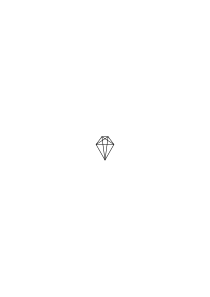
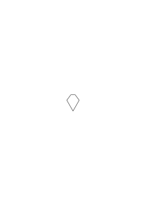
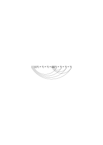
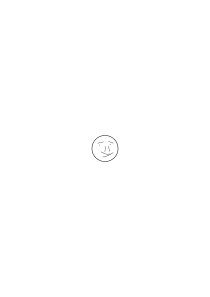
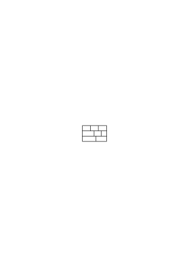
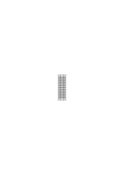
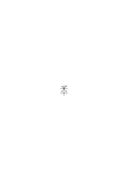
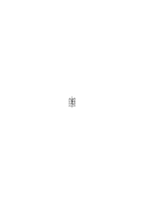
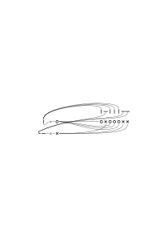
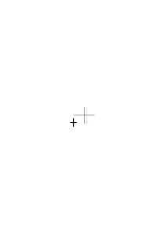

# Ms-112

21 published remarks, VB, PG II

### [1r\[1\]](https://cdn.wittgensteinnachlass.com/2000px/webp/Ms-112/1r.webp)

## VIII. Bemerkungen zur philosophischen Grammatik.

### [VB](/w-vb/#ms-112-1v.1) [1v\[1\]](https://cdn.wittgensteinnachlass.com/2000px/webp/Ms-112/1v.webp) {#1v-1}

05.10.1931

(Das Unaussprechbare (das, was mir geheimnisvoll erscheint & ich nicht auszusprechen vermag) gibt vielleicht den Hintergrund, auf dem das, was ich aussprechen könnte, Bedeutung bekommt.)

### [1v\[2\]](https://cdn.wittgensteinnachlass.com/2000px/webp/Ms-112/1v.webp)

Die Arithmetik _ist_ kein Spiel. Man kann doch in der Arithmetik nicht gewinnen oder verlieren!

### [1v\[3\]](https://cdn.wittgensteinnachlass.com/2000px/webp/Ms-112/1v.webp)

Wohl aber ist ein arithmetisches Spiel denkbar. Z.B. zwei Leute operieren abwechselnd nach bestimmten Regeln (welche die Wahl der Operationen beschränken) mit Zahlen welche aus einer angenommenen Grundzahl (Anfangsposition) durch diese Operationen sukzessive entstanden sind. Wer auf diese Weise 0 erhält hat gewonnen. (So ein Spiel wäre dem Halma ähnlich.)

### [1v\[4\]](https://cdn.wittgensteinnachlass.com/2000px/webp/Ms-112/1v.webp)

Was spricht man der Mathematik ab, wenn man sagt, sie sei nur ein Spiel (oder: sie sei ein Spiel)?

### [1v\[5\]](https://cdn.wittgensteinnachlass.com/2000px/webp/Ms-112/1v.webp),[2r\[1\]](https://cdn.wittgensteinnachlass.com/2000px/webp/Ms-112/2r.webp)

Ein Spiel im Gegensatz wozu? – Was spricht man ihr zu, wenn man sagt, ihre Sätze hätten Sinn.

### [2r\[2\]](https://cdn.wittgensteinnachlass.com/2000px/webp/Ms-112/2r.webp)

Der Sinn außerhalb des Satzes.

### [2r\[3\]](https://cdn.wittgensteinnachlass.com/2000px/webp/Ms-112/2r.webp)

Und was geht uns der an? Wo zeigt er sich & was können wir mit ihm anfangen? (Auf die Frage „was ist der Sinn dieses Satzes?” antwortet ein Satz.)

### [2r\[4\]](https://cdn.wittgensteinnachlass.com/2000px/webp/Ms-112/2r.webp)

“Aber der mathem. Satz drückt (doch) einen Gedanken aus.” – Welchen Gedanken? –

### [2r\[5\]](https://cdn.wittgensteinnachlass.com/2000px/webp/Ms-112/2r.webp)

Kann er durch einen anderen Satz ausgedrückt werden? oder nur durch _diesen_ Satz? – Oder überhaupt nicht? In diesem Falle geht er uns nichts an.

### [2r\[6\]](https://cdn.wittgensteinnachlass.com/2000px/webp/Ms-112/2r.webp)

Will man bloß die mathem. Sätze von andern Gebilden, den Hypothesen etc., unterscheiden? Daran tut man recht & daß dieser Unterschied besteht unterliegt ja keinem Zweifel.

### [2r\[7\]](https://cdn.wittgensteinnachlass.com/2000px/webp/Ms-112/2r.webp),[2v\[1\]](https://cdn.wittgensteinnachlass.com/2000px/webp/Ms-112/2v.webp)

Will man sagen, die Mathematik werde gespielt wie das Schach oder eine Patience & es gebe dabei ein Gewinnen oder Ausgehen so ist das offenbar unrichtig.

### [2v\[2\]](https://cdn.wittgensteinnachlass.com/2000px/webp/Ms-112/2v.webp)

Sagt man, daß die seelischen Vorgänge die den Gebrauch der mathematischen Symbole begleiten, andere sind, als die, die das Schachspiel begleiten, so weiß ich darüber nichts zu sagen.

### [2v\[3\]](https://cdn.wittgensteinnachlass.com/2000px/webp/Ms-112/2v.webp)

Es gibt auch beim Schach einige Konfigurationen die unmöglich sind, obwohl jeder Stein in einer ihm erlaubten Stellung steht. (Z.B. wenn die Anfangsstellung der Bauern intakt ist & ein Läufer schon auf dem Feld.) Aber man könnte sich ein Spiel denken, worin die Anzahl der Züge vom Anfang der Partie notiert würde, & dann gäbe es den Fall, daß nach n Zügen diese Konfiguration nicht eintreten könnte & man es der Konfiguration doch nicht ohne weiters ansehen kann ob sie als n-te möglich ist, oder nicht.

### [2v\[4\]](https://cdn.wittgensteinnachlass.com/2000px/webp/Ms-112/2v.webp)

Die Handlungen im Spiel müssen den Handlungen im Rechnen entsprechen. (Ich meine: darin muß die Entsprechung bestehen, oder, so müssen die beiden einander zugeordnet sein.)

### [3r\[1\]](https://cdn.wittgensteinnachlass.com/2000px/webp/Ms-112/3r.webp)

Welche Gleichung, etwa, von der Form abc… × cde… = ghi… ist richtig, welche falsch?

### [3r\[2\]](https://cdn.wittgensteinnachlass.com/2000px/webp/Ms-112/3r.webp)

Ja, kann man von dem Schriftzeichen (überhaupt) sagen, es sei richtig (oder falsch)? Das nämlich hängt mit dem Sinn der Antwort zusammen: „richtig ist die Gleichung, die man nach den Regeln erzeugen kann” im Gegensatz zu _der_: „richtig ist die Gleichung, die man nach den Regeln erzeugt hat”.

### [3r\[3\]](https://cdn.wittgensteinnachlass.com/2000px/webp/Ms-112/3r.webp)

Das ist klar, daß die Position (Gleichung) nur im System, in dem sie erzeugt werden kann, richtig oder falsch ist.

### [3r\[4\]](https://cdn.wittgensteinnachlass.com/2000px/webp/Ms-112/3r.webp)

„Man darf ein System von Axiomen nicht benützen, ehe seine Widerspruchsfreiheit nachgewiesen ist.” „In den Spielregeln dürfen keine Widersprüche vorkommen”. Warum nicht? „Weil man dann nicht wüßte, wie man zu spielen hat”?

### [3r\[5\]](https://cdn.wittgensteinnachlass.com/2000px/webp/Ms-112/3r.webp)

Aber wie kommt es, daß man auf den Widerspruch mit dem Zweifel reagiert?

### [3v\[1\]](https://cdn.wittgensteinnachlass.com/2000px/webp/Ms-112/3v.webp)

Auf den Widerspruch reagiert man überhaupt nicht. Man könnte nur sagen: Wenn das wirklich so gemeint ist (wenn der Widerspruch hier stehen _soll_), so versteh' ich es nicht. Oder: ich hab' es nicht gelernt. Ich verstehe die Zeichen nicht. Ich habe nicht gelernt, was ich darauf hin tun soll, ob es überhaupt ein Befehl ist; etc..

### [3v\[2\]](https://cdn.wittgensteinnachlass.com/2000px/webp/Ms-112/3v.webp)

Wie wäre es etwa, wenn man in der Arithmetik zu den üblichen Axiomen die Gleichung 2 × 2 = 5 hinzunehmen wollte? Das hieße natürlich, daß das Gleichheitszeichen nun seine Bedeutung geändert hätte, d.h., daß nun andere Regeln für das Gleichheitszeichen gälten.

### [3v\[3\]](https://cdn.wittgensteinnachlass.com/2000px/webp/Ms-112/3v.webp)

Hilbert stellt Regeln eines bestimmten Kalküls als Regeln einer Metamathematik auf.

### [3v\[4\]](https://cdn.wittgensteinnachlass.com/2000px/webp/Ms-112/3v.webp),[4r\[1\]](https://cdn.wittgensteinnachlass.com/2000px/webp/Ms-112/4r.webp)

Wenn ich nun sagte: „also kann ich es nicht als Ersetzungszeichen gebrauchen; so hieße das, daß seine Grammatik nun nicht mehr mit der des Wortes „ersetzen” („Ersetzungszeichen”, etc.) übereinstimmt. Denn das Wort „kann” in diesem Satz deutet nicht auf eine physische (physiologische, psychologische) Möglichkeit.

### [4r\[2\]](https://cdn.wittgensteinnachlass.com/2000px/webp/Ms-112/4r.webp)

„Die Regeln dürfen einander nicht widersprechen”, das ist wie: „die Negation darf nicht verdoppelt eine Negation ergeben”. Es liegt nämlich in der Grammatik des Wortes „Regel” daß „p ∙ ~p” (wenn „p” eine Regel ist) keine Regel ist.

### [4r\[3\]](https://cdn.wittgensteinnachlass.com/2000px/webp/Ms-112/4r.webp)

Das heißt, man könnte also auch sagen: die Regeln können einander widersprechen, wenn andre Regeln für das Wort „Regel” gelten – wenn das Wort „Regel” eine andere Bedeutung hat.

### [4r\[4\]](https://cdn.wittgensteinnachlass.com/2000px/webp/Ms-112/4r.webp),[4v\[1\]](https://cdn.wittgensteinnachlass.com/2000px/webp/Ms-112/4v.webp)

Wir können eben auch hier nicht begründen (außer (etwa) biologisch oder historisch) &

### [4v\[2\]](https://cdn.wittgensteinnachlass.com/2000px/webp/Ms-112/4v.webp)

Daß man die Gleichung A dem Komplex B zuordnet, heißt, <math display="inline"><mi>B</mi><mspace width="0.3em"/><mtext>α</mtext><mspace width="0.3em"/><mtext>–</mtext><mspace width="0.3em"/><mtext>–</mtext><mspace width="0.3em"/><mtext>–</mtext><mspace width="0.3em"/><mtext>β</mtext><mspace width="0.3em"/><mtext>–</mtext><mspace width="0.3em"/><mtext>–</mtext><mspace width="0.3em"/><mtext>–</mtext><mspace width="0.3em"/><mtext>γ</mtext><mspace width="0.3em"/><mtext>–</mtext><mspace width="0.3em"/><mtext>–</mtext><mspace width="0.3em"/><mtext>–</mtext><mspace width="0.3em"/><mo>|</mo><mspace width="0.3em"/><mo>|</mo><mi>A</mi><mtext><mo>}</mo></mtext><mspace width="0.3em"/><mtext>–</mtext><mspace width="0.3em"/><mtext>–</mtext><mspace width="0.3em"/><mtext>–</mtext></math> daß eine Gleichung von der Art A die Multiplizität hat, die man in dem Komplex B sieht, d.h., daß man so viel an dieser Gleichung unterscheiden kann (oder so viele Unterschiede (an ihr) machen kann) wie an dem Komplex.

### [4v\[3\]](https://cdn.wittgensteinnachlass.com/2000px/webp/Ms-112/4v.webp)

D.h., daß das Ornament des Komplexes so viele Paßflächen hat, wie das der Gleichung & die übrige Mannigfaltigkeit des Komplexes wegfällt wie die des Fünfecks,

so daß man es, was sein Zusammenpassen mit anderen Figuren betrifft, nur durch seine Kontur ersetzen könnte & die

Gleichung zieht in diesem Sinne die Kontur des Komplexes nach.

### [4v\[4\]](https://cdn.wittgensteinnachlass.com/2000px/webp/Ms-112/4v.webp)

Zwischen B & A könnte man das Gleichheitszeichen setzen.

### [4v\[5\]](https://cdn.wittgensteinnachlass.com/2000px/webp/Ms-112/4v.webp),[5r\[1\]](https://cdn.wittgensteinnachlass.com/2000px/webp/Ms-112/5r.webp)

Ist es so: Der Satz A enthält nichts andres als B; ja, ist eine Abkürzung von B. Ich kann aber doch nicht sagen, daß B mittels a + (b + 1) = (a + b) + 1 … α bewiesen wurde. Das heißt ja natürlich gar nichts. – Nur β und γ wurden mit α bewiesen. –

### [5r\[2\]](https://cdn.wittgensteinnachlass.com/2000px/webp/Ms-112/5r.webp)

Und α, β & γ wurden eben zusammengestellt. Sie wurden herausgegriffen & etwas Neues aus ihnen konstruiert.

### [5r\[3\]](https://cdn.wittgensteinnachlass.com/2000px/webp/Ms-112/5r.webp)

Es läßt sich nicht zeigen, beweisen, daß man gewisse Regeln als Regeln dieser Handlung gebrauchen _kann_. Außer, indem man zeigt, daß die Grammatik der Bezeichnung der Handlung mit der jener Regeln übereinstimmt.

### [5r\[4\]](https://cdn.wittgensteinnachlass.com/2000px/webp/Ms-112/5r.webp),[5v\[1\]](https://cdn.wittgensteinnachlass.com/2000px/webp/Ms-112/5v.webp)

Zu dem Problem vom ‚Sandhaufen’: Man könnte sich hier, wie in allen ähnlichen Fällen, einen offiziellen Begriff denken etwa: Haufe ist alles was über ½ m³ groß ist. Dieser wäre aber dennoch nicht unser gewöhnlich gebrauchter Begriff. Für diesen liegt keine Abgrenzung vor (& bestimmen wir eine, so ändern wir den Begriff) sondern es liegen nur Fälle vor, welche wir zu dem Begriff rechnen & solche die wir nicht mehr zu dem Begriff rechnen.

### [5v\[2\]](https://cdn.wittgensteinnachlass.com/2000px/webp/Ms-112/5v.webp)

(a + b) ∙ (a + b) = a ∙ (a + b) + b ∙ (a + b) Dieser Übergang ist vermittels des Satzes ‥‥ gemacht worden &, wenn der Induktionsbeweis eine Rechtfertigung dieses Satzes ist, so ist er auch eine Rechtfertigung dieses Übergangs.

### [5v\[3\]](https://cdn.wittgensteinnachlass.com/2000px/webp/Ms-112/5v.webp)

(Punkt am Ende des Satzes. Gefühl des Unabgeschlossenen, wenn er fehlt.)

### [5v\[4\]](https://cdn.wittgensteinnachlass.com/2000px/webp/Ms-112/5v.webp)

Wie beweist man: 1 + (1 + (1 + 1)) = (1 + (1 + 1 + )) + 1? Kann man es aus 1 + (1 + 1) = (1 + 1) + 1 allein beweisen?

### [5v\[5\]](https://cdn.wittgensteinnachlass.com/2000px/webp/Ms-112/5v.webp)

06.10.1931

Der Beweis B zeigt uns gleichsam eine Eigenschaft der beiden Seiten der Gleichung A.

### [5v\[6\]](https://cdn.wittgensteinnachlass.com/2000px/webp/Ms-112/5v.webp),[6r\[1\]](https://cdn.wittgensteinnachlass.com/2000px/webp/Ms-112/6r.webp)

Ich möchte sagen, wenn ich die Gleichungen

a + (b + 1) = (a + b) + 1

a + (b + (c + 1)) = a + (b + c)) + 1)

(a + b) + (c + 1) = ((a + b) + c) + 1 | | }

betrachte: es liegt alles in ihnen; kein weiterer Schritt gibt uns mehr, als schon da steht. Anderseits sieht man sie doch _auf gewisse Weise_ an, wenn man sie als Induktionsbeweis auffaßt, aber das sagt nur, daß wir das in ihnen sehen, was wir z.B. durch Unterstreichen gewisser Ausdrücke anzeigen oder durch das Ziehen von Zuordnungslinien zwischen den Gleichungen. Und diese Linien sind nur neue Paßflächen, welche den Gleichungskomplex in ein neues System einreihen.

### [6r\[2\]](https://cdn.wittgensteinnachlass.com/2000px/webp/Ms-112/6r.webp),[6v\[1\]](https://cdn.wittgensteinnachlass.com/2000px/webp/Ms-112/6v.webp)

Man sagt für gewöhnlich die rekursiven Beweise beweisen, daß die algebraischen Gleichungen für alle Kardinalzahlen gelten; aber es kommt hier momentan nicht darauf an ob dieser Ausdruck glücklich oder schlecht gewählt ist sondern nur darauf ob er in allen Fällen die gleiche Bedeutung hat.

### [6v\[2\]](https://cdn.wittgensteinnachlass.com/2000px/webp/Ms-112/6v.webp)

Die Ausdehnung eines Begriffes, der Zahl, des Begriffs ‚alle’, etc. erscheint uns (ganz) harmlos; aber sie ist es nicht wenn wir vergessen, daß wir unsern Begriff tatsächlich geändert haben.

### [6v\[3\]](https://cdn.wittgensteinnachlass.com/2000px/webp/Ms-112/6v.webp)

Und ist es da nicht klar daß die rekursiven Beweise tatsächlich _dasselbe_ für alle ‚bewiesenen’ Gleichungen zeigen?

### [6v\[4\]](https://cdn.wittgensteinnachlass.com/2000px/webp/Ms-112/6v.webp)

Und das heißt doch, daß zwischen dem rekursiven Beweis & dem von ihm bewiesenen Satz immer die gleiche (interne) Beziehung besteht?

### [6v\[5\]](https://cdn.wittgensteinnachlass.com/2000px/webp/Ms-112/6v.webp)

Woher nun das Widerstreben, dieses Verhältnis das eines Beweises zum Bewiesenen zu nennen?

### [6v\[6\]](https://cdn.wittgensteinnachlass.com/2000px/webp/Ms-112/6v.webp),[7r\[1\]](https://cdn.wittgensteinnachlass.com/2000px/webp/Ms-112/7r.webp)

Ja es ist doch übrigens ganz klar daß es so einen rekursiven oder richtiger iterativen ‚Beweis’ geben muß. (Der uns die Einsicht vermittelt, daß es ‚mit allen Zahlen so gehen muß’.) [D.h. es scheint _mir_ klar, & daß ich einem Anderen die Richtigkeit dieser Sätze für die Kardinalzahlen durch einen Prozeß der Iteration begreiflich machen könnte.]

### [7r\[2\]](https://cdn.wittgensteinnachlass.com/2000px/webp/Ms-112/7r.webp)

D.h.: Ich möchte Einem zeigen daß das distributive Gesetz wirklich im Wesen der Anzahl liegt; werde ich da nicht durch einen Prozeß der Iteration zu zeigen versuchen daß das Gesetz gilt & immer weiter gelten muß?

### [7r\[3\]](https://cdn.wittgensteinnachlass.com/2000px/webp/Ms-112/7r.webp)

Und in wiefern kann man diesen Vorgang nicht den Beweis des distributiven Gesetzes nennen?

### [7r\[4\]](https://cdn.wittgensteinnachlass.com/2000px/webp/Ms-112/7r.webp)

Will ich nur konstatieren, daß man durch die Prozedur der Iteration nicht zu einem Resultat „a + (b + c) = (a + b) + c” kommen kann, weil die Bestandteile dieses Satzes in jener Rechnung nicht vorkommen?

### [7r\[5\]](https://cdn.wittgensteinnachlass.com/2000px/webp/Ms-112/7r.webp),[7v\[1\]](https://cdn.wittgensteinnachlass.com/2000px/webp/Ms-112/7v.webp)

07.10.1931

Könnte ich nicht also in derselben Weise wie ich 16 × 25 = 400 etwa durch aufschreiben von 16 Einsern in 25 Reihen begreiflich machen kann, ihm a + (b + c) = (a + b) + c durch eine Vorführung mit Einsern begreiflich machen? Stehen die Beweise nun nicht auf derselben Stufe?

### [7v\[2\]](https://cdn.wittgensteinnachlass.com/2000px/webp/Ms-112/7v.webp),[7v\[3\]](https://cdn.wittgensteinnachlass.com/2000px/webp/Ms-112/7v.webp)

Und dieser Begriff des ‚BegreiflichMachens’ kann uns hier wirklich helfen. Denn man könnte sagen: das Kriterium dafür, ob etwas ein Beweis eines Satzes ist, ist ob man ihn dadurch begreiflich machen kann. (Natürlich handelt es sich da wieder nur um eine Erweiterung unserer grammatischen Betrachtungen über das Wort ‚Beweis’; nicht um ein psychologisches Interesse an dem Vorgang des Begreiflich-Machens.)

### [7v\[4\]](https://cdn.wittgensteinnachlass.com/2000px/webp/Ms-112/7v.webp)

Man könnte eine Art Konstruktion machen:

indem man immer Klammern vor dem zweitem Summanden wegstreicht & sie vor den ersten setzt.

### [7v\[5\]](https://cdn.wittgensteinnachlass.com/2000px/webp/Ms-112/7v.webp),[8r\[1\]](https://cdn.wittgensteinnachlass.com/2000px/webp/Ms-112/8r.webp)

„Dieser Satz ist für alle Zahlen durch das rekursive Verfahren bewiesen”. Das ist der Ausdruck, der so ‚ganz’ irreführend ist. Es klingt so als würde hier ein Satz, der konstatiert daß das & das für alle Kardinalzahlen gilt, auf einem Wege als wahr erwiesen & als sei dieser Weg ein Weg in einem Raum denkbarer Wege. Während die Rekursion in Wahrheit nur sich selber zeigt, wie auch die Periodizität.

### [8r\[2\]](https://cdn.wittgensteinnachlass.com/2000px/webp/Ms-112/8r.webp)

Ich will jemandem zeigen, daß das (a + (b + c) = (a + b) + c) stimmt. Was ich als Methode das zu zeigen verwenden kann, ist ein Beweis. (Z.B. die Methode der Gruppierung einer Reihe von Strichen.)

### [8r\[3\]](https://cdn.wittgensteinnachlass.com/2000px/webp/Ms-112/8r.webp)

Ist die Frage nicht also: Kann man 4 + (2 + 3) = (4 + 2) + 3 ausrechnen? Wenn ja, so konnte man also von diesem speziellen Zahlensatz einen Beweis geben & es ist klar, daß sich dann, eine ‚Möglichkeit der Weiterführung’ einer Reihe solcher Beweise zeigen wird.

### [8r\[4\]](https://cdn.wittgensteinnachlass.com/2000px/webp/Ms-112/8r.webp)

Die Art der Ausrechnung nach dem Schema des Rekursionsbeweises bestünde offenbar darin, daß man zuerst von 4 + (2 + 1) = (4 + 2) + 1 auf 4 + (2 + 2) = (4 + 2) + 2 & dann auf 4 + (2 + 3) = (4 + 2) + 3 übergeht.

### [8r\[5\]](https://cdn.wittgensteinnachlass.com/2000px/webp/Ms-112/8r.webp),[8v\[1\]](https://cdn.wittgensteinnachlass.com/2000px/webp/Ms-112/8v.webp)

Es muß die Stellung des algebraisch geführten rekursiven Beweises viel klarer machen, wenn man statt seiner die Reihe von arithmetischen Beweisen mit dem ‚u.s.w.’ setzt. Denn durch diese ist der erste offenbar zu ersetzen.

### [8v\[2\]](https://cdn.wittgensteinnachlass.com/2000px/webp/Ms-112/8v.webp)

(Und die größere Klarheit kommt durch das Verschwinden jedes Scheins, als ob es sich beim Rekursionsbeweis um einen algebraischen Beweis der Art (a + b)² = ..... = a² + 2ab + b² handelte.)

### [8v\[3\]](https://cdn.wittgensteinnachlass.com/2000px/webp/Ms-112/8v.webp)

(Der Übergang auf 4 + (2 + 2) = (4 + 2) + 2 ginge nach dem Skolemschen Schema so (vor sich): 4 + (2 + 2) = 4 + ((2 + 1) + 1) = (4 + (2 + 1)) + 1 = ((4 + 2) + 1) + 1 = (4 + 2) + 2.)

### [8v\[4\]](https://cdn.wittgensteinnachlass.com/2000px/webp/Ms-112/8v.webp)

Kann ich nicht sagen, der Induktionsbeweis ist das Schema einer Rechnung. –

### [8v\[5\]](https://cdn.wittgensteinnachlass.com/2000px/webp/Ms-112/8v.webp)

Das Problem der Unterscheidung von 1 + 1 + 1 + 1 + 1 + 1 + 1 und 1 + 1 + 1 + 1 + 1 + 1 + 1 + 1 ist viel wichtiger, als es zuerst scheint. Es handelt sich um den Unterschied zwischen physikalischer & visueller Zahl.

### [8v\[6\]](https://cdn.wittgensteinnachlass.com/2000px/webp/Ms-112/8v.webp),[9r\[1\]](https://cdn.wittgensteinnachlass.com/2000px/webp/Ms-112/9r.webp)

Es ist auch etwas Sonderbares an der Berechnung die von 3 + (4 + 6) zu (3 + 4) + 6 führt. Wir können nämlich die Berechnung nach einer Regel durch _einen_ Schritt ausführen, & – was auf dasselbe hinauskommt – wir wissen von vornherein was bei dieser Rechnung herauskommen wird. Und zwar nicht in dem Sinn, in dem wir vielleicht auch von vornherein das Resultat von 25 × 37 wissen, weil wir es früher einmal ausgerechnet & uns gemerkt haben, sondern wir brauchen die kompliziertere Überlegung nicht, weil eine einfachere zum Ziel führt. Ist das aber nicht so, wie wir auch wissen daß 4365 durch 5 teilbar ist, ohne die Division anzuführen, & doch müßte es bewiesen werden, daß die 5 an der Einerstelle ein Kriterium der Teilbarkeit durch 5 ist.

### [9r\[2\]](https://cdn.wittgensteinnachlass.com/2000px/webp/Ms-112/9r.webp)

Wir haben es (hier) natürlich auch wieder damit zu tun, daß der Rekursionsbeweis als _eine Art von Beweisen_ aufgefaßt wird & man nicht sieht, daß jetzt das Wort „Beweis” seine Bedeutung (weil seine Grammatik) geändert hat.

### [9r\[3\]](https://cdn.wittgensteinnachlass.com/2000px/webp/Ms-112/9r.webp),[9v\[1\]](https://cdn.wittgensteinnachlass.com/2000px/webp/Ms-112/9v.webp)

Habe ich's nur so scharf auf die Auffassung daß die Rekursionsbeweise den Weg beginnen, die Grundgesetze beweisen, & der Weg nun mit diesen weiter geht; während doch jeder Satz der Algebra rekursiv bewiesen werden kann, wenn es die Grundgesetze (werden) können.

### [9v\[2\]](https://cdn.wittgensteinnachlass.com/2000px/webp/Ms-112/9v.webp)

Und könnte ich nicht sagen, daß die Unreduzierbarkeit der Grundgesetze (kommutatives, distributives, etc.) sich auch in den Induktionen die ihnen entsprechen zeigen muß?!

### [9v\[3\]](https://cdn.wittgensteinnachlass.com/2000px/webp/Ms-112/9v.webp)

Das Verhältnis, was zwischen den algebraischen Sätzen besteht, muß auch zwischen ihren Induktionsbeweisen bestehen.

### [9v\[4\]](https://cdn.wittgensteinnachlass.com/2000px/webp/Ms-112/9v.webp)

Wir haben also hier nicht den Fall, in welchem eine Gruppe von Grundgesetzen durch eine mit weniger Gliedern bewiesen wird, aber nun weiter in den Beweisen alles im Gleichen bleibt. (Wie auch in einem System von Grundbegriffen an der späteren Entwicklung dadurch nichts geändert wird daß man die Anzahl der Grundbegriffe durch Definitionen reduziert.)

### [9v\[5\]](https://cdn.wittgensteinnachlass.com/2000px/webp/Ms-112/9v.webp),[10r\[1\]](https://cdn.wittgensteinnachlass.com/2000px/webp/Ms-112/10r.webp)

08.10.1931

(Übrigens, welche verdächtige Analogie zwischen ‚Grundgesetzen’ & ‚Grundbegriffen’!)

### [10r\[2\]](https://cdn.wittgensteinnachlass.com/2000px/webp/Ms-112/10r.webp)

Es ist gleichsam so: der Beweis eines alten Grundgesetzes setzt sonst das System der Beweise (einfach) nach rückwärts fort. Die Rekursionsbeweise aber setzen das System von algebraischen Beweisen (mit den alten Grundgesetzen) nicht nach hinten fort, sondern sind ein neues System das mit dem ersten nur parallel zu laufen scheint.

### [10r\[3\]](https://cdn.wittgensteinnachlass.com/2000px/webp/Ms-112/10r.webp),[10v\[1\]](https://cdn.wittgensteinnachlass.com/2000px/webp/Ms-112/10v.webp)

Ich sprach früher von Verbindungsstrichen Unterstreichungen etc. um die korrespondierenden, homologen, Teile der Gleichungen eines Rekursionsbeweises zu zeigen. Im Beweis:

a + (b + 1) = (a + b) + 1

a + (b + (c + 1)) = a + ((b + c) + 1) = (a + (b + c)) + 1

(a + b) + (c + 1) = ((a + b) + c) + 1

entspricht z.B. die Eins α nicht der β sondern dem c der nächsten Gleichung. β aber entspricht nicht δ sondern ε, & γ nicht δ sondern c + δ. etc.

Oder in:

<math display="block">
  <mspace width="0.3em"/>
  <mo>(</mo>
  <mi>a</mi>
  <mspace width="0.3em"/>
  <mo>+</mo>
  <mspace width="0.3em"/>
  <mtext>1)</mtext>
  <mspace width="0.3em"/>
  <mo>+</mo>
  <mspace width="0.3em"/>
  <mn>1</mn>
  <mspace width="0.3em"/>
  <mo>=</mo>
  <mspace width="0.3em"/>
  <mo>(</mo>
  <mi>a</mi>
  <mspace width="0.3em"/>
  <mo>+</mo>
  <mspace width="0.3em"/>
  <mtext>1)</mtext>
  <mspace width="0.3em"/>
  <mo>+</mo>
  <mspace width="0.3em"/>
  <mn>1</mn>
  <mspace width="0.3em"/>
  <mn>1</mn>
  <mspace width="0.3em"/>
  <mo>+</mo>
  <mspace width="0.3em"/>
  <mo>(</mo>
  <mi>a</mi>
  <mspace width="0.3em"/>
  <mo>+</mo>
  <mspace width="0.3em"/>
  <mtext>1)</mtext>
  <mspace width="0.3em"/>
  <mo>=</mo>
  <mspace width="0.3em"/>
  <mo>(</mo>
  <mn>1</mn>
  <mspace width="0.3em"/>
  <mo>+</mo>
  <mspace width="0.3em"/>
  <mtext>a)</mtext>
  <mspace width="0.3em"/>
  <mo>+</mo>
  <mspace width="0.3em"/>
  <mn>1</mn>
</math>

entspricht nicht ι dem κ & ε dem λ sondern ι dem α & ε dem β & nicht β dem ζ aber ζ dem ϑ & α dem δ & β dem γ & γ dem μ aber nicht dem ϑ u.s.w.

### [10v\[2\]](https://cdn.wittgensteinnachlass.com/2000px/webp/Ms-112/10v.webp)

Das ist eine seltsame Bemerkung, daß in den Induktionsbeweisen der Grundregeln nach wie vor ihre Unreduzierbarkeit sich zeigen muß. Was, wenn man das für den Fall von von gewöhnlichen Beweisen (oder Definitionen) sagte also für den Fall wo die Grundregeln eben weiter reduziert werden, eine neue Verwandtschaft zwischen ihnen gefunden (oder konstruiert) wird.

### [10v\[3\]](https://cdn.wittgensteinnachlass.com/2000px/webp/Ms-112/10v.webp)

(Alles was die Philosophie tun kann ist Götzen zerstören. Und das heißt keinen neuen (etwa in der Abwesenheit der Götzen) zu schaffen.)

### [10v\[4\]](https://cdn.wittgensteinnachlass.com/2000px/webp/Ms-112/10v.webp)

Wenn ich darin recht habe daß durch die Rekursionsbeweise die Unreduzierbarkeit intakt bleibt dann ist damit (wohl) alles gesagt was ich gegen den Begriff vom Rekursions-„Beweis” sagen wollte.

### [11r\[1\]](https://cdn.wittgensteinnachlass.com/2000px/webp/Ms-112/11r.webp)

Ich möchte sagen: wir haben β & γ durch α bewiesen aber nicht B. Aber können wir denn nicht sagen, B ist einfach das logische Produkt aus α, β & γ?? Also B = α ∙ β ∙ γ?

### [11r\[2\]](https://cdn.wittgensteinnachlass.com/2000px/webp/Ms-112/11r.webp)

Dann hieße also das distributive Gesetz – nur etwas ungeschickt angeschrieben –: „a + (b + 1) = (a + b) + 1 ․ & ․ a + (b + (c + 1)) = (a + (b + c + ))1 ․ & ․ (a + b) + (c + 1) = ((a + b) + c) + 1”? Aber warum dann nicht nur „a + (b + 1) = (a + b) + 1”, da doch die beiden andern Faktoren aus dieser Gleichung folgen?

### [11r\[3\]](https://cdn.wittgensteinnachlass.com/2000px/webp/Ms-112/11r.webp)

(Die Mathematiker wenn sie die Grundlagen ihrer Wissenschaft sammeln gleichen einem Maurer der sagte zu einem Haus brauche ich: Ziegel, Mörtel, Gewissenhaftigkeit, Kraft & Festigkeit.)

### [11r\[4\]](https://cdn.wittgensteinnachlass.com/2000px/webp/Ms-112/11r.webp)

(Der Stil meiner Sätze ist außerordentlich stark von Frege beeinflußt. Und wenn ich wollte so könnte ich wohl diesen Einfluß feststellen, wo ihn auf den ersten Blick keiner sähe.)

### [11r\[5\]](https://cdn.wittgensteinnachlass.com/2000px/webp/Ms-112/11r.webp),[11v\[1\]](https://cdn.wittgensteinnachlass.com/2000px/webp/Ms-112/11v.webp)

Der Grund warum alle Philosophien der Mathematik fehlgehen ist der, daß man in der Logik nicht allgemeine Dikta durch Beispiele begründen kann, wie in der Naturgeschichte. Sondern jeder besondere Fall hat die größt mögliche Bedeutung, & anderseits ist mit ihm alles erschöpft & man kann keinen allgemeineren Schluß aus ihm ziehen (also _keinen_ Schluß).

### [11v\[2\]](https://cdn.wittgensteinnachlass.com/2000px/webp/Ms-112/11v.webp)

Wozu brauchen wir denn das kommutative Gesetz? Doch nicht um die Gleichung 4 + 6 = 6 + 4 anschreiben zu können, denn diese Gleichung wird durch ihren besonderen Beweis gerechtfertigt. Und es kann freilich auch der Beweis des kommutativen Gesetzes als ihr Beweis verwendet werden, aber dann ist er eben (hier) ein spezieller (arithmetischer) Beweis. Ich brauche das Gesetz also um danach mit Buchstaben zu operieren.

### [11v\[3\]](https://cdn.wittgensteinnachlass.com/2000px/webp/Ms-112/11v.webp),[12r\[1\]](https://cdn.wittgensteinnachlass.com/2000px/webp/Ms-112/12r.webp)

Habe ich mich aber nicht doch geirrt? Ich dachte für den Satz (a + b)² = a² + 2ab + b² müsse es den algebraischen & einen rekursiven Beweis geben. Aber der Gang des algebraischen Beweises von (a + b)² = a² + 2ab + b² entspricht ganz dem Beweis von (b + 1) + a = (b + a) + 1 im Induktionsbeweis III.

### [12r\[2\]](https://cdn.wittgensteinnachlass.com/2000px/webp/Ms-112/12r.webp)

Dieser Übergang wird mit dem fertigen (bewiesenen) Satz a + (b + c) = (a + b) + c gemacht.

### [12r\[3\]](https://cdn.wittgensteinnachlass.com/2000px/webp/Ms-112/12r.webp)

Der rekursive Beweis für (a + b)² = a² + 2ab + b² besteht eben in der gewöhnlichen Ableitung der Gleichung plus den rekursiven Beweisen der Grundgesetze. D.h., dem Beweis dieser Gleichung mittels der Reihe arithmetischer Beispiele entspricht eben die algebraische Ableitung der Gleichung zusammen mit den Induktionsbeweisen der algebraischen Grundregeln.

### [12r\[4\]](https://cdn.wittgensteinnachlass.com/2000px/webp/Ms-112/12r.webp)

‚… wir richten uns nach ihren _Taten_’ (bezieht sich auf die Mathematiker).

### [12r\[5\]](https://cdn.wittgensteinnachlass.com/2000px/webp/Ms-112/12r.webp)

Ich darf auch nicht vergessen, daß ja ein gewisser _Gang_ durch die Skolemschen Beweise führt, der dritte vom ersten & zweiten abhängig ist, sich des ersten bedient. (Also wesentlich _nach_ dem ersten steht.) u.s.w.

### [12r\[6\]](https://cdn.wittgensteinnachlass.com/2000px/webp/Ms-112/12r.webp),[12v\[1\]](https://cdn.wittgensteinnachlass.com/2000px/webp/Ms-112/12v.webp)

Und diese Berechtigung [wollte ich sagen] kann mir der Induktionsbeweis nicht geben.

### [12v\[2\]](https://cdn.wittgensteinnachlass.com/2000px/webp/Ms-112/12v.webp)

Was soll es heißen daß der Gleichungskomplex in I den Übergang in III _rechtfertigt_. Wie kann er das?

### [12v\[3\]](https://cdn.wittgensteinnachlass.com/2000px/webp/Ms-112/12v.webp)

09.10.1931

Wie der Beweis I in III angewendet ist, muß sich zeigen wenn wir die Beweise als periodische arithmetische Beweise führen.

### [12v\[4\]](https://cdn.wittgensteinnachlass.com/2000px/webp/Ms-112/12v.webp)

Aber eines ist klar: Wenn uns der Rekursionsbeweis das Recht gibt algebraisch zu rechnen, dann auch der arithmetische Beweis.

### [12v\[5\]](https://cdn.wittgensteinnachlass.com/2000px/webp/Ms-112/12v.webp)

Die Frage ist aber, rechne ich (horizontal) anders algebraisch in III mit I & II als in I mit der Definition a + (b + 1) = (a + b) + 1? Bediene ich mich des Komplexes I nicht in derselben Weise in III wie der rekursiven Definition in I?

### [12v\[6\]](https://cdn.wittgensteinnachlass.com/2000px/webp/Ms-112/12v.webp)

[Es ist unglaublich, daß man sich mit so einem einfachen Beweis so lange soll beschäftigen können.]

### [12v\[7\]](https://cdn.wittgensteinnachlass.com/2000px/webp/Ms-112/12v.webp)

(Das Ganze ist eine Auseinandersetzung zwischen dem rekursiven & dem algebraischen Element in diesen Beweisen.)

### [13r\[1\]](https://cdn.wittgensteinnachlass.com/2000px/webp/Ms-112/13r.webp)

Die rekursive Definition scheint nämlich eine Doppelrolle zu spielen. Und zwar als rekursive Definition & als algebraische Rechnungsregel (von der Art des assoziativen Gesetzes.)

### [13r\[2\]](https://cdn.wittgensteinnachlass.com/2000px/webp/Ms-112/13r.webp)

Kann man versuchen zu einer Melodie den falschen Takt zu schlagen? Oder: Wie verhält sich dieses Versuchen zu dem, ein Gewicht zu heben das uns zu schwer ist?

### [13r\[3\]](https://cdn.wittgensteinnachlass.com/2000px/webp/Ms-112/13r.webp)

Ich habe noch nie eine Bemerkung darüber gelesen, daß, wenn man ein Auge zumacht & „nur mit einem Aug sieht”, man die Finsternis nicht zugleich mit dem geschlossenen sieht! Das ist sehr merkwürdig!

### [13r\[4\]](https://cdn.wittgensteinnachlass.com/2000px/webp/Ms-112/13r.webp)

Wie verhält sich die Schachaufgabe zur Schachpartie? Denn daß die Schachaufgabe der Rechenaufgabe entspricht, eine Rechenaufgabe ist, ist klar.

### [13r\[5\]](https://cdn.wittgensteinnachlass.com/2000px/webp/Ms-112/13r.webp),[13v\[1\]](https://cdn.wittgensteinnachlass.com/2000px/webp/Ms-112/13v.webp)

Ein arithmetisches Spiel wäre z.B. folgendes: Wir schreiben auf gut Glück eine 4-stellige Zahl hin etwa 7368 dieser Zahl soll man sich dadurch nähern daß man die Zahlen 7, 3, 6 & 8 in irgendeiner Reihenfolge mit einander multipliziert. Die Spielteilnehmer rechnen mit Bleistift auf Papier & wer in der geringsten Anzahl von Operationen so nah an 7368 kommt hat gewonnen. (Übrigens lassen sich eine Menge der mathematischen Rätselfragen die heute beliebt sind zu solchen Spielen umformen.)

### [13v\[2\]](https://cdn.wittgensteinnachlass.com/2000px/webp/Ms-112/13v.webp)

Angenommen einem Menschen wäre Arithmetik nur zum Gebrauch in einem arithmetischen Spiel gelehrt worden. Hätte er etwas anders gelernt als der welcher Arithmetik zum normalen Gebrauch lernt? Und wenn er nun im Spiel 21 mit 8 multipliziert & 168 erhält tut er etwas Andres als der, welcher herausfinden wollte wieviel 21 × 8 ist?

### [13v\[3\]](https://cdn.wittgensteinnachlass.com/2000px/webp/Ms-112/13v.webp)

Man wird sagen: Der Eine wollte doch eine Wahrheit finden, während der Andre nichts dergleichen wollte.

### [13v\[4\]](https://cdn.wittgensteinnachlass.com/2000px/webp/Ms-112/13v.webp),[14r\[1\]](https://cdn.wittgensteinnachlass.com/2000px/webp/Ms-112/14r.webp)

Nun könnte man diesen Fall etwa mit dem des Tennisspiels vergleichen wollen in welchem der Spieler eine bestimmte Bewegung macht der Ball darauf in bestimmter Weise fliegt & man diesen Schlag nur als Experiment auffassen kann durch welches man eine bestimmte Wahrheit erfahren hat oder aber auch als eine Spielhandlung mit dem alleinigen Zweck das Spiel zu gewinnen.

### [14r\[2\]](https://cdn.wittgensteinnachlass.com/2000px/webp/Ms-112/14r.webp)

Dieser Vergleich würde aber nicht stimmen denn wir sehen im Schachzug kein Experiment (was wir übrigens _auch_ könnten), sondern eine Handlung einer Rechnung.

### [14r\[3\]](https://cdn.wittgensteinnachlass.com/2000px/webp/Ms-112/14r.webp)

Es könnte Einer vielleicht sagen: In dem arithm. Spiel werden wir zwar multiplizieren <math class="stacked" display="inline"><munder><mrow><mn>21</mn><mspace width="0.3em"/><mo>×</mo><mspace width="0.3em"/><mn>8</mn></mrow><mo>&#95;</mo></munder><mn>168</mn></math>, aber die Gleichung 21 × 8 = 168 wird nicht im Spiel vorkommen. Aber ist das nicht ein äußerlicher Unterschied? Und warum sollen wir nicht auch so multiplizieren (& gewiß dividieren) daß die Gleichung als solche angeschrieben wird.

### [14r\[4\]](https://cdn.wittgensteinnachlass.com/2000px/webp/Ms-112/14r.webp),[14v\[1\]](https://cdn.wittgensteinnachlass.com/2000px/webp/Ms-112/14v.webp)

Also kann man nur einwenden daß in dem Spiel die Gleichung kein Satz ist. Aber was heißt das? Wodurch wird sie dann zu einem Satz? Was muß noch dazu kommen, damit sie ein Satz wird? – Handelt es sich nicht um die Anwendung der Gleichung (oder der Multiplikation)? – Und Mathematik ist es wohl dann, wenn es zum Übergang von einem Satz auf einen andern verwendet wird. Und so wäre das unterscheidende Merkmal zwischen Mathematik & Spiel mit dem Begriff des Satzes (nicht mathem. Satzes) gekuppelt & verliert damit für uns seine Aktualität.

### [14v\[2\]](https://cdn.wittgensteinnachlass.com/2000px/webp/Ms-112/14v.webp)

Man könnte aber sagen daß der eigentliche Unterschied darin bestehe, daß für Bejahung & Verneinung im Spiel kein Platz sei. Es wird da z.B. multipliziert & 21 × 8 = 148 wäre ein falscher Zug, aber 21 × 8 ≠ 148, welches ein richtiger arithmetischer Satz ist, hätte in unserm Spiel nichts zu suchen.

### [14v\[3\]](https://cdn.wittgensteinnachlass.com/2000px/webp/Ms-112/14v.webp)

Da mag man sich daran erinnern daß in der Volksschule nie mit Ungleichungen gearbeitet wird, vom Kind nur die richtige Ausführung der Multiplikation verlangt wird & nie oder höchst selten die Konstatierung einer Ungleichung.

### [14v\[4\]](https://cdn.wittgensteinnachlass.com/2000px/webp/Ms-112/14v.webp),[15r\[1\]](https://cdn.wittgensteinnachlass.com/2000px/webp/Ms-112/15r.webp)

Wenn ich in unserm Spiel 21 × 8 ausrechne, & wenn ich es tue um damit eine praktische Aufgabe zu lösen, so ist jedenfalls die Handlung der Rechnung in beiden Fällen die gleiche (& auch für Ungleichungen könnte in einem Spiele Platz geschaffen werden). Dagegen ist mein übriges Verhalten zu der Rechnung jedenfalls in den zwei Fällen verschieden. Die Frage ist nun: kann man von dem Menschen der im Spiel die Stellung „21 × 8 = 168” erhalten hat sagen, er habe herausgefunden, daß 21 × 8 = 168 sei? Und was fehlt ihm dazu? Ich glaube es fehlt nichts, es sei denn eine Anwendung der Rechnung.

### [15r\[2\]](https://cdn.wittgensteinnachlass.com/2000px/webp/Ms-112/15r.webp)

Die Arithmetik ein Spiel zu nennen ist ebenso falsch, wie, das Schieben von Schachfiguren (den Schachregeln gemäß) ein Spiel zu nennen, denn es kann auch eine Rechnung sein.

### [15r\[3\]](https://cdn.wittgensteinnachlass.com/2000px/webp/Ms-112/15r.webp),[15v\[1\]](https://cdn.wittgensteinnachlass.com/2000px/webp/Ms-112/15v.webp)

Man müßte also sagen: Nein, das Wort „Arithmetik” ist nicht der Name eines Spiels. (Natürlich wieder eine Trivialität.) – Aber die Bedeutung des Wortes „Arithmetik” kann erklärt werden durch die Beziehung der Arithmetik zu einem arithmetischen Spiel oder auch durch die Beziehung der Schachaufgabe zum Schachspiel. Dabei aber ist es _wesentlich_ zu erkennen, daß dieses Verhältnis nicht das ist einer Tennisaufgabe zum Tennisspiel. Mit „Tennisaufgabe” meine ich etwa die Aufgabe einen Ball unter gegebenen Umständen in bestimmter Richtung zurückzuwerfen. (Klarer wäre der Fall, vielleicht, einer Billardaufgabe.) Die Billardaufgabe ist keine mathematische Aufgabe (obwohl zu ihrer Lösung Mathematik nötig sein kann). Die Billardaufgabe ist eine physikalische Aufgabe & daher ‚Aufgabe’ im Sinne der Physik; die Schachaufgabe ist eine mathematische Aufgabe & daher ‚Aufgabe’ in einem andern (im mathematischen) Sinn.

### [15v\[2\]](https://cdn.wittgensteinnachlass.com/2000px/webp/Ms-112/15v.webp)

In dem Kampf zwischen dem ‚Formalismus’ & der ‚inhaltlichen Mathematik’, was behauptet denn jeder Teil? Dieser Streit ist so ähnlich dem zwischen Realismus & Idealismus! Z.B. darin, daß er bald obsolet geworden sein wird & daß beide Parteien entgegen ihrer täglichen Praxis Ungerechtigkeiten behaupten.

### [15v\[3\]](https://cdn.wittgensteinnachlass.com/2000px/webp/Ms-112/15v.webp),[16r\[1\]](https://cdn.wittgensteinnachlass.com/2000px/webp/Ms-112/16r.webp)

10.10.1931

Die Arithmetik _ist_ kein Spiel, niemandem wäre es eingefallen unter den Spielen der Menschen die Arithmetik zu nennen.

### [16r\[2\]](https://cdn.wittgensteinnachlass.com/2000px/webp/Ms-112/16r.webp)

Worin besteht denn das Gewinnen & Verlieren in einem Spiel (oder das Ausgehen in der Patience)? Natürlich nicht in der Konfiguration die das Gewinnen – z.B. – hervorbringt. Wer gewinnt, muß durch eine eigene Regel festgesetzt werden. (Dame & Schlagdame sind nur durch diese Regel unterschieden.)

### [16r\[3\]](https://cdn.wittgensteinnachlass.com/2000px/webp/Ms-112/16r.webp)

Konstatiert nun die Regel etwas, die sagt, „wer zuerst seine Steine im Feld des Andern hat, hat gewonnen”? Wie ließe sich das verifizieren? Wie weiß ich ob Einer gewonnen hat? Etwa daraus daß er sich freut?

### [16r\[4\]](https://cdn.wittgensteinnachlass.com/2000px/webp/Ms-112/16r.webp)

Diese Regel sagt doch wohl: Du mußt versuchen, Deine Steine so rasch als möglich etc..

### [16r\[5\]](https://cdn.wittgensteinnachlass.com/2000px/webp/Ms-112/16r.webp),[16v\[1\]](https://cdn.wittgensteinnachlass.com/2000px/webp/Ms-112/16v.webp)

Die Regel in dieser Form bringt das Spiel schon mit dem Leben in Zusammenhang. Und man könnte sich denken daß in einer Volksschule in der das Schachspielen ein obligater Gegenstand wäre die Reaktion des Lehrers auf das schlechte Spiel eines Schülers die selbe wäre, wie die auf eine falsch gerechnete Rechenaufgabe.

### [16v\[2\]](https://cdn.wittgensteinnachlass.com/2000px/webp/Ms-112/16v.webp)

Ich möchte beinahe sagen: Im Spiel gibt es (zwar) kein ‚wahr’ & ‚falsch’, dafür gibt es aber in der Arithmetik kein ‚gewinnen’ & ‚verlieren’.

### [16v\[3\]](https://cdn.wittgensteinnachlass.com/2000px/webp/Ms-112/16v.webp)

Ich sagte einmal es wäre denkbar daß Kriege zwischen Völkern auf einer Art großem Schachbrett nach den Regeln des Schachspiels ausgefochten würden. Aber: Wenn es wirklich bloß nach den Regeln des Schachspiels ginge, dann brauchte man eben kein Schlachtfeld für diesen Krieg sondern er könnte auf einem gewöhnlichen Brett gespielt werden. Und dann wäre er (eben) im gewöhnlichen Sinne kein Krieg. Aber man könnte sich ja auch eine Schlacht von den Regeln des Schachspiels geleitet denken. Etwa so, daß der ‚Läufer’ mit der ‚Dame’ nur kämpfen sie angreifen dürfte, wenn seine Stellung zu ihr es ihm im Schachspiel erlaubte sie zu ‚nehmen’.

### [16v\[4\]](https://cdn.wittgensteinnachlass.com/2000px/webp/Ms-112/16v.webp)

Beispiele in der Logik müssen immer ganz ausgeführt werden.

### [17r\[1\]](https://cdn.wittgensteinnachlass.com/2000px/webp/Ms-112/17r.webp)

(Es könnte dann so geregelt werden, daß etwa der Kampf zwischen Läufer & Dame in diesem Fall nur so geführt werden darf, daß der Läufer angreift & die Dame nur pariert. Tötet er sie so entspricht das dem „Nehmen” im Schach, gelingt ihm das nicht, so muß er einen andern Zug machen. etc..)

### [17r\[2\]](https://cdn.wittgensteinnachlass.com/2000px/webp/Ms-112/17r.webp)

Ich wollte eigentlich sagen: Das was das Spiel zum Spiel macht ist seine Stellung im Leben. Aber ist das wahr?

### [17r\[3\]](https://cdn.wittgensteinnachlass.com/2000px/webp/Ms-112/17r.webp)

D.h.: könnte man sich eine Schachpartie gespielt denken, d.h., sämtliche Spielhandlungen ausgeführt denken, aber _in einer andern Umgebung_, so daß dieser Vorgang nun nicht die Partie eines Spiels genannt würde?

### [17r\[4\]](https://cdn.wittgensteinnachlass.com/2000px/webp/Ms-112/17r.webp)

Gewiß, es könnte sich ja um eine _Aufgabe_ handeln die die Beiden mit einander lösen. (Und einen Fall für die Nützlichkeit einer solchen Aufgabe kann man sich ja nach dem Oberen leicht konstruieren.)

### [17r\[5\]](https://cdn.wittgensteinnachlass.com/2000px/webp/Ms-112/17r.webp)

Die Regel über das Gewinnen & Verlieren unterscheidet eigentlich nur zwei Pole. Welche Bewandtnis es (dann) mit dem hat der gewinnt (oder verliert) geht sie eigentlich nichts an. Ob z.B. der Verlierende dann etwas zu zahlen hat.)

### [17v\[1\]](https://cdn.wittgensteinnachlass.com/2000px/webp/Ms-112/17v.webp)

(Und ähnlich kommt es uns ja vor, verhält es sich (ja) mit dem ‚richtig’ & ‚falsch’ im Rechnen.)

### [17v\[2\]](https://cdn.wittgensteinnachlass.com/2000px/webp/Ms-112/17v.webp)

Könnte einer nicht statt Patience zu legen am Abend ein paar Integrale auszurechnen versuchen. Man könnte es sich so denken, daß er sich die Aufgabe irgendwie vom Zufall stellen läßt & nun versucht sie nach bestimmten Methoden zu lösen. Gelingt es, so ist die Patience ausgegangen.

### [17v\[3\]](https://cdn.wittgensteinnachlass.com/2000px/webp/Ms-112/17v.webp),[18r\[1\]](https://cdn.wittgensteinnachlass.com/2000px/webp/Ms-112/18r.webp)

Der Wirrwarr in Betreff des „wirklich Unendlichen” kommt von dem unklaren Begriff der irrationalen Zahl her. D.h. davon daß die logisch verschiedensten Gebilde, ohne klare Begrenzung des Begriffs, „irrationale Zahlen” genannt werden. Die Täuschung als hätte man einen festen Begriff rührt daher, daß man in Zeichen von der Art „0˙a b c d … ad inf.” einen Standard zu haben glaubt dem sie (die Irrationalzahlen) jedenfalls entsprechen müssen.

### [18r\[2\]](https://cdn.wittgensteinnachlass.com/2000px/webp/Ms-112/18r.webp)

Aus III:

<math display="block">
  <mspace width="0.3em"/>
  <mo>(</mo>
  <mi>b</mi>
  <mspace width="0.3em"/>
  <mo>+</mo>
  <mspace width="0.3em"/>
  <mtext>1)</mtext>
  <mspace width="0.3em"/>
  <mo>+</mo>
  <mspace width="0.3em"/>
  <mi>a</mi>
  <mfrac linethickness="0">
    <mrow>
      <mi>I</mi>
    </mrow>
    <mrow>
      <mo>=</mo>
    </mrow>
  </mfrac>
  <mspace width="0.3em"/>
  <mi>b</mi>
  <mspace width="0.3em"/>
  <mo>+</mo>
  <mspace width="0.3em"/>
  <mo>(</mo>
  <mn>1</mn>
  <mspace width="0.3em"/>
  <mo>+</mo>
  <mspace width="0.3em"/>
  <mtext>a)</mtext>
  <mfrac linethickness="0">
    <mrow>
      <mtext>II</mtext>
    </mrow>
    <mrow>
      <mo>=</mo>
    </mrow>
  </mfrac>
  <mspace width="0.3em"/>
  <mi>b</mi>
  <mspace width="0.3em"/>
  <mo>+</mo>
  <mspace width="0.3em"/>
  <mo>(</mo>
  <mi>a</mi>
  <mspace width="0.3em"/>
  <mo>+</mo>
  <mspace width="0.3em"/>
  <mtext>1)</mtext>
  <mfrac linethickness="0">
    <mrow>
      <mi>D</mi>
    </mrow>
    <mrow>
      <mo>=</mo>
    </mrow>
  </mfrac>
  <mspace width="0.3em"/>
  <mo>(</mo>
  <mi>b</mi>
  <mspace width="0.3em"/>
  <mo>+</mo>
  <mspace width="0.3em"/>
  <mtext>a)</mtext>
  <mspace width="0.3em"/>
  <mo>+</mo>
  <mspace width="0.3em"/>
  <mn>1</mn>
  <mspace width="0.3em"/>
  <mo>(</mo>
  <mi>b</mi>
  <mspace width="0.3em"/>
  <mo>+</mo>
  <mspace width="0.3em"/>
  <mtext>1)</mtext>
  <mspace width="0.3em"/>
  <mo>+</mo>
  <mspace width="0.3em"/>
  <mn>1</mn>
  <mfrac linethickness="0">
    <mrow>
      <mi>D</mi>
    </mrow>
    <mrow>
      <mo>=</mo>
    </mrow>
  </mfrac>
  <mspace width="0.3em"/>
  <mi>b</mi>
  <mspace width="0.3em"/>
  <mo>+</mo>
  <mspace width="0.3em"/>
  <mo>(</mo>
  <mn>1</mn>
  <mspace width="0.3em"/>
  <mo>+</mo>
  <mspace width="0.3em"/>
  <mtext>1)</mtext>
  <mspace width="0.3em"/>
  <mo>(</mo>
  <mi>b</mi>
  <mspace width="0.3em"/>
  <mo>+</mo>
  <mspace width="0.3em"/>
  <mtext>1)</mtext>
  <mspace width="0.3em"/>
  <mo>+</mo>
  <mspace width="0.3em"/>
  <mo>(</mo>
  <mi>a</mi>
  <mspace width="0.3em"/>
  <mo>+</mo>
  <mspace width="0.3em"/>
  <mtext>1)</mtext>
  <mfrac linethickness="0">
    <mrow>
      <mi>D</mi>
    </mrow>
    <mrow>
      <mo>=</mo>
    </mrow>
  </mfrac>
  <mspace width="0.3em"/>
  <mo>(</mo>
  <mo>(</mo>
  <mi>b</mi>
  <mspace width="0.3em"/>
  <mo>+</mo>
  <mspace width="0.3em"/>
  <mtext>1)</mtext>
  <mspace width="0.3em"/>
  <mo>+</mo>
  <mspace width="0.3em"/>
  <mtext>a)</mtext>
  <mspace width="0.3em"/>
  <mo>+</mo>
  <mspace width="0.3em"/>
  <mn>1</mn>
  <mspace width="0.3em"/>
  <mi>b</mi>
  <mspace width="0.3em"/>
  <mo>+</mo>
  <mspace width="0.3em"/>
  <mo>(</mo>
  <mn>1</mn>
  <mspace width="0.3em"/>
  <mo>+</mo>
  <mspace width="0.3em"/>
  <mo>(</mo>
  <mi>a</mi>
  <mspace width="0.3em"/>
  <mo>+</mo>
  <mspace width="0.3em"/>
  <mtext>1)</mtext>
  <mo>)</mo>
  <mfrac linethickness="0">
    <mrow>
      <mi>D</mi>
    </mrow>
    <mrow>
      <mo>=</mo>
    </mrow>
  </mfrac>
  <mspace width="0.3em"/>
  <mi>b</mi>
  <mspace width="0.3em"/>
  <mo>+</mo>
  <mspace width="0.3em"/>
  <mo>(</mo>
  <mo>(</mo>
  <mn>1</mn>
  <mspace width="0.3em"/>
  <mo>+</mo>
  <mspace width="0.3em"/>
  <mtext>a)</mtext>
  <mspace width="0.3em"/>
  <mo>+</mo>
  <mspace width="0.3em"/>
  <mtext>1)</mtext>
  <mfrac linethickness="0">
    <mrow>
      <mi>D</mi>
    </mrow>
    <mrow>
      <mo>=</mo>
    </mrow>
  </mfrac>
  <mspace width="0.3em"/>
  <mo>(</mo>
  <mi>b</mi>
  <mspace width="0.3em"/>
  <mo>+</mo>
  <mspace width="0.3em"/>
  <mo>(</mo>
  <mn>1</mn>
  <mspace width="0.3em"/>
  <mo>+</mo>
  <mspace width="0.3em"/>
  <mtext>a)</mtext>
  <mo>)</mo>
  <mspace width="0.3em"/>
  <mo>+</mo>
  <mspace width="0.3em"/>
  <mn>1</mn>
  <mspace width="0.3em"/>
  <mo>|</mo>
  <mspace width="0.3em"/>
  <mo>|</mo>
  <mspace width="0.3em"/>
  <mo>|</mo>
  <mtext>
    <mo>}</mo>
  </mtext>
  <mspace width="0.3em"/>
  <mo>|</mo>
</math>

d.h., hier gibt es einen arithmetischen periodischen Beweis.

<math display="block">
  <mspace width="0.3em"/>
  <mi>b</mi>
  <mspace width="0.3em"/>
  <mo>+</mo>
  <mspace width="0.3em"/>
  <mo>(</mo>
  <mn>1</mn>
  <mspace width="0.3em"/>
  <mo>+</mo>
  <mspace width="0.3em"/>
  <mtext>1)</mtext>
  <mspace width="0.3em"/>
  <mo>=</mo>
  <mspace width="0.3em"/>
  <mi>b</mi>
  <mspace width="0.3em"/>
  <mo>+</mo>
  <mspace width="0.3em"/>
  <mo>(</mo>
  <mn>1</mn>
  <mspace width="0.3em"/>
  <mo>+</mo>
  <mspace width="0.3em"/>
  <mtext>1)</mtext>
  <mspace width="0.3em"/>
  <mi>b</mi>
  <mspace width="0.3em"/>
  <mo>+</mo>
  <mspace width="0.3em"/>
  <mo>(</mo>
  <mn>1</mn>
  <mspace width="0.3em"/>
  <mo>+</mo>
  <mspace width="0.3em"/>
  <mo>(</mo>
  <mi>a</mi>
  <mspace width="0.3em"/>
  <mo>+</mo>
  <mspace width="0.3em"/>
  <mtext>1)</mtext>
  <mo>)</mo>
  <mfrac linethickness="0">
    <mrow>
      <mi>D</mi>
    </mrow>
    <mrow>
      <mo>=</mo>
    </mrow>
  </mfrac>
  <mspace width="0.3em"/>
  <mi>b</mi>
  <mspace width="0.3em"/>
  <mo>+</mo>
  <mspace width="0.3em"/>
  <mo>(</mo>
  <mo>(</mo>
  <mn>1</mn>
  <mspace width="0.3em"/>
  <mo>+</mo>
  <mspace width="0.3em"/>
  <mtext>a)</mtext>
  <mspace width="0.3em"/>
  <mo>+</mo>
  <mspace width="0.3em"/>
  <mtext>1)</mtext>
  <mfrac linethickness="0">
    <mrow>
      <mi>D</mi>
    </mrow>
    <mrow>
      <mo>=</mo>
    </mrow>
  </mfrac>
  <mspace width="0.3em"/>
  <mo>(</mo>
  <mi>b</mi>
  <mspace width="0.3em"/>
  <mo>+</mo>
  <mspace width="0.3em"/>
  <mo>(</mo>
  <mn>1</mn>
  <mspace width="0.3em"/>
  <mo>+</mo>
  <mspace width="0.3em"/>
  <mtext>a)</mtext>
  <mo>)</mo>
  <mspace width="0.3em"/>
  <mo>+</mo>
  <mspace width="0.3em"/>
  <mn>1</mn>
  <mspace width="0.3em"/>
  <mi>b</mi>
  <mspace width="0.3em"/>
  <mo>+</mo>
  <mspace width="0.3em"/>
  <mo>(</mo>
  <mo>(</mo>
  <mi>a</mi>
  <mspace width="0.3em"/>
  <mo>+</mo>
  <mspace width="0.3em"/>
  <mtext>1)</mtext>
  <mspace width="0.3em"/>
  <mo>+</mo>
  <mspace width="0.3em"/>
  <mtext>1)</mtext>
  <mfrac linethickness="0">
    <mrow>
      <mi>D</mi>
    </mrow>
    <mrow>
      <mo>=</mo>
    </mrow>
  </mfrac>
  <mspace width="0.3em"/>
  <mo>(</mo>
  <mi>b</mi>
  <mspace width="0.3em"/>
  <mo>+</mo>
  <mspace width="0.3em"/>
  <mo>(</mo>
  <mi>b</mi>
  <mspace width="0.3em"/>
  <mo>+</mo>
  <mspace width="0.3em"/>
  <mo>(</mo>
  <mi>a</mi>
  <mspace width="0.3em"/>
  <mo>+</mo>
  <mspace width="0.3em"/>
  <mtext>1)</mtext>
  <mo>)</mo>
  <mspace width="0.3em"/>
  <mo>+</mo>
  <mspace width="0.3em"/>
  <mn>1</mn>
  <mspace width="0.3em"/>
  <mo>|</mo>
  <mspace width="0.3em"/>
  <mo>|</mo>
  <mspace width="0.3em"/>
  <mo>|</mo>
  <mtext>
    <mo>}</mo>
  </mtext>
  <mspace width="0.3em"/>
  <mo>|</mo>
</math>

### [18r\[3\]](https://cdn.wittgensteinnachlass.com/2000px/webp/Ms-112/18r.webp)

Wenn wir den Komplex „rekursiv _auffassen_”, tun wir nämlich nichts anderes, als ein Stück der arithmetischen Gleichungsreihe überdenken.

### [18r\[4\]](https://cdn.wittgensteinnachlass.com/2000px/webp/Ms-112/18r.webp),[18v\[1\]](https://cdn.wittgensteinnachlass.com/2000px/webp/Ms-112/18v.webp)

11.10.1931

In der Logik geschieht immer wieder, was in dem Streit über das Wesen der Definition geschehen ist. Wenn man sagt, die Definition habe es nur mit Zeichen zu tun & ersetze bloß ein kompliziertes Zeichen durch ein einfacheres, so wehren sich die Menschen dagegen & sagen die Definition leiste nicht _nur_ das, oder es gebe eben verschiedene Arten von Definitionen & die interessante & wichtige sei nicht die reine „Verbaldefinition”. Sie glauben nämlich man nehme der Definition ihre Bedeutung, Wichtigkeit, wenn man sie als bloße Ersetzungsregel die von Zeichen handelt hinstellt. Während die _Bedeutung_ der Definition in ihrer Anwendung liegt quasi in ihrer Lebenswichtigkeit. Und eben das geht heute in dem Streit zwischen Formalismus, Intuitionismus etc. vor sich. Es ist den Leuten unmöglich die Wichtigkeit einer Sache, ihre Konsequenzen, ihre Anwendung, von ihr selbst zu unterscheiden; die Beschreibung einer Sache von der Beschreibung ihrer Wichtigkeit.

### [18v\[2\]](https://cdn.wittgensteinnachlass.com/2000px/webp/Ms-112/18v.webp)

Immer wieder hören wir so daß der Mathematiker mit dem Instinkt arbeitet (oder etwa daß er nicht mechanisch nach der Art eines Schachspielers (vorgehe) aber wir erfahren nicht was das mit dem Wesen der Mathematik zu tun haben soll. Und wenn ein solches psychisches Phänomen in der Mathematik eine Rolle spielt, wie weit wir überhaupt exakt über die Mathematik reden können, & wieweit nur mit der Art von Unbestimmtheit, mit der wir über Instinkte etc. reden müssen.

### [18v\[3\]](https://cdn.wittgensteinnachlass.com/2000px/webp/Ms-112/18v.webp),[19r\[1\]](https://cdn.wittgensteinnachlass.com/2000px/webp/Ms-112/19r.webp)

Immer wieder möchte ich sagen: _Ich_ kontrolliere die _Geschäftsbücher_ der Mathematiker die seelischen Vorgänge in den Inhabern so wichtig sie sind, kümmern mich nicht.

### [19r\[2\]](https://cdn.wittgensteinnachlass.com/2000px/webp/Ms-112/19r.webp)

Die Menschen sind im Netz der Sprache gefangen & wissen es nicht.

### [19r\[3\]](https://cdn.wittgensteinnachlass.com/2000px/webp/Ms-112/19r.webp)

Auch so: Der Rekursionsbeweis hat es – offenbar – wesentlich mit Zahlen zu tun. Aber was gehen mich die an, wenn ich rein algebraisch operieren will. Oder: Der Rekursionsbeweis ist nur dann zu gebrauchen, wenn ich mit ihm den Übergang in einer Zahlenrechnung rechtfertigen will.

### [19r\[4\]](https://cdn.wittgensteinnachlass.com/2000px/webp/Ms-112/19r.webp)

Man könnte nun aber fragen: Also brauchen wir _beide: sowohl_ den Induktionsbeweis _als auch_ das assoziative Gesetz, da ja dieses Übergänge der Zahlenrechnung nicht begründen kann & jener nicht Transformationen in der Algebra?

### [19r\[5\]](https://cdn.wittgensteinnachlass.com/2000px/webp/Ms-112/19r.webp),[19v\[1\]](https://cdn.wittgensteinnachlass.com/2000px/webp/Ms-112/19v.webp)

Ja hat man (denn) vor den Skolemschen Beweisen das assoziative Gesetz – etwa –, hingenommen ohne den entsprechenden Übergang in einer Zahlenrechnung durch Rechnung begründen zu können. D.h.: konnte man vorher 5 + (4 + 3) = (5 + 4) + 3 nicht ausrechnen sondern hat es als Axiom betrachtet?

### [19v\[2\]](https://cdn.wittgensteinnachlass.com/2000px/webp/Ms-112/19v.webp)

Die Mathematiker verirren sich nur dann wenn sie über Kalküle im allgemeinen reden wollen, & zwar darum weil sie dann die besondern Bestimmungen vergessen die jedem besonderen Kalkül als Grundlagen dienen.

### [19v\[3\]](https://cdn.wittgensteinnachlass.com/2000px/webp/Ms-112/19v.webp)

Ich sollte sagen: Der ‚Beweis’ B steht für eine Beweisreihe. Ist der Ausdruck (oder ein Teil des Ausdrucks) eines Gesetzes wonach Beweise gebildet werden können. – Wenn ich sage „Teil des Ausdrucks”, so ist das Übrige die Anleitung zum Verständnis des rekursiven Beweises (die im Bilden einiger Glieder der Beweisreihe besteht).

### [19v\[4\]](https://cdn.wittgensteinnachlass.com/2000px/webp/Ms-112/19v.webp)

Kann man sagen, daß diese Beweisreihe ‚ein Beweis’ ist? Kann man sie so nennen?

### [20r\[1\]](https://cdn.wittgensteinnachlass.com/2000px/webp/Ms-112/20r.webp)

Könnte man sagen a + (b + c) = (a + b) + c stehe auch für eine Gleichungsreihe?

### [20r\[2\]](https://cdn.wittgensteinnachlass.com/2000px/webp/Ms-112/20r.webp)

Man könnte sich natürlich ein Stück so einer Gleichungsreihe (mit Pünktchen) angeschrieben denken & als Korrelat eines (entsprechenden) Stücks der Beweisreihe ansehen. Und dann in einem übertragenen Sinne sagen die eine Reihe sei _der Beweis_ der andern.

### [20r\[3\]](https://cdn.wittgensteinnachlass.com/2000px/webp/Ms-112/20r.webp)

[] Ist denn nicht der Beweis B in (eben) demselben Sinn ein Beweis von A wie

eine Reihe

(a + b)² = – – –

(a + b)³ = – – –

(a + b)⁴ = – – –

als Beweis

einer Formel <math class="stacked" display="inline"><mo>(</mo><mi>a</mi><mspace width="0.3em"/><mo>+</mo><mspace width="0.3em"/><mi>b</mi><msup><mo>)</mo><mi>n</mi></msup><mspace width="0.3em"/><mo>=</mo><mspace width="0.3em"/><mtext>–</mtext><mspace width="0.3em"/><mtext>–</mtext><mspace width="0.3em"/><mtext>–</mtext></math> angesehen werden kann. Ich rechne die einzelnen Potenzen aus sehe ein Gesetz in diesen Rechnungen & drücke es allgemein in der Formel mit n aus. Ich würde mich nie scheuen das einen Beweis der algebraischen Formel zu nennen. Und haben wir hier nicht denselben Fall wie zwischen A & B?

### [20r\[4\]](https://cdn.wittgensteinnachlass.com/2000px/webp/Ms-112/20r.webp),[20v\[1\]](https://cdn.wittgensteinnachlass.com/2000px/webp/Ms-112/20v.webp)

Oder ist der für mich entscheidende Unterschied daß wir hier keine Rekursion haben?

### [20v\[2\]](https://cdn.wittgensteinnachlass.com/2000px/webp/Ms-112/20v.webp)

Ich bringe die oben angedeutete Rechnung nur into shape wenn ich sie, klarer, so anschreibe (a + b)² = f(2) nach den Regeln der Multiplikation aber ist f(n) ∙ (a + b) = f(n + 1) also ist:

<math class="stacked" display="inline"><mtext>f(</mtext><mtext>n)</mtext><mspace width="0.3em"/><mo>=</mo><mo>(</mo><mi>a</mi><mspace width="0.3em"/><mo>+</mo><mspace width="0.3em"/><mi>b</mi><msup><mo>)</mo><mi>n</mi></msup></math>. Und hier haben wir den rekursiven Beweis.

### [20v\[3\]](https://cdn.wittgensteinnachlass.com/2000px/webp/Ms-112/20v.webp)

Denken wir der Fall wäre _der_: wir könnten sagen: „nach den Regeln der Addition ist a + (b + (c + 1)) = (a + b) + (c + 1) außerdem aber ist a + (b + 1) = (a + b) + 1 also ‥‥‥”.

### [20v\[4\]](https://cdn.wittgensteinnachlass.com/2000px/webp/Ms-112/20v.webp)

Aber ist denn das nicht wesentlich dasselbe wie: Nach den Regeln der Addition (nämlich: a + (b + 1) = (a + b) + 1) ist a + (b + (c + 1)) = (a + (b + c)) + 1 und (a + b) + (c + 1) = ((a + b) + c) + 1 also ‥‥․.

### [20v\[5\]](https://cdn.wittgensteinnachlass.com/2000px/webp/Ms-112/20v.webp),[21r\[1\]](https://cdn.wittgensteinnachlass.com/2000px/webp/Ms-112/21r.webp)

Also scheine ich auf der ganzen Linie geschlagen zu sein. Wenn ich nun den Rückzug antreten muß so fragt es sich: was ist der richtige Rückzugsweg? (Denn es gehört zur Methode der Philosophie daß ich nie die Flucht ergreifen darf. D.h. es darf keinen ungeordneten Rückzug geben.)

### [21r\[2\]](https://cdn.wittgensteinnachlass.com/2000px/webp/Ms-112/21r.webp),[21v\[1\]](https://cdn.wittgensteinnachlass.com/2000px/webp/Ms-112/21v.webp)

Zum indirekten Beweis daß eine Gerade über einen Punkt hinaus nur _eine_ Fortsetzung hat: Wir nahmen an es könne eine Gerade zwei Fortsetzungen haben. – Wenn wir das annehmen so muß diese Annahme einen Sinn haben –. Was heißt es aber: das annehmen? Es heißt nicht eine naturgeschichtlich falsche Annahme machen wie etwa die, daß ein Löwe zwei Schwänze hätte. – Es heißt nicht etwas annehmen was gegen die Konstatierung einer Tatsache spricht. Es heißt vielmehr, eine Regel annehmen & gegen die ist weiter nichts zu sagen außer daß sie etwa einer anderen widerspricht & ich sie darum fallen lasse. Wenn im Beweis nun eine Gerade gezeichnet wird die sich gabelt, so darf das an & für sich nicht absurd sein & ich kann nur sagen das nenne ich keine Gerade.

### [21v\[2\]](https://cdn.wittgensteinnachlass.com/2000px/webp/Ms-112/21v.webp)

Wenn nachträglich ein Widerspruch gefunden wird so waren vorher die Regeln noch nicht klar & eindeutig. Der Widerspruch macht also nichts denn er ist dann durch das Aussprechen einer Regel zu entfernen.

### [21v\[3\]](https://cdn.wittgensteinnachlass.com/2000px/webp/Ms-112/21v.webp)

In einem völlig geklärten System [mit klarer Grammatik] gibt es keinen versteckten Widerspruch denn da muß die Regel gegeben sein, nach welcher ein Widerspruch zu finden ist. Versteckt kann der Widerspruch nur in dem Sinn sein, daß er gleichsam in der Unordnung der Regeln, in dem noch nicht geordneten Teil der Grammatik, versteckt ist dort aber macht er nichts, da er durch ein Ordnen der Grammatik zu entfernen ist.

### [21v\[4\]](https://cdn.wittgensteinnachlass.com/2000px/webp/Ms-112/21v.webp)

Warum dürfen sich Regeln nicht widersprechen? Weil es sonst keine Regeln wären.

### [21v\[5\]](https://cdn.wittgensteinnachlass.com/2000px/webp/Ms-112/21v.webp)

Zum mindesten muß ich sagen daß welcher Einwand gegen den Beweis B gilt auch z.B. gegen den der Formel <math class="stacked" display="inline"><mo>(</mo><mi>a</mi><mspace width="0.3em"/><mo>+</mo><mspace width="0.3em"/><mi>b</mi><msup><mo>)</mo><mi>n</mi></msup><mspace width="0.3em"/><mo>=</mo></math> etc. gilt.

### [22r\[1\]](https://cdn.wittgensteinnachlass.com/2000px/webp/Ms-112/22r.webp)

Auch hier müßte ich dann sagen nehme ich nur eine algebraische Regel in Übereinstimmung mit den Induktionen der Arithmetik an. f(n) ∙ (a + b) = f(n + 1)

f(1) = a + b | | } C

also: f(1) ∙ (a + b) = (a + b)² = f(2)

also: f(2) ∙ (a + b) = (a + b)³ = f(3) u.s.w.

Soweit ist es klar. Aber nun:

_also_ <math class="stacked" display="inline"><mo>(</mo><mi>a</mi><mspace width="0.3em"/><mo>+</mo><mspace width="0.3em"/><mi>b</mi><msup><mo>)</mo><mi>n</mi></msup><mspace width="0.3em"/><mo>=</mo><mspace width="0.3em"/><mtext>f(</mtext><mtext>n)</mtext></math>!?

_**ε**_

Ist denn hier ein weiterer Schluß gezogen? Ist denn hier noch etwas zu konstatieren?

### [22r\[2\]](https://cdn.wittgensteinnachlass.com/2000px/webp/Ms-112/22r.webp)

12.10.1931

Ich würde aber doch fragen, wenn mir Einer [→ die Formel .)] <math class="stacked" display="inline"><mo>(</mo><mi>a</mi><mspace width="0.3em"/><mo>+</mo><mspace width="0.3em"/><mi>b</mi><msup><mo>)</mo><mi>n</mi></msup><mspace width="0.3em"/><mo>=</mo><mspace width="0.3em"/><mtext>f(</mtext><mtext>n)</mtext></math> zeigt : wie ist man denn dazu gekommen? Und als Antwort käme doch C. Ist C also nicht ein Beweis von _ε_?

### [22r\[3\]](https://cdn.wittgensteinnachlass.com/2000px/webp/Ms-112/22r.webp)

Oder antwortet C eher auf die Frage „was _heißt ε_”?

### [22r\[4\]](https://cdn.wittgensteinnachlass.com/2000px/webp/Ms-112/22r.webp),[22v\[1\]](https://cdn.wittgensteinnachlass.com/2000px/webp/Ms-112/22v.webp)

Wehre ich mich nicht gegen eine Analogie mit einem Fall, in welchem man, scheinbar auf gleiche Weise auf einen allgemeinen Satz (aber keinen mathematischen) schließt? Welche Analogie aber ist es? Ich meine einen (analogen) Fall, in dem das was der Induktion in unserem Fall entspricht wirklich weiter, zu der Konstatierung einer Tatsache, führt. Nämlich, daß nun sicher alle Gegenstände (um die es sich handelt) diese Eigenschaft haben.

### [22v\[2\]](https://cdn.wittgensteinnachlass.com/2000px/webp/Ms-112/22v.webp)

Das ist, glaube ich, einfach der Fall, wo es sich um eine bestimmte Gruppe von Gegenständen handelt & uns der Prozeß der Induktion von einem zum andern & bis zum letzten führt, & wir _am Schluß_ sagen können: also gilt dies von allen diesen Gegenständen. Wenn ich sage der Induktionsprozeß führt hier noch weiter zur Konstatierung einer Tatsache, so heiß das daß die bloße Möglichkeit der Induktion hier noch nicht alles ist, sondern ich mit ihrer Hilfe auf etwas schließe das nicht allein in ihr gegeben ist.

### [22v\[3\]](https://cdn.wittgensteinnachlass.com/2000px/webp/Ms-112/22v.webp)

Ich will sagen: hier ist doch mit der Induktion alles erledigt.

### [22v\[4\]](https://cdn.wittgensteinnachlass.com/2000px/webp/Ms-112/22v.webp),[23r\[1\]](https://cdn.wittgensteinnachlass.com/2000px/webp/Ms-112/23r.webp)

Ich sagte ich bestimmte eine algebraische Zeichenregel „in Übereinstimmung” mit den Gesetzen der Arithmetik. Aber muß ich da nicht (schon) einen allgemeinen Begriff dieser Übereinstimmung haben? Und dann gewinne ich also doch den algebraischen Satz nach bestimmten Regeln aus den arithmetischen Sätzen. Und heißt das nicht, ihn beweisen?

### [23r\[2\]](https://cdn.wittgensteinnachlass.com/2000px/webp/Ms-112/23r.webp)

14.10.1931

Wie ich Philosophie betreibe, ist es ihre ganze Aufgabe, den Ausdruck so zu gestalten, daß gewisse Beunruhigungen verschwinden.

### [23r\[3\]](https://cdn.wittgensteinnachlass.com/2000px/webp/Ms-112/23r.webp)

In dem Beweis des Satzes muß (am Ende) der Satz vorkommen.

### [23r\[4\]](https://cdn.wittgensteinnachlass.com/2000px/webp/Ms-112/23r.webp)

Aber wo steht im Induktionsbeweis der Satz A. Es sei denn, daß wir ihn in den Beweis mit einbegreifen: Aber nach welchem Satz wurde dann dieser letzte Übergang gemacht?

### [23r\[5\]](https://cdn.wittgensteinnachlass.com/2000px/webp/Ms-112/23r.webp)

Wenn ich sage, die periodische Zahlenrechnung beweist den Satz der mich zu jenen Übergängen berechtigt, wie hätte dieser Satz gelautet, wenn man ihn als Axiom angenommen & nicht bewiesen hätte?

### [23r\[6\]](https://cdn.wittgensteinnachlass.com/2000px/webp/Ms-112/23r.webp),[23v\[1\]](https://cdn.wittgensteinnachlass.com/2000px/webp/Ms-112/23v.webp)

Wie hätte der Satz gelautet nach welchem ich 5 + (7 + 9) = (5 + 7) + 9 gesetzt hätte, ohne es beweisen zu können? Es ist doch offenbar, daß es so einen Satz nie gegeben hat.

### [23v\[2\]](https://cdn.wittgensteinnachlass.com/2000px/webp/Ms-112/23v.webp)

Aber wenn der Komplex kein Beweis ist, welche Rolle spielt er denn dann überhaupt? Wie wird er verwendet?

### [23v\[3\]](https://cdn.wittgensteinnachlass.com/2000px/webp/Ms-112/23v.webp)

Ja, er ist ein Beweis, ein allgemeiner Beweis – oder das (allgemeine) Schema eines Beweises für **Zahlen**sätze von der Form a + (b + c) = (a + b) + c.

### [23v\[4\]](https://cdn.wittgensteinnachlass.com/2000px/webp/Ms-112/23v.webp)

Ja, als Rekursionsbeweis aufgefaßt, ist der Komplex das allgemeine Schema von Beweisen.

### [23v\[5\]](https://cdn.wittgensteinnachlass.com/2000px/webp/Ms-112/23v.webp)

Ich kann nur dieses <math display="inline"><mspace width="0.3em"/><mtext>f(</mtext><mtext>n)</mtext><mspace width="0.3em"/><mtext>∙</mtext><mspace width="0.3em"/><mo>(</mo><mi>a</mi><mspace width="0.3em"/><mo>+</mo><mspace width="0.3em"/><mtext>b)</mtext><mspace width="0.3em"/><mo>=</mo><mspace width="0.3em"/><mtext>f(</mtext><mi>n</mi><mspace width="0.3em"/><mo>+</mo><mspace width="0.3em"/><mtext>1)</mtext><mspace width="0.3em"/><mtext>f(</mtext><mtext>1)</mtext><mspace width="0.3em"/><mo>=</mo><mspace width="0.3em"/><mo>(</mo><mi>a</mi><mspace width="0.3em"/><mo>+</mo><mspace width="0.3em"/><mtext>b)</mtext><mspace width="0.3em"/><mo>|</mo><mspace width="0.3em"/><mo>|</mo><mtext><mo>}</mo></mtext></math>

nehmen & es als <math class="stacked" display="inline"><mtext>f(</mtext><mtext>n)</mtext><mspace width="0.3em"/><mo>=</mo><mo>(</mo><mi>a</mi><mspace width="0.3em"/><mo>+</mo><mspace width="0.3em"/><mi>b</mi><msup><mo>)</mo><mi>n</mi></msup></math> auffassen.

### [23v\[6\]](https://cdn.wittgensteinnachlass.com/2000px/webp/Ms-112/23v.webp)

Wie wird denn aber die Gleichung <math class="stacked" display="inline"><mtext>f(</mtext><mtext>n)</mtext><mspace width="0.3em"/><mo>=</mo><mo>(</mo><mi>a</mi><mspace width="0.3em"/><mo>+</mo><mspace width="0.3em"/><mi>b</mi><msup><mo>)</mo><mi>n</mi></msup></math> gebraucht? Offenbar als Transformationsregel. (Wie wenn ich einmal f(x!) antreffe & nun vermöge der Gleichung _ε_ schreiben kann <math class="stacked" display="inline"><mtext>f(</mtext><mtext>x!</mtext><mo>)</mo><mspace width="0.3em"/><mo>=</mo><mo>(</mo><mi>a</mi><mspace width="0.3em"/><mo>+</mo><mspace width="0.3em"/><mi>b</mi><msup><mo>)</mo><mtext>x!</mtext></msup></math>.)

### [23v\[7\]](https://cdn.wittgensteinnachlass.com/2000px/webp/Ms-112/23v.webp)

Könnte mir denn aber da die Induktion allein den gleichen Dienst tun? Müßte ich dann überhaupt einen andern Symbolismus verwenden?

### [VB](/w-vb/#ms-112-24r.1) [24r\[1\]](https://cdn.wittgensteinnachlass.com/2000px/webp/Ms-112/24r.webp) {#24r-1}

Die Arbeit an der Philosophie ist – wie vielfach die Arbeit in der Architektur – eigentlich mehr die Arbeit an Einem selbst. An der eignen Auffassung. Daran, wie man die Dinge sieht. (Und was man von ihnen verlangt.)

### [24r\[2\]](https://cdn.wittgensteinnachlass.com/2000px/webp/Ms-112/24r.webp)

So blödsinnig es klingt: ich möchte C eine Begründung von _ε_ nennen, nicht einen Beweis.

### [24r\[3\]](https://cdn.wittgensteinnachlass.com/2000px/webp/Ms-112/24r.webp)

Ein philosophisches Problem ist immer von der Form: „Ich kenne mich einfach nicht aus.”

### [24r\[4\]](https://cdn.wittgensteinnachlass.com/2000px/webp/Ms-112/24r.webp)

Gewiß, wenn _ε_ als Ersetzungsregel fungieren kann & _ε_ aus C allein hervorgeht, so muß C auch als Ersetzungsregel i.e. Begründung der Ersetzung fungieren können.

### [24r\[5\]](https://cdn.wittgensteinnachlass.com/2000px/webp/Ms-112/24r.webp)

C als _ε sehen_.

Das muß – meiner Meinung nach – möglich sein.

### [24r\[6\]](https://cdn.wittgensteinnachlass.com/2000px/webp/Ms-112/24r.webp),[24v\[1\]](https://cdn.wittgensteinnachlass.com/2000px/webp/Ms-112/24v.webp)

Meine ich nicht folgendes: Man könnte statt der ganzen Algebra einen Kalkül mit arithmetischen Induktionsreihen setzen. Dann aber würde die Rechnung zerfallen in das Rechnen mit Ziffern durch Transformieren von Gleichungen etwa, und in ein Sehen von Induktionen & ein Rechnen mit ihnen. Und diese beiden Teile blieben getrennt, & das Rechnen mit der Regel α, z.B., könnte die Grenzen nicht verwischen. (Wie z.B. das Rechnen mit x/y die Grenzen zwischen ⌵ und ~ verwischt.)

### [24v\[2\]](https://cdn.wittgensteinnachlass.com/2000px/webp/Ms-112/24v.webp)

Wenn ich, übrigens, sage „das Sehen von Induktionen” warum dann nicht lieber „das Bezeichnen von Induktionen”? ist denn die Induktion etwas wesentlich Verstecktes? Und ist nicht das Hervorheben der Induktion (dessen was ich in dem Gleichungskomplex sehe) einfach das Bilden eines Zeichens wie jedes andere?

### [24v\[3\]](https://cdn.wittgensteinnachlass.com/2000px/webp/Ms-112/24v.webp)

Ich sage, z.B., ich muß die Periodizität in <math display="inline"><mtext>1˙</mtext><mn>0</mn><mspace width="0.3em"/><mo>:</mo><mspace width="0.3em"/><mn>3</mn><mspace width="0.3em"/><mo>=</mo><mspace width="0.3em"/><mtext>0˙</mtext><mn>3</mn><mn>1</mn></math> sehen. Aber heißt das nicht daß ich jetzt eben das Zeichen „<math display="inline"><mtext>1˙</mtext><mn>0</mn><mspace width="0.3em"/><mo>:</mo><mspace width="0.3em"/><mn>3</mn><mspace width="0.3em"/><mo>=</mo><mspace width="0.3em"/><mtext>0˙</mtext><mn>3</mn><mn>1</mn></math>” nach neuen Regeln verwende. Und wenn ich nun die Periodizität _hervorhebe_ indem ich schreibe: „<math class="stacked" display="inline"><munder><mrow><mn>1</mn></mrow><mo>&#95;</mo></munder><mtext>˙</mtext><mn>0</mn><munder><mrow><mn>1</mn></mrow><mo>&#95;</mo></munder><mspace width="0.3em"/><mo>:</mo><mspace width="0.3em"/><mn>3</mn><mspace width="0.3em"/><mo>=</mo><mspace width="0.3em"/><mtext>0˙</mtext><mn>3</mn></math>” so ist das – will ich sagen – nun wirklich ein neues Zeichen.

### [24v\[4\]](https://cdn.wittgensteinnachlass.com/2000px/webp/Ms-112/24v.webp),[25r\[1\]](https://cdn.wittgensteinnachlass.com/2000px/webp/Ms-112/25r.webp)

Denn wenn jemand (etwa) sagt „was diese Striche hervorheben, hat man ja immer gesehen”, so sage ich: man konnte das in dem Ausdruck <math display="inline"><mtext>1˙</mtext><mn>0</mn><mspace width="0.3em"/><mo>:</mo><mspace width="0.3em"/><mn>3</mn><mspace width="0.3em"/><mo>=</mo><mspace width="0.3em"/><mtext>0˙</mtext><mn>3</mn><mn>1</mn></math> sehen oder nicht; und hat, je nachdem, ein anderes Zeichen gesehen.

---

### [25r\[2\]](https://cdn.wittgensteinnachlass.com/2000px/webp/Ms-112/25r.webp)

Wie verhält es sich aber mit einer Rechnung wie (5 + 3)² = (5 + 3) ∙ (5 + 3) = 5 ∙ (5 + 3) + 3 ∙ (5 + 3) = 5 ∙ 5 + 5 ∙ 3 + 3 ∙ 5 + 3 ∙ 3 = 5² + 2 ∙ 5 ∙ 3 + 3² – – – R) in welcher wir auch eine allgemeine Regel des Quadrierens (eines Binoms) sehen können?

### [25r\[3\]](https://cdn.wittgensteinnachlass.com/2000px/webp/Ms-112/25r.webp)

Wir können diese Rechnung sozusagen arithmetisch & algebraisch auffassen.

### [25r\[4\]](https://cdn.wittgensteinnachlass.com/2000px/webp/Ms-112/25r.webp),[25v\[1\]](https://cdn.wittgensteinnachlass.com/2000px/webp/Ms-112/25v.webp)

Und dieser Unterschied in der Auffassung träte z.B. zu Tage, wenn das Beispiel

<math class="stacked" display="inline"><mspace width="0.3em"/><mo>(</mo><mn>5</mn><mspace width="0.3em"/><mo>+</mo><mspace width="0.3em"/><mtext>2)</mtext><mtext>²</mtext><mspace width="0.3em"/><mo>=</mo><mspace width="0.3em"/><mo>+</mo><mspace width="0.3em"/><mtext>5²</mtext><mfrac linethickness="0"><mrow><mtext>α</mtext></mrow><mrow><mn>2</mn></mrow></mfrac><mspace width="0.3em"/><mtext>∙</mtext><mfrac linethickness="0"><mrow><mtext>β</mtext></mrow><mrow><mn>2</mn></mrow></mfrac><mspace width="0.3em"/><mtext>∙</mtext><mspace width="0.3em"/><mn>5</mn><mspace width="0.3em"/><mo>+</mo><mfrac linethickness="0"><mrow><mtext>β</mtext></mrow><mrow><mn>2</mn></mrow></mfrac><mtext>²</mtext><mspace width="0.3em"/><mtext>²</mtext><mspace width="0.3em"/><mo>+</mo><mspace width="0.3em"/><mn>2</mn><mspace width="0.3em"/><mtext>∙</mtext><mspace width="0.3em"/><mn>5</mn><mspace width="0.3em"/><mtext>∙</mtext><mspace width="0.3em"/><mn>3</mn><mspace width="0.3em"/><mo>+</mo><mspace width="0.3em"/><mtext>3²</mtext></math> gewesen wäre & wir nun in der algebraischen Auffassung die 2 an den Stellen β einerseits, & an der Stelle α anderseits unterscheiden müßten, während sie in der arithmetischen Auffassung nicht zu unterscheiden wären. Wir betreiben eben – glaube ich – beidemale einen andern Kalkül.

### [25v\[2\]](https://cdn.wittgensteinnachlass.com/2000px/webp/Ms-112/25v.webp)

Nach der einen Auffassung wäre z.B. die obige Rechnung ein Beweis von (7 + 8)² = 7² + 2 ∙ 7 ∙ 8 + 8², nach der anderen nicht.

### [25v\[3\]](https://cdn.wittgensteinnachlass.com/2000px/webp/Ms-112/25v.webp)

Übrigens ist die Rechnung R nur insofern ein allgemeiner Beweis, als sie sich auf allgemeine Regeln stützt, also auf die induktiven Beweise.

### [25v\[4\]](https://cdn.wittgensteinnachlass.com/2000px/webp/Ms-112/25v.webp)

Kann ich sagen: Der induktive Beweis besteht eben nicht bloß im Beweis von α & β & γ sondern im Zusammenstellen & richtigen Zusammensehen eben dieser Gleichungen.

### [25v\[5\]](https://cdn.wittgensteinnachlass.com/2000px/webp/Ms-112/25v.webp),[26r\[1\]](https://cdn.wittgensteinnachlass.com/2000px/webp/Ms-112/26r.webp)

Wenn man nämlich sagt, B sei ein Beweis von A, so frage ich durch welche Sätze ist A bewiesen? Und wenn man mir sagt „durch α”, so antworte ich: β & γ (oder α, β & γ) sind durch α bewiesen, aber α ∙ β ∙ γ beweist A nicht & ist nicht A (sowenig <math class="stacked" display="inline"><msup><mn>1</mn><mtext>˙</mtext><mn>0</mn></msup><mspace width="0.3em"/><mo>:</mo><mspace width="0.3em"/><mo>=</mo><mspace width="0.3em"/><mtext>0˙</mtext><mn>3</mn></math> als bloße Division <math class="stacked" display="inline"><mn>1</mn><mspace width="0.3em"/><mo>:</mo><mspace width="0.3em"/><mn>3</mn><mspace width="0.3em"/><mo>=</mo><mspace width="0.3em"/><mtext>0˙</mtext><mover><mrow><mn>3</mn></mrow><mtext>˙</mtext></mover></math> beweist), sondern α ∙ β ∙ γ (das allerdings ganz aus α hervorgeht) beweist A erst (oder ist äquivalent mit A), wenn die Induktion in α ∙ β ∙ γ gesehen wird.

Ich muß, um ‚A zu beweisen’, erst – wie man sagen würde – die Aufmerksamkeit auf etwas ganz bestimmtes lenken. (Wie in der Division <math display="inline"><mtext>1˙</mtext><mn>0</mn><mspace width="0.3em"/><mo>:</mo><mspace width="0.3em"/><mn>3</mn><mspace width="0.3em"/><mo>=</mo><mspace width="0.3em"/><mtext>0˙</mtext><mn>3</mn><mn>1</mn></math>.)

### [26r\[2\]](https://cdn.wittgensteinnachlass.com/2000px/webp/Ms-112/26r.webp)

(Und von dem, was ich dann sehe, hatte das α sozusagen noch gar keine Ahnung.)

### [26r\[3\]](https://cdn.wittgensteinnachlass.com/2000px/webp/Ms-112/26r.webp)

Das ist freilich noch irreführend & schief ausgedrückt. Die Wahrheit ist, daß ich den Komplex B in ein bestimmtes System einordne; bestimmtes in ihm unterstreiche, verbinde und das drücke ich eben dadurch aus, daß ich ihn durch die Gleichung A ersetze die (etwa) die Zusammenfassung, des von unserm Standpunkt, Wesentlichen von B ist. – Das sieht man, wenn man B als Weg der Induktion auffaßt, ein paar Schritte a + (b + 2) = (a + b) + 2, a + (b + 3) = (a + b) + 3 rechnet, & darauf – von diesen Schritten bestimmt – schreibt: a + (b + n) = (a + b) + n. – Das heißt gleichsam: _so_ will ich B verwenden.

### [26r\[4\]](https://cdn.wittgensteinnachlass.com/2000px/webp/Ms-112/26r.webp),[26v\[1\]](https://cdn.wittgensteinnachlass.com/2000px/webp/Ms-112/26v.webp)

(Ich sollte mich übrigens vielleicht an den Beweis II halten, da er noch einfacher ist.)

### [26v\[2\]](https://cdn.wittgensteinnachlass.com/2000px/webp/Ms-112/26v.webp)

Meinen Standpunkt könnte man so ausdrücken: Wenn ich frage, ist B ein Beweis von diesem Satz, so könnte ich auch fragen: ist B ein Beweis davon, daß es sich so verhält, wie A es sagt, & „ist es gewiß so, wie A sagt?” Aber wie denn? Was behauptet denn A? Man würde sagen: „daß diese Gleichung für alle Zahlen gilt”, & der Beweis dafür soll die Induktion sein; das setzt voraus, daß wir außer der Induktion einen Begriff von der Gesamtheit der Werte haben. Als wäre – wie ich oft gesagt habe – die Induktion nur _ein_ Vehikel um uns durch die Gesamtheit der Zahlen zu führen.

### [26v\[3\]](https://cdn.wittgensteinnachlass.com/2000px/webp/Ms-112/26v.webp)

Es verhält sich hier zwischen Allgemeinheit & Beweis der Allgemeinheit, wie zwischen Existenz & Existenzbeweis.

### [26v\[4\]](https://cdn.wittgensteinnachlass.com/2000px/webp/Ms-112/26v.webp)

Können wir aber nicht die falsche Analogie beiseite lassen & sagen: A ist auf derselben Stufe wie 4 × 5 = 20 & sein Beweis auf der Stufe des Beweises von 4 × 5 = 20?

### [26v\[5\]](https://cdn.wittgensteinnachlass.com/2000px/webp/Ms-112/26v.webp),[27r\[1\]](https://cdn.wittgensteinnachlass.com/2000px/webp/Ms-112/27r.webp),[27r\[2\]](https://cdn.wittgensteinnachlass.com/2000px/webp/Ms-112/27r.webp)

Das heißt etwa: Wenn ich frage „ist 4 × 5 wirklich 20”, so hat diese Frage Sinn, weil sie sich auf eine Methode der Entscheidung bezieht. Die Antwort wäre: „rechnen wir's aus! –” Könnte nun nicht die Antwort im Falle von A dieselbe sein, & als Rechnung B vorgewiesen werden? – Gewiß, wenn ich entschlossen bin, das Resultat der Rechnung B über A entscheiden zu lassen. Oder: Auf die Frage „ist 5 × 4 = 20?” könnte man antworten: „sehen wir nach, ob es mit den Grundregeln der Arithmetik übereinstimmt”; und entsprechend könnte ich sagen: sehen wir nach ob A mit den Grundregeln übereinstimmt. Aber mit welchen? Nun, wohl mit α.

### [27r\[3\]](https://cdn.wittgensteinnachlass.com/2000px/webp/Ms-112/27r.webp)

Aber zwischen α & A liegt eben die Notwendigkeit einer Festsetzung darüber, was wir hier Übereinstimmung nennen wollen.

### [27r\[4\]](https://cdn.wittgensteinnachlass.com/2000px/webp/Ms-112/27r.webp),[27v\[1\]](https://cdn.wittgensteinnachlass.com/2000px/webp/Ms-112/27v.webp)

„Hat die Prozession ein Ende” könnte auch heißen: ist sie eine in sich geschlossene Prozession. Und nun könnte man sagen „da siehst Du ja, daß Du Dir sehr wohl einen solchen Fall vorstellen kannst, daß etwas kein Ende hat; warum soll es dann nicht auch andere solche Fälle geben können”. Aber die Antwort ist: Die ‚Fälle’ in diesem Sinn des Worts sind grammatische Fälle, & sie bestimmen erst den Sinn der Frage. Die Frage „warum soll es nicht auch andere Fälle geben können” ist _der_ analog gebildet. „Warum soll es nicht noch andere Fälle von Mineralen geben können, die im Dunkeln leuchten”, aber hier handelt es sich um Fälle von Tatsachen dort um Fälle die den Sinn eines Satzes bestimmen.

### [27v\[2\]](https://cdn.wittgensteinnachlass.com/2000px/webp/Ms-112/27v.webp)

D.h. zwischen α & A liegt die Kluft von Arithmetik & Algebra, & wenn B als Beweis von A gelten soll, so muß diese (Kluft) durch eine Bestimmung überbrückt werden.

### [27v\[3\]](https://cdn.wittgensteinnachlass.com/2000px/webp/Ms-112/27v.webp)

Nun ist ganz klar, daß wir Gebrauch von so einer Idee der Übereinstimmung machen, wenn wir uns nur z.B. rasch ein Zahlenbeispiel ausrechnen, um dadurch die Richtigkeit eines algebraischen Satzes zu kontrollieren. Und in diesem Sinne könnte ich z.B. rechnen

<math display="block">
  <munder>
    <mrow>
      <mn>25</mn>
      <mspace width="0.3em"/>
      <mo>×</mo>
      <mspace width="0.3em"/>
      <mn>16</mn>
    </mrow>
    <mo>&#95;</mo>
  </munder>
  <mn>25</mn>
  <mn>150</mn>
  <mover>
    <mrow>
      <mn>400</mn>
    </mrow>
    <mo>‾</mo>
  </mover>
  <mspace width="0.3em"/>
  <mo>|</mo>
  <mspace width="0.3em"/>
  <mo>|</mo>
  <munder>
    <mrow>
      <mn>16</mn>
      <mspace width="0.3em"/>
      <mo>×</mo>
      <mspace width="0.3em"/>
      <mn>25</mn>
    </mrow>
    <mo>&#95;</mo>
  </munder>
  <mn>32</mn>
  <mn>80</mn>
  <mover>
    <mrow>
      <mn>400</mn>
    </mrow>
    <mo>‾</mo>
  </mover>
</math>

& sagen: „ja ja, es stimmt, a ∙ b ist gleich b ∙ a” – wenn ich mir vorstelle daß ich das vergessen hätte.

### [28r\[1\]](https://cdn.wittgensteinnachlass.com/2000px/webp/Ms-112/28r.webp)

Man müßte dann sagen: man kann allerdings von einer Übereinstimmung zwischen α & A reden, bezw., zwischen α, β, γ & A, aber nicht insofern als A die Allgemeinheit behauptet & B sie beweist, sondern nur insofern, als α, β, γ _diese_ & nicht, etwa, die Allgemeinheit a + (b + c) = (a + 2b) + c aufbaut.

### [28r\[2\]](https://cdn.wittgensteinnachlass.com/2000px/webp/Ms-112/28r.webp)

Mit dem Satz α sind eben zwar β & γ, aber nicht die Allgemeinheit, d.h. die Induktion abgeleitet, die wir in B sehen.

### [28r\[3\]](https://cdn.wittgensteinnachlass.com/2000px/webp/Ms-112/28r.webp)

Wir könnten ein Beispiel rechnen um uns zu vergewissern daß (a + b)² gleich a² + b² + 2ab & nicht a² + b² + 3ab ist – wenn wir es etwa vergessen hätten; aber wir könnten nicht in diesem Sinn kontrollieren, ob die Formel _allgemein_ gilt. Auch _diese_ Kontrolle gibt es natürlich & ich könnte in der Rechnung (5 + 3)² = – – – = 5² + 2 ∙ 5 ∙ 3 + 3² nachsehen, ob die 2 im zweiten Glied ein allgemeiner Zug der Gleichung ist, oder einer der von den speziellen Zahlen des Beispiels abhängt.

### [28r\[4\]](https://cdn.wittgensteinnachlass.com/2000px/webp/Ms-112/28r.webp),[28v\[1\]](https://cdn.wittgensteinnachlass.com/2000px/webp/Ms-112/28v.webp)

Es ist seltsam, daß ich geschrieben habe, der Gesichtsraum hat nicht die Form

und nicht, er habe nicht die Form

.

Und daß ich das Erste geschrieben habe, ist sehr bezeichnend.

### [28v\[2\]](https://cdn.wittgensteinnachlass.com/2000px/webp/Ms-112/28v.webp)

Da die Gebrauchsanweisung für α in einer Reihe arithmetischer Sätze besteht, so kann man diese Reihe auch als Symbol statt α setzen & also Reihen statt α, β & γ.

### [28v\[3\]](https://cdn.wittgensteinnachlass.com/2000px/webp/Ms-112/28v.webp)

Man könnte statt des Satzes A auch sagen: ‚die Form der Gleichungen, die die Induktion B liefert’.

### [28v\[4\]](https://cdn.wittgensteinnachlass.com/2000px/webp/Ms-112/28v.webp)

Ist es nicht genug zu sagen, daß die Algebra ganz mit arithmetischen Induktionsreihen & Gleichungen betrieben werden kann. Aber daß sich in der arithmetischen Notation dennoch das Algebraische erhalten wird, daß die arithmetischen Zeichen nun auf andere Art gebraucht werden – – –

### [28v\[5\]](https://cdn.wittgensteinnachlass.com/2000px/webp/Ms-112/28v.webp),[29r\[1\]](https://cdn.wittgensteinnachlass.com/2000px/webp/Ms-112/29r.webp)

Unter die Induktionsreihen muß das „und so weiter” geschrieben werden & das ‚so’ konnte nur aus α, β & γ ersehen werden, wenn man sie alle drei zusammen betrachtet & nicht aus α allein, obwohl β & γ aus α hervorgeht; & das ist es, was ich damit meine daß, α, β & γ als Induktionsbeweis eine neue Einheit ausmachen.

### [29r\[2\]](https://cdn.wittgensteinnachlass.com/2000px/webp/Ms-112/29r.webp)

In dem arithmetisch geschriebenen Kalkül wird ein algebraisches Resultat kein arithmetisches sein, sondern eine bestimmte Zusammenstellung arithmetischer Gleichungen.

### [29r\[3\]](https://cdn.wittgensteinnachlass.com/2000px/webp/Ms-112/29r.webp)

(Die Philosophie _beruhigt_ sich in meiner Arbeit immer mehr (& mehr.))

### [29r\[4\]](https://cdn.wittgensteinnachlass.com/2000px/webp/Ms-112/29r.webp)

Und ich möchte sagen, man wird nicht sagen können, daß ein algebraisches Resultat durch die arithmetischen Schritte bewiesen sei, sondern mit ihrer Hilfe _konstruiert_. Bewiesen sind eben die arithmetischen Resultate & auch etwa ihr logisches Produkt aber nicht die Konstruktion die ich mit den arithmetischen Gleichungen als Bausteinen konstruiere.

### [29r\[5\]](https://cdn.wittgensteinnachlass.com/2000px/webp/Ms-112/29r.webp)

Was tue ich aber mit diesen Konstruktionen? Sind sie mir wieder Bausteine für andre Konstruktionen?

### [29r\[6\]](https://cdn.wittgensteinnachlass.com/2000px/webp/Ms-112/29r.webp),[29\[1\]](https://cdn.wittgensteinnachlass.com/2000px/webp/Ms-112/29.webp)

Daß diese Konstruktionen (die Induktionsbeweise) nicht bloß die arithmetischen Resultate sind, sieht man, wenn man zur Kennzeichnung als Induktionsbeweisen Verbindungslinien & Klammern macht, um die richtige Auffassung zu sichern. Das heißt also, wenn man das ganze neue Symbol richtig anschreibt.

### [29v\[2\]](https://cdn.wittgensteinnachlass.com/2000px/webp/Ms-112/29v.webp)

Der Prozeß durch den wir gehen müssen um aus dem Bild B zu A zu gelangen, fehlt eben in den Zeichen.

### [29v\[3\]](https://cdn.wittgensteinnachlass.com/2000px/webp/Ms-112/29v.webp)

Ich will immer sagen daß B eine neue Einheit ist & nicht als Induktionsbeweis aus α aufgebaut ist.

### [29v\[4\]](https://cdn.wittgensteinnachlass.com/2000px/webp/Ms-112/29v.webp)

Ähnlich wie das Spiralenstück

aus den 3 Halbkreisen a, b, c aufgebaut ist, aber das Wesentliche der Spirale erst durch die besondere Art ihrer Zusammenfügung entsteht & daher zum Halbkreis ein neues Prinzip hinzukommen muß, damit die Spirale entsteht. Dieser Vergleich ist ein ziemlich verunglückter Versuch die richtige Darstellung zu finden.

### [29v\[5\]](https://cdn.wittgensteinnachlass.com/2000px/webp/Ms-112/29v.webp)

Wenn Einer fragt „ist das ein Beweis des allgemeinen Satzes A”, so könnte man ihm drauf antworten: wenn ein Beweis, so doch jedenfalls dieses Satzes & keines andern.

### [30r\[1\]](https://cdn.wittgensteinnachlass.com/2000px/webp/Ms-112/30r.webp)

Aber das heißt natürlich nur: Etwas hat die Induktion mit diesem allgemeinen Satz zu tun. Die Frage ist nur, ob man die Induktion den _Beweis_ nennen kann.

---

### [30r\[2\]](https://cdn.wittgensteinnachlass.com/2000px/webp/Ms-112/30r.webp)

Das heißt, ich mache (5 + 2)² = 5² + 2 ∙ 2 ∙ 5 + 2² zu einem andern Zeichen, indem ich schreibe: <math class="stacked" display="inline"><mo>(</mo><mfrac linethickness="0"><mrow><mtext>α</mtext></mrow><mrow><mn>5</mn><mspace width="0.3em"/><mo>+</mo></mrow></mfrac><mfrac linethickness="0"><mrow><mtext>β</mtext></mrow><mrow><mn>2</mn></mrow></mfrac><mo>)</mo><mtext>²</mtext><mspace width="0.3em"/><mo>=</mo><mfrac linethickness="0"><mrow><mtext>α</mtext><mspace width="0.3em"/><mtext>‒</mtext></mrow><mrow><mtext>5²</mtext><mspace width="0.3em"/><mo>+</mo></mrow></mfrac><mfrac linethickness="0"><mrow><mtext>‒</mtext><mspace width="0.3em"/><mtext>β</mtext></mrow><mrow><mn>2</mn><mspace width="0.3em"/><mtext>∙</mtext><mspace width="0.3em"/><mn>2</mn></mrow></mfrac><mfrac linethickness="0"><mrow><mtext>α</mtext></mrow><mrow><mtext>∙</mtext><mspace width="0.3em"/><mn>5</mn></mrow></mfrac><mspace width="0.3em"/><mo>+</mo><mfrac linethickness="0"><mrow><mtext>β</mtext><mspace width="0.3em"/><mtext>‒</mtext></mrow><mrow><mtext>2²</mtext></mrow></mfrac></math> & dadurch „andeute, welche Züge der rechten Seite von den besonderen Zahlen der linken herrühren”, etc..

### [30r\[3\]](https://cdn.wittgensteinnachlass.com/2000px/webp/Ms-112/30r.webp)

(Ich erkenne (jetzt) die Wichtigkeit dieses Prozesses der Zuordnung. Er ist der Ausdruck einer neuen Betrachtung der Rechnung & daher die Betrachtung einer neuen Rechnung.)

### [30r\[4\]](https://cdn.wittgensteinnachlass.com/2000px/webp/Ms-112/30r.webp),[30v\[1\]](https://cdn.wittgensteinnachlass.com/2000px/webp/Ms-112/30v.webp)

„Du sagst ‚wo eine Frage ist, da ist auch ein Weg zu ihrer Beantwortung’, aber in der Mathematik gibt es doch Fragen, zu deren Beantwortung wir keinen Weg sehen”. – Ganz richtig, & daraus folgt nur, daß wir in diesem Fall das Wort ‚Frage’ in anderem Sinn Gebrauchen, als im oberen Fall. Und ich hätte vielleicht sagen sollen „es sind hier zwei verschiedene Formen & nur für die erste möchte ich das Wort ‚Frage’ gebrauchen”. Aber dieses Letztere ist nebensächlich. Wichtig ist, daß wir es hier mit zwei verschiedenen Formen zu tun haben. (Und daß Du Dich in der Grammatik des Wortes ‚Art’ nicht auskennst, wenn Du nun sagen willst, es seien eben nur zwei verschiedene _Arten_ von Fragen.)

### [30v\[2\]](https://cdn.wittgensteinnachlass.com/2000px/webp/Ms-112/30v.webp)

Alles was den Charakter einer Behauptung trägt, schwindet mehr & mehr in dieser Arbeit & damit wird sie immer korrekter & anderseits immer schwerer für die zu verstehen, die auf metaphysische Theorien eingestellt sind.

### [30v\[3\]](https://cdn.wittgensteinnachlass.com/2000px/webp/Ms-112/30v.webp)

D.h., einerseits wird, was ich sage, immer leichter verständlich, anderseits seine Bedeutung immer schwerer verständlich.

### [30v\[4\]](https://cdn.wittgensteinnachlass.com/2000px/webp/Ms-112/30v.webp)

Könnte man auch so sagen: In der Arithmetik wird das assoziative Gesetz überhaupt nicht gebraucht, sondern da arbeiten wir (nur) mit besonderen Zahlenrechnungen. Und die Algebra, auch wenn sie sich der arithmetischen Notation bedient, ist ein ganz anderer Kalkül & nicht aus dem arithmetischen abzuleiten.

### [31r\[1\]](https://cdn.wittgensteinnachlass.com/2000px/webp/Ms-112/31r.webp)

Ist es das nicht, was ich über die Skolemschen Beweise immer sagen will?

### [31r\[2\]](https://cdn.wittgensteinnachlass.com/2000px/webp/Ms-112/31r.webp)

Kann ein algebraischer Satz nicht durch die arithmetischen Schritte (im arithmetisch geschriebenen Kalkül) bewiesen werden, dann auch nicht durch Skolems Schritte, denn das sind in Wirklichkeit arithmetische Schritte.

### [31r\[3\]](https://cdn.wittgensteinnachlass.com/2000px/webp/Ms-112/31r.webp)

15.10.1931

Der Philosoph notiert eigentlich nur das was der Mathematiker so gelegentlich über seine Tätigkeit hinwirft.

### [VB](/w-vb/#ms-112-31r.4) [31r\[4\]](https://cdn.wittgensteinnachlass.com/2000px/webp/Ms-112/31r.webp) {#31r-4}

Der Philosoph kommt leicht in die Lage eines ungeschickten Direktors, der, statt _seine_ Arbeit zu tun & nur darauf zu schaun daß seine Angestellten ihre Arbeit richtig machen ihnen ihre Arbeit abnimmt & sich so eines Tages mit fremder Arbeit überladen sieht, während die Angestellten zuschauen und ihn kritisieren.

### [31r\[5\]](https://cdn.wittgensteinnachlass.com/2000px/webp/Ms-112/31r.webp)

Besonders ist er geneigt sich die Arbeit des Mathematikers aufzuhalsen.

### [31r\[6\]](https://cdn.wittgensteinnachlass.com/2000px/webp/Ms-112/31r.webp),[31v\[1\]](https://cdn.wittgensteinnachlass.com/2000px/webp/Ms-112/31v.webp)

Eine logische Fiktion gibt es nicht & darum kann man nicht mit logischen Fiktionen arbeiten; & muß jedes Beispiel ganz ausführen.

### [31v\[2\]](https://cdn.wittgensteinnachlass.com/2000px/webp/Ms-112/31v.webp)

In der Mathematik kann es nur mathematische Schwierigkeiten [troubles] geben, nicht philosophische.

### [31v\[3\]](https://cdn.wittgensteinnachlass.com/2000px/webp/Ms-112/31v.webp)

20.10.1931

Wenn α, β, γ bewiesen sind, muß der allgemeine Kalkül erst erfunden werden.

### [31v\[4\]](https://cdn.wittgensteinnachlass.com/2000px/webp/Ms-112/31v.webp)

Das „u.s.w.” hat in der reinen Arithmetik noch gar keinen Sinn.

### [31v\[5\]](https://cdn.wittgensteinnachlass.com/2000px/webp/Ms-112/31v.webp)

AI, AII, AIII etc. begründen ein neues System; ein System zu dessen Grundlage man freilich nicht gerade die A nehmen muß (dann aber eben andere Gleichungen).

### [31v\[6\]](https://cdn.wittgensteinnachlass.com/2000px/webp/Ms-112/31v.webp)

Es kommt uns ganz selbstverständlich vor, auf die Induktionsreihe hin a + (b + c) = (a + b) + c zu schreiben; weil wir nicht sehen, daß wir damit einen ganz neuen Kalkül beginnen. (Ein Kind das gerade rechnen lernt würde in dieser Beziehung klarer sehen wie wir.)

### [31v\[7\]](https://cdn.wittgensteinnachlass.com/2000px/webp/Ms-112/31v.webp)

Ich möchte aber einwenden: ist nicht das allgemeine Prinzip dieses algebraischen Kalküls die Grundlage (des Kalküls), & A doch nur eine Folge aus dieser, zusammen mit α, β, γ?

### [32r\[1\]](https://cdn.wittgensteinnachlass.com/2000px/webp/Ms-112/32r.webp)

Dann muß dieses Prinzip in einem Satz des Kalküls ausgesprochen sein. Und das ist es nicht.

### [32r\[2\]](https://cdn.wittgensteinnachlass.com/2000px/webp/Ms-112/32r.webp)

Muß ich sagen: Der Fehler Skolems war, nicht zu sehen daß A durch α, β, γ erst bewiesen wäre, wenn zu α, β, γ noch ein anderes Prinzip träte. Und ferner ist eben im Kalkül Skolems ein solches Prinzip nicht ausgesprochen & daher ist er nicht der, welcher mit diesem Prinzip zustande käme, sondern ein anderer. Und zwar wird in ihm _ohne jede allgemeine Betrachtung_ mit den „Beweisen” I, II, III etc. wie mit Sätzen operiert. Ist es nicht _wahr_, daß ich aus B, A auf eine bestimmte Weise ableite? Ja, ich leite es auf eine bestimmte Weise ab. Es ist so, als hätte ich in B Röhren auf bestimmte Weise zusammengestellt & nun ließe ich einen bestimmten Strom (den Zahlenstrom) durchfahren & der Vorgang der nun resultiert, der Lauf des Stroms durch dieses System ist A.

### [32r\[3\]](https://cdn.wittgensteinnachlass.com/2000px/webp/Ms-112/32r.webp),[32v\[1\]](https://cdn.wittgensteinnachlass.com/2000px/webp/Ms-112/32v.webp)

23.10.1931

Ich will nur sagen: diese Weise, wie ich die Komplexe BI, BII, etc. ansehe, behandle, indem ich die algebraischen Sätze aus ihnen ‚ableite’, kommt in meinem Kalkül nicht vor.

### [32v\[2\]](https://cdn.wittgensteinnachlass.com/2000px/webp/Ms-112/32v.webp)

Hier habe ich BI, BII, BIII aufgerichtet; nun laß den Zahlenstrom durch _dieses_ laufen, & nun _so_ etc..

### [32v\[3\]](https://cdn.wittgensteinnachlass.com/2000px/webp/Ms-112/32v.webp)

Aber ich sehe doch dann etwas ganz _bestimmtes_, nämlich die _Allgemeinheit_!

### [32v\[4\]](https://cdn.wittgensteinnachlass.com/2000px/webp/Ms-112/32v.webp)

[Solange mein Geist so verkrampft ist wie jetzt, kann ich überhaupt den Wurf nicht richtig ausführen. Das macht übrigens nichts, ich muß mich doch für den Wurf üben.]

### [32v\[5\]](https://cdn.wittgensteinnachlass.com/2000px/webp/Ms-112/32v.webp)

Ich will sagen: was Skolem tut ist vollkommen damit beschrieben, daß man sagt, er beweise etwas über die Formen der Gleichungen A, indem er z.B. für die Gleichung a + (b + c) = (a + b) + c (a + (b + c) + 1 & ((a + b) + c) + 1 aus a + (b + (c + 1)) & (a + b) + (c + 1) durch a + (b + 1) = (a + b) + 1 ableitet, etc. etc.. Wir brauchen in dieser Beschreibung nicht von einem allgemeinen Prinzip der Induktion sprechen.*

### [32v\[6\]](https://cdn.wittgensteinnachlass.com/2000px/webp/Ms-112/32v.webp),[33r\[1\]](https://cdn.wittgensteinnachlass.com/2000px/webp/Ms-112/33r.webp)

Wir sehen wohl die Periodizität in der Definition α & den Komplexen B, aber diese Periodizität ist nirgends allgemein ausgedrückt (sozusagen, nirgends offiziell – nämlich in den Symbolen – ausgedrückt).

### [33r\[2\]](https://cdn.wittgensteinnachlass.com/2000px/webp/Ms-112/33r.webp)

Es bleibt quasi uns überlassen, daß wir die Analogie bemerken. (Denn die _Worte_ die Skolem zur Erläuterung sagt, gehen mich streng genommen nichts an.)

### [33r\[3\]](https://cdn.wittgensteinnachlass.com/2000px/webp/Ms-112/33r.webp)

(Ich parodiere eine Auffassung, um einen Fehler in ihr zu zeigen. Diese Methode läßt sich allgemein anwenden. Frege gegen Cantor)

### [33r\[4\]](https://cdn.wittgensteinnachlass.com/2000px/webp/Ms-112/33r.webp)

D.h. es ist nirgends, klar, die Verbindung zwischen der Form von B & A gemacht.

### [33r\[5\]](https://cdn.wittgensteinnachlass.com/2000px/webp/Ms-112/33r.webp)

Nirgends die Bedingung formuliert, unter welcher wir A durch α, β, γ für bewiesen ansehen.

### [33r\[6\]](https://cdn.wittgensteinnachlass.com/2000px/webp/Ms-112/33r.webp)

Es ist meine Privatangelegenheit, ob ich die Analogie der Komplexe sehe. (In der es doch liegen muß, daß sie Beweise der algebraischen Sätze sind.)

### [33r\[7\]](https://cdn.wittgensteinnachlass.com/2000px/webp/Ms-112/33r.webp),[33v\[1\]](https://cdn.wittgensteinnachlass.com/2000px/webp/Ms-112/33v.webp)

„Die rationalen Punkte liegen auf der Zahlengeraden nahe beisammen”: irreführendes Bild.

### [33v\[2\]](https://cdn.wittgensteinnachlass.com/2000px/webp/Ms-112/33v.webp)

Das strenge Kriterium der Allgemeinheit ist nirgends ausgesprochen (wodurch nämlich definiert wäre, was _hier_ unter ‚Allgemeinheit’ zu verstehen ist).

### [33v\[3\]](https://cdn.wittgensteinnachlass.com/2000px/webp/Ms-112/33v.webp)

Nehmen wir nun an, es wäre ausgesprochen, so wären damit nicht so sehr die A bewiesen, als ersetzt.

### [33v\[4\]](https://cdn.wittgensteinnachlass.com/2000px/webp/Ms-112/33v.webp)

Das Kriterium der Allgemeinheit würde das Wesen der algebraischen Rechnung bestimmen.

### [33v\[5\]](https://cdn.wittgensteinnachlass.com/2000px/webp/Ms-112/33v.webp)

Es wird dann a + (b + n) = (a + b) + n zu einer Rechnung wie jeder andern (nur eine Rechnung von nur _einem_ Schritt) & das Paradigma erhält die Form B. [R.]

### [33v\[6\]](https://cdn.wittgensteinnachlass.com/2000px/webp/Ms-112/33v.webp)

Wenn nun die Paradigmen meines neuen Kalküls auch alle die bestimmte Form R haben, so wäre es doch ein verwirrender Ausdruck zu sagen, die Richtigkeit der Gleichung AI, z.B., sei durch α bewiesen. Sie ist höchstens durch BI bewiesen, aber auch nur so, wie etwa früher i + (k + l) = (i + k) + l durch a + (b + c) = (a + b) + c.

### [33v\[7\]](https://cdn.wittgensteinnachlass.com/2000px/webp/Ms-112/33v.webp),[34r\[1\]](https://cdn.wittgensteinnachlass.com/2000px/webp/Ms-112/34r.webp)

Als rechtmäßig bewiesen ist er durch α nur dann, wenn ich vorher festsetze, ein Übergang sei nur dann rechtmäßig, wenn man mittels α die Form des Paradigmas auf die bestimmte Weise konstruieren kann.

### [34r\[2\]](https://cdn.wittgensteinnachlass.com/2000px/webp/Ms-112/34r.webp)

Dann kann ich sagen „seine Rechtmäßigkeit ist durch α bewiesen”. Aber hier hat eben das Wort „Rechtmäßigkeit” eine andre Bedeutung, als wenn ich sage: die Rechtmäßigkeit des Übergangs von (a + b)² auf a² + 2ab + b² ist bewiesen & damit meine dieser Übergang lasse sich in lauter Stufen von zuvor bestimmten Formen zerlegen.

### [34r\[3\]](https://cdn.wittgensteinnachlass.com/2000px/webp/Ms-112/34r.webp)

Denn von B nach A findet ja in diesem Sinn kein Übergang statt, sondern B erlaubt den Übergang der in A gemacht wird, wie in jeder andern Rechnung.

### [34r\[4\]](https://cdn.wittgensteinnachlass.com/2000px/webp/Ms-112/34r.webp)

Die Ähnlichkeit der beiden Arten von Beweisen, oder Rechtfertigungen, könnte man so darstellen: „Ich habe die Gleichung (a + b)² = a² + 2ab + b² auf bestimmte Weise mit Hilfe der Grundgleichungen _konstruiert_ & die Gleichung A habe ich auch mit Hilfe von Regeln konstruiert”.

### [34r\[5\]](https://cdn.wittgensteinnachlass.com/2000px/webp/Ms-112/34r.webp),[34v\[1\]](https://cdn.wittgensteinnachlass.com/2000px/webp/Ms-112/34v.webp)

Man hat den Satz „daß für alle Kardinalzahlen x + (y + z) = (x + y) + z durch die Induktion nicht bewiesen, sondern ihm etwa einen exakten Ausdruck gegeben; zugleich allerdings gezeigt, daß er kein Satz ist in dem Sinne in welchem eine Gleichung dies ist. (Richtiger ausgedrückt: daß er kein Satz ist von der Art deren, von welchen er abgeleitet ist.)

### [34v\[2\]](https://cdn.wittgensteinnachlass.com/2000px/webp/Ms-112/34v.webp)

Ja, kann ich nicht für beide Arten von Beweisen sagen: „Ein Übergang ist gerechtfertigt, wenn sein Paradigma auf diese Weise konstruiert werden kann”?

### [34v\[3\]](https://cdn.wittgensteinnachlass.com/2000px/webp/Ms-112/34v.webp)

Der Satz, daß A für alle Kardinalzahlen gilt ist eigentlich der Komplex B. Und sein Beweis, der Beweis von β & γ. Aber das zeigt auch, daß dieser Satz in einem andern Sinne Satz ist, als eine Gleichung, & sein Beweis in anderm Sinne Beweis eines Satzes.

Vergiß hier nicht, daß wir nicht erst den Begriff des Satzes haben, dann wissen, daß die Gleichungen mathematische Sätze sind, & dann erkennen, daß es noch andere Arten von mathematischen Sätzen gibt!

### [35r\[1\]](https://cdn.wittgensteinnachlass.com/2000px/webp/Ms-112/35r.webp)

(Halte alle diese Dinge zusammen, dann wirst Du die Sache verstehen.)

### [35r\[2\]](https://cdn.wittgensteinnachlass.com/2000px/webp/Ms-112/35r.webp)

Wenn man sagt, A sei mit ρ & dem Prinzip R bewiesen, welches ist die Art der Allgemeinheit dieses allgemeinen Prinzips?

### [35r\[3\]](https://cdn.wittgensteinnachlass.com/2000px/webp/Ms-112/35r.webp)

Der Übergang ist gerechtfertigt heißt im einen Falle, daß er nach bestimmten gegebenen Formen vollzogen werden kann. Im andern Fall wäre die Rechtfertigung, daß der Übergang nach Paradigmen geschieht, die selbst eine bestimmte Bedingung befriedigen.

### [35r\[4\]](https://cdn.wittgensteinnachlass.com/2000px/webp/Ms-112/35r.webp),[35v\[1\]](https://cdn.wittgensteinnachlass.com/2000px/webp/Ms-112/35v.webp)

Man denke sich, daß für ein Brettspiel solche Regeln gegeben würden, die aus lauter Wörtern ohne ‚r’ bestünden & daß ich eine Regel gerechtfertigt nennte, wenn sie kein ‚r’ enthält. Wenn nun jemand sagte, er habe für das & das Spiel nur _eine_ Regel aufgestellt, nämlich, daß die Züge Regeln entsprechen müßten, die kein ‚r’ enthalten. – Ist denn das eine Spielregel (im ersten Sinn)? Geht das Spiel nicht doch nach den Regeln vor sich, die nur alle jener ersten Regel entsprechen sollen?

### [35v\[2\]](https://cdn.wittgensteinnachlass.com/2000px/webp/Ms-112/35v.webp)

Eine Regel zur Konstruktion von Spielregeln ist keine Spielregel.

### [35v\[3\]](https://cdn.wittgensteinnachlass.com/2000px/webp/Ms-112/35v.webp)

Es macht mir jemand die Konstruktion von B vor & sagt nun, A ist bewiesen. Ich frage „Wieso? – Ich sehe nur daß Du um A eine Konstruktion mit Hilfe von ρa gemacht hast”. Nun sagt er „ja aber, wenn das möglich ist, so sage ich eben, A sei bewiesen”. Darauf antworte ich: „damit hast Du mir nur gezeigt, welchen neuen Sinn Du mit dem Worte ‚beweisen’ verbindest”.

### [35v\[4\]](https://cdn.wittgensteinnachlass.com/2000px/webp/Ms-112/35v.webp)

In einem Sinn heißt es, daß Du das Paradigma mittels ρ so & so konstruiert hast, in dem andern, nach wie vor, daß eine Gleichung dem Paradigma entspricht.

### [35v\[5\]](https://cdn.wittgensteinnachlass.com/2000px/webp/Ms-112/35v.webp)

[Ich suche nach der richtigen Replik.]

### [35v\[6\]](https://cdn.wittgensteinnachlass.com/2000px/webp/Ms-112/35v.webp)

[„Ich habe nie daran gedacht ihm _das_ zu antworten”.]

### [35v\[7\]](https://cdn.wittgensteinnachlass.com/2000px/webp/Ms-112/35v.webp)

In _dem_ Sinne V in welchem (a + b)² = a² + b² + 2ab durch AI, AII etc. beweisbar ist, ist AI unbeweisbar.

### [36r\[1\]](https://cdn.wittgensteinnachlass.com/2000px/webp/Ms-112/36r.webp)

Man sagt ja daher auch wirklich die _Allgemeingültigkeit_ der Gleichung A sei bewiesen, eben um den Unterschied auszudrücken.

### [36r\[2\]](https://cdn.wittgensteinnachlass.com/2000px/webp/Ms-112/36r.webp)

Man erwartet sich unter einem Beweis das eine & bekommt etwas anderes. Und nun tröstet man sich damit, daß man nur eine andere _Art_ von Beweis erhalten habe.

### [36r\[3\]](https://cdn.wittgensteinnachlass.com/2000px/webp/Ms-112/36r.webp)

‚Gleichung’ & ‚Beweis einer Gleichung’ haben eine bestimmte Grammatik. Zu sagen <math display="inline"><mtext>α</mtext><mtext>β</mtext><mtext>γ</mtext><mspace width="0.3em"/><mo>|</mo><mspace width="0.3em"/><mo>|</mo><mtext><mo>}</mo></mtext></math> sei der Beweis einer Gleichung ist Unsinn, wenn nicht hier etwas _ganz_ anderes unter ‚Beweis’ verstanden wird.

### [36r\[4\]](https://cdn.wittgensteinnachlass.com/2000px/webp/Ms-112/36r.webp)

Er sagt, er habe A bewiesen & zeigt mir den Komplex B. Ich frage „in wiefern ist das ein Beweis von A?” Er muß antworten: „Das ist die Form des Paradigmas der erlaubten Übergänge. (Ist um die Enden des Übergangs diese Konstruktion mittels ρ möglich, so ist der Übergang erlaubt.

### [36r\[5\]](https://cdn.wittgensteinnachlass.com/2000px/webp/Ms-112/36r.webp)

Wenn wir fragen „ist das ein Beweis oder nicht?” so bewegen wir uns in den Formen der Wortsprache.

### [36v\[1\]](https://cdn.wittgensteinnachlass.com/2000px/webp/Ms-112/36v.webp)

Nun ist natürlich nichts dagegen zu sagen, wenn Einer sagt: Wenn die Glieder des Übergangs in einer Konstruktion der & der Art stehen, so sage ich, die Rechtmäßigkeit des Übergangs ist bewiesen.

### [36v\[2\]](https://cdn.wittgensteinnachlass.com/2000px/webp/Ms-112/36v.webp),[36v\[3\]](https://cdn.wittgensteinnachlass.com/2000px/webp/Ms-112/36v.webp),[37r\[1\]](https://cdn.wittgensteinnachlass.com/2000px/webp/Ms-112/37r.webp),[37r\[2\]](https://cdn.wittgensteinnachlass.com/2000px/webp/Ms-112/37r.webp)

Was wehrt sich in mir gegen die Auffassung von B als einen Beweis von A? Zuerst entdecke ich, daß ich den Satz von „allen Kardinalzahlen” in meiner Rechnung nirgends brauche. Ich habe den Komplex B mit Hilfe von ρ konstruiert und bin dann auf die Gleichung A übergegangen; von „allen Kardinalzahlen” war dabei keine Rede! (Dieser Satz ist eine Begleitung der Rechnung in der Wortsprache, die mich nur verwirren kann.) Aber nicht nur fällt dieser allgemeine Satz überhaupt fort, sondern kein anderer tritt an seine Stelle. (Außer etwa das logische Produkt α ∙ β ∙ γ. Aber auch das stimmt nicht, denn in diesem Produkt müßte ich erst gewisse Züge ‚hervorheben’. Denn wenn man fragt, was der Satz α ∙ β ∙ γ sagt, so kann ich eigentlich nur den Satz wiederholen, & von „allen Zahlen” ist da natürlich keine Rede. Diesem Ausdruck entsprechen vielmehr die Hervorhebungen (die natürlich auch nur in einem System von Zeichen Bedeutung haben). Aber diese Zeichen sind eben nun nicht Gleichungen, sondern Gleichungen mit hervorgehobenen Zügen. Wie <math class="stacked" display="inline"><munder><mrow><mn>1</mn></mrow><mo>&#95;</mo></munder><mtext>˙</mtext><mn>0</mn><munder><mrow><mn>1</mn></mrow><mo>&#95;</mo></munder><mspace width="0.3em"/><mo>:</mo><mspace width="0.3em"/><mn>3</mn><mspace width="0.3em"/><mo>=</mo><mspace width="0.3em"/><mtext>0˙</mtext><mn>3</mn></math> keine Division mehr ist.) Der Satz der die Allgemeinheit behauptet fällt also weg, „es ist nichts _bewiesen_”, „es _folgt_ nichts”. „Ja aber die Gleichung A folgt, sie steht nun an Stelle des allgemeinen Satzes”. – Ja in wiefern folgt sie denn? Offenbar versende ich hier ‚folgt’ in einem ganz andern Sinn, als dem normalen, da das, woraus A folgt kein Satz ist. Darum fühlen wir auch, daß das Wort „folgen” nicht richtig angewandt ist.

### [37r\[3\]](https://cdn.wittgensteinnachlass.com/2000px/webp/Ms-112/37r.webp)

Wenn man sagt „aus dem Komplex B folgt, daß a + (b + c) = (a + b) + c”, schwindelt Einem. Man fühlt, daß man da auf irgend eine Weise einen Unsinn geredet hat, obwohl es äußerlich richtig klingt.

### [37r\[4\]](https://cdn.wittgensteinnachlass.com/2000px/webp/Ms-112/37r.webp)

Daß eine Gleichung folgt, heißt eben schon etwas (hat seine bestimmte Grammatik.)

### [37v\[1\]](https://cdn.wittgensteinnachlass.com/2000px/webp/Ms-112/37v.webp)

Aber wenn es heißt „aus B folgt A”, so möchte man fragen: „_was_ folgt?” Daß a + (b + c) gleich (a + b) + c ist, ist ja eine Festsetzung, wenn es nicht auf normale Weise aus einer Gleichung folgt.

### [37v\[2\]](https://cdn.wittgensteinnachlass.com/2000px/webp/Ms-112/37v.webp)

Wir können unsern Begriff des Folgens mit A & B nicht zur Deckung bringen.

### [37v\[3\]](https://cdn.wittgensteinnachlass.com/2000px/webp/Ms-112/37v.webp),[38r\[1\]](https://cdn.wittgensteinnachlass.com/2000px/webp/Ms-112/38r.webp)

Man kann allerdings sagen, man rechtfertigt eine algebraische Rechnung durch die Möglichkeit der Konstruktion der Paradigmen durch ρ. Und das tut man auch wirklich. Aber das sagt nicht, daß man (a + b)² = a² + 2ab + b² durch α beweist. Im Gegenteil, man beweist β & γ mit α, kann aber A nicht damit beweisen. Man zeigt jemand z.B. den Übergang von (x + y)² zu x² + 2xy + y² & er sagt: Ja, – aber warum machst Du diesen Übergang von (x + y) ∙ (x + y) zu x ∙ (x + y) + y ∙ (x + y)? Und ich zeige ihm nun den entsprechenden Komplex B, um ihn zu überzeugen. Aber heißt das, ich habe die Richtigkeit des Übergangs bewiesen? Es heißt, ich habe das bewiesen, was gewöhnlich damit ausgedrückt wird, daß diese Gleichung für alle Kardinalzahlen gilt. Daß also, wenn ich das wollte, ich meinen Zweck erreicht habe.

### [38r\[2\]](https://cdn.wittgensteinnachlass.com/2000px/webp/Ms-112/38r.webp)

“Ich werde Dir beweisen, daß a + (b + n) = (a + b) + n”. Niemand erwartet sich nun den Komplex B zu sehen. Man erwartet eine andere Regel über a, b & n zu hören, die den Übergang von der einen auf die andere Seite vermittelt. Wenn mir statt dessen B & das Schema R gegeben wird, so kann ich das keinen Beweis nennen, eben weil ich unter Beweis etwas anderes verstehe.

### [38r\[3\]](https://cdn.wittgensteinnachlass.com/2000px/webp/Ms-112/38r.webp)

Ja, ich werde dann etwa sagen: „Ach so, das nennst Du ‚Beweis’, ich habe mir vorgestellt …”.

### [38r\[4\]](https://cdn.wittgensteinnachlass.com/2000px/webp/Ms-112/38r.webp)

Der Beweis von 17 + (18 + 5) = (17 + 18) + 5 wird allerdings nach dem Schema B geführt & dieser Zahlensatz ist von der Form A. Oder auch: B ist der Beweis des Zahlensatzes; aber eben deshalb nicht von A.

### [38r\[5\]](https://cdn.wittgensteinnachlass.com/2000px/webp/Ms-112/38r.webp),[38v\[1\]](https://cdn.wittgensteinnachlass.com/2000px/webp/Ms-112/38v.webp)

„Ich werde Dir AI, AII AIII aus dem _einen_ Satz ableiten”. – Man denkt dabei natürlich an eine Ableitung wie sie _mit Hilfe_ dieser Sätze gemacht wird. – Man denkt, es wird eine Art von kleineren Kettengliedern gegeben werden; durch die wir alle diese Großen ersetzen können. Und da haben wir doch ein bestimmtes Bild; und es wird uns etwas ganz anderes geboten. Die Gleichung wird durch den induktiven Beweis quasi der Quere, statt der Länge nach zusammengesetzt.

### [38v\[2\]](https://cdn.wittgensteinnachlass.com/2000px/webp/Ms-112/38v.webp)

24.10.1931

Wenn wir nun die Ableitung ausführen, so kommen wir endlich zu dem Punkt wo die Konstruktion von B vollendet ist. Aber hier heißt es nun „also gilt diese Gleichung”. Aber diese Worte heißen ja nun etwas anders als, wo wir sonst eine Gleichung aus Gleichungen folgern. Die Worte „die Gleichung folgt daraus” haben ja schon eine Bedeutung. Und hier wird eine Gleichung allerdings konstruiert, aber nach einem andern Prinzip.

### [38v\[3\]](https://cdn.wittgensteinnachlass.com/2000px/webp/Ms-112/38v.webp),[39r\[1\]](https://cdn.wittgensteinnachlass.com/2000px/webp/Ms-112/39r.webp)

[Der Satz kommt mit lauter verrenkten Gliedern zur Welt & ich muß sie ihm erst alle, so gut es geht, einrenken. Kein Wunder wenn er dann keine schöne, eindrucksvolle Gestalt hat.]

### [39r\[2\]](https://cdn.wittgensteinnachlass.com/2000px/webp/Ms-112/39r.webp)

Wenn ich sage „aus dem Komplex folgt die Gleichung”, so ‚folgt’ hier eine Gleichung aus etwas, was gar keine Gleichung ist.

### [39r\[3\]](https://cdn.wittgensteinnachlass.com/2000px/webp/Ms-112/39r.webp)

In dem Sinne, daß ich auf dem Papier das eine aus dem andern erhalte, das eine nach dem andern hinschreibe, kann allerdings die Gleichung A aus B folgen. In diesem Sinne könnte ich sie aus B ableiten.

### [39r\[4\]](https://cdn.wittgensteinnachlass.com/2000px/webp/Ms-112/39r.webp)

Aber dadurch daß ich sie _so_ ableite, bleibt sie immer, was sie war, die Grundgleichung eines Symbolismus. D.h. durch _diese_ Ableitung wurde zwar, natürlich, ihr logischer Status ein anderer als er vor der Konstruktion der Ableitung war, aber er ändert sich nicht in der Weise wie, wenn die Gleichung bewiesen worden wäre. Es ist (ihr) etwas geschehen, aber nicht _das_. Ich mache eben wieder nur auf einen Unterschied aufmerksam.

### [VB](/w-vb/#ms-112-39r.5+39v.1) [39r\[5\]](https://cdn.wittgensteinnachlass.com/2000px/webp/Ms-112/39r.webp),[39v\[1\]](https://cdn.wittgensteinnachlass.com/2000px/webp/Ms-112/39v.webp) {#39r-5--39v-1}

[Der Gedanke ist schon vermudelt, & läßt sich nicht mehr gebrauchen. (Eine ähnliche Bemerkung hörte ich einmal von Labor, musikalische Gedanken betreffend.) Wie Silberpapier, das einmal verknittert ist, sich nie mehr ganz glätten läßt. Fast alle meine Gedanken sind etwas verknittert.]

### [39v\[2\]](https://cdn.wittgensteinnachlass.com/2000px/webp/Ms-112/39v.webp)

Man kann nicht sagen: die Gleichung wenn sie aus B folgt, folge doch aus einem Satz, nämlich aus α ∙ β ∙ γ; denn es kommt eben darauf an, _wie_ ich aus diesem Satz A erhalte; ob nach einer Regel des Folgens. Welches die interne Relation der Gleichung zum Satz α ∙ β ∙ γ ist. (Die Regel, die in diesem Falle zu A führt, macht gleichsam einen Querschnitt durch α ∙ β ∙ γ, sie faßt den Satz anders auf, als eine Regel des Folgens.)

### [39v\[3\]](https://cdn.wittgensteinnachlass.com/2000px/webp/Ms-112/39v.webp)

Wenn uns die Ableitung von A aus α versprochen war & wir sehen nun den Übergang von B auf A, so möchten wir sagen: „ach, so war es nicht gemeint”. So, als hätte jemand mir versprochen, mir etwas zu schenken & nun sagt er: so, jetzt schenke ich Dir meine Zeit. (Eine Enttäuschung.)

### [39v\[4\]](https://cdn.wittgensteinnachlass.com/2000px/webp/Ms-112/39v.webp),[40r\[1\]](https://cdn.wittgensteinnachlass.com/2000px/webp/Ms-112/40r.webp)

(Ich hätte natürlich nicht das logische Produkt aus α, β & γ bilden müssen, denn A konnte ja aus den drei Sätzen folgen (wie z.B. α ∙ β ∙ γ aus seinen drei Faktoren). Aber das Wesentliche ist, daß A _nicht_ aus α, β & γ folgt.)

### [40r\[2\]](https://cdn.wittgensteinnachlass.com/2000px/webp/Ms-112/40r.webp)

Darin, daß der Übergang von B auf A kein Folgen ist, liegt auch, was ich damit meinte, daß nicht das logische Produkt α ∙ β ∙ γ die Allgemeinheit ausdrückt.

### [40r\[3\]](https://cdn.wittgensteinnachlass.com/2000px/webp/Ms-112/40r.webp)

Was heißt es, α ∙ β ∙ γ nicht als Satz ansehen? Dies sollte ja darauf ein Licht werfen, was es heißt, etwas als Satz ansehen. Und dabei denke ich wieder an ein Durchlaufen der Länge nach statt der Quere.

### [40r\[4\]](https://cdn.wittgensteinnachlass.com/2000px/webp/Ms-112/40r.webp)

Wie wenn man eine Schiene die in Serpentinen läuft nicht als

Schiene (der Länge nach) benützte sondern als Leiter (quer).

### [40r\[5\]](https://cdn.wittgensteinnachlass.com/2000px/webp/Ms-112/40r.webp)

Denken wir uns wir läsen die Sätze eines Buches verkehrt, die Worte in umgekehrter Reihenfolge; könnten wir nicht dennoch den Satz verstehen? Und klänge er jetzt nicht ganz unsatzmäßig?

### [40r\[6\]](https://cdn.wittgensteinnachlass.com/2000px/webp/Ms-112/40r.webp),[40v\[1\]](https://cdn.wittgensteinnachlass.com/2000px/webp/Ms-112/40v.webp)

Das Bild vom längs & quer Durchlaufen ist natürlich wieder ein _logisches_ Bild & darum ein ganz exakter Ausdruck eines grammatischen Verhältnisses. Es ist also nicht davon zu sagen: „das ist ein bloßes Gleichnis, wer weiß wie es sich in der Wirklichkeit verhält”.

### [40v\[2\]](https://cdn.wittgensteinnachlass.com/2000px/webp/Ms-112/40v.webp)

Wenn ich sage, der Satz wird hier nicht als Satz aufgefaßt, denke ich da nicht an einen Fall wie den, wenn etwa eine Flasche nicht als Behälter, sondern als Kerzenleuchter verwendet wird? Es ist dann so, daß nur gewisse Züge der Struktur des Gegenstandes zur Verwendung kommt, während die Erzeugung des Gegenstandes auf eine andere Verwendung abgezielt hat. Aber ist denn die Flasche, die als Kerzenleuchter dient (dadurch) eine andere (geworden) als die, die zum Aufbewahren einer Flüssigkeit dient?

### [40v\[3\]](https://cdn.wittgensteinnachlass.com/2000px/webp/Ms-112/40v.webp)

Die Ableitung zweier Sätze aus _einem_ erzeugt einen formellen Zusammenhang zwischen den abgeleiteten.– – –

### [40v\[4\]](https://cdn.wittgensteinnachlass.com/2000px/webp/Ms-112/40v.webp),[41r\[1\]](https://cdn.wittgensteinnachlass.com/2000px/webp/Ms-112/41r.webp)

Kann man sagen: α, β, γ sind Gleichungen der Algebra, aber weder fungiert die rekursive Definition α als algebraischer Satz; noch β & γ als algebraische Sätze im Komplex B bei der Ableitung von A.

### [41r\[2\]](https://cdn.wittgensteinnachlass.com/2000px/webp/Ms-112/41r.webp)

Die Hervorhebungen geschehen durch das Schema R & könnten so ausschauen:

<math display="block">
  <mspace width="0.3em"/>
  <mi>a</mi>
  <mspace width="0.3em"/>
  <mo>+</mo>
  <mspace width="0.3em"/>
  <mo>(</mo>
  <mi>b</mi>
  <mspace width="0.3em"/>
  <mo>+</mo>
  <mspace width="0.3em"/>
  <mtext>1)</mtext>
  <mspace width="0.3em"/>
  <mo>=</mo>
  <mspace width="0.3em"/>
  <mo>(</mo>
  <mi>a</mi>
  <mspace width="0.3em"/>
  <mo>+</mo>
  <mspace width="0.3em"/>
  <mtext>b)</mtext>
  <mspace width="0.3em"/>
  <mo>+</mo>
  <mspace width="0.3em"/>
  <mn>1</mn>
  <mspace width="0.3em"/>
  <mi>a</mi>
  <mspace width="0.3em"/>
  <mo>+</mo>
  <mspace width="0.3em"/>
  <mo>(</mo>
  <mi>b</mi>
  <mspace width="0.3em"/>
  <mo>+</mo>
  <mspace width="0.3em"/>
  <mo>(</mo>
  <mi>c</mi>
  <mspace width="0.3em"/>
  <mo>+</mo>
  <mspace width="0.3em"/>
  <mtext>1)</mtext>
  <mo>)</mo>
  <mspace width="0.3em"/>
  <mo>=</mo>
  <mspace width="0.3em"/>
  <mo>|</mo>
  <mi>a</mi>
  <mspace width="0.3em"/>
  <mo>+</mo>
  <mspace width="0.3em"/>
  <mo>(</mo>
  <mo>(</mo>
  <mi>b</mi>
  <mspace width="0.3em"/>
  <mo>+</mo>
  <mspace width="0.3em"/>
  <mtext>c)</mtext>
  <mo>|</mo>
  <mspace width="0.3em"/>
  <mo>+</mo>
  <mspace width="0.3em"/>
  <mn>1</mn>
  <mspace width="0.3em"/>
  <mo>(</mo>
  <mi>a</mi>
  <mspace width="0.3em"/>
  <mo>+</mo>
  <mspace width="0.3em"/>
  <mtext>b)</mtext>
  <mspace width="0.3em"/>
  <mo>+</mo>
  <mspace width="0.3em"/>
  <mo>(</mo>
  <mi>c</mi>
  <mspace width="0.3em"/>
  <mo>+</mo>
  <mspace width="0.3em"/>
  <mtext>1)</mtext>
  <mspace width="0.3em"/>
  <mo>=</mo>
  <mspace width="0.3em"/>
  <mo>|</mo>
  <mo>(</mo>
  <mo>(</mo>
  <mi>a</mi>
  <mspace width="0.3em"/>
  <mo>+</mo>
  <mspace width="0.3em"/>
  <mtext>b)</mtext>
  <mspace width="0.3em"/>
  <mo>+</mo>
  <mspace width="0.3em"/>
  <mtext>c)</mtext>
  <mo>|</mo>
  <mspace width="0.3em"/>
  <mo>+</mo>
  <mspace width="0.3em"/>
  <mn>1</mn>
</math>

### [41r\[3\]](https://cdn.wittgensteinnachlass.com/2000px/webp/Ms-112/41r.webp)

Solche Hervorhebungen könnte man ja aber an jedem Satz machen, aus dem man etwas nach einer Regel schließt. Wenn ich nach der Regel a + b = b + a schreibe: r ∙ s + s ∙ r = s ∙ r + r ∙ s, so könnte ich die Benützung der Regel durch

<math display="inline"><mi>a</mi><mi>r</mi><mspace width="0.3em"/><mtext>∙</mtext><mspace width="0.3em"/><mi>s</mi><mspace width="0.3em"/><mo>+</mo><mspace width="0.3em"/><mo>|</mo><mi>b</mi><mi>s</mi><mspace width="0.3em"/><mtext>∙</mtext><mspace width="0.3em"/><mi>r</mi><mspace width="0.3em"/><mo>=</mo><mspace width="0.3em"/><mo>|</mo><mi>b</mi><mi>s</mi><mspace width="0.3em"/><mtext>∙</mtext><mspace width="0.3em"/><mi>r</mi><mspace width="0.3em"/><mo>+</mo><mspace width="0.3em"/><mo>|</mo><mi>a</mi><mi>r</mi><mspace width="0.3em"/><mtext>∙</mtext><mspace width="0.3em"/><mi>s</mi></math> andeuten. etc..

### [41r\[4\]](https://cdn.wittgensteinnachlass.com/2000px/webp/Ms-112/41r.webp),[41r\[5\]](https://cdn.wittgensteinnachlass.com/2000px/webp/Ms-112/41r.webp)

Es hätte aber natürlich auch genügt (d.h. wäre ein Symbol der selben Multiplizität gewesen) B anzuschreiben & dazu: <math class="stacked" display="inline"><msub><mi>f</mi><mn>1</mn></msub><mtext>ξ</mtext><mspace width="0.3em"/><mo>=</mo><mspace width="0.3em"/><mi>a</mi><mspace width="0.3em"/><mo>+</mo><mspace width="0.3em"/><mo>(</mo><mi>b</mi><mspace width="0.3em"/><mo>+</mo><mspace width="0.3em"/><mtext>ξ)</mtext></math>, <math class="stacked" display="inline"><msub><mi>f</mi><mn>2</mn></msub><mtext>ξ</mtext><mspace width="0.3em"/><mo>=</mo><mspace width="0.3em"/><mo>(</mo><mi>a</mi><mspace width="0.3em"/><mo>+</mo><mspace width="0.3em"/><mtext>b)</mtext><mspace width="0.3em"/><mo>+</mo><mspace width="0.3em"/><mtext>ξ</mtext></math>. (Und dabei ist wieder zu bedenken, daß _jedes_ Symbol – wie explizit auch immer – mißdeutet werden _kann_. –) Und natürlich, um „<math class="stacked" display="inline"><msub><mi>f</mi><mn>1</mn></msub><mtext>ξ</mtext><mspace width="0.3em"/><mo>=</mo><mspace width="0.3em"/><mtext>…</mtext></math>” & „<math class="stacked" display="inline"><msub><mi>f</mi><mn>2</mn></msub><mtext>ξ</mtext><mspace width="0.3em"/><mo>=</mo><mspace width="0.3em"/><mtext>…</mtext></math>” bei B zu verstehen, muß ich das B auf gewisse Weise sehen.

### [41v\[1\]](https://cdn.wittgensteinnachlass.com/2000px/webp/Ms-112/41v.webp)

Wer etwa zuerst darauf aufmerksam macht daß B so gesehen werden kann, der führt ein neues Zeichen ein; ob er nun die Hervorhebungen mit B verbindet oder auch das Schema R daneben schreibt. Denn dann ist eben R das neue Zeichen. Oder wenn man will auch B zusammen mit R.

### [41v\[2\]](https://cdn.wittgensteinnachlass.com/2000px/webp/Ms-112/41v.webp)

Wer entdeckt daß ein Satz p aus einem von der Form q⊃p ∙ q folgt der konstruiert ein neues Zeichen, das Zeichen dieser Regel. (Ich nehme dabei an, ein Kalkül mit p, q, ⊃, ∙ , sei schon früher gebraucht worden, & nun träte diese Regel hinzu & schaffe damit einen neuen Kalkül.)

### [41v\[3\]](https://cdn.wittgensteinnachlass.com/2000px/webp/Ms-112/41v.webp)

Man könnte etwa sagen: Hier wurde die untere Gleichung als a + b = b + a gebraucht; und analog: hier wurde B als A gebraucht, wobei B aber gleichsam der Quere nach gelesen wurde. Oder: B wurde als A gebraucht, aber die neue Gleichung wird aus α ∙ β ∙ γ so zusammengestellt, daß, indem man (nun) A aus B herausliest man nicht α ∙ β ∙ γ in jener verkürzten Form liest in der man die Prämisse im Folgesatz vor sich hat.

### [42r\[1\]](https://cdn.wittgensteinnachlass.com/2000px/webp/Ms-112/42r.webp)

Wenn ich sage: α ∙ β ∙ γ entspricht noch nicht dem allgemeinen Satz der Wortsprache, so will ich etwa sagen, daß man „α ∙ β ∙ γ” lesen kann, ohne daß einem das auffällt, was uns als Ausdruck des allgemeinen Satzes gilt. Nur daß die Wortsprache sagen möchte: Dieser Satz α ∙ β ∙ γ entspricht dem Schema R, also gilt …; während wir sagen: dieser Satz entspricht dem Schema R; & kein „also” hinzufügen. Wie ist nun aber dieser Satz im Symbolismus ausgedrückt?

### [42r\[2\]](https://cdn.wittgensteinnachlass.com/2000px/webp/Ms-112/42r.webp)

Ist denn das nicht der Fall von „‚fa’ & ‚Fa’ haben den gleichen Bestandteil”? Und ich sagte doch, das müsse sich _zeigen_. Und wäre es denn dadurch _gesagt_, daß ich schriebe „f(a) & F(a)”? Dann brauchte ich ja einen weiteren Satz der sagte, daß unter jedem der beiden ‚a’ ein Strich ist.

### [42r\[3\]](https://cdn.wittgensteinnachlass.com/2000px/webp/Ms-112/42r.webp),[42v\[1\]](https://cdn.wittgensteinnachlass.com/2000px/webp/Ms-112/42v.webp)

Was heißt es nun: „Ich mache Dich darauf aufmerksam, daß hier in beiden Funktionszeichen das gleiche Argument steht (vielleicht hast Du es nicht bemerkt)”? Heißt das, daß er den Satz nicht verstanden hatte? Und doch hat er etwas nicht bemerkt, was wesentlich zum Satz gehörte; nicht etwa, als könnte es dieser Satz sein & doch eine gewisse Eigenschaft (eine externe Eigenschaft) nicht haben, die er nicht bemerkt hatte. (Hier sieht man wieder welcher Art das ist was man „verstehen eines Satzes” nennt.)

### [42v\[2\]](https://cdn.wittgensteinnachlass.com/2000px/webp/Ms-112/42v.webp)

Wenn ich sage, man sieht α ∙ β ∙ γ nicht als Satz an, so meine ich, ich benütze seine Zeichen nicht in der Reihenfolge, in der ich sie beim Durchlesen des Satzes berühre. Und das zeigt sich darin, wenn ich die induktive Auffassung des Satzes erkläre & dazu die Anwendung des Schemas B zum Fortschreiben von einer Stufe zur andern in der Induktion vorführe. Dann benütze ich den Komplex eben der Quere nach. Und diese Benützung zeigt mir eigentlich, wie ich den Komplex auffasse. Die Gleichungen α, β, γ sind der Länge nach entstanden & ich benütze sie nun der Quere nach.

### [42v\[3\]](https://cdn.wittgensteinnachlass.com/2000px/webp/Ms-112/42v.webp),[43r\[1\]](https://cdn.wittgensteinnachlass.com/2000px/webp/Ms-112/43r.webp)

Ist der Komplex B als logisches Produkt & anderseits als Schema der periodischen Rechnung aufgefaßt, nicht so verschieden, wie etwa die Kardinalzahl 1 von der reellen Zahl 1?

### [43r\[2\]](https://cdn.wittgensteinnachlass.com/2000px/webp/Ms-112/43r.webp)

Ich sage, B gehört nun, als Zeichen der Induktion aufgefaßt, einem neuen System an. (In der periodischen Division ist das noch klarer. Die Unendlichkeit tritt in die Betrachtung, die früher gar nichts mit der Rechnung zu tun hatte.)

### [43r\[3\]](https://cdn.wittgensteinnachlass.com/2000px/webp/Ms-112/43r.webp)

Wenn ich sagte, das neue Zeichen mit den Hervorhebungen müsse ja doch aus dem alten ohne die Hervorhebungen abgeleitet sein, so heißt das nichts, weil ich ja das Zeichen mit den Hervorhebungen abgesehen von seiner Entstehung betrachten kann. Es stellt sich mir dann [Frege] dar als drei Gleichungen, d.h., als die Figur dreier Gleichungen mit gewissen Unterstreichungen etc.. Daß diese Figur ganz analog der der drei Gleichungen ohne den Unterstreichungen ist, ist allerdings bedeutsam, wie es ja auch bedeutsam ist, daß die Kardinalzahl 1 & die Rationalzahl 1 gleiche Regeln befolgen, aber es hindert nicht daß wir hier ein neues Zeichen haben.

### [43v\[1\]](https://cdn.wittgensteinnachlass.com/2000px/webp/Ms-112/43v.webp)

Aber ist es denn auch bei der induktiven Benützung von B den Gleichungen β & γ nicht wesentlich, daß sie „der Länge nach” abgeleitet wurden? – Ich kann ja auch statt β & γ die ganze Ableitungskette hinsetzen.

### [43v\[2\]](https://cdn.wittgensteinnachlass.com/2000px/webp/Ms-112/43v.webp)

Ich treibe jetzt etwas ganz Neues mit diesen Zeichen.

### [43v\[3\]](https://cdn.wittgensteinnachlass.com/2000px/webp/Ms-112/43v.webp)

Verhält es sich hier nicht so, wie in dem Fall, den ich einmal annahm, daß der Kalkül der Wahrheitsfunktionen von Frege & Russell mit der Kombination ~p ∙ ~q der Zeichen „~” & „ ∙ ” betrieben worden wäre, ohne daß man das gemerkt hätte, & daß nun Scheffer, statt eine neue Definition zu geben, nur auf eine Eigentümlichkeit der bereits benutzten Zeichen aufmerksam gemacht hätte.

### [43v\[4\]](https://cdn.wittgensteinnachlass.com/2000px/webp/Ms-112/43v.webp)

Übrigens sind ja alle mathematischen Entdeckungen von dieser Art & das ist nur ein extremer Fall in dem wir der Entdeckung (in gewissem Sinn) im Symbolismus ganz nahe gebracht sind.

### [43v\[5\]](https://cdn.wittgensteinnachlass.com/2000px/webp/Ms-112/43v.webp)

Man hätte immer dividieren können ohne je auf die Periodizität aufmerksam zu werden. Hat man sie gesehen, so hat man etwas Neues gesehn.

### [44r\[1\]](https://cdn.wittgensteinnachlass.com/2000px/webp/Ms-112/44r.webp)

Könnte man das aber dann nicht ausdehnen & sagen: „ich hätte Zahlen miteinander multiplizieren können, ohne je auf den Spezialfall aufmerksam zu werden, daß ich eine Zahl mit sich selbst multipliziere & also ist x² nicht einfach „x ∙ x.” Die Schaffung des Zeichens „x²” könnte man den Ausdruck dafür nennen, daß man auf diesen Spezialfall aufmerksam geworden ist. Oder, man hätte (immer) a mit b multiplizieren und durch c dividieren können, ohne darauf aufmerksam zu werden, daß man „<math class="stacked" display="inline"><mfrac><mrow><mi>a</mi><mspace width="0.3em"/><mtext>∙</mtext><mspace width="0.3em"/><mi>b</mi></mrow><mrow><mi>c</mi></mrow></mfrac></math>” auch „<math class="stacked" display="inline"><mi>a</mi><mspace width="0.3em"/><mtext>∙</mtext><mfrac><mrow><mi>b</mi></mrow><mrow><mi>c</mi></mrow></mfrac></math>” schreiben kann & daß das analog a ∙ b ist. Und weiter: das ist doch der Fall des Wilden der die Analogie zwischen ∣∣∣∣∣ & ∣∣∣∣∣∣ noch nicht sieht oder die zwischen ∣∣ & ∣∣∣∣∣.

### [44r\[2\]](https://cdn.wittgensteinnachlass.com/2000px/webp/Ms-112/44r.webp)

Die Frage „können viele unter viele verteilt werden” hat keinen Sinn. (Zum System 1, 2, 3, 4, 5, viele)

### [44r\[3\]](https://cdn.wittgensteinnachlass.com/2000px/webp/Ms-112/44r.webp)

Ein Satz der auf einer falschen Rechnung beruht (wie etwa „er teilte das 3 m lange Brett in 4 Teile zu je 1 m”) hat keinen Sinn & das wirft ein Licht auf den Sinn der Ausdrücke „Sinn haben” & „etwas mit dem Satz meinen”.

### [44v\[1\]](https://cdn.wittgensteinnachlass.com/2000px/webp/Ms-112/44v.webp)

Es hat Sinn zu sagen: Ich verteilte viele auf viele. Aber der Satz „ich konnte die vielen Nüsse nicht unter die vielen Menschen verteilen” kann nicht heißen, daß es logisch unmöglich war. Man kann auch nicht sagen: „in manchen Fällen ist es möglich viele unter viele zu verteilen, in manchen nicht”; denn darauf frage ich: in _welchen_ Fällen ist dies möglich & in welchen unmöglich? Und darauf könnte nicht mehr im Viele-System geantwortet werden.

### [44v\[2\]](https://cdn.wittgensteinnachlass.com/2000px/webp/Ms-112/44v.webp),[45r\[1\]](https://cdn.wittgensteinnachlass.com/2000px/webp/Ms-112/45r.webp)

In der Notation „x²” verschwindet ja wirklich die Möglichkeit das eine der x durch eine andere Zahl zu ersetzen. Ja, es wären zwei Stadien der Entdeckung (oder Konstruktion) von x² denkbar. Daß man etwa zuerst statt „x²” „x⁼” setzt, ehe es Einem nämlich auffällt, daß es das System x ∙ x, x ∙ x ∙ x, etc. gibt & daß man dann erst hierauf kommt. Ähnliches ist in der Mathematik unzählige Male vorgekommen. (Liebig bezeichnete ein Oxyd noch nicht so, daß der Sauerstoff darin als gleichwertiges Element mit dem Oxydierten auftrat. Und, so seltsam das klingt, so könnte man auch mit allen uns heute & jemals bekannten Daten dem Sauerstoff durch eine ungeheuer künstliche Interpretation – d.h., grammatische Konstruktion – eine solche Ausnahmsstellung verschaffen, natürlich nur in der _Form der Darstellung_.)

### [45r\[2\]](https://cdn.wittgensteinnachlass.com/2000px/webp/Ms-112/45r.webp)

25.10.1931

Ich will also sagen: x² mußte man entdecken wie den induktiven Zug in B (und wie die Irrationalzahlen). Und damit hat man in jedem der Fälle ein neues System konstruiert. Aber ist denn nicht nach wie vor, x² = x ∙ x? – Und wenn wir nun durch Definition setzen:

<math display="inline"><mo>[</mo><mi>a</mi><mspace width="0.3em"/><mo>+</mo><mspace width="0.3em"/><mo>(</mo><mi>b</mi><mspace width="0.3em"/><mo>+</mo><mspace width="0.3em"/><mtext>1)</mtext><mspace width="0.3em"/><mo>=</mo><mspace width="0.3em"/><mo>(</mo><mi>a</mi><mspace width="0.3em"/><mo>+</mo><mspace width="0.3em"/><mtext>b)</mtext><mspace width="0.3em"/><mo>+</mo><mspace width="0.3em"/><mtext>1]</mtext><mspace width="0.3em"/><mtext>&</mtext><mspace width="0.3em"/><mo>[</mo><mi>a</mi><mspace width="0.3em"/><mo>+</mo><mspace width="0.3em"/><mo>(</mo><mi>b</mi><mspace width="0.3em"/><mo>+</mo><mspace width="0.3em"/><mo>(</mo><mi>c</mi><mspace width="0.3em"/><mo>+</mo><mspace width="0.3em"/><mtext>1)</mtext><mo>)</mo><mspace width="0.3em"/><mo>=</mo><mspace width="0.3em"/><mo>(</mo><mi>a</mi><mspace width="0.3em"/><mo>+</mo><mspace width="0.3em"/><mo>(</mo><mi>b</mi><mspace width="0.3em"/><mo>+</mo><mspace width="0.3em"/><mtext>c)</mtext><mspace width="0.3em"/><mo>+</mo><mspace width="0.3em"/><mtext>1]</mtext><mspace width="0.3em"/><mtext>&</mtext><mspace width="0.3em"/><mo>[</mo><mo>(</mo><mi>a</mi><mspace width="0.3em"/><mo>+</mo><mspace width="0.3em"/><mtext>b)</mtext><mspace width="0.3em"/><mo>+</mo><mspace width="0.3em"/><mo>(</mo><mtext>c)</mtext><mspace width="0.3em"/><mo>+</mo><mspace width="0.3em"/><mtext>1)</mtext><mspace width="0.3em"/><mo>=</mo><mspace width="0.3em"/><mo>=</mo><mspace width="0.3em"/><mo>(</mo><mo>(</mo><mi>a</mi><mspace width="0.3em"/><mo>+</mo><mspace width="0.3em"/><mtext>b)</mtext><mspace width="0.3em"/><mo>+</mo><mspace width="0.3em"/><mtext>c)</mtext><mspace width="0.3em"/><mo>+</mo><mspace width="0.3em"/><mtext>1]</mtext><mspace width="0.3em"/><mtext>≝</mtext><mspace width="0.3em"/><mi>a</mi><mspace width="0.3em"/><mo>+</mo><mspace width="0.3em"/><mo>(</mo><mi>b</mi><mspace width="0.3em"/><mo>+</mo><mi>c</mi><mo>)</mo><mspace width="0.3em"/><mtext>․</mtext><mtext>𝒥․</mtext><mspace width="0.3em"/><mo>(</mo><mi>a</mi><mspace width="0.3em"/><mo>+</mo><mspace width="0.3em"/><mtext>b)</mtext><mspace width="0.3em"/><mo>+</mo><mi>c</mi><mspace width="0.3em"/><mtext>…</mtext><mspace width="0.3em"/><mtext>U)</mtext><mspace width="0.3em"/><mtext>und</mtext></math> allgemein: <math class="stacked" display="inline"><mspace width="0.3em"/><mo>[</mo><msub><mi>f</mi><mn>1</mn></msub><mo>(</mo><mtext>1)</mtext><mspace width="0.3em"/><mo>=</mo><msub><mi>f</mi><mn>2</mn></msub><mo>(</mo><mtext>1)</mtext><mo>]</mo><mspace width="0.3em"/><mtext>&</mtext><mspace width="0.3em"/><mo>[</mo><msub><mi>f</mi><mn>1</mn></msub><mo>(</mo><mi>c</mi><mspace width="0.3em"/><mo>+</mo><mspace width="0.3em"/><mtext>1)</mtext><mspace width="0.3em"/><mo>=</mo><msub><mi>f</mi><mn>1</mn></msub><mo>(</mo><mtext>c)</mtext><mspace width="0.3em"/><mo>+</mo><mspace width="0.3em"/><mtext>1]</mtext><mspace width="0.3em"/><mtext>&</mtext><mspace width="0.3em"/><mo>[</mo><msub><mi>f</mi><mn>2</mn></msub><mo>(</mo><mi>c</mi><mspace width="0.3em"/><mo>+</mo><mspace width="0.3em"/><mtext>1)</mtext><mspace width="0.3em"/><mo>=</mo><msub><mi>f</mi><mn>2</mn></msub><mo>(</mo><mtext>c)</mtext><mspace width="0.3em"/><mo>+</mo><mspace width="0.3em"/><mtext>1]</mtext><mtext>․</mtext><mtext>≝</mtext><mtext>․</mtext><mspace width="0.3em"/><mtext>․</mtext><mtext>≝</mtext><mtext>․</mtext><msub><mi>f</mi><mn>1</mn></msub><mo>(</mo><mtext>c)</mtext><mspace width="0.3em"/><mtext>․</mtext><mtext>𝒥․</mtext><msub><mi>f</mi><mn>2</mn></msub><mo>(</mo><mtext>c)</mtext><mspace width="0.3em"/><mtext>…</mtext><mspace width="0.3em"/><mtext>V)</mtext><mo>!</mo><mspace width="0.3em"/><mtext>–</mtext></math>

### [45r\[3\]](https://cdn.wittgensteinnachlass.com/2000px/webp/Ms-112/45r.webp)

Die 2 in „x²” könnte man wirklich noch durch ein beliebiges anderes Zeichen ersetzen, solange man sie noch nicht mit den andern Potenzen in Verbindung gebracht hat.

### [45r\[4\]](https://cdn.wittgensteinnachlass.com/2000px/webp/Ms-112/45r.webp),[45v\[1\]](https://cdn.wittgensteinnachlass.com/2000px/webp/Ms-112/45v.webp)

Da muß man nun sagen, daß man die Definition des ξ𝒥η gar nicht verstehen kann, wenn man nicht schon die linke Seite der Definition nach dem neuen System sieht. Übrigens gilt das auch von x ∙ x = x², denn es wäre möglich daß diese Definition jemand mißversteht & glaubt daß nach ihr (x ∙ x) ∙ (x ∙ x) = x³ wäre. Und darum ist ja die allgemeine Definition von ξ․𝒥․η von einer ganz neuen Allgemeinheit; d.h., die Zeichen „<math class="stacked" display="inline"><msub><mi>f</mi><mn>1</mn></msub></math>”, „<math class="stacked" display="inline"><msub><mi>f</mi><mn>2</mn></msub></math>” sind im alten Kalkül mit a, b, c noch gar nicht bekannt.

### [45v\[2\]](https://cdn.wittgensteinnachlass.com/2000px/webp/Ms-112/45v.webp),[46r\[1\]](https://cdn.wittgensteinnachlass.com/2000px/webp/Ms-112/46r.webp)

Wer aber z.B. so den Potenzexponenten mißverstanden hätte, würde doch mit dem Zeichen „x²” richtig rechnen, solange er es nur als Abkürzung für „x ∙ x” gebrauchte. Daß wir aber hier über das alte System hinausgehen zeigt die _allgemeine_ Erklärung des Exponenten, etwa <math class="stacked" display="inline"><mi>x</mi><mspace width="0.3em"/><mtext>∙</mtext><mspace width="0.3em"/><mi>x</mi><mspace width="0.3em"/><mtext>∙</mtext><mspace width="0.3em"/><mtext>x…</mtext><mtext>n-</mtext><mtext>mal</mtext><mspace width="0.3em"/><mo>=</mo><msup><mi>x</mi><mi>n</mi></msup><mo>[</mo><mtext>x¹</mtext><mspace width="0.3em"/><mo>=</mo><mspace width="0.3em"/><mtext>x,</mtext><mtext>xⁿ⁺</mtext><mtext>¹</mtext><mspace width="0.3em"/><mo>=</mo><msup><mi>x</mi><mi>n</mi></msup><mspace width="0.3em"/><mtext>∙</mtext><mspace width="0.3em"/><mtext>x]</mtext></math> weil diese Zeichen enthält („<math class="stacked" display="inline"><msup><mi>x</mi><mi>n</mi></msup></math>”) die in der Algebra, die die Potenzen nicht kennt wenn auch die Ausdrücke „x ∙ x”, „x ∙ x ∙ x” nicht vorhanden sind. Ich habe in dem Ausdruck des letzten Satzes „wenn auch die Ausdrücke ‚x ∙ x’, ‚x ∙ x ∙ x’” natürlich mit Absicht das ‚u.s.w.’ weggelassen, denn eben dieses ist es ja, welches die neue Konstruktion hinzufügt. (Das ‚u.s.w.’ wäre hier, wie schon so oft bemerkt, keine Abkürzung. Wenn ich sage „in dem Konzert waren meine Geschwister Paul, Gretl u.s.w.” so _ist_ hier das ‚u.s.w.’ eine Abkürzung. Eine Abkürzung muß eben für etwas stehen was nicht angeschrieben ist. Der Ausdruck daß es “nicht angeschrieben ist” (und ebenso sein Gegenteil) darf also nicht Unsinn sein.)

### [46r\[2\]](https://cdn.wittgensteinnachlass.com/2000px/webp/Ms-112/46r.webp)

Mit den Definitionen x ∙ x = x², x ∙ x ∙ x = x³, x ∙ x ∙ x ∙ x = x⁴ kommen nur die Zeichen x², x³, x⁴ zur Welt (und so weit war es noch nicht nötig Ziffern als Exponenten zu schreiben). Die rekursive Definition von <math class="stacked" display="inline"><msup><mi>x</mi><mi>n</mi></msup></math> drückt nicht etwa aus was im Kalkül mit x², x³, x⁴ schon war & nur hat gefunden werden müssen, sondern bedeutet eine neue Konstruktion. (Die keine frühere Lücke ausfüllt.)

### [46r\[3\]](https://cdn.wittgensteinnachlass.com/2000px/webp/Ms-112/46r.webp)

Es wäre eine Frage, wie eine Algebra aussähe die ganz ohne Induktion arbeiten würde. Wie ist es in dieser Beziehung in der „Algebra der Logik” wie sie Frege & Russell benützen? In dieser werden keine rekursiven Definitionen gegeben & keine rekursiven Beweise geführt.

### [46r\[4\]](https://cdn.wittgensteinnachlass.com/2000px/webp/Ms-112/46r.webp),[46v\[1\]](https://cdn.wittgensteinnachlass.com/2000px/webp/Ms-112/46v.webp)

Wenn ich früher sagte, die Definition von ξ․𝒥․η kann man nicht verstehen, „wenn man nicht schon die linke Seite der Definition in dem neuen System sieht”, so heißt das eigentlich nicht mehr, als daß die beiden Seiten zusammen _ein_ Zeichen bilden. Daß sie nur mit Beziehung auf einander Bedeutung haben. Und dasselbe gilt, wenn es heißt „Fa, und a ≝ f(b) ist” oder „Fa, wo a ≝ f(b) ist”. Auch hier bilden Fa & die Definition wirklich _ein_ Zeichen, – oder, richtiger & ohne Mythus: sie gehören zusammen & ich hätte ja auch schreiben können: F(a) ≝ F(f(b)).

### [46v\[2\]](https://cdn.wittgensteinnachlass.com/2000px/webp/Ms-112/46v.webp)

Aber auch das stellt die Sache nicht richtig dar. Die Definition U hätte man sehr wohl als eine – gleichsam, willkürliche – Abkürzung des Ausdrucks α ∙ β ∙ γ auffassen können, also ohne das System zu sehen dem sie nach unserer Auffassung angehört. Die Definition so betrachtet ist eine andere als die von uns gemeinte, die man durch Hervorhebungen von der ersten unterscheiden könnte. Aber dadurch geben wir dann in Wirklichkeit die allgemeine Definition V. Und das heißt: die erste Definition verstehen, wie ich sie gemeint habe heißt sie als Gleichung verstehen die der Definition V (der allgemeinen Definition) gemäß ist.

### [47r\[1\]](https://cdn.wittgensteinnachlass.com/2000px/webp/Ms-112/47r.webp)

Ich könnte es so ausdrücken: man könnte die Definition U sehen ohne zu wissen _warum_ ich so definiere. Man könnte die Definition sehen ohne ihren Witz zu verstehen. – Aber dieser Witz ist eben etwas Neues, daß in ihr als spezieller Ersetzungsregel noch nicht liegt.

### [47r\[2\]](https://cdn.wittgensteinnachlass.com/2000px/webp/Ms-112/47r.webp)

Auch ist „I” natürlich kein Gleichheitszeichen, in dem Sinn, wie sie in α, β & γ stehen.

### [47r\[3\]](https://cdn.wittgensteinnachlass.com/2000px/webp/Ms-112/47r.webp)

Aber man kann leicht zeigen, daß „I” gewisse formale Eigenschaften mit = gemein hat.

### [47r\[4\]](https://cdn.wittgensteinnachlass.com/2000px/webp/Ms-112/47r.webp)

Nun habe ich aber doch gesagt: wenn man aus α ∙ β ∙ γ A ableitet so betrachtet man α ∙ β ∙ γ gar nicht als Satz! Heißt das nicht: in der Definition U ist die rechte Seite nicht in demselben Sinne ein Satz wie die linke, denn im System der Sätze der linken Seite kann die Funktion I nicht vorkommen?

### [47r\[5\]](https://cdn.wittgensteinnachlass.com/2000px/webp/Ms-112/47r.webp)

Das erste System ist, gleichsam, in Bezug auf I unschuldig. Es treibt seine Spiele mit a, b, c, +, = , und kann es selbst _nicht_ merken daß I entsteht.

### [47v\[1\]](https://cdn.wittgensteinnachlass.com/2000px/webp/Ms-112/47v.webp)

Was natürlich wieder nichts anderes heißt, als daß U keine Definition von I ist, sondern V.

### [47v\[2\]](https://cdn.wittgensteinnachlass.com/2000px/webp/Ms-112/47v.webp)

Der Prozeß der Generalisation schafft ein neues Zeichensystem.

### [47v\[3\]](https://cdn.wittgensteinnachlass.com/2000px/webp/Ms-112/47v.webp)

Daß man sagt „_die Richtigkeit_ der Gleichung ist bewiesen”, zeigt schon, daß Beweis nicht jede Ableitung ist.

### [47v\[4\]](https://cdn.wittgensteinnachlass.com/2000px/webp/Ms-112/47v.webp)

Die eigentliche Entdeckung ist die, die mich fähig macht mit dem Philosophieren aufzuhören, wann ich will. Die die Philosophie zur Ruhe bringt so daß sie nicht mehr von Fragen gepeitscht ist die _sie selbst_ in Frage stellen. Sondern es wird jetzt an Beispielen eine Methode gezeigt, & die Reihe dieser Beispiele kann man abbrechen.

### [47v\[5\]](https://cdn.wittgensteinnachlass.com/2000px/webp/Ms-112/47v.webp)

Richtiger hieße es aber: Es werden Probleme gelöst nicht _ein_ Problem.

### [PG II](/w-pg-2/#ms-112-47v.6+48r.1) [47v\[6\]](https://cdn.wittgensteinnachlass.com/2000px/webp/Ms-112/47v.webp),[48r\[1\]](https://cdn.wittgensteinnachlass.com/2000px/webp/Ms-112/48r.webp) {#47v-6--48r-1}

Es ist eine sehr wichtige Bemerkung daß das c in A nicht dieselbe Variable ist wie das c in β & γ. Ich habe also den Beweis nicht ganz richtig hingeschrieben, und zwar in einer für uns sehr wichtigen Beziehung. In A könnten wir statt c n setzen, dagegen sind die c in β & γ identisch. Es ist aber auch noch das zu fragen: kann ich nun aus A ableiten, daß i + (k + c) = (i + k) + c? und wenn ja, warum dann nicht gleich aus B? Also ist auch a & b in A nicht identisch mit a & b in α, β & γ?

### [48r\[2\]](https://cdn.wittgensteinnachlass.com/2000px/webp/Ms-112/48r.webp)

B tritt jetzt einfach an Stelle von A.

### [48r\[3\]](https://cdn.wittgensteinnachlass.com/2000px/webp/Ms-112/48r.webp)

Diese Bemerkung ist so wichtig wie jede über eine Verschiedenheit im _Knochenbau_ zweier Tiere.

### [48r\[4\]](https://cdn.wittgensteinnachlass.com/2000px/webp/Ms-112/48r.webp)

Auf den ersten Blick scheint es zwei Stadien der Allgemeinheit des Beweises zu geben: Wir könnten zuerst in B statt a & b zwei bestimmte Zahlen setzen 4 & 5 & dann wäre also das Resultat 4 + (5 + n) = (4 + 5) + n. Und nun könnten wir einen weitern Schritt in der Allgemeinheit machen & „allgemeine Zahlen” statt 4 & 5 setzen.

### [PG II](/w-pg-2/#ms-112-48r.5+48v.1) [48r\[5\]](https://cdn.wittgensteinnachlass.com/2000px/webp/Ms-112/48r.webp),[48v\[1\]](https://cdn.wittgensteinnachlass.com/2000px/webp/Ms-112/48v.webp) {#48r-5--48v-1}

Daß die Variable c in B nicht identisch mit c in A ist sieht man klar wenn man statt ihrer eine Zahl einsetzt. Dann lautet B etwa:

<math display="inline"><mspace width="0.3em"/><mtext>α</mtext><mspace width="0.3em"/><mtext>β</mtext><mspace width="0.3em"/><mtext>γ</mtext><mspace width="0.3em"/><mo>|</mo><mspace width="0.3em"/><mo>|</mo><mn>4</mn><mspace width="0.3em"/><mo>+</mo><mspace width="0.3em"/><mo>(</mo><mn>5</mn><mspace width="0.3em"/><mo>+</mo><mspace width="0.3em"/><mtext>1)</mtext><mspace width="0.3em"/><mo>=</mo><mspace width="0.3em"/><mo>(</mo><mn>4</mn><mspace width="0.3em"/><mo>+</mo><mspace width="0.3em"/><mtext>5)</mtext><mspace width="0.3em"/><mo>+</mo><mspace width="0.3em"/><mn>11</mn><mspace width="0.3em"/><mn>4</mn><mspace width="0.3em"/><mo>+</mo><mspace width="0.3em"/><mo>(</mo><mn>5</mn><mspace width="0.3em"/><mo>+</mo><mspace width="0.3em"/><mo>(</mo><mn>6</mn><mspace width="0.3em"/><mo>+</mo><mspace width="0.3em"/><mtext>1)</mtext><mo>)</mo><mspace width="0.3em"/><mo>=</mo><mspace width="0.3em"/><mo>(</mo><mn>4</mn><mspace width="0.3em"/><mo>+</mo><mspace width="0.3em"/><mo>(</mo><mn>5</mn><mspace width="0.3em"/><mo>+</mo><mspace width="0.3em"/><mtext>6)</mtext><mo>)</mo><mspace width="0.3em"/><mo>+</mo><mspace width="0.3em"/><mn>1</mn><mspace width="0.3em"/><mo>(</mo><mn>4</mn><mspace width="0.3em"/><mo>+</mo><mspace width="0.3em"/><mtext>5)</mtext><mspace width="0.3em"/><mo>+</mo><mspace width="0.3em"/><mo>(</mo><mn>6</mn><mspace width="0.3em"/><mo>+</mo><mspace width="0.3em"/><mtext>1)</mtext><mspace width="0.3em"/><mo>=</mo><mspace width="0.3em"/><mo>(</mo><mn>4</mn><mspace width="0.3em"/><mo>+</mo><mspace width="0.3em"/><mtext>5)</mtext><mspace width="0.3em"/><mo>+</mo><mspace width="0.3em"/><mo>(</mo><mn>6</mn><mspace width="0.3em"/><mo>+</mo><mspace width="0.3em"/><mtext>1)</mtext><mspace width="0.3em"/><mo>|</mo><mspace width="0.3em"/><mo>|</mo><mtext><mo>}</mo></mtext><mspace width="0.3em"/><mtext>W)</mtext></math> aber dem entspricht nun nicht etwa die Gleichung AW: 4 + (5 + 6) = (4 + 5) + 6!

### [48v\[2\]](https://cdn.wittgensteinnachlass.com/2000px/webp/Ms-112/48v.webp)

Als Induktionsbeweis betrachtet rechtfertigt W nicht gerade den Übergang in AW. Nicht mehr als der Übergang 4 + (5 + 2) = (4 + 5) + 2.

### [48v\[3\]](https://cdn.wittgensteinnachlass.com/2000px/webp/Ms-112/48v.webp)

Soll nun auf der rechten Seite der Definition U ein ‚c’ stehen oder ein ‚n’? Ein c, da ja die rechte Seite nichts weiter ist als eine Abkürzung der rechten. (Auf den vorigen Fall angewendet wäre also statt W zu schreiben 4 + (5 + 6) ․J․ (4 + 5) + 6. Aber das wäre nicht die Gleichung AW.)

### [48v\[4\]](https://cdn.wittgensteinnachlass.com/2000px/webp/Ms-112/48v.webp)

Was die irrationalen Zahlen betrifft so sagt meine Untersuchung nur, daß es falsch (oder irreführend) ist, von Irrationalzahlen zu sprechen indem man sie als Zahlenart den Kardinal- & Rationalzahlen gegenüberstellt, weil man „Irrationalzahlen” in Wirklichkeit verschiedene Zahlenarten nennt, – von einander so verschieden, wie die Rationalzahlen von jeder von ihnen.

### [48v\[5\]](https://cdn.wittgensteinnachlass.com/2000px/webp/Ms-112/48v.webp),[49r\[1\]](https://cdn.wittgensteinnachlass.com/2000px/webp/Ms-112/49r.webp)

Noch wäre es ihre besondere Rechtfertigung. Will man also die Form der durch W gerechtfertigten Zahlengleichung (also das „Bewiesene”) hinschreiben so muß es heißen: 4 + (5 + n) = (4 + 5) + n.

### [49r\[2\]](https://cdn.wittgensteinnachlass.com/2000px/webp/Ms-112/49r.webp)

Wenn ich so aber in B statt a & b bestimmte Zahlen einsetze so ändert der Beweis insofern seinen Charakter, als nun β & γ nicht mehr aus α hervorgehen sondern nur aus dem früheren allgemeinen α. Und das gewährt uns wieder einen Einblick in den Beweis. Denn auch in seiner allgemeinen Form wird β & γ nicht eigentlich mit Hilfe von α konstruiert sondern mit Hilfe eines algebraischen Paradigmas von der Form α (daß übrigens ganz andere Variable enthalten kann).

### [49r\[3\]](https://cdn.wittgensteinnachlass.com/2000px/webp/Ms-112/49r.webp)

Vergessen wir nicht daß U & W (wie alle Definitionen) nur Abkürzungen einführen, die ebensogut wegbleiben könnten. Durch diese Definitionen ist also kein entscheidender logischer Schritt geschehen. Wohl aber durch die neue Auffassung ihrer linken Seiten. Oder richtiger durch deren Konstruktion die also fälschlicher Weise so geschrieben wurde wie das _alte_ Zeichen α ∙ β ∙ γ. Der richtige Ausdruck des logischen Schrittes ist nur die Neueinführung eines Zeichens.

### [49r\[4\]](https://cdn.wittgensteinnachlass.com/2000px/webp/Ms-112/49r.webp),[49v\[1\]](https://cdn.wittgensteinnachlass.com/2000px/webp/Ms-112/49v.webp)

[Ich bin außerordentlich ungeschickt, aber gerade darum sehe ich die Schwierigkeiten, an denen ein Geschickterer vorbeiginge.]

### [49v\[2\]](https://cdn.wittgensteinnachlass.com/2000px/webp/Ms-112/49v.webp)

Ich fragte oben: ist meine Behauptung, daß im induktiven Verfahren α ∙ β ∙ γ nicht als Satz aufgefaßt wird, nicht dadurch ausgedrückt daß in U die rechte Seite nicht in dem selben Sinne ein Satz ist wie die linke. Aber der Ausdruck dieser Behauptung ist, daß α ∙ β ∙ γ mit den Hervorhebungen in anderem Sinne ein Satz ist als α ∙ β ∙ γ ohne die Hervorhebungen.

### [49v\[3\]](https://cdn.wittgensteinnachlass.com/2000px/webp/Ms-112/49v.webp)

Man könnte sagen: was ich von B & i + (k + l) = (i + k) + l sage, bezieht sich auch auf den Fall des Beweises (a + b)² = a² + 2ab + b². Auch hier könnte man vor der letzten Transformation stehen bleiben & sie erst in einer Anwendung auf (i + k)² machen.

### [49v\[4\]](https://cdn.wittgensteinnachlass.com/2000px/webp/Ms-112/49v.webp)

[Meine Methode ist, mich immer wieder von denselben Dingen puzzlen zu lassen.]

### [49v\[5\]](https://cdn.wittgensteinnachlass.com/2000px/webp/Ms-112/49v.webp)

Die Frage nach der Verifikation ist nur eine andere Form der Frage „wie meinst Du das?”.

### [PG II](/w-pg-2/#ms-112-49v.6+50r.1) [49v\[6\]](https://cdn.wittgensteinnachlass.com/2000px/webp/Ms-112/49v.webp),[50r\[1\]](https://cdn.wittgensteinnachlass.com/2000px/webp/Ms-112/50r.webp) {#49v-6--50r-1}

Darin daß das c in B nicht identisch ist mit dem c in A oder: darin daß man die beiden Stellen mit verschiedenen Buchstaben besetzen kann, ist – glaube ich – ausgedrückt, was den Induktionsbeweis von einem Beweis von A unterscheidet.

### [50r\[2\]](https://cdn.wittgensteinnachlass.com/2000px/webp/Ms-112/50r.webp)

Es ist nicht nur höchst bedeutsam daß man ∣∣∣∣∣ auf vielerlei Arten sehen kann (in vielerlei Gruppierungen) sondern noch viel mehr bemerkenswert daß man es willkürlich tun kann. D.h., daß es einen ganz bestimmten Vorgang gibt eine bestimmte „Auffassung” auf Befehl zu bekommen; & daß es – dem entsprechend – auch einen ganz bestimmten Vorgang des vergeblichen Versuchens gibt. So kann man auf Befehl die Figur

so sehen daß der eine oder der andere Vertikalstrich die Nase, dieser oder jener Strich der Mund wird, und kann unter Umständen das eine oder das andere vergeblich versuchen.

### [50r\[3\]](https://cdn.wittgensteinnachlass.com/2000px/webp/Ms-112/50r.webp),[50v\[1\]](https://cdn.wittgensteinnachlass.com/2000px/webp/Ms-112/50v.webp)

Das Wesentliche ist hier daß dieser Versuch den Charakter des Versuchs hat, ein Gewicht mit der Hand zu heben; nicht den Charakter des Versuchs in welchem man verschiedenes tut verschiedene Mittel ausprobiert um z.B. ein Gewicht zu heben. In den zwei Fällen hat das Wort „Versuch” ganz verschiedene Bedeutungen. (Eine außerordentlich folgenreiche grammatische Tatsache.)

### [50v\[2\]](https://cdn.wittgensteinnachlass.com/2000px/webp/Ms-112/50v.webp)

[Ich greife oft im Schreiben meinem Denken vor!]

### [50v\[3\]](https://cdn.wittgensteinnachlass.com/2000px/webp/Ms-112/50v.webp)

Der Fluß der Zahlen durch B zeigt das assoziative Gesetz.

### [PG II](/w-pg-2/#ms-112-50v.4) [50v\[4\]](https://cdn.wittgensteinnachlass.com/2000px/webp/Ms-112/50v.webp) {#50v-4}

Heißt was ich oben geschrieben habe etwas anderes als das der Schein des algebraischen Beweises von A dadurch entsteht, daß wir in den Gleichungen A die gleichen Variablen a, b, c wiederzufinden meinen wie in α, β, γ & daher A für das Resultat einer Transformation jener Gleichungen ansehen. (Während ich ja in Wirklichkeit dem Schriftzeichen α β γ eine ganz neue Auffassung gebe, worin es liegt, daß das c in β & γ nicht in derselben Weise als Variable gebraucht wird, wie a & b. So daß es also ein Ausdruck dieser andern Auffassung von B ist, daß in A das c nicht vorkommt.)

### [PG II](/w-pg-2/#ms-112-50v.5+51r.1) [50v\[5\]](https://cdn.wittgensteinnachlass.com/2000px/webp/Ms-112/50v.webp),[51r\[1\]](https://cdn.wittgensteinnachlass.com/2000px/webp/Ms-112/51r.webp) {#50v-5--51r-1}

Was ich von dem Wechsel in der Auffassung von α β γ gesagt habe könnte ich jetzt so sagen: β & γ entstehen mit Hilfe von α genau so wie etwa (a + b)² = a² + 2ab + b² mit Hilfe der algebraischen Grundgleichungen. Sind sie aber so abgeleitet so betrachten wir den Komplex α β γ auf eine neue Weise, indem wir der Variablen c eine andere Funktion geben als a und b. (c wird das Loch durch das der Zahlenstrom fließen muß.)

### [51r\[2\]](https://cdn.wittgensteinnachlass.com/2000px/webp/Ms-112/51r.webp)

Man könnte das auch (einfach) so sagen: die rekursive _Anwendung_ der Buchstabengleichung ist eine andere als die nicht induktive. Die Definition a + (b + 1) = (a + b) + 1 nicht induktiv auf 4 & 5 angewandt gibt für a = 4 & b = 5 4 + (5 + 1) = (4 + 5) + 1 & diese Gleichung ist das Resultat der Anwendung von α. Die rekursive Anwendung von α auf 4 & 5 (a = 4, b = 5) besteht in der Erzeugung einer Reihe von Gleichungen 4 + (5 + 1) = (4 + 5) + 1 = (4 + (4 + 1)) + 1 = ((4 + 4) + 1 ( + 1) = ((4 + (3 + 1)) + 1) + 1) = etc. (_hier_ ist „etc.” eine Abkürzung). Ebenso besteht die nicht induktive Anwendung von B auf 4, 5, 7, in der Einsetzung dieser Zahlen statt der Variablen. Dagegen die induktive Anwendung im Erzeugen einer Reihe von Gleichungen die mit 4 + (5 + 1) = (4 + 5) + 1 anfängt & mit 4 + (5 + 7) = (4 + 5) + 7) endet.

### [51v\[1\]](https://cdn.wittgensteinnachlass.com/2000px/webp/Ms-112/51v.webp)

Man kann hier sagen: die Anwendung der Variablen ist ihr Sinn.

### [51v\[2\]](https://cdn.wittgensteinnachlass.com/2000px/webp/Ms-112/51v.webp)

Oder: Die Beschreibung der Anwendung des Zeichens ist eine Ergänzung des Zeichens & ergibt eben in den zwei Fällen etwas Verschiedenes.

### [51v\[3\]](https://cdn.wittgensteinnachlass.com/2000px/webp/Ms-112/51v.webp)

Die Beschreibung der Anwendung des Zeichens ist ja ein Zeichen & statt des ersten zu verwenden. Die Hervorhebungen könnte man ja sehr wohl als Beschreibung der induktiven Anwendung von B auffassen.

### [51v\[4\]](https://cdn.wittgensteinnachlass.com/2000px/webp/Ms-112/51v.webp),[52r\[1\]](https://cdn.wittgensteinnachlass.com/2000px/webp/Ms-112/52r.webp)

Wenn auf die Lösung – etwa – des Fermatschen Problems Preise angesetzt sind so könnte man mir sagen: wie kannst Du behaupten, daß es dieses Problem nicht gebe, wenn Preise auf die Lösung ausgesetzt sind so muß es das Problem wohl geben. Ich müßte sagen: Gewiß, nur mißverstehen die, die darüber reden die Grammatik des Wortes „mathematisches Problem” & des Wortes „Lösung”. Der Preis ist eigentlich auf die Lösung einer naturwissenschaftlichen Aufgabe gesetzt, (gleichsam) auf das _Äußere_ der Lösung (darum spricht man z.B. auch von einer Riemannschen _Hypothese_). Die Bedingungen der Aufgabe sind äußerliche, und wenn die Aufgabe gelöst ist so entspricht, was geschehen ist der gestellten Aufgabe wie die Lösung einer physikalischen Aufgabe dieser Aufgabe.

### [52r\[2\]](https://cdn.wittgensteinnachlass.com/2000px/webp/Ms-112/52r.webp)

Wäre die Aufgabe eine Konstruktion des regelmäßigen Fünfecks zu finden, so ist die Konstruktion in dieser Aufgabestellung durch das physikalische Merkmal charakterisiert, daß sie tatsächlich _ein durch Messung definiertes_ regelmäßiges 5-Eck liefern soll. Denn den Begriff der _konstruktiven 5-Teilung_ (oder des _konstruktiven 5-Ecks_) haben wir ja noch gar nicht [erhalten wir ja erst durch die Konstruktion.]

### [52r\[3\]](https://cdn.wittgensteinnachlass.com/2000px/webp/Ms-112/52r.webp)

Ebenso im Fermatschen Satz haben wir ein empirisches Gebilde das wir als _Hypothese_ deuten also – natürlich – nicht als Ende einer Konstruktion. Die Aufgabe fragt also im gewissen Sinn nach etwas anderem als was die Lösung gibt.

### [52r\[4\]](https://cdn.wittgensteinnachlass.com/2000px/webp/Ms-112/52r.webp),[52v\[1\]](https://cdn.wittgensteinnachlass.com/2000px/webp/Ms-112/52v.webp)

Das Zeichen B im Beweis wird also induktiv aufgefaßt das bewiesene A aber nicht (sondern das ist wieder ein Zeichen wie α in der Ableitung von β & γ). Und darin, daß man auf diesen logischen Unterschied nicht aufmerksam wird liegt die Täuschung als sei A im alten Sinn des Wortes – also wie β & γ – ‚bewiesen’.

### [52v\[2\]](https://cdn.wittgensteinnachlass.com/2000px/webp/Ms-112/52v.webp)

Natürlich steht auch der Beweis des Gegenteils des Fermatschen Satzes z.B., im gleichen Verhältnis zur Aufgabe wie der Beweis des Satzes. (Beweis der Unmöglichkeit einer Konstruktion.)

### [52v\[3\]](https://cdn.wittgensteinnachlass.com/2000px/webp/Ms-112/52v.webp)

Wieweit hat sich der Philosoph in die Mathematik zu mischen?

### [52v\[4\]](https://cdn.wittgensteinnachlass.com/2000px/webp/Ms-112/52v.webp)

26.10.1931

Der philosophische Witz.

### [52v\[5\]](https://cdn.wittgensteinnachlass.com/2000px/webp/Ms-112/52v.webp)

Ich könnte algebraische _Rechnungen_ machen & mich dabei immer nur auf die ‚Beweise I, II, III, etc.’ beziehen, nie auf die ‚bewiesenen Sätze’. Wenn man aber so (a + b)² = etc. ausgerechnet & nun wieder eine Anwendung auf (s ∙ t + i ∙ k)² gemacht hätte, so käme man darauf, daß, so wie man hier (a + b)² = etc. verwendet hat, früher implizite von einer Gleichung a + (b + c) = (a + b) + c Gebrauch gemacht wurde. D.h., daß man, statt sich auf B zu beziehen, sich auf eine solche Gleichung hätte beziehen können. Man könnte aber jetzt nicht sagen, daß diese Gleichung aus B abgeleitet war, so wenig wie früher die Gleichung i + (k + l) = (i + k) + l. Und so wenig wie die Gleichung (i + k)² = etc. aus (a + b)² = etc..

### [52v\[6\]](https://cdn.wittgensteinnachlass.com/2000px/webp/Ms-112/52v.webp),[53r\[1\]](https://cdn.wittgensteinnachlass.com/2000px/webp/Ms-112/53r.webp)

Was heißt es denn, daß alle Übergänge in meinen Rechnungen (z.B. in (i + k)² = etc.) nach diesen (bestimmten) Regeln vor sich gehen. Doch wohl nur, daß sie alle von der Art der Übergänge (in) I, II, III, etc. sind. Das assoziative Gesetz legt eine Art von Übergang fest, gibt ein Beispiel von ihm, & ebenso die andern Gesetze. Wenn ich z.B. die Kette von Gleichungen des Beweises (a + b)² = … anschreibe, so ist jede dieser Gleichungen nach dem Modell eines der Grundgesetze geformt; und wir sagen dann, der Übergang geschieht _nach_ diesem Grundgesetz.

### [53r\[2\]](https://cdn.wittgensteinnachlass.com/2000px/webp/Ms-112/53r.webp)

(Das assoziative Gesetz ist das Vorbild des assoziativen Übergangs.)

### [53r\[3\]](https://cdn.wittgensteinnachlass.com/2000px/webp/Ms-112/53r.webp)

Der Beweis B zeigt etwas um A.

### [53r\[4\]](https://cdn.wittgensteinnachlass.com/2000px/webp/Ms-112/53r.webp),[53v\[1\]](https://cdn.wittgensteinnachlass.com/2000px/webp/Ms-112/53v.webp)

A ist die allgemeine Form der Zahlengleichungen die B beweist. Und _dieser_ Satz selbst bringt uns der Anwendung von A nicht näher als A selbst & ist nur eine Übersetzung von A selbst. Und die algebraische Notation wird verwendet um mir zu sagen, wie ich z.B. im Falle (17 + 18)² rechnen soll, indem mir gesagt wird „(a + b)² = etc.”. D.h., ich soll dieser Gleichung gemäß rechnen. Und insofern könnte man unsere Induktion einen Beweis der algebraischen Gleichung nennen. Denn ich könnte sagen: Rechne nach dieser Gleichung, _sie_ ist bewiesen worden.

### [53v\[2\]](https://cdn.wittgensteinnachlass.com/2000px/webp/Ms-112/53v.webp)

(„So soll er sich kränken”, ist oft das letzte Wort in einem philosophischen Hin & Her; der Verstand wird so lange von der Scheinfrage zurückgeworfen bis sie zwar nicht gelöst wurde sondern seine Einstellung durch ihre Rückstöße zurecht gerichtet hat.)

### [53v\[3\]](https://cdn.wittgensteinnachlass.com/2000px/webp/Ms-112/53v.webp),[54r\[1\]](https://cdn.wittgensteinnachlass.com/2000px/webp/Ms-112/54r.webp)

Die kritische Stelle im vorigen Satz liegt im Ausdruck „wie ich z.B. im Falle (17 + 18)² …”. Wenn ich jemandem im Falle (17 + 18)² die Rechnungsregel (a + b)² = etc. gebe, so kann das nicht mehr leisten als unmittelbar die Regel (17 + 18)² = 17² + 2 ∙ 17 ∙ 18 + 18². Ich könnte freilich der Bequemlichkeit halber, wenn „(a + b)² = etc.” schon irgendwo aufgeschrieben ist darauf deuten aber was hier an dieser Regel wirkt, ist nur, was in der besonderen Ziffernregel auch steht. Und das Gleiche gilt, natürlich, wenn ich die Beispiele häufe. Nie komme ich über die besonderen Zahlenregeln hinaus. Der Haken liegt in dem Wort „z.B.” der angeführten Stelle. Dieses Wort macht die Rechnung (17 + 18)² zu einem _Beispiel_ also bereits zum Ausdruck der algebraischen Regel. Der Verstand rennt sich hier immer wieder den Kopf an beim Versuch die Allgemeinheit in eine Liste von Beispielen aufzulösen. D.h. er will den allgemeinen Satz wiederholen ihn aber doch nicht allgemein wiederholen. Will zwischen dem Allgemeinen & besondern Fällen vermitteln.

### [54r\[2\]](https://cdn.wittgensteinnachlass.com/2000px/webp/Ms-112/54r.webp)

(Der Philosoph übertreibt, schreit gleichsam, in seiner Ohnmacht, solange er den Kern der Konfusion noch nicht entdeckt hat.)

### [54r\[3\]](https://cdn.wittgensteinnachlass.com/2000px/webp/Ms-112/54r.webp)

…Rechne nach dieser Gleichung, _sie_ ist bewiesen worden. Und anderseits, sie ist nur insofern bewiesen worden, als sie die Form der Zahlengleichungen ist, die in der Induktion ihre Rechtfertigung haben. (Wieder irreführend! weil es klingt als hätten wir eine Gesamtheit von Zahlengleichungen die mit ihrer Form äquivalent wäre. Denn die Zahlengleichung ist nichts als die Zahlengleichung, & die Auffassung der Form ist bereits Algebra.)

### [54r\[4\]](https://cdn.wittgensteinnachlass.com/2000px/webp/Ms-112/54r.webp)

Wie verhalten sich: das Zahlenspiel 17 + (18 + 20) = …, der Satz A & der Beweis B?

### [54v\[1\]](https://cdn.wittgensteinnachlass.com/2000px/webp/Ms-112/54v.webp)

(Man muß sich zu einer Ausdrucksweise _hindurchringen_.)

### [54v\[2\]](https://cdn.wittgensteinnachlass.com/2000px/webp/Ms-112/54v.webp)

Drückt B weniger klar aus, wie im besonderen Fall gerechnet werden soll als A?

### [54v\[3\]](https://cdn.wittgensteinnachlass.com/2000px/webp/Ms-112/54v.webp)

BI, BII sind Beweise von 17 + (28 + 14) = …, 17 + 1 = 1 + 17 etc.. Wenn das wahr ist, so sind sie insofern auch Beweise von AI AII etc., aber eben nur insofern (als) A die Form des Zahlenbeispiels ist, also nicht allgemein. Außer ihrer Beweiskraft für das besondere Zahlenbeispiel besitzen sie dann noch eine formelle Eigenschaft, die eben darin besteht, daß B so & so gebaut ist (wie man es beschreiben kann. Und mehr ist nicht da.

### [54v\[4\]](https://cdn.wittgensteinnachlass.com/2000px/webp/Ms-112/54v.webp)

R ist die allgemeine Beschreibung von B deren Notwendigkeit man immer fühlt.

### [54v\[5\]](https://cdn.wittgensteinnachlass.com/2000px/webp/Ms-112/54v.webp)

Ich sage (a + b)² = etc. ist mit Hilfe von AI AII etc. bewiesen, weil die Übergänge von (a + b)² zu a² + 2ab + b² alle von der Form AI, oder AII, etc. sind. In diesem Sinne ist in III auch der Übergang von (b + 1) + a auf (b + a) + 1 nach AI gemacht, aber nicht der Übergang von a + n auf n + a!

### [55r\[1\]](https://cdn.wittgensteinnachlass.com/2000px/webp/Ms-112/55r.webp)

Wir können einerseits sagen, daß BI 17 + (25 + 18) = … beweist, anderseits BI beschreiben oder BI, BII und andere. Wir können auch hervorheben was _diesen_ allen gemeinsam ist. Aber das muß jedenfalls genügen.

### [55r\[2\]](https://cdn.wittgensteinnachlass.com/2000px/webp/Ms-112/55r.webp),[55v\[1\]](https://cdn.wittgensteinnachlass.com/2000px/webp/Ms-112/55v.webp)

Wenn wir I, II & III ansehen so sehen wir, daß die Gleichungen A immer an einer bestimmten Stelle von B zu finden sind; d.h., daß sie von einer bestimmten Stelle von B herunter gelesen werden kann, & ferner, daß auch im Übrigen zwischen den B eine gewisse Analogie besteht; die man leicht völlig beschreiben könnte. Und die durch die Hervorhebungen völlig beschrieben ist. Es handelt sich eben nur um _diese_ (bestimmten) Fälle. Eine Allgemeinheit in dieser Beziehung die über die behandelten Fälle hinausgeht kommt in unsern Kalkül nicht hinein. Dies ist ein Widerspruch: denn wenn ich beschreibe was allen _diesen_ Fällen gemeinsam ist so gehe ich eben dadurch über diese Fälle hinaus. Im Fall der primären Farben, z.B., kann ich nicht _beschreiben_ was diesen gemeinsam ist & ihre Klasse ist (zugleich) ihr Begriff. Kann ich aber beschreiben was gewissen Zeichen gemeinsam ist, so habe ich damit eine allgemeine Beschreibung gegeben, denn käme was ich beschreibe _wesentlich_ nur diesen drei Zeichen zu so könnte es nur durch die Beschreibung dieser drei Zeichen gegeben werden und nicht durch die Beschreibung die insofern _über_ den Beschreibungen der einzelnen Zeichen steht als in ihr _diese Beschreibungen nicht enthalten sind_ (sondern etwa nur ein Teil von ihnen). Das Hervorheben des Gemeinsamen ist eine neue Konstruktion die also über die alten Zeichen hinausgeht.

### [55v\[2\]](https://cdn.wittgensteinnachlass.com/2000px/webp/Ms-112/55v.webp)

Man kann nicht zugleich allgemein & besonders beschreiben.

### [55v\[3\]](https://cdn.wittgensteinnachlass.com/2000px/webp/Ms-112/55v.webp)

Es ist wohl ein Unterschied zwischen den Fällen in denen einerseits BI, BII, BIII für AI, AII, AIII konstruiert werden ohne daß dabei gesehen (oder hervorgehoben) wird, daß eine Analogie zwischen den B besteht, und anderseits die Analogie der B hervorzuheben. Aber das ist wahr, daß das Hervorheben dieser Analogien die B nicht zu Beweisen macht.

### [55v\[4\]](https://cdn.wittgensteinnachlass.com/2000px/webp/Ms-112/55v.webp),[56r\[1\]](https://cdn.wittgensteinnachlass.com/2000px/webp/Ms-112/56r.webp)

Ist es richtig zu sagen: Kein weiterer Schritt kann B zu einem Beweis machen, wenn es nach dem ersten noch keiner ist.

### [56r\[2\]](https://cdn.wittgensteinnachlass.com/2000px/webp/Ms-112/56r.webp)

Es zeigt mir jemand die Komplexe B & ich sage „das sind keine Beweise der Gleichungen A”. Nun sagt er: „Du siehst aber noch nicht das System, nach dem diese Komplexe gebildet sind”, und zeigt es mir. Wie konnte das die B zu Beweisen machen? –

### [56r\[3\]](https://cdn.wittgensteinnachlass.com/2000px/webp/Ms-112/56r.webp)

Durch diese Einsicht steige ich in eine andere, sozusagen höhere, Ebene, während der _Beweis_ auf der tieferen hätte geführt werden müssen.

### [56r\[4\]](https://cdn.wittgensteinnachlass.com/2000px/webp/Ms-112/56r.webp)

Ich schaue B an & sage: das ist kein Beweis von A. Nun heißt es: ich werde Dir zeigen, daß es doch ein Beweis ist. Aber wie kann man das zeigen? wenn es nun einmal kein Beweis von A ist. Nun macht er mir die rekursive Verwendung von B vor. Aber was hat das damit zu tun?

### [56r\[5\]](https://cdn.wittgensteinnachlass.com/2000px/webp/Ms-112/56r.webp)

Was ich richtig gefühlt habe, ist die Unabhängigkeit der Auffassung von B von der Frage ob B A beweisen kann.

### [56r\[6\]](https://cdn.wittgensteinnachlass.com/2000px/webp/Ms-112/56r.webp),[56v\[1\]](https://cdn.wittgensteinnachlass.com/2000px/webp/Ms-112/56v.webp)

Nur ein bestimmter Übergang von Gleichungen zu einer Gleichung ist ein Beweis dieser letzteren. Dieser ist hier nicht gemacht & alles Andere kann auf die Sache keinen Einfluß (mehr) haben.

### [56v\[2\]](https://cdn.wittgensteinnachlass.com/2000px/webp/Ms-112/56v.webp)

– – – – – Eine Allgemeinheit in dieser Beziehung die über die behandelten Fälle hinausgeht kommt in unsern Kalkül nicht hinein. Daher beweisen wir auch nicht A durch B, sondern es ist ganz richtig, daß wir etwas über A beweisen. Natürlich, daß die linke Seite von A in β & die rechte in γ mit Hilfe von α so & so erhalten werden kann, während α selbst der Wert von A für n = 1 ist.

### [56v\[3\]](https://cdn.wittgensteinnachlass.com/2000px/webp/Ms-112/56v.webp)

Aber kann ich eben nicht sagen, daß, wenn ich dies über A bewiesen habe, ich damit A bewiesen habe? Und woher kam dann überhaupt die Täuschung, daß ich es dadurch bewiesen hätte? denn diese muß doch einen tieferen Grund haben.

### [56v\[4\]](https://cdn.wittgensteinnachlass.com/2000px/webp/Ms-112/56v.webp),[57r\[1\]](https://cdn.wittgensteinnachlass.com/2000px/webp/Ms-112/57r.webp)

Nun, wenn es eine Täuschung ist, so kam sie jedenfalls von unserer Ausdrucksweise in der Wortsprache her „dieser Satz gilt für _alle_ Zahlen”; denn der algebraische Satz war ja nach dieser Auffassung nur eine andere Schreibweise dieses Satzes. Und diese Ausdrucksweise ließ den Fall _aller_ Zahlen mit dem Fall aller Menschen in diesem Zimmer verwechseln. (Während wir, um die Fälle zu unterscheiden, fragen: wie verifiziert man den einen & wie den andern.)

### [57r\[2\]](https://cdn.wittgensteinnachlass.com/2000px/webp/Ms-112/57r.webp)

27.10.1931

Wenn „den algebraischen Satz mittels der Sätze p, q, r beweisen” heißt, die Übergänge der Gleichungskette den Sätzen p, q, r _entsprechend_ machen, dann ist B kein Beweis von A mittels α, noch ein Beweis eines Satzes der mittels A bewiesen ist. Denn den Übergang in A habe ich nicht durch α vermittelt.

### [57r\[3\]](https://cdn.wittgensteinnachlass.com/2000px/webp/Ms-112/57r.webp)

Wenn ich mir die Funktionen φ, ψ, F exakt definiert denke & nun das Schema des Induktionsbeweises <math display="inline"><mi>B</mi><mtext><mo>{</mo></mtext><mspace width="0.3em"/><mo>|</mo><mspace width="0.3em"/><mo>|</mo><mtext>α</mtext><mtext>β</mtext><mtext>γ</mtext><mspace width="0.3em"/><mo>|</mo><mspace width="0.3em"/><mo>|</mo><mi>R</mi><mspace width="0.3em"/><mtext>φ(</mtext><mtext>1)</mtext><mspace width="0.3em"/><mo>=</mo><mspace width="0.3em"/><mtext>ψ(</mtext><mtext>1)</mtext><mspace width="0.3em"/><mtext>φ(</mtext><mi>c</mi><mspace width="0.3em"/><mo>+</mo><mspace width="0.3em"/><mtext>1)</mtext><mspace width="0.3em"/><mo>=</mo><mspace width="0.3em"/><mi>F</mi><mspace width="0.3em"/><mo>(</mo><mtext>φ(</mtext><mtext>c)</mtext><mo>)</mo><mtext><mo>}</mo></mtext><mspace width="0.3em"/><mtext>ψ(</mtext><mi>c</mi><mspace width="0.3em"/><mo>+</mo><mspace width="0.3em"/><mtext>1)</mtext><mspace width="0.3em"/><mo>=</mo><mspace width="0.3em"/><mi>F</mi><mspace width="0.3em"/><mo>(</mo><mtext>ψ(</mtext><mtext>c)</mtext><mo>)</mo><mspace width="0.3em"/><mo>|</mo><mspace width="0.3em"/><mo>|</mo><mspace width="0.3em"/><mo>|</mo><mtext><mi>A</mi></mtext><mspace width="0.3em"/><mtext>…</mtext><mspace width="0.3em"/><mtext>φn</mtext><mspace width="0.3em"/><mo>=</mo><mspace width="0.3em"/><mtext>ψn</mtext></math> schreibe, – auch dann kann ich nicht sagen, der Übergang von φr auf ψr sei auf Grund von ρ gemacht worden (wenn der Übergang in α, β, γ nach ρ gemacht wurde (in speziellen Fällen ρ = α)). Er bleibt, der Gleichung A entsprechend, gemacht, & ich könnte nur sagen, er entspreche dem Komplex B, wenn ich nämlich diesen als ein anderes Zeichen statt der Gleichung A auffasse.

### [57r\[4\]](https://cdn.wittgensteinnachlass.com/2000px/webp/Ms-112/57r.webp),[57v\[1\]](https://cdn.wittgensteinnachlass.com/2000px/webp/Ms-112/57v.webp)

Denn das Schema des Übergangs mußte ja α, β & γ enthalten.

### [57v\[2\]](https://cdn.wittgensteinnachlass.com/2000px/webp/Ms-112/57v.webp)

Tatsächlich ist R nicht das Schema des Induktionsbeweises BIII; dieses ist viel komplizierter da es das Schema BI enthalten muß.

### [57v\[3\]](https://cdn.wittgensteinnachlass.com/2000px/webp/Ms-112/57v.webp)

Es ist nur dann nicht ratsam etwas Beweis zu nennen, wenn die übliche Grammatik des Wortes „Beweis” mit der Grammatik des betrachteten Gegenstandes nicht übereinstimmt.

### [57v\[4\]](https://cdn.wittgensteinnachlass.com/2000px/webp/Ms-112/57v.webp)

Was soll es denn heißen, der Übergang sei durch R gerechtfertigt? Der Übergang wird gemacht, oder nicht gemacht, & ein Komplex von der Form R läßt sich konstruieren oder nicht konstruieren. Das ist aber alles. Auch das ist nur ein Ausdruck dafür, daß ich in B nicht finde was ich eine Rechtfertigung des Übergangs in A nenne, nämlich, keine Vermittlung dieses Übergangs.

### [57v\[5\]](https://cdn.wittgensteinnachlass.com/2000px/webp/Ms-112/57v.webp)

Die tiefgehende Beunruhigung rührt am Schluß von einem kleinen aber offen zu Tage liegenden Zug des überkommenen Ausdrucks her.

### [57v\[6\]](https://cdn.wittgensteinnachlass.com/2000px/webp/Ms-112/57v.webp),[58r\[1\]](https://cdn.wittgensteinnachlass.com/2000px/webp/Ms-112/58r.webp)

Ich habe eine Klammer } zwischen α, β, γ & A gemacht, als ob es sich von selbst verstünde was diese Klammer bedeute.

### [58r\[2\]](https://cdn.wittgensteinnachlass.com/2000px/webp/Ms-112/58r.webp)

Man könnte vermuten, die Klammer bedeute so viel, wie ein Gleichheitszeichen.

### [58r\[3\]](https://cdn.wittgensteinnachlass.com/2000px/webp/Ms-112/58r.webp)

Diese Klammer könnte man übrigens auch zwischen „<math display="inline"><mtext>1˙</mtext><mn>0</mn><mspace width="0.3em"/><mo>:</mo><mspace width="0.3em"/><mn>3</mn><mspace width="0.3em"/><mo>=</mo><mspace width="0.3em"/><mtext>0˙</mtext><mn>3</mn><mn>1</mn></math>” und „<math class="stacked" display="inline"><mn>1</mn><mspace width="0.3em"/><mo>:</mo><mspace width="0.3em"/><mn>3</mn><mspace width="0.3em"/><mo>=</mo><mspace width="0.3em"/><mn>0.</mn><mover><mrow><mn>3</mn></mrow><mtext>˙</mtext></mover></math>” setzen. (Zwischen den ‚allgemeinen Satz’ & seine ‚Verifikation’.) Und wäre „}” hier nicht ein Gleichheitszeichen?

### [58r\[4\]](https://cdn.wittgensteinnachlass.com/2000px/webp/Ms-112/58r.webp)

Ich will zeigen: Du hast geglaubt, Du gebrauchst einen Kalkül, in dem das Wort „alle” in seiner gewöhnlichen Bedeutung vorkommt (oder stehen könnte), aber das ist nicht so: die Figur, die Du „alle” nanntest, bewegst Du in diesem Spiel tatsächlich gar nicht nach den Regeln, die von diesem Wort in der Wortsprache gelten. (Sondern nach viel einfacheren.)

### [VB](/w-vb/#ms-112-58r.5) [58r\[5\]](https://cdn.wittgensteinnachlass.com/2000px/webp/Ms-112/58r.webp) {#58r-5}

[Ich denke tatsächlich mit der Feder, denn mein Kopf weiß oft nichts von dem, was meine Hand schreibt.]

### [VB](/w-vb/#ms-112-58r.6+58v.1) [58r\[6\]](https://cdn.wittgensteinnachlass.com/2000px/webp/Ms-112/58r.webp),[58v\[1\]](https://cdn.wittgensteinnachlass.com/2000px/webp/Ms-112/58v.webp) {#58r-6--58v-1}

(Die Philosophen sind oft wie kleine Kinder die zuerst mit ihrem Bleistift beliebige Striche auf ein Papier kritzeln & nun den Erwachsenen fragen „was ist das?” – Das ging so zu: Der Erwachsene hatte dem Kind öfters etwas vorgezeichnet & gesagt: „das ist ein Mann”, „das ist ein Haus” u.s.w.. Und nun macht das Kind auch Striche & fragt: was ist nun _das_?)

### [58v\[2\]](https://cdn.wittgensteinnachlass.com/2000px/webp/Ms-112/58v.webp)

Es wäre – nach den angenommenen Regeln – falsch das Gleichheitszeichen _so_ zu gebrauchen:

∆ … [(a + b)² = a ∙ (a + b) + b ∙ (a + b) = … = a² + 2ab + b²] = [(a + b)² = a² + 2ab + b²]

wenn damit gemeint sein soll, daß die linke Seite der Beweis der rechten ist. Könnte man sich aber nicht diese Gleichung als Definition aufgefaßt denken? Wenn es z.B. immer Gebrauch gewesen wäre statt der rechten Seite die ganze Kette anzuschreiben, und man nun die Abkürzung einführte. Freilich _kann_ ∆ als Definition aufgefaßt werden! Denn das linke Zeichen wird tatsächlich gebraucht, & warum sollte man es nicht nach dieser Übereinkunft durch das rechte ersetzen. Nur gebraucht man dann dieses oder jenes anders als es jetzt üblich ist.

### [59r\[1\]](https://cdn.wittgensteinnachlass.com/2000px/webp/Ms-112/59r.webp)

Hier scheint mir eine Unklarheit zu entstehen (obwohl ich sie jetzt nicht klar vor mir sehe) durch die Verwechslung von besonderer & allgemeiner Definition (diese Bezeichnung selbst ist natürlich irreführend). Und es ist nie genügend hervorgehoben worden, daß _ganz verschiedene_ Arten von Zeichenregeln in der Form der Gleichung geschrieben werden.

### [59r\[2\]](https://cdn.wittgensteinnachlass.com/2000px/webp/Ms-112/59r.webp)

Die ‚Definition’ x ∙ x = x² kann so aufgefaßt werden, daß sie nur erlaubt statt des Zeichens „x ∙ x” das Zeichen „x²” zu setzen also analog der Definition 1 + 1 = 2; aber auch so (& so wird sie tatsächlich aufgefaßt) daß sie erlaubt a² statt a ∙ a, & (a + b)² statt (a + b) ∙ (a + b) zu setzen; auch so daß das x ‚jeden beliebigen Zahlenwert’ annehmen kann.

### [59r\[3\]](https://cdn.wittgensteinnachlass.com/2000px/webp/Ms-112/59r.webp),[59v\[1\]](https://cdn.wittgensteinnachlass.com/2000px/webp/Ms-112/59v.webp),[60r\[1\]](https://cdn.wittgensteinnachlass.com/2000px/webp/Ms-112/60r.webp)

Was heißt es also daß R den Übergang A rechtfertigt? Es heißt wohl, daß ich mich entschieden habe, nur solche Übergänge in meinem Kalkül zuzulassen, denen ein Schema B entspricht, dessen Sätze α, β, γ wieder aus ρ ableitbar sein sollen. (Und das hieße natürlich nichts anderes, als daß ich nur die Übergänge AI, AII, etc. zuließe & diesen Schemata B entsprächen.) Richtiger wäre es zu schreiben „& diesen Schemata der Form R entsprechen”. Ich wollte mit dem Nachsatz in der Klammer sagen, der Schein der Allgemeinheit – ich meine, der Allgemeinheit des Begriffs der Induktionsmethode – ist unnötig, denn es kommt am Schluß doch nur darauf hinaus daß die speziellen Konstruktionen BI, BII, etc. um die Seiten der Gleichungen AI, AII, etc. konstruiert wurden. Oder: es ist ein Luxus dann noch das Gemeinsame dieser Konstruktionen zu erkennen, alles was maßgebend ist, sind _diese_ Konstruktionen selber. Denn alles was da steht sind _diese_ Beweise. Und der Begriff unter den die Beweise fallen ist überflüssig, denn wir haben nie etwas mit ihm gemacht. Wie der Begriff Sessel überflüssig ist, wenn ich nur – auf die Gegenstände weisend – sagen will „stelle dies & dies & dies in mein Zimmer” (obwohl die drei Gegenstände Sessel sind). (Und eignen sich diese Geräte nicht um darauf zu sitzen, so wird das dadurch nicht anders, daß man auf eine Ähnlichkeit zwischen ihnen aufmerksam macht.) Das heißt aber nichts anderes, als daß der einzelne Beweis unsere Anerkennung als solchen braucht (wenn ‚Beweis’ bedeuten soll, was es bedeutet); hat er die nicht, so kann keine Entdeckung einer Analogie mit anderen solchen Gebilden sie ihm geben. Und der Schein des Beweises entsteht dadurch, daß α, β, γ & A Gleichungen sind, & daß eine allgemeine Regel gegeben werden kann nach der man aus B A bilden (& es in diesem Sinn ableiten) kann. Auf diese _allgemeine Regel_ kann man _nachträglich_ aufmerksam werden. (Wird man nun dadurch aber (darauf) aufmerksam, daß die B in Wirklichkeit doch Beweise der A sind?) Man wird da auf eine Regel aufmerksam, mit der man hätte beginnen können & mittels der & α man <math class="stacked" display="inline"><msub><mi>A</mi><mi>I</mi></msub></math>, <math class="stacked" display="inline"><msub><mi>A</mi><mtext>II</mtext></msub></math> etc. hätte konstruieren können. Niemand aber würde sie in diesem Spiel einen Beweis genannt haben.

### [60r\[2\]](https://cdn.wittgensteinnachlass.com/2000px/webp/Ms-112/60r.webp)

Woher dieser Konflikt: „Das ist doch kein Beweis!” – „das ist doch ein Beweis!”?

### [60r\[3\]](https://cdn.wittgensteinnachlass.com/2000px/webp/Ms-112/60r.webp)

Man könnte sagen: Es ist wohl wahr, ich zeichne im Beweis von B, mittels α die Konturen der Gleichung A nach, aber nicht auf die Weise, die ich nenne ‚A mittels α beweisen’.

### [60r\[4\]](https://cdn.wittgensteinnachlass.com/2000px/webp/Ms-112/60r.webp)

Die Schwierigkeit, die in dieser Betrachtung zu überwinden ist ist, den Induktionsbeweis als etwas Neues, sozusagen, _naiv_ zu betrachten.

### [60v\[1\]](https://cdn.wittgensteinnachlass.com/2000px/webp/Ms-112/60v.webp)

Ich scheine Argumente zu benützen: 1.) Der allgemeine Begriff der Induktion ist überflüssig, weil er nicht gebraucht wird; 2.) wenn er auch gebraucht wird, ist er kein Beweis. (Aber) zwei Argumente sind zu viel. In Wirklichkeit ist es so: Ich kann wohl R brauchen, um die A zu konstruieren, sind sie aber konstruiert, so entsteht der falsche Anschein, als wären sie auf eine andere – beweisende Art konstruiert worden; & das soll verneint werden.

### [60v\[2\]](https://cdn.wittgensteinnachlass.com/2000px/webp/Ms-112/60v.webp)

28.10.1931

Das Zahlenbeispiel an dem wir die Wirkungsweise des Induktionsschemas zeigen, interessiert uns nur, so weit es eine interne Eigenschaft des Schemas B darstellt. Wie wir etwa eine gefärbte Flüssigkeit durch ein System von Glasrohren leiten um das System verstehen zu lernen.

### [60v\[3\]](https://cdn.wittgensteinnachlass.com/2000px/webp/Ms-112/60v.webp),[61r\[1\]](https://cdn.wittgensteinnachlass.com/2000px/webp/Ms-112/61r.webp)

Denn die allgemeine Form R wird wirklich nicht dazu benutzt B zu konstruieren. Dazu dient α. Es wird ein Satz von der Form R durch α konstruiert. Ist das gelungen, so kann ich allerdings nun eine Konstruktionsregel gebrauchen, die lautet: „nimm diese Glieder von B & setze ein Gleichheitszeichen dazwischen”, & so A konstruieren.

### [61r\[2\]](https://cdn.wittgensteinnachlass.com/2000px/webp/Ms-112/61r.webp)

Wir müssen auch bedenken, daß es eine mathematische Aufgabe, ‚mittels ρ einen Komplex von der Form R zu konstruieren’ nicht gibt, da wir keine Methode haben sie zu lösen.

### [61r\[3\]](https://cdn.wittgensteinnachlass.com/2000px/webp/Ms-112/61r.webp)

Wenn wir also oben sagten, wir können mit R beginnen, so ist dieses Beginnen mit R in gewisser Weise Humbug. Es ist nicht so, wie wenn ich eine Rechnung mit der Ausrechnung von 526 × 718 beginne. Denn hier ist diese Problemstellung der Anfangspunkt eines Weges. Während ich dort das R sofort wieder verlasse & woanders beginnen muß. Und wenn es geschehen ist, daß ich einen Komplex von der Form R konstruiert habe, dann ist es wieder gleichgültig, ob ich mir das früher äußerlich vorgesetzt habe, weil mir dieser Vorsatz mathematisch (gesprochen), d.h. im Kalkül, doch nichts geholfen hat. Es bleibt also bei der Tatsache, daß ich jetzt einen Komplex von der Form R vor mir habe.

### [61r\[4\]](https://cdn.wittgensteinnachlass.com/2000px/webp/Ms-112/61r.webp),[61v\[1\]](https://cdn.wittgensteinnachlass.com/2000px/webp/Ms-112/61v.webp)

Ja, kann ich nun nicht sagen, die Definition V ist Schein denn sie ist eine _leere_ Versprechung, solange ich nicht Komplexe dieser Form konstruiert habe, & dann wieder überflüssig? Nein, denn solche Komplexe kann ich ja aus jeder Gleichung der Algebra konstruieren, vom andern Ende anfangend.

### [61v\[2\]](https://cdn.wittgensteinnachlass.com/2000px/webp/Ms-112/61v.webp)

Und so könnten wir wirklich anfangen & ein für allemal, ganz abgesehen von der Möglichkeit eines Beweises, jedes algebraische Vorbild in der Form R – konstruiert aus A – schreiben.

### [61v\[3\]](https://cdn.wittgensteinnachlass.com/2000px/webp/Ms-112/61v.webp)

Wäre das nun geschehen, so würde sich der induktive Beweis einfach darstellen, als algebraischer Beweis von α, β & γ.

### [61v\[4\]](https://cdn.wittgensteinnachlass.com/2000px/webp/Ms-112/61v.webp),[62r\[1\]](https://cdn.wittgensteinnachlass.com/2000px/webp/Ms-112/62r.webp)

Wir könnten uns denken, wir kennten nur den Beweis BI & würden nun sagen: Alles was wir haben, ist diese Konstruktion. Von einer Analogie dieser mit anderen Konstruktionen, von einem allgemeinen Prinzip bei der Ausführung dieser Konstruktionen, ist gar keine Rede. – Wenn ich nun so B & A sehe, muß ich fragen: warum nennst Du das aber einen Beweis gerade von AI? (ich frage noch nicht: warum nennst Du es einen _Beweis_ von A). Was hat dieser Komplex mit AI zu tun? Als Antwort muß er mich auf die Beziehung zwischen A & B aufmerksam machen, die in V ausgedrückt ist.

### [62r\[2\]](https://cdn.wittgensteinnachlass.com/2000px/webp/Ms-112/62r.webp)

„Die allgemeine Form R braucht man gar nicht im Beweis von A”, darauf ist zu sagen: sie geht mich nichts an, wenn ich nach dem Beweis von A in der Konstruktion von B suche. Oder: ich sollte sie nicht brauchen. Wenn ich die Form R in B (oder die Beziehung V in A & B) erkenne, so nützt sie mich nichts. Wird sie mir gezeigt (in der Absicht mich auf die Beweisfähigkeit von B für A aufmerksam zu machen), so möchte ich sagen: „nun, & was weiter?”

### [62r\[3\]](https://cdn.wittgensteinnachlass.com/2000px/webp/Ms-112/62r.webp)

Wenn ich sage, das allgemeine Prinzip ist gleichgültig, denn es kommt nur auf diesen _einen_ Fall an (& hic Rhodus, hic salta), so ist das richtig, wenn mit der Allgemeinheit des Prinzips seine Anwendbarkeit auf andere Fälle als diesen gemeint ist. Dagegen kommt es darauf an, den Komplex B mit _diesen_ Hervorhebungen zu sehen. Ich werde mich also um keine analogen Fälle bekümmern, aber in B}A auf Bestimmtes aufmerksam machen.

### [62r\[4\]](https://cdn.wittgensteinnachlass.com/2000px/webp/Ms-112/62r.webp),[62v\[1\]](https://cdn.wittgensteinnachlass.com/2000px/webp/Ms-112/62v.webp)

Wenn ich sage „R wird ja nie zur Konstruktion verwendet”, so ist die Antwort: es konnte, auch in dem _einen_ Fall zur Konstruktion verwendet werden. Anderseits aber hilft es zum Beweis nichts.

### [62v\[2\]](https://cdn.wittgensteinnachlass.com/2000px/webp/Ms-112/62v.webp)

Wir haben nur diesen einen Fall, & die Aufzeigung eines allgemeinen Prinzips, dem er angehört macht ihn nicht zum Beweis.

### [62v\[3\]](https://cdn.wittgensteinnachlass.com/2000px/webp/Ms-112/62v.webp)

„Ich habe nur diesen _einen_ Fall, ich weiß nicht, ob ich je einen andern kennen werde, was soll da ein allgemeines Prinzip“. Hier wäre wirklich der Fall der primären Farben.

### [62v\[4\]](https://cdn.wittgensteinnachlass.com/2000px/webp/Ms-112/62v.webp)

Aber der Fall ist hier der, des Beweises von B mittels α (oder ρ). Für den andern Fall, nämlich die Konstruktion von B aus A gilt das nicht! Vielmehr sehe ich hier ein _allgemeines_ Prinzip in dem Augenblick, wo ich es überhaupt in B & A entdecke.

### [62v\[5\]](https://cdn.wittgensteinnachlass.com/2000px/webp/Ms-112/62v.webp),[63r\[1\]](https://cdn.wittgensteinnachlass.com/2000px/webp/Ms-112/63r.webp)

Es zeigt uns jemand BI und erklärt uns den Zusammenhang mit AI, d.i., daß die rechte Seite von A so & so erhalten wurde etc. etc.. Wir verstehen ihn; & er fragt uns (nun): ist nun das ein Beweis von A? Wir würden antworten: gewiß _nicht_! Hatten wir nun alles verstanden, was über diesen Beweis zu verstehen war? Ja! Hatten wir auch die allgemeine Form des Zusammenhangs von B & A gesehen? Ja! Und wir könnten auch daraus schließen, daß man so aus jedem A ein B konstruieren kann _& also auch umgekehrt A aus B._

### [63r\[2\]](https://cdn.wittgensteinnachlass.com/2000px/webp/Ms-112/63r.webp)

Dieser Beweis ist nach einem bestimmten Plan gebaut (nach dem noch andre Beweise gebaut sind). Aber dieser Plan kann den Beweis nicht zum Beweis machen. Denn wir haben jetzt hier nur die eine Verkörperung dieses Planes, & können von dem Plan als allgemeinem Begriff (ganz) absehen. Der Beweis muß für sich sprechen & der Plan ist nur in ihm verkörpert aber selbst kein Bestandteil des Beweises. (Das wollte ich immer sagen.) Daher nützt es mich nichts, wenn man mich auf die Ähnlichkeiten zwischen Beweisen aufmerksam macht, um mich davon zu überzeugen daß sie Beweise sind.

### [63r\[3\]](https://cdn.wittgensteinnachlass.com/2000px/webp/Ms-112/63r.webp),[63v\[1\]](https://cdn.wittgensteinnachlass.com/2000px/webp/Ms-112/63v.webp)

29.10.1931

Gewiß hilft es nichts zu dieser Überzeugung, zu sehen, daß diese Beweise nach dem selben Plan gebaut sind &, wie gesagt, ich könnte ja nur einen einzigen Beweis vor mir haben. Anders ist es aber wenn dieser Plan das Wesen des Beweisens selbst ist. Denn ich könnte ja sagen: alle algebraischen Beweise sind nach _einem_ Plan gebaut & damit das Wesen des Beweisens von Gleichungen meinen. Und wir widersprechen nur der Behauptung, daß die Verwandtschaft von A mit B auf die man uns durch R[V] aufmerksam macht, die des Bewiesenen zum Beweis ist.

### [63v\[2\]](https://cdn.wittgensteinnachlass.com/2000px/webp/Ms-112/63v.webp)

Ich muß sagen: Wenn A aus B folgt, so folgt es, ob die Regel des Folgens allgemein formuliert (d.h. aufgeschrieben) wurde oder nicht. Alles, was die interne Relation von B zu A betrifft sieht man aus diesen beiden allein.

### [63v\[3\]](https://cdn.wittgensteinnachlass.com/2000px/webp/Ms-112/63v.webp)

Eine Regel des Folgens entspricht ganz einem _Plan_ des Beweises. Sie kann die besondere Art des Folgens registrieren, aber nicht die Folgerung rechtfertigen; sondern das können nur die Glieder des Schlusses.

### [63v\[4\]](https://cdn.wittgensteinnachlass.com/2000px/webp/Ms-112/63v.webp)

Ich muß also auf B & A allein zeigen können & fragen: ist _dies_ ein Beweis von _dem_?

### [63v\[5\]](https://cdn.wittgensteinnachlass.com/2000px/webp/Ms-112/63v.webp),[64r\[1\]](https://cdn.wittgensteinnachlass.com/2000px/webp/Ms-112/64r.webp)

Aber dieses Argument könnte man auch auf den Beweis (a + b)² = etc. anwenden & sagen: ob der Übergang (a + b) ∙ (a + b) = a ∙ (a + b) + b ∙ (a + b) richtig ist oder nicht, kann man nur an ihm (seinen Gliedern) selbst sehen, dazu braucht man keine Regel. Das ist auch wahr & die Regeln tabulieren nur die erlaubten Übergänge. Aber dann kann ich doch in's Regelverzeichnis schaun um mich zu überzeugen, ob ein Übergang erlaubt ist, oder nicht. Und warum soll ich das nicht auch im Fall des Übergangs von B nach A machen & nach V hinsehen?

### [64r\[2\]](https://cdn.wittgensteinnachlass.com/2000px/webp/Ms-112/64r.webp)

Die Schlußgesetze sind Paradigmen.

### [64r\[3\]](https://cdn.wittgensteinnachlass.com/2000px/webp/Ms-112/64r.webp),[64v\[1\]](https://cdn.wittgensteinnachlass.com/2000px/webp/Ms-112/64v.webp)

Wenn ich sagte: ‚ob p aus q folgt, muß aus p & q allein zu ersehen sein’; so müßte es heißen: daß p aus q folgt ist eine Bestimmung die den Sinn von p & q bestimmt; nicht etwas, das, von dem Sinn dieser beiden ausgesagt, wahr ist. Daher kann man (sehr) wohl die Schlußregeln angeben, gibt damit aber Regeln für die Benützung der Schriftzeichen an die deren Sinn erst bestimmen was nichts andres heißt als daß diese Regeln willkürlich festzusetzen sind d.h. nicht von der Wirklichkeit abzulesen wie eine Beschreibung. – Denn wenn ich sage die Regeln sind willkürlich so meine ich sie sind nicht von der Wirklichkeit determiniert, wie die Beschreibung dieser Wirklichkeit. Und das heißt: Es ist Unsinn von ihnen zu sagen, sie stimmen mit der Wirklichkeit überein, die Regeln über die Wörter ‚blau’, ‚rot’, etwa, stimmten mit den Tatsachen die diese Farben betreffen überein. etc..

### [64v\[2\]](https://cdn.wittgensteinnachlass.com/2000px/webp/Ms-112/64v.webp)

Wenn Einer also auf B & A zeigt & fragt „ist dies ein Beweis von dem”, so könnte ich antworten: „ich habe (gerade) die Regeln vergessen, ich muß erst nachschauen”.

### [64v\[3\]](https://cdn.wittgensteinnachlass.com/2000px/webp/Ms-112/64v.webp)

Also kann ich nicht wissen ob die Konstruktion von B ein Beweis von A ist, auch wenn ich die Beziehung V in ihnen erkenne; solange ich mich nicht davon überzeugt habe, daß R im Regelverzeichnis steht? (Das scheint die grundlegende Frage zu sein.)

### [64v\[4\]](https://cdn.wittgensteinnachlass.com/2000px/webp/Ms-112/64v.webp)

Wenn nun das Regelverzeichnis nicht bei der Hand wäre & ich sagte: „_ich weiß nicht ob B ein Beweis von A ist_”! –

### [64v\[5\]](https://cdn.wittgensteinnachlass.com/2000px/webp/Ms-112/64v.webp)

Denn so müßte ich dann sprechen. „Das kann man so ohne weiteres nicht sagen, ob es ein Beweis von A ist.”

### [64v\[6\]](https://cdn.wittgensteinnachlass.com/2000px/webp/Ms-112/64v.webp),[65r\[1\]](https://cdn.wittgensteinnachlass.com/2000px/webp/Ms-112/65r.webp)

Wenn ich nun früher sagte „das ist doch kein Beweis”, so meinte ich ‚Beweis’ in einem bereits festgelegten Sinne, in welchem es aus A & B allein zu ersehen ist. Denn in diesem Sinne kann ich sagen: Ich verstehe doch ganz genau, was B tut & in welchem Verhältnis es zu A steht. Jede weitere Belehrung ist überflüssig & _das_ ist kein Beweis. In diesem Sinne habe ich es nur mit B & A allein zu tun; ich sehe außer ihnen nichts & nichts anderes geht mich an. Dabei sehe ich das Verhältnis nach der Regel V sehr gut, aber es kommt für mich als _Konstruktionsbehelf_ gar nicht in Frage. Sagte mir jemand, während meiner Betrachtung von B & A, daß man auch hätte B aus A (oder umgekehrt) nach einer Regel konstruieren können, so könnte ich ihm nur sagen „komm mir nicht mit unwesentlichen Sachen”. Denn das ist ja selbstverständlich & ich sehe sofort daß es B nicht zu einem Beweis von A macht. Denn daß es so eine allgemeine Regel gibt, könnte nur zeigen, daß B der Beweis _von A & keinem andern Satz_ ist, wenn es überhaupt ein Beweis wäre. D.h., daß der Zusammenhang zwischen B & A einer Regel gemäß ist, kann nicht zeigen daß B ein _Beweis_ von A ist. Und jeder solche Zusammenhang könnte zur Konstruktion von B aus A (und umgekehrt) benützt werden.

### [65r\[2\]](https://cdn.wittgensteinnachlass.com/2000px/webp/Ms-112/65r.webp),[65v\[1\]](https://cdn.wittgensteinnachlass.com/2000px/webp/Ms-112/65v.webp)

Nun könnte ich freilich sagen: ob dieser Zusammenhang der des Beweisens ist, hängt davon ab ob seine allgemeine Beschreibung (sein Vorbild) auf meiner Liste der Beweisregeln steht oder nicht. Aber dann nennen wir hier ‚Beweis’ etwas anders als oben; denn wir kommen mit unserer gewöhnlichen Redeweise dadurch in Konflikt. Denn das Verhältnis zwischen B & A wird durch die gewöhnliche _Redeweise bereits beschrieben_ & in dem System dieser Ausdrucksweise sprechen wir auch von Beweisen, beschreiben aber auch das Verhältnis von A & B _nicht_ als das des Beweises.

### [65v\[2\]](https://cdn.wittgensteinnachlass.com/2000px/webp/Ms-112/65v.webp)

Wenn ich also sagte „V wird ja gar nicht zur Konstruktion benützt, also haben wir mit ihm nichts zu tun”, so hätte es heißen müssen: Ich habe es doch nur mit A & B allein zu tun. Es genügt doch, wenn ich A & B mit einander konfrontiere & nun frage „ist B ein Beweis von A” & also brauche ich A nicht aus B nach einer vorher festgelegten Regel zu konstruieren, sondern es genügt, daß ich die einzelnen A – wieviele es sind – den einzelnen B gegenüberstelle (& frage „ist dies ein Beweis von dem”). Ich brauche eine Konstruktionsregel nicht; & das ist wahr. Ich brauche eine vorher aufgestellte Konstruktionsregel nicht (aus der ich dann erst die A gewonnen hätte).

### [65v\[3\]](https://cdn.wittgensteinnachlass.com/2000px/webp/Ms-112/65v.webp),[66r\[1\]](https://cdn.wittgensteinnachlass.com/2000px/webp/Ms-112/66r.webp)

Dagegen muß ich wohl, wenn A & B mit einander konfrontiert sind (wenn auch nur _ein_ B mit _einem_ A) die beiden ansehen & ihr internes Verhältnis zu einander verstehen. „V wird nicht als Konstruktionsregel benützt” heißt, ich habe damit tatsächlich nicht konstruiert & brauche es auch nicht, & das ist wahr. Es ist aber auch wahr, daß ich mit dieser Regel konstruieren _könnte_ & auch, daß das natürlich B nicht zum Beweis von A macht.

### [66r\[2\]](https://cdn.wittgensteinnachlass.com/2000px/webp/Ms-112/66r.webp),[66v\[1\]](https://cdn.wittgensteinnachlass.com/2000px/webp/Ms-112/66v.webp)

Was ich sagen will ist also: Skolem nimmt nur die alten Grundgesetze der klassischen Algebra & ordnet ihnen gewisse Gleichungskomplexe zu, & zwar so, daß diese Zuordnungen eine gewisse Analogie aufweisen, die dem losen Gebrauch Allgemeinheitsbezeichnung in der Wortsprache entspricht. Er gebraucht aber diesen allgemeinen Begriff der Allgemeinheit selber nicht konstruktiv, d.h., gebraucht ihn nicht als allgemeinen Begriff. Seine Beweise verhalten sich zu seinem Begriff des Rekursionsbeweises, wie die einzelnen primären Farben zum Begriff der primären Farbe. D.h.: es liegt hier kein Begriff vor, sondern eine Liste. Daran ist nun wahr daß tatsächlich kein Begriff (d.h. kein System) des Rekursions**beweises** vorliegt, da dieser Beweis nur _gelingt_. Wohl aber liegt ein Begriff des Rekursions**schemas** vor, das wir aus jeder Gleichung konstruieren können. (Die Verwechslung dieser beiden hat mich so lange aufgehalten.)

### [66v\[2\]](https://cdn.wittgensteinnachlass.com/2000px/webp/Ms-112/66v.webp)

Und daß diese Liste lauter Dinge umfaßt, die mit einander eine gewisse Ähnlichkeit haben, hilft uns nichts; oder: daß die Dinge auf der Liste unter einen gewissen Begriff fallen hilft uns nichts, wenn wir diesen Begriff nicht konstruktiv verwenden können.

### [66v\[3\]](https://cdn.wittgensteinnachlass.com/2000px/webp/Ms-112/66v.webp)

Ich meine: Im Skolemschen Kalkül _brauchen_ wir diesen Begriff nicht, _es genügt_ die Liste. Es geht uns nichts verloren, wenn wir nicht sagen „wir haben die Grundgesetze A bewiesen”, sondern bloß zeigen, daß sich ihnen – in gewisser Beziehung analoge – Konstruktionen zuordnen lassen.

### [66v\[4\]](https://cdn.wittgensteinnachlass.com/2000px/webp/Ms-112/66v.webp),[67r\[1\]](https://cdn.wittgensteinnachlass.com/2000px/webp/Ms-112/67r.webp)

Wenn ich nämlich sage „dieser Übergang ist nach BI gemacht, dieser nach BII”, so ist das Einzige, was daran ganz eindeutig ist, daß die Übergänge nach dem Zug in BI & BII gemacht sind, der den Gleichungen AI & AII entspricht. Und das ist eben die Entsprechung die durch V ausgedrückt ist. Dagegen ist die übrige Analogie nicht scharf genug gefaßt, als daß ich aus dem bloßen Satz, der Übergang sei mittels einer Induktion gemacht, diese Induktion aus dem Übergang ableiten könnte. Das Schema B läßt sich, der Beweis des Schemas (d.h. der Sätze des Schemas) _nicht_, aus AI, AII, etc. herleiten.

### [67r\[2\]](https://cdn.wittgensteinnachlass.com/2000px/webp/Ms-112/67r.webp)

Der Begriff der Allgemeinheit (& der Rekursion) der in diesen Beweisen gebraucht wird, ist nicht allgemeiner, als er aus diesen Beweisen unmittelbar herauszulesen ist.

### [67r\[3\]](https://cdn.wittgensteinnachlass.com/2000px/webp/Ms-112/67r.webp),[67v\[1\]](https://cdn.wittgensteinnachlass.com/2000px/webp/Ms-112/67v.webp)

Die Klammer } in R kann weiter nichts bedeuten, als daß wir den Übergang in A (oder einen von der Form A) als berechtigt ansehen, wenn die Glieder (Seiten) des Übergangs in einer durch das Schema B charakterisierten Beziehung zu einander stehen. Es nimmt dann B den Platz von A. Und wie es früher hieß: der Übergang ist in meinem Kalkül erlaubt, wenn er einem der A entspricht, so kann es jetzt heißen: er ist erlaubt, wenn er einem der B entspricht. Damit aber hätten wir noch keine Vereinfachung, keine Reduktion gewonnen.

### [67v\[2\]](https://cdn.wittgensteinnachlass.com/2000px/webp/Ms-112/67v.webp)

Der induktive Beweis zerlegt den Übergang in A nicht. Ist es nicht das, was macht, daß ich mich dagegen sträube ihn Beweis zu nennen? Warum ich versucht bin zu sagen, er kann auf keinen Fall nämlich auch wenn man A durch R & α konstruiert mehr tun, als etwas _über_ den Übergang zu zeigen.

### [67v\[3\]](https://cdn.wittgensteinnachlass.com/2000px/webp/Ms-112/67v.webp)

Es handelt sich darum, ob es gelingt, die Gestalt des Übergangs aus der Gleichung ρ auf gewisse Weise _zu formen_. – Aber hat man sie auf diese Weise geformt, so muß man jetzt die _ganze_ Form anwenden. Und ich wollte sagen, daß mich darum das Formen von B mittels ρ nichts nützt, den Übergang in A nicht vermittelt. (Dazu die weiteren Vergleiche.)

### [67v\[4\]](https://cdn.wittgensteinnachlass.com/2000px/webp/Ms-112/67v.webp)

Wenn man sich einen Mechanismus aus Zahnrädern & diese aus lauter gleichen keilförmigen Stücken & je einem Ring der sie zu einem Rad zusammen hält, zusammengesetzt denkt, so blieben in einem gewissen Sinne die Einheiten des Mechanismus doch die Zahnräder.

### [68r\[1\]](https://cdn.wittgensteinnachlass.com/2000px/webp/Ms-112/68r.webp)

Die Schritte des Beweises von A sind nicht Schritte im Beweis mit Hilfe von A.

### [68r\[2\]](https://cdn.wittgensteinnachlass.com/2000px/webp/Ms-112/68r.webp)

Es ist so: Wenn ein Faß aus Dauben & Böden besteht, so halten doch nur alle diese in dieser (bestimmten) Verbindung (als Komplex) die Flüssigkeit und bilden als Behälter neue Einheiten.

### [68r\[3\]](https://cdn.wittgensteinnachlass.com/2000px/webp/Ms-112/68r.webp)

Ich würde dann sagen: die Regeln des Überganges in meinem Kalkül sind alle auf eine bestimmte Art & Weise (etwa alle mittels ρ) geformt. Als wollte ich sagen: diese Sessel sind alle aus Hölzern von _dieser_ Form aufgebaut. Aber die ganzen Möbel sind die Einheiten der Einrichtung. Das würde noch einen Nachsatz erfordern.

### [68r\[4\]](https://cdn.wittgensteinnachlass.com/2000px/webp/Ms-112/68r.webp)

Wie wäre es denn, wenn die B nach einer durch ihre Form bestimmten Methode aus ρ abgeleitet (oder ausgeschlossen) werden könnten? So daß man also für jedes gegebene A die entsprechende Rechnung ohne weiteres machen könnte (wie für jede beliebige Multiplikationsaufgabe ihre Kontrolle).

### [68r\[5\]](https://cdn.wittgensteinnachlass.com/2000px/webp/Ms-112/68r.webp),[68v\[1\]](https://cdn.wittgensteinnachlass.com/2000px/webp/Ms-112/68v.webp)

Ich will hier zwei Arten des Vorgehens von einander unterscheiden; & das ist alles. Und ich unterscheide sie dadurch, daß ich jede Form zerstöre, die eine Ähnlichkeit der beiden vortäuscht.

### [68v\[2\]](https://cdn.wittgensteinnachlass.com/2000px/webp/Ms-112/68v.webp)

Dadurch ziehe ich dem einen den falschen Schein aus der es umgibt. (Darum nämlich, weil die Wortsprache diesen Schein um den Gegenstand webt.)

### [68v\[3\]](https://cdn.wittgensteinnachlass.com/2000px/webp/Ms-112/68v.webp)

Der Gleichungskalkül ist gegeben. In diesem Kalkül hat ‚Beweis’ eine festgelegte Bedeutung. Nenne ich nun auch die induktive Rechnung einen Beweis, so erspart mir dieser Beweis doch nicht die Kontrolle, ob die Übergänge der Gleichungskette, nach _diesen_ bestimmten Regeln (oder Paradigmen) gemacht sind. Ist das der Fall, so sage ich die letzte Gleichung der Kette sei bewiesen; oder auch, die Gleichungskette stimme.

### [68v\[4\]](https://cdn.wittgensteinnachlass.com/2000px/webp/Ms-112/68v.webp),[69r\[1\]](https://cdn.wittgensteinnachlass.com/2000px/webp/Ms-112/69r.webp)

Denken wir uns eine Kette, sie besteht aus Gliedern & es ist möglich je ein solches Glied durch zwei kleinere zu ersetzen. Die Verbindung die die Kette macht, kann dann, statt durch die großen, ganz durch die kleineren Glieder gemacht werden. Man könnte sich aber auch denken, daß jedes Glied der Kette aus – etwa – zwei halbringförmigen Teilen bestünde, die zusammen das Glied bildeten, einzeln aber nicht als Glieder verwendet werden könnten. Es hätte nun ganz verschiedenen Sinn, einerseits, zu sagen: die Verbindung die die großen Glieder machen, kann durch lauter kleine Glieder gemacht werden; & anderseits: diese Verbindung kann durch lauter halbe große Glieder gemacht werden. Was ist der Unterschied?

### [69r\[2\]](https://cdn.wittgensteinnachlass.com/2000px/webp/Ms-112/69r.webp)

Der eine Beweis ersetzt eine großgliedrige Kette durch eine kleingliedrige, der Andere zeigt, wie man die (alten) großen Glieder aus mehreren Bestandteilen zusammensetzten kann.

### [69r\[3\]](https://cdn.wittgensteinnachlass.com/2000px/webp/Ms-112/69r.webp)

Ähnlichkeit & Verschiedenheit der beiden Fälle sind offenbar.

### [69r\[4\]](https://cdn.wittgensteinnachlass.com/2000px/webp/Ms-112/69r.webp)

Der Vergleich des Beweises mit der Kette ist natürlich ein _logischer_ Vergleich & also ein vollkommen exakter Ausdruck dessen was er zeigt.

### [69r\[5\]](https://cdn.wittgensteinnachlass.com/2000px/webp/Ms-112/69r.webp),[69v\[1\]](https://cdn.wittgensteinnachlass.com/2000px/webp/Ms-112/69v.webp)

Ich sage z.B. „der Satz (a + b)³ = … ist bewiesen” & gebe nun die Gleichungskette durch & er sagt „ja es stimmt” Nun aber sage ich (weiter): „& die Gleichungen AI, AII, etc. sind auch bewiesen”– und zeige ihm die Komplexe BI, BII, etc.. Im ersten Falle hieß „der Satz ist bewiesen”: es wurde richtig gerechnet; & er kontrollierte die Rechnung mit mir. – Im zweiten Fall nun kontrolliere ich auch Rechnungen, aber sie führen nicht zu den Gleichungen A, bleiben vielmehr bei einem Punkt stehen. Und wenn ich von diesem zu A übergehe, dann so, daß ich dadurch jeden angenommenen Begriff des Übergangs & Beweises zerstöre.

### [69v\[2\]](https://cdn.wittgensteinnachlass.com/2000px/webp/Ms-112/69v.webp)

Denken wir uns, wir kontrollieren die Rechnung (a + b)³ = … auf die erste Weise & beim ersten Übergang sagt er: „ja, dieser Übergang geschieht (wohl) nach a ∙ (b + c) = a ∙ b + a ∙ c, aber stimmt das auch?” Und nun zeigten wir ihm die Ableitung dieser Gleichung im induktiven Sinne. –

### [69v\[3\]](https://cdn.wittgensteinnachlass.com/2000px/webp/Ms-112/69v.webp)

Die Frage „stimmt das auch” hat, auf diese Gleichung bezogen, im ersten Kalkül gar keinen Sinn. Und im andern hat sie einen dem ersten Kalkül ganz fremden Sinn.

### [69v\[4\]](https://cdn.wittgensteinnachlass.com/2000px/webp/Ms-112/69v.webp),[70r\[1\]](https://cdn.wittgensteinnachlass.com/2000px/webp/Ms-112/70r.webp)

Besser gesagt: In einer Bedeutung heißt die Frage „stimmt die Gleichung”: läßt sie sich nach den Paradigmen herleiten? Im andern Fall heißt es: lassen sich die Gleichungen α, β, γ nach dem Paradigma (oder den Paradigmen) herleiten? – Und hier haben wir die beiden Bedeutungen der Frage (oder des Wortes ‚Beweis’) auf _eine_ Ebene gestellt (in _einem_ System ausgedrückt) & können sie nun vergleichen & sehen daß sie nicht eines sind). A wird eben in einem ganz andern Kalkül ausgerechnet, als eine Gleichung der Algebra mittels A, & in einem ganz anderen Sinne „ausgerechnet”.

### [70r\[2\]](https://cdn.wittgensteinnachlass.com/2000px/webp/Ms-112/70r.webp)

Und zwar leistet dieser neue Beweis nicht, was man annehmen könnte, daß er nämlich den Kalkül auf eine kleinere Grundlage setzte – wie es etwa geschieht, wenn wir p ❘ q durch p ⌵ q & ~p ersetzen, oder sonst die Zahl der Axiome vermindern. Denn wenn man nun sagt, man habe alle die Grundgleichungen A aus ρ allein abgeleitet, so heißt hier das Wort „abgeleitet” etwas (ganz) andres. (Was man sich bei dieser Versprechung erwartet ist die Ersetzung der großen Kettenglieder durch kleinere, nicht durch zwei halbe Kettenglieder.) Und in einem Sinne hat man durch diese Ableitungen alles beim alten gelassen. Denn es bleibt im neuen Kalkül ein Kettenglied des alten wesentlich als ein solches bestehn. Die alte Struktur wird _nicht_ aufgelöst. So daß man sagen muß, der alte Gang des Beweises bleibt bestehen. Und es bleibt im _alten_ Sinne auch die Unreduzierbarkeit.

### [70r\[3\]](https://cdn.wittgensteinnachlass.com/2000px/webp/Ms-112/70r.webp),[70v\[1\]](https://cdn.wittgensteinnachlass.com/2000px/webp/Ms-112/70v.webp)

Man kann daher auch nicht sagen Skolem habe das algebraische System auf eine kleinere Grundlage gesetzt, denn er hat es in einem andern Sinne als dem algebraischen ‚begründet’.

### [70v\[2\]](https://cdn.wittgensteinnachlass.com/2000px/webp/Ms-112/70v.webp)

„Ich weiß daß es für diese Aufgabe eine Lösung gibt, obwohl ich die Lösung noch nicht habe”. – In welchem Symbolismus _weiß_ ich es?

### [70v\[3\]](https://cdn.wittgensteinnachlass.com/2000px/webp/Ms-112/70v.webp)

„Ich weiß daß es da ein Gesetz geben muß”. Ist dieses Wissen ein amorphes das Aussprechen des Satzes begleitendes Gefühl? Dann interessiert es uns nicht. Und ist es ein symbolischer Prozeß – nun, dann ist die Aufgabe ihn in einem klaren Symbolismus auszudrücken.

### [70v\[4\]](https://cdn.wittgensteinnachlass.com/2000px/webp/Ms-112/70v.webp)

Lichtenberg: „Unsere ganze Philosophie ist Berichtigung des Sprachgebrauchs, also, die Berichtigung einer Philosophie, & zwar der allgemeinsten.”

### [VB](/w-vb/#ms-112-70v.5+71r.1) [70v\[5\]](https://cdn.wittgensteinnachlass.com/2000px/webp/Ms-112/70v.webp),[71r\[1\]](https://cdn.wittgensteinnachlass.com/2000px/webp/Ms-112/71r.webp) {#70v-5--71r-1}

01.11.1931

(Ramsey war ein bürgerlicher Denker. D.h. seine Gedanken hatten den Zweck die Dinge in einer gegebenen Gemeinde zu ordnen. Er dachte nicht über das Wesen des Staates nach – oder doch nicht gerne – sondern darüber wie man _diesen_ Staat vernünftig einrichten könne. Der Gedanke daß dieser Staat nicht der einzig mögliche sei beunruhigte ihn teils, teils langweilte er ihn. Er wollte so geschwind als möglich dahin kommen über die Grundlagen – _dieses_ Staates nachzudenken. Hier lag seine Fähigkeit & sein eigentliches Interesse; während die eigentliche philosophische Überlegung ihn beunruhigte bis er ihr Resultat (wenn sie eins hatte) als trivial zur Seite schob.)

### [71r\[2\]](https://cdn.wittgensteinnachlass.com/2000px/webp/Ms-112/71r.webp)

Der Gebrauch des Wortes „dieses↗”.

### [71r\[3\]](https://cdn.wittgensteinnachlass.com/2000px/webp/Ms-112/71r.webp)

Onus probandi (auf Seiten des Mathematikers etc.)

### [71r\[4\]](https://cdn.wittgensteinnachlass.com/2000px/webp/Ms-112/71r.webp)

Wird ein Zusammenhang der A durch die Induktionsbeweise mittels α gezeigt & ist dies nicht das Zeichen dafür daß wir es hier doch mit Beweisen zu tun haben? – Es wird nicht _der_ Zusammenhang gezeigt, den ein Zerlegen der Übergänge A in Übergänge ρ herstellen würde. Und _ein_ Zusammenhang der A ist ja schon vor jedem Beweis zu sehen.

### [71r\[5\]](https://cdn.wittgensteinnachlass.com/2000px/webp/Ms-112/71r.webp),[71v\[1\]](https://cdn.wittgensteinnachlass.com/2000px/webp/Ms-112/71v.webp)

Was, wenn die Wörter „rot“, „blau“ die Wirkung hätten uns farbige Kreise vor das innere Auge treten zu lassen (wie etwa ein Druck auf unsern Augapfel). So daß wir auf die Idee gekommen wären dem Kind zu sagen „hole das blaue” ohne dabei auf etwas blaues zu zeigen wobei das Wort „blau” wie ein onomatopoetisches wirken würde.

### [71v\[2\]](https://cdn.wittgensteinnachlass.com/2000px/webp/Ms-112/71v.webp)

Aber so wirkt es ja zum Teil wirklich, wenn auch nur dadurch daß wir das Wort anfänglich immer mit dem Hinweisen auf einen blauen Gegenstand verbanden (wie die spätere Wirkung des Wortes ‚blau’ entstanden ist, ist uns ja aber gleichgültig).

### [71v\[3\]](https://cdn.wittgensteinnachlass.com/2000px/webp/Ms-112/71v.webp),[72r\[1\]](https://cdn.wittgensteinnachlass.com/2000px/webp/Ms-112/72r.webp)

Die Unruhe in der Philosophie entsteht dadurch, daß die Philosophen die Philosophie falsch ansehen, falsch sehen, nämlich gleichsam in (unendliche) Längsstreifen zerlegt statt in (endliche) Querstreifen.

Diese Umstellung der Auffassung macht die _größte_ Schwierigkeit. Sie wollen also gleichsam den unendlichen Streifen erfassen & klagen daß es nicht Stück für Stück möglich ist. Freilich nicht wenn man unter einem Stück einen endlosen Längsstreifen versteht. Wohl aber wenn man einen Querstreifen als Stück sieht. – Aber dann kommen wir ja mit unserer Arbeit nie zu Ende! Gewiß nicht, denn sie hat ja auch keins.

### [72r\[2\]](https://cdn.wittgensteinnachlass.com/2000px/webp/Ms-112/72r.webp)

(Der Philosoph ist nicht Bürger einer Denkgemeinde. Das ist, was ihn zum Philosophen macht.)

### [72r\[3\]](https://cdn.wittgensteinnachlass.com/2000px/webp/Ms-112/72r.webp)

02.11.1931

Ist das ‚dieses’ worauf ich zeige die Farbe, oder, was die Farbe hat? Und könnte meine Worterklärung nicht lauten „in diesem Falle sage ich, daß ‚der Gegenstand rot ist’”? Oder muß es heißen „diese Farbe nenne ich ‚rot’”?

### [72r\[4\]](https://cdn.wittgensteinnachlass.com/2000px/webp/Ms-112/72r.webp)

Aber wie wird es denn entschieden, worauf gezeigt wird? ob auf die Farbe oder den Ort? Doch wohl auf den Ort an dem die Farbe ist. Aber weiter ist doch da nichts zu unterscheiden.

### [72r\[5\]](https://cdn.wittgensteinnachlass.com/2000px/webp/Ms-112/72r.webp)

Die Worterklärung könnte auch lauten: die Farbe die dieser Ort hat nenne ich ‚rot’.

### [72r\[6\]](https://cdn.wittgensteinnachlass.com/2000px/webp/Ms-112/72r.webp),[72v\[1\]](https://cdn.wittgensteinnachlass.com/2000px/webp/Ms-112/72v.webp)

Aber das hätte doch nur Sinn, wenn Farbe im Gegensatz zu etwas Anderm stünde, also etwa zu Form. Ich könnte also erklären: die Farbe dieses Flecks heißt ‚rot’ die Form ‚Kreis’. Und hier stehen die Wörter ‚Farbe’ & ‚Form’ für Anwendungsarten (grammatische Regeln) & sind in Wirklichkeit (Bezeichnungen von) Wortarten wie „Eigenschaftswort”, „Hauptwort”. Man könnte sehr wohl in der gewöhnlichen Grammatik neben diesen Wörtern die Wörter „Farbwort”, „Formwort”, „Klangwort” einführen. (Daß aber nicht jemand einwendet: „warum dann nicht auch ‚Baumwort’, ‚Buchwort’”!)

### [72v\[2\]](https://cdn.wittgensteinnachlass.com/2000px/webp/Ms-112/72v.webp)

Wenn ich sage: „die Farbe dieses Ding's nenne ich ‚blau’” so müssen die Worte „die Farbe dieses Dings” bereits eine Bezeichnung der Farbe sein & als solche dienen können. Diese Worte präsentieren das Kind zur Taufe.

### [72v\[3\]](https://cdn.wittgensteinnachlass.com/2000px/webp/Ms-112/72v.webp)

Auch angenommen wir wollten – in einem übertragenen Sinn – einen blauen Kreis den „Träger des Namens ‚blau’” nennen & führten diesen statt des Wortes „blau” ein, so hätte nun dieses Zeichen ebenso seine Bedeutung, durch die Regeln seines Gebrauchs bestimmt, wie das Wort.

### [72v\[4\]](https://cdn.wittgensteinnachlass.com/2000px/webp/Ms-112/72v.webp)

03.11.1931

Welches ist die ‚_wirkliche Lage_’ des Körpers, den ich unter Wasser sehe, was die ‚_wirkliche Farbe_’ des Tisches. Hier macht eben die Frage nach der Verifikation den Sinn der Worte klar.

### [72v\[5\]](https://cdn.wittgensteinnachlass.com/2000px/webp/Ms-112/72v.webp),[73r\[1\]](https://cdn.wittgensteinnachlass.com/2000px/webp/Ms-112/73r.webp)

Der falsche Ton in der Frage, ob es nicht primäre Zeichen (hinweisende Gesten) geben müsse, während unsre Sprache auch ohne die andern (Worte) auskommen könnte, liegt darin, daß man eine _Erklärung_ der bestehenden Sprache zu erhalten erwartet statt der bloßen Beschreibung.

### [73r\[2\]](https://cdn.wittgensteinnachlass.com/2000px/webp/Ms-112/73r.webp)

(Statt der turbulenten Mutmaßungen & Erklärungen wollen wir ruhige Darlegungen sprachlicher Tatsachen geben.)

### [73r\[3\]](https://cdn.wittgensteinnachlass.com/2000px/webp/Ms-112/73r.webp)

Nicht die Farbe Rot tritt an Stelle des Wortes ‚rot’, sondern die Gebärde die auf einen roten Gegenstand hinweist, oder das rote Täfelchen.

### [73r\[4\]](https://cdn.wittgensteinnachlass.com/2000px/webp/Ms-112/73r.webp),[73v\[1\]](https://cdn.wittgensteinnachlass.com/2000px/webp/Ms-112/73v.webp),[74r\[1\]](https://cdn.wittgensteinnachlass.com/2000px/webp/Ms-112/74r.webp),[74v\[1\]](https://cdn.wittgensteinnachlass.com/2000px/webp/Ms-112/74v.webp)

09.11.1931

Nun sage ich aber: „Es gilt mit Recht als ein Kriterium des Verstehens des Wortes „rot”, daß Einer einen roten Gegenstand auf Befehl aus anders gefärbten herausgreifen [engl.: pick] kann; dagegen ist das richtige Übersetzen des Wortes ‚rot’ in's Englische oder Französische kein Beweis seines Verständnisses. Also ist das rote Täfelchen ein primäres Zeichen für ‚rot’, dagegen jedes Wort ein sekundäres Zeichen.” Aber das zeigt nur, was ich unter dem „Verstehen des Wortes ‚rot’” verstehe. Und was heißt „es gilt _mit Recht_ …”? Heißt es: Wenn ein Mensch einen roten Gegenstand auf Befehl etc. etc., dann hat er erfahrungsgemäß auch das Wort ‚rot’ verstanden. Wie man sagen kann, gewisse Schmerzen gälten mit Recht als Symptom dieser & dieser Krankheit? So ist es natürlich nicht gemeint. Also soll es wohl heißen daß die Fähigkeit rote Gegenstände herauszugreifen der spezifische Test dessen ist was wir Verständnis des Wortes ‚rot’ nennen. Dann bestimmt diese Angabe also was wir unter diesem Verständnis meinen. Aber dann fragt es sich noch: wenn wir das Übersetzen in's Englische etc. als Kriterium ansähen, wäre es nicht auch das Kriterium von dem was wir ein Verständnis des Wortes nennen? Es gibt nun den Fall in welchem wir sagen: ich weiß nicht, was das Wort ‚rot’ bedeutet, ich weiß nur daß es das gleiche bedeutet, wie das englische ‚red’. So ist es, wenn ich die beiden Wörter in einem Wörterbuch auf der gleichen Zeile gesehen habe, & dies ist die Verifikation des Satzes & sein Sinn. Wenn ich dann sage „ich weiß nicht, was das Wort ‚rot’ bedeutet”, so bezieht sich dieser Satz auf eine Möglichkeit der Erklärung dieser Bedeutung & ich könnte wenn gefragt „wie stellst Du Dir denn vor daß Du erfahren könntest, was das Wort bedeutet”, Beispiele solcher Erklärungen geben (die die Bedeutung des Wortes „Bedeutung” beleuchten würden). Diese Beispiele wären dann entweder der Art daß statt des unverstandenen Worts ein verstandenes etwa das deutsche gesetzt würde oder daß die Erklärung von der Art wäre „_diese_↗ Farbe heißt violett”. Im ersten Falle wäre es für mich ein Kriterium dafür daß er das Wort ‚rouge’ versteht daß er sagt es entspreche dem deutschen ‚rot’. Ja, wird man sagen, aber nur, weil Du schon weißt was das deutsche ‚rot’ bedeutet. – Aber das bezieht sich ja ebenso auf die hinweisende Definition. Das Hinweisen auf das rote Täfelchen ist auch nur darum ein Zeichen des Verständnisses weil vorausgesetzt wird daß er die Bedeutung _dieses_ Zeichens versteht, was so viel heißt als daß er das Zeichen auf bestimmte Weise verwendet. – Es gibt also wohl den Fall wo Einer sagt „ich weiß daß dieses Wort dasselbe bedeutet wie jenes, weiß aber nicht was es bedeutet (sie bedeuten)”. Willst Du den ersten Teil dieses Satzes verstehen, so frage Dich: „wie konnte er es wissen?”, willst Du den zweiten Teil verstehen, so frage: „wie kann er erfahren, was das Wort bedeutet?” – Ferner aber ist das Ersetzen eines Worts durch ein andres oder durch eine hinweisende Geste nur sofern eine Erklärung der Bedeutung als wir sagen können daß wir die Bedeutung des Definierens kennen. Endlich könnte die Bedeutung eines Worts auch dadurch bestimmt sein daß es das Zeichen für die & die Wörter ist (deren Bedeutung wir nicht kennen brauchen). Es wäre dann etwa eine Bezeichnung für die Klänge der Wörter ‚rouge’ & ‚red’ oder auch ein Begriffswort unter dessen Begriff alle Wörter fielen die _nach den Lexiken gewisser Sprachen_ dem Worte ‚rouge’ entsprächen.

### [74v\[2\]](https://cdn.wittgensteinnachlass.com/2000px/webp/Ms-112/74v.webp),[75r\[1\]](https://cdn.wittgensteinnachlass.com/2000px/webp/Ms-112/75r.webp),[75v\[1\]](https://cdn.wittgensteinnachlass.com/2000px/webp/Ms-112/75v.webp),[76r\[1\]](https://cdn.wittgensteinnachlass.com/2000px/webp/Ms-112/76r.webp)

10.11.1931

Welches ist denn das Kriterium unseres Verständnisses: das Aufzeigen des roten Täfelchens, wenn gefragt wurde „welches von diesen Täfelchen ist rot”, oder das Wiederholen der hinweisenden Definition „das↗ ist ‚rot’”? Ist denn das Zweite nicht eine (Art) Probe zum Ersten. Wie, wenn die erste Aufgabe gelautet hätte: zeige auf das rote Täfelchen mit den Worten „diese Farbe nenne ich ‚rot’”? – Vergleiche die beiden Aufgaben: „welche Farbe nennen wir ‚rot’?” & „welches ist das rote Täfelchen”. Die erste dieser Aufgaben lautet nicht „welche dieser Farben _nennst Du_ ‚rot’?” denn sonst könnte er nun auf irgend eine Farbe zeigen & was von ihm verlangt war, war nicht die Lösung einer Aufgabe im ersten Sinne, sondern daß er eine willkürliche Bestimmung mache. So wie die Aufgabe gestellt ist, verlange ich, daß der Andre einer Festsetzung gemäß handelt. Nun ist aber ein Unterschied zwischen der Probe (Generalprobe) der gewünschten Handlung & dieser Handlung selber. Wir können uns denken daß Einer auf die Frage „welche Farbe nennen wir ‚rot’?” auf ein grünes Täfelchen zeigt & wir damit ganz zufrieden sind (& etwa sagen „ich weiß, er meint das Richtige”). Wenn wir dagegen die Ausführung des Befehls „zeige auf das rote Täfelchen” verlangen & er zeigt auf das grüne, so sagen wir nun nicht „es ist in Ordnung denn er meint das Richtige”, sondern wir weisen diese Ausführung als falsch zurück. Und ähnlich ist es immer wenn wir einerseits Proben des Verständnisses (Generalproben der Ausführung) eines Befehls verlangen & anderseits die Ausführung selbst. Aber auch was ich jetzt gesagt habe ist etwas irreführend. Denn was ist das Kriterium dafür daß der welcher sein Verständnis in einer ungewöhnlichen Art (wie oben) zeigen will „das Richtige meint”? Doch wohl nur eine Handlung, von der man dann nicht wieder – quasi entschuldigt – sagt „er meint das Richtige”. Also z.B. die richtige Ausführung des Befehls. (The proof of the pudding is in the eating.) In der Logik können wir immer behaviouristisch reden, da uns der Unterschied zwischen Äußerem & Innerem nichts angeht. Was ich aber oben sagte ist auch deshalb irreführend weil ich, wenn mich das Hinweisen auf ein grünes Täfelchen (als Antwort auf die Frage „welche Farbe nennen wir ‚rot’?”) befriedigt, zu dieser Befriedigung einen Grund haben muß d.h.: weil mich doch dann nicht jede beliebige Antwort hätte befriedigen können & ich also in dem Sinne befriedigt bin wie von der richtigen Ausführung eines Befehls. Denn ich mußte eben meine Gründe haben, zu sagen „er meint schon das Richtige”. Wieder zu den zwei Aufgaben: Die Lösung beider betrachten wir als Zeichen des Verständnisses. Hören wir jemand das Wort ‚rot’ gebrauchen & zweifeln daran daß er es versteht so können wir ihn zur Prüfung fragen „welche Farbe nennen wir ‚rot’”. Anderseits: wenn wir jemandem die hinweisende Erklärung gegeben hätten „diese↗ Farbe heißt ‚rot’” & nun sehen wollten ob er diese Erklärung richtig verstanden hat, so würden wir nicht von ihm verlangen, daß er sie wiederholt, sondern wir gäben ihm etwa die Aufgabe aus einer Anzahl von Dingen die roten herauszusuchen. In jedem Fall ist das was wir ‚Verständnis’ nennen, eben dadurch bestimmt, was wir als Probe des Verständnisses ansehen (durch die Aufgaben bestimmt die wir zur Prüfung des Verständnisses stellen).

### [76r\[2\]](https://cdn.wittgensteinnachlass.com/2000px/webp/Ms-112/76r.webp),[76v\[1\]](https://cdn.wittgensteinnachlass.com/2000px/webp/Ms-112/76v.webp)

Das Verstehen eines Satzes der Wortsprache ist dem Verstehen eines musikalischen Themas (oder Musikstückes) viel verwandter als man glaubt. Und zwar so, daß das Verstehen des sprachlichen Satzes näher als man glaubt dem liegt, was man gewöhnlich das Verständnis des musikalischen Ausdrucks nennt. – Warum pfeife ich das gerade _so_? warum bringe ich den Rhythmus der Stärke & des Zeitmaßes gerade auf dieses ganz bestimmte Ideal? Ich möchte sagen: „weil ich weiß, was das alles heißt” – aber was heißt es denn? Ich wüßte es nicht zu sagen, außer durch eine Übersetzung in einen Vorgang von gleichem Rhythmus. Ich könnte nur sagen: so wohnt dieses Musikstück in mir, diesen Platz nimmt dieses Schema in meiner Seele ein. So als gäbe mir jemand ein Kleidungsstück & ich legte es an _meinen_ Körper an & es nähme also dort eine ganz bestimmte Gestalt an, indem es sich da ausdehnte, dort zusammenzöge & nur dadurch & _so_ für mich Bedeutung gewönne. Diese Gestalt nimmt dieses Thema als Kleid _meiner_ Seele an. – Ja man sagt manchmal: „man könnte das auch in _diesem_ Tempo spielen – dann heißt es aber etwas ganz Anderes”. Und gefragt: „was heißt es denn?” wäre man wieder in der alten Verlegenheit. Aber man könnte sagen: nun dient es als Kopftuch, nun als Halstuch (nun setze ich es so auf, nun so). Aber freilich ist der Teil der Seele dem ich die Melodie anziehe nur eine Fiktion, eine Ergänzung die die Beschreibung des Kleides erleichtert & wohl auch die Beschreibung seiner Anwendung. Aber das Tuch von dem & dem Schnitt in dieser Lage & Ausdehnung im Raume & mit diesen Wirkungen ist & bleibt alles was da ist.

### [76v\[2\]](https://cdn.wittgensteinnachlass.com/2000px/webp/Ms-112/76v.webp),[77r\[1\]](https://cdn.wittgensteinnachlass.com/2000px/webp/Ms-112/77r.webp)

Auch wenn wir verstehen, daß der Ausdruck „das ist rot” zwei ganz verschiedene Funktionen haben kann: als hinweisende Definition einerseits („die Farbe dieses Flecks nenne ich ‚rot’”), & als Aussage, daß dieser Fleck rot ist, so bleibt doch die formale Verwandtschaft der beiden Zeichen merkwürdig (die eben ihre häufige Verwechslung hervorruft). Die Verwandtschaft besteht darin, daß die Definition das Paradigma des Übergangs ist der im Erfahrungssatz gemacht wird <math class="stacked" display="inline"><mspace width="0.3em"/><mo>(</mo><mfrac linethickness="0"><mrow><mn>1</mn><mspace width="0.3em"/><mo>=</mo><mspace width="0.3em"/><mi>o</mi></mrow><mrow><mtext>–</mtext><mspace width="0.3em"/><mo>=</mo><mspace width="0.3em"/><mi>x</mi></mrow></mfrac><mo>,</mo><mfrac linethickness="0"><mrow><mn>1</mn><mspace width="0.3em"/><mtext>–</mtext><mspace width="0.3em"/><mn>11</mn></mrow><mrow><mi>o</mi><mspace width="0.3em"/><mi>x</mi><mspace width="0.3em"/><mi>o</mi><mspace width="0.3em"/><mi>o</mi></mrow></mfrac></math>).))

### [77r\[2\]](https://cdn.wittgensteinnachlass.com/2000px/webp/Ms-112/77r.webp)

Ich kann nicht auf die Bedeutung eines Wortes zeigen. (Höchstens auf den Träger eines Namens.)

### [77r\[3\]](https://cdn.wittgensteinnachlass.com/2000px/webp/Ms-112/77r.webp)

Das was in der hinweisenden Definition auf der linken Seite des Gleichheitszeichens steht (wenn auf der rechten das Wort steht), ist nicht die Bedeutung des Worts (das hieße nichts).

### [77r\[4\]](https://cdn.wittgensteinnachlass.com/2000px/webp/Ms-112/77r.webp),[77v\[1\]](https://cdn.wittgensteinnachlass.com/2000px/webp/Ms-112/77v.webp)

„Dieses Buch hat die Farbe die ‚rot’ heißt”. „Die Farbe die dieses Buch hat heißt ‚rot’”. So klingen die beiden Sätze am ähnlichsten; aber wir könnten offenbar auch einem dieser Sätze den Sinn des andern geben. Aber in einem Fall setzen wir den Gebrauch eines Wortes fest, verkünden also eine grammatische Regel, im andern Fall machen wir eine Behauptung, die durch die Erfahrung bestätigt oder widerlegt werden kann.

### [77v\[2\]](https://cdn.wittgensteinnachlass.com/2000px/webp/Ms-112/77v.webp)

Im einen Fall machen wir den Zug eines bestehenden Spiels, im andern setzen wir eine Spielregel fest. Man könnte auch das Ziehen mit einer Spielfigur auf diese beiden Arten auffassen: als Paradigma für künftige Züge & als Zug des Spiels.

### [77v\[3\]](https://cdn.wittgensteinnachlass.com/2000px/webp/Ms-112/77v.webp)

Es hat aber natürlich etwas zu bedeuten, daß wir den Zug (dieselbe Handlung) auf beide Arten meinen können. nicht mehr, als was ❘ = 0 – = x etc. zeigt. Was soll es denn _andres_ & _mehr_ bedeuten können, als was sich in den besonderen Fällen zeigt. Denn an die besonderen Fälle müssen wir uns hier halten & nicht trachten in eine nebelhafte Allgemeinheit zu gelangen. Entsteht die Unklarheit hier nicht durch die Worte „meinen _können_”?

### [VB](/w-vb/#ms-112-77v.4+78r.1) [77v\[4\]](https://cdn.wittgensteinnachlass.com/2000px/webp/Ms-112/77v.webp),[78r\[1\]](https://cdn.wittgensteinnachlass.com/2000px/webp/Ms-112/78r.webp) {#77v-4--78r-1}

11.11.1931

(Es könnte sich eine seltsame Analogie daraus ergeben, daß das Okular auch des riesigsten Fernrohrs nicht größer sein darf, als unser Auge.)

### [78r\[2\]](https://cdn.wittgensteinnachlass.com/2000px/webp/Ms-112/78r.webp)

In dem einen Sinn des Satzes könnte ich sehr wohl auf ein grünes Täfelchen zeigen & sagen „das heißt ‚rot’”, womit ich meine, daß das grüne Täfelchen (oder die Geste die auf dasselbe hinweist) als Zeichen für das Wort ‚rot’ gebraucht (eingesetzt) werden darf.

### [78r\[3\]](https://cdn.wittgensteinnachlass.com/2000px/webp/Ms-112/78r.webp)

Nun wird man einwenden: „Aber so eine Erklärung könnte doch nicht als Erklärung der Bedeutung des Wortes ‚rot’ gebraucht werden”. Darauf kann ich nur antworten: das weiß ich nicht; man müßte es versuchen & sehen, ob nach dieser Zeichenerklärung der Andere verständnisvoll reagiert.

### [78r\[4\]](https://cdn.wittgensteinnachlass.com/2000px/webp/Ms-112/78r.webp),[78v\[1\]](https://cdn.wittgensteinnachlass.com/2000px/webp/Ms-112/78v.webp),[79r\[1\]](https://cdn.wittgensteinnachlass.com/2000px/webp/Ms-112/79r.webp),[79v\[1\]](https://cdn.wittgensteinnachlass.com/2000px/webp/Ms-112/79v.webp),[80r\[1\]](https://cdn.wittgensteinnachlass.com/2000px/webp/Ms-112/80r.webp),[80r\[2\]](https://cdn.wittgensteinnachlass.com/2000px/webp/Ms-112/80r.webp),[80v\[1\]](https://cdn.wittgensteinnachlass.com/2000px/webp/Ms-112/80v.webp)

Wie ist es aber, wenn ich für mich selbst eine Bezeichnungsweise festsetze; wenn ich z.B. für den eigenen Gebrauch gewissen Farbtönen Namen geben will: Ich werde das etwa mittels einer Tabelle tun (es kommt immer auf das hinaus). Und nun werde ich doch nicht den Namen zur falschen Farbe schreiben (zu der Farbe der ich ihn nicht geben will). Aber warum nicht? Warum soll nicht ‚rot’ gegenüber dem grünen Täfelchen stehen & ‚grün’ gegenüber dem roten, etc.? – Ja, aber dann müssen wir doch wenigstens wissen, daß ‚rot’ nicht das gegenüberliegende Täfelchen meint. – Aber was heißt es „das wissen”, außer daß wir uns etwa neben der geschriebenen Tabelle noch eine andere vorstellen in der die Ordnung richtig gestellt ist. – Ja aber _dieses_ Täfelchen ist doch rot & nicht _dieses_! – Gewiß; & das ändert sich ja auch nicht, wie immer ich die Täfelchen & Wörter setze; & es wäre natürlich falsch auf das grüne Täfelchen zu zeigen & zu sagen „dieses ist rot”. Aber das ist auch keine Definition sondern eine Aussage. – Gut, dann nimmt aber doch unter allen möglichen Anordnungen die gewöhnliche (in der das rote Täfelchen dem Wort ‚rot’ gegenübersteht) einen ganz besonderen Platz ein. – Da gibt es jedenfalls zwei verschiedene Fälle: Es kann die Tabelle mit grün gegenüber ‚rot’ etc. so gebraucht werden wie wir die Tabelle in der gewöhnlichen Anordnung gewöhnlich gebrauchen. Wir würden also etwa den der sie gebraucht von dem Wort ‚rot’ nicht auf das gegenüberliegende Täfelchen blicken sehen sondern auf das rote das schräg darunter steht (aber wir müßten auch diesen Blick nicht sehen) & finden daß er dann statt des Wortes ‚rot’ in einem Ausdruck das rote Täfelchen einsetzt. Wir würden dann sagen die Tabelle sei nur anders angeordnet (nach einem andern räumlichen Schema) aber sie verbinde die Zeichen wie die Gewohnte. – Es könnte aber auch sein daß der welcher die Tabelle benützt von der einen Seite horizontal zur andern blickt (oder mit dem Finger fährt – wie wir es oft tun. Aber wieder ist es nicht nötig daß ich diesen Blick auffange) & nun in irgendwelchen Sätzen das Wort ‚rot’ durch ein grünes Täfelchen ersetzt; aber nun nicht etwa auf den Befehl „gib mir das rote Buch” ein grünes bringt; sondern ganz richtig das rote (d.h. das welches auch wir rot nennen). Dieser hat nun die Tabelle anders benützt als der Erste aber doch so daß ‚rot’ die gleiche Bedeutung für ihn hatte wie für uns. (Zu der Tabelle gehört übrigens wesentlich die Tätigkeit des _Nachschauens_ in der Tabelle.) Es ist nun offenbar der zweite Fall welcher uns interessiert und die Frage ist: kann ein grünes Täfelchen als _Muster_ von Rot dienen? Und da ist es klar daß dies (in _einem_ Sinn) nicht möglich ist. Ich kann mir eine Abmachung denken wonach Einer dem ich eine grüne Tafel zeige & sage male mir diese Farbe mir ein Rot malt, wenn ich dasselbe sage & zeige ihm blau so hat er gelb zu malen u.s.w.; & daher kann ich mir auch denken daß Einer meinen Befehl auch ohne eine vorhergehende Abmachung so deutet. Ich kann mir ferners denken daß die Abmachung gelautet hätte „auf den Befehl ‚male mir diese Farbe’, male immer eine gelblichere als ich Dir zeige” & wieder kann ich mir die Deutung auch ohne Verabredung denken. Aber kann man sagen daß Einer ein rotes Täfelchen genau kopiert indem er einen bestimmten Ton von Grün (oder ein anderes Rot als das des Täfelchens) malt & zwar so wie er eine gezeichnete Figur nach verschiedenen Projektionsmethoden verschieden & genau kopieren kann? Ist also hier der Vergleich zwischen Farben & Gestalten richtig & kann ein grünes Täfelchen einerseits als der Name einer bestimmten Schattierung von rot stehen & anderseits als ein Muster dieses Tones, wie ein Kreis als der Name einer bestimmten Ellipse verwendet werden kann, aber auch als ihr Muster. Kann man also dort wie hier von verschiedenen Projektionsmethoden sprechen oder gibt es für das Kopieren einer Farbe nur _eine_ solche: das Malen der gleichen Farbe? Wir meinen diese Frage so, daß sie nicht dadurch verneint wird daß uns die Möglichkeit gezeigt wird mittels eines bestimmten Farbenkreises & der Festsetzung eines Winkels von einem Farbton auf irgend einen andern überzugeben. Das, glaube ich, zeigt nur in wiefern das rote Täfelchen gegenüber dem Wort ‚rot’ in einem andern Fall ist als das grüne. Übrigens bezieht sich, was wir hier für die Farben gesagt haben auch auf die Formen von Figuren wenn das Kopieren ein Kopieren nach dem Augenmaß & nicht ein Kopieren mittels Meßinstrumenten ist. – Denken wir uns nun aber doch einen Menschen der vorgäbe „er könne die Schattierungen von Rot in Grün kopieren” & auch wirklich beim Anblick des roten Täfelchens, mit allen (äußeren) Zeichen des genauen Kopierens (nebeneinanderhalten, genaues Hinschauen, etc.) einen grünen Ton mischte & so fort bei allen ihm gezeigten roten Tönen. Der wäre für uns auf derselben Stufe wie Einer, der auf die gleiche Weise (durch genaues hinhorchen) Farben nach Violintönen mischte. Wir würden in _dem_ Fall sagen: „Ich weiß nicht _wie_ er es macht”, aber nicht in dem Sinne wir verstünden nicht die verborgenen Vorgänge in seinem Gehirn oder seinen Muskeln, sondern wir verstehen nicht was es heißt „dieser Farbton sei eine Kopie dieses Violintones”. Es sei denn daß damit nur gemeint ist daß ein bestimmter Mensch erfahrungsgemäß einen bestimmten Farbton mit einem bestimmten Klang assoziiert (ihn zu sehen behauptet, malt, etc.). Der Unterschied zwischen dieser Assoziation & dem Kopieren, auch wenn ich selbst beide Verfahren kenne, besteht darin daß es für die assoziierte Gestalt keinen Sinn hat von Projektionsmethoden zu reden & daß ich von dem assoziierten Farbton sagen kann „jetzt fällt mir bei dieser Farbe (oder diesem Klang) diese Farbe ein vor fünf Minuten war es eine andere”, etc. Wir könnten auch niemandem sagen „Du hast nicht richtig assoziiert” wohl aber „Du hast nicht richtig kopiert”. Und die Kopie einer Farbe – wie ich das Wort gebrauche – ist nur eine; & es hat keinen Sinn hier von verschiedenen Projektionsmethoden zu reden.

### [80v\[2\]](https://cdn.wittgensteinnachlass.com/2000px/webp/Ms-112/80v.webp)

Was ich hier tue ist weiter nichts, als _streng_ die Aussage „das ist rot” von der Definition zu trennen. Diese Trennung bereitet uns dieselbe Schwierigkeit, die immer zur Folge hatte, daß man der Definition eine andere Funktion vindizieren wollte als die, ein Zeichen für ein anderes zu setzen.

### [80v\[3\]](https://cdn.wittgensteinnachlass.com/2000px/webp/Ms-112/80v.webp),[81r\[1\]](https://cdn.wittgensteinnachlass.com/2000px/webp/Ms-112/81r.webp),[81v\[1\]](https://cdn.wittgensteinnachlass.com/2000px/webp/Ms-112/81v.webp),[82r\[1\]](https://cdn.wittgensteinnachlass.com/2000px/webp/Ms-112/82r.webp),[82v\[1\]](https://cdn.wittgensteinnachlass.com/2000px/webp/Ms-112/82v.webp)

Man könnte sich denken, daß das Hindeuten auf ein grünes Täfelchen wenn ich will daß der andre ein rotes Ding holt ursprünglich als eine Art Gaunersprache festgesetzt worden wäre, sich dann aber bei mir eingebürgert habe. Ich hätte dann etwa in der ersten Zeit nach dieser Abmachung mir auf das grüne Zeichen hin ein rotes Täfelchen vorgestellt (ein rotes Bild wäre mir vor die Seele getreten – was dasselbe heißt), später aber wäre das so wenig erfolgt wie (etwa) beim Hören des Wortes ‚rot’ & ich würde jetzt den Befehl unmittelbar auf das grüne Zeichen hin ausführen. Wenn das aber geschieht, ändert es dann etwas an der Verwendung des grünen Zeichens, daß ich mir einmal damit etwas rotes vorgestellt habe, ehe ich den roten Gegenstand brachte? Das alles ist nur Geschichte. Soll das soviel heißen, als daß eine Erklärung, eine Tabelle zuerst so gebraucht werden kann daß man sie ‚nachschlägt’; daß man sie dann gleichsam im Kopf nachschlägt d.h. sie sich vor das innere Auge ruft (oder dergleichen); & daß man endlich ohne diese Tabelle arbeitet, also so, als wäre diese Tabelle nie dagewesen. In diesem letzten Fall spielt man also ein anderes Spiel. Denn es ist nun nicht so daß diese der etwa auf den Tastsinn zurückgreift. Eine Erklärung ist das Anlegen einer Tabelle & sie wird zur Geschichte, wenn ich die Tabelle nicht mehr benütze. Ich muß unterscheiden zwischen den Fällen: wenn ich mich einmal nach einer Tabelle richte, & ein andermal in Übereinstimmung mit der Tabelle (der Regel welche die Tabelle ausdrückt) handle ohne die Tabelle zu benützen. – Die Regel deren Erlernung uns veranlaßte jetzt so & so zu handeln ist als Ursache unserer Handlungsweise Geschichte & (für uns) ohne Interesse. Sofern sie aber eine allgemeine Beschreibung unserer Handlungsweise ist, ist sie eine Hypothese. Es ist die Hypothese daß diese zwei Leute die über dem Schachbrett sitzen so & so handeln werden (wobei auch ein Verstoß gegen die Spielregeln unter die Hypothese fällt denn diese sagt dann etwas darüber aus, wie sich die beiden benehmen werden wenn sie auf diesen Verstoß aufmerksam werden). Dann aber können die Spieler die Regeln auch benützen, indem sie in jedem besonderen Fall nachschlagen was zu tun ist; hier tritt die Regel in die Spielhandlung selbst ein & verhält sich zu ihr nicht wie eine Hypothese zu ihrer Bestätigung (in einem bestimmten Fall). „Hier gibt es aber eine Schwierigkeit. Denn der Spieler welcher ohne Benützung des Regelverzeichnisses spielt ja der nie eins gesehen hätte könnte dennoch wenn es verlangt würde ein Regelverzeichnis anlegen & zwar nicht – behaviouristisch – indem er durch wiederholte Beobachtung feststellte was er in diesem & in jenem Fall gemacht hat, sondern indem er vor einem Zug stehend sagt „in diesem Fall _zieht man so_”.” – Aber wenn das so ist, so zeigt es doch nur daß er unter gewissen Umständen eine Regel aussprechen wird, nicht, daß er von ihr beim Zug expliziten Gebrauch gemacht hat. Daß er ein Regelverzeichnis anlegen würde wenn man es verlangte ist eine Hypothese & wenn man eine Disposition, ein Vermögen, ein Regelverzeichnis anzulegen annimmt, so ist es eine psychische Disposition auf gleicher Stufe mit einer physiologischen. Wenn gesagt wird, diese Disposition charakterisiert den Vorgang des Spiels, so charakterisiert sie ihn als einen psychischen oder physiologischen was er tatsächlich ist. (Im Studium des Symbolismus gibt es keinen Vordergrund & Hintergrund, nicht ein sichtbares Zeichen & ein es begleitendes unsichtbares Vermögen, oder Verständnis.)

### [82v\[2\]](https://cdn.wittgensteinnachlass.com/2000px/webp/Ms-112/82v.webp),[83r\[1\]](https://cdn.wittgensteinnachlass.com/2000px/webp/Ms-112/83r.webp),[83v\[1\]](https://cdn.wittgensteinnachlass.com/2000px/webp/Ms-112/83v.webp),[84r\[1\]](https://cdn.wittgensteinnachlass.com/2000px/webp/Ms-112/84r.webp),[84v\[1\]](https://cdn.wittgensteinnachlass.com/2000px/webp/Ms-112/84v.webp),[84v\[2\]](https://cdn.wittgensteinnachlass.com/2000px/webp/Ms-112/84v.webp),[85r\[1\]](https://cdn.wittgensteinnachlass.com/2000px/webp/Ms-112/85r.webp),[85v\[1\]](https://cdn.wittgensteinnachlass.com/2000px/webp/Ms-112/85v.webp),[86r\[1\]](https://cdn.wittgensteinnachlass.com/2000px/webp/Ms-112/86r.webp),[86v\[1\]](https://cdn.wittgensteinnachlass.com/2000px/webp/Ms-112/86v.webp)

Kann nun aber nicht das grüne Zeichen auf mehrere Arten statt des Wortes ‚rot’ treten? Einmal als Wort, ein andermal als Komplementär gefärbtes Zeichen? In dem letzteren Fall liegt natürlich eine Ähnlichkeit mit dem des Kopierens der Farbe nach einer andern Projektionsmethode vor (das farbige Zeichen ist jetzt eine Art Muster). Es ist die Frage: Wenn sich diese Regel ihrem Wesen nach nur auf die Farben (oder Wörter) blau, rot, grün, gelb bezieht, ist sie dann nicht identisch mit der, welche das grüne Zeichen als Wort für ‚rot’ und umgekehrt etc. festsetzt? Denn eine Regel die ihrem logischen Wesen nach einem logischen Produkt äquivalent ist, ist nichts anderes als dieses logische Produkt. (Denn man kann nicht sagen: hier ist das grüne Zeichen; nun hole mir ein Ding von der komplementären Farbe, _welche immer das sein mag_: D.h. „die komplementäre Farbe von rot” ist keine Beschreibung von grün.) Die Bestimmung, die Komplementärfarbe als Bedeutung des Täfelchens zu nehmen, ist dann wie ein Querstrich in einer Tabelle

;

ein Querstrich in der Grammatik der Farben gezogen. Anders wäre es, wenn die Regel (ρ) hieße: das Täfelchen bedeutet immer einen etwas dunkleren Farbton als sein eigener ist. Man muß nur wieder auf den verschiedenen Sinn der Farb- & der Gestaltprojektion achten (& bei der letzteren wieder auf den Unterschied der Abbildung nach visuellen Kriterien von der Übertragung mit Meßinstrumenten). Das Kopieren nach der Regel ρ ist ‚kopieren’ in einem andern Sinne als dem in welchem das Hervorbringen des gleichen Farbtons so genannt wird. Es handelt sich also nicht um zwei Projektionsmethoden vergleichbar etwa der Parallel- & der Zentralprojektion durch die ich eine geometrische Figur mit Zirkel & Lineal in eine andere projizieren kann. (Die Metrik der Farbtöne). Wenn ich das berücksichtige, so kann ich also in dem veränderten Sinn des Wortes „Muster” (der dem veränderten Sinn des Worts „Kopieren” entspricht) das hellere Täfelchen zum Muster des dunkleren Gegenstandes nehmen. Die ursprüngliche Frage war: Könnten wir nicht zur hinweisenden Erklärung von ‚rot’ ebensowohl auf ein grünes, wie auf ein rotes Täfelchen zeigen? denn, wenn diese Definition nur ein Zeichen statt des andern setzt so sollte dies doch auf's gleiche hinauslaufen. – Wenn die Erklärung nur ein Wort für ein andres setzt ist es auch gleichgültig. Bringt aber die Erklärung das Wort mit einem Muster in Zusammenhang, so ist es nun nicht unwesentlich mit welchem Täfelchen das Zeichen verbunden wird (denke auch wieder daran daß eine Farbe der andern nicht im gleichen Sinn zum Muster dienen kann, wie ihr selbst). „Aber dann gibt es also willkürliche Zeichen & solche die nicht willkürlich sind!” – Aber denken wir nur an die Verständigung durch Landkarten, Zeichnungen, & Sätze anderseits: die Sätze sind so wenig willkürlich wie die Zeichnungen. Aber die Worte sind willkürlich (vergl. ❘ = 0, – = x, ∣–∣∣–). Wird denn aber ein Wort eigentlich als Wort gebraucht, wenn ich es nur in Verbindung mit einer Tabelle gebrauche, die den Übergang zu Mustern macht? Ist es also nicht falsch, zu sagen ein Satz sei ein Bild, wenn ich doch nur ein Bild nach ihm & der Tabelle zusammenstelle? Aber so ist also doch der Satz & die Tabelle zusammen ein Bild. Also zwar nicht a d b c b allein, aber dieses Zeichen zusammen mit abcd | ↑↓→←. Aber es ist offenbar, daß auch a d b c b ein Bild von ↑←↓→↓ genannt werden kann. Ja aber, ist nicht doch das Zeichen a d b c b ein willkürlicheres Bild von ↑←↓→↓ als dieses Zeichen von der Ausführung der Bewegung? Etwas ist auch an dieser Übertragung willkürlich (die Projektionsmethode) & wie sollte ich bestimmen was willkürlicher ist? Ich vergleiche also die Festsetzung der Wortbedeutung durch die hinweisende Definition der Festsetzung einer Projektionsmethode zur Abbildung räumlicher Gebilde. Dies ist freilich nicht mehr als ein Vergleich. Ein ganz guter Vergleich, aber er enthebt uns nicht der Untersuchung des Funktionierens der Worte getrennt von dem Fall der räumlichen Projektion. Wir können allerdings sagen – d.h. es entspricht ganz dem Sprachgebrauch – daß wir uns durch Zeichen verständigen, ob wir Wörter oder Muster gebrauchen; aber das Muster ist kein Wort, & das Spiel sich nach Worten zu richten ein anderes als das, sich nach Mustern (zu) richten. (Wörter sind der Sprache nicht wesentlich.) Kann man aber vielleicht sagen, daß Muster ihr wesentlich wären? (Muster sind der Benutzung von Mustern wesentlich Worte der Benutzung von Worten.) Was Worte leisten _können_ Muster nicht leisten oder doch nur scheinbar, nämlich als Wörter gebraucht. Ich könnte natürlich – (übrigens) gegen den allgemeinen Gebrauch – festsetzen, Sprache sei nur, was mit dem Gebrauch von Mustern anfängt & aufhört aber dann müßte dennoch in dieser Sprache mit Worten (oder Mustern als Worten gebraucht) operiert werden. Die Frage war ursprünglich: muß ein _rotes_ Täfelchen ‚rot’ vertreten oder macht dies nur den Übergang für uns leicht (natürlicher), wie es leichter ist, sich in einer Tabelle zurechtzufinden die nach dem gewöhnlichen Schema als in einer die nach einem verwickelteren Schema angeordnet ist. Und es ist klar daß ein grünes Täfelchen das Wort ‚rot’ so gut vertreten kann wie ein blaues. Auch, daß ein grünes nicht in dem Sinn als Muster eines roten Farbtons dienen kann, wie ein Täfelchen von diesem Farbton. (Ist übrigens das Täfelchen ein Muster des Farbtons, oder des Gegenstandes der etwa zu färben ist. Nun, das Täfelchen ersetzt jedenfalls das Farbwort & kein anderes. Und ein Muster zu einer grauen Hose, auf diese Art verwendet, ist ein Muster der Farbe allein.) – Es frägt sich nun: Wenn es sich nur um die Bezeichnung der Farben rot, grün, blau, gelb handelt, ist dann das rote Täfelchen in einem andern Verhältnis zu ‚rot’ als zu ‚grün’, etc.? D.h., kommt in diesem Fall das Täfelchen als Muster überhaupt in Betracht, oder nur als Wort? so daß es dann gleichgültig ist, welches Täfelchen rot bezeichnet? – Ja, aber wir müssen doch einen Weg haben, die Bedeutung, die ‚rot’ wirklich hat, im Gegensatz zu einer andern festzulegen. – Eins ist klar: Wenn die Täfelchen nicht als Muster fungieren, so ist kein Grund, warum ich das Wort ‚rot’ eher einem farbigen Täfelchen als einer bestimmten Zeichnung oder einem Klang zuordnen soll; & das heißt: Wenn die Täfelchen nicht als Muster irgendwelcher Art fungieren so fungieren sie einfach als Worte. Kann ich also sagen: Wenn ein grünes Täfelchen rot bezeichnen kann, dann nicht anders als das a auf der Violine? Aber man hat ein Gefühl als wäre das nicht so; als gäbe es hier eine Projektionsmethode (nur nicht eine (uns) so bequeme wie die welche rot in rot projiziert) die rot in grün projiziert. Wenn das so ist, so müssen wir wissen, was diese Projektionsmethode auf ein anderes Argument angewandt ergibt (denn eine Projektionsmethode ist wesentlich eine Variable). Nun, da denken wir natürlich an die Regel eine Farbe durch ihr Komplement zu ersetzen. – Kommt aber das Kopieren überhaupt in Betracht, wenn Worte definiert werden? D.h., muß nicht alles, wodurch ein Wort definiert ist eo ipso ein Wort sein, als Wort wirken, auch wenn es ein farbiges Täfelchen ist (& daher auch anders funktionieren könnte)? Ist es also nicht so, daß die Farbmuster, sobald sie Wörter definieren Wörter sind? – Aber es ist doch klar, daß wir im Musterkatalog sehr wohl von den Nummern auf das Muster übergehen & dieses dann auch als Muster gebrauchen können. Wenn es auch wahr ist, daß wir es nicht als Muster benützen müssen, sondern auch als Wort benützen können (zwei verschiedene Spiele). – Wenn aber die Anzahl der Muster von vornherein beschränkt ist, – ist dann Platz für das Kopieren? Nun ich kann doch auch dann die Farbe des Zeichens kopieren. (Es kommt mir aber z.B. gar nicht auf den genauen Ton an, sondern nur darauf an, ob es ein Ton in der Nachbarschaft von rot, blau etc. ist. Ich kann aber auch so kopieren daß nur die Nachbarschaft der gegebenen Farbe gewahrt bleibt.) Wenn also mein Zeichensystem nur aus den Wörtern „rot”, „blau”, „grün”; „gelb” & vier entsprechenden Farbtäfelchen besteht, – ist eine Erklärung (Tabelle), die das rote Täfelchen dem Wort ‚blau’ zuordnet auf gleicher Stufe wie eine, die es mit ‚rot’ verbindet? Wenn ich festsetze, das blaue Täfelchen solle rot bedeuten u.s.w. im Kreis der primären Farben, so folgt, daß das rote Täfelchen gelb, das gelbe grün, das grüne blau bedeutet & dieser Fall ist ähnlich wie der, der der Bezeichnung durch die Komplementärfarbe. Es ist klar, daß ich mit Hilfe einer solchen Regel eine Tabelle konstruieren kann (ohne noch aus der Grammatik herauszutreten, also vor jeder Anwendung der Sprache) indem ich erst ‚rot’ mit dem blauen Täfelchen & darauf dieses mit dem roten verbände, etc.. Und das heißt doch, daß die eine Bezeichnung genau so gut ist, wie die andere & in diesem grammatischen System die gleiche Bezeichnung ist. Ich habe durch die Bestimmung, das rote Täfelchen solle blau bezeichnen & so weiter im Kreise, tatsächlich eine Projektionsmethode bestimmt, die sich auf die internen Beziehungen der Farben stützt (wie die Darstellung durch Komplementärfarben). Durch die Angabe dieser Projektionsmethode wird die Bezeichnung von rot mittels des blauen Täfelchens gleichwertig der mittels des roten. Das grüne Täfelchen kann also zum Muster für rot werden, im System der Komplementärfarben (vergleiche auch photographisches Negativ & Positiv.) Das Charakteristische an diesen Projektionsmethoden ist, daß sie in eine Tabelle münden (im Gegensatz zu den räumlichen). Daher sind alle Regeln dieser Tabelle gleichwertig. In diesem System ist also die Bezeichnung von rot durch das rote Täfelchen nur eine Bequemlichkeit. Nicht aber wenn es sich um das Hervorbringen des ‚genauen’ Farbtons handelt. Soweit die Farben mit einander in internen Beziehungen stehen, soweit kann man auch von der einen natürlich auf die andere übergehn, ich meine, einen Übergang in der Grammatik der Farben selber machen im Gegensatz etwa zu einem geometrischen Übergang auf einem bestimmten gemalten Farbenkreis. (Die Möglichkeiten zeigen sich deutlich im Farben-Oktaeder.)

### [86v\[2\]](https://cdn.wittgensteinnachlass.com/2000px/webp/Ms-112/86v.webp)

Das Wort in Anführungszeichen ist ein Muster.

### [87r\[1\]](https://cdn.wittgensteinnachlass.com/2000px/webp/Ms-112/87r.webp)

Die Schwierigkeit, die uns das Sprechen über den Gesichtsraum ohne Subjekt macht & über _meine_ & _seine_ Zahnschmerzen, ist die, die Sprache einzurenken, daß sie richtig in den Tatsachen sitzt.

### [87r\[2\]](https://cdn.wittgensteinnachlass.com/2000px/webp/Ms-112/87r.webp)

Vergiß nicht: die Abmachung ist _vergangen_.

### [87r\[3\]](https://cdn.wittgensteinnachlass.com/2000px/webp/Ms-112/87r.webp)

Es besteht ja die einfache Tatsache daß wir das Wort ‚rot’ anwenden, wie wir es anwenden & uns dabei nicht immer einen roten Gegenstand vorstellen; & selbst wenn das geschähe, so wäre damit die Möglichkeit der Ausführung des Befehls „stelle Dir etwas Rotes vor” nicht erklärt.

### [87r\[4\]](https://cdn.wittgensteinnachlass.com/2000px/webp/Ms-112/87r.webp),[87v\[1\]](https://cdn.wittgensteinnachlass.com/2000px/webp/Ms-112/87v.webp)

»Aber wenn ich, auf einen roten Gegenstand zeigend, sage „diese Farbe nennt man ‚rot’”, gebe ich doch gewiß nicht nur ein Zeichen statt des anderen! Und was wäre der Nutzen dieser Ersetzung?!«– Ich gebe ihm ein Zeichen dessen Gebrauch er kennt, für eines dessen Gebrauch er nicht kannte & lehre ihn damit den Gebrauch des letzteren. Die Erklärung daß ich den Gebrauch eines Zeichens lehre indem ich es durch eins definiere dessen Gebrauch ich kenne – oder durch eine bestimmte Verbindung solcher Zeichen – beschreibt auch den Fall der Erklärung eines mir bisher unverständlichen spanischen Wortes durch das Wort ‚rot’. Hier gebe ich statt eines Wortes ein anders im früheren Fall ein Muster statt eines Worts.

### [87v\[2\]](https://cdn.wittgensteinnachlass.com/2000px/webp/Ms-112/87v.webp)

Wenn ich sage „diese Farbe nennt man ‚sepia’”, so habe ich in diesem Satz das Wort ‚sepia’ noch nicht gebraucht. (Auch nicht – wie jemand glauben könnte – zu sagen, daß die Farbe des gezeigten Ortes sepia ist.) Gebrauche ich nun in Hinkunft das Wort, so könnte ich immer statt seiner die Geste gebrauchen, durch die ich es damals erklärt habe.

### [87v\[3\]](https://cdn.wittgensteinnachlass.com/2000px/webp/Ms-112/87v.webp),[88r\[1\]](https://cdn.wittgensteinnachlass.com/2000px/webp/Ms-112/88r.webp)

Wäre diese Geste nun auf jeden Fall unmittelbarer (oder leichter) zu verstehen, als das Wort? So daß man sich nun in der Bedeutung des gebrauchten Zeichens nicht irren könnte (kein Zweifel über die Bedeutung möglich wäre) während das Wort erst einer Erklärung bedurfte? So daß zwar „bring mir eine gelbe Blume” auf eine Erklärung des Worts „gelb” zurückgreifen müsse, aber der Befehl „bring mir eine solche Blume” (wobei man auf ein gelbes Täfelchen zeigt) eine weitere Erklärung nicht zuließe. Denken wir hier an die Befehle „bring mir 2 Äpfel” & „bring mir II Äpfel” denn ähnlich verhält sich das Wort „rot” zum roten Täfelchen. Was mir nicht klar war, war der Unterschied zwischen Muster & Wort & ihrem Gebrauch. Dasselbe Muster & dasselbe Wort sind verschiedener Verwendung fähig; dieses Muster kann in verschiedener Weise als Muster, dieses Wort in verschiedener Weise als Wort gebraucht werden. Sofern sind Muster & Wort einander ähnlich, aber sie sind dennoch verschieden.

### [88r\[2\]](https://cdn.wittgensteinnachlass.com/2000px/webp/Ms-112/88r.webp),[88v\[1\]](https://cdn.wittgensteinnachlass.com/2000px/webp/Ms-112/88v.webp),[89r\[1\]](https://cdn.wittgensteinnachlass.com/2000px/webp/Ms-112/89r.webp),[89v\[1\]](https://cdn.wittgensteinnachlass.com/2000px/webp/Ms-112/89v.webp),[90r\[1\]](https://cdn.wittgensteinnachlass.com/2000px/webp/Ms-112/90r.webp),[90r\[2\]](https://cdn.wittgensteinnachlass.com/2000px/webp/Ms-112/90r.webp),[90v\[1\]](https://cdn.wittgensteinnachlass.com/2000px/webp/Ms-112/90v.webp),[91r\[1\]](https://cdn.wittgensteinnachlass.com/2000px/webp/Ms-112/91r.webp)

„Aber es hat doch gewiß etwas zu bedeuten, daß ich bei der Erklärung eines Namens gerade auf dessen Träger zeige”. Zeigen ist doch wohl etwas, was geometrisch bestimmt ist. <math class="stacked" display="inline"><msub><mtext>↙</mtext><mi>P</mi></msub><math display="inline"><mfrac linethickness="0"><mrow><mtext>•</mtext></mrow><mrow><mi>A</mi></mrow></mfrac></math><math class="stacked" display="inline"><mfrac linethickness="0"><mrow><mtext>•</mtext></mrow><mrow><mi>B</mi></mrow></mfrac></math></math> Der Pfeil P zeigt auf A & nicht auf B. Aber ich könnte sehr wohl auf A zeigen & sagen „dieser Punkt heißt ‚B’” & der Andere könnte mich doch richtig verstehen, & wenn ich etwa sage „wische B weg”, B wegwischen & nicht A. – Freilich, aber dann mußte er eben meine Erklärung anders _verstehen_, als sie normalerweise verstanden wird. – Aber was ist das Verstehen für ein symbolischer Vorgang? Mußte er sich also bei meinen Worten die Hand unbedingt auf B hinzeigend vorstellen? oder doch auf B hinblinzeln? Aber, wenn er das auch während der Erklärung getan hat: was hilft es ihm, wenn er nun das Zeichen B gebrauchen soll. – Aber eines ist doch klar: wenn ich Dir Herrn N vorstellen will (damit Du den Namen „N” künftig verstehst), so kann ich wohl auf Herrn M zeigen (wenn etwa früher eine Abmachung betreffs des Zeigens besteht) aber Herr N muß doch jedenfalls anwesend sein. – Aber die Abmachung ist ja jetzt nur Geschichte meines Verständnisses, also gleichgültig, & zweitens braucht Herr N nicht gegenwärtig zu sein & die Vorstellung könnte doch so verstanden werden, als wäre er hier. – Aber da brauchst Du ja gerade das Wort „so verstanden werden”! das heißt also, Du gibst zu, daß bei der Vorstellung des abwesenden Herrn N durch zeigen auf M etwas anderes (ein anderer Komplementärvorgang in mir) vorgehen muß, als bei (während) der Vorstellung des Anwesenden. Ja ein Komplementärvorgang (etwa ein ergänzender Phantasiepfeil) sei nötig wenn wir nicht auf N selbst zeigen. – Nein, das gebe ich nicht zu: Dieses Verstehen muß sich nicht in so einem Vorgang äußern, sondern in der Anwendung des Wortes ‚N’. Wenn ich also den Andern frage „hast Du mich verstanden” so kann sich das in seinen weiteren Erklärungen & Handlungen äußern. Eben, wie ich das Wort ‚rot’ in einem Satz verstehen kann ohne rotes dabei zu halluzinieren. Auch hier wieder Muster & Wort. Gewiß könnte die hinweisende Geste auf M statt des Namens N treten; dann ist diese Geste ein anderes Wort. So wird sie aber tatsächlich nicht gebraucht denn sonst ist sie so gut wie etwa ein Pfiff. Von der Vorstellung des Herrn N machen wir ganz andern Gebrauch sie ist wesentlich ein Zeigen im Raum & wir machen von der zeigenden Hand den Gebrauch daß wir ihr räumlich folgen. (Daher ist es freilich auch richtig daß wir einem Pfeil nicht unbedingt in der Richtung vom Schwanz zur Spitze & auch nicht unbedingt in dieser oder der entgegengesetzten Richtung folgen müssen.) Die zeigende Hand oder der Pfeil werden nicht als Worte sondern als Muster gebraucht & sind als solche natürlich _auch_ vieldeutig). Wenn ich sagte „was nützt mich das Hinblinzeln auf B bei der Erklärung des Namens ‚B’”, so hätte ich gleich sagen können: was nützt mich diese Erklärung. Denn _die Erklärung_ wird jedenfalls eine andere dadurch daß ich wenn sie in der früher beschriebenen Art gegeben wird dabei auf B schaue. Und diese Erklärung ist ja doch nur eine Tabelle, & wenn ich sie in Zukunft benütze so muß ich den Prozeß (auf B zu schauen) wiederholen. So benützt man ja eine Erklärung. Es ist freilich möglich daß ich nach dem Code einer Gaunersprache bei den Worten „das ist Herr N” nicht auf diesen sondern etwa seinen Nebenmann, oder den Mann am andern Ende des Zimmers (oder etc. etc.) zeige aber hier ist auch die Art & Weise der Benützung dieser Erklärung klar. Und ich kann freilich auch auf M zeigend zur Erklärung sagen „das ist Herr N” der gar nicht anwesend ist. Aber da wird doch jeder fragen: Warum tust Du das überhaupt? und die Antwort wird dann eine Erklärung etwa der Art sein: Wir haben ausgemacht ich werde auf einen Herrn zeigen der ebensolche Anzüge trägt wie Herr N. oder ich werde auf einen Herrn zeigen der in der gleichen Richtung von uns steht, wie der Ort wo Herr N ist oder dergleichen. Kurz es wird dann eben die Vorstellung des Herrn anders funktionieren als im normalen Fall & wird also eine Vorstellung in anderem Sinne sein. Und zwar sowohl dann, wenn ich mit dieser Vorstellung im Gedächtnis wie mit einer Tabelle arbeite, die ich nachsehe als auch, wenn die Erklärung für später nur noch als Beschreibung der Benützung des Wortes ‚N’ dient & nicht nachgeschlagen wird. Denken wir uns den Vorgang ich sage auf M zeigend (in dem oben beschriebenen Sinne) „das ist N, nun geh & erschlag ihn.” Worauf der Andre richtig nicht M erschlägt sondern nach dem Haus in der bezeichneten Richtung geht & N erschlägt. Er konnte sich dabei den Wortlaut der Abmachung ins Gedächtnis rufen (nachschlagen). Es mußte aber nicht geschehen, sondern er führte den Befehl aus als sei das die gewöhnliche Art diesen Befehl zu geben dann fiel allerdings die Erklärung als Hilfsmittel, als Teil des Kalküls, fort. Dennoch gibt sie nun die Grammatik seiner Sprache wieder indem sie sie mit unserer Sprache verbindet. – Als ich lesen lernte zeigte man mir die Buchstaben & sprach sie dabei aus. Diese Erklärung rufe ich mir nicht ins Gedächtnis, wenn ich heute lese; aber sie (ihr Wortlaut) ist jetzt eine Beschreibung dessen was tatsächlich geschieht wenn ich lese. Freilich nur im Verhältnis einer Hypothese zur Wirklichkeit. Und weiter wird man finden, daß ich auf die Frage „warum sprichst Du dieses Wort so aus” mit einer Erklärung jener Form antworte, wobei es dennoch so bleibt daß, als ich das Wort las dieser Grund etwa als symbolischer Akt nicht vorhanden war. Dies trifft übrigens alles was ich seinerzeit über das Motiv einer Handlung gesagt habe.

Wenn ich dem Andern den Befehl gegeben hätte & ihm dabei zugenickt hätte mit den Worten „Du weißt schon was ich meine”, so hatten diese Worte offenbar nur als Erinnerung an die in der Abmachung gegebene Übersetzung des Befehls in die normale Sprache Sinn. Wenn ich jemand der deutsch versteht unter ganz gewöhnlichen Umständen den Befehl gebe „Geh zu Bett” so werde ich ihm nicht zunicken „Du weißt schon was ich meine” & täte ich's er würde nur – vielleicht in erstauntem Ton – den Wortlaut meines Befehls wiederholen & zwar um meine Bemerkung „Du weißt schon etc.” ad absurdum zu führen. Denn die richtige Antwort auf diese Bemerkung ist immer die Übersetzung des gegebenen Befehls in eine _andere_ Sprache. Wenn nun eine Replik früher lautete: „dann mußte er eben meine Erklärung anders verstehen” so war das richtig auch wenn der Vorgang bei der Erklärung – auch im aufnehmenden Teil – genau der gleiche war ob die Erklärung so oder so gemeint war. Denn wie immer ich das Wort ‚verstehen’ auffasse, d.h. was immer ich als Kriterium des Verständnisses ansehe so wird die Übersetzung aus seiner Sprache in die meine ergeben müssen daß die Erklärung „dieser Punkt heißt ‚B”” mit der hinweisenden Geste auf A in seiner Gebärdensprache dasselbe heißt wie die gleichen Worte mit der hinweisenden Geste auf B in meiner Sprache. Die Erklärung ist ja die Übersetzung von einer Sprache in die andere & warum soll er diese Übersetzung bedürfen (selbst wenn er sie einst bedurft hat), warum soll die (ursprünglich) erklärte Sprache nicht seine Sprache sein. Aber die Erklärung als Regel der Übersetzung von der einen Sprache in die andere bleibt bestehen.

### [91r\[2\]](https://cdn.wittgensteinnachlass.com/2000px/webp/Ms-112/91r.webp)

Es liegt in der menschlichen Natur das Zeigen mit dem Finger _so_ zu verstehen.

### [91r\[3\]](https://cdn.wittgensteinnachlass.com/2000px/webp/Ms-112/91r.webp),[91v\[1\]](https://cdn.wittgensteinnachlass.com/2000px/webp/Ms-112/91v.webp),[92r\[1\]](https://cdn.wittgensteinnachlass.com/2000px/webp/Ms-112/92r.webp),[92v\[1\]](https://cdn.wittgensteinnachlass.com/2000px/webp/Ms-112/92v.webp)

15.11.1931

Nun gebe ich aber natürlich zu daß ich, ohne vorhergehende Abmachung einer Chiffre, ein Mißverständnis hervorrufen würde wenn ich, auf den Punkt A zeigend, sagte dieser Punkt heißt ‚B’. Wie ich ja auch, wenn ich jemandem den Weg weisen will mit dem Finger in der Richtung weise in der er gehen soll, & nicht in der entgegengesetzten. Aber auch diese Art des Zeigens könnte richtig verstanden werden & zwar ohne daß dieses Verständnis das gegebene Zeichen durch ein weiteres ergänzte. Es liegt in der menschlichen Natur das Zeigen mit dem Finger _so_ zu verstehen. Und so ist die menschliche Gebärdensprache primär in einem psychologischen Sinne. Die Schwierigkeit ist die Grammatik des Wortes „meinen” klar zu sehen. Aber der Weg dazu ist nur der über die Antwort auf die Frage „welches ist das Kriterium dafür, daß wir etwas _so_ meinen” & welcher Art ist der Ausdruck den dieses ‚so’ vertritt. Die Antwort auf die Frage „wie ist das gemeint” stellt die Verbindung zwischen zwei sprachlichen Ausdrücken her. Also fragt auch die Frage nach dieser Verbindung. Der Gebrauch der Hauptwörter „Sinn”, „Bedeutung”, „Auffassung” und anderer Wörter verleitet uns zu glauben daß dieser Sinn etc. dem Zeichen so gegenübersteht wie das Wort, der Name dem Ding das sein Träger ist. So daß man sagen könnte: „der Pfeil hat eine ganz bestimmte Bedeutung, ist in einer ganz bestimmten Weise gemeint, die ich nur faute de mieux wieder durch ein Zeichen ausdrücken muß”. Die Meinung, die Intention wäre quasi seine Seele die ich am liebsten direkt zeigen möchte aber auf die ich leider nur indirekt durch ihren Körper hinweisen kann. – Wenn ich sage: „ich meine diesen Pfeil so, daß man ihm durch eine Bewegung in der Richtung vom Schwanz zur Spitze folgt” [was sage ich dadurch nicht & was sage ich dadurch?] so gebe ich eine Definition(,ich setze ein Zeichen für ein andres), während es scheint als hätte ich, sozusagen, die Angabe des Pfeils ergänzt. Ich habe den Pfeil durch ein neues Zeichen ersetzt, das wir statt des Pfeiles gebrauchen können. – _Gebrauchen können_–. Während es _scheint_, als wäre der Pfeil selbst wesentlich unvollständig, ergänzungsbedürftig & als hätte ich ihm nun die nötige Ergänzung gegeben. Wie man eine Beschreibung eines Gegenstandes als unvollkommen erkennt & vervollständigt. Als hätte der Pfeil die Beschreibung angefangen & wir sie durch den Satz vollendet. – Auch so: Wenn ich wie oben sage „ich meine diesen Pfeil so, daß …” so macht es den Eindruck als hätte ich jetzt erst das Eigentliche beschrieben, die Meinung; als wäre der Pfeil gleichsam nur das Musikinstrument, die Meinung aber die Musik oder besser: der Pfeil das Zeichen – das heißt in diesem Falle – die Ursache des inneren, seelischen, Vorgangs, & die Worte der Erklärung erst die Beschreibung dieses Vorgangs. Hier spukt die Auffassung des Satzes als des Zeichens des Gedankens; & des Gedankens als eines Vorgangs in der Seele oder im Kopf.

### [92v\[2\]](https://cdn.wittgensteinnachlass.com/2000px/webp/Ms-112/92v.webp)

Die Worte sind diskontinuierlich; die Wortsprache eine Abbildung durch diskontinuierliche Zeichen. Das ist einer der wichtigsten Gesichtspunkte von dem man sie betrachten muß. Aber Ziffern sind ja auch Worte & wir haben das Dezimalsystem.

### [92v\[3\]](https://cdn.wittgensteinnachlass.com/2000px/webp/Ms-112/92v.webp)

Wenn wir einen geometrischen Beweis mit Zirkel & Lineal führen so bedienen wir uns eines Symbolismus mit kontinuierlichen Symbolen.

### [92v\[4\]](https://cdn.wittgensteinnachlass.com/2000px/webp/Ms-112/92v.webp)

Buchstaben als Namen von Punkten in einer geometrischen Zeichnung.

### [92v\[5\]](https://cdn.wittgensteinnachlass.com/2000px/webp/Ms-112/92v.webp),[93r\[1\]](https://cdn.wittgensteinnachlass.com/2000px/webp/Ms-112/93r.webp)

Vergiß hier auch nicht, daß die Wortsprache nur _eine_ unter vielen möglichen Sprachen ist & es Übergänge von ihr in die andern gibt. Untersuche die Landkarte darauf hin was in ihr dem Ausdruck der Wortsprache entspricht.

### [93r\[2\]](https://cdn.wittgensteinnachlass.com/2000px/webp/Ms-112/93r.webp)

Daß der Träger eines Namens tot ist, ist eine Tatsache die wir mittels dieses Namens (der also hier Bedeutung hat) beschreiben. Wie aber, wenn wir sagen, daß der Träger niemals gelebt hat?

### [93r\[3\]](https://cdn.wittgensteinnachlass.com/2000px/webp/Ms-112/93r.webp)

Die Bedeutung des Namens liegt darin, was wir von ihm mit Sinn (wahr oder falsch) aussagen können.

### [93r\[4\]](https://cdn.wittgensteinnachlass.com/2000px/webp/Ms-112/93r.webp)

Ist die hypothetische Existenz des Trägers involviert, wenn wir zur Definition des Namens auf den Träger zeigen & sagen „das ist N”?

### [93r\[5\]](https://cdn.wittgensteinnachlass.com/2000px/webp/Ms-112/93r.webp)

Es liegt Alles darin, daß ich sagen kann „Moses existiert nicht” („hat nicht existiert”), aber nicht „dieser Mensch (auf den ich zeige) existiert nicht”.

### [93r\[6\]](https://cdn.wittgensteinnachlass.com/2000px/webp/Ms-112/93r.webp),[93v\[1\]](https://cdn.wittgensteinnachlass.com/2000px/webp/Ms-112/93v.webp),[93v\[2\]](https://cdn.wittgensteinnachlass.com/2000px/webp/Ms-112/93v.webp),[94r\[1\]](https://cdn.wittgensteinnachlass.com/2000px/webp/Ms-112/94r.webp),[94v\[1\]](https://cdn.wittgensteinnachlass.com/2000px/webp/Ms-112/94v.webp),[95r\[1\]](https://cdn.wittgensteinnachlass.com/2000px/webp/Ms-112/95r.webp),[95v\[1\]](https://cdn.wittgensteinnachlass.com/2000px/webp/Ms-112/95v.webp),[95v\[2\]](https://cdn.wittgensteinnachlass.com/2000px/webp/Ms-112/95v.webp),[96r\[1\]](https://cdn.wittgensteinnachlass.com/2000px/webp/Ms-112/96r.webp)

Und das führt wieder dahin: daß wir sagen können „ich sehe hier keinen roten Fleck” auch wenn überhaupt keiner irgendwo zu finden ist (was immer das heißen mag). Und warum soll dann jemals einer zu finden gewesen sein? D.h. ich spiele vorläufig mein Spiel mit dem Namen allein, ohne den Träger. Und der Träger geht mir dabei nicht ab.

Wenn man sagt „N existiert nicht”, so kann das verschiedenerlei bedeuten. Es kann heißen daß ein Mann der als er lebte diesen Namen trug nicht oder nicht zu einer gewissen Zeit in einem gewissen Land existiert hat; aber auch daß spätere Geschichteschreiber den Charakter den wir so (Moses) nennen erfunden haben, daß die & die Ereignisse nie stattgefunden haben & ihr Held also nie gelebt hat. D.h. also: kein Mensch hat Moses geheißen & diese Taten vollbracht; oder: das Ding das Dir als Herr ‚N’ vorgestellt wurde war eine Puppe; etc. Denken wir uns es sagte uns einer er habe Moses auf der Straße gesehen. Wir würden ihn dann fragen: „wie meinst Du das, Du hast ihn gesehen? Wie wußtest Du denn daß es Moses war?” und nun könnte der Andre sagen: „er hat es mir gesagt” oder „er sah so aus wie ich mir Moses vorstelle”, oder „er hatte diese & diese Merkmale”, etc.. Ich will doch wohl das sagen was Russell dadurch ausdrückt daß der Name Moses durch verschiedene Beschreibungen definiert sein kann („der Mann welcher ‚Moses’ hieß & zu dieser Zeit an diesem Ort lebte”, oder „der Mann – wie immer er damals genannt wurde – welcher die Israeliten durch die Wüste führte”, oder „der Mann der als kleines Kind von der Königstochter aus dem Nil gefischt wurde” etc. etc.); & daß je nachdem wir die eine oder andere Definition annehmen der Satz „Moses hat existiert” einen andern Sinn bekommt & ebenso jeder andere Satz der von Moses handelt. Man würde auch immer wenn uns jemand sagte „N existiert nicht” fragen: „was meinst Du? willst Du sagen, daß …, oder, daß … etc.?”– Wenn ich nun sage: „N ist gestorben” so hat es mit N gewöhnlich _etwa_ folgende Bewandtnis: Ich glaube daß ein Mensch N gelebt hat: den ich 1.) dort & dort gesehen habe, der 2.) so & so ausschaut, 3.) das & das getan hat & 4.) in der Bürgerlichen Welt den Namen ‚N’ führt. Gefragt, was ich unter ‚N’ verstehe würde ich alle diese Dinge oder einige von ihnen, & bei verschiedenen Gelegenheiten verschiedene, aufzählen. Meine Definition von ‚N’ wäre also: der Mann von dem alles das stimmt. Wenn aber nun einiges davon sich als falsch erwiese– wäre der Satz „N ist gestorben” nun als falsch anzusehen? auch wenn nun etwas vielleicht ganz Nebensächliches was ich von dem Menschen glaubte nicht stimmen würde; & wo fängt das Hauptsächliche an? Das kommt nun darauf hinaus, daß wir den Namen N in gewissem Sinne ohne feste Bedeutung gebrauchen, oder: daß wir bereit sind die Spielregeln nach Bedarf zu verändern (make the rules as we go along). Das erinnert an das was ich früher einmal über die Benützung der Begriffswörter z.B. des Worts „Blatt”, oder „Pflanze” geschrieben habe. – Und hier erinnere ich mich daran daß Ramsey einmal betont hat die Logik sei eine ‚normative science’. Wenn man damit meint, sie stelle ein Ideal auf, dem sich die Wirklichkeit nur nähere, so muß gesagt werden, daß dann dieses ‚Ideal’ uns nur als ein Instrument der annähernden Beschreibung der Wirklichkeit interessiert. Es ist allerdings möglich einen Kalkül genau zu beschreiben & zwar zu dem Zweck um dadurch eine Gruppe anderer Kalküle beiläufig zu charakterisieren. Wollte z.B. jemand wissen was ein Brettspiel ist, so könnte ich ihm zur Erklärung das Damespiel genau beschreiben & dann sagen: siehst Du, so ungefähr funktioniert jedes Brettspiel. – War es nun nicht ein Fehler von mir (denn so scheint es mir jetzt) anzunehmen daß der, der die Sprache gebraucht immer _ein bestimmtes Spiel_ spiele? Denn, war das nicht der Sinn meiner Bemerkung, daß alles an einem Satz – wie beiläufig (ausgedrückt) er immer sein mag – ‚in Ordnung ist’? Aber wollte ich nicht sagen: alles müsse in Ordnung sein wenn Einer etwas sage & es anwende (oder, was dasselbe ist, ihn von einer Tatsache ablese)? Aber daran ist doch weder etwas in Ordnung noch in Unordnung, – in Ordnung wäre es, wenn man sagen könnte: auch dieser Mann spielt ein Spiel nach einem bestimmten festen – angebbaren – Regelverzeichnis. Und setzt das nicht wieder voraus daß dieses ganze Regelverzeichnis irgendwie schon in jedem einzelnen Zug des Spiels gegenwärtig ist? Ist es nicht viel mehr so daß sich zwar zu jeder Handlung ein Regelverzeichnis aufstellen ließe dem sie entspricht, daß wir aber dann in gewissen Fällen den Gebrauch der Sprache als ein fortwährendes Wechseln des Spiels (des Regelverzeichnisses) beschreiben müßten (als ob Einer eine Partie Dame anfinge & mitten im Spiel anfinge Schlagdame zu spielen). Und daß wir also sagen müssen wir betrachten die Sprache _unter der Form_ des Spiels, des Handelns nach einem Regelverzeichnis. Denn ich habe zur Feststellung der Regel nach der er handelt zwei Wege angegeben. Der eine, der hypothetische bestand in der Beobachtung seiner Handlungen & die Regel war dann von der Art eines naturwissenschaftlichen Satzes. Der andere war, den Andern zu fragen, nach welcher Regel er vorgehe. Wie aber, wenn der erste Weg kein klares Resultat liefert & die Frage keine Regel zu Tage fördert wie es im Fall „N ist gestorben” geschieht. Denn, wenn wir den der das sagte fragen „was ist N?” so wird er zwar ‚N’ durch eine Beschreibung erklären, wird aber bereit sein diese Beschreibung zu widerrufen & abzuändern wenn wir ihm den einen oder andern Satz entziehen. Wie soll ich also die Regel bestimmen nach der er spielt? er weiß sie selbst nicht. Ich könnte eine Regel nur nach dem bestimmen, was er auf die Frage „wer ist N” in diesem Fall gerade antwortet. Steckt uns da nicht die Analogie der Sprache mit dem Spiel ein Licht auf? Wir können uns doch sehr wohl denken daß sich Menschen auf einer Wiese damit unterhielten mit einem Ball zu spielen & zwar so daß sie verschiedene bestehende Spiele der Reihe nach anfingen nicht zu Ende spielten & etwa dazwischen sogar planlos den Ball würfen, auffingen, fallen ließen etc. Nun sagte Einer: die ganze Zeit hindurch spielen die Leute ein Ballspiel & richten sich daher bei jedem Wurf nach gewissen Regeln. – Aber – wird man einwenden – der den Satz „N ist gestorben” gesagt hat, hat doch nicht planlos Worte aneinandergereiht (& darin besteht es ja daß er ‚etwas mit seinen Worten gemeint hat’). – Aber man kann wohl sagen: er sagt den Satz planlos, was sich eben in der beschriebenen Unsicherheit zeigt. Freilich ist der Satz von irgendwo hergenommen & wenn man will so spielt er nun auch ein Spiel mit sehr primitiven Regeln; denn es bleibt ja wahr, daß ich auf die Frage „wer ist N” _eine Antwort_ bekam, oder eine Reihe von Antworten, die nicht gänzlich regellos waren. – Wir können sagen: Untersuchen wir die Sprache auf ihre Regeln hin. Hat sie dort & da keine Regeln, so ist _das_ das Resultat unsrer Untersuchung.

### [96r\[2\]](https://cdn.wittgensteinnachlass.com/2000px/webp/Ms-112/96r.webp),[96v\[1\]](https://cdn.wittgensteinnachlass.com/2000px/webp/Ms-112/96v.webp),[97r\[1\]](https://cdn.wittgensteinnachlass.com/2000px/webp/Ms-112/97r.webp),[97v\[1\]](https://cdn.wittgensteinnachlass.com/2000px/webp/Ms-112/97v.webp)

16.11.1931

Wenn aber der Träger dem Namen abhanden kommen, oder nie existiert haben, kann, so mußte man beim Gebrauch des Namens von vornherein damit rechnen. Das mußte in seiner Bedeutung liegen. Es sei denn, daß wir diese Bedeutung geändert haben, oder, daß das Wort keine _bestimmte_ Bedeutung hatte; denn welches ist die Bedeutung wenn er sie nicht angeben kann? Nun, wir werden die Tatsache durch ein ‚Schwanken zwischen mehreren Bedeutungen’ beschreiben können. Es ist wohl wesentlich, daß ich ihn fragen kann: was hast Du eigentlich gemeint. Und als Antwort wird er mir eine Menge erzählen, & sich etwa an mich wenden daß ich ihm das Regelverzeichnis einrichte, das seinem Zweck entspricht. Es wird sich dann in unserm Gespräch oft die Redeweise finden „Du wolltest also eigentlich sagen ….” (& diese kann wieder ganz mißverstanden werden – sie ist keine Beschreibung des damaligen Geisteszustands des Sprechenden; als ob das „was er sagen wollte” irgendwo in seinem Geist ausgedrückt gewesen wäre). Aber hier ist eine Gefahr: Es scheint nämlich dann (leicht) als landeten wir am Schluß bei etwas, was wir mit unserer gewöhnlichen Sprache gar nicht mehr ausdrücken können. Das ist aber das sicherste Zeichen, daß wir fehl gegangen sind; aus unserm Spiel herausgetreten sind. – Was versteht man unter „allen Regeln des Tennisspiels”? Alle Regeln die in einem bestimmten Buche stehen, oder alle die der Spieler im Kopf hat, oder alle die je ausgesprochen wurden, oder gar: alle die sich angeben lassen!? Daher wollen wir lieber nicht so vag von ‚allen Regeln’ reden, sondern nur von bestimmten Regeln oder allen Regeln eines Verzeichnisses, etc.. Und das Gleiche gilt von den Regeln über die Verwendung eines Wortes. Wenn Einer mich, z.B., etwas fragt so will ich, wenn ich ihm antworte, wissen ob diese Antwort in seinem Spiel als Antwort auf seine Frage gilt; ob in seinem Spiel dieser Satz aus jenem folgt. Für uns ist es genügend daß es eine Frage gibt: „wie meinst Du das?” & daß als Antwort auf diese Frage das alte Zeichen durch ein neues ersetzt wird. – Der Einwand dagegen ist, daß mir eine Erklärung ja nichts hilft wenn sie nicht die letzte ist, & daß sie nie die letzte ist: Ich kann zwar erklären: unter ‚Moses’ verstehe ich den Mann, wenn es einen solchen gegeben hat, der die Israeliten aus Ägypten geführt hat, wie immer er damals genannt worden sein mag & was immer er sonst getan oder nicht getan haben mag– aber ähnliche Fragen ergeben sich nun in Bezug auf die Wörter _dieses_ Satzes: was nennst Du ‚Ägypten’? wen, die Israeliten? etc. Ja, diese Fragen kommen auch nicht zu einem Ende wenn wir etwa bei Worten wie ‚rot’, ‚dunkel’, ‚süß’ angelangt wären. Unrichtig war es nur zu sagen, daß mir deshalb eine dieser Erklärungen nichts hilft. Im Gegenteil sie ist es gerade was ich brauche, ja alles was ich brauchen, & auch geben, kann. Und wenn ich, auf eine solche Erklärung hin, sage „jetzt weiß ich was Du meinst”, so kann man nicht einwenden, das könne ich ja doch nie verstehen, sondern seine Erklärung hat mir eben das gegeben was ich Verständnis nenne; sie hat _die_ Schwierigkeit beseitigt _die ich hatte_. Was uns quälte ist glaube ich ganz in dem Pseudoproblem ausgedrückt: Das Schachspiel ist doch durch die Gesamtheit der Schachregeln konstituiert, – was macht dann das Rücken einer Figur im Spiel zu einem Schachzug da doch dabei in keiner Weise alle Regeln des Schachspiels beteiligt sind.

### [97v\[2\]](https://cdn.wittgensteinnachlass.com/2000px/webp/Ms-112/97v.webp)

Wenn man fragt „in welchem Verhältnis stehen Namen & Sachen”, so ist die Antwort: in dem Verhältnis der Hausnummer zum Haus.

### [97v\[3\]](https://cdn.wittgensteinnachlass.com/2000px/webp/Ms-112/97v.webp)

Man könnte das Zeichen „dieses↗” „einen Namen’ nennen. Wenn man dann von einem Träger dieses Namens spricht (dem Gegenstand, auf den der Pfeil zeigt), so hat hier das Wort ohne Träger keine Bedeutung.

### [97v\[4\]](https://cdn.wittgensteinnachlass.com/2000px/webp/Ms-112/97v.webp),[98r\[1\]](https://cdn.wittgensteinnachlass.com/2000px/webp/Ms-112/98r.webp),[98v\[1\]](https://cdn.wittgensteinnachlass.com/2000px/webp/Ms-112/98v.webp)

Ich erzähle jemandem von einem Herrn N; er habe mit mir studiert, sei dann in das & das Geschäft gekommen etc. Und nun zeige ich ihm eine Gruppe von Leuten & sage: schau ob einer von diesen Herr N ist. – Das ist doch so sinnlos wie die Aufgabe das Alter des Kapitäns zu bestimmen wenn die Dimensionen des Schiffs gegeben wurden. Nicht mehr & nicht weniger sinnlos. – Hätte ich das Äußere des N beschrieben, so wäre die Aufforderung nicht absurd. Es ist doch so, daß die Aufforderung im einen Fall hätte lauten können: schau Dir diese Leute an & sage ob einer mit mir studiert hat & dann nach Amerika gegangen ist; im andern: schau Dir diese Leute an & sage ob einer klein & dick ist & eine rote Nase hat. Es kommt also darauf hinaus daß der Name N in zwei Fällen (wenn die Aufforderung gelautet hätte „schau ob einer von ihnen Herr N ist”) verschiedene Bedeutung gehabt hätte. – Nun ist aber doch auch die erste Aufforderung nicht absurd, denn warum soll es einem nicht irgendwie anzusehen sein, daß er mit mir studiert hat (etwa durch sein Alter) etc.. Aber, sage ich, ‚anzusehen’ in einem andern Sinn. – Aber was heißt das? Es kann nur sein was durch die Antwort auf die Frage „wie ist es ihm anzusehen?” ausgedrückt ist; also z.B. durch die Bemerkung in der Klammer, die ich ja gemacht habe um zu erklären wie der Ausdruck gedeutet werden kann.

### [98v\[2\]](https://cdn.wittgensteinnachlass.com/2000px/webp/Ms-112/98v.webp)

Sage ich jemandem „bringe eine rote Blume” & er bringt eine, & nun frage ich „warum hast Du mir eine von dieser Farbe gebracht”– & er: „das ist doch rot”: so ist dies letzte ein Satz der Grammatik. Er rechtfertigt eine Anwendung des Worts.

### [98v\[3\]](https://cdn.wittgensteinnachlass.com/2000px/webp/Ms-112/98v.webp)

Fehlt dieser Satz so ist die Grammatik des Worts (seine Bedeutung) eine andere.

### [98v\[4\]](https://cdn.wittgensteinnachlass.com/2000px/webp/Ms-112/98v.webp),[99r\[1\]](https://cdn.wittgensteinnachlass.com/2000px/webp/Ms-112/99r.webp)

Er hätte zweierlei sagen können: 1) „ich bringe sie, weil sie rot ist (& Du hast doch eine rote verlangt)”, 2) „ich bringe sie, denn diese Farbe nenne ich ‚rot’”. – Sind diese beiden Verteidigungen gleichwertig? Ich hätte einfach fragen können: heißt es dasselbe: „dieses Ding ist rot” & „die Farbe dieses Dings heißt rot”. Zuerst könnte ich da fragen: auf welche Sprache heißt sie so? Aber es ist doch gewiß eine eindeutige Beschreibung wenn ich sage: bring mir eine Blume von der Farbe die auf Deutsch ‚rot’ heißt. Die Verteidigung hätte auch lauten können: „ich bringe sie, weil sie rot ist, denn diese Farbe nennst Du doch ‚rot’”. „Die Farbe dieser Blume heißt auf Deutsch ‚rot’” ist derselbe Satz wie „der deutsche Satz ‚diese Blume ist rot’, ist wahr”.

### [99r\[2\]](https://cdn.wittgensteinnachlass.com/2000px/webp/Ms-112/99r.webp)

Die Wilden haben Spiele (oder wir nennen es doch so), für die sie keine geschriebenen Regeln, kein Regelverzeichnis, besitzen. Denken wir uns nun die Tätigkeit eines Forschers die Länder dieser Völker zu bereisen & Regelverzeichnisse für ihre Spiele anzulegen. Das ist das genaue Analogon zu dem, was der Philosoph tut.

### [99r\[3\]](https://cdn.wittgensteinnachlass.com/2000px/webp/Ms-112/99r.webp),[99v\[1\]](https://cdn.wittgensteinnachlass.com/2000px/webp/Ms-112/99v.webp)

Die primären Definitionen (oder Definitionen mittels primärer Zeichen) sind wohl die Regeln der Anwendung der Zeichen auf die Dinge außerhalb der Welt der geschriebenen oder gesprochenen Zeichen. Denn es gibt, praktisch gesprochen, offenbar die Welt der Bücher oder Rede, & anderseits die Welt außerhalb dieser.

Die primäre Regel soll quasi die „Verbindung der Zeichen mit dem Leben” herstellen. Dies bezieht sich offenbar nur auf die Welt der Wortsprache nicht auf die der Zeichnungen in den Büchern. Die Idee ist die: Wenn ich die Zeichnung

kopiere kann ich dies unmittelbar tun, wenn ich aber ∣–∣∣–∣ auf die seinerzeit beschriebene Art kopieren will so geht das nur durch die Intervention einer Tabelle. Aber ist es selbstverständlicher daß ich die Zeichnung gerade in _dieser_ (von mir angenommenen) Weise kopiert wird, als ∣–∣∣–∣ nach der Regel ❘ = 0, – = x? Ja ist es sicher daß ich beim Kopieren der Zeichnung die Regel des Kopierens nicht wechsle, sicherer, als daß ich beim Kopieren von ∣–∣∣–∣ die Regel nicht wechsle? Die beiden sind, was das betrifft auf genau der gleichen Stufe. Ist hier nicht Kontinuität & Diskontinuität der eigentliche Unterschied?

### [99v\[2\]](https://cdn.wittgensteinnachlass.com/2000px/webp/Ms-112/99v.webp)

17.11.1931

Man kann in gewissem Sinn mit philosophischen Irrtümern nicht vorsichtig genug umgehn, sie enthalten so viel Wahrheit.

### [99v\[3\]](https://cdn.wittgensteinnachlass.com/2000px/webp/Ms-112/99v.webp)

Es geht nie einfach an zu sagen: Nein, das ist falsch, heißt das muß aufgegeben werden.

### [99v\[4\]](https://cdn.wittgensteinnachlass.com/2000px/webp/Ms-112/99v.webp)

Wenn ich sage „die Farbe _dieses_ Gegenstands heißt violett”, so muß ich die Farbe mit den ersten Worten „die Farbe dieses Gegenstands” schon benannt haben, sie schon zur Taufe gehalten haben, damit der Akt der Namengebung das sein kann, was er ist. Denn ich könnte auch sagen „der Name dieser Farbe (der Farbe dieses Dings) ist von Dir zu bestimmen”, & der den Namen gibt, müßte nun schon wissen, wem er ihn gibt (an welchen Platz der Sprache er ihn stellt).

### [100r\[1\]](https://cdn.wittgensteinnachlass.com/2000px/webp/Ms-112/100r.webp)

„Wenn ich nun auch sage, der Träger des Namens ist nicht seine Bedeutung, so bestimmt doch der Träger die Bedeutung, & wenn ich, auf ihn zeigend, sage ‚das ist N’ so ist die Bedeutung von ‚N’ bestimmt.” Aber es bestimmt hier schon das richtige Verstehen des Wortes ‚Träger’ in dem besondern Fall (Farbe, Gestalt, Ton, etc.) die Bedeutung bis auf eine letzte Bestimmung.

### [100r\[2\]](https://cdn.wittgensteinnachlass.com/2000px/webp/Ms-112/100r.webp)

„Aber ich habe _ihn_ gemeint”. Sonderbarer Vorgang dieses Meinen! Kann man jemanden meinen auch wenn er in Amerika & man in Europa ist? Und gar, wenn er schon tot ist?

### [100r\[3\]](https://cdn.wittgensteinnachlass.com/2000px/webp/Ms-112/100r.webp)

Die Bedeutung des Namens ist eine Stellung (ich meine, seine Funktion) im Spiel.

### [100r\[4\]](https://cdn.wittgensteinnachlass.com/2000px/webp/Ms-112/100r.webp),[100v\[1\]](https://cdn.wittgensteinnachlass.com/2000px/webp/Ms-112/100v.webp)

„Ich will nicht verlangen, daß in der erklärenden Tabelle das rote Täfelchen horizontal gegenüber dem Wort ‚rot’ stehen soll, aber irgend ein Gesetz des Lesens der Tabelle muß es doch geben. Denn sonst verliert ja die Tabelle ihren Sinn”. Ist es aber gesetzlos, wenn die Tabelle so aufgefaßt wird

wie die Pfeile andeuten. „Aber muß dann nicht eben das Schema

vorher gegeben werden?” Nur sofern auch das Schema

früher gegeben wird.

### [100v\[2\]](https://cdn.wittgensteinnachlass.com/2000px/webp/Ms-112/100v.webp)

Wird aber dann nicht wenigstens eine gewisse Regelmäßigkeit im Gebrauch gefordert! Würde es angehen, wenn wir einmal eine Tabelle nach diesem, einmal nach jenem Schema zu gebrauchen hätten? _Wie soll man denn wissen_, wie man diese Tabelle zu gebrauchen hat?!– Ja, wie weiß man es denn _heute_? Die Zeichenerklärungen haben doch irgend einmal ein Ende.

### [100v\[3\]](https://cdn.wittgensteinnachlass.com/2000px/webp/Ms-112/100v.webp)

Es gibt eine Betrachtungsweise der elektrischen Maschinen & Apparate (Dynamos, Radiostationen, etc., etc.), die sozusagen ohne vorgefaßtes Verständnis diese Gegenstände als eine Verteilung von Kupfer, Eisen, Gummi, Seide etc. im Raum ansieht. Und diese Betrachtungsweise könnte zu manchem interessanten Resultat führen. Sie ist ganz analog der eines mathematischen Satzes als Ornament. – Es ist natürlich eine durchaus strenge & korrekte Auffassung; & das Charakteristische & Schwierige an ihr ist, daß sie den Gegenstand ohne jede vorgefaßte Idee betrachtet (sozusagen von einem Marsstandpunkt), oder vielleicht richtiger: die normale vorgefaßte Idee zerstört (durchkreuzt).

### [100v\[4\]](https://cdn.wittgensteinnachlass.com/2000px/webp/Ms-112/100v.webp),[101r\[1\]](https://cdn.wittgensteinnachlass.com/2000px/webp/Ms-112/101r.webp)

Ist es denn wahr, daß ich außer dem Satz „dieses Ding ist rot” auf jeden Fall eine Regel von der Form „diese Farbe heißt „rot’” habe? – Aber hat nicht die Frage immer einen Sinn: „welche Farbe heißt ‚rot’” (& also auch jene Antwort)? – Aber mit dieser Frage hat es seine Schwierigkeit: Sie ist allem Anschein nach von der Art der Frage „welcher Mann heißt ‚N’”. Und die Frage kann sich offenbar nur an ein ganz bestimmtes Regelverzeichnis wenden, worin eine entsprechende Regel gegeben ist.

### [101r\[2\]](https://cdn.wittgensteinnachlass.com/2000px/webp/Ms-112/101r.webp)

Das was mir auffällt ist, daß die Regel für das Wort ‚rot’, unbedingt mit einem _roten_ Täfelchen sollte gegeben werden müssen.

### [101r\[3\]](https://cdn.wittgensteinnachlass.com/2000px/webp/Ms-112/101r.webp)

Ist es ein Widerspruch: dieses Ding ist grün & seine Farbe heißt ‚rot’? – Nicht unbedingt, – man kann ja auch sagen „dieses Ding ist grün & seine Farbe heißt ‚Meerfarbe’” oder „dieses Ding ist grün & seine Farbe heißt ‚vert’”.

### [101r\[4\]](https://cdn.wittgensteinnachlass.com/2000px/webp/Ms-112/101r.webp)

Der Satz „seine Farbe heißt ‚rot’” bezieht sich aber auf eine Tabelle. In dieser Tabelle steht also das Täfelchen von dieser Farbe gegenüber dem Wort ‚rot’.

### [101r\[5\]](https://cdn.wittgensteinnachlass.com/2000px/webp/Ms-112/101r.webp)

Warum soll aber ein Zeichen für rot rot sein? – Oder ist das Täfelchen in der Tabelle dem Wort ‚rot’ gegenüber kein Zeichen? _Muster_ & _Wort_

### [101v\[1\]](https://cdn.wittgensteinnachlass.com/2000px/webp/Ms-112/101v.webp)

„Es ist kein Zeichen, es ist der Gegenstand selbst, – der den Namen erhält. Man ernennt ‚rot’ zum Namen der Farbe, wie man einen Menschen zum Stellvertreter eines andern ernennt.” Aber ist diese Namengebung nicht wieder der Deutung – der Anwendung – unterworfen? Ist die Namengebung etwas anderes als das Anhängen eines Namensschildes. Und der Zweck ist doch der, einen Übergang von (den) Operationen mit dem Namen zu Operationen mit dem Träger des Namens (Schildchens) zu machen. Aber die Träger der Namen, wenn auch nicht (selbst) Schrift- oder Lautzeichen sind doch, für unsern Standpunkt, von ihnen nicht wesentlich verschieden. Denn der Zweck & Nutzen der Operationen geht uns nichts an & auch nicht, ob wir mit Körpern oder Buchstaben operieren.

### [101v\[2\]](https://cdn.wittgensteinnachlass.com/2000px/webp/Ms-112/101v.webp)

Denn nun könnte ich ja sagen: In jeder Definition wird einem Ding ein Name gegeben & zwar wird eben einem Zeichen ein Name umgehangen. Und wenn ich schreibe 1 + 1 ≝ 2 oder in der Tabelle ‚2’ dem ‚1 + 1’ gegenüberstelle, wie oben ‚rot’ dem färbigen Täfelchen, so könnte ich alle Fragen die ich über diese Gegenüberstellung aufwarf auch bezüglich jener stellen.

### [101v\[3\]](https://cdn.wittgensteinnachlass.com/2000px/webp/Ms-112/101v.webp),[102r\[1\]](https://cdn.wittgensteinnachlass.com/2000px/webp/Ms-112/102r.webp)

Durch Russell, aber besonders durch Whitehead, ist in die Philosophie eine Pseudoexaktheit gekommen, die die schlimmste Feindin wirklicher Exaktheit ist. Am Grunde liegt hier der Irrtum, ein Kalkül könne die metamathematische Grundlage der Mathematik sein.

### [102r\[2\]](https://cdn.wittgensteinnachlass.com/2000px/webp/Ms-112/102r.webp)

Ist das Zeigen mit dem Finger unserer Sprache wesentlich? Es ist gewiß ein merkwürdiger Zug unserer Sprache, daß wir Wörter hinweisend erklären: das ist ein Baum, das ist ein Pferd, das ist grün, etc.. Überall auf der Erde finden sich Brettspiele die mit kleinen Klötzchen auf Feldern gespielt werden. Überall auf der Erde findet sich eine Schrift die aus geschriebenen Zeichen auf einer Fläche besteht.

### [102r\[3\]](https://cdn.wittgensteinnachlass.com/2000px/webp/Ms-112/102r.webp)

Verhält es sich hier nicht wieder, wie mit Papiergeld & Waren? Ich kann Geld kaufen und verkaufen, & Waren kaufen & verkaufen, etc.. Und solange nur von kaufen & verkaufen die Rede ist, unterscheiden sich Geld und Waren nicht. Nur in ihrer Nützlichkeit unterscheiden sie sich. Und so könnte ich gesprochene & geschriebene Zeichen ‚Geld’ nennen, & die Träger der Namen ‚Waren’. (Auch dieses Gleichnis ist wieder mehr als ein Gleichnis.)

### [102r\[4\]](https://cdn.wittgensteinnachlass.com/2000px/webp/Ms-112/102r.webp),[102v\[1\]](https://cdn.wittgensteinnachlass.com/2000px/webp/Ms-112/102v.webp)

Ich möchte sagen: Daß das Hinweisen auf das rote Täfelchen auch ein Zeichen ist, sieht man daraus, daß es auch verstanden werden muß. Und mißverstanden, d.h. auf verschiedene Weise gedeutet werden kann.

### [102v\[2\]](https://cdn.wittgensteinnachlass.com/2000px/webp/Ms-112/102v.webp)

„Das Stück Kuchen war für Dich gemeint”, wie äußert sich das, was ist die Verifikation dieses Satzes? So werden wir erfahren, was sein Sinn ist.

### [102v\[3\]](https://cdn.wittgensteinnachlass.com/2000px/webp/Ms-112/102v.webp)

Denken wir an die Tafel der Farbmuster einer Farbenhandlung. Hier haben wir unsre Tabelle der Täfelchen & Farbnamen (oder Nummern). Oder an den Katalog der Stoffmuster oder Tapetenmuster. Hier ist der Musterkatalog ein notwendiges Requisit der Verständigung.

### [102v\[4\]](https://cdn.wittgensteinnachlass.com/2000px/webp/Ms-112/102v.webp)

Eine Sprache ist, was sie ist, & eine andere Sprache ist nicht _diese_ Sprache. Ich gebrauche also die Nummern des Musterkatalogs anders, als die Wörter „rot” „blau” etc..

### [102v\[5\]](https://cdn.wittgensteinnachlass.com/2000px/webp/Ms-112/102v.webp),[103r\[1\]](https://cdn.wittgensteinnachlass.com/2000px/webp/Ms-112/103r.webp)

„Kommt das aber nicht nur daher, daß ich die Erklärungen der einen im Kopfe habe, die anderen nicht? Denn ein Angestellter der Weberei könnte auch den ganzen Musterkatalog im Kopf haben & würde dann dessen Nummern so gebrauchen, wie wir die Namen der einfachen Farben”. Das kommt darauf an, was man mit den Worten „die Tabelle im Kopf haben” meint. Handelt es sich wieder um ein Nachschlagen irgendwelcher Art, so hat sich nichts Wesentliches geändert, – anders wenn jeder Akt des Nachsehens wegfällt.

### [103r\[2\]](https://cdn.wittgensteinnachlass.com/2000px/webp/Ms-112/103r.webp)

Was es also mit den primären & sekundären Zeichen auf sich hat, mußten wir ganz an dem Musterkatalog & seiner Verwendung sehn können, denn offenbar sind die Muster, was man primäre Zeichen nennt & die Nummern die sekundären.

### [103r\[3\]](https://cdn.wittgensteinnachlass.com/2000px/webp/Ms-112/103r.webp)

Denken wir an das laute Lesen nach der Schrift (oder das Schreiben nach dem Gehör). Wir könnten uns natürlich eine Art Tabelle denken (etwa Grammophonplatten mit den Buchstaben als Aufschriften), nach der wir uns dabei richten könnten. Aber wir richten uns nach keiner. Kein Akt des Gedächtnisses, nichts vermittelt zwischen dem geschriebenen Zeichen & dem Laut.

### [103r\[4\]](https://cdn.wittgensteinnachlass.com/2000px/webp/Ms-112/103r.webp),[103v\[1\]](https://cdn.wittgensteinnachlass.com/2000px/webp/Ms-112/103v.webp)

18.11.1931

Es handelt sich doch darum, daß der Schritt des Kalküls durch keine Vorbereitung ersetzt werden kann, sondern immer frisch gemacht werden muß. Oder: die Tabelle ist die Tabelle, aber nicht die Anwendung der Tabelle. Das heißt ich muß den Schritt vom Buchstaben zum Laut _machen_. Er ist in der Tabelle nicht gemacht. Ich mache ihn (wenn ich die Tabelle benütze) in der Tabelle. (Ich könnte sagen: der Sprung bleibt mir nicht erspart, wenn auch alles für ihn hergerichtet ist.)

### [103v\[2\]](https://cdn.wittgensteinnachlass.com/2000px/webp/Ms-112/103v.webp)

Ich mache nach den Zeilen der Tabelle (oder nach den Strichen des Gleichheitszeichens) den Sprung, den ich auch ohne die Hilfen hätte machen können. Die Tabelle ist daher allerdings sinnlos, wenn sie mir nicht hilft; wenn sie also so angeordnet ist daß ich sie nicht verstehen kann (mich in ihr nicht auskenne). Ob ich mich aber in ihr auskennen kann, d.h. auskenne, ist etwas, was sich nur durch Erfahrung entscheiden läßt. D.h.: _welches_ Schema _uns_ den Sprung tatsächlich erleichtert, ist Sache der Erfahrung.

### [103v\[3\]](https://cdn.wittgensteinnachlass.com/2000px/webp/Ms-112/103v.webp),[104r\[1\]](https://cdn.wittgensteinnachlass.com/2000px/webp/Ms-112/104r.webp),[104v\[1\]](https://cdn.wittgensteinnachlass.com/2000px/webp/Ms-112/104v.webp),[105r\[1\]](https://cdn.wittgensteinnachlass.com/2000px/webp/Ms-112/105r.webp)

Das Definiendum ist der Name des Definiens. Das ist nicht wahr. Denn das Definiendum _vertritt_ das Definiens d.h. es wird an dessen Stelle eingesetzt. Kann man aber sagen daß Namen an der Stelle ihrer Träger stehen & die Träger dann wieder für sie eingesetzt werden? Nun, ein Name kann so gebraucht werden; wenn etwa die Sitzordnung eines Diners durch Tischkarten angegeben ist. Und anderseits kann ich das definierte Zeichen als Name des definierenden gebrauchen, wenn ich z.B. sage, ich will statt „α ∙ β ∙ γ” „B” schreiben, was ich ja auch durch eine Definition α ∙ β ∙ γ = B hätte ausdrücken können. Ich sage also „schreibe ‚B’ dorthin”, „‚B’ ist ein langer Ausdruck”, etc. & gebrauche es so als Name des Zeichens „α ∙ β ∙ γ”. Aber dieser Gebrauch ist schon zweideutig, denn auf den ersten Befehl, hätte der Andre sehr wohl den Buchstaben ‚B’ schreiben können. (Man sagt dann meistens „den Ausdruck B”.) Wir kennen den Fall, wo im strengsten Sinn ein Ding verwendet wird um in einer Darstellung ein anderes zu vertreten; wenn wir etwa einen Vorfall beschreibend sagen „wo ich diesen Sessel hinstelle, stand er & wo ich das Buch hinlege lag der Revolver …” oder auch „dieser Sessel ist jetzt _er_, …”. Ist nun die Nummer im Musterkatalog der Name des Musters? – Sie kann als Name des Musters gebraucht werden. Z.B. in den Sätzen: „№ 5 wurde zerrissen”, „Ich hatte № 5 in der Hand”. Aber im übrigen bezeichnet die Nummer nicht das Muster sondern das wovon es ein Muster ist. – Anderseits muß man sagen, daß der Satz „führe N aus dem Zimmer & erschlage ihn” so aufgefaßt werden kann: Handle mit N nach dem was im Satz mit seinem Namen geschieht (& es hat hier nichts zu sagen daß natürlich der Name ‚N’ im Satz nicht an Stelle von N erschlagen wird aber etwas geschieht in dem Satz mit ‚N’ , & etwas anderes als im Satz „gib N die Hand”, – wonach ich mich in meiner Handlung richte.

In einem Sinn sind also die Namen stellvertretend, & die Definitionen setzen doch Stellvertreter für Zeichen ein. – Wenn es nun heißt: gib dem Weber das Muster 5 um es zu kopieren (& das ist doch der typische Gebrauch der Nummer & der Übergang von der Nummer zum Muster) so kann die Nummer hier gewiß als Name des Musters aufgefaßt werden & sie funktioniert jedenfalls genau so (oder kann so funktionieren) wie die Hausnummer wenn ich jemandem den Befehl gebe auf № 5 zu gehen. – Ist hier nicht die Quelle der Verwirrung die Mehrdeutigkeit des Wortes „stellvertreten”? Wenn in den Geschäftsbüchern eines Öbstlers von „100 Kisten Äpfel” die Rede ist so kann man doch in _einem_ Sinn nicht sagen daß dieser Ausdruck die Kisten vertritt denn sonst müßten sie ja für ihren Vertreter eintreten können & was täten die 100 Kisten da? (sie sollten ja eben verschickt werden). ‚2’ ist der _buchstäbliche_ Stellvertreter von ‚1 + 1’, & vertritt es in den verschiedenen Operationen in derselben Art wie der Finger die Schachfigur, wenn ich um mir die Folgen eines Schachzuges auszumalen den Zug mit dem Finger (gleichsam provisorisch) mache.

### [105r\[2\]](https://cdn.wittgensteinnachlass.com/2000px/webp/Ms-112/105r.webp),[105v\[1\]](https://cdn.wittgensteinnachlass.com/2000px/webp/Ms-112/105v.webp),[106r\[1\]](https://cdn.wittgensteinnachlass.com/2000px/webp/Ms-112/106r.webp),[106v\[1\]](https://cdn.wittgensteinnachlass.com/2000px/webp/Ms-112/106v.webp)

Wenn man mathematischen Ausdrücken oder Gleichungen am Rande der Seite eine Nummer gibt um sich auf sie kurz beziehen zu können, so gibt man damit gewiß dem Ausdruck einen Namen; aber ist das wirklich eine Definition? Wenn ja, müßte man die Definition dann nicht so schreiben daß das Definierende in Anführungszeichen steht? Sind die Buchstaben im Satz „a a c c c b d d”, der die Beschreibung des Linienzuges <math class="stacked" display="inline"><mfrac linethickness="0"><mrow><mtext>↓</mtext></mrow><mrow><mtext>↓</mtext></mrow></mfrac><mo>[</mo><mtext>→</mtext><mo>]</mo><mo>[</mo><mtext>←</mtext><mtext>→</mtext><mo>]</mo><mo>[</mo><mtext>←</mtext><mtext>→</mtext><mo>]</mo><mo>[</mo><mtext>↑</mtext><mo>]</mo></math> ist, Namen der Pfeile in der Tabelle <math display="inline"><mi>a</mi><mi>b</mi><mi>c</mi><mi>d</mi><mspace width="0.3em"/><mo>|</mo><mtext>↓</mtext><mtext>↑</mtext><mtext>→</mtext><mtext>←</mtext></math>? Ich hätte die Buchstaben im Satz auch durch die Pfeile ersetzen können & schreiben „↓↓→→→↑←←”. Ich will natürlich sagen daß der Übergang vom definierten zum definierenden Zeichen einfach geschieht indem man das definierende an die Stelle im Satzzusammenhang stellt wo das definierte stand, daß aber das nicht der Übergang vom Satz in dem der Name steht zu dem ist was wir auf diesen Satz hin mit dem Träger des Namens tun. – Kann man aber sagen daß die Definition doch eine sehr spezielle Art der Namengebung ist? Da müßte man zuerst wissen, wem dieser Name gegeben wird. Doch nicht dem physikalischen Objekt des Zeichens. Denn zwei Gleichlautende Tabellen gelten für die Anwendung wie _eine_ Tabelle & anderseits erhielten ja dadurch zwei Objekte den selben Namen. Was also den Namen erhält, wäre wohl die _Gestalt_.– des Zeichens. Das Wichtigste ist wohl (zu bedenken, daß wir ja auch außerhalb der Schrift die Stellvertretung brauchen, in der ein Zeichen für ein Anderes steht. Wäre nicht ein Fall dieser Stellvertretung auch der, wenn wir eine Schachpartie etwa auf dem Brett begönnen sie denn mit Schriftzeichen fortsetzten & ihre letzten Züge dann wieder auf dem Brett ausführten. – Und ist der Vertreter einer Figur hier was wir den Namen der Figur in der Zeichensprache nennen könnten? Das worauf ich hinaus will ist, klar zu sehen was die Ähnlichkeit & Verschiedenheit zwischen dem Übergang vom stellvertretenden zum vertretenen Zeichen & dem Übergang von der Überlegung zur Ausführung ist. Der Linienzug der nach a a b b b c gemacht wurde kann sehr wohl auch nur ein Zeichen sein & die Ausführung des Befehls in einer andern Bewegung bestehn die erst wieder von dem Linienzug abgeleitet ist. Und dann ist es natürlich klar, daß der Übergang vom Zeichen zur Tat von der selben Art war wie der Übergang von Zeichen zu Zeichen. Die Definition & die Namengebung ordnet einer Sache ein Zeichen bei (im ersten Falle einem Zeichen ein Zeichen). – Aber ein _Name_ wird dem Ding gegeben, daß ich von ihm sprechen kann. – Das klingt, als wäre der Name wie ein Fernglas & der vorige Satz analog dem Satz: ein Fernglas wird mir gegeben, daß ich ihn sehen kann. Aber das „von ihm reden” besteht nur darin, daß zuerst gesagt wurde „er↗ heißt ‚N’” & dann der Name ‚N’ in der Sprache gebraucht wird, & beim Übergang von der Sprache zu Handlungen, etc..– Immerhin ist von N reden verschieden von einer Operation, die ich mit N vornehme. Ja, auch verschieden davon, mit einem Gegenstand zu operieren, den N vertritt, für den aber auch N gebraucht werden könnte. – Wenn ich nun aber z.B. sehen möchte, an welcher Stelle des Zimmers ein Tisch am vorteilhaftesten stehen würde & ich verschiebe zu diesem Zweck eine etwa gleich große Kiste: kann ich nicht sagen, ich _rede_ hier von dem Tisch, _meine_ den Tisch, & die Kiste bedeute den Tisch? Ist das nicht die Form jeder Überlegung?

### [106v\[2\]](https://cdn.wittgensteinnachlass.com/2000px/webp/Ms-112/106v.webp),[107r\[1\]](https://cdn.wittgensteinnachlass.com/2000px/webp/Ms-112/107r.webp),[107v\[1\]](https://cdn.wittgensteinnachlass.com/2000px/webp/Ms-112/107v.webp),[108r\[1\]](https://cdn.wittgensteinnachlass.com/2000px/webp/Ms-112/108r.webp),[108r\[2\]](https://cdn.wittgensteinnachlass.com/2000px/webp/Ms-112/108r.webp),[108v\[1\]](https://cdn.wittgensteinnachlass.com/2000px/webp/Ms-112/108v.webp),[109r\[1\]](https://cdn.wittgensteinnachlass.com/2000px/webp/Ms-112/109r.webp),[109v\[1\]](https://cdn.wittgensteinnachlass.com/2000px/webp/Ms-112/109v.webp)

Ich kann gewiß auch das sagen, daß ich mich beim Einsetzen nach der Definition nach dem Zeichen richte; & dasselbe, wenn ich einen Befehl befolge (wenn ich einen Befehl in Übereinstimmung mit Worterklärungen befolge). – Wenn ich zur Abkürzung setze: Moore ≝ M – so ist nur ‚M’ der Name desselben Gegenstandes wie ‚Moore’, aber doch nicht der Name des Namens ‚Moore’. Die beiden haben _einen_ Träger, aber der linke ist nicht der Träger des rechten. – Gut, – was, wenn ich aber dem linken Zeichen jetzt einen Namen gebe, – kann der gebraucht werden, & kann er nicht gebraucht werden wie ‚M’? Geben wir ihm den Namen ‚A’. Wenn ich dann also sage „zeige auf A, so heißt das soviel wie „Zeige auf das Wort ‚Moore’”, oder auch „zeige auf ‚Moore’”. Also ist A = „Moore”. Also ist A nicht dasselbe wie M. Ich kann ja auch, so lächerlich das klingen mag, definieren N = N, also N zum Stellvertreter seiner selbst nehmen, aber wird es dadurch zu seinem eigenen Namen? D.h. eigentlich: Ich kann ein Ding statt seines Stellvertreters setzen & den Stellvertreter überflüssig machen; kann ich aber auch das Ding statt seines Namens setzen & diesen überflüssig machen? Kann man also doch das Zeichen N statt des Zeichens ‚N’ gebrauchen? Ja, das ist möglich, aber dann gebraucht man das erste Zeichen in einem andern Sinn, als es geschieht, wenn man es als Name für die Person gebraucht; d.h., die Sätze in denen das Zeichen vorkommt hätten jetzt (ganz) andere Konsequenzen. (_Ich kenne mich nicht aus_. Und das ist die Formulierung jedes philosophischen Problems.) Und zwar hauptsächlich nicht in der Rolle, die ein Stellvertreter in einem Kalkül spielt. Das ist doch eigentlich kein Stellvertreten. Der Stellvertreter einer Schachfigur ist eben die Schachfigur, also nicht als solcher Stellvertreter eines bestimmten Stückchens Holz. Er würde nur das vertreten was willkürlich ist. Eher könnte man sagen, daß eine Spielfigur jetzt in das Amt tritt, das früher eine andere inne hatte. Und die Definition ist ja wie eine Übergabe eines Amtes von einem Zeichen an ein anderes. Dagegen haben der Name & sein Träger als solche nicht das gleiche Amt. Das Amt des Namens zu übertragen ist nicht, dem Namen einen Namen geben. Beides verbindet Zeichen miteinander, aber in anderer Weise. Die linke Seite der Definition steht (einfach) nicht im Verhältnis zur rechten des Trägers eines Namens zum Namen. Das heißt, der Übergang vom Namen zur Bedeutung muß anderer Natur sein, als der von Definierendem zu Definiertem. Aber sind nicht beide Übergänge, Übersetzungen von einer Sprache in die andere? Wie kommt es, daß der erstere, gleichsam, nicht der Übergang in _einem_ Kalkül zu sein scheint? Es ist also ob die Befolgung eines Befehls nicht eine (weitere) Konsequenz aus dem Befehle zöge. – Ich will aber sagen: sie ist doch eine Transformation dieses Befehls. Ja, könnte als weiterer Befehl gelten, & der Gegenstand A entspricht doch in dieser Transformation dem Zeichen ‚A’.) Oder liegt der Unterschied darin, daß zwar ein Mensch für das Wort ‚Mensch’, aber nicht der Mensch N für ‚N’ eintreten kann? also im Unterschied zwischen Begriffsnamen & Eigennamen? Ist es denn also nicht einfach so: das Gleichheitszeichen zwischen zwei Ausdrücken bedeutet, daß die beiden die gleiche Bedeutung haben, d.h. daß die gleichen grammatischen Regeln von ihnen gelten. Aber dies kann man doch vom Namen & Benannten nicht sagen. Auch nicht, wenn beide Zeichen sind. Es ist ja auch die Relation der Bedeutungsgleichheit symmetrisch & transitiv, nicht aber die von Namen & Benanntem. Der Mensch ist nicht der Name seines Namens (d.h. jedenfalls nicht _dadurch_, daß dieses Wort sein Name ist; obwohl er natürlich als Name seines Namens gebraucht werden _könnte_). –

Wenn ich einem Ding einen Namen gebe, so gebrauche ich damit das Ding nicht als ein Zeichen. – Es gibt wohl Fälle, wo die Ausführung des Befehls, darin besteht, daß die Träger an Stelle der Namen treten (in Fällen ähnlich dem der Sitzordnung); aber in einem Fall wird A für B eingesetzt, weil die beiden Zeichen gleicher Bedeutung sind, in anderen, weil das eine der Name des andern ist & in diesem bestimmten Fall das der Übergang vom Satz zur Handlung ist. – Der Wesensunterschied zeigt sich in der Intransitivität der Namengebung. Denken wir uns eine Sprache in der eine Raute ◊ _das_ bedeutet, was in der unsern „Quadrat”; & daß in jener Sprache ein Quadrat <math display="inline"><mtext>□</mtext></math> das Zeichen statt unseres Wortes „Rechteck” ist. Es handelt sich hier nicht um eine Projektion die von der Raute durch das Quadrat zum Rechteck führt. Sondern der Prozeß der Namengebung endet beim Benannten. Und der Name des Namens von N ist so wenig (ein) Name von N, als die Frau, die meiner Wäscherin ihre Wäsche wäscht damit meine Wäsche wäscht. Ich bestimme allerdings die Bedeutung eines Worts indem ich es als Name eines Gegenstandes erkläre, & auch, indem ich es als gleichbedeutend mit einem andern Wort erkläre. Aber habe ich denn nicht gesagt, man könnte ein Zeichen nur durch ein anderes Zeichen erklären? Und das ist gewiß so, sofern ja die hinweisende Erklärung „das↗ ist N” ein Zeichen ist. Aber ferner bildet hier auch der Träger von ‚N’ auf den gezeigt wird, einen Teil des Zeichens. Denn: (dieser↗ hat es getan) = (N hat es getan). Dann heißt aber ‚N’ der Name von diesem Menschen, nicht vom Zeichen „dieser↗” von dem ein Teil auch dieser Mensch ist. Und zwar spielt der Träger in dem Zeichen eine ganz besondere Rolle, verschieden von der eines andern Teiles eines Zeichens. (Eine Rolle, nicht ganz ungleich der des Musters.) Diese Rolle ist gänzlich verschieden von der eines mit dem Namen des Trägers gleichbedeutenden Namens. Der Gegenstand des Namens ist von einem andern gleichbedeutenden Namen so verschieden, wie die Befolgung eines Befehls von einem mit dem ersten gleichbedeutenden Befehl (& da ist doch ein Unterschied). Ich will sagen: Die hinweisende Erklärung eines Namens ist nicht nur äußerlich verschieden von einer Definition wie „1 + 1 = 2” indem etwa das eine Zeichen aus einer Geste meiner Hand statt in einem Laut oder Schriftzeichen besteht, sondern sie unterscheidet sich von dieser in logischer Weise; wie die Definition die das Wort dem Muster beigesellt von der eines Wortes durch ein Wort. Es wird von ihr in andrer Weise Gebrauch gemacht. Für das Zeichen „1 + 1” gelten gewisse Regeln, d.h., das Zeichen hat eine bestimmte Bedeutung, d.h., es darf in bestimmten Verbindungen vorkommen, durch die Definition setze ich die gleichen Regeln für „2” fest; ich würde aber gänzlich andere Regeln dadurch für „2” festsetzen daß ich es zum Namen von „1 + 1” erklärte. Durch beide Bestimmungen also setze ich grammatische Regeln fest – das haben sie gemeinsam – aber die Regeln sind ganz andre. Weil nämlich die Angabe eines Gegenstands als seines Trägers den Namen in grundverschiedener Weise bestimmt, als die Angabe etwa dieses selben Gegenstandes als eines gleichbedeutenden Zeichens (weil ich ja auch für dieses erst Regeln angeben muß; im Gegensatz zum Fall des Trägers). Daran ändert sich auch nichts in dem Fall, wenn die Befolgung des Befehls im Einsetzen der Gegenstände an die Plätze der Namen besteht. Denn dann ist eben dies die _Befolgung_ des Befehls & eine Einsetzung anderer Gegenstände die ich etwa als den Namen gleichbedeutend erkläre wäre _nicht_ die Befolgung; & ebensowenig die Einsetzung der Namen der ersten Namen für diese. Wenn ich also einen Namen hinweisend definiere & einen zweiten durch ihn, so steht dieser zu jenem in anderem Verhältnis, als zum Zeichen, das in der hinweisenden Definition gegeben wurde. D.h., dieses letztere ist seinem Gebrauch nach wesentlich von dem Namen verschieden & daher die Verbaldefinition & die hinweisende Definition, ‚Definitionen’ in verschiedenem Sinne des Worts.

### [109v\[2\]](https://cdn.wittgensteinnachlass.com/2000px/webp/Ms-112/109v.webp),[110r\[1\]](https://cdn.wittgensteinnachlass.com/2000px/webp/Ms-112/110r.webp),[110v\[1\]](https://cdn.wittgensteinnachlass.com/2000px/webp/Ms-112/110v.webp)

22.11.1931

Wie wirkt nun die hinweisende Erklärung? Sie lehrt den Gebrauch eines Zeichens; & das Merkwürdige ist nur, daß sie ihn auch für die Fälle zu lehren scheint, in denen ein Zurückgehen auf das hinweisende Zeichen nicht möglich ist. Aber geschieht das nicht , indem wir, quasi, die in der hinweisenden Definition gelernten Regeln in bestimmter Weise transformieren? (Wenn z.B. der Mann, der mir vorgestellt wurde, abwesend ist & ich nun trotzdem seinen Namen gebrauche, dessen Gebrauch mir durch die Vorstellung (hinweisende Erklärung) erklärt wurde.) Wenn ich ihn nun brauche, _inwiefern mache ich da von der Erklärung der Vorstellung Gebrauch_? Offenbar nicht in der Weise, in welcher ich in der Anwesenheit des Menschen von ihr Gebrauch machen konnte. Es gibt ein Spiel, worin ich immer statt des Namens das hinweisende Zeichen geben kann, & eins, in welchem das nicht mehr möglich ist. Und wir müssen nur daran festhalten, daß die Erklärung, als fortwirkende _Ursache_ unseres Gebrauchs von Zeichen uns nicht interessiert, sondern nur, sofern wir von ihr in unserm Kalkül Gebrauch machen können. Eine Schwierigkeit in der Erklärung des Gebrauchs der hinweisenden Definition macht es, daß wir verschiedene Kriterien der Identität anwenden (also das Wort ‚Identität’ in verschiedener Weise Gebrauch), jenachdem ob ein Ding sich vor unsern Augen bewegt, oder unserm Blick entschwindet & vielleicht wieder erscheint. Das ist wichtig, denn für den zweiten Fall gibt uns die hinweisende Definition eigentlich nur ein _Muster_ & tut nur was auch der Hinweis auf ein Bild tut. Das drückt sich darin aus daß die gegebene hinweisende Erklärung nichts nützt, wenn wir vergessen haben wie der Mensch auf den gezeigt wurde aussah.

### [110v\[2\]](https://cdn.wittgensteinnachlass.com/2000px/webp/Ms-112/110v.webp)

Behandle die deutlichen Fälle in der Philosophie, nicht die undeutlichen. Diese werden sich lösen, wenn jene gelöst sind. Die Tendenz mit der Untersuchung eines Satzes da anzufangen, wo seine Anwendung ganz nebelhaft & unsicher ist (Satz der Identität z.B.), anstatt diese Fälle vorläufig bei Seite zu lassen & den Satz dort anzugehen, wo wir mit gesundem Menschenverstand über ihn reden können, diese Tendenz ist für die aussichtslose Methode der meisten Menschen, die philosophieren bezeichnend.

### [110v\[3\]](https://cdn.wittgensteinnachlass.com/2000px/webp/Ms-112/110v.webp)

Es klingt wie eine lächerliche Selbstverständlichkeit wenn ich sage, daß der, welcher glaubt, die Gesten seien die primären Zeichen, die allen andern zu Grunde liegen, außerstande wäre, den gewöhnlichsten Satz durch Gebärden zu ersetzen.

### [110v\[4\]](https://cdn.wittgensteinnachlass.com/2000px/webp/Ms-112/110v.webp),[111r\[1\]](https://cdn.wittgensteinnachlass.com/2000px/webp/Ms-112/111r.webp),[111v\[1\]](https://cdn.wittgensteinnachlass.com/2000px/webp/Ms-112/111v.webp)

Du sagst, das Hinweisen auf einen roten Gegenstand ist das primäre Zeichen für ‚rot’. Aber das Hinweisen auf einen roten Gegenstand ist nicht mehr, als die bestimmte Handbewegung gegen einen roten Gegenstand, & ist vorläufig gar kein Zeichen. Wenn Du sagst, Du meinst: das Hinweisen auf den roten Gegenstand _als Zeichen verstanden_ – so sage ich: das Verständnis auf das es uns ankommt ist kein Vorgang, der das Hindeuten begleitet (etwa ein Vorgang im Gehirn), & wenn Du doch so einen Vorgang meinst, so ist dieser an sich wieder kein Zeichen. Die Idee ist hier immer wieder, daß die Meinung, die Intention, ein Vorgang sei der das Hinweisen begleitet & ihm sozusagen die Seele gibt (ohne welche es allerdings tot wäre). Das scheint besonders dort so, wo ein Zeichen die ganze Grammatik zusammenzufassen scheint, daß wir sie aus ihm ableiten können, & es scheint, daß sie in ihm enthalten wäre wie eine Perlenschnur in einer Schachtel & wir sie nur herausziehen müßten. (Aber dieses Bild ist es eben, was uns irreführt.) Als wäre also das Verständnis ein momentanes Erfassen von etwas, wovon später nur die Konsequenzen gezogen werden & zwar so daß diese Konsequenzen bereits in einem ideellen Sinn existieren, ehe sie gezogen wurden. Als ob also der Würfel – z.B. – schon die ganze Geometrie des Würfels enthielte & ich sie nun nur noch auszubreiten habe. Aber welcher Würfel? der Gesichtswürfel, oder ein Eisenwürfel? Oder gibt es einen ideellen Würfel? – Offenbar schwebt uns der Vorgang vor aus einer Zeichnung, Vorstellung (oder einem Modell) Sätze der Geometrie abzuleiten. Aber welche Rolle spielt dabei das Modell? Doch wohl die des Zeichens! Des Zeichens welches eine bestimmte Verwendungsart hat & nur durch diese bezeichnet. Es ist allerdings interessant & merkwürdig wie dieses Zeichen verwendet wird, wie wir etwa die Zeichnung des Würfels wieder & wieder bringen mit immer andern Zutaten. Einmal sind die Diagonalen gezogen, einmal Würfel aneinander gereiht etc. etc. Und es ist dieses Zeichen (_mit der Identität eines Zeichens_), welches wir für jenen Würfel nehmen in dem die geometrischen Gesetze bereits liegen. (Sie liegen in ihm so wenig, wie im Schachkönig die Dispositionen in gewisser Weise benützt zu werden.) Die geometrischen Gesetze _konstituieren_ den Begriff des Würfels (sie geben eine Konstitution, eine Verfassung). Was ich seinerzeit über den „Wortkörper” geschrieben habe ist der klare Ausdruck des besprochenen Irrtums.

### [VB](/w-vb/#ms-112-111v.2+112r.1) [111v\[2\]](https://cdn.wittgensteinnachlass.com/2000px/webp/Ms-112/111v.webp),[112r\[1\]](https://cdn.wittgensteinnachlass.com/2000px/webp/Ms-112/112r.webp) {#111v-2--112r-1}

(Tolstoy: die Bedeutung (Bedeutsamkeit) eines Gegenstandes liegt in seiner allgemeinen Verständlichkeit. Das ist wahr & falsch. Das, was den Gegenstand schwer verständlich macht, ist – wenn er bedeutend, wichtig, ist – nicht, daß irgend eine besondere Instruktion über abstruse Dinge zu seinem Verständnis erforderlich wäre, sondern der Gegensatz zwischen dem Verstehen des Gegenstandes & dem, was die meisten Menschen sehen _wollen_. Dadurch kann gerade das Naheliegendste am allerschwersten verständlich werden. Nicht eine Schwierigkeit des Verstandes, sondern des Willens ist zu überwinden.)

### [112r\[2\]](https://cdn.wittgensteinnachlass.com/2000px/webp/Ms-112/112r.webp)

Primär müßte eigentlich heißen: unmißverstehlich.

### [112r\[3\]](https://cdn.wittgensteinnachlass.com/2000px/webp/Ms-112/112r.webp)

(Es gibt keine Logik für den luftleeren Raum. Insofern es keine Hypothese in der Logik gibt.)

### [112r\[4\]](https://cdn.wittgensteinnachlass.com/2000px/webp/Ms-112/112r.webp)

Der Zweck des guten Ausdrucks & des guten Gleichnisses ist, daß es die augenblickliche Übersicht erlaubt.

### [112r\[5\]](https://cdn.wittgensteinnachlass.com/2000px/webp/Ms-112/112r.webp),[112v\[1\]](https://cdn.wittgensteinnachlass.com/2000px/webp/Ms-112/112v.webp)

Das Wesentliche ist nicht, daß das Zeichen für ‚schwarz’ schwarz ist, oder nur dort wo es nicht _wie dieses Wort_ als Zeichen gebraucht wird. Wird es aber als Vorlage (zum Nachmalen) gebraucht, dann ist es Unsinn zu sagen, es stehe nur für ‚schwarz’, wenn es schwarz sei. Denn in dem System der Farbvorlagen (Muster) ist das schwarze Täfelchen überhaupt nicht hervorgehoben, sondern erst dadurch, daß ich dem einen Täfelchen (ich sage nicht „dem schwarzen”) den Namen „schwarz” zuordne. Es klärt die Situation, wenn man auf die Behauptung „das Muster das dem Wort ‚schwarz’ entspricht muß schwarz sein” fragt: „warum?” – & überlege was die Antwort darauf sein kann.

### [VB](/w-vb/#ms-112-112v.2) [112v\[2\]](https://cdn.wittgensteinnachlass.com/2000px/webp/Ms-112/112v.webp) {#112v-2}

(Wer heute Philosophie lehrt, gibt dem Andern Speisen, nicht, weil sie ihm schmecken, sondern, um seinen Geschmack zu ändern.)

### [112v\[3\]](https://cdn.wittgensteinnachlass.com/2000px/webp/Ms-112/112v.webp)

[Über die Einfachheit der Differentialrechnung.]

### [112v\[4\]](https://cdn.wittgensteinnachlass.com/2000px/webp/Ms-112/112v.webp),[113r\[1\]](https://cdn.wittgensteinnachlass.com/2000px/webp/Ms-112/113r.webp),[113v\[1\]](https://cdn.wittgensteinnachlass.com/2000px/webp/Ms-112/113v.webp)

Wenn eine rote Blume da war; wozu brauchte er das rote Täfelchen sie mit ihm zu suchen? Denn wenn er die Farbe des Bildchens als rot anerkannt hat, warum dann nicht gleich die Farbe der Blume? – Nun wird man sagen: er erkennt ja die Farbe des Bildes gar nicht als rot an, denn _dieser_ Vorgang ist nur mit dem farbigen Vorbild möglich. Denn es heißt die Farbe dieser Blume als rot anerkennen nichts anderes, als, sie als farbengleich anerkennen mit dem Täfelchen auf dem das Wort ‚rot’ steht. – Gewiß, in diesem Sinne kann man dann das rote Vorbild selbst nicht als rot anerkennen (es ist so durch Definition). Bedenke vor allem: Wie weiß man, daß das Täfelchen rot bleibt? Braucht man dazu wieder ein Bild? & wie ist es mit dem? etc.. Woran erkennt er das Vorbild als Vorbild? Und das heißt: es ist ein anderes Spiel, mit einem Täfelchen herumgehen, es an die Gegenstände anzulegen & so die Farbengleichheit zu prüfen, & anderseits: ohne ein solches Muster nach Wörtern in einer Wortsprache handeln. Man denkt nun: Ja, das erste Spiel verstehe ich; das ist ja ganz einfach: Der erste Schritt ist der von einem geschriebenen Wort auf das gleiche geschriebene Wort des Musters; der zweite ist der Übergang von dem Wort auf dem Mustertäfelchen zu der Farbe auf dem _gleichen_ Täfelchen; & der dritte, das Vergleichen von Farben. Jeden Schritt dieses Kalküls gehen wir also auf einer Brücke. (Wir sind geführt, der Schritt ist vorgezeichnet.) Aber wir sind doch hier nur insofern geführt, als wir uns führen lassen. Auf diese Weise _kann_ ich alles, & _muß_ ich nichts eine Führung nennen. – Und am Schluß tu ich, was ich tue & das ist Alles. Aber ein Unterschied bleibt doch: Wenn ich gefragt werde „warum nennst Du gerade diese Farbe ‚rot’”, so würde ich tatsächlich antworten: weil sie auf dem gleichen Täfelchen mit dem Wort ‚rot’ steht. Würde ich aber in dem zweiten Spiel gefragt „warum nennst Du diese Farbe ‚rot’”, so gäbe es darauf keine Antwort & die Frage hätte keinen Sinn. – Aber im ersten Spiel hat die Frage keinen Sinn: „warum nennst Du _die_ Farbe rot, die auf dem gleichen Täfelchen mit dem Wort ‚rot’ steht.” So handle ich eben (& man kann dafür wohl eine Ursache angeben, aber keinen Grund).

### [113v\[2\]](https://cdn.wittgensteinnachlass.com/2000px/webp/Ms-112/113v.webp)

(Ein Grund läßt sich nur innerhalb eines Spiels angeben.)

### [113v\[3\]](https://cdn.wittgensteinnachlass.com/2000px/webp/Ms-112/113v.webp)

Die Kette der Gründe kommt zu einem Ende & zwar dem Ende in diesem Spiel.

### [VB](/w-vb/#ms-112-113v.4) [113v\[4\]](https://cdn.wittgensteinnachlass.com/2000px/webp/Ms-112/113v.webp) {#113v-4}

(Ich soll nur der Spiegel sein, in welchem mein Leser sein eigenes Denken mit allen seinen Unförmigkeiten sieht & mit dieser Hilfe zurechtrichten kann.)

### [113v\[5\]](https://cdn.wittgensteinnachlass.com/2000px/webp/Ms-112/113v.webp)

Die einzig würdevolle Aufgabe der Philosophie ist: den alten Götzen (der) Philosophie zu zerstören. D.h., ihre einzige Verbindung mit Göttern.)

### [113v\[6\]](https://cdn.wittgensteinnachlass.com/2000px/webp/Ms-112/113v.webp)

Die Philosophie nimmt ihre ganze Emphase von den Sätzen her, die sie zerstört.

### [114r\[1\]](https://cdn.wittgensteinnachlass.com/2000px/webp/Ms-112/114r.webp),[114r\[2\]](https://cdn.wittgensteinnachlass.com/2000px/webp/Ms-112/114r.webp),[114v\[1\]](https://cdn.wittgensteinnachlass.com/2000px/webp/Ms-112/114v.webp),[115r\[1\]](https://cdn.wittgensteinnachlass.com/2000px/webp/Ms-112/115r.webp)

Man kann sagen: die Regeln des Spiels sind die, die gelehrt werden, wenn das Spiel gelehrt wird. – Nun wird z.B. dem Menschen der lesen lernt tatsächlich gelehrt: das ist ein a, das ein e etc.; also, könnte man sagen, gehören diese Regeln, gehört diese Tabelle mit zum Spiel. – Aber erstens: lehrt man denn auch den Gebrauch dieser Tabelle? & _könnte_ man ihn, anderseits, nicht lehren? Und zweitens kann doch das Spiel _wirklich_ auf zwei verschiedene Arten gespielt werden. Man kann nun fragen: ist es denn aber auch noch ein Spiel, wenn einer die Buchstaben a b b c sieht & _irgend etwas_ macht? Und wo hört das Spiel auf, & wo fängt es an? Eine Regel kann ich nicht anders geben als durch ihren Ausdruck; denn auch Beispiele, wenn sie Beispiele sein sollen, sind ein Ausdruck für die Regel, wie jeder andre. Wenn ich also sage: Spiel nenne ich es nur, wenn es einer Regel gemäß geschieht & die Regel ist eine Tabelle, so kann ich nicht die Verwendungsart dieser Tabelle garantieren, denn ich kann sie nur durch eine weitere Tabelle festlegen, oder durch Beispiele. Diese Beispiele tragen nicht weiter als sie selbst gehen & die zweite Tabelle ist im gleichen Fall wie die erste. Ich könnte auch sagen: Was ist das Schachspiel andres (oder was ist vom Schachspiel andres vorhanden) als Regelverzeichnisse (gesprochen, geschrieben, etc.) & die Beschreibung einer Anzahl von Schachpartien? Es steht mir (danach) natürlich frei, ‚Spielregel’ nur ein Ding von bestimmt festgelegter äußeren Erscheinung zu nennen. Und ich kann von primären & sekundären Zeichen sprechen – in _einem_ bestimmten Spiel, einer bestimmten Sprache. – Im Musterkatalog _kann_ ich die Muster die primären Zeichen & die Nummern die sekundären nennen. Was soll man aber in einem Fall, wie dem, der gesprochenen & geschriebenen Buchstaben sagen? Welches sind hier die primären, welches sind die sekundären Zeichen? Die Idee ist doch die: Sekundär ist ein Zeichen dann, wenn, um mich danach zu richten, ich eine Tabelle brauche, die es mit einem andern (primären) Zeichen verbindet über welches ich mich erst nach dem sekundären richten kann.

### [115r\[2\]](https://cdn.wittgensteinnachlass.com/2000px/webp/Ms-112/115r.webp)

Tabelle | | | Anwendung

❘- | = = | ⚬x | | | ❘❘⚬⚬ | - -x x | ❘⚬ | - x | ❘❘❘⚬⚬⚬

und wie, wenn ich die Tabelle schriebe ❘⚬ | -x? Dann sähe sie ganz wie die Anwendung aus. Aber ich richte mich ja nun doch nach dem sekundären Zeichen, wenn auch über die Tabelle. So braucht es also nur einen kleinen Trick um die sekundären Zeichen bedeutsam zu machen. Den Übergang mit Hilfe der Tabelle kann ich _so_ darstellen:

Tabelle | | | Anwendung

### [115r\[3\]](https://cdn.wittgensteinnachlass.com/2000px/webp/Ms-112/115r.webp),[115v\[1\]](https://cdn.wittgensteinnachlass.com/2000px/webp/Ms-112/115v.webp)

Da aber zeigt sich, daß ich ja den Übergang von 1 auf 0 in der Tabelle mache wie ich ihn ohne Tabelle gemacht hätte; & die Tabelle garantiert mir die Gleichheit aller Übergänge nicht, denn sie zwingt mich ja nicht sie immer gleich zu gebrauchen. Sie ist da wie ein Feld, durch das Wege führen, aber ich kann ja auch querfeldein gehen. Ich mache den Übergang in der Tabelle bei jeder Anwendung von neuem. Er ist nicht, quasi, ein für allemal in der Tabelle gemacht. (Die Tabelle _verleitet_ mich höchstens ihn so zu machen.) Und also richte ich mich doch unmittelbar nach dem sekundären Zeichen, wenn ich in der Tabelle von diesem sekundären Zeichen gerade _dorthin_ gehe.

### [115v\[2\]](https://cdn.wittgensteinnachlass.com/2000px/webp/Ms-112/115v.webp)

Nun könnte man freilich die Tabelle durch die ersten Anwendungen der sekundären Zeichen ersetzen & man hätte sich in Zukunft nach dieser ersten Anwendung zu richten. Und das geschieht bis zu einem gewissen Maße, denn wir erinnern uns vielleicht daran den Buchstaben _a_ immer _so_ gelesen zu haben.

### [115v\[3\]](https://cdn.wittgensteinnachlass.com/2000px/webp/Ms-112/115v.webp)

Welcher Art ist denn meine Aussage über die Tabelle: daß sie mich nicht zwingt, sie so & so zu gebrauchen? Und: daß die Anwendung durch die Regel (oder Tabelle) nicht antizipiert wird?

### [115v\[4\]](https://cdn.wittgensteinnachlass.com/2000px/webp/Ms-112/115v.webp)

Woher nimmt die Betrachtung ihre Wichtigkeit, da sie doch nur alles Interessante, d.h. alles Große & Wichtige, zu zerstören scheint? (Gleichsam alle Bauwerke, indem sie nur Steinbrocken & Schutt übrig läßt.)

### [116r\[1\]](https://cdn.wittgensteinnachlass.com/2000px/webp/Ms-112/116r.webp)

Woher nimmt die Betrachtung ihre Wichtigkeit, die uns darauf aufmerksam macht, daß man eine Tabelle auf mehr als _eine_ Weise brauchen kann, daß man sich eine Tabelle als Anleitung zum Gebrauch einer Tabelle ausdenken kann, daß man einen Pfeil auch als Zeiger der Richtung von der Spitze zum Schwanzende auffassen kann, daß ich eine Vorlage auf mancherlei Weise als Vorlage benützen kann?

### [116r\[2\]](https://cdn.wittgensteinnachlass.com/2000px/webp/Ms-112/116r.webp)

Der Irrtum über die primären Zeichen gehört zu denen, die die Philosophie wie eine Art Physik behandeln; indem sie einfachen Gesetzen nachspüren (wollen). Gesetzen im Sinne der Newtonschen Bewegungsgesetze.

### [116r\[3\]](https://cdn.wittgensteinnachlass.com/2000px/webp/Ms-112/116r.webp),[116v\[1\]](https://cdn.wittgensteinnachlass.com/2000px/webp/Ms-112/116v.webp)

„Verifying by inspection” ist ein gänzlich irreführender Ausdruck. Er sagt nämlich, daß zuerst ein Vorgang, die Inspektion, geschieht, & die wäre mit dem Schauen durch ein Mikroskop vergleichbar, oder mit dem Vorgang des Umwendens des Kopfes _um etwas zu sehen_. Und daß dann das Sehen notwendig erfolge. Man könnte von „sehen durch umwenden” oder „sehen durch schauen” reden. Aber dann ist eben das Umwenden (oder Schauen) ein dem Sehen externer Vorgang der uns (daher) nur praktisch interessiert. Was man sagen möchte ist „sehen durch sehen”.

### [VB](/w-vb/#ms-112-116v.2) [116v\[2\]](https://cdn.wittgensteinnachlass.com/2000px/webp/Ms-112/116v.webp) {#116v-2}

Die Sprache hat für Alle die gleichen Fallen bereit; das ungeheure Netz gut erhaltener Irrwege. Und so sehen wir also Einen nach dem Andern die gleichen Wege gehn & wissen schon, wo er jetzt abbiegen wird, wo er geradaus fortgehen wird, ohne die Abzweigung zu bemerken, etc., etc.. Ich sollte also an allen den Stellen wo falsche Wege abzweigen Tafeln aufstellen, die über die gefährlichen Punkte hinweghelfen.

### [VB](/w-vb/#ms-112-116v.3) [116v\[3\]](https://cdn.wittgensteinnachlass.com/2000px/webp/Ms-112/116v.webp) {#116v-3}

Was Eddington über ‚die Richtung der Zeit’ & den Entropiesatz sagt, läuft darauf hinaus, daß die Zeit ihre Richtung umkehren würde, wenn die Menschen eines Tages anfingen rückwärts zu gehen. Wenn man will, kann man das freilich so nennen; man muß dann nur darüber klar sein, daß man damit nichts anderes sagt als, daß die Menschen ihre Gehrichtung geändert haben.

### [116v\[4\]](https://cdn.wittgensteinnachlass.com/2000px/webp/Ms-112/116v.webp)

Untersuchen wir die Sprache _auf ihre Regeln hin_.

### [117r\[1\]](https://cdn.wittgensteinnachlass.com/2000px/webp/Ms-112/117r.webp)

Finden wir irgendwo keine Regeln, nun so ist _das_ das Resultat.

### [VB](/w-vb/#ms-112-117r.2) [117r\[2\]](https://cdn.wittgensteinnachlass.com/2000px/webp/Ms-112/117r.webp) {#117r-2}

Einer teilt die Menschen ein in Käufer & Verkäufer, & vergißt, daß Käufer auch Verkäufer sind. Wenn ich ihn daran erinnere, wird seine Grammatik geändert??

### [117r\[3\]](https://cdn.wittgensteinnachlass.com/2000px/webp/Ms-112/117r.webp)

Wenn ich sagte „ich sah einen Sessel”, so widerspricht dem (in _einem_ Sinne) nicht der Satz „es war keiner da”. Denn den ersten Satz würde ich auch in der Beschreibung eines Traums verwenden & niemand würde mir dann mit den Worten des zweiten widersprechen. Aber die Beschreibung des Traums mit jenen Worten wirft ein Licht auf den Sinn der Worte „_ich sah_”. In dem Satz „es war ja keiner da” kann das „da” übrigens verschiedene Bedeutung haben.

### [117r\[4\]](https://cdn.wittgensteinnachlass.com/2000px/webp/Ms-112/117r.webp),[117v\[1\]](https://cdn.wittgensteinnachlass.com/2000px/webp/Ms-112/117v.webp)

(Die meisten Menschen, wenn sie eine philosophische Untersuchung anstellen sollen, machen es wie Einer, der äußerst nervös einen Gegenstand in einer Lade sucht. Er wirft Papiere aus der Lade heraus – das Gesuchte mag darunter sein – blättert hastig & ungenau unter den übrigen. Wirft wieder einige in die Lade zurück, bringt sie mit den andern durcheinander u.s.w.. Man kann ihm dann nur sagen: Halt, wenn Du _so_ suchst, kann ich Dir nicht suchen helfen. Erst mußt Du anfangen in vollster Ruhe methodisch eines nach dem andern zu untersuchen; dann bin ich auch bereit mit Dir zu suchen & mich auch in der Methode nach Dir zu richten.

### [117v\[2\]](https://cdn.wittgensteinnachlass.com/2000px/webp/Ms-112/117v.webp)

Die philosophisch wichtigsten Aspekte der Dinge sind durch ihre Einfachheit & Alltäglichkeit verborgen. (Man kann es nicht bemerken, weil man es immer (offen) vor Augen hat.)

### [VB](/w-vb/#ms-112-117v.3) [117v\[3\]](https://cdn.wittgensteinnachlass.com/2000px/webp/Ms-112/117v.webp) {#117v-3}

(Das eigentliche Verdienst eines Kopernikus oder Darwin war nicht die Entdeckung einer wahren Theorie, sondern eines fruchtbaren neuen Aspekts.)

### [117v\[4\]](https://cdn.wittgensteinnachlass.com/2000px/webp/Ms-112/117v.webp)

23.11.1931

Das philosophische Problem ist ein Bewußtsein der Unordnung in unsern Begriffen, & durch ordnen derselben zu heben.

### [117v\[5\]](https://cdn.wittgensteinnachlass.com/2000px/webp/Ms-112/117v.webp),[118r\[1\]](https://cdn.wittgensteinnachlass.com/2000px/webp/Ms-112/118r.webp)

Also war es eine philosophische Frage die A.E. an ihren Bruder stellte: „Was ist eigentlich ein ‚Drittel’? – ein Apfel hat doch _vier_ Teile!” – Sie konnte sich im Augen blick nicht erklären, wo die Bezeichnung „ein Drittel” herkomme, da doch keine Zusammenstellung von Vierteln so heißen (& sie nichts als die Vierteilung vor sich sah).

### [118r\[2\]](https://cdn.wittgensteinnachlass.com/2000px/webp/Ms-112/118r.webp),[118v\[1\]](https://cdn.wittgensteinnachlass.com/2000px/webp/Ms-112/118v.webp)

Es hat Einer gehört, daß der Anker eines Schiffes durch eine Dampfmaschine aufgezogen werde. Er denkt nun an die, welche das Schiff treibt (& nach welcher es Dampfschiff heißt) & kann sich, was er gehört hat, nicht erklären. (Vielleicht fällt ihm die Schwierigkeit auch erst später ein.) Nun sagen wir ihm: Nein, es ist nicht _diese_ Dampfmaschine, sondern außer ihr gibt es noch eine Reihe anderer an Bord & eine von diesen hebt den Anker. – War sein Problem ein philosophisches? War es ein philosophisches, wenn er von der Existenz anderer Dampfmaschinen auf dem Schiff gehört hatte & nur daran erinnert werden mußte? – Ich glaube, seine Unklarheit hat zwei Teile: Was der Erklärende ihm als Tatsache mitteilt, hätte der Fragende sehr wohl als Möglichkeit sich selber ausdenken können, & seine Frage in bestimmter Form, statt in der des bloßen Zugeständnisses der Unklarheit vorlegen können. Diesen Teil des Zweifels hätte er selber beheben können, dagegen konnte ihn Nachdenken nicht über die Tatsachen belehren. Oder: Die Beunruhigung die davon herkommt, daß er die Wahrheit nicht wußte, konnte ihm kein Ordnen seiner Begriffe nehmen. Die andere Beunruhigung & Unklarheit wird durch die Worte „hier stimmt mir etwas nicht” gekennzeichnet & die Lösung durch (die Worte) „Ach so, Du meinst nicht _die_ Dampfmaschine” oder – für einen andern Fall – „… Du meinst mit Dampfmaschine nicht nur Kolbenmaschinen”.

### [118v\[2\]](https://cdn.wittgensteinnachlass.com/2000px/webp/Ms-112/118v.webp)

Die Arbeit des Philosophen ist ein Zusammentragen von Erinnerungen zu einem bestimmten Zweck.

### [118v\[3\]](https://cdn.wittgensteinnachlass.com/2000px/webp/Ms-112/118v.webp),[119r\[1\]](https://cdn.wittgensteinnachlass.com/2000px/webp/Ms-112/119r.webp)

Eine philosophische Frage ist ähnlich der, nach der Verfassung einer bestimmten Gesellschaft. – Und es wäre etwa so, als ob eine Gesellschaft ohne klar geschriebene Regeln zusammenkäme, aber mit einem Bedürfnis nach solchen; ja, auch mit einem Instinkt durch welchen sie gewisse Regeln in ihren Zusammenkünften beobachten; nur, daß dies dadurch erschwert wird, daß nichts hierüber klar ausgesprochen ist & keine Einrichtung getroffen, die die Regeln deutlich macht. So betrachten sie tatsächlich Einen von ihnen als Präsidenten, aber er sitzt nicht oben am Tisch, ist durch nichts kenntlich & das erschwert die Verhandlung. Daher kommen wir & schaffen eine klare Ordnung: Wir setzen den Präsidenten an einen leicht kenntlichen Platz & seinen Sekretär zu ihm an ein eigenes Tischchen & die übrigen gleichberechtigten Mitglieder in zwei Reihen zu beiden Seiten des Tisches, etc., etc..

### [119r\[2\]](https://cdn.wittgensteinnachlass.com/2000px/webp/Ms-112/119r.webp)

„Etwas habe ich aber doch gemeint, als ich das sagte!” Gut, – aber wie können wir, was es ist, herausbringen? doch wohl nur dadurch daß er es uns sagt. Wenn wir nicht sein übriges Verhalten zum Kriterium nehmen sollen, dann also das, was er uns erklärt.

### [119r\[3\]](https://cdn.wittgensteinnachlass.com/2000px/webp/Ms-112/119r.webp),[119v\[1\]](https://cdn.wittgensteinnachlass.com/2000px/webp/Ms-112/119v.webp)

24.11.1931

Wenn man die Philosophie fragt: „_was ist_ – z.B. – Substanz?” so wird um eine Regel gebeten. Eine allgemeine Regel, die für das Wort „Substanz” _gilt_, d.h.: nach welcher ich zu spielen entschlossen bin. – Ich will sagen: die Frage „was ist …” bezieht sich nicht auf einen besonderen – praktischen – Fall, sondern wir fragen sie von unserm Schreibtisch aus. Erinnere Dich nur an den Fall des Gesetzes der Identität um zu sehen, daß es sich bei der Erledigung einer philosophischen Schwierigkeit nicht um das Aussprechen neuer Wahrheiten über den Gegenstand der Untersuchung (die Identität) handelt. Die Schwierigkeit besteht nur darin, zu verstehen, was uns die Festsetzung einer Regel hilft. Warum die uns beruhigt nachdem wir so schwer beunruhigt waren. Was uns beruhigt ist offenbar daß wir ein System sehen, das diejenigen Gebilde systematisch ausschließt die uns immer beunruhigt haben, mit denen wir nichts anzufangen wußten & die wir doch respektieren zu müssen glaubten. Ist die Festsetzung einer solchen grammatischen Regel in dieser Beziehung nicht wie die Entdeckung einer Erklärung in der Physik? z.B., des Kopernikanischen Systems? Eine Ähnlichkeit ist vorhanden. – Das Seltsame an der philosophischen Beunruhigung & ihrer Lösung möchte scheinen, daß sie ist wie die Qual des Asketen der eine schwere Kugel unter Stöhnen stemmend dastand & den ein Mann erlöste indem er ihm sagte: „laß sie fallen”. Man fragt sich: wenn Dich diese Sätze beunruhigen, Du nichts mit ihnen anzufangen wußtest warum ließest Du sie nicht schon früher fallen, was hat Dich daran gehindert? Nun, ich glaube es war das falsche System dem er sich anbequemen zu müssen glaubte; etc.

### [120r\[1\]](https://cdn.wittgensteinnachlass.com/2000px/webp/Ms-112/120r.webp)

»Ich sagte einmal, es gäbe keine extensionale Unendlichkeit. Ramsey sagte darauf: „Kann man sich nicht vorstellen, daß ein Mensch ewig lebt, d.h. einfach, nie stirbt, & ist das nicht extensionale Unendlichkeit?” – Ich kann mir doch gewiß denken daß ein Rad sich dreht & _nie_ stehen bleibt.« Welches seltsame Argument: „ich kann es mir denken”! Überlegen wir (uns) welche Erfahrung wir als Bestätigung oder Beweis dafür betrachten würden daß das Rad nie aufhören wird sich zu drehen. Vergleichen wir diese Erfahrung mit der welche uns lehrt, daß das Rad einen Tag, ein Jahr, 10 Jahre lang sich dreht & wir werden einfach den Unterschied der Grammatik der Aussagen „ … bleibt nie stehn” & „bleibt in 100 Jahren stehn” erkennen. Denken wir an die Art der Evidenz welche man für die Behauptung anführen könnte daß zwei Himmelskörper sich ohne aufzuhören um einander drehen. Denken wir an das Gesetz der Trägheit & daran wie es bestätigt wird.

### [120r\[2\]](https://cdn.wittgensteinnachlass.com/2000px/webp/Ms-112/120r.webp),[120v\[1\]](https://cdn.wittgensteinnachlass.com/2000px/webp/Ms-112/120v.webp)

»Angenommen wir wanderten auf einer Geraden in den Euklidischen Raum hinaus & begegneten alle 10 m einer eisernen Kugel ad inf.« Wieder: Welcherlei Erfahrung würde ich als Bestätigung hiefür ansehen & welche anderseits dafür daß 10000 Kugeln in einer Reihe vorhanden sind? Eine Bestätigung der ersten Art wäre etwa folgende: Ich beobachte die schwingende Bewegung eines Körpers. Experimente haben mich gelehrt, daß dieser Körper durch eiserne Kugeln nach einem bestimmten Gesetz angezogen wird; die Annahme von 100 solchen Kugeln in einer Reihe in bestimmter Lage zum Testkörper erklärt unter der Annahme jenes Anziehungsgesetzes das beobachtete (oder angenommene) Verhalten annähernd; je mehr Kugeln wir aber in der Reihe annehmen um so genauer entspricht das errechnete Resultat dem beobachteten ad inf.. Es hat dann Sinn zu sagen die Erfahrung bestätige die Annahme einer unendlichen Reihe von Kugeln. Aber so verschieden diese Erfahrung vom Sehen einer Anzahl Kugeln ist so verschieden ist der Sinn der Zahlangabe von der einen „unendlichen Zahl”.

### [120v\[2\]](https://cdn.wittgensteinnachlass.com/2000px/webp/Ms-112/120v.webp),[121r\[1\]](https://cdn.wittgensteinnachlass.com/2000px/webp/Ms-112/121r.webp)

»Die bloß negative Beschreibung des _Nicht-Aufhörens_ kann keine positive Unendlichkeit liefern.« Bei dem Ausdruck „positive Unendlichkeit” dachte ich natürlich an eine zählbare ( = endliche) Menge von Dingen (Stühle in diesem Zimmer) & wollte sagen, das Vorhandensein der kolossalen Anzahl solcher Dinge könne aus dem was uns das Nicht-Aufhören anzeigt nicht geschlossen werden. Ich mache also hier den seltsamen Fehler in der Form meiner Aussage eine Tatsache zu läugnen statt zu läugnen daß ein bestimmter Satz Sinn hat oder richtiger zu zeigen daß zwei ähnlich klingende Angaben verschiedene Grammatik haben.

### [121r\[2\]](https://cdn.wittgensteinnachlass.com/2000px/webp/Ms-112/121r.webp),[121v\[1\]](https://cdn.wittgensteinnachlass.com/2000px/webp/Ms-112/121v.webp)

»Angenommen, mein Gesichtsbild wären zwei gleichgroße rote Kreise auf blauem Grund: was ist hier in zweifacher Zahl vorhanden & was einmal? (Und was bedeutet diese Frage überhaupt?) – Man könnte sagen: wir haben hier _eine_ Farbe aber zwei Örtlichkeiten. Es wurde aber auch gesagt, rot & kreisförmig seien Eigenschaften von zwei Gegenständen die man Flecke nennen könnte & die in gewissen räumlichen Beziehungen zu einander stehen.« Die Erklärung „es sind hier zwei Gegenstände – Flecke – die …” klingt wie eine Erklärung der Physik. Wie wenn Einer fragt „was sind das für rote Kreise die ich dort sehe” & ich antworte „das sind zwei rote Laternen, etc.”. Eine Erklärung wird aber hier nicht gefordert (unsere Unbefriedigung durch eine Erklärung lösen zu wollen ist der Fehler der Metaphysik). Was uns beunruhigt, ist die Unklarheit über die Grammatik des Satzes „ich sehe zwei rote Kreise auf blauem Grund”; insbesondere die Beziehungen zur Grammatik eines Satzes wie „auf dem Tisch liegen zwei rote Kugeln” & wieder „auf diesem Bild sehe ich zwei Farben”. Ich kann natürlich statt des ersten Satzes sagen: „ich sehe zwei Flecken von den Eigenschaften rot & kreisförmig & in der räumlichen Beziehung Nebeneinander” – & ebensogut: „ich sehe die Farbe rot an zwei kreisförmigen Örtlichkeiten nebeneinander” – wenn ich bestimme daß diese Ausdrücke das gleiche bedeuten sollen wie der obige Satz. Es wird sich dann einfach die Grammatik der Wörter „Fleck”, „Örtlichkeit”, „Farbe” etc. nach der (Grammatik) der Wörter des ersten Satzes richten müssen. Die Konfusion entsteht hier dadurch daß wir glauben über das Vorhandensein oder Nichtvorhandensein eines Gegenstands (Dinges) – des Fleckes – entscheiden zu müssen; wie wenn man entscheidet ob das Gesehene (im physikalischen Sinn) ein Schatten oder Rußfleck ist.

### [121v\[2\]](https://cdn.wittgensteinnachlass.com/2000px/webp/Ms-112/121v.webp),[122r\[1\]](https://cdn.wittgensteinnachlass.com/2000px/webp/Ms-112/122r.webp)

25.11.1931

Wir können in einem absoluten von einem Ort im Gesichtsfeld reden. Denken wir uns daß ein roter Fleck im Gesichtsfeld verschwindet & in gänzlich neuer Umgebung wieder auftaucht, so hat es Sinn zu sagen, er tauche am gleichen Ort oder an einem andern Ort wieder auf. (Wäre ein solcher Raum mit einer Fläche vergleichbar, die von Punkt zu Punkt eine andere Krümmung hätte so daß wir jeden Ort auf der Fläche als absolutes Merkmal angeben könnten?)

### [122r\[2\]](https://cdn.wittgensteinnachlass.com/2000px/webp/Ms-112/122r.webp),[122v\[1\]](https://cdn.wittgensteinnachlass.com/2000px/webp/Ms-112/122v.webp)

Der Gesichtsraum ist ein gerichteter Raum in dem es ein Oben & Unten, Rechts & Links gibt. Und diese Bestimmungen haben nichts mit der Schwerkraft oder der rechten & linken Hand zu tun. Sie würden auch dann ihren Sinn beibehalten, wenn wir unser ganzes Leben lang durch ein Teleskop zu den Sternen sähen. – Dann wäre unser Gesichtsfeld dunkel mit einem helleren Kreis & in diesem Lichtpunkte. Hätten wir nie unsern Körper gesehen, sondern immer nur dieses Bild, wir könnten also die Lage eines Sterns nicht mit der unseres Kopfes oder unserer Füße vergleichen: was zeigt mir dann, daß mein Raum ein Oben & Unten etc. hat, oder einfach: daß er gerichtet ist? Es hat Sinn zu sagen, daß sich das ganze Sternbild im Kreis _dreht_ obwohl es dadurch seine relative Lage zu nichts im Gesichtsraum ändert. Oder richtiger ausgedrückt: ich rede auch dann von einer Drehung im Gesichtsraum, wenn keine relative Lageänderung in ihm stattfindet. Dieser Sachverhalt ist nicht vielleicht dadurch wegerklärt, daß man sagt: die Retina hat eben ein Oben, Unten, etc., & so ist es leicht verständlich daß es das analoge im Gesichtsfeld gibt. Vielmehr ist eben das nur eine _Darstellung_ des Sachverhalts auf dem Umweg über die Verhältnisse in der Retina.

### [122v\[2\]](https://cdn.wittgensteinnachlass.com/2000px/webp/Ms-112/122v.webp)

Man könnte meinen: es verhält sich im Gesichtsfeld immer so, als sähen wir mit allem Übrigen ein gerichtetes Koordinatenkreuz, wonach wir alle Richtungen fixieren können. – Aber auch das ist keine richtige Darstellung; denn sähen wir wirklich ein solches Kreuz (etwa mit Pfeilen) so wären wir im Stande, nicht nur die relativen Richtungen der Objekte dagegen zu fixieren, sondern auch die Lage des Kreuzes selbst im Raum, gleichsam gegen ein ungesehenes im Wesen dieses Raumes enthaltenes Koordinatensystem.

### [122v\[3\]](https://cdn.wittgensteinnachlass.com/2000px/webp/Ms-112/122v.webp),[123r\[1\]](https://cdn.wittgensteinnachlass.com/2000px/webp/Ms-112/123r.webp)

Ich kann die Figur V als Buchstaben, als Zeichen für „kleiner”, oder für „größer” sehen auch ohne es mit meinem Körper zusammen zu sehen. Vielleicht wird man sagen, daß ich die Lage meines Körpers fühle ohne ihn zu sehen. Gewiß, & ich sage eben, daß ‚die gefühlte Lage’ nicht ‚die gesehene Lage’ ist; daher können sie auch nicht mit einander verglichen, wohl aber einander zugeordnet werden. Die Wörter „oben”, „unten”, „rechts”, „links” haben andere Bedeutung im Gesichtsraum, andere im Gefühlsraum. Aber auch das Wort Gefühlsraum ist mehrdeutig. (Definitionen der Wörter „oben”, „unten” etc. durch die Spitze des Buchstaben „V” des Zeichens „kleiner” & „größer” einerseits, anderseits durch Kopf- & Fußschmerzen; oder durch Gleichgewichtsgefühle.)

### [123r\[2\]](https://cdn.wittgensteinnachlass.com/2000px/webp/Ms-112/123r.webp),[123v\[1\]](https://cdn.wittgensteinnachlass.com/2000px/webp/Ms-112/123v.webp),[124r\[1\]](https://cdn.wittgensteinnachlass.com/2000px/webp/Ms-112/124r.webp)

„Ist ein Feld eines Schachbretts einfacher als das ganze Schachbrett?” Das kommt darauf an wie Du das Wort „einfacher” gebrauchst. Meinst Du damit „aus einer kleineren Anzahl von Teilen bestehend”, so sage ich: „Wenn diese Teile etwa die Atome des Schachbretts sind so ist also das Feld einfacher als das Schachbrett, – wenn Du aber vom visuellen Schachbrett sprichst so bestehen ja die Felder nicht aus Teilen, es sei denn daß sie wieder aus kleineren Flecken bestehen & wenn Du dann den Fleck den einfacheren nennst der weniger Flecken enthält so ist wieder das Feld einfacher als das Schachbrett. „Ist aber die gleichmäßig gefärbte Fläche einfach?” – Wenn „einfach” bedeutet: nicht aus Flecken mehrerer Farben zusammengesetzt – ja! Aber können wir nicht sagen: einfach ist was sich nicht teilen _läßt_? – _Wie_ teilen läßt? Mit dem Messer? Und mit welchem Messer? Beschreibe mir erst die Methode der Teilung die Du erfolglos anwendest, dann werde ich wissen was Du „unteilbar” nennst. Aber vielleicht willst Du sagen: ‚unteilbar’ nenne ich nicht das, was man erfolglos zu teilen versucht, sondern das wovon es sinnlos (unerlaubt) ist zu sagen es bestehe aus Teilen. – Dann ist ‚unteilbar’ eine grammatische Bestimmung. Eine Bestimmung also die Du selbst machen kannst & durch welche Du die Bedeutung, den Gebrauch andrer Wörter festsetzt. Wenn ich etwa sage: ein einfärbiger Fleck ist unteilbar (einfach), denn, wenn ich ihn – z.B. – durch einen Strich teile, so ist er nicht mehr einfärbig – so setze ich damit fest in welcher Bedeutung ich das Wort „teilen” gebrauchen will. Wenn nun gefragt wird: „besteht das Gesichtsbild aus minima visibilia”, so fragen wir zurück: Wie verwendest Du das Wort „aus … bestehen”? Wenn in dem Sinn in welchem ein Schachbrett aus schwarzen & weißen Feldern besteht – nein! – Denn Du wolltest doch nicht leugnen, daß wir einfärbige Flecke sehen (ich meine Flecke deren _Erscheinung_ einfärbig ist). Wenn Du aber etwa sagen willst daß ein _physikalischer_ Fleck (ein _meßbarer_ Fleck im physikalischen Raum) verkleinert werden kann, bis wir ihn aus einer bestimmten Entfernung nicht mehr sehen, daß er dann beim Entschwinden gemessen & in dieser Ausdehnung der kleinst sichtbare Fleck genannt werden kann, so stimmen wir bei.

### [124r\[2\]](https://cdn.wittgensteinnachlass.com/2000px/webp/Ms-112/124r.webp)

Wenn wir in der Geometrie sagen, das regelmäßige Sechseck bestehe aus 6 gleichseitigen Dreiecken so heißt das, daß es Sinn hat von einem regelmäßigen Sechseck zu reden das aus 6 gleichseitigen Dreiecken besteht. Wenn daraufhin gefragt würde „ist also das Sechseck einfach oder zusammengesetzt”, so müßte ich antworten: Bestimme Du selbst wie Du die Wörter „einfach” & „zusammengesetzt” gebrauchen willst.

### [124r\[3\]](https://cdn.wittgensteinnachlass.com/2000px/webp/Ms-112/124r.webp),[124v\[1\]](https://cdn.wittgensteinnachlass.com/2000px/webp/Ms-112/124v.webp),[125r\[1\]](https://cdn.wittgensteinnachlass.com/2000px/webp/Ms-112/125r.webp)

„Ist Distanz in der Struktur des Gesichtsraums schon enthalten, oder scheint es uns nur so, weil wir gewisse Erscheinungen des Gesichtsbildes mit gewissen Erfahrungen des Tastsinnes assoziieren welche letztere erst Distanzen betreffen?” Woher nehmen wir diese Vermutung? Wir scheinen dergleichen irgendwo angetroffen zu haben. Denken wir nicht an folgenden Fall: diese Melodie mißfiele mir nicht wenn ich sie nicht unter diesen unangenehmen Umständen zum erstenmal gehört hätte. Aber hier gibt es zwei Möglichkeiten: Entweder die Melodie mißfällt mir wie manche andere für deren Mißfallen ich jenen Grund nicht angeben würde, & es ist bloß eine Vermutung daß die Ursache meines Mißfallens in jenem früheren Erlebnis liegt. Oder aber, wenn immer ich die Melodie höre, fällt mir jenes Erlebnis ein & macht mir das Hören der Melodie unangenehm; dann ist meine Aussage keine Hypothese über die Ursache meines Mißfallens, sondern eine Beschreibung dieses Mißfallens selbst. – Wenn also gefragt wird: „scheint es uns nur so daß eine Strecke im Gesichtsraum selbst länger ist als eine andere & bezieht sich das „länger” nicht bloß auf eine Erfahrung des Tastsinns die wir mit dem Gesehenen assoziieren”, – so ist zu antworten: weißt Du etwas von dieser Assoziation? _beschreibst_ Du mit ihr Dein Erlebnis, oder vermutest Du sie nur als Ursache Deines Erlebnisses? Wenn das letztere, so können wir von Distanzen im Gesichtsraum reden, ohne auf die mögliche Ursache unserer Erfahrung Rücksicht zu nehmen. Dabei muß man sich daran erinnern, daß die Aussagen über Distanzen (daß diese Strecke gleichlang ist wie jene oder länger als jene, etc.) einen andern Sinn haben, wenn sie sich auf den Gesichtsraum, & einen andern, wenn sie sich auf den Euklidischen Raum beziehen.

### [125r\[2\]](https://cdn.wittgensteinnachlass.com/2000px/webp/Ms-112/125r.webp),[125v\[1\]](https://cdn.wittgensteinnachlass.com/2000px/webp/Ms-112/125v.webp)

Zu sagen, der Punkt B ist nicht zwischen A & C (die Strecke a nicht kürzer als b) | | | c |

\+ A | ----a | + B | ------- | + C sondern dies erscheine uns nur so wegen gewisser Assoziationen, klingt & ist absurd, weil wir uns eben in unserer Aussage gar nicht um eventuelle Ursachen der Erscheinung kümmern sondern nur diese im Gegensatz zu andern Erscheinungen beschreiben. Wenn Du sagst der Punkt B _erscheint_ Dir nur zwischen A & C zu liegen so antworte ich: _das ist es ja was ich sage_, nur gebrauche ich _dafür_ den Ausdruck „er liegt zwischen A & C”. Und wenn Du fragst „scheint es nicht nur so”, so antworte ich: Welche Methode würdest Du denn anwenden um die Antwort auf Deine Frage zu finden. Dann nämlich werde ich verstehen was Dein Verdacht eigentlich betrifft. Wenn Du sagst: ist auf diesem Tisch nicht doch vielleicht etwas was ich nicht sehe, so antworte ich: Wie könnten wir denn das Betreffende finden? Versuche mir doch eine Erfahrung zu beschreiben die Dich sagen lassen würde: „es war doch noch etwas da”. Beschreibe mir die Erfahrung die Dich davon überzeugen würde daß B doch nicht zwischen A & C liegt & ich werde verstehen welcher Art der wirkliche Sachverhalt im Gegensatz zum scheinbaren ist. Aber Eines ist klar die Erfahrung die Dich das lehrt kann nicht diejenige ändern die ich mit den Worten beschrieb „B liegt zwischen A & C”. Dem Einwurf liegt aber eine falsche Auffassung der logischen Analyse zugrunde. Was wir vermissen ist nicht ein genaueres Hinsehen (etwa auf A, B & C) & die Entdeckung eines Vorgangs _hinter_ dem gewöhnlich beobachteten (dies wäre die Untersuchung eines physikalischen oder psychologischen Phänomens) sondern die Klarheit in der Grammatik der Beschreibung des alten Phänomens. Denn sähen wir genauer hin so sähen wir eben etwas _anderes_ & hätten nichts für unser Problem gewonnen. _Diese_ Erfahrung nicht eine andere sollte beschrieben werden.

### [125v\[2\]](https://cdn.wittgensteinnachlass.com/2000px/webp/Ms-112/125v.webp),[126r\[1\]](https://cdn.wittgensteinnachlass.com/2000px/webp/Ms-112/126r.webp),[126v\[1\]](https://cdn.wittgensteinnachlass.com/2000px/webp/Ms-112/126v.webp)

26.11.1931

Zu sagen daß diese Farbe jetzt an einem Ort ist, heißt, diesen Ort _vollständig_ beschreiben. – Zwei Farben, zwei Dampfspannungen, zwei Geschwindigkeiten, zwei elektrische Spannungen haben nicht zugleich an einem Ort Platz. – Eine merkwürdige Gesellschaft, die sich da zusammenfindet. Und auch der ‚Punkt’ von dem ich rede hat verschiedene Bedeutungen. Wenn also „f(x)” sagt, x sei jetzt an einem bestimmten Ort, so ist also ‚f(a) ∙ f(b)’ ein Widerspruch. Warum nenne ich aber ‚f(a) ∙ f(b)’ einen Widerspruch, da doch p ∙ ~p die Form des Widerspruchs ist? Bedeutet es einfach, daß das Zeichen „fa ∙ fb” kein Satz ist wie etwa „ffaa” keiner ist? Unsere Schwierigkeit ist nur daß wir doch das Gefühl haben, daß hier ein Sinn vorliegt, wenn auch ein degenerierter (Ramsey). Daß, wenn ich „und” zwischen zwei Aussagen setze, ein lebendes Wesen entstehen muß & nicht etwas Totes, wie wenn etwa „a ∙ f” geschrieben hätte. Das ist ein sehr merkwürdiges & sehr tief liegendes Gefühl. Man müßte sich darüber klar werden was die Worte „daß hier ein Sinn vorliegt” sagen wollen. Die Entscheidung darüber, ob „fa ∙ fb” Unsinn ist wie „a ∙ f” könnte man _so_ fällen: Ist p ∙ ~(fa ∙ fb) = p, oder ist die linke Seite dieser Gleichung (& also die Gleichung) Unsinn? – Kann ich nicht entscheiden, wie ich will? Kann ich die Regel die dem allen zu Grunde liegt, _so_ schreiben: fa = (fa ∙ ~fb)? d.i.: aus fa folgt ~fb. Ich glaubte, als ich die „Abhandlung” schrieb (& auch später noch), daß fa = fa ∙ ~fb nur möglich wäre, wenn fa das logische Produkt aus irgendeinem andern Satz & ~fb – also fa = p ∙ ~fb – wäre, & war der Meinung fa (z.B. eine Farbenangabe) werde sich in ein solches Produkt zerlegen lassen. Dabei hatte ich keine klare Vorstellung davon, wie ich mir die Auffindung einer solchen Zerlegung dachte. Oder vielmehr: ich dachte wohl an die Konstruktion eines Zeichens, daß die richtige grammatische Verwendung in jedem Zusammenhang durch seine Beschaffenheit zum Ausdruck brächte (d.h., seine Regeln ganz einfach gestaltete & in gewissem Sinne schon in sich trüge, wie jede übersichtliche Notation); aber ich übersah, daß, wenn diese Umgestaltung des Satzes f(a) in seiner Ersetzung durch ein logisches Produkt bestehen sollte, dann die Faktoren dieses Produkts einen unabhängigen & uns bereits bekannten Sinn haben mußten.

### [126v\[2\]](https://cdn.wittgensteinnachlass.com/2000px/webp/Ms-112/126v.webp),[127r\[1\]](https://cdn.wittgensteinnachlass.com/2000px/webp/Ms-112/127r.webp),[127v\[1\]](https://cdn.wittgensteinnachlass.com/2000px/webp/Ms-112/127v.webp),[128r\[1\]](https://cdn.wittgensteinnachlass.com/2000px/webp/Ms-112/128r.webp)

Als ich dann eine solche Analyse einer Farbangabe durchführen wollte kam zum Vorschein was es war, was ich mir unter der Analyse vorgestellt hatte. Ich glaubte die Farbangabe als ein logisches Produkt r ∙ s ∙ t ∙ … auffassen zu können dessen einzelne Faktoren die Ingredienzien angaben (wenn es mehrere waren) aus denen die Farbe (Color nicht Pigmentum) besteht. Es muß dann natürlich auch gesagt werden daß dies _alle_ Ingredienzien sind & diese abschließende Bemerkung „S” bewirkt daß r ∙ s ∙ t ∙ S mit r ∙ s ∙ t ∙ u ∙ S in Widerspruch steht. Die Farbangabe _hieße_ dann: „an diesem Ort sind jetzt diese Farben (oder: ist jetzt diese Farbe) _& sonst keine_”. D.h.: die Farbangabe die in unsrer gewöhnlichen Ausdrucksweise lautet „dies (oder: hier) ist rot” wurde nun „hier ist rot & sonst keine Farbe” zu lauten haben; während die Angabe „hier ist rot & blau” bedeuten sollte, daß die Farbe dieses Orts eine Mischfarbe von rot & blau sei. Die Farbangaben nähmen da folgende Form an: „in dieser Farbe ist rot enthalten”, „in dieser Farbe ist _nur_ rot enthalten”, „in dieser Farbe ist nur rot & blau enthalten” etc.. – Aber dies gibt nicht die rechte Grammatik: Es müßte das Vorhandensein eines roten Stiches ohne irgend eines anderen Stiches die rein rote Färbung dieses Orts bedeuten; das scheint uns unsinnig & der Fehler klärt sich so auf: Es muß im Wesen (in der Grammatik) dieses roten Stiches liegen, daß ein Mehr oder Weniger von ihm möglich ist; ein rötliches Blau kann dem reinen Rot näher & weniger nahe liegen also, in diesem Sinne, mehr oder weniger Rot enthalten. Der Satz welcher angibt daß Rot als Ingredienz einer Farbe hier vorhanden ist müßte also irgendwie eine Quantität von Rot angeben; dann aber muß dieser Satz auch außerhalb des logischen Produktes Sinn haben, & es müßte also Sinn haben zu sagen daß dieser Ort rein rot gefärbt ist & die & die Quantität von Rot enthalte, und das hat keinen Sinn. Und wie verhält es sich mit den einzelnen Sätzen die einem Ort verschiedene Quantitäten, oder Grade, von Rot zuschreiben? Nennen wir zwei solche <math class="stacked" display="inline"><msub><mi>q</mi><mn>1</mn></msub><mi>r</mi></math> und <math class="stacked" display="inline"><msub><mi>q</mi><mn>2</mn></msub><mi>r</mi></math> sollen sich diese widersprechen? Angenommen <math class="stacked" display="inline"><msub><mi>q</mi><mn>2</mn></msub><mspace width="0.3em"/><mtext>></mtext><msub><mi>q</mi><mn>1</mn></msub></math> dann könnte zwar unsere Festsetzung sein daß <math class="stacked" display="inline"><msub><mi>q</mi><mn>2</mn></msub><mi>r</mi><mspace width="0.3em"/><mtext>∙</mtext><msub><mi>q</mi><mn>1</mn></msub><mi>r</mi></math> kein Widerspruch sein solle (wie die Sätze „in diesem Korb sind 4 Äpfel” & „in diesem Korb sind 3 Äpfel” wenn das „nur” fehlt) aber dann müssen <math class="stacked" display="inline"><msub><mi>q</mi><mn>2</mn></msub><mi>r</mi></math> und <math class="stacked" display="inline"><mtext>~</mtext><msub><mi>q</mi><mn>1</mn></msub><mi>r</mi></math> einander widersprechen & daher müßte nach meiner alten Auffassung <math class="stacked" display="inline"><msub><mi>q</mi><mn>2</mn></msub><mi>r</mi></math> ein Produkt von <math class="stacked" display="inline"><msub><mi>q</mi><mn>1</mn></msub><mi>r</mi></math> & einem andern Satz sein. Dieser andre Satz müßte die von <math class="stacked" display="inline"><msub><mi>q</mi><mn>1</mn></msub></math> auf <math class="stacked" display="inline"><msub><mi>q</mi><mn>2</mn></msub></math> fehlende Quantität angeben & für ihn bestünde daher die selbe Schwierigkeit. – Das Schema der Ingredienzien paßt auf den Fall der Farbenmischung, wenn man unter Farben nicht Farbstoffe versteht, nicht. Und auch in diesem Schema sind verschiedene Angaben über das verwendete Quantum eines Bestandteils widersprechende Angaben, oder, wenn ich festsetze daß p ( = ich habe 3 kg Salz verwendet) & q ( = ich habe 5 kg Salz verwendet) einander nicht widersprechen sollen, dann doch q und ~p. Und es läuft alles darauf hinaus daß „ich habe 2 kg Salz verwendet” nicht heißt „ich habe 1 kg Salz verwendet & ich habe ein kg Salz verwendet” daß also f(1 + 1) nicht gleich ist f(1) ∙ f(1).

### [128r\[2\]](https://cdn.wittgensteinnachlass.com/2000px/webp/Ms-112/128r.webp)

Der Satz „an einem Ort hat zu einer Zeit nur _eine_ Farbe Platz” ist natürlich ein verkappter Satz der Grammatik. Seine Verneinung ist kein Widerspruch, _widerspricht_ aber einer Regel unserer angenommenen Grammatik.

### [128r\[3\]](https://cdn.wittgensteinnachlass.com/2000px/webp/Ms-112/128r.webp),[128v\[1\]](https://cdn.wittgensteinnachlass.com/2000px/webp/Ms-112/128v.webp)

Die meisten Rätsel, die uns das Wesen der Zeit aufzugeben scheint, kann man durch die Betrachtung einer Analogie verstehen die in einer oder der andern Form den verschiedenen falschen Auffassungen zu Grunde liegt: Es ist der Vorgang im Projektionsapparat durch den der Film läuft einerseits & auf der Leinwand anderseits. Wenn man sagt die Zukunft sei bereits präformiert so heißt das offenbar: die Bilder des Filmstreifens welche den zukünftigen Vorgängen auf der Leinwand entsprechen sind bereits vorhanden. Aber für das was ich in einer Stunde tun werde gibt es ja keine solchen Bilder, & wenn es sie gibt so dürfen wir wieder nicht die Bilder auf dem Zukunftsteil des Filmstreifens mit den zukünftigen Ereignissen auf der Leinwand verwechseln. Nur von jenen können wir sagen daß sie präformiert sind d.h. jetzt schon existieren. Und bedenken wir daß der Zusammenhang der Ereignisse auf der Leinwand mit dem was die Filmbilder zeigen ein empirischer ist; wir können aus ihnen kein Ereignis auf der Leinwand prophezeien sondern nur hypothetisch vorhersagen. Auch – & hier liegt eine andere Quelle des Mißverständnisses – können wir nicht sagen „es ist jetzt der Fall daß dieses Ereignis in einer Stunde eintreten wird” oder „es ist um 5 Uhr der Fall daß ich um 7 Uhr spazieren gehen werde”.

### [VB](/w-vb/#ms-112-128v.2) [128v\[2\]](https://cdn.wittgensteinnachlass.com/2000px/webp/Ms-112/128v.webp) {#128v-2}

Ich glaube, was Goethe eigentlich hat finden wollen, war keine physiologische sondern eine psychologische Theorie der Farben.

### [128v\[3\]](https://cdn.wittgensteinnachlass.com/2000px/webp/Ms-112/128v.webp),[129r\[1\]](https://cdn.wittgensteinnachlass.com/2000px/webp/Ms-112/129r.webp)

Es hat Sinn von einer Färbung zu sagen sie sei nicht rein rot sondern enthalte einen gelblichen, oder bläulichen, weißlichen oder schwärzlichen Stich; es hat aber auch Sinn zu sagen sie enthalte keinen dieser Stiche sondern sei reines Rot. Man kann in diesem Sinne von einem reinen blau, gelb, grün, weiß, schwarz reden aber nicht von einem reinen orange, grau, oder rötlich-blau. (Von einem ‚reinen grau’ übrigens wohl sofern man damit ein nicht-grünliches, nicht gelbliches u.s.w. Weiß-Schwarz meint. Und Ähnliches gilt für ‚reines orange’, etc.) D.h. der Farbenkreis hat vier ausgezeichnete Punkte. Es hat nämlich Sinn zu sagen „dieses Orange liegt (nicht in der Ebene des Farbenkreises, sondern im _Farbenraum_) näher dem Rot als jenes” aber wir können nicht, um das gleiche auszudrücken, sagen „dieses Orange liegt näher dem blau-rot als jenes” oder „dieses Orange liegt näher dem Blau als jenes”. Orange hat eine Beziehung zu Rot & Gelb die es nicht zu einem Rötlichblau & Grünlichgelb hat.

### [129r\[2\]](https://cdn.wittgensteinnachlass.com/2000px/webp/Ms-112/129r.webp),[129v\[1\]](https://cdn.wittgensteinnachlass.com/2000px/webp/Ms-112/129v.webp)

Die Farbenmischung von der hier die Rede ist bringt der Farbenkreisel hervor aber auch er nicht, wenn ich ihn nur ruhend & dann in rascher Drehung sehe. Denn es wäre ja denkbar daß der Kreisel im ruhenden Zustand halb rot & halb gelb ist & daß er dann in rascher Drehung (aus welchen Ursachen immer) grün erscheint. Vielmehr bringt der Farbenkreisel die Mischung nur insofern zustande, als wir sie optisch als solche wahrnehmen können. Wenn er sich nämlich nach & nach schneller & schneller dreht & wir _sehen_ wie aus rot & gelb orange wird. Wir sind aber darin nicht dem Farbenkreisel ausgeliefert, sondern wenn, durch irgend einen unbekannten Einfluß, während der Kreisel sich schneller & schneller dreht die Farbe seiner Scheibe sich langsam ins weißliche verändern würde, so würden wir nun nicht sagen die Zwischenfarbe zwischen Rot & Gelb sei ein weißliches Orange. So wenig wie wir sagen würden 3 + 4 sei 6 wenn beim Zusammenlegen von 3 und 4 Äpfeln einer auf unbekannte Weise verschwände & 6 Äpfel vor uns lägen. Ich gebrauche hier den Farbenkreisel nicht zu einem Experiment, sondern zu einer Rechnung.

### [129v\[2\]](https://cdn.wittgensteinnachlass.com/2000px/webp/Ms-112/129v.webp),[130r\[1\]](https://cdn.wittgensteinnachlass.com/2000px/webp/Ms-112/130r.webp)

Gibt es einen kleinst sichtbaren Farbunterschied? – Welche Farben sind hier gemeint? Nennen wir Farbe das Ergebnis der Mischung von Farbstoffen: dann kann ich das Experiment machen z.B. zu einer Menge eines roten Farbstoffes eine kleine Menge eines gelben beizumischen & zu versuchen ob ich einen Farbunterschied _sehe_; wenn ja, so wiederhole ich den Versuch mit einem kleineren Zusatz des gelben Farbstoffes & immer so fort bis der Zusatz keinen sichtbaren Unterschied mehr hervorbringt; das kleinste Quantum welches noch einen sichtbaren Unterschied hervorbrachte nenne ich mit einem gewissen Faktor von Ungenauigkeit den kleinst sichtbaren Unterschied. Das Wesentliche ist (hier) daß der Unterschied noch da war, also noch konstatiert wurde, als kein Unterschied mehr _gesehen_ wurde. Was ich so konstatiert habe war der kleinst sichtbare Unterschied in den Pigmenten. Und ähnlich könnte ich von einem kleinst sichtbaren Unterschied zwischen farbigen Lichtern reden; wenn ich nur außer dem Gesicht ein anderes Mittel der Unterscheidung habe. – Anders wird es wenn man fragt: „gibt es einen kleinst sichtbaren Unterschied zwischen den gesehenen Farben.” Der müßte der kleinste in dem Sinn sein in dem die Null die kleinste Kardinalzahl ist. Es wäre also nicht ein Unterschied den man nicht mehr unterteilen könnte, weil das Experiment seiner Unterteilung immer mißlänge sondern die Unmöglichkeit der Unterteilung wäre eine logische, was soviel heißt, als daß es keinen Sinn hätte von einer Unterteilung zu reden. Der kleinst sichtbare Unterschied in diesem Sinne wäre also ein Farbunterschied einer andern Art.

### [130r\[2\]](https://cdn.wittgensteinnachlass.com/2000px/webp/Ms-112/130r.webp),[130v\[1\]](https://cdn.wittgensteinnachlass.com/2000px/webp/Ms-112/130v.webp)

Wenn man einen schwarzen Streifen auf weißem Grund immer dünner & dünner werden läßt, so kommt man endlich zu dem, was ich einen visuellen Strich (im Gegensatz zu einer visuellen Linie der Grenze zwischen zwei Farben) nennen will. Der Strich ist kein Streifen, er hat keine Breite d.h. wenn er von

einem andern Strich durchkreuzt wird sehen wir nicht die 4 Eckpunkte in denen sich die Grenzlinien zweier Streifen schneiden. Es ist unsinnig von der optischen Unterteilung eines Strichs zu reden. Ihm entspricht die Erscheinung eines Fixsterns, die sich zum visuellen Punkt, dem Schnitt zweier Farbgrenzen, ebenso verhält wie der Strich zur Farbgrenze. Den optischen Fixstern könnte man also ein minimum visibile nennen. Aber man kann nun nicht vielleicht sagen, das Gesichtsfeld bestehe aus solchen Teilen! Es bestünde nur daraus, wenn wir sie sähen. Das Bild eines Fixsternnebels im Fernrohr besteht aus ihnen, soweit wir sie unterscheiden können. Denn diese beiden Ausdrücke heißen eben dasselbe.

### [130v\[2\]](https://cdn.wittgensteinnachlass.com/2000px/webp/Ms-112/130v.webp)

Wenn gefragt wird „ist unser Gesichtsfeld kontinuierlich oder diskontinuierlich”, so müßte man erst wissen von welcher Kontinuität man redet. Einen Farbübergang nennen wir kontinuierlich wenn wir keine Diskontinuität in ihm sehen.

### [130v\[3\]](https://cdn.wittgensteinnachlass.com/2000px/webp/Ms-112/130v.webp),[131r\[1\]](https://cdn.wittgensteinnachlass.com/2000px/webp/Ms-112/131r.webp)

27.11.1931

«Wenn die Erinnerung kein Sehen in die Vergangenheit ist, wie wissen wir dann überhaupt, daß sie mit Beziehung auf die Vergangenheit zu deuten ist? Wir könnten uns dann einer Begebenheit erinnern & zweifeln, ob wir in unserm Erinnerungsbild ein Bild der Vergangenheit oder der Zukunft haben. Ich kann natürlich sagen: Ich sehe nicht die Vergangenheit, sondern nur ein Bild der Vergangenheit. Aber woher _weiß_ ich, daß es ein Bild der _Vergangenheit_ ist, wenn dies nicht im Wesen des Erinnerungsbildes liegt. Haben wir etwa durch die Erfahrung gelernt, diese Bilder als Bilder der Vergangenheit zu deuten? Aber was hieße dies überhaupt „Vergangenheit”? »Die Daten unseres Gedächtnisses sind geordnet; diese Ordnung nennen wir Gedächtniszeit im Gegensatz zur physikalischen Zeit der Ordnung der Ereignisse in der physikalischen Welt. Gegen den Ausdruck „sehen in die Vergangenheit” sträubt sich unser Gefühl mit Recht; denn er gibt uns ein Bild davon, daß Einer einen Vorgang in der physikalischen Welt sieht der jetzt gar nicht geschieht sondern schon vorüber ist. Und die Vorgänge welche wir „Vorgänge in der physikalischen Welt”, & die welche wir „Vorgänge in unserer Erinnerung” nennen, sind einander wirklich nur zugeordnet. Denn wir reden von einem Fehlerinnern & das Gedächtnis ist nur _eines_ von den Kriterien dafür, daß etwas in der physikalischen Welt geschehen ist.

### [131r\[2\]](https://cdn.wittgensteinnachlass.com/2000px/webp/Ms-112/131r.webp),[131v\[1\]](https://cdn.wittgensteinnachlass.com/2000px/webp/Ms-112/131v.webp)

Die Erinnerungszeit unterscheidet sich unter anderem dadurch von der physikalischen, daß sie ein Halbstrahl ist dessen Endpunkt die Gegenwart ist. Der Unterschied zwischen Erinnerungszeit & physikalischer Zeit ist natürlich ein logischer. D.h.: die beiden Ordnungen könnten sehr wohl mit ganz verschiedenen Namen bezeichnet werden & man nennt sie nur beide „Zeit” weil eine gewisse grammatische Verwandtschaft besteht ganz wie zwischen Kardinal & Rationalzahlen; Gesichtsraum, Tastraum & physikalischem Raum; Farbtönen & Klangfarben, etc., etc..

### [131v\[2\]](https://cdn.wittgensteinnachlass.com/2000px/webp/Ms-112/131v.webp),[132r\[1\]](https://cdn.wittgensteinnachlass.com/2000px/webp/Ms-112/132r.webp)

(∃x) φx ∙ ~(∃x,y) φx ∙ φy

(∃x,y) φx ∙ φy ∙ ~(∃x,y,z) φx ∙ φy ∙ φz

(∃x,y,z) φx ∙ φy ∙ φz ∙ ~(∃x,y,z,u) φx ∙ φy ∙ φz ∙ φu

»Wie müßte man es nun anfangen, die allgemeine Form solcher Sätze zu schreiben? Die Frage hat offenbar einen guten Sinn. Denn wenn ich nur einige solcher Sätze als Beispiele hinschreibe, so versteht man, was das _Wesentliche_ dieser Sätze sein soll.«

Nun dann ist also die Reihe der Beispiele schon eine Notation; denn das Verstehen dieser Reihe besteht doch in der Verwendung dieses Symbols & darin daß wir es von andern in demselben System unterscheiden z.B. von (∃x) φx (∃x,y,z) φx ∙ φy ∙ φz (∃x,y,z,u,v) φx ∙ φy ∙ φz ∙ φu ∙ φv

Warum sollen wir aber nicht das allgemeine Glied der ersten Reihe _so_ schreiben: <math class="stacked" display="inline"><mspace width="0.3em"/><mo>(</mo><mo>∃</mo><msub><mi>x</mi><mn>1</mn></msub><mspace width="0.3em"/><mtext>…</mtext><msub><mi>x</mi><mi>n</mi></msub><mo>)</mo><mtext>․</mtext><mtext>Π</mtext><msub><mi>x</mi><mi>n</mi></msub><msub><mi>x</mi><mn>1</mn></msub><mtext>φx</mtext><mspace width="0.3em"/><mtext>∙</mtext><mspace width="0.3em"/><mo>(</mo><mo>∃</mo><msub><mi>x</mi><mn>1</mn></msub><mspace width="0.3em"/><mtext>…</mtext><msub><mi>x</mi><mi>n</mi><mspace width="0.3em"/><mo>+</mo><mspace width="0.3em"/><mn>1</mn></msub><mo>)</mo><mtext>․</mtext><mspace width="0.3em"/><mtext>Π</mtext><msub><mi>x</mi><mi>n</mi><mspace width="0.3em"/><mo>+</mo><mspace width="0.3em"/><mn>1</mn></msub><msub><mi>x</mi><mn>1</mn></msub><mtext>φx</mtext></math>?

Ist diese Notation unexakt? Sie selbst soll ja nichts bildhaft machen, sondern nur auf die Regeln ihres Gebrauchs, das System in dem sie gebraucht wird, kommt es an. Die Skrupel die ihr anhaften schreiben sich von einem Gedankengang her, der sich mit der Zahl der Urzeichen in dem Kalkül der ‚Principia Mathematica’ beschäftigte.

### [132r\[2\]](https://cdn.wittgensteinnachlass.com/2000px/webp/Ms-112/132r.webp),[132v\[1\]](https://cdn.wittgensteinnachlass.com/2000px/webp/Ms-112/132v.webp),[133r\[1\]](https://cdn.wittgensteinnachlass.com/2000px/webp/Ms-112/133r.webp)

Hat die Anzahl wesentlich etwas mit einem Begriff zu tun? Ich glaube, das kommt darauf hinaus, zu fragen, ob es einen Sinn hat von einer Anzahl von Gegenständen zu reden die nicht unter einen Begriff gebracht sind. Hat es z.B. Sinn zu sagen „a, b, & c sind 3 Gegenstände”? – Es ist allerdings ein Gefühl vorhanden, das uns sagt: Wozu von Begriffen reden, die Zahl hängt ja nur vom _Umfang_ des Begriffes ab & wenn der einmal bestimmt ist, so kann der Begriff sozusagen abtreten. Der Begriff ist nur eine Methode um einen Umfang zu bestimmen, der Umfang aber ist selbständig & in seinem Wesen unabhängig vom Begriff; denn es kommt ja auch nicht darauf an, durch welchen Begriff wir den Umfang bestimmt haben. Das ist das Argument für die extensionale Auffassung. Dagegen kann man zuerst sagen: Wenn der Begriff wirklich nur ein Hilfsmittel ist, um zum Umfang zu gelangen, dann hat der Begriff in der Arithmetik nichts zu suchen; dann muß man eben die Klasse gänzlich von dem zufällig mit ihr verknüpften Begriff scheiden. Im entgegengesetzten Fall aber ist der vom Begriff unabhängige Umfang nur eine Chimäre & dann ist es besser von ihm überhaupt nicht zu reden, sondern nur vom Begriff. Das Zeichen für den Umfang eines Begriffes ist eine Liste. Man könnte – beiläufig – sagen: die Zahl ist die externe Eigenschaft eines Begriffs & die interne seines Umfangs (der Liste der Gegenstände, die unter ihn fallen). Die Anzahl ist das Schema eines Begriffsumfangs. D.h.: Die Zahlangabe ist, wie Frege sagte, die Aussage über einen Begriff (ein Prädikat). Sie bezieht sich nicht auf einen Begriffsumfang, d.i. auf eine Liste die etwa der Umfang eines Begriffes sein kann. Aber die Zahlangabe über einen Begriff ist ähnlich dem Satz welcher aussagt daß eine bestimmte Liste der Umfang dieses Begriffs sei. Von so einer Liste wird Gebrauch gemacht wenn ich sage: „a, b, c, d fallen unter den Begriff F(x)”. „a, b, c, d” ist die Liste. Natürlich sagt der Satz nichts anderes als Fa ∙ Fb ∙ Fc ∙ Fd; aber er zeigt, mit Hilfe der Liste geschrieben, seine Verwandtschaft mit ∃x,y,z,u) Fx ∙ Fy ∙ Fz ∙ Fu, welches wir kurz „(∃∣∣∣∣x) ∙ F(x)” schreiben können. Die Arithmetik hat es mit dem Schema ∣∣∣∣ zu tun. – Aber redet denn die Arithmetik von Strichen die ich mit Bleistift auf Papier mache? – Die Arithmetik redet von gar nichts, sie _operiert_ mit den Strichen.

### [133r\[2\]](https://cdn.wittgensteinnachlass.com/2000px/webp/Ms-112/133r.webp),[133v\[1\]](https://cdn.wittgensteinnachlass.com/2000px/webp/Ms-112/133v.webp)

Ramsey schlug einst vor, den Satz, daß unendlich viele Gegenstände eine Funktion fξ befriedigen, durch die Verneinung sämtlicher Sätze ~(∃x)fx (∃x)fx ∙ ~(∃x,y)fx ∙ fy (∃x,y)fx ∙ fy ∙ ~(∃x,y,z)fx ∙ fy ∙ fz u.s.w.

auszudrücken. – Aber diese Verneinung ergäbe die Reihe (∃x)fx, (∃x,y)fx ∙ fy, (∃x,y,z) … etc.. Aber diese Reihe ist wieder ganz überflüssig: denn erstens enthält ja der zuletzt angeschriebene Satz alle vorhergehenden & zweitens nützt uns dieser auch nichts da er ja nicht von einer unendlichen Anzahl von Gegenständen handelt. Die Reihe kommt also in Wirklichkeit auf einen Satz

„(∃x,y,z … ad inf.)fx ∙ fy ∙ fz ∙ … ad inf.”

hinaus. Und mit diesem Zeichen können wir gar nichts anfangen, wenn wir nicht seine Grammatik kennen. Eines aber ist klar: wir haben es nicht mit einem Zeichen von der Form „(∃x,y,z)fx ∙ fy ∙ fz” zu tun; wohl aber mit einem Zeichen dessen Ähnlichkeit mit diesem dazu gemacht scheint uns irrezuführen.

### [133v\[2\]](https://cdn.wittgensteinnachlass.com/2000px/webp/Ms-112/133v.webp)

»Die Zeit erscheint uns essentiell als _unendliche_ Möglichkeit. Und zwar, offenbar, unendlich nach dem, was wir über ihre Struktur wissen. » D.h. unendlich nach ihrer Grammatik.

### [133v\[3\]](https://cdn.wittgensteinnachlass.com/2000px/webp/Ms-112/133v.webp)

28.11.1931

Wie kann ich wissen, daß ∣∣∣∣∣∣∣∣ und ∣∣∣∣∣∣∣∣ dasselbe Zeichen sind? Es genügt doch nicht, daß sie ähnlich ausschauen. Denn es ist nicht die ungefähre Gleichheit der Gestalt, was die Identität der Zeichen ausmachen darf, sondern gerade eben die Zahlengleichheit.

### [133v\[4\]](https://cdn.wittgensteinnachlass.com/2000px/webp/Ms-112/133v.webp)

Ob es einen Sinn hat zu sagen “dieser Teil einer roten Fläche (der durch keine sichtbare Grenze abgegrenzt ist) ist rot” hängt davon ab, ob es einen absoluten Ort gibt. Denn wenn im Gesichtsraum von einem absoluten Ort die Rede sein kann, dann kann ich auch diesem absoluten Ort eine Farbe zuschreiben, wenn seine Umgebung gleichfärbig ist.

### [133v\[5\]](https://cdn.wittgensteinnachlass.com/2000px/webp/Ms-112/133v.webp)

Die Idee, Elementarsätze zu konstruieren (wie dies z.B. Carnap versucht hat) beruht auf einer falschen Auffassung der logischen Analyse. Sie betrachtet das Problem dieser Analyse als das, eine _Theorie_ der Elementarsätze zu finden. Sie lehnt sich an das an was in der Mechanik geschieht wenn eine Anzahl von Grundgesetzen gefunden wird aus denen das ganze System von Sätzen hervorgeht.

### [133v\[6\]](https://cdn.wittgensteinnachlass.com/2000px/webp/Ms-112/133v.webp),[134r\[1\]](https://cdn.wittgensteinnachlass.com/2000px/webp/Ms-112/134r.webp)

Meine eigene Auffassung war falsch: teils, weil ich mir über den Sinn der Worte „in einem Satz ist ein logisches Produkt _versteckt_” (& ähnlicher) nicht klar war, zweitens weil auch ich dachte die logische Analyse müsse verborgene Dinge an den Tag bringen (wie es die chemische & physikalische tut).

### [134r\[2\]](https://cdn.wittgensteinnachlass.com/2000px/webp/Ms-112/134r.webp)

Wenn ich z.B. sage, ein Fleck ist zugleich hellrot und dunkelrot, so denke ich dabei, daß der eine Ton den andern deckt. Hat es dann aber noch einen Sinn zu sagen, der Fleck habe den unsichtbaren, verdeckten Farbton? Hat es gar einen Sinn, zu sagen, eine vollkommen schwarze Fläche sei weiß, man sähe nur das Weiß nicht, weil es vom Schwarz gedeckt sei? Und warum deckt das Schwarz das Weiß und nicht Weiß das Schwarz? Wenn ein Fleck eine sichtbare und eine unsichtbare Farbe hat, so hat er diese Farben jedenfalls in ganz verschiedenem Sinne.

### [134r\[3\]](https://cdn.wittgensteinnachlass.com/2000px/webp/Ms-112/134r.webp)

Man kann den Satz „dieser Ort ist jetzt rot” (oder „dieser Kreis ist jetzt rot”, etc.) einen Elementarsatz nennen, wenn man damit sagen will daß er weder eine Wahrheitsfunktion anderer Sätze ist noch als solche definiert ist. (Ich sehe hier von Verbindungen p ∙ (q ⌵ ~q) & Analogem ab.) Aus „a ist jetzt rot” folgt aber „a ist jetzt nicht grün” & die Elementarsätze in diesem Sinn sind also nicht von einander unabhängig, wie die Elementarsätze in meinem seinerzeit beschriebenen Kalkül von dem ich annahm, der ganze Gebrauch der Sätze müsse sich auf ihn zurückführen lassen; – verleitet durch einen falschen Begriff von diesem ‚Zurückführen’.

### [134r\[4\]](https://cdn.wittgensteinnachlass.com/2000px/webp/Ms-112/134r.webp),[134v\[1\]](https://cdn.wittgensteinnachlass.com/2000px/webp/Ms-112/134v.webp)

„Rot & grün gehen nicht zugleich an denselben Ort” heißt nicht, sie sind tatsächlich nie beisammen, sondern, es ist Unsinn zu sagen, sie seien zugleich am selben Ort, & also auch Unsinn zu sagen, sie seien nie zugleich am selben Ort.

### [134v\[2\]](https://cdn.wittgensteinnachlass.com/2000px/webp/Ms-112/134v.webp)

Eine Mischfarbe, oder besser Zwischenfarbe, von blau & rot ist dies durch eine interne Relation zu den Strukturen von blau & rot. Richtiger ausgedrückt: was wir ‚eine Zwischenfarbe von blau & rot’ (oder ‚blaurot’) nennen, heißt so, wegen einer Verwandtschaft, die sich in der Grammatik der Wörter ‚blau’, ‚rot’ & ‚blaurot’ zeigt. (Der Satz der von einer internen Relation der Strukturen redet, entspringt schon aus einer unrichtigen Vorstellung; aus _der_, welche in den Begriffen rot, blau, etc. komplizierte Strukturen (Mechanismen) sieht; deren innere Konstruktion die Analyse zeigen muß.) Die Verwandtschaft aber der reinen Farben & ihrer Zwischenfarbe ist _elementarer_ Art, d.h., sie besteht nicht darin, daß der Satz welcher einem Gegenstand die Farbe blaurot zuschreibt aus den Sätzen besteht, die ihm die Farben rot & blau zuschreiben. Und so ist auch die Verwandtschaft verschiedener Grade eines rötlichen Blau, z.B., eine elementare Verwandtschaft.

### [134v\[3\]](https://cdn.wittgensteinnachlass.com/2000px/webp/Ms-112/134v.webp),[135r\[1\]](https://cdn.wittgensteinnachlass.com/2000px/webp/Ms-112/135r.webp)

Worin liegt der Unterschied zwischen der Zahlangabe über einen Begriff und der Zahlangabe, die sich auf eine Variable bezieht? Die Erste ist ein Satz der von dem Begriff handelt, die zweite eine grammatische Regel die Variable betreffend. Kann ich aber nicht eine Variable dadurch bestimmen, daß ich sage, ihre Werte sollen alle Gegenstände sein, die eine bestimmte Funktion befriedigen? – Dadurch _bestimme_ ich ja die Variable nicht, außer wenn ich _weiß_ welche Gegenstände die Funktion befriedigen, d.h., wenn mir diese Gegenstände auch auf andre Weise (etwa durch eine Liste) gegeben sind; & dann wird die Angabe der Funktion überflüssig. Wissen wir nicht, ob ein Gegenstand die Funktion befriedigt, so wissen wir nicht ob er ein Wert der Variablen sein soll & die Grammatik der Variablen ist dann in dieser Beziehung einfach nicht bestimmt.

### [135r\[2\]](https://cdn.wittgensteinnachlass.com/2000px/webp/Ms-112/135r.webp)

Zahlangaben _in_ der Mathematik (z.B. „die Gleichung x² = 1 hat 2 Wurzeln”) sind daher von ganz anderer Art als Zahlangaben außerhalb der Mathematik („auf dem Tisch liegen 2 Äpfel”).

### [135r\[3\]](https://cdn.wittgensteinnachlass.com/2000px/webp/Ms-112/135r.webp),[135v\[1\]](https://cdn.wittgensteinnachlass.com/2000px/webp/Ms-112/135v.webp)

Nehmen wir an, es wäre unsere Aufgabe Figuren verschiedener Gestalt die sich in einer Ebene I befänden in eine Ebene II zu projizieren. Wir könnten dann eine Projektionsmethode bestimmen (etwa die der orthogonalen Projektion) & nach ihr die Abbildung ausführen. Wir könnten dann auch leicht von den Bildern auf der Ebene II auf die Figuren in I schließen. Wir können aber auch diesen Weg einschlagen: Wir bestimmen etwa (vielleicht weil uns diese Darstellung am bequemsten ist) daß die Bilder in der zweiten Ebene sämtlich Kreise sein sollen, was immer die abgebildeten Figuren in der ersten Ebene sein mögen. D.h., verschiedene Figuren der ersten Ebene werden durch verschiedene Projektionsmethoden in die zweite abgebildet. Um dann die Kreise in II als Bilder der Figuren in I zu verstehen, werde ich zu jedem Kreis die Projektionsmethode angeben müssen; die (bloße) Tatsache aber, daß sich eine Figur in II als ein Kreis in I darstellt, sagt nun allein noch nichts über die Gestalt der abgebildeten Figur aus. Daß das Bild in II ein Kreis ist, ist ja die festgesetzte Norm der Abbildung. – Dasselbe geschieht nun wenn wir die Wirklichkeit nach der Subjekt-Prädikat-Norm in unsere Sprache abbilden. Das Subjekt-Prädikat-Schema dient als Projektion unzähliger verschiedener logischer Formen.

### [135v\[2\]](https://cdn.wittgensteinnachlass.com/2000px/webp/Ms-112/135v.webp)

„Begriff & Gegenstand” Freges, das ist nichts anderes als Subjekt & Prädikat.

### [135v\[3\]](https://cdn.wittgensteinnachlass.com/2000px/webp/Ms-112/135v.webp),[136r\[1\]](https://cdn.wittgensteinnachlass.com/2000px/webp/Ms-112/136r.webp)

Ich sagte: „Eine Schwierigkeit der Fregeschen Theorie ist die Allgemeinheit der Worte ‚Begriff’ & ‚Gegenstand’. Denn, da man Tische, Töne, Schwingungen & Gedanken zählen kann, so ist es schwer, sie alle unter einen Hut zu bringen.” – Aber was heißt es: „man _kann_ sie zählen”? Doch, daß es _Sinn hat_ sie zu zählen. Wenn wir aber das wissen, _diese_ grammatische Regel wissen, was brauchen wir uns da den Kopf über die andern grammatischen Regeln zu zerbrechen, wenn es sich uns nur um eine Rechtfertigung der Anwendung der Kardinalarithmetik handelt? Es ist nicht schwer „sie alle unter einen Hut zu bringen”, sondern sie sind, soweit das für diesen Zweck nötig ist, unter einen Hut gebracht.

### [136r\[2\]](https://cdn.wittgensteinnachlass.com/2000px/webp/Ms-112/136r.webp)

Die Arithmetik aber kümmert sich aber (wie wir alle sehr wohl wissen) überhaupt nicht um diese Anwendung. Ihre Anwendbarkeit sorgt für sich selbst.

### [136r\[3\]](https://cdn.wittgensteinnachlass.com/2000px/webp/Ms-112/136r.webp)

Daher ist alles ängstliche Suchen nach den Unterschieden zwischen Subjekt-Prädikat-Formen, aber auch die Konstruktion von Funktionen ‚in extension’ (Ramsey), zur Begründung der Arithmetik Zeitverschwendung.

### [136r\[4\]](https://cdn.wittgensteinnachlass.com/2000px/webp/Ms-112/136r.webp)

Wenn die Dirichlet'sche Auffassung …